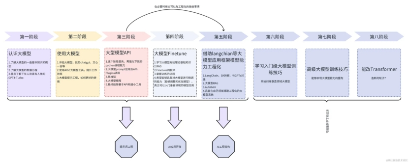

# AI大模型学习路线

整个大模型的学习思路如下图。

 

通过上图我们可以大致总结学习思路，可以将AI大模型学习分为三个大板块：

## 模型基础

学习：大模型基础概念、了解大模型种类、大模型架构、大模型发展历史、国产大模型、提示词工程。

目的：次阶段要求从应用层面上了解模型架构、分类、发展历史等，对模型有最基础的认识。

练习：能够熟练构建高效的提示词工程，提升模型使用效率。

## 模型应用

学习：借助模型API、LangChain框架、Spring AI框架调用大模型、实现Rag信息检索增强。

目的：此阶段要求通过各种接口和框架调用模型，更全面的了解模型调用机制和使用流程。

练习：能够使用LangChain、Spring AI等框架实现对模型应用以及进行Rag增强。

## 模型部署、微调、训练

学习：深化学习模型框架知识、熟悉模型微调训练流程、使用Transformer和PyTorch等框架部署、微调、训练模型。

目的：此阶段从深度学习和机器学习方面了解模型的底层架构，学习模型训练流程机制，再结合各种框架实现模型的训练以及部署运行。

练习：熟练在本地部署开源大模型，并进行微调训练，达到预期效果。

> 注意：以上内容来自网络资料总结，不一定正确有效。

## 资料来源

[作为普通程序员，我们该如何学习大模型（LLM），学习路线和知识体系_大模型学习路径-CSDN博客](https://blog.csdn.net/youmaob/article/details/137670378)

[AI大模型入门教程，学习路线(非常详细)，从零基础入门到精通，从看这篇开始！_ai的基础知识教程-CSDN博客](https://blog.csdn.net/star_nwe/article/details/143202509)

[墙裂推荐！2024最新的大模型学习路线整理出来了，17分钟全程介绍AI大模型干货内容，各个知识点逐一讲解，配套视频资料，轻松搞定AI大模型！_哔哩哔哩_bilibili](https://www.bilibili.com/video/BV13ceAezEUd/?vd_source=6f12eac1da397b0efdd20e02514a56f9)