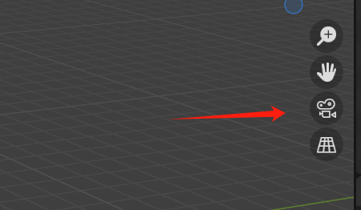
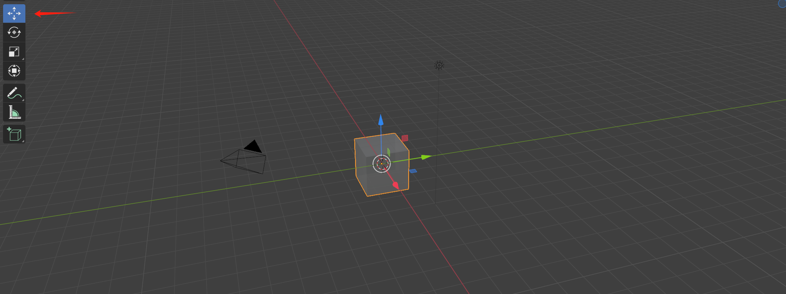
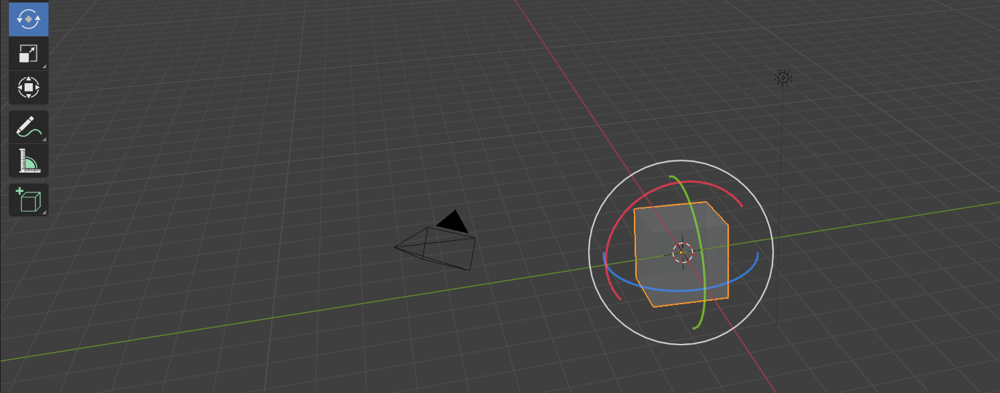
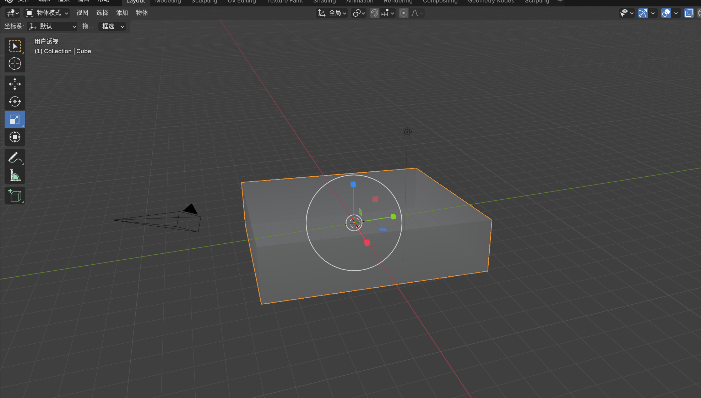
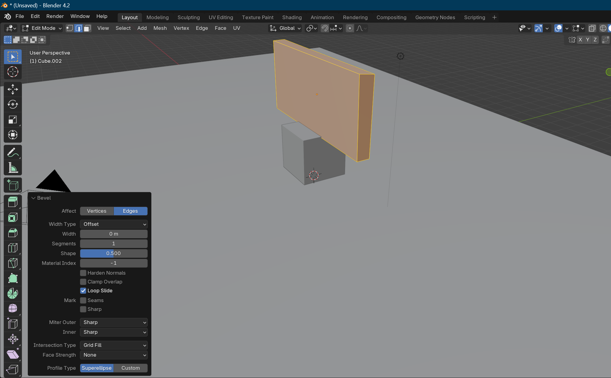
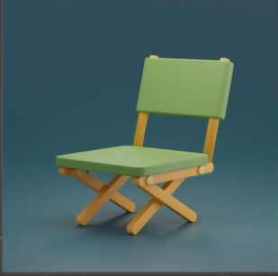

# My Blender Learning Diary

## 1.基础知识

著名诗人陈洪平曾说，基础概念，要理解。在Blender中也是如此

在建模中，主要由 模型，照相机，灯光组成，以下是一些基础操作

**按住鼠标中间可以观察这个模型**

**按住Shift+鼠标中键可以进行平移**

**Shift + A可以新建一个物体**

点击这个按钮，会显示摄像机看到的样子，即最后渲染出的样子

点击左上角的游标，会显示XYZ轴，进行拖动可移动物体的位置

点击旋转按钮，可对物体进行旋转

点击缩放，可对物体大小进行调整（图为陈洪平和肖云云睡觉的床）

## 2.Shortcuts

我们可以看出，如果只用鼠标进行操作，效率非常低，因此需要常常用到快捷键

**单击物体并按下G，进入移动模式，此时按下XYZ可以在某一条轴上进行移动。**

**单机物体并按下S，进入缩放状态，其余同理**

**单击物体并按下R，进行旋转状态，其余同理**

**按右键可以退出**

**Alt + G/S/R可以回到初始状态**

**按H可以隐藏物体**

**Shift+H可以隐藏未被选中的物体**

**Shift + D是移动并复制一个物体**

**点击数字键盘的1379可以进行视图的切换**

**按下/键可以独立显示**

## 3.物体打磨

左上角进入编辑模式后点击第二个边模式，选中所有的边后点击ctrl＋B，点击右下角的倒角按钮进行设置

4.课后作业

根据以下图片做一个小凳子

