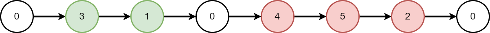
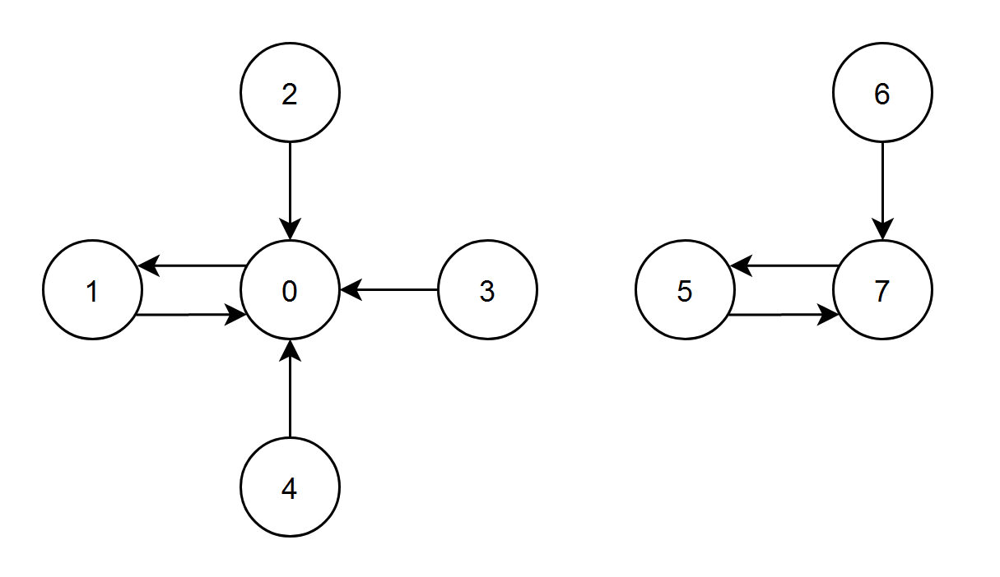

# Sql题解

## [1075. 项目员工 I](https://leetcode.cn/problems/project-employees-i/)(简单)

项目表 `Project`： 

```sql
+-------------+---------+
| Column Name | Type    |
+-------------+---------+
| project_id  | int     |
| employee_id | int     |
+-------------+---------+
主键为 (project_id, employee_id)。
employee_id 是员工表 Employee 表的外键。
```

员工表 `Employee`：

```
+------------------+---------+
| Column Name      | Type    |
+------------------+---------+
| employee_id      | int     |
| name             | varchar |
| experience_years | int     |
+------------------+---------+
主键是 employee_id。
```

请写一个 SQL 语句，查询每一个项目中员工的 **平均** 工作年限，**精确到小数点后两位**。

查询结果的格式如下：

```sql
Project 表：
+-------------+-------------+
| project_id  | employee_id |
+-------------+-------------+
| 1           | 1           |
| 1           | 2           |
| 1           | 3           |
| 2           | 1           |
| 2           | 4           |
+-------------+-------------+

Employee 表：
+-------------+--------+------------------+
| employee_id | name   | experience_years |
+-------------+--------+------------------+
| 1           | Khaled | 3                |
| 2           | Ali    | 2                |
| 3           | John   | 1                |
| 4           | Doe    | 2                |
+-------------+--------+------------------+

Result 表：
+-------------+---------------+
| project_id  | average_years |
+-------------+---------------+
| 1           | 2.00          |
| 2           | 2.50          |
+-------------+---------------+
第一个项目中，员工的平均工作年限是 (3 + 2 + 1) / 3 = 2.00；第二个项目中，员工的平均工作年限是 (3 + 2) / 2 = 2.50
```

我的题解:

```sql
select 
P.project_id as project_id, 
round(avg(E.experience_years),2) as average_years
from Project as p,Employee as E
where p.employee_id = E.employee_id
group by P.project_id
```

注意:题目要求保留两位小数，需要使用round函数来保留两位小数

最优题解:

```sql
SELECT
    project_id,
    ROUND(AVG(e.experience_years),2)  AS average_years
FROM
    Project as p 
LEFT JOIN
    Employee as e
ON
    p.employee_id = e.employee_id
GROUP BY
    p.project_id
```

## [175. 组合两个表](https://leetcode.cn/problems/combine-two-tables/)(简单)

表: `Person`

```sql
+-------------+---------+
| 列名         | 类型     |
+-------------+---------+
| PersonId    | int     |
| FirstName   | varchar |
| LastName    | varchar |
+-------------+---------+
personId 是该表的主键（具有唯一值的列）。
该表包含一些人的 ID 和他们的姓和名的信息。
```

表: `Address`

```sql
+-------------+---------+
| 列名         | 类型    |
+-------------+---------+
| AddressId   | int     |
| PersonId    | int     |
| City        | varchar |
| State       | varchar |
+-------------+---------+
addressId 是该表的主键（具有唯一值的列）。
该表的每一行都包含一个 ID = PersonId 的人的城市和州的信息。
```

编写解决方案，报告 `Person` 表中每个人的姓、名、城市和州。如果 `personId` 的地址不在 `Address` 表中，则报告为 `null` 。

以 **任意顺序** 返回结果表。

结果格式如下所示。

**示例 1:**

```sql
输入: 
Person表:
+----------+----------+-----------+
| personId | lastName | firstName |
+----------+----------+-----------+
| 1        | Wang     | Allen     |
| 2        | Alice    | Bob       |
+----------+----------+-----------+
Address表:
+-----------+----------+---------------+------------+
| addressId | personId | city          | state      |
+-----------+----------+---------------+------------+
| 1         | 2        | New York City | New York   |
| 2         | 3        | Leetcode      | California |
+-----------+----------+---------------+------------+
输出: 
+-----------+----------+---------------+----------+
| firstName | lastName | city          | state    |
+-----------+----------+---------------+----------+
| Allen     | Wang     | Null          | Null     |
| Bob       | Alice    | New York City | New York |
+-----------+----------+---------------+----------+
解释: 
地址表中没有 personId = 1 的地址，所以它们的城市和州返回 null。
addressId = 1 包含了 personId = 2 的地址信息。
```

我的题解:

```sql
select
p.firstName,
p.lastName,
a.city,
a.state
from 
Person as p
left join
Address as a
on a.personId = p.personId 
```

注意:两表为非对等表，并且不存在的返回null所以使用`left join`更好

最优题解:


## [1193. 每月交易 I](https://leetcode.cn/problems/monthly-transactions-i/)(中等)

表：`Transactions`

```
+---------------+---------+
| Column Name   | Type    |
+---------------+---------+
| id            | int     |
| country       | varchar |
| state         | enum    |
| amount        | int     |
| trans_date    | date    |
+---------------+---------+
id 是这个表的主键。
该表包含有关传入事务的信息。
state 列类型为 ["approved", "declined"] 之一。
```

 

编写一个 sql 查询来查找每个月和每个国家/地区的事务数及其总金额、已批准的事务数及其总金额。

以 **任意顺序** 返回结果表。

查询结果格式如下所示。

 

**示例 1:**

```
输入：
Transactions table:
+------+---------+----------+--------+------------+
| id   | country | state    | amount | trans_date |
+------+---------+----------+--------+------------+
| 121  | US      | approved | 1000   | 2018-12-18 |
| 122  | US      | declined | 2000   | 2018-12-19 |
| 123  | US      | approved | 2000   | 2019-01-01 |
| 124  | DE      | approved | 2000   | 2019-01-07 |
+------+---------+----------+--------+------------+
输出：
+----------+---------+-------------+----------------+--------------------+-----------------------+
| month    | country | trans_count | approved_count | trans_total_amount | approved_total_amount |
+----------+---------+-------------+----------------+--------------------+-----------------------+
| 2018-12  | US      | 2           | 1              | 3000               | 1000                  |
| 2019-01  | US      | 1           | 1              | 2000               | 2000                  |
| 2019-01  | DE      | 1           | 1              | 2000               | 2000                  |
+----------+---------+-------------+----------------+--------------------+-----------------------+
```

==**注意:此题需要先对时间时间和国家分组，然后再通过再count和sum函数中添加条件来求解**==

我的题解:

```sql
# Write your MySQL query statement below
select 
date_format(t.trans_date,'%Y-%m') as month,
t.country,
count(t.id) as trans_count,
count(if(t.state='approved',1,null)) as approved_count,
sum(t.amount) as trans_total_amount,
sum(if(t.state = 'approved',t.amount,0)) as approved_total_amount
from Transactions as t
group by YEAR(t.trans_date)-MONTH(t.trans_date),t.country
```

最优题解:

```sql
select date_format(trans_date,"%Y-%m") month,country,
count(id) trans_count,# 总事务数
count(if(state="approved",amount,null)) approved_count, #批准事物数
sum(amount) trans_total_amount, # 总金额
sum(if(state="approved",amount,0)) approved_total_amount # 如果批准 则求总
from Transactions
group by month,country
```

## [1890. 2020年最后一次登录](https://leetcode.cn/problems/the-latest-login-in-2020/)(简单)

表: `Logins`

```
+----------------+----------+
| 列名           | 类型      |
+----------------+----------+
| user_id        | int      |
| time_stamp     | datetime |
+----------------+----------+
(user_id, time_stamp) 是这个表的主键(具有唯一值的列的组合)。
每一行包含的信息是user_id 这个用户的登录时间。
```

 

编写解决方案以获取在 `2020` 年登录过的所有用户的本年度 **最后一次** 登录时间。结果集 **不** 包含 `2020` 年没有登录过的用户。

返回的结果集可以按 **任意顺序** 排列。

返回结果格式如下例。

 

**示例 1:**

```
输入：
Logins 表:
+---------+---------------------+
| user_id | time_stamp          |
+---------+---------------------+
| 6       | 2020-06-30 15:06:07 |
| 6       | 2021-04-21 14:06:06 |
| 6       | 2019-03-07 00:18:15 |
| 8       | 2020-02-01 05:10:53 |
| 8       | 2020-12-30 00:46:50 |
| 2       | 2020-01-16 02:49:50 |
| 2       | 2019-08-25 07:59:08 |
| 14      | 2019-07-14 09:00:00 |
| 14      | 2021-01-06 11:59:59 |
+---------+---------------------+
输出：
+---------+---------------------+
| user_id | last_stamp          |
+---------+---------------------+
| 6       | 2020-06-30 15:06:07 |
| 8       | 2020-12-30 00:46:50 |
| 2       | 2020-01-16 02:49:50 |
+---------+---------------------+
解释：
6号用户登录了3次，但是在2020年仅有一次，所以结果集应包含此次登录。
8号用户在2020年登录了2次，一次在2月，一次在12月，所以，结果集应该包含12月的这次登录。
2号用户登录了2次，但是在2020年仅有一次，所以结果集应包含此次登录。
14号用户在2020年没有登录，所以结果集不应包含。
```

注意:此题需要以用户id分组并且还需要对时间进行max()来获得最后时间

我的题解:

```sql
select
l.user_id,
max(l.time_stamp) as last_stamp
from Logins as l
where year(l.time_stamp)  = '2020'
group by l.user_id
```

最优题解:

```sql
# Write your MySQL query statement below
select user_id,max(time_stamp) last_stamp from Logins where year(time_stamp)=2020 group by user_id;
```


# 算法题解

## [53. 最大子数组和](https://leetcode.cn/problems/maximum-subarray/)(中等)

给你一个整数数组 `nums` ，请你找出一个具有最大和的连续子数组（子数组最少包含一个元素），返回其最大和。**子数组**是数组中的一个连续部分。

**示例 1：**

```
输入：nums = [-2,1,-3,4,-1,2,1,-5,4]
输出：6
解释：连续子数组 [4,-1,2,1] 的和最大，为 6 。
```

**示例 2：**

```
输入：nums = [1]
输出：1
```

**示例 3：**

```
输入：nums = [5,4,-1,7,8]
输出：23
```

 

**提示：**

- `1 <= nums.length <= 105`
- `-104 <= nums[i] <= 104`

 

**进阶：**如果你已经实现复杂度为 `O(n)` 的解法，尝试使用更为精妙的 **分治法** 求解。

使用动态规划解题:

第一步**思考每轮的决策，定义状态，从而得到 dp 表**

每一轮决策为数组nums[i]是否可以放在子数组中，放入和不放入状态i+1

所以状态为[i]对应的子问题:==**数组前i个数中子数组的最大和，记为dp[i]**==

第二步**找出最优子结构，进而推导出状态转移方程**

对于状态dp[i]是由dp[i-1]+nums[i-1]和nums[i]组成的
$$
dp[i] = max(dp[i-1]+nums[i-1],nums[i-1])
$$
第三步**确定边界条件和状态转移顺序**

此题dp长度为nums的len+1，dp[0]表示数组前0个数中的子数组最大和应该为0,既dp[0] = 0。状态应该由1开始一直到数组长度。

 我的题解:

```py
def maxNumber(nums: List[int]) -> int:
    dp = [0] * (len(nums) + 1)
    dp[1] = nums[0]
    m = dp[1]
    for i in range(2, len(nums) + 1):
        dp[i] = max(dp[i - 1] + nums[i - 1], nums[i - 1])
        if dp[i] > m:
            m = dp[i]

    return m
```

最优题解:

```py
    def maxSubArray(self, nums: List[int]) -> int:
        pre = 0  # 以某个数结尾的最大数组和
        max_nums = nums[0]  # 当前数组的最大子序和
        for num in nums:
            pre = max(pre + num, num)  # 不断迭代 pre 十分关键
            max_nums = max(max_nums, pre)
        return max_nums
```

相对于我的优化了空间复杂度。

## [3127. 构造相同颜色的正方形](https://leetcode.cn/problems/make-a-square-with-the-same-color/)(简单)

给你一个二维 `3 x 3` 的矩阵 `grid` ，每个格子都是一个字符，要么是 `'B'` ，要么是 `'W'` 。字符 `'W'` 表示白色，字符 `'B'` 表示黑色。

你的任务是改变 **至多一个** 格子的颜色，使得矩阵中存在一个 `2 x 2` 颜色完全相同的正方形。

如果可以得到一个相同颜色的 `2 x 2` 正方形，那么返回 `true` ，否则返回 `false` 。

**示例 1：**

```
输入：grid = [["B","W","B"],["B","W","W"],["B","W","B"]]
输出：true
解释：
修改 `grid[0][2]` 的颜色，可以满足要求。
```

**示例 2：**

```
输入：grid = [["B","W","B"],["W","B","W"],["B","W","B"]]
输出：false
解释：
只改变一个格子颜色无法满足要求。
```

**示例 3：**

```
输入：grid = [["B","W","B"],["B","W","W"],["B","W","W"]]
输出：true
解释：
`grid` 已经包含一个 `2 x 2` 颜色相同的正方形了。
```

**提示：**

- `grid.length == 3`
- `grid[i].length == 3`
- `grid[i][j]` 要么是 `'W'` ，要么是 `'B'` 。

我的题解:

暴力枚举，直接检查四个角的2 x 2正方形颜色是否相同，相同则返回true，不相同检查与中心点颜色不同的个数

```java
public boolean canMakeSquare1(char[][] grid) {
        //分别要检查[0,0]、[0,1]、[1,0]、[1,1]这四个点为左上角的2 x 2正方形
        int[][] cks = {{0, 0}, {0, 1}, {1, 0}, {1, 1}};
        Map<Character, Integer> map = new HashMap<>();
        for (int[] ck : cks) {
            int x = ck[0];
            int y = ck[1];
            //获取四角的颜色并记录个数
            map.put(grid[x][y], map.getOrDefault(grid[x][y], 0) + 1);
            map.put(grid[x + 1][y], map.getOrDefault(grid[x + 1][y], 0) + 1);
            map.put(grid[x][y + 1], map.getOrDefault(grid[x][y + 1], 0) + 1);
            map.put(grid[x + 1][y + 1], map.getOrDefault(grid[x + 1][y + 1], 0) + 1);
            //如果只有一种颜色，则返回true
            if (map.size() == 1) {
                return true;
            }
            Integer blackNum = map.get('B');
            Integer whiteNum = map.get('W');
            //如果四个角只有一个颜色不同，则返回true
            if (blackNum == 1 || whiteNum == 1) {
                return true;
            }
            map.clear();
        }
        return false;

    }
```

最优题解:官方解法，如果黑色或白色为2那么就不能构成2 x 2正方形，否则可以构成

```java
public boolean canMakeSquare2(char[][] grid) {
        for (int i = 0; i <= 1; i++) {
            for (int j = 0; j <= 1; j++) {
                int count = 0;
                for (int k = i; k <= i + 1; k++) {
                    for (int l = j; l <= j + 1; l++) {
                        if (grid[k][l] == 'B') {
                            count++;
                        }
                    }
                }
                if (count != 2) {
                    return true;
                }
            }
        }
        return false;
    }
```

## [3153. 所有数对中数位差之和](https://leetcode.cn/problems/sum-of-digit-differences-of-all-pairs/)(中等)

你有一个数组 `nums` ，它只包含 **正** 整数，所有正整数的数位长度都 **相同** 。

两个整数的 **数位差** 指的是两个整数 **相同** 位置上不同数字的数目。

请你返回 `nums` 中 **所有** 整数对里，**数位差之和。**

**示例 1：**

>**输入：**nums = [13,23,12]
>
>**输出：**4
>
>**解释：**
>计算过程如下：
>\- **1**3 和 **2**3 的数位差为 1 。
>\- 1**3** 和 1**2** 的数位差为 1 。
>\- **23** 和 **12** 的数位差为 2 。
>所以所有整数数对的数位差之和为 `1 + 1 + 2 = 4` 。

**示例 2：**

>**输入：**nums = [10,10,10,10]
>
>**输出：**0
>
>**解释：**
>数组中所有整数都相同，所以所有整数数对的数位不同之和为 0 。

**提示：**

- `2 <= nums.length <= 105`
- `1 <= nums[i] < 109`
- `nums` 中的整数都有相同的数位长度。

**我的题解：**

使用双层循环遍历数组，计算每一个数字的数位差，数位差的计算过程为使用循环除10,此方法超时，==不可用==。

```java
    public long sumDigitDifferences1(int[] nums) {
        long sum = 0;
        int l = nums.length;
        for (int i = 0; i < l - 1; i++) {
            for (int j = i + 1; j < l; j++) {
                sum += getDiff(nums[i], nums[j]);
            }
        }
        return sum;
    }


    public static long getDiff(int a, int b) {
        long diff = 0;
        while (a > 0 || b > 0) {
            diff += Math.abs(a % 10 - b % 10) == 0 ? 0 : 1;
            a /= 10;
            b /= 10;
        }
        return diff;
    }
```

**最优题解:**

依次计算每一位数位上所有整数对中，数位不同的次数。然后对所有数位的次数求和。我们从最低位开始，最低位的数字是 num[i]%10。用一个长度为 10 的数组 cnt 统计每个数字出现的次数。那么，这一位上数位不同的次数即为 

$(\sum_{i=1}^9(n-cnt[i])\times cnt[i])\div 2$

其中 n 是数组 num 的长度。举例说明，该数位上，0 出现了 cnt[0] 次，那么其他数字就会出现 n−cnt[0] 次，那么数位不同的次数中，包含 0 的情况就有 cnt[0]×(n−cnt[0]) 次。但是这个次数，会在计算其他数字时也被计算一次，所以最后结果要除以 2。

同时我们将 num[i] 更新为 num[i]/10，方便计算下一数位，直到所有 num[i] 变为 0。

```java
    public long sumDigitDifferences2(int[] nums) {
        long res = 0;
        int n = nums.length;
        while (nums[0] > 0) {
            int[] cnt = new int[10];
            for (int i = 0; i < n; i++) {
                cnt[nums[i] % 10]++;
                nums[i] /= 10;
            }
            for (int i = 0; i < 10; i++) {
                res += (long) (n - cnt[i]) * cnt[i];
            }
        }
        return res / 2;
    }
```

## [2708. 一个小组的最大实力值](https://leetcode.cn/problems/maximum-strength-of-a-group/)(中等)

给你一个下标从 **0** 开始的整数数组 `nums` ，它表示一个班级中所有学生在一次考试中的成绩。老师想选出一部分同学组成一个 **非空** 小组，且这个小组的 **实力值** 最大，如果这个小组里的学生下标为 `i0`, `i1`, `i2`, ... , `ik` ，那么这个小组的实力值定义为 `nums[i0] * nums[i1] * nums[i2] * ... * nums[ik]` 。

请你返回老师创建的小组能得到的最大实力值为多少。

**示例 1：**

>输入：nums = [3,-1,-5,2,5,-9]
>输出：1350
>解释：一种构成最大实力值小组的方案是选择下标为 [0,2,3,4,5] 的学生。实力值为 3 * (-5) * 2 * 5 * (-9) = 1350 ，这是可以得到的最大实力值。

**示例 2：**

>输入：nums = [-4,-5,-4]
>输出：20
>解释：选择下标为 [0, 1] 的学生。得到的实力值为 20 。我们没法得到更大的实力值。

**提示：**

- `1 <= nums.length <= 13`
- `-9 <= nums[i] <= 9`

**我的题解:**

使用枚举遍历数组，要求取最大值，则需要数组中的全部正数和偶数个负数。

```java
public long maxStrength1(int[] nums) {
        if (nums.length == 1) {
            return nums[0];
        }
        long times = 1;
        //排序
        Arrays.sort(nums);
        int size = nums.length;
        int negNumberIndex = -1;
        for (int i = size - 1; i >= 0; i--) {
            //处理0出现的情况
            if (nums[i] == 0) {
                if (i == size - 1) {
                    int negIndex = -1;
                    for (int j = i; j >= 0; j--) {
                        if (nums[j] < 0) {
                            negIndex = j;
                            break;
                        }
                    }
                    if (negIndex == -1 || negIndex == 0) {
                        return 0;
                    }
                }
                continue;
            }
            if (nums[i] < 0) {
                negNumberIndex = i;
                break;
            }
            times *= nums[i];
        }
        if (negNumberIndex == -1 || negNumberIndex == 0) {
            return times;
        }
        int negNumCount = negNumberIndex + 1;
        if (negNumCount % 2 != 0) {
            negNumberIndex--;
        }
        for (int i = negNumberIndex; i >= 0; i--) {
            times *= nums[i];
        }
        return times;
    }
```

**最优题解:**

这道题实际上是求所有元素都为整数的数组的子序列的最大积，从最大积的正负性入手。

- 当数组仅有 1 个元素且为负数时，最大积为负数。
- 当数组不包含正数，且负数元素小于等于 1 个时，最大积为 0。
- 其他情况下，最大积为正数。那么如何求这个最大积呢？可以将所有非 0 元素求积，如果乘积为正数，则为最大积。如果乘积为负数，则说明乘积中包含奇数个负数，此时将这个乘积除以最大负数则为最大积。

```java
    public long maxStrength2(int[] nums) {
        int negativeCount = 0, zeroCount = 0, positiveCount = 0;
        long prod = 1;
        int maxNegative = -9;
        for (int num : nums) {
            if (num < 0) {
                negativeCount++;
                prod *= num;
                maxNegative = Math.max(maxNegative, num);
            } else if (num == 0) {
                zeroCount++;
            } else {
                prod *= num;
                positiveCount++;
            }
        }
        if (negativeCount == 1 && zeroCount == 0 && positiveCount == 0) {
            return nums[0];
        }
        if (negativeCount <= 1 && positiveCount == 0) {
            return 0;
        }
        if (prod < 0) {
            return prod / maxNegative;
        } else {
            return prod;
        }
    }
```

## [3174. 清除数字](https://leetcode.cn/problems/clear-digits/)(简单)

给你一个字符串 `s` 。

你的任务是重复以下操作删除 **所有** 数字字符：

- 删除 **第一个数字字符** 以及它左边 **最近** 的 **非数字** 字符。

请你返回删除所有数字字符以后剩下的字符串。

 

**示例 1：**

**输入：**s = "abc"

**输出：**"abc"

**解释：**

字符串中没有数字。

**示例 2：**

**输入：**s = "cb34"

**输出：**""

**解释：**

一开始，我们对 `s[2]` 执行操作，`s` 变为 `"c4"` 。

然后对 `s[1]` 执行操作，`s` 变为 `""` 。

**提示：**

- `1 <= s.length <= 100`
- `s` 只包含小写英文字母和数字字符。
- 输入保证所有数字都可以按以上操作被删除。

**我的题解:**

因为需要处理重复的操作，从而使用递归来执行删除数字的操作。

```java
    public String clearDigits1(String s) {
        return clearDigitsHelp(0, new StringBuilder(s));
    }

    public String clearDigitsHelp(int startIndex, StringBuilder sb) {
        int length = sb.length();
        for (int i = startIndex; i < length; i++) {
            if (Character.isDigit(sb.charAt(i))) {
                sb.deleteCharAt(i);
                if (i - 1 >= 0) {
                    sb.deleteCharAt(i - 1);
                }
                return clearDigitsHelp(i - 1, sb);
            }
        }
        return sb.toString();
    }
```

**官方题解:**

根据题意，我们可以使用栈来模拟所有操作。首先遍历字符串 s，令当前访问的字符为 c，有两种情况：

- c 为数字，那么我们将栈顶字符弹出。

- c 不为数字，那么我们将 c 压入栈中。


最后返回栈中自底向上的所有字符组成的字符串为结果。

```java
public String clearDigits2(String s) {
    StringBuilder res = new StringBuilder();
    for (char c : s.toCharArray()){
        if (Character.isDigit(c)) {
            res.deleteCharAt(res.length() - 1);
        } else {
            res.append(c);
        }
    }
    return res.toString();
}
```

## [2860. 让所有学生保持开心的分组方法数](https://leetcode.cn/problems/happy-students/)(中等)

给你一个下标从 **0** 开始、长度为 `n` 的整数数组 `nums` ，其中 `n` 是班级中学生的总数。班主任希望能够在让所有学生保持开心的情况下选出一组学生：

如果能够满足下述两个条件之一，则认为第 `i` 位学生将会保持开心：

- 这位学生被选中，并且被选中的学生人数 **严格大于** `nums[i]` 。
- 这位学生没有被选中，并且被选中的学生人数 **严格小于** `nums[i]` 。

返回能够满足让所有学生保持开心的分组方法的数目。

**示例 1：**

>输入：nums = [1,1]
>
>输出：2
>
>解释：
>
>有两种可行的方法：
>
>班主任没有选中学生。
>
>班主任选中所有学生形成一组。 
>
>如果班主任仅选中一个学生来完成分组，那么两个学生都无法保持开心。因此，仅存在两种可行的方法。

**示例 2：**

>输入：nums = [6,0,3,3,6,7,2,7]
>
>输出：3
>
>解释：
>
>存在三种可行的方法：
>
>班主任选中下标为 1 的学生形成一组。
>
>班主任选中下标为 1、2、3、6 的学生形成一组。
>
>班主任选中所有学生形成一组。 

**提示：**

- `1 <= nums.length <= 105`
- `0 <= nums[i] < nums.length`

**我的题解:**

按照题目的要求可以发现我们只能按顺序选中对应数字，不能跳过某些数字，所以我们可以先排序，又因为我们可以现在最多`nums.length`个数字最小可以选择`0`个数字，所以我们使用循环判断每次选中是否可行。注意这里的排序很影响时间复杂度，使用`Collection`的排序要快许多。

```java
public int countWays1(List<Integer> nums) {
    //记录方法数
    int countWay = 0;
    int size = nums.size();
    //从小到大排序
    Collections.sort(nums);
    int max = nums.get(size - 1);
    for (int i = 0; i <= max; i++) {
        //这里的i表示选中的数的个数最小0个，最大size-1个
        if (i < nums.get(i) && (i == 0 || nums.get(i - 1) < i)) {
            countWay++;
        }
    }
    if (size > nums.get(size - 1)) {
        countWay++;
    }
    return countWay;
}
```

**最优题解:**

根据题意可知，假设数组 nums 的长度为 n，此时设选中学生人数为 k，此时 k∈[0,n]，k 应满足如下：

- 所有满足 nums[i]<k 的学生应被选中；

- 所有满足 nums[i]>k 的学生不应被选中；

- 不能存在 nums[i]=k 的学生；


这意味着在确定当前已择中学生人数的前提下，则此时选择方案是唯一的，为方便判断，我们把 nums 从小到大排序。我们枚举选中的人数 k，由于 nums 已有序，此时最优分组一定是前 k 个学生被选中，剩余的 n−k 个学生不被选中，此时只需要检测选中的 k 个学生中的最大值是否满足小于 k，未被选中的学生中的最小值是否满足大于 k 即可，如果同时满足上述两个条件，则该分配方案可行，最终返回可行的方案计数即可，需要注意处理好边界 0 与 n。

```java
public int countWays2(List<Integer> nums) {
    int n = nums.size();
    int res = 0;
    Collections.sort(nums);
    for (int k = 0; k <= n; k++) {
        // 前 k 个元素的最大值是否小于 k
        if (k > 0 && nums.get(k - 1) >= k) {
            continue;
        }
        // 后 n - k 个元素的最小值是否大于 k
        if (k < n && nums.get(k) <= k) {
            continue;
        }
        res++;
    }
    return res;
}
```

## [3176. 求出最长好子序列 I](https://leetcode.cn/problems/find-the-maximum-length-of-a-good-subsequence-i/)(中等)(动态规划)

给你一个整数数组 `nums` 和一个 **非负** 整数 `k` 。如果一个整数序列 `seq` 满足在下标范围 `[0, seq.length - 2]` 中 **最多只有** `k` 个下标 `i` 满足 `seq[i] != seq[i + 1]` ，那么我们称这个整数序列为 **好** 序列。

请你返回 `nums` 中 **好** 子序列的最长长度。

**示例 1：**

>**输入：**nums = [1,2,1,1,3], k = 2
>
>**输出：**4
>
>**解释：**
>
>最长好子序列为 [<u>1</u>,<u>2</u>,<u>1</u>,<u>1</u>,3] 。

**示例 2：**

>**输入：**nums = [1,2,3,4,5,1], k = 0
>
>**输出：**2
>
>**解释：**
>
>最长好子序列为 [<u>1</u>,2,3,4,5,<u>1</u>]。

**提示：**

- `1 <= nums.length <= 500`
- `1 <= nums[i] <= 109`
- `0 <= k <= min(nums.length, 25)`

**我的题解:**

我使用动态规划实现，但是不能构成全部子序列，==不可用==。

```java
public int maximumLength1(int[] nums, int k) {
    if (nums.length == 1) {
        return 1;
    }
    int size = nums.length;

    //使用动态规划 dp[i][0]表示以nums[i]开头的子序列的最大长度,dp[i][1]表示比较次数
    int[][] dp = new int[size][2];
    //初始状态
    dp[size - 1] = new int[]{1, 0};
    if (nums[size - 2] == nums[size - 1]) {
        dp[size - 2] = new int[]{2, 0};
    } else {
        dp[size - 2] = k > 0 ? new int[]{2, 1} : new int[]{1, 0};
    }
    int maxLength = Math.max(dp[size - 1][0], dp[size - 2][0]);
    for (int i = size - 3; i >= 0; i--) {
        dp[i] = new int[]{1, 0};
        for (int j = i + 1; j < size; j++) {
            int count = nums[i] == nums[j] ? 0 : 1;
            if (count + dp[j][1] <= k) {
                if (dp[i][0] < dp[j][0]+1) {
                    dp[i][0] = dp[j][0] + 1;
                    dp[i][1] = dp[j][1] + count;
                }
            }
        }
        maxLength = Math.max(maxLength, dp[i][0]);
    }
    return maxLength;
}
```

**最优题解:**

很容易想到用 `dp[i][j]` 来表示以 nums[i] 结尾组成的最长合法序列的长度，序列中有 j 个数字与其在序列中的后一个数字不相等。其中 i 的取值为 nums 的长度，j 不超过 k。初始时，有 `dp[i][0]=1`。对于转移，可以枚举每一个满足 x<i 的下标，有：

`dp[i][j]` = max~j~`dp[x][j-(nums[x] != nums[i])]`+1

```java
public int maximumLength2(int[] nums, int k) {
    int ans = 0;
    int len = nums.length;
    int[][] dp = new int[len][51];
    for (int i = 0; i < len; i++) {
        Arrays.fill(dp[i], -1);
    }

    for (int i = 0; i < len; i++) {
        dp[i][0] = 1;
        for (int l = 0; l <= k; l++) {
            for (int j = 0; j < i; j++) {
                int add = nums[i] != nums[j] ? 1 : 0;
                if (l - add >= 0 && dp[j][l - add] != -1) {
                    dp[i][l] = Math.max(dp[i][l], dp[j][l - add] + 1);
                }
            }
            ans = Math.max(ans, dp[i][l]);
        }
    }

    return ans;
}
```

**优化题解:**

还能对时间复杂度做进一步的优化，实际上，我们只需要枚举两种情况：

- nums[i] != nums[x]，对于此情况可以维护一个长度为 k 的辅助数组 zd。其中 zd[j] 表示枚举到 i 前有 j 个与其在序列中的后一个不相等的合法序列最长长度，有转移 `dp[i][j]`=max~j~zd[j-1]+1 

- nums[i]=nums[x]，假设有下标 a<b<c， 并且 nums[a]=nums[b]=nums[c]，对于 c 来说如果选取由 a 转移过来计算答案，那么一定不如 a→b→c 更优，所以会选取下标最近的相同的数进行转移。针对这种情况，dp 使用哈希表维护能节省一些空间，并且在哈希表中用 nums[i] 替换 i。


在每一次遍历 i 计算完后更新 zd，最后的 zd[k] 就是答案。

```java
public int maximumLength3(int[] nums, int k) {
    int len = nums.length;
    Map<Integer, int[]> dp = new HashMap<Integer, int[]>();
    int[] zd = new int[k + 1];

    for (int i = 0; i < len; i++) {
        int v = nums[i];
        dp.putIfAbsent(v, new int[k + 1]);

        int[] tmp = dp.get(v);
        for (int j = 0; j <= k; j++) {
            tmp[j] = tmp[j] + 1;
            if (j > 0) {
                tmp[j] = Math.max(tmp[j], zd[j - 1] + 1);
            }
        }
        for (int j = 0; j <= k; j++) {
            zd[j] = Math.max(zd[j], tmp[j]);
            if (j > 0) {
                zd[j] = Math.max(zd[j], zd[j - 1]);
            }
        }
    }
    return zd[k];
}
```

## [3177. 求出最长好子序列 II](https://leetcode.cn/problems/find-the-maximum-length-of-a-good-subsequence-ii/)(困难)(动态规划)

给你一个整数数组 `nums` 和一个 **非负** 整数 `k` 。如果一个整数序列 `seq` 满足在范围下标范围 `[0, seq.length - 2]` 中存在 **不超过** `k` 个下标 `i` 满足 `seq[i] != seq[i + 1]` ，那么我们称这个整数序列为 **好** 序列。

请你返回 `nums` 中 **好** 子序列的最长长度

**示例 1：**

>**输入：**nums = [1,2,1,1,3], k = 2
>
>**输出：**4
>
>**解释：**
>
>最长好子序列为 [**1**,**2**,**1**,**1**,3] 。

**示例 2：**

>**输入：**nums = [1,2,3,4,5,1], k = 0
>
>**输出：**2
>
>**解释：**
>
>最长好子序列为 [**1**,2,3,4,5,**1**] 。

**提示：**

- `1 <= nums.length <= 5 * 10^3^`
- `1 <= nums[i] <= 109`
- `0 <= k <= min(50, nums.length)`

**我的题解:**

使用3176动态规划的解法，但是超出时间限制。

```java
public int maximumLength1(int[] nums, int k) {
    int ans = 0;
    int size = nums.length;
    //这里的dp[i][j]表示以nums[i]结尾，并且存在j个元素与后一个元素不同的最大序列长度。
    int[][] dp = new int[size][k + 1];
    for (int i = 0; i < size; i++) {
        Arrays.fill(dp[i], -1);
    }
    for (int i = 0; i < size; i++) {
        //初始状态为dp[i][0] = 1
        dp[i][0] = 1;
        //在以nums[i]结尾的序列中，循环[0,k]表示该序列有[0,k]个元素与后一个元素不同。
        for (int j = 0; j <= k; j++) {
            //在这里计算dp[i][j]的值。
            for (int l = 0; l < i; l++) {
                int add = nums[i] != nums[l] ? 1 : 0;
                if (j - add >= 0 && dp[l][j - add] != -1) {
                    dp[i][j] = Math.max(dp[i][j], dp[l][j - add] + 1);
                }
            }

            ans = Math.max(ans, dp[i][j]);
        }
    }

    return ans;
}
```

**最优题解:**

我们可以想到用 `dp[i][j]` 来表示以 nums[i] 结尾，其中有 j 个数字与其在序列中的后一个数字不相等的最长合法序列的长度。其中 i 的取值小于 n（n 表示 nums 的长度），j 不超过 k。初始时，有 `dp[i][0]`=1。在转移时，可以枚举每一个满足 x<i 的下标，有：

$$
dp[i][j] = max
\begin{cases}
\ dp[i][j-1]+1, & nums[x] != nums[i] \\
\ dp[i][j]+1, & nums[x] = nums[i]
\end{cases}
$$
但这样的时间复杂度是 $O(n^2k)$，在此题是不可接受的。实际上，我们只需要枚举两种情况：

- nums[x] != nums[i]，对于此情况，可以维护一个长度为 k 的辅助数组 zd。其中 zd[j] 表示枚举到位置 i 之前，有 j 个数字与其在序列中的后一个不相等的最长合法序列的长度，那么可以直接写出转移 `dp[i][j]`=zd[j−1]+1。
- nums[i]=nums[x]，假设有下标 a<b<c，并且 nums[a]=nums[b]=nums[c]，对于 c 来说如果选取由 a 转移过来计算答案，那么一定不如 a→b→c 更优，所以会选取下标最近的相同的数进行转移。针对这种情况，dp 使用哈希表维护能节省一些空间，并且在哈希表中用 nums[i] 替换 i。


在每一次遍历 i 计算完后更新 zd，最后的 zd[k] 就是答案。

```java
public int maximumLength2(int[] nums, int k) {
    int len = nums.length;
    Map<Integer, int[]> dp = new HashMap<Integer, int[]>();
    int[] zd = new int[k + 1];

    for (int i = 0; i < len; i++) {
        int v = nums[i];
        dp.putIfAbsent(v, new int[k + 1]);

        int[] tmp = dp.get(v);
        for (int j = 0; j <= k; j++) {
            tmp[j] = tmp[j] + 1;
            if (j > 0) {
                tmp[j] = Math.max(tmp[j], zd[j - 1] + 1);
            }
        }
        for (int j = 0; j <= k; j++) {
            zd[j] = Math.max(zd[j], tmp[j]);
        }
    }
    return zd[k];
}
```

## [977. 有序数组的平方](https://leetcode.cn/problems/squares-of-a-sorted-array/)(简单)(双指针)

给你一个按 **非递减顺序** 排序的整数数组 `nums`，返回 **每个数字的平方** 组成的新数组，要求也按 **非递减顺序** 排序。

**示例 1：**

>输入：nums = [-4,-1,0,3,10]
>
>输出：[0,1,9,16,100]
>
>解释：平方后，数组变为 [16,1,0,9,100]
>
>排序后，数组变为 [0,1,9,16,100]

**示例 2：**

>输入：nums = [-7,-3,2,3,11]
>
>输出：[4,9,9,49,121]

**提示：**

- `1 <= nums.length <= 104`
- `-104 <= nums[i] <= 104`
- `nums` 已按 **非递减顺序** 排序

**进阶：**

- 请你设计时间复杂度为 `O(n)` 的算法解决本问题

**我的题解:**

数组有序，并且有正负数，所以平方后最大值两端，我们只需要取两端最大的值填入结果最后。

```java
public int[] sortedSquares1(int[] nums) {
    int size = nums.length;
    int[] res = new int[size];
    int left = 0;
    int right = size - 1;
    //数组有序，并且有正负数，所以平方后最大值在两端用双指针
    int index = size - 1;
    while (index >= 0) {
        int leftNum = nums[left] * nums[left];
        int rightNum = nums[right] * nums[right];
        if (leftNum > rightNum) {
            res[index--] = leftNum;
            left++;
        } else {
            res[index--] = rightNum;
            right--;
        }

    }
    return res;
}
```

**最优题解:**

显然，如果数组 nums 中的所有数都是非负数，那么将每个数平方后，数组仍然保持升序；如果数组 nums 中的所有数都是负数，那么将每个数平方后，数组会保持降序。

这样一来，如果我们能够找到数组 nums 中负数与非负数的分界线，那么就可以用类似「归并排序」的方法了。具体地，我们设 neg 为数组 nums 中负数与非负数的分界线，也就是说，nums[0] 到 nums[neg] 均为负数，而 nums[neg+1] 到 nums[n−1] 均为非负数。当我们将数组 nums 中的数平方后，那么 nums[0] 到 nums[neg] 单调递减，nums[neg+1] 到 nums[n−1] 单调递增。

由于我们得到了两个已经有序的子数组，因此就可以使用归并的方法进行排序了。具体地，使用两个指针分别指向位置 neg 和 neg+1，每次比较两个指针对应的数，选择较小的那个放入答案并移动指针。当某一指针移至边界时，将另一指针还未遍历到的数依次放入答案。

```java
public int[] sortedSquares2(int[] nums) {
    int n = nums.length;
    int negative = -1;
    for (int i = 0; i < n; ++i) {
        if (nums[i] < 0) {
            negative = i;
        } else {
            break;
        }
    }

    int[] ans = new int[n];
    int index = 0, i = negative, j = negative + 1;
    while (i >= 0 || j < n) {
        if (i < 0) {
            ans[index] = nums[j] * nums[j];
            ++j;
        } else if (j == n) {
            ans[index] = nums[i] * nums[i];
            --i;
        } else if (nums[i] * nums[i] < nums[j] * nums[j]) {
            ans[index] = nums[i] * nums[i];
            --i;
        } else {
            ans[index] = nums[j] * nums[j];
            ++j;
        }
        ++index;
    }

    return ans;
}
```

同样地，我们可以使用两个指针分别指向位置 0 和 n−1，每次比较两个指针对应的数，选择较大的那个逆序放入答案并移动指针。这种方法无需处理某一指针移动至边界的情况，读者可以仔细思考其精髓所在

```java
public int[] sortedSquares3(int[] nums) {
    int n = nums.length;
    int[] ans = new int[n];
    for (int i = 0, j = n - 1, pos = n - 1; i <= j;) {
        if (nums[i] * nums[i] > nums[j] * nums[j]) {
            ans[pos] = nums[i] * nums[i];
            ++i;
        } else {
            ans[pos] = nums[j] * nums[j];
            --j;
        }
        --pos;
    }
    return ans;
}
```

## [2181. 合并零之间的节点](https://leetcode.cn/problems/merge-nodes-in-between-zeros/)(中等)

给你一个链表的头节点 `head` ，该链表包含由 `0` 分隔开的一连串整数。链表的 **开端** 和 **末尾** 的节点都满足 `Node.val == 0` 。

对于每两个相邻的 `0` ，请你将它们之间的所有节点合并成一个节点，其值是所有已合并节点的值之和。然后将所有 `0` 移除，修改后的链表不应该含有任何 `0` 。

 返回修改后链表的头节点 `head` 。

**示例 1：
**

>输入：head = [0,3,1,0,4,5,2,0]
>
>输出：[4,11]
>
>解释：
>
>上图表示输入的链表。修改后的链表包含：
>
>- 标记为绿色的节点之和：3 + 1 = 4
>- 标记为红色的节点之和：4 + 5 + 2 = 11
**示例 2：
**

>输入：head = [0,1,0,3,0,2,2,0]
>
>输出：[1,3,4]
>
>解释：
>
>上图表示输入的链表。修改后的链表包含：
>
>- 标记为绿色的节点之和：1 = 1
>- 标记为红色的节点之和：3 = 3
>- 标记为黄色的节点之和：2 + 2 = 4

**提示：**

- 列表中的节点数目在范围 `[3, 2 * 105]` 内
- `0 <= Node.val <= 1000`
- **不** 存在连续两个 `Node.val == 0` 的节点
- 链表的 **开端** 和 **末尾** 节点都满足 `Node.val == 0`

**我的题解:**

直接循环遍历，需要返回头所以我使用一个start来存储头地址，使用temp作为真正的循环链表，当head.val为0时向temp添加新的节点，当不为零时在节点上自增。

```java
public ListNode mergeNodes1(ListNode head) {
    ListNode start = new ListNode(0);
    ListNode temp = new ListNode(0);
    start.next = temp;
    head = head.next;
    while (head.next != null) {
        if (head.val == 0) {
            temp.next = new ListNode(head.val);
            temp = temp.next;
        } else {
            temp.val += head.val;
        }
        head = head.next;
    }
    return start.next;
}
```

**最优题解:**

我们从链表头节点 head 的下一个节点开始遍历，并使用一个变量 total 维护当前遍历到的节点的元素之和。

如果当前节点的值为 0，那么我们就新建一个值为 total 的节点，放在答案链表的尾部，并将 total 置零，否则我们将值累加进 total 中。

为了方便维护答案，我们可以在遍历前新建一个伪头节点 dummy，并在遍历完成之后返回 dummy 的下一个节点作为答案。

```java
public ListNode mergeNodes2(ListNode head) {
    ListNode dummy = new ListNode();
    ListNode tail = dummy;
    int total = 0;
    for (ListNode cur = head.next; cur != null; cur = cur.next) {
        if (cur.val == 0) {
            ListNode node = new ListNode(total);
            tail.next = node;
            tail = tail.next;
            total = 0;
        } else {
            total += cur.val;
        }
    }

    return dummy.next;
}
```

## [2024. 考试的最大困扰度](https://leetcode.cn/problems/maximize-the-confusion-of-an-exam/)(中等)(双指针)

一位老师正在出一场由 `n` 道判断题构成的考试，每道题的答案为 true （用 `'T'` 表示）或者 false （用 `'F'` 表示）。老师想增加学生对自己做出答案的不确定性，方法是 **最大化** 有 **连续相同** 结果的题数。（也就是连续出现 true 或者连续出现 false）。

给你一个字符串 `answerKey` ，其中 `answerKey[i]` 是第 `i` 个问题的正确结果。除此以外，还给你一个整数 `k` ，表示你能进行以下操作的最多次数：

- 每次操作中，将问题的正确答案改为 `'T'` 或者 `'F'` （也就是将 `answerKey[i]` 改为 `'T'` 或者 `'F'` ）。

请你返回在不超过 `k` 次操作的情况下，**最大** 连续 `'T'` 或者 `'F'` 的数目。

 

**示例 1：**

>输入：answerKey = "TTFF", k = 2
>
>输出：4
>
>解释：我们可以将两个 'F' 都变为 'T' ，得到 answerKey = "TTTT" 。
>
>总共有四个连续的 'T' 。

**示例 2：**

>输入：answerKey = "TFFT", k = 1
>
>输出：3
>
>解释：我们可以将最前面的 'T' 换成 'F' ，得到 answerKey = "FFFT" 。
>
>或者，我们可以将第二个 'T' 换成 'F' ，得到 answerKey = "TFFF" 。
>
>两种情况下，都有三个连续的 'F' 。

**示例 3：**

>输入：answerKey = "TTFTTFTT", k = 1
>
>输出：5
>
>解释：我们可以将第一个 'F' 换成 'T' ，得到 answerKey = "TTTTTFTT" 。
>
>或者我们可以将第二个 'F' 换成 'T' ，得到 answerKey = "TTFTTTTT" 。
>
>两种情况下，都有五个连续的 'T' 。

**提示：**

- `n == answerKey.length`
- `1 <= n <= 5 * 104`
- `answerKey[i]` 要么是 `'T'` ，要么是 `'F'`
- `1 <= k <= n`

**我的题解:**

==不可用==

```java
public int maxConsecutiveAnswers1(String answerKey, int k) {
    int i = 0;
    int size = answerKey.length();
    int ans = 0;
    while (i < size) {
        int tempK = k;
        int j;
        for (j = i; j < size; j++) {
            if (answerKey.charAt(i) != answerKey.charAt(j)) {
                if (tempK == 0) {
                    break;
                }
                tempK--;
            }
        }
        ans = Math.max(ans, j - i);

        i++;
    }

    return ans;
}
```

**最优题解:**

只要求最大连续指定字符的数目时，本题和「1004. 最大连续1的个数 III」完全一致。

在指定字符的情况下，我们可以计算其最大连续数目。具体地，我们使用滑动窗口的方法，从左到右枚举右端点，维护区间中另一种字符的数量为 sum，当 sum 超过 k，我们需要让左端点右移，直到 sum≤k。移动过程中，我们记录滑动窗口的最大长度，即为指定字符的最大连续数目。

本题的答案为分别指定字符为 T 和 F 时的最大连续数目的较大值。

```java
public int maxConsecutiveAnswers2(String answerKey, int k) {
    return Math.max(maxConsecutiveChar(answerKey, k, 'T'), maxConsecutiveChar(answerKey, k, 'F'));
}

public int maxConsecutiveChar(String answerKey, int k, char ch) {
    int n = answerKey.length();
    int ans = 0;
    for (int left = 0, right = 0, sum = 0; right < n; right++) {
        sum += answerKey.charAt(right) != ch ? 1 : 0;
        while (sum > k) {
            sum -= answerKey.charAt(left++) != ch ? 1 : 0;
        }
        ans = Math.max(ans, right - left + 1);
    }
    return ans;
}
```

## [2552. 统计上升四元组](https://leetcode.cn/problems/count-increasing-quadruplets/)(困难)

给你一个长度为 `n` 下标从 **0** 开始的整数数组 `nums` ，它包含 `1` 到 `n` 的所有数字，请你返回上升四元组的数目。

如果一个四元组 `(i, j, k, l)` 满足以下条件，我们称它是上升的：

- `0 <= i < j < k < l < n` 且
- `nums[i] < nums[k] < nums[j] < nums[l]` 。

 

**示例 1：**

>输入：nums = [1,3,2,4,5]
>
>输出：2
>
>解释：
>
>- 当 i = 0 ，j = 1 ，k = 2 且 l = 3 时，有 nums[i] < nums[k] < nums[j] < nums[l] 。
>- 当 i = 0 ，j = 1 ，k = 2 且 l = 4 时，有 nums[i] < nums[k] < nums[j] < nums[l] 。
>没有其他的四元组，所以我们返回 2 。

**示例 2：**

> 输入：nums = [1,2,3,4]
>
> 输出：0
>
> 解释：只存在一个四元组 i = 0 ，j = 1 ，k = 2 ，l = 3 ，但是 nums[j] < nums[k] ，所以我们返回 0 。

**提示：**

- `4 <= nums.length <= 4000`
- `1 <= nums[i] <= nums.length`
- `nums` 中所有数字 **互不相同** ，`nums` 是一个排列。

**我的题解:**

暴力枚举，循环遍历每一种可能，时间超限，==不可用==

```java
public long countQuadruplets1(int[] nums) {
    int length = nums.length;
    long ans = 0;
    for (int i = 0; i <= length - 4; i++) {
        ans += countQuadrupletsHelp(nums, i, length);
    }
    return ans;
}

public long countQuadrupletsHelp(int[] nums, int i, int length) {
    int ans = 0;
    for (int j = i; j <= length - 3; j++) {
        if (nums[j] - nums[i] > 1) {
            for (int k = j; k <= length - 2; k++) {
                if (nums[k] < nums[j] && nums[k] > nums[i]) {
                    for (int l = k; l < length; l++) {
                        if (nums[l] > nums[j]) {
                            ans++;
                        }
                    }
                }
            }
        }
    }
    return ans;
}
```

**最优题解:**

我们可以枚举四元组 (i,j,k,l) 中的 j 和 k，它们恰好是不等式的中间两项：这样一来，我们只需要统计：

- 满足 i<j 并且 nums[i]<nums[k] 的 i 的个数；

- 满足 k<l 并且 nums[j]<nums[l] 的 l 的个数。


根据乘法原理，将它们相乘，即可得到满足要求的四元组的个数。

我们不妨在外层循环递增枚举 j，在内层循环枚举 k。在内层循环中，j 为定值，上述两个需要统计的量：

满足 i<j 的元素集合是固定不变的，变化的仅是 nums[k]。由于题目规定了数组 nums 一定是 1∼n 的一个排列（其中 n 是数组 nums 的长度），那么我们使用一个数组 pre，其中 pre[x] 表示 nums[0] 到 nums[j−1] 中小于 x 的元素个数。这样一来，我们通过 pre[nums[k]]，就可以在 O(1) 的时间得到需要的统计量，并且当内层循环结束，j 即将发生变化时，我们只需要把所有满足 x>nums[j] 的 pre[x] 都增加 1，就可以在 O(n) 的时间更新这个数组。

满足 k<l 的元素集合是随着 k 而变化的。要想变化尽可能要，我们应该按照递增或者递减的顺序枚举 k。由于 nums[j] 是定值，因此按照递减的顺序枚举 k 是比较方便的，这样我们只需要使用一个变量 suf 记录需要的统计量。初始时，它的值为 0，每当 k 即将发生变化时，如果 nums[j]<nums[k]，就讲 suf 增加 1 即可。

需要注意只有当 nums[j]>nums[k] 时，才将 pre[nums[k]]×suf 累加入答案。

```java
public long countQuadruplets2(int[] nums) {
    int n = nums.length;
    int[] pre = new int[n + 1];
    long ans = 0;
    for (int j = 0; j < n; ++j) {
        int suf = 0;
        for (int k = n - 1; k > j; --k) {
            if (nums[j] > nums[k]) {
                ans += (long) pre[nums[k]] * suf;
            } else {
                ++suf;
            }
        }
        for (int x = nums[j] + 1; x <= n; ++x) {
            ++pre[x];
        }
    }
    return ans;
}
```

## [2555. 两个线段获得的最多奖品](https://leetcode.cn/problems/maximize-win-from-two-segments/)(中等)(双指针)

在 **X轴** 上有一些奖品。给你一个整数数组 `prizePositions` ，它按照 **非递减** 顺序排列，其中 `prizePositions[i]` 是第 `i` 件奖品的位置。数轴上一个位置可能会有多件奖品。再给你一个整数 `k` 。

你可以同时选择两个端点为整数的线段。每个线段的长度都必须是 `k` 。你可以获得位置在任一线段上的所有奖品（包括线段的两个端点）。注意，两个线段可能会有相交。

- 比方说 `k = 2` ，你可以选择线段 `[1, 3]` 和 `[2, 4]` ，你可以获得满足 `1 <= prizePositions[i] <= 3` 或者 `2 <= prizePositions[i] <= 4` 的所有奖品 i 。

请你返回在选择两个最优线段的前提下，可以获得的 **最多** 奖品数目。

**示例 1：**

>输入：prizePositions = [1,1,2,2,3,3,5], k = 2
>
>输出：7
>
>解释：这个例子中，你可以选择线段 [1, 3] 和 [3, 5] ，获得 7 个奖品。

**示例 2：**

>输入：prizePositions = [1,2,3,4], k = 0
>
>输出：2
>
>解释：这个例子中，一个选择是选择线段 [3, 3] 和 [4, 4] ，获得 2 个奖品。

**提示：**

- `1 <= prizePositions.length <= 105`
- `1 <= prizePositions[i] <= 109`
- `0 <= k <= 109 `
- `prizePositions` 有序非递减。

**我的题解:**

无思路

```java
public int maximizeWin1(int[] prizePositions, int k) {
    return 0;
}
```

**最优题解:**

根据解法一可以知道，两条线段不存在重叠部分一定可以保证最优解。同样的思路与方法我们可以使用双指针枚举第二条线段的右端点。

为了计算方便我们可以强制每条线段的左右端点刚好覆盖在某个奖品上，因为对于没有覆盖在奖品上的部分可以忽略。假设第二条线段覆盖的右端点刚好为 prizePositions[right]，设当前线段可以覆盖的最左侧奖品位置为 prizePositions[left]，由于线段长度为 k 且奖品位置有序，此时一定满足 prizePositions[right]−prizePositions[left]≤k，此时第二条线段覆盖的奖品数量则为 right−left+1，若已知处于 prizePositions[left] 左侧的线段可以覆盖奖品的最大数量，即可求出以 prizePositions[right] 为第二条线段的右终点时可以覆盖的最大奖品数量。

设 dp[right] 表示右端点不超过 prizePositions[right] 的线段可以覆盖最大奖品数量，可以得到推论如下：

如果不选择位于 prizePositions[right] 处的奖品，线段的右端点一定不超过 prizePositions[right−1]，当前可以覆盖奖品的最大数量即为：dp[right−1]，此时 dp[right]=dp[right−1]；

如果选择位于 prizePositions[right] 处的奖品，由于线段长度为 k，需要移动左侧指针 left，使得满足 prizePositions[right]−prizePositions[left]≤k 为止，当前可以覆盖的最大奖品数量即为：right−left+1，此时 dp[right]=right−left+1；

取二者的最大值即为右端点不超过 prizePositions[right] 时，可以覆盖的最大奖品数量，递推公式如下：

dp[right]=max(dp[right−1],right−left+1)

依次枚举第二条线段的最右侧端点 prizePositions[right]，此时第二条线段覆盖最左侧的奖品为 prizePositions[left]，则此时最多可以覆盖的奖品数量为：

right−left+1+dp[left−1]

此时 dp[left−1] 表示第一条线段右端点不超过 prizePositions[left−1] 时最多可以覆盖的奖品数量。枚举过程中取最大值即为最终结果，返回即可。

```java
public int maximizeWin2(int[] prizePositions, int k) {
    int n = prizePositions.length;
    int[] dp = new int[n + 1];
    int ans = 0;
    for (int left = 0, right = 0; right < n; right++) {
        while (prizePositions[right] - prizePositions[left] > k) {
            left++;
        }
        ans = Math.max(ans, right - left + 1 + dp[left]);
        dp[right + 1] = Math.max(dp[right], right - left + 1);
    }
    return ans;
}
```

## [2576. 求出最多标记下标](https://leetcode.cn/problems/find-the-maximum-number-of-marked-indices/)(中等)(双指针)

给你一个下标从 **0** 开始的整数数组 `nums` 。

一开始，所有下标都没有被标记。你可以执行以下操作任意次：

- 选择两个 **互不相同且未标记** 的下标 `i` 和 `j` ，满足 `2 * nums[i] <= nums[j]` ，标记下标 `i` 和 `j` 。

请你执行上述操作任意次，返回 `nums` 中最多可以标记的下标数目。

**示例 1：**

>输入：nums = [3,5,2,4]
>
>输出：2
>
>解释：第一次操作中，选择 i = 2 和 j = 1 ，操作可以执行的原因是 2 * nums[2] <= nums[1] ，标记下标 2 和 1 。
>
>没有其他更多可执行的操作，所以答案为 2 。

**示例 2：**

>输入：nums = [9,2,5,4]
>
>输出：4
>
>解释：第一次操作中，选择 i = 3 和 j = 0 ，操作可以执行的原因是 2 * nums[3] <= nums[0] ，标记下标 3 和 0 。
>
>第二次操作中，选择 i = 1 和 j = 2 ，操作可以执行的原因是 2 * nums[1] <= nums[2] ，标记下标 1 和 2 。
>
>没有其他更多可执行的操作，所以答案为 4 。

**示例 3：**

>输入：nums = [7,6,8]
>
>输出：0
>
>解释：没有任何可以执行的操作，所以答案为 0 。

**提示：**

- `1 <= nums.length <= 105`
- `1 <= nums[i] <= 109`

**我的题解:**

题目需要求最大的数量，我们可以想到，当`i`和`j`分别在数组的中间的两边的话就可以取最大的。

```java
public int maxNumOfMarkedIndices1(int[] nums) {
    int length = nums.length;
    int markedNum = 0;
    Arrays.sort(nums);
    for (int right = length / 2, left = 0; right < length && left < length / 2; right++) {
        if(nums[left] * 2 <= nums[right]){
            markedNum += 2;
            left++;
        }
    }
    return markedNum;
}
```

**最优题解:**

由于长度为 n 的数组最多只会产生 ⌊2/n⌋ 对匹配，因此对数组从小到大排序以后，我们将数组一分为二，左侧元素只会与右侧元素匹配。

具体的，我们令 m=⌊2/n⌋，尝试将下标在 [0,m−1] 范围内的元素 nums[i] 与下标在 [m,n−1] 范围内的元素 nums[j] 进行匹配。我们从小到大枚举 i，然后找到最小的 j 使其满足 2×nums[i]≤nums[j]。那些未满足条件而被跳过的 nums[j] 将被忽略。持续这一过程，直到 i=m 或 j=n。

```java
public int maxNumOfMarkedIndices2(int[] nums) {
    Arrays.sort(nums);
    int n = nums.length;
    int m = n / 2;
    int res = 0;
    for (int i = 0, j = m; i < m && j < n; i++) {
        while (j < n && 2 * nums[i] > nums[j]) {
            j++;
        }
        if (j < n) {
            res += 2;
            j++;
        }
    }
    return res;
}
```

## [2398. 预算内的最多机器人数目](https://leetcode.cn/problems/maximum-number-of-robots-within-budget/)(困难)(双指针)

你有 `n` 个机器人，给你两个下标从 **0** 开始的整数数组 `chargeTimes` 和 `runningCosts` ，两者长度都为 `n` 。第 `i` 个机器人充电时间为 `chargeTimes[i]` 单位时间，花费 `runningCosts[i]` 单位时间运行。再给你一个整数 `budget` 。

运行 `k` 个机器人 **总开销** 是 `max(chargeTimes) + k * sum(runningCosts)` ，其中 `max(chargeTimes)` 是这 `k` 个机器人中最大充电时间，`sum(runningCosts)` 是这 `k` 个机器人的运行时间之和。

请你返回在 **不超过** `budget` 的前提下，你 **最多** 可以 **连续** 运行的机器人数目为多少。

**示例 1：**

>输入：chargeTimes = [3,6,1,3,4], runningCosts = [2,1,3,4,5], budget = 25
>
>输出：3
>
>解释：
>
>可以在 budget 以内运行所有单个机器人或者连续运行 2 个机器人。
>
>选择前 3 个机器人，可以得到答案最大值 3 。总开销是 max(3,6,1) + 3 * sum(2,1,3) = 6 + 3 * 6 = 24 ，小于 25 。
>
>可以看出无法在 budget 以内连续运行超过 3 个机器人，所以我们返回 3 。

**示例 2：**

>输入：chargeTimes = [11,12,19], runningCosts = [10,8,7], budget = 19
>
>输出：0
>
>解释：即使运行任何一个单个机器人，还是会超出 budget，所以我们返回 0 。

**提示：**

- `chargeTimes.length == runningCosts.length == n`
- `1 <= n <= 5 * 104`
- `1 <= chargeTimes[i], runningCosts[i] <= 105`
- `1 <= budget <= 1015`

**我的题解:**

开始使用动态规划，但是时间超限，==不可用==

题目中使用要求连续的机器人运行，所以可以使用滑动窗口，使用`i`、`j`来作为窗口左右，如果当前窗口满足条件右边向后移动，如果不满满足左边后移

```java
//滑动窗口
public int maximumRobots2(int[] chargeTimes, int[] runningCosts, long budget) {
    int n = chargeTimes.length;
    //当前窗口内的最大运行时间
    long maxChargeTime = 0;
    //当前窗口内的最大花费
    long maxRunningCost = 0;
    //结果
    int ans = 0;
    for (int i = 0, j = 0; i <= j && j < n; j++) {
        maxChargeTime = Math.max(maxChargeTime, chargeTimes[j]);
        maxRunningCost += runningCosts[j];
        if (maxChargeTime +  maxRunningCost * (j - i + 1) <= budget) {
            ans = Math.max(ans, j - i + 1);
        } else {
            maxRunningCost -= runningCosts[i];
            if (maxChargeTime == chargeTimes[i]) {
                maxChargeTime = 0;
                for (int k = i + 1; k <= j; k++) {
                    maxChargeTime = Math.max(maxChargeTime, chargeTimes[k]);
                }
            }
            i++;
        }
    }
    return ans;
}

```

**最优题解:**

根据题目的总开销计算公式，显然连续运行的机器人数目越多，总开销越大。假设连续运行的机器人下标区间为 [j,i]：

当我们固定右下标 i 时，总开销随左下标 j 减小而单调递增。

当右下标 i 增大时，使总开销不超过 budget 的区间最小左下标 j 也会增大。

因此我们可以使用双指针来求解本题，同时使用单调队列 q 来维护区间内 chargeTimes 的最大值。

从小到大枚举右下标 i，令 runningCostSum 为区间 [j,i] 的 runningCosts 之和，执行以下操作：

当 q 非空，且 q 的队尾元素对应的 chargeTimes 值小于等于 chargeTimes[i] 时，我们不断地将 q 的队尾元素出队，从而维护 q 的队首元素对应的 chargeTimes 值始终为区间 [j,i] 的最大值。

计算区间 [j,i] 的总开销，如果总开销大于 budget，那么我们需要将 j 右移，即 j=j+1，同时如果 q 的队首元素为 j，那么我们需要将 j 从 q 中移出。

最后 i−j+1 就是以 i 为最右机器人，能连续运行的机器人最大数目。

取所有这些最大数目的最大值为结果。

```java
public int maximumRobots3(int[] chargeTimes, int[] runningCosts, long budget) {
    int res = 0, n = chargeTimes.length;
    long runningCostSum = 0;
    Deque<Integer> q = new ArrayDeque<>();
    for (int i = 0, j = 0; i < n; i++) {
        runningCostSum += runningCosts[i];
        while (!q.isEmpty() && chargeTimes[q.peekLast()] <= chargeTimes[i]) {
            q.pollLast();
        }
        q.addLast(i);
        while (j <= i && (i - j + 1) * runningCostSum + chargeTimes[q.peekFirst()] > budget) {
            if (!q.isEmpty() && q.peekFirst() == j) {
                q.pollFirst();
            }
            runningCostSum -= runningCosts[j];
            j++;
        }
        res = Math.max(res, i - j + 1);
    }
    return res;
}
```

## [2390. 从字符串中移除星号](https://leetcode.cn/problems/removing-stars-from-a-string/)(中等)(栈)

给你一个包含若干星号 `*` 的字符串 `s` 。

在一步操作中，你可以：

- 选中 `s` 中的一个星号。
- 移除星号 **左侧** 最近的那个 **非星号** 字符，并移除该星号自身。

返回移除 **所有** 星号之后的字符串**。**

**注意：**

- 生成的输入保证总是可以执行题面中描述的操作。
- 可以证明结果字符串是唯一的。

**示例 1：**

>输入：s = "leet**cod*e"
>
>输出："lecoe"
>
>解释：从左到右执行移除操作：
>
>- 距离第 1 个星号最近的字符是 "leet**cod*e" 中的 't' ，s 变为 "lee*cod*e" 。
>- 距离第 2 个星号最近的字符是 "lee*cod*e" 中的 'e' ，s 变为 "lecod*e" 。
>- 距离第 3 个星号最近的字符是 "lecod*e" 中的 'd' ，s 变为 "lecoe" 。
>不存在其他星号，返回 "lecoe" 。

**示例 2：**

>输入：s = "erase*****"
>
>输出：""
>
>解释：整个字符串都会被移除，所以返回空字符串。

**提示：**

- `1 <= s.length <= 105`
- `s` 由小写英文字母和星号 `*` 组成
- `s` 可以执行上述操作

**我的题解:**

本题和[3174. 清除数字](https://leetcode.cn/problems/clear-digits/)很类似，可是使用模拟栈这种数据的特性即`先进后出`，当遇到`*`时就出栈最后一个。

```java
public String removeStars1(String s) {
    int n = s.length();
    StringBuilder sb = new StringBuilder();
    for (int i = 0; i < n; i++) {
        if (s.charAt(i) == '*') {
            if (sb.length() > 0) {
                sb.deleteCharAt(sb.length() - 1);
            }
        } else {
            sb.append(s.charAt(i));
        }
    }
    return sb.toString();
}
```

**最优题解:**

用一个字符数组来表示字符串结果，从左到右依次遍历每个字符。

- 如果是英文字母，则加入到数组中。
- 如果是星号，则删除数组中最后一个字母。

最后返回数组所表示的字符串，即为移除所有星号之后的字符串。

```java
public String removeStars2(String s) {
    StringBuilder res = new StringBuilder();
    for (char c : s.toCharArray()) {
        if (c != '*') {
            res.append(c);
        } else {
            res.setLength(res.length() - 1);
        }
    }
    return res.toString();
}
```

## [2848. 与车相交的点](https://leetcode.cn/problems/points-that-intersect-with-cars/)(简单)

给你一个下标从 **0** 开始的二维整数数组 `nums` 表示汽车停放在数轴上的坐标。对于任意下标 `i`，`nums[i] = [starti, endi]` ，其中 `starti` 是第 `i` 辆车的起点，`endi` 是第 `i` 辆车的终点。

返回数轴上被车 **任意部分** 覆盖的整数点的数目。

**示例 1：**

>输入：nums = [[3,6],[1,5],[4,7]]
>
>输出：7
>
>解释：从 1 到 7 的所有点都至少与一辆车相交，因此答案为 7 。

**示例 2：**

>输入：nums = [[1,3],[5,8]]
>
>输出：7
>
>解释：1、2、3、5、6、7、8 共计 7 个点满足至少与一辆车相交，因此答案为 7 。

**提示：**

- `1 <= nums.length <= 100`
- `nums[i].length == 2`
- `1 <= starti <= endi <= 100`

**我的题解:**

使用暴力枚举数组中的每一个数字

```java
public int numberOfPoints1(List<List<Integer>> nums) {
    int ans = 0;
    int[] isInclude = new int[101];
    for (List<Integer> num : nums) {
        int start = num.get(0);
        int end = num.get(1);
        for (int i = start; i <= end; i++) {
            if (isInclude[i] == 0) {
                isInclude[i]++;
                ans++;
            }
        }
    }
    return ans;
}
```

**最优题解:**

我们可以根据题目要求直接进行模拟。

首先遍历数组 nums 得到坐标的最大值 C，然后使用一个数组 count 表示每个坐标被覆盖的次数，它的下标范围是 [1,C]（大部分语言的数组下标都需要从 0 开始，因此在代码中下标范围是 [0,C]）。

对于数组 nums 中的每个元素 (x,y)，我们将数组 count 中下标从 x 到 y 的元素均增加 1。最后数组 count 中非零元素的数量即为答案。

```java
public int numberOfPoints2(List<List<Integer>> nums) {
    int C = 0;
    for (List<Integer> interval : nums) {
        C = Math.max(C, interval.get(1));
    }

    int[] count = new int[C + 1];
    for (List<Integer> interval : nums) {
        for (int i = interval.get(0); i <= interval.get(1); ++i) {
            ++count[i];
        }
    }

    int ans = 0;
    for (int i = 1; i <= C; ++i) {
        if (count[i] > 0) {
            ++ans;
        }
    }
    return ans;
}
```

在方法一中，对于每一辆汽车我们都需要 O(C) 的时间更新数组 count。注意到我们一定是对数组 count 的连续一段增加一个相同的值 1，因此可以使用==**差分**==的思想优化时间复杂度。

具体地，我们令数组 diff 中的每个元素是数组 count 中相邻两个元素的差值，即：

$$
diff[i] = 
\begin{cases}
\ count[i], & if & i = 0 \\
\ count[i]-count[i-1], & if & i > 0
\end{cases}
$$

如果我们维护数组 diff，那么 count[i] 可以通过从 diff[0] 累加到 diff[i] 方便地求出。

当我们需要将数组 count 中下标从 x 到 y 的元素均增加 1 时，对应到数组 diff，只需要将 diff[x] 增加 1，并将 diff[y+1] 减少 1，时间复杂度从 O(C) 降低至 O(1)。

最后只需要对数组 diff 求一遍前缀和，就还原出了数组 count，其中非零元素的数量即为答案。

```java
public int numberOfPoints3(List<List<Integer>> nums) {
    int C = 0;
    for (List<Integer> interval : nums) {
        C = Math.max(C, interval.get(1));
    }

    int[] diff = new int[C + 2];
    for (List<Integer> interval : nums) {
        ++diff[interval.get(0)];
        --diff[interval.get(1) + 1];
    }

    int ans = 0, count = 0;
    for (int i = 1; i <= C; ++i) {
        count += diff[i];
        if (count > 0) {
            ++ans;
        }
    }
    return ans;
}
```

## [1184. 公交站间的距离](https://leetcode.cn/problems/distance-between-bus-stops/)(简单)

环形公交路线上有 `n` 个站，按次序从 `0` 到 `n - 1` 进行编号。我们已知每一对相邻公交站之间的距离，`distance[i]` 表示编号为 `i` 的车站和编号为 `(i + 1) % n` 的车站之间的距离。

环线上的公交车都可以按顺时针和逆时针的方向行驶。

返回乘客从出发点 `start` 到目的地 `destination` 之间的最短距离。

 

**示例 1：**


>输入：distance = [1,2,3,4], start = 0, destination = 1
>
>输出：1
>
>解释：公交站 0 和 1 之间的距离是 1 或 9，最小值是 1。

 

**示例 2：**


>输入：distance = [1,2,3,4], start = 0, destination = 2
>
>输出：3
>
>解释：公交站 0 和 2 之间的距离是 3 或 7，最小值是 3。

 

**示例 3：**


>输入：distance = [1,2,3,4], start = 0, destination = 3
>
>输出：4
>
>解释：公交站 0 和 3 之间的距离是 6 或 4，最小值是 4。

 

**提示：**

- `1 <= n <= 10^4`
- `distance.length == n`
- `0 <= start, destination < n`
- `0 <= distance[i] <= 10^4`

**我的题解:**

暴力枚举

```java
public int distanceBetweenBusStops1(int[] distance, int start, int destination) {
    int n = distance.length;
    int ans1 = 0;
    int ans2 = 0;
    if (start > destination) {
        int temp = destination;
        destination = start;
        start = temp;
    }
    for (int i = 0; i < n; i++) {
        if (i >= start && i < destination) {
            ans1 += distance[i];
        } else {
            ans2 += distance[i];
        }
    }
    return Math.min(ans1, ans2);
}
```

**最优题解:**

```java
public int distanceBetweenBusStops2(int[] distance, int start, int destination) {
    if (start > destination) {
        int temp = start;
        start = destination;
        destination = temp;
    }
    int sum1 = 0, sum2 = 0;
    for (int i = 0; i < distance.length; i++) {
        if (i >= start && i < destination) {
            sum1 += distance[i];
        } else {
            sum2 += distance[i];
        }
    }
    return Math.min(sum1, sum2);
}
```

## [815. 公交路线](https://leetcode.cn/problems/bus-routes/)(困难)(构建图)

给你一个数组 `routes` ，表示一系列公交线路，其中每个 `routes[i]` 表示一条公交线路，第 `i` 辆公交车将会在上面循环行驶。

- 例如，路线 `routes[0] = [1, 5, 7]` 表示第 `0` 辆公交车会一直按序列 `1 -> 5 -> 7 -> 1 -> 5 -> 7 -> 1 -> ...` 这样的车站路线行驶。

现在从 `source` 车站出发（初始时不在公交车上），要前往 `target` 车站。 期间仅可乘坐公交车。

求出 **最少乘坐的公交车数量** 。如果不可能到达终点车站，返回 `-1` 。

**示例 1：**

> 输入：routes = [[1,2,7],[3,6,7]], source = 1, target = 6
>
> 输出：2
>
> 解释：最优策略是先乘坐第一辆公交车到达车站 7 , 然后换乘第二辆公交车到车站 6 。

**示例 2：**

>输入：routes = [[7,12],[4,5,15],[6],[15,19],[9,12,13]], source = 15, target = 12
>
>输出：-1

**提示：**

- `1 <= routes.length <= 500`.
- `1 <= routes[i].length <= 105`
- `routes[i]` 中的所有值 **互不相同**
- `sum(routes[i].length) <= 105`
- `0 <= routes[i][j] < 106`
- `0 <= source, target < 106`

**我的题解:**

题目要求最少车辆，我们需要获取起始站点经过的路线和终点站点经过的路线，然后我们使用map来维护一个某个路线可以到达哪个路线，然后递归遍历，获取最小公交数量，但是时间超限，==不可用==

```java
//分治法，这里只需要知道起始站点所在的线路和终点所在的线路
public int numBusesToDestination1(int[][] routes, int source, int target) {
    if(source == target){
        return 0;
    }
    int busNum = routes.length;
    int ans = -1;
    //维护一个数组，记录每个站点可以乘坐的线路
    Map<Integer, List<Integer>> stationBus = new HashMap<>();
    for (int i = 0; i < busNum; i++) {
        for (int j = 0; j < routes[i].length; j++) {
            int station = routes[i][j];
            stationBus.putIfAbsent(station, new ArrayList<>());
            stationBus.get(station).add(i);
        }
    }
    //维护一个线路map,记录每条线路可以转为哪些线路
    Map<Integer, List<Integer>> routeMap = new HashMap<>();
    for (int i = 0; i < busNum; i++) {
        routeMap.putIfAbsent(i, new ArrayList<>());
        for (int j = 0; j < routes[i].length; j++) {
            int station = routes[i][j];
            List<Integer> bus = stationBus.get(station);
            int finalI = i;
            List<Integer> collect = bus.stream().filter(integer -> integer != finalI).collect(Collectors.toList());
            routeMap.get(i).addAll(collect);
        }
    }
    List<Integer> sourceRoute = stationBus.get(source);
    List<Integer> targetRoute = stationBus.get(target);
    for (Integer i : sourceRoute) {
        int[] usedBus = new int[busNum];
        for (Integer integer : targetRoute) {
            int i1 = numBusesToDestinationHelp(i, integer, routeMap, usedBus);
            if (i1 != -1) {
                ans = ans == -1 ? i1 :
                Math.min(ans, i1);
            }

        }
    }


    return ans;
}


public int numBusesToDestinationHelp(int sourceRoute,
                                     int targetRoute,
                                     Map<Integer, List<Integer>> routeMap,
                                     int[] usedBus
                                    ) {
    if (sourceRoute == targetRoute) {
        return 1;
    }
    int ans = -1;
    usedBus[sourceRoute] = 1;
    List<Integer> nextRoutes = routeMap.get(sourceRoute);
    for (Integer next : nextRoutes) {
        if (usedBus[next] == 1) {
            continue;
        }
        int i = numBusesToDestinationHelp(next, targetRoute, routeMap, usedBus);
        if (i != -1) {
            ans = ans == -1 ? i + 1 : Math.min(ans, i + 1);
        }
    }
    usedBus[sourceRoute] = 0;

    return ans;
}
```

**最优题解:**

由于求解的目标是最少乘坐的公交车数量，对于同一辆公交车，乘客可以在其路线中的任意车站间无代价地移动，于是我们可以把公交路线当作点。如果两条公交路线有相同车站，则可以在这两条路线间换乘公交车，那么这两条公交路线之间可视作有一条长度为 1 的边。这样建出的图包含的点数即为公交路线的数量，记作 n。

完成了建图后，我们需要先明确新的图的起点和终点，然后使用广度优先搜索，计算出的起点和终点的最短路径，从而得到最少换乘次数。

注意到原本的起点车站和终点车站可能同时位于多条公交路线上，因此在新图上可能有多个起点和终点。对于这种情况，我们初始可以同时入队多个点，并在广度优先搜索结束后检查到各个终点的最短路径，取其最小值才是最少换乘次数。

实际建图时，我们有以下两种方案：

- 方案一：我们直接枚举左右两端点，检查两点对应的两公交路线是否有公共车站。利用哈希表，我们可以将单次比较的时间复杂度优化到均摊 O(n)。
- 方案二：我们遍历所有公交路线，记录每一个车站属于哪些公交路线。然后我们遍历每一个车站，如果有多条公交路线经过该点，则在这些公交路线之间连边。

本题中我们采用方案二，据此还可以直接得到起点和终点在新图中对应的点。

实际代码中，我们使用哈希映射来实时维护「车站所属公交路线列表」。假设当前枚举到公交路线 i 中的车站 site，此时哈希映射中已记录若干条公交路线经过车站 site，我们只需要让点 i 与这些点公交路线对应的点相连即可。完成了连线后，我们再将公交路线 i 加入到「车站 site 所属公交路线列表」中。

特别地，起点和终点相同时，我们可以直接返回 0。

```java
public int numBusesToDestination2(int[][] routes, int source, int target) {
    if (source == target) {
        return 0;
    }

    int n = routes.length;
    boolean[][] edge = new boolean[n][n];
    Map<Integer, List<Integer>> rec = new HashMap<Integer, List<Integer>>();
    for (int i = 0; i < n; i++) {
        for (int site : routes[i]) {
            List<Integer> list = rec.getOrDefault(site, new ArrayList<Integer>());
            for (int j : list) {
                edge[i][j] = edge[j][i] = true;
            }
            list.add(i);
            rec.put(site, list);
        }
    }

    int[] dis = new int[n];
    Arrays.fill(dis, -1);
    Queue<Integer> que = new LinkedList<Integer>();
    for (int bus : rec.getOrDefault(source, new ArrayList<Integer>())) {
        dis[bus] = 1;
        que.offer(bus);
    }
    while (!que.isEmpty()) {
        int x = que.poll();
        for (int y = 0; y < n; y++) {
            if (edge[x][y] && dis[y] == -1) {
                dis[y] = dis[x] + 1;
                que.offer(y);
            }
        }
    }

    int ret = Integer.MAX_VALUE;
    for (int bus : rec.getOrDefault(target, new ArrayList<Integer>())) {
        if (dis[bus] != -1) {
            ret = Math.min(ret, dis[bus]);
        }
    }
    return ret == Integer.MAX_VALUE ? -1 : ret;
}
```

## [2332. 坐上公交的最晚时间](https://leetcode.cn/problems/the-latest-time-to-catch-a-bus/)(中等)

给你一个下标从 **0** 开始长度为 `n` 的整数数组 `buses` ，其中 `buses[i]` 表示第 `i` 辆公交车的出发时间。同时给你一个下标从 **0** 开始长度为 `m` 的整数数组 `passengers` ，其中 `passengers[j]` 表示第 `j` 位乘客的到达时间。所有公交车出发的时间互不相同，所有乘客到达的时间也互不相同。

给你一个整数 `capacity` ，表示每辆公交车 **最多** 能容纳的乘客数目。

每位乘客都会搭乘下一辆有座位的公交车。如果你在 `y` 时刻到达，公交在 `x` 时刻出发，满足 `y <= x` 且公交没有满，那么你可以搭乘这一辆公交。**最早** 到达的乘客优先上车。

返回你可以搭乘公交车的最晚到达公交站时间。你 **不能** 跟别的乘客同时刻到达。

**注意：**数组 `buses` 和 `passengers` 不一定是有序的。

**示例 1：**

>输入：buses = [20,30,10], passengers = [19,13,26,4,25,11,21], capacity = 2
>
>输出：20
>
>解释：
>
>第 1 辆公交车载着第 4 位乘客。
>
>第 2 辆公交车载着第 6 位和第 2 位乘客。
>
>第 3 辆公交车载着第 1 位乘客和你。

**示例 2：**

>输入：buses = [20,30,10], passengers = [19,13,26,4,25,11,21], capacity = 2
>
>输出：20
>
>解释：
>
>第 1 辆公交车载着第 4 位乘客。
>
>第 2 辆公交车载着第 6 位和第 2 位乘客。
>
>第 3 辆公交车载着第 1 位乘客和你。

**提示：**

- `n == buses.length`
- `m == passengers.length`
- `1 <= n, m, capacity <= 105`
- `2 <= buses[i], passengers[i] <= 109`
- `buses` 中的元素 **互不相同** 。
- `passengers` 中的元素 **互不相同** 。

**我的题解:**

```java
public int latestTimeCatchTheBus1(int[] buses, int[] passengers, int capacity) {
    return 0;
}
```

**最优题解:**

由于最早到达的乘客优先上车，为了方便模拟，我们将公交车到达的时间和乘客到达的时间按照先后顺序进行排序。设第 i 班公交车到达的时间为 buses[i]，此时未上车且在 buses[i] 时刻之前到达的乘客按照时间先后顺序依次上车，直到车辆载客人数达到上限 capacity 为止，则继续模拟第 i+1 班公交车乘客上车，直到所有的车辆均模拟完毕。

此时记录最后一班公交车发车时的空位数为 space，此时有以下两种情形：

- 如果此时 space>0，则表示最后一班公交车发车时车上还有空位，这意味着我们最晚可以在最后一班公交发车时刻到站即可，由于不能跟别的乘客同时刻到达，此时从最后一班发车时刻 buses[n−1] 开始向前找到一个没有乘客到达的时刻即可；

- 如果此时满足 space=0，则表示最后一班公交车发车时车上没有空位，这意味着我们最后一个上车的乘客上车以后载客已满，此时我们从最后一个上车乘客的到达时间往前找到一个没有乘客到达的时刻即可，如果到达时间晚于最后一个上车的乘客的到达时间，则一定无法乘车。


```java
public int latestTimeCatchTheBus2(int[] buses, int[] passengers, int capacity) {
    Arrays.sort(buses);
    Arrays.sort(passengers);
    int pos = 0;
    int space = 0;

    for (int arrive : buses) {
        space = capacity;
        while (space > 0 && pos < passengers.length && passengers[pos] <= arrive) {
            space--;
            pos++;
        }
    }

    pos--;
    int lastCatchTime = space > 0 ? buses[buses.length - 1] : passengers[pos];
    while (pos >= 0 && passengers[pos] == lastCatchTime) {
        pos--;
        lastCatchTime--;
    }

    return lastCatchTime;
}
```

## [2414. 最长的字母序连续子字符串的长度](https://leetcode.cn/problems/length-of-the-longest-alphabetical-continuous-substring/)(中等)(双指针)

**字母序连续字符串** 是由字母表中连续字母组成的字符串。换句话说，字符串 `"abcdefghijklmnopqrstuvwxyz"` 的任意子字符串都是 **字母序连续字符串** 。

- 例如，`"abc"` 是一个字母序连续字符串，而 `"acb"` 和 `"za"` 不是。

给你一个仅由小写英文字母组成的字符串 `s` ，返回其 **最长** 的 字母序连续子字符串 的长度。

**示例 1：**

>输入：s = "abacaba"
>
>输出：2
>
>解释：共有 4 个不同的字母序连续子字符串 "a"、"b"、"c" 和 "ab" 。
>
>"ab" 是最长的字母序连续子字符串。

**示例 2：**

>输入：s = "abcde"
>
>输出：5
>
>解释："abcde" 是最长的字母序连续子字符串。

**提示：**

- `1 <= s.length <= 105`
- `s` 由小写英文字母组成

**我的题解:**

题目中有==连续==这个需求，则我们可以使用双指针构成滑块

```java
public int longestContinuousSubstring1(String s) {
    int n = s.length();
    int res = 0;
    for (int i = 0, j = 0; j < n; j++) {
        if (s.charAt(j) == s.charAt(i) + j - i) {
            res = Math.max(res, j - i + 1);
        } else {
            i = j;
        }
    }

    return res;
}
```

**最优题解:**

我们从左到右遍历字符串，过程中维护以当前字符结尾的最长「字母序连续子字符串」的长度 cur：

- 若当前字符 s[i] 为上一个字符 s[i−1] 在字母序上的下一个字符，则令 cur 增加 1；
- 否则令 cur 等于 1，表示新的「字母序连续子字符串」的开头。

取遍历过程中所有 cur 的最大值即为答案。

```java
public int longestContinuousSubstring2(String s) {
    int res = 1;
    int cur = 1;
    for (int i = 1; i < s.length(); i++) {
        if (s.charAt(i) == s.charAt(i - 1) + 1) {
            cur++;
        } else {
            cur = 1;
        }
        res = Math.max(res, cur);
    }
    return res;
}
```

## [2376. 统计特殊整数](https://leetcode.cn/problems/count-special-integers/)(困难)(数位DP)

如果一个正整数每一个数位都是 **互不相同** 的，我们称它是 **特殊整数** 。

给你一个 **正** 整数 `n` ，请你返回区间 `[1, n]` 之间特殊整数的数目。

 

**示例 1：**

>输入：n = 20
>
>输出：19
>
>解释：1 到 20 之间所有整数除了 11 以外都是特殊整数。所以总共有 19 个特殊整数。

**示例 2：**

> 输入：n = 5
>
> 输出：5
>
> 解释：1 到 5 所有整数都是特殊整数。

**示例 3：**

>输入：n = 135
>
>输出：110
>
>解释：从 1 到 135 总共有 110 个整数是特殊整数。
>
>不特殊的部分数字为：22 ，114 和 131 。

**提示：**

- `1 <= n <= 2 * 109`

**我的题解:**

使用暴力枚举，时间超限==不可用==

```java
public int countSpecialNumbers1(int n) {
    int ans = 0;
    loop:
    for (int i = 1; i <= n; i++) {
        int[] nums = new int[10];
        int temp = i;
        while (temp > 0) {
            int digits = temp % 10;
            temp /= 10;
            nums[digits]++;
            if (nums[digits] > 1) {
                continue loop;
            }
        }
        if (temp == 0) {
            ans++;
        }
    }
    return ans;
}
```

**最优题解:**

要返回区间 [1, n] 之间的特殊整数的数目，即小于等于 n 的特殊整数的数目。记 n 十进制表示下位数为 k，我们考虑两种情况：

- 位数小于 k 的特殊整数。

- 位数等于 k 的特殊整数。

对于位数小于 k 的情况，分别计算位数为 1 到 k−1 的情况下特殊整数的数量。考虑位数为 k~0~(k~0~<k) 的情况。因为k~0~<k，所以任意放置数位上的数字，都能满足小于等于 n 的条件。只需保证每一数位都互不相同。用组合数学的思路求解特殊整数的数量，从最高位开始考虑，可以有 9 种选择（除 0 外的任何整数），次高位也有 9 种选择（除最高位外的任何整数），接下来的数位的选择则依次减少 1。把这些选择的可能性全部相乘则是位数为 k~0~的特殊整数的数量。

接下来考虑位数等于 k 的特殊整数。相同位数的数字比较大小，是从最高位开始比较，若不同，则最高位大的数字大；若相同，则比较次高位。次高位的比较原则和最高位一样。因此，我们在计算小于等于 n 的特殊整数时，也需要按照这个原则。函数 dp(mask,prefixSmaller) 用来计算以某些数字组合为前缀的特殊整数的数量。整数 mask 即表示了前缀中使用过的数字，二进制表示下，从最低位开始，第 i 为如果为 1 则表示数字 i 已经被使用过，在接下来的后缀中不能使用。布尔值 prefixSmaller 表示当前的前缀是否小于 n 的前缀，如果是，则接下来的数字可以任意选择。如果不是，即当前的前缀等于 n 的前缀，则接下来的数字只能小于或者等于 n 同数位的数字。最后调用 dp(0,false) 则为位数等于 k 的特殊整数的数量。

最后把这两部分相加即可。

```java
Map<Integer, Integer> memo = new HashMap<Integer, Integer>();

public int countSpecialNumbers2(int n) {
    String nStr = String.valueOf(n);
    int res = 0;
    int prod = 9;
    for (int i = 0; i < nStr.length() - 1; i++) {
        res += prod;
        prod *= 9 - i;
    }
    res += dp(0, false, nStr);
    return res;
}

public int dp(int mask, boolean prefixSmaller, String nStr) {
    if (Integer.bitCount(mask) == nStr.length()) {
        return 1;
    }
    int key = mask * 2 + (prefixSmaller ? 1 : 0);
    if (!memo.containsKey(key)) {
        int res = 0;
        int lowerBound = mask == 0 ? 1 : 0;
        int upperBound = prefixSmaller ? 9 : nStr.charAt(Integer.bitCount(mask)) - '0';
        for (int i = lowerBound; i <= upperBound; i++) {
            if (((mask >> i) & 1) == 0) {
                res += dp(mask | (1 << i), prefixSmaller || i < upperBound, nStr);
            }
        }
        memo.put(key, res);
    }
    return memo.get(key);
}
```

**灵茶题解:**

请看 [数位 DP 通用模板](https://leetcode.cn/link/?target=https%3A%2F%2Fwww.bilibili.com%2Fvideo%2FBV1rS4y1s721%2F%3Ft%3D20m20s)。+ ==在使用java时需要记忆化操作==

除了讲解模板，还讲了如何使用该模板秒杀相关困难题目。

```java
public int countSpecialNumbers(int n) {
    char[] s = Integer.toString(n).toCharArray();
    int[][] memo = new int[s.length][1 << 10];
    for (int[] row : memo) {
        Arrays.fill(row, -1); // -1 表示没有计算过
    }
    return dfs(0, 0, true, false, s, memo);
}

private int dfs(int i, int mask, boolean isLimit, boolean isNum, char[] s, int[][] memo) {
    if (i == s.length) {
        return isNum ? 1 : 0; // isNum 为 true 表示得到了一个合法数字
    }
    if (!isLimit && isNum && memo[i][mask] != -1) {
        return memo[i][mask]; // 之前计算过
    }
    int res = 0;
    if (!isNum) { // 可以跳过当前数位
        res = dfs(i + 1, mask, false, false, s, memo);
    }
    // 如果前面填的数字都和 n 的一样，那么这一位至多填数字 s[i]（否则就超过 n 啦）
    int up = isLimit ? s[i] - '0' : 9;
    // 枚举要填入的数字 d
    // 如果前面没有填数字，则必须从 1 开始（因为不能有前导零）
    for (int d = isNum ? 0 : 1; d <= up; d++) {
        if ((mask >> d & 1) == 0) { // d 不在 mask 中，说明之前没有填过 d
            res += dfs(i + 1, mask | (1 << d), isLimit && d == up, true, s, memo);
        }
    }
    if (!isLimit && isNum) {
        memo[i][mask] = res; // 记忆化
    }
    return res;
}
```

### 附加知识:集合论到位运算

本文将扫清位运算的迷雾，在集合论与位运算之间建立一座桥梁。

在高中，我们学了集合论（set theory）的相关知识。例如，包含若干整数的集合 S={0,2,3}。在编程中，通常用哈希表（hash table）表示集合。例如 Java 中的 HashSet，C++ 中的 std::unordered_set。

在集合论中，有交集 ∩、并集 ∪、包含于 ⊆ 等等概念。如果编程实现「求两个哈希表的交集」，需要一个一个地遍历哈希表中的元素。那么，有没有效率更高的做法呢？

该二进制登场了！

集合可以用二进制表示，二进制**从低到高**第 i 位为 1 表示 i 在集合中，为 0 表示 i 不在集合中。例如集合 {0，2，3} 可以用二进制数 1101~(2)~ 表示；反过来，二进制数 1101~(2)~ 就对应着集合 {0,2,3}。正式地说，包含非负整数的集合 S 可以用如下方式「压缩」成一个数字：
$$
f(S)=\sum_{i \in S}2^i
$$
例如集合 {0,2,3} 可以压缩成 2^0^+2^2^+2^3^ = 13，也就是二进制数 1101~(2)~。

利用位运算「并行计算」的特点，我们可以高效地做一些和集合有关的运算。按照常见的应用场景，可以分为以下四类：

1. 集合与集合
2. 集合与元素
3. 遍历集合
4. 枚举集合

#### 1 集合与集合

其中 & 表示按位与，∣ 表示按位或，⊕ 表示按位异或，∼ 表示按位取反。

> 查漏补缺:
>
> &:表示对比二进制的每一位，如果都为 1 则返回 1，否则返回 0；
>
> |:表示对比二进制的每一位，如果有一个为 1 则返回 1，全为 0 时返回 0；
>
> ⊕:表示对比二进制的每一位，如果两位不同则返回 1，如果相同全为 1 或 0 时返回0；
>
> ∼:对二进制的每一位取反，1 变为 0，0 变为 1；

两个集合的「对称差」是只属于其中一个集合，而不属于另一个集合的元素组成的集合，也就是不在交集中的元素组成的集合。

| 术语       | 集合             | 位运算       | 集合示例                  | 位运算示例                    |
| ---------- | ---------------- | ------------ | ------------------------- | ----------------------------- |
| 交集       | A∩B              | a&b          | {0,2,3}∩{0,1,2}={0,2}     | 1101&0111=0101                |
| 并集       | A∪B              | a\|b         | {0,2,3}∪{0,1,2}={0,1,2,3} | 1101\|0111=1111               |
| 差         | A-B              | a&∼b         | {0,2,3}-{1,2}={0,3}       | 1101&~0110=1101&1001=1001     |
| 对称差     | AΔB((A-B)∪(B-A)) | a⊕b          | {0,2,3}Δ{0,1,2}={1,3}     | 1101⊕0111=1010                |
| 差（子集） | A-B,B⊆A          | a⊕b          | {0,2,3}-{0,2}={3}         | 1101⊕0101=1000                |
| 包含于     | A⊆B              | a&b=a,a\|b=b | {0,2}⊆{0,2,3}             | 0101&1101=0101,0101\|1101=110 |

>注意:
>
>1. 按位取反的例子中，仅列出最低 4 个比特位取反后的结果，即 0110 取反后是 1001。
>2. 包含于的两种位运算写法是等价的，在编程时只需判断其中任意一种。
>3. 注编程时，请注意运算符的优先级。例如 == 在某些语言中优先级比位运算更高。

#### 2 集合与元素

通常会用到移位运算。

其中 << 表示左移，>> 表示右移。

注：左移 i 位相当于乘以 2^i^，右移 i 位相当于除以 2^i^。

| 术语                     | 集合           | 位运算           | 集合示例                    | 位运算示例        |
| ------------------------ | -------------- | ---------------- | --------------------------- | ----------------- |
| 空集                     | ∅              | 0                |                             |                   |
| 单元素集合               | {i}            | 1 << i           | {2}                         | 1 << 2            |
| 全集                     | U={0,1,2,⋯n−1} | (1 << n)−1       | {0,1,2,3}                   | (1 << 4)−1        |
| 补集                     | C~∪~S=U-S      | ((1 << n)−1)⊕S   | U={0,1,2,3},C~∪~{1,2}={0,3} | 1111⊕0110=1001    |
| 属于                     | i∈S            | ((S >> i) & 1)=1 | 2∈{0,2,3}                   | (1101 >> 2) & 1=1 |
| 不属于                   | i∉S            | ((S >> i) & 1)=0 | 1∉{0,2,3}                   | (1101 >> 1) & 1=0 |
| 添加元素                 | S∪{i}          | S\|(1 << i)      | {0,3}∪{2}                   | 1001∣(1 << 2)     |
| 删除元素                 | S-{i}          | S&∼(1 << i)      | {0,2,3}-{2}                 | 1101&∼(1 << 2)    |
| 删除元素（一定在集合中） | S-{i}, i∈S     | S⊕(1 << i)       | {0,2,3}-{2}                 | 1101⊕(1 << 2)     |
| 删除最小元素             |                | S&(S−1)          |                             | 见下              |

```java
      s = 101100
    s-1 = 101011 // 最低位的 1 变成 0，同时 1 右边的 0 都取反，变成 1
s&(s-1) = 101000
```

特别地，如果 S 是 2 的幂，那么 S&(S−1)=0。

此外，编程语言提供了一些和二进制有关的库函数，例如：

- 计算二进制中的 1 的个数，也就是集合大小；
- 计算二进制长度，减一后得到集合最大元素；
- 计算二进制尾零个数，也就是集合最小元素。

调用这些函数的时间复杂度都是 O(1)。

| 术语         | Python                  | Java                                 | C++                     | Go                      |
| ------------ | ----------------------- | ------------------------------------ | ----------------------- | ----------------------- |
| 集合大小     | `s.bit_count()`         | `Integer.bitCount(s)`                | `__builtin_popcount(s)` | `bits.OnesCount(s)`     |
| 二进制长度   | `s.bit_length()`        | `32-Integer.numberOfLeadingZeros(s)` | `__lg(s)+1`             | `bits.Len(s)`           |
| 集合最大元素 | `s.bit_length()-1`      | `31-Integer.numberOfLeadingZeros(s)` | `__lg(s)`               | `bits.Len(s)-1`         |
| 集合最小元素 | `(s&-s).bit_length()-1` | `Integer.numberOfTrailingZeros(s)`   | `__builtin_ctz(s)`      | `bits.TrailingZeros(s)` |

请特别注意 s=0 的情况。对于 C++ 来说，`__lg(0)` 和 `__builtin_ctz(0)` 是未定义行为。其他语言请查阅 API 文档。

此外，对于 C++ 的 long long，需使用相应的 `__builtin_popcountll` 等函数，即函数名后缀添加 ll（两个小写字母 L）。`__lg` 支持 long long。

特别地，只包含最小元素的子集，即二进制最低 1 及其后面的 0，也叫 lowbit，可以用 s & -s 算出。举例说明：

```java
     s = 101100
    ~s = 010011
(~s)+1 = 010100 // 根据补码的定义，这就是 -s  =>  s 的最低 1 左侧取反，右侧不变
s & -s = 000100 // lowbit
```

#### 3 遍历集合

设元素范围从 0 到 n−1，枚举范围中的元素 i，判断 i 是否在集合 s 中。

```java
for (int i = 0; i < n; i++) {
    if (((s >> i) & 1) == 1) { // i 在 s 中
        // 处理 i 的逻辑
    }
}
```

也可以直接遍历集合 s 中的元素：不断地计算集合最小元素、去掉最小元素，直到集合为空。

```java
for (int t = s; t > 0; t &= t - 1) {
    int i = Integer.numberOfTrailingZeros(t);
    // 处理 i 的逻辑
}
```

#### 4 枚举集合

##### 4.1 枚举所有集合

设元素范围从 0 到 n−1，从空集 ∅ 枚举到全集 U:

```java
for (int s = 0; s < (1 << n); s++) {
    // 处理 s 的逻辑
}
```

##### 4.2 枚举非空子集

设集合为 s，**从大到小**枚举 s 的所有**非空**子集 sub:

```java
for (int sub = s; sub > 0; sub = (sub - 1) & s) {
    // 处理 sub 的逻辑
}
```

为什么要写成 `sub = (sub - 1) & s` 呢？

暴力做法是从 s 出发，不断减一，直到 0。但这样做，中途会遇到很多并不是 s 的子集的情况。例如 s=10101 时，减一得到 10100，这是 s 的子集。但再减一就得到 10011 了，这并不是 s 的子集，下一个子集应该是 10001。

把所有的合法子集按顺序列出来，会发现我们做的相当于「压缩版」的二进制减法，例如

10101→10100→10001→10000→00101→⋯

如果忽略掉 10101中的两个 00，数字的变化和二进制减法是一样的，即

111→110→101→100→011→⋯

如何快速跳到下一个子集呢？比如，怎么从 10100 跳到 10001？

- 普通的二进制减法，是 10100−1=10011,也就是把最低位的 11 变成 00，同时把最低位的 11 右边的 00 都变成 11。
- 压缩版的二进制减法也是类似的，对于 10100→10001，也会把最低位的 1 变成 0，对于最低位的 1 右边的 0，并不是都变成 1，只有在 s=10101 中的 1 才会变成 1。怎么做到？减一后 & 10101 就行，也就是 (10100−1) & 10101=10001。

##### 4.3 枚举子集(包含空集)

如果要从大到小枚举 s 的所有子集 sub（从 s 枚举到空集 ∅），可以这样写：

```java
int sub = s;
do {
    // 处理 sub 的逻辑
    sub = (sub - 1) & s;
} while (sub != s);
```

原理是当 sub=0 时（空集），再减一就得到 −1，对应的二进制为 111⋯1，再 &s 就得到了 s。所以当循环到 sub=s 时，说明最后一次循环的 sub=0（空集），s 的所有子集都枚举到了，退出循环。

> 注意：还可以枚举全集 U 的所有大小恰好为 k 的子集，这一技巧叫做 Gosper's Hack，具体请看[视频讲解]([【力扣双周赛 86】Gosper's Hack | 单调队列 | LeetCode 算法刷题_哔哩哔哩_bilibili](https://www.bilibili.com/video/BV1na41137jv/?t=15m43s))。

##### 4.4 枚举超集

如果 T 是 S 的子集，那么称 S 是 T 的超集（superset）。

枚举超集的原理和上文枚举子集是类似的，这里通过或运算保证枚举的集合 S 一定包含集合 T 中的所有元素。

枚举 S，满足 S 是 T 的超集，也是全集 U={0,1,2,⋯,n−1} 的子集。

```java
for (int s = t; s < (1 << n); s = (s + 1) | t) {
    // 处理 s 的逻辑
}
```

## [2374. 边积分最高的节点](https://leetcode.cn/problems/node-with-highest-edge-score/)(中等)(模拟)

给你一个有向图，图中有 `n` 个节点，节点编号从 `0` 到 `n - 1` ，其中每个节点都 **恰有一条** 出边。

图由一个下标从 **0** 开始、长度为 `n` 的整数数组 `edges` 表示，其中 `edges[i]` 表示存在一条从节点 `i` 到节点 `edges[i]` 的 **有向** 边。

节点 `i` 的 **边积分** 定义为：所有存在一条指向节点 `i` 的边的节点的 **编号** 总和。

返回 **边积分** 最高的节点。如果多个节点的 **边积分** 相同，返回编号 **最小** 的那个。

 

**示例 1：**



>输入：edges = [1,0,0,0,0,7,7,5]
>
>输出：7
>
>解释：
>
>- 节点 1、2、3 和 4 都有指向节点 0 的边，节点 0 的边积分等于 1 + 2 + 3 + 4 = 10 。
>- 节点 0 有一条指向节点 1 的边，节点 1 的边积分等于 0 。
>- 节点 7 有一条指向节点 5 的边，节点 5 的边积分等于 7 。
>- 节点 5 和 6 都有指向节点 7 的边，节点 7 的边积分等于 5 + 6 = 11 。
>节点 7 的边积分最高，所以返回 7 。

**示例 2：**


>输入：edges = [2,0,0,2]
>
>输出：0
>
>解释：
>
>- 节点 1 和 2 都有指向节点 0 的边，节点 0 的边积分等于 1 + 2 = 3 。
>- 节点 0 和 3 都有指向节点 2 的边，节点 2 的边积分等于 0 + 3 = 3 。
>节点 0 和 2 的边积分都是 3 。由于节点 0 的编号更小，返回 0 。

 

**提示：**

- `n == edges.length`
- `2 <= n <= 105`
- `0 <= edges[i] < n`
- `edges[i] != i`

**我的题解:**

模拟枚举解题

```java
public int edgeScore1(int[] edges) {
    int curMark = Integer.MAX_VALUE;
    long maxEdge = Integer.MIN_VALUE;
    int n = edges.length;
    int[] edgeIntegrals = new int[n];
    for (int i = 0; i < n; i++) {
        //edges[i]表示从节点i到节点edges[i]有向边
        edgeIntegrals[edges[i]] += i;
        if (edgeIntegrals[edges[i]] >= maxEdge) {
            if (edgeIntegrals[edges[i]] > maxEdge) {
                curMark = edges[i];
            } else {
                curMark = Math.min(curMark, edges[i]);
            }
            maxEdge = edgeIntegrals[edges[i]];
        }
    }
    return curMark;
}
```

**最优题解:**

首先我们要求出所有点的边积分，然后从中找到边积分最高的点，若不止一个，则取编号最小的那个。

在求边积分时，需要用一个哈希表来统计所有点的边积分。具体的，我们每次遍历到一条由 x 指向 y 的有向边时，将 y 的边积分增加 x。因为每个节点有且仅有一条边，因此我们不需要考虑重边的情况。

另外需要注意的是，点的编号数值最大可达 10^5^，因此边积分可能会超出 int32 的范围，在某些语言中需要使用 int64 来存储边积分。

```java
public int edgeScore(int[] edges) {
    int n = edges.length;
    long[] points = new long[n];
    for (int i = 0; i < n; i++) {
        points[edges[i]] += i;
    }
    long maxPoints = -1;
    int res = -1;
    for (int i = 0; i < n; i++) {
        if (points[i] > maxPoints) {
            maxPoints = points[i];
            res = i;
        }
    }
    return res;
}
```

## [902. 最大为 N 的数字组合](https://leetcode.cn/problems/numbers-at-most-n-given-digit-set/)(困难)(数位DP)

给定一个按 **非递减顺序** 排列的数字数组 `digits` 。你可以用任意次数 `digits[i]` 来写的数字。例如，如果 `digits = ['1','3','5']`，我们可以写数字，如 `'13'`, `'551'`, 和 `'1351315'`。

返回 *可以生成的小于或等于给定整数 `n` 的正整数的个数* 。

 

**示例 1：**

>输入：digits = ["1","3","5","7"], n = 100
>
>输出：20
>
>解释：
>
>可写出的 20 个数字是：
>
>1, 3, 5, 7, 11, 13, 15, 17, 31, 33, 35, 37, 51, 53, 55, 57, 71, 73, 75, 77.

**示例 2：**

>输入：digits = ["1","4","9"], n = 1000000000
>
>输出：29523
>
>解释：
>
>我们可以写 3 个一位数字，9 个两位数字，27 个三位数字，
>
>81 个四位数字，243 个五位数字，729 个六位数字，
>
>2187 个七位数字，6561 个八位数字和 19683 个九位数字。
>
>总共，可以使用D中的数字写出 29523 个整数。

**示例 3:**

>输入：digits = ["7"], n = 8
>
>输出：1

 

**提示：**

- `1 <= digits.length <= 9`
- `digits[i].length == 1`
- `digits[i]` 是从 `'1'` 到 `'9'` 的数
- `digits` 中的所有值都 **不同** 
- `digits` 按 **非递减顺序** 排列
- `1 <= n <= 109`

**我的题解:**

根据2376模板给出解，修改

```java
String[] digits;
String str;
int[] dp; //记忆化搜索

public int atMostNGivenDigitSet(String[] digits, int n) {
    this.digits = digits;
    this.str = String.valueOf(n);
    this.dp = new int[this.str.length()];
    Arrays.fill(dp, -1);
    return atMostNGivenDigitSetHelp(0, true, false);
}


/**
     * 数位dp
     *
     * @param i       当前位数
     * @param isLimit 是否受限，前面数字是否是s上对应的数字，如果true则当前数字最大为s[i]，false则最大为digits[digits.length-1]
     * @param isNum   前是否为数字，true表示前面是数字，当前只能从digits[0]开始选择，false表示前面不是数字，可以跳过，或者从digits[0]中选择
     * @return
     */
public int atMostNGivenDigitSetHelp(int i, boolean isLimit, boolean isNum) {
    if (i == this.str.length()) {
        return isNum ? 1 : 0;
    }
    if (!isLimit && isNum && dp[i] >= 0) return dp[i];
    int res = 0;
    //如果前面不是合法数字，那么当前位也可以跳过
    if (!isNum) {
        res = atMostNGivenDigitSetHelp(i + 1, false, false);
    }
    //当前位可以选择的上限，如果没有受限制，则上限位digits[digits.length-1],否则为s[i]
    int up = isLimit ? this.str.charAt(i) - '0' : digits[digits.length - 1].charAt(0) - '0';
    //当前位可以选做的下限，如果之前是合法数字，那么下限为0，否则为digits[0]
    for (String digit : this.digits) {
        int digitNum = digit.charAt(0) - '0';
        if (digitNum > up) {
            break;
        }
        res += atMostNGivenDigitSetHelp(i + 1, isLimit && digitNum == up, true);
    }
    if (!isLimit && isNum) dp[i] = res;
    return res;
}
```

**最优题解:**

将 n 转换成字符串 s，定义 f(i,isLimit,isNum) 表示构造从左往右第 i 位及其之后数位的合法方案数，其中：

- isLimit 表示当前是否受到了 n 的约束。若为真，则第 i 位填入的数字至多为 s[i]，否则至多为 9。例如 n=234，如果前面填了 23，那么最后一位至多填 4；如果前面填的不是 23，那么最后一位至多填 9。如果在受到约束的情况下填了 s[i]，那么后续填入的数字仍会受到 n 的约束。
- isNum 表示 i 前面的数位是否填了数字。若为假，则当前位可以跳过（不填数字），或者要填入的数字至少为 1；若为真，则必须填数字，且要填入的数字从 0 开始。这样我们可以控制构造出的是一位数/两位数/三位数等等。对于本题而言，要填入的数字可直接从 digits 中选择。

枚举要填入的数字，具体实现逻辑见代码。

下面代码中 Java/C++/Go 只需要==记忆化 i==，因为：

1. 对于一个固定的 i，它受到 isLimit 或 isNum 的约束在整个递归过程中至多会出现一次，没必要记忆化。比如 n=234，当 i=2 的时候，前面可以填 11,12,13,⋯,23，如果受到 isLimit 的约束，就说明前面填的是 23。「当 i=2 的时候，前面填的是 23」这件事情，在整个递归过程中至多会出现一次。
2. 另外，如果只记忆化 i，dp 数组的含义就变成在不受到 n 的约束时的合法方案数，所以要在 !isLimit && isNum 成立时才去记忆化。接着上面的例子，在前面填 23 的时候，下一位填的数字不能超过 4，因此算出来的结果是不能套用到前面填的是 11,12,13,⋯ 这些数字上面的。

```java

private String[] digits;
private char s[];
private int dp[];

public int atMostNGivenDigitSet(String[] digits, int n) {
    this.digits = digits;
    s = Integer.toString(n).toCharArray();
    dp = new int[s.length];
    Arrays.fill(dp, -1); // dp[i] = -1 表示 i 这个状态还没被计算出来
    return f(0, true, false);
}

private int f(int i, boolean isLimit, boolean isNum) {
    if (i == s.length) return isNum ? 1 : 0; // 如果填了数字，则为 1 种合法方案
    if (!isLimit && isNum && dp[i] >= 0) return dp[i]; // 在不受到任何约束的情况下，返回记录的结果，避免重复运算
    var res = 0;
    if (!isNum) // 前面不填数字，那么可以跳过当前数位，也不填数字
        // isLimit 改为 false，因为没有填数字，位数都比 n 要短，自然不会受到 n 的约束
        // isNum 仍然为 false，因为没有填任何数字
        res = f(i + 1, false, false);
    var up = isLimit ? s[i] : '9'; // 根据是否受到约束，决定可以填的数字的上限
    // 注意：对于一般的题目而言，如果此时 isNum 为 false，则必须从 1 开始枚举，由于本题 digits 没有 0，所以无需处理这种情况
    for (var d : digits) { // 枚举要填入的数字 d
        if (d.charAt(0) > up) break; // d 超过上限，由于 digits 是有序的，后面的 d 都会超过上限，故退出循环
        // isLimit：如果当前受到 n 的约束，且填的数字等于上限，那么后面仍然会受到 n 的约束
        // isNum 为 true，因为填了数字
        res += f(i + 1, isLimit && d.charAt(0) == up, true);
    }
    if (!isLimit && isNum) dp[i] = res; // 在不受到任何约束的情况下，记录结果
    return res;
}

```

## [997. 找到小镇的法官](https://leetcode.cn/problems/find-the-town-judge/)(简单)(有向图)

小镇里有 `n` 个人，按从 `1` 到 `n` 的顺序编号。传言称，这些人中有一个暗地里是小镇法官。

如果小镇法官真的存在，那么：

1. 小镇法官不会信任任何人。
2. 每个人（除了小镇法官）都信任这位小镇法官。
3. 只有一个人同时满足属性 **1** 和属性 **2** 。

给你一个数组 `trust` ，其中 `trust[i] = [ai, bi]` 表示编号为 `ai` 的人信任编号为 `bi` 的人。

如果小镇法官存在并且可以确定他的身份，请返回该法官的编号；否则，返回 `-1` 。

**示例 1：**

>输入：n = 2, trust = [[1,2]]
>
>输出：2

**示例 2：**

>输入：n = 3, trust = [[1,3],[2,3]]
>
>输出：3

**示例 3：**

>输入：n = 3, trust = [[1,3],[2,3],[3,1]]
>
>输出：-1

**提示：**

- `1 <= n <= 1000`
- `0 <= trust.length <= 104`
- `trust[i].length == 2`
- `trust` 中的所有`trust[i] = [ai, bi]` **互不相同**
- `ai != bi`
- `1 <= ai, bi <= n`

**我的题解:**

维护一个信任数的数组，trustCount[i]表示` i 被信任的次数 - i 信任别人的次数`，题目中警官的trustCount就是为n-1。

```java
public int findJudge1(int n, int[][] trust) {
    int[] trustCount = new int[n + 1];
    for (int[] i : trust) {
        trustCount[i[0]]--;
        trustCount[i[1]]++;
    }
    int ans = -1;
    for (int i = 1; i < trustCount.length; i++) {
        if (trustCount[i] == n - 1) {
            ans = i;
            break;
        }
    }

    return ans;
}
```

**最有题解:**

本题需要用到有向图中节点的入度和出度的概念。在有向图中，一个节点的入度是指向该节点的边的数量；而一个节点的出度是从该节点出发的边的数量。

题干描述了一个有向图。每个人是图的节点，trust 的元素 trust[i] 是图的有向边，从 `trust[i][0]` 指向 `trust[i][1]`。我们可以遍历 trust，统计每个节点的入度和出度，存储在 inDegrees 和 outDegrees 中。

根据题意，在法官存在的情况下，法官不相信任何人，每个人（除了法官外）都信任法官，且只有一名法官。因此法官这个节点的入度是 n−1, 出度是 0。

我们可以遍历每个节点的入度和出度，如果找到一个符合条件的节点，由于题目保证只有一个法官，我们可以直接返回结果；如果不存在符合条件的点，则返回 −1。

```java
public int findJudge2(int n, int[][] trust) {
    int[] inDegrees = new int[n + 1];
    int[] outDegrees = new int[n + 1];
    for (int[] edge : trust) {
        int x = edge[0], y = edge[1];
        ++inDegrees[y];
        ++outDegrees[x];
    }
    for (int i = 1; i <= n; ++i) {
        if (inDegrees[i] == n - 1 && outDegrees[i] == 0) {
            return i;
        }
    }
    return -1;
}

```

## [1014. 最佳观光组合](https://leetcode.cn/problems/best-sightseeing-pair/)(中等)(枚举右，维护左)

给你一个正整数数组 `values`，其中 `values[i]` 表示第 `i` 个观光景点的评分，并且两个景点 `i` 和 `j` 之间的 **距离** 为 `j - i`。

一对景点（`i < j`）组成的观光组合的得分为 `values[i] + values[j] + i - j` ，也就是景点的评分之和 **减去** 它们两者之间的距离。

返回一对观光景点能取得的最高分。

values[i] + values[j] + i - j = values[i] + i + values[j] -j

**示例 1：**

>输入：values = [8,1,5,2,6]
>
>输出：11
>
>解释：i = 0, j = 2, values[i] + values[j] + i - j = 8 + 5 + 0 - 2 = 11

**示例 2：**

>输入：values = [1,2]
>
>输出：2

 

**提示：**

- `2 <= values.length <= 5 * 104`
- `1 <= values[i] <= 1000`

**我的题解:**

暴力枚举,超时不可用

```java
public int maxScoreSightseeingPair1(int[] values) {
    int n = values.length;
    int ans = 0;
    for (int i = 0; i < n; i++) {
        for (int j = i + 1; j < n; j++) {
            ans = Math.max(ans, values[i] + values[j] + i - j);
        }
    }
    return ans;
}
```

**最优题解:**

我们考虑从前往后遍历 j 来统计答案，对于每个观光景点 j 而言，我们需要遍历 [0,j−1] 的观光景点 i 来计算组成观光组合 (i,j) 得分的最大值 cnt~j~来作为第 j 个观光景点的值，那么最后的答案无疑就是所有观光景点值的最大值，即 max~j=0..n−1~{cnt~j~}。但是遍历 j 需要 O(n) 的时间复杂度，遍历 [0,j−1] 的观光景点 i 也需要 O(n) 的时间复杂度，因此该方法总复杂度为 O(n^2^)，不能通过所有测试用例，我们需要进一步优化时间复杂度。

我们回过头来看得分公式，我们可以将其拆分成 values[i]+i 和 values[j]−j 两部分，这样对于统计景点 j 答案的时候，由于 values[j]−j 是固定不变的，因此最大化 values[i]+i+values[j]−j 的值其实就等价于求 [0,j−1] 中 values[i]+i 的最大值 mx，景点 j 的答案即为 mx+values[j]−j 。而 mx 的值我们只要从前往后遍历 j 的时候同时维护即可，这样每次遍历到景点 j 的时候，寻找使得得分最大的 i 就能从 O(n) 降至 O(1) 的时间复杂度，总时间复杂度就能从 O(n^2^) 降至 O(n)。

```java
public int maxScoreSightseeingPair2(int[] values) {
    int ans = 0, mx = values[0] + 0;
    for (int j = 1; j < values.length; ++j) {
        ans = Math.max(ans, mx + values[j] - j);
        // 边遍历边维护
        mx = Math.max(mx, values[j] + j);
    }
    return ans;
}
```

**灵茶题解:**

```java
public int maxScoreSightseeingPair(int[] values) {
    int ans = 0;
    int mx = values[0]; // j 左边的 values[i] + i 的最大值
    for (int j = 1; j < values.length; j++) {
        ans = Math.max(ans, mx + values[j] - j);
        mx = Math.max(mx, values[j] + j);
    }
    return ans;
}
```

## [2207. 字符串中最多数目的子序列](https://leetcode.cn/problems/maximize-number-of-subsequences-in-a-string/)(中等)(数学)

给你一个下标从 **0** 开始的字符串 `text` 和另一个下标从 **0** 开始且长度为 `2` 的字符串 `pattern` ，两者都只包含小写英文字母。

你可以在 `text` 中任意位置插入 **一个** 字符，这个插入的字符必须是 `pattern[0]` **或者** `pattern[1]` 。注意，这个字符可以插入在 `text` 开头或者结尾的位置。

请你返回插入一个字符后，`text` 中最多包含多少个等于 `pattern` 的 **子序列** 。

**子序列** 指的是将一个字符串删除若干个字符后（也可以不删除），剩余字符保持原本顺序得到的字符串。

**示例 1：**

>输入：text = "abdcdbc", pattern = "ac"
>
>输出：4
>
>解释：
>
>如果我们在 text[1] 和 text[2] 之间添加 pattern[0] = 'a' ，那么我们得到 "abadcdbc" 。那么 "ac" 作为子序列出现 4 次。
>
>其他得到 4 个 "ac" 子序列的方案还有 "aabdcdbc" 和 "abdacdbc" 。
>
>但是，"abdcadbc" ，"abdccdbc" 和 "abdcdbcc" 这些字符串虽然是可行的插入方案，但是只出现了 3 次 
>
>"ac" 子序列，所以不是最优解。
>
>可以证明插入一个字符后，无法得到超过 4 个 "ac" 子序列。

**示例 2：**

>输入：text = "aabb", pattern = "ab"
>
>输出：6
>
>解释：
>
>可以得到 6 个 "ab" 子序列的部分方案为 "aaabb" ，"aaabb" 和 "aabbb" 。

**提示：**

- `1 <= text.length <= 105`
- `pattern.length == 2`
- `text` 和 `pattern` 都只包含小写英文字母。

**我的题解:**

这道题的关键在于如何找到在哪里插入时获得的对数最多，但是题目允许子序列，所以我们只需要统计前后两个字符，哪个字符数量最多，数量多的我们就在另一个字符添加相应的字符，这样就可以添加最多的对数

```java
public long maximumSubsequenceCount1(String text, String pattern) {
    int textLength = text.length();
    char pre = pattern.charAt(0), suf = pattern.charAt(1);
    long preCount = 0, sufCount = 0;
    long ans = 0;
    for (int i = 0; i < textLength; i++) {
        char cur = text.charAt(i);
        if (cur == suf) {
            sufCount++;
            ans += preCount;
        }
        if (cur == pre) {
            preCount++;
        }
    }
    ans += Math.max(preCount, sufCount);
    return ans;
}
```

**最优题解:**

遍历字符串，并且同时统计两个字符出现的频数。如果遇见 pattern[1]，就可以和前面出现过的 pattern[0] 组成子序列。

然后我们插入字符：

- 如果加上 pattern[0]， 就加在字符串开头，与字符串中的 pattern[1] 组成新的子序列。
- 如果加上 pattern[1]， 就加在字符串结尾，与字符串中的 pattern[0] 组成新的子序列。

最终新增的子字符串数量为两个字符频数的最大值，加到结果中并返回。

```java
public long maximumSubsequenceCount2(String s, String pattern) {
    long res = 0;
    int cnt1 = 0, cnt2 = 0;
    for (int i = 0; i < s.length(); ++i) {
        if (s.charAt(i) == pattern.charAt(1)) {
            res += cnt1;
            cnt2++;
        }
        if (s.charAt(i) == pattern.charAt(0)) {
            cnt1++;
        }
    }
    return res + Math.max(cnt1, cnt2);
}
```

## [2306. 公司命名](https://leetcode.cn/problems/naming-a-company/)(困难)(数学集合)

给你一个字符串数组 `ideas` 表示在公司命名过程中使用的名字列表。公司命名流程如下：

1. 从 `ideas` 中选择 2 个 **不同** 名字，称为 `ideaA` 和 `ideaB` 。
2. 交换 `ideaA` 和 `ideaB` 的首字母。
3. 如果得到的两个新名字 **都** 不在 `ideas` 中，那么 `ideaA ideaB`（**串联** `ideaA` 和 `ideaB` ，中间用一个空格分隔）是一个有效的公司名字。
4. 否则，不是一个有效的名字。

返回 **不同** 且有效的公司名字的数目。

 

**示例 1：**

>输入：ideas = ["coffee","donuts","time","toffee"]
>
>输出：6
>
>解释：下面列出一些有效的选择方案：
>
>- ("coffee", "donuts")：对应的公司名字是 "doffee conuts" 。
>- ("donuts", "coffee")：对应的公司名字是 "conuts doffee" 。
>- ("donuts", "time")：对应的公司名字是 "tonuts dime" 。
>- ("donuts", "toffee")：对应的公司名字是 "tonuts doffee" 。
>- ("time", "donuts")：对应的公司名字是 "dime tonuts" 。
>- ("toffee", "donuts")：对应的公司名字是 "doffee tonuts" 。
>因此，总共有 6 个不同的公司名字。
>
>下面列出一些无效的选择方案：
>
>- ("coffee", "time")：在原数组中存在交换后形成的名字 "toffee" 。
>- ("time", "toffee")：在原数组中存在交换后形成的两个名字。
>- ("coffee", "toffee")：在原数组中存在交换后形成的两个名字。

**示例 2：**

>输入：ideas = ["lack","back"]
>
>输出：0
>
>解释：不存在有效的选择方案。因此，返回 0 。

**提示：**

- `2 <= ideas.length <= 5 * 104`
- `1 <= ideas[i].length <= 10`
- `ideas[i]` 由小写英文字母组成
- `ideas` 中的所有字符串 **互不相同**

**我的题解:**

暴力枚举，时间超限==不可用==

```java
public long distinctNames1(String[] ideas) {
    int length = ideas.length;
    long ans = 0;
    Set<String> mark = new HashSet<>(Arrays.asList(ideas));

    for (int i = 0; i < length; i++) {
        StringBuilder x = new StringBuilder(ideas[i]);
        char firstX = x.charAt(0);
        for (int j = i + 1; j < length; j++) {
            StringBuilder y = new StringBuilder(ideas[j]);
            char firstY = y.charAt(0);
            y.replace(0, 1, String.valueOf(firstX));
            x.replace(0, 1, String.valueOf(firstY));
            String newX = x.toString();
            String newY = y.toString();
            if (!mark.contains(newX) && !mark.contains(newY)) {
                ans += 2;
            }
        }
    }
    return ans;
}
```

**最优题解:**

为了方便叙述，我们称数组 idea 中的字符串为「候选名字」，需要求解数目的名字为「公司名字」。

我们选择两个候选名字 idea~A~和 idea~B~，交换它们的首字母，如果得到的两个新的字符串都没有在数组 idea 中出现过，那么它们的拼接就是一个有效的公司名字。

基于上述的交换流程，我们可以考虑将所有的候选名字按照首字母进行分组，这样一来：

- 如果两个候选名字拥有同样的首字母，那么它们一定无法得到有效的公司名字；
- 如果两个候选名字拥有不同的首字母，那么它们有可能得到有效的公司名字。

我们用哈希映射 names 存储所有的候选名字，它的键是首字母，值是去除首字母后，每个候选名字的剩余部分。因此，我们可以枚举两个不同的首字母 pre~A~和 pre~B~，计算以它们为首字母的有效的公司名字数量：

考虑两个候选名字 idea~A~=(pre~A~,suf~A~) 和 idea~B~=(pre~B~,suf~B~)，交换后会得到 (pre~B~,suf~A~) 和 (pre~A~,suf~B~)。也就是说，只要 suf~A~不在 names[pre~B~] 中出现，以及 suf~B~不在 names[pre~A~] 中出现即可。

而「suf~A~不在names[pre ~B~] 中出现」的部分，就是 names[pre~A~] 与 names[pre~B~] 的差集；

同理，「suf~B~不在 names[pre~A~] 中出现」的部分,就是 names[pre~B~] 与 names[pre~A~] 的差集。这两部分是对称的；

因此，首字母 pre~A~和 pre~B~对应的有效的公司名字数量，就是：
$$
|names[pre_A]-names[pre_B]| \times |names[pre_B]-names[pre_A]| 
$$
其中 ∣⋅∣ 表示集合大小，− 表示集合的差集运算。

枚举所有不同的 pre~A~和 pre~B~，即可得到最终的答案。

**细节**

在上面公式中需要计算两次集合的差集，但实际上我们只需要知道差集的大小而不是差集本身。对于集合 A,B，有 A−B=A\(A∩B)，其中 \ 表示将元素去除，∩ 表示集合的交集运算。因此，我们只需要计算一次集合的交集即可，通过 ∣A∣−∣A∩B∣ 以及 ∣B∣−∣A∩B∣ 即可快速得到两个差集的大小。

```java
public long distinctNames2(String[] ideas) {
    Map<Character, Set<String>> names = new HashMap<Character, Set<String>>();
    for (String idea : ideas) {
        names.putIfAbsent(idea.charAt(0), new HashSet<String>());
        names.get(idea.charAt(0)).add(idea.substring(1));
    }
    long ans = 0;
    for (Map.Entry<Character, Set<String>> entryA : names.entrySet()) {
        char preA = entryA.getKey();
        Set<String> setA = entryA.getValue();
        for (Map.Entry<Character, Set<String>> entryB : names.entrySet()) {
            char preB = entryB.getKey();
            Set<String> setB = entryB.getValue();
            if (preA == preB) {
                continue;
            }
            int intersect = getIntersectSize(setA, setB);
            ans += (long) (setA.size() - intersect) * (setB.size() - intersect);
        }
    }
    return ans;
}

public int getIntersectSize(Set<String> a, Set<String> b) {
    int ans = 0;
    for (String s : a) {
        if (b.contains(s)) {
            ans++;
        }
    }
    return ans;
}
```

**灵茶题解:**

```java
public long distinctNames(String[] ideas) {
    Set<String>[] groups = new HashSet[26];
    Arrays.setAll(groups, i -> new HashSet<>());
    for (String s : ideas) {
        groups[s.charAt(0) - 'a'].add(s.substring(1)); // 按照首字母分组
    }

    long ans = 0;
    for (int a = 1; a < 26; a++) { // 枚举所有组对
        for (int b = 0; b < a; b++) {
            int m = 0; // 交集的大小
            for (String s : groups[a]) {
                if (groups[b].contains(s)) {
                    m++;
                }
            }
            ans += (long) (groups[a].size() - m) * (groups[b].size() - m);
        }
    }
    return ans * 2; // 乘 2 放到最后
}
```

## [2516. 每种字符至少取 K 个](https://leetcode.cn/problems/take-k-of-each-character-from-left-and-right/)(中等)(滑动窗口)(问题的改编)

给你一个由字符 `'a'`、`'b'`、`'c'` 组成的字符串 `s` 和一个非负整数 `k` 。每分钟，你可以选择取走 `s` **最左侧** 还是 **最右侧** 的那个字符。

你必须取走每种字符 **至少** `k` 个，返回需要的 **最少** 分钟数；如果无法取到，则返回 `-1` 。

 

**示例 1：**

>输入：s = "aabaaaacaabc", k = 2
>
>输出：8
>
>解释：
>
>从 s 的左侧取三个字符，现在共取到两个字符 'a' 、一个字符 'b' 。
>
>从 s 的右侧取五个字符，现在共取到四个字符 'a' 、两个字符 'b' 和两个字符 'c' 。
>
>共需要 3 + 5 = 8 分钟。
>
>可以证明需要的最少分钟数是 8 。

**示例 2：**

>输入：s = "a", k = 1
>
>输出：-1
>
>解释：无法取到一个字符 'b' 或者 'c'，所以返回 -1 。

**提示：**

- `1 <= s.length <= 105`
- `s` 仅由字母 `'a'`、`'b'`、`'c'` 组成
- `0 <= k <= s.length`

**我的题解:**

解题错误，==不可用==

```java
public int takeCharacters(String s, int k) {
    int[] count = new int[3];
    int[] temp = new int[3];
    int mid = s.length() / 2;
    int n = s.length();
    int ans = 0;
    for (int i = 0; i <= mid; i++) {
        //不需要，加入待定
        ans = getAns(s, k, count, temp, ans, i);
    }
    temp = new int[3];
    for (int i = n - 1; i > mid; i--) {
        ans = getAns(s, k, count, temp, ans, i);
    }

    return count[0] < k || count[1] < k || count[2] < k ? -1 : ans;
}

private int getAns(String s, int k, int[] count, int[] temp, int ans, int i) {
    int index = s.charAt(i) - 'a';
    if (count[index] >= k) {
        temp[index]++;
    } else {
        count[index]++;
        ans++;
        for (int i1 = 0; i1 < temp.length; i1++) {
            count[i1] += temp[i1];
            ans += temp[i1];
            temp[i1] = 0;
        }
    }
    return ans;
}
```

**灵茶题解:**

比如 s 中有 3 个 a，4 个 b，5 个 c，k=2，每种字母至少取走 2 个，等价于剩下的字母至多有 1 个 a，2 个 b 和 3 个 c。

由于只能从 s 最左侧和最右侧取走字母，所以剩下的字母是 s 的子串。

设 s 中的 a,b,c 的个数分别为 x,y,z，现在问题变成：

计算 s 的最长子串长度，该子串满足 a,b,c 的个数分别至多为 x−k,y−k,z−k。由于子串越短越能满足要求，越长越不能满足要求，有单调性，可以用**滑动窗口**解决。如果你不了解滑动窗口，可以看视频[基础算法精讲 03](https://www.bilibili.com/video/BV1hd4y1r7Gq/?vd_source=6f12eac1da397b0efdd20e02514a56f9)。

与其维护窗口内的字母个数，不如直接维护窗口外的字母个数，这也是我们取走的字母个数。

- 一开始，假设我们取走了所有的字母。或者说，初始窗口是空的，窗口外的字母个数就是 s 的每个字母的出现次数。
- 右端点字母进入窗口后，该字母取走的个数减一。
- 如果减一后，窗口外该字母的个数小于 k，说明子串太长了，或者取走的字母个数太少了，那么就不断右移左端点，把左端点字母移出窗口，相当于我们取走移出窗口的字母，直到该字母个数等于 k，退出内层循环。
- 内层循环结束后，用窗口长度 right−left+1 更新子串长度的最大值。

最后，原问题的答案为 n 减去子串长度的最大值。

特别地，如果 s 中某个字母的个数不足 k，那么无法满足题目要求，返回 −1。

```java

public int takeCharacters(String S, int k) {
    char[] s = S.toCharArray();
    int[] cnt = new int[3];
    for (char c : s) {
        cnt[c - 'a']++; // 一开始，把所有字母都取走
    }
    if (cnt[0] < k || cnt[1] < k || cnt[2] < k) {
        return -1; // 字母个数不足 k
    }

    int mx = 0; // 子串最大长度
    int left = 0;
    for (int right = 0; right < s.length; right++) {
        int c = s[right] - 'a';
        cnt[c]--; // 移入窗口，相当于不取走 c
        while (cnt[c] < k) { // 窗口之外的 c 不足 k
            cnt[s[left] - 'a']++; // 移出窗口，相当于取走 s[left]
            left++;
        }
        mx = Math.max(mx, right - left + 1);
    }
    return s.length - mx;
}
```

## [209. 长度最小的子数组](https://leetcode.cn/problems/minimum-size-subarray-sum/)(中等)(滑动窗口)

给定一个含有 `n` 个正整数的数组和一个正整数 `target` **。**

找出该数组中满足其总和大于等于 `target` 的长度最小的 

**子数组**

`[numsl, numsl+1, ..., numsr-1, numsr]` ，并返回其长度**。**如果不存在符合条件的子数组，返回 `0` 。

**示例 1：**

>输入：target = 7, nums = [2,3,1,2,4,3]
>
>输出：2
>
>解释：子数组 [4,3] 是该条件下的长度最小的子数组。

**示例 2：**

>输入：target = 4, nums = [1,4,4]
>
>输出：1

**示例 3：**

>输入：target = 11, nums = [1,1,1,1,1,1,1,1]
>
>输出：0

**提示：**

- `1 <= target <= 109`
- `1 <= nums.length <= 105`
- `1 <= nums[i] <= 105`

**我的题解:**

适用滑动窗口，当右边端口向右移动后，当前和大于target则我们开始向右移动我们的左端口直到我们的和小于target，在移动的同时记录长度取最小长度。

```java
    public int minSubArrayLen(int target, int[] nums) {
        int n = nums.length;
        int ans = Integer.MAX_VALUE;
        int curSum = 0;
        for (int left = 0, right = 0; right < n; right++) {
            curSum += nums[right];
            while (curSum >= target && left <= right) {
                ans = Math.min(ans, right - left + 1);
                curSum -= nums[left++];
            }
        }
        return ans <= n ? ans : 0;
    }
```

**灵茶题解:**

```java
public int minSubArrayLen(int target, int[] nums) {
    int n = nums.length;
    int ans = n + 1;
    int sum = 0; // 子数组元素和
    int left = 0; // 子数组左端点
    for (int right = 0; right < n; right++) { // 枚举子数组右端点
        sum += nums[right];
        while (sum >= target) { // 满足要求
            ans = Math.min(ans, right - left + 1);
            sum -= nums[left++]; // 左端点右移
        }
    }
    return ans <= n ? ans : 0;
}
```

[2286. 以组为单位订音乐会的门票](https://leetcode.cn/problems/booking-concert-tickets-in-groups/)(困难)()

一个音乐会总共有 `n` 排座位，编号从 `0` 到 `n - 1` ，每一排有 `m` 个座椅，编号为 `0` 到 `m - 1` 。你需要设计一个买票系统，针对以下情况进行座位安排：

- 同一组的 `k` 位观众坐在 **同一排座位，且座位连续** 。
- `k` 位观众中 **每一位** 都有座位坐，但他们 **不一定** 坐在一起。

由于观众非常挑剔，所以：

- 只有当一个组里所有成员座位的排数都 **小于等于** `maxRow` ，这个组才能订座位。每一组的 `maxRow` 可能 **不同** 。
- 如果有多排座位可以选择，优先选择 **最小** 的排数。如果同一排中有多个座位可以坐，优先选择号码 **最小** 的。

请你实现 `BookMyShow` 类：

- `BookMyShow(int n, int m)` ，初始化对象，`n` 是排数，`m` 是每一排的座位数。
- `int[] gather(int k, int maxRow)` 返回长度为 `2` 的数组，表示 `k` 个成员中 **第一个座位** 的排数和座位编号，这 `k` 位成员必须坐在 **同一排座位，且座位连续** 。换言之，返回最小可能的 `r` 和 `c` 满足第 `r` 排中 `[c, c + k - 1]` 的座位都是空的，且 `r <= maxRow` 。如果 **无法** 安排座位，返回 `[]` 。
- `boolean scatter(int k, int maxRow)` 如果组里所有 `k` 个成员 **不一定** 要坐在一起的前提下，都能在第 `0` 排到第 `maxRow` 排之间找到座位，那么请返回 `true` 。这种情况下，每个成员都优先找排数 **最小** ，然后是座位编号最小的座位。如果不能安排所有 `k` 个成员的座位，请返回 `false` 。

**示例 1：**

>输入：
>
>["BookMyShow", "gather", "gather", "scatter", "scatter"]
>
>[[2, 5], [4, 0], [2, 0], [5, 1], [5, 1]]
>
>输出：
>
>[null, [0, 0], [], true, false]
>
>解释：
>
>BookMyShow bms = new BookMyShow(2, 5); // 总共有 2 排，每排 5 个座位。
>
>bms.gather(4, 0); // 返回 [0, 0]
>                  // 这一组安排第 0 排 [0, 3] 的座位。
>
>bms.gather(2, 0); // 返回 []
>                  // 第 0 排只剩下 1 个座位。
>                  // 所以无法安排 2 个连续座位。
>
>bms.scatter(5, 1); // 返回 True
>                   // 这一组安排第 0 排第 4 个座位和第 1 排 [0, 3] 的座位。
>
>bms.scatter(5, 1); // 返回 False
>                   // 总共只剩下 2 个座位。

**提示：**

- `1 <= n <= 5 * 104`
- `1 <= m, k <= 109`
- `0 <= maxRow <= n - 1`
- `gather` 和 `scatter` **总** 调用次数不超过 `5 * 104` 次。

**我的题解:**

按照题目求解，但是解答错误，==不可用==

```java
public class BookMyShow {

    int[] site;
    int n;
    int m;

    public BookMyShow(int n, int m) {
        this.site = new int[n];
        this.n = n;
        this.m = m;
        Arrays.fill(this.site, m);
    }

    public int[] gather(int k, int maxRow) {
        int[] res = new int[0];
        for (int i = 0; i < n && i <= maxRow; i++) {
            if (site[i] >= k) {
                res = new int[]{i, m - site[i]};
                site[i] -= k;
                break;
            }
        }
        return res;
    }

    public boolean scatter(int k, int maxRow) {
        boolean res = false;
        int mark = 0;
        for (int i = 0; i < n && i <= maxRow; i++) {
            if (site[i] >= k) {
                site[i] -= k;
                res = true;
                break;
            } else {
                k -= site[i];
                //添加标记
                mark |= 1 << i;
            }
        }
        if (res) {
            for (int t = mark; t > 0; t &= t - 1) {
                int i = Integer.numberOfTrailingZeros(t);
                // 处理 i 的逻辑
                site[i] = 0;
            }
        }
        return res;
    }
}
```

**灵茶题解:**

题意（换一个场景）

一开始有 n 个空水桶，每个水桶的容量都是 m 升。水桶编号从 0 到 n−1。

- gather：在前 maxRow 个水桶中，找第一个还能装至少 k 升水的水桶，往里面倒入 k 升水。如果有这样的水桶，返回水桶编号，以及在倒水前，水桶有多少升水；如果没有这样的水桶，返回空列表。
- scatter：往前 maxRow 个水桶中倒入总量为 k 升的水。从左到右选择没有装满的水桶依次倒入。如果无法倒入总量为 k 升的水，则不执行操作，并返回 false；否则执行操作，并返回 true。

思路

我们需要：

- 求出前 maxRow 个水桶中，第一个剩余容量 ≥k，也就是接水量 ≤m−k 的水桶。
- 维护每个水桶的接水量。
- 维护前 maxRow 个水桶的接水量之和，从而判断 scatter 能否倒入总量为 k 升的水。

这些都可以用线段树解决。线段树维护每个区间的接水量的最小值 min，以及每个区间的接水量之和 sum。

对于 gather，从线段树的根节点开始递归：

- 如果当前区间 min>m−k，则无法倒入 k 升水，返回 0。
- 如果当前区间长度为 1，返回区间端点。
- 如果左半区间 min≤m−k，则答案在左半区间中，递归左半区间。
- 否则如果 maxRow 在右半区间内，递归右半区间。
- 否则返回 −1，表示没有这样的水桶。

上述过程叫做线段树二分。

对于 scatter，如果区间 [0,maxRow] 的接水量之和大于 m⋅(maxRow+1)−k，则无法执行操作。

否则可以执行操作。从第一个没有装满，也就是接水量 ≤m−1 的水桶开始倒水，这也可以用线段树二分求出。

```java
class BookMyShow {
    private int n;
    private int m;
    private int[] min;
    private long[] sum;

    public BookMyShow(int n, int m) {
        this.n = n;
        this.m = m;
        int size = 2 << (32 - Integer.numberOfLeadingZeros(n)); // 比 4n 更小
        min = new int[size];
        sum = new long[size];
    }

    public int[] gather(int k, int maxRow) {
        // 找第一个能倒入 k 升水的水桶
        int r = findFirst(1, 0, n - 1, maxRow, m - k);
        if (r < 0) { // 没有这样的水桶
            return new int[]{};
        }
        int c = (int) querySum(1, 0, n - 1, r, r);
        update(1, 0, n - 1, r, k); // 倒水
        return new int[]{r, c};
    }

    public boolean scatter(int k, int maxRow) {
        // [0,maxRow] 的接水量之和
        long s = querySum(1, 0, n - 1, 0, maxRow);
        if (s > (long) m * (maxRow + 1) - k) {
            return false; // 水桶已经装了太多的水
        }
        // 从第一个没有装满的水桶开始
        int i = findFirst(1, 0, n - 1, maxRow, m - 1);
        while (k > 0) {
            int left = Math.min(m - (int) querySum(1, 0, n - 1, i, i), k);
            update(1, 0, n - 1, i, left); // 倒水
            k -= left;
            i++;
        }
        return true;
    }

    // 把下标 i 上的元素值增加 val
    private void update(int o, int l, int r, int i, int val) {
        if (l == r) {
            min[o] += val;
            sum[o] += val;
            return;
        }
        int m = (l + r) / 2;
        if (i <= m) {
            update(o * 2, l, m, i, val);
        } else {
            update(o * 2 + 1, m + 1, r, i, val);
        }
        min[o] = Math.min(min[o * 2], min[o * 2 + 1]);
        sum[o] = sum[o * 2] + sum[o * 2 + 1];
    }

    // 返回区间 [L,R] 内的元素和
    private long querySum(int o, int l, int r, int L, int R) {
        if (L <= l && r <= R) {
            return sum[o];
        }
        long res = 0;
        int m = (l + r) / 2;
        if (L <= m) {
            res = querySum(o * 2, l, m, L, R);
        }
        if (R > m) {
            res += querySum(o * 2 + 1, m + 1, r, L, R);
        }
        return res;
    }

    // 返回区间 [0,R] 中 <= val 的最靠左的位置，不存在时返回 -1
    private int findFirst(int o, int l, int r, int R, int val) {
        if (min[o] > val) {
            return -1; // 整个区间的元素值都大于 val
        }
        if (l == r) {
            return l;
        }
        int m = (l + r) / 2;
        if (min[o * 2] <= val) {
            return findFirst(o * 2, l, m, R, val);
        }
        if (R > m) {
            return findFirst(o * 2 + 1, m + 1, r, R, val);
        }
        return -1;
    }
}
```

# 灵神题单

## 1、滑动窗口

### 1.1 定长滑动窗口

#### 1.1.1 基础

- [x] ==1456.定长子串中元音的最大数目 1263==

>给你字符串 `s` 和整数 `k` 。
>
>请返回字符串 `s` 中长度为 `k` 的单个子字符串中可能包含的最大元音字母数。
>
>英文中的 **元音字母** 为（`a`, `e`, `i`, `o`, `u`）。
>
>**示例 1：**
>
>```
>输入：s = "abciiidef", k = 3
>输出：3
>解释：子字符串 "iii" 包含 3 个元音字母。
>```
>
>**示例 2：**
>
>```
>输入：s = "aeiou", k = 2
>输出：2
>解释：任意长度为 2 的子字符串都包含 2 个元音字母。
>```
>
>**示例 3：**
>
>```
>输入：s = "leetcode", k = 3
>输出：2
>解释："lee"、"eet" 和 "ode" 都包含 2 个元音字母。
>```
>
>**示例 4：**
>
>```
>输入：s = "rhythms", k = 4
>输出：0
>解释：字符串 s 中不含任何元音字母。
>```
>
>**示例 5：**
>
>```
>输入：s = "tryhard", k = 4
>输出：1
>```
>
>**提示：**
>
>- `1 <= s.length <= 10^5`
>- `s` 由小写英文字母组成
>- `1 <= k <= s.length`
>
>==灵茶题解:==
>
>定长滑窗套路
>我总结成三步：入-更新-出。
>
>- **入**：下标为 i 的元素进入窗口，更新相关统计量。如果 i<k−1 则重复第一步。
>- **更新**：更新答案。一般是更新最大值/最小值。
>- **出**：下标为 i−k+1 的元素离开窗口，更新相关统计量。
>
>以上三步适用于所有定长滑窗题目。
>
>```java
>class Solution {
>    public int maxVowels(String S, int k) {
>        char[] s = S.toCharArray();
>        int ans = 0;
>        int vowel = 0;
>        for (int i = 0; i < s.length; i++) {
>            // 1. 进入窗口
>            if (s[i] == 'a' || s[i] == 'e' || s[i] == 'i' || s[i] == 'o' || s[i] == 'u') {
>                vowel++;
>            }
>            if (i < k - 1) { // 窗口大小不足 k
>                continue;
>            }
>            // 2. 更新答案
>            ans = Math.max(ans, vowel);
>            // 3. 离开窗口
>            char out = s[i - k + 1];
>            if (out == 'a' || out == 'e' || out == 'i' || out == 'o' || out == 'u') {
>                vowel--;
>            }
>        }
>        return ans;
>    }
>}
>```

- [x] 643.子数组最大平均数

- [x] 1343.大小为 K 且平均值大于等于阈值的子数组数目 1317

- [x] 2090.半径为 k 的子数组平均值 1358

- [x] 2379.得到 K 个黑块的最少涂色次数 1360

- [x] 1652.拆炸弹 1417

- [x] ==1052.爱生气的书店老板 1418==

>有一个书店老板，他的书店开了 `n` 分钟。每分钟都有一些顾客进入这家商店。给定一个长度为 `n` 的整数数组 `customers` ，其中 `customers[i]` 是在第 `i` 分钟开始时进入商店的顾客数量，所有这些顾客在第 `i` 分钟结束后离开。
>
>在某些分钟内，书店老板会生气。 如果书店老板在第 `i` 分钟生气，那么 `grumpy[i] = 1`，否则 `grumpy[i] = 0`。
>
>当书店老板生气时，那一分钟的顾客就会不满意，若老板不生气则顾客是满意的。
>
>书店老板知道一个秘密技巧，能抑制自己的情绪，可以让自己连续 `minutes` 分钟不生气，但却只能使用一次。
>
>请你返回 *这一天营业下来，最多有多少客户能够感到满意* 。
>
>**示例 1：**
>
>```
>输入：customers = [1,0,1,2,1,1,7,5], grumpy = [0,1,0,1,0,1,0,1], minutes = 3
>输出：16
>解释：书店老板在最后 3 分钟保持冷静。
>感到满意的最大客户数量 = 1 + 1 + 1 + 1 + 7 + 5 = 16.
>```
>
>**示例 2：**
>
>```
>输入：customers = [1], grumpy = [0], minutes = 1
>输出：1
>```
>
>**提示：**
>
>- `n == customers.length == grumpy.length`
>- `1 <= minutes <= n <= 2 * 104`
>- `0 <= customers[i] <= 1000`
>- `grumpy[i] == 0 or 1`
>
>**我的题解：**
>
>```java
>class Solution {
>   public int maxSatisfied(int[] customers, int[] grumpy, int minutes) {
>       int n = customers.length;
>       int bSatisCustomers = 0;
>       int satisCustomers = 0;
>       int gruMinutes = 0;
>       int ans = 0;
>       for(int left = 0,right = 0;right < n;right++){
>           if(grumpy[right] == 0){
>               bSatisCustomers += customers[right];
>           }else{
>               satisCustomers += customers[right];
>           }
>           gruMinutes += grumpy[right];
>           if(right - left + 1 < minutes){
>               continue;
>           }
>           ans = Math.max(ans,satisCustomers);
>           if(grumpy[left] == 1){
>               satisCustomers -= customers[left];
>           }
>           left++;
>       }
>       return ans + bSatisCustomers;
>   }
>}
>```


- [x] 2841.几乎唯一子数组的最大和 1546
- [x] 2461.长度为 K 子数组中的最大和 1553
- [x] 1423.可获得的最大点数 1574

- [x] ==**1297.子串的最大出现次数 1748**==

>给你一个字符串 `s` ，请你返回满足以下条件且出现次数最大的 **任意** 子串的出现次数：
>
>- 子串中不同字母的数目必须小于等于 `maxLetters` 。
>- 子串的长度必须大于等于 `minSize` 且小于等于 `maxSize` 。
>
>**示例 1：**
>
>```
>输入：s = "aababcaab", maxLetters = 2, minSize = 3, maxSize = 4
>输出：2
>解释：子串 "aab" 在原字符串中出现了 2 次。
>它满足所有的要求：2 个不同的字母，长度为 3 （在 minSize 和 maxSize 范围内）。
>```
>
>**示例 2：**
>
>```
>输入：s = "aaaa", maxLetters = 1, minSize = 3, maxSize = 3
>输出：2
>解释：子串 "aaa" 在原字符串中出现了 2 次，且它们有重叠部分。
>```
>
>**示例 3：**
>
>```
>输入：s = "aabcabcab", maxLetters = 2, minSize = 2, maxSize = 3
>输出：3
>```
>
>**示例 4：**
>
>```
>输入：s = "abcde", maxLetters = 2, minSize = 3, maxSize = 3
>输出：0
>```
>
>**提示：**
>
>- `1 <= s.length <= 10^5`
>- `1 <= maxLetters <= 26`
>- `1 <= minSize <= maxSize <= min(26, s.length)`
>- `s` 只包含小写英文字母。
>
>**我的题解：**
>
>**此题只需要以minSize作为定长来滑动**
>
>```java
>class Solution {
>    //不定长窗口
>    public int maxFreq(String s, int maxLetters, int minSize, int maxSize) {
>        //当前窗口的各种字符的数量
>        int[] charCount = new int[26];
>        //当前窗口的不同字母数量
>        int diffCount = 0;
>        //子串出现的次数
>        Map<String, Integer> strCount = new HashMap<>();
>        //结果
>        int ans = 0;
>        //字符串长度
>        int n = s.length();
>        for (int left = 0, right = 0; right < n; right++) {
>            diffCount += charCount[s.charAt(right) - 'a']++ < 1 ? 1 : 0;
>            if (right - left + 1 < minSize) {
>                continue;
>            }
>            if (right - left + 1 > maxSize) {
>                diffCount -= --charCount[s.charAt(left) - 'a'] < 1 ? 1 : 0;
>                left++;
>            }
>            int tempLeft = left;
>            int tempDiff = diffCount;
>            int[] tempCharCount = charCount.clone();
>            while (right - tempLeft + 1 >= minSize) {
>                if (tempDiff <= maxLetters) {
>                    String sub = s.substring(tempLeft, right + 1);
>                    int merge = strCount.merge(sub, 1, Integer::sum);
>                    ans = Math.max(ans, merge);
>                }
>                tempDiff -= --tempCharCount[s.charAt(tempLeft) - 'a'] < 1 ? 1 : 0;
>                tempLeft++;
>            }
>        }
>        return ans;
>    }
>}
>```
>
>**最优题解:**
>
>```java
>class Solution {
>    public int maxFreq(String s, int maxLetters, int minSize, int maxSize) {
>         int n = s.length();
>        //统计子串出现的个数
>        Map<String,Integer> map = new HashMap<>();
>        char[] c = s.toCharArray();
>        int left = 0,right = 0;
>        //统计窗口中不同字母的数目
>        int tmp = 0;
>        //记录窗口中字母的个数
>        int[] count = new int[128];
>        while(right < n){
>            count[c[right]]++;
>            //当下面条件成立时，则说明窗口中多了一个不同的字母
>            if(count[c[right]] == 1) tmp++;
>            right++;
>            int len = right - left;
>            while(tmp > maxLetters || len > minSize){
>                count[c[left]]--;
>                //当窗口左移的过程中，一个字母减为0，则说明窗口中少了一个不同的字母
>                if(count[c[left]] == 0) tmp--;
>                left++;
>                //如果没有这句，会陷入死循环，len会一直大于minSize
>                len--;
>            }
>            //当不同字母的数目小于等于maxLetters
>            if(tmp <= maxLetters){
>                if(len == minSize){
>                    String str = s.substring(left,right);
>                    map.put(str,map.getOrDefault(str,0)+1);
>                }
>
>            }
>        }
>        //统计字串最大出现的次数
>        int ans = 0;
>        for(String key : map.keySet()){
>            ans = Math.max(ans,map.get(key));
>        }
>        return ans;
>    }
>}
>```


- [x] ==2653.滑动子数组的美丽值 1786==

>给你一个长度为 `n` 的整数数组 `nums` ，请你求出每个长度为 `k` 的子数组的 **美丽值** 。
>
>一个子数组的 **美丽值** 定义为：如果子数组中第 `x` **小整数** 是 **负数** ，那么美丽值为第 `x` 小的数，否则美丽值为 `0` 。
>
>请你返回一个包含 `n - k + 1` 个整数的数组，**依次** 表示数组中从第一个下标开始，每个长度为 `k` 的子数组的 **美丽值** 。
>
>- 子数组指的是数组中一段连续 **非空** 的元素序列。
>
> 
>
>**示例 1：**
>
>```
>输入：nums = [1,-1,-3,-2,3], k = 3, x = 2
>输出：[-1,-2,-2]
>解释：总共有 3 个 k = 3 的子数组。
>第一个子数组是 [1, -1, -3] ，第二小的数是负数 -1 。
>第二个子数组是 [-1, -3, -2] ，第二小的数是负数 -2 。
>第三个子数组是 [-3, -2, 3] ，第二小的数是负数 -2 。
>```
>
>**示例 2：**
>
>```
>输入：nums = [-1,-2,-3,-4,-5], k = 2, x = 2
>输出：[-1,-2,-3,-4]
>解释：总共有 4 个 k = 2 的子数组。
>[-1, -2] 中第二小的数是负数 -1 。
>[-2, -3] 中第二小的数是负数 -2 。
>[-3, -4] 中第二小的数是负数 -3 。
>[-4, -5] 中第二小的数是负数 -4 。
>```
>
>**示例 3：**
>
>```
>输入：nums = [-3,1,2,-3,0,-3], k = 2, x = 1
>输出：[-3,0,-3,-3,-3]
>解释：总共有 5 个 k = 2 的子数组。
>[-3, 1] 中最小的数是负数 -3 。
>[1, 2] 中最小的数不是负数，所以美丽值为 0 。
>[2, -3] 中最小的数是负数 -3 。
>[-3, 0] 中最小的数是负数 -3 。
>[0, -3] 中最小的数是负数 -3 。
>```
>
>
>
>**提示：**
>
>- `n == nums.length `
>- `1 <= n <= 105`
>- `1 <= k <= n`
>- `1 <= x <= k `
>- `-50 <= nums[i] <= 50 `
>
>我的题解:
>
>此题最主要是的考察如何维护一个数据结构，这个数据结构从小到大排列，且添加、删除、查询都是O(1)的级别，我使用List来维护，时间超限，==不可用==
>
>```java
>class Solution {
>    public int[] getSubarrayBeauty(int[] nums, int k, int x) {
>        int n = nums.length;
>        int[] ans = new int[n - k + 1];
>        int index = 0;
>        List<Integer> minCount = new ArrayList<>();
>        for (int left = 0, right = 0; right < n; right++) {
>            //维护一种数据，这种数据由小到大，并且可以直接通过下标获取
>            int i = Collections.binarySearch(minCount, nums[right]);
>            if (i < 0) {
>                i = -(i + 1);
>            }
>            minCount.add(i, nums[right]);
>
>            if (right - left + 1 < k) {
>                continue;
>            }
>
>            Integer i1 = minCount.get(x - 1);
>            ans[index++] = Math.min(i1, 0);
>            minCount.remove(Integer.valueOf(nums[left++]));
>        }
>        return ans;
>    }
>}
>```
>
>==灵茶题解:==
>
>滑动窗口。由于值域很小，所以借鉴计数排序，用一个 cnt 数组维护窗口内每个数的出现次数。然后遍历 cnt 去求第 x 小的数。
>
>什么是第 x 小的数？
>
>设它是 num，那么 <num 的数有 <x 个，≤num 的数有 ≥x 个，就说明 num 是第 x 小的数。
>
>这里用到了提示的nums[i]的范围
>
>```java
>class Solution {
>    public int[] getSubarrayBeauty(int[] nums, int k, int x) {
>        final int BIAS = 50;
>        var cnt = new int[BIAS * 2 + 1];
>        int n = nums.length;
>        for (int i = 0; i < k - 1; ++i) // 先往窗口内添加 k-1 个数
>            ++cnt[nums[i] + BIAS];
>        var ans = new int[n - k + 1];
>        for (int i = k - 1; i < n; ++i) {
>            ++cnt[nums[i] + BIAS]; // 进入窗口（保证窗口有恰好 k 个数）
>            int left = x;
>            for (int j = 0; j < BIAS; ++j) { // 暴力枚举负数范围 [-50,-1]
>                left -= cnt[j];
>                if (left <= 0) { // 找到美丽值
>                    ans[i - k + 1] = j - BIAS;
>                    break;
>                }
>            }
>            --cnt[nums[i - k + 1] + BIAS]; // 离开窗口
>        }
>        return ans;
>    }
>}
>```


- [ ] 1176.健身计划评估（会员题）
- [ ] 1100.长度为 K 的无重复字符子串（会员题）
- [ ] 1852.每个子数组的数字种类数（会员题）
- [ ] 1151.最少交换次数来组合所有的 1（会员题）
- [ ] 2107.分享 K 个糖果后独特口味的数量（会员题）

#### 1.1.2 进阶

- [ ] 2134.最少交换次数来组合所有的 1 II 1748
- [ ] 2135.使二进制字符串字符交替的最少反转次数 2006
- [ ] 2136.字符串的排列
- [ ] 2137.找到字符串中所有字母异位词
- [ ] 2138.串联所有单词的子串
- [ ] 2139.查找给定哈希值的子串 2063
- [ ] 2140.统计完全子字符串 2449
- [ ] 2141.K 个关闭的灯泡（会员题）做到 O(n)
- [ ] 2142.等计数子串的数量（会员题）
- [ ] 2143.子数组的最大频率分数（会员题）

#### 1.1.3 其他

- [x] 2269.找到一个数字的 K 美丽值 1280
- [x] 1984.学生分数的最小差值 1306
- [ ] 220.存在重复元素 III

### 1.2 不定长滑动窗口

**推荐先完成 2000 分以下的题目，难题可以留到后面再做。**

#### 1.2.1 求最长/最大

一般题目都有「至多」的要求。

- [x] ==3.无重复字符的最长子串==

>给定一个字符串 `s` ，请你找出其中不含有重复字符的 **最长子串**的长度。
>
>
>
>**示例 1:**
>
>```
>输入: s = "abcabcbb"
>输出: 3 
>解释: 因为无重复字符的最长子串是 "abc"，所以其长度为 3。
>```
>
>**示例 2:**
>
>```
>输入: s = "bbbbb"
>输出: 1
>解释: 因为无重复字符的最长子串是 "b"，所以其长度为 1。
>```
>
>**示例 3:**
>
>```
>输入: s = "pwwkew"
>输出: 3
>解释: 因为无重复字符的最长子串是 "wke"，所以其长度为 3。
>     请注意，你的答案必须是 子串 的长度，"pwke" 是一个子序列，不是子串。
>```
>
> 
>
>**提示：**
>
>- `0 <= s.length <= 5 * 104`
>- `s` 由英文字母、数字、符号和空格组成
>
>我的题解:
>
>不含重复字符就是指在子串中该字符不能出现两次，我们使用不定长滑动窗口，可以得出这样一个结论：**当right指到的字符数量大于二时我们向右移动left直到该字符数量等于一，这时的窗口是满足条件的**。
>
>```java
>class Solution {
>    public int lengthOfLongestSubstring(String s) {
>        int[] c = new int[128];
>        int ans = 0;
>        int n = s.length();
>        for (int left = 0, right = 0; right < n; right++) {
>            int index = s.charAt(right);
>            c[index]++;
>            while (c[index] > 1) {
>                c[s.charAt(left)]--;
>                left++;
>            }
>            ans = Math.max(ans, right - left + 1);
>        }
>        return ans;
>    }
>}
>```
>
>==灵茶题解:==
>
>```java
>class Solution {
>    public int lengthOfLongestSubstring(String S) {
>        char[] s = S.toCharArray(); // 转换成 char[] 加快效率（忽略带来的空间消耗）
>        int n = s.length;
>        int ans = 0;
>        int left = 0;
>        boolean[] has = new boolean[128]; // 也可以用 HashSet<Character>，这里为了效率用的数组
>        for (int right = 0; right < n; right++) {
>            char c = s[right];
>            // 如果窗口内已经包含 c，那么再加入一个 c 会导致窗口内有重复元素
>            // 所以要在加入 c 之前，先移出窗口内的 c
>            while (has[c]) { // 窗口内有 c
>                has[s[left++]] = false; // 缩小窗口
>            }
>            has[c] = true; // 加入 c
>            ans = Math.max(ans, right - left + 1); // 更新窗口长度最大值
>        }
>        return ans;
>    }
>}
>```

- [x] 3090.每个字符最多出现两次的最长子字符串 1329
- [x] ==1493.删掉一个元素以后全为 1 的最长子数组 1423==

>给你一个二进制数组 `nums` ，你需要从中删掉一个元素。
>
>请你在删掉元素的结果数组中，返回最长的且只包含 1 的非空子数组的长度。
>
>如果不存在这样的子数组，请返回 0 。
>
> 
>
>**提示 1：**
>
>```
>输入：nums = [1,1,0,1]
>输出：3
>解释：删掉位置 2 的数后，[1,1,1] 包含 3 个 1 。
>```
>
>**示例 2：**
>
>```
>输入：nums = [0,1,1,1,0,1,1,0,1]
>输出：5
>解释：删掉位置 4 的数字后，[0,1,1,1,1,1,0,1] 的最长全 1 子数组为 [1,1,1,1,1] 。
>```
>
>**示例 3：**
>
>```
>输入：nums = [1,1,1]
>输出：2
>解释：你必须要删除一个元素。
>```
>
> 
>
>**提示：**
>
>- `1 <= nums.length <= 105`
>- `nums[i]` 要么是 `0` 要么是 `1` 。
>
>我的题解:
>
>==不定长窗口==，分别维护两个数量，一个是1的数量一个是0的数量，当窗口中的0数量超过了一个，则我们需要向右移动左端点缩短窗口，直到窗口中的0数量维持在一个。
>
>```java
>class Solution {
>    public int longestSubarray(int[] nums) {
>        int n =nums.length;
>        int ans = 0;
>        int mark = 1;
>        int zeroLen = 0;
>        int len = 0;
>        for(int left = 0,right = 0;right < n;right++){
>            if(nums[right] == 1){
>                len++;
>            }else{
>                zeroLen++;
>            }
>            while(zeroLen > mark){
>                if(nums[left] == 1){
>                    len--;
>                }else{
>                    zeroLen--;
>                }
>                left++;
>            }
>            ans = Math.max(ans,len);
>
>        }
>        return ans - (zeroLen == 1 ? 0 : 1);
>    }
>}
>```

- [x] 1208.尽可能使字符串相等 1497
- [x] ==2730.找到最长的半重复子字符串 1502==

>给你一个下标从 **0** 开始的字符串 `s` ，这个字符串只包含 `0` 到 `9` 的数字字符。
>
>如果一个字符串 `t` 中至多有一对相邻字符是相等的，那么称这个字符串 `t` 是 **半重复的** 。例如，`"0010"` 、`"002020"` 、`"0123"` 、`"2002"` 和 `"54944"` 是半重复字符串，而 `"00101022"` （相邻的相同数字对是 00 和 22）和 `"1101234883"` （相邻的相同数字对是 11 和 88）不是半重复字符串。
>
>请你返回 `s` 中最长 **半重复** 
>
>子字符串
>
> 的长度。
>
>
>
> 
>
>**示例 1：**
>
>**输入：**s = "52233"
>
>**输出：**4
>
>**解释：**
>
>最长的半重复子字符串是 "5223"。整个字符串 "52233" 有两个相邻的相同数字对 22 和 33，但最多只能选取一个。
>
>**示例 2：**
>
>**输入：**s = "5494"
>
>**输出：**4
>
>**解释：**
>
>`s` 是一个半重复字符串。
>
>**示例 3：**
>
>**输入：**s = "1111111"
>
>**输出：**2
>
>**解释：**
>
>最长的半重复子字符串是 "11"。子字符串 "111" 有两个相邻的相同数字对，但最多允许选取一个。
>
> 
>
>**提示：**
>
>- `1 <= s.length <= 50`
>- `'0' <= s[i] <= '9'`
>
>我的题解:
>
>此题不允许子串出现两对相等的字符串，使用滑动窗口。需要注意的是需要不叫两个字符所以我们直接中下标1开始比较，同理我们减的时候也是需要减后面的数量
>
>```java
>class Solution {
>    public int longestSemiRepetitiveSubstring(String s) {
>        int count = 0;
>        int ans = 0;
>        char[] nums =s.toCharArray();
>        int n = s.length();
>        int[] countArr = new int[n];
>        for(int i =1;i < n;i++){
>            if(nums[i] == nums[i-1]){
>                countArr[i] =  1;
>            }
>        }
>
>        for(int left = 0,right = 0;right < n;right++){
>            count += countArr[right];
>            while(count > 1 && left < right){
>                count -= countArr[++left];
>            }
>            ans = Math.max(ans,right - left + 1);
>        }
>        return ans;
>    }
>}
>```

- [x] 904.水果成篮 1516
- [x] ==1695.删除子数组的最大得分 1529==

>给你一个正整数数组 `nums` ，请你从中删除一个含有 **若干不同元素** 的子数组**。**删除子数组的 **得分** 就是子数组各元素之 **和** 。
>
>返回 **只删除一个** 子数组可获得的 **最大得分** *。*
>
>如果数组 `b` 是数组 `a` 的一个连续子序列，即如果它等于 `a[l],a[l+1],...,a[r]` ，那么它就是 `a` 的一个子数组。
>
> 
>
>**示例 1：**
>
>```
>输入：nums = [4,2,4,5,6]
>输出：17
>解释：最优子数组是 [2,4,5,6]
>```
>
>**示例 2：**
>
>```
>输入：nums = [5,2,1,2,5,2,1,2,5]
>输出：8
>解释：最优子数组是 [5,2,1] 或 [1,2,5]
>```
>
> 
>
>**提示：**
>
>- `1 <= nums.length <= 105`
>- `1 <= nums[i] <= 104`
>
>我的题解:
>
>此题要求子数组中不能有相同的元素，所以我们使用一个集合来存储窗口中的元素，如果当前集合中已存在要加入的元素了，我们就向左移动窗口，直到不含有指定元素。
>
>```java
>class Solution {
>    public int maximumUniqueSubarray(int[] nums) {
>        int n = nums.length;
>        Set<Integer> hashSet = new HashSet<>();
>        int sum = 0;
>        int ans = 0;
>        for (int left = 0, right = 0; right < n; right++) {
>            sum += nums[right];
>            //如果当前窗口存在两个相同的元素
>            while (hashSet.contains(nums[right])) {
>                sum -= nums[left];
>                hashSet.remove(nums[left++]);
>            }
>            hashSet.add(nums[right]);
>            ans = Math.max(ans, sum);
>        }
>        return ans;
>    }
>}
>```
>
>最优题解:
>
>```java
>class Solution {
>    public int maximumUniqueSubarray(int[] nums) {
>        int ans = 0;
>        int sum = 0;
>        int[] cnt = new int[10005];
>        for(int left = 0, right = 0; right < nums.length; ++right){
>            sum += nums[right];
>            cnt[nums[right]]++;
>            while(cnt[nums[right]] > 1){
>                --cnt[nums[left]];
>                sum -= nums[left];
>                ++left;
>            }
>            ans = Math.max(ans, sum);
>        }
>
>        return ans;
>    }
>}
>```

- [x] 2958.最多 K 个重复元素的最长子数组 1535
- [x] ==2779.数组的最大美丽值 1638==

>给你一个下标从 **0** 开始的整数数组 `nums` 和一个 **非负** 整数 `k` 。
>
>在一步操作中，你可以执行下述指令：
>
>- 在范围 `[0, nums.length - 1]` 中选择一个 **此前没有选过** 的下标 `i` 。
>- 将 `nums[i]` 替换为范围 `[nums[i] - k, nums[i] + k]` 内的任一整数。
>
>数组的 **美丽值** 定义为数组中由相等元素组成的最长子序列的长度。
>
>对数组 `nums` 执行上述操作任意次后，返回数组可能取得的 **最大** 美丽值。
>
>**注意：**你 **只** 能对每个下标执行 **一次** 此操作。
>
>数组的 **子序列** 定义是：经由原数组删除一些元素（也可能不删除）得到的一个新数组，且在此过程中剩余元素的顺序不发生改变。
>
> 
>
>**示例 1：**
>
>```
>输入：nums = [4,6,1,2], k = 2
>输出：3
>解释：在这个示例中，我们执行下述操作：
>- 选择下标 1 ，将其替换为 4（从范围 [4,8] 中选出），此时 nums = [4,4,1,2] 。
>- 选择下标 3 ，将其替换为 4（从范围 [0,4] 中选出），此时 nums = [4,4,1,4] 。
>执行上述操作后，数组的美丽值是 3（子序列由下标 0 、1 、3 对应的元素组成）。
>可以证明 3 是我们可以得到的由相等元素组成的最长子序列长度。
>```
>
>**示例 2：**
>
>```
>输入：nums = [1,1,1,1], k = 10
>输出：4
>解释：在这个示例中，我们无需执行任何操作。
>数组 nums 的美丽值是 4（整个数组）。
>```
>
> 
>
>**提示：**
>
>- `1 <= nums.length <= 105`
>- `0 <= nums[i], k <= 105`
>
>我的题解:
>
>我们可以看到要求是选出子序列(**非连续的**)，所以**元素顺序对答案没有影响**，而且要求范围，所以我们直接由小到大排序，我们发现这时就可以求**连续**的子序列了，当串口中最大数即最右边的数的最小范围大于最小数即最左边的数的最大范围，则当前窗口满足条件，可以求美丽值。不满足的时候向右移动左端口直到满足。
>
>```java
>class Solution {
>    public int maximumBeauty(int[] nums, int k) {
>        //排序数组
>        Arrays.sort(nums);
>        int n = nums.length;
>        int ans = 1;
>        for(int left = 0,right = 1;right < n;right++){
>         while(nums[right]-k > nums[left]+k){
>            left++;
>         }
>         ans = Math.max(ans,right - left +1);
>        }
>        return ans;
>    }
>}
>```
>
>==灵茶题解:==
>
>由于选的是子序列，且操作后子序列的元素都相等，所以元素顺序对答案没有影响，可以先对数组排序。
>
>示例 1 排序后 nums=[1,2,4,6]。由于每个数 x 可以改成闭区间 [x−k,x+k] 中的数，我们把示例 1 的每个数看成闭区间，也就是
>
>
>
>题目要求的「由相等元素组成的最长子序列」，相当于选出若干闭区间，这些区间的交集不为空。
>
>排序后，选出的区间是连续的，我们只需考虑最左边的区间 [x−k,x+k] 和最右边的区间 [y−k,y+k]，如果这两个区间的交集不为空，那么选出的这些区间的交集不为空。也就是说，要满足
>$$
>y - x \leq 2k
>$$
>于是原问题等价于：
>
>- 排序后，找最长的连续子数组，其最大值减最小值不超过 2k。
>
>只要子数组满足这个要求，对应的区间的交集就不为空，也就是子数组的元素都可以变成同一个数。
>
>这可以用 滑动窗口 解决。枚举 nums[right] 作为子数组的最后一个数，一旦 nums[right]−nums[left]>2k，就移动左端点 left。
>
>左端点停止移动时，下标在 [left,right] 的子数组就是满足要求的子数组，用子数组长度 right−left+1 更新答案的最大值。
>
>```java
>class Solution {
>    public int maximumBeauty(int[] nums, int k) {
>        Arrays.sort(nums);
>        int ans = 0;
>        int left = 0;
>        for (int right = 0; right < nums.length; right++) {
>            while (nums[right] - nums[left] > k * 2) {
>                left++;
>            }
>            ans = Math.max(ans, right - left + 1);
>        }
>        return ans;
>    }
>}
>```

- [x] 2024.考试的最大困扰度 1643
- [x] 1004.最大连续 1 的个数 III 1656
- [x] ==1658.将 x 减到 0 的最小操作数 1817==

>给你一个整数数组 `nums` 和一个整数 `x` 。每一次操作时，你应当移除数组 `nums` 最左边或最右边的元素，然后从 `x` 中减去该元素的值。请注意，需要 **修改** 数组以供接下来的操作使用。
>
>如果可以将 `x` **恰好** 减到 `0` ，返回 **最小操作数** ；否则，返回 `-1` 。
>
> 
>
>**示例 1：**
>
>```
>输入：nums = [1,1,4,2,3], x = 5
>输出：2
>解释：最佳解决方案是移除后两个元素，将 x 减到 0 。
>```
>
>**示例 2：**
>
>```
>输入：nums = [5,6,7,8,9], x = 4
>输出：-1
>```
>
>**示例 3：**
>
>```
>输入：nums = [3,2,20,1,1,3], x = 10
>输出：5
>解释：最佳解决方案是移除后三个元素和前两个元素（总共 5 次操作），将 x 减到 0 。
>```
>
> 
>
>**提示：**
>
>- `1 <= nums.length <= 105`
>- `1 <= nums[i] <= 104`
>- `1 <= x <= 109`
>
>我的题解:
>
>逆向思维，我们可以把求值改为取数组中连续最长的子数组，该数组的和与整个数组的和的差恰好等于x,返回数组长度-该数组长度
>
>```java
>class Solution {
>       public int minOperations(int[] nums, int x) {
>        //逆向思维
>        //在数组中找到一个连续最长的子数组，使得该数组的和与全部之和的差为x
>        int n = nums.length;
>        int ans = Integer.MAX_VALUE;
>        int sum = 0;
>        for(int num:nums){
>            sum += num;
>        }
>        if(sum == x){
>            return n;
>        }
>        for(int left = 0 ,right = 0;right < n;right++){
>            sum -= nums[right];
>            while(sum < x && left < right){
>                sum += nums[left++];
>            }
>            if(sum == x){
>                ans = Math.min(ans,n-(right-left+1));
>            }
>
>        }
>        return  ans == Integer.MAX_VALUE ? -1 : ans;
>    }
>}
>```
>
>==灵茶题解:==
>
>- 方法一
>
>把问题转换成「从 nums 中移除一个最长的子数组，使得剩余元素的和为 x」。
>
>换句话说，要从 nums 中找最长的子数组，其元素和等于 s−x，这里 s 为 nums 所有元素之和。
>
>由于本题没有负数，我们可以用滑动窗口，具体原理可以看我的【基础算法精讲】，欢迎点赞~
>
>最后答案为 nums 的长度减去最长子数组的长度。
>
>```java
>class Solution {
>    public int minOperations(int[] nums, int x) {
>        int target = -x;
>        for (int num : nums) target += num;
>        if (target < 0) return -1; // 全部移除也无法满足要求
>        int ans = -1, left = 0, sum = 0, n = nums.length;
>        for (int right = 0; right < n; ++right) {
>            sum += nums[right];
>            while (sum > target) sum -= nums[left++]; // 缩小子数组长度
>            if (sum == target) ans = Math.max(ans, right - left + 1);
>        }
>        return ans < 0 ? -1 : n - ans;
>    }
>}
>```
>
>- 方法二
>
>如果要正向计算也是可以的，就是写起来稍微有点麻烦：首先算出最长的元素和不超过 x 的后缀，然后不断枚举前缀长度，另一个指针指向后缀最左元素，保证前缀+后缀的元素和不超过 x。答案就是前缀+后缀长度之和的最小值。
>
>```java
>class Solution {
>    public int minOperations(int[] nums, int x) {
>        int sum = 0, n = nums.length, right = n;
>        while (right > 0 && sum + nums[right - 1] <= x) // 计算最长后缀
>            sum += nums[--right];
>        if (right == 0 && sum < x) return -1; // 全部移除也无法满足要求
>        int ans = sum == x ? n - right : n + 1;
>        for (int left = 0; left < n; ++left) {
>            sum += nums[left];
>            while (right < n && sum > x) // 缩小后缀长度
>                sum -= nums[right++];
>            if (sum > x) break; // 缩小失败，说明前缀过长
>            if (sum == x) ans = Math.min(ans, left + 1 + n - right); // 前缀+后缀长度
>        }
>        return ans > n ? -1 : ans;
>    }
>}
>```

- [x] ==1838.最高频元素的频数 1876==

>元素的 **频数** 是该元素在一个数组中出现的次数。
>
>给你一个整数数组 `nums` 和一个整数 `k` 。在一步操作中，你可以选择 `nums` 的一个下标，并将该下标对应元素的值增加 `1` 。
>
>执行最多 `k` 次操作后，返回数组中最高频元素的 **最大可能频数** *。*
>
> 
>
>**示例 1：**
>
>```
>输入：nums = [1,2,4], k = 5
>输出：3
>解释：对第一个元素执行 3 次递增操作，对第二个元素执 2 次递增操作，此时 nums = [4,4,4] 。
>4 是数组中最高频元素，频数是 3 。
>```
>
>**示例 2：**
>
>```
>输入：nums = [1,4,8,13], k = 5
>输出：2
>解释：存在多种最优解决方案：
>- 对第一个元素执行 3 次递增操作，此时 nums = [4,4,8,13] 。4 是数组中最高频元素，频数是 2 。
>- 对第二个元素执行 4 次递增操作，此时 nums = [1,8,8,13] 。8 是数组中最高频元素，频数是 2 。
>- 对第三个元素执行 5 次递增操作，此时 nums = [1,4,13,13] 。13 是数组中最高频元素，频数是 2 。
>```
>
>**示例 3：**
>
>```
>输入：nums = [3,9,6], k = 2
>输出：1
>```
>
> 
>
>**提示：**
>
>- `1 <= nums.length <= 105`
>- `1 <= nums[i] <= 105`
>- `1 <= k <= 105`
>
>我的题解:
>
>此题因为需要统计元素个数以及，每次操作都是增加操作，所以我们可以很顺利的想到可以先排序，这样统计重复元素个数就变为了统计最长连续重复子数组，并且没有重复的数还可以使用操作数来添补
>
>```java
>class Solution {
>    public int maxFrequency(int[] nums, int k) {
>        //因为操作为新增操作，所以我们在只能把小的数变为大的数，并且可以进行排序这样就有单调的数组
>        //题目要求解释:
>        //对于已经排序好的数组，请找到一个连续长度最长的子数组，这个数组的操作数之和要小于等于k
>        int n = nums.length;
>        int ans = 1;
>        long t = k;
>        Arrays.sort(nums);
>        for(int left = 0,right = 1;right < n;right++){
>            t -= (long)(nums[right] - nums[right-1])*(right-left);
>            while(t < 0){
>                t += nums[right] - nums[left++];
>            }
>            ans = Math.max(ans,right - left +1);
>        }
>        return ans;
>    }
>}
>```

- [x] 2516.每种字符至少取 K 个 1948
- [x] ==2831.找出最长等值子数组 1976==

>给你一个下标从 **0** 开始的整数数组 `nums` 和一个整数 `k` 。
>
>如果子数组中所有元素都相等，则认为子数组是一个 **等值子数组** 。注意，空数组是 **等值子数组** 。
>
>从 `nums` 中删除最多 `k` 个元素后，返回可能的最长等值子数组的长度。
>
>**子数组** 是数组中一个连续且可能为空的元素序列。
>
> 
>
>**示例 1：**
>
>```
>输入：nums = [1,3,2,3,1,3], k = 3
>输出：3
>解释：最优的方案是删除下标 2 和下标 4 的元素。
>删除后，nums 等于 [1, 3, 3, 3] 。
>最长等值子数组从 i = 1 开始到 j = 3 结束，长度等于 3 。
>可以证明无法创建更长的等值子数组。
>```
>
>**示例 2：**
>
>```
>输入：nums = [1,1,2,2,1,1], k = 2
>输出：4
>解释：最优的方案是删除下标 2 和下标 3 的元素。 
>删除后，nums 等于 [1, 1, 1, 1] 。 
>数组自身就是等值子数组，长度等于 4 。 
>可以证明无法创建更长的等值子数组。
>```
>
> 
>
>**提示：**
>
>- `1 <= nums.length <= 105`
>- `1 <= nums[i] <= nums.length`
>- `0 <= k <= nums.length`
>
>我的题解:
>
>**试出来的**。我们需要维护一个cnt数组用于记录数组中元素的个数，一个cur记录当前元素个数最多的元素值，然后一点一点试验。
>
>```java
>class Solution {
>    public int longestEqualSubarray(List<Integer> nums, int k) {
>        int n = nums.size();
>        int[] cnt = new int[n+1];
>        int ans = 0;
>        int cur = nums.get(0);
>        for(int left = 0,right = 0;right < n;right++){
>            cnt[nums.get(right)]++;
>            if(cnt[cur] < cnt[nums.get(right)]){
>                cur = nums.get(right);
>            }
>            while(right - left + 1 - cnt[cur] > k){
>                cnt[nums.get(left++)]--;
>                if(cnt[cur] < cnt[nums.get(left)]){
>                    cur = nums.get(left);
>                }
>            }
>            ans = Math.max(ans,cnt[cur]);
>        }
>        return ans;
>    }
>}
>```
>
>==灵茶题解:==
>
>把==相同元素分组==，相同元素的下标记录到哈希表（或者数组）posLists 中。
>
>例如示例 1，元素 3 在 nums 中的下标有 1,3,5，那么 posLists[3]=[1,3,5]。
>
>遍历 posLists 中的每个下标列表 pos，例如遍历 pos=[1,3,5]。
>
>请记住，pos 中保存的是下标，这些下标在 nums 中的对应元素都相同。
>
>然后用滑动窗口计算。设窗口左右端点为 left 和 right。
>
>假设 nums 的等值子数组的元素下标从 pos[left] 到 pos[right]，那么在删除前，子数组的长度
>
>pos[right]−pos[left]+1
>
>这个子数组有right−left+1个数都是相同的，无需删除，其余元素都需要删除，那么需要删除的元素个数就是
>
>pos[right]−pos[left]−(right−left)
>
>如果上式大于 k，说明要删除的数太多了，那么移动左指针 left，直到上式小于等于 k，此时用 right−left+1 更新答案的最大值。
>
>代码实现时，为简化上式，pos 实际保存的是 pos[i]−i，也就是把上面的每个 pos[i] 都减去其在 pos 中的下标 i，于是需要删除的元素个数简化为
>
>pos[right]−pos[left]
>
>```java
>class Solution {
>    public int longestEqualSubarray(List<Integer> nums, int k) {
>        int n = nums.size();
>        List<Integer>[] posLists = new ArrayList[n + 1];
>        Arrays.setAll(posLists, i -> new ArrayList<>());
>        for (int i = 0; i < n; i++) {
>            int x = nums.get(i);
>            posLists[x].add(i - posLists[x].size());
>        }
>
>        int ans = 0;
>        for (List<Integer> pos : posLists) {
>            if (pos.size() <= ans) {
>                continue; // 无法让 ans 变得更大
>            }
>            int left = 0;
>            for (int right = 0; right < pos.size(); right++) {
>                while (pos.get(right) - pos.get(left) > k) { // 要删除的数太多了
>                    left++;
>                }
>                ans = Math.max(ans, right - left + 1);
>            }
>        }
>        return ans;
>    }
>}
>```
>

- [ ] ==2271.毯子覆盖的最多白色砖块数 2022==
- [ ] 2106.摘水果 2062
- [ ] 2555.两个线段获得的最多奖品 2081
- [ ] 2009.使数组连续的最少操作数 2084
- [ ] 1610.可见点的最大数目 2147
- [ ] 2781.最长合法子字符串的长度 2204
- [ ] 2968.执行操作使频率分数最大 2444
- [ ] 1040.移动石子直到连续 II 2456
- [ ] 395.至少有 K 个重复字符的最长子串
- [ ] 1763.最长的美好子字符串 非暴力做法
- [ ] 487.最大连续 1 的个数 II（会员题）
- [ ] 159.至多包含两个不同字符的最长子串（会员题）
- [ ] 340.至多包含 K 个不同字符的最长子串（会员题）

#### 1.2.2 求最短/最小

一般题目都有「至少」的要求。

- [x] 209.长度最小的子数组

- [x] ==210.最短且字典序最小的美丽子字符串 做到 O(n^2^)==

>给你一个二进制字符串 `s` 和一个正整数 `k` 。
>
>如果 `s` 的某个子字符串中 `1` 的个数恰好等于 `k` ，则称这个子字符串是一个 **美丽子字符串** 。
>
>令 `len` 等于 **最短** 美丽子字符串的长度。
>
>返回长度等于 `len` 且字典序 **最小** 的美丽子字符串。如果 `s` 中不含美丽子字符串，则返回一个 **空** 字符串。
>
>对于相同长度的两个字符串 `a` 和 `b` ，如果在 `a` 和 `b` 出现不同的第一个位置上，`a` 中该位置上的字符严格大于 `b` 中的对应字符，则认为字符串 `a` 字典序 **大于** 字符串 `b` 。
>
>- 例如，`"abcd"` 的字典序大于 `"abcc"` ，因为两个字符串出现不同的第一个位置对应第四个字符，而 `d` 大于 `c` 。
>
> 
>
>**示例 1：**
>
>```
>输入：s = "100011001", k = 3
>输出："11001"
>解释：示例中共有 7 个美丽子字符串：
>1. 子字符串 "100011001" 。
>2. 子字符串 "100011001" 。
>3. 子字符串 "100011001" 。
>4. 子字符串 "100011001" 。
>5. 子字符串 "100011001" 。
>6. 子字符串 "100011001" 。
>7. 子字符串 "100011001" 。
>最短美丽子字符串的长度是 5 。
>长度为 5 且字典序最小的美丽子字符串是子字符串 "11001" 。
>```
>
>**示例 2：**
>
>```
>输入：s = "1011", k = 2
>输出："11"
>解释：示例中共有 3 个美丽子字符串：
>1. 子字符串 "1011" 。
>2. 子字符串 "1011" 。
>3. 子字符串 "1011" 。
>最短美丽子字符串的长度是 2 。
>长度为 2 且字典序最小的美丽子字符串是子字符串 "11" 。 
>```
>
>**示例 3：**
>
>```
>输入：s = "000", k = 1
>输出：""
>解释：示例中不存在美丽子字符串。
>```
>
> 
>
>**提示：**
>
>- `1 <= s.length <= 100`
>- `1 <= k <= s.length`
>
>我的题解:
>
>题目要求统计1个数恰好等于k的子字符串，取满足条件的子串，并要求该子串最短且字典序最小。我们维护一个数组来记录出现1的下标，这样我们的窗口就变为了长度为k的定长窗口，这时候两个端点下标对应的值就可以计算出子串长度。
>
>```java
>class Solution {
>    public String shortestBeautifulSubstring(String s, int k) {
>       List<Integer> index = new ArrayList<>();
>       char[] chars = s.toCharArray();
>       for(int i = 0;i < chars.length;i++){
>        if(chars[i] == '1'){
>            index.add(i);
>        }
>       }
>       int n = index.size();
>       if(n < k){
>        return "";
>       }
>       String ans = s;
>       for(int left = 0,right = 0;right < n;right++){
>        if(right - left + 1 < k){
>            continue;
>        }
>        if(ans.length() > index.get(right) - index.get(left) + 1){
>            ans = s.substring(index.get(left),index.get(right)+1);
>        }
>        if(ans.length() == index.get(right) - index.get(left) + 1){
>          ans =  shortestBeautifulSubstringHelp(ans,s.substring(index.get(left),index.get(right)+1));
>        }
>        left++;
>       }
>       return ans;
>    }
>
>    public String shortestBeautifulSubstringHelp(String str1,String str2){
>        int n = str1.length();
>        for(int i = 0;i < n;i++){
>            if(str1.charAt(i) == str2.charAt(i)){
>                continue;
>            }else if(str1.charAt(i) > str2.charAt(i)){
>                return str2;
>            }else{
>                return str1;
>            }
>        }
>        return str1;
>    }
>}
>```
>
>==灵茶题解:==
>
>原理请看 滑动窗口【基础算法精讲 03】
>
>由于答案中恰好有 k 个 1，我们也可以用滑动窗口找最短的答案。
>
>如果窗口内的 1 的个数超过 k，或者窗口端点是 0，就可以缩小窗口。
>
>注：利用字符串哈希（或者后缀数组等），可以把比较字典序的时间降至 O(nlogn)，这样可以做到 O(nlogn) 的时间复杂度。
>
>```java
>class Solution {
>    public String shortestBeautifulSubstring(String S, int k) {
>        if (S.replace("0", "").length() < k) {
>            return "";
>        }
>        char[] s = S.toCharArray();
>        String ans = S;
>        int cnt1 = 0, left = 0;
>        for (int right = 0; right < s.length; right++) {
>            cnt1 += s[right] - '0';
>            while (cnt1 > k || s[left] == '0') {
>                cnt1 -= s[left++] - '0';
>            }
>            if (cnt1 == k) {
>                String t = S.substring(left, right + 1);
>                if (t.length() < ans.length() || t.length() == ans.length() && t.compareTo(ans) < 0) {
>                    ans = t;
>                }
>            }
>        }
>        return ans;
>    }
>}
>```
>
>

- [x] ==1234.替换子串得到平衡字符串 1878==

>有一个只含有 `'Q', 'W', 'E', 'R'` 四种字符，且长度为 `n` 的字符串。
>
>假如在该字符串中，这四个字符都恰好出现 `n/4` 次，那么它就是一个「平衡字符串」。
>
> 
>
>给你一个这样的字符串 `s`，请通过「替换一个子串」的方式，使原字符串 `s` 变成一个「平衡字符串」。
>
>你可以用和「待替换子串」长度相同的 **任何** 其他字符串来完成替换。
>
>请返回待替换子串的最小可能长度。
>
>如果原字符串自身就是一个平衡字符串，则返回 `0`。
>
> 
>
>**示例 1：**
>
>```
>输入：s = "QWER"
>输出：0
>解释：s 已经是平衡的了。
>```
>
>**示例 2：**
>
>```
>输入：s = "QQWE"
>输出：1
>解释：我们需要把一个 'Q' 替换成 'R'，这样得到的 "RQWE" (或 "QRWE") 是平衡的。
>```
>
>**示例 3：**
>
>```
>输入：s = "QQQW"
>输出：2
>解释：我们可以把前面的 "QQ" 替换成 "ER"。 
>```
>
>**示例 4：**
>
>```
>输入：s = "QQQQ"
>输出：3
>解释：我们可以替换后 3 个 'Q'，使 s = "QWER"。
>```
>
> 
>
>**提示：**
>
>- `1 <= s.length <= 10^5`
>- `s.length` 是 `4` 的倍数
>- `s` 中只含有 `'Q'`, `'W'`, `'E'`, `'R'` 四种字符
>
>我的题解:
>
>==没做出来==
>
>==灵神题解:==
>
>根据题意，如果在待替换子串之外的任意字符的出现次数超过 m= n/4，那么无论怎么替换，都无法使这个字符在整个字符串中的出现次数为 m。
>
>反过来说，如果在待替换子串之外的==任意字符的出现次数都不超过 m==，那么可以通过替换，使 s 为平衡字符串，即每个字符的出现次数均为 m。
>
>这可以用滑动窗口实现，具体原理请看视频讲解【基础算法精讲】。
>
>对于本题，设子串的左右端点为 left 和 right，枚举 right，如果子串外的任意字符的出现次数都不超过 m，则说明从 left 到 right 的这段子串可以是待替换子串，用其长度 right−left+1 更新答案的最小值，并向右移动 left，缩小子串长度。
>
>```java
>class Solution {
>    public int balancedString(String S) {
>        char[] s = S.toCharArray();
>        int[] cnt = new int['X']; // 也可以用哈希表，不过数组更快一些
>        for (char c : s) {
>            cnt[c]++;
>        }
>        int n = s.length;
>        int m = n / 4;
>        if (cnt['Q'] == m && cnt['W'] == m && cnt['E'] == m && cnt['R'] == m) {
>            return 0; // 已经符合要求啦
>        }
>        int ans = n;
>        int left = 0;
>        for (int right = 0; right < n; right++) { // 枚举子串右端点
>            cnt[s[right]]--;
>            while (cnt['Q'] <= m && cnt['W'] <= m && cnt['E'] <= m && cnt['R'] <= m) {
>                ans = Math.min(ans, right - left + 1);
>                cnt[s[left++]]++; // 缩小子串
>            }
>        }
>        return ans;
>    }
>}
>```

- [x] ==2875.无限数组的最短子数组 1914==

>给你一个下标从 **0** 开始的数组 `nums` 和一个整数 `target` 。
>
>下标从 **0** 开始的数组 `infinite_nums` 是通过无限地将 nums 的元素追加到自己之后生成的。
>
>请你从 `infinite_nums` 中找出满足 **元素和** 等于 `target` 的 **最短** 子数组，并返回该子数组的长度。如果不存在满足条件的子数组，返回 `-1` 。
>
> 
>
>**示例 1：**
>
>```
>输入：nums = [1,2,3], target = 5
>输出：2
>解释：在这个例子中 infinite_nums = [1,2,3,1,2,3,1,2,...] 。
>区间 [1,2] 内的子数组的元素和等于 target = 5 ，且长度 length = 2 。
>可以证明，当元素和等于目标值 target = 5 时，2 是子数组的最短长度。
>```
>
>**示例 2：**
>
>```
>输入：nums = [1,1,1,2,3], target = 4
>输出：2
>解释：在这个例子中 infinite_nums = [1,1,1,2,3,1,1,1,2,3,1,1,...].
>区间 [4,5] 内的子数组的元素和等于 target = 4 ，且长度 length = 2 。
>可以证明，当元素和等于目标值 target = 4 时，2 是子数组的最短长度。
>```
>
>**示例 3：**
>
>```
>输入：nums = [2,4,6,8], target = 3
>输出：-1
>解释：在这个例子中 infinite_nums = [2,4,6,8,2,4,6,8,...] 。
>可以证明，不存在元素和等于目标值 target = 3 的子数组。
>```
>
> 
>
>**提示：**
>
>- `1 <= nums.length <= 105`
>- `1 <= nums[i] <= 105`
>- `1 <= target <= 109`
>
>我的题解:
>
>题目中的`infinite_nums`是无限数组，所以`infinite_nums`得到的元素和一定大于`target`的。这样我们就需要求取得到大于`target`的数组长度,假设`nums`的元素和为`sum`那么我们需要循环`m=((target / nums)+2)*n `次，这里的`n`是`nums`元素的长度。然后就是使用滑动窗口。
>
>```java
>class Solution {
>    public int minSizeSubarray(int[] nums, int target) {
>        int n = nums.length;
>        int sum = 0;
>        for(int num:nums){
>            sum += num;
>        }
>        int m = ((target / sum) + 2)*n;
>        sum = 0;
>        int ans = Integer.MAX_VALUE;
>        for(int l = 0,r = 0;r < m;r++){
>            sum += nums[r % n];
>            while(sum > target){
>                sum -= nums[l % n];
>                l++;
>            }
>            if(sum == target){
>                ans = Math.min(ans,r-l+1);
>            }
>        }
>        return ans <= m ? ans : -1;
>    }
>}
>```
>
>==灵茶题解:==
>
>
>
>答疑
>
>问：剩余元素的个数会不会大于等于 n？
>
>答：不会，如果大于等于 n，那么数组中的每个数至少出现一次，这意味着剩余元素之和至少为 total，这与 target mod total<total 相矛盾。这也解释了为什么只需要在 nums+nums 中滑窗，而不需要在 nums+nums+nums 这样更长的数组中滑窗。
>
>```java
>class Solution {
>    public int minSizeSubarray(int[] nums, int target) {
>        long total = 0;
>        for (int x : nums) total += x;
>        int n = nums.length;
>        int ans = Integer.MAX_VALUE;
>        int left = 0;
>        long sum = 0;
>        for (int right = 0; right < n * 2; right++) {
>            sum += nums[right % n];
>            while (sum > target % total) {
>                sum -= nums[left++ % n];
>            }
>            if (sum == target % total) {
>                ans = Math.min(ans, right - left + 1);
>            }
>        }
>        return ans == Integer.MAX_VALUE ? -1 : ans + (int) (target / total) * n;
>    }
>}
>```

- [x] ==1574.删除最短的子数组使剩余数组有序 1932==

>给你一个整数数组 `arr` ，请你删除一个子数组（可以为空），使得 `arr` 中剩下的元素是 **非递减** 的。
>
>一个子数组指的是原数组中连续的一个子序列。
>
>请你返回满足题目要求的最短子数组的长度。
>
>
>
>**示例 1：**
>
>```
>输入：arr = [1,2,3,10,4,2,3,5]
>输出：3
>解释：我们需要删除的最短子数组是 [10,4,2] ，长度为 3 。剩余元素形成非递减数组 [1,2,3,3,5] 。
>另一个正确的解为删除子数组 [3,10,4] 。
>```
>
>**示例 2：**
>
>```
>输入：arr = [5,4,3,2,1]
>输出：4
>解释：由于数组是严格递减的，我们只能保留一个元素。所以我们需要删除长度为 4 的子数组，要么删除 [5,4,3,2]，要么删除 [4,3,2,1]。
>```
>
>**示例 3：**
>
>```
>输入：arr = [1,2,3]
>输出：0
>解释：数组已经是非递减的了，我们不需要删除任何元素。
>```
>
>**示例 4：**
>
>```
>输入：arr = [1]
>输出：0
>```
>
>
>
>**提示：**
>
>- `1 <= arr.length <= 10^5`
>- `0 <= arr[i] <= 10^9`
>
>我的题解:
>
>==没做出来==
>
>==灵茶题解:==
>
>枚举左端点，移动右端点
>
>核心思路：枚举 left，增大 right 直到 arr[left]≤arr[right]，此时更新子数组长度的最小值。
>
>答疑
>
>问：为什么枚举一个新的 left 时，right 不会往左移？或者说，是否需要再次枚举之前枚举过的 arr[right]？
>
>答：在向右移动时，由于 arr[left] 和 arr[right] 都是非递减的，所以 right 左侧之前枚举过的元素必然小于 arr[left]，无需再次枚举。这也是本题可以使用同向双指针（不定长滑动窗口）的前提。
>
>问：在计算子数组长度时，我经常分不清下标是否要 +1 或 −1，请问如何解决？
>
>答：第一，时刻把握住 left 和 right 的含义，对于本题来说是开区间 (left,right)，这两个指针指向的元素不能删除。第二，可以代入一些数据来验证，比如代入 left=1,right=3，此时只需要删除一个 arr[2]，所以公式 right−left−1 才是符合要求的。
>
>问：为什么不用判断 left<right，难道不会出现 left≥right 的情况吗？
>
>答：由于提前判断了 arr 是非递减数组的情况，后面的循环 left 必定小于 right。反证：如果某个时刻 left 达到了 right，就说明整个数组是有序的，但这种情况已经提前判断了。
>
>问：能不能先把 left 的最大值算出来，然后再去枚举 left 或 right？
>
>答：可以。根据对称性，这种做法和先算 right 的最小值的做法是一样的，只不过枚举的顺序相反而已。
>
>```java
>class Solution {
>   public int findLengthOfShortestSubarray(int[] arr) {
>       int n = arr.length, right = n - 1;
>       while (right > 0 && arr[right - 1] <= arr[right])
>           --right;
>       if (right == 0) return 0; // arr 已经是非递减数组
>       // 此时 arr[right-1] > arr[right]
>       int ans = right; // 删除 0 到 right-1
>       for (int left = 0; left == 0 || arr[left - 1] <= arr[left]; ++left) {
>           while (right < n && arr[right] < arr[left])
>               ++right;
>           // 此时 arr[left] <= arr[right]，从 left+1 到 right-1 可以删除
>           ans = Math.min(ans, right - left - 1);
>       }
>       return ans;
>   }
>}
>```
>

- [ ] 76.最小覆盖子串
- [ ] 632.最小区间
- [ ] 727.最小窗口子序列（会员题）联系 76 题

#### 1.2.3 求子数组个数

##### 1.2.3.1 越长越合法

一般要写 ans += left。

滑动窗口的内层循环结束时，右端点固定在 right，左端点在 0,1,2,⋯,left−1 的所有子数组（子串）都是合法的，这一共有 left 个。

- [x] 1358.包含所有三种字符的子字符串数目 1646
- [x] 2962.统计最大元素出现至少 K 次的子数组 1701
- [x] ==1360.统计完全子数组的数目 做到 O(n)==

>给你一个由 **正** 整数组成的数组 `nums` 。
>
>如果数组中的某个子数组满足下述条件，则称之为 **完全子数组** ：
>
>- 子数组中 **不同** 元素的数目等于整个数组不同元素的数目。
>
>返回数组中 **完全子数组** 的数目。
>
>**子数组** 是数组中的一个连续非空序列。
>
> 
>
>**示例 1：**
>
>```
>输入：nums = [1,3,1,2,2]
>输出：4
>解释：完全子数组有：[1,3,1,2]、[1,3,1,2,2]、[3,1,2] 和 [3,1,2,2] 。
>```
>
>**示例 2：**
>
>```
>输入：nums = [5,5,5,5]
>输出：10
>解释：数组仅由整数 5 组成，所以任意子数组都满足完全子数组的条件。子数组的总数为 10 。
>```
>
> 
>
>**提示：**
>
>- `1 <= nums.length <= 1000`
>- `1 <= nums[i] <= 2000`
>
>我的题解:
>
>在题目中我们需要维护一个hash表用于判断当前窗口的不同元素个数，还需要维护一个dp数组，这里的dp[i]表示以下标i为结尾的数组中的完全子数组个数。
>
>这时统计个数分为两种情况:
>
>- 第一种:当前窗口恰好满足完全子数组，则收缩窗口，并维护dp表对应下标的个数。
>- 第二种:当前窗口之前就已经满足了完全子数组，则收缩窗口后，还需要添加上一个窗口的完全子数组个数。
>
>```java
>class Solution {
>    public int countCompleteSubarrays(int[] nums) {
>        Set<Integer> set = new HashSet<>();
>        for(int num:nums) set.add(num);
>        int m = set.size();
>        int n = nums.length;
>        int ans = 0;
>        int[] dp = new int[n];
>        Map<Integer,Integer> map = new HashMap<>();
>        for(int l = 0,r = 0;r < n;r++){
>            map.merge(nums[r],1,Integer::sum);
>
>
>            while(map.size() == m){
>                dp[r]++;
>                map.merge(nums[l],-1,Integer::sum);
>                if(map.get(nums[l]) == 0){
>                    map.remove(nums[l++]);
>                }else{
>                    l++;
>                }
>            }
>
>            if(r > 0){
>                dp[r] += dp[r-1];
>            }
>            ans += dp[r];
>
>        }
>        return ans;
>    }
>}
>```
>
>==灵茶题解:==
>
>```java
>class Solution {
>    public int countCompleteSubarrays(int[] nums) {
>        var set = new HashSet<Integer>();
>        for (int x : nums) set.add(x);
>        int m = set.size();
>        var cnt = new HashMap<Integer, Integer>();
>        int ans = 0, left = 0;
>        for (int v : nums) { // 枚举子数组右端点 v=nums[i]
>            cnt.merge(v, 1, Integer::sum);
>            while (cnt.size() == m) {
>                int x = nums[left++];
>                if (cnt.merge(x, -1, Integer::sum) == 0)
>                    cnt.remove(x);
>            }
>            ans += left; // 子数组左端点 < left 的都是合法的
>        }
>        return ans;
>    }
>}
>
>```
>
>相似题目
>
>- [992. K 个不同整数的子数组](https://leetcode.cn/problems/subarrays-with-k-different-integers/)

- [x] 2537.统计好子数组的数目 1892
- [ ] 3298.统计重新排列后包含另一个字符串的子字符串数目 II ~2000 同 76 题
- [ ] 2495.乘积为偶数的子数组数（会员题）

##### 1.2.3.2 越短越合法

一般要写 ans += right - left + 1。

滑动窗口的内层循环结束时，右端点固定在 right，左端点在 left,left+1,⋯,right 的所有子数组（子串）都是合法的，这一共有 right−left+1 个。

- [x] 713.乘积小于 K 的子数组
- [x] 3258.统计满足 K 约束的子字符串数量 I 做到 O(n)
- [x] 2302.统计得分小于 K 的子数组数目 1808
- [x] ==2762.不间断子数组 1940==

>给你一个下标从 **0** 开始的整数数组 `nums` 。`nums` 的一个子数组如果满足以下条件，那么它是 **不间断** 的：
>
>- `i`，`i + 1` ，...，`j` 表示子数组中的下标。对于所有满足 `i <= i1, i2 <= j` 的下标对，都有 `0 <= |nums[i1] - nums[i2]| <= 2` 。
>
>请你返回 **不间断** 子数组的总数目。
>
>子数组是一个数组中一段连续 **非空** 的元素序列。
>
> 
>
>**示例 1：**
>
>```
>输入：nums = [5,4,2,4]
>输出：8
>解释：
>大小为 1 的不间断子数组：[5], [4], [2], [4] 。
>大小为 2 的不间断子数组：[5,4], [4,2], [2,4] 。
>大小为 3 的不间断子数组：[4,2,4] 。
>没有大小为 4 的不间断子数组。
>不间断子数组的总数目为 4 + 3 + 1 = 8 。
>除了这些以外，没有别的不间断子数组。
>```
>
>**示例 2：**
>
>```
>输入：nums = [1,2,3]
>输出：6
>解释：
>大小为 1 的不间断子数组：[1], [2], [3] 。
>大小为 2 的不间断子数组：[1,2], [2,3] 。
>大小为 3 的不间断子数组：[1,2,3] 。
>不间断子数组的总数目为 3 + 2 + 1 = 6 。
>```
>
> 
>
>**提示：**
>
>- `1 <= nums.length <= 105`
>- `1 <= nums[i] <= 109`
>
>我的题解:
>
>对题目要求解析可以知道，满足数组中最大差小于2条件的子数组个数。所以我们需要维护一个数据用于保存窗口中的所有值并且需要按照从小到大排序号，还要统计每个数字出现个个数。所以我们选着java中的==TreeMap==作为需要维护的数据。接下里的步骤就和普通的不定长窗口相同。
>
>```java
>class Solution {
>    public long continuousSubarrays(int[] nums) {
>        long ans = 0L;
>        //使用TreeMap - 基于红黑树是实现的特定顺序key的map
>        TreeMap<Integer,Integer> treemap = new TreeMap<>();
>        for(int l = 0,r = 0;r<nums.length;r++){
>           treemap.merge(nums[r],1,Integer::sum);
>            while(treemap.lastKey() - treemap.firstKey() > 2){
>                if(treemap.merge(nums[l],-1,Integer::sum) == 0){
>                    treemap.remove(nums[l]);
>                }
>                l++;
>            }
>            ans += r-l+1;
>        }
>        return ans;
>    }
>}
>```
>
>
>
>
>
>==灵茶题解:==
>
>在遍历数组的同时，维护窗口内的数字。
>
>由于绝对差至多为 2，所以用平衡树或者哈希表维护都行，反正至多维护 3 个数，添加删除可以视作是 O(1) 的。（如果用哈希表，还需记录数字的出现次数。）
>
>如果窗口内的最大值与最小值的差大于 2，就不断移动左端点 left，减少窗口内的数字。
>
>最后[left,right],[left+1,right],⋯,[right,right]
>
>这一共 right−left+1 个子数组都是合法的，加入答案。
>
>```java
>class Solution {
>    public long continuousSubarrays(int[] nums) {
>        long ans = 0;
>        var t = new TreeMap<Integer, Integer>();
>        int left = 0;
>        for (int right = 0; right < nums.length; right++) {
>            t.merge(nums[right], 1, Integer::sum);
>            while (t.lastKey() - t.firstKey() > 2) {
>                int y = nums[left++];
>                if (t.get(y) == 1) t.remove(y);
>                else t.merge(y, -1, Integer::sum);
>            }
>            ans += right - left + 1;
>        }
>        return ans;
>    }
>}
>```
>
>相似题目
>
>- [1438. 绝对差不超过限制的最长连续子数组](https://leetcode.cn/problems/longest-continuous-subarray-with-absolute-diff-less-than-or-equal-to-limit/)

- [ ] 3134.找出唯一性数组的中位数 2451
- [ ] 3261.统计满足 K 约束的子字符串数量 II 2659
- [ ] LCP 68.美观的花束
- [ ] 2743.计算没有重复字符的子字符串数量（会员题）

##### 1.2.3.3 恰好型滑动窗口

例如，要计算有多少个元素和恰好等于 k 的子数组，可以把问题变成：

- 计算有多少个元素和 ≥k 的子数组。
- 计算有多少个元素和 >k，也就是 ≥k+1 的子数组。

答案就是元素和 ≥k 的子数组个数，减去元素和 ≥k+1 的子数组个数。这里把 > 转换成 ≥，从而可以把滑窗逻辑封装成一个函数 f，然后用 f(k) - f(k + 1) 计算，无需编写两份滑窗代码。

总结：「恰好」可以拆分成两个「至少」，也就是两个「越长越合法」的滑窗问题。

注：也可以把问题变成 ≤k 减去 ≤k−1（两个至多）。可根据题目选择合适的变形方式。

注：也可以把两个滑动窗口合并起来，维护同一个右端点 right 和两个左端点 left~1~和 left~2~，我把这种写法叫做==三指针滑动窗口==。

- [ ] 930.和相同的二元子数组 1592
- [ ] 1248.统计「优美子数组」 1624
- [ ] 992.K个不同整数的子数组 2210
- [ ] 3306.元音辅音字符串计数 II ~2300

#### 1.2.4 其他（选做）

- [ ] 930.绝对差不超过限制的最长连续子数组 1672
- [ ] 2401.最长优雅子数组 1750
- [ ] 1156.单字符重复子串的最大长度 1787 有简单做法
- [ ] 424.替换后的最长重复字符
- [ ] 1712.将数组分成三个子数组的方案数 2079
- [ ] 1918.第 K 小的子数组和（会员题）

### 1.3 单序列双指针

### 1.4 双序列双指针

### 1.5 三指针

## 2、二分算法

## 3、单调栈

## 4、网格图

## 5、位运算

## 6、图论算法

## 7、动态规划

## 8、常用数据结构

## 9、数学算法

## 10、链表、二叉树与一般树
