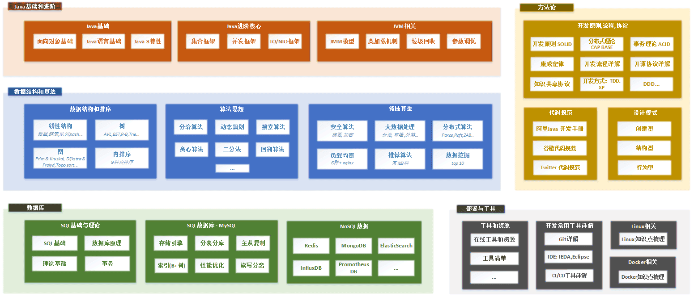
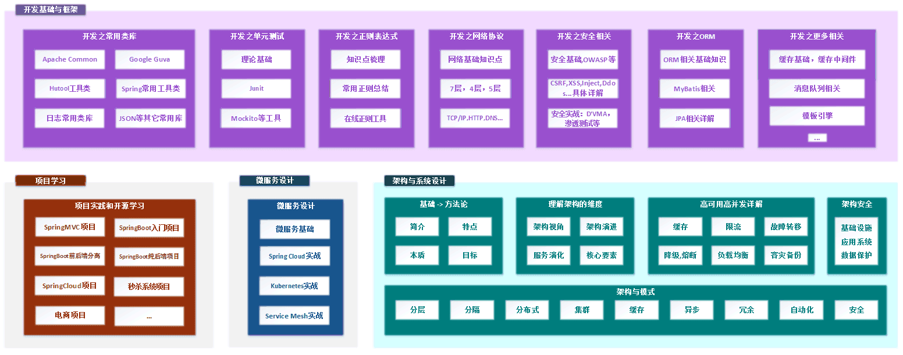

# 小米虫宝典

资料来源:[| Java 全栈知识体系](https://pdai.tech/)、[面试鸭 - 程序员求职面试刷题神器，高频编程题目免费刷](https://www.mianshiya.com/)

本笔记收录`米虫`后端技术栈的相关知识，分为知识篇、面试篇、其余篇。本篇为`知识篇`。

>你好，我是pdai。你是否也曾对未来迷茫不知方向，也曾每天在碎片化的学习中焦虑，也曾钦羡他人步入高于你的层次? 那么跟随我，结合**BAT大厂面试题**帮你构筑你自己的**知识体系**，提升靠技术实现自我价值的**概率和掌控力**；而往往当你将本文中知识点掌握时，你会发现那些平时高谈阔论的家伙其实都是纸老虎；但你依然要保持谦卑，闻道有先后，术业有专攻，如是而已。@pdai

> 全栈知识体系总览

> 适合什么样的人群阅读
>
> `面试官`：系统性的理解不仅能帮助你理解知识的基础体系，更能帮快速甄别候选人才
>
> `开发入门者`：提前上船，赢在起跑线
>
> `开发进阶者`：若干年的开发，尚还没有方向的
>
> `是个想上进的`：关键是你觉得对你有意义，且做你认为正确的事就够了

