# SpringBoot 进阶

## 1、运维篇

### 1.1 工程打包与运行

在windows的环境下对于SpringBoot项目打包使用maven插件

第一步执行Maven指令构建包:

```
mvn package
```

第二步把在target文件目录下找到对应的.jar包使用如下指令运行jar包:

```
java -jar springboot.jar
```

==**注意:jar支持命令行启动需要依赖maven插件支持，请确认打包时是否具有SpringBoot对应的maven插件**==


### 1.2 配置高级

#### 1.2.1 临时属性

带属性数启动SpringBoot

```
java -jar springboot.jar --server.port=80
```

携带多个属性启动SpringBoot，属性间使用空格分隔

#### 1.2.2 环境配置4级分类

1.SpringBoot中4级配置文件

1级:file :config/application.yml 【**最高**】

2级:file :application.yml

3级:classpath:config/application.ym1

4级:classpath:application.yml 【**最低**】

**注意:第三个第四级都是在项目的代码中的包路径下的，上面是在项目打包后存放的路径上的**

2.作用

1级与2级留做系统打包后设置通用属性，1级常用于运维经理进行线上整体项目部署方案调控

3级与4级用于系统开发阶段设置通用属性，3级常用于项目经理进行整体项目属性调控

**注意:当.yml和.properties在同层目录下，.properties级别高于.yml，同层同后缀的配置文件后面加载的覆盖前面的**

#### 1.2.3 多环境开发

项目在不同环境中需要不同的配置文件。

多环境开发（YAML版）

在项目路径下创建不同环境的配置文件

```
application-{环境名称}.yml
```

在主要的配置文件application.yml中配置使用那个文件

```yml
spring:
	profiles:
		active: dev
```

properties版的多环境与yml的一样

**多环境配置分组**

根据功能对配置文件中的信息进行拆分，并制作成独立的配置文件，命名规则如下

- application-devDB.yml
- application-devRedis.yml
- application-devMvc.yml

使用group属性在激活指定环境的情况下，同时对多个环境进行加载使其生效，多个环境间使用逗号分隔

```yml
sprint:
	profiles:
		active: dev
		group: 
			"dev": devDB,devRedis,devMVC
			"pro": devDB,devRedis,devMVC
			#当使用的是dev时就会找到对应的dev组
```

dev配置文件最后加载，包含的配置按书写顺序加载

### 1.3 日志

#### 1.3.1 日志基础

**日志级别**

- TRACE:运行堆栈信息，使用率低  【低】
- DEBUG:程序员调试代码使用
- INFO:记录运维过程数据
- WARN:记录运维过程报警数据
- ERROR:记录错误堆栈信息
- FATAL:灾难信息，合并计入ERROR  【高】

**设置日志输入级别**

```yml
#设置日志级别，root表示根节点，即整体应用日志级别
logging:
	#设置分组，对某个组设置日志级别
	group:
		enbank：com.example.demo1,com.example.demo2
	level:
		root: info
		#设置某个包的日志级别
		com.example.demo1: debug
		enbank: info
```

#### 1.3.2 使用日志注解

基于lombok提供的@Slf4j注解为类快速添加日志对象,注意只能为类添加。

```java
@Slf4j
public class test{

	public void demoLog(){
		log.info("info")
	}

}
```

#### 1.3.3 日志格式化输出


## 2、实战开发篇

### 2.1 配置高级

#### 2.1.1 @ConfigurationPorperties

使用@ConfigurationProperties为第三方bean绑定属性，就是在配置文件中写好然后使用@ConfigurationPorperties指定前缀后可以把值注入类中。


**注意:@EnableConfigurationProperties与@Component不能同时使用**

#### 2.2.2 常用计量单位

SpringBoot支持JDK8提供的时间与空间计量单位Duration和DataSize


#### 2.2.3 数据校验

开启数据校验有助于系统安全性，J2EE规范中JSR303规范定义了一组有关数据校验相关的API

 操作步骤:

1.添加JSR303规范坐标与Hibernqte校验框架对应坐标


2.开启Bean的校验功能


3.设置校验规则


在高级的SpringBoot中整合了这种校验

### 2.2 测试

#### 2.2.1 测试属性

1.在启动测试环境时可以通过properties参数设置测试环境专用的属性


**优势:比多环境开发中的测试环境影响范围更小，仅对当前测试类有效**

2.在启动测试环境时可以通过args参数设置测试环境专用的传入参数


#### 2.2.2 测试配置

使用@Import注解加载当前测试类专用的配置


#### 2.2.3 测试表现层(Controller)


上述4个分别是自定义端口,默认定义的端口,随机端口,不适用端口。

#### 2.2.4 发送虚拟请求

虚拟请求测试

第一步:使用@AutoConfigureMockMvc开启虚拟调用

第二步:MockMvc对象注入。

第三步:创建虚拟请求访问当前路径下的请求

第四步:执行请求


**注意:必须要是web环境下的运行**

### 2.3 数据层解决方案

#### 2.3.1 Sql

现有的数据层解决方案技术选型

`Druid + MyBatis-Plus + MySQL`

数据源:DruidDataSource

持久化技术:MyBatis-Plus / MyBatis

数据库:MySQL

**数据源**

SpringBoot提供了3种内嵌的数据源对象供开发者选择

- HikariCP
- Tomcat提供Datasource
- Commons DBCP

Hikari配置

```yml
spring：
	  datasource:
    url: jdbc:mysql://${detection.mysql.ip}:${detection.mysql.port}/${detection.mysql.db}?useSSL=false&useUnicode=true&characterEncoding=UTF-8&serverTimezone=Asia/Shanghai
    username: ${detection.mysql.username}
    password: ${detection.mysql.password}
    driver-class-name: com.mysql.cj.jdbc.Driver
    hikari:
      minimum-idle: 3
      maximum-pool-size: 10
      #不能小于30秒，否则默认回到1800秒
      max-lifetime: 30000
      idle-timeout: 10000
      connection-test-query: SELECT 1
```

**持久化技术**

SpringBoot中内置持久化解决方案--JdbcTemplate


**==注意:要想使用jdbctemplate就必须导入下面的包==**


**数据库**

SpringBoot提供了3种内嵌数据库供开发者选择，提高开发测试效率

- H2
- HSQL
- Derby

**H2数据库**,这里介绍内存中的。坐标导入


设置当前项目为web工程，并配置H2管理控制台参数


设置访问数据源


默认密码123456,用户名称sa

这样可以通过path来访问H2的图像操作页面。

==**注意:这里的H2数据库是内存级别库，只有SpringBootWeb项目启动的时候才会开启，要想使用H2数据库，就还需要配置dataSource等配置**==

#### 2.3.2 noSql

市面上常见的NoSQL解决方案

- Redis
- Mongo
- ES

说明:上述技术通常在Linux系统中安装部署,为降低学习者压力,本课程制作基于Windows版安装所有的软件并基于Windows版安装的软件进行课程制作

##### 2.3.2.1 Redis

Redis是一款key-value存储结构的内存级NoSQL数据库

- 支持多种数据存储格式
- 支持持久化
- 支持集群

**使用SpringBoot整合Redis**

第一步：导入依赖包

```
<dependency>
            <groupId>org.springframework.boot</groupId>
            <artifactId>spring-boot-starter-data-redis</artifactId>
</dependency>
```

第二步:配置redis

```
spring:
	redis:
		host:localhost #127.0.0.1
		port:6379
```

第三步:使用RedisTemplate解析操作

```java
private RedisTemplate redis;

void test(){
 	ValueOperations ops = redis.opsForValue();
 	ops.set("testKey","testValue");
}

```

在springboot中常使用`StringRedisTemplate`来作为操作的工具类。

在srpingboot中提供了默认的redis操作实现`lettuce`,这是springboot对redis操作接口的默认实现，现在我们使用jedis来实现redis的操作接口

**lettcus与jedis区别**：

- jedis连接Redis服务器是直连模式，当多线程模式下使用jedis会存在线程安全问题，解决方案可以通过配置连接池使每个连接专用，这样整体性能就大受影响。
- lettcus基于Netty框架进行与Redis服务器连接，底层设计中采用StatefulRedisConnection。statefulRedisConnection自身是线程安全的，可以保障并发访问安全问题，所以一个连接可以被多线程复用。当然lettcus也支持多连接实例一起工作。

##### 2.3.2.2 mongodb

MongoDB是一个开源、高性能、无模式的文档型数据库。NoSQL数据库产品中的一种，是最像关系型数据库的非关系型数据库

**应用场景**

- 淘宝用户数据

​	存储位置:数据库

​	特征:永久性存储，修改频度极低

- 游戏装备数据、游戏道具数据

​	存储位置:数据库、Mongodb

​	特征:永久性存储与临时存储相结合、修改频度较高

- 直播数据、打赏数据、粉丝数据

​	存储位置:数据库、Mongodb

​	特征:永久性存储与临时存储相结合，修改频度极高

- 物联网数据

​	存储位置:Mongodb特征:临时存储，修改频度飞速

下载地址:[Download MongoDB Community Server | MongoDB](https://www.mongodb.com/try/download/community-kubernetes-operator)

在文件目录中创建data文件夹，在data文件夹中创建db文件夹。然后再bin目录下打开cmd终端输入下面的指令

```
mongod --dbpath=..\data\db
```

**使用SrpingBoot整合MongoDB**

第一步:导入坐标

```
        <dependency>
            <groupId>org.springframework.boot</groupId>
            <artifactId>spring-boot-starter-data-mongodb</artifactId>
        </dependency>
```

第二步:配置

```
spring:
  data:
    mongodb:
      url: mongodb://localhost:27017
```

第三步:使用MongoTemplate操作

```java
package com.example.mongodbdemo;

import org.junit.jupiter.api.Test;
import org.springframework.beans.factory.annotation.Autowired;
import org.springframework.boot.test.context.SpringBootTest;
import org.springframework.data.mongodb.core.MongoTemplate;

@SpringBootTest
class MongodbDemoApplicationTests {

    private final MongoTemplate mongoTemplate;

    @Autowired
    MongodbDemoApplicationTests(MongoTemplate mongoTemplate) {
        this.mongoTemplate = mongoTemplate;
    }

    @Test
    void save() {
        TestDemo demo = new TestDemo();
        demo.setId(1L);
        demo.setName("平");
        demo.setAge(20);
        mongoTemplate.save(demo);
    }


    @Test
    void get() {
        TestDemo demo = mongoTemplate.findById(1L, TestDemo.class);
        System.out.println(demo);
    }

}

```

##### 2.3.2.3 Elasticsearch(ES)

Elasticsearch是一个分布式==**全文搜索引擎**==

**使用springboot整合es**

再springboot中提供的操作方式版本过于低级,先使用更高级的版本操作,并且es迭代过快。

第一步:导入坐标

```
  <dependency>
            <groupId>co.elastic.clients</groupId>
            <artifactId>elasticsearch-java</artifactId>
            <version>8.12.2</version>
        </dependency>

        <!-- 覆盖springboot维护的7.x版本 -->
        <dependency>
            <groupId>org.elasticsearch.client</groupId>
            <artifactId>elasticsearch-rest-client</artifactId>
            <version>8.12.2</version>
        </dependency>


        <dependency>
            <groupId>com.fasterxml.jackson.core</groupId>
            <artifactId>jackson-databind</artifactId>
            <version>2.13.2</version>
        </dependency>

        <dependency>
            <groupId>org.glassfish</groupId>
            <artifactId>jakarta.json</artifactId>
            <version>2.0.1</version>
        </dependency>
```

第二步:配置es,使用配置类和配置文件

配置文件

```java
package com.example.esdemo.config;

import co.elastic.clients.elasticsearch.ElasticsearchClient;
import co.elastic.clients.json.jackson.JacksonJsonpMapper;
import co.elastic.clients.transport.ElasticsearchTransport;
import co.elastic.clients.transport.rest_client.RestClientTransport;
import org.apache.http.HttpHost;
import org.elasticsearch.client.RestClient;
import org.springframework.beans.factory.annotation.Value;
import org.springframework.context.annotation.Bean;
import org.springframework.context.annotation.Configuration;

/**
 * 说明:
 *
 * @author 平
 */
@Configuration
public class ElasticSearchConfig {

    @Value("${elasticsearch.host}")
    private String host;

    @Value("${elasticsearch.port}")
    private int port;

    @Bean
    public ElasticsearchClient elasticsearchClient() {
        RestClient restClient = RestClient.builder(
                new HttpHost(host, port,"http")).build();
        ElasticsearchTransport transport = new RestClientTransport(
                restClient, new JacksonJsonpMapper());
        return new ElasticsearchClient(transport);
    }

}

```

配置文件

```
elastic-search:
  host: localhost
  port: 9200
```

第三步:使用ElasticsearchClient操作

```java
package com.example.esdemo;

import co.elastic.clients.elasticsearch.ElasticsearchClient;
import co.elastic.clients.elasticsearch._types.mapping.Property;
import co.elastic.clients.elasticsearch.core.IndexResponse;
import co.elastic.clients.elasticsearch.core.SearchResponse;
import co.elastic.clients.elasticsearch.core.search.Hit;
import co.elastic.clients.elasticsearch.indices.CreateIndexResponse;
import org.junit.jupiter.api.Test;
import org.springframework.beans.factory.annotation.Autowired;
import org.springframework.boot.test.context.SpringBootTest;

import java.io.IOException;
import java.util.HashMap;
import java.util.List;
import java.util.Map;

@SpringBootTest
class EsDemoApplicationTests {

    private final EsDemoClazzMapper esDemoClazzMapper;

    private final ElasticsearchClient elasticsearchClient;

    @Autowired
    EsDemoApplicationTests(EsDemoClazzMapper esDemoClazzMapper, ElasticsearchClient elasticsearchClient) {
        this.esDemoClazzMapper = esDemoClazzMapper;
        this.elasticsearchClient = elasticsearchClient;
    }

    @Test
    void get() {
        //destroyed
        EsDemoClazz esDemoClazz = esDemoClazzMapper.selectById(1);
        System.out.println(esDemoClazz);
    }


    @Test
    void addIndex() throws IOException {
        Map<String, Property> documentMap = new HashMap<>();
        documentMap.put("id", Property.of(builder -> builder.keyword(builder12 -> builder12.index(true))));
        documentMap.put("name", Property.of(builder -> builder.text(builder1 -> builder1.index(true).analyzer("ik_max_word").copyTo("all"))));
        documentMap.put("description", Property.of(builder -> builder.text(builder2 -> builder2.index(true).analyzer("ik_max_word").copyTo("all"))));
        documentMap.put("type", Property.of(builder -> builder.keyword(builder3 -> builder3.index(true))));
        documentMap.put("all", Property.of(builder -> builder.text(builder4 -> builder4.index(true).analyzer("ik_max_word"))));
        CreateIndexResponse es_demo_clazz = elasticsearchClient.indices().create(builder -> builder.index("es_demo_clazz").mappings(builder1 -> builder1.properties(documentMap)));
        System.out.println(es_demo_clazz);
    }

    @Test
    void addDocument() throws IOException {
        EsDemoClazz esDemoClazz = esDemoClazzMapper.selectById(1);
        System.out.println(esDemoClazz);
        IndexResponse es_demo_clazz = elasticsearchClient.index(builder -> builder.index("es_demo_clazz").document(esDemoClazz));
        System.out.println(es_demo_clazz);
    }

    @Test
    void selectById() throws IOException {
        SearchResponse<Map> searchResponse = elasticsearchClient.search(srBuilder -> srBuilder.index("es_demo_clazz"), Map.class);
        List<Hit<Map>> hitList = searchResponse.hits().hits();  //注意：第一个hits() 与 第二个hits()的区别
        for (Hit<Map> mapHit : hitList) {
            assert mapHit.source() != null;
            String source = mapHit.source().toString();
            System.out.println(source);
        }
    }


}

```

具体操作后续自己学习

### 2.4 整合第三方技术

#### 2.4.1 缓存

- 缓存是一种介于数据永久存储介质与数据应用之间的数据临时存储介质
- 使用缓存可以有效的减少低速数据读取过程的次数(例如磁盘IO)，提高系统性能

- 缓存不仅可以用于提高永久性存储介质的数据读取效率，还可以提供临时的数据存储空间

**Springboot中内置了缓存技术simple**

1.导入坐标

```
  <dependency>
            <groupId>org.springframework.boot</groupId>
            <artifactId>spring-boot-starter-cache</artifactId>
        </dependency>
```

2.在启动类上添加@EnableCaching注解

3.在需要缓存的方法上添加@Cacheable


**使用redis作为缓存**

1.导入坐标

```
    <dependency>
            <groupId>org.springframework.boot</groupId>
            <artifactId>spring-boot-starter-data-redis</artifactId>
        </dependency>

```

2.配置redis，直接使用默认配置

3.操作

```java
package com.example.cachedemo.service.impl;

import com.example.cachedemo.entity.param.LoginParam;
import com.example.cachedemo.service.LoginService;
import org.springframework.beans.factory.annotation.Autowired;
import org.springframework.data.redis.core.RedisTemplate;
import org.springframework.stereotype.Service;

import java.util.Random;
import java.util.concurrent.TimeUnit;

/**
 * 说明:
 *
 * @author 平
 */
@Service
public class LoginServiceImpl implements LoginService {

    private final Random random = new Random();

    private final RedisTemplate<String, String> redisTemplate;

    @Autowired
    public LoginServiceImpl(RedisTemplate<String, String> redisTemplate) {
        this.redisTemplate = redisTemplate;
    }


    @Override
    public String loginByPhoneNumber(LoginParam loginParam) {
        String phoneNumber = loginParam.getPhoneNumber();
        String code = loginParam.getCode();
        if (code == null || phoneNumber == null) {
            return "手机号或验证码不能为空";
        }
        Object code1 = redisTemplate.opsForHash().get("code", phoneNumber);
        if(code1 == null){
            return "验证码已过期";
        }
        if (code.equals(code1)) {
            return "登录成功";
        }
        return "验证码错误";
    }

    @Override
    public String getCode(String phoneNumber) {
        String code =  100000 + random.nextInt(100000) + "";
        redisTemplate.opsForHash().put("code", phoneNumber, code);
        redisTemplate.expire("code", 5, TimeUnit.MINUTES);
        return code;
    }
}

```

#### 2.4.2 任务

定时任务

在java中有一个内置的定时器Timer，这里不过多的解释，在市面上有更流行的定时任务技术：

Quartz框架

Spring Task框架

**Sping Boot整合Quartz框架**

工作(Job):用于定义具体执行的工作

工作明细(JobDetail):用于描述定时工作相关的信息

触发器(Trigger):用于描述触发工作的规则，通常使用cron表达式定义调度规则

调度器(Scheduler):描述了工作明细与触发器的对应关系

**使用Quartz来使用定时任务**

第一步:导入坐标

```xml
        <dependency>
            <groupId>org.springframework.boot</groupId>
            <artifactId>spring-boot-starter-quartz</artifactId>
        </dependency>
```

第二步:定义具体要执行的任务，继承QuartzJobBean

```java
public class Task extends QuartzJobBean {
    @Override
    protected void executeInternal(JobExecutionContext context) throws JobExecutionException {
        System.out.println("任务执行");
    }
}
```

第三步:定义工作明细与触发器，并绑定对应关系

```java
/**
 * 说明: 定时任务配置
 *
 * @author 平
 */
@Configuration
public class QuartzConfiguration {


    @Bean
    public JobDetail jobDetail() {
        //定义工作明细绑定一个工作类,这个工作类继承自QuartzJobBean
        return JobBuilder
                .newJob(Task.class)
                .storeDurably()
                .build();
    }

    @Bean
    public Trigger trigger(JobDetail jobDetail) {
        //设置触发时间--下面的触发时间表示每隔3秒执行一次
        CronScheduleBuilder cronscheduleBuilder = CronScheduleBuilder.cronSchedule("0/3 * * * * ?");
        //定义触发器绑定一个工作明细
        return TriggerBuilder.newTrigger().forJob(jobDetail).withSchedule(cronscheduleBuilder).build();
    }


}
```

**使用SpringBoot的task**

第一步:在Spring启动类中使用@@EnableScheduling开启定时开关

```java
@SpringBootApplication
@EnableScheduling
public class TaskDemoApplication {

    public static void main(String[] args) {
        SpringApplication.run(TaskDemoApplication.class, args);
    }

}
```

第二步:设置在要开定时任务的方法上添加定时注解，并设置定时时间

```java
/**
 * 说明: 使用Task定时任务
 *
 * @author 平
 */
@Component
public class MyTask {

    // 每隔1秒执行一次
    @Scheduled(cron = "0/1 * * * * ?")
    public void run(){
        System.out.println("Spring Task任务执行");
    }

}
```

Spring Task相关配置:

```xml
spring:
	task:
		scheduling:
# 任务调度线程池大小 默认 1
			poo1:
				size: 1
# 调度线程名称前缀 默认 scheduling
			thread-name-prefix: ssm
			shutdown:
				#线程池关闭时等待所有任务完成
				await-termination: false
				# 调度线程关闭前最大等待时间，确保最后一定关闭
				await-termination-period: 10s
```

#### 2.4.3 邮件

规范:

SMTP(Simple Mail Transfer Protocol):简单邮件传输协议，用于发送电子邮件的传输协议。

POP3(Post Office Protocol-Version3):用于接收电子邮件的标准协议。

IMAP(Internet Mail Access Protocol):互联网消息协议，是POP3的替代协议。

**使用SpringBoot整合JavaMail**

第一步:导入Mail坐标

```xml
  <dependency>
            <groupId>org.springframework.boot</groupId>
            <artifactId>spring-boot-starter-mail</artifactId>
        </dependency>
```

第二步:配置Mail相关配置

```xml
spring:
  mail:
    # 邮件服务器主机
    host: smtp.qq.com
    username: 786067XXX@qq.com
    #非邮箱登录密码，而是qq邮箱的授权码
    password: XXXXXXXX
```

第三步:写服务类，实现发送简单邮件

```java
/**
 * 说明: 发送邮件接口
 *
 * @author 平
 */
public interface MailServer {

    public void sendMail();


}
```

使用JavaMailSender来发送信息

```java
/**
 * 说明: 发送邮件接口实现
 *
 * @author 平
 */
@Service
public class MailServerIml implements MailServer {

    @Resource
    private JavaMailSender javaMailSender;

    //发送邮件需要的信息
    //发送人邮箱地址
    private String from = "786067XXX@qq.com";
    //接收人邮箱地址
    private String to = "2763106XXX@qq.com";
    //标题
    private String subject = "测试邮箱";
    //内容
    private String content = "这是一个测试的邮件";


    @Override
    public void sendMail() {
        SimpleMailMessage message = new SimpleMailMessage();
        message.setFrom(from+"(测试邮件)");
        message.setTo(to);
        message.setSubject(subject);
        message.setText(content);
        javaMailSender.send(message);
    }
}
```

==**注意:发送的人的邮箱必须与配置文件的发送人的邮箱地址一致**==

**发送复杂邮件**

解析html发送邮件和多部件发送，修改上述的SimpleMailMessage对象。

```java
/**
 * 说明: 发送邮件接口实现
 *
 * @author 平
 */
@Service
public class MailServerIml implements MailServer {

    @Resource
    private JavaMailSender javaMailSender;

    //发送邮件需要的信息
    //发送人邮箱地址
    private String from = "786067XXX@qq.com";
    //接收人邮箱地址
    private String to = "2763106XXX@qq.com";
    //标题
    private String subject = "测试邮箱";
    //内容
    private String content = "" +
            "" +
            "" +
            "<a href='https://www.baidu.com' >点击跳转百度</a>";


    @Override
    public void sendMail() {
        MimeMessage message = javaMailSender.createMimeMessage();
        try {
            //允许发送附件
            MimeMessageHelper helper = new MimeMessageHelper(message,true);
            helper.setFrom(from+"(测试邮件)");
            helper.setTo(to);
            helper.setSubject(subject);
            //允许解析Html发送
            helper.setText(content,true);

            //发送附件
            File file = new File("D:\\学习\\java语言程序设计\\小米虫爬山路\\SpringBoot\\AdvanceProject\\mailDemo\\src\\main\\resources\\头像完整版.png");
            helper.addAttachment(file.getName(),file);

            javaMailSender.send(message);
        } catch (MessagingException e) {
            e.printStackTrace();
        }
    }
}
```

#### 2.4.4 消息

MQ-MessageQueue

- 消息的发送方称为：生产者
- 消息的接收方称为：消费者

消息的类型：

同步消息：必须等待对方响应才能发送

异步消息：不需要等到对方的响应


企业级应用中广泛使用的三种异步消息传递技术规范（接口）

- JMS
- AMQP
- MQTT

==**规范介绍**==

JMS

JMS(Java Message Service):一个规范，等同于JDBC规范，提供了与消息服务相关的API接口

JMS消息模型
		peer-2-peer:点对点模型，消息发送到一个队列中，队列保存消息。队列的消息只能被一个消费者消费，或超时。
		publish-subscribe:发布订阅模型，消息可以被多个消费者消费，生产者和消费者完全独立，不需要感知对方的存在。

AMQP

AMQP(advanced message queuing protocol):一种协议(高级消息队列协议，也是消息代理规范)，规范了网络交换的数据格式，兼容JMS

优点:具有跨平台性，服务器供应商，生产者，消费者可以使用不同的语言来实现

MQTT

MQTT(Message Queueing Telemetry Transport)消息队列遥测传输，专为小设备设计，是物联网(IOT)生态
系统中主要成分之一

消息产品:

- ActiveMQ
- RabbitMQ
- RocketMQ
- Kafka

**Sping Boot整合RabbitMQ**

第一步：导入坐标

```
<dependency>
    <groupId>org.springframework.boot</groupId>
    <artifactId>spring-boot-starter-amqp</artifactId>
</dependency>
```

第二步：配置

```yml
spring:
  rabbitmq:
    host: localhost
    port: 5672
```

第三步：定义消息队列

```java
package com.example.messagedemo.service.impl.rabbitmq.direct.config;

import org.springframework.amqp.core.Binding;
import org.springframework.amqp.core.BindingBuilder;
import org.springframework.amqp.core.DirectExchange;
import org.springframework.amqp.core.Queue;
import org.springframework.context.annotation.Bean;
import org.springframework.context.annotation.Configuration;


/**
 * 说明: RabbitMQ配置
 *
 * @author 平
 */
@Configuration
public class RabbitConfigDirect {


    /**
     * rabbitMQ队列
     * @return Queue
     */
    @Bean
    public Queue directQueue() {
        //队列名称
        // durable:是否持久化,默认false
// exclusive:是否当前连接专用，默认false，连接关闭后队列即被删除
// autoDelete:是否自动删除，当生产者或消费者不再使用此队列，自动删除
        return new Queue("directQueue",true,true,true);
    }

    /**
     * rabbitMQ交换机
     * @return DirectExchange
     */
    @Bean
    public DirectExchange directExchange() {
        return new DirectExchange("directExchange");
    }

    /**
     * 绑定交换机和队列
     * @return Binding
     */
    @Bean
    public Binding bindingDirect() {
        return BindingBuilder.bind(directQueue()).to(directExchange()).with("directRouting");
    }

}

```

第四步：生产消息

```java
package com.example.messagedemo.service.impl.rabbitmq.direct;

import com.example.messagedemo.service.MessageService;
import lombok.extern.slf4j.Slf4j;
import org.springframework.amqp.core.AmqpTemplate;
import org.springframework.beans.factory.annotation.Autowired;
import org.springframework.stereotype.Service;

/**
 * 说明:
 *
 * @author 平
 */
@Service
@Slf4j
public class MessageServiceRaDirectImpl implements MessageService {

    private final AmqpTemplate amqpTemplate;

    @Autowired
    public MessageServiceRaDirectImpl(AmqpTemplate amqpTemplate) {
        this.amqpTemplate = amqpTemplate;
    }

    @Override
    public void sendMessage(Long orderId) {
        log.info("发送消息到消息队列");
        amqpTemplate.convertAndSend("directExchange", "directRouting", "XXX您已经成功下单！，订单编号: " + orderId);
    }
}

```

第五步：使用监听消费消息

```java
package com.example.messagedemo.service.impl.rabbitmq.direct;

import lombok.extern.slf4j.Slf4j;
import org.springframework.amqp.rabbit.annotation.RabbitListener;
import org.springframework.stereotype.Component;

/**
 * 说明: 消息监听
 *
 * @author 平
 */
@Component
@Slf4j
public class MessageListener {


    /**
     * 监听directQueue队列消息
     *
     * @param message 消息
     */
    @RabbitListener(queues = "directQueue")
    public void onMessage(String message) {
        log.info("处理消息");
        log.info("消息: {}", message);
    }

}

```

> 以上都是直连交换机
>
> 以下是主题交换机

生产和监听消费不变，需要改变消息队列的定义

```java
package com.example.messagedemo.service.impl.rabbitmq.topic.config;

import org.springframework.amqp.core.*;
import org.springframework.context.annotation.Bean;
import org.springframework.context.annotation.Configuration;


/**
 * 说明: RabbitMQ配置
 *
 * @author 平
 */
@Configuration
public class RabbitConfigTopic {


    /**
     * rabbitMQ队列
     * @return Queue
     */
    @Bean
    public Queue directQueue() {
        return new Queue("topicQueue");
    }

    /**
     * rabbitMQ交换机
     * @return TopicExchange
     */
    @Bean
    public TopicExchange directExchange() {
        return new TopicExchange("topicExchange");
    }

    /**
     * 绑定交换机和队列
     * @return Binding
     */
    @Bean
    public Binding bindingDirect() {
        return BindingBuilder.bind(directQueue()).to(directExchange()).with("topic.*.*");
    }

}

```

注意：这里的绑定的key可以用模糊匹配,这样可以通过不同生产的消息可以加入同一个队列中。 

#### 2.4.5 监控

==**监控的意义**==

- 监控服务状态是否宕机
- 监控服务运行指标(内存、虚拟机、线程、请求等)
- 监控日志
- 管理服务(服务下线)

==**可视化监控平台**==

Spring Boot Admin，开源社区项目，用于管理和监控SpringBoot应用程序。客户端注册到服务端后，通过HTTP请求方式，服务端定期从客户端获取对应的信息，并通过UI界面展示对应信息。

**Sping Boot整合Srping-boot-admin**

第一步搭建Admin的服务端

- 导入坐标

```xml
   <dependency>
            <groupId>de.codecentric</groupId>
            <artifactId>spring-boot-admin-starter-server</artifactId>
            <version>{spring-boot-版本}</version>
        </dependency>
```

- 配置端口

```yml
server:
  port: 9091
```

- 在启动类上添加开启注解`@EnableAdminServer`

```java
package com.example.admindemo;

import de.codecentric.boot.admin.server.config.EnableAdminServer;
import org.springframework.boot.SpringApplication;
import org.springframework.boot.autoconfigure.SpringBootApplication;

@SpringBootApplication
@EnableAdminServer
public class AdminDemoApplication {

    public static void main(String[] args) {
        SpringApplication.run(AdminDemoApplication.class, args);
    }

}
```

第二步配置可监控的对象

- 在被监控的服务中添加坐标

```xml
        <dependency>
            <groupId>de.codecentric</groupId>
            <artifactId>spring-boot-admin-starter-client</artifactId>
            <version>2.7.14</version>
        </dependency>
```

- 在被监控的服务中配置监控服务的ip和端口和可监控的内容

```yml
spring: 
  boot:
    admin:
      client:
        url: http://localhost:9091

management:
  endpoint:
    health:
      show-details: always  # 是否展示健康检查详情
  endpoints:
    web:
      exposure:
        include: "*"  # 暴露所有端点
```

然后启动访问`localhost:9091`


# JOOP

## 1、基础入门

资料来源：[从零开始 - jOOQ 系列教程 (diamondfsd.com)](https://jooq.diamondfsd.com/learn/section-1-how-to-start.html)

### 1.1 基本介绍

[jOOQ](https://jooq.org/)，是一个ORM框架，利用其生成的Java代码和流畅的API，可以快速构建有类型约束的安全的SQL语句

jOOQ使我们的重心可以放在业务逻辑上，而Java与SQL的基础交互部分，都可以交给jOOQ去处理。jOOQ通用支持很多数据库，而且有商业版本和社区版本区别，商业版本和社区版本区别主要是支持数据库不一样，可以在其[授权说明页面](https://www.jooq.org/legal/licensing#databases)上看到各个版本对于数据库的支持情况，开源版本只支持部分开源数据库如MySQL等，这已经能满足大部分公司需求，本系列教程也是基于MySQL数据库进行

jOOQ的核心优势是可以将数据库表结构映射为Java类，包含表的基本描述和所有表字段。通过jOOQ提供的API，配合生成的Java代码，可以很方便的进行数据库操作

生成的Java代码字段类型是根据数据库映射成的Java类型，在进行设置和查询操作时，因为是Java代码，都会有强类型校验，所以对于数据的输入，是天然安全的，极大的减少了SQL注入的风险

jOOQ的代码生成策略是根据配置全量生成，任何对于数据库的改动，如果会影响到业务代码，在编译期间就会被发现，可以及时进行修复

### 1.2 如何开始

使用jOOQ时，一般的开发流程为:

1. 创建/更新 数据库表
2. 通过jOOQ插件生成Java代码
3. 进行业务逻辑开发

### 1.3 测试数据库

导入初始化数据库脚本:

- https://github.com/k55k32/learn-jooq/blob/master/learn-jooq.sql
- https://github.com/k55k32/learn-jooq/blob/master/learn-jooq-2.sql

### 1.4 Maven配置

jOOQ 提供了 Maven 插件 `jooq-codegen-maven`，通过配置可以进行代码生成操作，配置项主要是jdbc连接，目标数据库，表，以及生成的路径包名等

```xml
<properties>
    <jooq.version>3.12.3</jooq.version>
</properties>

<dependencies>
    <dependency>
        <groupId>mysql</groupId>
        <artifactId>mysql-connector-java</artifactId>
        <version>8.0.18</version>
    </dependency>

    <!-- base jooq dependency -->
    <dependency>
        <groupId>org.jooq</groupId>
        <artifactId>jooq</artifactId>
        <version>${jooq.version}</version>
    </dependency>
</dependencies>

<build>
    <plugins>
        <plugin>
            <artifactId>maven-compiler-plugin</artifactId>
            <configuration>
                <source>1.8</source>
                <target>1.8</target>
            </configuration>
        </plugin>

        <!-- 代码生成器插件 -->
        <plugin>
            <groupId>org.jooq</groupId>
            <artifactId>jooq-codegen-maven</artifactId>
            <version>${jooq.version}</version>
            <configuration>
                <jdbc>
                    <driver>com.mysql.cj.jdbc.Driver</driver>
                    <url>jdbc:mysql://127.0.0.1:3306/learn-jooq?serverTimezone=GMT%2B8</url>
                    <user>root</user>
                    <password>root</password>
                </jdbc>
                <generator>
                    <database>
                        <includes>s1_.*</includes>
                        <inputSchema>learn-jooq</inputSchema>
                    </database>
                    <target>
                        <packageName>com.diamondfsd.jooq.learn.codegen</packageName>
                        <directory>/src/main/java</directory>
                    </target>
                </generator>
            </configuration>
        </plugin>
    </plugins>
</build>
```

### 1.5 代码生成

代码生成的原理就是通过读取数据库的元数据，将其转换为Java代码，并生成指定的文件，存放到配置好的指定目录

jOOQ的生成代码的目标路径建议配置单独的子包，因为每次代码生成都是全量的，如果和其他业务代码混合在一起，会被生成器误删

```
# 通过此命令里可以调用 jooq-codegen-maven 插件进行代码生成
mvn jooq-codegen:generate
```

代码生成器执行完成后，会生成以下目录:

```
├─src/main/java/.../codegen ---- // 生成路径
│ ├─tables --------------------- // 表定义目录
│ │ ├─S1User ------------------- // s1_user 表描述包含: 字段，主键，索引，所属Schema
│ │ └─records ------------------ // 表操作对象目录
│ │   └─S1UserRecord ----------- // s1_user 表操作对象，包含字段get,set方法
│ ├─DefaultCatalog ------------- // Catalog对象，包含Schema常量
│ ├─Indexes -------------------- // 当前数据库所有的所有常量
│ ├─Keys ----------------------- // 当前数据库所有表主键，唯一索引等常量
│ ├─LearnJooq ------------------ // 数据库`learn-jooq`常量，包含该库所有表描述常量
│ └─Tables --------------------- // 所有数据库表常量
```

### 1.6 基础查询操作

```java
public static void main(String[] args) {

    String jdbcUrl = "jdbc:mysql://localhost:3306/learn-jooq?serverTimezone=GMT%2B8";
    String jdbcUsername = "root";
    String jdbcPassword = "root";

    // 获取 JDBC 链接
    try (Connection connection = DriverManager.getConnection(jdbcUrl, jdbcUsername, jdbcPassword)) {
        // 获取 jOOQ 执行器
        DSLContext dslContext = DSL.using(connection, SQLDialect.MYSQL);

        // fetch方法可以返回一个结果集对象 Result
        // jOOQ的Result对象实现了List接口，可以直接当做集合使用
        Result<Record> recordResult = dslContext.select().from(S1_USER).fetch();
        recordResult.forEach(record -> {
            Integer id = record.getValue(S1_USER.ID);
            String username = record.getValue(S1_USER.USERNAME);
            System.out.println("fetch Record     id: " + id + " , username: " + username);
        });

        // 通过 Record.into 方法可以将默认Record对象，转换为表的Record对象，例如S1UserRecord
        // Result 接口也定义了into方法，可以将整个结果集转换为指定表Record的结果集
        // 通过 S1UserRecord 可以通过get方法直接获得表对象
        // 所有表的XXXRecord对象都是实现了 Record 对象的子类
        Result<S1UserRecord> userRecordResult = recordResult.into(S1_USER);
        userRecordResult.forEach(record -> {
            Integer id = record.getId();
            String username = record.getUsername();
            System.out.println("into S1UserRecord   id: " + id + " , username: " + username);
        });

        // fetchInto方法可以可以传入任意class类型，或者表常量
        // 会直接返回任意class类型的List集合，或者指定表Record的结果集对象
        List<S1UserRecord> fetchIntoClassResultList = dslContext.select().from(S1_USER).fetchInto(S1UserRecord.class);
        Result<S1UserRecord> fetchIntoTableResultList = dslContext.select().from(S1_USER).fetchInto(S1_USER);

        System.out.println("fetchIntoClassResultList: \n" + fetchIntoClassResultList.toString());
        System.out.println("fetchIntoTableResultList: \n" + fetchIntoTableResultList.toString());

    } catch (SQLException e) {
        e.printStackTrace();
    }
}
```

### 1.7 总结

本章源码: https://github.com/k55k32/learn-jooq/tree/master/section-1

本小节主要介绍了jOOQ最基础的用法，主要是想给大家介绍几个接口:

- `org.jooq.Result`
  结果集接口，此接口实现了List接口，可以当做一个集合来操作，是一个数据库查询结果集的包装类，除了集合的相关方法，该接口还提供了一些结果集转换，格式化，提取字段等方法。通常我们查询出来的结果都是此接口的实现类，掌握好此接口是jOOQ的基础接口，基本所有的SQL查询操作，都会碰到这个接口
- `org.jooq.Record`
  此接口再使用关系型数据库时，主要用于定义数据库表记录，储存的内容是一条表记录的字段和值，每个值会储存对应字段的类型，可以通过通用的 `getValue(Field field)` 方法，取到对应字段的值，也可以将这个接口看做是一条记录的字段/值映射

在使用了代码生成器后，会基于此接口生成对应表的实现类，该实现类基于数据库表字段生成所有字段的 `get`/`set` 方法，可以通过 `getXXX`/`setXXX(..)` 直观的获取或设置指定的值用于读取/更新等后续操作。对于编码来说，代码的可读性大大提升

- `org.jooq.DSLContext`
  jOOQ的核心接口之一，可以理解为一个SQL执行器，通过静态方法 `DSL.using`，可以获取一个 `DSLContext` 实例，此实例抽象了所有对于SQL的操作API，可以通过其提供的API方便的进行SQL操作

```java
/**
* 通过数据库连接和方言配置来创建一个执行器对象
* @param connection 数据库连接
* @param dialect 指定方言， 传入此参数的目的是，在jOOQ渲染SQL的语句的时候，会根据SQL方言配置，使用不同的语法规则去生成SQL语句字符串。
*/
public static DSLContext using(Connection connection, SQLDialect dialect) {
    return new DefaultDSLContext(connection, dialect, null);
}
```

## 2、基础CURD

通过 `DSLContext` API 和 `Record` API，可以完成基础CURD操作。本篇主要通过一些实例代码，讲解最基础的用法。后面的相关篇幅中，也会说到一些扩展以及其他高级用法

从此篇幅开始，以下代码块中不再详细编写关于`DSLContext`的创建过程，具体可以看 [section-1](https://jooq.diamondfsd.com/learn/index.html) 中讲解的基础初始化方式

- `dslContext` 代表`DSLContext`实例
- `S1_USER` 由jOOQ插件生成的表描述常量
- `S1_USER.*` 由jOOQ插件生成的表内字段常量

### 2.1 Insert

jOOQ的数据操作通常有两种方式， 第一种是使用 DSLContext API 以类SQL的语法进行调用，第二种是利用 Record API 进行调用

#### 2.1.1 类SQL方式

插入操作，最基础的方式，是以写SQL语句的习惯，调用API进行插入，支持批量插入

```java
// 类SQL语法 insertInto 方法第一个参数通常是表常量
dslContext.insertInto(S1_USER, S1_USER.USERNAME, S1_USER.ADDRESS, S1_USER.EMAIL)
        .values("username1", "demo-address1", "diamondfsd@gmail.com")
        .values("username2", "demo-address2", "diamondfsd@gmail.com")
        .execute();

// newRecord() 方法标识添加一条记录，通过链式调用，支持批量插入
dslContext.insertInto(S1_USER)
        .set(S1_USER.USERNAME, "usernameSet1")
        .set(S1_USER.EMAIL, "diamondfsd@gmail.com")
        .newRecord()
        .set(S1_USER.USERNAME, "usernameSet2")
        .set(S1_USER.EMAIL, "diamondfsd@gmail.com")
        .execute();
```

#### 2.1.2 Record API

除了通过编写类SQL的API方式插入数据之外，还可以通过Record的API进行插入数据

- `dslContext.newRecord` 方法根据表来创建一个`Record`对象，可以通过 `record.insert()` 方法插入数据

```java
S1UserRecord record = dslContext.newRecord(S1_USER);
record.setUsername("usernameRecord1");
record.setEmail("diamondfsd@gmail.com");
record.setAddress("address hello");
record.insert();
```

#### 2.1.3 批量插入

`dslContext.batchInsert(Collection<? extends TableRecord<?>> records)`方法，可以进行批量插入操作，由jOOQ生成的`S1UserRecord`实现了`TableRecord`接口

```java
List<S1UserRecord> recordList = IntStream.range(0, 10).mapToObj(i -> {
    S1UserRecord s1UserRecord = new S1UserRecord();
    s1UserRecord.setUsername("usernameBatchInsert" + i);
    s1UserRecord.setEmail("diamondfsd@gmail.com");
    return s1UserRecord;
}).collect(Collectors.toList());
dslContext.batchInsert(recordList).execute();
```

#### 2.1.4 插入后获取自增主键

- 通过类SQL方式
  通过此方法插入数据，可以通过 `returning` API读取想要返回的数据，此语法支持返回多个值，通过`fetchOne()`方法可以取到一个`Record`对象

```java
Integer userId = dslContext.insertInto(S1_USER,
    S1_USER.USERNAME, S1_USER.ADDRESS, S1_USER.EMAIL)
    .values("username1", "demo-address1", "diamondfsd@gmail.com")
    .returning(S1_USER.ID)
    .fetchOne().getId();
```

- Record API
  通过此方法，自增的主键会自动存入`record`中

```java
S1UserRecord record = dslContext.newRecord(S1_USER);
record.setUsername("usernameRecord1");
record.setEmail("diamondfsd@gmail.com");
record.setAddress("address hello");
record.insert();
// 这里的id是插入后数据库返回的自增ID，会自动存入record中，可以通过get方法获取
record.getId();
```

#### 2.1.5 主键重复处理

可以针对主键重复时，做两种操作，一种是忽略插入，一种是进行更新操作

- 主键重复忽略插入

  ```java
  int affecteRow = dslContext.insertInto(S1_USER,
      S1_USER.ID, S1_USER.USERNAME)
      .values(1, "username-1")
      .onDuplicateKeyIgnore()
      .execute();
  // 这里执行完，返回affecteRow影响行数为0
  // 生成的SQL: insert ignore into `learn-jooq`.`s1_user` (`id`, `username`) values (1, 'username-1')
  ```

- 主键重复进行更新

  ```java
  dslContext.insertInto(S1_USER)
      .set(S1_USER.ID, 1)
      .set(S1_USER.USERNAME, "duplicateKey-insert")
      .set(S1_USER.ADDRESS, "hello world")
      .onDuplicateKeyUpdate()
      .set(S1_USER.USERNAME, "duplicateKey-update")
      .set(S1_USER.ADDRESS, "update")
      .execute();
  // 生成SQL: insert into `learn-jooq`.`s1_user` (`id`, `username`, `address`) values (1, 'dup
  ```

### 2.2 Update

update和insert的用法类似，都是有两种方式进行操作

#### 2.2.1 类SQL方式

```java
dslContext.update(S1_USER)
    .set(S1_USER.USERNAME, "apiUsername-1")
    .set(S1_USER.ADDRESS, "update-address")
    .where(S1_USER.ID.eq(1))
    .execute()
```

#### 2.2.2 Record API

Record 方式默认通过主键进行作为update语句的where条件

```java

S1UserRecord record = dslContext.newRecord(S1_USER);
record.setId(1);
record.setUsername("usernameUpdate-2");
record.setAddress("record-address-2");
record.update();
// 生成SQL:  update `learn-jooq`.`s1_user` set `learn-jooq`.`s1_user`.`id` = 1, `learn-jooq`.`s1_user`.`username` = 'usernameUpdate-2', `learn-jooq`.`s1_user`.`address` = 'record-address-2' where `learn-jooq`.`s1_user`.`id` = 1


S1UserRecord record2 = dslContext.newRecord(S1_USER);
record2.setUsername("usernameUpdate-noID");
record2.update();
// 生成SQL: update `learn-jooq`.`s1_user` set `learn-jooq`.`s1_user`.`username` = 'usernameUp
```

#### 2.2.3 批量更新

可以使用 `dslContext.batchUpdate` 进行批量更新，批量更新还是通过主键条件进行拼接`update`语句，和之前规则相同

```java
S1UserRecord record1 = new S1UserRecord();
record1.setId(1);
record1.setUsername("batchUsername-1");
S1UserRecord record2 = new S1UserRecord();
record2.setId(2);
record2.setUsername("batchUsername-2");

List<S1UserRecord> userRecordList = new ArrayList<>();
userRecordList.add(record1);
userRecordList.add(record2);
dslContext.batchUpdate(userRecordList).execute();
```

### 2.3 Select

查询操作基本都是通过类SQL的语法进行操作

#### 2.3.1 单表查询

基本查询方法，默认查询指定表的所有字段，返回一个结果集的包装，通过`Result.into`方法，可以将结果集转换为任意指定类型集合，当然也可以通过 `Record.getValue` 方法取得任意字段值，值类型依赖于字段类型

```java
// select `learn-jooq`.`s1_user`.`id`, `learn-jooq`.`s1_user`.`username`, `learn-jooq`.`s1_user`.`email`, `learn-jooq`.`s1_user`.`address`, `learn-jooq`.`s1_user`.`create_time`, `learn-jooq`.`s1_user`.`update_time` from `learn-jooq`.`s1_user`
Result<Record> fetchResult = dslContext.select().from(S1_USER).fetch();
List<S1UserRecord> result = fetch.into(S1UserRecord.class);

// select `learn-jooq`.`s1_user`.`id`, `learn-jooq`.`s1_user`.`username`, `learn-jooq`.`s1_user`.`email`, `learn-jooq`.`s1_user`.`address`, `learn-jooq`.`s1_user`.`create_time`, `learn-jooq`.`s1_user`.`update_time` from `learn-jooq`.`s1_user` where `learn-jooq`.`s1_user`.`id` in (1, 2)
Result<Record> fetchAll = dslContext.select().from(S1_USER)
                .where(S1_USER.ID.in(1, 2)).fetch();
fetchAll.forEach(record -> {
    Integer id = record.getValue(S1_USER.ID);
    String username = record.getValue(S1_USER.USERNAME);
    String address = record.getValue(S1_USER.ADDRESS);
    Timestamp createTime = record.getValue(S1_USER.CREATE_TIME);
    Timestamp updateTime = record.getValue(S1_USER.UPDATE_TIME);
});
```

#### 2.3.2 关联查询

多表关联查询也很简单，和写SQL的方法类似，关联查询出来的结果集，可以自定义一个POJO来储存数据

新建一个POJO，用于储存查询结果

```java
public class UserMessagePojo {
    private String username;
    private String messageTitle;
    private String messageContent;
    //... getter/setter
}
```

之前说过通过`into`方法可以将结果或结果集转换为任意类型，jOOQ会通过反射的方式，将对应的字段值填充至指定的POJO中。通过关联查询的结果集，可以使用此方法将查询结果转换至指定类型的集合。

```java
Result<Record3<String, String, String>> record3Result =
        dslContext.select(S1_USER.USERNAME,
        S2_USER_MESSAGE.MESSAGE_TITLE,
        S2_USER_MESSAGE.MESSAGE_CONTENT)
        .from(S2_USER_MESSAGE)
        .leftJoin(S1_USER).on(S1_USER.ID.eq(S2_USER_MESSAGE.USER_ID))
        .fetch();
List<UserMessagePojo> userMessagePojoList = record3Result.into(UserMessagePojo.class);
```

### 2.4 Delete

#### 2.4.1 类SQL方式

通过此方式可以灵活的构建条件进行删除操作

```java
dslContext.delete(S1_USER).where(S1_USER.USERNAME.eq("demo1")).execute();
```

#### 2.4.2 Record API方式

`Record.detele()` 方法可以进行删除操作，通过调用此方法是根据对应表的主键作为条件进行删除操作

```java
S1UserRecord record = dslContext.newRecord(S1_USER);
record.setId(2);
int deleteRows = record.delete();
// deleteRows = 1
// SQL: delete from `learn-jooq`.`s1_user` where `learn-jooq`.`s1_user`.`id` = 2

S1UserRecord record2 = dslContext.newRecord(S1_USER);
record2.setUsername("demo1");
int deleteRows2 = record2.delete();
// deleteRows == 0
// SQL: delete from `learn-jooq`.`s1_user` where `learn-jooq`.`s1_user`.`id` is null
```

#### 2.4.3 批量删除

通过此方法可以进行批量删除操作

```java
S1UserRecord record1 = new S1UserRecord();
record1.setId(1);
S1UserRecord record2 = new S1UserRecord();
record2.setId(2);
dslContext.batchDelete(record1, record2).execute();
// 
List<S1UserRecord> recordList = new ArrayList<>();
recordList.add(record1);
recordList.add(record2);
dslContext.batchDelete(recordList).execute();
```

### 2.5 POJO和代码生成器配置

之前代码中，进行关联查询时，对于结果集的处理比较麻烦，需要自己创建POJO类进行操作。在实际业务中，多表关联查询是很经常的事情，如果每个查询的结果都需要自己创建POJO来储存数据，那也是不小的工作了，而且操作起来还很繁琐，需要确认每个字段的名称以及类型

对于这样的情况，可以通过jOOQ的代码生成器来解决。代码生成器可以配置在生成代码时，同时生成和表一一对应的POJO，只需要在生成器配置`generator`块中，加上相关配置即可:

```xml
<generator>
    <generate>
        <pojos>true</pojos>
    </generate>
    <!-- ...  -->
</generator>
```

通过以上配置，代码生成的时候，会同时生成和表一一对应的POJO类。因为jOOQ的代码生成每次都是全量生成的，那么我们在编写相关业务代码的时候，不能去修改jOOQ生成的所有代码，那么在关联查询的时候，我们如果要基于原有的某个POJO添加其他字段，那么我们可以自己创建一个和表名一致的类，然后继承该POJO对象，在添加上我们需要的字段，例如本篇代码实例中的`s2_user_message`表，在这里我们需要将这张表和`s1_user`表进行关联查询，为了是查出用户ID对应的用户名

那么我们之前定义的 `UserMessagePojo` 变成直接继承POJO类 `S2UserMessage`，然后添加需要关联查询的字段名:

```java
public class UserMessagePojo extends S2UserMessage {
    private String username;

    public String getUsername() {
        return username;
    }

    public void setUsername(String username) {
        this.username = username;
    }
}
```

添加POJO的生产配置后，jOOQ最终生成的目录如下图，比之前来说，多了一个`pojos`包，用于存放所有POJO

```
├─src/main/java/.../codegen ---- // 生成路径
│ ├─tables --------------------- // 表定义目录
│ │ ├─pojos -------------------- // 存放和表一一对应的 POJO 类 
│ │ └─records ------------------ // 表Record对象目录
│ ├─DefaultCatalog ------------- // Catalog对象，包含Schema常量
│ ├─Indexes -------------------- // 当前数据库所有的所有常量
│ ├─Keys ----------------------- // 当前数据库所有表主键，唯一索引等常量
│ ├─LearnJooq ------------------ // 数据库`learn-jooq`常量，包含该库所有表描述常量
│ └─Tables --------------------- // 所有数据库表常量
```

于此同时，我们也发现，`pojos`目录下的所有POJO类名和 `tables` 目录下所有表描述对象的类名一致，这样开发时，有个麻烦，就是引用的时候还需要去关注所在包路径，不能直观的看出哪个是表描述类或者是POJO类，而且在同一个类中同时用到POJO和表描述类时，会出现要引用全路径的类(`xx.xx.xx.XXXX`)的情况，降低了代码的可读性

那么如何解决这个问题呢，jOOQ在代码生成的时候，是通过 `org.jooq.codegen.GeneratorStrategy` 接口，来确定所有文件名称的生成规则。在代码生成器配置中，提供了参数可以自己指定该接口的实现类:

```xml
<generator>
    <strategy>
        <name>com.diamondfsd.jooq.learn.CustomGeneratorStrategy</name>
    </strategy>
    <!-- ... -->
</generator>
```

`CustomGeneratorStrategy` 自定义的生成器继承了原有的 `DefaultGeneratorStrategy`，重写了 `getJavaClassName` 这方法。主要是为了区别出 POJO 和 表描述的类名，通过这样的配置生成出来的POJO名称会变为类似 `S2UserMessagePojo`，表描述类名为 `TS2UserMessage`，这样能更好的区分POJO和表描述类名，避免在编码过程中产生由于import错误的类，而导致的代码问题。

```java
public class CustomGeneratorStrategy extends DefaultGeneratorStrategy {
    @Override
    public String getJavaClassName(Definition definition, Mode mode) {
        String result = super.getJavaClassName(definition, mode);
        switch (mode) {
            case POJO:
                result +="Pojo";
                break;
            case DEFAULT:
                if (definition instanceof TableDefinition) {
                    result = "T" + result;
                }
                break;
            default:
                break;
        }
        return result;
    }
}
```

这样我们可以将之前的继承类去除后缀

```java
public class S2UserMessage extends S2UserMessagePojo {
    private String username;

    public String getUsername() {
        return username;
    }

    public void setUsername(String username) {
        this.username = username;
    }
}
```

另外要注意的是，POJO的继承类，不可以放在jOOQ代码生成目标的包内，因为生成代码时，会删除指定目标包内的所有内容，所以由我们自行创建的POJO类，需要放在和代码生成器目标包的同级或者上级包内，才不会被jOOQ的代码生成器删除

例如jOOQ生成器的目标包名为: `com.diamondfsd.jooq.learn.codegen`

我们的继承类可以放在 `com.diamondfsd.jooq.learn.xxx`，或者其他更顶级的目录下，避免被生成器删除

### 2.6 总结

本章源码: https://github.com/k55k32/learn-jooq/tree/master/section-2

所有实例代码都在`src/java/test`目录内，是写好的测试用例。

本章节讲解了如何进行基础的CURD操作，以及POJO生成。有很多人疑问这个POJO和Record有什么区别，因为Record也有`getter/setter`方法，这里给大家讲解一下

- `Record` 的储存方式是将字段描述和值储存在两个数组中，下标一一对应。`get`或`set`的时候，其实现都是通过字段找到对应的下标，进行数组操作的，这样有个问题是无法将其通过`json`序列化为一个字符串。而且`Record`对象通常还包含一些针对字段取值的方式，主要用于操作数据时使用
- `POJO` 是由成员变量和`getter/setter`组成的，是一个纯粹用于存取数据的类，可以通过`json`序列化和反序列化，这样在我们进行web开发的时候，可以很方便的进行数据转换处理

在实际业务中，通常我们不会直接使用由 jOOQ 生成的 POJO 类，因为 jOOQ 代码生成是全量的。我们在对POJO做一些修改的后，例如添加一些其他表的关联成员，重新生成时，代码又会被抹去。如果要直接改动jOOQ生成的代码，每次重新生成的时候，还需要去备份一遍原来的，而且还需要根据改动去改代码

解决这个问题方法也很简单，不直接去修改 POJO 类，创建一个继承 POJO 的子类。关联的字段或者其他临时的字段在子类中进行设置成员变量，这样就可以不影响 jOOQ 生成的代码，还能实现我们想要的效果

## 3、查询结果处理

POJO是一个简单的Java对象，主要是包含一些属性和 `getter/setter` 方法，在业务中常用到的是用于传输数据以及作为参数传递。 在Web应用的场景中，也通常用来和前端做数据交互

jOOQ的代码生成器能够帮我们根据表结构生成对应的POJO，能很大程度上减少我们自己创建POJO的工作量，当然，此功能也是大部分ORM框架的必备功能。本章主要讲解各种方式将数据结果转换为我们想要的格式

### 3.1 Fetch系列API

查询操作通常以fetch API 作为结束API，例如常用的有，所有的读取类方法都差不多，掌握一个就能很快的举一反三

- 读取多条
  - `fetch` 读取集合
  - `fetchSet` 读取并返回一个Set集合，常用于去重
  - `fetchArray` 读取并返回一个数组
- 读取单条
  - `fetchOne` 读取单条记录，如果记录超过一条会报错
  - `fetchAny` 读取单条记录，如果有多条，会取第一条数据
  - `fetchSingle` 读取单条记录，如果记录为空或者记录超过一条会报错
- 读取并返回Map
  - `fetchMap` 读取并返回一个Map
  - `fetchGroups` 读取并返回一个分组Map

#### 3.1.1 fetch

作为一个常用的读取多条记录的API，其他几个读取多条的方法和这个方法类似，只是返回值不同

`fetchSet, fetchArray` 方法和 `fetch` 方法一样，都是返回多条数据，只是返回的格式不同，fetch通常返回List或者jOOQ的Result对象

接下来介绍一下几个方法重载的返回值

- `fetch()`
  无参调用此方法，返回的是一个`Result<Record>`结果集对象

  ```java
  Result<Record> records = dslContext.select().from(S1_USER).fetch();
  ```

- `fetch(RecordMapper mapper)`
  `RecordMapper`接口的提供`map`方法，用于来返回数据。`map` 方法传入一个 `Record` 对象。可以使用lambda表达式将 `Record` 对象转换成一个指定类型的POJO

  ```java
  List<S1UserPojo> userPojoList = dslContext.select()
              .from(S1_USER)
              .where(S1_USER.ID.eq(1))
              .fetch(r -> r.into(S1UserPojo.class));
  ```

  多表查询，字段相同时，直接用into方法将结果集转换为POJO时，相同字段名称的方法会以最后一个字段值为准。这时候，我们可以现将结果集通过 `into(Table table)` 方法将结果集转换为指定表的`Record`对象，然后再`into`进指定的POJO类中

  ```java
  // 多表关联查询，查询s2_user_message.id = 2的数据，直接into的结果getId()却是1
  // 这是因为同时关联查询了s1_user表，该表的id字段值为1
  List<S2UserMessage> userMessage = dslContext.select().from(S2_USER_MESSAGE)
          .leftJoin(S1_USER).on(S1_USER.ID.eq(S2_USER_MESSAGE.USER_ID))
          .where(S2_USER_MESSAGE.ID.eq(2))
          .fetch(r -> r.into(S2UserMessage.class));
  // userMessage.getId() == 1
  
  // 将结果集into进指定的表描述中，然后在into至指定的POJO类
  List<S2UserMessage> userMessage2 = dslContext.select().from(S2_USER_MESSAGE)
          .leftJoin(S1_USER).on(S1_USER.ID.eq(S2_USER_MESSAGE.USER_ID))
          .where(S2_USER_MESSAGE.ID.eq(2))
          .fetch(r -> {
              S2UserMessage fetchUserMessage = r.into(S2_USER_MESSAGE).into(S2UserMessage.class);
              fetchUserMessage.setUsername(r.get(S1_USER.USERNAME));
              return fetchUserMessage;
          });
  // userMessage.getId() == 2
  ```

- `fetch(Field<?> field)`
  `Field`是一个接口，代码生成器生成的表字段常量例如 `S1_USER.ID`, 都实现了 `Field` 接口，这个重载可以直接取出指定表字段，会自动根据传入的字段推测其类型

  ```java
  List<Integer> id = dslContext.select().from(S1_USER).where(S1_USER.ID.eq(1))
          .fetch(S1_USER.ID);
  ```

- `fetch(String fieldName, Class<?> type)`
  可以直接通过字段名称字符串获取指定字段值，可以通过第二个参数指定返回值，如果不指定，返回Object

  ```java
  List<Integer> idList = dslContext.select().from(S1_USER).where(S1_USER.ID.eq(1))
          .fetch("id", Integer.class);
  ```

- `fetch(int fieldIndex, Class<?> type)`
  可以通过查询字段下标顺序进行查询指定字段，可以通过第二个参数指定返回值，如果不指定，返回Object

  ```java
  List<Integer> idList = dslContext.select(S1_USER.ID, S1_USER.USERNAME)
          .from(S1_USER).where(S1_USER.ID.eq(1)).fetch(0, Integer.class);
  ```

#### 3.1.2 fetch*

`fetchSet, fetchArray, fetchAny, fetchOne, fetchSingle` 这几个方法的和 `fetch` 方法的用法一致，只是返回值不同，这里不做详解

`fetchAny, fetchOne, fetchSingle` 方法返回单条数据，但是对于 **数据为空、SQL结果为多条数据** 的情况下，处理方式各不相同

| 方法名      | 无数据   | 多条数据   | 单条数据 |
| :---------- | :------- | :--------- | :------- |
| fetchAny    | 返回空   | 返回第一条 | 正常返回 |
| fetchOne    | 返回空   | 抛出异常   | 正常返回 |
| fetchSingle | 抛出异常 | 抛出异常   | 正常返回 |

- `org.jooq.exception.TooManyRowsException` 多条数据时抛出异常
- `org.jooq.exception.NoDataFoundException` 无数据时抛出异常

#### 3.1.3 fetchMap

此方法可以将结果集处理为一个Map格式，此方法有很多重载，这里介绍几个常用的，注意，此方法作为key的字段必须确定是在当前结果集中是唯一的，如果出现重复key，此方法会抛出异常

- `fetchMap(Field<K> field, Class<V> type)`
  以表字段值为key，返回一个 `K:V` 的Map对象

  ```java
  Map<Integer, S1UserPojo> idUserPojoMap = dslContext.select().from(S1_USER)
                  .fetchMap(S1_USER.ID, S1UserPojo.class);
  ```

- `fetchMap(Feild<K> field, Field<V> field)`
  以表字段值为key，返回一个 `K:V` 的Map对象

  ```java
  Map<Integer, String> idUserNameMap = dslContext.select().from(S1_USER)
                  .fetchMap(S1_USER.ID, S1_USER.USERNAME);
  ```

#### 3.1.4 fetchGroups

此方法可以将结果集处理为一个Map格式,和`fetchMap`类似，只不过这里的值为一个指定类型的集合，通常在处理一对多数据时会用到

- `fetchGroups(Field<K> field, Class<V> type)`
  以表字段值为Key，返回一个`K:List<V>` 的Map对象

  ```java
  Map<Integer, List<S2UserMessage>> userIdUserMessageMap = dslContext.select().from(S2_USER_MESSAGE)
                  .fetchGroups(S2_USER_MESSAGE.USER_ID, S2UserMessage.class);
  ```

- `fetchGroups(Field<K> keyField, Field<V> valueField)`

- 以表字段值为Key，返回一个`K:List<V>`的Map对象

  ```java
  Map<Integer, List<Integer>> userIdUserMessageIdMap = dslContext.select().from(S2_USER_MESSAGE)
                  .fetchGroups(S2_USER_MESSAGE.USER_ID, S2_USER_MESSAGE.ID);
  ```

### 3.2 总结

本章源码: https://github.com/k55k32/learn-jooq/tree/master/section-3

文章主要讲解的是各种类型的读取API，掌握好这些API对于jOOQ的使用很有帮助

本章中出现的一下几个接口可能是在编码过程中经常遇到的

- `Field<T>` 接口
  由代码生成器生成的所有表字段常量，都是此接口的实现类，包含了字段一些基本信息，例如字段名称，字段数据类型等，所有读取类方法都有基于此字段参数的重载

- `RecordMapper<? super R, E> mapper` 接口
  该接口很简单，主要是提供一个 `map` 方法给大家去实现。此接口只有一个方法，可以通过lambda表达式快速实现该接口。所有读取类方法都有基于此接口参数的重载

  ```java
  public interface RecordMapper<R extends Record, E> {
      E map(R record);
  }
  ```

## 4、Record详解

在之前的章节中，基本每章都有出现的 `Record` 接口，也做过一些简单的讲解和一些代码示例。作为jOOQ中最重要的一个接口，本章将详细讲解 `Record` 的各种API和基础用法

### 4.1 Record形式

`Record` 是jOOQ定义的用于储存数据库结果记录的一个接口，其主要是将一个表字段的列表和值的列表使用相同的顺序储存在一起，可以看做是一个用于储存列/值的映射的对象。通常有以下几种形式

#### 4.1.1 表记录

与数据库表一一对应，如果包含主键，会继承`UpdatableRecordImpl`类，该类提供了使用 `update`, `delete` API进行数据操作。进行查询操作时，jOOQ会将结果集包装为一个`TableRecord` 对象。 在使用代码生成器的时候，会生成更详细的表记录类，包含表的每个字段操作等，通常以表名为开头 `XxxxRecord`

此类 `Record` 对象一般都有对应字段的`getter/setter`方法，但其都只是去调用`get/set`方法。其储存的方式还是通过两个数组来储存对应列/值的数据的，所以`Record`对象是不能被`JSON`直接序列化和反序列化的

#### 4.1.2 UDT记录

通常用于 Oracle 等支持用户自定义数据类型的数据库记录，这里接触较少，不作讲解

#### 4.1.3 明确数据的记录

通用记录类型的一种，当你的字段不超过22个时，会根据字段个数反射成 `Record1`, `Record2` … `Record22` 类的对象。这些对象需要的泛型个数和后面的数字一致，类型和字段类型一致。jOOQ自动生成的`Record`对象里，如果字段个数不超过 22 个，会同时实现 `Record[N]` 接口

举个例子

- `s1_user` 这张表有6个字段，其生成的 `Record` 对象，继承了 `UpdatableRecordImpl` 并且实现了 `Record6` 接口。`Record6`接口的泛型参数和表字段类型一一对应，类型顺序和数据库内字段顺序一致

  ```java
  class S1UserRecord extends UpdatableRecordImpl<S1UserRecord>
      implements Record6<Integer, String, String, String, Timestamp, Timestamp>
  ```

- `s4_columen_gt22` 这张表来用于演示，该表的字段因为超过了22个，所以不会去实现`Record[N]` 接口，只继承了`UpdatableRecordImpl`

  ```java
  class S4ColumenGt22Record extends UpdatableRecordImpl<S4ColumenGt22Record>
  ```

再看看 `Record[N]` 的接口定义，此接口主要是提供了获取字段，获取值，设置值的方法。由泛型决定字段/值类型和顺序，N 决定字段/值的个数。此接口的目的其实也很简单，就是为了更快速的操作指定位置的字段/值

```java
interface Record[N]<T1, ... T[N]> {
    // 获取字段
    Field<T1> field1();
    ...
    Field<T[N]> field[N]();

    // 获取值
    T1 value1();
    ...
    T[N] valueN();

    // 设置值
    Record[1]<T1> value1(T1 value)
    ...
    Record[N]<TN> value1(T[N] value)
}
```

### 4.2 创建Record对象

这里说的创建`Record`对象，指的是在jOOQ已经生成了对应表的`Record`类的情况下，创建Record进行。使用 `Record` 提供的方法，我们可以方便的做一些针对表数据的操作。创建对象的方式有以下几种

#### 4.2.1 new

由jOOQ生成的`Record`对象，可以通过 `new` 的方式直接创建一个实例。 通过直接 `new` 的方式创建对象，由于没有连接相关信息，无法直接进行 `insert`, `update`, `delete` 方法的调用。但是可以通过 `DSLContext` 的API进行操作数据操作，通过这种方式创建的`Record`对象可以理解为一个单纯的数据储存对象

```java
S1UserRecord s1UserRecord = new S1UserRecord();
s1UserRecord.setUsername("new1");
s1UserRecord.setEmail("diamondfsd@gmail.com");
// insert会报错，因为没有连接配置
s1UserRecord.insert();

// 不需要获取主键，直接执行insert
int row = dslContext.insertInto(S1_USER).set(s1UserRecord)
        .execute()

// 执行insert并返回相应字段
Integer id = dslContext.insertInto(S1_USER).set(s1UserRecord)
                .returning(S1_USER.ID)
                .fetchOne().getId();
```


#### 4.2.2 newRecord

在获取到 `DSLContext` 实例后，可以使用 `dslContext.newRecord(Table<?> table)` 方法来创建一个指定表的`Record`对象，这也是比较常用的方法。通过此方法创建的对象包含了`dslContext`内的数据连接配置，可以直接进行 `insert`, `update`, `delete` 等操作

```java
S1UserRecord s1UserRecord = dslContext.newRecord(S1_USER);
s1UserRecord.setUsername("newRecord1");
s1UserRecord.setEmail("diamondfsd@gmail.com");
s1UserRecord.insert();
```


#### 4.2.3 fetch

通过`fetch*`方法读取到结果 `Record` 对象，同样带有数据库连接相关配置，并且带有查询结果的数据。可以直接进行数据操作

```java
S1UserRecord s1UserRecord = dslContext.selectFrom(S1_USER).where(S1_USER.ID.eq(1))
        .fetchOne();
s1UserRecord.setEmail("hello email");
int row = s1UserRecord.update();

//

S1UserRecord fetchIntoUserRecord = dslContext.select().from(S1_USER)
        .where(S1_USER.ID.eq(1))
        .fetchOneInto(S1UserRecord.class);
fetchIntoUserRecord.setEmail("hello email2");
int row2 = fetchIntoUserRecord.update();
```

### 4.3 数据库交互API

#### 4.3.1 insert

此方法进行数据插入操作，几个重载可以指定插入的数据字段

- `insert()` 插入所有`set`后的字段
- `insert(Field<?> ... feilds)` 插入指定`set`后的字段
- `insert(Collection<? extends Field<?>> fields)` 插入指定`set`后的字段

需要注意的是，插入的字段必须显式的进行`set`操作，才会在最终的SQL语句中体现出来

```java
// 常规用法
S1UserRecord userRecord = dslContext.newRecord(S1_USER);
userRecord.setUsername("insertUsername");
userRecord.setEmail("email");
userRecord.insert();
// insert into `learn-jooq`.`s1_user` (`username`, `email`)
// values ('insertUsername', 'email')

// 指定字段插入
userRecord = dslContext.newRecord(S1_USER);
userRecord.setUsername("insertUsername");
userRecord.setEmail("email");
userRecord.insert(S1_USER.USERNAME, S1_USER.ADDRESS);
// insert into `learn-jooq`.`s1_user` (`username`)
// values ('insertUsername')
```

#### 4.3.2 update

此方法进行更新操作，和 `insert` 方法类似，重载的也一样

- `update()` 更新所有`set`后的字段
- `update(Field<?> ... feilds)` 更新指定`set`后的字段
- `update(Collection<? extends Field<?>> fields)` 更新指定`set`后的字段

重载参数的目的是为了约束更新的字段，同样的，只有经过`set`的字段，才会被更新处理

```java
S1UserRecord userRecord = dslContext.selectFrom(S1_USER)
                .where(S1_USER.ID.eq(1))
                .fetchSingle();
userRecord.setEmail(null);
userRecord.setUsername("hello");
userRecord.update(S1_USER.USERNAME, S1_USER.ADDRESS);
// update `learn-jooq`.`s1_user`
// set `learn-jooq`.`s1_user`.`username` = 'hello'
// where `learn-jooq`.`s1_user`.`id` = 1
```

#### 4.3.3 delete

`delete` 方法根据主键进行数据删除操作

- `delete()` 根据主键删除数据

```java
// 有主键值
S1UserRecord userRecord = dslContext.newRecord(S1_USER);
userRecord.setId(1);
userRecord.delete();
// delete from `learn-jooq`.`s1_user` where `learn-jooq`.`s1_user`.`id` = 1

// 无主键值
userRecord = dslContext.newRecord(S1_USER);
userRecord.delete();
// delete from `learn-jooq`.`s1_user` where `learn-jooq`.`s1_user`.`id` is null
```

### 4.4 数据处理API

#### 4.4.1 get

`get` 系列方法主要是用于获取字段值

- `get(..)` 可以取任意字段的值，非常通用，有很多重载，基本涵盖了所有业务场景，包括取值，转换。 这里列举几个常见用法

  ```java
  Record record = dslContext.select().from(S1_USER).limit(1).fetchOne();
  // 直接取出指定字段数据
  Integer id = record.get(S1_USER.ID);
  // 取出数据并指定转换的数据类型
  Long createTimeLong = record.get(S1_USER.CREATE_TIME, Long.class);
  ```

- `get[FieldName]()` jOOQ生成和表字段一一对应的`getter`方法，可以通过此方法直接获取指定字段，实际调用的是 `get(fieldIndex)` 方法

  ```java
  S1UserRecord userRecord = dslContext.select().from(S1_USER)
          .fetchAny().into(S1_USER);
  Integer id = userRecord.getId();
  Timestamp createTime = userRecord.getCreateTime();
  ```

- `value[N]` 方法为`Record[N]` 接口提供的类，查询明确个数的字段值时，可以快速的获取对应位置下标的值

  ```java
  Record3<Integer, String, Timestamp> record3 = dslContext
          .select(S1_USER.ID,
                  S1_USER.USERNAME,
                  S1_USER.CREATE_TIME)
          .from(S1_USER)
          .fetchAny();
  
  Integer id = record3.value1();
  String username = record3.value2();
  Timestamp createTime = record3.get(S1_USER.CREATE_TIME);
  ```

#### 4.4.2 set

`set` 系列方法主要是用于设置字段值

- `set(..)` 可以设置字段的值，通常在设置值后用于 `insert`/`update` 操作

  ```java
  S1UserRecord userRecord = dslContext.newRecord(S1_USER);
  userRecord.set(S1_USER.ID, 1);
  userRecord.set(S1_USER.USERNAME, "username");
  userRecord.update();
  ```

- `set[FieldName]()` jOOQ生成和表字段一一对应的`setter`方法，可以通过此方法直接设置指定字段值，实际调用的是 `set(fieldIndex, object)` 方法

  ```java
  S1UserRecord userRecord = dslContext.newRecord(S1_USER);
  userRecord.setId(1);
  userRecord.setUsername("username");
  userRecord.update();
  ```

#### 4.4.3 changed

此方法用于修改字段更新标识，一般 `update`/`insert` 方法配合使用，可以设置指定字段是否 更新/储存

```java
S1UserRecord userRecord = dslContext.newRecord(S1_USER);
userRecord.setId(1);
userRecord.setUsername("username");
userRecord.setEmail(null);
userRecord.changed(S1_USER.EMAIL, false);
userRecord.update();
```

#### 4.4.4 reset

此方法用于重置字段更新标识，效果和 `changed(Field field, false)` 相同

```java
S1UserRecord userRecord = dslContext.newRecord(S1_USER);
userRecord.setId(1);
userRecord.setUsername("username");
userRecord.setEmail(null);
userRecord.reset(S1_USER.EMAIL);
userRecord.update();
```

### 4.5 对象转换API

`Record` 提供了转换类API，可以方便快捷的将`Record`转换为其他任意类型，也可以将任意类型填充至`Record`对象中。其核心主要是 `from`/`into` 系列方法

#### 4.5.1 from

此系列方法包含 `from(...)`, `fromMap(...)` , `fromArray(...)` 三个方法，主要是可以将任意对象填充至`Record`中

- `from(Object object)`

  ```java
  S1UserPojo userPojo = new S1UserPojo();
  userPojo.setUsername("username");
  userPojo.setAddress("address");
  S1UserRecord userRecord = dslContext.newRecord(S1_USER);
  userRecord.from(userPojo);
  ```

- `fromMap(Map<String, ?> map)`

  ```java
  Map<String, Object> userDataMap = new HashMap<>();
  userDataMap.put("username", "username1");
  userDataMap.put("address", "user-address-1");
  S1UserRecord userRecord1 = dslContext.newRecord(S1_USER);
  userRecord1.fromMap(userDataMap);
  ```

- `fromArray(Object[] array, Field<?> ... fields)`

  ```java
  Object[] userDataArray = new Object[]{"username2", "user-address-2"};
  S1UserRecord userRecord2 = dslContext.newRecord(S1_USER);
  userRecord2.fromArray(userDataArray, S1_USER.USERNAME, S1_USER.ADDRESS);
  ```

#### 4.5.2 into

此系列方法是将`Record`转换为其他任意指定类型，常用的方法有

- `into(Class<?> type)`
  此方法主要是通过反射的方式，创建目标类实例，并将对应字段值设置到目标实例中，也是在业务代码中用的最多的一个重载

  ```java
  S1UserRecord userRecord = dslContext.selectFrom(S1_USER)
          .where(S1_USER.ID.eq(id))
          .fetchOne();
  S1UserPojo userPojo = userRecord.into(S1UserPojo.class);
  ```

- `into(Field<?> ... fields)`

  ```java
  Record2<Integer, String> record2 =  userRecord
                                  .into(S1_USER.ID, S1_USER.USERNAME);
  Integer id = record2.value1();
  ```

- `intoArray()`

  ```java
  Object[] userArray = userRecord.intoArray();
  Integer fromArrayId = (Integer) userArray[0];
  ```

- `intoMap()`

  ```java
  Map<String, Object> userMap = userRecord.intoMap();
  Integer mapId = userMap.get("id");
  ```

- `intoResultSet()`

  ```java
  ResultSet resultSet = userRecord.intoResultSet();
  ```

### 4.6 总结

本章源码: https://github.com/k55k32/learn-jooq/tree/master/section-4

本章主要是讲解了 `Record` 的各种形式和常用的API，单独拿一章出来讲解 `Record`，主要是因为在jOOQ中，基本所有操作都是在和 `Record` 类接口打交道。本章对大部分常用API做了简单的示例，大家可以根据测试源码内测试用例进行参考，能更好的掌握 `Record` API的使用

## 5、interfaces和daos

本章主要讲解一下 jOOQ 代码生成器的 `interfaces` 和 `daos` 配置， 这两个配置分别是生成表对应的接口和DAO

### 5.1 interfaces

jOOQ在代码生成时，可以通过此配置，来为POJO和Record生成一个接口与表一一对应的接口，接口定义了`getter/setter`方法，并且定义了接口类型为参数的 `from`/`into` 方法。通过此配置，相同表的POJO和Record之间互相转换的性能会有所提升

#### 5.1.1 Maven配置

```xml
<configuration>
    <!-- ...  -->
    <generator>
        <generate>
            <pojos>true</pojos>
            <interfaces>true</interfaces>
        </generate>
        <!-- ... -->
    </generator>
</configuration>
```

#### 5.1.2 代码演示

接口代码的定义

```java
public interface IS1User extends Serializable {
    // getter/setter
    // ...

    public void from(com.diamondfsd.jooq.learn.codegen.tables.interfaces.IS1User from);

    public <E extends com.diamondfsd.jooq.learn.codegen.tables.interfaces.IS1User> E into(E into);
}
```

POJO 和 Record 生成时会实现此接口

```java
// S1UserPojo
public class S1UserPojo implements IS1User {
    //...
}

// S1UserRecord
public class S1UserRecord extends UpdatableRecordImpl<S1UserRecord> 
    implements Record6<Integer, String, String, String, Timestamp, Timestamp>, IS1User { 
}
```


POJO 和 Record 类除了原有的 `getter/setter` 方法外，会同时实现接口定义的 `from/into` 方法，生成的实现代码如下:

```java
@Override
public void from(IS1User from) {
    setId(from.getId());
    setUsername(from.getUsername());
    setEmail(from.getEmail());
    setAddress(from.getAddress());
    setCreateTime(from.getCreateTime());
    setUpdateTime(from.getUpdateTime());
}

@Override
public <E extends IS1User> E into(E into) {
    into.from(this);
    return into;
}
```

可以看到生成的`into`方法实际调用的是来源对象的`from`方法，这个`from`方法和父级的 `from(Object any)` 不同的是。此方法是通过主动调用`set`方法进行值设置。`from(Object obj)`这类通用型的转换方法，都是通过反射进行值设置。一个是直接方法调用，一个是反射调用，显然通过接口生成的 `from`/`into` 方法实现，有着更高的性能优势

接口的好处还有可以将Record和POJO之间互相关联起来，这个在之后做通用DAO的时候会用到，这里不做详解

### 5.2 daos

主流的ORM框架，都可以通过反向工程来生成和表一一对应的DAO，jOOQ在代码生成器生成的时候，可以通过配置 `daos` 选项，来生成DAO类

#### 5.2.1 Maven配置

```xml
<configuration>
    <!-- ...  -->
    <generator>
        <generate>
            <pojos>true</pojos>
            <interfaces>true</interfaces>
            <daos>true</daos>
        </generate>
        <!-- ... -->
    </generator>
</configuration>
```

#### 5.2.2 代码演示

以 `s1_user` 表来说，会生成名为 `S1UserDao` 的类，此类继承自 `org.jooq.impl.DAOImpl`, `org.jooq.impl.DAOImpl`实现了 `org.jooq.DAO` 接口

首先我们看一下 `org.jooq.DAO` 接口的定义

```java
/**
 * 此接口为一个通用DAO接口，为POJO提供了一系列的通用操作方法
 *
 * @param <R> Record 类型
 * @param <P> POJO 类型
 * @param <T> 主键类型，如果是单字段主键，则为该字段类型，
 *            如果是联合主键，会使用 `Record[N]<1Type, ... NType>` 作为类型
 *            
 */
public interface DAO<R extends TableRecord<R>, P, T> { 

    void insert(P object) throws DataAccessException;
    void insert(P... objects) throws DataAccessException;
    void insert(Collection<P> objects) throws DataAccessException;

    void update(P object) throws DataAccessException;
    void update(P... objects) throws DataAccessException;
    void update(Collection<P> objects) throws DataAccessException;

    void delete(P object) throws DataAccessException;
    void delete(P... objects) throws DataAccessException;
    void delete(Collection<P> objects) throws DataAccessException;
    void deleteById(T... ids) throws DataAccessException;
    void deleteById(Collection<T> ids) throws DataAccessException;

    boolean exists(P object) throws DataAccessException;
    boolean existsById(T id) throws DataAccessException;

    long count() throws DataAccessException;

    List<P> findAll() throws DataAccessException;

    P findById(T id) throws DataAccessException;

    <Z> List<P> fetch(Field<Z> field, Z... values) throws DataAccessException;

    <Z> List<P> fetchRange(Field<Z> field, Z lowerInclusive, Z upperInclusive) throws DataAccessException;

    <Z> P fetchOne(Field<Z> field, Z value) throws DataAccessException;

    <Z> Optional<P> fetchOptional(Field<Z> field, Z value) throws DataAccessException;
}
```


接口定义了一些常用的CURD操作，其中有一些操作是通过主键来完成的。注意如果没有主键的表，在代码生成时，是不会生成DAO的，例如本章代码内演示的 `s4_no_primary`表，就没有生成DAO

接下来看一下生成的DAO类，这里举两个例子，一个是单字段主键，一个是联合主键

`s1_user` 表主键`id` 类型为`Integer` 生成的DAO如下，`DAOImpl` 实现了所有DAO接口的方法，生成的`S1UserDAO`则根据表生成了针对每个字段的 fetch 方法

```java
public class S1UserDao extends DAOImpl<S1UserRecord, S1UserPojo, Integer> {
    // 通过ID范围查找 sql: where id > lowerInclusive and id < upperInclusive
    public List<S1UserPojo> fetchRangeOfId(Integer lowerInclusive, Integer upperInclusive) {
        return fetchRange(TS1User.S1_USER.ID, lowerInclusive, upperInclusive);
    }

    // 通过多个ID查找 sql: where id in (values)
    public List<S1UserPojo> fetchById(Integer... values) {
        return fetch(TS1User.S1_USER.ID, values);
    }

    // 通过ID查找 sql: where id = value
    public S1UserPojo fetchOneById(Integer value) {
        return fetchOne(TS1User.S1_USER.ID, value);
    }

    // 通过username范围查找 sql: where username > lowerInclusive and username < upperInclusive
    public List<S1UserPojo> fetchRangeOfUsername(String lowerInclusive, String upperInclusive) {
        return fetchRange(TS1User.S1_USER.USERNAME, lowerInclusive, upperInclusive);
    }

    // 通过多个username查找 sql: where username in (values)
    public List<S1UserPojo> fetchByUsername(String... values) {
        return fetch(TS1User.S1_USER.USERNAME, values);
    }
    // ... fetchXxx
}
```


联合主键的生成方式是这样，对于主键的类型为 `Record2<Integer, Integer>`，如果是三个字段的联合主键则为 `Record3<Type1, Type2, Type3>` 以此类推

```java
public class S4UnionKeyDao extends DAOImpl<S4UnionKeyRecord, S4UnionKeyPojo, Record2<Integer, Integer>> {
}
```

通过代码生成器生成的DAO类，针对每个字段都生成了 `fetchRangeOfXXX` 范围查询, `fetchByXXX` 根据字段 `in` 查询的方法，如果是单字段主键还会生成 `fetchOneByXXX` 方法

这些方法能够满足基本的需求，但是对于一些复杂查询，以及多表关联查询，还是需要使用 `DSLContext` 的API来完成

#### 5.2.3 DAO初始化

jOOQ生成的DAO有两个构造器，DAO是需要跟数据库交互的，所以这里必须要设置数据库连接才能正常使用

```java
public S1UserDao() {
    super(TS1User.S1_USER, S1UserPojo.class);
}

public S1UserDao(Configuration configuration) {
    super(TS1User.S1_USER, S1UserPojo.class, configuration);
}
```

初始化首先得有`Configuration`对象，如果已经实例化了 `DSLContext`， 可以用 `DSLContext.configuration()` 方法获取配置对象

```java
// 方式1: 
S1UserDao s1UserDao = new S1UserDao(dslContext.configuration());

// 方式2:
S1UserDao s1UserDao = new S1UserDao();
s1UserDao.setConfiguration(dslContext.configuration());
```

#### 5.2.4 DAO代码演示

```java
S1UserDao s1UserDao = new S1UserDao(dslContext.configuration());

S1UserPojo s1UserPojo = s1UserDao.fetchOneById(1);

S1UserPojo userPojo = s1UserDao.findById(1);

List<S1UserPojo> s1UserPojos =
        s1UserDao.fetchByUsername(s1UserPojo.getUsername());

List<S1UserPojo> allUser = s1UserDao.findAll();
```

### 5.3 总结

本章源码: https://github.com/k55k32/learn-jooq/tree/master/section-5

本章主要是介绍了interface接口和针对表的DAO类生成，以及简单的展示了一下DAO的代码调用

jOOQ的大部分功能到本章为止，已经介绍的差不多了。后续的章节中，将主要和Spring框架结合，介绍在实际业务中jOOQ的使用经验

## 6、JOOQ和Spring整合

本章主要讲解 jOOQ 和 Spring 的基础整合方式，包括数据源的自动注入，DAO自动注入，以及事务管理。

### 6.1 Spring Maven 相关依赖

在原来依赖的基础上，还需要添加 Spring 相关的依赖，另外，利用Spring
Spring 的基本依赖主要是其中的容器，注解，以及数据源相关依赖，连接池这里用的`HikariCP`，号称 Java 性能最高的数据库连接池

```xml
<dependency>
    <groupId>org.springframework</groupId>
    <artifactId>spring-core</artifactId>
    <version>5.2.2.RELEASE</version>
</dependency>
<dependency>
    <groupId>org.springframework</groupId>
    <artifactId>spring-beans</artifactId>
    <version>5.2.2.RELEASE</version>
</dependency>
<dependency>
    <groupId>org.springframework</groupId>
    <artifactId>spring-context</artifactId>
    <version>5.2.2.RELEASE</version>
</dependency>
<dependency>
    <groupId>org.springframework</groupId>
    <artifactId>spring-jdbc</artifactId>
    <version>5.2.2.RELEASE</version>
</dependency>
<dependency>
    <groupId>org.springframework</groupId>
    <artifactId>spring-test</artifactId>
    <version>5.2.2.RELEASE</version>
    <scope>test</scope>
</dependency>

<!-- 数据源 -->
<dependency>
    <groupId>com.zaxxer</groupId>
    <artifactId>HikariCP</artifactId>
    <version>3.4.2</version>
</dependency>
```

### 6.2 主要配置

#### 6.2.1 数据源配置

我们将数据库的相关配置放到资源文件目录下的 `jdbc.properties` 文件内

```properties
datasource.jdbc.url=jdbc:mysql://localhost:3306/learn-jooq?serverTimezone=GMT%2B8
datasource.jdbc.username=root
datasource.jdbc.password=root
```


接下来是配置数据源和事务管理器，并且启用注解式事务管理

```java
@Configuration
@EnableTransactionManagement
@PropertySource("classpath:jdbc.properties")
public class DataSourceConfig {
    @Value("${datasource.jdbc.url}")
    private String url;

    @Value("${datasource.jdbc.username}")
    private String username;

    @Value("${datasource.jdbc.password}")
    private String password;

    @Bean
    public PlatformTransactionManager transactionManager(DataSource dataSource) {
        return new DataSourceTransactionManager(dataSource);
    }

    @Bean
    public DataSource dataSource() {
        HikariConfig config = new HikariConfig();
        config.setJdbcUrl(url);
        config.setUsername(username);
        config.setPassword(password);
        return new TransactionAwareDataSourceProxy(new HikariDataSource(config));
    }

}
```

#### 6.2.2 jOOQ 相关配置

jOOQ的代码生成器可以通过相关配置在代码生成的时候，自动为DAO类添加 `@Repository` 注解将其声明为SpringBean。并且会自动在有参构造器 `XxxxDao(Configuration configuration)` 上添加 `@Autowried` 注解

代码生成器配置:
在之前的基础上，添加 `springAnnotations` 配置

```xml
<generator>
    <strategy>
        <name>com.diamondfsd.jooq.learn.CustomGeneratorStrategy</name>
    </strategy>
    <generate>
        <pojos>true</pojos>
        <daos>true</daos>
        <interfaces>true</interfaces>
        <springAnnotations>true</springAnnotations>
    </generate>
</generator>
```


生成的DAO例如 `S1UserDao`:

```java
@Repository
public class S1UserDao extends DAOImpl<S1UserRecord, S1UserPojo, Integer> {
    // ...
    @Autowired
    public S1UserDao(Configuration configuration) {
        super(TS1User.S1_USER, S1UserPojo.class, configuration);
    }
    // ...
```


可以看出，DAO的初始化，需要有个 `Configuration` 实例，因此我们需要声明一些jOOQ相关的Bean，除了`Configuration`实例外，经常使用 `DSLContext` 也可以声明为SpringBean

```java
@Configuration
@Import(DataSourceConfig.class)
public class JooqConfiguration {
    @Bean
    public DSLContext dslContext(org.jooq.Configuration configuration) {
        return DSL.using(configuration);
    }

    @Bean
    public org.jooq.Configuration configuration(DataSource dataSource) {
        org.jooq.Configuration configuration = new DefaultConfiguration();
        configuration.set(SQLDialect.MYSQL);
        configuration.set(dataSource);
        return configuration;
    }
}
```

至此，通过这些配置，我们可以启动一个 Spring + jOOQ 整合的项目，添加一个入口文件:

```java
@ComponentScan
public class Section6Main {
    public static void main(String[] args) {
        ApplicationContext context = new AnnotationConfigApplicationContext(Section6Main.class);

        S1UserDao bean = context.getBean(S1UserDao.class);

        List<S1UserPojo> s1UserPojo = bean.findAll();

    }
}
```

### 6.3 测试用例

测试用例在项目开发中，能够起到很大的作用，特别是测试覆盖率高了以后，对于项目的稳定性会起到很大的帮助。但是对于后端大部分的程序，测试用例很多是针对数据库进行操作，难免会影响数据库的数据。

这时可以通过一些方法，利用事务的特性，在测试用例执行完成后，进行回滚操作。这样就可以避免产生脏数据，或者污染数据等

#### 6.3.1 JDBC 方式事务回滚

之前的系列文章里，大部分代码都是通过测试用例完成的，为了不对数据库造成污染，在执行测试用例后都会对数据进行 `rollback` 操作，具体的实现方式是通过测试框架的 `@BeforeEach` `@AfterEach` 注解完成的，具体实现代码片段如下

其原理为每一个测试方法执行之前，现将数据库连接的 `autoCommit` 改为`false`，不自动提交，在方法执行后，调用连接对象的 `rollback` 方法，进行回滚操作

```java
@TestInstance(TestInstance.Lifecycle.PER_CLASS)
public class BaseTest {
    DSLContext dslContext;
    Connection connection;

    Logger log = LoggerFactory.getLogger(this.getClass());

    @BeforeAll
    public void initDSLContext() throws SQLException {
        String jdbcUrl = "jdbc:mysql://localhost:3306/learn-jooq?serverTimezone=GMT%2B8";
        String jdbcUsername = "root";
        String jdbcPassword = "root";
        connection = DriverManager.getConnection(jdbcUrl, jdbcUsername, jdbcPassword);
        dslContext = DSL.using(connection, SQLDialect.MYSQL);

        Integer fetchOneResult = dslContext.select().fetchOne().into(Integer.class);
        Assertions.assertNotNull(fetchOneResult);
        Assertions.assertEquals(1, fetchOneResult.intValue());
    }

    @BeforeEach
    public void beginTransaction() throws SQLException {
        connection.setAutoCommit(false);
    }

    @AfterEach
    public void rollbackTransaction() throws SQLException {
        connection.rollback();
    }
}
```

#### 6.3.2 Spring 方式事务回滚

在使用Spring后，可以通过`spring-jdbc`内的事务管理器来进行实物操作，基础的测试类改为如下，只需要添加几个注解即可

```java
@SpringJUnitConfig(Section6Main.class)
@Transactional
@Rollback
public class BaseTest {
    @Autowired
    DSLContext dslContext;
}
```

可以通过此测试用例来校验，在 `insert` 测试用例结束之后，数据会回滚，所以在 `findById` 执行的时候，通过之前暂存的 `insertUserId` 是找不到对应数据的，这样可以验证事务是否工作

```java
class S1UserDaoTest extends BaseTest {
    @Autowired
    S1UserDao s1UserDao;

    Integer insertUserId = null;

    @Test
    public void findAll() {
        List<S1UserPojo> userAll = s1UserDao.findAll();
        Assertions.assertTrue(userAll.size() > 0);
    }

    @Test
    public void insert() {
        S1UserPojo s1UserPojo = new S1UserPojo();
        s1UserPojo.setUsername("hell username");
        s1UserDao.insert(s1UserPojo);
        Assertions.assertNotNull(s1UserPojo.getId());
        insertUserId = s1UserPojo.getId();
    }

    @Test
    public void findById() {
        S1UserPojo findById = s1UserDao.findById(1);
        Assertions.assertNotNull(findById);

        if (insertUserId != null) {
            S1UserPojo userPojo = s1UserDao.findById(insertUserId);
            Assertions.assertNull(userPojo);
        }
    }
}
```

另外还需要注意一点的是，使用 `Junit 5` 时，在运行 `mvn test` 命令时，对应 `maven-surefire-plugin` 的版本需要 `2.22.0` 以上，如果在发现使用 `mvn test` 命令没反应或者运行测试用例个数为0的时候，检查一下此配置

```xml
<plugin>
    <groupId>org.apache.maven.plugins</groupId>
    <artifactId>maven-surefire-plugin</artifactId>
    <version>2.22.2</version>
</plugin>
```

### 6.4 总结

本章源码: https://github.com/k55k32/learn-jooq/tree/master/section-6

本章介绍最基础的jOOQ和Spring的整合，其实内容并不多，主要是介绍了对于Spring注解生成的支持，以及事务的管理还有就是对于测试用例自动回滚的支持方法。是很基础的整合教程。 之后还会介绍和SpringBoot的整合。 了解本章内容，对于之后的内容能够起到很大的帮助

## 7、多数数据源处理

目前在微服务框架下，比较提倡单服务单库操作。但是某些历史包袱或者其他因素导致，导致需要在项目中同时访问多个数据库，本篇文章主要是讲解对于对于此情况的一些处理方式

多数据库分为两种情况，两种情况的处理方式不太一样，第一种比较简单，第二种相对复杂一点，接下来会给大家仔细讲解两种情况的处理方式

1. 多个数据库在 `同一实例`
2. 多个数据库在 `不同实例`

### 7.1 多库同实例

这种情况解决方案比较简单，只需要在代码生成的时，配置生成多个库。

```xml
 <generator>
    <!-- ... -->
    <database>
      <schemata>
        <schema>
          <inputSchema>learn-jooq</inputSchema>
        </schema>
        <schema>
          <inputSchema>learn-jooq-2</inputSchema>
        </schema>
        <!-- other schema config ... -->
      </schemata>
    </database>
    <!-- ... -->
</generator>
```

因为在同一实例内，多个数据库可以共用同一个数据源。jOOQ渲染SQL时，可以带上数据库名称（此配置默认开启），不会受数据库连接参数中所带的数据库名称所影响， 例如

查询 `learn-jooq`库的`s1_user`表：

```
查询 `learn-jooq-2`库的`s7_user`表： ```select `learn-jooq-2`.`s7_user`.`id` from `learn-joo
```

### 7.2 多库不同实例

这种情况对于同实例的情况来说，处理起来相对比较复杂，因为不同实例，那么肯定的需要使用不同的数据库连接，即不同的数据源，不同的事务管理器等等

#### 7.2.1 代码生成

多数据源的情况下，由于每个数据库的连接等配置不同，所以针对每个数据库实例都需要有一套配置。 这里利用 `maven` 插件的 `executions` 选项，可以同时配置多个执行器，另外由于配置过多，不再将这些配置放在 `pom.xml` 文件。把每一个数据库的配置抽离出来，作为单独的文件，这里测试时有两个数据库所以创建两个文件:

- `src/main/resources/codegen-config-jooq-learn.xml`
- `src/main/resources/codegen-config-jooq-learn-2.xml`

文件内容就不贴了，和之前的插件配置一样，不同的是数据库的连接和库名等等一些基础配置。 除了一些基础配置外，需要注意的是目标的包名需要设置为不同的路径，不可放在同一个包内，因为两者会相互覆盖

```xml
<configuration>
    <!-- ...  -->
    <generator>
        <!-- ...  -->
        <target>
            <packageName>com.diamondfsd.jooq.learn.codegen.learn_jooq</packageName>
            <directory>/src/main/java</directory>
        </target>
    </generator>
</configuration>
```


`pom.xml` 的插件配置变为如下内容:

```xml
<plugin>
    <groupId>org.jooq</groupId>
    <artifactId>jooq-codegen-maven</artifactId>
    <version>3.12.3</version>
    <executions>
        <execution>
            <id>learn-jooq</id>
            <configuration>
                <configurationFile>src/main/resources/codegen-config-jooq-learn.xml</configurationFile>
            </configuration>
        </execution>
        <execution>
            <id>learn-jooq-2</id>
            <configuration>
                <configurationFile>src/main/resources/codegen-config-jooq-learn-2.xml</configurationFile>
            </configuration>
        </execution>
    </executions>
</plugin>
```


在此情况下，如果要生成代码，需要执行 `mvn jooq-codegen:generate@{execution.id}` 命令，针对不同的配置，指定执行ID进行执行

- `mvn jooq-codegen:generate@learn-jooq`
- `mvn jooq-codegen:generate@learn-jooq-2`

#### 7.2.2 数据源配置

对于多数据源的情况下，由于jOOQ生成的代码是一样的，所以主要是要处理jOOQ生成的DAO内需要注入的 `Configuration` 对象。`Configuration` 对象主要适用于存放数据源对象，SQL方言，以及一些其他的渲染配置等等

首先，在 `jdbc.properties` 内配置多个数据库连接的参数

```properties
datasource1.jdbc.url=jdbc:mysql://localhost:3306/learn-jooq?serverTimezone=GMT%2B8
datasource1.jdbc.username=root
datasource1.jdbc.password=root


datasource2.jdbc.url=jdbc:mysql://localhost:3306/learn-jooq-2?serverTimezone=GMT%2B8
datasource2.jdbc.username=root
datasource2.jdbc.password=root
```


Spring 数据源/事务配置，这里由于有多个数据库连接，所以配置了多个数据源，并且需要对每个数据源配置事务管理器

申明 `TX_LEARN_JOOQ` 和 `TX_LEARN_JOOQ_2` 常量的目的是因为在多数据源情况下，因为有多个事务管理器，所以我们在使用 `@Transaction` 注解时，根据不同的数据库，需要显式的指定需要的事务管理器。 如果希望有一个默认的事务管理器，可以在默认的事务管理器定义上同时加上 `@Primary` 注解

```java
@Configuration
@EnableTransactionManagement
@PropertySource("classpath:jdbc.properties")
public class DataSourceConfig {

    public static final String TX_LEARN_JOOQ = "learnJooqTransactionManager";
    public static final String TX_LEARN_JOOQ_2 = "learnJooq2TransactionManager";

    @Bean
    public PlatformTransactionManager learnJooqTransactionManager(
            @Autowired
            @Qualifier("learnJooqDataSource")
                    DataSource dataSource) {
        return new DataSourceTransactionManager(dataSource);
    }

    @Bean
    public PlatformTransactionManager learnJooq2TransactionManager(
            @Autowired
            @Qualifier("learnJooq2DataSource") DataSource dataSource) {
        return new DataSourceTransactionManager(dataSource);
    }

    @Bean
    public DataSource learnJooqDataSource(
            @Value("${datasource1.jdbc.url}")
                    String url,
            @Value("${datasource1.jdbc.username}")
                    String username,
            @Value("${datasource1.jdbc.password}")
                    String password) {
        HikariConfig config = new HikariConfig();
        config.setJdbcUrl(url);
        config.setUsername(username);
        config.setPassword(password);
        return new TransactionAwareDataSourceProxy(new HikariDataSource(config));
    }

    @Bean
    public DataSource learnJooq2DataSource(
            @Value("${datasource2.jdbc.url}")
                    String url,
            @Value("${datasource2.jdbc.username}")
                    String username,
            @Value("${datasource2.jdbc.password}")
                    String password) {
        HikariConfig config = new HikariConfig();
        config.setJdbcUrl(url);
        config.setUsername(username);
        config.setPassword(password);
        return new TransactionAwareDataSourceProxy(new HikariDataSource(config));
    }
}
```


#### 7.2.3 jOOQ配置

jOOQ 配置主要是因为 DAO 内的代码是自动生成的，我们不太好修改，而且每次改了过后重新生成代码的时候又会被还原，这里使用的解决方案是。

首先根据数据源声明多个 `DefaultConfiguration` Bean，这些Bean注入对应的数据源， 然后声明 `org.jooq.Configuration` Bean， 在声明函数里获取一个 `Map<String, DefaultConfiguration>` 对象，此对象由Spring自动注入，根据Bean的名称和实例对象组成一个Map。 同时获取一个 `InjectionPoint` 实例，此对象储存了 `@Autowired` 注解所在位置的一些源信息。在此场景下，获取 `InjectionPoint` 对象可以获得 DAO 所在的包路径。 根据不同的包路径，选择不同的 `DefaultConfiguration` 对象进行注入

```java
@Configuration
@Import(DataSourceConfig.class)
public class JooqConfiguration {

    @Bean
    @Primary
    @Scope(ConfigurableBeanFactory.SCOPE_PROTOTYPE)
    public org.jooq.Configuration configuration(
            Map<String, DefaultConfiguration> configurationMap,
            InjectionPoint injectionPoint) {
        AnnotatedElement annotatedElement = injectionPoint.getAnnotatedElement();
        if (Constructor.class.isAssignableFrom(annotatedElement.getClass())) {
            Class declaringClass = ((Constructor) annotatedElement).getDeclaringClass();
            String packageName = declaringClass.getPackage().getName();
            org.jooq.Configuration configuration;
            switch (packageName) {
                case "com.diamondfsd.jooq.learn.codegen.learn_jooq.tables.daos":
                    configuration = configurationMap.get("learnJooqConfiguration");
                    break;
                case "com.diamondfsd.jooq.learn.codegen.learn_jooq_2.tables.daos":
                    configuration = configurationMap.get("learnJooq2Configuration");
                    break;
                default:
                    throw new NoSuchBeanDefinitionException("no target switch");
            }
            return configuration;
        }
        throw new NoSuchBeanDefinitionException("no target switch");
    }

    @Bean
    public DefaultConfiguration learnJooqConfiguration(@Autowired
                                                       @Qualifier("learnJooqDataSource")
                                                               DataSource learnJooqDataSource) {
        DefaultConfiguration configuration = new DefaultConfiguration();
        configuration.set(SQLDialect.MYSQL);
        configuration.set(learnJooqDataSource);
        configuration.settings().setRenderSchema(false);
        return configuration;
    }

    @Bean
    public DefaultConfiguration learnJooq2Configuration(@Autowired
                                                        @Qualifier("learnJooq2DataSource")
                                                                DataSource learnJooq2DataSource) {
        DefaultConfiguration configuration = new DefaultConfiguration();
        configuration.set(SQLDialect.MYSQL);
        configuration.set(learnJooq2DataSource);
        configuration.settings().setRenderSchema(false);
        return configuration;
    }
}
```

#### 7.2.4 代码演示

通过以上这些配置后，我们就能在多数据源的情况下，愉快的使用jOOQ了， 和平时的使用方式一致， DAO对象还是可以自动注入。 并且可以通过显式的指定事务管理器使用 `@Transaction` 注解

```
@Autowired
S1UserDao s1UserDao;

@Transactional(TX_LEARN_JOOQ)
public void insert() {
    S1UserPojo s1UserPojo = new S1UserPojo();
    s1UserPojo.setUsername("username");
    s1UserDao.insert(s1UserPojo);
}


@Autowired
S7UserDao s7UserDao;

@Test
@Transactional(TX_LEARN_JOOQ_2)
public void insert() {
    S7UserPojo s7UserPojo = new S7UserPojo();
    s7UserPojo.setUsername("s7username");
    s7UserDao.insert(s7UserPojo);
}
```

### 7.3 总结

本章源码: https://github.com/k55k32/learn-jooq/tree/master/section-7

对于多数据源的情况下，主要是在一些历史代码迁移的时候，会采用的方案。正常现代的微服务体系下，一般一个服务只会使用一个数据源。这里提出的解决方案比较简单，是通过DAO的包名使用不同的数据源配置，得以让Spring来管理自动注入，不影响业务层的使用

## 8、SpringBoot和JOOQ整合

在当前微服务盛行的情况下，`Spring Boot` 或 `Spring Cloud` 为基础的微服务体系是主流， 也是目前业务场景中新的选型方向

相对于直接使用Spring来说，利用Spring Boot来整合jOOQ相对来说简单很多

### 8.1 Maven 依赖

Spring Boot 官方有对 jOOQ 的支持，所以只需要简单的引用 `spring-boot-starter-jooq` 和对应的jdbc驱动即可

```xml
<parent>
    <groupId>org.springframework.boot</groupId>
    <artifactId>spring-boot-starter-parent</artifactId>
    <version>2.2.1.RELEASE</version>
</parent>

<dependencies>
    <dependency>
        <groupId>org.springframework.boot</groupId>
        <artifactId>spring-boot-starter-jooq</artifactId>
    </dependency>
    <dependency>
        <groupId>org.springframework.boot</groupId>
        <artifactId>spring-boot-starter-test</artifactId>
        <scope>test</scope>
    </dependency>
    <dependency>
        <groupId>mysql</groupId>
        <artifactId>mysql-connector-java</artifactId>
    </dependency>
    <dependency>
        <groupId>org.jooq</groupId>
        <artifactId>jooq-codegen</artifactId>
        <scope>provided</scope>
    </dependency>
</dependencies>
```

### 8.2 配置

Spring Boot最大的一个特性就是有很多 `AutoConfiguration` 自动配置, `spring-boot-starter-jooq` 依赖于 `spring-boot-starter-jdbc`， 其自动配置了数据源，事务管理器等

`spring-boot-starter-jooq` 自动配置了 `org.jooq.Configuration` 和 `org.jooq.DSLContext` 对象。 我们只需要在 `src/main/resources/application.yml` 内写好数据源相关配置，其他的一切都可以交给Spring Boot进行处理

- `src/main/resources/application.yml`

  ```yml
  spring:
    datasource:
      url: jdbc:mysql://localhost:3306/learn-jooq?serverTimezone=GMT%2B8
      username: root
      password: root
  ```

### 8.3 运行/测试

直接通过main方法启动 Spring Boot 服务

```java
@SpringBootApplication
public class Section8Main {
    public static void main(String[] args) {
        SpringApplication.run(Section8Main.class);
    }
}
```

测试用例内，使用 `SpringBootTest` 注解

```java
@RunWith(SpringRunner.class)
@SpringBootTest(classes = Section8Main.class)
@Transactional
@Rollback
public class BaseTest {
    @Autowired
    DSLContext dslContext;

    @Autowired
    Configuration configuration;

    @Autowired
    TransactionManager transactionManager;

    @Test
    public void empty() {
        Assertions.assertNotNull(dslContext);
        Assertions.assertNotNull(configuration);
        Assertions.assertNotNull(transactionManager);
    }
}
```


### 8.4 `JooqAutoConfiguration` 源码解析

以下是jOOQ的自动配置源码，从 `spring-boot-autoconfigure` 内拷贝而来，可以看出此配置会在数据源配置和事务配置之后执行

对于我们经常用到的就是 Bean `dslContext` 和 `jooqConfiguration` ，大部分自动配置的Bean都会使用 `@ConditionalOnMissingBean` 注解， 此注解标识在没有某个Bean的情况下，才会执行该注解所标注的配置

- `org.springframework.boot.autoconfigure.jooq.JooqAutoConfiguration`

```java
/**
 * {@link EnableAutoConfiguration Auto-configuration} for JOOQ.
 *
 * @author Andreas Ahlenstorf
 * @author Michael Simons
 * @author Dmytro Nosan
 * @since 1.3.0
 */
@Configuration(proxyBeanMethods = false)
@ConditionalOnClass(DSLContext.class)
@ConditionalOnBean(DataSource.class)
@AutoConfigureAfter({ DataSourceAutoConfiguration.class, TransactionAutoConfiguration.class })
public class JooqAutoConfiguration {

	@Bean
	@ConditionalOnMissingBean(ConnectionProvider.class)
	public DataSourceConnectionProvider dataSourceConnectionProvider(DataSource dataSource) {
		return new DataSourceConnectionProvider(new TransactionAwareDataSourceProxy(dataSource));
	}

	@Bean
	@ConditionalOnBean(PlatformTransactionManager.class)
	public SpringTransactionProvider transactionProvider(PlatformTransactionManager txManager) {
		return new SpringTransactionProvider(txManager);
	}

	@Bean
	@Order(0)
	public DefaultExecuteListenerProvider jooqExceptionTranslatorExecuteListenerProvider() {
		return new DefaultExecuteListenerProvider(new JooqExceptionTranslator());
	}

	@Configuration(proxyBeanMethods = false)
	@ConditionalOnMissingBean(DSLContext.class)
	@EnableConfigurationProperties(JooqProperties.class)
	public static class DslContextConfiguration {

		@Bean
		public DefaultDSLContext dslContext(org.jooq.Configuration configuration) {
			return new DefaultDSLContext(configuration);
		}

		@Bean
		@ConditionalOnMissingBean(org.jooq.Configuration.class)
		public DefaultConfiguration jooqConfiguration(JooqProperties properties, ConnectionProvider connectionProvider,
				DataSource dataSource, ObjectProvider<TransactionProvider> transactionProvider,
				ObjectProvider<RecordMapperProvider> recordMapperProvider,
				ObjectProvider<RecordUnmapperProvider> recordUnmapperProvider, ObjectProvider<Settings> settings,
				ObjectProvider<RecordListenerProvider> recordListenerProviders,
				ObjectProvider<ExecuteListenerProvider> executeListenerProviders,
				ObjectProvider<VisitListenerProvider> visitListenerProviders,
				ObjectProvider<TransactionListenerProvider> transactionListenerProviders,
				ObjectProvider<ExecutorProvider> executorProvider) {
			DefaultConfiguration configuration = new DefaultConfiguration();
			configuration.set(properties.determineSqlDialect(dataSource));
			configuration.set(connectionProvider);
			transactionProvider.ifAvailable(configuration::set);
			recordMapperProvider.ifAvailable(configuration::set);
			recordUnmapperProvider.ifAvailable(configuration::set);
			settings.ifAvailable(configuration::set);
			executorProvider.ifAvailable(configuration::set);
			configuration.set(recordListenerProviders.orderedStream().toArray(RecordListenerProvider[]::new));
			configuration.set(executeListenerProviders.orderedStream().toArray(ExecuteListenerProvider[]::new));
			configuration.set(visitListenerProviders.orderedStream().toArray(VisitListenerProvider[]::new));
			configuration.setTransactionListenerProvider(
					transactionListenerProviders.orderedStream().toArray(TransactionListenerProvider[]::new));
			return configuration;
		}
	}
}
```

如果我们需要使用多数据源，可以在启动入口中的 `@SpringBootApplication` 中使用 `exclude` 选项，不让 Spring Boot 自动配置数据源和 jOOQ 的配置。最后参考一下上一篇多数据源的文章内容，然后进行同样的配置即可，Spring Boot 本质上也是对 Spring 框架的整合而已

```java
@SpringBootApplication(exclude = {DataSourceAutoConfiguration.class, 
                                  JooqAutoConfiguration.class, 
                                  TransactionAutoConfiguration.class})
```

### 8.5 总结

本章源码: https://github.com/k55k32/learn-jooq/tree/master/section-8

通过本章，可以看出Spring Boot的整合相对于直接使用Spring来说，节省了很多工作，很多配置都由Spring Boot帮我们自动配置了。所以之后的文章都会以此为基础来讲解，之后的源码演示也会基于本章的源码进行扩展

另外，整合相关的章节就到此结束了，之后的章节中，会解决一些实际业务中的问题。 例如jOOQ当前生成的DAO只包含了一些基础的查询。 在业务开发中经常会遇到的多条件查询，分页查询，关联查询等都不是很支持。 接下来的章节中，就会针对一些实际的业务问题进行讲解

## 9、为DAO添加分页扩展

为什么要对DAO进行扩展？ 在之前的篇幅中，我有介绍到，由jOOQ生成的DAO带有一些基础的CURD方法，另外还会针对每个字段生成一些查询方法。 但是这些方法比较单一，都是以单一字段为基础，进行查询操作，不足以面对复杂的业务场景。

例如,我们业务中常用到的分页查询、多条件查询等，都没有在被封装在DAO中，只能用 `DSLContext` 的API来完成。 其实这些方法比较通用，我们可以通过一些的封装，让我们能够以更简单的方式进行这些操作

### 9.1 如何进行

通过jOOQ生成的DAO代码可以发现，所有的DAO都继承了 `DAOImpl` 抽象类，那么我们只需要自己创建一个类去继承 `DAOImpl` 然后让所有的DAO类继承我们自己创建的类，那么就可以在自己创建的类内，来扩展一些公共方法，给每个DAO去使用

假设我们创建的类名称叫 `AbstractExtendDAOImpl`，以 `S1UserDao` 为例，继承关系如下:

- `S1UserDao` [extends] -> `AbstractExtendDAOImpl` [extends] -> `DAOImpl` [implement] -> `DAO`

但是jOOQ生成的代码每次都是根据配置全量生成的，他会删除原有的目标路径然后重新生成，所以在DAO生成后直接修改生成后的代码是不可行的。那么我们只能在生成阶段，去修改最终的生成目标代码

jOOQ 生成器的配置内可以通过 `configuration -> generator -> name` 来配置具体的生成逻辑，默认使用的是 `org.jooq.codegen.JavaGenerator`

```xml
<generator>
    <!-- ... -->
    <name>org.jooq.codegen.JavaGenerator</name>
    <!-- ... -->
</generator>
```


我们的目标就是创建一个类继承 `JavaGenerator` ， 重写某些DAO类的生成方法来实现我们想要的效果，`JavaGenerator` 类可以重写的方法如下。我们主要是要对DAO进行扩展，所以我们本次重写的方法就是 `generateDao`

```java
generateArray(SchemaDefinition, ArrayDefinition)           // Generates an Oracle array class
generateArrayClassFooter(ArrayDefinition, JavaWriter)      // Callback for an Oracle array class footer
generateArrayClassJavadoc(ArrayDefinition, JavaWriter)     // Callback for an Oracle array class Javadoc

generateDao(TableDefinition)                               // Generates a DAO class
generateDaoClassFooter(TableDefinition, JavaWriter)        // Callback for a DAO class footer
generateDaoClassJavadoc(TableDefinition, JavaWriter)       // Callback for a DAO class Javadoc

generateEnum(EnumDefinition)                               // Generates an enum
generateEnumClassFooter(EnumDefinition, JavaWriter)        // Callback for an enum footer
generateEnumClassJavadoc(EnumDefinition, JavaWriter)       // Callback for an enum Javadoc

generateInterface(TableDefinition)                         // Generates an interface
generateInterfaceClassFooter(TableDefinition, JavaWriter)  // Callback for an interface footer
generateInterfaceClassJavadoc(TableDefinition, JavaWriter) // Callback for an interface Javadoc

generatePackage(SchemaDefinition, PackageDefinition)       // Generates an Oracle package class
generatePackageClassFooter(PackageDefinition, JavaWriter)  // Callback for an Oracle package class footer
generatePackageClassJavadoc(PackageDefinition, JavaWriter) // Callback for an Oracle package class Javadoc

generatePojo(TableDefinition)                              // Generates a POJO class
generatePojoClassFooter(TableDefinition, JavaWriter)       // Callback for a POJO class footer
generatePojoClassJavadoc(TableDefinition, JavaWriter)      // Callback for a POJO class Javadoc

generateRecord(TableDefinition)                            // Generates a Record class
generateRecordClassFooter(TableDefinition, JavaWriter)     // Callback for a Record class footer
generateRecordClassJavadoc(TableDefinition, JavaWriter)    // Callback for a Record class Javadoc

generateRoutine(SchemaDefinition, RoutineDefinition)       // Generates a Routine class
generateRoutineClassFooter(RoutineDefinition, JavaWriter)  // Callback for a Routine class footer
generateRoutineClassJavadoc(RoutineDefinition, JavaWriter) // Callback for a Routine class Javadoc

generateSchema(SchemaDefinition)                           // Generates a Schema class
generateSchemaClassFooter(SchemaDefinition, JavaWriter)    // Callback for a Schema class footer
generateSchemaClassJavadoc(SchemaDefinition, JavaWriter)   // Callback for a Schema class Javadoc

generateTable(SchemaDefinition, TableDefinition)           // Generates a Table class
generateTableClassFooter(TableDefinition, JavaWriter)      // Callback for a Table class footer
generateTableClassJavadoc(TableDefinition, JavaWriter)     // Callback for a Table class Javadoc

generateUDT(SchemaDefinition, UDTDefinition)               // Generates a UDT class
generateUDTClassFooter(UDTDefinition, JavaWriter)          // Callback for a UDT class footer
generateUDTClassJavadoc(UDTDefinition, JavaWriter)         // Callback for a UDT class Javadoc

generateUDTRecord(UDTDefinition)                           // Generates a UDT Record class
generateUDTRecordClassFooter(UDTDefinition, JavaWriter)    // Callback for a UDT Record class footer
generateUDTRecordClassJavadoc(UDTDefinition, JavaWriter)   // Callback for a UDT Record class Javadoc
```


### 9.2 自定义代码块

首先，我们先定义一下之前说到的 `AbstractExtendDAOImpl`

```java
public abstract class AbstractExtendDAOImpl<R extends UpdatableRecord<R>, P, T> extends DAOImpl<R, P, T>
        implements ExtendDao<R, P, T> {
    // ...
}
```

以 `S1UserDao` 为例，我们最终目标是，此类生成的时候，直接继承 `AbstractExtendDAOImpl` 类

- 默认生成

  ```java
  import org.jooq.impl.DAOImpl;
  public class S1UserDao extends DAOImpl<S1UserRecord, S1UserPojo, Integer> {
      // ...
  }
  ```

- 自定义生成

  ```java
  import com.diamondfsd.jooq.learn.extend.AbstractExtendDAOImpl;
  public class S1UserDao extends AbstractExtendDAOImpl<S1UserRecord, S1UserPojo, Integer> {
      // ...
  }
  ```

我们需要修改的地方很小，就是将其继承的父类替换掉， `DAOImpl` -> `AbstractExtendDAOImpl`

#### 9.2.1 重写生成器

通过继承 `JavaGenerator` 可以重写指定代码块的生成逻辑，那么我们这里创建 `CustomJavaGenerator` 类继承 `JavaGenerator`， 重写 `generateDao` 来完成我们想要的效果

我们先看一下官方提供的 `JavaGenerator.generateDAO` 源码，这个方法有两个重载，一个是控制流程负责文件创建，输出，另一个是填充内容，负责文件内容的构建和输出

```java
protected void generateDao(TableDefinition table) {
    JavaWriter out = newJavaWriter(getFile(table, Mode.DAO));
    log.info("Generating DAO", out.file().getName());
    generateDao(table, out);
    closeJavaWriter(out);
}

protected void generateDao(TableDefinition table, JavaWriter out) {
    // ... 代码过多，不做展示
}
```


我们有两个方案来实现我们想要的效果

- 方案一，将两个方法都完全复制到 `CustomJavaGenerator` 类内，然后修改指定的关键字符串就可以实现我们想要的效果。优点是简单，明了，可控性强，缺点是具体的生成代码过多，我们进行修改时，如果遇到jOOQ的版本更新，可能会有点问题
- 方案二，通过调用父级方法完成代码内容填充，然后编码进行替换指定的字符串实现我们想要的效果，此方法优点是改动小，不会影响原来的逻辑，缺点是万一jOOQ 类名做了修改（此情况一般不会出现）会出现兼容问题，需要更新我们替换的字符串内容

这里我采用的是第二种方案，比较简单， 具体的实现逻辑也很简单。 重写 `generateDao` 方法

1. 添加 `import com.diamondfsd.jooq.learn.extend.AbstractExtendDAOImpl;` 代码块
2. 调用父类方法进行代码生成
3. 获取生成后的文件内容
4. 删除 `import org.jooq.impl.DAOImpl;`
5. 将 `extends DAOImpl` 替换为 `extends AbstractExtendDAOImpl;`
6. 重新写入到目标文件内

```java
public class CustomJavaGenerator extends JavaGenerator {
    private static final JooqLogger log = JooqLogger.getLogger(CustomJavaGenerator.class);


    /**
     * 重写了 generateDao， 具体的生成逻辑还是调用父级的方法，只是在生成完成后，获取文件内容，
     * 然后对文件指定的内容进行替换操作
     *
     * @param table
     */
    @Override
    protected void generateDao(TableDefinition table) {
        super.generateDao(table);
        File file = getFile(table, GeneratorStrategy.Mode.DAO);
        if (file.exists()) {
            try {
                String fileContent = new String(FileCopyUtils.copyToByteArray(file));
                String oldExtends = " extends DAOImpl";
                String newExtends = " extends AbstractExtendDAOImpl";
                fileContent = fileContent.replace("import org.jooq.impl.DAOImpl;\n", "");
                fileContent = fileContent.replace(oldExtends, newExtends);
                FileCopyUtils.copy(fileContent.getBytes(), file);
            } catch (IOException e) {
                log.error("generateDao error: {}", file.getAbsolutePath(), e);
            }
        }
    }

    @Override
    protected void generateDao(TableDefinition table, JavaWriter out) {
        // 用于生成 import com.diamondfsd.jooq.learn.extend.AbstractExtendDAOImpl 内容
        out.ref(AbstractExtendDAOImpl.class);
        super.generateDao(table, out);

    }
}
```

自定义代码生成器写好后，将 jOOQ 插件配置的代码生成器目标修改为 `CustomJavaGenerator`

```xml
<generator>
    <name>com.diamondfsd.jooq.learn.CustomJavaGenerator</name>
    <!-- ... -->
</generator>
```

通过这样配置，调用代码生成器时，会通过我们自定义的类里的逻辑，进行代码生成

#### 9.2.2 分页查询封装

`AbstractExtendDAOImpl` 类由我们自己创建，所有生成的DAO都继承了此类， 那么进行公共方法的扩展就很简单，直接在此类里写一些扩展的公共方法即可

这里我定义了一个接口 `ExtendDAO` 用于定义一些公共方法

```java
public interface ExtendDAO<R extends UpdatableRecord<R>, P, T> extends DAO<R, P, T> {

    /**
     * 获取 DSLContext
     *
     * @return DSLContext
     */
    DSLContext create();

    /**
     * 条件查询单条记录
     *
     * @param condition 约束条件
     * @return <p>
     */
    P fetchOne(Condition condition);

    /**
     * 条件查询单条记录
     *
     * @param condition 约束条件
     * @return Optional<P>
     */
    Optional<P> fetchOneOptional(Condition condition);

    /**
     * 条件查询多条，并排序
     *
     * @param condition  约束条件
     * @param sortFields 排序字段
     * @return POJO 集合
     */
    List<P> fetch(Condition condition, SortField<?>... sortFields);

    /**
     * 读取分页数据
     *
     * @param pageResult 分页参数
     * @param condition  约束条件
     * @param sortFields 排序字段
     * @return 分页结果集
     */
    PageResult<P> fetchPage(PageResult<P> pageResult, Condition condition, SortField<?>... sortFields);

    /**
     * 读取分页数据
     *
     * @param pageResult      分页参数
     * @param selectLimitStep 查询语句
     * @return 分页结果集
     */
    PageResult<P> fetchPage(PageResult<P> pageResult, SelectLimitStep<?> selectLimitStep);

    /**
     * 任意类型读取分页数据
     *
     * @param pageResult      分页参数
     * @param selectLimitStep 查询语句
     * @param mapper          结果映射方式
     * @param <O>             返回类型的泛型
     * @return 分页结果集
     */
    <O> PageResult<O> fetchPage(PageResult<O> pageResult, SelectLimitStep<?> selectLimitStep,
                                RecordMapper<? super Record, O> mapper);

    /**
     * 任意类型读取分页数据
     *
     * @param pageResult      分页参数
     * @param selectLimitStep 查询语句
     * @param pojoType        POJO类型
     * @param <O>             返回类型的泛型
     * @return 分页结果集
     */
    <O> PageResult<O> fetchPage(PageResult<O> pageResult, SelectLimitStep<?> selectLimitStep,
                                Class<O> pojoType);

}
```


`AbstractExtendDAOImpl` 实现 `ExtendDAO` 接口，其他的一些实现就不在这里展示了，大家可以看一下源码，这里着重给大家讲解一下分页的实现

这里分页使用的是 MySQL 的 `SQL_CALC_FOUND_ROWS` 关键字和 `SELECT FOUND_ROWS()` 语句。 在查询之前，获得原始SQL语句，并且在 `select` 后拼接上 `SQL_CALC_FOUND_ROWS` 关键字，在SQL执行完毕后通过 `SELECT FOUND_ROWS()` 可以查询出总行数

```java
public abstract class AbstractExtendDAOImpl<R extends UpdatableRecord<R>, P, T> extends DAOImpl<R, P, T>
        implements ExtendDAO<R, P, T> {


    @Override
    public DSLContext create() {
        return DSL.using(configuration());
    }

    @Override
    public <O> PageResult<O> fetchPage(PageResult<O> pageResult, SelectLimitStep<?> selectLimitStep,
                                       RecordMapper<? super Record, O> mapper) {
        int size = pageResult.getPageSize();
        int start = (pageResult.getCurrentPage() - 1) * size;
        // 在页数为零的情况下小优化，不查询数据库直接返回数据为空集合的分页包装类
        if (size == 0) {
            return new PageResult<>(Collections.emptyList(), start, 0, 0);
        }
        String pageSql = selectLimitStep.getSQL(ParamType.INLINED);
        String SELECT = "select";

        pageSql = SELECT + " SQL_CALC_FOUND_ROWS " +
                pageSql.substring(pageSql.indexOf(SELECT) + SELECT.length())
                + " limit ?, ? ";

        List<O> resultList = create().fetch(pageSql, start, size).map(mapper);
        Long total = create().fetchOne("SELECT FOUND_ROWS()").into(Long.class);
        PageResult<O> result = pageResult.into(new PageResult<>());
        result.setData(resultList);
        result.setTotal(total);
        return result;
    }
}
```

### 9.3 总结

本章源码: https://github.com/k55k32/learn-jooq/tree/master/section-9

本章通过使用自定义的代码生成器来完成对DAO进行扩展。 目前只扩展了基础的DAO，添加了一些条件查询方法和分页查询的封装。 主要是希望大家能够了解到对于自定义代码生成器的一些使用方式和可以重写的方法。掌握这些对于jOOQ的功能自定义能够起很大的帮助

## 10、POJO的扩展

由 jOOQ 生成的 POJO 是针对单个表的字段进行生成。在关联查询中，通常我们要将多个表的数据存放在一个类里。这种情况下，我们可以自行创建一个类，去添加我们需要的多表字段成员变量

对于这种比较常见的情况来说，手动创建类显得很繁琐，我们可以在生成 POJO 的同时，创建一个空白的并且继承原有POJO的类，需要添加字段的时候，直接在我们生成的类上添加想要的其他表字段

要想达到以上效果，我们还是需要自定义代码生成器，添加针对这些继承类（这里先称之为 Entity）的创建代码逻辑。通过之前的需求分析，这些代码创建后需要由我们自行修改的，所以只能生成一次， 文件存在的时候就不能再进行覆盖或者被代码生成器删除

所有生成的 Entity 我们需要放在 jOOQ 配置的目标包平行的父级包内。这样 jOOQ 在生成代码前清空指定目录的包内容时，我们自己的包不会被波及到。并且在生成逻辑中，需要判断目标 Entity 文件是否已存在，如果存在就忽略

通过这些逻辑，在我们为 Entity 添加关联表的成员变量的时候，就不会被 jOOQ 的代码生成器所覆盖或删除。可以安全的去增加代码，实现我们想要的逻辑

### 10.1 Entity 生成

一个初始的 Entity 很简单，只需要继承 jOOQ 生成的 POJO 即可

```java
package com.diamondfsd.jooq.learn.entity;

import com.diamondfsd.jooq.learn.jooq.tables.pojos.S1UserPojo;

public class S1User extends S1UserPojo {

}
```

想要实现这样的生成，我在自定义的代码生成器 `CustomJavaGenerator` 内添加了以下内容

首先重写了父级的 `generatePojo` 方法，在生成完原有的 POJO 后，调用自定义的 `generateEntity` 方法，创建Entity

```java
@Override
protected void generatePojo(TableDefinition table) {
    super.generatePojo(table);
    // 在生成完POJO后，生成 Entity
    generateEntity(table);
}
```

具体`generateEntity`的实现内容大家可以自行查看 `CustomJavaGenerator` 文件的[源码](https://github.com/k55k32/learn-jooq/blob/master/section-10/src/main/java/com/diamondfsd/jooq/learn/CustomJavaGenerator.java)，相对来说比较简单，因为只是字符串的拼接

在 Entity 创建完成后， 我们还需要对生成的DAO进行调整， 将原来泛型内的 POJO 类替换为 Entity 类，是通过替换字符串完成的，具体大家可以在源码中的 `generateDao` 方法中看到

调整后，以 `s1_user` 表为例， 最终生成的 DAO 内容如下，替换了泛型和构造函数内目标POJO的类型

```java
// ...
import com.diamondfsd.jooq.learn.entity.S1User;
// ...

@Repository
public class S1UserDao extends ExtendDAOImpl<S1UserRecord, S1User, Integer> { 
    public S1UserDao() {
        super(TS1User.S1_USER, S1User.class);
    }

    @Autowired
    public S1UserDao(Configuration configuration) {
        super(TS1User.S1_USER, S1User.class, configuration);
    }
    // ...
}
```


通过这样的操作后， 我们 DAO 所有方法的返回值都是都是我们自定义的 Entity 类很方便进行扩展

例如我们需要查询 `s2_user_message` 表关联 `s1_user` 查出用户消息所属用户的用户名，可以直接在我们生成的Entity `S2UserMessage` 上添加字段，然后在查询的时候，`into` 到此类即可

```java
public class S2UserMessage extends S2UserMessagePojo {
    String username;

    public String getUsername() {
        return username;
    }

    public void setUsername(String username) {
        this.username = username;
    }
}
```


```java
@Test
void leftJoinUsernameTest() {
    List<S2UserMessage> userMessageList = userMessageDao.create()
       .select(S2_USER_MESSAGE.ID, S2_USER_MESSAGE.MESSAGE_TITLE, S1_USER.USERNAME)
       .from(S2_USER_MESSAGE)
       .leftJoin(S1_USER).on(S1_USER.ID.eq(S2_USER_MESSAGE.USER_ID))
       .fetchInto(S2UserMessage.class);

    assertTrue(userMessageList.size() > 0);
    List<String> usernameList = userMessageList.stream()
            .map(S2UserMessage::getUsername)
            .filter(Objects::nonNull)
            .collect(Collectors.toList());
    assertEquals(userMessageList.size(), usernameList.size());
}
```

### 10.2 总结

本章源码: https://github.com/k55k32/learn-jooq/tree/master/section-10

本章较为简短，主要是告诉大家可以通过自定代码生成器做一些其他扩展操作。 利用代码生成器的特性，可以方便快捷的生成任意的代码，很方便和通用。 如果是在公司的项目中，这些都可以单独抽离出来作为一个扩展包让每个服务去引用。通过生成器生成基础的项目框架，不仅比手动创建效率高，而且不容易出错，还可以很好的代码结构


# Docker

## 1、基础入门

### 1.1 介绍

Docker 是一个用于开发、发布和运行应用程序的开放平台。 Docker 使您能够将应用程序与基础设施分离，以便您可以快速交付软件。借助 Docker，您可以像管理应用程序一样管理基础设施。通过利用 Docker 的方法来传送、测试和部署代码，您可以显着减少编写代码和在生产中运行代码之间的延迟。

### 1.2 安装Docker

Docker安装在Linux环境下。

以下命令都是在虚拟机中的Linux的环境中使用。

#### 1.2.1 卸载旧版

首先如果系统中已经存在旧的Docker，则先卸载：

```bash
yum remove docker \
    docker-client \
    docker-client-latest \
    docker-common \
    docker-latest \
    docker-latest-logrotate \
    docker-logrotate \
    docker-engine
```

#### 1.2.2 配置Docker的yum库

首先要安装一个yum工具

```Bash
yum install -y yum-utils
```

安装不了切换一下

```bash
curl -o /etc/yum.repos.d/CentOS-Base.repo http://mirrors.aliyun.com/repo/Centos-7.repo
```

安装成功后，执行命令，配置Docker的yum源：

```Bash
yum-config-manager --add-repo https://download.docker.com/linux/centos/docker-ce.repo   #官方源
yum-config-manager --add-repo http://mirrors.aliyun.com/docker-ce/linux/centos/docker-ce.repo #阿里源
```

#### 1.2.3 安装Docker

最后，执行命令，安装Docker

```Bash
yum install -y docker-ce docker-ce-cli containerd.io docker-buildx-plugin docker-compose-plugin
```

#### 1.2.4 启动和校验

```Bash
# 启动Docker
systemctl start docker

# 停止Docker
systemctl stop docker

# 重启
systemctl restart docker

# 设置开机自启
systemctl enable docker

# 执行docker ps命令，如果不报错，说明安装启动成功
docker ps
```

#### 1.2.5 配置镜像加速

这里以阿里云镜像加速为例。

**1.注册阿里云账号**

首先访问阿里云网站:

https://www.aliyun.com/

注册一个账号。

**2.开通镜像服务**

在首页的产品中，找到阿里云的**容器镜像服务**：


点击后进入控制台：


首次可能需要选择立刻开通，然后进入控制台。

**3.配置镜像加速**

找到**镜像工具**下的**镜像加速器**：

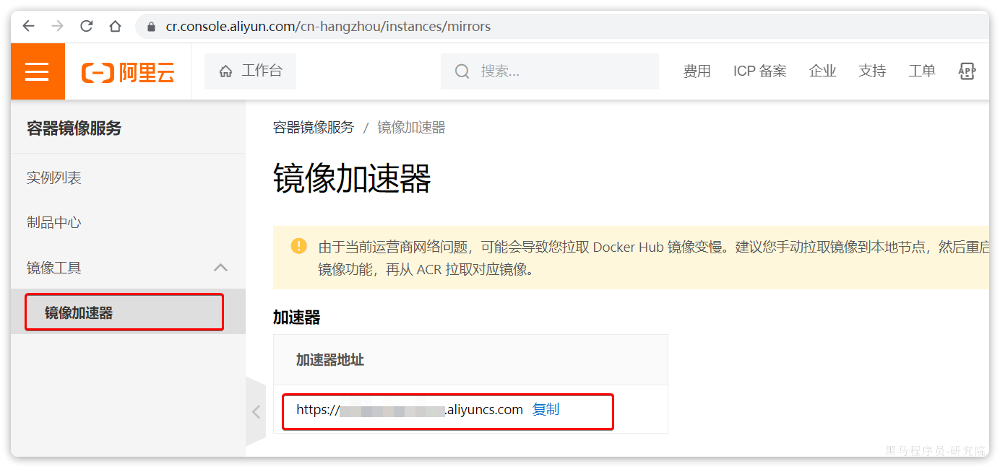

页面向下滚动，即可找到配置的文档说明：

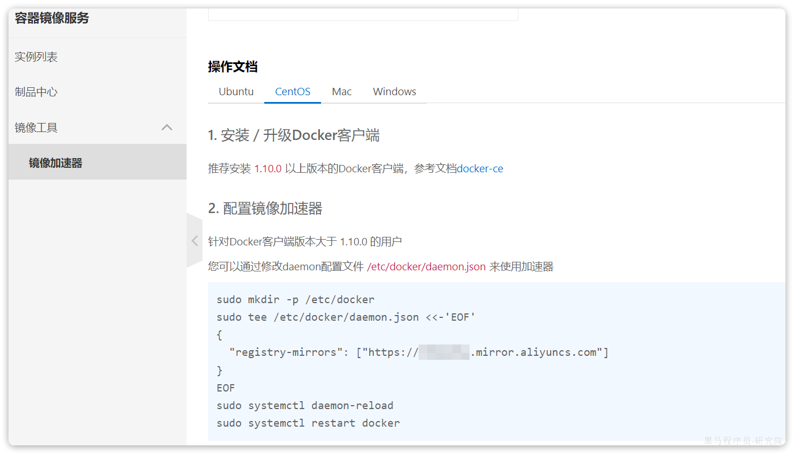

具体命令如下：

```Bash
# 创建目录
mkdir -p /etc/docker

# 复制内容，注意把其中的镜像加速地址改成你自己的
tee /etc/docker/daemon.json <<-'EOF'
{
  "registry-mirrors": ["https://xxxx.mirror.aliyuncs.com"]
}
EOF

# 重新加载配置
systemctl daemon-reload

# 重启Docker
systemctl restart docker
```

## 2、快速入门

### 2.1 部署MySQL

首先，我们利用Docker来安装一个MySQL软件，大家可以对比一下之前传统的安装方式，看看哪个效率更高一些。

如果是利用传统方式部署MySQL，大概的步骤有：

- 搜索并下载MySQL安装包
- 上传至Linux环境
- 编译和配置环境
- 安装

而使用Docker安装，仅仅需要一步即可，在命令行输入下面的命令（建议采用CV大法）：

```PowerShell
docker run -d \
  --name mysql \
  -p 3306:3306 \
  -e TZ=Asia/Shanghai \
  -e MYSQL_ROOT_PASSWORD=123 \
  mysql
```

运行效果如图：


MySQL安装完毕！通过任意客户端工具即可连接到MySQL.

大家可以发现，当我们执行命令后，Docker做的第一件事情，是去自动搜索并下载了MySQL，然后会自动运行MySQL，我们完全不用插手，是不是非常方便。

而且，这种安装方式你完全不用考虑运行的操作系统环境，它不仅仅在CentOS系统是这样，在Ubuntu系统、macOS系统、甚至是装了WSL的Windows下，都可以使用这条命令来安装MySQL。

要知道，**不同操作系统下其安装包、运行环境是都不相同的**！如果是**手动安装，必须手动解决安装包不同、环境不同的、配置不同的问题**！

而使用Docker，这些完全不用考虑。就是因为Docker会自动搜索并下载MySQL。注意：这里下载的不是安装包，而是**镜像。**镜像中不仅包含了MySQL本身，还包含了其运行所需要的环境、配置、系统级函数库。因此它在运行时就有自己独立的环境，就可以跨系统运行，也不需要手动再次配置环境了。这套独立运行的隔离环境我们称为**容器**。

说明：

- 镜像：英文是image
- 容器：英文是container

> 因此，Docker安装软件的过程，就是自动搜索下载镜像，然后创建并运行容器的过程。

Docker会根据命令中的镜像名称自动搜索并下载镜像，那么问题来了，它是去哪里搜索和下载镜像的呢？这些镜像又是谁制作的呢？

Docker官方提供了一个专门管理、存储镜像的网站，并对外开放了镜像上传、下载的权利。Docker官方提供了一些基础镜像，然后各大软件公司又在基础镜像基础上，制作了自家软件的镜像，全部都存放在这个网站。这个网站就成了Docker镜像交流的社区：

https://hub.docker.com/

基本上我们常用的各种软件都能在这个网站上找到，我们甚至可以自己制作镜像上传上去。

像这种提供存储、管理Docker镜像的服务器，被称为DockerRegistry，可以翻译为镜像仓库。DockerHub网站是官方仓库，阿里云、华为云会提供一些第三方仓库，我们也可以自己搭建私有的镜像仓库。

官方仓库在国外，下载速度较慢，一般我们都会使用第三方仓库提供的镜像加速功能，提高下载速度。而企业内部的机密项目，往往会采用私有镜像仓库。

总之，镜像的来源有两种：

- 基于官方基础镜像自己制作
- 直接去DockerRegistry下载

> **总结一下**：
>
> Docker本身包含一个后台服务，我们可以利用Docker命令告诉Docker服务，帮助我们快速部署指定的应用。Docker服务部署应用时，首先要去搜索并下载应用对应的镜像，然后根据镜像创建并允许容器，应用就部署完成了。

用一幅图标示如下：


### 2.1 命令解读

利用Docker快速的安装了MySQL，非常的方便，不过我们执行的命令到底是什么意思呢？

```powershell
docker run -d \
  --name mysql \
  -p 3306:3306 \
  -e TZ=Asia/Shanghai \
  -e MYSQL_ROOT_PASSWORD=123 \
  mysql
```

>解读：
>
>- `docker run -d` ：创建并运行一个容器，`-d`则是让容器以后台进程运行
>- `--name`` mysql ` : 给容器起个名字叫`mysql`，必须唯一，你可以叫别的
>- `-p 3306:3306` : 设置端口映射。
>  - **容器是隔离环境**，外界不可访问。但是可以**将宿主机端口映射容器内到端口**，当访问宿主机指定端口时，就是在访问容器内的端口了。
>  - 容器内端口往往是由容器内的进程决定，例如MySQL进程默认端口是3306，因此容器内端口一定是3306；而宿主机端口则可以任意指定，一般与容器内保持一致。
>  - 格式： `-p 宿主机端口:容器内端口`，示例中就是将宿主机的3306映射到容器内的3306端口
>- `-``e`` TZ=Asia/Shanghai` : 配置容器内进程运行时的一些参数
>  - 格式：`-e KEY=VALUE`，KEY和VALUE都由容器内进程决定
>  - 案例中，`TZ=Asia/Shanghai`是设置时区；`MYSQL_ROOT_PASSWORD=123`是设置MySQL默认密码
>- `mysql` : 设置**镜像**名称，Docker会根据这个名字搜索并下载镜像
>  - 格式：`REPOSITORY:TAG`，例如`mysql:8.0`，其中`REPOSITORY`可以理解为镜像名，`TAG`是版本号
>  - 在未指定`TAG`的情况下，默认是最新版本，也就是`mysql:latest`
>
>

镜像的名称不是随意的，而是要到DockerRegistry中寻找，镜像运行时的配置也不是随意的，要参考镜像的帮助文档，这些在DockerHub网站或者软件的官方网站中都能找到。

如果我们要安装其它软件，也可以到DockerRegistry中寻找对应的镜像名称和版本，阅读相关配置即可。

## 3.Docker基础

接下来，我们一起来学习Docker使用的一些基础知识，为将来部署项目打下基础。具体用法可以参考Docker官方文档：

https://docs.docker.com/

### 3.1 常见命令

首先我们来学习Docker中的常见命令，可以参考官方文档：

https://docs.docker.com/engine/reference/commandline/cli/

#### 3.1.1 命令介绍

其中，比较常见的命令有：

| **命令**       | **说明**                       | **文档地址**                                                 |
| :------------- | :----------------------------- | :----------------------------------------------------------- |
| docker pull    | 拉取镜像                       | [docker pull](https://docs.docker.com/engine/reference/commandline/pull/) |
| docker push    | 推送镜像到DockerRegistry       | [docker push](https://docs.docker.com/engine/reference/commandline/push/) |
| docker images  | 查看本地镜像                   | [docker images](https://docs.docker.com/engine/reference/commandline/images/) |
| docker rmi     | 删除本地镜像                   | [docker rmi](https://docs.docker.com/engine/reference/commandline/rmi/) |
| docker run     | 创建并运行容器（不能重复创建） | [docker run](https://docs.docker.com/engine/reference/commandline/run/) |
| docker stop    | 停止指定容器                   | [docker stop](https://docs.docker.com/engine/reference/commandline/stop/) |
| docker start   | 启动指定容器                   | [docker start](https://docs.docker.com/engine/reference/commandline/start/) |
| docker restart | 重新启动容器                   | [docker restart](https://docs.docker.com/engine/reference/commandline/restart/) |
| docker rm      | 删除指定容器                   | [docs.docker.com](https://docs.docker.com/engine/reference/commandline/rm/) |
| docker ps      | 查看容器                       | [docker ps](https://docs.docker.com/engine/reference/commandline/ps/) |
| docker logs    | 查看容器运行日志               | [docker logs](https://docs.docker.com/engine/reference/commandline/logs/) |
| docker exec    | 进入容器                       | [docker exec](https://docs.docker.com/engine/reference/commandline/exec/) |
| docker save    | 保存镜像到本地压缩文件         | [docker save](https://docs.docker.com/engine/reference/commandline/save/) |
| docker load    | 加载本地压缩文件到镜像         | [docker load](https://docs.docker.com/engine/reference/commandline/load/) |
| docker inspect | 查看容器详细信息               | [docker inspect](https://docs.docker.com/engine/reference/commandline/inspect/) |

用一副图来表示这些命令的关系：


补充：

默认情况下，每次重启虚拟机我们都需要手动启动Docker和Docker中的容器。通过命令可以实现开机自启：

```PowerShell
# Docker开机自启
systemctl enable docker

# Docker容器开机自启
docker update --restart=always [容器名/容器id]
```

#### 3.1.2 演示

教学环节说明：我们以Nginx为例给大家演示上述命令。

```PowerShell
# 第1步，去DockerHub查看nginx镜像仓库及相关信息

# 第2步，拉取Nginx镜像
docker pull nginx

# 第3步，查看镜像
docker images
# 结果如下：
REPOSITORY   TAG       IMAGE ID       CREATED         SIZE
nginx        latest    605c77e624dd   16 months ago   141MB
mysql        latest    3218b38490ce   17 months ago   516MB

# 第4步，创建并允许Nginx容器
docker run -d --name nginx -p 80:80 nginx

# 第5步，查看运行中容器
docker ps
# 也可以加格式化方式访问，格式会更加清爽
docker ps --format "table {{.ID}}\t{{.Image}}\t{{.Ports}}\t{{.Status}}\t{{.Names}}"

# 第6步，访问网页，地址：http://虚拟机地址

# 第7步，停止容器
docker stop nginx

# 第8步，查看所有容器
docker ps -a --format "table {{.ID}}\t{{.Image}}\t{{.Ports}}\t{{.Status}}\t{{.Names}}"

# 第9步，再次启动nginx容器
docker start nginx

# 第10步，再次查看容器
docker ps --format "table {{.ID}}\t{{.Image}}\t{{.Ports}}\t{{.Status}}\t{{.Names}}"

# 第11步，查看容器详细信息
docker inspect nginx

# 第12步，进入容器,查看容器内目录
docker exec -it nginx bash
# 或者，可以进入MySQL
docker exec -it mysql mysql -uroot -p

# 第13步，删除容器
docker rm nginx
# 发现无法删除，因为容器运行中，强制删除容器
docker rm -f nginx
```

#### 3.1.3 命令别名

给常用Docker命令起别名，方便我们访问：

```PowerShell
# 修改/root/.bashrc文件
vi /root/.bashrc
内容如下：
# .bashrc

# User specific aliases and functions

alias rm='rm -i'
alias cp='cp -i'
alias mv='mv -i'
alias dps='docker ps --format "table {{.ID}}\t{{.Image}}\t{{.Ports}}\t{{.Status}}\t{{.Names}}"'
alias dis='docker images'

# Source global definitions
if [ -f /etc/bashrc ]; then
        . /etc/bashrc
fi
```

然后，执行命令使别名生效

```PowerShell
source /root/.bashrc
```

接下来，试试看新的命令吧。

### 3.2 数据卷

容器是隔离环境，容器内程序的文件、配置、运行时产生的容器都在容器内部，我们要读写容器内的文件非常不方便。大家思考几个问题：

- 如果要升级MySQL版本，需要销毁旧容器，那么数据岂不是跟着被销毁了？
- MySQL、Nginx容器运行后，如果我要修改其中的某些配置该怎么办？
- 我想要让Nginx代理我的静态资源怎么办？

因此，容器提供程序的运行环境，但是**程序运行产生的数据、程序运行依赖的配置都应该与容器****解耦**。

#### 3.2.1 什么是数据卷

**数据卷（volume）**是一个虚拟目录，是**容器内目录**与**宿主机****目录**之间映射的桥梁。

以Nginx为例，我们知道Nginx中有两个关键的目录：

- `html`：放置一些静态资源
- `conf`：放置配置文件

如果我们要让Nginx代理我们的静态资源，最好是放到`html`目录；如果我们要修改Nginx的配置，最好是找到`conf`下的`nginx.conf`文件。

但遗憾的是，容器运行的Nginx所有的文件都在容器内部。所以我们必须利用数据卷将两个目录与宿主机目录关联，方便我们操作。如图：


在上图中：

- 我们创建了两个数据卷：`conf`、`html`
- Nginx容器内部的`conf`目录和`html`目录分别与两个数据卷关联。
- 而数据卷conf和html分别指向了宿主机的`/var/lib/docker/volumes/conf/_data`目录和`/var/lib/docker/volumes/html/_data`目录

这样以来，容器内的`conf`和`html`目录就 与宿主机的`conf`和`html`目录关联起来，我们称为**挂载**。此时，我们操作宿主机的`/var/lib/docker/volumes/html/_data`就是在操作容器内的`/usr/share/nginx/html/_data`目录。只要我们将静态资源放入宿主机对应目录，就可以被Nginx代理了。

**小提示**：

`/var/lib/docker/volumes`这个目录就是默认的存放所有容器数据卷的目录，其下再根据数据卷名称创建新目录，格式为`/数据卷名/_data`。

**为什么不让容器目录直接指向****宿主机****目录呢**？

- 因为直接指向宿主机目录就与宿主机强耦合了，如果切换了环境，宿主机目录就可能发生改变了。由于容器一旦创建，目录挂载就无法修改，这样容器就无法正常工作了。
- 但是容器指向数据卷，一个逻辑名称，而数据卷再指向宿主机目录，就不存在强耦合。如果宿主机目录发生改变，只要改变数据卷与宿主机目录之间的映射关系即可。

不过，我们通过由于数据卷目录比较深，不好寻找，通常我们也**允许让容器直接与****宿主机****目录挂载而不使用数据卷**，具体参考3.2.3小节。

#### 3.2.2 数据卷命令

数据卷的相关命令有：

| **命令**              | **说明**             | **文档地址**                                                 |
| :-------------------- | :------------------- | :----------------------------------------------------------- |
| docker volume create  | 创建数据卷           | [docker volume create](https://docs.docker.com/engine/reference/commandline/volume_create/) |
| docker volume ls      | 查看所有数据卷       | [docs.docker.com](https://docs.docker.com/engine/reference/commandline/volume_ls/) |
| docker volume rm      | 删除指定数据卷       | [docs.docker.com](https://docs.docker.com/engine/reference/commandline/volume_prune/) |
| docker volume inspect | 查看某个数据卷的详情 | [docs.docker.com](https://docs.docker.com/engine/reference/commandline/volume_inspect/) |
| docker volume prune   | 清除数据卷           | [docker volume prune](https://docs.docker.com/engine/reference/commandline/volume_prune/) |

注意：容器与数据卷的挂载要在创建容器时配置，对于创建好的容器，是不能设置数据卷的。而且**创建容器的过程中，数据卷会自动创建**。

教学**演示环节**：演示一下nginx的html目录挂载

```PowerShell
# 1.首先创建容器并指定数据卷，注意通过 -v 参数来指定数据卷
docker run -d --name nginx -p 80:80 -v html:/usr/share/nginx/html nginx

# 2.然后查看数据卷
docker volume ls
# 结果
DRIVER    VOLUME NAME
local     29524ff09715d3688eae3f99803a2796558dbd00ca584a25a4bbc193ca82459f
local     html

# 3.查看数据卷详情
docker volume inspect html
# 结果
[
    {
        "CreatedAt": "2024-05-17T19:57:08+08:00",
        "Driver": "local",
        "Labels": null,
        "Mountpoint": "/var/lib/docker/volumes/html/_data",
        "Name": "html",
        "Options": null,
        "Scope": "local"
    }
]

# 4.查看/var/lib/docker/volumes/html/_data目录
ll /var/lib/docker/volumes/html/_data
# 可以看到与nginx的html目录内容一样，结果如下：
总用量 8
-rw-r--r--. 1 root root 497 12月 28 2021 50x.html
-rw-r--r--. 1 root root 615 12月 28 2021 index.html

# 5.进入该目录，并随意修改index.html内容
cd /var/lib/docker/volumes/html/_data
vi index.html

# 6.打开页面，查看效果

# 7.进入容器内部，查看/usr/share/nginx/html目录内的文件是否变化
docker exec -it nginx bash
```

教学**演示环节**：演示一下MySQL的匿名数据卷

```PowerShell
# 1.查看MySQL容器详细信息
docker inspect mysql
# 关注其中.Config.Volumes部分和.Mounts部分
```

我们关注两部分内容，第一是`.Config.Volumes`部分：

```JSON
{
  "Config": {
    // ... 略
    "Volumes": {
      "/var/lib/mysql": {}
    }
    // ... 略
  }
}
```

可以发现这个容器声明了一个本地目录，需要挂载数据卷，但是**数据卷未定义**。这就是匿名卷。

然后，我们再看结果中的`.Mounts`部分：

```JSON
{
  "Mounts": [
    {
      "Type": "volume",
      "Name": "29524ff09715d3688eae3f99803a2796558dbd00ca584a25a4bbc193ca82459f",
      "Source": "/var/lib/docker/volumes/29524ff09715d3688eae3f99803a2796558dbd00ca584a25a4bbc193ca82459f/_data",
      "Destination": "/var/lib/mysql",
      "Driver": "local",
    }
  ]
}
```

可以发现，其中有几个关键属性：

- Name：数据卷名称。由于定义容器未设置容器名，这里的就是匿名卷自动生成的名字，一串hash值。
- Source：宿主机目录
- Destination : 容器内的目录

上述配置是将容器内的`/var/lib/mysql`这个目录，与数据卷`29524ff09715d3688eae3f99803a2796558dbd00ca584a25a4bbc193ca82459f`挂载。于是在宿主机中就有了`/var/lib/docker/volumes/29524ff09715d3688eae3f99803a2796558dbd00ca584a25a4bbc193ca82459f/_data`这个目录。这就是匿名数据卷对应的目录，其使用方式与普通数据卷没有差别。

接下来，可以查看该目录下的MySQL的data文件：

```Bash
ls -l /var/lib/docker/volumes/29524ff09715d3688eae3f99803a2796558dbd00ca584a25a4bbc193ca82459f/_data
```

注意：每一个不同的镜像，将来创建容器后内部有哪些目录可以挂载，可以参考DockerHub对应的页面

#### 3.2.3 挂载本地目录或文件

可以发现，数据卷的目录结构较深，如果我们去操作数据卷目录会不太方便。在很多情况下，我们会直接将容器目录与宿主机指定目录挂载。挂载语法与数据卷类似：

```Bash
# 挂载本地目录
-v 本地目录:容器内目录
# 挂载本地文件
-v 本地文件:容器内文件
```

**注意**：本地目录或文件必须以 `/` 或 `./`开头，如果直接以名字开头，会被识别为数据卷名而非本地目录名。

例如：

```Bash
-v mysql:/var/lib/mysql # 会被识别为一个数据卷叫mysql，运行时会自动创建这个数据卷
-v ./mysql:/var/lib/mysql # 会被识别为当前目录下的mysql目录，运行时如果不存在会创建目录
```

**教学演示**，删除并重新创建mysql容器，并完成本地目录挂载：

- 挂载`/root/mysql/data`到容器内的`/var/lib/mysql`目录
- 挂载`/root/mysql/init`到容器内的`/docker-entrypoint-initdb.d`目录（初始化的SQL脚本目录）
- 挂载`/root/mysql/conf`到容器内的`/etc/mysql/conf.d`目录（这个是MySQL配置文件目录）

在课前资料中已经准备好了mysql的`init`目录和`conf`目录：


以及对应的初始化SQL脚本和配置文件：

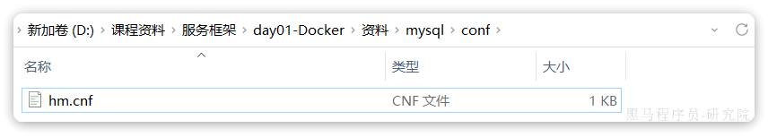


我们直接将整个mysql目录上传至虚拟机的`/root`目录下：


接下来，我们演示本地目录挂载：

```Bash
# 1.删除原来的MySQL容器
docker rm -f mysql

# 2.进入root目录
cd ~

# 3.创建并运行新mysql容器，挂载本地目录
docker run -d \
  --name mysql \
  -p 3306:3306 \
  -e TZ=Asia/Shanghai \
  -e MYSQL_ROOT_PASSWORD=123 \
  -v ./mysql/data:/var/lib/mysql \
  -v ./mysql/conf:/etc/mysql/conf.d \
  -v ./mysql/init:/docker-entrypoint-initdb.d \
  mysql

# 4.查看root目录，可以发现~/mysql/data目录已经自动创建好了
ls -l mysql
# 结果：
总用量 4
drwxr-xr-x. 2 root    root   20 5月  19 15:11 conf
drwxr-xr-x. 7 polkitd root 4096 5月  19 15:11 data
drwxr-xr-x. 2 root    root   23 5月  19 15:11 init

# 查看data目录，会发现里面有大量数据库数据，说明数据库完成了初始化
ls -l data

# 5.查看MySQL容器内数据
# 5.1.进入MySQL
docker exec -it mysql mysql -uroot -p123
# 5.2.查看编码表
show variables like "%char%";
# 5.3.结果，发现编码是utf8mb4没有问题
+--------------------------+--------------------------------+
| Variable_name            | Value                          |
+--------------------------+--------------------------------+
| character_set_client     | utf8mb4                        |
| character_set_connection | utf8mb4                        |
| character_set_database   | utf8mb4                        |
| character_set_filesystem | binary                         |
| character_set_results    | utf8mb4                        |
| character_set_server     | utf8mb4                        |
| character_set_system     | utf8mb3                        |
| character_sets_dir       | /usr/share/mysql-8.0/charsets/ |
+--------------------------+--------------------------------+

# 6.查看数据
# 6.1.查看数据库
show databases;
# 结果，hmall是黑马商城数据库
+--------------------+
| Database           |
+--------------------+
| hmall              |
| information_schema |
| mysql              |
| performance_schema |
| sys                |
+--------------------+
5 rows in set (0.00 sec)
# 6.2.切换到hmall数据库
use hmall;
# 6.3.查看表
show tables;
# 结果：
+-----------------+
| Tables_in_hmall |
+-----------------+
| address         |
| cart            |
| item            |
| order           |
| order_detail    |
| order_logistics |
| pay_order       |
| user            |
+-----------------+
# 6.4.查看address表数据
+----+---------+----------+--------+----------+-------------+---------------+-----------+------------+-------+
| id | user_id | province | city   | town     | mobile      | street        | contact   | is_default | notes |
+----+---------+----------+--------+----------+-------------+---------------+-----------+------------+-------+
| 59 |       1 | 北京     | 北京   | 朝阳区    | 13900112222 | 金燕龙办公楼   | 李佳诚    | 0          | NULL  |
| 60 |       1 | 北京     | 北京   | 朝阳区    | 13700221122 | 修正大厦       | 李佳红    | 0          | NULL  |
| 61 |       1 | 上海     | 上海   | 浦东新区  | 13301212233 | 航头镇航头路   | 李佳星    | 1          | NULL  |
| 63 |       1 | 广东     | 佛山   | 永春      | 13301212233 | 永春武馆       | 李晓龙    | 0          | NULL  |
+----+---------+----------+--------+----------+-------------+---------------+-----------+------------+-------+
4 rows in set (0.00 sec)
```

### 3.3 镜像

前面我们一直在使用别人准备好的镜像，那如果我要部署一个Java项目，把它打包为一个镜像该怎么做呢？

#### 3.3.1 镜像结构

要想自己构建镜像，必须先了解镜像的结构。

之前我们说过，镜像之所以能让我们快速跨操作系统部署应用而忽略其运行环境、配置，就是因为镜像中包含了程序运行需要的系统函数库、环境、配置、依赖。

因此，自定义镜像本质就是依次准备好程序运行的基础环境、依赖、应用本身、运行配置等文件，并且打包而成。

举个例子，我们要从0部署一个Java应用，大概流程是这样：

- 准备一个linux服务（CentOS或者Ubuntu均可）
- 安装并配置JDK
- 上传Jar包
- 运行jar包

那因此，我们打包镜像也是分成这么几步：

- 准备Linux运行环境（java项目并不需要完整的操作系统，仅仅是基础运行环境即可）
- 安装并配置JDK
- 拷贝jar包
- 配置启动脚本 

上述步骤中的每一次操作其实都是在生产一些文件（系统运行环境、函数库、配置最终都是磁盘文件），所以**镜像就是一堆文件的集合**。

但需要注意的是，镜像文件不是随意堆放的，而是按照操作的步骤分层叠加而成，每一层形成的文件都会单独打包并标记一个唯一id，称为**Layer**（**层**）。这样，如果我们构建时用到的某些层其他人已经制作过，就可以直接拷贝使用这些层，而不用重复制作。

例如，第一步中需要的Linux运行环境，通用性就很强，所以Docker官方就制作了这样的只包含Linux运行环境的镜像。我们在制作java镜像时，就无需重复制作，直接使用Docker官方提供的CentOS或Ubuntu镜像作为基础镜像。然后再搭建其它层即可，这样逐层搭建，最终整个Java项目的镜像结构如图所示：


#### 3.3.2 Dockerfile

由于制作镜像的过程中，需要逐层处理和打包，比较复杂，所以Docker就提供了自动打包镜像的功能。我们只需要将打包的过程，每一层要做的事情用固定的语法写下来，交给Docker去执行即可。

而这种记录镜像结构的文件就称为**Dockerfile**，其对应的语法可以参考官方文档：

https://docs.docker.com/engine/reference/builder/

其中的语法比较多，比较常用的有：

| **指令**       | **说明**                                     | **示例**                     |
| :------------- | :------------------------------------------- | :--------------------------- |
| **FROM**       | 指定基础镜像                                 | `FROM centos:6`              |
| **ENV**        | 设置环境变量，可在后面指令使用               | `ENV key value`              |
| **COPY**       | 拷贝本地文件到镜像的指定目录                 | `COPY ./xx.jar /tmp/app.jar` |
| **RUN**        | 执行Linux的shell命令，一般是安装过程的命令   | `RUN yum install gcc`        |
| **EXPOSE**     | 指定容器运行时监听的端口，是给镜像使用者看的 | EXPOSE 8080                  |
| **ENTRYPOINT** | 镜像中应用的启动命令，容器运行时调用         | ENTRYPOINT java -jar xx.jar  |

例如，要基于Ubuntu镜像来构建一个Java应用，其Dockerfile内容如下：

```Dockerfile
# 指定基础镜像
FROM ubuntu:16.04
# 配置环境变量，JDK的安装目录、容器内时区
ENV JAVA_DIR=/usr/local
ENV TZ=Asia/Shanghai
# 拷贝jdk和java项目的包
COPY ./jdk8.tar.gz $JAVA_DIR/
COPY ./docker-demo.jar /tmp/app.jar
# 设定时区
RUN ln -snf /usr/share/zoneinfo/$TZ /etc/localtime && echo $TZ > /etc/timezone
# 安装JDK
RUN cd $JAVA_DIR \
 && tar -xf ./jdk8.tar.gz \
 && mv ./jdk1.8.0_144 ./java8
# 配置环境变量
ENV JAVA_HOME=$JAVA_DIR/java8
ENV PATH=$PATH:$JAVA_HOME/bin
# 指定项目监听的端口
EXPOSE 8080
# 入口，java项目的启动命令
ENTRYPOINT ["java", "-jar", "/app.jar"]
```

同学们思考一下：以后我们会有很多很多java项目需要打包为镜像，他们都需要Linux系统环境、JDK环境这两层，只有上面的3层不同（因为jar包不同）。如果每次制作java镜像都重复制作前两层镜像，是不是很麻烦。

所以，就有人提供了基础的系统加JDK环境，我们在此基础上制作java镜像，就可以省去JDK的配置了：

```Dockerfile
# 基础镜像
FROM openjdk:11.0-jre-buster
# 设定时区
ENV TZ=Asia/Shanghai
RUN ln -snf /usr/share/zoneinfo/$TZ /etc/localtime && echo $TZ > /etc/timezone
# 拷贝jar包
COPY docker-demo.jar /app.jar
# 入口
ENTRYPOINT ["java", "-jar", "/app.jar"]
```

#### 3.3.3 构建镜像

当Dockerfile文件写好以后，就可以利用命令来构建镜像了。

在课前资料中，我们准备好了一个demo项目及对应的Dockerfile：


首先，我们将课前资料提供的`docker-demo.jar`包以及`Dockerfile`拷贝到虚拟机的`/root/demo`目录：

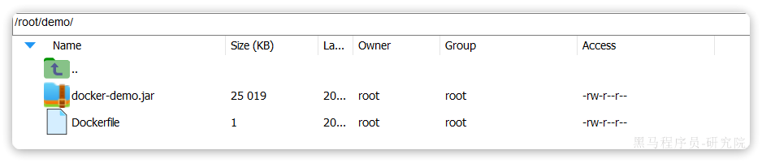

然后，执行命令，构建镜像：

```Bash
# 进入镜像目录
cd /root/demo
# 开始构建
docker build -t docker-demo:1.0  .
```

命令说明：

- `docker build `: 就是构建一个docker镜像
- `-t docker-demo:1.0` ：`-t`参数是指定镜像的名称（`repository`和`tag`）
- `.` : 最后的点是指构建时Dockerfile所在路径，由于我们进入了demo目录，所以指定的是`.`代表当前目录，也可以直接指定Dockerfile目录：
  
  - ```Bash
    # 直接指定Dockerfile目录
    docker build -t docker-demo:1.0 /root/demo
    ```

结果：


查看镜像列表：

```Bash
# 查看镜像列表：
docker images
# 结果
REPOSITORY    TAG       IMAGE ID       CREATED          SIZE
docker-demo   1.0       d6ab0b9e64b9   27 minutes ago   327MB
nginx         latest    605c77e624dd   16 months ago    141MB
mysql         latest    3218b38490ce   17 months ago    516MB
```

然后尝试运行该镜像：

```Bash
# 1.创建并运行容器
docker run -d --name dd -p 8080:8080 docker-demo:1.0
# 2.查看容器
dps
# 结果
CONTAINER ID   IMAGE             PORTS                                                  STATUS         NAMES
78a000447b49   docker-demo:1.0   0.0.0.0:8080->8080/tcp, :::8090->8090/tcp              Up 2 seconds   dd
f63cfead8502   mysql             0.0.0.0:3306->3306/tcp, :::3306->3306/tcp, 33060/tcp   Up 2 hours     mysql

# 3.访问
curl localhost:8080/hello/count
# 结果：
<h5>欢迎访问黑马商城, 这是您第1次访问<h5>
```

### 3.4 网络

上节课我们创建了一个Java项目的容器，而Java项目往往需要访问其它各种中间件，例如MySQL、Redis等。现在，我们的容器之间能否互相访问呢？我们来测试一下

首先，我们查看下MySQL容器的详细信息，重点关注其中的网络IP地址：

```Bash
# 1.用基本命令，寻找Networks.bridge.IPAddress属性
docker inspect mysql
# 也可以使用format过滤结果
docker inspect --format='{{range .NetworkSettings.Networks}}{{println .IPAddress}}{{end}}' mysql
# 得到IP地址如下：
172.17.0.2

# 2.然后通过命令进入dd容器
docker exec -it dd bash

# 3.在容器内，通过ping命令测试网络
ping 172.17.0.2
# 结果
PING 172.17.0.2 (172.17.0.2) 56(84) bytes of data.
64 bytes from 172.17.0.2: icmp_seq=1 ttl=64 time=0.053 ms
64 bytes from 172.17.0.2: icmp_seq=2 ttl=64 time=0.059 ms
64 bytes from 172.17.0.2: icmp_seq=3 ttl=64 time=0.058 ms
```

发现可以互联，没有问题。

但是，容器的网络IP其实是一个虚拟的IP，其值并不固定与某一个容器绑定，如果我们在开发时写死某个IP，而在部署时很可能MySQL容器的IP会发生变化，连接会失败。

所以，我们必须借助于docker的网络功能来解决这个问题，官方文档：

https://docs.docker.com/engine/reference/commandline/network/

常见命令有：

| **命令**                  | **说明**                 | **文档地址**                                                 |
| :------------------------ | :----------------------- | :----------------------------------------------------------- |
| docker network create     | 创建一个网络             | [docker network create](https://docs.docker.com/engine/reference/commandline/network_create/) |
| docker network ls         | 查看所有网络             | [docs.docker.com](https://docs.docker.com/engine/reference/commandline/network_ls/) |
| docker network rm         | 删除指定网络             | [docs.docker.com](https://docs.docker.com/engine/reference/commandline/network_rm/) |
| docker network prune      | 清除未使用的网络         | [docs.docker.com](https://docs.docker.com/engine/reference/commandline/network_prune/) |
| docker network connect    | 使指定容器连接加入某网络 | [docs.docker.com](https://docs.docker.com/engine/reference/commandline/network_connect/) |
| docker network disconnect | 使指定容器连接离开某网络 | [docker network disconnect](https://docs.docker.com/engine/reference/commandline/network_disconnect/) |
| docker network inspect    | 查看网络详细信息         | [docker network inspect](https://docs.docker.com/engine/reference/commandline/network_inspect/) |

教学演示：自定义网络

```Bash
# 1.首先通过命令创建一个网络
docker network create hmall

# 2.然后查看网络
docker network ls
# 结果：
NETWORK ID     NAME      DRIVER    SCOPE
639bc44d0a87   bridge    bridge    local
403f16ec62a2   hmall     bridge    local
0dc0f72a0fbb   host      host      local
cd8d3e8df47b   none      null      local
# 其中，除了hmall以外，其它都是默认的网络

# 3.让dd和mysql都加入该网络，注意，在加入网络时可以通过--alias给容器起别名
# 这样该网络内的其它容器可以用别名互相访问！
# 3.1.mysql容器，指定别名为db，另外每一个容器都有一个别名是容器名
docker network connect hmall mysql --alias db
# 3.2.db容器，也就是我们的java项目
docker network connect hmall dd

# 4.进入dd容器，尝试利用别名访问db
# 4.1.进入容器
docker exec -it dd bash
# 4.2.用db别名访问
ping db
# 结果
PING db (172.18.0.2) 56(84) bytes of data.
64 bytes from mysql.hmall (172.18.0.2): icmp_seq=1 ttl=64 time=0.070 ms
64 bytes from mysql.hmall (172.18.0.2): icmp_seq=2 ttl=64 time=0.056 ms
# 4.3.用容器名访问
ping mysql
# 结果：
PING mysql (172.18.0.2) 56(84) bytes of data.
64 bytes from mysql.hmall (172.18.0.2): icmp_seq=1 ttl=64 time=0.044 ms
64 bytes from mysql.hmall (172.18.0.2): icmp_seq=2 ttl=64 time=0.054 ms
```

OK，现在无需记住IP地址也可以实现容器互联了。

**总结**：

- 在自定义网络中，可以给容器起多个别名，默认的别名是容器名本身
- 在同一个自定义网络中的容器，可以通过别名互相访问

## 4、DockerCompose

大家可以看到，我们部署一个简单的java项目，其中包含3个容器：

- MySQL
- Nginx
- Java项目

而稍微复杂的项目，其中还会有各种各样的其它中间件，需要部署的东西远不止3个。如果还像之前那样手动的逐一部署，就太麻烦了。

而Docker Compose就可以帮助我们实现**多个相互关联的Docker容器的快速部署**。它允许用户通过一个单独的 docker-compose.yml 模板文件（YAML 格式）来定义一组相关联的应用容器。

### 4.1 基本语法

docker-compose.yml文件的基本语法可以参考官方文档：

https://docs.docker.com/compose/compose-file/compose-file-v3/

docker-compose文件中可以定义多个相互关联的应用容器，每一个应用容器被称为一个服务（service）。由于service就是在定义某个应用的运行时参数，因此与`docker run`参数非常相似。

举例来说，用docker run部署MySQL的命令如下：

```Bash
docker run -d \
  --name mysql \
  -p 3306:3306 \
  -e TZ=Asia/Shanghai \
  -e MYSQL_ROOT_PASSWORD=123 \
  -v ./mysql/data:/var/lib/mysql \
  -v ./mysql/conf:/etc/mysql/conf.d \
  -v ./mysql/init:/docker-entrypoint-initdb.d \
  --network hmall
  mysql
```

如果用`docker-compose.yml`文件来定义，就是这样：

```YAML
version: "3.8"

services:
  mysql:
    image: mysql
    container_name: mysql
    ports:
      - "3306:3306"
    environment:
      TZ: Asia/Shanghai
      MYSQL_ROOT_PASSWORD: 123
    volumes:
      - "./mysql/conf:/etc/mysql/conf.d"
      - "./mysql/data:/var/lib/mysql"
    networks:
      - new
networks:
  new:
    name: hmall
```

对比如下：

| **docker run 参数** | **docker compose 指令** | **说明**   |
| :------------------ | :---------------------- | :--------- |
| --name              | container_name          | 容器名称   |
| -p                  | ports                   | 端口映射   |
| -e                  | environment             | 环境变量   |
| -v                  | volumes                 | 数据卷配置 |
| --network           | networks                | 网络       |

明白了其中的对应关系，相信编写`docker-compose`文件应该难不倒大家。

黑马商城部署文件：

```YAML
version: "3.8"

services:
  mysql:
    image: mysql
    container_name: mysql
    ports:
      - "3306:3306"
    environment:
      TZ: Asia/Shanghai
      MYSQL_ROOT_PASSWORD: 123
    volumes:
      - "./mysql/conf:/etc/mysql/conf.d"
      - "./mysql/data:/var/lib/mysql"
      - "./mysql/init:/docker-entrypoint-initdb.d"
    networks:
      - hm-net
  hmall:
    build: 
      context: .
      dockerfile: Dockerfile
    container_name: hmall
    ports:
      - "8080:8080"
    networks:
      - hm-net
    depends_on:
      - mysql
  nginx:
    image: nginx
    container_name: nginx
    ports:
      - "18080:18080"
      - "18081:18081"
    volumes:
      - "./nginx/nginx.conf:/etc/nginx/nginx.conf"
      - "./nginx/html:/usr/share/nginx/html"
    depends_on:
      - hmall
    networks:
      - hm-net
networks:
  hm-net:
    name: hmall
```

### 4.2 基础命令

编写好docker-compose.yml文件，就可以部署项目了。常见的命令：

https://docs.docker.com/compose/reference/

基本语法如下：

```Bash
docker compose [OPTIONS] [COMMAND]
```

其中，OPTIONS和COMMAND都是可选参数，比较常见的有：

| **类型** | **参数或指令**                                               | **说明**                    |
| :------- | :----------------------------------------------------------- | :-------------------------- |
| Options  | -f                                                           | 指定compose文件的路径和名称 |
| -p       | 指定project名称。project就是当前compose文件中设置的多个service的集合，是逻辑概念 |                             |
| Commands | up                                                           | 创建并启动所有service容器   |
| down     | 停止并移除所有容器、网络                                     |                             |
| ps       | 列出所有启动的容器                                           |                             |
| logs     | 查看指定容器的日志                                           |                             |
| stop     | 停止容器                                                     |                             |
| start    | 启动容器                                                     |                             |
| restart  | 重启容器                                                     |                             |
| top      | 查看运行的进程                                               |                             |
| exec     | 在指定的运行中容器中执行命令                                 |                             |

教学演示：

```Bash
# 1.进入root目录
cd /root

# 2.删除旧容器
docker rm -f $(docker ps -qa)

# 3.删除hmall镜像
docker rmi hmall

# 4.清空MySQL数据
rm -rf mysql/data

# 5.启动所有, -d 参数是后台启动
docker compose up -d
# 结果：
[+] Building 15.5s (8/8) FINISHED
 => [internal] load build definition from Dockerfile                                    0.0s
 => => transferring dockerfile: 358B                                                    0.0s
 => [internal] load .dockerignore                                                       0.0s
 => => transferring context: 2B                                                         0.0s
 => [internal] load metadata for docker.io/library/openjdk:11.0-jre-buster             15.4s
 => [1/3] FROM docker.io/library/openjdk:11.0-jre-buster@sha256:3546a17e6fb4ff4fa681c3  0.0s
 => [internal] load build context                                                       0.0s
 => => transferring context: 98B                                                        0.0s
 => CACHED [2/3] RUN ln -snf /usr/share/zoneinfo/Asia/Shanghai /etc/localtime && echo   0.0s
 => CACHED [3/3] COPY hm-service.jar /app.jar                                           0.0s
 => exporting to image                                                                  0.0s
 => => exporting layers                                                                 0.0s
 => => writing image sha256:32eebee16acde22550232f2eb80c69d2ce813ed099640e4cfed2193f71  0.0s
 => => naming to docker.io/library/root-hmall                                           0.0s
[+] Running 4/4
 ✔ Network hmall    Created                                                             0.2s
 ✔ Container mysql  Started                                                             0.5s
 ✔ Container hmall  Started                                                             0.9s
 ✔ Container nginx  Started                                                             1.5s

# 6.查看镜像
docker compose images
# 结果
CONTAINER           REPOSITORY          TAG                 IMAGE ID            SIZE
hmall               root-hmall          latest              32eebee16acd        362MB
mysql               mysql               latest              3218b38490ce        516MB
nginx               nginx               latest              605c77e624dd        141MB

# 7.查看容器
docker compose ps
# 结果
NAME                IMAGE               COMMAND                  SERVICE             CREATED             STATUS              PORTS
hmall               root-hmall          "java -jar /app.jar"     hmall               54 seconds ago      Up 52 seconds       0.0.0.0:8080->8080/tcp, :::8080->8080/tcp
mysql               mysql               "docker-entrypoint.s…"   mysql               54 seconds ago      Up 53 seconds       0.0.0.0:3306->3306/tcp, :::3306->3306/tcp, 33060/tcp
nginx               nginx               "/docker-entrypoint.…"   nginx               54 seconds ago      Up 52 seconds       80/tcp, 0.0.0.0:18080-18081->18080-18081/tcp, :::18080-18081->18080-18081/tcp
```

打开浏览器，访问：http://yourIp:8080

# Gradle

## 1、Gradle入门

### 1.1 Gradle 简介

Gradle 是一款Google 推出的**基于 JVM、**通用灵活的**项目构建工具，**支持 Maven，JCenter 多种第三方仓库;支持传递性依赖管理、废弃了繁杂的xml 文件，转而使用**简洁的**、**支持多种语言**(例如：java、groovy 等)的 **build 脚本文件**。


官网地址: https://gradle.org/

学习Gradle 的原因：

1. 目前已经有相当一部分公司在逐渐使用Gradle作为项目构建工具了。
2. 作为Java开发程序员,如果想下载Spring、SpringBoot等Spring家族的源码，基本上基于Gradle构建的。

**总之，虽然目前市面上常见的项目构建工具有Ant、Maven、Gradle，主流还是Maven，但是未来趋势Gradle**。

### 1.2 常见的项目构建工具

Ant: 2000 年 Apache 推出的纯Java 编写构建工具，通过 xml[build.xml]文件管理项目优点：使用灵活，速度快(快于 gradle 和 maven)，

缺点：Ant 没有强加任何编码约定的项目目录结构,开发人员需编写繁杂XML 文件构建指令,对开发人员是一个挑战。

Maven: 2004 年Apache 组织推出的再次使用xml 文件[pom.xml]管理项目的构建工具。

优点: 遵循一套约定大于配置的项目目录结构，使用统一的GAV 坐标进行依赖管理,**侧重于包管理**。缺点：项目构建过程僵化,配置文件编写不够灵活、不方便自定义组件,构建速度慢于 gradle。

Gradle: 2012 年Google 推出的基于Groovy 语言的全新项目构建工具，集合了Ant 和 Maven 各自的优势。

优点：集 Ant 脚本的灵活性+Maven 约定大于配置的项目目录优势,支持多种远程仓库和插件**,侧重于****大项目****构建**。缺点：学习成本高、资料少、脚本灵活、版本兼容性差等。


**Whatever:无论哪种项目构建工具，都有自身的优势和劣势，所以选择一款最适合自己的就是最好的。**

### 1.3 Gradle 项目目录结构

Gradle项目**默认目录结构和Maven 项目的目录结构一致**,都是基于**约定大于配置**【Convention Over Configuration】。其完整项目目录结构如下所示：


**Tips**:

1. 只有war工程才有webapp目录，对于普通的jar工程并没有webapp目录
2. gradlew与gradlew.bat执行的指定wrapper版本中的gradle指令,不是本地安装的gradle指令哦。

### 1.4 Gradle 创建第一个项目

**借助于 spring 脚手架创建gradle 第一个项目**：https://start.spring.io/


查看生成的gradle 项目目录结构如下所示:


与上图对比会发现：总体的目录结构与上图说明的是一致的。

#### 1.4.1 Gradle中的常用指令

Gradle 常用命令说明:


**需要注意的是：gradle 的指令要在含有build.gradle 的目录执行****。**

#### 1.4.2 修改maven下载源

Gradle 自带的Maven 源地址是国外的，该Maven 源在国内的访问速度是很慢的，除非使用了特别的手段。一般情况下，我们建议使用国内的第三方开放的Maven 源或企业内部自建Maven 源。

认识init.d 文件夹

我们可以在gradle的init.d目录下创建以.gradle结尾的文件.gradle文件可以实现在build开始之前执行，所以你可以在这个文件配置一些你想预先加载的操作。

在init.d文件夹创建init.gradle 文件

```groovy
allprojects {
    repositories {
        mavenLocal()
        maven { name "Alibaba" ; url "https://maven.aliyun.com/repository/public" } 
        maven { name "Bstek" ; url "https://nexus.bsdn.org/content/groups/public/" } 
        mavenCentral()
    }
    
    buildscript {
        repositories {
            maven { name "Alibaba" ; url 'https://maven.aliyun.com/repository/public' } 
            maven { name "Bstek" ; url 'https://nexus.bsdn.org/content/groups/public/' } 
            maven { name "M2" ; url 'https://plugins.gradle.org/m2/' }
        }
    }
}
```

**拓展 1**：启用init.gradle文件的方法有

>1.在命令行指定文件,例如：gradle --init-script yourdir/init.gradle -q taskName。你可以多次输入此命令来指定多个init文件2.把init.gradle文件放到 USER_HOME/.gradle/ 目录下
>
>1. 把以.gradle结尾的文件放到 USER_HOME/.gradle/init.d/ 目录下
>2. 把以.gradle结尾的文件放到 GRADLE_HOME/init.d/ 目录下
>
>如果存在上面的4种方式的2种以上，gradle会按上面的1-4序号依次执行这些文件，如果给定目录下存在多个init脚本，会按拼音a-z顺序执行这些脚本，每个init脚本都存在一个对应的gradle实例,你在这个文件中调用的所有方法和属性，都会委托给这个gradle实例，每个init脚本都实现了Script接口。

**拓展** 2：仓库地址说明

>mavenLocal(): 指定使用maven本地仓库，而本地仓库在配置maven时settings文件指定的仓库位置。如E:/repository，gradle 查找jar包顺序如下：USER_HOME/.m2/settings.xml >> M2_HOME/conf/settings.xml >> USER_HOME/.m2/repository
>
>
>
>maven { url 地址}，指定maven仓库，一般用私有仓库地址或其它的第三方库【比如阿里镜像仓库地址】。
>
>mavenCentral()：这是Maven的中央仓库，无需配置，直接声明就可以使用。
>
>jcenter():JCenter中央仓库，实际也是是用的maven搭建的，但相比Maven仓库更友好，通过CDN分发，并且支持https访问,在新版本中已经废弃了，替换为了mavenCentral()。
>
>
>
>总之, gradle可以通过指定仓库地址为本地maven仓库地址和远程仓库地址相结合的方式，避免每次都会去远程仓库下载依赖库。这种方式也有一定的问题，如果本地maven仓库有这个依赖，就会从直接加载本地依赖，如果本地仓库没有该依赖，那么还是会从远程下载。但是下载的jar不是存储在本地maven仓库中，而是放在自己的缓存目录中，默认在USER_HOME/.gradle/caches目录,当然如果我们配置过GRADLE_USER_HOME环境变量，则会放在GRADLE_USER_HOME/caches目录,那么可不可以将gradle caches指向maven repository。我们说这是不行的，caches下载文件不是按照maven仓库中存放的方式。

**拓展** 3：阿里云仓库地址请参考：https://developer.aliyun.com/mvn/guide


在gradle 中的使用说明：


#### 1.4.3 Wrapper 包装器

Gradle Wrapper 实际上就是对 Gradle 的一层包装，用于解决实际开发中可能会遇到的不同的项目需要不同版本的 Gradle

问题。例如：把自己的代码共享给其他人使用，可能出现如下情况:

1. 对方电脑没有安装 gradle
2. 对方电脑安装过 gradle，但是版本太旧了

这时候，我们就可以考虑使用 Gradle Wrapper 了。这也是官方建议使用 Gradle Wrapper 的原因。实际上有了 Gradle Wrapper 之后，我们本地是可以不配置 Gradle 的,下载Gradle 项目后，使用 gradle 项目自带的wrapper 操作也是可以的。

那如何使用Gradle Wrapper 呢？

项目中的gradlew、gradlew.cmd脚本用的就是wrapper中规定的gradle版本。参见源码

而我们上面提到的gradle指令用的是本地gradle,所以gradle指令和gradlew指令所使用的gradle版本**有可能是不一样的**。

gradlew、gradlew.cmd的使用方式与gradle使用方式完全一致，只不过把gradle指令换成了gradlew指令。

当然,我们也可在终端执行 gradlew 指令时，指定指定一些参数,来控制 Wrapper 的生成，比如依赖的版本等，如下：


具体操作如下所示 ：

gradle wrapper --gradle-version=4.4：升级wrapper版本号,只是修改gradle.properties中wrapper版本，未实际下载

gradle wrapper --gradle-version 5.2.1 --distribution-type all :关联源码用

##### **GradleWrapper 的执行流程：**

1. 当我们第一次执行 ./gradlew build 命令的时候，gradlew 会读取 gradle-wrapper.properties 文件的配置信息
2. 准确的将指定版本的 gradle 下载并解压到指定的位置(GRADLE_USER_HOME目录下的wrapper/dists目录中)
3. 并构建本地缓存(GRADLE_USER_HOME目录下的caches目录中),下载再使用相同版本的gradle就不用下载了
4. 之后执行的 ./gradlew 所有命令都是使用指定的 gradle 版本。**如下图所示**：


gradle-wrapper.properties 文件解读:


注意：前面提到的 **GRALE_USER_HOME 环境变量**用于这里的Gradle Wrapper 下载的特定版本的gradle 存储目录。如果我们**没有配置过GRALE_USER_HOME 环境变量,默认在当前用户家目录下的.gradle 文件夹中。**

那什么时候选择使用 gradle wrapper、什么时候选择使用本地gradle?

下载别人的项目或者使用操作以前自己写的不同版本的gradle项目时：用Gradle wrapper,也即:gradlew

什么时候使用本地gradle?新建一个项目时: 使用gradle指令即可。

## 2、Gradle与Idea整合

### 2.1 在Idea中创建普通java工程

#### 具体整合：

第一步：创建由Gradle 管理的项目


第二步：修改当前项目使用本地安装的gradle：可以加快下载项目依赖jar 包的速度【配置了私服地址】。


**特别提示 1：**使得在Terminal 中执行以gradlew 开头命令和操作图形化的IDEA 使用Gradle 版本**不一定是同一个版本**哦。

1.Terminal中以gradlew开头指令用的是Wrapper规定的gradle版本,wrapper中规定版本默认和idea插件中规定的版本一致。

2.而图形化的IDEA使用Gradle是本地安装的哦。

**特别提示 2：**目前只能是在创建项目时重新设置本地gradle,创建新项目需要重新去改。

**特别提示3：**当 我 们 在 gradle.build 文 件 添 加 依 赖 之 后 ， 这 些 依 赖 会 在 下 载 到`GRADLE_USER_HOME/caches/modules-2/files-2.1` 目录下面,所以这里的 `GRADLE_USER_HOME` 相当于 Gradle 的本地仓库,当然也可以如下方式找到jar 包位置。

**轶哥提示：**

- 此处可以设置Gradle user home，如需更改idea新项目的设置可以通过`文件`——`新项目的设置更改`


- 调整使用的Gradle位置，可以加速Gradle构建


### 2.2 项目部署

当我们将一个 java 项目打成war 包之后，就需要部署到服务器运行，这里有两种方式：

- 我们将项目打成 war 包，部署到**本地tomcat** 运行:演示
- 使用 **Gretty 插件**中**内置服务器**方式部署项目:  演示

#### 2.2.1 Gretty部署项目

Gretty 是一个功能丰富的 gradle 插件，用于在嵌入的 servlet 容器上运行 web 应用程序,让项目开发和部署更加简单。目前Gretty 插件已经作为 gradle 的核心库使用了,Gretty 其核心功能为：

1. 底层支持 jetty,tomcat 等Servlet 容器
2. 支持项目热部署、HTTPS、调试

Gretty 官网地址：http://akhikhl.github.io/gretty-doc/index.html

#### 2.2.2 具体使用

第一步：引入 Gretty 插件 

```groovy
plugins {
    id 'war'
    id 'org.gretty' version '2.2.0'
}
```


第二步:指定maven 仓库

```groovy
repositories {
    //指定jcenter仓库，一定要放在前面
    jcenter() 
    mavenCentral()
}
```


第三步:针对Gretty 插件的设置

```groovy
gretty {
    httpPort = 8888
    contextPath = "/web"
    debugPort = 5005	// default 
    debugSuspend = true // default 
    httpsEnabled = true
    managedClassReload=true // 修改了类之后重新加载
    //servletContainer = 'tomcat8' //如果不指定默认的servlet容器，支持tomcat7/8，默认是使用的是Jetty服务器
    httpsPort = 4431
}
```


第四步:执行Gretty 插件

```
gradle appRun
```

如 果 大 家 想 进 一 步 了 解 的 属 性 配 置 , 比 如 Gretty 热 部 署 等 设 置 ， 欢 迎 参 考 其 官 方 文 档

http://akhikhl.github.io/gretty-doc/Gretty-configuration.html。

### 2.3 Gradle 对测试支持

测试任务自动检测并执行测试源集中的所有单元测试。测试执行完成后会生成一个报告。支持JUnit 和 TestNG 测试。

#### 2.3.1 默认测试目录及标准输出


#### 2.3.2 Junit 使用

Gradle 对于Junit4.x 支持

```groovy
dependencies {
    testImplementation group: 'junit' ,name: 'junit', version: '4.12'
}
test {
    useJUnit()
}
```


Gradle 对于Junit5.x 版本支持

```groovy
dependencies {
    testImplementation 'org.junit.jupiter:junit-jupiter-api:5.8.1' 
    testRuntimeOnly 'org.junit.jupiter:junit-jupiter-engine:5.8.1'
}
test {
    useJUnitPlatform()
}
```

注意：无论是 Junt4.x 版本还是Junit5.x 版本，我们只需在 build.gradle 目录下执行gradle test 指令，gradle 就会帮我们执行所有的加了@Test 注解的测试，并生成测试报告。

**轶哥提示：**

测试报告在项目`build-reports`目录下，浏览器打开index.html即可查看

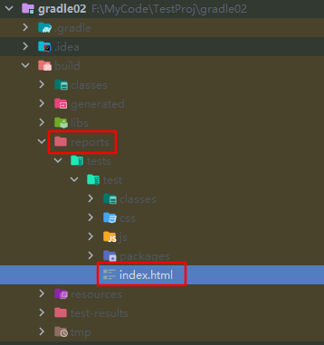

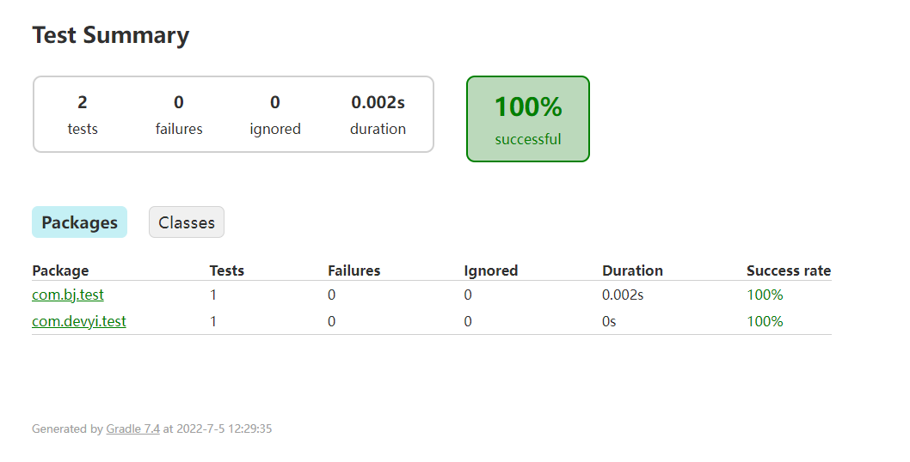

#### 2.3.3 包含和排除特定测试

```groovy
test {
    enabled true 
    useJUnit() 
    include 'com/**'
    exclude 'com/abc/**'
}
```

gradle 在junit 中的批量测试,可以设置包含或者排除某些特定测试。

## 3、Gradle进阶说明

为了让大家快速的入门gradle，本章将从整体构建脚本的角度介绍:

- 什么是 setting 文件,它有什么作用;
- 说明什么是build 文件,它又有什么作用
- 我们可以创建多少个 build
- project 和task,他们有什么作用;又是什么关系,如何配置
- 项目的生命周期
- 项目发布
- 使用Gradle 创建SpringBoot 项目等

### 3.1 项目的生命周期

Gradle 项目的生命周期分为三大阶段: Initialization -> Configuration -> Execution. 每个阶段都有自己的职责,具体如下图所示:


- **Initialization 阶段**主要目的是初始化构建, 它又分为两个子过程,一个是执行 Init Script,另一个是执行 Setting Script。
- init.gradle 文件会在每个项目 build 之前被调用，用于做一些初始化的操作，它主要有如下作用：

- - 配置内部的仓库信息（如公司的 maven  仓库信息）； 
  - 配置一些全局属性；
  - 配置用户名及密码信息（如公司仓库的用户名和密码信息）。

- Setting Script 则更重要, 它初始化了一次构建所参与的所有模块。
- **Configuration 阶段**：这个阶段开始加载项目中所有模块的 Build Script。所谓 "加载" 就是执行 build.gradle 中的语句, 根据脚本代码创建对应的 task, 最终根据所有 task 生成由 **Task 组成的有向无环图**(Directed Acyclic Graphs)，如下:

从而构成如下**有向无环树**：


- **Execution 阶段**：这个阶段会根据上个阶段构建好的有向无环图，按着顺序执行 Task【Action 动作】。

### 3.2 settings 文件

首先对 settings 文件的几点说明：

1、作用：主要是在项目初始化阶段确定一下引入哪些工程需要加入到项目构建中,为构建项目工程树做准备。

2、工程树：gradle 中有工程树的概念，类似于 maven 中的project 与module。


3、内容：里面主要定义了当前 gradle 项目及子 project 的项目名称

4、位置：必须放在根工程目录下。

5、名字：为`settings.gradle` 文件，不能发生变化

6、对应实例：与 org.gradle.api.initialization.Settings 实例是一一对应的关系。每个项目只有一个settings 文件。

7、关注：作为开发者我们只需要关注该文件中的include 方法即可。使用相对路径【 :  】引入子工程。

8.一个子工程只有在setting 文件中配置了才会被 gradle 识别,这样在构建的时候才会被包含进去。案例如下所示：

```groovy
//根工程项目名
rootProject.name = 'root'
//包含的子工程名称
include 'subject01' 
include 'subject02' 
include 'subject03'
//包含的子工程下的子工程名称
include 'subject01:subproject011' 
include 'subject01:subproject012'
```

项目名称中 **":" 代表项目的分隔符**, 类似路径中的 "/". 如果**以 ":" 开头则表示相对于 root project** 。然后 Gradle 会为每个带有 build.gradle 脚本文件的工程构建一个与之对应的 Project 对象。

### 3.3 Task

项目实质上是 Task 对象的集合。一个 Task 表示一个逻辑上较为独立的执行过程，比如编译Java 源代码，拷贝文件， 打包Jar 文件，甚至可以是执行一个系统命令。另外，一个 Task 可以读取和设置Project 的Property 以完成特定的操作。

#### 3.3.1 任务入门

可参考官方文档：[https://docs.gradle.org/current/userguide/tutorial_using_tasks.html ](https://docs.gradle.org/current/userguide/tutorial_using_tasks.html)

让我们来先看一个例子:

```groovy
task A {
    println "root taskA" 
    doFirst(){
        println "root taskA doFirst"
    }
    doLast(){
        println "root taskA doLast"
    }
}
```


在文件所在的目录执行命令: gradle A。

**提示 1** :task 的配置段是在配置阶段完成

**提示 2** :task 的doFirst、doLast 方法是执行阶段完成，并且doFirst 在doLast 执行之前执行。

**提示 3:**区分任务的配置段和任务的行为,任务的配置段在配置阶段执行,任务的行为在执行阶段执行

#### 3.3.2 任务的行为

案例如下：doFirst、doLast 两个方法可以在任务内部定义，也可以在任务外部定义

```groovy
def map=new HashMap<String,Object>();
//action属性可以设置为闭包，设置task自身的行为
map.put("action",{println "taskD.."})
task(map,"a"){
    description   'taskA description	'
    group "atguigu"
    //在task内部定义doFirst、doLast行为
    doFirst {
        def name = 'doFirst..' 
        println name
    }
    doLast {
        def name = 'doLast..' 
        println name
    }
}
//在task外部定义doFirst、doLast行为
a.doFirst {
    println it.description
}
a.doLast {
    println it.group
}
```

测试：gradle a , 输出如下所示：


**底层原理分析**：无论是定义任务自身的 action,还是添加的doLast、doFirst 方法，其实底层都被放入到一个Action 的List 中了，最初这个 action List 是空的，当我们设置了 action【任务自身的行为】,它先将action 添加到列表中，此时列表中只有一个action,后续执行doFirst 的时候doFirst 在action 前面添加，执行 doLast 的时候doLast 在action 后面添加。doFirst 永远添加在actions List 的第一位，保证添加的Action 在现有的 action List 元素的最前面；doLast 永远都是在action List 末尾添加，保证其添加的Action 在现有的action List 元素的最后面。一个往前面添加,一个往后面添加，最后这个action List 就按顺序形成了doFirst、doSelf、doLast 三部分的 Actions,就达到 doFirst、doSelf、doLast 三部分的 Actions 顺序执行的目的。

**提示 1**:其中<<代表doLast,在gradle5.x 版本之后就废弃,不能使用了,如下所示: 

```groovy
task hello << {
    println 'Hello world!'
}
```

#### 3.3.3 任务的依赖方式

Task 之间的依赖关系可以在以下几部分设置：

1. 参数依赖
2. 内部依赖
3. 外部依赖


##### **方式一：参数方式依赖**

```groovy
task A {
    doLast {
        println "TaskA.."
    }
}
task 'B' {
    doLast {
        println "TaskB.."
    }
}
//参数方式依赖: dependsOn后面用冒号
task 'C'(dependsOn: ['A', 'B']) {
    doLast {
        println "TaskC.."
    }
}}
```

##### **方式二:内部依赖**

```groovy
//参数方式依赖
task 'C' {
    //内部依赖：dependsOn后面用 = 号
    dependsOn= [A,B] 
    doLast {
        println "TaskC.."
    }
}
```

##### **方式三：外部依赖**

//外部依赖:可变参数,引号可加可不加

```groovy
C.dependsOn(B,'A')
```

##### 当然：task 也支持跨项目依赖

在subproject01 工程的 build.gradle 文件中定义:

```groovy
task A {
    doLast {
        println "TaskA.."
    }
}
```


在subproject02 工程的 build.gradle 文件中定义:

```groovy
task B{
    dependsOn(":subproject01:A") //依赖根工程下的subject01中的任务A ：跨项目依赖。
    doLast {
        println "TaskB.."
    }
}
```


测试：gradle B ,控制台显示如下


**拓展 1**：当一个 Task 依赖多个Task 的时候，被依赖的Task 之间如果没有依赖关系，那么它们的执行顺序是随机的,并无影响。

**拓展 2**：重复依赖的任务只会执行一次,比如：

A->B、C 

B->C

任务A 依赖任务 B 和任务 C、任务 B 依赖C 任务。执行任务A 的时候，显然任务C 被重复依赖了，C 只会执行一次。

#### 3.3.4 任务执行

**任务执行语法：gradle [taskName...] [--option-name...]**

| 分类                                                         | 解释                                                         |
| ------------------------------------------------------------ | ------------------------------------------------------------ |
| **常见的任务（\*）**                                         | `gradle build`: 构建项目:编译、测试、打包等操作`gradle run` :运行一个服务,需要application 插件支持，并且指定了主启动类才能运行`gradle clean`: 请求当前项目的 build 目录`gradle init` : 初始化 gradle 项目使用`gradle wrapper`:生成wrapper 文件夹的。gradle wrapper 升级wrapper 版本号：`gradle wrapper --gradle-version=4.4``gradle wrapper --gradle-version 5.2.1 --distribution-type all` :关联源码用 |
| **项目报告相关任务**                                         | `gradle projects` : 列出所选项目及子项目列表，以层次结构的形式显示`gradle tasks`: 列出所选项目【当前 project,不包含父、子】的已分配给任务组的那些任务。`gradle tasks --all` :列出所选项目的所有任务。`gradle tasks --group="build setup"`:列出所选项目中指定分组中的任务。`gradle help --task someTask` :显示某个任务的详细信息`gradle dependencies` :查看整个项目的依赖信息，以依赖树的方式显示`gradle properties` 列出所选项目的属性列表 |
| 调试相关选项                                                 | -h,--help: 查看帮助信息-v, --version:打印 Gradle、 Groovy、 Ant、 JVM 和操作系统版本信息。-S, --full-stacktrace:打印出所有异常的完整(非常详细)堆栈跟踪信息。-s,--stacktrace: 打印出用户异常的堆栈跟踪(例如编译错误)。-Dorg.gradle.daemon.debug=true: 调试 Gradle  守护进程。-Dorg.gradle.debug=true:调试 Gradle 客户端(非 daemon)进程。-Dorg.gradle.debug.port=(port number):指定启用调试时要侦听的端口号。默认值为 5005。 |
| 性能选项:【**备注**: 在gradle.properties 中指定这些选项中的许多选项，因此不需要命令行标志】 | --build-cache, --no-build-cache： 尝试重用先前版本的输出。默认关闭(off)。--max-workers: 设置 Gradle 可以使用的woker 数。默认值是处理器数。-parallel, --no-parallel: 并行执行项目。有关此选项的限制，请参阅并行项目执行。默认设置为关闭(off) |
| 守护进程选项                                                 | --daemon, --no-daemon:  使用 Gradle 守护进程运行构建。默认是on--foreground:在前台进程中启动 Gradle  守护进程。-Dorg.gradle.daemon.idletimeout=(number of milliseconds):Gradle Daemon 将在这个空闲时间的毫秒数之后停止自己。默认值为 10800000(3 小时)。 |
| 日志选项                                                     | -Dorg.gradle.logging.level=(quiet,warn,lifecycle,info,debug):通过 Gradle 属性设置日志记录级别。-q, --quiet: 只能记录错误信息-w, --warn: 设置日志级别为 warn-i, --info: 将日志级别设置为 info-d, --debug:登录调试模式(包括正常的堆栈跟踪) |
| **其它(\*)**                                                 | -x:-x 等价于: --exclude-task : 常见gradle -x test clean build--rerun-tasks: 强制执行任务，忽略up-to-date ,常见gradle build --rerun-tasks--continue: 忽略前面失败的任务,继续执行,而不是在遇到第一个失败时立即停止执行。每个遇到的故障都将在构建结束时报告，常见：gradle build --continue。gradle init --type pom :将maven 项目转换为gradle 项目(根目录执行)gradle [taskName] :执行自定义任务 |
| ...                                                          |                                                              |

更 详 细 请 参 考 官 方 文 档 : [https://docs.gradle.org/current/userguide/command_line_interface.html#sec:command_line_executing_tasks](https://docs.gradle.org/current/userguide/command_line_interface.html)

**拓展 1**：gradle  任务名是缩写:  任务名支持驼峰式命名风格的任务名缩写，如：connectTask  简写为：cT,执行任务 gradle cT。

**拓展 2**:前面提到的Gradle 指令本质:一个个的task[任务], Gradle 中所有操作都是基于任务完成的。


**拓展 3**：gradle 默认各指令之间相互的依赖关系：

相关解释：


#### 3.3.5 任务定义方式

任务定义方式，总体分为两大类:一种是通过 Project 中的task()方法,另一种是通过tasks 对象的 create 或者register 方法。

```groovy
task('A',{//任务名称,闭包都作为参数println **"taskA..."**
})
task('B'){//闭包作为最后一个参数可以直接从括号中拿出来println **"taskB..."**
}
task C{//groovy语法支持省略方法括号:上面三种本质是一种println **"taskC..."**
}

def map=new HashMap<String,Object>(); map.put("action",{println "taskD.."}) //action属性可以设置为闭包task(map,**"D"**);
tasks.create('E'){//使用tasks的create方法println **"taskE.."**
}

tasks.register('f'){//**注：*register执行的是延迟创建。也即只有当task被需要使用的时候才会被创建*。*
    println "taskF	"
}
```

当然：我们也可以在定义任务的同时指定任务的属性，具体属性有：


**在定义任务时也可以给任务分配属性**：定义任务的时候可以直接指定任务属性，也可以给已有的任务动态分配属性：

```groovy
//*①.F是任务名，前面通过具名参数给map的属性赋值,以参数方式指定任务的属性信息
task(group: "atguigu",description: "this is task B","F")
//**②**.*H是任务名，定义任务的同时，在内部直接指定属性信息
task("H") {
    group("atguigu") description("this is the task H")
}
//**③**.*Y是任务名，给已有的任务 在外部直接指定属性信息
task "y" {}
y.group="atguigu"
clean.group("atguigu") //案例：给已有的clean任务重新指定组信息
```

可以在 idea 中看到: 上面自定义的那几个任务和 gradle 自带的 clean 任务已经跑到：atguigu 组了。


#### 3.3.6 任务类型

前面我们定义的task 都是DefaultTask 类型的,如果要完成某些具体的操作完全需要我们自己去编写gradle 脚本，势必有些麻烦，那有没有一些现成的任务类型可以使用呢？有的，Gradle 官网给出了一些现成的任务类型帮助我们快速完成想要的任务，我们只需要在创建任务的时候，指定当前任务的类型即可，然后即可使用这种类型中的属性和API 方法了。

| 常见任务类型             | 该类型任务的作用                                             |
| ------------------------ | ------------------------------------------------------------ |
| Delete                   | 删除文件或目录                                               |
| Copy                     | 将文件复制到目标目录中。此任务还可以在复制时重命名和筛选文件。 |
| CreateStartScripts       | 创建启动脚本                                                 |
| Exec                     | 执行命令行进程                                               |
| GenerateMavenPom         | 生成 Maven 模块描述符(POM)文件。                             |
| GradleBuild              | 执行 Gradle 构建                                             |
| Jar                      | 组装 JAR 归档文件                                            |
| JavaCompile              | 编译 Java 源文件                                             |
| Javadoc                  | 为 Java 类 生 成 HTML API 文 档                              |
| PublishToMavenRepository | 将 MavenPublication  发布到 mavenartifactrepostal。          |
| Tar                      | 组装 TAR 存档文件                                            |
| Test                     | 执行 JUnit (3.8.x、4.x 或 5.x)或 TestNG 测试。               |
| Upload                   | 将 Configuration 的构件上传到一组存储库。                    |
| War                      | 组装 WAR 档案。                                              |
| Zip                      | 组装 ZIP 归档文件。默认是压缩 ZIP 的内容。                   |

**提示 1**：如果想看更详细的gradle 自带Task 类型，请参考官方文档: https://docs.gradle.org/current/dsl/index.html


**提示 2**:官方文档在给出这些任务类型的时候，同时给出了案例代码，可以点进去上述官网地址中的某个类型中观看

具体使用例如：

```groovy
tasks.register('myClean', Delete) { delete buildDir

}
```

在命令行执行 gradle myClean 发现就可以将当前project 的 build 目录删除当然除了gradle 自带的 task 类型,我们也可以自定义task 类型，如下所示： 

**拓展 4**:自定义 Task 类型

```groovy
def myTask=task MyDefinitionTask (type: CustomTask) myTask.doFirst(){
    println "task 执行之前 执行的 doFirst方法"
}
myTask.doLast(){
    println "task 执行之后 执行的 doLast方法"
}

class CustomTask extends DefaultTask {
//@TaskAction表示Task本身要执行的方法@TaskAction
    def doSelf(){
        println "Task 自身 在执行的in doSelf"
    }
}
```

测试：gradle MyDefinitionTask

控制台输出：


#### 3.3.7 任务的执行顺序

在 Gradle 中,有三种方式可以指定 Task 执行顺序：

1、dependsOn 强依赖方式

2、通过 Task 输入输出

3、通过 API 指定执行顺序

详细请参考官网：https://docs.gradle.org/current/dsl/org.gradle.api.Task.html

#### 3.3.8 动态分配任务

gradle 的强大功能不仅仅用于定义任务的功能。例如，可以使用它在循环中注册同一类型的多个任务

```groovy
//这里的4.time就是指四次循环的意思
4.times { counter -> 
    tasks.register("task$counter") {
        doLast {
            println "I'm task number $counter"
        }
    }
}
```

一旦注册了任务,就可以通过 API 访问它们。例如，您可以使用它在运行时动态地向任务添加依赖项。Ant 不允许这样的事情发生。

```groovy
4.times { counter -> 
    tasks.register("task$counter") {
        doLast {
            println "I'm task number $counter"
        }
    }
}
tasks.named('task0') { dependsOn('task2', 'task3') }
```

构建 4 个任务,但是任务 0 必须依赖于任务 2 和 3,那么代表任务 2 和 3 需要在任务 0 之前优先加载。具体测试如下:


#### 3.3.9 任务的关闭与开启

每个任务都有一个 enabled 默认为的标志 true。将其设置为 false 阻止执行任何任务动作。禁用的任务将标记为“跳过”。

```groovy
task disableMe {
    doLast {
        println 'This task is Executing...'
    }
    enabled(true)//直接设置任务开启，默认值为true
}
//disableMe.enabled = false //**设置关闭任务*
```

#### 3.3.10 任务的超时

每个任务都有一个 timeout 可用于限制其执行时间的属性。当任务达到超时时，其任务执行线程将被中断。该任务将被标记为失败。终结器任务仍将运行。如果 --continue 使用，其他任务可以在此之后继续运行。不响应中断的任务无法超时。Gradle 的所有内置任务均会及时响应超时

```groovy
task a() {
    doLast {
        Thread.sleep(1000)
        println "当前任务a执行了"
    }
    timeout = Duration.ofMillis(500)
}

task b() {
    doLast {
        println "当前任务b执行了"
    }

}
```

在控制台使用**: gradle a b** 测试会发现执行a 的时候,由于a 执行超时，抛出异常，所以没有继续往下执行【b 也没执行】。然后在控制台使用: **gradle a b –continue,**测试会发现a 虽然执行失败，但是 b 还是执行了。

#### 3.3.11 任务的查找

常用的任务查找方法有：

```groovy
task atguigu {
    doLast {
        println "让天下没有难学的技术：尚硅谷"
    }
}
//**根据任务名查找
tasks.findByName("atguigu").doFirst({println "尚硅谷校区1：北京	"})
tasks.getByName("atguigu").doFirst({println "尚硅谷校区2：深圳"})
//**根据任务路径查找【相对路径】
tasks.findByPath(":atguigu").doFirst({println "尚硅谷校区3：上海"}) 
tasks.getByPath(":atguigu").doFirst({println "尚硅谷校区4：武汉	"})
```

执行task: gradle atguigu，输出结果如下所示：

尚硅谷校区4：武汉....

尚硅谷校区3：上海....

尚硅谷校区2：深圳....

尚硅谷校区1：北京....

让天下没有难学的技术：尚硅谷

#### 3.3.12 任务的规则

当我们执行、依赖一个不存在的任务时，Gradle 会执行失败,报错误信息。那我们能否对其进行改进,当执行一个不存在的任务时，不是报错而是打印提示信息呢？

```groovy
task hello {
    doLast {
        println 'hello 尚硅谷的粉丝们'
    }
}
tasks.addRule("对该规则的一个描述，便于调试、查看等"){ String taskName -> task(taskName) {
    doLast {
        println "该${taskName}任务不存在，请查证后再执行"
    }
}
}
```

测试: 使用 gradle abc hello 进行测试,此时当 abc 任务不存在时，也不会报异常【不中断执行】而是提示自定义的规则信息，继续执行 hello 任务。此外，它还可以根据不同的规则动态创建需要的任务等情况。


#### 3.3.13 任务的 onlyIf 断言

断言就是一个条件表达式。Task 有一个 onlyIf 方法。它接受一个闭包作为参数，如果该闭包返回 true 则该任务执行， 否则跳过。这有很多用途，比如控制程序哪些情况下打什么包，什么时候执行单元测试，什么情况下执行单元测试的时候不执行网络测试等。具体案例如下所示：

```groovy
task hello {
    doLast {
        println 'hello 尚硅谷的粉丝们'
    }
}
hello.onlyIf { !project.hasProperty('fensi') }
```


测试：通过-P 为Project 添加fensi 属性

gradle hello -Pfensi


#### 3.3.14 默认任务

Gradle 允许您定义一个或多个在没有指定其他任务时执行的默认任务。代码如下所示：

```groovy
defaultTasks 'myClean', 'myRun' 
tasks.register('myClean'){
    doLast {
        println 'Default Cleaning!'
    }
}
tasks.register('myRun') { 
    doLast {
        println 'Default Running!'
    }
}

tasks.register('other') { 
    doLast {
        println "I'm not a default task!"
    }
}
```

测试及结果如下：

\> gradle -q Default Cleaning!

Default Running!

### 3.4 Gradle 中的文件操作

几种常见的文件操作方式：

- 本地文件
- 文件集合
- 文件树
- 文件拷贝
- 归档文件

各种文件操作类型的详细介绍如下所示：

#### 3.4.1 本地文件

使用 Project.file(java.lang.Object)方法，通过指定文件的相对路径或绝对路径来对文件的操作,其中相对路径为相对当前project[根project 或者子project]的目录。其实使用 Project.file(java.lang.Object)方法创建的 File 对象就是 Java 中的 File 对象，我们可以使用它就像在 Java 中使用一样。示例代码如下：

```groovy
//使用相对路径
File configFile = file('src/conf.xml')
configFile.createNewFile();
// 使用绝对路径**
configFile = file('D:\\conf.xml')
println(configFile.createNewFile())
// 使用一个文件对象
configFile = new File('src/config.xml')
println(configFile.exists())
```

#### 3.4.2 文件集合

文 件 集 合 就 是 一 组 文 件 的 列 表 , 在 Gradle 中 , 文 件 集 合 用 FileCollection 接 口 表 示 。 我 们 可 以 使 用

Project.files(java.lang.Object[])方法来获得一个文件集合对象，如下代码创建一个 FileCollection  实例：

```groovy
def collection = files('src/test1.txt',new File('src/test2.txt'),['src/test3.txt', 'src/test4.txt']) collection.forEach(){
    File it ->
    it.createNewFile() //创建该文件
    println it.name //输出文件名
}

Set set1 = collection.files // 把文件集合转换为java中的Set类型

Set set2 = collection as Set

List list = collection as List//  把文件集合转换为java中的List类型

for (item in list) { 
    println item.name
}

def union = collection + files('src/test5.txt') // 添加或者删除一个集合

def minus = collection - files('src/test3.txt') union.forEach(){File it ->
    println it.name
}
```

对于文件集合我们可以遍历它；也可以把它转换成java 类型；同时还能使用+来添加一个集合，或使用-来删除集合。

#### 3.4.3 文件树

**文件树是有层级结构的文件集合**,一个文件树它可以代表一个目录结构或一 ZIP 压缩包中的内容结构。文件树是从文件集合继承过来的,**所以文件树具有文件集合所有的功能**。我们可以使用 Project.fileTree(java.util.Map)方法来创建文件树对象， 还可以使用过虑条件来包含或排除相关文件。示例代码如下：

```groovy
tree = fileTree('src/main').include('/*.java')// 第一种方式:使用路径创建文件树对象，同时指定包含的文件

//第二种方式:通过闭包创建文件树:

tree = fileTree('src/main') {
    include '/*.java'
}

tree = fileTree(dir: 'src/main', include: '\**/\*.java') //第三种方式:通过路径和闭包创建文件树：具名参数给map传值tree = fileTree(dir: 'src/main', includes: ['\/\.java', '\/\.xml', **'\**/\*.txt'**], **exclude**: **'\**/\*test\*/\**'**)

tree.each {File file -> // 遍历文件树的所有文件

println file println file.name

}
```

#### 3.4.4 文件拷贝

我们可以使用 Copy 任务来拷贝文件，通过它可以过虑指定拷贝内容，还能对文件进行重命名操作等。Copy 任务必须指定一组需要拷贝的文件和拷贝到的目录，这里使用CopySpec.from(java.lang.Object[])方法指定原文件；使用CopySpec.into(java.lang.Object)方法指定目标目录。示例代码如下

```groovy
task copyTask(type: Copy) { from 'src/main/resources' into 'build/config'

}

from()方法接受的参数和文件集合时files()一样。当参数为一个目录时，该目录下所有的文件都会被拷贝到指定目录下（目录自身不会被拷贝）；当参数为一个文件时，该文件会被拷贝到指定目录；如果参数指定的文件不存在，就会被忽略； 当参数为一个 Zip 压缩文件，该压缩文件的内容会被拷贝到指定目录。

into()方法接受的参数与本地文件时 file()一样。 示例代码如下

task copyTask(type: Copy) {

// 拷贝src/main/webapp目录下所有的文件

from 'src/main/webapp'

// 拷贝单独的一个文件

from 'src/staging/index.html'

// 从Zip压缩文件中拷贝内容

from zipTree('src/main/assets.zip')

// 拷贝到的目标目录

into 'build/explodedWar'

}
```

在拷贝文件的时候还可以添加过虑条件来指定包含或排除的文件，示例如下：

```groovy
task copyTaskWithPatterns(type: Copy) { from 'src/main/webapp'

into 'build/explodedWar' include '**/*.html' include '**/*.jsp'

exclude { details -> details.file.name.endsWith('.html') }

}

在拷贝文件的时候还可以对文件进行重命名操作，示例如下：

task rename(type: Copy) { from 'src/main/webapp' into 'build/explodedWar'

// 使用一个闭包方式重命名文件

rename { String fileName -> fileName.replace('-staging-', '')

}

}

在上面的例子中我们都是使用Copy 任务来完成拷贝功能的，那么有没有另外一种方式呢？答案是肯定的，那就是

Project.copy(org.gradle.api.Action)方法。下面示例展示了 copy()方法的使用方式：

task copyMethod { doLast {

copy {

from 'src/main/webapp' into 'build/explodedWar' include '**/*.html' include '**/*.jsp'

}

}

}


```

或者使用project 对象的copy 方法:

```groovy
copy {

//相对路径或者绝对路径

from file('src/main/resources/ddd.txt') //file也可以换成new File()

into this.buildDir.absolutePath

}
```

执行gradle build 指令即可。去 build 目录的本地磁盘查看，就能看到。

#### 3.4.5 归档文件

通常一个项目会有很多的 Jar 包，我们希望把项目打包成一个 WAR，ZIP 或 TAR 包进行发布，这时我们就可以使用

Zip，Tar，Jar，War 和Ear 任务来实现，不过它们的用法都一样，所以在这里我只介绍Zip 任务的示例。首先，创建一个 Zip 压缩文件,并指定压缩文件名称，如下代码所示：

```groovy
apply plugin: 'java' version=1.0

task myZip(type: Zip) { from 'src/main‘

into ‘build’ //保存到build目录中

baseName = 'myGame'

}

println myZip.archiveName

执行命令gradle -q myZip，输出结果为：

\> gradle -q myZip myGame-1.0.zip

最后，我们可以使用 Project.zipTree(java.lang.Object)和 Project.tarTree(java.lang.Object)方法来创建访问 Zip 压缩包的文件树对象，示例代码如下：

// 使用zipTree

FileTree zip = zipTree('someFile.zip')

// 使用tarTree

FileTree tar = tarTree('someFile.tar')
```

在这里，我们介绍了 Gradle 对本地文件、文件集合、文件树、文件拷贝和归档文件的操作方式。更详细的请参考官方文档：https://docs.gradle.org/current/userguide/working_with_files.html

### 3.5 Dependencies

#### 3.5.1 依赖的方式

Gradle 中的依赖分别为直接依赖，项目依赖，本地jar 依赖。案例如下：

```groovy
dependencies {
    //**①*.依赖当前项目下的某个模块[子工程]
    mplementation project(':subject01')
    //**②**.*直接依赖本地的某个jar文件
    implementation files('libs/foo.jar', 'libs/bar.jar')
    //**②**.*配置某文件夹作为依赖项
    implementation fileTree(dir: 'libs', include: ['*.jar'])
    //③.直接依赖
    implementation 'org.apache.logging.log4j:log4j:2.17.2'

}
```

**直接依赖**：在项目中直接导入的依赖，就是直接依赖implementation 'org.apache.logging.log4j**:**log4j**:**2.17.2' 上面是简写法，完整版写法如下：

```groovy
implementation group: 'org.apache.logging.log4j', name: 'log4j', version: '2.17.2'

//group/name/version 共同定位一个远程仓库,version 最好写一个固定的版本号，以防构建出问题，implementation 类似

//maven 中的依赖的scope,对比 maven 中的依赖:

/*<dependencies>
<dependency>
<groupId>log4j</groupId>
<artifactId>log4j</artifactId>
<version>1.2.12</version>
<scope>compile</scope>
</dependency>
</dependencies>*/
```

**项目依赖**: 从项目的某个模块依赖另一个模块

implementation **project(':subject01')**

这种依赖方式是直接依赖本工程中的libary module，这个 libary module 需要在setting.gradle 中配置。

**本地jar 依赖**：本地 jar 文件依赖，一般包含以下两种方式

```groovy
//直接依赖某文件
implementation files('libs/foo.jar', 'libs/bar.jar')
//配置某文件夹作为依赖项
implementation fileTree(dir: 'libs', include: ['*.jar'])
```

#### 3.5.2 依赖的下载

当执行 build 命令时，gradle 就会去配置的依赖仓库中下载对应的 Jar，并应用到项目中。

#### 3.5.3 依赖的类型

类似于 Maven 的 scope 标签，gradle 也提供了依赖的类型,具体如下所示:

| compileOnly            | 由java插件提供,曾短暂的叫provided,后续版本已经改成了compileOnly,适用于编译期需要而不需要打包的情况 |
| ---------------------- | ------------------------------------------------------------ |
| **runtimeOnly**        | 由 java 插件提供,只在运行期有效,编译时不需要,比如mysql 驱动包。,取代老版本中被移除的 runtime |
| **implementation**     | 由 java 插件提供,针对源码[src/main 目录] ,在编译、运行时都有效,取代老版本中被移除的 compile |
| testCompileOnly        | 由 java 插件提供,用于编译测试的依赖项，运行时不需要          |
| testRuntimeOnly        | 由 java 插件提供,只在测试运行时需要，而不是在测试编译时需要,取代老版本中被移除的testRuntime |
| **testImplementation** | 由 java 插件提供,针对测试代码[src/test 目录] 取代老版本中被移除的testCompile |
| **providedCompile**    | war 插件提供支持，编译、测试阶段代码需要依赖此类jar 包，而运行阶段容器已经提供了相应的支持，所以无需将这些文件打入到war 包中了;例如servlet-api.jar、jsp-api.jar |
| compile                | 编译范围依赖在所有的 classpath 中可用，同时它们也会被打包。在gradle 7.0 已经移除 |
| runtime                | runtime 依赖在运行和测试系统的时候需要,在编译的时候不需要,比如mysql 驱动包。在 gradle 7.0 已经移除 |
| **api**                | java-library 插件提供支持,这些依赖项可以传递性地导出给使用者，用于编译时和运行时。取代老版本中被移除的 compile |
| compileOnlyApi         | java-library 插件提供支持,在声明模块和使用者在编译时需要的依赖项，但在运行时不需要。 |

**官方文档参考**：[https://docs.gradle.org/current/userguide/java_library_plugin.html#java_library_plugin:](https://docs.gradle.org/current/userguide/java_library_plugin.html) 

各个依赖范围的关系和说明:[https://docs.gradle.org/current/userguide/upgrading_version_6.html#sec:configuration_removal ](https://docs.gradle.org/current/userguide/upgrading_version_6.html)

依赖范围升级和移除:https://docs.gradle.org/current/userguide/java_library_plugin.html#java_library_plugin

API 和implemention 区别:[https://docs.gradle.org/current/userguide/java_plugin.html#java_plugin](https://docs.gradle.org/current/userguide/java_plugin.html) 执行java 命令时都使用了哪些依赖范围的依赖。

**提示 1**：java 插件提供的功能，java-library 插件都提供。


#### 3.5.4 api 与implementation 区别

如下所示：

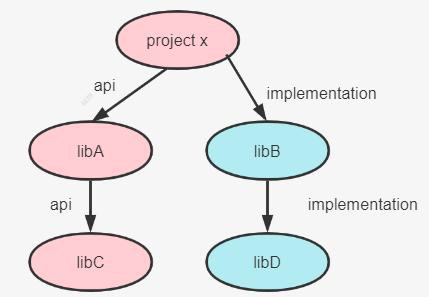

**编译时**:如果 libC 的内容发生变化,由于使用的是 api 依赖,依赖会传递,所以 libC、libA、projectX 都要发生变化,都需要重新编译,速度慢,**运行时：**libC、libA、projectX 中的class 都要被加载。

**编译时:**如果libD 的内容发生变化,由于使用的是implemetation 依赖,依赖不会传递,只有libD、libB 要变化并重新编译,速度快,**运行时：**libC、libA、projectX 中的class 都要被加载。

**拓展 3:api 和implementation 案例分析**

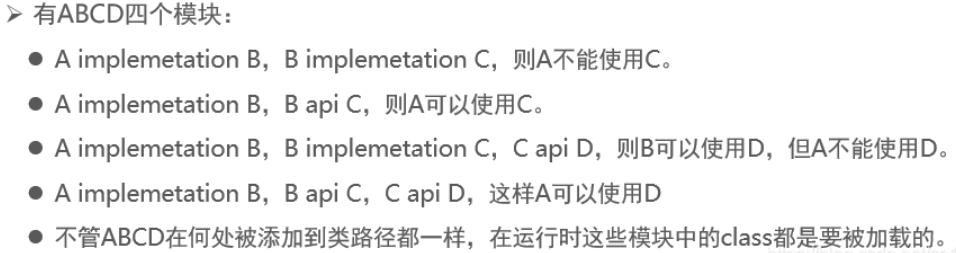

api 的适用场景是多module 依赖，moduleA 工程依赖了 module B，同时module B 又需要依赖了 module C，modelA 工程也需要去依赖 module C,这个时候避免重复依赖module,可以使用 module B api  依赖的方式去依赖module C,modelA 工程只需要依赖 moduleB 即可。

**总之，除非涉及到多模块依赖，为了避免重复依赖，咱们会使用api,其它情况我们优先选择implementation，拥有大量的api 依赖项会显著增加构建时间。**

#### 3.5.5 依赖冲突及解决方案

依赖冲突是指 "在编译过程中, 如果存在某个依赖的多个版本, 构建系统应该选择哪个进行构建的问题",如下所示:

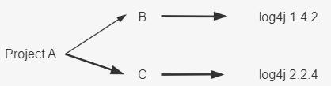

A、B、C 都是本地子项目 module，log4j 是远程依赖。

**编译时：** B 用 1.4.2 版本的  log4j，C 用 2.2.4 版本的  log4j,B 和 C 之间没有冲突

**打包时：** 只能有一个版本的代码最终打包进最终的A对应的jar |war包，对于  Gradle 来说这里就有冲突了

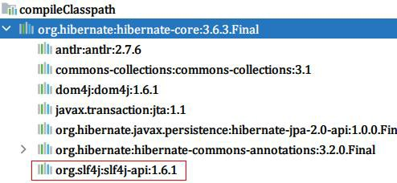

案例演示：我们在 build.gradle 引入依赖库

```groovy
dependencies {
    testImplementation 'org.junit.jupiter:junit-jupiter-api:5.8.1' testRuntimeOnly 'org.junit.jupiter:junit-jupiter-engine:5.8.1' implementation 'org.hibernate:hibernate-core:3.6.3.Final'
}
//修 改 build.gradle
dependencies {
    testImplementation 'org.junit.jupiter:junit-jupiter-api:5.8.1' testRuntimeOnly 'org.junit.jupiter:junit-jupiter-engine:5.8.1' implementation 'org.hibernate:hibernate-core:3.6.3.Final'
    implementation 'org.slf4j:slf4j-api:1.4.0'

}
```


如上所示：默认下，Gradle 会使用最新版本的 jar 包【考虑到新版本的 jar 包一般都是向下兼容的】，实际开发中，还是建议使用官方自带的这种解决方案。**当然除此之外，Gradle 也为我们提供了一系列的解决依赖冲突的方法**: **exclude 移除一个依赖**，**不允许依赖传递**，**强制使用某个版本**。

- Exclude 排除某个依赖

```groovy
dependencies {
    testImplementation 'org.junit.jupiter:junit-jupiter-api:5.8.1' testRuntimeOnly 'org.junit.jupiter:junit-jupiter-engine:5.8.1' implementation('org.hibernate:hibernate-core:3.6.3.Final'){
        //排除某一个库(slf4j)依赖:如下三种写法都行
        exclude group: 'org.slf4j' exclude module: 'slf4j-api'
        exclude group: 'org.slf4j',module: 'slf4j-api'
    }
    //排除之后,使用手动的引入即可。implementation 'org.slf4j:slf4j-api:1.4.0'
}
```

- 不允许依赖传递

```groovy
dependencies {
    testImplementation 'org.junit.jupiter:junit-jupiter-api:5.8.1' testRuntimeOnly 'org.junit.jupiter:junit-jupiter-engine:5.8.1' implementation('org.hibernate:hibernate-core:3.6.3.Final'){
        //不允许依赖传递，一般不用
        transitive(false)
    }
    //排除之后,使用手动的引入即可implementation 'org.slf4j:slf4j-api:1.4.0'
}
```

在添加依赖项时,如果设置 transitive 为false,表示关闭依赖传递。即内部的所有依赖将不会添加到编译和运行时的类路径。

- 强制使用某个版本

```groovy
dependencies {
    testImplementation 'org.junit.jupiter:junit-jupiter-api:5.8.1' testRuntimeOnly 'org.junit.jupiter:junit-jupiter-engine:5.8.1' implementation('org.hibernate:hibernate-core:3.6.3.Final')
    //强制使用某个版本!!【官方建议使用这种方式】
    implementation('org.slf4j:slf4j-api:1.4.0!!')
    //这种效果和上面那种一样,强制指定某个版本implementation('org.slf4j:slf4j-api:1.4.0'){
    version{
        strictly("1.4.0")
    }
}
}
```

**拓展**：我们可以先查看当前项目中到底有哪些依赖冲突：

```groovy
//下面我们配置，当 Gradle 构建遇到依赖冲突时，就立即构建失败
configurations.all() {
    Configuration configuration ->
    //当遇到版本冲突时直接构建失败configuration.resolutionStrategy.failOnVersionConflict()
}
```

### 3.6 Gradle 插件

#### 3.6.1 使用插件的原因

简单的说,通过应用插件我们可以:


1. 促进代码重用、减少功能类似代码编写、提升工作效率
2. 促进项目更高程度的模块化、自动化、便捷化
3. 可插拔式的的扩展项目的功能

#### 3.6.2 插件的作用

在项目构建过程中做很多事情，把插件应用到项目中，通常可以完成:

1、可以添加任务【task】到项目中，从而帮助完成测试、编译、打包等。

2、可以添加依赖配置到项目中。

3、可以向项目中拓展新的扩展属性、方法等。

4、可以对项目进行一些约定，如应用 Java 插件后，约定src/main/java 目录是我们的源代码存在位置，编译时编译这个目录下的Java 源代码文件。

#### 3.6.3 插件的分类和使用


##### **第一种：脚本插件**

脚本插件的本质就是一个脚本文件，使用脚本插件时通过apply from:将脚本加载进来就可以了，后面的脚本文件可以是本地的也可以是网络上的脚本文件，下面定义一段脚本，我们在 build.gradle 文件中使用它，具体如下：

```groovy
//version.gradle文件
ext {
    company= "尚硅谷" 
    cfgs = [
         compileSdkVersion : JavaVersion.VERSION_1_8
    ]
    spring = [
        version : '5.0.0'
    ]
}

//下面将将在构建文件中使用这个脚本文件，具体如下:
//build.gradle文件
//map作为参数
apply from: 'version.gradle' task taskVersion{
    doLast{
        println "公司名称为：${company},JDK版本是${cfgs.compileSdkVersion},版本号是${spring.version}"
    }
}
```

上述代码的执行结果如下：

PS D:\repos\idearepos\root> gradle -q taskVersion

版本是2.0,版本号是1

**意义：**脚本文件模块化的基础，可按功能把我们的脚本进行拆分一个个公用、职责分明的文件，然后在主脚本文件引用， 比如：将很多共有的库版本号一起管理、应用构建版本一起管理等。

##### **第二种：对象插件之内部插件[核心插件]**

二进制插件[对象插件]就是实现了 org.gradle.api.Plugin  接口的插件，每个 Java Gradle 插件都有一个 plugin id。


可通过如下方式使用一个 Java 插件： 

```groovy
apply plugin : 'java' //map具名参数方式
//或者：
//也可以使用闭包作为project.apply方法的一个参数
apply{
    plugin 'java'
}
```

通过上述代码就将 Java  插件应用到我们的项目中了，对于 Gradle 自带的核心插件都有唯一的 plugin id，其中 java  是Java 插件的 plugin id,这个 plugin id 必须是唯一的，可使用应用包名来保证 plugin id 的唯一性。这里的 java  对应的具体类型是 org.gradle.api.plugins.JavaPlugin，所以可以使用如下方式使用 Java 插件：

```groovy
//使用方式1：Map具名参数,全类名
apply plugin:org.gradle.api.plugins.JavaPlugin
//org.gradle.api.plugins默认导入：使用方式2 
apply plugin:JavaPlugin
apply plugin: 'java' //核心插件，无需事先引入，使用方式3:插件的id
```

Gradle 中提供的二进制插件【核心插件】,可参考: https://docs.gradle.org/current/userguide/plugin_reference.html

##### **第二种：对象插件之第三方插件**

如果是使用第三方发布的二进制插件，一般需要配置对应的仓库和类路径,

```groovy
//使用传统的应用方式
buildscript {
    ext {
        springBootVersion = "2.3.3.RELEASE"
    }
    repositories {
        mavenLocal()
        maven { url ['http://maven.aliyun.com/nexus/content/groups/public'*]('http://maven.aliyun.com/nexus/content/groups/public')}
        jcenter()
    }
    // 此处先引入插件
    dependencies {
        classpath("org.springframework.boot:spring-boot-gradle-plugin:${springBootVersion}")
    }
}
//再应用插件
apply plugin: 'org.springframework.boot' 
//社区插件,需要事先引入，不必写版本号
```

但是如果是第三方插件已经被托管在 https://plugins.gradle.org/ 网站上，就可以不用在 buildscript 里配置 classpath

依赖了，直接使用新出的 plugins DSL 的方式引用，案例如下： 使 用 plugins DSL 方 式

```groovy
plugins {
    id 'org.springframework.boot' version '2.4.1'
}
```

**注意**：

1. 如果使用老式插件方式buildscript{}要放在build.gradle 文件的最前面,而新式plugins{}没有该限制。
2. 托管在网站gradle 插件官网的第三方插件有两种使用方式，一是传统的buildscript 方式，一种是 plugins DSL 方式 。

##### **第二种：对象插件之用户自定义插件**

```groovy
interface GreetingPluginExtension { 
    Property<String> getMessage() 
    Property<String> getGreeter()
}

class GreetingPlugin implements Plugin<Project> {
    void apply(Project project) {
        def extension = project.extensions.create('greeting', GreetingPluginExtension) project.task('hello') {
            doLast {
                println "${extension.message.get()} from ${extension.greeter.get()}"
            }
        }
    }
}

apply plugin: GreetingPlugin
// Configure the extension using a DSL block 
greeting {
    message = 'Hi'
    greeter = 'Gradle'
}
```

参考地址：https://docs.gradle.org/current/userguide/custom_plugins.html

我们直接执行 hello 任务./gradle hello 即可,这种方式实现的插件我们一般不使用，因为这种方式局限性太强，只能本

Project，而其他的Project 不能使用。

#### 3.6.4 buildSrc 项目

buildSrc 是Gradle 默认的插件目录，编译 Gradle 的时候会自动识别这个目录，将其中的代码编译为插件。

1.首先先建立一个名为 buildSrc 的 java Module,将 buildSrc 从 included modules 移除,重新构建,然后只保留 build.gradle

和src/main 目录，其他全部删掉,注意名字一定是 buildSrc,不然会找不到插件。

2.然后修改Gradle 中的内容

```groovy
apply plugin: 'groovy' // 必 须
apply plugin: 'maven-publish'
dependencies {
    implementation gradleApi() //必须
    implementation localGroovy() //必须
}
repositories {
    google()
    jcenter()
    mavenCentral() //必须
}
//把项目入口设置为src/main/groovy 
sourceSets {
    main {
        groovy {
            srcDir 'src/main/groovy'
        }
    }
}
```


1. 创建入口目录，在src/main 下创建代码入口目 录，如下：
2. 然后实现插件代码Text.groovy，注意文件后缀为groovy,文件要引入package com.atguigu

```groovy
package com.atguigu
import org.gradle.api.Plugin import org.gradle.api.Project
class Text implements Plugin<Project>{ 
    @Override
    void apply(Project project) { 
        project.task("atguigu"){
            doLast{
                println("自定义atguigu插件")
            }
        }
    }
}
```

1. 接下来在 main 目录下创建 resources 目录,在 resources 目录下创建 META-INF 目录，在 META-INF 目录下创建

gradle-plugins 目录，在gradle-plugins 目录下创建properties 文件


properties 文件可以自己命名，但是要以.properties 结尾，比如 com.atguigu.plugin.properties,其 com.atguigu.plugin 就是定义的包名路径.


最后需要在properties 文件中指明我们实现插件的全类名 implementation-class=com.atguigu.Text

到目前为止我们的插件项目已经写完了，在 module 引入我们写的插件 apply plugin:'com.atguigu.plugin',然后执行插件的Task，./gradle atguigu

输出:


这种形式的写法，在我们整个工程的module 都可以使用，但也只是限制在本工程，其他工程不能使用。

**改进**：

第二种写插件的方式他只能在本工程中使用，而其他的项目工程不能使用，有时候我们需要一个插件在多个工程中使用， 这时候我们就需要把插件上传maven 中。

第一步: 首先将上述buildSrc 目录复制一份，修改文件夹名，然后在settings.gradle 文件中使用include 引入第二步：修改build.gradle 文件，发布到maven 仓库中

```groovy
// 必 须apply plugin: 'maven-publish' dependencies
apply plugin: 'groovy' dependencies {
    implementation gradleApi() //必须implementation localGroovy() //必须
}
repositories {
    google()
    jcenter()
    mavenCentral() //必须
}
sourceSets { //把项目入口设置为src/main/groovy main {
    groovy {
        srcDir 'src/main/groovy'
    }
}
}
publishing {
    publications {
        myLibrary(MavenPublication) {
            groupId = 'com.atguigu.plugin' //指定GAV坐标信息artifactId = 'library'
            version = '1.1'
            from components.java//发布jar包
            //from components.web///引入war插件，发布war包
        }
    }
    repositories {
        maven { url "$rootDir/lib/release" }
        //发布项目到私服中
        //	maven {
        //	name = 'myRepo' //name属性可选,表示仓库名称，url必填
        //	//发布地址:可以是本地仓库或者maven私服
        //	//url = layout.buildDirectory.dir("repo")
        //	//url=['http://my.org/repo'](http://my.org/repo')
        //	// change URLs to point to your repos, e.g. http://my.org/repo
        //	//认证信息:用户名和密码
        //	credentials {
        //	username = 'joe'
        //	password = 'secret'
        //	}
        //	}
    }
}
```

第三步：执行publish 指令,发布到根 project 或者maven 私服仓库。

第四步：使用插件,在项目级 build.gradle 文件中将插件添加到 classpath：

```groovy
buildscript {
    repositories {
        maven { url "$rootDir/lib/release" }
    }
    dependencies {
        classpath "com.atguigu.plugin:library:1.1"
    }
}
apply plugin: 'java'
//是在 atguiguplugin  中定义的插件 ID apply plugin: 'com.atguigu.plugin'
```

第五步：执行 gradle build 指令就会在控制台看到自定义插件的输出，说明自定义插件就已经生效了。

最后，至于如何写一个插件，能帮助项目更加自动化或者便捷化，是值得大家未来需要长期思考、关注、努力的点。

### 3.7 插件的关注点

#### 第一点: 插件的引用

**apply** plugin: '插件名'

#### 第二点:主要的功能[任务]


当我们在工程中引入插件后，插件会自动的为我们的工程添加一些额外的任务来完成相应的功能。以Java 插件为例，当我们加入java 插件之后，就加入了如下功能：

具体大家可通过gradle tasks 查看加入某个插件前后的区别。

说明：Gradle 中的任务依赖关系是很重要的，它们之间的依赖关系就形成了构建的基本流程。

#### 第三点:工程目录结构

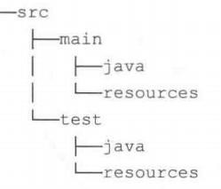

一些插件对工程目结构有约定，所以我们一般遵循它的约定结构来创建工程，这也是 Gradle 的“约定优于配置”原则。例如java 插件规定的项目源集目录结构如下所示：

如果要使用某个插件就应该按照它约定的目录结构设置，这样能大大提高我们的效率，当然各目录结构也可以自己定义。

#### 第四点：依赖管理

比如前面我们提到的 依赖的类型[依赖管理]部分，不同的插件提供了不同的依赖管理。

#### 第五点：常用的属性

例如：Java  插件会为工程添加一些常用的属性,我们可以直接在编译脚本中直接使用。属性名称	类型	默认值	描述

reportsDirName	String	reports	生成报告的目录名称reportsDir	File（只读）buildDir/reportsDirName	生成报告的目录

testResultsDirName	String	test-results	生成测试result.xml 文件的目录名称testResultsDir	File（只读）reportsDir/testReportDirName	生成测试报告的目录

libsDirName	String	libs	生成lib 库的目录名称libsDir	File（只读）buildDir/libsDirName	生成lib 库的目录distsDirName	String	distributions	生成发布文件的目录名称distsDir	File（只读）buildDir/distsDirName	生成发布文件的目录docsDirName	String	docs	生成帮助文档的目录名称docsDir	File（只读）buildDir/docsDirName	生成帮助文档的目录

dependencyCacheDirNameString	dependency-cache	存储缓存资源依赖信息的目录名称dependencyCacheDir	File（只读）buildDir/dependencyCacheDirName存储缓存资源依赖信息的目录


当然，这里还有一些其它属性


属性名称	类型	默认值	描述

包含工程的资源集合（source


sourceSets	SourceSetContainer (只读)	Not null

JavaVersion，也可以使用字符串或数字，

sets.）

编译java 文件时指定使用的java


sourceCompatibility

比 如 '1.5' 或 者 1.5

根据使用的JVM 定

版本

targetCompatibility

JavaVersion，也可以使用字符串或数字，

sourceCompatibility生成classes 的java 版本

比 如 '1.5' 或 者 1.5


archivesBaseName  String	projectName

作为归档文件的默认名称，如JAR 或者ZIP 文件的名称


### 3.8 Java 插件分析

参考官网：https://docs.gradle.org/current/userguide/plugin_reference.html,以Java 插件为例，讲解需要关注的几点：

#### 第一点：我们要关注插件使用

```groovy
plugins {
    id 'java'
}
```

**第二点：我们要关注插件的功能**

我们可通过官方文档介绍了解某个插件功能或者百度、再或者大家可以通过 gradle tasks 查看加入java 插件前后的区别。

#### 第三点：项目布局

一般加入一个插件之后，插件也会提供相应的目录结构，例如：java 插件的目录结构


当然这个默认的目录结构也是可以改动的例如：

```groovy
sourceSets {
    main {
        java {
            srcDirs = ['src/java']
        }
        resources {
            srcDirs = ['src/resources']
        }
    }
}
```

也可设置源集的属性等信息。


#### 第四点：依赖管理：以java 插件为例，提供了很多依赖管理项

**源集依赖关系配置**

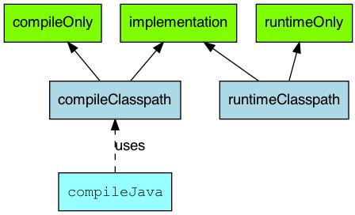


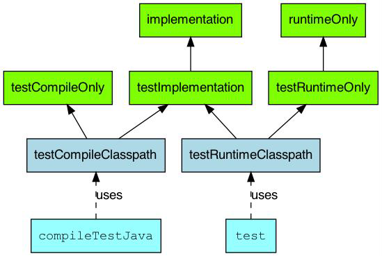


#### 测试源集依赖关系配置第五点：额外的属性和方法：

可参考官方文档： sourceCompatibility(JavaVersion.*VERSION_1_8*)

### 3.9 build.gradle 文件

- build.gradle 是一个gradle 的构建脚本文件,支持java、groovy 等语言。
- 每个project 都会有一个build.gradle 文件,该文件是项目构建的入口,可配置版本、插件、依赖库等信息。
- 每个build 文件都有一个对应的 Project 实例,对build.gradle 文件配置，本质就是设置Project 实例的属性和方法。
- 由于每个 project 都会有一个build 文件,那么Root Project 也不列外.Root Project 可以获取到所有 Child Project,所以在Root Project 的 build 文件中我们可以对Child Project 统一配置,比如应用的插件、依赖的maven 中心仓库等。
- 
- build 文件中常见的属性和方法如下所示：


#### 3.9.1 常见属性代码

代码参考：

```groovy
//指定使用什么版本的JDK语法编译源代码,跟编译环境有关,在有java插件时才能用sourceCompatibility = **1.8**
//指定生成特定于某个JDK版本的class文件:跟运行环境有关,在有java插件时才能用targetCompatibility = **1.8**
//业务编码字符集,注意这是指定源码解码的字符集[编译器] compileJava.options.encoding **"UTF-8"**
//测试编码字符集,注意这是指定源码解码的字符集[编译器] compileTestJava.options.encoding **"UTF-8"**
//编译JAVA文件时采用UTF-8:注意这是指定源码编码的字符集【源文件】
tasks.withType(JavaCompile) {
    options.encoding = "UTF-8"
}
//编译JAVA文件时采用UTF-8:注意这是指定文档编码的字符集【源文件】
tasks.withType(Javadoc) {
    options.encoding = "UTF-8"
}
```

提示 1：group+name+version 类似于 maven 的group+artifactId+version

提示 2：encoding 解决业务代码与测试代码中文乱码问题

#### 3.9.2 Repositories

```groovy
repositories {
    //gradle中会按着仓库配置的顺序，从上往下依次去对应的仓库中找所需要的jar包:
    //如果找到，则停止向下搜索，如果找不到，继续在下面的仓库中查找
    //指定去本地某个磁盘目录中查找:使用本地file文件协议:一般不用这种方式
    maven { url 'file:///D:/repos/mavenrepos3.5.4'} maven { url "$rootDir/lib/release" }
    //指定去maven的本地仓库查找
    mavenLocal()
    //指定去maven的私服或者第三方镜像仓库查找
    maven { name "Alibaba" ; url "https://maven.aliyun.com/repository/public" } maven { name "Bstek" ; url "https://nexus.bsdn.org/content/groups/public/" }
    //指定去maven的远程仓库查找:即 https://repo.maven.apache.org/maven2/
    mavenCentral()
    //去google仓库查找
    google()

}
```

因为 Gradle 没有自己的远程仓库，而是使用 Maven、jcenter、jvy、google 这些远程仓库。

#### 3.9.3 Subprojects 与 Allprojects

allprojects 是对所有project**(包括Root Project+ child Project[当前工程和所有子工程])**的进行统一配置，而subprojects

是对**所有Child Project 的进行统一配置**。测试如下：

```groovy
allprojects {
    tasks.create('hello') { 
        doLast {
            task ->println "project name is $task.project.name"
        }
    }
}
subprojects {
    hello.doLast{
        task->println "here is subprojects $task.project.name"
    }
}
```

通常在 subprojects 和allprojects 中:

```groovy
allprojects(){ //本质Project中的allprojects方法，传递一个闭包作为参数。
    apply plugin: 'java'
    ext {
        junitVersion = '4.10'
        //..
    }
    task allTask{
        //...
    }
    repositories {
        //...
    }
    dependencies {
        //...
    }
}
subprojects(){
    //…同上面allprojects中的方法。
}

//拓展 1: 如果是直接在根project 配置 repositories 和 dependencies 则只针对根工程有效。
//拓展:我们也可以在对单个 Project 进行单独配置：
project('subject01') {
    task subject01 {
        doLast {
            println 'for subject01'
        }
    }
}
```

执行gradle build 指令即可查看测试效果。

#### 3.9.4 ext 用户自定义属性

Project 和 Task 都允许用户添加额外的自定义属性，要添加额外的属性，通过应用所属对象的ext 属性即可实现。添加之后可以通过 ext 属性对自定义属性读取和设置，如果要同时添加多个自定义属性,可以通过 ext 代码块:

```groovy
//自定义一个Project的属性
ext.age = 18
//通过代码块同时自定义多个属性
ext {
    phone = 19292883833
    address="北京尚硅谷"
}

task extCustomProperty {
    //在task中自定义属性
    ext {
        desc = "奥利给"
    }
    doLast {
        println " 年 龄 是 ：${age}" println "电话是：${phone}" println "地址是：${address}" println "尚硅谷：${desc}"
    }
}
```

测试：通过 gradle extCustomProperty

输出结果为：

年龄是：18

电话是：19292883833

地址是：北京尚硅谷尚硅谷：奥利给

**拓展 1**: ext 配置的是用户自定义属性，而gradle.properties 中一般定义 系统属性、环境变量、项目属性、JVM 相关配置信息。例如

gradle.properties 文件案例：加快构建速度的，gradle.properties 文件中的属性会自动在项目运行时加载。

\## 设置此参数主要是编译下载包会占用大量的内存，可能会内存溢出

org.gradle.jvmargs=-Xms4096m -Xmx8192m ## 开启gradle缓存

org.gradle.caching=true #开启并行编译org.gradle.parallel=true #启用新的孵化模式

org.gradle.configureondemand=true #开启守护进程org.gradle.daemon=true

详细请参考：[https://docs.gradle.org/current/userguide/build_environment.html#sec:gradle_configuration_properties](https://docs.gradle.org/current/userguide/build_environment.html#sec%3Agradle_configuration_properties)

#### 3.9.5 Buildscript

buildscript 里是gradle 脚本执行所需依赖，分别是对应的 maven 库和插件。案例如下：

```groovy
import org.apache.commons.codec.binary.Base64 buildscript {
    repositories {
        mavenCentral()
    }
    dependencies {
        classpath group: 'commons-codec', name: 'commons-codec', version: '1.2'
    }
}
tasks.register('encode') { 
    doLast {
        def byte[] encodedString = new Base64().encode('hello world\n'.getBytes()) println new String(encodedString)
    }
}
```

需要注意的是：

1. buildscript{}必须在 build.gradle 文件的最前端。
2. 对于多项目构建，项目的 buildscript ()方法声明的依赖关系可用于其所有子项目的构建脚本。
3. 构建脚本依赖可能是 Gradle 插件。案例如下所示：

```groovy
//老式apply插件的引用方式,使用apply+buildscript

buildscript { 
    ext {
        springBootVersion = "2.3.3.RELEASE"
    }
    repositories {
        mavenLocal()
        maven { url ['http://maven.aliyun.com/nexus/content/groups/public' ]('http://maven.aliyun.com/nexus/content/groups/public')} 
        jcenter()
    }
    //此处引入插件
    dependencies {
        classpath("org.springframework.boot:spring-boot-gradle-plugin:${springBootVersion}")
    }
}
apply plugin: 'java' //核心插件，无需事先引入
apply plugin: 'org.springframework.boot' //社区插件，需要事先引入,才能应用，不必写版本号
```

### 3.10 publishing 项目发布

接下来,将咱们写好的模块发布发布到公司的私服以供别人使用,如下所示：


#### 3.10.1 引入maven 发布的插件

```groovy
plugins {
    id 'java-library' //如果发布war包，需要war插件,java-library支持带源码、文档发布id 'maven-publish'
}
```

**设置发布代码**

```groovy
//带源码和javadoc的发布:需要'java-library'插件支持:它是java的升级版，java插件的功能java-library都有
//javadoc.options.encoding="UTF-8"
//java {
//	withJavadocJar()
//	withSourcesJar()
//}
publishing {
    publications {
        myLibrary(MavenPublication) {
            groupId = 'org.gradle.sample' //指定GAV坐标信息artifactId = 'library'
            version = '1.1'
            from components.java//发布jar包
            //from components.web///引入war插件，发布war包
        }
    }
    repositories {
        //本地仓库位于USER_HOME/.m2/repository mavenLocal()
        //发布项目到私服中
        maven {
            name = 'myRepo' //name属性可选,表示仓库名称，url必填
            //发布地址:可以是本地仓库或者maven私服
            //url = layout.buildDirectory.dir("repo")
            // change URLs to point to your repos, e.g. http://my.org/repo
            def releasesRepoUrl = layout.buildDirectory.dir('repos/releases')
            def snapshotsRepoUrl = layout.buildDirectory.dir('repos/snapshots')
            url = version.endsWith('SNAPSHOT') ? snapshotsRepoUrl : releasesRepoUrl
            //认证信息:用户名和密码
            //	credentials {
            //	username = 'joe'
            //	password = 'secret'
            //	}
        }
    }
}
```

#### 3.10.2 执行发布指令

执 行 发 布 命 令 ， 将 项 目 发 布 到 本 地 仓 库 或 者 远 程 仓 库 。 常 见 的 发 布 指 令 有 ： generatePomFileForPubNamePublication: 生成 pom  文件publishPubNamePublicationToRepoNameRepository:发布项目到指定仓库,如果没有仓库名，默认为maven

publishPubNamePublicationToMavenLocal: 将 PubName  发布复制到本地 Maven 仓库中包括POM 文件和其他元数据。

##### **publish: 发布到 repositories 中指定的仓库(为比如 Maven 私服)**

publishToMavenLocal: 执行所有发布任务中的操作发布到本地 maven 仓库【默认在用户家目录下的.m2/repository】。

### 3.11 生命周期中Hook

生命周期中的这些钩子函数都是由 gradle 自动回调完成的,利用这些钩子函数可以帮助我们实现一些我们想要的功能。


Gradle 在生命周期各个阶段都提供了用于回调的钩子函数:

Gradle 初始化阶段:

- 在 settings.gradle 执行完后,会回调 Gradle 对象的 settingsEvaluated 方法
- 在构建所有工程 build.gradle 对应的Project 对象后,也既初始化阶段完毕,会回调 Gradle 对象的projectsLoaded 方法

Gradle 配置阶段:

- Gradle 会循环执行每个工程的 build.gradle 脚本文件
- 在执行当前工程build.gradle 前,会回调Gradle 对象的 beforeProject 方法和当前Project 对象的 beforeEvaluate 方法, 虽然 beforeEvalute 属于 project 的生命周期, 但是此时 build script 尚未被加载, 所以 beforeEvaluate 的设置依 然要在 init script 或 setting script 中进行,不要在 build script 中使用 project.beforeEvaluate 方法。
- 在执行当前工程 build.gradle 后,会回调 Gradle 对象的afterProject 方法和当前Project 对象的 afterEvaluate 方法
- 在所有工程的 build.gradle 执行完毕后，会回调 Gradle 对象的 projectsEvaluated 方法
- 在构建 Task 依赖有向无环图后,也就是配置阶段完毕,会回调TaskExecutionGraph 对象的 whenReady 方法

Gradle 执行阶段:

- Gradle 会循环执行Task 及其依赖的 Task
- 在当前 Task 执行之前,会回调 TaskExecutionGraph 对象的 beforeTask 方法
- 在当前 Task 执行之后,会回调 TaskExecutionGraph 对象的 afterTask 方法当所有的 Task 执行完毕后，会回调 Gradle 对象的 buildFinish 方法。

**提示：**Gradle 执行脚本文件的时候会生成对应的实例，主要有如下几种对象：

1、Gradle 对象：在项目初始化时构建，全局单例存在，只有这一个对象

2、Project 对象：**每一个build.gradle文件** 都会转换成一个 Project 对象,类似于maven中的pom.xml文件

3、Settings 对象：settings.gradle 会转变成一个 settings  对象,和整个项目是一对一的关系,一般只用到include方法

4.、Task对象: 从前面的有向无环图中，我们也可以看出，gradle最终是基于Task的,一个项目可以有一个或者多个Task

钩子函数代码演示：项目目录结构如下：


在root project 的settings.gradle 文件中添加：

```groovy
gradle.settingsEvaluated { //1.settingsEvaluated钩子函数,在初始化阶段完成
    println "settingsEvaluated"
}
gradle.projectsLoaded { //2.projectsLoaded钩子函数,在初始化阶段完成println "projectsLoaded"
}
//声明一个变量：表示当前项目名,在每次执行某个项目的beforeEvaluate方法时先给projectName变量赋值
//这样方便在：gradle.beforeProject和afterProject两个钩子函数使用。
def projectName=""
gradle.addProjectEvaluationListener( new ProjectEvaluationListener(){
    //3.执行各个project的beforeEvaluate：在配置阶段完成
    @Override
    void beforeEvaluate(Project project) { 
        projectName=project.name
        println "${project.name} Project beforeEvaluate"
    }
    //5.执行各个project的afterEvaluate：在配置阶段完成
    @Override
    void afterEvaluate(Project project, ProjectState projectState) { 
        println "${project.name} Project afterEvaluate"
    }
});
gradle.beforeProject {//4.执行各个project的beforeProject：在配置阶段完成
    println "${projectName} beforeProject..."
}
gradle.afterProject {//6.执行各个project的afterProject：在配置阶段完成
    println "${projectName} afterProject..."
}
//7.所有工程的 build.gradle 执行完毕后，回调 Gradle 对象的 projectsEvaluated 方法：在配置阶段完成
def rootProjectName=rootProject.getName()
gradle.projectsEvaluated {
    println "${rootProjectName} projectsEvaluated..."
}
//8.配置阶段完毕后，回调 TaskExecutionGraph 对象的 whenReady 方法：在配置阶段完成
gradle.taskGraph.whenReady {
    println "${rootProjectName} taskGraph whenReady..."
}
//9.在当前Task执行之前,会回调 TaskExecutionGraph 对象的 beforeTask方法：在执行阶段完成
gradle.taskGraph.beforeTask {task ->
    println "this is the task ${task.name} of the project ${task.getProject().name} beforeTask.."
}

//10.在当前Task执行之后,会回调 TaskExecutionGraph 对象的 afterTask方法：在执行阶段完成
gradle.taskGraph.afterTask {task ->
    println "this is the task ${task.name} of the project ${task.getProject().name}  afterTask.."
}

//11.当所有的 Task 执行完毕后，会回调 Gradle 对象的 buildFinish 方法：在执行阶段完成
gradle.buildFinished {
    println "${rootProjectName} buildFinished..."
}
```

在root 的build.gradle 文件中添加:

```groovy
task A {
    println "root taskA"
    doFirst(){
        println "root taskA doFirst"
    }
    doLast(){
        println "root taskA doLast"
    }
}

//在subject01 的 build.gradle 文件中添加:
task B {
println "SubProject01 taskB" 
    doFirst(){
        println "SubProject01 taskB doFirst"
    }
    doLast(){
        println "SubProject01 taskB doLast"
    }
}
```

在subject02 的 build.gradle 文件中添加:

```groovy
//task C 在上面
task C{
// 依赖task D
    dependsOn 'D'
    println "SubProject02 taskC" 
    doFirst(){
        println "SubProject02 taskC doFirst"
    }
    doLast(){
        println "SubProject02 taskC doLast"
    }
}
//task D 在下面
task D {
    println "SubProject02 taskD" 
    doFirst(){
        println "SubProject02 taskD doFirst"
    }
    doLast(){
        println "SubProject02 taskD doLast"
    }
}
```

测试：在root 工程的根目录执行：gradle C .就能看到 gradle 生命周期的三个阶段，及每个阶段执行的钩子函数、还有在执行阶段有依赖关系的任务的执行顺序问题。

拓展 1：在settings.gradle 中添加监听器，**查看task 有向无环图**:

```groovy
gradle.taskGraph.addTaskExecutionGraphListener(
    new TaskExecutionGraphListener() { 
        @Override // 生成有向无环图
        void graphPopulated(TaskExecutionGraph taskExecutionGraph) {
            taskExecutionGraph.allTasks.forEach(task->{//核心逻辑:通过taskExecutionGraph获得所有的task
                taskExecutionGraph.allTasks.forEach(releaseTask->{
                    println "尚硅谷:" + releaseTask.getProject().name + ":" + releaseTask.name
                })
            })
        }
    }
)
```

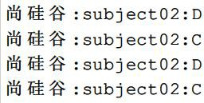

测试：在root 工程根目录下执行：gradle C。查看测试结果：

拓展 2: 计算 Gradle 构建过程中各个阶段的耗时:需要注意，这里只是计算了初始化阶段的 settings 文件，并没有计算

init.gradle 初始化的时间。

```groovy
def projectName=rootProject.getName() //定义项目名
long beginOfSetting = System.currentTimeMillis() //初始化阶段开始时间
def beginOfConfig // 配置阶段开始时间
def configHasBegin = false //配置阶段是否开始了，只执行一次
def beginOfProjectConfig = new HashMap() //存放每个build.gradle 执行之前的时间
def beginOfTaskExecute // 执行阶段开始时间
gradle.projectsLoaded { // 初始化阶段执行完毕
    println "${projectName}工程 初始化总耗时 ${System.currentTimeMillis() - beginOfSetting} ms"
}
//build.gradle 执行前
gradle.beforeProject {Project project ->
    if(!configHasBegin){
        configHasBegin = true
        beginOfConfig = System.currentTimeMillis()
    }
    beginOfProjectConfig.put(project,System.currentTimeMillis())
}

//build.gradle 执行后
gradle.afterProject {Project project ->
    def begin = beginOfProjectConfig.get(project)
    if(project.name == projectName) {
        println "根工程${projectName} 配置阶段耗时：${System.currentTimeMillis() - begin} ms"
    }else{
        println "子工程${project.name} 配置阶段耗时：${System.currentTimeMillis() - begin} ms"
    }
}
gradle.taskGraph.whenReady {//配置阶段完毕
    println "整个${projectName}项目在配置阶段总耗时：${System.currentTimeMillis() - beginOfConfig} ms"
    beginOfTaskExecute = System.currentTimeMillis()
}
//执行阶段开始
gradle.taskGraph.beforeTask {Task task ->
    task.doFirst {
        task.ext.beginOfTask = System.currentTimeMillis()
    }
    task.doLast {
        println "${task.name}在执行阶段耗时：${System.currentTimeMillis() - task.ext.beginOfTask} ms"
    }
}
gradle.buildFinished {//执行阶段完毕
    println " 执行阶段总耗时：${System.currentTimeMillis() - beginOfTaskExecute} ms"
    println " 整个构建过程耗时：${System.currentTimeMillis() - beginOfSetting} ms"
}
```


# Milvus

[中文文档](https://www.milvus-io.com/)

[官方文档](https://milvus.io/docs)

[JAVA整合Milvus矢量数据库及数据_milvus java-CSDN博客](https://blog.csdn.net/FDX0821/article/details/125219969)

## 1、基本介绍

### 1.1 什么是 Milvus 向量数据库

Milvus 是在 2019 年创建的，==**其目标是存储、索引和管理深度神经网络和其他机器学习（ML）模型生成的大规模 [嵌入向量](https://www.milvus-io.com/#嵌入向量)**==。作为一种专门设计用于处理对输入向量的查询的数据库，它能够处理万亿级规模的向量索引。与现有的主要处理按照预定义模式遵循结构化数据的关系型数据库不同，Milvus 从底层开始设计，主要处理从 [非结构化数据](https://www.milvus-io.com/#非结构化数据) 转换而来的嵌入向量。

随着互联网的发展和演变，非结构化数据变得越来越常见，其中包括电子邮件、论文、物联网传感器数据、Facebook 照片、蛋白质结构等等。为了使计算机能够理解和处理非结构化数据，这些数据会使用嵌入技术转换为向量。Milvus 存储并索引这些向量。Milvus 能够通过计算它们的相似性距离分析两个向量之间的相关性。如果两个嵌入向量非常相似，那么意味着原始数据源也是相似的。


### 1.2 关键概念

如果你对向量数据库和相似性搜索的世界还不太了解，可以阅读以下关键概念的解释，以更好地理解。

了解更多有关 [Milvus 的术语表](https://www.milvus-io.com/reference/glossary)。

#### 1.2.1 非结构化数据

非结构化数据，包括图像、视频、音频和自然语言等，是指不遵循预定义模型或组织方式的信息。这种数据类型占据了全球数据的约 80%，可以使用各种人工智能（AI）和机器学习（ML）模型将其转换为向量。

#### 1.2.2 嵌入向量

嵌入向量是非结构化数据的特征抽象，例如电子邮件、物联网传感器数据、Instagram 照片、蛋白质结构等。从数学上讲，嵌入向量是浮点数或二进制数的数组。现代嵌入技术用于将非结构化数据转换为嵌入向量。

#### 1.2.3 向量相似性搜索

向量相似性搜索是将向量与数据库进行比较，以找到与查询向量最相似的向量的过程。使用近似最近邻搜索（ANNS）算法来加速搜索过程。如果两个嵌入向量非常相似，那么意味着原始数据源也是相似的。

#### 1.2.4 索引类型

索引是数据的组织单元。在可以搜索或查询插入的实体之前，必须声明索引类型和相似性度量。**如果未指定索引类型，Milvus 将默认使用暴力搜索。**

Milvus 支持的大多数向量索引类型使用近似最近邻搜索（ANNS），包括：

- **FLAT**：FLAT 最适合于在小型百万级数据集上寻求完全准确和精确的搜索结果的场景。
- **IVF_FLAT**：IVF_FLAT 是基于量化的索引，最适合于在准确性和查询速度之间寻求理想平衡的场景。还有一个 GPU 版本 **GPU_IVF_FLAT**。
- **IVF_SQ8**：IVF_SQ8 是一种基于量化的索引，最适合于在磁盘、CPU 和 GPU 内存消耗非常有限的场景。
- **IVF_PQ**：IVF_PQ 是一种基于量化的索引，最适合于在牺牲准确性的情况下追求高查询速度的场景。还有一个 GPU 版本 **GPU_IVF_PQ**。
- **HNSW**：HNSW 是一种基于图的索引，最适合于对搜索效率有很高要求的场景。

有关更多详细信息，请参见 [向量索引](https://www.milvus-io.com/reference/index)。

#### 1.2.5 相似性度量

在 Milvus 中，相似性度量用于衡量向量之间的相似性。选择一个好的距离度量有助于显著提高分类和聚类性能。根据输入数据的形式，选择特定的相似性度量以实现最佳性能。

浮点嵌入中广泛使用的度量包括：

- **欧氏距离（L2）**：该度量通常在计算机视觉（CV）领域中使用。
- **内积（IP）**：该度量通常在自然语言处理（NLP）领域中使用。

二进制嵌入中广泛使用的度量包括：

- **汉明距离（Hamming）**：该度量通常在自然语言处理（NLP）领域中使用。
- **杰卡德相似系数（Jaccard）**：该度量通常在分子相似性搜索领域中使用。

有关更多信息，请参见 [相似性度量](https://www.milvus-io.com/about/metric#floating)。


#### 1.2.6 架构

作为一个云原生的向量数据库，Milvus 在设计上将存储和计算分离。为了增强弹性和灵活性，Milvus 中的所有组件都是无状态的。

系统分为四个层次：

- 接入层：接入层由一组无状态代理组成，作为系统的前端层和用户的终端点。
- 协调服务：协调服务将任务分配给工作节点，并作为系统的大脑。
- 工作节点：工作节点充当手脚，是彻底的执行者，遵循协调服务的指示并执行用户触发的 DML/DDL 命令。
- 存储：存储是系统的骨架，负责数据持久性。它包括元数据存储、日志代理和对象存储。

更多信息，请参见 [架构概览](https://www.milvus-io.com/reference/architecture/architecture_overview)。


### 1.3 图像化工具

Attu是Miluvs官方的图形化工具，下载地址:[zilliztech/attu: The GUI for Milvus (github.com)](https://github.com/zilliztech/attu)


## 2、安装

本教程在虚拟机上的使用docker部署单机的Milvus。

版本信息如下:


1. 在虚拟机中下载Milvus的docker-compose.yml文件

```bash
wget https://github.com/milvus-io/milvus/releases/download/v{{Miluvs.version}}/milvus-standalone-docker-compose.yml -O docker-compose.yml
```

2. 在docker-compose.yml文件的目录下运行如下命令：

```bash
docker compose up -d #-d是让容器后台运行
```

3. 然后等待下载，下载完成后使用下面的命名查看是否已经在运行

```bash
docker compose ps
```

如果出现下面的内容说明安装成功并且已经在运行

```
      Name                     Command                  State                            Ports
--------------------------------------------------------------------------------------------------------------------
milvus-etcd         etcd -advertise-client-url ...   Up             2379/tcp, 2380/tcp
milvus-minio        /usr/bin/docker-entrypoint ...   Up (healthy)   9000/tcp
milvus-standalone   /tini -- milvus run standalone   Up             0.0.0.0:19530->19530/tcp, 0.0.0.0:9091->9091/tcp
```

## 3、使用指南

> ==**前提准备**==
>
> 本教程将使用Java作为操作语言。
>
> 安装SDK
>
> - Maven
>
> ```xml
> <dependency>
>     <groupId>io.milvus</groupId>
>     <artifactId>milvus-sdk-java</artifactId>
>     <version>{{var.milvus_java_sdk_real_version}}</version>
> </dependency>
> ```
>
> - Gradle
>
> ```groovy
> implementation 'io.milvus:milvus-sdk-java:{{var.milvus_java_sdk_real_version}}'
> ```


### 3.1 创建连接

MilvusClient 是 Milvus 客户端的一个抽象接口。MilvusServiceClient 类就是实现。

```java
package io.milvus.client;
MilvusServiceClient(ConnectParam connectParam)
```

MilvusClient 的连接方法：

| **方法**                                          | **描述**                                                     | **参数**                                                 | **返回**     |
| ------------------------------------------------- | ------------------------------------------------------------ | -------------------------------------------------------- | ------------ |
| withTimeout（long timeout，TimeUnit timeoutUnit） | RPC 调用的超时设置。                                         | timeout：调用方法时的超时时间。timeoutUnit：超时的单位。 | MilvusClient |
| withRetry（RetryParam retryParam）                | 设置重试的参数。                                             | retryParam：失败时重试的参数。                           | MilvusClient |
| close（long maxWaitSeconds）                      | 断开与具有可配置超时值的 Milvus 服务器的连接。在应用程序终止之前调用此方法。如果中断，此方法将引发异常。`InterruptedException` | maxWaitSeconds：等待 RPC 通道关闭的超时时间。            | N/A          |
| setLogLevel（LogLevel level）                     | 在运行时设置日志级别。注意：此方法无法更改 log4j 配置配置的日志级别。它只隐藏了 MilvusClient 类中的一些日志。 | level：日志级别                                          | N/A          |
| close()                                           | 关闭于 Milvus 的连接                                         |                                                          |              |

==**ConnectParam.newBuilder**==：

使用 ConnectParam.Builder 为 MilvusClient 构造 ConnectParam 对象。

```java
import io.milvus.param.ConnectParam;
ConnectParam.Builder builder = ConnectParam.newBuilder();
```

| 方法                                                         | 描述                                                         | 参数                                                         |
| ------------------------------------------------------------ | ------------------------------------------------------------ | ------------------------------------------------------------ |
| withHost（String host）                                      | 设置主机名或地址。                                           | host：主机的名称或地址。                                     |
| withPort（int port）                                         | 设置连接端口。 该值必须大于零且小于 65536。                  | port：连接端口。                                             |
| withUri（String uri）                                        | 设置远程服务的 uri。                                         | uri：远程服务的 uri。                                        |
| withToken（String token）                                    | 设置远程服务的令牌。                                         | 令牌：用作识别和身份验证目的的密钥。                         |
| withDatabaseName （String databaseName）                     | 设置数据库名称。对于默认数据库，数据库名称可以为 null。      | databaseName：数据库名称。                                   |
| withConnectTimeout（Long connectTimeout， TimeUnit timeUnit） | 设置客户端通道的连接超时值。超时值必须大于零。默认值为 10 秒。 | connectTimeout：连接超时时间。 timeUnit：超时的单位。        |
| withKeepAliveTime（Long keepAliveTime， TimeUnit timeUnit）  | 设置客户端通道的保持活动时间值。时间值必须大于零。默认值为 55 秒。 | keepAliveTime：保持活动时间段。 timeUnit：时间单位。         |
| withKeepAliveTimeout（Long keepAliveTimeout， TimeUnit timeUnit） | 设置客户端通道的保持活动超时值。超时值必须大于零。默认值为 20 秒。 | keepAliveTimeout：保持活动超时值。 timeUnit：超时的单位。    |
| keepAliveWithoutCalls（boolean enable）                      | 启用客户端通道的 keep-alive 功能。默认值为 false。           | enable：布尔值，用于指示是否启用了 keep-alive 功能。如果该值设置为 true，则启用 keep-alive 功能。 |
| secure（boolean enable） withSecure（boolean enable）        | 启用客户端通道的安全性。                                     | enable：如果值设置为 true，则启用安全性。                    |
| withIdleTimeout（Long idleTimeout，TimeUnit，timeUnit）      | 设置客户端通道的空闲超时值。超时值必须大于零。默认值为 24 小时。 | idleTimeout：客户端通道的空闲超时时间。 timeUnit：超时的单位。 |
| withRpcDeadline（Long deadline，TimeUnit timeUnit）          | 设置一个截止日期，确定您愿意等待服务器回复的时间。 使用截止时间设置时，当遇到由网络波动导致的快速 RPC 失败时，客户端将等待。 截止时间值必须大于或等于零。默认值为 0，禁用截止时间。 | deadline： 截止时间值 timeUnit： 截止时间单位                |
| withAuthorization（String username，String password）        | 设置此连接的用户名和密码。                                   | username：当前用户的用户名。 password：用户名对应的密码。    |
| withClientKeyPath（String clientKeyPath）                    | 设置 tls 双向认证的client.key路径，仅在“安全”为 True 时生效。 | clientKeyPath：client.key的本地路径                          |
| withClientPemPath（String  clientPemPath）                   | 设置 tls 双向认证的 client.pem 路径，仅在 “secure” 为 True 时生效。 | clientPemPath：client.pem的本地路径                          |
| withCaPemPath（String  caPemPath）                           | 设置 tls 双向认证的 ca.pem 路径，仅在“secure”为 True 时生效。 | caPemPath：ca.pem的本地路径                                  |
| withServerPemPath（String  serverPemPath）                   | 设置 tls 单向认证的 server.pem 路径，仅在 “secure” 为 True 时生效。 | serverPemPath：server.pem的本地路径                          |
| withServerName （String  serverName）                        | 为 SSL 主机名检查设置目标名称覆盖，仅在“安全”为 True 时生效。 注意：此值将传递给 grpc.ssl*目标*name_override | serverName：SSL 主机的覆盖名称。                             |
| build()                                                      | 构造一个 ConnectParam 对象。                                 | N/A                                                          |

==**RetryParam.newBuilder**==:

使用 RetryParam.Builder 为 MilvusClient 构造 RetryParam 对象。

```java
import io.milvus.param.RetryParam;
RetryParam.Builder builder = RetryParam.newBuilder();
```

| 方法                                             | 描述                                                         | 参数                                                 |
| ------------------------------------------------ | ------------------------------------------------------------ | ---------------------------------------------------- |
| withMaxRetryTimes（int maxRetryTimes）           | 设置失败时的最大重试次数。默认值为 75。                      | maxRetryTimes：重试的最大时间。                      |
| withInitialBackOffMs（long initialBackOffMs）    | 设置两次重试之间的第一次时间间隔，单位：毫秒。默认值为 10 毫秒。 | initialBackOffMs：重试初始间隔值（以毫秒为单位）。   |
| withMaxBackOffMs（long maxBackOffMs）            | 设置两次重试之间的最大时间间隔，单位：毫秒。默认值为 3000 毫秒。 | maxBackOffMs：重试最大间隔值，单位为毫秒。           |
| withBackOffMultiplier（int backOffMultiplier）   | 设置乘数以增加每次重试后的时间间隔。默认值为 3。             | backOffMultiplier：每次重试后增加时间间隔的乘数。    |
| withRetryOnRateLimie（boolean retryOnRateLimie） | 设置当返回的错误为速率限制时是否重试。默认值为 true。        | retryOnRateLimit：当返回的错误为速率限制时是否重试。 |
| build()                                          | 构造一个 RetryParam 对象。                                   | N/A                                                  |

==**示例**==:

- RPC 调用没有超时设置：

```java
ConnectParam connectParam = ConnectParam.newBuilder()
    .withHost("localhost")
    .withPort(19530)
    .withAuthorization("root", "Milvus")
    .build();
RetryParam retryParam = RetryParam.newBuilder()
        .withMaxRetryTimes(10)
        .build();
MilvusClient client = new MilvusServiceClient(connectParam).withRetry(retryParam);

ShowCollectionsParam param = ShowCollectionsParam.newBuilder().build()
R<ShowCollectionsResponse> response = client.showCollections(param);

client.close(1);
```

- 使用 RPC 调用的超时设置：

```java
ConnectParam connectParam = ConnectParam.newBuilder()
    .withHost("localhost")
    .withPort(19530)
    .withAuthorization("root", "Milvus")
    .build();
MilvusClient client = new MilvusServiceClient(connectParam);

ShowCollectionsParam param = ShowCollectionsParam.newBuilder().build()
R<ShowCollectionsResponse> response = client.withTimeout(2, TimeUnit.SECONDS).showCollections(param);

client.close(1);
```

### 3.2 集合管理

#### 3.2.1 创建集合

在 Milvus 中，你可以将向量嵌入存储在集合中。集合中的所有向量嵌入共享相同的维度和用于衡量相似性的距离度量。

集合由一个或多个分区组成。在创建新集合时，Milvus 会创建一个默认分区。有关详细信息，请参阅[词汇表 - 集合](https://milvus.io/docs/v2.3.x/glossary.md#Collection)。`_default`

首先，准备必要的参数，包括==**字段架构**==、==**集合架构**==和==**集合名称**==。

在定义集合架构之前，请为集合中的每个字段创建一个架构。为了降低数据插入的复杂度，Milvus 允许你为每个标量字段指定一个默认值，不包括主键字段。这表明如果在插入数据时将字段留空，则将使用在字段架构创建期间为此字段配置的默认值

##### 3.2.1.1 自定义创建

```java
R<RpcStatus> createCollection(CreateCollectionParam requestParam);
```

==**CreateCollectionParam.newBuilder**==:

使用 `CreateCollectionParam.Builder` 来构造一个对象。`CreateCollectionParam`

```java
import io.milvus.param.CreateCollectionParam;
CreateCollectionParam.Builder builder = CreateCollectionParam.newBuilder();
```

| 方法                                                         | 描述                                                         | 参数                                                         |
| ------------------------------------------------------------ | ------------------------------------------------------------ | ------------------------------------------------------------ |
| withCollectionName（String collectionName）                  | 设置集合名称。集合名称不能为空或 null。                      | collectionName：要创建的集合的名称。                         |
| withDatabaseName（String databaseName）                      | 设置数据库名称。对于默认数据库，数据库名称可以为 null。      | databaseName：数据库名称。                                   |
| withShardsNum（int shardsNum）                               | 设置分片数量。该数字必须大于或等于零。 默认值为 0，这意味着让服务器决定该值。如果用户未指定此值，则服务器将此值设置为 1。 | shardsNum：要将插入的数据拆分为的分片数。在 Milvus 中，多个分片由多个节点处理。 |
| withDescription（String description）                        | 设置集合说明。描述可以为空。默认描述为“”。                   | description：要创建的集合的描述。                            |
| withFieldTypes（List<FieldType> fieldTypes）                 | 设置集合架构。集合架构不能为空。                             | fieldTypes：FieldType 对象的列表，每个对象代表一个字段架构。 |
| addFieldType（FieldType fieldType）                          | 添加字段架构。                                               | fieldType：要添加到集合中的字段的架构。                      |
| withSchema（CollectionSchemaParam schema）                   | 设置集合架构。==**建议使用此方法**==而不是 withFieldTypes（） | schema：集合架构                                             |
| withConsistencyLevel（ConsistencyLevelEnum consistencyLevel） | 设置一致性级别。默认值为 ConsistencyLevelEnum.BOUNDED        | consistencyLevel：此集合的一致性级别                         |
| withPartitionsNum（int partitionsNum）                       | 如果有分区键字段，则设置分区号。该数字必须大于零。 默认值为 64（在服务器端定义）。上限为 4096（在服务器端定义）。 如果所有字段都不是分区键，则不允许设置此值。一个集合中只允许有一个分区键字段。 | partitionsNum：如果集合中有分区键字段，则定义分区数。        |
| build()                                                      | 构造 CreateCollectionParam 对象                              | N/A                                                          |

==**FieldType.newBuilder**==:

用于表示字段方案的工具类。用于构建对象。`FieldType.Builder FieldType`

```java
import io.milvus.param.FieldType;
FieldType.Builder builder = FieldType.newBuilder();
FieldType ft = builder.build()
```

| **方法**                                 | **描述**                                                     | **参数**                                                     |
| ---------------------------------------- | ------------------------------------------------------------ | ------------------------------------------------------------ |
| withName（String name）                  | 设置字段的名称。名称不能为空或 null。                        | name：字段的名称。                                           |
| withPrimaryKey（boolean  primaryKey）    | 将字段设置为主键字段。只有数据类型为INT64或VARCHAR的字段才能设置为主键字段。默认情况下，该值为 false。 | primaryKey：一个布尔值，用于定义字段是否为主键字段。值 true 表示该字段是主键字段，而值 false 表示它不是主键字段。 |
| withDescription（String description）    | 设置字段描述。描述可以为空。默认值为空字符串。               | description：字段的描述。                                    |
| withDataType（DataType dataType）        | 设置字段的数据类型。请参考 Misc 中的 DataType。              | dataType：字段的数据类型。                                   |
| withElementType（DataType elementType）  | 设置数组类型字段的元素类型。Array 的有效元素类型：Int8、Int16、Int32、Int64、Varchar、Bool、Float、Double | elementType：数组的元素类型。                                |
| addTypeParam（String key, String value） | 为字段添加参数对。这主要用于为向量字段和 varchar 字段设置额外的参数。 | key：参数键。value：参数值。                                 |
| withDimension（Integer dimension）       | 设置向量场的维度。维度值必须大于零。此方法在内部调用 addTypeParam（） 来存储维度值。 | dimension：向量场的维度。                                    |
| withMaxLength（Integer maxLength）       | 设置 Varchar 字段的最大长度。该值必须大于零。此方法在内部调用 addTypeParam（） 来存储最大长度值。 | maxLength：varchar 字段的最大长度。                          |
| withMaxCapacity（Integer maxCapacity）   | 设置 Array 字段的最大容量。有效容量值范围为 [1， 4096]       | maxCapacity：数组的最大容量。                                |
| withAutoID（boolean autoID）             | 启用字段的自动识别功能。请注意，自动识别功能只能在主键字段上启用。如果开启了 auto-ID 功能，Milvus 会自动为每个实体生成一个唯一的 ID，这样在数据插入时就不需要提供主键字段的值。如果禁用了 auto-ID，则需要在数据插入过程中提供主键字段的值。 | autoID：一个布尔值，用于定义是否自动生成主键。值 true 表示已启用 auto-ID，而值 false 表示未启用。 |
| withPartitionKey（boolean partitionKey） | 将字段设置为分区键。分区键字段的值经过哈希处理并分发到不同的逻辑分区。只有 int64 和 varchar 类型的字段可以是分区键。主键字段不能是分区键。 | partitionKey：一个布尔值，用于定义此字段是否为分区键字段。值 true 是分区键，false 不是。 |
| build()                                  | 创建一个 FieldType 对象。                                    | N/A                                                          |

==**CollectionSchemaParam.newBuilder**==:

一个工具类，用于表示集合的架构。用于构建对象。`CollectionSchemaParam.Builder CollectionSchemaParam`

```java
import io.milvus.param.collection.CollectionSchemaParam;
CollectionSchemaParam.Builder builder = CollectionSchemaParam.newBuilder();
```

| **方法**                                             | **描述**                                            | **参数**                                      |
| ---------------------------------------------------- | --------------------------------------------------- | --------------------------------------------- |
| withEnableDynamicField（boolean enableDynamicField） | 如果 enableDynamicField，则设置集合。               | enableDynamicField：集合的 enableDynamicField |
| withFieldTypes（List<FieldType> fieldTypes）         | 设置架构的 fieldTypes。fieldTypes 不能为空或 null。 | fieldTypes：用于定义字段的 FieldType 列表。   |
| addFieldType（FieldType fieldType）                  | 添加字段架构。                                      | fieldType：字段架构。                         |
| build()                                              | 创建 CollectionSchemaParam 对象。                   | N/A                                           |

==**返回值**==:

此方法捕获所有异常并返回一个对象。`R<RpcStatus>`

- 如果 API 在服务器端失败，它将从服务器返回错误代码和消息。
- 如果 API 因 RPC 异常而失败，它将返回异常的错误消息。`R.Status.Unknown`
- 如果 API 成功，它将返回 。`R.Status.Success`

==**示例**==：

```java
import io.milvus.param.*;

List<FieldType> fieldsSchema = new ArrayList<>();
FieldType field_1 = FieldType.newBuilder()
        .withPrimaryKey(true)
        .withAutoID(false)
        .withDataType(DataType.Int64)
        .withName("uid")
        .withDescription("unique id")
        .build();

fieldsSchema.add(field_1);

FieldType field_2 = FieldType.newBuilder()
        .withDataType(DataType.FloatVector)
        .withName("embedding")
        .withDescription("embeddings")
        .withDimension(dimension)
        .build();
fieldsSchema.add(field_2);

// create collection
CreateCollectionParam param = CreateCollectionParam.newBuilder()
        .withCollectionName(COLLECTION_NAME)
        .withDescription("a collection for search")
        .withFieldTypes(fieldsSchema)
        .build();

R<RpcStatus> response = client.createCollection(param);
if (response.getStatus() != R.Status.Success.getCode()) {
    System.out.println(response.getMessage());
}
```

##### 3.2.1.2 快速创建

一个 MilvusClient 接口。此方法使用简单的参数创建集合。

```java
R<RpcStatus> createCollection(CreateSimpleCollectionParam requestParam);
```

==**CreateSimpleCollectionParam.newBuilder**==：

使用 `CreateSimpleCollectionParam.Builder` 来构造一个对象。`CreateSimpleCollectionParam`

```java
import io.milvus.param.highlevel.collection.CreateCollectionParam;
CreateSimpleCollectionParam.Builder builder = CreateSimpleCollectionParam.newBuilder();
```

| 方法                                                         | 描述                                                         | 参数                                                         |
| ------------------------------------------------------------ | ------------------------------------------------------------ | ------------------------------------------------------------ |
| withCollectionName（String collectionName）                  | 设置集合名称。集合名称不能为空或 null。                      | collectionName：要创建的集合的名称。                         |
| withDimension（int dimension）                               | 设置集合向量维度。维度值必须大于零且小于 32768。             | dimension：集合的向量字段的维数。                            |
| withMetricType（MetricType metricType）                      | 设置 vectorField 的 metricType。用于集合的距离度量。         | metricType：用于集合的距离指标。                             |
| withDescription（String description）                        | 设置集合说明。描述可以为空。默认描述为“”。                   | description：要创建的集合的描述。                            |
| withPrimaryField（String primaryField）                      | 设置 primaryFiled 名称。primaryField 不能为空或 null。默认值为“id”。 | primaryField：集合的主要字段名称。                           |
| withVectorField（String vectorField）                        | 设置 vectorField 名称。vectorField 不能为空或 null。默认值为“vector”。 | vectorField：集合的向量字段名称。                            |
| withAutoId（boolean autoId）                                 | 设置 autoId。默认值为 Boolean.False。                        | autoId：如果将 autoId 朝向此集合打开。                       |
| withSyncLoad（boolean syncLoad）                             | 在 loadCollection.default 为 Boolean.True 时设置 SyncLoad。  | syncLoad：如果 syncLoad 时 loadCollection。                  |
| withConsistencyLevel（ConsistencyLevelEnum consistencyLevel） | 设置一致性级别。默认值为 ConsistencyLevelEnum.BOUNDED        | consistencyLevel：此集合的一致性级别。                       |
| withPrimaryFieldType（DataType primaryFieldType）            | 设置 primaryFiled 类型。primaryField 类型不能为空或 null。默认值为“DataType.Int64”。 | primaryFieldType：此集合的主字段的类型。                     |
| withMaxLength（Integer maxLength）                           | 设置 primaryFiled maxLength。 如果将 primaryFiled 指定为 varchar，则需要指定此参数 maxLength | maxLength：如果将 primaryFiled 指定为 varchar，则主字段的最大长度。 |
| build()                                                      | 构造 CreateSimpleCollectionParam 对象。                      | N/A                                                          |

==**示例**==:

```java
CreateSimpleCollectionParam param = CreateSimpleCollectionParam.newBuilder()
        .withCollectionName(COLLECTION_NAME)
        .withDimension(VECTOR_DIM)
        .withPrimaryField(ID_FIELD)
        .withVectorField(VECTOR_FIELD)
        .withAutoId(true)
        .build();

R<RpcStatus> response = client.createCollection(param);
if (response.getStatus() != R.Status.Success.getCode()) {
    System.out.println(response.getMessage());
}
```

#### 3.2.2 集合详细信息

##### 3.2.2.1 集合是否存在

==**HasCollectionParam.newBuilder()**==:

验证 Milvus 中是否存在集合。

```java
R<Boolean> respHasCollection = milvusClient.hasCollection(
  HasCollectionParam.newBuilder()
    .withCollectionName("book")
    .build()
);
if (respHasCollection.getData() == Boolean.TRUE) {
  System.out.println("Collection exists.");
}
```

##### 3.2.2.2 集合详情

一个 MilvusClient 接口。此方法显示集合的详细信息，例如名称、架构。

```java
R<DescribeCollectionResponse> describeCollection(DescribeCollectionParam requestParam);
```

==**DescribeCollectionParam.newBuilder**==：

使用`DescribeCollectionParam.Builder`来构造一个对象`DescribeCollectionParam`

```java
import io.milvus.param.DescribeCollectionParam;
DescribeCollectionParam.Builder builder = DescribeCollectionParam.newBuilder();
```

| 方法                                        | 描述                                                    | 参数                                 |
| ------------------------------------------- | ------------------------------------------------------- | ------------------------------------ |
| withCollectionName（String collectionName） | 设置集合名称。集合名称不能为空或 null。                 | collectionName：要释放的集合的名称。 |
| withDatabaseName （String databaseName）    | 设置数据库名称。对于默认数据库，数据库名称可以为 null。 | databaseName：数据库名称。           |
| build()                                     | 构造一个 ReleaseCollectionParam 对象。                  | N/A                                  |

==**DescCollResponseWrapper**==:

用于封装`DescribeCollectionResponse`的工具类。

```java
import io.milvus.response.DescCollResponseWrapper;
DescCollResponseWrapper wrapper = new DescCollResponseWrapper(response);
```

| **方法**                           | **描述**                                            | **参数**              | **返回**        |
| ---------------------------------- | --------------------------------------------------- | --------------------- | --------------- |
| getCollectionName（）              | 获取集合的名称。                                    | N/A                   | 字符串          |
| getCollectionDescription（）       | 获取集合的说明。                                    | N/A                   | 字符串          |
| getCollectionID（）                | 获取集合的内部 ID。                                 | N/A                   | 长              |
| getShardNumber（）                 | 获取集合的分片号。                                  | N/A                   | int             |
| getCreatedUtcTimestamp（）         | 在创建集合时获取 UTC 时间戳。                       | N/A                   | 长              |
| getAliases（）                     | 获取集合的别名。                                    | N/A                   | 列表<字符串>    |
| getFields（）                      | 获取集合字段的架构。                                | N/A                   | 列表<FieldType> |
| getFieldByName（String fieldName） | 按名称获取字段的架构。如果字段不存在，则返回 null。 | fieldName：字段的名称 | 字段类型        |
| isDynamicFieldEnabled（）          | 获取集合动态字段是否已启用                          | N/A                   | 布尔            |
| getPartitionKeyField（）           | 获取分区键字段。如果分区键字段不存在，则返回 null。 | N/A                   | 字段类型        |

==**示例**==：

```java
DescribeCollectionParam param = DescribeCollectionParam.newBuilder()
        .withCollectionName(COLLECTION_NAME)
        .build();
R<DescribeCollectionResponse> response = client.describeCollection(param);
if (response.getStatus() != R.Status.Success.getCode()) {
    System.out.println(response.getMessage());
}
DescCollResponseWrapper wrapper = new DescCollResponseWrapper(response.getData());
System.out.println("Shard number: " + wrapper.getShardNumber());
```

##### 3.2.2.3 集合状态

一个 MilvusClient 接口。此方法列出所有集合或获取集合加载状态。

```java
R<ShowCollectionsResponse> showCollections(ShowCollectionsParam requestParam);
```

==**ShowCollectionsParam.newBuilder**==：

使用 `ShowCollectionsParam.Builder` 来构造一个对象。`ShowCollectionsParam`

```java
import io.milvus.param.ShowCollectionsParam;
ShowCollectionsParam.Builder builder = ShowCollectionsParam.newBuilder();
```

| 方法                                                | 描述                                                         | 参数                                      |
| --------------------------------------------------- | ------------------------------------------------------------ | ----------------------------------------- |
| withCollectionNames（List<String> collectionNames） | 设置集合名称的列表。如果列表为空，该方法将返回数据库中的所有集合。 集合名称不能为空或 null。 | collectionNames：要显示的集合名称的列表。 |
| addCollectionName（String collectionName）          | 添加集合名称。集合名称不能为空或 null。                      | collectionName：要显示的集合的名称。      |
| withDatabaseName（String databaseName）             | 设置数据库名称。对于默认数据库，数据库名称可以为 null。      | databaseName：数据库名称。                |
| build()                                             | 构造一个 ShowCollectionsParam 对象。                         | N/A                                       |

==**ShowCollResponseWrapper**==：

用于封装 `ShowCollectionsResponse` 的工具类。

```java
import io.milvus.response.ShowCollResponseWrapper;
ShowCollResponseWrapper wrapper = new ShowCollResponseWrapper(showCollectionsResponse);
```

| **方法**                                         | **描述**                                                     | **参数**                   | **返回**             |
| ------------------------------------------------ | ------------------------------------------------------------ | -------------------------- | -------------------- |
| getCollectionsInfo（）                           | 返回 CollectionInfo 对象的列表。每个 CollectionInfo 都代表一个集合。 | N/A                        | List<CollectionInfo> |
| getCollectionInfoByName（String collectionName） | 按集合名称获取 CollectionInfo 对象。                         | collectionName：集合名称。 | 产品组信息           |

==**CollectionInfo**==：

用于存储集合信息的工具类。

| **方法**                  | **描述**                                                     | **返回** |
| ------------------------- | ------------------------------------------------------------ | -------- |
| getName（）               | 获取集合的名称。                                             | 字符串   |
| getId（）                 | 获取集合的 ID。                                              | 长       |
| getUtcTimestamp（）       | 获取一个 UTC 时间戳，该时间戳指示何时创建此集合。此方法供内部使用。 | 长       |
| getInMemoryPercentage（） | 查询节点上的负载百分比。                                     | 长       |

==**示例**==：

```java
ShowCollectionsParam param = ShowCollectionsParam.newBuilder()
        .addCollectionName(COLLECTION_NAME)
        .build();
R<ShowCollectionsResponse> response = client.showCollections(param);
if (response.getStatus() != R.Status.Success.getCode()) {
    System.out.println(response.getMessage());
}

ShowCollResponseWrapper wrapper = new ShowCollResponseWrapper(response.getData());
System.out.println("Row count: " + wrapper.getRowCount());

List<ShowCollResponseWrapper.CollectionInfo> infos = wrapper.getCollectionsInfo();
for (ShowCollResponseWrapper.CollectionInfo info : infos) {
    System.out.println(info.getName() + " load percentage: " + info.getInMemoryPercentage() + "%");
}
```

#### 3.2.3 删除集合

> 注意:删除集合会不可逆地删除其中的所有数据。

一个 MilvusClient 接口。此方法删除指定的集合。

```java
R<RpcStatus> dropCollection(DropCollectionParam requestParam);
```

==**DropCollectionParam.newBuilder**==:

使用 `DropCollectionParam.Builder` 来构造一个对象。`DropCollectionParam`

```java
import io.milvus.param.DropCollectionParam;
DropCollectionParam.Builder builder = DropCollectionParam.newBuilder();
```

| 方法                                        | 描述                                                    | 参数                                 |
| ------------------------------------------- | ------------------------------------------------------- | ------------------------------------ |
| withCollectionName（String collectionName） | 设置集合名称。集合名称不能为空或 null。                 | collectionName：要删除的集合的名称。 |
| withDatabaseName（String databaseName）     | 设置数据库名称。对于默认数据库，数据库名称可以为 null。 | databaseName：数据库名称。           |
| build()                                     | 构造 DropCollectionParam 对象                           | N/A                                  |

==**示例**==：

```java
DropCollectionParam dropParam = DropCollectionParam.newBuilder()
        .withCollectionName(COLLECTION_NAME)
        .build();

R<RpcStatus> response = client.dropCollection(dropParam);
if (response.getStatus() != R.Status.Success.getCode()) {
    System.out.println(response.getMessage());
}
```

#### 3.2.5 集合其他操作

##### 3.2.5.1 加载集合

Milvus 中的所有搜索和查询操作都在内存中执行,所以需要加载集合到内存中才能使用。**加载集合需要先创建索引**，如果你在创建时就添加了索引，Milvus就会在添加时为你加载集合。

Milvus 允许用户将一个集合加载为多个副本，以利用额外查询节点的 CPU 和内存资源。此功能可提高整体 QPS 和吞吐量，而无需额外的硬件。在加载集合之前，请确保已为其编制索引。

> 注意:
>
> - 要加载的数据量必须低于所有查询节点的总内存资源的 90%，才能为执行引擎预留内存资源。
> - 所有在线查询节点将按照用户指定的副本编号划分为多个副本组。所有副本组都应具有最小的内存资源，以加载所提供集合的一个副本。否则，将返回错误。
> - 在加载集合之前创建索引。若要实现搜索，请至少在集合上创建一个IVF_FLAT索引。

一个 MilvusClient 接口。此方法将指定的集合和其中的所有数据加载到内存中，以便进行搜索或查询。

```java
R<RpcStatus> loadCollection(LoadCollectionParam requestParam);
```

==**LoadCollectionParam.newBuilder**==：

使用 `LoadCollectionParam.Builder` 来构造一个对象。`LoadCollectionParam`

```java
import io.milvus.param.LoadCollectionParam;
LoadCollectionParam.Builder builder = LoadCollectionParam.newBuilder();
```

| 方法                                             | 描述                                                         | 参数                                                         |
| ------------------------------------------------ | ------------------------------------------------------------ | ------------------------------------------------------------ |
| withCollectionName（String collectionName）      | 设置集合名称。集合名称不能为空或 null。                      | collectionName：要加载的集合的名称。                         |
| withDatabaseName （String databaseName）         | 设置数据库名称。对于默认数据库，数据库名称可以为 null。      | databaseName：数据库名称。                                   |
| withSyncLoad（Boolean syncLoad）                 | 在加载集合时启用同步模式。启用同步模式后，客户端会一直等待，直到成功加载集合的所有段。如果禁用同步模式，客户端将在调用后立即返回。 默认情况下，同步模式处于启用状态。`loadCollection()` | syncLoad：一个布尔值，用于指示是否启用了同步模式。如果该值设置为 ，则表示已启用同步模式。`True` |
| withSyncLoadWaitingInterval（Long milliseconds） | 设置同步模式的等待间隔。在同步模式下，客户端会每隔一段时间检查集合加载状态。该值必须大于零，并且不能大于*Constant.MAX WAITING*LOADING_INTERVAL。默认值为 500 毫秒 | 毫秒：检查数据加载状态的时间间隔（以毫秒为单位）。           |
| withSyncLoadWaitingTimeout（Long seconds）       | 设置同步模式的超时期限。该值必须大于零，并且不能大于*Constant.MAX WAITING*LOADING_TIMEOUT。默认值为 60 秒。 | seconds：等待超时的时间（以秒为单位）。                      |
| withReplicaNumber（Integer replicaNumber）       | 指定要加载的副本数。默认值为 1。                             | replicaNumber：加载集合时要加载的副本数。                    |
| withRefresh（Boolean refresh）                   | 是否在加载前续订此集合的段列表。首次调用 loadCollection（）时，必须将此标志设置为 FALSE。加载集合后，使用 refresh=TRUE 再次调用 loadCollection（），服务器将查找尚未加载的新段并尝试加载它们。 此方法主要用于 bulkinsert（） 接口。 | refresh：是否续订段列表的标志。                              |
| build()                                          | 构造一个 LoadCollectionParam 对象。                          | N/A                                                          |

==**示例**==：

```java
LoadCollectionParam param = LoadCollectionParam.newBuilder()
        .withCollectionName(COLLECTION_NAME)
        .withReplicaNumber(2)
        .withSyncLoad(Boolean.TRUE)
        .withSyncLoadWaitingInterval(500L)
        .withSyncLoadWaitingTimeout(30L)
        .build();
R<RpcStatus> response = client.loadCollection(param);
if (response.getStatus() != R.Status.Success.getCode()) {
    System.out.println(response.getMessage());
}
```

##### 3.2.5.2 加载状态

1. ==**检查加载状态**==

一个 MilvusClient 接口。此方法获取加载集合进度的状态。

```java
R<GetLoadStateResponse> getLoadState(GetLoadStateParam requestParam);
```

==**GetLoadStateParam.newBuilder**==：

使用 `GetLoadStateParam.Builder` 来构造一个对象。`GetLoadStateParam`

```java
import io.milvus.param.GetLoadStateParam;
GetLoadStateParam.Builder builder = GetLoadStateParam.newBuilder();
```

| 方法                                              | 描述                                                    | 参数                                        |
| ------------------------------------------------- | ------------------------------------------------------- | ------------------------------------------- |
| withCollectionName（String collectionName）       | 设置集合名称。集合名称不能为空或 null。                 | collectionName：要获取状态的集合的名称。    |
| withDatabaseName （String databaseName）          | 设置数据库名称。对于默认数据库，数据库名称可以为 null。 | databaseName：数据库名称。                  |
| withPartitionNames（List<String> partitionNames） | 设置分区名称列表以指定查询范围（可选）。                | partitionNames： 要获取状态的分区名称列表。 |
| addPartitionName（String partitionName）          | 按名称添加分区。分区名称不能为空或 null。               | partitionName：分区名称。                   |
| build()                                           | 构造 GetLoadStateParam 对象。                           | N/A                                         |

==**示例**==:

```java
GetLoadStateParam param = GetLoadStateParam.newBuilder()
        .withCollectionName(COLLECTION_NAME)
        .build();
R<GetLoadStateResponse> response = client.getLoadState(param);
if (response.getStatus() != R.Status.Success.getCode()) {
    System.out.println(response.getMessage());
}
System.out.println(response.getState());
```

2. ==**加载进度**==

一个 MilvusClient 接口。此方法获取加载集合进度。

```java
R<GetLoadingProgressResponse> getLoadingProgress(GetLoadingProgressParam requestParam);
```

==**GetLoadingProgressParam.newBuilder**==:

使用 `GetLoadingProgressParam.Builder` 来构造一个对象。`GetLoadingProgressParam`

```java
import io.milvus.param.GetLoadingProgressParam;
GetLoadingProgressParam.Builder builder = GetLoadingProgressParam.newBuilder();
```

| 方法                                              | 描述                                                         | 参数                                                     |
| ------------------------------------------------- | ------------------------------------------------------------ | -------------------------------------------------------- |
| withCollectionName（String collectionName）       | 设置集合名称。集合名称不能为空或 null。                      | collectionName：要加载的集合的名称。                     |
| withDatabaseName （String databaseName）          | 设置数据库名称。对于默认数据库，数据库名称可以为 null。      | databaseName：数据库名称。                               |
| withPartitionNames（List<String> partitionNames） | 设置分区名称列表以指定查询范围（可选）。                     | partitionNames： 要加载的分区的名称列表。                |
| `withSyncLoadWaitingInterval(Long milliseconds)`  | 设置同步模式的等待间隔。在同步模式下，客户端会每隔一段时间检查集合加载状态。该值必须大于零，并且不能大于`Constant.MAX_WAITING_LOADING_INTERVAL`。默认值为`500`毫秒 | `milliseconds`：检查数据加载状态的时间间隔，单位为毫秒。 |
| `withSyncLoadWaitingTimeout(Long seconds)`        | 设置同步模式的超时期限。该值必须大于零，并且不能大于`Constant.MAX_WAITING_LOADING_TIMEOUT`。默认值为`60`秒。 | `seconds`：等待超时的时间（以秒为单位）。                |
| `withReplicaNumber(Integer replicaNumber)`        | 指定要加载的副本数,默认值为`1` 。                            | `replicaNumber`：加载集合时要加载的副本数。              |
| `build()`                                         | 构造一个对象`LoadCollectionParam`                            | N/A                                                      |

==**示例**==：

```java
GetLoadingProgressParam param = GetLoadingProgressParam.newBuilder()
        .withCollectionName(COLLECTION_NAME)
        .build();
R<GetLoadingProgressResponse> response = client.getLoadingProgress(param);
if (response.getStatus() != R.Status.Success.getCode()) {
    System.out.println(response.getMessage());
}
System.out.println(response.getProgress());
```

```java
milvusClient.loadCollection(
  LoadCollectionParam.newBuilder()
    .withCollectionName("book")
    .build()
);

// You can check the loading status 

GetLoadStateParam param = GetLoadStateParam.newBuilder()
        .withCollectionName(collectionName)
        .build();
R<GetLoadStateResponse> response = client.getLoadState(param);
if (response.getStatus() != R.Status.Success.getCode()) {
    System.out.println(response.getMessage());
}
System.out.println(response.getState());

// and loading progress as well

GetLoadingProgressParam param = GetLoadingProgressParam.newBuilder()
        .withCollectionName(collectionName)
        .build();
R<GetLoadingProgressResponse> response = client.getLoadingProgress(param);
if (response.getStatus() != R.Status.Success.getCode()) {
    System.out.println(response.getMessage());
}
System.out.println(response.getProgress());
```

##### 3.2.5.3 释放集合

搜索或查询后从内存中释放集合，以减少内存使用量。

> 注意：
>
> - 允许释放已成功加载的集合。
> - 在加载完分区时，允许释放集合。
> - 当父集合已加载时，尝试释放分区时将返回错误。未来的版本将支持从已加载的集合中释放分区，并在释放其分区时加载该集合。

一个 MilvusClient 接口。此方法从内存中释放指定的集合及其中的所有数据。

```java
R<RpcStatus> releaseCollection(ReleaseCollectionParam requestParam);
```

==**ReleaseCollectionParam.newBuilder**==：

使用 `ReleaseCollectionParam.Builder` 来构造一个对象。`ReleaseCollectionParam`

```java
import io.milvus.param.ReleaseCollectionParam;
ReleaseCollectionParam.Builder builder = ReleaseCollectionParam.newBuilder();
```

| 方法                                        | 描述                                                    | 参数                                 |
| ------------------------------------------- | ------------------------------------------------------- | ------------------------------------ |
| withCollectionName（String collectionName） | 设置集合名称。集合名称不能为空或 null。                 | collectionName：要释放的集合的名称。 |
| withDatabaseName （String databaseName）    | 设置数据库名称。对于默认数据库，数据库名称可以为 null。 | databaseName：数据库名称。           |
| build()                                     | 构造一个 ReleaseCollectionParam 对象。                  | N/A                                  |

==**示例**==：

```java
ReleaseCollectionParam param = ReleaseCollectionParam.newBuilder()
        .withCollectionName(COLLECTION_NAME)
        .build();
R<Boolean> response = client.releaseCollection(param);
if (response.getStatus() != R.Status.Success.getCode()) {
    System.out.println(response.getMessage());
}
```

##### 3.2.5.4 刷新

一个 MilvusClient 接口。此方法触发刷新操作，在该操作中，指定集合中的所有生长段都被标记为密封，然后刷新到磁盘中。

> 注意:通常，在引入所有数据后，将调用此方法。不要频繁调用此方法，因为它可能会生成许多微小的片段并导致不稳定的问题。

```java
R<FlushResponse> flush(FlushParam requestParam);
```

==**FlushParam.newBuilder**==:

使用 `FlushParam.Builder` 来构造一个对象。`FlushParam`

```java
import io.milvus.param.FlushParam;
FlushParam.Builder builder = FlushParam.newBuilder();
```

| 方法                                                | 描述                                                         | 参数                                                         |
| --------------------------------------------------- | ------------------------------------------------------------ | ------------------------------------------------------------ |
| withCollectionNames（List<String> collectionNames） | 设置要刷新的集合列表。                                       | collectionNames：要刷新的集合名称列表。                      |
| addCollectionName（String collectionName）          | 添加要刷新的集合。                                           | collectionName：要刷新的集合的名称。                         |
| withDatabaseName （String databaseName）            | 设置数据库名称。对于默认数据库，数据库名称可以为 null。      | databaseName：数据库名称。                                   |
| withSyncFlush（Boolean syncFlush）                  | 将冲洗功能设置为同步模式。启用同步模式后，客户端会一直等待，直到成功刷新集合的所有段。如果禁用同步模式，客户端将在调用 flush（） 后立即返回结果。 | syncFlush：一个布尔值，用于指示是否启用了同步模式。如果值设置为 True，则启用同步模式。 |
| withSyncFlushWaitingInterval（Long milliseconds）   | 设置同步模式下的等待间隔。启用同步模式后，客户端将每隔一段时间检查段状态。该值必须大于零，并且不能大于 Constant.MAX*WAITING*FLUSHING_INTERVAL。默认值为 500 毫秒。 | 毫秒：检查刷新状态的时间间隔（以毫秒为单位）。               |
| withSyncFlushWaitingTimeout（Long seconds）         | 设置同步模式的超时期限。该值必须大于零，并且不能大于 Constant.MAX*WAITING*FLUSHING_TIMEOUT。默认值为 60 秒。 | seconds：等待超时的时间（以秒为单位）。                      |
| build()                                             | 构造一个 FlushParam 对象。                                   | N/A                                                          |

==**示例**==：

```java
FlushParam param = FlushParam.newBuilder()
        .addCollectionName(COLLECTION_NAME)
        .build();
R<FlushResponse> response = client.flush(param);
if (response.getStatus() != R.Status.Success.getCode()) {
    System.out.println(response.getMessage());
}
```

#### 3.2.6 各种枚举

##### 3.2.6.1 一致性级别

搜索/查询期间一致性级别的枚举。

```java
package io.milvus.common.clientenum;
public enum ConsistencyLevelEnum
```

| **类型**   | 代码 | **描述**                                        |
| ---------- | ---- | ----------------------------------------------- |
| STRONG     | 0    | 等待所有操作都完成后再进行搜索/查询。           |
| BOUNDED    | 2    | 等待一段时间内的操作完成，然后再进行搜索/查询。 |
| EVENTUALLY | 3    | 立即执行搜索/查询。                             |

##### 3.2.6.2 数据类型

可用数据类型的枚举，由 RPC proto 定义。

```java
package io.milvus.grpc;
public enum DataType
```

| **类型**     | **代码** | **描述**                                                     |
| ------------ | -------- | ------------------------------------------------------------ |
| None         | 0        | 供内部使用。                                                 |
| Bool         | 1        |                                                              |
| Int8         | 2        |                                                              |
| Int16        | 3        |                                                              |
| Int32        | 4        |                                                              |
| Int64        | 5        |                                                              |
| Float        | 10       |                                                              |
| Double       | 11       |                                                              |
| String       | 20       | 保留。请勿使用此工具。                                       |
| Varchar      | 21       | 可变长度字符串，对最大长度有限制。                           |
| Array        | 22       | 数组数据类型。元素类型可以是以下数据类型之一：Int8、Int16、Int32、Int64、Varchar、Bool、Float 或 Double。 |
| JSON         | 23       |                                                              |
| BinaryVector | 100      | 二进制向量。每个维度都用 1 位表示。                          |
| FloatVector  | 101      | 浮点向量。每个维度由 1 个浮点数（4 位）值表示。              |

##### 3.2.6.3 索引类型

可用索引类型的枚举。

```java
package io.milvus.param;
public enum IndexType
```

| **类型**     | **代码** | **描述**                                                     |
| ------------ | -------- | ------------------------------------------------------------ |
| None         | 0        | 供内部使用。                                                 |
| FLAT         | 1        | 仅适用于 FloatVector 类型字段。<br />相对较小的数据集，要求 100% 的召回率 |
| IVF_FLAT     | 2        | 仅适用于 FloatVector 类型字段。<br />高速查询，要求召回率尽可能高 |
| IVF_SQ8      | 3        | 仅适用于 FloatVector 类型字段。<br />高速查询，要求召回率尽可能高 |
| IVF_PQ       | 4        | 仅适用于 FloatVector 类型字段。<br />高速查询，内存资源有限，接受召回率的微小妥协 |
| HNSW         | 5        | 仅适用于 FloatVector 类型字段。<br />超高速查询，要求召回率尽可能高，大内存资源 |
| DISKANN      | 10       | 仅适用于 FloatVector 类型字段。                              |
| AUTOINDEX    | 11       | 仅适用于 FloatVector 类型字段。自动索引参数在 milvus.yaml 中定义。 |
| SCANN        | 12       | 仅适用于 FloatVector 类型字段。<br />超高速查询，要求召回率尽可能高，大内存资源 |
| GPU_IVF_FLAT | 50       | 仅适用于 FloatVector 类型字段。仅当服务器为 GPU 模式时才有效 |
| GPU_IVF_PQ   | 51       | 仅适用于 FloatVector 类型字段。仅当服务器为 GPU 模式时才有效 |
| BIN_FLAT     | 80       | 仅适用于 BinaryVector 类型字段。<br />依赖于相对较小的数据集，需要完美的准确性，不适用压缩，保证准确的搜索结果 |
| BIN_IVF_FLAT | 81       | 仅适用于 BinaryVector 类型字段。<br />高速查询,要求召回率尽可能高 |
| TRIE         | 100      | 仅适用于 VarChar 类型字段                                    |
| STL_SORT     | 200      | 仅适用于标量类型字段                                         |

##### 3.2.6.4 指标类型

可用指标类型的枚举。

```java
package io.milvus.param;
public enum MetricType
```

| **类型** | **描述**                         |
| -------- | -------------------------------- |
| NONE     | 供内部使用。                     |
| L2       | 欧几里得距离。仅适用于浮点向量。 |
| IP       | 内积。仅适用于归一化浮点向量。   |
| COSINE   | 余弦相似性。仅适用于浮点向量     |
| HAMMING  | 仅适用于二进制向量。             |
| JACCARD  | 仅适用于二进制向量。             |

### 3.3 分区管理

Milvus 允许你将大量的向量数据分割成少量的分区。然后，可以将搜索和其他操作限制为一个分区，以提高性能。

集合由一个或多个分区组成。在创建新集合时，Milvus 会创建一个默认分区。有关详细信息，请参阅[术语表 - 分区](https://milvus.io/docs/v2.3.x/glossary.md#Partition)。`_default`

#### 3.3.1 创建分区

MilvusClient 接口。此方法在指定的集合中创建一个分区。

```java
R<RpcStatus> createPartition(CreatePartitionParam requestParam);
```

==**CreatePartitionParam.newBuilder**==:

使用 `CreatePartitionParam.Builder` 来构造一个对象。`CreatePartitionParam`

```java
import io.milvus.param.CreatePartitionParam;
CreatePartitionParam.Builder builder = CreatePartitionParam.newBuilder();
```

| 方法                                        | 描述                                                    | 参数                           |
| ------------------------------------------- | ------------------------------------------------------- | ------------------------------ |
| withCollectionName（String collectionName） | 设置集合名称。集合名称不能为空或 null。                 | collectionName：目标集合名称。 |
| withDatabaseName （String databaseName）    | 设置数据库名称。对于默认数据库，数据库名称可以为 null。 | databaseName：数据库名称。     |
| withPartitionName（String partitionName）   | 设置分区名称。分区名称不能为空或 null。                 | partitionName：分区名称。      |
| build()                                     | 构造一个 CreatePartitionParam 对象。                    | N/A                            |

==**示例**==：

```java
CreatePartitionParam param = CreatePartitionParam.newBuilder()
        .withCollectionName(COLLECTION_NAME)
        .withPartitionName(PARTITION_NAME)
        .build();
R<RpcStatus> response = client.createPartition(param);
if (response.getStatus() != R.Status.Success.getCode()) {
    System.out.println(response.getMessage());
}
```

#### 3.3.2 分区详细信息

##### 3.3.2.1 分区是否存在

MilvusClient 接口。此方法检查指定集合中是否存在分区。

```java
R<Boolean> hasPartition(HasPartitionParam requestParam);
```

==**HasPartitionParam.newBuilder**==：

使用 `HasPartitionParam.Builder` 来构造一个对象。`HasPartitionParam`

```java
import io.milvus.param.HasPartitionParam;
HasPartitionParam.Builder builder = HasPartitionParam.newBuilder();
```

| 方法                                        | 描述                                                    | 参数                           |
| ------------------------------------------- | ------------------------------------------------------- | ------------------------------ |
| withCollectionName（String collectionName） | 设置集合名称。集合名称不能为空或 null。                 | collectionName：目标集合名称。 |
| withDatabaseName （String databaseName）    | 设置数据库名称。对于默认数据库，数据库名称可以为 null。 | databaseName：数据库名称。     |
| withPartitionName（String partitionName）   | 设置分区名称。分区名称不能为空或 null。                 | partitionName：目标分区名称。  |
| build()                                     | 构造 HasPartitionParam 对象。                           | N/A                            |

==**示例**==：

```java
HasPartitionParam param = HasPartitionParam.newBuilder()
        .withCollectionName(COLLECTION_NAME)
        .withPartitionName(PARTITION_NAME)
        .build();
R<Boolean> response = client.hasPartition(param);
if (response.getStatus() != R.Status.Success.getCode()) {
    System.out.println(response.getMessage());
}

System.out.println("Partition existence: " + response.getData());
```

##### 3.3.2.2 分区详情

MilvusClient 接口。此方法显示指定集合中的所有分区。

```java
R<ShowPartitionsResponse> showPartitions(ShowPartitionsParam requestParam);
```

==**ShowPartitionsParam.newBuilder**==:

使用 `ShowPartitionsParam.Builder` 来构造一个对象。`ShowPartitionsParam`

```java
import io.milvus.param.ShowPartitionsParam;
ShowPartitionsParam.Builder builder = ShowPartitionsParam.newBuilder();
```

| 方法                                              | 描述                                                    | 参数                                     |
| ------------------------------------------------- | ------------------------------------------------------- | ---------------------------------------- |
| withCollectionName（String collectionName）       | 设置集合名称。集合名称不能为空或 null。                 | collectionName：目标集合名称。           |
| withDatabaseName （String databaseName）          | 设置数据库名称。对于默认数据库，数据库名称可以为 null。 | databaseName：数据库名称。               |
| withPartitionNames（List<String> partitionNames） | 设置分区名称列表。分区名称列表不能为 null 或为空。      | partitionNames：要显示的分区的名称列表。 |
| addPartitionName（String partitionName）          | 按名称添加分区。分区名称不能为空或 null。               | partitionName：目标分区名称。            |
| build()                                           | 构造 ShowPartitionsParam 对象。                         | N/A                                      |

==**ShowPartResponseWrapper**==:

用于封装 `ShowPartitionsResponse` 的工具类。

```java
import io.milvus.response.ShowPartResponseWrapper;
ShowPartResponseWrapper wrapper = new ShowPartResponseWrapper(showPartitionsResponse);
```

| **方法**                                       | **描述**                            | **参数**                      | **返回**            |
| ---------------------------------------------- | ----------------------------------- | ----------------------------- | ------------------- |
| getPartitionsInfo（）                          | 返回 PartitionInfo 的列表。         | N/A                           | List<PartitionInfo> |
| getPartitionInfoByName（String partitionName） | 按分区名称返回 PartitionInfo 对象。 | partitionName：目标分区名称。 | 分区信息            |

==**PartitionInfo**==:

用于保存分区信息的工具类。

方法`ShowPartitionsResponse.PartitionInfo`

| **方法**          | **描述**                 | **返回**   |
| ----------------- | ------------------------ | ---------- |
| getIndexType（）  | 获取索引类型。           | 索引类型   |
| getMetricType（） | 获取指标类型。           | MetricType |
| getExtraParam（） | 以JSON格式获取索引参数。 | 字符串     |

==**示例**==：

```java
ShowPartitionsParam param = ShowPartitionsParam.newBuilder()
        .withCollectionName(COLLECTION_NAME)
        .addPartitionName(PARTITION_NAME)
        .build();
R<ShowPartitionsResponse> response = client.showPartitions(param);
if (response.getStatus() != R.Status.Success.getCode()) {
    System.out.println(response.getMessage());
}

ShowPartResponseWrapper wrapper = new ShowPartResponseWrapper(response.getData());
ShowPartResponseWrapper.PartitionInfo info = wrapper.getPartitionInfoByName("_default");
System.out.println("Partition name: " + info.getName() + ", ID: " + info.getId() + ", in-memory: " + info.getInMemoryPercentage() + "%");
```

#### 3.3.3 删除分区

> 注意：
>
> - 您必须先释放分区，然后才能将其删除。
> - 删除分区会不可逆地删除其中的所有数据。

MilvusClient 接口。此方法删除一个分区。请注意，此方法会删除此分区中的所有数据，并且无法删除默认分区。

```java
R<RpcStatus> dropPartition(DropPartitionParam requestParam);
```

==**DropPartitionParam.newBuilder**==：

使用 `DropPartitionParam.Builder` 来构造一个对象。`DropPartitionParam`

```java
import io.milvus.param.DropPartitionParam;
DropPartitionParam.Builder builder = DropPartitionParam.newBuilder();
```

| 方法                                        | 描述                                                    | 参数                           |
| ------------------------------------------- | ------------------------------------------------------- | ------------------------------ |
| withCollectionName（String collectionName） | 设置集合名称。集合名称不能为空或 null。                 | collectionName：目标集合名称。 |
| withDatabaseName （(String databaseName）   | 设置数据库名称。对于默认数据库，数据库名称可以为 null。 | databaseName：数据库名称。     |
| withPartitionName（String partitionName）   | 设置分区名称。分区名称不能为空或 null。                 | partitionName：目标分区名称。  |
| build()                                     | 构造 DropPartitionParam 对象。                          | N/A                            |

==**示例**==：

```java
DropPartitionParam param = DropPartitionParam.newBuilder()
        .withCollectionName(COLLECTION_NAME)
        .withPartitionName(PARTITION_NAME)
        .build();
R<RpcStatus> response = client.dropPartition(param);
if (response.getStatus() != R.Status.Success.getCode()) {
    System.out.println(response.getMessage());
}
```

#### 3.3.4 分区其他操作

##### 3.3.4.1 加载分区

从 2.3.0 版本开始，Milvus 增强了分区操作，现在支持级联加载和释放操作。这意味着您可以执行以下操作的任意组合：

- 加载已加载的集合。
- 加载一个集合，然后加载集合中的特定分区。
- 加载一个分区，然后加载它所属的集合。
- 加载一个分区，并在释放之前重新加载它。

Milvus 允许用户将一个分区加载为多个副本，以利用额外查询节点的 CPU 和内存资源。此功能通过额外的硬件提高整体 QPS 和吞吐量。PyMilvus 在当前版本中支持此功能。

MilvusClient 接口。此方法在搜索或查询之前将分区的数据加载到查询节点的内存中。

```java
R<RpcStatus> loadPartitions(LoadPartitionsParam requestParam);
```

使用 `LoadPartitionsParam.Builder` 来构造一个对象。`LoadPartitionsParam`

```java
import io.milvus.param.LoadPartitionsParam;
LoadPartitionsParam.Builder builder = LoadPartitionsParam.newBuilder();
```

| 方法                                              | 描述                                                         | 参数                                      |
| ------------------------------------------------- | ------------------------------------------------------------ | ----------------------------------------- |
| withCollectionName（String collectionName）       | 设置集合名称。集合名称不能为空或 null。                      | collectionName：目标集合名称。            |
| withDatabaseName （String databaseName）          | 设置数据库名称。对于默认数据库，数据库名称可以为 null。      | databaseName：数据库名称。                |
| withPartitionNames（List<String> partitionNames） | 设置分区名称列表。分区名称列表不能为 null 或为空。           | partitionNames： 要加载的分区的名称列表。 |
| addPartitionName（String partitionName）          | 按名称添加分区。分区名称不能为空或 null。                    | partitionName：目标分区名称。             |
| withSyncLoad（Boolean syncLoad）                  | 启用加载操作的同步模式。启用同步模式后，客户端会一直等待，直到成功加载分区的所有段。如果禁用同步模式，客户端将在调用 loadPartitions（） 后立即返回。 默认情况下，同步模式处于启用状态。 | syncLoad：设置为 True 是同步模式          |
| withSyncLoadWaitingInterval（Long milliseconds）  | 设置同步模式的等待间隔。在同步模式下，客户端会按间隔不断检查分区加载状态。 间隔必须大于零，并且不能大于`Constant.MAX_WAITING_LOADING_INTERVAL`。 默认值为 500 毫秒 | milliseconds：间隔值（单位：毫秒）        |
| withSyncLoadWaitingTimeout（Long seconds）        | 设置同步模式的超时值。 超时值必须大于零，并且不能大于`Constant.MAX_WAITING_LOADING_TIMEOUT`。 默认值为 60 秒。 | 秒：超时值（单位：秒）                    |
| withReplicaNumber（Integer replicaNumber）        | 指定要加载的副本编号。 默认值为 1。                          | replicaNumber：副本编号                   |
| withRefresh（Boolean refresh）                    | 是否在加载前更新此分区的段列表。首次调用 loadPartitions（） 时，必须将此标志设置为 FALSE。加载分区后，使用 refresh=TRUE 再次调用 loadPartitions（），服务器将查找尚未加载的新段并尝试加载它们。 此方法主要用于 bulkinsert（） 接口。 | refresh：是否续订段列表的标志。           |
| build()                                           | 构造 LoadPartitionsParam 对象。                              | N/A                                       |

==**示例**==：

```java
LoadPartitionsParam param = LoadPartitionsParam.newBuilder()
        .withCollectionName(COLLECTION_NAME)
        .addPartitionName(PARTITION_NAME)
        .build();
R<RpcStatus> response = client.loadPartitions(param);
if (response.getStatus() != R.Status.Success.getCode()) {
    System.out.println(response.getMessage());
}
```

##### 3.3.4.2 释放分区

从 2.3.0 版本开始，Milvus 增强了分区操作，现在支持级联加载和释放操作。这意味着您可以执行以下操作的任意组合：

- 释放已加载的集合。
- 从已加载的集合中释放特定分区。
- 释放已加载的分区。
- 释放已加载部分分区的集合。

MilvusClient 接口。此方法从内存中释放分区的数据。

```java
R<RpcStatus> releasePartitions(ReleasePartitionsParam requestParam);
```

==**ReleasePartitionsParam.newBuilder**==:

使用 `ReleasePartitionsParam.Builder` 来构造一个对象。`ReleasePartitionsParam`

```java
import io.milvus.param.ReleasePartitionsParam;
ReleasePartitionsParam.Builder builder = ReleasePartitionsParam.newBuilder();
```

| 方法                                              | 描述                                                    | 参数                                     |
| ------------------------------------------------- | ------------------------------------------------------- | ---------------------------------------- |
| withCollectionName（String collectionName）       | 设置集合名称。集合名称不能为空或 null。                 | collectionName：目标集合名称。           |
| withDatabaseName （String databaseName）          | 设置数据库名称。对于默认数据库，数据库名称可以为 null。 | databaseName：数据库名称。               |
| withPartitionNames（List<String> partitionNames） | 设置分区名称列表。分区名称列表不能为 null 或为空。      | partitionNames：要释放的分区的名称列表。 |
| addPartitionName（String partitionName）          | 按名称添加分区。分区名称不能为空或 null。               | partitionName：目标分区名称。            |
| build()                                           | 构造 ReleasePartitionsParam 对象。                      | N/A                                      |

==**示例**==：

```java
ReleasePartitionsParam param = ReleasePartitionsParam.newBuilder()
        .withCollectionName(COLLECTION_NAME)
        .addPartitionName(PARTITION_NAME)
        .build();
    R<Boolean> response = client.releasePartitions(param);
if (response.getStatus() != R.Status.Success.getCode()) {
    System.out.println(response.getMessage());
}
```

### 3.4 索引管理

向量索引是元数据的组织单位，用于加速[向量相似性搜索](https://milvus.io/docs/v2.3.x/search.md)。在对 Milvus 进行 ANN 搜索之前，你需要先创建一个索引。

有关向量索引的机制和种类的更多信息，请参阅[向量索引](https://milvus.io/docs/v2.3.x/index.md)。

#### 3.4.1 创建索引

MilvusClient 接口。此方法在指定集合中的字段上创建索引。

```java
R<RpcStatus> createIndex(CreateIndexParam requestParam);
```

==**CreateIndexParam.newBuilder**==：

使用 `CreateIndexParam.Builder` 来构造一个对象。`CreateIndexParam`

```java
import io.milvus.param.CreateIndexParam;
CreateIndexParam.Builder builder = CreateIndexParam.newBuilder()
```

| 方法                                         | 描述                                                         | 参数                                             |
| -------------------------------------------- | ------------------------------------------------------------ | ------------------------------------------------ |
| withCollectionName（String collectionName）  | 设置目标集合名称。集合名称不能为空或 null。                  | collectionName：要为其创建索引的目标集合的名称。 |
| withDatabaseName （String databaseName）     | 设置数据库名称。对于默认数据库，数据库名称可以为 null。      | databaseName：数据库名称。                       |
| withFieldName（String fieldName）            | 设置目标字段名称。字段名称不能为空或为空。                   | fieldName：目标字段名称                          |
| withIndexType（IndexType indexType）         | 设置索引类型。请参考 Misc 中的 IndexType。                   | indexType：索引类型                              |
| withIndexName（String indexName）            | 设置将要创建的索引的名称。然后，您可以使用索引名称来检查索引的状态。如果未指定索引名称，则默认索引名称为空字符串，这意味着让服务器确定它。索引名称的最大长度为 255 个字符。 | indexName：索引的名称                            |
| withMetricType（MetricType metricType）      | 设置指标类型。请参考 Misc 中的 MetricType。                  | metricType：指标类型                             |
| withExtraParam（String extraParam）          | 根据索引类型设置具体的索引参数。例如，IVF指数，额外的参数可以是。`{"nlist":1024}` | extraParam： JSON 格式的额外参数                 |
| withSyncMode（Boolean syncMode）             | 启用同步模式。对于同步模式，客户端会一直等待，直到成功索引集合的所有段。如果禁用同步模式，createIndex（）将立即返回。默认情况下，同步模式处于启用状态。 | syncMode：true 是同步模式                        |
| withSyncWaitingInterval（Long milliseconds） | 在同步模式下设置等待间隔。启用同步模式后，客户端会按间隔不断检查索引状态。间隔值必须大于零，并且不能大于 Constant.MAX*WAITING*INDEX_INTERVAL。默认情况下，间隔值为 500 毫秒。 | 毫秒：同步模式间隔值（单位：毫秒）               |
| withSyncWaitingTimeout（Long seconds）       | 设置同步模式的超时值。超时值必须大于零，并且没有上限。默认值为 600 秒。 | 秒：同步模式超时值（单位：秒）                   |
| build()                                      | 构造 CreateAliasParam 对象。                                 | N/A                                              |

==**示例**==：

```java
CreateIndexParam param = CreateIndexParam.newBuilder()
        .withCollectionName(COLLECTION_NAME)
        .withFieldName("field1")
        .withIndexType(IndexType.IVF_FLAT)
        .withMetricType(MetricType.L2)
        .withExtraParam("{\"nlist\":64}")
        .build();
R<RpcStatus> response = client.createIndex(param)
if (response.getStatus() != R.Status.Success.getCode()) {
    System.out.println(response.getMessage());
}
```

#### 3.4.2 索引详细信息

MilvusClient 接口。此方法显示指定索引的信息。

```java
R<DescribeIndexResponse> describeIndex(DescribeIndexParam requestParam);
```

==**DescribeIndexParam.newBuilder**==:

使用 `DescribeIndexParam.Builder` 来构造一个对象。`DescribeIndexParam`

```java
import io.milvus.param.DescribeIndexParam;
DescribeIndexParam.Builder builder = DescribeIndexParam.newBuilder();
```

| 方法                                        | 描述                                                         | 参数                           |
| ------------------------------------------- | ------------------------------------------------------------ | ------------------------------ |
| withCollectionName（String collectionName） | 设置集合名称。集合名称不能为空或 null。                      | collectionName：目标集合名称。 |
| withDatabaseName （String databaseName）    | 设置数据库名称。对于默认数据库，数据库名称可以为 null。      | databaseName：数据库名称。     |
| withIndexName（String indexName）           | 设置目标索引名称。如果未指定索引名称，则默认索引名称为空字符串，这意味着让服务器确定它。 | indexName：索引的名称。        |
| withFieldName（String fieldName）           | 设置目标字段名称。字段名称可以为空或 null。 如果未指定字段名称，则返回此集合索引的所有索引。 | fieldName：字段名称。          |
| build()                                     | 构造一个 DescribeIndexParam 对象。                           | N/A                            |

==**DescIndexResponseWrapper**==:

用于封装 `DescribeIndexResponse` 的工具类。

```java
import io.milvus.response.DescIndexResponseWrapper;
DescIndexResponseWrapper wrapper = new DescIndexResponseWrapper(descIndexResponse);
```

| **方法**                                    | **描述**                                                | **参数**            | **返回**        |
| ------------------------------------------- | ------------------------------------------------------- | ------------------- | --------------- |
| getIndexDescriptions（）                    | 获取所有索引说明的列表。（目前只返回一个索引信息）      | N/A                 | List<IndexDesc> |
| getIndexDescByFieldName（String fieldName） | 通过字段名称获取索引描述。如果字段不存在，则返回 null。 | fieldName：字段名称 | IndexDesc       |

==**IndexDesc**==

用于描述索引的工具类。

方法`DescIndexResponseWrapper.IndexDesc`

| **方法**          | **描述**                 | **返回**   |
| ----------------- | ------------------------ | ---------- |
| getIndexType（）  | 获取索引类型。           | IndexType  |
| getMetricType（） | 获取指标类型。           | MetricType |
| getExtraParam（） | 以JSON格式获取索引参数。 | 字符串     |

==**示例**==：

```java
DescribeIndexParam param = DescribeIndexParam.newBuilder()
        .withCollectionName(COLLECTION_NAME)
        .withIndexName("index1")
        .build();
R<DescribeIndexResponse> response = client.describeIndex(param)
if (response.getStatus() != R.Status.Success.getCode()) {
    System.out.println(response.getMessage());
}

DescIndexResponseWrapper wrapper = new DescIndexResponseWrapper(response.getData());
for (DescIndexResponseWrapper.IndexDesc desc : wrapper.getIndexDescriptions()) {
    System.out.println(desc.toString());
}
```

#### 3.4.3 删除索引

> 注意：删除索引会不可逆地删除所有相应的索引文件。

MilvusClient 接口。此方法删除指定集合的字段索引。

```java
R<RpcStatus> dropIndex(DropIndexParam requestParam);
```

==**DropIndexParam.newBuilder**==:

使用 `DropIndexParam.Builder` 来构造一个对象。`DropIndexParam`

```java
import io.milvus.param.DropIndexParam;
DropIndexParam.Builder builder = DropIndexParam.newBuilder();
```

| 方法                                        | 描述                                                         | 参数                           |
| ------------------------------------------- | ------------------------------------------------------------ | ------------------------------ |
| withCollectionName（String collectionName） | 设置集合名称。集合名称不能为空或 null。                      | collectionName：目标集合名称。 |
| withDatabaseName （String databaseName）    | 设置数据库名称。对于默认数据库，数据库名称可以为 null。      | databaseName：数据库名称。     |
| withIndexName（String indexName）           | 将被删除的索引的名称。如果未指定索引名称，则默认索引名称为空字符串，这意味着让服务器确定它。 | indexName：索引的名称。        |
| build()                                     | 构造 CreateAliasParam 对象。                                 | N/A                            |

==**示例**==：

```java
DropIndexParam param = DropIndexParam.newBuilder()
        .withCollectionName(COLLECTION_NAME)
        .withIndexName("index1")
        .build();
R<RpcStatus> response = client.dropIndex(param)
if (response.getStatus() != R.Status.Success.getCode()) {
    System.out.println(response.getMessage());
}
```

#### 3.4.4 索引其他操作

##### 3.4.4.1 索引状态

MilvusClient 接口。此方法显示索引生成状态以及失败的原因（如果有）。

```java
R<GetIndexStateResponse> getIndexState(GetIndexStateParam requestParam);
```

==**GetIndexStateParam.newBuilder**==:

使用 `GetIndexStateParam.Builder` 来构造一个对象。`GetIndexStateParam`

```java
import io.milvus.param.GetIndexStateParam;
GetIndexStateParam.Builder builder = GetIndexStateParam.newBuilder();
```

| 方法                                        | 描述                                                         | 参数                           |
| ------------------------------------------- | ------------------------------------------------------------ | ------------------------------ |
| withCollectionName（String collectionName） | 设置集合名称。集合名称不能为空或 null。                      | collectionName：目标集合名称。 |
| withDatabaseName （String databaseName）    | 设置数据库名称。对于默认数据库，数据库名称可以为 null。      | databaseName：数据库名称。     |
| withIndexName（String indexName）           | 设置目标索引名称。如果未指定索引名称，则默认索引名称为空字符串，这意味着让服务器确定它。 | indexName：索引的名称。        |
| build()                                     | 构造 GetIndexStateParam 对象。                               | N/A                            |

==**示例**==：

```java
GetIndexStateParam param = GetIndexStateParam.newBuilder()
        .withCollectionName(COLLECTION_NAME)
        .withIndexName("index1")
        .build();
R<GetIndexStateResponse> response = client.getIndexState(param)
if (response.getStatus() != R.Status.Success.getCode()) {
    System.out.println(response.getMessage());
}

if (response.getData().getState() == IndexState.Failed) {
    System.out.println(response.getData().getFailReason());
}
```

##### 3.4.4.2 索引进度

MilvusClient 接口。此方法显示索引构建进度，例如索引的行数。

```java
R<GetIndexBuildProgressResponse> getIndexBuildProgress(GetIndexBuildProgressParam requestParam);
```

==**GetIndexBuildProgressParam.newBuilder**==：

使用 `GetIndexBuildProgressParam.Builder` 来构造一个对象。`GetIndexBuildProgressParam`

```java
import io.milvus.param.GetIndexBuildProgressParam;
GetIndexBuildProgressParam.Builder builder = GetIndexBuildProgressParam.newBuilder();
```

| 方法                                         | 描述                                                         | 参数                           |
| -------------------------------------------- | ------------------------------------------------------------ | ------------------------------ |
| withCollectionName（ String collectionName） | 设置集合名称。集合名称不能为空或 null。                      | collectionName：目标集合名称。 |
| withDatabaseName （String databaseName）     | 设置数据库名称。对于默认数据库，数据库名称可以为 null。      | databaseName：数据库名称。     |
| withIndexName（String indexName）            | 设置目标索引名称。如果未指定索引名称，则默认索引名称为空字符串，这意味着让服务器确定它。 | indexName：索引的名称。        |
| build()                                      | 构造 GetIndexBuildProgressParam 对象。                       | N/A                            |

==**示例**==：

```java
GetIndexBuildProgressParam param = GetIndexBuildProgressParam.newBuilder()
        .withCollectionName(COLLECTION_NAME)
        .withIndexName("index1")
        .build();
R<GetIndexBuildProgressResponse> response = client.getIndexBuildProgress(param);
if (response.getStatus() != R.Status.Success.getCode()) {
    System.out.println(response.getMessage());
}

long indexedRows = response.getData().getIndexedRows();
long totalRows = response.getData().getTotalRows();
System.out.println("indexed rows: "  + indexedRows + ", total rows: " + totalRows);
```

### 3.5 CRUD

#### 3.5.1 实体插入

一个 MilvusClient 接口。此方法将实体插入到指定的集合中。

```java
R<InsertResponse> insert(InsertRowsParam requestParam);
```

==**InsertRowsParam.newBuilder**==：

使用 `InsertRowsParam.Builder` 来构造一个对象。`InsertRowsParam`

```java
import io.milvus.param.highlevel.dml.InsertRowsParam;
InsertRowsParam.Builder builder = InsertRowsParam.newBuilder();
```

| 方法                                        | 描述                                                         | 参数                                                         |
| ------------------------------------------- | ------------------------------------------------------------ | ------------------------------------------------------------ |
| withCollectionName（String collectionName） | 设置目标集合名称。集合名称不能为空或 null。                  | collectionName：要在其中插入数据的集合的名称。               |
| withRows（List<fastjson.JSONObject> rows）  | 设置要插入的行数据。行列表不能为空。 请注意，如果启用了 auto-ID，则不需要为主键字段输入任何内容。 | rows：gson 的列表。JsonObject 对象，每个对象表示一行数据。 对于每个字段：<br />1.如果 dataType 为 Bool/Int8/Int16/Int32/Int64/Float/Double/Varchar，则使用 JsonObject.addProperty（key， value） 输入; <br />2.如果 dataType 为 FloatVector，则使用 JsonObject.add（key， gson.toJsonTree（List[Float]） 进行输入;<br />3.如果 dataType 为 BinaryVector/Float16Vector/BFloat16Vector，则使用 JsonObject.add（key， gson.toJsonTree（byte[]）） 进行输入;<br />4.如果 dataType 为 SparseFloatVector，则使用 JsonObject.add（key， gson.toJsonTree（SortedMap[Long， Float]）） 进行输入;<br />5.如果dataType为Array，则使用JsonObject.add（key， gson.toJsonTree（List of Boolean/Integer/Short/Long/Float/Double/String））进行输入;<br />6.如果 dataType 为 JSON，则使用 JsonObject.add（key， JsonElement） 进行输入; 注： <br />①. 对于标量数值，值将根据字段的类型进行剪切。 例如： 一个名为 “XX” 的 Int8 字段，您通过 JsonObject.addProperty（“XX”， 128） 将值设置为 128，值 128 被削减为 -128。 一个名为 “XX” 的 Int64 字段，您通过 JsonObject.addProperty（“XX”， 3.9） 将值设置为 3.9，值 3.9 将削减为 3。 <br />②. 如果值有效，可以将字符串值解析为数值/布尔类型。 例如： 一个名为“XX”的布尔字段，您通过JsonObject.addProperty（“XX”， “TRUE”）将值设置为“TRUE”，字符串“TRUE”被解析为true。 一个名为 “XX” 的 Float 字段，您通过 JsonObject.addProperty（“XX”， “3.5”） 将值设置为 “3.5”，字符串 “3.5” 被解析为 3.5。 |
| build()                                     | 构造一个 InsertRowsParam 对象。                              | N/A                                                          |

> 注意:在 Java SDK 版本 v2.3.7 及更早版本中，输入为`fastjson.JSONObject`.但由于`fastjson`其不安全的反序列化漏洞，现在不建议使用。因此，如果您使用的是 v2.3.8 及以上版本的 Java SDK，请替换`fastjson`为`gson`

==**示例**==：

```java
import io.milvus.param.*;
import io.milvus.response.MutationResultWrapper;
import io.milvus.grpc.MutationResult;
import com.google.gson.Gson;
import com.google.gson.JsonObject;

List<JsonObject> rows = new ArrayList<>();
Random ran = new Random();
for (long i = 0L; i < rowCount; ++i) {
    JsonObject row = new JsonObject();
    row.addProperty(AGE_FIELD, ran.nextInt(99));
    List<Float> vector = generateFloatVector();
    row.add(VECTOR_FIELD, gson.toJsonTree(vector));

    // $meta if collection EnableDynamicField, you can input this field not exist in schema, else deny
    row.addProperty(INT32_FIELD_NAME, ran.nextInt());
    row.addProperty(INT64_FIELD_NAME, ran.nextLong());
    row.addProperty(VARCHAR_FIELD_NAME, "varchar");
    row.addProperty(FLOAT_FIELD_NAME, ran.nextFloat());
    row.addProperty(DOUBLE_FIELD_NAME, ran.nextDouble());
    row.addProperty(BOOL_FIELD_NAME, ran.nextBoolean());

    // $json
    JsonObject jsonObject = new JsonObject();
    jsonObject.addProperty(INT32_FIELD_NAME, ran.nextInt());
    jsonObject.addProperty(INT64_FIELD_NAME, ran.nextLong());
    jsonObject.addProperty(VARCHAR_FIELD_NAME, "varchar");
    jsonObject.addProperty(FLOAT_FIELD_NAME, ran.nextFloat());
    jsonObject.addProperty(DOUBLE_FIELD_NAME, ran.nextDouble());
    jsonObject.addProperty(BOOL_FIELD_NAME, ran.nextBoolean());
    row.add(USER_JSON_FIELD, jsonObject);

    rows.add(row);
}

InsertRowsParam param = InsertRowsParam.newBuilder()
        .withCollectionName(COLLECTION_NAME)
        .withRows(rows)
        .build();
R<InsertResponse> response = client.insert(param);
if (response.getStatus() != R.Status.Success.getCode()) {
    System.out.println(response.getMessage());
}

System.out.println("insertCount: " + response.getData().getInsertCount());
System.out.println("insertIds: " + response.getData().getInsertIds());
```

#### 3.5.2 数据刷新

一个 MilvusClient 接口。此方法触发刷新操作，在该操作中，指定集合中的所有生长段都被标记为密封，然后刷新到存储区。

> 注意:通常，在引入所有数据后，将调用此方法。不要频繁调用此方法，因为它可能会生成许多微小的片段并导致不稳定的问题。

```java
R<FlushResponse> flush(FlushParam requestParam);
```

==**FlushParam.newBuilder**==:

使用 `FlushParam.Builder` 来构造一个对象。`FlushParam`

```java
import io.milvus.param.FlushParam;
FlushParam.Builder builder = FlushParam.newBuilder();
```

| 方法                                                | 描述                                                         | 参数                                                         |
| --------------------------------------------------- | ------------------------------------------------------------ | ------------------------------------------------------------ |
| withCollectionNames（List<String> collectionNames） | 设置要刷新的集合列表。                                       | collectionNames：要刷新的集合名称列表。                      |
| addCollectionName（String collectionName）          | 添加要刷新的集合。                                           | collectionName：要刷新的集合的名称。                         |
| withDatabaseName （String databaseName）            | 设置数据库名称。对于默认数据库，数据库名称可以为 null。      | databaseName：数据库名称。                                   |
| withSyncFlush（Boolean syncFlush）                  | 将冲洗功能设置为同步模式。启用同步模式后，客户端会一直等待，直到成功刷新集合的所有段。如果禁用同步模式，客户端将在调用 flush（） 后立即返回结果。 | syncFlush：一个布尔值，用于指示是否启用了同步模式。如果值设置为 True，则启用同步模式。 |
| withSyncFlushWaitingInterval（Long milliseconds）   | 设置同步模式下的等待间隔。启用同步模式后，客户端将每隔一段时间检查段状态。该值必须大于零，并且不能大于 Constant.MAX*WAITING*FLUSHING_INTERVAL。默认值为 500 毫秒。 | 毫秒：检查刷新状态的时间间隔（以毫秒为单位）。               |
| withSyncFlushWaitingTimeout（Long seconds）         | 设置同步模式的超时期限。该值必须大于零，并且不能大于 Constant.MAX*WAITING*FLUSHING_TIMEOUT。默认值为 60 秒。 | seconds：等待超时的时间（以秒为单位）。                      |
| build()                                             | 构造一个 FlushParam 对象。                                   | N/A                                                          |

==**示例**==：

```java
FlushParam param = FlushParam.newBuilder()
        .addCollectionName(COLLECTION_NAME)
        .build();
R<FlushResponse> response = client.flush(param);
if (response.getStatus() != R.Status.Success.getCode()) {
    System.out.println(response.getMessage());
}
```

#### 3.5.3 实体插入（分区）

一个 MilvusClient 接口。此方法将实体插入到指定的集合中。

```java
R<MutationResult> insert(InsertParam requestParam);
```

==**InsertParam.newBuilder**==：

使用 `InsertParam.Builder` 来构造一个对象。`InsertParam`

```java
import io.milvus.param.InsertParam;
InsertParam.Builder builder = InsertParam.newBuilder();
```

| 方法                                         | 描述                                                         | 参数                                             |
| -------------------------------------------- | ------------------------------------------------------------ | ------------------------------------------------ |
| withCollectionName（String collectionName）  | 设置目标集合名称。集合名称不能为空或 null。                  | collectionName：要在其中插入数据的集合的名称。   |
| withDatabaseName （String databaseName）     | 设置数据库名称。对于默认数据库，数据库名称可以为 null。      | databaseName：数据库名称。                       |
| withPartitionName（String partitionName）    | 设置目标分区名称（可选）。                                   | partitionName：要插入数据的分区的名称。          |
| withFields（List<InsertParam.Field> fields） | 设置要插入的数据。字段列表不能为空。 请注意，如果启用了主键字段auto_id则不需要输入。 | fields：Field 对象的列表，每个对象代表一个字段。 |
| withRows（List<gson.JsonObject> 行）         | 设置要插入的基于行的数据。行列表不能为空。 请注意，如果调用 withFields（），则 withRows（） 的行将被忽略。 | 于实体插入对应参数一样                           |
| build()                                      | 构造一个 InsertParam 对象。                                  | N/A                                              |

==**MutationResultWrapper**==：

用于封装 `MutationResult` 的工具类。

```java
import io.milvus.response.MutationResultWrapper;
MutationResultWrapper wrapper = new MutationResultWrapper(mutationResult);
```

| **方法**           | **描述**                                                     | **返回**     |
| ------------------ | ------------------------------------------------------------ | ------------ |
| getInsertCount（） | 获取插入的实体的行计数。                                     | long         |
| getLongIDs（）     | 如果主键字段是 int64 类型，则获取 insert（） 接口返回的长 ID 数组。如果主键类型不是 int64，则抛出 ParamException。 | List<Long>   |
| getStringIDs（）   | 如果主键字段是 varchar 类型，则获取 insert（） 接口返回的字符串 ID 数组。如果主键类型不是 varchar 类型，则抛出 ParamException。 | List<String> |
| getDeleteCount（） | 获取已删除实体的行计数。目前，此值始终等于输入行计数。       | long         |
| getOperationTs（） | 获取服务器标记的操作的时间戳。                               | long         |

==**示例**==：

```java
import io.milvus.param.*;
import io.milvus.response.MutationResultWrapper;
import io.milvus.grpc.MutationResult;
import com.google.gson.Gson;
import com.google.gson.JsonObject;

int rowCount = 10000;
List<List<Float>> vectors = generateFloatVectors(rowCount);

// insert data by columns
List<Long> ids = new ArrayList<>();
for (long i = 0L; i < rowCount; ++i) {
    ids.add(i);
}

List<InsertParam.Field> fields = new ArrayList<>();
fields.add(new InsertParam.Field("id", ids));
fields.add(new InsertParam.Field("vector", vectors));

R<MutationResult> response = client.insert(InsertParam.newBuilder()
        .withCollectionName(COLLECTION_NAME)
        .withFields(fields)
        .build());
if (response.getStatus() != R.Status.Success.getCode()) {
    System.out.println(response.getMessage());
}

MutationResultWrapper wrapper = new MutationResultWrapper(response.getData());
System.out.println(wrapper.getInsertCount() + " rows inserted");

// insert data by rows
Gson gson = new Gson();
List<JsonObject> rows = new ArrayList<>();
for (int i = 1; i <= rowCount; ++i) {
    JsonObject row = new JsonObject();
    row.addProperty("id", (long)i);
    row.add("vector", gson.toJsonTree(vectors.get(i)));
    rows.add(row);
}

response = client.insert(InsertParam.newBuilder()
        .withCollectionName(COLLECTION_NAME)
        .withRows(rows)
        .build());
if (response.getStatus() != R.Status.Success.getCode()) {
    System.out.println(response.getMessage());
}
```

#### 3.5.4 实体插入(异步)

一个 MilvusClient 接口。此方法将实体异步插入到指定的集合中。

```java
ListenableFuture<R<MutationResult>> insertAsync(InsertParam requestParam);
```

此方法使用与 `insert()` 相同的参数，它调用 RPC 接口并立即返回 ListenableFuture 对象。

==**示例**==：

```java
import io.milvus.param.*;
import io.milvus.response.MutationResultWrapper;
import io.milvus.grpc.MutationResult;
import com.google.gson.Gson;
import com.google.gson.JsonObject;

int rowCount = 10000;
List<List<Float>> vectors = generateFloatVectors(rowCount);

// insert data by columns
List<Long> ids = new ArrayList<>();
for (long i = 0L; i < rowCount; ++i) {
    ids.add(i);
}

List<InsertParam.Field> fields = new ArrayList<>();
fields.add(new InsertParam.Field("id", ids));
fields.add(new InsertParam.Field("vector", vectors));

ListenableFuture<R<MutationResult>> response = client.insertAsync(InsertParam.newBuilder()
        .withCollectionName(COLLECTION_NAME)
        .withFields(fields)
        .build());
if (response.getStatus() != R.Status.Success.getCode()) {
    System.out.println(response.getMessage());
}

R<MutationResult> result = response.get(); // wait the result retutned
MutationResultWrapper wrapper = new MutationResultWrapper(result.getData());
System.out.println(wrapper.getInsertCount() + " rows inserted");

// insert data by rows
Gson gson = new Gson();
List<JsonObject> rows = new ArrayList<>();
for (int i = 1; i <= rowCount; ++i) {
    JsonObject row = new JsonObject();
    row.addProperty("id", (long)i);
    row.add("vector", gson.toJsonTree(vectors.get(i)));
    rows.add(row);
}

response = client.insertAsync(InsertParam.newBuilder()
        .withCollectionName(COLLECTION_NAME)
        .withRows(rows)
        .build());
if (response.getStatus() != R.Status.Success.getCode()) {
    System.out.println(response.getMessage());
}

R<MutationResult> result = response.get(); // wait the result retutned
```

#### 3.5.5 替换实体

更新插入是插入和删除操作的组合。在 Milvus 向量数据库的上下文中，upsert 是一种数据级操作，如果集合中已经存在指定的字段，它将覆盖现有的实体，如果指定的值不存在，则插入一个新的实体。

> 注意：
>
> - 不支持更新主键字段。`upsert()`
> - 如果`autoID`设置为`True`，`upsert()`不适用。
> - 执行更新插入操作时，请务必注意，该操作可能会影响性能。这是因为该操作涉及在执行过程中删除数据。

一个 MilvusClient 接口。此方法将新实体插入到指定的集合中，如果实体已存在，则替换它们。

```java
R<MutationResult> upsert(UpsertParam requestParam);
```

==**UpsertParam.newBuilder**==：

使用 `UpsertParam.Builder` 来构造一个 .`UpsertParam object`

```java
import io.milvus.param.UpsertParam;
UpsertParam.Builder builder = UpsertParam.newBuilder();
```

| 方法                                         | 描述                                                         | 参数                                             |
| -------------------------------------------- | ------------------------------------------------------------ | ------------------------------------------------ |
| withCollectionName（String collectionName）  | 设置目标集合名称。集合名称不能为空或 null。                  | collectionName：要在其中插入数据的集合的名称。   |
| withDatabaseName （String databaseName）     | 设置数据库名称。对于默认数据库，数据库名称可以为 null。      | databaseName：数据库名称。                       |
| withPartitionName（String partitionName）    | 设置目标分区名称（可选）。                                   | partitionName：要插入数据的分区的名称。          |
| withFields（List<InsertParam.Field> fields） | 设置要插入的基于列的数据。字段列表不能为空。 请注意，如果启用了 auto-id，则不需要为主键字段输入任何内容。 | fields：Field 对象的列表，每个对象代表一个字段。 |
| withRows（List<gson.JsonObject> 行）         | 设置要插入的基于行的数据。行列表不能为空。 请注意，如果调用 withFields（），则 withRows（） 的行将被忽略。 | 同实体插入对应字段相同                           |
| build()                                      | 构造一个 InsertParam 对象。                                  | N/A                                              |

==**示例**==：

```java
import io.milvus.param.*;
import io.milvus.response.MutationResultWrapper;
import io.milvus.grpc.MutationResult;
import com.google.gson.Gson;
import com.google.gson.JsonObject;

List<List<Float>> vectors = generateFloatVectors(1);
List<JsonObject> rows = new ArrayList<>();
JsonObject row = new JsonObject();
row.addProperty("id", (long)i);
row.add("vector", gson.toJsonTree(vectors.get(0)));
rows.add(row);

UpsertParam param = UpsertParam.newBuilder()
        .withCollectionName(COLLECTION_NAME)
        .withRows(rows)
        .build();

R<MutationResult> response = client.upsert(param);
if (response.getStatus() != R.Status.Success.getCode()) {
    System.out.println(response.getMessage());
}

MutationResultWrapper wrapper = new MutationResultWrapper(response.getData());
System.out.println(wrapper.getInsertCount() + " rows upserted");
```

#### 3.5.6 替换实体(异步)

一个 MilvusClient 接口。此方法将新实体异步插入到指定的集合中，如果实体已存在，则替换它们。

```java
ListenableFuture<R<MutationResult>> upsertAsync(UpsertParam requestParam);
```

此方法使用与 `upsert()` 相同的参数，它调用 RPC 接口并立即返回 ListenableFuture 对象。

==**示例**==：

```java
import io.milvus.param.*;
import io.milvus.response.MutationResultWrapper;
import io.milvus.grpc.MutationResult;
import com.google.gson.Gson;
import com.google.gson.JsonObject;

List<List<Float>> vectors = generateFloatVectors(1);
List<JsonObject> rows = new ArrayList<>();
JsonObject row = new JsonObject();
row.addProperty("id", (long)i);
row.add("vector", gson.toJsonTree(vectors.get(0)));
rows.add(row);

UpsertParam param = UpsertParam.newBuilder()
        .withCollectionName(COLLECTION_NAME)
        .withRows(rows)
        .build();
ListenableFuture<R<MutationResult>> response = client.upsertAsync(param);
if (response.getStatus() != R.Status.Success.getCode()) {
    System.out.println(response.getMessage());
}

R<MutationResult> result = response.get();
MutationResultWrapper wrapper = new MutationResultWrapper(result.getData());
System.out.println(wrapper.getInsertCount() + " rows upserted");
```

#### 3.5.7 获取实体

MilvusClient 接口。此方法根据主要字段 ID 获取实体。请注意，无法保证返回实体的顺序。

```java
R<GetResponse> get(GetIdsParam requestParam);
```

==**GetIdsParam.newBuilder**==：

使用 `GetIdsParam.Builder` 来构造一个对象。`GetIdsParam`

```java
import io.milvus.param.highlevel.dml.GetIdsParam;
GetIdsParam.Builder builder = GetIdsParam.newBuilder();
```

| 方法                                                         | 描述                                                         | 参数                                           |
| ------------------------------------------------------------ | ------------------------------------------------------------ | ---------------------------------------------- |
| withCollectionName（String collectionName）                  | 设置目标集合名称。集合名称不能为空或 null。                  | collectionName：要在其中插入数据的集合的名称。 |
| withPrimaryIds（List<T> primaryIds）                         | 指定 id 字段。ID 不能为空或 null。 注意：仅支持主键的值。    | primaryIds：主要字段键对象的列表。             |
| addPrimaryId（T primaryId）                                  | 指定 primaryField ID。PrimaryId 不能为空或 null。 注意：仅支持主键的值。 | primaryId：主字段键的 ID。                     |
| withOutputFields（List<String> outputFields）                | 指定输出字段（可选）。                                       | outputFields：您需要的输出字段列表。           |
| withConsistencyLevel（ConsistencyLevelEnum consistencyLevel） | get 中使用的一致性级别。如果未指定级别，将使用默认一致性。请参阅《杂项》中的 ConsistencyLevelEnum。 | consistencyLevel：get 中使用的一致性级别。     |
| build()                                                      | 构造 GetIdsParam 对象。                                      | N/A                                            |

==**示例**==：

```java
import io.milvus.param.*;
import io.milvus.response.QueryResultsWrapper;
import io.milvus.response.FieldDataWrapper;
import io.milvus.grpc.QueryResults;

List<String> ids = Lists.newArrayList("441966745769900131", "441966745769900133");
GetIdsParam getParam = GetIdsParam.newBuilder()
        .withCollectionName(COLLECTION_NAME)
        .withId(ids)
        .withOutputFields(Lists.newArrayList("*"))
        .build();

R<GetResponse> response = client.get(param)
if (response.getStatus() != R.Status.Success.getCode()) {
    System.out.println(response.getMessage());
}

for (QueryResultsWrapper.RowRecord rowRecord : response.getData().getRowRecords()) {
    System.out.println(rowRecord);
}
```

#### 3.5.8 查询实体

与向量相似性搜索不同，查询通过基于[布尔表达式](https://milvus.io/docs/v2.3.x/boolean.md)的标量过滤来检索向量。Milvus 支持多种标量字段数据类型和多种布尔表达式。布尔表达式对标量字段或主键字段进行筛选，并检索与筛选器匹配的所有结果。

Milvus 支持专门为查询设置一致性级别。本主题中的示例将一致性级别设置为`Strong`。您也可以将一致性级别设置为`Bounded`、`Session`或`Eventually`。关于 [Milvus](https://milvus.io/docs/v2.3.x/consistency.md) 中四个一致性级别的更多信息，请参见 一致性。

您还可以在筛选表达式中使用动态字段，并在查询请求中使用输出字段。例如，请参阅[动态架构](https://milvus.io/docs/v2.3.x/dynamic_schema.md)。

MilvusClient 接口。此方法根据通过布尔表达式过滤的标量字段查询实体。请注意，无法保证返回实体的顺序。

```java
R<QueryResults> query(QueryParam requestParam);
```

==**QueryParam.newBuilder**==：

使用 `QueryParam.Builder` 来构造一个对象。`QueryParam`

```java
import io.milvus.param.dml.QueryParam;
QueryParam.Builder builder = QueryParam.newBuilder();
```

| 方法                                                         | 描述                                                         | 参数                                       |
| ------------------------------------------------------------ | ------------------------------------------------------------ | ------------------------------------------ |
| withCollectionName（String collectionName）                  | 设置集合名称。集合名称不能为空或 null。                      | collectionName：目标集合名称。             |
| withDatabaseName （String databaseName）                     | 设置数据库名称。对于默认数据库，数据库名称可以为 null。      | databaseName：数据库名称。                 |
| withConsistencyLevel（ConsistencyLevelEnum consistencyLevel） | 设置搜索一致性级别（可选）。 如果未设置级别，将使用集合的默认一致性级别。 | consistencyLevel：查询中使用的一致性级别。 |
| withPartitionNames（List<String> partitionNames）            | 设置分区名称列表以指定查询范围（可选）。                     | partitionNames：需要查询的分区名称列表。   |
| addPartitionName（String partitionName）                     | 添加分区以指定查询范围（可选）。                             | partitionName：需要查询的分区名称。        |
| withOutFields（List<String> outFields）                      | 指定输出标量字段（可选）。 如果指定了输出字段，则 query（） 返回的 QueryResults 将包含这些字段的值。 | outFields：需要输出的字段名称列表。        |
| addOutField（String fieldName）                              | 指定输出标量字段（可选）。                                   | fieldName：输出字段名称。                  |
| withExpr（String expr）                                      | 设置表达式以查询实体。有关详细信息，请参阅[此文档](https://milvus.io/docs/v2.3.x/boolean.md)。 | expr：要查询的表达式                       |
| withOffset（Long offset）                                    | 指定一个位置，此位置之前返回的实体将被忽略。仅当指定了“限制”值时才生效。默认值为 0，从头开始。 | offset：用于定义位置的值。                 |
| withLimit（Long limit）                                      | 指定一个值以控制返回的实体数。必须是正值。默认值为 -1，将无限制返回。 | limit：用于定义返回实体的限制的值。        |
| withIgnoreGrowing（Boolean ignoreGrowing）                   | 忽略不断增长的段以获得最佳查询性能。对于不需要数据可见性的用户情况。默认值为 False。 | ignoreGrowing：忽略或不忽略增长的段。      |
| 构建（）                                                     | 构造一个 QueryParam 对象。                                   | N/A                                        |

==**QueryResultsWrapper**==:

用于封装 `QueryResults` 的工具类。

```java
import io.milvus.response.QueryResultsWrapper;
QueryResultsWrapper wrapper = new QueryResultsWrapper(queryResults);
```

| **方法**                            | **描述**                                                     | **参数**                                                     | **返回**                            |
| ----------------------------------- | ------------------------------------------------------------ | ------------------------------------------------------------ | ----------------------------------- |
| getFieldWrapper（String fieldName） | 按字段名称返回 FieldDataWrapper 对象。如果字段不存在，则抛出。`ParamException` | fieldName：由 QueryParam 的 withOutFields（） 指定的字段名称。 | FieldDataWrapper                    |
| getRowCount（）                     | 获取查询结果的行计数。                                       | N/A                                                          | 长                                  |
| getRowRecords（）                   | 从查询结果中获取行记录列表。                                 | N/A                                                          | List<QueryResultsWrapper.RowRecord> |

==**FieldDataWrapper**==:

一个工具类，用于封装 `query()` API 返回的列数据。

| **方法**           | **描述**                                                     | **返回**                                                     |
| ------------------ | ------------------------------------------------------------ | ------------------------------------------------------------ |
| isVectorField（）  | 告诉用户此字段是向量场还是标量场。                           | boolean                                                      |
| isJsonField（）    | 告诉用户此字段是否为 JSON 字段。                             | boolean                                                      |
| isDynamicField（） | 告诉用户此字段是否为动态字段。                               | boolean                                                      |
| getDim（）         | 如果字段是向量字段，则获取维度值。如果字段不是向量字段，则引发 IllegalResponseException。 | int                                                          |
| getRowCount（）    | 获取字段的行计数。如果字段数据是非法的，则引发 IllegalResponseException。 | long                                                         |
| getFieldData（）   | 根据字段类型返回字段数据。                                   | 返回List<List<Float>;用于 FloatVector 字段。<br />返回List<ByteBuffer>;用于 BinaryVector 字段。<br />返回List<Long>;用于 Int64 字段的。<br />返回List<Integer>;用于 Int32/Int16/Int8 字段。<br />返回List<Boolean>;用于 Bool 字段的。<br />返回List<Float>;用于 Float 字段。<br />返回List<Double>;用于 Double 字段。<br />返回List<String>;用于 Varchar 字段。<br />返回List<ByteString>;用于 JSON 字段的 。 |

==**QueryResultsWrapper.RowRecord**==:

一个工具类，用于以键值格式保存单行的数据。

| **方法**                          | **描述**                                                     | **返回** |
| --------------------------------- | ------------------------------------------------------------ | -------- |
| put（String keyName, Object obj） | 供内部使用。为该行设置键值对。                               | boolean  |
| get（String keyName）             | 通过键名称获取值。如果键名称是字段名称，则返回此字段的值。如果键名称位于动态字段中，则返回动态字段中的值。如果键名称不存在，则引发 ParamException。 | Object   |

==**示例**==：

```java
QueryParam param = QueryParam.newBuilder()
        .withCollectionName(COLLECTION_NAME)
        .withExpr("id in [100, 101]")
        .addOutFields("field1")
        .withConsistencyLevel(ConsistencyLevelEnum.EVENTUALLY)
        .build();
R<QueryResults> response = client.query(param)
if (response.getStatus() != R.Status.Success.getCode()) {
    System.out.println(response.getMessage());
}

QueryResultsWrapper wrapper = new QueryResultsWrapper(response.getData());
List<QueryResultsWrapper.RowRecord> records = wrapper.getRowRecords();
for (QueryResultsWrapper.RowRecord record:records) {
    System.out.println(record);
}
```

#### 3.5.9 查询实体(简单)

MilvusClient 接口。此方法根据通过布尔表达式过滤的标量字段查询实体。请注意，无法保证返回实体的顺序。

```java
R<QueryResponse> query(QuerySimpleParam requestParam);
```

==**QuerySimpleParam.newBuilder**==：

使用 `QuerySimpleParam.Builder` 来构造一个对象。`QuerySimpleParam`

```java
import io.milvus.param.highlevel.dml.QuerySimpleParam;
QuerySimpleParam.Builder builder = QuerySimpleParam.newBuilder();
```

| 方法                                                         | 描述                                                         | 参数                                       |
| ------------------------------------------------------------ | ------------------------------------------------------------ | ------------------------------------------ |
| withCollectionName（String collectionName）                  | 设置集合名称。集合名称不能为空或 null。                      | collectionName：目标集合名称。             |
| withOutputFields（List<String> outputFields）                | 指定输出标量字段（可选）。 如果指定了输出字段，则 query（） 返回的 QueryResults 将包含这些字段的值。 | outputFields：需要输出的字段名称列表。     |
| withFilter（String filter）                                  | 设置表达式以查询实体。有关详细信息，请参阅[此文档](https://milvus.io/docs/v2.1.x/boolean.md)。 | filter：要查询的表达式。                   |
| withOffset（Long offset）                                    | 指定一个位置，此位置之前返回的实体将被忽略。仅当指定了“限制”值时才生效。默认值为 0，从头开始。 | offset：用于定义位置的值。                 |
| withLimit（Long limit）                                      | 指定一个值以控制返回的实体数。必须是正值。默认值为 0，将无限制返回。 | limit：用于定义返回实体的限制的值。        |
| withConsistencyLevel（ConsistencyLevelEnum consistencyLevel） | 查询中使用的一致性级别。如果未指定级别，将使用默认一致性。请参阅《杂项》中的 ConsistencyLevelEnum。 | consistencyLevel：查询中使用的一致性级别。 |
| build()                                                      | 构造一个 QuerySimpleParam 对象。                             | N/A                                        |

==**示例**==：

```java
QuerySimpleParam querySimpleParam = QuerySimpleParam.newBuilder()
        .withCollectionName(COLLECTION_NAME)
        .withOutFields(Lists.newArrayList("*"))
        .withFilter(filter)
        .withLimit(100L)
        .withOffset(0L)
        .build();
R<QueryResponse> response = client.query(param)
if (response.getStatus() != R.Status.Success.getCode()) {
    System.out.println(response.getMessage());
}

for (QueryResultsWrapper.RowRecord rowRecord : response.getData().getRowRecords()) {
    System.out.println(rowRecord);
}
```

#### 3.5.10 搜索实体

Milvus 中的向量相似性搜索会计算查询向量与集合中具有指定相似度指标的向量之间的距离，并返回最相似的结果。您可以通过指定一个[布尔表达式](https://milvus.io/docs/v2.3.x/boolean.md)来筛选标量字段或主键字段来执行[混合搜索](https://milvus.io/docs/v2.3.x/hybridsearch.md)。

MilvusClient 接口。该方法对向量场进行近似最近邻（ANN）搜索，并与布尔表达式配对，在搜索前对标量字段进行过滤。

```java
R<SearchResults> search(SearchParam requestParam);
```

==**SearchParam.newBuilder**==：

使用 `SearchParam.Builder` 来构造一个对象。`SearchParam`

```java
import io.milvus.param.dml.SearchParam;
SearchParam.Builder builder = SearchParam.newBuilder();
```

| 方法                                                         | 描述                                                         | 参数                                                         |
| ------------------------------------------------------------ | ------------------------------------------------------------ | ------------------------------------------------------------ |
| withCollectionName（String collectionName）                  | 设置集合名称。集合名称不能为空或 null。                      | collectionName：目标集合名称。                               |
| withDatabaseName （String databaseName）                     | 设置数据库名称。对于默认数据库，数据库名称可以为 null。      | databaseName：数据库名称。                                   |
| withConsistencyLevel（ConsistencyLevelEnum consistencyLevel） | 设置搜索一致性级别（可选）。 如果未设置级别，将使用集合的默认一致性级别。 | consistencyLevel：搜索中使用的一致性级别。                   |
| withPartitionNames（List<String> partitionNames）            | 设置分区名称列表以指定搜索范围（可选）。                     | partitionNames：需要搜索的分区名称列表。                     |
| addPartitionName（String partitionName）                     | 添加分区以指定搜索范围（可选）。                             | partitionName：要搜索的分区名称。                            |
| withOutFields（List<String> outFields）                      | 指定输出标量字段（可选）。                                   | outFields：需要输出的字段名称列表。                          |
| addOutField（String fieldName）                              | 指定输出标量字段（可选）。                                   | fieldName：输出字段名称。                                    |
| withExpr（String expr）                                      | 将表达式设置为在搜索之前过滤标量字段（可选）。有关详细信息，请参阅[此文档](https://milvus.io/docs/v2.3.x/boolean.md)。 | expr：用于过滤标量字段的表达式。                             |
| withMetricType（MetricType metricType）                      | 设置 ANN 搜索的指标类型。 默认值为 MetricType.None，表示让服务器确定默认指标类型。请参考 Misc 中的 MetricType。 | metricType：要搜索的指标类型。                               |
| withVectorFieldName（String vectorFieldName）                | 按名称设置目标向量字段。字段名称不能为空或为空。             | vectorFieldName：要进行 ANN 搜索的目标向量字段名称。         |
| withTopK（Integer topK）                                     | 设置 ANN 搜索的 topK 值。 可用范围：[1， 16384]              | topK：topk值。                                               |
| withVectors（List<?> vectors）                               | 设置目标向量。最多允许 16384 个向量。                        | 向量： <br />1. 如果目标字段类型为 FloatVector，则 List<List<Float>是必需的。<br />2.如果目标字段类型为 BinaryVector 向量，则为必填 List<ByteBuffer>。 |
| withRoundDecimal（Integer decimal）                          | 指定返回距离的小数位。 可用范围：[-1， 6] 默认值为 -1，返回所有数字。 | decimal：小数点后保留的位数。                                |
| withParams（String params）                                  | 以JSON格式指定搜索参数。以下是param的有效键： <br />1.索引的特殊参数，如“nprobe”、“ef”、“search*k” <br />2.带有键“metric*type”和字符串值的度量类型，如“L2”、“IP”。 <br />3. 使用键“offset”和整数值进行分页的偏移量 | params：额外参数的 JSON 格式字符串。                         |
| withIgnoreGrowing（Boolean ignoreGrowing）                   | 忽略不断增长的细分以获得最佳搜索性能。对于不需要数据可见性的用户情况。 默认值为 False。 | ignoreGrowing：忽略或不忽略增长的段。                        |
| build()                                                      | 构造一个 SearchParam 对象。                                  | N/A                                                          |

==**SearchResultsWrapper**==：

用于封装 `SearchResults` 的工具类。

```java
import io.milvus.response.SearchResultsWrapper;
SearchResultsWrapper wrapper = new SearchResultsWrapper(searchResults);
```

| **方法**                                            | **描述**                                                     | **参数**                                                     | **返回**                                                     |
| --------------------------------------------------- | ------------------------------------------------------------ | ------------------------------------------------------------ | ------------------------------------------------------------ |
| getFieldData（String fieldName，int indexOfTarget） | 获取由 SearchParam 指定的输出字段的数据。如果字段不存在或 indexOfTarget 非法，则引发 ParamException。 | fieldName：由 SearchParam 的 withOutFields（） 指定的字段名称。indexOfTarget：目标向量的下标。 | 返回列表<List<Float>;用于 FloatVector 字段。<br />返回List<ByteBuffer>;用于 BinaryVector 字段的。<br />返回List<Long>;用于 int64 字段的。<br />返回List<Integer>;用于 int32/int16/int8 字段。<br />返回List<Boolean>;用于 Boolean 字段。<br />返回List<Float>;用于 float 字段。<br />返回List<Double>;表示 double 字段。<br />返回 List<String>用于 varchar 字段。 |
| getIDScore（int indexOfTarget）                     | 获取 search（） 返回的 ID 分数对。如果 indexOfTarget 是非法的，则引发 ParamException。如果返回的结果是非法的，则引发 IllegalResponseException。 | indexOfTarget：目标向量的下标。                              | List<IDScore>                                                |
| getRowRecords（int indexOfTarget）                  | 从搜索结果中获取行记录。将 ID 放入具有键“id”的 QueryResultsWrapper.RowRecord 中。将距离放入具有键“distance”的 QueryResultsWrapper.RowRecord 中。 | indexOfTarget：目标向量的下标。                              | List<QueryResultsWrapper.RowRecord>                          |

==**IDScore**==:

一个工具类，用于保存一对 ID 和距离，以及输出字段的值。

| **方法**              | **描述**                                                     | **返回** |
| --------------------- | ------------------------------------------------------------ | -------- |
| getLongID（）         | 如果主键类型为 Int64，则获取整数 ID。                        | long     |
| getStrID（）          | 如果主键类型为 VarChar，则获取字符串 ID。                    | String   |
| getScore（）          | 获取距离值。                                                 | float    |
| get（String keyName） | 通过键名称获取值。如果键名称是字段名称，则返回此字段的值。如果键名称位于动态字段中，则返回动态字段中的值。如果键名称不存在，则引发 ParamException。 | Object   |

==**示例**==:

```java
SearchParam param = SearchParam.newBuilder()
        .withCollectionName(COLLECTION_NAME)
        .withMetricType(MetricType.IP)
        .withTopK(10)
        .withVectors(targetVectors)
        .withVectorFieldName("field1")
        .withConsistencyLevel(ConsistencyLevelEnum.EVENTUALLY)
        .withParams("{\"nprobe\":10,\"offset\":2, \"limit\":3}")
        .build();
R<SearchResults> response = client.search(param)
if (response.getStatus() != R.Status.Success.getCode()) {
    System.out.println(response.getMessage());
}

SearchResultsWrapper wrapper = new SearchResultsWrapper(response.getData().getResults());
System.out.println("Search results:");
for (int i = 0; i < targetVectors.size(); ++i) {
    List<SearchResultsWrapper.IDScore> scores = results.getIDScore(i);
    for (SearchResultsWrapper.IDScore score:scores) {
        System.out.println(score);
    }
}
```

#### 3.5.11 搜索实体(简单)

MilvusClient 接口。该方法对向量场进行近似最近邻（ANN）搜索，并与布尔表达式配对，在搜索前对标量字段进行过滤。

```java
R<SearchResponse> search(SearchSimpleParam requestParam);
```

==**SearchSimpleParam.newBuilder**==：

使用 `SearchSimpleParam.Builder` 来构造一个对象。`SearchSimpleParam`

```java
import io.milvus.param.highlevel.dml.SearchSimpleParam;
SearchSimpleParam.Builder builder = SearchSimpleParam.newBuilder();
```

| 方法                                                         | 描述                                                         | 参数                                                         |
| ------------------------------------------------------------ | ------------------------------------------------------------ | ------------------------------------------------------------ |
| withCollectionName（String collectionName）                  | 设置集合名称。集合名称不能为空或 null。                      | collectionName：目标集合名称                                 |
| withOutFields（List<String> outFields）                      | 指定输出标量字段（可选）。                                   | outFields：要输出的字段名称列表                              |
| withFilter（String filter）                                  | 将表达式设置为在搜索之前过滤标量字段（可选）。有关详细信息，请参阅[此文档](https://milvus.io/docs/v2.1.x/boolean.md)。 | filter：过滤标量字段的表达式                                 |
| withVectors（List<?> vectors）                               | 设置目标向量。最多允许 16384 个向量。                        | 向量： <br />1.如果目标字段类型为浮点向量，则List<List<Float>是必需的;<br />2.如果目标字段类型为二进制向量，则需要 List<ByteBuffer>; |
| withOffset（Long offset）                                    | 指定一个位置，此位置之前返回的实体将被忽略。仅当指定了“限制”值时才生效。默认值为 0，从头开始。 | offset：用于定义位置的值                                     |
| withLimit（Long limit）                                      | 指定一个值以控制返回的实体数。必须是正值。默认值为 10，将无限制返回。 | limit：用于定义返回实体限制的值                              |
| withConsistencyLevel（ConsistencyLevelEnum consistencyLevel） | 搜索中使用的一致性级别。如果未指定级别，将使用默认一致性。请参阅《杂项》中的 ConsistencyLevelEnum。 | consistencyLevel：搜索中使用的一致性级别                     |
| build()                                                      | 构造一个 SearchSimpleParam 对象。                            | N/A                                                          |

==**示例**==:

```java
SearchSimpleParam param = SearchSimpleParam.newBuilder()
        .withCollectionName(COLLECTION_NAME)
        .withVectors(generateFloatVector())
        .withOutputFields(Lists.newArrayList("*"))
        .withFilter(filter)
        .withLimit(100L)
        .withOffset(0L)
        .build();
R<SearchResponse> response = client.search(param)
if (response.getStatus() != R.Status.Success.getCode()) {
    System.out.println(response.getMessage());
}

for (QueryResultsWrapper.RowRecord rowRecord : response.getData().getRowRecords()) {
    System.out.println(rowRecord);
}
```

#### 3.5.12 删除实体

Milvus 支持通过主键或复杂的布尔表达式删除实体。通过主键删除实体比通过复杂的布尔表达式删除实体要快得多，也轻量级得多。这是因为 Milvus 在通过复杂的布尔表达式删除数据时，会先执行查询。

> 注意：
>
> - 如果一致性级别设置低于 ，则删除后仍可以立即检索已删除的实体`Strong`。
> - 在预先设定的时间旅行时间跨度之外删除的实体无法再次检索。
> - 频繁的删除操作会影响系统性能。
> - 在通过 comlpex 布尔表达式删除实体之前，请确保已加载集合。
> - 通过复杂的布尔表达式删除实体不是原子操作。因此，如果中途失败，某些数据仍可能被删除。
> - 仅当一致性设置为 **Bounded** 时，才支持通过复杂布尔表达式删除实体。有关详细信息，请参阅[一致性](https://milvus.io/docs/v2.3.x/consistency.md#Consistency-levels)。

一个 MilvusClient 接口。此方法根据布尔表达式筛选的主键删除实体。

```java
R<MutationResult> delete(DeleteParam requestParam);
```

==**DeleteParam.newBuilder**==：

使用 `DeleteParam.Builder` 来构造一个对象。`DeleteParam`

```java
import io.milvus.param.DeleteParam;
DeleteParam.Builder builder = DeleteParam.newBuilder();
```

| 方法                                        | 描述                                                    | 参数                                                   |
| ------------------------------------------- | ------------------------------------------------------- | ------------------------------------------------------ |
| withCollectionName（String collectionName） | 设置集合名称。集合名称不能为空或 null。                 | collectionName：要从中删除一个或多个实体的集合的名称。 |
| withDatabaseName （String databaseName）    | 设置数据库名称。对于默认数据库，数据库名称可以为 null。 | databaseName：数据库名称。                             |
| withPartitionName（String partitionName）   | 设置目标分区名称（可选）。                              | partitionName：要从中删除实体或实体的分区的名称。      |
| withExpr（String expr）                     | 设置表达式筛选以选取要删除的实体。                      | expr：用于过滤的表达式。                               |
| build()                                     | 构造一个 DeleteParam 对象。                             | N/A                                                    |

==**示例**==：

```java
DeleteParam param = DeleteParam.newBuilder()
        .withCollectionName(COLLECTION_NAME)
        .withPartitionName(PARTITION_NAME)
        .withExpr("id in [100, 200, 300]")
        .build();
R<MutationResult> response = milvusClient.delete(param);
if (response.getStatus() != R.Status.Success.getCode()) {
    System.out.println(response.getMessage());
}
```


# SpringCloud

## 1.认识微服务

这一章我们从单体架构的优缺点来分析，看看开发大型项目采用单体架构存在哪些问题，而微服务架构又是如何解决这些问题的。

### 1.1.单体架构

单体架构（monolithic structure）：顾名思义，整个项目中所有功能模块都在一个工程中开发；项目部署时需要对所有模块一起编译、打包；项目的架构设计、开发模式都非常简单。

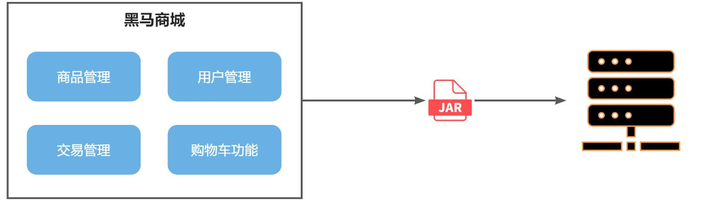

当项目规模较小时，这种模式上手快，部署、运维也都很方便，因此早期很多小型项目都采用这种模式。

但随着项目的业务规模越来越大，团队开发人员也不断增加，单体架构就呈现出越来越多的问题：

- **团队协作成本高**：试想一下，你们团队数十个人同时协作开发同一个项目，由于所有模块都在一个项目中，不同模块的代码之间物理边界越来越模糊。最终要把功能合并到一个分支，你绝对会陷入到解决冲突的泥潭之中。
- **系统发布效率低**：任何模块变更都需要发布整个系统，而系统发布过程中需要多个模块之间制约较多，需要对比各种文件，任何一处出现问题都会导致发布失败，往往一次发布需要数十分钟甚至数小时。
- **系统可用性差**：单体架构各个功能模块是作为一个服务部署，相互之间会互相影响，一些热点功能会耗尽系统资源，导致其它服务低可用。

在上述问题中，前两点相信大家在实战过程中应该深有体会。对于第三点系统可用性问题，很多同学可能感触不深。接下来我们就通过黑马商城这个项目，给大家做一个简单演示。

首先，我们修改hm-service模块下的`com.hmall.controller.HelloController`中的`hello`方法，模拟方法执行时的耗时：


接下来，启动项目，目前有两个接口是无需登录即可访问的：

- `http://localhost:8080/hi`
- `http://localhost:8080/search/list`

经过测试，目前`/search/list` 是比较正常的，访问耗时在30毫秒左右。

接下来，我们假设`/hi`这个接口是一个并发较高的热点接口，我们通过Jemeter来模拟500个用户不停访问。在课前资料中已经提供了Jemeter的测试脚本：


导入Jemeter并测试：

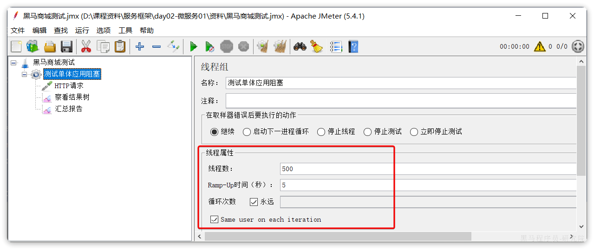

这个脚本会开启500个线程并发请求`http://localhost/hi`这个接口。由于该接口存在执行耗时（500毫秒），这就服务端导致每秒能处理的请求数量有限，最终会有越来越多请求积压，直至Tomcat资源耗尽。这样，其它本来正常的接口（例如`/search/list`）也都会被拖慢，甚至因超时而无法访问了。

我们测试一下，启动测试脚本，然后在浏览器访问`http://localhost:8080/search/list`这个接口，会发现响应速度非常慢：


如果进一步提高`/hi`这个接口的并发，最终会发现`/search/list`接口的请求响应速度会越来越慢。

可见，单体架构的可用性是比较差的，功能之间相互影响比较大。

当然，有同学会说我们可以做水平扩展。

此时如果我们对系统做水平扩展，增加更多机器，资源还是会被这样的热点接口占用，从而影响到其它接口，并不能从根本上解决问题。这也就是单体架构的扩展性差的一个原因。

而要想解决这些问题，就需要使用微服务架构了。

### 1.2.微服务

微服务架构，首先是服务化，就是将单体架构中的功能模块从单体应用中拆分出来，独立部署为多个服务。同时要满足下面的一些特点：

- **单一职责**：一个微服务负责一部分业务功能，并且其核心数据不依赖于其它模块。
- **团队自治**：每个微服务都有自己独立的开发、测试、发布、运维人员，团队人员规模不超过10人（2张披萨能喂饱）
- **服务自治**：每个微服务都独立打包部署，访问自己独立的数据库。并且要做好服务隔离，避免对其它服务产生影响

例如，黑马商城项目，我们就可以把商品、用户、购物车、交易等模块拆分，交给不同的团队去开发，并独立部署：


那么，单体架构存在的问题有没有解决呢？

- 团队协作成本高？
  - 由于服务拆分，每个服务代码量大大减少，参与开发的后台人员在1~3名，协作成本大大降低
- 系统发布效率低？
  - 每个服务都是独立部署，当有某个服务有代码变更时，只需要打包部署该服务即可
- 系统可用性差？
  - 每个服务独立部署，并且做好服务隔离，使用自己的服务器资源，不会影响到其它服务。

综上所述，微服务架构解决了单体架构存在的问题，特别适合大型互联网项目的开发，因此被各大互联网公司普遍采用。大家以前可能听说过分布式架构，分布式就是服务拆分的过程，其实微服务架构正式分布式架构的一种最佳实践的方案。

当然，微服务架构虽然能解决单体架构的各种问题，但在拆分的过程中，还会面临很多其它问题。比如：

- 如果出现跨服务的业务该如何处理？
- 页面请求到底该访问哪个服务？
- 如何实现各个服务之间的服务隔离？

这些问题，我们在后续的学习中会给大家逐一解答。

### 1.3.SpringCloud

微服务拆分以后碰到的各种问题都有对应的解决方案和微服务组件，而SpringCloud框架可以说是目前Java领域最全面的微服务组件的集合了。

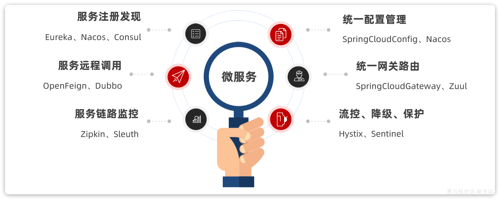

而且SpringCloud依托于SpringBoot的自动装配能力，大大降低了其项目搭建、组件使用的成本。对于没有自研微服务组件能力的中小型企业，使用SpringCloud全家桶来实现微服务开发可以说是最合适的选择了！

https://spring.io/projects/spring-cloud#overview

目前SpringCloud最新版本为`2022.0.x`版本，对应的SpringBoot版本为`3.x`版本，但它们全部依赖于JDK17，目前在企业中使用相对较少。

| **SpringCloud版本**                                          | **SpringBoot版本**                    |
| :----------------------------------------------------------- | :------------------------------------ |
| [2022.0.x](https://github.com/spring-cloud/spring-cloud-release/wiki/Spring-Cloud-2022.0-Release-Notes) aka Kilburn | 3.0.x                                 |
| [2021.0.x](https://github.com/spring-cloud/spring-cloud-release/wiki/Spring-Cloud-2021.0-Release-Notes) aka Jubilee | 2.6.x, 2.7.x (Starting with 2021.0.3) |
| [2020.0.x](https://github.com/spring-cloud/spring-cloud-release/wiki/Spring-Cloud-2020.0-Release-Notes) aka Ilford | 2.4.x, 2.5.x (Starting with 2020.0.3) |
| [Hoxton](https://github.com/spring-cloud/spring-cloud-release/wiki/Spring-Cloud-Hoxton-Release-Notes) | 2.2.x, 2.3.x (Starting with SR5)      |
| [Greenwich](https://github.com/spring-projects/spring-cloud/wiki/Spring-Cloud-Greenwich-Release-Notes) | 2.1.x                                 |
| [Finchley](https://github.com/spring-projects/spring-cloud/wiki/Spring-Cloud-Finchley-Release-Notes) | 2.0.x                                 |
| [Edgware](https://github.com/spring-projects/spring-cloud/wiki/Spring-Cloud-Edgware-Release-Notes) | 1.5.x                                 |
| [Dalston](https://github.com/spring-projects/spring-cloud/wiki/Spring-Cloud-Dalston-Release-Notes) | 1.5.x                                 |

因此，我们推荐使用次新版本：Spring Cloud 2021.0.x以及Spring Boot 2.7.x版本。

另外，Alibaba的微服务产品SpringCloudAlibaba目前也成为了SpringCloud组件中的一员，我们课堂中也会使用其中的部分组件。

在我们的父工程hmall中已经配置了SpringCloud以及SpringCloudAlibaba的依赖：


对应的版本：


这样，我们在后续需要使用SpringCloud或者SpringCloudAlibaba组件时，就无需单独指定版本了。

