# MQ

资料来源:[飞书MQ](https://b11et3un53m.feishu.cn/wiki/OQH4weMbcimUSLkIzD6cCpN0nvc)

微服务一旦拆分，必然涉及到服务之间的相互调用，目前我们服务之间调用采用的都是基于OpenFeign的调用。这种调用中，调用者发起请求后需要**等待**服务提供者执行业务返回结果后，才能继续执行后面的业务。也就是说调用者在调用过程中处于阻塞状态，因此我们称这种调用方式为**同步调用**，也可以叫**同步通讯**。但在很多场景下，我们可能需要采用**异步通讯**的方式，为什么呢？

我们先来看看什么是同步通讯和异步通讯。如图：


解读：

- 同步通讯：就如同打视频电话，双方的交互都是实时的。因此同一时刻你只能跟一个人打视频电话。
- 异步通讯：就如同发微信聊天，双方的交互不是实时的，你不需要立刻给对方回应。因此你可以多线操作，同时跟多人聊天。

两种方式各有优劣，打电话可以立即得到响应，但是你却不能跟多个人同时通话。发微信可以同时与多个人收发微信，但是往往响应会有延迟。

所以，如果我们的业务需要实时得到服务提供方的响应，则应该选择同步通讯（同步调用）。而如果我们追求更高的效率，并且不需要实时响应，则应该选择异步通讯（异步调用）。 

同步调用的方式我们已经学过了，之前的OpenFeign调用就是。但是：

- 异步调用又该如何实现？
- 哪些业务适合用异步调用来实现呢？

通过今天的学习你就能明白这些问题了。

## 1、初识MQ

### 1.1 同步调用

之前说过，我们现在基于OpenFeign的调用都属于是同步调用，那么这种方式存在哪些问题呢？

举个例子，我们以昨天留给大家作为作业的**余额支付功能**为例来分析，首先看下整个流程：


目前我们采用的是基于OpenFeign的同步调用，也就是说业务执行流程是这样的：

- 支付服务需要先调用用户服务完成余额扣减
- 然后支付服务自己要更新支付流水单的状态
- 然后支付服务调用交易服务，更新业务订单状态为已支付

三个步骤依次执行。

这其中就存在3个问题：

**第一、拓展性差**

我们目前的业务相对简单，但是随着业务规模扩大，产品的功能也在不断完善。

在大多数电商业务中，用户支付成功后都会以短信或者其它方式通知用户，告知支付成功。假如后期产品经理提出这样新的需求，你怎么办？是不是要在上述业务中再加入通知用户的业务？

某些电商项目中，还会有积分或金币的概念。假如产品经理提出需求，用户支付成功后，给用户以积分奖励或者返还金币，你怎么办？是不是要在上述业务中再加入积分业务、返还金币业务？

。。。

最终你的支付业务会越来越臃肿：


也就是说每次有新的需求，现有支付逻辑都要跟着变化，代码经常变动，不符合开闭原则，拓展性不好。

**第二、性能下降**

由于我们采用了同步调用，调用者需要等待服务提供者执行完返回结果后，才能继续向下执行，也就是说每次远程调用，调用者都是阻塞等待状态。最终整个业务的响应时长就是每次远程调用的执行时长之和：


假如每个微服务的执行时长都是50ms，则最终整个业务的耗时可能高达300ms，性能太差了。

**第三、级联失败**

由于我们是基于OpenFeign调用交易服务、通知服务。当交易服务、通知服务出现故障时，整个事务都会回滚，交易失败。

这其实就是同步调用的**级联失败**问题。

但是大家思考一下，我们假设用户余额充足，扣款已经成功，此时我们应该确保支付流水单更新为已支付，确保交易成功。毕竟收到手里的钱没道理再退回去吧。


因此，这里不能因为短信通知、更新订单状态失败而回滚整个事务。

综上，同步调用的方式存在下列问题：

- 拓展性差
- 性能下降
- 级联失败

而要解决这些问题，我们就必须用**异步调用**的方式来代替**同步调用**。

### 1.2 异步调用

异步调用方式其实就是基于消息通知的方式，一般包含三个角色：

- 消息发送者：投递消息的人，就是原来的调用方
- 消息Broker：管理、暂存、转发消息，你可以把它理解成微信服务器
- 消息接收者：接收和处理消息的人，就是原来的服务提供方


在异步调用中，发送者不再直接同步调用接收者的业务接口，而是发送一条消息投递给消息Broker。然后接收者根据自己的需求从消息Broker那里订阅消息。每当发送方发送消息后，接受者都能获取消息并处理。

这样，发送消息的人和接收消息的人就完全解耦了。

还是以余额支付业务为例：


除了扣减余额、更新支付流水单状态以外，其它调用逻辑全部取消。而是改为发送一条消息到Broker。而相关的微服务都可以订阅消息通知，一旦消息到达Broker，则会分发给每一个订阅了的微服务，处理各自的业务。

假如产品经理提出了新的需求，比如要在支付成功后更新用户积分。支付代码完全不用变更，而仅仅是让积分服务也订阅消息即可：


不管后期增加了多少消息订阅者，作为支付服务来讲，执行问扣减余额、更新支付流水状态后，发送消息即可。业务耗时仅仅是这三部分业务耗时，仅仅100ms，大大提高了业务性能。

另外，不管是交易服务、通知服务，还是积分服务，他们的业务与支付关联度低。现在采用了异步调用，解除了耦合，他们即便执行过程中出现了故障，也不会影响到支付服务。

综上，异步调用的优势包括：

- 耦合度更低
- 性能更好
- 业务拓展性强
- 故障隔离，避免级联失败

当然，异步通信也并非完美无缺，它存在下列缺点：

- 完全依赖于Broker的可靠性、安全性和性能
- 架构复杂，后期维护和调试麻烦

### 1.3 技术选型

消息Broker，目前常见的实现方案就是消息队列（MessageQueue），简称为MQ.

目比较常见的MQ实现：

- ActiveMQ
- RabbitMQ
- RocketMQ
- Kafka

几种常见MQ的对比：

|            | RabbitMQ                | ActiveMQ                       | RocketMQ   | Kafka      |
| ---------- | ----------------------- | ------------------------------ | ---------- | ---------- |
| 公司/社区  | Rabbit                  | Apache                         | 阿里       | Apache     |
| 开发语言   | Erlang                  | Java                           | Java       | Scala&Java |
| 协议支持   | AMQP，XMPP，SMTP，STOMP | OpenWire,STOMP，REST,XMPP,AMQP | 自定义协议 | 自定义协议 |
| 可用性     | 高                      | 一般                           | 高         | 高         |
| 单机吞吐量 | 一般                    | 差                             | 高         | 非常高     |
| 消息延迟   | 微秒级                  | 毫秒级                         | 毫秒级     | 毫秒以内   |
| 消息可靠性 | 高                      | 一般                           | 高         | 一般       |

追求可用性：Kafka、 RocketMQ 、RabbitMQ

追求可靠性：RabbitMQ、RocketMQ

追求吞吐能力：RocketMQ、Kafka

追求消息低延迟：RabbitMQ、Kafka

据统计，目前国内消息队列使用最多的还是RabbitMQ，再加上其各方面都比较均衡，稳定性也好，因此我们课堂上选择RabbitMQ来学习。

## 2、RabbitMQ

RabbitMQ是基于Erlang语言开发的开源消息通信中间件，官网地址：

https://www.rabbitmq.com/

接下来，我们就学习它的基本概念和基础用法。

### 2.1 安装

我们同样基于Docker来安装RabbitMQ，使用下面的命令即可：

```Shell
docker run \
 -e RABBITMQ_DEFAULT_USER=itheima \
 -e RABBITMQ_DEFAULT_PASS=123321 \
 -v mq-plugins:/plugins \
 --name mq \
 --hostname mq \
 -p 15672:15672 \
 -p 5672:5672 \
 --network hm-net\
 -d \
 rabbitmq:3.8-management
```

如果拉取镜像困难的话，可以使用课前资料给大家准备的镜像，利用docker load命令加载：


可以看到在安装命令中有两个映射的端口：

- 15672：RabbitMQ提供的管理控制台的端口
- 5672：RabbitMQ的消息发送处理接口

安装完成后，我们访问 http://localhost:15672即可看到管理控制台。首次访问需要登录，默认的用户名和密码都是`guest`在配置文件中已经指定了。

登录后即可看到管理控制台总览页面：


RabbitMQ对应的架构如图：


其中包含几个概念：

- **`publisher`**：生产者，也就是发送消息的一方
- **`consumer`**：消费者，也就是消费消息的一方
- **`queue`**：队列，存储消息。生产者投递的消息会暂存在消息队列中，等待消费者处理
- **`exchange`**：交换机，负责消息路由。生产者发送的消息由交换机决定投递到哪个队列。
- **`virtual host`**：虚拟主机，起到数据隔离的作用。每个虚拟主机相互独立，有各自的exchange、queue，不同项目会有不同`virtual host`

上述这些东西都可以在RabbitMQ的管理控制台来管理，下一节我们就一起来学习控制台的使用。

### 2.2 收发消息

#### 2.2.1 交换机

我们打开Exchanges选项卡，可以看到已经存在很多交换机：


我们点击任意交换机，即可进入交换机详情页面。仍然会利用控制台中的publish message 发送一条消息：


这里是由控制台模拟了生产者发送的消息。由于没有消费者存在，最终消息丢失了，这样说明==交换机没有存储消息的能力==。

#### 2.2.2 队列

我们打开`Queues`选项卡，新建一个队列：


命名为`hello.queue1`：


再以相同的方式，创建一个队列，密码为`hello.queue2`，最终队列列表如下：


此时，我们再次向`amq.fanout`交换机发送一条消息。会发现消息依然没有到达队列！！

怎么回事呢？

发送到交换机的消息，只会路由到与其绑定的队列，因此仅仅创建队列是不够的，我们还需要将其与交换机绑定。

#### 2.2.3 绑定关系

点击`Exchanges`选项卡，点击`amq.fanout`交换机，进入交换机详情页，然后点击`Bindings`菜单，在表单中填写要绑定的队列名称：


相同的方式，将hello.queue2也绑定到改交换机。

最终，绑定结果如下：


#### 2.2.4 发送消息

再次回到exchange页面，找到刚刚绑定的`amq.fanout`，点击进入详情页，再次发送一条消息：


回到`Queues`页面，可以发现`hello.queue`中已经有一条消息了：

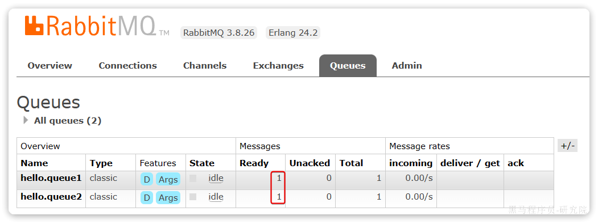

点击队列名称，进入详情页，查看队列详情，这次我们点击get message：


可以看到消息到达队列了：


这个时候如果有消费者监听了MQ的`hello.queue1`或`hello.queue2`队列，自然就能接收到消息了。

### 2.3 数据隔离

#### 2.3.1 用户管理

点击`Admin`选项卡，首先会看到RabbitMQ控制台的用户管理界面：

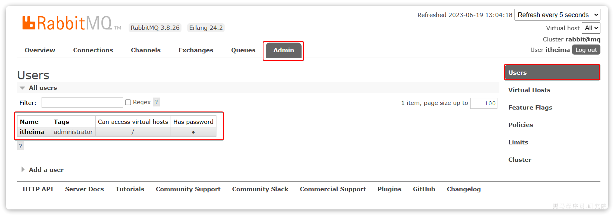

这里的用户都是RabbitMQ的管理或运维人员。目前只有安装RabbitMQ时添加的`itheima`这个用户。仔细观察用户表格中的字段，如下：

- `Name`：`itheima`，也就是用户名
- `Tags`：`administrator`，说明`itheima`用户是超级管理员，拥有所有权限
- `Can access virtual host`： `/`，可以访问的`virtual host`，这里的`/`是默认的`virtual host`

对于小型企业而言，出于成本考虑，我们通常只会搭建一套MQ集群，公司内的多个不同项目同时使用。这个时候为了避免互相干扰， 我们会利用`virtual host`的隔离特性，将不同项目隔离。一般会做两件事情：

- 给每个项目创建独立的运维账号，将管理权限分离。
- 给每个项目创建不同的`virtual host`，将每个项目的数据隔离。

比如，我们给黑马商城创建一个新的用户，命名为`hmall`：


你会发现此时hmall用户没有任何`virtual host`的访问权限：


别急，接下来我们就来授权。

#### 2.3.2 virtual host

我们先退出登录：


切换到刚刚创建的hmall用户登录，然后点击`Virtual Hosts`菜单，进入`virtual host`管理页：


可以看到目前只有一个默认的`virtual host`，名字为 `/`。

 我们可以给黑马商城项目创建一个单独的`virtual host`，而不是使用默认的`/`。

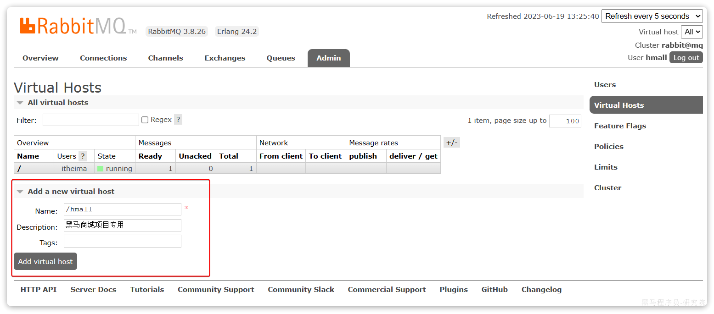

创建完成后如图：


由于我们是登录`hmall`账户后创建的`virtual host`，因此回到`users`菜单，你会发现当前用户已经具备了对`/hmall`这个`virtual host`的访问权限了：

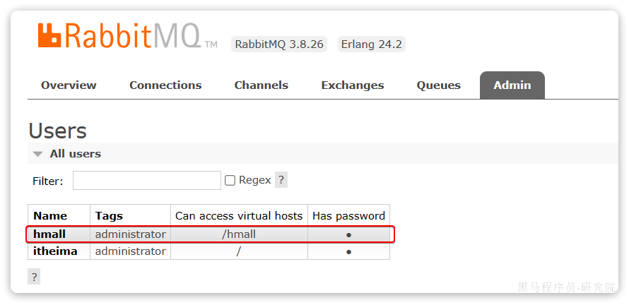

此时，点击页面右上角的`virtual host`下拉菜单，切换`virtual host`为 `/hmall`：

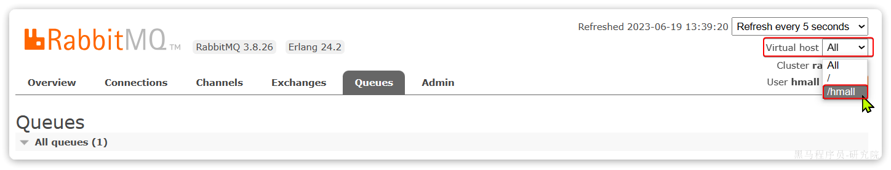

然后再次查看queues选项卡，会发现之前的队列已经看不到了：


这就是基于`virtual host `的隔离效果。

## 3、SpringAMQP

将来我们开发业务功能的时候，肯定不会在控制台收发消息，而是应该基于编程的方式。由于`RabbitMQ`采用了AMQP协议，因此它具备跨语言的特性。任何语言只要遵循AMQP协议收发消息，都可以与`RabbitMQ`交互。并且`RabbitMQ`官方也提供了各种不同语言的客户端。

但是，RabbitMQ官方提供的Java客户端编码相对复杂，一般生产环境下我们更多会结合Spring来使用。而Spring的官方刚好基于RabbitMQ提供了这样一套消息收发的模板工具：SpringAMQP。并且还基于SpringBoot对其实现了自动装配，使用起来非常方便。

SpringAmqp的官方地址：

https://spring.io/projects/spring-amqp

SpringAMQP提供了三个功能：

- 自动声明队列、交换机及其绑定关系
- 基于注解的监听器模式，异步接收消息
- 封装了RabbitTemplate工具，用于发送消息

这一章我们就一起学习一下，如何利用SpringAMQP实现对RabbitMQ的消息收发。

### 3.1 导入Demo工程

在课前资料给大家提供了一个Demo工程，方便我们学习SpringAMQP的使用：

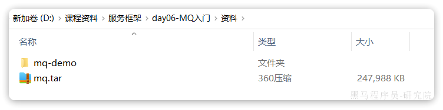

将其复制到你的工作空间，然后用Idea打开，项目结构如图：


包括三部分：

- mq-demo：父工程，管理项目依赖
- publisher：消息的发送者
- consumer：消息的消费者

在mq-demo这个父工程中，已经配置好了SpringAMQP相关的依赖：

```XML
<?xml version="1.0" encoding="UTF-8"?>
<project xmlns="http://maven.apache.org/POM/4.0.0"
         xmlns:xsi="http://www.w3.org/2001/XMLSchema-instance"
         xsi:schemaLocation="http://maven.apache.org/POM/4.0.0 http://maven.apache.org/xsd/maven-4.0.0.xsd">
    <modelVersion>4.0.0</modelVersion>

    <groupId>cn.itcast.demo</groupId>
    <artifactId>mq-demo</artifactId>
    <version>1.0-SNAPSHOT</version>
    <modules>
        <module>publisher</module>
        <module>consumer</module>
    </modules>
    <packaging>pom</packaging>

    <parent>
        <groupId>org.springframework.boot</groupId>
        <artifactId>spring-boot-starter-parent</artifactId>
        <version>2.7.12</version>
        <relativePath/>
    </parent>

    <properties>
        <maven.compiler.source>8</maven.compiler.source>
        <maven.compiler.target>8</maven.compiler.target>
    </properties>

    <dependencies>
        <dependency>
            <groupId>org.projectlombok</groupId>
            <artifactId>lombok</artifactId>
        </dependency>
        <!--AMQP依赖，包含RabbitMQ-->
        <dependency>
            <groupId>org.springframework.boot</groupId>
            <artifactId>spring-boot-starter-amqp</artifactId>
        </dependency>
        <!--单元测试-->
        <dependency>
            <groupId>org.springframework.boot</groupId>
            <artifactId>spring-boot-starter-test</artifactId>
        </dependency>
    </dependencies>
</project>
```

因此，子工程中就可以直接使用SpringAMQP了。

### 3.2 快速入门

在之前的案例中，我们都是经过交换机发送消息到队列，不过有时候为了测试方便，我们也可以直接向队列发送消息，跳过交换机。

在入门案例中，我们就演示这样的简单模型，如图：


也就是：

- publisher直接发送消息到队列
- 消费者监听并处理队列中的消息

> **注意**：这种模式一般测试使用，很少在生产中使用。

为了方便测试，我们现在控制台新建一个队列：simple.queue


添加成功：


接下来，我们就可以利用Java代码收发消息了。

#### 3.2.1 消息发送

首先配置MQ地址，在`publisher`服务的`application.yml`中添加配置：

```YAML
spring:
  rabbitmq:
    host: 192.168.150.101 # 你的虚拟机IP
    port: 5672 # 端口
    virtual-host: /hmall # 虚拟主机
    username: hmall # 用户名
    password: 123 # 密码
```

然后在`publisher`服务中编写测试类`SpringAmqpTest`，并利用`RabbitTemplate`实现消息发送：

```Java
package com.itheima.publisher.amqp;

import org.junit.jupiter.api.Test;
import org.springframework.amqp.rabbit.core.RabbitTemplate;
import org.springframework.beans.factory.annotation.Autowired;
import org.springframework.boot.test.context.SpringBootTest;

@SpringBootTest
public class SpringAmqpTest {

    @Autowired
    private RabbitTemplate rabbitTemplate;

    @Test
    public void testSimpleQueue() {
        // 队列名称
        String queueName = "simple.queue";
        // 消息
        String message = "hello, spring amqp!";
        // 发送消息
        rabbitTemplate.convertAndSend(queueName, message);
    }
}
```

打开控制台，可以看到消息已经发送到队列中：

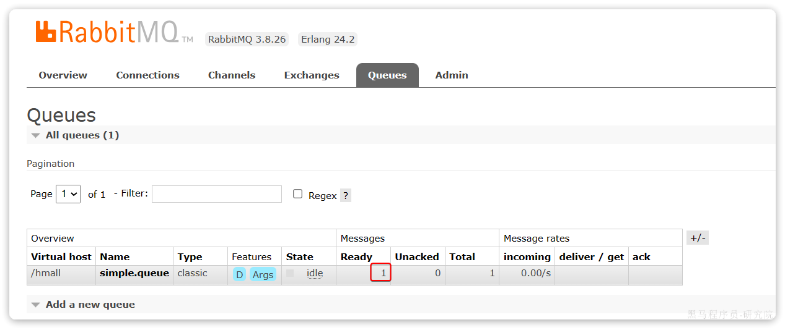

接下来，我们再来实现消息接收。

#### 3.2.2 消息接收

首先配置MQ地址，在`consumer`服务的`application.yml`中添加配置：

```YAML
spring:
  rabbitmq:
    host: 192.168.150.101 # 你的虚拟机IP
    port: 5672 # 端口
    virtual-host: /hmall # 虚拟主机
    username: hmall # 用户名
    password: 123 # 密码
```

然后在`consumer`服务的`com.itheima.consumer.listener`包中新建一个类`SpringRabbitListener`，代码如下：

```Java
package com.itheima.consumer.listener;

import org.springframework.amqp.rabbit.annotation.RabbitListener;
import org.springframework.stereotype.Component;

@Component
public class SpringRabbitListener {
        // 利用RabbitListener来声明要监听的队列信息
    // 将来一旦监听的队列中有了消息，就会推送给当前服务，调用当前方法，处理消息。
    // 可以看到方法体中接收的就是消息体的内容
    @RabbitListener(queues = "simple.queue")
    public void listenSimpleQueueMessage(String msg) throws InterruptedException {
        System.out.println("spring 消费者接收到消息：【" + msg + "】");
    }
}
```

#### 3.2.3 测试

启动consumer服务，然后在publisher服务中运行测试代码，发送MQ消息。最终consumer收到消息：


### 3.3 WorkQueues模型

Work queues，任务模型。简单来说就是**让多个消费者绑定到一个队列，共同消费队列中的消息**。


当消息处理比较耗时的时候，可能生产消息的速度会远远大于消息的消费速度。长此以往，消息就会堆积越来越多，无法及时处理。

此时就可以使用work 模型，**多个消费者共同处理消息处理，消息处理的速度就能大大提高**了。

接下来，我们就来模拟这样的场景。

首先，我们在控制台创建一个新的队列，命名为`work.queue`：

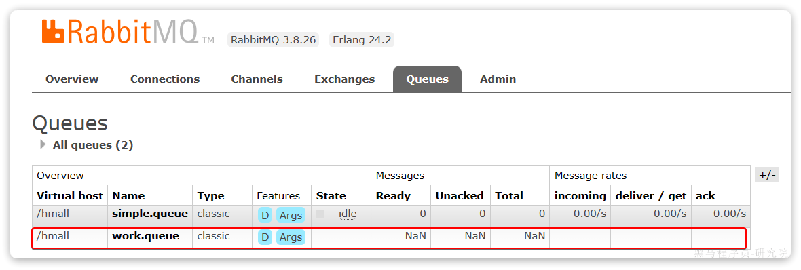

#### 3.3.1 消息发送

这次我们循环发送，模拟大量消息堆积现象。

在publisher服务中的SpringAmqpTest类中添加一个测试方法：

```java
/**
     * workQueue
     * 向队列中不停发送消息，模拟消息堆积。
     */
@Test
public void testWorkQueue() throws InterruptedException {
    // 队列名称
    String queueName = "simple.queue";
    // 消息
    String message = "hello, message_";
    for (int i = 0; i < 50; i++) {
        // 发送消息，每20毫秒发送一次，相当于每秒发送50条消息
        rabbitTemplate.convertAndSend(queueName, message + i);
        Thread.sleep(20);
    }
}
```

#### 3.3.2 消息接收

要模拟多个消费者绑定同一个队列，我们在consumer服务的SpringRabbitListener中添加2个新的方法：

```Java
@RabbitListener(queues = "work.queue")
public void listenWorkQueue1(String msg) throws InterruptedException {
    System.out.println("消费者1接收到消息：【" + msg + "】" + LocalTime.now());
    Thread.sleep(20);
}

@RabbitListener(queues = "work.queue")
public void listenWorkQueue2(String msg) throws InterruptedException {
    System.err.println("消费者2........接收到消息：【" + msg + "】" + LocalTime.now());
    Thread.sleep(200);
}
```

注意到这两消费者，都设置了`Thead.sleep`，模拟任务耗时：

- 消费者1 sleep了20毫秒，相当于每秒钟处理50个消息
- 消费者2 sleep了200毫秒，相当于每秒处理5个消息

#### 3.3.3 测试

启动ConsumerApplication后，在执行publisher服务中刚刚编写的发送测试方法testWorkQueue。

最终结果如下：

```Java
消费者1接收到消息：【hello, message_0】21:06:00.869555300
消费者2........接收到消息：【hello, message_1】21:06:00.884518
消费者1接收到消息：【hello, message_2】21:06:00.907454400
消费者1接收到消息：【hello, message_4】21:06:00.953332100
消费者1接收到消息：【hello, message_6】21:06:00.997867300
消费者1接收到消息：【hello, message_8】21:06:01.042178700
消费者2........接收到消息：【hello, message_3】21:06:01.086478800
消费者1接收到消息：【hello, message_10】21:06:01.087476600
消费者1接收到消息：【hello, message_12】21:06:01.132578300
消费者1接收到消息：【hello, message_14】21:06:01.175851200
消费者1接收到消息：【hello, message_16】21:06:01.218533400
消费者1接收到消息：【hello, message_18】21:06:01.261322900
消费者2........接收到消息：【hello, message_5】21:06:01.287003700
消费者1接收到消息：【hello, message_20】21:06:01.304412400
消费者1接收到消息：【hello, message_22】21:06:01.349950100
消费者1接收到消息：【hello, message_24】21:06:01.394533900
消费者1接收到消息：【hello, message_26】21:06:01.439876500
消费者1接收到消息：【hello, message_28】21:06:01.482937800
消费者2........接收到消息：【hello, message_7】21:06:01.488977100
消费者1接收到消息：【hello, message_30】21:06:01.526409300
消费者1接收到消息：【hello, message_32】21:06:01.572148
消费者1接收到消息：【hello, message_34】21:06:01.618264800
消费者1接收到消息：【hello, message_36】21:06:01.660780600
消费者2........接收到消息：【hello, message_9】21:06:01.689189300
消费者1接收到消息：【hello, message_38】21:06:01.705261
消费者1接收到消息：【hello, message_40】21:06:01.746927300
消费者1接收到消息：【hello, message_42】21:06:01.789835
消费者1接收到消息：【hello, message_44】21:06:01.834393100
消费者1接收到消息：【hello, message_46】21:06:01.875312100
消费者2........接收到消息：【hello, message_11】21:06:01.889969500
消费者1接收到消息：【hello, message_48】21:06:01.920702500
消费者2........接收到消息：【hello, message_13】21:06:02.090725900
消费者2........接收到消息：【hello, message_15】21:06:02.293060600
消费者2........接收到消息：【hello, message_17】21:06:02.493748
消费者2........接收到消息：【hello, message_19】21:06:02.696635100
消费者2........接收到消息：【hello, message_21】21:06:02.896809700
消费者2........接收到消息：【hello, message_23】21:06:03.099533400
消费者2........接收到消息：【hello, message_25】21:06:03.301446400
消费者2........接收到消息：【hello, message_27】21:06:03.504999100
消费者2........接收到消息：【hello, message_29】21:06:03.705702500
消费者2........接收到消息：【hello, message_31】21:06:03.906601200
消费者2........接收到消息：【hello, message_33】21:06:04.108118500
消费者2........接收到消息：【hello, message_35】21:06:04.308945400
消费者2........接收到消息：【hello, message_37】21:06:04.511547700
消费者2........接收到消息：【hello, message_39】21:06:04.714038400
消费者2........接收到消息：【hello, message_41】21:06:04.916192700
消费者2........接收到消息：【hello, message_43】21:06:05.116286400
消费者2........接收到消息：【hello, message_45】21:06:05.318055100
消费者2........接收到消息：【hello, message_47】21:06:05.520656400
消费者2........接收到消息：【hello, message_49】21:06:05.723106700
```

可以看到消费者1和消费者2竟然每人消费了25条消息：

- 消费者1很快完成了自己的25条消息
- 消费者2却在缓慢的处理自己的25条消息。

也就是说消息是平均分配给每个消费者，并没有考虑到消费者的处理能力。导致1个消费者空闲，另一个消费者忙的不可开交。没有充分利用每一个消费者的能力，最终消息处理的耗时远远超过了1秒。这样显然是有问题的。

#### 3.3.4 能者多劳

默认情况下，RabbitMQ的会将消息依次轮询投递给绑定在队列上的每一个消费者。但这并没有考虑到消费者是否已经
处理完消息，可能出现消息堆积。

因此我们需要修改application.yml，设置prefetch值为1，确保同一时刻最多投递给消费者1条消息:

在spring中有一个简单的配置，可以解决这个问题。我们修改consumer服务的application.yml文件，添加配置：

```YAML
spring:
  rabbitmq:
    listener:
      simple:
        prefetch: 1 # 每次只能获取一条消息，处理完成才能获取下一个消息
```

再次测试，发现结果如下：

```Java
消费者1接收到消息：【hello, message_0】21:12:51.659664200
消费者2........接收到消息：【hello, message_1】21:12:51.680610
消费者1接收到消息：【hello, message_2】21:12:51.703625
消费者1接收到消息：【hello, message_3】21:12:51.724330100
消费者1接收到消息：【hello, message_4】21:12:51.746651100
消费者1接收到消息：【hello, message_5】21:12:51.768401400
消费者1接收到消息：【hello, message_6】21:12:51.790511400
消费者1接收到消息：【hello, message_7】21:12:51.812559800
消费者1接收到消息：【hello, message_8】21:12:51.834500600
消费者1接收到消息：【hello, message_9】21:12:51.857438800
消费者1接收到消息：【hello, message_10】21:12:51.880379600
消费者2........接收到消息：【hello, message_11】21:12:51.899327100
消费者1接收到消息：【hello, message_12】21:12:51.922828400
消费者1接收到消息：【hello, message_13】21:12:51.945617400
消费者1接收到消息：【hello, message_14】21:12:51.968942500
消费者1接收到消息：【hello, message_15】21:12:51.992215400
消费者1接收到消息：【hello, message_16】21:12:52.013325600
消费者1接收到消息：【hello, message_17】21:12:52.035687100
消费者1接收到消息：【hello, message_18】21:12:52.058188
消费者1接收到消息：【hello, message_19】21:12:52.081208400
消费者2........接收到消息：【hello, message_20】21:12:52.103406200
消费者1接收到消息：【hello, message_21】21:12:52.123827300
消费者1接收到消息：【hello, message_22】21:12:52.146165100
消费者1接收到消息：【hello, message_23】21:12:52.168828300
消费者1接收到消息：【hello, message_24】21:12:52.191769500
消费者1接收到消息：【hello, message_25】21:12:52.214839100
消费者1接收到消息：【hello, message_26】21:12:52.238998700
消费者1接收到消息：【hello, message_27】21:12:52.259772600
消费者1接收到消息：【hello, message_28】21:12:52.284131800
消费者2........接收到消息：【hello, message_29】21:12:52.306190600
消费者1接收到消息：【hello, message_30】21:12:52.325315800
消费者1接收到消息：【hello, message_31】21:12:52.347012500
消费者1接收到消息：【hello, message_32】21:12:52.368508600
消费者1接收到消息：【hello, message_33】21:12:52.391785100
消费者1接收到消息：【hello, message_34】21:12:52.416383800
消费者1接收到消息：【hello, message_35】21:12:52.439019
消费者1接收到消息：【hello, message_36】21:12:52.461733900
消费者1接收到消息：【hello, message_37】21:12:52.485990
消费者1接收到消息：【hello, message_38】21:12:52.509219900
消费者2........接收到消息：【hello, message_39】21:12:52.523683400
消费者1接收到消息：【hello, message_40】21:12:52.547412100
消费者1接收到消息：【hello, message_41】21:12:52.571191800
消费者1接收到消息：【hello, message_42】21:12:52.593024600
消费者1接收到消息：【hello, message_43】21:12:52.616731800
消费者1接收到消息：【hello, message_44】21:12:52.640317
消费者1接收到消息：【hello, message_45】21:12:52.663111100
消费者1接收到消息：【hello, message_46】21:12:52.686727
消费者1接收到消息：【hello, message_47】21:12:52.709266500
消费者2........接收到消息：【hello, message_48】21:12:52.725884900
消费者1接收到消息：【hello, message_49】21:12:52.746299900
```

可以发现，由于消费者1处理速度较快，所以处理了更多的消息；消费者2处理速度较慢，只处理了6条消息。而最终总的执行耗时也在1秒左右，大大提升。

正所谓能者多劳，这样充分利用了每一个消费者的处理能力，可以有效避免消息积压问题。

#### 3.3.5 总结

Work模型的使用：

- 多个消费者绑定到一个队列，同一条消息只会被一个消费者处理
- 通过设置prefetch来控制消费者预取的消息数量

### 3.4 交换机类型

在之前的两个测试案例中，都没有交换机，生产者直接发送消息到队列。而一旦引入交换机，消息发送的模式会有很大变化：


可以看到，在订阅模型中，多了一个exchange角色，而且过程略有变化：

- **Publisher**：生产者，不再发送消息到队列中，而是发给交换机
- **Exchange**：交换机，一方面，接收生产者发送的消息。另一方面，知道如何处理消息，例如递交给某个特别队列、递交给所有队列、或是将消息丢弃。到底如何操作，取决于Exchange的类型。
- **Queue**：消息队列也与以前一样，接收消息、缓存消息。不过队列一定要与交换机绑定。
- **Consumer**：消费者，与以前一样，订阅队列，没有变化

**Exchange（交换机）只负责转发消息，不具备存储消息的能力**，因此如果没有任何队列与Exchange绑定，或者没有符合路由规则的队列，那么消息会丢失！

交换机的类型有四种：

- **Fanout**：广播，将消息交给所有绑定到交换机的队列。我们最早在控制台使用的正是Fanout交换机
- **Direct**：订阅，基于RoutingKey（路由key）发送给订阅了消息的队列
- **Topic**：通配符订阅，与Direct类似，只不过RoutingKey可以使用通配符
- **Headers**：头匹配，基于MQ的消息头匹配，用的较少。

课堂中，我们讲解前面的三种交换机模式。

### 3.5 Fanout交换机

Fanout，英文翻译是扇出，我觉得在MQ中叫广播更合适。

在广播模式下，消息发送流程是这样的：


- 1）  可以有多个队列
- 2）  每个队列都要绑定到Exchange（交换机）
- 3）  生产者发送的消息，只能发送到交换机
- 4）  交换机把消息发送给绑定过的所有队列
- 5）  订阅队列的消费者都能拿到消息

我们的计划是这样的：

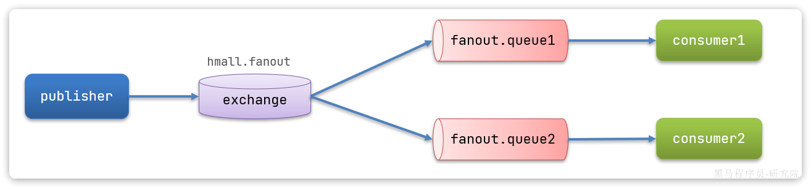

- 创建一个名为` hmall.fanout`的交换机，类型是`Fanout`
- 创建两个队列`fanout.queue1`和`fanout.queue2`，绑定到交换机`hmall.fanout`


#### 3.5.1 声明队列和交换机

在控制台创建队列`fanout.queue1`:

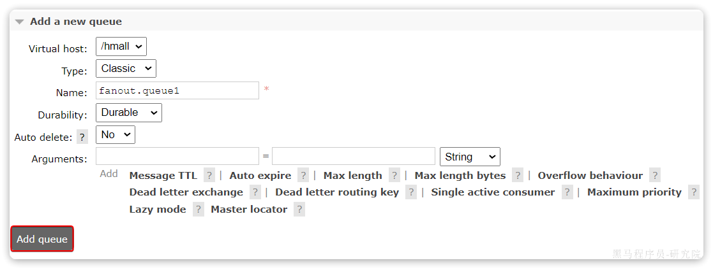

在创建一个队列`fanout.queue2`：

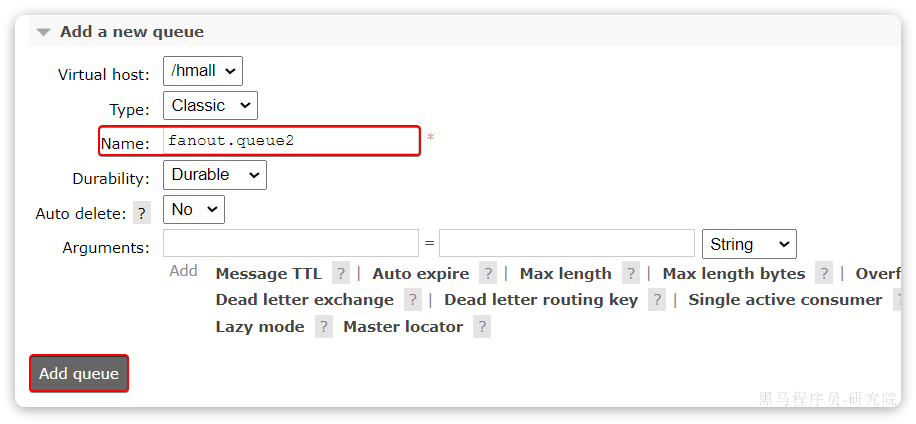

然后再创建一个交换机：


然后绑定两个队列到交换机：


#### 3.5.2 消息发送

在publisher服务的SpringAmqpTest类中添加测试方法：

```Java
@Test
public void testFanoutExchange() {
    // 交换机名称
    String exchangeName = "hmall.fanout";
    // 消息
    String message = "hello, everyone!";
    rabbitTemplate.convertAndSend(exchangeName, "", message);
}
```

#### 3.5.3 消息接收

在consumer服务的SpringRabbitListener中添加两个方法，作为消费者：

```Java
@RabbitListener(queues = "fanout.queue1")
public void listenFanoutQueue1(String msg) {
    System.out.println("消费者1接收到Fanout消息：【" + msg + "】");
}

@RabbitListener(queues = "fanout.queue2")
public void listenFanoutQueue2(String msg) {
    System.out.println("消费者2接收到Fanout消息：【" + msg + "】");
}
```

#### 3.5.4 总结

交换机的作用是什么？

- 接收publisher发送的消息
- 将消息按照规则路由到与之绑定的队列
- 不能缓存消息，路由失败，消息丢失
- FanoutExchange的会将消息路由到每个绑定的队列

### 3.6 Direct交换机

在Fanout模式中，一条消息，会被所有订阅的队列都消费。但是，在某些场景下，我们希望不同的消息被不同的队列消费。这时就要用到Direct类型的Exchange。


在Direct模型下：

- 队列与交换机的绑定，不能是任意绑定了，而是要指定一个`RoutingKey`（路由key）
- 消息的发送方在 向 Exchange发送消息时，也必须指定消息的 `RoutingKey`。
- Exchange不再把消息交给每一个绑定的队列，而是根据消息的`Routing Key`进行判断，只有队列的`Routingkey`与消息的 `Routing key`完全一致，才会接收到消息

**案例需求如图**：


1.  声明一个名为`hmall.direct`的交换机
2. 声明队列`direct.queue1`，绑定`hmall.direct`，`bindingKey`为`blud`和`red`
3. 声明队列`direct.queue2`，绑定`hmall.direct`，`bindingKey`为`yellow`和`red`
4.  在`consumer`服务中，编写两个消费者方法，分别监听direct.queue1和direct.queue2 
5.  在publisher中编写测试方法，向`hmall.direct`发送消息 

#### 3.6.1 声明队列和交换机

首先在控制台声明两个队列`direct.queue1`和`direct.queue2`，这里不再展示过程：

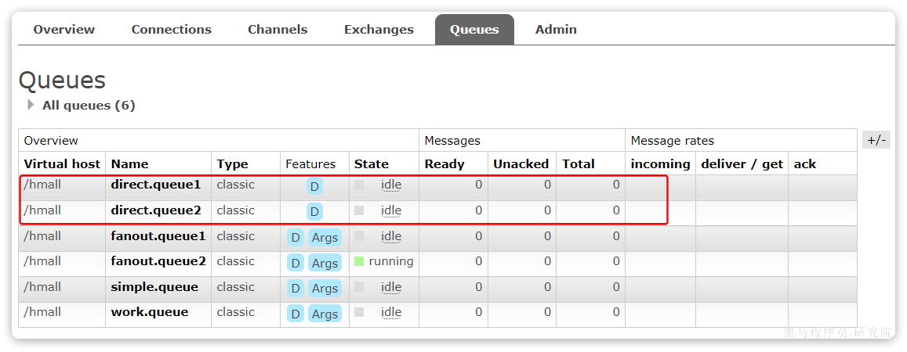

然后声明一个direct类型的交换机，命名为`hmall.direct`:


然后使用`red`和`blue`作为key，绑定`direct.queue1`到`hmall.direct`：

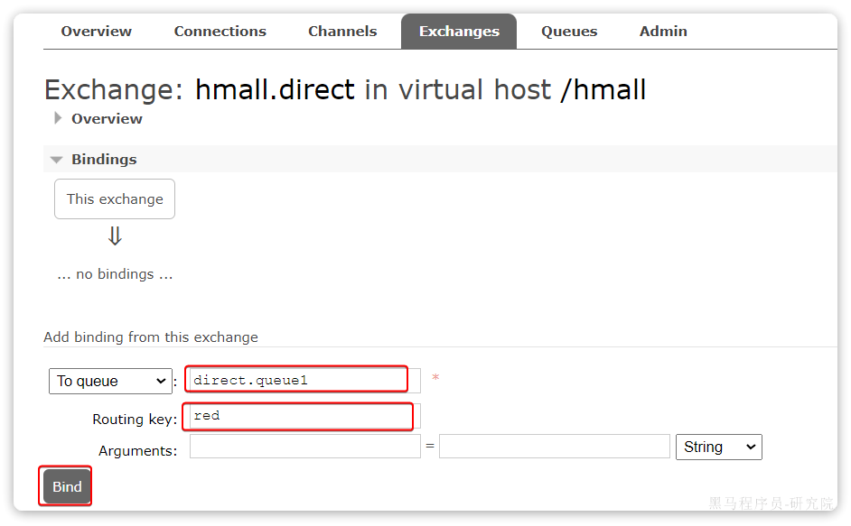


同理，使用`red`和`yellow`作为key，绑定`direct.queue2`到`hmall.direct`，步骤略，最终结果：


#### 3.6.2 消息接收

在consumer服务的SpringRabbitListener中添加方法：

```Java
@RabbitListener(queues = "direct.queue1")
public void listenDirectQueue1(String msg) {
    System.out.println("消费者1接收到direct.queue1的消息：【" + msg + "】");
}

@RabbitListener(queues = "direct.queue2")
public void listenDirectQueue2(String msg) {
    System.out.println("消费者2接收到direct.queue2的消息：【" + msg + "】");
}
```

#### 3.6.3 消息发送

在publisher服务的SpringAmqpTest类中添加测试方法：

```Java
@Test
public void testSendDirectExchange() {
    // 交换机名称
    String exchangeName = "hmall.direct";
    // 消息
    String message = "红色警报！日本乱排核废水，导致海洋生物变异，惊现哥斯拉！";
    // 发送消息
    rabbitTemplate.convertAndSend(exchangeName, "red", message);
}
```

由于使用的red这个key，所以两个消费者都收到了消息：


我们再切换为blue这个key：

```Java
@Test
public void testSendDirectExchange() {
    // 交换机名称
    String exchangeName = "hmall.direct";
    // 消息
    String message = "最新报道，哥斯拉是居民自治巨型气球，虚惊一场！";
    // 发送消息
    rabbitTemplate.convertAndSend(exchangeName, "blue", message);
}
```

你会发现，只有消费者1收到了消息：


#### 3.6.4 总结

描述下Direct交换机与Fanout交换机的差异？

- Fanout交换机将消息路由给每一个与之绑定的队列
- Direct交换机根据RoutingKey判断路由给哪个队列
- 如果多个队列具有相同的RoutingKey，则与Fanout功能类似

### 3.7 Topic交换机

#### 3.7.1 说明

`Topic`类型的`Exchange`与`Direct`相比，都是可以根据`RoutingKey`把消息路由到不同的队列。

只不过`Topic`类型`Exchange`可以让队列在绑定`BindingKey` 的时候使用通配符！

```
BindingKey` 一般都是有一个或多个单词组成，多个单词之间以`.`分割，例如： `item.insert
```

通配符规则：

- `#`：匹配一个或多个词
- `*`：匹配不多不少恰好1个词

举例：

- `item.#`：能够匹配`item.spu.insert` 或者 `item.spu`
- `item.*`：只能匹配`item.spu`

图示：


假如此时publisher发送的消息使用的`RoutingKey`共有四种：

- `china.news `代表有中国的新闻消息；
- `china.weather` 代表中国的天气消息；
- `japan.news` 则代表日本新闻
- `japan.weather` 代表日本的天气消息；

解释：

- `topic.queue1`：绑定的是`china.#` ，凡是以 `china.`开头的`routing key` 都会被匹配到，包括：
  - `china.news`
  - `china.weather`
- `topic.queue2`：绑定的是`#.news` ，凡是以 `.news`结尾的 `routing key` 都会被匹配。包括:
  - `china.news`
  - `japan.news`

接下来，我们就按照上图所示，来演示一下Topic交换机的用法。

首先，在控制台按照图示例子创建队列、交换机，并利用通配符绑定队列和交换机。此处步骤略。最终结果如下：

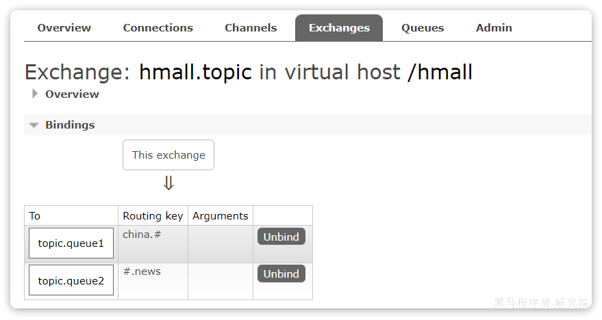

#### 3.7.2 消息发送

在publisher服务的SpringAmqpTest类中添加测试方法：

```Java
/**
 * topicExchange
 */
@Test
public void testSendTopicExchange() {
    // 交换机名称
    String exchangeName = "hmall.topic";
    // 消息
    String message = "喜报！孙悟空大战哥斯拉，胜!";
    // 发送消息
    rabbitTemplate.convertAndSend(exchangeName, "china.news", message);
}
```

#### 3.7.3 消息接收

在consumer服务的SpringRabbitListener中添加方法：

```Java
@RabbitListener(queues = "topic.queue1")
public void listenTopicQueue1(String msg){
    System.out.println("消费者1接收到topic.queue1的消息：【" + msg + "】");
}

@RabbitListener(queues = "topic.queue2")
public void listenTopicQueue2(String msg){
    System.out.println("消费者2接收到topic.queue2的消息：【" + msg + "】");
}
```

#### 3.7.4 总结

描述下Direct交换机与Topic交换机的差异？

- Topic交换机接收的消息RoutingKey必须是多个单词，以 **`.`** 分割
- Topic交换机与队列绑定时的bindingKey可以指定通配符
- `#`：代表0个或多个词
- `*`：代表1个词

### 3.8 声明队列和交换机

在之前我们都是基于RabbitMQ控制台来创建队列、交换机。但是在实际开发时，队列和交换机是程序员定义的，将来项目上线，又要交给运维去创建。那么程序员就需要把程序中运行的所有队列和交换机都写下来，交给运维。在这个过程中是很容易出现错误的。

因此推荐的做法是==由程序启动时检查队列和交换机是否存在，如果不存在自动创建==。

#### 3.8.1 基本API

**一般在消费者声明交换机、队列**

SpringAMQP提供了一个Queue类，用来创建队列：


SpringAMQP还提供了一个Exchange接口，来表示所有不同类型的交换机：


我们可以自己创建队列和交换机，不过SpringAMQP还提供了ExchangeBuilder来简化这个过程：


而在绑定队列和交换机时，则需要使用BindingBuilder来创建Binding对象：


#### 3.8.2 fanout示例

在consumer中创建一个类，声明队列和交换机：

```Java
package com.itheima.consumer.config;

import org.springframework.amqp.core.Binding;
import org.springframework.amqp.core.BindingBuilder;
import org.springframework.amqp.core.FanoutExchange;
import org.springframework.amqp.core.Queue;
import org.springframework.context.annotation.Bean;
import org.springframework.context.annotation.Configuration;

@Configuration
public class FanoutConfig {
    /**
     * 声明交换机
     * @return Fanout类型交换机
     */
    @Bean
    public FanoutExchange fanoutExchange(){
        return new FanoutExchange("hmall.fanout");
    }

    /**
     * 第1个队列
     */
    @Bean
    public Queue fanoutQueue1(){
        return new Queue("fanout.queue1");
    }

    /**
     * 绑定队列和交换机
     */
    @Bean
    public Binding bindingQueue1(Queue fanoutQueue1, FanoutExchange fanoutExchange){
        return BindingBuilder.bind(fanoutQueue1).to(fanoutExchange);
    }

    /**
     * 第2个队列
     */
    @Bean
    public Queue fanoutQueue2(){
        return new Queue("fanout.queue2");
    }

    /**
     * 绑定队列和交换机
     */
    @Bean
    public Binding bindingQueue2(Queue fanoutQueue2, FanoutExchange fanoutExchange){
        return BindingBuilder.bind(fanoutQueue2).to(fanoutExchange);
    }
}
```

#### 3.8.3 direct示例

direct模式由于要绑定多个KEY，会非常麻烦，每一个Key都要编写一个binding：

```Java
package com.itheima.consumer.config;

import org.springframework.amqp.core.*;
import org.springframework.context.annotation.Bean;
import org.springframework.context.annotation.Configuration;

@Configuration
public class DirectConfig {

    /**
     * 声明交换机
     * @return Direct类型交换机
     */
    @Bean
    public DirectExchange directExchange(){
        return ExchangeBuilder.directExchange("hmall.direct").build();
    }

    /**
     * 第1个队列
     */
    @Bean
    public Queue directQueue1(){
        return new Queue("direct.queue1");
    }

    /**
     * 绑定队列和交换机
     */
    @Bean
    public Binding bindingQueue1WithRed(Queue directQueue1, DirectExchange directExchange){
        return BindingBuilder.bind(directQueue1).to(directExchange).with("red");
    }
    /**
     * 绑定队列和交换机
     */
    @Bean
    public Binding bindingQueue1WithBlue(Queue directQueue1, DirectExchange directExchange){
        return BindingBuilder.bind(directQueue1).to(directExchange).with("blue");
    }

    /**
     * 第2个队列
     */
    @Bean
    public Queue directQueue2(){
        return new Queue("direct.queue2");
    }

    /**
     * 绑定队列和交换机
     */
    @Bean
    public Binding bindingQueue2WithRed(Queue directQueue2, DirectExchange directExchange){
        return BindingBuilder.bind(directQueue2).to(directExchange).with("red");
    }
    /**
     * 绑定队列和交换机
     */
    @Bean
    public Binding bindingQueue2WithYellow(Queue directQueue2, DirectExchange directExchange){
        return BindingBuilder.bind(directQueue2).to(directExchange).with("yellow");
    }
}
```

#### 3.8.4 基于注解声明

基于@Bean的方式声明队列和交换机比较麻烦，Spring还提供了基于注解方式来声明。

例如，我们同样声明Direct模式的交换机和队列：

```Java
@RabbitListener(bindings = @QueueBinding(
    value = @Queue(name = "direct.queue1"),
    exchange = @Exchange(name = "hmall.direct", type = ExchangeTypes.DIRECT),
    key = {"red", "blue"}
))
public void listenDirectQueue1(String msg){
    System.out.println("消费者1接收到direct.queue1的消息：【" + msg + "】");
}

@RabbitListener(bindings = @QueueBinding(
    value = @Queue(name = "direct.queue2"),
    exchange = @Exchange(name = "hmall.direct", type = ExchangeTypes.DIRECT),
    key = {"red", "yellow"}
))
public void listenDirectQueue2(String msg){
    System.out.println("消费者2接收到direct.queue2的消息：【" + msg + "】");
}
```

是不是简单多了。

再试试Topic模式：

```Java
@RabbitListener(bindings = @QueueBinding(
    value = @Queue(name = "topic.queue1"),
    exchange = @Exchange(name = "hmall.topic", type = ExchangeTypes.TOPIC),
    key = "china.#"
))
public void listenTopicQueue1(String msg){
    System.out.println("消费者1接收到topic.queue1的消息：【" + msg + "】");
}

@RabbitListener(bindings = @QueueBinding(
    value = @Queue(name = "topic.queue2"),
    exchange = @Exchange(name = "hmall.topic", type = ExchangeTypes.TOPIC),
    key = "#.news"
))
public void listenTopicQueue2(String msg){
    System.out.println("消费者2接收到topic.queue2的消息：【" + msg + "】");
}
```

### 3.9 消息转换器

Spring的消息发送代码接收的消息体是一个Object：


而在数据传输时，它会把你发送的消息序列化为字节发送给MQ，接收消息的时候，还会把字节反序列化为Java对象。

只不过，默认情况下Spring采用的序列化方式是JDK序列化。众所周知，JDK序列化存在下列问题：

- 数据体积过大
- 有安全漏洞
- 可读性差

我们来测试一下。

#### 3.9.1 测试默认转换器

1）创建测试队列

首先，我们在consumer服务中声明一个新的配置类：


利用@Bean的方式创建一个队列，

具体代码：

```Java
package com.itheima.consumer.config;

import org.springframework.amqp.core.Queue;
import org.springframework.context.annotation.Bean;
import org.springframework.context.annotation.Configuration;

@Configuration
public class MessageConfig {

    @Bean
    public Queue objectQueue() {
        return new Queue("object.queue");
    }
}
```

注意，这里我们先不要给这个队列添加消费者，我们要查看消息体的格式。

重启consumer服务以后，该队列就会被自动创建出来了：


2）发送消息

我们在publisher模块的SpringAmqpTest中新增一个消息发送的代码，发送一个Map对象：

```Java
@Test
public void testSendMap() throws InterruptedException {
    // 准备消息
    Map<String,Object> msg = new HashMap<>();
    msg.put("name", "柳岩");
    msg.put("age", 21);
    // 发送消息
    rabbitTemplate.convertAndSend("object.queue", msg);
}
```

发送消息后查看控制台：


可以看到消息格式非常不友好。

#### 3.9.2 配置JSON转换器

显然，JDK序列化方式并不合适。我们希望消息体的体积更小、可读性更高，因此可以使用JSON方式来做序列化和反序列化。

在`publisher`和`consumer`两个服务中都引入依赖：

```XML
<dependency>
    <groupId>com.fasterxml.jackson.dataformat</groupId>
    <artifactId>jackson-dataformat-xml</artifactId>
    <version>2.9.10</version>
</dependency>
```

注意，如果项目中引入了`spring-boot-starter-web`依赖，则无需再次引入`Jackson`依赖。

配置消息转换器，在`publisher`和`consumer`两个服务的启动类中添加一个Bean即可：

```Java
@Bean
public MessageConverter messageConverter(){
    // 1.定义消息转换器
    Jackson2JsonMessageConverter jackson2JsonMessageConverter = new Jackson2JsonMessageConverter();
    // 2.配置自动创建消息id，用于识别不同消息，也可以在业务中基于ID判断是否是重复消息
    jackson2JsonMessageConverter.setCreateMessageIds(true);
    return jackson2JsonMessageConverter;
}
```

消息转换器中添加的messageId可以便于我们将来做幂等性判断。

此时，我们到MQ控制台**删除**`object.queue`中的旧的消息。然后再次执行刚才的消息发送的代码，到MQ的控制台查看消息结构：


#### 3.9.3 消费者接收Object

我们在consumer服务中定义一个新的消费者，publisher是用Map发送，那么消费者也一定要用Map接收，格式如下：

```Java
@RabbitListener(queues = "object.queue")
public void listenSimpleQueueMessage(Map<String, Object> msg) throws InterruptedException {
    System.out.println("消费者接收到object.queue消息：【" + msg + "】");
}
```

## 4、业务改造

案例需求：改造余额支付功能，将支付成功后基于OpenFeign的交易服务的更新订单状态接口的同步调用，改为基于RabbitMQ的异步通知。

如图：


说明：目前没有通知服务和积分服务，因此我们只关注交易服务，步骤如下：

- 定义`direct`类型交换机，命名为`pay.direct`
- 定义消息队列，命名为`trade.pay.success.queue`
- 将`trade.pay.success.queue`与`pay.direct`绑定，`BindingKey`为`pay.success`
- 支付成功时不再调用交易服务更新订单状态的接口，而是发送一条消息到`pay.direct`，发送消息的`RoutingKey`  为`pay.success`，消息内容是订单id
- 交易服务监听`trade.pay.success.queue`队列，接收到消息后更新订单状态为已支付

#### 4.1 配置MQ

不管是生产者还是消费者，都需要配置MQ的基本信息。分为两步：

1）添加依赖：

```XML
  <!--消息发送-->
  <dependency>
      <groupId>org.springframework.boot</groupId>
      <artifactId>spring-boot-starter-amqp</artifactId>
  </dependency>
```

2）配置MQ地址：

```YAML
spring:
  rabbitmq:
    host: 192.168.150.101 # 你的虚拟机IP
    port: 5672 # 端口
    virtual-host: /hmall # 虚拟主机
    username: hmall # 用户名
    password: 123 # 密码
```

#### 4.2 接收消息

在trade-service服务中定义一个消息监听类：

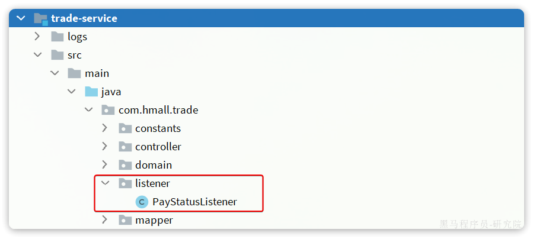

其代码如下：

```Java
package com.hmall.trade.listener;

import com.hmall.trade.service.IOrderService;
import lombok.RequiredArgsConstructor;
import org.springframework.amqp.core.ExchangeTypes;
import org.springframework.amqp.rabbit.annotation.Exchange;
import org.springframework.amqp.rabbit.annotation.Queue;
import org.springframework.amqp.rabbit.annotation.QueueBinding;
import org.springframework.amqp.rabbit.annotation.RabbitListener;
import org.springframework.stereotype.Component;

@Component
@RequiredArgsConstructor
public class PayStatusListener {

    private final IOrderService orderService;

    @RabbitListener(bindings = @QueueBinding(
            value = @Queue(name = "trade.pay.success.queue", durable = "true"),
            exchange = @Exchange(name = "pay.topic"),
            key = "pay.success"
    ))
    public void listenPaySuccess(Long orderId){
        orderService.markOrderPaySuccess(orderId);
    }
}
```

#### 4.3 发送消息

修改`pay-service`服务下的`com.hmall.pay.service.impl.PayOrderServiceImpl`类中的`tryPayOrderByBalance`方法：

```Java
private final RabbitTemplate rabbitTemplate;

@Override
@Transactional
public void tryPayOrderByBalance(PayOrderDTO payOrderDTO) {
    // 1.查询支付单
    PayOrder po = getById(payOrderDTO.getId());
    // 2.判断状态
    if(!PayStatus.WAIT_BUYER_PAY.equalsValue(po.getStatus())){
        // 订单不是未支付，状态异常
        throw new BizIllegalException("交易已支付或关闭！");
    }
    // 3.尝试扣减余额
    userClient.deductMoney(payOrderDTO.getPw(), po.getAmount());
    // 4.修改支付单状态
    boolean success = markPayOrderSuccess(payOrderDTO.getId(), LocalDateTime.now());
    if (!success) {
        throw new BizIllegalException("交易已支付或关闭！");
    }
    // 5.修改订单状态
    // tradeClient.markOrderPaySuccess(po.getBizOrderNo());
    try {
        rabbitTemplate.convertAndSend("pay.direct", "pay.success", po.getBizOrderNo());
    } catch (Exception e) {
        log.error("支付成功的消息发送失败，支付单id：{}， 交易单id：{}", po.getId(), po.getBizOrderNo(), e);
    }
}
```

## 5、发送者的可靠性

首先，我们一起分析一下消息丢失的可能性有哪些。

消息从发送者发送消息，到消费者处理消息，需要经过的流程是这样的：


消息从生产者到消费者的每一步都可能导致消息丢失：

- 发送消息时丢失：
  - 生产者发送消息时连接MQ失败
  - 生产者发送消息到达MQ后未找到`Exchange`
  - 生产者发送消息到达MQ的`Exchange`后，未找到合适的`Queue`
  - 消息到达MQ后，处理消息的进程发生异常
- MQ导致消息丢失：
  - 消息到达MQ，保存到队列后，尚未消费就突然宕机
- 消费者处理消息时：
  - 消息接收后尚未处理突然宕机
  - 消息接收后处理过程中抛出异常

综上，我们要解决消息丢失问题，保证MQ的可靠性，就必须从3个方面入手：

- 确保生产者一定把消息发送到MQ
- 确保MQ不会将消息弄丢
- 确保消费者一定要处理消息

这一章我们先来看如何确保生产者一定能把消息发送到MQ。

### 5.1 生产者重试机制

首先第一种情况，就是生产者发送消息时，出现了网络故障，导致与MQ的连接中断。

为了解决这个问题，SpringAMQP提供的消息发送时的重试机制。即：当`RabbitTemplate`与MQ连接超时后，多次重试。

修改`publisher`模块的`application.yaml`文件，添加下面的内容：

```YAML
spring:
  rabbitmq:
    connection-timeout: 1s # 设置MQ的连接超时时间
    template:
      retry:
        enabled: true # 开启超时重试机制
        initial-interval: 1000ms # 失败后的初始等待时间
        multiplier: 1 # 失败后下次的等待时长倍数，下次等待时长 = initial-interval * multiplier
        max-attempts: 3 # 最大重试次数
```

我们利用命令停掉RabbitMQ服务：

```Shell
docker stop mq
```

然后测试发送一条消息，会发现会每隔1秒重试1次，总共重试了3次。消息发送的超时重试机制配置成功了！

>**注意**：当网络不稳定的时候，利用重试机制可以有效提高消息发送的成功率。不过SpringAMQP提供的重试机制是**阻塞式**的重试，也就是说多次重试等待的过程中，当前线程是被阻塞的。
>
>如果对于业务性能有要求，建议禁用重试机制。如果一定要使用，请合理配置等待时长和重试次数，当然也可以考虑使用==异步线程==来执行发送消息的代码。

### 5.2 生产者确认机制

一般情况下，只要生产者与MQ之间的网路连接顺畅，基本不会出现发送消息丢失的情况，因此大多数情况下我们无需考虑这种问题。

不过，在少数情况下，也会出现消息发送到MQ之后丢失的现象，比如：

- MQ内部处理消息的进程发生了异常
- 生产者发送消息到达MQ后未找到`Exchange`
- 生产者发送消息到达MQ的`Exchange`后，未找到合适的`Queue`，因此无法路由

针对上述情况，RabbitMQ提供了生产者消息确认机制，包括`Publisher Confirm`和`Publisher Return`两种。在开启确认机制的情况下，当生产者发送消息给MQ后，MQ会根据消息处理的情况返回不同的**回执**。

具体如图所示：


总结如下：

- 当消息投递到MQ，但是路由失败时，通过**Publisher Return**返回异常信息，同时返回ack的确认信息，代表投递成功
- 临时消息投递到了MQ，并且入队成功，返回ACK，告知投递成功
- 持久消息投递到了MQ，并且入队完成持久化，返回ACK ，告知投递成功
- 其它情况都会返回NACK，告知投递失败

其中`ack`和`nack`属于**Publisher Confirm**机制，`ack`是投递成功；`nack`是投递失败。而`return`则属于**Publisher Return**机制。

默认两种机制都是关闭状态，需要通过配置文件来开启。

### 5.3.实现生产者确认

#### 5.3.1.开启生产者确认

在publisher模块的`application.yaml`中添加配置：

```YAML
spring:
  rabbitmq:
    publisher-confirm-type: correlated # 开启publisher confirm机制，并设置confirm类型
    publisher-returns: true # 开启publisher return机制
```

这里`publisher-confirm-type`有三种模式可选：

- `none`：关闭confirm机制
- `simple`：同步阻塞等待MQ的回执
- `correlated`：MQ异步回调返回回执

一般我们推荐使用`correlated`，回调机制。

#### 5.3.2.定义ReturnCallback

每个`RabbitTemplate`只能配置一个`ReturnCallback`，因此我们可以在配置类中统一设置。我们在publisher模块定义一个配置类：


内容如下：

```Java
package com.itheima.publisher.config;

import lombok.AllArgsConstructor;
import lombok.extern.slf4j.Slf4j;
import org.springframework.amqp.core.ReturnedMessage;
import org.springframework.amqp.rabbit.core.RabbitTemplate;
import org.springframework.context.annotation.Configuration;

import javax.annotation.PostConstruct;

@Slf4j
@AllArgsConstructor
@Configuration
public class MqConfig {
    private final RabbitTemplate rabbitTemplate;

    @PostConstruct
    public void init(){
        rabbitTemplate.setReturnsCallback(new RabbitTemplate.ReturnsCallback() {
            @Override
            public void returnedMessage(ReturnedMessage returned) {
                log.error("触发return callback,");
                log.debug("exchange: {}", returned.getExchange());
                log.debug("routingKey: {}", returned.getRoutingKey());
                log.debug("message: {}", returned.getMessage());
                log.debug("replyCode: {}", returned.getReplyCode());
                log.debug("replyText: {}", returned.getReplyText());
            }
        });
    }
}
```

#### 5.3.3.定义ConfirmCallback

由于每个消息发送时的处理逻辑不一定相同，因此ConfirmCallback需要在每次发消息时定义。具体来说，是在调用RabbitTemplate中的convertAndSend方法时，多传递一个参数：


这里的CorrelationData中包含两个核心的东西：

- `id`：消息的唯一标示，MQ对不同的消息的回执以此做判断，避免混淆
- `SettableListenableFuture`：回执结果的Future对象

将来MQ的回执就会通过这个`Future`来返回，我们可以提前给`CorrelationData`中的`Future`添加回调函数来处理消息回执：


我们新建一个测试，向系统自带的交换机发送消息，并且添加`ConfirmCallback`：

```Java
@Test
void testPublisherConfirm() {
    // 1.创建CorrelationData
    CorrelationData cd = new CorrelationData();
    // 2.给Future添加ConfirmCallback
    cd.getFuture().addCallback(new ListenableFutureCallback<CorrelationData.Confirm>() {
        @Override
        public void onFailure(Throwable ex) {
            // 2.1.Future发生异常时的处理逻辑，基本不会触发
            log.error("send message fail", ex);
        }
        @Override
        public void onSuccess(CorrelationData.Confirm result) {
            // 2.2.Future接收到回执的处理逻辑，参数中的result就是回执内容
            if(result.isAck()){ // result.isAck()，boolean类型，true代表ack回执，false 代表 nack回执
                log.debug("发送消息成功，收到 ack!");
            }else{ // result.getReason()，String类型，返回nack时的异常描述
                log.error("发送消息失败，收到 nack, reason : {}", result.getReason());
            }
        }
    });
    // 3.发送消息
    rabbitTemplate.convertAndSend("hmall.direct", "q", "hello", cd);
}
```

执行结果如下：


可以看到，由于传递的`RoutingKey`是错误的，路由失败后，触发了`return callback`，同时也收到了ack。

当我们修改为正确的`RoutingKey`以后，就不会触发`return callback`了，只收到ack。

而如果连交换机都是错误的，则只会收到nack。

>**注意**：
>
>开启生产者确认比较消耗MQ性能，一般不建议开启。而且大家思考一下触发确认的几种情况：
>
>- 路由失败：一般是因为RoutingKey错误导致，往往是编程导致
>- 交换机名称错误：同样是编程错误导致
>- MQ内部故障：这种需要处理，但概率往往较低。因此只有对消息可靠性要求非常高的业务才需要开启，而且仅仅需要开启ConfirmCallback处理nack就可以了。

## 6、MQ的可靠性

消息到达MQ以后，如果MQ不能及时保存，也会导致消息丢失，所以MQ的可靠性也非常重要。

### 6.1 数据持久化

为了提升性能，默认情况下MQ的数据都是在内存存储的临时数据，重启后就会消失。为了保证数据的可靠性，必须配置数据持久化，包括：

- 交换机持久化
- 队列持久化
- 消息持久化

我们以控制台界面为例来说明。

#### 6.1.1 交换机持久化

> 注意:这里的持久化是指`交换机`本身持久化也就是说在下次开启RabbitMQ的时候不再需要出现创建该`交换机`，下面的`队列`持久化也是如此。

在控制台的`Exchanges`页面，添加交换机时可以配置交换机的`Durability`参数：

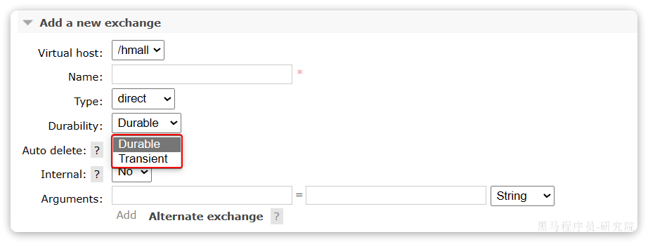

设置为`Durable`就是持久化模式，`Transient`就是临时模式。

#### 6.1.2 队列持久化

在控制台的Queues页面，添加队列时，同样可以配置队列的`Durability`参数：


除了持久化以外，你可以看到队列还有很多其它参数，有一些我们会在后期学习。

#### 6.1.3 消息持久化

在控制台发送消息的时候，可以添加很多参数，而消息的持久化是要配置一个`properties`：

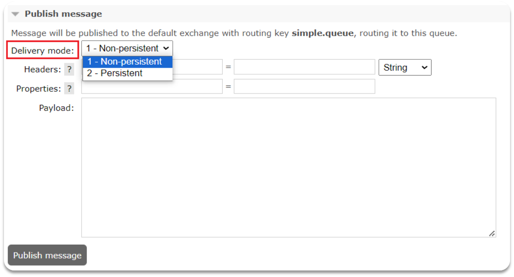

**说明**：在开启持久化机制以后，如果同时还开启了生产者确认，那么MQ会在消息持久化以后才发送ACK回执，进一步确保消息的可靠性。

不过出于性能考虑，为了减少IO次数，发送到MQ的消息并不是逐条持久化到数据库的，而是每隔一段时间批量持久化。一般间隔在100毫秒左右，这就会导致ACK有一定的延迟，因此建议生产者确认全部采用异步方式。

### 6.2 LazyQueue

在默认情况下，RabbitMQ会将接收到的信息保存在内存中以降低消息收发的延迟。但在某些特殊情况下，这会导致消息积压，比如：

- 消费者宕机或出现网络故障
- 消息发送量激增，超过了消费者处理速度
- 消费者处理业务发生阻塞

一旦出现消息堆积问题，RabbitMQ的内存占用就会越来越高，直到触发内存预警上限。此时RabbitMQ会将内存消息刷到磁盘上，这个行为成为`PageOut`. `PageOut`会耗费一段时间，并且会阻塞队列进程。因此在这个过程中RabbitMQ不会再处理新的消息，生产者的所有请求都会被阻塞。

为了解决这个问题，从RabbitMQ的3.6.0版本开始，就增加了Lazy Queues的模式，也就是惰性队列。惰性队列的特征如下：

- 接收到消息后直接存入磁盘而非内存
- 消费者要消费消息时才会从磁盘中读取并加载到内存（也就是懒加载）
- 支持数百万条的消息存储

而在3.12版本之后，LazyQueue已经成为所有队列的默认格式。因此官方推荐升级MQ为3.12版本或者所有队列都设置为LazyQueue模式,无法更改。

#### 6.2.1 控制台配置Lazy模式

在添加队列的时候，添加`x-queue-mod=lazy`参数即可设置队列为Lazy模式：


#### 6.2.2 代码配置Lazy模式

在利用SpringAMQP声明队列的时候，添加`x-queue-mod=lazy`参数也可设置队列为Lazy模式：

```Java
@Bean
public Queue lazyQueue(){
    return QueueBuilder
            .durable("lazy.queue")
            .lazy() // 开启Lazy模式
            .build();
}
```

这里是通过`QueueBuilder`的`lazy()`函数配置Lazy模式，底层源码如下：

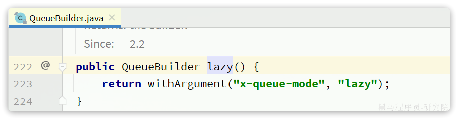

当然，我们也可以基于注解来声明队列并设置为Lazy模式：

```Java
@RabbitListener(queuesToDeclare = @Queue(
        name = "lazy.queue",
        durable = "true",
        arguments = @Argument(name = "x-queue-mode", value = "lazy")
))
public void listenLazyQueue(String msg){
    log.info("接收到 lazy.queue的消息：{}", msg);
}
```

#### 6.2.3 更新已有队列为lazy模式

对于已经存在的队列，也可以配置为lazy模式，但是要通过设置policy实现。

可以基于命令行设置policy：

```Shell
rabbitmqctl set_policy Lazy "^lazy-queue$" '{"queue-mode":"lazy"}' --apply-to queues  
```

命令解读：

- `rabbitmqctl` ：RabbitMQ的命令行工具
- `set_policy` ：添加一个策略
- `Lazy` ：策略名称，可以自定义
- `"^lazy-queue$"` ：用正则表达式匹配队列的名字
- `'{"queue-mode":"lazy"}'` ：设置队列模式为lazy模式
- `--apply-to queues`：策略的作用对象，是所有的队列

当然，也可以在控制台配置policy，进入在控制台的`Admin`页面，点击`Policies`，即可添加配置：


## 7、消费者的可靠性

当RabbitMQ向消费者投递消息以后，需要知道消费者的处理状态如何。因为消息投递给消费者并不代表就一定被正确消费了，可能出现的故障有很多，比如：

- 消息投递的过程中出现了网络故障
- 消费者接收到消息后突然宕机
- 消费者接收到消息后，因处理不当导致异常
- ...

一旦发生上述情况，消息也会丢失。因此，RabbitMQ必须知道消费者的处理状态，一旦消息处理失败才能重新投递消息。

但问题来了：RabbitMQ如何得知消费者的处理状态呢？

本章我们就一起研究一下消费者处理消息时的可靠性解决方案。

### 7.1 消费者确认机制

为了确认消费者是否成功处理消息，RabbitMQ提供了消费者确认机制（**Consumer Acknowledgement**）。即：当消费者处理消息结束后，应该向RabbitMQ发送一个回执，告知RabbitMQ自己消息处理状态。回执有三种可选值：

- ack：成功处理消息，RabbitMQ从队列中删除该消息
- nack：消息处理失败，RabbitMQ需要再次投递消息
- reject：消息处理失败并拒绝该消息，RabbitMQ从队列中删除该消息

一般reject方式用的较少，除非是消息格式有问题，那就是开发问题了。因此大多数情况下我们需要将消息处理的代码通过`try catch`机制捕获，消息处理成功时返回ack，处理失败时返回nack.

由于消息回执的处理代码比较统一，因此SpringAMQP帮我们实现了消息确认。并允许我们通过配置文件设置ACK处理方式，有三种模式：

- **`none`**：不处理。即消息投递给消费者后立刻ack，消息会立刻从MQ删除。非常不安全，不建议使用
- **`manual`**：手动模式。需要自己在业务代码中调用api，发送`ack`或`reject`，存在业务入侵，但更灵活
- **`auto`**：自动模式。SpringAMQP利用AOP对我们的消息处理逻辑做了环绕增强，当业务正常执行时则自动返回`ack`.  当业务出现异常时，根据异常判断返回不同结果：
  - 如果是**业务异常**，会自动返回`nack`；
  - 如果是**消息处理或校验异常**，自动返回`reject`;

返回Reject的常见异常有：

> Starting with version 1.3.2, the default ErrorHandler is now a ConditionalRejectingErrorHandler that rejects (and does not requeue) messages that fail with an irrecoverable error. Specifically, it rejects messages that fail with the following errors:
>
> - o.s.amqp…MessageConversionException: Can be thrown when converting the incoming message payload using a MessageConverter.
> - o.s.messaging…MessageConversionException: Can be thrown by the conversion service if additional conversion is required when mapping to a @RabbitListener method.
> - o.s.messaging…MethodArgumentNotValidException: Can be thrown if validation (for example, @Valid) is used in the listener and the validation fails.
> - o.s.messaging…MethodArgumentTypeMismatchException: Can be thrown if the inbound message was converted to a type that is not correct for the target method. For example, the parameter is declared as Message<Foo> but Message<Bar> is received.
> - java.lang.NoSuchMethodException: Added in version 1.6.3.
> - java.lang.ClassCastException: Added in version 1.6.3.

通过下面的配置可以修改SpringAMQP的ACK处理方式：

```YAML
spring:
  rabbitmq:
    listener:
      simple:
        acknowledge-mode: none # 不做处理
```

修改consumer服务的SpringRabbitListener类中的方法，模拟一个消息处理的异常：

```Java
@RabbitListener(queues = "simple.queue")
public void listenSimpleQueueMessage(String msg) throws InterruptedException {
    log.info("spring 消费者接收到消息：【" + msg + "】");
    if (true) {
        throw new MessageConversionException("故意的");
    }
    log.info("消息处理完成");
}
```

测试可以发现：当消息处理发生异常时，消息依然被RabbitMQ删除了。

我们再次把确认机制修改为auto：

```YAML
spring:
  rabbitmq:
    listener:
      simple:
        acknowledge-mode: auto # 自动ack
```

在异常位置打断点，再次发送消息，程序卡在断点时，可以发现此时消息状态为`unacked`（未确定状态）：


放行以后，由于抛出的是**消息转换异常**，因此Spring会自动返回`reject`，所以消息依然会被删除：

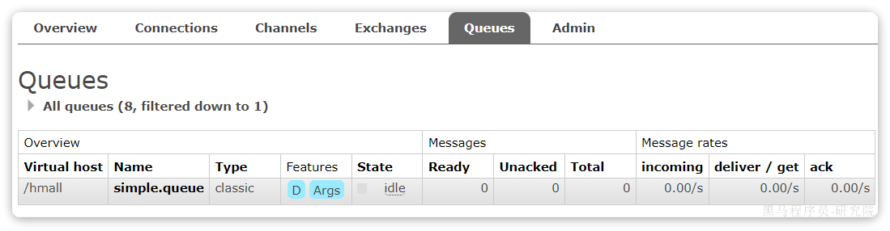

我们将异常改为RuntimeException类型：

```Java
@RabbitListener(queues = "simple.queue")
public void listenSimpleQueueMessage(String msg) throws InterruptedException {
    log.info("spring 消费者接收到消息：【" + msg + "】");
    if (true) {
        throw new RuntimeException("故意的");
    }
    log.info("消息处理完成");
}
```

在异常位置打断点，然后再次发送消息测试，程序卡在断点时，可以发现此时消息状态为`unacked`（未确定状态）：


放行以后，由于抛出的是业务异常，所以Spring返回`nack`，最终消息恢复至`Ready`状态，并且没有被RabbitMQ删除：

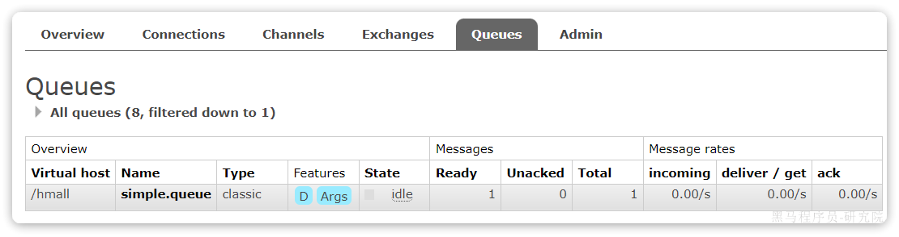

当我们把配置改为`auto`时，消息处理失败后，会回到RabbitMQ，并重新投递到消费者。

### 7.2 失败重试机制

当消费者出现异常后，消息会不断requeue（重入队）到队列，再重新发送给消费者。如果消费者再次执行依然出错，消息会再次requeue到队列，再次投递，直到消息处理成功为止。

极端情况就是消费者一直无法执行成功，那么消息requeue就会无限循环，导致mq的消息处理飙升，带来不必要的压力：


当然，上述极端情况发生的概率还是非常低的，不过不怕一万就怕万一。为了应对上述情况Spring又提供了消费者失败重试机制：在消费者出现异常时利用本地重试，而不是无限制的requeue到mq队列。

修改consumer服务的application.yml文件，添加内容：

```YAML
spring:
  rabbitmq:
    listener:
      simple:
        retry:
          enabled: true # 开启消费者失败重试
          initial-interval: 1000ms # 初识的失败等待时长为1秒
          multiplier: 1 # 失败的等待时长倍数，下次等待时长 = multiplier * last-interval
          max-attempts: 3 # 最大重试次数
          stateless: true # true无状态；false有状态。如果业务中包含事务，这里改为false
```

重启consumer服务，重复之前的测试。可以发现：

- 消费者在失败后消息没有重新回到MQ无限重新投递，而是在本地重试了3次
- 本地重试3次以后，抛出了`AmqpRejectAndDontRequeueException`异常。查看RabbitMQ控制台，发现消息被删除了，说明最后SpringAMQP返回的是`reject`

结论：

- 开启本地重试时，消息处理过程中抛出异常，不会requeue到队列，而是在消费者本地重试
- 重试达到最大次数后，Spring会返回reject，消息会被丢弃

### 7.3 失败处理策略

在之前的测试中，本地测试达到最大重试次数后，消息会被丢弃。这在某些对于消息可靠性要求较高的业务场景下，显然不太合适了。

因此Spring允许我们自定义重试次数耗尽后的消息处理策略，这个策略是由`MessageRecovery`接口来定义的，它有3个不同实现：

-  `RejectAndDontRequeueRecoverer`：重试耗尽后，直接`reject`，丢弃消息。默认就是这种方式 
-  `ImmediateRequeueMessageRecoverer`：重试耗尽后，返回`nack`，消息重新入队 
-  `RepublishMessageRecoverer`：重试耗尽后，将失败消息投递到指定的交换机 

比较优雅的一种处理方案是`RepublishMessageRecoverer`，失败后将消息投递到一个指定的，专门存放异常消息的队列，后续由人工集中处理。

1）在consumer服务中定义处理失败消息的交换机和队列

```Java
@Bean
public DirectExchange errorMessageExchange(){
    return new DirectExchange("error.direct");
}
@Bean
public Queue errorQueue(){
    return new Queue("error.queue", true);
}
@Bean
public Binding errorBinding(Queue errorQueue, DirectExchange errorMessageExchange){
    return BindingBuilder.bind(errorQueue).to(errorMessageExchange).with("error");
}
```

2）定义一个RepublishMessageRecoverer，关联队列和交换机

```Java
@Bean
public MessageRecoverer republishMessageRecoverer(RabbitTemplate rabbitTemplate){
    return new RepublishMessageRecoverer(rabbitTemplate, "error.direct", "error");
}
```

完整代码如下：

```Java
package com.itheima.consumer.config;

import org.springframework.amqp.core.Binding;
import org.springframework.amqp.core.BindingBuilder;
import org.springframework.amqp.core.DirectExchange;
import org.springframework.amqp.core.Queue;
import org.springframework.amqp.rabbit.core.RabbitTemplate;
import org.springframework.amqp.rabbit.retry.MessageRecoverer;
import org.springframework.amqp.rabbit.retry.RepublishMessageRecoverer;
import org.springframework.context.annotation.Bean;

@Configuration
@ConditionalOnProperty(name = "spring.rabbitmq.listener.simple.retry.enabled", havingValue = "true")
public class ErrorMessageConfig {
    @Bean
    public DirectExchange errorMessageExchange(){
        return new DirectExchange("error.direct");
    }
    @Bean
    public Queue errorQueue(){
        return new Queue("error.queue", true);
    }
    @Bean
    public Binding errorBinding(Queue errorQueue, DirectExchange errorMessageExchange){
        return BindingBuilder.bind(errorQueue).to(errorMessageExchange).with("error");
    }

    @Bean
    public MessageRecoverer republishMessageRecoverer(RabbitTemplate rabbitTemplate){
        return new RepublishMessageRecoverer(rabbitTemplate, "error.direct", "error");
    }
}
```

### 7.4 业务幂等性

何为幂等性？

**幂等**是一个数学概念，用函数表达式来描述是这样的：`f(x) = f(f(x))`，例如求绝对值函数。

在程序开发中，则是指同一个业务，执行一次或多次对业务状态的影响是一致的。例如：

- 根据id删除数据
- 查询数据
- 新增数据

但数据的更新往往不是幂等的，如果重复执行可能造成不一样的后果。比如：

- 取消订单，恢复库存的业务。如果多次恢复就会出现库存重复增加的情况
- 退款业务。重复退款对商家而言会有经济损失。

所以，我们要尽可能避免业务被重复执行。

然而在实际业务场景中，由于意外经常会出现业务被重复执行的情况，例如：

- 页面卡顿时频繁刷新导致表单重复提交
- 服务间调用的重试
- MQ消息的重复投递

我们在用户支付成功后会发送MQ消息到交易服务，修改订单状态为已支付，就可能出现消息重复投递的情况。如果消费者不做判断，很有可能导致消息被消费多次，出现业务故障。

举例：

1. 假如用户刚刚支付完成，并且投递消息到交易服务，交易服务更改订单为**已支付**状态。
2. 由于某种原因，例如网络故障导致生产者没有得到确认，隔了一段时间后**重新投递**给交易服务。
3. 但是，在新投递的消息被消费之前，用户选择了退款，将订单状态改为了**已退款**状态。
4. 退款完成后，新投递的消息才被消费，那么订单状态会被再次改为**已支付**。业务异常。

因此，我们必须想办法保证消息处理的幂等性。这里给出两种方案：

- 唯一消息ID
- 业务状态判断

#### 7.4.1 唯一消息ID

这个思路非常简单：

1. 每一条消息都生成一个唯一的id，与消息一起投递给消费者。
2. 消费者接收到消息后处理自己的业务，业务处理成功后将消息ID保存到数据库
3. 如果下次又收到相同消息，去数据库查询判断是否存在，存在则为重复消息放弃处理。

我们该如何给消息添加唯一ID呢？

其实很简单，SpringAMQP的MessageConverter自带了MessageID的功能，我们只要开启这个功能即可。

以Jackson的消息转换器为例：

```Java
@Bean
public MessageConverter messageConverter(){
    // 1.定义消息转换器
    Jackson2JsonMessageConverter jjmc = new Jackson2JsonMessageConverter();
    // 2.配置自动创建消息id，用于识别不同消息，也可以在业务中基于ID判断是否是重复消息
    jjmc.setCreateMessageIds(true);
    return jjmc;
}
```

#### 7.4.2 业务判断

业务判断就是基于业务本身的逻辑或状态来判断是否是重复的请求或消息，不同的业务场景判断的思路也不一样。

例如我们当前案例中，处理消息的业务逻辑是把订单状态从未支付修改为已支付。因此我们就可以在执行业务时判断订单状态是否是未支付，如果不是则证明订单已经被处理过，无需重复处理。

相比较而言，消息ID的方案需要改造原有的数据库，所以我更推荐使用业务判断的方案。

以支付修改订单的业务为例，我们需要修改`OrderServiceImpl`中的`markOrderPaySuccess`方法：

```Java
    @Override
    public void markOrderPaySuccess(Long orderId) {
        // 1.查询订单
        Order old = getById(orderId);
        // 2.判断订单状态
        if (old == null || old.getStatus() != 1) {
            // 订单不存在或者订单状态不是1，放弃处理
            return;
        }
        // 3.尝试更新订单
        Order order = new Order();
        order.setId(orderId);
        order.setStatus(2);
        order.setPayTime(LocalDateTime.now());
        updateById(order);
    }
```

上述代码逻辑上符合了幂等判断的需求，但是由于判断和更新是两步动作，因此在极小概率下可能存在线程安全问题。

我们可以合并上述操作为这样：

```Java
@Override
public void markOrderPaySuccess(Long orderId) {
    // UPDATE `order` SET status = ? , pay_time = ? WHERE id = ? AND status = 1
    lambdaUpdate()
            .set(Order::getStatus, 2)
            .set(Order::getPayTime, LocalDateTime.now())
            .eq(Order::getId, orderId)
            .eq(Order::getStatus, 1)
            .update();
}
```

注意看，上述代码等同于这样的SQL语句：

```SQL
UPDATE `order` SET status = ? , pay_time = ? WHERE id = ? AND status = 1
```

我们在where条件中除了判断id以外，还加上了status必须为1的条件。如果条件不符（说明订单已支付），则SQL匹配不到数据，根本不会执行。

### 7.5 兜底方案

虽然我们利用各种机制尽可能增加了消息的可靠性，但也不好说能保证消息100%的可靠。万一真的MQ通知失败该怎么办呢？

有没有其它兜底方案，能够确保订单的支付状态一致呢？

其实思想很简单：既然MQ通知不一定发送到交易服务，那么交易服务就必须自己**主动去查询**支付状态。这样即便支付服务的MQ通知失败，我们依然能通过主动查询来保证订单状态的一致。

流程如下：


图中黄色线圈起来的部分就是MQ通知失败后的兜底处理方案，由交易服务自己主动去查询支付状态。

不过需要注意的是，交易服务并不知道用户会在什么时候支付，如果查询的时机不正确（比如查询的时候用户正在支付中），可能查询到的支付状态也不正确。

那么问题来了，我们到底该在什么时间主动查询支付状态呢？

这个时间是无法确定的，因此，通常我们采取的措施就是利用**定时任务**定期查询，例如每隔20秒就查询一次，并判断支付状态。如果发现订单已经支付，则立刻更新订单状态为已支付即可。

定时任务大家之前学习过，具体的实现这里就不再赘述了。

至此，消息可靠性的问题已经解决了。

综上，支付服务与交易服务之间的订单状态一致性是如何保证的？

- 首先，支付服务会正在用户支付成功以后利用MQ消息通知交易服务，完成订单状态同步。
- 其次，为了保证MQ消息的可靠性，我们采用了生产者确认机制、消费者确认、消费者失败重试等策略，确保消息投递的可靠性
- 最后，我们还在交易服务设置了定时任务，定期查询订单支付状态。这样即便MQ通知失败，还可以利用定时任务作为兜底方案，确保订单支付状态的最终一致性。

## 8、延迟消息

在电商的支付业务中，对于一些库存有限的商品，为了更好的用户体验，通常都会在用户下单时立刻扣减商品库存。例如电影院购票、高铁购票，下单后就会锁定座位资源，其他人无法重复购买。

但是这样就存在一个问题，假如用户下单后一直不付款，就会一直占有库存资源，导致其他客户无法正常交易，最终导致商户利益受损！

因此，电商中通常的做法就是：**对于超过一定时间未支付的订单，应该立刻取消订单并释放占用的库存**。

例如，订单支付超时时间为30分钟，则我们应该在用户下单后的第30分钟检查订单支付状态，如果发现未支付，应该立刻取消订单，释放库存。

但问题来了：如何才能准确的实现在下单后第30分钟去检查支付状态呢？

像这种在一段时间以后才执行的任务，我们称之为**延迟任务**，而要实现延迟任务，最简单的方案就是利用MQ的延迟消息了。

在RabbitMQ中实现延迟消息也有两种方案：

- 死信交换机+TTL
- 延迟消息插件

这一章我们就一起研究下这两种方案的实现方式，以及优缺点。

### 8.1 死信交换机和延迟消息

首先我们来学习一下基于死信交换机的延迟消息方案。

#### 8.1.1 死信交换机

什么是死信？

当一个队列中的消息满足下列情况之一时，可以成为死信（dead letter）：

- 消费者使用`basic.reject`或 `basic.nack`声明消费失败，并且消息的`requeue`参数设置为false
- 消息是一个过期消息，超时无人消费
- 要投递的队列消息满了，无法投递

如果一个队列中的消息已经成为死信，并且这个队列通过**`dead-letter-exchange`**属性指定了一个交换机，那么队列中的死信就会投递到这个交换机中，而这个交换机就称为**死信交换机**（Dead Letter Exchange）。而此时加入有队列与死信交换机绑定，则最终死信就会被投递到这个队列中。

死信交换机有什么作用呢？

1. 收集那些因处理失败而被拒绝的消息
2. 收集那些因队列满了而被拒绝的消息
3. 收集因TTL（有效期）到期的消息

#### 8.1.2 延迟消息

前面两种作用场景可以看做是把死信交换机当做一种消息处理的最终兜底方案，与消费者重试时讲的`RepublishMessageRecoverer`作用类似。

而最后一种场景，大家设想一下这样的场景：

如图，有一组绑定的交换机（`ttl.fanout`）和队列（`ttl.queue`）。但是`ttl.queue`没有消费者监听，而是设定了死信交换机`hmall.direct`，而队列`direct.queue1`则与死信交换机绑定，RoutingKey是blue：

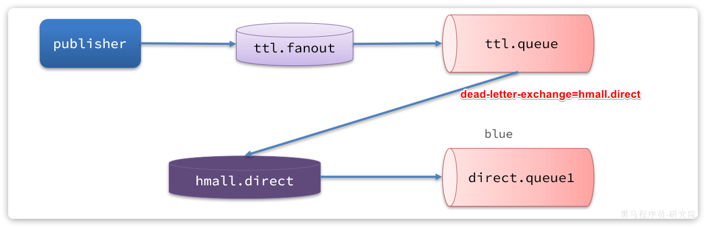

假如我们现在发送一条消息到`ttl.fanout`，RoutingKey为blue，并设置消息的**有效期**为5000毫秒：


**注意**：尽管这里的`ttl.fanout`不需要RoutingKey，但是当消息变为死信并投递到死信交换机时，会沿用之前的RoutingKey，这样`hmall.direct`才能正确路由消息。

消息肯定会被投递到`ttl.queue`之后，由于没有消费者，因此消息无人消费。5秒之后，消息的有效期到期，成为死信：

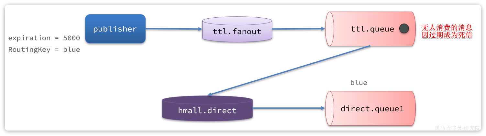

死信被再次投递到死信交换机`hmall.direct`，并沿用之前的RoutingKey，也就是`blue`：


由于`direct.queue1`与`hmall.direct`绑定的key是blue，因此最终消息被成功路由到`direct.queue1`，如果此时有消费者与`direct.queue1`绑定， 也就能成功消费消息了。但此时已经是5秒钟以后了：

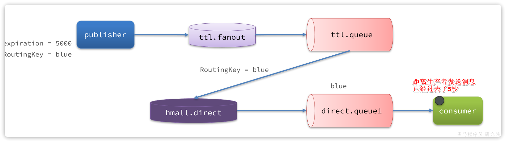

也就是说，publisher发送了一条消息，但最终consumer在5秒后才收到消息。我们成功实现了**延迟消息**。

#### 8.1.3 总结

**注意：**

RabbitMQ的消息过期是基于追溯方式来实现的，也就是说当一个消息的TTL到期以后不一定会被移除或投递到死信交换机，而是在消息恰好处于队首时才会被处理。

当队列中消息堆积很多的时候，过期消息可能不会被按时处理，因此你设置的TTL时间不一定准确。

### 8.2 DelayExchange插件

基于死信队列虽然可以实现延迟消息，但是太麻烦了。因此RabbitMQ社区提供了一个延迟消息插件来实现相同的效果。

官方文档说明：

https://blog.rabbitmq.com/posts/2015/04/scheduling-messages-with-rabbitmq

#### 8.2.1 下载

插件下载地址：

https://github.com/rabbitmq/rabbitmq-delayed-message-exchange

由于我们安装的MQ是`3.8`版本，因此这里下载`3.8.17`版本：

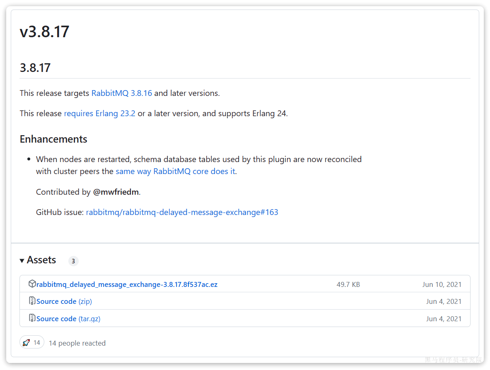

当然，也可以直接使用课前资料提供好的插件：


#### 8.2.2 安装

因为我们是基于Docker安装，所以需要先查看RabbitMQ的插件目录对应的数据卷。

```Shell
docker volume inspect mq-plugins
```

结果如下：

```JSON
[
    {
        "CreatedAt": "2024-06-19T09:22:59+08:00",
        "Driver": "local",
        "Labels": null,
        "Mountpoint": "/var/lib/docker/volumes/mq-plugins/_data",
        "Name": "mq-plugins",
        "Options": null,
        "Scope": "local"
    }
]
```

插件目录被挂载到了`/var/lib/docker/volumes/mq-plugins/_data`这个目录，我们上传插件到该目录下。

接下来执行命令，安装插件：

```Shell
docker exec -it mq rabbitmq-plugins enable rabbitmq_delayed_message_exchange
```

运行结果如下：


#### 8.2.3 声明延迟交换机

基于注解方式：

```Java
@RabbitListener(bindings = @QueueBinding(
        value = @Queue(name = "delay.queue", durable = "true"),
        exchange = @Exchange(name = "delay.direct", delayed = "true"),
        key = "delay"
))
public void listenDelayMessage(String msg){
    log.info("接收到delay.queue的延迟消息：{}", msg);
}
```

基于`@Bean`的方式：

```Java
package com.itheima.consumer.config;

import lombok.extern.slf4j.Slf4j;
import org.springframework.amqp.core.*;
import org.springframework.context.annotation.Bean;
import org.springframework.context.annotation.Configuration;

@Slf4j
@Configuration
public class DelayExchangeConfig {

    @Bean
    public DirectExchange delayExchange(){
        return ExchangeBuilder
                .directExchange("delay.direct") // 指定交换机类型和名称
                .delayed() // 设置delay的属性为true
                .durable(true) // 持久化
                .build();
    }

    @Bean
    public Queue delayedQueue(){
        return new Queue("delay.queue");
    }
    
    @Bean
    public Binding delayQueueBinding(){
        return BindingBuilder.bind(delayedQueue()).to(delayExchange()).with("delay");
    }
}
```

#### 8.2.4 发送延迟消息

发送消息时，必须通过x-delay属性设定延迟时间：

```Java
@Test
void testPublisherDelayMessage() {
    // 1.创建消息
    String message = "hello, delayed message";
    // 2.发送消息，利用消息后置处理器添加消息头
    rabbitTemplate.convertAndSend("delay.direct", "delay", message, new MessagePostProcessor() {
        @Override
        public Message postProcessMessage(Message message) throws AmqpException {
            // 添加延迟消息属性
            message.getMessageProperties().setDelay(5000);
            return message;
        }
    });
}
```

**注意：**

延迟消息插件内部会维护一个本地数据库表，同时使用Elang Timers功能实现计时。如果消息的延迟时间设置较长，可能会导致堆积的延迟消息非常多，会带来较大的CPU开销，同时延迟消息的时间会存在误差。

因此，**不建议设置延迟时间过长的延迟消息**。

### 8.3 超时订单问题

接下来，我们就在交易服务中利用延迟消息实现订单超时取消功能。其大概思路如下：


假如订单超时支付时间为30分钟，理论上说我们应该在下单时发送一条延迟消息，延迟时间为30分钟。这样就可以在接收到消息时检验订单支付状态，关闭未支付订单。

#### 8.3.1 定义常量

无论是消息发送还是接收都是在交易服务完成，因此我们在`trade-service`中定义一个常量类，用于记录交换机、队列、RoutingKey等常量：


内容如下：

```Java
package com.hmall.trade.constants;

public interface MQConstants {
    String DELAY_EXCHANGE_NAME = "trade.delay.direct";
    String DELAY_ORDER_QUEUE_NAME = "trade.delay.order.queue";
    String DELAY_ORDER_KEY = "delay.order.query";
}
```

#### 8.3.2 配置MQ

在`trade-service`模块的`pom.xml`中引入amqp的依赖：

```XML
  <!--amqp-->
  <dependency>
      <groupId>org.springframework.boot</groupId>
      <artifactId>spring-boot-starter-amqp</artifactId>
  </dependency>
```

在`trade-service`的`application.yaml`中添加MQ的配置：

```YAML
spring:
  rabbitmq:
    host: 192.168.150.101
    port: 5672
    virtual-host: /hmall
    username: hmall
    password: 123
```

#### 8.3.3 改造下单业务，发送延迟消息

接下来，我们改造下单业务，在下单完成后，发送延迟消息，查询支付状态。

修改`trade-service`模块的`com.hmall.trade.service.impl.OrderServiceImpl`类的`createOrder`方法，添加消息发送的代码：

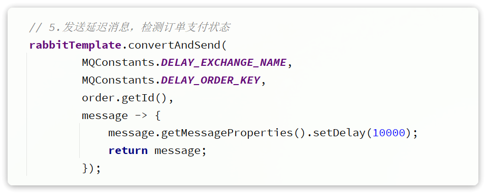

这里延迟消息的时间应该是15分钟，不过我们为了测试方便，改成10秒。

#### 8.3.4 编写查询支付状态接口

由于MQ消息处理时需要查询支付状态，因此我们要在`pay-service`模块定义一个这样的接口，并提供对应的`FeignClient`.

首先，在`hm-api`模块定义三个类：


说明：

- PayOrderDTO：支付单的数据传输实体
- PayClient：支付系统的Feign客户端
- PayClientFallback：支付系统的fallback逻辑

`PayOrderDTO`代码如下：

```Java
package com.hmall.api.dto;

import io.swagger.annotations.ApiModel;
import io.swagger.annotations.ApiModelProperty;
import lombok.Data;

import java.time.LocalDateTime;

/**
 * <p>
 * 支付订单
 * </p>
 */
@Data
@ApiModel(description = "支付单数据传输实体")
public class PayOrderDTO {
    @ApiModelProperty("id")
    private Long id;
    @ApiModelProperty("业务订单号")
    private Long bizOrderNo;
    @ApiModelProperty("支付单号")
    private Long payOrderNo;
    @ApiModelProperty("支付用户id")
    private Long bizUserId;
    @ApiModelProperty("支付渠道编码")
    private String payChannelCode;
    @ApiModelProperty("支付金额，单位分")
    private Integer amount;
    @ApiModelProperty("付类型，1：h5,2:小程序，3：公众号，4：扫码，5：余额支付")
    private Integer payType;
    @ApiModelProperty("付状态，0：待提交，1:待支付，2：支付超时或取消，3：支付成功")
    private Integer status;
    @ApiModelProperty("拓展字段，用于传递不同渠道单独处理的字段")
    private String expandJson;
    @ApiModelProperty("第三方返回业务码")
    private String resultCode;
    @ApiModelProperty("第三方返回提示信息")
    private String resultMsg;
    @ApiModelProperty("支付成功时间")
    private LocalDateTime paySuccessTime;
    @ApiModelProperty("支付超时时间")
    private LocalDateTime payOverTime;
    @ApiModelProperty("支付二维码链接")
    private String qrCodeUrl;
    @ApiModelProperty("创建时间")
    private LocalDateTime createTime;
    @ApiModelProperty("更新时间")
    private LocalDateTime updateTime;
}
```

`PayClient`代码如下：

```Java
package com.hmall.api.client;

import com.hmall.api.client.fallback.PayClientFallback;
import com.hmall.api.dto.PayOrderDTO;
import org.springframework.cloud.openfeign.FeignClient;
import org.springframework.web.bind.annotation.GetMapping;
import org.springframework.web.bind.annotation.PathVariable;

@FeignClient(value = "pay-service", fallbackFactory = PayClientFallback.class)
public interface PayClient {
    /**
     * 根据交易订单id查询支付单
     * @param id 业务订单id
     * @return 支付单信息
     */
    @GetMapping("/pay-orders/biz/{id}")
    PayOrderDTO queryPayOrderByBizOrderNo(@PathVariable("id") Long id);
}
```

`PayClientFallback`代码如下：

```Java
package com.hmall.api.client.fallback;

import com.hmall.api.client.PayClient;
import com.hmall.api.dto.PayOrderDTO;
import lombok.extern.slf4j.Slf4j;
import org.springframework.cloud.openfeign.FallbackFactory;

@Slf4j
public class PayClientFallback implements FallbackFactory<PayClient> {
    @Override
    public PayClient create(Throwable cause) {
        return new PayClient() {
            @Override
            public PayOrderDTO queryPayOrderByBizOrderNo(Long id) {
                return null;
            }
        };
    }
}
```

最后，在`pay-service`模块的`PayController`中实现该接口：

```Java
@ApiOperation("根据id查询支付单")
@GetMapping("/biz/{id}")
public PayOrderDTO queryPayOrderByBizOrderNo(@PathVariable("id") Long id){
    PayOrder payOrder = payOrderService.lambdaQuery().eq(PayOrder::getBizOrderNo, id).one();
    return BeanUtils.copyBean(payOrder, PayOrderDTO.class);
}
```

#### 8.3.5 监听消息，查询支付状态

接下来，我们在`trader-service`编写一个监听器，监听延迟消息，查询订单支付状态：


代码如下：

```Java
package com.hmall.trade.listener;

import com.hmall.api.client.PayClient;
import com.hmall.api.dto.PayOrderDTO;
import com.hmall.trade.constants.MQConstants;
import com.hmall.trade.domain.po.Order;
import com.hmall.trade.service.IOrderService;
import lombok.RequiredArgsConstructor;
import org.springframework.amqp.rabbit.annotation.Exchange;
import org.springframework.amqp.rabbit.annotation.Queue;
import org.springframework.amqp.rabbit.annotation.QueueBinding;
import org.springframework.amqp.rabbit.annotation.RabbitListener;
import org.springframework.stereotype.Component;

@Component
@RequiredArgsConstructor
public class OrderDelayMessageListener {

    private final IOrderService orderService;
    private final PayClient payClient;

    @RabbitListener(bindings = @QueueBinding(
            value = @Queue(name = MQConstants.DELAY_ORDER_QUEUE_NAME),
            exchange = @Exchange(name = MQConstants.DELAY_EXCHANGE_NAME, delayed = "true"),
            key = MQConstants.DELAY_ORDER_KEY
    ))
    public void listenOrderDelayMessage(Long orderId){
        // 1.查询订单
        Order order = orderService.getById(orderId);
        // 2.检测订单状态，判断是否已支付
        if(order == null || order.getStatus() != 1){
            // 订单不存在或者已经支付
            return;
        }
        // 3.未支付，需要查询支付流水状态
        PayOrderDTO payOrder = payClient.queryPayOrderByBizOrderNo(orderId);
        // 4.判断是否支付
        if(payOrder != null && payOrder.getStatus() == 3){
            // 4.1.已支付，标记订单状态为已支付
            orderService.markOrderPaySuccess(orderId);
        }else{
            // TODO 4.2.未支付，取消订单，回复库存
            orderService.cancelOrder(orderId);
        }
    }
}
```

注意，这里要在OrderServiceImpl中实现cancelOrder方法，留作作业大家自行实现。


# uni-app

资料来源:[uni-app官网 (dcloud.net.cn)](https://uniapp.dcloud.net.cn/)

## 1、概念简介

`uni-app` 是一个使用 [Vue.js](https://vuejs.org/) 开发所有前端应用的框架，开发者编写一套代码，可发布到iOS、Android、Web（响应式）、以及各种小程序（微信/支付宝/百度/头条/飞书/QQ/快手/钉钉/淘宝）、快应用等多个平台。

`DCloud`公司拥有900万开发者、数百万应用、12亿手机端月活用户、数千款uni-app插件、70+微信/qq群。阿里小程序工具官方内置uni-app（[详见](https://opendocs.alipay.com/mini/ide/overview)），腾讯课堂官方为uni-app录制培训课程（[详见](https://ask.dcloud.net.cn/article/35640)），开发者可以放心选择。

`uni-app`在手，做啥都不愁。即使不跨端，`uni-app`也是更好的小程序开发框架（[详见](https://ask.dcloud.net.cn/article/35947)）、更好的App跨平台框架、更方便的H5开发框架。不管领导安排什么样的项目，你都可以快速交付，不需要转换开发思维、不需要更改开发习惯。

### 1.1 **功能框架图**

从下面`uni-app`功能框架图可看出，`uni-app`在跨平台的过程中，不牺牲平台特色，可优雅的调用平台专有能力，真正做到海纳百川、各取所长。 

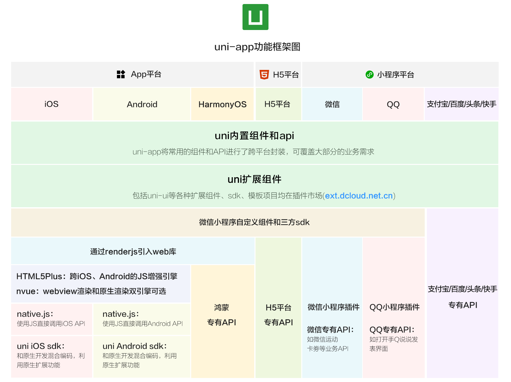

### 1.2 基本语言和开发规范

uni-app代码编写，基本语言包括js、vue、css。以及ts、scss等css预编译器。

在app端，还支持原生渲染的[nvue](https://uniapp.dcloud.net.cn/tutorial/nvue-outline.html)，以及可以编译为kotlin和swift的[uts](https://doc.dcloud.net.cn/uni-app-x/uts/)。

DCloud还提供了使用js编写服务器代码的uniCloud云引擎。所以只需掌握js，你可以开发web、Android、iOS、各家小程序以及服务器等全栈应用。

为了实现多端兼容，综合考虑编译速度、运行性能等因素，`uni-app` 约定了如下开发规范：

- 页面文件遵循 [Vue 单文件组件 (SFC) 规范](https://vue-loader.vuejs.org/zh/spec.html)，即每个页面是一个.vue文件
- 组件标签靠近小程序规范，详见[uni-app 组件规范](https://uniapp.dcloud.net.cn/component/)
- 接口能力（JS API）靠近小程序规范，但需将前缀 `wx`、`my` 等替换为 `uni`，详见[uni-app接口规范](https://uniapp.dcloud.net.cn/api/)
- 数据绑定及事件处理同 `Vue.js` 规范，同时补充了[应用生命周期](https://uniapp.dcloud.net.cn/collocation/App.html#applifecycle)及[页面的生命周期](https://uniapp.dcloud.net.cn/tutorial/page.html#lifecycle)
- 如需兼容app-nvue平台，建议使用flex布局进行开发

uni-app分`编译器`和`运行时（runtime）`。uni-app能实现一套代码、多端运行，是通过这2部分配合完成的。

编译器将开发者的代码进行编译，编译的输出物由各个终端的runtime进行解析，每个平台（Web、Android App、iOS App、各家小程序）都有各自的runtime。

### 1.3 编译器

- 编译器运行在电脑开发环境。一般是内置在HBuilderX工具中，也可以使用独立的cli版。
- 开发者按uni-app规范编写代码，由编译器将开发者的代码编译生成每个平台支持的特有代码
  - 在web平台，将.vue文件编译为js代码。与普通的vue cli项目类似
  - 在微信小程序平台，编译器将.vue文件拆分生成wxml、wxss、js等代码
  - 在app平台，将.vue文件编译为js代码。进一步，如果涉及uts代码：
    - 在Android平台，将.uts文件编译为kotlin代码
    - 在iOS平台，将.uts文件编译为swift代码
- 编译器分vue2版和vue3版
  - vue2版：基于`webpack`实现
  - vue3版：基于`Vite`实现，性能更快
- 编译器支持条件编译，即可以指定某部分代码只编译到特定的终端平台。从而将公用和个性化融合在一个工程中。

```js
// #ifdef  App
console.log("这段代码只有在App平台才会被编译进去。非App平台编译后没有这段代码")
// #endif
```

更多编译器介绍参见：[编译器](https://uniapp.dcloud.net.cn/tutorial/compiler.html)

### 1.4 运行时（runtime）

runtime不是运行在电脑开发环境，而是运行在真正的终端上。

uni-app在每个平台（Web、Android App、iOS App、各家小程序）都有各自的runtime。这是一个比较庞大的工程。

- 在小程序端，uni-app的runtime，主要是一个小程序版的vue runtime，页面路由、组件、api等方面基本都是转义。
- 在web端，uni-app的runtime相比普通的vue项目，多了一套ui库、页面路由框架、和uni对象（即常见API封装）
- 在App端，uni-app的runtime更复杂，可以先简单理解为DCloud也有一套小程序引擎，打包app时将开发者的代码和DCloud的小程序打包成了apk或ipa。当然，事实上DCloud确实有小程序引擎产品，供原生应用实现小程序化，[详见](https://nativesupport.dcloud.net.cn/README)

uni-app runtime包括3部分：基础框架、组件、API。

1. 基础框架：
   - 包括语法、数据驱动、全局文件、应用管理、页面管理、js引擎、渲染和排版引擎等
   - 在web和小程序上，不需要uni-app提供js引擎和排版引擎，直接使用浏览器和小程序的即可。但app上需要uni-app提供
   - App的js引擎：App-Android上，uni-app的js引擎是v8，App-iOS是jscore
   - App的渲染引擎：同时提供了2套渲染引擎，`.vue`页面文件由webview渲染，原理与小程序相同；`.nvue`页面文件由原生渲染，原理与react native相同。开发者可以根据需要自主选择渲染引擎。
2. 组件：
   - runtime中包括的组件只有基础组件，如`<view>`、`<button>`等。扩展组件不包含在uni-app的runtime中，而是下载到用户的项目代码中。（这些组件都是vue组件）
   - 为了降低开发者的学习成本，uni-app的内置基础组件命名规范与小程序基本相同。
   - 这几十个组件不管在哪个平台，已被处理为均有一致表现。
   - 在小程序端，uni-app基础组件会直接转义为小程序自己的内置组件。在小程序的runtime中不占体积。
   - 在web和android、iOS端，这几十个组件都在uni-app的runtime中，会占用一定体积，相当于内置了一套ui库。
   - 组件的扩展：
     - 有了几十个基础组件，大多数扩展组件也都是基于这些基础组件封装的。比如官方提供的扩展ui库`uni ui`。
     - 在web平台，for web的各种ui库（如elementUI）也可以使用，但这些库由于操作了dom，无法跨端在app和小程序中使用。
     - 在App平台，uni-app也支持使用原生编程语言来自行扩展原生组件，比如原生的地图、ar等。
     - uni-app同时支持将[微信自定义组件](https://uniapp.dcloud.net.cn/tutorial/miniprogram-subject.html)运行到微信小程序、web、app这3个平台。注意微信自定义组件不是vue组件。
3. API：
   - uni-app runtime内置了大量常见的、跨端的 [API](https://uniapp.dcloud.net.cn/api/index.html)，比如联网(uni.request)、读取存储(uni.getStorage)
   - 同时uni-app不限制各端原生平台的API调用。开发者可以在uni-app框架中无限制的调用该平台所有能使用的API。即，在小程序平台，小程序的所有API都可以使用；在web平台，浏览器的所有API都可使用；在iOS和Android平台，os的所有API都可以使用。
   - 也就是说，使用uni-app的标准API，可以跨端使用。但对于不跨端的部分，仍可以调用该端的专有API。由于常见的API都已经被封装内置，所以日常开发时，开发者只需关注uni标准API，当需要调用特色端能力时在条件编译里编写特色API调用代码。
   - [ext API](https://uniapp.dcloud.net.cn/api/extapi.html)：web和app的runtime体积不小，如果把小程序的所有API等内置进去会让开发者的最终应用体积变大。所以有部分不常用的API被剥离为ext API。虽然仍然是uni.开头，但需要单独下载插件到项目下
   - 小程序平台：uni对象会转为小程序的自有对象，比如在微信小程序平台，编写uni.request等同于wx.request。那么所有wx.的API都可以这样使用。
   - web平台：window、dom等浏览器专用API仍可以使用
   - app平台：除了uni.的API，还可以使用[plus.的API](https://www.html5plus.org/doc/h5p.html)、[Native.js](https://uniapp.dcloud.net.cn/tutorial/native-js.html)，以及通过uts编写原生插件，或者使用java和objectC编写原生插件。这些原生插件调用os的API并封装给js使用。
   - 由于历史沿革，DCloud在开发app时有：5+App、wap2app、uni-app等3种模式。这3种方式的runtime在底层能力上是公用的，所有uni-app可以调用5+（也就是plus.xxx）的API。虽然都可以使用5+的系统能力，但uni-app的逻辑层运行在js层，渲染层是webview和原生nvue双选。而5+不区分逻辑层和渲染层，全部运行在webview里，在性能上5+不及uni-app。

DCloud还提供了[插件市场](https://ext.dcloud.net.cn/)，大多数用得着的组件和API都已经有现成的插件。

#### 1.4.1 逻辑层和渲染层分离

在web平台，逻辑层（js）和渲染层（html、css），都运行在统一的webview里。

但在小程序和app端，逻辑层和渲染层被分离了。

分离的核心原因是性能。过去很多开发者吐槽基于webview的app性能不佳，很大原因是js运算和界面渲染抢资源导致的卡顿。

不管小程序还是app，逻辑层都独立为了单独的js引擎，渲染层仍然是webview（app上也支持纯原生渲染）。

所以注意小程序和app的逻辑层都不支持浏览器专用的window、dom等API。app只能在渲染层操作window、dom，即[renderjs](https://uniapp.dcloud.net.cn/tutorial/renderjs.html)。

关于逻辑层和渲染层分离带来的注意事项，请[详读](https://uniapp.dcloud.net.cn/tutorial/performance.html)

### 1.5 组件/标签的变化

以前是html标签，比如`<div>`，现在是小程序组件，比如`<view>`。 那么`标签`和`组件`有什么区别，不都是用尖括号包围起来一段英文吗？ 其实标签是老的概念，标签属于浏览器内置的东西。但组件，是可以自由扩展的。 类似你可以把一段js封装成函数或模块，你也可以把一个ui控件封装成一个组件。

`uni-app`参考小程序规范，提供了一批内置组件。

下为html标签和uni-app内置组件的映射表：

- div 改成 [view](https://uniapp.dcloud.io/component/view)
- span、font 改成 [text](https://uniapp.dcloud.io/component/text)
- a 改成 [navigator](https://uniapp.dcloud.io/component/navigator)
- img 改成 [image](https://uniapp.dcloud.io/component/image)
- [input](https://uniapp.dcloud.io/component/input) 仅仅是输入框。 原html规范中input不仅是输入框，还有radio、checkbox、时间、日期、文件选择功能。在uni-app和小程序规范中，input仅仅是输入框。其他功能uni-app有单独的组件或API：[radio组件](https://uniapp.dcloud.io/component/radio)、[checkbox组件](https://uniapp.dcloud.io/component/checkbox)、[时间选择](https://uniapp.dcloud.io/component/picker?id=时间选择器)、[日期选择](https://uniapp.dcloud.io/component/picker?id=日期选择器)、[图片选择](https://uniapp.dcloud.io/api/media/image?id=chooseimage)、[视频选择](https://uniapp.dcloud.io/api/media/video?id=choosevideo)、[多媒体文件选择(含图片视频)](https://uniapp.dcloud.io/api/media/video?id=choosemedia)、[通用文件选择](https://uniapp.dcloud.io/api/media/file?id=choosefile)。
- [form](https://uniapp.dcloud.io/component/form)、[button](https://uniapp.dcloud.io/component/button)、[label](https://uniapp.dcloud.io/component/label)、[textarea](https://uniapp.dcloud.io/component/textarea)、[canvas](https://uniapp.dcloud.io/component/canvas)、[video](https://uniapp.dcloud.io/component/video) 这些还在。
- select 改成 [picker](https://uniapp.dcloud.io/component/picker)
- iframe 改成 [web-view](https://uniapp.dcloud.io/component/web-view)
- ul、li没有了，都用view替代。做列表一般使用[uList组件](https://ext.dcloud.net.cn/plugin?id=24)
- audio 不再推荐使用，改成api方式，[背景音频api文档](https://uniapp.dcloud.io/api/media/background-audio-manager?id=getbackgroundaudiomanager) 其实老的HTML标签也可以在uni-app里使用，uni-app编译器会在编译时把老标签转为新标签，比如把div编译成view。但不推荐这种用法，调试H5端时容易混乱。

**除了改动外，新增了一批手机端常用的新组件**

- scroll-view [可区域滚动视图容器](https://uniapp.dcloud.io/component/scroll-view)

- swiper [可滑动区域视图容器](https://uniapp.dcloud.io/component/swiper)

- icon [图标](https://uniapp.dcloud.io/component/icon)

- rich-text [富文本（不可执行js，但可渲染各种文字格式和图片）](https://uniapp.dcloud.io/component/rich-text)

- progress [进度条](https://uniapp.dcloud.io/component/progress)

- slider [滑块指示器](https://uniapp.dcloud.io/component/slider)

- switch [开关选择器](https://uniapp.dcloud.io/component/switch)

- camera [相机](https://uniapp.dcloud.io/component/camera)

- live-player [直播](https://uniapp.dcloud.io/component/live-player)

- map [地图](https://uniapp.dcloud.io/component/map)

- cover-view [可覆盖原生组件的视图容器](https://uniapp.dcloud.io/component/cover-view?id=cover-view)

  cover-view需要多强调几句，uni-app的非h5端的video、map、canvas、textarea是原生组件，层级高于其他组件。如需覆盖原生组件，则需要使用cover-view组件。详见[层级介绍](https://uniapp.dcloud.net.cn/component/native-component)

除了内置组件，还有很多开源的扩展组件，把常用操作都进行封装，DCloud建立了插件市场收录这些扩展组件，详见[插件市场](https://ext.dcloud.net.cn/)

## 2、工程简介

一个 uni-app 工程，就是一个 Vue 项目，你可以通过 HBuilderX 或 cli 方式快速创建 uni-app 工程，详见：[快速上手](https://uniapp.dcloud.net.cn/quickstart-hx.html)。

### 2.1 目录结构

一个uni-app工程，默认包含如下目录及文件：

```
┌─uniCloud              云空间目录，支付宝小程序云为uniCloud-alipay，阿里云为uniCloud-aliyun，腾讯云为uniCloud-tcb（详见uniCloud）
│─components            符合vue组件规范的uni-app组件目录
│  └─comp-a.vue         可复用的a组件
├─utssdk                存放uts文件
├─pages                 业务页面文件存放的目录
│  ├─index
│  │  └─index.vue       index页面
│  └─list
│     └─list.vue        list页面
├─static                存放应用引用的本地静态资源（如图片、视频等）的目录，注意：静态资源都应存放于此目录
├─uni_modules           存放uni_module 详见
├─platforms             存放各平台专用页面的目录，详见
├─nativeplugins         App原生语言插件 详见
├─nativeResources       App端原生资源目录
│  ├─android            Android原生资源目录 详见
|  └─ios                iOS原生资源目录 详见
├─hybrid                App端存放本地html文件的目录，详见
├─wxcomponents          存放小程序组件的目录，详见
├─unpackage             非工程代码，一般存放运行或发行的编译结果
├─main.js               Vue初始化入口文件
├─App.vue               应用配置，用来配置App全局样式以及监听 应用生命周期
├─pages.json            配置页面路由、导航条、选项卡等页面类信息，详见
├─manifest.json         配置应用名称、appid、logo、版本等打包信息，详见
├─AndroidManifest.xml   Android原生应用清单文件 详见
├─Info.plist            iOS原生应用配置文件 详见
└─uni.scss              内置的常用样式变量
```

> **Tips**
>
> - HbuilderX 1.9.0+ 支持在根目录创建 `ext.json`、`sitemap.json` 等小程序需要的文件。

### 2.2 static目录

- 为什么需要static这样的目录？

uni-app编译器根据pages.json扫描需要编译的页面，并根据页面引入的js、css合并打包文件。
对于本地的图片、字体、视频、文件等资源，如果可以直接识别，那么也会把这些资源文件打包进去，但如果这些资源以变量的方式引用， 比如：`<image :src="url"></image>`，甚至可能有更复杂的函数计算，此时编译器无法分析。

那么有了static目录，编译器就会把这个目录整体复制到最终编译包内。这样只要运行时确实能获取到这个图片，就可以显示。

当然这也带来一个注意事项，如果static里有一些没有使用的废文件，也会被打包到编译包里，造成体积变大。

另外注意，static目录支持特殊的平台子目录，比如web、app、mp-weixin等，这些目录存放专有平台的文件，这些平台的文件在打包其他平台时不会被包含。详见[条件编译](https://uniapp.dcloud.net.cn/tutorial/platform.html#static-目录的条件编译)

非 `static` 目录下的文件（vue组件、js、css 等）只有被引用时，才会被打包编译。

`css`、`less/scss` 等资源不要放在 `static` 目录下，建议这些公用的资源放在自建的 `common` 目录下。

- static目录和App原生资源目录有关系吗？

uni-app支持App原生资源目录nativeResources，下面有assets、res等目录，[详见](https://uniapp.dcloud.net.cn/tutorial/app-nativeresource-android.html#nativeresources)。但和static目录没有关系。

static目录下的文件，在app第一次启动时，解压到了app的外部存储目录（external-path）。（uni-app x 从3.99+不再解压）

所以注意控制static目录的大小，太大的static目录和太多文件，会造成App安装后第一次启动变慢。

## 3、页面

### 3.1 页面介绍

uni-app项目中，一个页面就是一个符合`Vue SFC规范`的 vue 文件。

- 在 uni-app js 引擎版中，后缀名是`.vue`文件或`.nvue`文件。 这些页面均全平台支持，差异在于当 uni-app 发行到App平台时，`.vue`文件会使用webview进行渲染，`.nvue`会使用原生进行渲染，详见：[nvue原生渲染](https://uniapp.dcloud.net.cn/tutorial/nvue-outline)。

  一个页面可以同时存在vue和nvue，在[pages.json](https://uniapp.dcloud.net.cn/collocation/pages.html)的路由注册中不包含页面文件名后缀，同一个页面可以对应2个文件名。重名时优先级如下：

  - 在非app平台，先使用vue，忽略nvue
  - 在app平台，使用nvue，忽略vue

- 在 uni-app x 中，后缀名是`.uvue`文件

  uni-app x 中没有js引擎和webview，不支持和vue页面并存。

  uni-app x 在app-android上，每个页面都是一个全屏activity，不支持透明。

### 3.2 页面管理

#### 3.2.1 新建页面

`uni-app`中的页面，默认保存在工程根目录下的`pages`目录下。

每次新建页面，均需在`pages.json`中配置`pages`列表；未在`pages.json -> pages` 中注册的页面，`uni-app`会在编译阶段进行忽略。pages.json的完整配置参考：[页面配置](https://uniapp.dcloud.net.cn/collocation/pages.html)。

通过HBuilderX开发 `uni-app` 项目时，在 `uni-app` 项目上右键“新建页面”，HBuilderX会自动在`pages.json`中完成页面注册，开发更方便。

同时，HBuilderX 还内置了常用的页面模板（如图文列表、商品列表等），选择这些模板，可以大幅提升你的开发效率。


新建页面时，可以选择`是否创建同名目录`。创建目录的意义在于：

- 如果你的页面较复杂，需要拆分多个附属的js、css、组件等文件，则使用目录归纳比较合适。
- 如果只有一个页面文件，大可不必多放一层目录。

#### 3.2.2 删除页面

删除页面时，需做两件工作：

- 删除`.vue`文件、`.nvue`、`.uvue`文件
- 删除`pages.json -> pages`列表项中的配置 （如使用HBuilderX删除页面，会在状态栏提醒删除pages.json对应内容，点击后会打开pages.json并定位到相关配置项）

#### 3.2.3 页面改名

操作和删除页面同理，依次修改文件和 `pages.json`。

#### 3.2.4 pages.json

pages.json是工程的页面管理配置文件，包括：页面路由注册、页面参数配置（原生标题栏、下拉刷新...）、首页tabbar等众多功能。

其篇幅较长，另见 [pages.json](https://uniapp.dcloud.net.cn/collocation/pages.html)

#### 3.2.5 设置应用首页

`pages.json -> pages`配置项中的第一个页面，作为当前工程的首页（启动页）。

```json
{
	"pages": [
		{
			"path": "pages/index/index", //名字叫不叫index无所谓，位置在第一个，就是首页
			"style": {
				"navigationBarTitleText": "首页" //页面标题
			}
		},
		{
			"path": "pages/my",
			"style": {
				"navigationBarTitleText": "我的"
			}
		},
	]
}

```

### 3.3 页面内容构成

uni-app 页面基于 vue 规范。一个页面内，有3个根节点标签：

- 模板组件区 `<template>`
- 脚本区 `<script>`
- 样式区 `<style>`

```vue
<template>
	<view class="content">
		<button @click="buttonClick">{{title}}</button>
	</view>
</template>

<script>
	export default {
		data() {
			return {
				title: "Hello world", // 定义绑定在页面上的data数据
			}
		},
		onLoad() {
			// 页面启动的生命周期，这里编写页面加载时的逻辑
		},
		methods: {
			buttonClick: function () {
				console.log("按钮被点了")
			},
		}
	}
</script>

<style>
	.content {
		width: 750rpx;
		background-color: white;
	}
</style>
```

#### 3.3.1 template模板区

template中文名为`模板`，它类似html的标签。但有2个区别：

1. html中 `script` 和 `style` 是 html 的二级节点。但在 vue 文件中，`template`、`script`、`style` 这3个是平级关系。
2. html 中写的是 web 标签，但 vue 的 `template` 中写的全都是 vue 组件，每个组件支持属性、事件、 vue 指令，还可以绑定 vue 的 data 数据。

在vue2中，`template` 的二级节点只能有一个节点，一般是在一个根 `view` 下继续写页面组件（如上示例代码）。

但在vue3中，template可以有多个二级节点，省去一个层级，如下：

```vue
<template>
	<view>
		<text>标题</text>
	</view>
	<scroll-view>

	</scroll-view>
</template>

```

可以在 `manifest` 中切换使用 Vue2 还是 Vue3。

注意：`uni-app x` 中只支持 Vue3。

#### 3.3.2 script 脚本区

script中编写脚本，可以通过lang属性指定脚本语言。

- 在vue和nvue中，默认是js，可以指定ts。
- 在uvue中，仅支持uts，不管script的lang属性写成什么，都按uts编译。

```js
<script lang="ts">
</script>
```

在vue的选项式（option）规范中，script下包含 `export default {}`。除了选项式，还有 [组合式](https://uniapp.dcloud.net.cn/tutorial/vue3-composition-api.html) 写法。

页面级的代码大多写在 `export default {}` 中。写在里面的代码，会随着页面关闭而关闭。

##### 3.3.2.1 `export default` 外的代码

写在 `export default {}` 外面的代码，一般有几种情况：

1. 引入第三方 js/ts 模块
2. 引入非 easycom 的组件（一般组件推荐使用[easycom](https://uniapp.dcloud.net.cn/collocation/pages.html#easycom)，无需导入注册）
3. 在 ts/uts 中，对 data 进行类型定义
4. 定义作用域更大的变量

```js
<script lang="ts">
	const TAB_OFFSET = 1; // 外层静态变量不会跟随页面关闭而回收
	import charts from 'charts.ts'; // 导入外部js/ts模块
	import swiperPage from 'swiper-page.vue'; //导入非easycom的组件
	type GroupType = {
		id : number,
		title : string
	} // 在ts中，为下面data数据的 groupList 定义类型
	export default {
		components: {
		    swiperPage
		}, // 注册非easycom组件
		data() {
			return {
				groupList: [
					{ id: 1, title: "第一组" },
					{ id: 2, title: "第二组" },
				] as GroupType[], // 为数据groupList定义ts类型
			}
		},
		onLoad() {},
		methods: {}
	}
</script>
```

开发者应谨慎编写 `export default {}` 外面的代码，这里的代码有2个注意事项：

1. 影响应用性能。这部分代码在应用启动时执行，而不是页面加载。如果这里的代码写的太复杂，会影响应用启动速度，占用更多内存。
2. 不跟随组件、页面关闭而回收。在外层的静态变量不会跟随页面关闭而回收。如果必要你需要手动处理。比如 `beforeDestroy` 或 `destroyed` 生命周期进行处理。

##### 3.3.2.2 export default 里的代码

`export default {}` 里的内容，是页面的主要逻辑代码。包括几部分：

1. data：template模板中需要使用的数据。具体 [另见](https://uniapp.dcloud.net.cn/tutorial/vue-basics.html#data)
2. 页面生命周期：如页面加载、隐藏、关闭，具体 [见下](https://uniapp.dcloud.net.cn/tutorial/page.html#lifecycle)
3. methods方法，如按钮点击、屏幕滚动

如下页面代码的逻辑是：

1. 在data中定义了`title`，初始值是"点我"
2. 在页面中放置了一个button组件，按钮文字区使用`{{}}`模板写法，里面写`title`，把data里的`title`绑定到按钮的文字区，即按钮的初始文字是"点我"
3. 按钮的点击事件`@click`，指向了methods里的一个方法`buttonClick`，点击按钮即触发这个方法的执行
4. buttonClick方法里通过`this.title`的方式，访问data数据，并重新赋值为"被点了"。由于vue中data和界面是双向绑定，修改data中的`title`后，因为按钮文字绑定了`title`，会自动更新按钮的文字。

整体效果就是，刚开始按钮文字是"点我"，点一下后按钮文字变成了"被点了"

```js
<template>
	<view>
		<button @click="buttonClick">{{title}}</button>
	</view>
</template>

<script>
	export default {
		data() {
			return {
				title: "点我", // 定义绑定在页面上的data数据
				// 多个data在这里继续定义。逗号分隔
			}
		},
		onLoad() {
			// 页面启动的生命周期，这里编写页面加载时的逻辑
		},
		// 多个页面生命周期监听，在这里继续写。逗号分隔
		methods: {
			buttonClick: function () {
				this.title = "被点了"
			},
			// 多个方法，在这里继续写。逗号分隔
		}
	}
</script>
```

本章节为页面代码介绍，并非vue教程，了解data数据需[详见](https://uniapp.dcloud.net.cn/tutorial/vue-basics.html#data)

#### 3.3.3 style样式区

style的写法与web的css基本相同。

如果页面是nvue或uvue，使用原生渲染而不是webview渲染，那么它们支持的css是有限的。

详见[css文档](https://uniapp.dcloud.net.cn/tutorial/syntax-css.html)

### 3.4 页面生命周期

`uni-app` 页面除支持 Vue 组件生命周期外还支持下方页面生命周期函数，当以组合式 API 使用时，在 Vue2 和 Vue3 中存在一定区别，请分别参考：[Vue2 组合式 API 使用文档](https://uniapp.dcloud.net.cn/tutorial/vue-composition-api.html) 和 [Vue3 组合式 API 使用文档](https://uniapp.dcloud.net.cn/tutorial/vue3-composition-api.html)。

| 函数名                              | 说明                                                         | 平台差异说明                                                 | 最低版本 |
| :---------------------------------- | :----------------------------------------------------------- | :----------------------------------------------------------- | :------- |
| onInit                              | 监听页面初始化，其参数同 onLoad 参数，为上个页面传递的数据，参数类型为 Object（用于页面传参），触发时机早于 onLoad | 百度小程序                                                   | 3.1.0+   |
| onLoad                              | 监听页面加载，该钩子被调用时，响应式数据、计算属性、方法、侦听器、props、slots 已设置完成，其参数为上个页面传递的数据，参数类型为 Object（用于页面传参），参考[示例](https://uniapp.dcloud.net.cn/api/router#navigateto)。 |                                                              |          |
| onShow                              | 监听页面显示，页面每次出现在屏幕上都触发，包括从下级页面点返回露出当前页面 |                                                              |          |
| onReady                             | 监听页面初次渲染完成，此时组件已挂载完成，DOM 树($el)已可用，注意如果渲染速度快，会在页面进入动画完成前触发 |                                                              |          |
| onHide                              | 监听页面隐藏                                                 |                                                              |          |
| onUnload                            | 监听页面卸载                                                 |                                                              |          |
| onResize                            | 监听窗口尺寸变化                                             | App、微信小程序、快手小程序                                  |          |
| onPullDownRefresh                   | 监听用户下拉动作，一般用于下拉刷新，参考[示例](https://uniapp.dcloud.net.cn/api/ui/pulldown.html) |                                                              |          |
| onReachBottom                       | 页面滚动到底部的事件（不是scroll-view滚到底），常用于下拉下一页数据。具体见下方注意事项 |                                                              |          |
| onTabItemTap                        | 点击 tab 时触发，参数为Object，具体见下方注意事项            | 微信小程序、QQ小程序、支付宝小程序、百度小程序、H5、App、快手小程序、京东小程序 |          |
| onShareAppMessage                   | 用户点击右上角分享                                           | 微信小程序、QQ小程序、支付宝小程序、抖音小程序、飞书小程序、快手小程序、京东小程序 |          |
| onPageScroll                        | 监听页面滚动，参数为Object                                   | nvue不支持                                                   |          |
| onNavigationBarButtonTap            | 监听原生标题栏按钮点击事件，参数为Object                     | App、H5                                                      |          |
| onBackPress                         | 监听页面返回，返回 event = {from:backbutton、 navigateBack} ，backbutton 表示来源是左上角返回按钮或 android 返回键；navigateBack表示来源是 uni.navigateBack；[详见](https://uniapp.dcloud.net.cn/tutorial/page.html#onbackpress) | app、H5、支付宝小程序                                        |          |
| onNavigationBarSearchInputChanged   | 监听原生标题栏搜索输入框输入内容变化事件                     | App、H5                                                      | 1.6.0    |
| onNavigationBarSearchInputConfirmed | 监听原生标题栏搜索输入框搜索事件，用户点击软键盘上的“搜索”按钮时触发。 | App、H5                                                      | 1.6.0    |
| onNavigationBarSearchInputClicked   | 监听原生标题栏搜索输入框点击事件（pages.json 中的 searchInput 配置 disabled 为 true 时才会触发） | App、H5                                                      | 1.6.0    |
| onShareTimeline                     | 监听用户点击右上角转发到朋友圈                               | 微信小程序                                                   | 2.8.1+   |
| onAddToFavorites                    | 监听用户点击右上角收藏                                       | 微信小程序、QQ小程序                                         | 2.8.1+   |

#### 3.4.1 Vue2 页面及组件生命周期流程图


#### 3.4.2 Vue3 页面及组件生命周期流程图

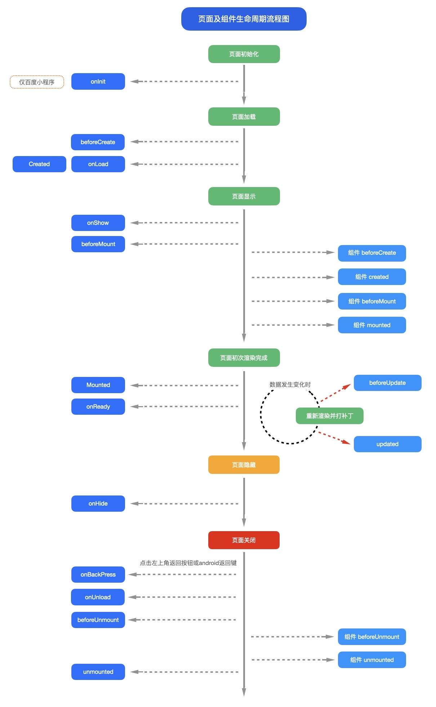

#### 3.4.3 页面加载时序介绍

接下来我们介绍onLoad、onReady、onShow的先后关系，页面加载的详细流程。

1. **uni-app框架，首先根据pages.json的配置，创建页面**

所以原生导航栏是最快显示的。页面背景色也应该在这里配置。

2. **根据页面template里的组件，创建dom**

这里的dom创建仅包含第一批处理的静态dom。对于通过js/uts更新data然后通过v-for再创建的列表数据，不在第一批处理。

要注意一个页面静态dom元素过多，会影响页面加载速度。在uni-app x Android版本上，可能会阻碍页面进入的转场动画。 因为此时，页面转场动画还没有启动。

3. **触发onLoad**

此时页面还未显示，没有开始进入的转场动画，页面dom还不存在。

所以这里不能直接操作dom（可以修改data，因为vue框架会等待dom准备后再更新界面）；在 app-uvue 中获取当前的activity拿到的是老页面的activity，只能通过页面栈获取activity。

onLoad比较适合的操作是：==接受上页的参数，联网取数据，更新data==。

手机都是多核的，uni.request或云开发联网，在子线程运行，不会干扰UI线程的入场动画，并行处理可以更快的拿到数据、渲染界面。

但onLoad里不适合进行大量同步耗时运算，因为此时转场动画还没开始。

尤其uni-app x 在 Android上，onLoad里的代码（除了联网和加载图片）默认是在UI线程运行的，大量同步耗时计算很容易卡住页面动画不启动。除非开发者显式指定在其他线程运行。

4. **转场动画开始**

新页面开始进入的转场动画，动画默认耗时300ms，可以在路由API中调节时长。

5. **页面onReady**

第2步创建dom是虚拟dom，dom创建后需要经历一段时间，UI层才能完成了页面上真实元素的创建，即触发了onReady。

onReady后，页面元素就可以自由操作了，比如ref获取节点。同时首批界面也渲染了。

注意：onReady和转场动画开始、结束之间，没有必然的先后顺序，完全取决于dom的数量和复杂度。

如果元素排版和渲染够快，转场动画刚开始就渲染好了；

大多情况下，转场动画走几格就看到了首批渲染内容；

如果元素排版和渲染过慢，转场动画结束都没有内容，就会造成白屏。

联网进程从onLoad起就在异步获取数据更新data，如果服务器速度够快，第二批数据也可能在转场动画结束前渲染。

6. **转场动画结束**

再次强调，4和5的先后顺序不一定，取决于首批dom渲染的速度。

#### 3.4.4 页面加载常见问题

了解了页面加载时序原理，我们就知道如何避免页面加载常见的问题：

- 优化白屏的方法：

1. 页面dom太多，注意有的组件写的不好，会拖累整体页面。uni-app x 里减少dom数量的策略，[详见](https://doc.dcloud.net.cn/uni-app-x/performance.html)
2. 联网不要在onReady里，那样太慢了，在onLoad里早点联网
3. 在pages.json里配置原生导航栏和背景色
4. 有的页面template内容非常少，整页就是一个需要联网加载的列表，这会造成虽然首批dom飞快渲染了，但页面其实还是白的，联网后才能显示字和图。 此时需要在template里做一些简单占位组件，比如loading组件、骨架屏，让本地先显示一些内容。

- 卡住动画不启动的原因：

1. 页面dom太多，注意有的组件写的不好，会拖累整体页面。uni-app x 里减少dom数量的策略，[详见](https://doc.dcloud.net.cn/uni-app-x/performance.html)
2. onLoad里执行了耗时的同步计算

#### 3.4.5 onShow和onHide

注意页面显示，是一个会重复触发的事件。

a页面刚进入时，会触发a页面的onShow。

当a跳转到b页面时，a会触发onHide，而b会触发onShow。

但当b被关闭时，b会触发onUnload，此时a再次显示出现，会再次触发onShow。

在tabbar页面（指pages.json里配置的tabbar），不同tab页面互相切换时，会触发各自的onShow和onHide。

#### 3.4.6 onInit

**注意**

- 仅百度小程序基础库 3.260 以上支持 onInit 生命周期
- 其他版本或平台可以同时使用 onLoad 生命周期进行兼容，注意避免重复执行相同逻辑
- 不依赖页面传参的逻辑可以直接使用 created 生命周期替代

#### 3.4.7 onLoad

**注意**

- `uni-app x android` 平台，如需获取 [activity 实例](https://doc.dcloud.net.cn/uni-app-x/plugin/uts-for-android.html#activity)，此时当前页面的 `activity 实例`并未创建完成，会获取到上一个页面的 `activity 实例`（首页会获取应用默认的 `activity 实例`）。如需获取当前页面的 `activity 实例`，应在 `onShow` 或 `onReady` 生命周期中获取。

#### 3.4.8 onReachBottom

可在pages.json里定义具体页面底部的触发距离[onReachBottomDistance](https://uniapp.dcloud.net.cn/collocation/pages#globalstyle)，

比如设为50，那么滚动页面到距离底部50px时，就会触发onReachBottom事件。

如使用scroll-view导致页面没有滚动，则触底事件不会被触发。scroll-view滚动到底部的事件请参考scroll-view的文档。

#### 3.4.9 onPageScroll

**参数说明**

| 属性      | 类型   | 说明                                 |
| --------- | ------ | ------------------------------------ |
| scrollTop | Number | 页面在垂直方向已滚动的距离（单位px） |

```js
onPageScroll : function(e) { //nvue暂不支持滚动监听，可用bindingx代替
	console.log("滚动距离为：" + e.scrollTop);
},
```

**注意**

- `onPageScroll`里不要写交互复杂的js，比如频繁修改页面。因为这个生命周期是在渲染层触发的，在非h5端，js是在逻辑层执行的，两层之间通信是有损耗的。如果在滚动过程中，频发触发两层之间的数据交换，可能会造成卡顿。（uvue在app端无此限制）
- 在webview渲染时，比如app-vue、微信小程序、H5中，也可以使用wxs监听滚动，[参考](https://uniapp.dcloud.io/tutorial/miniprogram-subject#wxs)；在app-nvue中，可以使用bindingx监听滚动，[参考](https://uniapp.dcloud.io/tutorial/nvue-api#nvue-里使用-bindingx)。
- 如果想实现滚动时标题栏透明渐变，在App和H5下，可在pages.json中配置titleNView下的type为transparent，[参考](https://uniapp.dcloud.io/collocation/pages?id=app-titlenview)。(uni-app x不支持)
- 如果需要滚动吸顶固定某些元素，推荐使用css的粘性布局，参考[插件市场](https://ext.dcloud.net.cn/plugin?id=715)。插件市场也有其他js实现的吸顶插件，但性能不佳，需要时可自行搜索。（uni-app x可自由在uts中设置固定位置）

#### 3.4.10 onBackPress

**参数说明**

| 属性 | 类型   | 说明                                                         |
| ---- | ------ | ------------------------------------------------------------ |
| from | String | 触发返回行为的来源：'backbutton'——左上角导航栏按钮及安卓返回键；'navigateBack'——uni.navigateBack() 方法。**支付宝小程序端不支持返回此字段** |

```javascript
export default {
	onBackPress(options) {
		console.log('from:' + options.from)
	}
}
```

**注意**

- `onBackPress`上不可使用`async`，会导致无法阻止默认返回
- 支付宝小程序只有真机可以监听到非`navigateBack`引发的返回事件（使用小程序开发工具时不会触发`onBackPress`），不可以阻止默认返回行为

详细说明及使用：[onBackPress 详解](http://ask.dcloud.net.cn/article/35120)

#### 3.4.11 onTabItemTap

**参数说明**

| 属性     | 类型   | 说明                         |
| -------- | ------ | ---------------------------- |
| index    | Number | 被点击tabItem的序号，从0开始 |
| pagePath | String | 被点击tabItem的页面路径      |
| text     | String | 被点击tabItem的按钮文字      |

```js
onTabItemTap : function(e) {
	console.log(e);
	// e的返回格式为json对象： {"index":0,"text":"首页","pagePath":"pages/index/index"}
},
```

**注意**

- onTabItemTap常用于点击当前tabitem，滚动或刷新当前页面。如果是点击不同的tabitem，一定会触发页面切换。
- 如果想在App端实现点击某个tabitem不跳转页面，不能使用onTabItemTap，可以使用[plus.nativeObj.view](http://www.html5plus.org/doc/zh_cn/nativeobj.html)放一个区块盖住原先的tabitem，并拦截点击事件。
- 支付宝小程序平台onTabItemTap表现为点击非当前tabitem后触发，因此不能用于实现点击返回顶部这种操作

#### 3.4.12 onNavigationBarButtonTap

**参数说明**

| 属性  | 类型   | 说明                     |
| ----- | ------ | ------------------------ |
| index | Number | 原生标题栏按钮数组的下标 |

```js
onNavigationBarButtonTap : function (e) {
	console.log(e);
	// e的返回格式为json对象：{"text":"测试","index":0}
}
```

**注意**

- nvue 页面weex编译模式支持的生命周期同weex，具体参考：[weex生命周期介绍](https://uniapp.dcloud.io/tutorial/nvue-outline?id=编译模式)。

### 3.5 组件生命周期

`uni-app` 组件支持的生命周期，与vue标准组件的生命周期相同。==这里没有页面级的onLoad等生命周期==：

| 函数名        | 说明                                                         | 平台差异说明 | 最低版本 |
| :------------ | :----------------------------------------------------------- | :----------- | :------- |
| beforeCreate  | 在实例初始化之前被调用。[详见](https://v2.cn.vuejs.org/v2/api/#beforeCreate) |              |          |
| created       | 在实例创建完成后被立即调用。[详见](https://v2.cn.vuejs.org/v2/api/#created) |              |          |
| beforeMount   | 在挂载开始之前被调用。[详见](https://v2.cn.vuejs.org/v2/api/#beforeMount) |              |          |
| mounted       | 挂载到实例上去之后调用。[详见](https://v2.cn.vuejs.org/v2/api/#mounted) 注意：此处并不能确定子组件被全部挂载，如果需要子组件完全挂载之后在执行操作可以使用`$nextTick`[Vue官方文档](https://v2.cn.vuejs.org/v2/api/#vm-nextTick) |              |          |
| beforeUpdate  | 数据更新时调用，发生在虚拟 DOM 打补丁之前。[详见](https://v2.cn.vuejs.org/v2/api/#beforeUpdate) | 仅H5平台支持 |          |
| updated       | 由于数据更改导致的虚拟 DOM 重新渲染和打补丁，在这之后会调用该钩子。[详见](https://v2.cn.vuejs.org/v2/api/#updated) | 仅H5平台支持 |          |
| beforeDestroy | 实例销毁之前调用。在这一步，实例仍然完全可用。[详见](https://v2.cn.vuejs.org/v2/api/#beforeDestroy) |              |          |
| destroyed     | Vue 实例销毁后调用。调用后，Vue 实例指示的所有东西都会解绑定，所有的事件监听器会被移除，所有的子实例也会被销毁。[详见](https://v2.cn.vuejs.org/v2/api/#destroyed) |              |          |

### 3.6 页面调用接口

#### 3.6.1 getApp()

`getApp()` 函数用于获取当前应用实例，一般用于获取globalData。也可通过应用实例调用 `App.vue methods` 中定义的方法。

**实例**

```javascript
const app = getApp()
console.log(app.globalData)
app.doSomething() // 调用 App.vue methods 中的 doSomething 方法
```

**注意：**

- 不要在定义于 `App()` 内的函数中，或调用 `App` 前调用 `getApp()` ，可以通过 `this.$scope` 获取对应的app实例
- 通过 `getApp()` 获取实例之后，不要私自调用生命周期函数。
- 当在首页`nvue`中使用`getApp()`不一定可以获取真正的`App`对象。对此提供了`const app = getApp({allowDefault: true})`用来获取原始的`App`对象，可以用来在首页对`globalData`等初始化

#### 3.6.2 getCurrentPages()

`getCurrentPages()` 函数用于获取当前[页面栈](https://uniapp.dcloud.net.cn/tutorial/page.html#页面栈)的实例，以数组形式按栈的顺序给出，数组中的元素为页面实例，第一个元素为首页，最后一个元素为当前页面。

每个页面实例的方法属性列表：

| 方法                  | 描述                          | 平台说明 |
| --------------------- | ----------------------------- | -------- |
| page.$getAppWebview() | 获取当前页面的webview对象实例 | App      |
| page.route            | 获取当前页面的路由            |          |

**注意：**

`getCurrentPages()` 仅用于展示页面栈的情况，请勿修改页面栈，以免造成页面状态错误。
页面关闭时，对应页面实例会在页面栈中删除。

Tips：

- `navigateTo`, `redirectTo` 只能打开非 tabBar 页面。
- `switchTab` 只能打开 `tabBar` 页面。
- `reLaunch`` 可以打开任意页面。
- 页面底部的 `tabBar` 由页面决定，即只要是定义为 `tabBar` 的页面，底部都有 `tabBar`。
- 不能在首页 `onReady` 之前进行页面跳转。

#### 3.6.3 $getAppWebview()

`uni-app` 在 `getCurrentPages()`获得的页面里内置了一个方法 `$getAppWebview()` 可以得到当前webview的对象实例，从而实现对 webview 更强大的控制。在 html5Plus 中，plus.webview具有强大的控制能力，可参考：[WebviewObject](http://www.html5plus.org/doc/zh_cn/webview.html#plus.webview.WebviewObject)。

但`uni-app`框架有自己的窗口管理机制，请不要自己创建和销毁webview，如有需求覆盖子窗体上去，请使用[原生子窗体subNvue](https://uniapp.dcloud.net.cn/api/window/subNVues)。

**注意：此方法仅 App 支持**

**示例：**

获取当前页面 webview 的对象实例

```javascript
export default {
  data() {
    return {
      title: 'Hello'
    }
  },
  onLoad() {
    // #ifdef APP-PLUS
    const currentWebview = this.$scope.$getAppWebview(); //此对象相当于html5plus里的plus.webview.currentWebview()。在uni-app里vue页面直接使用plus.webview.currentWebview()无效
    currentWebview.setBounce({position:{top:'100px'},changeoffset:{top:'0px'}}); //动态重设bounce效果
    // #endif
  }
}
```

获取指定页面 webview 的对象实例

`getCurrentPages()`可以得到所有页面对象，然后根据数组，可以取指定的页面webview对象

```javascript
var pages = getCurrentPages();
var page = pages[pages.length - 1];
// #ifdef APP-PLUS
var currentWebview = page.$getAppWebview();
console.log(currentWebview.id);//获得当前webview的id
console.log(currentWebview.isVisible());//查询当前webview是否可见
);
// #endif
```

uni-app自带的web-view组件，是页面中新插入的一个子webview。获取该对象的方法见：https://ask.dcloud.net.cn/article/35036

### 3.7 页面通讯

#### 3.7.1 uni.$emit(eventName,OBJECT)

触发全局的自定义事件。附加参数都会传给监听器回调。

| 属性      | 类型   | 描述                   |
| --------- | ------ | ---------------------- |
| eventName | String | 事件名                 |
| OBJECT    | Object | 触发事件携带的附加参数 |

**代码示例**

```javascript
uni.$emit('update',{msg:'页面更新'})
```

#### 3.7.2 uni.$on(eventName,callback)

监听全局的自定义事件。事件可以由 uni.$emit 触发，回调函数会接收所有传入事件触发函数的额外参数。

| 属性      | 类型     | 描述           |
| --------- | -------- | -------------- |
| eventName | String   | 事件名         |
| callback  | Function | 事件的回调函数 |

**代码示例**

```javascript
uni.$on('update',function(data){
    console.log('监听到事件来自 update ，携带参数 msg 为：' + data.msg);
})
```

#### 3.7.3 uni.$once(eventName,callback)

监听全局的自定义事件。事件可以由 uni.$emit 触发，但是只触发一次，在第一次触发之后移除监听器。

| 属性      | 类型     | 描述           |
| --------- | -------- | -------------- |
| eventName | String   | 事件名         |
| callback  | Function | 事件的回调函数 |

**代码示例**

```javascript
	uni.$once('update',function(data){
		console.log('监听到事件来自 update ，携带参数 msg 为：' + data.msg);
	})
```

#### 3.7.4 uni.$off(eventName, callback)

移除全局自定义事件监听器。

| 属性      | 类型     | 描述           |
| --------- | -------- | -------------- |
| eventName | String   | 事件名         |
| callback  | Function | 事件的回调函数 |

**Tips**

- 如果没有提供参数，则移除所有的事件监听器；
- 如果只提供了事件，则移除该事件所有的监听器；
- 如果同时提供了事件与回调，则只移除这个回调的监听器；
- 提供的回调必须跟$on的回调为同一个才能移除这个回调的监听器；

**代码示例**

`$emit`、`$on`、`$off`常用于跨页面、跨组件通讯，这里为了方便演示放在同一个页面

```html
	<template>
		<view class="content">
			<view class="data">
				<text>{{val}}</text>
			</view>
			<button type="primary" @click="comunicationOff">结束监听</button>
		</view>
	</template>

	<script>
		export default {
			data() {
				return {
					val: 0
				}
			},
			onLoad() {
				setInterval(()=>{
					uni.$emit('add', {
						data: 2
					})
				},1000)
				uni.$on('add', this.add)
			},
			methods: {
				comunicationOff() {
					uni.$off('add', this.add)
				},
				add(e) {
					this.val += e.data
				}
			}
		}
	</script>

	<style>
		.content {
			display: flex;
			flex-direction: column;
			align-items: center;
			justify-content: center;
		}

		.data {
			text-align: center;
			line-height: 40px;
			margin-top: 40px;
		}

		button {
			width: 200px;
			margin: 20px 0;
		}
	</style>
```

**注意事项**

- uni.$emit、 uni.$on 、 uni.$once 、uni.$off 触发的事件都是 App 全局级别的，跨任意组件，页面，nvue，vue 等
- 使用时，注意及时销毁事件监听，比如，页面 onLoad 里边 uni.$on 注册监听，onUnload 里边 uni.$off 移除，或者一次性的事件，直接使用 uni.$once 监听

扩展阅读：

- [如何使用uni.$emit()和uni.$on() 进行页面间通讯](https://ask.dcloud.net.cn/article/36010)

### 3.8 路由

`uni-app`页面路由为框架统一管理，开发者需要在[pages.json](https://uniapp.dcloud.net.cn/collocation/pages#pages)里配置每个路由页面的路径及页面样式。类似小程序在 app.json 中配置页面路由一样。所以 `uni-app` 的路由用法与 `Vue Router` 不同，如仍希望采用 `Vue Router` 方式管理路由，可在插件市场搜索 [Vue-Router](https://ext.dcloud.net.cn/search?q=vue-router)。

#### 3.8.1 路由跳转

`uni-app` 有两种页面路由跳转方式：使用[navigator](https://uniapp.dcloud.net.cn/component/navigator)组件跳转、调用[API](https://uniapp.dcloud.net.cn/api/router)跳转。

**注意**：

页面返回时会自动关闭 loading 及 toast, modal 及 actionSheet 不会自动关闭。

页面关闭时，只是销毁了页面实例，未完成的网络请求、计时器等副作用需开发者自行处理。

#### 3.8.2 页面栈

框架以栈的形式管理当前所有页面， 当发生路由切换的时候，页面栈的表现如下：

| 路由方式   | 页面栈表现                        | 触发时机                                                     |
| ---------- | --------------------------------- | ------------------------------------------------------------ |
| 初始化     | 新页面入栈                        | uni-app 打开的第一个页面                                     |
| 打开新页面 | 新页面入栈                        | 调用 API  [uni.navigateTo](https://uniapp.dcloud.net.cn/api/router#navigateto) 、使用组件  <navigator open-type="navigate"/> |
| 页面重定向 | 当前页面出栈，新页面入栈          | 调用 API  [uni.redirectTo](https://uniapp.dcloud.net.cn/api/router#redirectto) 、使用组件 <navigator open-type="redirectTo"/> |
| 页面返回   | 页面不断出栈，直到目标返回页      | 调用 API  [uni.navigateBack](https://uniapp.dcloud.net.cn/api/router#navigateback)  、使用组件 <navigator open-type="navigateBack"/> 、用户按左上角返回按钮、安卓用户点击物理back按键 |
| Tab 切换   | 页面全部出栈，只留下新的 Tab 页面 | 调用 API  [uni.switchTab](https://uniapp.dcloud.net.cn/api/router#switchtab) 、使用组件 <navigator open-type="switchTab"/> 、用户切换 Tab |
| 重加载     | 页面全部出栈，只留下新的页面      | 调用 API  [uni.reLaunch](https://uniapp.dcloud.net.cn/api/router#relaunch) 、使用组件  <navigator open-type="reLaunch"/> |

### 3.9 页面代码规范介绍

`uni-app` 支持在 template 模板中嵌套 `<template/>` 和 `<block/>`，用来进行 [条件渲染](https://uniapp.dcloud.net.cn/tutorial/vue-basics#condition) 和 [列表渲染](https://uniapp.dcloud.net.cn/tutorial/vue-basics#listrendering)。

`<template/>` 和 `<block/>` 并不是一个组件，它们仅仅是一个包装元素，不会在页面中做任何渲染，只接受控制属性。

`<block/>` 在不同的平台表现存在一定差异，推荐统一使用 `<template/>`。

**代码示例**

```html
<template>
	<view>
		<template v-if="test">
			<view>test 为 true 时显示</view>
		</template>
		<template v-else>
			<view>test 为 false 时显示</view>
		</template>
	</view>
</template>
```

```html
<template>
	<view>
		<block v-for="(item,index) in list" :key="index">
			<view>{{item}} - {{index}}</view>
		</block>
	</view>
</template>
```

### 3.10 nvue 开发与 vue 开发的常见区别

基于原生引擎的渲染，虽然还是前端技术栈，但和 web 开发肯定是有区别的。

1. nvue 页面控制显隐只可以使用`v-if`不可以使用`v-show`
2. nvue 页面只能使用`flex`布局，不支持其他布局方式。页面开发前，首先想清楚这个页面的纵向内容有什么，哪些是要滚动的，然后每个纵向内容的横轴排布有什么，按 flex 布局设计好界面。
3. nvue 页面的布局排列方向默认为竖排（`column`），如需改变布局方向，可以在 `manifest.json` -> `app-plus` -> `nvue` -> `flex-direction` 节点下修改，仅在 uni-app 模式下生效。[详情](https://uniapp.dcloud.io/collocation/manifest?id=nvue)。
4. nvue 页面编译为 H5、小程序时，会做一件 css 默认值对齐的工作。因为 weex 渲染引擎只支持 flex，并且默认 flex 方向是垂直。而 H5 和小程序端，使用 web 渲染，默认不是 flex，并且设置`display:flex`后，它的 flex 方向默认是水平而不是垂直的。所以 nvue 编译为 H5、小程序时，会自动把页面默认布局设为 flex、方向为垂直。当然开发者手动设置后会覆盖默认设置。
5. 文字内容，必须、只能在`<text>`组件下。不能在`<div>`、`<view>`的`text`区域里直接写文字。否则即使渲染了，也无法绑定 js 里的变量。
6. 只有`text`标签可以设置字体大小，字体颜色。
7. 布局不能使用百分比、没有媒体查询。
8. nvue 切换横竖屏时可能导致样式出现问题，建议有 nvue 的页面锁定手机方向。
9. 支持的 css 有限，不过并不影响布局出你需要的界面，`flex`还是非常强大的。[详见](https://uniapp.dcloud.net.cn/tutorial/nvue-css#flexbox)
10. 不支持背景图。但可以使用`image`组件和层级来实现类似 web 中的背景效果。因为原生开发本身也没有 web 这种背景图概念
11. css 选择器支持的比较少，只能使用 class 选择器。[详见](https://uniapp.dcloud.net.cn/tutorial/nvue-css)
12. nvue 的各组件在安卓端默认是透明的，如果不设置`background-color`，可能会导致出现重影的问题。
13. `class` 进行绑定时只支持数组语法。
14. Android 端在一个页面内使用大量圆角边框会造成性能问题，尤其是多个角的样式还不一样的话更耗费性能。应避免这类使用。
15. nvue 页面没有`bounce`回弹效果，只有几个列表组件有`bounce`效果，包括 `list`、`recycle-list`、`waterfall`。
16. 原生开发没有页面滚动的概念，页面内容高过屏幕高度并不会自动滚动，只有部分组件可滚动（`list`、`waterfall`、`scroll-view/scroller`），要滚得内容需要套在可滚动组件下。这不符合前端开发的习惯，所以在 nvue 编译为 uni-app 模式时，给页面外层自动套了一个 `scroller`，页面内容过高会自动滚动。（组件不会套，页面有`recycle-list`时也不会套）。后续会提供配置，可以设置不自动套。
17. 在 App.vue 中定义的全局 js 变量不会在 nvue 页面生效。`globalData`和`vuex`是生效的。
18. App.vue 中定义的全局 css，对 nvue 和 vue 页面同时生效。如果全局 css 中有些 css 在 nvue 下不支持，编译时控制台会报警，建议把这些不支持的 css 包裹在[条件编译](https://uniapp.dcloud.io/tutorial/platform)里，`APP-PLUS-NVUE`
19. 不能在 `style` 中引入字体文件，nvue 中字体图标的使用参考：[加载自定义字体](https://uniapp.dcloud.net.cn/tutorial/nvue-api#addrule)。如果是本地字体，可以用`plus.io`的 API 转换路径。
20. 目前不支持在 nvue 页面使用 `typescript/ts`。
21. nvue 页面关闭原生导航栏时，想要模拟状态栏，可以[参考文章](https://ask.dcloud.net.cn/article/35111)。但是，仍然强烈建议在 nvue 页面使用原生导航栏。nvue 的渲染速度再快，也没有原生导航栏快。原生排版引擎解析`json`绘制原生导航栏耗时很少，而解析 nvue 的 js 绘制整个页面的耗时要大的多，尤其在新页面进入动画期间，对于复杂页面，没有原生导航栏会在动画期间产生整个屏幕的白屏或闪屏。

## 4、页面引用

### 4.1 引用组件

传统vue项目开发，引用组件需要`导入 - 注册 - 使用`三个步骤，如下：

```html
<template>
	<view>
		<!-- 3.使用组件 -->
		<uni-rate text="1"></uni-rate>
	</view>
</template>
<script>
	// 1. 导入组件
	import uniRate from '@/components/uni-rate/uni-rate.vue';
	export default {
		components: { uniRate } // 2. 注册组件
	}
</script>
```

Vue 3.x增加了`script setup`特性，将三步优化为两步，无需注册步骤，更为简洁：

```html
<template>
	<view>
		<!-- 2.使用组件 -->
		<uni-rate text="1"></uni-rate>
	</view>
</template>
<script setup>
	// 1. 导入组件
	import uniRate from '@/components/uni-rate/uni-rate.vue';
</script>
```

`uni-app`的`easycom`机制，将组件引用进一步优化，开发者只管使用，无需考虑导入和注册，更为高效：

```html
<template>
	<view>
		<!-- 1.使用组件 -->
		<uni-rate text="1"></uni-rate>
	</view>
</template>
<script>
</script>
```

在 uni-app 项目中，页面引用组件和组件引用组件的方式都是一样的（可以理解为：页面是一种特殊的组件），均支持通过 `easycom` 方式直接引用。

easycom 规范详细介绍，参考：[easycom](https://uniapp.dcloud.net.cn/collocation/pages.html#easycom)

### 4.2 引用js

#### 4.2.1 js 文件引入

> `js`文件或`script`标签内（包括 renderjs 等）引入`js`文件时，可以使用相对路径和绝对路径，形式如下

```js
// 绝对路径，@指向项目根目录，在cli项目中@指向src目录
import add from '@/common/add.js';
// 相对路径
import add from '../../common/add.js';
```

**注意**

- js 文件不支持使用`/`开头的方式引入

#### 4.2.2 NPM支持

uni-app支持使用**npm**安装第三方包。

此文档要求开发者们对**npm**有一定的了解，因此不会再去介绍**npm**的基本功能。如若之前未接触过**npm**，请翻阅[NPM官方文档](https://docs.npmjs.com/getting-started/what-is-npm)进行学习。

**初始化npm工程**

若项目之前未使用npm管理依赖（项目根目录下无package.json文件），先在项目根目录执行命令初始化npm工程：

```shell
npm init -y
```

cli项目默认已经有package.json了。HBuilderX创建的项目默认没有，需要通过初始化命令来创建。

**安装依赖**

在项目根目录执行命令安装npm包：

```shell
npm install packageName --save
```

**使用**

安装完即可使用npm包，js中引入npm包：

```js
import package from 'packageName'
const package = require('packageName')
```

**注意**

- 为多端兼容考虑，建议优先从 [uni-app插件市场](https://ext.dcloud.net.cn/) 获取插件。直接从 npm 下载库很容易只兼容H5端。
- 非 H5 端不支持使用含有 dom、window 等操作的 vue 组件和 js 模块，安装的模块及其依赖的模块使用的 API 必须是 uni-app 已有的 [API](https://uniapp.dcloud.net.cn/api/)（兼容小程序 API），比如：支持[高德地图微信小程序 SDK](https://www.npmjs.com/package/amap-wx)。类似[jQuery](https://www.npmjs.com/package/jquery) 等库只能用于H5端。
- node_modules 目录必须在项目根目录下。不管是cli项目还是HBuilderX创建的项目。
- 关于ui库的获取，详见[多端UI库](https://ask.dcloud.net.cn/article/35489)

### 4.3 引用css

使用`@import`语句可以导入外联样式表，`@import`后跟需要导入的外联样式表的相对路径，用`;`表示语句结束。

**示例代码：**

```html
<style>
    @import "../../common/uni.css";

    .uni-card {
        box-shadow: none;
    }
</style>
```

### 4.4 引用json

`uni-app vue3` 和 `uni-app x (HBuilderX 4.25+)` 项目支持引入 `json` 文件。

`js | ts | uts` 文件或 `script` 标签内引入 `json` 文件时，可以使用相对路径或绝对路径，例如:

```js
// 绝对路径，@指向项目根目录，在cli项目中@指向src目录
import pagesJson from '@/pages.json';
// 相对路径
import pagesJson from '../../common/pages.json';
```

导入 `json` 文件时支持解构，此时会根据导入内容进行摇树，减小包体积，例如：

```js
import { pages } from '@/pages.json';
```

导入的 `json` 文件内部支持条件编译, 导入的结果是根据条件编译规则进行处理后的结果，以如下 `json` 文件为例：

```json
{
  "pages": [{
      "path": "pages/index/index",
      "style": {
        "navigationBarTitleText": "index"
      }
    },
    // #ifdef APP
    {
      "path": "pages/index/app",
      "style": {
        "navigationBarTitleText": "app"
      }
    },
    // #endif 
    // #ifdef H5 
    {
      "path": "pages/index/web",
      "style": {
        "navigationBarTitleText": "web"
      }
    }
    // #endif 
  ],
  "globalStyle": {
    "navigationBarTextStyle": "black",
    "navigationBarTitleText": "uni-app",
    "navigationBarBackgroundColor": "#F8F8F8",
    "backgroundColor": "#F8F8F8"
  },
  "uniIdRouter": {}
}
```

在 `App` 平台导入的结果中，`pages` 下只包含 `path` 为 `pages/index/index` 和 `pages/index/app` 的对象。
在 `Web` 平台导入的结果中，`pages` 下只包含 `path` 为 `pages/index/index` 和 `pages/index/web` 的对象。

### 4.5 引用静态资源

#### 4.5.1 模板内引入静态资源

> `template`内引入静态资源，如`image`、`video`等标签的`src`属性时，可以使用相对路径或者绝对路径，形式如下

```html
<!-- 绝对路径，/static指根目录下的static目录，在cli项目中/static指src目录下的static目录 -->
<image class="logo" src="/static/logo.png"></image>
<image class="logo" src="@/static/logo.png"></image>
<!-- 相对路径 -->
<image class="logo" src="../../static/logo.png"></image>
```

**注意**

- `@`开头的绝对路径以及相对路径会经过 base64 转换规则校验
- 引入的静态资源在非 web 平台，均不转为 base64。
- web 平台，小于 4kb 的资源会被转换成 base64，其余不转。
- 自`HBuilderX 2.6.6`起`template`内支持`@`开头路径引入静态资源，旧版本不支持此方式
- App 平台自`HBuilderX 2.6.9`起`template`节点中引用静态资源文件时（如：图片），调整查找策略为【基于当前文件的路径搜索】，与其他平台保持一致
- 支付宝小程序组件内 image 标签不可使用相对路径

#### 4.5.2 css 引入静态资源

> `css`文件或`style标签`内引入`css`文件时（scss、less 文件同理），可以使用相对路径或绝对路径（`HBuilderX 2.6.6`）

```css
/* 绝对路径 */
@import url('/common/uni.css');
@import url('@/common/uni.css');
/* 相对路径 */
@import url('../../common/uni.css');
```

**注意**

- 自`HBuilderX 2.6.6`起支持绝对路径引入静态资源，旧版本不支持此方式

> `css`文件或`style标签`内引用的图片路径可以使用相对路径也可以使用绝对路径，需要注意的是，有些小程序端 css 文件不允许引用本地文件（请看注意事项）。

```css
/* 绝对路径 */
background-image: url(/static/logo.png);
background-image: url(@/static/logo.png);
/* 相对路径 */
background-image: url(../../static/logo.png);
```

**Tips**

- 引入字体图标请参考，[字体图标](https://uniapp.dcloud.net.cn/tutorial/syntax-css.html#字体图标)
- `@`开头的绝对路径以及相对路径会经过 base64 转换规则校验
- 不支持本地图片的平台，小于 40kb，一定会转 base64。（共四个平台 mp-weixin, mp-qq, mp-toutiao, app v2）
- web 平台，小于 4kb 会转 base64，超出 4kb 时不转。
- 其余平台不会转 base64

#### 4.5.3 js/uts 引入静态资源

> js/uts中引入静态资源，多用于静态资源存放在非 `static` 目录中的情况，可以使用 import 引入相对路径或绝对路径

例：有如下目录结构 ，在static 和页面文件夹下分别有静态资源

```text
├── pages                            
│   └── index
│       │── index.uvue  
│       └── icon.png                  
└── static                             
    └── logo.png                  
```

正常情况下，如 image 的 src 中直接引入 static 中 logo.png ，可以使用相对路径或绝对路径

```html
<!-- /pages/index/index.vue -->
<template>
	<view class="content">
        <image src="../../static/logo.png" />
        <image src="/static/logo.png" />
        <image src="@static/logo.png" />
	</view>
</template>
```

而引入 index 下的 icon.png 不管是相对还是绝对路径，都无法显示，所以这时候需要在 js/uts 中 使用 import 来引入

```html
<!-- /pages/index/index.vue -->
<template>
	<view class="content">
        <image :src="src" />
	</view>
</template>

<script>
// 使用 import 引入静态资源，并在 data 中赋值引用
import icon_src from './icon.png'
export default { 
  data() {
    return { 
      src: icon_src
    }
  },
}
</script>
```

#### 4.5.4 静态资源引入注意事项

通常项目中规定根目录下的 static 为静态资源文件夹（目前暂不支持修改），资源存放此处后，可在任意文件直接使用相对或者绝对路径引用,具体参考上述模板 `css/js/uts` 中引入静态资源的说明。

而非 `static` 目录的静态资源，不支持直接引用，需要在 `js/uts` 中使用 `import` 来引入，确保路径正确。

综上所述，我们总结一下静态资源引用的注意事项：

- 在模板或者 `css` 文件使用 `static` 目录中的静态资源，无需特殊处理，可直接通过相对路径或者绝对路径直接引入。
- 在 `js/uts` 文件使用静态资源，需要使用 `import` 来引入。
- 不管在任何文件引入非 `static` 目中的静态资源，均需在 `js/uts` 文件使用 `import` 来引入。

#### 4.5.5 静态资源编译规则

项目 `static` 目录下的静态资源，会被直接拷贝到编译后目录的 `static` 目录下。

非`static`目录下的静态资源在`vue3`下，被引用的资源会编译到 `assets` 目录下，并重新命名为 `原始名称+内容hash`,如：`logo.png` 会编译为类似 `logo.cfd8fa94.png` 的名称。如果该静态资源未被引用，则不会被编译器处理。

非`static`目录下的静态资源在`vue2`不同平台下，编译规则有些不同：

> 自 `HBuilderX 4.0` 起已和 `vue3` 保持一致

- web: 静态资源将会编译到 `static -> img` 下, 如小于 4k 则转为base64
- 小程序：静态资源将会编译到资源同名文件下，如小于 40kb 则转base64
- app: 静态资源将会编译到资源同名文件下

# Nginx

## 1、Nginx简介

Nginx是⽬前最流⾏的Web服务器，最开始是由⼀个叫做igor的俄罗斯的程序员开发的，2019年3⽉11⽇被美国的F5公司以6.7亿美元的价格收购，现在Nginx是F5公司旗下的⼀款产品了。

## 2、Nginx版本

Nginx开源版本主要分为两种，⼀种是稳定版，⼀种是主线版。 

- 主线版（mainline）：主线版是最新的版本，功能会⽐较多，会包含⼀些正在开发中的体验性模块功能，但是也可能会有⼀些新的bug。 

- 稳定版（Stable）：稳定版是经过⻓时间测试的版本，不会有太多的bug，也不会包含⼀些新的功能。

## 3、Nginx安装

### 3.1 安装

这里只讲述Windows系统下安装，其他系统下自行查资料。

[nginx官方下载](https://nginx.org/en/download.html)


- Mainline version:主线版本
- Stable version:稳定版本
- Legacy versions:旧版本

我们选择`稳定`版本下载。


我们选择`Windows`版本下载zip，下载完成后解压。解压后目录如下图所示。


- conf：存在Nginx配置文件的目录
- docs：存放Nginx文档的目录
- html：存放静态html文件的目录
- logs：存放Nginx日志的目录
- temp：存放临时文件的目录

### 3.2 启动Nginx

启动Nginx方式有两种：

1. 直接双击`nginx.exe`（不推荐），双击后会闪出一个黑色弹窗，如果你想要看是否开启成功可以在`任务资源管理器`中查看。


或者在浏览器中打开[Welcome to nginx!](http://localhost/)，如果出现下图说明开启成功。


2. 在有`nginx.exe`的路径下进入cmd命令窗口，然后输入`nginx`或`start nginx`也可以开启。


在命令行中输入`nginx -s stop`关闭nginx。

## 4、Nginx配置文件

Nginx的配置⽂件是`nginx.conf`。一般在`conf`文件夹下面 

可以使⽤nginx -t来查看配置⽂件的位置和检查配置⽂件是否正确。

默认配置文件如下：

```powershell

#user  nobody;
worker_processes  1;

#error_log  logs/error.log;
#error_log  logs/error.log  notice;
#error_log  logs/error.log  info;

#pid        logs/nginx.pid;


events {
    worker_connections  1024;
}


http {
    include       mime.types;
    default_type  application/octet-stream;

    #log_format  main  '$remote_addr - $remote_user [$time_local] "$request" '
    #                  '$status $body_bytes_sent "$http_referer" '
    #                  '"$http_user_agent" "$http_x_forwarded_for"';

    #access_log  logs/access.log  main;

    sendfile        on;
    #tcp_nopush     on;

    #keepalive_timeout  0;
    keepalive_timeout  65;

    #gzip  on;

    server {
        listen       80;
        server_name  localhost;

        #charset koi8-r;

        #access_log  logs/host.access.log  main;

        location / {
            root   html;
            index  index.html index.htm;
        }

        #error_page  404              /404.html;

        # redirect server error pages to the static page /50x.html
        #
        error_page   500 502 503 504  /50x.html;
        location = /50x.html {
            root   html;
        }

        # proxy the PHP scripts to Apache listening on 127.0.0.1:80
        #
        #location ~ \.php$ {
        #    proxy_pass   http://127.0.0.1;
        #}

        # pass the PHP scripts to FastCGI server listening on 127.0.0.1:9000
        #
        #location ~ \.php$ {
        #    root           html;
        #    fastcgi_pass   127.0.0.1:9000;
        #    fastcgi_index  index.php;
        #    fastcgi_param  SCRIPT_FILENAME  /scripts$fastcgi_script_name;
        #    include        fastcgi_params;
        #}

        # deny access to .htaccess files, if Apache's document root
        # concurs with nginx's one
        #
        #location ~ /\.ht {
        #    deny  all;
        #}
    }


    # another virtual host using mix of IP-, name-, and port-based configuration
    #
    #server {
    #    listen       8000;
    #    listen       somename:8080;
    #    server_name  somename  alias  another.alias;

    #    location / {
    #        root   html;
    #        index  index.html index.htm;
    #    }
    #}


    # HTTPS server
    #
    #server {
    #    listen       443 ssl;
    #    server_name  localhost;

    #    ssl_certificate      cert.pem;
    #    ssl_certificate_key  cert.key;

    #    ssl_session_cache    shared:SSL:1m;
    #    ssl_session_timeout  5m;

    #    ssl_ciphers  HIGH:!aNULL:!MD5;
    #    ssl_prefer_server_ciphers  on;

    #    location / {
    #        root   html;
    #        index  index.html index.htm;
    #    }
    #}

}
```

### 4.1 配置⽂件的结构

Nginx的配置⽂件是由⼀系列的指令组成的，每个指令都是由⼀个指令名和⼀个或者多个参数组成的。 

指令和参数之间使⽤空格来分隔，指令以分号`;`结尾，参数可以使⽤单引号或者双引号来包裹。

配置⽂件分为以下⼏个部分：

```powershell
# 全局块
worker_processes  1;

events{
	# events块
}

http{
	# http块
	server{
		# server块
		location / {
			# location块
		}
	}
}
```

#### 4.1.1 全局块

全局块是配置⽂件的第⼀个块，也是配置⽂件的主体部分，==主要⽤来设置⼀些影响Nginx服务器整体运⾏的配置指令，主要包括配置运⾏Nginx服务器的⽤户（组）、允许⽣成的worker process数、进程PID存放路径、⽇志存放路径和类型以及配置⽂件引⼊等==。

```powershell
# 指定运行Nginx服务器的用户，只能在全局块配置
# 将user指令注释掉，或者配置成nobody的话所有用户都可以运行
# user [user] [group]
# user nobody nobody;
user nginx;

# 指定生成的worker进程的数量，也可使用自动模式，只能在全局块配置
worker_processes auto;

# 错误日志存放路径和类型
error_log logs/error.log warn;
# 进程PID存放路径
pid logs/nginx.pid;
```

#### 4.1.2 events块

```powershell
events{
	# 指定适用哪种网络IO模型，只能在events块中进行配置
	# use epoll

	# 每个worker process允许的最大连接数
	worker_connections 1024;
}
```

#### 4.1.3 Http块

```powershell
http {
	# nginx 可以使用include指令引入其他配置文件
	include  mime.types;
	
	# 默认类型，如果请求的URL没有包含文件类型，会使用默认类型
	default_type application/octet-stream; #默认类型
	
	# 开启高效文件传输模式
	sendfile on;
	
	# 连接超时时间
	keepalive_timeout 65;
	
	# access_log 日志存放路径和类型
	# 格式为:access_log <path> [format [buffer=size] [gzip[=level][flush=time] [if=condition]];
	access_log  logs/access.log  main;
	
	# 定义日志格式
    log_format  main  '$remote_addr - $remote_user [$time_local] "$request" '
                      '$status $body_bytes_sent "$http_referer" '
                      '"$http_user_agent" "$http_x_forwarded_for"';
                      
	# 设置sendfile最大传输片段大小，默认为0，表示不限制
	# sendfile_max_chunk 1m:
	
	# 每个连接的请求次数
	# keepalive_requests 100;
	
	# keepalive超时时间
	keepalive_timeout 65:
	
	# 开启gzip压缩
	# gzip on;
	
	# 开启gzip压缩的最小文件大小
	# gzip_min_length 1k;
	
	# gzip压缩级别，1-9，级别越高压缩率越高，但是消耗CPU资源也越多
	# gzip_comp_level 2;
	
	# gzip压缩文件类型
	# gzip_types text/plain application/javascript application/x-javascript text/css application/xml text/javascript application/x-httpd.php image/jpeg image/gif image/png;
	
	# upstream指令用于定义一组服务器，一般用来配置反向代理和负载均衡
	upstream ww.example.com {
		# ip_hash指令用于设置负载均衡的方式，ip_hash表示使用客户端的IP进行hash这样可以保证同一个客户端的请求每次都会分配到同一个服务器，解决了session共享的问题
		ip_hash;
		# weight 用于设置权重，权重越高被分配到的几率越大
		server 192.168.50.11:80 weight=3;
		server 192.168.50.12:80;
		server 192.168.50.13:80;
	}
	
	server{
		# 参考server块配置
	}
}	
```

#### 4.1.4 server块

server块是配置虚拟主机的，一个http块可以包含多个server块，每个server块就是一个虚拟主机。

```powershell
server
	# 监听IP和端口
	# listen的格式为:
	# listen [ip]:port [default_server] [ssl] [https] [spdy] [proxy_protocol] [setfib=number] [fastopen=number] 	[backlog=number];
	# listen指令非常灵活，可以指定多个IP和端口，也可以使用通配符
	# 下面是几个实际的例子:
	# listen 127.0.0.1:80; # 监听来自127.0.0.1的80端口的请求
	# listen 80: #监听来自所有IP的80端口的请求
	# listen *:80; # 监听来自所有IP的80端口的请求，同上
	# listen 127.0.0.1; # 监听来自来自127.0.0.1的80端口，默认端口为80
	
	listen 80;
	
	# server_name 用来指定虚拟主机的域名，可以使用精确匹配、通配符匹配和正则匹配等方式,在生产环境一般是你的域名
	# server_name example.org www.example.org; # 精确匹配
	# server_name *.example.org;               # 通配符匹配
	# server_name ~^www\d+\.example\.net$;     # 正则匹配
	server_name localhost;
	
	# location块用来配置请求的路由，一个server块可以包含多个location块，每个location块就是一个请求路由
	# location块的格式是:
	# location [=l~|~*|^~] /uri/ { ... }
	# = 表示精确匹配，只有完全匹配上才能生效
	# ~ 表示区分大小写的正则匹配
	# ~* 表示不区分大小写的正则匹配
	# ^~ 表示普通字符匹配，如果匹配成功，则不再匹配其他location
	# /uri/ 表示请求的URI，可以是字符串:也可以是正则表达式
	# {...} 表示location块的配置内容
	
	location / {
		# root指令用于指定请求的根目录，可以是绝对路径，也可以是相对路径
		root html; #根目录
		# index指令用于指定默认文件，如果请求的是目录，则会在目录下查找默认文件
		index index.html index.htm; #默认文件
	}
	
	# 下面是一些location的示例:
	location =/{ # 精确匹配请求
		root html;
		index index.html index.htm;
	}
	location ^~/images/ { # 匹配以/images/开头的请求
		root html;
	}
	location ~*\.(gif|jpg|jpeg)$ { # 匹配以gif、jpg或者jpeg结尾的请求
		root html;
	}
	
	location !~\.(gifljpgljpeg)$ { # 不匹配以gif、jpg或者jpeg结尾的请求
		root html;
	}
	location !~*\.(gifljpgljpeg)$ {# 不匹配以gif、jpg或者jpeg结尾的请求 
		root html;
	}
	
	# error_page 用于指定错误页面，可以指定多个，按照优先级从高到低依次查找
	error_page 500 502 503 504 /50x.html; #错误页面
	location =/50x.html {
		root html;
	}
}
```

## 5、Nginx常用命令

```powershell
nginx             # 启动Nginx
nginx -c filename # 指定配置文件
nginx -V          # 查看Nginx的版本和编译参数等信息
nginx -t          # 检查配置文件是否正确，也可以用来定位配置文件的位置
nginx -s quit     # 优雅停止Nginx
nginx -s stop     # 快速停止Nginx
nginx -s reload   # 重新加载配置文件
nginx -s reopen   # 重新打开日志文件
```
