# 数据结构与算法

资料:[Hello 算法 (hello-algo.com)](https://www.hello-algo.com/)

## 一、基础认识

### 1、 什么是数据结构与算法

#### 1.1 数据结构

**定义**：在计算机科学领域，数据结构是一种数据组织、管理和存储格式，通常被选择用来高效访问数据

通俗来说数据结构是一种存储和组织数据的方式，旨在便于访问和修改

#### 1.2 算法

**定义**：在数学和计算机科学领域，算法是一系列有限的严谨指令，通常用于解决一类特定问题或执行计算

通俗来说不正式的说，算法就是任何定义优良的计算过程：接收一些值作为输入，在有限的时间内，产生一些值作为输出。

### 2、 二分查找

认识到数据结构和算法的概念后，通过对一个非常著名的二分查找算法的讲解来深层次认识一下算法

二分查找算法也称折半查找，是一种非常高效的工作于有序数组的查找算法。后续的课程中还会学习更多的查找算法，但在此之前，不妨用它作为入门。

#### 2.1 二分查找基础版

需求：在**有序**数组 $A$ 内，查找值 $target$

* 如果找到返回索引
* 如果找不到返回 $-1$

| 算法描述 |                                                              |
| -------- | ------------------------------------------------------------ |
| 前提     | 给定一个内含 $n$ 个元素的有序数组 $A$，满足 $A_{0}\leq A_{1}\leq A_{2}\leq \cdots \leq A_{n-1}$，一个待查值 $target$ |
| 1        | 设置 $i=0$，$j=n-1$                                          |
| 2        | 如果 $i \gt j$，结束查找，没找到                             |
| 3        | 设置 $m = floor(\frac {i+j}{2})$ ，$m$ 为中间索引，$floor$ 是向下取整（$\leq \frac {i+j}{2}$ 的最小整数） |
| 4        | 如果 $target < A_{m}$ 设置 $j = m - 1$，跳到第2步            |
| 5        | 如果 $A_{m} < target$ 设置 $i = m + 1$，跳到第2步            |
| 6        | 如果 $A_{m} = target$，结束查找，找到了                      |

java 实现

```java
public static int binarySearch(int[] a, int target) {
    int i = 0, j = a.length - 1;
    while (i <= j) {
        int m = (i + j) >>> 1;//右移运算符，为什么不能/2，因为如果当（i+j)超过了int类型的范围时，/2会有问题会变成负数，右移运算符的好处是可以避免超出范围而/2后会变成负数，右移是指让二进制数向后移动一位空的补零
        if (target < a[m]) {			// 在左边
            j = m - 1;
        } else if (a[m] < target) {		// 在右边
            i = m + 1;
        } else {
            return m; //返回查找到的下标
        }
    }
    return -1;//不存在就返回-1
}
```

* $i,j$ 对应着搜索区间 $[0,a.length-1]$（注意是闭合的区间），$i<=j$ 意味着搜索区间内还有未比较的元素，$i,j$ 指向的元素也可能是比较的目标
  * 思考：如果不加 $i==j$ 行不行？
  * 回答：不行，因为这意味着 $i,j$ 指向的元素会漏过比较
* $m$ 对应着中间位置，中间位置左边和右边的元素可能不相等（差一个），不会影响结果
* 如果某次未找到，那么缩小后的区间内不包含 $m$

#### 2.2 二分查找改变版

另一种写法

```java
public static int binarySearch(int[] a, int target) {
    int i = 0, j = a.length;   //第一处改动
    while (i < j) {     //第二处改动
        int m = (i + j) >>> 1;
        if (target < a[m]) {			// 在左边
            j = m;      //第三处改动
        } else if (a[m] < target) {		// 在右边
            i = m + 1;
        } else {
            return m;
        }
    }
    return -1;
}
```

* $i,j$ 对应着搜索区间 $[0,a.length)$（注意是左闭右开的区间），$i<j$ 意味着搜索区间内还有未比较的元素，$j$ 指向的**一定不是**查找目标
  * 思考：为啥这次不加 $i==j$ 的条件了？
  * 回答：这回 $j$ 指向的不是查找目标，如果还加 $i==j$ 条件，就意味着 $j$ 指向的还会再次比较，找不到时，会死循环
* 如果某次要缩小右边界，那么 $j=m$，因为此时的 $m$ 已经**不是**查找目标了


### 3、 衡量算法好坏

#### 3.1 **时间复杂度**

下面的查找算法也能得出与之前二分查找一样的结果，那你能说出它差在哪里吗？

```java
public static int search(int[] a, int k) {
    for ( int i = 0;  i < a.length; i++) {
        if (a[i] == k) {
            return i;
        }
    }
    return -1;
}
```

==**事前分析法**==

==考虑最坏情况下==（没找到）例如 `[1,2,3,4]` 查找 5

* `int i = 0` 只执行一次
* `i < a.length` 受数组元素个数 $n$ 的影响，比较 $n+1$ 次
* `i++` 受数组元素个数 $n$ 的影响，自增 $n$ 次
* `a[i] == k` 受元素个数 $n$ 的影响，比较 $n$ 次
* `return -1`，执行一次

粗略认为每行代码执行时间是 $t$，假设 $n=4$ 那么

* 总执行时间是 $(1+4+1+4+4+1)*t = 15t$
* 可以推导出更一般地公式为，$T = (3*n+3)t$ 

* 总执行时间为 $(2 + (1+3) + 3 + 3 * 3 +1)*t = 19t$
* 更一般地公式为 $(4 + 5 * floor(\log_{2}(n)+1))*t$

> **注意：**
>
> 左侧未找到和右侧未找到结果不一样，这里不做分析


两个算法比较，可以看到 $n$ 在较小的时候，二者花费的次数差不多

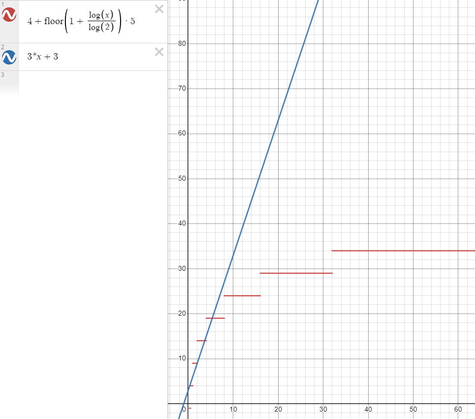

但随着 $n$ 越来越大，比如说 $n=1000$ 时，用二分查找算法（红色）也就是 $54t$，而蓝色算法则需要 $3003t$

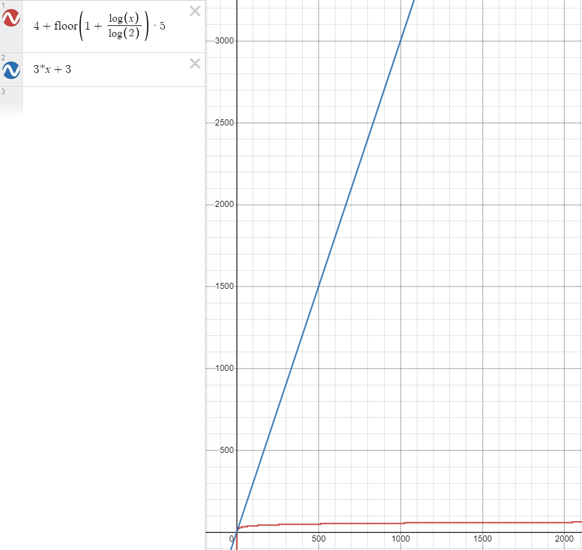


> 画图采用的是[Desmos | 图形计算器](https://www.desmos.com/calculator?lang=zh-CN)

计算机科学中，**时间复杂度**是用来衡量：一个算法的执行，随数据规模增大，而增长的时间成本

* 不依赖于环境因素

如何表示时间复杂度呢？

* 假设算法要处理的数据规模是 $n$，代码总的执行行数用函数 $f(n)$ 来表示，例如：
  * 线性查找算法的函数 $f(n) = 3*n + 3$
  * 二分查找算法的函数 $f(n) = (floor(log_2(n)) + 1) * 5 + 4$

* 为了对 $f(n)$ 进行化简，应当抓住主要矛盾，找到一个变化趋势与之相近的表示法

**大 $O$ 表示法[^4]**


其中

* $c, c_1, c_2$ 都为一个常数
* $f(n)$ 是实际执行代码行数与 n 的函数
* $g(n)$ 是经过化简，变化趋势与 $f(n)$ 一致的 n 的函数

**渐进上界**

渐进上界（asymptotic upper bound）：从某个常数 $n_0$开始，$c*g(n)$ 总是位于 $f(n)$ 上方，那么记作 $O(g(n))$

* 代表算法执行的最差情况

**渐进下界**

渐进下界（asymptotic lower bound）：从某个常数 $n_0$开始，$c*g(n)$ 总是位于 $f(n)$ 下方，那么记作 $\Omega(g(n))$

**渐进紧界**

渐进紧界（asymptotic tight bounds）：从某个常数 $n_0$开始，$f(n)$ 总是在 $c_1*g(n)$ 和 $c_2*g(n)$ 之间，那么记作 $\Theta(g(n))$


**常见大 $O$ 表示法**

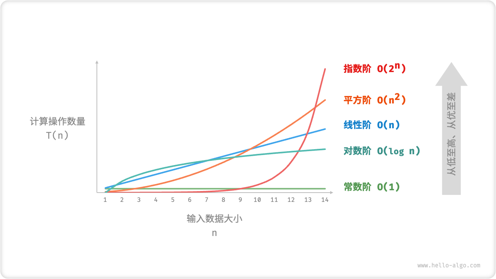

 按时间复杂度从低到高

* 黑色横线 $O(1)$，常量时间，意味着算法时间并不随数据规模而变化
* 绿色 $O(log(n))$，对数时间
* 蓝色 $O(n)$，线性时间，算法时间与数据规模成正比
* 橙色 $O(n*log(n))$，线性对数时间
* 红色 $O(n^2)$ 平方时间
* 黑色朝上 $O(2^n)$ 指数时间
* 没画出来的 $O(n!)$ 阶乘时间

#### 3.2 **空间复杂度**

与时间复杂度类似，一般也使用大 $O$ 表示法来衡量：一个算法执行随数据规模增大，而增长的**额外**空间成本

**二分查找性能**

下面分析二分查找算法的性能

时间复杂度

* 最坏情况：$O(\log n)$
* 最好情况：如果待查找元素恰好在数组中央，只需要循环一次 $O(1)$

空间复杂度

* 需要常数个指针 $i,j,m$，因此额外占用的空间是 $O(1)$ 

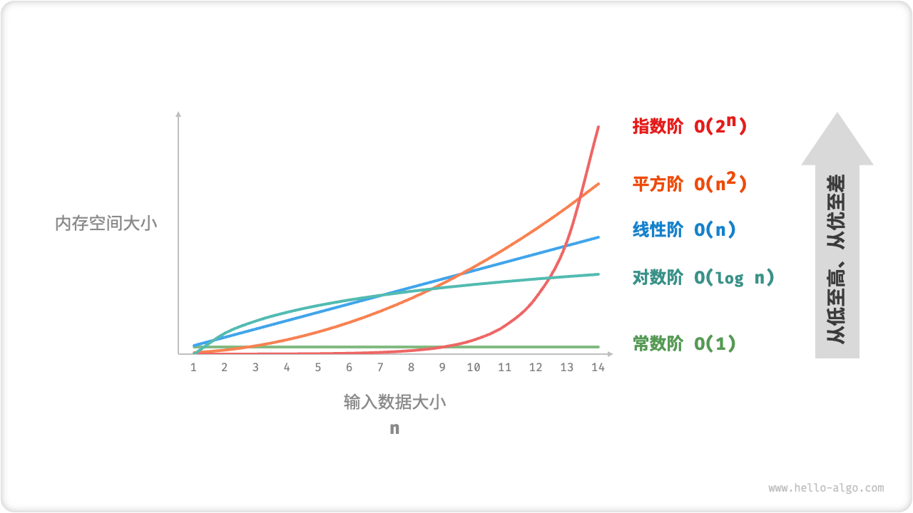

#### 3.3 权衡时间与空间

理想情况下，我们希望算法的时间复杂度和空间复杂度都能达到最优。然而在实际情况中，同时优化时间复杂度和空间复杂度通常是非常困难的。

**降低时间复杂度通常需要以提升空间复杂度为代价，反之亦然**。我们将牺牲内存空间来提升算法运行速度的思路称为“以空间换时间”；反之，则称为“以时间换空间”。

选择哪种思路取决于我们更看重哪个方面。在大多数情况下，时间比空间更宝贵，因此“以空间换时间”通常是更常用的策略。当然，在数据量很大的情况下，控制空间复杂度也是非常重要的

## 二、数据结构

### 1、数据结构分类

常见的数据结构包括`链表`、`栈`、`队列`、`哈希表`、`树`、`堆`、`图`，它们可以从`逻辑结构`和`物理结构`两个维度进行分类。

#### 1.1 逻辑结构：线性与非线性

**逻辑结构揭示了数据元素之间的逻辑关系**。在数组和链表中，数据按照顺序依次排列，体现了数据之间的线性关系；而在树中，数据从顶部向下按层次排列，表现出祖先与后代之间的派生关系；图则由节点和边构成，反映了复杂的网络关系。

逻辑结构可被分为“==线性==”和“==非线性==”两大类。**线性结构比较直观，指数据在逻辑关系上呈线性排列；非线性结构则相反，呈非线性排列。

- **线性数据结构**：数组、链表、栈、队列、哈希表。
- **非线性数据结构**：树、堆、图、哈希表。
非线性数据结构可以进一步被划分为树形结构和网状结构。

- **线性结构**：数组、链表、队列、栈、哈希表，元素之间是`一对一`的顺序关系。
- **树形结构**：树、堆、哈希表，元素之间是`一对多`的关系。
- **网状结构**：图，元素之间是`多对多`的关系。

![[file-20240801004836218.png]]


#### 1.2 物理结构:连续与分散

在计算机中，内存和硬盘是两种主要的存储硬件设备。硬盘主要用于长期存储数据，容量较大（通常可达到 TB 级别）、速度较慢。内存用于运行程序时暂存数据，速度较快，但容量较小（通常为 GB 级别）。

**在算法运行过程中，相关数据都存储在内存中**。下图展示了一个计算机内存条，其中每个黑色方块都包含一块内存空间。我们可以将内存想象成一个巨大的 Excel 表格，其中每个单元格都可以存储一定大小的数据，在算法运行时，所有数据都被存储在这些单元格中。

**系统通过内存地址来访问目标位置的数据**。下图所示，计算机根据特定规则为表格中的每个单元格分配编号，确保每个内存空间都有唯一的内存地址。有了这些地址，程序便可以访问内存中的数据。

![[file-20240801005818154.png]]

内存是所有程序的共享资源，当某块内存被某个程序占用时，则无法被其他程序同时使用了。**因此在数据结构与算法的设计中，内存资源是一个重要的考虑因素**。比如，算法所占用的内存峰值不应超过系统剩余空闲内存；如果缺少连续大块的内存空间，那么所选用的数据结构必须能够存储在分散的内存空间内。

**物理结构反映了数据在计算机内存中的存储方式**，可分为`连续空间存储（数组）`和`分散空间存储（链表）`。物理结构从底层决定了数据的访问、更新、增删等操作方法，同时在时间效率和空间效率方面呈现出互补的特点。

![[file-20240801005850843.png]]

值得说明的是，**所有数据结构都是基于数组、链表或二者的组合实现的**。例如，栈和队列既可以使用数组实现，也可以使用链表实现；而哈希表的实现可能同时包含数组和链表。

- **基于数组可实现**：栈、队列、哈希表、树、堆、图、矩阵、张量（维度 ≥3的数组）等。
- **基于链表可实现**：栈、队列、哈希表、树、堆、图等。

基于数组实现的数据结构也被称为“静态数据结构”，这意味着此类数据结构在初始化后长度不可变。相对应地，基于链表实现的数据结构被称为“动态数据结构”，这类数据结构在初始化后，仍可以在程序运行过程中对其长度进行调整。

### 2、基本数据类型

谈及计算机中的数据，我们会想到文本、图片、视频、语音、3D 模型等各种形式。尽管这些数据的组织形式各异，但它们都由各种基本数据类型构成。

**基本数据类型是 CPU 可以直接进行运算的类型**，在算法中直接被使用，主要包括以下几种类型。

- 整数类型 `byte`、`short`、`int`、`long` 。
- 浮点数类型 `float`、`double` ，用于表示小数。
- 字符类型 `char` ，用于表示各种语言的字母、标点符号、甚至表情符号等。
- 布尔类型 `bool` ，用于表示“是”与“否”判断。

**基本数据类型以二进制的形式存储在计算机中**。一个二进制位即为 1比特。在绝大多数现代系统中，1 字节（byte）由 8比特（bits）组成。

基本数据类型的取值范围取决于其占用的空间大小。下面以 Java 为例。

- 整数类型 `byte` 占用 1byte = 8bits ，可以表示 28个数字。
- 整数类型 `int` 占用 4bytes = 32bits ，可以表示 232个数字。

列举了各种基本数据类型的占用空间、取值范围和默认值。此表格无须硬背，大致理解即可，需要时可以通过查表来回忆。

 ==**基本数据类型的占用空间和取值范围**==

| 类型   | 符号     | 占用空间         | 最小值       | 最大值      | 默认值 |
| :----- | :------- | :--------------- | :----------- | :---------- | :----- |
| 整数   | `byte`   | 1 byte           | −27(−128)    | 27−1(127)   | 0      |
|        | `short`  | 2 bytes          | −215         | 215−1       | 0      |
|        | `int`    | 4 bytes          | −231         | 231−1       | 0      |
|        | `long`   | 8 bytes          | −263         | 263−1       | 0      |
| 浮点数 | `float`  | 4 bytes          | 1.175×10−38  | 3.403×1038  | 0.0�   |
|        | `double` | 8 bytes          | 2.225×10−308 | 1.798×10308 | 0.0    |
| 字符   | `char`   | 2 bytes / 1 byte | 0            | 216−1       | 0      |
| 布尔   | `bool`   | 1 byte           | false        | true        | false  |

## 三、数组与链表

### 1、数组

「数组 array」是一种线性数据结构，其将相同类型元素存储在连续的内存空间中。我们将元素在数组中的位置称为该元素的「索引 index」。

![[file-20240801010052764.png]]

#### 1.1 数组常用操作

##### 1.1.1 访问元素

数组元素被存储在连续的内存空间中，这意味着计算数组元素的内存地址非常容易。给定数组内存地址（即首元素内存地址）和某个元素的索引


我们发现数组首个元素的索引为 0，这似乎有些反直觉，因为从1开始计数会更自然。但从地址计算公式的角度看，**索引的含义本质上是内存地址的偏移量**。首个元素的地址偏移量是 0，因此它的索引为 0也是合理的。

在数组中访问元素是非常高效的，我们可以在O(1)时间内随机访问数组中的任意一个元素。

##### 1.1.2 插入元素

数组元素在内存中是“紧挨着的”，它们之间没有空间再存放任何数据。如下图，如果想要在数组中间插入一个元素，则需要将该元素之后的所有元素都向后移动一位，之后再把元素赋值给该索引。

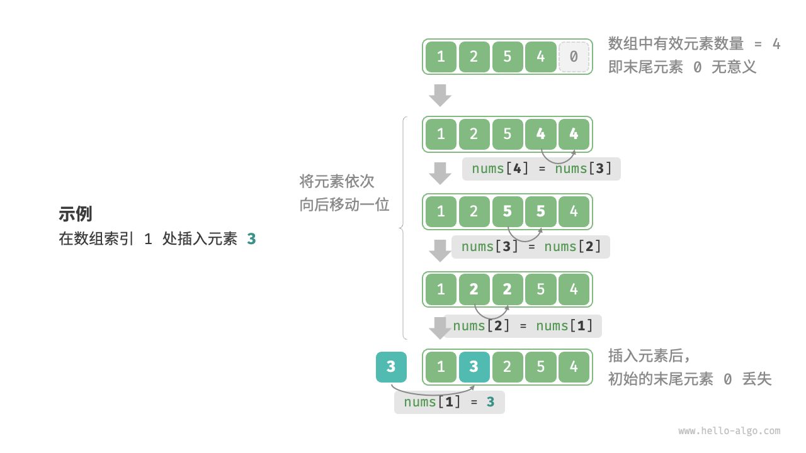


##### 1.1.3 删除元素

若想要删除索引1处的元素，则需要把索引1之后的元素都向前移动一位。


总的来看，数组的插入与删除操作有以下缺点。

- **时间复杂度高**：数组的插入和删除的平均时间复杂度均为 O(n)，其中 n为数组长度。
- **丢失元素**：由于数组的长度不可变，因此在插入元素后，超出数组长度范围的元素会丢失。
- **内存浪费**：我们可以初始化一个比较长的数组，只用前面一部分，这样在插入数据时，丢失的末尾元素都是“无意义”的，但这样做也会造成部分内存空间的浪费。

#### 1.2 数组优点与局限

数组存储在连续的内存空间内，且元素类型相同。这种做法包含丰富的先验信息，系统可以利用这些信息来优化数据结构的操作效率。

- **空间效率高**: 数组为数据分配了连续的内存块，无须额外的结构开销。
- **支持随机访问**: 数组允许在 O(1)时间内访问任何元素。
- **缓存局部性**: 当访问数组元素时，计算机不仅会加载它，还会缓存其周围的其他数据，从而借助高速缓存来提升后续操作的执行速度。

连续空间存储是一把双刃剑，其存在以下缺点。

- **插入与删除效率低**:当数组中元素较多时，插入与删除操作需要移动大量的元素。
- **长度不可变**: 数组在初始化后长度就固定了，扩容数组需要将所有数据复制到新数组，开销很大。
- **空间浪费**: 如果数组分配的大小超过了实际所需，那么多余的空间就被浪费了。

### 2、链表

内存空间是所有程序的公共资源，在一个复杂的系统运行环境下，空闲的内存空间可能散落在内存各处。我们知道，存储数组的内存空间必须是连续的，而当数组非常大时，内存可能无法提供如此大的连续空间。此时链表的灵活性优势就体现出来了。

「链表 linked list」是一种线性数据结构，其中的每个元素都是一个节点对象，各个节点通过“引用”相连接。引用记录了下一个节点的内存地址，通过它可以从当前节点访问到下一个节点。

链表的设计使得各个节点可以被分散存储在内存各处，它们的内存地址是无须连续的。


链表的组成单位是「节点 node」对象。每个节点都包含两项数据：节点的“值”和指向下一节点的“引用”。

- 链表的首个节点被称为“头节点”，最后一个节点被称为“尾节点”。
- 尾节点指向的是“空”，它在 Java、C++ 和 Python 中分别被记为 null、nullptr 和 None 。
- 在 C、C++、Go 和 Rust 等支持指针的语言中，上述的“引用”应被替换为“指针”

```java
/* 链表节点类 */
class ListNode {
    int val;        // 节点值
    ListNode next;  // 指向下一节点的引用
    ListNode(int x) { val = x; }  // 构造函数
}
```

链表节点 `ListNode` 除了包含值，还需额外保存一个引用（指针）。因此在相同数据量下，**链表比数组占用更多的内存空间**。

#### 2.1 链表常用操作

##### 2.1.1 初始化链表

建立链表分为两步，第一步是初始化各个节点对象，第二步是构建引用指向关系。初始化完成后，我们就可以从链表的头节点出发，通过引用指向 `next` 依次访问所有节点。

```java
/* 初始化链表 1 -> 3 -> 2 -> 5 -> 4 */
// 初始化各个节点
ListNode n0 = new ListNode(1);
ListNode n1 = new ListNode(3);
ListNode n2 = new ListNode(2);
ListNode n3 = new ListNode(5);
ListNode n4 = new ListNode(4);
// 构建引用指向
n0.next = n1;
n1.next = n2;
n2.next = n3;
n3.next = n4;
```

数组整体是一个变量，比如数组 `nums` 包含元素 `nums[0]` 和 `nums[1]` 等，而链表是由多个独立的节点对象组成的。**我们通常将头节点当作链表的代称**，比如以上代码中的链表可被记做链表 `n0` 

##### 2.1.2 插入节点

在链表中插入节点非常容易。如下图所示，假设我们想在相邻的两个节点 `n0` 和 `n1` 之间插入一个新节点 `P` ，**则只需要改变两个节点引用（指针）即可**，时间复杂度为 O(1)。


```java
/* 在链表的节点 n0 之后插入节点 P */
void insert(ListNode n0, ListNode P) {
    ListNode n1 = n0.next;
    P.next = n1;
    n0.next = P;
}
```

##### 2.1.3 删除节点

在链表中删除节点也非常方便，**只需改变一个节点的引用（指针）即可**。

请注意，尽管在删除操作完成后节点 `P` 仍然指向 `n1` ，但实际上遍历此链表已经无法访问到 `P` ，这意味着 `P` 已经不再属于该链表了。


```java
/* 删除链表的节点 n0 之后的首个节点 */
void remove(ListNode n0) {
    if (n0.next == null)
        return;
    // n0 -> P -> n1
    ListNode P = n0.next;
    ListNode n1 = P.next;
    n0.next = n1;
}
```

##### 2.1.4 访问节点

**在链表访问节点的效率较低**。如上节所述，我们可以在 O(1)时间下访问数组中的任意元素。链表则不然，程序需要从头节点出发，逐个向后遍历，直至找到目标节点。也就是说，访问链表的第 n个节点需要循环 n−1轮，时间复杂度为 O(n)。

```java
/* 访问链表中索引为 index 的节点 */
ListNode access(ListNode head, int index) {
    for (int i = 0; i < index; i++) {
        if (head == null)
            return null;
        head = head.next;
    }
    return head;
}
```

#### 2.2 数组 VS 链表

总结对比了数组和链表的各项特点与操作效率。由于它们采用两种相反的存储策略，因此各种性质和操作效率也呈现对立的特点。

表 4-1  数组与链表的效率对比

|            | 数组                     | 链表         |
| :--------- | :----------------------- | :----------- |
| 存储方式   | 连续内存空间             | 分散内存空间 |
| 缓存局部性 | 友好                     | 不友好       |
| 容量扩展   | 长度不可变               | 可灵活扩展   |
| 内存效率   | 占用内存少、浪费部分空间 | 占用内存多   |
| 访问元素   | O(1)                     | O(n)         |
| 添加元素   | O(n)                     | O(1)         |
| 删除元素   | O(n)                     | O(1)         |

#### 2.3 常见链表类型

常见的链表类型包括三种。

- **单向链表**：即上述介绍的普通链表。单向链表的节点包含值和指向下一节点的引用两项数据。我们将首个节点称为头节点，将最后一个节点称为尾节点，尾节点指向空 None 。
- **环形链表**：如果我们令单向链表的尾节点指向头节点（即首尾相接），则得到一个环形链表。在环形链表中，任意节点都可以视作头节点。
- **双向链表**：与单向链表相比，双向链表记录了两个方向的引用。双向链表的节点定义同时包含指向后继节点（下一个节点）和前驱节点（上一个节点）的引用（指针）。相较于单向链表，双向链表更具灵活性，可以朝两个方向遍历链表，但相应地也需要占用更多的内存空间。

```java
/* 双向链表节点类 */
class ListNode {
    int val;        // 节点值
    ListNode next;  // 指向后继节点的引用
    ListNode prev;  // 指向前驱节点的引用
    ListNode(int x) { val = x; }  // 构造函数
}

```

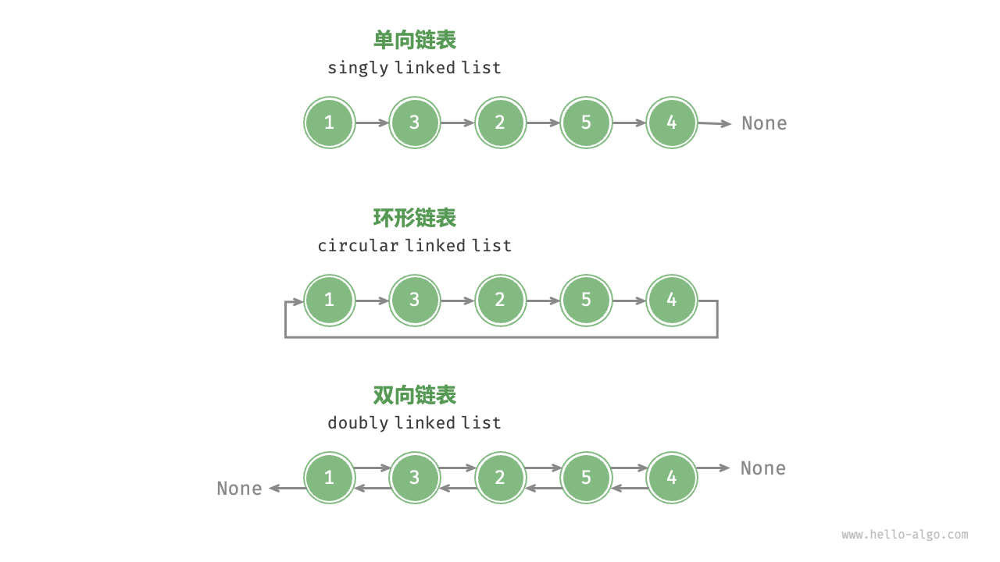

### 3、列表

**数组长度不可变导致实用性降低**。在实际中，我们可能事先无法确定需要存储多少数据，这使数组长度的选择变得困难。若长度过小，需要在持续添加数据时频繁扩容数组；若长度过大，则会造成内存空间的浪费。

为解决此问题，出现了一种被称为「动态数组 dynamic array」的数据结构，即长度可变的数组，也常被称为「列表 list」。列表基于数组实现，继承了数组的优点，并且可以在程序运行过程中动态扩容。我们可以在列表中自由地添加元素，而无须担心超过容量限制。

#### 3.1 列表常用操作

##### 3.1.2 访问数据

列表本质上是数组，因此可以在 O(1)时间内访问和更新元素，效率很高。

##### 3.2.3 插入与删除元素

相较于数组，列表可以自由地添加与删除元素。在列表尾部添加元素的时间复杂度为 O(1)，但插入和删除元素的效率仍与数组相同，时间复杂度为 O(n)。

#### 3.2 列表实现

许多编程语言都提供内置的列表，例如 Java、C++、Python 等。它们的实现比较复杂，各个参数的设定也非常有考究，例如初始容量、扩容倍数等。感兴趣的读者可以查阅源码进行学习。

为了加深对列表工作原理的理解，我们尝试实现一个简易版列表，包括以下三个重点设计。

- **初始容量**：选取一个合理的数组初始容量。在本示例中，我们选择 10 作为初始容量。
- **数量记录**：声明一个变量 `size` ，用于记录列表当前元素数量，并随着元素插入和删除实时更新。根据此变量，我们可以定位列表尾部，以及判断是否需要扩容。
- **扩容机制**：若插入元素时列表容量已满，则需要进行扩容。首先根据扩容倍数创建一个更大的数组，再将当前数组的所有元素依次移动至新数组。在本示例中，我们规定每次将数组扩容至之前的 2 倍。

```java
/* 列表类简易实现 */
class MyList {
    private int[] nums; // 数组（存储列表元素）
    private int capacity = 10; // 列表容量
    private int size = 0; // 列表长度（即当前元素数量）
    private int extendRatio = 2; // 每次列表扩容的倍数

    /* 构造方法 */
    public MyList() {
        nums = new int[capacity];
    }

    /* 获取列表长度（即当前元素数量） */
    public int size() {
        return size;
    }

    /* 获取列表容量 */
    public int capacity() {
        return capacity;
    }

    /* 访问元素 */
    public int get(int index) {
        // 索引如果越界则抛出异常，下同
        if (index < 0 || index >= size)
            throw new IndexOutOfBoundsException("索引越界");
        return nums[index];
    }

    /* 更新元素 */
    public void set(int index, int num) {
        if (index < 0 || index >= size)
            throw new IndexOutOfBoundsException("索引越界");
        nums[index] = num;
    }

    /* 尾部添加元素 */
    public void add(int num) {
        // 元素数量超出容量时，触发扩容机制
        if (size == capacity())
            extendCapacity();
        nums[size] = num;
        // 更新元素数量
        size++;
    }

    /* 中间插入元素 */
    public void insert(int index, int num) {
        if (index < 0 || index >= size)
            throw new IndexOutOfBoundsException("索引越界");
        // 元素数量超出容量时，触发扩容机制
        if (size == capacity())
            extendCapacity();
        // 将索引 index 以及之后的元素都向后移动一位
        for (int j = size - 1; j >= index; j--) {
            nums[j + 1] = nums[j];
        }
        nums[index] = num;
        // 更新元素数量
        size++;
    }

    /* 删除元素 */
    public int remove(int index) {
        if (index < 0 || index >= size)
            throw new IndexOutOfBoundsException("索引越界");
        int num = nums[index];
        // 将索引 index 之后的元素都向前移动一位
        for (int j = index; j < size - 1; j++) {
            nums[j] = nums[j + 1];
        }
        // 更新元素数量
        size--;
        // 返回被删除元素
        return num;
    }

    /* 列表扩容 */
    public void extendCapacity() {
        // 新建一个长度为原数组 extendRatio 倍的新数组，并将原数组拷贝到新数组
        nums = Arrays.copyOf(nums, capacity() * extendRatio);
        // 更新列表容量
        capacity = nums.length;
    }

    /* 将列表转换为数组 */
    public int[] toArray() {
        int size = size();
        // 仅转换有效长度范围内的列表元素
        int[] nums = new int[size];
        for (int i = 0; i < size; i++) {
            nums[i] = get(i);
        }
        return nums;
    }
}
```

## 四、栈与队列

### 1、栈

栈 stack」是一种遵循先入后出的逻辑的线性数据结构。

我们可以将栈类比为桌面上的一摞盘子，如果需要拿出底部的盘子，则需要先将上面的盘子依次取出。我们将盘子替换为各种类型的元素（如整数、字符、对象等），就得到了栈数据结构。

如下图所示，我们把堆叠元素的顶部称为“栈顶”，底部称为“栈底”。将把元素添加到栈顶的操作叫做“入栈”，删除栈顶元素的操作叫做“出栈”。

![[file-20240801010346959.png]]

#### 1.1 栈的常用操作

栈的常用操作如下表所示，具体的方法名需要根据所使用的编程语言来确定。在此，我们以常见的 `push()`、`pop()`、`peek()` 命名为例。

| 方法   | 描述                   | 时间复杂度 |
| :----- | :--------------------- | :--------- |
| push() | 元素入栈（添加至栈顶） | O(1)       |
| pop()  | 栈顶元素出栈           | O(1)       |
| peek() | 访问栈顶元素           | O(1)       |

通常情况下，我们可以直接使用编程语言内置的栈类。然而，某些语言可能没有专门提供栈类，这时我们可以将该语言的“数组”或“链表”视作栈来使用，并在程序逻辑上忽略与栈无关的操作。

```java
/* 初始化栈 */
Stack<Integer> stack = new Stack<>();

/* 元素入栈 */
stack.push(1);
stack.push(3);
stack.push(2);
stack.push(5);
stack.push(4);

/* 访问栈顶元素 */
int peek = stack.peek();

/* 元素出栈 */
int pop = stack.pop();

/* 获取栈的长度 */
int size = stack.size();

/* 判断是否为空 */
boolean isEmpty = stack.isEmpty();
```

#### 1.2 栈的实现

为了深入了解栈的运行机制，我们来尝试自己实现一个栈类。

栈遵循先入后出的原则，因此我们只能在栈顶添加或删除元素。然而，数组和链表都可以在任意位置添加和删除元素，**因此栈可以被视为一种受限制的数组或链表**。换句话说，我们可以“屏蔽”数组或链表的部分无关操作，使其对外表现的逻辑符合栈的特性。

##### 1.2.1 基于链表的实现

使用链表来实现栈时，我们可以将链表的头节点视为栈顶，尾节点视为栈底。

对于入栈操作，我们只需将元素插入链表头部，这种节点插入方法被称为“头插法”。而对于出栈操作，只需将头节点从链表中删除即可。

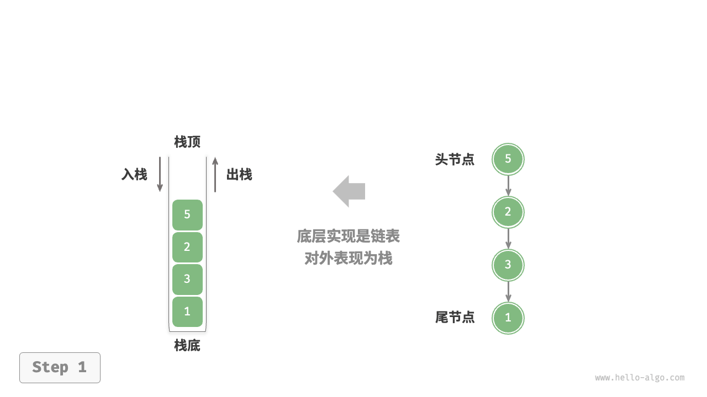

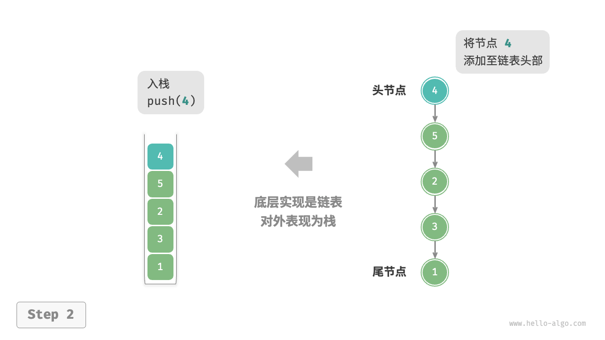

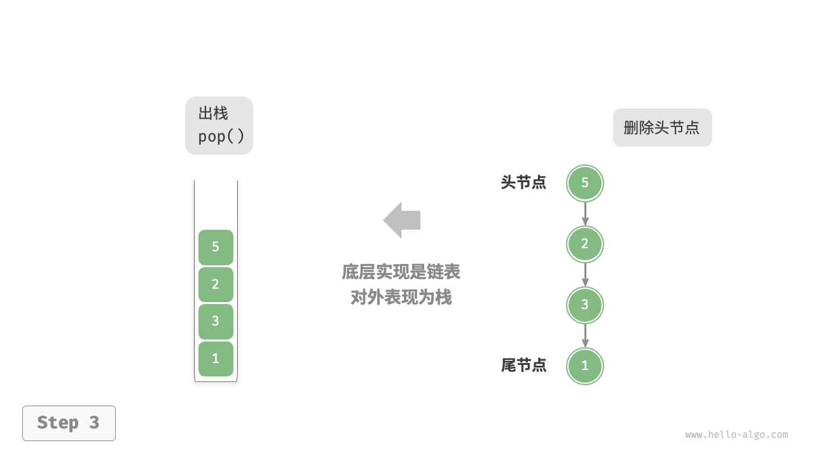

##### 1.2.2 基于数组的实现

使用数组实现栈时，我们可以将数组的尾部作为栈顶。如下图所示，入栈与出栈操作分别对应在数组尾部添加元素与删除元素，时间复杂度都为 O(1)。

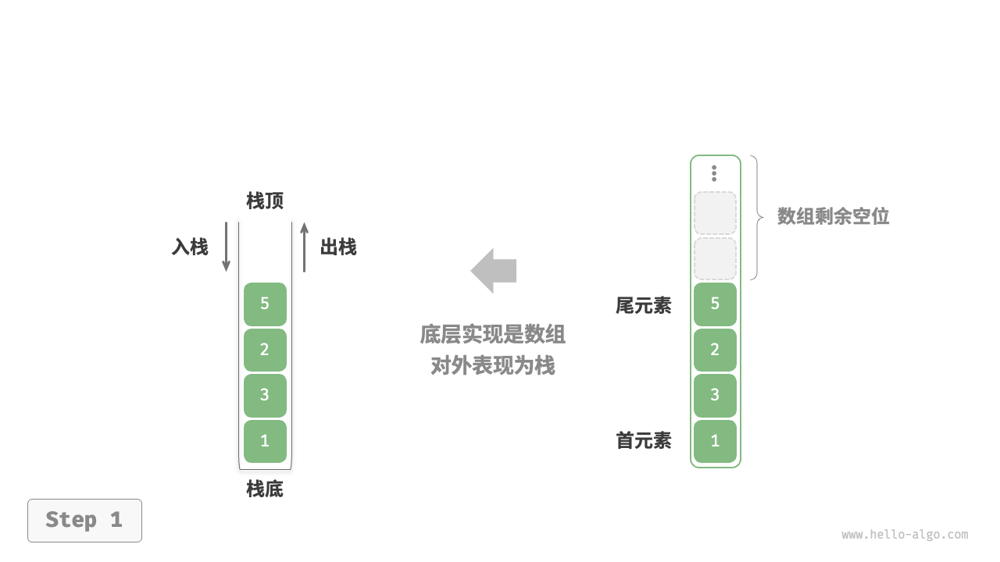

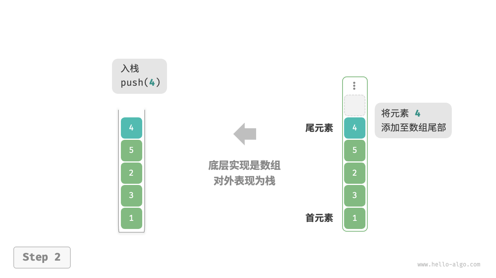

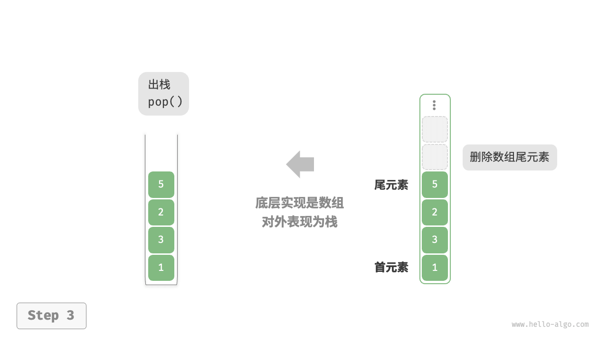

##### 1.2.3 对比

**支持操作**

两种实现都支持栈定义中的各项操作。数组实现额外支持随机访问，但这已超出了栈的定义范畴，因此一般不会用到。

**时间效率**

在基于数组的实现中，入栈和出栈操作都是在预先分配好的连续内存中进行，具有很好的缓存本地性，因此效率较高。然而，如果入栈时超出数组容量，会触发扩容机制，导致该次入栈操作的时间复杂度变为 O(n)。

在链表实现中，链表的扩容非常灵活，不存在上述数组扩容时效率降低的问题。但是，入栈操作需要初始化节点对象并修改指针，因此效率相对较低。不过，如果入栈元素本身就是节点对象，那么可以省去初始化步骤，从而提高效率。

综上所述，当入栈与出栈操作的元素是基本数据类型时，例如 `int` 或 `double` ，我们可以得出以下结论。

- 基于数组实现的栈在触发扩容时效率会降低，但由于扩容是低频操作，因此平均效率更高。
- 基于链表实现的栈可以提供更加稳定的效率表现。

**空间效率**

在初始化列表时，系统会为列表分配“初始容量”，该容量可能超过实际需求。并且，扩容机制通常是按照特定倍率（例如 2 倍）进行扩容，扩容后的容量也可能超出实际需求。因此，**基于数组实现的栈可能造成一定的空间浪费**。

然而，由于链表节点需要额外存储指针，**因此链表节点占用的空间相对较大**。

综上，我们不能简单地确定哪种实现更加节省内存，需要针对具体情况进行分析。

#### 1.3 栈的应用

- **浏览器中的后退与前进、软件中的撤销与反撤销**。每当我们打开新的网页，浏览器就会将上一个网页执行入栈，这样我们就可以通过后退操作回到上一页面。后退操作实际上是在执行出栈。如果要同时支持后退和前进，那么需要两个栈来配合实现。
- **程序内存管理**。每次调用函数时，系统都会在栈顶添加一个栈帧，用于记录函数的上下文信息。在递归函数中，向下递推阶段会不断执行入栈操作，而向上回溯阶段则会执行出栈操作。

### 2、队列

「队列 queue」是一种遵循先入先出规则的线性数据结构。顾名思义，队列模拟了排队现象，即新来的人不断加入队列的尾部，而位于队列头部的人逐个离开。

如下图所示，我们将队列的头部称为“队首”，尾部称为“队尾”，将把元素加入队尾的操作称为“入队”，删除队首元素的操作称为“出队”。

![[file-20240801010633574.png]]

#### 2.1 队列常用操作

队列的常见操作如下表所示。需要注意的是，不同编程语言的方法名称可能会有所不同。我们在此采用与栈相同的方法命名。

| 方法名 | 描述                         | 时间复杂度 |
| :----- | :--------------------------- | :--------- |
| push() | 元素入队，即将元素添加至队尾 | O(1)       |
| pop()  | 队首元素出队                 | O(1)       |
| peek() | 访问队首元素                 | O(1)       |

我们可以直接使用编程语言中现成的队列类。

```java
/* 初始化队列 */
Queue<Integer> queue = new LinkedList<>();

/* 元素入队 */
queue.offer(1);
queue.offer(3);
queue.offer(2);
queue.offer(5);
queue.offer(4);

/* 访问队首元素 */
int peek = queue.peek();

/* 元素出队 */
int pop = queue.poll();

/* 获取队列的长度 */
int size = queue.size();

/* 判断队列是否为空 */
boolean isEmpty = queue.isEmpty();
```

#### 2.2 队列实现

##### 2.2.1 基于链表实现

如下图 所示，我们可以将链表的“头节点”和“尾节点”分别视为“队首”和“队尾”，规定队尾仅可添加节点，队首仅可删除节点。

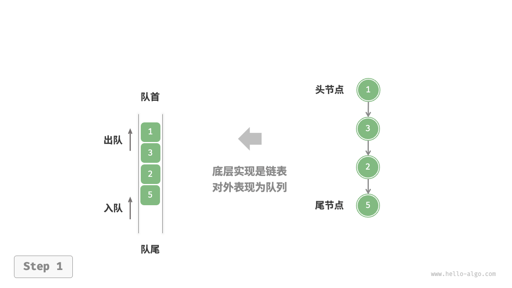

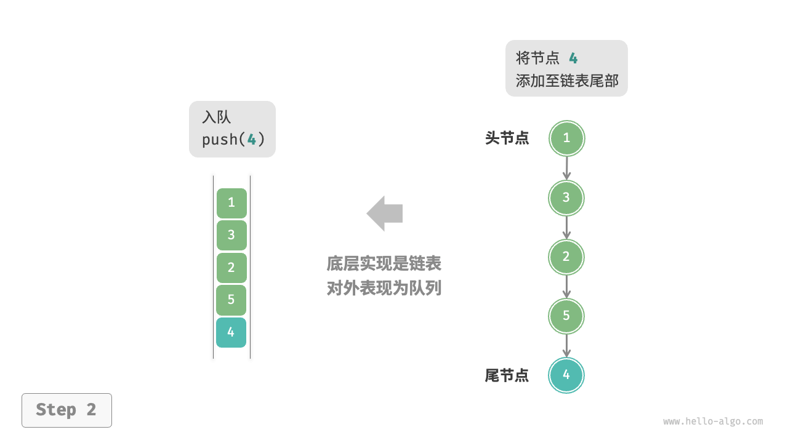

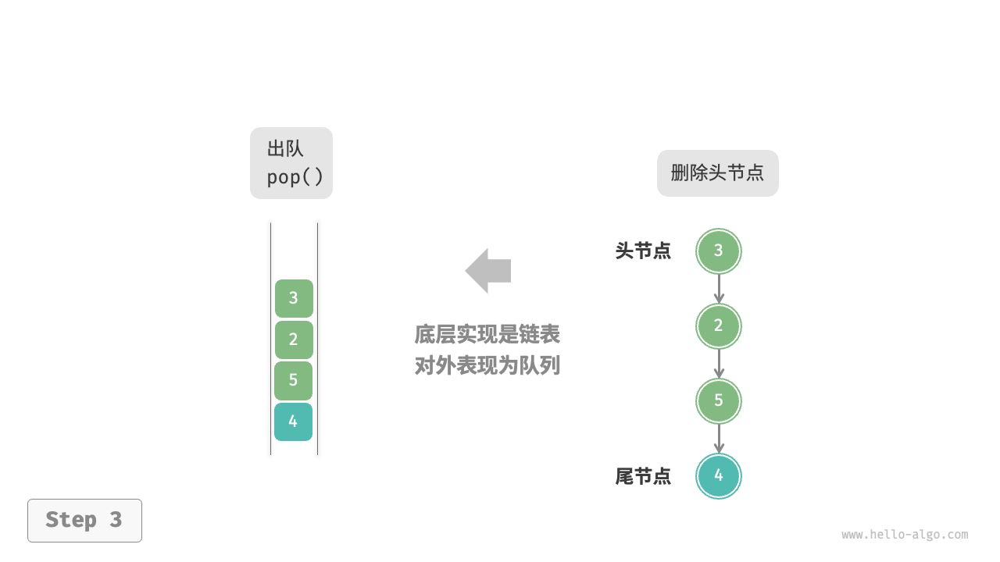

##### 2.2.2 基于数组的实现

由于数组删除首元素的时间复杂度为 O(n) ，这会导致出队操作效率较低。然而，我们可以采用以下巧妙方法来避免这个问题。

我们可以使用一个变量 `front` 指向队首元素的索引，并维护一个变量 `size` 用于记录队列长度。定义 `rear = front + size` ，这个公式计算出的 `rear` 指向队尾元素之后的下一个位置。

基于此设计，**数组中包含元素的有效区间为 `[front, rear - 1]`**，各种操作的实现方法如图 5-6 所示。

- 入队操作：将输入元素赋值给 `rear` 索引处，并将 `size` 增加 1 。
- 出队操作：只需将 `front` 增加 1 ，并将 `size` 减少 1 。

可以看到，入队和出队操作都只需进行一次操作，时间复杂度均为 O(1) 。


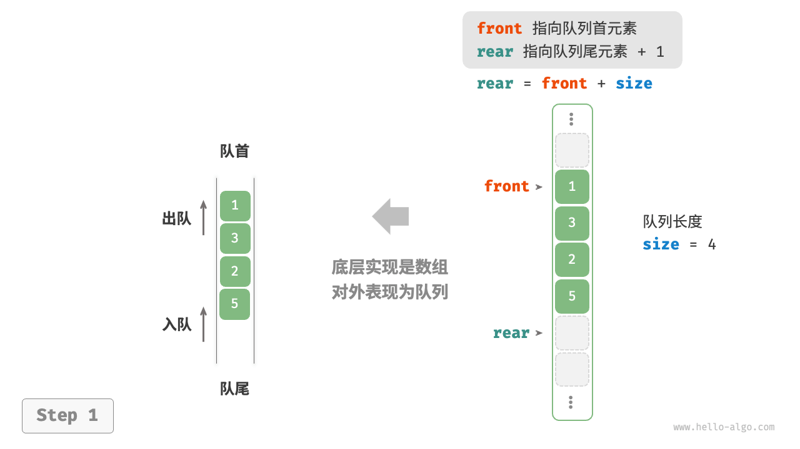

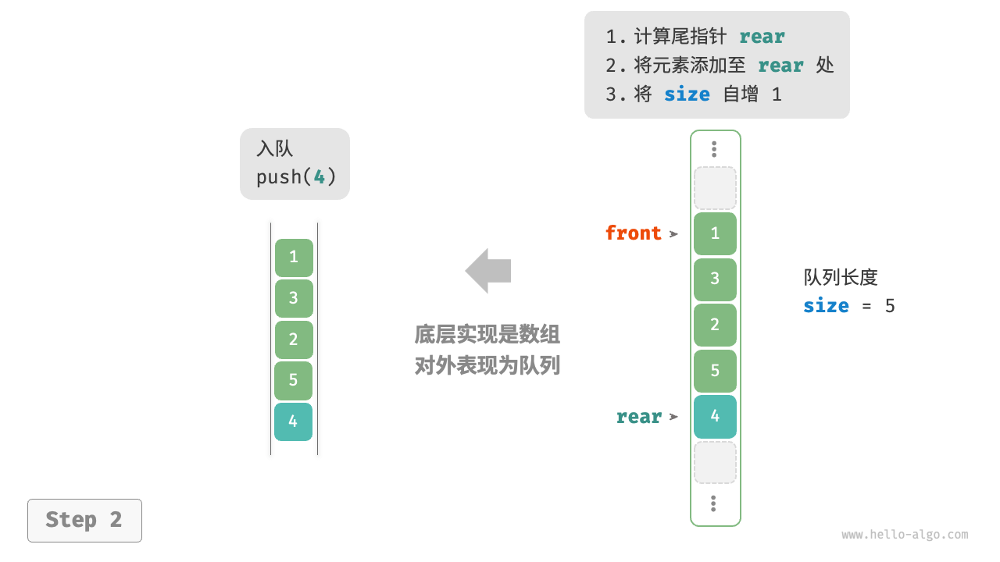

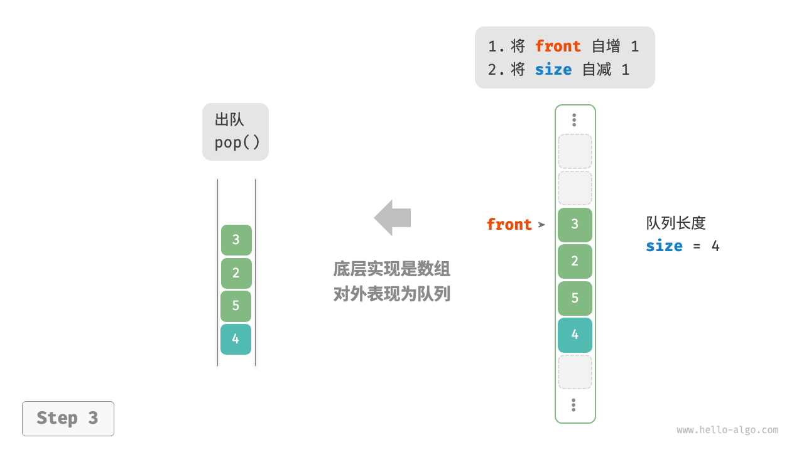


你可能会发现一个问题：在不断进行入队和出队的过程中，`front` 和 `rear` 都在向右移动，**当它们到达数组尾部时就无法继续移动了**。为解决此问题，我们可以将数组视为首尾相接的“环形数组”。

对于环形数组，我们需要让 `front` 或 `rear` 在越过数组尾部时，直接回到数组头部继续遍历。这种周期性规律可以通过“取余操作”来实现，代码如下所示。

```java
/* 基于环形数组实现的队列 */
class ArrayQueue {
    private int[] nums; // 用于存储队列元素的数组
    private int front; // 队首指针，指向队首元素
    private int queSize; // 队列长度

    public ArrayQueue(int capacity) {
        nums = new int[capacity];
        front = queSize = 0;
    }

    /* 获取队列的容量 */
    public int capacity() {
        return nums.length;
    }

    /* 获取队列的长度 */
    public int size() {
        return queSize;
    }

    /* 判断队列是否为空 */
    public boolean isEmpty() {
        return queSize == 0;
    }

    /* 入队 */
    public void push(int num) {
        if (queSize == capacity()) {
            System.out.println("队列已满");
            return;
        }
        // 计算尾指针，指向队尾索引 + 1
        // 通过取余操作，实现 rear 越过数组尾部后回到头部
        int rear = (front + queSize) % capacity();
        // 将 num 添加至队尾
        nums[rear] = num;
        queSize++;
    }

    /* 出队 */
    public int pop() {
        int num = peek();
        // 队首指针向后移动一位，若越过尾部则返回到数组头部
        front = (front + 1) % capacity();
        queSize--;
        return num;
    }

    /* 访问队首元素 */
    public int peek() {
        if (isEmpty())
            throw new IndexOutOfBoundsException();
        return nums[front];
    }

    /* 返回数组 */
    public int[] toArray() {
        // 仅转换有效长度范围内的列表元素
        int[] res = new int[queSize];
        for (int i = 0, j = front; i < queSize; i++, j++) {
            res[i] = nums[j % capacity()];
        }
        return res;
    }
}
```

以上实现的队列仍然具有局限性，即其长度不可变。然而，这个问题不难解决，我们可以将数组替换为动态数组，从而引入扩容机制。有兴趣的同学可以尝试自行实现。

两种实现的对比结论与栈一致，在此不再赘述。

#### 2.3 双向队列

在队列中，我们仅能在头部删除或在尾部添加元素。如图 5-7 所示，「双向队列 double-ended queue」提供了更高的灵活性，允许在头部和尾部执行元素的添加或删除操作。
##### 2.3.1 区别

- 队列是一种遵循先入先出原则的数据结构，同样可以通过数组或链表来实现。在时间效率和空间效率的对比上，队列的结论与前述栈的结论相似。
- 双向队列是一种具有更高自由度的队列，它允许在两端进行元素的添加和删除操作。
##### 2.3.2   双向队列应用

双向队列兼具栈与队列的逻辑，**因此它可以实现这两者的所有应用场景，同时提供更高的自由度**。

我们知道，软件的“撤销”功能通常使用栈来实现：系统将每次更改操作 `push` 到栈中，然后通过 `pop` 实现撤销。然而，考虑到系统资源的限制，软件通常会限制撤销的步数（例如仅允许保存 50 步）。当栈的长度超过 50 时，软件需要在栈底（队首）执行删除操作。**但栈无法实现该功能，此时就需要使用双向队列来替代栈**。请注意，“撤销”的核心逻辑仍然遵循栈的先入后出原则，只是双向队列能够更加灵活地实现一些额外逻辑。

## 五、哈希表

### 1、哈希表

「哈希表 hash table」，又称「散列表」，其通过建立键 `key` 与值 `value` 之间的映射，实现高效的元素查询。具体而言，我们向哈希表输入一个键 `key` ，则可以在 O(1) 时间内获取对应的值 `value` 。

如下图所示，给定 n 个学生，每个学生都有“姓名”和“学号”两项数据。假如我们希望实现“输入一个学号，返回对应的姓名”的查询功能，则可以采用下图所示的哈希表来实现

![[file-20240801011208069.png]]
除哈希表外，数组和链表也可以实现查询功能，它们的效率对比如下表所示。

- **添加元素**：仅需将元素添加至数组（链表）的尾部即可，使用 O(1) 时间。
- **查询元素**：由于数组（链表）是乱序的，因此需要遍历其中的所有元素，使用 O(n) 时间。
- **删除元素**：需要先查询到元素，再从数组（链表）中删除，使用 O(n) 时间。

|          | 数组 | 链表 | 哈希表 |
| :------- | :--- | :--- | :----- |
| 查找元素 | O(n) | O(n) | O(1)   |
| 添加元素 | O(1) | O(1) | O(1)   |
| 删除元素 | O(n) | O(n) | O(1)   |

观察发现，**在哈希表中进行增删查改的时间复杂度都是 O(1)** ，非常高效。

#### 1.1 哈希表常用操作

哈希表的常见操作包括：初始化、查询操作、添加键值对和删除键值对等。

```java
/* 初始化哈希表 */
Map<Integer, String> map = new HashMap<>();

/* 添加操作 */
// 在哈希表中添加键值对 (key, value)
map.put(12836, "小哈");   
map.put(15937, "小啰");   
map.put(16750, "小算");   
map.put(13276, "小法");
map.put(10583, "小鸭");

/* 查询操作 */
// 向哈希表输入键 key ，得到值 value
String name = map.get(15937);

/* 删除操作 */
// 在哈希表中删除键值对 (key, value)
map.remove(10583);
```

哈希表有三种常用遍历方式：遍历键值对、遍历键和遍历值。

```java
/* 遍历哈希表 */
// 遍历键值对 key->value
for (Map.Entry <Integer, String> kv: map.entrySet()) {
    System.out.println(kv.getKey() + " -> " + kv.getValue());
}
// 单独遍历键 key
for (int key: map.keySet()) {
    System.out.println(key);
}
// 单独遍历值 value
for (String val: map.values()) {
    System.out.println(val);
}
```

#### 1.2 哈希表简单实现

我们先考虑最简单的情况，**仅用一个数组来实现哈希表**。在哈希表中，我们将数组中的每个空位称为「桶 bucket」，每个桶可存储一个键值对。因此，查询操作就是找到 `key` 对应的桶，并在桶中获取 `value` 。

那么，如何基于 `key` 来定位对应的桶呢？这是通过「哈希函数 hash function」实现的。哈希函数的作用是将一个较大的输入空间映射到一个较小的输出空间。在哈希表中，输入空间是所有 `key` ，输出空间是所有桶（数组索引）。换句话说，输入一个 `key` ，**我们可以通过哈希函数得到该 `key` 对应的键值对在数组中的存储位置**。

输入一个 `key` ，哈希函数的计算过程分为以下两步。

1. 通过某种哈希算法 `hash()` 计算得到哈希值。
2. 将哈希值对桶数量（数组长度）`capacity` 取模，从而获取该 `key` 对应的数组索引 `index` 。

```java
index = hash(key) % capacity
```

随后，我们就可以利用 `index` 在哈希表中访问对应的桶，从而获取 `value` 。

设数组长度 `capacity = 100`、哈希算法 `hash(key) = key` ，易得哈希函数为 `key % 100` 。图 6-2 以 `key` 学号和 `value` 姓名为例，展示了哈希函数的工作原理。
![[file-20240801011223491.png]]
以下代码实现了一个简单哈希表。其中，我们将 `key` 和 `value` 封装成一个类 `Pair` ，以表示键值对。

```java
/* 键值对 */
class Pair {
    public int key;
    public String val;

    public Pair(int key, String val) {
        this.key = key;
        this.val = val;
    }
}

/* 基于数组简易实现的哈希表 */
class ArrayHashMap {
    private List<Pair> buckets;

    public ArrayHashMap() {
        // 初始化数组，包含 100 个桶
        buckets = new ArrayList<>();
        for (int i = 0; i < 100; i++) {
            buckets.add(null);
        }
    }

    /* 哈希函数 */
    private int hashFunc(int key) {
        int index = key % 100;
        return index;
    }

    /* 查询操作 */
    public String get(int key) {
        int index = hashFunc(key);
        Pair pair = buckets.get(index);
        if (pair == null)
            return null;
        return pair.val;
    }

    /* 添加操作 */
    public void put(int key, String val) {
        Pair pair = new Pair(key, val);
        int index = hashFunc(key);
        buckets.set(index, pair);
    }

    /* 删除操作 */
    public void remove(int key) {
        int index = hashFunc(key);
        // 置为 null ，代表删除
        buckets.set(index, null);
    }

    /* 获取所有键值对 */
    public List<Pair> pairSet() {
        List<Pair> pairSet = new ArrayList<>();
        for (Pair pair : buckets) {
            if (pair != null)
                pairSet.add(pair);
        }
        return pairSet;
    }

    /* 获取所有键 */
    public List<Integer> keySet() {
        List<Integer> keySet = new ArrayList<>();
        for (Pair pair : buckets) {
            if (pair != null)
                keySet.add(pair.key);
        }
        return keySet;
    }

    /* 获取所有值 */
    public List<String> valueSet() {
        List<String> valueSet = new ArrayList<>();
        for (Pair pair : buckets) {
            if (pair != null)
                valueSet.add(pair.val);
        }
        return valueSet;
    }

    /* 打印哈希表 */
    public void print() {
        for (Pair kv : pairSet()) {
            System.out.println(kv.key + " -> " + kv.val);
        }
    }
}
```

#### 1.3 哈希冲突与扩容

本质上看，哈希函数的作用是将所有 `key` 构成的输入空间映射到数组所有索引构成的输出空间，而输入空间往往远大于输出空间。因此，**理论上一定存在“多个输入对应相同输出”的情况**。

对于上述示例中的哈希函数，当输入的 `key` 后两位相同时，哈希函数的输出结果也相同。例如，查询学号为 12836 和 20336 的两个学生时，我们得到：

```java
12836 % 100 = 36
20336 % 100 = 36
```

如下图所示，两个学号指向了同一个姓名，这显然是不对的。我们将这种多个输入对应同一输出的情况称为「哈希冲突 hash collision」。

![[file-20240801011246158.png]]

容易想到，哈希表容量 n 越大，多个 `key` 被分配到同一个桶中的概率就越低，冲突就越少。因此，**我们可以通过扩容哈希表来减少哈希冲突**。

如下图所示，扩容前键值对 `(136, A)` 和 `(236, D)` 发生冲突，扩容后冲突消失。

![[file-20240801011255405.png]]

类似于数组扩容，哈希表扩容需将所有键值对从原哈希表迁移至新哈希表，非常耗时。并且由于哈希表容量 `capacity` 改变，我们需要通过哈希函数来重新计算所有键值对的存储位置，这进一步提高了扩容过程的计算开销。为此，编程语言通常会预留足够大的哈希表容量，防止频繁扩容。

「负载因子 load factor」是哈希表的一个重要概念，其定义为哈希表的元素数量除以桶数量，用于衡量哈希冲突的严重程度，**也常被作为哈希表扩容的触发条件**。例如在 Java 中，当负载因子超过 0.75 时，系统会将哈希表容量扩展为原先的 2 倍。

### 2、哈希冲突

上节提到，**通常情况下哈希函数的输入空间远大于输出空间**，因此理论上哈希冲突是不可避免的。比如，输入空间为全体整数，输出空间为数组容量大小，则必然有多个整数映射至同一桶索引。

哈希冲突会导致查询结果错误，严重影响哈希表的可用性。为解决该问题，我们可以每当遇到哈希冲突时就进行哈希表扩容，直至冲突消失为止。此方法简单粗暴且有效，但效率太低，因为哈希表扩容需要进行大量的数据搬运与哈希值计算。为了提升效率，我们可以采用以下策略。

1. 改良哈希表数据结构，**使得哈希表可以在存在哈希冲突时正常工作**。
2. 仅在必要时，即当哈希冲突比较严重时，才执行扩容操作。

哈希表的结构改良方法主要包括“链式地址”和“开放寻址”。

#### 2.1 链式地址

在原始哈希表中，每个桶仅能存储一个键值对。「链式地址 separate chaining」将单个元素转换为链表，将键值对作为链表节点，将所有发生冲突的键值对都存储在同一链表中。下图展示了一个链式地址哈希表的例子。


基于链式地址实现的哈希表的操作方法发生了以下变化。

- **查询元素**：输入 `key` ，经过哈希函数得到桶索引，即可访问链表头节点，然后遍历链表并对比 `key` 以查找目标键值对。
- **添加元素**：先通过哈希函数访问链表头节点，然后将节点（即键值对）添加到链表中。
- **删除元素**：根据哈希函数的结果访问链表头部，接着遍历链表以查找目标节点，并将其删除。

链式地址存在以下局限性。

- **占用空间增大**，链表包含节点指针，它相比数组更加耗费内存空间。
- **查询效率降低**，因为需要线性遍历链表来查找对应元素。

以下代码给出了链式地址哈希表的简单实现，需要注意两点。

- 使用列表（动态数组）代替链表，从而简化代码。在这种设定下，哈希表（数组）包含多个桶，每个桶都是一个列表。
- 以下实现包含哈希表扩容方法。当负载因子超过 23 时，我们将哈希表扩容至 2 倍。

```java
/* 链式地址哈希表 */
class HashMapChaining {
    int size; // 键值对数量
    int capacity; // 哈希表容量
    double loadThres; // 触发扩容的负载因子阈值
    int extendRatio; // 扩容倍数
    List<List<Pair>> buckets; // 桶数组

    /* 构造方法 */
    public HashMapChaining() {
        size = 0;
        capacity = 4;
        loadThres = 2.0 / 3.0;
        extendRatio = 2;
        buckets = new ArrayList<>(capacity);
        for (int i = 0; i < capacity; i++) {
            buckets.add(new ArrayList<>());
        }
    }

    /* 哈希函数 */
    int hashFunc(int key) {
        return key % capacity;
    }

    /* 负载因子 */
    double loadFactor() {
        return (double) size / capacity;
    }

    /* 查询操作 */
    String get(int key) {
        int index = hashFunc(key);
        List<Pair> bucket = buckets.get(index);
        // 遍历桶，若找到 key 则返回对应 val
        for (Pair pair : bucket) {
            if (pair.key == key) {
                return pair.val;
            }
        }
        // 若未找到 key 则返回 null
        return null;
    }

    /* 添加操作 */
    void put(int key, String val) {
        // 当负载因子超过阈值时，执行扩容
        if (loadFactor() > loadThres) {
            extend();
        }
        int index = hashFunc(key);
        List<Pair> bucket = buckets.get(index);
        // 遍历桶，若遇到指定 key ，则更新对应 val 并返回
        for (Pair pair : bucket) {
            if (pair.key == key) {
                pair.val = val;
                return;
            }
        }
        // 若无该 key ，则将键值对添加至尾部
        Pair pair = new Pair(key, val);
        bucket.add(pair);
        size++;
    }

    /* 删除操作 */
    void remove(int key) {
        int index = hashFunc(key);
        List<Pair> bucket = buckets.get(index);
        // 遍历桶，从中删除键值对
        for (Pair pair : bucket) {
            if (pair.key == key) {
                bucket.remove(pair);
                size--;
                break;
            }
        }
    }

    /* 扩容哈希表 */
    void extend() {
        // 暂存原哈希表
        List<List<Pair>> bucketsTmp = buckets;
        // 初始化扩容后的新哈希表
        capacity *= extendRatio;
        buckets = new ArrayList<>(capacity);
        for (int i = 0; i < capacity; i++) {
            buckets.add(new ArrayList<>());
        }
        size = 0;
        // 将键值对从原哈希表搬运至新哈希表
        for (List<Pair> bucket : bucketsTmp) {
            for (Pair pair : bucket) {
                put(pair.key, pair.val);
            }
        }
    }

    /* 打印哈希表 */
    void print() {
        for (List<Pair> bucket : buckets) {
            List<String> res = new ArrayList<>();
            for (Pair pair : bucket) {
                res.add(pair.key + " -> " + pair.val);
            }
            System.out.println(res);
        }
    }
}
```

值得注意的是，当链表很长时，查询效率 O(n) 很差。**此时可以将链表转换为“AVL 树”或“红黑树”**，从而将查询操作的时间复杂度优化至 O(log⁡ n) 。

#### 2.2 开放寻址

「开放寻址 open addressing」不引入额外的数据结构，而是通过“多次探测”来处理哈希冲突，探测方式主要包括线性探测、平方探测、多次哈希等。

下面将主要以线性探测为例，介绍开放寻址哈希表的工作机制与代码实现。

##### 2.2.1 线性探测

线性探测采用固定步长的线性搜索来进行探测，其操作方法与普通哈希表有所不同。

- **插入元素**：通过哈希函数计算桶索引，若发现桶内已有元素，则从冲突位置向后线性遍历（步长通常为 1 ），直至找到空桶，将元素插入其中。
- **查找元素**：若发现哈希冲突，则使用相同步长向后线性遍历，直到找到对应元素，返回 `value` 即可；如果遇到空桶，说明目标元素不在哈希表中，返回 None 。

下图展示了开放寻址（线性探测）哈希表的键值对分布。根据此哈希函数，最后两位相同的 `key` 都会被映射到相同的桶。而通过线性探测，它们被依次存储在该桶以及之下的桶中。

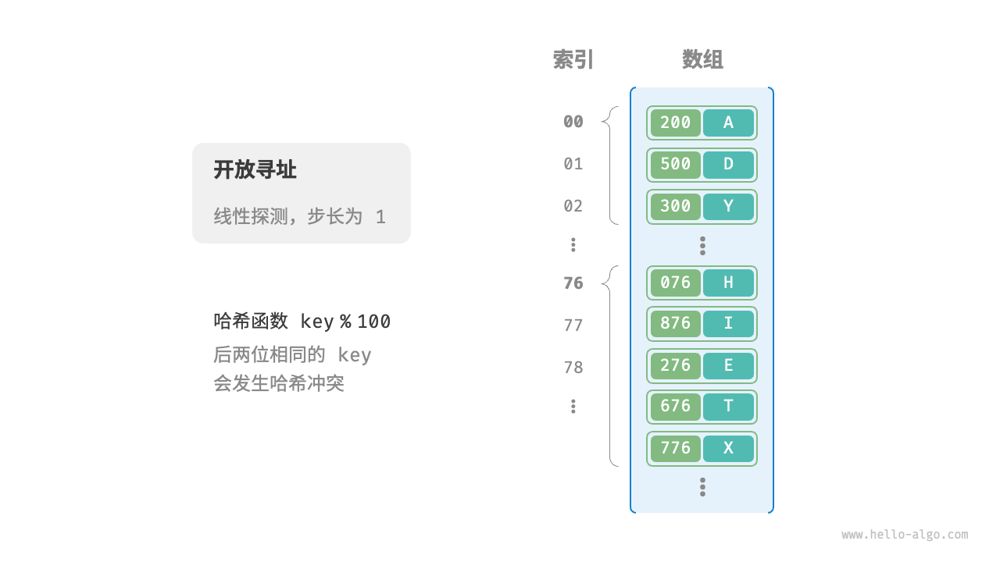

然而，**线性探测容易产生“聚集现象”**。具体来说，数组中连续被占用的位置越长，这些连续位置发生哈希冲突的可能性越大，从而进一步促使该位置的聚堆生长，形成恶性循环，最终导致增删查改操作效率劣化。

值得注意的是，**我们不能在开放寻址哈希表中直接删除元素**。这是因为删除元素会在数组内产生一个空桶 None ，而当查询元素时，线性探测到该空桶就会返回，因此在该空桶之下的元素都无法再被访问到，程序可能误判这些元素不存在。

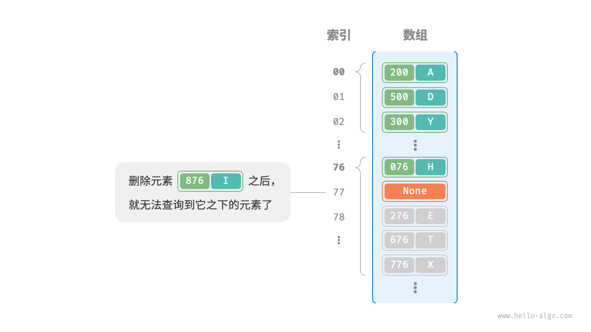

为了解决该问题，我们可以采用「懒删除 lazy deletion」机制：它不直接从哈希表中移除元素，**而是利用一个常量 `TOMBSTONE` 来标记这个桶**。在该机制下，None 和 `TOMBSTONE` 都代表空桶，都可以放置键值对。但不同的是，线性探测到 `TOMBSTONE` 时应该继续遍历，因为其之下可能还存在键值对。

然而，**懒删除可能会加速哈希表的性能退化**。这是因为每次删除操作都会产生一个删除标记，随着 `TOMBSTONE` 的增加，搜索时间也会增加，因为线性探测可能需要跳过多个 `TOMBSTONE` 才能找到目标元素。

为此，考虑在线性探测中记录遇到的首个 `TOMBSTONE` 的索引，并将搜索到的目标元素与该 `TOMBSTONE` 交换位置。这样做的好处是当每次查询或添加元素时，元素会被移动至距离理想位置（探测起始点）更近的桶，从而优化查询效率。

以下代码实现了一个包含懒删除的开放寻址（线性探测）哈希表。为了更加充分地使用哈希表的空间，我们将哈希表看作是一个“环形数组”，当越过数组尾部时，回到头部继续遍历。

```java
/* 开放寻址哈希表 */
class HashMapOpenAddressing {
    private int size; // 键值对数量
    private int capacity = 4; // 哈希表容量
    private final double loadThres = 2.0 / 3.0; // 触发扩容的负载因子阈值
    private final int extendRatio = 2; // 扩容倍数
    private Pair[] buckets; // 桶数组
    private final Pair TOMBSTONE = new Pair(-1, "-1"); // 删除标记

    /* 构造方法 */
    public HashMapOpenAddressing() {
        size = 0;
        buckets = new Pair[capacity];
    }

    /* 哈希函数 */
    private int hashFunc(int key) {
        return key % capacity;
    }

    /* 负载因子 */
    private double loadFactor() {
        return (double) size / capacity;
    }

    /* 搜索 key 对应的桶索引 */
    private int findBucket(int key) {
        int index = hashFunc(key);
        int firstTombstone = -1;
        // 线性探测，当遇到空桶时跳出
        while (buckets[index] != null) {
            // 若遇到 key ，返回对应桶索引
            if (buckets[index].key == key) {
                // 若之前遇到了删除标记，则将键值对移动至该索引
                if (firstTombstone != -1) {
                    buckets[firstTombstone] = buckets[index];
                    buckets[index] = TOMBSTONE;
                    return firstTombstone; // 返回移动后的桶索引
                }
                return index; // 返回桶索引
            }
            // 记录遇到的首个删除标记
            if (firstTombstone == -1 && buckets[index] == TOMBSTONE) {
                firstTombstone = index;
            }
            // 计算桶索引，越过尾部返回头部
            index = (index + 1) % capacity;
        }
        // 若 key 不存在，则返回添加点的索引
        return firstTombstone == -1 ? index : firstTombstone;
    }

    /* 查询操作 */
    public String get(int key) {
        // 搜索 key 对应的桶索引
        int index = findBucket(key);
        // 若找到键值对，则返回对应 val
        if (buckets[index] != null && buckets[index] != TOMBSTONE) {
            return buckets[index].val;
        }
        // 若键值对不存在，则返回 null
        return null;
    }

    /* 添加操作 */
    public void put(int key, String val) {
        // 当负载因子超过阈值时，执行扩容
        if (loadFactor() > loadThres) {
            extend();
        }
        // 搜索 key 对应的桶索引
        int index = findBucket(key);
        // 若找到键值对，则覆盖 val 并返回
        if (buckets[index] != null && buckets[index] != TOMBSTONE) {
            buckets[index].val = val;
            return;
        }
        // 若键值对不存在，则添加该键值对
        buckets[index] = new Pair(key, val);
        size++;
    }

    /* 删除操作 */
    public void remove(int key) {
        // 搜索 key 对应的桶索引
        int index = findBucket(key);
        // 若找到键值对，则用删除标记覆盖它
        if (buckets[index] != null && buckets[index] != TOMBSTONE) {
            buckets[index] = TOMBSTONE;
            size--;
        }
    }

    /* 扩容哈希表 */
    private void extend() {
        // 暂存原哈希表
        Pair[] bucketsTmp = buckets;
        // 初始化扩容后的新哈希表
        capacity *= extendRatio;
        buckets = new Pair[capacity];
        size = 0;
        // 将键值对从原哈希表搬运至新哈希表
        for (Pair pair : bucketsTmp) {
            if (pair != null && pair != TOMBSTONE) {
                put(pair.key, pair.val);
            }
        }
    }

    /* 打印哈希表 */
    public void print() {
        for (Pair pair : buckets) {
            if (pair == null) {
                System.out.println("null");
            } else if (pair == TOMBSTONE) {
                System.out.println("TOMBSTONE");
            } else {
                System.out.println(pair.key + " -> " + pair.val);
            }
        }
    }
}
```

##### 2.2.2 平方探测

平方探测与线性探测类似，都是开放寻址的常见策略之一。当发生冲突时，平方探测不是简单地跳过一个固定的步数，而是跳过“探测次数的平方”的步数，即 1,4,9,… 步。

平方探测通主要具有以下优势。

- 平方探测通过跳过平方的距离，试图缓解线性探测的聚集效应。
- 平方探测会跳过更大的距离来寻找空位置，有助于数据分布得更加均匀。

然而，平方探测也并不是完美的。

- 仍然存在聚集现象，即某些位置比其他位置更容易被占用。
- 由于平方的增长，平方探测可能不会探测整个哈希表，这意味着即使哈希表中有空桶，平方探测也可能无法访问到它。

##### 2.2.3  多次哈希

多次哈希使用多个哈希函数 F1(x)、F2(x)、F3(x)、… 进行探测。

- **插入元素**：若哈希函数 F1(x) 出现冲突，则尝试 f2(x) ，以此类推，直到找到空桶后插入元素。
- **查找元素**：在相同的哈希函数顺序下进行查找，直到找到目标元素时返回；或当遇到空桶或已尝试所有哈希函数，说明哈希表中不存在该元素，则返回 None 。

与线性探测相比，多次哈希方法不易产生聚集，但多个哈希函数会增加额外的计算量。

#### 2.3 编程语言的选择

各个编程语言采取了不同的哈希表实现策略，以下举几个例子。

- Java 采用链式地址。自 JDK 1.8 以来，当 HashMap 内数组长度达到 64 且链表长度达到 8 时，链表会被转换为红黑树以提升查找性能。
- Python 采用开放寻址。字典 dict 使用伪随机数进行探测。
- Golang 采用链式地址。Go 规定每个桶最多存储 8 个键值对，超出容量则连接一个溢出桶。当溢出桶过多时，会执行一次特殊的等量扩容操作，以确保性能。

### 3、哈希算法

在上两节中，我们了解了哈希表的工作原理和哈希冲突的处理方法。然而无论是开放寻址还是链地址法，**它们只能保证哈希表可以在发生冲突时正常工作，但无法减少哈希冲突的发生**。

如果哈希冲突过于频繁，哈希表的性能则会急剧劣化。如下图所示，对于链地址哈希表，理想情况下键值对平均分布在各个桶中，达到最佳查询效率；最差情况下所有键值对都被存储到同一个桶中，时间复杂度退化至 O(n) 。

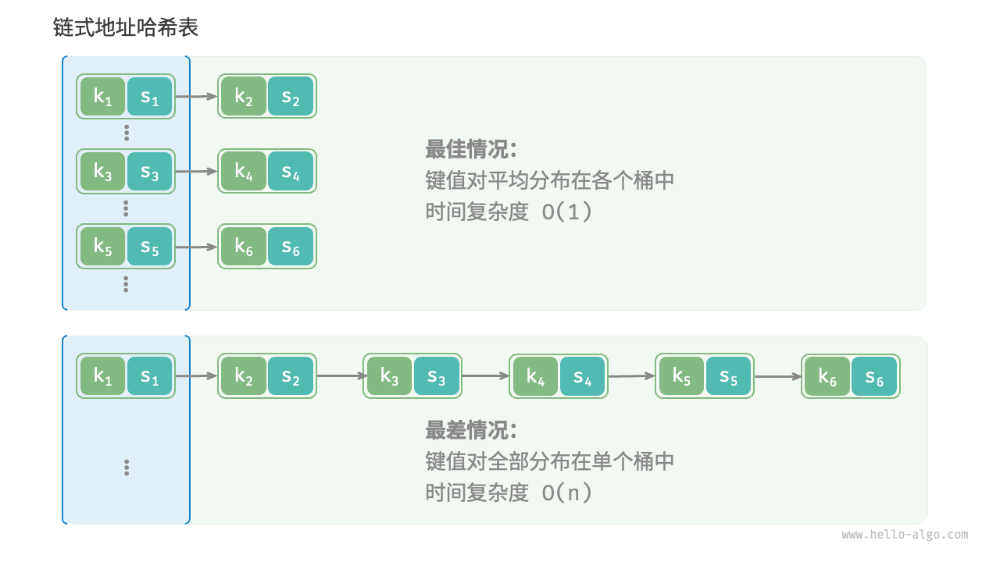

**键值对的分布情况由哈希函数决定**。回忆哈希函数的计算步骤，先计算哈希值，再对数组长度取模：

```java
index = hash(key) % capacity
```

观察以上公式，当哈希表容量 `capacity` 固定时，**哈希算法 `hash()` 决定了输出值**，进而决定了键值对在哈希表中的分布情况。

这意味着，为了减小哈希冲突的发生概率，我们应当将注意力集中在哈希算法 `hash()` 的设计上。

#### 3.1 哈希算法的目标

为了实现“既快又稳”的哈希表数据结构，哈希算法应包含以下特点。

- **确定性**：对于相同的输入，哈希算法应始终产生相同的输出。这样才能确保哈希表是可靠的。
- **效率高**：计算哈希值的过程应该足够快。计算开销越小，哈希表的实用性越高。
- **均匀分布**：哈希算法应使得键值对平均分布在哈希表中。分布越平均，哈希冲突的概率就越低。

实际上，哈希算法除了可以用于实现哈希表，还广泛应用于其他领域中。

- **密码存储**：为了保护用户密码的安全，系统通常不会直接存储用户的明文密码，而是存储密码的哈希值。当用户输入密码时，系统会对输入的密码计算哈希值，然后与存储的哈希值进行比较。如果两者匹配，那么密码就被视为正确。
- **数据完整性检查**：数据发送方可以计算数据的哈希值并将其一同发送；接收方可以重新计算接收到的数据的哈希值，并与接收到的哈希值进行比较。如果两者匹配，那么数据就被视为完整的。

对于密码学的相关应用，为了防止从哈希值推导出原始密码等逆向工程，哈希算法需要具备更高等级的安全特性。

- **单向性**：无法通过哈希值反推出关于输入数据的任何信息。
- **抗碰撞性**：应当极其困难找到两个不同的输入，使得它们的哈希值相同。
- **雪崩效应**：输入的微小变化应当导致输出的显著且不可预测的变化。

请注意，**“均匀分布”与“抗碰撞性”是两个独立的概念**，满足均匀分布不一定满足抗碰撞性。例如，在随机输入 `key` 下，哈希函数 `key % 100` 可以产生均匀分布的输出。然而该哈希算法过于简单，所有后两位相等的 `key` 的输出都相同，因此我们可以很容易地从哈希值反推出可用的 `key` ，从而破解密码。

#### 3.2 哈希算法的设计

哈希算法的设计是一个需要考虑许多因素的复杂问题。然而对于某些要求不高的场景，我们也能设计一些简单的哈希算法。

- **加法哈希**：对输入的每个字符的 ASCII 码进行相加，将得到的总和作为哈希值。
- **乘法哈希**：利用了乘法的不相关性，每轮乘以一个常数，将各个字符的 ASCII 码累积到哈希值中。
- **异或哈希**：将输入数据的每个元素通过异或操作累积到一个哈希值中。
- **旋转哈希**：将每个字符的 ASCII 码累积到一个哈希值中，每次累积之前都会对哈希值进行旋转操作。

```java
/* 加法哈希 */
int addHash(String key) {
    long hash = 0;
    final int MODULUS = 1000000007;
    for (char c : key.toCharArray()) {
        hash = (hash + (int) c) % MODULUS;
    }
    return (int) hash;
}

/* 乘法哈希 */
int mulHash(String key) {
    long hash = 0;
    final int MODULUS = 1000000007;
    for (char c : key.toCharArray()) {
        hash = (31 * hash + (int) c) % MODULUS;
    }
    return (int) hash;
}

/* 异或哈希 */
int xorHash(String key) {
    int hash = 0;
    final int MODULUS = 1000000007;
    for (char c : key.toCharArray()) {
        hash ^= (int) c;
    }
    return hash & MODULUS;
}

/* 旋转哈希 */
int rotHash(String key) {
    long hash = 0;
    final int MODULUS = 1000000007;
    for (char c : key.toCharArray()) {
        hash = ((hash << 4) ^ (hash >> 28) ^ (int) c) % MODULUS;
    }
    return (int) hash;
}
```

观察发现，每种哈希算法的最后一步都是对大质数 1000000007 取模，以确保哈希值在合适的范围内。值得思考的是，为什么要强调对质数取模，或者说对合数取模的弊端是什么？这是一个有趣的问题。

先抛出结论：**当我们使用大质数作为模数时，可以最大化地保证哈希值的均匀分布**。因为质数不会与其他数字存在公约数，可以减少因取模操作而产生的周期性模式，从而避免哈希冲突。

举个例子，假设我们选择合数 9 作为模数，它可以被 3 整除。那么所有可以被 3 整除的 `key` 都会被映射到 0、3、6 这三个哈希值。

modulus = 9

key = {0, 3, 6, 9, 12, 15, 18, 21, 24, 27, 30, 33, … }

hash = {0, 3, 6, 0, 3, 6, 0, 3, 6, 0, 3, 6, … }

如果输入 `key` 恰好满足这种等差数列的数据分布，那么哈希值就会出现聚堆，从而加重哈希冲突。现在，假设将 `modulus` 替换为质数 13 ，由于 `key` 和 `modulus` 之间不存在公约数，输出的哈希值的均匀性会明显提升。

modulus = 13

key = {0, 3, 6, 9, 12, 15, 18, 21, 24, 27, 30, 33, … }

hash = {0, 3, 6, 9, 12, 2, 5, 8, 11, 1, 4, 7, … }

值得说明的是，如果能够保证 `key` 是随机均匀分布的，那么选择质数或者合数作为模数都是可以的，它们都能输出均匀分布的哈希值。而当 `key` 的分布存在某种周期性时，对合数取模更容易出现聚集现象。

总而言之，我们通常选取质数作为模数，并且这个质数最好足够大，以尽可能消除周期性模式，提升哈希算法的稳健性。

#### 3.3 常见哈希算法

不难发现，以上介绍的简单哈希算法都比较“脆弱”，远远没有达到哈希算法的设计目标。例如，由于加法和异或满足交换律，因此加法哈希和异或哈希无法区分内容相同但顺序不同的字符串，这可能会加剧哈希冲突，并引起一些安全问题。

在实际中，我们通常会用一些标准哈希算法，例如 MD5、SHA-1、SHA-2、SHA3 等。它们可以将任意长度的输入数据映射到恒定长度的哈希值。

近一个世纪以来，哈希算法处在不断升级与优化的过程中。一部分研究人员努力提升哈希算法的性能，另一部分研究人员和黑客则致力于寻找哈希算法的安全性问题。表 6-2 展示了在实际应用中常见的哈希算法。

- MD5 和 SHA-1 已多次被成功攻击，因此它们被各类安全应用弃用。
- SHA-2 系列中的 SHA-256 是最安全的哈希算法之一，仍未出现成功的攻击案例，因此常被用在各类安全应用与协议中。
- SHA-3 相较 SHA-2 的实现开销更低、计算效率更高，但目前使用覆盖度不如 SHA-2 系列。

|          | MD5                            | SHA-1            | SHA-2                        | SHA-3                |
| :------- | :----------------------------- | :--------------- | :--------------------------- | :------------------- |
| 推出时间 | 1992                           | 1995             | 2002                         | 2008                 |
| 输出长度 | 128 bits                       | 160 bits         | 256 / 512 bits               | 224/256/384/512 bits |
| 哈希冲突 | 较多                           | 较多             | 很少                         | 很少                 |
| 安全等级 | 低，已被成功攻击               | 低，已被成功攻击 | 高                           | 高                   |
| 应用     | 已被弃用，仍用于数据完整性检查 | 已被弃用         | 加密货币交易验证、数字签名等 | 可用于替代 SHA-2     |

#### 3.4 数据结构的哈希值

我们知道，哈希表的 `key` 可以是整数、小数或字符串等数据类型。编程语言通常会为这些数据类型提供内置的哈希算法，用于计算哈希表中的桶索引。以 Python 为例，我们可以调用 `hash()` 函数来计算各种数据类型的哈希值。

- 整数和布尔量的哈希值就是其本身。
- 浮点数和字符串的哈希值计算较为复杂，有兴趣的同学请自行学习。
- 元组的哈希值是对其中每一个元素进行哈希，然后将这些哈希值组合起来，得到单一的哈希值。
- 对象的哈希值基于其内存地址生成。通过重写对象的哈希方法，可实现基于内容生成哈希值。

```java
int num = 3;
int hashNum = Integer.hashCode(num);
// 整数 3 的哈希值为 3

boolean bol = true;
int hashBol = Boolean.hashCode(bol);
// 布尔量 true 的哈希值为 1231

double dec = 3.14159;
int hashDec = Double.hashCode(dec);
// 小数 3.14159 的哈希值为 -1340954729

String str = "Hello 算法";
int hashStr = str.hashCode();
// 字符串 Hello 算法 的哈希值为 -727081396

Object[] arr = { 12836, "小哈" };
int hashTup = Arrays.hashCode(arr);
// 数组 [12836, 小哈] 的哈希值为 1151158

ListNode obj = new ListNode(0);
int hashObj = obj.hashCode();
// 节点对象 utils.ListNode@7dc5e7b4 的哈希值为 2110121908
```

在许多编程语言中，**只有不可变对象才可作为哈希表的 `key`** 。假如我们将列表（动态数组）作为 `key` ，当列表的内容发生变化时，它的哈希值也随之改变，我们就无法在哈希表中查询到原先的 `value` 了。

虽然自定义对象（比如链表节点）的成员变量是可变的，但它是可哈希的。**这是因为对象的哈希值通常是基于内存地址生成的**，即使对象的内容发生了变化，但它的内存地址不变，哈希值仍然是不变的。

细心的你可能发现在不同控制台中运行程序时，输出的哈希值是不同的。**这是因为 Python 解释器在每次启动时，都会为字符串哈希函数加入一个随机的盐（Salt）值**。这种做法可以有效防止 HashDoS 攻击，提升哈希算法的安全性。

## 六、树

### 1、二叉树

「二叉树 binary tree」是一种非线性数据结构，代表着祖先与后代之间的派生关系，体现着“一分为二”的分治逻辑。与链表类似，二叉树的基本单元是节点，每个节点包含：值、左子节点引用、右子节点引用。

```java
/* 二叉树节点类 */
class TreeNode {
    int val;         // 节点值
    TreeNode left;   // 左子节点引用
    TreeNode right;  // 右子节点引用
    TreeNode(int x) { val = x; }
}
```

每个节点都有两个引用（指针），分别指向「左子节点 left-child node」和「右子节点 right-child node」，该节点被称为这两个子节点的「父节点 parent node」。当给定一个二叉树的节点时，我们将该节点的左子节点及其以下节点形成的树称为该节点的「左子树 left subtree」，同理可得「右子树 right subtree」。

**在二叉树中，除叶节点外，其他所有节点都包含子节点和非空子树**。如下图所示，如果将“节点 2”视为父节点，则其左子节点和右子节点分别是“节点 4”和“节点 5”，左子树是“节点 4 及其以下节点形成的树”，右子树是“节点 5 及其以下节点形成的树”。

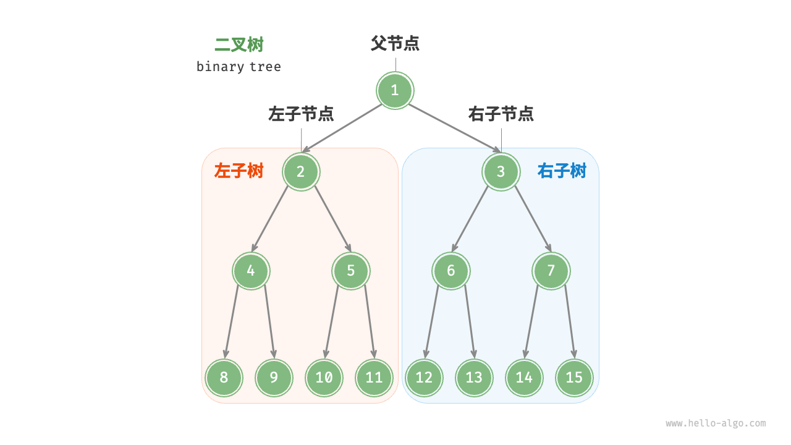

#### 1.1 二叉树常见术语

二叉树的常用术语如下图所示。

- 「根节点 root node」：位于二叉树顶层的节点，没有父节点。
- 「叶节点 leaf node」：没有子节点的节点，其两个指针均指向 None 。
- 「边 edge」：连接两个节点的线段，即节点引用（指针）。
- 节点所在的「层 level」：从顶至底递增，根节点所在层为 1 。
- 节点的「度 degree」：节点的子节点的数量。在二叉树中，度的取值范围是 0、1、2 。
- 二叉树的「高度 height」：从根节点到最远叶节点所经过的边的数量。
- 节点的「深度 depth」：从根节点到该节点所经过的边的数量。
- 节点的「高度 height」：从最远叶节点到该节点所经过的边的数量。

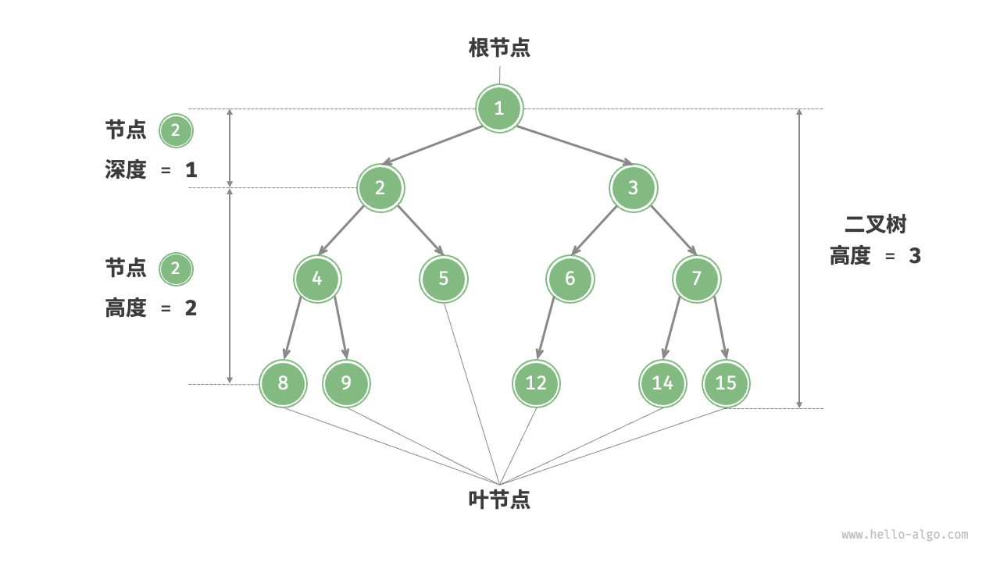

#### 1.2 二叉树基本操作

##### 1.2.1 初始化二叉树

与链表类似，首先初始化节点，然后构建引用（指针）。

```java
// 初始化节点
TreeNode n1 = new TreeNode(1);
TreeNode n2 = new TreeNode(2);
TreeNode n3 = new TreeNode(3);
TreeNode n4 = new TreeNode(4);
TreeNode n5 = new TreeNode(5);
// 构建引用指向（即指针）
n1.left = n2;
n1.right = n3;
n2.left = n4;
n2.right = n5;
```

##### 1.2.2 插入与删除节点

与链表类似，在二叉树中插入与删除节点可以通过修改指针来实现。下图给出了一个示例。

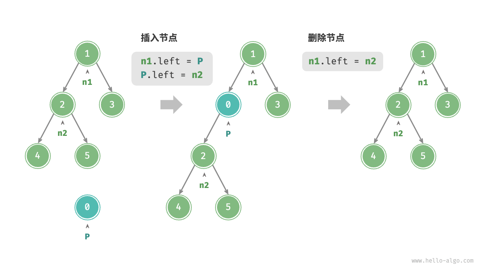

```java
TreeNode P = new TreeNode(0);
// 在 n1 -> n2 中间插入节点 P
n1.left = P;
P.left = n2;
// 删除节点 P
n1.left = n2;
```

#### 1.3 常见二叉树类型

##### 1.3.1 完美二叉树

「完美二叉树 perfect binary tree」所有层的节点都被完全填满。在完美二叉树中，叶节点的度为 0 ，其余所有节点的度都为 2 ；若树高度为 ℎ ，则节点总数为 2ℎ+1−1 ，呈现标准的指数级关系，反映了自然界中常见的细胞分裂现象。

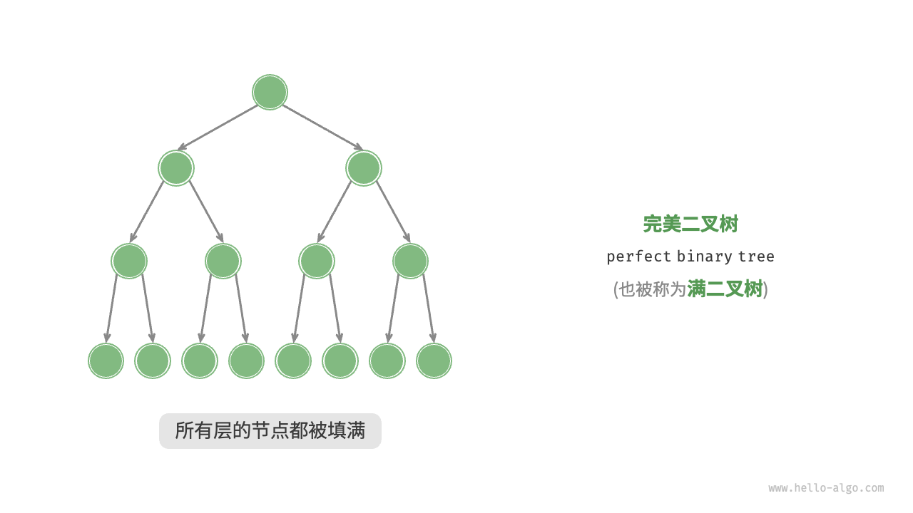

##### 1.3.2 完全二叉树

如下图所示，「完全二叉树 complete binary tree」只有最底层的节点未被填满，且最底层节点尽量靠左填充。

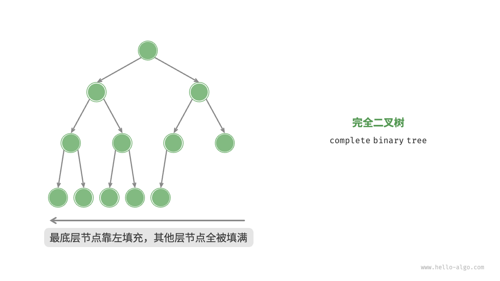

##### 1.3.3 完满二叉树

如下图所示，「完满二叉树 full binary tree」除了叶节点之外，其余所有节点都有两个子节点。

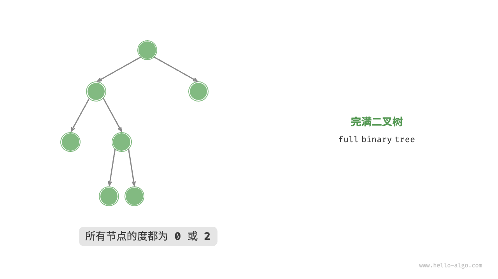

##### 1.3.4 平衡二叉树

如下图所示，「平衡二叉树 balanced binary tree」中任意节点的左子树和右子树的高度之差的绝对值不超过 1 。

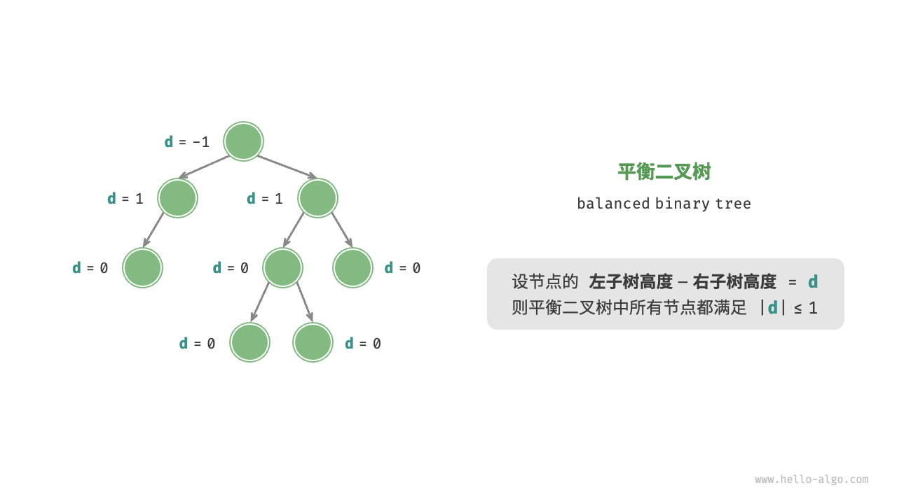

#### 1.4 二叉树的退化

下图展示了二叉树的理想与退化状态。当二叉树的每层节点都被填满时，达到“完美二叉树”；而当所有节点都偏向一侧时，二叉树退化为“链表”。

- 完美二叉树是理想情况，可以充分发挥二叉树“分治”的优势。
- 链表则是另一个极端，各项操作都变为线性操作，时间复杂度退化至 O(n) 。

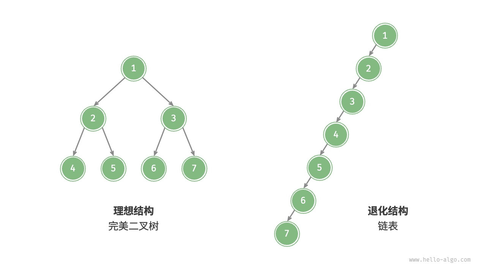

下表所示，在最佳和最差结构下，二叉树的叶节点数量、节点总数、高度等达到极大或极小值。

|                       | 完美二叉树  | 链表 |
| :-------------------- | :---------- | :--- |
| 第 n 层的节点数量     | 2^(i-1)     | 1    |
| 高度 ℎ 树的叶节点数量 | 2^ℎ         | 1    |
| 高度 ℎ 树的节点总数   | 2^(ℎ+1)−1   | ℎ+1  |
| 节点总数 n 树的高度   | log2⁡(n+1)−1 | n−1  |

### 2、二叉树遍历

从物理结构的角度来看，树是一种基于链表的数据结构，因此其遍历方式是通过指针逐个访问节点。然而，树是一种非线性数据结构，这使得遍历树比遍历链表更加复杂，需要借助搜索算法来实现。

二叉树常见的遍历方式包括`层序遍历`、`前序遍历`、`中序遍历`和`后序遍历`等。

#### 1.1 层序遍历

如下图所示，「层序遍历 level-order traversal」从顶部到底部逐层遍历二叉树，并在每一层按照从左到右的顺序访问节点。

层序遍历本质上属于「广度优先遍历 breadth-first traversal」，它体现了一种“一圈一圈向外扩展”的逐层遍历方式。

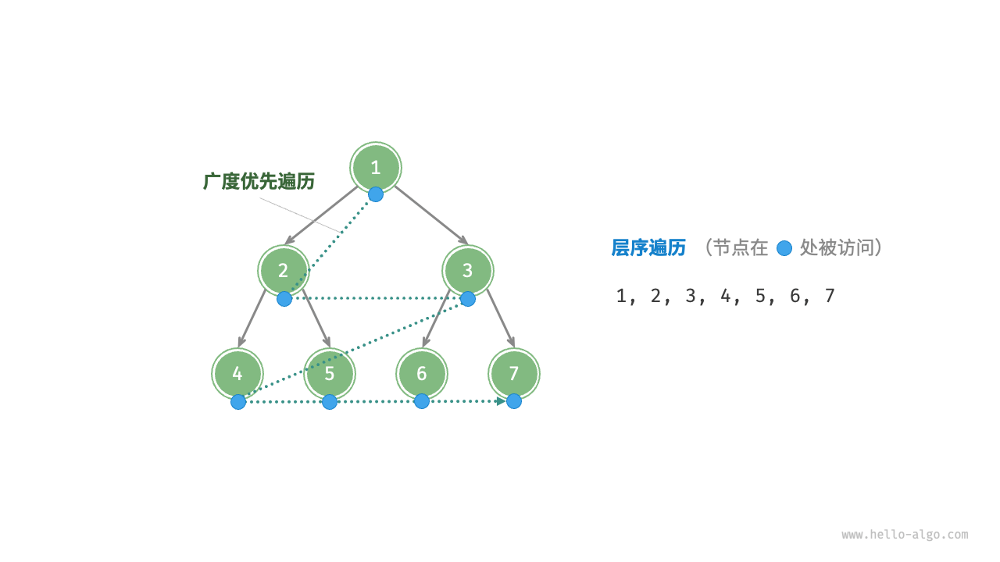
##### 1.1.1 代码实现

广度优先遍历通常借助“队列”来实现。队列遵循“先进先出”的规则，而广度优先遍历则遵循“逐层推进”的规则，两者背后的思想是一致的。

```java
/* 层序遍历 */
List<Integer> levelOrder(TreeNode root) {
    // 初始化队列，加入根节点
    Queue<TreeNode> queue = new LinkedList<>();
    queue.add(root);
    // 初始化一个列表，用于保存遍历序列
    List<Integer> list = new ArrayList<>();
    while (!queue.isEmpty()) {
        TreeNode node = queue.poll(); // 队列出队
        list.add(node.val);           // 保存节点值
        if (node.left != null)
            queue.offer(node.left);   // 左子节点入队
        if (node.right != null)
            queue.offer(node.right);  // 右子节点入队
    }
    return list;
}
```

##### 1.1.2 复杂度分析

- **时间复杂度 O(n)** ：所有节点被访问一次，使用 O(n) 时间，其中 n 为节点数量。
- **空间复杂度 O(n)** ：在最差情况下，即满二叉树时，遍历到最底层之前，队列中最多同时存在 (n+1)/2 个节点，占用 O(n) 空间。

#### 1.2  前序、中序、后序遍历

相应地，前序、中序和后序遍历都属于「深度优先遍历 depth-first traversal」，它体现了一种“先走到尽头，再回溯继续”的遍历方式。

下图展示了对二叉树进行深度优先遍历的工作原理。**深度优先遍历就像是绕着整个二叉树的外围“走”一圈**，在每个节点都会遇到三个位置，分别对应前序遍历、中序遍历和后序遍历。


##### 1.2.1 代码实现

深度优先搜索通常基于递归实现：

```java
/* 前序遍历 */
void preOrder(TreeNode root) {
    if (root == null)
        return;
    // 访问优先级：根节点 -> 左子树 -> 右子树
    list.add(root.val);
    preOrder(root.left);
    preOrder(root.right);
}

/* 中序遍历 */
void inOrder(TreeNode root) {
    if (root == null)
        return;
    // 访问优先级：左子树 -> 根节点 -> 右子树
    inOrder(root.left);
    list.add(root.val);
    inOrder(root.right);
}

/* 后序遍历 */
void postOrder(TreeNode root) {
    if (root == null)
        return;
    // 访问优先级：左子树 -> 右子树 -> 根节点
    postOrder(root.left);
    postOrder(root.right);
    list.add(root.val);
}
```

下图展示了前序遍历二叉树的递归过程，其可分为“递”和“归”两个逆向的部分。

1. “递”表示开启新方法，程序在此过程中访问下一个节点。
2. “归”表示函数返回，代表当前节点已经访问完毕。
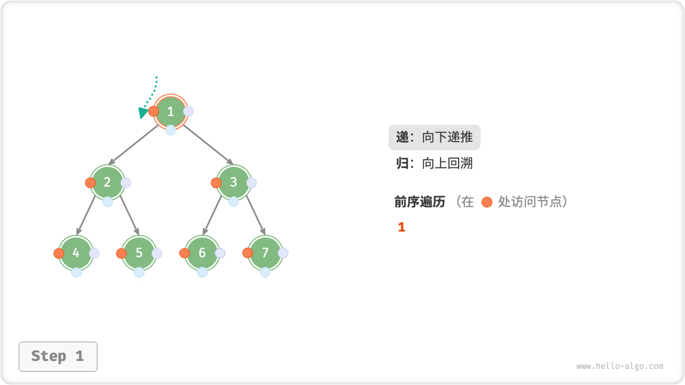
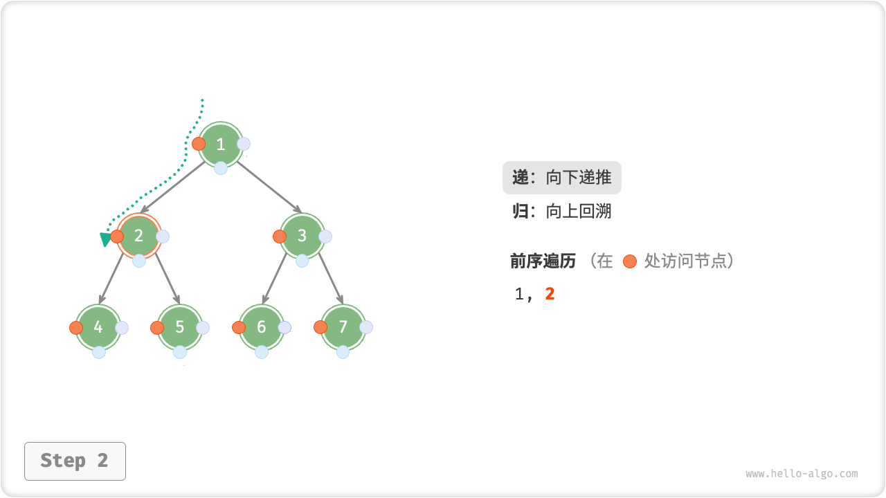
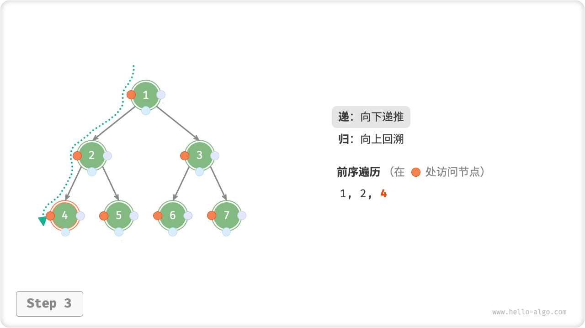
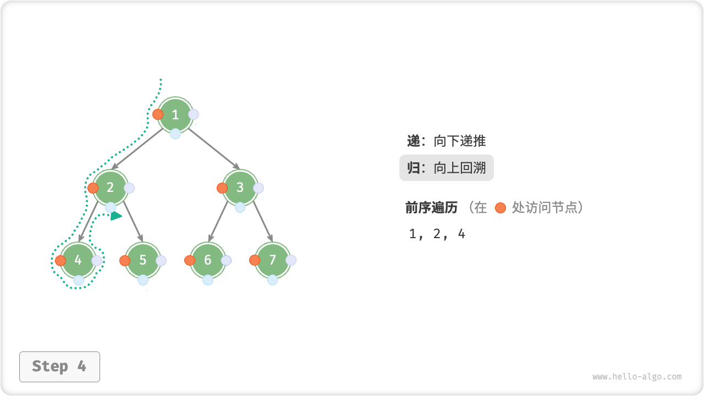
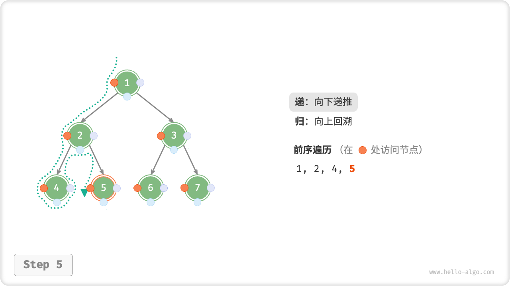
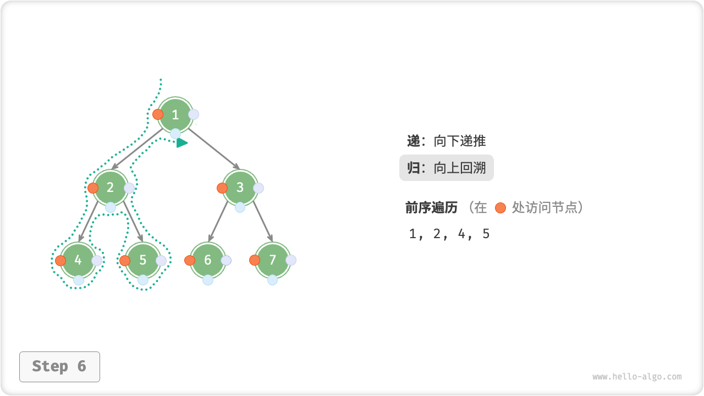
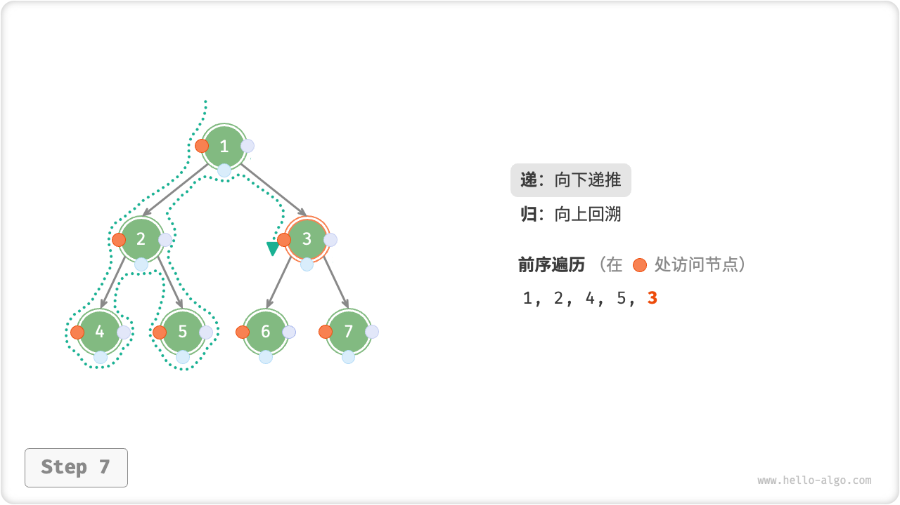
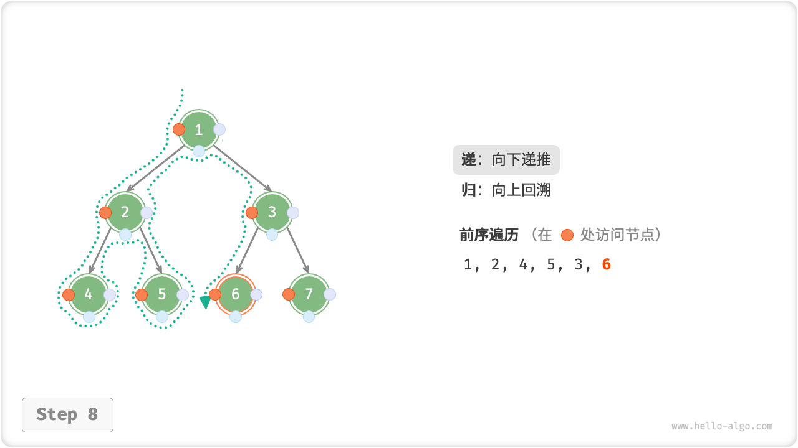
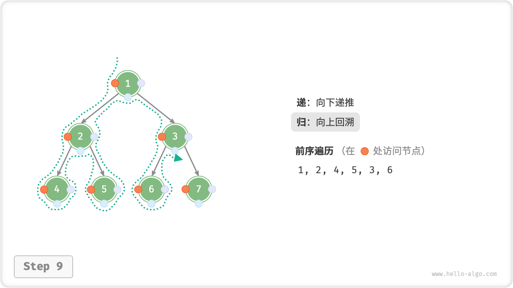
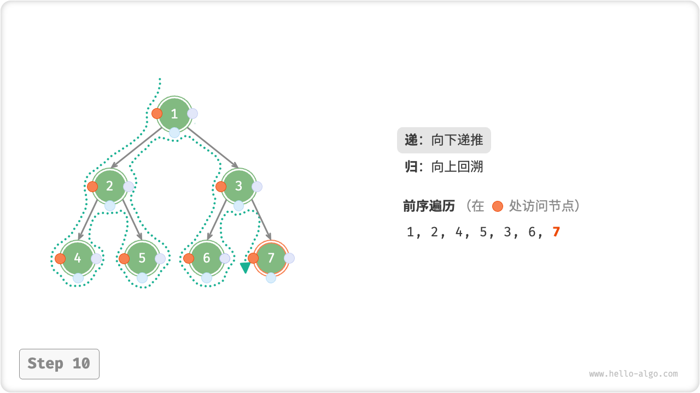
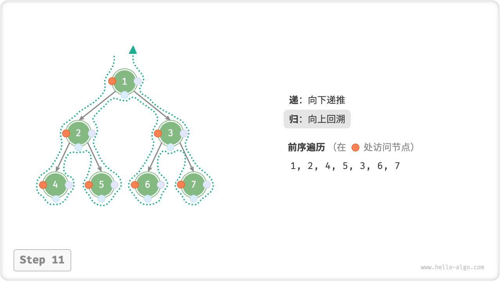
##### 1.2.2 复杂度分析

‧ **时间复杂度** 𝑂(𝑛) ：所有节点被访问一次，使用 𝑂(𝑛) 时间。

‧ **空间复杂度** 𝑂(𝑛) ：在最差情况下，即树退化为链表时，递归深度达到 𝑛 ，系统占用 𝑂(𝑛) 栈帧空间。

### 3、二叉树数组表示

在链表表示下，二叉树的存储单元为节点 `TreeNode` ，节点之间通过指针相连接。在上节中，我们学习了在链表表示下的二叉树的各项基本操作。

那么，我们能否用数组来表示二叉树呢？答案是肯定的。

#### 3.1 表示完美二叉树

先分析一个简单案例。给定一个完美二叉树，我们将所有节点按照层序遍历的顺序存储在一个数组中，则每个节点都对应唯一的数组索引。

根据层序遍历的特性，我们可以推导出父节点索引与子节点索引之间的“映射公式”：**若节点的索引为** 𝑖 **，则该节点的左子节点索引为** 2𝑖 + 1 **，右子节点索引为** 2𝑖 + 2 。下图展示了各个节点索引之间的映射关系。

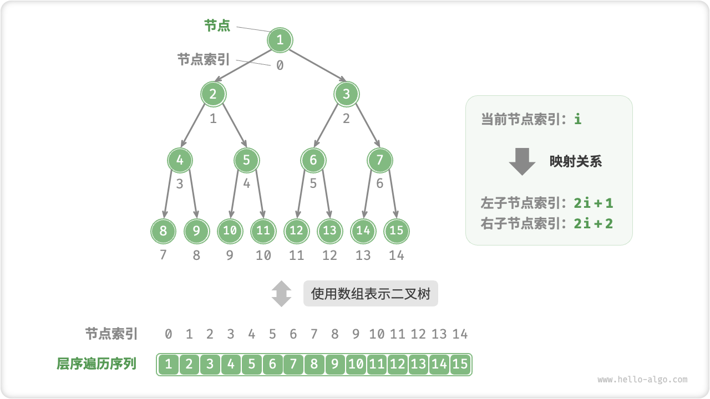

**映射公式的角色相当于链表中的指针**。给定数组中的任意一个节点，我们都可以通过映射公式来访问它的左（右）子节点。

#### 3.2 表示任意二叉树

完美二叉树是一个特例，在二叉树的中间层通常存在许多 None 。由于层序遍历序列并不包含这些 None ，因此我们无法仅凭该序列来推测 None 的数量和分布位置。**这意味着存在多种二叉树结构都符合该层序遍历序列**。

如下图所示，给定一个非完美二叉树，上述的数组表示方法已经失效。

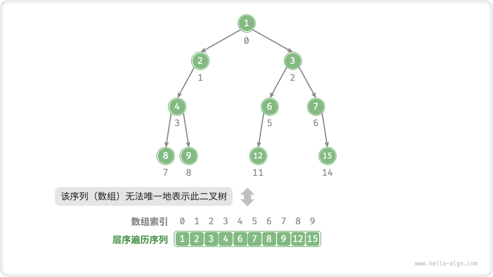

为了解决此问题，**我们可以考虑在层序遍历序列中显式地写出所有 None** 。如下图所示，这样处理后，层序遍历序列就可以唯一表示二叉树了。

```java
/* 二叉树的数组表示 */
// 使用 int 的包装类 Integer ，就可以使用 null 来标记空位
Integer[] tree = { 1, 2, 3, 4, null, 6, 7, 8, 9, null, null, 12, null, null, 15 };
```

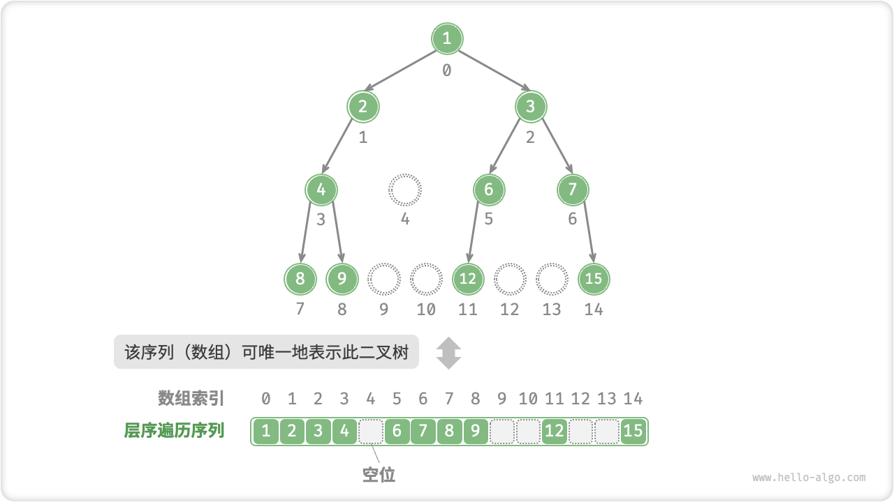

值得说明的是，**完全二叉树非常适合使用数组来表示**。回顾完全二叉树的定义，None 只出现在最底层且靠右的位置，**因此所有 None 一定出现在层序遍历序列的末尾**。

这意味着使用数组表示完全二叉树时，可以省略存储所有 None ，非常方便。下图给出了一个例子

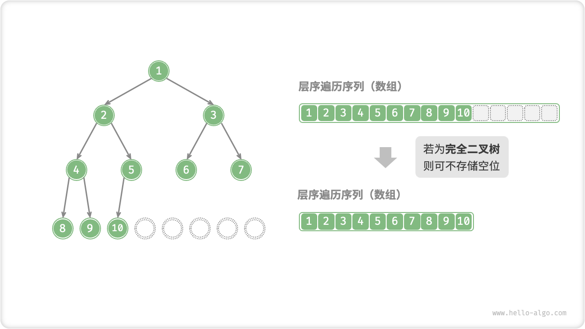

以下代码实现了一个基于数组表示的二叉树，包括以下几种操作。

- 给定某节点，获取它的值、左（右）子节点、父节点。
- 获取前序遍历、中序遍历、后序遍历、层序遍历序列。

```java
/* 数组表示下的二叉树类 */
class ArrayBinaryTree {
    private List<Integer> tree;

    /* 构造方法 */
    public ArrayBinaryTree(List<Integer> arr) {
        tree = new ArrayList<>(arr);
    }

    /* 节点数量 */
    public int size() {
        return tree.size();
    }

    /* 获取索引为 i 节点的值 */
    public Integer val(int i) {
        // 若索引越界，则返回 null ，代表空位
        if (i < 0 || i >= size())
            return null;
        return tree.get(i);
    }

    /* 获取索引为 i 节点的左子节点的索引 */
    public Integer left(int i) {
        return 2 * i + 1;
    }

    /* 获取索引为 i 节点的右子节点的索引 */
    public Integer right(int i) {
        return 2 * i + 2;
    }

    /* 获取索引为 i 节点的父节点的索引 */
    public Integer parent(int i) {
        return (i - 1) / 2;
    }

    /* 层序遍历 */
    public List<Integer> levelOrder() {
        List<Integer> res = new ArrayList<>();
        // 直接遍历数组
        for (int i = 0; i < size(); i++) {
            if (val(i) != null)
                res.add(val(i));
        }
        return res;
    }

    /* 深度优先遍历 */
    private void dfs(Integer i, String order, List<Integer> res) {
        // 若为空位，则返回
        if (val(i) == null)
            return;
        // 前序遍历
        if (order == "pre")
            res.add(val(i));
        dfs(left(i), order, res);
        // 中序遍历
        if (order == "in")
            res.add(val(i));
        dfs(right(i), order, res);
        // 后序遍历
        if (order == "post")
            res.add(val(i));
    }

    /* 前序遍历 */
    public List<Integer> preOrder() {
        List<Integer> res = new ArrayList<>();
        dfs(0, "pre", res);
        return res;
    }

    /* 中序遍历 */
    public List<Integer> inOrder() {
        List<Integer> res = new ArrayList<>();
        dfs(0, "in", res);
        return res;
    }

    /* 后序遍历 */
    public List<Integer> postOrder() {
        List<Integer> res = new ArrayList<>();
        dfs(0, "post", res);
        return res;
    }
}
```


#### 3.3 优势与局限性

二叉树的数组表示主要有以下优点。

- 数组存储在连续的内存空间中，对缓存友好，访问与遍历速度较快。
- 不需要存储指针，比较节省空间。
- 允许随机访问节点。

然而，数组表示也存在一些局限性。

- 数组存储需要连续内存空间，因此不适合存储数据量过大的树。
- 增删节点需要通过数组插入与删除操作实现，效率较低。
- 当二叉树中存在大量 None 时，数组中包含的节点数据比重较低，空间利用率较低。


### 4、二叉搜索树

如下图所示，「二叉搜索树 binary search tree」满足以下条件。

1. 对于根节点，左子树中所有节点的值 < 根节点的值 < 右子树中所有节点的值。
2. 任意节点的左、右子树也是二叉搜索树，即同样满足条件 `1.` 。


#### 4.1 二叉搜索树的操作

我们将二叉搜索树封装为一个类 `ArrayBinaryTree` ，并声明一个成员变量 `root` ，指向树的根节点。

##### 4.1.1 查找节点

给定目标节点值 `num` ，可以根据二叉搜索树的性质来查找。如图 7-17 所示，我们声明一个节点 `cur` ，从二叉树的根节点 `root` 出发，循环比较节点值 `cur.val` 和 `num` 之间的大小关系。

- 若 `cur.val < num` ，说明目标节点在 `cur` 的右子树中，因此执行 `cur = cur.right` 。
- 若 `cur.val > num` ，说明目标节点在 `cur` 的左子树中，因此执行 `cur = cur.left` 。
- 若 `cur.val = num` ，说明找到目标节点，跳出循环并返回该节点。

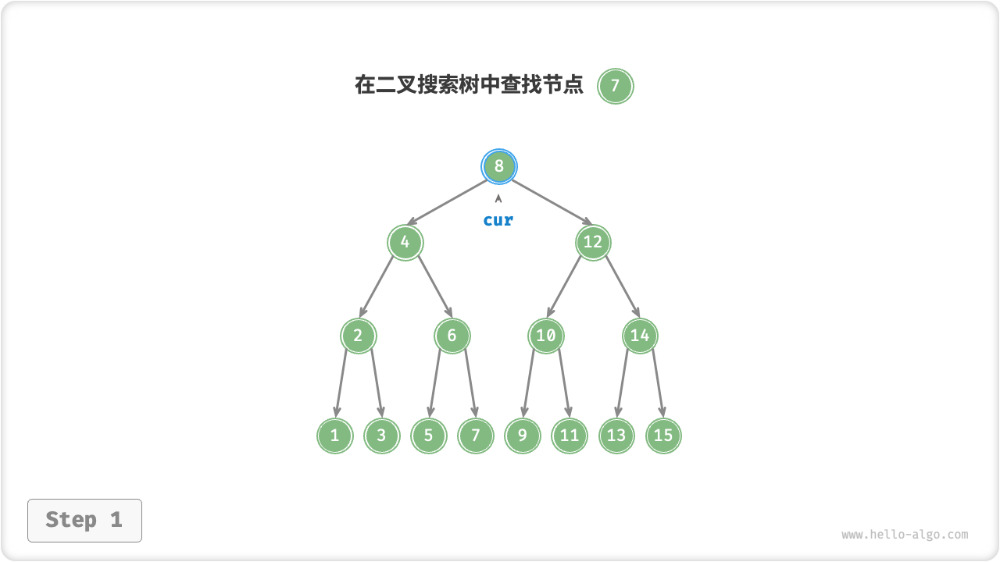

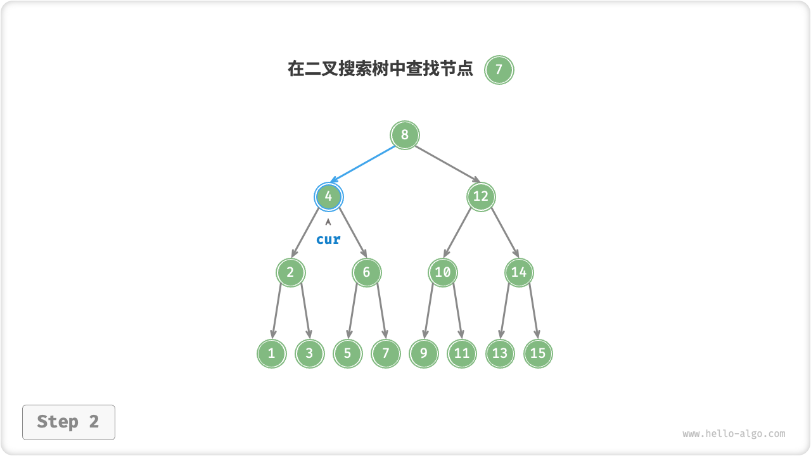

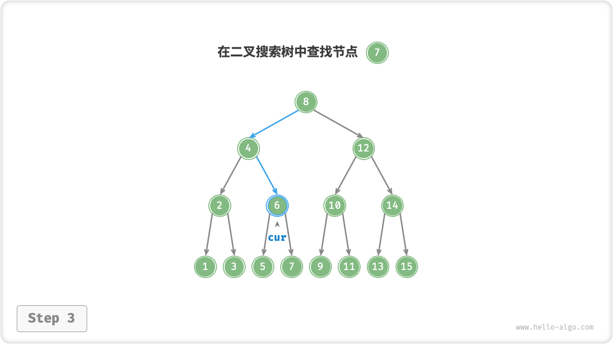

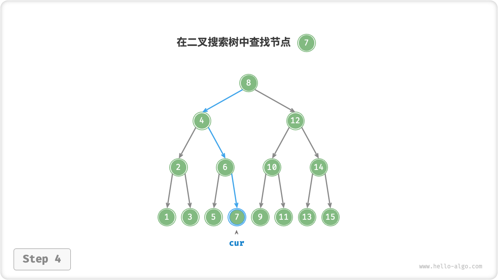


二叉搜索树的查找操作与二分查找算法的工作原理一致，都是每轮排除一半情况。循环次数最多为二叉树的高度，当二叉树平衡时，使用 𝑂(log 𝑛) 时间。

```java
/* 查找节点 */
TreeNode search(int num) {
    TreeNode cur = root;
    // 循环查找，越过叶节点后跳出
    while (cur != null) {
        // 目标节点在 cur 的右子树中
        if (cur.val < num)
            cur = cur.right;
        // 目标节点在 cur 的左子树中
        else if (cur.val > num)
            cur = cur.left;
        // 找到目标节点，跳出循环
        else
            break;
    }
    // 返回目标节点
    return cur;
}

```

##### 4.1.2 插入节点

给定一个待插入元素 num ，为了保持二叉搜索树“左子树 < 根节点 < 右子树”的性质，插入操作流程下图所示。

1.  **查找插入位置**：与查找操作相似，从根节点出发，根据当前节点值和 num 的大小关系循环向下搜索，直到越过叶节点（遍历至 None ）时跳出循环。
2.  **在该位置插入节点**：初始化节点 num ，将该节点置于 None 的位置

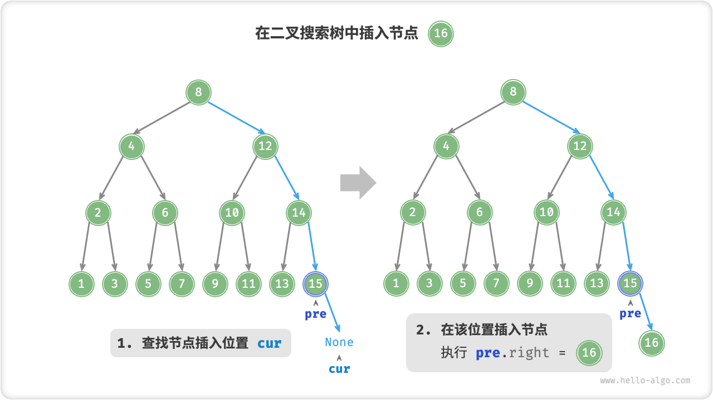

在代码实现中，需要注意以下两点。

- 二叉搜索树不允许存在重复节点，否则将违反其定义。因此，若待插入节点在树中已存在，则不执行插入，直接返回。
- 为了实现插入节点，我们需要借助节点 `pre` 保存上一轮循环的节点。这样在遍历至 None 时，我们可以获取到其父节点，从而完成节点插入操作。

```java
/* 插入节点 */
void insert(int num) {
    // 若树为空，则初始化根节点
    if (root == null) {
        root = new TreeNode(num);
        return;
    }
    TreeNode cur = root, pre = null;
    // 循环查找，越过叶节点后跳出
    while (cur != null) {
        // 找到重复节点，直接返回
        if (cur.val == num)
            return;
        pre = cur;
        // 插入位置在 cur 的右子树中
        if (cur.val < num)
            cur = cur.right;
        // 插入位置在 cur 的左子树中
        else
            cur = cur.left;
    }
    // 插入节点
    TreeNode node = new TreeNode(num);
    if (pre.val < num)
        pre.right = node;
    else
        pre.left = node;
}
```

与查找节点相同，插入节点使用 O(log⁡ n) 时间。

##### 4.1.3 删除节点

先在二叉树中查找到目标节点，再将其从二叉树中删除。与插入节点类似，我们需要保证在删除操作完成后，二叉搜索树的“左子树 < 根节点 < 右子树”的性质仍然满足。因此，我们需要根据目标节点的子节点数量，共分为 0、1 和 2 这三种情况，执行对应的删除节点操作。

如下图所示，当待删除节点的度为 0 时，表示该节点是叶节点，可以直接删除。


如下图所示，当待删除节点的度为 1 时，将待删除节点替换为其子节点即可。


当待删除节点的度为 2 时，我们无法直接删除它，而需要使用一个节点替换该节点。由于要保持二叉搜索树“左 < 根 < 右”的性质，**因此这个节点可以是右子树的最小节点或左子树的最大节点**。

假设我们选择右子树的最小节点（即中序遍历的下一个节点），则删除操作流程如图 7-21 所示。

1. 找到待删除节点在“中序遍历序列”中的下一个节点，记为 `tmp` 。
2. 将 `tmp` 的值覆盖待删除节点的值，并在树中递归删除节点 `tmp` 。


删除节点操作同样使用 𝑂(log 𝑛) 时间，其中查找待删除节点需要 𝑂(log 𝑛) 时间，获取中序遍历后继节点需要 𝑂(log 𝑛) 时间。

```java
/* 删除节点 */
void remove(int num) {
    // 若树为空，直接提前返回
    if (root == null)
        return;
    TreeNode cur = root, pre = null;
    // 循环查找，越过叶节点后跳出
    while (cur != null) {
        // 找到待删除节点，跳出循环
        if (cur.val == num)
            break;
        pre = cur;
        // 待删除节点在 cur 的右子树中
        if (cur.val < num)
            cur = cur.right;
        // 待删除节点在 cur 的左子树中
        else
            cur = cur.left;
    }
    // 若无待删除节点，则直接返回
    if (cur == null)
        return;
    // 子节点数量 = 0 or 1
    if (cur.left == null || cur.right == null) {
        // 当子节点数量 = 0 / 1 时， child = null / 该子节点
        TreeNode child = cur.left != null ? cur.left : cur.right;
        // 删除节点 cur
        if (cur != root) {
            if (pre.left == cur)
                pre.left = child;
            else
                pre.right = child;
        } else {
            // 若删除节点为根节点，则重新指定根节点
            root = child;
        }
    }
    // 子节点数量 = 2
    else {
        // 获取中序遍历中 cur 的下一个节点
        TreeNode tmp = cur.right;
        while (tmp.left != null) {
            tmp = tmp.left;
        }
        // 递归删除节点 tmp
        remove(tmp.val);
        // 用 tmp 覆盖 cur
        cur.val = tmp.val;
    }
}

```

##### 4.1.4 中序遍历有序

如下图所示，二叉树的中序遍历遵循“左 → 根 → 右”的遍历顺序，而二叉搜索树满足“左子节点 < 根节点 < 右子节点”的大小关系。

这意味着在二叉搜索树中进行中序遍历时，总是会优先遍历下一个最小节点，从而得出一个重要性质：**二叉搜索树的中序遍历序列是升序的**。

利用中序遍历升序的性质，我们在二叉搜索树中获取有序数据仅需 O(n) 时间，无须进行额外的排序操作，非常高效。


#### 4.2 二叉搜索树的效率

给定一组数据，我们考虑使用数组或二叉搜索树存储。观察表 7-2 ，二叉搜索树的各项操作的时间复杂度都是对数阶，具有稳定且高效的性能表现。只有在高频添加、低频查找删除的数据适用场景下，数组比二叉搜索树的效率更高。

|          | 无序数组 | 二叉搜索树 |
| :------- | :------- | :--------- |
| 查找元素 | O(n)     | O(log⁡ n)   |
| 插入元素 | O(1)     | O(log ⁡n)   |
| 删除元素 | O(n)     | O(log⁡ n)   |

在理想情况下，二叉搜索树是“平衡”的，这样就可以在 log 𝑛 轮循环内查找任意节点。

然而，如果我们在二叉搜索树中不断地插入和删除节点，可能导致二叉树退化为下图所示的链表，这时各种操作的时间复杂度也会退化为 𝑂(𝑛) 。


#### 4.3 二叉搜索树常见应用

- 用作系统中的多级索引，实现高效的查找、插入、删除操作。
- 作为某些搜索算法的底层数据结构。
- 用于存储数据流，以保持其有序状态。


## 七、堆

### 1、堆

「堆 heap」是一种满足特定条件的完全二叉树，主要可分为下图所示的两种类型。

- 「大顶堆 max heap」：任意节点的值 ≥ 其子节点的值。
- 「小顶堆 min heap」：任意节点的值 ≤ 其子节点的值。


堆作为完全二叉树的一个特例，具有以下特性。

- 最底层节点靠左填充，其他层的节点都被填满。
- 我们将二叉树的根节点称为“堆顶”，将底层最靠右的节点称为“堆底”。
- 对于大顶堆（小顶堆），堆顶元素（即根节点）的值分别是最大（最小）的。

#### 1.1 堆常用操作

需要指出的是，许多编程语言提供的是「优先队列 priority queue」，这是一种抽象数据结构，定义为具有优先级排序的队列。

实际上，**堆通常用作实现优先队列，大顶堆相当于元素按从大到小顺序出队的优先队列**。从使用角度来看，我们可以将“优先队列”和“堆”看作等价的数据结构。因此，本书对两者不做特别区分，统一使用“堆“来命名。

堆的常用操作见下表 ，方法名需要根据编程语言来确定。

| 方法名       | 描述                        | 时间复杂度     |
| :-------- | :------------------------ | :-------- |
| push()    | 元素入堆                      | O(log⁡ n) |
| pop()     | 堆顶元素出堆                    | O(log⁡ n) |
| peek()    | 访问堆顶元素（大 / 小顶堆分别为最大 / 小值） | O(1)      |
| size()    | 获取堆的元素数量                  | O(1)      |
| isEmpty() | 判断堆是否为空                   | O(1)      |

在实际应用中，我们可以直接使用编程语言提供的堆类（或优先队列类）。

```java
/* 初始化堆 */
// 初始化小顶堆
Queue<Integer> minHeap = new PriorityQueue<>();
// 初始化大顶堆（使用 lambda 表达式修改 Comparator 即可）
Queue<Integer> maxHeap = new PriorityQueue<>((a, b) -> b - a);

/* 元素入堆 */
maxHeap.offer(1);
maxHeap.offer(3);
maxHeap.offer(2);
maxHeap.offer(5);
maxHeap.offer(4);

/* 获取堆顶元素 */
int peek = maxHeap.peek(); // 5

/* 堆顶元素出堆 */
// 出堆元素会形成一个从大到小的序列
peek = maxHeap.poll(); // 5
peek = maxHeap.poll(); // 4
peek = maxHeap.poll(); // 3
peek = maxHeap.poll(); // 2
peek = maxHeap.poll(); // 1

/* 获取堆大小 */
int size = maxHeap.size();

/* 判断堆是否为空 */
boolean isEmpty = maxHeap.isEmpty();

/* 输入列表并建堆 */
minHeap = new PriorityQueue<>(Arrays.asList(1, 3, 2, 5, 4));
```

#### 1.2 堆的实现

下文实现的是大顶堆。若要将其转换为小顶堆，只需将所有大小逻辑判断取逆（例如，将 ≥ 替换为 ≤ ）。感兴趣的读者可以自行实现。

##### 1.2.1 堆的存储与表示

我们在二叉树章节中学习到，完全二叉树非常适合用数组来表示。由于堆正是一种完全二叉树，**我们将采用数组来存储堆**。

当使用数组表示二叉树时，元素代表节点值，索引代表节点在二叉树中的位置。**节点指针通过索引映射公式来实现**。

如下图所示，给定索引 i ，其左子节点索引为 `2*i+1` ，右子节点索引为 `2*i+2` ，父节点索引为 (i−1)/2（向下取整）。当索引越界时，表示空节点或节点不存在。


我们可以将索引映射公式封装成函数，方便后续使用。

```java
/* 获取左子节点索引 */
int left(int i) {
    return 2 * i + 1;
}

/* 获取右子节点索引 */
int right(int i) {
    return 2 * i + 2;
}

/* 获取父节点索引 */
int parent(int i) {
    return (i - 1) / 2; // 向下整除
}
```

##### 1.2.2 访问堆顶元素

```java
/* 访问堆顶元素 */
int peek() {
    return maxHeap.get(0);
}
```

##### 1.2.3  元素入堆

给定元素 `val` ，我们首先将其添加到堆底。添加之后，由于 val 可能大于堆中其他元素，堆的成立条件可能已被破坏。因此，**需要修复从插入节点到根节点的路径上的各个节点**，这个操作被称为「堆化 heapify」。

考虑从入堆节点开始，**从底至顶执行堆化**。如下图所示，我们比较插入节点与其父节点的值，如果插入节点更大，则将它们交换。然后继续执行此操作，从底至顶修复堆中的各个节点，直至越过根节点或遇到无须交换的节点时结束。


设节点总数为 𝑛 ，则树的高度为 𝑂(log 𝑛) 。由此可知，堆化操作的循环轮数最多为 𝑂(log 𝑛) ，**元素入堆操作的时间复杂度为** 𝑂(log 𝑛) 。

```java
/* 元素入堆 */
void push(int val) {
    // 添加节点
    maxHeap.add(val);
    // 从底至顶堆化
    siftUp(size() - 1);
}

/* 从节点 i 开始，从底至顶堆化 */
void siftUp(int i) {
    while (true) {
        // 获取节点 i 的父节点
        int p = parent(i);
        // 当“越过根节点”或“节点无须修复”时，结束堆化
        if (p < 0 || maxHeap.get(i) <= maxHeap.get(p))
            break;
        // 交换两节点
        swap(i, p);
        // 循环向上堆化
        i = p;
    }
}
```

##### 1.2.4 堆顶元素出堆

堆顶元素是二叉树的根节点，即列表首元素。如果我们直接从列表中删除首元素，那么二叉树中所有节点的索引都会发生变化，这将使得后续使用堆化修复变得困难。为了尽量减少元素索引的变动，我们采用以下操作步骤。

1. 交换堆顶元素与堆底元素（即交换根节点与最右叶节点）。
2. 交换完成后，将堆底从列表中删除（注意，由于已经交换，实际上删除的是原来的堆顶元素）。
3. 从根节点开始，**从顶至底执行堆化**。

如下图所示，**“从顶至底堆化”的操作方向与“从底至顶堆化”相反**，我们将根节点的值与其两个子节点的值进行比较，将最大的子节点与根节点交换。然后循环执行此操作，直到越过叶节点或遇到无须交换的节点时结束。


与元素入堆操作相似，堆顶元素出堆操作的时间复杂度也为 𝑂(log 𝑛) 。

```java
/* 元素出堆 */
int pop() {
    // 判空处理
    if (isEmpty())
        throw new IndexOutOfBoundsException();
    // 交换根节点与最右叶节点（即交换首元素与尾元素）
    swap(0, size() - 1);
    // 删除节点
    int val = maxHeap.remove(size() - 1);
    // 从顶至底堆化
    siftDown(0);
    // 返回堆顶元素
    return val;
}

/* 从节点 i 开始，从顶至底堆化 */
void siftDown(int i) {
    while (true) {
        // 判断节点 i, l, r 中值最大的节点，记为 ma
        int l = left(i), r = right(i), ma = i;
        if (l < size() && maxHeap.get(l) > maxHeap.get(ma))
            ma = l;
        if (r < size() && maxHeap.get(r) > maxHeap.get(ma))
            ma = r;
        // 若节点 i 最大或索引 l, r 越界，则无须继续堆化，跳出
        if (ma == i)
            break;
        // 交换两节点
        swap(i, ma);
        // 循环向下堆化
        i = ma;
    }
}
```

#### 1.3 堆常见应用

- **优先队列**：堆通常作为实现优先队列的首选数据结构，其入队和出队操作的时间复杂度均为 𝑂(log 𝑛)，而建队操作为 𝑂(𝑛) ，这些操作都非常高效。
- **堆排序**：给定一组数据，我们可以用它们建立一个堆，然后不断地执行元素出堆操作，从而得到有序数据。然而，我们通常会使用一种更优雅的方式实现堆排序，详见后续的堆排序章节。
- **获取最大的** 𝑘 **个元素**：这是一个经典的算法问题，同时也是一种典型应用，例如选择热度前 10 的新闻作为微博热搜，选取销量前 10 的商品等。

### 2、键堆操作

在某些情况下，我们希望使用一个列表的所有元素来构建一个堆，这个过程被称为“建堆操作”。

#### 2.1 借助入堆操作实现

我们首先创建一个空堆，然后遍历列表，依次对每个元素执行“入堆操作”，即先将元素添加至堆的尾部，再对该元素执行“从底至顶”堆化。

每当一个元素入堆，堆的长度就加一。由于节点是从顶到底依次被添加进二叉树的，因此堆是“自上而下”地构建的。

设元素数量为 𝑛 ，每个元素的入堆操作使用 𝑂(log 𝑛) 时间，因此该建堆方法的时间复杂度为 𝑂(𝑛 log 𝑛)。

#### 2.2 通过遍历堆化实现

实际上，我们可以实现一种更为高效的建堆方法，共分为两步。

1. 将列表所有元素原封不动添加到堆中，此时堆的性质尚未得到满足。
2. 倒序遍历堆（即层序遍历的倒序），依次对每个非叶节点执行“从顶至底堆化”。

**每当堆化一个节点后，以该节点为根节点的子树就形成一个合法的子堆**。而由于是倒序遍历，因此堆是“自下而上”地被构建的。

之所以选择倒序遍历，是因为这样能够保证当前节点之下的子树已经是合法的子堆，这样堆化当前节点才是有效的。

值得说明的是，**叶节点没有子节点，天然就是合法的子堆，因此无需堆化**。如以下代码所示，最后一个非叶节点是最后一个节点的父节点，我们从它开始倒序遍历并执行堆化。

```java
/* 构造方法，根据输入列表建堆 */
MaxHeap(List<Integer> nums) {
    // 将列表元素原封不动添加进堆
    maxHeap = new ArrayList<>(nums);
    // 堆化除叶节点以外的其他所有节点
    for (int i = parent(size() - 1); i >= 0; i--) {
        siftDown(i);
    }
}
```

#### 2.3 复杂度分析

下面，我们来尝试推算第二种建堆方法的时间复杂度。

- 假设完全二叉树的节点数量为 𝑛 ，则叶节点数量为 (𝑛 + 1)/2 ，其中 / 为向下整除。因此需要堆化的节点数量为 (𝑛 − 1)/2 。
- 在从顶至底堆化的过程中，每个节点最多堆化到叶节点，因此最大迭代次数为二叉树高度 log 𝑛 。

将上述两者相乘，可得到建堆过程的时间复杂度为 𝑂(𝑛 log 𝑛) 。**但这个估算结果并不准确，因为我们没有考虑到二叉树底层节点数量远多于顶层节点的性质**。

接下来我们来进行更为准确的计算。为了减小计算难度，假设给定一个节点数量为 𝑛 ，高度为 ℎ 的“完美二叉树”，该假设不会影响计算结果的正确性。


如上图所示，节点“从顶至底堆化”的最大迭代次数等于该节点到叶节点的距离，而该距离正是“节点高度”。因此，我们可以将各层的“节点数量 × 节点高度”求和，**从而得到所有节点的堆化迭代次数的总和**。

𝑇(ℎ) = 20ℎ + 21 (ℎ − 1) + 22 (ℎ − 2) + ⋯ + 2(ℎ−1) × 1

化简上式需要借助中学的数列知识，先对 𝑇(ℎ) 乘以 2 ，得到：

𝑇(ℎ) = 20ℎ + 21 (ℎ − 1) + 22 (ℎ − 2) + ⋯ + 2ℎ−1 × 1

2𝑇(ℎ) = 21ℎ + 22 (ℎ − 1) + 23 (ℎ − 2) + ⋯ + 2ℎ × 1

使用错位相减法，用下式 2𝑇(ℎ) 减去上式 𝑇(ℎ) ，可得：

2𝑇(ℎ) − 𝑇(ℎ) = 𝑇(ℎ) = −20ℎ + 21 + 22 + ⋯ + 2ℎ−1 + 2ℎ

观察上式，发现 𝑇(ℎ) 是一个等比数列，可直接使用求和公式，得到时间复杂度为：


进一步地，高度为 ℎ 的完美二叉树的节点数量为 𝑛 = 2ℎ+1 − 1 ，易得复杂度为 𝑂(2ℎ ) = 𝑂(𝑛) 。以上推

算表明，**输入列表并建堆的时间复杂度为** 𝑂(𝑛) **，非常高效**。

### 3、TOP-K问题

给定一个长度为 n 无序数组 `nums` ，请返回数组中前 k 大的元素。

对于该问题，我们先介绍两种思路比较直接的解法，再介绍效率更高的堆解法。

#### 3.1 方法一：遍历选择

我们可以进行下图所示的 𝑘 轮遍历，分别在每轮中提取第 1、2、…、𝑘 大的元素，时间复杂度为 𝑂(𝑛𝑘) 。

此方法只适用于 𝑘 ≪ 𝑛 的情况，因为当 𝑘 与 𝑛 比较接近时，其时间复杂度趋向于 𝑂(𝑛2 ) ，非常耗时。


#### 3.2 方法二：排序

如下图所示，我们可以先对数组 nums 进行排序，再返回最右边的 𝑘 个元素，时间复杂度为 𝑂(𝑛 log 𝑛) 。

显然，该方法“超额”完成任务了，因为我们只需要找出最大的 𝑘 个元素即可，而不需要排序其他元素。


#### 8.3 方法三：堆

我们可以基于堆更加高效地解决 Top‑K 问题，流程如图 8‑8 所示。

1. 初始化一个小顶堆，其堆顶元素最小。
2. 先将数组的前 𝑘 个元素依次入堆。
3. 从第 𝑘 + 1 个元素开始，若当前元素大于堆顶元素，则将堆顶元素出堆，并将当前元素入堆。
4. 遍历完成后，堆中保存的就是最大的 𝑘 个元素。


总共执行了 𝑛 轮入堆和出堆，堆的最大长度为 𝑘 ，因此时间复杂度为 𝑂(𝑛 log 𝑘) 。该方法的效率很高，当𝑘 较小时，时间复杂度趋向 𝑂(𝑛) ；当 𝑘 较大时，时间复杂度不会超过 𝑂(𝑛 log 𝑛) 。另外，该方法适用于动态数据流的使用场景。在不断加入数据时，我们可以持续维护堆内的元素，从而实现最大 𝑘 个元素的动态更新。

```java
/* 基于堆查找数组中最大的 k 个元素 */
Queue<Integer> topKHeap(int[] nums, int k) {
    Queue<Integer> heap = new PriorityQueue<Integer>();
    // 将数组的前 k 个元素入堆
    for (int i = 0; i < k; i++) {
        heap.offer(nums[i]);
    }
    // 从第 k+1 个元素开始，保持堆的长度为 k
    for (int i = k; i < nums.length; i++) {
        // 若当前元素大于堆顶元素，则将堆顶元素出堆、当前元素入堆
        if (nums[i] > heap.peek()) {
            heap.poll();
            heap.offer(nums[i]);
        }
    }
    return heap;
}
```

## 八、图

### 1、图

「图 graph」是一种非线性数据结构，由「顶点 vertex」和「边 edge」组成。我们可以将图 G 抽象地表示为一组顶点 V 和一组边 E 的集合。以下示例展示了一个包含 5 个顶点和 7 条边的图。

𝑉 = {1, 2, 3, 4, 5}

𝐸 = {(1, 2), (1, 3), (1, 5), (2, 3), (2, 4), (2, 5), (4, 5)}

𝐺 = {𝑉 , 𝐸}

如果将顶点看作节点，将边看作连接各个节点的引用（指针），我们就可以将图看作是一种从链表拓展而来的数据结构。如下图所示，**相较于线性关系（链表）和分治关系（树），网络关系（图）的自由度更高**，从而更为复杂。


#### 1.1 图常见类型与术语

根据边是否具有方向，可分为下图所示的「无向图 undirected graph」和「有向图 directed graph」。

- 在无向图中，边表示两顶点之间的“双向”连接关系，例如微信或 QQ 中的“好友关系”。
- 在有向图中，边具有方向性，即 𝐴 → 𝐵 和 𝐴 ← 𝐵 两个方向的边是相互独立的，例如微博或抖音上的“关注”与“被关注”关系。


根据所有顶点是否连通，可分为下图所示的「连通图 connected graph」和「非连通图 disconnected graph」。

- 对于连通图，从某个顶点出发，可以到达其余任意顶点。
- 对于非连通图，从某个顶点出发，至少有一个顶点无法到达。


我们还可以为边添加“权重”变量，从而得到下图所示的「有权图 weighted graph」。例如在王者荣耀等手游中，系统会根据共同游戏时间来计算玩家之间的“亲密度”，这种亲密度网络就可以用有权图来表示。


图数据结构包含以下常用术语。

- 「邻接 adjacency」：当两顶点之间存在边相连时，称这两顶点“邻接”。在下图中，顶点 1 的邻接顶点为顶点 2、3、5。
- 「路径 path」：从顶点 A 到顶点 B 经过的边构成的序列被称为从 A 到 B 的“路径”。在下图中，边序列 1-5-2-4 是顶点 1 到顶点 4 的一条路径。
- 「度 degree」：一个顶点拥有的边数。对于有向图，「入度 In-Degree」表示有多少条边指向该顶点，「出度 Out-Degree」表示有多少条边从该顶点指出。

#### 1.2 图的表示

图的常用表示方式包括“邻接矩阵”和“邻接表”。以下使用无向图进行举例。

##### 1.2.1邻接矩阵

设图的顶点数量为 𝑛 ，「邻接矩阵 adjacency matrix」使用一个 𝑛 × 𝑛 大小的矩阵来表示图，每一行（列）代表一个顶点，矩阵元素代表边，用 1 或 0 表示两个顶点之间是否存在边。

如下图所示，设邻接矩阵为 𝑀、顶点列表为 𝑉 ，那么矩阵元素 𝑀[𝑖, 𝑗] = 1 表示顶点 𝑉 [𝑖] 到顶点 𝑉 [𝑗] 之间存在边，反之 𝑀[𝑖, 𝑗] = 0 表示两顶点之间无边。


邻接矩阵具有以下特性。

- 顶点不能与自身相连，因此邻接矩阵主对角线元素没有意义。
- 对于无向图，两个方向的边等价，此时邻接矩阵关于主对角线对称。
- 将邻接矩阵的元素从 1 和 0 替换为权重，则可表示有权图。

使用邻接矩阵表示图时，我们可以直接访问矩阵元素以获取边，因此增删查操作的效率很高，时间复杂度均为 𝑂(1) 。然而，矩阵的空间复杂度为 𝑂(𝑛^2 ) ，内存占用较多。

##### 1.2.2 邻接表

「邻接表 adjacency list」使用 n 个链表来表示图，链表节点表示顶点。第 i 条链表对应顶点 i ，其中存储了该顶点的所有邻接顶点（即与该顶点相连的顶点）。下图展示了一个使用邻接表存储的图的示例。


邻接表仅存储实际存在的边，而边的总数通常远小于 𝑛 2 ，因此它更加节省空间。然而，在邻接表中需要通过遍历链表来查找边，因此其时间效率不如邻接矩阵。

观察上图，**邻接表结构与哈希表中的“链式地址”非常相似，因此我们也可以采用类似方法来优化效率**。比如当链表较长时，可以将链表转化为 AVL 树或红黑树，从而将时间效率从 𝑂(𝑛) 优化至 𝑂(log 𝑛) ；还可以把链表转换为哈希表，从而将时间复杂度降低至 𝑂(1) 。

#### 1.3 图常见应用

如下表所示，许多现实系统都可以用图来建模，相应的问题也可以约化为图计算问题。

|          | 顶点 | 边                   | 图计算问题   |
| :------- | :--- | :------------------- | :----------- |
| 社交网络 | 用户 | 好友关系             | 潜在好友推荐 |
| 地铁线路 | 站点 | 站点间的连通性       | 最短路线推荐 |
| 太阳系   | 星体 | 星体间的万有引力作用 | 行星轨道计算 |

### 2、图的基础操作

图的基础操作可分为对“边”的操作和对“顶点”的操作。在“邻接矩阵”和“邻接表”两种表示方法下，实现方式有所不同。

#### 2.1 基于邻接矩阵的实现

给定一个顶点数量为 𝑛 的无向图，则各种操作的实现方式如下图所示。

-  **添加或删除边**：直接在邻接矩阵中修改指定的边即可，使用 𝑂(1) 时间。而由于是无向图，因此需要同时更新两个方向的边。
-  **添加顶点**：在邻接矩阵的尾部添加一行一列，并全部填 0 即可，使用 𝑂(𝑛) 时间。
-  **删除顶点**：在邻接矩阵中删除一行一列。当删除首行首列时达到最差情况，需要将 (𝑛 − 1)2 个元素“向左上移动”，从而使用 𝑂(𝑛2 ) 时间。
-  **初始化**：传入 𝑛 个顶点，初始化长度为 𝑛 的顶点列表 vertices ，使用 𝑂(𝑛) 时间；初始化 𝑛 × 𝑛 大小的邻接矩阵 adjMat ，使用 𝑂(𝑛2 ) 时间。


以下是基于邻接矩阵表示图的实现代码。

```java
/* 基于邻接矩阵实现的无向图类 */
class GraphAdjMat {
    List<Integer> vertices; // 顶点列表，元素代表“顶点值”，索引代表“顶点索引”
    List<List<Integer>> adjMat; // 邻接矩阵，行列索引对应“顶点索引”

    /* 构造方法 */
    public GraphAdjMat(int[] vertices, int[][] edges) {
        this.vertices = new ArrayList<>();
        this.adjMat = new ArrayList<>();
        // 添加顶点
        for (int val : vertices) {
            addVertex(val);
        }
        // 添加边
        // 请注意，edges 元素代表顶点索引，即对应 vertices 元素索引
        for (int[] e : edges) {
            addEdge(e[0], e[1]);
        }
    }

    /* 获取顶点数量 */
    public int size() {
        return vertices.size();
    }

    /* 添加顶点 */
    public void addVertex(int val) {
        int n = size();
        // 向顶点列表中添加新顶点的值
        vertices.add(val);
        // 在邻接矩阵中添加一行
        List<Integer> newRow = new ArrayList<>(n);
        for (int j = 0; j < n; j++) {
            newRow.add(0);
        }
        adjMat.add(newRow);
        // 在邻接矩阵中添加一列
        for (List<Integer> row : adjMat) {
            row.add(0);
        }
    }

    /* 删除顶点 */
    public void removeVertex(int index) {
        if (index >= size())
            throw new IndexOutOfBoundsException();
        // 在顶点列表中移除索引 index 的顶点
        vertices.remove(index);
        // 在邻接矩阵中删除索引 index 的行
        adjMat.remove(index);
        // 在邻接矩阵中删除索引 index 的列
        for (List<Integer> row : adjMat) {
            row.remove(index);
        }
    }

    /* 添加边 */
    // 参数 i, j 对应 vertices 元素索引
    public void addEdge(int i, int j) {
        // 索引越界与相等处理
        if (i < 0 || j < 0 || i >= size() || j >= size() || i == j)
            throw new IndexOutOfBoundsException();
        // 在无向图中，邻接矩阵沿主对角线对称，即满足 (i, j) == (j, i)
        adjMat.get(i).set(j, 1);
        adjMat.get(j).set(i, 1);
    }

    /* 删除边 */
    // 参数 i, j 对应 vertices 元素索引
    public void removeEdge(int i, int j) {
        // 索引越界与相等处理
        if (i < 0 || j < 0 || i >= size() || j >= size() || i == j)
            throw new IndexOutOfBoundsException();
        adjMat.get(i).set(j, 0);
        adjMat.get(j).set(i, 0);
    }

    /* 打印邻接矩阵 */
    public void print() {
        System.out.print("顶点列表 = ");
        System.out.println(vertices);
        System.out.println("邻接矩阵 =");
        PrintUtil.printMatrix(adjMat);
    }
}
```

#### 2.2 基于邻接表的实现

设无向图的顶点总数为 𝑛、边总数为 𝑚 ，则可根据下图所示的方法实现各种操作。

- **添加边**：在顶点对应链表的末尾添加边即可，使用 𝑂(1) 时间。因为是无向图，所以需要同时添加两个方向的边。
- **删除边**：在顶点对应链表中查找并删除指定边，使用 𝑂(𝑚) 时间。在无向图中，需要同时删除两个方向的边。
- **添加顶点**：在邻接表中添加一个链表，并将新增顶点作为链表头节点，使用 𝑂(1) 时间。
- **删除顶点**：需遍历整个邻接表，删除包含指定顶点的所有边，使用 𝑂(𝑛 + 𝑚) 时间。
- **初始化**：在邻接表中创建 𝑛 个顶点和 2𝑚 条边，使用 𝑂(𝑛 + 𝑚) 时间。


以下是基于邻接表实现图的代码示例。细心的同学可能注意到，**我们在邻接表中使用** **Vertex** **节点类来表示顶点**，而这样做是有原因的。

1.  如果我们选择通过顶点值来区分不同顶点，那么值重复的顶点将无法被区分。
2.  如果类似邻接矩阵那样，使用顶点列表索引来区分不同顶点。那么，假设我们想要删除索引为 𝑖 的顶点，则需要遍历整个邻接表，将其中 > 𝑖 的索引全部减 1 ，这样操作效率较低。
3.  因此我们考虑引入顶点类 Vertex ，使得每个顶点都是唯一的对象，此时删除顶点时就无须改动其余顶点了。

```java
/* 基于邻接表实现的无向图类 */
class GraphAdjList {
    // 邻接表，key: 顶点，value：该顶点的所有邻接顶点
    Map<Vertex, List<Vertex>> adjList;

    /* 构造方法 */
    public GraphAdjList(Vertex[][] edges) {
        this.adjList = new HashMap<>();
        // 添加所有顶点和边
        for (Vertex[] edge : edges) {
            addVertex(edge[0]);
            addVertex(edge[1]);
            addEdge(edge[0], edge[1]);
        }
    }

    /* 获取顶点数量 */
    public int size() {
        return adjList.size();
    }

    /* 添加边 */
    public void addEdge(Vertex vet1, Vertex vet2) {
        if (!adjList.containsKey(vet1) || !adjList.containsKey(vet2) || vet1 == vet2)
            throw new IllegalArgumentException();
        // 添加边 vet1 - vet2
        adjList.get(vet1).add(vet2);
        adjList.get(vet2).add(vet1);
    }

    /* 删除边 */
    public void removeEdge(Vertex vet1, Vertex vet2) {
        if (!adjList.containsKey(vet1) || !adjList.containsKey(vet2) || vet1 == vet2)
            throw new IllegalArgumentException();
        // 删除边 vet1 - vet2
        adjList.get(vet1).remove(vet2);
        adjList.get(vet2).remove(vet1);
    }

    /* 添加顶点 */
    public void addVertex(Vertex vet) {
        if (adjList.containsKey(vet))
            return;
        // 在邻接表中添加一个新链表
        adjList.put(vet, new ArrayList<>());
    }

    /* 删除顶点 */
    public void removeVertex(Vertex vet) {
        if (!adjList.containsKey(vet))
            throw new IllegalArgumentException();
        // 在邻接表中删除顶点 vet 对应的链表
        adjList.remove(vet);
        // 遍历其他顶点的链表，删除所有包含 vet 的边
        for (List<Vertex> list : adjList.values()) {
            list.remove(vet);
        }
    }

    /* 打印邻接表 */
    public void print() {
        System.out.println("邻接表 =");
        for (Map.Entry<Vertex, List<Vertex>> pair : adjList.entrySet()) {
            List<Integer> tmp = new ArrayList<>();
            for (Vertex vertex : pair.getValue())
                tmp.add(vertex.val);
            System.out.println(pair.getKey().val + ": " + tmp + ",");
        }
    }
}
```

#### 2.3、效率对比

设图中共有 n 个顶点和 m 条边，下表对比了邻接矩阵和邻接表的时间和空间效率。

|              | 邻接矩阵 | 邻接表（链表） | 邻接表（哈希表） |
| :----------- | :------- | :------------- | :--------------- |
| 判断是否邻接 | O(1)     | O(m)           | O(1)             |
| 添加边       | O(1)     | O(1)           | O(1)             |
| 删除边       | O(1)     | O(m)           | O(1)             |
| 添加顶点     | O(n)     | O(1)           | O(1)             |
| 删除顶点     | O(n^2)   | O(n+m)         | O(n)             |
| 内存空间占用 | O(n^2)   | O(n+m)         | O(n+m)           |

观察上表 ，似乎邻接表（哈希表）的时间与空间效率最优。但实际上，在邻接矩阵中操作边的效率更高，只需要一次数组访问或赋值操作即可。综合来看，邻接矩阵体现了“以空间换时间”的原则，而邻接表体现了“以时间换空间”的原则。

### 3、图的遍历

树代表的是“一对多”的关系，而图则具有更高的自由度，可以表示任意的“多对多”关系。因此，我们可以把树看作是图的一种特例。显然，**树的遍历操作也是图的遍历操作的一种特例**。

图和树都需要应用搜索算法来实现遍历操作。图的遍历方式可分为两种：「广度优先遍历 breadth-first traversal」和「深度优先遍历 depth-first traversal」。它们也常被称为「广度优先搜索 breadth-first search」和「深度优先搜索 depth-first search」，简称 BFS 和 DFS 。

#### 3.1 广度优先遍历

**广度优先遍历是一种由近及远的遍历方式，从某个节点出发，始终优先访问距离最近的顶点，并一层层向外扩张**。如下图所示，从左上角顶点出发，先遍历该顶点的所有邻接顶点，然后遍历下一个顶点的所有邻接顶点，以此类推，直至所有顶点访问完毕。

##### 3.1.1 算法实现

BFS 通常借助队列来实现。队列具有“先入先出”的性质，这与 BFS 的“由近及远”的思想异曲同工。

1. 将遍历起始顶点 `startVet` 加入队列，并开启循环。
2. 在循环的每轮迭代中，弹出队首顶点并记录访问，然后将该顶点的所有邻接顶点加入到队列尾部。
3. 循环步骤 `2.` ，直到所有顶点被访问完成后结束。

为了防止重复遍历顶点，我们需要借助一个哈希表 `visited` 来记录哪些节点已被访问。

```java
/* 广度优先遍历 BFS */
// 使用邻接表来表示图，以便获取指定顶点的所有邻接顶点
List<Vertex> graphBFS(GraphAdjList graph, Vertex startVet) {
    // 顶点遍历序列
    List<Vertex> res = new ArrayList<>();
    // 哈希表，用于记录已被访问过的顶点
    Set<Vertex> visited = new HashSet<>();
    visited.add(startVet);
    // 队列用于实现 BFS
    Queue<Vertex> que = new LinkedList<>();
    que.offer(startVet);
    // 以顶点 vet 为起点，循环直至访问完所有顶点
    while (!que.isEmpty()) {
        Vertex vet = que.poll(); // 队首顶点出队
        res.add(vet);            // 记录访问顶点
        // 遍历该顶点的所有邻接顶点
        for (Vertex adjVet : graph.adjList.get(vet)) {
            if (visited.contains(adjVet))
                continue;        // 跳过已被访问过的顶点
            que.offer(adjVet);   // 只入队未访问的顶点
            visited.add(adjVet); // 标记该顶点已被访问
        }
    }
    // 返回顶点遍历序列
    return res;
}
```

代码相对抽象，建议对照下图来加深理解。


##### 3.1.2 复杂度分析

**时间复杂度：**所有顶点都会入队并出队一次，使用 𝑂(|𝑉 |) 时间；在遍历邻接顶点的过程中，由于是无向图，

因此所有边都会被访问 2 次，使用 𝑂(2|𝐸|) 时间；总体使用 𝑂(|𝑉 | + |𝐸|) 时间。

**空间复杂度：**列表 res ，哈希表 visited ，队列 que 中的顶点数量最多为 |𝑉 | ，使用 𝑂(|𝑉 |) 空间。


#### 3.2 深度优先遍历

**深度优先遍历是一种优先走到底、无路可走再回头的遍历方式**。如下图所示，从左上角顶点出发，访问当前顶点的某个邻接顶点，直到走到尽头时返回，再继续走到尽头并返回，以此类推，直至所有顶点遍历完成。


##### 3.2.1 算法实现

这种“走到尽头再返回”的算法范式通常基于递归来实现。与广度优先遍历类似，在深度优先遍历中我们也需要借助一个哈希表 `visited` 来记录已被访问的顶点，以避免重复访问顶点。

```java
/* 深度优先遍历 DFS 辅助函数 */
void dfs(GraphAdjList graph, Set<Vertex> visited, List<Vertex> res, Vertex vet) {
    res.add(vet);     // 记录访问顶点
    visited.add(vet); // 标记该顶点已被访问
    // 遍历该顶点的所有邻接顶点
    for (Vertex adjVet : graph.adjList.get(vet)) {
        if (visited.contains(adjVet))
            continue; // 跳过已被访问过的顶点
        // 递归访问邻接顶点
        dfs(graph, visited, res, adjVet);
    }
}

/* 深度优先遍历 DFS */
// 使用邻接表来表示图，以便获取指定顶点的所有邻接顶点
List<Vertex> graphDFS(GraphAdjList graph, Vertex startVet) {
    // 顶点遍历序列
    List<Vertex> res = new ArrayList<>();
    // 哈希表，用于记录已被访问过的顶点
    Set<Vertex> visited = new HashSet<>();
    dfs(graph, visited, res, startVet);
    return res;
}
```

深度优先遍历的算法流程如下图所示。

- **直虚线代表向下递推**，表示开启了一个新的递归方法来访问新顶点。
- **曲虚线代表向上回溯**，表示此递归方法已经返回，回溯到了开启此递归方法的位置。

为了加深理解，建议将图示与代码结合起来，在脑中（或者用笔画下来）模拟整个 DFS 过程，包括每个递归方法何时开启、何时返回。


##### 3.2.2  复杂度分析

**时间复杂度：**所有顶点都会被访问 1 次，使用 𝑂(|𝑉 |) 时间；所有边都会被访问 2 次，使用 𝑂(2|𝐸|) 时间；

总体使用 𝑂(|𝑉 | + |𝐸|) 时间。

**空间复杂度：**列表 res ，哈希表 visited 顶点数量最多为 |𝑉 | ，递归深度最大为 |𝑉 | ，因此使用 𝑂(|𝑉 |) 空

间。


## 九、搜索

### 1、二分查找

「二分查找 binary search」是一种基于分治策略的高效搜索算法。它利用数据的有序性，每轮减少一半搜索范围，直至找到目标元素或搜索区间为空为止。


*Question*

给定一个长度为 *n* 的数组 `nums` ，元素按从小到大的顺序排列，数组不包含重复元素。请查找并返回元素 `target` 在该数组中的索引。若数组不包含该元素，则返回 −1 。


如下图所示，我们先初始化指针 𝑖 = 0 和 𝑗 = 𝑛 − 1 ，分别指向数组首元素和尾元素，代表搜索区间

[0, 𝑛 − 1] 。请注意，中括号表示闭区间，其包含边界值本身。

接下来，循环执行以下两步。

1. 计算中点索引 𝑚 = ⌊(𝑖 + 𝑗)/2⌋ ，其中 ⌊ ⌋ 表示向下取整操作。
2. 判断 nums[m] 和 target 的大小关系，分为以下三种情况。
   1. 当 nums[m] < target 时，说明 target 在区间 [𝑚 + 1, 𝑗] 中，因此执行 𝑖 = 𝑚 + 1 。
   2. 当 nums[m] > target 时，说明 target 在区间 [𝑖, 𝑚 − 1] 中，因此执行 𝑗 = 𝑚 − 1 。
   3. 当 nums[m] = target 时，说明找到 target ，因此返回索引 𝑚 。

若数组不包含目标元素，搜索区间最终会缩小为空。此时返回 −1 。


值得注意的是，由于 𝑖 和 𝑗 都是 int 类型，**因此** 𝑖 + 𝑗 **可能会超出** **int** **类型的取值范围**。为了避免大数越界，我们通常采用公式 𝑚 = ⌊𝑖 + (𝑗 − 𝑖)/2⌋ 来计算中点。

```java
/* 二分查找（双闭区间） */
int binarySearch(int[] nums, int target) {
    // 初始化双闭区间 [0, n-1] ，即 i, j 分别指向数组首元素、尾元素
    int i = 0, j = nums.length - 1;
    // 循环，当搜索区间为空时跳出（当 i > j 时为空）
    while (i <= j) {
        int m = i + (j - i) / 2; // 计算中点索引 m
        if (nums[m] < target) // 此情况说明 target 在区间 [m+1, j] 中
            i = m + 1;
        else if (nums[m] > target) // 此情况说明 target 在区间 [i, m-1] 中
            j = m - 1;
        else // 找到目标元素，返回其索引
            return m;
    }
    // 未找到目标元素，返回 -1
    return -1;
}
```

**时间复杂度** 𝑂(log 𝑛) ：在二分循环中，区间每轮缩小一半，循环次数为 log2 𝑛 。

**空间复杂度** 𝑂(1) ：指针 𝑖 和 𝑗 使用常数大小空间。

#### 1.1 区间表示方法

除了上述的双闭区间外，常见的区间表示还有“左闭右开”区间，定义为 [0,n) ，即左边界包含自身，右边界不包含自身。在该表示下，区间 [i,j] 在 i=j 时为空。

我们可以基于该表示实现具有相同功能的二分查找算法。

```java
/* 二分查找（左闭右开） */
int binarySearchLCRO(int[] nums, int target) {
    // 初始化左闭右开 [0, n) ，即 i, j 分别指向数组首元素、尾元素+1
    int i = 0, j = nums.length;
    // 循环，当搜索区间为空时跳出（当 i = j 时为空）
    while (i < j) {
        int m = i + (j - i) / 2; // 计算中点索引 m
        if (nums[m] < target) // 此情况说明 target 在区间 [m+1, j) 中
            i = m + 1;
        else if (nums[m] > target) // 此情况说明 target 在区间 [i, m) 中
            j = m;
        else // 找到目标元素，返回其索引
            return m;
    }
    // 未找到目标元素，返回 -1
    return -1;
}
```

如下图所示，在两种区间表示下，二分查找算法的初始化、循环条件和缩小区间操作皆有所不同。

由于“双闭区间”表示中的左右边界都被定义为闭区间，因此指针 i 和 j 缩小区间操作也是对称的。这样更不容易出错，**因此一般建议采用“双闭区间”的写法**。


#### 1.2 优点与局限性

二分查找在时间和空间方面都有较好的性能。

- 二分查找的时间效率高。在大数据量下，对数阶的时间复杂度具有显著优势。例如，当数据大小 n=2^20 时，线性查找需要 2^20=1048576 轮循环，而二分查找仅需 log2⁡ 2^20=20 轮循环。
- 二分查找无须额外空间。相较于需要借助额外空间的搜索算法（例如哈希查找），二分查找更加节省空间。

然而，二分查找并非适用于所有情况，主要有以下原因。

- 二分查找仅适用于`有序数据`。若输入数据无序，为了使用二分查找而专门进行排序，得不偿失。因为排序算法的时间复杂度通常为 O(nlog⁡n) ，比线性查找和二分查找都更高。对于频繁插入元素的场景，为保持数组有序性，需要将元素插入到特定位置，时间复杂度为 O(n) ，也是非常昂贵的。
- 二分查找仅适用于数组。二分查找需要跳跃式（非连续地）访问元素，而在链表中执行跳跃式访问的效率较低，因此不适合应用在链表或基于链表实现的数据结构。
- 小数据量下，线性查找性能更佳。在线性查找中，每轮只需要 1 次判断操作；而在二分查找中，需要 1 次加法、1 次除法、1 ~ 3 次判断操作、1 次加法（减法），共 4 ~ 6 个单元操作；因此，当数据量 n 较小时，线性查找反而比二分查找更快。

### 2、二分查找插入点

二分查找不仅可用于搜索目标元素，还具有许多变种问题，比如搜索目标元素的插入位置。

#### 2.1 无重复元素的情况

*Question*

给定一个长度为 *n* 的有序数组 `nums` 和一个元素 `target` ，数组不存在重复元素。现将 `target` 插入到数组 `nums` 中，并保持其有序性。若数组中已存在元素 `target` ，则插入到其左方。请返回插入后 `target` 在数组中的索引。


如果想要复用上节的二分查找代码，则需要回答以下两个问题。

**问题一**：当数组中包含 `target` 时，插入点的索引是否是该元素的索引？

题目要求将 `target` 插入到相等元素的左边，这意味着新插入的 `target` 替换了原来 `target` 的位置。也就是说，**当数组包含 `target` 时，插入点的索引就是该 `target` 的索引**。

**问题二**：当数组中不存在 `target` 时，插入点是哪个元素的索引？

进一步思考二分查找过程：当 `nums[m] < target` 时 i 移动，这意味着指针 i 在向大于等于 `target` 的元素靠近。同理，指针 j 始终在向小于等于 `target` 的元素靠近。

因此二分结束时一定有：i 指向首个大于 `target` 的元素，j 指向首个小于 `target` 的元素。**易得当数组不包含 `target` 时，插入索引为 i** 。

```java
/* 二分查找插入点（无重复元素） */
int binarySearchInsertionSimple(int[] nums, int target) {
    int i = 0, j = nums.length - 1; // 初始化双闭区间 [0, n-1]
    while (i <= j) {
        int m = i + (j - i) / 2; // 计算中点索引 m
        if (nums[m] < target) {
            i = m + 1; // target 在区间 [m+1, j] 中
        } else if (nums[m] > target) {
            j = m - 1; // target 在区间 [i, m-1] 中
        } else {
            return m; // 找到 target ，返回插入点 m
        }
    }
    // 未找到 target ，返回插入点 i
    return i;
}
```

#### 2.2 存在重复元素的情况

*Question*

在上一题的基础上，规定数组可能包含重复元素，其余不变。

假设数组中存在多个 `target` ，则普通二分查找只能返回其中一个 `target` 的索引，**而无法确定该元素的左边和右边还有多少 `target`**。

题目要求将目标元素插入到最左边，**所以我们需要查找数组中最左一个 `target` 的索引**。初步考虑通过下图所示的步骤实现。

1. 执行二分查找，得到任意一个 `target` 的索引，记为 k 。
2. 从索引 k 开始，向左进行线性遍历，当找到最左边的 `target` 时返回。


此方法虽然可用，但其包含线性查找，因此时间复杂度为 𝑂(𝑛) 。当数组中存在很多重复的 target 时，该方法效率很低。

现考虑拓展二分查找代码。如下图所示，整体流程保持不变，每轮先计算中点索引 𝑚 ，再判断 target 和nums[m] 大小关系，分为以下几种情况。

-  当 nums[m] < target 或 nums[m] > target 时，说明还没有找到 target ，因此采用普通二分查找的缩小区间操作，**从而使指针** 𝑖 **和** 𝑗 **向** **target** **靠近**。
-  当 nums[m] == target 时，说明小于 target 的元素在区间 [𝑖, 𝑚 − 1] 中，因此采用 𝑗 = 𝑚 − 1 来缩小区间，**从而使指针** 𝑗 **向小于** **target** **的元素靠近**。

循环完成后，𝑖 指向最左边的 target ，𝑗 指向首个小于 target 的元素，**因此索引** 𝑖 **就是插入点**。


观察以下代码，判断分支 `nums[m] > target` 和 `nums[m] == target` 的操作相同，因此两者可以合并。

即便如此，我们仍然可以将判断条件保持展开，因为其逻辑更加清晰、可读性更好。

```java
/* 二分查找插入点（存在重复元素） */
int binarySearchInsertion(int[] nums, int target) {
    int i = 0, j = nums.length - 1; // 初始化双闭区间 [0, n-1]
    while (i <= j) {
        int m = i + (j - i) / 2; // 计算中点索引 m
        if (nums[m] < target) {
            i = m + 1; // target 在区间 [m+1, j] 中
        } else if (nums[m] > target) {
            j = m - 1; // target 在区间 [i, m-1] 中
        } else {
            j = m - 1; // 首个小于 target 的元素在区间 [i, m-1] 中
        }
    }
    // 返回插入点 i
    return i;
}
```

总的来看，二分查找无非就是给指针 i 和 j 分别设定搜索目标，目标可能是一个具体的元素（例如 `target` ），也可能是一个元素范围（例如小于 `target` 的元素）。

在不断的循环二分中，指针 i 和 j 都逐渐逼近预先设定的目标。最终，它们或是成功找到答案，或是越过边界后停止。

### 3、二分查找边界

#### 3.1 查找左边界

*Question*

给定一个长度为 *n* 的有序数组 `nums` ，数组可能包含重复元素。请返回数组中最左一个元素 `target` 的索引。若数组中不包含该元素，则返回 −1 。

回忆二分查找插入点的方法，搜索完成后 i 指向最左一个 `target` ，**因此查找插入点本质上是在查找最左一个 `target` 的索引**。

考虑通过查找插入点的函数实现查找左边界。请注意，数组中可能不包含 `target` ，这种情况可能导致以下两种结果。

- 插入点的索引 i 越界。
- 元素 `nums[i]` 与 `target` 不相等。

当遇到以上两种情况时，直接返回 −1 即可。

```java
/* 二分查找最左一个 target */
int binarySearchLeftEdge(int[] nums, int target) {
    // 等价于查找 target 的插入点
    int i = BinarySearchUtils.binarySearchInsertion(nums, target);
    // 未找到 target ，返回 -1
    if (i == nums.length || nums[i] != target) {
        return -1;
    }
    // 找到 target ，返回索引 i
    return i;
}
```

#### 3.2 查找右边界

那么如何查找最右一个 `target` 呢？最直接的方式是修改代码，替换在 `nums[m] == target` 情况下的指针收缩操作。代码在此省略，有兴趣的同学可以自行实现。

下面我们介绍两种更加取巧的方法。

##### 3.2.1 复用查找左边界

实际上，我们可以利用查找最左元素的函数来查找最右元素，具体方法为：**将查找最右一个 `target` 转化为查找最左一个 `target + 1`**。

如下图所示，查找完成后，指针 i 指向最左一个 `target + 1`（如果存在），而 j 指向最右一个 `target` ，**因此返回 j 即可**。


请注意，返回的插入点是 i ，因此需要将其减 1 ，从而获得 j 。

```java
/* 二分查找最右一个 target */
int binarySearchRightEdge(int[] nums, int target) {
    // 转化为查找最左一个 target + 1
    int i = binary_search_insertion.binarySearchInsertion(nums, target + 1);
    // j 指向最右一个 target ，i 指向首个大于 target 的元素
    int j = i - 1;
    // 未找到 target ，返回 -1
    if (j == -1 || nums[j] != target) {
        return -1;
    }
    // 找到 target ，返回索引 j
    return j;
}
```

##### 3.2.2 转化为查找元素

我们知道，当数组不包含 `target` 时，最终 i 和 j 会分别指向首个大于、小于 `target` 的元素。

因此，如下图所示，我们可以构造一个数组中不存在的元素，用于查找左右边界。

- 查找最左一个 `target` ：可以转化为查找 `target - 0.5` ，并返回指针 i 。
- 查找最右一个 `target` ：可以转化为查找 `target + 0.5` ，并返回指针 j 。


代码在此省略，值得注意以下两点。

- 给定数组不包含小数，这意味着我们无须关心如何处理相等的情况。
- 因为该方法引入了小数，所以需要将函数中的变量 `target` 改为浮点数类型。

### 4、哈希优化策略

在算法题中，**我们常通过将线性查找替换为哈希查找来降低算法的时间复杂度**。我们借助一个算法题来加深理解。

*Question*

给定一个整数数组 `nums` 和一个目标元素 `target` ，请在数组中搜索“和”为 `target` 的两个元素，并返回它们的数组索引。返回任意一个解即可。

#### 4.1 线性查找：以时间换空间

考虑直接遍历所有可能的组合。如下图所示，我们开启一个两层循环，在每轮中判断两个整数的和是否为 `target` ，若是则返回它们的索引。


```java
/* 方法一：暴力枚举 */
int[] twoSumBruteForce(int[] nums, int target) {
    int size = nums.length;
    // 两层循环，时间复杂度 O(n^2)
    for (int i = 0; i < size - 1; i++) {
        for (int j = i + 1; j < size; j++) {
            if (nums[i] + nums[j] == target)
                return new int[] { i, j };
        }
    }
    return new int[0];
}
```

此方法的时间复杂度为 O(n^2) ，空间复杂度为 O(1) ，在大数据量下非常耗时。

#### 4.2 哈希查找：以空间换时间

考虑借助一个哈希表，键值对分别为数组元素和元素索引。循环遍历数组，每轮执行下图所示的步骤。

1. 判断数字 `target - nums[i]` 是否在哈希表中，若是则直接返回这两个元素的索引。
2. 将键值对 `nums[i]` 和索引 `i` 添加进哈希表。


实现代码如下所示，仅需单层循环即可。

```java
/* 方法二：辅助哈希表 */
int[] twoSumHashTable(int[] nums, int target) {
    int size = nums.length;
    // 辅助哈希表，空间复杂度 O(n)
    Map<Integer, Integer> dic = new HashMap<>();
    // 单层循环，时间复杂度 O(n)
    for (int i = 0; i < size; i++) {
        if (dic.containsKey(target - nums[i])) {
            return new int[] { dic.get(target - nums[i]), i };
        }
        dic.put(nums[i], i);
    }
    return new int[0];
}
```

此方法通过哈希查找将时间复杂度从 O(n^2) 降低至 O(n) ，大幅提升运行效率。

由于需要维护一个额外的哈希表，因此空间复杂度为 O(n) 。**尽管如此，该方法的整体时空效率更为均衡，因此它是本题的最优解法**。

### 5、重识搜索算法

「搜索算法 searching algorithm」用于在数据结构（例如数组、链表、树或图）中搜索一个或一组满足特定条件的元素。

搜索算法可根据实现思路分为以下两类。

- **通过遍历数据结构来定位目标元素**，例如数组、链表、树和图的遍历等。
- **利用数据组织结构或数据包含的先验信息，实现高效元素查找**，例如二分查找、哈希查找和二叉搜索树查找等。

不难发现，这些知识点都已在前面的章节中介绍过，因此搜索算法对于我们来说并不陌生。在本节中，我们将从更加系统的视角切入，重新审视搜索算法。

#### 5.1 暴力搜索

暴力搜索通过遍历数据结构的每个元素来定位目标元素。

- “线性搜索”适用于数组和链表等线性数据结构。它从数据结构的一端开始，逐个访问元素，直到找到目标元素或到达另一端仍没有找到目标元素为止。
- “广度优先搜索”和“深度优先搜索”是图和树的两种遍历策略。广度优先搜索从初始节点开始逐层搜索，由近及远地访问各个节点。深度优先搜索是从初始节点开始，沿着一条路径走到头为止，再回溯并尝试其他路径，直到遍历完整个数据结构。

暴力搜索的优点是简单且通用性好，**无须对数据做预处理和借助额外的数据结构**。然而，**此类算法的时间复杂度为 O(n)** ，其中 n 为元素数量，因此在数据量较大的情况下性能较差。

#### 5.2 自适应搜索

自适应搜索利用数据的特有属性（例如有序性）来优化搜索过程，从而更高效地定位目标元素。

- “二分查找”利用数据的有序性实现高效查找，仅适用于数组。
- “哈希查找”利用哈希表将搜索数据和目标数据建立为键值对映射，从而实现查询操作。
- “树查找”在特定的树结构（例如二叉搜索树）中，基于比较节点值来快速排除节点，从而定位目标元素。

此类算法的优点是效率高，**时间复杂度可达到 O(log⁡ n) 甚至 O(1)** 。

然而，**使用这些算法往往需要对数据进行预处理**。例如，二分查找需要预先对数组进行排序，哈希查找和树查找都需要借助额外的数据结构，维护这些数据结构也需要额外的时间和空间开支。

自适应搜索算法常被称为查找算法，**主要关注在特定数据结构中快速检索目标元素**。

#### 5.3 搜索方法选取

给定大小为 n 的一组数据，我们可以使用线性搜索、二分查找、树查找、哈希查找等多种方法在该数据中搜索目标元素。各个方法的工作原理下图所示。


上述几种方法的操作效率与特性如下表所示。

|              | 线性搜索 | 二分查找        | 树查找          | 哈希查找      |
| :----------- | :------- | :-------------- | :-------------- | :------------ |
| 查找元素     | O(n)     | O(log⁡ n)        | O(log⁡ n)        | O(1)          |
| 插入元素     | O(1)     | O(n)            | O(log⁡ n)        | O(1)          |
| 删除元素     | O(n)     | O(n)            | O(log⁡ n)        | O(1)          |
| 额外空间     | O(1)     | O(1)            | O(n)            | O(n)          |
| 数据预处理   | /        | 排序 O(n*log⁡ n) | 建树 O(n*log⁡ n) | 建哈希表 O(n) |
| 数据是否有序 | 无序     | 有序            | 有序            | 无序          |

搜索算法的选择还取决于数据体量、搜索性能要求、数据查询与更新频率等。

**线性搜索**

- 通用性较好，无须任何数据预处理操作。假如我们仅需查询一次数据，那么其他三种方法的数据预处理的时间比线性搜索的时间还要更长。
- 适用于体量较小的数据，此情况下时间复杂度对效率影响较小。
- 适用于数据更新频率较高的场景，因为该方法不需要对数据进行任何额外维护。

**二分查找**

- 适用于大数据量的情况，效率表现稳定，最差时间复杂度为 O(log⁡ n) 。
- 数据量不能过大，因为存储数组需要连续的内存空间。
- 不适用于高频增删数据的场景，因为维护有序数组的开销较大。

**哈希查找**

- 适合对查询性能要求很高的场景，平均时间复杂度为 O(1) 。
- 不适合需要有序数据或范围查找的场景，因为哈希表无法维护数据的有序性。
- 对哈希函数和哈希冲突处理策略的依赖性较高，具有较大的性能劣化风险。
- 不适合数据量过大的情况，因为哈希表需要额外空间来最大程度地减少冲突，从而提供良好的查询性能。

**树查找**

- 适用于海量数据，因为树节点在内存中是分散存储的。
- 适合需要维护有序数据或范围查找的场景。
- 在持续增删节点的过程中，二叉搜索树可能产生倾斜，时间复杂度劣化至 O(n) 。
- 若使用 AVL 树或红黑树，则各项操作可在 O(log⁡ n) 效率下稳定运行，但维护树平衡的操作会增加额外开销。

## 十、排序

### 1、排序算法

「排序算法 sorting algorithm」用于对一组数据按照特定顺序进行排列。排序算法有着广泛的应用，因为有序数据通常能够被更有效地查找、分析和处理。如下图所示，排序算法中的数据类型可以是整数、浮点数、字符或字符串等。排序的判断规则可根据需求设定，如数字大小、字符 ASCII 码顺序或自定义规则。


#### 1.1  评价维度

**运行效率**：我们期望排序算法的时间复杂度尽量低，且总体操作数量较少（即时间复杂度中的常数项降低）。对于大数据量情况，运行效率显得尤为重要。

**就地性**：顾名思义，「原地排序」通过在原数组上直接操作实现排序，无须借助额外的辅助数组，从而节省内存。通常情况下，原地排序的数据搬运操作较少，运行速度也更快。

**稳定性**：「稳定排序」在完成排序后，相等元素在数组中的相对顺序不发生改变。

稳定排序是多级排序场景的必要条件。假设我们有一个存储学生信息的表格，第 1 列和第 2 列分别是姓名和年龄。在这种情况下，「非稳定排序」可能导致输入数据的有序性丧失。

```yaml
# 输入数据是按照姓名排序好的
# (name, age)
  ('A', 19)
  ('B', 18)
  ('C', 21)
  ('D', 19)
  ('E', 23)

# 假设使用非稳定排序算法按年龄排序列表，
# 结果中 ('D', 19) 和 ('A', 19) 的相对位置改变，
# 输入数据按姓名排序的性质丢失
  ('B', 18)
  ('D', 19)
  ('A', 19)
  ('C', 21)
  ('E', 23)
```

**自适应性**：「自适应排序」的时间复杂度会受输入数据的影响，即最佳、最差、平均时间复杂度并不完全相等。

自适应性需要根据具体情况来评估。如果最差时间复杂度差于平均时间复杂度，说明排序算法在某些数据下性能可能劣化，因此被视为负面属性；而如果最佳时间复杂度优于平均时间复杂度，则被视为正面属性。

**是否基于比较**：「基于比较的排序」依赖于比较运算符（<、=、>）来判断元素的相对顺序，从而排序整个数组，理论最优时间复杂度为 O(nlog⁡ n) 。而「非比较排序」不使用比较运算符，时间复杂度可达 O(n) ，但其通用性相对较差。

#### 1.2 理想排序算法

**运行快、原地、稳定、正向自适应、通用性好**。显然，迄今为止尚未发现兼具以上所有特性的排序算法。因此，在选择排序算法时，需要根据具体的数据特点和问题需求来决定。

接下来，我们将共同学习各种排序算法，并基于上述评价维度对各个排序算法的优缺点进行分析。

### 2、选择排序

「选择排序 selection sort」的工作原理非常直接：开启一个循环，每轮从未排序区间选择最小的元素，将其放到已排序区间的末尾。

设数组的长度为 n ，选择排序的算法流程如下图所示。

1. 初始状态下，所有元素未排序，即未排序（索引）区间为 [0,n−1] 。
2. 选取区间 [0,n−1] 中的最小元素，将其与索引 0 处元素交换。完成后，数组前 1 个元素已排序。
3. 选取区间 [1,n−1] 中的最小元素，将其与索引 1 处元素交换。完成后，数组前 2 个元素已排序。
4. 以此类推。经过 n−1 轮选择与交换后，数组前 n−1 个元素已排序。
5. 仅剩的一个元素必定是最大元素，无须排序，因此数组排序完成。


在代码中，我们用 k 来记录未排序区间内的最小元素。

```java
/* 选择排序 */
void selectionSort(int[] nums) {
    int n = nums.length;
    // 外循环：未排序区间为 [i, n-1]
    for (int i = 0; i < n - 1; i++) {
        // 内循环：找到未排序区间内的最小元素
        int k = i;
        for (int j = i + 1; j < n; j++) {
            if (nums[j] < nums[k])
                k = j; // 记录最小元素的索引
        }
        // 将该最小元素与未排序区间的首个元素交换
        int temp = nums[i];
        nums[i] = nums[k];
        nums[k] = temp;
    }
}
```

#### 2.1 算法特性

 时间复杂度为 𝑂(𝑛^2 )、非自适应排序：外循环共 𝑛 − 1 轮，第一轮的未排序区间长度为 𝑛 ，最后一轮的未排序区间长度为 2 ，即各轮外循环分别包含 𝑛、𝑛 − 1、…、3、2 轮内循环，求和为 (𝑛−1)*(𝑛+2)/2 。 

空间复杂度 𝑂(1)、原地排序：指针 𝑖 和 𝑗 使用常数大小的额外空间。 

非稳定排序：如下图所示，元素nums[i]有可能被交换至与其相等的元素的右边，导致两者相对顺 序发生改变。


### 3、冒泡排序

「冒泡排序 bubble sort」通过连续地比较与交换相邻元素实现排序。这个过程就像气泡从底部升到顶部一样，因此得名冒泡排序。

如下图所示，冒泡过程可以利用元素交换操作来模拟：从数组最左端开始向右遍历，依次比较相邻元素大小，如果“左元素 > 右元素”就交换它俩。遍历完成后，最大的元素会被移动到数组的最右端。


#### 3.1 算法流程

设数组的长度为 n ，冒泡排序的步骤如下图所示。

1. 首先，对 n 个元素执行“冒泡”，**将数组的最大元素交换至正确位置**，
2. 接下来，对剩余 n−1 个元素执行“冒泡”，**将第二大元素交换至正确位置**。
3. 以此类推，经过 n−1 轮“冒泡”后，**前 n−1 大的元素都被交换至正确位置**。
4. 仅剩的一个元素必定是最小元素，无须排序，因此数组排序完成。


```java
/* 冒泡排序 */
void bubbleSort(int[] nums) {
    // 外循环：未排序区间为 [0, i]
    for (int i = nums.length - 1; i > 0; i--) {
        // 内循环：将未排序区间 [0, i] 中的最大元素交换至该区间的最右端
        for (int j = 0; j < i; j++) {
            if (nums[j] > nums[j + 1]) {
                // 交换 nums[j] 与 nums[j + 1]
                int tmp = nums[j];
                nums[j] = nums[j + 1];
                nums[j + 1] = tmp;
            }
        }
    }
}
```

#### 3.2 效率优化

我们发现，如果某轮“冒泡”中没有执行任何交换操作，说明数组已经完成排序，可直接返回结果。因此，可以增加一个标志位 `flag` 来监测这种情况，一旦出现就立即返回。

经过优化，冒泡排序的最差和平均时间复杂度仍为 O(n^2) ；但当输入数组完全有序时，可达到最佳时间复杂度 O(n) 。

```java
/* 冒泡排序（标志优化） */
void bubbleSortWithFlag(int[] nums) {
    // 外循环：未排序区间为 [0, i]
    for (int i = nums.length - 1; i > 0; i--) {
        boolean flag = false; // 初始化标志位
        // 内循环：将未排序区间 [0, i] 中的最大元素交换至该区间的最右端
        for (int j = 0; j < i; j++) {
            if (nums[j] > nums[j + 1]) {
                // 交换 nums[j] 与 nums[j + 1]
                int tmp = nums[j];
                nums[j] = nums[j + 1];
                nums[j + 1] = tmp;
                flag = true; // 记录交换元素
            }
        }
        if (!flag)
            break; // 此轮冒泡未交换任何元素，直接跳出
    }
}
```

#### 3.3 算法特性

- **时间复杂度为 O(n^2)、自适应排序**：各轮“冒泡”遍历的数组长度依次为 n−1、n−2、…、2、1 ，总和为 (n−1)n/2 。在引入 `flag` 优化后，最佳时间复杂度可达到 O(n) 。
- **空间复杂度为 O(1)、原地排序**：指针 i 和 j 使用常数大小的额外空间。
- **稳定排序**：由于在“冒泡”中遇到相等元素不交换。

### 4、插入排序

「插入排序 insertion sort」是一种简单的排序算法，它的工作原理与手动整理一副牌的过程非常相似。

具体来说，我们在未排序区间选择一个基准元素，将该元素与其左侧已排序区间的元素逐一比较大小，并将该元素插入到正确的位置。

下图展示了数组插入元素的操作流程。设基准元素为 `base` ，我们需要将从目标索引到 `base` 之间的所有元素向右移动一位，然后再将 `base` 赋值给目标索引。


#### 4.1 算法流程

插入排序的整体流程如下图所示。

1. 初始状态下，数组的第 1 个元素已完成排序。
2. 选取数组的第 2 个元素作为 `base` ，将其插入到正确位置后，**数组的前 2 个元素已排序**。
3. 选取第 3 个元素作为 `base` ，将其插入到正确位置后，**数组的前 3 个元素已排序**。
4. 以此类推，在最后一轮中，选取最后一个元素作为 `base` ，将其插入到正确位置后，**所有元素均已排序**。


```java
/* 插入排序 */
void insertionSort(int[] nums) {
    // 外循环：已排序元素数量为 1, 2, ..., n
    for (int i = 1; i < nums.length; i++) {
        int base = nums[i], j = i - 1;
        // 内循环：将 base 插入到已排序部分的正确位置
        while (j >= 0 && nums[j] > base) {
            nums[j + 1] = nums[j]; // 将 nums[j] 向右移动一位
            j--;
        }
        nums[j + 1] = base;        // 将 base 赋值到正确位置
    }
}
```

#### 4.2 算法特性

- **时间复杂度 O(n^2)、自适应排序**：最差情况下，每次插入操作分别需要循环 n−1、n−2、…、2、1 次，求和得到 (n−1)n/2 ，因此时间复杂度为 O(n^2) 。在遇到有序数据时，插入操作会提前终止。当输入数组完全有序时，插入排序达到最佳时间复杂度 O(n) 。
- **空间复杂度 O(1)、原地排序**：指针 i 和 j 使用常数大小的额外空间。
- **稳定排序**：在插入操作过程中，我们会将元素插入到相等元素的右侧，不会改变它们的顺序。

#### 4.3 插入排序优势

插入排序的时间复杂度为 𝑂(𝑛2 ) ，而我们即将学习的快速排序的时间复杂度为 𝑂(𝑛 log 𝑛) 。==尽管插入排序的时间复杂度相比快速排序更高，但在数据量较小的情况下，插入排序通常更快==。

这个结论与线性查找和二分查找的适用情况的结论类似。快速排序这类 𝑂(𝑛 log 𝑛) 的算法属于基于分治的 排序算法，往往包含更多单元计算操作。而在数据量较小时，𝑛 2 和 𝑛 log 𝑛 的数值比较接近，复杂度不占主 导作用；每轮中的单元操作数量起到决定性因素。 

实际上，许多编程语言（例如 Java）的内置排序函数都采用了插入排序，大致思路为：对于长数组，采用基 于分治的排序算法，例如快速排序；对于短数组，直接使用插入排序。 

虽然冒泡排序、选择排序和插入排序的时间复杂度都为 𝑂(𝑛2 ) ，但在实际情况中，==插入排序的使用频率显 著高于冒泡排序和选择排序==，主要有以下原因。

- 冒泡排序基于元素交换实现，需要借助一个临时变量，共涉及 3 个单元操作；插入排序基于元素赋值实现，仅需 1 个单元操作。因此，冒泡排序的计算开销通常比插入排序更高。
- 选择排序在任何情况下的时间复杂度都为 𝑂(𝑛2 ) 。如果给定一组部分有序的数据，插入排序通常比选择排序效率更高。
- 选择排序不稳定，无法应用于多级排序

### 5、快速排序

「快速排序 quick sort」是一种基于分治策略的排序算法，运行高效，应用广泛。

快速排序的核心操作是“哨兵划分”，其目标是：选择数组中的某个元素作为“基准数”，将所有小于基准数的元素移到其左侧，而大于基准数的元素移到其右侧。具体来说，哨兵划分的流程下图所示。

1. 选取数组最左端元素作为基准数，初始化两个指针 `i` 和 `j` 分别指向数组的两端。
2. 设置一个循环，在每轮中使用 `i`（`j`）分别寻找第一个比基准数大（小）的元素，然后交换这两个元素。
3. 循环执行步骤 `2.` ，直到 `i` 和 `j` 相遇时停止，最后将基准数交换至两个子数组的分界线。


哨兵划分完成后，原数组被划分成三部分：左子数组、基准数、右子数组，且满足“左子数组任意元素 ≤ 基准数 ≤ 右子数组任意元素”。因此，我们接下来只需对这两个子数组进行排序。

==快速排序的分治策略:哨兵划分的实质是将一个较长数组的排序问题简化为两个较短数组的排序问题。==

```java
/* 元素交换 */
void swap(int[] nums, int i, int j) {
    int tmp = nums[i];
    nums[i] = nums[j];
    nums[j] = tmp;
}

/* 哨兵划分 */
int partition(int[] nums, int left, int right) {
    // 以 nums[left] 作为基准数
    int i = left, j = right;
    while (i < j) {
        while (i < j && nums[j] >= nums[left])
            j--;          // 从右向左找首个小于基准数的元素
        while (i < j && nums[i] <= nums[left])
            i++;          // 从左向右找首个大于基准数的元素
        swap(nums, i, j); // 交换这两个元素
    }
    swap(nums, i, left);  // 将基准数交换至两子数组的分界线
    return i;             // 返回基准数的索引
}
```

#### 5.1 算法流程

快速排序的整体流程下图所示。

1. 首先，对原数组执行一次“哨兵划分”，得到未排序的左子数组和右子数组。
2. 然后，对左子数组和右子数组分别递归执行“哨兵划分”。
3. 持续递归，直至子数组长度为 1 时终止，从而完成整个数组的排序。


```java
/* 快速排序 */
void quickSort(int[] nums, int left, int right) {
    // 子数组长度为 1 时终止递归
    if (left >= right)
        return;
    // 哨兵划分
    int pivot = partition(nums, left, right);
    // 递归左子数组、右子数组
    quickSort(nums, left, pivot - 1);
    quickSort(nums, pivot + 1, right);
}
```

#### 5.2 算法特性

- 时间复杂度 𝑂(𝑛 log 𝑛)、自适应排序：在平均情况下，哨兵划分的递归层数为 log 𝑛， 每层中的总循环数为 𝑛 ，总体使用 𝑂(𝑛 log 𝑛) 时间。在最差情况下，每轮兵划分操作都将长度为 𝑛 的数组划分为长 度为 0 和 𝑛−1 的两个子数组，此时递归层数达到 𝑛 层，每层中的循环数为 𝑛 ，总体使用 𝑂(𝑛2 ) 时间。
- 空间复杂度 𝑂(𝑛)、原地排序：在输入数组完全倒序的情况下，达到最差递归深度 𝑛 ，使用 𝑂(𝑛) 栈帧 空间。排序操作是在原数组上进行的，未借助额外数组。
- 非稳定排序：在哨兵划分的最后一步，基准数可能会被交换至相等元素的右侧。

#### 5.3 快排为什么快

从名称上就能看出，快速排序在效率方面应该具有一定的优势。尽管快速排序的平均时间复杂度与“归并排 序”和“堆排序”相同，但通常快速排序的效率更高，主要有以下原因。 

- 出现最差情况的概率很低：虽然快速排序的最差时间复杂度为 𝑂(𝑛^2 ) ，没有归并排序稳定，但在绝大多数情况下，快速排序能在𝑂(𝑛 log 𝑛) 的时间复杂度下运行。 
- 缓存使用效率高：在执行哨兵划分操作时，系统可将整个子数组加载到缓存，因此访问元素的效率较高。而像“堆排序”这类算法需要跳跃式访问元素，从而缺乏这一特性。 
- 复杂度的常数系数低：在上述三种算法中，快速排序的比较、赋值、交换等操作的总数量最少。这与 “插入排序”比“冒泡排序”更快的原因类似。

#### 5.4 基准数优化

快速排序在某些输入下的时间效率可能降低。举一个极端例子，假设输入数组是完全倒序的，由于我们选择 最左端元素作为基准数，那么在哨兵划分完成后，基准数被交换至数组最右端，导致左子数组长度为 𝑛 − 1、 右子数组长度为 0 。如此递归下去，每轮哨兵划分后的右子数组长度都为 0 ，分治策略失效，快速排序退化 为“冒泡排序”。

为了尽量避免这种情况发生，我们可以优化哨兵划分中的基准数的选取策略。例如，我们可以随机选取一个 元素作为基准数。然而，如果运气不佳，每次都选到不理想的基准数，效率仍然不尽如人意。 

需要注意的是，编程语言通常生成的是“伪随机数”。如果我们针对伪随机数序列构建一个特定的测试样例， 那么快速排序的效率仍然可能劣化。 

为了进一步改进，==我们可以在数组中选取三个候选元素（通常为数组的首、尾、中点元素），并将这三个候选 元素的中位数作为基准数==。这样一来，基准数“既不太小也不太大”的概率将大幅提升。当然，我们还可以 选取更多候选元素，以进一步提高算法的稳健性。采用这种方法后，时间复杂度劣化至 𝑂(𝑛2 ) 的概率大大 降低

```java
/* 选取三个元素的中位数 */
int medianThree(int[] nums, int left, int mid, int right) {
    // 此处使用异或运算来简化代码
    // 异或规则为 0 ^ 0 = 1 ^ 1 = 0, 0 ^ 1 = 1 ^ 0 = 1
    if ((nums[left] < nums[mid]) ^ (nums[left] < nums[right]))
        return left;
    else if ((nums[mid] < nums[left]) ^ (nums[mid] < nums[right]))
        return mid;
    else
        return right;
}

/* 哨兵划分（三数取中值） */
int partition(int[] nums, int left, int right) {
    // 选取三个候选元素的中位数
    int med = medianThree(nums, left, (left + right) / 2, right);
    // 将中位数交换至数组最左端
    swap(nums, left, med);
    // 以 nums[left] 作为基准数
    int i = left, j = right;
    while (i < j) {
        while (i < j && nums[j] >= nums[left])
            j--;          // 从右向左找首个小于基准数的元素
        while (i < j && nums[i] <= nums[left])
            i++;          // 从左向右找首个大于基准数的元素
        swap(nums, i, j); // 交换这两个元素
    }
    swap(nums, i, left);  // 将基准数交换至两子数组的分界线
    return i;             // 返回基准数的索引
}
```

#### 5.5 尾递归优化

在某些输入下，快速排序可能占用空间较多。以完全倒序的输入数组为例，由于每轮哨兵划分后右子数组长 度为 0 ，递归树的高度会达到 𝑛 − 1 ，此时需要占用 𝑂(𝑛) 大小的栈帧空间。 

为了防止栈帧空间的累积，我们可以在每轮哨兵排序完成后，比较两个子数组的长度，仅对较短的子数组进 行递归。由于较短子数组的长度不会超过 𝑛/2 ，因此这种方法能确保递归深度不超过 log 𝑛 ，从而将最差空 间复杂度优化至 𝑂(log 𝑛) 。

```java
/* 快速排序（尾递归优化） */
void quickSort(int[] nums, int left, int right) {
    // 子数组长度为 1 时终止
    while (left < right) {
        // 哨兵划分操作
        int pivot = partition(nums, left, right);
        // 对两个子数组中较短的那个执行快排
        if (pivot - left < right - pivot) {
            quickSort(nums, left, pivot - 1); // 递归排序左子数组
            left = pivot + 1; // 剩余未排序区间为 [pivot + 1, right]
        } else {
            quickSort(nums, pivot + 1, right); // 递归排序右子数组
            right = pivot - 1; // 剩余未排序区间为 [left, pivot - 1]
        }
    }
}
```

### 6、归并排序

「归并排序 merge sort」是一种基于分治策略的排序算法，包含下图所示的“划分”和“合并”阶段。

1. **划分阶段**：通过递归不断地将数组从中点处分开，将长数组的排序问题转换为短数组的排序问题。

2. **合并阶段**：当子数组长度为 1 时终止划分，开始合并，持续地将左右两个较短的有序数组合并为一个较长的有序数组，直至结束。

   

#### 6.1 算法流程

如下图所示，“划分阶段”从顶至底递归地将数组从中点切分为两个子数组。

1. 计算数组中点 `mid` ，递归划分左子数组（区间 `[left, mid]` ）和右子数组（区间 `[mid + 1, right]` ）。
2. 递归执行步骤 `1.` ，直至子数组区间长度为 1 时，终止递归划分。

“合并阶段”从底至顶地将左子数组和右子数组合并为一个有序数组。需要注意的是，从长度为 1 的子数组开始合并，合并阶段中的每个子数组都是有序的。


观察发现，归并排序与二叉树后序遍历的递归顺序是一致的。

- **后序遍历**：先递归左子树，再递归右子树，最后处理根节点。
- **归并排序**：先递归左子数组，再递归右子数组，最后处理合并。

```java
/* 合并左子数组和右子数组 */
void merge(int[] nums, int left, int mid, int right) {
    // 左子数组区间 [left, mid], 右子数组区间 [mid+1, right]
    // 创建一个临时数组 tmp ，用于存放合并后的结果
    int[] tmp = new int[right - left + 1];
    // 初始化左子数组和右子数组的起始索引
    int i = left, j = mid + 1, k = 0;
    // 当左右子数组都还有元素时，比较并将较小的元素复制到临时数组中
    while (i <= mid && j <= right) {
        if (nums[i] <= nums[j])
            tmp[k++] = nums[i++];
        else
            tmp[k++] = nums[j++];
    }
    // 将左子数组和右子数组的剩余元素复制到临时数组中
    while (i <= mid) {
        tmp[k++] = nums[i++];
    }
    while (j <= right) {
        tmp[k++] = nums[j++];
    }
    // 将临时数组 tmp 中的元素复制回原数组 nums 的对应区间
    for (k = 0; k < tmp.length; k++) {
        nums[left + k] = tmp[k];
    }
}

/* 归并排序 */
void mergeSort(int[] nums, int left, int right) {
    // 终止条件
    if (left >= right)
        return; // 当子数组长度为 1 时终止递归
    // 划分阶段
    int mid = (left + right) / 2; // 计算中点
    mergeSort(nums, left, mid); // 递归左子数组
    mergeSort(nums, mid + 1, right); // 递归右子数组
    // 合并阶段
    merge(nums, left, mid, right);
}
```

值得注意的是，`nums` 的待合并区间为 `[left, right]` ，而 `tmp` 的对应区间为 `[0, right - left]` 。

#### 6.2 算法特性

**时间复杂度 𝑂(𝑛 log 𝑛)、非自适应排序**：划分产生高度为 log 𝑛 的递归树，每层合并的总操作数量为𝑛，因此总体时间复杂度为𝑂(𝑛 log 𝑛) 。

**空间复杂度 𝑂(𝑛)、非原地排序**：递归深度为 log 𝑛 ，使用 𝑂(log 𝑛) 大小的栈帧空间。合并操作需要 借助辅助数组实现，使用𝑂(𝑛)大小的额外空间。

**稳定排序**：在合并过程中，相等元素的次序保持不变。

#### 6.3 链表排序 *

对于链表，归并排序相较于其他排序算法具有显著优势，**可以将链表排序任务的空间复杂度优化至 O(1)** 。

- **划分阶段**：可以通过使用“迭代”替代“递归”来实现链表划分工作，从而省去递归使用的栈帧空间。
- **合并阶段**：在链表中，节点增删操作仅需改变引用（指针）即可实现，因此合并阶段（将两个短有序链表合并为一个长有序链表）无须创建额外链表。

具体实现细节比较复杂，有兴趣的同学可以查阅相关资料进行学习。

### 7、堆排序

「堆排序 heap sort」是一种基于堆数据结构实现的高效排序算法。我们可以利用已经学过的“建堆操作”和“元素出堆操作”实现堆排序。

1. 输入数组并建立小顶堆，此时最小元素位于堆顶。
2. 不断执行出堆操作，依次记录出堆元素，即可得到从小到大排序的序列。

以上方法虽然可行，但需要借助一个额外数组来保存弹出的元素，比较浪费空间。在实际中，我们通常使用一种更加优雅的实现方式。


#### 7.1 算法流程

设数组的长度为 n ，堆排序的流程如下图所示。

1. 输入数组并建立大顶堆。完成后，最大元素位于堆顶。

2. 将堆顶元素（第一个元素）与堆底元素（最后一个元素）交换。完成交换后，堆的长度减 1 ，已排序元素数量加 1 。

3. 从堆顶元素开始，从顶到底执行堆化操作（Sift Down）。完成堆化后，堆的性质得到修复。

4. 循环执行第 `2.` 和 `3.` 步。循环 n−1 轮后，即可完成数组排序。

   

在代码实现中，我们使用了与堆章节相同的从顶至底堆化 `sift_down()` 函数。值得注意的是，由于堆的长度会随着提取最大元素而减小，因此我们需要给 `sift_down()` 函数添加一个长度参数 n ，用于指定堆的当前有效长度。

```JAVA
/* 堆的长度为 n ，从节点 i 开始，从顶至底堆化 */
void siftDown(int[] nums, int n, int i) {
    while (true) {
        // 判断节点 i, l, r 中值最大的节点，记为 ma
        int l = 2 * i + 1;
        int r = 2 * i + 2;
        int ma = i;
        if (l < n && nums[l] > nums[ma])
            ma = l;
        if (r < n && nums[r] > nums[ma])
            ma = r;
        // 若节点 i 最大或索引 l, r 越界，则无须继续堆化，跳出
        if (ma == i)
            break;
        // 交换两节点
        int temp = nums[i];
        nums[i] = nums[ma];
        nums[ma] = temp;
        // 循环向下堆化
        i = ma;
    }
}

/* 堆排序 */
void heapSort(int[] nums) {
    // 建堆操作：堆化除叶节点以外的其他所有节点
    for (int i = nums.length / 2 - 1; i >= 0; i--) {
        siftDown(nums, nums.length, i);
    }
    // 从堆中提取最大元素，循环 n-1 轮
    for (int i = nums.length - 1; i > 0; i--) {
        // 交换根节点与最右叶节点（即交换首元素与尾元素）
        int tmp = nums[0];
        nums[0] = nums[i];
        nums[i] = tmp;
        // 以根节点为起点，从顶至底进行堆化
        siftDown(nums, i, 0);
    }
}
```

#### 7.2 算法特性

**时间复杂度 𝑂(𝑛 log 𝑛)、非自适应排序**：建堆操作使用 𝑂(𝑛) 时间。从堆中提取最大元素的时间复杂 度为 𝑂(log 𝑛) ，共循环 𝑛 − 1 轮。 

**空间复杂度 𝑂(1)、原地排序**：几个指针变量使用 𝑂(1) 空间。元素交换和堆化操作都是在原数组上进行的。

**非稳定排序**：在交换堆顶元素和堆底元素时，相等元素的相对位置可能发生变化。

### 8、桶排序

前述的几种排序算法都属于“基于比较的排序算法”，它们通过比较元素间的大小来实现排序。此类排序算法的时间复杂度无法超越 O(nlog⁡n) 。接下来，我们将探讨几种“非比较排序算法”，它们的时间复杂度可以达到线性阶。

「桶排序 bucket sort」是分治策略的一个典型应用。它通过设置一些具有大小顺序的桶，每个桶对应一个数据范围，将数据平均分配到各个桶中；然后，在每个桶内部分别执行排序；最终按照桶的顺序将所有数据合并。

#### 8.1 算法流程

考虑一个长度为 n 的数组，元素是范围 [0,1) 的浮点数。桶排序的流程如下图所示。

1. 初始化 k 个桶，将 n 个元素分配到 k 个桶中。
2. 对每个桶分别执行排序（本文采用编程语言的内置排序函数）。
3. 按照桶的从小到大的顺序，合并结果。


```java
/* 桶排序 */
void bucketSort(float[] nums) {
    // 初始化 k = n/2 个桶，预期向每个桶分配 2 个元素
    int k = nums.length / 2;
    List<List<Float>> buckets = new ArrayList<>();
    for (int i = 0; i < k; i++) {
        buckets.add(new ArrayList<>());
    }
    // 1. 将数组元素分配到各个桶中
    for (float num : nums) {
        // 输入数据范围 [0, 1)，使用 num * k 映射到索引范围 [0, k-1]
        int i = (int) (num * k);
        // 将 num 添加进桶 i
        buckets.get(i).add(num);
    }
    // 2. 对各个桶执行排序
    for (List<Float> bucket : buckets) {
        // 使用内置排序函数，也可以替换成其他排序算法
        Collections.sort(bucket);
    }
    // 3. 遍历桶合并结果
    int i = 0;
    for (List<Float> bucket : buckets) {
        for (float num : bucket) {
            nums[i++] = num;
        }
    }
}
```

#### 8.2  算法特性

桶排序适用于处理体量很大的数据。例如，输入数据包含 100 万个元素，由于空间限制，系统内存无法一次性加载所有数据。此时，可以将数据分成 1000 个桶，然后分别对每个桶进行排序，最后将结果合并。

 **时间复杂度 𝑂(𝑛 + 𝑘)** ：假设元素在各个桶内平均分布，那么每个桶内的元素数量为 𝑛/𝑘 。假设排序单个桶使用 𝑂(𝑛/𝑘×log𝑛/𝑘) 时间，则排序所有桶使用 𝑂(𝑛×log𝑛/𝑘 ) 时间。当桶数量𝑘比较大时，时间复杂度则趋向于 𝑂(𝑛) 。合并结果时需要遍历所有桶和元素，花费 𝑂(𝑛 + 𝑘) 时间。 

**自适应排序**：在最坏情况下，所有数据被分配到一个桶中，且排序该桶使用 𝑂(𝑛2 ) 时间。

 **空间复杂度 𝑂(𝑛 + 𝑘)、非原地排序**：需要借助 𝑘 个桶和总共 𝑛 个元素的额外空间。 ‧ 桶排序是否稳定取决于排序桶内元素的算法是否稳定。

#### 8.3  如何实现平均分配

桶排序的时间复杂度理论上可以达到 O(n) ，**关键在于将元素均匀分配到各个桶中**，因为实际数据往往不是均匀分布的。例如，我们想要将淘宝上的所有商品按价格范围平均分配到 10 个桶中，但商品价格分布不均，低于 100 元的非常多，高于 1000 元的非常少。若将价格区间平均划分为 10 份，各个桶中的商品数量差距会非常大。

为实现平均分配，我们可以先设定一个大致的分界线，将数据粗略地分到 3 个桶中。**分配完毕后，再将商品较多的桶继续划分为 3 个桶，直至所有桶中的元素数量大致相等**。

如下图所示，这种方法本质上是创建一个递归树，目标是让叶节点的值尽可能平均。当然，不一定要每轮将数据划分为 3 个桶，具体划分方式可根据数据特点灵活选择。


如果我们提前知道商品价格的概率分布，**则可以根据数据概率分布设置每个桶的价格分界线**。值得注意的是，数据分布并不一定需要特意统计，也可以根据数据特点采用某种概率模型进行近似。

如下图所示，我们假设商品价格服从正态分布，这样就可以合理地设定价格区间，从而将商品平均分配到各个桶中。


### 9、计数排序

「计数排序 counting sort」通过统计元素数量来实现排序，通常应用于整数数组。

#### 9.1 简单实现

先来看一个简单的例子。

给定一个长度为 𝑛 的数组 nums ，其中的元素都是“非负整数”，计数排序的整体流程如下图所示。 

1. 遍历数组，找出数组中的最大数字，记为 𝑚 ，然后创建一个长度为 𝑚 + 1 的辅助数组 counter 。 
2. 借助 counter 统计 nums 中各数字的出现次数，其中 counter[num] 对应数字 num 的出现次数。统计方法很简单，只需遍历 nums（设当前数字为 num），每轮将 counter[num] 增加 1 即可。 
3. 由于counter的各个索引天然有序，因此相当于所有数字已经被排序好了。接下来，我们遍历 counter ，根据各数字的出现次数，将它们按从小到大的顺序填入nums即可。


**计数排序与桶排序的联系**

从桶排序的角度看，我们可以将计数排序中的计数数组 `counter` 的每个索引视为一个桶，将统计数量的过程看作是将各个元素分配到对应的桶中。本质上，计数排序是桶排序在整型数据下的一个特例。

#### 9.2 完整实现

细心的同学可能发现，**如果输入数据是对象，上述步骤 `3.` 就失效了**。假设输入数据是商品对象，我们想要按照商品价格（类的成员变量）对商品进行排序，而上述算法只能给出价格的排序结果。

那么如何才能得到原数据的排序结果呢？我们首先计算 `counter` 的“前缀和”。顾名思义，索引 `i` 处的前缀和 `prefix[i]` 等于数组前 `i` 个元素之和：


​      							prefix[𝑖] = 𝑖 ∑ 𝑗=0 counter[ j ]

**前缀和具有明确的意义，`prefix[num] - 1` 代表元素 `num` 在结果数组 `res` 中最后一次出现的索引**。这个信息非常关键，因为它告诉我们各个元素应该出现在结果数组的哪个位置。接下来，我们倒序遍历原数组 `nums` 的每个元素 `num` ，在每轮迭代中执行以下两步。

1. 将 `num` 填入数组 `res` 的索引 `prefix[num] - 1` 处。
2. 令前缀和 `prefix[num]` 减小 1 ，从而得到下次放置 `num` 的索引。

遍历完成后，数组 `res` 中就是排序好的结果，最后使用 `res` 覆盖原数组 `nums` 即可。图 11-17 展示了完整的计数排序流程。

计数排序的实现代码如下所示。

```JAVA
/* 计数排序 */
// 完整实现，可排序对象，并且是稳定排序
void countingSort(int[] nums) {
    // 1. 统计数组最大元素 m
    int m = 0;
    for (int num : nums) {
        m = Math.max(m, num);
    }
    // 2. 统计各数字的出现次数
    // counter[num] 代表 num 的出现次数
    int[] counter = new int[m + 1];
    for (int num : nums) {
        counter[num]++;
    }
    // 3. 求 counter 的前缀和，将“出现次数”转换为“尾索引”
    // 即 counter[num]-1 是 num 在 res 中最后一次出现的索引
    for (int i = 0; i < m; i++) {
        counter[i + 1] += counter[i];
    }
    // 4. 倒序遍历 nums ，将各元素填入结果数组 res
    // 初始化数组 res 用于记录结果
    int n = nums.length;
    int[] res = new int[n];
    for (int i = n - 1; i >= 0; i--) {
        int num = nums[i];
        res[counter[num] - 1] = num; // 将 num 放置到对应索引处
        counter[num]--; // 令前缀和自减 1 ，得到下次放置 num 的索引
    }
    // 使用结果数组 res 覆盖原数组 nums
    for (int i = 0; i < n; i++) {
        nums[i] = res[i];
    }
}
```

#### 9.3 算法特性

**时间复杂度 𝑂(𝑛 + 𝑚)** ：涉及遍历 nums 和遍历 counter ，都使用线性时间。一般情况下 𝑛 ≫ 𝑚 ，时 间复杂度趋于 𝑂(𝑛) 。 

**空间复杂度 𝑂(𝑛 + 𝑚)**、非原地排序：借助了长度分别为 𝑛 和 𝑚 的数组 res 和 counter 。 

**稳定排序**：由于向 res 中填充元素的顺序是“从右向左”的，因此倒序遍历 nums 可以避免改变相等元 素之间的相对位置，从而实现稳定排序。实际上，正序遍历 nums 也可以得到正确的排序结果，但结果 是非稳定的

#### 9.4 局限性

看到这里，你也许会觉得计数排序非常巧妙，仅通过统计数量就可以实现高效的排序工作。然而，使用计数排序的前置条件相对较为严格。

**计数排序只适用于非负整数**。若想要将其用于其他类型的数据，需要确保这些数据可以被转换为非负整数，并且在转换过程中不能改变各个元素之间的相对大小关系。例如，对于包含负数的整数数组，可以先给所有数字加上一个常数，将全部数字转化为正数，排序完成后再转换回去即可。

**计数排序适用于数据量大但数据范围较小的情况**。比如，在上述示例中 m 不能太大，否则会占用过多空间。而当 n≪m 时，计数排序使用 O(m) 时间，可能比 O(nlog⁡n) 的排序算法还要慢。


### 10、基数排序

上一节我们介绍了计数排序，它适用于数据量 n 较大但数据范围 m 较小的情况。假设我们需要对 n=10^6 个学号进行排序，而学号是一个 8 位数字，这意味着数据范围 m=10^8 非常大，使用计数排序需要分配大量内存空间，而基数排序可以避免这种情况。

「基数排序 radix sort」的核心思想与计数排序一致，也通过统计个数来实现排序。在此基础上，基数排序利用数字各位之间的递进关系，依次对每一位进行排序，从而得到最终的排序结果。

#### 10.1 算法流程

以学号数据为例，假设数字的最低位是第 1 位，最高位是第 8 位，基数排序的流程如下图所示。

1. 初始化位数 k=1 。
2. 对学号的第 k 位执行“计数排序”。完成后，数据会根据第 k 位从小到大排序。
3. 将 k 增加 1 ，然后返回步骤 `2.` 继续迭代，直到所有位都排序完成后结束。


下面来剖析代码实现。对于一个 𝑑 进制的数字 𝑥 ，要获取其第 𝑘 位 $x_k$，可以使用以下计算公式： 

​                      $$x_k = \lfloor x/d^{k-1} \rfloor \quad mod\quad d$$ 

其中 ⌊𝑎⌋ 表示对浮点数 𝑎 向下取整，而 mod 𝑑 表示对 𝑑 取余。对于学号数据，𝑑 = 10 且 𝑘 ∈ [1, 8] 。 此外，我们需要小幅改动计数排序代码，使之可以根据数字的第 𝑘 位进行排序。

此外，我们需要小幅改动计数排序代码，使之可以根据数字的第 k 位进行排序。

```java
/* 获取元素 num 的第 k 位，其中 exp = 10^(k-1) */
int digit(int num, int exp) {
    // 传入 exp 而非 k 可以避免在此重复执行昂贵的次方计算
    return (num / exp) % 10;
}

/* 计数排序（根据 nums 第 k 位排序） */
void countingSortDigit(int[] nums, int exp) {
    // 十进制的位范围为 0~9 ，因此需要长度为 10 的桶
    int[] counter = new int[10];
    int n = nums.length;
    // 统计 0~9 各数字的出现次数
    for (int i = 0; i < n; i++) {
        int d = digit(nums[i], exp); // 获取 nums[i] 第 k 位，记为 d
        counter[d]++;                // 统计数字 d 的出现次数
    }
    // 求前缀和，将“出现个数”转换为“数组索引”
    for (int i = 1; i < 10; i++) {
        counter[i] += counter[i - 1];
    }
    // 倒序遍历，根据桶内统计结果，将各元素填入 res
    int[] res = new int[n];
    for (int i = n - 1; i >= 0; i--) {
        int d = digit(nums[i], exp);
        int j = counter[d] - 1; // 获取 d 在数组中的索引 j
        res[j] = nums[i];       // 将当前元素填入索引 j
        counter[d]--;           // 将 d 的数量减 1
    }
    // 使用结果覆盖原数组 nums
    for (int i = 0; i < n; i++)
        nums[i] = res[i];
}

/* 基数排序 */
void radixSort(int[] nums) {
    // 获取数组的最大元素，用于判断最大位数
    int m = Integer.MIN_VALUE;
    for (int num : nums)
        if (num > m)
            m = num;
    // 按照从低位到高位的顺序遍历
    for (int exp = 1; exp <= m; exp *= 10)
        // 对数组元素的第 k 位执行计数排序
        // k = 1 -> exp = 1
        // k = 2 -> exp = 10
        // 即 exp = 10^(k-1)
        countingSortDigit(nums, exp);
}
```

==为什么从最低位开始排序？==

在连续的排序轮次中，后一轮排序会覆盖前一轮排序的结果。举例来说，如果第一轮排序结果 a<b ，而第二轮排序结果 a>b ，那么第二轮的结果将取代第一轮的结果。由于数字的高位优先级高于低位，我们应该先排序低位再排序高位。

#### 10.2 算法特性

相较于计数排序，基数排序适用于数值范围较大的情况，**但前提是数据必须可以表示为固定位数的格式，且位数不能过大**。例如，浮点数不适合使用基数排序，因为其位数 k 过大，可能导致时间复杂度 O(nk)≫O($n^2$) 。

- **时间复杂度 O(nk)**：设数据量为 n、数据为 d 进制、最大位数为 k ，则对某一位执行计数排序使用 O(n+d) 时间，排序所有 k 位使用 O((n+d)k) 时间。通常情况下，d 和 k 都相对较小，时间复杂度趋向 O(n) 。
- **空间复杂度 O(n+d)、非原地排序**：与计数排序相同，基数排序需要借助长度为 n 和 d 的数组 `res` 和 `counter` 。
- **稳定排序**：与计数排序相同。

### 11 小结

#### 11.1 重点回顾

- 冒泡排序通过交换相邻元素来实现排序。通过添加一个标志位来实现提前返回，我们可以将冒泡排序的最佳时间复杂度优化到 O(n) 。
- 插入排序每轮将未排序区间内的元素插入到已排序区间的正确位置，从而完成排序。虽然插入排序的时间复杂度为 O($n^2$) ，但由于单元操作相对较少，它在小数据量的排序任务中非常受欢迎。
- 快速排序基于哨兵划分操作实现排序。在哨兵划分中，有可能每次都选取到最差的基准数，导致时间复杂度劣化至  O($n^2$)  。引入中位数基准数或随机基准数可以降低这种劣化的概率。尾递归方法可以有效地减少递归深度，将空间复杂度优化到 O($logn$) 。
- 归并排序包括划分和合并两个阶段，典型地体现了分治策略。在归并排序中，排序数组需要创建辅助数组，空间复杂度为 O(n) ；然而排序链表的空间复杂度可以优化至 O(1) 。
- 桶排序包含三个步骤：数据分桶、桶内排序和合并结果。它同样体现了分治策略，适用于数据体量很大的情况。桶排序的关键在于对数据进行平均分配。
- 计数排序是桶排序的一个特例，它通过统计数据出现的次数来实现排序。计数排序适用于数据量大但数据范围有限的情况，并且要求数据能够转换为正整数。
- 基数排序通过逐位排序来实现数据排序，要求数据能够表示为固定位数的数字。
- 总的来说，我们希望找到一种排序算法，具有高效率、稳定、原地以及正向自适应性等优点。然而，正如其他数据结构和算法一样，没有一种排序算法能够同时满足所有这些条件。在实际应用中，我们需要根据数据的特性来选择合适的排序算法。
- 图 11-19 对比了主流排序算法的效率、稳定性、就地性和自适应性等。


#### 11.2 Q & A

==排序算法稳定性在什么情况下是必须的？==

在现实中，我们有可能是在对象的某个属性上进行排序。例如，学生有姓名和身高两个属性，我们希望实现一个多级排序/

先按照姓名进行排序，得到 `(A, 180) (B, 185) (C, 170) (D, 170)` ；接下来对身高进行排序。由于排序算法不稳定，我们可能得到 `(D, 170) (C, 170) (A, 180) (B, 185)` 。

可以发现，学生 D 和 C 的位置发生了交换，姓名的有序性被破坏了，而这是我们不希望看到的。

==哨兵划分中“从右往左查找”与“从左往右查找”的顺序可以交换吗？==

不行，当我们以最左端元素为基准数时，必须先“从右往左查找”再“从左往右查找”。这个结论有些反直觉，我们来剖析一下原因。

哨兵划分 `partition()` 的最后一步是交换 `nums[left]` 和 `nums[i]` 。完成交换后，基准数左边的元素都 `<=` 基准数，**这就要求最后一步交换前 `nums[left] >= nums[i]` 必须成立**。假设我们先“从左往右查找”，那么如果找不到比基准数更小的元素，**则会在 `i == j` 时跳出循环，此时可能 `nums[j] == nums[i] > nums[left]`**。也就是说，此时最后一步交换操作会把一个比基准数更大的元素交换至数组最左端，导致哨兵划分失败。

举个例子，给定数组 `[0, 0, 0, 0, 1]` ，如果先“从左向右查找”，哨兵划分后数组为 `[1, 0, 0, 0, 0]` ，这个结果是不正确的。

再深入思考一下，如果我们选择 `nums[right]` 为基准数，那么正好反过来，必须先“从左往右查找”。

==关于尾递归优化，为什么选短的数组能保证递归深度不超过 log⁡n ？==

递归深度就是当前未返回的递归方法的数量。每轮哨兵划分我们将原数组划分为两个子数组。在尾递归优化后，向下递归的子数组长度最大为原数组的一半长度。假设最差情况，一直为一半长度，那么最终的递归深度就是 log⁡n 。

回顾原始的快速排序，我们有可能会连续地递归长度较大的数组，最差情况下为 n、n−1、…、2、1 ，递归深度为 n 。尾递归优化可以避免这种情况的出现。

==当数组中所有元素都相等时，快速排序的时间复杂度是 O($n^2$) 吗？该如何处理这种退化情况？==

是的。这种情况可以考虑通过哨兵划分将数组划分为三个部分：小于、等于、大于基准数。仅向下递归小于和大于的两部分。在该方法下，输入元素全部相等的数组，仅一轮哨兵划分即可完成排序。

==桶排序的最差时间复杂度为什么是O($n^2$) ？==

最差情况下，所有元素被分至同一个桶中。如果我们采用一个 O($n^2$) 算法来排序这些元素，则时间复杂度为 O($n^2$) 。

## 十一、分治

### 1、分治算法

「分治 divide and conquer」，全称分而治之，是一种非常重要且常见的算法策略。分治通常基于递归实现，包括“分”和“治”两个步骤。

1. **分（划分阶段）**：递归地将原问题分解为两个或多个子问题，直至到达最小子问题时终止。
2. **治（合并阶段）**：从已知解的最小子问题开始，从底至顶地将子问题的解进行合并，从而构建出原问题的解。

如下图所示，“归并排序”是分治策略的典型应用之一。

1. **分**：递归地将原数组（原问题）划分为两个子数组（子问题），直到子数组只剩一个元素（最小子问题）。
2. **治**：从底至顶地将有序的子数组（子问题的解）进行合并，从而得到有序的原数组（原问题的解）。


#### 1.1 如何判断分治问题

一个问题是否适合使用分治解决，通常可以参考以下几个判断依据。

1. **问题可以被分解**：原问题可以被分解成规模更小、类似的子问题，以及能够以相同方式递归地进行划分。
2. **子问题是独立的**：子问题之间是没有重叠的，互相没有依赖，可以被独立解决。
3. **子问题的解可以被合并**：原问题的解通过合并子问题的解得来。

显然，归并排序是满足以上三条判断依据的。

1. **问题可以被分解**：递归地将数组（原问题）划分为两个子数组（子问题）。
2. **子问题是独立的**：每个子数组都可以独立地进行排序（子问题可以独立进行求解）。
3. **子问题的解可以被合并**：两个有序子数组（子问题的解）可以被合并为一个有序数组（原问题的解）。

#### 1.2 通过分治提升效率

分治不仅可以有效地解决算法问题，**往往还可以带来算法效率的提升**。在排序算法中，快速排序、归并排序、堆排序相较于选择、冒泡、插入排序更快，就是因为它们应用了分治策略。

那么，我们不禁发问：**为什么分治可以提升算法效率，其底层逻辑是什么**？换句话说，将大问题分解为多个子问题、解决子问题、将子问题的解合并为原问题的解，这几步的效率为什么比直接解决原问题的效率更高？这个问题可以从操作数量和并行计算两方面来讨论。

##### 1.2.1 操作数量优化

以“冒泡排序”为例，其处理一个长度为 n 的数组需要 O($n^2$) 时间。假设我们按照下图所示的方式，将数组从中点分为两个子数组，则划分需要 O(n) 时间，排序每个子数组需要 O($(n/2)^2$ )时间，合并两个子数组需要 O(n) 时间，总体时间复杂度为：O($n^2/2+2*n$)


接下来，我们计算以下不等式，其左边和右边分别为划分前和划分后的操作总数：

$$n^2>n^2/2+2*n ==> n*(n-4)>0$$

**这意味着当 n>4 时，划分后的操作数量更少，排序效率应该更高**。请注意，划分后的时间复杂度仍然是平方阶 O(n^2) ，只是复杂度中的常数项变小了。

进一步想，**如果我们把子数组不断地再从中点划分为两个子数组**，直至子数组只剩一个元素时停止划分呢？这种思路实际上就是“归并排序”，时间复杂度为 O(nlog⁡n) 。

再思考，**如果我们多设置几个划分点**，将原数组平均划分为 k 个子数组呢？这种情况与“桶排序”非常类似，它非常适合排序海量数据，理论上时间复杂度可以达到 O(n+k) 。

##### 2.1.2 并行计算优化

我们知道，分治生成的子问题是相互独立的，**因此通常可以并行解决**。也就是说，分治不仅可以降低算法的时间复杂度，**还有利于操作系统的并行优化**。

并行优化在多核或多处理器的环境中尤其有效，因为系统可以同时处理多个子问题，更加充分地利用计算资源，从而显著减少总体的运行时间。

比如在下图所示的“桶排序”中，我们将海量的数据平均分配到各个桶中，则可所有桶的排序任务分散到各个计算单元，完成后再进行结果合并。


#### 1.3 分治常见应用

一方面，分治可以用来解决许多经典算法问题。

- **寻找最近点对**：该算法首先将点集分成两部分，然后分别找出两部分中的最近点对，最后再找出跨越两部分的最近点对。
- **大整数乘法**：例如 Karatsuba 算法，它是将大整数乘法分解为几个较小的整数的乘法和加法。
- **矩阵乘法**：例如 Strassen 算法，它是将大矩阵乘法分解为多个小矩阵的乘法和加法。
- **汉诺塔问题**：汉诺塔问题可以视为典型的分治策略，通过递归解决。
- **求解逆序对**：在一个序列中，如果前面的数字大于后面的数字，那么这两个数字构成一个逆序对。求解逆序对问题可以通过分治的思想，借助归并排序进行求解。

另一方面，分治在算法和数据结构的设计中应用非常广泛。

- **二分查找**：二分查找是将有序数组从中点索引分为两部分，然后根据目标值与中间元素值比较结果，决定排除哪一半区间，然后在剩余区间执行相同的二分操作。
- **归并排序**：文章开头已介绍，不再赘述。
- **快速排序**：快速排序是选取一个基准值，然后把数组分为两个子数组，一个子数组的元素比基准值小，另一子数组的元素比基准值大，然后再对这两部分进行相同的划分操作，直至子数组只剩下一个元素。
- **桶排序**：桶排序的基本思想是将数据分散到多个桶，然后对每个桶内的元素进行排序，最后将各个桶的元素依次取出，从而得到一个有序数组。
- **树**：例如二叉搜索树、AVL 树、红黑树、B 树、B+ 树等，它们的查找、插入和删除等操作都可以视为分治的应用。
- **堆**：堆是一种特殊的完全二叉树，其各种操作，如插入、删除和堆化，实际上都隐含了分治的思想。
- **哈希表**：虽然哈希表来并不直接应用分治，但某些哈希冲突解决策略间接应用了分治策略，例如，链式地址中的长链表会被转化为红黑树，以提升查询效率。

可以看出，**分治是一种“润物细无声”的算法思想**，隐含在各种算法与数据结构之中。

### 2、分治搜索策略

我们已经学过，搜索算法分为两大类。

- **暴力搜索**：它通过遍历数据结构实现，时间复杂度为 O(n) 。
- **自适应搜索**：它利用特有的数据组织形式或先验信息，可达到 O(log⁡n) 甚至 O(1) 的时间复杂度。

实际上，**时间复杂度为 O(log⁡n) 的搜索算法通常都是基于分治策略现的**，例如二分查找和树。

- 二分查找的每一步都将问题（在数组中搜索目标元素）分解为一个小问题（在数组的一半中搜索目标元素），这个过程一直持续到数组为空或找到目标元素为止。
- 树是分治关系的代表，在二叉搜索树、AVL 树、堆等数据结构中，各种操作的时间复杂度皆为 O(log⁡n) 。

二分查找的分治策略如下所示。

- **问题可以被分解**：二分查找递归地将原问题（在数组中进行查找）分解为子问题（在数组的一半中进行查找），这是通过比较中间元素和目标元素来实现的。
- **子问题是独立的**：在二分查找中，每轮只处理一个子问题，它不受另外子问题的影响。
- **子问题的解无须合并**：二分查找旨在查找一个特定元素，因此不需要将子问题的解进行合并。当子问题得到解决时，原问题也会同时得到解决。

分治能够提升搜索效率，本质上是因为暴力搜索每轮只能排除一个选项，**而分治搜索每轮可以排除一半选项**。

#### 2.1 基于分治实现二分

在之前的章节中，二分查找是基于递推（迭代）实现的。现在我们基于分治（递归）来实现它。

Question

给定一个长度为 n 的有序数组 `nums` ，数组中所有元素都是唯一的，请查找元素 `target` 。

从分治角度，我们将搜索区间 [i,j] 对应的子问题记为 f(i,j) 。

从原问题 f(0,n−1) 为起始点，通过以下步骤进行二分查找。

1. 计算搜索区间 [i,j] 的中点 m ，根据它排除一半搜索区间。
2. 递归求解规模减小一半的子问题，可能为 f(i,m−1) 或 f(m+1,j) 。
3. 循环第 `1.` 和 `2.` 步，直至找到 `target` 或区间为空时返回。

下图展示了在数组中二分查找元素 6 的分治过程。


### 3、构建二叉树问题

Question

给定一个二叉树的前序遍历 `preorder` 和中序遍历 `inorder` ，请从中构建二叉树，返回二叉树的根节点。假设二叉树中没有值重复的节点。


#### 3.1 判断是否为分治问题

原问题定义为从 `preorder` 和 `inorder` 构建二叉树，其是一个典型的分治问题。

- **问题可以被分解**：从分治的角度切入，我们可以将原问题划分为两个子问题：构建左子树、构建右子树，加上一步操作：初始化根节点。而对于每个子树（子问题），我们仍然可以复用以上划分方法，将其划分为更小的子树（子问题），直至达到最小子问题（空子树）时终止。
- **子问题是独立的**：左子树和右子树是相互独立的，它们之间没有交集。在构建左子树时，我们只需要关注中序遍历和前序遍历中与左子树对应的部分。右子树同理。
- **子问题的解可以合并**：一旦得到了左子树和右子树（子问题的解），我们就可以将它们链接到根节点上，得到原问题的解。

#### 3.2 如何划分子树

根据以上分析，这道题是可以使用分治来求解的，**但如何通过前序遍历 `preorder` 和中序遍历 `inorder` 来划分左子树和右子树呢**？

根据定义，`preorder` 和 `inorder` 都可以被划分为三个部分。

- 前序遍历：`[ 根节点 | 左子树 | 右子树 ]` ，例如下图的树对应 `[ 3 | 9 | 2 1 7 ]` 。
- 中序遍历：`[ 左子树 | 根节点 ｜ 右子树 ]` ，例如下图的树对应 `[ 9 | 3 | 1 2 7 ]` 。

以上图数据为例，我们可以通过下图所示的步骤得到划分结果。

1. 前序遍历的首元素 3 是根节点的值。
2. 查找根节点 3 在 `inorder` 中的索引，利用该索引可将 `inorder` 划分为 `[ 9 | 3 ｜ 1 2 7 ]` 。
3. 根据 `inorder` 划分结果，易得左子树和右子树的节点数量分别为 1 和 3 ，从而可将 `preorder` 划分为 `[ 3 | 9 | 2 1 7 ]` 。


#### 3.3 基于变量描述子树区间

根据以上划分方法，**我们已经得到根节点、左子树、右子树在 `preorder` 和 `inorder` 中的索引区间**。而为了描述这些索引区间，我们需要借助几个指针变量。

- 将当前树的根节点在 `preorder` 中的索引记为 i 。
- 将当前树的根节点在 `inorder` 中的索引记为 m 。
- 将当前树在 `inorder` 中的索引区间记为 [l,r] 。

如下表所示，通过以上变量即可表示根节点在 `preorder` 中的索引，以及子树在 `inorder` 中的索引区间。

下表  根节点和子树在前序和中序遍历中的索引

|        | 根节点在 `preorder` 中的索引 | 子树在 `inorder` 中的索引区间 |
| :----- | :--------------------------- | :---------------------------- |
| 当前树 | i                            | [l,r]                         |
| 左子树 | i+1                          | [l,m−1]                       |
| 右子树 | i+1+(m−l)                    | [m+1,r]                       |

请注意，右子树根节点索引中的 (m−l) 的含义是“左子树的节点数量”，建议配合下图理解


#### 3.4 代码实现

为了提升查询 m 的效率，我们借助一个哈希表 `hmap` 来存储数组 `inorder` 中元素到索引的映射。

```java
/* 构建二叉树：分治 */
TreeNode dfs(int[] preorder, Map<Integer, Integer> inorderMap, int i, int l, int r) {
    // 子树区间为空时终止
    if (r - l < 0)
        return null;
    // 初始化根节点
    TreeNode root = new TreeNode(preorder[i]);
    // 查询 m ，从而划分左右子树
    int m = inorderMap.get(preorder[i]);
    // 子问题：构建左子树
    root.left = dfs(preorder, inorderMap, i + 1, l, m - 1);
    // 子问题：构建右子树
    root.right = dfs(preorder, inorderMap, i + 1 + m - l, m + 1, r);
    // 返回根节点
    return root;
}

/* 构建二叉树 */
TreeNode buildTree(int[] preorder, int[] inorder) {
    // 初始化哈希表，存储 inorder 元素到索引的映射
    Map<Integer, Integer> inorderMap = new HashMap<>();
    for (int i = 0; i < inorder.length; i++) {
        inorderMap.put(inorder[i], i);
    }
    TreeNode root = dfs(preorder, inorderMap, 0, 0, inorder.length - 1);
    return root;
}
```

下图展示了构建二叉树的递归过程，各个节点是在向下“递”的过程中建立的，而各条边（即引用）是在向上“归”的过程中建立的。

每个递归函数内的前序遍历 `preorder` 和中序遍历 `inorder` 的划分结果如下图所示。


设树的节点数量为 n ，初始化每一个节点（执行一个递归函数 `dfs()` ）使用 O(1) 时间。**因此总体时间复杂度为 O(n)** 。

哈希表存储 `inorder` 元素到索引的映射，空间复杂度为 O(n) 。最差情况下，即二叉树退化为链表时，递归深度达到 n ，使用 O(n) 的栈帧空间。**因此总体空间复杂度为 O(n)** 。

### 4、汉诺塔问题

在归并排序和构建二叉树中，我们都是将原问题分解为两个规模为原问题一半的子问题。然而对于汉诺塔问题，我们采用不同的分解策略。

Question

给定三根柱子，记为 `A`、`B` 和 `C` 。起始状态下，柱子 `A` 上套着 n 个圆盘，它们从上到下按照从小到大的顺序排列。我们的任务是要把这 n 个圆盘移到柱子 `C` 上，并保持它们的原有顺序不变。在移动圆盘的过程中，需要遵守以下规则。

1. 圆盘只能从一个柱子顶部拿出，从另一个柱子顶部放入。
2. 每次只能移动一个圆盘。
3. 小圆盘必须时刻位于大圆盘之上。


**我们将规模为 i 的汉诺塔问题记做 f(i)** 。例如 f(3) 代表将 3 个圆盘从 `A` 移动至 `C` 的汉诺塔问题。

#### 4.1 考虑基本情况

如下图所示，对于问题 f(1) ，即当只有一个圆盘时，我们将它直接从 `A` 移动至 `C` 即可。

如下图所示，对于问题 f(2) ，即当有两个圆盘时，**由于要时刻满足小圆盘在大圆盘之上，因此需要借助 `B` 来完成移动**。

1. 先将上面的小圆盘从 `A` 移至 `B` 。
2. 再将大圆盘从 `A` 移至 `C` 。
3. 最后将小圆盘从 `B` 移至 `C` 。

这样。																									


解决问题 f(2) 的过程可总结为：**将两个圆盘借助 `B` 从 `A` 移至 `C`** 。其中，`C` 称为目标柱、`B` 称为缓冲柱。

#### 4.2 子问题分解

对于问题 f(3) ，即当有三个圆盘时，情况变得稍微复杂了一些。

因为已知 f(1) 和 f(2) 的解，所以我们可从分治角度思考，**将 `A` 顶部的两个圆盘看做一个整体**，执行下图所示的步骤。这样三个圆盘就被顺利地从 `A` 移动至 `C` 了。

1. 令 `B` 为目标柱、`C` 为缓冲柱，将两个圆盘从 `A` 移动至 `B` 。
2. 将 `A` 中剩余的一个圆盘从 `A` 直接移动至 `C` 。
3. 令 `C` 为目标柱、`A` 为缓冲柱，将两个圆盘从 `B` 移动至 `C` 。

​																						


本质上看，**我们将问题 f(3) 划分为两个子问题 f(2) 和子问题 f(1)** 。按顺序解决这三个子问题之后，原问题随之得到解决。这说明子问题是独立的，而且解是可以合并的。

至此，我们可总结出下图所示的汉诺塔问题的分治策略：将原问题 f(n) 划分为两个子问题 f(n−1) 和一个子问题 f(1) ，并按照以下顺序解决这三个子问题。

1. 将 n−1 个圆盘借助 `C` 从 `A` 移至 `B` 。
2. 将剩余 1 个圆盘从 `A` 直接移至 `C` 。
3. 将 n−1 个圆盘借助 `A` 从 `B` 移至 `C` 。

对于这两个子问题 f(n−1) ，**可以通过相同的方式进行递归划分**，直至达到最小子问题 f(1) 。而 f(1) 的解是已知的，只需一次移动操作即可。


#### 4.3 代码实现

在代码中，我们声明一个递归函数 `dfs(i, src, buf, tar)` ，它的作用是将柱 `src` 顶部的 i 个圆盘借助缓冲柱 `buf` 移动至目标柱 `tar` 。

```java
/* 移动一个圆盘 */
void move(List<Integer> src, List<Integer> tar) {
    // 从 src 顶部拿出一个圆盘
    Integer pan = src.remove(src.size() - 1);
    // 将圆盘放入 tar 顶部
    tar.add(pan);
}

/* 求解汉诺塔：问题 f(i) */
void dfs(int i, List<Integer> src, List<Integer> buf, List<Integer> tar) {
    // 若 src 只剩下一个圆盘，则直接将其移到 tar
    if (i == 1) {
        move(src, tar);
        return;
    }
    // 子问题 f(i-1) ：将 src 顶部 i-1 个圆盘借助 tar 移到 buf
    dfs(i - 1, src, tar, buf);
    // 子问题 f(1) ：将 src 剩余一个圆盘移到 tar
    move(src, tar);
    // 子问题 f(i-1) ：将 buf 顶部 i-1 个圆盘借助 src 移到 tar
    dfs(i - 1, buf, src, tar);
}

/* 求解汉诺塔 */
void solveHanota(List<Integer> A, List<Integer> B, List<Integer> C) {
    int n = A.size();
    // 将 A 顶部 n 个圆盘借助 B 移到 C
    dfs(n, A, B, C);
}
```

如下图所示，汉诺塔问题形成一个高度为 n 的递归树，每个节点代表一个子问题、对应一个开启的 `dfs()` 函数，**因此时间复杂度为 O($2^n$) ，空间复杂度为 O(n)** 。


Quote

汉诺塔问题源自一种古老的传说故事。在古印度的一个寺庙里，僧侣们有三根高大的钻石柱子，以及 64 个大小不一的金圆盘。僧侣们不断地移动原盘，他们相信在最后一个圆盘被正确放置的那一刻，这个世界就会结束。

然而，即使僧侣们每秒钟移动一次，总共需要大约 264≈1.84×1019 秒，合约 5850 亿年，远远超过了现在对宇宙年龄的估计。所以，倘若这个传说是真的，我们应该不需要担心世界末日的到来。

### 5、小结

- 分治算法是一种常见的算法设计策略，包括分（划分）和治（合并）两个阶段，通常基于递归实现。
- 判断是否是分治算法问题的依据包括：问题能否被分解、子问题是否独立、子问题是否可以被合并。
- 归并排序是分治策略的典型应用，其递归地将数组划分为等长的两个子数组，直到只剩一个元素时开始逐层合并，从而完成排序。
- 引入分治策略往往可以带来算法效率的提升。一方面，分治策略减少了操作数量；另一方面，分治后有利于系统的并行优化。
- 分治既可以解决许多算法问题，也广泛应用于数据结构与算法设计中，处处可见其身影。
- 相较于暴力搜索，自适应搜索效率更高。时间复杂度为 O(logn) 的搜索算法通常都是基于分治策略实现的。
- 二分查找是分治策略的另一个典型应用，它不包含将子问题的解进行合并的步骤。我们可以通过递归分治实现二分查找。
- 在构建二叉树问题中，构建树（原问题）可以被划分为构建左子树和右子树（子问题），其可以通过划分前序遍历和中序遍历的索引区间来实现。
- 在汉诺塔问题中，一个规模为 n 的问题可以被划分为两个规模为 n−1 的子问题和一个规模为 1 的子问题。按顺序解决这三个子问题后，原问题随之得到解决。

## 十二、回溯

### 1、 回溯算法

「回溯算法 backtracking algorithm」是一种通过穷举来解决问题的方法，它的核心思想是从一个初始状态出发，暴力搜索所有可能的解决方案，当遇到正确的解则将其记录，直到找到解或者尝试了所有可能的选择都无法找到解为止。

回溯算法通常采用“深度优先搜索”来遍历解空间。在二叉树章节中，我们提到前序、中序和后序遍历都属于深度优先搜索。接下来，我们利用前序遍历构造一个回溯问题，逐步了解回溯算法的工作原理。

==例题一==

给定一个二叉树，搜索并记录所有值为 7 的节点，请返回节点列表。

对于此题，我们前序遍历这颗树，并判断当前节点的值是否为 7 ，若是则将该节点的值加入到结果列表 `res` 之中。相关过程实现如下图和以下代码所示。

```java
/* 前序遍历：例题一 */
void preOrder(TreeNode root) {
    if (root == null) {
        return;
    }
    if (root.val == 7) {
        // 记录解
        res.add(root);
    }
    preOrder(root.left);
    preOrder(root.right);
}
```


#### 1.1 尝试与回退

**之所以称之为回溯算法，是因为该算法在搜索解空间时会采用“尝试”与“回退”的策略**。当算法在搜索过程中遇到某个状态无法继续前进或无法得到满足条件的解时，它会撤销上一步的选择，退回到之前的状态，并尝试其他可能的选择。

对于例题一，访问每个节点都代表一次“尝试”，而越过叶节点或返回父节点的 `return` 则表示“回退”。

值得说明的是，**回退并不仅仅包括函数返回**。为解释这一点，我们对例题一稍作拓展。

==例题二==

在二叉树中搜索所有值为 7 的节点，**请返回根节点到这些节点的路径**。

在例题一代码的基础上，我们需要借助一个列表 `path` 记录访问过的节点路径。当访问到值为 7 的节点时，则复制 `path` 并添加进结果列表 `res` 。遍历完成后，`res` 中保存的就是所有的解。

```java
/* 前序遍历：例题二 */
void preOrder(TreeNode root) {
    if (root == null) {
        return;
    }
    // 尝试
    path.add(root);
    if (root.val == 7) {
        // 记录解
        res.add(new ArrayList<>(path));
    }
    preOrder(root.left);
    preOrder(root.right);
    // 回退
    path.remove(path.size() - 1);
}
```

在每次“尝试”中，我们通过将当前节点添加进 `path` 来记录路径；而在“回退”前，我们需要将该节点从 `path` 中弹出，**以恢复本次尝试之前的状态**。

观察下图所示的过程，**我们可以将尝试和回退理解为“前进”与“撤销”**，两个操作是互为逆向的。

​																						


#### 1.2 剪枝

复杂的回溯问题通常包含一个或多个约束条件，**约束条件通常可用于“剪枝”**。

==例题三==

在二叉树中搜索所有值为 7 的节点，请返回根节点到这些节点的路径，**并要求路径中不包含值为 3 的节点**。

为了满足以上约束条件，**我们需要添加剪枝操作**：在搜索过程中，若遇到值为 3 的节点，则提前返回，停止继续搜索。

```java
/* 前序遍历：例题三 */
void preOrder(TreeNode root) {
    // 剪枝
    if (root == null || root.val == 3) {
        return;
    }
    // 尝试
    path.add(root);
    if (root.val == 7) {
        // 记录解
        res.add(new ArrayList<>(path));
    }
    preOrder(root.left);
    preOrder(root.right);
    // 回退
    path.remove(path.size() - 1);
}
```

剪枝是一个非常形象的名词。如下图所示，在搜索过程中，**我们“剪掉”了不满足约束条件的搜索分支**，避免许多无意义的尝试，从而提高了搜索效率。


#### 1.3 框架代码

接下来，我们尝试将回溯的“尝试、回退、剪枝”的主体框架提炼出来，提升代码的通用性。

在以下框架代码中，`state` 表示问题的当前状态，`choices` 表示当前状态下可以做出的选择。

```java
/* 回溯算法框架 */
void backtrack(State state, List<Choice> choices, List<State> res) {
    // 判断是否为解
    if (isSolution(state)) {
        // 记录解
        recordSolution(state, res);
        // 停止继续搜索
        return;
    }
    // 遍历所有选择
    for (Choice choice : choices) {
        // 剪枝：判断选择是否合法
        if (isValid(state, choice)) {
            // 尝试：做出选择，更新状态
            makeChoice(state, choice);
            backtrack(state, choices, res);
            // 回退：撤销选择，恢复到之前的状态
            undoChoice(state, choice);
        }
    }
}
```

接下来，我们基于框架代码来解决例题三。状态 `state` 为节点遍历路径，选择 `choices` 为当前节点的左子节点和右子节点，结果 `res` 是路径列表。

```java
/* 判断当前状态是否为解 */
boolean isSolution(List<TreeNode> state) {
    return !state.isEmpty() && state.get(state.size() - 1).val == 7;
}

/* 记录解 */
void recordSolution(List<TreeNode> state, List<List<TreeNode>> res) {
    res.add(new ArrayList<>(state));
}

/* 判断在当前状态下，该选择是否合法 */
boolean isValid(List<TreeNode> state, TreeNode choice) {
    return choice != null && choice.val != 3;
}

/* 更新状态 */
void makeChoice(List<TreeNode> state, TreeNode choice) {
    state.add(choice);
}

/* 恢复状态 */
void undoChoice(List<TreeNode> state, TreeNode choice) {
    state.remove(state.size() - 1);
}

/* 回溯算法：例题三 */
void backtrack(List<TreeNode> state, List<TreeNode> choices, List<List<TreeNode>> res) {
    // 检查是否为解
    if (isSolution(state)) {
        // 记录解
        recordSolution(state, res);
    }
    // 遍历所有选择
    for (TreeNode choice : choices) {
        // 剪枝：检查选择是否合法
        if (isValid(state, choice)) {
            // 尝试：做出选择，更新状态
            makeChoice(state, choice);
            // 进行下一轮选择
            backtrack(state, Arrays.asList(choice.left, choice.right), res);
            // 回退：撤销选择，恢复到之前的状态
            undoChoice(state, choice);
        }
    }
}
```

根据题意，我们在找到值为 7 的节点后应该继续搜索，**因此需要将记录解之后的 `return` 语句删除**。下图对比了保留或删除 `return` 语句的搜索过程。


相比基于前序遍历的代码实现，基于回溯算法框架的代码实现虽然显得啰嗦，但通用性更好。实际上，**许多回溯问题都可以在该框架下解决**。我们只需根据具体问题来定义 `state` 和 `choices` ，并实现框架中的各个方法即可。

#### 1.4 常用术语

为了更清晰地分析算法问题，我们总结一下回溯算法中常用术语的含义，并对照例题三给出对应示例。

| 名词                | 定义                                                         | 例题三                                                       |
| ------------------- | ------------------------------------------------------------ | ------------------------------------------------------------ |
| 解 Solution         | 解是满足问题特定条件的答案，可能有一个或多个                 | 根节点到节点 7 的满足约束条件的所有路径                      |
| 约束条件 Constraint | 约束条件是问题中限制解的可行性的条件，通常用于剪枝           | 路径中不包含节点3                                            |
| 状态 State          | 状态表示问题在某一时刻的情况，包括已经做出的选择             | 当前已访问的节点路径，即 `path` 节点列表                     |
| 尝试 Attempt        | 尝试是根据可用选择来探索解空间的过程，包括做出选择，更新状态，检查是否为解 | 递归访问左（右）子节点，将节点添加进 `path` ，判断节点的值是否为7 |
| 回退 Backtracking   | 回退指遇到不满足约束条件的状态时，撤销前面做出的选择，回到上一个状态 | 当越过叶节点、结束节点访问、遇到值为 3 的节点时终止搜索，函数返回 |
| 剪枝 Pruning        | 剪枝是根据问题特性和约束条件避免无意义的搜索路径的方法，可提高搜索效率 | 当遇到值为 3 的节点时，则终止继续搜索                        |

==Tip==

问题、解、状态等概念是通用的，在分治、回溯、动态规划、贪心等算法中都有涉及。

#### 1.5 优势与局限性

回溯算法本质上是一种深度优先搜索算法，它尝试所有可能的解决方案直到找到满足条件的解。这种方法的优势在于它能够找到所有可能的解决方案，而且在合理的剪枝操作下，具有很高的效率。

然而，在处理大规模或者复杂问题时，**回溯算法的运行效率可能难以接受**。

- **时间**：回溯算法通常需要遍历状态空间的所有可能，时间复杂度可以达到指数阶或阶乘阶。
- **空间**：在递归调用中需要保存当前的状态（例如路径、用于剪枝的辅助变量等），当深度很大时，空间需求可能会变得很大。

即便如此，**回溯算法仍然是某些搜索问题和约束满足问题的最佳解决方案**。对于这些问题，由于无法预测哪些选择可生成有效的解，因此我们必须对所有可能的选择进行遍历。在这种情况下，**关键是如何进行效率优化**，常见的效率优化方法有两种。

- **剪枝**：避免搜索那些肯定不会产生解的路径，从而节省时间和空间。
- **启发式搜索**：在搜索过程中引入一些策略或者估计值，从而优先搜索最有可能产生有效解的路径。

#### 1.6 回溯典型例题

回溯算法可用于解决许多搜索问题、约束满足问题和组合优化问题。

**搜索问题**：这类问题的目标是找到满足特定条件的解决方案。

- 全排列问题：给定一个集合，求出其所有可能的排列组合。
- 子集和问题：给定一个集合和一个目标和，找到集合中所有和为目标和的子集。
- 汉诺塔问题：给定三个柱子和一系列大小不同的圆盘，要求将所有圆盘从一个柱子移动到另一个柱子，每次只能移动一个圆盘，且不能将大圆盘放在小圆盘上。

**约束满足问题**：这类问题的目标是找到满足所有约束条件的解。

- n 皇后：在 n×n 的棋盘上放置 n 个皇后，使得它们互不攻击。
- 数独：在 9×9 的网格中填入数字 1 ~ 9 ，使得每行、每列和每个 3×3 子网格中的数字不重复。
- 图着色问题：给定一个无向图，用最少的颜色给图的每个顶点着色，使得相邻顶点颜色不同。

**组合优化问题**：这类问题的目标是在一个组合空间中找到满足某些条件的最优解。

- 0-1 背包问题：给定一组物品和一个背包，每个物品有一定的价值和重量，要求在背包容量限制内，选择物品使得总价值最大。
- 旅行商问题：在一个图中，从一个点出发，访问所有其他点恰好一次后返回起点，求最短路径。
- 最大团问题：给定一个无向图，找到最大的完全子图，即子图中的任意两个顶点之间都有边相连。

请注意，对于许多组合优化问题，回溯都不是最优解决方案。

- 0-1 背包问题通常使用动态规划解决，以达到更高的时间效率。
- 旅行商是一个著名的 NP-Hard 问题，常用解法有遗传算法和蚁群算法等。
- 最大团问题是图论中的一个经典问题，可用贪心等启发式算法来解决。

### 2、 全排列问题

全排列问题是回溯算法的一个典型应用。它的定义是在给定一个集合（如一个数组或字符串）的情况下，找出这个集合中元素的所有可能的排列。

下表列举了几个示例数据，包括输入数组和对应的所有排列

| 输入数组 | 所有排列                                        |
| -------- | ----------------------------------------------- |
| [1]      | [1]                                             |
| [1,2]    | [1,2],[2,1]                                     |
| [1,2,3]  | [1,2,3],[1,3,2],[2,1,3],[2,3,1],[3,1,2],[3,2,1] |

#### 2.1 无相等元素的情况

==Question==

输入一个整数数组，数组中不包含重复元素，返回所有可能的排列。

从回溯算法的角度看，**我们可以把生成排列的过程想象成一系列选择的结果**。假设输入数组为 [1,2,3] ，如果我们先选择 1、再选择 3、最后选择 2 ，则获得排列 [1,3,2] 。回退表示撤销一个选择，之后继续尝试其他选择。

从回溯代码的角度看，候选集合 `choices` 是输入数组中的所有元素，状态 `state` 是直至目前已被选择的元素。请注意，每个元素只允许被选择一次，**因此 `state` 中的所有元素都应该是唯一的**。

如下图所示，我们可以将搜索过程展开成一个递归树，树中的每个节点代表当前状态 `state` 。从根节点开始，经过三轮选择后到达叶节点，每个叶节点都对应一个排列。


##### 2.1.1 重复选择剪枝

为了实现每个元素只被选择一次，我们考虑引入一个布尔型数组 `selected` ，其中 `selected[i]` 表示 `choices[i]` 是否已被选择，并基于它实现以下剪枝操作。

- 在做出选择 `choice[i]` 后，我们就将 `selected[i]` 赋值为 True ，代表它已被选择。
- 遍历选择列表 `choices` 时，跳过所有已被选择过的节点，即剪枝。

如下图所示，假设我们第一轮选择 1 ，第二轮选择 3 ，第三轮选择 2 ，则需要在第二轮剪掉元素 1 的分支，在第三轮剪掉元素 1 和元素 3 的分支。


观察下图发现，该剪枝操作将搜索空间大小从 O($n^n$) 降低至 O(n!) 。

##### 2.1.2 代码实现

想清楚以上信息之后，我们就可以在框架代码中做“完形填空”了。为了缩短代码行数，我们不单独实现框架代码中的各个函数，而是将他们展开在 `backtrack()` 函数中。

```java
/* 回溯算法：全排列 I */
void backtrack(List<Integer> state, int[] choices, boolean[] selected, List<List<Integer>> res) {
    // 当状态长度等于元素数量时，记录解
    if (state.size() == choices.length) {
        res.add(new ArrayList<Integer>(state));
        return;
    }
    // 遍历所有选择
    for (int i = 0; i < choices.length; i++) {
        int choice = choices[i];
        // 剪枝：不允许重复选择元素
        if (!selected[i]) {
            // 尝试：做出选择，更新状态
            selected[i] = true;
            state.add(choice);
            // 进行下一轮选择
            backtrack(state, choices, selected, res);
            // 回退：撤销选择，恢复到之前的状态
            selected[i] = false;
            state.remove(state.size() - 1);
        }
    }
}

/* 全排列 I */
List<List<Integer>> permutationsI(int[] nums) {
    List<List<Integer>> res = new ArrayList<List<Integer>>();
    backtrack(new ArrayList<Integer>(), nums, new boolean[nums.length], res);
    return res;
}
```

#### 2.2 考虑相等元素的情况

Question

输入一个整数数组，**数组中可能包含重复元素**，返回所有不重复的排列。

假设输入数组为 [1,1,2] 。为了方便区分两个重复元素 1 ，我们将第二个 1 记为 1^ 。

如下图所示，上述方法生成的排列有一半都是重复的。


那么如何去除重复的排列呢？最直接地，考虑借助一个哈希表，直接对排列结果进行去重。然而这样做不够优雅，**因为生成重复排列的搜索分支是没有必要的，应当被提前识别并剪枝**，这样可以进一步提升算法效率。

##### 2.2.1 相等元素剪枝

观察下图，在第一轮中，选择 1 或选择 1^ 是等价的，在这两个选择之下生成的所有排列都是重复的。因此应该把 1^ 剪枝掉。

同理，在第一轮选择 2 之后，第二轮选择中的 1 和 1^ 也会产生重复分支，因此也应将第二轮的 1^ 剪枝。

本质上看，**我们的目标是在某一轮选择中，保证多个相等的元素仅被选择一次**。


##### 2.2.2 代码实现

在上一题的代码的基础上，我们考虑在每一轮选择中开启一个哈希表 `duplicated` ，用于记录该轮中已经尝试过的元素，并将重复元素剪枝。

```java
/* 回溯算法：全排列 II */
void backtrack(List<Integer> state, int[] choices, boolean[] selected, List<List<Integer>> res) {
    // 当状态长度等于元素数量时，记录解
    if (state.size() == choices.length) {
        res.add(new ArrayList<Integer>(state));
        return;
    }
    // 遍历所有选择
    Set<Integer> duplicated = new HashSet<Integer>();
    for (int i = 0; i < choices.length; i++) {
        int choice = choices[i];
        // 剪枝：不允许重复选择元素 且 不允许重复选择相等元素
        if (!selected[i] && !duplicated.contains(choice)) {
            // 尝试：做出选择，更新状态
            duplicated.add(choice); // 记录选择过的元素值
            selected[i] = true;
            state.add(choice);
            // 进行下一轮选择
            backtrack(state, choices, selected, res);
            // 回退：撤销选择，恢复到之前的状态
            selected[i] = false;
            state.remove(state.size() - 1);
        }
    }
}

/* 全排列 II */
List<List<Integer>> permutationsII(int[] nums) {
    List<List<Integer>> res = new ArrayList<List<Integer>>();
    backtrack(new ArrayList<Integer>(), nums, new boolean[nums.length], res);
    return res;
}
```

假设元素两两之间互不相同，则 n 个元素共有 n! 种排列（阶乘）；在记录结果时，需要复制长度为 n 的列表，使用 O(n) 时间。**因此时间复杂度为 O(n!n)** 。

最大递归深度为 n ，使用 O(n) 栈帧空间。`selected` 使用 O(n) 空间。同一时刻最多共有 n 个 `duplicated` ，使用 O($n^2$) 空间。**因此空间复杂度为 O($n^2$)** 。

##### 2.2.3 两种剪枝对比

请注意，虽然 `selected` 和 `duplicated` 都用作剪枝，但两者的目标是不同的。

- **重复选择剪枝**：整个搜索过程中只有一个 `selected` 。它记录的是当前状态中包含哪些元素，作用是防止 `choices` 中的任一元素在 `state` 中重复出现。

- **相等元素剪枝**：每轮选择（即每个调用的 `backtrack` 函数）都包含一个 `duplicated` 。它记录的是在本轮遍历（即 `for` 循环）中哪些元素已被选择过，作用是保证相等的元素只被选择一次。

  下图展示了两个剪枝条件的生效范围。注意，树中的每个节点代表一个选择，从根节点到叶节点的路径上的各个节点构成一个排列。


### 3、子集和问题

#### 3.1 无重复元素的情况

==Question==

给定一个正整数数组 `nums` 和一个目标正整数 `target` ，请找出所有可能的组合，使得组合中的元素和等于 `target` 。给定数组无重复元素，每个元素可以被选取多次。请以列表形式返回这些组合，列表中不应包含重复组合。

例如，输入集合 {3,4,5} 和目标整数 9 ，解为 {3,3,3},{4,5} 。需要注意以下两点。

- 输入集合中的元素可以被无限次重复选取。
- 子集是不区分元素顺序的，比如 {4,5} 和 {5,4} 是同一个子集。

##### 3.1.1 参考全排列解法

类似于全排列问题，我们可以把子集的生成过程想象成一系列选择的结果，并在选择过程中实时更新“元素和”，当元素和等于 `target` 时，就将子集记录至结果列表。

而与全排列问题不同的是，**本题集合中的元素可以被无限次选取**，因此无须借助 `selected` 布尔列表来记录元素是否已被选择。我们可以对全排列代码进行小幅修改，初步得到解题代码。

```java
/* 回溯算法：子集和 I */
void backtrack(List<Integer> state, int target, int total, int[] choices, List<List<Integer>> res) {
    // 子集和等于 target 时，记录解
    if (total == target) {
        res.add(new ArrayList<>(state));
        return;
    }
    // 遍历所有选择
    for (int i = 0; i < choices.length; i++) {
        // 剪枝：若子集和超过 target ，则跳过该选择
        if (total + choices[i] > target) {
            continue;
        }
        // 尝试：做出选择，更新元素和 total
        state.add(choices[i]);
        // 进行下一轮选择
        backtrack(state, target, total + choices[i], choices, res);
        // 回退：撤销选择，恢复到之前的状态
        state.remove(state.size() - 1);
    }
}

/* 求解子集和 I（包含重复子集） */
List<List<Integer>> subsetSumINaive(int[] nums, int target) {
    List<Integer> state = new ArrayList<>(); // 状态（子集）
    int total = 0; // 子集和
    List<List<Integer>> res = new ArrayList<>(); // 结果列表（子集列表）
    backtrack(state, target, total, nums, res);
    return res;
}
```

向以上代码输入数组 [3,4,5] 和目标元素 9 ，输出结果为 [3,3,3],[4,5],[5,4] 。**虽然成功找出了所有和为 9 的子集，但其中存在重复的子集 [4,5] 和 [5,4]** 。

这是因为搜索过程是区分选择顺序的，然而子集不区分选择顺序。如下图所示，先选 4 后选 5 与先选 5 后选 4 是两个不同的分支，但两者对应同一个子集。


为了去除重复子集，**一种直接的思路是对结果列表进行去重**。但这个方法效率很低，有两方面原因。

- 当数组元素较多，尤其是当 `target` 较大时，搜索过程会产生大量的重复子集。
- 比较子集（数组）的异同非常耗时，需要先排序数组，再比较数组中每个元素的异同。

##### 3.1.2 重复子集剪枝

**我们考虑在搜索过程中通过剪枝进行去重**。观察图 13-11 ，重复子集是在以不同顺序选择数组元素时产生的，例如以下情况。

1. 当第一轮和第二轮分别选择 3 和 4 时，会生成包含这两个元素的所有子集，记为 [3,4,…] 。
2. 之后，当第一轮选择 4 时，**则第二轮应该跳过 3** ，因为该选择产生的子集 [4,3,…] 和第 `1.` 步中生成的子集完全重复。

在搜索过程中，每一层的选择都是从左到右被逐个尝试的，因此越靠右的分支被剪掉的越多。

1. 前两轮选择 3 和 5 ，生成子集 [3,5,…] 。
2. 前两轮选择 4 和 5 ，生成子集 [4,5,…] 。
3. 若第一轮选择 5 ，**则第二轮应该跳过 3 和 4** ，因为子集 [5,3,…] 和 [5,4,…] 与第 `1.` 步和第 `2.` 步中描述的子集完全重复。


总结来看，给定输入数组 [$$x_1,x_2,…,x_n$$] ，设搜索过程中的选择序列为 [$$x_{i1},x_{i2},...,x_{im}$$] ，则该选择序列需要满足 $$i_1\leqslant i_2\leqslant ...\leqslant i_m $$ ，**不满足该条件的选择序列都会造成重复，应当剪枝**。

##### 3.1.3 代码实现

为实现该剪枝，我们初始化变量 `start` ，用于指示遍历起始点。**当做出选择 �� 后，设定下一轮从索引 � 开始遍历**。这样做就可以让选择序列满足 �1≤�2≤⋯≤�� ，从而保证子集唯一。

除此之外，我们还对代码进行了以下两项优化。

- 在开启搜索前，先将数组 `nums` 排序。在遍历所有选择时，**当子集和超过 `target` 时直接结束循环**，因为后边的元素更大，其子集和一定超过 `target` 。
- 省去元素和变量 `total` ，**通过在 `target` 上执行减法来统计元素和**，当 `target` 等于 0 时记录解。

```java
/* 回溯算法：子集和 I */
void backtrack(List<Integer> state, int target, int[] choices, int start, List<List<Integer>> res) {
    // 子集和等于 target 时，记录解
    if (target == 0) {
        res.add(new ArrayList<>(state));
        return;
    }
    // 遍历所有选择
    // 剪枝二：从 start 开始遍历，避免生成重复子集
    for (int i = start; i < choices.length; i++) {
        // 剪枝一：若子集和超过 target ，则直接结束循环
        // 这是因为数组已排序，后边元素更大，子集和一定超过 target
        if (target - choices[i] < 0) {
            break;
        }
        // 尝试：做出选择，更新 target, start
        state.add(choices[i]);
        // 进行下一轮选择
        backtrack(state, target - choices[i], choices, i, res);
        // 回退：撤销选择，恢复到之前的状态
        state.remove(state.size() - 1);
    }
}

/* 求解子集和 I */
List<List<Integer>> subsetSumI(int[] nums, int target) {
    List<Integer> state = new ArrayList<>(); // 状态（子集）
    Arrays.sort(nums); // 对 nums 进行排序
    int start = 0; // 遍历起始点
    List<List<Integer>> res = new ArrayList<>(); // 结果列表（子集列表）
    backtrack(state, target, nums, start, res);
    return res;
}
```

上图所示为将数组 [3,4,5] 和目标元素 9 输入以上代码后的整体回溯过程。


#### 3.2 考虑重复元素的情况

Question

给定一个正整数数组 `nums` 和一个目标正整数 `target` ，请找出所有可能的组合，使得组合中的元素和等于 `target` 。**给定数组可能包含重复元素，每个元素只可被选择一次**。请以列表形式返回这些组合，列表中不应包含重复组合。

相比于上题，**本题的输入数组可能包含重复元素**，这引入了新的问题。例如，给定数组 [4,4^,5] 和目标元素 9 ，则现有代码的输出结果为 [4,5],[4^,5] ，出现了重复子集。

**造成这种重复的原因是相等元素在某轮中被多次选择**。在下图中，第一轮共有三个选择，其中两个都为 4 ，会产生两个重复的搜索分支，从而输出重复子集；同理，第二轮的两个 4 也会产生重复子集。


##### 3.2.1 相等元素剪枝

为解决此问题，**我们需要限制相等元素在每一轮中只能被选择一次**。实现方式比较巧妙：由于数组是已排序的，因此相等元素都是相邻的。这意味着在某轮选择中，若当前元素与其左边元素相等，则说明它已经被选择过，因此直接跳过当前元素。

与此同时，**本题规定每个数组元素只能被选择一次**。幸运的是，我们也可以利用变量 `start` 来满足该约束：当做出选择 $$x_i$$ 后，设定下一轮从索引 i+1 开始向后遍历。这样既能去除重复子集，也能避免重复选择元素。

##### 3.2.2 代码实现

```java
/* 回溯算法：子集和 II */
void backtrack(List<Integer> state, int target, int[] choices, int start, List<List<Integer>> res) {
    // 子集和等于 target 时，记录解
    if (target == 0) {
        res.add(new ArrayList<>(state));
        return;
    }
    // 遍历所有选择
    // 剪枝二：从 start 开始遍历，避免生成重复子集
    // 剪枝三：从 start 开始遍历，避免重复选择同一元素
    for (int i = start; i < choices.length; i++) {
        // 剪枝一：若子集和超过 target ，则直接结束循环
        // 这是因为数组已排序，后边元素更大，子集和一定超过 target
        if (target - choices[i] < 0) {
            break;
        }
        // 剪枝四：如果该元素与左边元素相等，说明该搜索分支重复，直接跳过
        if (i > start && choices[i] == choices[i - 1]) {
            continue;
        }
        // 尝试：做出选择，更新 target, start
        state.add(choices[i]);
        // 进行下一轮选择
        backtrack(state, target - choices[i], choices, i + 1, res);
        // 回退：撤销选择，恢复到之前的状态
        state.remove(state.size() - 1);
    }
}

/* 求解子集和 II */
List<List<Integer>> subsetSumII(int[] nums, int target) {
    List<Integer> state = new ArrayList<>(); // 状态（子集）
    Arrays.sort(nums); // 对 nums 进行排序
    int start = 0; // 遍历起始点
    List<List<Integer>> res = new ArrayList<>(); // 结果列表（子集列表）
    backtrack(state, target, nums, start, res);
    return res;
}
```

上图展示了数组 [4,4,5] 和目标元素 9 的回溯过程，共包含四种剪枝操作。请你将图示与代码注释相结合，理解整个搜索过程，以及每种剪枝操作是如何工作的。


### 4、n皇后

Question

根据国际象棋的规则，皇后可以攻击与同处一行、一列或一条斜线上的棋子。给定 n个皇后和一个 n×n 大小的棋盘，寻找使得所有皇后之间无法相互攻击的摆放方案。

如下图所示，当 n=4 时，共可以找到两个解。从回溯算法的角度看，n×n 大小的棋盘共有 $$n^2$$ 个格子，给出了所有的选择 `choices` 。在逐个放置皇后的过程中，棋盘状态在不断地变化，每个时刻的棋盘就是状态 `state` 。


下图展示了本题的三个约束条件：**多个皇后不能在同一行、同一列、同一条对角线上**。值得注意的是，对角线分为主对角线 `\` 和次对角线 `/` 两种。


#### 4.1 逐行放置策略

皇后的数量和棋盘的行数都为 n ，因此我们容易得到一个推论：**棋盘每行都允许且只允许放置一个皇后**。

也就是说，我们可以采取逐行放置策略：从第一行开始，在每行放置一个皇后，直至最后一行结束。

下图所示为 4 皇后问题的逐行放置过程。受画幅限制，图 13-17 仅展开了第一行的其中一个搜索分支，并且将不满足列约束和对角线约束的方案都进行了剪枝。


从本质上看，**逐行放置策略起到了剪枝的作用**，它避免了同一行出现多个皇后的所有搜索分支。

#### 4.2  列与对角线剪枝

为了满足列约束，我们可以利用一个长度为 n 的布尔型数组 `cols` 记录每一列是否有皇后。在每次决定放置前，我们通过 `cols` 将已有皇后的列进行剪枝，并在回溯中动态更新 `cols` 的状态。

那么，如何处理对角线约束呢？设棋盘中某个格子的行列索引为 (row1,col1) ，选定矩阵中的某条主对角线，我们发现该对角线上所有格子的行索引减列索引都相等，**即对角线上所有格子的 row−col 为恒定值**。

也就是说，如果两个格子满足 row1−col1=row2−col2 ，则它们一定处在同一条主对角线上。利用该规律，我们可以借助下图所示的数组 `diags1` 记录每条主对角线上是否有皇后。

同理，**次对角线上的所有格子的 row+col 是恒定值**。我们同样也可以借助数组 `diags2` 来处理次对角线约束。


#### 4.3 代码实现

请注意，n 维方阵中 row−col 的范围是 [−n+1,n−1] ，row+col 的范围是 [0,2n−2] ，所以主对角线和次对角线的数量都为 2n−1 ，即数组 `diags1` 和 `diags2` 的长度都为 2n−1 。

```java
/* 回溯算法：n 皇后 */
void backtrack(int row, int n, List<List<String>> state, List<List<List<String>>> res,
        boolean[] cols, boolean[] diags1, boolean[] diags2) {
    // 当放置完所有行时，记录解
    if (row == n) {
        List<List<String>> copyState = new ArrayList<>();
        for (List<String> sRow : state) {
            copyState.add(new ArrayList<>(sRow));
        }
        res.add(copyState);
        return;
    }
    // 遍历所有列
    for (int col = 0; col < n; col++) {
        // 计算该格子对应的主对角线和次对角线
        int diag1 = row - col + n - 1;
        int diag2 = row + col;
        // 剪枝：不允许该格子所在列、主对角线、次对角线上存在皇后
        if (!cols[col] && !diags1[diag1] && !diags2[diag2]) {
            // 尝试：将皇后放置在该格子
            state.get(row).set(col, "Q");
            cols[col] = diags1[diag1] = diags2[diag2] = true;
            // 放置下一行
            backtrack(row + 1, n, state, res, cols, diags1, diags2);
            // 回退：将该格子恢复为空位
            state.get(row).set(col, "#");
            cols[col] = diags1[diag1] = diags2[diag2] = false;
        }
    }
}

/* 求解 n 皇后 */
List<List<List<String>>> nQueens(int n) {
    // 初始化 n*n 大小的棋盘，其中 'Q' 代表皇后，'#' 代表空位
    List<List<String>> state = new ArrayList<>();
    for (int i = 0; i < n; i++) {
        List<String> row = new ArrayList<>();
        for (int j = 0; j < n; j++) {
            row.add("#");
        }
        state.add(row);
    }
    boolean[] cols = new boolean[n]; // 记录列是否有皇后
    boolean[] diags1 = new boolean[2 * n - 1]; // 记录主对角线上是否有皇后
    boolean[] diags2 = new boolean[2 * n - 1]; // 记录次对角线上是否有皇后
    List<List<List<String>>> res = new ArrayList<>();

    backtrack(0, n, state, res, cols, diags1, diags2);

    return res;
}
```

逐行放置 n 次，考虑列约束，则从第一行到最后一行分别有 n、n−1、…、2、1 个选择，使用 O(n!) 时间。当记录解时，需要复制矩阵 `state` 并添加进 `res` ，复制操作使用 O($$n^2$$) 时间。因此，**总体时间复杂度为 O($$n!*n^2$$)** 。实际上，根据对角线约束的剪枝也能够大幅缩小搜索空间，因而搜索效率往往优于以上时间复杂度。

数组 `state` 使用O($$n^2$$) 空间，数组 `cols`、`diags1` 和 `diags2` 皆使用 O(n) 空间。最大递归深度为 n ，使用 O(n) 栈帧空间。因此，**空间复杂度为 O($$n_2$$)** 。

### 5、小结

#### 5.1 重点回顾

- 回溯算法本质是穷举法，通过对解空间进行深度优先遍历来寻找符合条件的解。在搜索过程中，遇到满足条件的解则记录，直至找到所有解或遍历完成后结束。
- 回溯算法的搜索过程包括尝试与回退两个部分。它通过深度优先搜索来尝试各种选择，当遇到不满足约束条件的情况时，则撤销上一步的选择，退回到之前的状态，并继续尝试其他选择。尝试与回退是两个方向相反的操作。
- 回溯问题通常包含多个约束条件，它们可用于实现剪枝操作。剪枝可以提前结束不必要的搜索分支，大幅提升搜索效率。
- 回溯算法主要可用于解决搜索问题和约束满足问题。组合优化问题虽然可以用回溯算法解决，但往往存在效率更高或效果更好的解法。
- 全排列问题旨在搜索给定集合元素的所有可能的排列。我们借助一个数组来记录每个元素是否被选择，剪掉重复选择同一元素的搜索分支，确保每个元素只被选择一次。
- 在全排列问题中，如果集合中存在重复元素，则最终结果会出现重复排列。我们需要约束相等元素在每轮中只能被选择一次，这通常借助一个哈希表来实现。
- 子集和问题的目标是在给定集合中找到和为目标值的所有子集。集合不区分元素顺序，而搜索过程会输出所有顺序的结果，产生重复子集。我们在回溯前将数据进行排序，并设置一个变量来指示每一轮的遍历起始点，从而将生成重复子集的搜索分支进行剪枝。
- 对于子集和问题，数组中的相等元素会产生重复集合。我们利用数组已排序的前置条件，通过判断相邻元素是否相等实现剪枝，从而确保相等元素在每轮中只能被选中一次。
- n 皇后问题旨在寻找将 n 个皇后放置到 n×n 尺寸棋盘上的方案，要求所有皇后两两之间无法攻击对方。该问题的约束条件有行约束、列约束、主对角线和次对角线约束。为满足行约束，我们采用按行放置的策略，保证每一行放置一个皇后。
- 列约束和对角线约束的处理方式类似。对于列约束，我们利用一个数组来记录每一列是否有皇后，从而指示选中的格子是否合法。对于对角线约束，我们借助两个数组来分别记录该主、次对角线上是否存在皇后；难点在于找处在到同一主（副）对角线上格子满足的行列索引规律。

#### 5.2 Q & A

**Q**：怎么理解回溯和递归的关系？

总的来看，回溯是一种“算法策略”，而递归更像是一个“工具”。

- 回溯算法通常基于递归实现。然而，回溯是递归的应用场景之一，是递归在搜索问题中的应用。
- 递归的结构体现了“子问题分解”的解题范式，常用于解决分治、回溯、动态规划（记忆化递归）等问题。

## 十三、动态规划

### 1、初探动态规划

「动态规划 dynamic programming」是一个重要的算法范式，它将一个问题分解为一系列更小的子问题，并通过存储子问题的解来避免重复计算，从而大幅提升时间效率。

在本节中，我们从一个经典例题入手，先给出它的暴力回溯解法，观察其中包含的重叠子问题，再逐步导出更高效的动态规划解法。

爬楼梯

给定一个共有 n 阶的楼梯，你每步可以上 1 阶或者 2 阶，请问有多少种方案可以爬到楼顶？

如下图所示，对于一个 3 阶楼梯，共有 3 种方案可以爬到楼顶。


本题的目标是求解方案数量，**我们可以考虑通过回溯来穷举所有可能性**。具体来说，将爬楼梯想象为一个多轮选择的过程：从地面出发，每轮选择上 1 阶或 2 阶，每当到达楼梯顶部时就将方案数量加 1 ，当越过楼梯顶部时就将其剪枝。代码如下所示：

```java
/* 回溯 */
void backtrack(List<Integer> choices, int state, int n, List<Integer> res) {
    // 当爬到第 n 阶时，方案数量加 1
    if (state == n)
        res.set(0, res.get(0) + 1);
    // 遍历所有选择
    for (Integer choice : choices) {
        // 剪枝：不允许越过第 n 阶
        if (state + choice > n)
            continue;
        // 尝试：做出选择，更新状态
        backtrack(choices, state + choice, n, res);
        // 回退
    }
}

/* 爬楼梯：回溯 */
int climbingStairsBacktrack(int n) {
    List<Integer> choices = Arrays.asList(1, 2); // 可选择向上爬 1 阶或 2 阶
    int state = 0; // 从第 0 阶开始爬
    List<Integer> res = new ArrayList<>();
    res.add(0); // 使用 res[0] 记录方案数量
    backtrack(choices, state, n, res);
    return res.get(0);
}
```

#### 1.1 方法一：暴力搜索

回溯算法通常并不显式地对问题进行拆解，而是将求解问题看作一系列决策步骤，通过试探和剪枝，搜索所有可能的解。

我们可以尝试从问题分解的角度分析这道题。设爬到第 i 阶共有 dp[i] 种方案，那么 dp[i] 就是原问题，其子问题包括：

pd[i−1],dp[i−2],…,dp[2],dp[1]

由于每轮只能上 1 阶或 2 阶，因此当我们站在第 i 阶楼梯上时，上一轮只可能站在第 i−1 阶或第 i−2 阶上。换句话说，我们只能从第 i−1 阶或第 i−2 阶迈向第 i 阶。

由此便可得出一个重要推论：**爬到第 i−1 阶的方案数加上爬到第 i−2 阶的方案数就等于爬到第 i 阶的方案数**。公式如下：

$$dp[i]=dp[i−1]+dp[i−2]$$

这意味着在爬楼梯问题中，各个子问题之间存在递推关系，**原问题的解可以由子问题的解构建得来**。下图展示了该递推关系。


我们可以根据递推公式得到暴力搜索解法。以 dp[i] 为起始点，**递归地将一个较大问题拆解为两个较小问题的和**，直至到达最小子问题 dp[1] 和 dp[2] 时返回。其中，最小子问题的解是已知的，即 pd[1]=1、dp[2]=2 ，表示爬到第 1、2 阶分别有 1、2 种方案。

观察以下代码，它和标准回溯代码都属于深度优先搜索，但更加简洁：

```java
/* 搜索 */
int dfs(int i) {
    // 已知 dp[1] 和 dp[2] ，返回之
    if (i == 1 || i == 2)
        return i;
    // dp[i] = dp[i-1] + dp[i-2]
    int count = dfs(i - 1) + dfs(i - 2);
    return count;
}

/* 爬楼梯：搜索 */
int climbingStairsDFS(int n) {
    return dfs(n);
}
```

下图展示了暴力搜索形成的递归树。对于问题 dp[n] ，其递归树的深度为 n ，时间复杂度为 $$O()2^n$$ 。指数阶属于爆炸式增长，如果我们输入一个比较大的 n ，则会陷入漫长的等待之中。


观察上图 ，**指数阶的时间复杂度是“重叠子问题”导致的**。例如 dp[9] 被分解为 dp[8] 和 dp[7] ，dp[8] 被分解为 dp[7] 和 dp[6] ，两者都包含子问题 dp[7] 。

以此类推，子问题中包含更小的重叠子问题，子子孙孙无穷尽也。绝大部分计算资源都浪费在这些重叠的子问题上。

#### 1.2 方法二：记忆化搜索

为了提升算法效率，**我们希望所有的重叠子问题都只被计算一次**。为此，我们声明一个数组 `mem` 来记录每个子问题的解，并在搜索过程中将重叠子问题剪枝。

1. 当首次计算 dp[i] 时，我们将其记录至 `mem[i]` ，以便之后使用。
2. 当再次需要计算 dp[i] 时，我们便可直接从 `mem[i]` 中获取结果，从而避免重复计算该子问题。

代码如下所示：

```java
/* 记忆化搜索 */
int dfs(int i, int[] mem) {
    // 已知 dp[1] 和 dp[2] ，返回之
    if (i == 1 || i == 2)
        return i;
    // 若存在记录 dp[i] ，则直接返回之
    if (mem[i] != -1)
        return mem[i];
    // dp[i] = dp[i-1] + dp[i-2]
    int count = dfs(i - 1, mem) + dfs(i - 2, mem);
    // 记录 dp[i]
    mem[i] = count;
    return count;
}

/* 爬楼梯：记忆化搜索 */
int climbingStairsDFSMem(int n) {
    // mem[i] 记录爬到第 i 阶的方案总数，-1 代表无记录
    int[] mem = new int[n + 1];
    Arrays.fill(mem, -1);
    return dfs(n, mem);
}
```

观察下图，**经过记忆化处理后，所有重叠子问题都只需计算一次，时间复杂度优化至 O(n)** ，这是一个巨大的飞跃。


#### 1.3 方法三：动态规划

**记忆化搜索是一种“从顶至底”的方法**：我们从原问题（根节点）开始，递归地将较大子问题分解为较小子问题，直至解已知的最小子问题（叶节点）。之后，通过回溯逐层收集子问题的解，构建出原问题的解。

与之相反，**动态规划是一种“从底至顶”的方法**：从最小子问题的解开始，迭代地构建更大子问题的解，直至得到原问题的解。

由于动态规划不包含回溯过程，因此只需使用循环迭代实现，无须使用递归。在以下代码中，我们初始化一个数组 `dp` 来存储子问题的解，它起到了与记忆化搜索中数组 `mem` 相同的记录作用：

```java
/* 爬楼梯：动态规划 */
int climbingStairsDP(int n) {
    if (n == 1 || n == 2)
        return n;
    // 初始化 dp 表，用于存储子问题的解
    int[] dp = new int[n + 1];
    // 初始状态：预设最小子问题的解
    dp[1] = 1;
    dp[2] = 2;
    // 状态转移：从较小子问题逐步求解较大子问题
    for (int i = 3; i <= n; i++) {
        dp[i] = dp[i - 1] + dp[i - 2];
    }
    return dp[n];
}
```

下图模拟了以上代码的执行过程。


与回溯算法一样，动态规划也使用“状态”概念来表示问题求解的特定阶段，每个状态都对应一个子问题以及相应的局部最优解。例如，爬楼梯问题的状态定义为当前所在楼梯阶数 i 。

根据以上内容，我们可以总结出动态规划的常用术语。

- 将数组 `dp` 称为「dp 表」，dp[i] 表示状态 i 对应子问题的解。
- 将最小子问题对应的状态（第 1 阶和第 2 阶楼梯）称为「初始状态」。
- 将递推公式 dp[i]=dp[i−1]+dp[i−2] 称为「状态转移方程」。

#### 1.4 空间优化

细心的读者可能发现了，**由于 dp[i] 只与 dp[i−1] 和 dp[i−2] 有关，因此我们无须使用一个数组 `dp` 来存储所有子问题的解**，而只需==**两个变量滚动**==前进即可。代码如下所示：

```java
/* 爬楼梯：空间优化后的动态规划 */
int climbingStairsDPComp(int n) {
    if (n == 1 || n == 2)
        return n;
    int a = 1, b = 2;
    for (int i = 3; i <= n; i++) {
        int tmp = b;
        b = a + b;
        a = tmp;
    }
    return b;
}
```

观察以上代码，由于省去了数组 `dp` 占用的空间，因此空间复杂度从 O(n) 降至 O(1) 。

在动态规划问题中，当前状态往往仅与前面有限个状态有关，这时我们可以只保留必要的状态，通过“降维”来节省内存空间。**这种空间优化技巧被称为“滚动变量”或“滚动数组”**。

### 2、动态规划问题特性

在上一节中，我们学习了动态规划是如何通过子问题分解来求解原问题的。实际上，子问题分解是一种通用的算法思路，在分治、动态规划、回溯中的侧重点不同。

- 分治算法递归地将原问题划分为多个相互独立的子问题，直至最小子问题，并在回溯中合并子问题的解，最终得到原问题的解。
- 动态规划也对问题进行递归分解，但与分治算法的主要区别是，动态规划中的子问题是相互依赖的，在分解过程中会出现许多重叠子问题。
- 回溯算法在尝试和回退中穷举所有可能的解，并通过剪枝避免不必要的搜索分支。原问题的解由一系列决策步骤构成，我们可以将每个决策步骤之前的子序列看作一个子问题。

实际上，动态规划常用来求解最优化问题，它们不仅包含重叠子问题，还具有另外两大特性：最优子结构、无后效性。

#### 2.1 最优子结构

我们对爬楼梯问题稍作改动，使之更加适合展示最优子结构概念。

爬楼梯最小代价

给定一个楼梯，你每步可以上 1 阶或者 2 阶，每一阶楼梯上都贴有一个非负整数，表示你在该台阶所需要付出的代价。给定一个非负整数数组 cost ，其中 cost[i] 表示在第 i 个台阶需要付出的代价，cost[0] 为地面（起始点）。请计算最少需要付出多少代价才能到达顶部？

如下图所示，若第 1、2、3 阶的代价分别为 1、10、1 ，则从地面爬到第 3 阶的最小代价为 2 。


设 dp[i] 为爬到第 i 阶累计付出的代价，由于第 i 阶只可能从 i−1 阶或 i−2 阶走来，因此 dp[i] 只可能等于 dp[i−1]+cost[i] 或 dp[i−2]+cost[i] 。为了尽可能减少代价，我们应该选择两者中较小的那一个：

dp[i]=min(dp[i−1],dp[i−2])+cost[i]

这便可以引出最优子结构的含义：**原问题的最优解是从子问题的最优解构建得来的**。

本题显然具有最优子结构：我们从两个子问题最优解 dp[i−1] 和 dp[i−2] 中挑选出较优的那一个，并用它构建出原问题 dp[i] 的最优解。

那么，上一节的爬楼梯题目有没有最优子结构呢？它的目标是求解方案数量，看似是一个计数问题，但如果换一种问法：“求解最大方案数量”。我们意外地发现，**虽然题目修改前后是等价的，但最优子结构浮现出来了**：第 i 阶最大方案数量等于第 i−1 阶和第 i−2 阶最大方案数量之和。所以说，最优子结构的解释方式比较灵活，在不同问题中会有不同的含义。

根据状态转移方程，以及初始状态 dp[1]=cost[1] 和 dp[2]=cost[2] ，我们就可以得到动态规划代码：

```java
/* 爬楼梯最小代价：动态规划 */
int minCostClimbingStairsDP(int[] cost) {
    int n = cost.length - 1;
    if (n == 1 || n == 2)
        return cost[n];
    // 初始化 dp 表，用于存储子问题的解
    int[] dp = new int[n + 1];
    // 初始状态：预设最小子问题的解
    dp[1] = cost[1];
    dp[2] = cost[2];
    // 状态转移：从较小子问题逐步求解较大子问题
    for (int i = 3; i <= n; i++) {
        dp[i] = Math.min(dp[i - 1], dp[i - 2]) + cost[i];
    }
    return dp[n];
}
```

下图展示了以上代码的动态规划过程。


本题也可以进行空间优化，将一维压缩至零维，使得空间复杂度从 O(n) 降至 O(1) ：

```java
/* 爬楼梯最小代价：空间优化后的动态规划 */
int minCostClimbingStairsDPComp(int[] cost) {
    int n = cost.length - 1;
    if (n == 1 || n == 2)
        return cost[n];
    int a = cost[1], b = cost[2];
    for (int i = 3; i <= n; i++) {
        int tmp = b;
        b = Math.min(a, tmp) + cost[i];
        a = tmp;
    }
    return b;
}
```

#### 2.2 无后效性

无后效性是动态规划能够有效解决问题的重要特性之一，其定义为：**给定一个确定的状态，它的未来发展只与当前状态有关，而与过去经历的所有状态无关**。

以爬楼梯问题为例，给定状态 i ，它会发展出状态 i+1 和状态 i+2 ，分别对应跳 1 步和跳 2 步。在做出这两种选择时，我们无须考虑状态 i 之前的状态，它们对状态 i 的未来没有影响。

然而，如果我们给爬楼梯问题添加一个约束，情况就不一样了。

带约束爬楼梯

给定一个共有 i 阶的楼梯，你每步可以上 1 阶或者 2 阶，**但不能连续两轮跳 1 阶**，请问有多少种方案可以爬到楼顶？

如下图所示，爬上第 3 阶仅剩 2 种可行方案，其中连续三次跳 1 阶的方案不满足约束条件，因此被舍弃。


在该问题中，如果上一轮是跳 1 阶上来的，那么下一轮就必须跳 2 阶。这意味着，**下一步选择不能由当前状态（当前所在楼梯阶数）独立决定，还和前一个状态（上一轮所在楼梯阶数）有关**。

不难发现，此问题已不满足无后效性，状态转移方程 dp[i]=dp[i−1]+dp[i−2] 也失效了，因为 dp[i−1] 代表本轮跳 1 阶，但其中包含了许多“上一轮是跳 1 阶上来的”方案，而为了满足约束，我们就不能将 dp[i−1] 直接计入 dp[i] 中。

为此，我们需要扩展状态定义：**状态 [i,i] 表示处在第 i 阶并且上一轮跳了 j 阶**，其中 j∈{1,2} 。此状态定义有效地区分了上一轮跳了 1 阶还是 2 阶，我们可以据此判断当前状态是从何而来的。

- 当上一轮跳了 1 阶时，上上一轮只能选择跳 2 阶，即 dp[i,1] 只能从 dp[i−1,2] 转移过来。
- 当上一轮跳了 2 阶时，上上一轮可选择跳 1 阶或跳 2 阶，即 dp[i,2] 可以从 dp[i−2,1] 或 dp[i−2,2] 转移过来。

如下图所示，在该定义下，dp[i,j] 表示状态 [i,j] 对应的方案数。此时状态转移方程为：
$$
\begin{cases}
dp[i,1]=dp[i-1,2]\\
dp[i,2]=dp[i-2,1] + dp[i-2,2]
\end{cases}
$$


最终，返回 dp[i,1]+dp[i,2] 即可，两者之和代表爬到第 i 阶的方案总数：

```java
/* 带约束爬楼梯：动态规划 */
int climbingStairsConstraintDP(int n) {
    if (n == 1 || n == 2) {
        return 1;
    }
    // 初始化 dp 表，用于存储子问题的解
    vector<vector<int>> dp(n + 1, vector<int>(3, 0));
    // 初始状态：预设最小子问题的解
    dp[1][1] = 1;
    dp[1][2] = 0;
    dp[2][1] = 0;
    dp[2][2] = 1;
    // 状态转移：从较小子问题逐步求解较大子问题
    for (int i = 3; i <= n; i++) {
        dp[i][1] = dp[i - 1][2];
        dp[i][2] = dp[i - 2][1] + dp[i - 2][2];
    }
    return dp[n][1] + dp[n][2];
}
```

在上面的案例中，由于仅需多考虑前面一个状态，因此我们仍然可以通过扩展状态定义，使得问题重新满足无后效性。然而，某些问题具有非常严重的“有后效性”。

爬楼梯与障碍生成

给定一个共有 i 阶的楼梯，你每步可以上 1 阶或者 2 阶。**规定当爬到第 i 阶时，系统自动会在第 2*i 阶上放上障碍物，之后所有轮都不允许跳到第 2*i 阶上**。例如，前两轮分别跳到了第 2、3 阶上，则之后就不能跳到第 4、6 阶上。请问有多少种方案可以爬到楼顶？

在这个问题中，下次跳跃依赖过去所有的状态，因为每一次跳跃都会在更高的阶梯上设置障碍，并影响未来的跳跃。对于这类问题，动态规划往往难以解决。

实际上，许多复杂的组合优化问题（例如旅行商问题）不满足无后效性。对于这类问题，我们通常会选择使用其他方法，例如启发式搜索、遗传算法、强化学习等，从而在有限时间内得到可用的局部最优解。

#### 2.3 动态规划解题思路

上两节介绍了动态规划问题的主要特征，接下来我们一起探究两个更加实用的问题。

1. 如何判断一个问题是不是动态规划问题？
2. 求解动态规划问题该从何处入手，完整步骤是什么？

##### 2.3.1 问题判断

总的来说，如果一个问题包含重叠子问题、最优子结构，并满足无后效性，那么它通常适合用动态规划求解。然而，我们很难从问题描述中直接提取出这些特性。因此我们通常会放宽条件，**先观察问题是否适合使用回溯（穷举）解决**。

**适合用回溯解决的问题通常满足“决策树模型”**，这种问题可以使用树形结构来描述，其中每一个节点代表一个决策，每一条路径代表一个决策序列。

换句话说，如果问题包含明确的决策概念，并且解是通过一系列决策产生的，那么它就满足决策树模型，通常可以使用回溯来解决。

在此基础上，动态规划问题还有一些判断的“加分项”。

- 问题包含最大（小）或最多（少）等最优化描述。
- 问题的状态能够使用一个列表、多维矩阵或树来表示，并且一个状态与其周围的状态存在递推关系。

相应地，也存在一些“减分项”。

- 问题的目标是找出所有可能的解决方案，而不是找出最优解。
- 问题描述中有明显的排列组合的特征，需要返回具体的多个方案。

如果一个问题满足决策树模型，并具有较为明显的“加分项”，我们就可以假设它是一个动态规划问题，并在求解过程中验证它。

##### 2.3.2 问题求解步骤

动态规划的解题流程会因问题的性质和难度而有所不同，但通常遵循以下步骤：描述决策，定义状态，建立 dp 表，推导状态转移方程，确定边界条件等。

为了更形象地展示解题步骤，我们使用一个经典问题“最小路径和”来举例。

> Question
>
> 给定一个 n×m 的二维网格 `grid` ，网格中的每个单元格包含一个非负整数，表示该单元格的代价。机器人以左上角单元格为起始点，每次只能向下或者向右移动一步，直至到达右下角单元格。请返回从左上角到右下角的最小路径和。

下图展示了一个例子，给定网格的最小路径和为 13 。


**第一步：思考每轮的决策，定义状态，从而得到 dp 表**

本题的每一轮的决策就是从当前格子向下或向右走一步。设当前格子的行列索引为 [i,j] ，则向下或向右走一步后，索引变为 [i+1,j] 或 [i,j+1] 。因此，状态应包含行索引和列索引两个变量，记为 [i,j] 。

状态 [i,j] 对应的子问题为：从起始点 [0,0] 走到 [i,j] 的最小路径和，解记为 dp[i,j] 。

至此，我们就得到了下图所示的二维 dp 矩阵，其尺寸与输入网格 grid 相同。


> Note
>
> 动态规划和回溯过程可以描述为一个决策序列，而状态由所有决策变量构成。它应当包含描述解题进度的所有变量，其包含了足够的信息，能够用来推导出下一个状态。
>
> 每个状态都对应一个子问题，我们会定义一个 dp 表来存储所有子问题的解，状态的每个独立变量都是 dp 表的一个维度。从本质上看，dp 表是状态和子问题的解之间的映射。

**第二步：找出最优子结构，进而推导出状态转移方程**

对于状态 [i,j] ，它只能从上边格子 [i−1,j] 和左边格子 [i,j−1] 转移而来。因此最优子结构为：到达 [i,j] 的最小路径和由 [i,j−1] 的最小路径和与 [i−1,j] 的最小路径和中较小的那一个决定。

根据以上分析，可推出下图所示的状态转移方程：
$$
dp[i,j] = min(dp[i-1,j],dp[i,j-1])+grid[i,j]
$$


> Note
>
> 根据定义好的 dp 表，思考原问题和子问题的关系，找出通过子问题的最优解来构造原问题的最优解的方法，即最优子结构。
>
> 一旦我们找到了最优子结构，就可以使用它来构建出状态转移方程。

**第三步：确定边界条件和状态转移顺序**

在本题中，处在首行的状态只能从其左边的状态得来，处在首列的状态只能从其上边的状态得来，因此首行 i=0 和首列 j=0 是边界条件。

如下图所示，由于每个格子是由其左方格子和上方格子转移而来，因此我们使用循环来遍历矩阵，外循环遍历各行，内循环遍历各列。


> Note
>
> 边界条件在动态规划中用于初始化 dp 表，在搜索中用于剪枝。
>
> 状态转移顺序的核心是要保证在计算当前问题的解时，所有它依赖的更小子问题的解都已经被正确地计算出来。

根据以上分析，我们已经可以直接写出动态规划代码。然而子问题分解是一种从顶至底的思想，因此按照“暴力搜索 → 记忆化搜索 → 动态规划”的顺序实现更加符合思维习惯。

###### 2.3.2.1 方法一：暴力搜索

从状态 [i,j] 开始搜索，不断分解为更小的状态 [i−1,j] 和 [i,j−1] ，递归函数包括以下要素。

- **递归参数**：状态 [i,j] 。
- **返回值**：从 [0,0] 到 [i,j] 的最小路径和 dp[i,j] 。
- **终止条件**：当 i=0 且 j=0 时，返回代价 grid[0,0] 。
- **剪枝**：当 i<0 时或 j<0 时索引越界，此时返回代价 +∞ ，代表不可行。

实现代码如下：

```java
/* 最小路径和：暴力搜索 */
int minPathSumDFS(int[][] grid, int i, int j) {
    // 若为左上角单元格，则终止搜索
    if (i == 0 && j == 0) {
        return grid[0][0];
    }
    // 若行列索引越界，则返回 +∞ 代价
    if (i < 0 || j < 0) {
        return Integer.MAX_VALUE;
    }
    // 计算从左上角到 (i-1, j) 和 (i, j-1) 的最小路径代价
    int up = minPathSumDFS(grid, i - 1, j);
    int left = minPathSumDFS(grid, i, j - 1);
    // 返回从左上角到 (i, j) 的最小路径代价
    return Math.min(left, up) + grid[i][j];
}
```

下图给出了以 dp[2,1] 为根节点的递归树，其中包含一些重叠子问题，其数量会随着网格 `grid` 的尺寸变大而急剧增多。

从本质上看，造成重叠子问题的原因为：**存在多条路径可以从左上角到达某一单元格**。


每个状态都有向下和向右两种选择，从左上角走到右下角总共需要 m+n−2 步，所以最差时间复杂度为 O(2*n+n) 。请注意，这种计算方式未考虑临近网格边界的情况，当到达网络边界时只剩下一种选择，因此实际的路径数量会少一些。

###### 2.3.2.2 方法二：记忆化搜索

我们引入一个和网格 `grid` 相同尺寸的记忆列表 `mem` ，用于记录各个子问题的解，并将重叠子问题进行剪枝：

```java
/* 最小路径和：记忆化搜索 */
int minPathSumDFSMem(int[][] grid, int[][] mem, int i, int j) {
    // 若为左上角单元格，则终止搜索
    if (i == 0 && j == 0) {
        return grid[0][0];
    }
    // 若行列索引越界，则返回 +∞ 代价
    if (i < 0 || j < 0) {
        return Integer.MAX_VALUE;
    }
    // 若已有记录，则直接返回
    if (mem[i][j] != -1) {
        return mem[i][j];
    }
    // 左边和上边单元格的最小路径代价
    int up = minPathSumDFSMem(grid, mem, i - 1, j);
    int left = minPathSumDFSMem(grid, mem, i, j - 1);
    // 记录并返回左上角到 (i, j) 的最小路径代价
    mem[i][j] = Math.min(left, up) + grid[i][j];
    return mem[i][j];
}
```

如下图所示，在引入记忆化后，所有子问题的解只需计算一次，因此时间复杂度取决于状态总数，即网格尺寸 O(mn) 。


###### 2.3.2.3 方法三：动态规划

基于迭代实现动态规划解法，代码如下所示：

```java
/* 最小路径和：动态规划 */
int minPathSumDP(int[][] grid) {
    int n = grid.length, m = grid[0].length;
    // 初始化 dp 表
    int[][] dp = new int[n][m];
    dp[0][0] = grid[0][0];
    // 状态转移：首行
    for (int j = 1; j < m; j++) {
        dp[0][j] = dp[0][j - 1] + grid[0][j];
    }
    // 状态转移：首列
    for (int i = 1; i < n; i++) {
        dp[i][0] = dp[i - 1][0] + grid[i][0];
    }
    // 状态转移：其余行和列
    for (int i = 1; i < n; i++) {
        for (int j = 1; j < m; j++) {
            dp[i][j] = Math.min(dp[i][j - 1], dp[i - 1][j]) + grid[i][j];
        }
    }
    return dp[n - 1][m - 1];
}
```

最小路径和的状态转移过程，其遍历了整个网格，**因此时间复杂度为 O(nn)** 。

数组 `dp` 大小为 m×n ，**因此空间复杂度为 O(nm)** 。

###### 2.3.2.4 空间优化

由于每个格子只与其左边和上边的格子有关，因此我们可以只用一个单行数组来实现 dp 表。

请注意，因为数组 `dp` 只能表示一行的状态，所以我们无法提前初始化首列状态，而是在遍历每行时更新它：

```java
/* 最小路径和：空间优化后的动态规划 */
int minPathSumDPComp(int[][] grid) {
    int n = grid.length, m = grid[0].length;
    // 初始化 dp 表
    int[] dp = new int[m];
    // 状态转移：首行
    dp[0] = grid[0][0];
    for (int j = 1; j < m; j++) {
        dp[j] = dp[j - 1] + grid[0][j];
    }
    // 状态转移：其余行
    for (int i = 1; i < n; i++) {
        // 状态转移：首列
        dp[0] = dp[0] + grid[i][0];
        // 状态转移：其余列
        for (int j = 1; j < m; j++) {
            dp[j] = Math.min(dp[j - 1], dp[j]) + grid[i][j];
        }
    }
    return dp[m - 1];
}
```

### 3、0-1 背包问题

背包问题是一个非常好的动态规划入门题目，是动态规划中最常见的问题形式。其具有很多变种，例如 0-1 背包问题、完全背包问题、多重背包问题等。

在本节中，我们先来求解最常见的 0-1 背包问题。

> Question
>
> 给定 n 个物品，第 i 个物品的重量为 wgt[i−1]、价值为 val[i−1] ，和一个容量为 cap 的背包。每个物品只能选择一次，问在限定背包容量下能放入物品的最大价值。

观察下图，由于物品编号 i 从 1 开始计数，数组索引从 0 开始计数，因此物品 i 对应重量 wgt[i−1] 和价值 val[i−1] 。


我们可以将 0-1 背包问题看作一个由 n 轮决策组成的过程，对于每个物体都有不放入和放入两种决策，因此该问题满足决策树模型。

该问题的目标是求解“在限定背包容量下能放入物品的最大价值”，因此较大概率是一个动态规划问题。

**第一步：思考每轮的决策，定义状态，从而得到 dp 表**

对于每个物品来说，不放入背包，背包容量不变；放入背包，背包容量减小。由此可得状态定义：当前物品编号 i 和剩余背包容量 c ，记为 [i,c] 。

状态 [i,c] 对应的子问题为：**前 i 个物品在剩余容量为 c 的背包中的最大价值**，记为 dp[i,c] 。

待求解的是 dp[n,cap] ，因此需要一个尺寸为 (n+1)×(cap+1) 的二维 dp 表。

**第二步：找出最优子结构，进而推导出状态转移方程**

当我们做出物品 i 的决策后，剩余的是前 i−1 个物品的决策，可分为以下两种情况。

- **不放入物品 i** ：背包容量不变，状态变化为 [i−1,c] 。
- **放入物品 i** ：背包容量减少 wgt[i−1] ，价值增加 val[i−1] ，状态变化为 [i−1,c−wgt[i−1]] 。

上述分析向我们揭示了本题的最优子结构：**最大价值 dp[i,c] 等于不放入物品 i 和放入物品 i 两种方案中价值更大的那一个**。由此可推导出状态转移方程：

dp[i,c]=max(dp[i−1,c],dp[i−1,c−wgt[i−1]]+val[i−1])

需要注意的是，若当前物品重量 wgt[i−1] 超出剩余背包容量 c ，则只能选择不放入背包。

**第三步：确定边界条件和状态转移顺序**

当无物品或无剩余背包容量时最大价值为 0 ，即首列 dp[i,0] 和首行 dp[0,c] 都等于 0 。

当前状态 [i,c] 从上方的状态 [i−1,c] 和左上方的状态 [i−1,c−wgt[i−1]] 转移而来，因此通过两层循环正序遍历整个 dp表即可。

根据以上分析，我们接下来按顺序实现暴力搜索、记忆化搜索、动态规划解法。

#### 3.1 方法一：暴力搜索

搜索代码包含以下要素。

- **递归参数**：状态 [i,c] 。
- **返回值**：子问题的解 dp[i,c] 。
- **终止条件**：当物品编号越界 i=0 或背包剩余容量为 0 时，终止递归并返回价值 0 。
- **剪枝**：若当前物品重量超出背包剩余容量，则只能选择不放入背包。

```java
/* 0-1 背包：暴力搜索 */
int knapsackDFS(int[] wgt, int[] val, int i, int c) {
    // 若已选完所有物品或背包无剩余容量，则返回价值 0
    if (i == 0 || c == 0) {
        return 0;
    }
    // 若超过背包容量，则只能选择不放入背包
    if (wgt[i - 1] > c) {
        return knapsackDFS(wgt, val, i - 1, c);
    }
    // 计算不放入和放入物品 i 的最大价值
    int no = knapsackDFS(wgt, val, i - 1, c);
    int yes = knapsackDFS(wgt, val, i - 1, c - wgt[i - 1]) + val[i - 1];
    // 返回两种方案中价值更大的那一个
    return Math.max(no, yes);
}
```

如下图所示，由于每个物品都会产生不选和选两条搜索分支，因此时间复杂度为 O($$2^n$$) 。

观察递归树，容易发现其中存在重叠子问题，例如 dp[1,10] 等。而当物品较多、背包容量较大，尤其是相同重量的物品较多时，重叠子问题的数量将会大幅增多。


#### 3.2 方法二：记忆化搜索

为了保证重叠子问题只被计算一次，我们借助记忆列表 `mem` 来记录子问题的解，其中 `mem[i][c]` 对应 dp[i,c] 。

引入记忆化之后，**时间复杂度取决于子问题数量**，也就是 O(n×cap) 。实现代码如下：

```java
/* 0-1 背包：记忆化搜索 */
int knapsackDFSMem(int[] wgt, int[] val, int[][] mem, int i, int c) {
    // 若已选完所有物品或背包无剩余容量，则返回价值 0
    if (i == 0 || c == 0) {
        return 0;
    }
    // 若已有记录，则直接返回
    if (mem[i][c] != -1) {
        return mem[i][c];
    }
    // 若超过背包容量，则只能选择不放入背包
    if (wgt[i - 1] > c) {
        return knapsackDFSMem(wgt, val, mem, i - 1, c);
    }
    // 计算不放入和放入物品 i 的最大价值
    int no = knapsackDFSMem(wgt, val, mem, i - 1, c);
    int yes = knapsackDFSMem(wgt, val, mem, i - 1, c - wgt[i - 1]) + val[i - 1];
    // 记录并返回两种方案中价值更大的那一个
    mem[i][c] = Math.max(no, yes);
    return mem[i][c];
}
```

下图展示了在记忆化搜索中被剪掉的搜索分支。


#### 3.3 方法三：动态规划

动态规划实质上就是在状态转移中填充 dp 表的过程，代码如下所示：

```java
/* 0-1 背包：动态规划 */
int knapsackDP(int[] wgt, int[] val, int cap) {
    int n = wgt.length;
    // 初始化 dp 表
    int[][] dp = new int[n + 1][cap + 1];
    // 状态转移
    for (int i = 1; i <= n; i++) {
        for (int c = 1; c <= cap; c++) {
            if (wgt[i - 1] > c) {
                // 若超过背包容量，则不选物品 i
                dp[i][c] = dp[i - 1][c];
            } else {
                // 不选和选物品 i 这两种方案的较大值
                dp[i][c] = Math.max(dp[i - 1][c], dp[i - 1][c - wgt[i - 1]] + val[i - 1]);
            }
        }
    }
    return dp[n][cap];
}
```

下图所示,时间复杂度和空间复杂度都由数组 `dp` 大小决定，即 O(n×cap) 。


#### 3.4 空间优化

由于每个状态都只与其上一行的状态有关，因此我们可以使用两个数组滚动前进，将空间复杂度从 O($$n^2$$) 降至 O(n) 。

进一步思考，我们能否仅用一个数组实现空间优化呢？观察可知，每个状态都是由正上方或左上方的格子转移过来的。假设只有一个数组，当开始遍历第 i 行时，该数组存储的仍然是第 i−1 行的状态。

- 如果采取正序遍历，那么遍历到 dp[i,j] 时，左上方 dp[i−1,1] ~ dp[i−1,j−1] 值可能已经被覆盖，此时就无法得到正确的状态转移结果。
- 如果采取倒序遍历，则不会发生覆盖问题，状态转移可以正确进行。

下图展示了在单个数组下从第 i=1 行转换至第 i=2 行的过程。请思考正序遍历和倒序遍历的区别。


在代码实现中，我们仅需将数组 `dp` 的第一维 i 直接删除，并且把内循环更改为倒序遍历即可：

```java
/* 0-1 背包：空间优化后的动态规划 */
int knapsackDPComp(int[] wgt, int[] val, int cap) {
    int n = wgt.length;
    // 初始化 dp 表
    int[] dp = new int[cap + 1];
    // 状态转移
    for (int i = 1; i <= n; i++) {
        // 倒序遍历
        for (int c = cap; c >= 1; c--) {
            if (wgt[i - 1] <= c) {
                // 不选和选物品 i 这两种方案的较大值
                dp[c] = Math.max(dp[c], dp[c - wgt[i - 1]] + val[i - 1]);
            }
        }
    }
    return dp[cap];
}
```

### 4、完全背包问题

在本节中，我们先求解另一个常见的背包问题：完全背包，再了解它的一种特例：零钱兑换。

#### 4.1 完全背包问题

> Question
>
> 给定 n 个物品，第 n 个物品的重量为 wgt[i−1]、价值为 val[i−1] ，和一个容量为 cap 的背包。**每个物品可以重复选取**，问在限定背包容量下能放入物品的最大价值。示例如下图所示。


##### 4.1.1 动态规划思路

完全背包问题和 0-1 背包问题非常相似，**区别仅在于不限制物品的选择次数**。

- 在 0-1 背包问题中，每种物品只有一个，因此将物品 i 放入背包后，只能从前 i−1 个物品中选择。
- 在完全背包问题中，每种物品的数量是无限的，因此将物品 i 放入背包后，**仍可以从前 i 个物品中选择**。

在完全背包问题的规定下，状态 [i,c] 的变化分为两种情况。

- **不放入物品 i** ：与 0-1 背包问题相同，转移至 [i−1,c] 。
- **放入物品 i** ：与 0-1 背包问题不同，转移至 [i,c−wgt[i−1]] 。

从而状态转移方程变为：
$$
dp[i,c] = max(dp[i-1,c],dp[i,c-wgt[i-1]]+val[i-1])
$$

##### 4.1.2  代码实现

对比两道题目的代码，状态转移中有一处从 i−1 变为 i ，其余完全一致：

```java
/* 完全背包：动态规划 */
int unboundedKnapsackDP(int[] wgt, int[] val, int cap) {
    int n = wgt.length;
    // 初始化 dp 表
    int[][] dp = new int[n + 1][cap + 1];
    // 状态转移
    for (int i = 1; i <= n; i++) {
        for (int c = 1; c <= cap; c++) {
            if (wgt[i - 1] > c) {
                // 若超过背包容量，则不选物品 i
                dp[i][c] = dp[i - 1][c];
            } else {
                // 不选和选物品 i 这两种方案的较大值
                dp[i][c] = Math.max(dp[i - 1][c], dp[i][c - wgt[i - 1]] + val[i - 1]);
            }
        }
    }
    return dp[n][cap];
}
```

##### 4.1.3 空间优化

由于当前状态是从左边和上边的状态转移而来的，**因此空间优化后应该对 dp 表中的每一行进行正序遍历**。

这个遍历顺序与 0-1 背包正好相反。请借助下图来理解两者的区别。


代码实现比较简单，仅需将数组 `dp` 的第一维删除：

```java
/* 完全背包：空间优化后的动态规划 */
int unboundedKnapsackDPComp(int[] wgt, int[] val, int cap) {
    int n = wgt.length;
    // 初始化 dp 表
    int[] dp = new int[cap + 1];
    // 状态转移
    for (int i = 1; i <= n; i++) {
        for (int c = 1; c <= cap; c++) {
            if (wgt[i - 1] > c) {
                // 若超过背包容量，则不选物品 i
                dp[c] = dp[c];
            } else {
                // 不选和选物品 i 这两种方案的较大值
                dp[c] = Math.max(dp[c], dp[c - wgt[i - 1]] + val[i - 1]);
            }
        }
    }
    return dp[cap];
}
```

#### 4.2 零钱兑换问题

背包问题是一大类动态规划问题的代表，其拥有很多变种，例如零钱兑换问题。

> Question
>
> 给定 n 种硬币，第 i 种硬币的面值为 coins[i−1] ，目标金额为 amt ，**每种硬币可以重复选取**，问能够凑出目标金额的最少硬币数量。如果无法凑出目标金额，则返回 −1 。示例如下图所示。


##### 4.2.1 动态规划思路

**零钱兑换可以看作完全背包问题的一种特殊情况**，两者具有以下联系与不同点。

- 两道题可以相互转换，“物品”对应“硬币”、“物品重量”对应“硬币面值”、“背包容量”对应“目标金额”。
- 优化目标相反，完全背包问题是要最大化物品价值，零钱兑换问题是要最小化硬币数量。
- 完全背包问题是求“不超过”背包容量下的解，零钱兑换是求“恰好”凑到目标金额的解。

**第一步：思考每轮的决策，定义状态，从而得到 dp 表**

状态 [i,a] 对应的子问题为：**前 i 种硬币能够凑出金额 a 的最少硬币数量**，记为 dp[i,a] 。

二维 dp 表的尺寸为 (i+1)×(amt+1) 。

**第二步：找出最优子结构，进而推导出状态转移方程**

本题与完全背包问题的状态转移方程存在以下两点差异。

- 本题要求最小值，因此需将运算符 max() 更改为 min() 。
- 优化主体是硬币数量而非商品价值，因此在选中硬币时执行 +1 即可。

$$
dp[i,a] = min(dp[i-1,a],dp[i,a-coins[i-1]]+1)
$$

**第三步：确定边界条件和状态转移顺序**

当目标金额为 0 时，凑出它的最少硬币数量为 0 ，即首列所有 dp[i,0] 都等于 0 。

当无硬币时，**无法凑出任意 >0 的目标金额**，即是无效解。为使状态转移方程中的 min() 函数能够识别并过滤无效解，我们考虑使用 +∞ 来表示它们，即令首行所有 dp[0,a] 都等于 +∞ 。

##### 4.2.2 代码实现

大多数编程语言并未提供 +∞ 变量，只能使用整型 `int` 的最大值来代替。而这又会导致大数越界：状态转移方程中的 +1 操作可能发生溢出。

为此，我们采用数字 amt+1 来表示无效解，因为凑出 amt 的硬币数量最多为 amt 。最后返回前，判断 dp[n,amt] 是否等于 amt+1 ，若是则返回 −1 ，代表无法凑出目标金额。代码如下所示：

```java
/* 零钱兑换：动态规划 */
int coinChangeDP(int[] coins, int amt) {
    int n = coins.length;
    int MAX = amt + 1;
    // 初始化 dp 表
    int[][] dp = new int[n + 1][amt + 1];
    // 状态转移：首行首列
    for (int a = 1; a <= amt; a++) {
        dp[0][a] = MAX;
    }
    // 状态转移：其余行和列
    for (int i = 1; i <= n; i++) {
        for (int a = 1; a <= amt; a++) {
            if (coins[i - 1] > a) {
                // 若超过目标金额，则不选硬币 i
                dp[i][a] = dp[i - 1][a];
            } else {
                // 不选和选硬币 i 这两种方案的较小值
                dp[i][a] = Math.min(dp[i - 1][a], dp[i][a - coins[i - 1]] + 1);
            }
        }
    }
    return dp[n][amt] != MAX ? dp[n][amt] : -1;
}
```

下图展示了零钱兑换的动态规划过程，和完全背包问题非常相似。


##### 4.2.3 空间优化

零钱兑换的空间优化的处理方式和完全背包问题一致：

```java
/* 零钱兑换：空间优化后的动态规划 */
int coinChangeDPComp(int[] coins, int amt) {
    int n = coins.length;
    int MAX = amt + 1;
    // 初始化 dp 表
    int[] dp = new int[amt + 1];
    Arrays.fill(dp, MAX);
    dp[0] = 0;
    // 状态转移
    for (int i = 1; i <= n; i++) {
        for (int a = 1; a <= amt; a++) {
            if (coins[i - 1] > a) {
                // 若超过目标金额，则不选硬币 i
                dp[a] = dp[a];
            } else {
                // 不选和选硬币 i 这两种方案的较小值
                dp[a] = Math.min(dp[a], dp[a - coins[i - 1]] + 1);
            }
        }
    }
    return dp[amt] != MAX ? dp[amt] : -1;
}
```

#### 4.3 零钱兑换问题 II

> Question
>
> 给定 n 种硬币，第 i 种硬币的面值为 coins[i−1] ，目标金额为 amt ，每种硬币可以重复选取，**问凑出目标金额的硬币组合数量**。示例如下图所示。


##### 4.3.1  动态规划思路

相比于上一题，本题目标是求组合数量，因此子问题变为：**前 i 种硬币能够凑出金额 a 的组合数量**。而 dp 表仍然是尺寸为 (i+1)×(amt+1) 的二维矩阵。

当前状态的组合数量等于不选当前硬币与选当前硬币这两种决策的组合数量之和。状态转移方程为：
$$
dp[i,a] = dp[i-1,a]+dp[i,a-coins[i-1]]
$$


当目标金额为 0 时，无须选择任何硬币即可凑出目标金额，因此应将首列所有 dp[i,0] 都初始化为 1 。当无硬币时，无法凑出任何 >0 的目标金额，因此首行所有 dp[0,a] 都等于 0 。

##### 4.3.2 代码实现

```java
/* 零钱兑换 II：动态规划 */
int coinChangeIIDP(int[] coins, int amt) {
    int n = coins.length;
    // 初始化 dp 表
    int[][] dp = new int[n + 1][amt + 1];
    // 初始化首列
    for (int i = 0; i <= n; i++) {
        dp[i][0] = 1;
    }
    // 状态转移
    for (int i = 1; i <= n; i++) {
        for (int a = 1; a <= amt; a++) {
            if (coins[i - 1] > a) {
                // 若超过目标金额，则不选硬币 i
                dp[i][a] = dp[i - 1][a];
            } else {
                // 不选和选硬币 i 这两种方案之和
                dp[i][a] = dp[i - 1][a] + dp[i][a - coins[i - 1]];
            }
        }
    }
    return dp[n][amt];
}
```

##### 4.3.3 空间优化

空间优化处理方式相同，删除硬币维度即可：

```java
/* 零钱兑换 II：空间优化后的动态规划 */
int coinChangeIIDPComp(int[] coins, int amt) {
    int n = coins.length;
    // 初始化 dp 表
    int[] dp = new int[amt + 1];
    dp[0] = 1;
    // 状态转移
    for (int i = 1; i <= n; i++) {
        for (int a = 1; a <= amt; a++) {
            if (coins[i - 1] > a) {
                // 若超过目标金额，则不选硬币 i
                dp[a] = dp[a];
            } else {
                // 不选和选硬币 i 这两种方案之和
                dp[a] = dp[a] + dp[a - coins[i - 1]];
            }
        }
    }
    return dp[amt];
}
```

### 5、编辑距离问题

编辑距离，也称 Levenshtein 距离，指两个字符串之间互相转换的最少修改次数，通常用于在信息检索和自然语言处理中度量两个序列的相似度。

> Question
>
> 输入两个字符串 s 和 t ，返回将 s 转换为 t 所需的最少编辑步数。
>
> 你可以在一个字符串中进行三种编辑操作：插入一个字符、删除一个字符、将字符替换为任意一个字符。

如下图 所示，将 `kitten` 转换为 `sitting` 需要编辑 3 步，包括 2 次替换操作与 1 次添加操作；将 `hello` 转换为 `algo` 需要 3 步，包括 2 次替换操作和 1 次删除操作。


**编辑距离问题可以很自然地用决策树模型来解释**。字符串对应树节点，一轮决策（一次编辑操作）对应树的一条边。

如下图所示，在不限制操作的情况下，每个节点都可以派生出许多条边，每条边对应一种操作，这意味着从 `hello` 转换到 `algo` 有许多种可能的路径。

从决策树的角度看，本题的目标是求解节点 `hello` 和节点 `algo` 之间的最短路径。


#### 5.1 动态规划思路

**第一步：思考每轮的决策，定义状态，从而得到 dp 表**

每一轮的决策是对字符串 s 进行一次编辑操作。

我们希望在编辑操作的过程中，问题的规模逐渐缩小，这样才能构建子问题。设字符串 s 和 t 的长度分别为 n 和 m ，我们先考虑两字符串尾部的字符 s[n−1] 和 t[m−1] 。

- 若 s[n−1] 和 t[m−1] 相同，我们可以跳过它们，直接考虑 s[n−2] 和 t[m−2] 。
- 若 s[n−1] 和 t[m−1] 不同，我们需要对 s 进行一次编辑（插入、删除、替换），使得两字符串尾部的字符相同，从而可以跳过它们，考虑规模更小的问题。

也就是说，我们在字符串 s 中进行的每一轮决策（编辑操作），都会使得 s 和 t 中剩余的待匹配字符发生变化。因此，状态为当前在 s 和 t 中考虑的第 i 和第 j 个字符，记为 [i,j] 。

状态 [i,j] 对应的子问题：**将 s 的前 i 个字符更改为 t 的前 j 个字符所需的最少编辑步数**。

至此，得到一个尺寸为 (i+1)×(j+1) 的二维 dp 表。

**第二步：找出最优子结构，进而推导出状态转移方程**

考虑子问题 dp[i,j] ，其对应的两个字符串的尾部字符为 s[i−1] 和 t[j−1] ，可根据不同编辑操作分为下图所示的三种情况。

1. 在 s[i−1] 之后添加 t[j−1] ，则剩余子问题 dp[i,j−1] 。
2. 删除 s[i−1] ，则剩余子问题 dp[i−1,j] 。
3. 将 s[i−1] 替换为 t[j−1] ，则剩余子问题 dp[i−1,j−1] 。


根据以上分析，可得最优子结构：dp[i,j] 的最少编辑步数等于 dp[i,j−1]、dp[i−1,j]、dp[i−1,j−1] 三者中的最少编辑步数，再加上本次的编辑步数 1 。对应的状态转移方程为：
$$
dp[i,j]=min(dp[i,j-1],dp[i-1,j],dp[i-1,j-1])+1
$$
请注意，**当 s[i−1] 和 t[j−1] 相同时，无须编辑当前字符**，这种情况下的状态转移方程为：
$$
dp[i,j] = dp[i-1,j-1]
$$
**第三步：确定边界条件和状态转移顺序**

当两字符串都为空时，编辑步数为 0 ，即 dp[0,0]=0 。当 s 为空但 t 不为空时，最少编辑步数等于 t 的长度，即首行 dp[0,j]=j 。当 s 不为空但 t 为空时，最少编辑步数等于 s 的长度，即首列 dp[i,0]=i 。

观察状态转移方程，解 dp[i,j] 依赖左方、上方、左上方的解，因此通过两层循环正序遍历整个 dp 表即可。

#### 5.2 代码实现

```java
/* 编辑距离：动态规划 */
int editDistanceDP(String s, String t) {
    int n = s.length(), m = t.length();
    int[][] dp = new int[n + 1][m + 1];
    // 状态转移：首行首列
    for (int i = 1; i <= n; i++) {
        dp[i][0] = i;
    }
    for (int j = 1; j <= m; j++) {
        dp[0][j] = j;
    }
    // 状态转移：其余行和列
    for (int i = 1; i <= n; i++) {
        for (int j = 1; j <= m; j++) {
            if (s.charAt(i - 1) == t.charAt(j - 1)) {
                // 若两字符相等，则直接跳过此两字符
                dp[i][j] = dp[i - 1][j - 1];
            } else {
                // 最少编辑步数 = 插入、删除、替换这三种操作的最少编辑步数 + 1
                dp[i][j] = Math.min(Math.min(dp[i][j - 1], dp[i - 1][j]), dp[i - 1][j - 1]) + 1;
            }
        }
    }
    return dp[n][m];
}
```

如下图所示，编辑距离问题的状态转移过程与背包问题非常类似，都可以看作填写一个二维网格的过程。


#### 5.3 空间优化

由于 dp[i,j] 是由上方 dp[i−1,j]、左方 dp[i,j−1]、左上方 dp[i−1,j−1] 转移而来的，而正序遍历会丢失左上方 dp[i−1,j−1] ，倒序遍历无法提前构建 dp[i,j−1] ，因此两种遍历顺序都不可取。

为此，我们可以使用一个变量 `leftup` 来暂存左上方的解 dp[i−1,j−1] ，从而只需考虑左方和上方的解。此时的情况与完全背包问题相同，可使用正序遍历。代码如下所示：

```java
/* 编辑距离：空间优化后的动态规划 */
int editDistanceDPComp(String s, String t) {
    int n = s.length(), m = t.length();
    int[] dp = new int[m + 1];
    // 状态转移：首行
    for (int j = 1; j <= m; j++) {
        dp[j] = j;
    }
    // 状态转移：其余行
    for (int i = 1; i <= n; i++) {
        // 状态转移：首列
        int leftup = dp[0]; // 暂存 dp[i-1, j-1]
        dp[0] = i;
        // 状态转移：其余列
        for (int j = 1; j <= m; j++) {
            int temp = dp[j];
            if (s.charAt(i - 1) == t.charAt(j - 1)) {
                // 若两字符相等，则直接跳过此两字符
                dp[j] = leftup;
            } else {
                // 最少编辑步数 = 插入、删除、替换这三种操作的最少编辑步数 + 1
                dp[j] = Math.min(Math.min(dp[j - 1], dp[j]), leftup) + 1;
            }
            leftup = temp; // 更新为下一轮的 dp[i-1, j-1]
        }
    }
    return dp[m];
}
```

### 6、小结

- 动态规划对问题进行分解，并通过存储子问题的解来规避重复计算，提高计算效率。
- 不考虑时间的前提下，所有动态规划问题都可以用回溯（暴力搜索）进行求解，但递归树中存在大量的重叠子问题，效率极低。通过引入记忆化列表，可以存储所有计算过的子问题的解，从而保证重叠子问题只被计算一次。
- 记忆化搜索是一种从顶至底的递归式解法，而与之对应的动态规划是一种从底至顶的递推式解法，其如同“填写表格”一样。由于当前状态仅依赖某些局部状态，因此我们可以消除 \(dp\) 表的一个维度，从而降低空间复杂度。
- 子问题分解是一种通用的算法思路，在分治、动态规划、回溯中具有不同的性质。
- 动态规划问题有三大特性：重叠子问题、最优子结构、无后效性。
- 如果原问题的最优解可以从子问题的最优解构建得来，则它就具有最优子结构。
- 无后效性指对于一个状态，其未来发展只与该状态有关，而与过去经历的所有状态无关。许多组合优化问题不具有无后效性，无法使用动态规划快速求解。

**背包问题**

- 背包问题是最典型的动态规划问题之一，具有 0-1 背包、完全背包、多重背包等变种。
- 0-1 背包的状态定义为前 \(i\) 个物品在剩余容量为 \(c\) 的背包中的最大价值。根据不放入背包和放入背包两种决策，可得到最优子结构，并构建出状态转移方程。在空间优化中，由于每个状态依赖正上方和左上方的状态，因此需要倒序遍历列表，避免左上方状态被覆盖。
- 完全背包问题的每种物品的选取数量无限制，因此选择放入物品的状态转移与 0-1 背包问题不同。由于状态依赖正上方和正左方的状态，因此在空间优化中应当正序遍历。
- 零钱兑换问题是完全背包问题的一个变种。它从求“最大”价值变为求“最小”硬币数量，因此状态转移方程中的 \(\max()\) 应改为 \(\min()\) 。从追求“不超过”背包容量到追求“恰好”凑出目标金额，因此使用 \(amt + 1\) 来表示“无法凑出目标金额”的无效解。
- 零钱兑换问题 II 从求“最少硬币数量”改为求“硬币组合数量”，状态转移方程相应地从 \(\min()\) 改为求和运算符。

**编辑距离问题**

- 编辑距离（Levenshtein 距离）用于衡量两个字符串之间的相似度，其定义为从一个字符串到另一个字符串的最少编辑步数，编辑操作包括添加、删除、替换。
- 编辑距离问题的状态定义为将 \(s\) 的前 \(i\) 个字符更改为 \(t\) 的前 \(j\) 个字符所需的最少编辑步数。当 \(s[i] \ne t[j]\) 时，具有三种决策：添加、删除、替换，它们都有相应的剩余子问题。据此便可以找出最优子结构与构建状态转移方程。而当 \(s[i] = t[j]\) 时，无须编辑当前字符。
- 在编辑距离中，状态依赖其正上方、正左方、左上方的状态，因此空间优化后正序或倒序遍历都无法正确地进行状态转移。为此，我们利用一个变量暂存左上方状态，从而转化到与完全背包问题等价的情况，可以在空间优化后进行正序遍历。
