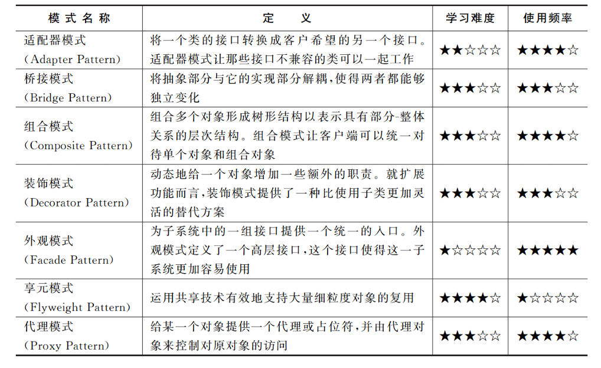

# 设计模式

## 1、面向对象设计原则

### 1.1 简单介绍

20 世纪 80年代末,软件工程界开始关注 Christopher Alexander 等在这一住宅、公共建筑与城市规划领域的重大突破,最早将该模式的思想引人软件工程方法学的是 1991-1992年以“四人组(Gang of Four,GoF,分别是 Erich Gamma、Richard Helm、Ralph Johnson 和John Vlissides)”自称的4位著名软件工程学者,他们在 1994 年归纳发表了 23 种在软件开发中使用频率较高的设计模式,旨在用模式来统一沟通面向对象方法在分析、设计和实现间的鸿沟。

GoF 将模式的概念引人软件工程领域,这标志着软件模式的诞生。软件模式是将模式的一般概念应用于软件开发领域,即软件开发的总体指导思路或参照样板。软件模式并非仅限于设计模式,还包括架构模式,分析模式和过程模式等,实际上,在软件生存期的每一个阶段都存在着一些被认同的模式。

### 1.2 设计模式

==**模式分为以下几种：**==

==1. 创建型模式(Creational Patterns)==

| 模式名称                                    | 模式说明                                                     |
| ------------------------------------------- | ------------------------------------------------------------ |
| 抽象工厂模式<br/>(Abstract Factory Pattern) | 提供一个创建一系列相关或相互依赖对象的接口，而无须指定它们具体的类 |
| 建造者模式<br/>(Builder Pattern)            | 将一个复杂对象的构建与它的表示分离，使得同样的构建过程可以创建不同的表示 |
| 工厂方法模式<br/>(Factory Method Pattern)   | 定义一个用于创建对象的接口,但是让子类决定将哪一个类实例化。工厂方法模式让一个类的实例化延迟到其子类 |
| 原型模式<br/>(Prototype Pattern)            | 使用原型实例指定待创建对象的类型，并且通过复制这个原型来创建新的对象 |
| 单例模式<br/>(Singleton Pattern)            | 确保一个类只有一个实例,并提供一个全局访问点来访问这个唯一实例 |

==**2. 结构型模式(Structural Patterns)**==

| 模式名称                         | 模式说明                                                     |
| -------------------------------- | ------------------------------------------------------------ |
| 适配器模式<br/>(Adapter Pattern) | 将一个类的接口转换成客户希望的另一个接口。适配器模式让那些接口不兼容的类可以一起工作 |
| 桥接模式<br/>(Bridge Pattern)    | 将抽象部分与它的实现部分解耦,使得两者都能够独立变化          |
| 组合模式<br/>(Composite Pattern) | 组合多个对象形成树形结构以表示具有部分-整体关系的层次结构。组合模式让客户端可以统一对待单个对象和组合对象 |
| 装饰模式<br/>(Decorator Pattern) | 动态地给一个对象增加一些额外的职责。就扩展功能而言,装饰模式提供了一种比使用子类更加灵活的替代方案 |
| 外观模式<br/>(Facade Pattern)    | 为子系统中的一组接口提供一个统一的人口。外观模式定义了一个高层接口,这个接口使得这一子系统更加容易使用 |
| 享元模式<br/>(Flyweight Pattern) | 运用共享技术有效地支持大量细粒度对象的复用                   |
| 代理模式<br/>(Proxy Pattern)     | 给某一个对象提供一个代理或占位符,并由代理对象来控制对原对象的访问 |

==**3. 行为型模式(Behavioral Patterns)**==

| 模式名称                                         | 模式说明                                                     |
| ------------------------------------------------ | ------------------------------------------------------------ |
| 职责链模式<br/>(Chain of Responsibility Pattern) | 避免将一个请求的发送者与接收者耦合在一起，让多个对象都有机会处理请求。将接收请求的对象连接成一条链,并且沿着这条链传递请求,直到有一个对象能够处理它为止 |
| 命令模式<br/>(Command Pattern)                   | 将一个请求封装为一个对象，从而可用不同的请求对客户进行参数化,对请求排队或者记录请求日志,以及支持可撤销的操作 |
| 解释器模式<br/>(Interpreter Pattern)             | 给定一个语言,定义它的文法的一种表示,并定义一个解释器,这个解释器使用该表示来解释语言中的句子。 |
| 迭代器模式<br/>(lterator Pattern)                | 提供一种方法顺序访问一个聚合对象中的各 个元素,而又不用暴露该对象的内部表示 |
| 中介者模式<br/>(Mediator Pattern)                | 定义一个对象来封装一系列对象的交互。中介者模式使各对象之间不需要显式地相互引用,从而使其耦合松散,而且可以独立地改变它们之间的交互 |
| 备忘录模式<br/>(Memento Pattern)                 | 在不破坏封装的前提下捕获一个对象的内部状态,并在该对象之外保存这个状态,这样可以在以后将对象恢复到原先保存的状态 |
| 观察者模式<br/>(Observer Pattern)                | 定义对象之间的一种一对多依赖关系,使得每当一个对象状态发生改变时其相关依赖对象皆得到通知并被自动更新 |
| 状态模式<br/>(State Pattern)                     | 允许一个对象在其内部状态改变时改变它的行为。对象看起来似乎修改了它的类 |
| 策略模式<br/>(Strategy Pattern)                  | 定义一系列算法,将每一个算法封装起来，并让它们可以相互替换。策略模式让算法可以独立于使用它的客户而变化 |
| 模板方法模式<br/>(Template Method Pattern)       | 定义一个操作中算法的框架,而将一些步骤延迟到子类中。模板方法模式使得子类可以不改变一个算法的结构即可重定义该算法的某些特定步骤 |
| 访问者模式<br/>(Visitor Pattern)                 | 表示一个作用于某对象结构中的各个元素的操作。访问者模式可以在不改变各元素的类的前提下定义作用于这些元素的新操作 |

需要注意的是,这 23 种设计模式并不是孤立存在的,很多模式之间存在联系,例如在访问者模式中操作对象结构中的元素通常需要使用迭代器模式,在解释器模式中定义终结符表达式和非终结符表达式时可以使用组合模式;此外,还可以通过组合两个或者多个模式来设计同一个系统,在充分发挥每一个模式的优势的同时使它们可以协同工作,完成一些更复杂的设计工作。

### 1.3 设计原则

七大设计原则如下:

| 设计原则名称                                           | 说明                                                         | 使用频率(1-5) |
| ------------------------------------------------------ | ------------------------------------------------------------ | ------------- |
| 单一职责原则<br/>(Single Responsibility Principle,SRP) | 一个对象应该只包含单一的职责,并且该职责被完整地封装在一个类中 | **4**         |
| 开闭原则<br/>(Open-Closed Principle,OCP)               | 软件实体应当对扩展开放,对修改关闭                            | **5**         |
| 里氏代换原则<br/>(Liskov Substitution Principle,LSP)   | 所有引用基类的地方必须能透明地使用其子类的对象               | **5**         |
| 依赖倒转原则<br/>(Dependence Inversion Principle,DIP)  | 高层模块不应该依赖低层模块,它们都应该依赖抽象。抽象不应该依赖于细节,细节应该依赖于抽象 | **5**         |
| 接口隔离原则<br/>(Interface Segregation Principle,ISP) | 客户端不应该依赖那些它不需要的接口                           | **2**         |
| 合成复用原则<br/>(Composite Reuse Principle,CRP)       | 优先使用对象组合，而不是通过继承来达到复用的目的             | **4**         |
| 迪米特法则<br/>(Law of Demeter,LoD)                    | 每一个软件单位对其他单位都只有最少的知识,而且局限于那些与本单位密切相关的软件单位 | **3**         |


## 2、简单工厂模式

### 2.1 概述

简单工厂模式并不属于 GoF 的 23 种经典设计模式,但通常将它作为学习其他工厂模式的基础,下面通过一个简单实例来引出简单工厂模式。

> 例子
>
> 考虑一个**水果农场**,当用户需要某一种**水果**时该农场能够根据用户所提供的**水果名**称返回该水果。在此,水果农场被称为工厂(Factory),而生成的水果被称为产品(Product),水果的名称则被称为参数,工厂可以根据参数的不同返回不同的产品,这就是简单工厂模式的动机。该过程的示意图如下图所示,用户无须知道苹果(Apple)、橙(Orange)、香蕉
> (Banana)如何创建,只需要知道水果的名字即可得到对应的水果。

作为最简单的设计模式之一,简单工厂模式的设计思想和实现过程都比较简单,其基本实现流程如下:


首先将需要创建的各种不同产品对象的相关代码封装到不同的类中,这些类称为具体产品类,而将它们公共的代码进行抽象和提取后封装在一个抽象产品类中,每一个具体产品类都是抽象产品类的子类;然后提供一个工厂类用于创建各种产品,在工厂类中提供一个创建产品的工厂方法,该方法可以根据所传人的参数不同创建不同的具体产品对象;客户端只需调用工厂类的工厂方法并传人相应的参数即可得到一个产品对象。

简单工厂模式的定义如下:

>==简单工厂模式(Simple Factory Pattern):定义一个工厂类,它可以根据参数的不同返回不同类的实例，被创建的实例通常都具有共同的父类。==

由于在简单工厂模式中用于创建实例的方法通常是静态(static)方法,因此简单工厂模式又被称为**静态工厂方法(Static Factory Method)模式**,它是一种类创建型模式。==简单工模式的要点在于当用户需要什么时,只需要传人一个正确的参数就可以获取所需要的对象,而**无须知道其创建细节**==。

### 2.2 简单工厂模式结构与体实现

#### 2.2.1 简单工厂模式结构

简单工厂模式的结构比较简单,其核心是工厂类的设计,其结构如下图所示。由下图可知,简单工厂模式包含以下 3个角色。

1. **Factory(工厂角色)**:工厂角色即工厂类,它是简单工厂模式的核心,负责实现创建所有产品实例的内部逻辑;工厂类可以被外界直接调用,创建所需的产品对象;在工厂类中提供了静态的工厂方法 factoryMethod(),它的返回类型为抽象产品类型 Product。
2. **Product(抽象产品角色)**:它是工厂类创建的所有对象的父类,封装了各种产品对象的公有方法,它的引入将提高系统的灵活性,使得在工厂类中只需定义一个通用的工厂方法,因为所有创建的具体产品对象都是其子类对象。
3. **ConcreteProduct(具体产品角色)**:它是简单工厂模式的创建目标,所有被创建的对象都充当这个角色的某个具体类的实例。每一个具体产品角色都继承了抽象产品角色,需要实现在抽象产品中声明的抽象方法，


#### 2.2.2 简单工厂模式实现

在简单工厂模式中客户端通过工厂类来创建一个产品类的实例,而无须直接使用new关键字来创建对象,它是工厂模式家族中最简单的一员。

在使用简单工厂模式时首先需要对产品类进行重构,不能设计一个包罗万象的产品类,而需根据实际情况设计一个产品层次结构,将所有产品类公共的代码移至抽象产品类,并在抽象产品类中声明一些抽象方法,以供不同的具体产品类来实现。

典型的抽象产品类代码如下:

```java
public abstract class Product{
    //所有产品类的公共业务方法
    public void methodSame(){
        //公共方法的实现
    }
    //声明抽象业务方法
    public abstract void methodDiff( );
}
```

在具体产品类中实现了抽象产品类中声明的抽象业务方法,不同的具体产品类可以提供不同的实现。典型的具体产品类的代码如下:

```java
public class ConcreteProduct extends Product{
    //实现业务方法
    public void methodDiff(){
        //业务方法的实现
    }
}
```

简单工厂模式的==核心是工厂类==,在没有工厂类之前客户端一般会使用 new 关键字来直接创建产品对象,而在引人工厂类之后客户端可以通过工厂类来创建产品,在简单工厂模式中工厂类提供了一个静态工厂方法供客户端使用,根据所传人的参数不同可以创建不同的产品对象。典型的工厂类的代码如下:

```java
public class Factory{
    //静态工厂方法
    public static Product getProduct(String arg){
        Product product = null;
        if(arg.equalsIgnoreCase("A")){
            Product = new ConcreteProductA();
            //初始化设置 product
        }else if(arg.equalsIgnoreCase("B")){
            product = new ConcreteProductB();
            //初始化设置 product
        }
        return product;
    }
}
```

在客户端代码中,通过调用工厂类的工厂方法即可得到产品对象。其典型代码如下:

```java
public class Client{
    public static void main(String args[]){
        Product product;
        product=Factory.getProduct("A");//通过工厂类创建产品对象
        product.methodSame();
        product.methodDiff();
    }
}
```

### 2.3 简单工厂模式的简化

有时候,为了简化简单工厂模式,可以将**抽象产品类和工厂类合并**,将静态工厂方法移至抽象产品类中,如下图所示。


在上图中,客户端可以通过调用产品父类的静态工厂方法,根据参数的不同创建不同类型的产品子类对象,这种做法在很多类库和框架中也广泛存在。

### 2.4 简单工厂模式优/缺点与适用环境

简单工厂模式提供了专门的工厂类用于创建对象,将对象的创建和对象的使用分离开它作为一种最简单的工厂模式在软件开发中得到了较为广泛的应用。

#### 2.4.1 优点

简单工厂模式的优点主要如下

1. 工厂类包含必要的判断逻辑,可以决定在什么时候创建哪一个产品类的实例,==客户端可以免除直接创建产品对象的职责==,而仅仅“消费”产品,简单工厂模式实现了==对象创建和使用的分离==。
2. 客户端无须知道所创建的具体产品类的类名,只需要知道具体产品类所对应的参数即可,对于一些复杂的类名,通过简单工厂模式可以在一定程度上减少使用者的记忆量。
3. 通过引人配置文件,可以在不修改任何客户端代码的情况下更换和增加新的具体产品类,在一定程度上提高了系统的灵活性。

#### 2.4.2 缺点

简单工厂模式的缺点主要如下:

1. 由于工厂类集中了所有产品的创建逻辑,==职责过重==,一旦不能正常工作,整个系统都要受到影响。
2. 使用简单工厂模式势必会增加系统中类的个数(引人了新的工厂类),增加了==系统的复杂度和理解难度==。
3. ==系统扩展困难==,一旦添加新产品就不得不修改工厂逻辑,在产品类型较多时有可能造成工厂逻辑过于复杂,不利于系统的扩展和维护。
4. 简单工厂模式由于使用了静态工厂方法,造成工厂角色==无法形成基于继承的等级结构==。

#### 2.4.3 适用环境

在以下情况下可以考虑使用简单工厂模式:

1. 工厂类负责创建的对象比较少,由于创建的对象较少,不会造成工厂方法中的业务逻辑太过复杂。
2. 客户端==**只知道传人工厂类的参数,对于如何创建对象并不关心**==。

## 3、工厂方法模式

### 3.1 概述

考虑这样一个系统,使用简单工厂模式设计的按钮工厂类可以返回一个具体类型的按钮实例,例如圆形按钮、矩形按钮、菱形按钮等。在这个系统中如果需要增加一种新类型的按钮,例如椭圆形按钮,那么除了**增加一个新的具体产品类**之外还需要**修改工厂类的代码**，这就使得整个设计在一定程度上==违反了开闭原则==,如下图1所示现在对该系统进行修改,不再提供一个按钮工厂类来统一负责所有产品的创建,而是将具体按钮的创建过程交给专门的工厂子类去完成。先定义一个抽象的按钮工厂类,再定义具体的工厂类来生产圆形按钮、矩形按钮、菱形按钮等,它们实现了在抽象按钮工厂类中声明的方法。这种抽象化的结果是使得这种结构可以在不修改具体工厂类的情况下引进新的产品,如果出现新的按钮类型,只需要为这种新类型的按钮定义一个具体的工厂类就可以创建该新按钮的实例,这种改进的设计方案即为工厂方法模式。工厂方法模式通过引人抽象的工厂类,使得它具有超越简单工厂模式的优越性,让系统更加符合开闭原则,改进后的按钮工厂如下图2所示。


在**工厂方法模式中不再提供一个统一的工厂类来创建所有的产品对象**,而是针对不同的产品提供不同的工厂,系统提供一个与产品等级结构对应的工厂等级结构。

工厂方法模式的定义如下:

>==工厂方法模式:定义一个用于创建对象的接口，但是让子类决定将哪一个类实例化。工厂方法模式让一个类的实例化延迟到其子类。==

工厂方法模式简称为**工厂模式(Factory Pattern)**,又可称作虚拟构造器模式( VirtualConstructor Pattern)或多态工厂模式(Polymorphic Factory Pattern)。工厂方法模式是一种类创建型模式。在工厂方法模式中,工厂父类负责定义创建产品对象的公共接口,而工厂子类负责生成具体的产品对象,这样做的目的是将产品类的**实例化操作延迟到工厂子类中完成**,即通过工厂子类来确定究竟应该实例化哪一个具体产品类。

### 3.2 工厂方法模式结构与实现

#### 3.2.1 工厂方法模式结构

工厂方法模式提供一个**抽象工厂接口**来声明抽象工厂方法,而由其子类来具体实现工厂方法,创建具体的产品对象。工厂方法式的结构如下图所示。


由上图可知,工厂方法模式包含以下 4个角色。

1. **Product(抽象产品)**:它是定义产品的接口,是工厂方法模式所创建对象的超类型,也就是产品对象的公共父类。
2. **ConcreteProduct(具体产品)**:它实现了抽象产品接口,某种类型的具体产品由专门的具体工厂创建,具体工厂和具体产品之间一一对应。
3. **Factory(抽象工厂)**:在抽象工厂类中声明了工厂方法(Factory Method),用于返回一个产品。抽象工厂是工厂方法模式的核心,所有创建对象的工厂类都必须实现该接口
4. **ConcreteFactory(具体工厂)**:它是抽象工厂类的子类,实现了在抽象工厂中声明的工厂方法,并可由客户端调用,返回一个具体产品类的实例。

#### 3.2.2 工厂方法模式实现

与简单工厂模式相比,工厂方法模式最重要的特点是引入了抽象工厂角色,抽象工厂可以是接口,也可以是抽象类或者具体类。其典型代码如下:

```java
public interface Factory {
    public Product factoryMethod( );
}
```

在抽象工厂中声明了工厂方法但并未实现工厂方法,具体产品对象的创建由其子类负责,客户端针对抽象工厂编程,可在运行时再指定具体工厂类,具体工厂类实现了工厂方法，不同的具体工厂可以创建不同的具体产品。其典型代码如下:

```java
public class ConcreteFactory implements Factory {
    public Product factoryMethod(){
        return new ConcreteProduct();
    }
}
```

在实际使用时,具体工厂类在实现工厂方法时除了**创建具体产品对象之外**,还可以**负责产品对象的初始化工作以及一些资源和环境配置工作**,例如连接数据库,创建文件等。在客户端代码中,开发人员只需关心工厂类即可,不同的具体工厂可以创建不同的产吧。

典型的客户端代码片段如下:

```java
Factory factory;
factory = new ConcreteFactory();//可通过配置文件与反射机制实现
Product product;
product = factory.factoryMethod();
```

可以通过配置文件来存储具体工厂类 ConcreteFactory的类名,再通过反射机制创建具体工厂对象,在更换新的具体工厂时无须修改源代码,系统扩展更为方便。

### 3.3 工厂方法模式应用实例

下面通过一个应用实例来进一步学习和理解工厂方法模式

#### 3.3.1 案例说明

某系统运行日志记录器(Logger)可以通过多种途径保存系统的运行日志,例如通过文件记录或数据库记录，用户可以通过修改配置文件灵活地更换日志记录方式。在设计各类日志记录器时，开发人员发现需要对日志记录器进行一些初始化工作，初始化参数的设置过程较为复杂，而且某些参数的设置有严格的先后次序，否则可能会发生记录失败。

为了更好地封装记录器的初始化过程并保证多种记录器切换的灵活性,现使用工厂方法模式设计该系统(注:在Java中常用的日志记录工具有 SLF4J、Log4j、GCLogViewer、Logstash 等)。

#### 3.3.2 实例类图


在上图中,Logger 接口充当**抽象产品**,其子类 FileLogger 和 DatabaseLogger 充当**具体产品**,LoggerFactory 接口充当**抽象工厂**,其子类 FileLoggerFactory 和 DatabaseLoggerFactory充当**具体工厂**。

#### 3.3.3 实现代码

==Logger==:日志记录器接口,充当抽象产品角色

```java
//designpatterns.factorymethod.Logger.java
package designpatterns.factorymethod;
public interface Logger {
    public void writeLog();
}
```

==DatabaseLogger==:数据库日志记录器,充当具体产品角色。

```java
//designpatterns.factorymethod. DatabaseLogger. java
package designpatterns. factorymethod;
public class DatabaseLogger implements Logger {
    public void writeLog(){
        System.out.println("数据库日志记录.");
    }
}
```

==FileLogger==:文件日志记录器,充当具体产品角色。

```java
//designpatterns.factorymethod. Fileogger. java
package designpatterns. factorymethod;
public class FileLogger implements Logger {
    public void writeLog(){
        System.out.println("文件日志记录.");
    }
}
```

==LoggerFactory==:日志记录器工厂接口,充当抽象工厂角色

```java
//desianpatterns.factorymethod,LoggerFactory. java
package designpatterns.factorymethod;
public interface LoggerFactory{
public Logger createLogger();//抽象工厂方法
}
```

==DatabaseLoggerFactory==:数据库日志记录器工厂类,充当具体工厂角色

```java
//designpatterns.factorymethod. DatabaseLoggerFactory. java
package designpatterns.factorymethod;
public class DatabaseLoggerFactory implements LoggerFactory {
    public Logger createLogger(){
        //连接数据库，代码省略
        //创建数据库日志记录器对象
        Logger logger= new DatabaseLogger();
        //初始化数据库日志记录器,代码省略
        return logger;
    }
}
```

==FileLoggerFactory==:文件日志记录器工厂类,充当具体工厂角色。

```java
//designpatterns.factorymethod.FileLoggerFactory. java
package designpatterns.factorymethod;
public class FileLoggerFactory implements LoggerFactory {
    Public Logger createLogger(){
        //创建文件日志记录器对象
        Logger logger = new FileLogger();
        //创建文件,代码省略
        return logger;
    }
}
```

==Client==:客户端测试类

```java
//designpatterns. factorymethod. Client. java
package designpatterns.factorymethod;
public class Client{
    public static void main(String args]){
        LoggerFactory factory;
        Logger logger;
        factory=new FileLoggerFactory();//可引入配置文件和反射机制实现
        logger= factory.createLogger();
        logger.writeLog();
    }
}
```

#### 3.3.4 结果及分析

编译并运行程序,输出结果如下:

```
文件日志记录。
```

如果需要更换日志记录器,只需要修改客户端代码中的具体工厂类的类名即可,例如将FileLoggerFactory 改为 DatabaseLoggerFactory,此时输出结果如下:

```
数据库日志记录。
```


如果需要增加并使用新的日志记录器,只需要对应增加一个新的具体工厂类,然后在客户端代码中修改具体工厂类的类名,原有类库的源代码无须做任何修改。通过引入配置文件并使用反射机制可以实现在不修改客户端代码的基础上更换具体工厂类,让系统更加符合开闭原则,具备更好的灵活性和可扩展性。

### 3.4 工厂方法的重载

在某些情况下,可以通过多种方式来初始化同一个产品类。例如日志记录器类,可以为各种日志记录器提供默认实现;还可以为数据库日志记录器提供数据库连接字符串,为文件日志记录器提供文件路径;也可以将相关参数封装在一个 Obiect 类型的对象中,通过 Obiect 对象将配置参数传入工厂类。此时可以提供一组重载的工厂方法。以不同的方式对产品对象进行创建。当然,对于同一个具体工厂而言,无论使用哪个工厂方法,所创建的产品类型均要相同。重载的工厂方法结构图如下图所示。


引人重载方法后,抽象工厂类 LoggerFactory 的代码修改如下:

```java
public interface LoggerFactory{
    public Logger createLogger();
    public Logger createLogger(String args);
    public Logger createLogger(object obj);
}
```

具体工厂类 DatabaseLoggerFactory 的代码修改如下:

```java
public class DatabaseLoggerFactory implements LoggerFactory {

    public Logger createLogger(){
        //使用默认方式连接数据库,代码省略
        Logger logger = new DatabaseLogger()
            //初始化数据库日志记录器,代码省略
            return logger;
    }
    
    public Logger createLogger(String args){
        //使用参数 args作为连接字符串来连接数据库,代码省略
        Logger logger= new DatabaseLogger();
        //初始化数据库日志记录器,代码省略
        return logger;
    }
    
    public Logger createLogger(Object obj){
        //使用封装在参数obi中的连接字符串来连接数据库,代码省略
        Logger logger =new DatabaseLogger();
        //使用封装在参数obi中的数据来初始化数据库日志记录器,代码省略
        return logger;
    }
    
}
//其他具体工厂类代码省略
```

在抽象工厂中声明了多个重载的工厂方法,在具体工厂中实现了这些工厂方法,这些方法可以包含不同的业务逻辑,以满足产品对象的多样化创建需求。

### 3.5 工厂方法的隐藏

有时候,为了进一步简化客户端的使用,还可以对客户端隐藏工厂方法,此时在工厂类中直接调用产品类的业务方法,客户端无须调用工厂方法创建产品对象,直接使用工厂对象即可调用所创建的产品对象中的业务方法。如果对客户端隐藏工厂方法,那么如上面所示的日志记录器结构图可修改为如下图所示的结构图。


在上图中,抽象工厂类 LoggerFactory 的代码修改如下:

```java
//将接口改为抽象类
public abstract class LoggerFactory {
    //在工厂类中直接调用日志记录器类的业务方法writeLog()
    public void writeLog(){
        Logger logger =this.createLogger();
        logger.writeLog();
    }
    public abstract Logger createLogger();
}
```

客户端代码修改如下:

```java
public class Client {
    public static void main(String args[]){
        LoggerFactory factory;
        factory=(LoggerFactory)XMLUtil.getBean():
        factory.writeLog();//直接使用工厂对象来调用产品对象的业务方法
    }
}
```

通过把业务方法的调用移至工厂类中,可以直接使用**工厂对象来调用产品对象的业务方法**,客户端无须使用工厂方法来创建产品对象。在某些情况下可以使用这种设计方案。

### 3.6 工厂方法模式的优/缺点与适用环境

工厂方法模式是简单工厂模式的延伸,它继承了简单工厂模式的优点,同时还弥补了简单工厂模式的不足。工厂方法模式是使用频率最高的设计模式之一,是很多开源框架和API类库的核心模式。

#### 3.6.1 工厂方法模式优点

工厂方法模式的优点主要如下:

1. 在工厂方法模式中,工厂方法用来创建客户所需要的产品,==同时还向客户隐藏了哪种具体产品类将被实例化这一细节==,用户只需要关心所需产品对应的工厂,无须关心创建细节,甚至无须知道具体产品类的类名。
2. 基于==工厂角色和产品角色的多态性设计是工厂方法模式的关键==。它能够让工厂自主确定创建何种产品对象,而如何创建这个对象的细节完全封装在具体工厂内部。工厂方法模式之所以又被称为多态工厂模式,正是因为所有的具体工厂类都具有同一抽象父类。
3. 使用工厂方法模式的另一个优点是在系统中加入新产品时==无须修改抽象工厂和抽象产品提供的接口==,无须修改客户端,也无须修改其他的具体工厂和具体产品,而==只要添加一个具体工厂和具体产品即可==,这样系统的可扩展性也就变得非常好,完全符合开闭原则。

#### 3.6.2 工厂方法模式缺点

工厂方法模式的缺点主要如下:

1. 在添加新产品时需要编写新的具体产品类,而且还要提供与之对应的具体工厂类,系统中类的个数将成对增加,在一定程度上==增加了系统的复杂度==,有更多的类需要编译和运行,会==给系统带来一些额外的开销==。
2. 由于考虑到系统的可扩展性,需要引人抽象层,在客户端代码中均使用抽象层进行定义,==增加了系统的抽象性和理解难度==。

#### 3.6.3 工厂方法模式适用环境

在以下情况下可以考虑使用工厂方法模式:

1. 客户端不知道它所需要的对象的类。在工厂方法模式中,==客户端不需要知道具体产品类的类名,只需要知道所对应的工厂即可==,具体产品对象由具体工厂类创建,可将具体工厂类的类名存储在配置文件或数据库中。
2. 抽象工厂类通过其子类来指定创建哪个对象。在工厂方法模式中,对于抽象工厂类只需要提供一个创建产品的接口,而由其子类来确定具体要创建的对象,利用面向对象的多态性和里氏代换原则,在==程序运行时子类对象将覆盖父类对象,从而使得系统更容易扩展==。

## 4、抽象工厂模式

### 4.1 产品等级结构与产品族

工厂方法模式通过引人工厂等级结构解决了简单工厂模式中工厂类职责太重的问题，但由于工厂方法模式中的每个具体工厂只有一个或者一组重载的工厂方法,只能生产一种产品,可能会导致系统中存在大量的工厂类,势必会增加系统的开销。有时候可能需要一个工厂可以提供多种产品对象,而不是单一的产品对象,例如一个电器工厂,它可以生产电视机,冰箱,空调等多种电器,而不是只生产某一种电器,此时可以考虑将一些相关的产品组成一个“产品族”,由同一个工厂来统一生产,这就是本章将要学习的抽象工厂模式的基本思想。

为了更好地理解抽象工厂模式,先引人两个概念。

1. ==产品等级结构==:==产品等级结构即**产品的继承结构**==,例如一个抽象类是电视机,其子类包括海尔电视机、海信电视机、TCL,电视机,则抽象电视机与具体品牌的电视机之间构成了一个产品等级结构,抽象电视机是父类,而具体品牌的电视机是其子类。
2. 产品族:在抽象工厂模式中,==产品族是指由同一个工厂生产的**位于不同产品等级结构中的一组产品**==,例如海尔电器工厂生产的海尔电视机,海尔冰箱,海尔电视机位于电视机产品等级结构中,海尔冰箱位于冰箱产品等级结构中,海尔电视机、海尔冰箱构成了一个产品族。

产品等级结构与产品族示意图如下图所示，


在上图中一共包含3个产品族,分属于3个不同的产品等级结构,只要指明一个产品所处的产品族以及它所属的等级结构就可以唯一确定这个产品。

### 4.2 抽象工厂模式概述

**当系统所提供的工厂生产的具体产品并不是一个简单的对象,而是多个位于不同产品等级结构、属于不同类型的具体产品时就可以使用抽象工厂模式**。抽象工厂模式是所有形式的工厂模式中最为抽象和最具一般性的一种形式。抽象工厂模式与工厂方法模式最大的区别在于,**工厂方法模式针对的是一个产品等级结构**,**而抽象工厂模式需要面对多个产品等级结构,一个工厂等级结构可以负责多个不同产品等级结构中的产品对象的创建**。当一个工厂等级结构可以创建出分属于不同产品等级结构的一个产品族中的所有对象时,抽象工厂模式比工厂方法模式更为简单、更有效率。抽象工厂模式示意图如下图所示。

在下图中,每一个具体工厂可以生产属于一个产品族的所有产品,例如海尔工厂生产海尔电视机,海尔冰箱和海尔空调,所生产的产品又位于不同的产品等级结构中。如果使用工厂方法模式,下图所示的结构需要提供9个具体工厂,而使用抽象工厂模式只需要提供3个具体工厂,极大地减少了系统中类的个数。抽象工厂模式为创建一组对象提供了一种解决方案。与工厂方法模式相比,抽象工厂模式中的具体工厂不只是创建一种产品,它负责创建一族产品。


抽象工厂模式的定义如下:

>==抽象工厂模式:提供一个创建**一系列相关或相互依赖对象**的接口,而无须指定它们具体的类。==

抽象工厂模式又称为工具(Kit)模式,它是一种对象创建型模式。

### 4.3 抽象工厂模式结构与实现

#### 4.3.1 抽象工厂模式结构

在抽象工厂模式中,每一个具体工厂都提供了多个工厂方法用于产生多种不同类型的产品,这些产品构成了一个产品族,抽象工厂模式结构如下图所示。由下图可知,抽象工厂模式包含以下 4个角色。

1. ==AbstractFactory(抽象工厂)==:它声明了一组用于创建一族产品的方法,每一个方法
   对应一种产品。
2. ==ConcreteFactory(具体工厂)==:它实现了在抽象工厂中声明的创建产品的方法，
   生成一组具体产品,这些产品构成了一个产品族,每一个产品都位于某个产品等级结
   构中。
3. ==AbstractProduct(抽象产品)==:它为每种产品声明接口,在抽象产品中声明了产品所
   具有的业务方法。
4. ==ConcreteProduct(具体产品)==:它定义具体工厂生产的具体产品对象,实现抽象产品
   接口中声明的业务方法。


#### 4.3.2 抽象工厂模式实现

在抽象工厂中声明了多个工厂方法,用于创建不同类型的产品,抽象工厂可以是接口，也可以是抽象类或者具体类。其典型代码如下:

```java
public interface AbstractFactory{
    public AbstractProductA createProductA();//工厂方法
    public AbstractProductB createProductB();//工厂方法
}
```

具体工厂实现了抽象工厂,每一个具体的工厂方法可以返回一个特定的产品对象,而同一个具体工厂所创建的产品对象构成了一个产品族。对于每一个具体工厂类,其典型代码如下:

```java
public class ConcreteFactoryl extends AbstractFactory {
    //工厂方法一
    public AbstractProductA createProductA(){
        return new ConcreteProductA1();
    }
       //工厂方法二
    public AbstractProductB createProductB(){
        return new ConcreteProductB1();
    }
    
    
}
```

与工厂方法模式一样,抽象工厂模式也可为每一种产品提供一组重载的工厂方法,以不同的方式来创建产品对象。

### 4.4 抽象工厂模式实例

下面通过一个应用实例来进一步学习和理解抽象工厂模式

#### 4.4.1 实例说明

某软件公司要开发一套界面皮肤库，可以对基于Java的来面软件进行界面美化。用户在使用时可以通过菜单来选择皮肤，不同的皮肤将提供视觉效果不同的**按钮、文本框、组合框**等界面元素,例如**春天(Spring)风格**的皮肤将提供浅绿色的按钮、绿色边框的文本框和绿色边框的组合框,而**夏天(Summer)风格**的皮肤则提供浅蓝色的按钮、蓝色边框的文本框和蓝色边框的组合框，其结构示意图如下图所示。


该皮肤库需要具备良好的灵活性和可扩展性，用户可以自由选择不同的皮肤，开发人员可以在不修改既有代码的基础上增加新的皮肤。

试使用抽象工厂模式来设计该界面皮肤库。

#### 4.4.2 实例类图

通过分析,本实例的结构图如下图所示


在上图中，SkinFactory 接口充当**抽象工厂**,其子类 SpringSkinFactory 和SummerSkinFactory 充当**具体工厂**,接口 Button、TextField 和 ComboBox 充当**抽象产品**,其子类SpringButton,SpringlextField ,SpringComboBox 和 SummerButton, Summer TextField.SummerComboBox充当**具体产品**。

#### 4.4.3 实例代码

==Button==:按钮接口,充当抽象产品。

```java
//designpatterns.abstractfactory. Button. java
package designpatterns.abstractfactory;
public interface Button{
    public void display();
}
```

==SpringButton==:Spring按钮类,充当具体产品:

```java
//designpatterns.abstractfactory.SpringButton. java
package designpatterns.abstractfactory;
public class SpringButton implements Button {
    public void display(){
        System.out.println("显示浅绿色按钮");
    }
}
```

==SummerButton==:Summer按钮类,充当具体产品

```java
//designpatterns.abstractfactory.SummerButton. java
package designpatterns.abstractfactory;
public class SummerButton implements Button{
    public void display(){
        System.out.println("显示浅蓝色按钮");
    }
}
```

==TextField==:文本框接口,充当抽象产品

```java
//designpatterns.abstractfactory.TextField. java
package designpatterns.abstractfactory;
public interface TextField{
    public void display();
}
```

==SpringTextField==:Spring 文本框类,充当具体产品

```java
//designpatterns.abstractfactory.SpringTextField. java
package designpatterns.abstractfactory;
public class SpringTextField implements TextField {
    public void display(){
        System.out.println("显示绿色边框文本框");
    }
}
```

==SummerTextField==:Summer 文本框类,充当具体产品

```java
//designpatterns.abstractfactory.SummerTextField, java
package designpatterns.abstractfactory;
public class SummerTextField implements TextField {
    public void display(){
        System.out.println("显示蓝色边框文本框");
    }
}
```

==ComboBox==:组合框接口,充当抽象产品

```java
//designpatterns.abstractfactory.ComboBox. java
package designpatterns.abstractfactory;
public interface ComboBox{
    public void display();
}
```

==SpringComboBox==:Spring 组合框类,充当具体产品

```java
//designpatterns.abstractfactory.SpringComboBox. java
package designpatterns.abstractfactory;
public class SpringComboBox implements ComboBox {
    public void display(){
        System.out.println("显示绿色边框组合框");
    }
}
```

==SummerComboBox==:Summer组合框类,充当具体产品

```java
//designpatterns.abstractfactory.SummerComboBox. java
package designpatterns.abstractfactory;
public class SummerComboBox implements ComboBox {
    public void display(){
        System.out.println("显示蓝色边框组合框.");
    }
}
```

==SkinFactory==:界面皮肤工厂接口,充当抽象工厂。

```java
//designpatterns.abstractfactory.SkinFactory. java
package designpatterns.abstractfactory;
public interface SkinFactory {
    public Button createButton();
    public TextField createTextrield( );
    public ComboBox createComboBox();
}
```

==SpringSkinFactory:==Spring 皮肤工厂,充当具体工厂

```java
//designpatterns.abstractfactory.SpringSkinFactory. java
package designpatterns.abstractfactory;
public class SpringSkinFactory implements SkinFactory{
    public Button createButton(){
        return new SpringButton();
    }
    public TextField createTextField(){
        return new SpringTextField();
    }
    public ComboBox createComboBox(){
        return new SpringComboBox()；
    }
}
```

==SummerSkinFactory==:Summer皮肤工厂,充当具体工厂

```java
//designpatterns.abstractfactory.SummerSkinFactory. java
package designpatterns.abstractfactory;
public class SummerSkinFactory implements SkinFactory {
    public Button createButton(){
        return new SummerButton();
    }
    public TextField createTextrield(){
        return new SummerTextField();
    }
    public ComboBox createComboBox(){
        return new SummercomboBox()
    }
}
```

==配置文件config.xml==,在配置文件中存储了具体工厂类的类名

```xml
<?xml version="1.0"?>
<config>
<className>designpatterns,abstractfactory,SpringSkinFactory</classlame>
</config>
```

==XMLUtil==:工具类

```java
//designpatterns.abstractfactory.XMLUtil. java
package designpatterns.abstractfactory;
import javax.xml.parsers.*;
import org.w3c.dom.*;
import java.io，*;
public class XMLUtil {
    //该方法用于从 XL配置文件中提取具体类的类名,并返回一个实例对象
    public static Object getBean(){
        try {
            //创建 DOM 文档对象
            DocumentBuilderFactory dFactory= DocumentBuilderFactory, newInstance();
            DocumentBuilder builder = dFactory,newDocumentBuilder();
            Document doc;
            doc = builder. parse(new File("src//designpatterns//abstractfactory//config. xml" ));

            //获取包含类名的文本结点
            NodeList nl= doc.getElementsByTagName("className");
            Node classNode=nl.item(0).getFirstChild();
            String cName=classNode.getNodeValue();

            //通过类名生成实例对象并将其返回
            Class c=Class.forName(cName);
            Object obj=c.newInstance();
            return obj;

        }catch(Exception e){
            e. printStackTrace();
        }
        return null;
    }
}
```

==Client==:客户端测试类

```java
//designpatterns.abstractfactory.Client. java
package designpatterns.abstractfactory;
public class client{
    public static void main(String args[]){
        //使用抽象层定义
        SkinFactory factory;
        Button bt;
        TextField tf;
        ComboBox cb;
        factory=(SkinFactory)XMLUtil.getBean( );
        bt= factory.createButton();
        tf= factory.createTextField();
        cb= factory.createComboBox();
        bt.display();
        tf.display();
        cb.display();
    }
}
```

#### 4.4.4 结果及分析

编译并运行程序,输出结果如下:

```
显示浅绿色按钮。
显示绿色边框文本框。
显示绿色边框组合框。
```

如果需要更换皮肤,只需修改配置文件即可。例如将春天风格的皮肤改为夏天风格的皮肤,只需将存储在配置文件中的具体工厂类 SpringSkinFactory 改为 SummerSkinFactory即可,代码如下:

```xml
<?xml version="1.0"?>
<config>
<className>designpatterns.abstractfactory.SummerSkinFactory</classHame>
</config>
```

重新运行客户端程序,输出结果如下

```
显示浅蓝色按钮。
显示蓝色边框文本框。
显示蓝色边框组合框。
```

在实际环境中可以提供一个可视化界面,例如菜单或者窗口来修改配置文件,用户无须直接修改配置文件。如果需要增加新的皮肤,只需增加一族新的具体组件并对应提供一个新的具体工厂,修改配置文件中的具体工厂类的类名即可使用新的皮肤,原有代码无须修改,符合开闭原则。

### 4.5 开闭原则的倾斜性

在4.4节所设计的界面皮肤库中可以较为方便地增加新类型的皮肤,但是该设计方案存在一个非常严重的问题:如果在设计之初因为考虑不全面,忘记为某种类型的界面组件(以单选按钮 RadioButton为例)提供不同皮肤下的风格化显示,那么在往系统中增加单选按钮时将发现非常麻烦,**无法在满足开闭原则的前提下增加单选按钮**,原因是抽象工厂 SkinFactory 中根本没有提供创建单选按钮的方法,如果需要增加单选按钮,首先需要修改抽象工厂接口 SkinFactory,在其中新增声明创建单选按钮的方法,然后逐个修改具体工厂类,增加相应方法以实现在不同的皮肤库中创建单选按钮,此外还需要修改客户端,否则单选按钮无法应用于现有系统。抽象工厂模式无法解决此类问题,这也是抽象工厂模式的最大缺点所在。在抽象工厂模式中增加新的产品族很方便,但是增加新的产品等级结构很麻烦,抽象工厂模式的这种性质称为开闭原则的倾斜性。开闭原则要求系统对扩展开放,对修改关闭,通过扩展达到增强其功能的目的,对于涉及多个产品族与多个产品等级结构的系统,其功能增强包括两个方面。

1. 增加产品族:对于增加新的产品族,抽象工厂模式很好地支持了开闭原则,只需要增加具体产品并对应增加一个新的具体工厂,对已有代码无须做任何修改。
2. 增加新的产品等级结构:对于增加新的产品等级结构,需要修改所有的工厂角色,包括抽象工厂类,在所有的工厂类中都需要增加生产新产品的方法,==违背了开闭原则==。

正因为抽象工厂模式存在开闭原则的倾斜性,它以一种倾斜的方式来满足开闭原则,为增加新产品族提供方便,但不能为增加新产品结构提供这样的方便,因此要求设计人员在设计之初就能够考虑全面,不会在设计完成之后再向系统中增加新的产品等级结构,也不会删除已有的产品等级结构,否则将会导致系统出现较大的修改,为后续维护工作带来诸多麻烦。

### 4.6 抽象工厂模式的优/缺点与适用环境

抽象工厂模式是工厂方法模式的进一步延伸,由于它提供了功能更为强大的工厂类并且具备较好的可扩展性,在软件开发中得以广泛应用,尤其是在一些框架和 API类库的设计中,例如在 Java 语言的 AWT(抽象窗口工具包)中就使用了抽象工厂模式,它使用抽象工厂模式来实现在不同的操作系统中应用程序呈现与所在操作系统一致的外观界面。抽象工厂模式也是在软件开发中最常用的设计模式之一。

#### 4.6.1 抽象工厂模式优点

抽象工厂模式的优点主要如下

1. ==抽象工厂模式隔离了具体类的生成,使得客户端并不需要知道什么被创建==。由于这种隔离,更换一个具体工厂就变得相对容易,所有的具体工厂都实现了抽象工厂中定义的那些公共接口,因此只需改变具体工厂的实例就可以在某种程度上改变整个软件系统的行为。
2. 当一个产品族中的多个对象被设计成一起工作时,它能够==保证客户端始终只使用同一个产品族中的对象==。
3. ==增加新的产品族很方便==,无须修改已有系统,符合开闭原则。

#### 4.6.2 抽象工厂模式缺点

抽象工厂模式的缺点主要如下:

==增加新的产品等级结构麻烦,需要对原有系统进行较大的修改==,甚至需要修改抽象层代码,这显然会带来较大的不便,==违背了开闭原则==。

#### 4.6.3 抽象工厂模式适用环境

在以下情况下可以考虑使用抽象工厂模式:

1. ==一个系统不应当依赖于产品类实例如何被创建、组合和表达的细节==,这对于所有类型的工厂模式都是很重要的,用户无须关心对象的创建过程,将对象的创建和使用解耦。
2. 系统中==有多于一个的产品族,而每次只使用其中某一产品族==。可以通过配置文件等方式来使用户能够动态改变产品族,也可以很方便地增加新的产品族。
3. 属于同一个产品族的产品将在一起使用,这一约束必须在系统的设计中体现出来同一个产品族中的产品可以是没有任何关系的对象,但是它们都具有一些共同的约束,==如同一操作系统下的按钮和文本框,按钮与文本框之间没有直接关系,但它们都是属于某一操作系统的,此时具有一个共同的约束条件,即操作系统的类型==。
4. ==产品等级结构稳定==,在设计完成之后==不会向系统中增加新的产品等级结构或者删除已有的产品等级结构==。

## 5、建造者模式

### 5.1 建造则模式概述

无论是在现实世界中还是在软件系统中都存在一些**复杂的对象**,它们拥有多个组成部分(部件),例如汽车,它包括车轮、方向盘、发送机等多种部件。**对于大多数用户而言,并不知道这些部件的装配细节,也几乎不会使用单独某个部件,而是使用一辆完整的汽车**,如下图所示。如何将这些部件组装成一辆完整的汽车并返回给用户,这是建造者模式需要解决的问题。建造者模式可以将部件本身和它们的组装过程分开,**关注如何一步一步地创建一个包含多个组成部分的复杂对象**,用户只需要指定复杂对象的类型即可得到该对象,而无须知道其内部的具体构造细节。


建造者模式的定义如下:

>==建造者模式:将一个复杂对象的构建与它的表示分离，使得同样的构建过程可以创建不同的表示。==

建造者模式是一种对象创建型模式,它将客户端与包含多个部件的复杂对象的创建过程分离,客户端无须知道复杂对象的内部组成部分与装配方式,只需要知道所需建造者的类型即可。建造者模式关注如何一步一步地创建一个复杂对象,不同的建造者定义了不同的创建过程。

### 5.2 建造者模式结构与实现

#### 5.2.1 建造者模式结构

建造者模式的结构如下图所示。


由下图可知,建造者模式包含以下4个角色

==Builder(抽象建造者)==:它为创建一个产品对象的各个部件指定抽象接口,在该接口中一般声明两类方法,一类方法是 buildPartX()(例如上图中的 buildPartA()、buildPartB()等),它们用于创建复杂对象的各个部件;另一类方法是 getResult(),它们用于返回复杂对象。Builder既可以是抽象类,也可以是接口。

==ConcreteBuilder(具体建造者)==:它实现了 Builder 接口,实现各个部件的具体构造和装配方法,定义并明确所创建的复杂对象,还可以提供一个方法返回创建好的复杂产品对象(该方法也可由抽象建造者实现)。

==Product(产品)==:它是被构建的复杂对象,包含多个组成部件,具体建造者创建该产品的内部表示并定义它的装配过程。

==Director(指挥者)==:指挥者又称为**导演类**,它**负责安排复杂对象的**==建造次序==,指挥者与抽象建造者之间存在关联关系,可以在其 construct()建造方法中调用建造者对象的部件构造与装配方法,完成复杂对象的建造。客户端一般只需要与指挥者进行交互,在客户端确定具体建造者的类型,并实例化具体建造者对象(也可以通过配置文件和反射机制实现),然后通过指挥者类的构造函数或者Setter 方法将该对象传入指挥者类中。

#### 5.2.2 建造者模式实现

在建造者模式的定义中提到了复杂对象,那么什么是复杂对象?简单来说,复杂对象是指那些包含多个成员变量的对象,这些成员变量也称为部件或零件,如汽车包括方向盘、发动机、轮胎等部件,电子邮件包括发件人、收件人、主题、内容、附件等部件。一个典型的复杂对象类的代码示例如下:

```java
public class Product{
    private String partA; //定义部件,部件可以是任意类型,包括值类型和引用类型
    private String partB;
    private String partC;
    //partA的 Getter 方法和 Setter 方法省略
    //partB的 Getter 方法和 Setter 方法省略
    //partc的 Getter 方法和 Setter 方法省略
}
```

在抽象建造者类中定义了产品的创建方法和返回方法,其典型代码如下:

```java
public abstract class Builder {
    //创建产品对象
    protected Product product = new Product();
    public abstract void buildPartA();
    public abstract void buildPartB();
    public abstract void buildPartC();
    //返回产品对象
    public Product getResult(){
        return product;
    }
}
```

在抽象类 Builder 中声明了一系列抽象的 buildPartX()方法,用于创建复杂产品的各个部件,具体建造过程在 ConcreteBuilder 中实现,此外还提供了工厂方法 getResult(),用于返回一个已创建好的完整产品对象。在 ConcreteBuilder 中实现了这些 buildPartX()方法,通过调用 Product 的 setPartX()方法可以给产品对象的成员变量设值,不同的具体建造者在实现 buildPartX()方法时有所区别,例如 setPartX()方法的参数可能不一样,在有些具体建造者类中某些 setPartX()方法无须实现(提供一个空实现)。而这些对于客户端来说都无须关心,客户端只需知道具体建造者类型即可。典型的具体建造者类代码如下:

```java
public class ConcreteBuilderl extends Builder{
    public void buildPartA(){
        product.setPartA("A1");
    }
    public void buildPartB(){
        product.setPartB("B1");
    }
    public void buildPartC(){
        product.setPartC("C1");
    }
}
```

此外,在建造者模式中还引人了一个指挥者类 Director,该类主要有两个作用:**一方面它隔离了客户端与创建过程**;**另一方面它控制产品对象的创建过程**,包括某个 buildPartX()方法是否被调用以及多个 buildPartX()方法调用的先后次序等。指挥者针对抽象建造者编程,客户端只需要知道具体建造者的类型便可通过指挥者类调用建造者的相关方法,返回一个完整的产品对象。在实际生活中也存在类似指挥者一样的角色,如一个客户去购买电脑,电脑销售人员相当于指挥者,只要客户确定电脑的类型,电脑销售人员可以通知电脑组装人员给客户组装一台电脑。指挥者类的示例代码如下:

```java
public class Director {
    private Builder builder;
    public Director(Builder builder){
        this.builder = builder;
    }
    public void setBuilder(Builder builder){
        this.builder= builer;
    }
    //产品构建与组装方法
    public Product construct(){
        builder.buildPartA();
        builder.buildPartB();
        builder.buildPartC();
        return builder.getResult();
    }
}
```

在指挥者类中可以注入一个抽象建造者类型的对象,它提供了一个建造方法 construct(),在该方法中调用了 builder 对象的构造部件的方法,最后返回一个产品对象。对于客户端而言,只需要关心具体建造者的类型,无须关心产品对象的具体组装过程,通常,客户类代码片段如下:

```java
Builder builder= new ConcreteBuilder1();//可通过配置文件实现
Director director =new Director(builder);
Product product=director.construct();
```


可以通过配置文件来存储具体建造者类 ConcreteBuilder1的类名,使得在更换新的建造者时无须修改源代码,系统扩展更为方便。建造者模式与抽象工厂模式都是较为复杂的创建型模式,建造者模式返回一个完整的复杂产品,抽象工厂模式返回一系列相关的产品;在抽象工厂模式中,客户端通过选择具体工厂来生成所需对象,而在建造者模式中,客户端通过指定具体建造者类型来**指导 Director类如何去生成对象**,侧重于一步步构造一个复杂对象,然后将结果返回。如果将**抽象工厂模式看成一个汽车配件生产厂**,生成不同类型的汽车配件,那么**建造者模式就是一个汽车组装厂,通过对配件进行组装返回一辆完整的汽车**。

### 5.3 建造者模式应用实例

下面通过一个应用实例来进一步学习和理解建造者模式

#### 5.3.1 实例说明

某游戏软件公司决定开发一款基于角色扮演的多人在线网络游戏,玩家可以在游戏中扮演虚拟世界中的一个特定角色，角色根据不同的游戏情节和统计数据(例如力量、魔法、技能等)具有不同的能力角色也会随着不断升级而拥有更加强大的能力。作为该游戏的一个重要组成部分，需要对游戏角色进行设计，而且随着该游戏的升级将不断增加新的角色。通过分析发现，游戏角色
是一个复杂对象，它包含**性别、脸型等多个组成部分**,不同类型的游戏角色,其性别、脸型、服装、发型等外部特性都有所差异,例如“天使”拥有美丽的面容和披肩的长发，并身穿一袭白裙;而“恶魔”极其丑陋留着光头并穿一件刺眼的黑衣。无论是何种造型的游戏角色，它的创建步骤都大同小异，都需要逐步创建其组成部分，再将各组成部分装配成一个完整的游戏角色，试使用建造者模式来实现游戏角色的创建

#### 5.3.2 实例类图

通过分析,本实例的结构图如下图所示


在上图中,ActorController 充当指挥者,ActorBuilder 充当抽象建造者,HeroBuilder、AngelBuilder 和 DevilBuilder 充当具体建造者,Actor 充当复杂产品。

#### 5.3.3 实例代码

==Actor==:游戏角色类,充当复杂产品对象。考虑到代码的可读性,在此只列出部分成员变量,且成员变量的类型均为 String,在真实情况下有些成员变量的类型需要自定义。

```java
//designpatterns.builder. Actor. java
package designpatterns. builder;
public class Actor {
    //角色类型
    private String type;
    //性别
    private String sex;
    //脸型
    private String face;
    //服装
    private String costume;
    //发型
    private String hairstyle;

    public void setType(String type){
        this.type=type;
    }
    public void setSex(String sex){
        this.sex= sex;
    }
    public void setFace(String face){
        this.face = face;
    }
    public void setCostume(String costume){
        this.costume= costume;
    }
    public void setHairstyle(String hairstyle){
        this.hairstyle= hairstyle;
    }
    public String getType(){
        return this.type;
    }
    public String getSex(){
        return this.sex;
    }
    public String getFace(){
        return this.face;
    }
    public String getCostume(){
        return this.costume;
    }
    public String getHairstyle(){
        return this.hairstyle;
    }
}
```

==ActorBuilder==:游戏角色建造者,充当抽象建造者。

```java
//designpatterns.builder.ActorBuilder. java
package designpatterns.builder;
public abstract class ActorBuilder{
    
    protected Actor actor=new Actor();
    
    public abstract void buildType();
    
    public abstract void buildSex();
    
    public abstract void buildFace();
    
    public abstract void buildCostume();
    
    public abstract void buildHairstyle();
    
    //工厂方法,返回一个完整的游戏角色对象
    public Actor createActor(){
        return actor;
    }
}
```

==HeroBuilder==:英雄角色建造者,充当具体建造者

```java
//designpatterns. builder. HeroBuilder. java
package designpatterns. builder;
public class HeroBuilder extends ActorBuilder {

    public void buildType(){
        actor.setType("英雄");
    }

    public void buildsex(){
        actor.setSex("男");
    }

    public void buildFace(){
        actor.setFace("英俊");
    }

    public void buildCostume(){
        actor.setCostume("盔甲")
    }

    public void buildHairstyle(){
        actor.setHairstyle("飘逸");
    }
}
```

==AngelBuilder==:天使角色建造者,充当具体建造者,

```java
//designpatterns.builder.AngelBuilder. java
package designpatterns. builder;
public class AngelBuilder extends ActorBuilder{
    
    public void buildType(){
        actor.setType("天使");
    }
    
    public void buildSex(){
        actor.setSex("女");
    }
    
    public void buildFace(){
        actor.setFace("漂亮");
    }
    
    public void buildCostume(){
        actor.setCostume("裙");
    }
    
    public void buildHairstyle(){
        actor.setHairstyle("披肩长发");
    }
}
```

==DevilBuilder==:恶魔角色建造者,充当具体建造者

```java
//designpatterns.builder.DevilBuilder. java
package desiqnpatterns.builder;
public class DevilBuilder extends ActorBuilder{

    public void buildType(){
        actor.setType("恶魔");
    }

    public void buildSex(){
        actor.setSex("妖");
    }

    public void buildFace(){
        actor.setFace("丑陋");
    }
    
    public void buildCostume(){
        actor.setCostume("黑衣");
    }
    
    public void buildHairstyle(){
        actor.setHairstyle("光头");
    }

}
```

==ActorController==:角色控制器,充当指挥者

```java
//designpatterns.builder.ActorController.java
package designpatterns. builder;
public class ActorController{
    //逐步构建复杂产品对象
    public Actor construct(ActorBuilder ab){
        Actor actor;
        ab.buildType();
        ab.buildSex();
        ab.buildFace();
        ab.buildCostume();
        ab. buildHairstyle();
        actor= ab.createActor();
        return actor;
    }
}
```

配置文件 config.xml,在配置文件中存储了具体建造者类的类名。

```xml
<?xml version="1.0"?>
< config>
<className>designpatterns.builder.AngelBuilder </className>
</config>
```

==XMLUtil==:工具类

```java
//designpatterns.builder.XMLUtil. java
package designpatterns.builder;
import javax.xml.parsers，x;
import org.w3c.dom.;
import java.io.;
public class XMLUtil{
    //该方法用于从 X,配置文件中提取具体类的类名,并返回一个实例对象
    public static Object getBean(){
        try {
            //创建 DOM 文档对象
            DocumentBuilderFactory dFactory= DocumentBuilderFactory. newInstance();
            DocuentBuilder builder = dFactory.newDocumentBuilder);
            Document doc;
            doc = builder. parse(new File("src//designpatterns//builder//config. xml"));
            
            //获取包含类名的文本结点
            NodeList nl= doc.getElementsByTagName("className");
            Node classNode= nl.item(0).getFirstChild();
            String cName=classNode.getNodeValue();
            
            //通过类名生成实例对象并将其返回
            Class c=Class.forName(cName):
            Object obj=c.newInstance();
            return obj;
        }catch(Exception e){
            e.printStackTrace();
        }
        return null;
    }
}
```

==Client==:客户端测试类

```java
//designpatterns.builder.Client. java
package designpatterns. builder;
public class Client{
    public static void main(String args]){
        ActorBuilder ab;
        ab=(ActorBuilder)XMLUtil.getBean();
        //针对抽象建造者编程
        //反射生成具体建造者对象
        ActorController ac=new ActorController():
        Actor actor;
        actor= ac.construct(ab);
        //通过指挥者创建完整的建造者对象
        String type = actor.getType();
        System.out.println(type+"的外观:");
        System.out.println("性别:"+ actor.getSex());
        System.out.println("面容:"+ actor.getFace());
        System.out.println("服装:"+ actor.getCostume());
        System.out.println("发型:"+ actor.getHairstyle());
    }
}
```

#### 5.3.4 结果及分析

编译并运行程序,输出结果如下:

```
天使的外观:
性别:女
面容:漂亮
服装:白裙
发型:披肩长发
```

如果需要更换具体角色建造者,只需要修改配置文件,例如将配置文件改为，

```xml
<?xml version="1.0"?>
< config >
<className>designpatterns.builder.HeroBuilder </className >
</config>
```

再次运行程序,输出结果为:

```
英雄的外观:
性别:男
面容:英俊
服装:盔甲
发型:飘逸
```

当需要增加新的具体角色建造者时只需将==新增具体角色建造者作为抽象角色建造者的子类==,然后修改配置文件,原有代码无须修改,完全符合开闭原则。

### 5.4 指挥者类的深入讨论

指挥者类 Director 是建造者模式的重要组成部分,简单的 Director 类用于**指导具体建造者如何构建产品**,它按一定次序调用 Builder 的 buildPartX()方法,控制调用的先后次序，并向客户端返回一个完整的产品对象。下面讨论几种Director 的变化形式。

1. **省略 Director**

在有些情况下,为了简化系统结构,可以将 Director 和抽象建造者 Builder 进行合并,在 Builder 中提供逐步构建复杂产品对象的 construct()方法。由于 Builder 类通常为抽象类, 因此可以将 construct()方法定义为静态(static)方法,以便客户端能够直接调用。如果将游戏角色实例中的指挥者类 ActorController 省略,ActorBuilder 类的代码修改如下:

```java
public abstract class ActorBuilder{
    
    protected static Actor actor= new Actor(),
    
    public abstract void buildType();
    
    public abstract void buildSex();
    
    public abstract void buildFace();
    
    public abstract void buildCostume();
    
    public abstract void buildHairstyle();
    
    public static Actor construct(ActorBuilder ab){
        ab. buildrype(),
        ab. buildSex();
        ab. buildFace();
        ab. buildCostume();
        ab. buildHairstyle();
        return actor;
    }
    
}
```

此时对应的客户端代码也将发生修改，代码片段如下:

```java
ActorBuilder ab;
ab=(ActorBuilder)XMLUtil.getBean();
Actor actor;
actor=ActorBuilder.construct(ab);
```

除此之外,还有一种更简单的处理方法,可以将 construct()方法中的参数去掉,直接在construct()方法中调用 buildPartX()方法,代码如下:

```java
public abstract class ActorBuilder{
    protected Actor actor= new Actor();
    public abstract void buildType();
    public abstract void buildSex();
    public abstract void buildFace();
    public abstract void buildCostume();
    public abstract void buildHairstyle();
    public Actor construct(){
        this.buildrype();
        this.buildSex();
        this.buildFace();
        this.buildCostume();
        this.buildHairstyle();
        return actor;
    }
}
```

客户端代码片段如下:

```java
ActorBuilder ab;
ab=(ActorBuilder)XMLUtil.getBean();
Actor actor;
actor = ab.construct();
```

此时,**construct()方法定义了 buildPartX()方法的调用次序**,为 buildPartX()方法的执行提供了一个流程模板,这与在后面将要学习的模板方法模式非常类似。以上两种对 Director 类的省略方式都不影响系统的灵活性和可扩展性,同时还简化了系统结构,但加重了抽象建造者类的职责。如果 construct()方法较为复杂,待构建产品的组成部分较多,建议还是将 construct()方法单独封装在 Director 中,这样更符合单一职责原则。

2. **钩子方法引入**

建造者模式除了可以逐步构建一个复杂产品对象外,还可以通过 Director 类更加精细地控制产品的创建过程,例如增加一类称为**钩子方法(Hook Method)的特殊方**法来控制是否对某个 buildPartX()进行调用。钩子方法的返回类型通常为 boolean 类型,方法名一般为 isXXX(),钩子方法定义在抽象建造者类中。例如可以在游戏角色的抽象建造者类 ActorBuilder 中定义一个方法isBareheaded(),用于判断某个角色是否为“光头(Bareheaded)”,在 ActorBuilder 为之提供一个默认实现,其返回值为 false,代码如下:

```java
public abstract class ActorBuilder{
    protected Actor actor= new Actor();
    public abstract void buildType();
    public abstract void buildSex();
    public abstract void buildFace();
    public abstract void buildCostume();
    public abstract void buildHairstyle();
    //钩子方法
    public boolean isBareheaded( ){
        return false;
    }
    public Actor createActor(){
        return actor;
    }
}
```

如果某个角色无须构建头发部件,例如“恶魔(Devil)”,则对应的具体建造器 DevilBuilder将覆盖 isBareheaded()方法,并将返回值改为 true,代码如下:

```java
public class DevilBuilder extends ActorBuilder{
    public void buildType(){
        actor.setType("恶魔");
    }
    public void buildSex(){
        actor.setSex("妖");
    }
    public void buildFace(){
        actor.setFace("丑陋");
    }
    public void buildCostume(){
        actor.setCostume("黑衣");
    }
    public void buildHairstyle(){
        actor.setHairstyle("光头");
    }
    //覆盖钩子方法
    public boolean isBareheaded(){
        return true;
    }
}
```

同时,指挥者类 ActorController 的代码修改如下

```java
public class ActorController {
    public Actor construct(ActorBuilder ab){
        Actor actor;
        ab. buildType();
        ab. buildSex();
        ab.buildFace();
        ab. buildCostume();
        //通过钩子方法来控制产品的构建
        if(!ab.isBareheaded()){
            ab. buildHairstyle();
        }
        actor= ab.createActor();
        return actor;
    }
}
```

当在客户端代码中指定具体建造者类型并通过指挥者来实现产品的逐步构建时,**将调用钩子方法 isBareheaded()来判断游戏角色是否有头发**,如果 isBareheaded()方法返回true,即没有头发,将跳过构建发型的方法 buildHairstyle(),否则将执行 buildHairstyle()方法。通过引人钩子方法,可以在 Director 中对复杂产品的构建进行精细的控制,不仅指定buildPartX()方法的执行顺序,还可以控制是否需要执行某个 buildPartX()方法。

### 5.5 建造者模式优/缺点与适用环境

建造者模式的核心在于**如何一步步构建一个包含多个组成部件的完整对象**,使用相同的构建过程构建不同的产品。在软件开发中,如果需要创建复杂对象并希望系统具备很好的灵活性和可扩展性可以考虑使用建造者模式。

#### 5.5.1 建造者模式优点

建造者模式的优点主要如下:

1. 在建造者模式中,==客户端不必知道产品内部组成的细节,将产品本身与产品的创建过程解耦,使得相同的创建过程可以创建不同的产品对象==。
2. 每一个具体建造者都相对独立,而与其他的具体建造者无关,因此可以==很方便地替换具体建造者或增加新的具体建造者==,用户使用==不同的具体建造者即可得到不同的产品对象==。由于==指挥者类针对抽象建造者编程,增加新的具体建造者无须修改原有类库的代码,系统扩展方便,符合开闭原则==。
3. 可以更加精细地控制产品的创建过程。==将复杂产品的创建步骤分解在不同的方法中,使得创建过程更加清晰,也更方便使用程序来控制创建过程==。

#### 5.5.2 建造者模式缺点

建造者模式的缺点主要如下:

1. 建造者模式所创建的产品==一般具有较多的共同点==,其组成部分相似,如果产品之间的差异性很大,例如很多组成部分都不相同,不适合使用建造者模式,因此其使用范围受到一定的限制。
2. 如果==产品的内部变化复杂,可能会导致需要定义很多具体建造者类来实现这种变化==,导致系统变得很庞大,增加系统的理解难度和运行成本。

#### 5.5.3 建造者模式适用环境

在以下情况下可以考虑使用建造者模式:

1. 需要生成的产品对象==有复杂的内部结构==,这些产品对象通常包含多个成员变量,
2. 需要生成的产品对象的==属性相互依赖==,==需要指定其生成顺序==。
3. 对象的创建过程独立于创建该对象的类。==在建造者模式中通过引人指挥者类将创建过程封装在指挥者类中==,而不在建造者类和客户类中。
4. ==隔离复杂对象的创建和使用==,并使得相同的创建过程可以创建不同的产品,

## 6、原型模式

### 6.1 原型模式概述

《西游记》中孙悟空“拔毛变小猴”的故事几乎人人皆知,孙悟空可以用猴毛根据自己的形象复制出很多跟自己长得一模一样的“身外身”来,如下下图所示。孙悟空这种根据自己的形状复制(克降)出多个身外身的技巧在面向对象软件设计领域被称为原型模式,孙悟空则被称为原型对象。在面向对象系统中也可以通过复制一个原型对象得到多个与原型对象一模一样的新对象,这就是原型模式的动机。


原型模式的定义如下:

> ==原型模式:使用原型实例指定待创建对象的类型，并且通过复制这个原型来创建新的对象==

原型模式是一种对象创建型模式,它的工作原理很简单:将一个原型对象传给要发动创建的对象(即客户端对象),**这个要发动创建的对象通过请求原型对象复制自己来实现创建过程**。由于在软件系统中经常会遇到需要创建多个相同或者相似对象的情况,因此原型模式在软件开发中具有较高的使用频率。原型模式是一种“另类”的创建型模式,创建新对象(也称为**克隆对象**)的工厂就是原型类自身,工厂方法由负责复制原型对象的克隆方法来实现。

需要注意的是通过克隆方法所创建的对象是全新的对象,它们在内存中拥有新的地址，通常对克隆所产生的对象进行修改不会对原型对象造成任何影响,每一个克隆对象都是相互独立的。通过不同的方式对克降对象进行修改以后,可以得到一系列相似但不完全相同的对象。

### 6.2 原型模式结构与实现

#### 6.2.1 原型模式结构

原型模式的结构如下图所示。


由下图可知,原型模式包含以下3个角色

==Prototype(抽象原型类)==:它是声明克隆方法的接口,是所有具体原型类的公共父类,它可以是抽象类也可以是接口,甚至还可以是具体实现类。

==ConeretePrototype(具体原型类)==:它实现在抽象原型类中声明的克隆方法,在克降方法中返回自己的一个克隆对象。

==Client(客户类)==:在客户类中,让一个原型对象克隆自身从而创建一个新的对象只需要直接实例化或通过工厂方法等方式创建一个原型对象,再通过调用该对象的克隆方法即可得到多个相同的对象。由于客户类针对抽象原型类 Prototype 编程,因此用户可以根据需要选择具体原型类,系统具有较好的可扩展性,增加或更换具体原型类都很方便。

#### 6.2.2 深克隆和浅克隆

根据在复制原型对象的同时是否复制包含在原型对象中引用类型的成员变量,原型模式的克隆机制分为两种,即浅克隆(Shallow Clone)和深克隆(Deep Clone)。

1. **浅克隆**

在浅克隆中,如果原型对象的成员变量是值类型(如 int、double、byte、boolean、char 等基本数据类型),将复制一份给克隆对象;如果原型对象的成员变量是引用类型(如类、接口、数组等复杂数据类型),则将**引用对象的地址复制一份给克隆对象**,也就是说原型对象和克隆对象的成员变量指向相同的内存地址。简单来说,在浅克隆中,当原型对象被复制时只复制它本身和其中包含的值类型的成员变量,而引用类型的成员变量并没有复制,如下图所示。


2. **深克隆**

在深克隆中,无论原型对象的成员变量是值类型还是引用类型,都将复制一份给克隆对象,深克隆将原型对象的所有引用对象也复制一份给克隆对象。简单来说,在深克隆中,除了对象本身被复制外,对象所包含的所有成员变量也将被复制,如下图所示。


#### 6.2.3 原型模式实现
实现原型模式的关键在于如何实现克隆方法,下面介绍两种在Java 语言中常用的克隆实现方法。

1. **通用实现方法**

通用的克隆实现方法是在具体原型类的克隆方法中实例化一个与自身类型相同的对象并将其返回,同时将相关的参数传人新创建的对象中,保证它们的成员变量相同。示意代码如下:

```java
public abstract class Prototype {
    public abstract Prototype clone();
}

public class ConcretePrototype extends Prototype {
    private String attr;
    //成员变量
    public void setAttr(String attr){
        this.attr= attr;
    }
    public String getAttr(){
        return this.attr;
    }
    //克隆方法
    public Prototype clone(){
        Prototype prototype=new ConcretePrototype();//创建新对象
        prototype.setAttr(this.attr);
        return prototype;
    }
}
```

在客户类中只需要创建一个 ConcretePrototype 对象作为原型对象,然后调用其 clone()方法即可得到对应的克降对象,例如:

```java
ConcretePrototype prototype = new ConcretePrototype();
prototype.setAttr("Sunny");
ConcretePrototype copy = (ConcretePrototype)prototype.clone();
```

此方法是原型模式的通用实现,它与编程语言本身的特性无关,其他面向对象编程语言也可以使用这种形式来实现对原型对象的克隆。

在原型模式的通用实现方法中,**可通过手工编写 clone()方法来实现浅克隆和深克隆**。对于引用类型的对象,可以在 clone()方法中通过赋值的方式来实现复制,这是一种浅克降实现方案;如果在 clone()方法中通过创建一个全新的成员对象来实现复制,则是一种深克隆实现方案。

2. **Java 语言中的 clone()方法和 Cloneable 接囗**

在 Java 语言中,所有的 Java 类均继承自 java. lang.Object 类,Object 类提供了一个clone()方法,可以将一个Java 对象复制一份。因此在 Java 中可以直接使用 Obiect 提供的clone()方法来实现对象的浅克降。

需要注意的是能够实现克隆的 Java类必须实现一个标识接口 Cloneable,表示这个Java 类支持被复制。如果一个类没有实现这个接口但是调用了 clone()方法,Java 编译器将抛出一个 CloneNotSupportedException 异常。如下代码所示:

```java
public class ConcretePrototype implements Cloneable {
    public Prototype clone(){
        Object object = null;
        try {
            //浅克隆
            object=super.clone();
        }catch(CloneNotSupportedException exception){
            System.err.println("Not support cloneable" );
            return(Prototype)object;
        }
    }
}
```

在客户端创建原型对象和克隆对象也很简单,如下代码所示:

```java
Prototype protptype=new ConcretePrototype();
Prototype copy=protptype.clone();
```

Java 语言中的 clone()方法满足以下几点:

1. 对任何对象x,都有 x.clone()!=x,即克隆对象与原型对象不是同一个对象
2. 对任何对象 x,都有 x.clone().getClass()==x.getClass(),即克隆对象与原型对象的类型一样。
3. 如果**对象x的 equals()方法定义恰当**,那么x.clone().equals(x)应该成立。

为了获取对象的一个克隆,可以直接利用 Obiect 类的 clone()方法,具体步骤如下:

1. 在派生类中覆盖基类的 clone()方法,并声明为 public。

2. 在派生类的 clone()方法中调用 super. clone()。

3. 派生类需实现 Cloneable 接口。

此时,Object 类相当于抽象原型类,所有实现了 Cloneable 接口的类相当于具体原型类

### 6.3 原型模式应用实例

下面通过一个应用实例来进一步学习和理解原型模式，

#### 6.3.1 实例说明

在使用某 OA系统时,有些岗位的员工发现他们每周的工作都大同小异，因此在填写工作周报时很多内容都是重复的，为了提高工作周报的创建效率，大家迫切希望有一种机制能够快速创建相同或者相似的周报，包括创建周报的附件，试使用原型模式对该 OA系统中的工作周报创建模块进行改进

#### 6.3.2 实例类图

通过分析,本实例的结构图如下图所示


在上图中,WeeklyLog 充当具体原型类,Object 类充当抽象原型类,Attachment 充当成员类,Weeklylog 中的 clone()方法为克隆方法,用于实现原型对象的克隆。

#### 6.3.3 实例代码

==Attachment==:附件类

```java
//designpatterns.prototype.shallowclone.Attachment. java
package designpatterns.prototype.shallowclone;
public class Attachment{
    private String name; //附件名

    public void setName(String name){
        this,name = name;
    }
    
    public String getName(){
        return this.name;
    }
    
    public void download(){
        System.out.println("下载附件,文件名为"+ name);
    }
}
```

==WeeklyLog==:工作周报类,充当原型角色。在真实环境下该类将比较复杂,考虑到代码的可读性,在此只列出部分与模式相关的核心代码。

```java
//designpatterns.prototype.shallowclone.WeeklyLog.java
package designpatterns.prototype.shallowclone;
public class WeeklyLog implements Cloneable {
    //为了简化设计和实现,假设一份工作周报中只有一个附件对象,在实际情况中可以包含多个
    //附件,可以通过 List 等集合对象来实现
    private Attachment attachment;
    private String name;
    private String date;
    private String content;
    
    public void setAttachment(Attachment attachment){
        this.attachment = attachment;
    }
    public void setName(String name){
        this.name= name;
    }
    public void setDate(String date){
        this.date= date;
    }
    public void setContent(String content){
        this.content =content;
    }
    public Attachment getAttachment(){
        return(this.attachment);
    }
    public String getName(){
        return(this.name);
    }
    public String getDate(){
        return(this.date);
    }
    public String getContent(){
        return(this.content);
    }
    //使用 clone()方法实现浅克隆
    public WeeklyLog clone(){
        Object obj= null;
        try {
            obj= super.clone();
            return(weeklyLog)obj;
        }catch(CloneNotSupportedException e){
            System.out.println("不支持复制!");
        }
        return null;
    }
}
```

==Client==:客户端测试类

```java
//designpatterns.prototype.shallowclone.Client. java
package designpatterns.prototype.shallowclone;
public class Client{
    public static void main(String args]){
        WeeklyLog log_previous,log_new;
        log_previous=new weeklyLog();
        //创建附件对象
        Attachment attachment =new Attachment();
        //创建原型对象
        //将附件添加到周报中
        log_previous.setAttachment(attachment);
        log_new= log_previous.clone();
        //比较周报
        System.out.println("周报是否相同?"+(log_previous== log_new));
        //比较附件
        System.out.println("附件是否相同?"+(log_previous.getattachment()== log_new.
                                      getAttachment()));
    }
}
```

#### 6.3.4 结果及分析

编译并运行程序,输出结果如下:

```
周报是否相同?false
附件是否相同?true
```

从输出结果可以得知,在本实例中周报对象被成功复制,但是附件对象并没有被复制，实现了浅克隆。

#### 6.3.5 深克隆解决方案

为了能够在复制周报的同时也能够复制附件对象,需要采用深克隆机制。在 Java 语言中可以**通过序列化(Serialization)等方式来实现深克隆**。序列化就是将对象写到流的过程，写到流中的对象是原有对象的一个复制,而原对象仍然存在于内存中。通过序列化实现的复制不仅可以复制对象本身,而且可以复制其引用的成员对象,因此通过序列化将对象写到
一个流中,再从流里将其读出来,可以实现深克隆。**需要注意的是能够实现序列化的对象其类必须实现 Serializable 接口,否则无法实现序列化操作**。

下面使用深克隆技术来实现工作周报和附件对象的复制,由于要将附件对象和工作周报对象都写人流中,因此两个类均需要实现 Serializable 接口,其结构如下下图所示。


修改后的附件类 Attachment 的代码如下:

```java
//designpatterns.prototype.deepclone.Attachment. java
package designpatterns.prototype.deepclone;
import java.io.*;
public class Attachment implements Serializable {
    private String name;//附件名
    public void setName(String name){
        this.name = name;
    }
    public String getName(){
        return this.name;
    }
    public void download(){
        System.out.println("下载附件,文件名为"+ name);
    }
}
```

工作周报类 WeeklyLog 不再使用 Java 自带的克隆机制,而是通过序列化从头实现对象的深克隆,编写 deepClone()方法实现深克隆。修改后的 WeeklyLog 类的代码如下:

```java
//designpatterns.prototype.deepclone.WeeklyLog.java
package designpatterns.prototype.deepclone;
import java.io.*;
public class WeeklyLog implements Serializable {
    private Attachment attachment;
    private String name;
    private String date;
    private String content;
    public void setAttachment(Attachment attachment){
        this.attachment =attachment;
    }
    public void setName(String name){
        this.name = name;
    }
    public void setDate(String date){
        this.date= date;
    }
    public void setContent(String content){
        this.content= content;
    }
    public Attachment getAttachment(){
        return(this.attachment);
    }
    public String getName(){
        return(this.name);
    }
    public String getDate(){
        return(this.date);
    }
    public String getContent(){
        return(this.content);
    }
    //使用序列化技术实现深克隆
    public WeeklyLog deepClone() throws I0Except ion,ClassNotFoundException,OptionalDataException{
        //将对象写入流中
        ByteArrayOutputStream bao= new ByteArrayOutputStream();
        ObjectOutputStream oos= new ObjectOutputStream(bao);
        oos.writeObject(this);
        //将对象从流中取出
        ByteArrayInputStream bis = new ByteArrayInputStream(bao. toByteArray());
        ObjectInputStream ois= new ObjectInputStream(bis);
        return(WeeklyLog)ois.readobject();
    }
}
```

客户端测试类 Client 的代码修改如下:

```java
//designpatterns.prototype.deepclone.Client. java
package designpatterns.prototype.deepclone;
public class Client{
    public static void main(String args[]){
        WeeklyLog log_previous,log_new=null;
        log_previous=new WeeklyLog();
        Attachment attachment= new Attachment()
            log_previous.setAttachment(attachment);
        try {
            log_new=log previous.deepClone();
        }catch(Exception e){
            System.err.println("克隆失败!");
        }
        //比较周报
        System.out.println("周报是否相同?"+(log_previous== log_new));
        //比较附件
        System.out.println("附件是否相同?"+(log_previous.getAttachment()== log_new.
                                      getAttachment()));
    }
}
```

执行客户端测试类 Client,输出结果如下:

```java
周报是否相同?false
附件是否相同?false
```

从输出结果可以得知,本实例中在成功复制周报对象的同时附件对象也被复制,实现了深克隆。

在上述深克隆实现代码中,首先使用序列化将当前对象写入流中,然后使用反序列化从流中获取对象。由于在序列化时一个对象的成员对象将伴随该对象一起被写入流中,在反序列化时将得到一个包含成员对象的新对象,因此可采用序列化和反序列化联用来实现深克隆。

### 6.4 原型管理器

原型管理器(Prototype Manager)将多个原型对象存储在一个集合中供客户端使用,它是一个专门负责克隆对象的工厂,其中定义了一个集合用于存储原型对象,如果需要某个原型对象的一个克隆,可以通过复制集合中对应的原型对象来获得。在原型管理器中针对抽象原型类进行编程,以便扩展,其结构如下图所示。


在上图中,典型的原型管理器 PrototypeManager 类的实现代码片段如下:

```java
import java.util.*;
public class PrototypeManager {
    private Hashtable prototypeTable= new Hashtable();//使用 Hashtable 存储原型对象

    public PrototypeManager(){
        prototypeTable.put("A",new ConcretePrototypeA());
        prototypeTable. put("B",new ConcretePrototypeB());
    }

    public void add(String key,Prototype prototype){
        prototypeTable.put(key,prototype);
    }
    public Prototype get(String key){
        Prototype clone =null;
        clone=((Prototype)prototypeTable.get(key)).clone();//通过克隆方法创建新对象
        return clone;
    }
}
```

在实际开发中可以将 PrototypeManager 设计为单例类(第7章将学习如何设计单例类),确保系统中有且仅有一个 PrototypeManager 对象,这样既有利于节省系统资源,还可以更好地对原型管理器对象进行控制，

### 6.5 原型模式优/缺点与适用环境

原型模式作为一种快速创建大量相同或相似对象的方式,在软件开发中的应用较为厂泛,很多软件提供的复制(Ctrl+C)和粘贴(Ctrl+V)操作就是原型模式的典型应用。

#### 6.5.1 原型模式优点

原型模式的优点主要如下:

1. 当创建新的对象实例较为复杂时,使用原型模式可以简化对象的创建过程,==通过复制一个已有实例可以提高新实例的创建效率==。
2. 扩展性较好,==由于在原型模式中提供了抽象原型类,在客户端可以针对抽象原型类进行编程==,而将具体原型类写在配置文件中,增加或减少产品类对原有系统没有任何影响。
3. ==原型模式提供了简化的创建结构==,工厂方法模式常常需要有一个与产品类等级结构相同的工厂等级结构,而原型模式就不需要这样,原型模式中产品的复制是通过封装在原型类中的克隆方法实现的，无须专门的工厂类来创建产品。
4. 可以使用深克隆的方式保存对象的状态,使用原型模式将对象复制一份并将其状态保存起来,以便在需要的时候使用(例如恢复到某一历史状态),可辅助实现撤销操作。

#### 6.5.2 原型模式缺点

原型模式的缺点主要如下:

1. 需要为每一个类配备一个克隆方法,而且该克隆方法位于一个类的内部,==当对已有的类进行改造时需要修改源代码==,违背了开闭原则。
2. 在==实现深克隆时需要编写较为复杂的代码,而且当对象之间存在多重的嵌套引用时,为了实现深克隆,每一层对象对应的类都必须支持深克隆,实现起来可能会比较麻烦==

#### 6.5.3 原型模式适用环境

在以下情况下可以考虑使用原型模式:

1. ==创建新对象成本较大==(例如初始化需要占用较长的时间、占用太多的 CPU 资源或网络资源),新对象可以通过复制已有对象来获得,如果是相似对象,则可以对其成员变量稍作修改。
2. 系统要==保存对象的状态,而对象的状态变化很小==。
3. 需要==避免使用分层次的工厂类来创建分层次的对象==,并且类的实例对象只有一个或很少的几个组合状态,通过复制原型对象得到新实例可能比使用构造函数创建一个新实例更加方便。

## 7、单列模式

### 7.1 单例模式概述

对于一个软件系统中的某些类而言,只有一个实例很重要,例如一个系统只能有一个窗口管理器或文件系统,一个系统只能有一个计时工具或 ID(序号)生成器等。在 Windows操作系统中就只能打开一个任务管理器窗口,如下图所示。**如果不使用机制对窗口对象进行唯一化,势必会弹出多个窗口。如果这些窗口显示的内容完全一致,则是重复对象,浪费内存资源**;如果这些窗口显示的内容不一致,则意味着在某一瞬间系统有多个状态,与实际不符,也会给用户带来误解,不知道哪一个才是真实的状态。因此有时确保系统中某个对象的唯一性(即一个类只能有一个实例)非常重要。


如何保证一个类只有一个实例并且这个实例易于被访问呢?定义一个统一的全局变量可以确保对象随时都可以被访问,但不能防止创建多个对象。一个更好的解决办法是让类自身负责创建和保存它的唯一实例,并保证不能创建其他实例,它还提供一个访问该实例的方法,这就是单例模式的动机。

单例模式的定义如下:

>==单例模式:确保一个类只有一个实例，并提供一个全局访问点来访问这个唯一实例。==

单例模式是一种对象创建型模式。单例模式有3个要点:**一是某个类只能有一个实例;二是它必须自行创建这个实例;三是它必须自行向整个系统提供这个实例**。

### 7.2 单例模式的结构与实现

#### 7.2.1 单例模式结构

单例模式是结构最简单的设计模式,它只包含一个类,即单例类。单例模式的结构图如下图所示。

由下图可知,单例模式只包含一个单例角色,也就是 Singleton。

对于 Singleton(单例),在单例类的内部创建它的唯一实例,并通过静态方法 getInstance()


让客户端可以使用它的唯一实例;为了防止在外部对单例类实例化,将**其构造函数的可见性设为 private**;在单例类内部定义了一个 Singleton 类型的**静态对象作为供外部共享访问的唯一实例**。

#### 7.2.2 单例模式实现

单例模式的目的是保证一个类有且仅有一个实例,并提供一个访问它的全局访问点单例模式包含的角色只有一个,也就是单例类 Singleton。单例类拥有一个私有构造函数确保用户无法通过 new 关键字直接实例化它。除此之外,在单例类中还包含一个静态私有成员变量与静态公有的工厂方法,该工厂方法负责检验实例的存在性并实例化自己,然后存储在静态成员变量中,以确保只有一个实例被创建，通常,单例模式的实现代码如下:

```java
public class Singleton {
    private static Singleton instance=null;//静态私有成员变量
    //私有构造函数
    private Singleton(){
        //静态公有工厂方法,返回唯一实例
    }
    public static Singleton getInstance(){
        if( instance == null)
            instance=new Singleton();
        return instance;
    }
}    
```

为了测试单例类所创建对象的唯一性,可以编写以下客户端测试代码

```java
public class Client{
    public static void main(String args[]){
        Singleton s1=Singleton.getInstance();
        Singleton s2=Singleton.getInstance();
        //判断两个对象是否相同
        if(s1==s2){
            System.out.println("两个对象是相同实例.");
        }else {
            System.out.println("两个对象是不同实例.");
        }
    }
}
```

编译代码并运行,输出结果为:

```
两个对象是相同实例。
```

这说明两次调用 getInstance()时所获取的对象是同一实例对象,且无法在外部对Singleton 进行实例化,因此确保系统中只有唯一的一个 Singleton 对象。

在单例模式的实现过程中需要注意以下3点:

(1)**单例类构造函数的可见性为 private**。

(2)**提供一个类型为自身的静态私有成员变量**,

(3)**提供一个公有的静态工厂方法**。

### 7.3 单例模式应用实例

下面通过一个应用实例来进一步学习和理解单例模式。

#### 7.3.1 实例说明

某软件公司承接了一个服务器负载均衡(Load Balance)软件的开发工作，该软件运行在一台负载均衡服务器上，可以将并发访问和数据流量分发到服务器集群中的多台设备上进行并发处理，提高系统的整体处理能力，缩短响应时间。由于集群中的服务器需要动态删减，且客户端请求需要统一分发，**因此需要确保负载均衡器的唯一性只能有一个负载均衡器来负责服务器的管理和请求的分发**，否则将会带来服务器状态的不一致以及请求分配冲突等问题。如何确保负载均衡器的唯一性是该软件成功的关键，试使用单例模式设计服务器负载均衡器

#### 7.3.2 实例类图

通过分析,本实例的结构图如下图所示。

在下图中,将负载均衡器 LoadBalancer 设计为单例类,其中包含一个存储服务器信息的集合 serverList,每次在 serverList 中随机选择一台服务器来响应客户端的请求。


#### 7.3.3 实例代码

==LoadBalancer==:负载均衡器类,充当单例角色。在真实环境下该类将非常复杂,包括大量初始化的工作和业务方法,考虑到代码的可读性和易理解性,此外只列出部分与模式相关的核心代码。

```java
//designpatterns.singleton.LoadBalancer. java
package designpatterns.singleton;
import java.util.x;
public class LoadBalancer{
    //私有静态成员变量，存储唯一实例
    private static LoadBalancer instance = null;
    //服务器集合
    private List serverList= null;
    //私有构造函数
    private LoadBalancer(){
        serverList =new ArrayList();
    }
    //公有静态成员方法，返回唯一实例
    public static LoadBalancer getLoadBalancer(){
        if(instance==null){
            instance=new LoadBalancer();
        }
        return instance;
    }
    //增加服务器
    public void addServer(String server){
        serverList.add(server);
    }
    //删除服务器
    public void removeServer(String server){
        serverList.remove(server);
    }
    //使用 Random 类随机获取服务器
    public String getServer(){
        Random random = new Random();
        int i= random.nextInt(serverList.size());
        return(String)serverList.get(i);
    }
}
```

==Client==:客户端测试类。

```java
//designpatterns.singleton.Client. java
package designpatterns.singleton;
public class Client{
    public static void main(String args[]){
        //创建4个LoadBalancer 对象
        LoadBalancer balancer1,balancer2,balancer3, balancer4;
        balancer1=LoadBalancer.getLoadBalancer();
        balancer2=LoadBalancer.getLoadBalancer();
        balancer3=LoadBalancer.getLoadBalancer();
        balancer4 =LoadBalancer.getLoadBalancer();
        //判断服务器负载均衡器是否相同
        if(balancer1 == balancer2&balancer2 == balancer3 & balancer3 == balancer4){
            System.out.print1n("服务器负载均衡器具有唯一性!");
            //增加服务器
            balancer1.addServer("Server 1");
            balancer1.addServer("Server 2");
            balancer1.addServer("Server 3");
            balancerl.addServer("Server 4");
            //模拟客户端请求的分发,如果输出结果为同一个server,可以将i适当放大
            //例如改为"i<100"
            for(int i=0:i<10:i++){
                String server= balancer1.getServer();
                System.out.println("分发请求至服务器:"+server);
            }
        }
    }
}
```

#### 7.3.4 运行结果及分析

编译并运行程序,输出结果如下

```
服务器负载均衡器具有唯一性!
分发请求至服务器:Server 1
分发请求至服务器:Server 4
分发请求至服务器:Server 4
分发请求至服务器:Server 1
分发请求至服务器:Server 2
分发请求至服务器:Server 2
分发请求至服务器:Server 1
分发请求至服务器:Server 4
分发请求至服务器:Server 3
分发请求至服务器:Server 2
```

虽然创建了4个 oadBalancer 对象,但是它们实际上是同一个对象,因此通过使用单例模式可以确保 LoadBalancer 对象的唯一性。

### 7.4 饿汉式单例与懒汉式单例

#### 7.4.1 饿汉式单例类

饿汉式单例类(Eager Singleton)是实现起来最简单的单例类,饿汉式单例类结构图如下图所示。


从上图中可以看出,由于在定义静态变量的时候实例化单例类,因此在类加载时单例对象就已创建，代码如下:

```java
public class EagerSingleton {
    private static final EagerSingleton instance = new EagerSingleton();
    private EagerSingleton(){}
    public static EagerSingleton getInstance(){
        return instance;
    }
}
```

**当类被加载时,静态变量 instance 会被初始化**,此时类的私有构造函数会被调用,单例类的唯一实例将被创建。

#### 7.4.2 懒汉式单例

与饿汉式单例类相同的是,懒汉式单例类(Lazy Singleton)的构造函数也是私有的。与饿汉式单例类不同的是,**懒汉式单例类在第一次被引用时将自己实例化**,在懒汉式单例类被加载时不会将自己实例化。懒汉式单例类的结构图如下图所示。


从上图中可以看出,懒汉式单例在第一次调用 getlnstance()方法时实例化,在类加载时并不自行实例化,这种技术又称为延迟加载(Lazy Load)技术,即需要的时候再加载实例。==为了避免多个线程同时调用 getInstance()方法,可以使用关键字 synchronized==,代码如下:

```java
public class Lazysingleton {
    private static LazySingleton instance = null;
    private LazySingleton(){}
    //使用 synchronized 关键字对方法加锁,确保任意时刻只有一个线程可执行该方法
    synchronized public static LazySingleton getInstance(){
        if(instance==null){
            instance=new LazySingleton();
            return instance;
        }
    }
}
```

在上述懒汉式单例类中,在 getlnstance()方法前面增加了关键字 ==synchronized== 进行线程锁定,以处理多个线程同时访问的问题。上述代码虽然解决了线程安全问题,但是每次调用 ==getlnstance()时都需要进行线程锁定判断==,在多线程高并发访问环境中将会导致==系统性能大大降低==。因此可以继续对懒汉式单例进行改进,通过分析不难发现无须对整个getlnstance()方法进行锁定,只需对其中的代码“instance=new LazySingleton();”进行锁定即可。getlnstance()方法可以进行如下改进:

```java
public static LazySingleton getInstance(){
    if(instance== null){
        synchronized(LazySingleton.class){
            instance =new LazySingleton();
        }
        return instance;
    }
}
```

问题貌似得以解决,事实并非如此。如果使用以上代码来实现单例类,==还是会存在单例对象不唯一的情况==。原因如下:
假如在某一瞬间线程 A 和线程 B都在调用 getInstance()方法,此时 instance 对象为null 值,均能通过“instance`==`null”的判断。由于实现了 synchronized 加锁机制,线程 A进入 synchronized 锁定的代码中执行实例创建代码,线程B处于排队等待状态,必须等待线程 A执行完毕后才可以进入 synchronized 锁定的代码。但当A执行完毕时线程B并不知道实例已经创建,将继续创建新的实例,导致产生多个单例对象,违背了单例模式的设计思想,因此需要进一步改进,在 synchronized 中再进行一次“instance`==`null”判断,这种方式称为双重检查锁定(Double-Check locking)。使用双重检查锁定实现的懒汉式单例类的完整代码如下:

```java
public class LazySingleton {
    private volatile static LazySingleton instance = null;
    private LazySingleton(){}
    public static LazySingleton getInstance(){
        //第一重判断
        if(instance==null){
            //锁定代码块
            synchronized(LazySingleton.class){
                //第二重判断
                if(instance ==null){
                    instance=new LazySingleton();//创建单例实例
                    return instance;
                }
            }
        }
    }
}
```

需要注意的是,如果使用双重检查锁定来实现懒汉式单例类,需要在静态成员变量instance 之前增加修饰符 ==volatile==,被 ==volatile 修饰的成员变量可以确保多个线程都能够同时处理==,且该代码只能在 JDK 1.5及以上版本中才能正确执行。由于 volatile 关键字会屏蔽 Java 虚拟机所做的一些代码优化,可能会导致系统的运行效率降低,因此即使使用双重检查锁定来实现单例模式也不是一种完美的实现方式。

> Tip：volatile 可以保证变量再线程中可以实时显示

#### 7.4.3 饿汉式单例类与懒汉式单例类的比较

==饿汉式单例类在类被加载时就将自己实例化==,它的优点在于无须考虑多个线程同时访问的问题,可以确保实例的唯一性;从调用速度和反应时间角度来讲,由于单例对象一开始就得以创建,因此要优于懒汉式单例。**但是无论系统在运行时是否需要使用该单例对象,由于在类加载时该对象就需要创建,因此从资源利用效率角度来讲饿汉式单例不及懒汉式单例**,而且在系统加载时由于需要创建饿汉式单例对象,加载时间可能会比较长。懒汉式单例类在第一次使用时创建,无须一直占用系统资源,实现了延迟加载,但是必须处理多个线程同时访问的问题,特别是当单例类作为资源控制器,在实例化时必然涉及资源初始化,而资源初始化很有可能耗费大量时间,这意味着出现多线程同时首次引用此类的几率变得较大,需要通过双重检查锁定等机制进行控制,这将导致系统性能受到一定影响。

#### 7.4.4 使用静态内部类实现单例模式

饿汉式单例类不能实现延迟加载,不管将来用不用始终占据内存;懒汉式单例类线程安全控制烦琐,而且性能受影响。可见,无论是饿汉式单例还是懒汉式单例都存在一些问题。为了克服这些问题,在 Java 语言中可以通过 ==Initialization on Demand Holder(IoDH)==技术来实现单例模式。**在 IoDH 中,需要在单例类中增加一个静态(static)内部类,在该内部类中创建单例对象,再将该单例对象通过 getlnstance()方法返回给外部使用**,实现代码如下:

```java
//Initialization on Demand Holder (IoDH)
public class singleton {
    private Singleton(){
        //静态内部类
        private static class HolderClass{
            private final static Singleton instance = new Singleton();
        }
        public static Singleton getInstance(){
            return HolderClass.instance;
        }
        public static void main(String args[]){
            Singleton s1,s2;
            s1=Singleton.getInstance();
            s2=Singleton.getInstance();
            System.out.println(sl==s2);
        }
    }
```

编译并运行上述代码,运行结果为 true,即创建的单例对象 s1 和 s2 为同一对象。**由于静态单例对象没有作为 Singleton的成员变量直接实例化**,因此**类加载时不会实例化Singleton**,第一次调用 getlnstance()时将**加载内部类 HolderClass,在该内部类中定义了一个 static 类型的变量 instance,此时会首先初始化这个成员变量**,由 Java 虚拟机来保证其线程安全性,确保该成员变量只能初始化一次。由于getlnstance()方法没有任何线程锁定因此其性能不会造成任何影响。

通过使用 IoDH 既==可以实现延迟加载,又可以保证线程安全,不影响系统性能==,不失为一种最好的 Java语言单例模式实现方式;其缺点是==与编程语言本身的特性相关,很多面向对象语言并不支持 IoDH==。

### 7.5 单例模式优/缺点与适用环境

单例模式作为一种目标明确、结构简单、理解容易的设计模式,在软件开发中的使用频率相当高,在很多应用软件和框架中都得以广泛应用。

#### 7.5.1 单例模式优点

单例模式的优点主要如下

1. 单例模式提供了对唯一实例的受控访问。因为单例类封装了它的唯一实例,所以它可以严格控制客户怎样以及何时访问它。
2. 由于在==系统内存中只存在一个对象,因此可以节约系统资源,==对于一些需要频繁创建和销毁的对象,单例模式无疑可以提高系统的性能。
3. 允许可变数目的实例。基于单例模式可以进行扩展,使用与控制单例对象相似的方法来获得指定个数的实例对象,既节省系统资源,又解决了由于单例对象共享过多有损性能的问题。(注:自行提供指定数目实例对象的类可称为多例类。)

#### 7.5.2 单例模式缺点

单例模式的缺点主要如下:

1. 由于单例模式中没有抽象层,因此单例类的==扩展有很大的困难==。
2. 单例类的职责过重,==在一定程度上违背了单一职责原则==。因为单例类既提供了业务方法,又提供了创建对象的方法(工厂方法),将对象的创建和对象本身的功能耦合在一起。
3. 现在很多面向对象语言(如Java、C#)的运行环境都提供了==自动垃圾回收技术,因此如果实例化的共享对象长时间不被利用,系统会认为它是垃圾,会自动销毁并回收资源==。下次利用时又将重新实例化,这将导致共享的单例对象状态的丢失。

#### 7.5.3 单例模式适用环境

在以下情况下可以考点使用单例模式:

1. 系统只需要一个实例对象,例如系统要求==提供一个唯一的序列号生成器或资源管理器==,或者因为资源消耗太大而只允许创建一个对象。
2. 客户调用类的==单个实例只允许使用一个公共访问点,==除了该公共访问点,不能通过其他途径访问该实例。

## 8、适配器模式

### 8.1 结构型模式

在面向对象软件系统中,每个类/对象都承担了一定的职责,它们可以相互协作,实现一些复杂的功能。结构型模式(Structural Pattern)关注如何将现有类或对象组织在一起形成更加强大的结构。不同的结构型模式从不同的角度来组合类或对象,它们在尽可能满足各种面向对象设计原则的同时为类或对象的组合提供一系列巧妙的解决方案。

结构型模式可以描述两种不同的东西--==类==与==类的实例==(即对象)。根据这一点,结构型模式可以分为==类结构型模式==和==对象结构型模式==。类结构型模式关心类的组合,由多个类可以组合成一个更大的系统,在类结构型模式中一般只存在==**继承关系和实现关系**==;而对象结构型模式关心类与对象的组合,通过==**关联关系在一个类中定义另一个类的实例对象**==,然后通过该对象调用相应的方法。根据合成复用原则,在系统中尽量使用==关联关系来替代继承关系==,因此大部分结构型模式都是对象结构型模式。

在 GoF 设计模式中包含7种结构型模式,它们的名称、定义、学习难度和使用频率如下图所示。



### 8.2 适配器模式概述

众所周知,我们国家的生活用电的电压是 220V,而笔记本电脑,手机等电子设备的工作电压没有这么高,为了使笔记本,手机等设备可以使用 220V的生活用电,就需要使用**电源适配器**(AC Adapter),也就是人们常说的**充电器或变压器**,有了这个电源适配器,原本不能直接工作的生活用电和笔记本电脑就可以兼容了。在这里电源适配器充当了一个适配器的角色,如下图所示。

在软件开发中有时也存在类似这种不兼容的情况,也可以像引人一个电源适配器那样引人一个称为适配器的角色来协调这些存在不兼容的结构,这种设计方案即为适配器模式。

与电源适配器相似,在适配器模式中引人了一个被称为**适配器(Adapter)的包装类**,而它所包装的对象称为**适配者(Adaptee),即被适配的类**。适配器的实现就是把客户类的请求转化为对适配者的相应接口的调用。也就是说,当客户类调用适配器的方法时在适配器类的内部将调用适配者类的方法,而这个过程对客户类是透明的,客户类并不直接访问适配者类。因此,适配器让那些由于接口不兼容而不能交互的类可以一起工作。

适配器模式可以将一个类的接口和另一个类的接口匹配起来,而无须修改原来的适配者接口和抽象目标类接口。

适配器模式的定义如下:

>==适配器模式:将一个类的接口转换成客户希望的另一个接口适配器模式让那些接口不兼容的类可以一起工作。==


适配器模式的**别名为包装器(Wrapper)模式**,它既可以作为类结构型模式,也可以作为对象结构型模式。在适配器模式的定义中所提及的接口是指广义的接口,它可以表示一个方法或者方法的集合。

### 8.3 适配器模式的结构与实现

#### 8.3.1 适配器模式结构

类适配器模式的结构图如下图一所示。

对象适配器模式的结构图如下图二所示。

由下两图可知,适配器模式包含以下 3个角色。

图一


图二


==Target(目标抽象类)==:目标抽象类定义客户所需的接口,可以是一个抽象类或接口,也可以是具体类。在类适配器中,由于 Java 语言不支持多重继承,它只能是接口。

==Adapter(适配器类)==:它可以调用另一个接口,作为一个转换器,对 Adaptee 和Target 进行适配。适配器 Adapter 是适配器模式的核心,在类适配器中,它通过实现Target 接口并继承 Adaptee 类来使二者产生联系,在对象适配器中,它通过继承 Target 并关联一个 Adaptee 对象使二者产生联系。

==Adaptee(适配者类)==:适配者即被适配的角色,它定义了一个已经存在的接口,这个接口需要适配,适配者类一般是一个具体类,包含了客户希望使用的业务方法,在某些情况下甚至没有适配者类的源代码。

#### 8.3.2 适配器模式实现

由于适配器模式包括类适配器模式和对象适配器模式两种形式,下面分别介绍这两种适配器模式的实现机制。

##### 8.3.2.1 类适配器

根据如上图一所示的类适配器模式结构图,在类适配器中适配者类 Adaptee 没有request()方法,而客户端期待这个方法,但在适配者类中实现了 specificRequest()方法,该方法提供的实现正是客户端所需要的。为了使客户端能够使用适配者类,提供了一个中间类,即适配器类 Adapter,适配器类==实现了抽象目标类接口 Target,并继承了适配者类==,在适配器类的 request()方法中调用所继承的适配者类的 specificRequest()方法,达到了适配的目的。因为==适配器类与适配者类是继承关系,所以这种适配器模式称为类适配器模式==。典型的类适配器代码如下:

```java
public class Adapter extends Adaptee implements Target {
    public void request(){
        super.specificRequest();
    }
}
```

##### 8.3.2.2 对象适配器

根据如上图二所示的对象适配器模式结构图,在对象适配器中客户端需要调用 request()方法,而适配者类 Adaptee 没有该方法,但是它提供的 specificRequest()方法却是客户端所需要的。为了使客户端能够使用适配者类,需要提供一个包装类 Adapter,即适配器类。这个包装类包装了一个适配者的实例,从而将客户端与适配者衔接起来,在适配器的 request()法中调用适配者的 specificRequest()方法。因为==适配器类与适配者类是关联关系(也可称为委派关系)==,所以这种适配器模式称为对象适配器模式。典型的对象适配器代码如下:

```java
public class Adapter extends Target {
    private Adaptee adaptee;
    //维持一个对适配者对象的引用
    public Adapter(Adaptee adaptee){
        this.adaptee=adaptee;
    }
    public void request(){
        adaptee.specificRequest();
        //转发调用
    }
}
```

适配器模式可以将一个类的接口和另一个类的接口匹配起来,使用的前提是不能或不想修改原来的适配者接口和抽象目标类接口。例如购买了一些第三方类库或控件,但是没有源代码,此时使用适配器模式可以统一对象访问接口。

适配器模式更多的是强调对代码的组织,而不是功能的实现。在实际开发中,对象适配器的使用频率更高。

### 8.4 适配器模式应用实例

下面通过一个应用实例来进一步学习和理解适配器模式。

#### 8.4.1 实例说明

某公司要开发一款儿童玩具汽车，为了更好地吸引小朋友的注意力，该玩具汽车在移动过程中伴随着灯光闪烁和声音提示。在该公司以往的产品中已经==实现了控制灯光闪烁(例如警灯闪烁)和声音提示(例如警笛音效)的程序==，为了重用先前的代码并且使汽车控制软件具有更好的灵活性和扩展性，现使用适配器模式设计该玩具汽车控制软件。

#### 8.4.2 实例类图

通过分析,本实例可采用对象适配器模式来实现,其结构图如下图所示


在上图中,CarController 类充当抽象目标,PoliceSound 和 Policelamp 类充当适配者,PoliceCarAdapter 充当适配器

#### 8.4.3 实例代码

==CarController==:汽车控制类,充当目标抽象类

```java
//designpatterns.adapter.CarController. java
package designpatterns.adapter;
public abstract class CarController {
    public void move(){
        System.out.println("玩具汽车移动!");
    }
    public abstract void phonate();//发出声音
    public abstract void twinkle();//灯光闪烁
}
```

==PoliceSound==:警笛类,充当适配者

```java
//designpatterns.adapter.PoliceSound. java
package designpatterns.adapter;
public class PoliceSound {
    public void alarmSound(){
        System.out.println("发出警声音!");
    }
}
```

==PoliceLamp==:警灯类,充当适配者

```java
//designpatterns.adapter.PoliceLamp. java
package designpatterns.adapter;
public class PoliceLamp {
    public void alarmLamp(){
        System.out.println("是现警灯闪烁!");
    }
}
```

==PoliceCarAdapter==:警车适配器,充当适配器

```java
//designpatterns.adapter.PoliceCarAdapter. java
package designpatterns.adapter;
public class PoliceCarAdapter extends CarController {
    private PoliceSound sound;
    private PoliceLamp lamp;
    //定义适配者 PoliceSound 对象
    //定义适配者 PoliceLamp 对象
    public PoliceCarAdapter(){
        sound = new PoliceSound();
        lamp = new PoliceLamp();
    }
    //发出警笛声音
    public void phonate(){
        sound.alarmSound(); //调用适配者类 PoliceSound 的方法
    }
    //呈现警灯闪烁
    public void twinkle(){
        lamp.alarmLamp(); //调用适配者类 PoliceLamp 的方法
    }
}
```

配置文件 config.xml,在配置文件中存储了适配器类的类名

```xml
<?xml version="1.0"?>
<config>
    <className>designpatterns.adapter.PoliceCarAdapter</className >
</config>
```

==XMLUtil==:工具类

```java
//designpatterns.adapter.XMLUtil. java
package designpatterns.adapter;
import javax.xml.parsers.x;
import org.w3c.dom.x:
import java.io.x;
public class XMLUtil {
    //该方法用于从 X配置文件中提取具体类的类名,并返回一个实例对象
    public static Object getBean(){
        try {
            //创建 DOM 文档对象
            DocuentBuilderFactory dFactory= DocumentBuilderFactory. newInstance();
            DocumentBuilder builder = dFactory.newDocumentBuilder);
            Document doc;
            doc = builder.parse(new File("src//designpatterns//adapter//config. xml"));
            //获取包含类名的文本结点
            NodeList nl=doc.getElementsByTagName("className");
            Node classNode=nl.item(0).getFirstChild();
            String cName=classNode.getNodeValue();
            //通过类名生成实例对象并将其返回
            Class c=Class.forName(cName):
            Object obi=c.newInstance():
            return obj;
        }catch(Exception e){
            e.printStackTrace();
        }
        return null;
    }
}
```

==Client==:客户端测试类。

```java
//designpatterns.adapter.Client. java
package designpatterns.adapter;
public class Client{
    public static void main(String args]){
        CarController car;
        car=(CarController)XMLUtil.getBean();
        car.move();
        car.phonate();
        car.twinkle();
    }
}
```

#### 8.4.4 结果及分析

编译并运行程序,输出结果如下:

```
玩具汽车移动!
发出警笛声音!
呈现警灯闪烁!
```

在本实例中使用了对象适配器模式,同时引入了配置文件,将适配器类的类名存储在配置文件 config.xml中。如果需要使用其他声音类或者灯光类,可以增加一个新的适配器类,使用新的适配器来适配新的声音类或者灯光类,原有代码无须修改。通过引入配置文件和反射机制可以在不修改客户端代码的情况下使用新的适配器,无须修改源代码,符合开闭原则

在本实例中目标抽象类是一个抽象类,而不是接口,并且实例中的适配器类PoliceCarAdapter 同时适配了两个适配者,由于Java语言不支持多重类继承,因此本实例只能通过对象适配器来实现,而不能使用类适配器。在实际软件开发中对象适配器比类适配器更加灵活,其使用频率更高。

### 8.5 缺省适配器模式

缺省适配器模式是适配器模式的一种变体,其应用也较为广泛，

缺省适配器模式的定义如下:

>缺省适配器模式(Default Adapter Pattern):当不需要实现一个接口提供的所有方法时，可先设计一个抽象类实现该接口，并为接口中的每个方法提供一个默认实现(空方法),那么该抽象类的子类可以选择性地覆盖父类的某些方法来实现需求，==它适用于不想使用一个接口中的所有方法的情况，又称为单接口适配器模式==。

缺省适配器模式的结构如下图所示。

由下图可知,在缺省适配器模式中包含以下 3个角色。

==ServiceInterface(适配者接口)==:它是一个接口,通常在该接口中声明了大量的方法,

==AbstractServiceClass(缺省适配器类)==:它是缺省适配器模式的核心类,使用空方法的形式实现了在 ServiceInterface 接口中声明的方法。通常将它定义为抽象类,因为对它进行实例化没有任何意义。


==ConcreteServiceClass(具体业务类)==:它是缺省适配器类的子类,在没有引人适配器之前它需要实现适配者接口,因此需要实现在适配者接口中定义的所有方法,而对于一些无须使用的方法不得不提供空实现。在有了缺省适配器之后可以直接继承该适配器类,根据需要有选择性地覆盖在适配器类中定义的方法，

其中,缺省适配器类的典型代码片段如下

```java
public abstract class AbstractServiceClass implements ServiceInterface {
    public void serviceMethod1(){}//空方法
    public void serviceMethod2(){}//空方法
    public void serviceMethod3(){}//空方法
}
```

在 JDK 类库的事件处理包 java. awt.event 中广泛使用了缺省适配器模式,例如WindowAdapter、KeyAdapter、MouseAdapter 等。下面以处理窗口事件为例进行说明:在Java语言中一般可以使用两种方式来实现窗口事件处理类,一种是通过实现WindowListener 接口,另一种是通过继承 WindowAdapter 适配器类。如果是使用第一种方式直接实现 Windowlistener 接口,事件处理类需要实现在该接口中定义的7个方法,而对于大部分需求可能只需要实现一两个方法,其他方法都无须实现,但由于语言特性不得不为其他方法也提供一个简单的实现(通常是空实现),这给使用带来了麻烦。而使用缺省适配器模式可以很好地解决这一问题,在 JDK 中提供了一个适配器类 WindowAdapter 来实现 WindowListener 接口,该适配器类为接口中的每一个方法都提供了一个空实现,此时事件处理类可以继承 WindowAdapter 类,而无须再为接口中的每个方法都提供实现,如下图所示。


### 8.6 双向适配器

在对象适配器的使用过程中,如果在适配器中同时包含对==目标类和适配者类的引用==,==适配者可以通过它调用目标类中的方法,目标类也可以通过它调用适配者类中的方法,那么该适配器就是一个双向适配器==,其结构示意图如下图所示。


双向适配器的实现较为复杂，其典型代码如下:

```java
public class Adapter implements Target,Adaptee{
    //同时维持对抽象目标类和适配者的引用
    private Target target;
    private Adaptee adaptee;
    public Adapter(Target target){
        this.target=target;
    }
    public Adapter(Adaptee adaptee){
        this.adaptee = adaptee;
    }
    public void request(){
        adaptee.specificRequest();
    }
    public void specificRequest(){
        target.request();
    }
}
```

### 8.7 适配器模式的优/缺点与适用环境

适配器模式将现有接口转化为客户类所期望的接口,实现了对现有类的复用,它是一种使用频率非常高的设计模式,在软件开发中得到了广泛的应用。

#### 8.7.1 适配器模式的优点

无论是对象适配器模式还是类适配器模式都具有以下优点:

1. 将==目标类和适配者类解耦==,通过引入一个==适配器类来重用现有的适配者类,无须修改原有结构==。
2. 增加了==类的透明性和复用性==,将具体的业务实现过程封装在适配者类中,对于==客户端类而言是透明的,而且提高了适配者的复用性==,同一个适配者类可以在多个不同的系统中复用。
3. 灵活性和扩展性都非常好,通过使用配置文件可以很方便地更换适配器,也可以在不修改原有代码的基础上增加新的适配器类,完全符合开闭原则。

具体来说,类适配器模式还有以下优点:

由于==适配器类是适配者类的子类,因此可以在适配器类中置换一些适配者的方法,使得适配器的灵活性更强==。

对象适配器模式还有以下优点:

1. 一个对象==适配器可以把多个不同的适配者适配到同一个目标==。
2. 可以适配一个适配者的子类,由于适配器和适配者之间是关联关系,根据==里氏代换原则,配者的子类也可通过该适配器进行适配==。

#### 8.7.2 适配器模式的缺点

类适配器模式的缺点主要如下:

1. 对于Java、C#等不支持==多重类继承的语言==,一次最多只能适配一个适配者类,不能同时适配多个适配者。
2. 适配者类不能为==最终类==,例如在 Java 中不能为 final 类。
3. 在 Java、C#等语言中,==类适配器模式中的目标抽象类只能为接口==,不能为类,其使用有一定的局限性。

对象适配器模式的缺点主要如下:

与类适配器模式相比,在该模式下要在适配器中置换适配者类的某些方法比较麻烦如果一定要置换掉适配者类的一个或多个方法,可以先做一个适配者类的子类,将适配者类的方法置换掉,然后再把适配者类的子类当成真正的适配者进行适配,实现过程较为复杂。

#### 8.7.3 适配器模式的适用环境

在以下情况下可以考虑使用适配器模式:

1. 系统需要使用一些现有的类,而这些==类的接口(例如方法名)不符合系统的需要==,甚至没有这些类的源代码。
2. 想==创建一个可以重复使用的类,用于和一些彼此之间没有太大关联的类(包括一些可能在将来引进的类)==一起工作。

## 9、桥接模式

### 9.1 桥接模式概述

**毛笔和蜡笔**是两种很常见的文具,它们都归属于画笔。假如需要大、中、小3种型号的画笔,能够绘制 12种不同的颜色,如果使用蜡笔,需要准备 3X12=36 支,但如果使用毛笔,只需要提供3种型号的毛笔,外加一个包含12种颜色的调色板,涉及的对象个数仅为 3+12=15,远小于 36,却能实现与 36 支蜡笔同样的功能。如果增加一种新型号的画笔,并且也需要具有 12 种颜色,对应的蜡笔需增加 12 支,而毛笔只需增加一支。如下图所示为毛笔与蜡笔示意图。


通过分析不难得知:在蜡笔中,==颜色和型号两个不同的变化维度(即两个不同的变化原因,如下图所示)耦合在一起==,无论是对颜色进行扩展还是对型号进行扩展势必会影响另一个维度;但在毛笔中,颜色和型号实现了分离,增加新的颜色或者型号对另一方没有任何影响。如果使用软件工程中的术语,可以认为在蜡笔中颜色和型号之间存在较强的耦合性,而毛笔很好地将二者解耦,使用起来非常灵活,扩展也更为方便。在软件开发中有一种设计模式可以用来处理与画笔类似的具有多变化维度的情况,它就是桥接模式。


在==桥接模式中将两个独立变化的维度(例如画笔的型号与颜色)设计为两个独立的继承等级结构==,而不是将二者耦合在一起形成多层继承结构。桥接模式在抽象层建立起一个抽象关联,该关联关系类似一条连接两个独立继承结构的桥,故名桥接模式。

桥接模式的定义如下:

>==**桥接模式:将抽象部分与它的实现部分解耦，使得两者都能够独立变化。**==

==桥接模式是一种对象结构型模式==,它又被称为柄体(Handle and Body)模式或接口(Interface)模式。桥接模式用一种巧妙的方式==处理多层继承存在的问题==,用抽象关联取代了传统的多层继承,将类之间的==静态继承关系转换为动态的对象组合关系==,使得系统更加灵活,并易于扩展,同时有效地控制了系统中类的个数。

### 9.2 桥接模式结构与实现

#### 9.2.1 桥接模式结构

桥接模式的结构如下图所示。


由上图可知,桥接模式包含以下 4个角色。

==Abstraction(抽象类)==:它是用于定义抽象类的接口,通常是==抽象类==而不是接口,其中定义了一个 Implementor(实现类接口)类型的对象并可以维护该对象,它与 Implementor之间具有关联关系,它既可以包含抽象业务方法,也可以包含具体业务方法。

==RefinedAbstraction(扩充抽象类)==:它扩充由 Abstraction 定义的接口,通常情况下它不再是抽象类而是具体类,实现了在 Abstraction 中声明的抽象业务方法,在 RefinedAbstraction中可以调用在 Implementor 中定义的业务方法。

==Implementor(实现类接口)==:它是定义实现类的接口,这个接口不一定要与Abstraction 的接口完全一致,事实上这两个接口可以完全不同。一般而言,Implementor 接口仅提供基本操作,而 Abstraction 定义的接口可能会做更多更复杂的操作。Implementor接口对这些基本操作进行了声明,而具体实现交给其子类。通过关联关系,在 Abstraction中不仅拥有自己的方法,还可以调用到 Implementor 中定义的方法,使用关联关系来替代继承关系。

==Concretelmplementor(具体实现类)==:它具体实现了 Implementor 接口,在不同的Concretelmplementor 中提供基本操作的不同实现,在程序运行时 Concretelmplementor 对象将替换其父类对象,提供给抽象类具体的业务操作方法。

#### 9.2.2 桥接模式实现

桥接模式是一个非常实用的设计模式,在桥接模式中体现了很多面向对象设计原则的思想,包括单一职责原则、开闭原则、合成复用原则、里氏代换原则、依赖倒转原则等。熟悉桥接模式将有助于深入理解这些设计原则,也有助于形成正确的设计思想和培养良好的设计风格。

在使用桥接模式时首先应该识别出==一个类所具有的两个独立变化的维度==,将它们设计为==两个独立的继承等级结构==,为两个维度都提供抽象层,并建立抽象耦合。在通常情况下将具有两个独立变化维度的类的==一些普通业务方法和与之关系最密切的维度设计为“抽象类“层次结构(抽象部分),而将另一个维度设计为“实现类”层次结构(实现部分)==。例如对于毛笔而言,由于型号是其固有的维度,因此可以设计一个抽象的毛笔类,在该类中声明并部分实现毛笔的业务方法,而将各种型号的毛笔作为其子类;颜色是毛笔的另一个维度,由于它与毛笔之间存在一种“设置”的关系,因此可以提供一个抽象的颜色接口,而将具体的颜色作为实现该接口的子类。在此,型号可认为是毛笔的抽象部分,而颜色是毛笔的实现部分结构示意图如下图所示。


在上图中,如果需要增加一种新型号的毛笔,只需扩展左侧的“抽象部分”,增加一个新的扩充抽象类;如果需要增加一种新的颜色,只需扩展右侧的“实现部分”,增加一个新的具体实现类。扩展非常方便,无须修改已有代码,且不会导致类的数目增长过快。在具体编码实现时,由于在桥接模式中存在两个独立变化的维度,为了降低两者之间的耦合度,首先需要针对两个不同的维度提取抽象类和实现类接口,并建立一个抽象关联关系。对于“实现部分”维度,典型的实现类接口代码如下:

```java
public interface Implementor{
    public void operationImpl();
}
```

在实现 Implementor 接口的子类 Concretelmplementor 中实现了在该接口中声明的方法,用于定义与该维度相对应的一些具体方法,代码如下:

```java
public class ConcreteImplementor implements Implementor {
    public void operationImpl(){
        //具体业务方法的实现
    }
}
```

对于另一“抽象部分”维度而言,其典型的抽象类代码如下:

```java
public abstract class Abstraction{
    protected Implementor impl;//定义实现类接口对象
    public void setImpl(Implementor impl){
        this.impl= impl;
    }
    public abstract void operation(){
        //声明抽象业务方法
    }
}
```

在抽象类 Abstraction 中定义了一个实现类接口类型的成员对象 impl,再通过 Setter方法或者构造方法以注人的方式给该对象赋值,一般将该对象的可见性定义为 protected以便在其子类中访问 Implementor 的方法,其子类一般称为扩充抽象类或细化抽象类(RefinedAbstraction),典型的 RefinedAbstraction 类代码如下:

```java
public class RefinedAbstraction extends Abstraction {
    public void operation(){
        //业务代码
        impl.operationImpl();//调用实现类的方法
        //业务代码
    }
}

```

对于客户端而言,可以针对两个维度的抽象层编程,在程序运行时再动态确定两个维度的子类,动态组合对象,将两个独立变化的维度完全解耦,以便能够灵活地扩充任一维度而对另一维度不造成任何影响。

### 9.3 桥接模式应用实例

#### 9.3.1 实例说明

某软件公司要开发一个跨平台图像浏览系统，要求该系统能够显示 BMP、JPG、GIF、PNG 等多种格式的文件,并且能够在 WindowsLinux、UNIX等多个操作系统上运行。系统首先将各种格式的文件解析为像素矩阵(Matrix),然后将像素矩阵显示在屏幕上，在不同的操作系统中可以调用不同的绘制函数来绘制像素矩阵。系统需具有较好的扩展性，以便在将来支持新的文件格式和操作系统。

试使用桥接模式设计该跨平台图像浏览系统。

#### 9.3.2 实例类图

通过分析,本实例的结构图如下图所示。


在下图中，mage 充当抽象类,其子类 JPGImage、PNGImage、BMPImage 和GIFlmage 充当扩充抽象类;Imagelmp 充当实现类接口,其子类 Windowslmp、Linuxlmp和 UnixImp 充当具体实现类。

#### 9.3.3 实例代码

==Matrix==:像素矩阵类,它是一个辅助类,各种格式的图像文件最终都被转化为像素矩阵,不同的操作系统提供不同的方式显示像素矩阵。

```java
//desiqnpatterns.bridge.Matrix.java
package designpatterns.bridge;
public class Matrix{
    //代码省略
}
```

==Imagelmp==:抽象操作系统实现类,充当实现类接口。

```java
//designpatterns.bridge.ImageImp. java
package designpatterns.bridge;
public interface Imagelmp {
    public void doPaint(Matrixm);//显示像素矩阵 m
}
```

==WindowsImp==:Windows操作系统实现类,充当具体实现类

```java
//desianpatterns.bridge.windowsImp. java
package designpatterns.bridge;
public class WindowsImp implements Imagelmp {
    public void doPaint(Matrix m){
        //调用 windows 系统的绘制函数绘制像素矩阵
        System.out.print("在 windows 操作系统中显示图像:");
    }
}
```

==LinuxImp==:Linux操作系统实现类,充当具体实现类

```java
//designpatterns.bridge.Linuxlmp. javapackage designpatterns. bridge ;
public class LinuxImp implements ImageImp{ 
    public void doPaint(Matrix m){
        //调用Linux系统的绘制函数绘制像素矩阵
        System.out.print("在 Linux操作系统中显示图像:");
    }
}
```

==UnixImp==:UNIX操作系统实现类,充当具体实现类

```java
//designpatterns.bridge.Unixlmp. javapackage desiqnpatterns. bridge;
public class UnixImp implements Imagelmp{
    public void doPaint(Matrix m){
        //调用UNIX系统的绘制兩数绘制像素矩阵
        System.out.print("在 UNIX操作系统中显示图像:");
    }
}
```

==Image==:抽象图像类,充当抽象类

```java
//designpatterns.bridge. Image. java
package designpatterns. bridge;
public abstract class Image{
    protected ImageImp imp;
    //注入实现类接口对象
    public void setImageImp(ImageImp imp){
        this.imp= imp;
    }
    public abstract void parseFile(String fileName);
}
```

==JPGImage==:JPG格式图像类,充当扩充抽象类。

```java
//designpatterns.bridge.JPGImage. javapackage designpatterns.bridge;
public class JPGImage extends Image {
    public void parseFile(String fileName){
        //模拟解析 JPG 文件并获得一个像素矩阵对象m
        Matrix m= new Matrix();
        imp.doPaint(m);
        System.out.println(fileName+",格式为JPG.");
    }
}
```

==PNGImage==:PNG格式图像类,充当扩充抽象类

```java
//designpatterns.bridge. PNGImage. java
package desiqnpatterns.bridge;
public class PNGImage extends Image {
    public void parseFile(String fileName){
        //模拟解析 PNG 文件并获得一个像素矩阵对象m
        Matrix m= new Matrix();
        imp.doPaint(m);
        System.out.println(fileName+",格式为 PNG.");
    }
}
```

==BMPImage==:BMP格式图像类,充当扩充抽象类

```java
//designpatterns.bridge. BMPImage. javapackage designpatterns. bridge;
public class BMPImage extends Image {
    public void parseFile(String fileName){
        //模拟解析 BMP 文件并获得一个像素矩阵对象m
        Matrix m= new Matrix();
        imp.doPaint(m);
        System.out.println(fileName+",格式为 BMP.");
    }
}
```

==GIFImage==:GI格式图像类,充当扩充抽象类

```java
//designpatterns.bridge.GIFImage. javapackage designpatterns. bridge ;
public class GIFlmage extends Image{
    public void parseFile(String fileName){
        //模拟解析 GIF 文件并获得一个像素矩阵对象m
        Matrix m= new Matrix();
        imp.doPaint(m);
        System.out.println(fileName+",格式为 GIF.");
    }
}
```

配置文件 config.xml,在配置文件中存储了具体扩充抽象类和具体实现类的类名。

```xml
<?xml version="1.0"?>
< config >
    <!--RefinedAbstraction-->
    <className>designpatterns.bridge.JPGImage</className >
    <!--ConcreteImplementor-->
    <className>designpatterns.bridge.WindowsImp</className >
</config>
```

==XMLUtil==:工具类

```java
//designpatterns.bridge. XMLUtil. java
package designpatterns. bridge;
import javax.xml.parsers.x;
import org.w3c.dom.x;
import java.io.*;
public class XMLUtil{
    //该方法用于从 XML配置文件中提取具体类的类名,并返回一个实例对象
    public static Object getBean(String args){
        try {
            //创建文档对象
            DocumentBuilderFactory dFactory= DocumentBuilderFactory. newInstance();DocumentBuilder builder = dFactory.newDocumentBuilder);
            Document doc;doc = builder.parse(new File("src//designpatterns//bridge//config. xml" ));NodeList nl=null;
            Node classNode = null:
            String cName = null;
            nl= doc.qetElementsByTagName("className"):
            //获取第一个包含类名的结点，即扩充抽象类
            if(args.equals("image")){
                classNode=nl.item(0).getFirstChild();

            }
            //获取第二个包含类名的结点，即具体实现类
            else if(args.equals("os")){
                classNode=nl.item(1).getFirstChild();
            }
            cName=classNode.qetNodeValue();
            //通过类名生成实例对象并将其返回
            Class c=Class.forName(cName):
            Object obj=c.newInstance();
            return obj;

        }catch(Exception e){
            e.printStackTrace();
        }
        return null;
    }
}
```

==Client==:客户端测试类

```java
//desiqnpatterns.bridge.Client.javapackage designpatterns.bridge;
public class Client{
    public static void main(String args[]){
        Image image;
        ImageImp imp;
        image =(Image)XMLUtil.getBean(" image" );
        imp=(ImageImp)XMLUtil.getBean("os" );
        image.setImageImp(imp);
        image.parseFile("小龙女");
    }
}
```

#### 9.3.4 结果及分析

编译并运行程序,输出结果如下:

```
在 windows 操作系统中显示图像:小龙女,格式为 JPG。
```

如果需要更换图像文件格式或者更换操作系统,只需修改配置文件即可。例如将配置文件 config.xml 改为:

```xml
<?xml version="1.0"?>
< config >
<!--RefinedAbstraction-->
<className>designpatterns.bridge.BMPImage </className >
<!--ConcreteImplementor-->
<className> designpatterns.bridge.LinuxImp</className >
</config>
```

再次运行程序,输出结果为:

```
在 inux操作系统中显示图像:小龙女,格式为 BMP。
```

在实际使用时可以通过分析图像文件格式扩展名来确定具体的文件格式,在程序运行时获取操作系统信息来确定操作系统类型,无须使用配置文件。当增加新的图像文件格式或者操作系统时原有系统源代码无须做任何修改,只需增加一个对应的扩充抽象类或具体实现类即可,系统具有较好的可扩展性,完全符合开闭原则。

### 9.4 桥接模式与适配器模式的联用

在软件开发中,==适配器模式通常与桥接模式联合使用==。适配器模式==可以解决两个已有接口间不兼容的问题==,在这种情况下被适配的类往往是一个黑盒子,有时候不想也不能改变这个被适配的类,也不能控制其扩展。==适配器模式通常用于现有系统与第三方产品功能的集成==,采用增加适配器的方式将第三方类集成到系统中。桥接模式则不同,用户可以通过接口继承或类继承的方式对系统进行扩展。

桥接模式和适配器模式用于设计的不同阶段,==桥接模式用于系统的初步设计==,对于存在两个独立变化维度的类可以将其分为抽象化和实现化两个角色,使它们可以分别进行变化;而在初步设计完成之后,当发现==系统与已有类无法协同工作时可以采用适配器模式==。但有时候在设计初期也需要考虑适配器模式,特别是那些涉及大量第三方应用接口的情况。

下面通过一个实例来说明适配器模式和桥接模式的联合使用:

在某系统的报表处理模块中需要将报表显示和数据输出分开,系统可以有多种报表显示方式也可以有多种数据输出方式,例如可以将数据输出为文本文件,也可以输出为 Exce文件,如果需要输出为 Excel 文件,则需要调用与 Excel 相关的 API,而这个 API是现有系统所不具备的,该 API由厂商提供。因此可以同时使用适配器模式和桥接模式来设计该模块,如下图所示。


### 9.5 桥接模式优/缺点与适用环境

桥接模式是设计 Java 虚拟机和实现 JDBC 等驱动程序的核心模式之一,应用较为广泛。在软件开发中如果一个类或一个系统有多个变化维度都可以尝试使用桥接模式对其进行设计。桥接模式为多维度变化的系统提供了一套完整的解决方案,并且降低了系统的复杂度。

#### 9.5.1 桥接模式优点

桥接模式的优点主要如下:

1. 分离抽象接口及其实现部分。==桥接模式使用“对象间的关联关系”解耦了抽象和实现之间固有的绑定关系==,使得==抽象和实现可以沿着各自的维度来变化==。所谓抽象和实现沿着各自维度的变化,也就是说抽象和实现不在同一个继承层次结构中,而是“子类化”它们，使它们各自具有自己的子类,以便任意组合子类,从而获得多维度组合对象。
2. 在很多情况下,==桥接模式可以取代多层继承方案==,多层继承方案违背了单一职责原则,复用性较差,并且==类的个数非常多==,桥接模式是比多层继承方案更好的解决方法,它极大地减少了子类的个数。
3. 桥接模式提高了系统的可扩展性,在==两个变化维度中任意扩展一个维度都不需要修改原有系统==,符合开闭原则。

#### 9.5.2 桥接模式缺点

桥接模式的缺点主要如下:

1. 桥接模式的使用会增加系统的理解与设计难度,由于==关联关系建立在抽象层==,要求==开发者一开始就针对抽象层进行设计与编程==。
2. ==桥接模式要求正确地识别出系统中的两个独立变化的维度==,因此其使用范用具有定的局限性,如何正确识别两个独立维度也需要一定的经验积累。

#### 9.5.3 桥接模式适用环境

在以下情况下可以考虑使用桥接模式:

1. 如果一个系统需要在==抽象化和具体化之间增加更多的灵活性==,避免在两个层次之间建立静态的继承关系,通过桥接模式可以使它们在抽象层建立一个关联关系。
2. ==抽象部分和实现部分可以用继承的方式独立扩展而互不影响==,在程序运行时可以动态地将一个抽象化子类的对象和一个实现化子类的对象进行组合,即系统需要对抽象化角色和实现化角色进行动态耦合。
3. ==一个类存在两个(或多个)独立变化的维度,且这两个(或多个)维度都需要独立进行扩展。==
4. 对于那些不希望使用继承或因为多层继承导致系统类的个数急剧增加的系统,桥接模式尤为适用。

## 10、组合模式


## 11、装饰模式


## 12、外观模式


## 13、享元模式


## 14、代理模式


## 15、责任链模式


## 16、命令模式


## 17、解释器模式


## 18、迭代器模式


## 19、中介者模式


## 20、备忘录模式


## 21、观察者模式


## 22、状态模式


## 23、策略模式


## 24、模板方法模式


## 25、访问者模式

