# 设计模式

## 1、面向对象设计原则

### 1.1 简单介绍

20 世纪 80年代末,软件工程界开始关注 Christopher Alexander 等在这一住宅、公共建筑与城市规划领域的重大突破,最早将该模式的思想引人软件工程方法学的是 1991-1992年以“四人组(Gang of Four,GoF,分别是 Erich Gamma、Richard Helm、Ralph Johnson 和John Vlissides)”自称的4位著名软件工程学者,他们在 1994 年归纳发表了 23 种在软件开发中使用频率较高的设计模式,旨在用模式来统一沟通面向对象方法在分析、设计和实现间的鸿沟。

GoF 将模式的概念引人软件工程领域,这标志着软件模式的诞生。软件模式是将模式的一般概念应用于软件开发领域,即软件开发的总体指导思路或参照样板。软件模式并非仅限于设计模式,还包括架构模式,分析模式和过程模式等,实际上,在软件生存期的每一个阶段都存在着一些被认同的模式。

### 1.2 设计模式

==**模式分为以下几种：**==

==1. 创建型模式(Creational Patterns)==

| 模式名称                                    | 模式说明                                                     |
| ------------------------------------------- | ------------------------------------------------------------ |
| 抽象工厂模式<br/>(Abstract Factory Pattern) | 提供一个创建一系列相关或相互依赖对象的接口，而无须指定它们具体的类 |
| 建造者模式<br/>(Builder Pattern)            | 将一个复杂对象的构建与它的表示分离，使得同样的构建过程可以创建不同的表示 |
| 工厂方法模式<br/>(Factory Method Pattern)   | 定义一个用于创建对象的接口,但是让子类决定将哪一个类实例化。工厂方法模式让一个类的实例化延迟到其子类 |
| 原型模式<br/>(Prototype Pattern)            | 使用原型实例指定待创建对象的类型，并且通过复制这个原型来创建新的对象 |
| 单例模式<br/>(Singleton Pattern)            | 确保一个类只有一个实例,并提供一个全局访问点来访问这个唯一实例 |

==**2. 结构型模式(Structural Patterns)**==

| 模式名称                         | 模式说明                                                     |
| -------------------------------- | ------------------------------------------------------------ |
| 适配器模式<br/>(Adapter Pattern) | 将一个类的接口转换成客户希望的另一个接口。适配器模式让那些接口不兼容的类可以一起工作 |
| 桥接模式<br/>(Bridge Pattern)    | 将抽象部分与它的实现部分解耦,使得两者都能够独立变化          |
| 组合模式<br/>(Composite Pattern) | 组合多个对象形成树形结构以表示具有部分-整体关系的层次结构。组合模式让客户端可以统一对待单个对象和组合对象 |
| 装饰模式<br/>(Decorator Pattern) | 动态地给一个对象增加一些额外的职责。就扩展功能而言,装饰模式提供了一种比使用子类更加灵活的替代方案 |
| 外观模式<br/>(Facade Pattern)    | 为子系统中的一组接口提供一个统一的人口。外观模式定义了一个高层接口,这个接口使得这一子系统更加容易使用 |
| 享元模式<br/>(Flyweight Pattern) | 运用共享技术有效地支持大量细粒度对象的复用                   |
| 代理模式<br/>(Proxy Pattern)     | 给某一个对象提供一个代理或占位符,并由代理对象来控制对原对象的访问 |

==**3. 行为型模式(Behavioral Patterns)**==

| 模式名称                                         | 模式说明                                                     |
| ------------------------------------------------ | ------------------------------------------------------------ |
| 职责链模式<br/>(Chain of Responsibility Pattern) | 避免将一个请求的发送者与接收者耦合在一起，让多个对象都有机会处理请求。将接收请求的对象连接成一条链,并且沿着这条链传递请求,直到有一个对象能够处理它为止 |
| 命令模式<br/>(Command Pattern)                   | 将一个请求封装为一个对象，从而可用不同的请求对客户进行参数化,对请求排队或者记录请求日志,以及支持可撤销的操作 |
| 解释器模式<br/>(Interpreter Pattern)             | 给定一个语言,定义它的文法的一种表示,并定义一个解释器,这个解释器使用该表示来解释语言中的句子。 |
| 迭代器模式<br/>(lterator Pattern)                | 提供一种方法顺序访问一个聚合对象中的各 个元素,而又不用暴露该对象的内部表示 |
| 中介者模式<br/>(Mediator Pattern)                | 定义一个对象来封装一系列对象的交互。中介者模式使各对象之间不需要显式地相互引用,从而使其耦合松散,而且可以独立地改变它们之间的交互 |
| 备忘录模式<br/>(Memento Pattern)                 | 在不破坏封装的前提下捕获一个对象的内部状态,并在该对象之外保存这个状态,这样可以在以后将对象恢复到原先保存的状态 |
| 观察者模式<br/>(Observer Pattern)                | 定义对象之间的一种一对多依赖关系,使得每当一个对象状态发生改变时其相关依赖对象皆得到通知并被自动更新 |
| 状态模式<br/>(State Pattern)                     | 允许一个对象在其内部状态改变时改变它的行为。对象看起来似乎修改了它的类 |
| 策略模式<br/>(Strategy Pattern)                  | 定义一系列算法,将每一个算法封装起来，并让它们可以相互替换。策略模式让算法可以独立于使用它的客户而变化 |
| 模板方法模式<br/>(Template Method Pattern)       | 定义一个操作中算法的框架,而将一些步骤延迟到子类中。模板方法模式使得子类可以不改变一个算法的结构即可重定义该算法的某些特定步骤 |
| 访问者模式<br/>(Visitor Pattern)                 | 表示一个作用于某对象结构中的各个元素的操作。访问者模式可以在不改变各元素的类的前提下定义作用于这些元素的新操作 |

需要注意的是,这 23 种设计模式并不是孤立存在的,很多模式之间存在联系,例如在访问者模式中操作对象结构中的元素通常需要使用迭代器模式,在解释器模式中定义终结符表达式和非终结符表达式时可以使用组合模式;此外,还可以通过组合两个或者多个模式来设计同一个系统,在充分发挥每一个模式的优势的同时使它们可以协同工作,完成一些更复杂的设计工作。

### 1.3 设计原则

七大设计原则如下:

| 设计原则名称                                           | 说明                                                         | 使用频率(1-5) |
| ------------------------------------------------------ | ------------------------------------------------------------ | ------------- |
| 单一职责原则<br/>(Single Responsibility Principle,SRP) | 一个对象应该只包含单一的职责,并且该职责被完整地封装在一个类中 | **4**         |
| 开闭原则<br/>(Open-Closed Principle,OCP)               | 软件实体应当对扩展开放,对修改关闭                            | **5**         |
| 里氏代换原则<br/>(Liskov Substitution Principle,LSP)   | 所有引用基类的地方必须能透明地使用其子类的对象               | **5**         |
| 依赖倒转原则<br/>(Dependence Inversion Principle,DIP)  | 高层模块不应该依赖低层模块,它们都应该依赖抽象。抽象不应该依赖于细节,细节应该依赖于抽象 | **5**         |
| 接口隔离原则<br/>(Interface Segregation Principle,ISP) | 客户端不应该依赖那些它不需要的接口                           | **2**         |
| 合成复用原则<br/>(Composite Reuse Principle,CRP)       | 优先使用对象组合，而不是通过继承来达到复用的目的             | **4**         |
| 迪米特法则<br/>(Law of Demeter,LoD)                    | 每一个软件单位对其他单位都只有最少的知识,而且局限于那些与本单位密切相关的软件单位 | **3**         |


## 2、简单工厂模式

### 2.1 概述

简单工厂模式并不属于 GoF 的 23 种经典设计模式,但通常将它作为学习其他工厂模式的基础,下面通过一个简单实例来引出简单工厂模式。

> 例子
>
> 考虑一个**水果农场**,当用户需要某一种**水果**时该农场能够根据用户所提供的**水果名**称返回该水果。在此,水果农场被称为工厂(Factory),而生成的水果被称为产品(Product),水果的名称则被称为参数,工厂可以根据参数的不同返回不同的产品,这就是简单工厂模式的动机。该过程的示意图如下图所示,用户无须知道苹果(Apple)、橙(Orange)、香蕉
> (Banana)如何创建,只需要知道水果的名字即可得到对应的水果。

作为最简单的设计模式之一,简单工厂模式的设计思想和实现过程都比较简单,其基本实现流程如下:


首先将需要创建的各种不同产品对象的相关代码封装到不同的类中,这些类称为具体产品类,而将它们公共的代码进行抽象和提取后封装在一个抽象产品类中,每一个具体产品类都是抽象产品类的子类;然后提供一个工厂类用于创建各种产品,在工厂类中提供一个创建产品的工厂方法,该方法可以根据所传人的参数不同创建不同的具体产品对象;客户端只需调用工厂类的工厂方法并传人相应的参数即可得到一个产品对象。

简单工厂模式的定义如下:

>==简单工厂模式(Simple Factory Pattern):定义一个工厂类,它可以根据参数的不同返回不同类的实例，被创建的实例通常都具有共同的父类。==

由于在简单工厂模式中用于创建实例的方法通常是静态(static)方法,因此简单工厂模式又被称为**静态工厂方法(Static Factory Method)模式**,它是一种类创建型模式。==简单工模式的要点在于当用户需要什么时,只需要传人一个正确的参数就可以获取所需要的对象,而**无须知道其创建细节**==。

### 2.2 简单工厂模式结构与体实现

#### 2.2.1 简单工厂模式结构

简单工厂模式的结构比较简单,其核心是工厂类的设计,其结构如下图所示。由下图可知,简单工厂模式包含以下 3个角色。

1. **Factory(工厂角色)**:工厂角色即工厂类,它是简单工厂模式的核心,负责实现创建所有产品实例的内部逻辑;工厂类可以被外界直接调用,创建所需的产品对象;在工厂类中提供了静态的工厂方法 factoryMethod(),它的返回类型为抽象产品类型 Product。
2. **Product(抽象产品角色)**:它是工厂类创建的所有对象的父类,封装了各种产品对象的公有方法,它的引入将提高系统的灵活性,使得在工厂类中只需定义一个通用的工厂方法,因为所有创建的具体产品对象都是其子类对象。
3. **ConcreteProduct(具体产品角色)**:它是简单工厂模式的创建目标,所有被创建的对象都充当这个角色的某个具体类的实例。每一个具体产品角色都继承了抽象产品角色,需要实现在抽象产品中声明的抽象方法，


#### 2.2.2 简单工厂模式实现

在简单工厂模式中客户端通过工厂类来创建一个产品类的实例,而无须直接使用new关键字来创建对象,它是工厂模式家族中最简单的一员。

在使用简单工厂模式时首先需要对产品类进行重构,不能设计一个包罗万象的产品类,而需根据实际情况设计一个产品层次结构,将所有产品类公共的代码移至抽象产品类,并在抽象产品类中声明一些抽象方法,以供不同的具体产品类来实现。

典型的抽象产品类代码如下:

```java
public abstract class Product{
    //所有产品类的公共业务方法
    public void methodSame(){
        //公共方法的实现
    }
    //声明抽象业务方法
    public abstract void methodDiff( );
}
```

在具体产品类中实现了抽象产品类中声明的抽象业务方法,不同的具体产品类可以提供不同的实现。典型的具体产品类的代码如下:

```java
public class ConcreteProduct extends Product{
    //实现业务方法
    public void methodDiff(){
        //业务方法的实现
    }
}
```

简单工厂模式的==核心是工厂类==,在没有工厂类之前客户端一般会使用 new 关键字来直接创建产品对象,而在引人工厂类之后客户端可以通过工厂类来创建产品,在简单工厂模式中工厂类提供了一个静态工厂方法供客户端使用,根据所传人的参数不同可以创建不同的产品对象。典型的工厂类的代码如下:

```java
public class Factory{
    //静态工厂方法
    public static Product getProduct(String arg){
        Product product = null;
        if(arg.equalsIgnoreCase("A")){
            Product = new ConcreteProductA();
            //初始化设置 product
        }else if(arg.equalsIgnoreCase("B")){
            product = new ConcreteProductB();
            //初始化设置 product
        }
        return product;
    }
}
```

在客户端代码中,通过调用工厂类的工厂方法即可得到产品对象。其典型代码如下:

```java
public class Client{
    public static void main(String args[]){
        Product product;
        product=Factory.getProduct("A");//通过工厂类创建产品对象
        product.methodSame();
        product.methodDiff();
    }
}
```

### 2.3 简单工厂模式的简化

有时候,为了简化简单工厂模式,可以将**抽象产品类和工厂类合并**,将静态工厂方法移至抽象产品类中,如下图所示。


在上图中,客户端可以通过调用产品父类的静态工厂方法,根据参数的不同创建不同类型的产品子类对象,这种做法在很多类库和框架中也广泛存在。

### 2.4 简单工厂模式优/缺点与适用环境

简单工厂模式提供了专门的工厂类用于创建对象,将对象的创建和对象的使用分离开它作为一种最简单的工厂模式在软件开发中得到了较为广泛的应用。

#### 2.4.1 优点

简单工厂模式的优点主要如下

1. 工厂类包含必要的判断逻辑,可以决定在什么时候创建哪一个产品类的实例,==客户端可以免除直接创建产品对象的职责==,而仅仅“消费”产品,简单工厂模式实现了==对象创建和使用的分离==。
2. 客户端无须知道所创建的具体产品类的类名,只需要知道具体产品类所对应的参数即可,对于一些复杂的类名,通过简单工厂模式可以在一定程度上减少使用者的记忆量。
3. 通过引人配置文件,可以在不修改任何客户端代码的情况下更换和增加新的具体产品类,在一定程度上提高了系统的灵活性。

#### 2.4.2 缺点

简单工厂模式的缺点主要如下:

1. 由于工厂类集中了所有产品的创建逻辑,==职责过重==,一旦不能正常工作,整个系统都要受到影响。
2. 使用简单工厂模式势必会增加系统中类的个数(引人了新的工厂类),增加了==系统的复杂度和理解难度==。
3. ==系统扩展困难==,一旦添加新产品就不得不修改工厂逻辑,在产品类型较多时有可能造成工厂逻辑过于复杂,不利于系统的扩展和维护。
4. 简单工厂模式由于使用了静态工厂方法,造成工厂角色==无法形成基于继承的等级结构==。

#### 2.4.3 适用环境

在以下情况下可以考虑使用简单工厂模式:

1. 工厂类负责创建的对象比较少,由于创建的对象较少,不会造成工厂方法中的业务逻辑太过复杂。
2. 客户端==**只知道传人工厂类的参数,对于如何创建对象并不关心**==。

## 3、工厂方法模式

### 3.1 概述

考虑这样一个系统,使用简单工厂模式设计的按钮工厂类可以返回一个具体类型的按钮实例,例如圆形按钮、矩形按钮、菱形按钮等。在这个系统中如果需要增加一种新类型的按钮,例如椭圆形按钮,那么除了**增加一个新的具体产品类**之外还需要**修改工厂类的代码**，这就使得整个设计在一定程度上==违反了开闭原则==,如下图1所示现在对该系统进行修改,不再提供一个按钮工厂类来统一负责所有产品的创建,而是将具体按钮的创建过程交给专门的工厂子类去完成。先定义一个抽象的按钮工厂类,再定义具体的工厂类来生产圆形按钮、矩形按钮、菱形按钮等,它们实现了在抽象按钮工厂类中声明的方法。这种抽象化的结果是使得这种结构可以在不修改具体工厂类的情况下引进新的产品,如果出现新的按钮类型,只需要为这种新类型的按钮定义一个具体的工厂类就可以创建该新按钮的实例,这种改进的设计方案即为工厂方法模式。工厂方法模式通过引人抽象的工厂类,使得它具有超越简单工厂模式的优越性,让系统更加符合开闭原则,改进后的按钮工厂如下图2所示。


在**工厂方法模式中不再提供一个统一的工厂类来创建所有的产品对象**,而是针对不同的产品提供不同的工厂,系统提供一个与产品等级结构对应的工厂等级结构。

工厂方法模式的定义如下:

>==工厂方法模式:定义一个用于创建对象的接口，但是让子类决定将哪一个类实例化。工厂方法模式让一个类的实例化延迟到其子类。==

工厂方法模式简称为**工厂模式(Factory Pattern)**,又可称作虚拟构造器模式( VirtualConstructor Pattern)或多态工厂模式(Polymorphic Factory Pattern)。工厂方法模式是一种类创建型模式。在工厂方法模式中,工厂父类负责定义创建产品对象的公共接口,而工厂子类负责生成具体的产品对象,这样做的目的是将产品类的**实例化操作延迟到工厂子类中完成**,即通过工厂子类来确定究竟应该实例化哪一个具体产品类。

### 3.2 工厂方法模式结构与实现

#### 3.2.1 工厂方法模式结构

工厂方法模式提供一个**抽象工厂接口**来声明抽象工厂方法,而由其子类来具体实现工厂方法,创建具体的产品对象。工厂方法式的结构如下图所示。


由上图可知,工厂方法模式包含以下 4个角色。

1. **Product(抽象产品)**:它是定义产品的接口,是工厂方法模式所创建对象的超类型,也就是产品对象的公共父类。
2. **ConcreteProduct(具体产品)**:它实现了抽象产品接口,某种类型的具体产品由专门的具体工厂创建,具体工厂和具体产品之间一一对应。
3. **Factory(抽象工厂)**:在抽象工厂类中声明了工厂方法(Factory Method),用于返回一个产品。抽象工厂是工厂方法模式的核心,所有创建对象的工厂类都必须实现该接口
4. **ConcreteFactory(具体工厂)**:它是抽象工厂类的子类,实现了在抽象工厂中声明的工厂方法,并可由客户端调用,返回一个具体产品类的实例。

#### 3.2.2 工厂方法模式实现

与简单工厂模式相比,工厂方法模式最重要的特点是引入了抽象工厂角色,抽象工厂可以是接口,也可以是抽象类或者具体类。其典型代码如下:

```java
public interface Factory {
    public Product factoryMethod( );
}
```

在抽象工厂中声明了工厂方法但并未实现工厂方法,具体产品对象的创建由其子类负责,客户端针对抽象工厂编程,可在运行时再指定具体工厂类,具体工厂类实现了工厂方法，不同的具体工厂可以创建不同的具体产品。其典型代码如下:

```java
public class ConcreteFactory implements Factory {
    public Product factoryMethod(){
        return new ConcreteProduct();
    }
}
```

在实际使用时,具体工厂类在实现工厂方法时除了**创建具体产品对象之外**,还可以**负责产品对象的初始化工作以及一些资源和环境配置工作**,例如连接数据库,创建文件等。在客户端代码中,开发人员只需关心工厂类即可,不同的具体工厂可以创建不同的产吧。

典型的客户端代码片段如下:

```java
Factory factory;
factory = new ConcreteFactory();//可通过配置文件与反射机制实现
Product product;
product = factory.factoryMethod();
```

可以通过配置文件来存储具体工厂类 ConcreteFactory的类名,再通过反射机制创建具体工厂对象,在更换新的具体工厂时无须修改源代码,系统扩展更为方便。

### 3.3 工厂方法模式应用实例

下面通过一个应用实例来进一步学习和理解工厂方法模式

#### 3.3.1 案例说明

某系统运行日志记录器(Logger)可以通过多种途径保存系统的运行日志,例如通过文件记录或数据库记录，用户可以通过修改配置文件灵活地更换日志记录方式。在设计各类日志记录器时，开发人员发现需要对日志记录器进行一些初始化工作，初始化参数的设置过程较为复杂，而且某些参数的设置有严格的先后次序，否则可能会发生记录失败。

为了更好地封装记录器的初始化过程并保证多种记录器切换的灵活性,现使用工厂方法模式设计该系统(注:在Java中常用的日志记录工具有 SLF4J、Log4j、GCLogViewer、Logstash 等)。

#### 3.3.2 实例类图


在上图中,Logger 接口充当**抽象产品**,其子类 FileLogger 和 DatabaseLogger 充当**具体产品**,LoggerFactory 接口充当**抽象工厂**,其子类 FileLoggerFactory 和 DatabaseLoggerFactory充当**具体工厂**。

#### 3.3.3 实现代码

==Logger==:日志记录器接口,充当抽象产品角色

```java
//designpatterns.factorymethod.Logger.java
package designpatterns.factorymethod;
public interface Logger {
    public void writeLog();
}
```

==DatabaseLogger==:数据库日志记录器,充当具体产品角色。

```java
//designpatterns.factorymethod. DatabaseLogger. java
package designpatterns. factorymethod;
public class DatabaseLogger implements Logger {
    public void writeLog(){
        System.out.println("数据库日志记录.");
    }
}
```

==FileLogger==:文件日志记录器,充当具体产品角色。

```java
//designpatterns.factorymethod. Fileogger. java
package designpatterns. factorymethod;
public class FileLogger implements Logger {
    public void writeLog(){
        System.out.println("文件日志记录.");
    }
}
```

==LoggerFactory==:日志记录器工厂接口,充当抽象工厂角色

```java
//desianpatterns.factorymethod,LoggerFactory. java
package designpatterns.factorymethod;
public interface LoggerFactory{
public Logger createLogger();//抽象工厂方法
}
```

==DatabaseLoggerFactory==:数据库日志记录器工厂类,充当具体工厂角色

```java
//designpatterns.factorymethod. DatabaseLoggerFactory. java
package designpatterns.factorymethod;
public class DatabaseLoggerFactory implements LoggerFactory {
    public Logger createLogger(){
        //连接数据库，代码省略
        //创建数据库日志记录器对象
        Logger logger= new DatabaseLogger();
        //初始化数据库日志记录器,代码省略
        return logger;
    }
}
```

==FileLoggerFactory==:文件日志记录器工厂类,充当具体工厂角色。

```java
//designpatterns.factorymethod.FileLoggerFactory. java
package designpatterns.factorymethod;
public class FileLoggerFactory implements LoggerFactory {
    Public Logger createLogger(){
        //创建文件日志记录器对象
        Logger logger = new FileLogger();
        //创建文件,代码省略
        return logger;
    }
}
```

==Client==:客户端测试类

```java
//designpatterns. factorymethod. Client. java
package designpatterns.factorymethod;
public class Client{
    public static void main(String args]){
        LoggerFactory factory;
        Logger logger;
        factory=new FileLoggerFactory();//可引入配置文件和反射机制实现
        logger= factory.createLogger();
        logger.writeLog();
    }
}
```

#### 3.3.4 结果及分析

编译并运行程序,输出结果如下:

```
文件日志记录。
```

如果需要更换日志记录器,只需要修改客户端代码中的具体工厂类的类名即可,例如将FileLoggerFactory 改为 DatabaseLoggerFactory,此时输出结果如下:

```
数据库日志记录。
```


如果需要增加并使用新的日志记录器,只需要对应增加一个新的具体工厂类,然后在客户端代码中修改具体工厂类的类名,原有类库的源代码无须做任何修改。通过引入配置文件并使用反射机制可以实现在不修改客户端代码的基础上更换具体工厂类,让系统更加符合开闭原则,具备更好的灵活性和可扩展性。

### 3.4 工厂方法的重载

在某些情况下,可以通过多种方式来初始化同一个产品类。例如日志记录器类,可以为各种日志记录器提供默认实现;还可以为数据库日志记录器提供数据库连接字符串,为文件日志记录器提供文件路径;也可以将相关参数封装在一个 Obiect 类型的对象中,通过 Obiect 对象将配置参数传入工厂类。此时可以提供一组重载的工厂方法。以不同的方式对产品对象进行创建。当然,对于同一个具体工厂而言,无论使用哪个工厂方法,所创建的产品类型均要相同。重载的工厂方法结构图如下图所示。


引人重载方法后,抽象工厂类 LoggerFactory 的代码修改如下:

```java
public interface LoggerFactory{
    public Logger createLogger();
    public Logger createLogger(String args);
    public Logger createLogger(object obj);
}
```

具体工厂类 DatabaseLoggerFactory 的代码修改如下:

```java
public class DatabaseLoggerFactory implements LoggerFactory {

    public Logger createLogger(){
        //使用默认方式连接数据库,代码省略
        Logger logger = new DatabaseLogger()
            //初始化数据库日志记录器,代码省略
            return logger;
    }
    
    public Logger createLogger(String args){
        //使用参数 args作为连接字符串来连接数据库,代码省略
        Logger logger= new DatabaseLogger();
        //初始化数据库日志记录器,代码省略
        return logger;
    }
    
    public Logger createLogger(Object obj){
        //使用封装在参数obi中的连接字符串来连接数据库,代码省略
        Logger logger =new DatabaseLogger();
        //使用封装在参数obi中的数据来初始化数据库日志记录器,代码省略
        return logger;
    }
    
}
//其他具体工厂类代码省略
```

在抽象工厂中声明了多个重载的工厂方法,在具体工厂中实现了这些工厂方法,这些方法可以包含不同的业务逻辑,以满足产品对象的多样化创建需求。

### 3.5 工厂方法的隐藏

有时候,为了进一步简化客户端的使用,还可以对客户端隐藏工厂方法,此时在工厂类中直接调用产品类的业务方法,客户端无须调用工厂方法创建产品对象,直接使用工厂对象即可调用所创建的产品对象中的业务方法。如果对客户端隐藏工厂方法,那么如上面所示的日志记录器结构图可修改为如下图所示的结构图。


在上图中,抽象工厂类 LoggerFactory 的代码修改如下:

```java
//将接口改为抽象类
public abstract class LoggerFactory {
    //在工厂类中直接调用日志记录器类的业务方法writeLog()
    public void writeLog(){
        Logger logger =this.createLogger();
        logger.writeLog();
    }
    public abstract Logger createLogger();
}
```

客户端代码修改如下:

```java
public class Client {
    public static void main(String args[]){
        LoggerFactory factory;
        factory=(LoggerFactory)XMLUtil.getBean():
        factory.writeLog();//直接使用工厂对象来调用产品对象的业务方法
    }
}
```

通过把业务方法的调用移至工厂类中,可以直接使用**工厂对象来调用产品对象的业务方法**,客户端无须使用工厂方法来创建产品对象。在某些情况下可以使用这种设计方案。

### 3.6 工厂方法模式的优/缺点与适用环境

工厂方法模式是简单工厂模式的延伸,它继承了简单工厂模式的优点,同时还弥补了简单工厂模式的不足。工厂方法模式是使用频率最高的设计模式之一,是很多开源框架和API类库的核心模式。

#### 3.6.1 工厂方法模式优点

工厂方法模式的优点主要如下:

1. 在工厂方法模式中,工厂方法用来创建客户所需要的产品,==同时还向客户隐藏了哪种具体产品类将被实例化这一细节==,用户只需要关心所需产品对应的工厂,无须关心创建细节,甚至无须知道具体产品类的类名。
2. 基于==工厂角色和产品角色的多态性设计是工厂方法模式的关键==。它能够让工厂自主确定创建何种产品对象,而如何创建这个对象的细节完全封装在具体工厂内部。工厂方法模式之所以又被称为多态工厂模式,正是因为所有的具体工厂类都具有同一抽象父类。
3. 使用工厂方法模式的另一个优点是在系统中加入新产品时==无须修改抽象工厂和抽象产品提供的接口==,无须修改客户端,也无须修改其他的具体工厂和具体产品,而==只要添加一个具体工厂和具体产品即可==,这样系统的可扩展性也就变得非常好,完全符合开闭原则。

#### 3.6.2 工厂方法模式缺点

工厂方法模式的缺点主要如下:

1. 在添加新产品时需要编写新的具体产品类,而且还要提供与之对应的具体工厂类,系统中类的个数将成对增加,在一定程度上==增加了系统的复杂度==,有更多的类需要编译和运行,会==给系统带来一些额外的开销==。
2. 由于考虑到系统的可扩展性,需要引人抽象层,在客户端代码中均使用抽象层进行定义,==增加了系统的抽象性和理解难度==。

#### 3.6.3 工厂方法模式适用环境

在以下情况下可以考虑使用工厂方法模式:

1. 客户端不知道它所需要的对象的类。在工厂方法模式中,==客户端不需要知道具体产品类的类名,只需要知道所对应的工厂即可==,具体产品对象由具体工厂类创建,可将具体工厂类的类名存储在配置文件或数据库中。
2. 抽象工厂类通过其子类来指定创建哪个对象。在工厂方法模式中,对于抽象工厂类只需要提供一个创建产品的接口,而由其子类来确定具体要创建的对象,利用面向对象的多态性和里氏代换原则,在==程序运行时子类对象将覆盖父类对象,从而使得系统更容易扩展==。

## 4、抽象工厂模式

### 4.1 产品等级结构与产品族

工厂方法模式通过引入工厂等级结构解决了简单工厂模式中工厂类职责太重的问题，但由于工厂方法模式中的每个具体工厂只有一个或者一组重载的工厂方法,只能生产一种产品,可能会导致系统中存在大量的工厂类,势必会增加系统的开销。有时候可能需要一个工厂可以提供多种产品对象,而不是单一的产品对象,例如一个电器工厂,它可以生产电视机,冰箱,空调等多种电器,而不是只生产某一种电器,此时可以考虑将一些相关的产品组成一个“产品族”,由同一个工厂来统一生产,这就是本章将要学习的抽象工厂模式的基本思想。

为了更好地理解抽象工厂模式,先引人两个概念。

1. ==产品等级结构==:==产品等级结构即**产品的继承结构**==,例如一个抽象类是电视机,其子类包括海尔电视机、海信电视机、TCL,电视机,则抽象电视机与具体品牌的电视机之间构成了一个产品等级结构,抽象电视机是父类,而具体品牌的电视机是其子类。
2. 产品族:在抽象工厂模式中,==产品族是指由同一个工厂生产的**位于不同产品等级结构中的一组产品**==,例如海尔电器工厂生产的海尔电视机,海尔冰箱,海尔电视机位于电视机产品等级结构中,海尔冰箱位于冰箱产品等级结构中,海尔电视机、海尔冰箱构成了一个产品族。

产品等级结构与产品族示意图如下图所示，


在上图中一共包含3个产品族,分属于3个不同的产品等级结构,只要指明一个产品所处的产品族以及它所属的等级结构就可以唯一确定这个产品。

### 4.2 抽象工厂模式概述

**当系统所提供的工厂生产的具体产品并不是一个简单的对象,而是多个位于不同产品等级结构、属于不同类型的具体产品时就可以使用抽象工厂模式**。抽象工厂模式是所有形式的工厂模式中最为抽象和最具一般性的一种形式。抽象工厂模式与工厂方法模式最大的区别在于,**工厂方法模式针对的是一个产品等级结构**,**而抽象工厂模式需要面对多个产品等级结构,一个工厂等级结构可以负责多个不同产品等级结构中的产品对象的创建**。当一个工厂等级结构可以创建出分属于不同产品等级结构的一个产品族中的所有对象时,抽象工厂模式比工厂方法模式更为简单、更有效率。抽象工厂模式示意图如下图所示。

在下图中,每一个具体工厂可以生产属于一个产品族的所有产品,例如海尔工厂生产海尔电视机,海尔冰箱和海尔空调,所生产的产品又位于不同的产品等级结构中。如果使用工厂方法模式,下图所示的结构需要提供9个具体工厂,而使用抽象工厂模式只需要提供3个具体工厂,极大地减少了系统中类的个数。抽象工厂模式为创建一组对象提供了一种解决方案。与工厂方法模式相比,抽象工厂模式中的具体工厂不只是创建一种产品,它负责创建一族产品。


抽象工厂模式的定义如下:

>==抽象工厂模式:提供一个创建**一系列相关或相互依赖对象**的接口,而无须指定它们具体的类。==

抽象工厂模式又称为工具(Kit)模式,它是一种对象创建型模式。

### 4.3 抽象工厂模式结构与实现

#### 4.3.1 抽象工厂模式结构

在抽象工厂模式中,每一个具体工厂都提供了多个工厂方法用于产生多种不同类型的产品,这些产品构成了一个产品族,抽象工厂模式结构如下图所示。由下图可知,抽象工厂模式包含以下 4个角色。

1. ==AbstractFactory(抽象工厂)==:它声明了一组用于创建一族产品的方法,每一个方法对应一种产品。
2. ==ConcreteFactory(具体工厂)==:它实现了在抽象工厂中声明的创建产品的方法，生成一组具体产品,这些产品构成了一个产品族,每一个产品都位于某个产品等级结构中。
3. ==AbstractProduct(抽象产品)==:它为每种产品声明接口,在抽象产品中声明了产品所具有的业务方法。
4. ==ConcreteProduct(具体产品)==:它定义具体工厂生产的具体产品对象,实现抽象产品接口中声明的业务方法。


#### 4.3.2 抽象工厂模式实现

在抽象工厂中声明了多个工厂方法,用于创建不同类型的产品,抽象工厂可以是接口，也可以是抽象类或者具体类。其典型代码如下:

```java
public interface AbstractFactory{
    public AbstractProductA createProductA();//工厂方法
    public AbstractProductB createProductB();//工厂方法
}
```

具体工厂实现了抽象工厂,每一个具体的工厂方法可以返回一个特定的产品对象,而同一个具体工厂所创建的产品对象构成了一个产品族。对于每一个具体工厂类,其典型代码如下:

```java
public class ConcreteFactoryl extends AbstractFactory {
    //工厂方法一
    public AbstractProductA createProductA(){
        return new ConcreteProductA1();
    }
       //工厂方法二
    public AbstractProductB createProductB(){
        return new ConcreteProductB1();
    }
    
    
}
```

与工厂方法模式一样,抽象工厂模式也可为每一种产品提供一组重载的工厂方法,以不同的方式来创建产品对象。

### 4.4 抽象工厂模式实例

下面通过一个应用实例来进一步学习和理解抽象工厂模式

#### 4.4.1 实例说明

某软件公司要开发一套界面皮肤库，可以对基于Java的来面软件进行界面美化。用户在使用时可以通过菜单来选择皮肤，不同的皮肤将提供视觉效果不同的**按钮、文本框、组合框**等界面元素,例如**春天(Spring)风格**的皮肤将提供浅绿色的按钮、绿色边框的文本框和绿色边框的组合框,而**夏天(Summer)风格**的皮肤则提供浅蓝色的按钮、蓝色边框的文本框和蓝色边框的组合框，其结构示意图如下图所示。


该皮肤库需要具备良好的灵活性和可扩展性，用户可以自由选择不同的皮肤，开发人员可以在不修改既有代码的基础上增加新的皮肤。

试使用抽象工厂模式来设计该界面皮肤库。

#### 4.4.2 实例类图

通过分析,本实例的结构图如下图所示


在上图中，SkinFactory 接口充当**抽象工厂**,其子类 SpringSkinFactory 和SummerSkinFactory 充当**具体工厂**,接口 Button、TextField 和 ComboBox 充当**抽象产品**,其子类SpringButton,SpringlextField ,SpringComboBox 和 SummerButton, Summer TextField.SummerComboBox充当**具体产品**。

#### 4.4.3 实例代码

==Button==:按钮接口,充当抽象产品。

```java
//designpatterns.abstractfactory. Button. java
package designpatterns.abstractfactory;
public interface Button{
    public void display();
}
```

==SpringButton==:Spring按钮类,充当具体产品:

```java
//designpatterns.abstractfactory.SpringButton. java
package designpatterns.abstractfactory;
public class SpringButton implements Button {
    public void display(){
        System.out.println("显示浅绿色按钮");
    }
}
```

==SummerButton==:Summer按钮类,充当具体产品

```java
//designpatterns.abstractfactory.SummerButton. java
package designpatterns.abstractfactory;
public class SummerButton implements Button{
    public void display(){
        System.out.println("显示浅蓝色按钮");
    }
}
```

==TextField==:文本框接口,充当抽象产品

```java
//designpatterns.abstractfactory.TextField. java
package designpatterns.abstractfactory;
public interface TextField{
    public void display();
}
```

==SpringTextField==:Spring 文本框类,充当具体产品

```java
//designpatterns.abstractfactory.SpringTextField. java
package designpatterns.abstractfactory;
public class SpringTextField implements TextField {
    public void display(){
        System.out.println("显示绿色边框文本框");
    }
}
```

==SummerTextField==:Summer 文本框类,充当具体产品

```java
//designpatterns.abstractfactory.SummerTextField, java
package designpatterns.abstractfactory;
public class SummerTextField implements TextField {
    public void display(){
        System.out.println("显示蓝色边框文本框");
    }
}
```

==ComboBox==:组合框接口,充当抽象产品

```java
//designpatterns.abstractfactory.ComboBox. java
package designpatterns.abstractfactory;
public interface ComboBox{
    public void display();
}
```

==SpringComboBox==:Spring 组合框类,充当具体产品

```java
//designpatterns.abstractfactory.SpringComboBox. java
package designpatterns.abstractfactory;
public class SpringComboBox implements ComboBox {
    public void display(){
        System.out.println("显示绿色边框组合框");
    }
}
```

==SummerComboBox==:Summer组合框类,充当具体产品

```java
//designpatterns.abstractfactory.SummerComboBox. java
package designpatterns.abstractfactory;
public class SummerComboBox implements ComboBox {
    public void display(){
        System.out.println("显示蓝色边框组合框.");
    }
}
```

==SkinFactory==:界面皮肤工厂接口,充当抽象工厂。

```java
//designpatterns.abstractfactory.SkinFactory. java
package designpatterns.abstractfactory;
public interface SkinFactory {
    public Button createButton();
    public TextField createTextrield( );
    public ComboBox createComboBox();
}
```

==SpringSkinFactory:==Spring 皮肤工厂,充当具体工厂

```java
//designpatterns.abstractfactory.SpringSkinFactory. java
package designpatterns.abstractfactory;
public class SpringSkinFactory implements SkinFactory{
    public Button createButton(){
        return new SpringButton();
    }
    public TextField createTextField(){
        return new SpringTextField();
    }
    public ComboBox createComboBox(){
        return new SpringComboBox()；
    }
}
```

==SummerSkinFactory==:Summer皮肤工厂,充当具体工厂

```java
//designpatterns.abstractfactory.SummerSkinFactory. java
package designpatterns.abstractfactory;
public class SummerSkinFactory implements SkinFactory {
    public Button createButton(){
        return new SummerButton();
    }
    public TextField createTextrield(){
        return new SummerTextField();
    }
    public ComboBox createComboBox(){
        return new SummercomboBox()
    }
}
```

==配置文件config.xml==,在配置文件中存储了具体工厂类的类名

```xml
<?xml version="1.0"?>
<config>
<className>designpatterns,abstractfactory,SpringSkinFactory</classlame>
</config>
```

==XMLUtil==:工具类

```java
//designpatterns.abstractfactory.XMLUtil. java
package designpatterns.abstractfactory;
import javax.xml.parsers.*;
import org.w3c.dom.*;
import java.io，*;
public class XMLUtil {
    //该方法用于从 XL配置文件中提取具体类的类名,并返回一个实例对象
    public static Object getBean(){
        try {
            //创建 DOM 文档对象
            DocumentBuilderFactory dFactory= DocumentBuilderFactory, newInstance();
            DocumentBuilder builder = dFactory,newDocumentBuilder();
            Document doc;
            doc = builder. parse(new File("src//designpatterns//abstractfactory//config. xml" ));

            //获取包含类名的文本结点
            NodeList nl= doc.getElementsByTagName("className");
            Node classNode=nl.item(0).getFirstChild();
            String cName=classNode.getNodeValue();

            //通过类名生成实例对象并将其返回
            Class c=Class.forName(cName);
            Object obj=c.newInstance();
            return obj;

        }catch(Exception e){
            e. printStackTrace();
        }
        return null;
    }
}
```

==Client==:客户端测试类

```java
//designpatterns.abstractfactory.Client. java
package designpatterns.abstractfactory;
public class client{
    public static void main(String args[]){
        //使用抽象层定义
        SkinFactory factory;
        Button bt;
        TextField tf;
        ComboBox cb;
        factory=(SkinFactory)XMLUtil.getBean( );
        bt= factory.createButton();
        tf= factory.createTextField();
        cb= factory.createComboBox();
        bt.display();
        tf.display();
        cb.display();
    }
}
```

#### 4.4.4 结果及分析

编译并运行程序,输出结果如下:

```
显示浅绿色按钮。
显示绿色边框文本框。
显示绿色边框组合框。
```

如果需要更换皮肤,只需修改配置文件即可。例如将春天风格的皮肤改为夏天风格的皮肤,只需将存储在配置文件中的具体工厂类 SpringSkinFactory 改为 SummerSkinFactory即可,代码如下:

```xml
<?xml version="1.0"?>
<config>
<className>designpatterns.abstractfactory.SummerSkinFactory</classHame>
</config>
```

重新运行客户端程序,输出结果如下

```
显示浅蓝色按钮。
显示蓝色边框文本框。
显示蓝色边框组合框。
```

在实际环境中可以提供一个可视化界面,例如菜单或者窗口来修改配置文件,用户无须直接修改配置文件。如果需要增加新的皮肤,只需增加一族新的具体组件并对应提供一个新的具体工厂,修改配置文件中的具体工厂类的类名即可使用新的皮肤,原有代码无须修改,符合开闭原则。

### 4.5 开闭原则的倾斜性

在4.4节所设计的界面皮肤库中可以较为方便地增加新类型的皮肤,但是该设计方案存在一个非常严重的问题:如果在设计之初因为考虑不全面,忘记为某种类型的界面组件(以单选按钮 RadioButton为例)提供不同皮肤下的风格化显示,那么在往系统中增加单选按钮时将发现非常麻烦,**无法在满足开闭原则的前提下增加单选按钮**,原因是抽象工厂 SkinFactory 中根本没有提供创建单选按钮的方法,如果需要增加单选按钮,首先需要修改抽象工厂接口 SkinFactory,在其中新增声明创建单选按钮的方法,然后逐个修改具体工厂类,增加相应方法以实现在不同的皮肤库中创建单选按钮,此外还需要修改客户端,否则单选按钮无法应用于现有系统。抽象工厂模式无法解决此类问题,这也是抽象工厂模式的最大缺点所在。在抽象工厂模式中增加新的产品族很方便,但是增加新的产品等级结构很麻烦,抽象工厂模式的这种性质称为开闭原则的倾斜性。开闭原则要求系统对扩展开放,对修改关闭,通过扩展达到增强其功能的目的,对于涉及多个产品族与多个产品等级结构的系统,其功能增强包括两个方面。

1. 增加产品族:对于增加新的产品族,抽象工厂模式很好地支持了开闭原则,只需要增加具体产品并对应增加一个新的具体工厂,对已有代码无须做任何修改。
2. 增加新的产品等级结构:对于增加新的产品等级结构,需要修改所有的工厂角色,包括抽象工厂类,在所有的工厂类中都需要增加生产新产品的方法,==违背了开闭原则==。

正因为抽象工厂模式存在开闭原则的倾斜性,它以一种倾斜的方式来满足开闭原则,为增加新产品族提供方便,但不能为增加新产品结构提供这样的方便,因此要求设计人员在设计之初就能够考虑全面,不会在设计完成之后再向系统中增加新的产品等级结构,也不会删除已有的产品等级结构,否则将会导致系统出现较大的修改,为后续维护工作带来诸多麻烦。

### 4.6 抽象工厂模式的优/缺点与适用环境

抽象工厂模式是工厂方法模式的进一步延伸,由于它提供了功能更为强大的工厂类并且具备较好的可扩展性,在软件开发中得以广泛应用,尤其是在一些框架和 API类库的设计中,例如在 Java 语言的 AWT(抽象窗口工具包)中就使用了抽象工厂模式,它使用抽象工厂模式来实现在不同的操作系统中应用程序呈现与所在操作系统一致的外观界面。抽象工厂模式也是在软件开发中最常用的设计模式之一。

#### 4.6.1 抽象工厂模式优点

抽象工厂模式的优点主要如下

1. ==抽象工厂模式隔离了具体类的生成,使得客户端并不需要知道什么被创建==。由于这种隔离,更换一个具体工厂就变得相对容易,所有的具体工厂都实现了抽象工厂中定义的那些公共接口,因此只需改变具体工厂的实例就可以在某种程度上改变整个软件系统的行为。
2. 当一个产品族中的多个对象被设计成一起工作时,它能够==保证客户端始终只使用同一个产品族中的对象==。
3. ==增加新的产品族很方便==,无须修改已有系统,符合开闭原则。

#### 4.6.2 抽象工厂模式缺点

抽象工厂模式的缺点主要如下:

==增加新的产品等级结构麻烦,需要对原有系统进行较大的修改==,甚至需要修改抽象层代码,这显然会带来较大的不便,==违背了开闭原则==。

#### 4.6.3 抽象工厂模式适用环境

在以下情况下可以考虑使用抽象工厂模式:

1. ==一个系统不应当依赖于产品类实例如何被创建、组合和表达的细节==,这对于所有类型的工厂模式都是很重要的,用户无须关心对象的创建过程,将对象的创建和使用解耦。
2. 系统中==有多于一个的产品族,而每次只使用其中某一产品族==。可以通过配置文件等方式来使用户能够动态改变产品族,也可以很方便地增加新的产品族。
3. 属于同一个产品族的产品将在一起使用,这一约束必须在系统的设计中体现出来同一个产品族中的产品可以是没有任何关系的对象,但是它们都具有一些共同的约束,==如同一操作系统下的按钮和文本框,按钮与文本框之间没有直接关系,但它们都是属于某一操作系统的,此时具有一个共同的约束条件,即操作系统的类型==。
4. ==产品等级结构稳定==,在设计完成之后==不会向系统中增加新的产品等级结构或者删除已有的产品等级结构==。

## 5、建造者模式

### 5.1 建造者模式概述

无论是在现实世界中还是在软件系统中都存在一些**复杂的对象**,它们拥有多个组成部分(部件),例如汽车,它包括车轮、方向盘、发送机等多种部件。**对于大多数用户而言,并不知道这些部件的装配细节,也几乎不会使用单独某个部件,而是使用一辆完整的汽车**,如下图所示。如何将这些部件组装成一辆完整的汽车并返回给用户,这是建造者模式需要解决的问题。建造者模式可以将部件本身和它们的组装过程分开,**关注如何一步一步地创建一个包含多个组成部分的复杂对象**,用户只需要指定复杂对象的类型即可得到该对象,而无须知道其内部的具体构造细节。


建造者模式的定义如下:

>==建造者模式:将一个复杂对象的构建与它的表示分离，使得同样的构建过程可以创建不同的表示。==

建造者模式是一种对象创建型模式,它将客户端与包含多个部件的复杂对象的创建过程分离,客户端无须知道复杂对象的内部组成部分与装配方式,只需要知道所需建造者的类型即可。建造者模式关注如何一步一步地创建一个复杂对象,不同的建造者定义了不同的创建过程。

### 5.2 建造者模式结构与实现

#### 5.2.1 建造者模式结构

建造者模式的结构如下图所示。


由下图可知,建造者模式包含以下4个角色

==Builder(抽象建造者)==:它为创建一个产品对象的各个部件指定抽象接口,在该接口中一般声明两类方法,一类方法是 buildPartX()(例如上图中的 buildPartA()、buildPartB()等),它们用于创建复杂对象的各个部件;另一类方法是 getResult(),它们用于返回复杂对象。Builder既可以是抽象类,也可以是接口。

==ConcreteBuilder(具体建造者)==:它实现了 Builder 接口,实现各个部件的具体构造和装配方法,定义并明确所创建的复杂对象,还可以提供一个方法返回创建好的复杂产品对象(该方法也可由抽象建造者实现)。

==Product(产品)==:它是被构建的复杂对象,包含多个组成部件,具体建造者创建该产品的内部表示并定义它的装配过程。

==Director(指挥者)==:指挥者又称为**导演类**,它**负责安排复杂对象的**==建造次序==,指挥者与抽象建造者之间存在关联关系,可以在其 construct()建造方法中调用建造者对象的部件构造与装配方法,完成复杂对象的建造。客户端一般只需要与指挥者进行交互,在客户端确定具体建造者的类型,并实例化具体建造者对象(也可以通过配置文件和反射机制实现),然后通过指挥者类的构造函数或者Setter 方法将该对象传入指挥者类中。

#### 5.2.2 建造者模式实现

在建造者模式的定义中提到了复杂对象,那么什么是复杂对象?简单来说,复杂对象是指那些包含多个成员变量的对象,这些成员变量也称为部件或零件,如汽车包括方向盘、发动机、轮胎等部件,电子邮件包括发件人、收件人、主题、内容、附件等部件。一个典型的复杂对象类的代码示例如下:

```java
public class Product{
    private String partA; //定义部件,部件可以是任意类型,包括值类型和引用类型
    private String partB;
    private String partC;
    //partA的 Getter 方法和 Setter 方法省略
    //partB的 Getter 方法和 Setter 方法省略
    //partc的 Getter 方法和 Setter 方法省略
}
```

在抽象建造者类中定义了产品的创建方法和返回方法,其典型代码如下:

```java
public abstract class Builder {
    //创建产品对象
    protected Product product = new Product();
    public abstract void buildPartA();
    public abstract void buildPartB();
    public abstract void buildPartC();
    //返回产品对象
    public Product getResult(){
        return product;
    }
}
```

在抽象类 Builder 中声明了一系列抽象的 buildPartX()方法,用于创建复杂产品的各个部件,具体建造过程在 ConcreteBuilder 中实现,此外还提供了工厂方法 getResult(),用于返回一个已创建好的完整产品对象。在 ConcreteBuilder 中实现了这些 buildPartX()方法,通过调用 Product 的 setPartX()方法可以给产品对象的成员变量设值,不同的具体建造者在实现 buildPartX()方法时有所区别,例如 setPartX()方法的参数可能不一样,在有些具体建造者类中某些 setPartX()方法无须实现(提供一个空实现)。而这些对于客户端来说都无须关心,客户端只需知道具体建造者类型即可。典型的具体建造者类代码如下:

```java
public class ConcreteBuilderl extends Builder{
    public void buildPartA(){
        product.setPartA("A1");
    }
    public void buildPartB(){
        product.setPartB("B1");
    }
    public void buildPartC(){
        product.setPartC("C1");
    }
}
```

此外,在建造者模式中还引人了一个指挥者类 Director,该类主要有两个作用:**一方面它隔离了客户端与创建过程**;**另一方面它控制产品对象的创建过程**,包括某个 buildPartX()方法是否被调用以及多个 buildPartX()方法调用的先后次序等。指挥者针对抽象建造者编程,客户端只需要知道具体建造者的类型便可通过指挥者类调用建造者的相关方法,返回一个完整的产品对象。在实际生活中也存在类似指挥者一样的角色,如一个客户去购买电脑,电脑销售人员相当于指挥者,只要客户确定电脑的类型,电脑销售人员可以通知电脑组装人员给客户组装一台电脑。指挥者类的示例代码如下:

```java
public class Director {
    private Builder builder;
    public Director(Builder builder){
        this.builder = builder;
    }
    public void setBuilder(Builder builder){
        this.builder= builer;
    }
    //产品构建与组装方法
    public Product construct(){
        builder.buildPartA();
        builder.buildPartB();
        builder.buildPartC();
        return builder.getResult();
    }
}
```

在指挥者类中可以注入一个抽象建造者类型的对象,它提供了一个建造方法 construct(),在该方法中调用了 builder 对象的构造部件的方法,最后返回一个产品对象。对于客户端而言,只需要关心具体建造者的类型,无须关心产品对象的具体组装过程,通常,客户类代码片段如下:

```java
Builder builder= new ConcreteBuilder1();//可通过配置文件实现
Director director =new Director(builder);
Product product=director.construct();
```


可以通过配置文件来存储具体建造者类 ConcreteBuilder1的类名,使得在更换新的建造者时无须修改源代码,系统扩展更为方便。建造者模式与抽象工厂模式都是较为复杂的创建型模式,建造者模式返回一个完整的复杂产品,抽象工厂模式返回一系列相关的产品;在抽象工厂模式中,客户端通过选择具体工厂来生成所需对象,而在建造者模式中,客户端通过指定具体建造者类型来**指导 Director类如何去生成对象**,侧重于一步步构造一个复杂对象,然后将结果返回。如果将**抽象工厂模式看成一个汽车配件生产厂**,生成不同类型的汽车配件,那么**建造者模式就是一个汽车组装厂,通过对配件进行组装返回一辆完整的汽车**。

### 5.3 建造者模式应用实例

下面通过一个应用实例来进一步学习和理解建造者模式

#### 5.3.1 实例说明

某游戏软件公司决定开发一款基于角色扮演的多人在线网络游戏,玩家可以在游戏中扮演虚拟世界中的一个特定角色，角色根据不同的游戏情节和统计数据(例如力量、魔法、技能等)具有不同的能力角色也会随着不断升级而拥有更加强大的能力。作为该游戏的一个重要组成部分，需要对游戏角色进行设计，而且随着该游戏的升级将不断增加新的角色。通过分析发现，游戏角色是一个复杂对象，它包含**性别、脸型等多个组成部分**,不同类型的游戏角色,其性别、脸型、服装、发型等外部特性都有所差异,例如“天使”拥有美丽的面容和披肩的长发，并身穿一袭白裙;而“恶魔”极其丑陋留着光头并穿一件刺眼的黑衣。无论是何种造型的游戏角色，它的创建步骤都大同小异，都需要逐步创建其组成部分，再将各组成部分装配成一个完整的游戏角色，试使用建造者模式来实现游戏角色的创建。

#### 5.3.2 实例类图

通过分析,本实例的结构图如下图所示


在上图中,ActorController 充当指挥者,ActorBuilder 充当抽象建造者,HeroBuilder、AngelBuilder 和 DevilBuilder 充当具体建造者,Actor 充当复杂产品。

#### 5.3.3 实例代码

==Actor==:游戏角色类,充当复杂产品对象。考虑到代码的可读性,在此只列出部分成员变量,且成员变量的类型均为 String,在真实情况下有些成员变量的类型需要自定义。

```java
//designpatterns.builder. Actor. java
package designpatterns. builder;
public class Actor {
    //角色类型
    private String type;
    //性别
    private String sex;
    //脸型
    private String face;
    //服装
    private String costume;
    //发型
    private String hairstyle;

    public void setType(String type){
        this.type=type;
    }
    public void setSex(String sex){
        this.sex= sex;
    }
    public void setFace(String face){
        this.face = face;
    }
    public void setCostume(String costume){
        this.costume= costume;
    }
    public void setHairstyle(String hairstyle){
        this.hairstyle= hairstyle;
    }
    public String getType(){
        return this.type;
    }
    public String getSex(){
        return this.sex;
    }
    public String getFace(){
        return this.face;
    }
    public String getCostume(){
        return this.costume;
    }
    public String getHairstyle(){
        return this.hairstyle;
    }
}
```

==ActorBuilder==:游戏角色建造者,充当抽象建造者。

```java
//designpatterns.builder.ActorBuilder. java
package designpatterns.builder;
public abstract class ActorBuilder{
    
    protected Actor actor=new Actor();
    
    public abstract void buildType();
    
    public abstract void buildSex();
    
    public abstract void buildFace();
    
    public abstract void buildCostume();
    
    public abstract void buildHairstyle();
    
    //工厂方法,返回一个完整的游戏角色对象
    public Actor createActor(){
        return actor;
    }
}
```

==HeroBuilder==:英雄角色建造者,充当具体建造者

```java
//designpatterns. builder. HeroBuilder. java
package designpatterns. builder;
public class HeroBuilder extends ActorBuilder {

    public void buildType(){
        actor.setType("英雄");
    }

    public void buildsex(){
        actor.setSex("男");
    }

    public void buildFace(){
        actor.setFace("英俊");
    }

    public void buildCostume(){
        actor.setCostume("盔甲")
    }

    public void buildHairstyle(){
        actor.setHairstyle("飘逸");
    }
}
```

==AngelBuilder==:天使角色建造者,充当具体建造者,

```java
//designpatterns.builder.AngelBuilder. java
package designpatterns. builder;
public class AngelBuilder extends ActorBuilder{
    
    public void buildType(){
        actor.setType("天使");
    }
    
    public void buildSex(){
        actor.setSex("女");
    }
    
    public void buildFace(){
        actor.setFace("漂亮");
    }
    
    public void buildCostume(){
        actor.setCostume("裙");
    }
    
    public void buildHairstyle(){
        actor.setHairstyle("披肩长发");
    }
}
```

==DevilBuilder==:恶魔角色建造者,充当具体建造者

```java
//designpatterns.builder.DevilBuilder. java
package desiqnpatterns.builder;
public class DevilBuilder extends ActorBuilder{

    public void buildType(){
        actor.setType("恶魔");
    }

    public void buildSex(){
        actor.setSex("妖");
    }

    public void buildFace(){
        actor.setFace("丑陋");
    }
    
    public void buildCostume(){
        actor.setCostume("黑衣");
    }
    
    public void buildHairstyle(){
        actor.setHairstyle("光头");
    }

}
```

==ActorController==:角色控制器,充当指挥者

```java
//designpatterns.builder.ActorController.java
package designpatterns. builder;
public class ActorController{
    //逐步构建复杂产品对象
    public Actor construct(ActorBuilder ab){
        Actor actor;
        ab.buildType();
        ab.buildSex();
        ab.buildFace();
        ab.buildCostume();
        ab. buildHairstyle();
        actor= ab.createActor();
        return actor;
    }
}
```

配置文件 config.xml,在配置文件中存储了具体建造者类的类名。

```xml
<?xml version="1.0"?>
< config>
<className>designpatterns.builder.AngelBuilder </className>
</config>
```

==XMLUtil==:工具类

```java
//designpatterns.builder.XMLUtil. java
package designpatterns.builder;
import javax.xml.parsers，x;
import org.w3c.dom.;
import java.io.;
public class XMLUtil{
    //该方法用于从 X,配置文件中提取具体类的类名,并返回一个实例对象
    public static Object getBean(){
        try {
            //创建 DOM 文档对象
            DocumentBuilderFactory dFactory= DocumentBuilderFactory. newInstance();
            DocuentBuilder builder = dFactory.newDocumentBuilder);
            Document doc;
            doc = builder. parse(new File("src//designpatterns//builder//config. xml"));
            
            //获取包含类名的文本结点
            NodeList nl= doc.getElementsByTagName("className");
            Node classNode= nl.item(0).getFirstChild();
            String cName=classNode.getNodeValue();
            
            //通过类名生成实例对象并将其返回
            Class c=Class.forName(cName):
            Object obj=c.newInstance();
            return obj;
        }catch(Exception e){
            e.printStackTrace();
        }
        return null;
    }
}
```

==Client==:客户端测试类

```java
//designpatterns.builder.Client. java
package designpatterns. builder;
public class Client{
    public static void main(String args]){
        ActorBuilder ab;
        ab=(ActorBuilder)XMLUtil.getBean();
        //针对抽象建造者编程
        //反射生成具体建造者对象
        ActorController ac=new ActorController():
        Actor actor;
        actor= ac.construct(ab);
        //通过指挥者创建完整的建造者对象
        String type = actor.getType();
        System.out.println(type+"的外观:");
        System.out.println("性别:"+ actor.getSex());
        System.out.println("面容:"+ actor.getFace());
        System.out.println("服装:"+ actor.getCostume());
        System.out.println("发型:"+ actor.getHairstyle());
    }
}
```

#### 5.3.4 结果及分析

编译并运行程序,输出结果如下:

```
天使的外观:
性别:女
面容:漂亮
服装:白裙
发型:披肩长发
```

如果需要更换具体角色建造者,只需要修改配置文件,例如将配置文件改为，

```xml
<?xml version="1.0"?>
< config >
<className>designpatterns.builder.HeroBuilder </className >
</config>
```

再次运行程序,输出结果为:

```
英雄的外观:
性别:男
面容:英俊
服装:盔甲
发型:飘逸
```

当需要增加新的具体角色建造者时只需将==新增具体角色建造者作为抽象角色建造者的子类==,然后修改配置文件,原有代码无须修改,完全符合开闭原则。

### 5.4 指挥者类的深入讨论

指挥者类 Director 是建造者模式的重要组成部分,简单的 Director 类用于**指导具体建造者如何构建产品**,它按一定次序调用 Builder 的 buildPartX()方法,控制调用的先后次序，并向客户端返回一个完整的产品对象。下面讨论几种Director 的变化形式。

1. **省略 Director**

在有些情况下,为了简化系统结构,可以将 Director 和抽象建造者 Builder 进行合并,在 Builder 中提供逐步构建复杂产品对象的 construct()方法。由于 Builder 类通常为抽象类, 因此可以将 construct()方法定义为静态(static)方法,以便客户端能够直接调用。如果将游戏角色实例中的指挥者类 ActorController 省略,ActorBuilder 类的代码修改如下:

```java
public abstract class ActorBuilder{
    
    protected static Actor actor= new Actor(),
    
    public abstract void buildType();
    
    public abstract void buildSex();
    
    public abstract void buildFace();
    
    public abstract void buildCostume();
    
    public abstract void buildHairstyle();
    
    public static Actor construct(ActorBuilder ab){
        ab. buildrype(),
        ab. buildSex();
        ab. buildFace();
        ab. buildCostume();
        ab. buildHairstyle();
        return actor;
    }
    
}
```

此时对应的客户端代码也将发生修改，代码片段如下:

```java
ActorBuilder ab;
ab=(ActorBuilder)XMLUtil.getBean();
Actor actor;
actor=ActorBuilder.construct(ab);
```

除此之外,还有一种更简单的处理方法,可以将 construct()方法中的参数去掉,直接在construct()方法中调用 buildPartX()方法,代码如下:

```java
public abstract class ActorBuilder{
    protected Actor actor= new Actor();
    public abstract void buildType();
    public abstract void buildSex();
    public abstract void buildFace();
    public abstract void buildCostume();
    public abstract void buildHairstyle();
    public Actor construct(){
        this.buildrype();
        this.buildSex();
        this.buildFace();
        this.buildCostume();
        this.buildHairstyle();
        return actor;
    }
}
```

客户端代码片段如下:

```java
ActorBuilder ab;
ab=(ActorBuilder)XMLUtil.getBean();
Actor actor;
actor = ab.construct();
```

此时,**construct()方法定义了 buildPartX()方法的调用次序**,为 buildPartX()方法的执行提供了一个流程模板,这与在后面将要学习的模板方法模式非常类似。以上两种对 Director 类的省略方式都不影响系统的灵活性和可扩展性,同时还简化了系统结构,但加重了抽象建造者类的职责。如果 construct()方法较为复杂,待构建产品的组成部分较多,建议还是将 construct()方法单独封装在 Director 中,这样更符合单一职责原则。

2. **钩子方法引入**

建造者模式除了可以逐步构建一个复杂产品对象外,还可以通过 Director 类更加精细地控制产品的创建过程,例如增加一类称为**钩子方法(Hook Method)的特殊方**法来控制是否对某个 buildPartX()进行调用。钩子方法的返回类型通常为 boolean 类型,方法名一般为 isXXX(),钩子方法定义在抽象建造者类中。例如可以在游戏角色的抽象建造者类 ActorBuilder 中定义一个方法isBareheaded(),用于判断某个角色是否为“光头(Bareheaded)”,在 ActorBuilder 为之提供一个默认实现,其返回值为 false,代码如下:

```java
public abstract class ActorBuilder{
    protected Actor actor= new Actor();
    public abstract void buildType();
    public abstract void buildSex();
    public abstract void buildFace();
    public abstract void buildCostume();
    public abstract void buildHairstyle();
    //钩子方法
    public boolean isBareheaded( ){
        return false;
    }
    public Actor createActor(){
        return actor;
    }
}
```

如果某个角色无须构建头发部件,例如“恶魔(Devil)”,则对应的具体建造器 DevilBuilder将覆盖 isBareheaded()方法,并将返回值改为 true,代码如下:

```java
public class DevilBuilder extends ActorBuilder{
    public void buildType(){
        actor.setType("恶魔");
    }
    public void buildSex(){
        actor.setSex("妖");
    }
    public void buildFace(){
        actor.setFace("丑陋");
    }
    public void buildCostume(){
        actor.setCostume("黑衣");
    }
    public void buildHairstyle(){
        actor.setHairstyle("光头");
    }
    //覆盖钩子方法
    public boolean isBareheaded(){
        return true;
    }
}
```

同时,指挥者类 ActorController 的代码修改如下

```java
public class ActorController {
    public Actor construct(ActorBuilder ab){
        Actor actor;
        ab. buildType();
        ab. buildSex();
        ab.buildFace();
        ab. buildCostume();
        //通过钩子方法来控制产品的构建
        if(!ab.isBareheaded()){
            ab. buildHairstyle();
        }
        actor= ab.createActor();
        return actor;
    }
}
```

当在客户端代码中指定具体建造者类型并通过指挥者来实现产品的逐步构建时,**将调用钩子方法 isBareheaded()来判断游戏角色是否有头发**,如果 isBareheaded()方法返回true,即没有头发,将跳过构建发型的方法 buildHairstyle(),否则将执行 buildHairstyle()方法。通过引人钩子方法,可以在 Director 中对复杂产品的构建进行精细的控制,不仅指定buildPartX()方法的执行顺序,还可以控制是否需要执行某个 buildPartX()方法。

### 5.5 建造者模式优/缺点与适用环境

建造者模式的核心在于**如何一步步构建一个包含多个组成部件的完整对象**,使用相同的构建过程构建不同的产品。在软件开发中,如果需要创建复杂对象并希望系统具备很好的灵活性和可扩展性可以考虑使用建造者模式。

#### 5.5.1 建造者模式优点

建造者模式的优点主要如下:

1. 在建造者模式中,==客户端不必知道产品内部组成的细节,将产品本身与产品的创建过程解耦,使得相同的创建过程可以创建不同的产品对象==。
2. 每一个具体建造者都相对独立,而与其他的具体建造者无关,因此可以==很方便地替换具体建造者或增加新的具体建造者==,用户使用==不同的具体建造者即可得到不同的产品对象==。由于==指挥者类针对抽象建造者编程,增加新的具体建造者无须修改原有类库的代码,系统扩展方便,符合开闭原则==。
3. 可以更加精细地控制产品的创建过程。==将复杂产品的创建步骤分解在不同的方法中,使得创建过程更加清晰,也更方便使用程序来控制创建过程==。

#### 5.5.2 建造者模式缺点

建造者模式的缺点主要如下:

1. 建造者模式所创建的产品==一般具有较多的共同点==,其组成部分相似,如果产品之间的差异性很大,例如很多组成部分都不相同,不适合使用建造者模式,因此其使用范围受到一定的限制。
2. 如果==产品的内部变化复杂,可能会导致需要定义很多具体建造者类来实现这种变化==,导致系统变得很庞大,增加系统的理解难度和运行成本。

#### 5.5.3 建造者模式适用环境

在以下情况下可以考虑使用建造者模式:

1. 需要生成的产品对象==有复杂的内部结构==,这些产品对象通常包含多个成员变量,
2. 需要生成的产品对象的==属性相互依赖==,==需要指定其生成顺序==。
3. 对象的创建过程独立于创建该对象的类。==在建造者模式中通过引人指挥者类将创建过程封装在指挥者类中==,而不在建造者类和客户类中。
4. ==隔离复杂对象的创建和使用==,并使得相同的创建过程可以创建不同的产品,

## 6、原型模式

### 6.1 原型模式概述

《西游记》中孙悟空“拔毛变小猴”的故事几乎人人皆知,孙悟空可以用猴毛根据自己的形象复制出很多跟自己长得一模一样的“身外身”来,如下下图所示。孙悟空这种根据自己的形状复制(克降)出多个身外身的技巧在面向对象软件设计领域被称为原型模式,孙悟空则被称为原型对象。在面向对象系统中也可以通过复制一个原型对象得到多个与原型对象一模一样的新对象,这就是原型模式的动机。


原型模式的定义如下:

> ==原型模式:使用原型实例指定待创建对象的类型，并且通过复制这个原型来创建新的对象==

原型模式是一种对象创建型模式,它的工作原理很简单:将一个原型对象传给要发动创建的对象(即客户端对象),**这个要发动创建的对象通过请求原型对象复制自己来实现创建过程**。由于在软件系统中经常会遇到需要创建多个相同或者相似对象的情况,因此原型模式在软件开发中具有较高的使用频率。原型模式是一种“另类”的创建型模式,创建新对象(也称为**克隆对象**)的工厂就是原型类自身,工厂方法由负责复制原型对象的克隆方法来实现。

需要注意的是通过克隆方法所创建的对象是全新的对象,它们在内存中拥有新的地址，通常对克隆所产生的对象进行修改不会对原型对象造成任何影响,每一个克隆对象都是相互独立的。通过不同的方式对克降对象进行修改以后,可以得到一系列相似但不完全相同的对象。

### 6.2 原型模式结构与实现

#### 6.2.1 原型模式结构

原型模式的结构如下图所示。


由下图可知,原型模式包含以下3个角色

==Prototype(抽象原型类)==:它是声明克隆方法的接口,是所有具体原型类的公共父类,它可以是抽象类也可以是接口,甚至还可以是具体实现类。

==ConeretePrototype(具体原型类)==:它实现在抽象原型类中声明的克隆方法,在克降方法中返回自己的一个克隆对象。

==Client(客户类)==:在客户类中,让一个原型对象克隆自身从而创建一个新的对象只需要直接实例化或通过工厂方法等方式创建一个原型对象,再通过调用该对象的克隆方法即可得到多个相同的对象。由于客户类针对抽象原型类 Prototype 编程,因此用户可以根据需要选择具体原型类,系统具有较好的可扩展性,增加或更换具体原型类都很方便。

#### 6.2.2 深克隆和浅克隆

根据在复制原型对象的同时是否复制包含在原型对象中引用类型的成员变量,原型模式的克隆机制分为两种,即浅克隆(Shallow Clone)和深克隆(Deep Clone)。

1. **浅克隆**

在浅克隆中,如果原型对象的成员变量是值类型(如 int、double、byte、boolean、char 等基本数据类型),将复制一份给克隆对象;如果原型对象的成员变量是引用类型(如类、接口、数组等复杂数据类型),则将**引用对象的地址复制一份给克隆对象**,也就是说原型对象和克隆对象的成员变量指向相同的内存地址。简单来说,在浅克隆中,当原型对象被复制时只复制它本身和其中包含的值类型的成员变量,而引用类型的成员变量并没有复制,如下图所示。


2. **深克隆**

在深克隆中,无论原型对象的成员变量是值类型还是引用类型,都将复制一份给克隆对象,深克隆将原型对象的所有引用对象也复制一份给克隆对象。简单来说,在深克隆中,除了对象本身被复制外,对象所包含的所有成员变量也将被复制,如下图所示。


#### 6.2.3 原型模式实现
实现原型模式的关键在于如何实现克隆方法,下面介绍两种在Java 语言中常用的克隆实现方法。

1. **通用实现方法**

通用的克隆实现方法是在具体原型类的克隆方法中实例化一个与自身类型相同的对象并将其返回,同时将相关的参数传人新创建的对象中,保证它们的成员变量相同。示意代码如下:

```java
public abstract class Prototype {
    public abstract Prototype clone();
}

public class ConcretePrototype extends Prototype {
    private String attr;
    //成员变量
    public void setAttr(String attr){
        this.attr= attr;
    }
    public String getAttr(){
        return this.attr;
    }
    //克隆方法
    public Prototype clone(){
        Prototype prototype=new ConcretePrototype();//创建新对象
        prototype.setAttr(this.attr);
        return prototype;
    }
}
```

在客户类中只需要创建一个 ConcretePrototype 对象作为原型对象,然后调用其 clone()方法即可得到对应的克降对象,例如:

```java
ConcretePrototype prototype = new ConcretePrototype();
prototype.setAttr("Sunny");
ConcretePrototype copy = (ConcretePrototype)prototype.clone();
```

此方法是原型模式的通用实现,它与编程语言本身的特性无关,其他面向对象编程语言也可以使用这种形式来实现对原型对象的克隆。

在原型模式的通用实现方法中,**可通过手工编写 clone()方法来实现浅克隆和深克隆**。对于引用类型的对象,可以在 clone()方法中通过赋值的方式来实现复制,这是一种浅克降实现方案;如果在 clone()方法中通过创建一个全新的成员对象来实现复制,则是一种深克隆实现方案。

2. **Java 语言中的 clone()方法和 Cloneable 接囗**

在 Java 语言中,所有的 Java 类均继承自 java. lang.Object 类,Object 类提供了一个clone()方法,可以将一个Java 对象复制一份。因此在 Java 中可以直接使用 Obiect 提供的clone()方法来实现对象的浅克降。

需要注意的是能够实现克隆的 Java类必须实现一个标识接口 Cloneable,表示这个Java 类支持被复制。如果一个类没有实现这个接口但是调用了 clone()方法,Java 编译器将抛出一个 CloneNotSupportedException 异常。如下代码所示:

```java
public class ConcretePrototype implements Cloneable {
    public Prototype clone(){
        Object object = null;
        try {
            //浅克隆
            object=super.clone();
        }catch(CloneNotSupportedException exception){
            System.err.println("Not support cloneable" );
            return(Prototype)object;
        }
    }
}
```

在客户端创建原型对象和克隆对象也很简单,如下代码所示:

```java
Prototype protptype=new ConcretePrototype();
Prototype copy=protptype.clone();
```

Java 语言中的 clone()方法满足以下几点:

1. 对任何对象x,都有 x.clone()!=x,即克隆对象与原型对象不是同一个对象
2. 对任何对象x,都有 x.clone().getClass()==x.getClass(),即克隆对象与原型对象的类型一样。
3. 如果**对象x的 equals()方法定义恰当**,那么x.clone().equals(x)应该成立。

为了获取对象的一个克隆,可以直接利用 Object 类的 clone()方法,具体步骤如下:

1. 在派生类中覆盖基类的 clone()方法,并声明为 public。

2. 在派生类的 clone()方法中调用 super. clone()。

3. 派生类需实现 Cloneable 接口。

此时,Object 类相当于抽象原型类,所有实现了 Cloneable 接口的类相当于具体原型类

### 6.3 原型模式应用实例

下面通过一个应用实例来进一步学习和理解原型模式，

#### 6.3.1 实例说明

在使用某 OA系统时,有些岗位的员工发现他们每周的工作都大同小异，因此在填写工作周报时很多内容都是重复的，为了提高工作周报的创建效率，大家迫切希望有一种机制能够快速创建相同或者相似的周报，包括创建周报的附件，试使用原型模式对该 OA系统中的工作周报创建模块进行改进

#### 6.3.2 实例类图

通过分析,本实例的结构图如下图所示


在上图中,WeeklyLog 充当具体原型类,Object 类充当抽象原型类,Attachment 充当成员类,Weeklylog 中的 clone()方法为克隆方法,用于实现原型对象的克隆。

#### 6.3.3 实例代码

==Attachment==:附件类

```java
//designpatterns.prototype.shallowclone.Attachment. java
package designpatterns.prototype.shallowclone;
public class Attachment{
    private String name; //附件名

    public void setName(String name){
        this,name = name;
    }
    
    public String getName(){
        return this.name;
    }
    
    public void download(){
        System.out.println("下载附件,文件名为"+ name);
    }
}
```

==WeeklyLog==:工作周报类,充当原型角色。在真实环境下该类将比较复杂,考虑到代码的可读性,在此只列出部分与模式相关的核心代码。

```java
//designpatterns.prototype.shallowclone.WeeklyLog.java
package designpatterns.prototype.shallowclone;
public class WeeklyLog implements Cloneable {
    //为了简化设计和实现,假设一份工作周报中只有一个附件对象,在实际情况中可以包含多个
    //附件,可以通过 List 等集合对象来实现
    private Attachment attachment;
    private String name;
    private String date;
    private String content;
    
    public void setAttachment(Attachment attachment){
        this.attachment = attachment;
    }
    public void setName(String name){
        this.name= name;
    }
    public void setDate(String date){
        this.date= date;
    }
    public void setContent(String content){
        this.content =content;
    }
    public Attachment getAttachment(){
        return(this.attachment);
    }
    public String getName(){
        return(this.name);
    }
    public String getDate(){
        return(this.date);
    }
    public String getContent(){
        return(this.content);
    }
    //使用 clone()方法实现浅克隆
    public WeeklyLog clone(){
        Object obj= null;
        try {
            obj= super.clone();
            return(weeklyLog)obj;
        }catch(CloneNotSupportedException e){
            System.out.println("不支持复制!");
        }
        return null;
    }
}
```

==Client==:客户端测试类

```java
//designpatterns.prototype.shallowclone.Client. java
package designpatterns.prototype.shallowclone;
public class Client{
    public static void main(String args]){
        WeeklyLog log_previous,log_new;
        log_previous=new weeklyLog();
        //创建附件对象
        Attachment attachment =new Attachment();
        //创建原型对象
        //将附件添加到周报中
        log_previous.setAttachment(attachment);
        log_new= log_previous.clone();
        //比较周报
        System.out.println("周报是否相同?"+(log_previous== log_new));
        //比较附件
        System.out.println("附件是否相同?"+(log_previous.getattachment()== log_new.
                                      getAttachment()));
    }
}
```

#### 6.3.4 结果及分析

编译并运行程序,输出结果如下:

```
周报是否相同?false
附件是否相同?true
```

从输出结果可以得知,在本实例中周报对象被成功复制,但是附件对象并没有被复制，实现了浅克隆。

#### 6.3.5 深克隆解决方案

为了能够在复制周报的同时也能够复制附件对象,需要采用深克隆机制。在 Java 语言中可以**通过序列化(Serialization)等方式来实现深克隆**。序列化就是将对象写到流的过程，写到流中的对象是原有对象的一个复制,而原对象仍然存在于内存中。通过序列化实现的复制不仅可以复制对象本身,而且可以复制其引用的成员对象,因此通过序列化将对象写到
一个流中,再从流里将其读出来,可以实现深克隆。**需要注意的是能够实现序列化的对象其类必须实现 Serializable 接口,否则无法实现序列化操作**。

下面使用深克隆技术来实现工作周报和附件对象的复制,由于要将附件对象和工作周报对象都写人流中,因此两个类均需要实现 Serializable 接口,其结构如下下图所示。


修改后的附件类 Attachment 的代码如下:

```java
//designpatterns.prototype.deepclone.Attachment. java
package designpatterns.prototype.deepclone;
import java.io.*;
public class Attachment implements Serializable {
    private String name;//附件名
    public void setName(String name){
        this.name = name;
    }
    public String getName(){
        return this.name;
    }
    public void download(){
        System.out.println("下载附件,文件名为"+ name);
    }
}
```

工作周报类 WeeklyLog 不再使用 Java 自带的克隆机制,而是通过序列化从头实现对象的深克隆,编写 deepClone()方法实现深克隆。修改后的 WeeklyLog 类的代码如下:

```java
//designpatterns.prototype.deepclone.WeeklyLog.java
package designpatterns.prototype.deepclone;
import java.io.*;
public class WeeklyLog implements Serializable {
    private Attachment attachment;
    private String name;
    private String date;
    private String content;
    public void setAttachment(Attachment attachment){
        this.attachment =attachment;
    }
    public void setName(String name){
        this.name = name;
    }
    public void setDate(String date){
        this.date= date;
    }
    public void setContent(String content){
        this.content= content;
    }
    public Attachment getAttachment(){
        return(this.attachment);
    }
    public String getName(){
        return(this.name);
    }
    public String getDate(){
        return(this.date);
    }
    public String getContent(){
        return(this.content);
    }
    //使用序列化技术实现深克隆
    public WeeklyLog deepClone() throws I0Except ion,ClassNotFoundException,OptionalDataException{
        //将对象写入流中
        ByteArrayOutputStream bao= new ByteArrayOutputStream();
        ObjectOutputStream oos= new ObjectOutputStream(bao);
        oos.writeObject(this);
        //将对象从流中取出
        ByteArrayInputStream bis = new ByteArrayInputStream(bao.toByteArray());
        ObjectInputStream ois= new ObjectInputStream(bis);
        return(WeeklyLog)ois.readobject();
    }
}
```

客户端测试类 Client 的代码修改如下:

```java
//designpatterns.prototype.deepclone.Client. java
package designpatterns.prototype.deepclone;
public class Client{
    public static void main(String args[]){
        WeeklyLog log_previous,log_new=null;
        log_previous=new WeeklyLog();
        Attachment attachment= new Attachment()
            log_previous.setAttachment(attachment);
        try {
            log_new=log previous.deepClone();
        }catch(Exception e){
            System.err.println("克隆失败!");
        }
        //比较周报
        System.out.println("周报是否相同?"+(log_previous== log_new));
        //比较附件
        System.out.println("附件是否相同?"+(log_previous.getAttachment()== log_new.
                                      getAttachment()));
    }
}
```

执行客户端测试类 Client,输出结果如下:

```java
周报是否相同?false
附件是否相同?false
```

从输出结果可以得知,本实例中在成功复制周报对象的同时附件对象也被复制,实现了深克隆。

在上述深克隆实现代码中,首先使用序列化将当前对象写入流中,然后使用反序列化从流中获取对象。由于在序列化时一个对象的成员对象将伴随该对象一起被写入流中,在反序列化时将得到一个包含成员对象的新对象,因此可采用序列化和反序列化联用来实现深克隆。

### 6.4 原型管理器

原型管理器(Prototype Manager)将多个原型对象存储在一个集合中供客户端使用,它是一个专门负责克隆对象的工厂,其中定义了一个集合用于存储原型对象,如果需要某个原型对象的一个克隆,可以通过复制集合中对应的原型对象来获得。在原型管理器中针对抽象原型类进行编程,以便扩展,其结构如下图所示。


在上图中,典型的原型管理器 PrototypeManager 类的实现代码片段如下:

```java
import java.util.*;
public class PrototypeManager {
    private Hashtable prototypeTable= new Hashtable();//使用 Hashtable 存储原型对象

    public PrototypeManager(){
        prototypeTable.put("A",new ConcretePrototypeA());
        prototypeTable. put("B",new ConcretePrototypeB());
    }

    public void add(String key,Prototype prototype){
        prototypeTable.put(key,prototype);
    }
    public Prototype get(String key){
        Prototype clone =null;
        clone=((Prototype)prototypeTable.get(key)).clone();//通过克隆方法创建新对象
        return clone;
    }
}
```

在实际开发中可以将 PrototypeManager 设计为单例类(第7章将学习如何设计单例类),确保系统中有且仅有一个 PrototypeManager 对象,这样既有利于节省系统资源,还可以更好地对原型管理器对象进行控制，

### 6.5 原型模式优/缺点与适用环境

原型模式作为一种快速创建大量相同或相似对象的方式,在软件开发中的应用较为厂泛,很多软件提供的复制(Ctrl+C)和粘贴(Ctrl+V)操作就是原型模式的典型应用。

#### 6.5.1 原型模式优点

原型模式的优点主要如下:

1. 当创建新的对象实例较为复杂时,使用原型模式可以简化对象的创建过程,==通过复制一个已有实例可以提高新实例的创建效率==。
2. 扩展性较好,==由于在原型模式中提供了抽象原型类,在客户端可以针对抽象原型类进行编程==,而将具体原型类写在配置文件中,增加或减少产品类对原有系统没有任何影响。
3. ==原型模式提供了简化的创建结构==,工厂方法模式常常需要有一个与产品类等级结构相同的工厂等级结构,而原型模式就不需要这样,原型模式中产品的复制是通过封装在原型类中的克隆方法实现的，无须专门的工厂类来创建产品。
4. 可以使用深克隆的方式保存对象的状态,使用原型模式将对象复制一份并将其状态保存起来,以便在需要的时候使用(例如恢复到某一历史状态),可辅助实现撤销操作。

#### 6.5.2 原型模式缺点

原型模式的缺点主要如下:

1. 需要为每一个类配备一个克隆方法,而且该克隆方法位于一个类的内部,==当对已有的类进行改造时需要修改源代码==,违背了开闭原则。
2. 在==实现深克隆时需要编写较为复杂的代码,而且当对象之间存在多重的嵌套引用时,为了实现深克隆,每一层对象对应的类都必须支持深克隆,实现起来可能会比较麻烦==

#### 6.5.3 原型模式适用环境

在以下情况下可以考虑使用原型模式:

1. ==创建新对象成本较大==(例如初始化需要占用较长的时间、占用太多的 CPU 资源或网络资源),新对象可以通过复制已有对象来获得,如果是相似对象,则可以对其成员变量稍作修改。
2. 系统要==保存对象的状态,而对象的状态变化很小==。
3. 需要==避免使用分层次的工厂类来创建分层次的对象==,并且类的实例对象只有一个或很少的几个组合状态,通过复制原型对象得到新实例可能比使用构造函数创建一个新实例更加方便。

## 7、单列模式

### 7.1 单例模式概述

对于一个软件系统中的某些类而言,只有一个实例很重要,例如一个系统只能有一个窗口管理器或文件系统,一个系统只能有一个计时工具或 ID(序号)生成器等。在 Windows操作系统中就只能打开一个任务管理器窗口,如下图所示。**如果不使用机制对窗口对象进行唯一化,势必会弹出多个窗口。如果这些窗口显示的内容完全一致,则是重复对象,浪费内存资源**;如果这些窗口显示的内容不一致,则意味着在某一瞬间系统有多个状态,与实际不符,也会给用户带来误解,不知道哪一个才是真实的状态。因此有时确保系统中某个对象的唯一性(即一个类只能有一个实例)非常重要。


如何保证一个类只有一个实例并且这个实例易于被访问呢?定义一个统一的全局变量可以确保对象随时都可以被访问,但不能防止创建多个对象。一个更好的解决办法是让类自身负责创建和保存它的唯一实例,并保证不能创建其他实例,它还提供一个访问该实例的方法,这就是单例模式的动机。

单例模式的定义如下:

>==单例模式:确保一个类只有一个实例，并提供一个全局访问点来访问这个唯一实例。==

单例模式是一种对象创建型模式。单例模式有3个要点:**一是某个类只能有一个实例;二是它必须自行创建这个实例;三是它必须自行向整个系统提供这个实例**。

### 7.2 单例模式的结构与实现

#### 7.2.1 单例模式结构

单例模式是结构最简单的设计模式,它只包含一个类,即单例类。单例模式的结构图如下图所示。

由下图可知,单例模式只包含一个单例角色,也就是 Singleton。

对于 Singleton(单例),在单例类的内部创建它的唯一实例,并通过静态方法 getInstance()


让客户端可以使用它的唯一实例;为了防止在外部对单例类实例化,将**其构造函数的可见性设为 private**;在单例类内部定义了一个 Singleton 类型的**静态对象作为供外部共享访问的唯一实例**。

#### 7.2.2 单例模式实现

单例模式的目的是保证一个类有且仅有一个实例,并提供一个访问它的全局访问点单例模式包含的角色只有一个,也就是单例类 Singleton。单例类拥有一个私有构造函数确保用户无法通过 new 关键字直接实例化它。除此之外,在单例类中还包含一个静态私有成员变量与静态公有的工厂方法,该工厂方法负责检验实例的存在性并实例化自己,然后存储在静态成员变量中,以确保只有一个实例被创建，通常,单例模式的实现代码如下:

```java
public class Singleton {
    private static Singleton instance=null;//静态私有成员变量
    //私有构造函数
    private Singleton(){
        //静态公有工厂方法,返回唯一实例
    }
    public static Singleton getInstance(){
        if( instance == null)
            instance=new Singleton();
        return instance;
    }
}    
```

为了测试单例类所创建对象的唯一性,可以编写以下客户端测试代码

```java
public class Client{
    public static void main(String args[]){
        Singleton s1=Singleton.getInstance();
        Singleton s2=Singleton.getInstance();
        //判断两个对象是否相同
        if(s1==s2){
            System.out.println("两个对象是相同实例.");
        }else {
            System.out.println("两个对象是不同实例.");
        }
    }
}
```

编译代码并运行,输出结果为:

```
两个对象是相同实例。
```

这说明两次调用 getInstance()时所获取的对象是同一实例对象,且无法在外部对Singleton 进行实例化,因此确保系统中只有唯一的一个 Singleton 对象。

在单例模式的实现过程中需要注意以下3点:

(1)**单例类构造函数的可见性为 private**。

(2)**提供一个类型为自身的静态私有成员变量**,

(3)**提供一个公有的静态工厂方法**。

### 7.3 单例模式应用实例

下面通过一个应用实例来进一步学习和理解单例模式。

#### 7.3.1 实例说明

某软件公司承接了一个服务器负载均衡(Load Balance)软件的开发工作，该软件运行在一台负载均衡服务器上，可以将并发访问和数据流量分发到服务器集群中的多台设备上进行并发处理，提高系统的整体处理能力，缩短响应时间。由于集群中的服务器需要动态删减，且客户端请求需要统一分发，**因此需要确保负载均衡器的唯一性只能有一个负载均衡器来负责服务器的管理和请求的分发**，否则将会带来服务器状态的不一致以及请求分配冲突等问题。如何确保负载均衡器的唯一性是该软件成功的关键，试使用单例模式设计服务器负载均衡器

#### 7.3.2 实例类图

通过分析,本实例的结构图如下图所示。

在下图中,将负载均衡器 LoadBalancer 设计为单例类,其中包含一个存储服务器信息的集合 serverList,每次在 serverList 中随机选择一台服务器来响应客户端的请求。


#### 7.3.3 实例代码

==LoadBalancer==:负载均衡器类,充当单例角色。在真实环境下该类将非常复杂,包括大量初始化的工作和业务方法,考虑到代码的可读性和易理解性,此外只列出部分与模式相关的核心代码。

```java
//designpatterns.singleton.LoadBalancer. java
package designpatterns.singleton;
import java.util.x;
public class LoadBalancer{
    //私有静态成员变量，存储唯一实例
    private static LoadBalancer instance = null;
    //服务器集合
    private List serverList= null;
    //私有构造函数
    private LoadBalancer(){
        serverList =new ArrayList();
    }
    //公有静态成员方法，返回唯一实例
    public static LoadBalancer getLoadBalancer(){
        if(instance==null){
            instance=new LoadBalancer();
        }
        return instance;
    }
    //增加服务器
    public void addServer(String server){
        serverList.add(server);
    }
    //删除服务器
    public void removeServer(String server){
        serverList.remove(server);
    }
    //使用 Random 类随机获取服务器
    public String getServer(){
        Random random = new Random();
        int i= random.nextInt(serverList.size());
        return(String)serverList.get(i);
    }
}
```

==Client==:客户端测试类。

```java
//designpatterns.singleton.Client. java
package designpatterns.singleton;
public class Client{
    public static void main(String args[]){
        //创建4个LoadBalancer 对象
        LoadBalancer balancer1,balancer2,balancer3, balancer4;
        balancer1=LoadBalancer.getLoadBalancer();
        balancer2=LoadBalancer.getLoadBalancer();
        balancer3=LoadBalancer.getLoadBalancer();
        balancer4 =LoadBalancer.getLoadBalancer();
        //判断服务器负载均衡器是否相同
        if(balancer1 == balancer2&balancer2 == balancer3 & balancer3 == balancer4){
            System.out.print1n("服务器负载均衡器具有唯一性!");
            //增加服务器
            balancer1.addServer("Server 1");
            balancer1.addServer("Server 2");
            balancer1.addServer("Server 3");
            balancerl.addServer("Server 4");
            //模拟客户端请求的分发,如果输出结果为同一个server,可以将i适当放大
            //例如改为"i<100"
            for(int i=0:i<10:i++){
                String server= balancer1.getServer();
                System.out.println("分发请求至服务器:"+server);
            }
        }
    }
}
```

#### 7.3.4 运行结果及分析

编译并运行程序,输出结果如下

```
服务器负载均衡器具有唯一性!
分发请求至服务器:Server 1
分发请求至服务器:Server 4
分发请求至服务器:Server 4
分发请求至服务器:Server 1
分发请求至服务器:Server 2
分发请求至服务器:Server 2
分发请求至服务器:Server 1
分发请求至服务器:Server 4
分发请求至服务器:Server 3
分发请求至服务器:Server 2
```

虽然创建了4个 oadBalancer 对象,但是它们实际上是同一个对象,因此通过使用单例模式可以确保 LoadBalancer 对象的唯一性。

### 7.4 饿汉式单例与懒汉式单例

#### 7.4.1 饿汉式单例类

饿汉式单例类(Eager Singleton)是实现起来最简单的单例类,饿汉式单例类结构图如下图所示。


从上图中可以看出,由于在定义静态变量的时候实例化单例类,因此在类加载时单例对象就已创建，代码如下:

```java
public class EagerSingleton {
    private static final EagerSingleton instance = new EagerSingleton();
    private EagerSingleton(){}
    public static EagerSingleton getInstance(){
        return instance;
    }
}
```

**当类被加载时,静态变量 instance 会被初始化**,此时类的私有构造函数会被调用,单例类的唯一实例将被创建。

#### 7.4.2 懒汉式单例

与饿汉式单例类相同的是,懒汉式单例类(Lazy Singleton)的构造函数也是私有的。与饿汉式单例类不同的是,**懒汉式单例类在第一次被引用时将自己实例化**,在懒汉式单例类被加载时不会将自己实例化。懒汉式单例类的结构图如下图所示。


从上图中可以看出,懒汉式单例在第一次调用 getlnstance()方法时实例化,在类加载时并不自行实例化,这种技术又称为延迟加载(Lazy Load)技术,即需要的时候再加载实例。==为了避免多个线程同时调用 getInstance()方法,可以使用关键字 synchronized==,代码如下:

```java
public class Lazysingleton {
    private static LazySingleton instance = null;
    private LazySingleton(){}
    //使用 synchronized 关键字对方法加锁,确保任意时刻只有一个线程可执行该方法
    synchronized public static LazySingleton getInstance(){
        if(instance==null){
            instance=new LazySingleton();
            return instance;
        }
    }
}
```

在上述懒汉式单例类中,在 getlnstance()方法前面增加了关键字 ==synchronized== 进行线程锁定,以处理多个线程同时访问的问题。上述代码虽然解决了线程安全问题,但是每次调用 ==getlnstance()时都需要进行线程锁定判断==,在多线程高并发访问环境中将会导致==系统性能大大降低==。因此可以继续对懒汉式单例进行改进,通过分析不难发现无须对整个getlnstance()方法进行锁定,只需对其中的代码“instance=new LazySingleton();”进行锁定即可。getlnstance()方法可以进行如下改进:

```java
public static LazySingleton getInstance(){
    if(instance== null){
        synchronized(LazySingleton.class){
            instance =new LazySingleton();
        }
        return instance;
    }
}
```

问题貌似得以解决,事实并非如此。如果使用以上代码来实现单例类,==还是会存在单例对象不唯一的情况==。原因如下:

假如在某一瞬间线程 A 和线程 B都在调用 getInstance()方法,此时 instance 对象为null 值,均能通过“instance`==`null”的判断。由于实现了 synchronized 加锁机制,线程 A进入 synchronized 锁定的代码中执行实例创建代码,线程B处于排队等待状态,必须等待线程 A执行完毕后才可以进入 synchronized 锁定的代码。但当A执行完毕时线程B并不知道实例已经创建,将继续创建新的实例,导致产生多个单例对象,违背了单例模式的设计思想,因此需要进一步改进,在 synchronized 中再进行一次“instance`==`null”判断,这种方式称为双重检查锁定(Double-Check locking)。使用双重检查锁定实现的懒汉式单例类的完整代码如下:

```java
public class LazySingleton {
    private volatile static LazySingleton instance = null;
    private LazySingleton(){}
    public static LazySingleton getInstance(){
        //第一重判断
        if(instance==null){ 
            //锁定代码块
            synchronized(LazySingleton.class){
                //第二重判断
                if(instance ==null){
                    instance=new LazySingleton();//创建单例实例
                    return instance;
                }
            }
        }
    }
}
```

需要注意的是,如果使用双重检查锁定来实现懒汉式单例类,需要在静态成员变量instance 之前增加修饰符 ==volatile==,被 ==volatile 修饰的成员变量可以确保多个线程都能够同时处理==,且该代码只能在 JDK 1.5及以上版本中才能正确执行。由于 volatile 关键字会屏蔽 Java 虚拟机所做的一些代码优化,可能会导致系统的运行效率降低,因此即使使用双重检查锁定来实现单例模式也不是一种完美的实现方式。

> Tip：volatile 可以保证变量再线程中可以实时显示

#### 7.4.3 饿汉式单例类与懒汉式单例类的比较

==饿汉式单例类在类被加载时就将自己实例化==,它的优点在于无须考虑多个线程同时访问的问题,可以确保实例的唯一性;从调用速度和反应时间角度来讲,由于单例对象一开始就得以创建,因此要优于懒汉式单例。**但是无论系统在运行时是否需要使用该单例对象,由于在类加载时该对象就需要创建,因此从资源利用效率角度来讲饿汉式单例不及懒汉式单例**,而且在系统加载时由于需要创建饿汉式单例对象,加载时间可能会比较长。懒汉式单例类在第一次使用时创建,无须一直占用系统资源,实现了延迟加载,但是必须处理多个线程同时访问的问题,特别是当单例类作为资源控制器,在实例化时必然涉及资源初始化,而资源初始化很有可能耗费大量时间,这意味着出现多线程同时首次引用此类的几率变得较大,需要通过双重检查锁定等机制进行控制,这将导致系统性能受到一定影响。

#### 7.4.4 使用静态内部类实现单例模式

饿汉式单例类不能实现延迟加载,不管将来用不用始终占据内存;懒汉式单例类线程安全控制烦琐,而且性能受影响。可见,无论是饿汉式单例还是懒汉式单例都存在一些问题。为了克服这些问题,在 Java 语言中可以通过 ==Initialization on Demand Holder(IoDH)==技术来实现单例模式。**在 IoDH 中,需要在单例类中增加一个静态(static)内部类,在该内部类中创建单例对象,再将该单例对象通过 getlnstance()方法返回给外部使用**,实现代码如下:

```java
//Initialization on Demand Holder (IoDH)
public class singleton {
    private Singleton(){
        //静态内部类
        private static class HolderClass{
            private final static Singleton instance = new Singleton();
        }
        public static Singleton getInstance(){
            return HolderClass.instance;
        }
        public static void main(String args[]){
            Singleton s1,s2;
            s1=Singleton.getInstance();
            s2=Singleton.getInstance();
            System.out.println(sl==s2);
        }
    }
```

编译并运行上述代码,运行结果为 true,即创建的单例对象 s1 和 s2 为同一对象。**由于静态单例对象没有作为 Singleton的成员变量直接实例化**,因此**类加载时不会实例化Singleton**,第一次调用 getlnstance()时将**加载内部类 HolderClass,在该内部类中定义了一个 static 类型的变量 instance,此时会首先初始化这个成员变量**,由 Java 虚拟机来保证其线程安全性,确保该成员变量只能初始化一次。由于getlnstance()方法没有任何线程锁定因此其性能不会造成任何影响。

通过使用 IoDH 既==可以实现延迟加载,又可以保证线程安全,不影响系统性能==,不失为一种最好的 Java语言单例模式实现方式;其缺点是==与编程语言本身的特性相关,很多面向对象语言并不支持 IoDH==。

### 7.5 单例模式优/缺点与适用环境

单例模式作为一种目标明确、结构简单、理解容易的设计模式,在软件开发中的使用频率相当高,在很多应用软件和框架中都得以广泛应用。

#### 7.5.1 单例模式优点

单例模式的优点主要如下

1. 单例模式提供了对唯一实例的受控访问。因为单例类封装了它的唯一实例,所以它可以严格控制客户怎样以及何时访问它。
2. 由于在==系统内存中只存在一个对象,因此可以节约系统资源,==对于一些需要频繁创建和销毁的对象,单例模式无疑可以提高系统的性能。
3. 允许可变数目的实例。基于单例模式可以进行扩展,使用与控制单例对象相似的方法来获得指定个数的实例对象,既节省系统资源,又解决了由于单例对象共享过多有损性能的问题。(注:自行提供指定数目实例对象的类可称为多例类。)

#### 7.5.2 单例模式缺点

单例模式的缺点主要如下:

1. 由于单例模式中没有抽象层,因此单例类的==扩展有很大的困难==。
2. 单例类的职责过重,==在一定程度上违背了单一职责原则==。因为单例类既提供了业务方法,又提供了创建对象的方法(工厂方法),将对象的创建和对象本身的功能耦合在一起。
3. 现在很多面向对象语言(如Java、C#)的运行环境都提供了==自动垃圾回收技术,因此如果实例化的共享对象长时间不被利用,系统会认为它是垃圾,会自动销毁并回收资源==。下次利用时又将重新实例化,这将导致共享的单例对象状态的丢失。

#### 7.5.3 单例模式适用环境

在以下情况下可以考点使用单例模式:

1. 系统只需要一个实例对象,例如系统要求==提供一个唯一的序列号生成器或资源管理器==,或者因为资源消耗太大而只允许创建一个对象。
2. 客户调用类的==单个实例只允许使用一个公共访问点,==除了该公共访问点,不能通过其他途径访问该实例。

## 8、适配器模式

### 8.1 结构型模式

在面向对象软件系统中,每个类/对象都承担了一定的职责,它们可以相互协作,实现一些复杂的功能。结构型模式(Structural Pattern)关注如何将现有类或对象组织在一起形成更加强大的结构。不同的结构型模式从不同的角度来组合类或对象,它们在尽可能满足各种面向对象设计原则的同时为类或对象的组合提供一系列巧妙的解决方案。

结构型模式可以描述两种不同的东西--==类==与==类的实例==(即对象)。根据这一点,结构型模式可以分为==类结构型模式==和==对象结构型模式==。类结构型模式关心类的组合,由多个类可以组合成一个更大的系统,在类结构型模式中一般只存在==**继承关系和实现关系**==;而对象结构型模式关心类与对象的组合,通过==**关联关系在一个类中定义另一个类的实例对象**==,然后通过该对象调用相应的方法。根据合成复用原则,在系统中尽量使用==关联关系来替代继承关系==,因此大部分结构型模式都是对象结构型模式。

在 GoF 设计模式中包含7种结构型模式,它们的名称、定义、学习难度和使用频率如下图所示。


### 8.2 适配器模式概述

众所周知,我们国家的生活用电的电压是 220V,而笔记本电脑,手机等电子设备的工作电压没有这么高,为了使笔记本,手机等设备可以使用 220V的生活用电,就需要使用**电源适配器**(AC Adapter),也就是人们常说的**充电器或变压器**,有了这个电源适配器,原本不能直接工作的生活用电和笔记本电脑就可以兼容了。在这里电源适配器充当了一个适配器的角色,如下图所示。

在软件开发中有时也存在类似这种不兼容的情况,也可以像引人一个电源适配器那样引人一个称为适配器的角色来协调这些存在不兼容的结构,这种设计方案即为适配器模式。

与电源适配器相似,在适配器模式中引人了一个被称为**适配器(Adapter)的包装类**,而它所包装的对象称为**适配者(Adaptee),即被适配的类**。适配器的实现就是把客户类的请求转化为对适配者的相应接口的调用。也就是说,当客户类调用适配器的方法时在适配器类的内部将调用适配者类的方法,而这个过程对客户类是透明的,客户类并不直接访问适配者类。因此,适配器让那些由于接口不兼容而不能交互的类可以一起工作。

适配器模式可以将一个类的接口和另一个类的接口匹配起来,而无须修改原来的适配者接口和抽象目标类接口。

适配器模式的定义如下:

>==适配器模式:将一个类的接口转换成客户希望的另一个接口适配器模式让那些接口不兼容的类可以一起工作。==


适配器模式的**别名为包装器(Wrapper)模式**,它既可以作为类结构型模式,也可以作为对象结构型模式。在适配器模式的定义中所提及的接口是指广义的接口,它可以表示一个方法或者方法的集合。

### 8.3 适配器模式的结构与实现

#### 8.3.1 适配器模式结构

类适配器模式的结构图如下图一所示。

对象适配器模式的结构图如下图二所示。

由下两图可知,适配器模式包含以下 3个角色。

图一


图二


==Target(目标抽象类)==:目标抽象类定义客户所需的接口,可以是一个抽象类或接口,也可以是具体类。在类适配器中,由于 Java 语言不支持多重继承,它只能是接口。

==Adapter(适配器类)==:它可以调用另一个接口,作为一个转换器,对 Adaptee 和Target 进行适配。适配器 Adapter 是适配器模式的核心,在类适配器中,它通过实现Target 接口并继承 Adaptee 类来使二者产生联系,在对象适配器中,它通过继承 Target 并关联一个 Adaptee 对象使二者产生联系。

==Adaptee(适配者类)==:适配者即被适配的角色,它定义了一个已经存在的接口,这个接口需要适配,适配者类一般是一个具体类,包含了客户希望使用的业务方法,在某些情况下甚至没有适配者类的源代码。

#### 8.3.2 适配器模式实现

由于适配器模式包括类适配器模式和对象适配器模式两种形式,下面分别介绍这两种适配器模式的实现机制。

##### 8.3.2.1 类适配器

根据如上图一所示的类适配器模式结构图,在类适配器中适配者类 Adaptee 没有request()方法,而客户端期待这个方法,但在适配者类中实现了 specificRequest()方法,该方法提供的实现正是客户端所需要的。为了使客户端能够使用适配者类,提供了一个中间类,即适配器类 Adapter,适配器类==实现了抽象目标类接口 Target,并继承了适配者类==,在适配器类的 request()方法中调用所继承的适配者类的 specificRequest()方法,达到了适配的目的。因为==适配器类与适配者类是继承关系,所以这种适配器模式称为类适配器模式==。典型的类适配器代码如下:

```java
public class Adapter extends Adaptee implements Target {
    public void request(){
        super.specificRequest();
    }
}
```

##### 8.3.2.2 对象适配器

根据如上图二所示的对象适配器模式结构图,在对象适配器中客户端需要调用 request()方法,而适配者类 Adaptee 没有该方法,但是它提供的 specificRequest()方法却是客户端所需要的。为了使客户端能够使用适配者类,需要提供一个包装类 Adapter,即适配器类。这个包装类包装了一个适配者的实例,从而将客户端与适配者衔接起来,在适配器的 request()法中调用适配者的 specificRequest()方法。因为==适配器类与适配者类是关联关系(也可称为委派关系)==,所以这种适配器模式称为对象适配器模式。典型的对象适配器代码如下:

```java
public class Adapter extends Target {
    private Adaptee adaptee;
    //维持一个对适配者对象的引用
    public Adapter(Adaptee adaptee){
        this.adaptee=adaptee;
    }
    public void request(){
        adaptee.specificRequest();
        //转发调用
    }
}
```

适配器模式可以将一个类的接口和另一个类的接口匹配起来,使用的==前提是不能或不想修改原来的适配者接口和抽象目标类接口。==例如购买了一些第三方类库或控件,但是没有源代码,此时使用适配器模式可以统一对象访问接口。

适配器模式更多的是强调对代码的组织,而不是功能的实现。在实际开发中,对象适配器的使用频率更高。

### 8.4 适配器模式应用实例

下面通过一个应用实例来进一步学习和理解适配器模式。

#### 8.4.1 实例说明

某公司要开发一款儿童玩具汽车，为了更好地吸引小朋友的注意力，该玩具汽车在移动过程中伴随着灯光闪烁和声音提示。在该公司以往的产品中已经==实现了控制灯光闪烁(例如警灯闪烁)和声音提示(例如警笛音效)的程序==，为了重用先前的代码并且使汽车控制软件具有更好的灵活性和扩展性，现使用适配器模式设计该玩具汽车控制软件。

#### 8.4.2 实例类图

通过分析,本实例可采用对象适配器模式来实现,其结构图如下图所示


在上图中,CarController 类充当抽象目标,PoliceSound 和 Policelamp 类充当适配者,PoliceCarAdapter 充当适配器

#### 8.4.3 实例代码

==CarController==:汽车控制类,充当目标抽象类

```java
//designpatterns.adapter.CarController. java
package designpatterns.adapter;
public abstract class CarController {
    public void move(){
        System.out.println("玩具汽车移动!");
    }
    public abstract void phonate();//发出声音
    public abstract void twinkle();//灯光闪烁
}
```

==PoliceSound==:警笛类,充当适配者

```java
//designpatterns.adapter.PoliceSound. java
package designpatterns.adapter;
public class PoliceSound {
    public void alarmSound(){
        System.out.println("发出警声音!");
    }
}
```

==PoliceLamp==:警灯类,充当适配者

```java
//designpatterns.adapter.PoliceLamp. java
package designpatterns.adapter;
public class PoliceLamp {
    public void alarmLamp(){
        System.out.println("是现警灯闪烁!");
    }
}
```

==PoliceCarAdapter==:警车适配器,充当适配器

```java
//designpatterns.adapter.PoliceCarAdapter. java
package designpatterns.adapter;
public class PoliceCarAdapter extends CarController {
    private PoliceSound sound;
    private PoliceLamp lamp;
    //定义适配者 PoliceSound 对象
    //定义适配者 PoliceLamp 对象
    public PoliceCarAdapter(){
        sound = new PoliceSound();
        lamp = new PoliceLamp();
    }
    //发出警笛声音
    public void phonate(){
        sound.alarmSound(); //调用适配者类 PoliceSound 的方法
    }
    //呈现警灯闪烁
    public void twinkle(){
        lamp.alarmLamp(); //调用适配者类 PoliceLamp 的方法
    }
}
```

配置文件 config.xml,在配置文件中存储了适配器类的类名

```xml
<?xml version="1.0"?>
<config>
    <className>designpatterns.adapter.PoliceCarAdapter</className >
</config>
```

==XMLUtil==:工具类

```java
//designpatterns.adapter.XMLUtil. java
package designpatterns.adapter;
import javax.xml.parsers.x;
import org.w3c.dom.x:
import java.io.x;
public class XMLUtil {
    //该方法用于从 X配置文件中提取具体类的类名,并返回一个实例对象
    public static Object getBean(){
        try {
            //创建 DOM 文档对象
            DocuentBuilderFactory dFactory= DocumentBuilderFactory. newInstance();
            DocumentBuilder builder = dFactory.newDocumentBuilder);
            Document doc;
            doc = builder.parse(new File("src//designpatterns//adapter//config. xml"));
            //获取包含类名的文本结点
            NodeList nl=doc.getElementsByTagName("className");
            Node classNode=nl.item(0).getFirstChild();
            String cName=classNode.getNodeValue();
            //通过类名生成实例对象并将其返回
            Class c=Class.forName(cName):
            Object obi=c.newInstance():
            return obj;
        }catch(Exception e){
            e.printStackTrace();
        }
        return null;
    }
}
```

==Client==:客户端测试类。

```java
//designpatterns.adapter.Client. java
package designpatterns.adapter;
public class Client{
    public static void main(String args]){
        CarController car;
        car=(CarController)XMLUtil.getBean();
        car.move();
        car.phonate();
        car.twinkle();
    }
}
```

#### 8.4.4 结果及分析

编译并运行程序,输出结果如下:

```
玩具汽车移动!
发出警笛声音!
呈现警灯闪烁!
```

在本实例中使用了对象适配器模式,同时引入了配置文件,将适配器类的类名存储在配置文件 config.xml中。如果需要使用其他声音类或者灯光类,可以增加一个新的适配器类,使用新的适配器来适配新的声音类或者灯光类,原有代码无须修改。通过引入配置文件和反射机制可以在不修改客户端代码的情况下使用新的适配器,无须修改源代码,符合开闭原则

在本实例中目标抽象类是一个抽象类,而不是接口,并且实例中的适配器类PoliceCarAdapter 同时适配了两个适配者,由于Java语言不支持多重类继承,因此本实例只能通过对象适配器来实现,而不能使用类适配器。在实际软件开发中对象适配器比类适配器更加灵活,其使用频率更高。

### 8.5 缺省适配器模式

缺省适配器模式是适配器模式的一种变体,其应用也较为广泛，

缺省适配器模式的定义如下:

>缺省适配器模式(Default Adapter Pattern):当不需要实现一个接口提供的所有方法时，可先设计一个抽象类实现该接口，并为接口中的每个方法提供一个默认实现(空方法),那么该抽象类的子类可以选择性地覆盖父类的某些方法来实现需求，==它适用于不想使用一个接口中的所有方法的情况，又称为单接口适配器模式==。

缺省适配器模式的结构如下图所示。

由下图可知,在缺省适配器模式中包含以下 3个角色。

==ServiceInterface(适配者接口)==:它是一个接口,通常在该接口中声明了大量的方法,

==AbstractServiceClass(缺省适配器类)==:它是缺省适配器模式的核心类,使用空方法的形式实现了在 ServiceInterface 接口中声明的方法。通常将它定义为抽象类,因为对它进行实例化没有任何意义。


==ConcreteServiceClass(具体业务类)==:它是缺省适配器类的子类,在没有引人适配器之前它需要实现适配者接口,因此需要实现在适配者接口中定义的所有方法,而对于一些无须使用的方法不得不提供空实现。在有了缺省适配器之后可以直接继承该适配器类,根据需要有选择性地覆盖在适配器类中定义的方法，

其中,缺省适配器类的典型代码片段如下

```java
public abstract class AbstractServiceClass implements ServiceInterface {
    public void serviceMethod1(){}//空方法
    public void serviceMethod2(){}//空方法
    public void serviceMethod3(){}//空方法
}
```

在 JDK 类库的事件处理包 java. awt.event 中广泛使用了缺省适配器模式,例如WindowAdapter、KeyAdapter、MouseAdapter 等。下面以处理窗口事件为例进行说明:在Java语言中一般可以使用两种方式来实现窗口事件处理类,一种是通过实现WindowListener 接口,另一种是通过继承 WindowAdapter 适配器类。如果是使用第一种方式直接实现 Windowlistener 接口,事件处理类需要实现在该接口中定义的7个方法,而对于大部分需求可能只需要实现一两个方法,其他方法都无须实现,但由于语言特性不得不为其他方法也提供一个简单的实现(通常是空实现),这给使用带来了麻烦。而使用缺省适配器模式可以很好地解决这一问题,在 JDK 中提供了一个适配器类 WindowAdapter 来实现 WindowListener 接口,该适配器类为接口中的每一个方法都提供了一个空实现,此时事件处理类可以继承 WindowAdapter 类,而无须再为接口中的每个方法都提供实现,如下图所示。


### 8.6 双向适配器

在对象适配器的使用过程中,如果在适配器中同时包含对==目标类和适配者类的引用==,==适配者可以通过它调用目标类中的方法,目标类也可以通过它调用适配者类中的方法,那么该适配器就是一个双向适配器==,其结构示意图如下图所示。


双向适配器的实现较为复杂，其典型代码如下:

```java
public class Adapter implements Target,Adaptee{
    //同时维持对抽象目标类和适配者的引用
    private Target target;
    private Adaptee adaptee;
    public Adapter(Target target){
        this.target=target;
    }
    public Adapter(Adaptee adaptee){
        this.adaptee = adaptee;
    }
    public void request(){
        adaptee.specificRequest();
    }
    public void specificRequest(){
        target.request();
    }
}
```

### 8.7 适配器模式的优/缺点与适用环境

适配器模式将现有接口转化为客户类所期望的接口,实现了对现有类的复用,它是一种使用频率非常高的设计模式,在软件开发中得到了广泛的应用。

#### 8.7.1 适配器模式的优点

无论是对象适配器模式还是类适配器模式都具有以下优点:

1. 将==目标类和适配者类解耦==,通过引入一个==适配器类来重用现有的适配者类,无须修改原有结构==。
2. 增加了==类的透明性和复用性==,将具体的业务实现过程封装在适配者类中,对于==客户端类而言是透明的,而且提高了适配者的复用性==,同一个适配者类可以在多个不同的系统中复用。
3. 灵活性和扩展性都非常好,通过使用配置文件可以很方便地更换适配器,也可以在不修改原有代码的基础上增加新的适配器类,完全符合开闭原则。

具体来说,类适配器模式还有以下优点:

由于==适配器类是适配者类的子类,因此可以在适配器类中置换一些适配者的方法,使得适配器的灵活性更强==。

对象适配器模式还有以下优点:

1. 一个对象==适配器可以把多个不同的适配者适配到同一个目标==。
2. 可以适配一个适配者的子类,由于适配器和适配者之间是关联关系,根据==里氏代换原则,配者的子类也可通过该适配器进行适配==。

#### 8.7.2 适配器模式的缺点

类适配器模式的缺点主要如下:

1. 对于Java、C#等不支持==多重类继承的语言==,一次最多只能适配一个适配者类,不能同时适配多个适配者。
2. 适配者类不能为==最终类==,例如在 Java 中不能为 final 类。
3. 在 Java、C#等语言中,==类适配器模式中的目标抽象类只能为接口==,不能为类,其使用有一定的局限性。

对象适配器模式的缺点主要如下:

与类适配器模式相比,在该模式下要在适配器中置换适配者类的某些方法比较麻烦如果一定要置换掉适配者类的一个或多个方法,可以先做一个适配者类的子类,将适配者类的方法置换掉,然后再把适配者类的子类当成真正的适配者进行适配,实现过程较为复杂。

#### 8.7.3 适配器模式的适用环境

在以下情况下可以考虑使用适配器模式:

1. 系统需要使用一些现有的类,而这些==类的接口(例如方法名)不符合系统的需要==,甚至没有这些类的源代码。
2. 想==创建一个可以重复使用的类,用于和一些彼此之间没有太大关联的类(包括一些可能在将来引进的类)==一起工作。

## 9、桥接模式

### 9.1 桥接模式概述

**毛笔和蜡笔**是两种很常见的文具,它们都归属于画笔。假如需要大、中、小3种型号的画笔,能够绘制 12种不同的颜色,如果使用蜡笔,需要准备 3X12=36 支,但如果使用毛笔,只需要提供3种型号的毛笔,外加一个包含12种颜色的调色板,涉及的对象个数仅为 3+12=15,远小于 36,却能实现与 36 支蜡笔同样的功能。如果增加一种新型号的画笔,并且也需要具有 12 种颜色,对应的蜡笔需增加 12 支,而毛笔只需增加一支。如下图所示为毛笔与蜡笔示意图。


通过分析不难得知:在蜡笔中,==颜色和型号两个不同的变化维度(即两个不同的变化原因,如下图所示)耦合在一起==,无论是对颜色进行扩展还是对型号进行扩展势必会影响另一个维度;但在毛笔中,颜色和型号实现了分离,增加新的颜色或者型号对另一方没有任何影响。如果使用软件工程中的术语,可以认为在蜡笔中颜色和型号之间存在较强的耦合性,而毛笔很好地将二者解耦,使用起来非常灵活,扩展也更为方便。在软件开发中有一种设计模式可以用来处理与画笔类似的具有多变化维度的情况,它就是桥接模式。


在==桥接模式中将两个独立变化的维度(例如画笔的型号与颜色)设计为两个独立的继承等级结构==,而不是将二者耦合在一起形成多层继承结构。桥接模式在抽象层建立起一个抽象关联,该关联关系类似一条连接两个独立继承结构的桥,故名桥接模式。

桥接模式的定义如下:

>==**桥接模式:将抽象部分与它的实现部分解耦，使得两者都能够独立变化。**==

==桥接模式是一种对象结构型模式==,它又被称为柄体(Handle and Body)模式或接口(Interface)模式。桥接模式用一种巧妙的方式==处理多层继承存在的问题==,用抽象关联取代了传统的多层继承,将类之间的==静态继承关系转换为动态的对象组合关系==,使得系统更加灵活,并易于扩展,同时有效地控制了系统中类的个数。

### 9.2 桥接模式结构与实现

#### 9.2.1 桥接模式结构

桥接模式的结构如下图所示。


由上图可知,桥接模式包含以下 4个角色。

==Abstraction(抽象类)==:它是用于定义抽象类的接口,通常是==抽象类==而不是接口,其中定义了一个 Implementor(实现类接口)类型的对象并可以维护该对象,它与 Implementor之间具有关联关系,它既可以包含抽象业务方法,也可以包含具体业务方法。

==RefinedAbstraction(扩充抽象类)==:它扩充由 Abstraction 定义的接口,通常情况下它不再是抽象类而是具体类,实现了在 Abstraction 中声明的抽象业务方法,在 RefinedAbstraction中可以调用在 Implementor 中定义的业务方法。

==Implementor(实现类接口)==:它是定义实现类的接口,这个接口不一定要与Abstraction 的接口完全一致,事实上这两个接口可以完全不同。一般而言,Implementor 接口仅提供基本操作,而 Abstraction 定义的接口可能会做更多更复杂的操作。Implementor接口对这些基本操作进行了声明,而具体实现交给其子类。通过关联关系,在 Abstraction中不仅拥有自己的方法,还可以调用到 Implementor 中定义的方法,使用关联关系来替代继承关系。

==Concretelmplementor(具体实现类)==:它具体实现了 Implementor 接口,在不同的Concretelmplementor 中提供基本操作的不同实现,在程序运行时 Concretelmplementor 对象将替换其父类对象,提供给抽象类具体的业务操作方法。

#### 9.2.2 桥接模式实现

桥接模式是一个非常实用的设计模式,在桥接模式中体现了很多面向对象设计原则的思想,包括单一职责原则、开闭原则、合成复用原则、里氏代换原则、依赖倒转原则等。熟悉桥接模式将有助于深入理解这些设计原则,也有助于形成正确的设计思想和培养良好的设计风格。

在使用桥接模式时首先应该识别出==一个类所具有的两个独立变化的维度==,将它们设计为==两个独立的继承等级结构==,为两个维度都提供抽象层,并建立抽象耦合。在通常情况下将具有两个独立变化维度的类的==一些普通业务方法和与之关系最密切的维度设计为“抽象类“层次结构(抽象部分),而将另一个维度设计为“实现类”层次结构(实现部分)==。例如对于毛笔而言,由于型号是其固有的维度,因此可以设计一个抽象的毛笔类,在该类中声明并部分实现毛笔的业务方法,而将各种型号的毛笔作为其子类;颜色是毛笔的另一个维度,由于它与毛笔之间存在一种“设置”的关系,因此可以提供一个抽象的颜色接口,而将具体的颜色作为实现该接口的子类。在此,型号可认为是毛笔的抽象部分,而颜色是毛笔的实现部分结构示意图如下图所示。


在上图中,如果需要增加一种新型号的毛笔,只需扩展左侧的“抽象部分”,增加一个新的扩充抽象类;如果需要增加一种新的颜色,只需扩展右侧的“实现部分”,增加一个新的具体实现类。扩展非常方便,无须修改已有代码,且不会导致类的数目增长过快。在具体编码实现时,由于在桥接模式中存在两个独立变化的维度,为了降低两者之间的耦合度,首先需要针对两个不同的维度提取抽象类和实现类接口,并建立一个抽象关联关系。对于“实现部分”维度,典型的实现类接口代码如下:

```java
public interface Implementor{
    public void operationImpl();
}
```

在实现 Implementor 接口的子类 Concretelmplementor 中实现了在该接口中声明的方法,用于定义与该维度相对应的一些具体方法,代码如下:

```java
public class ConcreteImplementor implements Implementor {
    public void operationImpl(){
        //具体业务方法的实现
    }
}
```

对于另一“抽象部分”维度而言,其典型的抽象类代码如下:

```java
public abstract class Abstraction{
    protected Implementor impl;//定义实现类接口对象
    public void setImpl(Implementor impl){
        this.impl= impl;
    }
    public abstract void operation(){
        //声明抽象业务方法
    }
}
```

在抽象类 Abstraction 中定义了一个实现类接口类型的成员对象 impl,再通过 Setter方法或者构造方法以注人的方式给该对象赋值,一般将该对象的可见性定义为 protected以便在其子类中访问 Implementor 的方法,其子类一般称为扩充抽象类或细化抽象类(RefinedAbstraction),典型的 RefinedAbstraction 类代码如下:

```java
public class RefinedAbstraction extends Abstraction {
    public void operation(){
        //业务代码
        impl.operationImpl();//调用实现类的方法
        //业务代码
    }
}

```

对于客户端而言,可以针对两个维度的抽象层编程,在程序运行时再动态确定两个维度的子类,动态组合对象,将两个独立变化的维度完全解耦,以便能够灵活地扩充任一维度而对另一维度不造成任何影响。

### 9.3 桥接模式应用实例

#### 9.3.1 实例说明

某软件公司要开发一个跨平台图像浏览系统，要求该系统能够显示 BMP、JPG、GIF、PNG 等多种格式的文件,并且能够在 WindowsLinux、UNIX等多个操作系统上运行。系统首先将各种格式的文件解析为像素矩阵(Matrix),然后将像素矩阵显示在屏幕上，在不同的操作系统中可以调用不同的绘制函数来绘制像素矩阵。系统需具有较好的扩展性，以便在将来支持新的文件格式和操作系统。

试使用桥接模式设计该跨平台图像浏览系统。

#### 9.3.2 实例类图

通过分析,本实例的结构图如下图所示。


在下图中，mage 充当抽象类,其子类 JPGImage、PNGImage、BMPImage 和GIFlmage 充当扩充抽象类;Imagelmp 充当实现类接口,其子类 Windowslmp、Linuxlmp和 UnixImp 充当具体实现类。

#### 9.3.3 实例代码

==Matrix==:像素矩阵类,它是一个辅助类,各种格式的图像文件最终都被转化为像素矩阵,不同的操作系统提供不同的方式显示像素矩阵。

```java
//desiqnpatterns.bridge.Matrix.java
package designpatterns.bridge;
public class Matrix{
    //代码省略
}
```

==Imagelmp==:抽象操作系统实现类,充当实现类接口。

```java
//designpatterns.bridge.ImageImp. java
package designpatterns.bridge;
public interface Imagelmp {
    public void doPaint(Matrixm);//显示像素矩阵 m
}
```

==WindowsImp==:Windows操作系统实现类,充当具体实现类

```java
//desianpatterns.bridge.windowsImp. java
package designpatterns.bridge;
public class WindowsImp implements Imagelmp {
    public void doPaint(Matrix m){
        //调用 windows 系统的绘制函数绘制像素矩阵
        System.out.print("在 windows 操作系统中显示图像:");
    }
}
```

==LinuxImp==:Linux操作系统实现类,充当具体实现类

```java
//designpatterns.bridge.Linuxlmp. javapackage designpatterns. bridge ;
public class LinuxImp implements ImageImp{ 
    public void doPaint(Matrix m){
        //调用Linux系统的绘制函数绘制像素矩阵
        System.out.print("在 Linux操作系统中显示图像:");
    }
}
```

==UnixImp==:UNIX操作系统实现类,充当具体实现类

```java
//designpatterns.bridge.Unixlmp. javapackage desiqnpatterns. bridge;
public class UnixImp implements Imagelmp{
    public void doPaint(Matrix m){
        //调用UNIX系统的绘制兩数绘制像素矩阵
        System.out.print("在 UNIX操作系统中显示图像:");
    }
}
```

==Image==:抽象图像类,充当抽象类

```java
//designpatterns.bridge. Image. java
package designpatterns. bridge;
public abstract class Image{
    protected ImageImp imp;
    //注入实现类接口对象
    public void setImageImp(ImageImp imp){
        this.imp= imp;
    }
    public abstract void parseFile(String fileName);
}
```

==JPGImage==:JPG格式图像类,充当扩充抽象类。

```java
//designpatterns.bridge.JPGImage. javapackage designpatterns.bridge;
public class JPGImage extends Image {
    public void parseFile(String fileName){
        //模拟解析 JPG 文件并获得一个像素矩阵对象m
        Matrix m= new Matrix();
        imp.doPaint(m);
        System.out.println(fileName+",格式为JPG.");
    }
}
```

==PNGImage==:PNG格式图像类,充当扩充抽象类

```java
//designpatterns.bridge. PNGImage. java
package desiqnpatterns.bridge;
public class PNGImage extends Image {
    public void parseFile(String fileName){
        //模拟解析 PNG 文件并获得一个像素矩阵对象m
        Matrix m= new Matrix();
        imp.doPaint(m);
        System.out.println(fileName+",格式为 PNG.");
    }
}
```

==BMPImage==:BMP格式图像类,充当扩充抽象类

```java
//designpatterns.bridge. BMPImage. javapackage designpatterns. bridge;
public class BMPImage extends Image {
    public void parseFile(String fileName){
        //模拟解析 BMP 文件并获得一个像素矩阵对象m
        Matrix m= new Matrix();
        imp.doPaint(m);
        System.out.println(fileName+",格式为 BMP.");
    }
}
```

==GIFImage==:GI格式图像类,充当扩充抽象类

```java
//designpatterns.bridge.GIFImage. javapackage designpatterns. bridge ;
public class GIFlmage extends Image{
    public void parseFile(String fileName){
        //模拟解析 GIF 文件并获得一个像素矩阵对象m
        Matrix m= new Matrix();
        imp.doPaint(m);
        System.out.println(fileName+",格式为 GIF.");
    }
}
```

配置文件 config.xml,在配置文件中存储了具体扩充抽象类和具体实现类的类名。

```xml
<?xml version="1.0"?>
< config >
    <!--RefinedAbstraction-->
    <className>designpatterns.bridge.JPGImage</className >
    <!--ConcreteImplementor-->
    <className>designpatterns.bridge.WindowsImp</className >
</config>
```

==XMLUtil==:工具类

```java
//designpatterns.bridge. XMLUtil. java
package designpatterns. bridge;
import javax.xml.parsers.x;
import org.w3c.dom.x;
import java.io.*;
public class XMLUtil{
    //该方法用于从 XML配置文件中提取具体类的类名,并返回一个实例对象
    public static Object getBean(String args){
        try {
            //创建文档对象
            DocumentBuilderFactory dFactory= DocumentBuilderFactory. newInstance();DocumentBuilder builder = dFactory.newDocumentBuilder);
            Document doc;doc = builder.parse(new File("src//designpatterns//bridge//config. xml" ));NodeList nl=null;
            Node classNode = null:
            String cName = null;
            nl= doc.qetElementsByTagName("className"):
            //获取第一个包含类名的结点，即扩充抽象类
            if(args.equals("image")){
                classNode=nl.item(0).getFirstChild();

            }
            //获取第二个包含类名的结点，即具体实现类
            else if(args.equals("os")){
                classNode=nl.item(1).getFirstChild();
            }
            cName=classNode.qetNodeValue();
            //通过类名生成实例对象并将其返回
            Class c=Class.forName(cName):
            Object obj=c.newInstance();
            return obj;

        }catch(Exception e){
            e.printStackTrace();
        }
        return null;
    }
}
```

==Client==:客户端测试类

```java
//desiqnpatterns.bridge.Client.javapackage designpatterns.bridge;
public class Client{
    public static void main(String args[]){
        Image image;
        ImageImp imp;
        image =(Image)XMLUtil.getBean(" image" );
        imp=(ImageImp)XMLUtil.getBean("os" );
        image.setImageImp(imp);
        image.parseFile("小龙女");
    }
}
```

#### 9.3.4 结果及分析

编译并运行程序,输出结果如下:

```
在 windows 操作系统中显示图像:小龙女,格式为 JPG。
```

如果需要更换图像文件格式或者更换操作系统,只需修改配置文件即可。例如将配置文件 config.xml 改为:

```xml
<?xml version="1.0"?>
< config >
<!--RefinedAbstraction-->
<className>designpatterns.bridge.BMPImage </className >
<!--ConcreteImplementor-->
<className> designpatterns.bridge.LinuxImp</className >
</config>
```

再次运行程序,输出结果为:

```
在 inux操作系统中显示图像:小龙女,格式为 BMP。
```

在实际使用时可以通过分析图像文件格式扩展名来确定具体的文件格式,在程序运行时获取操作系统信息来确定操作系统类型,无须使用配置文件。当增加新的图像文件格式或者操作系统时原有系统源代码无须做任何修改,只需增加一个对应的扩充抽象类或具体实现类即可,系统具有较好的可扩展性,完全符合开闭原则。

### 9.4 桥接模式与适配器模式的联用

在软件开发中,==适配器模式通常与桥接模式联合使用==。适配器模式==可以解决两个已有接口间不兼容的问题==,在这种情况下被适配的类往往是一个黑盒子,有时候不想也不能改变这个被适配的类,也不能控制其扩展。==适配器模式通常用于现有系统与第三方产品功能的集成==,采用增加适配器的方式将第三方类集成到系统中。桥接模式则不同,用户可以通过接口继承或类继承的方式对系统进行扩展。

桥接模式和适配器模式用于设计的不同阶段,==桥接模式用于系统的初步设计==,对于存在两个独立变化维度的类可以将其分为抽象化和实现化两个角色,使它们可以分别进行变化;而在初步设计完成之后,当发现==系统与已有类无法协同工作时可以采用适配器模式==。但有时候在设计初期也需要考虑适配器模式,特别是那些涉及大量第三方应用接口的情况。

下面通过一个实例来说明适配器模式和桥接模式的联合使用:

在某系统的报表处理模块中需要将报表显示和数据输出分开,系统可以有多种报表显示方式也可以有多种数据输出方式,例如可以将数据输出为文本文件,也可以输出为 Exce文件,如果需要输出为 Excel 文件,则需要调用与 Excel 相关的 API,而这个 API是现有系统所不具备的,该 API由厂商提供。因此可以同时使用适配器模式和桥接模式来设计该模块,如下图所示。


### 9.5 桥接模式优/缺点与适用环境

桥接模式是设计 Java 虚拟机和实现 JDBC 等驱动程序的核心模式之一,应用较为广泛。在软件开发中如果一个类或一个系统有多个变化维度都可以尝试使用桥接模式对其进行设计。桥接模式为多维度变化的系统提供了一套完整的解决方案,并且降低了系统的复杂度。

#### 9.5.1 桥接模式优点

桥接模式的优点主要如下:

1. 分离抽象接口及其实现部分。==桥接模式使用“对象间的关联关系”解耦了抽象和实现之间固有的绑定关系==,使得==抽象和实现可以沿着各自的维度来变化==。所谓抽象和实现沿着各自维度的变化,也就是说抽象和实现不在同一个继承层次结构中,而是“子类化”它们，使它们各自具有自己的子类,以便任意组合子类,从而获得多维度组合对象。
2. 在很多情况下,==桥接模式可以取代多层继承方案==,多层继承方案违背了单一职责原则,复用性较差,并且==类的个数非常多==,桥接模式是比多层继承方案更好的解决方法,它极大地减少了子类的个数。
3. 桥接模式提高了系统的可扩展性,在==两个变化维度中任意扩展一个维度都不需要修改原有系统==,符合开闭原则。

#### 9.5.2 桥接模式缺点

桥接模式的缺点主要如下:

1. 桥接模式的使用会增加系统的理解与设计难度,由于==关联关系建立在抽象层==,要求==开发者一开始就针对抽象层进行设计与编程==。
2. ==桥接模式要求正确地识别出系统中的两个独立变化的维度==,因此其使用范用具有定的局限性,如何正确识别两个独立维度也需要一定的经验积累。

#### 9.5.3 桥接模式适用环境

在以下情况下可以考虑使用桥接模式:

1. 如果一个系统需要在==抽象化和具体化之间增加更多的灵活性==,避免在两个层次之间建立静态的继承关系,通过桥接模式可以使它们在抽象层建立一个关联关系。
2. ==抽象部分和实现部分可以用继承的方式独立扩展而互不影响==,在程序运行时可以动态地将一个抽象化子类的对象和一个实现化子类的对象进行组合,即系统需要对抽象化角色和实现化角色进行动态耦合。
3. ==一个类存在两个(或多个)独立变化的维度,且这两个(或多个)维度都需要独立进行扩展。==
4. 对于那些不希望使用继承或因为多层继承导致系统类的个数急剧增加的系统,桥接模式尤为适用。

## 10、组合模式

### 10.1 组合模式概述

树形结构在软件中随处可见,例如操作系统中的目录结构、应用软件中的菜单结构、办公系统中的公司组织结构等。在 Windows操作系统中就存在如下图所示的目录结构。


上图可以简化为如下图所示的树形目录结构。


在上图中包含文件(灰色结点,例如“小龙女.jpg”和“九阴真经,txt”)和文件夹(白色结点,例如“我的资料”和“图像文件”)两类不同的元素,其中在文件夹中可以包含文件,还可以继续包含子文件夹,但是在文件中不能再包含子文件或者子文件夹。在此可以称文件夹为容器(Container),而不同类型的文件是其成员,又称为叶子(Leaf)。

对于所有与目录结构相类似的树形结构,当容器对象(例如文件夹)的某一个方法被调用时将遍历整个树形结构,寻找也包含这个方法的成员对象(可以是容器对象,也可以是叶子对象,例如子文件夹和文件)并调用执行,牵一而动百,其中使用了递归调用的机制对整个结构进行处理。由于容器对象和叶子对象在功能上的区别,在使用这些对象的代码中必须有区别地对待容器对象和叶子对象,==而实际上在大多数情况下客户端希望一致地处理它们，因为对于这些对象的区别对待将会使程序非常复杂==。

组合模式通过一种巧妙的设计方案使得==用户可以一致性地处理整个树形结构或者树形结构的一部分==,它描述了如何将容器对象和叶子对象进行递归组合,使得用户在使用时无须对它们进行区分,可以一致地对待容器对象和叶子对象,这就是组合模式的模式动机。

组合模式的定义如下:

>==组合模式:组合多个对象形成树形结构以表示具有部分-整体关系的层次结构。组合模式让客户端可以统一对待单个对象和组合对象。==

组合模式又称为“部分-整体”(Part-Whole)模式,属于对象结构型模式,它将==对象组织到树形结构中==,可以用来==描述整体与部分的关系==。

### 10.2 组合模式结构与实现

#### 10.2.1 组合模式的结构

组合模式的结构如下图所示。


由上图可知,组合模式包含以下3个角色。

==Component(抽象构件)==:它可以是接口或抽象类,为叶子构件和容器构件对象声明接口,在该角色中可以包含所有子类共有行为的声明和实现。在抽象构件中定义了访问及管理它的子构件的方法,如增加子构件、删除子构件、获取子构件等。

==Leaf(叶子构件)==:它在组合结构中表示叶子结点对象,叶子结点没有子结点,它实现了在抽象构件中定义的行为。对于那些访问及管理子构件的方法,可以通过抛出异常、提示错误等方式进行处理，

==Composite(容器构件)==:它在组合结构中表示容器结点对象,容器结点包含子结点。其子结点可以是叶子结点,也可以是容器结点,它提供一个集合用于存储子结点,实现了在抽象构件中定义的行为,包括那些访问及管理子构件的方法,在其业务方法中可以递归调用其子结点的业务方法。

#### 10.2.2 组合模式实现

==组合模式的关键在于定义了一个抽象构件类,它既可以代表叶子,又可以代表容器==,客户端针对该抽象构件类进行编程,无须知道它到底表示的是叶子还是容器,可以对其进行统一处理。同时容器对象与抽象构件类之间还建立一个聚合关联关系,在容器对象中既可以包含叶子,又可以包含容器,以此实现递归组合,形成一个树形结构。

如果不使用组合模式,客户端代码将过多地依赖于容器对象复杂的内部实现结构,容器对象内部实现结构的变化将引起客户代码的频繁变化,造成代码维护困难、可扩展性差等问题,组合模式的使用将在一定程度上解决这些问题。

下面通过简单的示例代码来分析组合模式的各个角色的用途和实现。

对于组合模式中的==抽象构件角色==,其典型代码如下:

```java
public abstract class Component{
    public abstract void add(Component c); //增加成员
    public abstract void remove(Component c); //删除成员
    public abstract Component getChild(int i); //获取成员
    public abstract void operation(); //业务方法
}
```

一般将抽象构件类设计为接口或抽象类,将所有子类共有方法的声明和实现放在抽象构件类中。对于客户端而言,将针对抽象构件编程,而无须关心其具体子类是容器构件还是叶子构件。

如果继承抽象构件的是==叶子构件==,其典型代码如下:

```java
public class Leaf extends Component {
    public void add(Component c){
        //异常处理或错误提示
    }

    public void remove(Component c){
        //异常处理或错误提示
    }

    public Component getChild(int i){
        //异常处理或错误提示
        return null;
    }
    
    public void operation(){
        //叶子构件具体业务方法的实现
    }
}
```

作为抽象构件类的子类,在叶子构件中需要实现在抽象构件类中声明的所有方法,包括业务方法以及管理和访问子构件的方法,但是叶子构件不能再包含子构件,因此在叶子构件中实现子构件管理和访问方法时需要提供异常处理或错误提示。显然,这会给叶子构件的实现带来麻烦。

如果继承抽象构件的是容器构件,其典型代码如下，

```java
public class Composite extends Component {
    private ArrayList<Component> list = new ArrayList< Component >();
    public void add(Component c){
        list.add(c);
    }

    public void remove(Component c){
        list.remove(c);
    }
    public Component getChild(int i){
        return (Component) list.get(i);
    }

    public void operation(){
        //容器构件具体业务方法的实现,将递归调用成员构件的业务方法 
        for(object obj:list){
            ((Component)obj).operation();
        }
    }
}
```

在==容器构件==中实现了在抽象构件中声明的所有方法,既包括业务方法,也包括用于访问和管理成员子构件的方法,例如 add()、remove()和 getChild()等方法。需要注意的是在实现具体业务方法时由于容器构件充当的是容器角色,包含成员构件,因此它将调用其成员构件的业务方法。在组合模式结构中,由于容器构件中仍然可以包含容器构件,因此在对容器构件进行处理时需要使用递归算法,即在容器构件的 operation()方法中递归调用其成员构件的 operation()方法。

### 10.3 组合模式应用实例

#### 10.3.1 实例说明

某软件公司要开发一个杀毒(Antivirus)软件，该软件既可以对某个文件夹(Folder)杀毒,也可以对某个指定的文件(File)杀毒。该杀毒软件还可以根据各类文件的特点为不同类型的文件提供不同的杀毒方式,例如图像文件(ImageFile)和文本文件(TextFile)的杀毒方式就有所差异。现使用组合模式来设计该杀毒软件的整体框架。

#### 10.3.2 实例类图

通过分析,本实例的结构图如下图所示。在下图中,AbstractFile 充当抽象构件类,Folder 充当容器构件类,ImageFile、TextFile和 VideoFile 充当叶子构件类。


#### 10.3.3 实例代码

==AbstractFile==:抽象文件类,充当抽象构件类。

```java
//designpatterns.composite.AbstractFile. java
package designpatterns.composite;
public abstract class AbstractFile{
    public abstract void add(AbstractFile file);
    public abstract void remove(AbstractFile file);
    public abstract AbstractFile getChild(int i);
    public abstract void killVirus();
}
```

==ImageFile==:图像文件类,充当叶子构件类

```java
//designpatterns.composite. ImageFile. java
package designpatterns.composite;
public class ImageFile extends AbstractFileprivate{
    String name;
    public ImageFile(String name){
        this.name = name;
    }
    public void add(Abstractrile file){
        System.out.println("对不起,不支持该方法!");
    }

    public void remove(AbstractFile file){
        System.out.println("对不起,不支持该方法!");
    }
    public AbstractFile getChild(int i){
        System.out.println("对不起,不支持该方法!");
        return null;
    }
    public void killVirus(){
        //模拟杀毒
        System.out.println("----对图像文件'"+ name+"'进行杀毒");
    }
}
```

==TextFile==:文本文件类,充当叶子构件类

```java
//designpatterns.composite.TextFile. java
package designpatterns.composite;
public class TextFile extends AbstractFile {
    private String name;
    public TextFile(String name){
        this.name = name;
    }
    public void add(AbstractFile file){
        System.out.println("对不起,不支持该方法!");
    }
    public void remove(AbstractFile file){
        System.out.println("对不起,不支持该方法!");
    }
    public AbstractFile getChild(int i){
        System.out.println("对不起,不支持该方法!");
        return null;
    }
    public void killVirus(){//模拟杀毒
        System.out.println("----对文本文件'"+ name+"'进行杀毒");
    }
}
```

==VideoFile==:视频文件类,充当叶子构件类

```java
//designpatterns.composite.VideoFile. java
package designpatterns.composite;
public class VideoFile extends AbstractFilefprivate{
    String name;
    public VideoFile(String name){
        this.name = name;
    }
    public void add(AbstractFile file){
        System.out.println("对不起,不支持该方法!");
    }
    public void remove(AbstractFile file){
        System.out.println("对不起,不支持该方法!");
    }
    public AbstractFile getChild(int i){
        System.out.println("对不起,不支持该方法!");
        return null;
    }
    public void killvirus(){
        //模拟杀毒
        System.out.println("----对视频文件'"+ name+"'进行杀毒");
    } 
}
```

==Folder==:文件夹类,充当容器构件类

```java
//designpatterns.composite.Folder. java
package desiqnpatterns.composite;
import java.util.*;
public class Folder extends AbstractFile {
    //定义集合 fileList,用于存储 Abstractrile 类型的成员
    private ArrayList<AbstractFile> fileList = new ArrayList <Abstractrile>();
    private String name;
    public Folder(String name){
        this.name = name;
    }
    public void add(AbstractFile file){
        fileList.add(file);
    }
    public void remove(AbstractFile file){
        fileList.remove(file);
    }
    public AbstractFile getChild(int i){
        return (AbstractFile) fileList.get(i);
    }

    public void killvirus(){
        System.out.println("*x** 对文件夹"+ name+"'进行杀毒"); //模拟杀毒
        //递归调用成员构件的 kil1virus()方法
        for(object obi:fileList){
            ((AbstractFile)obi).killVirus();
        }
    }
}
```

==Client==:客户端测试类

```java
//desiqnpatterns.composite.Client.java
package designpatterns.composite;
public class Client{
    public static void main(String args1){//针对抽象构件编程
        AbstractFile filel,file2, file3, file4,file5 ,folder1,folder2, folder3, folder4;
        folder1 = new Folder("Sunny的资料");
        folder2 = new Folder("图像文件");
        folder3 = new Folder("文本文件");
        folder4 =new Folder("视频文件");
        file1 =new ImageFile("小龙女.jpg");
        file2 = new ImageFile("张无忌.gif");
        file3 = new Textrile("九阴真经.txt");
        file4 =new Textrile("葵花宝典.doc");
        file5 = new VideoFile("笑傲江湖.rmvb");
        folder2.add(file1):
        folder2.add(file2);
        folder3.add(file3);
        folder3.add(file4);
        folder4.add(file5);
        folder1.add(folder2):
        folder1.add(folder3);
        folder1.add(folder4);
        //从"Sumny的资料"结点开始进行杀毒操作
        folder1.killVirus();
    }
}
```

#### 10.3.4 实例结果

编译并运行程序,输出结果如下:

```
对文件夹'Sunny 的资料'进行杀毒
对文件夹'图像文件'进行杀毒
对图像文件'小龙女.jpg'进行杀毒
对图像文件'张无忌.gif'进行杀毒
对文件夹'文本文件'进行杀毒
对文本文件'九阴真经.txt'进行杀毒
对文本文件'葵花宝典,doc'进行杀毒
对文件夹'视频文件'进行杀毒
对视频文件'笑傲江湖.rmvb'进行杀毒
```

在本实例中,抽象构件类声明了所有方法,包括用于管理和访问子构件的方法,例如add()方法和 remove()方法等,因此在 ImageFile 等叶子构件类中实现这些方法时必须进行相应的异常处理或错误提示。在容器构件类 Folder的 kiVirus()方法中将递归调用其成员对象的 killVirus()方法,从而实现对整个树形结构的遍历。

如果需要更换操作结点,例如只对文件夹“文本文件”进行杀毒,客户端代码只需修改-行即可,将代码

```java
folder1.killVirus();
```

改为

```java
folder3.killvirus();
```

输出结果如下:

```
对文件夹'文本文件'进行杀毒
对文本文件'九阴真经.txt'进行杀毒
对文本文件'葵花宝典.doc'进行杀毒
```

在具体实现时可以创建图形化界面让用户来选择所需操作的根结点,无须修改源代码，符合开闭原则,客户端无须关心结点的层次结构,可以对所选结点进行统一处理,提高系统的灵活性。

### 10.4 透明组合模式与安全组合模式

组合模式根据抽象构件类的定义形式又可以分为==透明组合模式==和==安全组合模式==。

#### 10.4.1 透明组合

在透明组合模式中,抽象构件 Component 中==声明了所有用于管理成员对象的方法==,包括 add()、remove()以及 getChild()等方法,如下图所示,这样做的好处是确保所有的==构件类都有相同的接口==。在客户端看来,叶子对象与容器对象所提供的方法是一致的,客户端可以一致地对待所有的对象。


透明组合模式的缺点是不够安全,因为==叶子对象和容器对象在本质上是有区别的==。叶子对象不可能有下一个层次的对象,即不可能包含成员对象,因此为其提供 add()、remove()以及 getChild()等方法是没有意义的,这在编译阶段不会出错,但在运行阶段如果调用这些方法可能会出错(如果没有提供相应的错误处理代码)。

#### 10.4.2 安全组合

在安全组合模式中,抽象构件 Component 中没有声明任何用于管理成员对象的方法,而是在 Composite类中声明并实现这些方法。这种做法是安全的,因为根本不向叶子对象提供这些管理成员对象的方法,对于叶子对象,客户端不可能调用到这些方法,如下图所示。


安全组合模式的缺点是==不够透明==,因为叶子构件和容器构件具有不同的方法,且容器构件中那些用于管理成员对象的方法没有在抽象构件类中定义,因此客户端不能完全针对抽象编程,==必须有区别地对待叶子构件和容器构件==。在实际应用中,安全组合模式的使用频率也非常高。

### 10.5 组合模式优/缺点与适用环境

组合模式使用面向对象的思想来实现树形结构的构建与处理,描述了如何将容器对象和叶子对象进行递归组合,实现简单、灵活性好。由于在软件开发中存在大量的树形结构，因此组合模式是一种使用频率较高的结构型设计模式。

Java SE 中的 AWT和 Swing 包的设计就基于组合模式,在这些界面包中为用户提供了大量的容器构件(如 Container)和成员构件(如 Checkbox、Button 和 TextComponent等),其结构如下图所示。


在上图中,Component 类是抽象构件,Checkbox、Button 和 TextComponent 是叶子构件,而 Container 是容器构件。在 AWT 中包含的叶子构件还有很多,因为篇幅限制没有在图中一一列出。在一个容器构件中可以包含叶子构件,也可以继续包含容器构件,这些叶子构件和容器构件一起组成了复杂的 GUI界面。

#### 10.5.1 组合模式优点

组合模式的优点主要如下:

1. 可以清楚地定义分层次的复杂对象,==表示对象的全部或部分层次==,它让客户端忽略了层次的差异,方便对整个层次结构进行控制。
2. 客户端==可以一致地使用一个组合结构或其中单个对象,不必关心处理的是单个对象还是整个组合结构==,简化了客户端代码。
3. 在组合模式中增加新的容器构件和叶子构件都很方便,无须对现有类库进行任何修改,==符合开闭原则==。
4. 为树形结构的面向对象实现提供了一种灵活的解决方案,通过==叶子对象和容器对象的递归组合可以形成复杂的树形结构,但对树形结构的控制却非常简单==。

#### 10.5.2 组合模式缺点

组合模式的缺点主要如下:

在增加新构件时很难对容器中的构件类型进行限制。有时候希望一个容器中只能有某些特定类型的对象,例如在某个文件夹中只能包含文本文件,在使用组合模式时不能依赖类型系统来施加这些约束,因为它们都来自于相同的抽象层,在这种情况下必须通过在==运行时进行类型检查来实现==,这个实现过程较为复杂。

#### 10.5.3 组合模式的适用环境

在以下情况下可以考虑使用组合模式:

1. 在具有整体和部分的层次结构中希望通过一种方式忽略整体与部分的差异,客户端可以一致地对待它们。
2. 在一个使用面向对象语言开发的系统中需要处理一个树形结构。
3. 在一个系统中能够分离出叶子对象和容器对象,而且它们的类型不固定,需要增加一些新的类型。

## 11、装饰模式

### 11.1 装饰模式概述

对新房进行装修并没有改变房屋用于居住的本质,但它可以让房子变得更漂亮、更温馨、更实用、更能满足居家的需求。在软件设计中也有一种类似新房装修的技术可以对已有对象(新房)的功能进行扩展(装修),以获得更加符合用户需求的对象,使得对象具有更加强大的功能,这种技术在设计模式中被称为装饰模式。

装饰模式可以在不改变一个对象本身功能的基础上给对象增加额外的新行为,在现实生活中这种情况也到处存在,例如一张照片,可以不用改变照片本身,给它增加一个相框,使它具有防潮的功能。用户可以根据需要给它增加不同类型的相框,甚至可以在一个小相框的外面再套一个大相框,如下图所示。


在软件设计中,==装饰模式是一种用于替代继承的技术==,它通过==一种无须定义子类的方式给对象动态增加职责,使用对象之间的关联关系取代类之间的继承关系==。在装饰模式中引人了装饰类,在装饰类中既可以调用待装饰的原有类的方法,还可以增加新的方法,以扩充原有类的功能。

装饰模式的定义如下:

>==**装饰模式:动态地给一个对象增加一些额外的职责。就扩展功能而言，装饰模式提供了一种比使用子类更加灵活的替代方案。**==

装饰模式是一种对象结构型模式,它以对客户透明的方式动态地给一个对象附加上更多的责任,可以在不需要创建更多子类的情况下让对象的功能得以扩展。

### 11.2 装饰模式结构与实现

#### 11.2.1 装饰模式结构

装饰模式的结构如下图所示。


由上图可知,装饰模式包含以下4个角色

==Component(抽象构件)==:它是具体构件和抽象装饰类的共同父类,声明了在具体构件中实现的业务方法,它的引人可以使客户端以一致的方式处理未被装饰的对象以及装饰之后的对象,实现客户端的透明操作。

==ConcreteComponent(具体构件)==:它是抽象构件类的子类,用于定义具体的构件对象,实现了在抽象构件中声明的方法,装饰类可以给它增加额外的职责(方法)。

==Decorator(抽象装饰类)==:它也是抽象构件类的子类,用于给具体构件增加职责,但是具体职责在其子类中实现。它维护一个指向抽象构件对象的引用,通过该引用可以调用装饰之前构件对象的方法,并通过其子类扩展该方法,以达到装饰的目的。

==ConcreteDecorator(具体装饰类)==:它是抽象装饰类的子类,负责向构件添加新的职责。每一个具体装饰类都定义了一些新的行为,它可以调用在抽象装饰类中定义的方法,并可以增加新的方法用于扩充对象的行为。

#### 11.2.2 装饰模式实现

在装饰模式中,抽象构件类一般设计为抽象类或者接口,在其中声明了抽象业务方法当然也可以在抽象构件类中实现一些所有具体构件类都共有的业务方法。抽象构件类的典型代码如下:

```java
public abstract class Component{
    public abstract void operation();
}
```

具体构件类作为抽象构件类的子类实现了在抽象构件类中声明的业务方法,通常在具体构件类中只提供基本功能的实现,一些复杂的功能需通过装饰类进行扩展。其典型代码如下:

```java
public class ConcreteComponent extends Component {
    public void operation(){
        //基本功能实现
    }
}
```

装饰模式的核心在于抽象装饰类的设计，其典型代码如下:

```java
public class Decorator extends Component{
    private Component component;//维持一个对抽象构件对象的引用
    //注入一个抽象构件类型的对象
    public Decorator(Component component){
        this.component= component;
    }
    public void operation(){
        component.operation();//调用原有业务方法
    }
}
```

在抽象装饰类 Decorator 中定义了一个 Component 类型的对象 component,维持一个对抽象构件对象的引用,并可以通过构造方法或 Setter 方法将一个 Component 类型的对象注人进来,同时由于 Decorator 类实现了抽象构件 Component接口,因此需要实现在其中声明的业务方法 operation()。值得注意的是,在 Decorator 中并未真正实现 operation()方法只是调用原有 component 对象的 operation()方法,它没有真正实施装饰,而是提供一个统一的接口,将具体装饰过程交给子类完成。

在 Decorator 的子类(即具体装饰类)中将继承 operation()方法并根据需要进行扩展典型的具体装饰类代码如下:

```java
public class ConcreteDecorator extends Decorator{
    public ConcreteDecorator(Component component){
        super(component);
    }
    public void operation(){
        //调用原有业务方法
        super.operation();
        //调用新增业务方法
        addedBehavior();
    }
    //新增业务方法
    public void addedBehavior(){
        //新增业务
    }
}
```

在具体装饰类中可以调用到抽象装饰类的 operation()方法,同时可以定义新的业务方法,例如 addedBehavior()。如果该方法不希望客户端单独调用,可以将其可见性设为私有(private)由于在抽象装饰类 Decorator 中注入的是 Component 类型的对象,因此可以将一个具体构件对象注入其中,再通过具体装饰类进行装饰;此外,还可以将一个已经装饰过的Decorator 子类的对象再注人其中进行多次装饰,从而实现对原有功能的多次扩展。

### 11.3 装饰模式应用实例

下面通过一个应用实例来进一步学习和理解装饰模式。

#### 11.3.1 实例说明

某软件公司基于面向对象技术开发了一套图形界面构件库VisualComponent,该构件库提供了大量的基本构件，如窗体、文本框、列表框等,由于在使用该构件库时用户经常要求定制一些特殊的显示效果,如带滚动条的窗体、带黑色边框的文本框、既带滚动条又带黑色边框的列表框等,因此经常需要对该构件库进行扩展以增强其功能。

现使用装饰模式来设计该图形界面构件库。

#### 11.3.2 实例类图

通过分析，本实例的结构图如下图所示


在上图中,Component 充当抽象构件类,其子类 Window、TextBox、ListBox 充当具体构件类，Component 类的另一个子类 ComponentDecorator 充当抽象装饰类,ComponentDecorator 的子类 ScrollBarDecorator 和 BlackBorderDecorator 充当具体装饰类。

#### 11.3.3 实例代码

==Component==:抽象界面构件类,充当抽象构件类。为了突出与模式相关的核心代码,在本实例中对控件代码进行了大量的简化。

```java
//designpatterns.decorator.Component. java
package designpatterns.decorator;
public abstract class Component{
    public abstract void display();
}
```

==Window==:窗体类,充当具体构件类

```java
//designpatterns.decorator.Window. java
package designpatterns.decorator;
public class Window extends Component {
    public void display(){
        System.out.println("显示窗体!");
    }
}
```

==TextBox==:文本框类,充当具体构件类

```java
//designpatterns.decorator.TextBox.java
package designpatterns. decorator;
public class TextBox extends Component{
    public void display(){
        System.out.println("显示文本框!");
    }
}
```

==ListBox==:列表框类,充当具体构件类

```java
//designpatterns.decorator.ListBox. java
package designpatterns.decorator;
public class ListBox extends Component{
    public void display(){
        System.out.println("显示列表框!");
    }
}
```

==ComponentDecorator==:构件装饰类,充当抽象装饰类

```java
//desiqnpatterns.decorator.ComponentDecorator.java
package desiqnpatterns.decorator;
public class ComponentDecorator extends Component{
    private Component component;//维持对抽象构件类型对象的引用
    //注入抽象构件类型的对象
    public ComponentDecorator(Component component){
        this.component=component;
    }

    public void display(){
        component.display();
    }
}
```

==ScrollBarDecorator==:滚动条装饰类,充当具体装饰类

```java
//designpatterns.decorator.ScrollBarDecorator.java
package designpatterns.decorator;
public class ScrollBarDecorator extends ComponentDecorator {
    public ScrollBarDecorator(Component component){
        super(component);
    }
    public void display(){
        this.setScrollBar();
        super.display();
    }
    public void setScrollBar(){
        System.out.println("为构件增加滚动条!");
    }
}
```

==BlackBorderDecorator==:黑色边框装饰类,充当具体装饰类

```java
//designpatterns.decorator.BlackBorderDecorator. java
package designpatterns. decorator;
public class BlackBorderDecorator extends ComponentDecorator {
    public BlackBorderDecorator(Component component){
        super(component);
    }
    public void display(){
        this.setBlackBorder();
        super.display();
    }
    public void setBlackBorder(){
        System.out.println("为构件增加黑色边框!");
    }
}
```

==Client==:客户端测试类

```java
//designpatterns.decorator.Client. java
package designpatterns. decorator;
public class Client{
    public static void main(String args[]){
        Component component,componentSB;
        //使用抽象构件定义对象
         component= new Window();
        //创建具体构件对象
        componentSB=new ScrollBarDecorator(component);//创建装饰后的构件对象
        componentSB.display();
       
    }
}
```

#### 11.3.4 结果分析

编译并运行程序,输出结果如下

```
为构件增加滚动条!
显示窗体!
```

在客户端代码中先创建一个 Window 类型的具体构件对象 component,然后将component作为构造函数的参数注人到具体装饰类 ScrollBarDecorator 中,得到一个装饰之后的对象 componentSB,在调用 componentSB 的 display()方法后将得到一个有滚动条的窗体。如果希望得到一个既有滚动条又有黑色边框的窗体,不需要对原有类库进行任何修改，只需将客户端代码修改如下:

```java
//designpatterns.decorator.Client.java
package designpatterns.decorator;
public class Client{
    public static void main(String args[]){
        Component component,componentSB,componentBB;
        //使用抽象构件定义全部对象
        component = new Window();
        //创建具体构件对象
        //创建装饰后的构件对象
        componentSB=new ScrollBarDecorator(component);
        componentBB= new BlackBorderDecorator(componentSB);
        //将装饰了一次的对象注入另一个
        //装饰类中,进行第二次装饰
        componentBB.display();
    }
}
```

再次编译并运行程序,输出结果如下，

```
为构件增加黑色边框!
为构件增加滚动条!
显示窗体!
```

在上述客户端代码中将装饰了一次之后的 componentSB 对象再注入另一个装饰类BlackBorderDecorator 中实现第二次装饰,得到一个经过两次装饰的对象 componentBB,再调用 componentBB 的 display()方法即可得到一个既有滚动条又有黑色边框的窗体如果需要在原有系统中增加一个新的具体构件类或者新的具体装饰类,无须修改现有类库代码,只需将它们分别作为抽象构件类或者抽象装饰类的子类即可。

### 11.4 透明装饰模式与半透明装饰模式

在装饰模式中,具体装饰类通过新增成员变量或者成员方法来扩充具体构件类的功能在标准的装饰模式中,==新增行为需在原有业务方法中调用,无论是具体构件对象还是装饰过的构件对象,对于客户端而言都是透明的,这种装饰模式被称为透明(Transparent)装饰模式==。==但是在某些情况下,有些新增行为可能需要单独被调用,此时客户端不能再一致性地处理装饰之前的对象和装饰之后的对象,这种装饰模式被称为半透明(Semi-transparent)装饰模式==。下面将对这两种装饰模式进行较为详细的介绍。

#### 11.4.1 透明装饰模式

在透明装饰模式中要求客户端完全针对抽象编程,装饰模式的透明性要求客户端程序不应该将对象声明为具体构件类型或具体装饰类型,而应该全部声明为抽象构件类型。对于客户端而言,具体构件对象和具体装饰对象没有任何区别。也就是应该使用以下代码:

```java
Component component_o,component_d;//使用抽象构件类型定义对象
component_o=new ConcreteComponent();
component_d=new ConcreteDecorator(component_o);
component_d.operation();
```

而不应该使用以下代码，

```java
ConcreteComponent component_o;//使用具体构件类型定义对象
component_o=new ConcreteComponent();
```

或

```java
ConcreteDecorator component_d; //使用具体装饰类型定义对象
component_d=new ConcreteDecorator(component_o):
```

对于多次装饰而言,在客户端中存在以下代码片段:

```java
Component component_o,component_d1,component_d2;//全部使用抽象构件定义
component_o=new ConcreteComponent();
component_d1 = new ConcreteDecorator1(component_o);
component_d2=new ConcreteDecorator2(component_d1);
component_d2.operation();
//无法单独调用component d2的 addedBehavior()方法
```

使用抽象构件类型 Component 定义全部具体构件对象和具体装饰对象,客户端可以一致地使用这些对象,因此符合透明装饰模式的要求透明装饰模式可以让客户端透明地使用装饰之前的对象和装饰之后的对象,无须关心它们的区别,此外还可以对一个已装饰过的对象进行多次装饰,得到更加复杂、功能更加强大的对象。在实现透明装饰模式时要求具体装饰类的 operation()方法覆盖抽象装饰类的operation()方法,除了调用原有对象的 operation()外还需要调用新增的 addedBehavior()方法来增加新行为。但是由于在抽象构件中并没有声明 addedBehavior()方法,因此无法在客户端单独调用该方法,在本章11.3节图形界面构件库的设计方案中使用的就是透明装饰模式。

#### 11.4.2 半透明装饰模式

透明装饰模式的设计难度较大,而且有时需要单独调用新增的业务方法。为了能够调用到新增方法,不得不用具体装饰类型来定义装饰之后的对象,而具体构件类型仍然可以使用抽象构件类型来定义,这种装饰模式即为半透明装饰模式。也就是说,对于客户端而言,具体构件类型无须关心,是透明的:但是具体装饰类型必须指定,这是不透明的。客户端代码片段如下:

```java
Component component_o;
//使用抽象构件类型定义
component_o=new ConcreteComponent();
component_o.operation():
ConcreteDecorator component_d;//使用具体装饰类型定义
component_d=new ConcreteDecorator(componento);
component_d.operation();
component_d.addedBehavior();//单独调用新增业务方法
```

半透明装饰模式可以给系统带来更多的灵活性,设计相对简单,使用起来也非常方便;但是其最大的缺点在于不能实现对同一个对象的多次装饰,而且客户端需要有区别地对待装饰之前的对象和装饰之后的对象。在实现半透明的装饰模式时只需在具体装饰类中增加一个独立的 addedBehavior()方法来封装相应的业务处理,由于客户端使用具体装饰类型来定义装饰后的对象,因此可以单独调用 addedBehavior()方法。

### 11.5 装饰模式优/缺点与适用环境

装饰模式降低了系统的耦合度,可以动态增加或删除对象的职责,并使需要装饰的具体构件类和具体装饰类可以独立变化,以便增加新的具体构件类和具体装饰类。使用装饰模式将大大减少子类的个数,让系统扩展起来更加方便,而且更容易维护,是取代继承复用的有效方式之一。在软件开发中装饰模式的应用较为广泛,例如在 Java I/O中的输入流和输出流的设计、javax.swing 包中一些图形界面构件功能的增强等地方都运用了装饰模式。

#### 11.5.1 装饰模式优点

装饰模式的优点主要如下:

1. 对于扩展一个对象的功能,==装饰模式比继承更加灵活==,不会导致类的个数急剧增加。
2. 可以通过==一种动态的方式来扩展一个对象的功能==,通过配置文件可以在运行时选择不同的具体装饰类,从而实现不同的行为。
3. ==可以对一个对象进行多次装饰==,通过使用不同的具体装饰类以及这些装饰类的排列组合可以创造出很多不同行为的组合,得到功能更加强大的对象。
4. 具体构件类与具体装饰类可以独立变化,用户可以根据需要增加新的具体构件类和具体装饰类,原有类库代码无须改变,符合开闭原则。

#### 11.5.2 装饰模式缺点

装饰模式的缺点主要如下:

1. 在使用装饰模式进行系统设计时将产生很多小对象,==这些对象的区别在于它们之间相互连接的方式有所不同,而不是它们的类或者属性值有所不同==,大量小对象的产生势必会占用更多的系统资源,在一定程度上影响程序的性能。
2. 装饰模式提供了一种比继承更加灵活,机动的解决方案,==但同时也意味着比继承更加易于出错,排错也更困难,对于多次装饰的对象,在调试时寻找错误可能需要逐级排査,较为烦琐==。

#### 11.5.3 装饰模式适用环境

在以下情况下可以考虑使用装饰模式:

1. 在不影响其他对象的情况下以动态、透明的方式给单个对象添加职责。
2. 当不能采用继承的方式对系统进行扩展或者采用继承不利于系统扩展和维护时可以使用装饰模式。不能采用继承的情况主要有两类:第一类是系统中存在大量独立的扩展,为支持每一种扩展或者扩展之间的组合将产生大量的子类,使得子类数目呈爆炸性增长;第二类是因为类已定义为不能被继承(例如在 Java语言中使用 final关键字修饰的类)。

## 12、外观模式

### 12.1 外观模式概述

不知道大家有没有比较过自己泡茶和去茶馆喝茶的区别,==如果是自己泡茶需要自行准备茶叶、茶具和开水==,如下图1所示,而==去茶馆喝茶,最简单的方式就是跟茶馆服务员说想要一杯什么样的茶==,是铁观音,碧螺春还是西湖龙井?正因为茶馆有服务员,顾客无须直接和茶叶、茶具、开水等交瓦,整个泡茶过程由服务员来完成,顾客只需要与服务员交互即可,整个过程非常简单、省事,如下图2所示


图1


图2

在软件开发中有时候为了完成一项较为复杂的功能,==一个客户类需要和多个业务类交互,而这些需要交互的业务类经常会作为一个整体出现,由于涉及的类比较多,导致使用时代码较为复杂,此时特别需要一个类似服务员的角色,由它来负责和多个业务类进行交互，而客户类只需要与该类交互==。外观模式通过引人一个新的==外观类(Facade)==来实现该功能，==外观类充当了软件系统中的“服务员”==,它为多个业务类的调用提供了一个统一的入口,简化了类与类之间的交互。在外观模式中,那些需要交互的业务类被称为子系统(Subsystem)如果没有外观类,那么每个客户类需要和多个子系统之间进行复杂的交互,==系统的耦合度将很大==,如下图a所示;而引人外观类之后,客户类只需要直接与外观类交互,客户类与子系统之间原有的复杂引用关系由外观类来实现,从而降低了系统的耦合度,如下图b所示。


在外观模式中,一个子系统的外部与其内部的通信通过一个统一的外观类进行,外观类将客户类与子系统的内部复杂性分隔开,使得客户类只需要与外观角色打交道,而不需要与子系统内部的很多对象打交道，

外观模式的定义如下:

> ==**外观模式:为子系统中的一组接口提供一个统一的入口。外观模式定义了一个高层接口，这个接口使得这一子系统更加容易使用。**==

外观模式又称为门面模式,它是一种对象结构型模式。外观模式是迪米特法则的一种具体实现,==通过引人一个新的外观角色可以降低原有系统的复杂度,同时降低客户类与子系统的耦合度==。

### 12.2 外观模式结构与实现

#### 12.2.1 外观模式结构

外观模式没有一个一般化的类图描述,通常使用如上图b所示的示意图来表示外观模式。下图所示的类图也可以作为描述外观模式的结构图。


由上图可知,外观模式包含以下两个角色。

==Facade(外观角色)==:在客户端可以调用它的方法,在外观角色中可以知道相关的(一个或者多个)子系统的功能和责任;在正常情况下,它将所有从客户端发来的请求委派到相应的子系统,传递给相应的子系统对象处理。

==SubSystem(子系统角色)==:在软件系统中可以有一个或者多个子系统角色,每一个子系统可以不是一个单独的类,而是一个类的集合,它实现子系统的功能;每一个子系统都可以被客户端直接调用,或者被外观角色调用,它处理由外观类传过来的请求;子系统并不知道外观的存在,对于子系统而言,外观角色仅仅是另外一个客户端而已。

#### 12.2.2 外观模式实现

==外观模式的主要目的在于降低系统的复杂程度,在面向对象软件系统中,类与类之间的关系越多,不能表示系统设计得越好,反而表示系统中类之间的耦合度太大,这样的系统在维护和修改时都缺乏灵活性,因为一个类的改动会导致多个类发生变化,而外观模式的引人在很大程度上降低了类与类之间的耦合关系==。在引人外观模式之后,增加新的子系统或者移除子系统都非常方便,客户类无须进行修改(或者极少的修改),只需要在外观类中增加或移除对子系统的引用即可。从这一点来说,外观模式在一定程度上并不符合开闭原则,增加新的子系统需要对原有系统进行一定的修改,虽然这个修改工作量不大。

外观模式中所指的子系统是一个广义的概念,它可以是一个类、一个功能模块、系统的一个组成部分或者一个完整的系统。子系统类通常是一些业务类,实现了一些具体的、独立的业务功能,其典型代码如下:


在引人外观类之后,与子系统业务类之间的交互统一由外观类来完成,在外观类中通常存在如下代码:


由于在外观类中维持了对子系统对象的引用,客户端可以通过外观类来间接调用子系统对象的业务方法,而无须与子系统对象直接交互。在引人外观类后,客户端代码变得非常简单,典型代码如下:


### 12.3 外观模式应用实例

#### 12.3.1 实例说明

某软件公司要开发一个可应用于多个软件的文件加密模块，该模块可以对文件中的数据进行加密并将加密之后的数据存储在一个新文件中，具体的流程包括3个部分，分别是读取源文件、加密、保存加密之后的文件，其中读取文件和保存文件使用流来实现，加密操作通过求模运算实现。这3个操作相对独立，为了实现代码的独立重用，让设计更符合单一职责原则，这3个操作的业务代码封装在3个不同的类中。

现使用外观模式设计该文件加密模块

#### 12.3.2 实例类图

通过分析,本实例的结构图如下图所示


在上图中,EncryptFacade 充当外观类,FileReader,CipherMachine 和 FileWriter 充当子系统类。

#### 12.3.3 实例代码

==FileReader==:文件读取类,充当子系统类


==CipherMachine==:数据加密类,充当子系统类


==FileWriter==:文件保存类,充当子系统类


==EncryptFacade==:加密外观类,充当外观类


==Client==:客户端测试类


#### 12.3.4 结果分析

编译并运行程序,输出结果如下:


在本实例中,对文件 src.txt 中的数据进行加密,该文件内容为“Hello world!”,加密之后将密文保存到另一个文件 des,txt 中,程序运行后保存在文件中的密文为“233364062325”在加密类 CipherMachine 中采用求模运算对明文进行加密,将明文中的每一个字符除以一个整数(本例中为7,可以由用户进行设置)后取余数作为密文。

### 12.4 抽象外观模式

在标准的外观模式结构图中,==如果需要增加、删除或更换与外观类交互的子系统类,必须修改外观类或客户端的源代码,这将违背开闭原则,因此可以通过引人抽象外观类对系统进行改进,这在一定程度上可以解决该问题==。在引人抽象外观类之后,客户端可以针对抽象外观类进行编程,对于新的业务需求,不需要修改原有外观类,而对应增加一个新的具体外观类,由新的具体外观类来关联新的子系统对象,同时通过修改配置文件来达到不修改任何源代码并更换外观类的目的。

下面通过一个具体实例来学习如何使用抽象外观类:

如果在本章 12.3 节的应用实例“文件加密模块”中需要更换一个加密类,不再使用原有的基于求模运算的加密类 CipherMachine,而改为基于移位运算的新加密类 NewCipherMachine，其代码如下:


如果不增加新的外观类,只能通过修改原有外观类EncryptFacade 的源代码来实现加密类的更换,将原有的对 CipherMachine 类型对象的引用改为对 NewCipherMachine 类型对象的引用,这违背了开闭原则,因此需要通过增加新的外观类来实现对子系统对象引用的改变。

如果增加一个新的外观类 NewEncryptFacade 与 FileReader 类、FileWriter 类以及新增加的 NewCipherMachine类进行交互,虽然原有系统类库无须做任何修改,但是因为客户端代码中原来针对 EncryptFacade 类进行编程,现在需要改为 NewEncryptFacade 类,所以需要修改客户端源代码。

如何在不修改客户端代码的前提下使用新的外观类呢?==解决方法之一是引人一个抽象外观类,客户端针对抽象外观类编程,而在运行时再确定具体外观类==,引人抽象外观类之后的文件加密模块结构图如下图所示。

在下图中,客户类 Client 针对抽象外观类 AbstractEncryptFacade 进行编程AbstractEncryptFacade的代码如下:


新增具体加密外观类 NewEncryptFacade 的代码如下:


配置文件 config.xml 中存储了具体外观类的类名,代码如下：


通过工具类 XMLUtil 读取配置文件 config.xml并反射生成对象,XMLUtil 类的代码如下:


客户端测试代码修改如下:


编译并运行程序,输出结果如下:


==原有外观类 EncryptFacade 也需作为抽象外观类 AbstractEncryptFacade 的子类,在更换具体外观类时只需修改配置文件,无须修改源代码,符合开闭原则==。

### 12.5 外观模式优/缺点与适用环境

外观模式是一种使用频率非常高的设计模式,它通过引人一个外观角色来简化客户端与子系统之间的交互,为复杂的子系统调用提供一个统一的入口,使子系统与客户端的耦合度降低,且客户端调用非常方便。外观模式并不给系统增加任何新功能,它仅仅是简化调用接口。在几乎所有的软件中都能够找到外观模式的应用,例如绝大多数B/S系统都有一个首页或者导航页面,大部分C/S系统都提供了菜单或者工具栏,在这里首页和导航页面就是 B/S系统的外观角色,而菜单和工具栏就是C/S系统的外观角色,通过它们用户可以快速访问子系统,降低了系统的复杂程度。所有涉及与多个业务对象交互的场景都可以考虑使用外观模式进行重构,例如 Java EE 中的 Session 外观模式。

#### 12.5.1 外观模式优点

外观模式的优点主要如下:

1. 它对==客户端屏蔽了子系统组件,减少了客户端所需处理的对象数目,并使子系统使用起来更加容易==。通过引人外观模式,客户端代码将变得很简单,与之关联的对象也很少。

2. ==它实现了子系统与客户端之间的松耦合关系==,这使得子系统的变化不会影响到调用它的客户端,只需要调整外观类即可。

3. 一个==子系统的修改对其他子系统没有任何影响==,而且子系统内部变化也不会影响到外观对象。

#### 12.5.2 外观模式缺点

外观模式的缺点主要如下:

1. ==不能很好地限制客户端直接使用子系统类==,如果对客户端访问子系统类做太多的限制则==减少了可变性和灵活性==。
2. 如果设计不当,增加==新的子系统可能需要修改外观类的源代码==,违背了开闭原则。

#### 12.5.3 外观模式适用环境

在以下情况下可以考虑使用外观模式:

1. 当要为==访问一系列复杂的子系统提供一个简单人口时可以使用外观模式==

2. ==客户端程序与多个子系统之间存在很大的依赖性==。引人外观类可以将子系统与客户端解耦,从而提高子系统的独立性和可移植性。

3. 在==层次化结构中可以使用外观模式定义系统中每一层的入口==,层与层之间不直接产生联系,而通过外观类建立联系,降低层之间的耦合度。

## 13、享元模式

### 13.1 享元模式概述

如果一个软件系统在运行时所创建的相同或相似对象数量太多,将导致运行代价过高，带来系统资源浪费、性能下降等问题。==例如在一个文本字符串中存在很多重复的字符,如果每一个字符都用一个单独的对象来表示,将会占用较多的内存空间==,那么如何避免系统中出现大量相同或相似的对象,同时又不影响客户端程序通过面向对象的方式对这些对象进行操作?享元模式正是为解决这一类问题而诞生。==享元模式通过共享技术实现相同或相似对象的重用,在逻辑上每一个出现的字符都有一个对象与之对应,然而在物理上它们却共享同一个享元对象==,这个对象可以出现在一个字符串的不同地方，相同的字符对象都指向同一个实例,==在享元模式中存储这些共享实例对象的地方称为享元池(Flyweight Pool)==。可以针对每一个不同的字符创建一个享元对象,将其放在享元池中当需要时再从享元池取出,如下图所示


享元模式以共享的方式高效地支持大量细粒度对象的重用,享元对象能做到共享的关键是区分了内部状态(Intrinsic State)和外部状态(Extrinsic State)。下面将对享元的内部状态和外部状态进行简单的介绍。

(1)==内部状态==是==存储在享元对象内部并且不会随环境改变而改变的状态,内部状态可以共享==。例如字符的内容不会随外部环境的变化而变化,无论在任何环境下字符“a”始终是“a”,都不会变成“b”。

(2)==外部状态==是随环境改变而改变的、不可以共享的状态。==享元对象的外部状态通常由客户端保存,并在享元对象被创建之后需要使用的时候再传入到享元对象内部==。一个外部状态与另一个外部状态之间是相互独立的。例如字符的颜色,可以在不同的地方有不同的颜色,例如有的“a”是红色的,有的“a"是绿色的,字符的大小也是如此,有的“a”是五号字。有的“a”是四号字。而且字符的颜色和大小是两个独立的外部状态,它们可以独立变化,相互之间没有影响,客户端可以在使用时将外部状态注人享元对象中。

正因为区分了内部状态和外部状态,可以将具有相同内部状态的对象存储在享元池中。享元池中的对象是可以实现共享的,当需要的时候就将对象从享元池中取出,实现对象的复用。通过向取出的对象注入不同的外部状态可以得到一系列相似的对象,而这些对象在内存中实际上只存储一份。

享元模式的定义如下:

> ==**享元模式:运用共享技术有效地支持大量细粒度对象的复用**==

### 13.2 享元模式结构与实现

#### 13.2.1 享元模式结构

享元模式的结构较为复杂,通常结合工厂模式一起使用,在它的结构图中包含了一个享元工厂类,其结构图如下图所示。

由下图可知,享元模式包含以下4个角色。

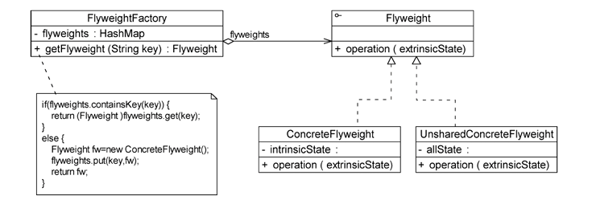

==Flyweight(抽象享元类)==:抽象享元类通常是一个接口或抽象类,在抽象享元类中声明了具体享元类公共的方法,这些方法可以向外界提供享元对象的内部数据(内部状态)，同时也可以通过这些方法来设置外部数据(外部状态)。

==ConcreteFlyweight(具体享元类)==:具体享元类实现了抽象享元类,其实例称为享元对象;在具体享元类中为内部状态提供了存储空间。通常==可以结合单例模式来设计具体享元类,为每一个具体享元类提供唯一的享元对象==。

==UnsharedConcreteFlyweight(非共享具体享元类)==:并不是所有的抽象享元类的子类都需要被共享,不能被共享的子类可设计为非共享具体享元类;当需要一个非共享具体享元类的对象时可以直接通过实例化创建。

==FlyweightFactory(享元工厂类)==:享元工厂类用于创建并管理享元对象,它针对抽象享元类编程,将各种类型的具体享元对象存储在一个享元池中,享元池一般设计为一个存储“键值对”的集合(也可以是其他类型的集合),可以结合工厂模式进行设计;当用户请求一个具体享元对象时,享元工厂提供一个存储在享元池中已创建的实例或者创建一个新的实例(如果不存在),返回新创建的实例并将其存储在享元池中。

#### 13.2.2 享元模式的实现

享元类 Flyweight 的设计是享元模式的要点之一,为了提高系统的可扩展性,通常会定义一个抽象享元类作为所有具体享元类的公共父类,典型的抽象享元类代码如下:


在具体享元类 ConcreteFlyweight中要将内部状态和外部状态分开处理,通常将内部状态作为具体享元类的成员变量,而外部状态通过注入的方式添加到具体享元类中。典型的具体享元类代码如下:


除了可以共享的具体享元类以外,在使用享元模式时有时候还需要处理那些不需要共享的抽象享元类 Flyweight 的子类,这些子类被定义为非共享具体享元类UnsharedConcreteFlyweight,其典型代码如下:


在享元模式中引人了享元工厂类 FlyweightFactory,享元工厂类的作用是提供一个用于存储享元对象的享元池,当用户需要对象时首先从享元池中获取,如果享元池中不存在，则创建一个新的享元对象返回给用户,并在享元池中保存该新增对象。典型的享元工厂类的代码如下:


### 13.3 享元模式应用实例

下面通过一个应用实例来进一步学习和理解享元模式。

#### 13.3.1 实例说明

某软件公司要开发一个围棋软件，其界面效果如下图所示


该软件公司的开发人员通过对围棋软件进行分析发现，在围棋棋盘中包含大量的黑子和白子,==它们的形状、大小一模一样,只是出现的位置不同而已==。如果将每一个棋子作为一个独立的对象存储在内存中,将导致该围棋软件在运行时所需的内存空间较大，那么如何降低运行代价、提高系统性能是需要解决的一个问题。

为了解决该问题，现使用享元模式来设计该围棋软件的棋子对象。

#### 13.3.2 实例类图

通过分析,本实例的结构图如下图所示。


在上图中,IgoChessman 充当抽象享元类,BlacklgoChessman 和 WhitelgoChessman充当具体享元类,IgoChessmanFactory 充当享元工厂类。

#### 13.3.3 实例代码

==IgoChessman==:围棋棋子类,充当抽象享元类


==BlacklgoChessman==:黑色棋子类,充当具体享元类。


==WhitelgoChessman==:白色棋子类,充当具体享元类。


==lgoChessmanFactory==:围棋棋子工厂类,充当享元工厂类,使用单例模式对其进行设计。


==Client==:客户端测试类

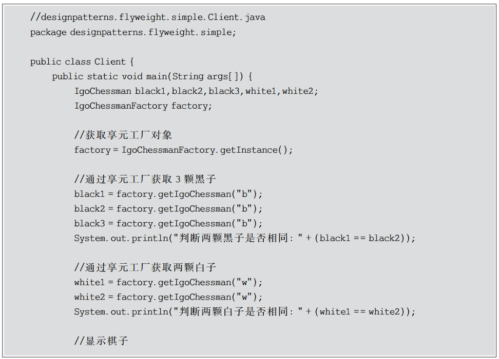


#### 13.3.4 结果分析

编译并运行程序,输出结果如下:


从输出结果可以看出,虽然在客户端代码中获取了3个黑子对象和两个白子对象,但是它们的内存地址相同,也就是说它们实际上是同一个对象。在实现享元工厂类时使用了单例模式和简单工厂模式,确保了享元工厂对象的唯一性,并提供工厂方法向客户端返回享元对象。

### 13.4 有外部状态享元模式

对 13.3节的应用实例中的围棋棋子进行进一步分析,不难发现虽然黑色棋子和白色棋子可以共享,但是它们将显示在棋盘的不同位置,如何让相同的黑子或者白子能够多次重复显示且位于一个棋盘的不同地方?==解决方法之一就是将棋子的位置定义为棋子的一个外部状态,在需要时再进行设置==。因此,在下图的基础上增加了一个新的类 Coordinates(坐标类),用于存储每一个棋子的位置,修改之后的结构图如下图所示。


在上图中除了增加一个坐标类 Coordinates 以外,抽象享元类 IgoChessman 中的display()方法也将对应增加一个 Coordinates 类型的参数,用于在显示棋子时指定其坐标,Coordinates类的代码如下:


修改之后的 IgoChessman 类代码如下:


将客户端测试代码修改如下:


编译并运行程序,输出结果如下:

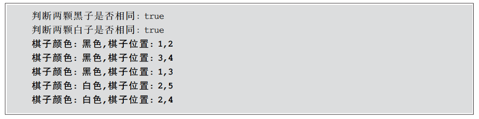

从输出结果可以看到,在每次调用 display()方法时都设置了不同的外部状态--坐标值,因此相同的棋子对象虽然具有相同的颜色,但是它们的坐标值不同,将显示在棋盘的不同位置。

### 13.5 单纯享元模式与复合享元模式

在标准的享元模式结构图中既包含==可以共享的具体享元类==,也包含==不可以共享的非共享具体享元类==。但是在实际使用过程中有时候会用到两种特殊的享元模式--单纯享元模式和复合享元模式,下面将对这两种特殊的享元模式进行简单的介绍。

#### 13.5.1 单纯享元模式

在==单纯享元模式中所有的具体享元类都是可以共享的,不存在非共享具体享元类==。单纯享元模式的结构如下图所示。


#### 13.5.2 复合享元模式

将一些==单纯享元对象使用组合模式加以组合还可以形成复合享元对象,这样的复合享元对象本身不能共享,但是它们可以分解成单纯享元对象,而后者则可以共享==。复合享元模式的结构如下图所示。


通过使用复合享元模式可以让复合享元类 CompositeConcreteFlyweight 中所包含的每个单纯享元类 ConcreteFlyweight都具有相同的外部状态,而这些单纯享元的内部状态往往可以不同。如果希望为多个内部状态不同的享元对象设置相同的外部状态,可以考虑使用复合享元模式。

### 13.6 享元模式与String类

JDK 类库中的 String 类使用了享元模式,通过以下代码加以说明:


在 Java 语言中,如果每次执行类似 String strl="abcd"的操作时都创建一个新的字符串对象将导致内存开销很大,因此如果第一次创建了内容为"abcd"的字符串对象 str1,下一次再创建内容相同的字符串对象 str2 时会将它的引用指向"abcd",不会重新分配内存空间,从而实现了"abcd"在内存中的共享。上述代码的输出结果如下:


可以看出,前两个输出语句均为 true,说明 str1、str2、str3 在内存中引用了相同的对象;如果有一个字符串 str4,其初值为"ab",再对它进行操作 str4 十="cd",此时虽然 str4 的内容与 str1 相同,但是由于 str4 的初始值不同,在创建 str4 时重新分配了内存,所以第3个输出语句结果为 false;最后一个输出语句结果也为 false,说明当对 str2 进行修改时将创建一个新的对象,修改工作在新对象上完成,而原来引用的对象并没有发生任何改变,str1 仍然引用原有对象,而 str2 引用新对象,str1 与 str2 引用了两个完全不同的对象。

Java String 类这种在修改享元对象时先将原有对象复制一份,然后在新对象上实施修改操作的机制称为“Copy On Write”,读者可以自行查询相关资料来进一步了解和学习“Copy On Write”机制,在此不作详细说明。

### 13.7 享元模式优/缺点与适用环境

当系统中存在大量相同或者相似的对象时享元模式是一种较好的解决方案,它通过共享技术实现相同或相似的细粒度对象的复用,从而节约了内存空间,提高了系统性能。相比其他结构型设计模式,享元模式的使用频率并不算太高,但是作为一种以“节约内存,提高性能”为出发点的设计模式,它在软件开发中还是得到了一定程度的应用。

#### 13.7.1 享元模式优点

享元模式的优点主要如下

1. ==享元模式可以减少内存中对象的数量,使得相同或者相似对象在内存中只保存一份==,从而可以节约系统资源,提高系统性能。

2. 享元模式的==外部状态相对独立,而且不会影响其内部状态==,从而使享元对象可以在不同的环境中被共享。

#### 13.7.2 享元模式缺点

享元模式的缺点主要如下

1. ==享元模式使系统变得复杂,需要分离出内部状态和外部状态==,这使得程序的逻辑复杂化。
2. 为了使对象可以共享,享元模式需要将享元对象的部分状态外部化,而读取外部状态将使运行时间变长。

#### 13.7.3 享元模式适用环境

在以下情况下可以考虑使用享元模式:

1. 一个系统有大量相同或者相似的对象,造成内存的大量耗费。

2. ==对象的大部分状态都可以外部化==,可以将这些外部状态传入对象中。

3. 在使用享元模式时需要维护一个存储享元对象的享元池,而这需要耗费一定的系统资源,因此应当在需要多次重复使用享元对象时才使用享元模式。

## 14、代理模式

### 14.1 代理模式概论

近年来,代购已逐渐成为电子商务的一个重要分支。何谓代购,简单来说就是找人帮忙购买所需要的商品,当然可能需要向实施代购的人支付一定的费用。代购通常分为两种类型:一种是因为在当地买不到某件商品,又或者是因为当地这件商品的价格比其他地区的贵,所以托人在其他地区甚至国外购买该商品,然后通过快递发货或者直接携带回来;还有一种代购,由于消费者对想要购买的商品相关信息缺乏,自己无法确定其实际价值而又不想被商家“宰”,只好委托中介机构帮其讲价或为其代买。代购网站为此应运而生,它为消费者提供在线代购服务,如果看中某国外购物网站上的商品,可以登录代购网站填写代购单并付款,代购网站会帮助进行购买然后通过快递公司将商品发送给消费者。商品代购过程如下图所示。


在软件开发中也有一种设计模式可以提供与代购网站类似的功能。==由于某些原因,客户端不想或不能直接访问一个对象,此时可以通过一个称为“代理”的第三者来实现间接访问,该方案对应的设计模式被称为代理模式==。

代理模式是一种应用很广泛的结构型设计模式,而且变化形式非常多,常见的代理形式有==远程代理、保护代理、虚拟代理、缓冲代理,智能引用代理等==,在后面将学习这些不同的代理形式

代理模式的定义如下

>==**代理模式:给某一个对象提供一个代理或占位符，并由代理对象来控制对原对象的访问。**==

代理模式是一种对象结构型模式。==在代理模式中引入了一个新的代理对象,代理对象在客户端对象和目标对象之间起到中介的作用,它去掉客户不能看到的内容和服务或者增添客户需要的额外的新服务==。

### 14.2 代理模式结构与实现

#### 14.2.1 代理模式结构

代理模式的结构比较简单,其核心是代理类,为了让客户端能够一致性地对待真实对象和代理对象,在代理模式中引人了抽象层,代理模式的结构如下图所示。

由下图可知,代理模式包含以下 3个角色。


==Subiect(抽象主题角色)==:它==声明了真实主题和代理主题的共同接口==,这样一来在任何使用真实主题的地方都可以使用代理主题,客户端通常需要针对抽象主题角色进行编程。

==Proxy(代理主题角色)==:它==包含了对真实主题的引用==,从而可以在任何时候操作真实主题对象;在代理主题角色中提供了一个与真实主题角色相同的接口,以便在任何时候都可以替代真实主题;代理主题角色还可以控制对真实主题的使用,负责在需要的时候创建和删除真实主题对象,并对真实主题对象的使用加以约束。==通常,在代理主题角色中客户端在调用所引用的真实主题操作之前或之后还需要执行其他操作,而不仅仅是单纯调用真实主题对象中的操作==。

==RealSubiect(真实主题角色)==:它定义了==代理角色所代表的真实对象==,在真实主题角色中实现了真实的业务操作,客户端可以通过代理主题角色间接调用真实主题角色中定义的操作。

#### 14.2.2 代理模式实现

代理模式的结构图比较简单,但是在真实的使用和实现过程中要复杂很多,特别是代理类的设计和实现。

==抽象主题类声明了真实主题类和代理类的公共方法==,它可以是接口、抽象类或具体类。客户端针对抽象主题类编程,一致性地对待真实主题和代理主题。典型的抽象主题类代码如下:


==真实主题类继承了抽象主题类,提供了业务方法的具体实现==,其典型代码如下:


代理类也是抽象主题类的子类,它维持一个对真实主题对象的引用,调用在真实主题中实现的业务方法,在调用时可以在原有业务方法的基础上附加一些新的方法对功能进行扩充或约束。最简单的代理类实现代码如下:


在实际开发过程中,代理类的实现比上述代码要复杂很多,代理模式根据其目的和实现方式不同可分为很多种类,对其中常用的几种代理模式简要说明如下。

1. 远程代理(Remote Proxy):为一个位于==不同地址空间的对象提供一个本地的代理对象==,这个不同的地址空间可以在同一台主机中,也可以在另一台主机中,远程代理又称为==大使(Ambassador)==。

2. 虚拟代理(Virtual Proxy):如果需要创建一个资源消耗较大的对象,先创建一个消耗相对较小的对象来表示,==真实对象只在需要时才会被真正创建==。

3. 保护代理(Protect Proxy):控制对一个对象的访问,可以给不同的用户提供不同级别的使用权限。

4. 缓冲代理(Cache Proxy):为==某一个目标操作的结果提供临时的存储空间,以便多个客户端可以共享这些结果==。

5. 智能引用代理(Smart Reference Proxy):当一个对象被引用时提供一些额外的操作,例如将对象被调用的次数记录下来等。在这些常用的代理模式中有些代理类的设计非常复杂,例如远程代理类,它封装了底层网络通信和对远程对象的调用,其实现较为复杂。

### 14.3 代理模式应用实例

下面通过一个应用实例来进一步学习和理解代理模式

#### 14.3.1 实例说明

某软件公司承接了某信息咨询公司的收费商务信息查询系统的开发任务，该系统的基本需求如下:

1. 在进行商务信息查询之前用户需要通过身份验证，只有合法用户才能够使用该查询系统。

2. 在进行商务信息查询时系统需要记录查询日志，以便根据查询次数收取查询费用。

该软件公司的开发人员已完成了商务信息查询模块的开发任务现希望能够以一种松耦合的方式向原有系统增加身份验证和日志记录功能,客户端代码可以无区别地对待原始的商务信息查询模块和增加新功能之后的商务信息查询模块，而且可能在将来还要在该信息查询模块中增加一些新的功能。

试使用代理模式设计并实现该收费商务信息查询系统。

#### 14.3.2 实例类图

通过分析,可以采用一种间接访问的方式来实现该商务信息查询系统的设计,在==客户端对象和信息查询对象之间增加一个代理对象,让代理对象实现身份验证和日志记录等功能==,而无须直接对原有的商务信息查询对象进行修改,如下图所示。


在上图中,客户端对象通过代理对象间接访问具有商务信息查询功能的真实对象在代理对象中除了调用真实对象的商务信息查询功能外,还增加了身份验证和日志记录等功能。使用代理模式设计该商务信息查询系统,结构图如下图所示


在上图中,业务类 AccessValidator 用于验证用户身份,业务类 Logger 用于记录用户查询日志,Searcher 充当抽象主题角色,RealSearcher 充当真实主题角色,ProxySearcher充当代理主题角色。

#### 14.3.3 实例代码

==AccessValidator==:身份验证类(业务类),它提供 validate()方法来实现身份验证。


==Logger==:日志记录类(业务类),它提供 log()方法来保存日志


==Searcher==:抽象査询类,充当抽象主题角色,它声明了 doSearch()方法


==RealSearcher==:具体查询类,充当真实主题角色,它实现査询功能,提供 doSearch()方法来查询信息。


==ProxySearcher==:代理査询类,充当代理主题角色,它是査询代理,维持了对 RealSearcher对象、AccessValidator 对象和 Logger 对象的引用。


==Client==:客户端测试类


#### 14.3.4 结果分析

编译并运行程序,输出结果如下:


本实例是保护代理和智能引用代理的应用实例,在代理类ProxySearcher 中实现对真实主题类的权限控制和引用计数,如果需要在访问真实主题时增加新的访问控制机制和新功能,只需增加一个新的代理类,再修改配置文件,在客户端代码中使用新增代理类即可,源代码无须修改,符合开闭原则。

### 14.4 远程代理

远程代理(Remote Proxy)是一种常用的代理模式,它使得客户端程序可以访问在远程主机上的对象,远程主机可能具有更好的计算性能与处理速度,可以快速响应并处理客户端的请求。远程代理可以将网络的细节隐藏起来,使得客户端不必考虑网络的存在。客户端完全可以认为被代理的远程业务对象是在本地而不是在远程,而远程代理对象承担了大部分的网络通信工作,并负责对远程业务方法的调用。

远程代理示意图如下图所示,==客户端对象不能直接访问远程主机中的业务对象,只能采取间接访问的方式==。远程业务对象在本地主机中有一个代理对象,该代理对象负责对远程业务对象的访问和网络通信,它对于客户端对象而言是透明的。客户端无须关心实现具体业务的是谁,只需要按照服务接口所定义的方式直接与本地主机中的代理对象交互即可。


在 Java 语言中==可以通过一种名为 RMI(Remote Method Invocation,远程方法调用)的机制来实现远程代理==,它能够实现一个Java 虚拟机中的对象调用另一个Java 虚拟机中对象的方法。在 RMI中,客户端对象可以通过一个桩(Stub)对象与远程主机上的业务对象进行通信,由于桩对象和远程业务对象接口一致,因此对于==客户端而言操作远程对象和本地桩对象没有任何区别,桩对象就是远程业务对象在本地主机的代理对象==。

在 RMI实现的过程中,远程主机端有一个 Skeleton(骨架)对象来负责与 Stub 对象通信,RMI的基本实现步骤如下:

1. 客户端发起请求,将请求转交至RMI客户端的 Stub类
2. Stub 类将请求的接口、方法、参数等信息进行序列化
3. 将序列化后的流使用 Socket传输至服务器端。
4. 服务器端接收到流后将其转发至相应的 Skeleton类。
5. Skeleton 类将请求信息反序列化后调用实际的业务处理类。
6. 业务处理类处理完毕后将结果返回给 Skeleton 类。
7. Skeleton类将结果序列化,再次通过 Socket 将流传送给客户端的 Stub。
8. Stub在接收到流后进行反序列化,将反序列化后得到的 Java Obiect 对象返回给客户端调用者。

至此,一次完整的远程方法调用得以完成。

除了RMI之外,在Java语言中还可以通过很多其他方式来实现远程通信和远程方法调用,例如 XML-RPC、Binary-RPC、JBoss-Remoting、Spring-Remoting、Hessian 等,读者可以自行查阅相关资料进行扩展学习

### 14.5 虚拟代理

==虚拟代理(Virtual Proxy)也是一种常用的代理模式,对于一些占用系统资源较多或者加载时间较长的对象,可以给这些对象提供一个虚拟代理==。在真实对象创建成功之前虚拟代理扮演真实对象的替身,而当真实对象创建之后虚拟代理将用户的请求转发给真实对象。

通常在以下两种情况下可以考虑使用虚拟代理:

1. 由于对象本身的复杂性或者网络等原因导致一个对象需要较长的加载时间,此时可以用一个加载时间相对较短的代理对象来代表真实对象。通常在实现时可以结合多线程技术,一个线程用于显示代理对象,其他线程用于加载真实对象。这种虚拟代理模式可以应用在程序启动的时候,由于创建代理对象在时间和处理复杂度上要少于创建真实对象,因此在程序启动时可以用代理对象代替真实对象初始化,大大加速了系统的启动时间。当需要使用真实对象时再通过代理对象来引用,而此时真实对象可能已经成功加载完毕,可以缩短用户的等待时间。

2. 当一个对象的加载十分耗费系统资源的时候也非常适合使用虚拟代理。虚拟代理可以让那些占用大量内存或处理起来非常复杂的对象推迟到使用它们的时候才创建,而在此之前用一个相对来说占用资源较少的代理对象来代表真实对象,再通过代理对象来引用真实对象。为了节省内存,在第一次引用真实对象时再创建对象,并且该对象可以被多次重用,在以后每次访问时需要检测所需对象是否已经被创建,因此在访问该对象时需要进行存在性检测,这需要消耗一定的系统时间,但是可以节省内存空间,这是一种用时间换取空间的做法。

无论是以上哪种情况,虚拟代理都是用一个“虚假”的代理对象来代表真实对象,通过代理对象来间接引用真实对象,可以在一定程度上提高系统的性能。

### 14.6 Java动态代理

在传统的代理模式中客户端通过 Proxy 类调用 RealSubject 类的 request()方法,同时还可以在代理类中封装其他方法(例如 preRequest()和 postRequest()等)。如果按照这种方法使用代理模式,那么代理类和真实主题类都应该是事先已经存在的,代理类的接口和所代理方法都已明确指定。每一个代理类在编译之后都会生成一个 class 文件,代理类所实现的接口和所代理的方法都被固定,这种代理被称为静态代理(Static Proxy)。如果需要为不司的真实主题类提供代理类或者代理一个真实主题类中的不同方法,都需要增加新的代理类,这将导致系统中的类个数急剧增加,因此需要想办法减少系统中类的个数。

动态代理(Dynamic Proxy)可以让系统在运行时根据实际需要来动态创建代理类,让同一个代理类能够代理多个不同的真实主题类而且可以代理不同的方法。动态代理是一种较为高级的代理模式,它在事务管理、AOP(Aspect-Oriented Programming,面向方面编程)等领域都发挥了重要的作用。

从 JDK 1.3开始,Java语言提供了对动态代理的支持,Java 语言实现动态代理时需要用到位于 java.lang.reflect 包中的一些类,现简要说明如下:

1. Proxy 类

Proxy 类提供了用于创建动态代理类和实例对象的方法,它是所创建的动态代理类的父类,它最常用的方法如下。

(1) public static Class <?> getProxyClass( ClassLoader loader, Class <? >...interfaces):该方法用于返回一个 Class 类型的代理类,在参数中需要提供类加载器并需要指定代理的接口数组(与真实主题类的接口列表一致)。

(2) public static Obiect newProxyInstance (ClassLoader loader, Class <?> interfaces,InvocationHandler h):该方法用于返回一个动态创建的代理类的实例,方法中的第一个参数 loader 表示代理类的类加载器,第二个参数 interfaces 表示代理类所实现的接口列表(与真实主题类的接口列表一致),第三个参数h表示所指派的调用处理程序类。

2. InvocationHandler 接口

InvocationHandler 接口是代理处理程序类的实现接口,该接口作为代理实例的调用处理者的公共父类,每一个代理类的实例都可以提供一个相关的具体调用处理者(InyocationHandler 接口的子类)。在该接口中声明了如下方法:

public Object invoke(Object proxy, Method method,Object[] args)

该方法用于处理对代理类实例的方法调用并返回相应的结果,当一个代理实例中的业务方法被调用时将自动调用该方法。invoke()方法包含3个参数,其中第一个参数 proxy表示代理类的实例,第二个参数 method 表示需要代理的方法,第三个参数 args 表示代理方法的参数数组。

动态代理类需要在运行时指定所代理真实主题类的接口,客户端在调用动态代理对象的方法时调用请求会将请求自动转发给 InvocationHandler 对象的 invoke()方法,由 invoke()方法来实现对请求的统一处理。

下面通过一个简单实例来学习如何使用动态代理模式:

>某软件公司要为公司OA系统数据访问层DAO增加方法调用日志，记录每一个方法被调用的时间和调用结果，现使用动态代理进行设计和实现。

本实例的完整代码如下

==AbstractUserDAO==:抽象用户 DAO类,抽象主题角色


==AbstractDocumentDAO==:抽象文档 DAO类,抽象主题角色

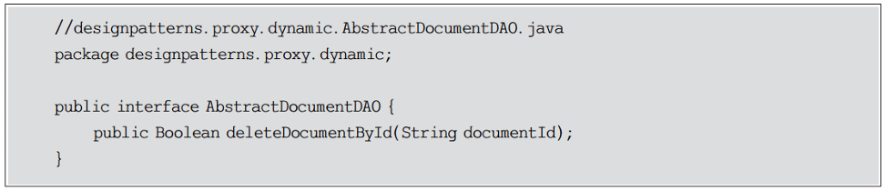

==UserDAO==:用户 DAO类,具体主题角色

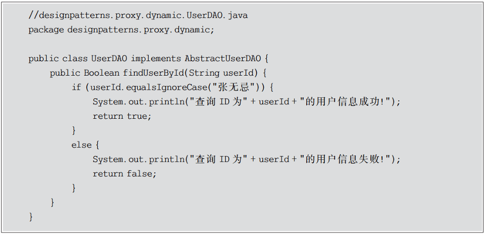

==DocumentDAO==:文档 DA0类,具体主题角色


==DAOLogHandler==:自定义请求处理程序类


==Client==:客户端测试类


编译并运行程序,输出结果如下:


通过使用动态代理可以实现对多个真实主题类的统一代理和集中控制。

JDK中提供的动态代理只能代理一个或多个接口,如果需要动态代理具体类或抽象类,可以使用 CGLib(Code Generation library)等工具。CGLib 是一个功能较为强大、性能和质量也较好的代码生成包,在许多 AOP框架中得到了广泛应用,读者可以自行查阅相关资料来学习 CGLib。

### 14.7 代理模式优/缺点与适用环境

代理模式是常用的结构型设计模式之一,它为对象的间接访问提供了一个解决方案,可以对对象的访问进行控制。代理模式的类型较多,其中远程代理、虚拟代理、保护代理等在软件开发中的应用非常广泛。在 Java RMI、EJB、Web Service、Spring AOP 等技术和框架中都使用了代理模式。

#### 14.7.1 代理模式优点

代理模式的共同优点如下:

1. 能够协调调用者和被调用者,在一定程度上降低了系统的耦合度

2. ==客户端可以针对抽象主题角色进行编程,增加和更换代理类无须修改源代码==,符合开闭原则，系统具有较好的灵活性和可扩展性。
3. 此外,不同类型的代理模式具有独特的优点,例如:
   1. 远程代理为位于两个不同地址空间的对象的访问提供了一种实现机制,可以将一
      些消耗资源较多的对象和操作移至性能更好的计算机上,提高了系统的整体运行效率。
   2. 虚拟代理通过一个消耗资源较少的对象来代表一个消耗资源较多的对象,可以在
      定程度上节省系统的运行开销。
   3. 缓冲代理为某一个操作的结果提供临时的缓存存储空间,以便在后续使用中能够
      共享这些结果,优化系统性能,缩短执行时间。
   4. 保护代理可以控制对一个对象的访问权限,为不同用户提供不同级别的使用权限

#### 14.7.2 代理模式缺点

代理模式的缺点主要如下:

1. 由于在==客户端和真实主题之间增加了代理对象,因此有些类型的代理模式可能会造成请求的处理速度变慢,例如保护代理。==

2. 实现代理模式需要额外的工作,而且有些代理模式的实现过程较为复杂,例如远程代理。

#### 14.7.3 代理模式适用环境

代理模式的类型较多,不同类型的代理模式有不同的优/缺点,它们应用于不同的场合:

1. 当客户端对象需要访问远程主机中的对象时可以使用远程代理。
2. ==当需要用一个消耗资源较少的对象来代表一个消耗资源较多的对象==,从而降低系统开销、缩短运行时间时可以使用虚拟代理,例如一个对象需要很长时间才能完成加载时。
3. 当需要为某一个被频繁访问的操作结果提供一个临时存储空间,以供多个客户端共享访问这些结果时可以使用缓冲代理。通过使用缓冲代理,==系统无须在客户端每一次访问时都重新执行操作,只需直接从临时缓冲区获取操作结果即可==。
4. 当需要控制对一个对象的访问为不同用户提供不同级别的访问权限时可以使用保护代理。
5. 当需要为一个对象的访问(引用)提供一些额外的操作时可以使用智能引用代理


## 15、职责链模式

### 15.1 行为型模式

在软件系统运行时对象并不是孤立存在的,它们可以通过相互通信协作完成某些功能，一个对象在运行时也将影响到其他对象的运行。==行为型模式(Behavioral Pattern)关注系统中对象之间的交互,研究系统在运行时对象之间的相互通信与协作,进一步明确对象的职责==。行为型模式不仅仅关注类和对象本身,还重点关注它们之间的相互作用和职责划分。行为型模式分为类行为型模式和对象行为型模式两种,其中类行为型模式使用继承关系在几个类之间分配行为,主要通过多态等方式来分配父类与子类的职责;而对象行为型模式则使用对象的关联关系来分配行为,主要通过对象关联等方式来分配两个或多个类的职责。根据合成复用原则,在系统中复用功能时要尽量使用关联关系来取代继承关系,因此大部分行为型设计模式都属于对象行为型设计模式。

在 GoF 设计模式中包含 11 种行为型模式,它们的名称、定义、学习难度和使用频率如下图所示。


### 15.2 职责链模式概述

在很多情况下可以处理某个请求的对象并不止一个,例如大学里的奖学金审批,学生在向辅导员提交审批表之后首先是辅导员签字审批,然后交给系主任签字审批,接着是院长审批,最后可能是校长来审批,在这个过程中奖学金申请表可以看成是一个请求对象,而不同级别的审批者都可以处理该请求对象,除了辅导员之外,学生不需要一一与其他审批者交互,只需要等待结果即可。在审批过程中如果某一个审批者认为不符合条件,则请求中止;否则将请求递交给下一个审批者,最后由校长来确定能否授予奖学金。该过程可以用如下图所示的示意图来表示。


在上图中,==辅导员、系主任、院长、校长都可以处理奖学金申请表,他们构成一个处理申请表的链式结构==,申请表沿着这条链进行传递,这条链就称为职责链。

==职责链可以是一条直线、一个环或者一个树形结构,最常见的职责链是直线型,即沿着一条单向的链来传递请求==。链上的每一个对象都是请求处理者,职责链模式可以将请求的处理者组织成一条链,并让请求沿着链传递,由链上的处理者对请求进行相应的处理,客户端无须关心请求的处理细节以及请求的传递,只需将请求发送到链上即可,将请求的发送者和请求的处理者解耦。这就是职责链模式的模式动机。

职责链模式的定义如下:

>==**职责链模式:避免将一个请求的发送者与接收者耦合在一起，让多个对象都有机会处理请求。将接收请求的对象连接成一条链，并且沿着这条链传递请求，直到有一个对象能够处理它为止。**==

由于英文翻译的不同,职责链模式又称为责任链模式,它是一种对象行为型模式。

### 15.3 职责链模式结构与实现

#### 15.3.1 职责链模式结构

职责链模式结构的核心在于引人了一个抽象处理者,其结构如下图所示。


由下图可知,职责链模式包含以下两个角色。

==Handler(抽象处理者)==:==它定义了一个处理请求的接口,一般设计为抽象类==,由于不同的具体处理者处理请求的方式不同,因此在其中定义了抽象请求处理方法。==每一个处理者的下家还是一个处理者,故在抽象处理者中定义了一个抽象处理者类型的对象(如结构图中的 successor)作为其对下家的引用,通过该引用处理者可以连成一条链==。

==ConcreteHandler(具体处理者)==:它是抽象处理者的子类,可以处理用户请求,在具体处理者类中实现了抽象处理者中定义的抽象请求处理方法,在处理请求之前需要进行判析,看是否有相应的处理权限,==如果可以处理请求就处理它,否则将请求转发给后继者;在具体处理者中可以访问链中的下一个对象,以便请求的转发==。

#### 15.3.2 职责链模式实现

在职责链模式中很多对象由每一个对象对其下家的引用连接起来形成一条链。请求在这个链上传递,直到链上的某一个对象决定处理此请求。发出这个请求的客户端并不知道链上的哪一个对象最终处理这个请求,这使得系统可以在不影响客户端的情况下动态地重新组织链和分配责任。

职责链模式的核心在于抽象处理者类的设计,抽象处理者的典型代码如下，


在上述代码中,==抽象处理者类定义了对下家的引用对象,以便将请求转发给下家,该对象的访问符可设为 protected,在其子类中可以使用==。在抽象处理者类中声明了抽象的请求处理方法,具体实现交由子类完成。

具体处理者是抽象处理者的子类,它有两个作用:==一是处理请求==,不同的具体处理者以不同的形式实现抽象请求处理方法 handleRequest();==二是转发请求==,如果该请求超出了当前处理者类的权限,可以将该请求转发给下家。具体处理者类的典型代码如下:


在具体处理类中通过对请求进行判断可以做出相应的处理，

需要注意的是,==职责链模式并不负责创建职责链,职责链的创建工作必须由系统的其他部分来完成,一般是在使用该职责链的客户端中创建职责链==。职责链模式降低了请求的发送端和接收端之间的耦合,使多个对象都有机会处理这个请求。典型的客户端代码片段如下:


### 15.4 职责链模式应用实例

下面通过一个应用实例来进一步学习和理解职责链模式

#### 15.4.1 实例说明

某企业的 SCM(Supply Chain Management,供应链管理)系统中包含一个采购审批子系统。该企业的采购审批是分级进行的，即根据采购金额的不同由不同层次的主管人员来审批,主任可以审批5万元以下(不包括5万元)的采购单,副董事长可以审批5万元至 10 万元(不包括 10 万元)的采购单,董事长可以审批 10 万元至 50 万元(不包括 50 万元)的采购单,50 万元及以上的采购单则需要开董事会讨论决定，如下图所示。


现使用职责链模式设计并实现该系统，

#### 15.4.2 实例类图

通过分析,本实例的结构图如下图所示。

在下图中,抽象类 Approver 充当抽象处理者(抽象传递者),Director、VicePresident、President 和 Congress 充当具体处理者(具体传递者),PurchaseRequest 充当请求类。


#### 15.4.3 实例代码

==PurchaseRequest==:采购单类,充当请求类。


==Approver==:审批者类,充当抽象处理者


==VicePresident==:副董事长类,充当具体处理者


==President==:董事长类,充当具体处理者


==Congress==:董事会类,充当具体处理者


==Client==:客户端测试类


#### 15.4.4 结果分析

编译并运行程序,输出结果如下:


如果需要在系统中增加一个新的具体处理者,例如增加一个经理(Manager)角色可以审批5万元至8万元(不包括8万元)的采购单,需要编写一个新的具体处理者类 Manager作为抽象处理者类 Approver 的子类,实现在 Approver 类中定义的抽象处理方法,如果采购金额大于等于8万元,则将请求转发给下家。其代码如下:


由于链的创建过程由客户端负责,因此增加新的具体处理者类对原有类库无任何影响,无须修改已有类的源代码,符合开闭原则。

在客户端代码中,如果要将新的具体请求处理者应用在系统中,需要创建新的具体处理者对象,然后将该对象加人职责链中。在客户端测试代码中增加以下代码:


将建链代码改为:


重新编译并运行程序,输出结果如下:


### 15.5 纯与不纯的职责链模式

职责链模式可分为纯的职责链模式和不纯的职责链模式两种，

#### 15.5.1 纯的职责链模式

一个纯的职责链模式要求一个==具体处理者对象只能在两个行为中选择一个,要么承担全部责任,要么将责任推给下家,不允许出现某一个具体处理者对象在承担了一部分或全部责任后又将责任向下传递的情况==。而且在==纯的职责链模式中要求一个请求必须被某一个处理者对象所接收,不能出现某个请求未被任何一个处理者对象处理的情况==。在15.4节的采购单审批实例中应用的是纯的职责链模式。

#### 15.5.2 不纯的职责链模式

在一个不纯的职责链模式中允许==某个请求被一个具体处理者部分处理后再向下传递，或者一个具体处理者处理完某请求后其后继处理者可以继续处理该请求,而且一个请求可以最终不被任何处理者对象所接收并处理==。

Java AWT 1.0中的事件处理模型应用的是不纯的职责链模式,其基本原理如下:由于窗口组件(如按钮、文本框等)一般位于容器组件中,因此当事件发生在某一个组件上时先通过组件对象的 handleEvent()方法将事件传递给相应的事件处理方法,该事件处理方法将处理此事件,然后决定是否将该事件向上一级容器组件传播;上级容器组件在接到事件之后可以继续处理此事件并决定是否继续向上级容器组件传播,如此反复,直到事件到达顶层容器组件为止;如果一直传到最顶层容器仍没有处理方法,则该事件不予处理。每一级组件在接收到事件时都可以处理此事件,而不论此事件是否在上一级已得到处理,还存在事件未被处理的情况。显然,这就是不纯的职责链模式,早期的Java AWT 事件模型(JDK 1.0及更早)中的这种事件处理机制又叫事件浮升(Event Bubbling)机制。从 Java.1.1 以后,JDK使用观察者模式代替职责链模式来处理事件。目前,在JavaScript 中然可以使用这种事件浮升机制来进行事件处理。

#### 15.6 职责链模式优缺点与适用环境

职责链模式通过建立一条链来组织请求的处理者,请求将沿着链进行传递,请求发送者无须知道请求在何时,何处以及如何被处理,实现了请求发送者与处理者的解耦。在软件开发中,如果遇到有多个对象可以处理同一请求可以应用职责链模式,例如在Web 应用开发中创建多个过滤器(Filter)链来对请求数据进行过滤,在工作流系统中实现公文的分级审批等,使用职责链模式可以较好地解决此类问题。Java语言中的异常处理(ExceptionHandlers)机制也是职责链模式的典型应用之一,==不同的 catch 子句可以处理不同类型的异常,这些 catch 子句构成了一条处理异常对象的职责链==。

#### 15.6.1 优点

职责链模式的优点主要如下

1. 职责链模式使得一个对象无须知道是其他哪一个对象处理其请求,==对象仅需知道该请求会被处理即可,接收者和发送者都没有对方的明确信息,并且链中的对象不需要知道链的结构,由客户端负责链的创建,降低了系统的耦合度==。
2. 请求处理对象==仅需维持一个指向其后继者的引用,而不需要维持它对所有的候选处理者的引用,可简化对象之间的相互连接==。
3. 在给对象分派职责时,职责链可以带来更多的灵活性,可以通过在运行时对该链进行动态的增加或修改来增加或改变处理一个请求的职责。
4. 在系统中增加一个新的具体请求处理者时无须修改原有系统的代码,==只需要在客户端重新建链即可==,从这一点来看是符合开闭原则的。

#### 15.6.2 缺点

职责链模式的缺点主要如下

1. 由于一个请求没有明确的接收者,那么就不能保证它一定会被处理,该请求可能直到链的末端都得不到处理:==一个请求也可能因职责链没有被正确配置而得不到处理==。
2. 对于比较长的职责链,请求的处理可能涉及多个处理对象,系统性能将受到一定的影响,而且在进行代码调试时不太方便。
3. 如果建链不当,==可能会造成循环调用,将导致系统陷入死循环==。

#### 15.6.3 适用环境

在以下情况下可以考虑使用职责链模式:

1. 有多个对象可以处理同一个请求,具体哪个对象处理该请求待运行时刻再确定,==客户端只需将请求提交到链上,而无须关心请求的处理对象是谁以及它是如何处理的==。
2. 在==不明确指定接收者的情况下向多个对象中的一个提交一个请求==。
3. 可动态指定一组对象处理请求,客户端可以动态创建职责链来处理请求,还可以改变链中处理者之间的先后次序。

## 16、命令模式

### 16.1 命令模式概述

在现实生活中人们通过使用开关来控制一些电器的打开和关闭,例如电灯或者排气扇在购买开关时,人们并不知道它将来到底用于控制什么电器,也就是说开关与电灯、排气扇并无直接关系,一个开关在安装之后可能用来控制电灯,也可能用来控制排气扇或者其他电器设备。开关与电器之间通过电线建立连接,如果开关打开,则电线通电,电器工作;反之开关关闭,电线断电,电器停止工作。相同的开关可以通过不同的电线来控制不同的电器，如下图所示。


在上图中可以将==开关理解成一个请求的发送者==,用户通过它来发送一个“开灯”请求,而电灯是“开灯”请求的最终接收者和处理者,开关和电灯之间并不存在直接耦合关系,它们通过电线连接在一起,使用不同的电线可以连接不同的请求接收者，只需更换一根电线,相同的发送者(开关)即可对应不同的接收者(电器)。

在软件开发中也存在很多与开关和电器类似的请求发送者和接收者对象,==例如一个按钮,它可能是一个"关闭窗口”请求的发送者，而按钮单击事件处理类则是该请求的接收者==。为了降低系统的耦合度,将请求的发送者和接收者解耦,可以使用一种被称为命令模式的设计模式来设计系统,==在命令模式中发送者与接收者之间引入了新的命令对象(类似上图中的电线),将发送者的请求封装在命令对象中,再通过命令对象来调用接收者的方法==。

命令模式可以将请求发送者和接收者完全解耦,发送者与接收者之间没有直接引用关系,发送请求的对象只需要知道如何发送请求,而不必知道如何完成请求。

命令模式的定义如下:

>==**命令模式:将一个请求封装为一个对象，从而可用不同的请求对客户进行参数化，对请求排队或者记录请求日志，以及支持可撤销的操作。**==

命令模式是一种对象行为型模式,其别名为动作(Action)模式或事务(Transaction)模命令模式的定义比较复杂,提到了很多术语,例如“用不同的请求对客户进行参数化”“对请求排队”“记录请求日志”“支持可撤销操作”等,在后面将对这些术语进行逐一讲解。

### 16.2 命令模式结构与实现

#### 16.2.1 命令模式结构

命令模式的核心在于引人了抽象命令类和具体命令类,通过命令类来降低发送者和接收者的耦合度,请求发送者只需指定一个命令对象,再通过命令对象来调用请求接收者的处理方法,其结构如下图所示。


由上图可知,命令模式包含以下 4个角色。

==Command(抽象命令类)==:==抽象命令类一般是一个抽象类或接口,在其中声明了用于执行请求的 execute()等方法==,通过这些方法可以调用请求接收者的相关操作。

==ConcreteCommand(具体命令类)==:==具体命令类是抽象命令类的子类,实现了在抽象命令类中声明的方法,它对应具体的接收者对象,将接收者对象的动作绑定其中==。具体命令类在实现 execute()方法时将调用接收者对象的相关操作(Action)。

==Invoker(调用者)==:调用者即请求发送者,它通过命令对象来执行请求。一个调用者并不需要在设计时确定其接收者,因此它只与抽象命令类之间存在关联关系。在程序运行时可以将一个具体命令对象注入其中,==再调用具体命令对象的 execute()方法,从而实现间接调用请求接收者的相关操作==。

==Receiver(接收者)==:接收者执行与请求相关的操作,具体实现对请求的业务处理。

#### 16.2.3 命令模式实现

命令模式的本质是对请求进行封装,==一个请求对应于一个命令,将发出命令的责任和执行命令的责任分割开==。==每一个命令都是一个操作:请求的一方发出请求要求执行一个操作;接收的一方收到请求并执行相应的操作==。命令模式允许请求的一方和接收的一方独立开来,使得请求的一方不必知道接收请求的一方的接口,更不必知道请求如何被接收、操作是否被执行、何时被执行,以及是怎么被执行的。

命令模式的关键在于引人了抽象命令类,==请求发送者针对抽象命令类编程,只有实现了抽象命令类的具体命令才与请求接收者相关联==。在最简单的抽象命令类中只包含了一个抽象的 execute()方法,每个具体命令类将一个 Receiver 类型的对象作为一个实例变量进行存储,从而具体指定一个请求的接收者,不同的具体命令类提供了 execute()方法的不同实现并调用不同接收者的请求处理方法。

典型的抽象命令类代码如下:


对于请求发送者(即调用者)而言,将针对抽象命令类进行编程,可以通过构造函数或者Setter 方法在运行时注人具体命令类对象,==并在业务方法中调用命令对象的 execute()方法==，其典型代码如下:


==具体命令类继承了抽象命令类==,它与请求接收者相关联,实现了在抽象命令类中声明的execute()方法,并在实现时调用接收者的请求响应方法 action(),其典型代码如下:


请求接收者 Receiver 具体实现对请求的业务处理,它拥有 action()方法,用于执行与请求相关的操作,其典型代码如下:


### 16.3 命令模式应用实例

下面通过一个应用实例来进一步学习和理解命令模式。

#### 16.3.1 实例说明

为了用户使用方便，某系统提供了一系列功能键，用户可以自定义功能键的功能,例如功能键 FunctionButton可以用于退出系统(由SystemExitClass 类来实现),也可以用于显示帮助文档(由 DisplayHelpClass类来实现)。

用户可以通过修改配置文件改变功能键的用途，现使用命令模式设计该系统,使得功能键类与功能类之间解耦，可为同一个功能键设置不同的功能。

#### 16.3.2 实例类图

通过分析,本实例的结构图如下图所示。


在上图中,FunctionButton 充当请求调用者,SystemExitClass 和 DisplayHelpClass充当请求接收者,Command 是抽象命令类,ExitCommand 和 HelpCommand 充当具体命令类。

#### 16.3.3 实例代码

==FunctionButton==:功能键类,充当请求调用者(请求发送者)


==Command==:抽象命令类。


==ExitCommand==:退出命令类,充当具体命令类。


==HelpCommand==:帮助命令类,充当具体命令类。


==SystemExitClass==:退出系统模拟实现类,充当请求接收者


==DisplayHelpClass==:显示帮助文档模拟实现类,充当请求接收者


配置文件 config.xml,在配置文件中存储了具体命令类的类名


==Client==:客户端测试类


#### 16.3.4 结果分析

编译并运行程序,输出结果如下:


如果需要更换具体命令类,无须修改源代码,只需修改配置文件,例如将退出命令改为帮助命令,只需将存储在配置文件中的具体命令类的类名 ExitCommand 改为 HelpCommand。

### 16.4 实现命令队列

有时候,当一个请求发送者发送一个请求时有不止一个请求接收者产生响应,这些请求接收者将逐个执行业务方法,完成对请求的处理,此时可以通过命令队列来实现。命令队列的实现方法有多种形式,其中最常用、灵活性最好的一种方式是增加一个
CommandQueue类,由该类负责存储多个命令对象,而不同的命令对象可以对应不同的请求接收者。CommandQueue 类的典型代码如下:


在增加了命令队列类 CommandQueue 以后,请求发送者类 Invoker 将针对 CommandQueue编程,其代码修改如下:


命令队列与人们常说的“批处理”有点类似。==批处理,顾名思义,可以对一组命令对象进行批量处理,当一个发送者发送请求后将有一系列接收者对请求作出响应,命令队列可以用于设计批处理应用程序,如果请求接收者的接收次序没有严格的先后次序,还可以使用多线程技术来并发调用命令对象的execute()方法,从而提高程序的执行效率==。

### 16.5 记录日志

==请求日志就是将请求的历史记录保存下来,通常以日志文件(Log File)的形式永久存储在计算机中==。很多系统都提供了日志文件,例如 Windows日志文件、Oracle 日志文件等日志文件可以记录用户对系统的一些操作(例如对数据的更改)。请求日志文件可以实现很多功能,常用功能如下:

(1)==一旦系统发生故障,日志文件可以为系统提供一种恢复机制==,在请求日志文件中可以记录用户对系统的每一步操作,从而让系统能够顺利恢复到某一个特定的状态。

(2)==请求日志也可以用干实现批处理==,在一个请求日志文件中可以存储一系列命令对象,例如一个命令队列。

(3)==可以将命令队列中的所有命令对象都存储在一个日志文件中,每执行一个命令则从日志文件中删除一个对应的命令对象==,防止因为断电或者系统重启等原因造成请求丢失,而且可以避免重新发送全部请求时造成某些命令的重复执行,只需读取请求日志文件,再继续执行文件中剩余的命令即可。

在实现请求日志时可以将发送请求的命令对象通过序列化写到日志文件中,此时命令类必须实现 iava.io. Serializable 接日。

### 16.6 实现撤销操作

在命令模式中可以通过对命令类进行修改使得系统支持撤销(Undo)操作和恢复(Redo)操作,下面通过一个简单实例来学习如何在命令模式中实现撤销操作。

>设计一个简易计算器,该计算器可以实现简单的数学运算，还可以对运算实施撤销操作

现使用命令模式设计可得到如下图所示的结构图，其中计算器界面类CalculatorForm 充当请求发送者,实现了数据求和功能的加法类 Adder 充当请求接收者,界面类可间接调用加法类中的 add()方法实现加法运算,并且提供了可撤销加法运算的undo()方法。


在本实例中,加法类 Adder 充当请求接收者,其代码如下!


AbstractCommand 充当抽象命令类,声明了 execute()方法和撤销方法 undo(),其代码如下:


AddCommand 充当具体命令类,实现了在抽象命令类 AbstractCommand 中声明的execute()方法和撤销方法 undo(),其代码如下:


CalculatorForm 充当请求发送者,它引用一个抽象命令类型 AbstractCommand 的对象command,通过该 command 对象间接调用请求接收者 Adder 类的业务处理方法,其代码如下：


在客户端测试类 Client 中定义了抽象命令类型的命令对象 command,还创建了请求发送者对象 form,通过调用 form 对象的 compute()方法实现加法运算,还可以调用 undo()方法撤销最后一次加法运算,其代码如下:


编译并运行程序,输出结果如下:


需要注意的是在本实例中只能实现一步撤销操作,因为没有保存命令对象的历史状态，可以通过引人一个命令集合或其他方式来存储每一次操作时命令的状态,从而实现多次撤销操作。除了 Undo 操作外,还可以采用类似的方式实现恢复(Redo)操作,即恢复所撤销的操作(或称为二次撤销)。

### 16.7 宏命令

==宏命令(Macro Command)又称为组合命令(Composite Command),它是组合模式和命令模式联用的产物。宏命令是一个具体命令类==,它拥有一个集合,在该集合中包含了对其他命令对象的引用。通常宏命令不直接与请求接收者交互,而是通过它的成员来调用接收者的方法。==当调用宏命令的 execute()方法时将递归调用它所包含的每个成员命令的 execute()方法,一个宏命令的成员可以是简单命令,也可以继续是宏命令==。执行一个宏命令将触发多个具体命令的执行,从而实现对命令的批处理,其结构如下图所示。


### 16.8 命令模式优/缺点与适用环境

命令模式是一种使用频率非常高的设计模式,它可以将请求发送者与接收者解耦,请求发送者通过命令对象来间接引用请求接收者,使得系统具有更好的灵活性和可扩展性。在基于 GU1的软件开发(无论是电脑桌面应用还是手机移动应用)中,命令模式都得到了广泛的应用。

#### 16.8.1 命令模式优点

命令模式的优点主要如下

1. ==降低系统的耦合度==。==由于请求者与接收者之间不存在直接引用,因此请求者与接收者之间实现完全解耦,相同的请求者可以对应不同的接收者,同样相同的接收者也可以供不同的请求者使用,两者之间具有良好的独立性==。
2. ==新的命令可以很容易地加入到系统中==。==由于增加新的具体命令类不会影响到其他类,因此增加新的具体命令类很容易==,无须修改原有系统源代码,甚至客户类代码,==满足开闭原则的要求==。
3. ==可以比较容易地设计一个命令队列或宏命令(组合命令)==。
4. 为==请求的撤销(Undo)和恢复(Redo)操作提供了一种设计和实现方案==。

#### 16.8.2 命令模式缺点

命令模式的缺点主要如下

使用命令模式可能会导致某些系统有==过多的具体命令类==。因为针对每一个对请求接收者的调用操作都需要设计一个具体命令类,所以在某些系统中可能需要提供大量的具体命令类,这将影响命令模式的使用。

#### 16.8.3 命令模式适用环境

在以下情况下可以考虑使用命令模式:

1. 系统需要将请求调用者和请求接收者解耦,使得调用者和接收者不直接交互。请求调用者无须知道接收者的存在,也无须知道接收者是谁,接收者也无须关心何时被调用。
2. 系统需要在不同的时间指定请求、将请求排队和执行请求。一个命令对象和请求的初始调用者可以有不同的生命期,换而言之,最初的请求发出者可能已经不在了,而命令对象本身仍然是活动的,可以通过该命令对象去调用请求接收者,并且无须关心请求调用者的存在性,可以通过请求日志文件等机制来具体实现。
3. 系统需要支持命令的撤销(Undo)操作和恢复(Redo)操作。
4. 系统需要将一组操作组合在一起形成宏命令。


## 17、解释器模式

### 17.1 解释器模式概论

虽然目前计算机编程语言有几百种,但有时候人们还是希望能用一些简单的语言来实现一些特定的操作,==用户只要向计算机输入一个句子或文件,它就能够按照预先定义的文法规则对句子或文件进行解释,从而实现相应的功能。==例如提供一个简单的加法/减法解释器,只要输人一个加法/减法表达式,它就能够计算出表达式结果,如下图所示,当输人字符串表达式为“1十2十3-4十1”时将输出计算结果为3。


众所周知,==像Java、C++和C#等语言无法直接解释类似“1+2+3-4+1”这样的字符串(如果直接作为数学表达式则可以解释),必须自己定义一套文法规则来实现对这些语句的解释,即设计一个自定义语言==。在实际开发中,这些简单的自定义语言可以基于现有的编程语言来设计,如果所基于的编程语言是面向对象语言，此时可以使用解释器模式实现自定义语言。

解释器模式是一种==使用频率相对较低且学习难度相对较大的设计模式==,它用于描述如何使用面向对象语言构成一个简单的语言解释器。在某些情况下,为了更好地描述某些特定类型的问题可以创建一种新的语言,==这种语言拥有自己的表达式和结构,即文法规则,这些问题的实例将对应为该语言中的句子,此时可以使用解释器模式来设计这种新的语言==。对解释器模式的学习能够加深对面向对象思想的理解,并且理解编程语言中文法规则的解释过程

解释器模式的定义如下:

>==**解释器模式:给定一个语言，定义它的文法的一种表示，并定义一个解释器,这个解释器使用该表示来解释语言中的句子。**==

在解释器模式的定义中所指的“语言”是使用规定格式和语法的代码,解释器模式是种类行为型模式。

### 17.2 文法规则与抽象语法树

解释器模式描述了如何为简单的语言定义一个文法,如何在该语言中表示一个句子,以及如何解释这些句子。在正式分析解释器模式结构之前先来学习==如何表示一个语言的文法规则以及如何构造一棵抽象语法树==。

在前面所提到的加法/减法解释器中,每一个输入表达式(例如“1+2+3-4+1”)都包含了3个语言单位,可以使规则来定义:


该文法规则包含3条语句,第一条表示表达式的组成方式,其中 value 和 operation 是后面两个语言单位的定义,==每一条语句所定义的字符串(如 operation 和 value)称为语言构造成分或语言单位==,符号“::=”是“定义为”的意思,其左边的语言单位通过右边来进行说明和定义,==语言单位对应终结符表达式和非终结符表达式==。例如本规则中的 operation 是非终结符表达式,它的组成元素仍然可以是表达式,可以进一步分解,而 value 是终结符表达式。它的组成元素是最基本的语言单位,不能再进行分解。在文法规则定义中可以使用一些符号来表示不同的含义,例如使用“|”表示或、使用“!”和“}”表示组合、使用“*”表示出现0次或多次等,其中使用频率最高的符号是表示“或”关系的==“|”==,例如==文法规则“boolValue::=0|1”表示终结符表达式boolValue 的取值可以为 0或者 1==。

除了使用文法规则来定义一个语言外,在解释器模式中还可以通过一种称为==抽象语法树(Abstract Syntax Tree,AST)的图形方式来直观地表示语言的构成==,每一棵抽象语法树对应一个语言实例,例如加法/减法表达式语言中的语句“1+2+3-4+1”可以通过如下图所示的抽象语法树来表示。


在该抽象语法树中可以通过终结符表达式value和非终结符表达式operation 组成复杂的语句,==每个文法规则的语言实例都可以表示为一个抽象语法树,即每一条具体的语句都可以用类似上图所示的抽象语法树来表示==,==在图中终结符表达式类的实例作为树的叶子结点,而非终结符表达式类的实例作为非叶子结点==,它们可以将终结符表达式类的实例以及包含终结符和非终结符实例的子表达式作为其子结点。抽象语法树描述了如何构成一个复杂的句子,通过对抽象语法树的分析可以识别出语言中的终结符类和非终结符类。

### 17.3 解释器模式的结构与实现

#### 17.3.1 解释器模式的机构

由于表达式可分为终结符表达式和非终结符表达式,因此==解释器模式的结构与组合模式的结构有些类似==,但在解释器模式中包含更多的组成元素,它的结构如下图所示。

由下图可知,解释器模式包含以下 4个角色。


==AbstractExpression(抽象表达式)==:在抽象表达式中声明了抽象的解释操作,它是所有终结符表达式和非终结符表达式的公共父类。

==TerminalExpression(终结符表达式)==:终结符表达式是抽象表达式的子类,它实现了与文法中的终结符相关联的解释操作,在句子中的每一个终结符都是该类的一个实例通常在一个解释器模式中只有少数几个终结符表达式类,它们的实例可以通过非终结符表达式组成较为复杂的句子。

==NonterminalExpression(非终结符表达式)==:非终结符表达式也是抽象表达式的子类,它实现了文法中非终结符的解释操作,由于在非终结符表达式中可以包含终结符表达式,也可以继续包含非终结符表达式,因此其解释操作一般通过递归的方式完成。

==Context(环境类)==:环境类又称为上下文类,它用于存储解释器之外的一些全局信息,通常它临时存储了需要解释的语句。

#### 17.3.2 解释器模式的实现

在解释器模式中每一种终结符和非终结符都有一个具体类与之对应,正因为使用类来表示每一条文法规则,所以系统将具有较好的灵活性和可扩展性。对于所有的终结符和非终结符,首先需要抽象出一个公共父类,即抽象表达式类。其典型代码如下:


终结符表达式类和非终结符表达式类都是抽象表达式类的子类,对于终结符表达式类其代码很简单,主要是对终结符元素的处理。其典型代码如下:


对于非终结符表达式,其代码相对比较复杂,因为可以通过非终结符将表达式组合成更加复杂的结构,对于包含两个操作元素的非终结符表达式类,其典型代码如下:

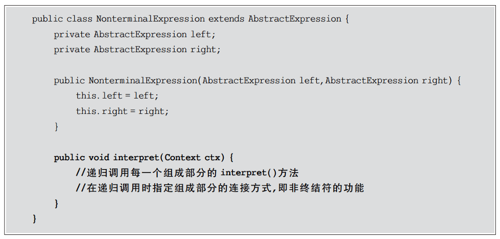

除了上述用于表示表达式的类以外,通常在解释器模式中还提供了一个环境类Context,用于存储一些全局信息,在环境类中一般包含了一个 HashMap 或 Arraylist 等类型的集合对象(也可以直接由 HashMap 等集合类充当环境类),存储一系列公共信息,例如变量名与值的映射关系(key/value)等,用于在执行具体的解释操作时从中获取相关信息其典型代码片段如下:


环境类 Context 的对象通常作为参数被传递到所有表达式的解释方法 interpret() 中可以在==环境类对象中存储和访问表达式解释器的状态==,向表达式解释器提供一些全局的、公共的数据,此外还可以在环境类中增加一些所有表达式解释器共有的功能,以减轻解释器的职责。当系统无须提供全局公共信息时可以省略环境类,根据实际情况决定是否需要环境类。

### 17.4 解释器模式的应用实例

#### 17.4.1 实例说明

某软件公司要开发一套机器人控制程序，在该机器人控制程序中包含一些简单的英文控制指令，每一个指令对应一个表达式(expression),该表达式可以是简单表达式也可以是复合表达式，每一个简单表达式由移动方向(direction),移动方式(action)和移动距离(distance)3部分组成,其中移动方向包括上(up)、下(down)、左(left)、右(right);移动方式包括移动(move)和快速移动(run);移动距离为一个正整数。两个表达式之间可以通过与(and)连接形成复合(composite)表达式:用户通过对图形化的设置界面进行操作可以创建一个机器人控制指令,机器人在收到指令后将按照指令的设置进行移动，例如输入控制指令“up move 5”,则“向上移动5 个单位”;输入控制指令“down run 10 and left move 20”,则“向下快速移动 10 个单位再向左移动 20个单位”。现使用解释器模式来设计该程序并模拟实现

#### 17.4.2 实例类图

根据上述需求描述用形式化语言表示该简单语言的文法规则如下


该语言一共定义了5条文法规则,对应5个语言单位,这些语言单位可以分为两类,类为终结符(也称为终结符表达式),例如 direction、action 和 distance,它们是语言的最小组成单位,不能再进行拆分;另一类为非终结符(也称为非终结符表达式),例如expression 和composite,它们都是一个完整的句子,包含一系列终结符或非终结符。

针对5条文法规则分别提供5个类来实现,其中终结符表达式 direction、action 和distance 对应 DirectionNode 类、ActionNode 类和 DistanceNode 类,非终结符表达式expression 和 composite 对应 SentenceNode 类和 AndNode 类。

可以通过抽象语法树来表示具体解释过程,例如机器人控制指令“down run 10 and left move 20”对应的抽象语法树如下图所示


机器人控制程序实例的基本结构如下图所示。


在上图 中，AbstractNode 充当抽象表达式角色,DirectionNode、ActionNode 和 DistanceNode 充当终结符表达式角色,AndNode 和 SentenceNode 充当非终结符表达式角色。

#### 17.4.3 实例代码

==AbstractNode==:抽象结点类,充当抽象表达式角色


==AndNode==:And结点类,充当非终结符表达式角色


==SentenceNode==:简单句子结点类,充当非终结符表达式角色


==DirectionNode==:方向结点类,充当终结符表达式角色


==ActionNode==:动作结点类,充当终结符表达式角色


==DistanceNode==:距离结点类,充当终结符表达式角色


==InstructionHandler==:指令处理类,工具类,提供相应的方法对输入指令进行处理。它将输入指令分割为字符串数组,将第一个、第二个和第三个单词组合成一个句子,并存入栈中;如果发现有单词“and”,则将“and”后的第一个、第二个和第三个单词组合成一个新的句子作为“and”的右表达式,并从栈中取出原先所存的句子作为左表达式,然后组合成一个And 结点存人栈中。依此类推,直到整个指令解析结束


==Client==:客户端测试类


#### 17.4.4 结果分析

编译并运行程序,输出结果如下:


如果将输人指令改为“up move 5 and down run 10 and left move 5”,则输出结果如下


本实例对机器人控制指令的输出结果进行模拟,将英文指令翻译为中文指令,在真实情况下系统将调用不同的控制程序对机器人进行控制,包括对移动方向、方式和距离的控制等。

### 17.5 解释器优缺点与适用环境

解释器模式为自定义语言的设计和实现提供了一种解决方案,用于定义一组文法规则并通过这组文法规则来解释语言中的句子。虽然解释器模式的使用频率不是特别高,但是它在正则表达式、XML,文档解释等领域还是得到了广泛使用。与解释器模式类似,目前还诞生了很多基于抽象语法树的源代码处理工具,例如 Eclipse 中的 Eclipse AST,它可以用于表示和处理 Java语言的语法结构,用户可以通过扩展其功能创建自己的文法规则,实现对源代码的分析。

#### 17.5.1 解释器优点

解释器模式的优点主要如下:

1. ==易于改变和扩展文法。由于在解释器模式中使用类表示语言的文法规则,因此可以通过继承等机制来改变或扩展文法==。
2. 每一条文法规则都可以表示为一个类,因此可以方便地实现一个简单的语言
3. ==实现文法较为容易==。在抽象语法树中每一个表达式结点类的实现方式都是相似的,这些类的代码编写都不会特别复杂,还可以通过一些工具自动生成结点类代码。
4. 增加新的解释表达式较为方便。如果用户要增加新的解释表达式只需要对应增加一个新的终结符表达式或非终结符表达式类,原有表达式类代码无须修改,符合开闭原则。

#### 17.5.2 解释器缺点

解释器模式的缺点主要如下:

1. 对于复杂文法难以维护。在解释器模式中每一条规则至少需要定义一个类,==因此如果一个语言包含太多文法规则,类的个数将会急剧增加==,导致系统难以管理和维护,此时可以考虑使用语法分析程序等方式来取代解释器模式。
2. 执行效率较低。由于在解释器模式中使用了大量的循环和递归调用,因此在解释较为复杂的句子时其速度很慢,而且代码的调试过程也比较麻烦。

#### 17.5.3 解释器的适用环境

在以下情况下可以考虑使用解释器模式:

1. 可以将一个需要解释执行的语言中的句子表示为一棵抽象语法树
2. 一些重复出现的问题可以用一种简单的语言进行表达。
3. 一个语言的文法较为简单。对于复杂的文法,解释器模式中的文法类层次结构将变得很庞大而无法管理,此时最好使用语法分析程序生成器，
4. 执行效率不是关键问题。高效的解释器通常不是通过直接解释抽象语法树来实现的,而是需要将它们转换成其他形式,使用解释器模式的执行效率并不高。

## 18、迭代器模式

### 18.1 迭代器模式概述

在现实生活中人们有两种方式来操作一台电视机以实现开机、关机、换台、改变音量等功能,一种方式是直接通过电视机控制面板上的按键来实现,另一种方式是通过电视机遥控器来间接实现。遥控器为操作电视机带来很大的方便,用户并不需要知道那些电视频道到底如何存储在电视机中。在此可以将电视机看成一个存储电视频道的集合对象,通过遥控器可以对电视机中的电视频道集合进行操作,例如返回上一个频道、跳转到下一个频道或者跳转至指定的频道。电视机遥控器和电视机示意图如下图示。


在软件开发中也存在大量类似电视机一样的类,==它们可以存储多个成员对象(元素),这些类通常称为聚合类(Aggregate Classes),对应的对象称为聚合对象==。为了更加方便地探作这些聚合对象,==同时可以很灵活地为聚合对象增加不同的遍历方法,也需要类似电视机遥控器一样的角色,可以访问一个聚合对象中的元素但又不需要暴露它的内部结构==。本章所要学习的迭代器模式将为聚合对象提供一个遥控器,通过引人迭代器客户端无须了解聚合对象的内部结构即可实现对聚合对象中成员的遍历,还可以根据需要很方便地增加新的遍历方式。

在软件系统中==聚合对象拥有两个职责:一是存储数据;二是遍历数据==。从依赖性来看,==前者是聚合对象的基本职责==;==而后者既是可变化的,又是可分离的==。因此可以将遍历数据的行为从聚合对象中分离出来,==封装在迭代器对象中==,由迭代器来提供遍历聚合对象内部数据的行为,这将简化聚合对象的设计,更符合单一职责原则的要求。

迭代器模式的定义如下:

>==**迭代器模式:提供一种方法顺序访问一个聚合对象中的各个元素,而又不用暴露该对象的内部表示。**==

迭代器模式又称==游标(Cursor)模式==,它是一种对象行为型模式

### 18.2 迭代器模式结构与实现

#### 18.2.1 迭代器模式结构

在迭代器模式结构中包含聚合和迭代器两个层次结构,考虑到系统的灵活性和可扩展性,在迭代器模式中应用了工厂方法模式,其模式结构如下图所示。

由下图可知,迭代器模式包含以下4个角色。


==Iterator(抽象迭代器)==:它定义了访问和遍历元素的接口,声明了用于遍历数据元素的方法,例如用于获取第一个元素的 first()方法、用于访问下一个元素的 next()方法、用于判断是否还有下一个元素的 hasNext()方法、用于获取当前元素的 currentltem()方法等在具体迭代器中将实现这些方法。

==Concretelterator(具体迭代器)==:它实现了抽象迭代器接口,完成对聚合对象的遍历,同时在具体迭代器中通过游标来记录在聚合对象中所处的当前位置,在具体实现时游标通常是一个表示位置的非负整数。

==Aggregate(抽象聚合类)==:它用于存储和管理元素对象,声明一个 createlterator()方法用于创建一个迭代器对象,充当抽象迭代器工厂角色。

==ConcreteAggregate(具体聚合类)==:它是抽象聚合类的子类,实现了在抽象聚合类中声明的 createlterator()方法,该方法返回一个与该具体聚合类对应的具体迭代器Concretelterator实例。

#### 18.2.2 迭代器模式实现

在迭代器模式中提供了一个外部的迭代器来对聚合对象进行访问和遍历,迭代器定义了一个访问该聚合元素的接口,并且可以跟踪当前遍历的元素,了解哪些元素已经遍历过。哪些没有。迭代器的引入将使对一个复杂聚合对象的操作变得简单。

下面将结合代码对迭代器模式的实现作进一步分析。在迭代器模式中应用了工厂方法模式,抽象迭代器对应于抽象产品角色,具体迭代器对应于具体产品角色,抽象聚合类对应于抽象工厂角色,具体聚合类对应于具体工厂角色。

在抽象迭代器中声明了用于==遍历聚合对象中所存储元素的方法==,其典型代码如下:


在具体迭代器中将实现抽象迭代器声明的遍历数据的方法,其典型代码如下:


需要注意的是,抽象迭代器接口的设计非常重要,一方面需要充分满足各种遍历操作的要求,尽量为各种遍历方法都提供声明;另一方面又不能包含太多方法,接口中的方法太多将给子类的实现带来麻烦。==因此可以考虑使用抽象类来设计抽象迭代器,在抽象类中为每一个方法提供一个空的默认实现==。如果需要在具体迭代器中为聚合对象增加全新的遍历探作,则必须修改抽象迭代器和具体迭代器的源代码,这将违反开闭原则,==因此在设计时要考点全面,避免之后修改接口==。

聚合类用于存储数据并负责创建迭代器对象,最简单的抽象聚合类代码如下:


具体聚合类作为抽象聚合类的子类,一方面负责存储数据,另一方面实现了==在抽象聚合类中声明的工厂方法 createlterator()==,用于返回一个与该具体聚合类对应的具体迭代器对象,典型代码如下:


### 18.3 迭代器模式应用实例

下面通过一个应用实例来进一步学习和理解迭代器模式

#### 18.3.1 简介说明

某软件公司为某商场开发了一套销售管理系统，在对该系统进行分析和设计时，==开发人员发现经常需要对系统中的商品数据、客户数据等进行遍历，为了复用这些遍历代码==，开发人员设计了一个==抽象的数据集合类 AbstractObjectList==,而将存储商品和客户等数据的类作为其子类，AbstractObiectList类的结构如下图所示。


在下图中 List 类型的对象 objects 用于存储数据,方法说明如下表所示。


AbstractObjectList 类的子类 ProductList 和CustomerList 分别用于存储商品数据和客户数据

通过分析发现 AbstractObjectList类的职责非常重,==它既负责存储和管理数据，又负责遍历数据,违反了单一职责原则，实现代码将非常复杂==。因此开发人员决定使用迭代器模式对AbstractObiectlis类进行重构，将负责遍历数据的方法提取出来封装到专门的类中，实现数据存储和数据遍历分离，还可以给不同的具体数据集合类提供不同的遍历方式。

现给出使用迭代器模式重构后的解决方案

#### 18.3.2 实例类图


在下图中,==AbstractObjectList 充当抽象聚合类==,ProductList 充当具体聚合类,Abstractlterator 充当抽象迭代器,ProductIterator 充当具体迭代器。

在本实例中为了详细说明自定义迭代器的实现过程,没有使用 JDK 中内置的迭代器事实上 JDK 内置迭代器已经实现了对一个 List 对象的正向遍历，

#### 18.3.3 实例代码

==AbstractObjectList==:抽象聚合类


==ProductList==:商品数据类,充当具体聚合类


==Abstractlterator==:抽象迭代器


==Productlterator==:商品迭代器,充当具体迭代器


==Client==:客户端测试类


#### 18.3.4 结果分析

编译并运行程序,输出结果如下:


如果需要增加一个新的具体聚合类,例如客户数据集合类,并且需要为客户数据集合类提供不同于商品数据集合类的正向遍历和逆向遍历操作,==只需增加一个新的聚合子类和一个新的具体迭代器类即可,原有类库代码无须修改,符合开闭原则==;如果需要为
Productlist 类更换一个迭代器,只需要增加一个新的具体迭代器类作为抽象迭代器类的子类,重新实现遍历方法,原有迭代器代码无须修改,也符合开闭原则;但是如果要在迭代器中增加新的方法,则需要修改抽象迭代器源代码,这将违背开闭原则

### 18.4 使用内部类实现迭代器

在如上实例类图所示的迭代器模式结构图中,具体迭代器类和具体聚合类之间存在双重关系,其中一个关系为关联关系,在具体迭代器中需要维持一个对具体聚合对象的引用,该关联关系的目的是访问存储在聚合对象中的数据,以便迭代器能够对这些数据进行遍历操作。

除了使用关联关系外,为了能够让迭代器可以访问到聚合对象中的数据,还可以将迭代器类设计为聚合类的内部类,JDK中的迭代器类就是通过这种方法来实现的，如AbstractList 类代码片段所示:


下面上一节中的 Productlist 类进行修改,将 Productlterator 类作为 Productlist类的内部类,代码如下:

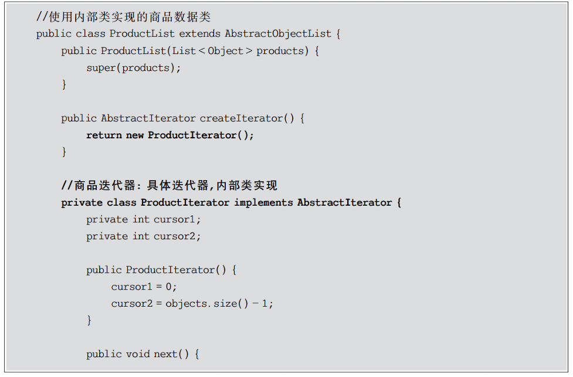


无论使用哪种实现机制,客户端代码都是一样的,也就是说客户端无须关心具体迭代器对象的创建细节,只需通过调用工厂方法 createlterator()即可得到一个可用的迭代器对象这也是使用工厂方法模式的好处,通过工厂来封装对象的创建过程,简化了客户端的调用。

### 18.5 迭代器模式优/缺点与适用环境

迭代器模式是一种使用频率非常高的设计模式,通过引人迭代器可以将数据的遍历功能从聚合对象中分离出来,聚合对象只负责存储数据,而遍历数据由迭代器来完成。由于很多编程语言的类库都已经实现了迭代器模式,因此在实际开发中只需要直接使用 Java、C#等语言已定义好的迭代器即可,迭代器已经成为操作聚合对象的基本工具之一。

#### 18.5.1 迭代器模式优点

迭代器模式的优点主要如下:

1. 迭代器模式支持以不同的方式遍历一个聚合对象,在同一个聚合对象上可以定义多种遍历方式。在迭代器模式中只需要用一个不同的迭代器来替换原有迭代器即可改变遍历算法,也可以自己定义迭代器的子类以支持新的遍历方式。
2. 迭代器模式简化了聚合类。由于引入了迭代器,在原有的聚合对象中不需要再自行提供数据遍历等方法,这样可以简化聚合类的设计。
3. ==在迭代器模式中由于引入了抽象层,增加新的聚合类和迭代器类都很方便,无须修改原有代码,满足开闭原则。==

#### 18.5.2 迭代器模式缺点

迭代器模式的缺点主要如下:

1. 由于迭代器模式将存储数据和遍历数据的职责分离,在增加新的聚合类时需要对应增加新的迭代器类,==类的个数成对增加,这在一定程度上增加了系统的复杂性==。
2. ==抽象迭代器的设计难度较大==,需要充分考虑到系统将来的扩展。在自定义迭代器时创建一个考虑全面的抽象迭代器并不是一件很容易的事情。

#### 18.5.3 迭代器模式适用环境

在以下情况下可以考虑使用迭代器模式:

1. 访问一个聚合对象的内容而无须暴露它的内部表示。将聚合对象的访问与内部数据的存储分离,使得访问聚合对象时无须了解其内部实现细节
2. 需要为一个聚合对象提供多种遍历方式。
3. 为遍历不同的聚合结构提供一个统一的接口,在该接口的实现类中为不同的聚合结构提供不同的遍历方式,而客户端可以一致性地操作该接口。

## 19、中介者模式

### 19.1 中介者模式概述

在 QQ 聊天中存在两种聊天方式:第一种是用户与用户直接聊天,第二种是通过 QQ群聊天,如下图所示。如果使用下图所示的方式,一个用户如果要与其他用户聊天或发送文件,通常需要加其他用户为好友,用户与用户之间存在多对多的联系,这将导致系统中用户之间的关系非常复杂,一个用户如果要将相同的信息或文件发送给其他所有用户必须一个一个地发送,于是 QQ群产生了,如下图所示。如果使用 QQ群,一个用户就可以向多个用户发送相同的信息和文件而无须一一进行发送,只需要将信息或文件发送到群中或作为群共享即可,群的作用就是将发送者所发送的信息和文件转发给每一个接收者用户。通过引入群的机制,将极大减少系统中用户之间的两两通信,用户与用户之间的联系可以通过群来实现。


在软件系统中,某些类/对象之间的相互调用关系错综复杂,**类似 QQ用户之间的关系此时特别需要一个类似“QQ 群”的中间类来协调这些类/对象之间的复杂关系,以降低系统的耦合度**。中介者模式为此而诞生,它通过在系统中增加中介者对象来降低原有类/对象之间的复杂引用关系。

下面对中介者模式的模式动机做进一步说明:

**如果在一个系统中对象之间的联系呈现为网状结构**,如下图所示,对象之间存在大量的多对多联系,将导致系统非常复杂,这些对象既会影响其他对象,也会被其他对象所影响,这些对象被称为==同事对象==,它们之间通过彼此的相互作用实现系统的行为。在网状结构中,几乎每个对象都需要与其他对象发生相互作用,而这种相互作用表现为一个对象与另外一个对象的直接耦合,这将导致一个过度耦合的系统。


中介者模式可以使对象之间的关系数量急剧减少,通过引入中介者对象,可以将系统的网状结构变成以中介者为中心的星形结构,如下图所示。在这个星形结构中,==同事对象不再直接与另一个对象联系,它通过中介者对象与另一个对象发生相互作用==。中介者对象的存在保证了对象结构上的稳定,也就是说,系统的结构不会因为新对象的引人带来大量的修改工作。


**如果在一个系统中对象之间存在多对多的相互关系,可以将对象之间的一些交互行为从各个对象中分离出来,集中封装在一个中介者对象中,并由该中介者进行统一协调,这样对象之间多对多的复杂关系就转化为相对简单的一对多关系。**

中介者模式的定义如下:

>==**中介者模式:定义一个对象来封装一系列对象的交互。中介者模式使各对象之间不需要显式地相互引用，从而使其耦合松散，而且用户可以独立地改变它们之间的交互。**==

中介者模式又称为==调停者模式==,它是一种对象行为型模式。在中介者模式中,通过引入中介者来简化对象之间的复杂交互,中介者模式是迪米特法则的一个典型应用。

### 19.2 中介者模式结构与实现

#### 19.2.1 中介者模式结构

在中介者模式中引入了用于协调其他对象/类之间相互调用的中介者类,为了让系统具有更好的灵活性和可扩展性,通常还提供了抽象中介者,其结构如下图所示。


由上图可知,中介者模式包含以下 4个角色。

==Mediator(抽象中介者)==:它定义一个接口,该接口用于与各同事对象之间进行通信。

==ConcreteMediator(具体中介者)==:它是抽象中介者的子类,通过协调各个同事对象来实现协作行为,它维持了对各个同事对象的引用。

==Colleague(抽象同事类)==:它定义各个同事类公有的方法,并声明了一些抽象方法供子类实现,同时它维持了一个对抽象中介者类的引用,其子类可以通过该引用与中介者通信。

==ConcreteColeague(具体同事类)==:它是抽象同事类的子类,每一个同事对象在需要和其他同事对象通信时先与中介者通信,通过中介者间接完成与其他同事类的通信；在具体同事类中实现了在抽象同事类中声明的抽象方法。

#### 19.2.2 中介者模式实现

中介者模式的核心在于中介者类的引人,在中介者模式中,中介者类承担了两个方面的职责:

1. ==中转作用(结构性)==:通过中介者提供的中转作用,各个同事对象不再需要显式地引用其他同事,当需要和其他同事进行通信时可通过中介者实现间接调用。该中转作用属于中介者在结构上的支持。
2. ==协调作用(行为性)==:中介者可以更进一步地对同事之间的关系进行封装,同事可以一致地和中介者进行交互,而不需要指明中介者需要具体怎么做,中介者根据封装在自身内部的协调逻辑对同事的请求进行进一步处理,将同事成员之间的关系行为进行分离和封装。该协调作用属于中介者在行为上的支持。

在中介者模式中,典型的抽象中介者类代码如下:


在抽象中介者中可以定义一个同事类的集合,用于存储同事对象并提供注册方法,同时声明了具体中介者类所具有的方法。在具体中介者类中将实现这些抽象方法,典型的具体中介者类代码如下:


在具体中介者类中将调用同事类的方法,在调用时可以增加一些自己的业务代码对调用进行控制。

在抽象同事类中维持了一个抽象中介者的引用,用于调用中介者的方法。典型的抽象同事类代码如下:


在抽象同事类中声明了同事类的抽象方法,而在具体同事类中将实现这些方法。典型的具体同事类代码如下:


在具体同事类 ConcreteColleague 中实现了在抽象同事类中声明的方法,其中方法method1()是同事类的自身方法(Self-Method),用于处理自己的行为;而方法 method2()是依赖方法(Depend-Method),用于调用在中介者中定义的方法,依赖中介者来完成相应的行为,例如调用另一个同事类的相关方法。

### 19.3 中介模式应用实例

下面通过一个应用实例来进一步学习和理解中介者模式。

#### 19.3.1 实例说明

某软件公司要开发一套CRM 系统,其中包含一个客户信息管理模块，所设计的“客户信息管理窗口”界面效果图如下图所示。


通过分析发现，在上图中界面组件之间存在较为复杂的交互关系:如果删除一个客户,则将从客户列表(List)中删掉对应的项,客
户选择组合框(ComboBox)中的客户名称也将减少一个;如果增加一个客户信息，则客户列表中将增加一个客户，并且组合框中也将增加
一项。为了更好地处理界面组件之间的交互，现使用中介者模式设计该系统。

#### 19.3.2 实例类图

为了协调界面组件对象之间的复杂交互关系,可引人一个中介者类,其结构如下图所示。


上图只是一个结构示意图,在具体实现时为了确保系统具有更好的灵活性和可扩展性,需要定义抽象中介者和抽象组件类,其中抽象组件类是所有具体组件类的公共父类,完整类图如下图所示。


在上图中,Component 充当抽象==同事类==,Button、List、ComboBox 和 TextBox 充当具体同事类，Mediator 充当抽象中介者类,ConcreteMediator 充当具体中介者类ConcreteMediator 维持了对具体同事类的引用,为了简化 ConcreteMediator 类的代码,在其
中只定义了一个 Button 对象和一个 TextBox 对象。

#### 19.3.3 实例代码

==Mediator==:抽象中介者类


==ConcreteMediator==:具体中介者类


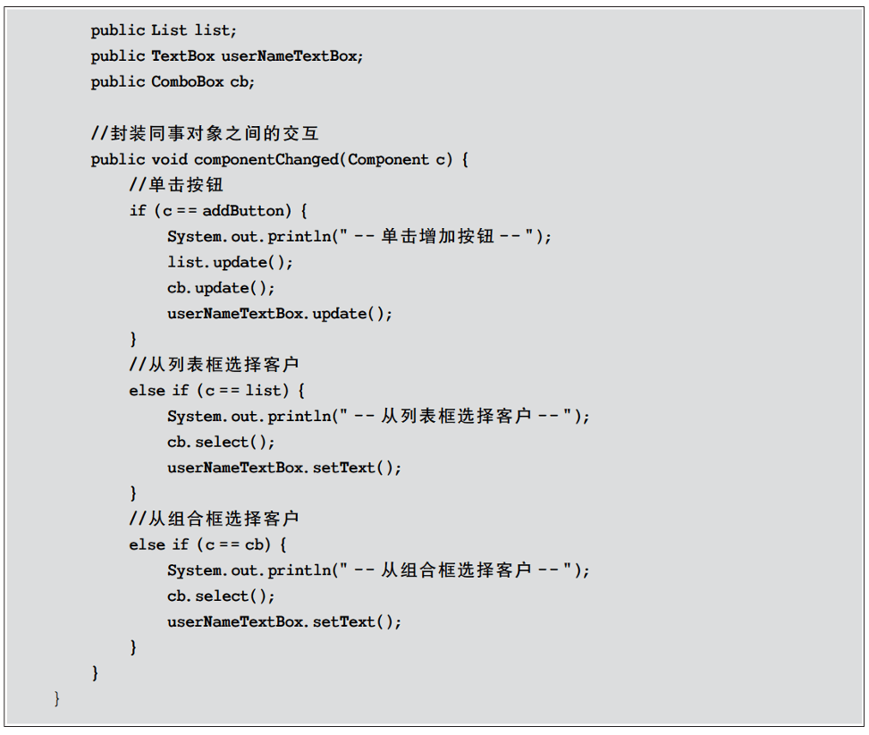

==Component==:抽象组件类,充当抽象同事类


==Button==:按钮类,充当具体同事类


==List==:列表框类,充当具体同事类


==ComboBox==:组合框类,充当具体同事类


==TextBox==:文本框类,充当具体同事类


==Client==:客户端测试类。


#### 19.3.4 结果分析

编译并运行程序,输出结果如下：


在引人中介者后,同事之间的复杂交互由中介者间接实现,==当某个组件类的 changed()方法被调用时,中介者的 componentChanged()将被调用,在中介者的 componentChanged()方法中再逐个调用与该组件有交互的其他组件的相关方法==。如果某个组件类需要与新的组件进行交互,无须修改已有组件类的源代码,只需修改中介者或者对现有中介者进行扩展即可,系统具有更好的灵活性和可扩展性。

### 19.4 扩展中介者和同事类

本节将对 19.3 节中的“客户信息管理窗口”进行改进,使窗口的下端能够及时显示当前系统中客户信息的总数,如下图所示。


从上图中不难发现,可以通过增加一个文本标签(Label)来显示客户信息总数,而且当用户单击“增加”按钮或者“删除”按钮时将改变文本标签的内容。
由于使用了中介者模式,在原有系统中增加新的组件(即新的同事类)将变得很容易,至少有以下两种解决方案。

方案(1):增加一个界面组件类 Label,修改原有的具体中介者类 ConcreteMediator,增加一个对 Label 对象的引用,然后修改 componentChanged()方法中其他相关组件对象的业务处理代码,原有组件类无须任何修改,客户端代码也需要针对新增组件 [abel 进行适当修改。

方案(2):与方案(1)相同,首先增加一个 Label 类,但不修改原有具体中介者类ConcreteMediator 的代码,而是增加一个 ConcreteMediator 的子类 SubConcreteMediator来实现对 Label 对象的引用,然后在新增的中介者类 SubConcreteMediator 中通过覆盖componentChanged()方法实现所有组件(包括新增 Label 组件)之间的交互。同样,原有组件类无须做任何修改,客户端代码需做少许修改

引人 Label 类之后的“客户信息管理窗口”结构示意图如下图所示。


由于方案(2)无须修改 ConcreteMediator 类,更符合开闭原则,因此选择方案(2)对新增 Label 类进行处理,对应的完整类图如下图所示。


在上图中新增了具体同事类 Label 和具体中介者类 SubConcreteMediator,Label类的代码如下:


SubConcreteMediator类的代码如下:


修改客户端测试代码如下:


编译并运行程序,输出结果如下:

由于在本实例中不同的组件类(即不同的同事类)所拥有的方法并不完全相同,因此中介者类没有针对抽象同事类编程,导致在具体中介者类中需要维持对具体同事类的引用,客户端代码无法完全透明地对待所有同事类和中介者类。在某些情况下,如果设计得当,可以在客户端透明地对同事类和中介者类编程,这样系统将具有更好的灵活性和可扩展性。

==在中介者模式的实际使用过程中,如果需要引人新的具体同事类,只需要继承抽象同事类并实现其中的方法即可==,由于具体同事类之间并无直接的引用关系,因此原有所有同事类无须进行任何修改,它们与新增同事对象之间的交互可以通过修改或者增加具体中介者类来实现;如果需要在原有系统中增加新的具体中介者类,只需要继承抽象中介者类(或已有的具体中介者类)并覆盖其中定义的方法即可,在新的具体中介者中可以通过不同的方式处理对象之间的交互,也可以增加对新增同事的引用和调用。在客户端中只需要修改少许代码(如果引人配置文件可以不用修改任何代码)就可以实现中介者类的更换。

### 19.5 中介者模式优/缺点与适用环境

==中介者模式将一个网状的系统结构变成一个以中介者对象为中心的星形结构,在这个星形结构中使用中介者对象与其他对象的一对多关系来取代原有对象之间的多对多关系中介者模式在事件驱动类软件中的应用较为广泛==,特别是==基于GUI(Graphical User Interface,图形用户界面)的应用软件==。此外,在类与类之间存在错综复杂的关联关系的系统中,中介者模式也得到了较好的应用。

#### 19.5.1 中介者模式优点

中介者模式的优点主要如下:

1. 中介者模式简化了对象之间的交互,它用中介者和同事的一对多交互代替了原来同事之间的多对多交互,==一对多关系更容易理解、维护和扩展,将原本难以理解的网状结构转换成相对简单的星形结构==。
2. 可将==各同事对象解耦==。中介者有利于各同事之间的松耦合,可以独立地改变和复用每一个同事和中介者,增加新的中介者类和新的同事类都比较方便,更好地符合开闭原则。
3. 可以==减少子类生成==,中介者将原本分布于多个对象间的行为集中在一起,改变这些行为只需生成新的中介者子类即可,这使得各个同事类可以被重用,无须直接对同事类进行扩展。

#### 19.5.2 中介者模式缺点

中介者模式的缺点主要如下:

在具体中介者类中==包含了大量同事之间的交互细节==,可能会导致具体中介者类非常复杂,使得==系统难以维护==。

#### 19.5.3 中介者适用环境

在以下情况下可以考虑使用中介者模式:

1. 系统中对象之间存在复杂的引用关系,系统结构混乱且难以理解
2. 一个对象由于引用了其他很多对象并且直接和这些对象通信,导致难以复用该对象。
3. 想通过==一个中间类来封装多个类中的行为,而又不想生成太多的子类,此时可以通过引人中介者类来实现==,在中介者中定义对象交互的公共行为,如果需要改变行为则可以增加新的具体中介者类。

## 20、备忘录模式

### 20.1 备忘录模式概述

在软件的使用过程中用户难免会出现一些误操作,例如不小心删除了某些文字或图片。为了使软件的使用更加人性化,对于这些误操作需要提供一种类似“后悔药”的机制,让软件系统可以回到误操作前的状态,因此需要保存用户每一次操作时系统的状态,一旦出现误操作,把存储的历史状态取出即可回到之前的状态。现在大多数软件都有撤销(Undo)的功能,快捷键一般是 Ctrl+Z,目的就是为了解决这个后悔的问题。==备忘录模式正是为解决此类撤销问题而诞生的,它为软件提供了“后悔药”,通过使用备忘录模式可以让系统恢复到某一特定的历史状态。==在实现撤销时首先必须保存软件系统的历史状态,当用户需要取消错误操作并且返回到某个历史状态时可以取出事先保存的历史状态来覆盖当前状态，如下图所示。


备忘录模式提供了一种状态恢复的实现机制,使得用户可以方便地回到一个特定的历史步骤,当新的状态无效或者存在问题时可以使用暂时存储起来的备忘录将状态复原,当前在很多软件所提供的撤销(Undo)操作中就使用了备忘录模式。

备忘录模式的定义如下:

>==备忘录模式:在不破坏封装的前提下捕获一个对象的内部状态并在该对象之外保存这个状态，这样可以在以后将对象恢复到原先保存的状态。==

备忘录模式是一种==对象行为型模式==,其别名为标记(Token)模式。

### 20.2 备忘录模式结构与实现

#### 20.2.1 备忘录模式结构

备忘录模式的核心是==备忘录类(Memento)==以及用于==管理备忘录的负责人类(Caretaker)==的设计,其结构如下图所示。


由上图可知,备忘录模式包含以下3个角色。

==Originator(原发器)==:原发器是一个==普通类==,它通过**创建一个备忘录来存储当前内部状态,也可以使用备忘录来恢复其内部状态,一般将系统中需要保存内部状态的类设计为原发器**。

==Memento(备忘录)==:备忘录用于==存储原发器的内部状态==,根据原发器来决定保存哪些内部状态。备忘录的设计一般可以参考原发器的设计,根据实际需要确定备忘录类中的属性。需要注意的是,除了原发器本身与负责人类之外,==备忘录对象不能直接供其他类使用==,原发器的设计在不同的编程语言中实现机制会有所不同。

==Caretaker(负责人)==:负责人又称为管理者,==它负责保存备忘录==,但是不能对备忘录的内容进行操作或检查。在负责人类中可以存储一个或多个备忘录对象,==它只负责存储对象,而不能修改对象,也无须知道对象的实现细节==。

#### 20.2.2 备忘录模式实现

备忘录模式的关键在于如何设计==备忘录类和负责人类==。由于在备忘录中存储的是原发器的中间状态,因此需要防止原发器以外的其他对象访问备忘录,特别是不允许其他对象来修改备忘录。

下面通过简单的示例代码来说明如何使用Java语言实现备忘录模式；

在使用备忘录模式时首先应该存在一个原发器类Originator。在真实业务中,==原发器类是一个具体的业务类,它包含一些用于存储成员数据的属性==。其典型代码如下:


对于备忘录类 Memento 而言,==它通常提供了与原发器相对应的属性(可以是全部,也可以是部分)用于存储原发器的状态。==典型的备忘录类代码如下:


在设计备忘录类时需要考虑其封装性,==除了 Originator类,不允许其他类来调用备忘录类 Memento 的构造函数与相关方法==。==如果不考虑封装性,允许其他类调用 setState()等方法,将导致在备忘录中保存的历史状态发生改变,通过撤销操作所恢复的状态就不再是真实的历史状态==，备忘录模式也就失去了本身的意义，

为了实现对备忘录对象的封装,需要对备忘录的调用进行控制,==对于原发器而言,它可以调用备忘录的所有信息,允许原发器访问返回到先前状态所需的所有数据;对于负责人而言,只负责备忘录的保存并将备忘录传递给其他对象;对于其他对象而言,只需要从负责人处取出备忘录对象并将原发器对象的状态恢复,而无须关心备忘录的保存细节==。理想的情况是只允许生成该备忘录的那个原发器访问备忘录的内部状态。

在使用 Java 语言实现备忘录模式时,==一般通过将 Memento 类与 Originator 类定义在同一个包(package)中来实现封装,在Java语言中可以使用默认访问标识符来定义Memento 类,即保证其包内可见==。只有 Originator 类可以对 Memento 进行访问,而限制了其他类对 Memento 的访问。在 Memento 中保存了 Originator 的 state 值,如果 Originator中的 state 值改变之后需要撤销,可以通过调用它的 restoreMemento()方法进行恢复。==除此之外,还可以将备忘录类作为原发器类的内部类,使得只有原发器才可以访问备忘录中的数据,其他对象都无法使用备忘录中的数据==。

对于负责人类 Caretaker,它用于保存备忘录对象,==并提供 getMemento()方法用于向客户端返回一个备忘录对象,原发器通过使用这个备忘录对象可以回到某个历史状态==。典型的负责人类的代码如下:


==在 Caretaker 类中不应该直接调用 Memento 中的状态改变方法,它的作用仅仅是存储备忘录对象==。将原发器备份生成的备忘录对象存储在其中,当用户需要对原发器进行恢复时再将存储在其中的备忘录对象取出。

在==客户端代码中可以通过创建 Memento 对象来保存原发器的历史状态==,在需要的时候再用==历史状态来覆盖当前状态==,客户端演示代码如下:


编译并运行程序,输出结果如下:


### 20.3 备忘录模式应用实例

下面通过一个应用实例来进一步学习和理解备忘录模式。

#### 20.3.1 实例说明

某软件公司要使用 Java 语言开发一款可以运行在Android 平台的触摸式中国象棋软件，由于考虑到有些用户是“菜鸟”，经常不小心走错棋;还有些用户因为不习惯使用手指在手机屏幕上拖动棋子，常常出现操作失误,因此该中国象棋软件要提供“悔棋”功能，用户走错棋或操作失误后可恢复到前一个步骤，如下图所示。


为了实现“悔棋”功能,现使用备忘录模式来设计该中国象棋软件。

#### 20.3.2 实例类图

通过分析,本实例的结构图如下图所示。


在上图中,Chessman 充当原发器,ChessmanMemento 充当备忘录,MementoCaretakel充当负责人,在 MementoCaretaker 中定义了一个 ChessmanMemento 类型的对象,用于存储备忘录。

#### 20.3.3 实例代码

==Chessman==:象棋棋子类,充当原发器


==ChessmanMemento==:象棋棋子备忘录类,充当备忘录。


==MementoCaretaker==:象棋棋子备忘录管理类,充当负责人。


==Client==:客户端测试类


#### 20.3.4 结果分析

编译并运行程序,输出结果如下:


从运行结果可以看出,通过创建备忘录对象可以将象棋棋子的历史状态信息记录下来。在“悔棋”时再取出存储在备忘录中的历史状态信息,用历史状态来覆盖当前状态,从而实现状态的撤销。

### 20.4 实现多次撤销

在 20.3 节的中国象棋棋子撤销功能实例中只能实现一次撤销,即只能“悔棋”一次,==因为在负责人类中只定义了一个备忘录对象来保存状态,后面保存的状态会将前一次保存的状态覆盖,但有时候用户需要撤销多步操作==。如何实现多次撤销呢?本节将提供一种多次撤销的解决方案,那就是在负责人类中定义一个集合来存储多个备忘录,每个备忘录负责保存一个历史状态,在撤销时可以对备忘录集合进行逆向遍历,回到一个指定的历史状态,而且还可以对备忘录集合进行正向遍历,实现重做(Redo)或恢复操作,即取消撤销,让对象状态得到恢复。

改进之后的中国象棋棋子撤销功能结构图如下图所示。


在上图中对负责人类 MementoCaretaker 进行了修改,==在其中定义了一个 ArrayList类型的集合对象来存储多个备忘录==。其代码如下:


编写以下客户端测试代码:


编译并运行程序,输出结果如下：


本实例==只能实现最简单的撤销(Undo)和恢复(Redo)操作,并未考虑对象状态在操作过程中出现分支的情况==。如果在撤销到某个历史状态之后用户再修改对象状态,此后执行撤销操作时可能会发生对象状态错误。==在实际开发中可以使用链表或者堆栈来处理有分支的对象状态改变==,读者可以通过链表或者堆栈对本实例进行改进。

### 20.5 备忘录模式优/缺点与适用环境

备忘录模式在很多软件的使用过程中普遍存在,但是在应用软件开发中它的使用频率并不太高,因为现在很多基于窗体和浏览器的应用软件并没有提供撤销操作。如果需要为软件提供撤销功能,备忘录模式无疑是一种很好的解决方案。在一些字处理软件,图像编辑软件、数据库管理系统等软件中备忘录模式都得到了很好的应用。

#### 20.5.1 备忘录模式优点

备忘录模式的优点主要如下:

1. ==提供了一种状态恢复的实现机制,使得用户可以方便地回到一个特定的历史步骤。==当新的状态无效或者存在问题时可以使用暂时存储起来的备忘录将状态复原。

2. ==备忘录实现了对信息的封装,一个备忘录对象是一种原发器对象状态的表示,不会被其他代码所改动。==备忘录保存了原发器的状态,采用列表、堆栈等集合来存储备忘录对象可以实现多次撤销操作。

#### 20.5.2 备忘录模式缺点

备忘录模式的缺点主要如下：

资源消耗过大,==如果需要保存的原发器类的成员变量太多,就不可避免地需要占用大量的存储空间,每保存一次对象的状态都需要消耗一定的系统资源。==

#### 20.5.3 备忘录模式适用环境

在以下情况下可以考虑使用备忘录模式:

1. ==保存一个对象在某一个时刻的全部状态或部分状态==,这样以后需要时它能够恢复到先前的状态,实现撤销操作。
2. ==防止外界对象破坏一个对象历史状态的封装性==,避免将对象历史状态的实现细节暴露给外界对象。

## 21、观察者模式

### 21.1 观察者模式概述

“红灯停,绿灯行”,在日常生活中交通信号灯管理着城市,指挥着日益拥挤的城市的交通。当红灯亮起,来往的汽车将停止;而绿灯亮起,汽车可以继续前行。在这个过程中交通信号灯是汽车(更准确地说应该是汽车驾驶员)的==观察目标==,而汽车是==观察者==。随着交通信号灯的变化,汽车的行为也将随之变化,一交通信号灯可以指挥多辆汽车,如下图所示。


在软件系统中有些对象之间也存在类似交通信号灯和汽车之间的关系,==一个对象的状态或行为的变化将导致其他对象的状态或行为也发生改变,它们之间将产生联动,正所谓“触一而牵百发”==。为了更好地描述对象之间存在的这种一对多(包括一对一)的联动,观察者模式应运而生,它定义了对象之间的一种一对多的依赖关系,让一个对象的改变能够影响其他对象。

观察者模式是使用频率较高的设计模式之一,==它用于建立一种对象与对象之间的依赖关系,一个对象发生改变时将自动通知其他对象,其他对象将相应作出反应==。在==观察者模式中发生改变的对象称为观察目标,而被通知的对象称为观察者==,一个观察目标可以对应多个观察者,而且这些观察者之间可以没有任何相互联系,可以根据需要增加和删除观察者,使得系统更易于扩展。

观察者模式的定义如下:

>==观察者模式:定义对象之间的一种一对多的依赖关系，使得每当一个对象状态发生改变时其相关依赖对象皆得到通知并被自动更新，==

观察者模式的别名有==发布-订阅(Publish-Subscribe)模式==、模型-视图(Model-View)模式、源-监听器(Source-listener)模式、从属者(Dependents)模式。观察者模式是一种对象行为型模式。

### 21.2 观察者模式结构与实现

#### 21.2.1 观察模式结构

观察者模式结构中通常包括==观察目标==和==观察者==两个继承层次结构,其结构如下图所示。

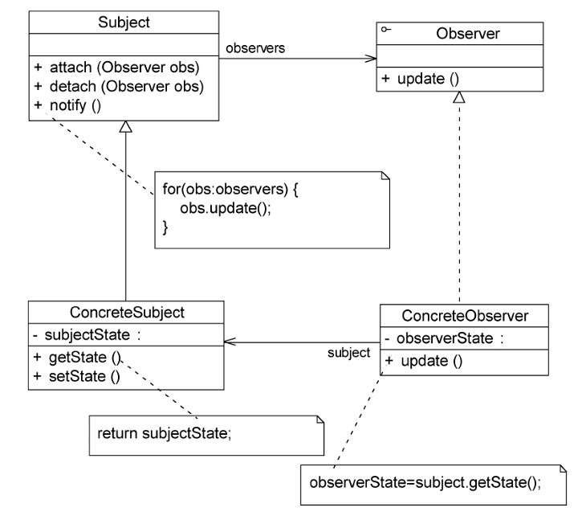

由上图可知,观察者模式包含以下 4个角色。

==Subject(目标)==:目标又称为主题,==它是指被观察的对象==。在目标中定义了一个观察者集合,==一个观察目标可以接受任意数量的观察者来观察,它提供一系列方法来增加和删除观察者对象,同时它定义了通知方法 notify()。目标类可以是接口,也可以是抽象类或具体类==。

==ConcreteSubject(具体目标)==:==具体目标是目标类的子类==,它通常包含有经常发生改变的数据,==当它的状态发生改变时将向它的各个观察者发出通知==;同时==它还实现了在目标类中定义的抽象业务逻辑方法(如果有)==。如果==无须扩展目标类,则具体目标类可以省略==。

==Observer(观察者)==:==观察者将对观察目标的改变作出反应,观察者一般定义为接口,该接口声明了更新数据的方法 update()==,因此又称为抽象观察者。

==ConcreteObserver(具体观察者)==:==在具体观察者中维护一个指向具体目标对象的弓用,它存储具体观察者的有关状态,这些状态需要和具体目标的状态保持一致;它实现了在抽象观察者 Observer 中定义的 update()方法==。通常在实现时可以调用具体目标类的attach()方法将自己添加到目标类的集合中或通过 detach()方法将自己从目标类的集合中删除。

#### 21.2.2 观察模式实现

观察者模式==描述了如何建立对象与对象之间的依赖关系,以及如何构造满足这种需求的系统==。观察者模式包含==观察目标和观察者两类==对象,一个目标可以有任意数目的与之相依赖的观察者,==一旦观察目标的状态发生改变,所有的观察者都将得到通知==。作为对这个通知的响应,==每个观察者都将监视观察目标的状态,以使其状态与目标状态同步,这种交互也称为发布-订阅(Publish-Subscribe)==。==观察目标是通知的发布者,它发出通知时并不需要知道谁是它的观察者,可以有任意数目的观察者订阅它并接收通知==。

下面通过演示代码对观察者模式进行进一步分析。首先定义一个抽象目标类 Subject,典型代码如下:


具体目标类 ConcreteSubject 是实现了抽象目标类 Subject 的一个具体子类,其典型代码如下:


抽象观察者角色一般定义为一个接口,通常只声明一个 update()方法,为不同观察者的更新(响应)行为定义相同的接口,这个方法在其子类中实现,不同的观察者具有不同的响应方法。抽象观察者 Observer 的典型代码如下:


在具体观察者 ConcreteObserver 中实现了 update()方法,其典型代码如下：


在有些更加复杂的情况下,==具体观察者类 ConcreteObserver 的 update()方法在执行时需要使用到具体目标类 ConcreteSubject 中的状态(属性)==,因此在 ConcreteObserver 与ConcreteSubject之间有时候还存在关联或依赖关系,在 ConcreteObserver 中定义一个ConcreteSubject实例,==通过该实例获取存储在 ConcreteSubject 中的状态。==如果ConcreteObserver 的 update()方法不需要使用到 ConcreteSubiect 中的状态属性,则可以对观察者模式的标准结构进行简化,在具体观察者 ConcreteObserver 和具体目标 ConcreteSubject之间无须维持对象引用。

如果在==具体层之间具有关联关系,系统的扩展性将受到一定的影响,增加新的具体目标类有时候需要修改原有观察者的代码==,在一定程度上违反了开闭原则,但是如果原有观察者类无须关联新增的具体目标,则系统扩展性不受影响。

在客户端代码中首先创建==具体目标对象==以及==具体观察者对象==,然后调用目标对象的attach()方法,将这个观察者对象在目标对象中登记,也就是将它加人到目标对象的观察者集合中,代码片段如下:


客户端在调用目标对象的notify()方法时将调用在其观察者集合中注册的观察者对象的 update()方法。

### 21.3 观察者模式应用实例

下面通过一个应用实例来进一步学习和理解观察者模式。

#### 21.3.1 实例说明

在某多人联机对战游戏中，多个玩家可以加入同一战队组成联盟，当战队中的==某一成员受到敌人攻击时将给所有其他盟友发送通知==，盟友收到通知后将作出响应。

试使用观察者模式设计并实现该过程，以实现战队成员之间的联动。

#### 21.3.2 实例类图

通过分析不难发现在该系统中战队成员之间的联动过程可以简单描述如下:

联盟成员受到攻击→发送通知给盟友→盟友作出响应

如果按照上述思路来设计系统,一个战队联盟成员在受到攻击时需要通知他的每一位盟友,每个联盟成员都需要持有其他所有盟友的信息,这将导致系统开销较大,因此可以引入一个新的角色--==指挥部(战队控制中心)来负责维护和管理每个战队中所有成员的信息==。当一个联盟成员受到攻击时将向对应的指挥部发送求助信息,指挥部逐一通知每个明友,盟友再作出响应,如下图所示。


在上图中受攻击的联盟成员将与指挥部产生联动,指挥部还将与其他盟友产生联动。

通过分析,本实例的结构图如下图所示。


在上图中,AllyControlCenter 充当抽象目标类,ConcreteAllyControlCenter 充当具体目标类,Observer 充当抽象观察者,Player 充当具体观察者。

#### 21.3.3 实例代码

==AllyControlCenter==:指挥部(战队控制中心)类,充当==抽象目标类==。


==ConcreteAllyControlCenter==:具体指挥部类,充当具体目标类。


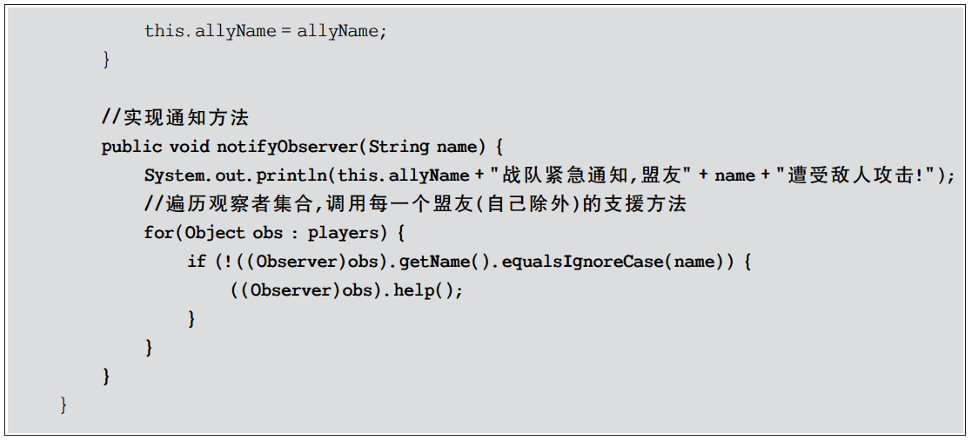

==Observer==:抽象观察者类。


==Player==:战队成员类,充当具体观察者类。


==Client==:客户端。


#### 21.3.4 结果与分析

编译并运行程序,输出结果如下:


在本实例中实现了两次对象之间的联动,当一个游戏玩家 Player 对象的 beAttacked()方法被调用时将调用指挥部 AllyControlCenter 的 notifyObserver()方法进行处理,而在notifyObserver()方法中又将调用其他 Player 对象的 help()方法。Player 的 beAttacked()方法、AllyControlCenter 的 notifyObserver()方法以及 Player 的 help()方法构成了一个联动触发链,执行顺序如下:

Player.beAttacked()->AllyControlCenter.notifyObserver()->Player.help()

### 21.4 JDK对观察者模式的支持

观察者模式在 Java 语言中占据非常重要的地位。在 JDK 的java.uti 包中提供了Observable 类以及 Observer 接口,它们构成了 JDK 对观察者模式的支持,如下图所示。


下面对 Observer 接口和 Observable 类进行简要说明

#### 21.4.1 Observer接口

在 java.util.Observer 接口中只声明一个方法,它充当抽象观察者,其方法声明代码如下:


当观察目标的状态发生变化时该方法将会被调用,在Observer 的子类中将实现 update()方法,即具体观察者可以根据需要具有不同的更新行为。当调用观察目标类 Observable 的notifyObservers()方法时将执行观察者类中的 update()方法。

#### 21.4.2 Observable类

java.util.Observable 类充当观察目标类,在 Observable 中定义了一个向量 Vector 来存储观察者对象,它所包含的方法及说明见下表。


用户可以直接使用 Observer 接口和 Observable 类作为观察者模式的抽象层,再自定义具体观察者类和具体观察目标类。通过使用JDK 中的 Observer 接口和 Observable 类可以更加方便地在 Java 语言中应用观察者模式。

### 21.5 观察者模式与事件处理

JDK 1.0及更早版本的==事件模型基于职责链模式==,但是这种==模型不适用于复杂的系统==因此在 JDK 1.1及以后的各个版本中事件处理模型采用基于观察者模式的委派事件模型(Delegation Event Model,DEM),==即一个Java 组件所引发的事件并不由引发事件的对象自已来负责处理,而是委派给独立的事件处理对象负责==。

在 DEM 模型中目标角色(如界面组件)负责发布事件,而观察者角色(事件处理者)可以向目标订阅它所感兴趣的事件。==当一个具体目标产生一个事件时它将通知所有订阅者事件的发布者称为事件源(Event Source),而订阅者称为事件监听器(Event Listener),在这个过程中还可以通过事件对象(Event Object)来传递与事件相关的信息,可以在事件监听者的实现类中实现事件处理,因此事件监听对象又可以称为事件处理对象==。==事件源对象、事件监听对象(事件处理对象)和事件对象构==成了Java事件处理模型的三要素。事件源对象充当观察目标,而事件监听对象充当观察者。
以按钮单击事件为例,其事件处理流程如下:

1. 如果用户在 GU1中单击一个按钮,将触发一个事件(如 ActionEvent 类型的动作事件),JVM 将产生一个相应的 ActionEvent 类型的事件对象,在该事件对象中包含了有关事件和事件源的信息，此时按钮是事件源对象。
2. 将 ActionEvent 事件对象传递给事件监听对象(事件处理对象),JDK 提供了专门用于处理 ActionEvent 事件的接日 ActionListener,开发人员需要提供一个 ActionListener的实现类(如 MyActionHandler),实现在 ActionListener 接口中声明的抽象事件处理方法actionPerformed(),对所发生事件做出相应的处理。
3. 开发人员将 Actionlistener 接口的实现类(如 MyActionHandler)对象注册到按钮中,可以通过按钮类的 addActionListener()方法来实现注册。
4. JVM 在触发事件时将调用按钮的fireXXX()方法,在该方法内部将调用注册到按钮中的事件处理对象的 actionPerformed()方法,实现对事件的处理。

使用类似的方法可以自定义GUI组件,例如包含两个文本框和两个按钮的登录组件LoginBean,可以采用如下图所示的设计方案。


上图中相关类的说明如下

==LoginEvent==是事件类,用于封装与事件有关的信息,它不是观察者模式的一部分但是可以在==目标对象和观察者对象==之间传递数据。在AWT事件模型中所有的自定义事件类都是 java.util.EventObiect 的子类。

==LoginEventlistener==充当抽象观察者,它声明了事件响应方法 ==validateLogin()==,用于处理事件,该方法也称为事件处理方法。validateLogin()方法将一个 LoginEvent 类型的事件对象作为参数,用于传输与事件相关的数据,在其子类中实现该方法,实现具体的事件
处理。

==LoginBean==充当具体目标类,在这里没有定义抽象目标类,对观察者模式进行了一定的简化。在 LoginBean 中定义了抽象观察者 LoginEventListener 类型的对象 lel 和事件对象 LoginEvent,提供了注册方法 addLoginEventListener()用于添加观察者,在 Java 事件处理中通常使用一对一的观察者模式,而不是一对多的观察者模式,也就是说一个观察目标中只定义一个观察者对象,而不是提供一个观察者对象的集合。在 LoginBean 中还定义了通知方法 fireLoginEvent(),该方法在 Java 事件处理模型中称为“点火方法”,在该方法内部实例化了一个事件对象 LoginEvent,将用户输人的信息传给观察者对象,并且调用了观察者对象的响应方法 validateLogin()。

==LoginValidatorA 和 LoginValidatorB== 充当具体观察者类,它们实现了在LoginEventListener 接口中声明的抽象方法 validateLogin(),用于具体实现事件处理。该方法包含一个 LoginEvent 类型的参数,在 LoginValidatorA 和 LoginValidatorB 类中可以针对相同的事件提供不同的实现。

### 21.6 观察者模式与MVC

在当前流行的 ==MVC(Model-View-Controller)架构中也应用了观察者模式==,MVC 是一种架构模式,它包含3个角色,即模型(Model)、视图(View)和控制器(Controller)。其中==模型可对应于观察者模式中的观察目标==,而==视图对应于观察者==,==控制器可充当两者之间的中介者==。当模型层的数据发生改变时视图层将自动改变其显示内容。MVC结构示意图如下图所示。


在上图中,模型层提供的数据是视图层所观察的对象,在视图层中包含了两个用于显示数据的图表对象,一个是柱状图,一个是饼状图,相同的数据拥有不同的图表显示方式如果模型层的数据发生改变,两个图表对象将随之发生变化,这意味着图表对象依赖模型层提供的数据对象,因此数据对象的任何状态改变都应立即通知它们。同时,这两个图表之间相互独立,不存在任何联系,而且图表对象的个数没有任何限制,用户可以根据需要再增加新的图表对象,例如折线图。在增加新的图表对象时无须修改原有类库,满足开闭原则。

### 21.7 观察者模式优/缺点与适用环境

==观察者模式是一种使用频率非常高的设计模式==,无论是移动应用、Web应用或者桌面应用,观察者模式几乎无处不在,它为实现对象之间的联动提供了一套完整的解决方案,凡是涉及一对一或者一对多的对象交互场景都可以使用观察者模式。观察者模式广泛应用于各种编程语言的GUI事件处理的实现,在基于事件的XML解析技术(例如 SAX2)以及Web事件处理中也都使用了观察者模式。

#### 21.7.1 观察者模式优点

观察者模式的优点主要如下:

1. ==可以实现表示层和数据逻辑层的分离,定义了稳定的消息更新传递机制,并抽象了更新接口==,使得可以有各种各样不同的表示层充当具体观察者角色。
2. ==在观察目标和观察者之间建立一个抽象的耦合==。观察目标只需要维持一个抽象观察者的集合,无须了解其具体观察者。由于观察目标和观察者没有紧密地耦合在一起,因此它们可以属于不同的抽象化层次。
3. 支持广播通信,观察目标会向所有已注册的观察者对象发送通知,简化了一对多系统设计的难度。
4. 符合开闭原则,增加新的具体观察者无须修改原有系统代码,在具体观察者与观察目标之间不存在关联关系的情况下增加新的观察目标也很方便。

#### 21.7.2 观察者模式缺点

观察者模式的缺点主要如下:

1. 如果一个观察目标对象有很多直接和间接观察者,==将所有的观察者都通知到会花费很多时间==。
2. 如果在==观察者和观察目标之间存在循环依赖==,观察目标会触发它们之间进行循环调用,可能导致系统崩溃。
3. 观察者模式没有相应的机制让观察者知道所观察的目标对象是怎么发生变化的而仅仅只是知道观察目标发生了变化。

#### 21.7.3 观察者模式适用环境

在以下情况下可以考虑使用观察者模式:

1. 一个抽象模型有两个方面,其中一个方面依赖于另一个方面,将这两个方面封装在独立的对象中使它们可以各自独立地改变和复用。
2. 一个对象的改变将导致一个或多个其他对象也发生改变,而并不知道具体有多少对象将发生改变,也不知道这些对象是谁。
3. 需要在系统中创建一个触发链,A对象的行为将影响B对象,B对象的行为将影响C对象……,可以使用观察者模式创建一种链式触发机制。

## 22、状态模式

### 22.1 状态模式概述

“人有悲欢离合,月有阴晴圆缺”,包括人在内,很多事物都具有多种状态,而且在不同状态下会具有不同的行为,这些状态在特定条件下还将发生相互转换。就像水,它可以凝固成冰,也可以受热蒸发后变成水蒸气,水可以流动,冰可以雕刻,蒸汽可以扩散。可以用 UML状态图来描述 H~2~O的3 种状态,如下图所示。


在软件系统中,有些对象也像水一样具有==多种状态==,==这些状态在某些情况下能够相互转换==,而且对象在不同的状态下也将具有不同的行为。通常可以使用复杂的条件判断语句(例如if…else…语句)来进行状态的判断和转换操作,这会导致代码的可维护性和灵活性下降。==特别是在出现新的状态时代码的扩展性很差,客户端代码也需要进行相应的修改,违反了开闭原则==。为了解决状态的转换问题,并使客户端代码与对象状态之间的耦合度降低,可以使用一种被称为状态模式的设计模式。

==状态模式用于解决系统中复杂对象的状态转换以及不同状态下行为的封装问题==。当系统中的某个对象存在多个状态,这些状态之间可以进行转换,而且对象在不同状态下行为不相同时可以使用状态模式。状态模式将一个对象的状态从该对象中分离出来,封装到专门的状态类中,使得对象状态可以灵活变化。对于客户端而言,无须关心对象状态的转换以及对象所处的当前状态,无论对于何种状态的对象,客户端都可以一致处理。

状态模式的定义如下:

>==**状态模式:允许一个对象在其内部状态改变时改变它的行为对象看起来似乎修改了它的类。**==

状态模式又名==状态对象(Objects for States)==,它是一种==对象行为型模式==。

### 22.2 状态模式结构与实现

#### 22.2.1 状态模式结构

在状态模式中引人了抽象状态类和具体状态类,它们是状态模式的核心,其结构如下图所示。由下图可知,状态模式包含以下3个角色。


==Context(环境类)==:==环境类又称为上下文类==,它是==拥有多种状态的对象==。由于环境类的状态存在多样性且在不同状态下对象的行为有所不同,因此将状态独立出去形成单独的状态类。在环境类中维护一个抽象状态类 State 的实例,这个实例定义当前状态,在具体实现时它是一个 State 子类的对象。

==State(抽象状态类)==:它用于==定义一个接口以封装与环境类的一个特定状态相关的行为==,在抽象状态类中声明了各种不同状态对应的方法,而在其子类中实现了这些方法,由于不同状态下对象的行为可能不同,因此在不同子类中方法的实现可能存在不同,相同的方法可以写在抽象状态类中。

==ConcreteState(具体状态类)==:它是抽象状态类的子类,每一个子类实现一个与环境类的一个状态相关的行为,每一个具体状态类对应环境的一个具体状态,不同的具体状态类的行为有所不同。

#### 22.2.3 状态模式实现

在状态模式中,将对象在不同状态下的行为封装到不同的状态类中,为了让系统具有更好的灵活性和可扩展性,同时对各状态下的共有行为进行封装,需要对状态进行抽象化,引入了抽象状态类角色。其典型代码如下:


在抽象状态类的子类(即具体状态类)中实现了在抽象状态类中声明的业务方法,不同的具体状态类可以提供完全不同的方法实现。在实际使用时,在一个状态类中可能包含多个业务方法,如果在具体状态类中某些业务方法的实现完全相同,可以将这些方法移至抽象状态类,实现代码的复用。典型的具体状态类代码如下:


环境类维持一个对抽象状态类的引用,通过 setState()方法可以向环境类注人不同的状态对象,然后在环境类的业务方法中调用状态对象的方法。其典型代码如下:


==环境类实际上是真正拥有状态的对象,只是将环境类中与状态有关的代码提取出来封装到专门的状态类中。==在状态模式结构图中,环境类 Context 与抽象状态类 State 之间存在==单向关联关系==,在 Context 中定义了一个 State 对象。在实际使用时,它们之间可能存在更为复杂的关系,State与 Context 之间可能==也存在依赖或者双向关联关系==。

在状态模式的使用过程中,一个对象的状态之间还可以进行相互转换,通常有两种实现状态转换的方式:

1. 统一由环境类来负责状态之间的转换,此时==环境类还充当了状态管理器(StateManager)角色==,在环境类的业务方法中通过对某些属性值的判断实现状态转换,还可以提供一个专门的方法用于实现属性判断和状态转换,代码片段如下:


2. 由具体状态类来负责状态之间的转换,可以在具体状态类的业务方法中判断环境类的某些属性值,再根据情况为环境类设置新的状态对象,实现状态转换。同样,也可以提供一个专门的方法来负责属性值的判断和状态转换。此时状态类与环境类之间将存在依赖或关联关系,因为状态类需要访问环境类中的属性值,具体状态类 ConcreteStateA 的代码片段如下:


### 22.3 状态模式应用实例

下面通过一个应用实例来进一步学习和理解状态模式。

#### 22.3.1 实例说明

某软件公司要为一银行开发一套信用卡业务系统，银行账户(Account)是该系统的核心类之一,通过分析，该软件公司的开发人员发现在系统中账户存在3种状态，且在不同状态下账户存在不同的行为，具体说明如下:

1. 如果账户中的余额大于等于0,则账户的状态为正常状态(Normal State),此时用户既可以向该账户存款也可以从该账户取款
2. 如果账户中的余额小于0,并且大于-2000,则账户的状态为透支状态(Overdraft State),此时用户既可以向该账户存款也可以从该账户取款，但需要按天计算利息。
3. 如果账户中的余额等于-2000,那么账户的状态为受限状态(Restricted State),此时用户只能向该账户存款,不能再从中取款,同时将按天计算利息。
4. 根据余额的不同,以上3种状态可发生相互转换。

试使用状态模式设计并实现银行账户状态的转换。

#### 22.3.2 实例类图

通过对银行账户类进行分析,可以绘制如下图所示的 UML 状态图。

在下图中,NormalState 表示正常状态,OverdraftState 表示透支状态,RestrictedState 表示受限状态。在这3种状态下账户对象拥有不同的行为,方法 deposit()用于存款withdraw()用于取款,computelnterest()用于计算利息,stateCheck()用于在每一次执行存款和取款操作后根据余额来判断是否要进行状态转换并实现状态转换,相同的方法在不同的状态下可能会有不同的实现。


使用状态模式对银行账户的状态进行设计,所得结构如下图所示。


在上图中,Account 充当环境类角色,AccountState 充当抽象状态角色,NormalState、OverdraftState 和 RestrictedState 充当具体状态角色。

#### 22.3.3 实例代码

==Account==:银行账户,充当环境类。


==AccountState==:账户状态类,充当抽象状态类。


==NormalState==:正常状态类,充当具体状态类。


==OverdraftState==:透支状态类,充当具体状态类。


==RestrictedState==:受限状态类,充当具体状态类。


客户端:客户端测试类。


#### 22.3.4 结果与分析

编译并运行程序,输出结果如下:


加粗部分对应客户端代码中3次调用取款方法 withdraw()的输出结果,由于对象状态不一样,因此这3次输出结果均有所差异。第一次取款后账户状态由正常状态(NormalState)变为透支状态(Overdraft State);第二次取款后账户状态由正常状态(Normal State)变为受限状态(Restricted State);在第三次取款时,由于账户状态此时已经为受限状态,因此取款失败。这3次取款操作体现了对象在不同状态下具有不同的行为,而且对象的转换是自动的,客户端无须关心其转换细节。

### 22.4 共享状态

在有些情况下,多个环境对象可能需要共享同一个状态,如果希望在系统中实现多个环境对象共享一个或多个状态对象,那么需要将这些==状态对象定义为环境类的静态成员对象==。

下面通过一个简单实例来说明如何实现共享状态。

>某系统要求两个开关对象要么都处于开的状态，要么都处于关的状态，在使用时它们的状态必须保持一致，开关可以由开转换到关，也可以由关转换到开。


可以使用状态模式来实现开关的设计，其结构如上图所示。开关类 Switch 的代码如下:


抽象状态类的代码如下:


两个具体状态类的代码如下:


编写以下客户端代码进行测试:


输出结果如下:


从输出结果可以得知:两个开关共享相同的状态,如果第一个开关关闭,则第二个开关也将关闭,再次关闭时将输出“已经关闭”;打开时也将得到类似结果。

### 22.5 使用环境类实现状态切换

==在状态模式中实现状态转换时,具体状态类可通过调用环境类 Context 的 setState()方法进行状态的转换操作,也可以统一由环境类 Context来实现状态的转换==。此时增加新的具体状态类可能需要修改其他具体状态类或者环境类的源代码,否则系统无法转换到新增状态。但是对于客户端来说无须关心状态类,可以为环境类设置默认的状态类,而将状态的转换工作交给具体状态类或环境类来完成,具体的转换细节对于客户端而言是透明的。

在 22.3节的“银行账户状态转换”实例中通过具体状态类来实现状态的转换,在每一个具体状态类中都包含一个 stateCheck()方法,在该方法内部实现状态的转换。除此之外还可以通过环境类来实现状态转换,环境类作为一个状态管理器,统一实现各种状态之间的转换操作。

下面通过一个包含循环状态的简单实例来说明如何使用环境类实现状态转换:

>现准备开发一个屏幕放大镜工具，其具体功能描述如下:
>
>用户单击“放大镜”按钮之后屏幕将放大一倍,再单击一次“放大镜”按钮屏幕再放大一倍,第三次单击该按钮后屏幕将还原到默认大小。
>
>现使用状态模式来设计该屏幕放大镜工具。

通过分析可以定义3个屏幕状态类(NormalState、LargerState 和 LargestState)来对应屏幕的3种状态,分别是正常状态、二倍放大状态和四倍放大状态,屏幕类 Screen 充当环境类,其结构如下图所示。


本实例的核心代码如下:


在上述代码中,所有的状态转换操作都由环境类 Screen来实现,此时环境类充当了状态管理器角色。如果需要增加新的状态,例如“八倍状态类”,需要修改环境类,这在一定程度上违背了开闭原则,但对其他状态类没有任何影响。

编写以下客户端代码进行测试:


输出结果如下:


### 22.6 状态模式优/缺点与适用环境

==状态模式将一个对象在不同状态下的不同行为封装在一个个状态类中,通过设置不同的状态对象可以让环境对象拥有不同的行为,而状态转换的细节对于客户端而言是透明的，方便了客户端的使用。==在实际开发中,状态模式具有较高的使用频率,在工作流、游戏等软件中状态模式都得到了广泛的应用,例如公文状态的转换、游戏中角色的升级等。

#### 22.6.1 状态模式优点

状态模式的优点主要如下:

1. 状态模式封装了状态的转换规则,在状态模式中可以将状态的转换代码封装在环境类或者具体状态类中,==可以对状态转换代码进行集中管理==,而不是分散在一个个业务方法中。
2. ==状态模式将所有与某个状态有关的行为放到一个类中==,只需要注人一个不同的状态对象即可使环境对象拥有不同的行为。
3. 状态模式允许状态转换逻辑与状态对象合成一体,而不是提供一个巨大的条件语句块,状态模式可以避免使用庞大的条件语句将业务方法和状态转换代码交织在一起。
4. ==状态模式可以让多个环境对象共享一个状态对象,从而减少系统中对象的个数==。

#### 22.6.2 状态模式缺点

状态模式的缺点主要如下

1. 状态模式会增加系统中类和对象的个数,导致系统运行开销增大。
2. 状态模式的结构与实现都较为复杂,如果使用不当将导致程序结构和代码的混乱，==增加系统设计的难度==。
3. ==状态模式对开闭原则的支持并不太好==,增加新的状态类需要修改那些负责状态转换的源代码,否则无法转换到新增状态;而且修改某个状态类的行为也需要修改对应类的源代码。

#### 22.6.3 状态模式适用环境

在以下情况下可以考虑使用状态模式:

1. ==对象的行为依赖于它的状态(例如某些属性值),状态的改变将导致行为的变化。==
2. 在代码中包含大量与对象状态有关的条件语句,这些条件语句的出现会导致代码的可维护性和灵活性变差,不能方便地增加和删除状态,并且导致客户类与类库之间的耦合增强。

## 23、策略模式

### 23.1 策略模式概述

在很多情况下,实现某个目标的途径不止一条,例如在外出旅游时游客可以选择多种不同的出行方式,如骑自行车、坐汽车,坐火车或者坐飞机,可根据实际情况(目的地距离,旅游预算、旅游时间等)来选择一种最适合的出行方式。在制订旅行计划时,如果目的地较远、时间不多,但不差钱,可以选择坐飞机去旅游:如果目的地虽远,但假期长,且需控制旅游成本时可以选择坐火车或汽车;如果从健康和环保的角度考虑,而且有足够的毅力,自行车游或者徒步旅游也是个不错的选择,如下图所示。


在软件开发中也常常会遇到类似的情况,==实现某一个功能(例如排序,查找等)有多种算法,一种常用的方法是通过硬编码(Hard Coding)将所有的算法集中在一个类中,在该类中提供多个方法,每一个方法对应一个具体的算法;==当然也可以将这些算法封装在一个统一的方法中,通过if…else…等条件判断语句进行选择。这两种实现方法都可以称为硬编码，如果需要增加一种新的算法,需要修改算法类的源代码;更换算法也需要修改客户端调用代码。在这个统一的算法类中封装了大量算法,代码非常复杂,维护也很困难。

此时可以使用一种设计模式来实现灵活地选择算法,还能够方便地增加新的算法,该==设计模式就是策略模式==。在策略模式中可以定义一些独立的类来封装不同的算法,每一个类封装一种具体的算法,在这里每一个封装算法的类都可以称为一种策略(Strategy),为了保证这些策略在使用时具有一致性,一般会提供一个抽象的策略类来做算法的声明,而每种算法对应于一个具体策略类。

策略模式的定义如下:

>==**策略模式:定义一系列算法,将每一个算法封装起来，并让它们可以相互替换。策略模式让算法可以独立于使用它的客户而变化。**==

策略模式又称为政策(Policy)模式,它是一种对象行为型模式。

### 23.2 策略模式结构与实现

#### 23.2.1 策略模式结构

策略模式结构并不复杂,其结构如下图所示。


由上图可知,策略模式包含以下3个角色。

==Context(环境类)==:环境类是==使用算法的角色==,它在解决某个问题(即实现某个功能)时可以采用多种策略。在环境类中维持一个对抽象策略类的引用实例,用于定义所采用的策略。

==Strategy(抽象策略类)==:抽象策略类为所支持的算法声明了抽象方法,是所有策略类的父类,它可以是抽象类或具体类,也可以是接口。环境类通过抽象策略类中声明的方法在运行时调用具体策略类中实现的算法。

==ConcreteStrategy(具体策略类)==:具体策略类实现了在抽象策略类中声明的算法,在运行时具体策略类将覆盖在环境类中定义的抽象策略类对象,使用一种具体的算法实现某个业务功能。

#### 23.2.2 策略模式实现

策略模式是一个很容易理解和使用的设计模式,策略模式是对算法的封装,它把算法的责任和算法本身分割开,委派给不同的对象管理。策略模式通常把一个系列的算法封装到一系列具体策略类里面,作为抽象策略类的子类。在策略模式中对环境类和抽象策略类的理解非常重要,环境类是需要使用算法的类。在一个系统中可以存在多个环境类,它们可能需要重用一些相同的算法。

在使用策略模式时需要将算法从环境类 Context 中提取出来,首先应该创建一个抽象策略类,其典型代码如下:


然后将封装每一种具体算法的类作为该抽象策略类的子类,代码如下:


其他具体策略类与之类似,对于 Context 类而言,在它与抽象策略类之间建立一个关联关系,其典型代码如下:


在 Context 类中定义一个 AbstractStrategy 类型的对象 strategy,通过注人的方式在客户端传入一个具体策略对象,客户端代码片段如下:


在客户端代码中只需注入一个具体策略对象,可以将具体策略类的类名存储在配置文件中,通过反射来动态创建具体策略对象,从而使得用户可以灵活地更换具体策略类,增加新的具体策略类也很方便。==策略模式提供了一种可插入式(Pluggable)算法的实现方案==。

### 23.3 策略模式应用实例

下面通过一个应用实例来进一步学习和理解策略模式。

#### 23.3.1 实例说明

某软件公司为某电影院开发了一套影院售票系统，在该系统中需要为不同类型的用户提供不同的电影票打折方式，具体打折方案如下:

1. 学生凭学生证可享受票价8折优惠。
2. 年龄在10周岁及以下的儿童可享受每张票减免 10元的优惠(原始票价需大于等于20元)
3. 影院 VIP用户除享受票价半价优惠外还可进行积分,积分累计到一定额度可换取电影院赠送的礼品

该系统在将来可能还要根据需要引入新的打折方式。试使用策略模式设计该影院售票系统的打折方案。

#### 23.3.2 实例类图

通过分析,本实例的结构图如上图所示。


在上图中,MovieTicket 充当环境类角色,Discount 充当抽象策略角色,StudentDiscount、ChildrenDiscount 和 VIPDiscount 充当具体策略角色。

#### 23.3.3 实例代码

==MovieTicket==:电影票类,充当环境类


==Discount==:折扣类,充当抽象策略类


==StudentDiscount==:学生票折扣类,充当具体策略类


==ChildrenDiscount==:儿童票折扣类,充当具体策略类


==VIPDiscount==:VIP 会员票折扣类,充当具体策略类


Client:客户端测试类


#### 23.3.4 结果分析

编译并运行程序,输出结果如下:


### 23.4 Java SE中的管理和布局

Java SE 中的容器布局管理是策略模式的一个经典应用实例,其基本结构如下图所示。


在 Java SE 开发中,用户需要对容器对象 Container 中的成员对象(例如按钮、文本框等GUI控件)进行布局(Layout),在程序运行期间由客户端动态决定一个 Container 对象如何布局。Java语言在JDK 中提供了几种不同的布局方式,封装在不同的类中,例如BorderLayout、Flowlayout,GridLayout,GridBagLayout 和 CardLayout 等。在上图中Container 类充当环境角色 Context,LayoutManager 作为所有布局类的公共父类扮演了抽象策略角色,它给出所有具体布局类所需的接口,而具体策略类是 LayoutManager 的子类也就是各种具体的布局类,它们封装了不同的布局方式。

任何人都可以开发自己的布局类,只需要将自己设计的布局类作为 LayoutManager 的子类即可。在 JDK中,Container 类的代码片段如下:


从上述代码中可以看出,Container 作为环境类,它针对抽象策略类 LayoutManager 进行编程。根据里氏代换原则,用户在使用时只需要在 setLayout()方法中传入一个具体布局对象即可,而无须关心该布局对象的具体实现。

### 23.5 策略模式优/缺点与适用环境

策略模式用于算法的自由切换和扩展,它是应用较为广泛的设计模式之一。策略模式对应于解决某一问题的一个算法族,允许用户从该算法族中任选一个算法来解决某一问题，同时可以方便地更换算法或者增加新的算法,只要涉及算法的封装、复用和切换都可以考虑使用策略模式。

#### 23.5.1 策略模式优点

策略模式的优点主要如下:

1. 策略模式提供了对开闭原则的完美支持,用户可以在不修改原有系统的基础上选择算法或行为,也可以灵活地增加新的算法或行为。
2. 策略模式提供了管理相关的算法族的办法。策略类的等级结构定义了一个算法或行为族,恰当地使用继承可以把公共的代码移到抽象策略类中,从而避免重复的代码
3. 策略模式提供了一种可以替换继承关系的办法。如果不使用策略模式,那么使用算法的环境类就可能会有一些子类,每一个子类提供一种不同的算法。但是这样一来算法的使用就和算法本身混在一起,不符合单一职责原则,决定使用哪一种算法的逻辑和该算法本身混合在一起,从而不可能再独立演化;而且使用继承无法实现算法或行为在程序运行时的动态切换。
4. 使用策略模式可以避免多重条件选择语句。多重条件选择语句不易维护,它把采取哪一种算法或行为的逻辑与算法或行为本身的实现逻辑混合在一起,将它们全部硬编码在一个庞大的多重条件选择语句中,比直接继承环境类的办法还要原始和落后。
5. 策略模式提供了一种算法的复用机制,由于将算法单独提取出来封装在策略类中,因此不同的环境类可以方便地复用这些策略类。

#### 23.5.2 策略模式缺点

策略模式的缺点主要如下:

1. 客户端必须知道所有的策略类,并自行决定使用哪一个策略类。这就意味着客户端必须理解这些算法的区别,以便适时选择恰当的算法。换而言之,策略模式只适用于客户端知道所有算法或行为的情况
2. 策略模式将造成系统产生很多具体策略类,任何细小的变化都将导致系统要增加一个新的具体策略类。
3. 无法同时在客户端使用多个策略类,也就是说,在使用策略模式时客户端每次只能使用一个策略类,不支持使用一个策略类完成部分功能后再使用另一个策略类完成剩余功能的情况。

#### 23.5.3 策略模式适用环境

在以下情况下可以考虑使用策略模式:

1. 一个系统需要动态地在几种算法中选择一种,那么可以将这些算法封装到一个个的具体算法类中,而这些具体算法类都是一个抽象算法类的子类。换而言之,这些具体算法类均有统一的接口,根据里氏代换原则和面向对象的多态性,客户端可以选择使用任何一个具体算法类,并只需要维持一个数据类型是抽象算法类的对象。
2. 一个对象有很多行为,如果不用恰当的模式,这些行为则只好使用多重条件选择语句来实现。此时使用策略模式把这些行为转移到相应的具体策略类里面,就可以避免使用难以维护的多重条件选择语句。
3. 不希望客户端知道复杂的、与算法相关的数据结构,在具体策略类中封装算法与相关的数据结构,可以提高算法的保密性与安全性。

## 24、模板方法模式

### 24.1 模板方法模式概述

在现实生活中很多事情都包含几个实现步骤,例如请客吃饭,无论吃什么,一般都包含点单、吃东西、买单等几个步骤,通常情况下这几个步骤的次序是点单一吃东西一买单。在这3个步骤中,点单和买单大同小异,最大的区别在于第二步--吃什么?吃面条和吃满汉全席可大不相同,如下图所示。


在软件开发中有时也会遇到类似的情况,某个方法的实现需要多个步骤(类似“请客”)其中有些步骤是固定的(类似“点单”和“买单”),而有些步骤并不固定,存在可变性(类似“吃东西”)。为了提高代码的复用性和系统的灵活性,可以使用一种称为模板方法模式的设计模式来对这类情况进行设计,在模板方法模式中将实现功能的每一个步骤所对应的方法称为基本方法(例如“点单”“吃东西”和“买单”),而将调用这些基本方法同时定义基本方法的执行次序的方法称为模板方法(例如“请客”)。在模板方法模式中可以将相同的代码放在父类中,例如将模板方法“请客”以及基本方法“点单”和“买单”的实现放在父类中,而对于基本方法“吃东西”在父类中只做一个声明,将其具体实现放在不同的子类中,在一个子类中提供“吃面条”的实现,而另一个子类提供“吃满汉全席”的实现。通过使用模板方法模式一方面提高了代码的复用性,另一方面还可以利用面向对象的多态性,在运行时选择一种具体子类,实现完整的“请客”方法,提高系统的灵活性和可扩展性。

模板方法模式的定义如下:

>==**模板方法模式:定义一个操作中算法的框架，而将一些步骤延迟到子类中。模板方法模式使得子类可以不改变一个算法的结构即可重定义该算法的某些特定步骤。**==

模板方法模式是一种基于继承的代码复用技术,它是一种类行为型模式。

模板方法模式是结构最简单的行为型设计模式,在其结构中只存在父类与子类之间的继承关系。通过使用模板方法模式可以将一些复杂流程的实现步骤封装在一系列基本方法中,在抽象父类中提供了一个称为模板方法的方法来定义这些基本方法的执行次序,而通过其子类来覆盖某些步骤,从而使得相同的算法框架可以有不同的执行结果,模板方法模式提供了一个模板方法来定义算法框架,而某些具体步骤的实现可以在其子类中完成。

### 24.2 模板方法结构与实现

#### 24.2.1 模板方法模式结构

模板方法模式的结构比较简单,其核心是抽象类和其中的模板方法的设计,其结构如下图所示。


由上图可知,模板方法模式包含以下两个角色。

==AbstractClass(抽象类)==:在抽象类中定义了一系列基本操作(Primitive Operations),这些基本操作可以是具体的,也可以是抽象的,每一个基本操作对应算法的一个步骤,在其子类中可以重定义或实现这些步骤。同时在抽象类中实现了一个板方法(TemplateMethod),用于定义一个算法的框架,模板方法不仅可以调用在抽象类中实现的基本方法。也可以调用在抽象类的子类中实现的基本方法,还可以调用其他对象中的方法。

==ConcreteClass(具体子类)==:它是抽象类的子类,用于实现在父类中声明的抽象基本操作以完成子类特定算法的步骤,也可以覆盖在父类中已经实现的具体基本操作。

#### 24.2.2 模板方法模式实现

在实现模板方法模式时,开发抽象类的软件设计师和开发具体子类的软件设计师之间可以进行协作。一个设计师负责给出一个算法的轮廓和框架,另一些设计师则负责给出这个算法的各个逻辑步骤。实现这些具体逻辑步骤的方法即为基本方法,而将这些基本方法汇总起来的方法即为模板方法,模板方法模式的名字也因此而来。下面将详细介绍模板方法和基本方法。

1. 模板方法

一个模板方法是定义在抽象类中的把基本操作方法组合在一起形成一个总算法或一个总行为的方法。这个模板方法定义在抽象类中,并由子类不加修改地完全继承下来(在Java 语言中可以将模板方法定义为 final 方法)。模板方法是一个具体方法,它给出了一个顶层逻辑框架,而逻辑的组成步骤在抽象类中可以是具体方法,也可以是抽象方法。由于模板方法是具体方法,因此模板方法模式中的抽象层只能是抽象类,而不是接口。

2. 基本方法

基本方法是实现算法各个步骤的方法,是模板方法的组成部分。基本方法又可以分为3种,即抽象方法(Abstract Method)、具体方法(Concrete Method)和钩子方法(HookMethod)

- 抽象方法:一个抽象方法由抽象类声明、由其具体子类实现。在 Java 语言中一个抽象方法以 abstract 关键字标识。

- 具体方法:一个具体方法由一个抽象类或具体类声明并实现,其子类可以进行覆盖也可以直接继承。

- 钩子方法:一个钩子方法由一个抽象类或具体类声明并实现,而其子类可能会加以扩展。通常在父类中给出的实现是一个空实现,并以该空实现作为方法的默认实现。当然,钩子方法也可以提供一个非空的默认实现。

在模板方法模式中钩子方法有两类,第一类钩子方法可以与一些具体步骤“挂钩”,以实现在不同条件下执行模板方法中的不同步骤,这类钩子方法的返回类型通常是 boolean 类型,方法名一般为isXXX(),用于对某个条件进行判断,如果条件满足则执行某一步骤,否则将不执行,如下代码片段所示:


在这段代码中,isPrint()方法即为钩子方法,它可以决定 print()方法是否执行。一般情况下,钩子方法的返回值为 true,如果不希望某方法执行,可以在其子类中覆盖钩子方法，将其返回值改为 false 即可,这种类型的钩子方法可以控制方法的执行,对一个算法进行约束。

还有一类钩子方法就是实现体为空的具体方法,子类可以根据需要覆盖或者继承这些钩子方法。与抽象方法相比,这类钩子方法的好处在于子类如果没有覆盖父类中定义的钩子方法,编译可以正常通过,但是如果没有覆盖父类中声明的抽象方法,编译将报错。

在模板方法模式中,抽象类的典型代码如下:


在抽象类中,模板方法 templateMethod()定义了算法的框架,在模板方法中调用基本方法以实现完整的算法,每一个基本方法(如 primitiveOperationl()、primitiveOperation2()等)均实现了算法的一部分,对于所有子类都相同的基本方法可以在父类中提供具体实现。例如 primitiveOperationl(),否则在父类中将其声明为抽象方法或钩子方法,由不同的子类提供不同的实现,例如 primitiveOperation2()和 primitiveOperation3()。

用户可在抽象类的子类中提供抽象步骤的实现,也可覆盖父类中已经实现的具体方法具体子类的典型代码如下:


在模板方法模式中,由于面向对象的多态性,子类对象在运行时将覆盖父类对象,子类中定义的方法也将覆盖父类中定义的方法,因此程序在运行时具体子类的基本方法将覆盖父类中定义的基本方法,子类的钩子方法也将覆盖父类的钩子方法,从而可以通过在子类中实现的钩子方法对父类方法的执行进行约束,实现子类对父类行为的反向控制。

### 24.3 模板方法模式应用实例

#### 24.3.1 实例说明

某软件公司要为某银行的业务支撑系统开发一个利息计算模块利息计算流程如下:

1. 系统根据账号和密码验证用户信息，如果用户信息错误，系统显示出错提示
2. 如果用户信息正确,则根据用户类型的不同使用不同的利息计算公式计算利息(如活期账户和定期账户具有不同的利息计算公式)。
3. 系统显示利息。

试使用模板方法模式设计该利息计算模块。

#### 24.3.2 实例类图

通过分析,本实例的结构图如下图所示。


在上图中,Account 充当抽象类角色,CurrentAccount 和 SavingAccount 充当具体
子类角色。

#### 24.3.3 实例代码

==Account==:账户类,充当抽象类。


==CurrentAccount==:活期账户类，充当具体子类。


==SavingAccount==:定期账户类,充当具体子类。


Client:客户端测试类。


#### 24.3.4 结果分析

编译并运行程序,输出结果如下:


如果需要增加新的具体子类(新的账户类型),原有代码均无须修改,完全符合开闭原则。

### 24.4 钩子方法的使用

在模板方法模式中,父类提供了一个定义算法框架的模板方法,还提供了一系列抽象方法、具体方法和钩子方法,其中钩子方法的引人使得子类可以控制父类的行为。最简单的钩子方法就是空方法，其代码如下:


当然,用户也可以在钩子方法中定义一个默认的实现,如果子类不覆盖钩子方法,则执行父类的默认实现代码。

另一种钩子方法可以对其他方法进行约束,这种钩子方法通常返回一个 boolean 类型的值,即返回 true 或 false,用来判断是否执行某一个基本方法。下面通过一个实例来说明这种钩子方法的使用。

某软件公司要为销售管理系统提供一个数据图表显示功能，该功能的实现包括以下几个步骤:

1. 从数据源获取数据。
2. 将数据转换为 XML格式。
3. 以某种图表方式显示XML格式的数据。

该功能支持多种数据源和多种图表显示方式，但所有的图表显示操作都基于XML格式的数据,因此可能需要对数据进行转换，如果从数据源获取的数据已经是XMI数据则无须转换。

由于该数据图表显示功能的3个步骤次序是固定的,且存在公共代码(例如数据格式转换代码),满足模板方法模式的适用条件,可以使用模板方法模式对其进行设计。因为数据格式的不同,XML数据可以直接显示,而其他格式的数据需要进行转换,因此第(2)步“将数据转换为 XML,格式”的执行存在不确定性,为了解决这个问题,可以定义一个钩子方法isNotXMLData()对数据转换方法进行控制。通过分析,该图表显示功能的基本结构如下图所示。


用户可以将公共方法和框架代码放在抽象父类中,其代码如下:


在上面的代码中引人了一个钩子方法 isNotXMLData(),其返回类型为 boolean 类型，在模板方法中通过它对数据转换方法 convertData()进行约束。该钩子方法的默认返回值为 true,在子类中可以根据实际情况覆盖该方法,其中用于显示 XML,格式数据的具体子类XMLDataViewer 的代码如下:


在具体子类 XMLDataViewer 中覆盖了钩子方法 isNotXMLData(),返回 false,表示该数据已为 XML格式,无须执行数据转换方法 convertData()。客户端代码如下:


该程序的运行结果如下:


### 24.5 模板方法模式优/缺点与适用环境

模板方法模式是基于继承的代码复用技术,它体现了面向对象的诸多重要思想,是一种使用较为频繁的设计模式。模板方法模式广泛应用于框架设计(例如 Spring、JUnit 等)中以确保通过父类来控制处理流程的逻辑顺序(例如框架的初始化,测试流程的设置等)。

#### 24.5.1 模板方法模式优点

模板方法模式的优点主要如下:

1. 在父类中形式化地定义一个算法,而由它的子类来实现细节的处理,在子类实现详细的处理算法时并不会改变算法中步骤的执行次序
2. 模板方法模式是一种代码复用技术,在类库设计中尤为重要,它提取了类库中的公共行为,将公共行为放在父类中,而通过其子类实现不同的行为,它鼓励用户恰当地使用继承来实现代码复用。
3. 模板方法模式可实现一种反向控制结构,通过子类覆盖父类的钩子方法来决定某一特定步骤是否需要执行。
4. 在模板方法模式中可以通过子类来覆盖父类的基本方法,不同的子类可以提供基本方法的不同实现,更换和增加新的子类很方便,符合单一职责原则和开闭原则。

#### 24.5.2 模板方法模式缺点

模板方法模式的缺点主要如下:

在模板方法模式中需要为每一个基本方法的不同实现提供一个子类,如果父类中可变的基本方法太多,将会导致类的个数增加,系统更加庞大,设计也更加抽象,此时可结合桥接模式进行设计。

#### 24.5.3 模板方法模式适用环境

在以下情况下可以考虑使用模板方法模式:

1. 对一些复杂的算法进行分割,将其算法中固定不变的部分设计为模板方法和父类具体方法,而一些可以改变的细节由其子类来实现。即一次性实现一个算法的不变部分,并将可变的行为留给子类来实现。
2. 各子类中公共的行为应被提取出来并集中到一个公共父类中以避免代码重复。
3. 需要通过子类来决定父类算法中的某个步骤是否执行,实现子类对父类的反向控制。

## 25、访问者模式

### 25.1 访问者模式概述

在医生开具处方单(药单)后,很多医院都存在以下处理流程:划价人员拿到处方单之后根据药品名称和数量计算总价,药房工作人员根据药品名称和数量准备药品,如下图所示。

在下图中可以将处方单看成一个药品信息的集合,里面包含了一种或多种不同类型的药品信息,不同类型的工作人员(例如划价人员和药房工作人员)在操作同一个药品信息集合时将提供不同的处理方式,而且可能还会增加新类型的工作人员来操作处方单。


在软件开发中有时候也需要处理像处方单这样的集合对象结构,==在该对象结构中存储了多种不同类型的对象信息,而且对同一对象结构中的元素的操作方式并不唯一,可能需要提供多种不同的处理方式,还有可能增加新的处理方式==。在设计模式中有一种模式可以满足上述要求,其模式动机就是以不同的方式操作复杂对象结构,该模式就是访问者模式。

访问者模式是一种较为复杂的行为型设计模式,==它包含访问者和被访问元素两个主要组成部分,这些被访问的元素通常具有不同的类型,且不同的访问者可以对它们进行不同的访问操作==。例如处方单中的==各种药品信息就是被访问的元素==,而==划价人员和药房工作人员就是访问者==。访问者模式使得用户可以在不修改现有系统的情况下扩展系统的功能,为这些不同类型的元素增加新的操作。

在使用访问者模式时,被访问元素通常不是单独存在的,它们存储在一个集合中,这个集合被称为“对象结构”,访问者通过遍历对象结构实现对其中存储的元素的逐个操作。

访问者模式的定义如下:

>==访问者模式:表示一个作用于某对象结构中的各个元素的操作访问者模式让用户可以在不改变各元素的类的前提下定义作用于这些元素的新操作。==

访问者模式是一种对象行为型模式,它为操作存储不同类型元素的对象结构提供了种解决方案,用户可以对不同类型的元素施加不同的操作。

### 25.2 访问者模式结构与实现

#### 25.2.1 访问者模式结构

访问者模式的结构较为复杂，其结构如下图所示。


由上图可知,访问者模式包含以下5个角色。

==Visitor(抽象访问者)==:抽象访问者为对象结构中的==每一个具体元素类声明一个访问操作==,从这个操作的名称或参数类型可以清楚地知道需要访问的具体元素的类型,具体访问者需要实现这些操作方法,定义对这些元素的访问操作。

==ConcreteVisitor(具体访问者)==:==具体访问者实现了每个由抽象访问者声明的操作==。每一个操作用于访问对象结构中一种类型的元素。

==Element(抽象元素)==:抽象元素一般是抽象类或者接口,它==声明了一个 accept()方法==,用于接受访问者的访问操作,该方法通常以一个抽象访问者作为参数。

==ConcreteElement(具体元素)==:==具体元素实现了 accept()方法,在 accept()方法中调用访问者的访问方法==以便完成对一个元素的操作。

==ObjectStructure(对象结构)==:对象结构是一个元素的集合,它用于存放元素对象，并且提供了遍历其内部元素的方法。对象结构可以结合组合式来实现,也可以是一个简单的集合对象。

#### 25.2.2 访问者模式实现

在访问者模式中,对象结构存储了不同类型的元素对象,以供不同访问者访问。访问者模式包括两个层次结构:==一个是访问者层次结构,提供了抽象访问者和具体访问者==;==一个是元素层次结构,提供了抽象元素和具体元素==。相同的访问者==可以用不同的方式访问不同的元素==,==相同的元素可以接受不同访问者以不同的方式访问==。在访问者模式中增加新的访问者无须修改原有系统,系统具有较好的可扩展性。

在访问者模式中,抽象访问者定义了访问元素对象的方法,==通常为每一种类型的元素对象都提供一个访问方法,而具体访问者可以实现这些访问方法。==这些访问方法的命名一般有两种方式:一种是直接在方法名中标明待访问元素对象的具体类型,例如 visitElementA(ElementA elementA);另一种是统一命名为 visit(),通过参数类型的不同来定义一系列重载的 visit()方法。当然,如果所有的访问者对某一类型的元素的访问操作都相同,则可以将操作代码移到抽象访问者类中,其典型代码如下:


在这里使用了重载 visit()方法的方式来定义多个方法,用于操作不同类型的元素对象。在抽象访问者类 Visitor 的子类 ConcreteVisitor 中实现了抽象的访问方法,用于定义对不同类型元素对象的操作。具体访问者类的典型代码如下:


对于元素类而言,在其中一般都定义了一个 accept()方法,用于接受访问者的访问。典型的抽象元素类的代码如下:


需要注意的是,该方法传入了一个抽象访问者 Visitor 类型的参数,==即针对抽象访问者进行编程==,而不是具体访问者,在程序运行时再确定具体访问者的类型,并调用具体访问者对象的 visit()方法实现对元素对象的操作。在抽象元素类 Element 的子类中实现了 accept()方法,用于接受访问者的访问,在具体元素类中还可以定义不同类型的元素所特有的业务方法。其典型代码如下:


在具体元素类 ConcreteElementA 的 accept()方法中,通过调用 Visitor 类的 visit()方法实现对元素的访问,并以当前对象作为 visit()方法的参数。其具体执行过程如下:

1. 调用具体元素类的 accept(Visitor visitor)方法,并将 Visitor 子类对象作为其参数。
2. 在具体元素类 accept(Visitor visitor)方法内部调用传人的 Visitor 对象的 visit()方法,例如 visit(ConcreteElementA elementA),将当前具体元素类对象(this)作为参数,例如 visitor. visit(this)。
3. 执行 Visitor 对象的 visit()方法,==在其中还可以调用具体元素对象的业务方法。这种调用机制也称为“双重分派”,正因为使用了双重分派机制,使得增加新的访问者无须修改现有类库代码,只需将新的访问者对象作为参数传人具体元素对象的 accept()方法，程序运行时将回调在新增 Visitor 类中定义的 visit()方法,从而增加新的元素访问方式==。

在访问者模式中对象结构是一个集合,用于存储元素对象并接受访问者的访问。其典型代码如下:


在对象结构中可以使用迭代器对存储在集合中的元素对象进行遍历,并逐个调用每个对象的 accept()方法,实现对元素对象的访问操作。

### 25.3 访问者模式应用实例

下面通过一个应用实例来进一步学习和理解访问者模式。

#### 25.3.1 实例说明

某公司 OA 系统中包含一个员工信息管理子系统，该公司员工包括正式员工和临时工，每周人力资源部和财务部等部门需要对员工数据进行汇总，汇总数据包括员工工作时间、员工工资等。该公司的基本制度如下:

1. 正式员工每周工作时间为40小时,不同级别、不同部门的员工每周基本工资不同;如果超过40 小时,超出部分按照 100 元/小时作为加班费;如果少于40小时,所缺时间按照请假处理,请假所扣工资以80 元/小时计算,直到基本工资扣除到零为止。除了记录实际工作时间外，人力资源部需记录加班时长或请假时长，作为员工平时表现的一项依据。

2. 临时工每周工作时间不固定，基本工资按小时计算，不同岗位的临时工小时工资不同。人力资源部只需记录实际工作时间，

人力资源部和财务部工作人员可以根据需要对员工数据进行汇总处理，人力资源部负责汇总每周员工工作时间，而财务部负责计算每周员工工资。

现使用访问者模式设计该系统，绘制类图并使用Java 语言编码实现。

#### 25.3.2 实例类图

通过分析,本实例的结构图如下图所示:

在下图中,FADepartment 表示财务部,HRDepartment 表示人力资源部,它们充当具体访问者角色,其抽象父类 Department 充当抽象访问者角色;Employeelist 充当对象结构,用于存储员工列表;FulltimeEmployee 表示正式员工,ParttimeEmployee 表示临时工,它们充当具体元素角色,其父接口 Employee 充当抽象元素角色。


#### 25.3.3 实例代码

Employee:员工类,充当抽象元素类。


FulltimeEmployee:全职员工类,充当具体元素类。


ParttimeEmployee:兼职员工类,充当具体元素类。


Department:部门类,充当抽象访问者类。


FADepartment:财务部类,充当具体访问者类


HRDepartment:人力资源部类,充当具体访问者类


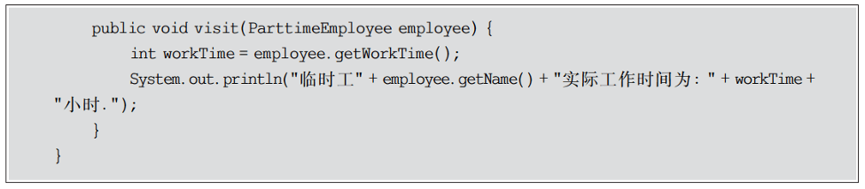

EmployeeList:员工列表类,充当对象结构


配置文件config.xml,在配置文件中存储了具体访问者类的类名。


客户端


#### 25.3.4 结果与分析

编译并运行程序,输出结果如下：


如果需要更换具体访问者类,无须修改源代码,只需修改配置文件即可。例如将访问者类由财务部改为人力资源部,只需将存储在配置文件config.xml 中的具体访问者类FADepartment改为HRDepartment,代码如下:


重新运行客户端程序,输出结果如下:


如果要在系统中增加一种新的访问者,无须修改源代码,只要增加一个新的具体访问者类即可,在该具体访问者中封装了新的操作元素对象的方法。从增加新的访问者的角度来看,访问者模式符合开闭原则。

如果要在系统中增加一种新的具体元素,例如增加一种新的员工类型为“退休人员”,由于原有系统并未提供相应的访问接口(在抽象访问者中没有声明任何访问“退休人员”的方法),因此必须对原有系统进行修改,在原有的抽象访问者类和具体访问者类中增加相应的访问方法。从增加新的元素的角度来看,访问者模式违背了开闭原则。

综上所述,访问者模式与抽象工厂模式类似,对开闭原则的支持具有倾斜性,可以很方便地添加新的访问者,但是添加新的元素较为麻烦。

### 25.4 访问者模式与组合模式的联用

在访问者模式中包含一个用于存储元素对象集合的对象结构,通常可以使用迭代器来遍历对象结构,同时具体元素之间可以存在整体与部分关系,有些元素作为容器对象,有些元素作为成员对象,可以使用组合模式来组织元素。引入组合模式后的访问者模式结构图如下图所示。


需要注意的是,在上图所示的结构中,由于叶子元素的遍历操作已经在容器元素中完成,因此要防止单独将已增加到容器元素中的叶子元素再次加人对象结构中,在对象结构中只需保存容器元素和孤立的叶子元素。

### 25.5 访问者模式优/缺点与适配环境

由于访问者模式的使用条件较为苛刻,本身结构也较为复杂,因此在实际应用中使用频率不是特别高。当系统中存在一个较为复杂的对象结构,且不同访问者对其所采取的操作也不相同时,可以考虑使用访问者模式进行设计。在 XML 文档解析、编译器的设计、复杂集合对象的处理等领域中访问者模式得到了一定的应用。

#### 25.5.1 访问者模式优点

访问者模式的优点主要如下:

1. 在访问者模式中增加新的访问操作很方便。使用访问者模式,增加新的访问操作就意味着增加一个新的具体访问者类,实现简单,无须修改源代码,符合开闭原则。
2. 访问者模式将有关元素对象的访问行为集中到一个访问者对象中,而不是分散在一个个的元素类中。类的职责更加清晰,有利于对象结构中元素对象的复用,相同的对象结构可以供多个不同的访问者访问，
3. 访问者模式让用户能够在不修改现有元素类层次结构的情况下定义作用于该层次结构的操作。

#### 25.5.2 访问者模式缺点

访问者模式的缺点主要如下:

1. 在访问者模式中增加新的元素类很困难。在访问者模式中,每增加一个新的元素类都意味着要在抽象访问者角色中增加一个新的抽象操作,并在每一个具体访问者类中增加相应的具体操作，这违背了开闭原则的要求。
2. 访问者模式破坏了对象的封装性。访问者模式要求访问者对象访问并调用每一个元素对象的操作,这意味着元素对象有时候必须暴露一些自己的内部操作和内部状态,否则无法供访问者访问。

#### 25.5.3 访问者模式适用环境

在以下情况下可以考虑使用访问者模式:

1. 一个对象结构包含多个类型的对象,希望对这些对象实施一些依赖其具体类型的操作。在访问者中针对每一种具体的类型都提供了一个访问操作,不同类型的对象可以有不同的访问操作。
2. 需要对一个对象结构中的对象进行很多不同的并且不相关的操作,而需要避免让这些操作“污染”这些对象的类,也不希望在增加新操作时修改这些类。访问者模式使得用户可以将相关的访问操作集中起来定义在访问者类中,对象结构可以被多个不同的访问老类所使用,将对象本身与对象的访问操作分离。
3. 对象结构中对象对应的类很少改变,但经常需要在此对象结构上定义新的操作。

## 26、UML类图

### 26.1 UML类图概述

UML(Unified Modeling Language,统一建模语言)是当前面向对象软件系统建模的标准语言,它融合了众多软件建模技术的优点,通过一系列标准的图形符号来描述系统。在设计模式的学习和使用过程中也需要掌握一些 UML,相关技术,尤其是 UML类图,通过类终可以更好地理解每一个设计模式的结构并对每一个模式实例进行分析。

UML,诞生于20世纪 90年代,在20世纪80年代至 90年代,面向对象分析和设计方法发展迅速,随着面向对象技术的广泛应用,其相关研究也十分活跃,涌现了大量的方法和技术,据不完全统计,最多的时候高达 50 多种,其中最具代表性的当属 Grady Booch 的 Booch方法、Jim Rumbaugh 的 OMT(Object Modeling Technology,对象建模技术)和 IvarJacobson 的 OOSE(Object Oriented Software Engineering,面向对象软件工程)等,而 UMI正是在这3位大师的联手之下共同打造而成的,现在它已经成为面向对象软件分析与设计建模的事实标准。

UML是一个通用的可视化建模语言,不同于编程语言,它通过一些标准的图形符号和文字对系统进行建模,用于对软件进行描述、可视化处理、构造和建立软件系统制品的文档UML适用于各种软件开发方法、软件生命周期的各个阶段、各种应用领域以及各种开发工具,UML是一套总结了以往建模技术的经验并吸收了当今最优秀成果的标准建模方法。

UML是一种主要由图形符号表达的建模语言,其结构主要包括以下4个部分。

1. ==视图(View)==:UML视图用于从不同的角度来表示待建模系统。视图是由许多图形组成的一个抽象集合,在建立一个系统模型时只有通过定义多个视图,每个视图显示该系统的一个特定方面,才能构造出该系统的完整蓝图,视图也将建模语言链接到开发所选择的方法和过程。UML视图包括用户视图、结构视图、行为视图、实现视图和环境视图。

2. ==图(Diagram)==:UML,图是描述 UML,视图内容的图形。UML 2.0 提供了 13 种图分别是==用例图(Use Case Diagram)==、==类图(Class Diagram)==、==对象图(Object Diagram)==、==包图(Package Diagram)==、==组合结构图(Composite Structure Diagram)==、==状态图(State Diagram)==、==活动图(Activity Diagram)==、==顺序图(Sequence Diagram)==、==通信图(CommunicationDiagram)==、==定时图(Timing Diagram)==、==交互概览图(Interaction Overview Diagram)==、==组件图(Component Diagram)==和==部署图(Deployment Diagram)==,通过它们之间的相互组合可提供待建模系统的所有视图。

3. ==模型元素(Model Element)==:模型元素是指 UML 图中所使用的一些概念,它们对应于普通的面向对象概念,如类、对象、消息以及这些概念之间的关系,例如关联关系、依赖关系、泛化关系等。同一个模型元素可以在多个不同的 UML,图中使用,但是无论在哪个图中,同一个模型元素都必须保持相同的意义并具有相同符号。

4. ==通用机制(General Mechanism)==:UML,提供的通用机制为模型元素提供额外的注释、语义和其他信息,这些通用机制也提供了扩展机制,允许用户对 UML,进行扩展,如定义新的建模元素、扩展原有元素的语义、添加新的特殊信息来扩展模型元素的规则说明等,以便适用于一个特定的方法或过程、组织或用户。

### 26.2 类与类的UML表示

在 UML 2.0的 13 种图形中,类图是使用最广泛的图形之一,它用于描述系统中所包含的类以及它们之间的相互关系,每一个设计模式的结构都可以使用类图来表示。类图帮助人们简化对系统的理解,是系统分析和设计阶段的重要产物,也是系统编码的重要模型依据

#### 26.2.1 类

类(Class)封装了数据和行为,是面向对象的重要组成部分,==它是具有相同属性、操作关系的对象集合的总称==。在系统中==每个类都具有一定的职责,职责指的是类要完成什么样的功能,要承担什么样的义务==。一个类可以有多种职责,设计得好的类通常有且仅有一种职责。在定义类的时候将类的职责分解成为类的属性和操作(即方法)。类的属性即类的数据职责,类的操作即类的行为职责。设计类是面向对象设计中最重要的组成部分,也是最复杂和最耗时的部分。

在软件系统运行时类将被实例化成对象(Obiect),对象对应于某个具体的事物,是类的实例(Instance)。

类图(Class Diagram)使用出现在系统中的不同类来描述系统的静态结构,它用来描述不同的类以及它们之间的关系。

#### 26.2.2 类的 UML 图示

在 UM 中类使用包含类名、属性和操作且带有分隔线的长方形来表示,如定义一个 Employee 类,它包含属性 name、age 和 email 以及操作 modifyInfo(),在 UML 类图中该类如下图所示。


上图对应的 Java 代码片段如下：

```java
public class Employee{
    String name;
    int age;
    String email;
    public void modifyInfo(){
        //...
    }
}
```

在 UML 类图中,类一般由3部分组成。

1. 第一部分是类名:每个类都必须有一个名字,类名是一个字符串。按照 Java 语言的命名规范,类名通常采用帕斯卡命名法(Pascal Case),即类名中每个单词的首字母都大写。

2. 第二部分是类的属性(Attributes):属性是指类的性质,即类的成员变量。一个类可以有任意多个属性,也可以没有属性.

UML 规定属性的表示方式如下:

```
[可见性] 名称:类型[=默认值]
```

其中:

- “==**可见性**==”表示该属性对于类外的元素而言是否可见,包括==公有(public)==、==私有(private)==和==受保护(protected)==3 种,在 UML,类图中分别用符号==“+”、“-”和“#”==表示。在ava 语言中还新增了默认的包内可见,包内可见在有的 UML,建模工具中用符号“*”表示为了保证数据的封装性,属性的可见性通常为 private,它们通过公有的 Getter 方法和Setter 方法供外界使用。
- “==名称==”表示属性名,用一个字符串表示。按照 Java 语言的命名规范,属性的命名采用驼峰命名法(Camel Case),即属性名中的第一个单词全小写,之后每个单词的首字母大写。
- “==类型==”表示属性的数据类型,可以是基本数据类型,也可以是用户自定义类型。
- “==默认值==”是一个可选项,即属性的初始值。
  
3. 第三部分是类的操作(Operations):操作是类的任意一个实例对象都可以使用的行为,是类的成员方法。

UML 规定操作的表示方式如下:

```
[可见性] 名称([参数列表])[:返回类型]
```

其中:

- “==可见性==”的定义与属性的可见性的定义相同。
- “==名称==”即方法名或操作名,用一个字符串表示。按照 Java语言的命名规范,方法的命名也采用驼峰命名法。
- “==参数列表==”表示方法的参数,其语法与属性的定义相似,参数个数是任意的,多个参数之间用逗号“，”隔开。
- “==返回类型==”是一个可选项,表示方法的返回值类型,依赖于具体的编程语言,可以是基本数据类型,也可以是用户自定义类型,还可以是空类型(void),如果是构造方法,则无返回类型。

### 26.3 类之间的关系

在软件系统中类并不是孤立存在的,类与类之间存在各种关系,对于不同类型的关系，UML 提供了不同的表示方式。

#### 26.3.1 关联关系

关联(Association)关系是类与类之间最常用的一种关系,它是一种结构化关系,==用于表示一类对象与另一类对象之间有联系==,如汽车和轮胎、师傅和徒弟、班级和学生等。在UML,类图中用实线连接有关联关系的对象所对应的类,在使用Java、C#和 C++等编程语言实现关联关系时,通常将一个类的对象作为另一个类的成员变量。在使用类图表示关联关系时可以在关联线上标注角色名,一般使用一个表示两者之间关系的动词或者名词表示角色名(有时该名词为实例对象名),关系的两端代表两种不同的角色,因此在一个关联关系中可以包含两个角色名,角色名不是必须的,可以根据需要增加,其目的是使类之间的关系更加明确。

例如在一个登录界面类 LoginForm 中包含一个 JButton 类型的注册按钮 loginButton,它们之间可以表示为关联关系,代码实现时可以在 LoginForm 中定义一个名为 loginButton的属性对象,其类型为 JButton,如下图所示。


上图对应的 Java 代码片段如下:


在 UML 中,关联关系通常又包含以下几种形式:

1. 双向关联

在默认情况下关联是双向的。例如顾客(Customer)购买商品(Product)并拥有商品,反之,卖出的商品总有某个顾客与之相关联。因此,Customer 类和 Product 类之间具有双向关联关系,如下图所示。


上图对应的 Java 代码片段如下:


2. 单向关联

类的关联关系也可以是单向的,单向关联用==带箭头的实线==表示。例如顾客(Customer)拥有地址(Address),则 Customer 类与 Address 类具有单向关联关系,如下图所示。


上图对应的 Java 代码片段如下:


3. 自关联

在系统中可能会存在一些类的属性对象类型为该类本身,这种特殊的关联关系称为自关联。例如一个结点类(Node)的成员又是结点 Node 类型的对象,如下图所示。


上图对应的 Java 代码片段如下:


4. 多重性关联

多重性关联关系又称为重数性(Multiplicity)关联关系,==表示两个关联对象在数量上的对应关系==。在 UML中,对象之间的多重性可以直接在关联直线上用一个数字或一个数字范围表示。

对象之间可以存在多种多重性关联关系,常见的多重性表示方式如下表所示。


例如一个界面(Form)可以拥有零个或多个按钮(Button),但是一个按钮只能属于一个界面,因此一个 Form 类的对象可以与零个或多个 Button 类的对象相关联,但一个 Button类的对象只能与一个 Form 类的对象关联,如下图所示。


上图对应的 Java 代码片段如下:


5. 聚合关系

聚合(Aggregation)关系表示整体与部分的关系。在聚合关系中,成员对象是整体对象的一部分,但是成员对象可以脱离整体对象独立存在。在 UML中,聚合关系用带空心菱形的直线表示。例如汽车发动机(Engine)是汽车(Car)的组成部分,但是汽车发动机可以独立存在,因此汽车和发动机是聚合关系,如下图所示。


在代码实现聚合关系时,成员对象通常作为构造方法、Setter方法或业务方法的参数注入到整体对象中,上图对应的 Java 代码片段如下:


6. 组合模式

组合(Composition)关系也表示类之间整体和部分的关系,但是在组合关系中整体对象可以控制成员对象的生命周期,一旦整体对象不存在,成员对象也将不存在,成员对象与整体对象之间具有同生共死的关系。在UML中,组合关系用带实心菱形的直线表示。例如人的头(Head)与嘴巴(Mouth),嘴巴是头的组成部分之一,而且如果头没了,嘴巴也就没了,因此头和嘴巴是组合关系,如下图所示。


在代码实现组合关系时,通常在整体类的构造方法中直接实例化成员类,上图对应的 Java 代码片段如下:


#### 26.3.2 依赖关系

依赖(Dependency)关系是一种使用关系,特定事物的改变有可能会影响到使用该事物的其他事物,在需要表示一个事物使用另一个事物时使用依赖关系。在大多数情况下,==依赖关系体现在某个类的方法使用另一个类的对象作为参数==。在UML,中,依赖关系用带箭头的虚线表示,由依赖的一方指向被依赖的一方。例如驾驶员开车,在 Driver 类的 drive()方法中将 Car 类型的对象 car 作为一个参数传递,以便在 drive()方法中能够调用 car 的 move()方法,驾驶员的 drive()方法依赖车的 move()方法,因此类 Driver 依赖类 Car,如下图所示:


在系统实现阶段,依赖关系通常通过3种方式来实现:第一种(也是最常用的一种方式)上图所示,将一个类的对象作为另一个类中方法的参数;第二种方式是在一个类的方法中将另一个类的对象作为其局部变量;第三种方式是在一个类的方法中调用另一个类的静态方法。上图对应的 Java 代码片段如下:


#### 26.3.3 泛化关系

泛化(Generalization)关系也就是继承关系,用于描述父类与子类之间的关系,==父类又称作基类或超类,子类又称作派生类==。在UML中,==泛化关系用带空心三角形的直线来表示==。在代码实现时,使用面向对象的继承机制来实现泛化关系,在Java语言中使用 extends关键字来实现。例如 Student 类和 Teacher 类都是 Person 类的子类,Student 类和 Teacher类继承了 Person 类的属性和方法,Person 类的属性包含姓名(name)和年龄(age),每一个Student 和 Teacher 也都具有这两个属性,另外 Student 类增加了属性学号(studentNo),Teacher 类增加了属性教师编号(teacherNo),Person 类的方法包括行走 move()和说话 say()，Student 类和 Teacher 类继承了这两个方法,而且 Student 类还新增了方法 study(),Teacher 类还新增了方法 teach(),如下图所示。


上图对应的 Java 代码片段如下:


#### 26.3.4 接口与实现类

在很多面向对象语言中都引人了接口的概念,例如 Java、C#等,在接口中通常没有属性,而且所有的操作都是抽象的,只有操作的声明,没有操作的实现。在 UML 中用与类的表示法类似的方式表示接口,如下图所示。


接口之间也可以有与类之间关系类似的继承关系和依赖关系,但是接口和类之间还存在一种实现(Realization)关系,在这种关系中类实现了接口,类中的操作实现了接口中所声明的操作。在 UML中,==类与接口之间的实现关系用带空心三角形的虚线来表示==。例如定义一个交通工具接口 Vehicle,包含一个抽象操作 move(),在类 Ship 和类 Car 中都实现了该 move()操作,不过具体的实现细节将会不一样,如下图所示。


实现关系在用代码实现时不同的面向对象语言也提供了不同的语法,在 Java语言中使用 implements 关键字来实现。上图对应的 Java 代码片段如下:


