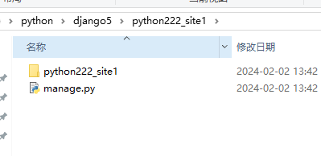
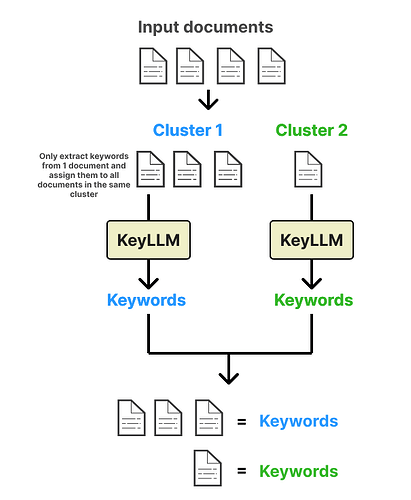

# Django

## 1、Django5介绍及安装

### 1.1 Django5简介 

Django(发音:[`dʒæŋɡəʊ]) 也有的小伙伴读成 “酱狗”，"贱狗"，"进狗"，"撞狗"，甚至还有读成"打 狗"。

[官方](https://www.djangoproject.com/) Django是一个高级的Python Web框架，可以快速开发安全和可维护的网站。由经验丰富的开发者构 建，Django负责处理网站开发中麻烦的部分，可以专注于编写应用程序，而无需重新开发。它是免费和 开源的，有活跃繁荣的社区，丰富的文档，以及很多免费和付费的解决方案。目前最新版本：5.0.1


### 1.2 Django5**安装**

pip安装：

```bash
pip install Django==5.0.3 -i https://pypi.tuna.tsinghua.edu.cn/simple
```

执行安装完成后，在python目录的Scripts下，会多出一个diango-admin.exe 这个是django项目创建工具


 

当然同时Lib下的site-packages下，也会有一个django目录，这个是后面我们开发项目会用到的django开发包。


## 2、Django5**项目创建与项目配置**

### 2.1 Django5**创建项目**(**用命令方式**)

首先cmd，进入命令提示符终端


 

我这边是准备把项目创建在  D:\python\django5 这个目录下。

cd 切换到你需要建项目的目录：

```bash
cd /d D:\python\django5
```


接下啦 借助 django-admin 工具，创建项目，命令如下：

```bash
django-admin startproject 项目名称
```


执行后，我们去看下 项目目录：




说明项目创建成功。

### 2.2 Django5**创建项目**(**用**PyCharm**工具**)

除了在命令提示符窗口创建项目之外，还可以在 PyCharm中创建项目。PyCharm必须为专业版才能创建与调试 Django项目，社区版是不支持此功能的。打开PyCharm并在左上方单击File→New Project，选择第一个Django，创建新项目，如下图：


相对于用命令方式，PyCharm创建的项目，多了templates目录（用来放html模版文件）,以及settings.py，多了`BASE_DIR / 'templates'`


这里介绍下默认创建的文件


- `manage.py`:项目管理命令行工具，内置多种方式与项目进行交互，包括启动项目，创建app，数据管理等。在命令提示符窗口下，将路径切换到python222_site1项目并输入python manage.py help，可以查看该工具的指令信息；【不用修改】

- `__init__.py`：初始化文件,一般情况下无须修改；

- `settings.py`：项目的配置文件，项目的所有功能都需要在该文件中进行配置；

- `urls.py`：项目的路由设置，设置网站的具体网址内容；

- `wsgi.py`：全 称 为 Python Web Server Gateway Interface，即Python服务器⽹关接⼝，是Python应⽤与Web服务器之间的接⼝，⽤于Django项⽬在服务器上的部署和上线；==**【不用修改】**==

- `asgi.py`：开启⼀个ASGI服务，ASGI是异步⽹关协议接⼝；==**【不用修改】**==

## 3、Django5**应用创建与应用配置**

### 3.1 Django5**操作命令**

我们掌握了如何在命令提示符或PyCharm下创建Django项目和项目应用，无论是创建项目还是创建项目应用，都需要输入相关的指令才能得以实现，这些都是Django内置的操作指令。

在PyCharm的Terminal中输入指令`python manage.py help`并按回车键，即可看到相关的指令信息，如下图所示。


Django5 的操作指令共有31条，每条指令的说明以表格形式展示。

| **指令**                  | **说明**                                                     |
| :------------------------ | :----------------------------------------------------------- |
| changepassword            | 修改内置用户表的用户密码                                     |
| createsuperuser           | 为内置用户表创建超级管理员账号                               |
| remove_stale_contenttypes | 删除数据库中已不使用的数据表                                 |
| check                     | 检测整个项目是否存在异常问题                                 |
| compilemessages           | 编译语言文件，用于项目的区域语言设置                         |
| createcachetable          | 创建缓存数据表，为内置的缓存机制提供存储功能                 |
| dbshell                   | 进入Django配置的数据库，可以执行数据库的SOL语句              |
| diffsettings              | 显示当前settings.py的配置信息与默认配置的差异                |
| dumpdata                  | 导出数据表的数据并以JSON格式存储，如 python manage.py dumpdata index >data.json，这是index的模型所对应的数据导出，并保存在 data.json文件中 |
| flush                     | 清空数据表的数据信息                                         |
| inspectdb                 | 获取项目所有模型的定义过程                                   |
| loaddata                  | 将数据文件导入数据表，如 python manage.py loaddatadata.,json |
| makemessages              | 创建语言文件，用于项目的区域语言设置                         |
| makemigrations            | 从模型对象创建数据迁移文件并保存在App 的migrations文件夹     |
| migrate                   | 根据迁移文件的内容，在数据库里生成相应的数据表               |
| sendtestemail             | 向指定的收件人发送测试的电子邮件                             |
| shell                     | 进入Django的Shell模式,用于调试项目功能                       |
| showmigrations            | 查看当前项目的所有迁移文件                                   |
| sqlflush                  | 查看清空数据库的SOL语句脚本                                  |
| sqlmigrate                | 根据迁移文件内容输出相应的SQL语句                            |
| sqlsequencereset          | 重置数据表递增字段的索引值                                   |
| squashmigrations          | 对迁移文件进行压缩处理                                       |
| startapp                  | 创建项目应用App                                              |
| optimizemigration         | 允许优化迁移操作                                             |
| startproject              | 创建新的Django项目                                           |
| test                      | 运行App里面的测试程序                                        |
| testserver                | 新建测试数据库并使用该数据库运行项目                         |
| clearsessions             | 清除会话Session数据                                          |
| collectstatic             | 收集所有的静态文件                                           |
| findstatic                | 查找静态文件的路径信息                                       |
| runserver                 | 在本地计算机上启动Django项目                                 |

 小技巧，前面每次执行命令都要在Terminal终端输入`python manage.py 命令`比较繁琐，我们借助PyCharm开发工具，在菜单Tools里，有个`Run manage.py Task... `,直接点击


直接输入命令，比如 help ，结果就出来，是不是很方便，以后我们就用这种简便方式，来提高工作效率。


### 3.2 Django5**应用创建**

前面我们创建的是一个项目，一个项目是由于一个或者多个应用组成(我们一般开发，一个项目里就创建一个应用即可)。

项目里的每个应用 都是独立的，可以拥有独立的数据库，模版代码，业务代码。比如，一个网站，可以有前台用户应用和后台管理员应用；


复杂的电商项目，后台甚至可以拆分用户应用，商品应用，订单应用，支付应用，积分应用，优惠券应用等。


前面我们学过Django5的操作命令，有一个命令是`startapp` ，就是用来创建项目应用APP的。我们执行`startapp app01`创建名字为app01的应用，执行完毕后，多出一个app01目录(目录里的生成文件，我们下一讲解释)


我们还可以继续执行`startapp app02`,`startapp app03`


 一个项目可以拥有一个或者多个应用，所以理论上，我们可以创建无数应用。但是还是强调下，==**一般情况，我们一个项目就之需要创建一个应用即可。**==

###  3.3 Django5**应用配置**

为了更好的理解Django5的应用配置，我们先来学习下Django的MTV模型。 

Django的MTV分别代表： 

Model(模型)：业务对象与数据库的对象(ORM) 

Template(模版)：负责如何把页面展示给用户 

View(视图)：负责页面逻辑，并在适当的时候调用Model和Template 

此外，Django还有一个urls分发器，它的作用是将一个URI的页面请求分发给不同的view处理，view再调用相应的Model和Template。 Django WEB框架示意图如下所示:

 

前面生成应用结构如下：

```bash
+---app01
| | admin.py
| | apps.py
| | models.py
| | tests.py
| | views.py
| | __init__.py
| |
| \---migrations
| __init__.py
```

我们来解释下这些生成的python文件。 

`__init__.py`：说明目录是一个python模块 

`migrations.py`目录：用于存放数据库迁移历史文件 

`models.py`： 用于应用操作数据库的模型 

`views.py`： 用于编写Web应用视图，接收数据，处理数据，与Model(模型)，Template(模版)进行交互，返回应答

`apps.py`：应用配置文件。 

`tests.py`：做单元测试。

`admin.py`：默认提供了admin后台管理，用作网站的后台管理站点配置相关

### 3.4 Django5 Hello World编写

前面对应用创建和应用配置掌握后，我们来编写第一个Hello World应用吧。体验一把Django5的项目开 发过程。 

#### 第一步：创建Hello World应用

直接执行 startapp helloWorld 命令创建应用。


#### 第二步：注册应用到项目的settings.py


把helloWorld应用的apps.py里的HelloworldConfig类注册到settings.py里去


#### 第三步：编写模版网页代码index.html

在templates目录下，新建index.html文件


```html
<!DOCTYPE html>
<html lang="en">
    <head>
        <meta charset="UTF-8">
        <title>Title</title>
    </head>
    <body>
        <p>Django5大爷你好！</p>
        <a href="http://python222.com/post/7" target="_blank">Python学习路线图</a>
    </body>
</html>
```

#### 第四步：编写视图处理请求层代码

在应用的views.py里编写index方法,request是客户端请求对象,render是渲染方法，可以携带数据渲染  到指定页面
```python
def index(request):
    return render(request,'index.html')
```

#### 第五步：编写请求映射函数配置

在项目的urls.py里编写应用的index/请求，执行我们上面应用定义的请求处理代码，也就是写一个映射 关系代码。


```python
import helloWorld.views

urlpatterns = [
    path('admin/', admin.site.urls), 
    path('index/', helloWorld.views.index),
]
```

#### 第六步，启动项目，测试

我们可以用前面讲的Django5的操作命令 `runserver` 启动


默认端口 8000 当然我们还有更简单的方式。直接用PyCharm启动。

直接点击绿色小三角即可。


启动后，浏览器输入，因为我们项目urls.py里配置的请求地址就是index/   所以请求如下

```http
http://127.0.0.1:8000/index/
```


运行测试成功。

执行过程：客户端请求index/ - > 经过django url请求分发器 - > 执行到应用的views.py的index方法 - > index方法再render渲染到index.html模版代码 - > 最终显示到用户浏览器终端。

### 3.5 Django5项目配置settings.py文件

#### 3.5.1 基本配置

Django 的配置文件 settings.py用于配置整个网站的环境和功能，核心配置必须有项目路径、密钥配置、域名访问权限、App列表、中间件、资源文件、模板配置、数据库的连接方式。

```properties
# 项目路径
# Build paths inside the project like this: BASE_DIR / 'subdir'.
BASE_DIR = Path( file ).resolve().parent.parent


# Quick-start development settings - unsuitable for production
# See https://docs.djangoproject.com/en/5.0/howto/deployment/checklist/

# 密钥配置
# SECURITY WARNING: keep the secret key used in production secret! 
SECRET_KEY = 'django-insecure-^+$)&&p^atz- o)&ytg&8%6dq!!ujgh7t2w#2n^i_f#r^#*vyqh'

# 调试模式
# SECURITY WARNING: don't run with debug turned on in production!
DEBUG = True
# 域名访问权限
ALLOWED_HOSTS = []
# Application definition # APP列表
INSTALLED_APPS = [
'django.contrib.admin', 
'django.contrib.auth', 
'django.contrib.contenttypes', 
'django.contrib.sessions', 
'django.contrib.messages', 
'django.contrib.staticfiles', 
'helloWorld.apps.HelloworldConfig'
]
```

- `BASE_DIR` 项目路径：主要通过os模块读取当前项目在计算机系统的具体路径，该代码在创建项目 时自动生成，一般情况下无须修改。

- `SECRET_KEY` 密钥配置：密钥配置SECRET_KEY:这是一个随机值，在项目创建的时候自动生成，一 般情况下无须修改。主要用于重要数据的加密处理，提高项目的安全性，避免遭到攻击者恶意破坏。密钥主要用于用户密码、CSRF机制和会话Session等数据加密。 
- 用户密码: Django 内置一套Auth认证系统，该系统具有用户认证和存储用户信息等功能，在创建用户的时候，将用户密码通过密钥进行加密处理，保证用户的安全性。 
  
- CSRF机制:该机制主要用于表单提交，防止窃取网站的用户信息来制造恶意请求。 
  
- 会话Session: Session的信息存放在Cookie中，以一串随机的字符串表示，用于标识当前访问 网站的用户身份，记录相关用户信息。 

`DEBUG` 调试模式：该值为布尔类型。如果在开发调试阶段，那么应设置为True，在开发调试过程中 会自动检测代码是否发生更改，根据检测结果执行是否刷新重启系统。如果项目部署上线，那么应将其改为False，否则会泄漏项目的相关信息。 

`ALLOWED_HOSTS` 域名访问权限：设置可访问的域名,默认值为空列表。当DEBUG为True并且 ALLOWED_HOSTS为空列表时，项目只允许以localhost或127.0.0.1在浏览器上访问。当DEBUG为 False时，ALLOWED_HOSTS为必填项，否则程序无法启动，如果想允许所有域名访问，可设置 ALLOW_HOSTS=['*']。 

`INSTALLED_APPS` APP列表：告诉Django有哪些App。在项目创建时已有admin、auth和sessions等配置信息，这些都是Django内置的应用功能，各个功能说明如下。 

1. admin:内置的后台管理系统。 
2. auth:内置的用户认证系统。 
3. contenttypes:记录项目中所有model元数据( Django 的ORM框架)。 
4. sessions: Session会话功能，用于标识当前访问网站的用户身份，记录相关用户信息。 
5. messages:消息提示功能。 
6. staticfiles:查找静态资源路径。 

如果在项目中创建了App，就必须在App列表 INSTALLED_APPS 添加App类


#### 3.5.2 资源文件配置 

资源文件配置分为静态资源和媒体资源。静态资源的配置方式由配置属性STATIC_URL、STATICFILES_DIRS和STATIC_ROOT进行设置;媒体资源的配置方式由配置属性MEDIA_URL和MEDIA_ROOT决定。 

**==静态资源配置=STATIC_URL==** 

静态资源指的是网站中不会改变的文件。在一般的应用程序中，静态资源包括CSS文件、JavaScript文件 以及图片等资源文件。 默认配置，app下的static目录为静态资源，可以直接访问。其他目录不行。

```properties
STATIC_URL = 'static/'
```

我们在app下新建static目录，再放一个logo.png图片。


同时在app目录下再新建一个images目录，放一个qq.jpg头像图片


最后再项目目录下新建一个static，放一个pig.jpg，也试试看是否可以访问；


我们启动项目测试：

先测试app下的static目录下的logo.png，能显示没问题。

```http
http://127.0.0.1:8000/static/logo.png
```


再试试app下的images目录下的qq.jpg

```http
http://127.0.0.1:8000/static/qq.jpg
```


404不存在

最后再测试下项目目录下的static下的pig.jpg

```http
http://127.0.0.1:8000/static/pig.jpg
```


也是404不存在。

通过测试说明，==**也就app下的static目录下的静态资源才能访问。**==

##### 3.5.2.1 静态资源集合配置-STATICFILES DIRS

由于STATIC_URL的特殊性，在开发中会造成诸多不便，比如将静态文件夹存放在项目的根目录以及定义 多个静态文件夹等。我们可以通过配置STATICFILES_DIRS实现多个目录下的静态资源可以访问。

```properties
# 设置静态资源文件集合
STATICFILES_DIRS = [BASE_DIR / "static", BASE_DIR / "helloWorld/images"]
```

我们再测试下：

```http
http://127.0.0.1:8000/static/pig.jpg
```


```http
http://127.0.0.1:8000/static/qq.jpg
```


##### 3.5.2.2 静态资源部署配置-STATIC_ROOT

静态资源配置还有STATIC_ROOT，其作用是在服务器上部署项目，实现服务器和项目之间的映射。 STATIC_ROOT 主要收集整个项目的静态资源并存放在一个新的文件夹，然后由该文件夹与服务器之间 构建映射关系。STATIC_ROOT配置如下:

```properties
# 静态资源部署
STATIC_ROOT = BASE_DIR / 'static'
```

当项目的配置属性 DEBUG设为True的时候，Django 会自动提供静态文件代理服务，此时整个项目处于开发阶段，因此无须使用STATIC_ROOT。当配置属性DEBUG 设为False的时候，意味着项目进入生产环境，Django不再提供静态文件代理服务，此时需要在项目的配置文件中设置STATIC_ROOT。 设置STATIC_ROOT需要使用 Django操作指令collectstatic来收集所有静态资源，这些静态资源都会保存 在STATIC_ROOT所设置的文件夹里。

##### 3.5.2.3 媒体资源配置-MEDIA

一般情况下，STATIC_URL是设置静态文件的路由地址，如CSS样式文件、JavaScript文件以及常用图片等。对于一些经常变动的资源，通常将其存放在媒体资源文件夹，如用户头像、歌曲文件等。媒体资源和静态资源是可以同时存在的，而且两者可以独立运行，互不影响，而媒体资源只有配置属性 MEDIA_URL和 MEDIA_ROOT。 我们在项目目录下新建media目录，里面再放一个boy.jpg图片。


然后在配置文件settings.py里设置配置属性MEDIA_URL和 MEDIA_ROOT，MEDIA_URL用于设置媒体资 源的路由地址，MEDIA_ROOT用于获取 media文件夹在计算机系统的完整路径信息，如下所示：

```properties
# 设置媒体路由
MEDIA_URL = 'media/'
# 设置media目录的完整路径
MEDIA_ROOT = BASE_DIR / 'media'
```

配置属性设置后，还需要将media文件夹注册到 Django里，让Django知道如何找到媒体文件，否则无法在浏览器上访问该文件夹的文件信息。打开项目文件夹的urls.py文件，为媒体文件夹media添加相应 的路由地址，代码如下:

```python
from django.conf import settings
from django.contrib import admin
from django.urls import path, re_path
from django.views.static import serve
import helloWorld.views

urlpatterns = [
    path('admin/', admin.site.urls),
    path('index/', helloWorld.views.index),
    # 配置媒体文件的路由地址
    re_path('media/(?P<path>.*)', serve, {'document_root': settings.MEDIA_ROOT},
            name='media')
]

```

我们来测试下：

```http
http://127.0.0.1:8000/media/boy.jpg
```


#### 3.5.3 模版配置

在Web开发中，模板是一种较为特殊的HTML文档。这个HTML文档嵌入了一些能够让Django识别的变量和指令，然后由Django的模板引擎解析这些变量和指令，生成完整的HTML网页并返回给用户浏览。 模板是Django里面的MTV框架模式的T部分，配置模板路径是告诉Django在解析模板时，如何找到模板所在的位置。创建项目时，Django已有初始的模板配置信息，如下所示:

```python
TEMPLATES = [
    {
        'BACKEND': 'django.template.backends.django.DjangoTemplates', 
        'DIRS': [BASE_DIR / 'templates'],
        'APP_DIRS': True, 
        'OPTIONS': {
            'context_processors': [ 'django.template.context_processors.debug',
                                   'django.template.context_processors.request',
                                   'django.contrib.auth.context_processors.auth',
                                   'django.contrib.messages.context_processors.messages',
                                  ],
        },
    },
]
```

模板配置是以列表格式呈现的，每个元素具有不同的含义，其含义说明如下。 

- BACKEND:定义模板引擎，用于识别模板里面的变量和指令。内置的模板引擎有 DjangoTemplates 和 jinja2.Jinja2，每个模板引擎都有自己的变量和指令语法。 
- DIRS:设置模板所在路径，告诉Django在哪个地方查找模板的位置，默认为空列表。 
- APP_DIRS:是否在App里查找模板文件。 
- OPTIONS:用于填充在RequestContext 的上下文（模板里面的变量和指令)，一般情况下不做任何修改。 

我们是可以在应用里新建templates，供自己的应用使用。在templates下新建index2.html模版文件


views.py里面把index.html改成index2.html


最后就是在DIRS里面加上应用的模版路径即可。


启动测试：

```http
http://127.0.0.1:8000/index/
```


但是我们这里有个疑问，如果说应用里的模版和项目里的模版名字一样，起冲突了。这时候，会选择哪 个呢，或者说哪个优先级高？

我们测试下吧。把应用里的index2.html改成index.html，以及views.py里面也改下。


然后我们重新运行测试：运行结果显示的是项目里的模版。


锋哥经过查看Django底层源码，其实优先级顺序是根据模版配置的目录顺序来定的，我们前面项目模版在前面，所以就显示项目模版。

如果我们把应用模版配置路径放前面


运行测试下：


结果就是应用模版了。

#### 3.5.4 数据库配置

数据库配置是选择项目所使用的数据库的类型，不同的数据库需要设置不同的数据库引擎，数据库引擎 用于实现项目与数据库的连接，Django提供4种数据库引擎: 

- 'django.db.backends.postgresql' 
- 'django.db.backends.mysql' 
- 'django.db.backends.sqlite3' 
- 'django.db.backends.oracle' 

项目创建时默认使用Sqlite3数据库，这是一款轻型的数据库，常用于嵌入式系统开发，而且占用的资源 非常少。Sqlite3数据库配置信息如下:

```python
DATABASES = {
    'default': {
        'ENGINE': 'django.db.backends.sqlite3', 
        'NAME': BASE_DIR / 'db.sqlite3',
    }
}
```

如果要把上述的连接信息改成MySQL数据库，首先需要安装MySQL连接模块 mysqlclient

```bash
pip install mysqlclient -i https://pypi.tuna.tsinghua.edu.cn/simple
```

mysqlclient模块安装后，在项目的配置文件settings.py中配置MySQL数据库连接信息

```python
DATABASES = {
    'default': {
        'ENGINE': 'django.db.backends.mysql',
        'NAME': 'db_python222',
        'USER': 'root',
        'PASSWORD': '123456',
        'HOST': 'localhost',
        'PORT': '3306'
    }
}

```

（django5至少需要MySQL 8.0.11版本)

我们来测试下数据库连接； 

我们首先在mysql 里创建数据库db_python222

然后我们用Django5 manage.py 提供的内置命令 migrate 来创建Django内置功能的数据表；


刷新数据库表：


这些是Django内置自带的Admin后台管理系统，Auth用户系统以及会话机制等功能需要用到的表。

==**注意：django也支持pymysql,mysqldb等，但是用的时候会有点小问题，所以建议大家还是用mysqlclient，比较稳定。**==

同时django支持多数据库；

```python
DATABASES = {
    'default': {
        'ENGINE': 'django.db.backends.mysql',
        'NAME': 'db_python222',
        'USER': 'root',
        'PASSWORD': '123456',
        'HOST': 'localhost',
        'PORT': '3308'
    },
    'mySqlite3': {
        'ENGINE': 'django.db.backends.sqlite3',
        'NAME': BASE_DIR / 'db.sqlite3',
    },
    'mySql3': {
        'ENGINE': 'django.db.backends.mysql',
        'NAME': 'db_django',
        'USER': 'root',
        'PASSWORD': '123',
        'HOST': 'localhost',
        'PORT': '3306'
    }
}
```

例如上面，我们定义了三个数据库，两个mysql，一个sqlite；配置属性DATABASES设有3个键值对，分 别是：'default'，'mySqlite3'，'mySql3'，每个键值对代表Django连接了某个数据库。 

若项目中连接了多个数据库，则数据库之间的使用需要遵从一定的规则和设置。比如项目中定义了多个模型，每个模型所对应的数据表可以选择在某个数据库中生成，如果模型没有指向某个数据库，模型就 会在key为default的数据库里生成。

#### 3.5.5 中间件

中间件(Middleware）是一个用来处理 Django 的请求(Request）和响应（Response）的框架级别的钩 子，它是一个轻量、低级别的插件系统，用于在全局范围内改变Django的输入和输出。当用户在网站中进行某个操作时，这个过程是用户向网站发送HTTP请求(Request);而网站会根据用户的 操作返回相关的网页内容，这个过程称为响应处理(Response)。从请求到响应的过程中，当Django接 收到用户请求时，首先经过中间件处理请求信息，执行相关的处理，然后将处理结果返回给用户。


django默认的中间配置如下：

```python
MIDDLEWARE = [
    'django.middleware.security.SecurityMiddleware',
    'django.contrib.sessions.middleware.SessionMiddleware',
    'django.middleware.common.CommonMiddleware', 
    'django.middleware.csrf.CsrfViewMiddleware',
    'django.contrib.auth.middleware.AuthenticationMiddleware',
    'django.contrib.messages.middleware.MessageMiddleware',
    'django.middleware.clickjacking.XFrameOptionsMiddleware',
]
```

django自带的中间件有：

- SecurityMiddleware:内置的安全机制，保护用户与网站的通信安全。
- SessionMiddleware:会话Session功能。
- LocaleMiddleware:国际化和本地化功能。
- CommonMiddleware:处理请求信息，规范化请求内容。
- CsrfViewMiddleware:开启CSRF防护功能。
- AuthenticationMiddleware:开启内置的用户认证系统。
- MessageMiddleware:开启内置的信息提示功能。
- XFrameOptionsMiddleware:防止恶意程序单击劫持。

我们也可以自定义中间件：

中间件可以定义五个方法，分别是：（主要的是process_request和process_response），在自己定义中间件时，必须继承MiddlewareMixin

process_request(self,request) 请求views方法之前会执行。 

process_view(self, request, callback, callback_args, callback_kwargs) Django会在调用视图函数之前调用process_view方法。

process_template_response(self,request,response) 该方法对视图函数返回值有要求，必须是一个含有render方法类的对象，才会执行此方法

process_exception(self, request, exception) 这个方法只有在视图函数中出现异常了才执行

process_response(self, request, response) 请求执行完成，返回页面前会执行

新建Md1自定义中间件类，继承MiddlewareMixin，实现process_request和process_response方法。


```python
"""
自定义中间件
作者 : 小锋老师
官网 : www.python222.com
"""
from django.utils.deprecation import MiddlewareMixin
class Md1(MiddlewareMixin):
    def process_request(self, request):
        print("request请求来了")
        
    def process_response(self, request, response):
        print("请求处理完毕，将返回到页面")
        return response
```

setting.py里配置自定义中间件。


views.py的index请求处理方法，我们加一句打印。


最后我们运行测试：

```http
http://127.0.0.1:8000/index/
```

```
request请求来了
页面请求处理中
请求处理完毕，将返回到页面
```

#### 3.5.6 其他配置

还有一些其他settings.py配置我们了解下

ROOT_URLCONF = 'python222_site1_pc.urls' 它指定了当前项目的根 URL，是 Django 路由系统的入口。

WSGI_APPLICATION = 'python222_site1_pc.wsgi.application' 项目部署时，Django 的内置服务器将 使用的 WSGI 应用程序对象的完整 Python 路径。

AUTH_PASSWORD_VALIDATORS 这是一个支持插拔的密码验证器，且可以一次性配置多个，Django 通过这些内置组件来避免用户设置的密码等级不足的问题。

LANGUAGE_CODE = 'en-us' TIME_ZONE = 'UTC'

分别代表语言配置项和当前服务端时区的配置项，我们常用的配置如下所示： 

- LANGUAGE_CODE 取值是英文：'en-us'或者中文：'zh-Hans'； 
- TIME_ZONE 取值是世界时区 'UTC' 或中国时区 'Asia/Shanghai'；

USE_I18N = True 项目开发完成后，可以选择向不同国家的用户提供服务，那么就需要支持国际化和本 地化。 

USE_TZ = True 它指对时区的处理方式，当设置为 True 的时候，存储到数据库的时间是世界时间 'UTC'。 

DEFAULT_AUTO_FIELD = 'django.db.models.BigAutoField' 默认主键自增类型


# RAG

资料来源:

[Coggle 30 Days of ML（24年1/2月）：动手学RAG - 竞赛学习 - Coggle竞赛论坛](http://discussion.coggle.club/t/topic/30)

>## 引言
>
>针对大型语言模型效果不好的问题，之前人们主要关注大语言模型(LLM)再训练、大语言模型微调、大语言模型的Prompt增强，但对于专有、快速更新的数据却并没有较好的解决方法，为此检索增强生成（RAG）的出现，弥合了LLM常识和专有数据之间的差距。
>
>今天给大家分享的这篇文章，将介绍RAG的概念理论，并带大家利用LangChain进行编排，OpenAI语言模型、Weaviate 矢量[数据库](https://cloud.tencent.com/solution/database?from_column=20065&from=20065)（也可以自己搭建Milvus[向量数据库](https://cloud.tencent.com/product/vdb?from_column=20065&from=20065)）来实现简单的 RAG 管道。

## 1、RAG介绍

在自然语言处理领域，大型语言模型（LLM）如GPT-3、BERT等已经取得了显著的进展，它们能够生成连贯、自然的文本，回答问题，并执行其他复杂的语言任务。然而，这些模型存在一些固有的局限性，如“模型幻觉问题”、“时效性问题”和“数据安全问题”。为了克服这些限制，检索增强生成（RAG）技术应运而生。

RAG的全称是Retrieval-Augmented Generation，中文翻译为==**检索增强生成**==。它是一个为大模型提供外部知识源的概念，这使它们能够生成准确且符合上下文的答案，同时能够减少模型幻觉。


RAG技术结合了大型语言模型的强大生成能力和检索系统的精确性。它允许模型在生成文本时，从外部知识库中检索相关信息，从而提高生成内容的准确性、相关性和时效性。这种方法不仅增强了模型的回答能力，还减少了生成错误信息的风险。

> 教程开源地址：[Github链接](https://github.com/coggle-club/notebooks/blob/main/notebooks/llm/Coggle202401-RAG打卡.ipynb)
>
> 教程视频地址：[动手学RAG：Part1 什么是RAG？_哔哩哔哩_bilibili](https://www.bilibili.com/video/BV1vt42157Si)


## 2、初始RAG

### 2.1 大模型的局限性

大型语言模型在自然语言处理领域展示了显著的能力，但它们也存在一系列固有的缺点。首先，虽然这些模型在掌握大量信息方面非常有效，但它们的结构和参数数量使得对其进行修改、微调或重新训练变得异常困难，且相关成本相当可观。

其次，大型语言模型的应用往往依赖于构建适当的提示（prompt）来引导模型生成所需的文本。这种方法通过将信息嵌入到提示中，从而引导模型按照特定的方向生成文本。然而，这种基于提示的方法可能使模型过于依赖先前见过的模式，而无法真正理解问题的本质。

| **大模型现存问题** | 大型语言模型的局限性                     |
| :----------------- | :--------------------------------------- |
| 问题1.1            | 模型幻觉问题：生成内容可能不准确或不一致 |
| 问题1.2            | 时效性问题：生成的内容不具有当前时效性   |
| 问题1.3            | 数据安全问题：可能存在敏感信息泄露风险   |

在自然语言处理领域，==**幻觉（Hallucination）**==被定义为生成的内容与提供的源内容无关或不忠实，具体而言，是一种虚假的感知，但在表面上却似乎是真实的。在一般语境中，幻觉是一个心理学术语，指的是一种特定类型的感知。在自然语言处理或大型语言模型的语境下，这种感知即为一种虚假的、不符合实际的信息。

造成==**幻觉的原因主要可以归结为数据驱动原因、表示和解码的不完善以及参数知识偏见。**==首先，数据对不齐或不匹配可能导致幻觉，因为模型在训练中未能准确地理解源内容与参考内容之间的关系。

### 2.2 知识库问答（Knowledge Base Question Answering，KBQA）

知识库问答（Knowledge Base Question Answering，简称KBQA）是一种早期的对话系统方法，旨在利用结构化的知识库进行自然语言问题的回答。这种方法基于一个存储在图数据库中的知识库，==**通常以三元组的形式表示为<主题，关系，对象>**==，其中每个三元组都附带相关的属性信息。


知识库问答早期是对话系统中的有效方法，其基于知识图谱的结构为系统提供了丰富的语义信息，使得系统能够更深入地理解用户提出的问题，并以结构化的形式回答这些问题。随着技术的不断发展，KBQA方法也在不断演进，为对话系统的进一步提升奠定了基础。

在KBQA中，有两种主流方法用于处理自然语言问题：

- 主题识别与实体链接：该方法从识别问题中的主题开始，将其链接到知识库中的实体（称为主题实体）。通过主题实体，系统能够在知识库中查找相关的信息并回答问题。
- 多跳查询：基于图数据库的优势，KBQA能够进行多跳查询，即通过多个关系跨越多个实体来获取更深层次的信息。这种灵活性使得系统能够更全面地理解和回答用户的复杂问题。

### 2.3 RAG介绍

检索增强生成（RAG）技术在弥补大型语言模型（LLM）的局限性方面取得了显著进展，尤其是在解决幻觉问题和提升实效性方面。在之前提到的LLM存在的问题中，特别是幻觉问题和时效性问题，RAG技术通过引入外部知识库的检索机制，成功提升了生成内容的准确性、相关性和时效性。


- RAG技术通过检索外部知识库，避免了幻觉问题的困扰。相较于单纯依赖大型语言模型对海量文本数据的学习，==**RAG允许模型在生成文本时从事实丰富的外部知识库中检索相关信息**==。
- RAG技术的时效性优势使其在处理实效性较强的问题时更为可靠。通过与外部知识库的连接，==**RAG确保了模型可以获取最新的信息，及时适应当前的事件和知识。**==
- 与传统的知识库问答（KBQA）相比，RAG技术在知识检索方面更加灵活，不仅能够从结构化的知识库中检索信息，还能够应对非结构化的自然语言文本。

| **RAG优点** | 描述                                         |
| :---------- | :------------------------------------------- |
| 优点1.1     | 提高准确性和相关性                           |
| 优点1.2     | 改善时效性，使模型适应当前事件和知识         |
| 优点1.3     | 降低生成错误风险，依赖检索系统提供的准确信息 |

**RAG被构建为一个应用于大型语言模型的框架，其目标是通过结合大模型的生成能力和外部知识库的检索机制，提升自然语言处理任务的效果。** RAG并非旨在取代已有的知识库问答（KBQA）系统，而是作为一种补充，利用检索机制强调实时性和准确性，从而弥补大型语言模型固有的局限性。


RAG框架的最终输出被设计为一种协同工作模式，将检索到的知识融合到大型语言模型的生成过程中。在应对任务特定问题时，RAG会生成一段标准化的句子，引导大模型进行回答。下面是RAG输出到大型语言模型的典型模板：

```python
你是一个{task}方面的专家，请结合给定的资料，并回答最终的问题。请如实回答，如果问题在资料中找不到答案，请回答不知道。

问题：{question}

资料：
- {information1}
- {information2}
- {information3}
```

其中，`{task}`代表==**任务的领域或主题**==，`{question}`是==**最终要回答的问题**==，而`{information1}`、`{information2}`等则是提供给模型的==**外部知识库中的具体信息**==。

### 2.4 RAG和SFT对比

在更新大型语言模型的知识方面，==**微调模型(SFT)**==和使用==**RAG**==这两种方法有着各自的优缺点。

微调模型优势在于能够通过有监督学习的方式，通过对任务相关数据的反复迭代调整，使得模型更好地适应特定领域的知识和要求。

RAG能够从外部知识库中检索最新、准确的信息，从而提高了答案的质量和时效性。其优势在于可以利用最新的外部信息，从而更好地适应当前事件和知识。

|      | 微调模型                                               | RAG                                                          |
| :--- | :----------------------------------------------------- | ------------------------------------------------------------ |
| 优点 | 针对特定任务调整预训练模型。优点是可针对特定任务优化； | 结合检索系统和生成模型。优点是能利用最新信息，提高答案质量，具有更好的可解释性和适应性; |
| 缺点 | 但缺点是更新成本高，对新信息适应性较差；               | 是可能面临检索质量问题和曾加额外计算资源需求;                |

| 特性       | RAG技术                                    | SFT模型微调                              |
| :--------- | :----------------------------------------- | :--------------------------------------- |
| 知识更新   | 实时更新检索库，适合动态数据，无需频繁重训 | 存储静态信息，更新知识需要重新训练       |
| 外部知识   | 高效利用外部资源，适合各类数据库           | 可对齐外部知识，但对动态数据源不够灵活   |
| 数据处理   | 数据处理需求低                             | 需构建高质量数据集，数据限制可能影响性能 |
| 模型定制化 | 专注于信息检索和整合，定制化程度低         | 可定制行为，风格及领域知识               |
| 可解释性   | 答案可追溯，解释性高                       | 解释性相对低                             |
| 计算资源   | 需要支持检索的计算资源，维护外部数据源     | 需要训练数据集和微调资源                 |
| 延迟要求   | 数据检索可能增加延迟                       | 微调后的模型反应更快                     |
| 减少幻觉   | 基于实际数据，幻觉减少                     | 通过特定域训练可减少幻觉，但仍然有限     |
| 道德和隐私 | 处理外部文本数据时需要考虑隐私和道德问题   | 训练数据的敏感内容可能引发隐私问题       |

### 2.5 RAG实现流程

如果使用RAG，主要包括==**信息检索**==和==**大型语言模型调用**==两个关键过程。信息检索通过连接外部知识库，获取与问题相关的信息；而大型语言模型调用则用于将这些信息整合到自然语言生成的过程中，以生成最终的回答。

| **RAG流程**     | 描述                     |
| :-------------- | :----------------------- |
| 步骤1：问题理解 | 准确把握用户的意图       |
| 步骤2：知识检索 | 从知识库中相关的知识检索 |
| 步骤3：答案生成 | 将检索结果与问题         |

RAG每个步骤都面临一些挑战，这些挑战使得RAG的实现变得复杂而困难。在问题理解阶段，系统需要准确把握用户的意图。**用户提问往往是短文本，而知识库中的信息可能是长文本。** 将用户提问与知识库中的知识建立有效的关联是一个难点，特别是考虑到用户提问可能模糊，用词不规范，难以直接找到相关的知识。

知识检索是RAG流程中的关键步骤，但也是面临挑战的步骤之一。**用户提问可能以多种方式表达，而知识库的信息来源可能是多样的，包括PDF、PPT、Neo4j等格式。**

**此外用户的意图可能非常灵活，可能是提问，也可能需要进行闲聊** 。在这个阶段，需要确保生成的答案与用户的意图一致，同时保持自然、连贯的文本。此外，大型模型的输出可能存在幻觉问题，即生成的内容可能与问题不相关，增加了生成准确回答的难度。

在论文综述[「Retrieval-Augmented Generation for Large Language Models: A Survey」](https://arxiv.org/pdf/2312.10997.pdf)中，作者将RAG技术按照复杂度继续划分为Naive RAG，Advanced RAG、Modular RAG。

| **技术类型**     | **描述**                                                     |
| :--------------- | :----------------------------------------------------------- |
| **Naive RAG**    | Naive RAG是RAG技术的最基本形式，也被称为经典RAG。包括索引、检索、生成三个基本步骤。索引阶段将文档库分割成短的Chunk，并构建向量索引。检索阶段根据问题和Chunks的相似度检索相关文档片段。生成阶段以检索到的上下文为条件，生成问题的回答。 |
| **Advanced RAG** | Advanced RAG在Naive RAG的基础上进行优化和增强。包含额外处理步骤，分别在数据索引、检索前和检索后进行。包括更精细的数据清洗、设计文档结构和添加元数据，以提升文本一致性、准确性和检索效率。在检索前使用问题的重写、路由和扩充等方式对齐问题和文档块之间的语义差异。在检索后通过重排序避免“Lost in the Middle”现象，或通过上下文筛选与压缩缩短窗口长度。 |
| **Modular RAG**  | Modular RAG引入更多具体功能模块，例如查询搜索引擎、融合多个回答等。技术上融合了检索与微调、强化学习等。流程上对RAG模块进行设计和编排，出现多种不同RAG模式。提供更大灵活性，系统可以根据应用需求选择合适的功能模块组合。模块化RAG的引入使得系统更自由、灵活，适应不同场景和需求。 |


在RAG技术流程中，涉及多个关键模块，每个模块承担着特定的任务，协同工作以实现准确的知识检索和生成自然语言回答。

| **技术模块**     | **描述**                                                     |
| :--------------- | :----------------------------------------------------------- |
| **意图理解**     | 意图理解模块负责准确把握用户提出的问题，确定用户的意图和主题。处理用户提问的模糊性和不规范性，为后续流程提供清晰的任务目标。 |
| **文档解析**     | 文档解析模块用于处理来自不同来源的文档，包括PDF、PPT、Neo4j等格式。该模块负责将文档内容转化为可处理的结构化形式，为知识检索提供合适的输入。 |
| **文档索引**     | 文档索引模块将解析后的文档分割成短的Chunk，并构建向量索引。或通过全文索引进行文本检索，使得系统能够更快速地找到与用户问题相关的文档片段。 |
| **向量嵌入**     | 向量嵌入模块负责将文档索引中的内容映射为向量表示，以便后续的相似度计算。这有助于模型更好地理解文档之间的关系，提高知识检索的准确性。 |
| **知识检索**     | 知识检索模块根据用户提问和向量嵌入计算的相似度检索或文本检索打分。这一步骤需要解决问题和文档之间的语义关联，确保检索的准确性。 |
| **重排序**       | 重排序模块在知识检索后对文档库进行重排序，以避免“Lost in the Middle”现象，确保最相关的文档片段在前面。 |
| **大模型回答**   | 大模型回答模块利用大型语言模型生成最终的回答。该模块结合检索到的上下文，以生成连贯、准确的文本回答。 |
| **其他功能模块** | 可根据具体应用需求引入其他功能模块，如查询搜索引擎、融合多个回答等。模块化设计使得系统更加灵活，能够根据不同场景选择合适的功能模块组合。 |

## 3、ChatGPT/GLM API使用

### 3.1 两个大模型介绍

ChatGPT是OpenAI开发的聊天生成预训练转换器，基于GPT-3.5和GPT-4架构。该模型通过强化学习训练，具有出色的语言生成能力。ChatGPT支持文字方式的交互，用户可以使用自然语言对话的方式与ChatGPT进行通信。API的引入使得开发者能够将ChatGPT整合到自己的应用中，实现自动文本生成、自动问答等功能。

GLM是智谱AI推出的新一代基座大模型，相比上一代有着显著提升的性能，逼近GPT-4。GLM支持更长的上下文（128k），具备强大的多模态能力，并且推理速度更快，支持更高的并发。GLM的API接口为开发者提供了在自己应用中利用GLM进行语言生成的机会，为多种领域的任务提供了新的解决方案。

虽然这两个大模型都非常有效，但我们希望所有的学习者都需要学会对应的API调用。如果在本地使用ChatGLM3-6B等开源模型，也可以完成类似功能，但整体效果肯定不如这些费用的API。在任务2中，为了方便所有同学参与，我们将使用在线的ChatGPT/GLM API进行开发。这为没有本地GPU资源的同学提供了更便捷的方式。**但ChatGPT/GLM API 都是需要注册账号并付费才能进行使用，如果你没有账号请联系小助手，我们将想要参与学习的同学提供API token。**

| ** ChatGPT**    | **ChatGLM**                                                  |                                                              |
| :-------------- | :----------------------------------------------------------- | ------------------------------------------------------------ |
| **官网**        | [https://chat.openai.com/](https://chat.openai.com/)         | [https://open.bigmodel.cn/](https://open.bigmodel.cn/)       |
| **API文档**     | [https://platform.openai.com/docs/api-reference](https://platform.openai.com/docs/api-reference) | [https://open.bigmodel.cn/dev/api](https://open.bigmodel.cn/dev/api) |
| **API计费说明** | [https://openai.com/pricing](https://openai.com/pricing)     | [https://open.bigmodel.cn/pricing](https://open.bigmodel.cn/pricing) |

在继续后续的学习中，有以下注意事项：

1. ChatGPT/GLM API可以通过Python的库进行调用，也可以通过HTTP方式进行调用。为了代码方便，后续都使用HTTP方式调用。
2. ChatGPT/GLM API都有v3.5和v4两个对话版本的模型，但v4价格比v3.5高5-10倍，且更慢。所以除非必要，请默认使用v3.5模型。
3. ChatGPT API在国内无法链接，教程使用了[第三方充值和转发方式](https://api2d.com/)。

### 3.2 对话 API

对话API是所有大模型的最常见的API，可以完成通用对话，也可以完成很多功能。但在进行调用时需要注意如下入参和参数返回结果。

- 请求参数说明

| 参数                | 类型                 | 必填 | 描述                                                         |
| :------------------ | :------------------- | :--- | :----------------------------------------------------------- |
| `messages`          | Array                | 必填 | 包含对话的消息列表。                                         |
| `model`             | String               | 必填 | 要使用的模型的ID。                                           |
| `frequency_penalty` | Number 或 null       | 可选 | 根据文本中已有令牌的频率对新令牌进行惩罚。取值范围在-2.0到2.0之间。 |
| `logit_bias`        | Map                  | 可选 | 修改指定令牌在完成中出现的可能性。接受一个将令牌映射到偏置值（-100到100）的JSON对象。 |
| `logprobs`          | Boolean 或 null      | 可选 | 是否返回输出令牌的对数概率。                                 |
| `top_logprobs`      | Integer 或 null      | 可选 | 如果 `logprobs` 设置为 `true`，则返回每个令牌位置上最有可能的令牌数，每个都带有关联的对数概率。 |
| `max_tokens`        | Integer 或 null      | 可选 | 可以在聊天完成中生成的最大 [令牌数](https://platform.openai.com/tokenizer)。 |
| `n`                 | Integer 或 null      | 可选 | 为每个输入消息生成的聊天完成选择的数量。                     |
| `presence_penalty`  | Number 或 null       | 可选 | 根据新令牌是否出现在到目前为止的文本中对其进行惩罚，增加模型谈论新主题的可能性。 |
| `seed`              | Integer 或 null      | 可选 | 如果指定，系统将尽力进行确定性采样，以使具有相同 `seed` 和参数的重复请求应返回相同的结果。 |
| `stop`              | String/Array 或 null | 可选 | API 将停止生成进一步的令牌的序列，最多可设置为 4 个。        |
| `stream`            | Boolean 或 null      | 可选 | 如果设置，将发送部分消息增量，就像在 ChatGPT 中一样。令牌将作为数据仅 [server-sent events](https://developer.mozilla.org/en-US/docs/Web/API/Server-sent_events/Using_server-sent_events#Event_stream_format) 发送，一旦可用，流将以 `data: [DONE]` 消息终止。参考 [Example Python code](https://cookbook.openai.com/examples/how_to_stream_completions)。 |
| `temperature`       | Number 或 null       | 可选 | 使用的采样温度，介于 0 和 2 之间。较高的值（如 0.8）会使输出更随机，而较低的值（如 0.2）会使其更集中和确定性。 |
| `top_p`             | Number 或 null       | 可选 | 与温度采样的替代方法，称为核采样，其中模型考虑具有 top_p 概率质量的令牌的结果。因此，0.1 表示仅考虑构成前 10% 概率质量的令牌。 |

- 返回结果字段

| 参数                 | 类型   | 描述                                                         |
| :------------------- | :----- | :----------------------------------------------------------- |
| `id`                 | 字符串 | 用于唯一标识聊天完成的标识符。                               |
| `choices`            | 数组   | 聊天完成选择的列表。如果n大于1，则可以有多个选择。           |
| `created`            | 整数   | 聊天完成创建的Unix时间戳（以秒为单位）。                     |
| `model`              | 字符串 | 用于聊天完成的模型。                                         |
| `system_fingerprint` | 字符串 | 此指纹表示模型运行时的后端配置。可与seed请求参数一起使用，了解可能影响确定性的后端更改。 |
| `usage`              | 对象   | 完成请求的使用统计信息。                                     |
| `finish_reason`      | 字符串 | 表示聊天完成的原因。可能的值包括"stop"（API返回了完整的聊天完成而没有受到任何限制），“length”（生成超过了max_tokens或对话超过了max context length），等等。 |

- ChatGPT（支持gpt-3.5-turbo-0613、gpt-3.5-turbo-16k-0613、gpt-4-0613）

```python
import requests
url = "https://openai.api2d.net/v1/chat/completions"
headers = {
    'Content-Type': 'application/json',
    'Authorization': 'Bearer 填入Key'
}

data = {
    "model": "gpt-3.5-turbo",
    "messages": [{"role": "user", "content": """你好"""},]
}
response = requests.post(url, headers=headers, json=data)
print("Status Code", response.status_code)
print("JSON Response ", response.json())
```

- ChatGLM（支持glm-3-turbo、glm-4）

```python
import time
import jwt
import requests

# 实际KEY，过期时间
def generate_token(apikey: str, exp_seconds: int):
    try:
        id, secret = apikey.split(".")
    except Exception as e:
        raise Exception("invalid apikey", e)

    payload = {
        "api_key": id,
        "exp": int(round(time.time() * 1000)) + exp_seconds * 1000,
        "timestamp": int(round(time.time() * 1000)),
    }
    return jwt.encode(
        payload,
        secret,
        algorithm="HS256",
        headers={"alg": "HS256", "sign_type": "SIGN"},
    )

url = "https://open.bigmodel.cn/api/paas/v4/chat/completions"
headers = {
  'Content-Type': 'application/json',
  'Authorization': generate_token("填入Key", 1000)
}

data = {
    "model": "glm-3-turbo",
    "messages": [{"role": "user", "content": """你好"""}]
}

response = requests.post(url, headers=headers, json=data)

print("Status Code", response.status_code)
print("JSON Response ", response.json())
```

### 3.3 Embedding API

- ChatGPT

```python
import requests

url = "https://openai.api2d.net/v1/embeddings"

headers = {
  'Content-Type': 'application/json',
  'Authorization': 'Bearer 填入Key'
}

data = {
    "model": "text-embedding-ada-002",
    "input": "魔兽世界坐骑去哪买"
}
response = requests.post(url, headers=headers, json=data)
print("Status Code", response.status_code)
print("JSON Response ", response.json())
```

- ChatGLM

```python
import requests
url = "https://open.bigmodel.cn/api/paas/v4/embeddings"

headers = {
  'Content-Type': 'application/json',
  'Authorization': generate_token("填入Key", 1000)
}

data = {
  "model": "embedding-2",
  "input": "测试文本，今天很开心。"
}

response = requests.post(url, headers=headers, json=data)

print("Status Code", response.status_code)
print("JSON Response ", response.json())
```

### 3.4 Function CALL API

- ChatGPT

```python
import requests
import json

url = "https://openai.api2d.net/v1/chat/completions"

headers = {
    'Content-Type': 'application/json',
    'Authorization': 'Bearer 填入Key'
}

data = {
  "model": "gpt-3.5-turbo-0613", # "gpt-4-0613",
  "messages": [
    {"role": "user", "content": "李华和小王是不是认识？"},
  ],
  "functions": [
    {
      "name": "get_connection",
      "description": "判断用户1和用户2 是否为朋友关系",
      "parameters": {
        "type": "object",
        "properties": {
          "user_id1": {
            "type": "string",
            "description": "用户ID 1"
          },
          "user_id2": {
            "type": "string",
            "description": "用户ID 2"
          },
        },
        "required": ["user_id1", "user_id2"]
      }
    }
  ]
}

response = requests.post(url, headers=headers, json=data)
print("Status Code", response.status_code)
print("JSON Response ", response.json())
```

## 4、读取汽车问答数据

本次==**RAG学习**==使用了[天池2023全球智能汽车AI挑战赛——赛道一：AI大模型检索问答](https://tianchi.aliyun.com/competition/entrance/532154)的数据集，bing进行了重新标注。比赛要求参赛选手以大模型为中心制作一个问答系统，回答用户的汽车相关问题。参赛选手需要根据问题，在文档中定位相关信息的位置，并根据文档内容通过大模型生成相应的答案。本次比赛涉及的问题主要围绕汽车使用、维修、保养等方面。

在线评测地址：[https://competition.coggle.club/](https://competition.coggle.club/)

```
问题1：怎么打开危险警告灯？
答案1：危险警告灯开关在方向盘下方，按下开关即可打开危险警告灯。

问题2：车辆如何保养？
答案2：为了保持车辆处于最佳状态，建议您定期关注车辆状态，包括定期保养、洗车、内部清洁、外部清洁、轮胎的保养、低压蓄电池的保养等。

问题3：靠背太热怎么办？
答案3：您好，如果您的座椅靠背太热，可以尝试关闭座椅加热功能。在多媒体显示屏上依次点击空调开启按键→座椅→加热，在该界面下可以关闭座椅加热。
```

数据集下载地址：

- 数据（百度云盘）链接: [https://pan.baidu.com/s/19_oqY4bC_lJa_7Mc6lxU7w?pwd=v4bi](https://pan.baidu.com/s/19_oqY4bC_lJa_7Mc6lxU7w?pwd=v4bi) 提取码: v4bi
- 数据（谷歌云盘）链接：[https://drive.google.com/drive/folders/1rD52-7W5ypzLk9ZXOrMBYx8F8xHaAzlW?usp=sharing](https://pan.baidu.com/s/19_oqY4bC_lJa_7Mc6lxU7w?pwd=v4bi)

### 4.1 读取问答数据集

```python
import json
import pdfplumber

questions = json.load(open("questions.json"))
print(questions[0])

pdf = pdfplumber.open("初赛训练数据集.pdf")
len(pdf.pages) # 页数
pdf.pages[0].extract_text() # 读取第一页内容，可复制pdf
```

### 4.2 读取所有页内容

```python
pdf_content = []
for page_idx in range(len(pdf.pages)):
    pdf_content.append({
        'page': 'page_' + str(page_idx + 1),
        'content': pdf.pages[page_idx].extract_text()
    })
```

## 5、文本索引与答案检索

### 5.1 文本检索流程

文本检索是一个多步骤的过程，其核心是构建倒排索引以实现高效的文本检索：

- 步骤1（文本预处理）：在文本预处理阶段，对原始文本进行清理和规范化，包括去除停用词、标点符号等噪声，并将文本统一转为小写。接着，采用词干化或词形还原等技术，将单词转换为基本形式，以减少词汇的多样性，为后续建立索引做准备。
- 步骤2（文本索引）：构建倒排索引是文本检索的关键步骤。通过对文档集合进行分词，得到每个文档的词项列表，并为每个词项构建倒排列表，记录包含该词项的文档及其位置信息。这种结构使得在查询时能够快速找到包含查询词的文档，为后续的文本检索奠定了基础。
- 步骤3（文本检索）：接下来是查询处理阶段，用户查询经过预处理后，与建立的倒排索引进行匹配。计算查询中每个词项的权重，并利用检索算法（如TFIDF或BM25）对文档进行排序，将相关性较高的文档排在前面。

在实际应用中，倒排索引的构建和维护需要考虑性能问题，采用一些优化技术来提高检索效率，如压缩倒排索引、分布式索引等。这些步骤共同构成了一个有序而逻辑完整的文本检索流程。

### 5.2 文本检索与语义检索

下面是文本检索和语义检索的区别和联系的表格形式：

|              | 文本检索                                                     | 语义检索                                             |
| :----------- | :----------------------------------------------------------- | ---------------------------------------------------- |
| **定义**     | 通过关键词或短语匹配文本数据的过程                           | 强调理解查询与文本之间的深层语义关系                 |
| **方法**     | 基于关键词匹配，使用TFIDF、BM25等权重计算                    | 使用NLP技术，如词嵌入、预训练的语言模型              |
| **特点**     | 强调字面意义，关注表面文本的匹配                             | 关注词语之间的关联、语境和含义                       |
| **应用场景** | 大规模文本数据的快速匹配                                     | 对语义理解要求较高的场景                             |
| **优势**     | 处理速度较快，适用于大规模文本数据                           | 能够处理一词多义、近义词等语义上的复杂情况           |
| **联系**     | 结合使用，先使用文本检索筛选出候选文档，然后在这些文档上应用语义检索 | 可以利用语义模型提取关键词的上下文信息，提升检索效果 |

在一些场景中，文本检索和语义检索可以结合使用，以充分利用它们各自的优势。例如，可以先使用文本检索筛选出候选文档，然后在这些文档上应用语义检索来进一步提高检索的准确性。当然具体使用哪种检索方法，需要具体分析，在RAG中可以结合两种方法一起进行使用。

### 5.3 TFIDF

TFIDF（Term Frequency-Inverse Document Frequency）是一种用于信息检索和文本挖掘的常用权重计算方法，旨在衡量一个词项对于一个文档集合中某个文档的重要性。该方法结合了两个方面的信息：词项在文档中的频率（TF）和在整个文档集合中的逆文档频率（IDF）。

1. **词项在文档中的频率（TF）**：

   $TF(t,d) = \frac{词项t在文档d中出现的次数}{文档d中所有词项的总数}$

其中，$t$表示词项，$d$表示文档。TF表示了一个词项在文档中的相对频率，即在文档中出现的次数相对于文档总词项数的比例。

2. **逆文档频率（IDF）**：

$IDF(t) = \log(\frac{文档集合中的文档总数}{包含词项t的文档数 + 1})$

其中，$t$表示词项。IDF表示了一个词项在整个文档集合中的稀有程度，如果词项在许多文档中都出现，其IDF值较低，反之则较高。

3. **TFIDF的计算**：

   $TFIDF(t,d,D) = TF(t,d)\times IDf(t)$

其中，$D$表示文档集合。TFIDF的最终值是将词项在文档中的频率和在整个文档集合中的逆文档频率相乘，这样可以得到一个更全面的评估，既考虑了在文档中的重要性，也考虑了在整个文档集合中的稀有性。

```python
import jieba
import numpy as np
from sklearn.feature_extraction.text import TfidfVectorizer
from sklearn.preprocessing import normalize

# 对提问和PDF内容进行分词
question_words = [' '.join(jieba.lcut(x['question'])) for x in questions]
pdf_content_words = [' '.join(jieba.lcut(x['content'])) for x in pdf_content]

tfidf = TfidfVectorizer()
tfidf.fit(question_words + pdf_content_words)

# 提取TFIDF
question_feat = tfidf.transform(question_words)
pdf_content_feat = tfidf.transform(pdf_content_words)

# 进行归一化
question_feat = normalize(question_feat)
pdf_content_feat = normalize(pdf_content_feat)

# 检索进行排序
for query_idx, feat in enumerate(question_feat):
    score = feat @ pdf_content_feat.T
    score = score.toarray()[0]
    max_score_page_idx = score.argsort()[-1] + 1
    questions[query_idx]['reference'] = 'page_' + str(max_score_page_idx)

# 生成提交结果
# https://competition.coggle.club/
with open('submit.json', 'w', encoding='utf8') as up:
    json.dump(questions, up, ensure_ascii=False, indent=4)
```

### 5.4 BM25

BM25Okapi是BM25算法的一种变体，它在信息检索中用于评估文档与查询之间的相关性。以下是BM25Okapi的原理和打分方式的概述：

1. BM25Okapi的主要参数：

- $k_1$：控制词项频率对分数的影响，通常设置为1.5。
- $b$：控制文档长度对分数的影响，通常设置为0.75。
- $epsilon$：用于防止逆文档频率（IDF）为负值的情况，通常设置为0.25。

1. 打分的计算过程：

BM25Okapi的打分过程基于以下三个因素：词项在文档中的频率（TF）、文档的长度（doc_len）以及逆文档频率（IDF）。

- TF（词项在文档中的频率）
- IDF（逆文档频率）
- 文档长度（doc_len）

文档长度对分数的影响通过 b 控制。文档长度越长，该项的分数越小。BM25Okapi的打分公式综合考虑了以上三个因素，通过对每个词项的打分求和得到最终的文档与查询的相关性分数。

$score = \sum_{q \in query} (IDF(q) \times \frac{q_freq \times (k1+1)}{q_freq + k1 \times (1-b+b \times \frac{doc\_len}{abgdl})} )$

其中，$\text{avgdl}$是文档集合中的平均文档长度。BM25Okapi通过合理调整参数，兼顾了词项频率、文档长度和逆文档频率，使得在信息检索任务中能够更准确地评估文档与查询之间的相关性，提高检索效果。

```python
# !pip install rank_bm25
from rank_bm25 import BM25Okapi

pdf_content_words = [jieba.lcut(x['content']) for x in pdf_content]
bm25 = BM25Okapi(pdf_content_words)

for query_idx in range(len(questions)):
    doc_scores = bm25.get_scores(jieba.lcut(questions[query_idx]["question"]))
    max_score_page_idx = doc_scores.argsort()[-1] + 1
    questions[query_idx]['reference'] = 'page_' + str(max_score_page_idx)

with open('submit.json', 'w', encoding='utf8') as up:
    json.dump(questions, up, ensure_ascii=False, indent=4)
```

==**注意事项：**==

1. **实现非工业级别**：
   - 提供的TFIDF和BM25的实现并非工业级别，仅作为演示目的。在实际进行文本检索时，特别是在大规模数据集和生产环境中，应该使用专业的文本检索引擎工具，例如==**Elasticsearch**==，以确保高效、可扩展和内存友好的实现。
2. **相似度计算的内存和数据量级考虑**：
   - 在实际应用中，对整个文本集合构建矩阵并进行相似度计算可能导致内存占用较大，尤其在大规模数据集情况下。建议考虑使用基于倒排索引等数据结构的文本检索引擎，以减小内存占用并提高检索效率。
3. **停用词和单词筛选**：
   - 未对文本进行停用词筛选和额外的单词筛选。在实际应用中，建议进行停用词的去除，以排除常见但无实际意义的词汇，提高检索的准确性。同时，考虑引入领域专有的单词筛选，以过滤掉与任务无关的词汇，优化检索结果。
4. **PDF处理方式**：
   - 将PDF内每一页都当做一个文档进行处理。实际应用中，对于PDF文档，可以考虑使用专业的PDF文本提取工具，提取有意义的文本内容，而不是将每一页都当做独立的文档处理。这有助于更好地利用文档内部的语义信息。

## 6、文本嵌入与向量检索

### 6.1 语义检索流程

**语义检索是通过词嵌入和句子嵌入等技术，将文本表示为语义丰富的向量**。通过相似度计算和结果排序找到最相关的文档。用户查询经过自然语言处理处理，最终系统返回经过排序的相关文档，提供用户友好的信息展示。语义检索通过深度学习和自然语言处理技术，使得系统能够更准确地理解用户查询，提高检索的准确性和效果。


### 6.2 文本编码模型

文本编码模型对于语义检索的精度至关重要。目前，大多数语义检索系统采用预训练模型进行文本编码，其中最为常见的是基于==**BERT**==（Bidirectional Encoder Representations from Transformers）的模型，或者使用==**GPT**==（Generative Pre-trained Transformer）等。这些预训练模型通过在大规模语料上进行训练，能够捕捉词语和句子之间的复杂语义关系。选择合适的文本编码模型直接影响到得到的文本向量的有效性，进而影响检索的准确性和效果。

编码模型排行榜：[https://huggingface.co/spaces/mteb/leaderboard ](https://huggingface.co/spaces/mteb/leaderboard)

- M3E

```python
from sentence_transformers import SentenceTransformer
model = SentenceTransformer('../hugging-face-model/moka-ai/m3e-small/')

question_sentences = [x['question'] for x in questions]
pdf_content_sentences = [x['content'] for x in pdf_content]

question_embeddings = model.encode(question_sentences, normalize_embeddings=True)
pdf_embeddings = model.encode(pdf_content_sentences, normalize_embeddings=True)

for query_idx, feat in enumerate(question_embeddings):
    score = feat @ pdf_embeddings.T
    max_score_page_idx = score.argsort()[-1] + 1
    questions[query_idx]['reference'] = 'page_' + str(max_score_page_idx)

with open('submit.json', 'w', encoding='utf8') as up:
    json.dump(questions, up, ensure_ascii=False, indent=4)
```

- BGE

```py
model = SentenceTransformer('../hugging-face-model/BAAI/bge-small-zh-v1.5/')

# 剩余代码与M3E部分相同
```

- BCEmbedding

```python
model = SentenceTransformer("../hugging-face-model/maidalun1020/bce-embedding-base_v1", device='cuda')
model.max_seq_length = 512

# 剩余代码与M3E部分相同
```

### 6.3 文本切分方法

文本的长度是另一个关键因素，影响了文本编码的结果。短文本和长文本在编码成向量时可能表达不同的语义信息。即使两者包含相同的单词或有相似的语义，由于上下文的不同，得到的向量也会有所不同。因此，当在语义检索中使用短文本来检索长文本时，或者反之，可能导致一定的误差。针对文本长度的差异，有些系统采用截断或填充等方式处理，以保持一致的向量表示。

更多阅读资料：

- [https://python.langchain.com/docs/modules/data_connection/document_transformers/](https://python.langchain.com/docs/modules/data_connection/document_transformers/)
- [https://chunkviz.up.railway.app/](https://chunkviz.up.railway.app/)

| 名称           | 分割依据                   | 描述                                                         |
| :------------- | :------------------------- | :----------------------------------------------------------- |
| 递归式分割器   | 一组用户定义的字符         | 递归地分割文本。递归分割文本的目的是尽量保持相关的文本段落相邻。这是开始文本分割的推荐方式。 |
| HTML分割器     | HTML特定字符               | 基于HTML特定字符进行文本分割。特别地，它会添加有关每个文本块来源的相关信息（基于HTML结构）。 |
| Markdown分割器 | Markdown特定字符           | 基于Markdown特定字符进行文本分割。特别地，它会添加有关每个文本块来源的相关信息（基于Markdown结构）。 |
| 代码分割器     | 代码（Python、JS）特定字符 | 基于特定于编码语言的字符进行文本分割。支持从15种不同的编程语言中选择。 |
| Token分割器    | Tokens                     | 基于Token进行文本分割。存在一些不同的Token计量方法。         |
| 字符分割器     | 用户定义的字符             | 基于用户定义的字符进行文本分割。这是较为简单的分割方法之一。 |
| 语义分块器     | 句子                       | 首先基于句子进行分割。然后，如果它们在语义上足够相似，就将相邻的句子组合在一起。 |

对于自然语言，可以推荐使用Token分割器，结合Chunk Size和Overlap Size可以得到不同的切分：

- **Chunk Size（块大小）**：表示将文本划分为较小块的大小。这是分割后每个独立文本块的长度或容量。块大小的选择取决于应用的需求和对文本结构的理解。
- **Overlap Size（重叠大小）**：指相邻两个文本块之间的重叠部分的大小。在切割文本时，通常希望保留一些上下文信息，重叠大小就是控制这种上下文保留的参数。

```python
def split_text(text,chunk_size):
    return [text[i:i+chunk_size] for i in range(0,len(text),chunk_size)]
```

## 7、文本多路召回与重排序

### 7.1 多路召回逻辑

多路召回逻辑是在文本检索中常用的一种策略，其目的是通过多个召回路径（或方法）综合获取候选文档，以提高检索的全面性和准确性。单一的召回方法可能由于模型特性或数据特点而存在局限性，多路召回逻辑引入了多个召回路径，每个路径采用不同的召回方法。

- 实现方法1：将BM25的检索结果 和 语义检索结果 按照排名进行加权
- 实现方法2：按照段落、句子、页不同的角度进行语义编码进行检索，综合得到检索结果。


### 7.2 重排序逻辑（BM25 + BGE Rerank）

重排序逻辑是文本检索领域中一种重要的策略，主要用于优化原有文本检索方法返回的候选文档顺序，以提高最终的检索效果。在传统的文本检索方法中，往往采用打分的逻辑，如计算BERT嵌入向量之间的相似度。而重排序逻辑引入了更为复杂的文本交叉方法，通过特征交叉得到更进一步的打分，从而提高排序的准确性。


- 重排序逻辑常常使用更为强大的模型，如交叉编码器（cross-encoder）模型。这类模型能够更好地理解文本之间的交叉关系，捕捉更复杂的语义信息。
- 首先通过传统的嵌入模型获取初始的Top-k文档，然后使用重排序逻辑对这些文档进行重新排序。这样可以在保留初步筛选文档的基础上，更精确地排列它们的顺序。

```python
import jieba, json, pdfplumber
import numpy as np
from sklearn.feature_extraction.text import TfidfVectorizer
from sklearn.preprocessing import normalize
from rank_bm25 import BM25Okapi

questions = json.load(open("questions.json"))

pdf = pdfplumber.open("初赛训练数据集.pdf")
pdf_content = []
for page_idx in range(len(pdf.pages)):
    pdf_content.append({
        'page': 'page_' + str(page_idx + 1),
        'content': pdf.pages[page_idx].extract_text()
    })

# 加载重排序模型
import torch
from transformers import AutoModelForSequenceClassification, AutoTokenizer
tokenizer = AutoTokenizer.from_pretrained('../hugging-face-model/BAAI/bge-reranker-base/')
rerank_model = AutoModelForSequenceClassification.from_pretrained('../hugging-face-model/BAAI/bge-reranker-base/')
rerank_model.cuda()

pdf_content_words = [jieba.lcut(x['content']) for x in pdf_content]
bm25 = BM25Okapi(pdf_content_words)

for query_idx in range(len(questions)):
		# 首先进行BM25检索
    doc_scores = bm25.get_scores(jieba.lcut(questions[query_idx]["question"]))
    max_score_page_idxs = doc_scores.argsort()[-3:]
		
		# top3进行重排序
    pairs = []
    for idx in max_score_page_idxs:
        pairs.append([questions[query_idx]["question"], pdf_content[idx]['content']])

    inputs = tokenizer(pairs, padding=True, truncation=True, return_tensors='pt', max_length=512)
    with torch.no_grad():
        inputs = {key: inputs[key].cuda() for key in inputs.keys()}
        scores = rerank_model(**inputs, return_dict=True).logits.view(-1, ).float()

    max_score_page_idx = max_score_page_idxs[scores.cpu().numpy().argmax()]
    questions[query_idx]['reference'] = 'page_' + str(max_score_page_idx + 1)

with open('submit.json', 'w', encoding='utf8') as up:
    json.dump(questions, up, ensure_ascii=False, indent=4)
```

## 8、文本问答Promopt优化

将检索结果结合问题构造promot，完成问答

```python
def ask_glm(content):
    url = "https://open.bigmodel.cn/api/paas/v4/chat/completions"
    headers = {
      'Content-Type': 'application/json',
      'Authorization': generate_token("填写key", 1000)
    }

    data = {
        "model": "glm-3-turbo",
        "messages": [{"role": "user", "content": content}]
    }

    response = requests.post(url, headers=headers, json=data)
    return response.json()

pdf_content_words = [jieba.lcut(x['content']) for x in pdf_content]
bm25 = BM25Okapi(pdf_content_words)

for query_idx in range(len(questions)):
    doc_scores = bm25.get_scores(jieba.lcut(questions[query_idx]["question"]))
    max_score_page_idxs = doc_scores.argsort()[-3:]

    pairs = []
    for idx in max_score_page_idxs:
        pairs.append([questions[query_idx]["question"], pdf_content[idx]['content']])

    inputs = tokenizer(pairs, padding=True, truncation=True, return_tensors='pt', max_length=512)
    with torch.no_grad():
        inputs = {key: inputs[key].cuda() for key in inputs.keys()}
        scores = rerank_model(**inputs, return_dict=True).logits.view(-1, ).float()
    max_score_page_idx = max_score_page_idxs[scores.cpu().numpy().argmax()]
    questions[query_idx]['reference'] = 'page_' + str(max_score_page_idx + 1)

    prompt = '''你是一个汽车专家，帮我结合给定的资料，回答一个问题。如果问题无法从资料中获得，请输出结合给定的资料，无法回答问题。
资料：{0}

问题：{1}
    '''.format(
        pdf_content[max_score_page_idx]['content'],
        questions[query_idx]["question"]
    )
    answer = ask_glm(prompt)['choices'][0]['message']['content']
    questions[query_idx]['answer'] = answer
```

## 9、问答意图识别（进阶方向）

使用文本相似度和prompt进行意图识别


通过这种方式，意图识别允许系统更加灵活地适应用户的多样化需求。它允许系统在不同的上下文中识别用户意图，从而提供更准确、定制的回答。这种方法的优势在于通过使用专门的模型来处理特定领域的问题，可以提高系统的准确性和用户体验。

### 9.1 文本相似度

- 步骤1：提取用户提问的嵌入向量
- 步骤2：提取文档所有的嵌入向量
- 步骤3：判断提问向量与文档向量的最低相似度，结合相似度大小进行判断

### 9.2 Prompt意图识别

```
你是一个汽车维修和汽车销售的专家，请判断下面的提问是否与汽车使用相关。

{用户提问}

输出：相关 / 不相关
```

## 10、问答关键词提取（进阶方向）

对用户的提问提取关键词

文本关键词抽取是自然语言处理领域的一项重要任务，其目标是从给定的文本中提取出最具代表性和有意义的单词或短语。这些关键词通常反映了文本的主题、内容或重要信息。常见的步骤包括分词、词性标注、停用词移除、计算词语权重以及关键词抽取算法等过程。


### 10.1 方法1：IDF

1. **分词（Tokenization）：** 将文本拆分为单词或短语。这一步骤将文本转换为基本的语言单元，为后续的处理做准备。
2. **移除通用词（Stopword Removal）：** 剔除常见的停用词，如"and"、“the”、"is"等，这些词在文本中普遍出现但往往没有实际的信息价值。这样做可以减少噪音，使关键词更集中在文本的内容性词汇上。
3. **计算逆文档频率（IDF）：** 对于每个单词，计算其逆文档频率。逆文档频率是一个衡量单词重要性的指标，它通过对整个文本集合中包含该词的文档数取倒数来计算。
4. **计算TF-IDF得分：** 对于每个单词，计算其TF-IDF得分，即词频（TF）与逆文档频率（IDF）的乘积。TF表示单词在当前文档中的出现频率。
5. **排序和选取关键词：** 根据计算得到的TF-IDF得分对单词进行排序，选择排名前几的单词作为关键词。排名越高的单词表示在当前文档中具有更高的重要性。

### 10.2 方法2：KeyBERT

[https://github.com/MaartenGr/KeyBERT](https://github.com/MaartenGr/KeyBERT)


1. **Embedding文本：** 首先，KEYBERT使用预训练的BERT模型，例如`distilbert-base-nli-mean-tokens`，将输入的文本嵌入到一个高维的向量空间中。BERT模型能够学习丰富的语义表示，因此生成的向量能够捕捉文本的语义信息。
2. **计算余弦相似度：** 然后，KEYBERT计算文档中每个候选关键词或关键短语与整个文档之间的余弦相似度。余弦相似度是一种衡量两个向量之间夹角的度量，它在这里用于度量嵌入向量之间的相似性。
3. **排序关键词：** 最后，根据计算得到的余弦相似度值，KEYBERT将关键词或关键短语排序，从而形成最终的关键词列表。余弦相似度越高，表示关键词与文档的语义相似度越大，因此在排序中位置越靠前。

### 10.3 方法3：Prompt关键词提取

```
你是一个专业的文本理解专家，现在请你识别下面内容中的关键词，将关键词使用空格隔开：

{输入文本}
```



为了提高关键词提取过程的效率，可以采用一种优化策略。首先，将所有文档通过预训练的嵌入模型映射到向量空间中，生成它们的向量表示。接着，通过计算文档之间的相似性，使用余弦相似度等度量方法，将相似的文档聚合成一个文档聚类。在每个文档聚类中，选择一个代表性文档，利用关键词提取模型生成关键词。

## 11、扩展词与扩展查询（进阶方向）

查询改写（Query Rewriting，或称为查询扩展Query Expansion）。查询改写的应用方式是对原始Query拓展出与用户需求关联度高的改写词，多个改写词与用户搜索词一起做检索，从而用更好的表述，帮用户搜到更多符合要求的文本。

- 语义拓展：主要是同义词、下位词以及常见的大小写数字和繁简转化等，例如“理发”、“剪发”、“造型”、“发艺”、“美发”、“剪头”等等。
- 用户表达和商家表达上的Gap：非语言上的同义。如用户表述口语化“学吉他”，商户描述书面化“吉他培训”；用户输入不完全匹配商户名：“希尔顿大酒店”（商家更常见的描述为“希尔顿酒店”）。
- 场景拓展：例如“摘草莓”在美团的搜索场景下，用户基于对平台的认知对应需求是“草莓园”。
- 其他漏召回问题：部分的多字少字、纠错等问题，如“房屋扫”对应“家政保洁”的需求；理论上查询改写可以通过增加改写词解决所有漏召回问题，诸如“冬日四件套”包括“冰糖葫芦、烤地瓜、炒栗子、热奶茶”这类有时效性的网红概念，也可以通过改写进行解决。

阅读链接：

- [https://tech.meituan.com/2022/02/17/exploration-and-practice-of-query-rewriting-in-meituan-search.html](https://tech.meituan.com/2022/02/17/exploration-and-practice-of-query-rewriting-in-meituan-search.html)

### 11.1 通过词向量找到同义词

在进行查询改写时，可以利用词向量等技术找到同义词，以建立更丰富的词汇关联，从而提升搜索的全面性和准确性。

### 11.2 通过大模型生成扩展句

```
你是一个汽车维修和汽车销售的专家，将用户的提问改为含义相近当不相同的句子：

{用户提问}
```

## 12、本地微调ChatGLM（进阶方向）

ChatGLM3 是智谱AI和清华大学 KEG 实验室联合发布的对话预训练模型，ChatGLM3-6B 是 ChatGLM3 系列中的开源模型。ChatGLM3-6B 的基础模型 ChatGLM3-6B-Base 采用了更多样的训练数据、更充分的训练步数和更合理的训练策略。ChatGLM3-6B 采用了全新设计的 Prompt 格式 ，除正常的多轮对话外。同时原生支持工具调用（Function Call）、代码执行（Code Interpreter）和 Agent 任务等复杂场景。

### 12.1 ChatGLM6B 本地对话Demo

```
>>> from transformers import AutoTokenizer, AutoModel
>>> tokenizer = AutoTokenizer.from_pretrained("THUDM/chatglm3-6b", trust_remote_code=True)
>>> model = AutoModel.from_pretrained("THUDM/chatglm3-6b", trust_remote_code=True, device='cuda')
>>> model = model.eval()
>>> response, history = model.chat(tokenizer, "你好", history=[])
>>> print(response)
你好👋!我是人工智能助手
ChatGLM3 - 6
B, 很高兴见到你, 欢迎问我任何问题。
>>> response, history = model.chat(tokenizer, "晚上睡不着应该怎么办", history=history)
>>> print(response)
晚上睡不着可能会让你感到焦虑或不舒服, 但以下是一些可以帮助你入睡的方法:

1.制定规律的睡眠时间表: 保持规律的睡眠时间表可以帮助你建立健康的睡眠习惯, 使你更容易入睡。尽量在每天的相同时间上床, 并在同一时间起床。
2.创造一个舒适的睡眠环境: 确保睡眠环境舒适, 安静, 黑暗且温度适宜。可以使用舒适的床上用品, 并保持房间通风。
3.放松身心: 在睡前做些放松的活动, 例如泡个热水澡, 听些轻柔的音乐, 阅读一些有趣的书籍等, 有助于缓解紧张和焦虑, 使你更容易入睡。
4.避免饮用含有咖啡因的饮料: 咖啡因是一种刺激性物质, 会影响你的睡眠质量。尽量避免在睡前饮用含有咖啡因的饮料, 例如咖啡, 茶和可乐。
5.避免在床上做与睡眠无关的事情: 在床上做些与睡眠无关的事情, 例如看电影, 玩游戏或工作等, 可能会干扰你的睡眠。
6.尝试呼吸技巧: 深呼吸是一种放松技巧, 可以帮助你缓解紧张和焦虑, 使你更容易入睡。试着慢慢吸气, 保持几秒钟, 然后缓慢呼气。

如果这些方法无法帮助你入睡, 你可以考虑咨询医生或睡眠专家, 寻求进一步的建议。
```

### 12.2 ChatGLM3-6B 微调示例

[https://github.com/THUDM/ChatGLM3/tree/main/finetune_chatmodel_demo](https://github.com/THUDM/ChatGLM3/tree/main/finetune_chatmodel_demo)

==**专业名词介绍**==

| **专业名词**          | **描述**                                                     |
| :-------------------- | :----------------------------------------------------------- |
| 大型语言模型          | 在自然语言处理领域展示出强大生成能力的模型，如GPT系列。但其修改、微调或重新训练困难，成本高。 |
| Prompt                | “Prompt”（提示）是指一种引导大型语言模型（LLM）生成特定文本的方法。或可以理解为输给大模型的输入文本。 |
| 幻觉（Hallucination） | 在自然语言处理领域被定义为生成的内容与提供的源内容无关或不忠实，一种虚假的感知。 |
| 知识库问答（KBQA）    | 早期的对话系统方法，利用结构化的知识库进行自然语言问题的回答。知识库以三元组形式表示<主题，关系，对象>，存储在图数据库中。 |
| RAG                   | RAG是检索增强生成（Retrieval-augmented Generation）的缩写，是一种结合了大型语言模型的生成能力和检索系统的精确性的技术，用于提高生成内容的准确性、相关性和时效性。 |
| 倒排索引              | 倒排索引（Inverted Index）是一种数据结构，用于加速文本检索过程。它将文档中的词汇映射到出现该词汇的文档列表，从而实现根据词汇快速检索相关文档的目的。 |
| 文本嵌入              | 文本嵌入是将文本信息映射到高维向量空间的过程，使得具有语义相似性的文本在向量空间中距离较近。 |
| 文本相似度            | 文本相似度是衡量两段文本之间语义接近程度的度量。通过计算文本在嵌入空间中的相似性，可以评估它们在语义上的相似程度。 |
| 排序与重排序          | 在信息检索中，排序指的是将检索到的文档按照其与查询的相关性进行排序。重排序则是在排序后的结果基础上再次调整文档的顺序，以进一步提高与用户查询的匹配度。 |

## 13、使用Langchain + openAI + Mlivus 实现

```python
import dotenv
import os

from langchain_community.document_loaders import PyPDFLoader
from langchain_milvus.vectorstores import Milvus
from langchain_openai import OpenAIEmbeddings, ChatOpenAI
from langchain_text_splitters import CharacterTextSplitter
from langchain.prompts import ChatPromptTemplate
from langchain.schema.runnable import RunnablePassthrough
from langchain.schema.output_parser import StrOutputParser


# 加载pdf文件
def load_pdf_file(pdf_file):
    file = open(pdf_file, 'rb')
    loader = PyPDFLoader(file)
    docs = loader.load()
    print('pdf:\n', docs[0].page_content[:100])
    return docs


def rag_llm_chain(query: str):
    # 加载GPT配置
    os.environ['OPENAI_API_KEY'] = 'fk228384-Cy7o7ePOKGf1uQcop66sLW4FC1T5ZV1o'

    # 读取知识文档
    documents = load_pdf_file('../资料/汽车知识问答/初赛训练数据集.pdf')
    # 将文档分割成小块
    text_splitter = CharacterTextSplitter(chunk_size=1024, chunk_overlap=128)
    chunks = text_splitter.split_documents(documents)

    # 使用OpenAI的GPT模型生成文档的向量
    embeddings = OpenAIEmbeddings(model="text-embedding-ada-002",
                                  openai_api_base='https://oa.api2d.net/v1',
                                  openai_api_key='fk228384-Cy7o7ePOKGf1uQcop66sLW4FC1T5ZV1o'
                                  )
    # 存入Milvus
    # vector_db = Milvus.from_documents(
    #     chunks,
    #     embeddings,
    #     connection_args={
    #         "uri": "https://in01-7d4aa6fa8cbf734.ali-cn-hangzhou.vectordb.zilliz.com.cn:19530",
    #         "user": "db_admin",
    #         "password": "Ks1{B?)5;cqw/yj{",
    #         "secure": True
    #     }
    # )
    #从现有的Mlivus中去知识库
    vector_db = Milvus(
        embeddings,
        connection_args={
            "uri": "https://in01-7d4aa6fa8cbf734.ali-cn-hangzhou.vectordb.zilliz.com.cn:19530",
            "user": "db_admin",
            "password": "Ks1{B?)5;cqw/yj{",
        },
        collection_name="LangChainCollection"
    )

    # 从Milvus中检索文档
    retriever = vector_db.as_retriever()
    # 提示模板
    template = """你是一个问答机器人助手，请使用以下检索到的上下文来回答问题，
    如果你不知道答案，就说你不知道。问题是：{question},上下文: {context},答案是:
    """
    prompt = ChatPromptTemplate.from_template(template)
    llm = ChatOpenAI(model="gpt-3.5-turbo",
                     temperature=0,
                     base_url='https://oa.api2d.net/v1',
                     api_key='fk228384-Cy7o7ePOKGf1uQcop66sLW4FC1T5ZV1o'
                     )
    rag_chain = (
            {"context": retriever, "question": RunnablePassthrough()}
            | prompt
            | llm
            | StrOutputParser()
    )

    res = rag_chain.invoke(query)
    print(f'答案：{res}')


if __name__ == '__main__':
    query = "请问Lynk&Co领克汽车的事件数据记录系统（EDR）主要记录哪些信息？"
    rag_llm_chain(query)

```

