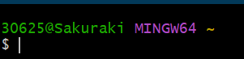
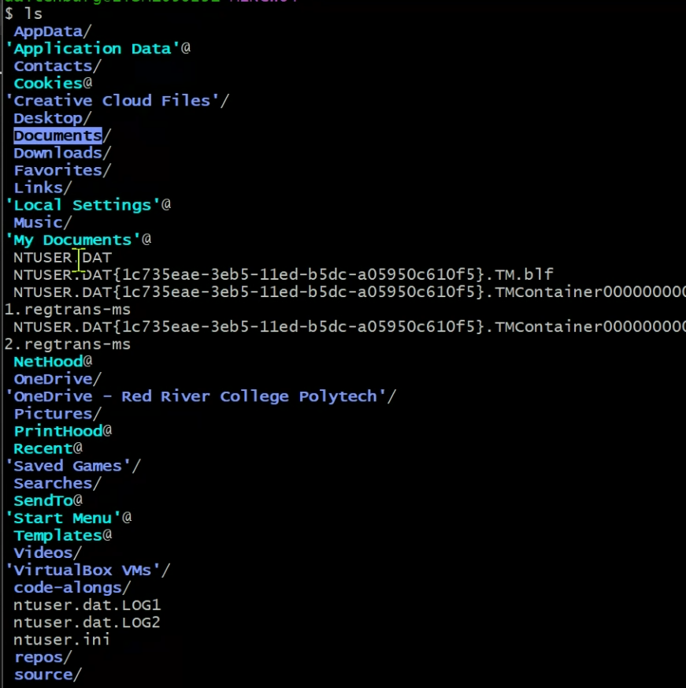

# SD Fundamentals

## 1. File Management

command prompt:

## 2. Version Control

GIt Bash (mainly use):

first one indicates the user, and the name after the @ indicates the computer you are using

**type: pwd, it shows the present working dir**

**type: ls, it shows all the dirs in this folders**

Cyan: special files

Purple: Dirs

To refresh: type **clear**

the tilt character ~

in Mac and LinuxOS, home dir is a common concept

in Windows, home dir: C:\Users\30625

**cd: used for going to determined dirs, if you want to enter disk, type like /c, cd ~: return to the last dir**

**cd ..: going to parent dir**

c://tcc//dog -> c://tcc

**mkdir: make dir; mkdir tccdog**

homework: spend some time in terminal to practice