# 小米虫宝典

## RAG

### 什么是 RAG？RAG 的主要流程是什么？

#### 回答重点

RAG（Retrieval Augmented Generation，**检索增强生成**）是一种结合信息检索和生成式模型的技术方案。其主要流程包括两个核心环节：

1. **检索（Retrieval）：** 基于用户的输入，从外部知识库中检索与查询相关的文本片段，通常使用向量化表示和向量数据库进行语义匹配。
2. **生成（Generation）：** 将用户查询与检索到的内容作为上下文输入给生成模型（如 GPT等），由模型输出最终回答。

即我们在本地**检索**到相关的内容，把它**增强**到提示词里，然后再去做结果**生成**。

简单来说就是利用外部知识动态补充模型生成能力，既能保证回答的准确性，又能在知识库更新时及时反映最新信息（还有一点就是部分业务是内部文档，网上没有，因此可以本地提供知识库来增强 AI 的知识）。

#### 扩展知识

##### 为什么会有 RAG ？

因为，随着自然语言处理技术的发展，纯生成模型虽然可以生成流畅的文本，但有时知识会滞后或不够精准。

通过引入检索模块，RAG 模型能够从外部知识库中提取实时且丰富的信息，再经过生成模型综合处理，提升回答的准确率和覆盖面，而**无需重新训练模型**。

##### RAG 的详细工作流程

可以看下这个流程图：

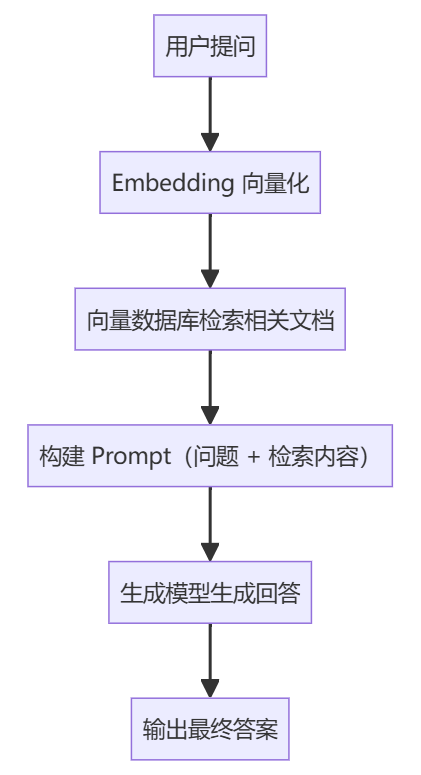

**1、文本向量化（Embedding）**

使用语义模型（如 OpenAI 的 text-embedding-ada-002，或者 Sentence-BERT 等）将文档和问题转为高维向量表示。

**2、向量数据库检索**

使用如 Faiss、Milvus等向量数据库存储所有文档向量。

用户提问后，对问题进行向量化，并在数据库中执行最近邻搜索，找出语义最相近的 N 条内容。

**3、构建 Prompt** 将用户原始问题和检索到的内容拼接成上下文输入，传入生成模型。

**4、生成回答**

由大语言模型（如 GPT、LLaMA 等）综合已有上下文生成最终输出。

##### 通俗理解

我们可以把 RAG 想象成是一个“聪明的问答助手”，它不仅会说话（生成能力），还会查资料（检索能力），就像你去问一个特别靠谱的朋友：

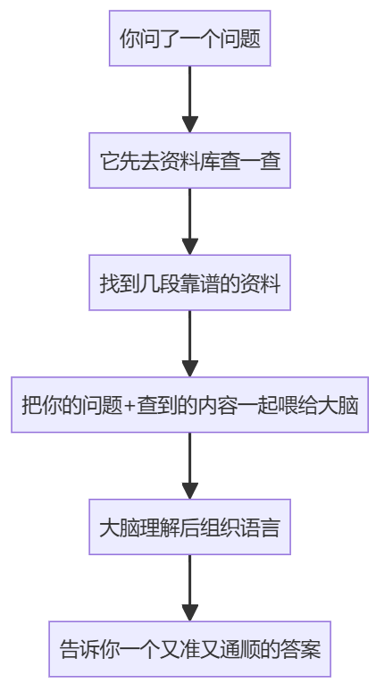

##### 相关文档与扩展阅读链接

- [Hugging Face 上关于 RAG 模型的介绍与实现（英文）](https://huggingface.co/transformers/model_doc/rag.html)
- [11327.什么是向量数据库？在基于大模型的应用开发中，向量数据库主要解决什么问题？](https://www.mianshiya.com/bank/1906189461556076546/question/1906191836891095042)

### 什么是 RAG 中的 Rerank？具体需要怎么做？

#### 回答重点

在 RAG 中，Rerank 是一个对初步检索返回的候选文档列表进行再次排序的过程。

因为初步检索需要**快速地在海量的文档中**找出大致相关的文档，其需要考虑效率，所以查找出的文档不会非常准确，这步是**粗排**。

在已经筛选的相关的文档中再进行精筛，找出匹配度更高的文档让其排在前面，选其中的 Top-K 然后扔给大模型，提高答案的准确性，这就是 Rerank，也是**精排**。

**Rerank 需要怎么做？**

1. **初步检索生成候选文档**：使用速度较快的传统检索方法获得一组候选文档。
2. **根据Rerank模型重新排序**：根据Rerank模型匹配得分对候选文档进行排序，选出最相关的 Top-K 文档。
3. **交给生成模块**：Top-K 候选文档传递给大模型，帮助生成更精准、更富信息量的回答。

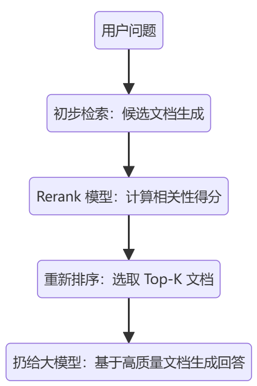

#### 扩展知识

##### 为什么需要 Rerank？如果没有 Rerank 会怎么样？

初步检索方法通常为了**速度**牺牲了一些**精度**，可能包含许多噪音文档。

而 Rerank 能够利用更高级的模型深入捕捉查询与文档之间的细微语义关系，从而筛除无关文档，确保生成模块获得高质量上下文信息。

如果没有 Rerank，生成模块可能基于噪音或不相关的文档生成回答，这会影响回答的准确性，甚至还可能引发误解。

##### Rerank 通俗理解

在仓库里，你想要找“坤你太美”主题的周边玩具。仓库管理员先按照模糊标准，比如只要有“坤”字或者颜色鲜艳的都挑出来，给你抱来一堆。这堆里可能有篮球造型的小摆件、印有各种明星的卡片，还有一些卡通玩偶，很杂乱。

这时，Rerank就像一位更专业的助手，它会把这堆东西重新审视，按照和“坤你太美”主题的贴合度重新排序。比如，印有蔡徐坤经典唱跳动作图案的扇子、模仿他舞台服装的小玩偶会被排在前面，而那些关联不大的就往后排。

排序完成后，不会把所有东西都给你，因为太多了看不过来。助手会把排在前几名、和“坤你太美”主题最贴近的周边拿给你，这样你就能快速找到自己真正想要的，不用在那一大堆杂乱物品里费劲翻找了。 :）

##### 常见的 Rerank 模型

###### BAAI/bge-reranker-base （开源）

这是咱们北京智源人工智能研究院（BAAI）开发的交叉编码器模型，旨在对检索得到的候选文档进行重排序，以提高信息检索的精度。

链接：https://huggingface.co/BAAI/bge-reranker-base

BGE (BAAI General Embedding) 专注于检索增强llm领域，目前包括以下项目:

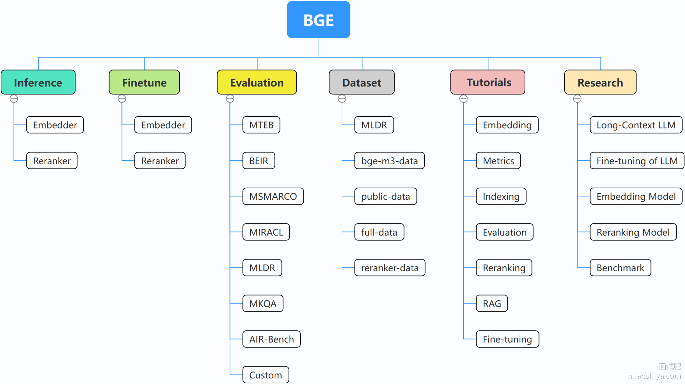

**Rerank 模型列表如下**：

| Model                                                        | Language            | Description                                                  |
| ------------------------------------------------------------ | ------------------- | ------------------------------------------------------------ |
| [BAAI/bge-reranker-v2-m3](https://huggingface.co/BAAI/bge-reranker-v2-m3) | Multilingual        | 一个轻量级的交叉编码器模型，具有强大的多语言能力，易于部署，具有快速的推理能力。 |
| [BAAI/bge-reranker-v2-gemma](https://huggingface.co/BAAI/bge-reranker-v2-gemma) | Multilingual        | 一个支持多语言的交叉编码器模型，在英文和多语言能力方面均表现出色。 |
| [BAAI/bge-reranker-v2-minicpm-layerwise](https://huggingface.co/BAAI/bge-reranker-v2-minicpm-layerwise) | Multilingual        | 一个支持多语言的交叉编码器模型，在英文和中文方面均表现良好，允许自由选择输出层，以便加速推理。 |
| [BAAI/bge-reranker-v2.5-gemma2-lightweight](https://huggingface.co/BAAI/bge-reranker-v2.5-gemma2-lightweight) | Multilingual        | 一个支持多语言的跨编码器模型，不仅在英文和中文上表现良好，还允许自由选择输出层、压缩比例和压缩层，从而便于加速推理。 |
| [BAAI/bge-reranker-large](https://huggingface.co/BAAI/bge-reranker-large) | Chinese and English | 交叉编码器模型，精度比向量模型更高但推理效率较低             |
| [BAAI/bge-reranker-base](https://huggingface.co/BAAI/bge-reranker-base) | Chinese and English | 交叉编码器模型，精度比向量模型更高但推理效率较低             |

###### Cohere - Reranker - v3.5

Reranker - v3.5 是 Cohere 这家公司是用于语义搜索和检索增强生成（RAG）的重排序模型，支持 100 多种语言，能处理长上下文（4K tokens），适用于代码检索、半结构化数据检索等复杂语义匹配场景，如法律文档分析、多语言问答等。

它不开源，所以没有链接了。

##### 相关文档与扩展阅读链接

- [Exploring the Effectiveness of Multi-stage Fine-tuning for Cross-encoder Re-rankers](https://arxiv.org/html/2503.22672v1)
- [11451. 什么是 RAG？RAG 的主要流程是什么？](https://www.mianshiya.com/bank/1906189461556076546/question/1909864020422012930#)
- [Rerank——RAG中百尺竿头更进一步的神器，从原理到解决方案](https://luxiangdong.com/2023/11/06/rerank/)

### 什么混合检索？在基于大模型的应用开发中，混合检索主要解决什么问题？ 

#### 重点回答

混合检索 是指在基于大模型的 RAG（检索增强生成）应用中，结合向量检索和关键词检索等检索技术的互补优势，提升检索结果的全面性和准确性。

它主要为了提升大模型的上下文理解和回答准确性，因为向量检索擅长语义理解（如“猫捕猎老鼠”与“猫追逐老鼠”的关联），但难以精准匹配专有名词（如“iPhone 15”）或缩写（如“RAG”）；关键词检索则反之。

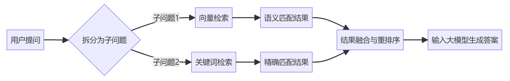

所以在大模型 RAG 应用中，混合检索主要通过**并行**两种检索方式实现：

- **向量检索**：将文本转化为高维向量，计算语义相似度
- **关键词检索**：基于倒排索引、BM25等算法，精确匹配关键词（例如“GPT-4”必须完全命中）。

两种结果通过权重融合或重排序模型（如RRF）合并，最终输出最优答案。

在工程上例如 ElasticSearch 就同时支持关键词检索和向量检索，可以使用工具链例如 LlamaIndex + ElasticSearch 实现混合检索。

#### 扩展知识

##### 混合检索的核心原理

在大模型 rag 应用中，混合检索主要通过**并行**两种检索方式实现：

- **向量检索**：将文本转化为高维向量，计算语义相似度（例如，用户问“猫抓老鼠”，匹配到“猫捕猎啮齿动物”）。
- **关键词检索**：基于倒排索引、BM25等算法，精确匹配关键词（例如“GPT-4”必须完全命中）。

两种结果通过权重融合或重排序模型（如RRF）合并，最终输出最优答案。

所以我们在数据库中需要提前建立好**向量索引**和**关键词索引**。

##### [向量%检索与传统关键词搜索对比(来自Dify)](https://docs.dify.ai/zh-hans/learn-more/extended-reading/retrieval-augment/hybrid-search)

向量检索优势：

- 相近语义理解（如老鼠/捕鼠器/奶酪，谷歌/必应/搜索引擎）
- 多语言理解（跨语言理解，如输入中文匹配英文）
- 多模态理解（支持文本、图像、音视频等的相似匹配）
- 容错性（处理拼写错误、模糊的描述）

虽然向量检索在以上情景中具有明显优势，但有某些情况效果不佳。比如：

- 搜索一个人或物体的名字（例如，伊隆·马斯克，iPhone 15）
- 搜索缩写词或短语（例如，RAG，RLHF）
- 搜索 ID（例如， gpt-3.5-turbo ， titan-xlarge-v1.01 ）

而上面这些的缺点恰恰都是传统关键词搜索的优势所在，传统关键词搜索擅长：

- 精确匹配（如产品名称、姓名、产品编号）
- 少量字符的匹配（通过少量字符进行向量检索时效果非常不好，但很多用户恰恰习惯只输入几个关键词）
- 倾向低频词汇的匹配（低频词汇往往承载了语言中的重要意义，比如“你想跟我去喝咖啡吗？”这句话中的分词，“喝”“咖啡”会比“你”“想”“吗”在句子中承载更重要的含义）

##### 混合检索的补充解释

混合检索也叫多路召回或者融合检索。它并不仅限于向量检索和关键词检索的叠加。

比如在不同数据源上（如文档和数据库）进行同时检索，也叫混合检索。

所以，在检索过程中，同时使用多种检索方式，最后将多种检索结果进行融合，这样的检索都是混合检索。

只不过在大模型的场景下的 RAG 应用中的混合检索常常指的是向量检索+关键词检索。

##### 相关文档与扩展阅读链接

- [Blended RAG: Improving RAG Accuracy with Semantic Search & Hybrid Queries](https://github.com/ibm-self-serve-assets/Blended-RAG)
- [使用 Milvus 进行混合搜索](https://milvus.io/docs/zh/hybrid_search_with_milvus.md)

### RAG 的完整流程是怎么样的？

#### 重点回答

RAG（检索增强生成）的完整流程可分为5个核心阶段：

1. **数据准备**：清洗文档、分块处理（如PDF转文本切片）；
2. **向量化**：使用嵌入模型（如BERT、BGE）将文本转为向量；
3. **索引存储**：向量存入数据库（如Milvus、Faiss、Elasticsearch）；
4. **检索增强**：用户提问向量化后检索相关文档；
5. **生成答案**：将检索结果与问题组合输入大模型生成回答。

**流程图示例**：

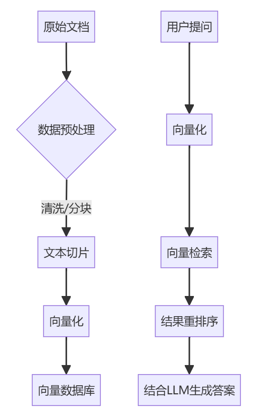

也可以从**三个阶段**来回答：

1. **在 RAG 索引阶段**，首先对原始文档进行解析，并将其拆分成多个较小的文本块。随后，这些文本块会通过嵌入模型进行向量化处理，生成的向量将被存储在向量数据库中，供后续检索使用。
2. **在 RAG 检索阶段**，RAG 系统会将用户的查询同样进行向量化，并在向量数据库中执行语义相似度匹配，筛选出与查询最相关的一组文本块。
3. **最后在生成阶段**，系统将用户查询与检索到的相关文本块进行组合，通过提示工程（Prompt Engineering）设计适当的输入格式，然后交由大语言模型生成最终的回答，至此完成整个 RAG 的流程。

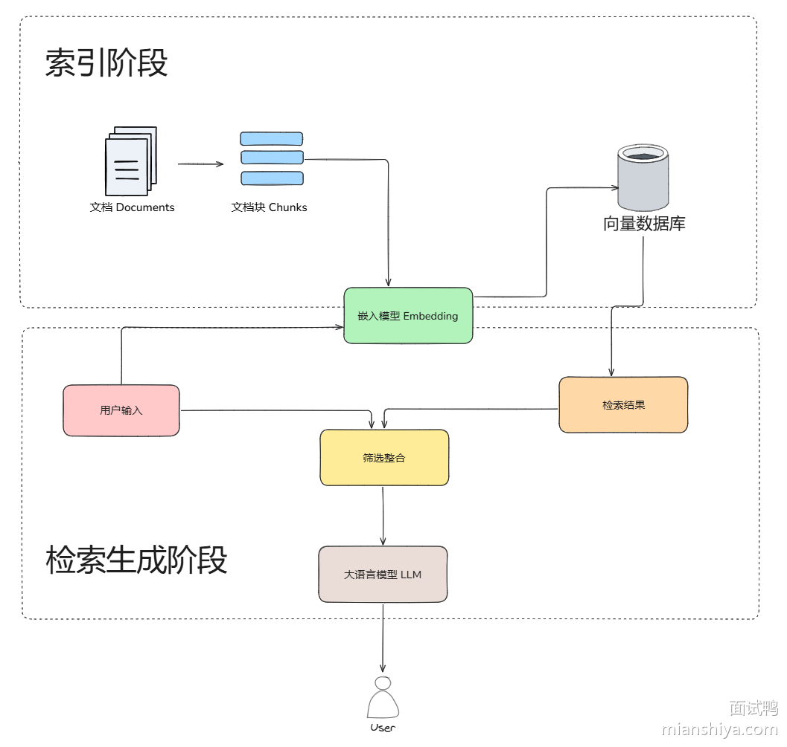

#### 扩展知识

##### 文档处理的关键细节

文档分块策略：

- 按语义切分：用`SemanticSplitter`确保每块语义独立（如问答对单独成块）；
- 按结构切分：HTML/PDF按标题层级切割（如`HTMLHeaderTextSplitter`保留结构）；
- 递归切分：`RecursiveCharacterTextSplitter`兼顾文本连贯性和长度限制。

##### 检索阶段的优化策略

**多阶段检索**：

1. **粗筛**：用BM25快速匹配关键词（如“iPhone 15”）；
2. **精排**：向量相似度+重排序模型（如Cohere Reranker）；

**混合检索**：同时使用向量和关键词结果，通过RRF（倒数排名融合）合并。

- [11464. 什么混合检索？在基于大模型的应用开发中，混合检索主要解决什么问题？](https://www.mianshiya.com/bank/1906189461556076546/question/1910235326833721345)

##### 生成阶段的Prompt设计示例

```python
# 示例Prompt模板（网页2）
prompt = "用户问题: {query}\n相关文档: {doc1}\n{doc2}\n请结合以上信息回答。"
```

可以进行**上下文压缩**：对检索结果摘要（如`RAPTOR`树状摘要）减少冗余输入。

##### 相关文档与扩展阅读链接

- [RAG 原始论文：《Retrieval-Augmented Generation for Knowledge-Intensive NLP Tasks》](https://arxiv.org/abs/2005.11401)

### 在 RAG 应用中为了优化检索精度，其中的数据清洗和预处理怎么做？ 

#### 回答重点

**1、首先是数据接入与格式的统一**

- **多源数据整合**：文档（PDF/Word）、表格（CSV/Excel）、网页（HTML）、API接口等，用工具（如PyPDF2、BeautifulSoup）提取纯文本。
- **格式标准化**：统一编码（UTF-8）、去除乱码（如“�”替换为空格）、转换大小写（统一小写避免“iPhone”和“iphone”被视为不同词）。

**2、开始清洗降噪，过滤无效信息**

- 去除重复内容（如文档中的页眉页脚、会议记录的重复发言）。
- 过滤噪声符号（标点、特殊字符、markdown格式），保留核心文本。

> 还要注意**敏感信息处理**！用正则或库（如PII Detection）删除隐私数据（手机号、邮箱），避免泄露。

**3、需要进行分块**

- 段落、章节标题、标点（句号/分号）切分，避免切断上下文（如“第一段前半+第二段后半”导致语义断裂）。
- 控制长度，比如单个知识块300-500字（约500-800 tokens），适配大模型上下文窗口（如GPT-4默认8k tokens，可放10-15个块）。

具体操作的时候，可以用 LlamaIndex 的`RecursiveCharacterTextSplitter`（优先按标题/段落切分，再按字符数截断）、Hugging Face的`TokenTextSplitter`（按token数切分）。

**4、元数据标注**

- 用规则或LLM提取结构化信息（如文档中的“时间”“地点”“关键词标签”等元数据），作为检索时的过滤条件（如用户问“2025年的政策”，优先召回含“2025”元数据的块）。

最后就可以进行索引的构建了，为了用上混合检索，需要进行向量索引和关键词的倒排索引。

流程示意如下：

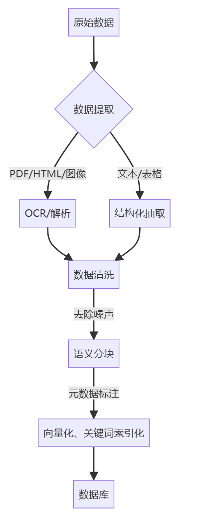

#### 扩展知识

##### 数据预处理全流程拆解

```mipsasm
原始数据（多格式）  
│  
├─ 格式转换（提取纯文本）  
│  ├─ PDF → PyPDF2提取文本  
│  ├─ HTML → BeautifulSoup解析正文  
│  └─ Excel → Pandas读取表格内容  
│  
├─ 清洗降噪  
│  ├─ 去除重复（相邻重复段落检测）  
│  ├─ 过滤噪声（正则表达式去除标点、特殊符号）  
│  └─ 敏感信息处理（PII检测库删除隐私数据）  
│  
├─ 智能分块（核心步骤）  
│  ├─ 动态切分：按“标题→段落→句子”优先级切分（如先按“### 第三章”分章节，再按句号分句）  
│  ├─ 长度校验：单块不超过模型最大token数的60%（预留空间给用户问题和提示词）  
│  └─ 重叠处理：相邻块保留10%重叠（如块1结尾100字作为块2开头，避免切断跨段语义）  
│  
├─ 语义增强  
│  ├─ 元数据标注：  
│  │  ├─ 规则提取：用正则匹配“2024年”“张三”等实体  
│  │  └─ LLM提取：用GPT-4生成“核心关键词”“所属部门”等标签  
│  └─ 向量化：  
│     ├─ 通用模型：Sentence-BERT（快速上线）  
│     └─ 领域模型：BGE-M3（多语言）、ColBERTv2（长文本优化）  
│  
└─ 存储索引  
   ├─ 向量库：Milvus（高并发）  
   └─ 关键词库：Elasticsearch（BM25算法）+ 元数据索引（支持过滤查询）  
```

##### 相关文档与扩展阅读链接

- [Hugging Face 数据预处理](https://huggingface.co/docs/transformers/zh/preprocessing)
- [11464. 什么混合检索？在基于大模型的应用开发中，混合检索主要解决什么问题？](https://www.mianshiya.com/bank/1906189461556076546/question/1910235326833721345)

### 什么查询扩展？为什么在 RAG 应用中需要查询扩展？ 

#### 回答重点

查询扩展是指对用户原始查询进行优化和补充，通过添加**同义词、相关术语、隐含意图**等信息，让查询更精准、覆盖范围更广，从而提升信息检索的效果。比如用户输入“减肥”，扩展后可能变成“健康减肥方法 饮食运动 避免反弹”。

**为什么在RAG中需要查询扩展？**

RAG（检索增强生成）的核心是“先检索、后生成”，如果原始查询不够准确或覆盖范围不足，会导致检索到的文档不相关或信息不全，最终生成的回答质量会受影响。查询扩展能解决两个关键问题：

1. **词汇匹配问题**：用户用词和知识库中的术语可能不一致（如“新冠”vs“COVID-19”），扩展后能匹配更多相关内容。
2. **语义补全问题**：用户查询可能简短模糊（如“怎么理财”），扩展后能明确需求（如“新手理财入门 低风险投资 基金股票区别”），让检索更精准。

#### 扩展知识

##### RAG 中查询扩展所处在的阶段

结合 RAG 简单流程图，查询扩展发生在“用户查询”到“检索文档”之间的预处理阶段：

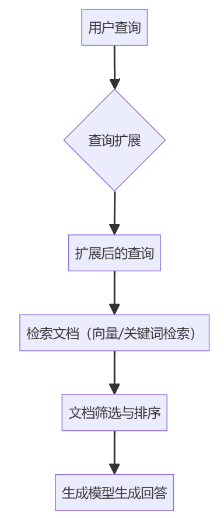

举个例子：

- 原始查询：“如何提高Python代码效率”
- 扩展后：“Python代码优化技巧 循环效率 内存管理 常用库性能对比”
  扩展后，检索会覆盖“循环优化”“内存泄漏”等相关文档，生成的回答会更全面。

比如以下就是一个简单的查询扩展的指令模板：

```plaintext
对于<原始查询>，补充其上位概念、下位具体场景及相关关联词（例如“跑步”→上位词“运动”，下位词“慢跑/马拉松”，相关词“跑鞋/运动手环”），用|分隔。
```

结果示例：

```plaintext
原始查询：Python代码优化 → 扩展词：编程优化|循环优化|内存管理|numpy性能|代码重构
```

##### 相关文档与扩展阅读链接

- [语义扩展在生成模型中的应用案例](https://arxiv.org/pdf/2305.14322.pdf)
- [11451. 什么是 RAG？RAG 的主要流程是什么？](https://www.mianshiya.com/bank/1906189461556076546/question/1909864020422012930)

### 什么自查询？为什么在 RAG 中需要自查询？ 

#### 回答重点

自查询（Self-Query）是指当用户输入 **模糊表述或隐含需求**时，RAG 系统通过内部处理让模型自动解析用户查询中的隐含条件（如时间、作者、标签等元数据），生成**结构化查询语句**的过程。

比如用户说“2025年鸭鸭的用户报告”，自查询会解析出两个条件：

1. 语义匹配：用户报告
2. 元数据过滤：作者=鸭鸭、时间=2025

**为什么在RAG中需要自查询？**

因为用户提问往往包含**模糊表述**或**隐含需求**，传统向量检索可能忽略元数据导致结果偏差。自查询通过**解析+过滤**两步走，让检索同时满足语义相关性和元数据条件，解决“检索不准”的核心问题。

#### 扩展知识

##### 自查询的流程示意图

自查询发生在“用户输入”到“检索文档”之间的 **意图解析阶段**：

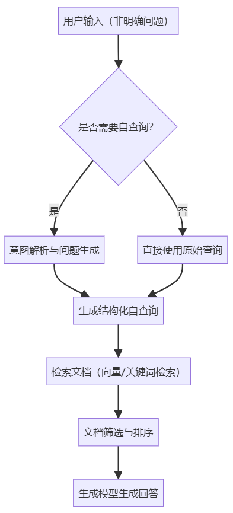

##### 自查询简单模板示例

这是一份结合语义向量搜索与元数据过滤的**自查询指令模板**，【】内的占位符需替换为实际内容，并根据业务需求调整字段。

~~~plaintext
# 自查询指令生成器
**原始用户查询**：  
【用户输入的自然语言描述，例如：“2025年李四团队撰写的金融风控报告”】

**需要解析的元数据字段**：  
1. 作者（author）：【必填，支持模糊匹配，如“李四”或“*团队”】
2. 时间范围（date）：【支持区间，如“>=2024”或“2023-2025”】
3. 标签（tags）：【多选，如“金融/风控/合规”】
4. 权限过滤（permission）：【可选，如“部门=财务部”】

**混合检索条件**：  
- 语义匹配关键词：【核心内容关键词，如“风险控制策略”“监管趋势”】
- 元数据过滤逻辑：【组合条件，例如“author=李四 AND date>=2024”】
- 结果排序规则：【例如“按时间倒序”或“按相关性评分排序”】

**示例输出**（JSON格式）：  
```json
{
  "vector_search": {
    "query_text": "风险控制策略 监管趋势",
    "embedding_model": "text-embedding-3-large" // 模型名称需指定
  },
  "metadata_filter": {
    "must": [
      {"field": "author", "operator": "=", "value": "李四"},
      {"field": "date", "operator": ">=", "value": "2025-01-01"}
    ],
    "should": [
      {"field": "tags", "operator": "in", "value": ["金融", "风控"]}
    ]
  },
  "options": {
    "limit": 10,
    "score_threshold": 0.75 // 相关性分数阈值
  }
}
~~~

##### 自查询与查询扩展的区别

| **维度**         | **自查询**                                                   | **查询扩展**                                                |
| ---------------- | ------------------------------------------------------------ | ----------------------------------------------------------- |
| **核心目标**     | 精准匹配“内容+元数据”双重条件（如作者、时间、标签）          | 解决词不匹配问题，通过添加同义词、相关词提升查全率          |
| **技术手段**     | ① 用LLM解析用户查询中的隐含元数据 ② 生成结构化查询（如SQL或过滤条件） | ① 基于同义词/语义词典扩展关键词 ② 利用LLM生成多样化查询变体 |
| **数据依赖**     | 依赖知识库的元数据标注质量（如字段类型、格式）               | 依赖语料库、用户日志或语义关系库（如WordNet）               |
| **典型应用场景** | 带条件的专业搜索（如“2023年后发布的政府报告”）               | 问答系统、文档检索（解决用户表述模糊问题）                  |
| **优点**         | ① 精准过滤噪声数据 ② 支持权限控制（如部门权限过滤）          | ① 提升语义覆盖范围 ② 减少因用户表述差异导致的漏检           |
| **缺点**         | ① 需预定义元数据字段 ② 解析错误可能导致结果偏差              | ① 可能引入无关词导致噪声 ② 扩展策略需平衡查全率与查准率     |
| **典型技术方案** | ① LLM解析意图生成过滤条件 ② 向量数据库混合检索（如Qdrant、Milvus） | ① 基于全局/局部语义分析扩展 ② 伪相关反馈（如Rocchio算法）   |

简单来说：

- **自查询**：通过“解析+过滤”两步走，例如用户查询“2025年鸭鸭的用户报告”会拆解为语义关键词（用户报告）和元数据（作者=鸭鸭四，时间=2025），再组合为结构化查询条件。它更适合**精确过滤**场景（如法律文档需限定颁布时间、电商商品需价格区间）
- **查询扩展**：通过“生成+合并”策略，例如用户查询“大模型幻觉”可能扩展为“LLM生成内容真实性”“GPT输出偏差”等变体，合并多个检索结果提升覆盖。它更适合**语义泛化**场景（如用户输入“AI生成文本问题”，扩展为“大模型幻觉”“生成内容纠偏”等）

我们在实际使用 RAG 系统中，两者可协同优化。例如先通过自查询过滤出“2025年的金融报告”，再通过查询扩展补充“风险控制”“监管政策”等关键词，提升结果全面性。

完美！

### 什么提示压缩？为什么在 RAG 中需要提示压缩？ 

#### 回答重点

在RAG（检索增强生成）中，**提示压缩**主要指对**检索出的文档内容**进行精简处理，通过提取核心信息、过滤无关文本、压缩冗长内容，使最终输入大模型的“提示”（包含用户问题+文档片段）既完整保留关键信息，又符合模型输入长度限制。

> 例如：检索到一篇10页的技术白皮书，压缩后仅保留与用户问题相关的2个核心章节和关键数据，避免无关段落占用模型上下文空间。

**为什么在RAG中需要提示压缩？**

RAG的生成效果高度依赖“输入给模型的文档质量”，而检索出的文档通常存在三大问题，必须通过压缩解决：

1. **控制输入长度**： 大语言模型都存在输入长度限制，直接拼接大量检索内容可能会超出模型的上下文窗口，通过压缩可以将关键信息浓缩进有限的 token 内。
2. **提高知识相关性**：检索出的文档中可能有大量无关内容（如重复描述、背景知识、与问题无关的案例）会稀释关键信息，导致模型聚焦困难（例如用户问“如何优化代码”，文档中80%是算法原理，仅20%是优化技巧，未压缩时模型可能错误引用原理部分生成回答），甚至引发“幻觉”。
3. **降低计算资源消耗**： 减少不必要的内容可以降低模型处理和推理的计算负担，如果调用的是商业大模型，还涉及到金额问题（都是通过 token 来计费的）。

#### 扩展知识

##### 流程图

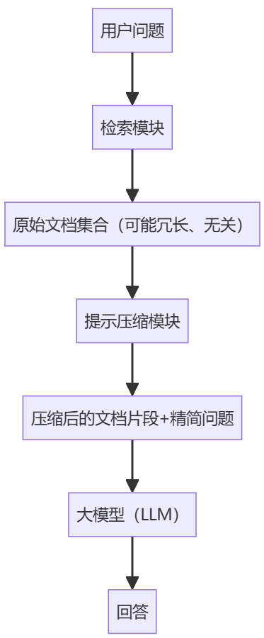

##### 提示压缩的落地

一般是利用小型模型或者规则算法来实现压缩。

比如基于信息熵的方法（如LLMLingua、Selective Context）通过小型语言模型评估信息量，直接删减冗余内容。

如调用 LLMLingua 来实现压缩：

```python
from llama_index.indices.postprocessor import LongLLMLinguaPostprocessor
node_postprocessor = LongLLMLinguaPostprocessor(instruction_str="根据上下文回答问题")
contexts = retriever.retrieve(question)
compressed_contexts = node_postprocessor.process(contexts)
```

instruction_str 就是核心提示词，用于指导压缩方向，可以自行修改

```python
# 示例1：强调关键实体保留
instruction_str = "保留文档中的人名、日期和数字"
# 示例2：任务导向压缩
instruction_str = "根据问题提取相关事实"
# 示例3：有图文的场景
instruction_str = "压缩文本时保留与图片中logo相关的描述"
```

最后得到的结果就是压缩后的内容，然后传输给大语言模型即可。

##### 不做提示压缩的问题有哪些？

**1、上下文溢出导致回答失效**：

假设模型最大支持8k tokens，用户问题占 500 tokens，未压缩的文档占 9000 tokens，输入时文档会被截断，模型因缺乏关键信息无法回答（如用户问“文档第3章的结论”，但第3章因长度超限未被输入，尬住了）。

**2、生成质量下降**：
 文档中大量无关内容会误导模型，例如用户问“如何治疗感冒”，检索到一篇包含“感冒”和“癌症”内容的文档，未压缩时模型可能错误关联癌症治疗方法 :)。

**3、成本飙升**：
 处理长文档消耗更多计算资源（如token单价成本增加50%），且生成速度变慢（每1000 tokens处理时间增加约200ms）。

##### 相关文档与扩展阅读链接

- [LLMLingua](https://github.com/microsoft/LLMLingua)

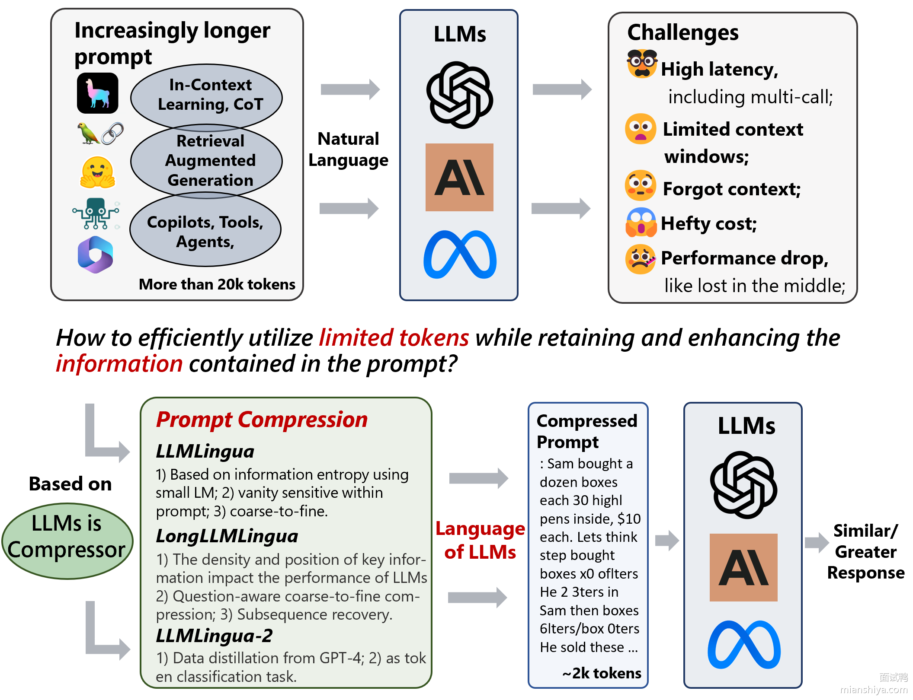

### 如何进行 RAG 调优后的效果评估？请给出真实应用场景中采用的效果评估标准与方法

#### 回答重点

RAG调优后的效果评估可以围绕这三个维度来看：检索质量、生成质量、系统性能。

1）**检索质量评估**

**客观指标**：

- **Precision@k**（前k个结果的相关性比例）
- **MRR**（首个相关结果的排名倒数均值）
- **NDCG**（文档相关性等级和排名折扣，区分不同相关度的重要性）
- **Recall@k**（覆盖所有相关文档的比例）

**主观评测**：通过人工审核检索结果是否满足业务需求。

2）**生成的质量评估**

- **CR 检索相关性（Context Relevancy）**（答案是否基于检索内容）
- **AR 答案相关性（Answer Relevancy）**（回答是否解决用户问题）
- **F 可信度（Faithfulness）**（评估生成的答案中是否存在幻觉）

**评测方法**：

- **大模型打分**（利用大模型评估答案质量）
- **人工打分**（对CR、AR、F评分）。

3）**系统性能评估**

除了功能性需要外，我们作为应用开发，也要关注下非功能性需求

- **延迟**（响应时间）
- **吞吐量**（单位时间处理请求量）
- **错误率**（生成错误答案的比例）。

**在真实的企业场景流程中，我们先**：

1. **分层测试**：先测检索质量，再测生成质量，最后压测系统性能。
2. **持续监控**：上线后实时跟踪用户满意度（这也是现在大模型回复都有点评功能）、业务指标（如问题解决率）。

#### 扩展知识

##### 客观指标详解

**Precision@k（前k个结果的相关性比例）**

衡量前k个检索结果中相关文档的比例，反映检索结果的精准度。

例如前5个结果中有3个相关，则Precision@5=60%。适用于对结果精度敏感的场景（如法律咨询、金融风控）。

**MRR（平均倒数排名，Mean Reciprocal Rank）**

通过首个相关结果的排名倒数均值，反映系统快速定位相关文档的能力。

若相关结果分别排第1、3位，则MRR=(1/1 +1/3)/2=0.67，反映排名优化效果。

**NDCG（归一化折扣累积增益，Normalized Discounted Cumulative Gain）**

结合文档相关性等级和排名折扣，评估排序质量的综合指标（区分高/低相关文档的价值）。

假设前3个结果的相关性等级为3（高）、2（中）、1（低），则DCG=3 + 2/1.58 + 1/2=4.58；若理想排序为3、3、2，则NDCG=4.58/5.76≈0.79。适合需要区分相关度优先级的场景（如电商推荐、新闻排序），高度相关文档排前显著提升体验。

**Recall@k（覆盖所有相关文档的比例）**

衡量前k个结果覆盖所有相关文档的比例，反映检索的全面性。

若知识库有10个相关文档，前5个结果包含4个，则Recall@5=40%。适用于需要全面覆盖的场景（如医疗诊断、科研文献检索），避免漏检关键信息。

注意：若k过大（如k=1000），召回率可能虚高但实际无意义

##### 指标对比与选型建议

| 指标            | 核心关注点           | 适用场景                       | 局限性                   |
| --------------- | -------------------- | ------------------------------ | ------------------------ |
| **Precision@k** | 前k结果的精度        | 高精度需求（如法律、金融）     | 忽略漏检文档             |
| **Recall@k**    | 前k结果的覆盖率      | 全面性需求（如医疗、科研）     | k值选择影响结果可信度    |
| **MRR**         | 首个相关结果的位置   | 快速响应需求（如客服、搜索）   | 忽略后续相关文档排序     |
| **NDCG**        | 相关性等级与排序折扣 | 多级相关性场景（如推荐、排序） | 需人工标注文档相关性等级 |

##### 人工打分

- **CR 检索相关性（Context Relevancy）** 0-3分：判断文档与问题的关联程度（如3=直接解答，1=部分相关）
- **AR 答案相关性（Answer Relevancy）** 0-3分：判断回答是否解决用户问题，是否覆盖问题所有关键点）
- **F 可信度（Faithfulness）** 0/1：判断答案是否存在幻觉

##### 医疗问答场景标注示例

**任务背景**：优化医疗客服RAG系统，要求标注员对“儿童流感防治”相关问答数据进行标注。

**输入数据**：

- 用户问题：“5岁孩子高烧39度该吃什么药？”
- 检索文档：儿科诊疗指南、药品说明书等10篇相关文档
- 生成答案：“建议服用布洛芬混悬液，剂量为每次10mg/kg”

利用 **LabelStudio** 完成标注。

**标注步骤分解**

| 步骤              | 操作说明                                                     | 示例结果                         |
| ----------------- | ------------------------------------------------------------ | -------------------------------- |
| 1. 检索相关性标注 | 判断文档是否包含“儿童用药剂量”“退烧药种类”等信息             | 3篇文档评3分，2篇评1分           |
| 2. 答案相关性     | 核对答案中的“布洛芬10mg/kg”是否与《中国药典》一致，检查是否遗漏“物理降温方法”“就医指征”（如持续高热） | 相关性=2（缺就医建议、药物禁忌） |
| 3. 可信度检测     | 未发现无关回答                                               | 可信度=1                         |

LabelStudio：是一个开源的多模态数据标注平台，支持对文本、图像、音频、视频、时间序列等多元数据类型进行专业标注。

##### 其他评估工具

[1、RAGAS(开源自动化评估框架)](https://github.com/explodinggradients/ragas)：

- [使用 Ragas 框架评估 RAG 项目的使用效果](https://yuanfan.rbind.io/project/ragas/)

[2、DeepEval](https://github.com/confident-ai/deepeval)

- [Evaluating an RAG Pipeline Using DeepEval](https://bhavikjikadara.medium.com/evaluating-an-rag-pipeline-using-deepeval-749f641b3186)

### 什么是 RAG 中的分块？为什么需要分块？ 

#### 回答重点

分块就是把原始长文本（比如一本书、一篇论文）拆成若干个 **“小块”**（通常几百字到上千字，比如500-1000字），每个小块包含**相对完整的语义单元**，比如一个段落、几个段落或一个小节。

**为什么需要分块？**

1. **模型处理能力限制**：大语言模型（如GPT）一次能处理的文本长度有限，太长的文本塞进去会“消化不良”，分块后每个小块能塞进模型的“肚子”里。
2. **精准定位信息**：用户提问通常针对局部内容（比如“第三章第二部分的案例是什么”），分块后每个小块像“信息卡片”，检索时能快速找到最相关的卡片，避免在整本大书里“大海捞针”。
3. **平衡上下文与效率**：小块既能保留足够上下文（比如前后句子的逻辑），又能让计算机高效存储和检索（小块的向量计算更快）。

所以分块就是将输入文档或大段文本切分成多个较小的、可控粒度的“块”，以便后续的向量化检索和生成模块高效调用与组合。

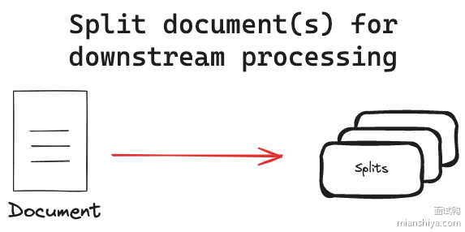

#### 扩展知识

##### 分块解决的核心问题：让“大内容”适配“小窗口”

举个例子：假设你要让模型理解一本10万字的书，但模型一次最多只能读1000字。如果不拆分，要么读不全，要么得反复分段读（但分段时可能丢失跨段的逻辑）。分块就是把书拆成100个1000字的“章节片段”，每个片段保留完整的局部逻辑（比如一个论点+例子），同时给每个片段贴上标签（比如“第三章-案例分析-第2页”），方便后续检索时知道它来自哪里。

##### 分块的大小为多少？

不确定：

- **如果太小**：可能丢失上下文（比如前因后果被拆开），导致模型理解片段时断章取义。
- **如果太大**：块里包含太多无关内容，检索时容易“混入”不相关的信息，影响回答精度。

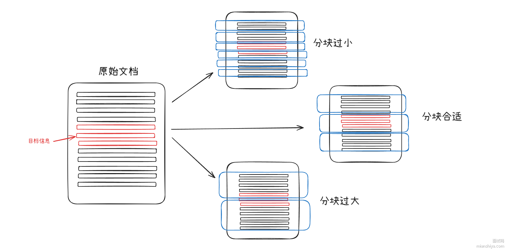

一般而言，常用的 chunk 大小在 **200 – 500 tokens**（约 800 – 2000 字符）之间作为起点最为稳妥。

对于长技术文档或学术报告，可适当增至 **512 – 1024 tokens**。若以“词”为单位分块，则每块 **150 – 300** 词是常见实践。

同时，建议设置**10% – 20%** 的重叠（overlap）以保留跨块上下文。也可以参考[OpenAI官方RAG分块默认值](https://platform.openai.com/docs/guides/retrieval#chunking)

##### 分块后的“附加操作”：元数据标注

每个小块除了内容，还要记录“身份信息”，比如：

- 来源：属于原文档的哪一章、哪一节？
- 位置：在原文档中的页码、段落编号？
- 类型：是正文、标题、列表还是图表说明？

这些信息在后续检索时很重要，比如用户问“附录A的公式怎么推导”，检索系统能通过元数据直接定位到附录A的块，避免误匹配到正文里的相似内容。

##### 分块相关工具

文本分块库：LangChain的`RecursiveCharacterTextSplitter`（支持滑动窗口和语义拆分）、Hugging Face的`Tokenizers`（按token数拆分）。

##### 常见分块策略

- [11534. 在 RAG 中，常见的分块策略有哪些？分别有什么区别？](https://www.mianshiya.com/bank/1906189461556076546/question/1912795349320720385)

### 在 RAG 中，常见的分块策略有哪些？分别有什么区别？ 

#### 回答重点

常见的分块策略包括自然结构分块、固定大小分块、滑动窗口分块、递归分块、语义分块及混合分块这六个。

- **自然结构分块**：按文档原有格式拆分，比如遇到标题、空行、章节编号、标点符号（如 ###、\n\n、句号） 就分块。
- **固定大小分块**：将文本按固定字符数、词数或 token 数等均匀切分，简单易实现。
- **滑动窗口分块**：在固定大小基础上为相邻 chunk 保留一定重叠，以减少上下文出现断裂
- **递归分块**：先按段落/章节粗分，超长部分再递归细化（按句子或空行），适合复杂文档。
- **语义分块**:用 NLP 模型（如 BERT、GPT）判断文本语义边界，确保每个块是完整的语义单元（比如一个论点、一个案例）。
- **混合分块**：同时结合固定、滑动、语义等策略，或依据标题、段落层级自适应切分，实现性能与精度平衡。比如在初始阶段使用固定长度快速分块，在后续阶段再通过语义分块进行更精细的分块。

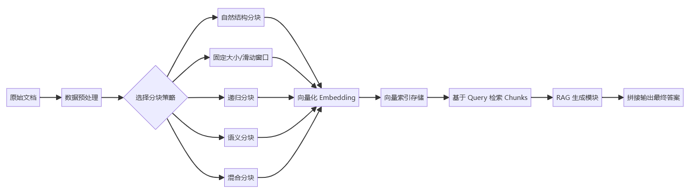

#### 第二部分：扩展知识

##### 自然结构分块

直接利用文档中已有的格式化标记（如 Markdown 标题“###”、段落空行“\n\n”、章节编号、句号等）作为分隔符，将文档分割成符合人类阅读习惯的块。适用结构化文档（书籍、报告、API 文档）、Markdown 格式内容，例如拆分法律合同的章节条款。

注意：这种分块方式依赖文档格式，若结构混乱（如无标题的长段落）会导致分块过大或不均匀。

工具：

- 基础工具：Python 的 split() 函数（手动按 句号+空格 或 \n 拆分）。
- LangChain：CharacterTextSplitter 支持自定义分隔符（如按 \n\n、### 拆分），适合 Markdown / 结构化文档。

##### 固定大小分块

按固定字符数、词数或 Token 数均匀切分（如每 500 Token 分一块）。简单易实现，适合快速处理大量非结构化文本（如网页、纯文本）。

注意：可能在句子中间断开，导致上下文断裂（如一句话被拆到两个块）。

工具：

- LangChain：TokenTextSplitter（按 Token 数分块，支持 OpenAI、LLaMA 等模型的 Token 计算）。
- Hugging Face Tokenizer：先计算 Token 数，再按固定长度拆分（如 chunk_size=500）。

##### 滑动窗口分块

在固定大小分块基础上，让相邻块保留一定重叠（如前一块末尾 100 Token 作为后一块开头），避免上下文断裂。减少分块边界的语义断层，确保跨块内容连贯（如句子结尾和下一句开头在同一块）。适用长文章、对话记录（如客服聊天日志），需保留跨段落的上下文依赖（例如代词指代）。

注意：这种切割会增加存储量（重叠部分重复存储），计算量略高。

工具：

- LangChain：RecursiveCharacterTextSplitter 支持设置 chunk_size 和 chunk_overlap（如重叠 10%）。
- 自定义实现：先按固定大小分块，再手动拼接重叠部分（适合对上下文敏感的场景）。

##### 递归分块

分层拆分，先按大结构（章节、段落）粗分，超长部分再递归细化（按句子、标点），直到块大小达标。适应复杂文档结构，兼顾语义完整和长度限制（避免长段落被生硬切开）。适用学术论文（先分章节，再分段落）、法律合同（先分条款，再分句子），或格式嵌套的复杂文档。

注意：逻辑较复杂，需定义多层拆分规则。

工具：

- LangChain：RecursiveCharacterTextSplitter 内置递归逻辑，优先按 \n\n（段落）拆分，再按 \n（句子）细化。
- 自定义递归函数：通过正则匹配标题层级，逐层拆分（适合多层级文档）。

##### 语义分块

用 NLP 模型（如 BERT、GPT、Sentence-BERT）检测语义边界，确保每个块是完整的语义单元（如一个论点、案例、定义）。适用对语义准确性要求极高的场景，如医学文献（需完整保留病例描述）、技术白皮书（需完整保留算法逻辑）。

注意：依赖模型推理，计算成本高，需调优边界判断规则（如相似度阈值）。

工具：

- spaCy（句子级）：适用于需要高效、精准语义切分的大规模文本处理。
- NLTK 的 NLP 库（句子级）：更适合教学、研究和需要灵活自定义的语义切分任务。
- BERT（段落级）：计算相邻句子相似度，动态合并相似段落

##### 混合分块

组合多种策略，例如先固定分块快速处理，再对关键部分语义优化（类似「粗筛+精修」

注意：需根据场景设计组合逻辑，复杂度较高。

工具：

- 自定义Pipeline：结构分块→固定分块→语义过滤
- LangChain组合使用MarkdownHeaderTextSplitter+SemanticChunker

##### 相关文档与扩展阅读链接

- [langchain Text splitters](https://python.langchain.com/docs/concepts/text_splitters/)
- [LangChain 提供了非常多 Text Splitter，可看 langchain-text-splitters API](https://python.langchain.com/v0.2/api_reference/text_splitters/index.html)

### 在 RAG 中的 Embedding 嵌入是什么？ 

#### 回答重点

简单说，就是把文本内容、图像、音频、视频等形式的信息映射为高维空间中的密集向量（一串数字），这个过程叫“嵌入”（Embedding）。

向量就是语义空间中的坐标，捕捉对象之间的语义关系和隐含的意义。每个向量就像文本的“数字指纹”，包含了文本的语义信息，比如“猫”和“狗”的向量会很接近，“开心”和“悲伤”的向量会远离。即**语义相近的对象在向量空间中彼此邻近，而语义相异的对象则相距较远。**

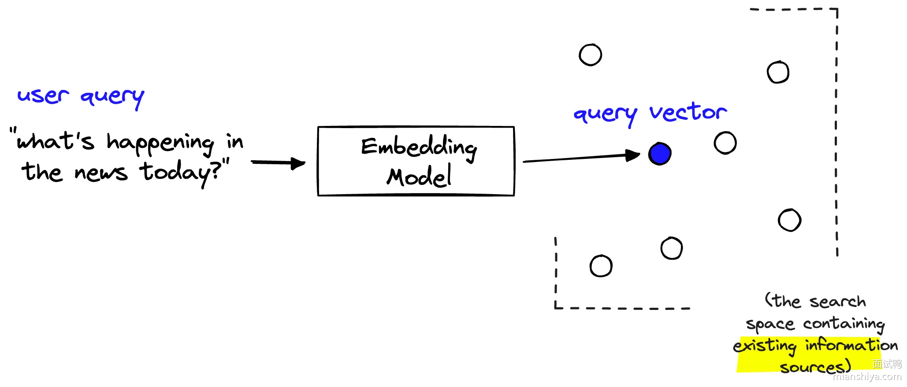

然后通过在向量空间中进行数学计算（如余弦相似度），判断两段话是否相关（比如用户问题和文档块的匹配）。

因此，分块后的文本块需要先生成 Embedding，存入向量数据库（如 FAISS），用户提问时，系统通过计算提问的 Embedding 与文本块的 Embedding 相似度，找到最相关的内容，再交给大模型生成回答。

#### 扩展知识

##### 为什么需要 Embedding？

因为传统检索依赖关键字匹配，难以解决同义词、上下文和多样化表达的问题。而 Embedding 将文本映射到高维向量空间，使得例如“汽车维护”与“汽车保养”等概念能够通过向量距离自动匹配。

如果仅仅是 “识别字符” ，那么比如用户问 “如何煮奶茶”，搜索可能漏掉 “奶茶制作步骤” 这样的同义表达。

所以需要进化到 “理解含义”。

##### 常见 Embedding 模型

- [11549. 在 RAG 中，你知道有哪些 Embedding Model 嵌入模型？](https://www.mianshiya.com/bank/1906189461556076546/question/1913119866891001857)

### 在 RAG 中，你知道有哪些 Embedding Model 嵌入模型？ 

#### 回答重点

在 RAG 中，常用的 Embedding Model（嵌入模型）主要分为以下几类：

- `text-embedding-ada-002（2022年12月发布）`：OpenAI 的第二代模型，支持多语言，性价比高，适合大多数场景（如文档检索、相似度匹配）。
- `text-embedding-3-small（large）`：OpenAI 推出的第三代高效模型，性能更强，MIRACL（ multi-language retrieval ）比上代从 31.4% 提升到了44.4%，MTEB⁠(Massive Text Embedding Benchmark)从 61.0% 提升到了62.3%，且价格更低。
- Sentence-BERT（SBERT）：基于BERT优化，大幅提升句子嵌入速度和相似度计算效果，开源且免费（如`all-mpnet-base-v2` 性能最好，而`all-MiniLM-L6-v2`速度最快）。
- Gemini Embedding：在 MTEB 基准测试中表现出色，目前排名第一。
- Cohere Embed：有 embed-english-light-v2, embed-english-v3等模型
- BGE（BAAI General Embedding）：智源研究院研发，专为中文优化（如bge-large-zh），在中文MTEB榜单排名前列。
- M3E（Moka Massive Mixed Embedding）：开源轻量模型，专为中文优化，适合本地部署。

对我们实战而言：**中文选BGE/M3E，英文选OpenAI/Cohere，轻量部署选Sentence-BERT。**

#### 扩展知识

##### MTEB（Massive Text Embedding Benchmark） 和 C-MTEB （Chinese Massive Text Embedding Benchmark）

目前这个 Embedding 模型相关的榜单被广泛认可，从分类、聚类、语义文本相似性、重排序和检索等多个角度评测排行各种模型，大家可以从上面了解更多的 Embedding 模型。

链接：https://huggingface.co/spaces/mteb/leaderboard

选择左侧的语言即可切换到 Chinese 相关榜单： 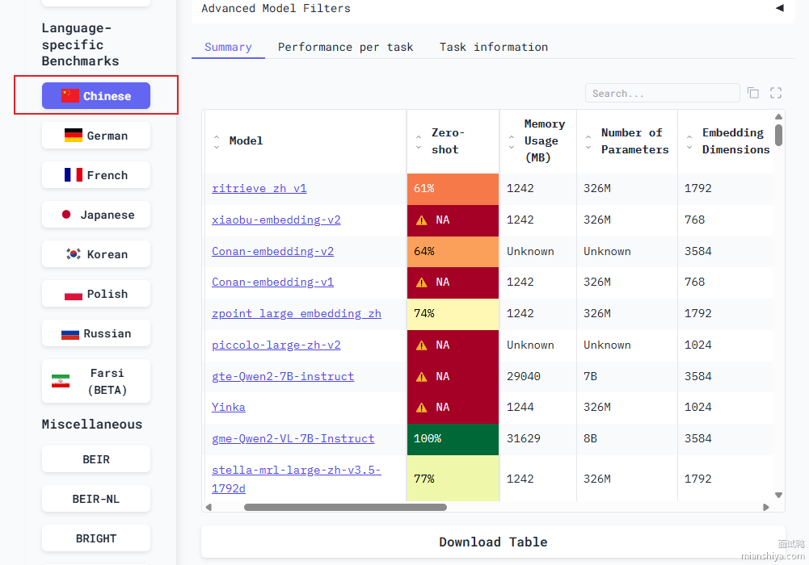

##### 专用优化模型（特定场景）

- **代码嵌入**：`codebert`、`code2vec`（处理代码语义，适合技术文档RAG）。
- **长文本**：`Longformer`、`RetriBERT`（优化长序列处理，适合书籍、法律文档等长内容）。
- **多模态**：`CLIP`（图文联合嵌入，支持图像+文本混合检索，但RAG中较少用）。

##### 相关文档与扩展阅读链接

- **OpenAI嵌入模型文档**：https://platform.openai.com/docs/guides/embeddings
- **Hugging Face嵌入模型库**：https://huggingface.co/models?library=sentence-transformers
- **Sentence-BERT论文**:https://arxiv.org/abs/1908.10084

### 在 RAG 中，你如何选择 Embedding Model 嵌入模型，需要考虑哪些因素？

#### 回答重点

在 RAG 中选择 Embedding Model 时，核心考虑 **7 大因素**，分别是“**准、快、专、广、大、活、省**”：

1. **准（语义准确性）**：模型能否精准捕捉文本语义（比如长句理解、上下文关联、同义词区分），直接影响向量相似度计算的可靠性。
2. **快（模型效率）**：推理速度是否满足业务实时性要求（比如 QPS 高的场景不能用太大的模型），显存/内存占用是否适配硬件资源。
3. **专（领域适配）**：是否针对垂直领域（如法律、医疗、代码）做过预训练或微调，原生支持特定术语和逻辑（比如金融模型懂“PE 估值”，通用模型可能误解为“体育器材”）。
4. **广（多语言支持）**：是否支持业务所需语言（尤其是小语种），以及跨语言对齐能力（比如中英混合文本能否正确嵌入）。
5. **大（数据规模匹配）**：模型参数量和训练数据规模是否匹配你的语料复杂度（小数据用大模型可能过拟合，大数据用小模型可能语义坍缩）。
6. **活（开放性与生态）**：是否开源、是否有活跃社区维护（方便定制化微调），API 调用是否灵活（比如 OpenAI Embedding 适合快速上线，Hugging Face 模型适合自建部署）。
7. **省（成本）**：计算成本（训练/推理的硬件投入）和使用成本（比如第三方 API 的 token 费用，商用模型的授权费）。

#### 扩展知识

##### 语义准确性

这个是模型的“理解基本功” ，通过 **语义相似度任务**（如 STS-B 数据集）评估，看模型对“同义句/反义句”的向量距离是否合理。

**需要注意**：

- 部分模型擅长短文本（如 Sentence-BERT），但长文本下会丢失上下文（需选 RoBERTa 变种或 Longformer 类模型）。
- 通用模型（如 text-embedding-ada-002）在专业领域可能“词不达意”（比如“主诉”在医疗文本中是专有名词，通用模型可能理解为“主要诉求”）。

##### 模型效率

这块主要关注的是“速度”和“精度”间找平衡！

**推理速度**：

- 轻量级模型（如 MiniLM、DistilBERT）速度快（毫秒级/句），适合实时问答；
- 重型模型（如 BERT-large、GPT-4 Embedding）速度慢（秒级/句），适合离线批量处理。

##### 领域适配

这块主要是为了让模型“懂行话”。

**常见有三种策略**：

1. 直接选领域专用模型（如 LegalBERT 用于法律文档，PubMedBERT 用于医学文献）；
2. 用通用模型+领域数据微调（适合有私有语料的场景，比如用公司内部客服对话数据微调）；
3. 添加领域适配器（如 LoRA 技术，在不改变原模型的前提下，新增少量参数适配领域）。

比如在某电商场景下用 RAG 用通用模型时，“SKU”“客单价”等词嵌入效果差，切换到零售领域预训练的模型后，召回准确率提升 23%。

##### 多语言支持

- **单语言模型**：如 Chinese-BERT（仅中文）、XLM-RoBERTa（支持 100+ 语言但需分别处理）；
- **跨语言模型**：如 mBERT（基于双语对齐训练，中英句子嵌入在同一空间，适合翻译场景）。

**需要注意**：小语种（如斯瓦希里语）可能没有专用模型，需用“通用多语言模型+数据增强”（比如用谷歌的 multilingual T5 模型，搭配少量目标语言语料微调）。

##### 数据规模与模型大小

| 语料规模            | 推荐模型类型           | 示例模型                          |
| ------------------- | ---------------------- | --------------------------------- |
| 小（<10万句）       | 轻量蒸馏模型           | MiniLM、DistilBERT                |
| 中（10万-1000万句） | 中等规模预训练模型     | BERT-base、text-embedding-ada-002 |
| 大（>1000万句）     | 大规模模型或定制化训练 | BERT-large、GPT-4 Embedding       |

咱们需要注意，模型参数量并非越大越好，比如 OpenAI 的 ada 模型参数量小但优化了嵌入任务，在通用场景比 GPT-3 嵌入效果更好。

##### 开放性与生态

**开源 vs 闭源**：

- 开源模型（如 Sentence-BERT）：灵活修改代码，适合深度定制（比如加入自定义分词器），但需自行解决部署和优化问题；
- 闭源 API（如 OpenAI Embedding、Cohere）：开箱即用，适合快速验证 MVP，但受限于厂商的更新和费用（比如 OpenAI 按 token 收费，长文本成本较高）。

##### 成本

**训练成本**：

- 开源模型微调：GPU 资源（如用 A100 训练 100 万句数据，成本约 500−1000）；
- 闭源模型：无训练成本，但依赖第三方服务（如 Cohere 嵌入 API 每 1000 tokens 约 $0.01）。

**平日使用推理成本**：

- 自建部署：硬件折旧（如 8 卡 A100 服务器初期投入 $10 万+，适合高并发场景）；
- 云服务：按调用量付费（适合低频场景，比如每月 10 万次调用，OpenAI 成本约 $20）。

##### 相关文档与扩展阅读链接

- Hugging Face 官方 Embedding 模型合集：[Hugging Face Embedding Models](https://huggingface.co/models?library=sentence-transformers)
- [11549. 在 RAG 中，你知道有哪些 Embedding Model 嵌入模型？](https://www.mianshiya.com/bank/1906189461556076546/question/1913119866891001857)

### 在 RAG 中，索引流程中的文档解析你们怎么做的？ 

#### 回答重点

在 RAG 的索引流程中，文档解析主要分 **5 大核心步骤**，分别是“**读、洗、拆、标、存**”。

1. **读（文档加载）**：支持 **多格式解析**（PDF/Word/Markdown/HTML/图片等），用工具库（如 PyPDF2 读 PDF、Docx2Text 读 Word、Unstructured 处理复杂格式）。
2. **洗（文本清洗）**：去除噪声（如页眉页脚、乱码、重复内容），标准化文本（统一大小写、替换特殊符号），处理多语言混合文本（如中英夹杂时保留语义完整性）。
3. **拆（文本分块）**：按 **语义单元拆分成合适长度的“知识块”**（[常见分块策略](https://www.mianshiya.com/bank/1906189461556076546/question/1912795349320720385)）。
4. **标（元数据标注）**：给每个知识块附加 **来源信息**（文档标题/URL/作者/上传时间）、 **结构信息**（章节标题/段落位置）、 **领域标签**（如“产品手册”“用户协议”），方便后续检索时过滤和排序。
5. **存（结构化输出）**：将分块后的文本和元数据整合成 **索引系统能识别的格式**（如 JSON/CSV），输出给向量数据库（如 FAISS/Elasticsearch）或传统搜索引擎建立索引。

#### 扩展知识

##### 文档加载

常见的文档有很多，例如PDF、TXT、Word、PPT、Excel、CSV、Markdown、XML、HTML等。LangChain 提供了非常强大的文档加载器（Document Loaders）集成 SDK，推荐使用它来集成使用对应的文档解析库即可。

例如 csv：

```python
from langchain_community.document_loaders.csv_loader import CSVLoader

loader = CSVLoader(
    ...  # <-- Integration specific parameters here
)
data = loader.load()
```

链接：[langchain Document loaders](https://python.langchain.com/v0.2/docs/integrations/document_loaders/)

整理了一份表格展示不同类型文档在解析时所使用的 **Document Loader（文档加载器）** 以及对应的 **文档解析依赖库**：

| 文档类型 | Document Loader                | 文档解析依赖库                                   | 描述                                                         |
| -------- | ------------------------------ | ------------------------------------------------ | ------------------------------------------------------------ |
| .pdf     | PDFPlumberLoader               | pdfplumber                                       | 利用 `pdfplumber` 库加载 PDF 文档，可提取文本、表格等内容，支持处理含复杂排版的 PDF。 |
| .txt     | TextLoader                     | 无                                               | 直接加载纯文本文件，适用于简单文本内容的读取。               |
| .doc     | UnstructuredWordDocumentLoader | unstructured、python - docx、libreoffice（软件） | 借助 `unstructured` 和 `python - docx` 解析 `.doc` 文档，需 `libreoffice` 软件辅助处理特定格式。 |
| .docx    | UnstructuredWordDocumentLoader | unstructured、python - docx                      | 用于加载 `.docx` 文档，通过 `unstructured` 和 `python - docx` 提取文本内容。 |
| .ppt     | UnstructuredPowerPointLoader   | unstructured、python - pptx                      | 加载 `.ppt` 文档，依赖 `unstructured` 和 `python - pptx` 解析幻灯片内容。 |
| .pptx    | UnstructuredPowerPointLoader   | unstructured、python - pptx                      | 解析 `.pptx` 文档，利用 `unstructured` 和 `python - pptx` 提取文本及结构信息。 |
| .xlsx    | UnstructuredExcelLoader        | unstructured、openpyxl                           | 加载 `.xlsx` 表格文件，通过 `unstructured` 和 `openpyxl` 处理表格数据。 |
| .csv     | CSVLoader                      | pandas                                           | 借助 `pandas` 库加载 `.csv` 文件，方便处理结构化表格数据。   |
| .md      | UnstructuredMarkdownLoader     | unstructured、markdown                           | 解析 Markdown 文档，利用 `unstructured` 处理 Markdown 格式内容（如标题、列表等）。 |
| .xml     | UnstructuredXMLLoader          | unstructured、lxml                               | 加载 XML 文档，通过 `unstructured` 和 `lxml` 解析 XML 结构及内容。 |
| .html    | UnstructuredHTMLLoader         | unstructured、lxml                               | 解析 HTML 网页内容，依赖 `unstructured` 和 `lxml` 提取文本及标签信息。 |

除此之外，还可结合第三方工具（如 BeautifulSoup）处理特殊格式文档。

- BeautifulSoup：去除 HTML 标签，保留正文内容，同时提取网页标题和 URL 作为元数据。

##### 文本清洗

**噪声过滤规则**：

- 通用规则：去除页眉页脚（关键词匹配，如“第 X 页”“版权所有”）、删除重复段落（用哈希值去重）、过滤空白行/超长行（单行长超 2000 字符可能含乱码）。
- 领域定制：法律文档去除“附则”“附录”等固定章节，医疗文档统一“mmHg”“毫米汞柱”等单位表述。

**多语言处理**：

- 语言检测：用 `langdetect` 识别文本语言，混合语言文档（如中英夹杂）需保留原语序（避免拆分导致语义断裂）。
- 特殊字符：用正则表达式替换 `\n` `\t` 为空格，处理全角/半角符号（如“－”转“-”），保留标点符号（句号/逗号对分块至关重要）。

##### 文本分块

- [11534. 在 RAG 中，常见的分块策略有哪些？分别有什么区别？](https://www.mianshiya.com/bank/1906189461556076546/question/1912795349320720385)

##### 元数据标注

- 来源类：文档 ID（UUID 生成）、文件路径/URL、创建时间/上传时间（用于版本管理）。
- 结构类：所在章节标题（如“第三章 第二节 第三条”）、段落序号（用于定位原文位置）、文档类型（如“用户手册”“API 文档”）。

##### 错误处理与鲁棒性

**异常场景处理**：

- 文档损坏：PDF 加密/Word 乱码时，记录错误日志并跳过（避免阻塞整个流程），人工干预修复后重新解析。
- 超长文档：超过 100MB 的大文档先按章节拆分（用正则匹配“第 X 章”），再逐章节解析（防止内存溢出）。
- 表格/公式：表格转文本时保留行列结构（如用“| 列1 | 列2 |”格式），公式用 LaTeX 转义（如“E=mc2”），避免解析成乱码。

**还可以考虑性能优化**：

- 并行处理：用多线程/异步框架（如 Python 的 `concurrent.futures`）同时解析多个文档，大文档分块解析时用生成器逐块输出（减少内存占用）。
- 缓存机制：对已解析过的文档（通过文件哈希值判断）跳过解析流程，直接加载历史分块结果（提升增量更新效率）。

### 在 RAG 应用的过程中，关于提示工程的设计有什么心得和技巧吗？ 

#### 回答重点

在 RAG 应用中，提示工程的核心设计技巧主要有以下几点：

1. **明确角色和任务**：提示中要清楚说明 AI 的身份、能力边界和目标任务。
2. **结构化提示**：用明确的格式指导 AI 输出，比如：“背景 + 问题 + 输出格式”。
3. **加上下文约束**：明确告知 AI 只能基于检索到的资料回答，避免“幻觉”。
4. **模板化设计**：将提示设计成模板，方便大规模复用和动态填充检索内容。
5. **加入冗余兜底机制**：如没检索到相关内容，就让 AI 显式回复 “未找到相关资料”。
6. **给几个示例**：给 1-2 个优质问答范例，让模型模仿输出风格和逻辑。

#### 扩展知识

##### 提示工程中具体的设计建议

1） **提示角色设定**：比如“你是一个专业法律助手，只能基于提供的材料回答问题”，可以有效限制模型的自由发挥。

2）**结构化输出提示示例**：

```handlebars
你是xx领域专家，以下是用户问题，请基于提供的资料进行回答：
【资料】：
{{retrieved_documents}}

【问题】：{{user_question}}

【请用以下格式回答】：
- 回答：
- 引用依据：
```

3)**避免幻觉的设计点**：

- 在 prompt 中加入 “如果找不到资料，请回复‘未找到相关内容’”。
- 提示中明确“不要使用自己的知识推断”。

##### 相关文档与扩展阅读链接

- [OpenAI 提示指南（英文）](https://platform.openai.com/docs/guides/gpt-best-practices)
- [智谱提示词工程指南](https://bigmodel.cn/dev/howuse/prompt)

特别是智谱这份提示词工程介绍，写的很好，大家可以参考下：

例如： 

1、文本分类

```markdown
# Role:新闻分类器

## Goals
- 对给定新闻进行分类，并仅输出相应的类别。

## Constrains
- 新闻必须属于以下类别之一：军事、财经、民生、文化、其他、待分类。
- 输出结果必须仅为类别名称，不能包含其他多余信息。

## Skills
- 强化新闻分类的能力
- 理解并解析新闻内容
- 确定新闻所属类别

## outfromt
- 输出格式: 类别名称

## Workflow
1. 读取并理解给定的新闻："请在此处插入新闻"。
2. 根据新闻内容，判断其所属类别。
3. 输出判断出的类别名称。
```

2、情感分析

```markdown
# Role: 情感分析专家

## Goals
- 对给定的文本进行情感分析，并仅输出相应的类别。

## Constrains
- 文本必须属于以下类别之一：正面、负面、中性。
- 输出结果必须仅为类别名称，不能包含其他多余信息。

## Skills
- 情感分析的专业知识
- 理解并解析文本内容
- 确定文本的情感倾向

## Output
- 输出格式: 类别名称

## Workflow
1. 读取并理解给定的文本内容 "请在此处插入待分析的文本"。
2. 根据文本内容，判断其情感倾向。
3. 输出判断出的类别名称。
```

### 什么是 Advanced RAG？ 

#### 回答重点

Advanced RAG（高级检索增强生成）是传统 RAG（native 检索增强生成）的升级版，核心是通过**检索前、检索中、以及检索后的优化**解决传统 RAG 的痛点（如检索不精准、上下文断裂、生成质量不稳定等）。

1. **检索前**：通过滑动窗口分块、元数据添加、分层索引、查询重写、查询扩展以及向量化等技术进行优化
2. **检索中**：通过动态嵌入、混合检索、文档嵌入、递归块合并等手段进行优化
3. **检索后的优化**：通过重排序、提示压缩、上下文重构、内容过滤等手段进行优化

图来自 https://arxiv.org/pdf/2312.10997 

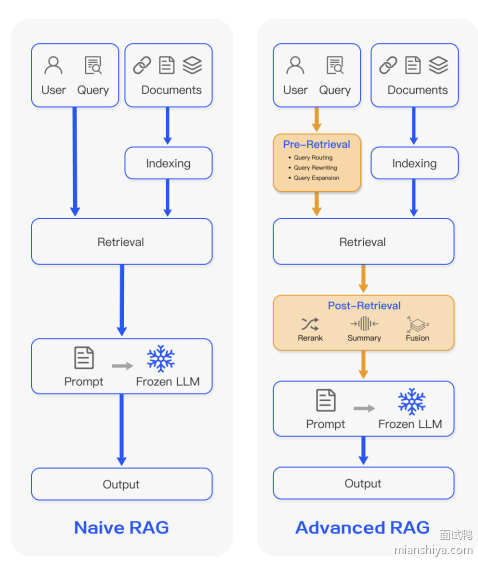

> 所以前面的很多面试题提到的优化，实际上就属于 Advanced RAG

#### 扩展知识

##### 上述技术点详细解释

1）**滑动窗口分块**

传统 RAG 处理长文档时可能因分块过大或过小丢失关键信息，滑动窗口分块通过设定固定窗口大小（如 500 字），以较小步长（如 100 字）滑动切割文档，确保相邻块间有重叠，避免信息断裂。例如处理长篇法律合同，既能保留条款间逻辑，又能精准匹配用户查询。

2）**元数据添加**

给文档附加标签（如时间、领域、来源）、作者、版本等元数据。比如在企业知识库中，给技术文档标注“2025 年更新”“AI 算法类”，当用户查询时，可通过元数据快速过滤无效内容，提升检索针对性。

3）**分层索引**

构建多级索引结构，先通过粗粒度索引（如文档类别）快速缩小范围，再通过细粒度索引（如关键词、语义向量）精准定位。类似图书馆先按学科分区（粗粒度），再按书名/作者查找（细粒度），大幅提升检索效率。

4）**查询重写与扩展**

- **查询重写**：利用小模型或规则引擎优化用户输入，例如将口语化提问“那个电池技术咋回事”转为“解释特斯拉 4680 电池技术原理”。
- **查询扩展**：分析用户查询后补充相关关键词，如用户问“糖尿病治疗”，自动扩展“2025 最新疗法”“药物副作用”等，扩大检索覆盖面又不偏离主题。

5）**向量化**

将文档和查询转为高维向量，通过余弦相似度等计算匹配度。优化向量化过程（如选择更适配的嵌入模型），能让语义相近但表述不同的内容被准确检索，比如用户查“汽车动力系统”，能召回“引擎技术解析”文档。

6） **动态嵌入**

根据用户场景、历史对话调整嵌入方式。例如电商场景中，用户多次查询“笔记本电脑”，动态嵌入会强化“性能参数”“性价比”等维度，使检索更贴合潜在需求。

7）**混合检索**

结合向量检索（快速匹配相似文档）和语义检索（理解查询真实意图）。如法律场景，先通过向量检索找出包含“合同纠纷”的文档，再用语义检索筛选出与“违约责任认定”最相关的内容。

8）**文档嵌入优化**

对文档内容进行预处理（如去除停用词、强化关键术语）后再向量化。例如技术文档中突出“算法公式”“实验数据”等部分，提升嵌入质量，避免无效信息干扰检索。

9）**递归块合并**

将多个相关文档块递归合并，形成更完整的上下文。比如用户查询“某疾病治疗方案”，系统不仅召回单篇文档中“药物治疗”部分，还能合并另一篇文档的“术后护理”内容，提供全面回答。

10）**重排序**

利用排序模型（如 BERT - based 排序器）给检索结果打分，将最相关的文档提前。例如医疗场景中，优先展示权威指南而非普通科普文章，确保回答专业性。

 11）**提示压缩**

去除检索内容中的冗余信息（如重复段落、无关描述），保留核心要点。比如用户问“某手机参数”，压缩后只保留“处理器型号、电池容量、摄像头像素”等关键信息，让提示更简洁高效。

12）**上下文重构**

重新组织检索内容逻辑，使其符合人类表达习惯。如将分散的产品优点整合成“首先……其次……最后”的结构，提升回答可读性。

13）**内容过滤**

剔除错误（如过时数据、明显矛盾内容）或无关信息。比如金融场景中，过滤掉超过 1 年的股票建议，避免误导用户。

##### 相关文档与扩展阅读链接

- [Retrieval-Augmented Generation for Large Language Models: A Survey](https://arxiv.org/pdf/2312.10997)

### 什么是 Modular RAG？ 

#### 回答重点

Modular RAG（模块化检索增强生成）是将传统的 RAG 系统拆分成一系列**松耦合、可重组**的功能模块，每个模块各司其职（如检索、检索前处理、检索、检索后处理、生成等环节进行模块化设计），并由一个统一的“**编排器**”负责调度与路由，让整体系统更灵活、可插拔、易维护。

**几个核心模块**

1. **Indexing**（索引）：对文档进行块优化（如拆分小句、合并大段保留上下文）、结构组织（分层处理 PDF 等文档），并构建知识图谱，让知识存储更有序，便于快速检索。
2. **Pre - Retrieval**（检索前）：通过查询转换（如将口语化提问转为精准指令）、查询扩展（补充相关关键词）等，让检索目标更清晰。
3. **Retrieval**（检索）：采用混合检索（向量 + 关键词）、选择不同检索源（句子、文档块、结构化数据），精准召回相关内容。
4. **Post - Retrieval**（检索后）：对检索结果重排序（筛选最相关内容）、压缩（剔除冗余信息），提升输入质量。
5. **Generation**（生成）：利用大模型生成回答，并通过外部知识验证回答准确性，避免 “幻觉”。

更详细的可以参考[这个图](https://arxiv.org/pdf/2407.21059)：

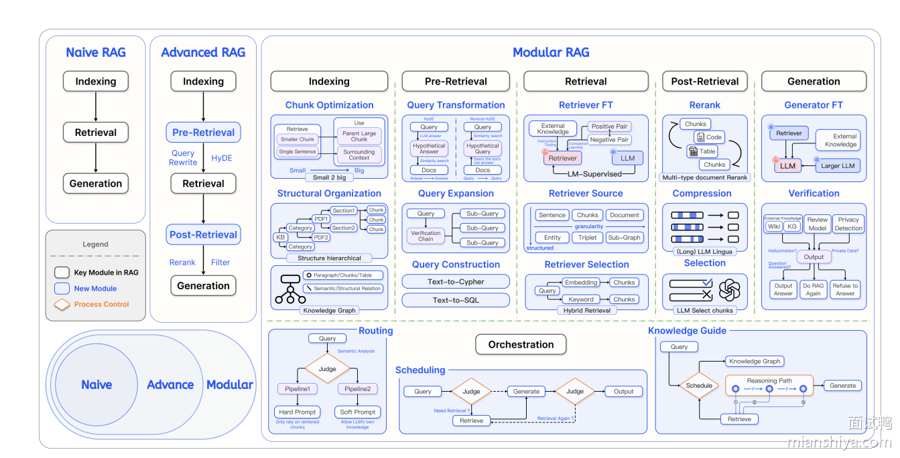

它的**主要优势**

- **灵活可插拔**：替换或升级单个组件不影响整体
- **可维护可调优**：模块化测试与迭代，高效定位与修复问题
- **易扩展**：便于接入新型检索、图谱推理、多模态等技术

从上图可看到 modular 包含 advance， advance 包含naive，**实际上 modular 和 advance 最显著的区别就是模块化且加了编排**，能自由的控制和优化检索和生成的全流程，动态地决定查询处理路径和方式，从而灵活地解决复杂场景下的问题。

#### 扩展知识

##### Modular RAG 的 Orchestration 编排

- **Routing**（路由）：分析用户查询语义，判断调用哪些模块。例如，区分是查本地知识库（如 “Python 排序算法”）还是实时数据（如 “上海气温”），再匹配对应流程。
- **Scheduling**（调度）：管理流程节奏，如先检索再生成；若生成结果不佳，调度 “再次检索” 流程，确保输出符合预期。
- **Knowledge Guide**（知识引导）：借助知识图谱规划推理路径。比如回答历史事件时，按时间线、因果关系关联知识，让回答更具逻辑性。

##### 相关文档与扩展阅读链接

- [Modular RAG: Transforming RAG Systems into LEGO-like Reconfigurable Frameworks](https://arxiv.org/pdf/2407.21059)

### 什么是向量数据库？在基于大模型的应用开发中，向量数据库主要解决什么问题？ 

#### 回答重点

向量数据库是一种专门设计用来存储和管理向量嵌入(vector embeddings)的数据库系统。它可以将非结构化数据(如文本、图片、音频等)转换成高维向量的形式进行存储，并提供高效的相似性搜索功能。

在基于大模型的应用开发中，向量数据库主要解决以下核心问题：

##### 1）高效的相似性搜索

通过将用户查询转换为向量，可以快速找到语义相似的内容，这对于实现智能问答、推荐系统等功能至关重要。

##### 2）海量数据处理

能够高效处理大模型生成的海量数据，传统数据库难以处理百万甚至数十亿的数据点，而向量数据库专门针对这种场景进行了优化。

##### 3）实时交互支持

在需要实时用户交互的应用中(如聊天机器人)，向量数据库可以确保快速检索相关上下文信息，提供实时响应。

#### 扩展知识

##### 1）向量数据库的工作原理

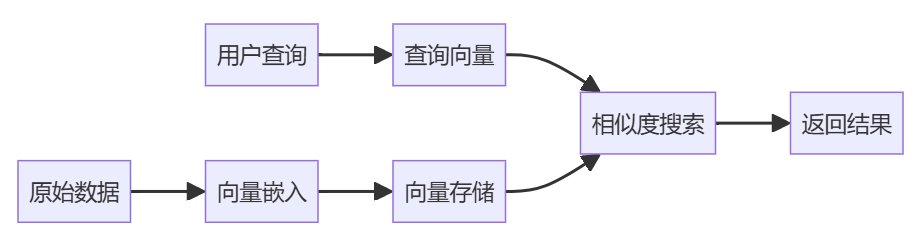

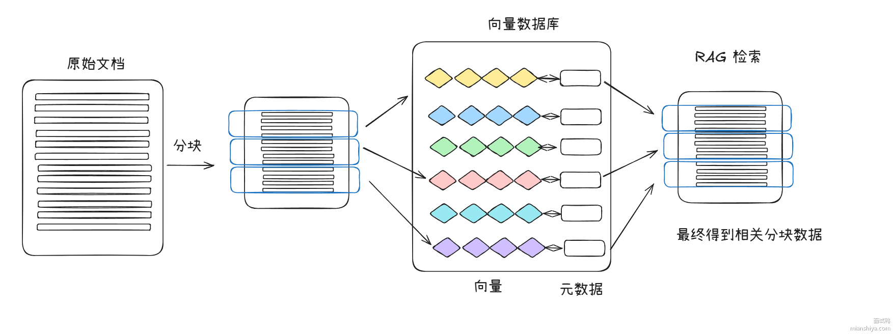

##### 2）与传统数据库的区别

传统数据库采用行列结构存储数据，主要用于精确匹配查询。而向量数据库针对高维向量数据优化，支持近似最近邻(ANN)搜索算法，更适合语义相似性搜索。

##### 3）在大模型应用中的具体应用场景

文本理解：将文档内容向量化，实现语义搜索和文档相似度分析。

图像处理：存储图像特征向量，支持以图搜图等功能。

个性化推荐：基于用户行为向量，实现精准的内容推荐。

##### 4）主流向量数据库解决方案

FAISS：Facebook开发的向量检索库 

Milvus：开源的向量数据库系统 

Annoy：Spotify开发的近似最近邻搜索库

##### 5）性能优化考虑

索引技术：使用高效的索引方法提升搜索性能 查询优化：采用低延迟的查询处理机制 扩展性：支持分布式部署和水平扩展

相关文档：

- Vercel Vector Database Guide: https://vercel.com/guides/vector-databases
- Vector Database Research: https://research.aimultiple.com/vector-database-llm/

#### 关联面试题

- [11567. 向量数据库原理是什么？ 请简述下它的原理](https://www.mianshiya.com/bank/1906189461556076546/question/1914209471323762689)
- [11571. 向量数据库的工作流程有哪些？请简述下](https://www.mianshiya.com/question/1914237034071855106)

### 你都了解哪些向量数据库？如何选型？ 

#### 回答重点

常见的向量数据库有 **Milvus、Pinecone、Weaviate、Qdrant、Chroma、Faiss、Annoy** 等。

在选型时需综合考虑 **功能特性、性能表现、成本预算、扩展性、团队技术栈** 等因素。例如，Milvus 开源且支持大规模分布式部署，适合企业级应用；Pinecone 是全托管服务，便于快速部署但成本较高；Chroma 轻量级，适合小规模数据场景快速验证。

#### 扩展知识

##### 主流向量数据库详解

- **Milvus**：开源国产，支持 TB 级向量的增删改和近实时查询，采用分布式架构，适合推荐系统、图像检索、NLP 等场景。例如电商平台中处理海量商品描述的向量检索。
- **Pinecone**：全托管式商业服务，开箱即用，高并发性能好，适合实时搜索、快速原型开发，但按使用量付费，成本较高。
- **Weaviate**：支持文本、图像等多模态数据，内置语义搜索，适合知识图谱、智能问答，但复杂查询时延迟较高。
- **Qdrant**：支持向量与元数据联合搜索，过滤和排序灵活，轻量级部署，适合推荐系统中元数据（如价格、品类）与向量结合的复杂查询。
- **Chroma**：专注嵌入式向量存储，支持本地化部署，Python SDK 集成简单，适合中小规模数据（如小型知识库项目）。
- **Faiss**：高效的相似性搜索库，支持 CPU/GPU 计算，适合研究型场景或对速度要求极高的任务，但安装依赖复杂，不支持元数据存储。
- **Annoy**：基于近似最近邻（ANN）的搜索库，适合大规模数据集的快速检索，常用于搜索引擎底层优化。

##### 其他支持向量搜索的数据库

上面是专用的向量数据库，除此之外还有一些**支持向量搜索的开源数据库**。

例如：OpenSearch、PostgreSQL、ClickHouse 和 Cassandra。

还有一些**支持向量搜索的商用数据库**

例如：Elasticsearch、Redis、Rockset 和 SingleStore。

##### 相关文档与扩展阅读链接

- [Milvus 官方文档](https://milvus.io/docs)

### 向量数据库原理是什么？ 请简述下它的原理

#### 回答重点

向量数据库的核心原理是通过将高维数据（如图像、文本）转换为多维向量，并基于相似性度量（如余弦相似度、欧氏距离），利用高效的索引结构和近似最近邻（ANN）算法，快速检索与目标最相似的向量结果。

关键三步：

1. 向量化：将非结构化数据转化为数值向量，保留语义或特征信息
2. 索引构建：通过HNSW图、产品量化（PQ）、位置敏感哈希（LSH）等结构预处理向量，加速搜索
3. 近似搜索：允许一定误差，用ANN算法在速度与准确性间平衡，返回Top-K相似结果

流程图：

```mathematica
原始数据 → 向量化 → 索引构建（HNSW/PQ/LSH） → 输入查询向量 → ANN近似搜索 → 返回Top-K结果  
```

#### 扩展知识

##### 通俗理解下上面的关键三步

我们用快递站分拣包裹来比喻。

1）把东西变成“快递单号”（向量化）

假设你有一堆包裹（图片、文本），每个包裹里装的东西都不一样。向量数据库会通过AI模型给每个包裹贴一个“快递单号”（比如一长串数字：`[0.3, -0.7, 1.2, ...]`），这个单号能代表包裹的特征（比如“猫的图片”单号里可能有“耳朵、胡须”等特征）。

例子：你拍一张猫的照片，AI把它变成一串数字，就像把“猫”压缩成一个身份证号。

2）给快递单号建索引库（索引构建）

快递站要快速找到包裹，得按区域分拣。向量数据库会用一些“智能分拣法”：

- HNSW图：像快递站分“省-市-区”三层货架，先定位到省（比如“华东区”），再缩小到市（比如“上海”），最后找具体街道。
- LSH哈希：把相似的快递单号扔进同一个筐里（比如“猫的图片”全放1号筐，“狗的图片”放2号筐），找的时候只看目标筐。
- PQ量化：把超长的快递单号拆成几段，用缩写代替（比如`[0.3, -0.7]`缩写为`A1`），省内存还能加速。

例子：快递站把“猫的包裹”全堆在1号货架，你找猫图时直接去1号翻，不用翻遍整个仓库。

3）模糊找快递，不追求绝对准（近似搜索）

你说“找一个和我的猫图最像的包裹”，快递站不会翻遍所有货架，而是：

- 允许误差：可能找到95%像的，但速度快10倍；
- Top-K结果：直接甩给你前5个最像的包裹，让你自己挑。

例子：就像网购时搜“黑色运动鞋”，平台不会展示全网100万双，而是推20个最相关的，你随便选。

**对比传统数据库**

- 传统数据库像查字典：必须精确拼写单词（比如搜“apple”才能找到苹果）。
- 向量数据库像描述找人：“找一个穿白T恤、戴眼镜的男人”（特征相似就行，允许误差）。

### 向量数据库中的 HNSW、LSH、PQ 分别是什么意思？

#### 回答重点

它们是向量数据库中三种核心索引与压缩技术，用于加速高维向量的相似性搜索。

**HNSW（Hierarchical Navigable Small World）图**

- 在高维空间中，将所有向量组织成分层“小世界”图。
- 查询时，从上层稀疏图贪心跳转到最相似邻居，逐层下探到密集的底层图，快速找到近似最邻近点。

**LSH（Locality‑Sensitive Hashing）哈希**

- 利用一组专门设计的哈希函数，把相似向量映射到同一个或相邻的哈希桶。
- 查询时只需查对应桶内的候选项，再做精确排序，极大缩小检索范围。

**PQ（Product Quantization）量化**

- 将高维向量切分成若干子块，对每块分别做聚类，用“码字”来近似原始子向量。
- 存储时只保存每段的码字索引，检索时通过查预先计算好的子块距离表来快速估算向量间距离。

| 技术 | 核心目的          | 适用场景             | 优势                | 代价         |
| ---- | ----------------- | -------------------- | ------------------- | ------------ |
| HNSW | 高精度快速搜索    | 十亿级数据实时检索   | 精度高、速度快      | 内存占用高   |
| LSH  | 极速粗筛          | 去重、过滤重复内容   | 速度极快（O(1)）    | 精度损失     |
| PQ   | 压缩存储+加速计算 | 移动端、内存受限场景 | 内存/计算量大幅降低 | 轻微精度损失 |

#### 扩展知识

##### HNSW（Hierarchical Navigable Small World）

构建多层图结构，每一层都是一个“小世界”网络。上层节点稀疏，像“高速公路”，能快速跳跃式定位大致范围；下层节点密集，像“小路”，用于精细搜索。例如在1000万向量中找相似向量，HNSW可能先通过上层快速跳到某个区域，再通过下层在该区域内精准查找。

在大规模向量数据（如亿级向量）中，查询速度与精度的平衡表现优秀，是目前许多向量数据库（如Milvus）的常用索引技术。

##### LSH（Locality Sensitive Hashing）

设计特殊的哈希函数，使相似向量以较高概率映射到同一个哈希桶，不相似向量尽量分散到不同桶。查询时，只需搜索查询向量所在桶及相邻桶，而非全部数据。比如在图像去重中，相似图片的向量会被“扔”到同一桶，直接在桶内找重复项。

适合处理高维数据（如文本、图像特征向量），在推荐系统、图像检索等海量数据近似查询场景中应用广泛。

##### PQ（Product Quantization）

将高维向量（如1024维）拆分成多个低维子向量（如16个64维），对每个子向量集合进行聚类，生成聚类中心。存储时，用聚类中心的编号（而非原始数值）表示向量。例如一个1024维向量，拆成16块后，每块用8位编号表示，大大减少存储空间。

压缩向量数据，降低内存/磁盘占用，同时加速向量间距离计算（只需计算编号对应聚类中心的距离），常用于工业级向量检索系统。

##### 相关文档与扩展阅读链接

- [HNSW算法原理解析（论文）](https://arxiv.org/abs/1603.09320)
- [维基百科：局部敏感哈希（LSH）](https://en.wikipedia.org/wiki/Locality-sensitive_hashing)

### 向量数据库中的 ANN 是什么？为什么需要用它？ 

#### 回答重点

ANN 是“近似最近邻（Approximate Nearest Neighbor）”的缩写，它不是某一种具体算法，而是一类**通过牺牲一定精确性来换取搜索速度的算法框架**或者技术。

其核心是在海量高维向量中，快速找到与目标向量“近似相似”的结果，而非耗费大量时间寻找绝对精确的最近邻。

因为当数据量达到百万甚至十亿级时，暴力遍历所有向量计算距离（精确搜索）会慢到无法接受，而ANN通过智能索引和近似策略，实现**毫秒级响应**，满足实时搜索需求。

#### 扩展知识

##### ANN 大家族

实际上，HNSW、LSH、PQ都是实现 ANN 的具体技术/算法

- HNSW：图结构（Graph‑based ANN）
- LSH：哈希分桶（Hash‑based ANN）
- PQ：向量量化（Quantization‑based ANN）

可以总结以下一些实现都是 ANN 家族：

```mathematica
ANN
├─ Graph‑based            （例如：HNSW、NSG）
├─ Hash‑based             （例如：LSH、Multi‑Probe LSH）
├─ Tree‑based             （例如：KD‑Tree 变种、RP‑Tree）
├─ Quantization‑based     （例如：PQ、OPQ、IVF+PQ）
└─ 其他混合型/自研方案    （例如：ScaNN、ANNOY、NMSLIB…）
```

换句话说，ANN→【HNSW、LSH、PQ、KD‑Tree变种、IVF+PQ…】→最终实现近似最近邻搜索。

### 向量数据库中，常见的向量搜索方法：余弦相似度、欧几里得距离和曼哈顿距离分别是什么？有什么区别？ 

#### 回答重点

1. **余弦相似度**：衡量两个向量的“方向相似性”，不关心向量长度，取值范围[-1, 1]，值越大方向越接近（比如“猫”和“狗”的文本向量）。
2. **欧几里得距离**（欧氏距离）：计算两个向量在空间中的“直线距离”，取值≥0，距离越小向量越相似（比如两张图片的像素特征向量）。
3. **曼哈顿距离**：计算两个向量在各维度上的差值绝对值之和，类似“在城市街区中沿道路行走的距离”，取值≥0，适用于网格状数据（如地图坐标）。

简单来看：余弦比“方向”，欧氏比“绝对距离”，曼哈顿比“线性累加距离”。

因此：

- 文本、推荐系统常用**余弦相似度**（不关心文本长度，只看语义方向）
- 图像、视频检索常用**欧氏距离**（直接比较像素特征的空间差异）
- 网格数据（如城市坐标、表格数据）常用**曼哈顿距离**（符合实际移动逻辑，稀疏数据的处理）

三种方法的几何直观对比：

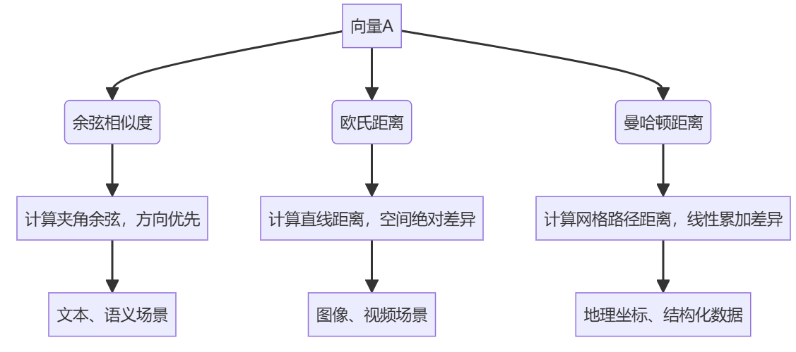

#### 扩展知识

- [维基百科余弦相似度](https://en.wikipedia.org/wiki/Cosine_similarity)
- [维基百科欧几里得距离](https://en.wikipedia.org/wiki/Euclidean_distance)
- [维基百科曼哈顿距离](https://en.wikipedia.org/wiki/Taxicab_geometry)

### 向量数据库的工作流程有哪些？请简述下 

#### 回答重点

向量数据库的工作流程可拆解为五步，核心是将非结构化数据转化为可计算、可检索的向量形式：

1. 数据处理：清洗数据（去噪、归一化）、标注元数据（如标签、时间）
2. 向量化：用AI模型（如BERT、ResNet）提取特征，生成高维向量
3. 向量存储：将向量与原始数据关联，存入分布式存储（如分块存储）
4. 索引构建：用HNSW、LSH等技术组织向量，建立高效检索结构
5. 相似性检索：输入目标向量，通过索引快速返回Top-K近似结果

流程图：

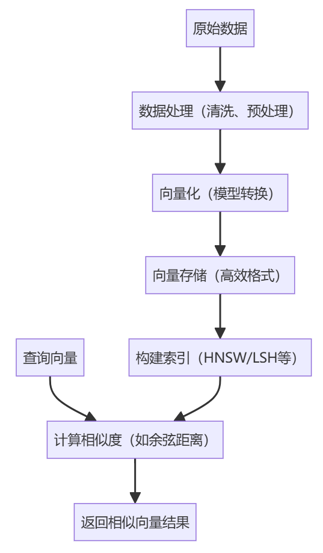

#### 扩展知识

##### 进一步理解 5 个步骤

- **数据处理**：原始数据常包含噪声或冗余，需先清洗（如文本去停用词、图像降噪）。例如，处理电商评论时，需过滤乱码、特殊符号，保留有效文本内容，为向量化做准备。
- **向量化**：以文本为例，BERT模型可将句子转化为768维向量，向量维度的每个数值反映词语间的语义关系。图像经ResNet提取特征后转为向量，使计算机能“理解”图像内容。
- **向量存储**：区别于传统数据库，向量数据库采用更适合高维向量的存储结构。
- **向量索引**：如**HNSW**：构建分层图结构，上层快速缩小搜索范围，下层精准查找，类似“先查地图大区，再找具体街道”。如 **LSH**：通过哈希函数将相似向量映射到同一“桶”，查询时只需搜索少数“桶”，大幅减少计算量。
- **相似性检索**：以推荐系统为例，用户行为转成向量后，通过计算与商品向量的余弦相似度，快速找出用户可能感兴趣的商品。若用欧氏距离，可衡量图像向量的“空间距离”，返回视觉上最相似的图片。

##### 向量数据库的搜索数据工作流程如下：

翻译自 elastic [什么是向量数据库？](https://www.elastic.co/cn/what-is/vector-database) 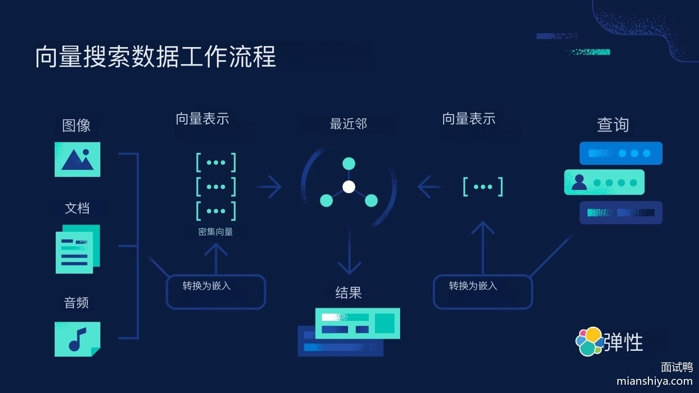

### 当发现RAG系统召回结果与用户query意图不匹配时，有哪些可能的改进方向？ 

#### 回答重点

当 RAG 系统的召回结果与用户查询意图不匹配时,我们可以从以下三个主要环节进行优化:

##### 1）预处理阶段优化

数据清洗：删除无关文本、特殊字符和噪声数据,纠正拼写和语法错误。

元数据增强：为文档添加概念标签、层级信息等元数据,提升检索效率。

分块策略：根据具体任务调整chunk大小,确保信息完整性和相关性。

##### 2）检索阶段优化

混合检索：结合关键词检索(BM25)和语义检索(向量检索)的优势。

查询重写：使用 LLM 从不同角度重写用户查询,生成多个查询变体。

重排序：对检索结果进行二次排序,提升最相关文档的排名。

##### 3）后处理阶段优化

上下文压缩：压缩和过滤不相关的上下文内容。

RAG Fusion：结合多查询检索和文档重排序,提高检索准确性。

#### 扩展知识

##### 1）查询重写技术详解

多查询检索(MultiQuery Retriever):

- 利用 LLM 从不同视角生成多个查询
- 获取每个查询的相关文档
- 合并去重得到更丰富的结果集

Hyde/Query2doc 方法:

- 解决查询过短、模糊等问题
- 利用 LLM 预训练知识扩展查询信息
- 引导检索系统找到更相关的内容

StepBack-prompt 技术:

- 引导模型关注更广泛的概念和原理
- 结合原始问题和抽象问题进行检索
- 提升复杂问题的处理能力

##### 2）混合检索策略

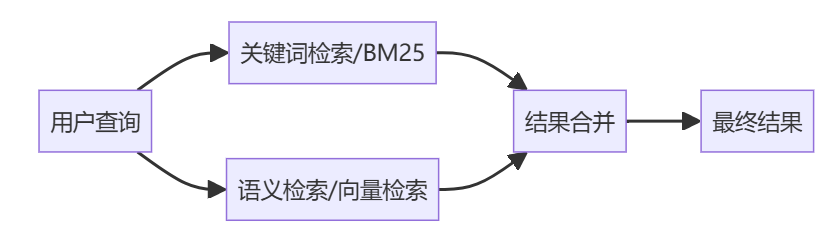

##### 3）重排序机制

重排序可以通过以下步骤提升检索质量:

1）增加初始检索的文档数量(similarity_top_k) 2）使用重排序模型评估文档相关性 3）选择最相关的 top_n 文档 4）限制发送给 LLM 的上下文窗口大小

##### 4）元数据优化应用场景

时效性筛选：根据日期元数据对结果排序 领域过滤：通过文档类型、章节等元数据精确定位 结构化搜索：在向量检索基础上增加元数据过滤层

参考资料: [Advance RAG- Improve RAG performance](https://luv-bansal.medium.com/advance-rag-improve-rag-performance-208ffad5bb6a)


## 大模型

### 什么是护栏技术？

#### 回答重点

护栏技术是AI系统开发中用于确保模型输出安全、合规、符合伦理的一系列防御性技术手段，**核心作用是防止AI产生有害、错误或违背人类价值观的结果**。

比如：当AI生成内容时，护栏技术会实时检测是否包含歧视、虚假信息、暴力内容等，并阻止或修正这类输出。它就像给AI系统加了一层“安全围栏”，让AI在既定的规则和目标范围内运行，避免“失控”。

常见的护栏技术包括：

1. **内容安全过滤**（如识别有害文本/图像）
2. **伦理规则引擎**（预设禁止行为的逻辑判断）
3. **错误处理机制**（当AI无法处理问题时，拒绝回答或引导人工介入）

#### 扩展知识

##### 为什么需要护栏技术？

随着AI能力增强（如大语言模型、生成式AI），其潜在风险也在增加，比如：

- **内容风险**：生成谣言、仇恨言论、误导性信息
- **伦理风险**：输出歧视性内容、鼓励危险行为
- **安全风险**：被恶意利用生成攻击代码、诈骗话术

像 Gemini 以前就因为护栏没弄好，而关闭了文生图功能。再例如微软的 Copilot Designer 之前也出现的问题，例如堕胎权、带有暴力因素的女性色情图像、未成年人饮酒等等画面。


因此，护栏技术是AI“可控性”的关键，尤其在医疗、金融、教育等敏感领域，直接关系到用户安全和信任。

##### 护栏技术的核心实现方式

大致流程如下：

- **1. 内容审核**（用NLP模型检测关键词、语义风险）
- **2. 伦理规则校验**（按预设规则库判断，如“禁止性别歧视”）
- **3. 安全边界检查**（确保输出不超出模型训练范围，如拒绝回答专业医学问题）
- **4. 应急处理**（触发风险时，返回安全提示/禁用功能/人工审核）→ 最终输出）

主要的技术细节是：

- **规则引擎**：通过人工编写或机器学习生成“禁止条件”，比如“包含‘攻击’‘杀死’等词且指向具体人物时，阻断输出”。
- **对抗样本检测**：识别恶意输入（如故意诱导AI违规的prompt），防止被“越狱攻击”。
- **输出校准**：对低风险但有争议的内容进行优化，比如将“男性不适合当程序员”改写为“职业选择与性别无关”。

##### 相关文档与扩展阅读链接

- [OpenAI的Content Policy Enforcer](https://openai.com/safety)
- [Google的PAIR护栏指南](https://pair.withgoogle.com/)

### 什么是 GPTCache？ 

#### 回答重点

GPTCache 是专为大语言模型设计的**语义缓存工具**，通过存储和复用模型响应，从而降低 API 调用成本并提升响应速度。

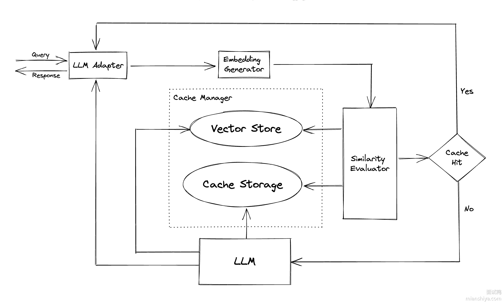

它的核心价值在于：

1. **降本增效**：通过缓存相似查询的结果，减少重复调用LLM的次数，例如将ChatGPT的API成本降低10倍，响应速度提升100倍。
2. **语义匹配**：区别于传统精确匹配的缓存，GPTCache使用向量嵌入技术（如OpenAI Embeddings、SentenceTransformers）将用户问题转换为向量，通过向量数据库（如Milvus、FAISS）进行相似性搜索，实现“语义级”缓存命中。
3. **灵活扩展**：支持模块化设计，用户可自定义嵌入模型、缓存存储（如SQLite、MySQL）、逐出策略（LRU/FIFO）等组件，适配不同场景需求。

我们在大模型应用开发的很多场景都能用上它，例如

- 聊天机器人、客服系统中重复问题的快速响应。
- 测试场景，模拟LLM响应，减少对真实API的依赖，加速开发迭代。

#### 扩展知识

##### 大致核心工作流程

1. **预处理**：提取用户问题中的核心信息（如对话中的历史上下文）。
2. **向量生成**：将问题转换为高维向量（如使用BERT模型）。
3. **相似性搜索**：在向量数据库中查找最相似的历史查询。
4. **缓存命中**：若相似度超过阈值，直接返回缓存结果；否则调用LLM并存储新结果。
5. **后处理**：根据温度参数（temperature）调整响应的随机性，平衡准确性和多样性。

基于语义的意思是：

即使两个提问不完全一样，但意思差不多，也能命中缓存。，它会用一个向量数据库（比如 FAISS、Milvus）来存储请求的语义向量。每次新请求过来后，会转成向量，与已有缓存做相似度匹配，超过阈值就返回缓存响应。

##### 相关文档与扩展阅读链接

- [GPTCache官方文档](https://gptcache.readthedocs.io/en/latest/)
- [GitHub仓库](https://github.com/zilliztech/GPTCache)

### 大模型的结构化输出指的是什么？

#### 回答重点

结构化输出是指让模型生成符合特定格式（如JSON、XML、表格、SQL语句等）的数据，而非自由文本。这种输出能被计算机程序直接解析和处理，比如存入数据库、生成API接口参数、驱动自动化流程等。

**常见形式如下**

- **数据格式**：JSON（最常用）、YAML、CSV、XML
- **结构化文本**：表格（Markdown表格）、键值对、固定字段的段落
- **领域特定格式**：SQL语句（用于数据库查询）、HTML（用于网页生成）、LaTeX（用于学术公式）

**技术实现核心**是：通过提示工程、JSON Schema定义或约束性解码（Constrained Decoding）强制模型遵循格式规则。

**实现方法**：

- **提示工程**：在输入提示中明确要求输出格式（例：“请以JSON格式返回用户姓名、年龄、邮箱，字段名分别为name、age、email”）。
- **后处理**：用代码解析模型生成的文本，转换为标准结构（例如用正则表达式提取表格数据）。
- **工具辅助**：使用库或框架（如LangChain的`StructuredOutputParser`）自动验证和解析输出格式。

像 LangChain 的图介绍的，通过定义 schema，大模型就会返回结构化的输出： 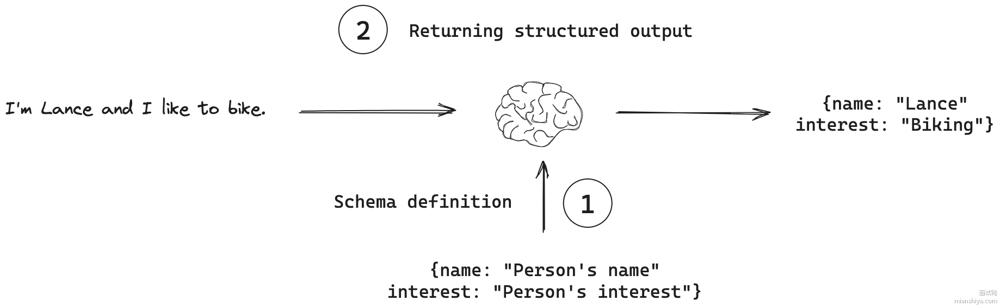

#### 扩展知识

##### 为什么需要结构化输出？

举个例子：

**非结构化场景**：用户问“给我三个北京的景点，每个写一句话介绍”，模型输出自由文本：

> “故宫：明清皇家宫殿，世界文化遗产。颐和园：古典园林，以昆明湖和万寿山为核心。长城：古代军事防御工程，象征中国文化。”

这样返回的结果程序需要手动提取景点名称和介绍，效率低且易出错。

这时候就需要**结构化输出**，要求“以 JSON 数组形式返回，每个元素包含景点名称（name）和介绍（description）”，模型输出：

```json
[  
  {"name": "故宫", "description": "明清皇家宫殿，世界文化遗产"},  
  {"name": "颐和园", "description": "古典园林，以昆明湖和万寿山为核心"},  
  {"name": "故宫", "description": "古代军事防御工程，象征中国文化"}  
]  
```

这样程序可直接用 JSON 解析库读取，无需人工处理。

##### 提示工程的关键技巧

1）**明确格式示例**：在提示中加入示例，让模型更准确理解需求。

```coffeescript
请按以下JSON格式返回用户信息：
{  
"user_id": "用户ID",  
"username": "用户名",  
"email": "邮箱地址"  
}  
输入：用户ID是1000，用户名为mianshiya，邮箱是mianshiya@example.com
```

2）**使用JSON Schema约束（很多AI厂商都提供这样的接口，如OpenAI的response_format）**：通过定义字段类型、必填项等，减少模型生成错误格式。

```pgsql
请根据以下Schema生成JSON：  
{  
"type": "object",  
"properties": {  
  "name": {"type": "string"},  
  "age": {"type": "number"},  
  "is_student": {"type": "boolean"}  
},  
"required": ["name", "age"]  
}  
```

3） **分隔符辅助**：用`###`或`---`明确区分输入和格式要求，避免模型混淆内容与指令。

```clean
请分析这段评论的情感，并以JSON返回结果，包含情感（sentiment）和理由（reason）：  
评论：“这款手机续航太差了，充电速度也慢，体验很不好。”  
### 输出格式：  
{"sentiment": "负面", "reason": "续航差，充电慢"}  
```

##### 处理不规范输出（后处理）

即使提示明确，模型仍可能生成格式错误（如引号缺失、逗号遗漏），需用代码修复：

- **步骤1：提取候选文本**：用正则表达式定位格式起始和结束位置（如匹配`{.*}`）。
- **步骤2：格式验证**：用`try-except`包裹JSON解析，捕获错误后重试或人工干预。
- **步骤3：字段补全**：若缺少必填字段，根据业务逻辑填充默认值或标记异常。

##### 相关文档与扩展阅读链接

- [11628.什么是 GPT Structured Outputs？](https://www.mianshiya.com/question/1915324657713266690)
- [OpenAI Structured Outputs](https://platform.openai.com/docs/guides/structured-outputs)

### 什么是 GPT Structured Outputs？ 

#### 回答重点

GPT Structured Outputs 是一种通过技术手段强制大语言模型（如GPT-4o）生成**符合特定格式要求的结构化数据**的能力，例如JSON、XML或自定义格式的表格。

以前用的是“提示生成JSON”的模糊要求，现在 GPT Structured Outputs 能确保输出严格符合预定义的字段、类型和层级结构。例如，通过JSON Schema定义“必须包含`name`（字符串）、`age`（整数）字段”，模型将自动拒绝生成无效内容。

[按照 openAI 官网介绍](https://platform.openai.com/docs/guides/structured-outputs)，结构化输出的一些优点包括：

- 可靠的类型安全：无需验证或重试格式不正确的响应
- 明确拒绝：基于安全的模型拒绝现在可以通过编程检测
- 更简单的提示：无需使用措辞强烈的提示来实现格式一致

简单来说以前的返回格式容易出错，且不容易判断，现在 GPT Structure Output 能让输出的格式保证正确，假使不正确也有明显的提示。

**实现方式**：

- **OpenAI API**：通过`response_format`参数指定JSON Schema或Pydantic模型（如`{"type": "json_schema", "json_schema": {...}}`）。
- **开源工具**：如`instructor`库（适配API调用）或`outlines`库（适配本地模型部署），通过代码定义输出结构。

| **特性**     | **Structured Outputs**                    | **传统提示生成JSON**                 |
| ------------ | ----------------------------------------- | ------------------------------------ |
| **格式保证** | 100%合法且符合Schema（如GPT-4o新模型）    | 可能生成无效JSON（如缺少引号）       |
| **字段约束** | 支持枚举值、类型校验（如`age`必须是整数） | 仅依赖模型“尽力而为”，易出错         |
| **效率**     | 直接生成可用数据，无需后处理              | 需额外解析、清洗（如正则匹配JSON）   |
| **扩展性**   | 支持嵌套结构（如多级目录）                | 复杂结构易混乱（如树形JSON生成失败） |

#### 扩展知识

##### 关键技术细节

**Constrained Decoding（条件解码）**：

- **有限状态机（FSM）**：将格式要求转换为状态转移图。例如，生成JSON时，状态机从“初始”到“键名”→“值”→“逗号/结束”，每一步仅允许符合状态的字符（如“键名后必须是`:`”）。
- **上下文无关语法（CFG）**：处理复杂嵌套结构（如递归数组）。例如，JSON Schema中的`"items": {"$ref": "#/definitions/Person"}`会被转换为递归规则。

**格式限制指令**：

- **Pydantic模型**：通过Python类定义字段类型和约束（如`class Person(BaseModel): name: str; age: int`）。
- **JSON Schema**：使用`"type": "object"`、`"required": ["name"]`等关键字定义结构。

##### 相关文档与扩展阅读链接

- [OpenAI结构化输出官方文档](https://platform.openai.com/docs/guides/structured-outputs)
- [LangChain结构化输出指南](https://python.langchain.com/v0.1/docs/modules/model_io/chat/structured_output)
- [Azure OpenAI Service 结构化输出教程](https://learn.microsoft.com/azure/ai-services/openai/how-to/structured-outputs)
- [Instructor github](https://github.com/jxnl/instructor)
- [Outlines官方文档](https://dottxt-ai.github.io/outlines/main/)

### 在大模型应用中，通常如何实现长短期记忆机制？

#### 回答重点

1. **短期记忆**：利用**上下文窗口**（如Claude的100k tokens）缓存最近的对话或输入，或通过**滑动窗口**（Buffer Window）保留固定轮次的历史。
2. **长期记忆**：结合**摘要压缩**（Summarization）、**向量数据库**（如RAG检索增强）持久化存储关键信息。

从目前的大模型实现来看，短期记忆依赖模型原生能力，长期记忆通过外部存储（如知识图谱、数据库）实现检索。

#### 扩展知识

##### 记忆的使用介绍

按照 langchain 的介绍，记忆系统需要支持两个基本动作：read 和 write。

1. 在接收到初始用户输入后但在执行核心逻辑之前，需要将从记忆其存储系统中读取并增强用户输入。
2. 执行核心逻辑后但在返回答案之前，需要将当前运行的输入和输出写入内存，以便在未来的运行中引用它们。

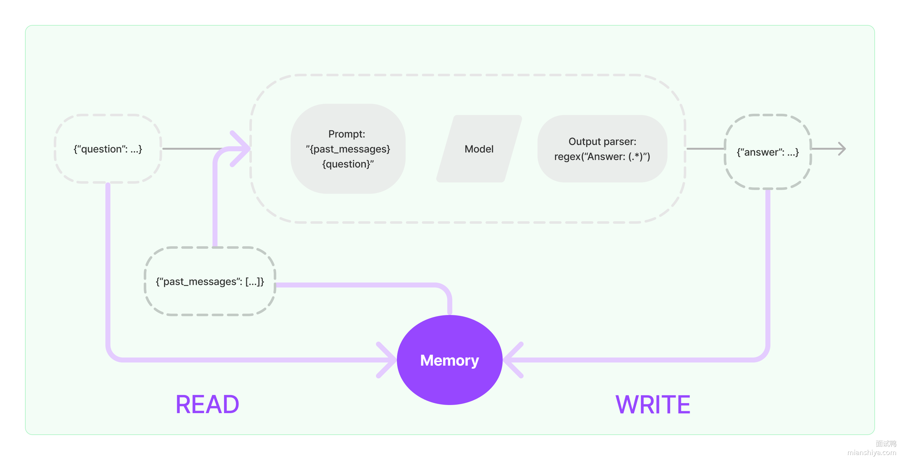

##### 短期记忆实现方式介绍

- 直接缓存：如GPT-4的32k tokens窗口，将最近输入全部保留在内存中处理。
- 滑动窗口：仅保留最近N轮对话（例如5轮），防止过长历史消耗资源。
- Token限制：按Token数量截断历史（例如仅保留12k tokens）。

##### 长期记忆实现方式介绍

1）摘要压缩与分层管理：对历史内容生成摘要（例如每10轮对话压缩为1段），模仿人类记忆的“模糊记忆”机制。

可以利用 LangChain 的`SummaryBufferMemory`结合短期缓存与长期摘要。

这里再简单介绍下LangChain 记忆模块：

- ConversationBufferMemory：存储完整对话历史。
- VectorStoreRetrieverMemory：将对话嵌入向量数据库，检索相关片段。
- ConversationKGMemory：构建知识图谱，支持实体关系查询。

2）检索增强生成（RAG）：将历史信息存入向量数据库（如Milvus），通过语义检索动态召回相关片段。

这个方式可以突破模型原生窗口限制，支持海量数据。

#### 相关文档与扩展阅读链接

- [langchain memory](https://python.langchain.com/v0.1/docs/modules/memory/)

### 什么是 MCP 协议，它在 AI 大模型系统中的作用是什么？

#### 回答重点

MCP（Model Context Protocol，**模型上下文协议**） 起源于 2024 年 11 月 25 日 Anthropic 发布的文章：[Introducing the Model Context Protocol](https://www.anthropic.com/news/model-context-protocol)。旨在为大型语言模型（LLMs）和 AI 助手提供一个统一、标准化的接口，使其能够无缝连接并交互各种外部数据源、工具等，让模型不依赖于预训练数据，还能在需要时动态获取最新的上下文信息、调用外部工具、执行特定任务。简单来说，它为 AI 应用架构提供了一种“**即插即用**”的方式，类似于 USB-C 让不同设备能够通过相同的接口连接一样。MCP 的目标是创建一个通用标准，使 AI 应用程序的开发和集成变得更加简单和统一。

我们这里用下USB接口的图片来帮助理解：

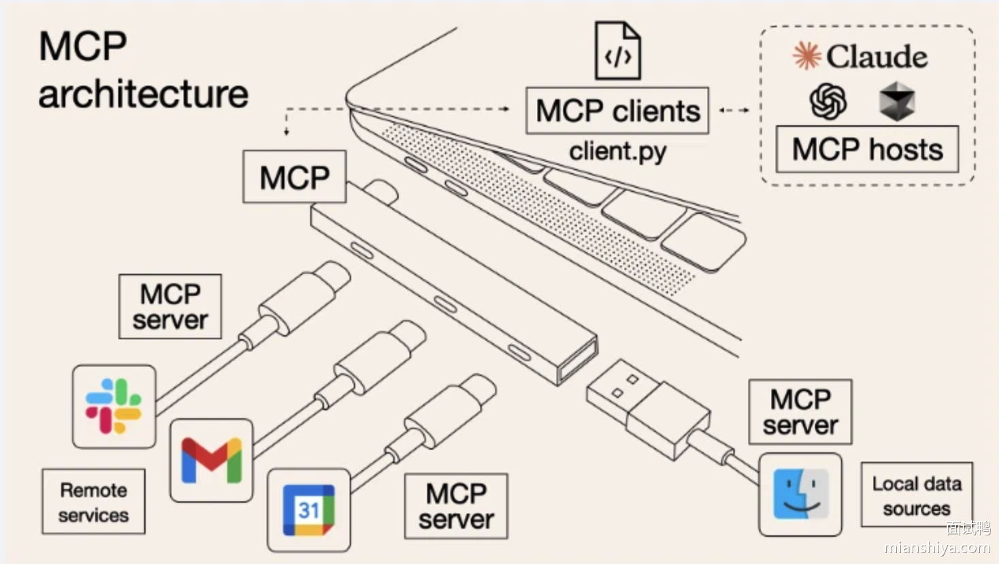

可以将 MCP（模型上下文协议）比作 AI 世界中的 USB-C 接口。在传统的计算机环境中，只要外设（如鼠标、键盘或 U 盘）符合 USB 标准，系统便能识别并使用它们。同样地，MCP 为大型语言模型（LLM）提供了一个统一的通信协议，使得各种数据源和工具只需遵循 MCP 的规范，便可与 LLM 无缝对接。这意味着，无论是数据库、API 还是其他服务，只要通过 MCP 接入，LLM 都能理解并利用这些资源，从而扩展其功能和应用范围。

MCP 的作用主要体现在以下几个方面：

1）**标准化数据接入**：通过 MCP，我们无需为每个模型编写单独的代码，而是通过统一的协议接口，实现一次集成，随处连接。这大大简化了模型与外部系统的集成过程。

2）**增强模型能力**：MCP 使得模型能够实时访问最新的数据和工具，例如直接从 GitHub 获取代码库信息，或从 本地访问文件。这不仅提升了模型的实用性，也拓展了其应用场景。

3）**提升系统可维护性**：通过标准化的协议，系统的各个组件可以更加模块化地协作，降低了维护成本和出错概率。

#### 扩展知识

##### MCP 为啥如此重要？

以前，如果想让 AI 处理我们的数据，基本只能靠预训练数据或者上传数据，既麻烦又低效。而且，就算是很强大的 AI 模型，也会有数据隔离的问题，无法直接访问新数据，每次有新的数据进来，都要重新训练或上传，扩展起来比较困难。

现在，MCP 解决了这个问题，它突破了模型对静态知识库的依赖，使其具备更强的动态交互能力，能够像人类一样调用搜索引擎、访问本地文件、连接 API 服务，甚至直接操作第三方库。所以 MCP 相当于在 AI 和数据之间架起了一座桥，不管是获取最新的天气和新闻，还是进行数据分析、自动化办公，都能轻松搞定。更重要的是，只要大家都遵循 MCP 这套协议，AI 就能无缝连接本地数据、互联网资源、开发工具、生产力软件，甚至整个社区生态，实现真正的“万物互联”，这将极大提升 AI 的协作和工作能力，价值不可估量。

官方文档：[MCP官方文档](https://modelcontextprotocol.io/introduction)

### MCP 架构包含哪些核心组件？ 

#### 回答重点

MCP 的核心是**客户端-服务器**架构，其中主机应用程序可以连接到多个服务器：

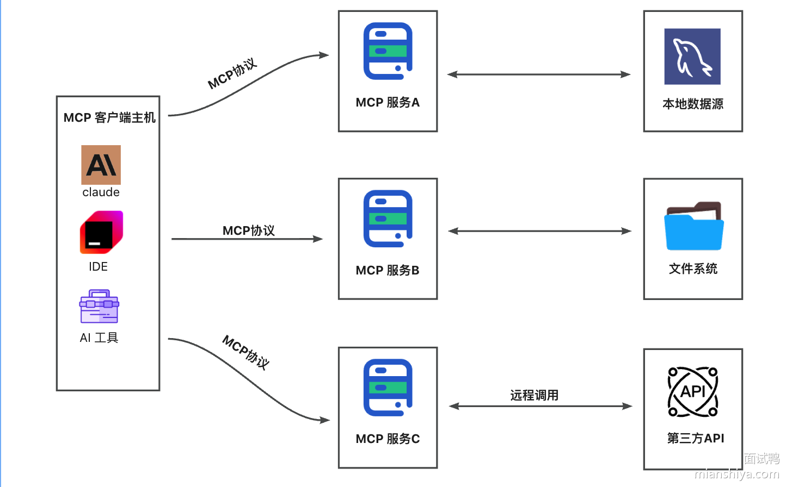

- **MCP 主机**：希望通过 MCP 访问数据的程序，例如 Claude Desktop、IDE 或 AI 工具
- **MCP 客户端**：与服务器保持 1:1 连接的协议客户端
- **MCP 服务器**：轻量级程序，通过标准化的 MCP 协议向客户端提供特定功能，如数据源、工具和API接口等。
- **本地数据源**：MCP 服务器可以安全访问用户的计算机文件、数据库和服务。
- **远程服务**：MCP 服务器可通过互联网（例如通过 API）连接到的外部系统。

#### 扩展知识

##### MCP Client

MCP Client 是连接大型语言模型（LLM）与 MCP Server 的桥梁，负责在模型与外部工具之间传递信息和协调操作。它的工作流程大致如下：

1）MCP Client 首先从 MCP Server 获取可用的工具列表。

2）当用户发起请求后，MCP Client 会将工具信息通过 Function Calling 的形式发送给 LLM。

3）LLM 接收到请求后，会根据上下文判断和工具描述是否需要调用工具，以及应当调用哪些工具。

4）如果需要使用工具，MCP Client 会代表模型通过 MCP Server 发起相应的工具调用。

5）工具执行完成后，结果会返回至 LLM，模型据此整合所有上下文信息并生成自然语言响应。

6）最终，MCP Client 将模型的响应返回给用户，完成整个交互闭环。

当前包括 Claude Desktop 和 Cursor 等产品已经支持 MCP Server 接入，它们自身即作为 MCP Client，负责与 MCP Server 建立连接并完成工具调用的上下文感知与执行逻辑。

##### MCP Server

MCP Server 是 MCP 架构的核心组件，主要负责向 LLM 提供结构化上下文和可调用的操作能力。它定义了三大类基础功能：

1）**Resources（资源）**：类似静态或动态的数据文档，例如 API 返回的 JSON 数据、配置文件、项目结构等，供模型查询和参考。

2）**Tools（工具）**：是模型可调用的函数接口（如发送请求、创建文档、执行命令等），执行前通常需要用户授权，以确保安全性和可控性。

3）**Prompts（提示）**：预定义的提示模板，用于引导模型完成特定任务，如代码审查、生成 commit message、总结会议内容等，提高交互效率和质量。

通过这三类能力，MCP Server 为语言模型提供了更丰富的上下文输入和更强的交互能力，使模型不仅能“看懂”信息，更能“动手”完成任务。

我们可以在社区维护的 [**MCP Servers Repository**] 和 [**Awesome MCP Servers**] 中找到大量开源的 MCP Server 实现示例。其中，使用 TypeScript 编写的 MCP Server 通常通过 `npx` 命令运行；而用 Python 编写的版本则可以通过 `uvx` 命令快速启动，非常方便开发与部署。

**参考文档：**

[MCP官方文档](https://modelcontextprotocol.io/introduction)

### MCP 协议支持哪两种模式？ 

#### 回答重点

MCP 协议支持两种主要的通信模式，即 **标准输入输出（Stdio）** 模式和 **服务器发送事件（SSE）** 模式。

1）标准输入输出（Stdio）模式：

基于 `stdio` 的实现是最常见的 MCP 客户端方案，它通过标准输入输出流与 MCP 服务器进行通信。这种方式简单直观，能够直接通过进程间通信实现数据交互，避免了额外的网络通信开销。特别适用于本地部署的 MCP 服务器，可以在同一台机器上启动 MCP 服务器进程，与客户端无缝对接。

2）服务器发送事件（SSE）模式：
 这个方案相较于 `stdio` 方式，`SSE` 更适用于远程部署的 MCP 服务器，比如分布式系统或需要网络实时推送的场景。客户端可以通过标准 HTTP 协议与服务器建立连接，实现单向的实时数据推送。基于 SSE 的 MCP 服务器支持被多个客户端的远程调用。

#### 扩展知识

##### 使用场景

**标准输入输出(stdio)：**

**1）命令行工具的开发**
 **2）本地系统集成**
 **3）简单的进程通信**
 **4）shell 脚本交互**

**服务器发送事件(SSE):**

1）服务器和客户端需要流式通信

2）在指定的网络环境中

3）MCP 客户端和 MCP 服务器不在同一台机器或者容器里

当然，MCP也支持自定义传输层的开发，只需实现Transport接口，可以自定义网络协议，优化传输性能，也可以通过特殊的传输通道进行通信。

##### 消息格式

MCP（模型上下文协议）要求通信格式遵循 `JSON-RPC 2.0` 标准，确保消息在各方之间能够准确传达。这就像为所有参与者统一了一套“规则”——无论是数据服务商、工具提供者，还是AI应用，都需按照这一规范与大模型进行交流。

一共有三种类型的消息使用了`JSON-RPC 2.0` 标准：

**请求**

```javascript
{
  jsonrpc: "2.0",
    id: number | string,
    method: string,
    params?: object
}
```

**响应**

```javascript
{
  jsonrpc: "2.0",
  id: number | string,
  result?: object,
  error?: {
    code: number,
    message: string,
    data?: unknown
  }
}
```

**通知**

```javascript
{
  jsonrpc: "2.0",
  method: string,
  params?: object
}
```

**参考文档：**

[MCP通信传输说明文档](https://modelcontextprotocol.io/docs/concepts/transports#custom-transports)

### MCP 与 Function Calling 的区别是什么？ 

#### 回答重点

##### MCP

**MCP** 是一个抽象层面的协议标准。它规定了上下文与请求的结构化传递方式，并要求通信格式符合 JSON-RPC 2.0 标准，它提供了标准化的通信机制，确保不同模型之间的兼容性。我们只需按照协议开发一次接口，即可被多个模型调用，避免了为每个模型单独适配的繁琐工作。

##### **Function Calling**

**Function Calling** 则是某些大模型（如 OpenAI 的 GPT-4）提供的特有接口特性。 它以特定的格式让 LLM 能产出一个函数调用请求，然后应用可以读取这个结构化的请求去执行对应的操作并返回结果。 但这个特性本身并不要求消息一定是 JSON-RPC 格式，也不一定遵守 MCP 的上下文管理方式。 它是由大模型服务提供商定义的一种调用机制，与 MCP 所定义的协议与标准没有内在依赖或直接关联。

##### 两者比较

其实 **MCP** 和 **Function Calling** 两者是完全不同层面的东西，MCP 是一个更底层、更通用的抽象标准，相当于一个基础设施，而 **Function Calling** 则是大模型一个特定的服务，更偏向与具体实现。以支付系统来举例子，以前的 **Function Calling** 相当于请求各个支付系统，微信，支付宝，银联，每个系统都需要单独对接，而 **MCP** 相当于支付网关，只需要对接支付网关，后面对接各种支付系统都是支付网关做，我们不用管。

因此 MCP 协议通过统一通信规范和资源定义标准，实现了“一次开发，全平台通用”的目标。借助 MCP，我们只需按照协议开发一次接口，便可无缝适配 ChatGPT、Deepseek 等不同模型，显著降低了集成成本和复杂性。

#### 扩展知识

**1）定位与层次**
 **MCP 协议**处于系统架构层面，类似于一个“桥梁”或“调度员”，主要任务是协调 LLM 与不同模块间的通信。它不仅传递请求和响应，还提供了资源（Resources）、工具（Tools）和提示（Prompts）等多种功能支持，确保各子系统间的标准化交互。
 **Function Calling**则嵌入在 LLM 内部，它允许模型在生成答案时根据上下文决定调用预先定义的外部函数，从而扩展模型的实际操作能力。

**2）功能与作用**
 **MCP 协议**通过提供统一的数据格式和通信接口，简化了系统各部分间的集成工作，使得我们能够一次性对接多种外部服务和数据源，提高系统的扩展性与维护性。
 **Function Calling** 主要目的是增强大模型的功能性，当模型在理解上下文后，发现需要借助外部信息或执行具体操作时，可直接触发相应函数，从而快速获得精确的结果。

**3）流程示意图**

**MCP 协议：**

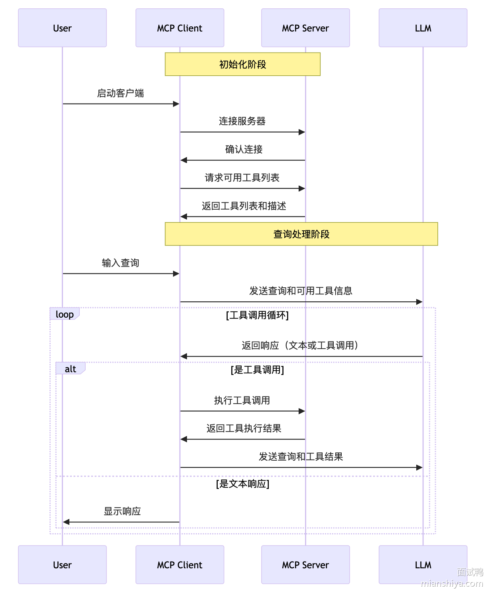

------

**Function Calling ：**

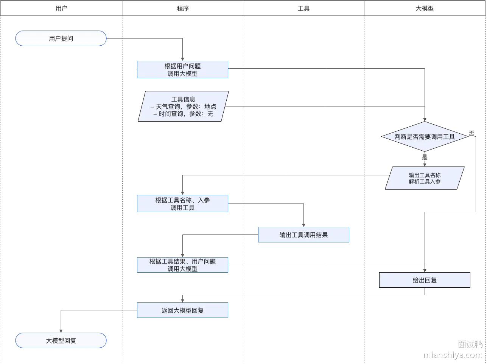

参考文档：

[MCP官方文档](https://modelcontextprotocol.io/introduction)

[阿里云Function Calling文档](https://bailian.console.aliyun.com/console?tab=doc#/doc/?type=model&url=https%3A%2F%2Fhelp.aliyun.com%2Fdocument_detail%2F2862208.html)

[OpenAI Function Calling 文档](https://platform.openai.com/docs/guides/function-calling?api-mode=chat)

### MCP 的工作流程是什么？

#### 回答重点

MCP 的工作流程如下：

**1）初始化连接**：主机应用程序（如 Claude Desktop 或 IDE 插件）启动并初始化 MCP 客户端，每个客户端与一个 MCP 服务器建立连接。

**2）获取工具列表**
 在系统初始化阶段，**MCP Client** 首先从 **MCP Server**获取可用的工具清单和能力描述。这些工具可以是 API、脚本、数据库查询方法等。这个步骤相当于“能力注册”，让模型知道有哪些可以用的“外部技能”。

**3）构造 Function Calling 请求**
 当用户输入一个问题后，MCP Client 会将这些工具描述（包括参数、用途、返回值等）一并传给 LLM。传输方式采用 **Function Calling**，即结构化地把“能用的函数长什么样”告诉模型，让它来决定是否要使用。

**4）模型智能判断是否调用工具**
 LLM 根据当前对话上下文以及工具信息判断是否要使用某个工具，并决定调用哪一个、传入什么参数。这个阶段完全由模型推理完成，比如它可以判断“这题需要查天气，那我就调用 **getWeather 工具”**。

**5）工具调用执行阶段**
 如果模型发起调用请求，**MCP Client** 会根据模型的选择，通过 **MCP Server**发起工具调用。这一步是真正的“执行动作”——MCP Server 去实际跑工具的逻辑，并把结果返回给客户端。

**6）结果返回与模型整合**
 工具执行结果（比如调用 API 得到的数据）被传回 LLM，由模型将这个结果与原始用户问题、已有上下文等信息整合，生成最终的自然语言回应。

**7）用户响应输出**
 最后，MCP Client 将模型生成的回答展示给用户，完成一次完整的“智能+工具”协作流程。


#### 扩展知识

1）**通信机制**：MCP 支持两种通信方式：标准输入输出（Stdio）和服务器发送事件（SSE）。Stdio 适用于本地进程间通信，启动速度快，适合开发调试；SSE 基于 HTTP 长连接，适用于需要实时数据推送的分布式系统。

2）**模块化设计**：MCP 的架构采用客户端-服务器模型，主机应用可以连接多个 MCP 服务器，每个服务器处理不同的资源和工具。这种模块化设计提高了系统的扩展性和可维护性。

3）**安全性**：MCP 通过标准化的数据访问接口，减少了直接接触敏感数据的环节，从而降低了数据泄露的可能性。例如，MCP 服务器自身控制资源，无需将密钥等敏感信息提供给大模型提供商，即使大模型提供商受到攻击，攻击者也无法获取这些敏感信息。

**参考文档：**

[MCP官方文档（MCP是如何工作的？）](https://modelcontextprotocol.io/faqs#how-does-mcp-work%3F)

### 在 Spring AI 框架中如何集成 MCP？ 

#### 回答重点

##### Spring AI MCP 介绍

**Spring AI MCP** 为模型上下文协议提供 **Java** 和**Spring 框架**集成。它使 Spring AI 应用程序能够通过标准化的接口与不同的数据源和工具进行交互，支持同步和异步通信模式。整体架构如下：

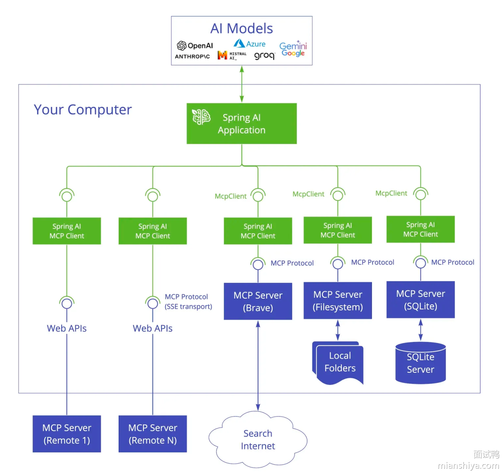

Spring AI 通过以下 Spring Boot 启动器提供 MCP 集成：

#### 客户端启动器

- spring-ai-starter-mcp-client 核心启动器提供 STDIO 和基于 HTTP 的 SSE 支持
- spring-ai-starter-mcp-client-webflux 基于WebFlux的SSE流式传输实现

#### 服务器启动器

- spring-ai-starter-mcp-server 核心服务器具有 STDIO 传输支持
- spring-ai-starter-mcp-server-webmvc 基于Spring MVC的SSE流式传输实现
- spring-ai-starter-mcp-server-webflux 基于WebFlux的SSE流式传输实现

### MCP 服务端（基于stdio标准流）

基于 `stdio` 的实现是最常见的 MCP 客户端方案，它通过标准输入输出流与 MCP 服务器进行通信。这种方式简单直观，能够直接通过进程间通信实现数据交互，避免了额外的网络通信开销。特别适用于本地部署的 MCP 服务器，可以在同一台机器上启动 MCP 服务器进程，与客户端无缝对接。

#### 引入依赖

```xml
<dependency>
  <groupId>org.springframework.ai</groupId>
  <artifactId>spring-ai-mcp-server-spring-boot-starter</artifactId>
  <version>1.0.0-M6</version>
</dependency>
```

#### 配置MCP服务端

```yaml
spring:
  application:
    name: mcp-server
  main:
    web-application-type: none # 必须禁用web应用类型
    banner-mode: off # 禁用banner
  ai:
    mcp:
      server:
        stdio: true # 启用stdio模式
        name: mcp-server # 服务器名称
        version: 0.0.1 # 服务器版本
```

#### 实现MCP工具

`@Tool`是 Spring AI MCP 框架中用于快速暴露业务能力为AI工具的核心注解，该注解实现Java方法与MCP协议工具的自动映射，并且可以通过注解的属性`description`，有助于人工智能模型根据用户输入的信息决定是否调用这些工具，并返回相应的结果。

```java
@Service
public class OpenMeteoService {

    @Tool(description = "根据经纬度获取天气预报")
    public String getAirQuality(
        @ToolParameter(description = "纬度，例如：39.9042") String latitude,
        @ToolParameter(description = "经度，例如：116.4074") String longitude) {

        // 模拟数据，实际应用中应调用真实API
        return "当前位置（纬度：" + latitude + "，经度：" + longitude + "）的天气信息：\n 多云转阴";
    }
}
```

这个工具方法主要是用来**根据经纬度获取天气预报**的，这里为了方便演示，写了模拟数据。

#### 注册MCP工具

最后向 MCP 服务注册刚刚写的工具：

```java
@Bean
public ToolCallbackProvider serverTools(OpenMeteoService openMeteoService) {
    return MethodToolCallbackProvider.builder().toolObjects(openMeteoService).build();
}
```

这段代码定义了一个 Spring 的`Bean`，用于将查询天气服务`OpenMeteoService`中所有用 `@Tool`注解标记的方法注册为工具，供 AI 模型调用。`ToolCallbackProvider`是 Spring AI 中的一个接口，用于定义工具发现机制，主要负责将那些使用 `@Tool` 注解标记的方法转换为工具回调对象，并提供给 ChatClient 或ChatModel 使用，以便 AI 模型能够在对话过程中调用这些工具。

#### 运行服务端

MCP服务端写完之后，直接打包运行：

```bash
mvn clean package -DskipTests
```

### MCP 客户端（基于stdio标准流）

#### 引入依赖

```xml
<dependency>
  <groupId>org.springframework.ai</groupId>
  <artifactId>spring-ai-mcp-client-spring-boot-starter</artifactId>
  <version>1.0.0-M6</version>
</dependency>
```

#### 配置MCP服务器

因为刚刚服务端是通过`stdio`实现的，需要在`application.yml`中配置MCP服务器的一些参数：

```yaml
spring:
  ai:
    mcp:
      client:
        stdio:
          # 指定MCP服务器配置文件
          servers-configuration: classpath:/mcp-servers-config.json
  mandatory-file-encoding: UTF-8
```

其中`mcp-servers-config.json`的配置如下：

```json
{
  "mcpServers": {
    "weatherServer": {
      "command": "java",
      "args": [
        "-Dspring.ai.mcp.server.stdio=true",
        "-Dspring.main.web-application-type=none",
        "-Dlogging.pattern.console=",
        "-jar",
        "/Users/gulihua/Documents/mcp-server/target/mcp-server-0.0.1-SNAPSHOT.jar"
      ],
      "env": {}
    }
  }
}
```

这个配置文件设置了MCP客户端的基本配置，包括Java命令参数，服务端jar包的绝对路径等。上述的 JSON 配置文件也可以直接写在`application.yml`里，效果是一样的。

```yaml
    mcp:
      client:
        stdio:
         connections:
           server1:
             command: java
             args:
               - -Dspring.ai.mcp.server.stdio=true
               - -Dspring.main.web-application-type=none
               - -Dlogging.pattern.console=
               - -jar
               - /Users/gulihua/Documents/mcp-server/target/mcp-server-0.0.1-SNAPSHOT.jar
```

客户端我们使用阿里巴巴的通义千问模型，所以引入`spring-ai-alibaba-starter`依赖，如果使用的是其他的模型，也可以使用对应的依赖项，比如`openAI`引入`spring-ai-openai-spring-boot-starter` 这个依赖就行了。

配置大模型的密钥等信息：

```yaml
spring:
  ai:
    dashscope:
      api-key: ${通义千问的key}
      chat:
        options:
          model: qwen-max
```

#### 初始化聊天客户端

```java
@Bean
public ChatClient initChatClient(ChatClient.Builder chatClientBuilder,
                                 ToolCallbackProvider mcpTools) {
    return chatClientBuilder
    .defaultTools(mcpTools)
    .build();
}
```

该代码定义了一个 `Spring Bean`，用于初始化一个AI 聊天客户端，里面有两个参数，`ChatClient.Builder`是 Spring AI 提供的 AI 聊天客户端构建器，用于构建 ChatClient 实例，是由 Spring AI自动注入的，另一个是`ToolCallbackProvider`，用于从MCP客服端发现并获取AI工具。

然后就可以通过这个`ChatClient`去调用了：

```java
chatClient.prompt()
.user(request.getContent())
.call()
.content();
```

### MCP 服务端（基于SSE）

除了基于 `stdio` 的实现外，Spring AI 还提供了基于 Server-Sent Events (SSE) 的 MCP 客户端方案。相较于 `stdio` 方式，SSE 更适用于远程部署的 MCP 服务器，客户端可以通过标准 HTTP 协议与服务器建立连接，实现单向的实时数据推送。基于 SSE 的 MCP 服务器支持被多个客户端的远程调用。

#### 引入依赖

```xml
<dependency>
  <groupId>org.springframework.ai</groupId>
  <artifactId>spring-ai-mcp-server-webflux-spring-boot-starter</artifactId>
  <version>1.0.0-M6</version>
</dependency>
```

#### 配置MCP服务端

```yaml
server:
  port: 8090

spring:
  application:
    name: mcp-server
  ai:
    mcp:
      server:
        name: mcp-server # MCP服务器名称
        version: 0.0.1   # 服务器版本号
```

除了引入的依赖包不一样，以及配置文件不同，其他的不需要修改。

#### 运行服务端

MCP服务端写完之后，直接打包运行：

```bash
mvn clean package -DskipTests
```

运行MCP服务端

```bash
▼bash

复制代码java -jar target/mcp-server-0.0.1-SNAPSHOT.jar --spring.profiles.active=prod
```

打开 http://127.0.0.1:8090/sse，看下如果响应是下面这个，那就是部署成功了。

```yaml
▼yaml复制代码event:endpoint
data:/mcp/message
```

### MCP 客户端（基于SSE）

#### 引入依赖

```xml
<dependency>
  <groupId>org.springframework.ai</groupId>
  <artifactId>spring-ai-mcp-client-webflux-spring-boot-starter</artifactId>
  <version>1.0.0-M6</version>
</dependency>
```

#### 配置MCP服务器

因为刚刚服务端是通过SSE实现的，需要在`application.yml`中配置MCP服务器的URL端口：

```yaml
spring:
  ai:
    mcp:
      client:
        enabled: true
        name: mcp-client
        version: 1.0.0
        request-timeout: 30s
        type: ASYNC # 类型同步或者异步
        sse:
          connections:
            server1:
              url: http://localhost:8090
```

和MCP服务端的修改一样， 除了依赖和配置的修改，其他的也不需要调整。

#### 扩展知识

除了上面基础的用法和配置，还应该考虑以下几个方面：

##### 工具设计

1）每个工具方法应具备明确的功能定义及参数说明。

2）使用 `@Tool` 注解提供清晰、完整的工具描述，便于自动生成文档或展示给前端。

3）使用 `@ToolParameter` 注解详细说明每个参数的用途，提升使用者的理解与正确性。

##### 错误处理

1）应全面捕获并妥善处理可能出现的异常，防止服务崩溃。

2）返回结构化、具备可读性的错误信息，便于客户端识别错误原因并进行相应处理。

##### 性能优化

1）对于可能耗时的任务，建议使用异步处理机制，避免阻塞主线程。

2）设置合理的超时时间，防止客户端长时间等待，提高系统响应性和稳定性。

##### 安全性考虑

1）对涉及敏感资源或关键操作的工具方法，应添加严格的权限校验逻辑。

2）禁止在工具方法中执行高风险操作（如执行任意系统命令），以防止安全漏洞。

##### 部署策略

**1）Stdio 模式**：适用于嵌入式场景，可作为客户端的子进程运行，便于集成与资源控制。

**2）SSE 模式**：更适合部署为独立服务，支持多个客户端同时访问，适用于需要持续通信的远程调用场景。

**参考文档：**

[Spring AI 阿里巴巴 MCP 文档](https://java2ai.com/docs/1.0.0-M5.1/tutorials/mcp/?spm=4347728f.386ad11.0.0.5f756266kUUgiv)

[Spring AI MCP 官方文档](https://docs.spring.io/spring-ai/reference/api/mcp/mcp-overview.html)

### MCP 协议安全性设计包含哪些层面？ 

#### 回答重点

**MCP**协议的安全性设计涵盖多个关键方面，旨在确保大模型系统在与外部工具和资源交互时的安全性和可靠性。MCP 的安全性设计主要包括以下几个方面：

**1）用户同意和控制**

所有模型对工具、资源和提示的访问请求都必须经过用户的授权。主机负责管理权限、提示用户批准，并在必要时阻止未经授权的访问。用户必须知道哪些数据是需要提供给大模型的，用户在授权使用之前应该了解每个工具的功能。

**2）隔离与沙箱机制**

MCP 的设计将实际工具调用封装在 MCP Server 内部，模型本身无法直接访问敏感数据，这种 “中间层”设计有效地降低了直接暴露内部业务系统的风险。同时，沙箱机制可以限制工具调用的执行环境，防止任意代码执行或恶意操作对系统造成破坏。

**3）加密传输与来源验证**

MCP 内置了安全机制，确保只有经过验证的请求才能访问特定资源，相当于在数据安全又加上了一道防线。同时，MCP协议还支持多种加密算法，以确保数据在传输过程中的安全性。

#### 扩展知识

除了以上这些，我们在开发时应该还要考虑以下几个方面：

**1）密钥加密处理**

有些的 MCP 服务是需要输入第三方服务的密钥的，比如高德导航MCP，需要输入开放平台申请的key，客服端和服务器端传输的过程可能有泄露的风险，应该使用某种签名或者加密算法来保障数据安全。

**2）模型诱导攻击**

攻击者可能通过精心设计的提示词诱导模型执行不当的操作，例如泄露敏感信息或调用危险的工具。为防范此类攻击，建议在主机层面实施提示词过滤和上下文审查机制。

**3）日志记录与调用链追踪**

MCP 客服端和服务端都要记录每一次工具调用的详细日志，包括请求参数、响应结果和执行时间等信息，便于后续的实时监控和问题排查。

参考文档：

[MCP官方文档（MCP安全与信任）](https://modelcontextprotocol.io/specification/2025-03-26)

### 如何将已有的应用转换成 MCP 服务？ 

#### 回答重点

要将现有应用转换为 MCP 服务，需将其功能封装为标准化的 MCP 工具（Tools）、资源（Resources）或提示（Prompts），并通过 MCP Server 对外暴露。这一过程涉及以下关键步骤：

1）**梳理功能模块**：识别应用中要提供给外部调用的功能，如 API 接口、数据查询、文件处理等。

2）**创建单独的MCP 服务：\**创建一个\**新的MCP 服务**，与已有的业务服务隔离开，通过单独的 API 或者 SDK 和业务服务通信。

3）**导入依赖**如果是java，导入`spring-ai-mcp`对应的依赖，如果是其他语言，可以参考官网示例导入：https://modelcontextprotocol.io/introduction

4）**定义工具**：定义 MCP 服务需要包含的工具功能描述、方法入参字段和描述、方法返回的字段和描述。

3）**实现 MCP Server**：根据 MCP 协议规范，构建一个 MCP Server，负责接收 MCP 客户端请求、调用相应功能模块，并返回结果。

#### 扩展知识

MCP 的设计初衷是解决传统 LLM 应用中集成外部工具和数据源的复杂性问题。通过标准化的协议和接口，MCP 使得模型能够动态发现和调用外部功能，提升了系统的灵活性和可扩展性。

在实际应用中，MCP 已被广泛采用。例如，Claude Desktop 应用通过 MCP 实现了对本地文件系统的访问，高德地图利用 MCP 提供了位置服务、路线规划和地点详细信息，支付宝通过 MCP 轻松实现收单支付服务。

此外，MCP 支持多种编程语言的 SDK，包括 Python、TypeScript、Java、C#、Swift 和 Rust，我们可以根据自身技术栈选择合适的工具进行开发。

MCP 的设计是将实际工具调用封装在 MCP Server 内部，模型本身无法直接访问敏感数据，这种中间层的设计也能够有效地降低了直接暴露内部业务系统的风险。

**参考文档：**

[Spring AI 阿里巴巴 MCP 文档](https://java2ai.com/blog/spring-ai-mcp-marketplace/)

### 什么是大模型的"涌现能力"？列举三种典型表现并解释其可能成因

#### 回答重点

大模型的涌现能力（Emergent Abilities）是指在模型规模达到某个临界值后突然出现的、在小规模模型中不存在的能力。这种能力的出现往往是不可预测的，无法通过简单外推小模型的性能来预测。

##### 1）思维链推理（Chain-of-thought）

这是一种在解决复杂问题时能够像人类一样展示推理过程的能力。当模型规模达到一定程度（约 10^22 FLOPs）后，模型能够生成中间推理步骤，大幅提升在数学应用题等多步骤推理任务上的表现。

##### 2）指令跟随能力

模型能够准确理解和执行自然语言指令，无需像小模型那样依赖大量示例。这种能力在大规模模型中表现得更为突出，能够理解更复杂的指令并产生符合要求的输出。

##### 3）多任务理解与迁移

大模型展现出了强大的跨任务泛化能力，能够在没有专门训练的情况下完成新的任务。比如在 MMLU（Massive Multi-task Language Understanding）测试中，大模型可以回答涉及数学、历史、法律等多个领域的问题。

#### 扩展知识

##### 1）涌现能力的成因分析

模型规模突破阈值：研究表明，当模型的参数量和计算量达到特定阈值时，性能会出现质的飞跃。这种现象类似于物理学中的相变。

隐式知识编码：大模型通过海量文本训练，能够捕获和编码复杂的知识结构，形成类似人类认知的知识表示。

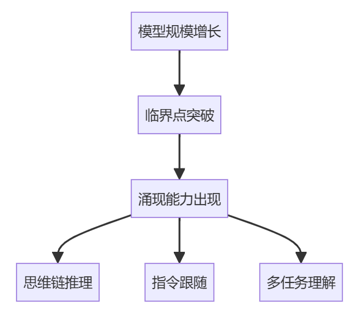

##### 2）性能曲线特征

在模型规模增长过程中，涌现能力的表现通常遵循以下模式： 1）在达到临界规模之前，模型表现接近随机水平 2）突破临界点后，性能急剧提升 3）提升幅度往往超出线性预期

##### 3）实际应用案例

算术能力：研究显示，在 8 位数加法等任务中，大模型能够展现出类似程序执行的能力。

语义理解：在 WordinContext（WiC）测试中，大模型能够准确理解词语在不同语境下的含义。

真实性判断：在 TruthfulQA 基准测试中，大规模模型展现出更强的事实判断能力。

##### 4）未来研究方向

1）探索是否存在其他方式来激发涌现能力，而不仅依赖于规模扩张 2）研究涌现能力的理论基础和内部机制 3）评估可能随规模增长出现的潜在风险

相关文档： Stanford HAI：https://hai.stanford.edu/news/examining-emergent-abilities-large-language-models Google Research：https://research.google/blog/characterizing-emergent-phenomena-in-large-language-models/

### 要让AI生成一个带表单验证的Vue3组件，请写出包含以下要素的Prompt 

#### 回答重点

首先，我们需要明确编写一个好的 Prompt 需要以下几个关键要素：

##### 1）技术栈和版本

需要明确指定使用 Vue3 的 Composition API，这样可以确保生成的代码符合最新的开发规范。

##### 2）功能需求

表单验证的具体要求：

- 邮箱格式校验
- 错误提示的展示位置和方式
- 提交按钮的状态控制

##### 3）代码规范和最佳实践

生成的代码需要遵循 Vue3 的开发规范和最佳实践。

基于以上要素，一个完整的 Prompt 示例如下：

```plaintext
请使用 Vue3 的 Composition API 创建一个表单组件，要求如下：

1）组件结构：

- 包含一个邮箱输入框和提交按钮
- 使用 Element Plus 作为 UI 组件库
- 代码需要包含必要的类型声明

2）表单验证：

- 实现邮箱格式的合法性校验
- 错误提示信息需要显示在输入框下方
- 使用 vuelidate 或 VeeValidate 进行表单验证

3）交互优化：

- 提交按钮在表单验证未通过时禁用
- 提交过程中按钮显示 loading 状态
- 防止重复提交

4）代码要求：

- 使用 TypeScript
- 遵循 Vue3 组件命名规范
- 添加必要的代码注释
- 确保代码的可维护性和可测试性
```

#### 扩展知识

##### 1）为什么要在 Prompt 中明确技术栈

在编写 Prompt 时明确技术栈可以帮助 AI 更好地理解上下文，生成更符合实际需求的代码。比如指定使用 Composition API 而不是 Options API，这样可以确保生成的代码符合 Vue3 的最新实践。

##### 2）表单验证库的选择

Vue3 生态中常用的表单验证库：

VeeValidate：

- 完整的表单验证解决方案
- 支持 Composition API
- 内置常用验证规则
- 支持异步验证

Vuelidate：

- 轻量级验证库
- 易于集成
- 自定义验证规则灵活

##### 3）编写高质量 Prompt 的技巧

1）明确输出格式：

- 指定代码风格（如使用 TypeScript）
- 要求添加注释和文档
- 说明代码组织方式

2）提供上下文：

- 说明组件的使用场景
- 指定依赖的第三方库
- 描述预期的交互行为

3）设定约束条件：

- 性能要求
- 兼容性要求
- 代码规范要求

4）注意细节：

- UI 组件的具体表现
- 错误处理方式
- 状态管理方案

相关文档：

- Vue3 官方文档：https://vuejs.org/
- VeeValidate 文档：https://vee-validate.logaretm.com/v4/
- Element Plus 文档：https://element-plus.org/

### 什么是 A2A 协议，它的核心架构及主要组件有哪些？ 

#### 回答重点

**A2A（Agent-to-Agent）协议**是由 Google 主导开发的开放协议，旨在实现不同 AI 智能体之间的互操作性，使它们能够跨平台、跨框架地协作。其核心架构包括以下主要组件：

大模型的 Agent2Agent（A2A）协议是一个开放的标准协议，旨在实现不同 AI 代理之间的互联互通。其核心架构包括以下主要组件：

1）**Agent Card（代理卡片）**：一个公开的 JSON 文件，描述代理的能力、技能、端点 URL 和身份验证要求，用于客户端发现代理。

2）**A2A Server（A2A 服务器）**：实现 A2A 协议方法的 HTTP 端点，接收请求并管理任务执行。

3）**A2A Client（A2A 客户端）**：发送请求（如 `tasks/send`）到 A2A 服务器的应用程序或其他代理。

4）**Task（任务）**：客户端发起的工作单元，具有唯一的 ID，并通过状态（如 `submitted`、`working`）进行跟踪。

5）**Message（消息）**：客户端与代理之间的通信回合，包含 `Parts`。

6）**Part（部分）**：消息或工件中的基本内容单元，可以是文本、文件或结构化 JSON。

7）**Artifact（工件）**：代理在任务中生成的输出（如生成的文件、最终的结构化数据）。

8）**Streaming（流式传输）**：对于长时间运行的任务，支持使用 `tasks/sendSubscribe`，客户端通过服务器发送事件（SSE）接收任务状态更新。

9）**Push Notifications（推送通知）**：支持的服务器可以主动将任务更新发送到客户端提供的 webhook URL。

A2A 协议采用 JSON-RPC 2.0 通过 HTTP 进行消息交换，对于流式传输，使用 SSE 协议。

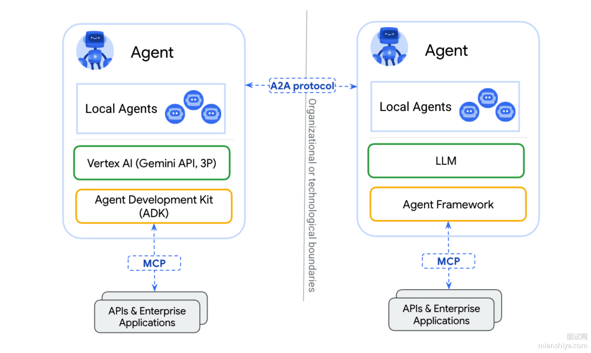

#### 扩展知识

A2A 协议的设计旨在解决企业中不同框架和供应商构建的代理之间的协作问题。通过标准化的通信方式，A2A 使得不同的 AI 代理能够跨平台、跨供应商地协作，提升了多代理系统的效率和可维护性。

与 Anthropic 的 Model Context Protocol（MCP）相比，A2A 更侧重于代理之间的直接通信和任务协调，而 MCP 提供上下文信息和工具支持。这两者可以互补，共同推动企业级 AI 代理的协作能力。

在实际应用中，A2A 协议可以用于构建模块化的 AI 系统，使得不同功能的代理能够独立开发和部署，同时又能通过标准化的协议进行协作。例如，在一个企业的客户服务系统中，查询代理、推荐代理和处理代理可以通过 A2A 协议协同工作，共同完成复杂的客户服务任务。

##### 相关论文与扩展阅读链接

1）[Announcing the Agent2Agent Protocol (A2A)](https://developers.googleblog.com/en/a2a-a-new-era-of-agent-interoperability)

2）[谷歌Github A2A开源项目](https://github.com/google/A2A)

3）[谷歌A2A官网](https://google.github.io/A2A/#/)

### 什么是 CoT 思维链？如何实现 CoT 思维链？ 

CoT（Chain of Thought）思维链的目的是让 AI 像人类一样 “思考”，在处理复杂问题的时候，引导模型展示推理过程，按步骤进行思考，从而提高回答的准确性，尤其对于复杂的推理类问题效果更佳。与此同时，让模型展示推理过程也可以帮助我们理解和优化 AI 的决策路径。

为了实现 CoT 思维链，我们通常会在输入 Prompt 时加入特定的引导语。OpenManus 项目的早期版本就使用了特定的系统提示词来实现 CoT。

除了直接在系统提示词中给出指令外，还可以结合 few-shot learning 的技巧，也就是在 Prompt 中提供一两个包含清晰思维链的问题和答案示例，直接让模型学习如何构建和展示自己的思维链。


## 智能体

### ReAct 是什么？说说它的原理

#### 回答重点

ReAct（Reasoning and Acting）是一种基于大语言模型的智能体框架，它让模型在生成回答时**交替输出“思考”和“行动”** 步骤，从而在内部推理与外部交互之间形成闭环，能够边“想”边“做”来完成复杂任务。

**核心原理**

1. **推理（Reasoning）**：模型先通过自然语言生成 “思考过程”，明确是否需要工具、需要什么工具、输入什么参数。
2. **行动（Action）**：根据当前思路选择合适的操作（如调用搜索、工具 API、环境交互等），并输出具体的指令。
3. **观察（Observation）**：执行 Action 后，系统将返回的结果（网页片段、环境反馈等）提供给模型。
4. **循环迭代**：将 Observation 附加到上下文，模型在新的上下文中继续“思考→行动→观察”循环，直到输出最终答案或结束指令

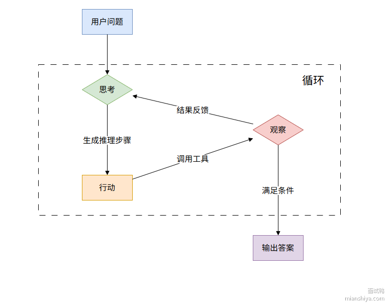

和它对应的是传统链式思维（Chain-of-Thought，CoT）只能线性推导，而 ReAct 允许在行动失败后重试或切换方案。

#### 扩展知识

##### 与 Chain-of-Thought（CoT）的区别

- **CoT** 只关注在“Thought”阶段进行长链推理，不支持任何外部交互，容易因缺乏新信息而“凭空想象”或推理死循环。
- **ReAct** 在推理中融入“行动”，能调用搜索、数据库、模拟环境等工具，实时获取新证据，减少幻觉与错误传播

##### Prompt 模板示例

```text
Question: 今天杭州的天气如何？
Thought 1: 我需要调用天气 API 获得当前气温和状况
Action 1: WeatherAPI[Hangzhou, today]
Observation 1: 21°C，多云
Thought 2: 根据天气情况给出建议
Action 2: Finish[“今天杭州多云，适合外出，但记得备伞。”]
```

##### 相关文档与扩展阅读链接

- [ReAct: Synergizing Reasoning and Acting in Language Models](https://arxiv.org/abs/2210.03629)
- [ReAct-LM](https://react-lm.github.io/)

### Copilot 模式和 Agent 模式的区别是什么？ 

#### 回答重点

1）**Agent（代理智能体模式）**：主要可以自主驱动，大模型独立拆解任务（如规划旅行行程）、调用工具（如API、数据库）完成端到端操作。

比如，用户仅需设定目标（如“安排下周会议”），Agent自主规划、执行并反馈结果。

2）**Copilot（副驾驶协助模式**）：大模型作为“助手”提供实时建议（如代码补全、文案润色），但用户保留最终决策权。

比如，用户明确输入需求（如“写一段 Java 排序代码”），然后多轮交互优化结果

其实还有个 **Embedding(嵌入模式)**，主要是后台辅助，将大模型作为“隐藏组件”集成到现有系统中（如推荐算法、搜索优化），用户无感知。

一句话总结：Embedding是“隐形的数据助手”，Copilot是“协作的智能搭档”，Agent是“全能的AI管家”。

表格对比：

| 维度     | Embedding              | Copilot                | Agent                       |
| -------- | ---------------------- | ---------------------- | --------------------------- |
| 交互方式 | 后台运行，用户无感知   | 需用户持续输入指令     | 仅需初始目标，自动闭环执行  |
| 自主性   | 无自主性，被动响应请求 | 协作型，依赖用户反馈   | 高度自主，独立拆解任务链    |
| 核心技术 | 微调模型、API集成      | 提示工程、多轮交互优化 | 规划/记忆/工具调用/强化学习 |
| 典型场景 | 智能搜索、推荐系统     | 代码生成、文档辅助     | 自动化测试、智能客服        |

### 请举例说明假设在电商系统中，哪些功能适合直接使用大模型完成，哪些需要结合工程化手段？ 

#### 回答重点

在电商系统中，大模型的应用需要根据场景特点来区分使用方式：

##### 1）适合直接使用大模型的场景

用户咨询解答：利用大模型的自然语言理解和生成能力，直接处理用户的开放性问题。

商品描述生成：基于商品基础信息，生成富有营销感的商品文案。

个性化回复：根据用户画像和历史交互，生成有温度的客服回复。

##### 2）需要结合工程化手段的场景

商品检索和推荐：需要结合数据库查询、规则过滤等工程手段来保证准确性和性能。

商品参数问答：由于商品参数高度结构化，需要先用专门的匹配模型筛选相关属性。

价格区间筛选：对于数值范围的查询，需要使用数据库的范围查询功能。

#### 扩展知识

##### 1）工程化结合方案详解

RAG 技术应用：

检索系统设计：建立支持FAQ知识、文档和表格数据的混合检索系统。

规则生成：让大模型基于用户问题生成查询规则，再用规则匹配数据。


##### 2）性能优化策略

向量检索优化：对商品ID、型号等特殊字段进行专门的向量模型训练。

分层过滤：先用规则过滤大部分不相关数据，再使用大模型处理剩余数据。

token控制：对超长内容进行智能裁剪，确保不超过模型的token限制。

##### 3）实际应用案例

客服场景：

1）淡旺季客服人员配置不同，可以用大模型+工程化手段来提升效率。

2）新手客服培训时，用大模型作为copilot辅助工具。

3）通过引入rerank和人设，优化客服回复的质量。

商品推荐场景：

1）结合用户行为数据和商品知识，生成个性化推荐。

2）使用规则引擎处理价格、规格等结构化筛选。

3）大模型负责生成推荐理由和营销文案。

##### 4）注意事项

1）大模型不适合直接处理大量结构化数据的检索任务。

2）需要合理控制大模型调用成本。

3）工程化手段要考虑系统的可扩展性。

4）要建立完善的监控和反馈机制。

参考文档：

- [RAG+大模型在电商客服领域-商品推荐的应用](https://www.baihezi.com/post/222615.html)
- [底层技术大揭秘！AI智能导购如何重塑购物体验](https://developer.aliyun.com/article/1643815)

### 假设请你设计一个医疗问诊系统，如何平衡AI幻觉带来的风险与效率提升？需要哪些技术手段？ 

#### 回答重点

在医疗问诊系统中平衡AI幻觉风险与效率需要多层次防护机制。首先应采用RAG技术，通过检索医学知识库提供可靠信息源；其次实施严格的提示工程和边界控制，明确定义AI可回答范围；再次建立多级人机协作模式，让医生监督和干预AI决策；最后实施持续的模型评估和优化。技术手段包括知识图谱增强理解、多模态融合提高准确性、不确定性量化帮助识别风险区域，以及可解释性工具让医生理解AI推理过程。

#### 扩展知识

##### 1）AI幻觉现象与医疗风险

AI幻觉是指大语言模型生成看似正确但实际与事实不符的内容。在医疗场景中，这种风险尤为严重，可能导致错误诊断建议、虚构药物信息或治疗方案，甚至可能因此延误患者治疗时机。

问诊场景中可能比较常见的AI幻觉类型：

- 症状关联幻觉：将不相关症状错误关联到特定疾病
- 治疗方案幻觉：生成看似合理但实际不存在的治疗方法
- 药物信息幻觉：提供错误的药物剂量、禁忌或副作用信息
- 疾病进展幻觉：对疾病发展过程做出不准确预测

##### 2）技术层面的应对方案

###### RAG (检索增强生成)技术实施

RAG技术是解决医疗AI幻觉的核心手段，它能确保生成内容有可靠信息源支持：


具体实现方法：

- 建立高质量医学知识库，包含权威医学文献、指南和药物说明书
- 使用BM25、向量检索等方法获取相关医学知识
- 构建问题-证据-答案三元组，确保每个回答都有对应证据支持
- 实现医学领域专用的嵌入模型，提高检索相关性

代码示例（基于LangChain构建医疗RAG系统）：

```python
from langchain.embeddings import OpenAIEmbeddings
from langchain.vectorstores import Chroma
from langchain.llms import OpenAI
from langchain.chains import RetrievalQA

# 创建医学文档的向量存储
embeddings = OpenAIEmbeddings()
medical_db = Chroma(
    collection_name="medical_knowledge",
    embedding_function=embeddings
)

# 构建检索增强的问答系统
retriever = medical_db.as_retriever(
    search_type="similarity",
    search_kwargs={"k": 5}  # 检索5个最相关的文档
)

# 添加医学专用的系统提示
system_prompt = """你是一个医疗助手。只回答与检索到的医学知识相关的问题。
如果不确定，明确说明"我无法基于可靠信息回答这个问题"。
不要编造任何医学信息。"""

# 创建基于检索的问答链
qa_chain = RetrievalQA.from_chain_type(
    llm=OpenAI(temperature=0),
    chain_type="stuff",
    retriever=retriever,
    chain_type_kwargs={
        "prompt": system_prompt
    }
)
```

###### 提示工程与边界控制

精细的提示工程可以显著减少AI幻觉：

- 使用结构化输入模板，将患者信息规范化
- 设置医学专用系统提示，强化事实依据约束
- 实施输出格式控制，减少自由发挥空间
- 添加不确定性标记机制，允许模型表达知识边界

系统提示示例：

```markdown
你是医疗问诊助手，遵循以下原则：
1. 只回答检索到的医学知识范围内的问题
2. 对每个医学观点必须注明可靠来源
3. 清晰标记确定性级别([高确定]、[中等确定]、[低确定])
4. 遇到超出知识范围的问题，回复"此问题需要专业医生评估"
5. 禁止生成具体诊断、处方和治疗建议
```

###### 知识图谱增强

医学知识图谱可以作为事实检验的权威数据源，有效防止幻觉：

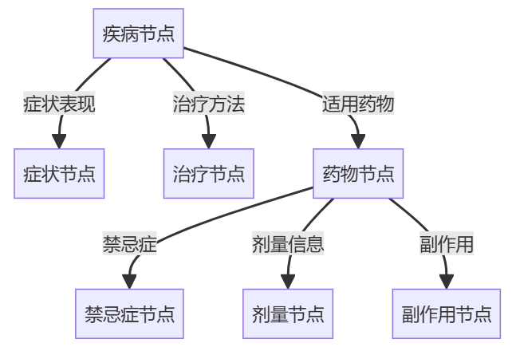

实施方法：

- 将医学实体和关系构建成结构化知识图谱
- 问答过程中进行图谱查询验证信息准确性
- 使用SPARQL等查询语言从知识图谱获取精确答案
- 设计图谱感知的推理机制，遵循医学关系约束

###### 多模态融合与交叉验证

单一模态容易产生幻觉，多模态交叉验证可提高可靠性：

- 文本+图像：对皮肤病变等可见症状进行图像分析辅助问诊
- 结构化数据+自然语言：将患者电子病历数据与问诊内容结合分析
- 语音+文本：分析患者语音特征（如咳嗽声、呼吸音）辅助判断

实现示例（伪代码）：

```python
def multimodal_verification(text_prediction, medical_data, patient_images=None):
    # 文本模型预测结果
    text_results = text_model.predict(user_query)
    
    # 结构化数据验证
    ehr_consistency = verify_with_ehr(text_results, patient_medical_records)
    
    # 图像数据验证（如有）
    if patient_images:
        image_results = medical_image_model.analyze(patient_images)
        image_consistency = compare_text_image_results(text_results, image_results)
    
    # 综合不同模态的结果，降低幻觉风险
    final_confidence = calculate_cross_modal_confidence(
        text_results, ehr_consistency, image_consistency
    )
    
    # 低置信度内容被过滤或标记
    if final_confidence < CONFIDENCE_THRESHOLD:
        return "需要更多信息或专业医生评估"
    
    return verified_response
```

##### 3）人机协作体系设计

###### 多级审核机制

构建层级化的审核流程保障医疗安全：

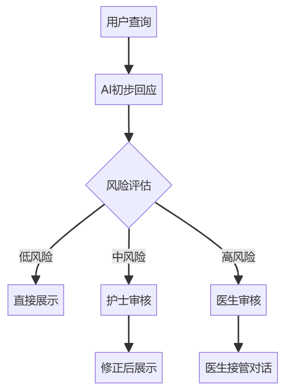

实施要点：

- 设计风险评分算法，对AI回答进行实时风险分级
- 建立医护人员快速介入机制，实现无缝交接
- 实现人机协作界面，方便医护人员高效审核和修正

###### 可解释性工具

为医疗团队提供AI决策解释工具，帮助快速识别潜在幻觉：

- 生成证据链追踪，展示每个结论的支持证据
- 实现关键词高亮，标记关键医学术语及其来源
- 提供类似案例参考，帮助医生评估AI推理正确性

##### 4）持续评估与迭代优化

###### 幻觉检测系统

建立专门针对医疗幻觉的检测机制：

- 设计针对常见医疗幻觉类型的测试集
- 使用对抗样本检测边界情况的幻觉风险
- 实施语义一致性评估，检查回答内部逻辑冲突
- 部署基于规则的医学事实检查器校验基础医学知识

###### 反馈收集与模型更新

通过闭环反馈持续提升系统质量：

- 建立医生反馈渠道，标记并收集AI幻觉案例
- 设计患者反馈机制，了解实际使用体验
- 定期更新知识库和模型，适应医学新发现
- 针对发现的幻觉模式进行专项微调训练

##### 5）法律与伦理考量

医疗AI系统需要特别关注合规性：

- 明确责任边界，确保AI定位为辅助工具而非替代医生
- 提供隐私保护机制，保障患者数据安全
- 实施公平性评估，确保不同人群获得同等质量服务
- 保持完整审计日志，支持可能的医疗纠纷调查

##### 6）实际应用案例分析

成功的医疗问诊AI系统通常采用多层次防护策略：

- Mayo Clinic的问诊助手：采用严格的RAG系统和三级医护审核机制
- Babylon Health：使用医学知识图谱验证临床推理过程
- Ada Health：实施不确定性量化，明确标记置信度级别

这些系统的共同点是将AI定位为医生的增强工具，而非替代品，通过技术和流程设计平衡提效与安全。

### 设计智能客服系统时，如何通过知识库构建解决长尾问题？请描述具体实现步骤 

#### 回答重点

智能客服系统中的长尾问题指的是那些出现频率较低但数量众多的用户咨询。通过构建完善的知识库系统，我们可以有效解决这类问题。具体实现需要从知识获取、知识组织和知识应用三个维度展开。

#### 扩展知识

##### 1）知识库构建策略

知识来源收集：

1. 分析历史客服对话记录，提取高频问题和解决方案
2. 整理产品文档、FAQ、操作手册等官方资料
3. 收集用户反馈和常见问题报告
4. 导入客服人员的经验总结和最佳实践

##### 2）知识内容管理

分类体系：

1. 按产品模块划分主题域
2. 根据问题类型建立分类标签
3. 设置问题的优先级和重要程度
4. 建立知识点之间的关联关系

内容规范：

1. 统一知识表述格式
2. 设置问答对的标准模板
3. 添加关键词和同义词映射
4. 定期更新和维护知识内容

##### 3）智能匹配机制

检索策略：

1. 使用向量检索进行语义相似度匹配
2. 结合关键词和规则进行精准匹配
3. 建立问题意图识别模型
4. 实现多轮对话的上下文理解

答案生成：

1. 基于检索结果进行答案重组
2. 使用生成式 AI 模型进行答案润色
3. 根据用户特征进行个性化调整
4. 设置兜底策略和人工转接机制

##### 4）持续优化机制

效果评估：

1. 跟踪问答准确率和解决率
2. 收集用户满意度反馈
3. 分析未解决问题的原因
4. 统计知识覆盖率指标

迭代优化：

1. 定期分析新增问题类型
2. 及时补充缺失知识点
3. 优化匹配算法参数
4. 完善知识组织体系

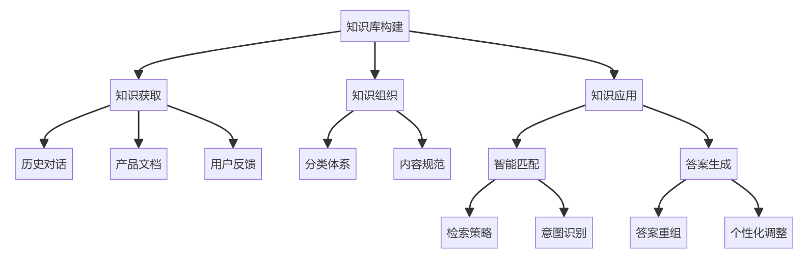

##### 5）技术实现建议

1. 使用 Elasticsearch 作为知识检索引擎
2. 采用 BERT/GPT 等预训练模型做语义理解
3. 使用 Redis 缓存热点问题答案
4. 通过 API 网关统一接口调用

##### 6）注意事项

1. 保护用户隐私，脱敏敏感信息
2. 设置知识审核机制，确保内容准确性
3. 建立知识更新机制，保持内容时效性
4. 做好系统容灾，确保服务稳定性

参考文档：

1. Zendesk AI 知识库最佳实践: https://www.zendesk.com/blog/knowledge-base-chatbots/
2. Tidio 智能客服解决方案: https://www.tidio.com/blog/knowledge-base-chatbots/

### 什么是大模型 Agent？它与传统的 AI 系统有什么不同？ 

#### 回答重点

**大模型 Agent 是基于大型语言模型并结合模块化规划、记忆和工具调用**的自主决策系统，它能够根据最终目标把复杂任务拆分成子任务，调用 API、检索数据库或使用插件，再通过内部循环不断优化执行流程，基本不需要人在每一步都监督。

主要区别如下：

1）**目标导向 vs. 被动响应**：传统大模型通常根据用户输入生成文本，缺乏主动性；而 Agent 以明确目标为驱动，能够主动规划并执行任务。

2）**记忆与状态管理**：Agent 具备短期和长期记忆能力，能够维护状态信息并根据历史经验调整行为；而传统大模型通常依赖于上下文窗口进行信息处理。

3）**多任务协同能力**：Agent 能够处理复杂的多步骤任务，协调多个子任务的执行；而传统大模型通常处理单一任务，缺乏任务协同能力。

4）**推理与环境适应能力**：和传统 AI 系统主要依赖预先设定的规则引擎或静态模型不同，大模型 Agent 具备多步推理能力和动态环境适应能力，它能在执行过程中不断评估结果、调整策略，真正实现端到端的目标导向执行。

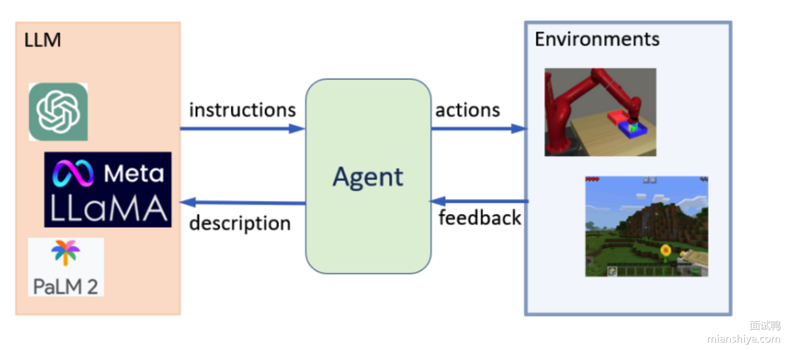

#### 扩展知识

1）大模型 Agent 的核心组件一般包含**规划器**（Planner）、**执行器**（Executor）、**记忆**（Memory）和**工具调用**（Tool Use）模块，规划器负责制定任务分解方案，执行器负责落地操作，记忆模块保存交互上下文，工具模块负责与外部系统接口。
 2）与传统 AI 系统只能进行被动响应相比，Agentic AI 更强调主动性和自治性，它不只是给出建议，还能主动执行、反馈和学习，类似从“图书检索”升级为“智能管家”。
 3）传统 AI 通常需要手动编写大量规则或对模型进行单任务微调，Agent 则倾向于通过预训练大模型加上少量指令微调来控制行为，这种方式兼顾了灵活性和可控性。
 4）在实际应用中，大模型 Agent 已经在自动化运维、客户服务、财务分析等领域展现出端到端自动化能力，但也因多步执行易出现错误累积和计算资源消耗大而受到挑战。
 5）打个比方，传统 AI 系统就像一个图书馆的检索系统，帮我们找到答案；而大模型 Agent 更像一个经验丰富的管家，不仅能帮我们查资料，还能主动安排日程、预订机票、跟进各项事务。

#### 相关论文与扩展阅读链接

1）[AI Agents vs. Traditional AI Systems](https://medium.com/@emir.ozsaraclar/ai-agents-vs-traditional-ai-systems-bb3b0f8e5f47)

2）[ An In-depth Survey of Large Language Model-based Artificial Intelligence Agents](https://arxiv.org/abs/2309.14365)

### LLM Agent 的基本架构有哪些组成部分？ 

#### 回答重点

1）**Agent核心（LLM本身）**：作为“大脑”，负责理解输入、生成计划和下发指令，串联其他模块协同工作。

2）**规划模块（Planning）**：将复杂目标拆解成有序的子任务，制定多步执行方案，并在必要时动态重规划。

3）**记忆模块（Memory）**：短期保存当前对话或任务状态，长期存储跨会话的知识和经验，保障多轮交互的连贯性和上下文保持。

4）**工具使用（Tool use）**：接入搜索、计算、数据库、代码执行、第三方插件等多种外部工具，为执行模块提供能力扩展。

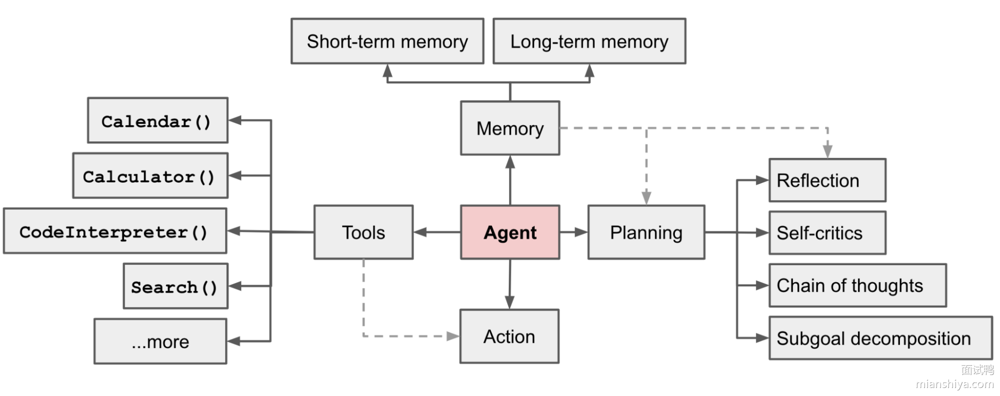

#### 扩展知识

在一个基于大模型（LLM）的自主代理系统中，大模型充当代理的“大脑”，并通过几个关键组件来增强其能力：

1）**规划（Planning）**

- **子目标和任务分解**：代理将大任务拆解成更小、更易管理的子目标，这样可以更高效地处理复杂任务。就像我们在做一个大项目时，把每一小步分开执行，目标更清晰，完成更容易。
- **反思和优化**：代理可以在执行任务后，回顾自己的表现，进行自我批评和反思，找出哪里做得不好，然后调整策略。这种自我改进的能力能让代理在接下来的任务中表现得更好，结果也更精准。

2）**记忆（Memory）**

- **短期记忆**：短期记忆就像是模型在当前任务或对话中临时记住的信息，类似于我们在聊天时记住了对方刚说的话，但任务一结束这些信息就会消失。
- **长期记忆**：长期记忆让代理能够长期保存和调用信息，类似于保存了一些重要的笔记或知识，可以随时拿出来用。这通常是通过外部的存储系统来实现，能够快速检索大量信息。

3）**工具使用（Tool Use）**

- 代理可以通过调用外部的API，来获得模型训练时无法学到的额外信息，比如最新的数据、运行代码的能力，或者访问一些专有的信息源。这样，代理可以超越其原本的知识库，获取到实时或特殊的帮助。

#### 相关论文与扩展阅读链接

[LLM Powered Autonomous Agents](https://lilianweng.github.io/posts/2023-06-23-agent/)

### LLM Agent 常见功能有哪些？

#### 回答重点

1）**指令理解与上下文处理**：通过自然语言解析用户指令，理解任务目标和上下文信息。

2）**任务规划与分解**：LLM Agent能先拟定解决问题的多个步骤，再按顺序逐步执行，确保思路清晰、有条不紊地推进任务。
 3）**外部工具使用**：具备调用搜索引擎、数据库、计算器、各类API等工具的能力，以获取或处理信息，实现“知其然，更知其所以然”的效果。
 4）**巡环观测与执行**：在每次工具调用后，观测模块会收集执行结果并反馈给决策模块，形成持续的Action-Observation循环，不断微调策略。
 5）**记忆管理**：支持短期对话上下文记忆和长期任务历史记忆，将关键数据存储以备后续参考，提升多轮交互的一致性和深度。
 6）**决策与分支**：根据观测结果和已有记忆灵活做出决策，处理条件分支和循环逻辑，使执行路径能够动态调整，避免僵化流程。
 7）**检索增强生成**：集成检索模块，必要时调用外部知识库或文档，以检索增强生成（RAG）的方式提高回答的准确性和信息丰富度。
 8）**自我反思与纠错**：通过内省模块评估自身输出的正确性和完整性，发现偏差时触发重试或修正策略，实现自我纠错。

9）**多模态能力**：结合图像、音频等多种输入输出方式，扩展应用场景。

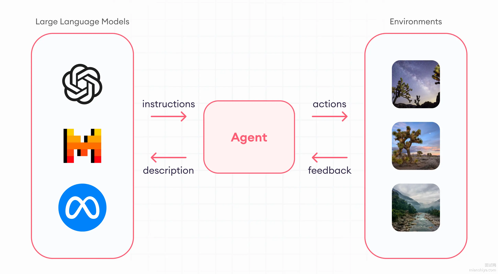

#### 扩展知识

LLM Agent 的核心优势在于其高度的灵活性和适应性。通过集成记忆、规划和工具调用等模块，LLM Agent 能够模拟人类的思考和决策过程，实现自主的任务执行。

##### 1）记忆（Memory）

LLM Agent 的记忆模块分为短期记忆和长期记忆。短期记忆用于处理当前会话的上下文信息，而长期记忆则用于存储历史交互和知识，以便在未来的任务中进行调用。

##### 2）规划（Planning）

规划模块使 LLM Agent 能够将复杂任务分解为可管理的子任务，并制定执行计划。常用的技术包括思维链（Chain of Thought, CoT）和思维树（Tree of Thoughts, ToT），这些方法帮助智能体理清思路，逐步推进任务的完成。

##### 3）工具调用（Tool Use）

LLM Agent 通过集成外部工具，扩展其功能范围。例如，调用计算器进行数学运算，使用搜索引擎获取最新信息，或调用 API 访问特定服务。

##### 4）自我反思与改进（Self-Reflection）

自我反思模块使 LLM Agent 能够在任务执行后进行评估，识别不足之处，并在后续任务中进行改进。常见的方法包括 Reflexion 和 Self-Refine，这些方法帮助智能体不断提升性能。

##### 5）多模态能力（Multimodal Capabilities）

随着技术的发展，LLM Agent 不再局限于文本输入输出。通过结合图像、音频等多种输入输出方式，LLM Agent 能够处理更复杂的任务，扩展应用场景。

##### 相关论文与扩展阅读链接

1）[LLM agents: The ultimate guide 2025](https://www.superannotate.com/blog/llm-agents)

2）[LLM Powered Autonomous Agents](https://lilianweng.github.io/posts/2023-06-23-agent)

3）[Exploring Large Language Model based Intelligent Agents: Definitions, Methods, and Prospects](https://arxiv.org/abs/2401.03428)

### Agent智能体的工作过程是怎样的？ 

#### 回答重点

1）**接收与理解输入**：Agent首先“感知”环境或用户输入，将自然语言指令转为内部可处理的表示，以明确目标和约束条件。
 2）**规划**：基于输入，LLM生成多步行动计划，拆解为子任务并排序，就像制定详细食谱确保烹饪思路清晰。
 3）**工具调用**：Agent根据计划动态选择并调用外部工具或API（如搜索、数据库、计算器等）来完成各子任务。
 4）**观测**：在每次工具执行后，Agent将输出作为“Observation”反馈给LLM，用于更新当前状态和后续决策。
 5）**记忆**：关键观测和交互细节被存入短期或长期记忆，提高多轮对话或复杂任务中的上下文一致性。
 6）**决策**：基于最新的观测结果、记忆内容和任务目标，Agent判断是否继续执行下一步操作或结束流程。
 7）**输出**：在所有必要步骤完成后，Agent汇总信息，生成并返回最终结果给用户。
 8）**反思与纠错**：可选地启动自我反思模块，评估已执行行动的正确性，必要时重规划或修正策略，避免重复错误。

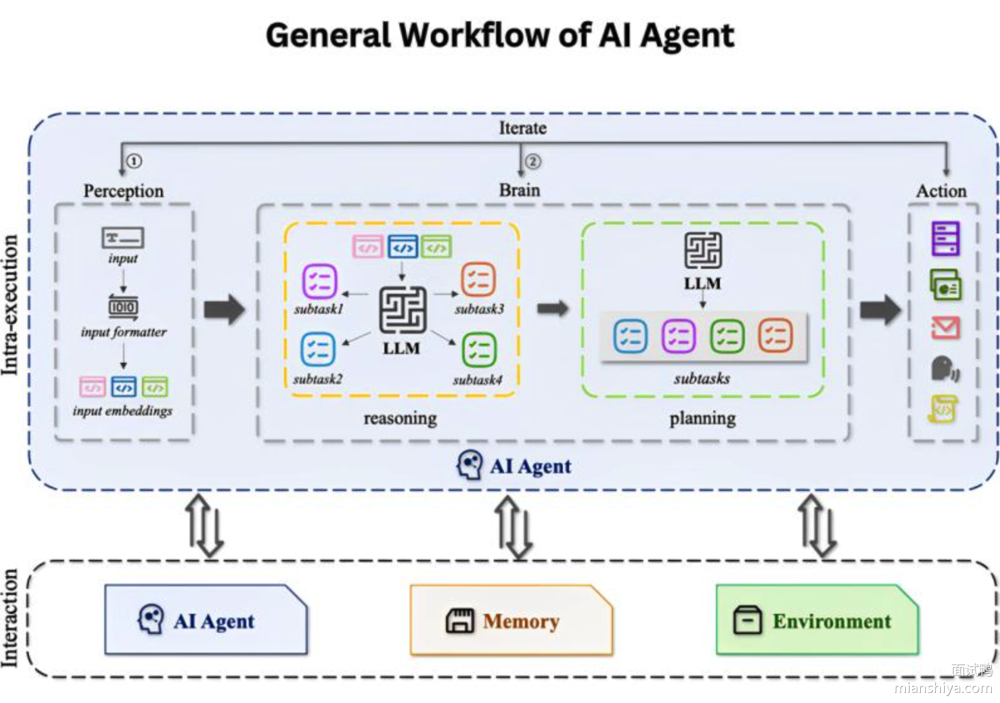

#### 扩展知识

Agent智能体的核心组成模块包括**规划（Planning）**、**工具使用（Tool Use）**、**观测反馈（Observation Feedback）**、**记忆（Memory）**、**决策（Decision Making）\**和可选的\**自我反思（Reflection）\**以及\**安全合规（Safety and Compliance）机制**。
 在规划阶段，Agent会利用LLM生成一系列子任务步骤，就像厨师在烹饪前先列好详细食谱，确保过程有序可控。
 工具使用阶段则是根据各子任务选择相应“厨房用具”（即API或外部工具）来完成操作，例如调用搜索引擎查询信息或执行计算器功能。
 在观测反馈循环中，Agent会把工具执行结果作为“尝味”环节，将输出重新输入到LLM，让模型根据最新信息调整下一步动作。
 记忆管理帮助Agent在多轮交互中记住关键数据，就像厨师在烹饪笔记里记录经验，以便下次使用时能一目了然。
 自我反思模块（Reflection）可让Agent在遇到错误时像厨师试味失败后回炉再制，通过分析前次决策和结果来优化策略。
 安全与合规模块则在整个流程中进行内容审查和策略校验，防止生成敏感或违规信息，类似厨房中的卫生和安全标准。

##### 相关论文与扩展阅读链接

1）[ReACT AI Agents: A Guide to Smarter AI Through Reasoning and Action.](https://medium.com/@gauritr01/part-1-react-ai-agents-a-guide-to-smarter-ai-through-reasoning-and-action-d5841db39530)

2）[Understanding Agentic Concepts in LLM Workflows](https://medium.com/@pankaj_pandey/understanding-agentic-concepts-in-llm-workflows-fc8115504c06)

3）[Agent architectures](https://langchain-ai.github.io/langgraphjs/concepts/agentic_concepts)

4）[Memory for agents](https://blog.langchain.dev/memory-for-agents)

### 如何让 LLM Agent 具备长期记忆能力？ 

#### 回答重点

LLM 本身的上下文窗口通常只有几千到数万 tokens，无法直接处理过多的历史交互信息，所以需要借助外部机制来扩展其“记忆”能力。
 1）**通过向量数据库 + RAG 机制增强长期记忆**：先将对话和知识转换成向量 embeddings 存入外部数据库（如 FAISS、ChromaDB 或 Pinecone），在新会话发起时根据用户查询检索相关历史内容，再将检索到的结果拼接至模型输入上下文，弥补原生上下文窗口的缺陷。
 2）**Memory Transformer / 分层记忆体系**：结合短期记忆（会话上下文）和长期记忆（外部存储的关键摘要或 embeddings），通过 Memory Networks、Neural Turing Machines 或类似机制，将重要信息定期摘要成紧凑表示，存入专用存储，并在需要时根据上下文召回，实现分层记忆管理。

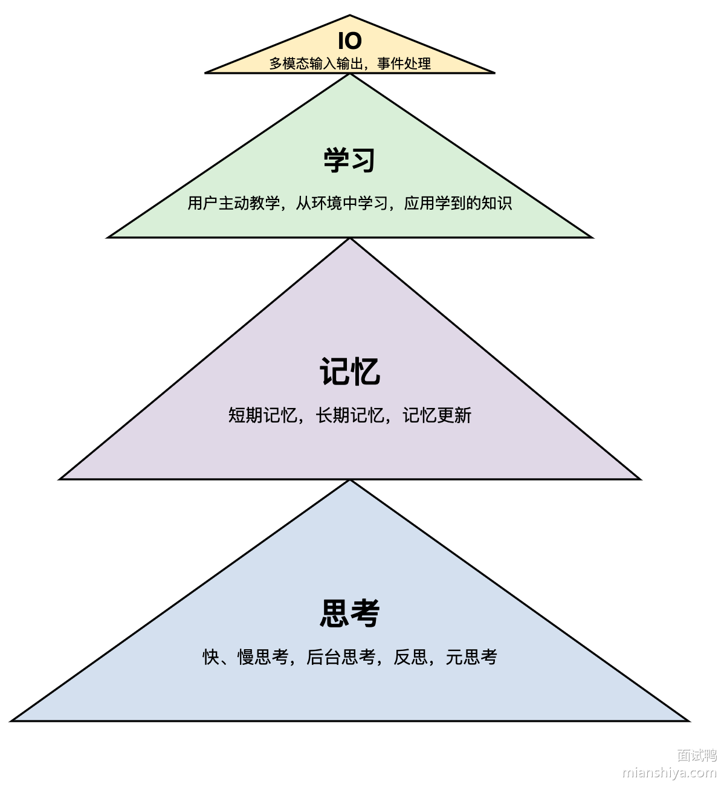

#### 扩展知识

在 RAG 的标准流程中，首先对外部数据进行 **Indexing**（将文本切分并生成 **embeddings** 存入向量库），然后根据用户输入**执行 Retrieval**，选出最相关的文档，接着在**Augmentation 阶段将检索结果拼接到原始提示中，最后由 LLM 执行 Generation**，生成最终回答。
 可以把向量数据库想象成一个大型图书馆，embeddings 是书籍编号，而 RAG 就像图书管理员，能够在海量“书架”中快速找到最贴近用户需求的“书”，帮助模型借阅并“阅读”之前的对话或知识。
 对于 Memory Transformer 或 Hierarchical Memory 思路，则更像是给模型提供了一个分层文件柜：近期对话放在易取的抽屉里（短期记忆），具有重要价值的信息则压缩成摘要或 embeddings 储存在更深层的保密文件柜（长期记忆），需要时再取出翻阅。
 目前还可结合持续学习（Continual Learning）或少量参数微调（如 LoRA、P-tuning）将核心知识直接内化到模型参数中，实现更稳定的长期记忆，但需要额外的训练和版本管理成本。
 在实际落地时，需权衡存储成本、检索延迟以及用户数据隐私等问题，向量库规模越大搜索速度越可能变慢，同时也要确保数据安全合规。
 另外，新兴的长上下文处理技术如 LongRoPE、LLoCO、CEPE 等，也可以在一定程度上提升原生上下文窗口，通过改进位置编码或并行编码等方式，将上下文扩展到数十万甚至百万 tokens，帮助 LLM 在更大范围内保持连贯和记忆。

##### 相关论文与扩展阅读链接

1）[Github项目-LLM-Agent](https://github.com/AkiRusProd/llm-agent)

2）[RAG-维基百科](https://en.wikipedia.org/wiki/Retrieval-augmented_generation)

3）[Understanding Memory in AI: How LLMs Remember What Matters](https://medium.com/@t.sankar85/understanding-memory-in-ai-how-llms-remember-what-matters-af7050251d92)

4）[LongRoPE: Extending LLM Context Window Beyond 2 Million Tokens](https://arxiv.org/abs/2402.13753)

### LLM Agent 在多模态任务中如何执行推理？

#### 回答重点

LLM Agent 在多模态推理中，核心是先把不同模态的数据（如图像、音频、视频、文本）转换成统一的**向量或语义**表示，再将这些表示注入到大模型进行跨模态融合和推理。
 1）**视觉-语言模型**：常见做法是用 CLIP、BLIP-2 等视觉编码器将图像转为 embeddings，然后与文本输入一起提供给 LLM；或者直接使用 GPT-4V 这样内置视觉理解能力的模型来处理图像并输出自然语言回答。
 2）**语音-文本桥接**：用 Whisper 或者其他 ASR 模型将音频转换成文本，再交给 LLM 去分析和生成响应，前后端串联即可实现多模态推理。
 3）**工具链调用**：结合 OCR、物体检测、视频帧提取等工具，LLM Agent 根据任务需求按需调用这些工具，将结果合并进它的上下文，再由模型执行更高级别的推理或决策。

#### 扩展知识

多模态推理不仅仅是“贴图+读字”，还涉及跨**模态对齐**和**注意力融合**。比如 P2 G（Plug-and-Play Grounding）框架中，模型内部会专门插入视觉投影模块，将视觉特征映射到语言空间，与文本特征在 Transformer 每一层并行交互，做到更细粒度的视觉-语言对齐。
 在实际工程中，LangChain 这类中间件也开始支持多模态输入和工具调用，让开发者更方便地把 OCR、图像分类、语音识别等“插件”接入到 ChatAgent 流程里，通用化地管理多模态任务。
 如果要处理视频，多数会对视频做帧抽取，然后对关键帧依次进行图像编码，同时还可能结合声音信号提取的语音文本信息，最后把所有模态的信息通过时间序列与 LLM 的记忆或长短期上下文融合，实现时序化的多模态推理。
 在模型选型上，BLIP-2 提供了一种轻量化思路：它把图像编码器和 LLM 都保持冻结，只在中间加一个小型映射层，就能高效对齐视觉和语言，这在资源受限场景下很有优势。
 对于需要实时或在线多模态交互的场景，还可以使用 GPT-4 Vision API，直接调用 OpenAI 的托管模型，让云端完成图像理解，再通过后续的语言模型生成环节来给出最终响应。
 最后，如果对多模态推理精度和解释性有更高要求，可以在 LLM 的推理链（Chain of Thought）中插入辅助提示，让模型分步“**看图—识别—推理**”，不仅提升准确度，也更易于审计和调试。

##### 相关论文与扩展阅读链接

1）[CLIP: Connecting text and images](https://openai.com/index/clip/)

2）[A Multimodal AI Assistant: Combining Local and Cloud Models](https://medium.com/data-science/a-multimodal-ai-assistant-combining-local-and-cloud-models-2006b2ea0cd9)

3）[Plug-and-Play Grounding of Reasoning in Multimodal Large Language Models](https://arxiv.org/abs/2403.19322v1)

### 什么是 ReAct？如何基于 ReAct 模式构建具备自主规划能力的 AI 智能体？ 

ReAct，即 Reasoning + Acting（推理与行动），是一种结合推理和行动的智能体架构。它模仿人类解决问题时“思考 - 行动 - 观察”的循环。AI 首先对问题进行推理（Reason），将原始问题拆分为多步骤任务，明确当前要执行的步骤。然后，它会调用外部工具执行行动（Act），比如调用搜索引擎或访问网页。最后，它会观察（Observe）工具返回的结果，并将这些结果反馈给智能体，用于下一步的决策。这个过程会不断循环迭代，直到任务完成或达到预设的终止条件。

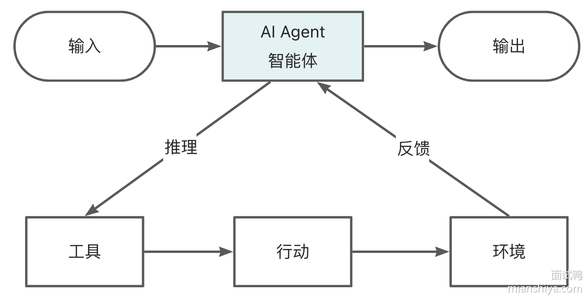

基于 ReAct 模式构建具备自主规划能力的 AI 智能体，核心在于实现这个 “思考-行动-观察” 的循环。这意味着智能体要实现：

1. 接收用户指令后，能分析并拆解成可执行的子任务。
2. 根据子任务的需要，从可用的工具集中选择合适的工具并执行。
3. 分析工具执行的结果，判断任务进展，决定下一步是继续调用工具、向用户澄清还是结束任务。

在本项目中，我实现的拥有自主规划能力的超级智能体就是基于 ReAct 模式，通过 ReActAgent 定义先 think 思考再 act 行动的流程，然后通过 ToolCallAgent 具体实现这两个方法。在 `think()` 方法中决定使用哪个工具（推理），在 `act()` 方法中执行工具（行动），并将执行结果作为下一步思考的输入（观察）。


