# 小米虫宝典

## 场景题

### MySQL 中 如果我 select * from 一个有 1000 万行的表，内存会飙升么？ 

#### 回答重点

内存不会飙升。

因为 MySQL 在执行简单 `SELECT * FROM` 查询时，**不会一次性将所有 1000 万行数据加载到内存中，而是通过逐批次处理的方式来控制内存使用。也就是说 MySQL 是边查边发送数据给客户端**。

分批的大小与 `net_buffer_length` 有关，默认 16384 字节（16 KB）。

所以实际上获取数据和发送数据的流程是这样的：

- 获取一行，写入到 `net_buffer` 中。
- 重复获取行，直到 `net_buffer` 写满，调用网络接口发出去。
- 发送成功后 清空 `net_buffer`。
- 再继续取下一行，并写入 `net_buffer`，继续上述的操作。

这里还需要注意一点，发送的数据是需要被客户端读取的，如果客户端读取的慢，导致本地网络栈（socket send buffer）写满了，那么当前数据的写入会被暂停。

综上，**`SELECT \* FROM` 一个有 1000 万行的表，不会导致内存飙升**。

#### 扩展知识

##### 注意 ORDER BY 和 GROUP BY

正常不需要排序和分组的查询不会占用过多的数据和影响 MySQL Server 的执行，但是如果涉及到分组和排序，那么就需要使用额外的内存（或外部空间）来处理全量数据，可能会占用额外的内存并影响查询的效率。

- [617. MySQL 中的数据排序是怎么实现的？](https://www.mianshiya.com/question/1780933295526146049)

##### 客户端的处理方式

虽然 MySQL 会分批返回数据，但是客户端需要做一定的处理，不能全量保存数据，否则可能会导致内存溢出。

客户端需要使用流式处理或者游标来查询。

- 在编写查询代码时，使用流式读取方式（如 JDBC 中的 ResultSet.FETCH_SIZE），这会让数据库逐步返回数据，客户端按需处理。

**JDBC 简单示例**，重点就是 `statement.setFetchSize(Integer.MIN_VALUE)`;

```java
// 获取数据库连接并开启流式处理
try (Connection connection = DriverManager.getConnection(URL, USER, PASSWORD)) {
    // 禁用自动提交，避免结果集完全缓存到内存
    connection.setAutoCommit(false);

    // 创建一个可以进行流式处理的 Statement
    try (PreparedStatement statement = connection.prepareStatement(query,
            ResultSet.TYPE_FORWARD_ONLY, ResultSet.CONCUR_READ_ONLY)) {
        // 设置流式处理的关键：MySQL 特定配置
        statement.setFetchSize(Integer.MIN_VALUE);

        // 执行查询
        try (ResultSet resultSet = statement.executeQuery()) {
            while (resultSet.next()) {
                // 获取每行数据，这里假设有 "id" 和 "name" 两列
                int id = resultSet.getInt("id");
                String name = resultSet.getString("name");

                // 处理数据（例如打印出来）
                System.out.printf("ID: %d, Name: %s%n", id, name);
            }
        }
    }
} catch (SQLException e) {
    e.printStackTrace();
}
        
```

**MyBatis 简单示例**，重点就是 `session.getConfiguration().setDefaultFetchSize(Integer.MIN_VALUE)`;

```java
try (SqlSession session = sqlSessionFactory.openSession()) {
    // 设置 fetchSize 为 Integer.MIN_VALUE 启用流式查询
    session.getConfiguration().setDefaultFetchSize(Integer.MIN_VALUE);

    // 获取 Mapper
    LargeTableMapper mapper = session.getMapper(LargeTableMapper.class);

    // 使用 ResultHandler 处理数据，逐行读取
    mapper.selectAll(resultContext -> {
        LargeTableRecord record = resultContext.getResultObject();
        System.out.printf("ID: %d, Name: %s%n", record.getId(), record.getName());
        // 可以在这里对数据进行处理，避免一次性加载到内存
    });
}
```

**MyBatis 游标查询示例**，重点就是使用 `Cursor` 接口

```java
try (SqlSession session = sqlSessionFactory.openSession()) {
    // 获取 Mapper
    LargeTableMapper mapper = session.getMapper(LargeTableMapper.class);

    // 使用游标查询数据
    try (Cursor<LargeTableRecord> cursor = mapper.selectAllWithCursor()) {
        for (LargeTableRecord record : cursor) {
            System.out.printf("ID: %d, Name: %s%n", record.getId(), record.getName());
            // 可以在这里对数据进行处理，避免一次性加载到内存
        }
    }
}
```

##### 一次性查询大量数据对 MySQL BufferPool 的影响

BufferPool 实现了一个冷热分区的 LRU

- [BufferPool 知识](https://www.mianshiya.com/bank/1791003439968264194/question/1780933295555506177#heading-5)

### 什么是限流？限流算法有哪些？怎么实现的？ 

#### 限流是什么？

首先来解释下什么是限流？

在日常生活中限流很常见，例如去有些景区玩，每天售卖的门票数是有限的，例如 2000 张，即每天最多只有 2000 个人能进去游玩。

那在我们工程上限流是什么呢？限制的是 「流」，在不同场景下「流」的定义不同，可以是每秒请求数、每秒事务处理数、网络流量等等。

而通常我们说的限流指代的是 **限制到达系统的并发请求数**，使得系统能够正常的处理 **部分** 用户的请求，来保证系统的稳定性。

限流不可避免的会造成用户的请求变慢或者被拒的情况，从而会影响用户体验。

因此限流是需要在用户体验和系统稳定性之间做平衡的，即我们常说的 `trade off`。

对了，限流也称流控（流量控制）。

#### 为什么要限流？

前面，我们提到限流是为了保证系统的稳定性。

日常的业务上有类似**秒杀活动、双十一大促或者突发新闻**等场景，用户的流量突增，**后端服务的处理能力是有限的**，如果不能处理好突发流量，后端服务很容易就被打垮。

亦或是爬虫等**不正常流量**，我们对外暴露的服务都要以**最大恶意去防备**调用者。

我们不清楚调用者会如何调用我们的服务，假设某个调用者开几十个线程一天二十四小时疯狂调用你的服务，如果不做啥处理咱服务也算完了，更胜的还有DDos攻击。

还有对于很多第三方开放平台来说，不仅仅要防备不正常流量，还要保证资源的公平利用，一些接口都免费给你用了，资源都不可能一直都被你占着吧，别人也得调的。

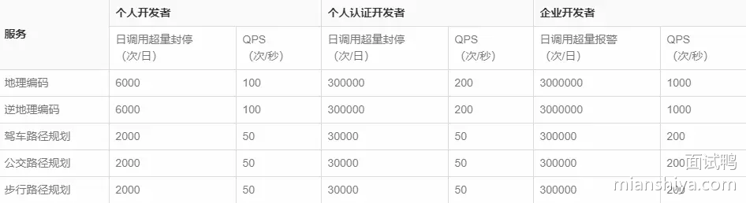

**当然加钱的话好商量**。

> 小结一下

限流的本质是因为后端处理能力有限，需要截掉超过处理能力之外的请求，亦或是为了均衡客户端对服务端资源的公平调用，防止一些客户端饿死。

#### 常见的限流算法

有关限流算法我给出了对应的图解和相关伪代码，有些人喜欢看图，有些人更喜欢看代码。

##### 计数限流

最简单的限流算法就是计数限流了。

例如系统能同时处理 100 个请求，保存一个计数器，处理了一个请求，计数器就加一，一个请求处理完毕之后计数器减一。

每次请求来的时候看看计数器的值，如果超过阈值就拒绝。

非常简单粗暴，计数器的值要是存内存中就算单机限流算法。

如果放在第三方存储里，例如 Redis 中，集群机器访问就算分布式限流算法。

优点就是：简单粗暴，单机在 Java 中可用 Atomic 等原子类、分布式就 Redis incr。

缺点就是：假设我们允许的阈值是1万，此时计数器的值为 0， 当 1 万个请求在前 1 秒内一股脑儿的都涌进来，这突发的流量可是顶不住的。

缓缓地增加流量处理和一下子涌入对于程序来说是不一样的。


而且一般的限流都是为了限制在指定时间间隔内的访问量，因此还有个算法叫固定窗口。

##### 固定窗口限流

它相比于计数限流主要是多了个时间窗口的概念，计数器每过一个时间窗口就重置。 规则如下：

- 请求次数小于阈值，允许访问并且计数器 +1；
- 请求次数大于阈值，拒绝访问；
- 这个时间窗口过了之后，计数器清零；


看起来好像很完美，实际上还是有缺陷的。

##### 固定窗口临界问题

假设系统每秒允许 100 个请求，假设第一个时间窗口是 0-1s，在第 0.55s 处一下次涌入 100 个请求，过了 1 秒的时间窗口后计数清零，此时在 1.05 s 的时候又一下次涌入100个请求。

虽然窗口内的计数没超过阈值，但是全局来看在 0.55s-1.05s 这 0.5 秒内涌入了 200 个请求，这其实对于阈值是 100/s 的系统来说是无法接受的。

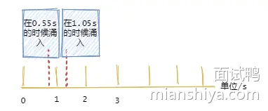

为了解决这个问题引入了滑动窗口限流。

##### 滑动窗口限流

滑动窗口限流解决固定窗口临界值的问题，可以保证在任意时间窗口内都不会超过阈值。

相对于固定窗口，滑动窗口除了需要引入计数器之外还需要记录时间窗口内每个请求到达的时间点，因此**对内存的占用会比较多**。

规则如下，假设时间窗口为 1 秒：

- 记录每次请求的时间
- 统计每次请求的时间 至 往前推1秒这个时间窗口内请求数，并且 1 秒前的数据可以删除。
- 统计的请求数小于阈值就记录这个请求的时间，并允许通过，反之拒绝。


但是滑动窗口和固定窗口都**无法解决短时间之内集中流量的突击**。

我们所想的限流场景是：

每秒限制 100 个请求。希望请求每 10ms 来一个，这样我们的流量处理就很平滑，但是真实场景很难控制请求的频率，因此可能存在 5ms 内就打满了阈值的情况。

当然对于这种情况还是有变型处理的，例如设置多条限流规则。不仅限制每秒 100 个请求，再设置每 10ms 不超过 2 个。

再多说一句，这个**滑动窗口可与TCP的滑动窗口不一样**。

TCP的滑动窗口是接收方告知发送方自己能接多少“货”，然后发送方控制发送的速率。

接下来再说说漏桶，它可以解决时间窗口类的痛点，使得流量更加平滑。

##### 漏桶算法

如下图所示，水滴持续滴入漏桶中，底部定速流出。

如果水滴滴入的速率大于流出的速率，当存水超过桶的大小的时候就会溢出。

规则如下：

- 请求来了放入桶中
- 桶内请求量满了拒绝请求
- 服务定速从桶内拿请求处理


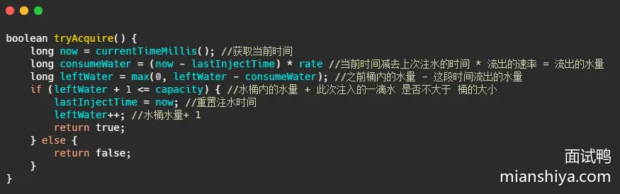

可以看到水滴对应的就是请求。

它的特点就是**宽进严出**，无论请求多少，请求的速率有多大，都按照固定的速率流出，对应的就是服务按照固定的速率处理请求。

看到这想到啥，是不是和消息队列思想有点像，削峰填谷。

一般而言漏桶也是由队列来实现的，处理不过来的请求就排队，队列满了就开始拒绝请求。

看到这又想到啥，**线程池**不就是这样实现的嘛？

经过漏洞这么一过滤，请求就能平滑的流出，看起来很像很挺完美的？实际上它的优点也即缺点。

面对突发请求，服务的处理速度和平时是一样的，这其实不是我们想要的。

在面对突发流量我们希望在系统平稳的同时，提升用户体验即能更快的处理请求，而不是和正常流量一样，循规蹈矩的处理（看看，之前滑动窗口说流量不够平滑，现在太平滑了又不行，难搞啊）。

而令牌桶在应对突击流量的时候，可以更加的“激进”。

##### 令牌桶算法

令牌桶其实和漏桶的原理类似，只不过漏桶是**定速地流出**，而令牌桶是**定速地往桶里塞入令牌**，然后请求只有拿到了令牌才能通过，之后再被服务器处理。

当然令牌桶的大小也是有限制的，假设桶里的令牌满了之后，定速生成的令牌会丢弃。

规则：

- 定速的往桶内放入令牌
- 令牌数量超过桶的限制，丢弃
- 请求来了先向桶内索要令牌，索要成功则通过被处理，反之拒绝

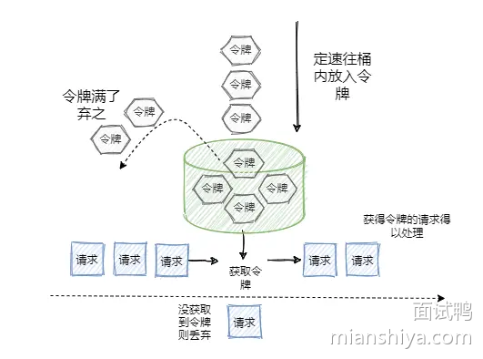

看到这又想到什么？**Semaphore 信号量啊**，信号量可控制某个资源被同时访问的个数，其实和咱们拿令牌思想一样，一个是拿信号量，一个是拿令牌。

只不过信号量用完了返还，而咱们令牌用了不归还，因为令牌会定时再填充。

再来看看令牌桶的伪代码实现，可以看出和漏桶的区别就在于一个是加法，一个是减法。


可以看出令牌桶在应对突发流量的时候，桶内假如有 100 个令牌，那么这 100 个令牌可以马上被取走，而不像漏桶那样匀速的消费。所以在**应对突发流量的时候令牌桶表现的更佳**。

###### 小结令牌桶算法的优点

1）**平滑的流量控制**：令牌桶算法能够平滑处理请求流量，避免了突发流量对系统造成的冲击。

2）**突发流量处理**：由于桶的容量可以缓冲突发流量，系统可以在短时间内处理更多的请求，而不会立即拒绝。

###### 令牌桶算法使用时的注意点：

1）**桶容量的配置**：

- 如果桶的容量设置过小，可能会导致系统频繁地拒绝请求，从而影响用户体验。
- 如果桶的容量设置过大，可能会导致系统在短时间内处理过多的请求，从而增加系统负担。

2）**令牌生成速率**：

- 令牌生成速率需要根据实际需求进行调整。如果速率设置过低，可能无法满足用户的请求；如果速率设置过高，可能会导致系统负担过重。

##### 限流算法小结

上面所述的算法其实只是这些算法最粗略的实现和最本质的思想，**在工程上其实还是有很多变型的**。

从上面看来好像漏桶和令牌桶比时间窗口算法好多了，那时间窗口算法有什么用？

并不是的，虽然漏桶和令牌桶对比时间窗口对流量的**整形效果更佳**，流量更加得平滑，但是也有各自的缺点（上面已经提到了一部分）。

拿令牌桶来说，假设你没预热，那是不是上线时候桶里没令牌？没令牌请求过来不就直接拒了么？

这就误杀了，明明系统没啥负载现在。

再比如说请求的访问其实是随机的，假设令牌桶每20ms放入一个令牌，桶内初始没令牌，这请求就刚好在第一个20ms内有两个请求，再过20ms里面没请求，其实从40ms来看只有2个请求，应该都放行的，而有一个请求就直接被拒了。

这就有可能造成很多请求的误杀，但是如果看监控曲线的话，好像流量很平滑，峰值也控制的很好。

再拿漏桶来说，漏桶中请求是暂时存在桶内的，**这其实不符合互联网业务低延迟的要求**。

所以漏桶和令牌桶其实比较适合**阻塞式限流**场景，即没令牌我就等着，这样就不会误杀了，而漏桶本就是等着，比较适合后台任务类的限流。

而基于时间窗口的限流比较适合**对时间敏感**的场景，请求过不了您就快点儿告诉我，等的花儿都谢了。

##### 单机限流和分布式限流

本质上单机限流和分布式限流的区别其实就在于 “阈值” 存放的位置。

单机限流就上面所说的算法直接在单台服务器上实现就好了，而往往我们的服务是集群部署的。

因此需要多台机器协同提供限流功能。

像上述的计数器或者时间窗口的算法，可以将计数器存放至 Redis 等分布式 K-V 存储中。

例如滑动窗口的每个请求的时间记录可以利用 Redis 的 `zset` 存储，利用`ZREMRANGEBYSCORE ` 删除时间窗口之外的数据，再用 `ZCARD`计数。

像令牌桶也可以将令牌数量放到 Redis 中。

不过这样的方式等于每一个请求我们都需要去`Redis`判断一下能不能通过，在性能上有一定的损耗。

所以有个优化点就是 「**批量获取**」，每次取令牌不是一个一取，而是取一批，不够了再去取一批，这样可以减少对 Redis 的请求。

不过要注意一点，**批量获取会导致一定范围内的限流误差**。比如你取了 10 个此时不用，等下一秒再用，那同一时刻集群机器总处理量可能会超过阈值。

其实「批量」这个优化点太常见了，不论是 MySQL 的批量刷盘，还是 Kafka 消息的批量发送还是分布式 ID 的高性能发号，都包含了「批量」的思想。

当然，分布式限流还有一种思想是平分，假设之前单机限流 500，现在集群部署了 5 台，那就让每台继续限流 500 呗，即在总的入口做总的限流限制，然后每台机子再自己实现限流。

##### 限流的难点

可以看到，每个限流都有个阈值，这个阈值如何定是个难点。

定大了服务器可能顶不住，定小了就“误杀”了，没有资源利用最大化，对用户体验不好。

我能想到的就是限流上线之后先预估个大概的阈值，然后不执行真正的限流操作，而是采取日志记录方式，对日志进行分析查看限流的效果，然后调整阈值，推算出集群总的处理能力，和每台机子的处理能力(方便扩缩容)。

然后将线上的流量进行重放，测试真正的限流效果，最终阈值确定，然后上线。

我之前还看过一篇耗子叔的文章，讲述了在自动化伸缩的情况下，我们要动态地调整限流的阈值很难。

于是基于TCP拥塞控制的思想，根据请求响应在一个时间段的响应时间P90或者P99值来确定此时服务器的健康状况，来进行动态限流。在他的 Ease Gateway 产品中实现了这套算法，有兴趣的同学可以自行搜索。

其实真实的业务场景很复杂，**需要限流的条件和资源很多**，每个资源限流要求还不一样。

##### 限流组件

一般而言，我们不需要自己实现限流算法来达到限流的目的，不管是接入层限流还是细粒度的接口限流，都有现成的轮子使用，其实现也是用了上述我们所说的限流算法。

比如`Google Guava` 提供的限流工具类 `RateLimiter`，是基于令牌桶实现的，并且扩展了算法，支持预热功能。

阿里开源的限流框架` Sentinel` 中的匀速排队限流策略，就采用了漏桶算法。

Nginx 中的限流模块 `limit_req_zone`，采用了漏桶算法，还有 OpenResty 中的 `resty.limit.req`库等等。

具体的使用还是很简单的，有兴趣的同学可以自行搜索，对内部实现感兴趣的同学可以下个源码看看，学习下生产级别的限流是如何实现的。

### 分布式锁一般都怎样实现？

分布式锁需要实现多个应用实例之间的临界资源竞争，因此它需要依赖三方组件才能实现这样的功能。

常见依赖 Redis、ZooKeeper 来实现分布式锁。

#### Redis 实现

基于缓存实现分布式锁性能上会有优势，可以使用 Redis SETNX （SET if Not eXists）实现分布式锁。

**注意锁需要设置过期时间**，防止应用程序崩溃导致锁没有释放而阻塞后面的所有操作。

获取锁：使用 `jedis.set(lockKey, lockValue, "NX", "PX", lockTimeout)` 尝试获取锁，NX 确保键不存在时才设置，PX 设置键的过期时间（毫秒）。

释放锁：使用 Lua 脚本确保只有持有锁的客户端才能删除锁。Lua 脚本会检查键的值是否等于 lockValue，如果是则删除该键。

简单示例如下，`acquireLock` 为获取锁，`releaseLock` 为释放锁：

```java
public class RedisDistributedLock {
    private static final String LOCK_SUCCESS = "OK";
    private static final Long RELEASE_SUCCESS = 1L;

    private Jedis jedis;
    private String lockKey;
    private String lockValue;
    private int lockTimeout;

    public RedisDistributedLock(Jedis jedis, String lockKey, int lockTimeout) {
        this.jedis = jedis;
        this.lockKey = lockKey;
        this.lockTimeout = lockTimeout;
        this.lockValue = UUID.randomUUID().toString();
    }

    public boolean acquireLock() {
        String result = jedis.set(lockKey, lockValue, "NX", "PX", lockTimeout);
        return LOCK_SUCCESS.equals(result);
    }

    public boolean releaseLock() {
        String releaseScript = 
            "if redis.call('get', KEYS[1]) == ARGV[1] then " +
            "return redis.call('del', KEYS[1]) " +
            "else return 0 end";
        Object result = jedis.eval(releaseScript, Collections.singletonList(lockKey), Collections.singletonList(lockValue));
        return RELEASE_SUCCESS.equals(result);
    }

    public static void main(String[] args) {
        // 创建一个 Jedis 连接实例
        Jedis jedis = new Jedis("localhost", 6379);

        // 创建分布式锁实例
        RedisDistributedLock lock = new RedisDistributedLock(jedis, "my_lock", 10000);

        // 尝试获取锁
        if (lock.acquireLock()) {
            try {
                // 执行你的业务逻辑
                System.out.println("Lock acquired, executing business logic...");
            } finally {
                // 释放锁
                lock.releaseLock();
                System.out.println("Lock released.");
            }
        } else {
            System.out.println("Unable to acquire lock, exiting...");
        }

        // 关闭 Jedis 连接
        jedis.close();
    }
}
```

**注意 lockValue 需要保证唯一，防止被别的客户端释放了锁**。

这里有个问题，如果业务还没执行完，则 Redis 的锁已经到期了怎么办？因此**引入“看门狗”机制**，即起一个后台定时任务，不断地给锁续期，如果锁释放了或客户端实例被关闭则停止续期，Redisson 提供了此功能。

注意：未指定超时时间的分布式锁才会续期，如果指定了超时时间则不会续期，默认 30s 超时，每 10s 续期一次，续期时长为 30s。

除了锁续期问题，还有单点故障问题，如果这台 Redis 挂了怎么办？分布锁就加不上了，业务就被阻塞了。

因此需要引入 Redis 主从，利用哨兵进行故障转移，但是这又会产生新的问题，如果 master 挂了，锁的信息还未传给 slave 节点，此时 slave 上是没加锁的，因此可能导致多个实例都成功上锁。

所以 Redis 作者又提出了 RedLock 即红锁，通过引入多个主节点共同加锁来解决单点故障问题（没有哨兵和 slave 了）。

比如现在有 5 个 Redis 节点（官方推荐至少 5 个），客户端获取当前时间 T1，然后依次利用 SETNX 对 5 个 Redis 节点加锁，如果成功 3 个及以上（大多数），再次获取当前时间 T2，如果 T2-T1 小于锁的超时时间，则加锁成功，反之则失败。

如果加锁失败则向全部节点调用释放锁的操作。

但是这个 redlock 还是有缺点的，首先它比较重，需要 5 个实例，成本不低。

其次如果发生时钟偏移，比如 5 个节点中有几个节点时间偏移了，导致锁提前超时了，那么有可能出现新客户端争抢到锁的情况，但是这个属于运维层面的问题。

还有一个就是 GC 问题，如果客户端抢到锁之后，发生了长时间的 GC 导致 redis 中锁都过期了，这样一来别的客户端就能得到锁了，且老客户端 GC 后正常执行后续的操作，导致并发修改，数据可能就不对了。不过这个问题无法避免，任何锁都可能会这样。

关于 RedLock 可以使用 Redisson ，它提供了 RedLock。

一般业务上，如果我们要使用 Redis 分布式锁，基本上使用 Redisson 客户端。

#### ZooKeeper

除了 Redis 还可以使用 ZooKeeper 的**临时有序节点**实现分布式锁。

临时 能保证超时释放，有序 能选出谁抢到了锁。

大致流程：多进程争抢创建 ZooKeeper 指定目录下的临时有序节点，创建序号最小的节点即抢到锁的进程，释放锁可以删除此节点，如果服务端挂了也会释放这个节点。

优点：如果本身已经引入了 ZooKeeper 则成本不大，实现比较简单。

缺点：相比于 Redis 性能没那么好，ZooKeeper 的写入只能写到主节点，然后同步到从节点。并且临时节点如果产生网络抖动，节点也会被删除，导致多个客户端抢到锁（当然有重试机制，产生的概率比较低）。

可使用 curator 客户端实现的分布式锁接口。

### 什么是RBAC鉴权模型，有什么优劣

来源：[DeepSeek - 探索未至之境](https://chat.deepseek.com/)

#### RBAC 是什么？

RBAC 是一种**权限管理模型**，其核心思想是**将权限（Permissions）分配给角色（Roles），然后将角色分配给用户（Users）**。用户通过成为某个角色的成员而获得该角色所拥有的权限。它强调的是**“谁扮演什么角色”**来决定**“能做什么操作”**。

##### 核心组件与关系

1. **用户：** 系统中的个体（人、系统、设备等），需要访问资源或执行操作。
2. **角色：** 代表组织内部的一个**职能、职位或责任集合**（例如，“管理员”、“财务人员”、“普通用户”、“项目经理”、“医生”、“护士”）。角色是权限的集合载体。
3. **权限：** 定义了对系统资源（如文件、数据库记录、功能按钮、API端点）可以执行的具体**操作**（如“读取”、“写入”、“删除”、“执行”）。权限通常是 `操作 + 资源` 的组合（例如，“创建订单”、“查看工资单”、“删除用户”）。
4. **会话：** 用户登录系统后建立的一个上下文。用户在一个会话中激活其被分配的一个或多个角色。用户实际拥有的权限是其当前激活角色所拥有权限的并集。

##### 核心原则

- **权限分配：** 权限**只**分配给角色，**不直接**分配给用户。
- **角色分配：** 用户**只**被分配角色，**不直接**被分配权限。
- **权限继承 (可选)：** 高级角色可以继承低级角色的权限（例如，“部门经理”角色可能继承“普通员工”角色的所有权限，并额外拥有一些管理权限）。
- **约束 (可选)：** 可以定义规则来限制角色分配，例如：
  - **互斥角色：** 同一个用户不能同时拥有两个互斥的角色（例如，“采购员”和“审批员”）。
  - **基数约束：** 一个角色最多能被分配给多少个用户，或者一个用户最多能拥有多少个角色。
  - **先决条件角色：** 用户必须拥有角色A才能被分配角色B。

##### RBAC 模型级别 (NIST 标准)

- **RBAC0 (核心)：** 包含最基本的用户-角色-权限分配关系。
- **RBAC1 (角色层级)：** 在RBAC0基础上增加了角色继承/层级关系。
- **RBAC2 (约束)：** 在RBAC0基础上增加了各种约束（互斥、基数、先决条件）。
- **RBAC3 (组合)：** 包含了RBAC1和RBAC2的所有特性（层级+约束）。

#### RBAC 的优势

1. **简化管理：** 这是 RBAC 最大的优势。
   - 当组织架构或人员职责变化时（例如，新员工入职、员工调岗、员工离职），管理员只需调整用户的角色分配，而**无需逐个修改成百上千个用户的权限**。
   - 修改一个角色的权限（例如，给所有“财务人员”增加一个新报表的查看权限），会自动应用到所有拥有该角色的用户。
2. **降低错误风险：**
   - 通过预定义的角色和权限集，减少了因手动配置错误导致用户获得过高或过低权限的风险（“权限蠕变”或“权限缺失”）。
   - 约束机制（如互斥角色）可以防止权限冲突或欺诈风险（例如，同一个人不能同时是付款人和审批人）。
3. **提高合规性和审计能力：**
   - 角色清晰地映射了组织的职责分离原则。
   - 审计时更容易跟踪“谁（用户）拥有什么角色”，以及“什么角色拥有什么权限”，比直接审计每个用户的具体权限要清晰得多。
   - 更容易生成合规性报告。
4. **提高可扩展性：**
   - 随着用户数量的增加，基于角色的管理比直接管理用户权限的模型（如ACL）**扩展性要好得多**。
   - 新业务需求出现时，通常只需创建新角色或修改现有角色的权限集，再分配给相关用户。
5. **提升安全性：** 遵循了“最小权限原则”，用户只获得其工作角色所需的最小权限集，减少了因用户账户泄露或被滥用而造成更大范围破坏的可能性。
6. **更贴近业务逻辑：** 角色通常直接对应于组织内的实际岗位和职责，使得权限管理更直观，业务部门和管理员更容易理解。

#### RBAC 的劣势

1. **角色爆炸：**
   - 这是 RBAC 最常见的问题。为了满足精细化的权限需求，可能需要创建大量的、非常细分的角色（例如，“华北区销售经理”、“华东区销售经理”、“华南区销售经理”）。
   - 管理大量角色本身会变得复杂，削弱了 RBAC 简化管理的优势。
   - 用户可能需要被分配多个角色才能完成工作，增加了管理负担。
2. **动态权限处理不足：**
   - RBAC 本质上是**静态**的。权限基于角色分配，而角色分配通常是相对固定的。
   - 处理需要**上下文感知**或**动态决策**的权限（例如，“用户只能编辑自己创建的文档”、“订单金额超过阈值需要额外审批”）比较困难。这通常需要结合其他机制（如ABAC）或在应用层编码实现。
3. **权限粒度问题：**
   - 标准 RBAC 的权限粒度由“操作+资源”定义。如果角色需要非常细粒度的权限（例如，控制到某个具体数据实例的字段级别），可能导致角色数量激增（角色爆炸），或者需要扩展模型。
4. **职责分离 (SoD) 配置可能复杂：**
   - 虽然约束支持 SoD，但在大型复杂系统中，定义和管理所有必要的互斥角色规则可能会变得非常繁琐。
5. **对临时或例外情况处理不灵活：**
   - 如果某个用户临时需要某个不属于其角色的权限，标准的 RBAC 处理起来不够灵活。要么临时修改角色（可能影响他人），要么创建一个一次性角色，都不够优雅。通常需要结合审批流程和临时权限提升机制。
6. **初始配置可能较复杂：**
   - 设计一套能准确反映组织结构和满足安全需求的角色和权限体系，需要仔细的分析和规划，初始投入可能较大。

#### 总结

RBAC 是一种强大且广泛应用的权限管理模型，特别适合**用户数量大、组织结构清晰、权限需求相对稳定**的场景。它通过**角色**这一抽象层极大地简化了权限管理和用户生命周期管理，提升了安全性和合规性。

然而，RBAC 在处理**高度动态、上下文相关、需要极细粒度控制**的权限需求时存在不足，可能导致“角色爆炸”问题。在实际应用中，RBAC 常常与其他模型（如 ABAC - 基于属性的访问控制）结合使用，或者进行扩展，以弥补其局限性。ABAC 通过使用属性（用户属性、资源属性、环境属性、操作属性）和策略规则进行动态决策，可以很好地解决 RBAC 在动态性和细粒度方面的短板。现代系统常采用 **RBAC + ABAC** 的混合模式来平衡易管理性和灵活性。

### 假设有一个 1G 大的 HashMap，此时用户请求过来刚好触发它的扩容，会怎样？让你改造下 HashMap 的实现该怎样优化？ 

#### 回答重点

如果刚好触发扩容，那么当前用户请求会被阻塞，因为 HashMap 的底层是基于数组+链表（红黑树）来实现的，一旦它发生扩容，就需要新增一个比之前大 2 倍的数组，然后将元素搬运到新的数组上。

而 1G 的 HashMap 够大，所以扩容需要一定的时间，而扩容使用的又是当前的线程，所以**用户此时会被阻塞，等待扩容完毕**。

##### 如何改造现有 HashMap 结构而优化处理这种场景？

此时可以借鉴 Redis 的 Hash 结构，因为 Redis 处理命令恰好是单线程的，它的 Hash 表如果很大，触发扩容的时候是不是也会导致阻塞？

所以它是怎么优化的？答案就是：**渐进式rehash**

我们都知道 HashMap 默认的扩容过程是一次性重哈希，**即每次扩容都会创建一个更大的数组，并将所有元素重新哈希并放入新数组**。

而渐进式 rehash 就是把扩容过程**分批完成**，通过分批扩容来减少单次扩容的开销。

简单来说不要一次性扩容完毕，而是分批搬运数据。

在分段扩容过程中，HashMap 需要维护两个数组：

- **旧数组**：扩容之前的数组，包含了部分尚未迁移的数据。
- **新数组**：扩容过程中创建的新数组，用于存储迁移后的数据。

**实现方式**：

- **扩容分批化**：将重新哈希的过程分成多个步骤，而不是一次性完成。在扩容时，先创建新的数组，但只重新哈希一部分旧数据。
- **增量式迁移**：每次插入、修改或查询时，检查当前是否有未完成的扩容任务。如果有，则迁移少量旧数据到新数组中，直到完成所有数据的迁移。
- **迁移状态管理**：通过状态字段记录扩容的进度，确保每次操作时扩容任务逐步推进。

> 有两个数组，那么 `get` 操作时候如何查询呢？

- **优先查找新数组**：当用户发起 get 请求时，优先从新数组中查找。因为已经迁移的数据会直接放入新数组。
- **回退查找旧数组**：如果在新数组中没有找到对应的键，说明该键还未迁移至新数组，需要回退到旧数组查找。

其实这就是**空间换时间的概念**，也是一种权衡。

- **优点**：节省的用户扩容阻塞时间，把扩容时间的消耗平均分散都后面的处理中，基本上做到了无感知。
- **缺点**：空间开销比较大，因为在扩容的时候，同时存在两个大数组。

这类题目就是借助一个场景，看起来问的是 hashmap ，实际上考察对 Redis 的渐进式 Hash 是否有深入的理解，考验面试者是不是仅就死记硬背，无法应用到真实的场景。

#### Redis Hash 底层实现和渐进式扩容

- [Redis 的 hash 是什么？](https://www.mianshiya.com/question/1780933295601643521)

#### 多线程改造

除了往 Redis 的渐进式 Hash 考虑，还可以往 `ConcurrentHashMap` 多线程方向改造，它的设计也是渐进式扩容，只不过融入了多线程的并发扩容，即可以多个线程同时参与扩容。

**`ConcurrentHashMap`的扩容机制介绍**：

1）ConcurrentHashMap 在扩容过程中，会创建一个新数组（nextTable），容量是原数组的两倍。但它不会一次性迁移整个旧表，而是将扩容任务分成多个小段，每次迁移一部分桶（bucket）。通过这种方式，将扩容的负担分散在多个线程、多个操作中。

2）多个线程可以同时参与扩容操作。每个线程负责一段桶的迁移，迁移完成后更新迁移进度，其他线程可以继续处理剩余未迁移的部分。

3）ConcurrentHashMap 通过使用一个 `transferIndex` 变量来记录当前迁移的进度。`transferIndex` 从旧表的高位索引开始，逐步向低位递减。每个线程在扩容时会尝试抢占 `transferIndex` 中的一段桶范围，执行数据迁移并更新 transferIndex。

4）在扩容过程中，如果某个桶中的数据已迁移至新表中，旧表中该桶的引用会被替换为 ForwardingNode。ForwardingNode 节点会指向 nextTable，表示该位置的数据已经迁移到新表中。

5）当所有桶都被迁移至新表时，ConcurrentHashMap 会将 nextTable 替换为 table，并将 nextTable 置为 null，标识扩容完成。

## 系统设计题

### 如何设计一个秒杀功能？ 

#### 回答重点

> 面试官针对这个问题不指望候选人可以系统地回答出完且可落地的方案。只是想考察候选人是否拥有高并发大流量场景下的处理思路或者说能考虑到的一些关键点。

针对秒杀场景，我们需要先和面试官说出以下几个需要解决的问题点：

1. 瞬时流量的承接
2. 防止超卖
3. 预防黑产
4. 避免对正常服务的影响
5. 兜底方案

然后可以从前后端两个视角向面试官阐述整体的设计点：

首先是前端：

- 利用 CDN 缓存静态资源（秒杀页面的 HTML、CSS、JS 等），减轻服务器的压力
- 客户端限流，在前端随机限流，降低请求量
- 按钮防抖，防止用户重复多次点击发出大量请求

其次是后端：

- Nginx（或其他接入层）做统一接入，负载均衡与流量过滤、限流
- 业务端限流，可以自定义实现本地 guava 限流或利用 sentinel 等
- 服务拆分，将秒杀功能拆分为独立的服务，避免对现有服务产生影响
- 秒杀数据的拆分和缓存，缓存可以使用分布式缓存或本地缓存方案，且需要缓存预热
- 精准地库存扣减，防止超卖发生
- 风控识别黑产，进行流量防控且需要动态黑名单机制
- 验证码、答题等手段预防脚本刷单
- 幂等操作，防止重复下单
- 业务手段降低并发量，例如通过预约、预售。
- 兜底方案，如果服务压力过大或者代码有漏洞，那么关闭秒杀直接返回秒杀结束，降低服务压力及时止损。

#### 详细分析

##### 瞬时流量的承接

一般情况下，秒杀的流量特性就是**持续性短**和**大**。

流量集中在活动即将开始的时候，会有很多用户开始持续性地刷新页面。前端资源的访问也需要损耗大量的资源，因此需要利用 CDN 缓存秒杀页面的一些静态资源，将这部分压力给到 CDN 厂商。

并且静态资源放在 CDN 厂商那之后，地理位置也距离用户更近，用户访问也就更快，体验上也更好！


秒杀页面可手动推给 CDN 预热。

秒杀流量还有个特点，就是**大部分请求实际都是无效的**，因为秒杀的商品库存往往都是个位数，而抢购的用户是其成千上万倍。

假设有 100 万的请求来抢购一台 iPhone，那么需要放这 100 万请求直接打到后端服务吗？显然不需要。

针对这个情况，我们就需要**层层过滤请求**。

例如前面提到的客户端限流，即在前端随机限流，降低请求量。说的更直白一些即部分用户点击抢购按钮，但是请求都发不到后端，直接前端代码返回秒杀结束。（如果预测量是在太大，可以这样操作，毕竟也是随机的）

如果前端请求发出来了，那么可以利用 nginx 统一接入，针对更大的流量可以在 nginx 前面再加 lvs。

lvs 四层转发请求打到多台 nginx 上， nginx 再负载均衡到多台后端服务，且 nginx 有限流功能，例如 ip 限流，还可以配置黑名单等等，其实已经可以拦截大量请求流量。

请求到达后端服务之前还可以再进行限流，比如使用 sentinel 再拦截一道。

最终请求打到后端服务，涉及到一些读取数据和写数据的操作。如果量级不大且数据库配置高，理论上可以用数据库来承接（数据库层面也是有优化的，后面介绍）。

这时候也可以利用缓存来承接读写，可以用本地缓存或分布式缓存，如 Redis。

最终一个相对而言比较完整的请求链路如下：

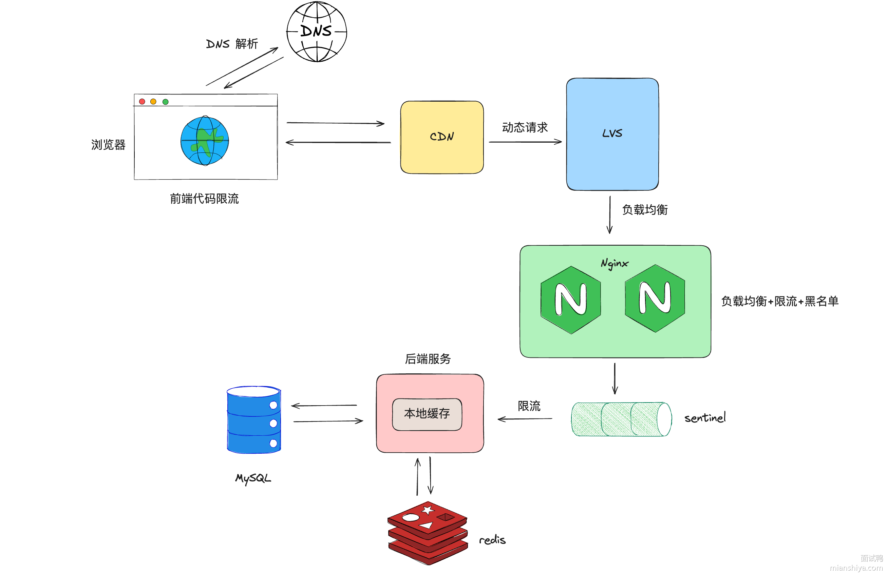

我把 DNS 解析也加上了，因为对一些大公司而言，DNS 其实也是一个分流的手段。

在量级没这么大的情况下，实际上的秒杀架构不需要如上图所示，例如不需要引入 lvs、本地缓存之类的。

##### 库存扣减设计

先看一下正常扣减库存的思路：

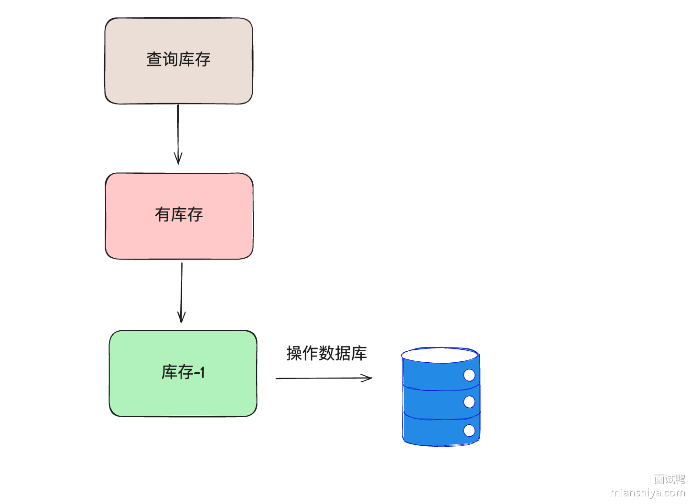

这样的设计会有什么问题？**并发问题，导致超卖**。

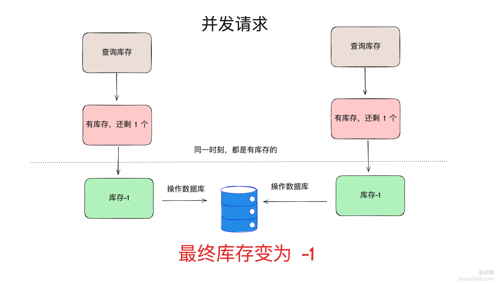

此时可以加锁，比如利用数据库的锁，针对这个场景数据库常用的是乐观锁。

```sql
update inventory set available_inventory = available_inventory - 1
where sku_id = 1 and available_inventory > 0;
```

###### 数据库热点行问题解决方案

如果使用这个语句，在高并发场景下，实际上就会产生**热点行**问题。

我之前公司基于数据库扣减方案，压测单台机子下单链路的并发只能达到 70。单个扣减库存的接口并发只有 200 就把数据库 CPU 压满了。（各公司实际内部业务不同，仅供参考）

**数据库补丁优化**

我们当时数据库用的是阿里云的 RDS，实际上有一个可落地的优化方案：`Inventory hint` + `Returning`。

如果你公司本身用的就是阿里云的 RDS，这个改造成本就很低，仅需在 SQL 上填写一些 hint 即可。

在 SQL 表名前加 `/*+ COMMIT_ON_SUCCESS ROLLBACK_ON_FAIL   TARGET_AFFECT_ROW(1)*/`

```sql
update /*+ COMMIT_ON_SUCCESS ROLLBACK_ON_FAIL
  TARGET_AFFECT_ROW(1)*/ inventory 
 set available_inventory = available_inventory - 1
where sku_id = 1 and available_inventory > 0;
```

`Inventory hint` 原理简单介绍：

- COMMIT_ON_SUCCESS：当前语句执行成功就提交事务上下文。
- ROLLBACK_ON_FAIL：当前语句执行失败就回滚事务上下文。
- TARGET_AFFECT_ROW(NUMBER)：如果当前语句影响行数是指定的就成功，否则语句失败。

设置了这几个 hint 后，当前的语句会按照主键（或唯一键）分组，将相同行的请求修改分为一组，分组后仅组内第一条 SQL 需要抢锁，后续的都不需要申请锁，减少申请锁的流程。

然后组内第一条 SQL 已经遍历 B+树查询到数据了，后续组内库存扣减直接改即可，不用再次查询。且组内 SQL 都修改完之后，仅需一次分组提交事务即可。

根据阿里云介绍，结合 `Inventory hint` 单行 TPS 可达 3.1w：


还可以配合 `Returning` 使用：

```sql
CALL dbms_trans.returning("*", "update /*+ COMMIT_ON_SUCCESS ROLLBACK_ON_FAIL
  TARGET_AFFECT_ROW(1)*/ inventory 
 set available_inventory = available_inventory - 1
where sku_id = 1 and available_inventory > 0;");
```

正常情况下，如果我们 update 扣减了一次库存之后，如果想得知最新的库存，那么需要再执行一次 select 操作，而 `Returning` 可以直接返回实时的库存，减少一次查询。

利用 `Returning`，我们可以得知实时的库存，发现没库存后，可以直接设置一个标志位，表明秒杀已经结束，快速 fail 请求，降低服务的压力。

还有一个 `Statement queue` 我之前没用到，关于这几个 hint 的详情，可以查看这个[介绍链接](https://www.alibabacloud.com/help/zh/rds/apsaradb-rds-for-mysql/inventory-hint#section-e99-qg7-ceh)

**库存拆分**

除了数据库补丁优化，从业务角度，我们可以将库存进行拆分。

上面举例是 1 个库存，但有时候的秒杀的库存会更多，例如 1000 个库存，此时就可以将这 1000 个库存拆分成 100 个小库存，每个小库存内有 10 个库存。


这样其实就是人为的把热点行拆分了，可以把小库存分散到不同的表或者库中，等于将并发度提升了 10 倍。

看起来挺简单，实际对于整个库存扣减流程的改造还是挺大的，例如分桶的库存调配、创建库存时分桶的库存分配、表的映射、库的映射等等。

**插入库存扣减流水**

既然直接 update 有热点行问题，那么就将 update 改为 insert 。

实际上用户的购买从更新库存变成插入流水，然后异步定时将流水库存同步到剩余库存中。

这个手段确实避免了热点行的问题，但插入数据不好控制总的数据量，**容易导致超卖**。

可以跟面试官提一下这个方案，跟他说清这个方案是有超卖的问题。表明你知道这个思路，也知道这个方案的缺点。

这个思路实际上在非限制库存的热点行场景可以使用。

**缓存**

利用缓存来承接热点数据是很多人都熟知的方案，例如使用 Redis。

可以将库存提前同步到 Redis 中，然后利用 redis + lua 脚本控制库存的扣减。

lua 脚本的内容实际上很简单，我用文字来描述一下：

1. 根据商品 key 获取库存
2. 如果有则库存-1，返回新库存
3. 如果没库存，则返回没库存

redis + lua 可以保证操作的原子性，且性能足够优秀，因此是一个非常高效的库存扣减方案。

然后 redis 扣减完毕之后，可以发送一个异步消息（消息队列削峰填谷），后端服务异步消费把数据库中的库存给扣了，实现**最终一致性**。

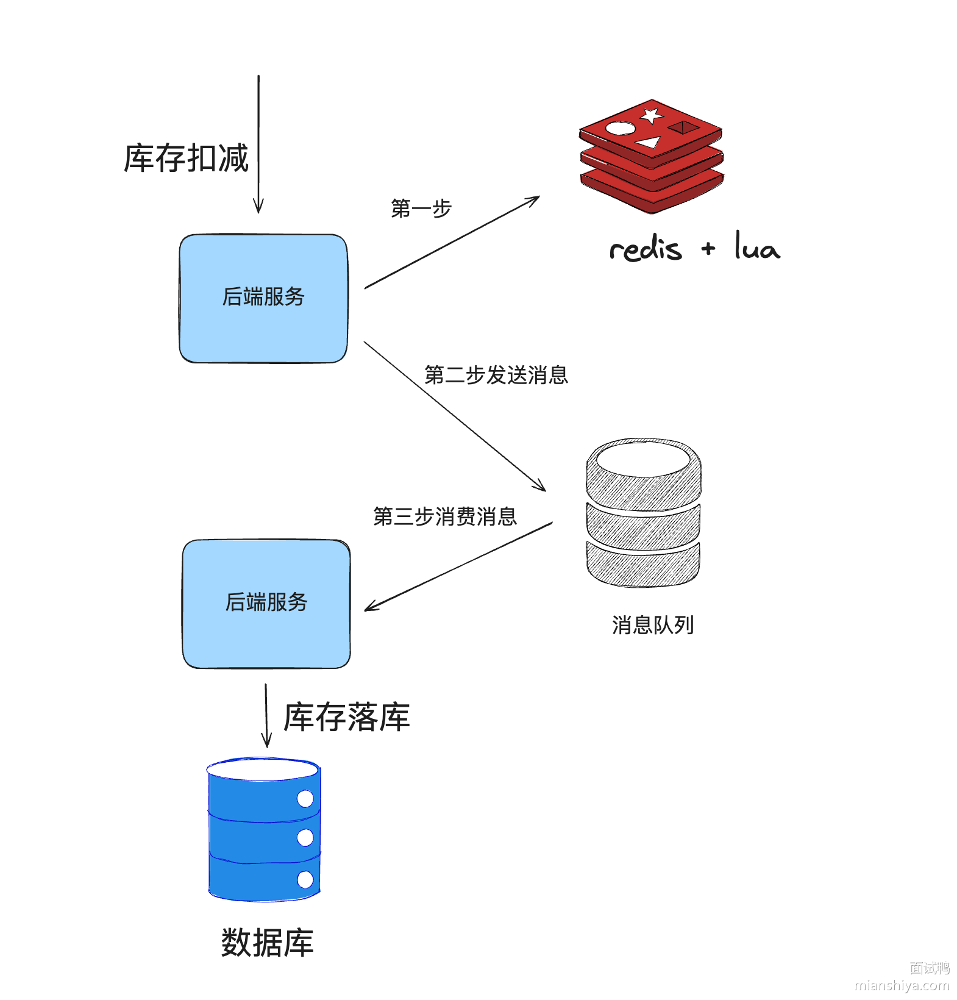

看到这肯定有同学会问：“redis 操作成功后，mq发送失败怎么办？”

因此，我们还需要一个**准实时对账机制**，lua 脚本内不仅要扣减库存，还需要利用 zset 增加流水，score 设置为时间。定时拉取一段时间流水记录比对数据库的库存是否一致，如果不一致则补偿。

至于本地缓存，理论上性能更高，但是方案设计上会更复杂，因为库存被分配到多个应用中。需要在秒杀预热的时候，给后端服务预分配好库存，然后应用各自承接库存扣减，也需要做好对账，防止意外的发生。

##### 预防黑产

大一点的公司都会有风控机制，借助一些算法对用户的来源、行为数据等等进行分析，如果发现不法分子，则将其加入到黑名单中。

脚本抢购实际上可以用验证码、答题等机制拦截，并且这种机制也可以打散用户的请求，降低瞬时流量高峰。

##### 幂等设计

可以看这题：[如何避免用户重复下单（多次下单未支付，占用库存）](https://www.mianshiya.com/bank/1795650132375805954/question/1856228340908228610)

##### 业务手段

###### 预约

例如 Nike 设计就是抢购，预约有一个比较长的时间段，例如 15 分钟。然后预约通过后等待最终抽签结果即可。

这样的设计通过一段时间的预约，可减少瞬时的压力，再异步通过后台实现抽签来间接解决秒杀的问题。

###### 预售

例如现在的电商活动都搞定金预售。

通过下定让用户感觉这个商品已经到手了，不需要再等到双十一或者 618 零点准时抢购，均摊了请求，减少准点抢购的压力。

##### 避免对正常服务的影响

大部分公司秒杀都是和正常服务糅合在一起的，没有做区分。

如果成本允许，且为了避免对正常业务产生影响，则可以将秒杀单独剥离出一套，独立域名、独立服务器部署等。

不过这样实现起来其实很麻烦，最终的数据还是需要同步的正常服务中的，成本比较大。

##### 兜底方案

或许在真正的业务中，很少有人会做兜底方案，都仅考虑正向业务，但是兜底确实很重要！

所以在业务上的设计我们要尽量考虑异常极端情况，设计一个简单的兜底也比没兜底好。

在面试中，那就得疯狂兜底！向面试官展示出你的方案面面俱到！

针对秒杀，其实最简单的方案就是加个开关：关闭秒杀，直接返回秒杀结束。

这个兜底是为了避免极端情况发生，严重影响正常业务的进行或产生资损。

因为秒杀对用户而言本身是一个可以接受失败的场景，没抢到很正常。只要用户来参加我们的活动，营销目的也达到了，所以在严重影响正常业务进行或者发现代码出现漏洞，被人薅羊毛的情况下，关闭秒杀是最好的选择！

### 让你设计一个短链系统，怎么设计？ 

先说一下回答思路：

1）简单描述下短链原理

2）后端设计

3）补充跳转设计

一个小小短链其实融合了很多知识点，能较为全面的考察一个候选人的综合实力。

#### 原理

在浏览器输入短链后，请求打到短链服务，短链服务会根据 url 找到对应的长链重定向到长链地址，此时浏览器就会跳转网页定位到真正的地址。

所以本质原理就是短链服务器根据 url 定位到真正地址，然后通过重定向实现跳转。

#### 后端设计

后端的主要功能是存储短链和长链的对应关系，并且能快速通过短链找到长链。

首先需要先生成短链，假设短链的域名是 dl.x

1）可以通过数据库自增 id 作为短链，往数据库插入一条长链，对应就会得到一个 id

| id   | url                                                |
| ---- | -------------------------------------------------- |
| 1    | https://www.code-nav.cn/course/1790274408835506178 |
| 2    | https://www.code-nav.cn/course/1789189862986850306 |

如果用户访问了 dl.x/1 ，解析得到 1，通过主键就能定位到数据库记录，得到长链 `https://www.code-nav.cn/course/1790274408835506178` 。

这个方式很简单，通过主键查询也很快。

如果面试官问这样的方式有什么缺点，你再说：一旦短链量变多，自增 id 会变成很大，比如 9999999999999999，这样短链也不短了，而且数字有规律性，容易被人遍历出来。

没问就不用说。

2）哈希算法

可以通过 hash 算法将长链进行 hash 计算，得到固定的长度，比如通过 md5 计算可以得到固定的 128bit 数据，还有别的哈希函数，比如 MurMurHash，它既可以生成 128 bit 也可以生成 32bit，不过 32 bit 相比 128 bit 生成速度更慢，且 hash 碰撞的概率更高。

这里再提一嘴 MurMurHash 128bit 版本的速度是 md5 的十倍。

还有 crc32 ，得到的就是 32 位的哈希值，运算速度和 md5 差不多。

因此我们可以将长链通过 hash 得到固定的位数，我找了个网上的 MurmurHash2 例子，我们来看下

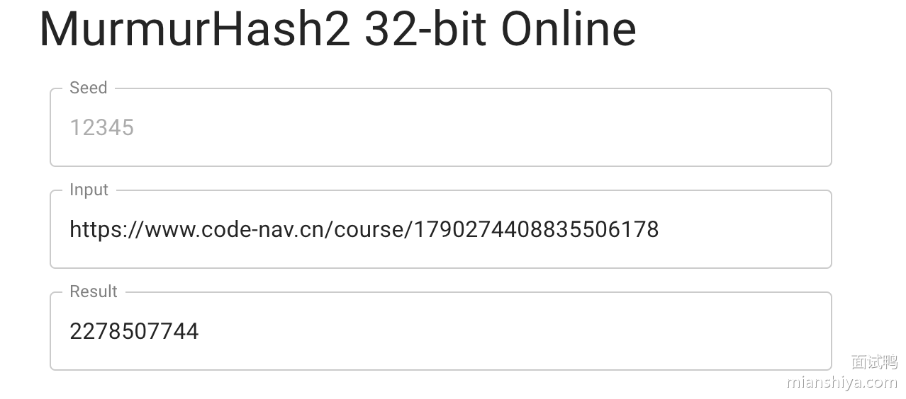

可以看到这么长的一个 url，直接变成了 2278507744，因此短链就是 dl.x/2278507744

------

但是这好像比我们平时在短信中看到的短链还长了一些，还能再缩短吗？


当然是可以的，还可以利用进制转化进一步缩短长度！

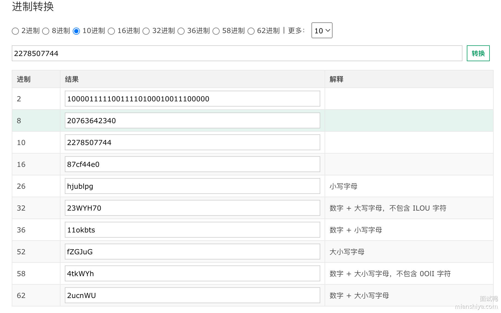

比如我们取 62 位的，最终的短链就是 dl.x/2ucnWU，这样看着是不是感觉就对了？同理上面的自增 id 也可以通过进制转化进一步缩短。

最终的数据库表结构的设计如下：

字段：

- id：主键
- short_url：短链
- long_url：原始长 URL
- user_id：用户 ID（如果需要关联用户）
- created_at：创建时间
- updated_at：更新时间

短链字段需要建立索引，因为很常见的查询就是通过短链得到长链。

#### 跳转设计

我们已经了解到通过短链得到长链的过程，那么浏览器具体是如何在输入短链后自动跳到长链地址的呢？

答案就是**重定向**。这里就需要涉及到 HTTP 的知识点，服务器返回 301 或者 302 状态码，然后在 location 上写上长链的地址，浏览器就会自动识别动作，进行跳转。

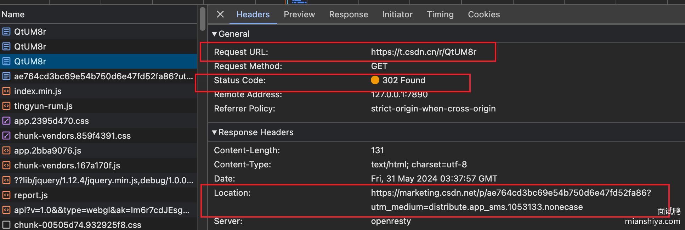

这两个状态码还是有区别的：

1）301 表示永久重定向，即浏览器会默认缓存这次跳转的信息，下次用户在浏览器访问这个短链，浏览器不需要请求短链服务，会自动跳转到长链地址。

2）302 表示临时重定向，即浏览器不会缓存这次跳转信息，用户每次访问这个短链，都需要请求短链服务得到长链。

区别就是 301 可以降低短链服务器压力，因为后续用户访问都不需要请求短链后端服务，而 302 则需要每次访问，但是这样一来可以统计短链访问次数，做一些分析。

#### 扩展

如果数据量大了，一张表存储所有短链数据就会有性能问题，因此需要分库分表。

如果是利用自增 ID 转换得到短链信息，在分库分表场景就会出现重复 ID 的情况，因此可以引入全局发号器来实现全局唯一 ID 分配，比如唯一 ID 可以利用雪花算法生成。

然后通过全局 ID 转化的短链数据作为分表的键即可，因为查询肯定是通过短链来查的。

还有哈希方法可能会导致哈希冲突，即不同的长链可能会生成一样的短链，我们可以将 short_url 作为唯一索引，这样就能保证唯一性，如果插入报错，则可以简单在长链后面拼个随机数，重新进行 hash，这样就能避免重复了。

还可以引入缓存，比如我们双十一做了一个营销活动，给很多用户推送了短信，此时肯定会有很多用户访问这个短信内的短链，此时我们就可以将短链相关信息放在缓存中，不需要查数据库，利用缓存提高性能。

#### 补充为什么需要短链

一般短链会用在短信场景，因为短信有字数限制，超过一定字数收费不一样，所以太长的连接不合适。

再比如一些社交媒体平台对字数也会有限制。

还有一些二维码，如果 url 太长，生成的码也会比较复杂，比较难扫。

### 如何设计一个点赞系统？ 

点赞系统看似简单，实则非常复杂，它可以从系统架构、库表设计、数据存储、性能优化、容灾备份等多个角度来思考设计。

我们可以由浅入深的向面试官来说出这个实现方案：

#### 系统架构设计

从架构方面需要考虑：服务拆分、异步、缓存。

1）分布式架构

大流量场景下，可以将点赞功能独立成一个服务，解耦业务逻辑，便于扩展和维护。例如点赞服务压力倍增的时候，可以仅扩容点赞服务即可。

2）异步处理

只要涉及到大流量，且实时性并没有那么强烈的场景，就需要考虑异步。可以使用消息队列（如 Kafka、RocketMQ）来异步处理点赞请求，减少直接写数据库的压力。

3）缓存机制

除了异步，其实也可以利用缓存（如 Redis、Memcached）存储点赞数，减少数据库访问

#### 库表设计

这边简单给一个库表设计供大家参考：

1）点赞记录表

```sql
CREATE TABLE like_record (
    id BIGINT AUTO_INCREMENT PRIMARY KEY,
    user_id BIGINT NOT NULL,
    item_id BIGINT NOT NULL,
    liked_at TIMESTAMP DEFAULT CURRENT_TIMESTAMP,
    UNIQUE KEY unique_user_item (user_id, item_id)
) ENGINE=InnoDB;
```

2）点赞数汇总表

```sql
CREATE TABLE like_count (
    item_id BIGINT PRIMARY KEY,
    like_count BIGINT DEFAULT 0
) ENGINE=InnoDB;
```

#### 数据存储

上面我们提到了缓存，实际上很多公司除了用 MySQL 存储数据之外，还会利用缓存来存储这种高并发修改的数据。

例如使用 Redis 存储点赞数，承接实时的热数据，后续再将点赞数落库存储至 MySQL 中。即将热门的点赞数缓存到 Redis 中，设置适当的过期时间，定期同步到数据库。

有些大公司还会对缓存进行改造，保证缓存本身的数据持久性。

#### 性能优化

1）数据库优化

例如为常用查询添加合适的索引。like_record 表的 user_id 和 item_id 字段。

如果整体的数据量过大，我们还根据 item_id 或 user_id 对数据进行分库分表，减少单个表的写压力。

2）缓存优化

处理上面提到的 Redis 分布式缓存，还可以利用本地缓存来减轻 Redis 的压力，但是要考虑好数据同步的问题。

3）异步批量处理

对于点赞数的写入，我们可以将一定时间窗口内的点赞请求批量更新到数据库，减少数据库的写操作。

如果用了缓存，那么可以使用定时任务定期将 Redis 中的数据同步到数据库，确保数据一致性。

#### 容灾备份

一个系统的设计肯定需要考虑容灾备份，所以这点跟面试官提出来，会觉得你考虑周到，比较有经验。

1）数据备份

- 定期备份：对数据库进行定期备份，使用增量备份和全量备份相结合的策略。
- 异地备份：有条件的公司（几乎很少）会进行异地备份，防止极端情况发生。

2）高可用架构

- 数据库主从复制：使用 MySQL 主从复制或 Redis 主从复制，实现数据的高可用性。

3）容灾演练

定期进行容灾演练，确保在发生故障时系统能够快速恢复。有些公司还有混沌工程。

> 混沌工程是一种故意向系统注入故障以测试其恢复能力的做法。其目的是找出潜在的故障点，并在它们造成实际中断或其他破坏之前加以纠正

简单来说，例如随便把线上的一台服务停了，看看系统是否能正常运行，来测试故障情况下系统的稳定性。

### 让你设计一个 RPC 框架，怎么设计？ 

先直接跟面试官说下 RPC 框架基础的核心点：

**其实**就这么几点：

1）动态代理(屏蔽底层调用细节)

2）序列化(网络数据传输需要扁平的数据)

3）协议(规定协议，才能识别数据)

4）网络传输(I/O模型相关内容，一般用 Netty 作为底层通信框架即可)

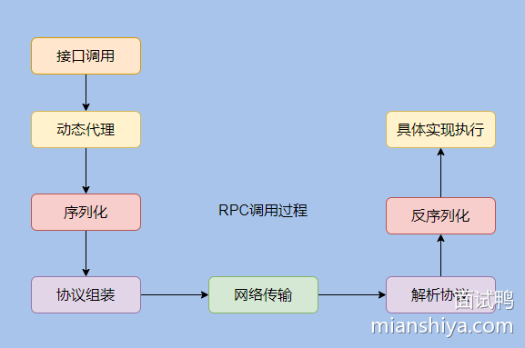

注意，上面加粗的其实二字，一定要说，要注意语气，要显得你游刃有余，低调奢华。

这属于 RPC 框架的基础，生产级别的框架还需要注册中心作为服务的发现，且还需提供路由分组、负载均衡、异常重试、限流熔断等其他功能。

说到这就可以停下了，然后等面试官发问，正常情况下他会选一个点进行深入探讨，这时候我们只能见招拆招了。

\--

下面我们来深入剖析下 RPC，从根上理解它。

RPC 全称是 Remote Procedure Call ，即远程过程调用，其对应的是我们的本地调用。

远程其实指的就是需要网络通信，可以理解为调用远程机器上的方法。

那可能有人说：我用 HTTP 调用不就是远程调用了，那不也叫 RPC 了？

不是的，RPC 的目的是：让我们调用远程方法像调用本地方法一样无差别。

来看下代码就很清晰，比如本来没有拆分服务都是本地调用的时候方法是这样写的：

```java
public String getSth(String str) {
     return yesService.get(str);
}
```

如果 yesSerivce 被拆分出去，此时需要远程调用了，如果用 HTTP 方式，可能就是：

```java
public String getSth(String str) {
    RequestParam param = new RequestParam();
    ......
    return HttpClient.get(url, param,.....);
}
```

此时需要关心远程服务的地址，还需要组装请求等等，而如果采用 RPC 调用那就是：

```java
    public String getSth(String str) {
        // 看起来和之前调用没差？哈哈没唬你，
        // 具体的实现已经搬到另一个服务上了，这里只有接口。
        // 看完下面就知道了。
         return yesService.get(str);  
    }
```

所以说 **RPC 其实就是用来屏蔽远程调用网络相关的细节，使得远程调用和本地调用使用一致**，让开发的效率更高。

在了解了 RPC 的作用之后，我们来看看 RPC 调用需要经历哪些步骤。

#### RPC 调用基本流程

按上面的例子来说，yesService 服务实现被移到了远程服务上，本地没有具体的实现只有一个接口。

那这时候我们需要调用 `yesService.get(str)` ，该怎么办呢？

我们所要做的就是把**传入的参数和调用的接口全限定名通过网络通信告知到远程服务**那里。

然后远程服务接收到参数和接口全限定名就能选中具体的实现并进行调用。

业务处理完之后再通过网络返回结果，这就搞定了！

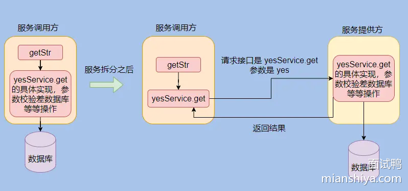

上面的操作这些就是由`yesService.get(str)` 触发的。

不过我们知道 yesService 就是一个接口，没有实现的，所以这些操作是怎么来的？

**是通过动态代理来的。**

RPC 会给接口生成一个代理类，所以我们调用这个接口实际调用的是动态生成的代理类，由代理类来触发远程调用，这样我们调用远程接口就无感知了。

动态代理想必大家都比较熟悉，最常见的就是 Spring 的 AOP 了，涉及的有 JDK 动态代理和 cglib。

在 Dubbo 中用的是 Javassist，至于为什么用这个其实梁飞大佬已经写了博客说明了。

他当时对比了 JDK 自带的、ASM、CGLIB(基于ASM包装)、Javassist。

经过测试最终选用了 Javassist。

> 梁飞：最终决定使用JAVAASSIST的字节码生成代理方式。 虽然ASM稍快，但并没有快一个数量级，而JAVAASSIST的字节码生成方式比ASM方便，JAVAASSIST只需用字符串拼接出Java源码，便可生成相应字节码，而ASM需要手工写字节码。

可以看到选择一个框架的时候性能是一方面，易用性也很关键。

说回 RPC 。

现在我们知道动态代理屏蔽了 RPC 调用的细节，使得用户无感知的调用远程服务，那调用的细节有哪些呢？

##### 序列化

像我们的请求参数都是对象，有时候是定义的 DTO ，有时候是 Map ，这些对象是无法直接在网络中传输的。

你可以理解为对象是“立体”的，而网络传输的数据是“扁平”的，最终需要转化成“扁平”的二进制数据在网络中传输。

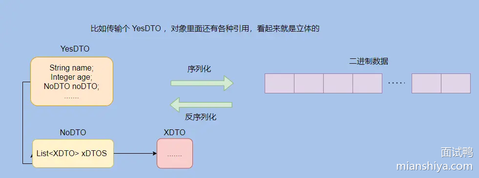

你想想，各对象分配在内存不同位置，各种引用，这看起来是不是有种立体的感觉？最终都是要变成一段01组成的数字传输给对方，这种就01组成的数字看起来是不是很“扁平”？

**把对象转化成二进制数据的过程称为序列化，把二进制数据转化成对象的过程称为反序列化。**

当然如何选择序列化格式也很重要。

比如采用二进制的序列化格式数据更加紧凑，采用 JSON 等文本型序列化格式可读性更佳，排查问题比较方便。

还有很多序列化选择，一般需要**综合考虑通用性、性能、可读性和兼容性**。

具体本文就不分析了，之后再专门写一篇分析各种序列化协议的。

##### RPC 协议

刚才也提到了只有二进制数据才能在网络中传输，那一堆二进制在底层看来是连起来的，它可不会管你哪些数据是哪个请求的，那接收方得知道呀，不然就不能顺利的把二进制数据还原成对应的一个个请求了。

于是就需要定义一个协议，来约定一些规范，制定一些边界使得二进制数据可以被还原。

比如下面一串数字按照不同位数来识别得到的结果是不同的。

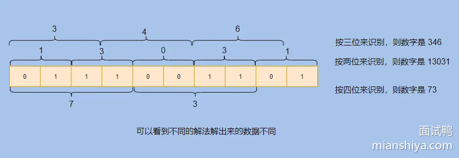

所以协议其实就定义了到底如何构造和解析这些二进制数据。

我们的参数肯定比上面的复杂，因为参数值长度是不定的，而且协议常常伴随着升级而扩展，毕竟有时候需要加一些新特性，那么协议就得变了。

一般 RPC 协议都是**采用协议头+协议体的方式。**

协议头放一些元数据，包括：魔法位、协议的版本、消息的类型、序列化方式、整体长度、头长度、扩展位等。

协议体就是放请求的数据了。

通过魔法位可以得知这是不是咱们约定的协议，比如魔法位固定叫 233 ，一看我们就知道这是 233 协议。

然后协议的版本是为了之后协议的升级。

从整体长度和头长度我们就能知道这个请求到底有多少位，前面多少位是头，剩下的都是协议体，这样就能识别出来，扩展位就是留着日后扩展备用。

贴一下 Dubbo 协议：

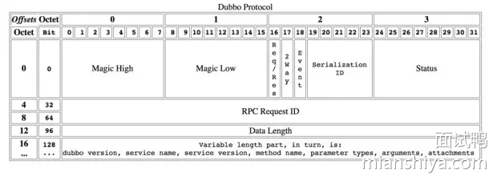

可以看到有 Magic 位，请求 ID， 数据长度等等。

##### 网络传输

组装好数据就等着发送了，这时候就涉及网络传输了。

网络通信那就离不开网络 IO 模型了。

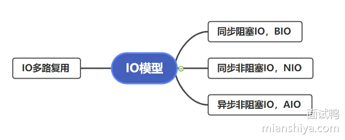

网络 IO 分为这四种模型，具体以后单独写文章分析，这篇就不展开了。

一般而言我们用的都是 IO 多路复用，因为大部分 RPC 调用场景都是高并发调用，IO 复用可以利用较少的线程 hold 住很多请求。

一般 RPC 框架会使用已经造好的轮子来作为底层通信框架。

例如 Java 语言的都会用 Netty ，人家已经封装的很好了，也做了很多优化，拿来即用，便捷高效。

#### 小结

RPC 通信的基础流程已经讲完了，回顾下之前的图：


响应返回就没画了，反正就是倒着来。

我再用**一段话来总结**一下：

服务调用方，面向接口编程，利用动态代理屏蔽底层调用细节将请求参数、接口等数据组合起来并通过序列化转化为二进制数据，再通过 RPC 协议的封装利用网络传输到服务提供方。

服务提供方根据约定的协议解析出请求数据，然后反序列化得到参数，找到具体调用的接口，然后执行具体实现，再返回结果。

**这里面还有很多细节。**

比如请求都是异步的，所以每个请求会有唯一 ID，返回结果会带上对应的 ID， 这样调用方就能通过 ID 找到对应的请求塞入相应的结果。

有人会问为什么要异步，那是为了提高吞吐。

当然还有很多细节，会在之后剖析 Dubbo 的时候提到，结合实际中间件体会才会更深。

#### 真正工业级别的 RPC

以上提到的只是 RPC 的基础流程，这对于工业级别的使用是远远不够的。

生产环境中的服务提供者都是集群部署的，所以有多个提供者，而且还会随着大促等流量情况动态增减机器。

**因此需要注册中心，作为服务的发现。**

调用者可以通过注册中心得知服务提供者们的 IP 地址等元信息，进行调用。

调用者也能通过注册中心得知服务提供者下线。

还需要有**路由分组策略**，调用者根据下发的路由信息选择对应的服务提供者，能实现分组调用、灰度发布、流量隔离等功能。

还需要有**负载均衡策略**，一般经过路由过滤之后还是有多个服务提供者可以选择，通过负载均衡策略来达到流量均衡。

当然还需要有**异常重试**，毕竟网络是不稳定的，而且有时候某个服务提供者也可能出点问题，所以一次调用出错进行重试，减少业务的损耗。

还需要**限流熔断**，限流是因为服务提供者不知道会接入多少调用者，也不清楚每个调用者的调用量，所以需要衡量一下自身服务的承受值来进行限流，防止服务崩溃。

而熔断是为了防止下游服务故障导致自身服务调用超时阻塞堆积而崩溃，特别是调用链很长的那种，影响很大，比如A=>B=>C=>D=>E，然后 E 出了故障，你看ABCD四个服务就傻等着，慢慢的资源就占满了就崩了，全崩。

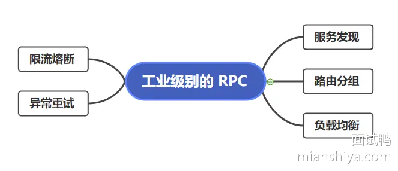

大致就是以上提到的几点，不过还能细化，比如负载均衡的各种策略、限流到底是限制总流量还是根据每个调用者指定限流量，还是上自适应限流等等。

