# 小米虫宝典

## 场景题

### MySQL 中 如果我 select * from 一个有 1000 万行的表，内存会飙升么？ 

#### 回答重点

内存不会飙升。

因为 MySQL 在执行简单 `SELECT * FROM` 查询时，**不会一次性将所有 1000 万行数据加载到内存中，而是通过逐批次处理的方式来控制内存使用。也就是说 MySQL 是边查边发送数据给客户端**。

分批的大小与 `net_buffer_length` 有关，默认 16384 字节（16 KB）。

所以实际上获取数据和发送数据的流程是这样的：

- 获取一行，写入到 `net_buffer` 中。
- 重复获取行，直到 `net_buffer` 写满，调用网络接口发出去。
- 发送成功后 清空 `net_buffer`。
- 再继续取下一行，并写入 `net_buffer`，继续上述的操作。

这里还需要注意一点，发送的数据是需要被客户端读取的，如果客户端读取的慢，导致本地网络栈（socket send buffer）写满了，那么当前数据的写入会被暂停。

综上，**`SELECT \* FROM` 一个有 1000 万行的表，不会导致内存飙升**。

#### 扩展知识

##### 注意 ORDER BY 和 GROUP BY

正常不需要排序和分组的查询不会占用过多的数据和影响 MySQL Server 的执行，但是如果涉及到分组和排序，那么就需要使用额外的内存（或外部空间）来处理全量数据，可能会占用额外的内存并影响查询的效率。

- [617. MySQL 中的数据排序是怎么实现的？](https://www.mianshiya.com/question/1780933295526146049)

##### 客户端的处理方式

虽然 MySQL 会分批返回数据，但是客户端需要做一定的处理，不能全量保存数据，否则可能会导致内存溢出。

客户端需要使用流式处理或者游标来查询。

- 在编写查询代码时，使用流式读取方式（如 JDBC 中的 ResultSet.FETCH_SIZE），这会让数据库逐步返回数据，客户端按需处理。

**JDBC 简单示例**，重点就是 `statement.setFetchSize(Integer.MIN_VALUE)`;

```java
// 获取数据库连接并开启流式处理
try (Connection connection = DriverManager.getConnection(URL, USER, PASSWORD)) {
    // 禁用自动提交，避免结果集完全缓存到内存
    connection.setAutoCommit(false);

    // 创建一个可以进行流式处理的 Statement
    try (PreparedStatement statement = connection.prepareStatement(query,
            ResultSet.TYPE_FORWARD_ONLY, ResultSet.CONCUR_READ_ONLY)) {
        // 设置流式处理的关键：MySQL 特定配置
        statement.setFetchSize(Integer.MIN_VALUE);

        // 执行查询
        try (ResultSet resultSet = statement.executeQuery()) {
            while (resultSet.next()) {
                // 获取每行数据，这里假设有 "id" 和 "name" 两列
                int id = resultSet.getInt("id");
                String name = resultSet.getString("name");

                // 处理数据（例如打印出来）
                System.out.printf("ID: %d, Name: %s%n", id, name);
            }
        }
    }
} catch (SQLException e) {
    e.printStackTrace();
}
        
```

**MyBatis 简单示例**，重点就是 `session.getConfiguration().setDefaultFetchSize(Integer.MIN_VALUE)`;

```java
try (SqlSession session = sqlSessionFactory.openSession()) {
    // 设置 fetchSize 为 Integer.MIN_VALUE 启用流式查询
    session.getConfiguration().setDefaultFetchSize(Integer.MIN_VALUE);

    // 获取 Mapper
    LargeTableMapper mapper = session.getMapper(LargeTableMapper.class);

    // 使用 ResultHandler 处理数据，逐行读取
    mapper.selectAll(resultContext -> {
        LargeTableRecord record = resultContext.getResultObject();
        System.out.printf("ID: %d, Name: %s%n", record.getId(), record.getName());
        // 可以在这里对数据进行处理，避免一次性加载到内存
    });
}
```

**MyBatis 游标查询示例**，重点就是使用 `Cursor` 接口

```java
try (SqlSession session = sqlSessionFactory.openSession()) {
    // 获取 Mapper
    LargeTableMapper mapper = session.getMapper(LargeTableMapper.class);

    // 使用游标查询数据
    try (Cursor<LargeTableRecord> cursor = mapper.selectAllWithCursor()) {
        for (LargeTableRecord record : cursor) {
            System.out.printf("ID: %d, Name: %s%n", record.getId(), record.getName());
            // 可以在这里对数据进行处理，避免一次性加载到内存
        }
    }
}
```

##### 一次性查询大量数据对 MySQL BufferPool 的影响

BufferPool 实现了一个冷热分区的 LRU

- [BufferPool 知识](https://www.mianshiya.com/bank/1791003439968264194/question/1780933295555506177#heading-5)

### 什么是限流？限流算法有哪些？怎么实现的？ 

#### 限流是什么？

首先来解释下什么是限流？

在日常生活中限流很常见，例如去有些景区玩，每天售卖的门票数是有限的，例如 2000 张，即每天最多只有 2000 个人能进去游玩。

那在我们工程上限流是什么呢？限制的是 「流」，在不同场景下「流」的定义不同，可以是每秒请求数、每秒事务处理数、网络流量等等。

而通常我们说的限流指代的是 **限制到达系统的并发请求数**，使得系统能够正常的处理 **部分** 用户的请求，来保证系统的稳定性。

限流不可避免的会造成用户的请求变慢或者被拒的情况，从而会影响用户体验。

因此限流是需要在用户体验和系统稳定性之间做平衡的，即我们常说的 `trade off`。

对了，限流也称流控（流量控制）。

#### 为什么要限流？

前面，我们提到限流是为了保证系统的稳定性。

日常的业务上有类似**秒杀活动、双十一大促或者突发新闻**等场景，用户的流量突增，**后端服务的处理能力是有限的**，如果不能处理好突发流量，后端服务很容易就被打垮。

亦或是爬虫等**不正常流量**，我们对外暴露的服务都要以**最大恶意去防备**调用者。

我们不清楚调用者会如何调用我们的服务，假设某个调用者开几十个线程一天二十四小时疯狂调用你的服务，如果不做啥处理咱服务也算完了，更胜的还有DDos攻击。

还有对于很多第三方开放平台来说，不仅仅要防备不正常流量，还要保证资源的公平利用，一些接口都免费给你用了，资源都不可能一直都被你占着吧，别人也得调的。


**当然加钱的话好商量**。

> 小结一下

限流的本质是因为后端处理能力有限，需要截掉超过处理能力之外的请求，亦或是为了均衡客户端对服务端资源的公平调用，防止一些客户端饿死。

#### 常见的限流算法

有关限流算法我给出了对应的图解和相关伪代码，有些人喜欢看图，有些人更喜欢看代码。

##### 计数限流

最简单的限流算法就是计数限流了。

例如系统能同时处理 100 个请求，保存一个计数器，处理了一个请求，计数器就加一，一个请求处理完毕之后计数器减一。

每次请求来的时候看看计数器的值，如果超过阈值就拒绝。

非常简单粗暴，计数器的值要是存内存中就算单机限流算法。

如果放在第三方存储里，例如 Redis 中，集群机器访问就算分布式限流算法。

优点就是：简单粗暴，单机在 Java 中可用 Atomic 等原子类、分布式就 Redis incr。

缺点就是：假设我们允许的阈值是1万，此时计数器的值为 0， 当 1 万个请求在前 1 秒内一股脑儿的都涌进来，这突发的流量可是顶不住的。

缓缓地增加流量处理和一下子涌入对于程序来说是不一样的。


而且一般的限流都是为了限制在指定时间间隔内的访问量，因此还有个算法叫固定窗口。

##### 固定窗口限流

它相比于计数限流主要是多了个时间窗口的概念，计数器每过一个时间窗口就重置。 规则如下：

- 请求次数小于阈值，允许访问并且计数器 +1；
- 请求次数大于阈值，拒绝访问；
- 这个时间窗口过了之后，计数器清零；


看起来好像很完美，实际上还是有缺陷的。

##### 固定窗口临界问题

假设系统每秒允许 100 个请求，假设第一个时间窗口是 0-1s，在第 0.55s 处一下次涌入 100 个请求，过了 1 秒的时间窗口后计数清零，此时在 1.05 s 的时候又一下次涌入100个请求。

虽然窗口内的计数没超过阈值，但是全局来看在 0.55s-1.05s 这 0.5 秒内涌入了 200 个请求，这其实对于阈值是 100/s 的系统来说是无法接受的。


为了解决这个问题引入了滑动窗口限流。

##### 滑动窗口限流

滑动窗口限流解决固定窗口临界值的问题，可以保证在任意时间窗口内都不会超过阈值。

相对于固定窗口，滑动窗口除了需要引入计数器之外还需要记录时间窗口内每个请求到达的时间点，因此**对内存的占用会比较多**。

规则如下，假设时间窗口为 1 秒：

- 记录每次请求的时间
- 统计每次请求的时间 至 往前推1秒这个时间窗口内请求数，并且 1 秒前的数据可以删除。
- 统计的请求数小于阈值就记录这个请求的时间，并允许通过，反之拒绝。


但是滑动窗口和固定窗口都**无法解决短时间之内集中流量的突击**。

我们所想的限流场景是：

每秒限制 100 个请求。希望请求每 10ms 来一个，这样我们的流量处理就很平滑，但是真实场景很难控制请求的频率，因此可能存在 5ms 内就打满了阈值的情况。

当然对于这种情况还是有变型处理的，例如设置多条限流规则。不仅限制每秒 100 个请求，再设置每 10ms 不超过 2 个。

再多说一句，这个**滑动窗口可与TCP的滑动窗口不一样**。

TCP的滑动窗口是接收方告知发送方自己能接多少“货”，然后发送方控制发送的速率。

接下来再说说漏桶，它可以解决时间窗口类的痛点，使得流量更加平滑。

##### 漏桶算法

如下图所示，水滴持续滴入漏桶中，底部定速流出。

如果水滴滴入的速率大于流出的速率，当存水超过桶的大小的时候就会溢出。

规则如下：

- 请求来了放入桶中
- 桶内请求量满了拒绝请求
- 服务定速从桶内拿请求处理


可以看到水滴对应的就是请求。

它的特点就是**宽进严出**，无论请求多少，请求的速率有多大，都按照固定的速率流出，对应的就是服务按照固定的速率处理请求。

看到这想到啥，是不是和消息队列思想有点像，削峰填谷。

一般而言漏桶也是由队列来实现的，处理不过来的请求就排队，队列满了就开始拒绝请求。

看到这又想到啥，**线程池**不就是这样实现的嘛？

经过漏洞这么一过滤，请求就能平滑的流出，看起来很像很挺完美的？实际上它的优点也即缺点。

面对突发请求，服务的处理速度和平时是一样的，这其实不是我们想要的。

在面对突发流量我们希望在系统平稳的同时，提升用户体验即能更快的处理请求，而不是和正常流量一样，循规蹈矩的处理（看看，之前滑动窗口说流量不够平滑，现在太平滑了又不行，难搞啊）。

而令牌桶在应对突击流量的时候，可以更加的“激进”。

##### 令牌桶算法

令牌桶其实和漏桶的原理类似，只不过漏桶是**定速地流出**，而令牌桶是**定速地往桶里塞入令牌**，然后请求只有拿到了令牌才能通过，之后再被服务器处理。

当然令牌桶的大小也是有限制的，假设桶里的令牌满了之后，定速生成的令牌会丢弃。

规则：

- 定速的往桶内放入令牌
- 令牌数量超过桶的限制，丢弃
- 请求来了先向桶内索要令牌，索要成功则通过被处理，反之拒绝


看到这又想到什么？**Semaphore 信号量啊**，信号量可控制某个资源被同时访问的个数，其实和咱们拿令牌思想一样，一个是拿信号量，一个是拿令牌。

只不过信号量用完了返还，而咱们令牌用了不归还，因为令牌会定时再填充。

再来看看令牌桶的伪代码实现，可以看出和漏桶的区别就在于一个是加法，一个是减法。


可以看出令牌桶在应对突发流量的时候，桶内假如有 100 个令牌，那么这 100 个令牌可以马上被取走，而不像漏桶那样匀速的消费。所以在**应对突发流量的时候令牌桶表现的更佳**。

###### 小结令牌桶算法的优点

1）**平滑的流量控制**：令牌桶算法能够平滑处理请求流量，避免了突发流量对系统造成的冲击。

2）**突发流量处理**：由于桶的容量可以缓冲突发流量，系统可以在短时间内处理更多的请求，而不会立即拒绝。

###### 令牌桶算法使用时的注意点：

1）**桶容量的配置**：

- 如果桶的容量设置过小，可能会导致系统频繁地拒绝请求，从而影响用户体验。
- 如果桶的容量设置过大，可能会导致系统在短时间内处理过多的请求，从而增加系统负担。

2）**令牌生成速率**：

- 令牌生成速率需要根据实际需求进行调整。如果速率设置过低，可能无法满足用户的请求；如果速率设置过高，可能会导致系统负担过重。

##### 限流算法小结

上面所述的算法其实只是这些算法最粗略的实现和最本质的思想，**在工程上其实还是有很多变型的**。

从上面看来好像漏桶和令牌桶比时间窗口算法好多了，那时间窗口算法有什么用？

并不是的，虽然漏桶和令牌桶对比时间窗口对流量的**整形效果更佳**，流量更加得平滑，但是也有各自的缺点（上面已经提到了一部分）。

拿令牌桶来说，假设你没预热，那是不是上线时候桶里没令牌？没令牌请求过来不就直接拒了么？

这就误杀了，明明系统没啥负载现在。

再比如说请求的访问其实是随机的，假设令牌桶每20ms放入一个令牌，桶内初始没令牌，这请求就刚好在第一个20ms内有两个请求，再过20ms里面没请求，其实从40ms来看只有2个请求，应该都放行的，而有一个请求就直接被拒了。

这就有可能造成很多请求的误杀，但是如果看监控曲线的话，好像流量很平滑，峰值也控制的很好。

再拿漏桶来说，漏桶中请求是暂时存在桶内的，**这其实不符合互联网业务低延迟的要求**。

所以漏桶和令牌桶其实比较适合**阻塞式限流**场景，即没令牌我就等着，这样就不会误杀了，而漏桶本就是等着，比较适合后台任务类的限流。

而基于时间窗口的限流比较适合**对时间敏感**的场景，请求过不了您就快点儿告诉我，等的花儿都谢了。

##### 单机限流和分布式限流

本质上单机限流和分布式限流的区别其实就在于 “阈值” 存放的位置。

单机限流就上面所说的算法直接在单台服务器上实现就好了，而往往我们的服务是集群部署的。

因此需要多台机器协同提供限流功能。

像上述的计数器或者时间窗口的算法，可以将计数器存放至 Redis 等分布式 K-V 存储中。

例如滑动窗口的每个请求的时间记录可以利用 Redis 的 `zset` 存储，利用`ZREMRANGEBYSCORE ` 删除时间窗口之外的数据，再用 `ZCARD`计数。

像令牌桶也可以将令牌数量放到 Redis 中。

不过这样的方式等于每一个请求我们都需要去`Redis`判断一下能不能通过，在性能上有一定的损耗。

所以有个优化点就是 「**批量获取**」，每次取令牌不是一个一取，而是取一批，不够了再去取一批，这样可以减少对 Redis 的请求。

不过要注意一点，**批量获取会导致一定范围内的限流误差**。比如你取了 10 个此时不用，等下一秒再用，那同一时刻集群机器总处理量可能会超过阈值。

其实「批量」这个优化点太常见了，不论是 MySQL 的批量刷盘，还是 Kafka 消息的批量发送还是分布式 ID 的高性能发号，都包含了「批量」的思想。

当然，分布式限流还有一种思想是平分，假设之前单机限流 500，现在集群部署了 5 台，那就让每台继续限流 500 呗，即在总的入口做总的限流限制，然后每台机子再自己实现限流。

##### 限流的难点

可以看到，每个限流都有个阈值，这个阈值如何定是个难点。

定大了服务器可能顶不住，定小了就“误杀”了，没有资源利用最大化，对用户体验不好。

我能想到的就是限流上线之后先预估个大概的阈值，然后不执行真正的限流操作，而是采取日志记录方式，对日志进行分析查看限流的效果，然后调整阈值，推算出集群总的处理能力，和每台机子的处理能力(方便扩缩容)。

然后将线上的流量进行重放，测试真正的限流效果，最终阈值确定，然后上线。

我之前还看过一篇耗子叔的文章，讲述了在自动化伸缩的情况下，我们要动态地调整限流的阈值很难。

于是基于TCP拥塞控制的思想，根据请求响应在一个时间段的响应时间P90或者P99值来确定此时服务器的健康状况，来进行动态限流。在他的 Ease Gateway 产品中实现了这套算法，有兴趣的同学可以自行搜索。

其实真实的业务场景很复杂，**需要限流的条件和资源很多**，每个资源限流要求还不一样。

##### 限流组件

一般而言，我们不需要自己实现限流算法来达到限流的目的，不管是接入层限流还是细粒度的接口限流，都有现成的轮子使用，其实现也是用了上述我们所说的限流算法。

比如`Google Guava` 提供的限流工具类 `RateLimiter`，是基于令牌桶实现的，并且扩展了算法，支持预热功能。

阿里开源的限流框架` Sentinel` 中的匀速排队限流策略，就采用了漏桶算法。

Nginx 中的限流模块 `limit_req_zone`，采用了漏桶算法，还有 OpenResty 中的 `resty.limit.req`库等等。

具体的使用还是很简单的，有兴趣的同学可以自行搜索，对内部实现感兴趣的同学可以下个源码看看，学习下生产级别的限流是如何实现的。

### 分布式锁一般都怎样实现？

分布式锁需要实现多个应用实例之间的临界资源竞争，因此它需要依赖三方组件才能实现这样的功能。

常见依赖 Redis、ZooKeeper 来实现分布式锁。

#### Redis 实现

基于缓存实现分布式锁性能上会有优势，可以使用 Redis SETNX （SET if Not eXists）实现分布式锁。

**注意锁需要设置过期时间**，防止应用程序崩溃导致锁没有释放而阻塞后面的所有操作。

获取锁：使用 `jedis.set(lockKey, lockValue, "NX", "PX", lockTimeout)` 尝试获取锁，NX 确保键不存在时才设置，PX 设置键的过期时间（毫秒）。

释放锁：使用 Lua 脚本确保只有持有锁的客户端才能删除锁。Lua 脚本会检查键的值是否等于 lockValue，如果是则删除该键。

简单示例如下，`acquireLock` 为获取锁，`releaseLock` 为释放锁：

```java
public class RedisDistributedLock {
    private static final String LOCK_SUCCESS = "OK";
    private static final Long RELEASE_SUCCESS = 1L;

    private Jedis jedis;
    private String lockKey;
    private String lockValue;
    private int lockTimeout;

    public RedisDistributedLock(Jedis jedis, String lockKey, int lockTimeout) {
        this.jedis = jedis;
        this.lockKey = lockKey;
        this.lockTimeout = lockTimeout;
        this.lockValue = UUID.randomUUID().toString();
    }

    public boolean acquireLock() {
        String result = jedis.set(lockKey, lockValue, "NX", "PX", lockTimeout);
        return LOCK_SUCCESS.equals(result);
    }

    public boolean releaseLock() {
        String releaseScript = 
            "if redis.call('get', KEYS[1]) == ARGV[1] then " +
            "return redis.call('del', KEYS[1]) " +
            "else return 0 end";
        Object result = jedis.eval(releaseScript, Collections.singletonList(lockKey), Collections.singletonList(lockValue));
        return RELEASE_SUCCESS.equals(result);
    }

    public static void main(String[] args) {
        // 创建一个 Jedis 连接实例
        Jedis jedis = new Jedis("localhost", 6379);

        // 创建分布式锁实例
        RedisDistributedLock lock = new RedisDistributedLock(jedis, "my_lock", 10000);

        // 尝试获取锁
        if (lock.acquireLock()) {
            try {
                // 执行你的业务逻辑
                System.out.println("Lock acquired, executing business logic...");
            } finally {
                // 释放锁
                lock.releaseLock();
                System.out.println("Lock released.");
            }
        } else {
            System.out.println("Unable to acquire lock, exiting...");
        }

        // 关闭 Jedis 连接
        jedis.close();
    }
}
```

**注意 lockValue 需要保证唯一，防止被别的客户端释放了锁**。

这里有个问题，如果业务还没执行完，则 Redis 的锁已经到期了怎么办？因此**引入“看门狗”机制**，即起一个后台定时任务，不断地给锁续期，如果锁释放了或客户端实例被关闭则停止续期，Redisson 提供了此功能。

注意：未指定超时时间的分布式锁才会续期，如果指定了超时时间则不会续期，默认 30s 超时，每 10s 续期一次，续期时长为 30s。

除了锁续期问题，还有单点故障问题，如果这台 Redis 挂了怎么办？分布锁就加不上了，业务就被阻塞了。

因此需要引入 Redis 主从，利用哨兵进行故障转移，但是这又会产生新的问题，如果 master 挂了，锁的信息还未传给 slave 节点，此时 slave 上是没加锁的，因此可能导致多个实例都成功上锁。

所以 Redis 作者又提出了 RedLock 即红锁，通过引入多个主节点共同加锁来解决单点故障问题（没有哨兵和 slave 了）。

比如现在有 5 个 Redis 节点（官方推荐至少 5 个），客户端获取当前时间 T1，然后依次利用 SETNX 对 5 个 Redis 节点加锁，如果成功 3 个及以上（大多数），再次获取当前时间 T2，如果 T2-T1 小于锁的超时时间，则加锁成功，反之则失败。

如果加锁失败则向全部节点调用释放锁的操作。

但是这个 redlock 还是有缺点的，首先它比较重，需要 5 个实例，成本不低。

其次如果发生时钟偏移，比如 5 个节点中有几个节点时间偏移了，导致锁提前超时了，那么有可能出现新客户端争抢到锁的情况，但是这个属于运维层面的问题。

还有一个就是 GC 问题，如果客户端抢到锁之后，发生了长时间的 GC 导致 redis 中锁都过期了，这样一来别的客户端就能得到锁了，且老客户端 GC 后正常执行后续的操作，导致并发修改，数据可能就不对了。不过这个问题无法避免，任何锁都可能会这样。

关于 RedLock 可以使用 Redisson ，它提供了 RedLock。

一般业务上，如果我们要使用 Redis 分布式锁，基本上使用 Redisson 客户端。

#### ZooKeeper

除了 Redis 还可以使用 ZooKeeper 的**临时有序节点**实现分布式锁。

临时 能保证超时释放，有序 能选出谁抢到了锁。

大致流程：多进程争抢创建 ZooKeeper 指定目录下的临时有序节点，创建序号最小的节点即抢到锁的进程，释放锁可以删除此节点，如果服务端挂了也会释放这个节点。

优点：如果本身已经引入了 ZooKeeper 则成本不大，实现比较简单。

缺点：相比于 Redis 性能没那么好，ZooKeeper 的写入只能写到主节点，然后同步到从节点。并且临时节点如果产生网络抖动，节点也会被删除，导致多个客户端抢到锁（当然有重试机制，产生的概率比较低）。

可使用 curator 客户端实现的分布式锁接口。

### 什么是RBAC鉴权模型，有什么优劣

来源：[DeepSeek - 探索未至之境](https://chat.deepseek.com/)

#### RBAC 是什么？

RBAC 是一种**权限管理模型**，其核心思想是**将权限（Permissions）分配给角色（Roles），然后将角色分配给用户（Users）**。用户通过成为某个角色的成员而获得该角色所拥有的权限。它强调的是**“谁扮演什么角色”**来决定**“能做什么操作”**。

##### 核心组件与关系

1. **用户：** 系统中的个体（人、系统、设备等），需要访问资源或执行操作。
2. **角色：** 代表组织内部的一个**职能、职位或责任集合**（例如，“管理员”、“财务人员”、“普通用户”、“项目经理”、“医生”、“护士”）。角色是权限的集合载体。
3. **权限：** 定义了对系统资源（如文件、数据库记录、功能按钮、API端点）可以执行的具体**操作**（如“读取”、“写入”、“删除”、“执行”）。权限通常是 `操作 + 资源` 的组合（例如，“创建订单”、“查看工资单”、“删除用户”）。
4. **会话：** 用户登录系统后建立的一个上下文。用户在一个会话中激活其被分配的一个或多个角色。用户实际拥有的权限是其当前激活角色所拥有权限的并集。

##### 核心原则

- **权限分配：** 权限**只**分配给角色，**不直接**分配给用户。
- **角色分配：** 用户**只**被分配角色，**不直接**被分配权限。
- **权限继承 (可选)：** 高级角色可以继承低级角色的权限（例如，“部门经理”角色可能继承“普通员工”角色的所有权限，并额外拥有一些管理权限）。
- **约束 (可选)：** 可以定义规则来限制角色分配，例如：
  - **互斥角色：** 同一个用户不能同时拥有两个互斥的角色（例如，“采购员”和“审批员”）。
  - **基数约束：** 一个角色最多能被分配给多少个用户，或者一个用户最多能拥有多少个角色。
  - **先决条件角色：** 用户必须拥有角色A才能被分配角色B。

##### RBAC 模型级别 (NIST 标准)

- **RBAC0 (核心)：** 包含最基本的用户-角色-权限分配关系。
- **RBAC1 (角色层级)：** 在RBAC0基础上增加了角色继承/层级关系。
- **RBAC2 (约束)：** 在RBAC0基础上增加了各种约束（互斥、基数、先决条件）。
- **RBAC3 (组合)：** 包含了RBAC1和RBAC2的所有特性（层级+约束）。

#### RBAC 的优势

1. **简化管理：** 这是 RBAC 最大的优势。
   - 当组织架构或人员职责变化时（例如，新员工入职、员工调岗、员工离职），管理员只需调整用户的角色分配，而**无需逐个修改成百上千个用户的权限**。
   - 修改一个角色的权限（例如，给所有“财务人员”增加一个新报表的查看权限），会自动应用到所有拥有该角色的用户。
2. **降低错误风险：**
   - 通过预定义的角色和权限集，减少了因手动配置错误导致用户获得过高或过低权限的风险（“权限蠕变”或“权限缺失”）。
   - 约束机制（如互斥角色）可以防止权限冲突或欺诈风险（例如，同一个人不能同时是付款人和审批人）。
3. **提高合规性和审计能力：**
   - 角色清晰地映射了组织的职责分离原则。
   - 审计时更容易跟踪“谁（用户）拥有什么角色”，以及“什么角色拥有什么权限”，比直接审计每个用户的具体权限要清晰得多。
   - 更容易生成合规性报告。
4. **提高可扩展性：**
   - 随着用户数量的增加，基于角色的管理比直接管理用户权限的模型（如ACL）**扩展性要好得多**。
   - 新业务需求出现时，通常只需创建新角色或修改现有角色的权限集，再分配给相关用户。
5. **提升安全性：** 遵循了“最小权限原则”，用户只获得其工作角色所需的最小权限集，减少了因用户账户泄露或被滥用而造成更大范围破坏的可能性。
6. **更贴近业务逻辑：** 角色通常直接对应于组织内的实际岗位和职责，使得权限管理更直观，业务部门和管理员更容易理解。

#### RBAC 的劣势

1. **角色爆炸：**
   - 这是 RBAC 最常见的问题。为了满足精细化的权限需求，可能需要创建大量的、非常细分的角色（例如，“华北区销售经理”、“华东区销售经理”、“华南区销售经理”）。
   - 管理大量角色本身会变得复杂，削弱了 RBAC 简化管理的优势。
   - 用户可能需要被分配多个角色才能完成工作，增加了管理负担。
2. **动态权限处理不足：**
   - RBAC 本质上是**静态**的。权限基于角色分配，而角色分配通常是相对固定的。
   - 处理需要**上下文感知**或**动态决策**的权限（例如，“用户只能编辑自己创建的文档”、“订单金额超过阈值需要额外审批”）比较困难。这通常需要结合其他机制（如ABAC）或在应用层编码实现。
3. **权限粒度问题：**
   - 标准 RBAC 的权限粒度由“操作+资源”定义。如果角色需要非常细粒度的权限（例如，控制到某个具体数据实例的字段级别），可能导致角色数量激增（角色爆炸），或者需要扩展模型。
4. **职责分离 (SoD) 配置可能复杂：**
   - 虽然约束支持 SoD，但在大型复杂系统中，定义和管理所有必要的互斥角色规则可能会变得非常繁琐。
5. **对临时或例外情况处理不灵活：**
   - 如果某个用户临时需要某个不属于其角色的权限，标准的 RBAC 处理起来不够灵活。要么临时修改角色（可能影响他人），要么创建一个一次性角色，都不够优雅。通常需要结合审批流程和临时权限提升机制。
6. **初始配置可能较复杂：**
   - 设计一套能准确反映组织结构和满足安全需求的角色和权限体系，需要仔细的分析和规划，初始投入可能较大。

#### 总结

RBAC 是一种强大且广泛应用的权限管理模型，特别适合**用户数量大、组织结构清晰、权限需求相对稳定**的场景。它通过**角色**这一抽象层极大地简化了权限管理和用户生命周期管理，提升了安全性和合规性。

然而，RBAC 在处理**高度动态、上下文相关、需要极细粒度控制**的权限需求时存在不足，可能导致“角色爆炸”问题。在实际应用中，RBAC 常常与其他模型（如 ABAC - 基于属性的访问控制）结合使用，或者进行扩展，以弥补其局限性。ABAC 通过使用属性（用户属性、资源属性、环境属性、操作属性）和策略规则进行动态决策，可以很好地解决 RBAC 在动态性和细粒度方面的短板。现代系统常采用 **RBAC + ABAC** 的混合模式来平衡易管理性和灵活性。

### 假设有一个 1G 大的 HashMap，此时用户请求过来刚好触发它的扩容，会怎样？让你改造下 HashMap 的实现该怎样优化？ 

#### 回答重点

如果刚好触发扩容，那么当前用户请求会被阻塞，因为 HashMap 的底层是基于数组+链表（红黑树）来实现的，一旦它发生扩容，就需要新增一个比之前大 2 倍的数组，然后将元素搬运到新的数组上。

而 1G 的 HashMap 够大，所以扩容需要一定的时间，而扩容使用的又是当前的线程，所以**用户此时会被阻塞，等待扩容完毕**。

##### 如何改造现有 HashMap 结构而优化处理这种场景？

此时可以借鉴 Redis 的 Hash 结构，因为 Redis 处理命令恰好是单线程的，它的 Hash 表如果很大，触发扩容的时候是不是也会导致阻塞？

所以它是怎么优化的？答案就是：**渐进式rehash**

我们都知道 HashMap 默认的扩容过程是一次性重哈希，**即每次扩容都会创建一个更大的数组，并将所有元素重新哈希并放入新数组**。

而渐进式 rehash 就是把扩容过程**分批完成**，通过分批扩容来减少单次扩容的开销。

简单来说不要一次性扩容完毕，而是分批搬运数据。

在分段扩容过程中，HashMap 需要维护两个数组：

- **旧数组**：扩容之前的数组，包含了部分尚未迁移的数据。
- **新数组**：扩容过程中创建的新数组，用于存储迁移后的数据。

**实现方式**：

- **扩容分批化**：将重新哈希的过程分成多个步骤，而不是一次性完成。在扩容时，先创建新的数组，但只重新哈希一部分旧数据。
- **增量式迁移**：每次插入、修改或查询时，检查当前是否有未完成的扩容任务。如果有，则迁移少量旧数据到新数组中，直到完成所有数据的迁移。
- **迁移状态管理**：通过状态字段记录扩容的进度，确保每次操作时扩容任务逐步推进。

> 有两个数组，那么 `get` 操作时候如何查询呢？

- **优先查找新数组**：当用户发起 get 请求时，优先从新数组中查找。因为已经迁移的数据会直接放入新数组。
- **回退查找旧数组**：如果在新数组中没有找到对应的键，说明该键还未迁移至新数组，需要回退到旧数组查找。

其实这就是**空间换时间的概念**，也是一种权衡。

- **优点**：节省的用户扩容阻塞时间，把扩容时间的消耗平均分散都后面的处理中，基本上做到了无感知。
- **缺点**：空间开销比较大，因为在扩容的时候，同时存在两个大数组。

这类题目就是借助一个场景，看起来问的是 hashmap ，实际上考察对 Redis 的渐进式 Hash 是否有深入的理解，考验面试者是不是仅就死记硬背，无法应用到真实的场景。

#### Redis Hash 底层实现和渐进式扩容

- [Redis 的 hash 是什么？](https://www.mianshiya.com/question/1780933295601643521)

#### 多线程改造

除了往 Redis 的渐进式 Hash 考虑，还可以往 `ConcurrentHashMap` 多线程方向改造，它的设计也是渐进式扩容，只不过融入了多线程的并发扩容，即可以多个线程同时参与扩容。

**`ConcurrentHashMap`的扩容机制介绍**：

1）ConcurrentHashMap 在扩容过程中，会创建一个新数组（nextTable），容量是原数组的两倍。但它不会一次性迁移整个旧表，而是将扩容任务分成多个小段，每次迁移一部分桶（bucket）。通过这种方式，将扩容的负担分散在多个线程、多个操作中。

2）多个线程可以同时参与扩容操作。每个线程负责一段桶的迁移，迁移完成后更新迁移进度，其他线程可以继续处理剩余未迁移的部分。

3）ConcurrentHashMap 通过使用一个 `transferIndex` 变量来记录当前迁移的进度。`transferIndex` 从旧表的高位索引开始，逐步向低位递减。每个线程在扩容时会尝试抢占 `transferIndex` 中的一段桶范围，执行数据迁移并更新 transferIndex。

4）在扩容过程中，如果某个桶中的数据已迁移至新表中，旧表中该桶的引用会被替换为 ForwardingNode。ForwardingNode 节点会指向 nextTable，表示该位置的数据已经迁移到新表中。

5）当所有桶都被迁移至新表时，ConcurrentHashMap 会将 nextTable 替换为 table，并将 nextTable 置为 null，标识扩容完成。

### 针对支付宝最近出现的八折优惠事故，说说如何才能避免类似事件的发生？

#### 回答重点

根据官方回应出现 bug 的原因是运营人员配置错营销模板导致的，即优惠额度和优惠类型都写错了。


实际上，类似的人为错误是难以完全避免的。作为开发人员，我们可以从**产品**和**技术**的角度出发，思考如何尽量降低人为失误的发生几率，并通过及时的预警、拦截等机制，在出错后减少资损。

#### **从产品侧思考**

很多敏感场景我们需要“**防呆设计**”，例如用户需要输入日期这个场景，程序通过日期格式验证（如：`YYYY-MM-DD`），并且如果用户输入不合规范（例如输入`2025-31-14`，超出合理范围），则程序给出错误提示并要求重新输入，这其实就是防呆设计。

例如，在工业上这样的设计就是防呆设计：

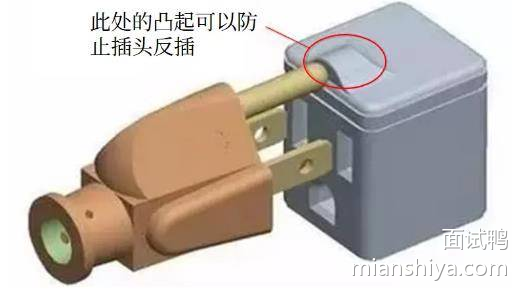

回到面试场景，针对资金、资产相关配置，产品上的设计可以考虑以下几点：

- **多重审核**：营销模板系统可以设计一个“草稿-审核-发布”的流程，确保在发布之前，**经过多重人员审查**，避免因配置错误导致资损。（不清楚为什么支付宝这次会出现这样的错误，因为这种配置按照正常流程肯定是多重审核的）
- **多个优惠类型的冲突检测**：在配置多种优惠时，系统应该检查不同优惠类型的冲突。例如，如果一个活动允许使用“满减”优惠，同时又允许使用“折扣”优惠，系统需要确认两者是否允许叠加使用，或限制其只能选择一种优惠。**产品侧需强提醒（例如弹框）运营当前优惠有叠加，是否确认配置**。
- **合理校验优惠额度上限**：在设置优惠额度时，系统应该能够检查是否超过了预设的上限。例如，对于某些活动，优惠额度不能超过商品价格的 100%（避免用户获得免费商品）。如果优惠类型为折扣，系统应确保折扣比例在合理范围内，**如果优惠力度过大，则需要强提醒（例如弹框），比如优惠了 70% 这种**。
- **合理校验优惠范围**：如果优惠品类过多，例如选择了几十种品类，或者直接选择了全品类这种范围的优惠也需要**强提醒**，进行二次确认，甚至三次确认（选择全品类时一次确认，最终提交时候再次确认）。

#### **从技术侧思考**

- **即时监控和告警**：对于优惠活动的应用情况，设计实时监控机制，任何不符合预期的异常（如优惠幅度异常、超出预算等）要第一时间告警。**比如，如果在短时间内大规模用户（像以前pdd的拉新活动，变成了所有用户可享，很明显数据量肯定是异常的）都获得了折扣**，可以通过日志分析和支付流水对比，及时发现异常。
- **环境隔离**：测试环境和正式环境一定需要有严格的隔离机制，例如网络隔离、数据库隔离等等。因为有太多太多问题是因为测试数据流入正式环境导致的（因为测试往往需要改价、配置大额优惠等等）
- **自动熔断**：针对一些优惠可以预设一个资金池，即最大优惠总额，当超过预设的范围则自动熔断，后续所有优惠直接失效，防止资损进一步扩大。（实际上大部分营销活动都有一个优惠预期，最大优惠总额可以比优惠预期多一些）
- **系统默认兜底检查**：例如同一用户多次短时间内享受了优惠、优惠额度不能超过商品价格的100%等等。很多时候我们写代码都需要考虑兜底，这样代码和产品才会健壮。即尽可能的避免人为的错误产生影响（**把系统的使用者当成呆子，他们就是会做一些神操作，而你就是系统的最终守护者！**）

### 有一张表里面有三个字段，分别是（id，开始时间，结束时间），表中数据量为 5000W，如何统计流量最大的时候有多少条数据？

#### 回答重点

> 题干没有告知峰值的统计单位，可以直接询问面试官，原理都是一样的。本答案以秒作为单位，统计每秒的最大值。

我们要统计每秒钟内的最大并发流量，也就是在某一秒内有多少个事件处于活动状态（**即时间段的重叠**），可以使用**差分数组**和**扫描线思想**来实现。

我们可以通过将每个事件活动的开始时间和结束时间记录为增量（开始时流量 +1，结束时流量 -1），并通过扫描线的方式对每一秒进行累加，最终得到每秒的并发流量。

```sql
CREATE TABLE events (
    id INT,
    start_time DATETIME,
    end_time DATETIME
);
```

假设 start_time 和 end_time 记录的时间单位就是秒，使用一个差分数组（增量数组）来记录每秒的流量变化。具体来说：

- 我们将每个事件的开始和结束时间处理成时间点（例如：start_time 对应 +1 增加并发，end_time + 1 对应 -1 减少并发），并存储在一个列表中
- 然后我们对这些时间点进行排序，并计算每个时间点的并发变化，最终找出最大并发数

假设我们有两个事件：

- 事件1：从 `2024-12-05 10:00:00` 到 `2024-12-05 10:00:30`
- 事件2：从 `2024-12-05 10:00:01` 到 `2024-12-05 10:00:50`

我们关心的是这些事件在某些时间点的重叠情况（即并发数），记录每个事件的开始和结束时刻，增减并发数。

#### 时间戳变化图：

```gherkin
时间点     | 10:00:00   | 10:00:01   | 10:00:30  | 10:00:50  |
事件1      | 开始 -> +1 |            | 结束 -> -1 |           |
事件2      |            | 开始 -> +1 |           | 结束 -> -1 |
并发数     |     1      |     2      |      1    |     0     |
```

`2024-12-05 10:00:01` 时并发数达到了最大值 2，因为此时事件1和事件2同时在进行。

**代码实现如下**：

```java
import java.util.*;

public class EventConcurrency {
    
    public static class Event {
        String id;
        Date startTime;
        Date endTime;
        
        public Event(String id, Date startTime, Date endTime) {
            this.id = id;
            this.startTime = startTime;
            this.endTime = endTime;
        }
    }
    
    public static class EventPoint {
        Date timestamp;
        int change;  // +1 for start, -1 for end + 1 second
        
        public EventPoint(Date timestamp, int change) {
            this.timestamp = timestamp;
            this.change = change;
        }
    }

    public static void main(String[] args) {
        // mock 数据
        List<Event> events = Arrays.asList(
                new Event("1", parseDate("2024-12-05 10:00:00"), parseDate("2024-12-05 10:00:30")),
                new Event("2", parseDate("2024-12-05 10:00:01"), parseDate("2024-12-05 10:00:50"))
        );
        
        // 获取最大并发量和时间点
        Map.Entry<Date, Integer> result = getMaxConcurrency(events);
        
        if (result != null) {
            System.out.println("Max concurrency: " + result.getValue() + " at time: " + formatDate(result.getKey()));
        } else {
            System.out.println("No events found.");
        }
    }

    public static Map.Entry<Date, Integer> getMaxConcurrency(List<Event> events) {
        List<EventPoint> eventPoints = new ArrayList<>();
        

        for (Event event : events) {
            eventPoints.add(new EventPoint(event.startTime, 1));  // Start time: +1 concurrency
            eventPoints.add(new EventPoint(addSecond(event.endTime), -1));  // End time + 1: -1 concurrency
        }
        
        // 通过时间排序
        eventPoints.sort(Comparator.comparing((EventPoint p) -> p.timestamp)); 
        
        int currentConcurrency = 0;
        int maxConcurrency = 0;
        Date maxConcurrencyTime = null;

        // 遍历已排序的事件点以查找最大并发性
        for (EventPoint point : eventPoints) {
            currentConcurrency += point.change;
            if (currentConcurrency > maxConcurrency) {
                maxConcurrency = currentConcurrency;
                maxConcurrencyTime = point.timestamp;
            }
        }
        
        return new AbstractMap.SimpleEntry<>(maxConcurrencyTime, maxConcurrency);
    }

    
    public static Date parseDate(String dateStr) {
        try {
            return new java.text.SimpleDateFormat("yyyy-MM-dd HH:mm:ss").parse(dateStr);
        } catch (java.text.ParseException e) {
            e.printStackTrace();
            return null;
        }
    }
    
    public static String formatDate(Date date) {
        return new java.text.SimpleDateFormat("yyyy-MM-dd HH:mm:ss").format(date);
    }
    
    // +1 秒
    public static Date addSecond(Date date) {
        Calendar cal = Calendar.getInstance();
        cal.setTime(date);
        cal.add(Calendar.SECOND, 1);
        return cal.getTime();
    }
}
```

理解上面的思路后，我们再来看看题干，**表中有 5000w 数据**，所以需要性能优化，而不是一次性加载所有的数据到内存中。

#### 性能优化

对于 5000万条数据的规模，直接查询和处理可能会非常慢。为了提高效率，可以考虑以下优化：

- 索引：在 start_time 和 end_time 字段上创建索引，以加速查询。
- 按时间范围查询：如果事件按时间分布较均匀，按时间范围（例如每天）分批次查询会更高效。
- 数据据分批加载：除了时间范围，也可以分页加载处理
- 减少内存占用：利用 Map 来存储每个时间戳的增减信息，而不需要一次性存储所有时间点。
- 多线程优化：可以使用多线程并行处理。

```java
import java.util.*;
import java.util.concurrent.*;
import java.util.stream.*;
import java.sql.*;
import java.text.SimpleDateFormat;

public class OptimizedEventConcurrency {
    
    public static class Event {
        String id;
        Date startTime;
        Date endTime;
        
        public Event(String id, Date startTime, Date endTime) {
            this.id = id;
            this.startTime = startTime;
            this.endTime = endTime;
        }
    }

    public static void main(String[] args) {
        // 数据库连接（示例中为模拟）
        String url = "jdbc:mysql://localhost:3306/events_db";
        String user = "root";
        String password = "password";
        
        // 每次查询的分页大小（每次加载的记录数）
        int pageSize = 10000;
        int currentPage = 1;
        
        // 使用 ConcurrentSkipListMap 来保证时间戳的线程安全排序
        Map<Long, Integer> timestampChanges = new ConcurrentSkipListMap<>();
        
        // 数据库连接（用于读取事件数据）
        try (Connection conn = DriverManager.getConnection(url, user, password)) {
            
            // 假设总记录有 5000w 条，分页加载
            while (true) {
                List<Event> events = fetchEventsFromDatabase(conn, currentPage, pageSize);
                if (events.isEmpty()) break;  // 没有更多的事件数据，退出循环
                
                // 使用并行流处理事件，减少处理时间
                processEventsInParallel(events, timestampChanges);
                
                currentPage++;  // 下一页
            }
            
            // 计算所有事件的最大并发数
            Map.Entry<Long, Integer> result = getMaxConcurrency(timestampChanges);
            if (result != null) {
                System.out.println("最大并发数: " + result.getValue() + " 发生在时间戳: " + formatTimestamp(result.getKey()));
            } else {
                System.out.println("没有找到事件数据。");
            }
        } catch (SQLException e) {
            e.printStackTrace();
        }
    }

    // 从数据库中获取事件数据，分页查询
    public static List<Event> fetchEventsFromDatabase(Connection conn, int page, int pageSize) throws SQLException {
        String query = "SELECT id, start_time, end_time FROM events LIMIT ?, ?";
        try (PreparedStatement ps = conn.prepareStatement(query)) {
            ps.setInt(1, (page - 1) * pageSize);
            ps.setInt(2, pageSize);
            
            try (ResultSet rs = ps.executeQuery()) {
                List<Event> events = new ArrayList<>();
                while (rs.next()) {
                    String id = rs.getString("id");
                    Date startTime = rs.getTimestamp("start_time");
                    Date endTime = rs.getTimestamp("end_time");
                    events.add(new Event(id, startTime, endTime));
                }
                return events;
            }
        }
    }

    // 使用并行流处理事件并更新时间戳变化
    public static void processEventsInParallel(List<Event> events, Map<Long, Integer> timestampChanges) {
        events.parallelStream().forEach(event -> {
            // 对开始时间添加 +1
            long startTimestamp = event.startTime.getTime() / 1000;
            timestampChanges.merge(startTimestamp, 1, Integer::sum);
            
            // 对结束时间（加1秒）添加 -1
            long endTimestamp = (event.endTime.getTime() + 1000) / 1000;  // 结束时间 + 1 秒
            timestampChanges.merge(endTimestamp, -1, Integer::sum);
        });
    }

    // 从时间戳变化映射中计算最大并发数
    public static Map.Entry<Long, Integer> getMaxConcurrency(Map<Long, Integer> timestampChanges) {
        int currentConcurrency = 0;
        int maxConcurrency = 0;
        long maxConcurrencyTimestamp = -1;

        // 按时间戳排序，计算并发数
        for (Map.Entry<Long, Integer> entry : timestampChanges.entrySet()) {
            currentConcurrency += entry.getValue();
            if (currentConcurrency > maxConcurrency) {
                maxConcurrency = currentConcurrency;
                maxConcurrencyTimestamp = entry.getKey();
            }
        }

        return maxConcurrency > 0 ? new AbstractMap.SimpleEntry<>(maxConcurrencyTimestamp, maxConcurrency) : null;
    }

    // 将时间戳格式
    public static String formatTimestamp(long timestamp) {
        SimpleDateFormat sdf = new SimpleDateFormat("yyyy-MM-dd HH:mm:ss");
        return sdf.format(new Date(timestamp * 1000));
    }
}
```

代码的改造如下：

- 分页查询数据库，避免一次性加载所有数据，减少内存压力
- 使用 parallelStream() 来并行处理每批数据，充分利用多核 CPU 提高性能
- ConcurrentSkipListMap 保证线程安全和数据的有序性

#### 扩展知识

##### 差分数组（Differential Array）

差分数组是一种通过记录区间增量来高效地求解区间问题的数据结构，广泛用于处理一些涉及区间的计算问题，尤其是在需要多次区间更新和区间求和的场景中。它能将原本复杂的区间操作转化为简单的点操作，从而提高效率。

##### 基本思想

1）**差分数组** 是一种记录每个区间开始和结束时增量的数据结构，通过对差分数组的累加，恢复出原数组。

2）对于一个数组 `arr[]`，差分数组 `diff[]` 的定义是：

- `diff[i] = arr[i] - arr[i-1]` (对于第一个元素 `arr[0]`，`diff[0] = arr[0]`)
- 通过差分数组 `diff[]`，可以在 O(1) 时间内更新 `arr[]` 的任何区间操作（加法、减法等）。

##### 例子：如何使用差分数组来实现区间更新

假设我们有一个数组 `arr[]`，并希望对其中的一些区间进行加法操作。例如，我们希望对区间 `[l, r]` 的每个元素加上一个常数值 `k`。

**原数组和差分数组：**

```plaintext
arr = [0, 0, 0, 0, 0]    // 初始数组
diff = [0, 0, 0, 0, 0]   // 差分数组
```

**对 `[2, 4]` 区间加 `5`：**

- 在差分数组中：`diff[2] += 5`，`diff[5] -= 5`（注意`diff[5]`越界，表示这个区间的结束，实际上应为`diff[r+1]`）

```plaintext
diff = [0, 0, 5, 0, 0]  // 差分数组
```

**恢复 `arr[]`：** 通过差分数组，我们可以恢复原始数组：

- `arr[0] = diff[0]`
- `arr[1] = diff[1] + arr[0]`
- `arr[2] = diff[2] + arr[1]`
- `arr[3] = diff[3] + arr[2]`
- `arr[4] = diff[4] + arr[3]`

恢复后，`arr[]` 的值为 `[0, 0, 5, 5, 5]`，即区间 `[2, 4]` 被加上了 5。

差分数组的关键在于**记录增量**，在更新时，直接在差分数组中修改该区间的起始点和结束点的值，通过对差分数组的累加即可恢复原数组的值。

##### 扫描线算法

扫描线算法（Sweep Line Algorithm）是一种在计算几何、计算机图形学以及一些优化问题中广泛使用的算法。其基本思想是：**通过将问题的二维空间按照某一方向扫描，并实时更新状态，从而高效解决问题**。

扫描线算法通过“扫描”整个问题空间，在每个扫描位置更新数据结构（比如维护一个排序的事件队列）来处理这些事件点。这个方法比直接计算每对元素之间的关系要高效得多，尤其是在处理大量数据时。

#### 常见应用

1. **动态区间问题**：例如计算一个时间段内的活动数量，或者计算某个时间段的最大并发请求数。
2. **区间求和**：可以在O(1)时间内实现区间范围的累加和查询。
3. **图形处理**：例如计算矩形重叠区域的面积问题，扫描线算法也广泛应用于计算几何。

### 消息队列设计成推消息还是拉消息？推拉模式的优缺点？ 

#### 回答重点

**推模式（Push）**：消息队列将消息主动推送给消费者，适合实时性要求高、消费者能够及时处理消息的场景。

- **优点**：实时性好，消息可立即送达消费者。
- **缺点**：难以控制消费速度，容易导致消费者过载，尤其是在高并发时。

**拉模式（Pull）**：消费者主动从消息队列中拉取消息，适合消费能力有限、需要根据自身处理能力调控速率的场景。

- **优点**：消费者可以根据自身负载决定拉取频率，避免过载；更适合批量处理。
- **缺点**：可能会导致消息延迟，实时性不如推模式，尤其是拉取频率较低时。

#### 扩展知识

##### 推拉模式

首先明确一下推拉模式到底是在讨论消息队列的哪一个步骤，一般而言我们在谈论**推拉模式的时候指的是 Comsumer 和 Broker 之间的交互。**

默认的认为 Producer 与 Broker 之间就是推的方式，即 Producer 将消息推送给 Broker，而不是 Broker 主动去拉取消息。

想象一下，如果需要 Broker 去拉取消息，那么 Producer 就必须在本地通过日志的形式保存消息来等待 Broker 的拉取，如果有很多生产者的话，那么消息的可靠性不仅仅靠 Broker 自身，还需要靠成百上千的 Producer。

Broker 还能靠多副本等机制来保证消息的存储可靠，而成百上千的 Producer 可靠性就有点难办了，所以默认的 Producer 都是推消息给 Broker。

所以说有些情况分布式好，而有些时候还是集中管理好。

##### 推模式

推模式指的是消息从 Broker 推向 Consumer，即 Consumer 被动的接收消息，由 Broker 来主导消息的发送。

**推模式有什么好处**：

- **消息实时性高**，Broker 接受完消息之后可以立马推送给 Consumer。
- **对于消费者使用来说更简单**，简单啊就等着，反正有消息来了就会推过来。

##### 推模式有什么缺点？

**推送速率难以适应消费速率**，推模式的目标就是以最快的速度推送消息，当生产者往 Broker 发送消息的速率大于消费者消费消息的速率时，随着时间的增长消费者那边可能就“爆仓”了，因为根本消费不过来啊。当推送速率过快就像 DDos 攻击一样消费者就傻了。

并且不同的消费者的消费速率还不一样，身为 Broker 很难平衡每个消费者的推送速率，如果要实现自适应的推送速率那就需要在推送的时候消费者告诉 Broker ，我不行了你推慢点吧，然后 Broker 需要维护每个消费者的状态进行推送速率的变更。

这其实就增加了 Broker 自身的复杂度。

所以说推模式难以根据消费者的状态控制推送速率，适用于消息量不大、消费能力强要求实时性高的情况下。

##### 拉模式

拉模式指的是 Consumer 主动向 Broker 请求拉取消息，即 Broker 被动的发送消息给 Consumer。

##### 我们来想一下拉模式有什么好处？

拉模式主动权就在消费者身上了，消费者可以根据自身的情况来发起拉取消息的请求。假设当前消费者觉得自己消费不过来了，它可以根据一定的策略停止拉取，或者间隔拉取都行。

**拉模式下 Broker 就相对轻松了**，它只管存生产者发来的消息，至于消费的时候自然由消费者主动发起，来一个请求就给它消息呗，从哪开始拿消息，拿多少消费者都告诉它，它就是一个没有感情的工具人，消费者要是没来取也不关它的事。

**拉模式可以更合适的进行消息的批量发送**，基于推模式可以来一个消息就推送，也可以缓存一些消息之后再推送，但是推送的时候其实不知道消费者到底能不能一次性处理这么多消息。而拉模式就更加合理，它可以参考消费者请求的信息来决定缓存多少消息之后批量发送。

##### 拉模式有什么缺点？

**消息延迟**，毕竟是消费者去拉取消息，但是消费者怎么知道消息到了呢？所以它只能不断地拉取，但是又不能很频繁地请求，太频繁了就变成消费者在攻击 Broker 了。因此需要降低请求的频率，比如隔个2 秒请求一次，你看着消息就很有可能延迟 2 秒了。

**消息忙请求**，忙请求就是比如消息隔了几个小时才有，那么在几个小时之内消费者的请求都是无效的，在做无用功。

##### 到底是推还是拉

可以看到推模式和拉模式各有优缺点，到底该如何选择呢？

**RocketMQ 和 Kafka 都选择了拉模式**，当然业界也有基于推模式的消息队列如 ActiveMQ。

我个人觉得拉模式更加的合适，因为现在的消息队列都有持久化消息的需求，也就是说本身它就有个存储功能，它的使命就是接受消息，保存好消息使得消费者可以消费消息即可。

而消费者各种各样，身为 Broker 不应该有依赖于消费者的倾向，我已经为你保存好消息了，你要就来拿好了。

虽说一般而言 Broker 不会成为瓶颈，因为消费端有业务消耗比较慢，但是 Broker 毕竟是一个中心点，能轻量就尽量轻量。

那么竟然 RocketMQ 和 Kafka 都选择了拉模式，它们就不怕拉模式的缺点么？ 怕，所以它们操作了一波，减轻了拉模式的缺点。

即

##### 长轮询

RocketMQ 和 Kafka 都是利用“长轮询”来实现拉模式。所谓的“长轮询”具体的做法都是通过消费者去 Broker 拉取消息时，当有消息的情况下 Broker 会直接返回消息，如果没有消息都会采取延迟处理的策略，即保持连接，暂时 hold 主请求，然后在对应队列或者分区有新消息到来的时候都会提醒消息来了，通过之前 hold 主的请求及时返回消息，保证消息的及时性。

一句话说就是消费者和 Broker 相互配合，拉取消息请求不满足条件的时候 hold 住请求，避免了多次频繁的拉取动作，当消息一到就返回消息。

#### 扩展阅读：RocketMQ 中的长轮询

RocketMQ 中的 PushConsumer 其实是披着拉模式的方法，**只是看起来像推模式而已**。

因为 RocketMQ 在被背后偷偷的帮我们去 Broker 请求数据了。

后台会有个 RebalanceService 线程，这个线程会根据 topic 的队列数量和当前消费组的消费者个数做负载均衡，每个队列产生的 pullRequest 放入阻塞队列 pullRequestQueue 中。然后又有个 PullMessageService 线程不断的从阻塞队列 pullRequestQueue 中获取 pullRequest，然后通过网络请求 broker，这样实现的准实时拉取消息。

这一部分代码我不截了，就是这么个事儿，稍后会用图来展示。

然后 Broker 的 PullMessageProcessor 里面的 processRequest 方法是用来处理拉消息请求的，有消息就直接返回，如果没有消息怎么办呢？我们来看一下代码。

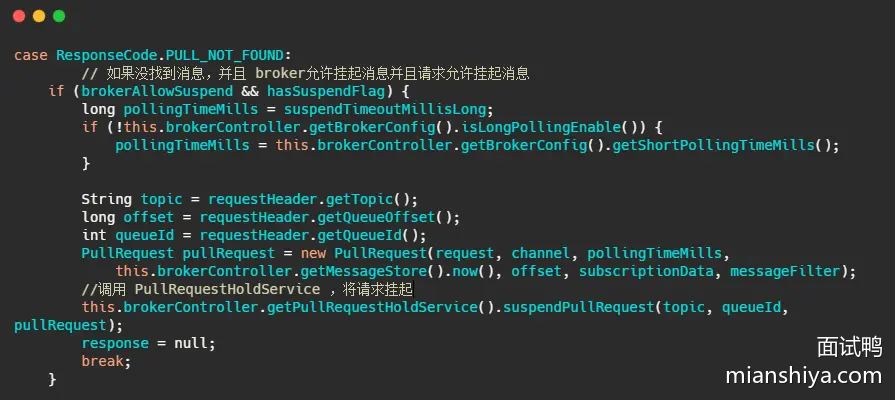

我们再来看下 suspendPullRequest 方法做了什么。


而 PullRequestHoldService 这个线程会每 5 秒从 pullRequestTable 取PullRequest请求，然后看看待拉取消息请求的偏移量是否小于当前消费队列最大偏移量，如果条件成立则说明有新消息了，则会调用 notifyMessageArriving ，最终调用 PullMessageProcessor 的 executeRequestWhenWakeup() 方法重新尝试处理这个消息的请求，也就是再来一次，整个长轮询的时间默认 30 秒。


简单的说就是 5 秒会检查一次消息时候到了，如果到了则调用 processRequest 再处理一次。这好像不太实时啊？ 5秒？

别急，还有个 ReputMessageService 线程，这个线程用来不断地从 commitLog 中解析数据并分发请求，构建出 ConsumeQueue 和 IndexFile 两种类型的数据，**并且也会有唤醒请求的操作，来弥补每 5s 一次这么慢的延迟**

代码我就不截了，就是消息写入并且会调用 pullRequestHoldService#notifyMessageArriving。

最后我再来画个图，描述一下整个流程。

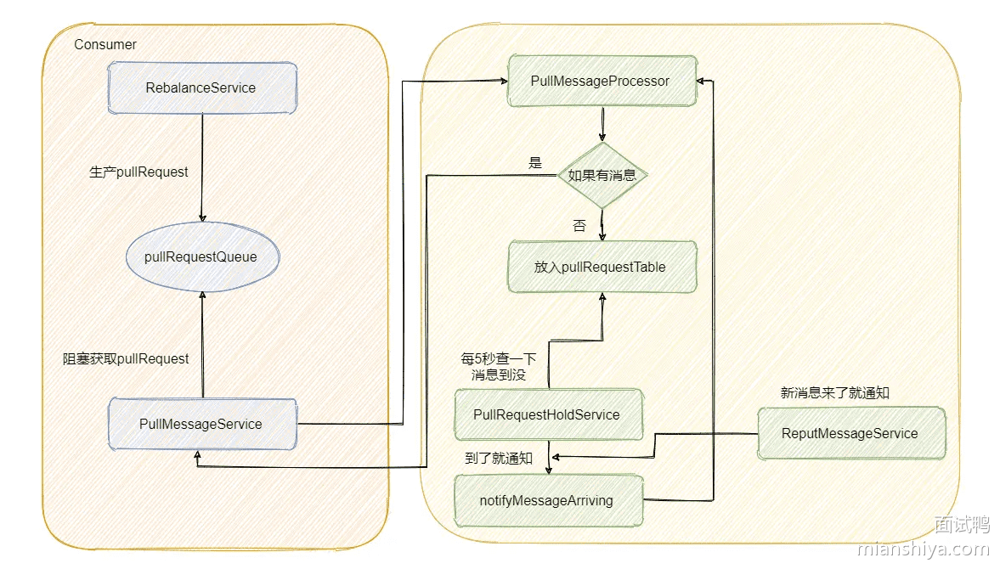

#### 扩展阅读：Kafka 中的长轮询

像 Kafka 在拉请求中有参数，可以使得消费者请求在 “长轮询” 中阻塞等待。

简单的说就是消费者去 Broker 拉消息，定义了一个超时时间，也就是说消费者去请求消息，如果有的话马上返回消息，如果没有的话消费者等着直到超时，然后再次发起拉消息请求。

并且 Broker 也得配合，如果消费者请求过来，有消息肯定马上返回，没有消息那就建立一个延迟操作，等条件满足了再返回。

我们来简单的看一下源码，为了突出重点，我会删减一些代码。

先来看消费者端的代码。


上面那个 poll 接口想必大家都很熟悉，其实从注解直接就知道了确实是等待数据的到来或者超时，我们再简单的往下看。

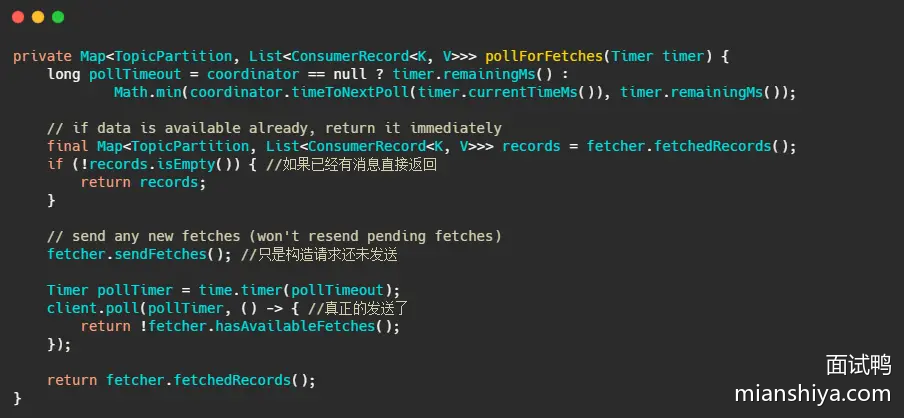

我们再来看下最终 client.poll 调用的是什么。

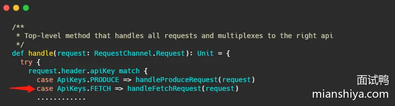

最后**调用的就是 Kafka 包装过的 selector，而最终会调用 Java nio 的 select(timeout)**。

现在消费者端的代码已经清晰了，**我们再来看看 Broker 如何做的**。

Broker 处理所有请求的入口其实我在之前的文章介绍过，就在 KafkaApis.scala 文件的 handle 方法下，这次的主角就是 handleFetchRequest 。


这个方法进来，我截取最重要的部分。

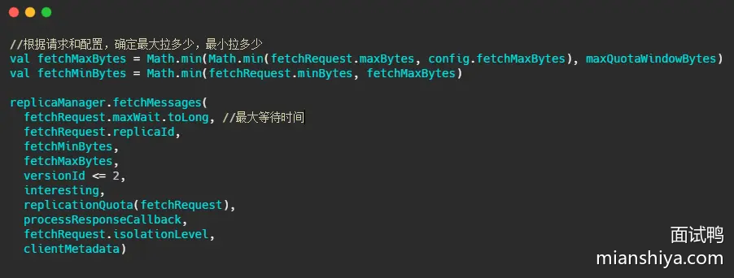

下面的图片就是 fetchMessages 方法内部实现，源码给的注释已经很清晰了，大家放大图片看下即可。


这个炼狱名字取得很有趣，简单的说就是利用我之前文章提到的时间轮，来执行定时任务，例如这里是`delayedFetchPurgatory`，专门用来处理延迟拉取操作。

我们先简单想一下，这个延迟操作都需要实现哪些方法，首先构建的延迟操作需要有检查机制，来查看消息是否已经到了，然后呢还得有个消息到了之后该执行的方法，还需要有执行完毕之后该干啥的方法，当然还得有个超时之后得干啥的方法。

这几个方法其实对应的就是代码里的 DelayedFetch ，这个类继承了 DelayedOperation 内部有：

- isCompleted 检查条件是否满足的方法
- tryComplete 条件满足之后执行的方法
- onComplete 执行完毕之后调用的方法
- onExpiration 过期之后需要执行的方法

判断是否过期就是由时间轮来推动判断的，但是总不能等过期的时候再去看消息到了没吧？

这里 Kafka 和 RocketMQ 的机制一样，也会在消息写入的时候提醒这些延迟请求消息来了，具体代码我不贴了， 在 ReplicaManager#appendRecords 方法内部再深入个两方法可以看到。

不过虽说代码不贴，图还是要画一下的。

 

### 让你实现一个分布式单例对象，如何实现？ 

#### 回答重点

所谓的单例一般指的是一个进程中一个类对应只有一个实例对象，也就是进程唯一。

而分布式，不管是一个机器部署多个服务，还是多个机器部署，本质上就是多进程，所以所谓的分布式单例指的是这个实例对应需要在多进程中保持唯一。

按照这个思路，在创建分布式单例对象时，我们仅需控制同一时刻，只会有一个进程可以操作即可，而分布式场景下的分布式锁就很容易实现这个功能。

多个进程竞争分布式锁，谁抢到锁，谁此时就可以创建这个单例对象，随后释放锁，其他进程抢到锁后，看到对象已经被创建，则直接忽略即可。

还有一点，这个分布式单例对象不能存进程本地，需要在三方外部存储这个单例对象，这样其他进程才能访问。

如果有修改需求，同样也可以用分布式锁，多个进程竞争分布式锁，谁抢到锁，谁此时就可以修改这个单例对象，改完后写回三方外部存储，最后释放锁。

因此，分布式锁既能保证分布式对象的唯一性，也能保证数据的一致性。

分布式锁可以用 redis 实现，三方外部存储也可以用 redis 实现。

##### 总结下：

- 创建时：每个进程争抢分布式锁，如果抢到创建对象，序列化存储到 redis 中，释放锁。其他进程抢到锁发现对象已被创建，则直接无需重新创建。
- 修改时：每个进程使用这个类的时候，争抢分布式锁，如果抢到则从 redis 获取这个数据，反序列化成一个对象使用，使用完之后，将对象数据再序列化存储到 redis 中，覆盖之前的数据，最终释放锁。

#### 扩展知识

##### Zookeeper

ZooKeeper 也可以实现**分布式单例对象**。通过 "抢占唯一节点" 机制实现锁的机制，再利用临时节点 + watch 来实现锁的释放。

比如修改时：

1. 所有节点尝试在创建同一个唯一路径（如/singleton/lock），创建成功的就是抢到锁。
2. 将单例数据存储在 ZooKeeper 的持久节点中（如/singleton/data），持有者负责更新，其他节点通过读取该节点获取数据
3. 持有者修改完毕后，可以主动释放临时节点（/singleton/lock），其他节点利用 watch 监听该路径变化，在持有者下线时其他节点如果需要修改则重新尝试创建这个路径即可。
4. 如果持有者意外下线，临时节点自然会释放。

### 分布式锁一般都怎样实现？ 

分布式锁需要实现多个应用实例之间的临界资源竞争，因此它需要依赖三方组件才能实现这样的功能。

常见依赖 Redis、ZooKeeper 来实现分布式锁。

#### Redis 实现

基于缓存实现分布式锁性能上会有优势，可以使用 Redis SETNX （SET if Not eXists）实现分布式锁。

**注意锁需要设置过期时间**，防止应用程序崩溃导致锁没有释放而阻塞后面的所有操作。

获取锁：使用 `jedis.set(lockKey, lockValue, "NX", "PX", lockTimeout)` 尝试获取锁，NX 确保键不存在时才设置，PX 设置键的过期时间（毫秒）。

释放锁：使用 Lua 脚本确保只有持有锁的客户端才能删除锁。Lua 脚本会检查键的值是否等于 lockValue，如果是则删除该键。

简单示例如下，`acquireLock` 为获取锁，`releaseLock` 为释放锁：

```java
public class RedisDistributedLock {
    private static final String LOCK_SUCCESS = "OK";
    private static final Long RELEASE_SUCCESS = 1L;

    private Jedis jedis;
    private String lockKey;
    private String lockValue;
    private int lockTimeout;

    public RedisDistributedLock(Jedis jedis, String lockKey, int lockTimeout) {
        this.jedis = jedis;
        this.lockKey = lockKey;
        this.lockTimeout = lockTimeout;
        this.lockValue = UUID.randomUUID().toString();
    }

    public boolean acquireLock() {
        String result = jedis.set(lockKey, lockValue, "NX", "PX", lockTimeout);
        return LOCK_SUCCESS.equals(result);
    }

    public boolean releaseLock() {
        String releaseScript = 
            "if redis.call('get', KEYS[1]) == ARGV[1] then " +
            "return redis.call('del', KEYS[1]) " +
            "else return 0 end";
        Object result = jedis.eval(releaseScript, Collections.singletonList(lockKey), Collections.singletonList(lockValue));
        return RELEASE_SUCCESS.equals(result);
    }

    public static void main(String[] args) {
        // 创建一个 Jedis 连接实例
        Jedis jedis = new Jedis("localhost", 6379);

        // 创建分布式锁实例
        RedisDistributedLock lock = new RedisDistributedLock(jedis, "my_lock", 10000);

        // 尝试获取锁
        if (lock.acquireLock()) {
            try {
                // 执行你的业务逻辑
                System.out.println("Lock acquired, executing business logic...");
            } finally {
                // 释放锁
                lock.releaseLock();
                System.out.println("Lock released.");
            }
        } else {
            System.out.println("Unable to acquire lock, exiting...");
        }

        // 关闭 Jedis 连接
        jedis.close();
    }
}
```

**注意 lockValue 需要保证唯一，防止被别的客户端释放了锁**。

这里有个问题，如果业务还没执行完，则 Redis 的锁已经到期了怎么办？因此**引入“看门狗”机制**，即起一个后台定时任务，不断地给锁续期，如果锁释放了或客户端实例被关闭则停止续期，Redisson 提供了此功能。

注意：未指定超时时间的分布式锁才会续期，如果指定了超时时间则不会续期，默认 30s 超时，每 10s 续期一次，续期时长为 30s。

除了锁续期问题，还有单点故障问题，如果这台 Redis 挂了怎么办？分布锁就加不上了，业务就被阻塞了。

因此需要引入 Redis 主从，利用哨兵进行故障转移，但是这又会产生新的问题，如果 master 挂了，锁的信息还未传给 slave 节点，此时 slave 上是没加锁的，因此可能导致多个实例都成功上锁。

所以 Redis 作者又提出了 RedLock 即红锁，通过引入多个主节点共同加锁来解决单点故障问题（没有哨兵和 slave 了）。

比如现在有 5 个 Redis 节点（官方推荐至少 5 个），客户端获取当前时间 T1，然后依次利用 SETNX 对 5 个 Redis 节点加锁，如果成功 3 个及以上（大多数），再次获取当前时间 T2，如果 T2-T1 小于锁的超时时间，则加锁成功，反之则失败。

如果加锁失败则向全部节点调用释放锁的操作。

但是这个 redlock 还是有缺点的，首先它比较重，需要 5 个实例，成本不低。

其次如果发生时钟偏移，比如 5 个节点中有几个节点时间偏移了，导致锁提前超时了，那么有可能出现新客户端争抢到锁的情况，但是这个属于运维层面的问题。

还有一个就是 GC 问题，如果客户端抢到锁之后，发生了长时间的 GC 导致 redis 中锁都过期了，这样一来别的客户端就能得到锁了，且老客户端 GC 后正常执行后续的操作，导致并发修改，数据可能就不对了。不过这个问题无法避免，任何锁都可能会这样。

关于 RedLock 可以使用 Redisson ，它提供了 RedLock。

一般业务上，如果我们要使用 Redis 分布式锁，基本上使用 Redisson 客户端。

#### ZooKeeper

除了 Redis 还可以使用 ZooKeeper 的**临时有序节点**实现分布式锁。

临时 能保证超时释放，有序 能选出谁抢到了锁。

大致流程：多进程争抢创建 ZooKeeper 指定目录下的临时有序节点，创建序号最小的节点即抢到锁的进程，释放锁可以删除此节点，如果服务端挂了也会释放这个节点。

优点：如果本身已经引入了 ZooKeeper 则成本不大，实现比较简单。

缺点：相比于 Redis 性能没那么好，ZooKeeper 的写入只能写到主节点，然后同步到从节点。并且临时节点如果产生网络抖动，节点也会被删除，导致多个客户端抢到锁（当然有重试机制，产生的概率比较低）。

可使用 curator 客户端实现的分布式锁接口。

### 如果让你统计每个接口每分钟调用次数怎么统计？ 

最简单的可以使用 ConcurrentHashMap + AtomicInteger + 定时任务实现内存中的统计。

ConcurrentHashMap 的 key 为方法的名称、value 为 AtomicInteger 类型，记录调用次数，可以通过 aop 切面实现每个方法调用都记录到 ConcurrentHashMap 中，然后利用定时任务每 60 s 统计一次所有方法的数量，再清空 ConcurrentHashMap。

ConcurrentHashMap 保证多方法并发统计时线程安全，AtomicInteger 保证每次累计时线程安全。

看下代码就很清晰了：

```java
@Aspect
@Component
public class ApiCallAspect {

    private ConcurrentHashMap<String, AtomicInteger> apiCallCounts = new ConcurrentHashMap<>();

    @Before("execution(* com.example.controller.*.*(..))")
    public void recordApiCall(JoinPoint joinPoint) {
        String methodName = joinPoint.getSignature().getName();
        apiCallCounts.computeIfAbsent(methodName, k -> new AtomicInteger(0)).incrementAndGet();
    }

    public ConcurrentHashMap<String, AtomicInteger> getApiCallCounts() {
        return apiCallCounts;
    }

    public void reset() {
        apiCallCounts.clear();
    }

}


//每分钟
@Scheduled(fixedRate = 60000)
public void reportApiCallCounts() {
    ConcurrentHashMap<String, AtomicInteger> apiCallCounts = apiCallAspect.getApiCallCounts();
    apiCallCounts.forEach((apiName, count) -> {
       // 记录到 redis 或其他介质中
    });
    //清空记录
    apiCallCounter.reset();
}
```

优点：简单。

缺点：不准确，因为定时任务记录时候，ConcurrentHashMap 也一直在统计，所以最终的结果不一定是一分钟内的，而是超过一分钟的数据。且数据存储到内存中，如果意外宕机，数据就丢失了。

可以采用日志记录实现接口的统计。每次接口调用都用日志记录：接口名、时间戳等信息。

利用日志采集工具将日志统一发送并存储至 es 中（或者其他 NoSQL 中），利用 es 即可统计每分钟每个接口的调用量。

也可以利用 MQ，每次接口调用时都将接口名、时间戳封装发送消息，消费端可以将这些信息存储至 NoSQL 中，最终进行统计分析。

因为存储了时间戳，所以接口的调用次数是准确的。

### 什么是限流？限流算法有哪些？怎么实现的？

#### 限流是什么？

首先来解释下什么是限流？

在日常生活中限流很常见，例如去有些景区玩，每天售卖的门票数是有限的，例如 2000 张，即每天最多只有 2000 个人能进去游玩。

那在我们工程上限流是什么呢？限制的是 「流」，在不同场景下「流」的定义不同，可以是每秒请求数、每秒事务处理数、网络流量等等。

而通常我们说的限流指代的是 **限制到达系统的并发请求数**，使得系统能够正常的处理 **部分** 用户的请求，来保证系统的稳定性。

限流不可避免的会造成用户的请求变慢或者被拒的情况，从而会影响用户体验。

因此限流是需要在用户体验和系统稳定性之间做平衡的，即我们常说的 `trade off`。

对了，限流也称流控（流量控制）。

#### 为什么要限流？

前面，我们提到限流是为了保证系统的稳定性。

日常的业务上有类似**秒杀活动、双十一大促或者突发新闻**等场景，用户的流量突增，**后端服务的处理能力是有限的**，如果不能处理好突发流量，后端服务很容易就被打垮。

亦或是爬虫等**不正常流量**，我们对外暴露的服务都要以**最大恶意去防备**调用者。

我们不清楚调用者会如何调用我们的服务，假设某个调用者开几十个线程一天二十四小时疯狂调用你的服务，如果不做啥处理咱服务也算完了，更胜的还有DDos攻击。

还有对于很多第三方开放平台来说，不仅仅要防备不正常流量，还要保证资源的公平利用，一些接口都免费给你用了，资源都不可能一直都被你占着吧，别人也得调的。


**当然加钱的话好商量**。

> 小结一下

限流的本质是因为后端处理能力有限，需要截掉超过处理能力之外的请求，亦或是为了均衡客户端对服务端资源的公平调用，防止一些客户端饿死。

#### 常见的限流算法

有关限流算法我给出了对应的图解和相关伪代码，有些人喜欢看图，有些人更喜欢看代码。

#### 计数限流

最简单的限流算法就是计数限流了。

例如系统能同时处理 100 个请求，保存一个计数器，处理了一个请求，计数器就加一，一个请求处理完毕之后计数器减一。

每次请求来的时候看看计数器的值，如果超过阈值就拒绝。

非常简单粗暴，计数器的值要是存内存中就算单机限流算法。

如果放在第三方存储里，例如 Redis 中，集群机器访问就算分布式限流算法。

优点就是：简单粗暴，单机在 Java 中可用 Atomic 等原子类、分布式就 Redis incr。

缺点就是：假设我们允许的阈值是1万，此时计数器的值为 0， 当 1 万个请求在前 1 秒内一股脑儿的都涌进来，这突发的流量可是顶不住的。

缓缓地增加流量处理和一下子涌入对于程序来说是不一样的。

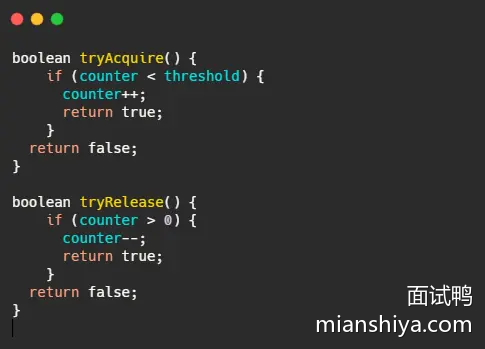

而且一般的限流都是为了限制在指定时间间隔内的访问量，因此还有个算法叫固定窗口。

#### 固定窗口限流

它相比于计数限流主要是多了个时间窗口的概念，计数器每过一个时间窗口就重置。 规则如下：

- 请求次数小于阈值，允许访问并且计数器 +1；
- 请求次数大于阈值，拒绝访问；
- 这个时间窗口过了之后，计数器清零；


看起来好像很完美，实际上还是有缺陷的。

#### 固定窗口临界问题

假设系统每秒允许 100 个请求，假设第一个时间窗口是 0-1s，在第 0.55s 处一下次涌入 100 个请求，过了 1 秒的时间窗口后计数清零，此时在 1.05 s 的时候又一下次涌入100个请求。

虽然窗口内的计数没超过阈值，但是全局来看在 0.55s-1.05s 这 0.5 秒内涌入了 200 个请求，这其实对于阈值是 100/s 的系统来说是无法接受的。


为了解决这个问题引入了滑动窗口限流。

#### 滑动窗口限流

滑动窗口限流解决固定窗口临界值的问题，可以保证在任意时间窗口内都不会超过阈值。

相对于固定窗口，滑动窗口除了需要引入计数器之外还需要记录时间窗口内每个请求到达的时间点，因此**对内存的占用会比较多**。

规则如下，假设时间窗口为 1 秒：

- 记录每次请求的时间
- 统计每次请求的时间 至 往前推1秒这个时间窗口内请求数，并且 1 秒前的数据可以删除。
- 统计的请求数小于阈值就记录这个请求的时间，并允许通过，反之拒绝。

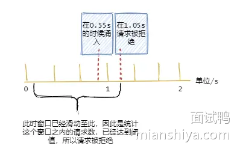

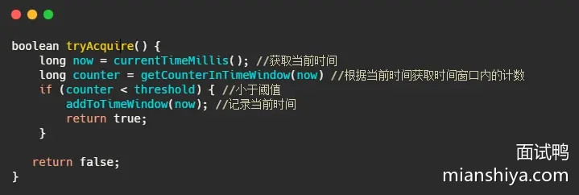

但是滑动窗口和固定窗口都**无法解决短时间之内集中流量的突击**。

我们所想的限流场景是：

每秒限制 100 个请求。希望请求每 10ms 来一个，这样我们的流量处理就很平滑，但是真实场景很难控制请求的频率，因此可能存在 5ms 内就打满了阈值的情况。

当然对于这种情况还是有变型处理的，例如设置多条限流规则。不仅限制每秒 100 个请求，再设置每 10ms 不超过 2 个。

再多说一句，这个**滑动窗口可与TCP的滑动窗口不一样**。

TCP的滑动窗口是接收方告知发送方自己能接多少“货”，然后发送方控制发送的速率。

接下来再说说漏桶，它可以解决时间窗口类的痛点，使得流量更加平滑。

#### 漏桶算法

如下图所示，水滴持续滴入漏桶中，底部定速流出。

如果水滴滴入的速率大于流出的速率，当存水超过桶的大小的时候就会溢出。

规则如下：

- 请求来了放入桶中
- 桶内请求量满了拒绝请求
- 服务定速从桶内拿请求处理

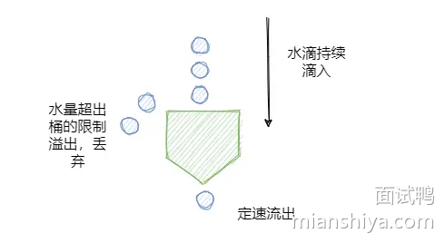


可以看到水滴对应的就是请求。

它的特点就是**宽进严出**，无论请求多少，请求的速率有多大，都按照固定的速率流出，对应的就是服务按照固定的速率处理请求。

看到这想到啥，是不是和消息队列思想有点像，削峰填谷。

一般而言漏桶也是由队列来实现的，处理不过来的请求就排队，队列满了就开始拒绝请求。

看到这又想到啥，**线程池**不就是这样实现的嘛？

经过漏桶这么一过滤，请求就能平滑的流出，看起来很像很挺完美的？实际上它的优点也即缺点。

面对突发请求，服务的处理速度和平时是一样的，这其实不是我们想要的。

在面对突发流量我们希望在系统平稳的同时，提升用户体验即能更快的处理请求，而不是和正常流量一样，循规蹈矩的处理（看看，之前滑动窗口说流量不够平滑，现在太平滑了又不行，难搞啊）。

而令牌桶在应对突击流量的时候，可以更加的“激进”。

#### 令牌桶算法

令牌桶其实和漏桶的原理类似，只不过漏桶是**定速地流出**，而令牌桶是**定速地往桶里塞入令牌**，然后请求只有拿到了令牌才能通过，之后再被服务器处理。

当然令牌桶的大小也是有限制的，假设桶里的令牌满了之后，定速生成的令牌会丢弃。

规则：

- 定速的往桶内放入令牌
- 令牌数量超过桶的限制，丢弃
- 请求来了先向桶内索要令牌，索要成功则通过被处理，反之拒绝


看到这又想到什么？**Semaphore 信号量啊**，信号量可控制某个资源被同时访问的个数，其实和咱们拿令牌思想一样，一个是拿信号量，一个是拿令牌。

只不过信号量用完了返还，而咱们令牌用了不归还，因为令牌会定时再填充。

再来看看令牌桶的伪代码实现，可以看出和漏桶的区别就在于一个是加法，一个是减法。

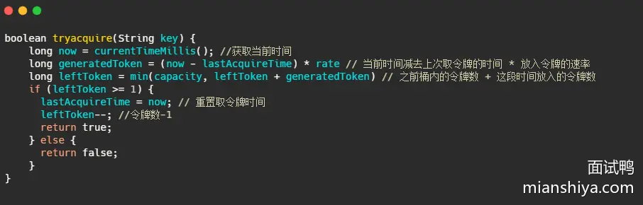

可以看出令牌桶在应对突发流量的时候，桶内假如有 100 个令牌，那么这 100 个令牌可以马上被取走，而不像漏桶那样匀速的消费。所以在**应对突发流量的时候令牌桶表现的更佳**。

#### 小结令牌桶算法的优点

1）**平滑的流量控制**：令牌桶算法能够平滑处理请求流量，避免了突发流量对系统造成的冲击。

2）**突发流量处理**：由于桶的容量可以缓冲突发流量，系统可以在短时间内处理更多的请求，而不会立即拒绝。

#### 令牌桶算法使用时的注意点：

1）**桶容量的配置**：

- 如果桶的容量设置过小，可能会导致系统频繁地拒绝请求，从而影响用户体验。
- 如果桶的容量设置过大，可能会导致系统在短时间内处理过多的请求，从而增加系统负担。

2）**令牌生成速率**：

- 令牌生成速率需要根据实际需求进行调整。如果速率设置过低，可能无法满足用户的请求；如果速率设置过高，可能会导致系统负担过重。

#### 限流算法小结

上面所述的算法其实只是这些算法最粗略的实现和最本质的思想，**在工程上其实还是有很多变型的**。

从上面看来好像漏桶和令牌桶比时间窗口算法好多了，那时间窗口算法有什么用？

并不是的，虽然漏桶和令牌桶对比时间窗口对流量的**整形效果更佳**，流量更加得平滑，但是也有各自的缺点（上面已经提到了一部分）。

拿令牌桶来说，假设你没预热，那是不是上线时候桶里没令牌？没令牌请求过来不就直接拒了么？

这就误杀了，明明系统没啥负载现在。

再比如说请求的访问其实是随机的，假设令牌桶每20ms放入一个令牌，桶内初始没令牌，这请求就刚好在第一个20ms内有两个请求，再过20ms里面没请求，其实从40ms来看只有2个请求，应该都放行的，而有一个请求就直接被拒了。

这就有可能造成很多请求的误杀，但是如果看监控曲线的话，好像流量很平滑，峰值也控制的很好。

再拿漏桶来说，漏桶中请求是暂时存在桶内的，**这其实不符合互联网业务低延迟的要求**。

所以漏桶和令牌桶其实比较适合**阻塞式限流**场景，即没令牌我就等着，这样就不会误杀了，而漏桶本就是等着，比较适合后台任务类的限流。

而基于时间窗口的限流比较适合**对时间敏感**的场景，请求过不了您就快点儿告诉我，等的花儿都谢了。

#### 单机限流和分布式限流

本质上单机限流和分布式限流的区别其实就在于 “阈值” 存放的位置。

单机限流就上面所说的算法直接在单台服务器上实现就好了，而往往我们的服务是集群部署的。

因此需要多台机器协同提供限流功能。

像上述的计数器或者时间窗口的算法，可以将计数器存放至 Redis 等分布式 K-V 存储中。

例如滑动窗口的每个请求的时间记录可以利用 Redis 的 `zset` 存储，利用`ZREMRANGEBYSCORE ` 删除时间窗口之外的数据，再用 `ZCARD`计数。

像令牌桶也可以将令牌数量放到 Redis 中。

不过这样的方式等于每一个请求我们都需要去`Redis`判断一下能不能通过，在性能上有一定的损耗。

所以有个优化点就是 「**批量获取**」，每次取令牌不是一个一取，而是取一批，不够了再去取一批，这样可以减少对 Redis 的请求。

不过要注意一点，**批量获取会导致一定范围内的限流误差**。比如你取了 10 个此时不用，等下一秒再用，那同一时刻集群机器总处理量可能会超过阈值。

其实「批量」这个优化点太常见了，不论是 MySQL 的批量刷盘，还是 Kafka 消息的批量发送还是分布式 ID 的高性能发号，都包含了「批量」的思想。

当然，分布式限流还有一种思想是平分，假设之前单机限流 500，现在集群部署了 5 台，那就让每台继续限流 500 呗，即在总的入口做总的限流限制，然后每台机子再自己实现限流。

#### 限流的难点

可以看到，每个限流都有个阈值，这个阈值如何定是个难点。

定大了服务器可能顶不住，定小了就“误杀”了，没有资源利用最大化，对用户体验不好。

我能想到的就是限流上线之后先预估个大概的阈值，然后不执行真正的限流操作，而是采取日志记录方式，对日志进行分析查看限流的效果，然后调整阈值，推算出集群总的处理能力，和每台机子的处理能力(方便扩缩容)。

然后将线上的流量进行重放，测试真正的限流效果，最终阈值确定，然后上线。

我之前还看过一篇耗子叔的文章，讲述了在自动化伸缩的情况下，我们要动态地调整限流的阈值很难。

于是基于TCP拥塞控制的思想，根据请求响应在一个时间段的响应时间P90或者P99值来确定此时服务器的健康状况，来进行动态限流。在他的 Ease Gateway 产品中实现了这套算法，有兴趣的同学可以自行搜索。

其实真实的业务场景很复杂，**需要限流的条件和资源很多**，每个资源限流要求还不一样。

#### 限流组件

一般而言，我们不需要自己实现限流算法来达到限流的目的，不管是接入层限流还是细粒度的接口限流，都有现成的轮子使用，其实现也是用了上述我们所说的限流算法。

比如`Google Guava` 提供的限流工具类 `RateLimiter`，是基于令牌桶实现的，并且扩展了算法，支持预热功能。

阿里开源的限流框架` Sentinel` 中的匀速排队限流策略，就采用了漏桶算法。

Nginx 中的限流模块 `limit_req_zone`，采用了漏桶算法，还有 OpenResty 中的 `resty.limit.req`库等等。

具体的使用还是很简单的，有兴趣的同学可以自行搜索，对内部实现感兴趣的同学可以下个源码看看，学习下生产级别的限流是如何实现的。

### 即时通讯项目中怎么实现历史消息的下拉分页加载？ 

#### 业务场景

一般在即时通讯项目（比如聊天室）中，我们会采用下拉分页的方式让用户加载历史消息记录。

区别于标准分页每次只展示当前页面的数据，下拉分页加载是 **增量加载** 的模式，每次下拉时会请求加载一小部分新数据，并放到已加载的数据列表中，从而形成无限滚动的效果，确保用户体验流畅。

比如用户有 10 条消息记录，以 5 条为单位进行分页，刚进入房间时只会加载最新的 5 条消息：


下拉后，会加载历史的第 6 - 10 条消息：


理解了业务场景后，再看下实现方案，为什么不建议使用传统分页实现下拉加载？

#### 传统分页的问题

在传统分页中，数据通常是 **基于页码或偏移量** 进行加载的。如果数据在分页过程发生了变化，比如插入新数据、删除老数据，用户看到的分页数据可能会出现不一致，导致用户错过或重复某些数据。

举个例子，对于即时通讯项目，用户可能会持续收到新的消息。如果按照传统分页基于偏移量加载，第一页已经加载了第 1 - 5 行的数据，本来要查询的第二页数据是第 6 - 10 行（对应的 SQL 语句为 limit 5, 5），数据库记录如下：

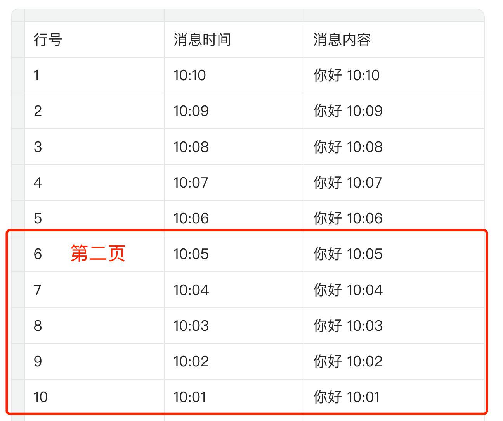

结果在查询第二页前，突然用户又收到了 5 条新消息，数据库记录就变成了下面这样。原本的第一页，变成了当前的第二页！

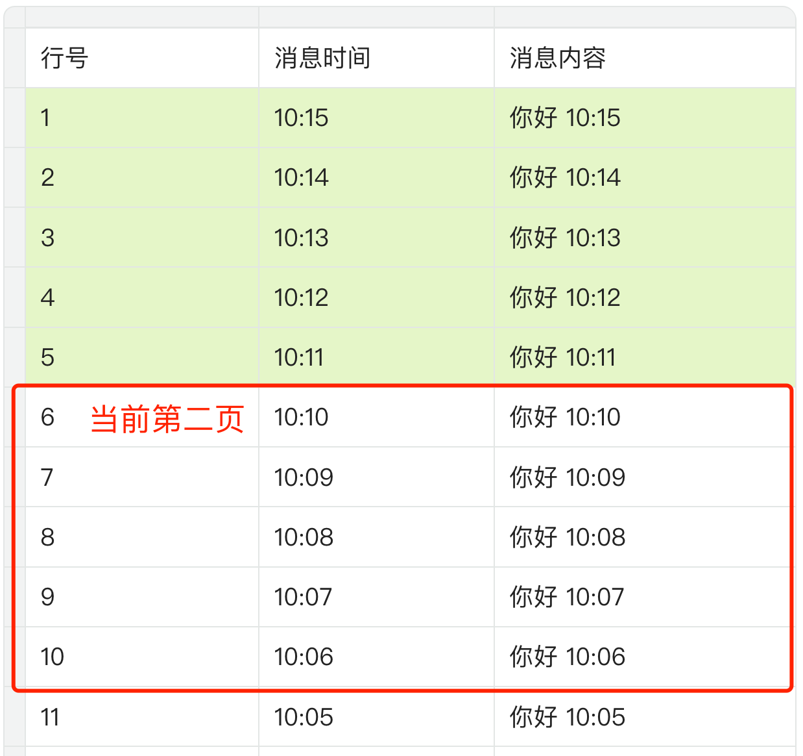

这样就导致查询出的第二页数据，正好是之前已经查询出的第一页的数据，造成了消息重复加载。所以不建议采用这种方法。

#### 推荐方案 - 游标分页

为了解决这种问题，可以使用游标分页。使用一个游标来跟踪分页位置，而不是基于页码，每次请求从上一次请求的游标开始加载数据。

一般我们会选择数据记录的唯一标识符（主键）、时间戳、或者具有排序能力的字段作为游标。比如即时通讯系统中的每个消息，通常都有一个唯一自增的 id，就可以作为游标。每次查询完当前页面的数据后，可以将最后一条消息记录的 id 作为游标值传递给前端（客户端）。

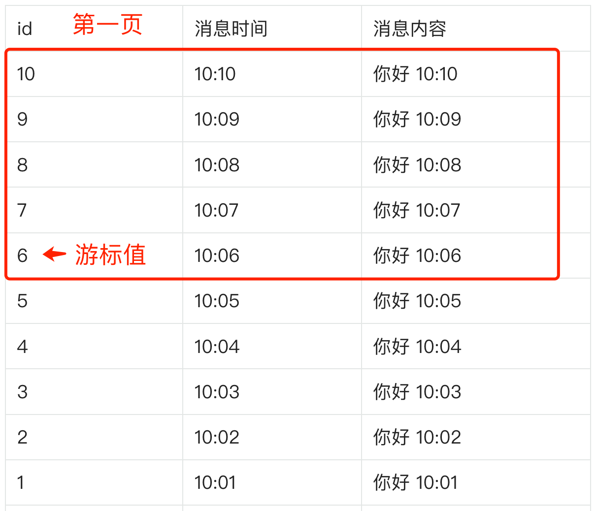

当要加载下一页时，前端携带游标值发起查询，后端操作数据库从 id 小于当前游标值的数据开始查询，这样查询结果就不会受到新增数据的影响。

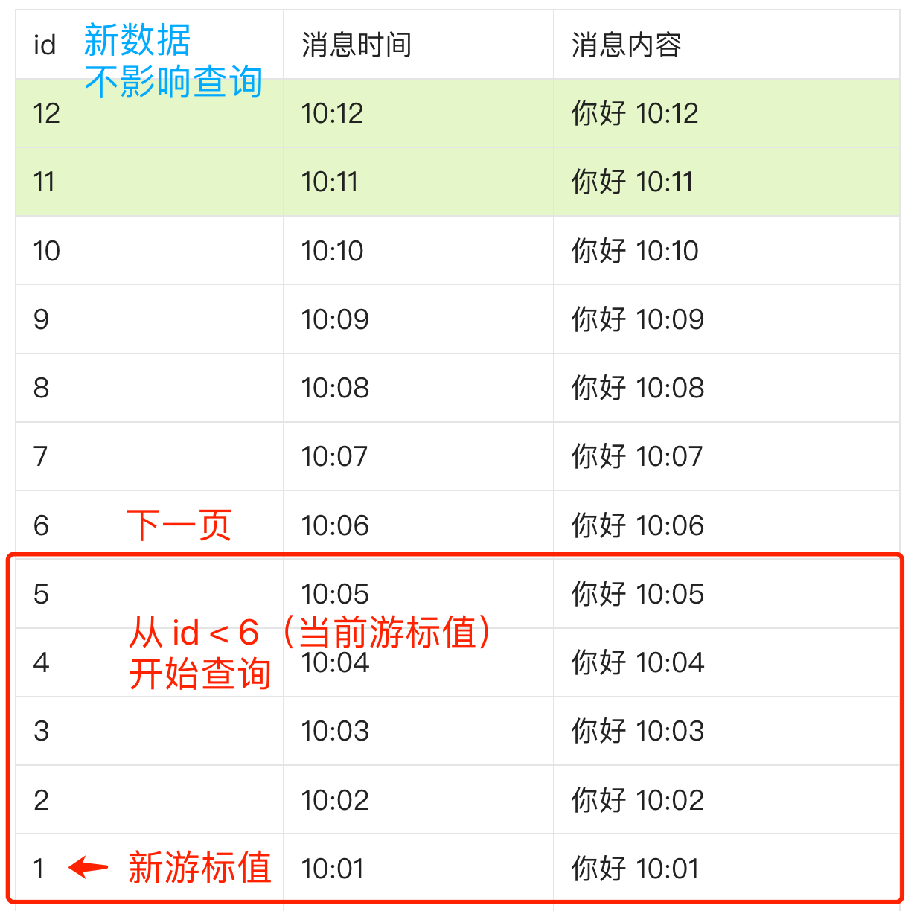

对应的 SQL 语句为：

```sql
SELECT * FROM messages
WHERE id < :cursorId
ORDER BY id DESC
LIMIT 5;
```

#### 扩展知识

##### 使用游标的优点

使用游标分页除了能解决数据不一致（数据重复）的问题，还能起到性能优化的作用。

游标分页通常比基于偏移量（Offset）的分页更高效，因为传统的偏移分页需要跳过一定数量的记录，随着偏移量的增加，查询性能会下降。而游标分页只需要查询自上一个游标之后的记录，可以利用数据库索引进行快速定位，直接跳到该值的位置，从而减少了数据库的扫描和处理负担，提高了查询速度。

##### 游标分页的应用场景

游标分页的应用场景很多，特别适用于增量数据加载、大数据量的高性能查询和处理。除了 IM 系统获取历史消息记录之外，常见场景还有社交媒体信息流、内容推荐系统、数据迁移备份等等。

##### 如何选择游标字段

一般游标字段要具备以下特性：

1. 唯一性：要确保在分页过程中能够准确地定位记录。
2. 排序稳定性：游标字段的排序结果要相对稳定，避免分页过程中数据的丢失或重复。
3. 性能：游标字段一般要设置为索引，以确保分页操作的高效。
4. 避免频繁变化：避免使用频繁变化（实时更新）的字段，减少分页时记录丢失或重复的情况。

对于即时通讯项目的消息记录，除了 ID 之外，还可以选择时间戳作为游标。因为 IM 系统中，消息通常是按照时间顺序排列和查询的，时间戳提供了一种自然的排序方式，能够避免由于数据插入或删除造成的数据不一致问题。但是也要注意，如果时间戳的精度不够（如秒级），高并发情况下可能会出现时间戳重复，从而导致分页结果中的数据丢失或重复。

所以一种更规范的方案是，使用 **时间戳加 ID** 字段作为复合游标。在时间戳相同的情况下，通过 ID 确保唯一性和稳定性。

示例 SQL 语句如下：

```sql
SELECT * FROM messages
WHERE (timestamp < :cursorTimestamp OR (timestamp = :cursorTimestamp AND id < :cursorId))
ORDER BY timestamp DESC, id DESC
LIMIT 10;
```

### HashMap 是不是线程安全的？如果让你来实现一个线程安全的 HashMap 你要怎么设计？如果不用加锁你要怎么设计？ 

#### 回答重点

`HashMap` 是 **非线程安全** 的。因为 `HashMap` 的内部实现并没有加锁，多个线程同时访问和修改时可能会引发数据竞争，导致数据不一致或陷入死循环等问题。

##### 如何实现一个线程安全的 HashMap

要实现一个线程安全的 HashMap，有多种设计方案，下面是几种常见的实现方法：

##### 使用 `Collections.synchronizedMap`

Java 提供了一个简单的方法，可以将非线程安全的 `HashMap` 包装为线程安全的版本：

```java
Map<String, String> synchronizedMap = Collections.synchronizedMap(new HashMap<>());
```

这种方法通过在 `HashMap` 的方法上加 `synchronized` 锁实现线程安全。**不过，这种方式对整个 `Map` 加锁，会导致较高的锁竞争和性能开销**，尤其是在高并发情况下。

参考`ConcurrentHashMap` 的分段锁

使用分段锁（在 Java 8 之后更改为 CAS + 分段桶机制）来实现线程安全，同时避免了整个 `Map` 加锁的问题。

- 在 Java 7 中，`ConcurrentHashMap` 将 `Map` 划分为多个 `Segment`，每个 `Segment` 是一个小的 `HashMap`，只有在同一个 `Segment` 上有冲突时才会加锁，减少了锁的粒度。
- 在 Java 8 中，`ConcurrentHashMap` 引入了 CAS（Compare-And-Swap）操作和分段桶（Bucket）机制，大大减少了锁的使用，进一步提升了并发性能。

##### 不使用锁的设计方案

如果要实现一个线程安全的 `HashMap` 且**不使用锁**，可以考虑以下几种方案：

CAS（Compare-And-Swap）+ 分段机制

可以借鉴 `ConcurrentHashMap` 的思想，使用分段机制结合 CAS 操作来减少锁的需求。以下是实现思路：

1. **分段机制**：将 `Map` 分成多个分段（如 16 个分段），每个分段是一个小的 `HashMap`。通过 `key` 的 hash 值定位到具体的分段，这样可以减少锁的粒度。
2. **CAS 操作**：CAS 是一种无锁操作，可以避免传统锁带来的性能开销。CAS 操作检查某个变量是否等于期望值，如果是，则将其更新为新值；否则，返回失败。使用 CAS 操作可以在无锁的情况下实现线程安全的写入。
3. **内部状态控制**：对于需要扩容的操作，可以借助 CAS 和重试机制。比如扩容时，只对需要扩容的分段进行扩展，而不是整个 `Map`，以减少性能影响。

##### Copy-on-Write 机制

`Copy-on-Write` 是一种无锁实现的思路，适合读多写少的场景。实现思路如下：

1. 每次写入操作（如 `put` 或 `remove`）时，复制当前的 `Map`，在副本上进行修改，然后将副本替换为当前的 `Map`。
2. 读取时始终访问当前的 `Map` 实例，保证不会受到写入操作的影响。

这种方式的缺点是每次写入都需要复制整个 `Map`，会带来较大的内存和性能开销，所以只适合读多写少的场景。

#### 扩展知识

- [1923. 什么是 CAS？](https://www.mianshiya.com/question/1810649500809715714)
- [464. Java 中的 CopyOnWriteArrayList 是什么？](https://www.mianshiya.com/question/1780933294838280194)

### 接口变慢了应该如何排查？导致接口变慢的原因有哪些？ 

#### 回答重点

> 接口变慢的原因可能非常复杂，涉及到 **硬件资源、网络、应用程序代码、数据库** 等各个层面。

**接口变慢的排查思路**

大部分情况下，接口变慢的排查思路按照以下的几点来回答面试官（注意，不要过度发散）

1. 利用服务的监控（目前大部分公司项目都部署在云服务平台上，都会提供基础的监控大屏），或使用监控工具（如 **Prometheus + Grafana**、**Zabbix**等）查看系统的 CPU、内存、磁盘、网络等硬件资源的使用情况，**看看是否有资源瓶颈**。
2. 检查网络是否存在延迟或**带宽瓶颈**（这个很常见，因为流量大了带宽打满了），特别是接口请求和响应涉及到跨服务、跨地区的调用。
3. 查看接口的日志，确认接口是否一直慢，或者是否只在某些时间段或特定请求下变慢。
4. 观察数据库情况，查询数据库的资源水平与是否存在慢查询、索引缺失或数据库锁等问题。
5. 经过上面几个部分大致已经能确定方向，如果怀疑可能是某个新上的功能导致的，可以定位查看代码是否有性能瓶颈，例如是否有不必要的同步、循环、递归等，或者某些操作存在高时间复杂度。

**大部分情况下可能导致接口变慢的原因如下：**

> **资源瓶颈**

1）**CPU 使用过高**：高 CPU 使用可能导致应用的计算能力受到限制，特别是当有计算密集型任务时（如加密、解密、大规模数据处理等）。可以使用 **top**、**htop**（Linux）查看系统的 CPU 占用率，查找消耗 CPU 的进程。

2）**内存泄漏**：内存泄漏导致系统内存逐渐被消耗完，最终触发 **GC（垃圾回收）** 频繁发生，导致接口响应慢。可以使用 **JVM 内存分析工具**（如 **jvisualvm**、**JProfiler**）来检测内存占用，查看是否存在内存泄漏或频繁的垃圾回收。

3）**磁盘 I/O 负载过高**：高磁盘 I/O 可能导致系统响应变慢，尤其是在需要频繁读写磁盘（如数据库操作、日志写入等）的场景中。需要查看磁盘的使用情况，使用 **iostat**、**sar** 等工具查看磁盘读写性能。

4）**网络带宽不足或高延迟可能导致接口响应慢**：尤其是跨服务、跨区域调用时。可以使用工具如 **ping**、**traceroute**、**netstat** 等检查网络状况（大部分情况下看云服务监控即可）。

> **数据库问题**(业务上很多时候都是数据库问题导致的接口慢)

1）**数据库查询慢**：数据库查询过慢是接口变慢的常见原因！可能是由于 **复杂的 SQL 查询**、**缺乏合适的索引** 或 **表锁** 导致的。

可以检查数据库慢查询日志，查看是否有长时间执行的 SQL 查询；使用 **EXPLAIN** 查看 SQL 执行计划，分析是否存在全表扫描或缺少索引。

2）**数据库连接池配置问题**：数据库连接池的配置不合理，导致连接数不足或连接池过多，进而影响数据库性能。

需要检查数据库连接池的配置，查看是否存在连接池耗尽或连接过多的情况。使用 **HikariCP**、**Druid** 等数据库连接池的监控功能查看连接池的状态。

3）**数据库锁竞争**：如果多个请求争夺数据库中的同一行或表，可能会导致锁竞争，从而使接口响应时间变慢。

使用 **SHOW ENGINE INNODB STATUS**（MySQL）查看当前数据库的锁信息，分析是否有锁竞争的情况。

> **代码性能问题**

1)**高时间复杂度的算法**：某些算法的时间复杂度较高，尤其是在处理大量数据时，可能导致接口响应缓慢。

需要检查代码（定位最近发版的代码）中是否存在循环、递归、排序等操作，尤其是在处理大规模数据时。使用 **JProfiler** 等工具进行性能分析，查看热点代码。

2）**频繁的同步或死锁**：使用同步机制（如 `synchronized`、`ReentrantLock`）可能导致线程阻塞，影响并发性能。

需要检查代码中是否有不必要的同步，分析是否存在死锁或高竞争的情况，要降低锁的粒度等。

3）**缓存未命中或缓存过期**：如果系统频繁访问数据库，而没有使用缓存，或者缓存配置不当，也可能导致接口响应慢。需要检查缓存的配置和命中率分析缓存的有效性。

> **外部服务依赖问题**

1）**外部服务的响应慢**：如果接口调用了外部服务（如支付网关、第三方 API 等），外部服务响应慢会直接影响接口的响应时间。

检查外部服务的响应时间，可以使用 **超时机制** 和 **熔断器** 来处理外部依赖失败的情况。

实际上也有可能就是**API 请求的并发量过高**，接口可能承受了超出预期的并发请求，导致系统的负载过高，响应变慢。

此时可以通过负载均衡、限流等机制，控制并发请求量，避免单一接口被过多请求压垮。

#### 扩展知识

- [612. 如何使用 MySQL 的 EXPLAIN 语句进行查询分析？](https://www.mianshiya.com/question/1780933295509368833)
- [4683. 怎么分析 JVM 当前的内存占用情况？OOM 后怎么分析？](https://www.mianshiya.com/question/1818990174270726145)
- [1730. 线上 CPU 飙高如何排查？](https://www.mianshiya.com/question/1807672527650004993)
- [179. 如何在 Linux 中查看系统资源使用情况？比如内存、CPU、网络端口。](https://www.mianshiya.com/question/1772892870856982530)

### 编写一段代码，使得这段代码必定会产生死锁，不能使用Thread.sleep() 

#### 回答重点

可以使用 `CountDownLatch` 来实现死锁，思路为：

1. 新建一个 count 为 2 的 CountDownLatch 对象 latch。
2. thread1 持有 lock1 后，调用 latch.countDown() 将计数减一，随后调用 latch.await() 等待，直到 thread2 也持有 lock2 后调用 latch.countDown()
3. thread2 持有 lock2 后，调用 latch.countDown() 将计数减一，随后调用 latch.await() 直到 thread1 调用 latch.countDown()。
4. thread1 想要 lock2，但 thread2 持有了它
5. thread2 想要 lock1，但 thread1 持有了它
6. 由于互相等待对方释放锁，因此死锁发生

代码如下：

```java
import java.util.concurrent.CountDownLatch;

public class GuaranteedDeadlock {
    private static final Object lock1 = new Object();
    private static final Object lock2 = new Object();
    private static final CountDownLatch latch = new CountDownLatch(2);

    public static void main(String[] args) {
        Thread thread1 = new Thread(() -> {
            synchronized (lock1) {
                System.out.println("Thread 1: Holding lock1...");
                latch.countDown(); // 让 thread2 也开始执行
                
                try { latch.await(); } catch (InterruptedException e) { e.printStackTrace(); } // 保证两个线程同时竞争

                synchronized (lock2) {
                    System.out.println("Thread 1: Acquired lock2!");
                }
            }
        });

        Thread thread2 = new Thread(() -> {
            synchronized (lock2) {
                System.out.println("Thread 2: Holding lock2...");
                latch.countDown(); // 让 thread1 也开始执行
                
                try { latch.await(); } catch (InterruptedException e) { e.printStackTrace(); } // 保证两个线程同时竞争

                synchronized (lock1) {
                    System.out.println("Thread 2: Acquired lock1!");
                }
            }
        });

        thread1.start();
        thread2.start();
    }
}
```

除此之外，也可以使用 `CyclicBarrier` 来实现。

#### 扩展知识

- [482. 什么是 Java 的 CyclicBarrier？](https://www.mianshiya.com/question/1780933294938943489)
- [483. 什么是 Java 的 CountDownLatch？](https://www.mianshiya.com/question/1780933294943137794)

##### 错误示范

```java
public class DeadlockExample {
    private static final Object lock1 = new Object();
    private static final Object lock2 = new Object();

    public static void main(String[] args) {
        Thread thread1 = new Thread(() -> {
            synchronized (lock1) {
                System.out.println("Thread 1: Holding lock1...");
                
                // 试图获取 lock2
                synchronized (lock2) {
                    System.out.println("Thread 1: Acquired lock2!");
                }
            }
        });

        Thread thread2 = new Thread(() -> {
            synchronized (lock2) {
                System.out.println("Thread 2: Holding lock2...");
                
                // 试图获取 lock1（但 lock1 此时被 Thread1 持有）
                synchronized (lock1) {
                    System.out.println("Thread 2: Acquired lock1!");
                }
            }
        });

        thread1.start();
        thread2.start();
    }
}
```

上述的代码无法保证死锁，因为 Java 的线程调度是由操作系统决定的，线程的执行顺序是不可预测的，所以在某些运行情况下，thread1 可能会在 thread2 运行前快速获取 lock1 和 lock2，然后释放它们，从而避免死锁。

所以这段代码死锁的发生概率不是 100%。

### 现在手头上有一个单体项目，系统的整体 QPS 到了 1 万了，要微服务化拆分吗？ 

#### 回答重点

不一定，因为是否要微服务化拆分，主要关注系统瓶颈、业务复杂度、团队的情况，而非单纯看 QPS。

##### 先明确系统是否有瓶颈

如果 QPS 到 1万后，单体应用仍能稳定运行（CPU/内存/GC正常），只是需要加机器扩容，**不建议拆分**。单体架构在垂直扩展（加内存、CPU）上更简单高效！

但是，如果出现以下情况，说明单体架构已到瓶颈，**建议拆分**：

- **部分模块资源消耗不均**（如某接口占80%流量，拖慢整个应用）
- **开发效率下降**（代码库庞大，修改一处影响全链路，测试和部署都很耗时）
- **故障隔离差**（一个模块崩溃导致整个服务不可用）
- **技术栈无法升级**（如部分模块想用Go优化，但单体架构绑定语言）

##### 判断业务复杂度

实际上如果出现开发效率下降已经能反应出业务复杂度不低。此时可以进行业务边界分析，看边界是否清晰，即系统是否已有明显的功能域划分，可拆分成独立服务。

因为部分模块是可以预想到后续的改动会比较大，且流量也会比较大，此时根据公司的增速预测后续的用户新增曲线，预先划分出部分服务，减少后续的改动成本。

##### 团队的情况

服务是否拆分，与人有关。极端一点，如果目前团队只有 1 个人，然后拆了十几个微服务，此时带来的坏处，可能远多余好处。。你想想看，一旦本地调试，你需要起 10 个服务，那种感觉，谁来谁知道。

因此，要根据团队的人员数来评估是否需要拆分微服务和拆分微服务的个数。

一个团队内部沟通成本和人员数有关，随着人员数（n）的增加沟通成本呈指数级增长`n(n-1)/2`，一般会划分成每个小团队来负责一部分功能的开发和维护，大致为 2~4 人（具体情况具体分析）。

实际上，如果单体项目真的遇到瓶颈，我们可以**先优化单体，再考虑拆分**。

最简单的优化例如：

- **缓存**（如Redis）：减少 DB 压力，QPS 可能提升数倍
- **异步化**（如MQ）：削峰填谷，提升吞吐量
- **分库分表**：解决数据库瓶颈
- **代码优化**（如减少锁、优化算法）

如果优化后仍无法满足需求，再考虑微服务拆分。

> 记住一句话：是否微服务化，不是 QPS 数字决定的，而是业务发展和架构瓶颈倒逼的。

#### 扩展知识

##### 什么情况该拆？

简单举两个例子：

- 不拆的案例：某内容平台 QPS 2 万，但 90% 是读请求，通过加 Redis 集群、数据库分片、前端页面静态化，3 人团队就能维护，业务逻辑简单。这时候拆了就是冤大头
- 要拆的案例：某金融系统 QPS 5000，**但支付、风控、对账模块频繁改动且互相阻塞**，拆成微服务后，风控规则独立灰度上线，支付服务按流量自动扩容，大大提升系统的鲁棒性和开发效率。这就是要拆的情况

所以当业务模块差异大（例如电商的订单和风控逻辑）、团队规模扩张（10 人团队拆成 3 个小组独立开发）、需求迭代频繁（比如 A 模块每天上线，B 模块每月一次），这种场景适合拆。

不过也需要考虑拆之后的代价，例如需要分布式事务、调用链追踪、服务治理（熔断、限流），这些都会增加开发运维成本，小团队可能扛不住。

### 系统每天晚上都会有一小时左右的时间瘫痪，你觉得可能的原因是什么？有遇到过这样的情况吗？

#### 回答重点

系统规律性瘫痪（每天固定时段）的核心原因大部分与**周期性操作或资源瓶颈**有关。

常见原因包括：

1. **定时任务/批处理**：夜间运行的定时任务（如数据对账、报表生成、批量更新）可能触发高CPU/内存占用、数据库锁竞争或IO瓶颈。
2. **资源周期性耗尽**：如缓存失效（缓存击穿）、连接池/线程池被占满（夜间批量请求）、数据库连接不够用。
3. **外部依赖异常**：第三方系统在夜间维护（如接口限流、服务降级），或消息队列堆积（夜间生产端集中发消息）。
4. 夜间运维策略（如自动扩缩容关闭）或日志切割导致问题。

上面这几点几乎涵盖了大部分系统规律性瘫痪的原因。不过针对这个问题，这样答还不够，最好是顺着面试官的提问答，我之前在 xxx 项目中也遇到过这样的情况，这才是满分回答（要是没遇到过显得没有实战经验）。

**举例**：我之前xx系统每晚 22-23 点瘫痪，表现为页面打不开、接口超时。

**我的排查步骤如下**：

1. **看监控**：查看CPU/内存/磁盘/网络监控（如Prometheus+Grafana），发现22点后数据库CPU从20%飙升至95%，慢查询数激增。
2. **查日志**：数据库慢查询日志显示，22点有大量`UPDATE order SET status=4 WHERE create_time < '2025-05-01'`语句（归档历史订单），每条耗时5秒以上。
3. **定位任务**：检查定时任务调度平台（如XXL-Job），发现该归档任务每天22点启动，无分页（一次性更新100万条数据），导致长事务和行锁竞争。

定位问题后，我的解决方法如下：

1. 将`UPDATE`改为分页（每次更新1000条），减少单次锁持有时间。
2. 在`create_time`字段加索引，将查询时间从5秒缩短至50ms。
3. 将归档任务迁移到独立数据库从库，避免影响主库业务查询。

实际上还有很多场景，我再举个例子：

我之前xx系统每晚 22-23 点瘫痪，表现为页面打不开、接口超时。

看监控，发现 CPU 利用率呈 20 分钟周期性波动，后面找 20 分钟的定时任务，发现没找到，于是进一步缩短时间查找频率更高的定时任务，发现首页缓存过期时间为10分钟，但是刷新缓存需要15分钟，因为随着功能的增加，首页需要查询的内容变多，SQL 的复杂度变高，导致刷新的时间超过了缓存的过期时间，于是有很多请求无法命中缓存，穿透到了数据库，上一次的刷新未完成，下一次刷新又启动，导致缓存刷新任务重叠，CPU 负载叠加。

后面我进行了针对性优化，第一时间先调整了缓存的过期时间，防止穿透。

随后将首页复杂查询拆分为独立模块（如商品、推荐、排行榜），分别缓存，缩短单个缓存刷新时间（从 15 分钟→5 分钟），避免任务重叠。

针对部分高频查询字段（如CreateTime、UserState）等添加索引，且简化了查询逻辑。

还做了一个简单版的首页静态页面，做了降级的方案，如果网关监控到超时，直接返回静态页面作为兜底，实现降级，减少对其他功能的影响。

#### 扩展知识

夜间是系统低峰期，很多团队会把耗时任务（如全量数据同步、历史数据归档）安排在此时运行。但如果任务设计不合理，可能直接拖垮系统：

**典型问题**：

- **数据库锁竞争**：任务用`for`循环逐条更新数据，导致长事务或行锁/表锁，其他业务请求被阻塞（如查询变慢、超时）。
- **内存溢出**：任务一次性加载百万条数据到内存（如`SELECT * FROM big_table`），导致JVM堆内存耗尽，触发频繁GC甚至OOM。
- **CPU飙升**：任务包含大量计算（如复杂报表聚合），CPU使用率长期90%+，其他线程无法获取资源。

我之前遇到过一个系统，每晚23点后瘫痪。排查发现运维在23点启动了数据库全量备份（`mysqldump`），导致磁盘IO被占满（备份写盘占用90%+IO资源），业务查询的`SELECT`语句因磁盘读取变慢而超时。

还有缓存/连接池这种资源问题：

- **缓存击穿**：夜间某热点Key（如爆款商品信息）集中失效，大量请求直接打穿到数据库，数据库QPS瞬间飙升，无法处理。
- **连接池耗尽**：定时任务调用第三方接口时，未正确释放HTTP连接（如忘记关闭`HttpClient`连接），导致连接池被占满，后续请求无连接可用，报`ConnectionTimeout`。
- **线程池拥堵**：任务提交到业务线程池（非独立线程池），大量任务排队导致线程池满，正常业务请求被拒绝（如`RejectedExecutionException`）。

有时候还可能是外部系统的影响导致的：

比如夜间任务高频调用第三方接口（如每秒钟1000次），触发对方的限流策略（如每分钟仅允许500次），导致接口大量返回`429 Too Many Requests`，业务逻辑因重试进一步加剧负载。

也有可能是第三方这个时间段高频被调，导致它们请求响应变慢，而恰好我们这边没有设置好请求的超时时间，导致请求线程长时间被阻塞，随后业务线程池满了，从而影响整个系统。

### 现在有 40 亿个 QQ 号，给你 1G 的内存，如何实现去重？ 

#### 回答重点

如果直接存储 40 亿个 int 值，那么需要 40亿 * 4字节 / 1024³ ≈14.90 GiB，很明显内存不够。更不用说用 HashMap 来存储实现去重了。

因此需要一个更直接、精确且省内存的方式，就是**位图（Bitmap）**。

40 亿个 QQ 号，每个 QQ 号用1个二进制位标记是否存在（存在标1，不存在标0）。

QQ 号最大是 10 位整数，理论最大值是 43亿，这样存储下来总内存仅需约 **500MB**（43亿位≈500MB），远小于 1G 限制。

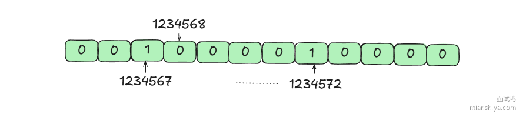

具体步骤：

1. 初始化一个足够大的位图，4 300 000 000 bits ≈ 4 300 000 000/8 bytes ≈ 537 500 000 B ≈ 513 MB
2. 遍历所有 QQ 号，将每个号码对应的位标记为1（重复号码会被自动覆盖），比如我的 QQ 是1234567，那么这个数组的第 1234567 位置设置成 1 即可。
3. 遍历位图，收集所有标记为 1 的位的位置，即对应的 QQ号，这就是去重的结果。

#### 扩展知识

##### QQ 号的最大值和超过 40 亿的整数怎么办？

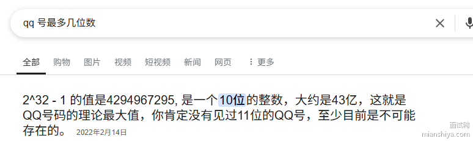

QQ 号是整数，假设最大可能到 2^32-1（约 42 亿），刚好覆盖 40 亿的场景。

如果 QQ 号范围更大（比如 100 亿），可以用 “分治 + 位图”：

- 用哈希函数将 QQ 号分到多个 “桶”（比如 3 个桶），每个桶的号码范围缩小到 33 亿左右（要做偏移量计算，即号码减去桶起始值，这样才能保证位图的大小固定）
- 每个桶单独用位图处理（33 亿位单桶不到500MB），完全够。

##### 关联面试题

- [663. 如何使用 Redis 快速实现布隆过滤器？](https://www.mianshiya.com/question/1780933295689723905)
- [5903. 手写一个 bitmap](https://www.mianshiya.com/question/1828639403226136577)

### 在 Java 中，不使用锁如何实现一个线程安全的单例？

#### 回答重点

无锁指的是不能用`synchronized`、`Lock` 等显式锁机制。

那么常见的实现主要有以下四个：

1. 静态内部类（利用类加载机制）
2. 枚举单例（天然线程安全且防反射破坏）
3. 饿汉式（类加载时初始化）
4. CAS（Compare-And-Swap）（原子操作实现无锁竞争）

**对比与选型建议**

| 方法       | 线程安全 | 延迟加载 | 防反射破坏 | 适用场景             |
| ---------- | -------- | -------- | ---------- | -------------------- |
| 静态内部类 | ✅        | ✅        | ❌          | 通用场景（推荐首选） |
| 枚举单例   | ✅        | ❌        | ✅          | 需要高安全性的配置类 |
| 饿汉式     | ✅        | ❌        | ❌          | 简单小项目           |
| CAS        | ✅        | ✅        | ❌          | 极端高并发但资源允许 |

#### 扩展知识

##### 1. 静态内部类

利用 JVM 类加载机制（线程安全）实现延迟加载。因为 JVM 保证类的初始化（即执行 <clinit>）是线程安全且仅执行一次，Holder 类只有在首次调用 getInstance() 时才会被加载并初始化，因此既实现了延迟加载，又无需显式同步开销。

代码示例：

```java
public class Singleton {
    private Singleton() {}
    private static class Holder {
        static final Singleton INSTANCE = new Singleton();
    }
    public static Singleton getInstance() {
        return Holder.INSTANCE; // 首次调用时加载 Holder 类并初始化实例
    }
}
```

##### 2. 枚举单例

JVM 在加载枚举类时，保证每个枚举常量只被实例化一次，且实例化过程由虚拟机内部控制，线程安全。

代码示例：

```java
public enum Singleton {
    INSTANCE; // 唯一实例
    public void doSomething() { /*...*/ }
}
```

##### 3. 饿汉式（简单但资源浪费）

类加载时直接初始化实例，依赖 JVM 类加载机制保证线程安全。

代码示例：

```java
public class Singleton {
    private static final Singleton INSTANCE = new Singleton();
    private Singleton() {}
    public static Singleton getInstance() {
        return INSTANCE;
    }
}
```

##### 4.CAS（无锁但需权衡性能）

通过原子操作 `AtomicReference` 实现无锁竞争。可能因 `while(true)` 循环导致 CPU 空转（忙等待）

代码示例：

```java
public class Singleton {
    private static final AtomicReference<Singleton> INSTANCE = new AtomicReference<>();
    private Singleton() {}
    public static Singleton getInstance() {
        while (true) {
            Singleton instance = INSTANCE.get();
            if (instance != null) return instance;
            instance = new Singleton();
            if (INSTANCE.compareAndSet(null, instance)) {
                return instance;
            }
        }
    }
}
```

### 如果要实现一个抢红包的功能，红包金额是如何计算的？ 

#### 回答重点

抢红包的金额计算核心是**公平性**和**总额控制**，核心逻辑分两种场景：

1）**普通红包（固定金额）**：这个比较简单，每个红包金额完全相同。比如总金额 100 元，发 10 个红包，每个红包固定10元。逻辑很简单，直接用总金额除以红包数量即可。 

2）**随机红包**：每个红包金额随机，但需满足两个条件：

- 所有红包金额之和等于总金额
- 单个红包金额不能为 0，且需保证“先抢和后抢的人有公平的随机概率”（比如不能让前面的人抢走大部分，后面的人只能抢几分钱）。

行业主流用**实时计算**结合**二倍均值法**实现随机红包：每次分配时，当前可分配的金额为剩余金额，剩余数量为 n 个红包，则当前红包的金额上限是 `（剩余金额/剩余数量）*2`，下限是 1 分。这样既保证了随机，又能让后续红包有合理金额。

除了实时计算外，还有预先生成的方案：在发红包时用**线段分割法**提前分配好所有金额存入队列，抢红包时直接按顺序取即可。

#### 扩展知识

##### 二倍均值法的具体例子

假设总金额 10 元（我们转成 1000 分），发 5 个红包：

- 第一个红包：剩余1000分，剩余5个 → 上限是（1000/5）*2=400分 → 随机范围1~400分。假设随机到300分，剩余700分，剩4个红包。
- 第二个红包：剩余700分，剩余4个 → 上限（700/4）*2=350分 → 随机范围1~350分。假设随机到200分，剩余500分，剩3个红包。
- 以此类推，直到最后一个红包直接拿剩余所有金额（避免前n-1个红包分完后最后一个为0）。

##### 线段分割法（预生成）

把总金额想象成一条长度为 M 的线段（如10元=1000分）

然后随机切 `N-1` 刀生成分割点（N=人数），最后按分割点位置计算每段长度作为红包金额。

##### 实际开发中的细节

- **最小单位**：金额需用“分”（整数）而不是“元”（浮点数），避免浮点精度误差（比如0.1元用浮点数存储可能有误差）。
- **并发控制**：像群里面的红包实际上并发还好，微信群最多也就 500 人。
- **红包过期**：若红包未被抢完，超时后需退回原账户，此时需记录已抢金额和剩余金额，避免重复退款。

如果面试官追问并发相关的问题，可以参考我们的[4680. 如何设计一个秒杀功能？](https://www.mianshiya.com/bank/1795650093939204097/question/1818587621468135426)

### 线上 CPU 飙高如何排查？ 

#### 回答重点

线上 CPU 飙高是一个比较常见的问题，并且它的排查手段**比较流程化**，非常适合套在各个项目中，大家按照我下面的思路简单加点细节就可以使用在自己的项目上了。

1）首先确认哪个进程占用 CPU 过高，登录服务器利用 top 命令查看。

top 命令是 Linux 下常用的性能分析工具，能够实时显示系统中各个进程的资源占用状况，类似于 Windows 的任务管理器

2）确认 CPU 利用率很高的进程的 PID，假设为 1234 确实是 Java 进程，则通过 `top -Hp 1234` 查看具体的线程。

3）假设得到的线程 ID 是 5678，再将线程转为十六进制。

```
printf "%x\n" 5678
```

4）得到十六进制的 tid 为 162e，此时在利用 `jstack 1234 | grep 162e -A 100` 查看具体的栈信息。

jstack 命令用于生成虚拟机当前时刻的线程快照。 线程快照是当前虚拟机内每一条线程正在执行的方法堆栈的集合，生成线程快照的主要目的是定位线程出现长时间停顿的原因， 如线程间死锁、死循环、请求外部资源导致的长时间等待等问题。

grep (global regular expression) 命令用于查找文件里符合条件的字符串或正则表达式， `-A 100` 表示查找到匹配行后，额外再输出 100 行，便于我们查看堆栈信息。

5）根据堆栈信息就可以定位到具体是哪行代码导致了 CPU 飙高，对应分析修复即可！

#### 常见可导致 CPU 飙高的代码问题

这里列举一些常见的代码问题，**便于大家套用**，例如：频繁实例化重对象（实例化过程很重，例如发号器实例、缓存实例等）、一些算法复杂度很高的操作（例如套用了 3 层以上的 for 循环）、死循环或错误的递归调用、频繁的 new 对象导致频繁垃圾回收等等。

#### CPU 飙得很厉害了，导致 ssh 都连不上？

一般情况下，CPU 即使 100% ，ssh 还是能连上的，只是会有点卡。

其次一般云服务提供产商它不依赖 SSH，类似一种提供了图形化的控制方法，让你可以像直接使用物理机一样访问和控制远程服务器。

再则一般现在服务都是弹性扩缩容的，也就是 CPU 在飙到一定阈值的时候，已经扩容了，例如 CPU 在一定的时间窗口内都持续在 80% 则增加机器扩容。如果代码有问题，则在新增的机器上监控一段时间也能定位到问题。

### 线上 CPU Load 飙高如何排查？ 

#### 第一部分：回答重点

> 前置知识：先区分“系统负载（Load）”和“ CPU 使用率”：
>
> - **Load**：表示等待 CPU 运行的任务队列长度（包括正在运行和等待运行的进程数），Load 高可能是 CPU 忙不过来（如计算密集型任务），或任务太多（如并发请求激增）。
> - **CPU使用率**：表示 CPU 实际被占用的时间比例（用户态/内核态）。

排查CPU Load飙高的关键是“从系统到进程，从进程到线程，从线程到代码”的逐层拆解，咱们主要利用工具和日志定位具体问题。

**第一步要做的**：用`top`或`htop`命令看 Load 数值（1分钟/5分钟/15分钟的负载），同时观察 CPU 使用率（%us用户态，%sy内核态），判断是“ CPU 真的在忙”还是“任务排队等 CPU”。

**第二步要做的**：定位高负载的进程，用`top`按 CPU 排序（按`P`键），找到 CPU 占用最高的进程（PID）。如果多个进程 CPU 高，优先排查异常进程（如突然出现的未知进程，或业务核心进程）。

**第三步要做的**：定位进程内的“问题线程” ，因为一般进程由多个线程组成，需进一步定位具体线程：

- 用`ps -mp <PID> -o THREAD,tid,time`（或`pidstat -t -p <PID>`）查看进程内线程的 CPU 占用，找到 CPU 高的线程 ID（TID）。
- 将 TID 转成十六进制（如`printf "%x\n" <TID>`），用于后续分析。

**第四步要做的**：分析线程行为，定位代码问题，根据进程类型（Java/C/Go等），用工具抓线程快照：

- **Java进程**：用`jstack <PID> | grep <十六进制TID> -A 30`，查看线程的堆栈信息（如是否卡在死循环、锁等待、GC等）。
- **C/C++进程**：用`gdb -p <PID>` attach进程，打印线程堆栈（`thread apply all bt`），看是否在某个函数循环执行。
- **通用方法**：结合日志（如应用日志、GC日志）或监控（如Prometheus的CPU指标），确认是否有异常逻辑（如正则表达式匹配超时、频繁序列化等）。

> 基本上排查逻辑都是如此，没实际排查过也不用虚，可以就直接按上面的方式和面试官说出来

#### 扩展知识

##### 常见的CPU Load高的原因

这里列举几个常见的原因，大家可以结合自己的项目“安”上去。

1）**死循环/无限递归**：代码中因逻辑错误（如未正确终止条件）导致线程持续空转，CPU使用率直接拉满（%us高）。

例子：Java 中一个`while(true)`循环的 break 一直没触发，线程一直占用CPU。

有些同学可以能会疑惑，死循环不是应该 cpu 利用率高吗？和 load 有关系？借着这个问题我们再来盘一盘 Load 还是 CPU 利用率问题。

先说结论：死循环会同时导致 CPU 利用率高和Load 高，但要看 “线程数” 和 “CPU 核心数” 的关系。

- CPU 利用率：CPU “忙” 的时间占比（比如一个核心 100% 表示它一直在干活）。
- 系统负载 Load：等待 CPU 运行的任务数（包括正在运行和排队的）。比如 4 核 CPU，Load=4 表示刚好 4 个任务同时跑；Load=8 表示 4 个在跑，4 个排队等。

假设你有一个**单线程死循环**（比如`while(true) { }`），运行在**单核CPU**上：

- CPU 会被这个线程占满，利用率100%。
- 此时没有其他任务排队（只有这一个线程在跑），所以Load≈1（等于核心数）。

但如果是**8个死循环线程**，运行在**4核CPU**上：

- 4个核心同时跑4个线程，CPU 利用率100%（每个核心都在忙）。
- 剩下的4个线程需要排队等 CPU，此时Load≈8（4个运行+4个等待）。

所以，**死循环的本质是让CPU“一直忙”（利用率高）**，但如果线程数超过核心数，就会导致任务排队（Load高）。所以“死循环导致 CPU 利用率100%”是对的，但如果线程数过多，Load 也会跟着高。

**再举个生活化的例子**：
 CPU 像一个 4 窗口的银行柜台，Load 是排队的总人数（包括正在办理的和等待的），CPU 利用率是柜台的忙碌程度（比如 4 个窗口都在办业务，利用率 100%）。

- 如果有 8 个人要办业务（8个线程），4 个窗口同时办（CPU 利用率100%），剩下 4 人排队（Load=8）。
- 如果有 100 个人在排队，但柜台只有 2 个窗口在干活（比如另外 2 个窗口在修机器，对应内核态忙），此时CPU 利用率 50%，但 Load=100（排队的人多）。

所以，线上排查时，**必须同时看Load和CPU利用率**：

- 如果Load高+CPU利用率高：说明CPU真的忙不过来（比如死循环线程太多、计算任务重）。
- 如果Load高+CPU利用率低：说明任务在“等其他资源”（比如锁、IO慢），CPU其实很闲，但任务卡在别处

2）**频繁GC（Java）**：堆内存不足或对象存活时间长，触发频繁 Full GC，GC 线程占用大量 CPU（%us高，可能伴随STW）。

因为 GC 太频繁（比如每秒一次Full GC），业务线程会被暂停（STW），导致请求堆积（比如用户请求无法及时处理，任务队列变长），Load 可能就会上升。

3）**内核态CPU高（%sy高）**：可能是系统调用频繁（如大量IO操作、网络通信），或驱动/硬件问题（如网卡中断过多）。

比如内核在帮应用处理IO（比如拷贝数据、上下文切换），%sy会升高，同时如果 IO 操作很慢（比如磁盘性能差），应用线程会等待 IO 完成，导致任务排队（比如100个线程都在等磁盘读，CPU 需要轮流处理这些等待的任务），Load上升。

4）**锁竞争**：多个线程争夺同一把锁（如`synchronized`），导致线程处于`BLOCKED`状态（不占用CPU），大量线程卡在锁等待，任务队列里全是“等锁”的任务（虽然不跑，但占着队列位置），导致Load上升（比如100个线程抢同一把锁，Load可能到100）

这就是任务队列堆积 Load 高但 CPU 使用率可能不高的场景（如果面试官问什么情况下 Load 高但 CPU 使用率不高，就可以回答锁竞争这个场景）。

### 系统上线后，发现某个接口响应很慢，你如何定位可能的原因，以及对应的解决思路？ 

#### 回答重点

一般定位接口响应慢的核心思路是**分层排查+指标监控**，要从前端到后端，从应用到数据库，逐步锁定瓶颈点。

1. **确认接口总耗时与子耗时**：用APM工具（如Skywalking、Pinpoint）看接口总耗时，拆解各环节耗时（比如数据库查询占80%、外部调用占15%、业务逻辑占5%），快速定位 **耗时大头** 在哪。
2. **应用层排查**：可以使用 Arthas 等工具看代码执行链路，检查是否有循环查库、重复计算、锁竞争（如synchronized锁范围过大）、对象频繁创建触发GC（垃圾回收）等问题。
3. **数据库排查**：查慢 SQL 日志，看是否有全表扫描、索引失效、事务过长，同时检查连接池是否耗尽（比如连接数不够导致排队等待）。
4. **外部依赖排查**：查看调用第三方接口的耗时，确认是否超时或响应不稳定，检查是否有不合理的重试逻辑（比如重复调用失败接口）。

#### 扩展知识

##### 代码逻辑问题

- 循环里查库：比如遍历 1000 条数据，每条都调一次数据库（调用数据库相对而言是一个比较重的操作）。
- 锁竞争：多个线程抢同一把锁，导致部分线程等待（比如用synchronized锁了整个方法，而实际只需锁关键代码段）。
- GC频繁：短时间内创建大量对象（如循环里new对象），JVM频繁触发Full GC，线程暂停（STW）。

**解决方式**：

- 批量查库：把循环里的多次查询改成一次批量查询（如用IN语句）
- 缩小锁范围：只锁必要代码
- 优化对象创建：复用对象（如用ThreadLocal传递）或减少临时对象（如字符串拼接用StringBuilder）

##### 数据库 SQL 与连接问题

- 慢SQL：没索引（如 WHERE 条件字段无索引）、索引失效（如对字段用函数，WHERE age+1>20）、大表JOIN（连表字段无索引
- 连接池耗尽：业务并发高，但数据库连接池配置太小（比如默认8个连接），线程排队等连接
- 长事务：事务执行时间过长（比如边查边改，锁表时间久），阻塞其他查询

**解决方式**：

- 优化SQL：用 EXPLAIN 分析执行计划，加索引（如给WHERE/JOIN字段加索引），避免全表扫描
- 调整连接池：根据业务并发调大连接数（如调整为50），但别超过数据库最大连接限制
- 拆分事务：长事务拆成短事务（比如先查数据，再批量更新，避免边查边改）

##### 第三方接口问题

- 第三方接口超时：对方服务响应慢（比如3s才返回），而本地没设超时时间
- 重复调用：本地重试策略不合理（比如失败后重试10次，每次等3s），总耗时30s

**解决方式**：

- 设超时时间：调用第三方时设合理超时（如1s），超时后快速失败
- 限制重试次数：重试不超过3次，且用指数退避（第一次等1s，第二次等2s）
- 加缓存/降级：高频调用的接口结果缓存（如Redis存5分钟），失败时返回降级数据（如默认值）

##### 其他可能问题，比如服务器资源瓶颈

- CPU密集：接口里有复杂计算（如大量循环、加密算法），CPU使用率90%以上
- 内存不足：对象没及时回收，内存溢出导致频繁GC
- 磁盘IO高：接口里有频繁的文件读写（如日志写入），磁盘IO队列堆积

**解决方式**：

- 异步处理：把计算逻辑丢到线程池异步执行（如用CompletableFuture），接口只返回“处理中”
- 优化内存：查内存泄漏（用JProfiler），或调大JVM堆内存
- 日志异步写：用Logback的AsyncAppender，避免同步写磁盘阻塞主线程

### 如果项目需要你实现敏感词过滤功能，如何实现？ 

#### 回答重点

最简单的肯定是**字符串匹配**，但是这种仅适用文本较少的情况，通过使用 `indexOf`、`contains` 方法即可实现。

比较常见且高效的方法是 **基于 Trie 树的 DFA 算法**，它将 Trie 树（字典树）的存储结构与 DFA（确定有限自动机）的状态转移机制相结合！

Trie 树按字符路径存储敏感词，**共享前缀节点以节省空间**。

DFA 则通过状态转移函数在树中快速匹配文本，遇到标记节点（敏感词结尾）即完成识别。（详细看扩展知识解释）

这个算法只需遍历一次文本，时间复杂度为 O(n)。

> 实际上，大部分公司都会用云厂商提供的敏感词过滤服务，不会自己去实现，说完原理后，可以提一嘴这个

#### 扩展知识

##### Trie 树（字典树）

Trie 树是一种树形结构，常用于高效存储和检索字符串集合。

它的核心特点是：

- **根节点不存储字符**，除根节点外的每个节点都存储一个字符。
- **从根到某节点的路径上的字符连接起来**，即为该节点对应的字符串。
- **每个节点可以有多个子节点**，子节点的字符各不相同。
- **用一个标记（如 `isEnd`）表示该节点是否为一个字符串的结尾**。

看下示例，假设我们有三个敏感词：`["he", "she", "his"]`，构建的 Trie 树结构如下：

```routeros
root
├── h
│   └── e (isEnd=true)
│   └── i
│       └── s (isEnd=true)
└── s
    └── h
        └── e (isEnd=true)
```

详细可以看下我们的算法网站，[前缀树可视化演示](https://algo.codefather.cn/data/tree/trie#heading-0)

##### DFA（确定有限自动机）

DFA 是一种计算模型，它由以下部分组成：

- **状态集合**：每个状态代表 Trie 树中的一个节点。
- **输入字母表**：通常是字符集（如 ASCII 字符）。
- **状态转移函数**：根据当前状态和输入字符，确定下一个状态。
- **初始状态**：Trie 树的根节点。
- **接受状态**：Trie 树中标记为 `isEnd` 的节点。

DFA 的工作流程如下：

1. 从初始状态（根节点）开始。
2. 逐个读取输入字符串中的字符，根据当前状态和字符进行状态转移。
3. 如果转移到接受状态，则匹配到一个字符串。
4. 如果无法转移（即没有对应的子节点），则匹配失败，回到初始状态继续处理后续字符。

基于 Trie 树实现 DFA，**每个节点就是一个状态**，**状态转移就是在树中从父节点移动到子节点**。

##### 看下执行过程示例

比如，我们的**敏感词库**是：`["he", "she", "his"]`

```routeros
root
├── h
│   └── e (isEnd=true)
│   └── i
│       └── s (isEnd=true)
└── s
    └── h
        └── e (isEnd=true)
```

需要待检测的文本是：`ushers`

**匹配过程如下**：

1. **位置 0 (`u`)**：根节点没有子节点 `u`，匹配失败，继续处理下一个字符。
2. **位置 1 (`s`)**：根节点 → 子节点 `s`（状态转移），继续处理后续字符 `h`。
3. **位置 2 (`h`)**：当前节点 `s` → 子节点 `h`，继续处理后续字符 `e`。
4. **位置 3 (`e`)**：当前节点 `h` → 子节点 `e`（`isEnd=true`，匹配到敏感词 `she`），继续处理后续字符 `r`，但当前节点 `e` 没有子节点 `r`，匹配结束。
5. **结果**：从位置 1 到 3 匹配到 `she`，替换为 `***`。
6. **位置 4 (`r`)**：根节点没有子节点 `r`，匹配失败，继续处理下一个字符。
7. **位置 5 (`s`)**：根节点 → 子节点 `s`，继续处理后续字符 `s` 的下一个字符（无），匹配结束，未形成完整敏感词。

**最终结果**：`u***ers`！

这一波流程下来应该就很清晰了。如果还是不理解，那么再看下这个通俗版本！

咱打个比方，图书馆有个超厉害的「查书神器」：

1）**先把所有禁书（敏感词）列出来**，比如《黑客秘籍》《赌博指南》《诈骗技巧》。

2）**把这些书名拆成单个字**，按顺序摆成树形目录（这步就是构建前缀树）：

- 《黑客秘籍》：黑→客→秘→籍
- 《赌博指南》：赌→博→指→南
- 《诈骗技巧》：诈→骗→技→巧
- （如果有重复前缀，比如「黑客马拉松」，会共享「黑→客」路径）

3）**查书时**，从第一个字开始：

- 比如文本是「我知道《黑客秘籍》怎么用」，先查「我」，发现不在目录里，跳过；
- 查「知」，也没有，跳过；
- 查「道」，还是没有，跳过；
- 查「《」，没有，跳过；
- 查「黑」，发现目录里有，继续查「客」「秘」「籍」，一路畅通，**找到禁书**！替换成 ‘***’；
- 继续往后查剩下的文本...

##### 优化方向

简单提一下，**AC 自动机（Aho-Corasick）**，它会在 Trie 树上增加 **失败指针**，当匹配失败时直接跳转到最长前缀的节点，避免回退，进一步提高效率。

然后对于超长文本，可分段并行多线程匹配，提高吞吐量。

### 如果现在有 500G 数据需要排序，但是你只有 4G 内存，如何实现？ 

#### 回答重点

> 考虑到操作系统和排序操作本身的内存开销，实际可用内存会显著小于 4G。假设系统预留 **1G 内存**，则用于数据处理的内存仅剩 **3G**。这部分提出来主要是为了显得你有实际的开发经验，而不是过于理想化。

由于内存放不下 500G，因此肯定是需要**先分块**，将小块数据进行内部排序得到小的有序的文件，再通过**外部排序，将小文件归并成大文件**，最终得到一个完整有序的文件。

##### 第一步：分块读取后单个文件内部排序

目前可用内存 3G（扣除系统开销），内部排序（排序算法开销）还需要一定的内存，假设需要用掉 500M，目前还剩 **2.5G**。

因此**分块数量** 为：500G ÷ 2.5G = **200 个有序块**。

**单块处理流程**：

1. 从 500G 大文件中读取 2.5G 数据到内存。
2. 使用快速排序或归并排序或 TimSort（Java 的 `Arrays.sort()` 默认使用 TimSort）。
3. 将排序后的块写入磁盘（如 `chunk_001.bin、chunk_002.bin`）。

这步结束后，我们得到 200 个有序的文件，此时仅仅是局部有序。

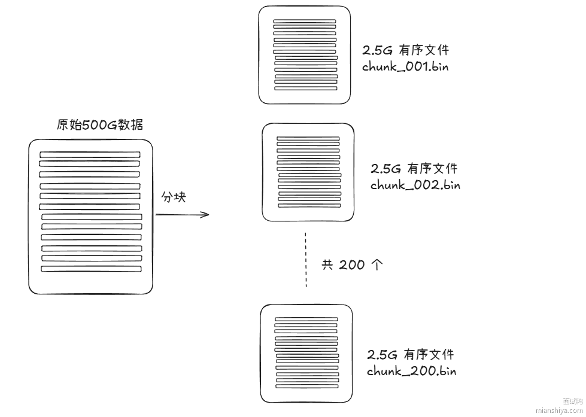

就下来的目标就是合并这些有序的小文件，最终得到一个大的有序文件。

##### 第二步：多路归并排序

什么是多路？实际上指的是同时读取**多个文件的部分数据**，放置在内存中一起排序，这就是多路。

这里的部分数据定义多大呢？实际上我们称这个为缓冲区的大小，而缓冲区的大小需要从**内存利用率**和**磁盘 I/O 效率**来考虑。

**过小的缓冲区**（如 10MB），可支持更多路归并（如 300 路），但是会频繁触发磁盘读取（每处理 10MB 就需读取一次），**随机 I/O 开销激增**。

**过大的缓冲区**（如 500MB），虽然减少磁盘读取次数，但是路数太少（仅 6 路），**导致归并趟数增加**（log₆200 ≈ 3.3 趟），**总 I/O 量变大**。

然后，内存中还有需要**最小堆**维护挑选得到每一路最小的数据，不过维护 20 个元素的堆，占用极小，可忽略不计。

此外，还需要一个**输出缓冲区**，总不能每次选出最小值都直接写文件吧，这样开销太大了。

即每次利用最小堆得到最小值后，将这个值先写入输出缓冲区，待输出缓冲区满了，写入文件后清空输出缓冲区。

综合考虑，输出缓冲区我们定义为 100M，每路分配 **140MB** 缓冲区，则 **K = （3g-100M）2.9G ÷ 140MB 约等于 20 路**。

**归并流程如下**：

1. 从 20 个有序文件各读取 140MB 数据到缓冲区。
2. 使用最小堆选出最小值，写入输出缓冲区，（若输出缓冲区满了，则输出文件后清空）。
3. 当某个缓冲区耗尽时，从对应文件补充 140MB 数据。
4. 重复直到所有文件处理完毕。

此时就能得到一个合并了 20 个文件的有序文件，我们称之为 `chunk_001_merged.bin`。

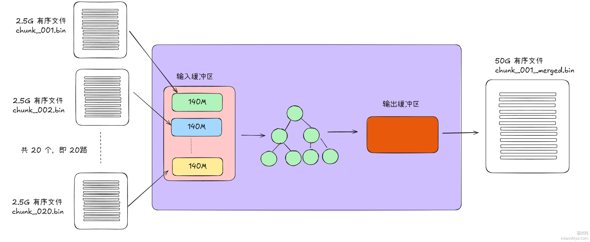

再重复上面的归并流程，我们就能得到 `chunk_002_merged.bin`、`chunk_003_merged.bin`....`chunk_010_merged.bin`

最后再这 10 个 merged 文件，再次重复上面的归并流程吗，最后就能得到一个完整的 500G 有序文件。

### 项目上现在需要存储 IP 地址，数据库应该用什么类型来存储？ 

#### 回答重点

> 面试时核心要回答清楚两点：**IPv4和IPv6的最优存储类型，以及为什么选这个类型**

**IPv4**：优先用**无符号整型（如MySQL的INT UNSIGNED）**，而不是字符串（如VARCHAR）。
 **IPv6**：优先用**二进制类型（如BINARY(16)或VARBINARY(16)）**，次选定长字符串（如CHAR(39)）。

**为什么IPv4不用字符串？**

IP地址（如`192.168.1.1`）本质是32位二进制数（4字节），用字符串存会浪费空间：

- 字符串存储：需要15字节（如`255.255.255.255`），且查询时逐字符比较，效率低。
- 整型存储：4字节（无符号整型范围0~4294967295，刚好覆盖IPv4所有可能地址），比较时直接按数值比，更快。还能节省数据库存储空间和IO开销。

**举个例子**：MySQL有两个函数`INET_ATON()`（IP转整型）和`INET_NTOA()`（整型转IP），可以轻松转换。

比如：

```sql
-- 插入时转整型存储
INSERT INTO user (ip) VALUES (INET_ATON('192.168.1.1'));

-- 查询时转回IP字符串
SELECT INET_NTOA(ip) FROM user;
```

**IPv6为什么用二进制？**

IPv6地址是128位（16字节），用字符串存储需要39字节（如`2001:0000:1F1F:0000:0000:0100:11A0:ADDF`），而二进制类型（BINARY(16)）仅需16字节，空间节省一半以上。

部分数据库（如MySQL）也支持`INET6_ATON()`和`INET6_NTOA()`函数转换IPv6，但二进制存储更高效。

反正，面试时要强调“整型/二进制比字符串更省空间、查询更快”，再能说出具体的数据库函数（如INET_ATON）或专用类型（如PostgreSQL的inet），体现对底层原理的理解，加分！

#### 扩展知识

##### PostgreSQL

如果用PostgreSQL，可以直接用`inet`类型（支持IPv4和IPv6），它会自动验证IP格式，且查询时支持范围判断（如`WHERE ip > '192.168.1.0'`），更方便。

例如：

```sql
-- 直接存储IP字符串，自动转成inet类型
CREATE TABLE user (ip inet);
INSERT INTO user (ip) VALUES ('192.168.1.1'), ('2001:0000::1');
```

##### IPv4 转 int 类型转换原理和流程（以 MySQL 为例）

###### 转换原理

IPv4地址（如`192.168.1.1`）是4个8位二进制数（0-255）的点分形式，本质是32位无符号整数（范围：0~4294967295）。

转换过程：将每个段（如192、168、1、1）按位拼接成一个32位整数。例如：`192.168.1.1` = 192×256³ + 168×256² + 1×256¹ + 1×256⁰ = 3232235777

##### 插入和查询流程

###### **步骤1：创建表（字段类型为INT UNSIGNED）**

```sql
-- 创建表，ip字段用无符号整型存储
CREATE TABLE user_ip (
    id INT PRIMARY KEY AUTO_INCREMENT,
    ip INT UNSIGNED COMMENT '存储IPv4的整型值'
);
```

###### **步骤2：插入数据（用INET_ATON()转整型）**

MySQL提供`INET_ATON(ip_str)`函数，直接将IPv4字符串转为整型：

```sql
-- 插入IPv4地址 '192.168.1.1'
INSERT INTO user_ip (ip) VALUES (INET_ATON('192.168.1.1'));
```

###### **步骤3：查询数据（用INET_NTOA()转回字符串）**

查询时用`INET_NTOA(int_ip)`函数，将整型转回点分格式：

```sql
-- 查询所有IP，显示为可读的字符串
SELECT INET_NTOA(ip) AS readable_ip FROM user_ip;
```

##### IPv6 转二进制类型转换原理和流程（以 MySQL 为例）

###### 转换原理

IPv6地址（如`2001:0000:1F1F:0000:0000:0100:11A0:ADDF`）是128位二进制数（16字节），用字符串存储需39字节，而二进制仅需16字节。

转换过程：将IPv6的16进制字符串（冒号分隔）转为16字节的二进制数据。

##### 插入和查询流程：

**步骤1：创建表（字段类型为BINARY(16)）**

```sql
-- 创建表，ip字段用16字节的二进制类型存储IPv6
CREATE TABLE user_ipv6 (
    id INT PRIMARY KEY AUTO_INCREMENT,
    ip BINARY(16) COMMENT '存储IPv6的二进制值'
);
```

**步骤2：插入数据（用INET6_ATON()转二进制）**

MySQL的`INET6_ATON(ipv6_str)`函数可将IPv6字符串转为16字节的二进制数据：

```sql
-- 插入IPv6地址 '2001:0000:1F1F:0000:0000:0100:11A0:ADDF'
INSERT INTO user_ipv6 (ip) VALUES (INET6_ATON('2001:0000:1F1F:0000:0000:0100:11A0:ADDF'));
```

**步骤3：查询数据（用INET6_NTOA()转回字符串）**

查询时用`INET6_NTOA(binary_ip)`函数，将二进制数据转回IPv6字符串：

```sql
-- 查询所有IPv6，显示为可读的字符串
SELECT INET6_NTOA(ip) AS readable_ipv6 FROM user_ipv6;
```

##### 为什么 IPv6 不能像 IPv4 那样用整数？

核心原因：IPv6 的 128 位长度，超出了主流数据库整数类型的范围，拆成多个整数段又比较复杂和麻烦。

IPv4是32位二进制数（4字节），主流数据库的**无符号整型（如MySQL的INT UNSIGNED）**刚好能存下（4字节=32位，范围0~4294967295）。但IPv6是128位（16字节），而主流数据库的整数类型最大只有64位：

- MySQL的`BIGINT UNSIGNED`是8字节（64位），只能存到`18446744073709551615`，远小于IPv6的`3.4×10^38`（128位最大值）。
- PostgreSQL的`BIGINT`同样是64位，无法存128位的IPv6地址。

如果非要用整数存IPv6，需要拆分成多个整数段（比如用2个64位整数拼128位），但会带来 3 个问题：

- **存储复杂**：需要额外字段（如`high_bits`和`low_bits`），增加表结构复杂度。
- **查询低效**：查询时需要同时比较两个字段（如`WHERE high_bits = ... AND low_bits = ...`），比直接比较二进制字段慢。
- **无原生函数支持**：主流数据库没有直接操作128位整数的函数（如MySQL的`INET6_ATON`返回的是二进制，不是整数），转换逻辑需要手动写，容易出错。

##### 为什么 IPv4 优先选整型而非二进制？

IPv4 用整型存储更符合其数值本质，且数据库内置函数和查询操作的便捷性远超二进制。

二进制（`如BINARY(4)`）虽然也能存 4 字节，但它是 “字节序列”，需要额外理解其代表的数值含义，还需要多一步手动转换成二进制的步骤，比较麻烦。

### 一笔订单，在取消的那一刻用户刚好付款了，怎么办？ 

#### 回答重点

这种情况在正常的业务场景中是有可能出现的，因为订单都会有定时取消的逻辑，比如 10 分钟或者 15分钟，而用户刚好卡在这个时间点进行付款，此时就会出现两种情况：

1）用户支付成功，支付回调的那一刻支付单刚好还没取消，而等回调结束，取消支付单的事务提交，支付单取消。此时用户扣款了，但是对应的权益或资产没了。

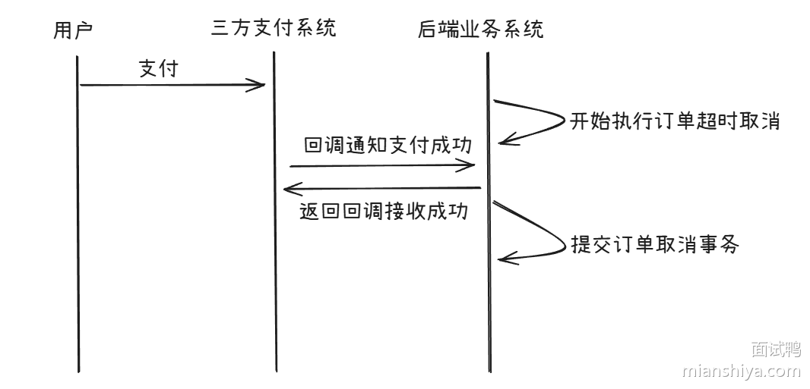

2）用户支付成功，支付回调的那一刻支付单已经被取消。但此时用户已经扣款，东西却没了。

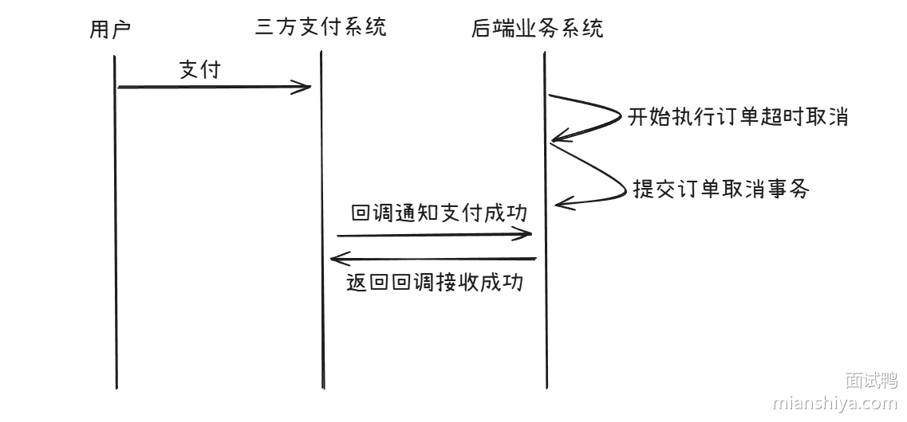

可以看到，不论是哪种情况，其实都需要做一定的处理，不然用户肯定会来投诉！

这种场景无非就是支付单支付成功和取消两种状态的“争夺”，正常情况下，订单或者支付单都会有状态机的存在，在当前场景简单来说有以下两条路径：

1）待支付->支付中->支付成功

2）待支付->支付中->已取消

针对情况 1 ，如果是支付回调取胜，此时的状态应该已从 支付中->支付成功 针对情况 2 ，如果是取消支付单取胜，此时的状态应该已从 支付中->已取消

所以我们在修改支付单状态的时候，基于原始状态的判断，就可以做正常的处理，来看下 SQL 应该就很清晰了：

```sql
# 支付成功
update pay_info set status = 'paySuccess' where orderNo = '1' and status = 'paying';

# 取消
update pay_info set status = 'cancel' where orderNo = '1' and status = 'paying';
```

重点就是我们加了 `status = 'paying'` 这个条件，这就能保证个情况只有一个能成功，另一个一定失败。

1）假设**情况 1** 成功了，此时用户已经成功付款，那么 status 已经变为 paySuccess，取消的 SQL 必定执行失败，此时就让它失败，不需要做任何别的处理。

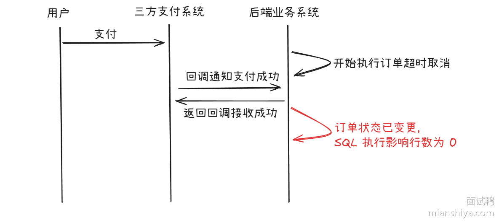

2）假设**情况 2** 成功了，此时订单已被取消，status 已经变为 cancel，支付成功的 SQL 必定执行失败，这种情况下我们就需要做**逆向处理，即给用户退款** 。订单被取消，用户的钱也被原路退回，这种处理也没任何问题。

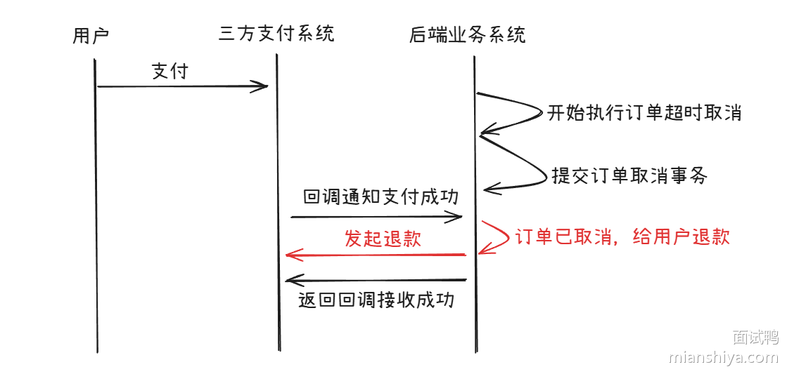

#### 业务小优化

针对订单超时业务，这里在业务上可以做一个小优化，你想想，用户付款前可能有点挣扎，然后在最后一刻终于下定决心进行付款，这时候却告知被退款了，用户很可能就不会再下单了。**因此我们在页面上可以限时订单取消倒计时为 10 分钟，但实际后端是延迟 11 分钟取消订单**，这样就能避免这种情况的发生啦。

#### Redis 分布式锁实现

最后除了利用数据库处理，还可以使用**分布式锁**，对一笔订单加锁也能保证这笔订单正常的业务流转。

每次进行**取消订单**或**付款**操作时，首先尝试获取订单的分布式锁，确保只有一个操作能修改订单状态。

在分布式系统中，订单在取消的同时用户付款的竞态问题可以通过分布式锁来解决。以下是一个具体的、落地的方案，确保订单状态的可靠性，避免因并发导致状态冲突：

**订单取消流程**：

1）超时触发取消订单

2）取消订单方法中先获取该订单的分布式锁。如果锁被其他操作持有（如付款），等待或抛出异常。

若成功获取锁，检查订单状态是否已付款：

- **若订单未付款**，将订单状态更新为“已取消”。
- **若订单已付款**，直接跳过这笔订单的处理。
- 释放分布式锁，完成取消流程。

**订单付款流程**：

1）三方支付成功回调。

2）后端系统接收回调后，先获取该订单的分布式锁，如果锁被其他操作持有（如取消），等待或抛出异常（没有给三方响应成功，三方会重新发起回调）。

若成功获取锁，检查订单状态是否为“待支付”：

- 若订单状态为“待支付”，继续执行扣款，并将订单状态更新为“已付款”。
- 若订单状态为“已取消”，则发起退款，并提示用户订单已取消，无法支付。
- 释放分布式锁，完成流程。

#### 扩展知识

- [958. 分布式锁一般都怎样实现？](https://www.mianshiya.com/question/1800458377811533825)

### 如何避免用户重复下单（多次下单未支付，占用库存） 

#### 回答重点

> 在稀有商品抢购或秒杀场景中，一个用户多次下单未支付可能是恶意锁库存或损坏其他用户的权益，因此需要避免用户重复下单。

1）**首先前端需要进行按钮控制**

在用户点击“下单”按钮后，可以通过前端控制按钮状态，比如变为“处理中”或“请稍等”，避免用户在等待过程中多次点击按钮，导致重复下单请求发送到后端。但是前端的操作无法完全避免重复请求，因此需要与后端的幂等控制结合，以确保不会因多次点击创建多个订单。

2）**在每次下单请求中生成一个唯一的`requestId`或`token`**

用户进入订单页面前，前端会先请求后端生成这次请求的唯一的`requestId`或`token`，然后在每次下单请求中带上这个唯一的`requestId`或`orderToken`。这样后端可以通过检测该标识是否已存在，来决定是否创建新订单。这样，无论用户重复点击几次下单按钮，仅会创建一次订单。

> 以上两步能阻挡绝大部分用户正常操作下的重复下单行为，如果一些用户通过 api 请求，或者后退页面再次点击下单进入，还是可以重复下单，不过一般这种设计已经可以杜绝稀有商品抢购或秒杀场景的恶意锁库存了，因为后退页面让下单流程再走一遍还是比较费时的。

3）**分布式锁 + 判断 + 下单**

1. 以用户维度，加上分布式锁，例如分布式锁的 key 中的内容可以是 `xxx+UserId`，这样同一个用户的操作会被锁定。
2. 判断用户是否有在流程中未支付的订单。
3. 如果没有则正常进行下单流程
4. 如果有则直接返回，提醒前端您还有未支付的订单，请先支付后再继续下单！

这样就能保证用户无法重复下单（恶意占用库存锁单）。

#### 扩展知识

##### 唯一索引实现幂等的约束

上述第二步在实现幂等性时说到，可以为每个订单请求设置一个`requestId`或`orderToken`。

具体是在订单数据库中保存该唯一标识，建立唯一索引。当新订单请求到达时，首先检查数据库中是否已有相同标识的订单记录，如果有则直接返回订单信息，避免重复创建。

而且有唯一索引兜底，即使因为并发导致读取判断没数据，但实际有数据的情况，也会因为唯一索引从而避免重复插入。

但是唯一索引来实现幂等还是有很多局限性。

**1）业务逻辑需要依赖异常（DuplicateKeyException）**

上述控制订单重复插入部分代码如下：

```java
try {
    // 尝试创建订单
    return orderRepository.save(order);
} catch (DuplicateKeyException e) {
    // 捕获重复键异常，说明订单已存在，返回现有订单
    log.info("订单已存在，返回现有订单信息");
    return orderRepository.findByRequestId(requestId);
}
```

> 《Effective Java》 提出一条建议：不要用异常去控制程序的流程。

主要因为以下几点：

**性能开销**：异常在 Java 中是重量级的操作！

- **异常的创建成本高**：当抛出异常时，JVM会捕获当前堆栈信息，用来构建异常栈追踪，这是一项耗时的操作。
- **异常捕获过程耗时**：异常抛出后需要经过堆栈的传递来找到匹配的catch块，尤其在异常频繁抛出的场景中，性能开销会更加显著。因此，用异常做流程控制会显著影响程序性能，尤其是在高并发、性能敏感的应用中。

**代码可读性差**：异常的存在往往意味着出现了非预期的情况，如果用异常来控制正常流程，会让开发者误解代码意图，**难以分辨哪些是正常流程，哪些是错误处理**。

**依赖底层类**： `DuplicateKeyException` 是 Spring 中的类，后续如果进行框架迁移不或者升级使得不报这个异常了，那就尴尬了。（面试时候说可以这样说，但是我觉得问题不大。。）

**2）数据库压力大**

等于把所有的请求，即使是重复的请求都需要靠数据库来做唯一判断，把压力都给到数据库身上，在高并发情况下会产生比较大的压力。

**3）业务局限**

大部分的唯一索引防重都需要插入操作，即 insert 动作，部分 update 也可以用上唯一索引但是场景比较少。不过这种情况一般我们在业务上会增加一个流水表来创造一个 `insert` 语句来实现前置防重（话是这么说，但流水表不是主要为了创造一个 insert，本身流水还是追溯和审计等意义的）。

### 线上发现 Redis 机器爆了，如何优化？ 

#### 回答重点

##### 1）首先需要排查并确定根因

通过监控工具（如`Prometheus`、`Grafana`等或云上自带的一些监控）查看 Redis 的 CPU、内存、命令执行时间或带宽等指标，确定瓶颈所在。

##### 2）依据根因针对性解决问题

**如果是内存耗尽**，可能需要增加机器的内存量（升配），即临时升配解决线上问题后。

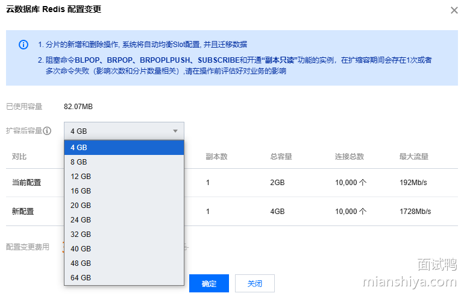

后续再走查代码和了解相关业务，判断有些数据是否有必要都存储到 Redis 中，有些数据的过期时间是否设置的过长等等来优化占用 Redis 的大小。

**如果是 CPU 使用率飙升**，可能是因为大量的读写请求，且涉及复杂度较高的命令，比如聚合、排序等等。此时可能需要重新发版或者回退版本下线有影响的业务。

后续再针对具体业务评估优化，是否可以将一些操作放到后端服务执行，将一些包含大量数据的大 key 拆分成多个小 key。也可以使用 Redis 集群分片，分散计算压力。

**如果是带宽方面**，则需要增加带宽配置，加大带宽。

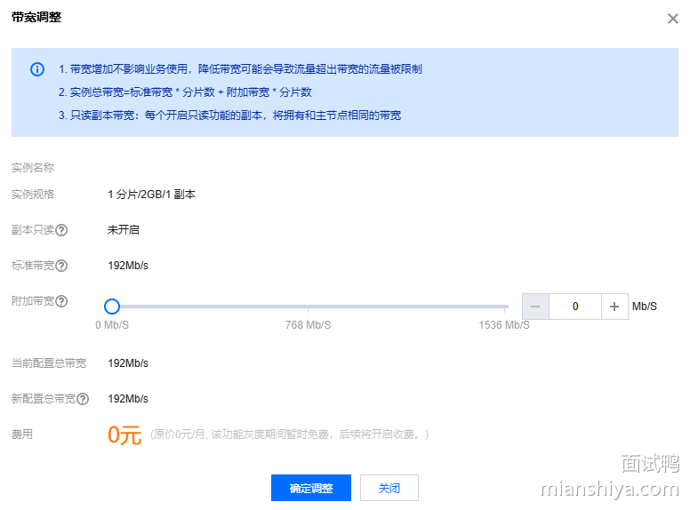

除了 Redis 自身的优化之外，还可以利用本地缓存来降低 Redis 的负载。

一些热点数据可以存储在后端服务本地，请求先打到后端服务，如果命中本地缓存，则不需要请求 Redis 直接可以返回数据，这种情况就大大的减轻了 Redis 压力，解决（集群内）单机器负载高的情况。

还有，除了上述的应急处理手段之外，**各组件应该都需要配置监控报警机制**。例如内存的阈值，当内存占用率达到 80% 就报警（邮件、企微、钉钉、短信）等通知开发者，及时处理即将发生的问题，避免问题进一步扩大。

针对这个问题这样回答就差不多了。

#### 扩展知识

- [646. Redis 中的 Big Key 问题是什么？如何解决？](https://www.mianshiya.com/question/1780933295626809345)
- [647. 如何解决 Redis 中的热点 key 问题？](https://www.mianshiya.com/question/1780933295631003650)
- [668. Redis 性能瓶颈时如何处理？](https://www.mianshiya.com/question/1780933295702306818)

##### 云数据库Redis扩缩容是否会中断业务？

以下内容来自腾讯云：

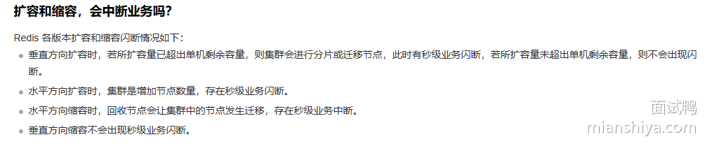

### 项目上有个导出 excel 场景发现很慢，怎么优化？ 

#### 回答重点

##### 1）先定位慢在哪儿？

需要定位导出 excel 慢在哪里：

- 业务逻辑慢？
- 数据库查询慢？
- excel 生成慢？

##### 2）针对性解决慢的问题

**如果是业务逻辑处理很慢**，则需要优化调整逻辑，比如将一些在循环内的多次 RPC 调用，变成一次（或更少）的批量 RPC 调用。

**如果是数据库查询慢**，则查看 SQL 是都命中索引，是否有额外的排序逻辑等等。

一般情况下导出的场景都会分页查询数据库，可以将普通分页使用的 `LIMIT offset,size` 变成记录上一次查询的 id 为 lastId，然后下次查询的时候带上 lastId 作为查询条件。

例如：`select * from table where id > lastId + (其他过滤条件) order by id asc limit size`;

因为 `LIMIT offset,size` 的效率比较低，例如 limit 10000000，10，则是一直扫描到 10000000 后，跳过它们，再取接下来的 10 条数据，对数据库来说这需要大量的 I/O 操作（扫描这么多行）

**至于最后 excel 生成慢的场景**，一般只要避免一行一行写入即可。即批量写入数据，而不是一行一行写入。

##### 3）多线程优化

上面优化过后，如果还想缩短导出的时间，则需要进行多线程操作。

将要导出的数据进行分片，比如以”地方“为分片依据，北京的一个 sheet、上海的一个 sheet 以此类推，多线程并发处理不同 sheet 数据的获取和写入（或者多个 excel 文件都行，最后生成一个 zip 包输出就好了）。

大数据量的情况下注意使用流式导出，防止占用过多内存，POI 使用 SXSSF，EasyExcel 默认就是流式导出。

#### 扩展知识

- [1214. MySQL 中 `LIMIT 100000000, 10` 和 `LIMIT 10` 的执行速度是否相同？](https://www.mianshiya.com/question/1803235242875019265)
- [630. MySQL 中如何解决深度分页的问题？](https://www.mianshiya.com/question/1780933295572283394)

##### 多线程导出代码示例

使用 EasyExcel 导出， EasyExcel 默认使用流式写入功能（SXSSF），减少内存消耗，支持大数据量导出。

```java
public class ExcelExportService {

    private static final String EXPORT_DIR = "path/to/export/directory"; // 临时文件存储目录

     //从数据库查询数据
    public List<Data> getDataByPlace(String place) {
        List<Data> dataList = new ArrayList<>();
         ...
        return dataList;
    }

    // 数据导出：根据地方分片生成不同的 Sheet
    public void exportDataForPlace(String place, String filePath) {
        List<Data> dataList = getDataByPlaceFromDB(place);

        // 使用 EasyExcel 写入数据到 Excel 文件的不同 Sheet
        EasyExcel.write(filePath, Data.class)
                .sheet(place) // 每个地方对应一个 Sheet
                .doWrite(dataList);
    }

    // 执行导出任务，采用多线程并发
    public void export() throws InterruptedException, ExecutionException {
        // 1. 定义地方列表
        List<String> places = Arrays.asList("北京", "上海", "广州", "深圳", "杭州");

        // 2. 设置线程池来并发处理不同地方的导出任务，此为 demo，真实环境线程池需要提前定义，
        //  不可每次执行都创建
        ExecutorService executorService = Executors.newFixedThreadPool(places.size());
        List<Future<?>> futures = new ArrayList<>();

        // 3. 创建 Excel 文件路径
        String filePath = EXPORT_DIR + "/places.xlsx";

        // 4. 执行每个地方的导出任务
        for (String place : places) {
            Future<?> future = executorService.submit(() -> {
                try {
                    exportDataForPlace(place, filePath); // 导出数据到对应的 Sheet
                } catch (Exception e) {
                    e.printStackTrace();
                }
            });
            futures.add(future);
        }

        // 5. 等待所有任务完成
        for (Future<?> future : futures) {
            future.get();
        }

        // 6. 关闭线程池
        executorService.shutdown();
        System.out.println("mianshiya Excel export has been completed.");
    }
}
```

### 项目上需要导入一个几百万数据 excel 文件到数据库中，有哪些注意点？ 

#### 回答重点

对于百万数据的导入，一般需要关注三类问题：

1）**内存**，如果一次性在堆内加载过多的数据，可能会导致内存溢出。 

2）**时间**，百万数据插入数据库需要一定的时间，同步调用可能会使得方法超时。 

3）**异常**，百万数据中可能会有很多异常的情况，比如格式错误、重复数据等等。

内存是有限的，不能一次性将 excel 内的所有数据都加载到内存中，**需要分批加载**。

像 apache poi 会将整个文件加载到内存中，内存占用较高，而 easyexcel 则是基于 sax 解析，逐行读取数据，避免将整个文件加载到内存中，因此我们采用 easyexcel 框架读取文件，避免内存溢出。

excel 单 sheet 存储的文件是有上限的，需要保证 100w 条以内，因此如果是几百万的数据，单文件肯定是多 sheet。

我们可以针对 sheet 数量起对应的线程进行多线程读取，这样可以加快读取的速度，并且不要读取一条数据就调用数据库进行保存，我们可以需要批量保存，比如加载 500 条数据到内存中，存在 list 内，然后调用数据库批量保存接口，一次性保存这些数据，这样会大大提升插入的速度。

最后异常的处理，一般业务上会跳过异常的数据，继续日志记录，等文件导入完毕后，再单独处理这些数据。

#### 扩展知识

##### EasyExcel

根据官网描述：

Java 解析、生成 Excel 比较有名的框架有 Apache poi、jxl。但他们都存在一个严重的问题就是**非常的耗内存**，poi 有一套 SAX 模式的 API 可以一定程度的解决一些内存溢出的问题，但 poi 还是有一些缺陷，比如 07 版Excel 解压缩以及解压后存储都是在内存中完成的，内存消耗依然很大。 easyexcel 重写了 poi 对 07 版 Excel 的解析，一个 3M 的 excel 用 POI sax 解析依然需要100M左右内存，改用 easyexcel 可以降低到几 M，并且再大的 excel 也不会出现内存溢出；03 版依赖 POI 的 sax 模式，在上层做了模型转换的封装，让使用者更加简单方便。

##### SAX（Simple API for XML）

EasyExcel 使用基于 SAX（Simple API for XML）的解析方式来读取 Excel 文件，这意味着它是逐行读取数据的。

**SAX 是一种事件驱动的解析方法**，每读取一行数据就触发一个事件，而不是像 POI 那样将整个文件加载到内存中。这使得 EasyExcel 在处理大文件时非常高效，内存消耗非常低，能够处理几百万行的数据而不会导致内存溢出。

不过 EasyExcel 已经进入了维护模式了： 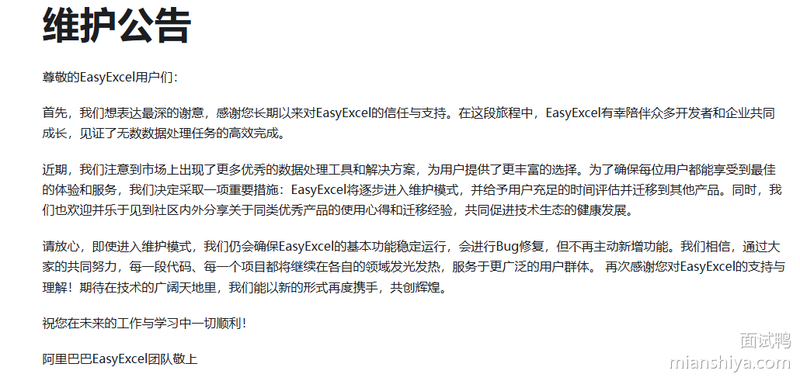

但据 EasyExcel 所说，他即将推出 EasyExcel-plus 版本（目前还未正式发布）

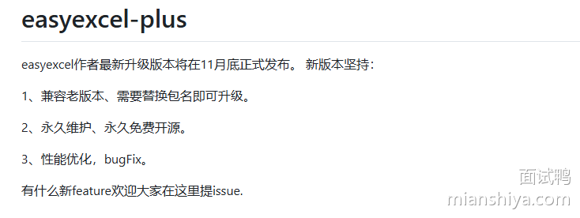

### 如果一笔订单，用户在微信和支付宝同时支付，会怎么样？

#### 回答重点

**微信和支付宝都会支付成功**，因为支付渠道是第三方系统，它们之间的数据是不相通的，因此无法阻止用户付款。

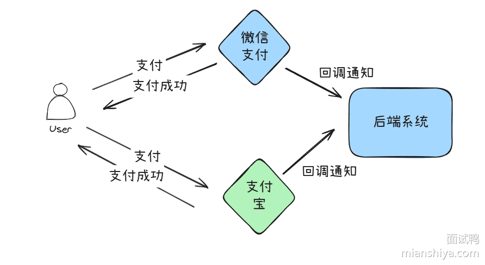

这样一来同一笔订单，用户就会多付了一笔钱，如何避免这个情况？

思路其实很清晰，不管是支付宝支付还是微信支付，用户支付后三方都会进行回调，这个回调处理逻辑在我们的系统中，因此我们可以在这里控制。

支付单都会有状态机，例如从`支付中`到`支付成功`，比如 `update pay_info set status = "sucess" where payNo = '123' and status = "paying"`

**通过数据库对单一记录的更新加锁**来保证先到的回调支付状态就能修改成功，后到的回调修改状态失败（因为wehre 条件不匹配，影响行数为 0 ）。

针对影响行数为 0 的那次回调，我们就可以调用退款流程把用户多付的钱给退了。

假设微信支付回调执行成功，支付宝回调执行失败：

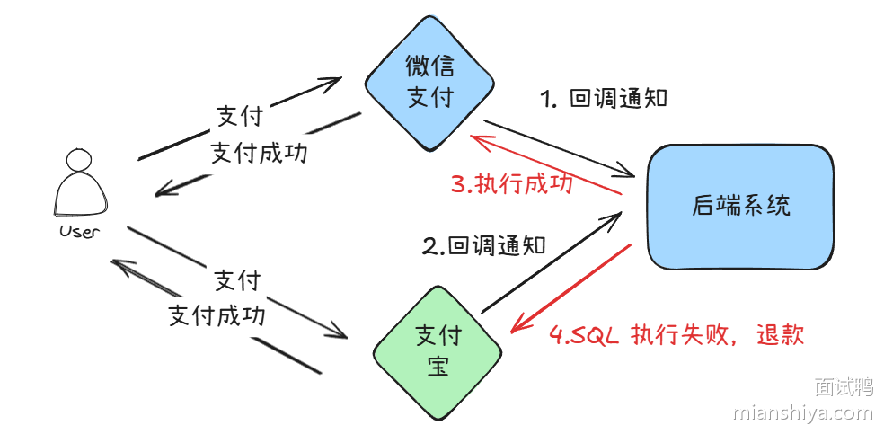

### 支付回调的幂等性处理

不过这里还有一个很关键的点需要注意，即**支付回调的幂等性处理**。

因为支付渠道回调我们后端服务，后端需要给对应的响应，不然支付渠道会重试回调，**假设因为网络抖动或者其他因素导致支付渠道重复回调**，必然会触发 SQL 执行失败，如果不做任何处理，肯定会触发退款流程了！那就玩完了，钱都退给用户，产生了资损。

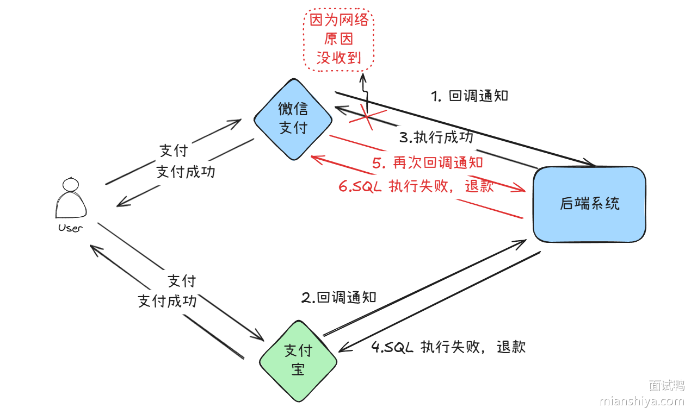

这里的做法是需要**在支付单中记录支付成功的渠道和对应的渠道支付单号**，增加这部分的判断就能实现幂等，回调随便调，不会影响业务。

例如支付单增加：

- `pay_channel`：支付渠道（如微信、支付宝等）
- `transaction_id`：渠道支付单号

流程如下：

1）判断支付单是否已完成支付

2）若已完成，则检查支付渠道和支付单号是否匹配。

- 若匹配，说明重复支付，直接返回
- 若不匹配，说是其他渠道，调用退款接口

3）若未完成，执行上述 update 逻辑，并将检查支付渠道和支付单号一并落库

4）如果 update 影响行数为 0 ，说明已经被其他渠道支付了，可以不返回响应，待三方支付再次回调，走上述的第二步逻辑（因为不确定是不是同渠道多次请求）。

### 假设有一个 1G 大的 HashMap，此时用户请求过来刚好触发它的扩容，会怎样？让你改造下 HashMap 的实现该怎样优化？ 

#### 回答重点

如果刚好触发扩容，那么当前用户请求会被阻塞，因为 HashMap 的底层是基于数组+链表（红黑树）来实现的，一旦它发生扩容，就需要新增一个比之前大 2 倍的数组，然后将元素搬运到新的数组上。

而 1G 的 HashMap 够大，所以扩容需要一定的时间，而扩容使用的又是当前的线程，所以**用户此时会被阻塞，等待扩容完毕**。

##### 如何改造现有 HashMap 结构而优化处理这种场景？

此时可以借鉴 Redis 的 Hash 结构，因为 Redis 处理命令恰好是单线程的，它的 Hash 表如果很大，触发扩容的时候是不是也会导致阻塞？

所以它是怎么优化的？答案就是：**渐进式rehash**

我们都知道 HashMap 默认的扩容过程是一次性重哈希，**即每次扩容都会创建一个更大的数组，并将所有元素重新哈希并放入新数组**。

而渐进式 rehash 就是把扩容过程**分批完成**，通过分批扩容来减少单次扩容的开销。

简单来说不要一次性扩容完毕，而是分批搬运数据。

在分段扩容过程中，HashMap 需要维护两个数组：

- **旧数组**：扩容之前的数组，包含了部分尚未迁移的数据。
- **新数组**：扩容过程中创建的新数组，用于存储迁移后的数据。

**实现方式**：

- **扩容分批化**：将重新哈希的过程分成多个步骤，而不是一次性完成。在扩容时，先创建新的数组，但只重新哈希一部分旧数据。
- **增量式迁移**：每次插入、修改或查询时，检查当前是否有未完成的扩容任务。如果有，则迁移少量旧数据到新数组中，直到完成所有数据的迁移。
- **迁移状态管理**：通过状态字段记录扩容的进度，确保每次操作时扩容任务逐步推进。

> 有两个数组，那么 `get` 操作时候如何查询呢？

- **优先查找新数组**：当用户发起 get 请求时，优先从新数组中查找。因为已经迁移的数据会直接放入新数组。
- **回退查找旧数组**：如果在新数组中没有找到对应的键，说明该键还未迁移至新数组，需要回退到旧数组查找。

其实这就是**空间换时间的概念**，也是一种权衡。

- **优点**：节省的用户扩容阻塞时间，把扩容时间的消耗平均分散都后面的处理中，基本上做到了无感知。
- **缺点**：空间开销比较大，因为在扩容的时候，同时存在两个大数组。

这类题目就是借助一个场景，看起来问的是 hashmap ，实际上考察对 Redis 的渐进式 Hash 是否有深入的理解，考验面试者是不是仅就死记硬背，无法应用到真实的场景。

#### Redis Hash 底层实现和渐进式扩容

- [Redis 的 hash 是什么？](https://www.mianshiya.com/question/1780933295601643521)

#### 多线程改造

除了往 Redis 的渐进式 Hash 考虑，还可以往 `ConcurrentHashMap` 多线程方向改造，它的设计也是渐进式扩容，只不过融入了多线程的并发扩容，即可以多个线程同时参与扩容。

**`ConcurrentHashMap`的扩容机制介绍**：

1）ConcurrentHashMap 在扩容过程中，会创建一个新数组（nextTable），容量是原数组的两倍。但它不会一次性迁移整个旧表，而是将扩容任务分成多个小段，每次迁移一部分桶（bucket）。通过这种方式，将扩容的负担分散在多个线程、多个操作中。

2）多个线程可以同时参与扩容操作。每个线程负责一段桶的迁移，迁移完成后更新迁移进度，其他线程可以继续处理剩余未迁移的部分。

3）ConcurrentHashMap 通过使用一个 `transferIndex` 变量来记录当前迁移的进度。`transferIndex` 从旧表的高位索引开始，逐步向低位递减。每个线程在扩容时会尝试抢占 `transferIndex` 中的一段桶范围，执行数据迁移并更新 transferIndex。

4）在扩容过程中，如果某个桶中的数据已迁移至新表中，旧表中该桶的引用会被替换为 ForwardingNode。ForwardingNode 节点会指向 nextTable，表示该位置的数据已经迁移到新表中。

5）当所有桶都被迁移至新表时，ConcurrentHashMap 会将 nextTable 替换为 table，并将 nextTable 置为 null，标识扩容完成。

### 微服务中远程调用的超时时间应该设置为多少合适？

#### 回答重点

一般远程调用的默认超时时间为 **2-5s**。但在实际工作中，还是要看具体的业务场景，因为不同的业务场景对超时时间的要求不同。

- 一些查询、验证等较为简单的操作，超时时间可以适当缩短。
- 一些需要长时间处理的业务，比如大数据处理、复杂的查询，可能需要配置较长的超时时间，避免超时过早导致的失败。

除此之外，超时时间应该基于服务的响应能力进行设置，也就是考虑服务端（服务提供者）的处理时间，如果服务端**有历史响应时间数据或监控信息**，可以参考这些数据进行合理设置，例如**参考 TP99 的耗时来设置超时时间**。

整体的配置根据**当前的上下游服务情况**敲定一个合理的超时时间。

一般来说，**建议服务端（服务提供者）提供配置超时时间和重试次数等参数**，因为作为服务提供方，它比消费方更清楚当前服务、方法的性能。而**消费者直接采纳生产者提供的配置即可**。

#### 扩展知识

##### 远程调用超时时间

在微服务场景，远程调用超时时间，一般指的是生产者（provider）和消费者（consumer）配置的方法调用超时时间。

**超时时间无法设置过短**。如果时间过短，正常业务流程还未走完，消费者检测到接口超时，直接中断调用，影响正常业务的执行。

**超时时间无法设置过长**。如果时间过长，此时请求量较大，那么就会出现大量长期无响应的请求占用线程池等情况，导致资源被占用无法释放，严重会导致服务崩溃。

因此超时时间的设置需要比正常业务耗时长，但是又不能长太多，建议根据压测情况。**参考 TP99 的耗时来设置超时时间。**

> TP99 指的是满足 99% 次数的网络请求所需要的最低耗时。比如调用一个方法，1 小时内调用了 10w 次，监控显示 TP99 是 300ms，这个意思就是：这个请求强度下，百分之 99% 的调用，都可以在 300ms 内返回结果。此时超时时间可以设置为 1s，给一定的冗余又不会太多，此时设置 10s 就是过长的配置。

##### RPC 框架的多粒度超时时间

例如 dubbo 支持多粒度配置 rpc 调用的超时时间。

参考官网的例子，我们来看下多种粒度：

1）配置全局默认超时时间为 5s（不配置的情况下，**所有服务的默认超时时间是 1s**）

```yml
dubbo:
  provider:
    timeout: 5000
```

2）在消费端，指定 DemoService 服务调用的超时时间为 5s

```java
@DubboReference(timeout=5000)
private DemoService demoService;
```

3）在提供端，指定 DemoService 服务调用的超时时间为 5s（可作为所有消费端的默认值，如果消费端有指定则优先级更高）

```java
@DubboService(timeout=5000)
public class DemoServiceImpl implements DemoService{}
```

4）在消费端，指定 DemoService sayHello 方法调用的超时时间为 5s

```less
@DubboReference(methods = {@Method(name = "sayHello", timeout = 5000)})
private DemoService demoService;
```

5）在提供端，指定 DemoService sayHello 方法调用的超时时间为 5s（可作为所有消费端的默认值，如果消费端有指定则优先级更高）

```java
@DubboService(methods = {@Method(name = "sayHello", timeout = 5000)})
public class DemoServiceImpl implements DemoService{}
```

**以上配置形式的优先级从高到低依次为：方法级别配置 > 服务级别配置 > 全局配置 > 默认值。**

##### Dubbo Deadline 机制

Deadline 其实就是一个在长链路调用中，发现调用超时触发的一个提前终止操作。我们来看下 dubbo 官网的例子：

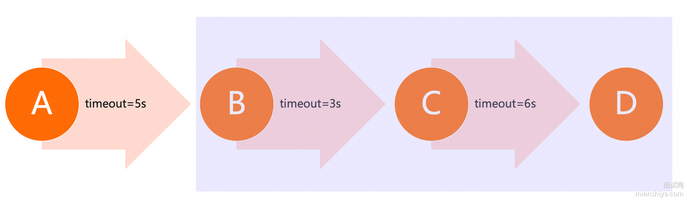

我们来分析一下以上调用链路以及可能出现的超时情况：

- A 调用 B 设置了超时时间 5s，因此 B -> C -> D 总计耗时不应该超过 5s，否则 A 就会收到超时异常
- 在任何情形下，只要 A 等待 5s 没有收到响应，整个调用链路就可以被终止了（如果此时 C 正在运行，则 C -> D 就没有发起的意义了）
- 理论上 B -> C、C -> D 都有自己独立的超时时间设置，超时计时也是独立计算的，它们不知道 A 作为调用发起方是否超时

在 Dubbo 框架中，A -> B 的调用就像一个开关，一旦启动，在任何情形下整个 A -> B -> C -> D 调用链路都会被完整执行下去，即便调用方 A 已经超时，后续的调用动作仍会继续。

这在一些场景下是没有意义的，尤其是链路较长的情况下会带来不必要的资源消耗，deadline 就是设计用来解决这个问题，通过在调用链路中传递 deadline（deadline初始值等于超时时间，随着时间流逝而减少）可以确保调用链路只在有效期内执行，deadline 消耗殆尽之后，调用链路中其他尚未执行的任务将被取消。

因此 deadline 机制就是将 B -> C -> D 当作一个整体看待，这一系列动作必须在 5s 之内完成。随着时间流逝 deadline 会从 5s 逐步扣减，后续每一次调用实际可用的超时时间即是当前 deadline 值，比如 C 收到请求时已经过去了 3s，则 C -> D 的超时时间只剩下 2s。

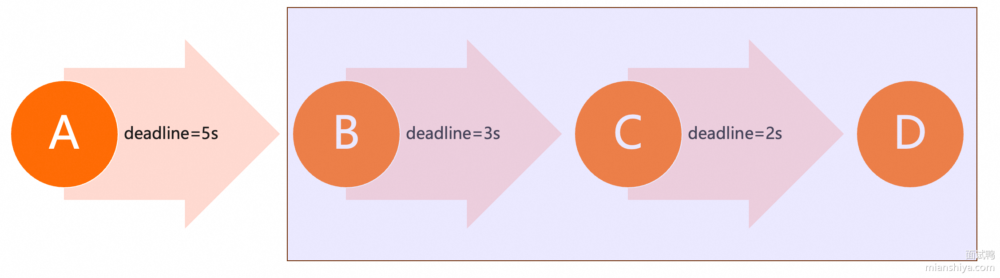

deadline 机制默认是关闭的，如果要启用 deadline 机制，需要配置以下参数：

```yml
dubbo:
  provider:
    timeout: 5000
    parameters.enable-timeout-countdown: true
```

也可以指定某个服务调用开启 deadline 机制：

```java
@DubboReference(timeout=5000, parameters={"enable-timeout-countdown", "true"})
private DemoService demoService;
```

##### 动态调整服务超时时间

动态调整服务超时时间主要应用在突发状况下，无需重启应用临时调整服务的超时时间，解决上下游依赖不稳定而导致的调用失败的问题。

部分 rpc 框架支持动态调整服务超时时间，例如 dubbo 可以通过 Dubbo Admin 动态修改超时时间。

**操作步骤**：

1. 打开 Dubbo Admin 控制台
2. 在左侧导航栏选择【服务治理】>【动态配置】
3. 点击 “创建”，输入服务 org.apache.dubbo.samples.UserService 和新的超时时间如 2000 即可。

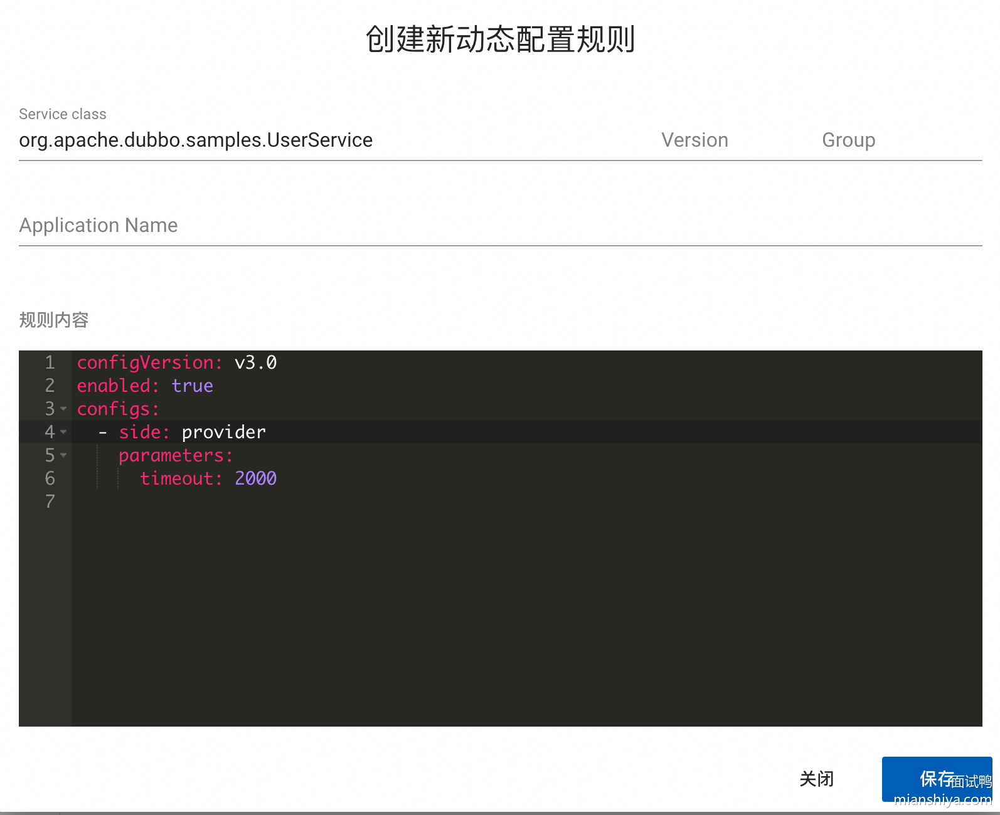

##### 底层原理

- 动态配置监听：Dubbo在启动时注册了配置中心的监听器，以监控相关配置项的变化。当timeout配置发生变更时，Dubbo会收到通知。
- 反射更新：收到更新通知后，Dubbo会使用反射机制更新相关的超时配置。通过动态代理的方式，新的超时时间会被应用到相应的服务调用中。
- 超时控制：在每次调用服务时，Dubbo会根据当前的超时时间来判断请求是否需要被中断。如果请求未在设定的超时时间内完成，Dubbo会主动抛出超时异常，确保系统的稳定性。

### 从网关再到各个后端服务，如何设置 RPC 的超时时间，要考虑哪些问题？ 

#### 回答重点

首先用户（客户端）的请求是先打到网关，再由网关请求各后端服务，因此需要确保客户端到网络连接的超时时间（通常是 HTTP 请求），需要大于网关调用后端服务（通常是 RPC 请求）的**综合时间**。

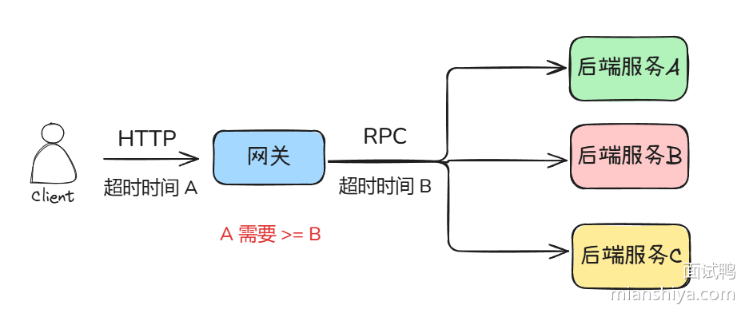

**其中又有一些细节需要考虑**：

**1）网关调用几个服务的方式**

网关调用后端需求可以是串行，也可以是并行，例如上面的图中的三个服务，假设请求服务 A 需要花费 1s、请求服务 B 花费 2s、请求服务 C 花费 3s：

- **如果是串行**，那么网关需要等待服务 A 响应后，再调用服务 B，拿到服务 B 的结果后，再调用服务 C，总时间是 `1+2+3=6`。
- **如果是并行**，则网关可以并发请求三个服务，最终的花费的时间以最慢的那个服务的响应为准，花费的时间是 3s。

因此不同的调用方式，计算的超时时间是不同的。

**2）考虑每个服务 TP99（或TP95） 的耗时**

除了串行并行之外，每个后端服务对请求的响应时间，也需要有个大致的估算，估算的值不能是凭空而来，而是利用每个服务 TP99（或TP95）的耗时（TP99 指的是百分之九十九的调用所需的最高耗时）。

通过这个方式来得来的调用耗时才比较精准和专业。

**3）考虑超时重试次数**

为了避免网络抖动等影响，一般请求还需要有重试机制，比如重试 2 次，那么实际上最多会有 3 次调用（正常 1 次+重试 2 次），最长的耗时就是超时时间 * 3，所以重试的时间也需要计算在总的超时时间之内。

> 这种问题是无法量化的，你可千万别说个什么设置 5s 这种，需要根据业务场景具体问题具体分析，我们仅需回答到上面这些关键点即可。

#### 扩展知识

##### TPxx 指标

常见的有 TP90、TP95 和 TP99 等指标，它们是衡量请求延迟（响应时间）的常用百分位数指标，在性能测试、容量规划、系统监控和优化中具有重要意义。通过这些指标，我们可以了解系统的响应时间分布情况，评估系统的性能。

**以 TP99 举例说明**：

TP99 指的是在所有请求中，99% 的请求的响应时间都低于或等于该值，也就是说，99% 的请求在该时间范围内完成，剩下 1% 的请求会有更长的响应时间。

比如我调用了一个方法，1 小时调用了 10w 次，监控显示 TP99 是 200ms，说明百分之九十九的调用都在 200ms 返回。

### 如果没有内存限制，如何快速、安全地将 1000 亿条数据插入到 HashMap 中？ 

#### 回答重点

> 前置知识，需要先了解 [HashMap 的原理](https://www.mianshiya.com/bank/1788408712975282177/question/1834107117591187457)。然后正常 hashmap 肯定存不了 1000 亿的，threshold 最大也就 Integer.MAX_VALUE，但是还是按面试官想要的来答吧，他问这题想知道的答案总不可能是存不了吧

我们分析一下题目的关键点，**HashMap**、**1000 亿条数据**、**无限制内存**、**快速**、**安全**地插入。

首先无限制内存就不需要考虑机器或者 JVM 的内存溢出问题，在这个条件下 1000 亿还是 10000 亿都不影响，反正知道数据量很大就对了。

其次 `HashMap + 插入`，需要考虑影响性能的点：

- **哈希冲突**，如果数据哈希冲突很大，都命中一个槽，如果是 JDK 8 之前版本，只用链表法解决冲突，那么将会非常耗时，JDK8 及之后引入红黑树，红黑树的插入时间复杂度是 `O(log n)`，虽然比链表法好了很多，但终究没`O(1)` 快。
- **扩容**，`HashMap` 的插入过程，会先判定 `HashMap` 的空间是否足够，如果不够的话则会扩容，每次扩容都又需要将元素迁移，很浪费时间 `HashMap` 默认初始容量是为 16 ，如果插入到 1000 亿那得扩容多少次？

再者就是**快速**和**安全**，基于这两点大家应该能联想到**多线程与并发安全**，多线程插入肯定可以提高效率，但是 `HashMap` 又是一个非线程安全容器，因此使用多线程后就不安全了。

综上：

1）**避免动态扩容**，在 `HashMap` 创建的时候指定初始容量稍微超过 1000 亿，且负载因子配置为 1 （默认负载因子为 0.75）

> 负载因子的作用：假设当前 HashMap 容量设置为 16，负载因子是 0.75，则 `16 * 0.75 = 12`，当 HashMap 存储的数据达到了 12 的时，就会执行扩容操作。

2）**采用多线程的方式**，因为 `HashMap` 线程不安全的特性，其多线程插入的时候大概率会出现数据覆盖的情况，即线程不安全的情况。针对这种情况，我们可以使用 `ConcurrentHashMap` 解决并发安全问题，`ConcurrentHashMap` 也是 `HashMap`。

如果面试官非要用 `HashMap` 来做，那么我们可以把 `ConcurrentHashMap` 的线程安全机制搬运到外部来实现。

`ConcurrentHashMap` 对于冲突节点插入操作用的是 `CAS` + `synchronized` 来保证线程安全。

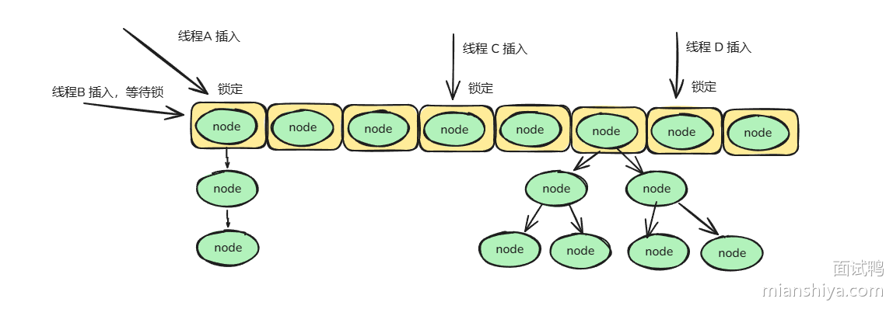

参考 `ConcurrentHashMap`，我们可以有以下思路：

1）将 1000 亿条数据分成多份，再对应起多个线程。

2）同时创建一个数组（可以大小为 1000 亿，反正不考虑内存。），存放锁对象。

2）多线程并发将对应批次的数据插入到 `HashMap`。

3）但是每个数据插入之前需要抢锁，针对 `HashMap` 的槽都建立一把对应的锁（仿照 `ConcurrentHashMap` 的设计）。

4）每个数据先按照 HashMap 的哈希算法定位哈希槽的下标，根据下标从锁对象数组找到对应的锁对象，如果当前下标锁对象数组没数据，则创建一个锁对象，并通过 CAS 插入到锁对象数组中。

5）当前线程利用 synchronized（得到的锁对象）加锁，抢到锁之后再执行插入，这样就能避免多线程插入数据覆盖等问题了。

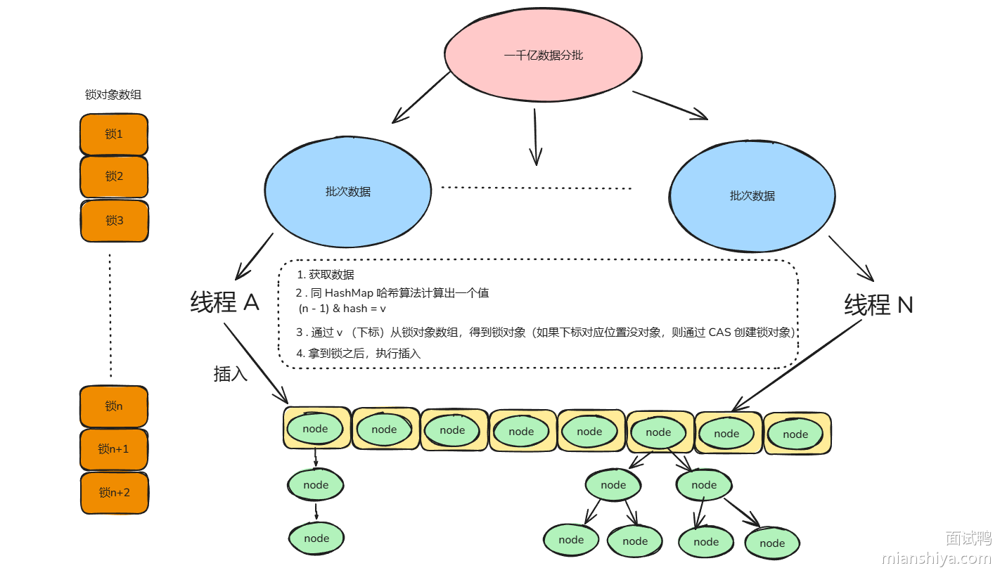

上述的本质就是 `ConcurrentHashMap` 的实现原理，无非就是搬运到外部来实现。

这里再提一下，线程数的控制可以自定义，和锁对象数组的大小没关系。（一千门对应有 1000 把锁，但不是非得叫 1000 个人去开锁）

#### 扩展知识

- [451. Java 中 HashMap 的扩容机制是怎样的？](https://www.mianshiya.com/question/1780933294750199809)


## 系统设计题

### 如何设计一个秒杀功能？ 

#### 回答重点

> 面试官针对这个问题不指望候选人可以系统地回答出完且可落地的方案。只是想考察候选人是否拥有高并发大流量场景下的处理思路或者说能考虑到的一些关键点。

针对秒杀场景，我们需要先和面试官说出以下几个需要解决的问题点：

1. 瞬时流量的承接
2. 防止超卖
3. 预防黑产
4. 避免对正常服务的影响
5. 兜底方案

然后可以从前后端两个视角向面试官阐述整体的设计点：

首先是前端：

- 利用 CDN 缓存静态资源（秒杀页面的 HTML、CSS、JS 等），减轻服务器的压力
- 客户端限流，在前端随机限流，降低请求量
- 按钮防抖，防止用户重复多次点击发出大量请求

其次是后端：

- Nginx（或其他接入层）做统一接入，负载均衡与流量过滤、限流
- 业务端限流，可以自定义实现本地 guava 限流或利用 sentinel 等
- 服务拆分，将秒杀功能拆分为独立的服务，避免对现有服务产生影响
- 秒杀数据的拆分和缓存，缓存可以使用分布式缓存或本地缓存方案，且需要缓存预热
- 精准地库存扣减，防止超卖发生
- 风控识别黑产，进行流量防控且需要动态黑名单机制
- 验证码、答题等手段预防脚本刷单
- 幂等操作，防止重复下单
- 业务手段降低并发量，例如通过预约、预售。
- 兜底方案，如果服务压力过大或者代码有漏洞，那么关闭秒杀直接返回秒杀结束，降低服务压力及时止损。

#### 详细分析

##### 瞬时流量的承接

一般情况下，秒杀的流量特性就是**持续性短**和**大**。

流量集中在活动即将开始的时候，会有很多用户开始持续性地刷新页面。前端资源的访问也需要损耗大量的资源，因此需要利用 CDN 缓存秒杀页面的一些静态资源，将这部分压力给到 CDN 厂商。

并且静态资源放在 CDN 厂商那之后，地理位置也距离用户更近，用户访问也就更快，体验上也更好！


秒杀页面可手动推给 CDN 预热。

秒杀流量还有个特点，就是**大部分请求实际都是无效的**，因为秒杀的商品库存往往都是个位数，而抢购的用户是其成千上万倍。

假设有 100 万的请求来抢购一台 iPhone，那么需要放这 100 万请求直接打到后端服务吗？显然不需要。

针对这个情况，我们就需要**层层过滤请求**。

例如前面提到的客户端限流，即在前端随机限流，降低请求量。说的更直白一些即部分用户点击抢购按钮，但是请求都发不到后端，直接前端代码返回秒杀结束。（如果预测量是在太大，可以这样操作，毕竟也是随机的）

如果前端请求发出来了，那么可以利用 nginx 统一接入，针对更大的流量可以在 nginx 前面再加 lvs。

lvs 四层转发请求打到多台 nginx 上， nginx 再负载均衡到多台后端服务，且 nginx 有限流功能，例如 ip 限流，还可以配置黑名单等等，其实已经可以拦截大量请求流量。

请求到达后端服务之前还可以再进行限流，比如使用 sentinel 再拦截一道。

最终请求打到后端服务，涉及到一些读取数据和写数据的操作。如果量级不大且数据库配置高，理论上可以用数据库来承接（数据库层面也是有优化的，后面介绍）。

这时候也可以利用缓存来承接读写，可以用本地缓存或分布式缓存，如 Redis。

最终一个相对而言比较完整的请求链路如下：


我把 DNS 解析也加上了，因为对一些大公司而言，DNS 其实也是一个分流的手段。

在量级没这么大的情况下，实际上的秒杀架构不需要如上图所示，例如不需要引入 lvs、本地缓存之类的。

##### 库存扣减设计

先看一下正常扣减库存的思路：


这样的设计会有什么问题？**并发问题，导致超卖**。


此时可以加锁，比如利用数据库的锁，针对这个场景数据库常用的是乐观锁。

```sql
update inventory set available_inventory = available_inventory - 1
where sku_id = 1 and available_inventory > 0;
```

###### 数据库热点行问题解决方案

如果使用这个语句，在高并发场景下，实际上就会产生**热点行**问题。

我之前公司基于数据库扣减方案，压测单台机子下单链路的并发只能达到 70。单个扣减库存的接口并发只有 200 就把数据库 CPU 压满了。（各公司实际内部业务不同，仅供参考）

**数据库补丁优化**

我们当时数据库用的是阿里云的 RDS，实际上有一个可落地的优化方案：`Inventory hint` + `Returning`。

如果你公司本身用的就是阿里云的 RDS，这个改造成本就很低，仅需在 SQL 上填写一些 hint 即可。

在 SQL 表名前加 `/*+ COMMIT_ON_SUCCESS ROLLBACK_ON_FAIL   TARGET_AFFECT_ROW(1)*/`

```sql
update /*+ COMMIT_ON_SUCCESS ROLLBACK_ON_FAIL
  TARGET_AFFECT_ROW(1)*/ inventory 
 set available_inventory = available_inventory - 1
where sku_id = 1 and available_inventory > 0;
```

`Inventory hint` 原理简单介绍：

- COMMIT_ON_SUCCESS：当前语句执行成功就提交事务上下文。
- ROLLBACK_ON_FAIL：当前语句执行失败就回滚事务上下文。
- TARGET_AFFECT_ROW(NUMBER)：如果当前语句影响行数是指定的就成功，否则语句失败。

设置了这几个 hint 后，当前的语句会按照主键（或唯一键）分组，将相同行的请求修改分为一组，分组后仅组内第一条 SQL 需要抢锁，后续的都不需要申请锁，减少申请锁的流程。

然后组内第一条 SQL 已经遍历 B+树查询到数据了，后续组内库存扣减直接改即可，不用再次查询。且组内 SQL 都修改完之后，仅需一次分组提交事务即可。

根据阿里云介绍，结合 `Inventory hint` 单行 TPS 可达 3.1w：


还可以配合 `Returning` 使用：

```sql
CALL dbms_trans.returning("*", "update /*+ COMMIT_ON_SUCCESS ROLLBACK_ON_FAIL
  TARGET_AFFECT_ROW(1)*/ inventory 
 set available_inventory = available_inventory - 1
where sku_id = 1 and available_inventory > 0;");
```

正常情况下，如果我们 update 扣减了一次库存之后，如果想得知最新的库存，那么需要再执行一次 select 操作，而 `Returning` 可以直接返回实时的库存，减少一次查询。

利用 `Returning`，我们可以得知实时的库存，发现没库存后，可以直接设置一个标志位，表明秒杀已经结束，快速 fail 请求，降低服务的压力。

还有一个 `Statement queue` 我之前没用到，关于这几个 hint 的详情，可以查看这个[介绍链接](https://www.alibabacloud.com/help/zh/rds/apsaradb-rds-for-mysql/inventory-hint#section-e99-qg7-ceh)

**库存拆分**

除了数据库补丁优化，从业务角度，我们可以将库存进行拆分。

上面举例是 1 个库存，但有时候的秒杀的库存会更多，例如 1000 个库存，此时就可以将这 1000 个库存拆分成 100 个小库存，每个小库存内有 10 个库存。


这样其实就是人为的把热点行拆分了，可以把小库存分散到不同的表或者库中，等于将并发度提升了 10 倍。

看起来挺简单，实际对于整个库存扣减流程的改造还是挺大的，例如分桶的库存调配、创建库存时分桶的库存分配、表的映射、库的映射等等。

**插入库存扣减流水**

既然直接 update 有热点行问题，那么就将 update 改为 insert 。

实际上用户的购买从更新库存变成插入流水，然后异步定时将流水库存同步到剩余库存中。

这个手段确实避免了热点行的问题，但插入数据不好控制总的数据量，**容易导致超卖**。

可以跟面试官提一下这个方案，跟他说清这个方案是有超卖的问题。表明你知道这个思路，也知道这个方案的缺点。

这个思路实际上在非限制库存的热点行场景可以使用。

**缓存**

利用缓存来承接热点数据是很多人都熟知的方案，例如使用 Redis。

可以将库存提前同步到 Redis 中，然后利用 redis + lua 脚本控制库存的扣减。

lua 脚本的内容实际上很简单，我用文字来描述一下：

1. 根据商品 key 获取库存
2. 如果有则库存-1，返回新库存
3. 如果没库存，则返回没库存

redis + lua 可以保证操作的原子性，且性能足够优秀，因此是一个非常高效的库存扣减方案。

然后 redis 扣减完毕之后，可以发送一个异步消息（消息队列削峰填谷），后端服务异步消费把数据库中的库存给扣了，实现**最终一致性**。


看到这肯定有同学会问：“redis 操作成功后，mq发送失败怎么办？”

因此，我们还需要一个**准实时对账机制**，lua 脚本内不仅要扣减库存，还需要利用 zset 增加流水，score 设置为时间。定时拉取一段时间流水记录比对数据库的库存是否一致，如果不一致则补偿。

至于本地缓存，理论上性能更高，但是方案设计上会更复杂，因为库存被分配到多个应用中。需要在秒杀预热的时候，给后端服务预分配好库存，然后应用各自承接库存扣减，也需要做好对账，防止意外的发生。

##### 预防黑产

大一点的公司都会有风控机制，借助一些算法对用户的来源、行为数据等等进行分析，如果发现不法分子，则将其加入到黑名单中。

脚本抢购实际上可以用验证码、答题等机制拦截，并且这种机制也可以打散用户的请求，降低瞬时流量高峰。

##### 幂等设计

可以看这题：[如何避免用户重复下单（多次下单未支付，占用库存）](https://www.mianshiya.com/bank/1795650132375805954/question/1856228340908228610)

##### 业务手段

###### 预约

例如 Nike 设计就是抢购，预约有一个比较长的时间段，例如 15 分钟。然后预约通过后等待最终抽签结果即可。

这样的设计通过一段时间的预约，可减少瞬时的压力，再异步通过后台实现抽签来间接解决秒杀的问题。

###### 预售

例如现在的电商活动都搞定金预售。

通过下定让用户感觉这个商品已经到手了，不需要再等到双十一或者 618 零点准时抢购，均摊了请求，减少准点抢购的压力。

##### 避免对正常服务的影响

大部分公司秒杀都是和正常服务糅合在一起的，没有做区分。

如果成本允许，且为了避免对正常业务产生影响，则可以将秒杀单独剥离出一套，独立域名、独立服务器部署等。

不过这样实现起来其实很麻烦，最终的数据还是需要同步的正常服务中的，成本比较大。

##### 兜底方案

或许在真正的业务中，很少有人会做兜底方案，都仅考虑正向业务，但是兜底确实很重要！

所以在业务上的设计我们要尽量考虑异常极端情况，设计一个简单的兜底也比没兜底好。

在面试中，那就得疯狂兜底！向面试官展示出你的方案面面俱到！

针对秒杀，其实最简单的方案就是加个开关：关闭秒杀，直接返回秒杀结束。

这个兜底是为了避免极端情况发生，严重影响正常业务的进行或产生资损。

因为秒杀对用户而言本身是一个可以接受失败的场景，没抢到很正常。只要用户来参加我们的活动，营销目的也达到了，所以在严重影响正常业务进行或者发现代码出现漏洞，被人薅羊毛的情况下，关闭秒杀是最好的选择！

### 让你设计一个短链系统，怎么设计？ 

先说一下回答思路：

1）简单描述下短链原理

2）后端设计

3）补充跳转设计

一个小小短链其实融合了很多知识点，能较为全面的考察一个候选人的综合实力。

#### 原理

在浏览器输入短链后，请求打到短链服务，短链服务会根据 url 找到对应的长链重定向到长链地址，此时浏览器就会跳转网页定位到真正的地址。

所以本质原理就是短链服务器根据 url 定位到真正地址，然后通过重定向实现跳转。

#### 后端设计

后端的主要功能是存储短链和长链的对应关系，并且能快速通过短链找到长链。

首先需要先生成短链，假设短链的域名是 dl.x

1）可以通过数据库自增 id 作为短链，往数据库插入一条长链，对应就会得到一个 id

| id   | url                                                |
| ---- | -------------------------------------------------- |
| 1    | https://www.code-nav.cn/course/1790274408835506178 |
| 2    | https://www.code-nav.cn/course/1789189862986850306 |

如果用户访问了 dl.x/1 ，解析得到 1，通过主键就能定位到数据库记录，得到长链 `https://www.code-nav.cn/course/1790274408835506178` 。

这个方式很简单，通过主键查询也很快。

如果面试官问这样的方式有什么缺点，你再说：一旦短链量变多，自增 id 会变成很大，比如 9999999999999999，这样短链也不短了，而且数字有规律性，容易被人遍历出来。

没问就不用说。

2）哈希算法

可以通过 hash 算法将长链进行 hash 计算，得到固定的长度，比如通过 md5 计算可以得到固定的 128bit 数据，还有别的哈希函数，比如 MurMurHash，它既可以生成 128 bit 也可以生成 32bit，不过 32 bit 相比 128 bit 生成速度更慢，且 hash 碰撞的概率更高。

这里再提一嘴 MurMurHash 128bit 版本的速度是 md5 的十倍。

还有 crc32 ，得到的就是 32 位的哈希值，运算速度和 md5 差不多。

因此我们可以将长链通过 hash 得到固定的位数，我找了个网上的 MurmurHash2 例子，我们来看下


可以看到这么长的一个 url，直接变成了 2278507744，因此短链就是 dl.x/2278507744

------

但是这好像比我们平时在短信中看到的短链还长了一些，还能再缩短吗？


当然是可以的，还可以利用进制转化进一步缩短长度！


比如我们取 62 位的，最终的短链就是 dl.x/2ucnWU，这样看着是不是感觉就对了？同理上面的自增 id 也可以通过进制转化进一步缩短。

最终的数据库表结构的设计如下：

字段：

- id：主键
- short_url：短链
- long_url：原始长 URL
- user_id：用户 ID（如果需要关联用户）
- created_at：创建时间
- updated_at：更新时间

短链字段需要建立索引，因为很常见的查询就是通过短链得到长链。

#### 跳转设计

我们已经了解到通过短链得到长链的过程，那么浏览器具体是如何在输入短链后自动跳到长链地址的呢？

答案就是**重定向**。这里就需要涉及到 HTTP 的知识点，服务器返回 301 或者 302 状态码，然后在 location 上写上长链的地址，浏览器就会自动识别动作，进行跳转。


这两个状态码还是有区别的：

1）301 表示永久重定向，即浏览器会默认缓存这次跳转的信息，下次用户在浏览器访问这个短链，浏览器不需要请求短链服务，会自动跳转到长链地址。

2）302 表示临时重定向，即浏览器不会缓存这次跳转信息，用户每次访问这个短链，都需要请求短链服务得到长链。

区别就是 301 可以降低短链服务器压力，因为后续用户访问都不需要请求短链后端服务，而 302 则需要每次访问，但是这样一来可以统计短链访问次数，做一些分析。

#### 扩展

如果数据量大了，一张表存储所有短链数据就会有性能问题，因此需要分库分表。

如果是利用自增 ID 转换得到短链信息，在分库分表场景就会出现重复 ID 的情况，因此可以引入全局发号器来实现全局唯一 ID 分配，比如唯一 ID 可以利用雪花算法生成。

然后通过全局 ID 转化的短链数据作为分表的键即可，因为查询肯定是通过短链来查的。

还有哈希方法可能会导致哈希冲突，即不同的长链可能会生成一样的短链，我们可以将 short_url 作为唯一索引，这样就能保证唯一性，如果插入报错，则可以简单在长链后面拼个随机数，重新进行 hash，这样就能避免重复了。

还可以引入缓存，比如我们双十一做了一个营销活动，给很多用户推送了短信，此时肯定会有很多用户访问这个短信内的短链，此时我们就可以将短链相关信息放在缓存中，不需要查数据库，利用缓存提高性能。

#### 补充为什么需要短链

一般短链会用在短信场景，因为短信有字数限制，超过一定字数收费不一样，所以太长的连接不合适。

再比如一些社交媒体平台对字数也会有限制。

还有一些二维码，如果 url 太长，生成的码也会比较复杂，比较难扫。

### 如何设计一个点赞系统？ 

点赞系统看似简单，实则非常复杂，它可以从系统架构、库表设计、数据存储、性能优化、容灾备份等多个角度来思考设计。

我们可以由浅入深的向面试官来说出这个实现方案：

#### 系统架构设计

从架构方面需要考虑：服务拆分、异步、缓存。

1）分布式架构

大流量场景下，可以将点赞功能独立成一个服务，解耦业务逻辑，便于扩展和维护。例如点赞服务压力倍增的时候，可以仅扩容点赞服务即可。

2）异步处理

只要涉及到大流量，且实时性并没有那么强烈的场景，就需要考虑异步。可以使用消息队列（如 Kafka、RocketMQ）来异步处理点赞请求，减少直接写数据库的压力。

3）缓存机制

除了异步，其实也可以利用缓存（如 Redis、Memcached）存储点赞数，减少数据库访问

#### 库表设计

这边简单给一个库表设计供大家参考：

1）点赞记录表

```sql
CREATE TABLE like_record (
    id BIGINT AUTO_INCREMENT PRIMARY KEY,
    user_id BIGINT NOT NULL,
    item_id BIGINT NOT NULL,
    liked_at TIMESTAMP DEFAULT CURRENT_TIMESTAMP,
    UNIQUE KEY unique_user_item (user_id, item_id)
) ENGINE=InnoDB;
```

2）点赞数汇总表

```sql
CREATE TABLE like_count (
    item_id BIGINT PRIMARY KEY,
    like_count BIGINT DEFAULT 0
) ENGINE=InnoDB;
```

#### 数据存储

上面我们提到了缓存，实际上很多公司除了用 MySQL 存储数据之外，还会利用缓存来存储这种高并发修改的数据。

例如使用 Redis 存储点赞数，承接实时的热数据，后续再将点赞数落库存储至 MySQL 中。即将热门的点赞数缓存到 Redis 中，设置适当的过期时间，定期同步到数据库。

有些大公司还会对缓存进行改造，保证缓存本身的数据持久性。

#### 性能优化

1）数据库优化

例如为常用查询添加合适的索引。like_record 表的 user_id 和 item_id 字段。

如果整体的数据量过大，我们还根据 item_id 或 user_id 对数据进行分库分表，减少单个表的写压力。

2）缓存优化

处理上面提到的 Redis 分布式缓存，还可以利用本地缓存来减轻 Redis 的压力，但是要考虑好数据同步的问题。

3）异步批量处理

对于点赞数的写入，我们可以将一定时间窗口内的点赞请求批量更新到数据库，减少数据库的写操作。

如果用了缓存，那么可以使用定时任务定期将 Redis 中的数据同步到数据库，确保数据一致性。

#### 容灾备份

一个系统的设计肯定需要考虑容灾备份，所以这点跟面试官提出来，会觉得你考虑周到，比较有经验。

1）数据备份

- 定期备份：对数据库进行定期备份，使用增量备份和全量备份相结合的策略。
- 异地备份：有条件的公司（几乎很少）会进行异地备份，防止极端情况发生。

2）高可用架构

- 数据库主从复制：使用 MySQL 主从复制或 Redis 主从复制，实现数据的高可用性。

3）容灾演练

定期进行容灾演练，确保在发生故障时系统能够快速恢复。有些公司还有混沌工程。

> 混沌工程是一种故意向系统注入故障以测试其恢复能力的做法。其目的是找出潜在的故障点，并在它们造成实际中断或其他破坏之前加以纠正

简单来说，例如随便把线上的一台服务停了，看看系统是否能正常运行，来测试故障情况下系统的稳定性。

### 让你设计一个 RPC 框架，怎么设计？ 

先直接跟面试官说下 RPC 框架基础的核心点：

**其实**就这么几点：

1）动态代理(屏蔽底层调用细节)

2）序列化(网络数据传输需要扁平的数据)

3）协议(规定协议，才能识别数据)

4）网络传输(I/O模型相关内容，一般用 Netty 作为底层通信框架即可)


注意，上面加粗的其实二字，一定要说，要注意语气，要显得你游刃有余，低调奢华。

这属于 RPC 框架的基础，生产级别的框架还需要注册中心作为服务的发现，且还需提供路由分组、负载均衡、异常重试、限流熔断等其他功能。

说到这就可以停下了，然后等面试官发问，正常情况下他会选一个点进行深入探讨，这时候我们只能见招拆招了。

\--

下面我们来深入剖析下 RPC，从根上理解它。

RPC 全称是 Remote Procedure Call ，即远程过程调用，其对应的是我们的本地调用。

远程其实指的就是需要网络通信，可以理解为调用远程机器上的方法。

那可能有人说：我用 HTTP 调用不就是远程调用了，那不也叫 RPC 了？

不是的，RPC 的目的是：让我们调用远程方法像调用本地方法一样无差别。

来看下代码就很清晰，比如本来没有拆分服务都是本地调用的时候方法是这样写的：

```java
public String getSth(String str) {
     return yesService.get(str);
}
```

如果 yesSerivce 被拆分出去，此时需要远程调用了，如果用 HTTP 方式，可能就是：

```java
public String getSth(String str) {
    RequestParam param = new RequestParam();
    ......
    return HttpClient.get(url, param,.....);
}
```

此时需要关心远程服务的地址，还需要组装请求等等，而如果采用 RPC 调用那就是：

```java
    public String getSth(String str) {
        // 看起来和之前调用没差？哈哈没唬你，
        // 具体的实现已经搬到另一个服务上了，这里只有接口。
        // 看完下面就知道了。
         return yesService.get(str);  
    }
```

所以说 **RPC 其实就是用来屏蔽远程调用网络相关的细节，使得远程调用和本地调用使用一致**，让开发的效率更高。

在了解了 RPC 的作用之后，我们来看看 RPC 调用需要经历哪些步骤。

#### RPC 调用基本流程

按上面的例子来说，yesService 服务实现被移到了远程服务上，本地没有具体的实现只有一个接口。

那这时候我们需要调用 `yesService.get(str)` ，该怎么办呢？

我们所要做的就是把**传入的参数和调用的接口全限定名通过网络通信告知到远程服务**那里。

然后远程服务接收到参数和接口全限定名就能选中具体的实现并进行调用。

业务处理完之后再通过网络返回结果，这就搞定了！


上面的操作这些就是由`yesService.get(str)` 触发的。

不过我们知道 yesService 就是一个接口，没有实现的，所以这些操作是怎么来的？

**是通过动态代理来的。**

RPC 会给接口生成一个代理类，所以我们调用这个接口实际调用的是动态生成的代理类，由代理类来触发远程调用，这样我们调用远程接口就无感知了。

动态代理想必大家都比较熟悉，最常见的就是 Spring 的 AOP 了，涉及的有 JDK 动态代理和 cglib。

在 Dubbo 中用的是 Javassist，至于为什么用这个其实梁飞大佬已经写了博客说明了。

他当时对比了 JDK 自带的、ASM、CGLIB(基于ASM包装)、Javassist。

经过测试最终选用了 Javassist。

> 梁飞：最终决定使用JAVAASSIST的字节码生成代理方式。 虽然ASM稍快，但并没有快一个数量级，而JAVAASSIST的字节码生成方式比ASM方便，JAVAASSIST只需用字符串拼接出Java源码，便可生成相应字节码，而ASM需要手工写字节码。

可以看到选择一个框架的时候性能是一方面，易用性也很关键。

说回 RPC 。

现在我们知道动态代理屏蔽了 RPC 调用的细节，使得用户无感知的调用远程服务，那调用的细节有哪些呢？

##### 序列化

像我们的请求参数都是对象，有时候是定义的 DTO ，有时候是 Map ，这些对象是无法直接在网络中传输的。

你可以理解为对象是“立体”的，而网络传输的数据是“扁平”的，最终需要转化成“扁平”的二进制数据在网络中传输。


你想想，各对象分配在内存不同位置，各种引用，这看起来是不是有种立体的感觉？最终都是要变成一段01组成的数字传输给对方，这种就01组成的数字看起来是不是很“扁平”？

**把对象转化成二进制数据的过程称为序列化，把二进制数据转化成对象的过程称为反序列化。**

当然如何选择序列化格式也很重要。

比如采用二进制的序列化格式数据更加紧凑，采用 JSON 等文本型序列化格式可读性更佳，排查问题比较方便。

还有很多序列化选择，一般需要**综合考虑通用性、性能、可读性和兼容性**。

具体本文就不分析了，之后再专门写一篇分析各种序列化协议的。

##### RPC 协议

刚才也提到了只有二进制数据才能在网络中传输，那一堆二进制在底层看来是连起来的，它可不会管你哪些数据是哪个请求的，那接收方得知道呀，不然就不能顺利的把二进制数据还原成对应的一个个请求了。

于是就需要定义一个协议，来约定一些规范，制定一些边界使得二进制数据可以被还原。

比如下面一串数字按照不同位数来识别得到的结果是不同的。


所以协议其实就定义了到底如何构造和解析这些二进制数据。

我们的参数肯定比上面的复杂，因为参数值长度是不定的，而且协议常常伴随着升级而扩展，毕竟有时候需要加一些新特性，那么协议就得变了。

一般 RPC 协议都是**采用协议头+协议体的方式。**

协议头放一些元数据，包括：魔法位、协议的版本、消息的类型、序列化方式、整体长度、头长度、扩展位等。

协议体就是放请求的数据了。

通过魔法位可以得知这是不是咱们约定的协议，比如魔法位固定叫 233 ，一看我们就知道这是 233 协议。

然后协议的版本是为了之后协议的升级。

从整体长度和头长度我们就能知道这个请求到底有多少位，前面多少位是头，剩下的都是协议体，这样就能识别出来，扩展位就是留着日后扩展备用。

贴一下 Dubbo 协议：


可以看到有 Magic 位，请求 ID， 数据长度等等。

##### 网络传输

组装好数据就等着发送了，这时候就涉及网络传输了。

网络通信那就离不开网络 IO 模型了。


网络 IO 分为这四种模型，具体以后单独写文章分析，这篇就不展开了。

一般而言我们用的都是 IO 多路复用，因为大部分 RPC 调用场景都是高并发调用，IO 复用可以利用较少的线程 hold 住很多请求。

一般 RPC 框架会使用已经造好的轮子来作为底层通信框架。

例如 Java 语言的都会用 Netty ，人家已经封装的很好了，也做了很多优化，拿来即用，便捷高效。

#### 小结

RPC 通信的基础流程已经讲完了，回顾下之前的图：


响应返回就没画了，反正就是倒着来。

我再用**一段话来总结**一下：

服务调用方，面向接口编程，利用动态代理屏蔽底层调用细节将请求参数、接口等数据组合起来并通过序列化转化为二进制数据，再通过 RPC 协议的封装利用网络传输到服务提供方。

服务提供方根据约定的协议解析出请求数据，然后反序列化得到参数，找到具体调用的接口，然后执行具体实现，再返回结果。

**这里面还有很多细节。**

比如请求都是异步的，所以每个请求会有唯一 ID，返回结果会带上对应的 ID， 这样调用方就能通过 ID 找到对应的请求塞入相应的结果。

有人会问为什么要异步，那是为了提高吞吐。

当然还有很多细节，会在之后剖析 Dubbo 的时候提到，结合实际中间件体会才会更深。

#### 真正工业级别的 RPC

以上提到的只是 RPC 的基础流程，这对于工业级别的使用是远远不够的。

生产环境中的服务提供者都是集群部署的，所以有多个提供者，而且还会随着大促等流量情况动态增减机器。

**因此需要注册中心，作为服务的发现。**

调用者可以通过注册中心得知服务提供者们的 IP 地址等元信息，进行调用。

调用者也能通过注册中心得知服务提供者下线。

还需要有**路由分组策略**，调用者根据下发的路由信息选择对应的服务提供者，能实现分组调用、灰度发布、流量隔离等功能。

还需要有**负载均衡策略**，一般经过路由过滤之后还是有多个服务提供者可以选择，通过负载均衡策略来达到流量均衡。

当然还需要有**异常重试**，毕竟网络是不稳定的，而且有时候某个服务提供者也可能出点问题，所以一次调用出错进行重试，减少业务的损耗。

还需要**限流熔断**，限流是因为服务提供者不知道会接入多少调用者，也不清楚每个调用者的调用量，所以需要衡量一下自身服务的承受值来进行限流，防止服务崩溃。

而熔断是为了防止下游服务故障导致自身服务调用超时阻塞堆积而崩溃，特别是调用链很长的那种，影响很大，比如A=>B=>C=>D=>E，然后 E 出了故障，你看ABCD四个服务就傻等着，慢慢的资源就占满了就崩了，全崩。


大致就是以上提到的几点，不过还能细化，比如负载均衡的各种策略、限流到底是限制总流量还是根据每个调用者指定限流量，还是上自适应限流等等。

### 让你设计一个消息队列，怎么设计？ 

#### 回答重点

设计类题目要**先从大局上讲出需要设计的东西的重点，然后再等待面试官的继续提问，深挖。**

**1）首先我们需要明确地提出消息中间件的几个重要角色**

- 分别是**生产者、消费者、Broker、注册中心**。

**2）简述下消息中间件数据流转过程**

- 无非就是生产者生成消息，发送至 Broker。
- Broker 可以暂缓消息。
- 然后消费者再从 Broker 获取消息，用于消费。

而注册中心用于服务的发现包括：**Broker 的发现**、**生产者的发现**、**消费者的发现**，当然还包括下线，可以说服务的高可用离不开注册中心。

**3）然后开始简述实现要点，可以同通信讲起（这一段话都是关键词）**

- 各模块的通信可以基于 Netty 然后自定义协议来实现。
- 注册中心可以利用 zookeeper、consul、eureka、nacos 等等。也可以像 RocketMQ 自己实现简单的 namesrv。

**4）为了考虑扩容和整体的性能，采用分布式的思想**

- 像 Kafka 一样采取分区理念，一个 Topic 分为多个 partition。
- 并且为保证数据可靠性，采取多副本存储，即 Leader 和 follower，根据性能和数据可靠的权衡提供异步和同步的刷盘存储。
- 并且利用选举算法保证 Leader 挂了之后 follower 可以顶上，保证消息队列的高可用。
- 也同样为了提高消息队列的可靠性利用本地文件系统来存储消息，并且采用顺序写的方式来提高性能。
- 可根据消息队列的特性利用内存映射、零拷贝进一步的提升性能，还可利用像 Kafka 这种批处理思想提高整体的吞吐。

至此就差不多了，该说的要点说的都差不多了，面试官心里已经想，这人好像有点东西。

还有一点需要注意：**在说各设计要点的时候也要注意停顿，要留机会给面试官插话，让面试官充分参与你的设计**

让面试官有参与感，让他感觉经过他的引导这个设计才逐步地完善。

**让面试成为一场技术交流，这是面试的最高境界**

### 让你设计一个文件上传系统，怎么设计？ 

这种题目都是开放性的，面试过程中也不奢望聊出所有的设计细节，仅仅需要抛出一些大致的设计需求与要点，然后简单的方案实现思路即可。

关于文件上传系统有几个最主要的核心点需要解决：

1）如何支持超大文件上传 2）避免重复文件存储，节省空间 3）限流问题

#### 大文件上传

假设有个 10 G 的文件需要上传，正常情况下是将文件转成流传到后端，如果不做任何处理，前端一直传，后端存储这些流直到传递完成，后端非常容易内存溢出，多来几个人，后端的内存至少需要几十个 G ，一般的后端服务都没有这么大的内存。

并且一旦出现网络抖动或者其他情况，前端传输失败，前面传的都白费了。所以必须需要将大文件进行切割传输，即切块传输。

所谓的切块很容易理解，举个很简单的例子，假设一个视频 60 分钟，我们将它切成 60 个 1 分钟的视频，合起来不就是完整的视频了？

后端分别存储切割的小视频，不需要等待所有文件传输完成合并存储，等到时候需要下载的时候，分块转成流给前端就好了。

总结一下：大文件需要前端分块传输给后端，后端分块存储，后面下载的时候，后端按序将分块文件给予前端即可。

#### 避免存储重复文件

对于这点，很多同学都会想到用文件名判重，文件名相同的被识别为一个文件，这对于文件系统来说明显是不合理的，我拍个照命名为吴彦祖.png，假设吴彦祖也用我们的系统，他也上传了图片命名为吴彦祖.png。

怎么说？彦祖上传后下载一看，照片上的人是我，不是他，哈哈哈。

那应该用什么方式呢？

有个叫哈希摘要的东西，也就是计算文件的 md5(或者其他 hash 算法)，得到摘要，对比两个文件的摘要，如何摘要一致就可以认为是同一份文件。

摘要在文件场景非常常见，例如 jdk 的下载就会附上摘要，用来判别我们下载的文件是否被篡改，如果摘要一致说明文件没有被篡改过。

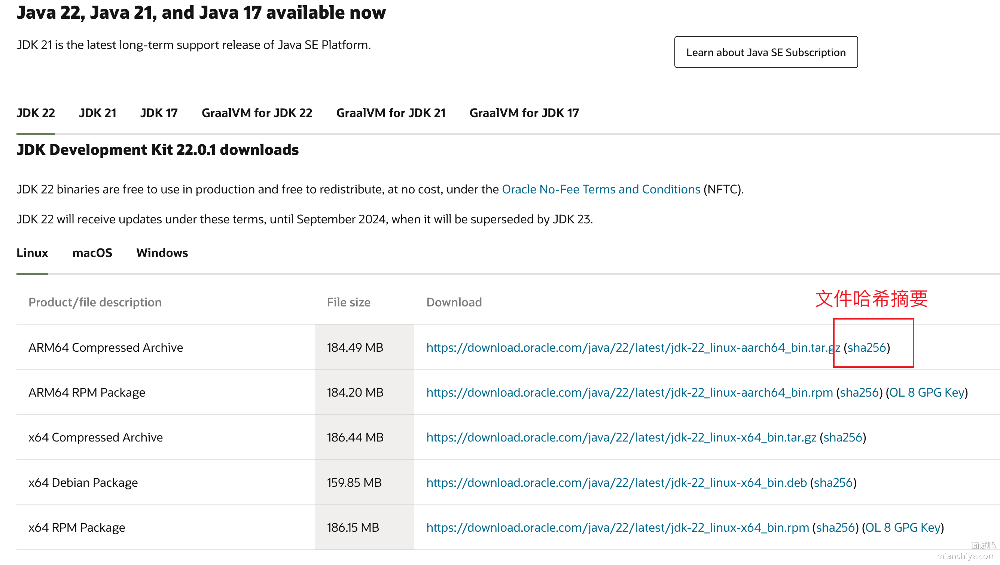

#### 限流问题

文件上传需要占用的资源挺多，内存、磁盘、带宽等等，所以需要做一定的限制。

比如限制文件的最大值，防止恶意超大文件上传。

限制每天用户上传的次数、上传的频次间隔、上传的总文件大小量。

利用令牌桶或其他限流算法，限制同一时刻的上传用户数，防止后端压力过大和内存溢出问题。

监控后端内存，内存超过一定阈值后报警通知，灵活配置限流，保护后端系统安全。

#### 切块以及存储简要流程

可以将文件切成 2m 每块，分块文件存储至服务器，分块记录存储到 redis 中，key 的设置可以是 userid + uuid（标明这次的文件）+ filename + seq（顺序）

之所以利用 redis 是因为性能高，其次可以设置过期时间，因为大文件上传存在传一半用户觉得太慢，取消上传，这时候之前上传的切块文件都应该被清理。

而 redis 可以自动过期 key ，后续监听到在这个 key 没了，就可以清理之前上传的无用切块文件，节省空间。

每次切块上传，都可以利用 md.update 更新 md5 摘要（固定大小不会因为大文件挤爆内存），等上传完毕就可以利用 md.digest 获取文件摘要，此时将 redis 的分块记录、切块文件数量、总大小、摘要等一切信息都落库即可。

上传文件的时候，前端将文件摘要信息传递至后端，后端从数据库查找是否有一致摘要，如果有则说明文件已存在，直接保存相关的信息，然后返回前端上传成功即可。

大致方案如何，面试中还是需要具体情况具体分析，每个面试官询问的角度都不同，如果你有实力，则投其所好，如果你有些地方比较强，则引导面试官询问你擅长的方向。

### 让你设计一个分布式 ID 发号器，怎么设计？ 

一般在分库分表场景，就会有分布式 ID 的需求，因为需要有一个唯一标识来标记一个订单或者其他类似的数据等。

全局唯一 ID 有很多种实现，例如 UUID ，优势就是本地生成，很简单。但它是无序的，如果需要将唯一 ID 作为主键，则 UUID 不合适，首先是太长了，其次无序插入会导致数据页频繁分裂，性能不好。

在回答这个面试题的时候可以先提下 UUID，简单说下优缺点（UUID 的缺点其实侧面能体现出你对 MySQL 的了解，这都是小心机呀）。

常见的分布式 ID 实现有两种：

1）雪花算法 

2）基于数据库

#### 雪花算法

雪花算法用有 64bit，实际就用到了 63bit，最前面有一个 1bit 没用，图中就没画了。

其中 41bit 是时间戳，10bit 是机器 ID（可以表示 1024 台机器。如果有机房的划分，可以把 5bit 分给机房号，剩下 5bit 分给机器）。最后 12bit 是自增序列号，12bit 可以表示 2 的 12 次方个 ID。

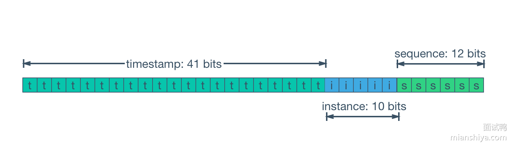

可以看到，以时间戳打头可以保证趋势是有序性，其中分配了机器号避免了多机器之间重复 ID 的情况，后面的自增序号使得理论上每台机器每毫秒都可以产生 2 的 12 次方个 ID。

简述优点：

1）分布式 ID 从整体来看有序的。 

2）简单、灵活配置，无序依赖外部三方组件。

缺点：

1）依赖时钟，如果发生时钟回拨，可能会导致重复 ID。

常见的 hutool 就有提供了雪花算法工具类。

面试官可能会问雪花算法的机器 ID 如何动态配置，因为现在机器都是动态扩容部署，机器数都是不固定的，如果机器 ID 没配置好，容易导致冲突。

可以借助 Redis 或者 zookeeper 来实现机器 ID 的分配。

redis 的执行是单线程的，机器启动时候调用 redis incr 即可得到自增 id ，可将这个 id 作为机器 ID。

zookeeper 的使用也很简单，机器启动时候可以利用 zookeeper 持久顺序节点特性，将注册成功的顺序号作为机器 ID。

#### 基于数据库

对 MySQL 来说，直接利用自增 id 即可实现。

```sql
REPLACE INTO table(bizTag) VALUES ('order');
select last_insert_id();
```

将 bizTag 设为唯一索引，可以填写业务值（也可以不同业务多张表），REPLACE INTO 执行后自增 ID 会 + 1，通过 last_insert_id 即可获得自增的 ID 。

优点：简单、利用数据库就能实现，且 ID 有序。

缺点：性能不足。

可以利用 auto_increment_increment 和 auto_increment_offset 实现横向扩展。

比如现在有两台数据库，auto_increment_increment 都设置为 2，即步长是 2。第一台数据库表 auto_increment_offset 设置为 1，第二台数据库表 auto_increment_offset 设置为 2。

这样一来，第一台的 ID 增长值就是 1、3、5、7、9....，第二台的 ID 增加值就是 2、4、6、8、10....

这样也能保证全局唯一性，多加几台机器弥补性能问题，只要指定好每个表的步长和初始值即可。

不过单调递增特性没了，且加机器的成本不低，动态扩容很不方便。

这里我们可以思考下，每次操作数据库就拿一个 ID ，我们如果一次性拿 1000 个，那不就大大减少操作数据库的次数了吗？性能不就上去了吗？

重新设计下表，主要字段如下：

bizTag: 业务标识 maxId: 目前已经分配的最大 ID step: 步长，可以设置为 1000 那么每次就是拿 1000 ，设置成 1w 就是拿 1w 个

每次来获取 ID 的 SQL 如下：

```sql
UPDATE table SET maxId = max_id + step WHERE bizTag = xxx
SELECT maxId, step FROM table WHERE biz_tag = xxx
```

这其实就是**批量思想**，大大提升了 ID 获取的性能。

到这里可能面试官会追问，假设业务并发量很高，此时业务方一批 ID 刚好用完后，来获取下一批 ID ，因为当前数据库压力大，很可能就会产生性能抖动，即卡了一下才拿到 ID，从监控上看就是产生毛刺。

这样怎么处理？

其实这就是考察你是否有预处理思想，如果你看过很多开源组件就会发现预处理的场景很多，例如 RocketMQ commitlog 文件的分配就是预处理，即当前 commitlog 文件用完之前，就会有后台线程预先创建后面要用的文件，就是为了防止创建的那一刻的性能抖动。

同理，这个场景我们也可以使用**预处理思想**。

发号器服务可以本地缓存两个 buffer，业务方请求 ID 每次从其中一个 buffer 里取，如果这个 buffer 发现 ID 已经用了 20 %（或者另外的数量），则可以起一个后台线程，调用上面的 SQL 语句，先把下一批的 ID 放置到另一个 buffer 中。

当前面那个 buffer ID 都用完了，则使用另一个 buffer 取号，如此循环使用即可，这样就能避免毛刺问题。

将 ID 放在本地缓存性能好，即使服务重启了也没事，无法就是中间空了一点点 ID 罢了，整体还是有序的。

#### 一些关键点

雪花算法面试官可能会追问如果时钟回拨了怎么办，理论上可以存储上一次发号的时间，如果当前发号的时间小于之前的发号时间，则说明时钟回拨，此时拒绝发号，可以报警或者重试（重试几次时间可能就回来了）。

数据库方案如果面试官说数据库故障怎么办？理论上数据库都故障了其实很多业务都无法执行下去。。这属于不可抗拒因素，但是我们有本地缓存，可以将 step 设置大一些，例如 qps 最高时候的 600 倍，这样至少有 10分钟的缓冲时间，可能数据库就恢复了。其次数据库可以做主从，但是主从会有复制延迟，导致 maxId 重复，这里可以采取和雪花算法对抗时钟回拨一样的套路，服务记录上次 maxId，如果发现 maxId 变小了，则再执行一次 update。

还有一点，数据库实现的 ID 是完全连续的，如果用在订单场景，竞对早上下一单，晚上下一单，两单一减就知道你今天卖了多少单，所以很不安全，因此这种 ID 不适合用在这种场景（再比如文章的 id 容易被爬虫简单按序一次性爬完）。

这一套如果跟面试官说下来，我相信这场面试你肯定稳了，整体设计没问题、还有很多性能方面的考虑并且还想到了安全性问题。 

### 让你设计一个 HashMap ，怎么设计？

这个问题我觉得可以从 HashMap 的一些关键点入手，例如 hash函数、如何处理冲突、如何扩容。

可以先说下你对 HashMap 的理解。

比如：HashMap 无非就是一个存储 <key,value> 格式的集合，用于通过 key 就能快速查找到 value。

基本原理就是将 key 经过 hash 函数进行散列得到散列值，然后通过散列值对数组取模找到对应的 index 。

所以 hash 函数很关键，不仅运算要快，还需要分布均匀，减少 hash 碰撞。

而因为输入值是无限的，而数组的大小是有限的所以肯定会有碰撞，因此可以采用拉链法来处理冲突。

为了避免恶意的 hash 攻击，当拉链超过一定长度之后可以转为红黑树结构。

当然超过一定的结点还是需要扩容的，不然碰撞就太严重了。

而普通的扩容会导致某次 put 延时较大，特别是 HashMap 存储的数据比较多的时候，所以可以考虑和 redis 那样搞两个 table 延迟移动，一次可以只移动一部分。

不过这样内存比较吃紧，所以也是看场景来 trade off （权衡）了。

不过最好使用之前预估准数据大小，避免频繁的扩容。

基本上这样答下来差不多了，HashMap 几个关键要素都包含了，接下来就看面试官怎么问了。

可能会延伸到线程安全之类的问题，反正就照着 currentHashMap 的设计答。

### 让你设计一个线程池，怎么设计？

这种设计类问题还是一样，先说下理解，表明你是知道这个东西的用处和原理的，然后开始 阐述。

基本上就是按照现有的设计来说，再添加一些个人见解。

线程池讲白了就是存储线程的一个容器，池内保存之前建立过的线程来重复执行任务，减少创建和销毁线程的开销，提高任务的响应速度，并便于线程的管理。

我个人觉得如果要设计一个线程池的话得考虑池内工作线程的管理、任务编排执行、线程池超负荷处理方案、监控。

初始化线程数、核心线程数、最大线程池都暴露出来可配置，包括超过核心线程数的线程空闲消亡配置。

任务的存储结构可配置，可以是无界队列也可以是有界队列，也可以根据配置分多个队列来分配不同优先级的任务，也可以采用 stealing 的机制来提高线程的利用率。

再提供配置来表明此线程池是 IO 密集还是 CPU 密集型来改变任务的执行策略。

超负荷的方案可以有多种，包括丢弃任务、拒绝任务并抛出异常、丢弃最旧的任务或自定义等等。

线程池埋好点暴露出用于监控的接口，如已处理任务数、待处理任务数、正在运行的线程数、拒绝的任务数等等信息。

我觉得基本上这样答就差不多了，等着面试官的追问就好。

注意不需要跟面试官解释什么叫核心线程数之类的，都懂的没必要。

当然这种开放型问题还是仁者见仁智者见智，我这个不是标准答案，仅供参考。
