# 小米虫宝典

## MySQL

### 详细描述一条 SQL 语句在 MySQL 中的执行过程。 

#### 回答重点

1. 先通过连接器校验权限
2. 利用分析器进行 SQL 语句的词法分析和语法分析，构建解析树
3. 使用优化器选择合适的索引和表连接顺序，最终选择一个最佳的执行计划
4. 利用执行器，调用引擎层查询数据，返回结果集给客户端

#### 扩展知识

##### 详细流程分析

我们以一条查询 SQL 为例：select * from user where id=1；

在这条查询语句中，大体可以分为两个层面，Server 层和存储引擎层。

Server 层涉及到一系列的业务的组件，而存储引擎层则是负责存储发送过来的数据、提供读写接口等功能（补充：MySQL 的存储引擎是插件式的，一个数据库里面的不同表可以用不同的存储引擎）。

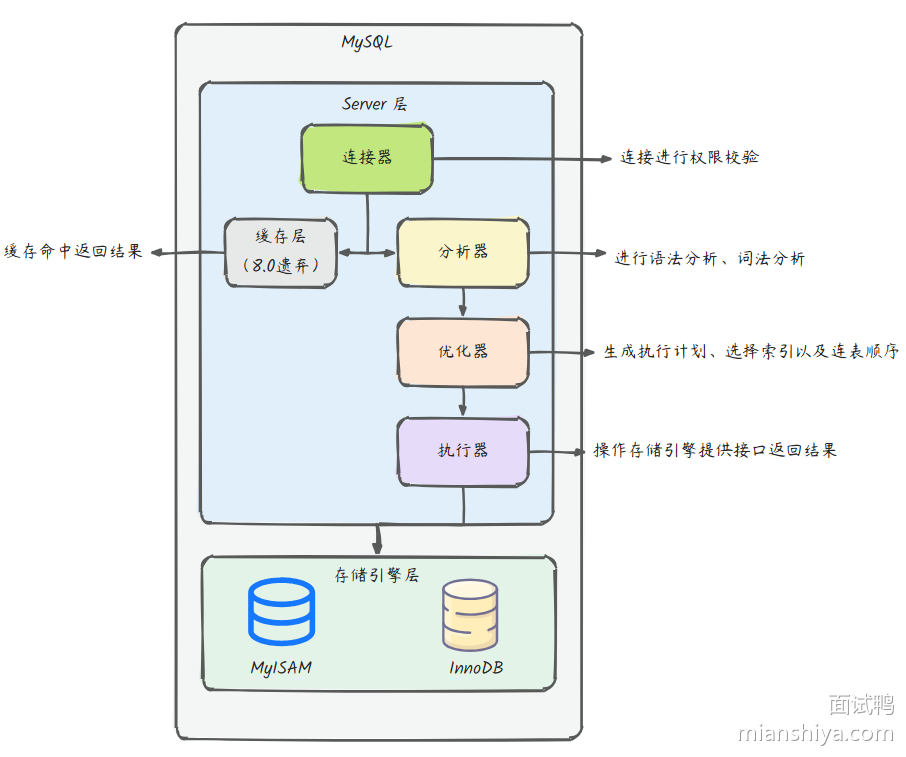

具体流程如下：

1）当客户端的 SQL 发送到 MySQL 时，首先是到达 Server 层的**连接器**，连接器会对你此次发起的连接进行权限校验，以此来获取你这个账号拥有的权限。当你的账号或密码不正确时，会报 `Access denied for user` 错误，相信大家对这个错误也并不陌生。连接成功如果后续没有任何操作，那么这个连接就处于空闲状态，到达一定时间后它便会断开连接，这个时间一般是 8 小时，是由 **wait_timeout** 参数控制的。

2）查询缓存（在 MySQL 8.0 之后就被砍了）具体做法就是将一个查询语句作为 key ，将上一次请求的结果作为 value，存储在缓存组件中，当同样的语句来查询的时候即可立马返回结果，不需要经历词法、语法分析等以下的步骤。只要表有数据改动缓存就失效了，在我们常见的联机事务处理（OLTP） 场景下是个鸡肋。

3）接下来就到了**分析器**来进行**语法分析**、**词法分析**。MySQL 会首先对你的语句进行 ”词法分析“ ，来判断你的语句是什么类型以及携带什么参数等。比如：MySQL 会将输入语句的 select 提取出来，判断出这是一条查询语句、将 from 后面的 user 提取出来作为查询的表名、把 id 提取出来作为列名等。做完这些 MySQL 将会进行 ”语法分析“ 来判断你的语句的语法是否有误、是否满足 MySQL 的语法。如果语法有问题，那这个错误相信大家都不陌生：`You have an error in your SQL syntax; check the manual......`。

4）经过分析器就到了**优化器**，它会对你的语句进行优化判断。比如你的表中有多个索引，优化器会帮你选择使用哪个索引、你使用了 join 多表连接，优化器会帮你调整表的连接顺序。我们平日里用的 explain 其实就是让 MySQL 告诉我们它的优化决定策略是怎样的。

5）最后会到达**执行器**，它先会判断你对这个 user 表是否有权限查询，如果没有权限它将会拒绝本次查询，返回错误信息。如果有权限，它将会根据表的存储引擎提供的接口进行数据查询将重复遍历表的行数据，判断 id 字段是否等于 1。直到遍历完整个表将符合条件的数据作为结果集返回给客户端。

### MySQL 索引的最左前缀匹配原则是什么？ 

#### 回答重点

MySQL 索引的最左前缀匹配原则指的是在使用**联合索引**时，查询条件必须从索引的最左侧开始匹配。如果一个联合索引包含多个列，查询条件必须包含第一个列的条件，然后是第二个列，以此类推。

**底层原理**：因为联合索引在 B+ 树中的排列方式遵循“从左到右”的顺序，例如联合索引` (first_name, last_name, age)` 会按照 `(first_name, last_name, age) `的顺序在 B+ 树中进行排序。

MySQL 在查找时会优先使用 `first_name` 作为匹配依据，然后依次使用 `last_name` 和 `age`。因此，组合索引能够从左到右依次高效匹配，跳过最左侧字段会导致无法利用该索引。

按照 `(first_name, last_name, age)` 的顺序在 B+ 树中的排列方式(大致的示意图)如下

```scss
                          (Alice, Black, 35)
                              |
      -------------------------------------------------------------
      |                |                     |                |
    (Alice, Brown, 25)  (Alice, Smith, 30) (Bob, Smith, 20) (Bob, White, 19)   
```

#### 扩展知识

##### 举例说明

假设当前表有一个联合索引（a,b,c）。

以下查询条件 **符合** 最左匹配原则：

```sql
where a=1;
where a=1, b=2;
where a=1, b=2, c=3;
```

以下查询条件 **不符合** 最左匹配原则：

```sql
where b=2;
where c=3;
where b=2, c=3;
```

再来看下这个查询：

```sql
where a=1, c=3;
```

这个查询可能可以用上联合索引（a,b,c），在 5.6版本之前，即使用上也只能利用 a=1 这个条件来过滤。但是在 MySQL 5.6 版本后有个优化，即**索引下推**，可以在引擎层面，查询得到 a=1 的数据之后，利用 c 过滤掉不符合的数据，再返回给 server 层。

- [596. MySQL 的索引下推是什么？](https://www.mianshiya.com/bank/1791003439968264194/question/1780933295459037186)

##### 注意范围查询

在理解范围查询不同点之前，需要**理解联合索引的顺序**。

**例如联合索引（a,b,c），在 B+树的中排序是：先按 a 的值排序，如果 a 的值相同，则按 b 的值排序，如果 b 的值相同，再按 c 的值排序。**

类似下图的排序： 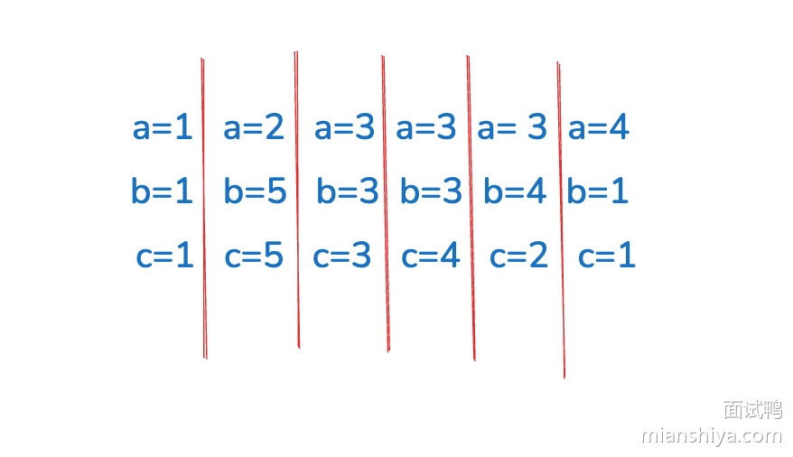

**如果遇到范围查询(>、<)，就会停止匹配**。

```sql
where a>1, b=2, c=3;
```

所谓的停止匹配指的是：a 可以用上联合索引，但是 b 和 c 却不行。因为 a 需要先经过范围查询，此时经过筛选得到 b 和 c 的数据是无序的。比如 a 为 1 和 a 为 2 数据之间 b 和 c 是无序的，因此无法利用索引查询。

**如果遇到如 >=、<=、BETWEEN、前缀like（xx%）的范围查询，则不会停止匹配**。因为这些查询包含一个等值判断，可以直接定位到某个数据，然后往后扫描即可。

例如：

```sql
where a>=1, b=2, c=3;
```

查询可以定位到 a=1 这条数据，然后往后遍历即可，而定**位到的 a=1 数据内，b 和 c 是有序的，因此可以利用索引查询**。

而以下的查询则可以全部用上联合索引：

```sql
where a=1, b=2, c>3;
```

因为 a 和 b 是等值查询的情况下，c 是有序的，有序就可以用上索引。

> 补充说明：拿 `where a>=1, b=2`，再来理解一下。因为 a = 1 这个条件，再加上 b = 2，mysql 可以直接定位到 a=1 and b=2 这条数据，然后再往后遍历，因此说用上了 b（因为确实利用了 b 的条件快速定位到第一条记录）。但是要注意往后遍历即 扫描 a > 1 的情况是用不到 b 的。

##### MySQL 8 都不需要最左匹配就能用上联合索引了？

> 以下实验基于 MySQL8.0.26 版本

为了故事顺利的发展，我们先建个表。

```sql
CREATE TABLE `t1` (
  `f1` int NOT NULL AUTO_INCREMENT,
  `f2` int NOT NULL,
  `f3` int NOT NULL,
  PRIMARY KEY (`f1`),
  KEY `idx_f2_f3` (`f2`,`f3`)
) ENGINE=InnoDB AUTO_INCREMENT=1 DEFAULT CHARSET=utf8mb4 COLLATE=utf8mb4_0900_ai_ci
```

很简单的一张表，一个主键索引，一个联合索引`idx_f2_f3`。

此时插入一波数据

```sql
INSERT INTO t1 (f2,f3) VALUES
  (1,1), (1,2), (1,3), (1,4), (1,5),
  (2,1), (2,2), (2,3), (2,4), (2,5);
INSERT INTO t1(f2,f3) SELECT f2, f3 + 5 FROM t1;
INSERT INTO t1(f2,f3) SELECT f2, f3 + 10 FROM t1;
INSERT INTO t1(f2,f3) SELECT f2, f3 + 20 FROM t1;
INSERT INTO t1(f2,f3) SELECT f2, f3 + 40 FROM t1;
```

这个时候表里一共有160条数据，**f2 的值基数很低，只有1、2这两个值，基数为2**。

数据准备完了，咱们可以开始操作一下了，此时执行：

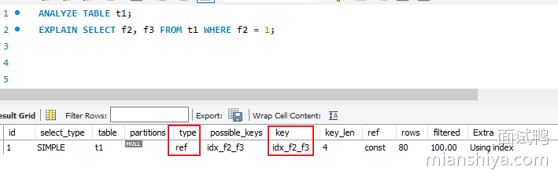

先执行了一下`ANALYZE TABLE t1;` 更新了一下表的统计信息，防止 MySQL 误判。

简单执行了一个 f2 为条件的联合索引查询，且结果只要求返回 f2 和 f3，所以从这个联合索引可以直接得到值，不需要回表。

这个查询的 explain 结果相信大家也都能理解，用上了 `idx_f2_f3`，且 type 是ref，说明用上了这个索引查询。

现在我们换一个查询条件，让 f3 作为条件来查询，这个时候就不是最左匹配原则了，讲道理应该用不上索引查询。

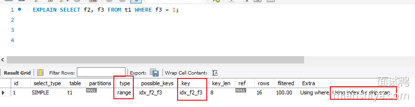

看看这结果，好像不太对？type 是 range，这是基于索引的范围扫描，所以用上了索引！

但是我的查询条件 `f3=1` 明明是等值呀？怎么就用上了范围扫描呢？

还有 Extra 里面显示的`Using index for skip scan`又是啥？

##### Using index for skip scan

让我们直接进行一个官方文档的查询！

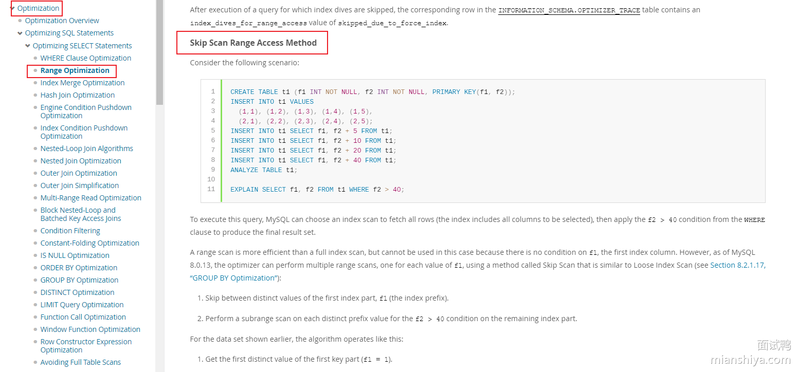

在优化里面的范围优化里确实有`Skip Scan Range Access Method`，它就是产生上述 Extra 的原因。

好了，可以忘了官网这个截图了，基于我展示的例子我来解释下。

根据我们所认知的最左匹配原则，执行

- where f3 =1

是无法在`idx_f2_f3`上利用 type 是 ref 的查询方式来查询的。

因为只有带上索引左边的查询条件才能用上索引，例如：

- where f2=1 and f3 =1

那如果无法利用索引进行查询，最终只有一个选择，全表扫描：要么全表扫描主键索引，要么全表扫描二级索引。

MySQL 就意识到这效率确实低，能不能找个优化点呢？

所以就在 8.0.13 版本引入了`Skip Scan Range Access Method`，它在一定条件下，利用了范围扫描来替代了全表扫描的发生。

具体原理如下：

1. 先统计一下索引最左字段 f2 的基数即唯一值，这里一共有 1 和 2 两个值。
2. 然后将 f2 的值拼入查询条件中构造 `where f2=1 and f3=1` 和 `where f2=2 and f3=1`这样的条件进行查询。

这波是不是小秀？

你 SQL 不带索引最左的条件是吧，我自个儿给你拼上去！

所以一条查询就变成了多次查询，所以 type 就变成了 range 了。

**因此最终还是没有逃出最左匹配原则**，只是 MySQL 隐式的构造了查询条件，使得看起来好像不需要最左匹配原则而已。

这个优化的中文名叫：**跳过扫描范围访问**(我直译的，哈哈哈)

##### 跳过扫描范围访问的局限性

不要高兴的太早，这个优化其实有很大的局限性！

它要求最左条件的基数很低，因为它需要列举最左条件的值来构造查询，假如最左条件有上万个，那还不如直接进行全表扫描了对吧。

其实也不需要上万个，我来改一下表里的数据来做一次实验。

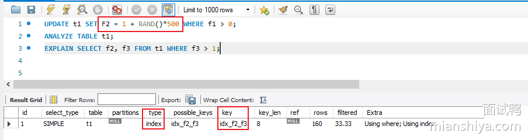

我直接把 f2 的值随机化了，这样 f2 的基数就变大了，可以看到此时再执行查询语句就用不上了`Using index for skip scan`了。

变成了一个基于二级索引的**全表扫描**。

除了上面这个关键点之外，还有很多局限性，我根据官网的内容做了一下翻译(和一点便于理解的小修改)：

- 需要联合索引
- 查询不能跨表
- 查询不能使用 GROUP BY 或者 DISTINCT
- 查询只能用一个索引，即索引需要覆盖查询的值，不能回表
- 查询条件必须是常量，包括 IN() 运算符。

还有两条我不翻译了，我觉得讲的是废话...有点兴趣的自己去看看吧，文末会放链接。

总而言之，能用上这个优化的场景很有限，就**基数很低**这一个限制我就觉得很大了。

所以这也不是什么万能药，就当一个知识点咱们知晓下，到时候遇到特殊场景能用上的时候装一下，或者在面试官问你最左匹配的时候，提一下，我知道那个 MySQL 8.0.13 版本啊，它做了个优化.....

### MySQL 的索引下推是什么？ 

#### 回答重点

索引下推（Index Condition Pushdown, ICP）是一种减少回表查询，提高查询效率的技术。它允许 MySQL 在使用索引查找数据时，将部分查询条件下推到存储引擎层过滤，从而减少需要从表中读取的数据行，减少了 IO（本该由 Server 层做操作，交由存储引擎层因此叫做 “下推” ） 。

**注意：索引下推是应用在联合索引上的。**

#### 扩展知识

##### 官网示例说明

假设当前 people 表有索引 `INDEX (zipcode, lastname, firstname)` ，当执行以下查询时：

```sql
SELECT * FROM people
  WHERE zipcode='95054'
  AND lastname LIKE '%etrunia%'
  AND address LIKE '%Main Street%';
```

**如果没有索引下推**，当前的联合索引只能用上 `zipcode='95054'` 这个条件，引擎层用不上 lastname 这个条件过滤，只能得到所有符合 `zipcode='95054'` 记录，传递给 server 层过滤。

**有了索引下推之后**，引擎层在得到符合`zipcode='95054'`的数据后，可以直接通过 lastname 条件过滤数据，不符合条件的不会返回给 server 层。

##### 索引下推注意点

1）索引下推在 MySQL 5.6 及以后的版本支持，`InnoDB` 和 `MyISAM` 这两个存储引擎都生效。

2）如果查询中引用了子查询索引下推可能不会生效，具体看 explain。

3）使用了函数或表达式索引下推也不能生效，这个和是否能命中索引的条件是一样的。

4）使用了聚簇索引（主键）查询，索引下推也不会生效，因为其是对于非聚簇索引来进行减少回表次数。

> 索引下推就是通过二级索引查到主键id后回表完再进行where条件过滤 改为 => 二级索引查到数据后直接where过滤一遍 再进行回表 减少回表的次数

### MySQL 的覆盖索引是什么？

#### 回答重点

MySQL 的覆盖索引（Covering Index）是指二级索引中包含了查询所需的所有字段，从而使查询可以仅通过访问二级索引而不需要访问实际的表数据（主键索引）。

#### 扩展知识

##### 覆盖索引的优点

- 减少I/O操作：因为查询可以直接从索引中获取所有需要的数据，避免了访问实际表的数据页，从而减少了I/O操作。
- 提高查询速度：索引比表数据更紧凑，因此从索引中读取数据比从表中读取要快。
- 减少内存占用：只需要读取索引页而不是表数据页，可以减少内存占用。

##### 覆盖索引示例

比如，目前有一张表：

```sql
CREATE TABLE employees (
    emp_id INT PRIMARY KEY,
    first_name VARCHAR(50),
    last_name VARCHAR(50),
    hire_date DATE,
    department_id INT,
    INDEX idx_name_hiredate (last_name, first_name, hire_date)
);
```

我们需要获取员工的姓、名和雇佣日期：

```sql
SELECT last_name, first_name, hire_date 
FROM employees 
WHERE last_name = '鸭' AND first_name = '面试';
```

**对于这个查询，idx_name_hiredate 就是一个覆盖索引**，因为它包含了查询所需的所有列 last_name、first_name 和 hire_date，MySQL 可以直接从这个索引中获取结果，而无需访问实际的主键索引的数据。

如果需求变化，要多查找一个 department_id 信息：

```sql
SELECT last_name, first_name, hire_date, department_id 
FROM employees 
WHERE last_name = '鸭' AND first_name = '面试';
```

**此时就无法利用覆盖索引了**，因为 idx_name_hiredate 上并不包含 department_id，所以需要从主键索引中获得数据。

### MySQL 的索引类型有哪些？ 

#### 回答重点

从**数据结构**角度来看，MySQL 索引可以分为以下几类：

- B+树索引
- 哈希索引
- 倒排索引（即全文索引 Full-Text）
- R-树索引（多维空间树）

从**常见的基于 InnoDB B+ 树索引角度来看**，可以分为：

- 聚簇索引（Clustered Index）
- 非聚簇索引（Non-clustered Index）

从**索引性质**的角度来看，可以分为：

- 普通索引（二级索引、辅助索引）
- 主键索引
- 联合索引
- 唯一索引
- 全文索引
- 空间索引

#### 扩展知识

##### 进一步分析基于数据结构的索引分类

- **B+树索引**：通过树形结构存储数据，适用于范围查询（如 `BETWEEN`）和精确查询（如 `=`），支持有序数据的快速查找、排序和聚合操作。是 MySQL 默认的索引类型，常用于 **InnoDB** 和 **MyISAM** 引擎。
- **哈希索引**：基于哈希表的结构，适用于等值查询（如 `=`），查询速度非常快，但不支持范围查询（如 `>`、`<`）。哈希索引不存储数据的顺序，常用于 **Memory** 引擎。
- **倒排索引（Full-Text）**：用于全文搜索，将全文分词，通过存储词与文档的映射，支持模糊匹配和关键字搜索。特别适合用于大文本字段，如 `TEXT` 类型的列，用于查找包含特定词语的记录。
- **R-树索引**：专为多维空间数据（如地理坐标）设计，适用于空间查询（例如，计算地理位置的最近距离、区域查询等）。常用于存储和查询地理信息系统（GIS）中的空间数据。

##### 进一步分析基于 InnoDB B+ 树索引分类

- **聚簇索引**：InnoDB 中主键索引就是聚簇索引。它基于主键排序存储。之所以叫**聚簇**索引是因为索引的**叶子节点存储完整数据行数据**。
- **非聚簇索引**：指的是 InnoDB 中非主键索引的索引，之所以称之为非聚簇是因为这个索引的叶子节点仅保存索引字段和主键的值。如果要查询完整的数据行中的数据，需要再从聚簇索引即主键索引中通过主键查询，一个表可以有多个非聚簇索引。

##### 进一步分析基于索引性质的分类

- **普通索引**：一般指非主键索引且非唯一索引。
- **主键索引**：表中的每一行数据都有唯一的主键。每个表只能有一个主键索引，且主键值不能为 `NULL`。InnoDB 中主键索引是聚簇索引结构实现的。
- **联合索引**：由多个列组成的索引，适用于多列的查询条件，能够提高包含多个条件的查询的性能。联合索引中的列是按照指定顺序排列的。
- **唯一索引**：保证索引列中的值是唯一的，可以有效防止重复数据的插入。唯一索引允许 `NULL` 值，但一个列中可以有多个 `NULL`。
- **全文索引**：用于全文搜索，支持对长文本字段（如 `TEXT` 类型）进行关键字查找，支持自然语言处理、模糊匹配等操作。适用于需要对文本内容进行复杂搜索的场景。
- **空间索引**：用于空间数据（如地图上的经纬度坐标等）查询。通常使用 R-树结构，适合多维数据的查询，如区域查询和最近距离查询，主要用于 **MyISAM** 和 **InnoDB** 存储引擎中的地理信息数据。

##### 索引建立 SQL 示例

**主键索引**：

```sql
CREATE TABLE users (
    id INT NOT NULL AUTO_INCREMENT,
    username VARCHAR(50) NOT NULL,
    password VARCHAR(50),
    PRIMARY KEY(id)
);
```

**唯一索引**：

```sql
CREATE UNIQUE INDEX idx_username ON users(username);
```

**普通索引**

```sql
CREATE INDEX idx_username ON users(username);
```

**全文索引**：

```sql
CREATE FULLTEXT INDEX idx_content ON articles(content);
```

**联合索引**：

```sql
CREATE INDEX idx_username_email ON users(username, email);
```

**哈希索引**：

```sql
CREATE INDEX idx_username_hash ON users(username) USING HASH;
```

**空间索引**

```sql
CREATE SPATIAL INDEX idx_location ON places(location);
```

### MySQL 中的回表是什么？

#### 回答重点

"回表" 是指在使用二级索引（非聚簇索引）作为条件进行查询时，由于二级索引中只存储了索引字段的值和对应的主键值，无法得到其它数据。如果要查询数据行中的其它数据，需要根据主键去聚簇索引查找实际的数据行，**这个过程被称为回表**。

#### 扩展知识

##### 进一步理解回表

举个例子：`select * from user where age = 20;`(user 包含 name、age、id 三个字段。假设 MySQL 优化器确定使用 age 索引)

1）根据二级索引（age）找到 age = 20 的 主键键值：


2）由于查询条件是 select * ，需要 name、age、id 三个字段，而 age 索引内没有 name 字段，因此还需要再根据主键去查找整行的数据：

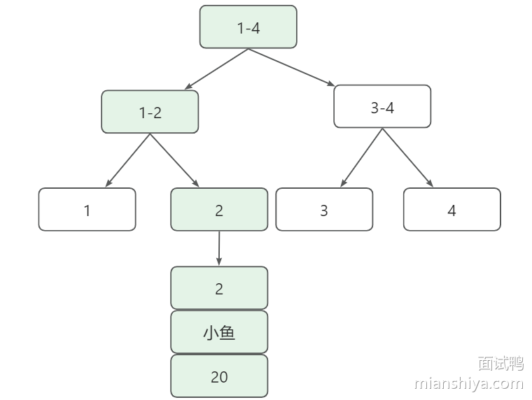

最终得到 2、小鱼、20 三个数据。

回表其实不仅仅只是多查一次，**还会带来随机 I/O**。

因为通过 id 去主键索引查询的时候，id 肯定是不连续的（例如 age 为 20 的人很多，age 索引中年龄是有序的，但是 id 无序，且是不连续的），所以去主键索引频繁查询会造成大量随机 I/O ，我们都知道顺序 I/O 查询快，而随机 I/O 慢，所以频繁回表效率很低。

因此，不要因为图方便，在代码里都用 select * ，从而引发不必要的回表操作。

### MySQL InnoDB 引擎中的聚簇索引和非聚簇索引有什么区别？

#### 回答重点

**聚簇索引**：

- 索引叶子节点存储的是数据行，可以直接访问完整数据。
- 每个表只能有一个聚簇索引，通常是主键索引，适合范围查询和排序。

**非聚簇索引**：

- 索引叶子节点存储的是数据行的主键和对应的索引列，需通过主键才能访问完整的数据行。
- 一个表可以有多个非聚簇索引（称之为非主键索引、辅助索引、二级索引），适用于快速查找特定列的数据。

#### 扩展知识

##### 进一步分析

在 InnoDB 里聚簇索引就是主键索引，非聚簇索引指的是非主键索引（辅助索引、二级索引），默认情况下它们都是 B+树实现的。

以下为一个简单的 B+ 树示例图：


如果是主键索引：

- 非叶子节点存储主键和页号
- 叶子节点存储完整的数据
- 叶子节点之间有双向链表链接，便于范围查询
- 叶子节点内部有页目录，内部记录是单链表链接，通过页目录二分再遍历链表即可得到对应记录。
- B+ 树只能帮助快速定位到的是页，而不是记录。
- 页大小默认 16k，是按照主键大小排序的，所以无序的记录插入因为排序会插入到页中间，又因为容量有限会导致页分裂存储，性能比较差，所以主键要求有序。

如果是非聚簇索引：

- 和主键索引的差别就在于叶子节点仅存储索引列和主键，不包含完整行的数据。

例如一个表有 id、姓名、性别、地址等等字段，本身包含聚簇索引，此时再给姓名建立一个索引，此时的索引叶子节点存储如下图所示：

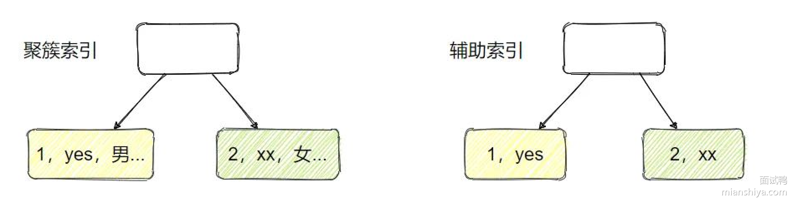

所以说不要所有查询都用 select * ，因为如果本来只需要查询索引列数据的话，直接利用二级索引就能得到所要的数据。

例如通过姓名仅查询 id 的话，直接利用姓名索引就能得到数据，通过如果图方便直接用 select * ，那就不得不通过 id 再去主键索引查找不需要的性别和地址，浪费资源，且可能伴随着很多随机 I/O。

通过二级索引查找得到 id ，再去主键索引查询的这个过程叫回表。

### 请详细描述 MySQL 的 B+ 树中查询数据的全过程 

#### 回答重点

1）数据从根节点找起，根据比较数据键值与节点中存储的索引键值（用了二分），确定数据落在哪个区间，从而确定分支，从上到下最终定位到叶子节点 

2）叶子节点存储实际的数据行记录，但是一页有 16KB 大小，存储的数据行不止一条 

3）叶子节点中数据行以组的形式划分，利用**页目录**结构，通过二分查找可以定位到对应的组 

4）定位组后，利用链表遍历就可以找到对应的数据行

#### 扩展知识

##### 详细流程解析

数据从根节点找起，根据比较数据键值与节点中存储的索引键值（非叶子节点也有页目录，也能用二分查找，详细看下面叶子节点的分析），确定数据落在哪个区间，从而确定分支，从上到下最终定位到叶子节点。


定位到叶子节点后，因为一片叶子默认有 16KB 大小，所以理论上可以存多条记录。叶子节点的实际构造如下图所示：


从上图可以知晓，叶子节点有**页目录**结构（非叶子节点也有，当前拿叶子节点分析，结构是一样的），它其实就是一个索引，通过它可以快速找到记录。

页目录分为了多个槽，每个槽都指向对应一个分组内的最大记录，每个分组内都会包含若干条记录。

通过**二分查询**，利用槽就能直接定位到记录所在的组，从而就能获取到对应的记录。

举个例子，现在有 5 个槽，如果想查找主键为 3 的记录，此时的流程是：

1）通过二分得到槽的中间位置，`low = 0`，`high = 4`，`（0+4)/2 = 2`; 2）通过槽定位到第二个分组中的主键为 4 的记录，4 大于 3，`low = 0` 不变，`high = 2`; 3）继续二分 `(0+2)/2 = 1`; 槽 1 中主键 2 小于 3，`low = 1`，`high = 2`; 4）此时 `high - low = 1`，可以确定值在 high 即槽 2 中，但是槽 2 只能定位到主键为 4 的记录，又因为槽之间是挨着的，所以可以得到槽 1 的位置，从槽 1 入手拿到 主键 2 的记录，然后因为记录是通过单向链表串起来的，往下遍历即可定位到主键 3 的记录。

以上就是利用二分查询的定位流程。通过槽可找到对应记录所在的组，或能直接定位到记录，或还需通过链表遍历找到对应的数据。

实际上，每个分组的记录数是有规定的，图中做了省略只画了两条，InnoDB 规定：

- 第一个分组只有一条记录
- 中间的分组 4-8 条记录
- 最后一个分组 1-8 条记录

因此不必担心遍历很长的链表导致性能问题。

这题的重点是先简单提下从根节点遍历到子节点的过程，然后提到每页节点默认大小为 16KB ，所以理论上能存储很多记录，从而引出页目录，再通过二分查找才能对应记录。

### MySQL 中使用索引一定有效吗？如何排查索引效果？

#### 回答重点

**索引不一定有效**。

例如查询条件中不包含索引列、低基数列索引效果不佳，或查询条件复杂且不匹配索引的顺序。

对于一些小表，MySQL可能选择全表扫描而非使用索引，因为全表扫描的开销可能更小。

最终是否用上索引是根据 MySQL 成本计算决定的，评估 CPU 和 I/O 成本最终选择用辅助索引还是全表扫描。有时候确实是全表扫描成本低所以没用上索引。但有时候由于一些统计数据的不准确，导致成本计算误判，而没用上索引。

**排查索引效果的方法**：使用 `EXPLAIN` 命令，通过在查询前加上`EXPLAIN`，可以查看 MySQL 选择的执行计划，了解是否使用了索引、使用了哪个索引、估算的行数等信息。

主要观察 `EXPLAIN` 结果以下几点：

- type（访问类型）：这个属性显示了查询使用的访问方法，例如 `ALL`、`index`、`range `等。当查询使用索引时，这个属性通常会显示为 `index` 或 `range` ，表示查询使用了索引访问。如果这个值是 `ALL` ，则表示查询执行了全表扫描，没有使用索引。
- key（使用的索引）：这个属性显示了查询使用的索引，如果查询使用了索引，则会显示索引的名称。如果这个值是 `NULL`，则表示查询没有使用索引。
- rows（扫描的行数）：这个属性显示了查询扫描的行数，需要评估下扫描量。

#### 扩展知识

##### 确定索引真的生效了吗？

索引失效的场景有很多，也是面试官经常喜欢问的，可以根据具体场景进行排查，典型场景可以分为以下几点（实际索引的选择会根据 mysql 优化器的成本评定，答案最后会提到）：

###### 1）使用了联合索引却不符合最左前缀

举个例子：小鱼对 `user` 表建立了一个联合索引为 `name_age_id` 的联合索引。

他使用以下 SQL 查询`select * from user where age = 10 and id = 1;`

这样的写法恰恰不满足最左前缀原则，索引就失效啦。

###### 2）索引中使用了运算

例如这个 SQL `select * from user where id + 3 = 8`。这样会导致全表扫描计算 `id` 的值再进行比较，使得索引失效。

###### 3）索引上使用了函数也会失效

例如：`select * from user where LOWER(name) like 'cong%';`。这样也会导致索引失效，索引参与了函数处理，会导致去全表扫描。

###### 4） like 的随意使用

例如：`select * from user where name like '%cong%';`因为索引是从左到右来进行排序查找的，占位符直接放在了最左边开头，可能会导致直接全表扫描，这种情况就会导致索引失效。

###### 5）or 的随意使用

`user` 当前只有一个索引 `name` 。此时执行以下SQL ：`select * from user where name= 'cong' or age = 18;` 这可能也会导致索引失效，因为 age 没有索引。

###### 6）随意的字段类型使用

不小心将 `varchar` 类型的 `name` 条件匹配了 `int` 类型字段。SQL 是这样的 `select * from user where name = 1;`，在代码中涉及 隐式转换 ！等于 `select * from user where CAST(name AS signed int) = 1;`，这就变成了第三条索引上使用了函数，导致索引失效。

除此之外还有**隐式字符编码转换**的问题，即联表查询的时候，如果不同表之间的关联字段字符编码不一致，也会导致隐式转换编码，等于变相用上了函数，使得索引失效。

###### 7）不同的参数也会导致索引失效

这个就是我在回答重点里面说的“是否用上索引是根据 MySQL 成本计算决定的”。不同的参数 MySQL 评估成本不一致，有时候会选择使用索引，有时候会选择全表扫描，**特别是在复杂查询（联表、子查询、需要回表等）的情况下**。

比如根据商品从订单表查询，收集商品对应的所有买家的订单信息。如果传入的商品 id 是个热点商品，占据这家店铺 80% 的销量，那么本次查询对订单表很可能是全表查询，如果是冷门商品，则很可能是走索引查询。

###### 8）表中两个不同字段进行比较

例如这样的SQL :`select * from user where id > age;` ，将 `id` 跟 `age` 字段做了比较，索引失效。

###### 9）使用了 order by

当 `order by` 后面跟的 **不是主键** 或者 **不是覆盖索引** 会导致不走索引。

##### 为什么索引生效了反而查询变慢了呢？

确认是否选对了索引！MySQL 根据优化器会评估成本选择对应的索引，但有时候 MySQL 因为估计值不准确，导致选错了索引，因此查询速度反而更慢。

##### 关于使用索引的进一步认识

为了故事可以顺利的发展，先来一张表， DDL 如下：


现在要执行这个语句`SELECT * FROM yes.t1 where f3 = 11`;

你觉得用的是哪个索引？

很多同学可能会觉得虽然有 idx_f2_f3 这个联合索引，但是查询条件是 f3，没有 f2，不符合最左匹配原则，所以很显然只能进行全表扫描。

我们来 explain 一下，看看：


可以看到结果，key 是 idx_f2_f3 ，所以这个查询用上了 idx_f2_f3 这个索引！这里可能有人就理解不了，怎么不符合最左索引原则也能用上联合索引了呢？

从 explain 结果来看，确实用上的联合索引，**但是它的 type 是 index，所以它不是你认为的那种用上索引**，它等于全扫描的联合索引来获取结果。现在不太理解没事，听下面好好解释。

##### 到底什么叫用了索引？

我们都知道 InnoDB 是基于聚簇索引来构建数据的，在没有创建其它二级索引的前提下，你查询数据就必须且只能用聚簇索引，因为数据就只在这个索引上，那你找数据不用这个索引那用什么呢？

如果你建起了其他二级索引，那么查找数据就可能不用聚簇索引，而是只用上二级索引就能直接得到想要的数据(就是上面查询的例子)。

综上所述，**你在 InnoDB 查找任何数据，都只能用索引**。

那为什么平日里有人说这个不走索引，走了全表扫描呢？

我们都知道默认 InnoDB 的索引结构是 B+ 树，这个树有个特性，它的叶子节点之间是通过链表相连的。

所以只要我们找到**主键索引**最左边的叶子结点，然后往右顺序遍历扫描，就能得到这张表的所有记录，这样的扫描方式就叫全表扫描。


> 小贴士：我不清楚 MySQL 是记录了最左叶子节点的位置还是根据根节点查找到最左叶子节点的，反正意思就是那个意思，不影响我们理解全表扫描。

那什么叫用上索引？


看红色的查询路线没，能利用树的快速查找能力来定位到数据所在的页，这样的查询才能算用上索引。

那从主键索引反推到二级索引，其实是一样的。能利用二级索引树的特性来查找数据，就是用上了索引。

但是如果用不上二级索引树的快速查找，是否有像全表扫描这样，直接扫描二级索引的所有叶子节点的操作呢？

有的，就是我们上面的例子，我再把执行结果的截图搬下来：


这次查询 MySQL 就是全扫描二级索引 idx_f2_f3 来直接返回所要的数据。

原因就是二级索引已经包含了查询所要到全部数据:f1、f2、f3，所以直接全扫描二级索引即可。

可以看到 explain 的 **type=index**，即全扫描二级索引。

这也叫用上了索引。

此时我们换用 f2 来作为查询条件，这样就符合最左匹配原则了，我们来看看 explain 有什么区别：


可以看到还是用了 idx_f2_f3 ，只是 type 变成 ref ，这个 ref 就表明可以与常量进行等值匹配时来快速查询得到结果。

这也叫用上了索引。

好了，我们来总结一下到底什么叫用了索引：

- 利用主键索引快速查找
- 利用二级索引快速查找
- 全扫描二级索引进行查找

以上这三种就是我们平日里所说的用上了索引，然后全扫描主键索引就是我们所说的全表扫描（等价于没用上索引，但是我们知道它其实是用上了主键索引对吧？）。

至此，我想你应该已经清楚，到底什么叫用了索引了。

##### 小疑惑

关于 MySQL 索引的一些认识都讲完了，不过看了上面的例子，有些同学可能会有点疑惑：

> 既然都要全扫描，为什么要扫描二级索引，而不是主键索引？

因为主键索引存储了所有的数据，包括数据行相关的事务ID、回滚指针等等。

而二级索引不包含这些，它只有主键值和索引列的值。

所以相对而言直接读取二级索引开销会更小一些，**所以在索引能覆盖返回值的时候，一般都会选择二级索引来查找**。

比如我把上面的表再加个字段：f4。


现在我们再来执行`SELECT * FROM yes.t1 where f3 = 11;`

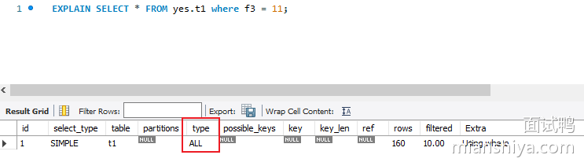

可以看到，这个时候就没用上二级索引了，而是直接全表扫描了。原因就是二级索引无法覆盖返回值，因为多了个 f4 的字段。

如果用了 idx_f2_f3 这个索引，想要得到 f4 的值，还需要再得到的主键再去主键索引里面进行查找，然后才能得到 f4 的值，这样回表的效率就低了。

当然其实结果还不一定，有时候也有可能 MySQL 的统计信息有误，用错了索引。因为 MySQL 是基于成本来选择执行计划的，有 I/O 成本和 CPU 成本，哪个索引成本低就用哪个索引。

###### MySQL 如何选择执行计划(I/O 成本和 CPU 成本，即如何选择合适的索引)？

- [2640. MySQL 的查询优化器如何选择执行计划？](https://www.mianshiya.com/bank/1791003439968264194/question/1811361311347494913)

### MySQL 中的索引数量是否越多越好？为什么？

#### 回答重点

**索引并不是越多越好**。因为索引**不论从时间还是空间上都是有一定成本的**

**1）从时间上**

每次对表中的数据进行增删改(INSERT、UPDATE 或 DELETE)的时候，索引也必须被更新，这会增加写入操作的开销。例如删除了一个 name 为面试鸭的记录，不仅主键索引上需要修改，如果 name 字段有索引，那么 name 索引也需要修改，所以**索引越多需要修改的地方也就越多，时间开销就大了**，并且 B+ 树可能会有页分裂、合并等操作，时间开销就会更大。

还有一点需要注意：MySQL 有个查询优化器，它需要分析当前的查询，选择最优的计划，这过程就需要考虑选择哪个索引的查询成本低。如果索引过多，那么会导致优化器耗费更多的时间在选择上，甚至可能因为数据的不准确而选择了次优的索引。

**2）从空间上**

每建立一个二级索引，都需要新建一个 B+ 树，默认每个数据页都是 16KB，如果数据量很大，索引又很多，占用的空间可不小。

#### 扩展知识

- [597. 在 MySQL 中建索引时需要注意哪些事项？](https://www.mianshiya.com/bank/1791003439968264194/question/1780933295459037187)

### 为什么 MySQL 选择使用 B+ 树作为索引结构？ 

#### 回答重点

B+ 树在数据库系统中具有以下几个显著优势：

**1）高效的查找性能**：

B+ 树是一种自平衡树，每个叶子节点到根节点的路径长度相同，B+ 树在插入和删除节点时会进行分裂和合并操作，以保持树的平衡，但它又会有一定的冗余节点，使得删除的时候树结构的变化小，更高效。

查找、插入、删除等操作的时间复杂度为 O(log n)，能够保证在大数据量情况下也能有较快的响应时间。

**2）树的高度增长不会过快，使得查询磁盘的 I/O 次数减少**：

B+ 树不像红黑树，数据越多树的高度增长就越快。它是多叉树，**非叶子节点仅保存主键或索引值和页面指针**，使得每一页能容纳更多的记录，因此内存中就能存放更多索引，容易命中缓存，使得查询磁盘的 I/O 次数减少。

**3）范围查询能力强**：

B+ 树特别适合范围查询。因为叶子节点通过链表链接，从根节点定位到叶子节点查找到范围的起点之后，只需要顺序扫描链表即可遍历后续的数据，非常高效。


#### 扩展知识

##### B+ 树和 B 树区别

1）B 树每个节点都存储了完整的数据，而 B+ 树非叶子节点仅存储 key 和指针，完整数据存储在叶子节点。这使得 B+ 树可以在内存中存放更多索引页，减少磁盘查询次数。

2）B+ 树叶子组成了链表，便于区间查找，而 B 树只能每一层遍历查找。

3）B+ 树查询时间更平均、稳定，都需要从根节点扫描到叶子节点。而 B 树则在非叶子节点就可能找到对应的数据返回。

### MySQL 三层 B+ 树能存多少数据？

#### 回答重点

在 MySQL 的 InnoDB 存储引擎中，B+ 树默认数据页大小为 16KB。

**参数**：

- 每个节点页大小为 **16KB**（即 **16384 字节**）。
- 假设每个数据记录的主键和数据大小为 **1KB**（一般会比这个小，但这里取整方便计算）。
- 每个内部节点（非叶子节点）存储的是指向子节点的指针和索引键。

**三层 B+ 树的存储计算**：

- **叶子节点**：第三层为叶子节点，每个叶子节点页可存储 **16 条数据记录**（16KB ÷ 1KB）。
- **第二层（中间层）**：假设每个指针**6 字节**和索引键（一般为 bigint）的大小为 **8 字节**，那么每个中间节点页可以指向 **1170 个叶子节点**【16KB 转成字节需要乘以 1024，因此（16 * 1024 ÷ （6+8）字节）=1170】。
- **第一层（根节点）**：根节点可以指向 **1170 个中间节点**。

由此，三层 B+ 树大致能存储的数据总量为：`1170 * 1170 * 16 = 21902400`，一棵三层的 B+ 树在 MySQL 中可以存储大约 **2000 万条记录**。


**这里要注意这个只是估算值，具体数量会因实际的数据大小、页大小等因素略有不同。**

#### 扩展知识

##### InnoDB 中页的大小

在 InnoDB 中，B+ 树的每个节点通常对应一个 **页（Page）**，默认页大小为 **16KB**。页的大小可以通过调整参数 `innodb_page_size` 来修改（通常为 4KB、8KB 或 16KB）。

注意：在 MySQL InnoDB 中，主键索引 B+ 树叶子节点存储的是数据行的完整信息，包括主键和其他字段。

每条记录（即每个数据行）在 B+ 树的叶子节点中按照主键顺序存储，这使得 InnoDB 的 B+ 树既支持高效的单条记录查询，也支持范围查询。

##### 其他

- [600. 请详细描述 MySQL 的 B+ 树中查询数据的全过程](https://www.mianshiya.com/bank/1791003439968264194/question/1780933295471620098)
- [601. 为什么 MySQL 选择使用 B+ 树作为索引结构？](https://www.mianshiya.com/bank/1791003439968264194/question/1780933295475814402)

### 在 MySQL 中建索引时需要注意哪些事项？ 

#### 回答重点

简单总结了以下六点：

1）不能盲目建立索引，**索引并不是越多越好**，索引会占用空间，且每次修改的时候可能都需要维护索引的数据，消耗资源。

2）对于字段的值有**大量重复的不要建立索引**。比如说：性别字段，在这种重复比例很大的数据行中，建立索引也不能提高检索速度。**但是也不绝对**，例如定时任务的场景，大部分任务都是成功，少部分任务状态是失败的，这时候通过失败状态去查询任务，实际上能过滤大部分成功的任务，效率还是可以的。

3）对于一些**长字段不应该建立索引**。比如 text、longtext 这种类型字段不应该建立索引。因为占据的内存大，扫描的时候大量加载至内存中还耗时，使得提升的性能可能不明显，甚至可能还会降低整体的性能，因为别的缓存数据可能因为它被踢出内存，下次查询还需要从磁盘中获取。

4）当**数据表的修改频率远大于查询频率**时，应该好好考虑是否需要建立索引。因为建立索引会减慢修改的效率，如果很少的查询较多的修改，则得不偿失。

5）对于需要频繁作为条件查询的字段应该建立索引。在 where 关键词后经常查询的字段，建立索引能提高查询的效率，如果有多个条件经常一起查询，则**可以考虑联合索引，减少索引数量**。

6）对经常在 order by、group by、distinct 后面的字段建立索引。这些操作通常需要对结果进行排序、分组或者去重，而索引可以帮助加快这些操作的速度。

#### 扩展知识

##### MySQL 索引的最左前缀匹配原则

- [594. MySQL 索引的最左前缀匹配原则是什么？](https://www.mianshiya.com/bank/1791003439968264194/question/1780933295450648578)

##### MySQL 的索引类型

- [591. MySQL 的索引类型有哪些？](https://www.mianshiya.com/bank/1791003439968264194/question/1780933295438065665)

### MySQL 的存储引擎有哪些？它们之间有什么区别？ 

#### 回答重点

MySQL 的主要存储引擎包括：

1）**InnoDB（重点）**：

- 支持事务、行级锁和外键。
- 提供高并发性能，适用于高负载的 OLTP 应用。
- 数据以聚集索引的方式存储，提高检索效率。

2）**MyISAM（重点）**：

- 不支持事务和外键，使用表级锁。
- 适合读取多、更新少的场景，如数据仓库。
- 具有较高的读性能和较快的表级锁定。

3）**MEMORY**：

- 数据存储在内存中，速度快，但数据在服务器重启后丢失。
- 适用于临时数据存储或快速缓存。

4）**NDB (NDBCluster)：**

- 支持高可用性和数据分布，适合大规模分布式应用
- 提供行级锁和自动分区。

5）**ARCHIVE**：

- 用于存储大量历史数据，支持高效的插入和压缩。
- 不支持索引，适合日志数据存储。

| 特性                 | MyISAM | Memory  | InnoDB | Archive | NDB   |
| -------------------- | ------ | ------- | ------ | ------- | ----- |
| B+树索引             | Yes    | Yes     | Yes    | No      | No    |
| 备份/按时间点恢复    | Yes    | Yes     | Yes    | Yes     | Yes   |
| 集群数据库支持       | No     | No      | No     | No      | Yes   |
| 聚簇索引             | No     | No      | Yes    | No      | No    |
| 压缩数据             | Yes    | No      | Yes    | Yes     | No    |
| 数据缓存             | No     | N/A     | Yes    | No      | Yes   |
| 加密数据             | Yes    | Yes     | Yes    | Yes     | Yes   |
| 外键支持             | No     | No      | Yes    | No      | Yes   |
| 全文检索             | Yes    | No      | Yes    | No      | No    |
| 地理空间数据类型支持 | Yes    | No      | Yes    | Yes     | Yes   |
| 地理空间索引支持     | Yes    | No      | Yes    | No      | No    |
| 哈希索引             | No     | Yes     | No     | No      | Yes   |
| 索引缓存             | Yes    | N/A     | Yes    | No      | Yes   |
| 锁的粒度             | Table  | Table   | Row    | Row     | Row   |
| MVCC                 | No     | No      | Yes    | No      | No    |
| 复制支持             | Yes    | Limited | Yes    | Yes     | Yes   |
| 存储限制             | 256TB  | RAM     | 64TB   | None    | 384EB |
| T-tree 索引          | No     | No      | No     | No      | Yes   |
| 事务                 | No     | No      | Yes    | No      | Yes   |

实际上我们仅需重点了解 InnoDB 和 MyISAM 即可，其它仅需有点印象即可。

#### 扩展知识

##### MySQL 8.4 版本一共提供了 10 个引擎

有兴趣的小伙伴可以[点击这里](https://dev.mysql.com/doc/refman/8.4/en/storage-engines.html)，访问官网查看其他引擎详细介绍。

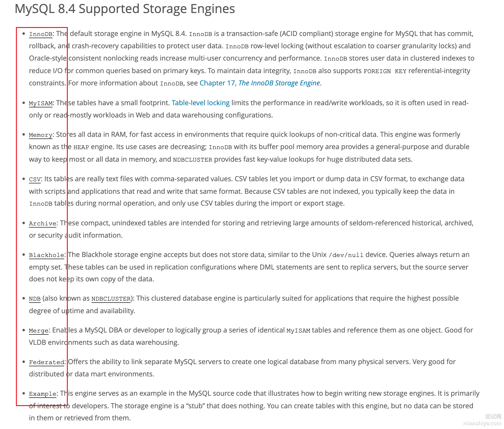

##### 扩展 MySQL 的 InnoDB 存储引擎和 MyISAM 存储引擎有何不同？

[MySQL 中 InnoDB 存储引擎与 MyISAM 存储引擎的区别是什么？](https://www.mianshiya.com/question/1811361310328279041)

### MySQL 中 InnoDB 存储引擎与 MyISAM 存储引擎的区别是什么？

#### 回答重点

##### MyISAM ：

1）MyISAM 是基于 ISAM 引擎而来的，支持全文检索、数据压缩、空间函数，**不支持事务和行级锁，只有表级别锁**，它适用于 OLAP 场景，也就是分析类的，基本上都是读取，不会有什么写入动作的场景。

2）MyISAM 的索引也是 B+ 树，只是不像 InnoDB 那种叶子节点会存储完整的数据，MyISAM 的数据是独立于索引单独存储的，所以主键和非主键索引差别不大。

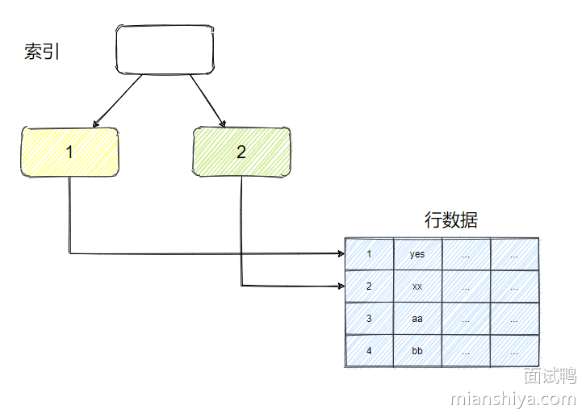

3）MyISAM 不支持崩溃后的安全恢复，而 InnoDB 有个 redolog 可以支持安全恢复。

4）MyISAM 写入性能差。因为锁的粒度太粗了，不支持行锁，只有表锁，所以写入的时候会对整张表加锁。不过有个并发插入的开关，开启之后当数据中间没有空洞的时候，也就是插入的新数据是从末尾插入时，读取数据是不会阻塞的。

##### InnoDB（MySQL 默认引擎）：

1）InnoDB 支持事务，实现了四种标准的隔离级别，利用 MVCC 来支持高并发，默认事务隔离级别为可重复读，支持行锁，利用行锁+间隙锁提供可重复读级别下防止幻读的能力，支持崩溃后的数据安全恢复。

2）支持外键，不过一般互联网项目都不会用外键的，性能太差，利用业务代码来实现约束即可。

3）由于 InnoDB 使用行级锁定和支持事务，因此在并发性能方面表现较好，特别是在多个用户同时对数据库进行读写操作时。

4）InnoDB 的主键索引称为聚簇索引，也就是数据和索引是放在一起的，这与 MyISAM 有所不同，并且它的辅助索引(非主键索引)只存储索引值与主键，因此当辅助索引不能覆盖查询的列时，需要通过找到的主键再去聚簇索引查询数据，这个过程称之为回表。

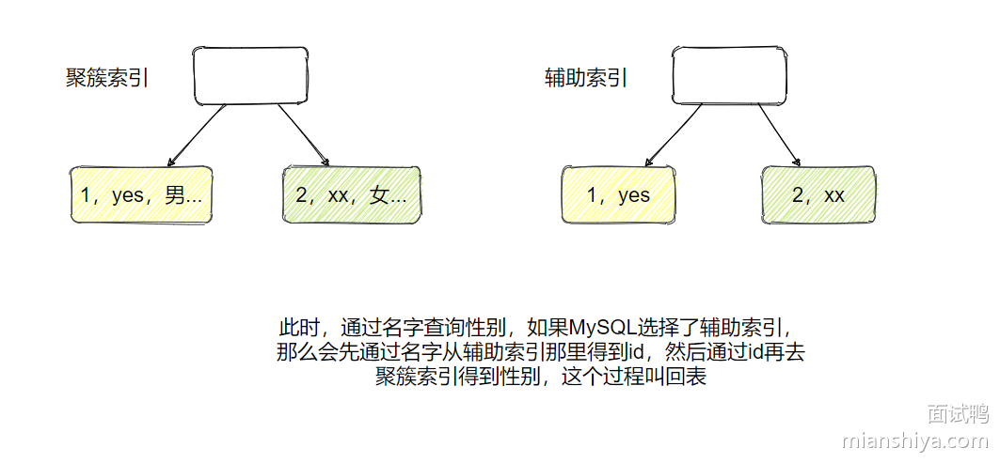

#### 扩展知识

##### MyISAM 和 InnoDB 适用场景

InnoDB 更适合需要高并发、事务处理和数据完整性保证的场景，例如电商平台、金融系统和社交网络等。

而 MyISAM 更适合读操作远多于写操作且对数据完整性要求不高的场景，例如内容管理系统、博客平台和报表系统等。

### 数据库的脏读、不可重复读和幻读分别是什么？ 

#### 回答重点

**1）脏读（Dirty Read）**：

- 一个事务读取到另一个事务未提交的数据。如果该未提交事务最终被回滚，那么第一个事务读取的数据就是不一致的（脏的）。

**2）不可重复读（Non-repeatable Read）**：

- 在同一事务中，读取同一数据两次，但由于其他事务的提交，读取的结果不同。例如，事务 A 读取了一行数据，事务 B 修改并提交了这行数据，导致事务 A 再次读取时得到不同的值。

**3）幻读（Phantom Read）**：

- 在同一事务中，执行相同的查询操作，返回的结果集由于其他事务的插入而发生变化。例如，事务 A 查询符合某条件的记录，事务 B 插入了新记录并提交，导致事务 A 再次查询时看到不同的记录数量。

#### 扩展知识

##### **几种读与隔离级别的关系**：

脏读、不可重复读和幻读是不同隔离级别下可能发生的问题：

- 读未提交允许脏读。
- 读已提交防止脏读，但可能出现不可重复读。
- 可重复读防止脏读和不可重复读，但仍可能出现幻读。
- 串行化防止所有三种问题，但性能开销较大。

##### 注意不可重复读与幻读的区别

幻读是指在事务期间，对于数据总量的突然增加或减少，将别的事务提交的读取到了（针对于数据的数量），不可重复读是指对于同一条数据，在事务执行期间，里面的字段内容发生了变化，读取到了别的事务提交修改的数据。（针对于数据的内容）。

### MySQL 是如何实现事务的？

#### 回答重点

MySQL 主要是通过：**锁、Redo Log 、Undo Log、MVCC** 来实现事务。

MySQL 利用锁（行锁、间隙锁等等）机制，使用数据并发修改的控制，满足事务的隔离性。

Redo Log（重做日志），它会记录事务对数据库的所有修改，当 MySQL 发生宕机或崩溃时，通过重放 redolog 就可以恢复数据，用来满足事务的持久性。

Undo Log（回滚日志），它会记录事务的反向操作，简单地说就是保存数据的历史版本，用于事务的回滚，使得事务执行失败之后可以恢复之前的样子。实现原子性和隔离性

MVCC（多版本并发控制），满足了非锁定读的需求，提高了并发度，实现了读已提交和可重复读两种隔离级别，实现了事务的隔离性。

> 看到这有小伙伴问一致性呢？

其实事务主要是为了实现一致性，具体是通过 AID，即原子性、隔离性和持久性来达到一致性的目的。

#### 扩展知识

##### binlog、redo log 和 undo log

- [106. MySQL 中的日志类型有哪些？binlog、redo log 和 undo log 的作用和区别是什么？](https://www.mianshiya.com/question/1772575207802904578)
- [1534.什么是 Write-Ahead Logging (WAL) 技术？它的优点是什么？MySQL 中是否用到了 WAL？](https://www.mianshiya.com/question/1805421201916108802)

##### MySQL 锁

[609.MySQL 中有哪些锁类型？](https://www.mianshiya.com/question/1780933295500980225)

##### Log buffer

[628. MySQL 中的 Log Buffer 是什么？它有什么作用？](https://www.mianshiya.com/question/1780933295563894785)

##### Undo Log 和 MVCC

[604.MySQL 中的 MVCC 是什么？](https://www.mianshiya.com/question/1780933295484203009)

### MySQL 事务的二阶段提交是什么？

#### 回答重点

MySQL 事务的二阶段提交是指在 MySQL 中，为了确保**redo log**（重做日志）和 **binlog**（二进制日志）之间的一致性，使用的一种机制。MySQL 通过二阶段提交来保证在**crash recovery**（崩溃恢复）时，不会出现**数据丢失**或**数据不一致**的情况。

**二阶段提交的两个阶段**：

- **准备阶段（Prepare Phase）**：在事务提交时，MySQL 的 InnoDB 引擎会先写入 **redo log**，并将其状态标记为**prepare**，表示事务已经准备提交但还未真正完成。此时的 redo log 是预提交状态，还未标记为完成提交。
- **提交阶段（Commit Phase）**：当 redo log 的状态变为 prepare 后，MySQL Server 会写入 **binlog**（记录用户的 DML 操作）。binlog 写入成功后，MySQL 会通知 InnoDB，将 redo log 状态改为**commit**，完成整个事务的提交过程。

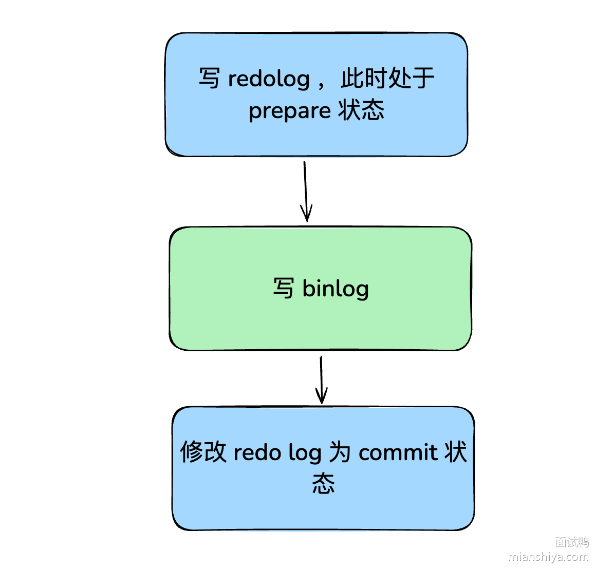

#### 扩展知识

##### binlog 和 redo log 的区别

**redo log**：

- **重做日志**（redo log）是 InnoDB 引擎内部的事务日志，用于记录数据页的物理修改。
- redo log 是固定大小的环形日志，主要用于**崩溃恢复**。它可以帮助 InnoDB 在崩溃后通过日志重做未写入数据页的数据修改，从而确保数据的持久性。

**binlog**：

- **二进制日志**（binlog）是 MySQL Server 层的日志，用于记录所有数据库的修改操作，包括增删改操作（DML）以及表结构的修改（DDL）。
- binlog 是**追加写入**的日志文件，主要用于**数据恢复**、**主从复制**、**数据备份**等场景。它记录的是 SQL 语句的逻辑修改操作，而非数据页的物理修改。

##### 为什么需要二阶段提交

**如果没有二阶段提交**，关于这两个日志，要么就是先写完 redo log，再写 binlog 或者先写 binlog 再写 redo log。我们来分析一下会产生什么后果。

1）**先写完 redo log，再写 binlog**

写完 redo log 后，MySQL 异常宕机，binlog 还未写入数据。重启后 redo log 记录了，因此可以从 redo log 恢复事务的修改，但是 binlog 并没有本次事务提交的数据。后续通过 binlog 恢复的时候，本次事务的修改就丢了。

2）**先写完 binlog，再写 redo log**

写完 binlog 后，MySQL 异常宕机，redo log 还未写入数据。重启后因为 redo log 中没有记录，所以无法恢复本次事务的修改，但是 binlog 记录了本次事务提交的数据。后续通过 binlog 恢复的时候，本次事务的修改可以复原，但是这和原库的数据又不一致了。

**如有有二阶段提交**，MySQL 异常宕机恢复后如何保证数据一致呢？

1）**redo log 处于 prepare 阶段，binlog 还未写入**，此时 MySQL 异常宕机。

这个阶段很好理解，由于 redo log 还未 commit ，所以异常恢复后，redo log 中记录的数据也不作数，binlog 内也没有记录数据，此时数据是一致的。

1）**redo log 处于 prepare 阶段，binlog 已写入，但 redo log 还未 commit**，此时 MySQL 异常宕机。

此时仅需对比 redo log 中 prepare 的数据和 binlog 中的数据是都一致即可。

如果一致，则提交事务。不一致，则回滚事务。

##### 直接先写完 redo log，再写 binlog，崩溃恢复后直接判断两个日志数据是否完整不就好了？为什么还要分二阶段?

理论上是可以的，但是从意义上来说有冲突。

因为 redo log 提交了，意味着事务已经提交，**此时是无法回滚的**。如果 binlog 没写入，此时数据就不一致了。

此时还有一种方案就是崩溃恢复时再补 binlog，补数据还是比较麻烦，还不如直接用两阶段了。

两阶段提交其实是一个经典的分布式解决方案，在协商场景下，每个人都被询问说 ok 了才提交，就是为了避免后续的回滚或者补数据的情况。

##### 如何对比 redo log 和 binlog 是一致的？

两个日志都有一个字段：XID。

因此崩溃恢复的时候，扫描 redo log，如果发现有 prepare 的 redo log 则利用它的 XID 去 binlog 查询，如果找到对应的数据，则说明数据都保存了，事务可以提交，反之事务回滚。

##### 组提交

组提交（Group Commit） 是 InnoDB 引擎中的一种优化技术，主要用于优化 redo log 的写入过程。它通过将多个事务的 redo log 刷盘操作合并为一次磁盘同步操作，从而减少 fsync 的调用次数，提高 MySQL 在高并发环境下的事务提交效率。

具体工作原理如下：

1. 当多个事务同时提交时，InnoDB 会先将这些事务的 redo log 记录写入到日志缓冲区中，但不会立即将每个事务的日志同步到磁盘。
2. 当组提交条件满足时（如等待时间到达、日志缓冲区达到一定大小等），InnoDB 会将多个事务的日志一次性进行磁盘同步（`fsync`），将这些事务的 redo log 一起持久化到磁盘。

通过组提交的方式，InnoDB 能够减少多次单独的 `fsync` 调用，从而降低磁盘 I/O 的压力。

组提交除了能应用到 redo log 中，实际 binlog 的刷盘也可以组提交，但是效果一般，因为它的 write 和 fsync 之间的间隔比较短。

不过可以通过设置 `binlog_group_commit_sync_delay` 和 `binlog_group_commit_sync_no_delay_count` 来实现 binlog 组提交的效果。

- `binlog_group_commit_sync_delay` 参数，表示延迟多少微秒后才调用 fsync;
- `binlog_group_commit_sync_no_delay_count` 参数，表示累积多少次以后才调用 fsync。

除此之外还有一个参数也需要关注一下，即 **`innodb_flush_log_at_trx_commit`** 。

这个参数控制了 **redo log** 的刷盘策略，是影响组提交效果的重要配置：

- **`innodb_flush_log_at_trx_commit=1`**：每个事务提交时都立即将 **redo log** 刷新到磁盘，最安全，但组提交效果较弱。
- **`innodb_flush_log_at_trx_commit=2`**：每个事务提交时仅将日志写入操作系统缓存，定期刷新到磁盘，组提交效果更明显。
- **`innodb_flush_log_at_trx_commit=0`**：不在事务提交时刷盘，数据可能丢失，但可以最大化组提交的效果。

### MySQL 中长事务可能会导致哪些问题？

#### 回答重点

1）**长时间的锁竞争，阻塞资源**：

- 长事务持有锁的时间较长，容易导致其他事务在尝试获取相同锁时发生阻塞，从而增加系统的等待时间和降低并发性能。
- 业务线程也会因为长时间的数据库请求等待而阻塞，部分业务的阻塞可能还会影响到别的服务，导致产生雪崩，最终使得服务全面崩盘，导致非常严重的线上事故。

2）**死锁风险**：

- 长事务更容易产生死锁，因为多个事务可能在互相等待对方释放锁，导致系统无法继续执行。

3）**主从延迟**：

- 主库需要长时间执行，然后传输给从库，从库又要重放好久，期间可能有很长一段时间数据是不同步的。

4）**回滚导致时间浪费**：

- 如果长事务执行很长一段时间，中间突发状况导致抛错，使得事务回滚了，之前做的执行都浪费了。

#### 扩展知识

##### 长事务的 SQL 如何处理？

比如，你现在需要删除一张一共有 5 亿数据的表里面的 2021 年数据，假设这张表叫 yes。

我相信你脑子在 1s 内肯定会蹦出这条 SQL :

```sql
delete from yes where create_date > " 2020-12-31" and create_date < "2022-01-01";
```

当时由于数据量太大，这就会产生上面所说的长事务问题。如何解决呢？

答案就是拆！怎么拆呢？想必很多小伙伴会觉得很简单，按日期拆不就完事了？

```
delete from yes where create_date > "2020-12-31" and create_date < "2021-02-01";
```

`delete from yes where create_date >= "2021-02-01" and create_date < "2021-03-01";` ......

这当然可以，恭喜你，你已经拆分成功了，没错就这么简单。

但是，**如果 create_date 没有索引怎么办？**

没索引的话，上面这就全表扫描了啊？

影响不大，没有索引我们就给他创造索引条件，这个条件就是主键。

我们直接一个 select min(id)... 和 select max(id).... 得到这张表的主键最小值和最大值，假设答案是233333333 和 666666666。

然后我们就可以开始操作了：

```
delete from yes where (id >= 233333333 and id < 233433333) and create_date > "2020-12-31" and create_date < "2022-01-01";
delete from yes where (id >= 233433333 and id <233533333) and create_date > "2020-12-31" and create_date < "2022-01-01";
```

......

```
delete from yes where (id >= 666566666 and id <=666666666) and create_date > "2020-12-31" and create_date < "2022-01-01";
```

当然你也可以再精确些，通过日期筛选来得到 maxId，这影响不大（不满足条件的 SQL 执行很快，不会耗费很多时间）。

这样一来 SQL 就满足了分批的操作，且用得上索引。

如果哪条语句执行出错，只会回滚小部分数据，我们重新排查下就好了，影响不大。

而且拆分 SQL 之后还可以**并行提高执行效率**。

当然并行可能有锁竞争的情况，导致个别语句等待超时。不过影响不大，只要机器状态好，执行的快，因为锁竞争导致的等待并不一定会超时，如果个别 SQL 超时的话，重新执行就好了。

##### 删除的思路转换

关于大表删除有时候要转换思路，**把删除转成插入**。

假设还是有一张 5 亿的数据表，此时你需要删除里面 4.8 亿的数据，那这时候就不要想着删除了，要想着插入。

道理很简单，删除 4.8 亿的数据，不如把要的 2000W 插入到新表中，我们后面业务直接用新表就好了。

这两个数据量对比，时间效率差异不言而喻了吧？

具体操作也简单：

1. 创建一张新表，名为 yes_temp
2. 将 yes 表的 2000W 数据 select into 到 yes_temp 中
3. 将 yes 表 rename 成 yes_233
4. 将 yes_temp 表 rename 成 yes

狸猫换太子，大功告成啦！

之前有个记录表我们就是这样操作的，就 select into 近一个月的数据到新表中，以前老数据就不管了，然后 rename 一下，执行的非常快，1 分钟内就搞定了。

这种类似的操作是有工具的，比如 pt-online-schema-change 等，不过我没用过，有兴趣的小伙伴可以自己去看看，道理是一样的，多了几个触发器，这里不多赘述了。

### MySQL 中的 MVCC 是什么？

#### 回答重点

MVCC（Multi-Version Concurrency Control，多版本并发控制）是一种并发控制机制，允许多个事务同时读取和写入数据库，而无需互相等待，从而提高数据库的并发性能。

在 MVCC 中，数据库为每个事务创建一个数据快照。每当数据被修改时，MySQL 不会立即覆盖原有数据，而是生成新版本的记录。每个记录都保留了对应的版本号或时间戳。

多版本之间串联起来就形成了一条版本链，这样不同时刻启动的事务可以**无锁**地获得不同版本的数据(普通读)。此时读(普通读)写操作不会阻塞。

写操作可以继续写，无非就是会创建新的数据版本（但只有在事务提交后，新版本才会对其他事务可见。未提交的事务修改不会影响其他事务的读取），历史版本记录可供已经启动的事务读取。

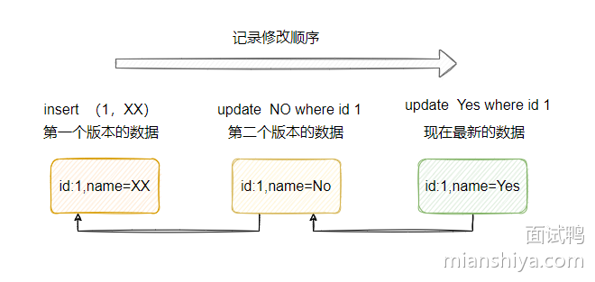

（为保持简短，简化了SQL语句，下面的内容也同样简化）

#### 扩展知识

##### Undo Log

Undo Log 是 MySQL InnoDB 中用于支持事务的回滚操作的一种日志机制。它记录了数据修改的历史信息，使得在事务失败或需要撤销某些操作时，可以将数据恢复到先前的状态。

实际上 MVCC 所谓的多版本不是真的存储了多个版本的数据，**只是借助 undolog 记录每次写操作的反向操作**，所以索引上对应的记录只会有一个版本，即最新版本。只不过可以根据 undolog 中的记录反向操作得到数据的历史版本，所以看起来是多个版本。

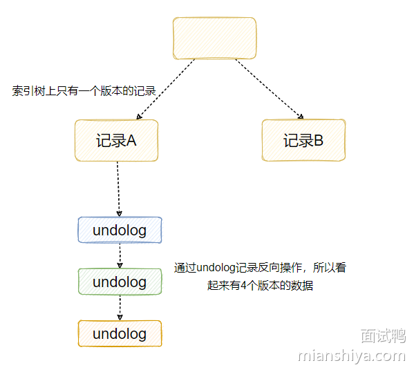

拿上面的` insert （1，XX）`这条语句举例，成功插入之后数据页的记录上不仅存储 ID 1，name XX，还有 trx_id 和 roll_pointer 这两个隐藏字段：

- trx_id：当前事务ID。
- roll_pointer：指向 undo log 的指针。


从图中可以得知此时插入的事务 ID 是 1，此时插入会生成一条 undolog ，并且记录上的 roll_pointer 会指向这条 undolog ，而这条 undolog 是一个类型为`TRX_UNDO_INSERT_REC`的 log，代表是 insert 生成的。

里面存储了主键的长度和值(还有其他值，不提)，所以 InnoDB 可以根据 undolog 里的主键的值，找到这条记录，然后把它删除来实现回滚(复原)的效果。因此可以简单地理解 undolog 里面存储的就是当前操作的反向操作，所以认为里面存了个` delete 1` 就行。

此时**事务1提交**，然后另一个 ID 为 5 的事务再执行 `update NO where id 1` 这个语句，此时的记录和 undolog 就如下图所示：

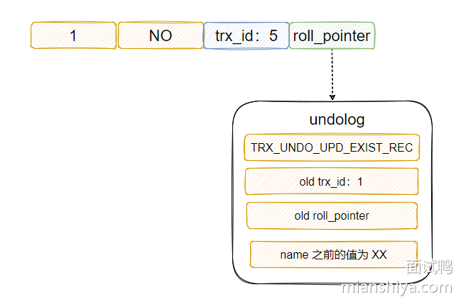

没错，之前 insert 产生的 undolog 没了，insert 的事务提交了之后对应的 undolog 就回收了，因为不可能有别的事务会访问比这还要早的版本了，访问插入之前的版本？访问个寂寞吗？

而 update 产生的 undolog 不一样，它的类型为 `TRX_UNDO_UPD_EXIST_REC`。

此时**事务 5 提交**，然后另一个 ID 为 11 的事务执行`update Yes where id 1` 这个语句，此时的记录和 undolog 就如下图所示：

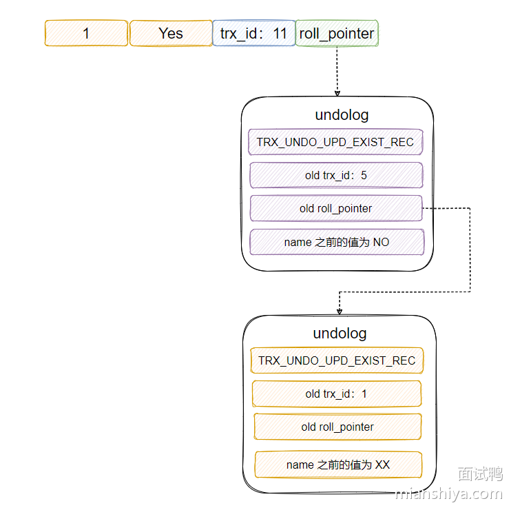

没错，update 产生的 undolog 不会马上删除，因为可能有别的事务需要访问之前的版本，所以不能删。这样就串成了一个版本链，可以看到记录本身加上两条 undolog，这条 id 为 1 的记录共有三个版本。

##### readView

版本链搞清楚了，这时候还需要知道一个概念 readView，这个 readView 就是用来判断哪个版本对当前事务可见的，这里有四个概念：

- creator_trx_id，当前事务ID。
- m_ids，生成 readView 时还活跃的事务ID集合，也就是已经启动但是还未提交的事务ID列表。
- min_trx_id，当前活跃ID之中的最小值。
- max_trx_id，生成 readView 时 InnoDB 将分配给下一个事务的 ID 的值（事务 ID 是递增分配的，越后面申请的事务ID越大）

**对于可见版本的判断是从最新版本开始沿着版本链逐渐寻找老的版本，如果遇到符合条件的版本就返回**。

判断条件如下：

- 如果当前数据版本的 trx_id == creator_trx_id 说明修改这条数据的事务就是当前事务，所以可见。
- 如果当前数据版本的 trx_id < min_trx_id，说明修改这条数据的事务在当前事务生成 readView 的时候已提交，所以可见。
- 如果当前数据版本的 trx_id 大小在 min_trx_id 和 max_trx_id 之间，此时 trx_id 若在 m_ids 中，说明修改这条数据的事务此时还未提交，所以不可见，若不在 m_ids 中，表明事务已经提交，可见。
- 如果当前数据版本的 trx_id >= max_trx_id，说明修改这条数据的事务在当前事务生成 readView 的时候还未启动，所以不可见(结合事务ID递增来看)。

来看一个简单的案例，练一练上面的规则。

##### 读已提交隔离级别下的 MVCC

**现在的隔离级别是读已提交**。

假设**此时上文的事务1已经提交，事务 5 已经执行，但还未提交**，此时有另一个事务在执行`update YY where id 2`，也未提交，它的事务 ID 为 6，且也是现在最大的事务 ID。

现在有一个查询开启了事务，语句为`select name where id 1`，那么这个查询语句：

- 此时 creator_trx_id 为 0，因为一个事务只有当有修改操作的时候才会被分配事务 ID。
- 此时 m_ids 为 [5，6]，这两个事务都未提交，为活跃的。
- 此时 min_trx_id，为 5。
- 此时 max_trx_id，为 7，因为最新分配的事务 ID 为 6，那么下一个就是7，事务 ID 是递增分配的。

由于查询的是 ID 为 1 的记录，所以先找到 ID 为 1 的这条记录，此时的版本如下：


此时最新版本的记录上 trx_id 为 5，不比 min_trx_id 小，在 m_ids 之中，表明还是活跃的，未提交，所以不可访问，根据 roll_pointer 找到上一个版本。

于是找到了图上的那条 undolog，这条log上面记录的 trx_id 为 1，比 min_trx_id 还小，说明在生成 readView 的时候已经提交，所以可以访问，因此返回结果 name 为 XX。

**然后事务 5 提交**。

此时**再次查询** `select name where id 1`，这时候又会**生成新的 readView**。

- 此时 creator_trx_id 为 0，因为还是没有修改操作。
- 此时 m_ids 为 [6]，因为事务5提交了。
- 此时 min_trx_id，为 6。
- 此时 max_trx_id，为 7，此时没有新的事务申请。

同样还是查询的是 ID 为 1 的记录，所以还是先找到 ID 为 1 的这条记录，此时的版本如下(和上面一样，没变)：


此时最新版本的记录上 trx_id 为 5，比 min_trx_id 小，说明事务已经提交了，是可以访问的，因此返回结果 name 为 NO。

**这就是读已提交的 MVCC 操作**，可以看到一个事务中的两次查询得到了不同的结果，所以也叫不可重复读。

##### 可重复读隔离级别下的MVCC

**现在的隔离级别是可重复读**。

可重复读和读已提交的 MVCC 判断版本的过程是一模一样的，**唯一的差别在生成 readView 上**。

上面的读已提交每次查询都会重新生成一个新的 readView ，而可重复读在第一次生成 readView 之后的所有查询都共用同一个 readView 。

也就是说可重复读只会在第一次 select 时候生成一个 readView ，所以一个事务里面不论有几次 select ，其实看到的都是同一个 readView 。

套用上面的情况，差别就在**第二次**执行`select name where id 1`，不会生成新的 readView，而是用之前的 readView，所以第二次查询时：

- m_ids 还是为 [5，6]，虽说事务 5 此时已经提交了，但是这个readView是在事务5提交之前生成的，所以当前还是认为这两个事务都未提交，为活跃的。
- 此时 min_trx_id，为 5。

(对于判断过程有点卡顿的同学可以再拉上去看看，判断版本的过程和读已提交一致)。

所以在可重复级别下，两次查询得到的 name 都为 XX，所以叫**可重复读**。

##### 可重复读能完全避免幻读的发生吗？

不能。

首先了解下**快照读**和**当前读**这两个概念。

##### 快照读（Snapshot Read）

快照读是指事务在执行查询时，不直接读取当前最新的数据，而是读取数据的历史版本（快照）。MySQL InnoDB 通过多版本并发控制（MVCC）来实现快照读。快照读只会返回在事务开始时可见的数据，即使其他事务在之后修改了这些数据，快照读也不会受影响。

##### 当前读（Current Read）

当前读是指读取数据的最新版本，并且会加锁以确保数据的一致性。即使其他事务对这个数据的修改在当前读的事务之后，这个修改也会反映在当前读的结果中（如果事务 2 开始时间发生在事务 1 之后，那么正常情况下事务 2 的修改对事务 1 不可见，但是事务 1 的当前读可见这个修改）。

当前读出现在带有锁的查询中，如 `SELECT ... FOR UPDATE`、`SELECT ... LOCK IN SHARE MODE`以及 `UPDATE、DELETE`等 DML 语句。

当前读需要获取最新版本应该不难理解，例如别的事务已经 delete 一条语句了，当前事务要执行 update 不得先去看看当前最新的数据情况，如果都删除了还 update 成功那不就乱了吗？

当前读会通过加锁（如 Next-Key Locking）锁定读范围内的所有记录和间隙，防止其他事务在该范围内插入新记录。

再回到可重复读和幻读的问题上来，我们来看下这个场景：


由于当前读的特性，即使在可重复读隔离级别下，也产生了幻读的场景。

如果要避免这个幻读的产生，那么在事务开始的时候，直接就使用 `SELECT ... FOR UPDATE`，加锁了后其他事务就新增不了数据了，也就避免了幻读的发生。

### MySQL 中的事务隔离级别有哪些？ 

#### 回答重点

在 MySQL 中，事务隔离级别主要有以下四种：

**1）读未提交（READ UNCOMMITTED）**：

- 这是最低的隔离级别，在该级别下，一个事务可以看到另一个事务尚未提交的数据修改。这可能会导致**脏读**问题，即读取到其他事务未提交的数据。

**2）读已提交（READ COMMITTED）**：

- 在这个级别下，一个事务只能看到已经提交的其他事务所做的修改。这可以避免脏读问题，但是可能会引发**不可重复读**问题，即在同一个事务中，相同的查询可能返回不同的结果。

**3）可重复读（REPEATABLE READ）**：

- 在这个级别下，确保在一个事务中的多个查询返回的结果是一致的。这可以避免不可重复读问题，但是可能会引发**幻读**问题，即在同一个事务中，多次查询可能返回不同数量的行（MySQL 默认的隔离级别）。

**4）串行化（SERIALIZABLE）**：

- 并发 SQL 事务在 SERIALIZABLE 隔离级别下的执行被保证是可串行化的。可串行化执行被定义为：并发执行的 SQL 事务的操作，其效果与这些 SQL 事务按某种顺序串行执行的效果相同。串行执行是指每个 SQL 事务在下一个 SQL 事务开始之前完成其全部操作 [来源 SQL92定义](https://www.contrib.andrew.cmu.edu/~shadow/sql/sql1992.txt)。
- 这是最高的隔离级别，在这个级别下，保证事务间的操作结果相当于一个按顺序执行的单线程操作。这可以避免所有的并发问题，但是会大大降低并发性能。

#### 扩展知识

##### 隔离级别的影响

较低的隔离级别（如读未提交）提高了并发性，但可能导致数据不一致；较高的隔离级别（如串行化）保证数据一致性，但降低了并发性。因此，在设计应用时，需要在性能和数据一致性之间找到平衡。

一般互联网大厂会选择**读已提交**隔离级别。

- [1535. 你们生产环境的 MySQL 中使用了什么事务隔离级别？为什么？](https://www.mianshiya.com/question/1805421515868151810)

##### 脏读、不可重复读、幻读的概念

- [608. 数据库的脏读、不可重复读和幻读分别是什么？](https://www.mianshiya.com/bank/1791003439968264194/question/1780933295496785922)

##### 补充说明 MySQL 的串行化（SERIALIZABLE）

根据[官网所述](https://dev.mysql.com/doc/refman/8.0/en/innodb-transaction-isolation-levels.html)，MySQL 的 `SERIALIZABLE` 级别类似于 `REPEATABLE READ`。但是如果关闭了自动提交事务，那么 `SERIALIZABLE` 级别下的`普通 SELECT` 会被隐式转成 `SELECT ... FOR SHARE`，即对读加共享锁确保其他事务无法修改正在读取的数据，实现了读的一致性。

这个操作就避免了`REPEATABLE READ`隔离级别下[由于快照读和当前读混用形成的幻读问题](https://www.mianshiya.com/question/1780933295484203009#heading-6)。

### MySQL 默认的事务隔离级别是什么？为什么选择这个级别？ 

#### 回答重点

MySQL 默认的隔离级别是可重复读（ Repeatable Read ），即 RR。

原因是为了兼容早期 binlog 的 statement 格式问题，如果是使用读已提交、读未提交等隔离级别，使用了 statement 格式的 binlog 会导致主从（备）数据库数据不一致问题。

#### 扩展知识

##### 进一步分析 binlog statement 格式和可重复级别的影响

接下来我们来展开讲解下，便于大家理解。

MySQL 在使用过程中，为了避免单台故障，需要使用主从（备）机制：

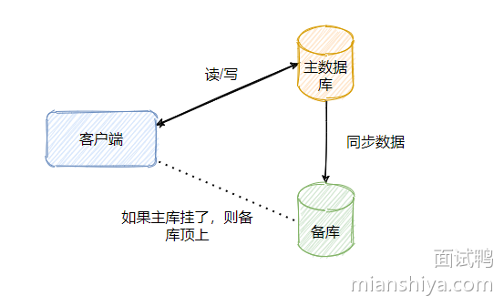

而 MySQL 的主从（备）涉及 binlog 的复制，即从（备）库的数据是通过 binlog 从主库复制过来的。


在早期，MySQL binlog 仅支持 statement 格式，这个格式其实存的就是**原先的SQL 语句**，这就使得在读未提交（ru）和读提交（rc）两种隔离级别下会出问题。

我们来实际看个例子：

例如有两个事务 A 和 B ，以下图的时间顺序执行：

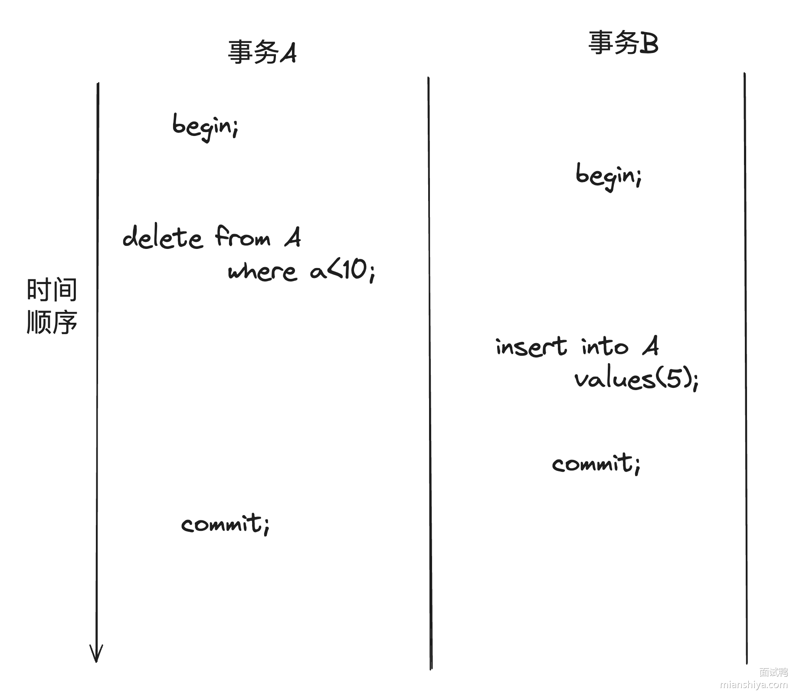

在读已提交隔离级别且手动提交事务的情况下， 插入的 5 这条记录会被保留。

但是由于事务 B 先提交，所以它会先被记录在 binlog 中，**这个操作就导致了问题**。

binlog 的记录顺序是：

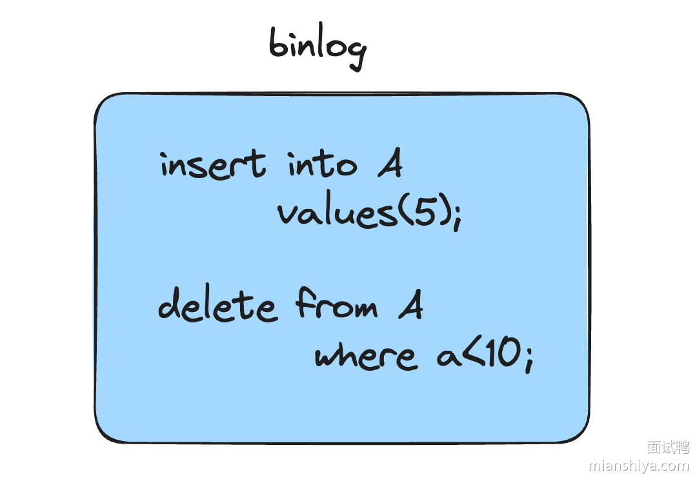

使得从库同步 binlog 重放的时候，先执行了 insert 再执行 delete，**这就使得从库的数据与主库不一致了！**， 5 这条记录也会被删除了。

所以，为了避免这个问题，只能默认为可重复读级别。因为这个隔离级别下有间隙锁（Gap Locks）、临键锁（Next-Key Locks），所以事务 B 是无法先提交的，会被事务 A 阻塞，因此 binlog 的记录只能是先 delete 再 insert ，这样就没问题了。

### MySQL 中有哪些锁类型？

#### 回答重点

在 MySQL 中，主要有以下几种锁类型：

1）**行级锁（Row Lock）（重点）**：

- 仅对特定的行加锁，允许其他事务并发访问不同的行，适用于高并发场景。

2）**表级锁（Table Lock）（重点）**：

- 对整个表加锁，其他事务无法对该表进行任何读写操作，适用于需要保证完整性的小型表。

3）**意向锁（Intention Lock）**：

- 一种表锁，用于表示某个事务对某行数据加锁的意图，分为意向共享锁（IS）和意向排它锁（IX），主要用于行级锁与表级锁的结合。

4）**共享锁（Shared Lock）（重点）**：

- 允许多个事务并发读取同一资源，但不允许修改。只有在释放共享锁后，其他事务才能获得排它锁。

5）**排它锁（Exclusive Lock）（重点）**：

- 只允许一个事务对资源进行读写，其他事务在获得排它锁之前无法访问该资源。

6）**元数据锁（Metadata Lock, MDL）**：

- 用于保护数据库对象（如表和索引）的元数据，防止在进行 DDL 操作时其他事务对这些对象进行修改。

7）**间隙锁（Gap Lock）（重点）**：

- 针对索引中两个记录之间的间隙加锁，防止其他事务在这个间隙中插入新记录，以避免幻读。间隙锁不锁定具体行，而是锁定行与行之间的空间。

8）**临键锁（Next-Key Lock）（重点）**：

- 是行级锁和间隙锁的结合，锁定具体行和其前面的间隙，确保在一个范围内不会出现幻读。常用于支持可重复读的隔离级别。

9）**插入意向锁（Insert Intention Lock）**：

- 一种等待间隙的锁，用于指示事务打算在某个间隙中插入记录，允许其他事务进行共享锁，但在插入时会阻止其他的排它锁。

10）**自增锁（Auto Increment Lock）**：

- 在插入自增列时，加锁以保证自增值的唯一性，防止并发插入导致的冲突。通常在插入操作时被使用，以确保生成的自增 ID 是唯一的。

#### 扩展知识

这个扩展知识比较长，也是从演进的角度来讲解 MySQL 中比较关键的几个锁，这样记忆和理解会更深刻，减少出现看过没多久就忘了的情况。

##### 共享锁和排他锁

在 MySQL 中锁可以分为两大类，分别是 shared (S) locks 和 exclusive (X) locks。

- S锁，称为共享锁，事务在读取记录的时候获取 S 锁，它允许多个事务同时获取 S 锁，互相之间不会冲突。
- X锁，称为独占锁（排他锁），事务在修改记录的时候获取 X 锁，且只允许一个事务获取 X 锁，其它事务需要阻塞等待。

S 锁之间不冲突，X 锁则为独占锁，所以 X 之间会冲突， X 和 S 也会冲突。

| 冲突 | S      | X    |
| ---- | ------ | ---- |
| S    | 不冲突 | 冲突 |
| X    | 冲突   | 冲突 |

`SELECT ... LOCK IN SHARE MODE;` 这种读取需要对记录上 S 锁。

`SELECT ... FOR UPDATE;` 需要对记录上 X 锁。

MyISAM 引擎仅支持表锁，而 Innodb 即支持表锁也支持行锁。

- `LOCK TABLES yes READ` 是对 yes 这个表上 S 锁。
- `LOCK TABLES yes WRITE` 是对 yes 这个表上 X 锁。

不过一般情况下，我们不会使用表锁，因为平日的 UPDATE 、SELECT 要用也是用行锁了，不可能用粒度粗的表锁，不然性能太低。

唯一能想到用上表锁的就是 DDL 语句了，比如 ALTER TABLE 的时候，应该锁定整个表，防止查询和修改。除此之外 MySQL 还提供了一个叫 MDL 的锁，即 `Metadata Locks`（元数据锁）。

##### 元数据锁

元数据锁也分为读锁和写锁：

1）读锁 (MDL_SHARED)：

当一个事务需要读取表的元数据时（如执行 SELECT 操作），会获取读锁。 多个事务可以同时持有读锁，不会互相阻塞。

2）写锁 (MDL_EXCLUSIVE)：

当一个事务需要修改表的元数据时（如执行 ALTER TABLE 操作），会获取写锁。 写锁会阻塞其他任何读锁和写锁，确保独占访问。

元数据锁的主要作用如下：

1）防止并发的 DDL 操作和 DML 操作冲突：

- 当一个事务对表进行结构性更改（如 ALTER TABLE），元数据锁（写锁）会阻止其他事务对该表进行操作，直到结构更改完成。
- 当一个事务对表进行数据操作（如 SELECT、INSERT、UPDATE、DELETE），元数据锁（读锁）会阻止其他事务对该表进行结构性更改。

2）保护元数据一致性：

- 确保在执行 DDL 操作（如 CREATE TABLE、DROP TABLE、ALTER TABLE）时，元数据不会被其他事务同时修改。

假设业务上真用到了表锁，那么表锁和行锁之间肯定会冲突，当 InnoDB 加表锁的时候，如何判断表里面是否已经有行锁？难道得一条记录一条记录遍历过去找吗？

显然这样的效率太低了！

##### 意向锁

所以有了个叫意向锁（Intention Locks）的东西。

- IS（Intention Shared Lock），共享意向锁
- IX（Intention Exclusive Lock），独占意向锁。

这两个锁是表级别的锁，当需要对表中的某条记录上 S 锁的时候，先在表上加个 IS 锁，表明此时表内有 S 锁。当需要对表中的某条记录上 X 锁的时候，先在表上加个 IX 锁，表明此时表内有 X 锁。

这样操作之后，如果要加表锁，就不需要遍历所有记录去找了，直接看看表上面有没有 IS 和 IX 锁。

比如，此时要上表级别的 S 锁，如果表上没有 IX ，说明表中没有记录有独占锁，其实就可以直接上表级 S 锁。

如果此时要上表级别的 X 锁，如果表上没有 IX 和 IS ，说明表中的所有记录都没加锁，其实就可以直接上表级 X 锁。

**因此 IS 和 IX 的作用就是在上表级锁的时候，可以快速判断是否可以上锁，而不需要遍历表中的所有记录**。

所以 IS 和 IX 互相之间是不会冲突的，因为它们的作用只是打个标记，来丰富一下上面的表格：

| 冲突 | S      | X    | IS     | IX     |
| ---- | ------ | ---- | ------ | ------ |
| S    | 不冲突 | 冲突 | 不冲突 | 冲突   |
| X    | 冲突   | 冲突 | 冲突   | 冲突   |
| IS   | 不冲突 | 冲突 | 不冲突 | 不冲突 |
| IX   | 冲突   | 冲突 | 不冲突 | 不冲突 |

至此，已经理解了共享锁、独占锁、表锁相关的知识，接下来再来看看 MySQL 中的行锁有哪几种。

主要有三种：

- 记录锁（Record Locks）
- 间隙锁（Gap Locks）
- 临键锁（Next-Key Locks）

##### 记录锁

记录锁顾名思义就是锁住当前的记录，它是作用到索引上的。我们都知道 innodb 是肯定有索引的，即使没有主键也会创建隐藏的聚簇索引，所以**记录锁总是锁定索引记录**。

比如，此时一个事务 A 执行 `SELECT * FROM yes WHERE name = 'xx' FOR UPDATE;` 那么 name = xx 这条记录就被锁定了，其他事务无法插入、删除、修改 name = xx 的记录。

此时事务 A 还未提交，另一个事务 B 要执行 `insert into yes (name) values ('xx')`，此时会被阻塞，这个很好理解。

但是，如果另一个事务 C 执行了 `insert into yes (name) values ('aa')`，这个语句会被阻塞吗？

**看情况**。

**在可重复读隔离级别下，如果 name 没有索引**。前面提到记录锁是加到索引上的，但是 name 没索引啊，那只能去找聚簇索引，但聚簇索引上面能通过 name 快速找到数据吗？它只能通过全表扫描一个一个看过去，所以咋办？都锁了呗！

因此，**如果 name 没有索引，那么事务 C 会被阻塞，如果有索引，则不会被阻塞**！

所以这里要注意，没索引的列不要轻易的锁，不要以为有行锁就可以为所欲为，并不是这样的。

##### 间隙锁和临键锁

前面说了，记录锁需要加到记录上，但是如果**要给此时还未存在的记录加锁怎么办**？也就是要预防幻读的出现！

这时候间隙锁就派上用场了，它是给间隙加上锁。

比如此时有 1、3、5、10 这四条记录，之前的文章分析过，数据页中还有两条虚拟的记录，分别是 `Infimum` 和 `Supremum`。


可以看到，记录之前都有间隙，**那间隙锁呢，锁的就是这个间隙**！

比如我把 3 和 5 之间的间隙锁了，此时要插入 id = 4 的记录，就会被这个间隙锁给阻塞了，这样就避免了幻读的产生！也就实现了锁定未插入的记录的需求！

还有个 `Next-Key Locks` 就是记录锁+间隙锁，像上面间隙锁的举例，只能锁定(3,5) 这个区间，而 `Next-Key Locks` 是一个前开后闭的区间(3,5]，这样能防止查询 id=5 的这个幻读。

间隙锁之间不会冲突，**间隙锁的唯一目的就是防止其他事务插入数据到间隙中** ，所以即使两个间隙锁要锁住相同的间隙也没有关系，因为它们的目的是一致的。

间隙锁可以显式禁用，它是在事务隔离级别为可重复读的时候生效的，如果将事务隔离级别更改为 READ COMMITTED，就会禁用了，此时，间隙锁对于搜索和索引扫描是禁用的，仅用于外键约束检查和重复键检查。

##### 插入意向锁

插入意向锁，即 Insert Intention Locks，**它也是一类和间隙相关锁**，但是它不是锁定间隙，而是等待某个间隙。比如上面举例的 id = 4 的那个事务 C ，由于被间隙锁给阻塞了，所以事务 C 会生成一个插入意向锁，表明等待这个间隙锁的释放。

并且插入意向锁之间不会阻塞，因为它们的目的也是只等待这个间隙被释放，所以插入意向锁之间没有冲突。

它的目的不在于锁定资源防止别人访问，我个人觉得更像是为了遵循 MySQL 的锁代码实现而为之。

**锁其实就是内存里面的一个结构**，每个事务为某个记录或者间隙上锁就是创建一个锁对象来争抢资源。

如果某个事务没有抢到资源，那也会生成一个锁对象，只是状态是等待的，而当拥有资源的事务释放锁之后，就会寻找正在等待当前资源的锁结构，然后选一个让它获得资源并唤醒对应的事务使之得以执行。

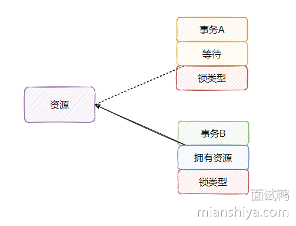

所以按照这么个逻辑，**那些在等待间隙锁的插入事务，也需要对应的建立一个锁结构，然后锁类型是插入意向锁**。

这样一来，间隙锁的事务在释放间隙锁的时候，才能得以找到那些等待插入的事务，然后进行唤醒，而由锁的类型也可以得知是插入意向锁，之间不需要阻塞，所以可以一起执行插入。


##### Auto-Inc Lock

Auto-Inc Lock 是一个特殊的表级锁，用于自增列插入数据时使用。 在插入一条数据的时候，需要在表上加个 Auto-Inc Lock，然后为自增列分配递增的值，在语句插入结束之后，再释放 Auto-Inc Lock。

在 MySQL 5.1.22 版本之后，又弄了个互斥量来进行自增减的累加。互斥量的性能高于 Auto-Inc Lock，因为 Auto-Inc Lock是语句插入完毕之后才释放锁，而互斥量是在语句插入的时候，**获得递增值之后，就可以释放锁**，所以性能更好。

但是我们还需要考虑主从的情况，由于**并发插入**的情况，基于 statement -based binlog 复制时，自增的值顺序无法把控，可能会导致主从数据不一致。

所以 MySQL 有个 innodb_autoinc_lock_mode 配置，一共有三个值：

- 0，只用 Auto-Inc Lock。
- 1，**默认值**，对于插入前已知插入行数的插入，用互斥量，对于插入前不知道具体插入数的插入，用 Auto-Inc Lock，这样即使基于 statement -based binlog 复制也是安全的。
- 2，只用互斥量。

##### 扩展学习

还有一个谓词锁，Predicate Locks，这个比较少见，大家了解下就好了。

InnoDB 是支持空间数据的，所以有空间索引，为了处理涉及空间索引的操作的锁定，next-key locking 不好使，因为多维数据中没有绝对排序的概念，因此不清楚 “下一个” key 在哪。

所以为了支持具有空间索引的表的隔离级别，InnoDB 使用谓词锁。

空间索引包含最小边界矩形（MBR）值，因此 InnodB 通过在用于查询的 MBR 值上设置谓词锁定，使得 InnoDB 在索引上执行一致性读， 其他事务无法插入或修改与查询条件匹配的行。

### MySQL 的乐观锁和悲观锁是什么？ 

#### 回答重点

**悲观锁（Pessimistic Locking）**：

- 假设会发生冲突，因此在操作数据之前就**对数据加锁**，确保其他事务无法访问该数据。常见于对数据一致性要求较高的场景。
- 实现方式：使用行级锁或表级锁，例如可以使用 `SELECT ... FOR UPDATE` 或 `LOCK IN SHARE MODE` 语句来加锁。

**乐观锁（Optimistic Locking）**：

- 假设不会发生冲突，因此在操作数据时不加锁，而是在更新数据时**进行版本控制或校验**。如果发现数据被其他事务修改，则会拒绝当前事务的修改，需重新尝试。
- 实现方式：通常通过版本号或时间戳来实现，每次更新时检查版本号或时间戳是否一致。

#### 扩展知识

##### 适用场景

1）乐观锁适合**并发冲突少，读多写少**的场景，不用通过加锁只需通过比较字段版本号（或时间戳）是否发生改变的形式，无锁操作，吞吐量较高。

数据库实现乐观锁的例子（版本号）：

```sql
-- 假设有一张用户表 users，包含 id、name 和 version 字段
-- 读取数据
SELECT id, name, version FROM users WHERE id = 1;

-- 更新数据时检查版本号
UPDATE users
SET name = 'new_name', version = version + 1
WHERE id = 1 AND version = current_version;
```

2）悲观锁适合**并发冲突多，写多读少**的场景。通过每次加锁的形式来确保数据的安全性，吞吐量较低。

数据库实现悲观锁的例子：

```sql
-- 读取数据并加锁
SELECT id, name FROM users WHERE id = 1 FOR UPDATE;

-- 执行更新操作
UPDATE users SET name = 'new_name' WHERE id = 1;
```

### MySQL 中如果发生死锁应该如何解决？ 

#### 回答重点

**自动检测与回滚**：

- MySQL 自带死锁检测机制（innodb_deadlock_detect），当检测到死锁时，数据库会自动回滚其中一个事务，以解除死锁。通常会回滚事务中持有最少资源的那个。
- 也有锁等待超时的参数（innodb_lock_wait_timeout），当获取锁的等待时间超过阈值时，就释放锁进行回滚。

**手动 kill 发生死锁的语句**：

- 可以通过命令，手动快速地找出被阻塞的事务及其线程 ID，然后手动 kill 它，及时释放资源。

#### 扩展知识

##### 死锁日志

如果线上遇到死锁的情况，可以通过 `SHOW ENGINE INNODB STATUS` 来获取死锁的日志信息，从而定位到死锁发生的原因。

我从网上找了一个死锁日志，供大家参考学习，有个大致印象即可：

```perl
------------------------
LATEST DETECTED DEADLOCK
------------------------
170219 13:31:31
*** (1) TRANSACTION:
TRANSACTION 2A8BD, ACTIVE 11 sec starting index read
mysql tables in use 1, locked 1
LOCK WAIT 2 lock struct(s), heap size 376, 1 row lock(s)
MySQL thread id 448218, OS thread handle 0x2abe5fb5d700, query id 18923238 renjun.fangcloud.net 121.41.41.92 root updating
delete from test where a = 2
*** (1) WAITING FOR THIS LOCK TO BE GRANTED:
RECORD LOCKS space id 0 page no 923 n bits 80 index `a` of table `oauthdemo`.`test` trx id 2A8BD lock_mode X waiting
Record lock, heap no 3 PHYSICAL RECORD: n_fields 2; compact format; info bits 32
 0: len 4; hex 00000002; asc ;;
 1: len 4; hex 00000002; asc ;;
*** (2) TRANSACTION:
TRANSACTION 2A8BC, ACTIVE 18 sec inserting
mysql tables in use 1, locked 1
4 lock struct(s), heap size 1248, 3 row lock(s), undo log entries 2
MySQL thread id 448217, OS thread handle 0x2abe5fd65700, query id 18923239 renjun.fangcloud.net 121.41.41.92 root update
insert into test (id,a) values (10,2)
*** (2) HOLDS THE LOCK(S):
RECORD LOCKS space id 0 page no 923 n bits 80 index `a` of table `oauthdemo`.`test` trx id 2A8BC lock_mode X locks rec but not gap
Record lock, heap no 3 PHYSICAL RECORD: n_fields 2; compact format; info bits 32
 0: len 4; hex 00000002; asc ;;
 1: len 4; hex 00000002; asc ;;
*** (2) WAITING FOR THIS LOCK TO BE GRANTED:
RECORD LOCKS space id 0 page no 923 n bits 80 index `a` of table `oauthdemo`.`test` trx id 2A8BC lock mode S waiting
Record lock, heap no 3 PHYSICAL RECORD: n_fields 2; compact format; info bits 32
 0: len 4; hex 00000002; asc ;;
 1: len 4; hex 00000002; asc ;;
*** WE ROLL BACK TRANSACTION (1)
```

简单分析一下，上半部分在解释事务 1 即 (1) TRANSACTION 的情况，它执行`delete from test where a = 2` 在申请索引 a 的 X 锁（index `a` of table ... lock_mode X waiting）

下半部分在解释事务 2 即 (2) TRANSACTION，它持有索引 a 的 X 锁，又因为 `insert into test (id,a) values (10,2)` 这个插入语句在申请 S 锁（表中的 a 建立了唯一索引，因此需要 S 锁来进行重复 key 判断）。

所以事务 1 排着队等事务 2 释放 X 锁，而事务 2 又需要 S 锁，申请 S 锁的时候发现等锁的队伍前还有个 X 锁，这样一来就形成了相互依赖。

通过日志分析我们就能知晓死锁的原因，然后通过一定的修改来避免死锁的产生或降低死锁的概率。

##### 常见避免死锁或降低死锁的手段

**1）避免大事务**。大事务占据锁的时间长，将大事务拆分成多个小事务快速释放锁，可降低死锁产生的概率和避免冲突。

**2）调整申请锁的顺序**。在更新数据的时候要保证获得足够的锁，举个例子：先获取影响范围大的锁，比如说修改操作，先将排他锁获取到，再获取共享锁。或固定顺序访问数据，这样也能避免死锁的情况。

**3）更改数据库隔离级别**。可重复读比读已提交多了间隙锁和临键锁，利用读已提交替换之可降低死锁的情况。

**4）合理建立索引，减少加锁范围**。如果命中索引，则会锁对应的行，不然就是全表行都加锁，这样冲突大，死锁的概率就高了。

**5）开启死锁检测**，适当调整锁等待时长。

##### 手动 kill 语句步骤

1）**查找当前的事务和锁信息**：

使用以下命令查看当前正在执行的事务和相关的锁信息：

```sql
SHOW ENGINE INNODB STATUS;
```

这个命令会输出 InnoDB 的状态，包括死锁信息和当前的活动事务。你可以在输出中找到被阻塞的事务及其线程 ID。

除此之外，也可以使用 INFORMATION_SCHEMA 中的 INNODB_LOCKS 和 INNODB_LOCK_WAITS 表，查看当前锁和锁等待情况，得到事务ID。

```sql
SELECT * FROM INFORMATION_SCHEMA.INNODB_LOCKS;
SELECT * FROM INFORMATION_SCHEMA.INNODB_LOCK_WAITS;
```

再通过 INFORMATION_SCHEMA 的 innodb_trx 可以找到事务ID和线程 ID 的对应关系。

2）**手动终止该事务**：

一旦确定了需要 KILL 的线程 ID，使用以下命令终止该事务：

```sql
KILL <thread_id>;
```

将 `<thread_id>` 替换为你找到的实际线程 ID。

##### INNODB_LOCKS 、 INNODB_LOCK_WAITS 和 INNODB_TRX 示例

**INNODB_LOCKS 查询当前锁的信息**

```sql
SELECT * FROM INFORMATION_SCHEMA.INNODB_LOCKS;
```

**示例结果**

| LOCK_ID    | LOCK_MODE | LOCK_TYPE | LOCK_TABLE           | LOCK_INDEX | LOCK_OWNER | LOCK_DATA |
| ---------- | --------- | --------- | -------------------- | ---------- | ---------- | --------- |
| 12345678:1 | X         | RECORD    | my_database/my_table | PRIMARY    | 123456     | 1         |
| 12345678:2 | S         | RECORD    | my_database/my_table | PRIMARY    | 123457     | 2         |

**字段解释**：

- **LOCK_ID**: 唯一标识每个锁。
- **LOCK_MODE**: 锁的类型（X：排它锁，S：共享锁）。
- **LOCK_TYPE**: 锁的作用对象类型（如 RECORD 表示行锁）。
- **LOCK_TABLE**: 被锁定的表。
- **LOCK_INDEX**: 相关索引。
- **LOCK_OWNER**: 拥有该锁的事务 ID。
- **LOCK_DATA**: 被锁定的数据行的主键值。

**INNODB_LOCK_WAITS 查询锁等待情况**

```sql
SELECT * FROM INFORMATION_SCHEMA.INNODB_LOCK_WAITS;
```

**示例结果**

| REQUESTING_TRX_ID | HOLDING_TRX_ID | LOCK_ID    | LOCK_TYPE |
| ----------------- | -------------- | ---------- | --------- |
| 123456            | 123457         | 12345678:1 | RECORD    |
| 123458            | 123459         | 12345678:2 | RECORD    |

**字段解释**

- **REQUESTING_TRX_ID**: 请求锁的事务 ID。
- **HOLDING_TRX_ID**: 当前持有锁的事务 ID。
- **LOCK_ID**: 与 `INNODB_LOCKS` 表中的锁相对应。
- **LOCK_TYPE**: 请求的锁类型。

**INNODB_TRX 查询线程 ID 示例**

```sql
SELECT trx_state, trx_started, trx_mysql_thread_id, trx_query, trx_id 
FROM INFORMATION_SCHEMA.INNODB_TRX 
WHERE trx_id = '123456';
```

**示例结果**

| trx_state | trx_started         | trx_mysql_thread_id | trx_query                           | trx_id |
| --------- | ------------------- | ------------------- | ----------------------------------- | ------ |
| LOCK_WAIT | 2024-09-25 10:00:00 | 1234                | SELECT * FROM my_table WHERE id = 1 | 123456 |

**字段解释：**

- **trx_state**: 事务的当前状态。在此示例中，`LOCK_WAIT` 表示该事务正在等待锁。
- **trx_started**: 事务开始的时间。在此示例中，事务于 2024-09-25 10:00:00 开始。
- **trx_mysql_thread_id**: 与该事务关联的 MySQL 线程 ID，可以用来查找该事务的更多信息。
- **trx_query**: 当前事务正在执行的查询。在此示例中，它正在执行一个简单的 `SELECT` 查询。
- **trx_id**: 事务的唯一标识符。在此示例中，事务 ID 为 `123456`。

### MySQL 中 count(*)、count(1) 和 count(字段名) 有什么区别？ 

#### 回答重点

在 MySQL 中，`count(*)` 、`count(1)`和`count(字段名)` 都是用来**统计行数的聚合函数**，但它们有些许的区别：

##### 功能上：

1）`count(*)` 会统计表中所有行的数量，包括 `null` 值（不会忽略任何一行数据）。由于只是计算行数，不需要对具体的列进行处理，因此性能通常较高。

2）`count(1)` 和 `count(*)` 几乎没差别，也会统计表中所有行的数量，包括 `null` 值。

3）`count(字段名)` 会统计指定字段不为 `null` 的行数。这种写法会对指定的字段进行计数，只会统计字段值不为 `null` 的行。

##### 效率上：

1）`count(1)` 和 `count(*)` 效率一致，网上其实众说纷纭，实际上当然得看官网怎么说！


`There is no performance difference.` 没有差异的！

2）`count(字段)` 的查询就是全表扫描(如果对应的字段没有索引，如果有索引则用索引)，正常情况下它还需要判断字段是否是 null 值，因此理论上会比 `count(1)` 和 `count(*)` 慢。

但是如果字段不为 null，例如是主键，那么理论上也差不多，而且本质上它们的统计功能不一样，在需要统计 null 的时候，只能用 `count(1)` 和 `count(*)`，不需要统计 null 的时候只能用`count(字段)`，所以也不用太纠结性能问题。

#### 扩展知识

在 MyISAM 中，由于只有表锁，因此它把每张表的总数单独记录维护（表锁使得对表的修改是串行，因此能维护总数），所以 `count(*)` 非常快，因为等于直接返回一个字段。当然，**前提是不需要条件过滤而是直接返回整表数据**。

而 InnoDB 由于支持行锁，所以会有很多并发来修改表的数据，因此无法维护记录总数，但是 InnoDB 对`count(*)`和`count(1)`也做了一定的优化。

count 的字段如果是主键，由于主键索引保存的是整行记录，占据的空间和内存都比较大，此时表中如果还有其它二级索引，那么成本会更低，因此 InnoDB 会评估这个成本选择合适的索引扫描。当然，这个前提也是不能有对应的条件过滤等功能。

### MySQL 中如何进行 SQL 调优？ 

#### 回答重点

平时进行 SQL 调优，主要是通过观察慢 SQL，然后利用 explain 分析查询语句的执行计划，识别性能瓶颈，优化查询语句。

1）合理设计索引，利用联合索引进行覆盖索引的优化，避免回表的发生，减少一次查询和随机 I/O

2）避免 SELECT * ，只查询必要的字段

3）避免在 SQL 中进行函数计算等操作，使得无法命中索引

4）避免使用 %LIKE，导致全表扫描

5）注意联合索引需满足最左匹配原则

6）不要对无索引字段进行排序操作

7）连表查询需要注意不同字段的字符集是否一致，否则也会导致全表扫描

除此之外，还可以**利用缓存**来优化，一些变化少或者访问频繁的数据设置到缓存中，减轻数据库的压力，提升查询的效率。

还可以**通过业务**来优化，例如少展示一些不必要的字段，减少多表查询的情况，将列表查询替换成分页分批查询等等。

#### 扩展知识

##### 慢 SQL

这是 MySQL 自带的日志记录，默认关闭，通过 `set global slow_query_log = 'ON'` 即可开启。

通过 `show variables like '%slow_query_log%'` 即可查询当前慢日志是否开启，以及存储的路径。

通过 `set global long_query_time = 3` 即可设置慢 SQL 的阈值，3 就是 3 秒，当一个 SQL 执行的时间操作 3 秒，就会被记录到慢日志中。

##### explain

具体 explain 的分析，可以看：[如何使用 MySQL 的 EXPLAIN 语句进行查询分析？](https://www.mianshiya.com/question/1780933295509368833)

### 如何使用 MySQL 的 EXPLAIN 语句进行查询分析？ 

#### 回答重点

explain 主要用来 SQL 分析，它主要的属性详解如下：

- `id`：查询的执行顺序的标识符，值越大优先级越高。简单查询的 id 通常为 1，复杂查询（如包含子查询或 UNION）的 id 会有多个。
- `select_type`（**重要**）：查询的类型，如 SIMPLE（简单查询）、PRIMARY（主查询）、SUBQUERY（子查询）等。
- `table`：查询的数据表。
- `type`（**重要**）：访问类型，如 ALL（全表扫描）、index（索引扫描）、range（范围扫描）等。一般来说，性能从好到差的顺序是：const > eq_ref > ref > range > index > ALL。
- `possible_keys`：可能用到的索引。
- `key`（**重要**）：实际用到的索引。
- `key_len`：用到索引的长度。
- `ref`：显示索引的哪一列被使用。
- `rows`（**重要**）：估计要扫描的行数，值越小越好。
- `filtered`：显示查询条件过滤掉的行的百分比。一个高百分比表示查询条件的选择性好。
- `Extra`（**重要**）：额外信息，如 `Using index`（表示使用覆盖索引）、`Using where`（表示使用 WHERE 条件进行过滤）、`Using temporary`（表示使用临时表）、`Using filesort`（表示需要额外的排序步骤）。

type 详解：

- system：表示查询的表只有一行（系统表）。这是一个特殊的情况，不常见。
- const：表示查询的表最多只有一行匹配结果。这通常发生在查询条件是**主键**或**唯一索引**，并且是常量比较。
- eq_ref：表示对于每个来自前一张表的行，MySQL 仅访问一次这个表。这通常发生在连接查询中使用主键或唯一索引的情况下。
- ref：MySQL 使用非唯一索引扫描来查找行。查询条件使用的索引是非唯一的（如普通索引）。
- range：表示 MySQL 会扫描表的一部分，而不是全部行。范围扫描通常出现在使用索引的范围查询中（如 `BETWEEN`、`>`, `<`, `>=`, `<=`）。
- index：表示 MySQL 扫描索引中的所有行，而不是表中的所有行。即使索引列的值覆盖查询，也需要扫描整个索引。
- all（性能最差）：表示 MySQL 需要扫描表中的所有行，即全表扫描。通常出现在没有索引的查询条件中。

#### 扩展知识

##### 实际 explain 例子

1）创建 employees 表

```sql
CREATE TABLE employees (
    employee_id INT PRIMARY KEY,
    first_name VARCHAR(50),
    last_name VARCHAR(50),
    department_id INT,
    salary DECIMAL(10, 2),
    hire_date DATE,
    INDEX (department_id)
);
```

我们要执行以下查询来查找部门 ID 为 5 且薪水在 50000 到 100000 之间的员工，并按薪水降序排序：

```sql
SELECT employee_id, first_name, last_name, salary
FROM employees
WHERE department_id = 5 AND salary BETWEEN 50000 AND 100000
ORDER BY salary DESC;
```

2）我们先使用 explain 分析计划进行分析：

```sql
EXPLAIN SELECT employee_id, first_name, last_name, salary
FROM employees
WHERE department_id = 5 AND salary BETWEEN 50000 AND 100000
ORDER BY salary DESC;
```

输出结果如下：

| id   | select_type | table     | partitions | type | possible_keys | key           | key_len | ref   | rows | filtered | Extra                       |
| ---- | ----------- | --------- | ---------- | ---- | ------------- | ------------- | ------- | ----- | ---- | -------- | --------------------------- |
| 1    | SIMPLE      | employees | NULL       | ref  | department_id | department_id | 4       | const | 5000 | 20.00    | Using where; Using filesort |

3）分析执行计划

从执行计划中看出，`type` 为 `ref`，表示使用了 `department_id` 索引，这是个非唯一索引。`key ` 为 `department_id` 这个索引，而且 `rows` 为 5000，表示扫描了 5000 行数据。从 `Extra` 看出在应用 `WHERE` 条件后，还需要进行文件排序来满足 `ORDER BY` 子句。

4）找出问题

尽管查询使用了索引，但由于索引不完全覆盖查询的条件和排序，查询需要进行额外的文件排序。这可能会导致性能瓶颈，特别是在结果集较大时。

5）优化解决它！

**创建复合索引**

创建一个包含 `department_id` 和 `salary` 的复合索引，这样可以覆盖查询的 `WHERE` 和 `ORDER BY` 条件：

```sql
CREATE INDEX idx_department_salary ON employees (department_id, salary);
```

复合索引可以使查询在扫描 `department_id` 列时，同时按 `salary` 列排序，避免额外的文件排序。

**再次执行计划分析**

优化后的 `EXPLAIN` 输出如下：

| id   | select_type | table     | partitions | type  | possible_keys         | key                   | key_len | ref  | rows | filtered | Extra       |
| ---- | ----------- | --------- | ---------- | ----- | --------------------- | --------------------- | ------- | ---- | ---- | -------- | ----------- |
| 1    | SIMPLE      | employees | NULL       | range | idx_department_salary | idx_department_salary | 5       | NULL | 500  | 100.00   | Using where |

6）分析优化后的结果

从新的 `EXPLAIN` 输出中可以看出：

- **type**: `range`，表示使用范围扫描，这是个相对高效的访问类型。
- **key**: `idx_department_salary`，表示实际使用了复合索引。
- **rows**: 500，估计扫描的行数减少了，因为索引更精确地覆盖了查询条件。
- **Extra**: 仅显示 `Using where`，不再需要文件排序，因为索引已经覆盖了排序需求。

### MySQL 中如何解决深度分页的问题？ 

#### 回答重点

优化方式可以有三种：

**1）子查询**

比如 `select * from mianshiya where name = ’yupi‘ limit 99999990，10；` 这样的一条查询语句，可以优化成：

```sql
 select * from mianshiya where 
 name = 'yupi' 
 and id >= 
 (select id from mianshiya where name = 'yupi' order by id limit 99999990，1)
 order by id limit 10;
```

name 有索引的情况下，这样的查询直接扫描 name 的二级索引，**二级索引的数据量少**，且在子查询中能直接得到 id 不需要回表。将子查询得到的 id 再去主键索引查询，速度很快，数据量也小。

如果直接扫描主键索引的话，数据量就比较大，因为主键索引包含全部的数据。

当然上面的 SQL 改成 Join 也行，本质上是一样的。

```sql
 select * from mianshiya 
 inner join
 (select id from mianshiya where name = 'yupi' order by id limit 99999990，10)
 as mianshiya1 on mianshiya.id = mianshiya1.id
```

**2）记录 id**

每次分页都返回当前的最大 id ，然后下次查询的时候，带上这个 id，就可以利用 id > maxid 过滤了。

这种查询**仅适合连续查询**的情况，如果跳页的话就不生效了。

**3）elasticsearch**

可以考虑用搜索引擎来解决这个问题，不过 es 也会有深度分页的问题，所以如果对 es 不熟，面试就不要这样答了，防止面试官问 es 的深度分页如何解决。

#### 扩展知识

##### 深度分页

所谓的深度分页是指数据量很大的时候，按照分页访问后面的数据，例如 `limit 99999990，10`，这会使得数据库扫描前面的 99999990 条数据，才能得到最终的 10 条数据，大批量的扫描数据会增加数据库的负载，影响性能。

### 什么是 MySQL 的主从同步机制？它是如何实现的？ 

#### 回答重点

MySQL 的主从同步机制是一种数据复制技术，用于将主数据库（Master）上的数据同步到一个或多个从数据库（Slave）中。

主要是通过二进制日志（Binary Log，简称 binlog）实现数据的复制。主数据库在执行写操作时，会将这些操作记录到 binlog 中，然后推送给从数据库，从数据库重放对应的日志即可完成复制。

#### 扩展知识

##### MySQL 主从复制类型

MySQL 支持异步复制、同步复制、半同步复制。

- **异步复制**：主库不需要等待从库的响应（性能较高，数据一致性低）。
- **同步复制**：主库同步等待所有从库确认收到数据（性能差，数据一致性高）。
- **半同步复制**：主库等待至少一个从库确认收到数据（性能折中，数据一致性较高）。

##### 异步复制

MySQL 默认是异步复制，具体流程如下：

主库：

- 接受到提交事务请求
- 更新数据
- 将数据写到binlog中
- 给客户端响应
- 主库推送 binlog 变更事件到从库中
- 从库接收到事件去主库拉取数据

从库：

- 由 I/O 线程将同步过来的 binlog 写入到 relay log 中。
- 由 SQL 线程从 relay log 重放事件，更新数据
- 给主库返回响应。


用一句话概括一下：主库提交事务会写 binlog，会由一个 dump 线程监听 binlog 文件的变更，如果 binlog 有更新则推送更新事件给从库，从库接收到事件后拉取数据，会有一个 I/O 线程将其写到 relay log 中，慢慢消化，由 SQL 线程来重放更新数据。

异步复制有数据丢失风险，例如数据还未同步到从库，主库就给客户端响应，然后主库挂了，此时从库晋升为主库的话数据是缺失的。

##### 同步复制

主库需要将 binlog 复制到所有从库，等所有从库响应了之后才会给客户端响应，这样的话性能很差，一般不会选择同步复制。

##### 半同步复制

MySQL 5.7 之后搞了个半同步复制，有个参数可以选择“成功同步几个从库就返回响应。”

比如一共有 3 个从库，我参数配置 1，那么只要有一个从库响应说复制成功了，主库就直接返回响应给客户端，不会等待其他两个从库。

这样的话性能就比较好，并且数据可靠性也增强了，只有当那个从库和主库同时都挂了，才会缺失数据。

##### 并行复制

以前从库是通过一个 SQL 线程**按照顺序逐条执行主库的 binlog 日志指令**（即从 relay log 重放事件）。对于主库的高并发写入操作，这种串行执行的方式会导致从库的复制速度跟不上主库，从而产生**主从延迟**问题。

所以 MySQL 引入了**并行复制**，说白了就是通过 **多个 SQL 线程** 来并发执行重放事件。MySQL 提供了以下几种并行复制模式。

##### MySQL 5.6 基于库级别的并行复制

假设主库有多个数据库（如 `db1` 和 `db2`），在从库上，`db1` 的事务和 `db2` 的事务可以同时执行。即将不同数据库上的事务分配到不同的 SQL 线程中执行。如果主库大部分事务集中在一个数据库上，这个就没啥用了。

##### MySQL 5.7 基于组提交（Group Commit）事务的并行复制

进一步细化了并行的颗粒度，从库级别细化到组提交级别。即 MySQL 会将组提交的事务视为彼此独立的事务，可以在从库**并行**重放。

如果主库开启了组提交，且事务之间没有冲突。那么这些事务都可以由多线程并行执行。

binlog 中如果两个事务的 `last_committed` 相同，说明这两个事务是在同一个 Group 内提交的。但是粒度还是不够，如果大部分事务都集中在一张表上？

那么只有相同 `last_committed` 可以并发，即使有些数据的更改和当前事务是不冲突的，也无法并发。

##### MySQL 5.7 基于逻辑时钟（LOGICAL_CLOCK）的并行复制

`LOGICAL_CLOCK` 是基于` Group Commit` 的并行复制，引入了时间标记的概念。

基于所有在主库同时处于 `prepare` 阶段且未提交的事务不会存在锁冲突的情况（就是这些事务在从库执行时都可以并行执行），将这些事务都打上一个时间标记（实际实现用的是上一个提交事务的 `sequence_number`，即上面提到的 binlog 中的 `last_committed`）。

这样从库在识别到这些事务时，可以并行，进一步的提高并发度。

所以提升主库的组提交事务数可以让从库复制的并行度更高，所以 MySQL 5.7 引入了两个参数：

- `binlog_group_commit_sync_delay`：组提交等待延迟提交的时间。即每次 binlog 组提交时等待一段时间再 fsync。让进入 group 的事务更多，提高并行度。
- `binlog_group_commit_sync_no_delay_count`：组提交时允许的最大事务数量，达到该数量时立即触发组提交，而无需等待延迟时间（binlog_group_commit_sync_delay）。即达到期望的并行度后立即提交，缩小等待时长。

##### MySQL 8.0 基于 WriteSet 的并行复制

在 MySQL 5.7 中，为了提升从库的事务回放速度，需要在主库提高事务的并行度。主库上的事务越多线程并行提交，备库就能在更大程度上实现并行回放。然而，这种方式依赖于主库的并行提交情况，当主库事务是串行提交时，备库的回放效率会显著下降。

所以 MySQL 8.0 引入了 **基于 WriteSet** 的并行复制，即使主库上的事务是串行提交的，只要事务之间没有冲突，备库也可以并行回放这些事务，提升复制效率。

WriteSet 是事务更新行的集合，通过哈希算法对主键或唯一索引生成标识，记录在二进制日志中。即通过 WriteSet 判定事务之间的冲突，如果两个事务的 WriteSet 没有冲突，则它们可以并行回放。

### 如何处理 MySQL 的主从同步延迟？ 

#### 回答重点

> 首先需要明确一个点**延迟是必然存在的**，无论怎么优化都无法避免延迟的存在，只能减少延迟的时间。

常见解决方式有以下几种：

- **二次查询**。如果从库查不到数据，则再去主库查一遍，由 API 封装这个逻辑即可，算是一个兜底策略，比较简单。不过等于读的压力又转移到主库身上了，如果有不法分子故意查询必定查不到的查询，这就对主库产生冲击了。
- **强制将写之后立马读的操作转移到主库上**。这种属于代码写死了，比如一些写入之后立马查询的操作，就绑定在一起，写死都走主库。不推荐，比较死板。
- **关键业务读写都走主库**，非关键还是读写分离。比如上面我举例的用户注册这种，可以读写主库，这样就不会有登陆报该用户不存在的问题，这种访问量频次应该也不会很多，所以看业务适当调整此类接口。
- **使用缓存**，主库写入后同步到缓存中，这样查询时可以先查询缓存，避免了延迟的问题，不过又引入了缓存数据一致性的问题。

除此之外，也可以提一提配置问题，例如主库的配置高，从库的配置太低了，可以提升从库的配置等。如果面试官对 MySQL 比较熟，可能会追问一些偏 DBA 侧的问题，例如并行复制等。

- [MySQL 并行复制](https://www.mianshiya.com/question/1780933295538728962#heading-6)

#### 扩展知识

##### MySQL 主从延迟的常见原因及优化方案

| 原因               | 优化方案                                                     |
| ------------------ | ------------------------------------------------------------ |
| **从库单线程复制** | 启用多线程复制：[MySQL 并行复制](https://www.mianshiya.com/question/1780933295538728962#heading-6)。 |
| **网络延迟**       | 优化网络连接，缩短主从之间的物理距离。                       |
| **从库性能不足**   | 增加硬件资源。                                               |
| **长事务**         | 优化应用程序，减少主库写入压力，避免长事务。[MySQL 中长事务可能会导致哪些问题？](https://www.mianshiya.com/bank/1791003439968264194/question/1780933295480008706#heading-0) |
| **从库太多**       | 从库过多主库同步压力大，导致延迟，合理的评估主从数量         |
| **从库负载太高**   | 增加从库实例，分散查询压力，避免慢查询。                     |

再强调一下主从**延迟是必然存在的**，无论怎么优化都无法避免延迟的存在，只能减少延迟的时间。例如即使启用多线程复制就一定可以避免延迟吗？所以业务上的解决方案还是以回答重点内的几个解决方式为准。

### 什么是分库分表？分库分表有哪些类型（或策略）？ 

#### 回答重点

**分库分表**是数据库性能优化的一种方法，通过将数据分散存储在多个数据库或表中，来提高系统的可扩展性、性能和可用性。

**分库分表的类型（或策略）** 包括：

1）**水平分表**：

- 将同一张表的数据按行划分，分散到多个表中。例如，可以按用户 ID 的范围将数据分为多个表（如 `user_1`、`user_2`）。

2）**垂直分表**：

- 将一张表的不同列拆分到多个表中，以减少每张表的字段数量和提高查询效率。例如，用户表可以分为基本信息表和详细信息表。

3）**水平分库**：

- 将相同的表结构复制一份到另一个库中，每个库的表结构是一样的，可以减少单一数据库的读写压力，在大数量的情况下提高读写性能。例如，`database1`、 `database2`。

4）**垂直分库**：

- 将数据分散到不同的数据库实例中。可以根据业务功能或模块进行分库，如将用户数据、订单数据分别存储在不同的数据库中。

#### 扩展知识

##### 为什么需要分库分表

随着用户量的激增和时间的堆砌，存在数据库里面的数据越来越多，此时的数据库就会产生瓶颈，出现资源报警、查询慢等场景。

首先单机数据库所能承载的连接数、I/O及网络的吞吐等都是有限的，所以当并发量上来了之后，数据库就渐渐顶不住了。


再则，如果单表的数据量过大，查询的性能也会下降。因为数据越多 B+ 树就越高，树越高则查询 I/O 的次数就越多，那么性能也就越差。

因为上述的原因，不得已就得上分库分表了。

把以前存在一个数据库实例里的数据拆分成多个数据库实例，部署在不同的服务器中，这是分库。

把以前存在一张表里面的数据拆分成多张表，这是分表。

一般而言：

- 分表：是为了解决由于单张表数据量多大，而导致查询慢的问题。大致三、四千万行数据就得拆分，不过具体还是得看每一行的数据量大小，有些字段都很小的可能支持更多行数，有些字段大的可能一千万就顶不住了。
- 分库：是为了解决服务器资源受单机限制，顶不住高并发访问的问题，把请求分配到多台服务器上，降低服务器压力。

##### **分库分表的优点**

- 提高性能：分库后，通过减少单个数据库的负载，提高读写性能。
- 可扩展性：可以通过增加新的数据库或表来扩展系统。
- 容错性：某个库或表的故障不会影响整个系统。

##### **分库分表的缺点**

- 复杂性：数据的查询、维护和事务管理变得复杂，增加了开发和运维的成本。
- 事务处理：跨库或跨表的事务处理复杂，需要额外的处理机制。
- 数据一致性：需要额外机制来保证数据的一致性和完整性。

##### 分库图示

一般分库都是按照业务划分的，比如订单库、用户库等等。

有时候会针对一些特殊的库再作切分，比如一些活动相关的库都做了拆分。

因为做活动的时候并发可能会比较高，怕影响现有的核心业务，所以即使有关联，也会单独做拆分。


##### 分表图示

分表其实有两种：

- 垂直分表
- 水平分表

垂直分表，来看个图，很直观：

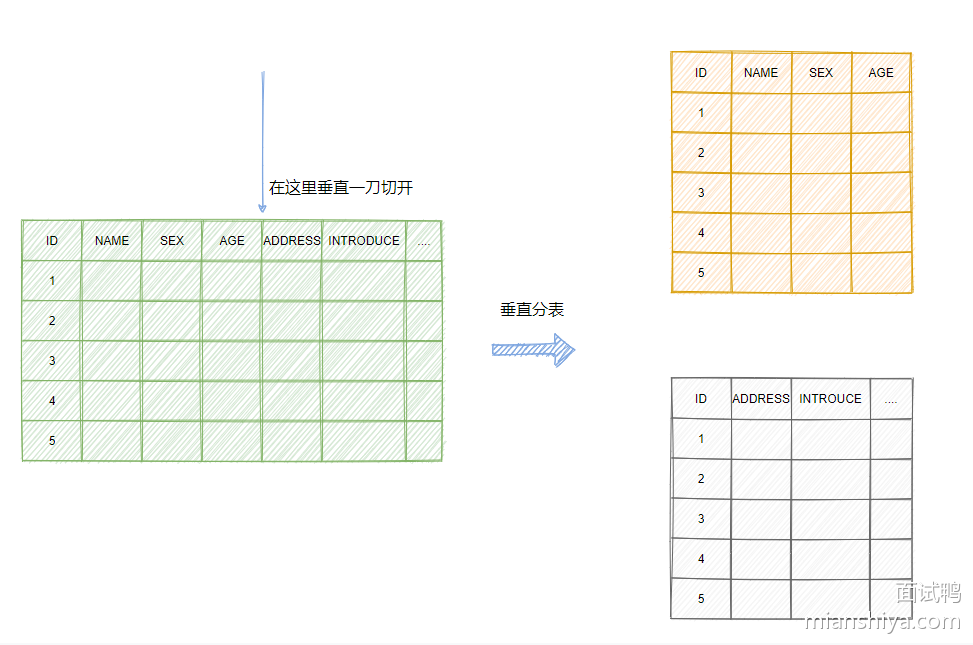

垂直分表就是把一些不常用的大字段剥离出去。

像上面的例子：用户名是很常见的搜索结果，性别和年龄占用的空间又不大，而地址和个人简介占用的空间相对而言就较大，我们都知道一个数据页的空间是有限的，把一些无用的数据拆分出去，一页就能存放更多行的数据。

内存存放更多有用的数据，就减少了磁盘的访问次数，性能就得到提升。

水平分表，则是因为一张表内的数据太多了，我们知道数据越多 B+ 树就越高，访问的性能就差，所以进行水平拆分。

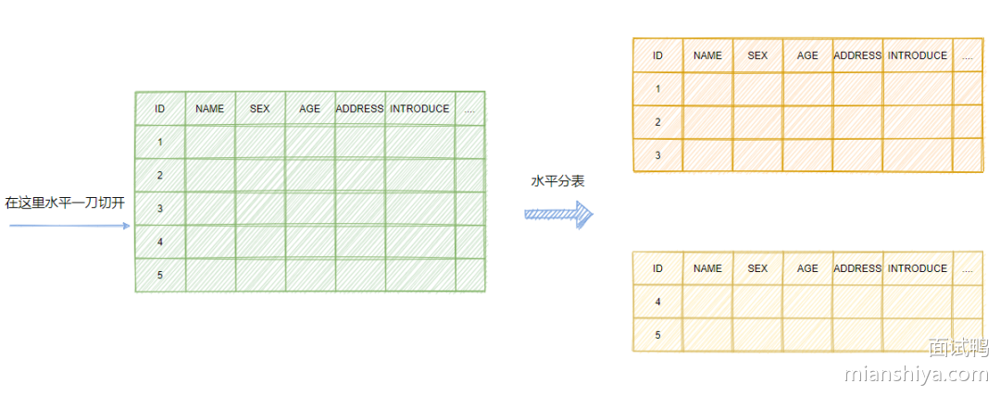

其实不管这些，浅显的理解下，在一百个数据里面找一个数据快，还是在一万个数据里面找一个数据快？

即使有索引，那厚的书目录多，翻目录也慢~

### MySQL 中的日志类型有哪些？binlog、redo log 和 undo log 的作用和区别是什么？ 

#### 回答重点

MySQL 是一款流行的关系型数据库，其日志是其关键功能之一。MySQL 包括三种类型的日志，分别是 binlog、redolog 和 undolog，它们分别有不同的作用和特点。

- binlog ，binlog（Binary log）是 MySQL 中的二进制日志文件，用于记录 MySQL 服务器上的所有更新和修改操作。它可以记录所有的 DDL（Data Definition Language）和 DML（Data Modification Language）操作，包括对表结构的更改、数据的插入、修改、删除等等。binlog是在事务提交后生成的，因此可以用于恢复数据库。
- redolog ，redolog（Redo log）用于恢复数据，保证数据的一致性和持久性。当 MySQL 发生修改时，redolog 会将这些操作记录下来，并写入磁盘。这样，当 MySQL 发生宕机或崩溃时，通过重放 redolog 就可以恢复数据。
- undolog，undolog（Undo log）用于回滚操作。当 MySQL 发生数据新增或修改时，undolog 会记录这些操作并将其写入磁盘。这样，当 MySQL 需要回滚时，通过重放 undolog 就可以回滚事务。

区别：

- binlog 和 redolog 都是 MySQL 中的二进制日志，但是它们的作用和实现方式有所不同。binlog 是 MySQL 记录所有的操作，而 redolog 则是用于保证数据的一致性和持久性。此外，binlog 是逻辑日志，redolog 是物理日志。binlog 记录的是SQL语句，而 redolog 记录的是数据页的修改，所以 binlog 可以跨平台使用，而 redolog 不能。undolog 和 redolog 的区别是，undolog 是用于回滚操作的，而 redolog 是用于恢复数据的。

### MySQL 中 INNER JOIN、LEFT JOIN 和 RIGHT JOIN 的区别是什么？ 

#### 回答重点

**INNER JOIN**：

- 只返回两个表中匹配的行。如果没有匹配，则该行不会出现在结果集中。
- 适用于只关心交集数据的场景。

**LEFT JOIN**（或 LEFT OUTER JOIN）：

- 返回左表中的所有行，即使右表中没有匹配的行。如果右表没有匹配，则结果中的右侧列会显示为NULL。
- 适用于需要保留左表所有数据的场景。

**RIGHT JOIN**（或 RIGHT OUTER JOIN）：

- 返回右表中的所有行，即使左表中没有匹配的行。如果左表没有匹配，则结果中的左侧列会显示为NULL。
- 适用于需要保留右表所有数据的场景。

#### 扩展知识

##### **代码示例**

**INNER JOIN**：

```sql
SELECT *
FROM table1
INNER JOIN table2 ON table1.id = table2.id;
```

**LEFT JOIN**：

```sql
SELECT *
FROM table1
LEFT JOIN table2 ON table1.id = table2.id;
```

**RIGHT JOIN**：

```sql
SELECT *
FROM table1
RIGHT JOIN table2 ON table1.id = table2.id;
```

##### **应用场景**

- INNER JOIN 适合用在只需要共同数据的结果集中。
- LEFT JOIN 在需要保留主表所有数据的报表中非常有用，比如在客户（左表）和订单表（右表）中查找所有客户及其订单信息，即使有些客户没有订单。
- RIGHT JOIN 则在需要保留右表所有数据的情况下使用，例如在处理员工（左表）和部门表（右表）时，确保显示所有部门，即使某些部门没有员工。

##### **NULL 值处理**

- 使用 LEFT JOIN 或 RIGHT JOIN 时，需注意处理结果集中可能出现的 NULL 值，以确保后续的数据处理逻辑正确。

##### 图示所有 JOIN

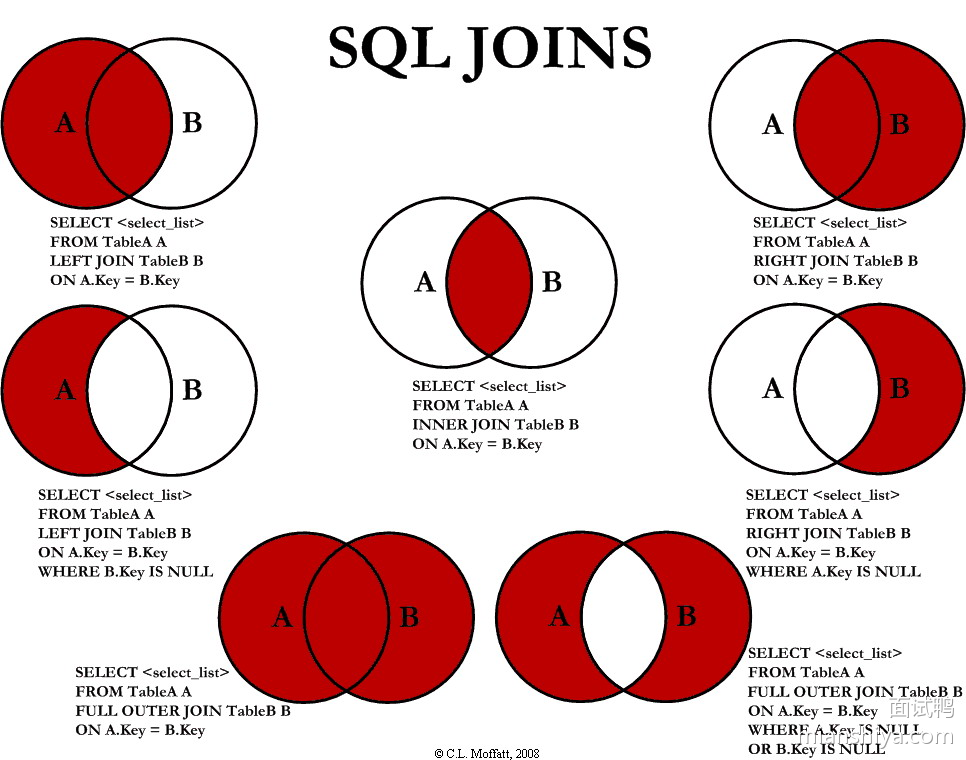

### 为什么在 MySQL 中不推荐使用多表 JOIN？ 

#### 回答重点

**性能问题**：

- 多表 JOIN 可能导致查询性能下降，尤其是在处理大数据集时，JOIN 操作的计算复杂度会显著增加，需要进行大量的数据扫描和匹配，增加了内存和CPU的消耗，导致响应时间变长。

**可读性和维护性**：

- 多表 JOIN 的查询语句较为复杂，降低了 SQL 的可读性和可维护性。复杂的语句可能会增加错误发生的概率，使得后续的调试和优化更加困难。

#### 扩展知识

##### 多表 JOIN

这里的多表往往指的是超过三个表才是多表，正常两个表 join 是没问题的！（但是也需要评估下量级和是否命中索引）

阿里的 Java 规范手册里也有一句话：“超过三个表禁止使用 Join”。

这是为什么呢？

其实数据量小都无所谓。但当数据量大的时候，影响就被放大了。如果让数据库来承担这个复杂的关联操作，需要对联接的每个表进行扫描、匹配和组合，消耗大量的 CPU 和内存资源。让复杂的关联操作占用了大量的数据库资源，会影响其他查询修改操作。

**数据库往往是我们系统的弱点**，很多情况下性能瓶颈都在数据库，**因此我们需要尽量避免把压力放在数据库上**。

所以不推荐多表 Join。

##### Join 时候的注意点

Join 的时候，需要关注被驱动表的查询**是否能命中索引**，不然就会导致全表扫描。

并且**尽量让小表做驱动表**，因为驱动表需要全表扫描，而被驱动表是通过索引查询的。

我们简单看下面的例子来理解一下：

例如执行 `select * from mianshiya1 straight_join mianshiya2 on (mianshiya1.a=mianshiya2.a);`

> straight_join 是指定的链接，让 `mianshiya1` 作为驱动表，`mianshiya2` 作为被驱动表

这条语句就需要全表扫描 `mianshiya1` ，然后将其中的 a 字段作为查询条件去 `mianshiya2` 进行搜索，所以我们要求 `mianshiya2` 的 a 字段有索引，这样查询的比较快。

> 那为什么要让小表作为驱动表呢？

假设驱动表 `mianshiya1` 的数据量为 A，被驱动表为 B，全表扫描驱动表的行数为 A ，每次扫描被驱动表 `mianshiya2` 命中二级索引，是搜索树，理论上查询一次的时间复杂度是 `log2B` ，可能还需要回表查询主键索引，也是搜索树，那么需要乘 2，所以是 `2log2B`。

一共要查询 A 次，因此整体的执行复杂度是 `A+2log2B*A`。

很显然，A 的值越大，时间复杂度越高，所以我们得让 A 小，所以选择小表驱动！

### 数据库的三大范式是什么？ 

#### 回答重点

**第一范式（1NF）**：

- 确保每个列的值都是原子值，表中的每个字段只能包含单一的数据项，**不允许重复的列和多值字段**。

**第二范式（2NF）**：

- 在满足第一范式的基础上，确保表中的每个非主键字段完全依赖于主键，而不是部分依赖。即，**非主键字段必须依赖于整个主键**。

**第三范式（3NF）**：

- 在满足第二范式的基础上，确保非主键字段之间不依赖，即消除传递依赖。**所有非主键字段只能依赖于主键，不应相互依赖。**

#### 扩展知识

##### 三大范式进一步理解

数据库的三大范式是数据库设计中常用的规范，它们的目的是**减少数据冗余，提高数据的完整性和一致性**，使得表的设计更清晰。

##### 第一范式（1NF）：规范化

**目的**：确保数据表的每一列都是单一值，消除重复的列，从而保证数据的原子性。

例如地址作为一个字段，实际上可以拆分成省、市、区等，所以这就不符合第一范式。

##### 第二范式（2NF）：消除部分依赖

**目的**：消除非主键字段对主键部分依赖，从而避免数据冗余和更新异常。

例如 【员工ID、员工姓名、部门ID、部门名】 为一张表，员工 ID 为主键。此时，员工姓名依赖员工ID，部门名依赖部门ID，这就违反了第二范式。

符合范式的设计是：员工表【员工ID、员工姓名、部门ID】，部门表【部门ID、部门名】。

##### 第三范式（3NF）：消除传递依赖

**目的**：消除非主键字段对主键的传递依赖，从而进一步减少数据冗余和更新异常。

例如 【员工ID、员工姓名、部门ID、部门名、经理ID】 为一张表，员工 ID 为主键。此时，经理 ID 依赖部门 ID，部门 ID 依赖员工ID，这说明有依赖传递，违反了第三范式。

符合范式的设计是：员工表【员工ID、员工姓名、部门ID】，部门表【部门ID、部门名、经理ID】。

小结

- 第一范式（1NF）：确保每一列都是原子值，即是不可分割的基础数据项。
- 第二范式（2NF）：在满足1NF的基础上，消除非主键字段对主键部分依赖。
- 第三范式（3NF）：在满足2NF的基础上，消除非主键字段对主键的传递依赖。

**不过现在业务上的表设计基本都是反范式的**。当然不是说完全不遵守范式，而是适当的进行调整。

比如业务上经常需要冗余字段，减少联表查询，提升性能，特别是业务量比较大的公司，这种冗余是很有必要的！

### 在 MySQL 中，你使用过哪些函数？

#### 回答重点

这道题目被问的几率不是很大，大家可以熟悉下，可以在实际开发中使用。

以下列举一些常用的函数类别：

**1）字符串函数，用于处理文本数据**：

- CONCAT：连接字符串。
- SUBSTRING：提取子字符串。
- LENGTH：返回字符串的长度。
- REPLACE：替换字符串中的子字符串。
- UPPER 和 LOWER：将字符串转换为大写或小写。
- TRIM：去除字符串两端的空格。
- LEFT 和 RIGHT：返回字符串左边或右边的字符。

**2）数学函数，用于处理数字运算**：

- ABS：返回绝对值。
- CEIL 和 FLOOR：返回大于或等于/小于或等于指定数的最小整数/最大整数。
- MOD：返回除法的余数。
- POWER：返回一个数的指定次幂。

**3）日期函数，用于处理日期和时间**：

- NOW：返回当前日期和时间。
- DATE_ADD 和 DATE_SUB：日期加上或减去一个时间间隔。
- DATEDIFF：计算两个日期之间的差异。
- YEAR、MONTH、DAY：提取日期的年份、月份、日期。
- STR_TO_DATE：将字符串转换为日期。

**4）聚合函数，用于汇总数据**：

- COUNT：计算行数。
- SUM：计算总和。
- AVG：计算平均值。
- MAX 和 MIN：返回最大值和最小值。

**5）条件函数，用于实现条件逻辑**：

- IF：条件判断函数。
- IFNULL：返回第一个非 NULL 值。
- CASE：条件选择函数。

### 为什么不推荐在 MySQL 中直接存储图片、音频、视频等大容量内容？ 

#### 回答重点

MySQL 是关系型数据库，**它设计的初衷是高效处理结构化和关系型数据**，所以存储大容量的内容本身就不是它的职责所在，因此这方面的能力也不够。

应该将大容量文件存储在文件系统或云服务提供的对象存储服务中，仅在数据库中存储文件的路径或 URL 即可。

#### 扩展知识

##### 数据库本身性能问题

- 数据库性能：存储和检索大容量的二进制数据（如图片、音频、视频）会显著增加数据库的 I/O 操作和处理时间，从而影响整体性能。
- 查询性能：大容量的二进制数据会增加数据表的大小，导致查询性能下降。尤其是在涉及表连接或复杂查询时，性能影响更大。

##### 可扩展性问题

文件系统可以通过分布式文件系统（如 Hadoop HDFS、Amazon S3）更容易地进行扩展，而数据库扩展则复杂得多。

##### 权限控制问题

像文件系统和对象存储系统（如 Amazon S3、OSS 等）通常提供更灵活的访问控制和权限管理机制，适合处理大容量数据的存储和访问，例如访问的时效性等等，而 MySQL 不提供这些功能，需要我们应用程序额外开发。

### MySQL 中 VARCHAR(100) 和 VARCHAR(10) 的区别是什么？ 

#### 回答重点

两者的区别就是能存储的**字符串长度上限不同**，字符数上限是由定义中的括号内的数字决定的。

- VARCHAR(100) 最多可以存储 100 个字符。
- VARCHAR(10) 最多可以存储 10 个字符。

两者存储**相同字符串**时占用的空间是一样的。除了存储字符本身外，还需要额外的 1 或 2 个字节来记录字符串的长度。对于长度小于 255 的字符串，使用 1 个字节；对于长度 255 及以上的字符串，使用 2 个字节。

虽然存储的空间一样，但是在查询时，即带上 `SORT`、`ORDER` 这些字段时，VARCHAR(100) 字段会使得查询所占用的内存空间更多，因为在排序相关内存分配时，它是按照固定大小的内存块进行保存，VARCHAR(100) 的内存块会大于 VARCHAR(10)。

#### 扩展知识

- [617. MySQL 中的数据排序是怎么实现的？](https://www.mianshiya.com/question/1780933295526146049)
- [615. MySQL 中 varchar 和 char 有什么区别？](https://www.mianshiya.com/question/1780933295517757442)

### SQL 中 select、from、join、where、group by、having、order by、limit 的执行顺序是什么？ 

#### 回答重点

| 执行顺序 | SQL 子句     | 说明                             |
| -------- | ------------ | -------------------------------- |
| 1        | **FROM**     | 确定数据源，执行表连接操作。     |
| 2        | **JOIN**     | 执行连接操作，结合多张表的数据。 |
| 3        | **WHERE**    | 过滤不符合条件的行。             |
| 4        | **GROUP BY** | 将数据按指定的列分组。           |
| 5        | **HAVING**   | 过滤分组后的数据。               |
| 6        | **SELECT**   | 选择要返回的列。                 |
| 7        | **ORDER BY** | 对查询结果进行排序。             |
| 8        | **LIMIT**    | 限制查询返回的行数。             |

具体可以参考下图：

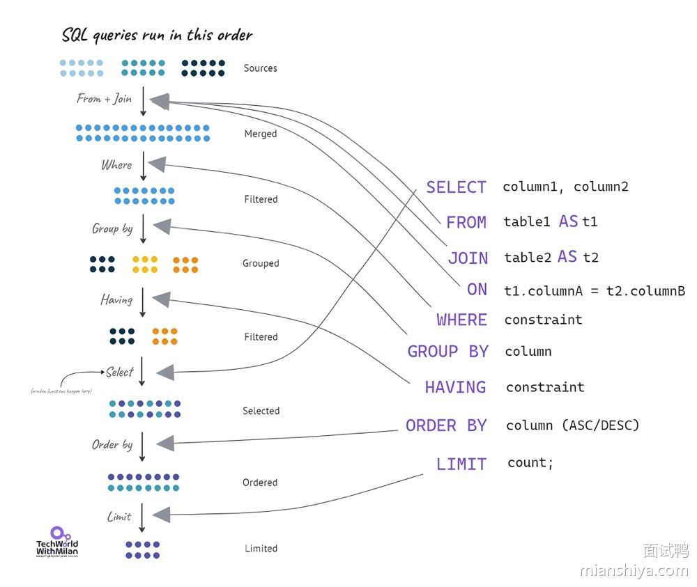

#### 扩展知识

##### SQL 查询的执行顺序进一步分析

1）**FROM**（确定数据源）

查询的执行首先从 **`FROM`** 子句开始，确定数据的来源（表、视图、连接等）。

2）**JOIN**（如果有 JOIN 操作）

在 **`FROM`** 子句之后，SQL 引擎会执行连接操作（`JOIN`），将多张表的数据结合起来。

3）**WHERE**（过滤行）

接下来，SQL 引擎会对来自 **`FROM`** 和 **`JOIN`** 的数据进行过滤，保留符合条件的行。**`WHERE`** 子句执行的是行级别的过滤。

4）**GROUP BY**（分组数据）

然后，SQL 引擎会按照 **`GROUP BY`** 子句中的字段进行分组操作，将数据分为若干组。

5）**HAVING**（过滤组）

**`HAVING`** 子句执行时会对已经分组的数据进行过滤，保留符合条件的组。与 **`WHERE`** 子句不同，**`HAVING`** 是用于过滤分组后的数据。

6）**SELECT**（选择列）

在经过上述的操作后，SQL 引擎会选择需要的列并进行返回。这个阶段是实际返回查询结果的地方。

7）**ORDER BY**（排序）

紧接着，SQL 引擎会按照 **`ORDER BY`** 子句中指定的列对结果进行排序。

8）**LIMIT**（限制返回的行数）

最后，**`LIMIT`** 子句限制查询结果的行数，只返回指定数量的行。

## Redis

### Redis 通常应用于哪些场景？ 

#### 回答重点

1）**缓存**：

- Redis 最常用的场景是作为缓存层，以减少数据库的负载，提高数据读取速度。例如，常用的用户会话数据和页面渲染结果可以存储在 Redis 中。

2）**实时系统**：

- Redis 支持快速的数据写入和读取，非常适合用于实时分析，如网站点击统计、实时排行榜等。

3）**消息队列**：

- 利用 Redis 的 List 和 Pub/Sub 功能，可以实现轻量级的消息队列，适用于任务处理和异步消息传递。

4）**分布式锁**：

- Redis 可以用作分布式锁的实现，确保在分布式系统中资源的安全访问，避免竞态条件。

5）**计数器**：

- Redis 的原子性操作非常适合用作计数器。例如，可以使用 Redis 来统计页面访问量、点赞数、评论数等。通过 INCR 命令可以轻松实现高效的计数。

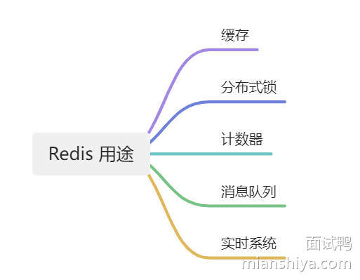

#### 扩展知识

Redis 的用途有很多，这里再介绍下回答重点提到的几个常见的场景，更多场景需要结合项目去进行拓展。

##### 1. Redis 缓存

因为 Redis 是基于内存的，其读写速度比 MySQL 基于磁盘的方式要快很多，所以其作为热点数据的缓存是非常合适的。使用 Redis 缓存可以极大地提高应用的响应速度和吞吐量。

举一个例子，如下图所示，用户访问 Web 服务的时候，可以先查询缓存，如果缓存未命中的话，去查询数据库（这里建议去查询数据库的时候加锁，防止多个请求同时打到数据库，导致数据库查询效率不高），如果数据库中有对应的数据，则写入 Redis 缓存中，并返回给用户，如果数据库没有对应的数据的话，可以写入 null 值到缓存中，应对缓存穿透问题。

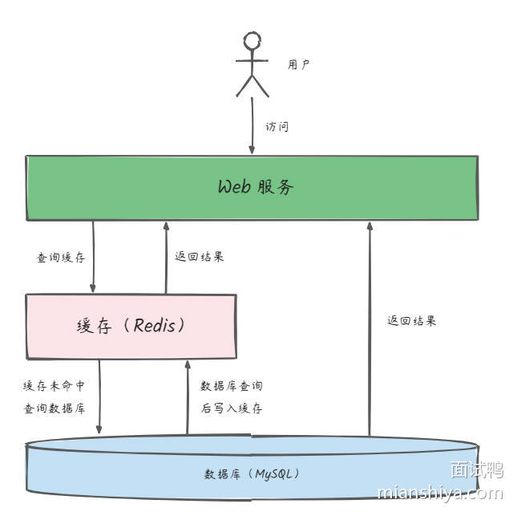

##### 2. 分布式锁

本地锁（synchronized、lock）在很多时候已经满足不了我们的需求，特别是现在大部分企业都使用了微服务框架，不同实例之间的锁需要依赖外部系统进行一致性锁定，因此就需要用上分布式锁。

Redis 就是很好的一个外部系统，它基于缓存使得加锁非常高效，天然的过期机制可以很好地避免死锁的发生，且配合 redission 这种封装好的类库，使用起来也非常简便：

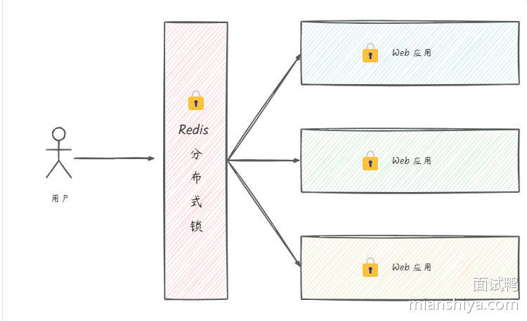

##### 3. 计数器

Redis 由于其单线程执行命令的特性，实现计数器非常方便，不会有锁的竞争。像文章的点赞数量就可以使用 Redis 实现。

再如一些**海量数据**的统计，例如大网站的访问统计、日活月活等，适合使用 Redis 提供的高级数据结构 HyperLogLog。

它基于基数估算算法实现。优点就是所需的内存不会随着集合的大小而改变，因此很适合大规模数据集统计的场景，不过它的统计值是不精确的，有一定的误差，但是在海量数据场景，这些误差一般是可以接受的。

##### 4. 消息队列

在一些简单场景，也可以利用 Redis 来实现消息队列功能。例如使用列表的 lpush 实现消息的发布，rpop 实现消息的消费。也可以使用 Redis 5.0 之后引入的 stream 这个数据结构来实现消息功能。

但是要注意，用 Redis 来实现消息队列肯定比不上正常的消息队列中间件，例如无法保证消息的持久性，即使有 aof 和 rdb 也无法保证消息一定不会丢。

在大型系统或正常的业务场景下，如果要使用消息队列还是得用 RocketMQ、Kafka 等，不推荐使用 Redis 来实现。

##### 5. 实时系统的构建

由于 Redis 高性能的特性，其经常被用于构建实时系统，比如抽奖、秒杀等，最常见的还有排行榜的实现，其可以使用 Redis 的 Zset 数据结构，根据用户的分数、时间等参数构建一个实时的排行榜。

主要就列举这些了，更多的场景可以结合你的项目去拓展，比如登录鉴权、限流、会话等，都是可以的。

### Redis 中常见的数据类型有哪些？ 

#### 回答重点

Redis 常见的数据结构主要有五种，这五种类型分别为：String(字符串)、List(列表)、Hash、Set(集合)、Zset(有序集合，也叫sorted set)。

##### String

字符串是Redis中最基本的数据类型，可以存储任何类型的数据，包括文本、数字和二进制数据。它的最大长度为512MB。

**使用场景**：

- **缓存**：存储临时数据，如用户会话、页面缓存。
- **计数器**：用于统计访问量、点赞数等，通过原子操作增加或减少。

```bash
SET user:1 "Alice"                 # 设置值
GET user:1                         # 获取值
INCR article:1001:views            # 自增计数
SETNX lock:order_123 "1" EX 30     # 分布式锁（不存在时设置，30秒过期）
```

##### Hash

哈希是一个键值对集合，适合存储对象的属性。Redis内部使用哈希表实现，适合小规模数据。

**使用场景**：

- **商品详情**：存储商品的各个属性，方便快速检索。

```bash
HSET user:1 name "Alice" age 25    # 设置字段
HGET user:1 name                   # 获取字段
HGETALL user:1                     # 获取所有字段
```

##### List

列表是有序的字符串集合，支持从两端推入和弹出元素，底层实现为双向链表。

**使用场景**：

- **消息队列**：用于简单任务调度、消息传递等场景，通过`LPUSH`和`RPOP`操作实现生产者消费者模式。
- **历史记录**：存储用户操作的历史记录，便于快速访问。

```bash
LPUSH news:latest "news1"          # 左侧插入
RPOP news:latest                   # 右侧弹出
LRANGE news:latest 0 9            # 获取前10条
```

##### Set

集合是无序且不重复的字符串集合，使用哈希表实现，支持快速查找和去重操作。

**使用场景**：

- **标签系统**：存储用户的兴趣标签，避免重复。
- **唯一用户集合**：记录访问过某个页面的唯一用户，方便进行分析。

```bash
SADD tags:1 "tech" "java"          # 添加元素
SMEMBERS tags:1                    # 获取所有元素
SINTER tags:1 tags:2               # 求交集（共同标签）
```

##### Sorted Set

有序集合类似于集合，但每个元素都有一个分数（score），用于排序。底层使用跳表实现，支持快速的范围查询。

**使用场景**：

- **排行榜**：存储用户分数，实现实时排行榜。
- **任务调度**：根据任务的优先级进行排序，方便调度执行。

```bash
ZADD leaderboard 100 "Alice"       # 添加带分值的元素
ZRANGE leaderboard 0 9 WITHSCORES  # 获取TOP10
ZREVRANK leaderboard "Alice"       # 查询排名
```

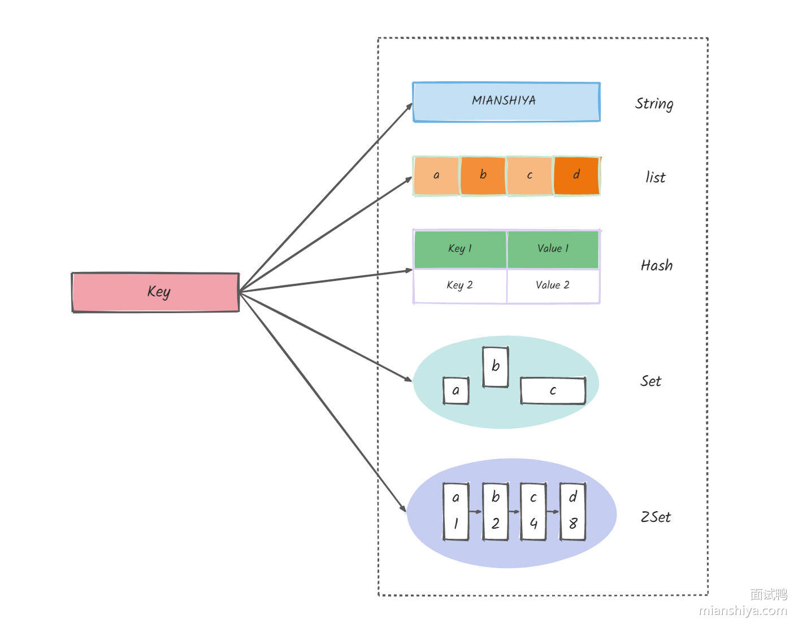

#### 扩展知识

##### 四种高级数据类型

随着 Redis 版本的更新，后面又增加 BitMap（2.2 版新增）、HyperLogLog（2.8 版新增）、GEO（3.2 版新增）、Stream（5.0 版新增）。

##### BitMap

BitMap 是一种以位为单位存储数据的高效方式，适合用来表示布尔值（如存在性、状态等）。每个 bit 可以表示一个状态（0 或 1），使用空间少且操作快速。

**使用示例**：假设要统计每天用户的在线状态，可以用 Bitmap 记录每个用户是否在线：

```redis
SETBIT user:online:2024-09-27 12345 1  # 用户 ID 12345 在 2024-09-27 在线
GETBIT user:online:2024-09-27 12345    # 获取用户 ID 12345 在该日期的在线状态
```

##### HyperLogLog

HyperLogLog 是一种概率性数据结构，主要用于估算基数（不同元素的数量），内存占用固定，适合处理大规模数据的去重和计数。

**使用示例**：假设要估算访问网站的独立用户数量：

```redis
PFADD unique:visitors user1 user2 user3  # 添加用户 ID
PFCOUNT unique:visitors                  # 估算独立用户数量
```

##### GEO

GEO 是 Redis 提供的一种用于存储地理位置信息的数据结构，可以存储经纬度信息并支持空间查询，例如计算距离和获取范围内的坐标。

**使用示例**：假设要存储城市的位置并查找距离某个城市在一定范围内的其他城市：

```redis
GEOADD cities 13.361389 38.115556 "Palermo"      # 添加城市
GEOADD cities 15.087269 37.502669 "Catania"      # 添加城市
GEODIST cities "Palermo" "Catania" "km"          # 计算两个城市之间的距离
GEORADIUS cities 15.0 37.5 100 km                # 查找指定范围内的城市
```

##### Stream

Stream 是 Redis 提供的一种日志数据结构，适合于存储时间序列数据或消息流。支持高效的消息生产和消费模式，具有持久性和序列化特性。

**使用示例**：假设要存储传感器数据流，可以使用 Stream 进行数据插入和消费：

```redis
XADD sensor:data * temperature 22.5 humidity 60  # 向 Stream 添加传感器数据
XRANGE sensor:data - +                           # 获取 Stream 中的所有数据
XREAD COUNT 10 STREAMS sensor:data $             # 读取新的传感器数据
```

##### Redis 9 种常见的基本数据类型应用场景汇总

- String ：缓存对象、计数器、分布式锁、分布式 session 等
- List：阻塞队列、消息队列（但是有两个问题：1. 生产者需要自行实现全局唯一 ID；2. 不能以消费组形式消费数据）等
- Hash：缓存对象、购物车等
- Set：集合聚合计算（并集、交集、差集）的场景，如点赞、共同关注、收藏等
- Zset：最典型的就是排行榜，这个也是面试中经常问到的点
- BitMap（2.2 版新增）：主要有 0 和 1 两种状态，可以用于签到统计、用户登录态判断等
- HyperLogLog（2.8 版新增）：海量数据基数统计的场景，有一定的误差，可以根据场景选择使用，常用于网页 PV、UV 的统计
- GEO（3.2 版新增）：存储地理位置信息的场景，比如说百度地图、高德地图、附近的人等
- Stream（5.0 版新增）：这个主要就是消息队列了，可以实现一个简单的消息，其相比 list 多了两个特性，分别是自动生成全局唯一消息ID以及支持以消费组形式消费数据（同一个消息可被分发给多个单消费者和消费者组），相比 pub/sub 它是可以被持久化。

##### 关联问题

- [661. Redis String 类型的底层实现是什么？（SDS）](https://www.mianshiya.com/question/1780933295681335298)
- [Redis 的 hash 是什么？](https://www.mianshiya.com/question/1780933295601643521)
- [Redis Zset 的实现原理是什么？](https://www.mianshiya.com/bank/1791375592078610434/question/1861688534670434305)
- [Redis 中的 Ziplist 和 Quicklist 数据结构的特点是什么？](https://www.mianshiya.com/bank/1791375592078610434/question/1799677102985125890)
- [Redis 的 ListPack 数据结构是什么？](https://www.mianshiya.com/bank/1791375592078610434/question/1799678566948216833)

### 你在项目中使用的 Redis 客户端是什么？ 

#### 回答重点

常见在项目中使用的客户端有以下三种：

- Jedis 适用于简单的同步操作和单线程环境。
- Lettuce 适用于高并发、高性能和多线程环境，尤其是需要异步和响应式编程的场景。
- Redisson 适用于复杂的分布式系统，提供丰富的分布式对象和服务，简化开发。

##### Jedis

Jedis 是一款比较经典的 Java 客户端了，里面提供了比较全面的 Redis 命令，也是使用最为广泛的 Redis 客户端。

Jedis 是一个用 Java 实现的 Redis 客户端库，它具有以下优点：

- 简单易用：提供了直观的 API，使得开发者能够方便地与 Redis 进行交互。
- 使用广泛：在 Java 社区中被广泛采用，有丰富的文档和示例可供参考。
- 性能良好：在大多数情况下能够提供高效的 Redis 操作。
- 功能丰富：支持常见的 Redis 操作，如字符串、列表、哈希、集合等数据结构的操作。

然而，Jedis 也存在一些缺点：

- 线程安全问题：线程不安全，每个线程需独立使用 Jedis 实例。
- 不支持自动重连：在网络异常或 Redis 服务器重启时，需要手动处理重连。
- 阻塞操作：同步的 API，因此高并发下可能会发生阻塞

##### Lettuce

Lettuce 其相对于 Jedis，其最突出的点就是线程安全，且其扩展性较高，从 SpringBoot 2.X 开始，Lettuce 逐渐取代 Jedis 成为 SpringBoot 默认的 Redis 客户端。它支持异步和响应式 API，底层基于 Netty 实现。

Lettuce 的优点包括：

- 多线程安全：在多线程环境中可以安全使用。
- 高性能：提供了高效的 Redis API 操作性能。
- 自动重连：当网络连接出现问题时，能够自动重新连接。
- 支持多种编程模型：同步、异步、响应式，适应不同的应用场景

缺点：

- 学习曲线较陡：API 相对复杂，学习曲线较高。
- 资源消耗：异步和响应式 API 可能会消耗更多的资源，需要仔细调优。

##### Redisson

Redisson 是一个高级的 Redis 客户端，提供分布式和并行编程的支持，提供了丰富的分布式对象和服务，底层也是基于 Netty 实现通信。

优点：

- 易用性：简化了 Redis 操作，提供了简洁的 API。
- 高级特性：支持分布式锁、缓存、队列等常见场景。
- 支持集群：支持 Redis 集群模式，适应大规模分布式应用。
- 线程安全：无需手动处理多线程问题。
- 高性能：优化的底层实现，提高性能。
- 稳定性：经过广泛使用和验证。

缺点：

- 学习成本：需要一定时间来熟悉其 API 和特性。
- 可能的依赖问题：与其他库的兼容性可能需要注意。

#### 扩展知识

- [6305. 说说 Redisson 分布式锁的原理?](https://www.mianshiya.com/question/1833406734003052546)

### 为什么 Redis 设计为单线程？6.0 版本为何引入多线程？ 

#### 回答重点

**单线程设计原因**：

1. Redis 的操作是基于内存的，其大多数操作的性能瓶颈主要不是 CPU 导致的
2. 使用单线程模型，代码简便的同时也减少了线程上下文切换带来的性能开销
3. Redis 在单线程的情况下，使用 I/O 多路复用模型就可以提高 Redis 的 I/O 利用率了

**6.0 版本引入多线程的原因**：

1. 随着数据规模的增长、请求量的增多，Redis 的执行瓶颈主要在于⽹络 I/O。引入多线程处理可以提高网络 I/O处理速度。

#### 扩展知识

我们所说的 Redis 单线程，主要指的是 Redis 网络 I/O 和键值对读写这些操作是由一个线程完成的。（持久化、集群等机制其实是有后台线程执行的）

不过 Redis 并不是一直都单线程的，在 4.0 之后就开始引入了多线程指令，6.0 之后便正式引入了多线程的机制，不过 **这里的多线程其只是针对网络请求过程使用多线程，其对于数据读写命令的处理依旧是单线程的**。

##### 为什么 Redis 前期不使用多线程的方式，等到 6.0 却又引入呢？

主要是因为我们对 Redis 的性能有了更高的要求，因为随着业务愈加复杂，公司需要的 QPS 就越高了，为了提升 QPS ，最直接的做法就是搭建 Redis 的集群，即提高 Redis 的机器数，但是这种做法的资源消耗是巨大的。

而 Redis 单线程执行命令的性能瓶颈在网络 I/O ，虽然它采用了多路复用技术，但 **I/O 多路复用模型本质还是同步I/O**。


从上面这个图中我们可以看到，I/O 多路复用在处理网络请求的时候，其调用 select（或是 epoll 等）后，如果来数据了，那么将数据从内核拷贝到用户空间这一步是同步的（关于 I/O 场景，阻塞、同步等名词意义请看扩展知识），即用户线程需要等待数据拷贝完成（在 redis 场景就是无法处理命令了），**如果并发量很高的话，这个过程可能会成为瓶颈**。

综上所示，我们可以发现，多路复用+单线程的设计并不能很好地解决网络 I/O 瓶颈的问题，这个时候就可以考虑利用 CPU 的多核优势，即利用多线程处理网络请求的方式来提高效率，然后对于读写命令， Redis 依旧采用单线程命令。

##### **Redis 引入多线程之后，有没有带来什么线程安全问题呢**？

没有，因为 Redis 6.0 只有针对网络请求模块采用的是多线程，对于读写命令部分还是采用单线程，所以所谓的线程安全问题就不存在了。

Redis 6.0 的多线程默认是禁⽤的，只使⽤主线程，因为大部分公司并发量实际上还是用不上这个。

如果要开启需要配置 `io-threads-do-reads`参数为 `yes`。

##### I/O 模型

[五种 I/O 模型](https://www.mianshiya.com/bank/1804354610222800897/question/1804476796656885762)

[同步、异步、阻塞、非阻塞的I/O的区别？](https://www.mianshiya.com/question/1780933295844913153)


### Redis 实现分布式锁时可能遇到的问题有哪些？ 

#### 回答重点

1. 业务未执行完，锁已到期
2. 单点故障问题
3. 主从问题不同步问题
4. 网络分区问题
5. 时钟漂移问题
6. 锁的可重入性问题
7. 误释放锁问题

#### 扩展知识

##### 业务未执行完，锁已到期

为了避免持有锁的客户端崩溃或因网络问题断开连接时，锁无法被正常释放，需要给锁设置过期时间。

那么就有可能出现业务还在执行，锁已到期的情况。

可以设置一种续约机制（Redisson 中的看门狗机制），线程 a 在执行的时候，设置一个超时时间，并且启动一个守护线程，守护线程每隔一段时间就去判断线程 a 的执行情况，如果 a 还没有执行完毕并且 a 的时间快过期了，就重新设置一下超时时间，即继续续约。

锁的过期时间的设置也需要好好评估一下。

如果设置太长，业务结束了它还在阻塞的话，会影响 Redis 的性能。如果设置太短，就出现刚说的问题，因此要保证是设置一个合理的时间**使得在大多数情况下任务能够在锁过期之前完成**。

##### 单点故障问题

如果 Redis 单机部署，当实例宕机或不可用，整个分布式锁服务将无法正常工作，阻塞业务的正常执行。

##### 主从问题

如果线上 Redis 是主从+哨兵部署的，则分布式锁可能会有问题。

因为 Redis 的主从复制过程是异步实现的，如果 Redis 主节点获取到锁之后，还没同步到其他的从节点，此时 Redis 主节点发生宕机了，这个时候新的主节点上没锁的数据，因此其他客户端可以获取锁，就会导致多个应用服务同时获取锁。

##### 网络分区

在网络不稳定的情况下，客户端与 Redis 之间的连接可能中断，如果未设置锁的过期时间，可能会导致锁无法正常释放。如果有多个锁，还可能引发锁的死锁情况。

##### 时钟漂移

因为 Redis 分布式锁依赖于实例的时间来判断是否过期，如果时钟出现漂移，很可能导致锁直接失效。

可以让所有节点的系统时钟通过 NTP 服务进行同步，减少时钟漂移的影响。

### Redis 中如何实现分布式锁？ 

#### 回答重点

在 Redis 中实现分布式锁的常见方法是通过`set ex nx` 命令 + lua 脚本组合使用。确保多个客户端不会获得同一个资源锁的同时，也保证了安全解锁和意外情况下锁的自动释放。

#### 扩展知识

##### 理解 Redis 实现的分布式锁

如果基于 Redis 来实现分布锁，需要利用 `set ex nx` 命令 + lua 脚本。

1）加锁：`SET lock_key uniqueValue EX expire_time NX` 

2）解锁：使用 lua 脚本，先通过 get 获取 key 的 value 判断锁是否是自己加的，如果是则 del。

lua 脚本如下：

```lua
if redis.call("GET",KEYS[1]) == ARGV[1]
then
    return redis.call("DEL",KEYS[1])
else
    return 0
end
```

我们来一一理解一下。

首先**锁需要有过期机制**。假设某个客户端加了锁之后宕机了，锁没有设置过期机制，会使得其他客户端都无法抢到锁。

`EX expire_time` 就是设置了锁的过期，单位是秒。还一个 `PX`， 也是过期时间，单位是毫秒。

然后，在 2.6.12 版本之前只有 `SETNX` 即 SET if Not eXists，它表示如果 key 已存在，则什么都不会做，返回 0，如果不存在则会设置它的值，返回 1。

那个时候 `SETNX` 和过期时间的设置就无法保证原子性，如果客户端在发送完 `SETNX` 之后就宕机了，还没来得及设置过期时间，一样会导致锁不会被释放。

因此 2.6.12 版本之后，优化了 SET 命令，使得可以执行 `set ex px`。

最后，再解释下什么是 `uniqueValue`，翻译过来就是一个唯一的值。

之所以要设置唯一值是为了**防止被别的客户端给释放了**。

我们来看下这个场景：

1. 客户端 1 加锁成功，然后执行业务逻辑，但执行的时间超过了锁的过期时间
2. 此时锁已经过期被释放了，客户端 2 加锁成功
3. 客户端 2 执行业务逻辑
4. 客户端 1 执行完了，执行释放锁的逻辑，即删除锁。

客户端 2 一脸懵，我还在执行着呢，怎么锁被人释放了？？

所以每个客户端加锁（客户端可能是每个线程），需要是设置一个唯一标识，比如一个 uuid，防止锁被别的客户端误释放了。

因为需要先判断锁的值和唯一标识是否一致，一致后再删除释放锁，这里就涉及到两步操作，只有使用了 lua 脚本才能保证原子性，这也是为什么释放锁需要用 lua 脚本的原因。

##### 单点故障问题

单台 Redis 实现分布式锁存在单点故障问题，如果采用主从读写分离架构，如果一个客户端在主节点上锁成功，但是主节点突然宕机，由于主从延迟导致从节点还未同步到这个锁，此时可能有另一个客户端抢到新晋升的主节点，此时会导致两个客户端抢到锁，产生了数据不一致。

基于这个情况，Redis 推出了 Redlock。

##### Redlock 红锁

Redlock 是 Redis 官方推荐的一种实现分布式锁的算法，适用于集群环境下。

**Redlock 的基本思想**：

- 部署多个 Redis 实例（通常为 5 个）。
- 客户端在大多数实例（如至少 3 个）上请求锁，并在一定时间内获得成功，表示加锁成功。
- 使用 Redlock 可以提供更高的容错性，即使部分 Redis 实例故障，仍然可以获得锁。

**Redlock 的实现流程**：

- 客户端尝试在每个 Redis 实例上加锁，必须在有限时间内（通常为锁的过期时间）完成所有实例的加锁。
- 如果大多数实例（N/2 + 1）加锁成功，则表示加锁成功。
- 否则，客户端将释放所有已经加锁的实例，重新尝试。

**Redlock 的缺点包括**：

- **复杂性**：实现 Redlock 需要多个 Redis 实例，增加了系统的复杂性和维护成本。
- **时间同步依赖**：Redlock 依赖于多个节点的系统时间的一致性。如果节点之间的时间不同步（例如发生时间回拨），可能导致锁的有效性受到影响。
- **不适用于高并发**：在高并发场景下，因需要访问多个实例同时尝试获取锁，可能会导致锁获取的性能下降。
- **锁的续期问题**：在长时间的操作中，可能需要手动续期锁，因为涉及多个实例，增加了实现的复杂度和风险。
- [Redis 的 Red Lock 是什么？你了解吗？](https://www.mianshiya.com/bank/1791375592078610434/question/1780933295664558082)

##### Redis 分布锁注意事项以及其它常见分布式锁的实现

- [Redis 分布锁注意事项以及其它常见分布式锁的实现](https://www.mianshiya.com/question/1800458377811533825)
- [Redisson 分布式锁的原理](https://www.mianshiya.com/question/1833406734003052546)
- [10745. Redisson 看门狗（watch dog）机制了解吗？](https://www.mianshiya.com/bank/1791375592078610434/question/1869931978230796290)

### 说说 Redisson 分布式锁的原理? 

#### 回答重点

Redisson 是**基于 Redis 实现的分布式锁**，实际上是使用 Redis 的原子操作来确保多线程、多进程或多节点系统中，只有一个线程能获得锁，避免并发操作导致的数据不一致问题。

1）**锁的获取**：

- Redisson 使用 Lua 脚本，利用 `exists` + `hexists` + `hincrby` 命令来保证只有一个线程能成功设置键（表示获得锁）。
- 同时，Redisson 会通过 `pexpire` 命令为锁设置过期时间，防止因宕机等原因导致锁无法释放（即死锁问题）。

2）**锁的续期**：

- 为了防止锁在持有过程中过期导致其他线程抢占锁，Redisson 实现了锁自动续期的功能。持有锁的线程会定期续期，即更新锁的过期时间，确保任务没有完成时锁不会失效。

3）**锁的释放**：

- 锁释放时，Redisson 也是通过 Lua 脚本保证释放操作的原子性。利用 `hexists` + `del` 确保只有持有锁的线程才能释放锁，防止误释放锁的情况。
- Lua 脚本同时利用 `publish` 命令，广播唤醒其它等待的线程。

4）**可重入锁**：

- Redisson 支持可重入锁，持有锁的线程可以多次获取同一把锁而不会被阻塞。具体是利用 Redis 中的哈希结构，哈希中的 key 为线程 ID，如果重入则 `value +1`，如果释放则 `value -1`，减到 0 说明锁被释放了，则 `del` 锁。

#### 扩展知识

##### Redisson 分布式锁 lua 相关源码解析

**加锁的代码：**

```java
    <T> RFuture<T> tryLockInnerAsync(long waitTime, long leaseTime, TimeUnit unit, long threadId, RedisStrictCommand<T> command) {
        return commandExecutor.syncedEval(getRawName(), LongCodec.INSTANCE, command,
                "if ((redis.call('exists', KEYS[1]) == 0) " +
                            "or (redis.call('hexists', KEYS[1], ARGV[2]) == 1)) then " +
                        "redis.call('hincrby', KEYS[1], ARGV[2], 1); " +
                        "redis.call('pexpire', KEYS[1], ARGV[1]); " +
                        "return nil; " +
                    "end; " +
                    "return redis.call('pttl', KEYS[1]);",
                Collections.singletonList(getRawName()), unit.toMillis(leaseTime), getLockName(threadId));
    }
```

> hincrby: 如果哈希表的 key 不存在，会创建新的哈希表并执行 hincrby 命令

`if + or` 的逻辑可能不好理解，我把上述的 lua 脚本拆开来看（以下脚本的效果同上）：

```java
if (redis.call('exists', KEYS[1]) == 0) then 
    redis.call('hincrby', KEYS[1], ARGV[2], 1); 
    redis.call('pexpire', KEYS[1], ARGV[1]); 
    return nil; 
    end;
    
if (redis.call('hexists', KEYS[1], ARGV[2]) == 1) then
    redis.call('hincrby', KEYS[1], ARGV[2], 1);
    redis.call('pexpire', KEYS[1], ARGV[1]);
    return nil;
    end;

return redis.call('pttl', KEYS[1]);
```

**上述的 lua 脚本含义如下**：

**1）若锁不存在，则新增锁，并设置锁重入计数为 1 且设置锁过期时间**

```pgsql
if (redis.call('exists', KEYS[1]) == 0) then 
    redis.call('hincrby', KEYS[1], ARGV[2], 1); 
    redis.call('pexpire', KEYS[1], ARGV[1]); 
    return nil; 
    end;
```

**2）若锁存在，且唯一标识（线程id相关）也匹配，则当前加锁请求为锁的重入请求，哈希的重入计数+1，并再次设置锁过期时间**

```prolog
if (redis.call('hexists', KEYS[1], ARGV[2]) == 1) then
    redis.call('hincrby', KEYS[1], ARGV[2], 1);
    redis.call('pexpire', KEYS[1], ARGV[1]);
    return nil;
    end;
```

**3）若锁存在，但唯一标识不匹配，则说明锁被其他线程占用，当前线程无法解锁，直接返回锁剩余过期时间(pttl)**

```aspectj
return redis.call('pttl', KEYS[1]);
```

上述脚本中，几个参数的含义如下：

```stylus
KEYS[1] = Collections.singletonList(getRawName())
ARGV[1] = unit.toMillis(leaseTime)
ARGV[2] = getLockName(threadId)
```

**释放锁的代码：**

```java
protected RFuture<Boolean> unlockInnerAsync(long threadId) {
        return evalWriteAsync(getRawName(), LongCodec.INSTANCE, RedisCommands.EVAL_BOOLEAN,
              "if (redis.call('hexists', KEYS[1], ARGV[3]) == 0) then " +
                        "return nil;" +
                    "end; " +
                    "local counter = redis.call('hincrby', KEYS[1], ARGV[3], -1); " +
                    "if (counter > 0) then " +
                        "redis.call('pexpire', KEYS[1], ARGV[2]); " +
                        "return 0; " +
                    "else " +
                        "redis.call('del', KEYS[1]); " +
                        "redis.call('publish', KEYS[2], ARGV[1]); " +
                        "return 1; " +
                    "end; " +
                    "return nil;",
                Arrays.asList(getRawName(), getChannelName()), LockPubSub.UNLOCK_MESSAGE, internalLockLeaseTime, getLockName(threadId));
    }
```

**上述的 lua 脚本含义如下**：

**1）若锁不存在，直接返回不需要解锁**

```ruby
if (redis.call('hexists', KEYS[1], ARGV[3]) == 0) then 
    return nil;
end; 
```

**2）若锁存在，且唯一标识（线程id相关）也匹配，计数 - 1，如果此时计数还大于 0 ，再次设置锁过期时间**

```apache
local counter = redis.call('hincrby', KEYS[1], ARGV[3], -1);
if (counter > 0) then 
    redis.call('pexpire', KEYS[1], ARGV[2]);
return 0; 
```

**3）若计数小于等于 0 ，则删除 key ，且通过广播通知其它等待锁的线程，此时释放锁了**

```autoit
else
    redis.call('del', KEYS[1]);
    redis.call('publish', KEYS[2], ARGV[1]);
return 1;
```

上述脚本中，几个参数的含义如下：

Arrays.asList(getRawName(), getChannelName()), LockPubSub.UNLOCK_MESSAGE, internalLockLeaseTime, getLockName(threadId)

```stylus
KEYS[1] = getRawName()
KEYS[2] = getChannelName()
ARGV[1] = LockPubSub.UNLOCK_MESSAGE
ARGV[2] = internalLockLeaseTime
ARGV[3] = getLockName(threadId)
```

##### **Redisson 的锁类型**：

- **公平锁**：与可重入锁类似，公平锁确保多个线程按请求锁的顺序获得锁。
- **读写锁**：支持读写分离。多个线程可以同时获得读锁，而写锁是独占的。
- **信号量与可数锁**：允许多个线程同时持有锁，适用于资源的限流和控制。

##### Redis分布式锁

关于上述的 SETNX、Lua 脚本释放锁等，看参考下面这个面试题

- [655.Redis 中如何实现分布式锁？](https://www.mianshiya.com/question/1780933295660363778)

##### 锁过期和网络分区补充

- **锁过期问题**：在 Redis 中，通过 `SETNX` 获取的锁通常带有过期时间。如果业务逻辑执行时间超过锁的过期时间，可能会出现锁被其他线程重新获取的问题。Redisson 通过锁的续期机制解决了这个问题。
- **网络分区问题**：Redis 是基于主从复制的，在主从切换或发生网络分区时，锁可能出现不一致的情况（如主节点锁还存在，副节点却因为主从切换失去了锁）。为解决这一问题，业界提出了 Redlock 算法，Redisson 也可以使用此算法确保锁的高可用性。


### Redis 中如何保证缓存与数据库的数据一致性？

#### 回答重点

缓存和数据库的同步可以通过以下几种方式:

1）先更新缓存，再更新数据库

2）先更新数据库存，再更新缓存

3）先删除缓存，再更新数据库，后续等查询把数据库的数据回种到缓存中

4）先更新数据库，再删除缓存，后续等查询把数据库的数据回种到缓存中

5）缓存双删策略。更新数据库之前，删除一次缓存；更新完数据库后，再进行一次延迟删除

6）使用 Binlog 异步更新缓存，监听数据库的 Binlog 变化，通过异步方式更新 Redis 缓存

以上就是实现数据库与缓存一致性的六种方式，这里前面三种都不太推荐使用，后面三种的话其主要根据实际场景：

- 如果是要考虑实时一致性的话，先写 MySQL，再删除 Redis 应该是较为优的方案，虽然短期内数据可能不一致，不过其能尽量保证数据的一致性。
- 如果考虑最终一致性的话，推荐的是使用 binlog + 消息队列的方式，这个方案其有重试和顺序消费，能够最大限度地保证缓存与数据库的最终一致性。


#### 扩展知识

我们以 MySQL 和 Redis 为主要实现的案例对上述几个方案再进行展开分析。

##### 先更新缓存，再更新数据库


由于网络原因，请求顺序无法保证，可能出现先更新缓存的请求，后更新数据库，而后更新缓存的请求反而先更新了数据库，这样就出现了缓存数据为 20，数据库数据为 10，即数据不一致的情况。

##### 先写数据库，再写缓存


这个问题上面其实一样，都是因为并发和网络问题导致的数据库与缓存不一致。

##### 先删除缓存再写数据库


盘一下流程：

1. 请求 A 先对缓存中的数据进行删除操作。
2. 请求 B 这个时候来执行查询，发现缓存中数据为空，就去数据库进行查询并回写缓存。
3. 这个时候请求 A 删除缓存中的数据之后，进行数据库数据的更新。
4. 但此时请求 B 已经把从数据库查询到的原始数据回写缓存了，这个时候就出现了上图的情况，数据库中查询的值是 20，而缓存中的数据是 10 。

读操作获取到的数据是过时的数据，虽然写操作已经完成了，但是因为缓存被删除了，读操作就必须从数据库中读取到旧值，并不是最新的数据。

##### 缓存双删（先删除缓存，再写数据库，然后过一段时间再删除缓存）


这个方案为了避免旧数据被回种，等待一段时间后再延迟删除缓存。

也可以使用消息队列、定时任务或者延迟任务等方式去实现延迟删除：


##### 先写数据库，再删除缓存


先把数据库的信息修改了，然后再删除对应的缓存，然后在修改数据库期间，可以允许一定时间的缓存不一致，保证缓存的最终一致性。

不过这种模型也有一定的问题，如下图所示：


其主要原因在于有一个写操作，此时刚好缓存失效，又在同一时刻刚好有一个并发读请求过来，且回写缓存的请求晚于缓存删除，导致数据库与缓存的不一致。

从上面的表述可以知道，这个发生的概率比较低，一般而言业务上都会使用这个方案。

##### 先写数据库，通过 Binlog ,异步更新缓存


先修改数据库，然后通过 Canal 监听数据库的 binlog 日志，记录数据库的修改信息，然后通过消息队列异步修改缓存的数据。

这里需要注意需要保证顺序消费，保证缓存中数据按顺序更新，然后再加上重试机制，避免因为网络问题导致更新失败。

##### 强一致性补充

可以使用分布式读写锁实现强一致性。读写锁中读和读操作不互斥，读写互斥，写写互斥。

**写操作流程**：

- 获取写锁。
- 更新数据库。
- 删除缓存。
- 释放写锁。

**读操作流程**：

- 获取读锁。
- 查询缓存：如果命中缓存，释放读锁，返回结果。如果缓存未命中，读取数据库，并将数据更新到缓存。
- 释放读锁。

### Redis 中有哪些内存淘汰策略？ 

#### 回答重点

Redis 的内存淘汰策略一共有 8 种。 8 种里面可以细分为两大类，即**开启数据淘汰**和**不开启数据淘汰**两大类，然后开启数据的那一类又可以进行细分，分为**基于过期时间的淘汰策略**以及**全部数据的淘汰策略**。

**不淘汰数据（默认）**：

- noeviction：当运行内存超过最大设置内存的时候，不会淘汰数据，而是直接返回报错禁止写入

**设置了过期时间的数据淘汰**：

- volatile-random：随机淘汰掉设置了过期时间的 key
- volatile-ttl：优先淘汰掉较早过期的 key
- volatile-lru（redis3.0之前默认策略）：淘汰掉所有设置了过期时间的，然后最久未使用的 key
- volatile-lfu（redis4.0后新增）：与上面类似，不过是淘汰掉最少使用的 key

**所有数据的数据淘汰**：

- allkeys-random：随机淘汰掉任意的 key
- allkeys-lru：淘汰掉缓存中最久没有使用的 key
- allkeys-lfu（redis4.0后新增）：淘汰掉缓存中最少使用的 key


#### 扩展知识

##### 不同淘汰策略适用场景

- `noeviction`：适用于所有数据都被持久化或避免丢失任何数据的场景。
- `allkeys-lru`：适用于希望保证最常访问的数据在内存中的场景。如电商促销活动中，某些商品会在短时间内被频繁访问，此时不会被淘汰。
- `allkeys-lfu`：适用于希望保证访问频率最高的数据在内存中的场景。如社交媒体或直播类应用中，某些热点内容访问次数高，不能被淘汰。
- `allkeys-random`：适用于对数据没有严格的优先级需求。
- `volatile-lru`：同`allkeys-lru`，仅只关心设置了过期时间的键。
- `volatile-random`：同`allkeys-random`，仅只关心设置了过期时间的键。
- `volatile-ttl`：适用于对实时性较敏感的场景，比如存储用户会话等。
- `volatile-lfu`：同`allkeys-lfu`，仅只关心设置了过期时间的键。

##### noeviction 演示

通过 `config set maxmeory` 先将其内存大小修改至 2 字节，然后设置一个超过 2 字节的字符串值 99999，其会报一个 OOM 的错误，并且不允许写入。


不过需要注意一个点，虽然其不支持写入数据，但是已有的数据并不会删除，其还是可以进行查询和删除操作，如下图所示，这里演示了 keys * 指令，发现其执行结果正常。

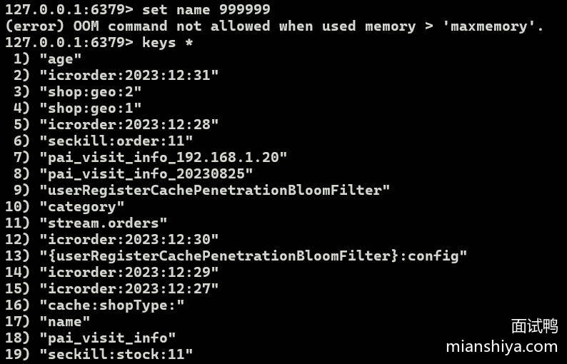

这里补充一个知识点，如果不设置最大内存大小或者设置最大内存大小为 0 的话，在 64 位操作系统下不限制内存大小，在 32 位操作系统下最多使用 3 GB 内存。

##### 内存淘汰配置

可以通过修改 Redis 配置文件（`redis.conf`）中的 `maxmemory-policy` 参数来设置不同的内存淘汰策略（配置后需要重启 redis，且后续重启后配置不会丢失）。

例如：

```conf
maxmemory-policy allkeys-lru
```

或者通过 Redis 命令动态设置（立即生效，不需要重启，但是重启后就失效了）：

```sh
CONFIG SET maxmemory-policy allkeys-lru
```

### Redis 为什么这么快？ 

#### 回答重点

主要有 3 个方面的原因，分别是存储方式、优秀的线程模型以及 IO 模型、高效的数据结构。

- Redis 将数据存储在内存中，提供快速的读写速度，相比于传统的磁盘数据库，内存访问速度快得多。
- Redis 使用单线程事件驱动模型结合 I/O 多路复用，避免了多线程上下文切换和竞争条件，提高了并发处理效率。
- Redis 提供多种高效的数据结构（如字符串、哈希、列表、集合等），这些结构经过优化，能够快速完成各种操作

#### 扩展知识

##### 存储方式

Redis 的存储是**基于内存**的，直接访问内存的速度是远远大于访问磁盘的速度的。


一般情况下，计算机访问一次 SSD 磁盘的时间大概是 50 ~ 150 微秒，如果是传统硬盘的话，需要的时间会更长，可能需要 1 ~ 10 毫秒，而你访问一次内存，其需要的时间大概是 120 纳秒。由此可见，其访问的速度差了快一千倍左右。

除了一些场景，比如说持久化，Redis 很少需要与磁盘进行交互，大多数时候 Redis 的读写是基于内存的，因此其效率较高。

##### 优秀的线程模型以及 IO 模型

Redis 使用单个主线程来执行命令，不需要进行线程切换，避免了上下文切换带来的性能开销，大大提高了 Redis 的运行效率和响应速度。

Redis 采用了 I/O 多路复用技术，实现了单个线程同时处理多个客户端连接的能力，从而提高 Redis 的并发能力。

不过 Redis 并不是一直都是单线程的，自 4.0 开始，Redis 就引入了 Unlink 这类命令，用于异步执行删除等操作，还有在 6.0 之后，Redis 为了进一步提升 I/O 的性能，引入了多线程的机制，利用多线程的机制并发处理网络请求，从而减少 Redis 由于网络 I/O 等待造成的影响。


##### 高效的数据结构

Redis 本身提供了丰富的数据结构，比如字符串、哈希、Zset 等，这些数据结构大多操作的时间复杂度都为 O(1)。


备注：答案中的图来自 ByteByteGo：*https://blog.bytebytego.com/p/why-is-redis-so-fast*

##### 五种 I/O 模型

- [1460. 说说你知道的几种 I/O 模型](https://www.mianshiya.com/question/1804476796656885762)

##### Select、Poll、Epoll

- [722. Select、Poll、Epoll 之间有什么区别？](https://www.mianshiya.com/question/1780933295857496065)

##### Redis 中常见的数据类型（数据结构）

- [637. Redis 中常见的数据类型有哪些？](https://www.mianshiya.com/bank/1791375592078610434/question/1780933295593254915)
- [5206. Redis 源码中有哪些巧妙的设计，举几个典型的例子？](https://www.mianshiya.com/question/1823990291696906241)

### Redis 集群的实现原理是什么？

#### 回答重点

Redis 集群（Redis cluster）是通过多个 Redis 实例组成的，**每个实例存储部分的数据（即每个实例之间的数据是不重复的）**。

具体是采用哈希槽（Hash Slot）机制来分配数据，将整个键空间划分为 16384 个槽（slots）。每个 Redis 实例负责一定范围的哈希槽，数据的 key 经过哈希函数计算后对 16384 取余即可定位到对应的节点。

客户端在发送请求时，会通过集群的任意节点进行连接，如果该节点存储了对应的数据则直接返回，反之该节点会根据请求的键值计算哈希槽并路由到正确的节点。

简单来说，集群就是通过多台机器分担单台机器上的压力。

（**如果不理解集群原理，可以看下扩展知识中的两个示例**）

#### 扩展知识

##### Redis 集群中节点之间的信息如何同步？

Redis 集群内每个节点都会保存集群的完整拓扑信息，包括每个节点的 ID、IP 地址、端口、负责的哈希槽范围等。

节点之间使用 Gossip 协议进行状态交换，以保持集群的一致性和故障检测。每个节点会周期性地发送 PING 和 PONG 消息，交换集群信息，使得集群信息得以同步。

**Gossip 的优点**：

- **快速收敛**：Gossip 协议能够快速传播信息，确保集群状态的迅速更新。
- **降低网络负担**：由于信息是以随机节点间的对话方式传播，避免了集中式的状态查询，从而降低了网络流量。

##### Gossip 协议

**Gossip 主要特点**：

1. **分布式信息传播**：每个节点定期向其他节点发送其状态信息，确保所有节点对集群的状态有一致的视图。
2. **低延迟和高效率**：Gossip 协议设计为轻量级的通信方式，能够快速传播信息，减少单点故障带来的风险。
3. **去中心化**：没有中心节点，所有节点平等地参与信息传播，提高了系统的鲁棒性。

**工作原理**：

1. **状态报告**：每个节点在特定的时间间隔内，向随机选择的其他节点发送其自身的状态信息，包括节点的主从关系、槽位分布等。
2. **信息更新**：接收到状态信息的节点会根据所接收到的数据更新自己的状态，并将更新后的状态继续传播给其他节点。
3. **节点检测**：通过周期性交换状态信息，节点可以检测到其他节点的存活状态。如果某个节点未能在预定时间内响应，则该节点会被标记为故障节点。
4. **容错处理**：在检测到节点故障后，集群中的其他节点可以采取措施（如重新分配槽位）以保持系统的高可用性。

##### Redis 集群分片原理图示

Redis 集群会将数据分散到 16384 （2 ^ 14）个哈希槽中，集群中的每个节点负责一定范围的哈希槽，在 Redis 集群中，使用 CRC16 哈希算法计算键的哈希槽，以确定该键应存储在哪个节点。

集群哈希槽分片如下图所示：

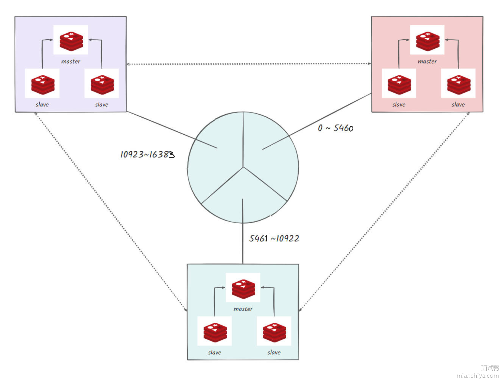

每个节点会拥有一部分的槽位，然后对应的键值会根据其本身的 key，映射到一个哈希槽中，其主要流程如下：

- 根据键值的 key，按照 CRC 16 算法计算一个 16 bit 的值，然后将 16 bit 的值对 16384 进行取余运算，最后得到一个对应的哈希槽编号。
- 根据每个节点分配的哈希槽区间，对应编号的数据落在对应的区间上，就能找到对应的分片实例。

为了方便大家理解，我这里画一个对应的关系图，以三个节点为例：

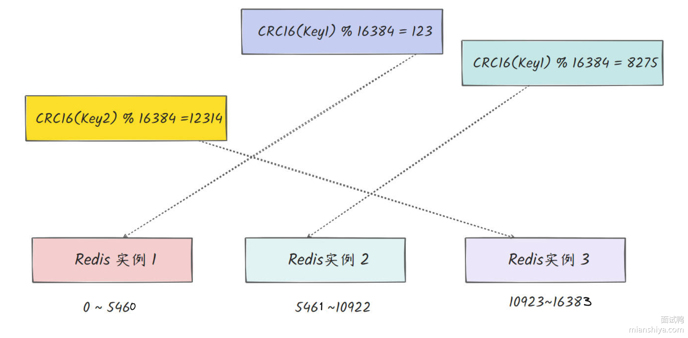

这里还有一点需要强调下，redis 客户端可以访问集群中任意一台实例，正常情况下这个实例包含这个数据。

但如果槽被转移了，客户端还未来得及更新槽的信息，当前实例没有这个数据，则返回 MOVED 响应给客户端，将其重定向到对应的实例（因 Gossip 集群内每个节点都会保存集群的完整拓扑信息）

##### Redis 集群中存储 key 示例

假设我们有一个 Redis 集群，包含三个主节点（Node1、Node2、Node3），它们分别负责以下哈希槽：

- Node1: 哈希槽 0-5460
- Node2: 哈希槽 5461-10922
- Node3: 哈希槽 10923-16383

现在要存储一个键为 `user:1001` 的数据。

###### 计算哈希槽

1. 使用 CRC16 哈希算法计算 `user:1001` 的 CRC16 值。
2. 假设计算结果为 12345。
3. 然后，计算该值对应的哈希槽：
   - 哈希槽 = 12345 % 16384 = 12345。

###### 确定目标节点

- 12345 落在 Node3 的负责范围（10923-16383），因此，`user:1001` 会被存储在 Node3 中。

##### Redis 集群中请求 key 示例（客户端直接连接的并不是对应 key 的节点）

如果客户端连接的是集群的 Node1，但需要访问存储在 Node3 的键 `user:1001`，查询过程如下：

###### 查询过程

1）**计算哈希槽**：

- 客户端使用 CRC16 算法计算 `user:1001` 的哈希值（假设为 12345）。
- 计算哈希槽：12345 % 16384 = 12345。

2）**查询请求**：

- 因为客户端连接的是集群中的 node1，所以客户端发送查询命令 `GET user:1001` 到 Node1。

3）**Node1 响应**：

- Node1 检测到请求的键 `user:1001` 属于 Node3，返回一个 `MOVED` 错误，指示客户端请求的键在另一个节点上。`MOVED` 错误会中返回目标节点的信息（例如，Node3 的 IP 和端口）

4）**重新连接**：

- 客户端根据返回的目标节点信息，建立与 Node3 的连接。

5）**再次发送查询请求**：

- 客户端向 Node3 发送 `GET user:1001`。

6）**获取结果**：

- Node3 查询到 `user:1001` 的值（假设为 `{"name": "面试鸭", "age": 18}`），并返回结果。

##### 为什么 Redis 哈希槽节点的数目是 16384 呢？

github 上有人向作者提问过：

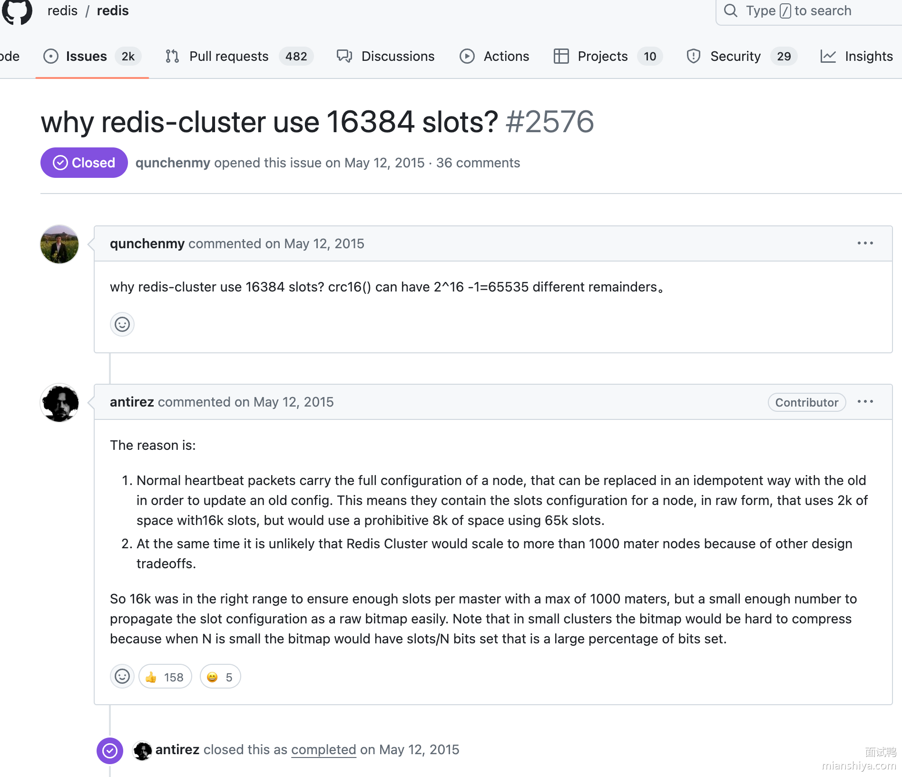

简单总结分析一下：

**1）首先是消息大小的考虑**。

正常的心跳包需要带上节点完整配置数据，心跳还是比较频繁的，所以需要考虑数据包的大小，如果使用 16384 数据包只要 2k，如果用了 65535 则需要 8k。

实际上槽位信息使用一个长度为 16384 位的数组来表示，节点拥有哪个槽位，就将对应位置的数据信息设置为 1，否则为 0。

心跳数据包就包含槽位信息如下图所示：

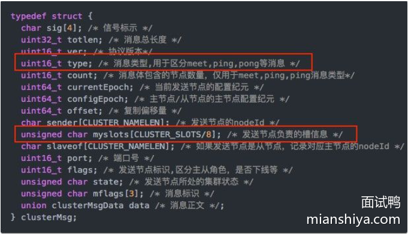

这里我们看到一个重点，即在消息头中最占空间的是 myslots[CLUSTER_SLOTS/8]。

- 当槽位为65536时，这块的大小是: 65536÷8÷1024=8kb
- 当槽位为16384时，这块的大小是: 16384÷8÷1024=2kb

如果槽位为 65536 ，这个 ping 消息的消息头就太大了，浪费带宽。

2）**集群规模的考虑**。

集群不太可能会扩展超过 1000 个节点，16384 够用且使得每个分片下的槽又不会太少。

### Redis 集群会出现脑裂问题吗？ 

#### 回答重点

Redis 集群存在脑裂问题的风险，特别是在**网络分区**的情况下，可能会导致同一集群内出现多个主节点，导致数据不一致。

#### 扩展知识

##### 什么是脑裂

脑裂是指在分布式系统中，由于网络分区或其他问题导致系统中的多个节点（特别是主节点）误以为自己是唯一的主节点。这种情况会导致多个主节点同时提供写入服务，从而引起数据不一致。

分布式系统就像一个团队在干活，如果发生了脑裂，就好比这个团队突然因为某些原因，比如通信出了问题，分成了几个小团体。

每个小团体都以为自己是整个团队，都在按自己的方式工作，各自为政，对同一件事有不同的决策和做法，就像有的说要这么干，有的说要那么干。

这样一来，整个系统就乱套了，数据也可能变得不一致，服务也变得不正常了，这就是分布式系统中的脑裂。

导致脑裂出现原因主要是**网络分区**。

##### Redis 中的脑裂

例如发生了网络分区，主节点与哨兵、从节点分区了。

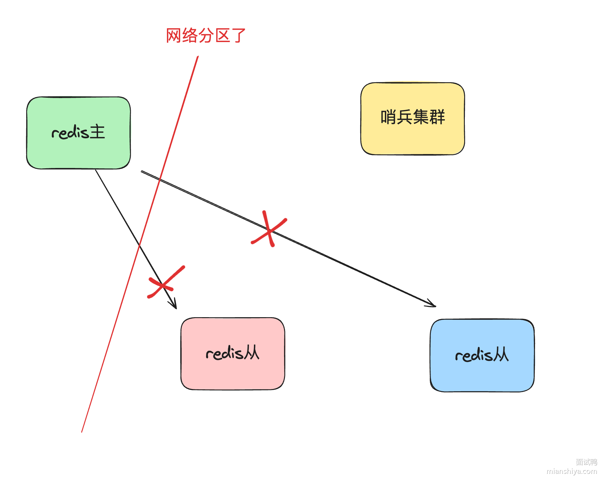

此时哨兵发现联系不上主节点，于是发起选举，选了新的主节点，此时 Redis 就出现了两个主节点：

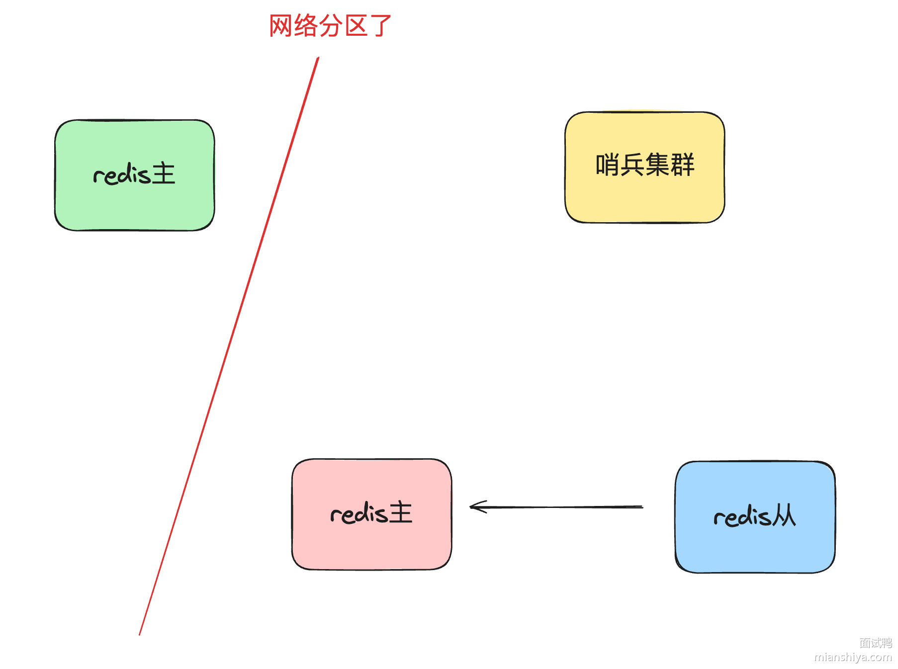

这就发生了脑裂，此时客户端写数据应该写到哪台上呢？**写哪都会导致数据不一致**。

##### Redis 中如何避免脑裂问题的发生呢？

这里需要了解两个参数：

- `min-slaves-to-write`：设置主节点在至少有指定数量的从节点确认写操作的情况下才执行写操作
- `min-salves-max-lag`：设置从节点的最大延迟（以秒为单位），如果从节点的延迟超过这个值，则该从节点不会被计入 `min-slaves-to-write` 的计数中

举个例子：当 `min-slaves-to-write` 设置为 2，`min-slaves-max-lag` 设置为 10 秒时，**主节点只有在至少有 2 个从节点延迟不超过 10 秒的情况下才会接受写操作**。

这两个参数就使得发生脑裂的时候，如果某个主节点跟随的从节点数量不够或延迟较大，就无法被写入，这样就能避免脑裂导致的数据不一致。

建议集群部署奇数个节点，例如集群数为 5，那么可以设置 `min-slaves-to-write` 为 3，`min-slaves-max-lag` 为 5-10 秒。

##### 脑裂问题能完全避免吗？

**并不能**。即使配置了以上两个参数也可能会因为脑裂导致数据不一致。

举个例子，假设某个主节点临时出了问题，哨兵判断它主观下线，然后开始发起选举。

在选举进行的时候，主节点恢复了，此时它还是跟着很多从节点，假设 `min-slaves-max-lag` 配置了 10s，可能此时从节点和主节点延迟的时间才 6s，因此此时主节点还是可以被写入。

而等选举完毕了，选出新的主节点，旧的主节点被哨兵操作需要 salveof 新主，此时选举时间内写入的数据会被覆盖，因此就导致了数据不一致的问题。

### Redis 中的 Big Key 问题是什么？如何解决？ 

#### 回答重点

Redis 中的 "big Key" 是指一个内存空间占用比较大的键（Key），它有什么危害呢？

- 内存分布不均。在集群模式下，不同 slot 分配到不同实例中，如果大 key 都映射到一个实例，则分布不均，查询效率也会受到影响。
- 由于 Redis 单线程执行命令，操作大 Key 时耗时较长，从而导致 Redis 出现其它命令阻塞的问题。
- 大 Key 对资源的占用巨大，在你进行网络 I/O 传输的时候，导致你获取过程中产生的网络流量较大，从而产生网络传输时间延长甚至网络传输发现阻塞的现象，例如一个 key 2MB，请求个 1000 次 2000 MB。
- 客户端超时。因为操作大 Key 时耗时较长，可能导致客户端等待超时。

##### 如何解决 big key问题？

可以从以下几个方向进行入手：

###### 开发方面

- 对要存储的数据进行压缩，压缩之后再进行存储
- 大化小，即把大对象拆分成小对象，即将一个大 Key 拆分成若干个小 Key，降低单个 Key 的内存大小
- 使用合适的数据结构进行存储，比如一些用 String 存储的场景，可以考虑使用 Hash、Set 等结构进行优化

###### 业务层面

- 可以根据实际情况，调整存储策略，只存一些必要的数据。比如用户的不常用信息（地址等）不存储，仅存储用户 ID、姓名、头像等。
- 优化业务逻辑，从根源上避免大 Key 的产生。比如一些可以不展示的信息，直接移除等。

###### 数据分布方面

- 采用 Redis 集群方式进行 Redis 的部署，然后将大 Key 拆分散落到不同的服务器上面，加快响应速度

#### 扩展知识

##### 怎样算 big key ？

大 Key 可能出现在不同的场景中，不过其本质都是相同的，就是对应的值其所占内存非常大，例如：

1）大型字符串

```gams
set key "面试鸭xxxxxx······（此处省略无数个字符）"
```

2）大型哈希表

```apache
HMSET student:8927 name "yupi" nickname "面试鸭" 
```

这个时候就可能有同学会问了，到底占用多少内存才算得上是 big key 呢？

其实这个没有一个很绝对的说法，主要还是取决于具体的场景以及应用需求。参考阿里云redis文档：

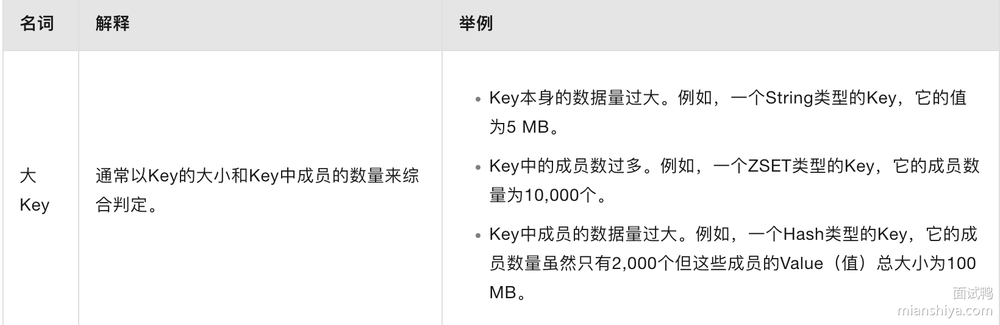

当然，这些标准并不是绝对的，具体的情况还是需要根据应用场景和实际情况来进行调整，这个需要你和面试官说明清楚。

##### 使用 bigkeys 命令查询 bigkeys

这个是 Redis 内置的指令，直接在 Redis 的客户端 redis-cli 中就可以调用使用，该命令可以获取 Redis 的整体信息，并且显示每种类型数据中最大的 Key。

如下所示，在命令行终端输入 `redis-cli --bigkeys` 便可以查看到（docker 版本的话可能会出现查找失败的情况）。

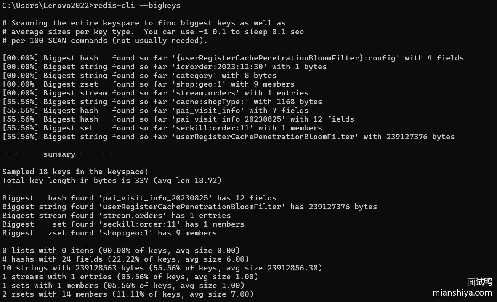

这种方法有优点，就是其是 Redis 内置的，其统计非常方便。

它的原理就是在 Redis 内部执行 scan 命令，遍历整个实例所有的 key，针对 key 的类型执行 strlen、hlen、scard 等命令获取字符串长度或集合的元素个数。

所以在线上执行这个命令的需要，需要关注性能问题，可以通过 -i 命令控制扫描的休息间隔，时间单位是秒。

还有一点，元素多不一定代表占用的内存多，需要实际评估下。

### 如何使用 Redis 快速实现排行榜？

#### 回答重点

使用 **Redis** 实现排行榜的方式主要利用 **Sorted Set（有序集合）**，它可以高效地存储、更新、以及获取排名数据。

实现排行榜的主要步骤：

1）**使用 Sorted Set 存储分数和成员**

- 使用 Redis 的 `ZADD` 命令，将用户和对应的分数添加到有序集合中。例如：`ZADD leaderboard 1000 user1`，将用户 `user1` 的分数设置为 1000。

2）**获取排名**

- 使用 `ZRANK` 命令获取某个用户的排名。例如：`ZRANK leaderboard user1`，返回用户 `user1` 的排名（从 0 开始）。

3）**获取前 N 名**

- 使用 `ZREVRANGE` 命令获取分数最高的前 N 名。例如：`ZREVRANGE leaderboard 0 9 WITHSCORES`，获取排行榜前 10 名用户及其分数。

4）**更新分数**

- 如果用户的分数需要更新，可以使用 `ZINCRBY` 命令对其分数进行加减操作。例如：`ZINCRBY leaderboard 500 user1`，将用户 `user1` 的分数增加 500。

#### 扩展知识

##### **Sorted Set 的特点**

- **Sorted Set** 是 Redis 中的一个数据结构，内部使用 **跳表（Skip List）** 来实现，提供按分数排序的功能。每个成员有一个唯一的 `score`（分数），根据分数进行排序。
- Redis 的 Sorted Set 通过 O(logN) 的时间复杂度进行插入、更新和删除操作，且可以通过范围查找快速获取指定区间的数据。
- 使用 Sorted Set 可以确保成员唯一性，因为 Redis 的 Sorted Set 中每个成员都是唯一的。如果添加相同的成员，ZADD 将更新其分数而不是重复插入。

##### **Sorted Set 相关 Redis 命令**

- **ZADD**：向有序集合中添加成员并设置分数。如果成员已经存在，则更新其分数。
- **ZRANK / ZREVRANK**：返回指定成员的排名。`ZRANK` 是按从小到大的排名，`ZREVRANK` 是从大到小（即逆序）。
- **ZREVRANGE**：按分数从高到低返回指定区间内的成员列表，常用于获取排行榜的前 N 名。
- **ZINCRBY**：对有序集合中指定成员的分数进行增减操作。

##### Java 示例代码

以下是一个完整的 Java 示例代码，供大家参考：

```java
import redis.clients.jedis.Jedis;

import java.util.Set;
import java.util.Map;
import java.util.HashMap;

public class RedisLeaderboard {

    private static final String LEADERBOARD_KEY = "leaderboard";
    private Jedis jedis;

    public RedisLeaderboard() {
        // 连接到 Redis
        this.jedis = new Jedis("localhost", 6379);
    }

    // 添加或更新用户分数
    public void addOrUpdateUserScore(String user, double score) {
        jedis.zadd(LEADERBOARD_KEY, score, user);
    }

    // 获取排行榜前 N 名用户
    public Set<String> getTopUsers(int topN) {
        return jedis.zrevrange(LEADERBOARD_KEY, 0, topN - 1);
    }

    // 获取用户的排名
    public Long getUserRank(String user) {
        return jedis.zrevrank(LEADERBOARD_KEY, user);
    }

    // 获取用户的分数
    public Double getUserScore(String user) {
        return jedis.zscore(LEADERBOARD_KEY, user);
    }

    // 删除用户
    public void removeUser(String user) {
        jedis.zrem(LEADERBOARD_KEY, user);
    }

    // 获取排行榜分页查询
    public Set<String> getUsersByPage(int page, int pageSize) {
        int start = (page - 1) * pageSize;
        int end = start + pageSize - 1;
        return jedis.zrevrange(LEADERBOARD_KEY, start, end);
    }

    // 关闭连接
    public void close() {
        jedis.close();
    }

    public static void main(String[] args) {
        RedisLeaderboard leaderboard = new RedisLeaderboard();

        // 添加用户及其分数
        leaderboard.addOrUpdateUserScore("user1", 100);
        leaderboard.addOrUpdateUserScore("user2", 200);
        leaderboard.addOrUpdateUserScore("user3", 150);

        // 更新用户分数
        leaderboard.addOrUpdateUserScore("user1", 250);

        // 获取排行榜前 3 名用户
        Set<String> topUsers = leaderboard.getTopUsers(3);
        System.out.println("Top 3 users: " + topUsers);

        // 获取用户的排名
        Long rank = leaderboard.getUserRank("user1");
        System.out.println("User1 rank: " + rank);

        // 获取用户的分数
        Double score = leaderboard.getUserScore("user1");
        System.out.println("User1 score: " + score);

        // 获取排行榜第 2 页，每页 2 个用户
        Set<String> pageUsers = leaderboard.getUsersByPage(2, 2);
        System.out.println("Page 2 users: " + pageUsers);

        // 删除用户
        leaderboard.removeUser("user1");

        // 关闭连接
        leaderboard.close();
    }
}
```

### 如何使用 Redis 快速实现布隆过滤器？ 

#### 回答重点

> 布隆过滤器是一种高效的概率数据结构，常用于检测一个元素是否在一个集合中，可以有效减少数据库的查询次数，解决缓存穿透等问题。

可以通过使用 **位图（Bitmap）** 或使用 Redis 模块 **RedisBloom**。

1）**使用位图实现布隆过滤器**：

- 使用 Redis 的位图结构 `SETBIT` 和 `GETBIT` 操作来实现布隆过滤器。位图本质上是一个比特数组，用于标识元素是否存在。
- 对于给定的数据，通过多个 **哈希函数** 计算位置索引，将位图中的相应位置设置为 1，表示该元素可能存在。

2）**使用 RedisBloom 模块**：

- Redis 提供了一个官方模块 **RedisBloom**，封装了哈希函数、位图大小等操作，可以直接用于创建和管理布隆过滤器。
- 使用 **BF.ADD** 来向布隆过滤器添加元素，使用 **BF.EXISTS** 来检查某个元素是否可能存在。

#### 扩展知识

##### 布隆过滤器原理

布隆过滤器是由一个 **位数组** 和 **k 个独立的哈希函数** 组成。

添加元素时，通过 k 个哈希函数将元素映射到位数组的 k 个位置上，将这些位置设置为 1。

检查元素是否存在时，同样计算 k 个位置，如果所有位置都是 1，则说明元素可能存在；只要有一个位置为 0，就可以确定元素一定不存在。

例如某个 key 通过 hash-1 和 hash-2 两个哈希函数，定位到数组中的值都为 1，则说明它存在。

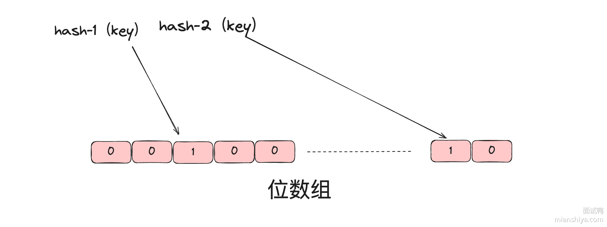

如果布隆过滤器判断一个元素不存在集合中，那么这个元素一定不在集合中，如果判断元素存在集合中则不一定是真的，因为哈希可能会存在冲突。因此布隆过滤器**有误判的概率**。

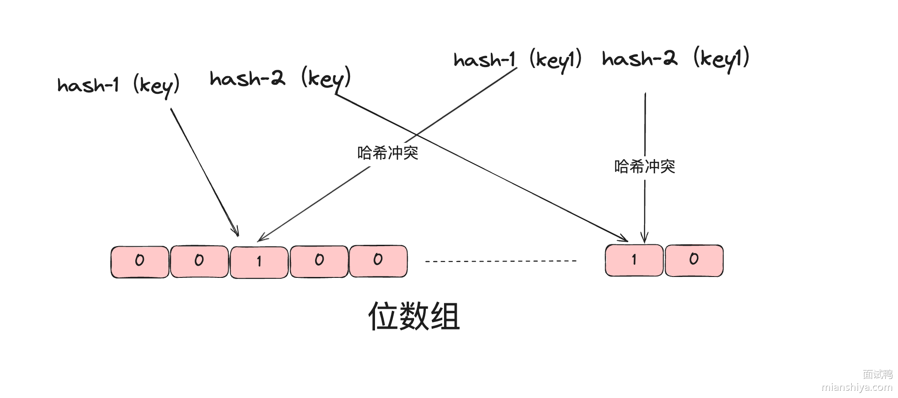

而且它不好删除元素，只能新增，如果想要删除，只能重建。

##### 布隆过滤器优缺点

**1）优点**

- 高效性：插入和查询操作都非常高效，时间复杂度为 O(k)，k 为哈希函数的数量。
- 节省空间：相比于直接存储所有元素，布隆过滤器大幅度减少了内存使用。
- 可扩展性：可以根据需要调整位数组的大小和哈希函数的数量来平衡时间和空间效率。

**2）缺点**

- 误判率：可能会误认为不存在的元素在集合中，但不会漏报（不存在的元素不会被认为存在）。
- 不可删除：一旦插入元素，不能删除，因为无法确定哪些哈希值是由哪个元素设置的。
- 需要多个哈希函数：选择合适的哈希函数并保证它们独立性并不容易。

##### 使用 Redis 位图（bitmap）实现布隆过滤器

**bitmap 基本操作：**

- SETBIT key offset value：将 key 的值在 offset 位置上的位设置为 value（0 或 1）。
- GETBIT key offset：获取 key 的值在 offset 位置上的位的值（0 或 1）。
- BITCOUNT key [start end]：计算字符串中设置为 1 的位的数量。
- BITOP operation destkey key [key ...]：对一个或多个 key 进行位运算，并将结果存储在 destkey 中。支持的操作包括 AND、OR、XOR 和 NOT。

**实现布隆过滤器流程：**

- 位图使用单个位来表示某个位置的状态，通过 Redis 的 **`SETBIT key offset value`** 操作可以设置位图中某个偏移位置的值。
- 假设有 k 个哈希函数 `H1, H2, ..., Hk`，对于每个新加入的元素 `x`，通过这些哈希函数计算位置，将相应位置的比特位设置为 1。
- 查询元素是否存在时，计算相同的 k 个位置并用 **`GETBIT key offset`** 来判断这些位置是否都是 1。

以下 Java 中为利用 bitmap 实现布隆过滤器的例子，供大家参考：

```java
import redis.clients.jedis.Jedis;
import java.nio.charset.StandardCharsets;
import java.util.BitSet;
import java.util.List;
import java.util.ArrayList;

public class RedisBloomFilter {

    private static final String BLOOM_FILTER_KEY = "bloom_filter";
    private static final int BITMAP_SIZE = 1000000; // 位图大小
    private static final int[] HASH_SEEDS = {3, 5, 7, 11, 13, 17}; // 多个哈希函数的种子

    private Jedis jedis;
    private List<SimpleHash> hashFunctions;

    public RedisBloomFilter() {
        this.jedis = new Jedis("localhost", 6379);
        this.hashFunctions = new ArrayList<>();
        for (int seed : HASH_SEEDS) {
            hashFunctions.add(new SimpleHash(BITMAP_SIZE, seed));
        }
    }

    // 添加元素到布隆过滤器
    public void add(String value) {
        for (SimpleHash hashFunction : hashFunctions) {
            jedis.setbit(BLOOM_FILTER_KEY, hashFunction.hash(value), true);
        }
    }

    // 检查元素是否可能存在于布隆过滤器中
    public boolean mightContain(String value) {
        for (SimpleHash hashFunction : hashFunctions) {
            if (!jedis.getbit(BLOOM_FILTER_KEY, hashFunction.hash(value))) {
                return false;
            }
        }
        return true;
    }

    // 关闭连接
    public void close() {
        jedis.close();
    }

    // 简单哈希函数
    public static class SimpleHash {
        private int cap;
        private int seed;

        public SimpleHash(int cap, int seed) {
            this.cap = cap;
            this.seed = seed;
        }

        public int hash(String value) {
            int result = 0;
            byte[] bytes = value.getBytes(StandardCharsets.UTF_8);
            for (byte b : bytes) {
                result = seed * result + b;
            }
            return (cap - 1) & result;
        }
    }

    public static void main(String[] args) {
        RedisBloomFilter bloomFilter = new RedisBloomFilter();

        // 添加元素到布隆过滤器
        bloomFilter.add("user1");
        bloomFilter.add("user2");
        bloomFilter.add("user3");

        // 检查元素是否可能存在
        System.out.println("Does user1 exist? " + bloomFilter.mightContain("user1")); // 输出: true
        System.out.println("Does user4 exist? " + bloomFilter.mightContain("user4")); // 输出: false

        // 关闭连接
        bloomFilter.close();
    }
}
```

在 Java 中的 redisson 提供了 bloomFilter 类，可直接使用这个类提供的布隆过滤器实现。

##### **RedisBloom 模块的使用**

RedisBloom 是 Redis 官方提供的插件，简化了布隆过滤器的实现，提供了更好的性能和更少的误判率控制。

**常用命令：**

- **`BF.RESERVE key error_rate capacity`**：创建一个布隆过滤器，指定误判率和容量。

- **`BF.ADD key item`**：向布隆过滤器中添加一个元素。

- `BF.EXISTS key item`

  ：检查一个元素是否可能存在。

  - RedisBloom 可以自动调整底层数据结构大小以适应不断增加的数据量，用户可以指定误判率。

**RedisBloom实现布隆过滤器的步骤示例**：

1）**创建布隆过滤器**（基于 RedisBloom 模块）：

```shell
▼shell

复制代码BF.RESERVE myBloomFilter 0.01 1000000
```

上述命令创建了一个误判率为 1% 且容量为 100 万的布隆过滤器。

2）**添加元素**：

```shell
▼shell

复制代码BF.ADD myBloomFilter "item1"
```

3）**检查元素是否存在**：

```shell
▼shell复制代码BF.EXISTS myBloomFilter "item1"    # 返回 1（可能存在）
BF.EXISTS myBloomFilter "item2"    # 返回 0（一定不存在）
```

##### 布隆过滤器适用场景

布隆过滤器一般都在海量数据判断场景，且可以允许误判。

**1）爬虫：**

对已经爬取过的海量 URL 去重。

**2）黑名单：**

例如反垃圾邮件，用于判断一个邮件地址是否在黑名单中，提高垃圾邮件过滤的效率（可能会误杀）。

**3）分布式系统：**

用于判断数据是否在某个节点上，减少网络请求，提高系统性能。例如，Hadoop 和 Cassandra 都使用布隆过滤器来优化数据分布和查找。

**4）推荐系统：**

用于判断用户是否已经看过某个推荐内容，避免重复推荐。

### Redis 的持久化机制有哪些？

#### 回答重点

Redis 提供两种主要的持久化机制：

**RDB（Redis Database）快照**：

- RDB 是通过生成某一时刻的数据快照来实现持久化的，可以在特定时间间隔内保存数据的快照。
- 适合灾难恢复和备份，能生成紧凑的二进制文件，但可能会在崩溃时丢失最后一次快照之后的数据。

**AOF（Append Only File）日志**：

- AOF 通过将每个写操作追加到日志文件中实现持久化，支持将所有写操作记录下来以便恢复。
- 数据恢复更为精确，但文件体积较大，重写时可能会消耗更多资源。

Redis 4.0 新增了 RDB 和 AOF 的混合持久化机制。

#### 扩展知识

##### RDB 持久化详解

RDB 持久化通过创建快照来获取内存某个时间点上的副本，利用快照可以进行方便地进行主从复制，默认快照文件为 dump.rdb。

redis.conf 文件可以配置在 x 秒内如果至少有 y 个 key 发生变化就会触发命令进行持久化操作。

**它的优点**：

- **快速加载**：RDB 生成的快照文件是压缩的二进制文件，适合备份和灾难恢复。
- **低资源占用**：RDB 持久化在 Redis 主线程之外进行，不会对主线程产生太大影响。

**它的缺点**：

- **数据丢失风险**：由于 RDB 是**间隔性**保存的快照，如果 Redis 崩溃，可能会丢失上次保存快照后的数据。

**RDB 持久化命令：**

- **save**：在主线程生成 RDB 文件，因此生成其间，主进程无法执行正常的读写命令，需要等待 RDB 结束。
- **bgsave**：利用 Fork 操作得到子进程，在子进程执行 RDB 生成，不会阻塞主进程，默认使用 bgsave。

**bgsave 流程（重点）：**

1）检查子进程（检查是否存在 AOF/RDB 的子进程正在进行），如果有返回错误

2）触发持久化，调用 rdbSaveBackground

3）开始 fork，子进程执行 rdb 操作，同时主进程响应其他操作。

4）RDB 完成后，替换原来的旧 RDB 文件，子进程退出。

**注意事项（重点）：**

1）Fork 操作会产生**短暂的阻塞**，微秒级别操作过后，不会阻塞主进程，整个过程不是完全的非阻塞。

2）RDB 由于是快照备份所有数据，而不是像 AOF 一样存写命令，因为 Redis 实例重启后恢复数据的速度可以得到保证，大数据量下比AOF 会快很多。

3）Fork 操作利用了**写时复制**，类似与 [CopyOnWriteArrayList](https://www.mianshiya.com/question/1780933294838280194)。

**小知识-写时复制：**

在子进程创建时，它不会直接将主进程地址空间全部复制，而是共享同一个内存。

之后如果任意一个进程需要对内存进行修改操作，内存会重新复制一份提供给修改的进程单独使用。

更多可看：

- [649. Redis 在生成 RDB 文件时如何处理请求？](https://www.mianshiya.com/question/1780933295639392257)

##### AOF 持久化详解

AOF 持久化机制是指**将 Redis 写命令以追加的形式写入到磁盘中的 AOF 文件**，AOF 文件记录了 Redis 在内存中的操作过程，只要在 Redis 重启后重新执行 AOF 文件中的写命令即可将数据恢复到内存中。

**AOF 机制的优点**：

- AOF 机制比 RDB 机制更加**可靠**，因为 AOF 文件**记录了 Redis 执行的所有写命令**，可以在每次写操作命令执行完毕后都落盘存储。

**AOF 机制的缺点**：

- AOF 机制生成的 **AOF 文件比 RDB 文件更大**，当数据集比较大时，AOF 文件会比 RDB 文件占用更多的磁盘空间。
- AOF 机制对于**数据恢复的时间比 RDB 机制更加耗时**，因为要重新执行 AOF 文件中的所有操作命令。

##### 混合持久化

RDB 和 AOF 都有各自的缺点。

如果 RDB 备份的频率低，那么丢的数据多。备份的频率高，性能影响大。

AOF 文件虽然丢数据比较少，但是恢复起来又比较耗时。

因此 Redis 4.0 以后引入了混合持久化，通过 `aof‐use‐rdb‐preamble` 配置开启混合持久化。

**当 AOF 重写的时候**（注意混合持久化是在 aof 重写时触发的）。它会先生成当前时间的 RDB 快照，将其写入新的 AOF 文件头部位置。

这段时间主线程处理的操作命令会记录在重写缓冲区中，RDB 写入完毕后将这里的增量数据追加到这个新 AOF 文件中，最后再用新 AOF 文件替换旧 AOF 文件。

如此一来，当 Redis 通过 AOF 文件恢复数据时，会先加载 RDB，然后再重新执行指令恢复后半部分的增量数据，这样就可以大幅度提高数据恢复的速度！

##### AOF 写回策略

AOF 提供了三种写回策略，决定何时将数据同步到磁盘中：

- always：每次写操作后立即调用 fsync，将数据同步到磁盘。这种策略保证了最高的数据安全性，但也会显著降低性能，因为每个写操作都要等待磁盘写入完成。
- everysec：每秒调用一次 fsync，将数据同步到磁盘。这种策略在性能和数据安全性之间做了折中，默认情况下，Redis 使用这种策略。最多会丢失 1 秒的数据。
- no：由操作系统决定何时将数据写入磁盘。通常，操作系统会在一定时间后或缓冲区满时同步数据到磁盘。这种策略具有最高的性能，但数据安全性较低，因为在 Redis 崩溃时可能会丢失较多的数据。

设置 always 能一定保证数据不丢失吗？

答案是**不能**！因为 Redis 是先执行命令再写入 aof，所以如果执行命令写入 aof 这段时间 Redis 宕机了，重启后也无法利用 aof 恢复！

所以 Redis 的持久化机制，并不能保证数据不丢失！

##### AOF 重写机制

AOF 文件随着写操作的增加会不断变大，过大的 AOF 文件会导致恢复速度变慢，并消耗大量磁盘空间。所以，Redis 提供了 AOF 重写机制，即对 AOF 文件进行压缩，通过最少的命令来重新生成一个等效的 AOF 文件。

拿 key A 举个例子，AOF 记录了每次写命令如 `set A 1`、`set A 2`、`set A 3`。实际上前面的 `set A 1`、`set A 2` 是历史值，我们仅关心最新的值，因此 AOF 重写就是仅记录数据的最终值即可，即`set A 3`，这样 AOF 文件就“瘦身”了。

**注意：AOF 重写并不是对现有的 AOF 文件进行修改，而是根据当前每个键的最新值转换为对应的写命令，写入新的 AOF 文件，形成一个新文件。**

**注意：后台 AOF 重写，也是需要 fork 子线程，因此也有写时复制的机制。**

**AOF 重写流程如下**：

1. 创建子进程：Redis 使用 BGREWRITEAOF 命令创建一个子进程，负责 AOF 重写操作。
2. 生成新的 AOF 文件：子进程根据当前数据库的状态，将每个键的最新值转换为对应的写命令，并写入新的 AOF 文件。例如，对于一个列表键，子进程会使用一条 RPUSH 命令将所有元素写入，而不是记录之前的多次操作。
3. 处理新写入的命令：在重写过程中，主进程仍然处理新的写操作。为了避免数据不一致，主进程会将这些新的写命令同时追加到现有的 AOF 文件和一个缓冲区（`aof_rewrite_buf`）中。
4. 合并新命令：当子进程完成新的 AOF 文件的写入后，主进程会将缓冲区中的新命令追加到新的 AOF 文件中，确保其包含所有最新的操作。
5. 替换旧的 AOF 文件：最后，Redis 使用新的 AOF 文件替换旧的文件，实现 AOF 文件的重写。


AOF 重写可以通过手动触发或自动触发：

1）手动触发：使用 BGREWRITEAOF 命令可以手动触发 AOF 重写。

2）自动触发：通过配置文件中的参数控制自动触发条件，参数如下：

- `auto-aof-rewrite-min-size`：AOF 文件达到该大小时允许重写（默认 64 MB）。
- `auto-aof-rewrite-percentage`：当前 AOF 文件大小相对于上次重写后的增长百分比达到该值时触发重写。

##### Redis 7.0 MP-AOF（Multi-Part Append Only File）

7.0 之前的 AOF 重写有三大问题：

1. **内存开销**：`aof_buf` 和 `aof_rewrite_buf` 中大部分内容是重复的。
2. **CPU 开销**：主进程需要花费 CPU 时间往 `aof_rewrite_buf` 写入数据，并向子进程发送 `aof_rewrite_buf` 中的数据。子进程需要消耗 CPU 时间将`aof_rewrite_buf` 写入新 AOF 文件。
3. **磁盘开销**：`aof_buf`数据会写到当前的 AOF 文件，`aof_rewrite_buf`数据写到新的 AOF 文件，一份数据需要写两次磁盘。

针对以上问题 Redis 7.0 引入了 MP-AOF（Multi-Part Append Only File）机制。简单来说就是将一个 AOF 文件拆分成了多个文件：

- 一个基础文件（base file），代表数据的初始快照
- 增量文件（incremental files），记录自基础文件创建以来的所有写操作，可以有多个
- 基础文件和增量文件都会存放在一个单独的目录中，并由一个清单文件（manifest file）进行统一跟踪和管理

**大致流程如下**： 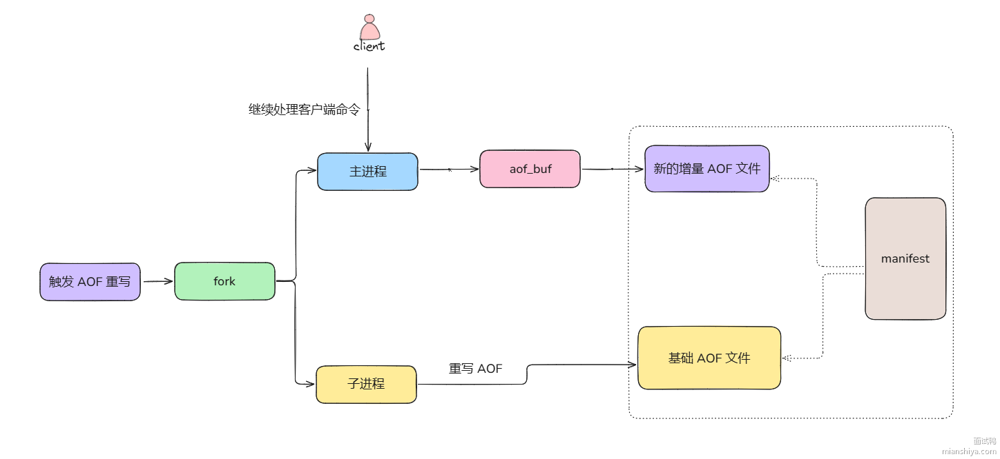

可以看到，重写期间的数据变更直接写到 aof_buf 再到新的增量 AOF 文件中，避免了之前多个 buf 的写入。

且子进程独立重写基础的 AOF，于主进程无交互，节省了主进程的 CPU 开销。

当重写完毕后，仅需更新 manifest 文件，加入新的增量 AOF 文件和基础 AOF 文件，然后将之前的增量 AOF 文件和基础 AOF 文件标记为历史文件（会被异步删除）即可。更新完 manifest 就代表 AOF 重写结束。

##### AOF 文件修复

如果 AOF 文件因系统崩溃等原因损坏，可以使用 `redis-check-aof` 工具修复。该工具会截断文件中的不完整命令，使其恢复到一致状态。

### Redis 中的缓存击穿、缓存穿透和缓存雪崩是什么？

#### 回答重点

**缓存击穿**：指某个热点数据在缓存中失效，导致大量请求直接访问数据库。此时，由于瞬间的高并发，可能导致数据库崩溃。

**缓存穿透**：指查询一个不存在的数据，缓存中没有相应的记录，每次请求都会去数据库查询，造成数据库负担加重。

**缓存雪崩**：指多个缓存数据在同一时间过期，导致大量请求同时访问数据库，从而造成数据库瞬间负载激增。

##### 解决方案

**缓存击穿**：

- 使用互斥锁，确保同一时间只有一个请求可以去数据库查询并更新缓存。
- 热点数据永不过期。

**缓存穿透**：

- 使用布隆过滤器，过滤掉不存在的请求，避免直接访问数据库。
- 对查询结果进行缓存，即使是不存在的数据，也可以缓存一个标识，以减少对数据库的请求。

**缓存雪崩**：

- 采用随机过期时间策略，避免多个数据同时过期。
- 使用双缓存策略，将数据同时存储在两层缓存中，减少数据库直接请求。

#### 扩展知识

##### 缓存雪崩解析

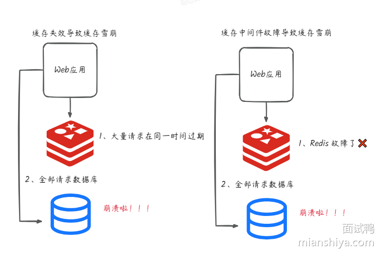

缓存雪崩是指在某个时间点，大量缓存同时失效或被清空，导致大量请求直接打到数据库或后端系统，造成系统负载激增，甚至引发系统崩溃。

这通常是由于缓存中的大量数据在同一时间失效引起的。

想象一个电商系统，用户量很大，假设某一系列的商品缓存突然同一时间失效，那就会造成我们的缓存雪崩，导致服务全部打到了数据库，引发严重后果。

###### 解决办法

缓存键同时失效：

1）过期时间随机化：设置缓存的过期时间，加上一个随机值，避免同一时间大量缓存失效。

2）使用多级缓存：引入多级缓存机制，如本地缓存和分布式缓存相结合，减少单点故障风险。

3）缓存预热：系统启动时提前加载缓存数据，避免大量请求落到冷启动状态下的数据库。

4）加互斥锁：使得没缓存或缓存失效的情况下，同一时间只有一个请求来构建缓存，防止数据库压力过大。

缓存中间件故障：

1）服务熔断：暂停业务的返回数据，直接返回错误。

2）构建集群：构建多个 Redis 集群保证其高可用。

##### 缓存击穿解析

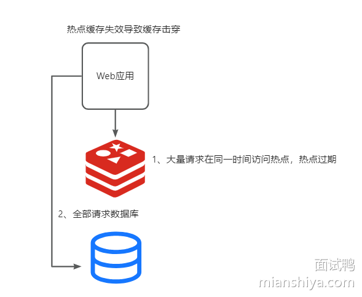

缓存击穿指的是某一热点数据缓存失效，使得大量请求直接打到了数据库，增加数据库负载。

想象一下大家都在抢茅台，但在某一时刻茅台的缓存失效了，大家的请求打到了数据库中，这就是缓存击穿。

缓存雪崩是多个 key，大量数据同时过期，而缓存击穿是某个热点 key 崩溃，可以认为缓存击穿是缓存雪崩的子集。

###### 解决办法

1）加互斥锁：保证同一时间只有一个请求来构建缓存，跟缓存雪崩相同。

2）热点数据永不过期：不要给热点数据设置过期时间，在后台异步更新缓存。

##### 缓存穿透解析

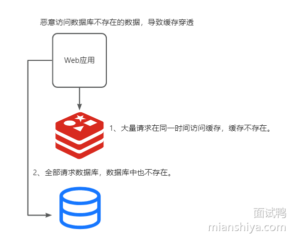

缓存穿透是指查询一个不存在的数据，由于缓存中肯定不存在，导致每次请求都直接访问数据库，增加数据库负载。

攻击者可以通过构造不存在的 key 发起大量请求，对数据库造成很大的压力，可能会造成系统宕机。

###### 解决办法

1）防止非法请求：检查非法请求，封禁其 IP 以及账号，防止它再次为非作歹。

2）缓存空值：将数据库中不存在的结果（例如空值）也缓存起来，并设置一个较短的过期时间，避免频繁查询数据库。

3）使用布隆过滤器：使用布隆过滤器来快速判断一个请求的数据是否存在，如果布隆过滤器判断数据不存在，则直接返回，避免查询数据库。

##### 互斥锁实现示例（Java）

```java
public class CacheService {
    private Jedis jedis = new Jedis("localhost");
    private Lock lock = new ReentrantLock();

    public String getData(String key) {
        // 尝试从缓存获取数据
        String value = jedis.get(key);
        
        // 如果缓存不存在
        if (value == null) {
            // 加锁以防止并发请求
            lock.lock();
            try {
                // 再次检查缓存，避免重复查询
                value = jedis.get(key);
                if (value == null) {
                    // 查询数据库
                    value = queryDatabase(key);
                    // 将结果放入缓存
                    jedis.set(key, value);
                }
            } finally {
                // 释放锁
                lock.unlock();
            }
        }
        return value;
    }
}
```

**说明**：

1. **缓存查询**：首先尝试从 Redis 中获取数据。
2. **加锁**：如果缓存中没有数据，使用 `ReentrantLock` 加锁，确保只有一个线程可以查询数据库。
3. **二次检查**：在加锁后再次检查缓存，避免重复查询。
4. **数据库查询**：如果缓存仍然没有数据，查询数据库并将结果存入缓存。
5. **释放锁**：确保锁在查询结束后被释放，以防止死锁。

这种方式有效地防止了缓存击穿，因为即使在高并发的情况下，只有一个请求会去数据库查询数据，其他请求则会等待锁释放。如果后端是多实例部署，一般实例数量也不多，即使使用本地锁也行，因为并发也不高。

##### 布隆过滤器

- [663. 如何使用 Redis 快速实现布隆过滤器？](https://www.mianshiya.com/question/1780933295689723905)

### 如何解决 Redis 中的热点 key 问题？

#### 回答重点

Redis 中的热点 Key 问题是指某些 Key 被频繁访问，导致 Redis 的压力过大，进而影响整体性能甚至导致集群节点故障。

解决热点 Key 问题的主要方法包括：

- **热点 key 拆分**：将热点数据分散到多个 Key 中，例如通过引入随机前缀，使不同用户请求分散到多个 Key，多个 key 分布在多实例中，避免集中访问单一 Key。
- **多级缓存**：在 Redis 前增加其他缓存层（如 CDN、本地缓存），以分担 Redis 的访问压力。
- **读写分离**：通过 Redis 主从复制，将读请求分发到多个从节点，从而减轻单节点压力。
- **限流和降级**：在热点 Key 访问过高时，应用限流策略，减少对 Redis 的请求，或者在必要时返回降级的数据或空值。

#### 扩展知识

##### 热点 key 的定义

热点 Key 与 big key 一样，没有一个很明确的定义来约定什么样的 key 叫做热点 key。

我们可以参考阿里云 Redis 对热 key 的定义：


可以看到，如果一个 key 的访问频率占比过大，或带宽占比过大，都属于热点 key。

由于 Redis 的读写是单线程执行的，所以热点 key 可能会影响 Redis 的整体效率，消耗大量的 CPU 资源，从而降低 Redis 的整体吞吐量。集群环境下会使得流量不均衡，从而导致读写热点倾斜问题的发生。

##### 如何发现热 key？

1）**根据业务经验进行分析**

这个主要就是依据业务场景进行分析，通过经验判断哪些 key 可能成为热门 key，比如某明星的花边新闻、秒杀活动，演唱会门票等。

- 优点：这个方案实现起来简单直接，只有直接进行判断就可以了，基本没有什么成本。
- 缺点：这个主要依据业务能力，对于业务能力有一定的要求，并且不是所有的业务都能判断出来是否是热 key 的。且有些突发事情是无法预测的。

2）**redis 集群监控**

这种方式主要依据与 Redis 集群，我们只需要查看集群中哪个 Redis 出现 QPS 倾斜，而出现 QPS 倾斜的实例有极大的概率存在热点 Key。

- 优点：这种方案和上面差不多，由于企业的 Redis 大多数是集群部署，所以使用起来非常简单。
- 缺点：每次发生状况都需要排查，因为不一定所有的 QPS 倾斜都是热 Key 导致的。

3）**使用 hotkey 监控**

这个是 Redis 4.0 版本之后引入的一个新的指令，只需要在命令行执行 redis-cli 的时候加上 --hotkeys 的选项就可以了。它是通过 scan + object freq 实现的。

- 优点：因为这个命令是 Redis 自带的，使用起来简单快捷
- 缺点：需要扫描整个 keyspace，如果 Redis 中的 key 数量比较多的话，可能导致执行时间非常长，且实时性不好。

4）**使用 monitor 命令**

如下图所示，这个是 Redis 自 1.0 起就支持的功能。


当通过 MONITOR 命令开启监视器之后，Redis 只需要在执行之后结合一些日志和相关的分析工具就可以进行统计。

- 优点：这个方案的优点在于这个是 Redis 原生支持的功能，使用起来简单快捷。
- 缺点：monitor 非常消耗性能，单个客户端执行 monitor 就会损耗 50% 的性能！不推荐这个方式！

以下为 redis 官网的 benchmark：

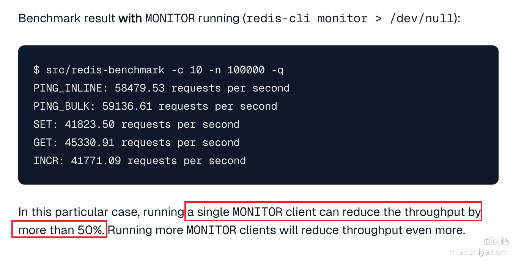

5）**客户端收集**

在操作 Redis 之前，通过加上统计 Redis 键值查询频次的逻辑，将统计数据发送给一个聚合计算平台进行计算，计算之后查看相对应的结果

- 优点：对性能损耗较低。
- 缺点：成本较大，企业如果没有聚合计算平台还需要引入。

6）**代理层收集**

在代理层进行统一的收集，因为有些服务在请求 Redis 之前都会请求一个代理服务，这种场景可以使用在代理层收集 Redis 热 Key 数据，和在客户端收集比较类似。

- 优点：客户端使用方便，不需要考虑 SDK 多语言异构差异和升级成本高的问题。
- 缺点：需要给 Redis 定制一个代理层，进行转发等操作，构建代理成本不低，且转发有性能损耗。

##### 应用程序中的多级缓存

在应用程序中，一般结合使用一级缓存和二级缓存：

- 一级缓存：一般指的是应用程序本地缓存（如 JVM 内存中的缓存）。
- 二级缓存：则为 Redis 缓存。当数据不在一级缓存中时，才会请求二级缓存。

通过这种多级缓存架构，可以有效减少 Redis 的访问次数，从而避免单 Key 的热点问题。

##### **热点 key 的拆分**

我们可以按照不同场景做不同的“拆分“。有些场景可以全量拷贝，即将 mianshiya 这个 key 复制成 mianshiya_1、mianshiya_2、mianshiya_3 ，**它们之间的数据是一致的**，这样不同用户都访问到全量的数据。

有些场景直接进行 key 的拆分，mianshiya_1、mianshiya_2、mianshiya_3 **各存一部分的数据**，不同用户仅需访问不同数据即可，例如一些推流信息，因为一个热点往往有很多发布者，大家看一部分，后续热度稍微降低下来，可以替换数据。

不同用户可以进行 hash，将用户 id 哈希之后取余得到后缀，拼上 mianshiya_ 即可组成一个 key。

### Redis 中跳表的实现原理是什么？ 

#### 回答重点

跳表主要是通过**多层链表来实现**，底层链表保存所有元素，而每一层链表都是下一层的子集。

- **插入时**，首先从最高层开始查找插入位置，然后随机决定新节点的层数，最后在相应的层中插入节点并更新指针。
- **删除时**，同样从最高层开始查找要删除的节点，并在各层中更新指针，以保持跳表的结构。
- **查找时**，从最高层开始，逐层向下，直到找到目标元素或确定元素不存在。查找效率高，时间复杂度为 O(logn)

#### 扩展知识

##### 跳表原理详细解析

跳表，一句话概括：就是一个多层索引的链表，每一层索引的元素在最底层的链表中可以找到的元素。如下图所示，这就是一个简单的跳表实现了，每个颜色代表一层，绿色的就是链表的最底层了。

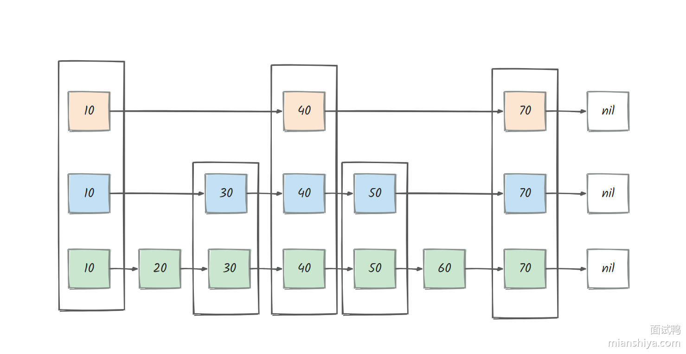

接下来我们通过查询和添加元素来了解其功能流程：

1）**查询元素**：这里我们与传统的链表进行对比，来了解跳表查询的高效。

假设我们要查找 50 这个元素，如果通过传统链表的话（看最底层绿色的查询路线），需要查找 4 次，查找的时间复杂度为 O（n）。

但如果使用跳表的话，其只需要从最上面的 10 开始，首先跳到 40 ，发现目标元素比 40 大，然后对比后一个元素比 70 小。于是就前往下一层进行查找，然后 40 的下一个 50 刚好符合目标，就直接返回就可以了，这个过程的跳转次数是 3 次，即 10 -> 40 (顶层) -> 40 （第二层）-> 50 (第二层)，其流程如下图所示：

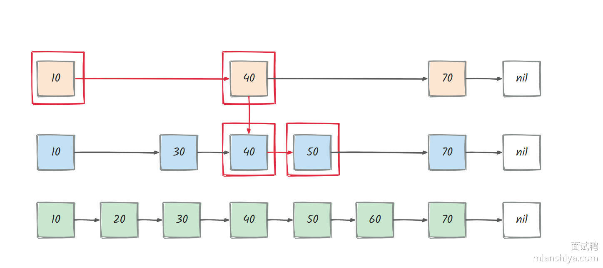

跳表的平均时间查询复杂度是 O（logn），最差的时间复杂度是O（n）。

2） **插入元素**：我们插入一条 score 为 48 的数据

- 先需要定位到第一个比 score 大的数据。如图所示，一下子就可以定位到 50 了，这里和查询的过程（上文所示）是一样的。
- 在定位到对应节点之后，具体是在当前节点创建数据还是增加一个层级这个是随机的，这里假设设置为 2 层
- 定位层级后，再将每一层的链表节点进行补齐，就是在 40 与 50 之间插入一个新的链表节点 48，插入过程与链表插入是一样的。

最终实现的效果如下图所示：

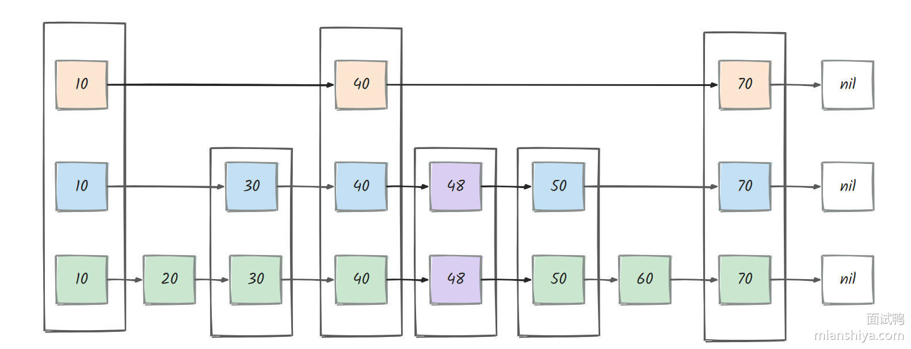

##### Redis 中的跳表实现解析

Redis 的跳表相对于普通的跳表多了一个**回退指针，且 score 可以重复**。

我们先来看一下 Redis 中关于跳表实现的源码：

```c
typedef struct zskiplistNode {
    //Zset 对象的元素值
    sds ele;
    //元素权重值
    double score;
    //后退指针
    struct zskiplistNode *backward;
  
    //节点的level数组，保存每层上的前向指针和跨度
    struct zskiplistLevel {
        struct zskiplistNode *forward;
        unsigned long span;
    } level[];
} zskiplistNode;
```

这里我们分析一下每个字段的含义

- ele：这里用到了 Redis 字符串底层的一个实现 sds，其主要作用是用来存储数据。
- score：节点的分数，double 即浮点型数据。
- backward：我们可以看到其是 zskiplistNode 结构体指针类型，即代表指向前一个跳表节点
- level：这个就是 zskiplistNode 的结构体数组了，数组的索引代表层级索引，这里注意与 hashtable 中的结构进行区分，那个使用的是联合体，一个是 forward ，其代表下一个跳转的跳表节点，注意一个点，其是跳转到同一层;span 主要作用代表距离下一个节点的步数。

到这里分析就差不多了，为了方便大家理解，这里放一个相关的图，下图的红色箭头就代表回退指针。

Redis 跳表的实现大致如下图所示了：

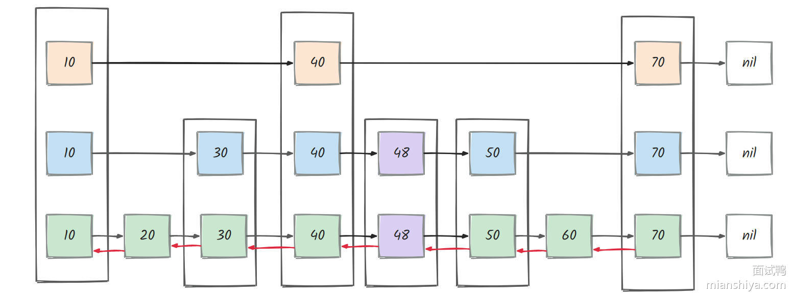

##### 补充插入的随机层级

新插入的节点位于哪一层在 Redis 中是采用随机的概率函数来决定的。

```c
以下源码来自 redis7.0

#define ZSKIPLIST_MAXLEVEL 32 /* Should be enough for 2^64 elements */
#define ZSKIPLIST_P 0.25   /* Skiplist P = 1/4 */

/* Returns a random level for the new skiplist node we are going to create.
 * The return value of this function is between 1 and ZSKIPLIST_MAXLEVEL
 * (both inclusive), with a powerlaw-alike distribution where higher
 * levels are less likely to be returned. */
int zslRandomLevel(void) {
    static const int threshold = ZSKIPLIST_P*RAND_MAX;
    int level = 1;
    while (random() < threshold)
        level += 1;
    return (level<ZSKIPLIST_MAXLEVEL) ? level : ZSKIPLIST_MAXLEVEL;
}
```

通过调用 `zslRandomLevel` 方法来决定新插入的节点所在的层数（level）。可以看到 level 从 1 开始，通过 `while` 循环，当产生的随机数小于 `RAND_MAX`的最大值的 0.25 倍时 level + 1，即有 25 % 的概率累加 level，反之退出循环。

- 节点被分配到第 1 层的概率为 0.75
- 节点被分配到第 2 层的概率为 0.25
- 节点被分配到第 3 层的概率为 0.25 * 0.25
- 以此类推，节点被分配到第 n 层的概率为 0.25^(n-1)。

所以跳表每一个节点能否新加一层的概率是 25 % （最多的层数在 Redis 5.0 中是 64 层，Redis 7.0 中是 32 层）。

##### 为什么 Redis 跳表实现多了个回退指针（前驱指针）

回退指针主要是**为了提高跳表的操作效率和灵活性**。

例如删除节点时，通过前驱指针可以在一次遍历中找到并记录所有关联的前驱节点，无需在变更指针时再次查找前驱节点。这种设计避免了重复查找过程，简化了操作逻辑，大幅提高了删除的执行效率。

尤其是在频繁插入和删除的场景中，回退指针减少了节点之间指针的更新复杂度，提升性能。

### Redis 性能瓶颈时如何处理？

#### 回答重点

如果 Redis 无法承受当前的负载的话，可以考虑从以下几个解决方法去解决：

首先想到的是**扩容**，比如增加 Redis 的配置，容纳更多的内存等。

如果超过单机配置了，那么可以上 **redis 主从**，通过从服务分担读取数据的压力，利用哨兵自动进行故障转移。

还可以利用 **redis 集群**进行数据分片，比如 Redis Cluster。

也可以增加本地内存，通过**多级缓存**分担 redis 的压力。

#### 扩展知识

##### redis 主从复制和读写分离

通过配置 Redis 主从复制，可以实现读写分离，将写操作交给主节点进行处理，而读操作可以交给从节点，从而减轻主节点的压力。

主从架构的优势在于可以横向扩展读取能力，但是存在**主从同步延迟**的问题，如果从节点落后较多，可能会出现读取旧数据的情况。

- [651. Redis 主从复制的实现原理是什么？](https://www.mianshiya.com/question/1780933295647780865)
- [650. Redis 的哨兵机制是什么？](https://www.mianshiya.com/question/1780933295643586562)

##### redis 集群

- [652. Redis 集群的实现原理是什么？](https://www.mianshiya.com/question/1780933295651975169)

### Redis 的 hash 是什么？ 

#### 回答重点

Redis 的 hash 是一种键值对集合，可以将多个字段和值存储在同一个键中，便于管理一些关联数据。 特点如下：

1. 适合存储小数据，使用哈希表实现，能够在内存中高效存储和操作。
2. 支持快速的字段操作（如增、删、改、查），非常适合存储对象的属性。

#### 扩展知识

##### hash 常用命令

**HSET**：设置 hash 中指定字段的值。

```shell
HSET user:1001 name "mianshiya"
```

**HGET**：获取 hash 中指定字段的值。

```shell
HGET user:1001 name
```

**HMSET**：一次性设置多个字段的值。

```shell
HMSET user:1001 name "mianshiya" age "18" city "shanghai"
```

**HMGET**：一次性获取多个字段的值。

```shell
HMGET user:1001 name age
```

**HDEL**：删除 hash 中的一个或多个字段。

```shell
HDEL user:1001 age
```

**HINCRBY**：为 hash 中的字段加上一个整数值。

```shell
HINCRBY user:1001 age 1
```

##### Hash 底层实现解析

Hash 是 Redis 中的一种数据基础数据结构，类似于数据结构中的哈希表，一个 Hash 可以存储 2 的 32 次方 - 1 个键值对（约 40 亿）。底层结构需要分成两个情况：

- Redis 6 及之前，Hash 的底层是压缩列表加上哈希表的数据结构（ziplist + hashtable）
- Redis 7 之后，Hash 的底层是紧凑列表（Listpack） 加上哈希表的数据结构（Listpack + hashtable）

ziplist 和 listpack 查找 key 的效率是类似的，时间复杂度都是 O（n），其主要区别就在于 listpack 解决了 ziplist 的**级联更新**问题。

那么 hash 在什么时候使用 ziplist 和 listpack，什么时候使用 Hashtable 呢？

Redis 内有两个值，分别是 `hash-max-ziplist-entries` （`hash-max-listpack-entries`）以及 `hash-max-ziplist-value`（`hash-max-listpack-value`），即 Hash 类型键的字段个数（默认512）以及每个字段名和字段值的长度（默认64）。

> redis 7.0 为了兼容早期的版本，并没有把 ziplist 相关的值删掉。

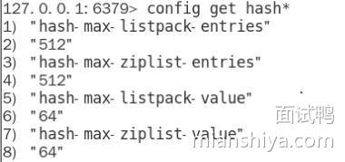

当 hash **小于**这两个值的时候，会使用 listpack 或者 ziplist 进行存储。

当**大于**这两个值的时候会使用 hashtable 进行存储。

这里需要注意一个点，在使用 hashtable 结构之后，就不会再退化成 ziplist 或 listpack，之后都是使用 hashtable 进行存储。

这里需要注意，这两个值是可以修改的。如下图所示，将其值修改为 4399 以及 2024 并且查询后效果如下图所示：

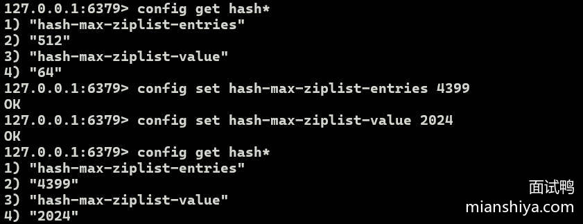

##### 聊聊 Redis 中的 Hashtable？

面试官可能会细问 Hashtable 相关的知识点。

Hashtable 就是哈希表实现，查询时间复杂度为 O(1)，效率非常快。

看下 HashTable 的结构：

```c
typedef struct dictht {
    //哈希表数组
    dictEntry **table;
    //哈希表大小
    unsigned long size;  
    //哈希表大小掩码，用于计算索引值
    unsigned long sizemask;
    //该哈希表已有的节点数量
    unsigned long used;
} dictht;
```

dictht 一共有 4 个字段：

- table：哈希表实现存储元素的结构，可以看成是哈希节点（dictEntry）组成的数组。
- size：表示哈希表的大小。
- sizemask：这个是指哈希表大小的掩码，它的值永远等于 size-1，这个属性和哈希值一起约定了哈希节点所处的哈希表的位置，索引的值 index = hash（哈希值） & sizemask。
- used：表示已经使用的节点数量。

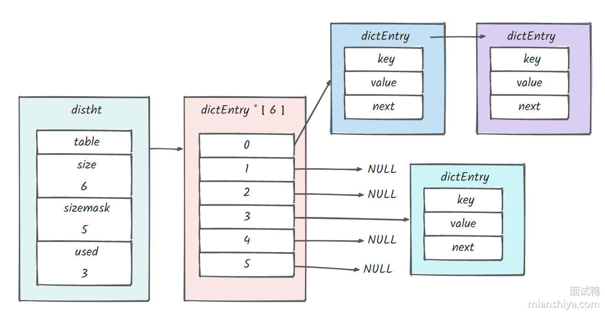

我们再看下哈希节点（dictEntry）的组成，它主要由三个部分组成，分别为 key，value 以及指向下一个哈希节点的指针，其源码中结构体的定义如下：

```c
typedef struct dictEntry {
    //键值对中的键
    void *key;
  
    //键值对中的值
    union {
        void *val;
        uint64_t u64;
        int64_t s64;
        double d;
    } v;
    //指向下一个哈希表节点，形成链表
    struct dictEntry *next;
} dictEntry;
```

结合以上图片，我们可以发现，哈希节点中的 value 值是由一个联合体组成的。因此，这个值可以是指向实际值的指针、64位无符号整数、64 为整数以及 double 的值。

这样设计的主要目的就是为了节省 Redis 的内存空间，当值是整数或者浮点数的时候，可以将值的数据存在哈希节点中，不需要使用一个指针指向实际的值，从一定程度上节省了空间。

##### 渐进式 rehash

还需要了解另一个面试重点，Redis 的渐进式 rehash。

从字面意思上来说，**就是一点点地扩容，而不是直接一次性完成扩容**。

我们再来看这个图：

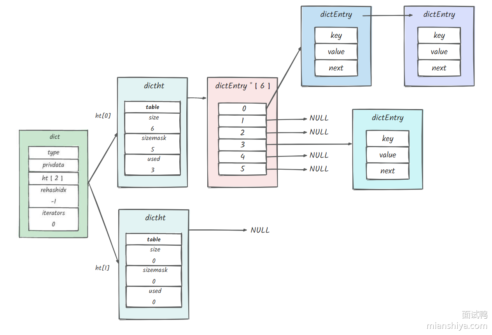

dict 有两个 dictht 组成，为什么需要 2 个哈希表呢？主要原因就是为了实现渐进式。

在平时，插入数据的时候，所有的数据都会写入 ht[0] 即哈希表 1，ht [1] 哈希表 2 此时就是一张没有分配空间的空表。

但是随着数据越来越多，当 dict 的空间不够的时候，就会触发扩容条件，其扩容流程主要分为三步：

1）首先，为哈希表 2 即分配空间。新表的大小是第一个大于等于原表 2 倍 used 的 2 次方幂。举个例子，如果原表即哈希表 1 的值是 1024，那个其扩容之后的新表大小就是 2048。

分配好空间之后，此时 dict 就有了两个哈希表了，然后此时字典的 rehashidx 即 rehash 索引的值从 -1 暂时变成 0 ，然后便开始数据转移操作。

2）数据开始实现转移。每次对 hash 进行增删改查操作，都会将当前 rehashidx 的数据从在哈希表 1 迁移到 2 上，然后 rehashidx + 1，**所以迁移的过程是分多次、渐进式地完成**。

注意：插入数据会直接插入到 2 表中。

3）随着操作不断执行，最终哈希表 1 的数据都会被迁移到 2 中，这时候进行指针对象进行互换，即哈希表 2 变成新的哈希表 1，而原先的哈希表 1 变成哈希表 2并且设置为空表，最后将 rehashidx 的值设置为 -1。

就这样，渐进式 rehash 的过程就完成了。

##### Hash 扩容以及缩容的条件

Redis 具体在什么时候会进行扩容和缩容呢？

我们先来说一下扩容，这里涉及到一个概念，即负载因子，redis 中 hash 的负载因子计算有一条公式：

```abnf
负载因子 = 哈希表已保存节点的数量 /  哈希表的大小
```

Redis 会根据负载因子的情况决定是否采取扩容：

1. 负载因子大于等于 1，这个时候说明空间非常紧张，新数据是在哈希节点的链表上找到的，这个时候如果服务器没有执行 RDB 快照或者 AOF 重写这两个持久化机制的时候，就会进行 rehash 操作。
2. 当负载因子大于等于 5，这个时候说明哈希冲突非常严重了，这个时候无论有没有进行 AOF 重写或者 RDB 快照，都会强制执行rehash 操作。

缩容也和负载因子有关，**当负载因子小于 0.1 的时候，就会进行缩容操作**。这个时候新表大小是老表的 used 的最近的一个 2 次方幂。例如老表的 used = 1000，那么新表的大小就是 1024。如果没有执行 RDB 快照和 AOF 重写的时候就会进行缩容，反之不会进行。

### Redis 和 Memcached 有哪些区别？ 

#### 回答重点

**从数据结构上**：

- **Redis**：支持多种数据结构，如字符串、列表、集合、有序集合和哈希表，适合存储复杂数据类型。
- **Memcached**：仅支持简单的键值对存储，数据结构较为单一。

**从持久化上**：

- **Redis**：支持持久化功能，可以将数据保存在磁盘上，通过 RDB 和 AOF 两种方式实现数据的持久化。
- **Memcached**：不支持数据持久化，重启后数据会丢失，适合临时数据存储。

**从分布式架构上**：

- **Redis**：内置支持主从复制和集群分片（Redis Cluster），能在分布式环境中提供高可用性和扩展性。
- **Memcached**：没有内置分片支持，需要在客户端代码中实现分布式逻辑。

**从功能上**：

- **Redis**：支持发布订阅、Lua 脚本等特性。
- **Memcached**：特性较少。

#### 扩展知识

##### 内存管理

- **Redis**：使用高效的内存管理算法，支持内存回收策略（如 LRU、LFU 和 TTL）来管理内存使用。
- **Memcached**：使用 slab 分配器管理内存，以避免内存碎片，**但对内存使用的控制不如 Redis 灵活**。

##### Redis 内存淘汰策略

- [643. Redis 中有哪些内存淘汰策略？](https://www.mianshiya.com/question/1780933295618420737)

### Redis 支持事务吗？如何实现？ 

#### 回答重点

Redis 支持事务，**但它的事务与 MySQL 中的事务有所不同**。MySQL 中的事务主要支持 ACID 的特性，而 Redis 中的事务主要保证的是多个命令执行的原子性，即所有的命令在一个原子操作中执行，不会被打断。

还有一个很重要的点，就是 **MySQL 中的事务是支持回滚的，而 Redis 中的事务是不支持回滚的**。

#### 扩展知识

##### Redis 的事务

Redis 支持事务，通过使用 `MULTI`、`EXEC`、`WATCH` 和 `DISCARD` 等命令来实现。事务中的命令会被排队并在调用 `EXEC` 时一次性执行，保证了事务的原子性。

具体实现流程如下：

1. **开始事务**：使用 `MULTI` 命令开始一个事务，之后的所有命令都会被排队。
2. **添加命令**：在事务中添加命令，这些命令不会立即执行，而是存储在队列中。
3. **执行事务**：使用 `EXEC` 命令执行队列中的所有命令，确保原子性。
4. **取消事务**：使用 `DISCARD` 命令可以放弃事务，清空命令队列。
5. **监视键**：使用 `WATCH` 命令可以监视一个或多个键，如果在事务执行前这些键被修改，则 `EXEC` 将不会执行，确保数据一致性。

##### Redis 事务不支持回滚功能

Redis 事务一旦执行，所有命令都会被应用到数据中，即使其中某个命令失败。因此，在设计时需充分考虑可能的错误。

Redis 官网也进行了相关描述，如下图所示：

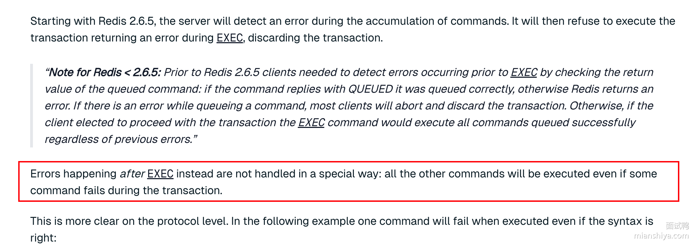

从 Redis 2.6.5 开始，服务器会在累计命令的过程中检测到错误，此时执行 EXEC 会拒绝执行事务，并且返回一个错误，同时求丢该事务。

但如果事务执行的过程中发生了错误，**Redis 会继续执行剩下的命令，而不会对事务进行回滚**，这个是 Redis 和 MySQL 最不一样的地方，并且也**不支持多种隔离级别的设置**，因为 Redis 是单线程执行，只能是串行隔离级别。

可以认为 Redis 的事务是一个残血的事务，**更多只是一个噱头，不是我们平时理解的事务**。

### Redis 数据过期后的删除策略是什么？ 

#### 回答重点

Redis 数据过期主要有两种删除策略，分别为**定期删除、惰性删除**两种：

- **定期删除**：Redis 每隔一定时间（默认是 100 毫秒）会随机检查一定数量的键，如果发现过期键，则将其删除。这种方式能够在后台持续清理过期数据，防止内存膨胀。
- **惰性删除**：在每次访问键时，Redis 检查该键是否已过期，如果已过期，则将其删除。这种策略保证了在使用过程中只删除不再需要的数据，但在不访问过期键时不会立即清除。

#### 扩展知识

##### 定期删除细节

定期删除策略是 Redis 内部的一个定时任务，周期性（每 100ms）地扫描一些设置了过期时间的键。

要注意，Redis 并不会一次性扫描所有设置了过期时间的键，因为这样会消耗大量的 CPU 资源。**它会在每次扫描时限制扫描的时间和数量**，以避免对性能产生过大的影响，因此可能会有部分键过期了没有被及时删除。

每次获取 20 个 key 判断是否过期，如果发现过期的 key 占比超过 25% 则继续再拉 20 个，如果小于 25% 则停止。这里还有一个时间限制，即一次删除时间不超过 25ms，即如果发现占比超过 25% 的时候，需要判断目前是否已经花了 25ms，如果已经用了这么多时长也会结束。

##### 惰性删除优缺点

- **优点**：可以减少 CPU 的占用，因为只有查询到了相关的数据才执行删除操作，不需要主动去定时删除。
- **缺点**：如果一直没有查询一个 Key，就有可能不会被删除，这样就容易造成内存泄漏问题。

##### 内存回收机制

实际上，除了这两个删除，还有一个机制也会淘汰 key，即当 Redis 内存使用达到设置的 maxmemory 限制时，会触发内存回收机制。

此时会主动删除一些过期键和其他不需要的键，以释放内存。具体的删除策略有以下几种：

- volatile-lru: 从设置了过期时间的键中使用 LRU（Least Recently Used，最近最少使用）算法删除键。
- allkeys-lru: 从所有键中使用 LRU 算法删除键。
- volatile-lfu: 从设置了过期时间的键中使用 LFU（Least Frequently Used，最少使用频率）算法删除键。
- allkeys-lfu: 从所有键中使用 LFU 算法删除键。
- volatile-random: 从设置了过期时间的键中随机删除键。
- allkeys-random: 从所有键中随机删除键。
- volatile-ttl: 从设置了过期时间的键中根据 TTL（Time to Live，存活时间）删除键，优先删除存活时间短的键。
- noeviction: 不删除键，只是拒绝写入新的数据。

Redis 在正常情况下对过期键的处理就是惰性删除 + 定期删除一起使用，主动删除（内存回收）其实属于异常的兜底处理了。

##### Redis 键过期时间的设置

- EXPIRE：设置键的过期时间（以秒为单位）。
- PEXPIRE：设置键的过期时间（以毫秒为单位）。
- SETEX：在设置键值的同时定义过期时间。
- PSETEX：类似于 SETEX，但支持毫秒级的过期时间。

### Redis 的 Lua 脚本功能是什么？如何使用？ 

#### 回答重点

Redis 的 Lua 脚本功能允许用户在 Redis 服务器端执行自定义的 Lua 脚本，以实现原子操作和复杂逻辑。 其核心点包括：

- **原子性**：Lua 脚本的所有命令在执行过程中是原子的，避免了并发修改带来的问题。
- **减少网络往返次数**：通过在服务器端执行脚本，减少了客户端和服务器之间的网络往返次数，提高了性能。
- **复杂操作**：可以在 Lua 脚本中执行复杂的逻辑，比如批量更新、条件更新等，超过了单个 Redis 命令的能力。

例如常见基于 Redis 实现分布式锁就需要结合 lua 脚本来实现。

**lua 本身是不具备原子性的**，但由于 Redis 的命令是单线程执行的，它会把整个 lua 脚本作为一个命令执行，会阻塞其间接受到的其他命令，这就保证了 lua 脚本的原子性。

#### 扩展知识

##### Lua 脚本的基本结构

**调用 Redis 命令**：

- 使用 `redis.call` 调用 Redis 原生命令。
- 使用 `redis.pcall` 进行安全调用，如果脚本中的某些命令失败，可以捕获错误，而不是直接中断执行。这样可以在脚本内处理错误。

**参数传递**：

- `KEYS` 表示传入的键名数组。
- `ARGV` 表示传入的参数数组。

##### Lua 脚本使用示例

###### 基本的 GET 和 SET 操作

```lua
EVAL 
"local value = redis.call('GET', KEYS[1]) 
if not value then redis.call('SET', KEYS[1], ARGV[1])
end 
return value" 1 mykey "default_value"
```

**分析**：

- 这段脚本首先获取键 `mykey` 的值。
- 如果 `mykey` 不存在，则设置其值为 `default_value`。
- 返回 `mykey` 的当前值。

**步骤**：

1. `redis.call('GET', KEYS[1])` 获取键的值。
2. `if not value then redis.call('SET', KEYS[1], ARGV[1]) end` 检查值是否存在，不存在则设置默认值。
3. `return value` 返回当前值。

###### 原子递增计数器

```lua
EVAL "local current = redis.call('INCR', KEYS[1]) return current" 1 counter_key
```

**分析**：

- 这段脚本使用 `INCR` 原子性地递增键 `counter_key` 的值。

**步骤**：

1. `redis.call('INCR', KEYS[1])` 直接递增。
2. 返回递增后的值。

###### 限流控制

假设我们要实现一个简单的限流器，每分钟允许访问 100 次。

```lua
EVAL [[
  local current = tonumber(redis.call('GET', KEYS[1]) or 0)
  if current < ARGV[1] then
    redis.call('INCR', KEYS[1])
    redis.call('EXPIRE', KEYS[1], 60)
    return true
  else
    return false
  end
]] 1 rate_limit_key 100
```

**分析**：

- 该脚本检查当前的访问次数是否超过限制。
- 如果未超过限制，则增加计数并设置过期时间。

**步骤**：

1. `local current = tonumber(redis.call('GET', KEYS[1]) or 0)` 获取当前计数，默认为 0。
2. 判断是否小于限制值 `ARGV[1]`。
3. 若未超过，则 `INCR` 当前计数并设置过期时间。
4. 返回布尔值表示是否允许访问。

##### Lua 预加载脚本

可以使用 `SCRIPT LOAD` 将 Lua 脚本预加载到 Redis，以提高执行效率：

```lua
SCRIPT LOAD "return redis.call('GET', KEYS[1])"
```

此命令返回脚本的 SHA1 哈希值，后续可用 `EVALSHA` 命令通过该哈希值执行。

##### Lua 脚本使用注意点

由于 Redis 执行 lua 脚本其间，无法处理其他命令，因此如果 lua 脚本的业务过于复杂，则会产生长时间的阻塞，因此编写 Lua 脚本时应尽量保持简短和高效。

Redis 默认限制 lua 执行脚本时间为 5s，如果超过这个时间则会终止且抛错，可以通过 `lua-time-limit` 调整时长。

##### 如果 Lua 脚本中的部分命令执行失败会怎样？

例如以下这段 lua 脚本：

```lua
-- 正确的 SET 命令
redis.call("SET", "my_key", "mianshiya")

-- 错误的 HSET 命令
redis.call("HSET", "my_hash", "field_mianshiya") -- 缺少值参数
```

此时，执行上述的 lua 脚本， my_key 会被成功执行，由于 HSET 缺少参数，会报错，**而 my_key 并不会被回滚。**

**所以实际上 lua 脚本并不能完全保证原子性**，但是官方认为这种错误正常情况下不可能发生，属于开发者的人为因素（语法错误、或者执行了不应该执行的命令）导致的，他们不背这个锅。

##### Lua 知识点

Lua 语言是一门轻量级的脚本语言，使用 C 语言编写，具有简洁的语法，易于学习和使用，广泛应用于游戏开发、嵌入式系统等领域。

它设计的主要目的就是为了嵌入其他程序，实现灵活的扩展和定制功能，并且具备快速的执行速度，能够满足各种开发需求。

Lua 语言具有以下优点：

1. 轻量级：占用资源少，易于嵌入其他程序。
2. 简洁高效：语法简单，执行效率高。
3. 跨平台：可在多种操作系统上运行。
4. 扩展性强：方便与其他语言集成。
5. 快速开发：减少开发时间和成本。
6. 灵活性高：适应各种不同的项目需求。
7. 易于学习：入门难度低，容易掌握。
8. 解释执行：无需编译，便于调试。
9. 资源占用少：对系统资源的需求相对较低。
10. 社区活跃：有丰富的文档和工具支持。

### Redis 的 Pipeline 功能是什么？ 

#### 回答重点

Redis 的 Pipeline 功能允许客户端在一次网络请求中批量发送多个命令，以减少网络延迟并提高性能。通过将多个命令打包发送，客户端可以在不等待每个命令响应的情况下继续发送其他命令，从而显著提高吞吐量。

**好处：**

- **节省了网络传输时间**
- **减少了 Redis 服务端上下文切换带来的开销**

#### 扩展知识

##### **与事务的区别**

- Pipeline 并不保证命令的原子性，也不支持事务特性。如果某个命令失败，其他命令仍会继续执行。
- Redis 的事务是通过 MULTI、EXEC 命令实现的，可以保证一组命令的原子性。

##### **使用注意事项**

需要注意 Pipeline 不宜包装过多的命令，因为会导致客户端长时间的等待，且服务器需要使用内存存储响应，**所以官方推荐最多一次 10k 命令**。

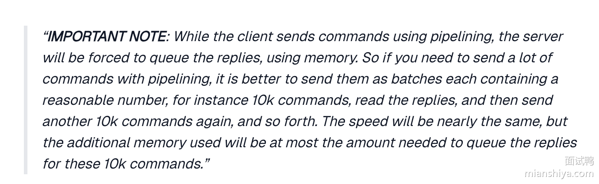

还有一点需要注意 pipeline 命令执行的原子性不能保证，如果要保证原子性则使用 lua 脚本或者事务。

##### **Pipeline 示例代码**

**Java 的 Jedis 库实现**:

```java
import redis.clients.jedis.Jedis;
import redis.clients.jedis.Pipeline;

public class RedisPipelineExample {
    public static void main(String[] args) {
        // 创建 Redis 连接
        Jedis jedis = new Jedis("localhost", 6379);

        // 开始 Pipeline
        Pipeline pipeline = jedis.pipelined();

        // 批量设置键值对
        for (int i = 0; i < 1000; i++) {
            pipeline.set("key" + i, "value" + i);
        }

        // 执行所有命令
        pipeline.sync();

        // 关闭连接
        jedis.close();
    }
}
```

**使用 Python 的 redis-py 库**:

```python
import redis

r = redis.StrictRedis(host='localhost', port=6379, db=0)
pipeline = r.pipeline()

for i in range(1000):
    pipeline.set(f'key{i}', f'value{i}')

# 执行所有命令
pipeline.execute()
```

##### **性能测试**

使用 Pipeline 可以在性能测试中显著减少与 Redis 的交互延迟，适合在高负载情况下进行优化。

参考网络上的一个执行实验结果，使用 Pipeline 性能提升了 100 倍。

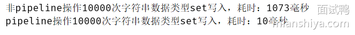

##### Pipeline 进一步分析

正常情况下，如果要执行多条命令，那么操作如下：

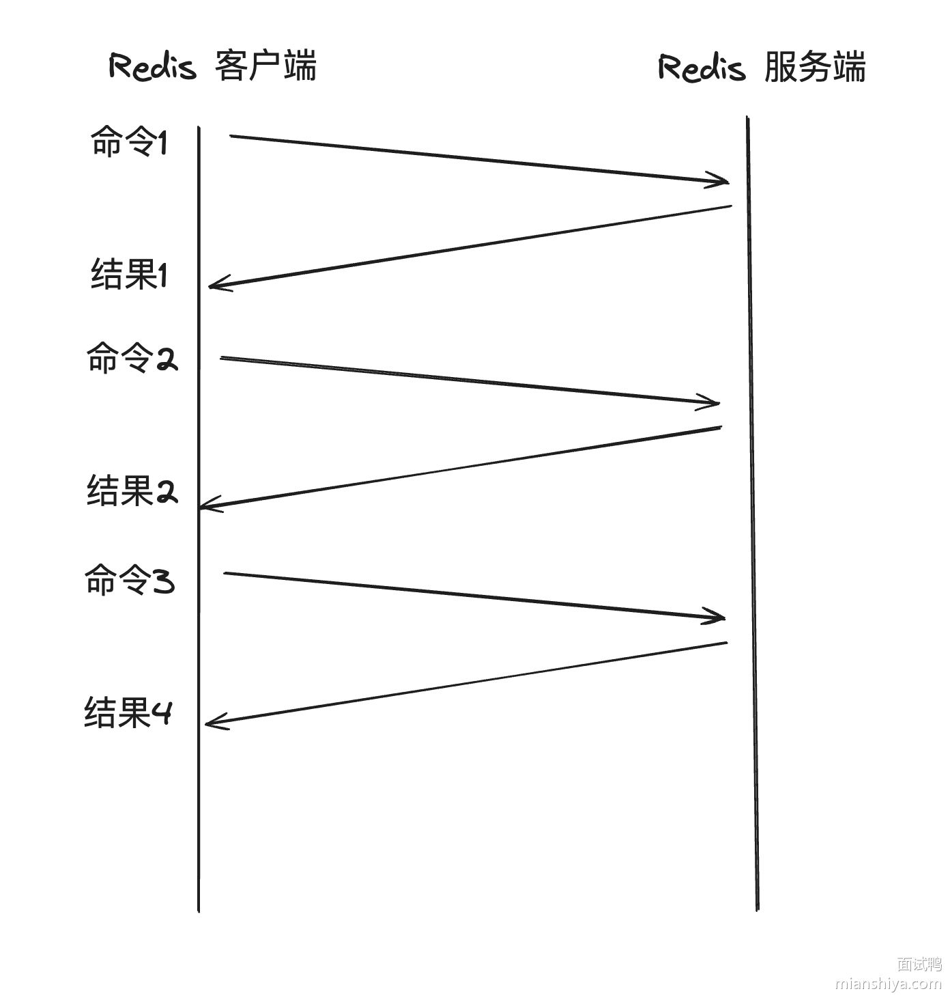

而 Redis pipeline（管道）使得客户端可以一次性将要执行的多条命令封装成块一起发送给服务端，具体过程如下图所示：

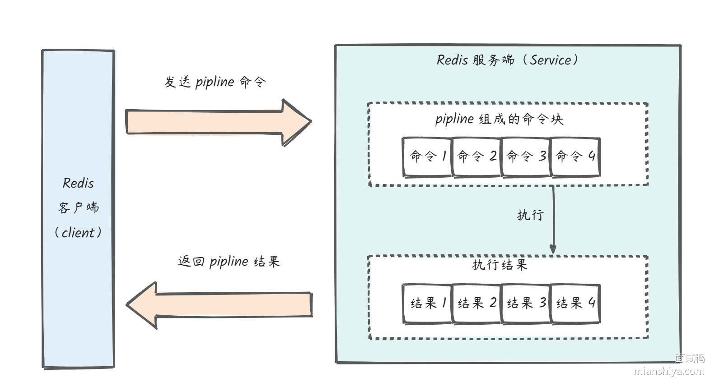

Redis 服务端在收到来自管道发送的多条命令之后，会先把这些命令按序执行，并将执行结果保存到缓存中，直到最后一条命令执行完成，再把命令执行的结果一起返回给客户端。

Redis 使用 pipeline 主要有以下两个好处：

1）**节省了 RTT**

RTT（Round Trip Time）即往返时间。Redis 客户端将要执行的多条指令一次性给服务端，显然减少了往返时间。

拿快递来理解，将所有快递都装进卡车在两地一次性配送和将快递分批装进面包车，多次往返两地送完快递。很显然一次性用卡车送完花在两地往返的时间最短。

2）**减少了上下文切换带来的开销**

当服务端需要从网络中读写数据时，都会产生一次系统调用，系统调用是非常耗时的操作。其中涉及到程序由用户态切换到内核态，再从内核态切换回用户态的过程。当我们执行 100 条 Redis 指令的时候，就发生 100 次用户态到内核态之间上下文的切换，但是如果使用管道的话，其将多条命令一同发送给服务端，就只需要进行一次上下文切换就好了，这样就可以节约性能。

### Redis 在生成 RDB 文件时如何处理请求？ 

#### 回答重点

在 Redis 生成 RDB 文件时是异步的（使用 bgsave 命令），**采用了 fork 子进程的方式来进行快照操作**。生成 RDB 文件的过程由子进程执行，主进程继续处理客户端请求，所以可以保证 Redis 在生成快照的过程中依然对外提供服务，不会影响正常请求。

#### 扩展知识

##### 生成 RDB 文件的时候，数据可以修改吗？

当然可以。主进程会正常处理客户端的请求，进行数据的修改。但数据被修改还叫快照吗？

此时就运用了**写时复制**的技术。

当主进程 `fork` 出一个子进程后，并不会把主进程的所有内存数据重新复制一份给子进程，而是让主进程和子进程共享相同的内存页面。

底层的实现仅仅复制了**页表**，但映射的物理内存还是同一个。这样做可以加快 fork 的速度，减少性能损耗（fork会阻塞主进程）。

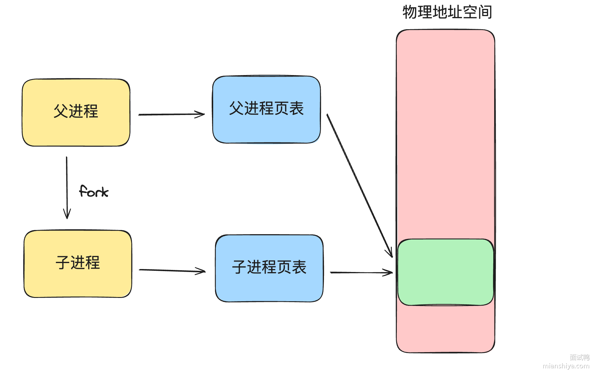

此时，主进程收到写命令，需要修改数据，那么主进程会将对应数据所在的页复制一份，对复制的副本进行修改。此时子进程指向的还是老的页，因此数据没有变化，符合快照的概念。

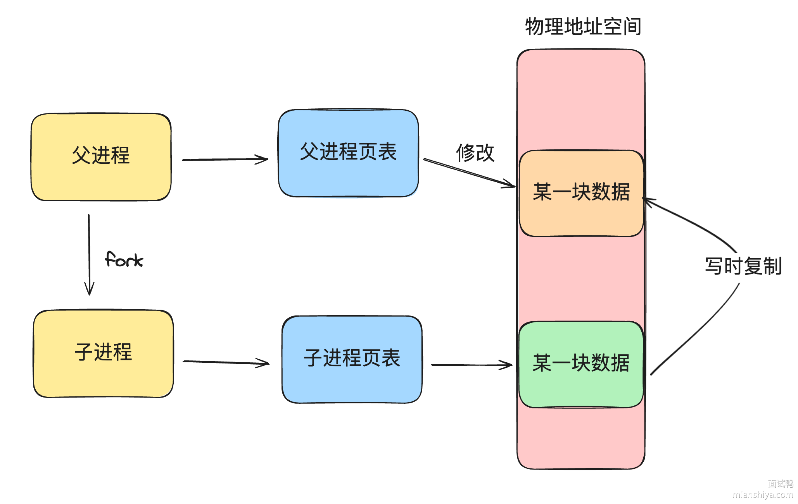

通过在写的时候才触发内存的复制，可以显著地降低 Redis 实例的性能压力，最大限度的减少 RDB 对服务正常运行的影响。

##### 避免高峰期生成 RDB

如果 RDB 时间长，且写并发高，此时会被系统产生比较大的影响。

原因是因为写时复制时，如果共享的每一页内存都被修改，就会使得内存极速膨胀，最大内存可以膨胀两倍，所以要注意内存的使用量，防止内存过载。

RDB 会产生大量的磁盘 I/O，要注意磁盘性能导致的影响。

还需要注意 CPU 负载，毕竟有大量的数据需要写入。

因此如果 RDB 在高峰期可能会影响到正常业务，需要合理安排生成 RDB 的时机。

### Redis 的哨兵机制是什么？

#### 回答重点

**Redis 的哨兵机制（Sentinel）** 是一种高可用性解决方案，用于监控 Redis 主从集群，自动完成主从切换，以实现故障自动恢复和通知。

主要功能包括：

- **监控**：哨兵不断监控 Redis 主节点和从节点的运行状态，定期发送 PING 请求检查节点是否正常。
- **自动故障转移**：当主节点发生故障时，哨兵会选举一个从节点提升为新的主节点，并通知客户端更新主节点的地址，从而实现高可用。
- **通知**：哨兵可以向系统管理员或其他服务发送通知，以便快速处理 Redis 实例的状态变化。

#### 扩展知识

##### 哨兵机制的由来

主从架构中，如果采用读写分离的模式，即主节点负责写请求，从节点负责读请求。假设这个时候主节点宕机了，没有新的主节点顶替上来的话，就会出现很长一段时间写请求没响应的情况。

针对这个情况，便出现了哨兵这个机制。它主要进行监控作用，如果主节点挂了，将从节点切换成主节点，从而最大限度地减少停机时间和数据丢失。

哨兵机制对应的架构图如下所示：

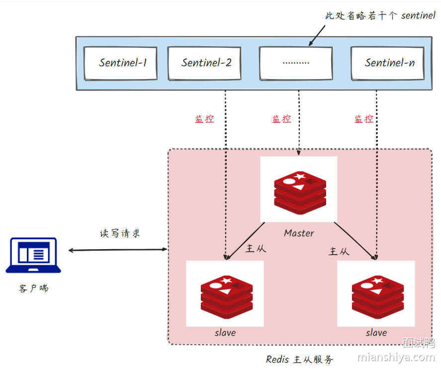

- 哨兵节点（Sentinel）: 主要作用是对 Redis 的主从服务节点进行监控，当主节点发生故障的时候，哨兵节点会选择一个合适的从节点升级为主节点，并通知其他从节点和客户端进行更新操作。
- Redis 节点：主要包括 master 以及 slave 节点，就是 Redis 提供服务的实例。

一般哨兵需要集群部署，至少三台哨兵组成哨兵集群。

##### 主观下线和客观下线

哨兵是如何判断 Redis 中主节点挂了的呢？主要涉及到了两个机制：**主观下线**以及**客观下线**。

**1）主观下线**

Sentinel 每隔 1s 会发送 ping 命令给所有的节点。如果 Sentinel 超过一段时间还未收到对应节点的 pong 回复，就会认为这个节点主观下线。

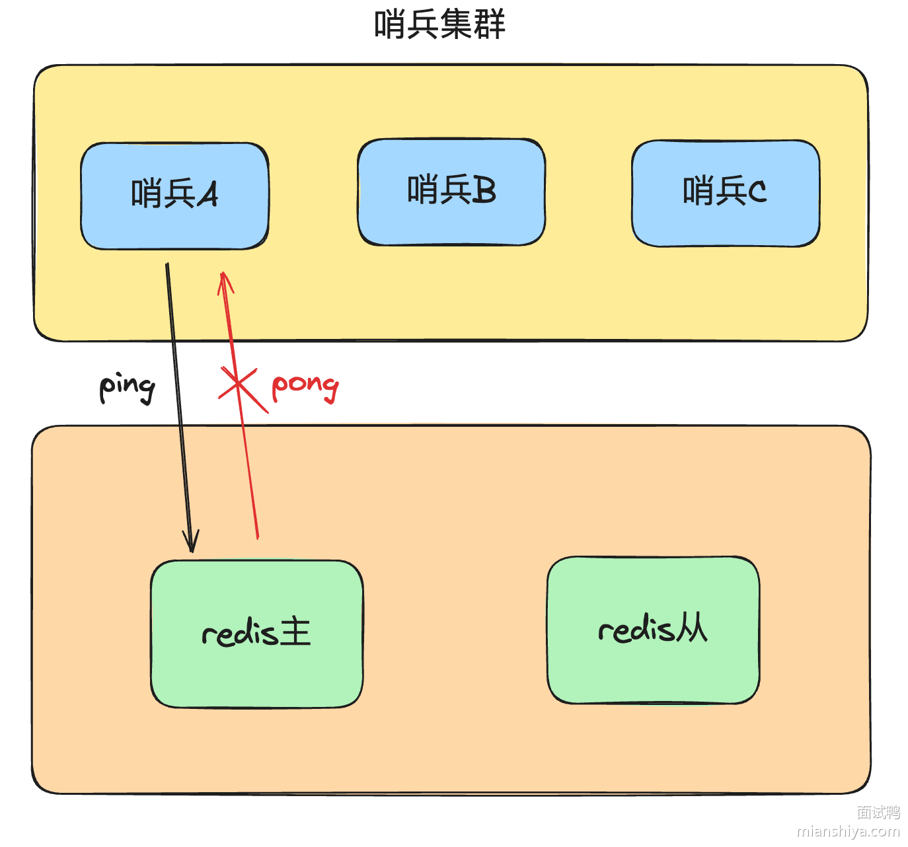

“一段时间”是配置项 `down-after-milliseconds` 设定的。

**2）客观下线**

注意，**只有主节点才有客观下线，从节点没有**。

假设目前有个主节点被一个 sentinel 的判断主观下线了，但可能主节点并没问题，只是因为网络抖动导致了一台哨兵的误判。所以此时哨兵需要问问它的队友，来确定这个主节点是不是真的出了问题！

因此，它会向其他哨兵发起投票，其他哨兵会判断主节点的状态进行投票，可以投赞成或反对。

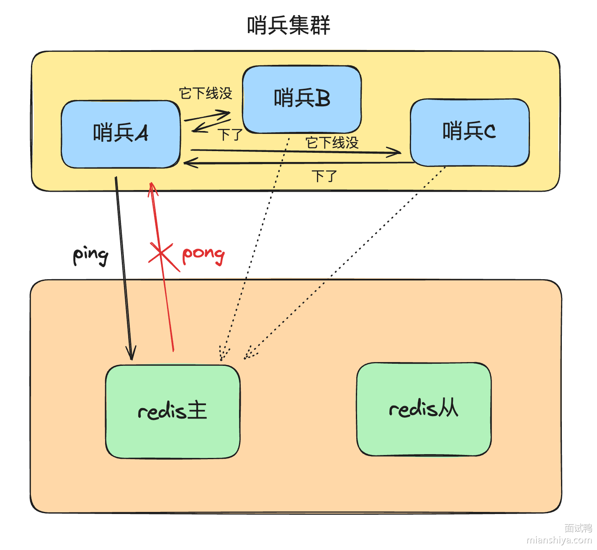

如果认为下线的总投票数大于 quorum（一般为集群总数/2 + 1，假设哨兵集群有 3 台实例，那么 3 / 2 + 1 = 2），则判定该主节点客观下线，此时就需要进行主从切换，而**只有哨兵的 leader 才能操作主从切换**。

##### Sentinel leader 是如何选举出来的？

Sentinel leader 节点的选举实际上涉及到分布式算法 raft，感兴趣的同学可以深入去了解一下，这里主要简单说一下哨兵集群选择 leader 的方式：

判断主节点主观下线的 sentinel 就是候选者，此时它想成为 leader。如果同时有两个 sentinel 判断主观下线，那么它们都是候选人，一起竞争成为 leader。

候选者们会先投自己一票，然后向其他 sentinel 发送命令让它们给自己投票。**每个哨兵手里只有一票，投了一个之后就不能投别人了**。

最后，如果某个候选者拿到哨兵集群半数及以上的赞成票，就会成为 leader。这里有一个注意的点，为了保证 sentinel 选举的时候尽量避免出现平票的情况，sentinel 的节点个数一般都会是奇数，比如 3,5,7 这样。

##### Redis 主节点选举

选出哨兵 leader 之后，需要选出 Redis 主从集群中的新 master 节点。

首先需要把一些已经下线的节点全部剔除，然后从正常的从节点中选择主节点，其主要经过以下三个流程:

1. 根据从节点的优先级进行选择，优先选择优先级的值比较小的节点（优先级的值越小优先级越高，优先级可通过 `slave-priority` 配置）。
2. 如果节点的优先级相同，则查看进行主从复制的 offset 的值，即复制的偏移量，偏移量越大则表示其同步的数据越多，优先级越高。
3. 如果 offset 也相同了，那只能比较 ID 号，选择 ID 号比较小的那个作为主节点（每个实例 ID 不同）。

选好主节点之后，哨兵 leader 会让其他从节点全部成为新 master 节点的 slave 节点。

最后利用 redis 的发布/订阅机制，把新主节点的 IP 和端口信息推送给客户端，此时主从切换就结束了。

可能还有同学关心旧主节点恢复了怎么办？实际上哨兵会继续监视旧的主节点，如果它上线了，哨兵集群会向它发送 slaveof 命令，让它成为新主节点的从节点。

### Redis 主从复制的实现原理是什么？

#### 回答重点

Redis 的主从复制是指一个 Redis 实例（主节点）可以将数据复制到一个或多个从节点（从节点），从节点从主节点获取数据并保持同步。

**复制流程**：

- **开始同步**：从节点通过向主节点发送 `PSYNC` 命令发起同步。
- **全量复制**：如果是第一次连接或之前的连接失效，从节点会请求全量复制，主节点将当前数据快照（RDB文件）发送给从节点。
- **增量复制**：全量复制完毕后，主从之间会保持一个长连接，主节点会通过这个连接将后续的写操作传递给从节点执行，来保证数据的一致。

#### 扩展知识

##### Redis 主从架构

下图就是一个 Redis 主从架构图：

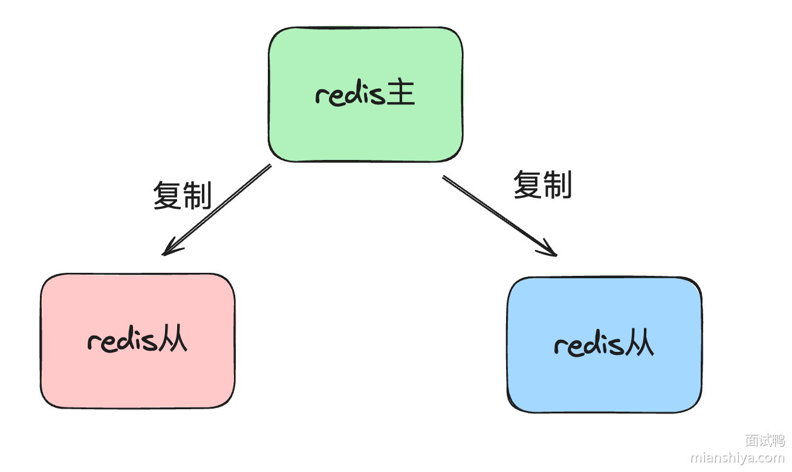

主从架构可以实现读写分离。写操作可以请求主节点，而读操作只请求从节点，这样就能减轻主节点的压力。

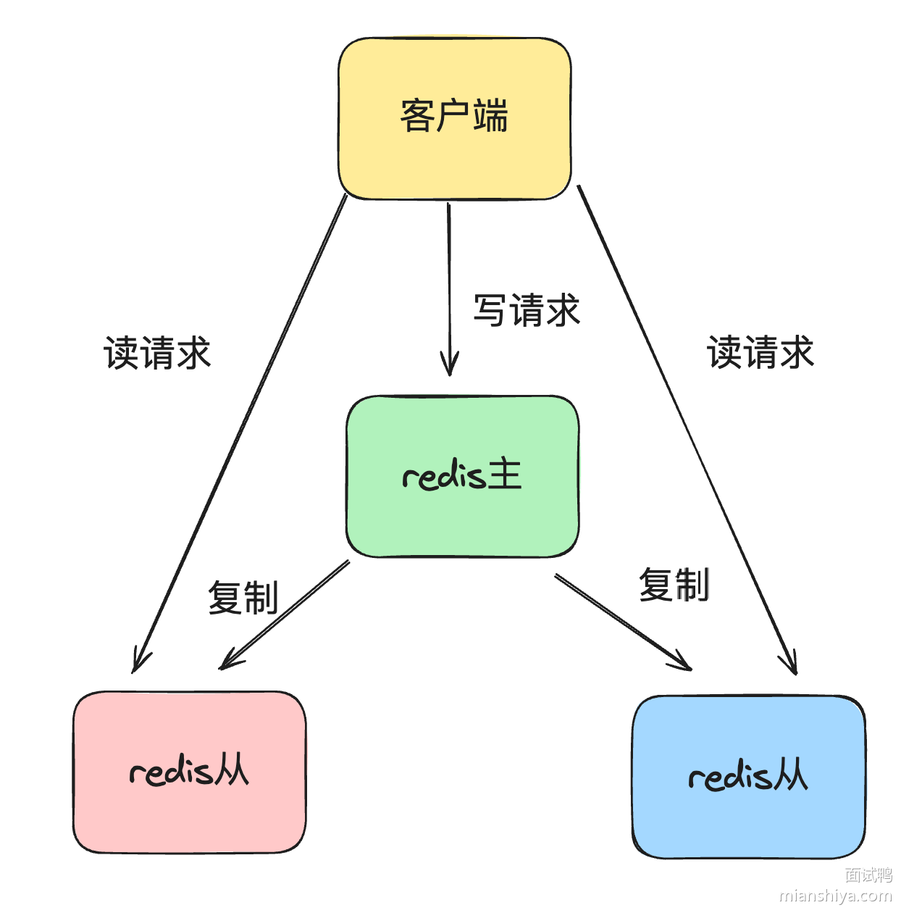

整个主从集群仅主节点可以写入，其它从节点都通过复制来同步数据，这样就能保证数据的一致性。并且对读请求分散到多个节点，提高了 Redis 的吞吐量，从一定程度上也提高了 Redis 的可用性。

##### 主从复制原理详解

Redis 之间主从复制主要有两种数据同步方式，分别是**全量同步**和**增量同步**。

1） **全量同步**

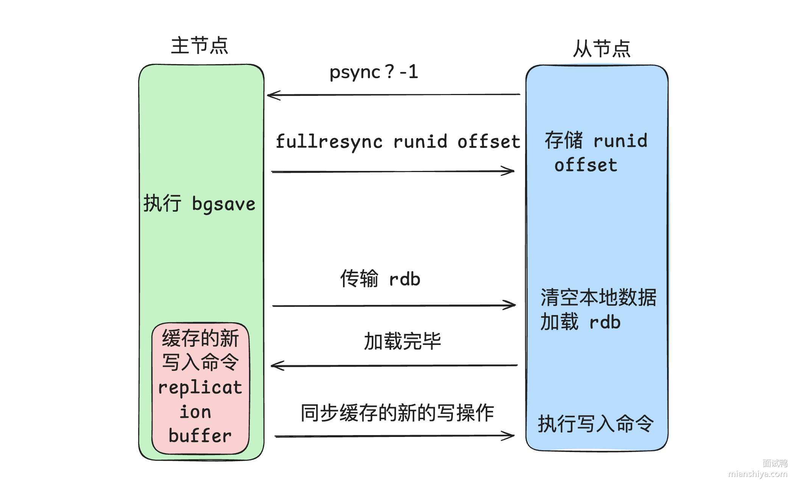

- runid 指的是主服务器的 run ID，从节点第一次同步不知道主节点 ID，于是传递 "?"。
- offset 为复制进度，第一次同步值为 -1。

文字版本的流程：

- 从节点发送 `psync ？ -1`，触发同步。
- 主节点收到从节点的 psync 命令之后，发现 runid 没值，判断是全量同步，返回 fullresync 并带上主服务器的 runid 和当前复制进度，从服务器会存储这两个值。
- 主节点执行 bgsave 生成 RDB 文件，在 RDB 文件生成过程中，主节点新接收到的写入数据的命令会存储到 `replication buffer` 中。
- RDB 文件生成完毕后，主节点将其发送给从节点，从节点清空旧数据，加载 RDB 的数据。
- 等到从节点中 RDB 文件加载完成之后，主节点将 replication buffer 缓存的数据发送给从节点，从节点执行命令，保证数据的一致性。

待同步完毕后，主从之间会保持一个长连接，主节点会通过这个连接将后续的写操作传递给从节点执行，来保证数据的一致。

2） **增量同步**

主从之间的网络可能不稳定，如果连接断开，主节点部分写操作未传递给从节点执行，主从数据就不一致了。

此时有一种选择是再次发起全量同步，但是全量同步数据量比较大，非常耗时。因此 Redis 在 2.8 版本引入了增量同步（psync 其实就是 2.8 引入的命令），仅需把连接断开其间的数据同步给从节点就好了。

此时需要介绍下 `repl_backlog_buffer`。

`repl_backlog_buffer` 是一个环形缓冲区，默认大小为 1m。主节点会将写入命令存到这个缓冲区中，但是大小有限，待写入的命令超过 1m 后，会覆盖之前的数据，因为是环形写入。

增量同步也是 psync 命令，如果主节点判断从节点传递的 runid 和主节点一致，且根据 offset 判断数据还在`repl_backlog_buffer`中，则说明可以进行增量同步。

于是就去 `repl_backlog_buffer` 查找对应 offset 之后的命令数据，写入到 `replication buffer` 中，最终将其发送给 slave 节点。slave 节点收到指令之后执行对应的命令，一次增量同步的过程就完成了。

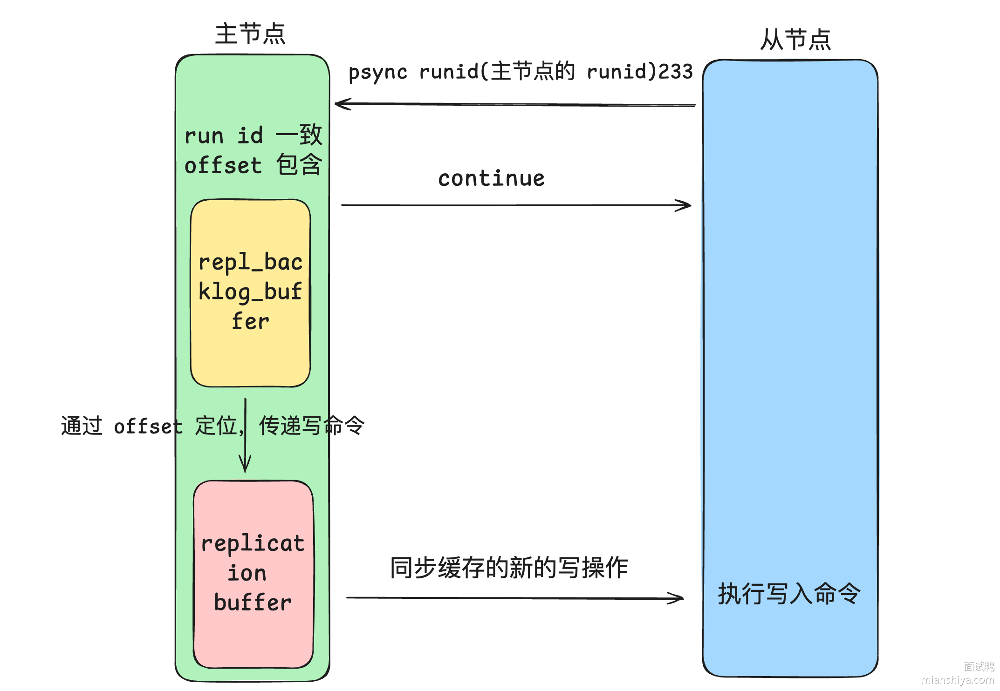

如果根据 offset 判断数据已经被覆盖了，此时只能触发全量同步！

因此可以调整 `repl_backlog_buffer` 大小，尽量避免出现全量同步。

##### replication buffer 和 repl_backlog_buffer 的区别

###### replication buffer

因为不同的从节点同步速度不一样，**主节点会为每个从节点都创建一个** `replication buffer`，**它用于实时传输写命令**，且大小是动态的，因为对于同步速度较慢的从服务器，需要更多的内存来缓存数据。

虽说 `replication buffer` 没有明确的大小限制，但是可以通过 `client-output-buffer-limit` 间接控制，该参数可以设置不同类型客户端（普通、从服务器、发布订阅）的输出缓冲区限制。当缓冲区大小超过限制时，Redis 会断开与客户端（从节点其实就是一个客户端）的连接。

```
client-output-buffer-limit slave 256mb 64mb 60
```

上述配置表示，如果从服务器的输出缓冲区大小超过 256 MB 或超过 64 MB 的时间达到 60s，Redis 将断开与从服务器的连接。

###### repl_backlog_buffer

`repl_backlog_buffer` 在主节点上只有一个，**存储最近的写命令**，用于从服务器重新连接时进行部分重同步。

## Spring

### 说说 Spring 启动过程？ 

#### 回答重点

1）加载配置文件，初始化容器：

Spring 启动时首先会读取配置文件（如 XML 配置文件、Java Config 类等），包括配置数据库连接、事务管理、AOP 配置等。

2）实例化容器：

Spring 根据配置文件中的信息创建容器 ApplicationContext，在容器启动阶段实例化 BeanFactory，并加载容器中的 BeanDefinitions。

3）解析 BeanDefinitions：

Spring 容器会解析配置文件中的 BeanDefinitions，即声明的 Bean 元数据，包括 Bean 的作用域、依赖关系等信息。

4）实例化 Bean：

Spring 根据 BeanDefinitions 实例化 Bean 对象，将其放入容器管理。

5）注入依赖：

Spring 进行依赖注入，将 Bean 之间的依赖关系进行注入，包括构造函数注入、属性注入等。

6）处理 Bean 生命周期初始化方法：

- Spring 调用 Bean 初始化方法（如果有定义的话），对 Bean 进行初始化。
- 如果 Bean 实现了 `InitializingBean` 接口，Spring 会调用其 `afterPropertiesSet` 方法。

7）处理 BeanPostProcessors：

容器定义了很多 BeanPostProcessor，处理其中的自定义逻辑，例如 postProcessBeforeInitialization 会在 Bean 初始化前调用， postProcessAfterInitialization 则在之后调用。

Spring AOP 代理也在这个阶段生成。

8）发布事件：

Spring 可能会在启动过程中发布一些事件，比如容器启动事件。

9）完成启动：

当所有 Bean 初始化完毕、依赖注入完成、AOP 配置生效等都准备就绪时，Spring 容器启动完成。

#### 扩展知识

##### Spring 启动过程的详细分解

###### **加载配置文件，初始化 Spring 容器**

Spring 启动过程的第一步是初始化 Spring 容器。Spring 容器可以通过多种方式初始化，常见的包括：

- 使用 `ClassPathXmlApplicationContext` 读取 XML 配置文件。
- 使用 `AnnotationConfigApplicationContext` 加载基于注解的配置类。

**示例**：

```java
ApplicationContext context = new ClassPathXmlApplicationContext("applicationContext.xml");
// 或者使用注解配置
ApplicationContext context = new AnnotationConfigApplicationContext(AppConfig.class);
```

###### **实例化容器加载 Bean 定义**

在初始化容器时，Spring 会扫描所有的 Bean 定义。对于基于注解的配置，Spring 会扫描指定包下的所有带有 `@Component`、`@Service`、`@Controller` 等注解的类，并加载它们的定义到容器中。对于 XML 配置，Spring 会解析 `<bean>` 元素并加载定义，得到 BeanDefinitions。

**示例**：

```java
@Configuration
@ComponentScan(basePackages = "com.example.service")
public class AppConfig {
}
```

###### **实例化 Bean**

Spring 通过 `ApplicationContext` 或 `BeanFactory` 实例化每个 Bean。在此阶段，Spring 会创建 Bean 的实例，但不会立即注入依赖。这个过程类似于类的构造函数调用。

###### **注入依赖**

在实例化之后，Spring 会注入依赖项。依赖常见有以下三种方式：

- **构造函数注入**：通过构造函数来注入依赖。
- **Setter 注入**：通过 Setter 方法注入依赖。
- **字段注入**：通过 `@Autowired` 注解直接注入字段。

**示例**：

```java
@Service
public class UserService {

    @Autowired
    private UserRepository userRepository;

    // 或者通过构造函数注入
    @Autowired
    public UserService(UserRepository userRepository) {
        this.userRepository = userRepository;
    }
}
```

###### **处理 Bean 生命周期初始化方法**

Spring 支持两种初始化回调机制：

- 实现 `InitializingBean` 接口，并在 `afterPropertiesSet()` 方法中执行初始化逻辑。
- 使用 `@PostConstruct` 注解的方法作为初始化回调。

**示例**：

```java
@Service
public class UserService implements InitializingBean {

    @Override
    public void afterPropertiesSet() throws Exception {
        // 初始化逻辑
    }
    
    @PostConstruct
    public void init() {
        // 另一种初始化方法
    }
}
```

###### **处理 BeanPostProcessors**

在所有 Bean 初始化完成之前，Spring 容器会调用所有注册的 `BeanPostProcessor`。`BeanPostProcessor` 允许对每个 Bean 进行自定义的处理操作，比如修改 Bean 属性或者进行额外的初始化。

**示例**：

```java
@Component
public class CustomBeanPostProcessor implements BeanPostProcessor {

    @Override
    public Object postProcessBeforeInitialization(Object bean, String beanName) throws BeansException {
        // Bean 初始化前的处理
        return bean;
    }

    @Override
    public Object postProcessAfterInitialization(Object bean, String beanName) throws BeansException {
        // Bean 初始化后的处理
        return bean;
    }
}
```

###### **发布事件**

发布事件的时机可以是任何时候，取决于事件的类型，例如 Spring 会在容器启动完成时发布 ContextRefreshedEvent，以通知所有监听器容器已经准备就绪。

###### **容器启动完成**

当所有的 Bean 完成初始化后，Spring 容器正式启动完成。如果是 Web 应用，Spring 容器会开始监听 HTTP 请求并处理业务逻辑。

##### **Spring 启动过程中的重要组件**

###### **`ApplicationContext`**

`ApplicationContext` 是 Spring 容器的核心接口，负责初始化、配置和管理 Bean。常用的实现类有：

- `ClassPathXmlApplicationContext`：从类路径中加载 XML 配置文件。
- `AnnotationConfigApplicationContext`：加载基于注解的 Java 配置类。
- `WebApplicationContext`：为 Web 应用程序设计的应用上下文。

###### **`BeanDefinition`**

每个 Bean 在 Spring 中都对应一个 `BeanDefinition`，其中包含 Bean 的元数据（如类名、作用域、依赖关系等）。Spring 会根据 `BeanDefinition` 创建和管理 Bean 实例。

### 你了解的 Spring 都用到哪些设计模式？

#### 回答重点

工厂模式，从名字就能看出来是 BeanFactory，整个 Spring IOC 就是一个工厂。

模板方法，例如 JdbcTemplate、RestTemplate，名字是 xxxTemplate 的都是模板。

代理模式，AOP 整个都是代理模式。

单例模式，默认情况下 Bean 都是单例的。

责任链模式，比如 Spring MVC 中的拦截器，多个拦截器串联起来就形成了责任链。

观察者模式，在 Spring 中的监听器实现。

适配器模式，在 Spring MVC 中提到的 handlerAdapter 其实就是适配器。

#### 扩展知识

##### 单例模式

首先，需要区分单例模式与 Spring 中的单例 Bean。根据单例模式的定义：

> Ensure a class only has one instance, and provide a global point of access to it.
> 确保一个类只有一个实例，并提供一个全局的方法访问它。

显然，Spring 中的 singleton bean 并不是严格的单例模式，singleton bean 只保证在每个容器中，相同 ID 的 bean 是单例的。例如，在多数据源的应用中，会实例化多个 DataSource 对象。

当然，Spring 中也使用了单例模式，例如：

- org.springframework.transaction.TransactionDefinition#withDefaults
- org.springframework.aop.TruePointcut#INSTANCE
- org.springframework.aop.interceptor.ExposeInvocationInterceptor#ADVISOR
- org.springframework.core.annotation.AnnotationAwareOrderComparator#INSTANCE
- org.springframework.core.OrderComparator#INSTANCE

##### 建造者模式

> Separate the construction of a complex object from its representation so that the same construction process can create different representations.
> 将复杂对象的构建与其表示分离，使得相同的构建过程可以创建不同的表示。

- org.springframework.beans.factory.support.BeanDefinitionBuilder
- org.springframework.web.util.UriComponentsBuilder
- org.springframework.http.ResponseEntity.HeadersBuilder
- org.springframework.http.ResponseEntity.BodyBuilder

##### 工厂模式

> Define an interface for creating an object, but let subclasses decide which class to instantiate. Factory Method lets a class defer instantiation to subclasses.
> 定义创建对象的接口，但让子类决定要实例化的类。工厂方法让类将实例化推迟到子类。

- 在 Spring 中，ApplicationContext 与 BeanFactory 的 getBean 方法可以视为工厂方法，它隐藏了 Bean 的创建过程和具体实现。
- org.springframework.beans.factory.FactoryBean
- @Bean 注解的静态方法及实例方法
- ObjectFactory 和 ObjectProvider

前两种工厂主要封装了第三方 Bean 的创建过程，后两种工厂可以延迟创建 Bean，解决循环依赖及单例注入多例的问题。

##### 适配器模式

> Convert the interface of a class into another interface clients expect. Adapter lets classes work together that couldn't otherwise because of incompatible interfaces.
> 将一个类的接口转换为另一个客户希望的接口。适配器使得原本由于接口不兼容而不能一起工作的类可以一起工作。

- org.springframework.web.servlet.HandlerAdapter – 因为控制器有各种不同的实现方式，比如常见的 @RequestMapping 注解的控制器，传统基于 Controller 接口的实现，以及基于 RouterFunction 接口的较新实现。它们的处理方法不一样，为了统一调用，必须适配成 HandlerAdapter 接口。
- org.springframework.beans.factory.support.DisposableBeanAdapter – 由于销毁方法有多种实现，因此需要将它们适配为 DisposableBean 接口来统一调用销毁方法。
- 在 AOP 中需要将 AspectJMethodBeforeAdvice、AspectJAfterReturningAdvice 统一转换为 MethodInterceptor 环绕通知：
  - org.springframework.aop.framework.adapter.MethodBeforeAdviceAdapter 将 @Before 的 AspectJMethodBeforeAdvice 适配为 MethodBeforeAdviceInterceptor。
  - org.springframework.aop.framework.adapter.AfterReturningAdviceAdapter 将 @AfterReturning 的 AspectJAfterReturningAdvice 适配为 AfterReturningAdviceInterceptor。

##### 组合模式

> Compose objects into tree structures to represent part-whole hierarchies. Composite lets clients treat individual objects and compositions of objects uniformly.
> 将对象组合成树形结构来表示部分-整体层次结构。组合模式使得客户可以一致地处理单个对象和对象组合。

composite 对象的作用是，将分散的调用集中起来，统一调用入口。其特征是，与具体实现相同的接口，当调用 composite 对象的接口方法时，实际上是委托具体的实现来完成任务。

- org.springframework.web.method.support.HandlerMethodArgumentResolverComposite
- org.springframework.web.method.support.HandlerMethodReturnValueHandlerComposite
- org.springframework.web.servlet.handler.HandlerExceptionResolverComposite
- org.springframework.web.servlet.view.ViewResolverComposite

##### 装饰器模式

> Attach additional responsibilities to an object dynamically. Decorators provide a flexible alternative to subclassing for extending functionality.
> 动态地为对象增加新的职责。装饰器提供了扩展功能的灵活替代方法。

- org.springframework.web.util.ContentCachingRequestWrapper

##### 代理模式

> Provide a surrogate or placeholder for another object to control access to it.
> 提供一个对象的代理或占位符，以控制对它的访问。

装饰器模式注重功能增强，避免使用子类继承方式扩展功能，而代理模式更注重控制目标的访问。

- org.springframework.aop.framework.JdkDynamicAopProxy
- org.springframework.aop.framework.ObjenesisCglibAopProxy

##### 责任链模式

> Avoid coupling the sender of a request to its receiver by giving more than one object a chance to handle the request. Chain the receiving objects and pass the request along the chain until an object handles it.
> 通过为多个对象提供处理请求的机会，避免将请求的发送者与接收者耦合。将这些接收对象串联起来，直到有对象处理请求为止。

- org.springframework.web.servlet.HandlerInterceptor
- org.aopalliance.intercept.MethodInvocation

##### 观察者模式

> Define a one-to-many dependency between objects so that when one object changes state, all its dependents are notified and updated automatically.
> 定义对象之间的一对多依赖关系，当一个对象的状态发生变化时，所有依赖它的对象都会自动得到通知并更新。

- org.springframework.context.ApplicationListener
- org.springframework.context.event.ApplicationEventMulticaster
- org.springframework.context.ApplicationEvent

##### 策略模式

> Define a family of algorithms, encapsulate each one, and make them interchangeable. Strategy lets the algorithm vary independently from clients that use it.
> 定义一系列算法，将每个算法封装起来，使它们可以互换。策略模式使得算法可以独立于使用它的客户而变化。

- org.springframework.beans.factory.support.InstantiationStrategy
- org.springframework.core.annotation.MergedAnnotations.SearchStrategy
- org.springframework.boot.autoconfigure.condition.SearchStrategy

##### 模板方法模式

> Define the skeleton of an algorithm in an operation, deferring some steps to subclasses. Template Method lets subclasses redefine certain steps of an algorithm without changing the algorithm's structure.
> 定义算法的框架，将某些步骤推迟到子类中。模板方法模式允许子类在不改变算法结构的前提下重新定义算法的某些步骤。

- 大多数以 Template 命名的类，如 JdbcTemplate、TransactionTemplate。
- 许多以 Abstract 命名的类，如 AbstractApplicationContext。

### Spring 有哪几种事务传播行为? 

#### 回答重点

从源码来看，一共有 7 种事务传播行为：

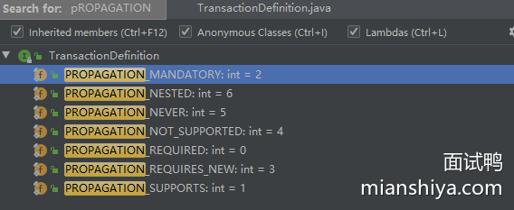

- PROPAGATION_REQUIRED（默认） 如果当前存在事务，则用当前事务，如果没有事务则新起一个事务
- PROPAGATION_SUPPORTS 支持当前事务，如果不存在，则以非事务方式执行
- PROPAGATION_MANDATORY 支持当前事务，如果不存在，则抛出异常
- PROPAGATION_REQUIRES_NEW 创建一个新事务，如果存在当前事务，则挂起当前事务
- PROPAGATION_NOT_SUPPORTED 不支持当前事务，始终以非事务方式执行
- PROPAGATION_NEVER 不支持当前事务，如果当前存在事务，则抛出异常
- PROPAGATION_NESTED 如果当前事务存在，则在嵌套事务中执行，内层事务依赖外层事务，如果外层失败，则会回滚内层，内层失败不影响外层。

#### 扩展知识

##### 应用场景

**REQUIRED**：

- 应用场景：常见的业务逻辑调用。比如，在订单创建时调用库存减少的方法，它们都应该共享同一个事务。
- 优点：事务复用，性能开销较小，适用于大多数业务逻辑。

**REQUIRES_NEW**：

- 应用场景：日志记录、通知服务等。即使主事务失败，独立事务的操作也应该成功执行。
- 优点：事务隔离，防止主要事务的失败影响到辅助操作。

**SUPPORTS**：

- 应用场景：可选的事务支持。比如，某个方法可以在事务外部或内部执行。
- 优点：灵活处理事务的加入或不加入。

**NOT_SUPPORTED**：

- 应用场景：需要明确禁止事务的场景，比如读取配置信息、不需要事务控制的数据查询。
- 优点：避免不必要的事务开销。

**MANDATORY**：

- 应用场景：必须在现有事务中执行的场景。常用于确保方法调用链的一致性。
- 缺点：强依赖外部事务，如果没有事务，则会失败。

**NEVER**：

- 应用场景：需要保证绝对没有事务的场景，比如某些不允许在事务中执行的数据库操作。
- 缺点：与 `MANDATORY` 相反，依赖于没有事务的环境。

**NESTED**：

- 应用场景：需要部分回滚或局部事务的业务逻辑。比如，订单中的部分操作可能会失败，但不希望整个订单回滚。
- 优点：灵活处理子事务，局部回滚而不影响整体事务。

##### Spring 中使用事务传播行为

在 Spring 中，通过 `@Transactional` 注解设置事务传播行为，例如：

```java
@Transactional(propagation = Propagation.REQUIRES_NEW)
public void methodA() {
    // 该方法会启动一个新事务
}
```

##### 事务传播行为使用示例

**REQUIRED（默认行为）** `REQUIRED` 是 Spring 的默认事务传播行为，意味着方法会加入现有事务中，如果没有事务就创建一个新事务。通常用于大多数业务逻辑中，确保整个业务过程处于同一个事务中。

```java
@Service
public class OrderService {

    @Autowired
    private InventoryService inventoryService;

    @Transactional(propagation = Propagation.REQUIRED)
    public void placeOrder(Order order) {
        // 保存订单
        saveOrder(order);
        
        // 调用库存减少操作，使用同一个事务
        inventoryService.reduceInventory(order);
    }

    private void saveOrder(Order order) {
        // 保存订单逻辑
    }
}

@Service
public class InventoryService {

    @Transactional(propagation = Propagation.REQUIRED)
    public void reduceInventory(Order order) {
        // 减少库存的逻辑
    }
}
```

在这个例子中，`OrderService` 和 `InventoryService` 使用了 `REQUIRED`，意味着 `reduceInventory()` 方法和 `placeOrder()` 方法运行在同一个事务中。如果其中一个方法抛出异常，整个事务都会回滚。

**REQUIRES_NEW** `REQUIRES_NEW` 强制启动一个新事务，无论是否存在当前事务。如果有现有事务，它将被挂起，直到新事务完成。

```java
@Service
public class PaymentService {

    @Autowired
    private LogService logService;

    @Transactional(propagation = Propagation.REQUIRED)
    public void processPayment(Order order) {
        // 执行支付逻辑
        process(order);
        
        // 记录日志，独立事务
        logService.logPayment(order);
    }

    private void process(Order order) {
        // 支付处理逻辑
    }
}

@Service
public class LogService {

    @Transactional(propagation = Propagation.REQUIRES_NEW)
    public void logPayment(Order order) {
        // 记录支付日志逻辑，使用独立事务
    }
}
```

在这个例子中，`PaymentService` 的 `processPayment()` 和 `LogService` 的 `logPayment()` 在不同的事务中执行。如果 `processPayment()` 方法抛出异常，`logPayment()` 仍然会提交，因为它运行在独立的事务中。

**SUPPORTS** `SUPPORTS` 表示方法可以支持事务，但不强制要求。如果当前有事务，它将在事务中执行；如果没有事务，它将以非事务方式执行。

```java
@Service
public class AccountService {

    @Transactional(propagation = Propagation.REQUIRED)
    public void transferFunds(Account fromAccount, Account toAccount, BigDecimal amount) {
        // 转账逻辑
        withdraw(fromAccount, amount);
        deposit(toAccount, amount);
    }

    @Transactional(propagation = Propagation.SUPPORTS)
    public BigDecimal getBalance(Account account) {
        // 获取余额，如果存在事务，则在事务中执行；否则无事务执行
        return account.getBalance();
    }

    private void withdraw(Account fromAccount, BigDecimal amount) {
        // 扣款逻辑
    }

    private void deposit(Account toAccount, BigDecimal amount) {
        // 存款逻辑
    }
}
```

`getBalance()` 方法可以在事务内或非事务中执行。如果 `transferFunds()` 调用了 `getBalance()`，它将在 `REQUIRED` 事务中执行；否则，它以非事务方式执行。

**NOT_SUPPORTED** `NOT_SUPPORTED` 表示该方法不支持事务，如果当前有事务，它将挂起该事务，并在非事务环境中执行。

```java
@Service
public class ReportService {

    @Transactional(propagation = Propagation.REQUIRED)
    public void generateMonthlyReport() {
        // 生成月度报告，支持事务
        generateReportData();
        
        // 发送报告邮件，无事务
        sendReportEmail();
    }

    private void generateReportData() {
        // 生成报告数据逻辑
    }

    @Transactional(propagation = Propagation.NOT_SUPPORTED)
    public void sendReportEmail() {
        // 发送邮件逻辑，挂起现有事务
    }
}
```

在这个例子中，`generateMonthlyReport()` 方法中的 `generateReportData()` 运行在事务中，而 `sendReportEmail()` 运行在非事务环境中，即使 `generateMonthlyReport()` 已经有事务，它也会挂起现有事务。

**MANDATORY** `MANDATORY` 表示该方法必须在已有事务中运行，如果没有现有事务则抛出异常。

```java
@Service
public class TransactionalService {

    @Transactional(propagation = Propagation.REQUIRED)
    public void performAction() {
        // 执行主要操作
        performSecondaryAction();
    }

    @Transactional(propagation = Propagation.MANDATORY)
    public void performSecondaryAction() {
        // 必须在事务内执行
    }
}
```

在这个例子中，`performSecondaryAction()` 必须在一个事务中运行。如果它被独立调用而没有事务，则抛出异常。如果 `performAction()` 方法已经启动了一个事务，那么 `performSecondaryAction()` 可以正常运行。

**NEVER** `NEVER` 表示该方法不允许在事务中运行，如果当前存在事务，则抛出异常。

```java
@Service
public class TransactionFreeService {

    @Transactional(propagation = Propagation.NEVER)
    public void executeWithoutTransaction() {
        // 执行逻辑，不能在事务中执行
    }
}
```

如果在事务上下文中调用 `executeWithoutTransaction()` 方法，会抛出异常，因为它要求不在任何事务中执行。

**NESTED** `NESTED` 表示如果当前存在事务，则在该事务中创建一个嵌套事务（支持保存点），子事务可以独立回滚而不影响主事务。

```java
@Service
public class NestedTransactionService {

    @Transactional(propagation = Propagation.REQUIRED)
    public void mainOperation() {
        // 执行主操作
        try {
            nestedOperation();
        } catch (Exception e) {
            // 嵌套事务回滚，不影响主事务
        }
    }

    @Transactional(propagation = Propagation.NESTED)
    public void nestedOperation() {
        // 嵌套事务操作
        // 可以在这里回滚嵌套事务
        throw new RuntimeException("嵌套事务回滚");
    }
}
```

在这个例子中，`mainOperation()` 是主事务，而 `nestedOperation()` 是嵌套事务。如果 `nestedOperation()` 失败，它只会回滚嵌套事务，主事务 `mainOperation()` 不会受影响。

### Spring 事务传播行为有什么用? 

#### 回答重点

主要作用是**定义和管理事务边界**，尤其是一个事务方法调用另一个事务方法时，事务如何传播的问题。它解决了多个事务方法嵌套执行时，是否要开启新事务、复用现有事务或者挂起事务等复杂情况。

##### 总结用途

1. **控制事务的传播和嵌套**：根据具体业务需求，可以指定是否使用现有事务或开启新的事务，解决事务的传播问题。
2. **确保独立操作的事务隔离**：某些操作（如日志记录、发送通知）应当独立于主事务执行，即使主事务失败，这些操作也可以成功完成。
3. **控制事务的边界和一致性**：不同的业务场景可能需要不同的事务边界，例如强制某个方法必须在事务中执行，或者确保某个方法永远不在事务中运行。

#### 扩展知识

##### 进一步理解事务的边界

从[《Spring 有哪几种事务传播行为?》](https://www.mianshiya.com/question/1780933295417094146)这题，我们已经得知不同事务传播行为的区别。

拿 PROPAGATION_NESTED 来举例。**如果外层事务失败，则会回滚内层事务，内层事务失败不影响外层事务**。

可以发现，外层事务失败会影响到内层事务，这说明从事务角度来看，外层到内层之间是没有边界的，因为外层会影响到内层的事务。

而内层失败则不影响外层，说明内层往外层之间事务是有边界的，使得影响无法传播出去。

再比如 PROPAGATION_REQUIRED（默认）。如果当前存在事务，则用当前事务，如果没有事务则新起一个事务。

说明这个配置下，多个方法之间不想要有边界，它们想在一个事务中，这样但凡有一个方法出错都会回滚，就能保证它们是“一体”的，它们想要相互影响。

因此，每种事务传播行为都有其独特的使用场景和作用，能够灵活控制事务的边界，确保事务的一致性和隔离性。

### 什么是 Spring IOC？ 

#### 回答重点

Spring IOC（Inversion of Control，控制反转）是 Spring 框架的核心概念之一。它是通过**依赖注入（Dependency Injection）** 实现的。IOC 让对象的创建与管理职责由容器负责，而不是由对象自身控制。

- **核心思想**：控制反转意味着将对象的创建和依赖关系交由 Spring 容器管理，而不是由程序代码直接控制。这种机制使得程序更加灵活和解耦，提升了代码的可维护性和扩展性。
- **依赖注入**：通过构造器注入、setter 注入或接口注入，将对象所需的依赖传递给它，而不是让对象自行创建依赖。

#### 扩展知识

##### 理解控制和反转

IOC，即 Inversion of Control，控制反转。

首先要明确 IOC 是一种思想，而不是一个具体的技术，其次 IOC 这个思想也不是 Spring 创造的。

然后我们要理解到底**控制**的是什么，其实就是**控制对象的创建**，IOC 容器根据配置文件来创建对象，在对象的生命周期内，在**不同时期**根据不同配置进行对象的创建和改造。

那什么被**反转**了？其实就是关于创建对象且注入依赖对象的这个动作，本来这个动作是由我们程序员在代码里面指定的，例如对象 A 依赖对象 B，在创建对象 A 代码里，我们需要写好如何创建对象 B，这样才能构造出一个完整的 A。

而反转之后，这个动作就由 IOC 容器触发，IOC 容器在创建对象 A 的时候，发现依赖对象 B ，根据配置文件，它会创建 B，并将对象 B 注入 A 中。

这里要注意，注入的不一定非得是一个对象，也可以注入配置文件里面的一个值给对象 A 等等。

至此，你应该明确了，控制和反转。

### Spring IOC 容器初始化过程？

#### 回答重点

先和面试官说一共有四个阶段，分别是启动、Bean 定义注册、实例化和依赖注入、初始化，然后停顿下，如果面试官示意你继续，然后再细化讲解每个阶段的细节。

1）启动阶段：

- 配置加载：加载配置文件或配置类，IoC 容器首先需要加载应用程序的配置信息，这些配置信息可以是 XML 配置文件、Java 配置类或注解配置等方式。
- 创建容器：Spring 创建 IOC 容器（BeanFactory 、 ApplicationContext），准备加载和管理 Bean。

2）Bean 定义注册阶段：

- 解析和注册：BeanDefinitionReader 读取解析配置中的 Bean 定义，并将其注册到容器中，形成 BeanDefinition 对象。

3）实例化和依赖注入：

- 实例化：根据 BeanDefinition 创建 Bean 的实例。
- 依赖注入：根据 BeanDefinition 中的依赖关系，可以通过构造函数注入、Setter 注入或字段注入，将依赖注入到 Bean 中。

4）初始化：

- BeanPostProcessor 处理：这些处理器会在 Bean 初始化生命周期中加入定义的处理逻辑，postProcessBeforeInitialization 和 postProcessAfterInitialization 分别在 Bean 初始化前后被调用。
- Aware 接口调用：如果 Bean 实现了 Aware 接口（如 BeanNameAware、BeanFactoryAware），Spring 会回调这些接口，传递容器相关信息。
- 初始化方法调用：调用 Bean 的初始化方法（如通过 @PostConstruct 注解标注的方法，或实现 InitializingBean 接口的 bean 会被调用 afterPropertiesSet 方法）。

#### 扩展知识

##### 初始化细节

1）启动阶段细节：

- 配置文件解析：Spring 使用 XmlBeanDefinitionReader 解析 XML 配置文件，使用 AnnotatedBeanDefinitionReader 解析注解配置类。
- 上下文初始化：是通过创建具体的 ApplicationContext 实现（如 ClassPathXmlApplicationContext、AnnotationConfigApplicationContext），调用其 refresh 方法启动容器。

2）Bean 定义注册细节：

- BeanDefinition：每个 BeanDefinition 对象包含 Bean 的类名、作用域（singleton/prototype）、依赖关系、初始化方法、销毁方法等信息。
- BeanDefinitionRegistry：Spring 将 BeanDefinition 对象注册到 BeanDefinitionRegistry，形成 Bean 的定义数据结构。

3）实例化和依赖注入细节：

- 实例化策略：Spring 使用 InstantiationStrategy 接口来实例化 Bean，常用的实现是 CglibSubclassingInstantiationStrategy。（还有一个是jdk的）
- 依赖解析：Spring 通过 DependencyDescriptor 对象描述依赖项，并在容器中查找匹配的 Bean 进行注入。

4）初始化细节：

- BeanPostProcessor 上面已经说了，这里不再赘述。
- Aware 接口：如 BeanNameAware 获取 Bean 的名称，BeanFactoryAware 获取当前 BeanFactory 实例。
- 生命周期回调：使用 @PostConstruct 注解的方法会在依赖注入完成后立即调用，InitializingBean 接口的 afterPropertiesSet 方法也是如此。

##### 初始化方法的执行顺序

顺序如下：

1）BeanPostProcessor#postProcessBeforeInitialization

2）@PostConstruct

标注在方法上的 @PostConstruct 注解会在 Bean 的属性设置完成之后立即被调用。

3）afterPropertiesSet

实现 InitializingBean 接口的 afterPropertiesSet 方法会在 @PostConstruct 方法之后被调用。

4）initMethod

在 xml 和 @Bean 注解里，都可以通过 initMethod 执行初始化方法。

5）BeanPostProcessor#postProcessAfterInitialization。


### Spring AOP默认用的是什么动态代理，两者的区别？

#### 回答重点

Spring Framework 默认使用的动态代理是 JDK 动态代理，SpringBoot 2.x 版本的默认动态代理是 CGLIB。

##### 两者的主要区别

**代理方式**：

- **JDK 动态代理**：基于接口实现，通过 `java.lang.reflect.Proxy` 动态生成代理类。
- **CGLIB 动态代理**：基于类继承，通过字节码技术生成目标类的子类，来实现对目标方法的代理。

**使用场景**：

- **JDK 动态代理**：推荐用于代理接口的场景，适合代理的类实现了接口。
- **CGLIB 动态代理**：适合没有接口的类，或需要代理具体类中的非接口方法的场景。由于基于继承实现，不能代理 `final` 类和 `final` 方法。

#### 扩展知识

##### JDK 动态代理的实现原理

JDK 动态代理基于 Java 的反射机制，由 `java.lang.reflect.Proxy` 类和 `InvocationHandler` 接口实现。代理类在运行时生成，并调用 `InvocationHandler` 的 `invoke()` 方法。

**核心类和接口**：

- **`Proxy` 类**：`Proxy` 是 Java 动态代理的核心类，所有代理对象都是该类的子类。
- **`InvocationHandler` 接口**：`InvocationHandler` 定义了 `invoke()` 方法，该方法在代理实例上调用方法时触发，并在方法前后插入增强逻辑。

**实现示例**：

```java
interface Service {
  void performAction();
}

class ServiceImpl implements Service {
  public void performAction() {
      System.out.println("Executing performAction");
  }
}

class ServiceInvocationHandler implements InvocationHandler {
  private Object target;

  public ServiceInvocationHandler(Object target) {
      this.target = target;
  }

  @Override
  public Object invoke(Object proxy, Method method, Object[] args) throws Throwable {
      System.out.println("Before method execution");
      Object result = method.invoke(target, args);
      System.out.println("After method execution");
      return result;
  }
}

public class JDKProxyExample {
  public static void main(String[] args) {
      Service service = new ServiceImpl();
      Service proxy = (Service) Proxy.newProxyInstance(
              service.getClass().getClassLoader(),
              service.getClass().getInterfaces(),
              new ServiceInvocationHandler(service)
      );
      proxy.performAction();
  }
}
```

##### CGLIB 动态代理的实现原理

CGLIB（Code Generation Library）通过继承目标类创建代理类，并重写方法插入切面逻辑。CGLIB 生成的代理类是目标类的子类，通过重写方法来实现代理功能。

**核心类和接口**：

- **`Enhancer` 类**：CGLIB 的核心类，用于创建代理对象。`Enhancer` 类允许设置代理类的父类和方法拦截器。
- **`MethodInterceptor` 接口**：`MethodInterceptor` 定义了 `intercept()` 方法，允许在方法调用前后插入增强逻辑。

**实现示例**：

```java
class Service {
  public void performAction() {
      System.out.println("Executing performAction");
  }
}

class ServiceMethodInterceptor implements MethodInterceptor {
  @Override
  public Object intercept(Object obj, Method method, Object[] args, MethodProxy proxy) throws Throwable {
      System.out.println("Before method execution");
      Object result = proxy.invokeSuper(obj, args);
      System.out.println("After method execution");
      return result;
  }
}

public class CGLIBProxyExample {
  public static void main(String[] args) {
      Enhancer enhancer = new Enhancer();
      enhancer.setSuperclass(Service.class);
      enhancer.setCallback(new ServiceMethodInterceptor());
      Service proxy = (Service) enhancer.create();
      proxy.performAction();
  }
}
```

##### 为什么 SpringBoot 2.x 版本动态代理的默认实现改成了 CGLIB？

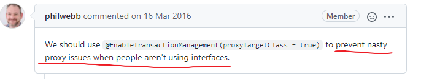 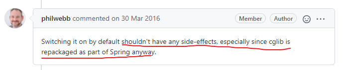

大佬说 JDK 动态代理要求接口，所以没有接口的话会有报错，很令人讨厌，并且让 CGLIB 作为默认也没什么副作用，特别是 CGLIB 已经被重新打包为 Spring 的一部分了，所以就默认 CGLIB 。

好吧，其实也没有什么很特殊的含义，就是效果没差多少，还少报错，方便咯。

详细issue 链接：*https://github.com/spring-projects/spring-boot/issues/5423*

至于两者的区别，面试鸭 Java 基础题库内已有，这里再贴一下：

JDK 动态代理是基于接口的，所以要求代理类一定是有定义接口的。

CGLIB 基于 ASM 字节码生成工具，它是通过继承的方式来实现代理类，所以要注意 final 方法。

之间的性能随着 JDK 版本的不同而不同，以下内容取自：[haiq的博客](https://www.cnblogs.com/haiq/p/4304615.html)

> - jdk6 下，在运行次数较少的情况下，jdk动态代理与 cglib 差距不明显，甚至更快一些；而当调用次数增加之后， cglib 表现稍微更快一些
> - jdk7 下，情况发生了逆转！在运行次数较少（1,000,000）的情况下，jdk动态代理比 cglib 快了差不多30%；而当调用次数增加之后(50,000,000)， 动态代理比 cglib 快了接近1倍
> - jdk8 表现和 jdk7 基本一致

### 什么是 AOP？ 

#### 回答重点

**AOP（Aspect-Oriented Programming，面向切面编程）** 是一种编程范式，用于将跨领域的关注点（如日志记录、安全检查、事务管理等）与业务逻辑分离开来。它允许开发者通过“切面”（Aspect）将这些通用功能模块化，并将其应用到应用程序中的多个地方，从而避免代码重复。

- **核心思想**：AOP 的核心思想是将与业务逻辑无关的横切关注点抽取出来，通过声明的方式动态地应用到业务方法上，而不是将这些代码直接嵌入业务逻辑中。
- **主要组成部分**：AOP 包括几个关键概念：切面（Aspect）、连接点（Join Point）、通知（Advice）、切入点（Pointcut）和织入（Weaving）。

#### 扩展知识

##### 通俗理解

具体是含义可以理解为：通过代理的方式，在调用想要的对象方法时候，进行拦截处理，执行切入的逻辑，然后再调用真正的方法实现。

例如，你实现了一个 A 对象，里面有 addUser 方法，此时你需要记录该方法的调用次数。

那么你就可以搞个代理对象，这个代理对象也提供了 addUser 方法，最终你调用的是代理对象的 addUser ，在这个代理对象内部填充记录调用次数的逻辑，最终的效果就类似下面代码：

```java
class A代理 {
    A a;// 被代理的 A
   void addUser(User user) {
     count();// 计数
     a.addUser(user);
   }
}
最终使用的是：
A代理.addUser(user);
```

这就叫做**面向切面编程**，当然具体的代理的代码不是像上面这样写死的，**而是动态切入**。

实现上代理大体上可以分为：**动态代理**和**静态代理**。

- 动态代理，即**在运行时**将切面的逻辑进去，按照上面的逻辑就是你实现 A 类，然后定义要代理的切入点和切面的实现，程序会自动在运行时生成类似上面的代理类。
- 静态代理，**在编译时或者类加载时**进行切面的织入，典型的 AspectJ 就是静态代理。

##### AOP 的核心概念

**切面（Aspect）**：切面是一个模块，包含跨领域的关注点，比如日志、事务等。它可以包含多个通知（Advice）来定义在何时何地应用特定的逻辑。

```java
@Aspect
public class LoggingAspect {
  @Before("execution(* com.example.service.*.*(..))")
  public void logBefore() {
      System.out.println("Logging before method execution");
  }
}
```

**连接点（Join Point）**：连接点是程序执行中的一个特定位置，例如方法调用或异常抛出。AOP 允许在这些点上插入切面逻辑。

**通知（Advice）**：通知是定义在连接点执行的操作。常见的通知类型包括：

- **前置通知（Before）**：在方法执行之前执行的操作。
- **后置通知（After）**：在方法执行之后执行的操作。
- **环绕通知（Around）**：在方法执行前后都可以执行的操作，可以控制方法是否执行。
- **异常通知（AfterThrowing）**：在方法抛出异常后执行的操作。
- **返回通知（AfterReturning）**：在方法成功返回后执行的操作。

**切入点（Pointcut）**：切入点定义了在何处应用通知，通常是通过表达式来匹配方法或类。例如，可以定义某个包下所有方法为切入点。

```java
@Pointcut("execution(* com.example.service.*.*(..))")
public void serviceMethods() {}
```

**织入（Weaving）**：织入是将切面应用到目标对象的过程。可以在编译时、类加载时或运行时进行织入。

##### AOP 的主要应用场景

**日志记录**：通过 AOP 可以将日志逻辑分离到切面中，使日志代码与业务代码解耦。

```java
@Aspect
public class LoggingAspect {
  @Before("execution(* com.example.service.*.*(..))")
  public void logBefore(JoinPoint joinPoint) {
      System.out.println("Method: " + joinPoint.getSignature().getName() + " is called");
  }
}
```

**事务管理**：可以通过 AOP 实现事务管理，确保在特定方法执行时开启事务，并在方法执行成功或失败后提交或回滚事务。

```java
@Transactional
public void transferMoney() {
  // 事务管理
}
```

**安全检查**：AOP 可以用于权限验证，在方法执行前检查用户是否具有相应权限。

**性能监控**：通过环绕通知（Around advice），可以记录方法的执行时间，帮助监控应用性能。

##### Spring AOP 与 AspectJ 的区别

- [Spring AOP 与 AspectJ 的区别](https://www.mianshiya.com/bank/1790683494127804418/question/1780933295375151105)

### 看过源码吗？说下 Spring 由哪些重要的模块组成？

#### 回答重点

**Core Container（核心容器）**：

- **Spring Core**：提供了依赖注入（Dependency Injection, DI）和控制反转（Inversion of Control, IoC）的实现，所有其他Spring模块的基础，别的模块都会依赖此模块。
- **Spring Beans**：负责管理Bean的定义和生命周期。通过IoC容器完成Bean的创建、依赖注入、初始化、销毁等操作。
- **Spring Context**：基于Core和Beans的高级容器，提供了类似JNDI的上下文功能，还包含了国际化、事件传播、资源访问等功能。
- **Spring Expression Language（SpEL）**：一个强大的表达式语言，用于在运行时查询和操作对象的值。

**AOP（面向切面编程）**：

- **Spring AOP**：提供面向切面编程的功能，可以在方法执行前后或抛出异常时动态插入额外的逻辑，比如日志记录、权限验证、事务管理等。

**Data Access（数据访问）**：

- **Spring JDBC**：简化了原生JDBC的操作，提供模板方法来管理连接、资源的释放和异常处理。
- **Spring ORM**：支持与主流ORM框架（如Hibernate、JPA、MyBatis等）集成，简化持久层开发。
- **Spring Transaction（事务管理）**：提供声明式和编程式的事务管理机制，与数据库操作密切结合。

**Web层**：

- **Spring Web**：提供基础的Web开发支持，包括Servlet API的集成，适用于构建MVC架构。
- **Spring MVC**：实现了Model-View-Controller（MVC）模式的框架，用于构建基于HTTP请求的Web应用。它是一个常用的模块，支持注解驱动的Web开发。
- **Spring WebFlux**：提供基于Reactive Streams的响应式编程模型，专为高并发的异步非阻塞请求设计。

主要回答下核心模块，然后带一下切面、数据访问或者 web 相关的即可。

#### 扩展知识

##### **Spring的扩展模块**

除了核心模块外，Spring还提供了许多扩展模块，以支持不同的技术需求：

- **Spring Batch**：用于批处理的框架，支持大规模数据的处理与分块执行。
- **Spring Integration**：提供消息驱动的应用程序集成方案，适用于构建企业集成架构（EAI）。
- **Spring Cloud**：用于构建微服务架构的模块集合，支持分布式系统中的服务注册、配置管理、服务调用等功能。

##### **模块化设计的灵活性**

Spring 的模块化设计使得开发者可以按需选择需要的模块，而不是强制加载整个框架。例如，如果你只需要依赖注入功能，可以只使用Spring Core和Beans模块，而不引入Web、Security等模块。这种设计确保了Spring的灵活性和可扩展性。

##### **Spring Boot 与 Spring Framework 的关系**

Spring Boot是基于Spring Framework的简化开发方式。它自动配置了常用的Spring模块，极大地简化了Spring应用的初始化和配置工作。通过Spring Boot，开发者不再需要手动配置XML或Java配置类，很多默认配置能够让开发者快速上手。

### 什么是循环依赖（常问）？

#### 回答重点

循环依赖（Circular Dependency）是指两个或多个模块、类、组件之间相互依赖，形成一个闭环。简而言之，模块A依赖于模块B，而模块B又依赖于模块A，这会导致依赖链的循环，无法确定加载或初始化的顺序。

#### 扩展知识

##### 简单示例

看下方的代码就知晓了

```java
@Service
public class A {
    @Autowired
    private B b;
}

@Service
public class B {
    @Autowired
    private A a;
}

//或者自己依赖自己
@Service
public class A {
    @Autowired
    private A a;
}
```

上面这两种方式都是循环依赖，应该很好理解，当然也可以是三个 Bean 甚至更多 Bean 相互依赖，原理都是一样的。

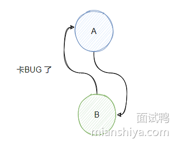

这种循环依赖可能会产生问题，例如 A 要依赖 B，发现 B 还没创建，于是开始创建 B ，创建的过程发现 B 要依赖 A， 而 A 还没创建好呀，因为它要等 B 创建好，就这样**它们俩就搁这卡 bug 了**。

### Spring 如何解决循环依赖？ 

#### 回答重点

关键就是**提前暴露未完全创建完毕的 Bean**。

在 Spring 中主要是使用**三级缓存**来解决了循环依赖：

- 一级缓存（Singleton Objects Map）: 用于存储完全初始化完成的单例Bean。
- 二级缓存（Early Singleton Objects Map）: 用于存储尚未完全初始化，但已实例化的Bean，用于提前暴露对象，避免循环依赖问题。
- 三级缓存（Singleton Factories Map）: 用于存储对象工厂，当需要时，可以通过工厂创建早期Bean（特别是为了支持AOP代理对象的创建）。

**解决步骤**：

- Spring 首先创建 Bean 实例，并将其加入三级缓存中（Factory）。
- 当一个 Bean 依赖另一个未初始化的 Bean 时，Spring 会从三级缓存中获取 Bean 的工厂，并生成该 Bean 的对象（若有代理则是代理对象）。
- 代理对象存入二级缓存，解决循环依赖。
- 一旦所有依赖 Bean 被完全初始化，Bean 将转移到一级缓存中。

#### 扩展知识

在 Spring 中，只有同时满足以下两点才能解决循环依赖的问题：

1. 依赖的 Bean 必须都是单例
2. 依赖注入的方式，必须**不全是**构造器注入，且 beanName 字母序在前的不能是构造器注入

##### 为什么必须都是单例

如果从源码来看的话，循环依赖的 Bean 是原型模式，会直接抛错：

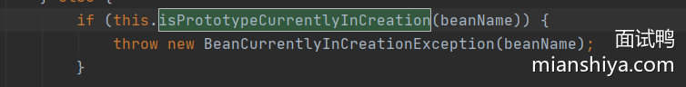

所以 Spring 只支持单例的循环依赖，**但是为什么呢**？

按照理解，如果两个 Bean 都是原型模式的话，那么创建 A1 需要创建一个 B1，创建 B1 的时候要创建一个 A2，创建 A2 又要创建一个 B2，创建 B2 又要创建一个 A3，创建 A3 又要创建一个 B3.....

就又卡 BUG 了，是吧，因为原型模式都需要创建新的对象，不能跟用以前的对象。

如果是单例的话，创建 A 需要创建 B，而创建的 B 需要的是之前的个 A， 不然就不叫单例了，对吧？

也是基于这点， Spring 就能操作操作了。

具体做法就是：先创建 A，此时的 A 是不完整的（没有注入 B），用个 map 保存这个不完整的 A，再创建 B ，B 需要 A，所以从那个 map 得到“不完整”的 A，此时的 B 就完整了，然后 A 就可以注入 B，然后 A 就完整了，B 也完整了，且它们是相互依赖的。

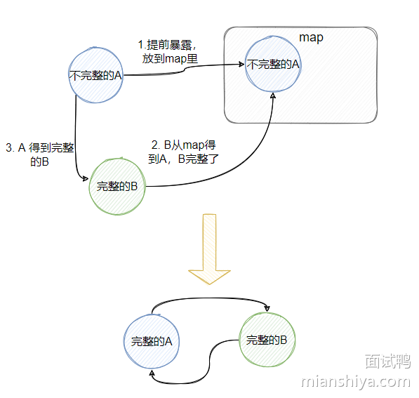

读起来好像有点绕，但是逻辑其实很清晰。

##### 为什么不能全是构造器注入

在 Spring 中创建 Bean 分三步:

1. 实例化，createBeanInstance，就是 new 了个对象
2. 属性注入，populateBean， 就是 set 一些属性值
3. 初始化，initializeBean，执行一些 aware 接口中的方法，initMethod，AOP代理等

明确了上面这三点，再结合我上面说的“不完整的”，我们来理一下。

如果全是构造器注入，比如`A(B b)`，那表明在 new 的时候，就需要得到 B，此时需要 new B ，但是 B 也是要在构造的时候注入 A ，即`B(A a)`，这时候 B 需要在一个 map 中找到不完整的 A ，发现找不到。

为什么找不到？因为 A 还没 new 完呢，所以找不到完整的 A，**因此如果全是构造器注入的话，那么 Spring 无法处理循环依赖**。

##### 一个set注入，一个构造器注入一定能成功？

假设我们 A 是通过 set 注入 B，B 通过构造函数注入 A，此时是**成功的**。

我们来分析下：实例化 A 之后，此时可以在 map 中存入 A，开始为 A 进行属性注入，发现需要 B，此时 new B，发现构造器需要 A，此时从 map 中得到 A ，B 构造完毕，B 进行属性注入，初始化，然后 A 注入 B 完成属性注入，然后初始化 A。

整个过程很顺利，没毛病。

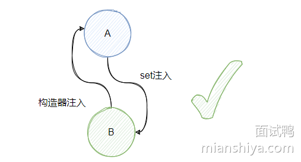

假设 A 是通过构造器注入 B，B 通过 set 注入 A，此时是**失败的**。

我们来分析下：实例化 A，发现构造函数需要 B， 此时去实例化 B，然后进行 B 的属性注入，从 map 里面找不到 A，因为 A 还没 new 成功，所以 B 也卡住了，然后就 gg。

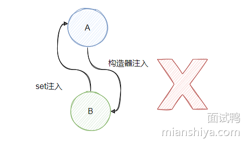

看到这里，仔细思考的小伙伴可能会说，可以先实例化 B 啊，往 map 里面塞入不完整的 B，这样就能成功实例化 A 了啊。

确实，思路没错**但是 Spring 容器是按照字母序创建 Bean 的，A 的创建永远排在 B 前面**。

现在我们总结一下：

- 如果循环依赖都是构造器注入，则失败
- 如果循环依赖不完全是构造器注入，则可能成功，可能失败，具体跟BeanName的字母序有关系。

##### Spring 解决循环依赖全流程

经过上面的铺垫，我想你对 Spring 如何解决循环依赖应该已经有点感觉了，接下来我们就来看看它到底是如何实现的。

明确了 Spring 创建 Bean 的三步骤之后，我们再来看看它为单例搞的三个 map：

1. 一级缓存，singletonObjects，存储所有已创建完毕的单例 Bean （完整的 Bean）
2. 二级缓存，earlySingletonObjects，存储所有仅完成实例化，但还未进行属性注入和初始化的 Bean
3. 三级缓存，singletonFactories，存储能建立这个 Bean 的一个工厂，通过工厂能获取这个 Bean，延迟化 Bean 的生成，工厂生成的 Bean 会塞入二级缓存

这三个 map 是如何配合的呢？

1. 首先，获取单例 Bean 的时候会通过 BeanName 先去 singletonObjects（一级缓存） 查找完整的 Bean，如果找到则直接返回，否则进行步骤 2。
2. 看对应的 Bean 是否在创建中，如果不在直接返回找不到（返回null），如果是，则会去 earlySingletonObjects （二级缓存）查找 Bean，如果找到则返回，否则进行步骤 3
3. 去 singletonFactories （三级缓存）通过 BeanName 查找到对应的工厂，如果存着工厂则通过工厂创建 Bean ，并且放置到 earlySingletonObjects 中。
4. 如果三个缓存都没找到，则返回 null。

从上面的步骤我们可以得知，如果查询发现 Bean 还未创建，到第二步就直接返回 null，不会继续查二级和三级缓存。

返回 null 之后，说明这个 Bean 还未创建，这个时候会标记这个 Bean 正在创建中，然后再调用 createBean 来创建 Bean，而实际创建是调用方法 doCreateBean。

doCreateBean 这个方法就会执行上面我们说的三步骤：

1. 实例化
2. 属性注入
3. 初始化

在实例化 Bean 之后，**会往 singletonFactories 塞入一个工厂，而调用这个工厂的 getObject 方法，就能得到这个 Bean**。

```java
addSingletonFactory(beanName, () -> getEarlyBeanReference(beanName, mbd, bean));
```

要注意，此时 Spring 是不知道会不会有循环依赖发生的，**但是它不管**，反正往 singletonFactories 塞这个工厂，这里就是**提前暴露**。

然后就开始执行属性注入，这个时候 A 发现需要注入 B，所以去 getBean(B)，此时又会走一遍上面描述的逻辑，到了 B 的属性注入这一步。

此时 B 调用 getBean(A)，这时候一级缓存里面找不到，但是发现 A 正在创建中的，于是去二级缓存找，发现没找到，于是去三级缓存找，然后找到了。

并且通过上面提前在三级缓存里暴露的工厂得到 A，然后将这个工厂从三级缓存里删除，并将 A 加入到二级缓存中。

然后结果就是 B 属性注入成功。

紧接着 B 调用 initializeBean 初始化，最终返回，此时 B 已经被加到了一级缓存里 。

这时候就回到了 A 的属性注入，此时注入了 B，接着执行初始化，最后 A 也会被加到一级缓存里，且从二级缓存中删除 A。

Spring 解决依赖循环就是按照上面所述的逻辑来实现的。

重点就是在对象实例化之后，都会在三级缓存里加入一个工厂，提前对外暴露还未完整的 Bean，这样如果被循环依赖了，对方就可以利用这个工厂得到一个不完整的 Bean，破坏了循环的条件。

### 为什么 Spring 循环依赖需要三级缓存，二级不够吗？ 

#### 回答重点

Spring 之所以需要**三级缓存**而不是简单的二级缓存，主要原因在于**AOP代理**和**Bean的早期引用问题**。

二级缓存虽然可以解决循环依赖的问题，但在涉及到**动态代理（AOP）** 时，直接使用二级缓存不做任何处理会导致我们**拿到的 Bean 是未代理的原始对象**。如果二级缓存内存放的都是代理对象，则违反了 Bean 的生命周期。

#### 扩展知识

##### 进一步理解分析为什么需要三级缓存

很明显，如果仅仅只是为了破解循环依赖，二级缓存够了，压根就不必要三级。

你思考一下，在实例化 Bean A 之后，我在二级 map 里面塞入这个 A，然后继续属性注入，发现 A 依赖 B 所以要创建 Bean B，这时候 B 就能从二级 map 得到 A ，完成 B 的建立之后， A 自然而然能完成。

所以**为什么要搞个三级缓存，且里面存的是创建 Bean 的工厂呢**？

我们来看下调用工厂的 getObject 到底会做什么，实际会调用下面这个方法：

```java
protected Object getEarlyBeanReference(String beanName, RootBeanDefinition mbd, Object bean) {
    Object exposedObject = bean;
    if (!mbd.isSynthetic() && hasInstantiationAwareBeanPostProcessors()) {
        for (SmartInstantiationAwareBeanPostProcessor bp : getBeanPostProcessorCache().smartInstantiationAware) {
            exposedObject = bp.getEarlyBeanReference(exposedObject, beanName);
        }
    }
    return exposedObject;
}Copy to clipboardErrorCopied
```

重点就在中间的判断，如果 false，返回就是参数传进来的 bean，没任何变化。

如果是 true 说明有 InstantiationAwareBeanPostProcessors ，且循环的 smartInstantiationAware 类型，**如有这个 BeanPostProcessor 说明 Bean 需要被 aop 代理**。

我们都知道如果有代理的话，那么我们想要直接拿到的是代理对象，也就是说如果 A 需要被代理，那么 B 依赖的 A 是已经被代理的 A，所以我们不能返回 A 给 B，而是返回代理的 A 给 B。

这个工厂的作用就是判断这个对象是否需要代理，如果否则直接返回，如果是则返回代理对象。

看到这明白的小伙伴肯定会问，那跟三级缓存有什么关系，**我可以在要放到二级缓存的时候判断这个 Bean 是否需要代理，如果要直接放代理的对象不就完事儿了**。

是的，这个思路看起来没任何问题，**问题就出在时机**，这跟 Bean 的生命周期有关系。

正常代理对象的生成是基于后置处理器，是**在被代理的对象初始化后期调用生成的**，**所以如果你提早代理了其实是违背了 Bean 定义的生命周期**。

所以 Spring 先在一个三级缓存放置一个工厂，如果产生循环依赖，那么就调用这个工厂提早得到代理对象，如果没产生依赖，这个工厂根本不会被调用，所以 Bean 的生命周期就是对的。

至此，我想你应该明白为什么会有三级缓存了。

也明白，其实破坏循环依赖，其实只有二级缓存就够了，但是碍于生命周期的问题，提前暴露工厂延迟代理对象的生成。

对了，不用担心三级缓存因为没有循环依赖，数据堆积的问题，最终单例 Bean 创建完毕都会加入一级缓存，此时会清理下面的二、三级缓存。

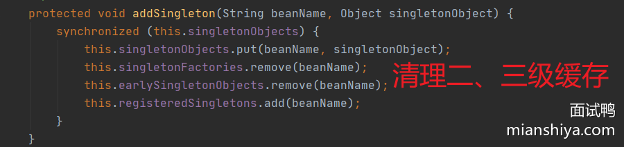

#### 循环依赖

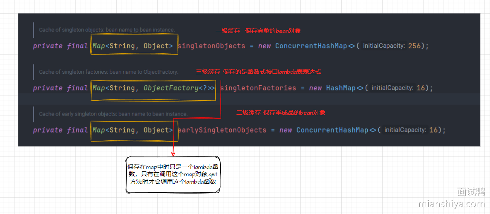 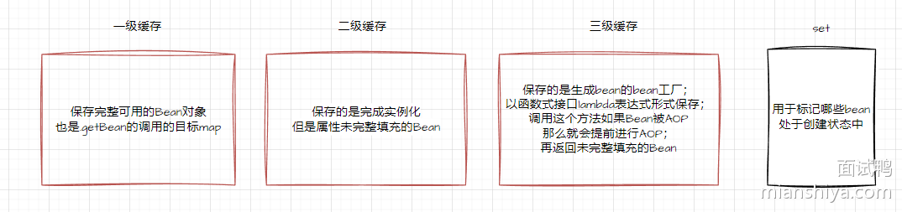

- A 和 B 两个 bean 出现循环依赖的执行流程
  - 获取到需要进行生成 bean 的 BeanDefinition 集合
  - 生成 A
    - 将 A 放入正在创建的 bean 集合中
    - 依次查看一二三缓存中是否有 A, 如果有则返回
    - 没有则通过反射实例化 A 对象; 并将存入三级缓存中; key: beanId, value: 获取 Abean 的 lambda 方法
    - 开始填充属性
    - 发现需要 B 进行填充
    - 生成 B
      - 将 B 放入正在创建的 bean 集合中
      - 从一二三级缓存中一次查找是否有 B
      - 通过反射实例化 B, 并将存入三级缓存中
      - 填充属性, 发现需要 A
      - 从一二三级缓存中查找 A, 在三级缓存中查找到 A, 获取 A 的 value (即为 lambda 函数)
        - 如果 A 被代理了, 那么就在这里提前代理 A, 并返回被代理后的 A bean (属性未完整填充)
        - 若没有被代理, 那么就直接返回 A bean (属性未完整填充)
      - 因为此时 A 的 bean 是属性不完整的所以将获取到的对象保存到二级缓存中, 将三级缓存中的 A 移除
      - 用不完整的 A 对 B 进行字段填充, 得到完整的 B 对象
      - 将 B 对象移动到一级缓存中
    - 从一二三级缓存中查找 B, 成功查找到 B 为 A 进行字段赋值
    - 得到完整的 A 对象将 A 对象移动到一级缓存中
  - 生成 B
    - 依次查找一二三级缓存中是否有 B
    - B 已经存在返回
- **为什么要二级缓存, 一级缓存能实现吗?**

> 理论上可以的, 只要在设计一级缓存的过程中能准确的标识当前 bean 是处于完成状态还是半成品状态即可; 但是如果通过二级缓存, 可以简化代码开发, 并且能提高每次的判断执行效率, 所以引入二级缓存

- **为什么要引入三级缓存, 不引入三级缓存可以吗?**

> 如果不引入三级缓存的话会造成一下问题, 如果 B 通过二级缓存将 A 的值进行填充了那么 B 中 A 的对象就是 A 的原始 bean 对象; 因为 bean 的生命周期中 bean 的字段填充是发生在初始化之前的, 所以当 A 进行后续操作中被代理了功能得到增强了, 那么 B 中的 A 字段是无法被更新和感知的额; 所以引入三级缓存的概念, 如果 A 被代理了, 那么在 B 在进行赋值的时候就可以将代理提前

### 说下 Spring Bean 的生命周期？ 

#### 回答重点

- **实例化**：Spring 容器根据配置文件或注解实例化 Bean 对象。
- **属性注入**：Spring 将依赖（通过构造器、setter 方法或字段注入）注入到 Bean 实例中。
- **初始化前的扩展机制**：如果 Bean 实现了 BeanNameAware 等 aware 接口，则执行 aware 注入。
- **初始化前**（BeanPostProcessor）：在 Bean 初始化之前，可以通过 BeanPostProcessor 接口对 Bean 进行一些额外的处理。
- **初始化**：调用 InitializingBean 接口的 afterPropertiesSet() 方法或通过 init-method 属性指定的初始化方法。
- **初始化后**（BeanPostProcessor）：在 Bean 初始化后，可以通过 BeanPostProcessor 进行进一步的处理。
- **使用** Bean：Bean 已经初始化完成，可以被容器中的其他 Bean 使用。
- **销毁**：当容器关闭时，Spring 调用 DisposableBean 接口的 destroy() 方法或通过 destroy-method 属性指定的销毁方法。

#### 扩展知识

##### 理解生命周期

我们需要先知晓之所以 Bean 容易被添加一些属性，或者能在运行时被改造就是因为在生成 Bean 的时候，Spring对外暴露出很多扩展点。

基于这些点我们可以设置一些逻辑，Spring 会在 Bean 创建的某些阶段根据这些扩展点，基于此进行 Bean 的改造。

有了上面的认识，我们再来看 Spring Bean 的生命周期，我用一幅图总结一下：


大致了解生命周期之后，我们再来看详细的操作，可以看到有好多扩展点：

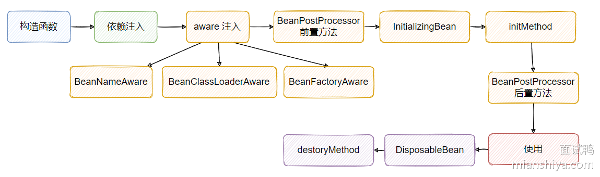

注意细节，这幅图的颜色和上面那副有对应关系的。

##### Spring Bean 生命周期详细步骤

**实例化阶段**：

- Bean 的实例化是通过反射机制创建的。Spring 根据 `@Component`、`@Bean` 或者 XML 中的 `<bean>` 元素配置，来确定要创建的 Bean。

**属性赋值阶段**：

- 在实例化完成后，Spring 会进行依赖注入。这包括将属性值注入到 Bean 的字段中，可能是通过构造函数注入、setter 方法注入，或者直接字段注入。

**初始化前的扩展机制**：

- Bean 可以实现 `BeanNameAware`、`BeanFactoryAware` 等 `Aware` 接口，从而在初始化之前获取 Bean 的名称、BeanFactory、ApplicationContext 等容器资源。例如，`ApplicationContextAware` 接口允许 Bean 获取 `ApplicationContext`，以便进一步与 Spring 容器交互。

**BeanPostProcessor 的作用**：

- `BeanPostProcessor` 接口允许开发者在 Bean 初始化前后添加自定义逻辑。例如，可以在 `postProcessBeforeInitialization` 方法中执行某些前置操作，如代理包装、AOP 切面等。在 `postProcessAfterInitialization` 中，可以进一步修改或替换 Bean 实例。

**初始化的细节**：

- `InitializingBean` 接口提供了一个 `afterPropertiesSet` 方法，用于在 Bean 的所有属性设置完成后执行一些自定义初始化逻辑。开发者也可以通过 `@PostConstruct` 注解或者 XML/Java 配置中的 `init-method` 属性，来指定初始化方法。

**Bean 的就绪状态**：

- Bean 完成初始化后，即进入就绪状态，可以供应用程序使用。在此状态下，Bean 已经完成了所有的属性设置和初始化步骤，处于可用状态。

**销毁阶段的清理**：

- Bean 的销毁通常在容器关闭时进行。`DisposableBean` 接口提供了 `destroy` 方法，用于清理资源。开发者也可以通过 `@PreDestroy` 注解或配置中的 `destroy-method` 属性，指定清理逻辑。

##### Bean 的生命周期扩展点汇总

Spring 提供了多个扩展点，让开发者可以自定义和控制 Bean 的生命周期：

**BeanPostProcessor**：

- 通过实现 `BeanPostProcessor` 接口，开发者可以在 Bean 初始化前后添加自定义逻辑，如动态代理、AOP 增强等。

**BeanFactoryPostProcessor**：

- `BeanFactoryPostProcessor` 允许开发者在 Bean 实例化之前，修改 Bean 的定义信息（如属性值），它在所有 Bean 实例化之前执行。

**Aware 接口**：

- Spring 提供了多个 `Aware` 接口，如 `BeanNameAware`、`BeanFactoryAware`、`ApplicationContextAware` 等，允许 Bean 获取 Spring 容器的相关信息，进一步定制生命周期。

**@PostConstruct 和 @PreDestroy**：

- 这些注解提供了一种声明式的方法来定义初始化和销毁逻辑，通常用于替代 XML 或 Java 配置中的 `init-method` 和 `destroy-method`。

##### Bean 的作用域（Scope）与生命周期的关系

Spring Bean 的生命周期还与其作用域密切相关：

**Singleton（单例）**：

- 默认作用域，Bean 的生命周期与 Spring 容器的生命周期一致。在容器启动时创建，在容器关闭时销毁。

**Prototype（原型）**：

- 每次请求时创建一个新的 Bean 实例，容器只负责创建，不管理其生命周期（不调用销毁方法）。

**Request、Session、Application、WebSocket**：

- 这些作用域用于 Web 应用中，Bean 的生命周期分别与 HTTP 请求、会话、应用或 WebSocket 的生命周期一致。

##### 常见的生命周期应用场景

**连接池管理**：

- 在初始化阶段创建数据库连接池，在销毁阶段关闭连接池，以确保资源的有效管理。

**缓存初始化**：

- 在 `afterPropertiesSet` 或 `@PostConstruct` 中加载缓存数据，在销毁阶段清理缓存。

**动态代理创建**：

- 在 `postProcessAfterInitialization` 中为 Bean 创建动态代理，以实现 AOP 功能。

##### 代码描述

**Bean 定义**

```java
@Getter
public class CircleBean implements InitializingBean, DisposableBean,
        ApplicationContextAware, BeanFactoryAware, BeanNameAware {

    private Bean1 bean1;

    public CircleBean() {
        System.out.println("1.构造方法实例化");
    }

    @Autowired
    public void setBean1(Bean1 bean1) {
        System.out.println("2.依赖注入");
        this.bean1 = bean1;
    }

    @Override
    public void setBeanFactory(BeanFactory factory) throws BeansException {
        System.out.println("3.Aware 相关接口注入执行 - BeanFactory");
    }

    @Override
    public void setBeanName(String name) {
        System.out.println("3.Aware 相关接口注入执行 - BeanName");
    }

    @Override
    public void setApplicationContext(ApplicationContext context) throws BeansException {
        System.out.println("3.Aware 相关接口注入执行 - ApplicationContext");
    }

    @PostConstruct
    public void init2(){
        System.out.println("5.0 Bean 初始化，但不属于 Spring 规范！");
    }

    @Override
    public void afterPropertiesSet() throws Exception {
        System.out.println("5.1 Bean 初始化");
    }

    public void init() {
        System.out.println("5.2 Bean 初始化");
    }


    @PreDestroy
    public void destroy2(){
        System.out.println("7.0 Bean 销毁，但不属于 Spring 规范！");
    }


    @Override
    public void destroy() throws Exception {
        System.out.println("7.1 Bean 销毁");
    }

    public void destroyMethod() {
        System.out.println("7.2 Bean 销毁");
    }
}
```

**BeanPostProcessor 定义**

如果想要对 Bean 的生命周期进行更细致的控制可以实现 `InstantiationAwareBeanPostProcessor` 和 `DestructionAwareBeanPostProcessor` 接口来实现。

```java
public class MyBeanPostProcessor implements BeanPostProcessor {

    @Override
    public Object postProcessBeforeInitialization(Object bean, String beanName) throws BeansException {
        if ("circleBean".equals(beanName)) {
            System.out.println("4.初始化之前执行，返回值会替换掉原本的 bean");
        }
        return bean;
    }

    @Override
    public Object postProcessAfterInitialization(Object bean, String beanName) throws BeansException {
        if ("circleBean".equals(beanName)) {
            System.out.println("6.初始化之后执行，返回值会替换掉原本的 bean，一般代理对象会在这个时候产生");
        }
        return bean;
    }
}
```

**注册 Bean 对象**

```java
@Configuration
public class CommonConfig {

    @Bean(initMethod = "init",destroyMethod = "destroyMethod")
    public CircleBean circleBean() {
        return new CircleBean();
    }

    @Bean
    public MyBeanPostProcessor myBeanPostProcessor(){
        return new MyBeanPostProcessor();
    }
}
```

**执行结果**

> 1.构造方法实例化 
>
> 2.依赖注入 
>
> 3.Aware 相关接口注入执行 - BeanName 
>
> 3.Aware 相关接口注入执行 - BeanFactory 
>
> 3.Aware 相关接口注入执行 - ApplicationContext 
>
> 4.初始化之前执行，返回值会替换掉原本的 bean 
>
> 5.0 Bean 初始化，但不属于 Spring 规范！ 
>
> 5.1 Bean 初始化 
>
> 5.2 Bean 初始化 
>
> 6.初始化之后执行，返回值会替换掉原本的 bean，一般代理对象会在这个时候产生 
>
> 7.0 Bean 销毁，但不属于 Spring 规范！ 
>
> 7.1 Bean 销毁 
>
> 7.2 Bean 销毁

### Spring MVC 具体的工作原理？ 

#### 回答重点

**1）客户端请求**：用户通过浏览器发送 HTTP 请求，所有请求都被 DispatcherServlet 接收。 

**2）请求映射**：DispatcherServlet 根据配置的处理器映射器（HandlerMapping）查找与请求 URL 对应的控制器（Controller）。

**3）调用控制器方法**：找到控制器后，DispatcherServlet 将请求转发给对应的控制器方法进行处理。控制器方法处理业务逻辑后，通常返回一个 ModelAndView 对象，包含数据模型和视图名称。 

**4）视图解析**：DispatcherServlet 根据控制器返回的视图名称，使用视图解析器（ViewResolver）将逻辑视图名称解析为实际的视图（如 JSP、Thymeleaf 等）。 

**5）视图渲染返回**：视图渲染引擎根据数据模型渲染视图，并将生成的 HTML 响应返回给客户端

> Spring MVC 还支持返回 JSON 数据响应，用于构建 RESTful Web 服务，因此上述视图解析部分， 如果是 JSON 响应，则 Spring MVC 会将对象序列化为 JSON，后续返回给客户端。

#### 扩展知识

##### Spring MVC 工作详细流程

1. **客户端请求**：用户发送 HTTP 请求，`DispatcherServlet` 接收请求。
2. **执行拦截器的 `preHandle()`**：如果配置了拦截器，Spring MVC 会首先执行 `preHandle()` 方法。如果返回 `false`，请求处理终止；否则，继续处理。
3. **请求映射**：`DispatcherServlet` 通过 `HandlerMapping` 找到对应的 `HandlerExecutionChain`（这里面包含了很多定义的 `HandlerInterceptor`，拦截器）然后通过 HandlerAdapter 适配器的适配（适配器模式）后，执行 handler，即通过 controller 的调用。
4. **执行控制器方法**：如果返回的是视图（如 JSP、Thymeleaf），则执行视图解析器进行视图解析和渲染；如果返回的是对象（如 JSON），则通过消息转换器（如 `MappingJackson2HttpMessageConverter`）将对象转换为 JSON 数据。
5. **执行拦截器的 `postHandle()`**：如果返回视图，拦截器的 `postHandle()` 方法会在视图渲染之前执行。对于 JSON 响应，该方法仍然会执行。
6. **视图渲染或 JSON 响应**：对于视图，视图解析器会解析视图名称，并将其渲染为 HTML 页面。对于 JSON 响应，Spring MVC 会将对象序列化为 JSON，并返回给客户端。
7. **执行拦截器的 `afterCompletion()`**：视图渲染或 JSON 响应完成后，Spring MVC 调用拦截器的 `afterCompletion()` 方法，进行资源清理或日志记录。
8. **响应客户端**：最终将渲染的视图或 JSON 数据返回给客户端。

##### 拦截器的工作流程

拦截器（Interceptor）在 Spring MVC 的请求处理流程中起到类似过滤器的作用，但比过滤器更具灵活性。它允许开发者在请求进入控制器之前、控制器处理完成之后以及视图渲染前后执行自定义逻辑。常见的应用场景包括日志记录、用户认证、权限校验等。

##### 拦截器三个核心方法

1. **`preHandle()`**：在控制器方法执行之前调用。如果该方法返回 `false`，请求将被拦截，不会进入控制器方法。
2. **`postHandle()`**：在控制器方法执行之后，视图渲染之前调用。可以用于修改模型数据或视图。
3. **`afterCompletion()`**：在视图渲染完成后调用，用于清理资源或记录执行时间等。

##### 拦截器的配置

在 Spring MVC 中，可以通过实现 `HandlerInterceptor` 接口来定义拦截器，并在配置文件或 Java 配置类中注册拦截器。

```java
public class MyInterceptor implements HandlerInterceptor {
    @Override
    public boolean preHandle(HttpServletRequest request, HttpServletResponse response, Object handler) throws Exception {
        // 在处理器方法调用前进行拦截
        return true;
    }

    @Override
    public void postHandle(HttpServletRequest request, HttpServletResponse response, Object handler, ModelAndView modelAndView) throws Exception {
        // 处理器方法执行后，但视图渲染前执行
    }

    @Override
    public void afterCompletion(HttpServletRequest request, HttpServletResponse response, Object handler, Exception ex) throws Exception {
        // 视图渲染后执行
    }
}
```

在配置类中注册拦截器：

```java
@Configuration
public class WebConfig implements WebMvcConfigurer {
    @Override
    public void addInterceptors(InterceptorRegistry registry) {
        registry.addInterceptor(new MyInterceptor())
                .addPathPatterns("/**") // 拦截所有路径
                .excludePathPatterns("/login", "/error"); // 排除某些路径
    }
}
```

### Spring 中的 DI 是什么？ 

#### 回答重点

DI（Dependency Injection，依赖注入）普遍认为是 Spring 框架中用于实现**控制反转（IOC）** 的一种机制。DI 的核心思想是由容器负责对象的依赖注入，而不是由对象自行创建或查找依赖对象。

通过 DI，Spring 容器在创建一个对象时，会自动将这个对象的依赖注入进去，这样可以让对象与其依赖的对象解耦，提升系统的灵活性和可维护性。

#### 扩展知识

##### 依赖注入的优势

- **解耦合**：通过将对象的依赖从代码中抽离出来，由容器负责管理，降低了类之间的耦合度。
- **提高测试性**：通过注入 mock 对象或替代实现，DI 使得单元测试变得更容易。
- **提高可维护性和灵活性**：通过配置文件或注解，开发者可以在不修改代码的情况下更改依赖，增加了应用程序的可扩展性和灵活性。

### Spring 事务有几个隔离级别？

#### 回答重点

Spring 提供了五种事务隔离级别：

1. **DEFAULT**（默认）：使用底层数据库的默认隔离级别。如果数据库没有特定的设置，通常默认为 `READ_COMMITTED`。
2. **READ_UNCOMMITTED**（读未提交）：最低的隔离级别，允许事务读取尚未提交的数据，可能会导致脏读、不可重复读和幻读。
3. **READ_COMMITTED**（读已提交）：仅允许读取已经提交的数据，避免了脏读，但可能会出现不可重复读和幻读问题。
4. **REPEATABLE_READ**（可重复读）：确保在同一个事务内的多次读取结果一致，避免脏读和不可重复读，但可能会有幻读问题。
5. **SERIALIZABLE**（可串行化）：最高的隔离级别，通过强制事务按顺序执行，完全避免脏读、不可重复读和幻读，代价是性能显著下降。

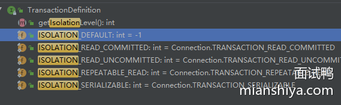

#### 扩展知识

##### 隔离级别与脏读、不可重复读、幻读表格汇总

| 隔离级别         | 脏读 | 不可重复读 | 幻读 |
| ---------------- | ---- | ---------- | ---- |
| READ_UNCOMMITTED | 是   | 是         | 是   |
| READ_COMMITTED   | 否   | 是         | 是   |
| REPEATABLE_READ  | 否   | 否         | 是   |
| SERIALIZABLE     | 否   | 否         | 否   |

- **脏读（Dirty Read）**：一个事务读取了另一个尚未提交的事务的数据，如果该事务回滚，则数据是不一致的。
- **不可重复读（Non-repeatable Read）**：在同一事务内的多次读取，前后数据不一致，因为其他事务修改了该数据并提交。
- **幻读（Phantom Read）**：在一个事务内的多次查询，查询结果集不同，因为其他事务插入或删除了数据。

##### Spring 中的事务隔离级别设置

在 Spring 中，使用 `@Transactional` 注解可以方便地设置事务的隔离级别。例如：

```java
@Transactional(isolation = Isolation.REPEATABLE_READ)
public void processTransaction() {
    // 事务逻辑
}
```

通过 `isolation` 属性，开发者可以灵活地指定每个事务的隔离级别。

##### 隔离级别与性能之间的权衡

选择隔离级别需要根据应用的具体需求进行权衡：

- **低隔离级别（READ_UNCOMMITTED 和 READ_COMMITTED）**：性能高，但可能存在并发问题，适合数据一致性要求不高的场景。
- **高隔离级别（REPEATABLE_READ 和 SERIALIZABLE）**：数据一致性强，但性能较差，适合高数据一致性要求的场景。
- [1535. 你们生产环境的 MySQL 中使用了什么事务隔离级别？为什么？](https://www.mianshiya.com/question/1805421515868151810)

##### 可重复读能完全避免幻读的发生吗

- [可重复读能完全避免幻读的发生吗](https://www.mianshiya.com/bank/1791003439968264194/question/1780933295484203009#heading-6)

### Spring 事务在什么情况下会失效？ 

#### 回答重点

一般而言失效的情况都是用了声明式事务即 @Transactional 注解，如果使用了这个注解那么在以下几个情况下会导致事务失效：

1）rollbackFor 没设置对，比如默认没有任何设置（RuntimeException 或者 Error 才能捕获），则方法内抛出 IOException 则不会回滚，需要配置 `@Transactional(rollbackFor = Exception.class)`。

2）异常被捕获了，比如代码抛错，但是被 catch 了，仅打了 log 没有抛出异常，这样事务无法正常获取到错误，因此不会回滚。

3）同一个类中方法调用，因此事务是基于动态代理实现的，同类的方法调用不会走代理方法，因此事务自然就失效了。

4）@Transactional 应用在非 public 修饰的方法上，Spring 事务管理器判断非公共方法则不应用事务。

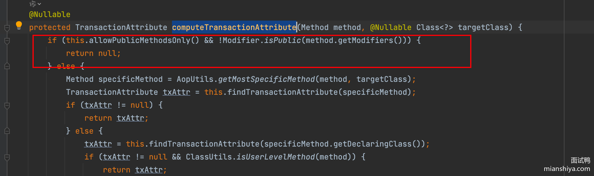

5）@Transactional 应用在 final 和 static 方法上，因为 aop （Spring Boot2.x版本默认是 cglib，Spring 自身默认是 jdk，一般现在用的都是 SpringBoot）默认是 cglib 代理，无法对 final 方法子类化。static 是静态方法，属于类，不属于实例对象，无法被代理！

6）propagation 传播机制配置错误，例如以下的代码（伪代码，忽略同一个类中的方法调用影响代理的情况）

```java
@Transactional(propagation = Propagation.REQUIRES_NEW, rollbackFor = Exception.class)
public void addUserAndAddress(User user,Address address) throws Exception {
    userMapper.save(user);
    addAddress(address);
}

@Transactional(propagation = Propagation.REQUIRES_NEW, rollbackFor = Exception.class)
public void addAddress(Address address) {
    addressMapper.save(address);
}
```

因为配置了 Propagation.REQUIRES_NEW，是新起了一个事务，即 addAddress 的事务和 addUserAndAddress 其实不是一个事务，因此两个事务之间当然就无法保证数据的一致性了。

7）多线程环境，因为 @Transactional 是基于 ThreadLocal 存储上下文的，多线程情况下每个线程都有自己的上下文，那么之间如何保持事务同步？保持不了，因此事务失效。

8）用的是 MySQL MyISAM，这个引擎本身不支持事务!

### @Async 注解的原理是什么？ 

#### 回答重点

@Async 注解的核心原理是基于 Spring AOP 的动态代理机制，结合线程池实现异步任务调度。通过合理的线程池配置和异常处理，可以高效地实现异步操作。

#### 扩展知识

**AOP动态代理：** Spring 通过动态代理（JDK 动态代理或 CGLIB）为 @Async 方法生成代理对象。当调用被 @Async 注解的方法时，实际调用的是代理对象的方法。

**任务执行器：** 

1）默认使用 SimpleAsyncTaskExecutor （每次执行任务都会新开线程，不推荐使用）。 

2）可通过自定义 TaskExecutor 优化线程池管理。

下面是自定义线程池的一种实现：

```haxe
@Configuration
@EnableAsync
public class AsyncConfig implements AsyncConfigurer {
    @Override
    public Executor getAsyncExecutor() {
        ThreadPoolTaskExecutor executor = new ThreadPoolTaskExecutor();
        executor.setCorePoolSize(5);
        executor.setMaxPoolSize(10);
        executor.setQueueCapacity(100);
        executor.initialize();
        return executor;
    }
}
```

使用 @Bean 注解来实现线程池也可以，通过 @Async("customExecutor") 来指定用哪个线程池来执行任务

**注意：** 1）需要使用 @EnableAsync 注解来开启异步任务功能，注解加在启动类或者配置类上都可以。 2）如果在一个被代理的对象内调用另一个带有 @Async 注解的方法，实际调用的是同一个对象实例上的方法，而不是通过代理对象进行调用。因此，这种方法不会按预期方式异步执行（其实对于每个被 AOP 代理的对象都会这样）。

**解决方法：** 1）自注入，通过依赖注入给本类对象注入本类的代理对象，使用代理对象执行相关的方法就行了，如果出现循环依赖问题，可以通过 @Lazy 注解实现延迟加载来解决。

2）暴露代理对象，需要注意的是因为 `@EnableAsync` 为对象生成代理时有点特殊，所以一般情况下 `@EnableAspectJAutoProxy(exposeProxy = true)` 对其是**不生效的**，可通过以下配置解决，然后通过 AopContext 来获取代理对象。

```java
@Component
public class MyProxyBeanFactoryPostProcessor implements BeanFactoryPostProcessor {
    @Override
    public void postProcessBeanFactory(ConfigurableListableBeanFactory beanFactory) throws BeansException {
        BeanDefinition beanDefinition = beanFactory.getBeanDefinition(TaskManagementConfigUtils.ASYNC_ANNOTATION_PROCESSOR_BEAN_NAME);
        beanDefinition.getPropertyValues().add("exposeProxy", true);
    }
}
```

### @Async 什么时候会失效？ 

#### 回答重点

`@Async` 失效的主要原因包括内部调用绕过代理、方法非 public、未启用异步支持、返回值类型不匹配、异常处理不当、线程池配置错误以及对象未被 Spring 管理等。

**1）内部调用**

原因

- `@Async` 依赖于 Spring 的动态代理机制（AOP），而内部调用会绕过代理对象，直接调用原始方法。

解决

- 将异步方法提取到独立的Bean中。
- 使用 `AopContext.currentProxy()` 获取代理对象调用。
- 注入自身Bean并通过其调用异步方法

**2）非公共方法**

原因

- Spring AOP 默认只对 public 方法生效，非 public 方法不会被代理。

解决

- 确保被@Async标注的方法是public。

**3）没有启用异步支持**

原因

- `@Async` 需要显式启用异步功能，否则 Spring 不会为其生成代理。

解决

- 在 Spring Boot 应用的主类或配置类上添加 `@EnableAsync` 注解。

**4）方法返回值不匹配**

原因

- `@Async` 对返回值类型有一定要求，某些情况下可能导致行为异常。

解决

- 确保返回值类型符合 `@Async` 的要求。（返回值为 `void`、`Future`、`CompletableFuture` 等。）

**5）异常处理不当**

原因

- 异步方法中的异常不会直接传播到调用方，可能导致问题被忽略。

解决

- 使用 try-catch 捕获异常或者配置全局异常处理器

**6）自定义线程池配置错误**

原因

- 如果自定义线程池配置不当，可能导致异步任务无法正常执行。比如没有正确注册或配置线程池。

解决

- 正确配置并注册 TaskExecutor 就可以了。

**7）Spring上下文未加载**

原因

- `@Async`依赖 Spring 容器管理的 Bean，如果对象没有被 Spring 管理，那么代理机制就会失效。

解决

- 确保 Bean 由 Spring 容器管理，不要手动去 new。

#### 扩展知识

- [@Async 注解的原理是什么？](https://www.mianshiya.com/bank/1790683494127804418/question/1799247492220788737)
- [@Async 如何避免内部调用失效？](https://www.mianshiya.com/bank/1790683494127804418/question/1894050379616694274)

### @Async 如何避免内部调用失效？ 

#### 回答重点

这是因为 Spring 的 `@Async` 是基于动态代理机制实现的，而内部调用会绕过代理对象，直接调用原始方法。

避免 `@Async` 内部调用失效的关键在于确保调用路径经过 Spring 的代理对象。可以通过注入自身、使用 `AopContext` 来实现。

其实更推荐不要进行内部调用，建议提取异步方法到独立 Service 类，这样代码更清晰且符合单一职责原则。

#### 知识扩展

##### 场景复现

首先开启异步任务调度

```java
package com.example.webdemo;

import org.springframework.boot.SpringApplication;
import org.springframework.boot.autoconfigure.SpringBootApplication;
import org.springframework.scheduling.annotation.EnableAsync;

/**
 * @author 29770
 */
@EnableAsync
@SpringBootApplication
public class WebDemoApplication {
    public static void main(String[] args) {
        SpringApplication.run(WebDemoApplication.class, args);
    }
}
```

编写相关代码，在类的内部使用 `commonMethod` 方法调用 `asyncMethod()`方法。

```java
package com.example.webdemo.asyncdemo;

import org.springframework.scheduling.annotation.Async;
import org.springframework.stereotype.Component;

/**
 * @author wipe
 */
@Component
public class AsyncComponent {


    public void commonMethod() {
        System.out.println(Thread.currentThread().getName());
        asyncMethod();
        System.out.println("commonAsync");
    }

    @Async
    public void asyncMethod() {
        try {
            Thread.sleep(1000);
        } catch (InterruptedException e) {
            throw new RuntimeException(e);
        }
        System.out.println(Thread.currentThread().getName());
        System.out.println("asyncMethod");
    }
}
```

编写一个控制器方法来调用 `commonMethod()` 方法

```java
package com.example.webdemo.controller;

import com.example.webdemo.asyncdemo.AsyncComponent;
import lombok.AllArgsConstructor;
import org.springframework.web.bind.annotation.GetMapping;
import org.springframework.web.bind.annotation.RestController;

/**
 * @author wipe
 */
@RestController
@AllArgsConstructor
public class IndexController {

    private final AsyncComponent asyncComponent;

    @GetMapping("/index")
    public String index() {
        System.out.println(Thread.currentThread().getName());
        asyncComponent.commonMethod();
        return "";
    }
}
```

我们期望的结果是先打印 commonAsync 然后再打印 asyncMethod

```text
http-nio-8080-exec-3
http-nio-8080-exec-3
http-nio-8080-exec-3
asyncMethod
commonAsync
```

可以看到，结果并没有像我们想象的那样美好，说好的异步呢？怎么还是串行执行？我用了 @Async 了呀，而且执行这三个方法的线程竟然是同一个线程！

------

这就是如`回答重点`里说的一样了，那怎么解决呢？

##### 自注入

问题的原因是没有使用代理对象调方法，那我搞个代理对象过来不就行了吗？

```java
@Component
public class AsyncComponent {

    @Resource
    @Lazy
    private AsyncComponent proxy;


    public void commonMethod() {
        System.out.println(Thread.currentThread().getName());
        proxy.asyncMethod();
        System.out.println("commonAsync");
    }

    @Async
    public void asyncMethod() {
        try {
            Thread.sleep(1000);
        } catch (InterruptedException e) {
            throw new RuntimeException(e);
        }
        System.out.println(Thread.currentThread().getName());
        System.out.println("asyncMethod");
    }
}
```

改造一下代码，让 Spring 注入时，将代理对象注入过来，再使用代理对象完成函数调用。

```text
http-nio-8080-exec-1
http-nio-8080-exec-1
commonAsync
task-1
asyncMethod
```

可以看到结果已经听话了，正确了。

##### 暴露代理对象

因为 `@Async` 代理对象的创建跟其他代理对象的创建底层有区别，所以通过 `@EnableAspectJAutoProxy(exposeProxy = true)` 来暴露代理对象一般情况下对 `@Async` 代理对象的暴露是失效的。

我们可以自己写一个配置类。

```java
@Component
public class MyProxyBeanFactoryPostProcessor implements BeanFactoryPostProcessor {
    @Override
    public void postProcessBeanFactory(ConfigurableListableBeanFactory beanFactory) throws BeansException {
        BeanDefinition beanDefinition = beanFactory.getBeanDefinition(TaskManagementConfigUtils.ASYNC_ANNOTATION_PROCESSOR_BEAN_NAME);
        beanDefinition.getPropertyValues().add("exposeProxy", true);
    }
}
```

然后再修改一下 `commonMethod()` 方法（可以把自注入的代码注释掉）。

```java
    public void commonMethod() {
        System.out.println(Thread.currentThread().getName());
        AsyncComponent proxy = (AsyncComponent) AopContext.currentProxy();
        proxy.asyncMethod();
        System.out.println("commonAsync");
    }
```

这样就解决了内部调用失效的问题了。

### @Qualifier 注解有什么作用 

#### 回答重点

@Qualifier 注解在 Spring 中的主要作用是用于在依赖注入时**消除歧义**。当一个类型有多个实现时，@Qualifier 注解可以指定需要注入哪一个具体的 Bean。

例如以下代码，当 Service 有多个实现类的时候，可以通过 @Qualifier 指定名称选择对应的实现 Bean

```java
@Component
public class Client {

    private final Service service;

    @Autowired
    public Client(@Qualifier("serviceImpl1") Service service) {
        this.service = service;
    }

    public void doSomething() {
        service.serve();
    }
}
```

#### 扩展知识

##### 扩展 @Primary

@Primary 注解用于指定当有多个候选 Bean 时默认注入哪个 Bean，也就是指定了第一顺位。

当结合 @Qualifier 使用时，可以覆盖 @Primary 的默认行为，例如以下这样：

```java
@Component
@Primary
public class DefaultService implements Service {
    public void serve() {
        System.out.println("Default Service");
    }
}

@Component
@Qualifier("specificService")
public class SpecificService implements Service {
    public void serve() {
        System.out.println("Specific Service");
    }
}

@Component
public class Client {

    private final Service service;

    @Autowired
    public Client(@Qualifier("specificService") Service service) {
        this.service = service;
    }

    public void doSomething() {
        service.serve();
    }
}
```

即使 DefaultService 被标记为 @Primary，但由于 @Qualifier("specificService")，所以最终注入的仍然是 SpecificService！

### Spring WebFlux 是什么？它与 Spring MVC 有何不同？

#### 回答重点

**Spring WebFlux**：

- 异步非阻塞框架：Spring WebFlux 是 Spring 5 引入的响应式 Web 框架，旨在支持异步非阻塞编程模型。
- 基于 Reactor：WebFlux 基于 Reactor 库，支持响应式流（Reactive Streams）规范，使用 Mono 和 Flux 来表示单个和多个异步序列。
- 适用于高并发：WebFlux 适用于需要处理大量并发请求的场景，如实时数据流和高负载应用。

**Spring MVC**：

- 同步阻塞框架：Spring MVC 是一个基于 Servlet 的传统 Web 框架，使用同步阻塞模型处理请求。
- 基于 Servlet API：Spring MVC 使用标准的 Servlet API，通常每个请求对应一个线程。
- 广泛应用：Spring MVC 适用于大多数 Web 应用，特别是传统的 CRUD 操作和企业应用。

**适用场景**：

- Spring MVC：适用于 I/O 操作较少、请求数相对较少的应用。
- Spring WebFlux：适用于 I/O 操作频繁、高并发、低延迟的应用。

#### 扩展知识

##### **Spring WebFlux 的核心概念**

###### **响应式编程模型**

Spring WebFlux 基于响应式流（Reactive Streams）规范，依赖于 Reactor 库中的 `Mono` 和 `Flux` 类型：

- **`Mono`**：表示包含 0 或 1 个元素的响应式流，通常用于处理单一结果的操作，如 HTTP 请求的响应或数据库查询的单个结果。
- **`Flux`**：表示包含 0 到 N 个元素的响应式流，适用于流式数据，如实时数据流、WebSocket 等。

**示例**：

```java
@RestController
public class ReactiveController {

    @GetMapping("/mono")
    public Mono<String> getMono() {
        return Mono.just("Hello, WebFlux!");
    }

    @GetMapping("/flux")
    public Flux<String> getFlux() {
        return Flux.just("Hello", "WebFlux", "World");
    }
}
```

###### **异步非阻塞**

在传统的 Spring MVC 中，线程会在 I/O 操作（如数据库查询、外部服务调用）时阻塞。而在 WebFlux 中，异步操作可以让线程被释放，用于处理其他任务，极大提高了资源利用率。

**非阻塞数据库查询示例**：

```java
public Mono<User> getUser(String id) {
    return webClient.get()
                    .uri("/users/{id}", id)
                    .retrieve()
                    .bodyToMono(User.class);  // 异步获取数据
}
```

###### **背压支持**

WebFlux 支持响应式流的**背压（Backpressure）**，即当消费者处理不过来时，能够通知生产者降低生产速度，防止系统过载。

### Spring 中的 BeanFactory 是什么？ 

#### 回答重点

BeanFactory 其实就是 **IOC 的底层容器**。负责管理和配置应用中的 Bean。它是 Spring IOC（控制反转）容器的基础实现，提供了创建和管理 Bean 的基本功能。通过 BeanFactory，Spring 容器可以按照需求加载和实例化 Bean。

- **核心概念**：BeanFactory 负责从配置源（XML、Java 配置类、注解等）中读取 Bean 的定义，并负责创建、管理这些 Bean 的生命周期。
- **延迟加载**：BeanFactory 的一个重要特性是**延迟初始化**，即它只会在 Bean 首次请求时才会实例化该 Bean，而不是在容器启动时就立即创建所有的 Bean。

#### 扩展知识

##### BeanFactory 的实现

我们都说 Spring 是 IOC 容器，说的再直白点，其实就是 Bean 的工厂，它帮我们生产 Bean，如果我们需要 Bean 就从工厂拿到 bean，所以再来理解下 BeanFactory 这个名字，就知晓它就是 Spring 的核心。

例如我们调用 getBean ，这就是 BeanFactory 定义的方法，通过它得到 Bean。

不过 BeanFactory 本身只是一个接口，一般我们所述的 BeanFactory 指的是它实现类：

- **DefaultListableBeanFactory**：BeanFactory 的默认实现，通常用于内部处理 Bean 的实例化和管理工作。它支持所有基本的依赖注入特性，如构造器注入、setter 注入等。
- **XmlBeanFactory（已废弃）**：基于 XML 文件配置的 BeanFactory 实现，已经在 Spring 3.x 中被淘汰，现推荐使用 ApplicationContext。

### Spring 中的 FactoryBean 是什么？

#### 回答重点

**FactoryBean** 是 Spring 提供的一个特殊接口，允许开发者通过自定义的逻辑创建复杂的 Bean 实例。与普通的 Bean 不同，**通过 FactoryBean 创建的 Bean 不一定是 FactoryBean 本身，而是它生产的对象**。

它提供了一种灵活的方式来控制 Bean 的创建过程，尤其适用于生成动态代理或需要复杂配置的 Bean。

- **核心概念**：FactoryBean 是一个实现了 `FactoryBean<T>` 接口的 Bean，通过它可以自定义复杂对象的创建逻辑。Spring 容器会调用 `getObject()` 方法来获取实际的 Bean 实例。
- **使用场景**：FactoryBean 通常用于需要创建复杂对象或需要使用代理模式生成 Bean 的场景。

#### 扩展知识

##### FactoryBean 的主要方法

- **`getObject()`**：这是 FactoryBean 最重要的方法，返回实际的 Bean 实例。Spring 容器会调用这个方法来获取 Bean。
- **`getObjectType()`**：返回由 `getObject()` 方法所返回的对象类型，Spring 可以根据这个类型进行 Bean 的类型检查。
- **`isSingleton()`**：用于确定 `getObject()` 返回的 Bean 是否为单例。如果返回 `true`，那么 Spring 容器只会创建一个实例；如果返回 `false`，每次调用都会创建一个新的实例。

##### FactoryBean 的典型使用场景

- **复杂对象创建**：如果某个 Bean 的创建过程比较复杂，比如需要动态加载配置文件或执行其他逻辑才能实例化对象，FactoryBean 是非常合适的选择。
- **代理对象生成**：FactoryBean 常用于生成动态代理对象。例如，Spring AOP 使用 FactoryBean 来生成代理对象，使得 AOP 切面能够透明地应用于目标对象。
- **条件性 Bean**：在某些条件下返回不同的 Bean 实例，例如根据应用的环境配置不同的数据库连接池或者日志框架实现。

##### 使用 FactoryBean 示例

1）**实现 FactoryBean 接口**：首先需要定义一个类，实现 `FactoryBean<T>` 接口，并实现 `getObject()`、`getObjectType()` 和 `isSingleton()` 等方法。

```java
public class MyFactoryBean implements FactoryBean<MyBean> {
   @Override
   public MyBean getObject() throws Exception {
       // 复杂逻辑创建 MyBean 对象
       return new MyBean();
   }

   @Override
   public Class<?> getObjectType() {
       return MyBean.class;
   }

   @Override
   public boolean isSingleton() {
       return true;
   }
}
```

2）**使用 FactoryBean**：在 Spring 容器中定义 FactoryBean，Spring 会通过 FactoryBean 创建实际的 Bean 实例。

```xml
<bean id="myBean" class="com.example.MyFactoryBean"/>
```

这样，我们 `getBean("myBean")` 会得到 `MyFactoryBean#getObject` 的结果，如果单纯只想要 `MyFactoryBean`， 那么加个 `“&”` 即可，即 `getBean("&MyFactoryBean")`。

##### 4. FactoryBean 与普通 Bean 的区别

- **创建逻辑不同**：普通的 Bean 直接由 Spring 容器管理，而 FactoryBean 通过自定义的 `getObject()` 方法创建实际的对象。
- **动态代理和复杂对象**：FactoryBean 适用于创建动态代理或复杂的 Bean，而普通 Bean 通常只处理简单的对象创建。

## SpringBoot

### 什么是 Spring Boot？ 

#### 回答重点

Spring Boot 是一个简化 Spring 应用程序开发的框架。**它的主要目标是减少 Spring 应用程序的配置和开发复杂性，使我们能够更快地构建、测试和部署 Spring 应用**。

简单来说它通过提供默认配置、自动化配置和嵌入式服务器等功能，简化了传统 Spring 应用的繁琐配置过程。

有人将一些依赖关系、默认配置都梳理好了，我们直接一个引用就搞定了，这就是它的本质。

#### 扩展知识

##### Spring Boot 主要特点

1. **简化配置**：Spring Boot 通过自动配置（`@EnableAutoConfiguration`），根据项目中的类路径依赖、环境变量等自动为应用配置适当的 Spring 模块，避免了大量的 XML 配置。
2. **内置服务器**：Spring Boot 内置了 Tomcat、Jetty、Undertow 等服务器，应用程序可以直接通过 `java -jar` 方式启动，而不需要部署到外部的 Web 服务器中。
3. **快速开发**：Spring Boot 提供了开箱即用的项目结构、默认配置和依赖管理，支持快速原型开发。它还提供了许多常用的开发工具（如开发时热部署、应用健康检查等）。
4. **独立运行**：Spring Boot 应用打包成一个独立的 JAR 或 WAR 包，可以通过命令行直接运行，简化了部署过程。

##### **Spring Boot 的核心注解**

#### `@SpringBootApplication`

`@SpringBootApplication` 是 Spring Boot 的核心注解，它是以下三个注解的组合：

- `@Configuration`：表示该类是 Spring 配置类。
- `@EnableAutoConfiguration`：启用 Spring Boot 的自动配置功能。
- `@ComponentScan`：自动扫描当前包及其子包中带有 Spring 注解的类（如 `@Controller`、`@Service` 等）。

#### `@EnableAutoConfiguration`

`@EnableAutoConfiguration` 是 Spring Boot 的自动配置核心注解，它会根据类路径中的依赖自动配置 Spring 应用中的各种组件。

**示例**： 如果应用中引入了 `spring-boot-starter-web` 依赖，Spring Boot 会自动为应用配置嵌入式 Tomcat 服务器、MVC 框架等。

##### **Spring Boot 的启动器（Starters）**

Spring Boot 提供了一系列 **Starters**（启动器），这些启动器是预定义的依赖包集合，涵盖了常用的 Spring 和第三方库。通过引入一个简单的启动器依赖，开发者可以快速整合需要的功能。

###### 常用 starter

- **`spring-boot-starter-web`**：用于构建 Web 应用，包含 Spring MVC 和嵌入式 Tomcat。
- **`spring-boot-starter-data-jpa`**：用于集成 Spring Data JPA 和 Hibernate，简化数据库访问。
- **`spring-boot-starter-security`**：用于集成 Spring Security，实现身份验证和授权。
- **`spring-boot-starter-thymeleaf`**：集成 Thymeleaf 模板引擎，适用于 MVC 模式下的视图层渲染。

**示例**：

```xml
<dependency>
    <groupId>org.springframework.boot</groupId>
    <artifactId>spring-boot-starter-web</artifactId>
</dependency>
```

引入 `spring-boot-starter-web` 之后，Spring Boot 会自动配置 Web 服务器和 Spring MVC，开发者只需编写业务逻辑即可。

##### **Spring Boot 的自动配置**

Spring Boot 的自动配置机制依赖于 `spring-boot-autoconfigure` 模块，它会根据类路径中的依赖和配置文件自动配置相关的 Bean 和服务。

###### 工作原理

Spring Boot 自动配置的核心原理是 `@EnableAutoConfiguration` 注解，它根据项目中的依赖和 `application.properties` 或 `application.yml` 文件中的配置，判断需要加载哪些 Bean。通过条件注解（如 `@ConditionalOnClass`、`@ConditionalOnMissingBean` 等），Spring Boot 可以有选择地加载相关配置。

###### 自定义配置

虽然 Spring Boot 自动配置非常方便，但开发者可以通过 `application.properties` 文件自定义和覆盖默认配置。

**示例**：

```properties
server.port=8081  # 修改内置 Tomcat 的端口号
spring.datasource.url=jdbc:mysql://localhost:3306/mydb  # 配置数据源
```

##### **Spring Boot 内置服务器**

Spring Boot 内置了几种常见的 Web 服务器，如 Tomcat、Jetty 和 Undertow。默认情况下，Spring Boot 使用嵌入式 Tomcat 作为 Web 应用的服务器，开发者可以通过 `application.properties` 文件或代码配置来切换服务器或修改其配置。

###### 嵌入式 Tomcat 配置

Spring Boot 默认使用嵌入式 Tomcat 服务器，开发者可以通过修改配置文件来调整 Tomcat 的属性，例如端口号、线程池大小等。

**示例**：

```properties
server.port=8080
server.tomcat.max-threads=200
```

###### 切换到 Jetty 或 Undertow

开发者可以通过替换依赖来切换嵌入式服务器。

**示例**：切换到 Jetty

```xml
<dependency>
    <groupId>org.springframework.boot</groupId>
    <artifactId>spring-boot-starter-jetty</artifactId>
</dependency>
```

##### **Spring Boot Actuator**

Spring Boot Actuator 是一个用于监控和管理 Spring Boot 应用的工具包，提供了丰富的健康检查、度量指标、应用状态等功能。开发者可以通过 Actuator 轻松地监控应用的运行状态。

###### 常见的 Actuator 端点

- **`/actuator/health`**：检查应用的健康状态。
- **`/actuator/metrics`**：查看应用的性能指标。
- **`/actuator/info`**：显示应用的基本信息。

**示例**： 在 `application.properties` 文件中启用 Actuator 端点：

```properties
management.endpoints.web.exposure.include=*
```

访问 `/actuator/health`，可以查看应用的健康状态信息：

```json
{
    "status": "UP"
}
```

###### **Spring Boot 的优点**

- **快速启动**：Spring Boot 提供了简洁的配置和开箱即用的功能，减少了项目启动时所需的配置工作，开发者可以专注于业务逻辑。
- **简化的配置管理**：Spring Boot 的自动配置机制大大减少了开发者手动配置的繁琐工作，尤其是在集成数据库、消息队列、安全性等复杂组件时，开发者可以通过少量配置完成集成。
- **内置 Web 服务器**：Spring Boot 内置了常用的 Web 服务器，使得开发者可以直接运行 Web 应用，而无需部署到外部服务器。
- **强大的生态系统**：Spring Boot 集成了 Spring 全家桶，提供了与 Spring 生态中各个组件的无缝集成，并通过各种 Starter 来快速添加第三方库支持。

### Spring Boot 2.x 与 1.x 版本有哪些主要的改进和区别？ 

#### 回答重点

##### **Spring Framework 版本不同**

- Spring Boot 2.x 版本基于 **Spring Framework 5**，引入了对 **响应式编程**（Reactive Programming）的支持，这是 Spring 5 的一个重要特性。
- Spring Boot 1.x 则是基于 **Spring Framework 4.x**，不支持响应式编程。

##### **嵌入式 Web 容器版本变化**

Spring Boot 2.x 升级了嵌入式 Web 容器的默认版本（这些升级带来了更好的性能和对新 HTTP 标准（如 HTTP/2）的支持），例如：

- **Tomcat**：从 8.x 升级到 9.x。
- **Jetty**：从 9.x 升级到 10.x。
- **Undertow**：从 1.x 升级到 2.x。

##### **更好的性能**

- Spring Boot 2.x 版本在底层组件（如 Tomcat、Hibernate 等）和框架本身做了大量性能优化，使得应用启动时间更快、运行时性能更高，适合云原生应用和大规模微服务架构。

##### 新的 Actuator 端点

- Spring Boot 2.x 对 Spring Boot Actuator 做了全面改进，添加了更多的默认监控端点，并重新设计了 Actuator 的安全性和暴露策略。默认情况下，大多数端点是关闭的，开发者可以通过配置显式启用需要的端点。
- Spring Boot 1.x 中，Actuator 端点是默认全部开启的，这在安全性上存在隐患。

##### **自动配置的改进**

- Spring Boot 2.x 版本增强了自动配置机制，增加了更多常用技术栈的自动配置支持（如响应式编程、JPA 等），使得应用的自动配置更智能，减少了开发者的手动配置工作。

#### 扩展知识

Spring Boot 2.x 版本的特性和迁移策略

##### 响应式编程的支持

Spring Boot 2.x 是基于 **Spring Framework 5** 的，这意味着它支持响应式编程模型。响应式编程使得应用可以以非阻塞、异步的方式处理大量并发请求，特别适合构建高并发、I/O 密集型的应用。

- **Spring WebFlux**：Spring Boot 2.x 引入了 **Spring WebFlux**，这是一个用于构建响应式 Web 应用的框架，基于 **Reactor** 库。与传统的 Spring MVC 不同，WebFlux 使用非阻塞的 Netty 或 Undertow 作为底层服务器，支持响应式流式数据处理。

**示例**：

```java
@RestController
public class ReactiveController {

  @GetMapping("/reactive")
  public Mono<String> reactiveEndpoint() {
      return Mono.just("Hello, Reactive World!");
  }
}
```

##### 数据库支持的改进

Spring Boot 2.x 对数据库的支持做了多项改进，特别是在 JPA 和数据访问层方面：

- **HikariCP**：在 Spring Boot 2.x 中，**HikariCP** 被设为默认的数据源连接池。这是一个轻量且高效的连接池，比 Spring Boot 1.x 中的默认连接池（如 Tomcat JDBC）性能更好。
- **JPA 性能改进**：Spring Boot 2.x 对 **Hibernate 5.x** 提供了更好的支持，同时通过自动配置增强了 JPA 相关功能，使得数据库操作更加高效和易用。

##### HTTP/2 的支持

HTTP/2 是一种新的协议，具有以下几个优势：

- **多路复用**：允许在一个连接上并行处理多个请求，减少延迟。
- **头部压缩**：减少了每次请求和响应传输的头部数据大小。
- **服务器推送**：服务器可以主动向客户端推送资源，减少等待时间。

Spring Boot 2.x 支持通过配置简单地启用 HTTP/2，例如对于 Tomcat 的配置：

**示例**：

```properties
server.http2.enabled=true
```

这样，应用程序将自动支持 HTTP/2 协议。

##### 配置属性变化

Spring Boot 2.x 对配置文件中的属性名称进行了清理和调整，这意味着从 1.x 升级到 2.x 时，开发者需要特别关注一些属性名称的变化。常见的变化包括：

- `security.basic.enabled` → `spring.security.basic.enabled`
- `server.contextPath` → `server.servlet.context-path`

Spring 提供了详细的 [Spring Boot 2.x 升级指南](https://docs.spring.io/spring-boot/docs/2.0.0.RELEASE/reference/htmlsingle/#migration-guide)，开发者可以通过查阅这个指南来完成项目的平滑迁移。

##### 配置的改进与精简

Spring Boot 2.x 中进一步优化了自动配置的能力，减少了很多冗余配置，同时也支持通过 **`SpringApplicationBuilder`** 进行更加灵活的应用程序启动配置。

**示例：简化配置**：

```properties
spring.jpa.hibernate.ddl-auto=update
spring.datasource.url=jdbc:mysql://localhost:3306/mydb
```

Spring Boot 2.x 提供了更多的开箱即用配置，并允许通过少量的覆盖来达到项目所需的灵活性。

### 说说 Springboot 的启动流程？ 

#### 回答重点

Spring Boot 的启动流程可以总结为以下几个核心步骤（回答不要太发散，说出核心点即可，示例为 springboot 2.7.6 版本）：

##### 1. **启动 main() 方法**

- 应用从 `main()` 方法启动，并通过 `SpringApplication.run()` 引导应用启动。

##### 2. **创建SpringApplication**

- 应用会创建`SpringApplication` 对象，推断应用类型、设置初始化器、设置启动监听器、确定主应用类。

##### 3. **准备环境（ConfigurableEnvironment）**

- Spring Boot 在启动过程中准备应用环境，加载配置文件、系统环境变量以及命令行参数。

##### 4. **创建并刷新 ApplicationContext**

- 创建应用上下文，加载配置类和自动配置类，注册 Bean 并执行依赖注入等初始化操作。

##### 5. **在刷新上下文时启动嵌入式 Web 服务器**

- 对于 Web 应用，Spring Boot 会自动启动嵌入式 Web 容器（如 Tomcat），并注册相关的 Servlet 和 Filter。

##### 6. **发布应用已启动事件**

- 对应监听 started 事件逻辑会被触发。

##### 7. **执行 CommandLineRunner 和 ApplicationRunner**

- 在应用启动完成后，执行实现了 `CommandLineRunner` 和 `ApplicationRunner` 接口的初始化逻辑。

##### 8. **发布 ready 事件、应用启动完成**

- 触发 `ApplicationReadyEvent`，应用进入运行状态，处理业务请求或任务。


#### 扩展知识

详细分析 Spring Boot 启动流程（2.7.6版本）

##### 启动入口：`main()` 方法

Spring Boot 应用的启动从包含 **`@SpringBootApplication`** 注解的 `main()` 方法开始。`@SpringBootApplication` 是一个组合注解，包含了以下三个核心注解：

- **`@SpringBootConfiguration`**：相当于 `@Configuration`，表示该类是 Spring 配置类。
- **`@EnableAutoConfiguration`**：启用自动配置功能。
- **`@ComponentScan`**：启用组件扫描，默认扫描当前包及其子包下的 Spring 组件（如 `@Service`、`@Controller`、`@Repository` 等）。

```java
@SpringBootApplication
public class MyApplication {
    public static void main(String[] args) {
        SpringApplication.run(MyApplication.class, args);
    }
}
```

最终这个方法会触发:

```java
public static ConfigurableApplicationContext run(Class<?>[] primarySources, String[] args) {
        return new SpringApplication(primarySources).run(args);
}
```

因此上述图中分了两块，分别是` new SpringApplication()` 和 `run`。

##### 创建 `SpringApplication` 实例

**`SpringApplication`** 是 Spring Boot 启动的核心类，它负责引导整个 Spring 应用的启动流程。在 `run()` 方法中，会创建 `SpringApplication` 对象，并根据类路径中的依赖和配置进行初始化。

```java
public SpringApplication(ResourceLoader resourceLoader, Class<?>... primarySources) {
    this.resourceLoader = resourceLoader;
    Assert.notNull(primarySources, "PrimarySources must not be null");
    this.primarySources = new LinkedHashSet<>(Arrays.asList(primarySources));
    //推断应用类型
    this.webApplicationType = WebApplicationType.deduceFromClasspath();
    this.bootstrapRegistryInitializers = new ArrayList<>(
                    getSpringFactoriesInstances(BootstrapRegistryInitializer.class));
    //设置初始化器
    setInitializers((Collection) getSpringFactoriesInstances(ApplicationContextInitializer.class));
    // 设置启动监听器
    setListeners((Collection) getSpringFactoriesInstances(ApplicationListener.class));
    // 确定主应用类
    this.mainApplicationClass = deduceMainApplicationClass();
}
```

**推断应用类型**：Spring Boot 会根据类路径中的依赖自动判断应用是 Web 应用、Reactive 应用还是普通的非 Web 应用。常见的应用类型包括：

- **Servlet 应用**：如果类路径中存在 `javax.servlet.Servlet`。
- **Reactive 应用**：如果类路径中存在 `org.springframework.web.reactive.DispatcherHandler`。
- **None 类型**：不包含 Web 服务器，仅适用于普通的非 Web 应用。

##### `run` 方法详解

创建完 `SpringApplication` 对应后，SpringBoot 启动后续所有逻辑都在这个 `run` 方法里面。这个方法也是 Spring Boot 应用的核心启动流程，它负责启动应用、初始化上下文、执行各种初始化逻辑，并通知相关的监听器和组件。

我把源码关键信息都打上了注释：

```java
public ConfigurableApplicationContext run(String... args) {
    // 记录启动的开始时间，用于统计启动耗时
    long startTime = System.nanoTime();

    // 创建 DefaultBootstrapContext，用于在启动过程中保存共享的对象
    DefaultBootstrapContext bootstrapContext = createBootstrapContext();
    ConfigurableApplicationContext context = null;

    // 配置系统属性 "java.awt.headless"，适用于没有显示器的服务器环境
    configureHeadlessProperty();

    // 获取 SpringApplicationRunListeners，这些监听器可以监听应用的启动过程
    SpringApplicationRunListeners listeners = getRunListeners(args);

    // 通知所有监听器，Spring Boot 应用程序即将启动
    listeners.starting(bootstrapContext, this.mainApplicationClass);

    try {
        // 解析传入的命令行参数
        ApplicationArguments applicationArguments = new DefaultApplicationArguments(args);

        // 准备环境，加载配置文件、环境变量、命令行参数等
        ConfigurableEnvironment environment = prepareEnvironment(listeners, bootstrapContext, applicationArguments);

        // 配置环境，决定是否忽略 Java 的 `BeanInfo` 类，以加快启动速度
        configureIgnoreBeanInfo(environment);

        // 打印 Banner（欢迎信息），通常会在控制台或日志中展示
        Banner printedBanner = printBanner(environment);

        // 创建应用上下文（ApplicationContext），可以是不同类型的 Web 或非 Web 上下文
        context = createApplicationContext();

        // 设置应用启动监控器，用于收集应用启动过程中的统计数据
        context.setApplicationStartup(this.applicationStartup);

        // 准备应用上下文，注入环境、事件监听器、命令行参数等
        prepareContext(bootstrapContext, context, environment, listeners, applicationArguments, printedBanner);

        // 刷新上下文，启动 Spring 的核心容器，完成 Bean 的初始化等过程，其间会触发内嵌的 web 容器
        refreshContext(context);

        // 上下文刷新后的回调操作，可以用于自定义初始化逻辑
        afterRefresh(context, applicationArguments);

        // 计算应用启动耗时
        Duration timeTakenToStartup = Duration.ofNanos(System.nanoTime() - startTime);

        // 如果配置了日志，输出启动耗时等信息
        if (this.logStartupInfo) {
            new StartupInfoLogger(this.mainApplicationClass).logStarted(getApplicationLog(), timeTakenToStartup);
        }

        // 通知监听器，应用上下文已启动完成
        listeners.started(context, timeTakenToStartup);

        // 执行 CommandLineRunner 或 ApplicationRunner 接口中的代码
        callRunners(context, applicationArguments);
    }
    catch (Throwable ex) {
        // 处理启动过程中发生的异常
        handleRunFailure(context, ex, listeners);
        throw new IllegalStateException(ex);
    }

    try {
        // 计算到应用完全准备好所需的时间
        Duration timeTakenToReady = Duration.ofNanos(System.nanoTime() - startTime);

        // 通知监听器，应用已经完全准备好
        listeners.ready(context, timeTakenToReady);
    }
    catch (Throwable ex) {
        // 处理应用准备过程中的异常
        handleRunFailure(context, ex, null);
        throw new IllegalStateException(ex);
    }

    // 返回创建好的应用上下文
    return context;
}
```

##### run源码总结：

1. **启动时间记录**: 通过 `System.nanoTime()` 记录应用启动的时间，用于统计整个启动过程的耗时。
2. **`DefaultBootstrapContext`**: 创建一个用于启动过程中共享对象的上下文，提供基础的启动支持。
3. **`configureHeadlessProperty()`**: 配置 `java.awt.headless` 属性，以适应在无图形界面的环境（如服务器）中运行。
4. **`getRunListeners()`**: 获取启动监听器，监听应用的各个生命周期事件。
5. **`listeners.starting()`**: 通知所有监听器，应用程序开始启动。
6. **命令行参数解析**: 通过 `DefaultApplicationArguments` 对命令行参数进行解析。
7. **环境准备**: 调用 `prepareEnvironment()` 来加载配置文件、环境变量、命令行参数等，生成 `ConfigurableEnvironment`。
8. **`configureIgnoreBeanInfo()`**: 配置环境参数，决定是否忽略 Java 的 `BeanInfo` 类，优化性能。
9. **打印 Banner**: 调用 `printBanner()` 打印应用启动时的 Banner。
10. **创建 `ApplicationContext`**: 根据应用类型创建相应的 `ApplicationContext`，用于管理应用 Bean。
11. **`prepareContext()`**: 将环境、监听器、启动参数等注入到上下文中，并进行应用上下文的准备工作。
12. **`refreshContext()`**: 刷新 Spring 容器，完成 Bean 的创建与初始化，其间会触发内嵌的 web 容器。
13. **`afterRefresh()`**: 刷新上下文后的回调，执行自定义逻辑。
14. **日志记录启动耗时**: 通过 `StartupInfoLogger` 记录应用的启动耗时。
15. **通知应用启动完成**: `listeners.started()` 通知监听器，应用启动已完成。
16. **执行 CommandLineRunner 和 ApplicationRunner**: 调用实现 `CommandLineRunner` 或 `ApplicationRunner` 接口的 Bean，执行启动后的初始化逻辑。
17. **异常处理**: 在启动和运行过程中捕获异常并进行处理。

------

> 接下来再对一些细节进行补充

##### 启动监听器

**启动监听器**（`ApplicationListener`）在 Spring Boot 启动过程中起到监听特定事件的作用。Spring Boot 中的事件机制会触发不同的生命周期事件，比如：

- **`ApplicationStartingEvent`**：在应用启动时触发。
- **`ApplicationEnvironmentPreparedEvent`**：在环境变量和配置文件准备完成时触发。
- **`ApplicationPreparedEvent`**：在 Spring 容器（`ApplicationContext`）准备完成时触发。

这些事件都可以通过 `ApplicationListener` 进行监听，**使得可以在应用启动过程中进行自定义处理**。

##### 准备环境 `ConfigurableEnvironment`

在启动过程中，Spring Boot 通过 **`ConfigurableEnvironment`** 准备应用的环境变量。它会读取配置文件（如 `application.properties` 或 `application.yml`），并加载系统环境变量、命令行参数等。Spring Boot 使用 `PropertySource` 来管理这些配置属性。

**激活配置文件**：Spring Boot 支持通过 `spring.profiles.active` 激活不同的配置文件，以实现开发、测试、生产环境的灵活切换。

##### 创建 `ApplicationContext`

创建 **`ApplicationContext`** ，会注册所有配置类和自动配置类

Spring Boot 使用 **`@EnableAutoConfiguration`** 自动加载符合条件的配置类。自动配置机制基于条件注解（如 `@ConditionalOnClass`、`@ConditionalOnMissingBean` 等），在满足条件时自动注入相应的 Bean（**自动装配**）。

- **加载配置类**：包括开发者定义的 `@Configuration` 类以及 Spring Boot 提供的自动配置类（如 `DataSourceAutoConfiguration`、`WebMvcAutoConfiguration` 等）。
- **注册 BeanPostProcessor**：Spring 的 Bean 生命周期会经过 `BeanPostProcessor` 的处理，这包括依赖注入、AOP 代理等操作。

##### 刷新 `ApplicationContext`

它负责完成以下工作：

- **创建并初始化所有单例 Bean**：Spring 容器会创建并初始化所有定义的单例 Bean。这里包括开发者定义的 Bean 以及自动配置注入的 Bean。
- **处理 BeanPostProcessor**：在 Bean 初始化之前和之后，Spring 通过 `BeanPostProcessor` 对 Bean 进行加工，例如为某些 Bean 创建 AOP 代理对象。
- **事件发布与监听**：在容器刷新过程中，Spring 会发布 `ContextRefreshedEvent`，通知监听器应用上下文刷新完成。

##### 启动嵌入式 Web 服务器（如 Tomcat）

对于 Web 应用，Spring Boot 会自动启动嵌入式 Web 服务器（默认是 Tomcat）。这一步是在刷新 `refresh()` 方法的最后阶段进行的，主要包括以下操作：

- **注册内置的 Servlet 和 Filter**：Spring Boot 会自动注册 `DispatcherServlet`、`ErrorPageFilter` 等 Servlet 和 Filter。
- **启动嵌入式 Web 容器**：Spring Boot 根据应用的类型自动选择 Web 容器，并绑定到指定的端口上监听 HTTP 请求。

##### 执行 `CommandLineRunner` 和 `ApplicationRunner`

Spring Boot 在应用启动完成后，会调用实现了 **`CommandLineRunner`** 或 **`ApplicationRunner`** 接口的 Bean。这两个接口适合在应用启动后执行一些初始化逻辑。

**示例：CommandLineRunner**

```java
@Component
public class MyStartupRunner implements CommandLineRunner {
  @Override
  public void run(String... args) throws Exception {
      System.out.println("Mianshiya Application started, 刷题刷刷刷！");
  }
}
```

### 如何理解 Spring Boot 中的 starter？ 

#### 回答重点

在 Spring Boot 中，Starter 是一组有用的依赖集合，用于简化构建配置。Spring Boot 通过 Starter POMs 提供了各种常用功能模块的集成，开发者只需引入一个 Starter 依赖，便可以自动获得该模块的所有相关依赖和配置，而无需手动添加多个依赖库和配置文件。

有点像我们去买一些必需品，然后有人打包成一个套餐售卖，我们就不需要一个一个再去找了，直接一次性打包拿走，节省了时间。

#### 扩展知识

##### 如何自定义实现一个 starter

我举一个通用的示例。

首先创建一个 maven 项目，pom.xml 中添加 SpringBoot 和其他相关依赖。

```xml
<project ...>
    
    <groupId>com.example</groupId>
    <artifactId>my-starter</artifactId>
    <version>1.0.0</version>
    <name>xxx</name>
    
    .....
    
    <dependencies>
        <dependency>
            <groupId>org.springframework.boot</groupId>
            <artifactId>spring-boot-starter</artifactId>
        </dependency>
        <dependency>
            <groupId>org.springframework.boot</groupId>
            <artifactId>spring-boot-starter-web</artifactId>
        </dependency>
        <!-- 添加其他依赖 -->
    </dependencies>
</project>
```

首先我们配置一个属性类，这样我们在配置文件中根据固定的前缀加属性就可以修改制定的配置：

```java
@ConfigurationProperties(prefix = "spring.xxx")
@Data
public class XxxProperties {

    private String host;

    private Integer port;


}
```

然后创建一个自动配置类，需要使用 @Configuration 和 @ConditionalOnxxx 注解来条件化的配置 Bean。

```java
@Configuration
@EnableConfigurationProperties(XxxProperties.class)
public class MyAutoConfiguration {

    @Autowired
    private XxxProperties properties;
    
    @Bean
    @ConditionalOnMissingBean
    public MyService myService() {
        MyService service =  new MyService();
        service.setHost(properties.getHost());
        service.setPort(properties.getPort());
        return service;
    }
}
```

像上面的代码就是当没有 MyService Bean 的时候，默认创建一个，并且属性来源于配置。

最后，在 src/main/resources/META-INF 目录下创建 spring.factories 文件，并在其中定义自动配置类。

```properties
org.springframework.boot.autoconfigure.EnableAutoConfiguration=\
  com.example.starter.MyAutoConfiguration
```

大功告成，就是这么简单，然后 maven 打包可以发布到中央仓库或者私有仓库即可。

最终其他项目引入这个 starter 就能直接使用：

```xml
<dependency>
    <groupId>com.example</groupId>
    <artifactId>my-starter</artifactId>
    <version>1.0.0</version>
</dependency>
```

##### 简单参考企业级的 starter （MyBatisPlus）

例如 MyBatisPlus 的，我简单对照我们上面的步骤截几个图，大家可以简单感受下，有兴趣也自行去查看：

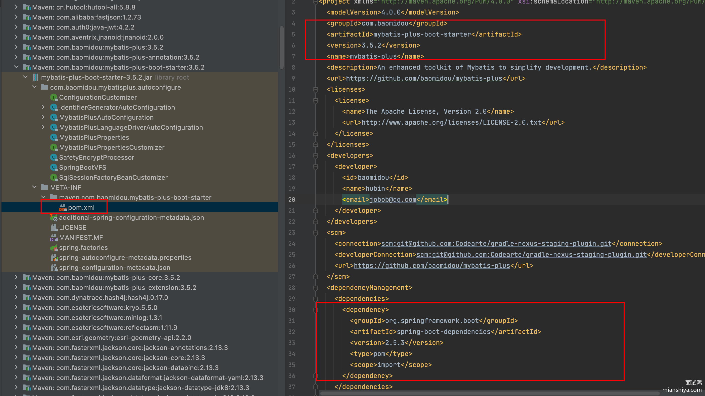 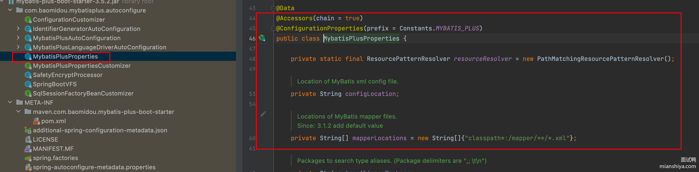  

##### SpringBoot3.x spring.factories 问题

上面我们演示的是 SpringBoot2.x 版本。如果升级到 SpringBoot3.x 那么 spring.factories 就无法生效了，因为官方已经把它移除了。

可以看下官方文档：


spring.factories 功能在 Spring Boot 2.7已经废弃，并且会在 Spring Boot 3.0移除

这使得类似上述的 mybatis-plus 低版本都无法使用。

此时的方案就不能用 spring.factories ，需要在类路径下创建 `META-INF/spring/org.springframework.boot.autoconfigure.AutoConfiguration.imports`文件。

然后文件的内容是：每个实现类的全类名单独一行。

```stylus
com.example.starter.MyAutoConfiguration
```

详情可看[官方 Spring-Boot-3.0-Migration-Guide](https://github.com/spring-projects/spring-boot/wiki/Spring-Boot-3.0-Migration-Guide)

SpringBoot3.x 其实迁移的成本还是有点高的，因为它需要 jdk17。 

### Spring Boot 是如何通过 main 方法启动 web 项目的？

#### 回答重点

Spring Boot 应用的启动流程都封装在 SpringApplication.run 方法中，它的大部分逻辑都是复用 Spring 启动的流程，只不过在它的基础上做了大量的扩展。

在启动的过程中有一个刷新上下文的动作，这个方法内会触发 webServer 的创建，此时就会创建并启动内嵌的 web 服务，默认的 web 服务就是 tomcat。

##### Spring Boot 的启动过程几个核心步骤：

1. SpringApplication.run()：这是启动的入口，它会创建 Spring 应用上下文，并执行自动配置。
2. 创建应用上下文：为 Web 应用创建 AnnotationConfigServletWebServerApplicationContext 上下文。
3. 启动内嵌 Web 服务器：在 refreshContext() 阶段启动内嵌的 Web 服务器（如 Tomcat）。
4. 自动配置：通过 @EnableAutoConfiguration 自动配置各种组件，如 DispatcherServlet。
5. 请求处理：内嵌的 DispatcherServlet 负责处理 HTTP 请求。

#### 扩展知识

##### 源码分析

###### SpringApplication#run


- getRunListeners()：获取应用启动监听器，监听应用的启动状态（比如 ApplicationStartedEvent）。
- prepareEnvironment()：配置应用的环境（Environment），包括从配置文件（application.properties 或 application.yml）加载配置。
- createApplicationContext()：创建 ApplicationContext，用于管理 Spring 的 Bean 及依赖注入。对于 Web 应用，通常会创建 AnnotationConfigServletWebServerApplicationContext 上下文。
- prepareContext()：将环境和参数注入到上下文中，初始化上下文中的各种组件，如 BeanFactory、资源等。
- refreshContext()：刷新应用上下文，启动所有已注册的 Bean，自动配置各类组件，加载 Spring MVC、事务管理等相关配置。
- afterRefresh()：上下文刷新后，执行额外的初始化操作，比如启动内嵌的 Web 服务器。
- callRunners()：调用 ApplicationRunner 和 CommandLineRunner 接口的实现类，以执行启动后的自定义逻辑。

我们再来关注下上面源码中圈的 refreshContext 方法

###### refreshContext

在 `run()` 方法中，`refreshContext()` 会调用 Spring 的 AbstractApplicationContext 的 refresh() 方法，该方法是 Spring 应用启动的核心。

对于 Web 应用，它还会启动内嵌的 Web 服务器。

最终会调用到 `ServletWebServerApplicationContext#onRefresh` 方法，这个方法内会调用 `createWebServer`


```
createWebServer` 从名字就能理解这个方法是干嘛的（创建对应的内嵌 Web 服务器，比如 Tomcat、Jetty 或 Undertow。），可以看到内部通过一个 `ServletWebServerFactory `获取 `webServer
```


默认的 WebServer 是 tomcat，可以看到源码里就是直接 new 了一个 Tomcat，且包装成一个 WebServer：

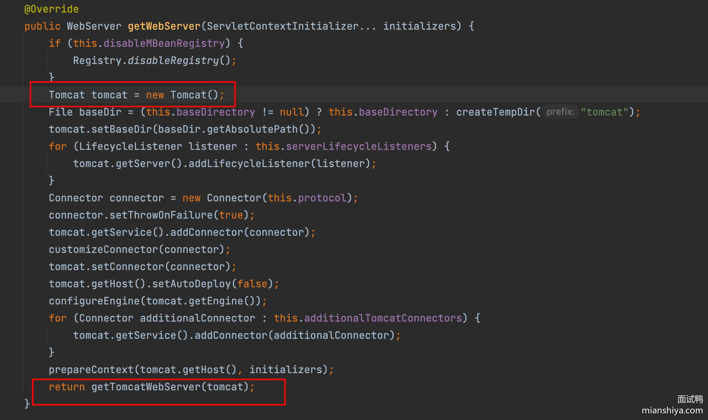

实际上这个 getTomcatWebServer 会 new 一个 WebServer：

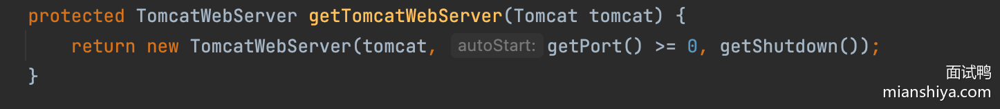

而 new WebServer 会触发 initialize 方法，这个方法内就会触发 tomcat.start：

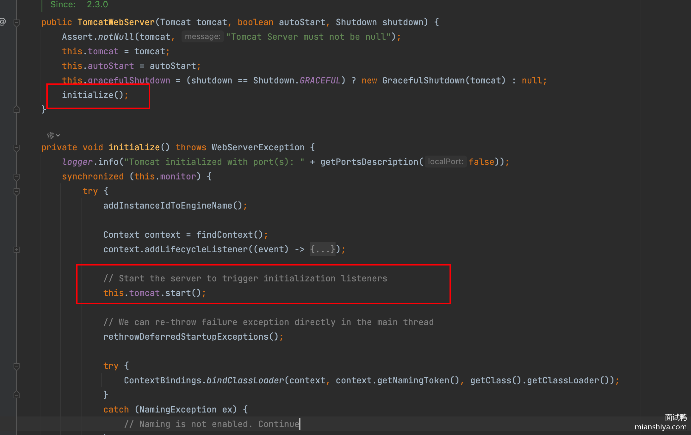

这个时候 tomcat 就被启动了，web 服务就起来了！

这里再扩展下，实际上有 5 种 webServer，默认用的是 TomcatWebServer，还有 jetty、undertow 等。


##### 自动配置机制：`@EnableAutoConfiguration`

Spring Boot 的自动配置机制由 `@EnableAutoConfiguration` 驱动，它会扫描类路径中的依赖，并根据预定义的条件加载相应的配置类。

`@EnableAutoConfiguration` 的核心逻辑是通过 spring.factories 文件加载自动配置类。该文件位于 spring-boot-autoconfigure 包中，内容类似于：

```stylus
org.springframework.boot.autoconfigure.EnableAutoConfiguration=\
org.springframework.boot.autoconfigure.web.servlet.ServletWebServerFactoryAutoConfiguration,\
org.springframework.boot.autoconfigure.web.servlet.DispatcherServletAutoConfiguration
```

这些配置类会在启动时自动注册，并将所需的 Bean 注入到应用上下文中。

##### @SpringBootApplication 注解的作用是什么

它是 Spring Boot 中的一个核心注解，是一个**组合注解**，由以下三个重要的注解组成，分别是：

1）**`@SpringBootConfiguration`**：

- 它是 Spring 的 `@Configuration` 注解的特殊形式，表示这是一个 Spring 配置类，Spring 会根据该类来加载和注册 Bean。
- 作用类似于传统的 XML 配置文件，它让类中的 `@Bean` 方法生效，并将其注册到 Spring 容器中。

2）**`@EnableAutoConfiguration`**：

- 它是 Spring Boot 的自动配置机制的核心，负责启用 Spring Boot 的自动配置功能。
- Spring Boot 会根据应用的类路径、已添加的依赖以及定义的配置（如 `application.properties` 或 `application.yml`），自动配置 Spring 应用的相关组件和 Bean，简化了手动配置。
- 例如，如果你引入了 `spring-boot-starter-web` 依赖，Spring Boot 会自动配置一个嵌入式的 Tomcat 服务器，并且配置 Spring MVC 的相关 Bean。

3）**`@ComponentScan`**：

- 启用组件扫描功能，自动发现并注册 `@Component`、`@Service`、`@Repository`、`@Controller` 等注解标注的 Spring 组件。
- 它会扫描 `@SpringBootApplication` 所在类的当前包及其子包，自动将符合条件的组件加载到 Spring 容器中。

##### `@SpringBootApplication` 的作用总结

- **简化配置**：通过这个组合注解，Spring Boot 项目可以不用手动配置 `@Configuration`、`@EnableAutoConfiguration`、`@ComponentScan`，使应用更易于启动和管理。
- **自动配置**：借助自动配置机制，开发者无需手动配置许多 Spring 组件，Spring Boot 会根据项目依赖来自动注入所需的 Bean。
- **组件扫描**：自动扫描和加载定义在项目中的 Spring 组件，简化了 Bean 注册过程。

### Spring Boot 的核心特性有哪些？

#### 回答重点

1）开箱即用，内嵌服务器。这个特点是程序员最直观的感受，相较于原本的开发，spring boot 可以省略以前繁琐的 tomcat 配置，快速创建一个 web 容器。

2）自动化配置。在 spring boot 中我们可以按照自动配置的规定（将自动加载的 bean 写在自己jar 包当中的 **meta/info/spring.factories** 文件中或者通过的注解 **@Import** 导入时加载指定的类）这样我们的配置类就会被 Springboot 自动加载到容器当中。 **同时还支持通过改写yaml 和 propreties来覆盖默认配置**

3）支持 jar 包运行。传统部署web 容器都是打成 war 包放在 tomcat 中。spring boot 可以打成 jar 包只要有 java 运行环境即可运行 web 容器。

4）完整的生态支持。spring boot 可以随意整合 spring 全家桶的支持。像 Actuator 健康检查模块，Spring Data JPA 数据库模块，Spring Test 测试模块。这些都可以很优雅的集成在 springboot 当中。

5）监控、健康检查支持。spring boot Actuator 支持开发者监控应用的运行状态，包括性能指标、应用信息和日志级别控制等。

#### 扩展知识

面试时可以跟面试官说说自己是如何实现一个 spring boot starter 来帮助项目简化某些通用的业务的。

比如现在项目中有很多列表接口需要导出 excel。我利用自动化配置写了一个 excel 导出模块。

实现思路如下：

1)写一个 @ExcelExport 注解，放在列表接口上。利用切面来切列表的返回结果，拿到列表结果后写入 excel 当中。

2)然后写一个配置类放在 meta/info/spring.factories 文件下。这样让 spring boot 自动装配我们这个写 excel 文件的处理类。

3)在整个项目中有需要列表导出 excel 的地方，仅需把注解写在列表接口上即可。

通过这个例子让面试官相信你有实际使用自动化装配的经验。

### 什么是 Spring Boot？ 

#### 回答重点

Spring Boot 是一个简化 Spring 应用程序开发的框架。**它的主要目标是减少 Spring 应用程序的配置和开发复杂性，使我们能够更快地构建、测试和部署 Spring 应用**。

简单来说它通过提供默认配置、自动化配置和嵌入式服务器等功能，简化了传统 Spring 应用的繁琐配置过程。

有人将一些依赖关系、默认配置都梳理好了，我们直接一个引用就搞定了，这就是它的本质。

#### 扩展知识

##### Spring Boot 主要特点

1. **简化配置**：Spring Boot 通过自动配置（`@EnableAutoConfiguration`），根据项目中的类路径依赖、环境变量等自动为应用配置适当的 Spring 模块，避免了大量的 XML 配置。
2. **内置服务器**：Spring Boot 内置了 Tomcat、Jetty、Undertow 等服务器，应用程序可以直接通过 `java -jar` 方式启动，而不需要部署到外部的 Web 服务器中。
3. **快速开发**：Spring Boot 提供了开箱即用的项目结构、默认配置和依赖管理，支持快速原型开发。它还提供了许多常用的开发工具（如开发时热部署、应用健康检查等）。
4. **独立运行**：Spring Boot 应用打包成一个独立的 JAR 或 WAR 包，可以通过命令行直接运行，简化了部署过程。

##### **Spring Boot 的核心注解**

###### `@SpringBootApplication`

`@SpringBootApplication` 是 Spring Boot 的核心注解，它是以下三个注解的组合：

- `@Configuration`：表示该类是 Spring 配置类。
- `@EnableAutoConfiguration`：启用 Spring Boot 的自动配置功能。
- `@ComponentScan`：自动扫描当前包及其子包中带有 Spring 注解的类（如 `@Controller`、`@Service` 等）。

###### `@EnableAutoConfiguration`

`@EnableAutoConfiguration` 是 Spring Boot 的自动配置核心注解，它会根据类路径中的依赖自动配置 Spring 应用中的各种组件。

**示例**： 如果应用中引入了 `spring-boot-starter-web` 依赖，Spring Boot 会自动为应用配置嵌入式 Tomcat 服务器、MVC 框架等。

##### **Spring Boot 的启动器（Starters）**

Spring Boot 提供了一系列 **Starters**（启动器），这些启动器是预定义的依赖包集合，涵盖了常用的 Spring 和第三方库。通过引入一个简单的启动器依赖，开发者可以快速整合需要的功能。

###### 常用 starter

- **`spring-boot-starter-web`**：用于构建 Web 应用，包含 Spring MVC 和嵌入式 Tomcat。
- **`spring-boot-starter-data-jpa`**：用于集成 Spring Data JPA 和 Hibernate，简化数据库访问。
- **`spring-boot-starter-security`**：用于集成 Spring Security，实现身份验证和授权。
- **`spring-boot-starter-thymeleaf`**：集成 Thymeleaf 模板引擎，适用于 MVC 模式下的视图层渲染。

**示例**：

```xml
<dependency>
    <groupId>org.springframework.boot</groupId>
    <artifactId>spring-boot-starter-web</artifactId>
</dependency>
```

引入 `spring-boot-starter-web` 之后，Spring Boot 会自动配置 Web 服务器和 Spring MVC，开发者只需编写业务逻辑即可。

##### **Spring Boot 的自动配置**

Spring Boot 的自动配置机制依赖于 `spring-boot-autoconfigure` 模块，它会根据类路径中的依赖和配置文件自动配置相关的 Bean 和服务。

###### 工作原理

Spring Boot 自动配置的核心原理是 `@EnableAutoConfiguration` 注解，它根据项目中的依赖和 `application.properties` 或 `application.yml` 文件中的配置，判断需要加载哪些 Bean。通过条件注解（如 `@ConditionalOnClass`、`@ConditionalOnMissingBean` 等），Spring Boot 可以有选择地加载相关配置。

###### 自定义配置

虽然 Spring Boot 自动配置非常方便，但开发者可以通过 `application.properties` 文件自定义和覆盖默认配置。

**示例**：

```properties
server.port=8081  # 修改内置 Tomcat 的端口号
spring.datasource.url=jdbc:mysql://localhost:3306/mydb  # 配置数据源
```

##### **Spring Boot 内置服务器**

Spring Boot 内置了几种常见的 Web 服务器，如 Tomcat、Jetty 和 Undertow。默认情况下，Spring Boot 使用嵌入式 Tomcat 作为 Web 应用的服务器，开发者可以通过 `application.properties` 文件或代码配置来切换服务器或修改其配置。

###### 嵌入式 Tomcat 配置

Spring Boot 默认使用嵌入式 Tomcat 服务器，开发者可以通过修改配置文件来调整 Tomcat 的属性，例如端口号、线程池大小等。

**示例**：

```properties
server.port=8080
server.tomcat.max-threads=200
```

###### 切换到 Jetty 或 Undertow

开发者可以通过替换依赖来切换嵌入式服务器。

**示例**：切换到 Jetty

```xml
<dependency>
    <groupId>org.springframework.boot</groupId>
    <artifactId>spring-boot-starter-jetty</artifactId>
</dependency>
```

##### **Spring Boot Actuator**

Spring Boot Actuator 是一个用于监控和管理 Spring Boot 应用的工具包，提供了丰富的健康检查、度量指标、应用状态等功能。开发者可以通过 Actuator 轻松地监控应用的运行状态。

###### 常见的 Actuator 端点

- **`/actuator/health`**：检查应用的健康状态。
- **`/actuator/metrics`**：查看应用的性能指标。
- **`/actuator/info`**：显示应用的基本信息。

**示例**： 在 `application.properties` 文件中启用 Actuator 端点：

```properties
management.endpoints.web.exposure.include=*
```

访问 `/actuator/health`，可以查看应用的健康状态信息：

```json
{
    "status": "UP"
}
```

##### **Spring Boot 的优点**

- **快速启动**：Spring Boot 提供了简洁的配置和开箱即用的功能，减少了项目启动时所需的配置工作，开发者可以专注于业务逻辑。
- **简化的配置管理**：Spring Boot 的自动配置机制大大减少了开发者手动配置的繁琐工作，尤其是在集成数据库、消息队列、安全性等复杂组件时，开发者可以通过少量配置完成集成。
- **内置 Web 服务器**：Spring Boot 内置了常用的 Web 服务器，使得开发者可以直接运行 Web 应用，而无需部署到外部服务器。
- **强大的生态系统**：Spring Boot 集成了 Spring 全家桶，提供了与 Spring 生态中各个组件的无缝集成，并通过各种 Starter 来快速添加第三方库支持。

###  SpringBoot 是如何实现自动配置的？ 

#### 回答重点

Spring Boot 的自动配置是通过 **`@EnableAutoConfiguration`** 注解实现，这个注解包含`@Import({AutoConfigurationImportSelector.class})`注解，导入的这个类会去扫描 classpath 下所有的 **`META-INF/spring.factories`** 中的文件，根据文件中指定的配置类加载相应的 Bean 的自动配置。

这些 Bean 通常会使用 **`@ConditionalOnClass`**、**`@ConditionalOnMissingBean`**、**`@ConditionalOnProperty`** 等条件注解。来控制自动配置的加载条件，例如仅在类路径中存在某个类时，才加载某些配置。

#### 扩展知识

##### Spring Boot 实现自动配置的核心机制

1）**`@EnableAutoConfiguration` 注解**：

Spring Boot 的自动配置是通过 **`@EnableAutoConfiguration`** 注解实现的。

```java
@Target({ElementType.TYPE})
@Retention(RetentionPolicy.RUNTIME)
@Documented
@Inherited
@AutoConfigurationPackage
@Import({AutoConfigurationImportSelector.class})
public @interface EnableAutoConfiguration {
    String ENABLED_OVERRIDE_PROPERTY = "spring.boot.enableautoconfiguration";

    Class<?>[] exclude() default {};

    String[] excludeName() default {};
}
```

这个注解位于 `@SpringBootApplication` 中，它导入的 `AutoConfigurationImportSelector` 会通过扫描类路径中的依赖，根据应用的上下文自动加载配置类，并为应用自动注入合适的 Bean。

> `@SpringBootApplication` 实际上包含了 **`@EnableAutoConfiguration`**，从而启用了自动配置功能。

2）**`spring.factories` 文件**：

Spring Boot 的自动配置依赖于 **`META-INF/spring.factories`** 文件，该文件中列出了所有自动配置类。当 Spring Boot 启动时，它会根据 `spring.factories` 文件中指定的配置类加载相应的自动配置。

**示例**（`spring.factories` 文件片段）：

```properties
org.springframework.boot.autoconfigure.EnableAutoConfiguration=\
org.springframework.boot.autoconfigure.jdbc.DataSourceAutoConfiguration,\
org.springframework.boot.autoconfigure.orm.jpa.HibernateJpaAutoConfiguration,\
org.springframework.boot.autoconfigure.web.servlet.WebMvcAutoConfiguration
```

`spring.factories` 文件的内容是 `EnableAutoConfiguration` 注解扫描的目标。Spring Boot 会根据应用的环境条件，选择性地加载这些配置类。

> springboot 3.0 废弃了spring.factories，详细点击：[SpringBoot3.x spring.factories 问题](https://www.mianshiya.com/bank/1797452903309508610/question/1797866285598638082#heading-4)

3）**条件注解（Conditional）**：

自动配置类通常使用 **`@ConditionalOnClass`**、**`@ConditionalOnMissingBean`**、**`@ConditionalOnProperty`** 等条件注解。它们控制自动配置的加载条件，例如仅在类路径中存在某个类时，才加载某些配置。

**示例**：

```java
@Configuration
@ConditionalOnClass(DataSource.class)  // 只有类路径中存在 DataSource 时才生效
public class DataSourceAutoConfiguration {
   @Bean
   @ConditionalOnMissingBean  // 如果没有自定义 DataSource，则使用默认配置
   public DataSource dataSource() {
       return new HikariDataSource();
   }
}
```

##### @Conditional 注解的作用是什么？

- [833. Spring 中的 @Conditional 注解的作用是什么？](https://www.mianshiya.com/bank/1790683494127804418/question/1798881653496274945)

##### 如何自定义自动配置

1）**创建自动配置类**：自定义自动配置类需要标注 `@Configuration` 注解，同时可以使用各种条件注解控制配置的加载。

**示例**：

```java
@Configuration
@ConditionalOnClass(MyCustomService.class)
public class MyCustomAutoConfiguration {

   @Bean
   @ConditionalOnMissingBean
   public MyCustomService myCustomService() {
       return new MyCustomService();
   }
}
```

2）**配置 `spring.factories` 文件**：创建 `META-INF/spring.factories` 文件，并将自定义的自动配置类注册到 `EnableAutoConfiguration` 中。

**示例**：

```properties
org.springframework.boot.autoconfigure.EnableAutoConfiguration=\
com.example.config.MyCustomAutoConfiguration
```

3）**打包并发布**：自定义的自动配置类可以随应用一起打包，也可以打包成库供其他应用使用。当这个库被引入到其他 Spring Boot 应用时，自动配置就会生效。

##### 自动配置的优先级

Spring Boot 提供了控制自动配置顺序的机制。可以通过 **`@AutoConfigureBefore`** 和 **`@AutoConfigureAfter`** 注解，来指定自动配置类的加载顺序。

- **`@AutoConfigureBefore`**：让当前配置类在指定的配置类之前加载。
- **`@AutoConfigureAfter`**：让当前配置类在指定的配置类之后加载。

**示例**：

```java
@Configuration
@AutoConfigureBefore(DataSourceAutoConfiguration.class)
public class MyDataSourceAutoConfiguration {
    // 自定义的数据源配置
}
```

##### 禁用特定的自动配置

在某些情况下，Spring Boot 的默认自动配置可能与业务需求不符，可以通过以下方式禁用不需要的自动配置类：

1）**在 `application.properties` 中禁用**：

```properties
spring.autoconfigure.exclude=org.springframework.boot.autoconfigure.jdbc.DataSourceAutoConfiguration
```

2）**使用 `@SpringBootApplication` 注解的 `exclude` 属性**：

```java
@SpringBootApplication(exclude = {DataSourceAutoConfiguration.class})
public class MyApplication {
   public static void main(String[] args) {
       SpringApplication.run(MyApplication.class, args);
   }
}
```

##### 自动配置与 Starter

- [如何理解 Spring Boot 中的 starter？](https://www.mianshiya.com/bank/1797452903309508610/question/1797866285598638082#heading-0)

### 在 Spring Boot 中如何实现多数据源配置？ 

#### 回答重点

1. 在配置文件中定义多数据源
2. 为每个数据源配置 DataSource、SqlSessionFactory 和 TransactionManager
3. 为每个数据源配置独立的 Mapper 扫描路径
4. 使用 @Transactional 指定事务管理器

#### 扩展知识

##### 1. 在配置文件中定义多数据源

首先，在 `application.yml` 或 `application.properties` 文件中为不同的数据源定义连接信息。

**示例：application.yml**

```yaml
spring:
  datasource:
    primary:
      url: jdbc:mysql://localhost:3306/primary_db
      username: root
      password: root
      driver-class-name: com.mysql.cj.jdbc.Driver
    secondary:
      url: jdbc:mysql://localhost:3306/secondary_db
      username: root
      password: root
      driver-class-name: com.mysql.cj.jdbc.Driver
```

##### 2. 配置 `DataSource`、`SqlSessionFactory` 和 `TransactionManager`

为每个数据源分别配置 `DataSource`、`SqlSessionFactory` 和 `TransactionManager`，并为主数据源标记 **`@Primary`**。

**示例：数据源配置类**

```java
@Configuration
@MapperScan(basePackages = "com.example.primary.mapper", sqlSessionFactoryRef = "primarySqlSessionFactory")
public class PrimaryDataSourceConfig {

    @Primary
    @Bean(name = "primaryDataSource")
    @ConfigurationProperties(prefix = "spring.datasource.primary")
    public DataSource primaryDataSource() {
        return DataSourceBuilder.create().build();
    }

    @Primary
    @Bean(name = "primarySqlSessionFactory")
    public SqlSessionFactory primarySqlSessionFactory(@Qualifier("primaryDataSource") DataSource dataSource) throws Exception {
        SqlSessionFactoryBean sessionFactoryBean = new SqlSessionFactoryBean();
        sessionFactoryBean.setDataSource(dataSource);
        return sessionFactoryBean.getObject();
    }

    @Primary
    @Bean(name = "primaryTransactionManager")
    public DataSourceTransactionManager primaryTransactionManager(@Qualifier("primaryDataSource") DataSource dataSource) {
        return new DataSourceTransactionManager(dataSource);
    }
}

@Configuration
@MapperScan(basePackages = "com.example.secondary.mapper", sqlSessionFactoryRef = "secondarySqlSessionFactory")
public class SecondaryDataSourceConfig {

    @Bean(name = "secondaryDataSource")
    @ConfigurationProperties(prefix = "spring.datasource.secondary")
    public DataSource secondaryDataSource() {
        return DataSourceBuilder.create().build();
    }

    @Bean(name = "secondarySqlSessionFactory")
    public SqlSessionFactory secondarySqlSessionFactory(@Qualifier("secondaryDataSource") DataSource dataSource) throws Exception {
        SqlSessionFactoryBean sessionFactoryBean = new SqlSessionFactoryBean();
        sessionFactoryBean.setDataSource(dataSource);
        return sessionFactoryBean.getObject();
    }

    @Bean(name = "secondaryTransactionManager")
    public DataSourceTransactionManager secondaryTransactionManager(@Qualifier("secondaryDataSource") DataSource dataSource) {
        return new DataSourceTransactionManager(dataSource);
    }
}
```

##### 3. 配置 `Mapper` 扫描路径

每个数据源需要独立配置对应的 `Mapper` 扫描路径。使用 **`@MapperScan`** 注解指定 `Mapper` 的包路径，并绑定相应的 `SqlSessionFactory`。

```java
@Configuration
@MapperScan(basePackages = "com.example.primary.mapper", sqlSessionFactoryRef = "primarySqlSessionFactory")
public class PrimaryDataSourceConfig {
    // 主数据源配置
}

@Configuration
@MapperScan(basePackages = "com.example.secondary.mapper", sqlSessionFactoryRef = "secondarySqlSessionFactory")
public class SecondaryDataSourceConfig {
    // 次数据源配置
}
```

##### 4. 使用 `@Transactional` 指定事务管理器

在需要使用多数据源的地方，可以通过 `@Transactional` 注解指定对应的事务管理器。

**示例：指定事务管理器**

```java
@Service
public class MyService {

    @Autowired
    private PrimaryMapper primaryMapper;

    @Autowired
    private SecondaryMapper secondaryMapper;

    @Transactional(transactionManager = "primaryTransactionManager")
    public void usePrimaryDataSource() {
        primaryMapper.insertData(...);
    }

    @Transactional(transactionManager = "secondaryTransactionManager")
    public void useSecondaryDataSource() {
        secondaryMapper.insertData(...);
    }
}
```

通过在 `@Transactional` 注解中指定不同的 `transactionManager`，可以确保每个数据源的事务管理独立，避免数据源之间的事务冲突。

##### 动态数据源切换

Spring 提供了 **`AbstractRoutingDataSource`**，通过实现自定义路由逻辑，动态决定使用哪个数据源。

**示例：动态数据源路由**

1）**创建动态路由数据源类**：

```java
public class DynamicDataSource extends AbstractRoutingDataSource {

    @Override
    protected Object determineCurrentLookupKey() {
        return DataSourceContextHolder.getDataSourceType();  // 动态获取当前数据源标识
    }
}
```

2）**管理数据源上下文**：

```java
public class DataSourceContextHolder {

    private static final ThreadLocal<String> contextHolder = new ThreadLocal<>();

    public static void setDataSourceType(String dataSourceType) {
        contextHolder.set(dataSourceType);
    }

    public static String getDataSourceType() {
        return contextHolder.get();
    }

    public static void clearDataSourceType() {
        contextHolder.remove();
    }
}
```

3）**配置动态数据源**：

```java
@Bean(name = "dynamicDataSource")
public DataSource dynamicDataSource() {
    DynamicDataSource dynamicDataSource = new DynamicDataSource();
    Map<Object, Object> targetDataSources = new HashMap<>();
    targetDataSources.put("primary", primaryDataSource());
    targetDataSources.put("secondary", secondaryDataSource());
    dynamicDataSource.setTargetDataSources(targetDataSources);
    dynamicDataSource.setDefaultTargetDataSource(primaryDataSource());
    return dynamicDataSource;
}
```

4）**动态切换数据源**：

```java
public void someBusinessLogic() {
    DataSourceContextHolder.setDataSourceType("secondary");
    try {
        // 使用 secondary 数据源执行操作
    } finally {
        DataSourceContextHolder.clearDataSourceType();  // 清除上下文，恢复默认数据源
    }
} 
```

### Spring Boot 中如何实现异步处理？ 

#### 回答重点

主要有四种方式来实现异步处理：

1. 使用 @Async 注解
2. 使用 CompletableFuture
3. 使用 @Scheduled 注解
4. 使用线程池

##### @Async

@Async 是 Spring 提供的注解，用于指定某个方法在另一个线程中异步执行。

只要在配置类上添加 @EnableAsync 注解，然后在需要异步执行的方法上添加 @Async 注解即可实现。

```java
@Service
public class AsyncService {

    @Async
    public void asyncMethod() {
        // 异步执行的代码
        System.out.println("Executing method asynchronously. " + Thread.currentThread().getName());
    }
}

@Configuration
@EnableAsync
public class AsyncConfig {
}
```

注：可以自定义线程池来管理异步任务。

##### CompletableFuture

CompletableFuture 是 Java 8 引入的一个类，用于处理异步计算和结果。

```java
@Service
public class AsyncService {

    @Async
    public CompletableFuture<String> asyncMethodWithReturn() {
        // 异步执行的代码
        return CompletableFuture.completedFuture("Hello, mianshiya.com!");
    }
}
```

##### @Scheduled

可以配置定时任务，当然也就可以实现异步的任务处理。

```java
@Component
public class ScheduledTasks {

    @Scheduled(fixedRate = 5000)
    public void reportCurrentTime() {
        System.out.println("The time is now " + System.currentTimeMillis());
    }
}
```

##### 线程池

可以将任务显示地提交到线程池中，进行任务的异步处理，推荐使用自定义线程池，可以根据项目和任务的情况来设置对应的线程池参数。

```java
@Configuration
public class AsyncConfig {

    @Bean(name = "taskExecutor")
    public Executor taskExecutor() {
        ThreadPoolTaskExecutor executor = new ThreadPoolTaskExecutor();
        executor.setCorePoolSize(2);
        executor.setMaxPoolSize(2);
        executor.setQueueCapacity(500);
        executor.setThreadNamePrefix("Thread-");
        executor.initialize();
        return executor;
    }
}
```

###### 线程池使用的注意点

- 合理配置线程池：根据应用的具体需求，合理配置线程池的大小和其他参数，以保证系统的性能和稳定性。（即使使用 @Async 等，本质也是利用线程池执行异步任务）
- 注意异常处理：任务中的异常处理需要关注，避免出现异常未捕获直接丢失且没有发现的情况（例如 submit 提交的任务，异常都不会抛出）。

### Spring Boot 打成的 jar 和普通的 jar 有什么区别 ?

#### 回答重点

Spring Boot 打成的 JAR 包不仅包含了应用程序的源代码和依赖库，还包含了程序运行需要的配置、脚本和服务依赖（内嵌的服务器如 Tomcat、Jetty、Undertow），可以直接部署运行。

普通的 JAR 包只有源代码和一些依赖，通常需要外部服务器或容器来运行。

#### 扩展知识

##### Spring Boot jar 结构

```gherkin
myapp.jar
|-- META-INF/
|   |-- MANIFEST.MF  # JAR 的清单文件，指向主类
|-- BOOT-INF/
|   |-- classes/     # 应用的 .class 文件和资源文件
|   |-- lib/         # 应用的依赖库
|-- org/springframework/boot/loader/  # Spring Boot 的自定义类加载器
|   |-- JarLauncher.class
|   |-- WarLauncher.class
```

BOOT-INF 目录，用于存放应用的类和资源。

lib 目录，用于存放所有依赖。

META-INF/MANIFEST.MF 文件，指定了主类和启动类。

##### 普通 jar 结构

```stata
myapp.jar
├── com/
│   └── example/
│       └── MainClass.class
└── META-INF/
    └── MANIFEST.MF
```

一般只有类文件和资源文件。

##### 如何打包 Spring Boot jar 包

通常用于普通 Spring Boot 应用，特别是内嵌了 Web 服务器的应用。通过 Maven 或 Gradle 插件，可以轻松将应用打包为可执行的 JAR。

Maven 示例：

```xml
<build>
    <plugins>
        <plugin>
            <groupId>org.springframework.boot</groupId>
            <artifactId>spring-boot-maven-plugin</artifactId>
        </plugin>
    </plugins>
</build>
```

## SpringCloud

### 什么是配置中心？有哪些常见的配置中心？

#### 回答重点

配置中心是一个用于配置集中化管理且支持动态更新、分发配置文件的工具（服务）。

它实现了配置的统一管理和动态刷新。当配置信息发生变化时，配置中心可以自动通知服务实例进行配置更新，这样就可以实例无需重启即可应用最新的配置，从一定程度上减少了系统访问的空窗期，非常灵活方便。

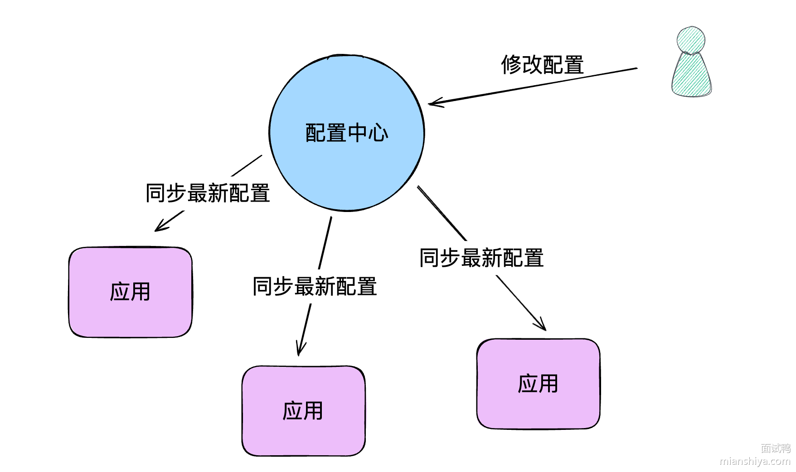

##### 常见的配置中心：

- **Spring Cloud Config**：Spring 提供的分布式配置管理工具，支持从 Git、SVN 等版本控制系统加载配置。
- **Apollo**：由携程开源的配置管理中心，支持配置的实时推送和权限管理。
- **Nacos**：阿里巴巴的配置管理和服务发现工具，既支持配置中心功能，又能作为注册中心使用。
- **Consul**：HashiCorp 提供的分布式系统管理工具，既可以用作服务发现，也可以用于存储和分发配置。
- **Etcd**：分布式键值存储工具，常用于 Kubernetes 集群中的配置管理。
- **Zookeeper**：Zookeeper 是一个开源的分布式协调服务，和 Nacos 一样，其既可以作为注册中心，又可以作为配置中心。

#### 扩展知识

##### 配置中心的优点

- **集中管理**：将分布在各个微服务中的配置集中到一个中心位置，便于管理和维护。
- **动态更新**：支持配置文件的热更新，减少重启应用的次数，提高系统可用性。
- **多环境支持**：可以针对开发、测试、生产等不同环境加载不同的配置文件，增强系统的灵活性。
- **权限控制**：许多配置中心如 Apollo 支持对配置文件的访问控制，保证配置安全。

##### 配置中心如何实现动态更新?

配置中心通常使用**长连接**或**长轮询**的方式来实现配置的动态刷新。

**1）长连接**：

长连接是一种基于 TCP 或 WebSocket 协议的连接方式，在建立连接后，客户端和服务器之间可以持续进行数据的双向传输，而无需每次都重新建立连接。长连接的典型实现是 WebSocket 或 gRPC，能够实现实时的推送。

**工作原理：**

- 客户端与服务器建立一个持久的连接，该连接保持打开状态。
- 当服务器检测到配置变化时，立即通过这个连接向客户端推送变更信息，客户端即时接收和处理更新。
- 连接一直保持直到手动关闭或由于网络中断等因素断开。

**优缺点：**

- 优点：实时性强，服务器可以即时推送更新；无需频繁建立连接，减少了连接开销。
- 缺点：长连接需要消耗更多的系统资源，并且对网络环境的要求较高，断线重连和连接管理需要额外的处理。

**2）长轮询**

长轮询是一种模拟服务器推送的机制，客户端主动向服务器发起请求，并保持连接(比如保持 30s)，直到服务器有更新或超时为止。如果有更新，服务器会返回新的数据，客户端在接收到数据后，再次发起新一轮的请求（如果等待超时，也再次发起新的请求）。

**工作原理：**

- 客户端发送 HTTP 请求给服务器，询问是否有配置更新。
- 服务器保持这个请求打开，直到检测到配置发生变更，或者达到超时时间。
- 如果配置有更新，服务器返回更新的配置数据，客户端处理并再次发起新请求；如果没有更新，连接会超时，客户端也会重新发起请求。
- **模拟推送的效果，但本质上是客户端的连续请求**。

**优缺点：**

- 优点：实现相对简单，兼容性好，适用于大多数网络环境。
- 缺点：即便没有配置变化，也需要不断发起请求，造成资源浪费；响应速度取决于轮询频率，不够实时。

##### 常见配置中心的动态更新实现

- **Spring Cloud Config**：没有原生的推送机制，需要借助消息队列等外部系统实现
- **Apollo**：长轮询
- **Nacos**：1.x 版本为长轮询，2.x版本基于 gRPC（HTTP/2） 实现的长连接
- **Consul**：长轮询
- **Etcd**：基于 gRPC（HTTP/2） 实现的长连接
- **Zookeeper**：基于 TCP 协议的长连接

### 什么情况下需要使用分布式事务，有哪些方案？

#### 回答重点

一般在跨多个数据库、或者不同服务的情况下需要用到分布式事务，比如订单服务和库存服务，下订单和扣库存属于不同服务的方法，因此本地事务无法保证一致性，需要引入分布式服务。

**分布式事务是由多个本地事务组成的**，分布式事务跨越了多设备，之间又经历的复杂的网络，可想而知想要实现严格的事务道路阻且长。

常见的分布式事务方案：

- **2PC**：基于两阶段提交（2PC，Two-Phase Commit）的分布式事务协议。协调者（Transaction Manager）管理全局事务，所有参与的资源管理器（如数据库）在第一阶段准备事务，在第二阶段提交事务。
- **3PC**：3PC 也就是多了一个阶段，一个询问的阶段，分别是准备、预提交和提交这三个阶段。它的引入是为了解决 2PC 同步阻塞和减少数据不一致的情况。
- **TCC**：将事务操作拆分为 Try、Confirm、Cancel 三个步骤。Try 阶段是预留资源，Confirm 阶段是实际提交，Cancel 阶段是回滚操作。每个步骤都需要由业务自己实现。
- **本地消息**：将每个参与的子事务设计为独立的本地事务，通过对状态表进行记录，并采用定时任务或回调机制来检查和补偿，确保最终一致性
- **事务消息**：通过消息中间件（如 RocketMQ）将业务操作和消息发送绑定在一起，确保消息发送和业务操作的原子性。接收方在处理消息时，保证消息的消费与业务操作一致

> **各分布式事务方案详细分析如下**

##### 2PC

2PC，Two-phase commit protocol，即两阶段提交协议。它引入了一个事务协调者角色，来管理各个参与者（就是各数据库资源）。

整体分为两个阶段，分别是准备阶段和提交/回滚阶段。

我们先来看看第一个阶段，即准备阶段。

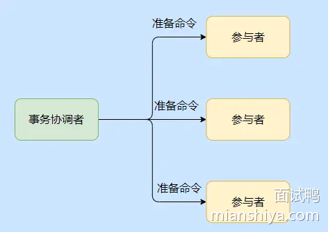

由事务协调者给每个参与者发送准备命令，每个参与者收到命令之后会执行相关事务操作，你可以认为除了事务的提交啥都做了。

然后每个参与者会返回响应告知协调者自己是否准备成功。

**协调者收到每个参与者的响应之后就进入第二阶段**，根据收集的响应，如果有一个参与者响应准备失败那么就向所有参与者发送回滚命令，反之发送提交命令。

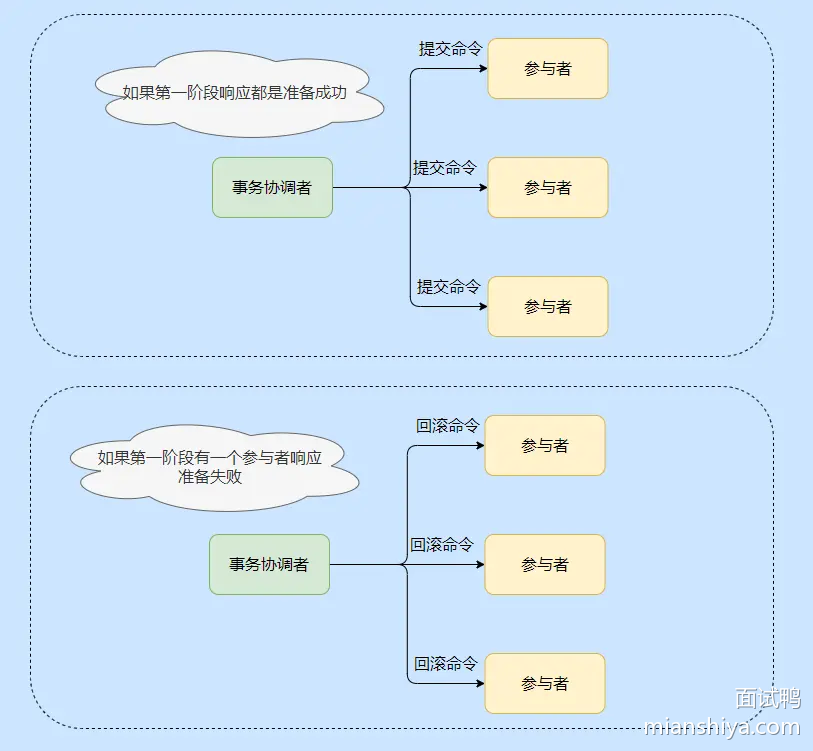

这个协议其实很符合正常的思维，就像我们大学上课点名的时候，其实老师就是协调者的角色，我们都是参与者。

老师一个一个的点名，我们一个一个的喊到，最后老师收到所有同学的到之后就开始了今天的讲课。

而和点名有所不同的是，**老师发现某几个学生不在还是能继续上课，而我们的事务可不允许这样**。

事务协调者在第一阶段未收到个别参与者的响应，则等待一定时间就会认为事务失败，会发送回滚命令，所以在 2PC 中事务协调者有超时机制。

我们再来分析一下 2PC 的优缺点。

**2PC 的优点**是能利用数据库自身的功能进行本地事务的提交和回滚，也就是说提交和回滚实际操作不需要我们实现，不侵入业务逻辑由数据库完成，在之后讲解 TCC 之后相信大家对这点会有所体会。

**2PC 主要有三大缺点**：同步阻塞、单点故障和数据不一致问题。

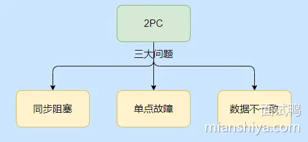

###### 同步阻塞

可以看到在第一阶段执行了准备命令后，我们**每个本地资源都处于锁定状态**，因为除了事务的提交之外啥都做了。

所以这时候如果本地的其他请求要访问同一个资源，比如要修改商品表 id 等于 100 的那条数据，那么此时是被阻塞住的，必须等待前面事务的完结，收到提交/回滚命令执行完释放资源后，这个请求才能得以继续。

所以假设这个分布式事务涉及到很多参与者，然后有些参与者处理又特别复杂，特别慢，那么那些处理快的节点也得等着，所以说效率有点低。

###### 单点故障

可以看到这个**单点就是协调者，如果协调者挂了整个事务就执行不下去了**。

如果协调者在发送准备命令前挂了还行，毕竟每个资源都还未执行命令，那么资源是没被锁定的。

可怕的是在发送完准备命令之后挂了，这时候每个本地资源都执行完处于锁定状态了，都杵着了，这就很僵硬了，如果是某个热点资源都阻塞了，这估计就要完蛋了。

###### 数据不一致问题

因为协调者和参与者之间的交流是经过网络的，而网络有时候就会抽风的或者发生局部网络异常。

那么就有可能导致某些参与者无法收到协调者的请求，而某些收到了。比如是提交请求，然后那些收到命令的参与者就提交事务了，此时就产生了数据不一致的问题。

###### 小结一下 2PC

至此我们来先小结一些 2PC ，它是一个同步阻塞的强一致性两阶段提交协议，分别是准备阶段和提交/回滚阶段。

2PC 的优势在于对业务没有侵入，可以利用数据库自身机制来进行事务的提交和回滚。

它的缺点：是一个同步阻塞协议，会导致高延迟和性能的下降，并且存在协调者单点故障问题，极端情况下会有数据不一致的问题。

**当然这只是协议，具体的落地还是可以变通了**，比如协调者单点问题，我就搞个主从来实现协调者，对吧。

##### 分布式数据库的 2PC 改进模型

可能有些人对分布式数据库不熟悉，没有关系，我们主要学的是思想，看看人家的思路。

我简单的讲下 Percolator 模型，**它是基于分布式存储系统 BigTable 建立的模型**，BigTable 是啥都不清楚的同学没有关系影响不大。

还是拿转账的例子来说，我现在有 200 块钱，你现在有 100 块钱，为了突出重点我也不按正常的结构来画这个表。

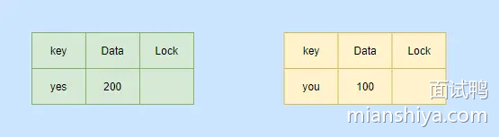

然后我要转 100 块给你。

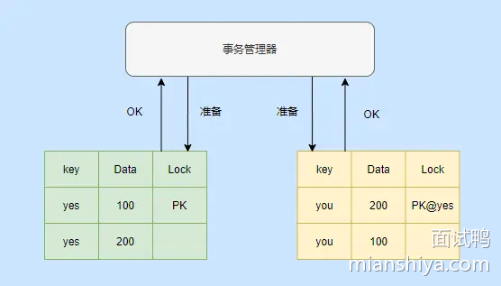

此时事务管理器发起了准备请求，然后我账上的钱就少了，你账上的钱就多了，而且**事务管理器还记录下这次操作的日志**。

此时的数据还是私有版本，别的事务是读不到的，简单的理解 Lock 上有值就还是私有的。

可以看到我的记录 Lock 标记的是 PK，你的记录标记的是指向我的记录指针，这个 PK 是随机选择的。

然后事务管理器会向被选择作为 PK 的那条记录发起提交指令。

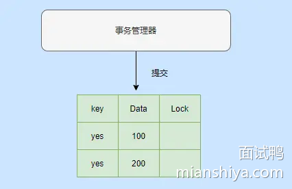

此时就会把我的记录的锁给抹去了，这等于我的记录不再是私有版本了，别的事务就都能访问了。

那你的记录上还有锁啊？不用更新吗？

嘿嘿不需要及时更新，因为访问你的这条记录的时候会去根据指针找我的那个记录，发现记录已经提交了所以你的记录就可以被访问了。

有人说这效率不就差了，每次都要去找一次，别急。

后台会有个线程来扫描，然后更新把锁记录给去了。

这不就稳了嘛。

###### 相比于 2PC 的改进

首先 Percolator 在提交阶段不需要和所有的参与者交互，主需要和一个参与者打交道，所以这个提交是原子的！**解决了数据不一致问题**。

然后事务管理器会记录操作日志，这样当事务管理器挂了之后选举的新事务管理器就可以通过日志来得知当前的情况从而继续工作，**解决了单点故障问题**。

并且 Percolator 还会有后台线程，会扫描事务状况，在事务管理器宕机之后会回滚各个参与者上的事务。

可以看到相对于 2PC 还是做了很多改进的，也是巧妙的。

其实分布式数据库还有别的事务模型，不过我也不太熟悉，就不多哔哔了，有兴趣的同学可以自行了解。

还是挺能拓宽思想的。

##### XA 规范

让我们再回来 2PC，既然说到 2PC 了那么也简单的提一下 XA 规范，XA 规范是基于两阶段提交的，它实现了两阶段提交协议。

在说 XA 规范之前又得先提一下 DTP 模型，即 Distributed Transaction Processing，这模型规范了分布式事务的模型设计。

而 XA 规范又约束了 DTP 模型中的事务管理器（TM） 和资源管理器（RM）之间的交互，简单的说就是你们两之间要按照一定的格式规范来交流！

我们先来看下 XA 约束下的 DTP 模型。

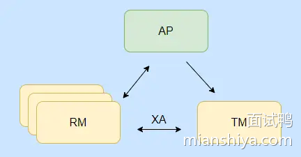

- AP 应用程序，就是我们的应用，事务的发起者。
- RM 资源管理器，简单的认为就是数据库，具备事务提交和回滚能力，对应我们上面的 2PC 就是参与者。
- TM 事务管理器，就是协调者了，和每个 RM 通信。

简单的说就是 AP 通过 TM 来定义事务操作，TM 和 RM 之间会通过 XA 规范进行通信，执行两阶段提交，而 AP 的资源是从 RM 拿的。

从模型上看有三个角色，而实际实现可以由一个角色实现两个功能，比如 AP 来实现 TM 的功能，TM 没必要抽出来单独部署。

###### MySQL XA

知晓了 DTP 之后，我们就来看看 XA 在 MySQL 中是如何操作的，不过只有 InnoDB 支持。

简单的说就是要先定义一个全局唯一的 XID，然后告知每个事务分支要进行的操作。

可以看到图中执行了两个操作，分别是改名字和插入日志，等于先注册下要做的事情，通过 XA START XID 和 XA END XID 来包裹要执行的 SQL。

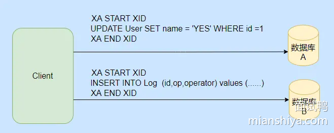

然后需要发送准备命令，来执行第一阶段，也就是除了事务的提交啥都干了的阶段。

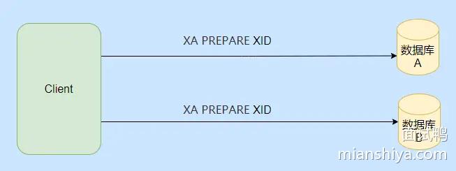

然后根据准备的情况来选择执行提交事务命令还是回滚事务命令。

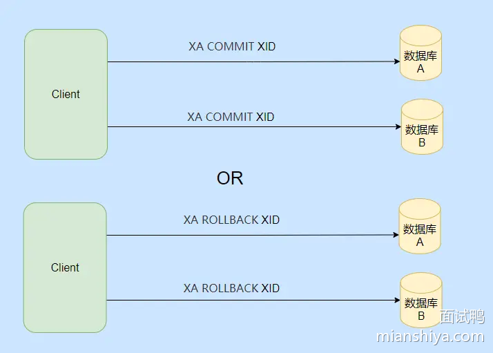

基本上就是这么个流程，不过 MySQL XA 的性能不高这点是需要注意的。

可以看到虽说 2PC 有缺点，但是还是有基于 2PC 的落地实现的，而 3PC 的引出是为了解决 2PC 的一些缺点，但是它整体下来开销更大，也解决不了网络分区的问题，我也没有找到 3PC 的落地实现。

不过我还是稍微提一下，知晓一下就行，纯理论。

##### 3PC

3PC 的引入是为了解决 2PC 同步阻塞和减少数据不一致的情况。

3PC 也就是多了一个阶段，一个询问的阶段，分别是准备、预提交和提交这三个阶段。

准备阶段单纯就是协调者去访问参与者，类似于你还好吗？能接请求不。

预提交其实就是 2PC 的准备阶段，除了事务的提交啥都干了。

提交阶段和 2PC 的提交一致。

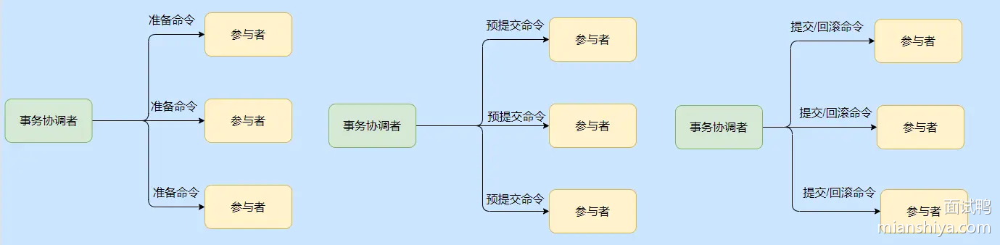

3PC 多了一个阶段其实就是在执行事务之前来确认参与者是否正常，防止个别参与者不正常的情况下，其他参与者都执行了事务，锁定资源。

出发点是好的，但是**绝大部分情况下肯定是正常的，所以每次都多了一个交互阶段就很不划算。**

然后 3PC 在参与者处也引入了超时机制，这样在协调者挂了的情况下，如果已经到了提交阶段了，参与者等半天没收到协调者的情况的话就会自动提交事务。

不过万一协调者发的是回滚命令呢？你看这就出错了，数据不一致了。

还有维基百科上说 2PC 参与者准备阶段之后，如果协调者挂了，参与者是无法得知整体的情况的，因为大局是协调者掌控的，所以参与者相互之间的状况它们不清楚。

而 3PC 经过了第一阶段的确认，即使协调者挂了参与者也知道自己所处预提交阶段是因为已经得到准备阶段所有参与者的认可了。

简单的说就像加了个围栏，使得各参与者的状态得以统一。

##### 小结 2PC 和 3PC

从上面已经知晓了 2PC 是一个强一致性的同步阻塞协议，性能已经是比较差的了。

而 3PC 的出发点是为了解决 2PC 的缺点，但是多了一个阶段就多了一次通讯的开销，而且是绝大部分情况下无用的通讯。

虽说引入参与者超时来解决协调者挂了的阻塞问题，但是数据还是会不一致。

可以看到 3PC 的引入并没什么实际突破，而且性能更差了，所以实际只有 2PC 的落地实现。

再提一下，2PC 还是 3PC 都是协议，可以认为是一种指导思想，和真正的落地还是有差别的。

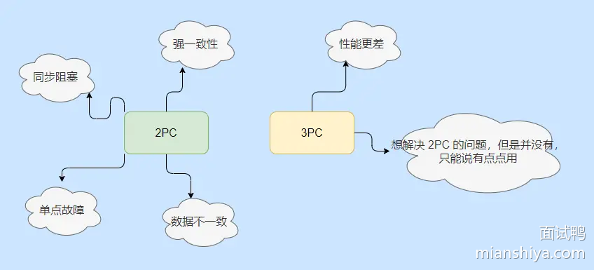

##### TCC

不知道大家注意到没，**不管是 2PC 还是 3PC 都是依赖于数据库的事务提交和回滚。**

而有时候一些业务它不仅仅涉及到数据库，可能是发送一条短信，也可能是上传一张图片。

所以说事务的提交和回滚就得提升到业务层面而不是数据库层面了，而 **TCC 就是一种业务层面或者是应用层的两阶段提交**。

TCC 分为指代 Try、Confirm、Cancel ，也就是业务层面需要写对应的三个方法，主要用于跨数据库、跨服务的业务操作的数据一致性问题。

TCC 分为两个阶段，第一阶段是资源检查预留阶段即 Try，第二阶段是提交或回滚，如果是提交的话就是执行真正的业务操作，如果是回滚则是执行预留资源的取消，恢复初始状态。

比如有一个扣款服务，我需要写 Try 方法，用来冻结扣款资金，还需要一个 Confirm 方法来执行真正的扣款，最后还需要提供 Cancel 来进行冻结操作的回滚，对应的一个事务的所有服务都需要提供这三个方法。

可以看到本来就一个方法，现在需要膨胀成三个方法，所以说 TCC 对业务有很大的侵入，像如果没有冻结的那个字段，还需要改表结构。

我们来看下流程。

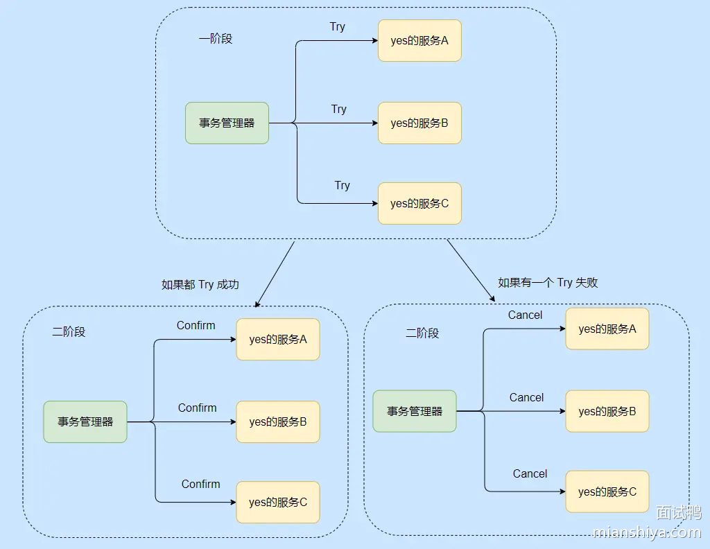

虽说对业务有侵入，但是 TCC 没有资源的阻塞，每一个方法都是直接提交事务的，如果出错是通过业务层面的 Cancel 来进行补偿，所以也称补偿性事务方法。

这里有人说那要是所有人 Try 都成功了，都执行 Comfirm 了，但是个别 Confirm 失败了怎么办？

这时候只能是不停地重试调失败了的 Confirm 直到成功为止，如果真的不行只能记录下来，到时候人工介入了。

###### TCC 的注意点

这几个点很关键，在实现的时候一定得注意了。

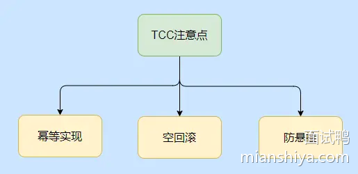

**幂等问题**，因为网络调用无法保证请求一定能到达，所以都会有重调机制，因此对于 Try、Confirm、Cancel 三个方法都需要幂等实现，避免重复执行产生错误。

**空回滚问题**，指的是 Try 方法由于网络问题没收到超时了，此时事务管理器就会发出 Cancel 命令，那么需要支持 Cancel 在未执行 Try 的情况下能正常的 Cancel。

**悬挂问题**，这个问题也是指 Try 方法由于网络阻塞超时触发了事务管理器发出了 Cancel 命令，**但是执行了 Cancel 命令之后 Try 请求到了，你说气不气**。

这都 Cancel 了你来个 Try，对于事务管理器来说这时候事务已经是结束了的，这冻结操作就被“悬挂”了，所以空回滚之后还得记录一下，防止 Try 的再调用。

##### TCC 变体

上面我们说的是通用型的 TCC，它需要改造以前的实现，但是有一种情况是无法改造的，就是**你调用的是别的公司的接口**。

###### 没有 Try 的 TCC

比如坐飞机需要换乘，换乘的又是不同的航空公司，比如从 A 飞到 B，再从 B 飞到 C，只有 A - B 和 B - C 都买到票了才有意义。

这时候的选择就没得 Try 了，直接调用航空公司的买票操作，当两个航空公司都买成功了那就直接成功了，如果某个公司买失败了，那就需要调用取消订票接口。

也就是在第一阶段直接就执行完整个业务操作了，所以要重点关注回滚操作，如果回滚失败得有提醒，要人工介入等。

这其实就是 TCC 的思想。

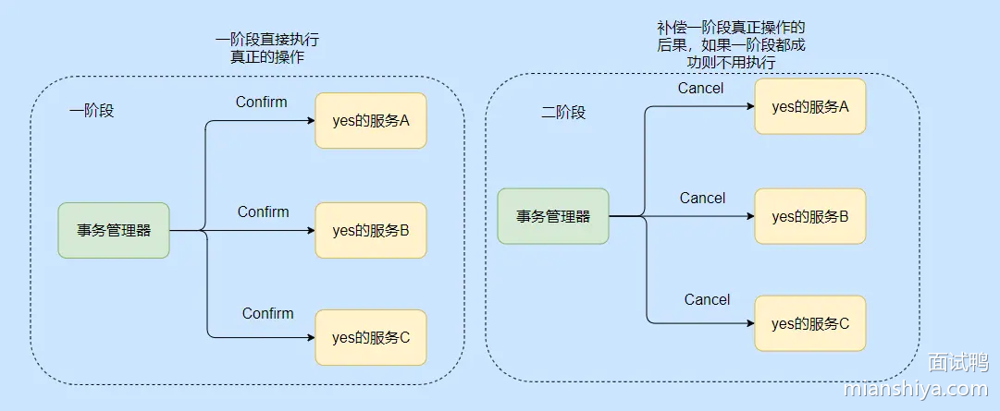

###### 异步 TCC

这 TCC 还能异步？其实也是一种折中，比如某些服务很难改造，并且它又不会影响主业务决策，也就是它不那么重要，不需要及时的执行。

这时候可以引入可靠消息服务，通过消息服务来替代个别服务来进行 Try、Confirm、Cancel 。

Try 的时候只是写入消息，消息还不能被消费，Confirm 就是真正发消息的操作，Cancel 就是取消消息的发送。

这可靠消息服务其实就类似于等下要提到的事务消息，这个方案等于糅合了事务消息和 TCC。

##### TCC 小结

可以看到 **TCC 是通过业务代码来实现事务的提交和回滚，对业务的侵入较大，它是业务层面的两阶段提交，**。

它的性能比 2PC 要高，因为不会有资源的阻塞，并且适用范围也大于 2PC，在实现上要注意上面提到的几个注意点。

它是业界比较常用的分布式事务实现方式，而且从变体也可以得知，还是得**看业务变通的，不是说你要用 TCC 一定就得死板的让所有的服务都改造成那三个方法。**

##### 本地消息表

本地消息就是利用了本地事务，会在数据库中存放一张本地事务消息表，在进行本地事务操作中加入了本地消息的插入，即**将业务的执行和将消息放入消息表中的操作放在同一个事务中提交**

这样本地事务执行成功的话，消息肯定也插入成功，然后再调用其他服务，如果调用成功就修改这条本地消息的状态。

如果失败也不要紧，会有一个后台线程扫描，发现这些状态的消息，会一直调用相应的服务，一般会设置重试的次数，如果一直不行则特殊记录，待人工介入处理。

可以看到还是很简单的，也是一种最大努力通知思想。

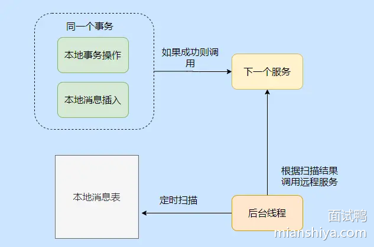

##### 事务消息

像 RocketMQ 这类消息中间件是提供事务消息的，简单而言在事务开始时会发个半消息给 broker，此时消息对消费者不可见，如果本地事务提交了，半消息也会被提交，此时消费者可见，也就可以消费了。

broker 如果很长时间没等到半消息提交或者回滚的请求，则会反查生产者，这样就能保证事务的一致性了。

### Dubbo 和 Spring Cloud Gateway 有什么区别？

#### 回答重点

Dubbo 是一个 RPC（远程过程调用）框架，主要用于服务之间的通信。它提供高性能的 RPC 调用、负载均衡、服务发现、服务注册、服务治理等功能。

适用于需要高性能 RPC 调用的分布式系统，常用于内部服务通信。

Spring Cloud Gateway 是一个 API 网关，用于处理外部客户端请求并将其路由到后端服务。它提供请求路由、负载均衡、协议转换、安全管理、流量控制、日志和监控等功能。

适用于微服务架构中的统一入口管理，常用于外部请求的入口层。

所以说它们不是一个层级的东西。

#### 扩展知识

##### Dubbo 与 SpringCloud 对比

我们来看下 Dubbo 官网自己对于 SpringCloud 的对比供大家参考，以下内容来自 [Dubbo官网](https://cn.dubbo.apache.org/zh-cn/overview/what/xyz-difference/)

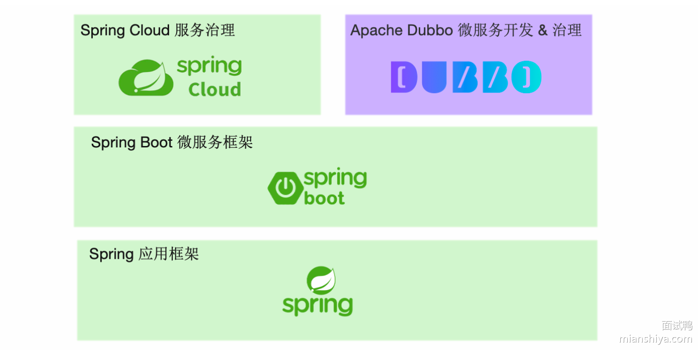

从上图我们可以看出，Dubbo 和 Spring Cloud 有很多相似之处，它们都在整个架构图的相同位置并提供一些相似的功能。

- **Dubbo 和 Spring Cloud 都侧重在对分布式系统中常见问题模式的抽象（如服务发现、负载均衡、动态配置等）**，同时对每一个问题都提供了配套组件实现，形成了一套微服务整体解决方案，让使用 Dubbo 及 Spring Cloud 的用户在开发微服务应用时可以专注在业务逻辑开发上。
- **Dubbo 和 Spring Cloud 都完全兼容 Spring 体系的应用开发模式**，Dubbo 对 Spring 应用开发框架、Spring Boot 微服务框架都做了很好的适配，由于 Spring Cloud 出自 Spring 体系，在这一点上自然更不必多说。

虽然两者有很多相似之处，但由于它们在诞生背景与架构设计上的巨大差异，**两者在性能、适用的微服务集群规模、生产稳定性保障、服务治理等方面都有很大差异**。

Spring Cloud 的优势在于：

- 同样都支持 Spring 开发体系的情况下，Spring Cloud 得到更多的原生支持
- 对一些常用的微服务模式做了抽象如服务发现、动态配置、异步消息等，同时包括一些批处理任务、定时任务、持久化数据访问等领域也有涉猎。
- 基于 HTTP 的通信模式，加上相对比较完善的入门文档和演示 demo 和 starters，让开发者在第一感觉上更易于上手

Spring Cloud 的问题有：

- 只提供抽象模式的定义不提供官方稳定实现，开发者只能寻求类似 Netflix、Alibaba、Azure 等不同厂商的实现套件，而每个厂商支持的完善度、稳定性、活跃度各异
- 有微服务全家桶却不是能拿来就用的全家桶，demo 上手容易，但落地推广与长期使用的成本非常高
- 欠缺服务治理能力，尤其是流量管控方面如负载均衡、流量路由方面能力都比较弱
- 编程模型与通信协议绑定 HTTP，在性能、与其他 RPC 体系互通上存在障碍
- 总体架构与实现只适用于小规模微服务集群实践，当集群规模增长后就会遇到地址推送效率、内存占用等各种瓶颈的问题，但此时迁移到其他体系却很难实现
- 很多微服务实践场景的问题需要用户独自解决，比如优雅停机、启动预热、服务测试，再比如双注册、双订阅、延迟注册、服务按分组隔离、集群容错等

而以上这些点，都是 Dubbo 的优势所在：

- 完全支持 Spring & Spring Boot 开发模式，同时在服务发现、动态配置等基础模式上提供与 Spring Cloud 对等的能力
- 是企业级微服务实践方案的整体输出，Dubbo 考虑到了企业微服务实践中会遇到的各种问题如优雅上下线、多注册中心、流量管理等，因此其在生产环境的长期维护成本更低
- 在通信协议和编码上选择更灵活，包括 rpc 通信层协议如 HTTP、HTTP/2(Triple、gRPC)、TCP 二进制协议、rest等，序列化编码协议Protobuf、JSON、Hessian2 等，支持单端口多协议
- Dubbo 从设计上突出服务服务治理能力，如权重动态调整、标签路由、条件路由等，支持 Proxyless 等多种模式接入 Service Mesh 体系 高性能的 RPC 协议编码与实现
- Dubbo 是在超大规模微服务集群实践场景下开发的框架，可以做到百万实例规模的集群水平扩容，应对集群增长带来的各种问题
- Dubbo 提供 Java 外的多语言实现，使得构建多语言异构的微服务体系成为可能

### 说说什么是 API 网关？它有什么作用？ 

#### 回答重点

API 网关是位于客户端与后端服务之间的一层，**充当所有客户端请求的统一入口**，负责路由请求到正确的服务，并提供认证与授权、负载均衡、限流、缓存、日志记录等功能。

##### API 网关的作用

**简化客户端调用**：

- **统一入口**：API 网关提供了**单一入口**，客户端只需与网关交互，而不需要了解后端服务的具体部署位置和接口细节，从而简化了客户端的调用逻辑。
- **请求聚合**：在需要调用多个后端服务时，API 网关可以将多个请求合并为一个请求，从而减少客户端的请求次数，提高性能。

**增强系统安全性**：

- **认证与授权**：API 网关可以对所有进入的请求进行**身份验证**和**权限控制**，如验证 OAuth2 令牌、JWT 等，确保只有授权用户才能访问特定的服务。
- **隐藏内部结构**：通过 API 网关，后端服务的内部结构对外部不可见，从而降低了被攻击的风险，增加了系统的安全性。

**流量管理与优化**：

- **负载均衡**：API 网关可以对不同服务实例之间的请求进行**负载均衡**，均匀分配流量，确保服务的高可用性。
- **限流与熔断**：API 网关可以实现**限流、熔断和降级**，在流量激增时保护后端服务，避免因某个服务不可用而影响整个系统。
- **缓存**：通过 API 网关，可以缓存一些高频访问的接口响应结果，减少后端服务的压力。

#### 扩展知识

##### 为什么需要 API 网关

API 网关是因为微服务架构的出现而出现的，因为微服务都是单独部署的，有各自的访问地址，对客户端而言一个页面的渲染可能需要调用多个服务的接口才能完成。

比如现在一个电商商品页面，可能需要涉及以下这么多功能：

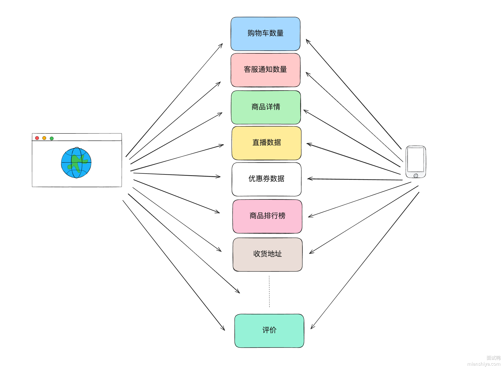

如果让客户端直接与各个微服务通信会有以下几个问题：

1）客户端代码复杂。一些大公司一个页面的渲染可能涉及到几十上百个服务，客户端需要知晓这么多细节，大大增加客户端代码实现的复杂度。

2）性能不好。客户端与后端服务之间只能通过公网通信，大量的请求通信十分低效。

3）协议不友好。部分服务使用的并不是 web 友好的协议，可能是自定义的 RPC 协议或者 AMQP 协议等等。

4）难以重构。当后端需要进行服务拆分或者合并时，由于接口直接对客户端暴露，使得重构难以推进实施。

所以需要一个 API 网关，它作为系统的一个统一入口，负责服务请求路由、组合及协议转换。

客户端的所有请求都需要经过 API 网关，然后由它将请求路由到合适的微服务。并且 API 网关还可以调用多个微服务合并结果来处理一个请求。它可以在 Web 协议（如 HTTP 与 WebSocket）与内部使用的非 Web 友好协议（RPC 等）之间转换。

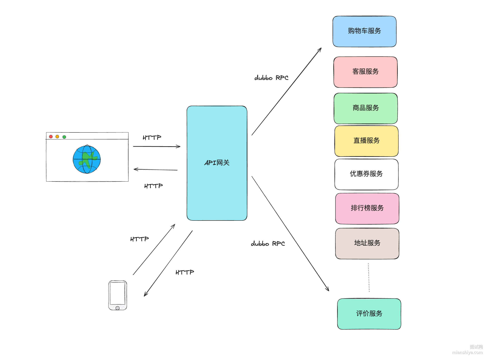

还能为不同的客户端定制 API，例如浏览器需要的信息多一些，手机需要更精简的信息等。

API 网关还可以实现一些非功能性需求：

- 日志和监控：记录请求日志，提供监控和报警功能，帮助开发人员及时发现和解决问题。
- 安全管理：可以在网关上进行身份验证、授权、令牌验证、IP 白名单等安全功能，而无须在每个微服务中进行认证。
- 限流量控制：统一进行限流、熔断、降级，保护后端服务不被过载。
- 负载均衡：将请求均匀分配到后端多个服务实例上，提高系统的可用性和性能

##### 常见的 API 网关实现

开源实现：

- Kong：基于 NGINX 的高性能 API 网关，支持插件扩展。
- Zuul：Netflix 开源的 API 网关，集成了丰富的微服务架构功能。
- Spring Cloud Gateway：Spring Cloud 生态系统中的 API 网关，适合与 Spring Cloud 微服务框架一起使用。

商业实现：

- Amazon API Gateway：AWS 提供的托管 API 网关服务，集成了 AWS 的其他服务。
- Google Cloud Endpoints：Google Cloud 提供的托管 API 网关服务。

##### API 网关的常见功能

**路由与动态路由**：路由是指将请求根据路径、方法、请求头等条件转发到相应的服务。动态路由则可以根据服务的注册情况自动调整路由配置。

- **应用场景**：如 `api/v1/orders` 请求被路由到订单服务，`api/v1/products` 请求被路由到产品服务，确保请求能到达正确的服务实例。

**身份认证与授权**：API 网关可以对所有客户端请求进行身份认证（如 OAuth2、JWT）和权限验证，确保只有授权的请求能访问特定的服务。

- **应用场景**：在企业内部系统中，API 网关可以对每个请求进行用户身份验证，确保只有授权的用户能够访问敏感信息。

**协议转换**：API 网关可以在客户端和后端服务之间进行**协议转换**，如将 REST 请求转为 gRPC，或将 JSON 转为 XML，提升系统的兼容性。

- **应用场景**：适用于客户端与服务之间使用不同协议的情况，通过协议转换确保不同技术栈的系统可以互相通信。

**请求过滤与响应加工**：API 网关可以对请求和响应进行**过滤和修改**，如添加请求头、修改请求路径、对响应数据进行加工等。

- **应用场景**：如在所有请求中添加认证信息、记录请求日志、重写路径以隐藏内部服务的实际接口路径。

### 什么是服务限流？ 

#### 回答重点

服务限流是一种流量控制策略，它通过限制每秒请求的数量（QPS）、请求频率、并发数等，来保护服务的处理能力，防止系统因为流量过大而出现性能问题或资源耗尽。

服务限流可以认为是服务降级的一种，限流就是通过限制系统请求的输入和输出，从而实现对于系统的保护，这个和降级的概念很像，都是为了保证核心功能的正常运行。

限流是因为服务的吞吐量以及负载这些都是可以预估的，我们为了保证系统的正常运行，可以设置限制的阈值，即通过限制输入或者输出的方式来减少流量的流通，然后实现对于系统的保护。

限流有很多种实现方案，比如我们说的限流算法、延迟解决、拒绝解决等等，保证请求的范围在系统可以接受的阈值以内，实现对系统的保护。

#### 扩展知识

##### 常见的限流算法

- [1190. 什么是限流？限流算法有哪些？怎么实现的？](https://www.mianshiya.com/question/1802901573531410433)

##### 常见的限流工具和框架

**Guava RateLimiter**：

- **简介**：Google 的 Guava 库提供了基于**令牌桶**算法的限流工具 `RateLimiter`。开发者可以通过 `RateLimiter.create()` 方法来设置每秒生成的令牌数，控制请求的速率。
- **使用场景**：适用于单个应用实例的限流，能够对某个接口或方法的调用频率进行限制。
- **优点**：实现简单，适合于 Java 项目，轻量且易于集成。

**Sentinel**：

- **简介**：Sentinel 是阿里巴巴开源的服务治理框架，支持限流、熔断、降级等功能，具有强大的实时流量控制能力。
- **使用场景**：适合于 Spring Cloud 和 Spring Boot 项目，可以对微服务进行全局的限流和降级控制。
- **优点**：提供可视化监控，限流规则灵活，适合大规模微服务架构。

**Nginx**：

- **简介**：Nginx 是一种高性能的 HTTP 服务器和反向代理服务器，支持通过配置限流模块来限制每秒请求数（QPS）。
- **使用场景**：适用于对 API 网关层面的限流控制，能够在流量进入后端服务之前就进行初步的限流处理。
- **优点**：适合对全局流量进行控制，减少后端服务的负载压力。

##### 服务限流的应用场景

**电商系统中的秒杀活动**：

- 在电商系统中，秒杀活动时会有大量用户瞬间访问，容易导致服务不可用。通过限流，可以控制每秒允许的下单数量，防止订单服务被流量冲垮。
- **限流策略**：可以使用令牌桶算法，让下单请求通过获取令牌进行控制，超出速率的请求则提示“秒杀活动火爆，请稍后再试”。

**API 网关限流**：

- 在微服务架构中，API 网关作为所有请求的入口，需要承受巨大的访问压力。通过在 API 网关层面进行限流，可以有效保护后端服务免受高流量的冲击。
- **限流策略**：在 API 网关上配置固定时间窗口限流策略，限制每秒允许的最大请求数，超过阈值的请求直接返回 HTTP 429 状态码。

**防止恶意爬虫**：

- 对于一些公开接口，可能会受到恶意爬虫的频繁请求，影响系统的正常服务。通过限流，可以限制单个 IP 的访问频率，防止系统被恶意爬虫占用带宽和计算资源。
- **限流策略**：可以使用漏桶算法，对单个 IP 每秒可以访问的次数进行限制，超过速率的请求会被丢弃。


### 什么是服务熔断？

#### 回答重点

**服务熔断**指的是当某个服务的调用失败率持续升高时，通过**中断对该服务的请求**，防止系统资源被不断消耗，进而保护整个系统不受影响。熔断机制的灵感来源于**电路熔断器**（保险丝），在出现异常时，通过快速**切断**服务调用，避免故障进一步扩散。

#### 扩展知识

##### 服务熔断的流程

当一个服务在一段时间内连续出现失败（如超时、请求错误等）并且失败率超过设定的阈值时，熔断器将切换到**打开状态**，暂时中断对该服务的调用请求。这样可以避免进一步的资源浪费和请求堆积。

经过一段时间后，熔断器会自动进入**半开状态**，尝试恢复调用，确保服务在故障恢复后，熔断器切换到关闭状态，反之继续打开。。

##### **服务熔断的常见触发条件**

- **请求失败率高**：当一个服务在设定的时间窗口内，连续多次请求失败（如超时、异常、HTTP 5xx 错误等），并且失败率超过设定阈值时，熔断器会自动触发，进入打开状态。
- **请求响应时间长**：如果一个服务的响应时间长，导致调用超时，并且这种情况在一定时间内多次发生，熔断器也会触发熔断，阻止继续发送请求。
- **服务不可达**：当服务完全不可访问（如网络故障或服务宕机），熔断器可以直接切断请求，快速返回错误，避免进一步的资源浪费。

##### 熔断器的三种状态

**Closed（关闭状态）**：

- **描述**：熔断器在正常状态下处于关闭状态，所有请求都会正常发往目标服务。
- **状态转换**：当服务调用失败次数或失败率达到阈值时，熔断器会从 `Closed` 状态变为 `Open` 状态。

**Open（打开状态）**：

- **描述**：当熔断器处于打开状态时，Hystrix 会阻断所有对目标服务的请求，直接返回降级结果。
- **状态转换**：经过一段时间后，熔断器会自动进入 `Half-Open` 状态，尝试发送部分请求，以判断目标服务是否恢复。

**Half-Open（半开状态）**：

- **描述**：在半开状态下，部分请求可以尝试发往目标服务。如果这些请求成功率达到设定阈值，熔断器会关闭，恢复正常调用。
- **状态转换**：如果半开状态下的请求失败率仍然很高，则熔断器会重新打开。

##### 熔断器的常见实现框架

**Hystrix**：

- **简介**：Hystrix 是 Netflix 开源的熔断器框架，能够对服务调用进行隔离、熔断和降级处理。Hystrix 使用 `@HystrixCommand` 注解，可以方便地定义熔断逻辑。
- **使用场景**：适用于基于 Spring Cloud 的微服务架构，提供了丰富的熔断策略和配置选项。
- **现状**：Hystrix 已经进入维护模式，推荐使用 **Resilience4j** 作为替代。

**Resilience4j**：

- **简介**：Resilience4j 是一个轻量级的容错框架，支持熔断、重试、限流等功能，采用 Java 8 的函数式编程风格，更加现代化。
- **使用场景**：适用于需要高性能和异步处理的微服务系统，可以与 Spring Boot 2.x 集成使用。
- **优势**：相较于 Hystrix，Resilience4j 性能更高，配置更加简洁。

**Sentinel**：

- **简介**：Sentinel 是阿里巴巴开源的流量控制与熔断降级框架，能够实时监控服务的请求量、响应时间，并根据配置触发熔断。
- **使用场景**：适用于国内市场，特别是使用 Spring Cloud Alibaba 生态的项目中。
- **优势**：支持实时的监控和流量控制，提供丰富的可视化配置。

### 什么是服务降级？

#### 回答重点

服务降级是一种在**分布式系统**和**微服务架构**中常用的**容错机制**，用于在系统压力过大或部分服务出现故障时，**暂时减少或关闭某些不必要的功能**，从而确保核心功能的正常运行，避免系统崩溃。通过降级，可以提高系统的**容错性**和**可用性**。

#### 扩展知识

##### **服务降级的触发场景**

**服务调用超时或失败**：

- 当某个服务的调用时间超过了设定的阈值，或者服务多次调用失败时，可以触发降级机制，返回预设的降级响应，避免长时间等待。
- **示例**：当支付服务超时时，可以返回“支付服务暂时不可用，请稍后再试”的提示。

**系统负载过高**：

- 当系统的负载过高（如 CPU 使用率、内存占用率等）时，可以主动降级某些非核心功能，释放系统资源，确保核心业务的正常运行。
- **示例**：在电商促销活动期间，订单服务可以降级不实时显示推荐商品，只展示基础订单信息，以减轻系统负担。

**下游服务不可用**：

- 如果下游依赖服务不可用或者响应时间过长，可以通过降级机制，返回缓存数据或默认数据，避免请求继续传播，影响用户体验。
- **示例**：在查询库存服务不可用时，可以返回“库存信息暂时不可用”的缓存数据。

##### 实现服务降级的常用方式

**Fallback（降级回调方法）**：在调用远程服务时，设置一个降级回调方法，当服务调用失败或超时时，直接执行降级方法，返回预设的响应。

- **使用场景**：适用于基于 **Hystrix** 或 **Resilience4j** 的系统，可以在 `@HystrixCommand` 注解中指定 `fallbackMethod`。
- **示例**：在调用订单服务时，如果订单服务不可用，可以执行 `getOrderFallback` 方法，返回“订单信息暂时不可用”的提示。

**使用缓存数据**：当服务不可用时，可以返回最近一次的缓存数据，保证用户体验的稳定性。

- **使用场景**：适用于查询类请求，如商品详情、用户信息等。通过缓存减少对下游服务的依赖。
- **示例**：当库存服务不可用时，可以返回前一次查询的库存数据，避免对用户展示“库存不可用”的错误信息。

**限流降级**：当系统流量超过某个阈值时，对部分非核心请求进行限流或直接拒绝，保护核心服务的可用性。

- **使用场景**：适用于高并发场景，通过限流来避免系统过载，如在 API 网关层面对某些请求进行限流。
- **示例**：在秒杀活动中，对某些促销请求进行限流，只允许部分用户参与活动，避免系统被瞬间流量冲垮。

##### 服务降级的实现框架与工具

**Hystrix**：

- **简介**：Hystrix 是 Netflix 开源的熔断器和降级框架，通过 `@HystrixCommand` 注解可以方便地实现服务的降级逻辑。
- **使用场景**：适用于微服务架构中的服务降级和熔断处理，特别是在基于 Spring Cloud 的应用中。
- **替代品**：Hystrix 已经进入维护模式，推荐使用 **Resilience4j** 作为替代方案。

**Resilience4j**：

- **简介**：Resilience4j 是一个轻量级的容错框架，支持熔断、限流、降级等功能，采用函数式编程风格，适合与 Spring Boot 2.x 集成。
- **优势**：更高效的性能，更现代化的设计，支持异步编程，适合在新的微服务项目中使用。
- **使用场景**：可以通过配置降级方法实现服务降级，在请求失败或超时时提供备用响应。

**Sentinel**：

- **简介**：Sentinel 是阿里巴巴开源的服务限流降级框架，提供流量控制、熔断降级、系统自适应保护等功能。
- **优势**：与 Spring Cloud Alibaba 生态集成良好，适用于国内市场，功能丰富且易于配置。
- **使用场景**：在流量高峰期或微服务系统中，通过 Sentinel 实现流量控制和服务降级，提升系统的稳定性。

##### 服务降级的常见应用场景

**电商网站中的降级**：

- 在电商平台的促销活动中，流量激增可能导致系统超负荷运行。通过降级，可以临时关闭一些非核心的功能（如推荐商品、商品评论），以保证订单、支付等核心功能的正常运行。

**金融系统中的降级**：

- 在金融系统中，当某个外部支付渠道不可用时，可以提供备用的支付方式或提示用户使用其他支付渠道。这样即使某个服务暂时不可用，用户也能继续使用系统的其他功能。

**消息推送系统中的降级**：

- 在消息推送系统中，当消息发送量激增时，可以通过降级暂时关闭某些非关键的推送类型，如营销信息推送，优先保证系统通知类消息的发送。

### 什么是服务雪崩？

#### 回答重点

服务雪崩是指在**微服务架构**或**分布式系统**中，由于某个服务不可用或性能下降，导致依赖它的其他服务也出现**连锁故障**，最终使整个系统或大部分服务不可用的现象。

##### 主要原因

**服务调用链复杂**

- 在微服务架构中，各个服务之间存在大量的相互调用关系。一个服务的不可用或性能下降可能会导致依赖它的多个上游服务响应变慢，甚至出现**请求堆积**，从而影响到整个调用链。
- **示例**：服务 A 调用服务 B，服务 B 调用服务 C。如果服务 C 发生故障且请求无法及时返回，服务 B 的请求将被阻塞，进而导致服务 A 的响应变慢或超时。

**重试机制的反作用**：

- 当服务调用失败时，通常会有**重试机制**以增加成功的概率。然而，在服务故障或超时情况下，重试机制可能会产生更多的请求，进一步加剧下游服务的压力，导致故障范围扩大。
- **示例**：服务 A 调用服务 B，如果服务 B 出现超时，服务 A 可能会发起多次重试，这些重试请求可能会给服务 B 带来更大的压力，最终导致服务 B 的彻底崩溃。

#### 扩展知识

##### 服务雪崩的防范措施

**使用熔断器**：

- **原理**：熔断器（如 Hystrix、Resilience4j）能够在检测到某个服务请求的失败率达到一定阈值时，自动中断对该服务的进一步调用，从而防止服务继续被拖垮。
- **优势**：通过熔断器，可以快速阻止请求进入故障服务，从而减少服务调用链中其他服务受到的影响。

**服务降级**：

- **原理**：当某个服务不可用时，可以提供**降级方案**，返回默认值或简化的结果，确保系统在部分功能不可用时仍能为用户提供基本服务。
- **示例**：当库存服务出现故障时，可以返回一个库存数据缓存值或提示“库存信息暂时不可用”。

**限流与隔离**：

- **原理**：通过限流（如令牌桶、漏桶算法）和隔离（如线程池隔离、信号量隔离），可以限制单个服务的请求数量，防止服务因流量过大而被压垮。
- **优势**：限流和隔离可以控制服务的最大并发量，保护系统的关键服务在高并发场景下的稳定性。

### HTTP 与 RPC 之间的区别？

#### 回答重点

严格上讲，HTTP 和 RPC 不是一个层面的东西：

- HTTP 是一种应用层的协议，主要强调的是网络通信；
- RPC，其是一种分布式系统之间通信的方式，强调的是服务之间的远程调用。

有一些 RPC 框架底层使用的是 HTTP 协议实现通信，比如 gRPC，其底层使用的就是 HTTP/2, 然后还有 Dubbo，其现在也兼容 gRPC 了，并且使用了 HTTP/2 作为传输协议，如下图所示：

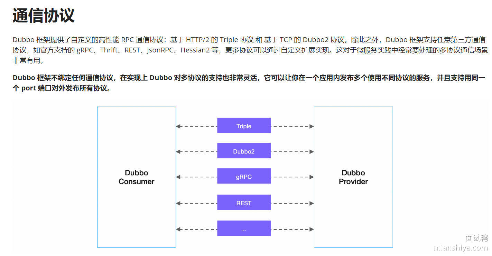

这里为了方便大家理解，制作了一个表格，大家可以看一下表格：

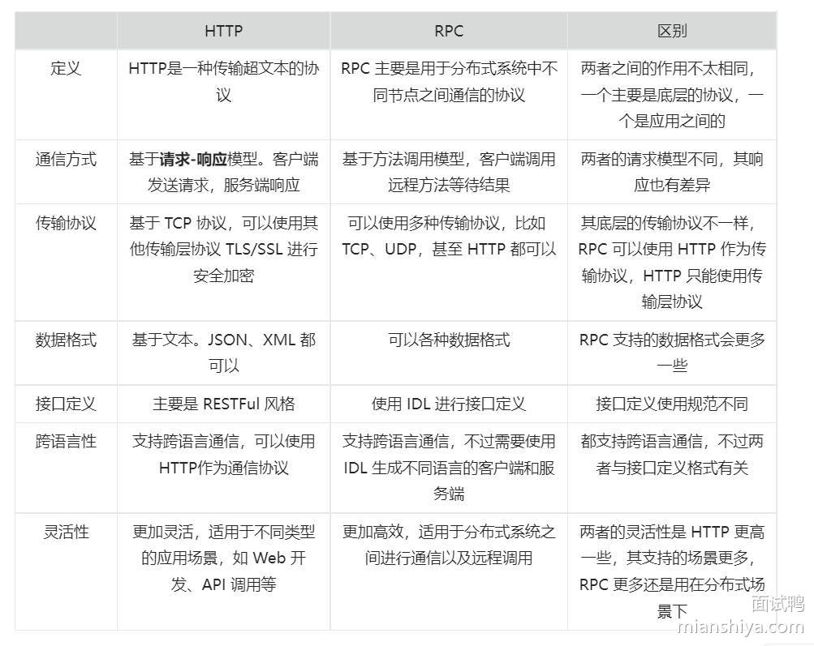

> 说明：IDL 是指接口定义语言，如二进制、JSON、Protocol Buffers 等。

#### 扩展知识

##### **定义与基本概念**

**HTTP（HyperText Transfer Protocol）**：

- **定义**：HTTP 是一种基于请求-响应模型的应用层协议，主要用于 Web 应用之间的数据传输。它使用 **URL** 来标识资源，并通过标准化的 HTTP 方法（如 GET、POST、PUT、DELETE）来对资源进行操作。
- **传输格式**：通常使用**文本格式**（如 JSON、XML）传输数据，容易被人类阅读和理解。由于 HTTP 是基于 TCP 的应用层协议，因此它的消息体较大，适用于 Web 页面、API 等场景。

**RPC（Remote Procedure Call）**：

- **定义**：RPC 是一种远程过程调用协议，它允许客户端像调用本地方法一样调用远程服务器上的方法。RPC 关注的是**调用方法或函数**而不是资源。
- **传输格式**：RPC 传输的数据通常是**二进制格式**（如 Protocol Buffers、Thrift），数据量较小，效率较高。RPC 通常基于 **TCP** 进行通信，也可以直接使用 HTTP。

##### RPC 常见的实现框架

**gRPC**：

- **简介**：gRPC 是 Google 开发的高性能 RPC 框架，基于 **HTTP/2** 协议，可以进行双向流通信，支持负载均衡、认证、追踪等特性。
- **优点**：使用 **Protocol Buffers（Protobuf）** 进行序列化和反序列化，传输效率高，适合微服务间的高性能通信。
- **应用场景**：适合需要高效传输和复杂数据结构的微服务架构，如实时通信服务、物联网数据传输。

**Thrift**：

- **简介**：Thrift 是由 **Apache** 维护的跨语言 RPC 框架，支持多种语言（如 Java、C++、Python、PHP），通过定义接口描述文件（IDL）来生成客户端和服务端代码。
- **优点**：支持多语言环境，适合异构系统之间的高效通信。
- **应用场景**：适用于需要跨语言、高性能的 RPC 调用场景，如大数据平台中的服务调用。

**Dubbo**：

- **简介**：Dubbo 是阿里巴巴开源的 Java RPC 框架，提供了高性能的远程服务调用能力，支持负载均衡、服务注册与发现等特性。
- **优点**：与 Spring 生态深度集成，支持多种通信协议和序列化方式，适合 Java 生态下的分布式系统。
- **应用场景**：适合中国市场中基于 Java 的微服务系统，特别是在 Spring Boot 环境下的微服务调用。

### 负载均衡算法有哪些？ 

#### 回答重点

负载均衡有很多种策略，这里主要介绍的是一些核心的负载均衡算法，常见的大致如下：

1） **轮询算法（Round Robin）**：轮询应该是最简单的负载均衡算法了，其主要就是按照顺序将请求分配给后端服务器，不过一般适用于后端服务器的请求能力差不多的情况下，如果后端服务器之间处理请求的能力差得比较多的话，这种的缺点就非常明显了。

2）**加权轮询算法（Weighted Round Robin）**：加权轮询就是在轮询算法的基础上添加权重的概念。对后端每个服务器赋予一个权重值，权重值越高，其被选中的概率就越大，这种方式从一定程度上缓解了轮询算法的缺点，可以从后端服务器的性能设置对应的权重和分配比例，使得性能比较高的服务器处理更多的请求，从一定程度上提高了整体服务的可用性和吞吐量。

3）**随机算法（Random）**：这个概念就和我们投骰子一样，将请求随机分配给后端服务器，每个后端服务器被选中的概率是一致的，不考虑服务器的负载情况。这个和轮询的缺点是类似的，就是如果后端服务器的性能差得很多，就容易导致性能较强的服务器闲置，然后性能较差的服务器处理的请求差不多。

4）**加权随机算法（Weight Random）**：加权随机就是在随机的基础上添加权值的概念，因为原先的随机算法没有考虑到服务器的性能，添加权值的概念之后就可以根据服务器的性能设置对应的权值了，然后根据服务器的性能和处理能力调整对应的权重，减少性能强的服务器大的闲置时间。

5）**最少连接算法（Least Connection）**：最少连接算法主要是根据后端服务器当前的连接数来决定请求的分配，负载均衡器会选择当前连接最少的服务器进行请求分配，保证后端服务器的负载均衡，这种算法适用于后端服务器的处理能力不同或者请求的处理时间不同的场景。

6）**哈希算法（Hash）**:哈希算法主要是根据请求的某个特定关键字来实现负载均衡的，比如通过请求的 URL 路径、请求的 IP 地址等来计算哈希值，然后根据哈希值选择相应的后端服务器，比如 Redis 集群采用的就是这种负载均衡方式。

### 分布式和微服务有什么区别？ 

#### 回答重点

分布式系统和微服务架构是两个相关但不同的概念，它们的注重点其实不太一样。

##### 分布式系统：

它是由多台计算机或多节点组成的系统，各节点之间通过网络进行通信和协作，**共同完成一个或多个共享的任务**。

也就是说分布式的各个节点其实目标是一致的，之所以要分布式只是为了有更好的能力，能更快、更高效地承接任务。

比如常见的分布式文件系统、分布式数据库。

##### 微服务架构：

微服务，其实是一种服务的架构风格，它主要是为了把一个大而全的服务，拆分成多个可以独立、松耦合的服务单元，为了让这些服务单元可以独立部署、运行、管理。

比如电商服务拆分成微服务，可以分为商品服务、用户服务、订单服务、库存服务等等。

### 什么是 Seata？

#### 回答重点

**Seata（Simple Extensible Autonomous Transaction Architecture）** 是阿里巴巴开源的一款**分布式事务解决方案**。

其主要是为了解决分布式系统中全局事务的一致性问题。Seata 提供了多种事务模式，包括 **AT、TCC、Saga 以及 XA 模式**。

在 Seata 中有三个很重要的角色：**事务协调者（TC）、事务管理者（TM）以及事务的作业管理器（RM）**。

- **事务协调者（TC）**：主要负责管理全局的分支事务的状态，用于全局性事务的提交和回滚。它会对所有的分支事务进行注册，然后根据各个分支事务的状态来决定整体事务是否提交以及回滚。
- **事务管理者（TM）**：主要用于开发、提交以及回滚事务。它会根据业务逻辑来决定是否开启一个新事务，并且在适当的情况下进行事务的提交以及回滚操作。
- **资源管理器（RM）**：这个主要用于分支事务上的资源管理，其向 TC 注册分支事务，上报分支事务的状态，然后接受 TC 的命令来传达给事务管理者（TM）是否要提交或者回滚事务。

#### 扩展知识

##### Seata 的工作原理与流程

- [了解 Seata 的实现原理吗？](https://www.mianshiya.com/bank/1797453053310402561/question/1797990270533500929)
- [Seata 支持哪些模式的分布式事务？](https://www.mianshiya.com/bank/1797453053310402561/question/1797986686995660801)

### 了解 Seata 的实现原理吗？

#### 回答重点

Seata 主要通过三大核心组件来协调全局事务的执行。

**事务协调器（Transaction Coordinator，TC）**：TC 负责管理全局事务的生命周期，记录全局事务和分支事务的状态，并协调全局事务的提交和回滚。TC 是 Seata 的中心控制器，所有的分布式事务请求都会通过 TC 进行管理。

- **作用**：TC 保证各个分支事务在全局事务中的状态一致性。它记录每个事务分支的状态信息，并在发生异常时向相关分支发送回滚命令。

**事务管理器（Transaction Manager，TM）**：TM 负责定义全局事务的边界，即启动、提交、回滚全局事务。TM 通常嵌入在业务服务中，用于向 TC 发起全局事务的创建和提交请求。

- **作用**：通过 `@GlobalTransactional` 注解或 API，TM 标记某个业务操作为全局事务。TM 在业务逻辑执行过程中负责与 TC 通信，以确定事务的最终状态。

**资源管理器（Resource Manager，RM）**：RM 负责管理本地资源（如数据库），以及分支事务的注册、提交、回滚。RM 的核心作用是对本地数据库进行事务操作，并将分支事务的状态通知给 TC。

- **作用**：在分支事务执行时，RM 通过数据库代理层来记录数据快照，以便在事务回滚时能够还原数据。同时，RM 负责向 TC 注册分支事务，并在接收到 TC 的命令时执行数据的提交或回滚操作。

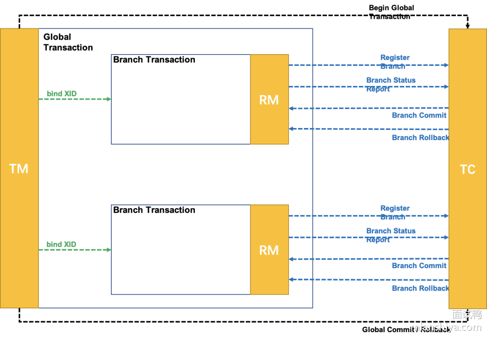

大致流程简述如下：

1. **TM 向 TC 发起全局事务创建**，TC 返回 XID。
2. **TM 调用业务方法**，业务方法执行过程中，**RM 向 TC 注册分支事务**。
3. **RM 执行数据库操作**并生成回滚日志，同时**提交本地事务**。
4. 业务方法执行结束后，**TM 向 TC 发送全局提交或回滚请求**。
5. TC 收到请求后，**通知 RM 执行提交或回滚操作**。
6. **RM 执行提交或回滚**，并将结果通知 TC。
7. **TC 记录事务状态**为提交完成或回滚完成。

##### **Seata 的事务模式**

- **AT 模式（Automatic Transaction）**：AT 模式是 Seata 最具代表性的事务模式。它通过自动代理数据库操作，在事务提交前生成**回滚日志**（其它模式不需要），以便在需要回滚时恢复数据。Seata 在本地事务提交时，通过 `undo_log` 表记录数据快照，实现数据的原子性回滚。
- **TCC 模式（Try-Confirm-Cancel）**：TCC 模式将业务操作拆分为三个步骤：Try（预留资源）、Confirm（确认操作）、Cancel（回滚操作）。每个步骤都由业务开发者手动实现，Seata 负责协调这些步骤的执行和回滚，适合对资源控制要求高的场景。
- **SAGA 模式**：SAGA 模式是一种长事务模式，将全局事务拆解为多个有序的小事务，每个小事务都有相应的补偿操作。SAGA 适合处理跨多个服务的复杂业务流程，通过补偿机制来保证数据的一致性。
- **XA 模式**：Seata 提供的 XA 模式基于两阶段提交协议（2PC），能够保证全局事务的强一致性。TC 作为协调者管理各个参与者的提交和回滚操作，但这种模式性能较低，适合对一致性要求严格的场景。

更多细节：[789. Seata 支持哪些模式的分布式事务？](https://www.mianshiya.com/bank/1797453053310402561/question/1797986686995660801)

#### 扩展知识

##### Seata 的事务执行流程

Seata 的事务执行流程主要包括 **全局事务的创建、分支事务的注册、事务的提交或回滚** 等步骤。具体流程如下：

##### **全局事务的创建**（Transaction Start）

**事务管理器（TM）** 通过在业务方法上使用 `@GlobalTransactional` 注解，标识该方法为全局事务。业务方法调用时，TM 会向 **事务协调器（TC）** 发起全局事务的**创建请求**。

**TC** 负责为该全局事务生成一个唯一的 **全局事务 ID（XID）**，并返回给 TM。XID 是全局事务的唯一标识，用于后续跟踪和管理这个事务的所有操作。

##### **分支事务的注册**（Branch Register）

**分支事务** 是全局事务的一部分，通常对应业务方法中具体的数据库操作（如新增、更新、删除）。

**业务方法** 执行时，会调用数据库操作（如 `INSERT`、`UPDATE`）。Seata 的 **资源管理器（RM）** 通过代理数据库操作来记录**数据的前后状态**，并生成**回滚日志**。

在执行数据库操作之前，**RM** 会将该数据库操作注册为**分支事务**，并向 **TC** 发起**分支注册请求**。

注册信息包括：

- 全局事务 ID（XID）
- 资源 ID（如数据库表名）
- 分支事务的类型（如 AT 模式的 SQL 操作）
- 数据的锁定信息（用于行锁管理）

**TC** 接收到分支事务注册请求后，会记录该分支事务的信息，并将注册成功的结果返回给 RM。

##### **业务方法的执行与本地事务提交**（Local Transaction Commit）

分支事务注册成功后，**RM** 执行数据库操作，更新数据并将修改的状态保存到数据库中。

在完成操作后，**本地事务提交**，此时本地事务的数据已经写入数据库，但全局事务尚未提交。为了支持回滚，**回滚日志（undo_log）** 也会存储在数据库中，以记录数据修改前的状态。

##### **全局事务的提交或回滚**（Global Commit/Rollback）

在业务逻辑执行完成后，全局事务会进入**提交**或**回滚**的阶段，具体流程如下：

**全局提交流程**：

- 如果业务逻辑正常执行，TM 向 **TC** 发起**全局提交请求**。
- **TC** 根据 XID 确认所有分支事务状态正常后，向所有参与的 **RM** 发送**分支提交请求**。
- **RM** 接收到分支提交请求后，执行数据库操作的最终提交（实际上，AT 模式下的数据已经在本地事务阶段提交，分支提交请求主要是确认无误）。
- **TC** 收到所有分支提交成功的响应后，标记全局事务为**提交完成**，并释放全局锁。

**全局回滚流程**：

- 如果业务逻辑执行过程中发生异常，TM 向 **TC** 发起**全局回滚请求**。
- **TC** 向所有参与的 **RM** 发送**分支回滚请求**。
- **RM** 在接收到分支回滚请求后，根据 `undo_log` 中记录的数据快照，将数据库恢复到执行操作之前的状态，确保数据一致性。
- **TC** 收到所有分支回滚完成的响应后，标记全局事务为**回滚完成**，并释放相关的全局锁。

##### **全局事务的结束**（Transaction End）

无论是全局事务的**提交**还是**回滚**，当 TC 确认所有分支事务的操作完成后，会标记该全局事务的状态为 **COMMITTED** 或 **ROLLED BACK**，并在事务日志中记录事务的结束状态。

事务结束后，Seata 会清理 **undo_log** 表中的数据，防止日志表占用过多的数据库存储空间。

##### Seata 的数据一致性保证机制

- **回滚日志机制（Undo Log）**：在 AT 模式下，Seata 会在本地事务执行前后记录 `undo_log`，即数据操作前的快照信息。回滚时，Seata 读取 `undo_log` 并恢复数据，确保事务回滚操作的正确性。
- **全局锁机制**：Seata 使用全局锁来管理分支事务对数据库行的并发访问，确保同一行数据在同一时刻只能被一个全局事务修改。通过 TC 管理全局锁，可以防止多事务并发修改同一数据行时的冲突。
- **两阶段提交（2PC）**：Seata 的事务提交过程遵循两阶段提交协议：**第一阶段**：RM 提交本地事务，同时记录 `undo_log`，注册分支事务到 TC。**第二阶段**：TC 根据全局事务的状态决定提交或回滚，并通知所有 RM 执行相应操作。

### Seata 支持哪些模式的分布式事务？ 

#### 回答重点

Seata 目前支持四种事务模式，分别是 **AT、TCC、Saga 以及 XA 模式**：

- **AT 模式**：通过代理数据库操作来实现分布式事务管理。Seata 在业务操作前后自动生成回滚日志，在提交时直接提交本地事务，在回滚时利用日志进行数据的还原。
- **TCC 模式**：是一种两阶段提交。将一个操作拆分为三个步骤：Try（预留资源）、Confirm（确认操作）、Cancel（回滚操作）。开发者需要自己实现每个步骤的逻辑。
- **Saga 模式**：是一种长事务模式，它将全局事务拆解为多个有序的小事务，每个事务都有对应的补偿操作。若某个事务失败，按照相反的顺序依次调用补偿操作
- **XA 模式**：是基于**两阶段提交协议（2PC）** 的标准化分布式事务管理模式。Seata 的 XA 模式通过协调多个资源管理器的事务提交和回滚来实现全局事务的管理

#### 扩展知识

以下内容参考自 [seata 官网](https://seata.apache.org/zh-cn/docs/user/mode/at)

##### AT 模式

根据官网描述：AT 模式是 Seata 创新的一种非侵入式的分布式事务解决方案，Seata 在内部做了对数据库操作的代理层，我们使用 Seata AT 模式时，实际上用的是 Seata 自带的数据源代理 DataSourceProxy，Seata 在这层代理中加入了很多逻辑，比如插入回滚 undo_log 日志，检查全局锁等。

**简单来说**：

- 第一阶段 Seata 会拦截 SQL，在数据更新之前，记录修改之前的数据。
- 二阶段负责业务的回滚或提交。如果一阶段本地事务提交失败，则全局回滚，反之全局提交。回滚时用到的就是一阶段记录的修改之前的数据，生成反向 SQL 回滚数据。

使用很简单，代码中通过 @GlobalTransactional 注解即可自动管理事务。

```java
@GlobalTransactional
public void purchase(String userId, String commodityCode, int count, int money) {
    jdbcTemplateA.update("update stock_tbl set count = count - ? where commodity_code = ?", new Object[] {count, commodityCode});
    jdbcTemplateB.update("update account_tbl set money = money - ? where user_id = ?", new Object[] {money, userId});
}
```

AT 模式的全局事务是由以下三部分协同完成的：

- 事务管理器（TM）：管理全局事务的生命周期，负责标识事务的开始和结束。
- 事务协调器（TC）：负责管理全局事务的状态和分支事务的提交、回滚。
- 资源管理器（RM）：管理本地事务资源和数据回滚，负责执行具体的数据库操作，并向 TC 注册分支事务。

我们直接参考官网对 AT 模式的描述与解释，即可进一步理解 AT 模式的原理。

###### 写隔离

- 一阶段本地事务提交前，需要确保先拿到 **全局锁** 。
- 拿不到 **全局锁** ，不能提交本地事务。
- 拿 **全局锁** 的尝试被限制在一定范围内，超出范围将放弃，并回滚本地事务，释放本地锁。

以一个示例来说明：

两个全局事务 tx1 和 tx2，分别对 a 表的 m 字段进行更新操作，m 的初始值 1000。

tx1 先开始，开启本地事务，拿到本地锁，更新操作 m = 1000 - 100 = 900。本地事务提交前，先拿到该记录的 **全局锁** ，本地提交释放本地锁。

tx2 后开始，开启本地事务，拿到本地锁，更新操作 m = 900 - 100 = 800。本地事务提交前，尝试拿该记录的 **全局锁** ，tx1 全局提交前，该记录的全局锁被 tx1 持有，tx2 需要重试等待 **全局锁** 。

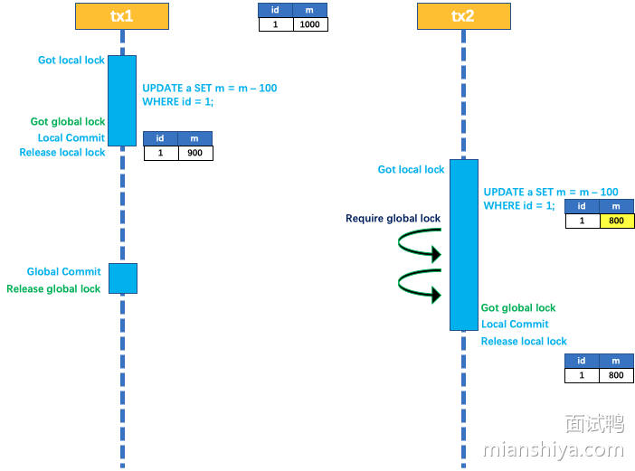

tx1 二阶段全局提交，释放 **全局锁** 。tx2 拿到 **全局锁** 提交本地事务。

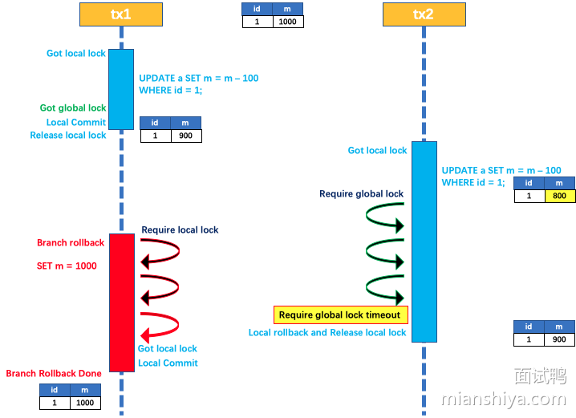

如果 tx1 的二阶段全局回滚，则 tx1 需要重新获取该数据的本地锁，进行反向补偿的更新操作，实现分支的回滚。

此时，如果 tx2 仍在等待该数据的 **全局锁**，同时持有本地锁，则 tx1 的分支回滚会失败。分支的回滚会一直重试，直到 tx2 的 **全局锁** 等锁超时，放弃 **全局锁** 并回滚本地事务释放本地锁，tx1 的分支回滚最终成功。

因为整个过程 **全局锁** 在 tx1 结束前一直是被 tx1 持有的，所以不会发生 **脏写** 的问题。

###### 读隔离

在数据库本地事务隔离级别 **读已提交（Read Committed）** 或以上的基础上，Seata（AT 模式）的默认全局隔离级别是 **读未提交（Read Uncommitted）** 。

如果应用在特定场景下，必需要求全局的 **读已提交** ，目前 Seata 的方式是通过 SELECT FOR UPDATE 语句的代理。

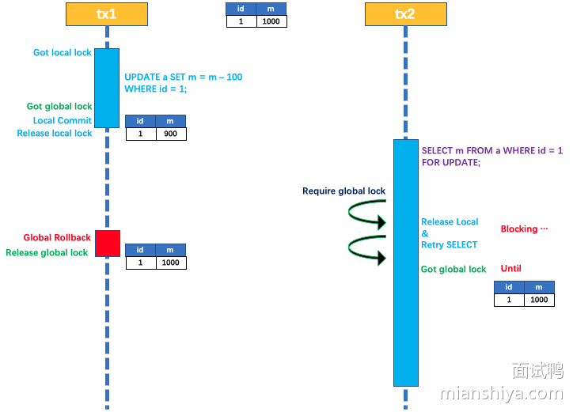

SELECT FOR UPDATE 语句的执行会申请 **全局锁** ，如果 **全局锁** 被其他事务持有，则释放本地锁（回滚 SELECT FOR UPDATE 语句的本地执行）并重试。这个过程中，查询是被 block 住的，直到 **全局锁** 拿到，即读取的相关数据是 **已提交** 的，才返回。

出于总体性能上的考虑，Seata 目前的方案并没有对所有 SELECT 语句都进行代理，**仅针对 FOR UPDATE 的 SELECT 语句**。

###### AT 工作机制示例

以一个示例来说明整个 AT 分支的工作过程。

业务表：`product`

| Field | Type         | Key  |
| ----- | ------------ | ---- |
| id    | bigint(20)   | PRI  |
| name  | varchar(100) |      |
| since | varchar(100) |      |

AT 分支事务的业务逻辑：

```sql
update product set name = 'GTS' where name = 'TXC';
```

**一阶段**

过程：

1）解析 SQL：得到 SQL 的类型（UPDATE），表（product），条件（where name = 'TXC'）等相关的信息。

2）查询前镜像：根据解析得到的条件信息，生成查询语句，定位数据。

```sql
select id, name, since from product where name = 'TXC';
```

得到前镜像：

| id   | name | since |
| ---- | ---- | ----- |
| 1    | TXC  | 2014  |

3）执行业务 SQL：更新这条记录的 name 为 'GTS'。

4）查询后镜像：根据前镜像的结果，通过 **主键** 定位数据。

```sql
select id, name, since from product where id = 1;
```

得到后镜像：

| id   | name | since |
| ---- | ---- | ----- |
| 1    | GTS  | 2014  |

5）插入回滚日志：把前后镜像数据以及业务 SQL 相关的信息组成一条回滚日志记录，插入到 `UNDO_LOG` 表中。

```json
{
	"branchId": 641789253,
	"undoItems": [{
		"afterImage": {
			"rows": [{
				"fields": [{
					"name": "id",
					"type": 4,
					"value": 1
				}, {
					"name": "name",
					"type": 12,
					"value": "GTS"
				}, {
					"name": "since",
					"type": 12,
					"value": "2014"
				}]
			}],
			"tableName": "product"
		},
		"beforeImage": {
			"rows": [{
				"fields": [{
					"name": "id",
					"type": 4,
					"value": 1
				}, {
					"name": "name",
					"type": 12,
					"value": "TXC"
				}, {
					"name": "since",
					"type": 12,
					"value": "2014"
				}]
			}],
			"tableName": "product"
		},
		"sqlType": "UPDATE"
	}],
	"xid": "xid:xxx"
}
```

6）提交前，向 TC 注册分支：申请 `product` 表中，主键值等于 1 的记录的 **全局锁** 。

7）本地事务提交：业务数据的更新和前面步骤中生成的 UNDO LOG 一并提交。

8）将本地事务提交的结果上报给 TC。

**二阶段-回滚**

1）收到 TC 的分支回滚请求，开启一个本地事务，执行如下操作。

2）通过 XID 和 Branch ID 查找到相应的 UNDO LOG 记录。

3）数据校验：拿 UNDO LOG 中的后镜与当前数据进行比较，如果有不同，说明数据被当前全局事务之外的动作做了修改。这种情况，需要根据配置策略来做处理，详细的说明在另外的文档中介绍。

4）根据 UNDO LOG 中的前镜像和业务 SQL 的相关信息生成并执行回滚的语句：

```sql
▼sql

复制代码update product set name = 'TXC' where id = 1;
```

5）提交本地事务。并把本地事务的执行结果（即分支事务回滚的结果）上报给 TC。

**二阶段-提交**

1）收到 TC 的分支提交请求，把请求放入一个异步任务的队列中，马上返回提交成功的结果给 TC。

2）异步任务阶段的分支提交请求将异步和批量地删除相应 UNDO LOG 记录。

###### 附录

**回滚日志表**

UNDO_LOG Table：不同数据库在类型上会略有差别。

以 MySQL 为例：

| Field         | Type         |
| ------------- | ------------ |
| branch_id     | bigint PK    |
| xid           | varchar(100) |
| context       | varchar(128) |
| rollback_info | longblob     |
| log_status    | tinyint      |
| log_created   | datetime     |
| log_modified  | datetime     |

```sql
-- 注意此处0.7.0+ 增加字段 context
CREATE TABLE `undo_log` (
  `id` bigint(20) NOT NULL AUTO_INCREMENT,
  `branch_id` bigint(20) NOT NULL,
  `xid` varchar(100) NOT NULL,
  `context` varchar(128) NOT NULL,
  `rollback_info` longblob NOT NULL,
  `log_status` int(11) NOT NULL,
  `log_created` datetime NOT NULL,
  `log_modified` datetime NOT NULL,
  PRIMARY KEY (`id`),
  UNIQUE KEY `ux_undo_log` (`xid`,`branch_id`)
) ENGINE=InnoDB AUTO_INCREMENT=1 DEFAULT CHARSET=utf8;
```

##### TCC

TCC 是一种侵入式的分布式事务解决方案，需要业务系统自行实现 Try，Confirm，Cancel 三个操作，对业务系统有着非常大的入侵性，设计相对复杂。整体是 **两阶段提交** 的模型。

全局事务是由若干分支事务组成的，分支事务要满足 **两阶段提交** 的模型要求，即需要每个分支事务都具备自己的：

- 一阶段 prepare 行为
- 二阶段 commit 或 rollback 行为

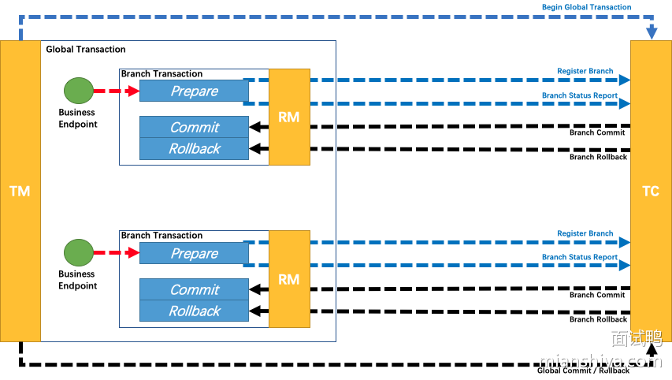

在两阶段提交协议中，资源管理器（RM, Resource Manager）需要提供“准备”、“提交”和“回滚” 3 个操作；而事务管理器（TM, Transaction Manager）分 2 阶段协调所有资源管理器，在第一阶段询问所有资源管理器“准备”是否成功，如果所有资源均“准备”成功则在第二阶段执行所有资源的“提交”操作，否则在第二阶段执行所有资源的“回滚”操作，保证所有资源的最终状态是一致的，要么全部提交要么全部回滚。

资源管理器有很多实现方式，其中 TCC（Try-Confirm-Cancel）是资源管理器的一种服务化的实现；TCC 是一种比较成熟的分布式事务解决方案，可用于解决跨数据库、跨服务业务操作的数据一致性问题；TCC 其 Try、Confirm、Cancel 3 个方法均由业务编码实现，故 TCC 可以被称为是服务化的资源管理器。

TCC 的 Try 操作作为一阶段，负责资源的检查和预留；Confirm 操作作为二阶段提交操作，执行真正的业务；Cancel 是二阶段回滚操作，执行预留资源的取消，使资源回到初始状态。

###### 基本使用

区别于在 AT 模式直接使用数据源代理来屏蔽分布式事务细节，业务方需要自行定义 TCC 资源的“准备”、“提交”和“回滚” 。比如在下方的例子中，

```java
public interface TccActionOne {
    @TwoPhaseBusinessAction(name = "DubboTccActionOne", commitMethod = "commit", rollbackMethod = "rollback")
    public boolean prepare(BusinessActionContext actionContext, @BusinessActionContextParameter(paramName = "a") String a);
    public boolean commit(BusinessActionContext actionContext);
    public boolean rollback(BusinessActionContext actionContext);
}
```

Seata 会把一个 TCC 接口当成一个 Resource，也叫 TCC Resource。在业务接口中核心的注解是 `@TwoPhaseBusinessAction`，表示当前方法使用 TCC 模式管理事务提交，并标明了 Try，Confirm，Cancel 三个阶段。name属性，给当前事务注册了一个全局唯一的的 TCC bean name。同时 TCC 模式的三个执行阶段分别是：

- Try 阶段，预定操作资源（Prepare） 这一阶段所以执行的方法便是被 `@TwoPhaseBusinessAction` 所修饰的方法。如示例代码中的 `prepare` 方法。
- Confirm 阶段，执行主要业务逻辑（Commit） 这一阶段使用 `commitMethod` 属性所指向的方法，来执行Confirm 的工作。
- Cancel 阶段，事务回滚（Rollback） 这一阶段使用 `rollbackMethod` 属性所指向的方法，来执行 Cancel 的工作。

其次，可以在 TCC 模式下使用 `BusinessActionContext` 在事务上下文中传递查询参数。如下属性：

- `xid` 全局事务id
- `branchId` 分支事务id
- `actionName` 分支资源id，（resource id）
- `actionContext` 业务传递的参数，可以通过 `@BusinessActionContextParameter` 来标注需要传递的参数。

在定义好 TCC 接口之后，我们可以像 AT 模式一样，通过 `@GlobalTransactional` 开启一个分布式事务。

```java
@GlobalTransactional
public String doTransactionCommit(){
    tccActionOne.prepare(null,"one");
    tccActionTwo.prepare(null,"two");
}
```

注意，如果 TCC 参与者是本地 bean（非远程RPC服务），本地 TCC bean 还需要在接口定义中添加 @LocalTCC 注解，比如,

```java
@LocalTCC
public interface TccActionTwo {
    @TwoPhaseBusinessAction(name = "TccActionTwo", commitMethod = "commit", rollbackMethod = "rollback")
    public boolean prepare(BusinessActionContext actionContext, @BusinessActionContextParameter(paramName = "a") String a);
    public boolean commit(BusinessActionContext actionContext);
    public boolean rollback(BusinessActionContext actionContext);
}
```

##### Saga 模式

Saga 模式是 SEATA 提供的长事务解决方案，在 Saga 模式中，业务流程中每个参与者都提交本地事务，当出现某一个参与者失败则补偿前面已经成功的参与者，一阶段正向服务和二阶段补偿服务都由业务开发实现。

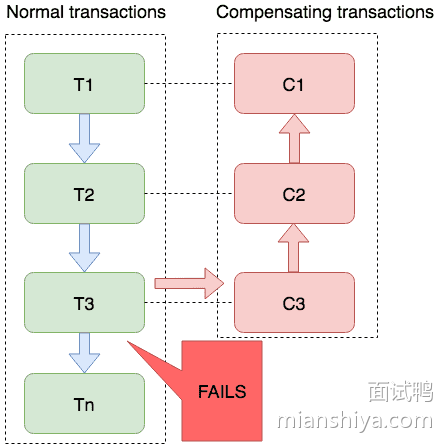

###### Saga 的实现(状态机引擎)

目前 SEATA 提供的 Saga 模式是基于状态机引擎来实现的，机制是：

1. 通过状态图来定义服务调用的流程并生成 json 状态语言定义文件
2. 状态图中一个节点可以是调用一个服务，节点可以配置它的补偿节点
3. 状态图 json 由状态机引擎驱动执行，当出现异常时状态引擎反向执行已成功节点对应的补偿节点将事务回滚(注意: 异常发生时是否进行补偿也可由用户自定义决定)
4. 可以实现服务编排需求，支持单项选择、并发、子流程、参数转换、参数映射、服务执行状态判断、异常捕获等功能

示例状态图:

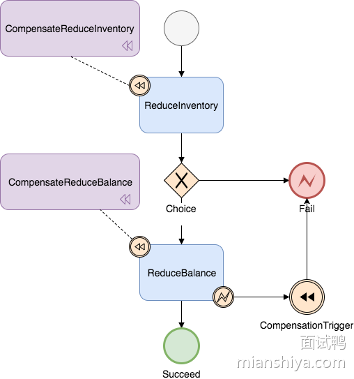

###### 状态机引擎原理:

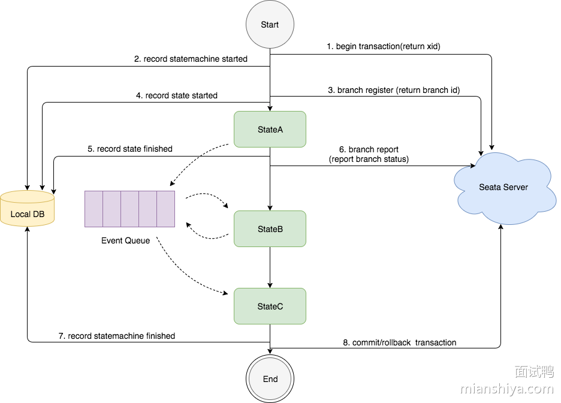

- 图中的状态图是先执行stateA, 再执行stateB，然后执行stateC
- "状态"的执行是基于事件驱动的模型，stateA执行完成后，会产生路由消息放入EventQueue，事件消费端从EventQueue取出消息，执行stateB
- 在整个状态机启动时会调用Seata Server开启分布式事务，并生产xid, 然后记录"状态机实例"启动事件到本地数据库
- 当执行到一个"状态"时会调用Seata Server注册分支事务，并生产branchId, 然后记录"状态实例"开始执行事件到本地数据库
- 当一个"状态"执行完成后会记录"状态实例"执行结束事件到本地数据库, 然后调用Seata Server上报分支事务的状态
- 当整个状态机执行完成, 会记录"状态机实例"执行完成事件到本地数据库, 然后调用Seata Server提交或回滚分布式事务

###### 状态机引擎设计

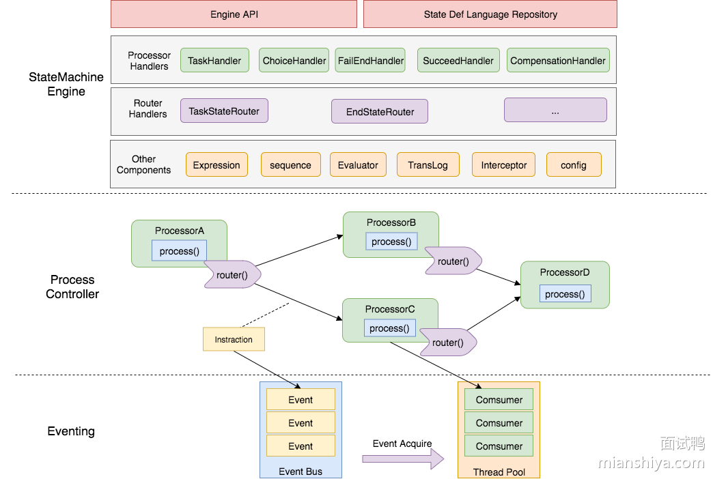

状态机引擎的设计主要分成三层, 上层依赖下层，从下往上分别是：

Eventing 层:

- 实现事件驱动架构, 可以压入事件, 并由消费端消费事件, 本层不关心事件是什么消费端执行什么，由上层实现

ProcessController 层:

- 由于上层的Eventing驱动一个“空”流程引擎的执行，"state"的行为和路由都未实现, 由上层实现

> 基于以上两层理论上可以自定义扩展任何"流程"引擎

StateMachineEngine 层:

- 实现状态机引擎每种state的行为和路由逻辑
- 提供 API、状态机语言仓库

###### 状态机的高可用设计

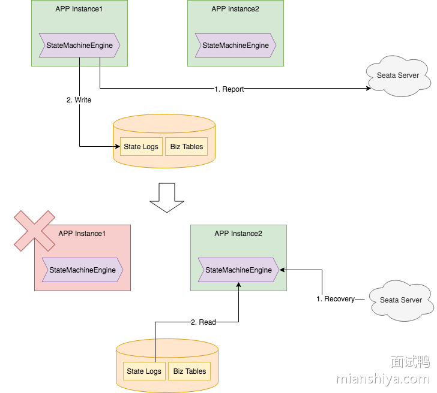

状态机引擎是无状态的，它是内嵌在应用中。

当应用正常运行时（图中上半部分）：

- 状态机引擎会上报状态到Seata Server；
- 状态机执行日志存储在业务的数据库中；

当一台应用实例宕机时（图中下半部分）：

- Seata Server 会感知到，并发送事务恢复请求到还存活的应用实例；
- 状态机引擎收到事务恢复请求后，从数据库里装载日志，并恢复状态机上下文继续执行；

##### XA 模式

在 Seata 定义的分布式事务框架内，利用事务资源（数据库、消息服务等）对 XA 协议的支持，以 XA 协议的机制来管理分支事务的一种 **事务模式**。

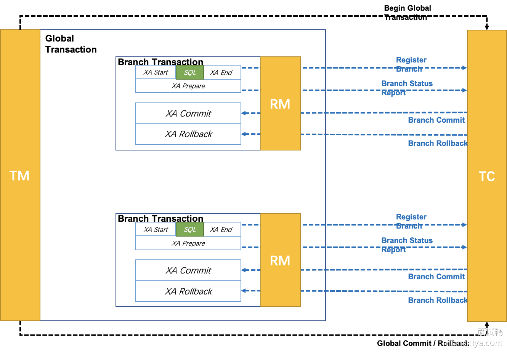

**执行阶段**：

- 可回滚：业务 SQL 操作放在 XA 分支中进行，由资源对 XA 协议的支持来保证 *可回滚*
- 持久化：XA 分支完成后，执行 XA prepare，同样，由资源对 XA 协议的支持来保证 *持久化*（即，之后任何意外都不会造成无法回滚的情况）

**完成阶段**：

- 分支提交：执行 XA 分支的 commit
- 分支回滚：执行 XA 分支的 rollback

###### 整体运行机制

XA 模式 运行在 Seata 定义的事务框架内：

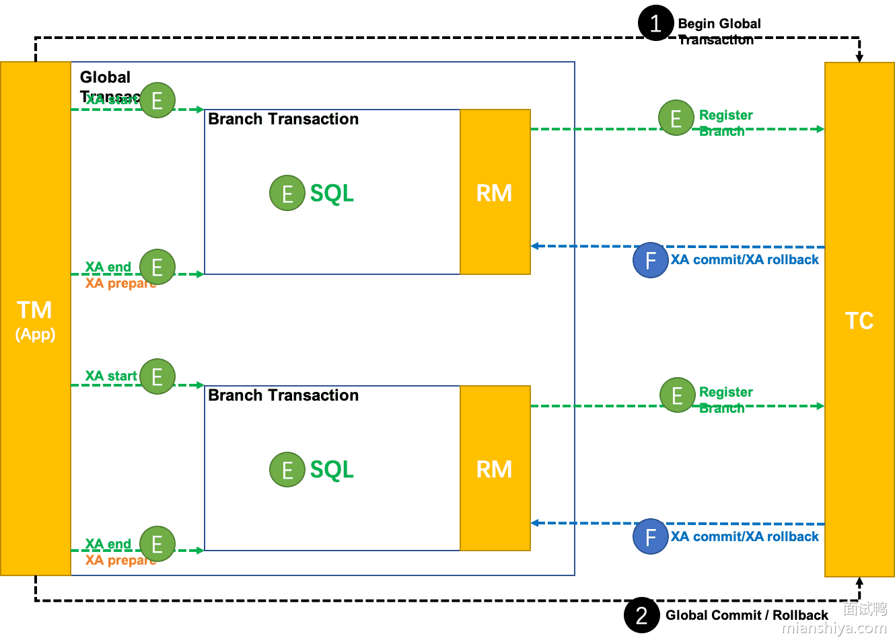

执行阶段（E xecute）：

- XA start/XA end/XA prepare + SQL + 注册分支

完成阶段（F inish）：

- XA commit/XA rollback

###### 数据源代理

XA 模式需要 XAConnection。

获取 XAConnection 两种方式：

- 方式一：要求开发者配置 XADataSource
- 方式二：根据开发者的普通 DataSource 来创建

第一种方式，给开发者增加了认知负担，需要为 XA 模式专门去学习和使用 XA 数据源，与 透明化 XA 编程模型的设计目标相违背。

第二种方式，对开发者比较友好，和 AT 模式使用一样，开发者完全不必关心 XA 层面的任何问题，保持本地编程模型即可。

我们优先设计实现第二种方式：数据源代理根据普通数据源中获取的普通 JDBC 连接创建出相应的 XAConnection。

类比 AT 模式的数据源代理机制，如下：

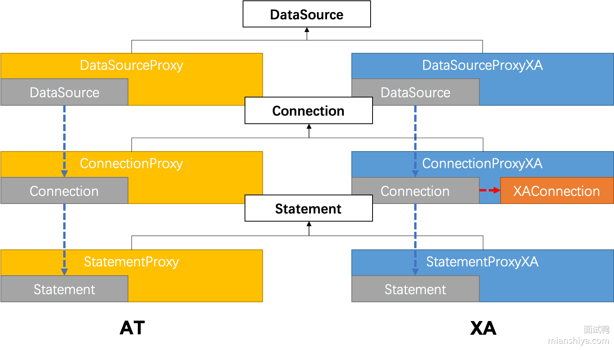

但是，第二种方法有局限：无法保证兼容的正确性。

实际上，这种方法是在做数据库驱动程序要做的事情。不同的厂商、不同版本的数据库驱动实现机制是厂商私有的，我们只能保证在充分测试过的驱动程序上是正确的，开发者使用的驱动程序版本差异很可能造成机制的失效。

这点在 Oracle 上体现非常明显。参见 Druid issue：https://github.com/alibaba/druid/issues/3707

综合考虑，XA 模式的数据源代理设计需要同时支持第一种方式：基于 XA 数据源进行代理。

类比 AT 模式的数据源代理机制，如下：

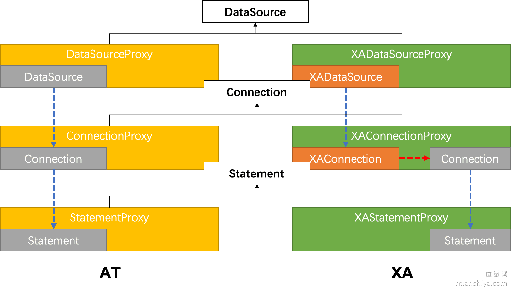

###### 分支注册

XA start 需要 Xid 参数。

这个 Xid 需要和 Seata 全局事务的 XID 和 BranchId 关联起来，以便由 TC 驱动 XA 分支的提交或回滚。

目前 Seata 的 BranchId 是在分支注册过程，由 TC 统一生成的，所以 XA 模式分支注册的时机需要在 XA start 之前。

将来一个可能的优化方向：

把分支注册尽量延后。类似 AT 模式在本地事务提交之前才注册分支，避免分支执行失败情况下，没有意义的分支注册。

这个优化方向需要 BranchId 生成机制的变化来配合。BranchId 不通过分支注册过程生成，而是生成后再带着 BranchId 去注册分支。

###### XA 模式的使用

从编程模型上，XA 模式与 AT 模式保持完全一致。

可以参考 Seata 官网的样例：[seata-xa](https://github.com/apache/incubator-seata-samples/tree/master/seata-xa)

样例场景是 Seata 经典的，涉及库存、订单、账户 3 个微服务的商品订购业务。

在样例中，上层编程模型与 AT 模式完全相同。只需要修改数据源代理，即可实现 XA 模式与 AT 模式之间的切换。

```java
    @Bean("dataSource")
    public DataSource dataSource(DruidDataSource druidDataSource) {
        // DataSourceProxy for AT mode
        // return new DataSourceProxy(druidDataSource);

        // DataSourceProxyXA for XA mode
        return new DataSourceProxyXA(druidDataSource);
    }
```

### Sentinel 与 Hystrix 的区别是什么？

#### 回答重点

Hystrix 注重线程隔离以及服务保护，其主要是针对单个服务的服务调用，而 Sentinel 支持的粒度更小一点，其可以细化到服务的一个接口、一段代码等，并且其支持自定义流量控制规则，其可以针对整个系统的服务进行流量的监控和保护，两者的主要区别在于 **Hystrix 是以服务保护为切入点，而 Sentinel 是以流量保护作为切入点**。

下面放一张表格，方便大家进行对比：

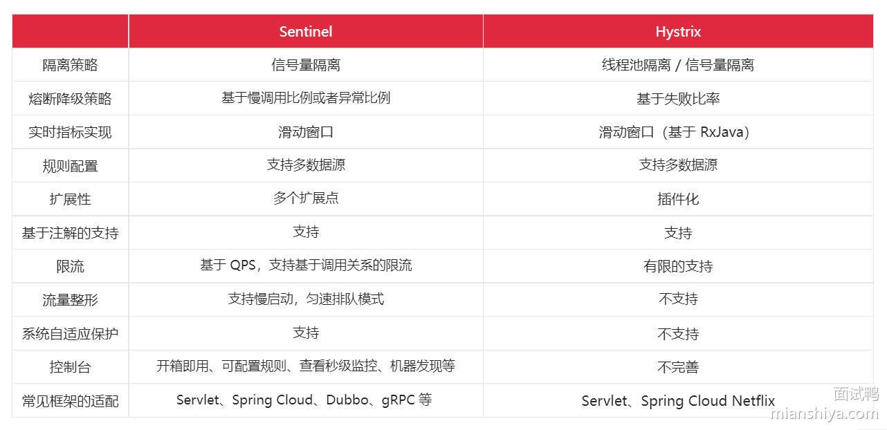

#### 扩展知识

##### Hystrix

- Hystrix 是 Spring Cloud Netflix 开源的熔断器实现，**主要用于保护分布式系统中的服务调用，避免服务雪崩情况的发生**。其主要的特点有很多，包括线程隔离、资源保护以及降级处理等。
- Hystrix 通过将每个服务调用放入独立的线程池，避免了因为一个服务线程资源的枯竭从而导致整个微服务系统线程资源的紧张，从而实现线程隔离的效果。
- Hystrix 提供了服务监控功能，其可以通过监控服务的运行指标，比如延迟、调用成功数等，当服务发生异常情况的时候，其会自动打开服务熔断器，避免服务连锁故障现象的发生，并且在熔断器运行一段时间之后，其会尝试自动恢复。
- Hystrix 提供服务降级处理，即当服务出现不可用或者响应过慢的时候，其会调用预先设定的 fallback 方法，从而实现服务的降级处理，提供系统的可用性。

##### Sentinel

- Sentinel 是阿里巴巴开源的 Spring Cloud Alibaba 体系中一款重要的流量控制和系统保护工具，主要用于实现微服务架构中的流量控制、熔断降级以及系统的负载保护等功能。其主要的特点就是支持多种变成语言，并且提供了丰富的流量控制策略以及细粒度的服务保护，并且提供了图形界面实现实时监控数据的展示以及动态规则配置的支持等功能。
- Sentinel 可以实时监控服务的请求流量和各项指标，并且提供实时的仪表盘和可视化的监控界面。
- Sentinel 支持多种流量策略，比如基于 QPS、线程数、并发连接数等多种指标。
- Sentinel 支持通过 API 动态配置流量规则以及熔断规则，并且可以个根据服务的实际情况进行动态调整。
- Sentinel 的支持粒度更小，支持对任意资源，比如代码段、url、接口等实现自定义流量控制规则，比如熔断、限流、降级等操作。
- Sentinel 支持多种语言，适合跨语言的微服务架构。

## Mybatis

### 能详细说说 MyBatis 的执行流程吗？ 

#### 回答重点

MyBatis 的执行原理基于其核心设计思想：**通过映射文件（XML 或注解）将 SQL 语句与 Java 对象进行绑定**。

整个执行流程可以分为以下几个步骤：

1）**SqlSessionFactory 的创建**：MyBatis 的执行过程从 `SqlSessionFactory` 开始。`SqlSessionFactory` 是一个工厂类，负责创建 `SqlSession` 实例，`SqlSession` 是 MyBatis 与数据库交互的核心对象。`SqlSessionFactory` 是通过 `SqlSessionFactoryBuilder` 构建的（通常是通过读取 MyBatis 配置文件`mybatis-config.xml`来初始化）。

2）**SqlSession 的获取**：`SqlSessionFactory` 通过 `openSession()` 方法获取一个 `SqlSession` 对象，`SqlSession` 是操作数据库的主要入口，用户通过它执行 SQL 语句、提交事务等。

3）**执行映射语句**：当调用 `SqlSession` 的方法（例如 `selectOne`、`selectList`、`insert`、`update`、`delete` 等）时，MyBatis 会根据传入的 SQL 映射语句的 ID，去寻找对应的 SQL 语句执行。

4）**命名空间和映射语句的查找**：SQL 映射语句通过映射文件中的 `namespace` 和 `id` 进行定位。MyBatis 会将映射文件解析成一个 `MappedStatement` 对象，`MappedStatement` 保存了 SQL 语句、参数类型、返回类型等信息。

5）**参数封装和 SQL 语句执行**：在 SQL 执行前，MyBatis 会根据映射文件中配置的 `parameterType` 类型，将传入的参数封装成适当的对象（例如，使用 JavaBean、Map、XML 格式等）。然后，MyBatis 会根据不同的执行环境（如 MySQL、Oracle 等数据库），将 SQL 语句执行到数据库中，并将查询结果通过映射文件中配置的 `resultType` 类型返回。

6）**返回结果的映射**：MyBatis 会将查询结果根据 `resultType` 或 `resultMap` 进行转换，将查询结果转换成 Java 对象（如 `List`、`Map` 或指定的 POJO 类）。

7）**事务管理**：MyBatis 的事务管理通过 `SqlSession` 来处理，`SqlSession` 提供了事务的提交和回滚方法。当调用 `SqlSession.commit()` 时，SQL 执行的结果会被提交到数据库；若发生异常，调用 `SqlSession.rollback()`，事务会被回滚。

8）**最后关闭 SqlSession**：在操作完成后，`SqlSession` 会通过 `close()` 方法关闭，释放数据库连接和资源。

#### 扩展知识

##### **MyBatis 的核心组件**

- **SqlSessionFactory**：负责创建 `SqlSession` 对象。
- **SqlSession**：负责执行 SQL 操作，管理事务。
- **Configuration**：保存 MyBatis 的全局配置信息，维护映射器、插件、类型处理器等。
- **MappedStatement**：表示映射的 SQL 语句及其相关信息，如 SQL、参数类型、返回类型等。
- **Executor**：用于执行 SQL 语句的组件，根据 `MappedStatement` 中的 SQL 配置信息，通过数据库连接执行 SQL 语句,提供缓存支持。
- **StatementHandler**：`StatementHandler` 负责处理 SQL 语句的具体执行，包括 SQL 的预处理、绑定参数、执行查询等。
- **ResultSetHandler**：`ResultSetHandler` 负责处理查询结果的映射，将结果集转换成 Java 对象。

##### 部分源码解析

首先需要解析配置（`mybatis-configx.xml`），将配置文件的内容转为 Java 对象（`Configuration`）加载到内存中，包括一些 `xxxMapper.xml` 文件，将这些文件解析成 `MappedStatement` 对象，保存其 SQL 语句、参数映射等信息。

我们在代码里写的 `Mapper` 都是接口，实际的实现类是由 Mybatis 利用 JDK 动态代理生成的，具体是在 `MapperProxyFactory` 中生成代理类：

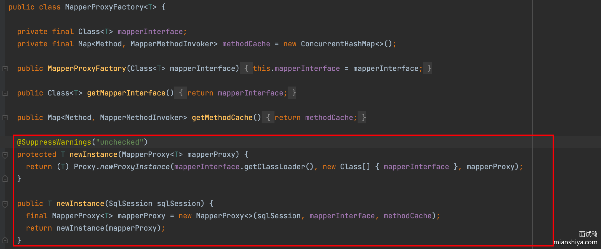

当调用 Mapper 接口中的方法时，代理对象会将调用信息传递给 MyBatis 内部的 `MapperProxy` 对象，实际上调用方法时，会触发 `MapperMethod` 来执行具体逻辑：

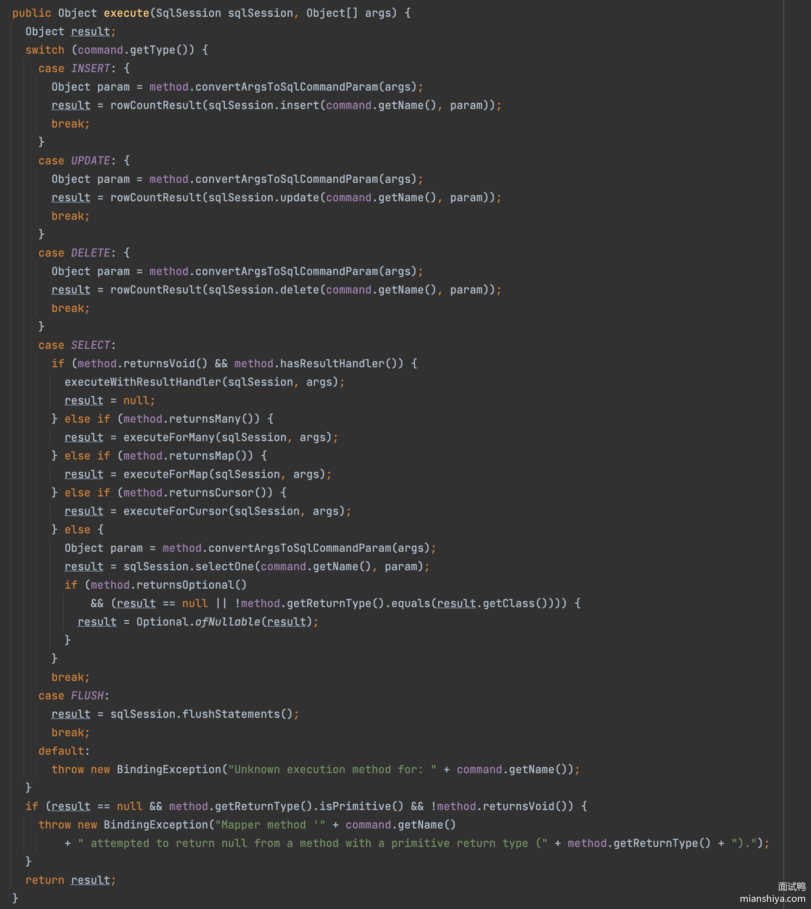

可以看到，里面分了 insert、update、delete 等不同的处理方法，这时候就可以执行具体的语句了。

这里先解释下 command 是什么，它是 `MapperMethod` 内部的一个属性 ：

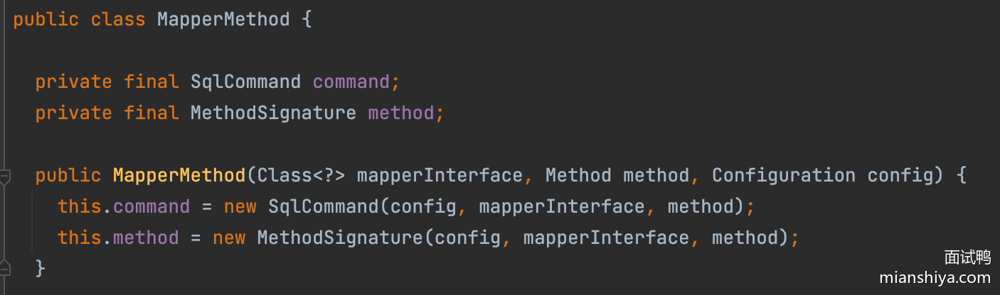

这个 command 就是通过调用的接口名+方法名，从 `Configuration` 中找到 `MappedStatement` 对象，这个对象记录了 SQL 内容、出参入参等等，这样就得到最终的 SQL 相关信息了，跟前面的配置串起来了。

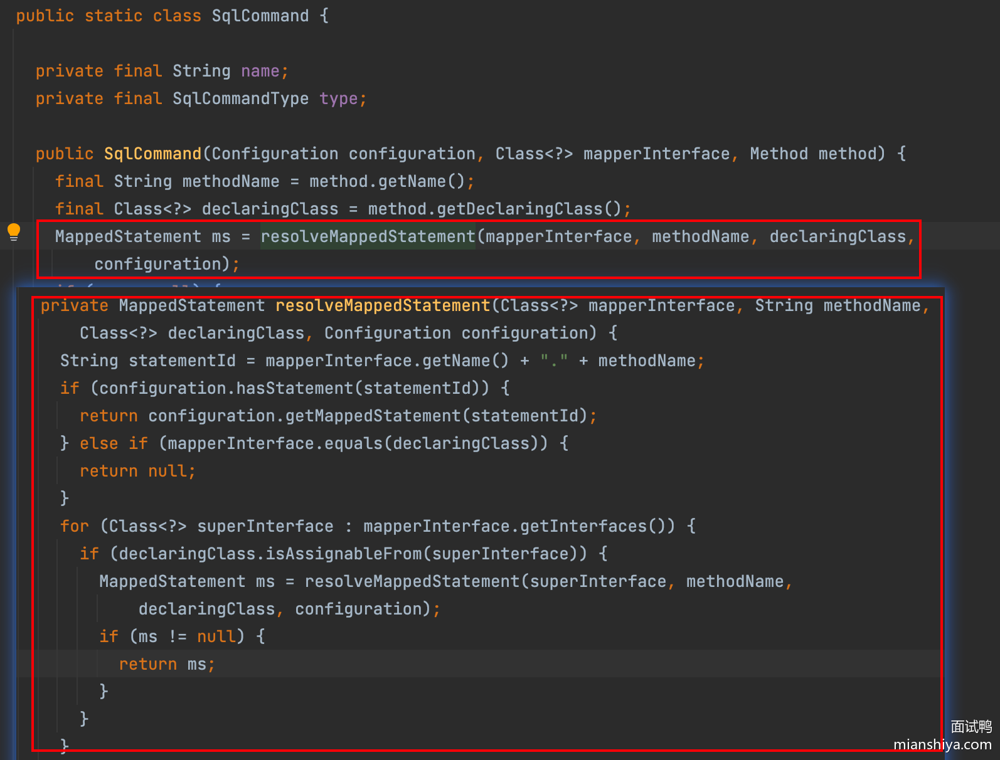

mybatis 还有缓存机制，因此会经过 `CachingExecutor` 的处理，这里主要是二级缓存的处理，这里不多赘述，关于 myabtis 缓存查看面试鸭《[说说 Mybatis 的缓存机制？](https://www.mianshiya.com/bank/1801424748099739650/question/1802597639336042498)》 这个面试题。

最终还是会到 JDBC 执行 SQL 的流程，从以下的代码可以看到，获取 `Connection`（实际会从连接池中获取），且得到 Statement。

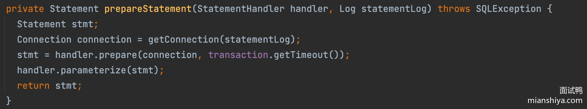

然后调用 execute 执行（是不是和 JDBC 一样？）：

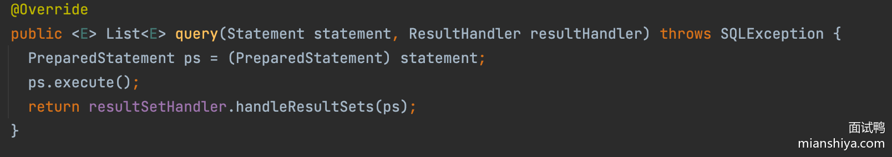

最后通过 `resultSetHandler` 处理查询得到的结果，将其映射到对应的实体对象。

### MyBatis 与 Hibernate 有哪些不同？ 

#### 回答重点

##### Hibernate

是一款完整形态的 ORM 框架，可以从纯面向对象的角度来操作数据库。

它不仅能帮助我们完成对象模型和数据库关系模型的映射，还能帮助我们屏蔽不同数据库不同 SQL 的差异，简单来说我们用 Hibernate 提供的 API 就能完成大部分 SQL 操作，不需要我们编写 SQL，Hibernate 会帮助我们生成 SQL。

且也提供了 HQL（Hibernate Query Language），面向对象的查询语句，和 SQL 类似但是不太相同，最终 HQL 会被转化成 SQL 执行

还提供了 Criteria 接口，也是一样，是一套面向对象的 API，一些复杂的 SQL 可以利用 Criteria 来实现，非常灵活。

总而言之，**Hibernate 通过面向对象的思维让你操作数据库，屏蔽不同数据库的差异，它会根据底层不同数据库转化成对应的 SQL**。

缺点就是屏蔽的太多了，例如因为自动生成 SQL，所以我们无法控制具体生成的语句，你无法直接决定它走哪个的索引，且又经过了一层转化 SQL 的操作，所以性能也会有所影响。

**总结**：Hibernate 很好，基本上 ORM 要的它都有，包括一级、二级缓存等，且屏蔽底层数据库，提高了程序的可移植行。但由于它封装的太好了，使得我们无法精细化的控制执行的 SQL。

在国外几乎都用 Hibernate，在国内大家都用 Mybaits。

没有绝对的好坏，只有合适与不合适。

##### Mybaits

Mybatis 相对于 Hibernate 称为半 ORM 框架，因为 Hibernate 不需要写 SQL，而 Mybatis 需要写 SQL。

也因为这点 Mybatis 更加的灵活且轻量。

能针对 SQL 进行优化，非常灵活地根据条件动态拼接 SQL 等，极端情况下性能占优。

不过也因为这点 Mybatis 和底层的数据库是强绑定的，如果更换底层数据库， 所有 SQL 需要重新过一遍（有些写法还是不一样的）。

比如我之前本地开发是 MySQL，后来客户特殊情况不用 saas，需要在他们那边部署一套，他们用的是 oracle，所以以前写的 SQL 都需要改一遍。

具体选择 Hibernate 还是 Mybatis，是看情况的。

比方一些项目很简单，QPS 又不高，快速解决战斗就选 Hibernate，无脑上就完了。

而一些核心服务，QPS很高，需要对 SQL 进行精细化定制，那就 Mybatis，就是追求极致用 Mybatis。

### MyBatis 中 #{} 和 ${} 的区别是什么？

#### 回答重点

在 MyBatis 中，`#{}` 和 `${}` 都是用来处理 SQL 语句中的参数占位符，但它们的作用和使用场景有显著的不同。

**`#{}`（PreparedStatement 占位符）**：用于传入 SQL 查询语句的参数。它会将传入的参数进行类型处理，并使用 `PreparedStatement` 进行 SQL 绑定，从而避免 SQL 注入攻击。**`#{}` 会将参数作为参数传递给数据库查询，而不是直接拼接到 SQL 中**。

**`${}`（字符串拼接）**：用于直接将参数值拼接到 SQL 语句中。它不会进行类型处理或使用 `PreparedStatement`，只是将参数值直接替换到 SQL 语句中。

默认使用 #{} 为了安全；需要动态构造 SQL 的部分谨慎使用 ${} 。

#### 扩展知识

##### 什么是 PreparedStatement 预编译？

想象你是一个餐馆的常客，每次去餐馆吃饭，你点的菜单是固定的，只有一些细节，比如餐品的数量或者加辣的程度会有所不同。如果每次都让服务员从头到尾重新写一张菜单（比如：菜品名称、做法、数量），显然会浪费时间。而且，餐馆还需要不断地检查你的菜单内容是否合规，这样会增加额外的工作量。

但是，如果餐馆预先准备好一份固定的菜单，只需要你告诉他们“要多少份”或者“加不加辣”，他们就可以直接用这份已经验证过的菜单为你服务。这样就省去了重复的验证和写菜单的时间，你点餐也更加高效。

这就类似于 **`PreparedStatement` 的预编译**：

- **预编译**：数据库事先编译并优化好一个 SQL 模板，类似餐馆准备好的菜单。这样每次执行相同 SQL 时，数据库不需要再解析和优化它。
- **占位符（`?`）**：你只需要告诉餐馆（数据库）“具体的数量”和“是否加辣”，这就像你通过 `PreparedStatement` 的 `setXxx()` 方法传递参数值。

也因为模板预先被编译固定了，所以后续有危险的参数传入也不会影响之前的模板逻辑。不管传入的参数是delete 还是 drop，都会被理解成“具体的数量”或者“是否加辣”，不会识别成删数据还是删表，**因此避免了 sql 注入**。

总结`PreparedStatement`优点:

1. **更高效**：SQL 语句只编译一次，后续执行相同的 SQL 时，直接复用执行计划。
2. **更安全**：参数通过绑定的方式传递，避免了拼接 SQL 时容易发生的 SQL 注入漏洞。

##### 那在什么情况下只能使用 ${} 呢？

**一些动态 SQL 场景是无法通过预编译替代的**，只能使用 ${}，例如动态指定表名或者列名。

```xml
<select id="selectByColumn" resultType="User">
    SELECT * FROM users WHERE ${column} = #{value}
</select>
```

例如一些需要动态排序的场景。

```xml
<select id="selectAllUsers" resultType="User">
    SELECT * FROM users ORDER BY ${orderByColumn} ${orderByType}
</select>
```

### 说说 MyBatis 的缓存机制？

#### 回答重点

Mybatis 中有两类缓存，分别是**一级缓存**和**二级缓存**。

**一级缓存（SqlSession 级别）**：仅在同一个 `SqlSession` 中生效。基于 **命名空间、SQL 语句和参数** 作为唯一标识。

- 默认开启，生命周期与 `SqlSession` 一致。
- 当执行 `commit`、`rollback` 或手动清理缓存时会清空。

**二级缓存（Mapper 级别）**：跨 `SqlSession`共享缓存，基于 Mapper 的缓存。

- 需要手动配置开启（Mapper XML 文件中需要 `<cache/>`）。
- 生命周期与 `SqlSessionFactory` 一致。
- 数据的更新、插入、删除会使相关缓存失效。
- 支持定制化存储（如整合第三方缓存工具）。

#### 扩展知识

##### 进一步理解

一级缓存默认是会话级缓存。即创建一个 SqlSession 对象就是一个会话，一次会话可能会执行多次相同的查询，这样缓存了之后就能重复利用查询结果，提高性能，不过 commit、rollback、update、delete 等都会清除缓存。

不过要注意，不同 SqlSession 之间的修改不会影响彼此，比如 SqlSession1 读了数据 A，SqlSession2 将数据改为 B，此时 SqlSession1 再读还是得到 A，这就出现了脏数据的问题。

所以，如果是多 SqlSession 或者分布式环境下，就可能有脏数据的情况发生，建议将一级缓存级别设置为 statement。

二级缓存是跨 SqlSession 级别的共享的，同一个 namespace 下的所有操作语句，都影响着同一个 Cache。

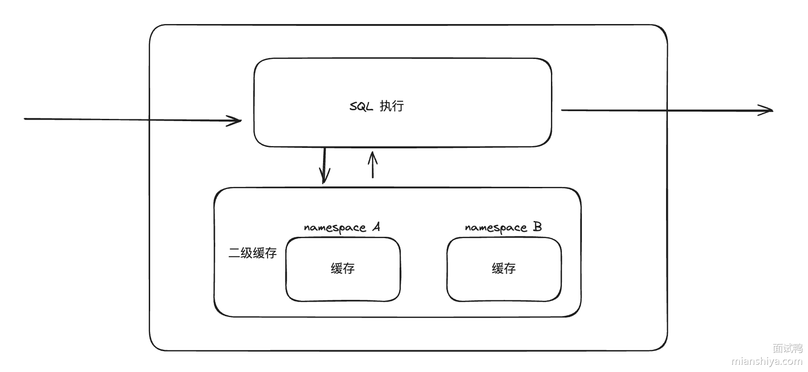

二级缓存也会有脏数据的情况，比如多个命名空间进行多表查询，各命名空间之间数据是不共享的，所以存在脏数据的情况。

例如 A、B 两张表进行联表查询，表 A 缓存了这次联表查询的结果，则结果存储在表 A 的 namespace 中，此时如果表 B 的数据更新了，是不会同步到表 A namespace 的缓存中，因此就会导致脏读的产生。

> 一般而言 namespace 对应一个 mapper，对应一个表。namespace 对应一个唯一的命名空间，从而可以在不同的映射文件中使用相同的 SQL 语句 ID，例如 user 可以定义一个 selectById，order 也可以定义一个 selectById，因为命名空间不同，就不会冲突。

开启二级缓存之后，**会先从二级缓存查找，找不到再去一级缓存查找**，如果一级缓存没有再去数据库查询。

二级缓存主要是利用 `CachingExecutor` 这个装饰器拦了一道，来看下 `CachingExecutor#query` 方法：

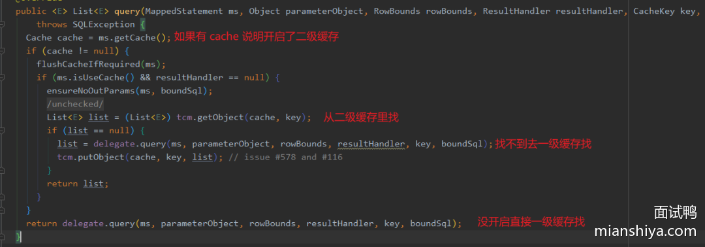

而 MyBatis 的缓存本质上就是在本地利用 map 来存储数据。

基础实现类是 `PerpetualCache` ，并且使用了装饰器模式，提供了各种各样的 cache 进行功能的扩展，比如：

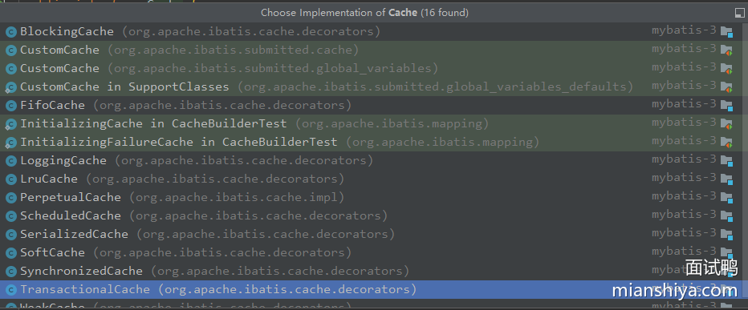

像 `BlockingCache` 可以提供阻塞，还有 `FifoCache`、`LruCache` 等等。

好了，原理大致就是上面这些，可以看到 mybaits 缓存还是不太安全，上面说的在分布式场景下肯定会出现脏数据。

建议生产上使用 redis 结合 spring cache 进行数据的缓存，或者利用 guava、caffeine 进行本地缓存。

##### 配置示例

**一级缓存**无需额外配置，默认开启。

**二级缓存**配置示例（Mapper XML 文件）：

```xml
<mapper namespace="com.example.mapper.UserMapper">
    <!-- 开启二级缓存 -->
    <cache eviction="LRU" flushInterval="60000" size="512" readOnly="true"/>
</mapper>
```

- **`eviction`**：缓存清理策略（`LRU`、`FIFO` 等）。
- **`flushInterval`**：刷新间隔（单位：毫秒）。
- **`size`**：缓存的最大对象个数。
- **`readOnly`**：只读标志，设置为 `true` 时提高性能，但不能修改返回对象。

### 简述 MyBatis 的插件运行原理，以及如何编写一个插件？

#### 回答重点

MyBatis 的插件机制是通过 **动态代理** 实现的，主要是在 SQL 执行的关键点（如执行查询、更新、插入）拦截操作并增强功能。

**拦截器的拦截点（MyBatis 插件只能拦截以下四种类型的对象）**：

- **`Executor`**：负责执行增删改查操作。
- **`ParameterHandler`**：负责处理 SQL 语句中的参数。
- **`ResultSetHandler`**：负责处理结果集。
- **`StatementHandler`**：负责处理 SQL 语句。

简单来说就是 MyBatis 在运行时会根据配置加载插件，并在拦截点处生成代理对象。当拦截点的方法被调用时，MyBatis 会先调用插件的 `intercept` 方法（进行逻辑的织入），如果有多个插件，则按配置顺序依次执行。

#### 扩展知识

##### 如何编写一个 MyBatis 插件

1）**实现 `Interceptor` 接口**：编写一个类，实现 MyBatis 的 `Interceptor` 接口，并定义拦截逻辑。

2）**定义拦截逻辑**：在 `intercept` 方法中实现增强逻辑。使用 `Invocation` 对象调用目标方法。

3）**配置插件**：在 `mybatis-config.xml` 文件中配置插件类和参数。

##### 进一步理解插件原理

想要实现一个插件，就要实现 Mybatis 提供的 Interceptor 接口。

Interceptor 上的 @Signature 注解表明拦截的目标方法，具体参数有 type、method、args。

例如：

```
@Signature(type = StatementHandler.class, method = "query", args = {Statement.class, ResultHandler.class}
```

mybatis 底层是利用 Executor 类来执行 sql 的，再具体点会有 StatementHandler、ParameterHandler、ResultSetHandler 这三个 handler。

StatementHandler 执行 sql，ParameterHandler 设置参数，由 statement 对象将 sql 和实参传递给数据库执行，再由 ResultSetHandler 封装返回的结果，所以在这几道工序之间做拦截，就能实现我们切入的功能，也就是插件。

具体的做法是实现 Interceptor，表明要拦截的方法，填充你要切入的逻辑，然后将 Interceptor 注册到 mybatis 的配置文件（mybatis-config.xml）中。

mybatis 加载时会解析文件，得到一堆 Interceptor 组成 InterceptorChain 并保存着。

然后在创建 Executor、ParameterHandler、StatementHandler、ResultSetHandler 这几个类的对象时，就会从 InterceptorChain 得到相应的 Interceptor 通过 jdk 动态代理得到代理对象，如果没有合适的 Interceptor 则会返回原对象。

就这样，插件的逻辑就被织入了.

介绍下 Interceptor 接口，该接口定义了 intercept, plugin 和 setProperties 三个方法。

- intercept 方法：实现你的拦截逻辑。
- plugin 方法：用于创建当前拦截器的代理对象，实现了 InvocationHandler 接口。
- setProperties 方法：用于设置插件属性，通常是从配置文件传入的参数。

在 MyBatis 中，每个插件都是一个拦截器，多个拦截器形成一个拦截器链。

当 MyBatis 调用一个被拦截的方法时，拦截器链中的每个拦截器都会依次执行，直到所有拦截器都执行完毕，所以应用了责任链模式。

插件具体执行流程如下：当被调用 ParameterHandler、ResultSetHandler、StatementHandler、Executor 对象的时候，会触发 Plugin 的 invoke 方法，此时就会根据插件注解上定义的

@Intercepts、@Signature 中的的配置信息(方法名、参数等) 动态判断是否需要拦截该方法的执行，如果需要则调用插件的 intercept 方法执行拦截逻辑，而 intercept 内执行一定逻辑后，调用 invocation.proceed() 触发后续的调用。

##### 插件示例代码

```java
@Intercepts({
    @Signature(
        type= StatementHandler.class,
        method = "prepare",
        args = {Connection.class, Integer.class}
    )
})
public class ExamplePlugin implements Interceptor {
    @Override
    public Object intercept(Invocation invocation) throws Throwable {
        // 获取被代理对象
        StatementHandler statementHandler = (StatementHandler) invocation.getTarget();
        // 获取 SQL 语句
        String sql = statementHandler.getBoundSql().getSql();
        System.out.println("SQL: " + sql);
        // 继续执行其他插件链和目标方法
        return invocation.proceed();
    }

    @Override
    public Object plugin(Object target) {
        // 创建代理对象
        return Plugin.wrap(target, this);
    }

    @Override
    public void setProperties(Properties properties) {
        // 从配置中获取属性，例如：
        String someProperty = properties.getProperty("someProperty");
        System.out.println("Some Property: " + someProperty);
    }
}
```

Mybatis 配置注册代码如下：

```xml
<plugins>
    <plugin interceptor="com.example.ExamplePlugin">
        <property name="someProperty" value="value"/>
    </plugin>
</plugins>
```

##### 插件常见用途

1）**性能分析**：统计 SQL 的执行时间，输出到日志中。

2）**动态参数注入**：在 `ParameterHandler` 中修改或添加 SQL 参数。

3）**数据脱敏**：在 `ResultSetHandler` 中对查询结果进行脱敏处理。

4）**自动分页**：在 `StatementHandler` 中拦截 SQL，自动添加分页逻辑。

### 什么是 MyBatis-Plus？它有什么作用？它和 MyBatis 有哪些区别？ 

#### 回答重点

MyBatis 是一个半 ORM（对象关系映射）框架，它内部封装了 JDBC，使用它后，开发者只需要关注 SQL 语句本身，不需要花费精力去处理加载驱动、创建连接、创建 statement 等繁杂的过程，提高开发效率。

MyBatis-Plus 是 MyBatis 的增强版框架（就像魂斗罗兄弟一样），它对 MyBatis 进行了 二次封装 ，只做增强不做改变。通过提供一系列的 API 方法和代码生成器，使重复的 CRUD（创建、读取、更新、删除）操作更加简单，无需手动编写 SQL 语句，从而 大幅提高开发效率 。

此外，还有一些其他优点。比如：

1. 提供了条件构造器，可以通过编程方式构建复杂的查询条件，无需编写繁琐的 SQL 语句
2. 提供了分页查询支持，无需手动编写分页逻辑
3. 提供了一个代码生成器工具，可以根据数据库表自动生成 Java 实体类、Mapper 接口和 XML 映射文件，减少了手工编写的工作量。

使用 MyBatis Plus 前，需要自己编写 SQL Mapper 映射文件和语句：

```xml
<!-- userMapper.xml -->
<mapper namespace="com.demo.dao.UserMapper">
  <select id="getUserById" parameterType="java.lang.Integer" resultType="com.demo.entity.User">
    select * from t_user where id=#{id}
  </select>
</mapper>
```

使用 MyBatis Plus 后，定义接口继承 BaseMapper 接口并调用其中提供的现成方法即可：

```java
public interface UserMapper extends BaseMapper<User> {
}
```

## Netty

### 什么是 Netty，它在网络编程中解决了什么问题？ 

#### 回答重点

Netty 是高性能 Java 网络通信的底层框架，它使用异步、事件驱动等架构，解决了传统 Java 网络编程中的一些复杂问题：

1. **传统BIO阻塞瓶颈**：通过NIO多路复用实现单线程万级连接，避免线程爆炸
2. **原生NIO开发复杂度**：封装Selector/Channel/Buffer，提供Pipeline责任链式API
3. **网络编程常见痛点**：自带TCP粘包拆包、心跳检测、内存池等生产级解决方案

> 你听过的很多中间件底层通信框架用的都是它，例如 RocketMQ、Dubbo、Elasticsearch、Cassandra 等。

#### 扩展知识

##### 它为什么这么流行？为什么这么多中间件都在它之上构建？

1）**易用**

对 Java 的 NIO 进行了封装，屏蔽了 NIO 使用的复杂性，简化了网络通信的开发。

且支持众多协议，不仅仅 HTTP、HTTP2、DNS、Redis 协议等等。

网络编程需要考虑粘包和拆包问题，连接的管理，编解码的处理，Netty都为你定制好了，开箱即用。

还提供的内存泄漏检测，IP过滤、流量整型等高级功能。

2）**性能**

良好的I/O模型。

Netty 基于 Java NIO 封装实现了 I/O 多路复用，可由一个线程轮询多个底层 channel，减少了线程资源，也减少了多线程切换带来的开销，能更好的处理海量连接，提升系统的性能。

在 Linux 环境下也会用更优的 epoll 模型。

运用零拷贝技术。不仅利用操作系统提供的零拷贝，也基于堆外内存省了一次 JVM 堆内外之间的拷贝。

对象池技术，通过对象的复用，避免频繁创建和销毁带来的开销。

3）**扩展性**

基于事件驱动模型，将业务实现剥离成一个个 ChannelHandler ，利用责任链模式，可以很好的根据不同业务进行扩展，使用者只需要实现相关的 ChannelHandler 即可，框架与业务隔离。

可以根据情况配置线程模型，例如主从 Reactor ，主多从 Reactor 等等。

##### Reactor线程模型演进

```java
// 典型主从多线程模型配置
EventLoopGroup bossGroup = new NioEventLoopGroup(1);  // 主Reactor
EventLoopGroup workerGroup = new NioEventLoopGroup(); // 从Reactor
ServerBootstrap b = new ServerBootstrap();
b.group(bossGroup, workerGroup)
 .channel(NioServerSocketChannel.class)
```

- **三层演进**：单线程 -> 多线程 -> 主从多线程

##### Boss-Worker分工

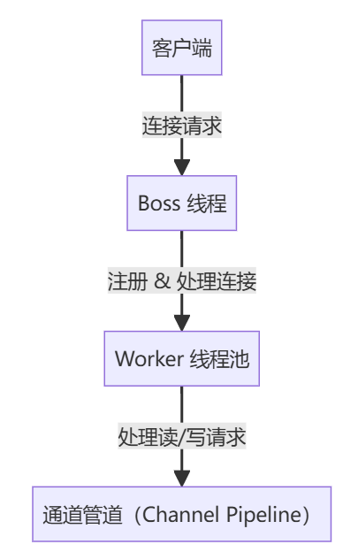

- Boss 线程：负责监听客户端连接，并将连接注册到 Worker 线程池。
- Worker 线程池：负责处理 I/O 事件，如读取和写入数据。
- 通道管道（Channel Pipeline）：由多个处理器（Handler）组成，处理数据的编解码和业务逻辑。

##### Netty 的线程处理逻辑

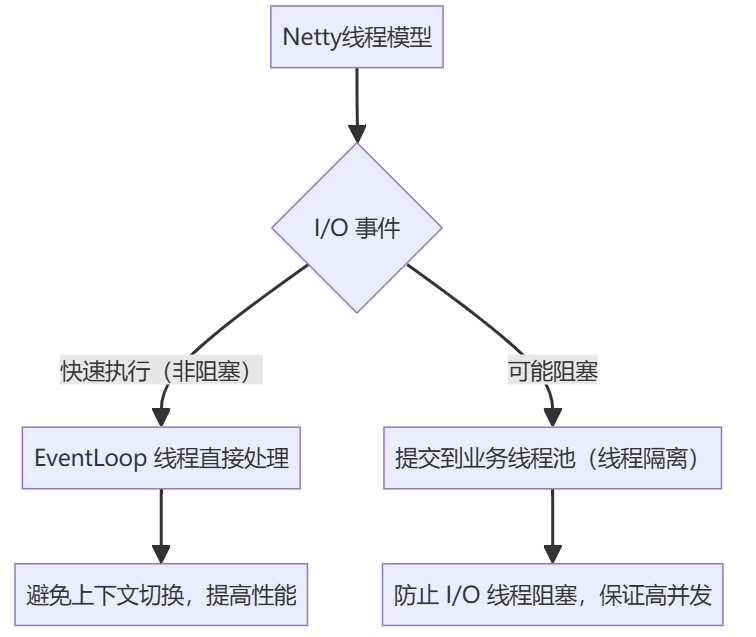

1）非耗时操作（EventLoop 线程直接处理）

- Netty 的 EventLoop 线程负责处理 I/O 事件（如读/写数据）、定时任务和 Channel 相关的事件。
- 非阻塞操作（如消息解析、简单的业务逻辑）直接在 EventLoop 线程中执行，以避免线程切换的开销。

2）阻塞操作（提交到业务线程池）

由于 Netty 采用 Reactor 线程模型，其 I/O 线程（EventLoop）是单线程处理多个 Channel，不能被阻塞。

因此阻塞操作（如数据库查询、文件 I/O、复杂计算等）提交到业务线程池（通常是 Netty 的自定义线程池或外部线程池），以防止阻塞 I/O 线程，避免影响其他 Channel 的处理。

##### Netty 零拷贝三重实现

| 实现方式         | 原理             | 典型场景          |
| ---------------- | ---------------- | ----------------- |
| CompositeByteBuf | 虚拟缓冲区组合   | 协议分包/文件合并 |
| FileRegion       | sendfile系统调用 | 大文件传输        |
| DirectBuffer池化 | 堆外内存复用     | 高频数据读写      |

##### 什么是 Reactor 线程模型？

- [什么是 Reactor 线程模型？](https://www.mianshiya.com/bank/1804354610222800897/question/1804877046357893121)

### 说说你知道的几种 I/O 模型 

#### 回答重点

1）**同步阻塞 I/O（Blocking I/O，BIO）**

线程调用 `read` 时，如果数据还未到来，线程会一直阻塞等待；数据从网卡到内核，再从内核拷贝到用户空间，这两个拷贝过程都为阻塞操作。

- **优点**：实现简单，逻辑直观；调用后直接等待数据就绪。
- **缺点**：每个连接都需要一个线程，即使没有数据到达，线程也会被占用，导致资源浪费，不适合高并发场景。

2）**同步非阻塞 I/O（Non-blocking I/O，NIO）**

在非阻塞模式下，`read` 调用如果没有数据就绪会立即返回错误（或特定状态），不会阻塞线程；应用程序需要不断轮询判断数据是否就绪，但当数据拷贝到用户空间时依然是阻塞的。

- **优点**：线程不会长时间阻塞，可以在无数据时执行其他任务；适用于部分实时性要求较高的场景。
- **缺点**：轮询方式会频繁进行系统调用，上下文切换开销较大，CPU 占用率较高，不适合大规模连接。

3）**I/O 多路复用**

通过一个线程（或少量线程）使用 `select`、`poll`、`epoll` 等系统调用，监控多个连接的状态；只有当某个连接的数据就绪时，系统才通知应用程序，再由应用程序调用 `read` 进行数据读取（读取时仍为阻塞操作）。

- **优点**：大大减少了线程数量和上下文切换，能高效处理大量并发连接；资源利用率高。
- **缺点**：依赖系统内核的支持，不同的多路复用实现（如 select vs epoll）有各自局限。

4）**信号驱动 I/O**

由内核在数据就绪时发出信号通知应用程序，应用程序收到信号后再调用 `read`（依然阻塞）。

- **优点**：理论上可以避免轮询，数据就绪时由内核主动通知。
- **缺点**：对于 TCP 协议，由于同一个信号可能对应多种事件，难以精确区分（所以实际应用中使用较少）。

5）**异步 I/O（Asynchronous I/O，AIO）**

调用 `aio_read` 后，内核负责将数据从网卡拷贝到用户空间，拷贝完成后通过回调通知应用程序；整个过程用户线程没有阻塞。

- **优点**：真正实现了非阻塞，充分利用内核能力，适合高并发场景。
- **缺点**：编程模型复杂，错误处理和状态管理较难；在 Linux 下支持不完善，多数实际场景仍采用 I/O 多路复用来模拟异步效果，而 Windows 则支持真正的 AIO。

#### 扩展知识

从 read 调用，即读取网络数据为例子**从演进的角度**来展开 I/O 模型：

##### 同步阻塞，BIO（Blocking I/O）

当用户程序的线程调用 read 获取网络数据的时候，首先这个数据得有，也就是网卡得先收到客户端的数据，然后这个数据有了之后需要拷贝到内核中，然后再被拷贝到用户空间内，这整一个过程用户线程都是被阻塞的。

假设没有客户端发数据过来，那么这个用户线程就会一直阻塞等着，直到有数据。即使有数据，那么两次拷贝的过程也得阻塞等着。

所以这称为同步阻塞 I/O 模型。

它的优点很明显，简单。调用 read 之后就不管了，直到数据来了且准备好了进行处理即可。

缺点也很明显，一个线程对应一个连接，一直被霸占着，即使网卡没有数据到来，也同步阻塞等着。

我们都知道线程是属于比较重资源，这就有点浪费了。

所以我们不想让它这样傻等着。

于是就有了同步非阻塞 I/O。 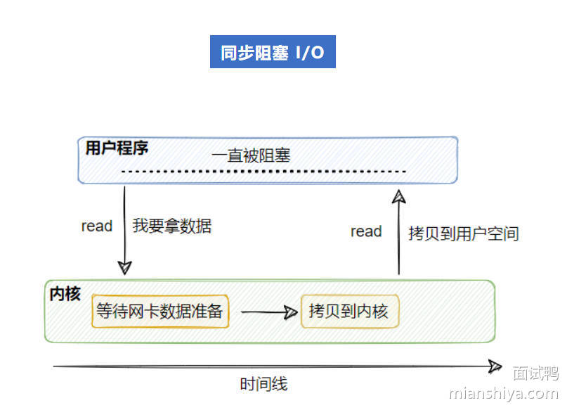

##### 同步非阻塞I/O，NIO（No Blocking I/O）

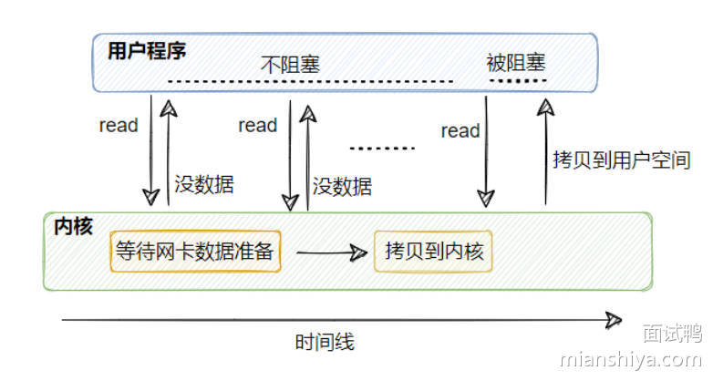

在没数据的时候，用户程序可以不再阻塞等着，而是直接返回错误，告知暂无准备就绪的数据，用户程序会通过轮询操作，不断发起 read 调用，直到内核中的数据拷贝就绪，才会停止发起 read 调用，不过在数据从内核拷贝到用户空间的时候，这段时间内用户程序是出于阻塞状态的。

这个模型相比于同步阻塞 I/O 而言比较灵活，比如调用 read 如果暂无数据，则线程可以先去干干别的事情，然后再来继续调用 read 看看有没有数据。

但是如果你的线程就是取数据然后处理数据，不干别的逻辑，那这个模型又有点问题了。

等于你不断地进行系统调用，如果你的服务器需要处理海量的连接，那么就需要有海量的线程不断调用，上下文切换频繁，CPU 也会忙死，做无用功而忙死。

那怎么办？

于是就有了I/O 多路复用。

##### I/O 多路复用

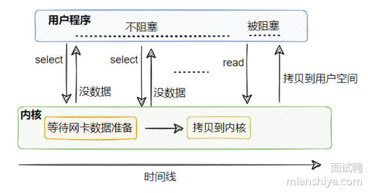

从图上来看，看似和同步非阻塞 I/O 一样，但实际上线程模型不同。

同步非阻塞 I/O 频繁调用一直轮询的话是比较消耗 CPU 资源的。为了解决这个问题，操作系统使用了 IO 多路复用模型，**只用一个线程查看多个连接是否有数据已准备就绪**。

仅需往 select 注册需要被监听的连接，由 select 来监控它所管理的连接是否有数据已就绪，如果有则可以通知别的线程来 read 读取数据，这个 read 和之前的一样，还是会阻塞用户线程。

这样一来就可以**用少量的线程去监控多条连接**，减少了线程的数量，降低了内存的消耗且减少了上下文切换的次数。

所谓的多路指的是多条连接，复用指的是用一个线程就可以监控这么多条连接。

##### 信号驱动式I/O

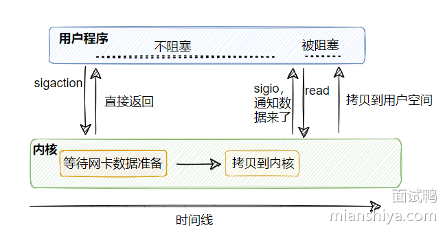

I/O 多路复用的 select 虽然不阻塞了，但是它还需要循环调用 select 去阻塞等待看看是否有数据已经准备就绪，那是不是可以省略循环调用 select 阻塞等待这一步，直接让内核告诉我们数据到了而不是用户线程一直去轮询呢？

信号驱动 I/O 就能实现这个功能，由内核告知数据已准备就绪，然后用户线程再去 read（还是会阻塞）。

听起来是不是比 I/O 多路复用好呀？那为什么好像很少听到信号驱动 I/O？

因为我们的应用通常用的都是 TCP 协议，而 TCP 协议的 socket 可以产生信号事件有七种。

也就是说不仅仅只有数据准备就绪才会发信号，其他事件也会发信号，而这个信号又是同一个信号，所以我们的应用程序无从区分到底是什么事件产生的这个信号。

所以我们的应用基本上用不了信号驱动 I/O，但如果你的应用程序用的是 UDP 协议，那是可以的，因为 UDP 没这么多事件。

所以信号驱动 I/O 也不太行。

##### 异步 I/O，AIO（Asynchronous I/O）

信号驱动 I/O 虽然对 TCP 不太友好，但是这个思路对的：**往异步发展**，但是它并没有完全异步，因为其后面那段 read 还是会阻塞用户线程，所以它算是半异步。

因此，我们得想下如何弄成全异步的，也就是把 read 那步阻塞也省了。

其实思路很清晰：让内核直接把数据拷贝到用户空间之后再告知用户线程，来实现真正的非阻塞I/O！

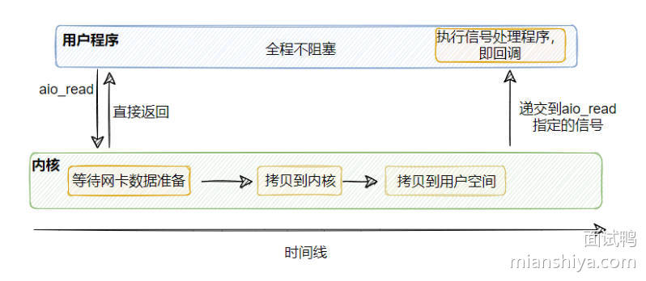

所以异步 I/O 其实就是用户线程调用 aio_read ，然后包括将数据从内核拷贝到用户空间那步，所有操作都由内核完成，当内核操作完毕之后，再调用之前设置的回调，此时用户线程就拿着已经拷贝到用户控件的数据可以继续执行后续操作。

在整个过程中，用户线程没有任何阻塞点，这才是真正的非阻塞I/O。

> 那为什么常用的还是I/O多路复用，而不是异步I/O？

因为 Linux 对异步 I/O 的支持不足，你可以认为还未完全实现，所以用不了异步 I/O。

这里可能有人会说不对呀，像 Tomcat 都实现了 AIO 的实现类，其实像这些组件或者你使用的一些类库看起来支持了 AIO(异步I/O)，**实际上底层实现是用 epoll 模拟实现的**。

而 Windows 是实现了真正的 AIO，不过我们的服务器一般都是部署在 Linux 上的，所以主流还是 I/O 多路复用。
