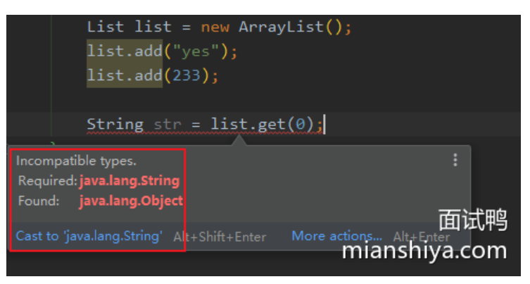
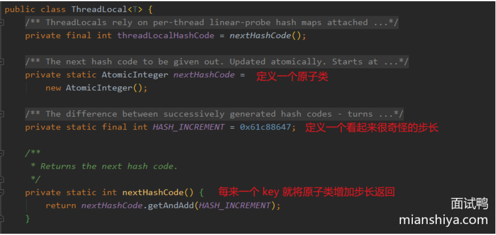
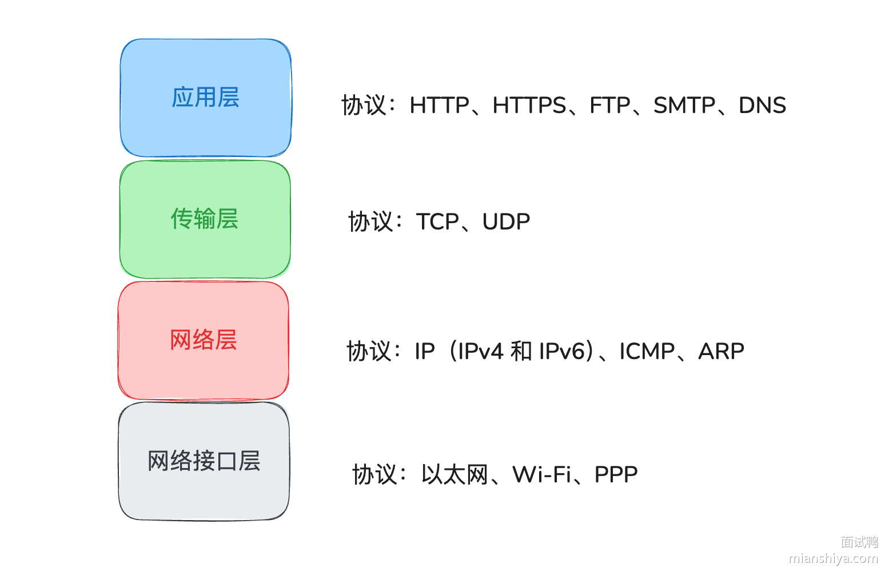
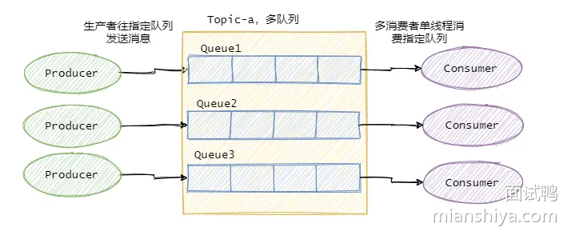

# 小米虫宝典

资料来源:[| Java 全栈知识体系](https://pdai.tech/)、[面试鸭 - 程序员求职面试刷题神器，高频编程题目免费刷](https://www.mianshiya.com/)

本笔记收录`米虫`后端技术栈的相关知识，分为知识篇、面试篇、其余篇。本篇为`面试篇`。

> 对于准备参加校招或应届同学来说，系统地掌握计算机基础知识和常用开发技术至关重要。
>
> 重点应放在扎实的`计算机网络`、`操作系统基础`、`Java基础`、深入理解`Java集合与并发`、掌握`Java虚拟机原理`，以及熟悉常用的`数据库(MySQL)`和`缓存(Redis)`技术。
>
> 此外，了解 Spring 系列框架、微服务架构以及消息队列等内容，将有助于提升综合能力，增强面试竞争力。
>
> ​																					              --Yes面试鸭官方

## Java基础

### Java 中的序列化和反序列化是什么?

#### 回答重点

##### 序列化

将==对象转为字节流的过程==，这样就可以就行网络通信、文件存储或者缓存。Java中提供 `java.io.Serializable` 接口支持序列化，只有实现了这个接口，才可以将该类的对象序列化。

##### 反序列化

是将==字节流重新转换为对象的过程==，即从存储中读取数据并重新创建对象。这也是创建对象的一种手段。

##### 其他

- **应用场景**:包括网络传输、远程调用、持久化存储(如保存到文件或数据库)、以及分布式系统中数据交换。
- **Java 序列化关键类和接口**: `Objectoutputstream` 用于序列化，`ObjectInputstream` 用于反序列化。类必须实现 `Serializable` 接口才能被序列化。
- **transient 关键字**:在序列化过程中，有些字段不需要被序列化，例如敏感数据，可以使用 `transient` 关键字标记不需要序列化的字段。
- **serialVersionUID**:每个 `serializable` 类都应该定义一个 `serialVersionUID`，用于在反序列化时验证版本一致性。如果没有明确指定，Java 会根据类的定义自动生成一个 UID，版本不匹配可能导致反序列化失败。
- **序列化性能问题**:Java 的默认序列化机制可能比较慢，尤其是对于大规模分布式系统，可能会选择更加高效的序列化框架(如 Protobuf、Kryo)。
- **安全性**:反序列化是一个潜在的安全风险，因为通过恶意构造的字节流，可能会加载不安全的类或执行不期望的代码。因此，反序列化过程需要进行输入验证，避免反序列化漏洞。

#### 扩展知识

##### 序列化与反序列化理解

==序列化其实就是将对象转化成可传输的字节序列格式，以便于存储和传输。==

因为对象在VM中可以认为是“立体”的，会有各种引用，比如在内存地址Ox1234引用了某某对象，那此时这个对象要传输到网络的另一端时候就需要把这些
引用“压扁”。

因为网络的另一端的内存地址Ox1234可以没有某某对象，所以传输的对象需要包含这些信息，然后接收端将这些扁平的信息再反序列化得到对象。
所以，==反序列化就是将字节序列格式转换为对象的过程。==


##### Java 序列化 Serializable 接口的意义

> 首先说一下Serializable，这个接口没有什么实际的含义，就是起标记作用。

来看下源码就很清楚了，除了String、数组和枚举之外，如果实现了这个接口就走writeOrdinaryObject，否则就序列化就抛错。


> serialVersionUID 又有什么用?

```java
private static final long serialVersionUID = 1L;
```

想必经常会看到这样的代码，这个ID 其实就是==用来验证序列化的对象和反序列化对应的对象的 ID 是否是一致的==。
所以这个 ID 的数字其实不重要，无论是 1L 还是 idea 自动生成的，只要序列化的时候对象的 serialVersionUID和反序列化的时候对象的 serialVersionUID 一致的话就行。

如果没有显式指定 serialVersionUID ，则编译器会根据类的相关信息自动生成一个，可以认为是一个指纹。所以如果你没有定义一个serialVersionUID 然后序列化一个对象之后，在反序列化之前把对象的类的结构改了比如增加了一个成员变量，则此时的反序列化会失败。因为类的结构变了，生成的指纹就变了，所以 serialVersionUID 就不一致了,==所以 serialVersionUID 就是起验证作用==。

> Java 序列化不包含静态变量

简单地说就是序列化之后存储的内容不包含静态变量的值，看一下下面的代码就很清晰了。


### 什么是 Java 中的不可变类?

#### 回答重点

不可变类是指在创建后==其状态(对象的字段)无法被修改的类==。一旦对象被创建，它的所有属性都不能被更改。这种类的实例在整个生命周期内保持不变。

##### 关键特征

1. 声明类为 `final` ，防止子类继承。
2. 类的所有==字段==都是 `private` 和 `final` ，确保它们在初始化后不能被更改。
3. 通过==构造函数初始化所有字段==。
4. ==不提供任何修改对象状态的方法==(如 setter方法)。
5. 如果类包含可变对象的引用，确保这些==引用在对象外部无法被修改==。例如 `getter` 方法中返回对象的副本(new 一个新的对象)来保护可变对象或者不提供该属性的 `getter` 方法。

Java 中的经典不可变类有:`String`、`Integer`、`BigDecimal`、`LocalDate` 等。

#### 扩展知识

##### 不可变类的优缺点

**优点**:

1. **线程安全**:由于不可变对象的状态不能被修改，它们天生是线程安全的，在并发环境中无需同步。
2. **缓存友好**:不可变对象可以安全地被缓存和共享，如 `String`的字符串常量池。
3. **防止状态不一致**:不可变类可以有效避免因意外修改对象状态而导致的不一致问题。

**缺点**:

1. **性能问题**:不可变对象需要在每次状态变化时创建新的对象，这可能会导致性能开销，尤其是对于大规模对象或频繁修改的场景(例如 String 频繁拼接)。

##### 举例 String

String 就是典型的不可变类，当你创建一个 String 对象之后，这个对象就无法被修改。因为无法被修改，所以像执行s+="a";这样的方法，其实返回的是一个==新建的 Sting 对象==，老的s指向的对象不会发生变化，只是s的引用指向了新的对象而已。

所以不要在字符串拼接频繁的场景使用 + 来拼接，因为这样会频繁的创建对象。

不可变类的好处就是==安全==，因为知晓这个对象不可能会被修改，因此可以放心大胆的用，在多线程环境下也是线程安全的。

##### **如何实现一个不可变类?**

具体按照回答重点内的关键特征实现就行了。

我们来一起看下 String 的设计，String 类用 final 修饰，表示无法被继承。


String 本质是一个 char 数组，然后==用 final 修饰==，不过 final 限制不了数组内部的数据，所以这还不够。

所以 value 是用 private 修饰的，并且==没有暴露出 set 方法==，这样外部其实就接触不到 value 所以无法修改。

当然还是有修改的需求，比如 replace 方法，所以这时候就需要返回==一个新对象==来作为结果,


总结一下就是私有化变量，然后不要暴露 set 方法，即使有修改的需求也是返回一个新对象。

### Java 中 Exception 和 Error 有什么区别?


#### 回答重点

`Exception`和`Error`都是`Throwable`类的子类(在Java代码中只有继承了Throwable类的实例才可以被throw或者被catch)它们表示在程序运行时发生的异常或错误情况。

总结来看：Exception表示==可以被处理的程序异常==，Error表示系统级的==不可恢复错误==。

**详细说明**：

1. **Exception**：是程序中可以处理的异常情况，表示程序逻辑或外部环境中的问题，可以通过代码进行恢复或处理。
   常见子类有:`IOException`、`SQLException`、`NullPointerException`、`IndexOutofBoundsException`等。
   Exception又分为**Checked Exception(编译期异常)**和**Unchecked Exception(运行时异常)**。
   - **Checked Exception**:在编译时必须显式处理(如使用try-catch块或通过throws声明抛出)。如`IOException`。
   - **Unchecked Exception**:运行时异常，不需要显式捕获。常见的如`NullPointerException`、`IlegalArgumentException`等，继承自`RuntimeException`。

2. **Error**：表示严重的错误，通常是JVM层次内系统级的、无法预料的错误，程序无法通过代码进行处理或恢复。例如内存耗尽（`OutofMemoryError`）、栈溢出（`StackOverflowError`)。

`Error`不应该被程序捕获或处理，因为一般出现这种错误时程序无法继续运行。

#### 扩展知识

##### 异常处理时需要注意的六个点

> 1. 尽量不要捕获类似Exception这样通用的异常，而应该捕获特定的异常。

软件工程是一门协作的艺术，在日常的开发中我们有义务使自己的代码能更直观、清晰地表达出我们想要表达的信息。

但是如果你什么异常都用了Exception，那别的开发同事就不能一眼得知这段代码实际想要捕获的异常，并且**这样的代码也会捕获到可能你希望它抛出而不希望捕获的异常**。

> 2. 不要“吞”了异常

如果我们捕获了异常，不把异常抛出，或者没有写到日志里，那会出现什么情况？线上除了bug莫名其妙的没有任何的信息，你都不知道哪里出错以及出错的原因。

这可能会让一个简单的bug变得难以诊断，而且有些同学比较喜欢用catch之后用 `e.printStackTrace()`，在我们产品中通常不推荐用这种方法，一般情况下这样是没有问题的但是这个方法输出的是个标准错误流。


比如是在分布式系统中，发生异常但是找不到stacktrace。

所以最好是输入到日志里，我们产品可以自定义一定的格式，将详细的信息输入到日志系统中，适合清晰高效的排查错误。

> 3. 不要延迟处理异常

比如你有个方法，参数是个name，函数**内部调了别的好几个方法**，其中你的name传的是null值，但是你没有在进入这个方法或者这个方法一开始就处理这个情况，而是在你调了别的好几个方法然后爆出这个空指针。

这样的话明明你的出错堆栈信息只需要抛出一点点信息就能定位到这个错误所在的地方，经过了好多方法之后可能就是**一坨堆栈信息**。

> 4. 只在需要try-catch的地方try-catch,try-catch的范围能小则小

只要必要的代码段使用try-catch，不要不分青红皂白try住一坨代码，**因为try-catch中的代码会影响JVM对代码的优化，例如重排序**。

> 5. 不要通过异常来控制程序流程

一些**可以用if/else的条件语句来判断例如null值等，就不要用异常**，异常肯定是比一些条件语句低效的，有CPU分支预测的优化等。

而且**每实例化一个Exception都会对栈进行快照**，相对而言这是一个比较重的操作，如果数量过多开销就不能被忽略了。

> 6. 不要在finally代码块中处理返回值或者直接return

在finally中return或者处理返回值会发生很诡异的事情，**比如覆盖了try中的return，或者屏蔽的异常**。

### 你认为 Java 的优势是什么?

#### 回答重点

我觉得可以从**跨平台**、**垃圾回收**、**生态**、**面向对象**四个方面来阐述。

##### 跨平台

Java 编译器生成的是**字节码**（.class 文件），字节码是一种跨平台的中间代码，必须通过 JVM 在不同的操作系统和硬件上解释或即时编译（JIT）为机器码：

>Java 源代码 → 编译器 → 字节码 → JVM（解释/JIT） → 机器码 → 运行

首先Java是跨平台的，不同平台执行的机器码是不一样的，而Java因为加了一层中间层JVM，所以可以做到**一次编写多平台(如Windows、Linux、macOS)**
**运行**,即 「Write once,Run anywhere」。

编译执行过程是先把Java源代码编译成字节码，字节码再由JVM解释或JIT编译执行，而因为JIT编译时需要预热的，所以还提供了AOT（Ahead-of-Time
Compilation)，可以直接把字节码转成机器码，来让程序重启之后能迅速拉满战斗力。

（解释执行比编译执行效率差，你想想每次给你英语让你翻译阅读，还是直接给你看中文，哪个快？）

##### 垃圾回收

Java还提供**垃圾自动回收功能**，虽说手动管理内存意味着自由、精细化地掌控，但是很容易出错。在内存较充裕的当下，将内存的管理交给GC来做，减轻了程序员编程的负担，**提升了开发效率**，更加划算！

##### 生态

现在**Java生态圈太全了**，丰富的第三方类库、网上全面的资料、企业级框架、各种中间件等等。

##### 面向对象

Java是一种**严格的面向对象编程语言**，具有清晰的类、对象、继承、接口等概念，支持封装、继承、多态等OOP特性，有助于**代码的可维护性和可扩展性**。

### Java中的参数传递是按值还是按引用?

#### 回答重点

在Java中，**参数传递只有按值传递，不论是基本类型还是引用类型**。

- **基本数据类型**（如`int`，`char`，`boolean`等）：传递的是值的==副本==，==即基本类型的数值本身==。因此，==对方法参数的任何修改都不会影响原始变量==。
- **引用数据类型**（如对象引用）：传递的是引用的==副本==，==即对象引用的内存地址==。因此，方法内可以通过引用修改对象的属性，==但不能改变引用本身，使其指向另一个对象==。

#### 扩展知识

##### 基本类型与引用类型的区别

- **基本类型**：包括`int`，`float`，`double`，`char`，`boolean`等，存储在栈内存中。方法中对基本类型参数的操作只会影响传递的副本，原始变量的值不受影响。
- **引用类型**：包括所有的对象和数组，==引用类型的变量存储的是对象在堆内存中的地址==。当引用类型作为参数传递时，传递的是这个地址的副本。因此，方法内的修改可以影响到传入的对象的内容，但不会影响对象引用本身的地址。


##### 实例代码

```java
public class ParameterPassing {
    public static void main(String[] args) {
        int a = 5;
        modifyPrimitive(a);
        System.out.println("After modifyPrimitive: " + a); // 输出: 5

        MyObject obj = new MyObject();
        obj.value = 10;
        modifyObject(obj);
        System.out.println("After modifyObject: " + obj.value); // 输出: 20

        resetReference(obj);
        System.out.println("After resetReference: " + obj.value); // 输出: 20
    }

    public static void modifyPrimitive(int num) {
        num = 10; // 仅仅修改了副本，不影响原始变量
    }

    public static void modifyObject(MyObject obj) {
        obj.value = 20; // 修改了对象的属性，会影响原始对象
    }

    public static void resetReference(MyObject obj) {
        obj = new MyObject(); // 修改的是引用的副本，不影响原始对象
        obj.value = 30;
    }
}

class MyObject {
    int value;
}
```

- 在`modifyPrimitive`方法中，`num`是基本类型的副本，因此对它的修改不影响原始变量`a`。
- 在`modifyObject`方法中，`obj`是引用类型的副本，但这个副本仍指向原始对象，因此修改`value`属性会影响原始对象。
- 在`resetReference`方法中，`obj`被重新赋值为一个新对象，这个变化只影响副本，不影响原始引用。

##### 不可变类

关于引用的回答后，面试官可能会接着问不可变类。不可变类在多线程环境中不需要额外的同步控制，因为它们的状态一旦创建就不能改变。

### 为什么Java不支持多重继承?

#### 回答重点

主要是因为多继承会产生菱形继承（也叫钻石继承)问题，Java之父就是吸取C++他们的教训，因此不支持多继承。

所谓的菱形继承很好理解，我们来看下这个图：


是不是看起来很像一个菱形，BC继承了A，然后D继承了BC，==假设此时要调用D内定义在A的方法，因为B和C都有不同的实现，此时就会出现歧义，不知道应该调用哪个了==。

> 无法确认调用那个方法的具体实现。

#### 扩展知识

这里很可能会被面试官追问:既然多继承不行，那为什么接口多实现可以?

##### 为什么接口可以多实现?

在 Java8 之前接口是无法定义具体方法实现的，所以即使有多个接口必须子类自己实现，所以并不会发生歧义。

Java8 之后出了默认方法(default method)，此时不就又出现的多继承的萎形继承问题了?

==所以 Java 强制规定，如果多个接口内有相同的默认方法，子类必须重写这个方法。==

不然，编译期就会报错:


### Java 面向对象编程与面向过程编程的区别是什么?

#### 回答重点

**面向对象编程**(Object Oriented Programming，`OOP`)是==一种对象为中心的编程范式或者说编程风格==。**把类或对象作为基本单元来组织代码**，并且运用提炼出的：封装、继承和多态来作为代码设计指导。

**面向过程编程**是==一种以过程或函数为中心的编程范式或者说编程风格==，以过程作为基本单元来组织代码。过程其实就是动作，对应到代码中来就是函数，面向过程中函数和数据是分离的，数据就是成员变量。

==总结来看：面向对象编程注重**对象之间的交互和模块化设计**，而面向过程编程注重**逻辑的分步实现**。==

**主要区别如下**：

1. 思维方式：
   - 面向对象：通过定==义对象的属性和行为来解决问题，关注对象之间的关系和交互==。
   - 面向过程：通过==函数或过程一步步实现业务逻辑，关注执行的步骤和顺序==。
2. 数据与行为的关系：
   - 面向对象：==数据和行为封装在对象内部==，数据操作由对象方法进行管理。
   - 面向过程：==数据和函数是分离的==，函数对数据进行操作。
3. 可扩展性和复用性：
   - 面向对象：==通过继承、接口、多态等机制支持代码的高复用性和扩展性==。
   - 面向过程：复用性较低，==扩展需要修改已有代码，影响整体稳定性==。
4. 适用场景：
   - 面向对象：适合==处理复杂的系统和模块化设计，便于维护和扩展==。
   - 面向过程：适用于==一些简单、顺序性强的小型程序，开发效率较高==。

#### 扩展知识

##### 面向对象的三大特性

- 封装:==将数据和行为封装在对象内部，提供接口进行访问==，隐藏实现细节，提高安全性。
- 继承:==子类可以继承父类的属性和方法==，实现代码复用和扩展。
- 多态:==对象可以通过父类或接口进行多态性调用==，不同对象在运行时执行不同的行为。(父类引用可以指向子类对象，根据不同的子类运行不同的行为)

##### 面向对象/过程优缺点总结

###### 面向对象的优缺点:

- 优点:高复用性、扩展性、维护性强，==适合复杂系统的开发==。
- 缺点:开发和理解成本较高，对于简单项目可能显得繁琐。

###### 面向过程的优缺点:

- 优点:开发简单，代码执行速度快，适合小型项目。
- 缺点:可维护性差，代码复用性低，扩展性差。

##### 面向过程与面向对象的理解

==面向过程其实就是一条道的思路==，因为起初就是按计算机的思路来编写程序。

我就拿用咖啡机煮咖啡为例，按照面向过程的流程是：

1. 执行加咖啡豆方法
2. 执行加水方法
3. 执行煮咖啡方法
4. 执行喝咖啡方法

很简单直观的操作，你可能没什么感觉，我再按面向对象思想来分析下这个流程。

在执行煮咖啡操作前要抽象出：人和咖啡机（分类），然后开始执行：

1. 人.加咖啡豆
2. 人.加水
3. 咖啡机.煮
4. 人.喝咖啡

是不是有点感觉了？

面向过程，从名字可以得知重点是**过程**，而面向对象的重点是**对象**

从这个例子可以看出两者的不同：**面向过程是很直接的思维，一步步的执行，一条道走到底**。

而面向对象是先抽象，把事物分类得到不同的类，划分每个类的职责，暴露出每个类所能执行的动作，然后按逻辑执行时调用每个类的方法即可，不关心内部的逻辑。

从例子可以看出面向对象编程执行的步骤没有变少，整体执行流程还是一样的，都是先加咖啡豆、加水、煮咖啡、喝，这个逻辑没有变。

无非就是划分了类，把每一步骤具体的实现封装了起来，散布在不同的类中。

对我们程序员来说是最最直接的感受：变的其实就是代码的分布，煮咖啡的代码实现被封装在咖啡机内部，喝咖啡的代码实现被封装在人内部，而不是在一个方法中写出来。

代码的分布确实是最直观的，但是变得不仅只是分布，而是思想上的变化。

就是上面提到的计算机思维到人类思维的变化。

我认为这个变化是因为软件的发展，业务越来越复杂。

**人们用面向过程语言编写复杂的软件时，需要按照不同的功能把一些数据和函数放到不同的文件中，渐渐地人们就发现这不就是先分类吗？**

并且好像业务分析下来都能和现实世界的东西对应上？

于是**人们慢慢地总结、提炼就演变成了面向对象，再根据面向对象的特性提炼出关键点：封装、继承和多态**。

而这个**面向对象思想就类似我们人类面对复杂场景时候的分析思维：归类、汇总。**

所以面向对象编程就成为了现在主流的编程风格，因为符合人类的思考方式。

面向过程编程和面向对象编程从思想上的变化是：**从计算机思维转变成了人类的思维来编写编码。**

而面向对象编程的类中数据和动作是在一起的，这也是两者的一个显著的区别。

### Java方法重载和方法重写之间的区别是什么？

#### 回答重点

**方法重载（Overloading）**：在同一个类中，==允许有多个同名方法，只要它们的参数列表不同（参数个数、类型或顺序）==。主要关注方法的签名变化，适用于在同一类中定义不同场景下的行为。

**方法重写（Overriding）**：子类在继承父类时，可以重写父类的某个方法（参数列表、方法名必须相同），从而为该方法提供新的实现。主要关注继承关系，用于子类改变父类的方法实现，实现运行时多态性。

区别主要如下：

| 区别             | 重载                                   | 重写                                                         |
| ---------------- | -------------------------------------- | ------------------------------------------------------------ |
| 发生的场所       | 在同一个类中                           | 在继承关系的子类和父类之间                                   |
| 参数列表         | 必须不同（参数的数量、类型或顺序不同） | 必须相同，不能改变参数列表                                   |
| 返回类型         | 可以不同                               | 必须与父类方法的返回类型相同，或者是父类返回类型的子类（协变返回类型） |
| 访问修饰符       | 不受访问修饰符影响                     | 子类方法的访问修饰符不能比父类更严格，**通常是相同或更宽泛** |
| 静态和非静态方法 | 可以是静态方法或非静态方法             | 只能重写非静态方法，**静态方法不能被重写**（静态方法可以被隐藏） |
| 异常处理         | 方法的异常处理可以不同                 | **子类的异常不能抛出比父类更多的异常**（可以抛出更少的或相同类型的异常） |

#### 扩展知识

##### 重载注意点

重载中提到的方法同名但参数列表不同（参数个数、类型或顺序），这里要注意和返回值没有关系，**方法的签名仅是名字和参数列表，不包括返回值**。

**重载通常用于提供同一操作的不同实现，例如构造函数的重载、不同类型输入的处理等。**

重载简单示例代码：

```java
public class OverloadingExample {
    // 重载方法：参数数量不同
    public void print(int a) {
        System.out.println("Printing int: " + a);
    }

    // 重载方法：参数类型不同
    public void print(String a) {
        System.out.println("Printing String: " + a);
    }

    // 重载方法：参数类型和数量不同
    public void print(int a, int b) {
        System.out.println("Printing two ints: " + a + ", " + b);
    }
}
```

重写注意点

在重写时，**子类方法不能使用比父类更严格的访问级别**。例如，父类的方法是 protected ，子类不能将其修改为private ，但可以改为 public
且**子类方法抛出的异常必须与父类一致，或者是其父类异常的子类**。

重写通常用于**在子类中提供父类方法的具体实现，以实现多态性**。例如，子类对父类方法进行扩展或修改以适应特定需求。

重写简单示例代码:

```java
class Parent {
    public void display() {
        System.out.println("Parent display");
    }
}

class Child extends Parent {
    @Override
    public void display() {
        System.out.println("Child display");
    }
}

public class OverridingExample {
    public static void main(String[] args) {
        Parent obj = new Child();
        obj.display(); // 输出 "Child display"
    }
}
```

还有一个 `@Override` 注解，在重写方法时使用 `@Override` 注解，编译器可以帮助检査是否正确实现了重写，以防误操作。

### 什么是Java内部类？它有什么作用?

#### 回答重点

Java内部类是**指在一个类的内部定义的类**，Java支持多种类型的内部类，包括**成员内部类、局部内部类、匿名内部类和静态内部类**。内部类==可以访问外部类的成员变量和方法，甚至包括私有的成员==。

内部类的作用主要包括：

1. 封装性：将逻辑相关的类封装在一起，**提高类的内聚性**。
2. 访问外部类成员：内部类可以方便地访问外部类的成员变量和方法，**尤其在需要操作外部类对象的场景下非常有用**。
3. 简化代码：对于只在一个地方使用的小类，**内部类能减少冗余代码，简化结构**。
4. 事件处理：**匿名内部类广泛用于实现回调函数或事件监听，简化了代码结构**，特别是对于实现接口或抽象类的场景。

#### 扩展知识

##### 内部类的类型

- ==成员内部类==:非静态类，作为外部类的一个成员。它可以直接访问==外部类的所有成员，包括私有成员==。
- 静态内部类:定义为 static ，==无法访问外部类的非静态成员==，==只能访问外部类的静态成员==。
- 局部内部类:定义在方法或代码块中的类，==仅在该方法或代码块内可见，通常用于临时的对象构建==。
- 匿名内部类:没有类名的内部类，通常用于创建短期使用的类实例，==尤其是在接口回调或事件处理时被广泛使用==。

##### 内部类举例

1. 成员内部类，定义在另一个类中的类，可以使用外部类的所有成员变量以及方法，包括 private 的。

```java
public class OuterClass {
    private String outerField = "Outer Field";

    class InnerClass {
        void display() {
            System.out.println("Outer Field: " + outerField);
        }
    }

    public void createInner() {
        InnerClass inner = new InnerClass();
        inner.display();
    }
}
```

>注意：如果想在外部环境创建成员内部类的实例，需要先创建外部类的实例再通过**外部类实例.new 内部类实例()**的形式来创建对象，但是无论是成员或者静态内部类都不应该在外部环境创建，应该只在外部类的内部活动。

2. 静态内部类，**只能访问外部类的静态成员变量以及方法，其实它就等于一个顶级类，可以独立于外部类使用所以更多的只是表明类结构和命名空间**。

```java
public class OuterClass {
    private static String staticOuterField = "Static Outer Field";

    static class StaticInnerClass {
        void display() {
            System.out.println("Static Outer Field: " + staticOuterField);
        }
    }

    public static void createStaticInner() {
        StaticInnerClass staticInner = new StaticInnerClass();
        staticInner.display();
    }
}
```

3. 局部内部类，指在方法中定义的类，==只在该方法内可见，可以访问外部类的成员以及方法中的局部变量==（需要声明为 ==final 或 effectively final==)。

```java
public class OuterClass {
    void outerMethod() {
        final String localVar = "Local Variable";

        class LocalInnerClass {
            void display() {
                System.out.println("Local Variable: " + localVar);
            }
        }

        LocalInnerClass localInner = new LocalInnerClass();
        localInner.display();
    }
}
```

4. 匿名类，指的是==没有类名的内部类==。用于==简化实现接口和继承类的代码==，仅在创建对象时使用，例如回调逻辑定义场景

```java
public class OuterClass {
    interface Greeting {
        void greet();
    }

    public void sayHello() {
        Greeting greeting = new Greeting() {
            @Override
            public void greet() {
                System.out.println("Hello, World!");
            }
        };
        greeting.greet();
    }
}
```

局部内部类用的比较少，常用**成员内部类、静态内部类和匿名内部类**。

实际上内部类是一个编译层面的概念，像一个语法糖一样，经过编译器之后其实**内部类会提升为外部顶级类**，和外部类没有任何区别，所以在 **JVM 中是没有内部类的概念的**。

### JDK8有哪些新特性?

#### 回答重点

JDK8较为重要和平日里经常被问的特性如下：

1. JVM的内存结构用元数据替代了永久代
2. **引入了Lambda表达式**
3. 引入了**日期类**、接口**默认方法、静态方法**
4. 新增Stream流式接口
5. 引入Optional类
6. 新增了CompletableFuture、StampedLock等并发实现类。

如果你对HashMap、ConcurrentHashMap面试题有准备的话，这时候也可以抛出来，引导面试官来询问。比如:Java 8修改了HashMap 和 ConcurrentHashMap 的实现。

#### 扩展知识

##### 元空间替代了永久代

因为 JDK8 要把 JRockit 虚拟机和 Hotspot 虚拟机融合，而 JRockit 没有永久代，所以把 Hotspot 永久代给去了(本质也是永久代回收效率太低)

详细可看:面试鸭《[为什么 Java8 移除了永久代，加了元空间?](https://www.mianshiya.com/question/1780933295228350466)》 这题。

##### Lambda 表达式

Lambda 是 Java8 引入的一种匿名函数，可以把, Lambda 表达式理解为是一段可以传递的代码(将代码像数据一样进行传递)。使用它可以写出更简洁、更灵活的代码。其本质是作为函数式接口的实例。例如:

```java
// 传统方式
Runnable runnable1 = new Runnable() {
    @Override
    public void run() {
        System.out.println("mianshiya.com");
    }
};

// Lambda 表达式
Runnable runnable2 = () -> System.out.println("mianshiya.com");
```

##### 日期类

Java8引入了新的日期和时间 API(位于 `java.time` 包中)，它们更加简洁和易于使用，解决了旧版日期时间 API 的许多问题。

例如 `Date`、 `calendar` 都是可变类且线程不安全。==而新的日期类都是不可变的，一旦创建就不能修改，这样可以避免意外的修改，提升代码的安全性和可维护性==。

```java
LocalDate date = LocalDate.now();
LocalTime time = LocalTime.now();
LocalDateTime dateTime = LocalDateTime.now();
```

`Date`本身不包含时区信息，必须使用 `calendar` 类来处理时区，但使用起来非常复杂且容易出错。

新 API 提供了专门的时区类(如 `ZonedpateTime`，`OffsetDateTime` ，`ZoneId` 等)，简化了时区处理，并且这些类的方法更加直观和易用。

##### 接口默认方法、静态

默认方法允许在接口中定义方法的默认实现，这样接口的实现类不需要再实现这些方法。之所以提供静态方法，==是为了将相关的方法内聚在接口中==，而不必创建新的对象。

```java
interface MyInterface {
    default void defaultMethod() {
        System.out.println("Default Method");
    }

    static void hello() { 
        System.out.println("Hello, New Static Method Here"); 
    } 
}
```

##### Stream流式接口

StreamAPI提供了一种高效且易于使用的方式来处理数据集合。它支持链式操作、惰性求值和并行处理。

```java
List<String> list = Arrays.asList("a", "b", "c", "d");
List<String> result = list.stream()
                          .filter(s -> s.startsWith("a"))
                          .collect(Collectors.toList());
```

##### Optional

`Optional`类用来解决可能出现的`NullPointerException`问题，提供了一种优雅的方式来处理可能为空的值。

```java
Optional<String> optional = Optional.of("mianshiya.com");
optional.ifPresent(System.out::println);
```

Optional详细可查看面试鸭《[什么是Optional类？](https://www.mianshiya.com/bank/1787463103423897602/question/1800345746421391361#heading-0)》这题

##### CompletableFuture

CompletableFuture提供了一个新的异步编程模型，简化了异步任务的编写和管理。

```java
CompletableFuture.supplyAsync(() -> "Hello")
                 .thenApply(s -> s + " World")
                 .thenAccept(System.out::println);
```

StampedLock可查看面试鸭《[StampedLock用过吗？](https://www.mianshiya.com/question/1780933294947332098)》这题。

### Java 中 String、StringBuffer和 StringBuilder的区别是什么?

#### 回答重点

它们都是Java中**处理字符串的类**，区别主要体现在**可变性、线程安全性和性能上**：

1) **String**
- **不可变**：`String`是不可变类，字符串一旦创建，其内容无法更改。每次对`String`进行修改操作（如拼接、截取等），都会**创建新的`String`对象**。
- **适合场景**：`String`适用于**字符串内容不会频繁变化的场景**，例如少量的字符串拼接操作或字符串常量。
2) **StringBuffer**
- 可变：`StringBuffer`是可变的，可以进行字符串的追加、删除、插入等操作。
- 线程安全：`StringBuffer`是线程安全的，内部使用了`synchronized`关键字来保证多线程环境下的安全性。
- 适合场景：`StringBuffer`适用于在**多线程环境中需要频繁修改字符串的场景**。
3) **StringBuilder**
- 可变：`StringBuilder`也是可变的，提供了与`StringBuffer`类似的操作接口。
- 非线程安全：`StringBuilder`不保证线程安全，性能比`StringBuffer`更高。
- 适合场景：`StringBuilder`适用于`单线程环境中需要大量修改字符串的场景，如高频拼接操作`。

总结

- String：不可变，适合少量字符串操作。
- StringBuffer：可变且线程安全，适合多线程环境中的频繁字符串修改。
- StringBuilder：可变且非线程安全，适合单线程环境中的高性能字符串处理。

#### 扩展知识

##### Java8中的优化

在Java8及以后，编译器会对字符串的常量拼接做优化，将字符串拼接转换为`StringBuilder`操作。**这种优化提高了代码性能**，但是在动态拼接或多线程场景下，手动使用`StringBuilder`和`StringBuffer`仍然更合适。

##### 从演进角度看待三者

`String`是Java 中基础且重要的类，并且`String`也是`Immutable`类的典型实现，**被声明为final class**，除了**hash这个属性其它属性都声明为final**。

因为它的不可变性，所以例如拼接字符串时候会产生很多**无用的中间对象**，如果频繁的进行这样的操作对性能有所影响。

`StringBuffer`就是为了解决大量拼接字符串时产生很多中间对象问题而提供的一个类，提供`append`和`insert`方法，可以将字符串添加到已有序列的末尾或指定位置。

它的本质是一个线程安全的可修改的字符序列，把所有**修改数据的方法**都加上了`synchronized`。但是保证了线程安全是**需要性能的代价**的。

在很多情况下我们的字符串拼接操作不需要线程安全，这时候`StringBuilder`登场了，`StringBuilder`是DK1.5发布的，它和`StringBuffer`本质上没什么区别，就是**去掉了保证线程安全的那部分，减少了开销**。

`StringBuffer`和`StringBuilder`二者都继承了`AbstractStringBuilder`，底层都是利用可修改的char数组(JDK 9 以后是byte数组)。

所以如果我们有大量的字符串拼接，如果能预知大小的话最好在`new StringBuffer`或者`StringBuilder`的时候设置好capacity，避免多次扩容的开销（扩容要抛弃原有数组，还要进行数组拷贝创建新的数组）。

### Java的StringBuilder是怎么实现的?

#### 回答重点

StringBuilder主要是为了解决String对象的不可变性问题，提供高效动态的字符串拼接和修改操作。大致需要实现 append、insert...等功能。

大致核心实现如下：

- 内部使用**字符数组(char[]value)来存储字符序列**
- 需要一些**变量count来记录当前内容数量**
- 通过方法如append()、insert()等操作，直接**修改内部的字符数组**，**而不会像String那样创建新的对象**。
- 每次进行字符串操作时，**如果当前容量不足**，它会通过扩展数组容量来容纳新的字符，按2倍的容量扩展，以减少扩展次数，提高性能。

#### 扩展深入剖析 StringBuilder

对于这类题目，因为已经有现有的实现作为参考，所以回答诸如此类的问题，不要急，先回想一下平日用这个StringBuilder 都用了哪些方法。

- `append`
- `insert`
- `delete`
- `replace`
- `charAt`
- ...

大致就这么几个，没必要说太全，这不是小学课文背诵，关键方法提出来就行了。脑子浮现这几个方法之后，直接按上述的回答重点说出来即可。

实际上 StringBuilder 底层使用 char 数组来存储字符，并且**用 count 来记录存放的字符数**。


回答重点提到了 char 数组，这里可能会被面试官插入问:String 底层不也是用的 char 数组存放吗?**两者有啥区别**?


展示的机会就来了呀!String 被 final 修饰，且**内部的 char 也被 private 和 final 修饰**了，所以是**不可变的**，是典型的 Immutable 类，因此其不可变性，**保证了线程安全，能实现字符串常量池等**。

ok，咱们继续。

由于 `StringBuilder` 底层是用 char 数组存放字符，而**数组是连续内存结构**，为了防止频繁地复制和申请内存，需要提供 capacity 参数来设置初始化数组的大小，**这样在预先已经知晓大字符串的情况下，可以减少数组的扩容次数，有效的提升效率!**


这里一定要点破:数组是连续内存的结构，并且要体现出你有节省内存和提高效率的意识，熟悉 HashMap 的同学对这类操作应该很有经验。

我们来看下调用 `AbstractStringBuilder` 这个父类的构造器。


可以看到，就是直接 new 申请数组没啥花头。

我们来看下 append 操作。


可以看到 `append` 有多个实现，毕竟我们平日啥都类型都直接 `append` ，那底层是怎么实现这些类型转换的呢?

我们拿 `append(int)` 来举个例子，其他类型本质都是一样的。


主要逻辑已经在图中标识了，熟悉 HashMap 八股文的同学一看就知道老套路了，先看看 append 的 int值转成char 需要占数组的几位，然后计算一下现在的数组够不够放，如果不够就扩容一下，然后再把 int 转成 char 放进去，再更新现有的字符数。

所以面试回答 append 实现的时候，直接把上面那段话的思路说一下即可。

面试官可能会追问:怎么扩容的呀?

我们直接看下 `ensurecapacityInternal` 这个方法的实现


直接就是 `Arrays.copyof` ，进行一波扩容加拷贝，扩容之后的数组容量为之前的两倍+2。

这时候想必有很多同学好奇，前面是如何根据传入的 int 来计算得知所占的字符位数?即上面代码的`Integer.stringSize`方法，注意这个方法已经跑到 Integer 这个类中啦!不是 `AbstractStringBuilder`的实现了。


哈哈，你以为会经过一番看不懂的位运算?

实际上就是查表法!直接列了各个位数的边界值依次存放在数组中，然后判断大小再根据数组下标算出位数，就是这么简单、方便、高效!

再来看下 int 是如何转换成 char 然后插入到数组中的，即 `Integer.getchars` 方法。


身为底层实现，还是很细的，可以仔细看下上面的逻辑，位运算看不懂没事，注释已经把原有的公式写出来的，对照着看看，还是能理解的，这里我就不再赘述了。

然后各位也应该注意到上面的数字、数字十这两个数组了，没错还是熟悉的查表法!


你们可以选几个数字带入算一算，很准的，哈哈，至于 digits 也一样，还是查表。

其实我们常用的 `String.valueOf(int i)`，内部实现一样也是通过 `Integer.stringSize`和 `Integer.getChars`来完成的。


好了，这波操作下来，想必拨开了很多对`StringBuilder`的迷雾吧~

再来看看 insert，我们还是拿int的插入来举例：


可以看到，这里是把 int 转成 string 了，然后调用以下的方法。


注释写的很明白了，没什么花头，主要逻辑就是插入前先判断下数组长度足够，若不够就扩容，然后移动字符，给待插入的位置腾出空间，然后往对应位置插入字符，最后更新 StringBuilder 已有的字符数。

是吧，很直白的逻辑。

delete 这个就更简单了，就是一个数组的删除操作，没什么花头。


剩下的replace、charAt 等等方法就不提了，没有什么花头，总结来说都是数组的操作，有兴趣的自行去看看吧~

##### 总结

这样看下来，想必对 StringBuilder 的内部实现已经很清晰了吧!就是数组的操作，**而数组的特性就是内存连续，下标访问快**。

针对内存连续这点，又要保持 StringBuilder 的动态性，那不可避免的就需要扩容操作，扩容操作简单来说就是申请一个更大 char 数组，把老 char 数组的数据拷贝过去。

对了，从源码来看，StringBuilder 没有实现**缩容操作**。

所以回答这个设计题的时候，先说下需要实现哪些关键方法:`append`、`delete` 等等，然后点明底层是 char数组实现，在执行 append、insert 等操作的时候需要先判断数组容量是否足够容纳字符来判断是否需要扩容，然后修改之类的操作就是调用 `System.arraycopy` 来完成字符串的变更。

因为原生的 StringBuilder 没有实现缩容操作，所以你可以提一下在 delete 的时候判断下，如果删除的字符过多，为了节省内存，**实现缩容的操作**。

然后还可以再提一下，char数组是可以优化的，底层可以用 byte 数组+一个coder 标志位来实现，这样更节省内存，因为 char 占用两个字节，这样对于 latin 系的字符来说太大了，就很浪费，所以用 byte 数组，**然后配备一个 coder 来标识所用的编码**。

嘿嘿，其实 jdk9之后就是这样实现的，但是你可以假装不知道呀，装的像你自己想出来的优化，你看看这多细呀~疯狂加分!

来看下源码，我的是 jdk 11版本~，可以看到已经变成 byte 数组了， coder 也用一个 byte 标识。


再看下 append 的方法的实现:


###  接口和抽象类有什么区别？

#### 回答重点

接口和抽象类在设计**动机上有所不同**。

接口的设计是**自上而下**的。我们知晓某一行为，于是基于这些行为约束定义了接口，一些类需要有这些行为，因此实现对应的接口。

抽象类的设计是**自下而上**的。我们写了很多类，发现**它们之间有共性(方法、成员变量)**，有很多代码可以复用，因此将公共逻辑封装成一个抽象类，减少代码冗余。

所谓的 **自上而下** 指的是先约定接口，再实现。

而 **自下而上** 是先有一些类，才抽象了共同父类(可能和学校教的不太一样，但是实战中很多时候都是因为重构才有的抽象)。

##### 其他区别

1. 方法实现

接口中的**方法默认是public和abstract**(但在Java8之后可以设置default方法或者静态方法)。抽象类可以**包含abstract方法（没有实现）和具体方法（有实现）**。它允许**子类继承并重用抽象类中的方法实现**。

2. 构造函数和成员变量

接口不能包含**构造函数**，接口中的成员变量默认为**public static final**，即静态常量。抽象类可以包含**构造函数**，成员变量可以有不同的**访问修饰符（如private、protected、public)**，并且**可以不是常量**。

3. 多继承

抽象类**只能单继承**，接口可以**有多个实现**。

[为什么Java 不支持多重继承?]([为什么 Java 不支持多重继承？ - Java 基础面试题 - 面试鸭 - 程序员求职面试刷题神器](https://www.mianshiya.com/bank/1787463103423897602/question/1780933294435627010))

#### 扩展知识

##### 接口的演变

- Java8：引入了`default`和`static`方法，使得接口不仅仅是方法的声明，还可以提供具体的实现。default方法允许在接口中添加新的方法实现，而不影响已经实现该接口的类。
- Java9：引入了`私有方法，允许在接口中定义私有方法，用于default方法的内部逻辑复用`。
- Java14：引入了sealed接口(仅在某些子类中使用），进一步增强了接口的功能

### JDK 和 JRE 有什么区别?

#### 回答重点

**JRE(Java Runtime Environment)**指的是**Java运行环境**，包含了JVM、核心类库和其他支持运行Java程序的文件。

- **JVM(Java Virtual Machine)**：执行Java字节码，提供了Java程序的运行环境。
- 核心类库：一组标准的类库（如 `java.lang`、`java.util`等），供Java程序使用。
- 其他文件：如配置文件、库文件等，支持JVM的运行。

**JDK(Java Development Kit)**可以视为JRE的超集，是用于**开发Java程序的完整开发环境**，它包含了JRE，以及用于开发、调试和监控Java应用程序的工具。

- JRE：JDK包含了完整的JRE，因此它也能运行Java程序。
- 开发工具：如**编译器(javac)**、**调试器(jdb)**、**打包工具(jar)**等，用于开发和管理Java程序。
- 附加库和文件：**支持开发、文档生成和其他开发相关的任务**。

#### 扩展知识

列举一下J**DK提供的主要工具**：

- `javac`:Java编译器，用于**将Java源代码(java文件)编译成字节码（.class文件)**。
- `java`：Java应用程序启动器，用于运行Java应用程序。
- `javadoc`:文档生成器，用于从Java源代码中提取注释并生成HTML格式的API文档。
- `jar`:归档(打包)工具，用于创建和管理JAR(Java ARchive)文件。
- `jdb`：Java 调试器，用于调试 Java 程序。
- `jps`：Java进程状态工具，用于列出当前所有的Java进程。
- `jstat`：JVM统计监视工具，用于监视JVM统计信息。
- `jstatd`：JVM统计监视守护进程，用于在远程监视JVM统计信息。
- `jmap`：内存映射工具，用于生成堆转储(heap dump)、查看内存使用情况。
- `jhat`：堆分析工具，用于分析堆转储文件。
- `jstack`：线程栈追踪工具，用于打印Java线程的栈追踪信息。
- `javap`：类文件反汇编器，用于反汇编和查看Java类文件。
- `jdeps`：Java类依赖分析工具，用于分析类文件或JAR文件的依赖关系。

### 你使用过哪些 JDK 提供的工具?

#### 回答重点

##### JDK提供的主要工具

- javac:**Java编译器，负责将Java源代码编译成字节码**（.class文件)。
- java：**运行Java应用程序的命令**，使用JVM来解释并执行编译后的字节码文件。
- javadoc：**生成API文档的工具**，能够根据源代码中的注释生成HTML格式的文档。
- jar：用于创建和管理JAR文件的工具，**可以将多个.class文件打包为单一文件**，便于分发和管理。
- jdb：Java调试工具，用于在**命令行中调试Java应用程序**，支持断点设置、变量查看等功能。

##### 性能监控和分析工具

- jps：Java进程工具，显示所有正在运行的Java进程，便于监控和诊断。
- jstack：生成线程堆栈信息的工具，常用于分析死锁和线程问题。
- jmap：内存映射工具，可以生成堆转储(heap dump）文件，便于内存泄漏分析和垃圾回收优化。
- jhat：堆分析工具，配合jmap使用，分析生成的堆转储文件，帮助开发者了解内存使用情况。
- jstat：JVM统计监控工具，实时监控垃圾回收、内存、类加载等信息，帮助开发者调优JVM性能。
- jconsole：图形化的JVM监控工具，可以监控应用程序的内存、线程和类加载情况，常用于监控和调试。
- jvisualvm：功能强大的性能分析工具，支持堆、线程、GC的详细监控，还提供内存分析和CPU性能分析。

##### 诊断工具

- jinfo：用于查看和修改正在运行的JVM参数，便于动态调优和调整JVM行为。
- jstatd：远程JVM监控工具，可以通过网络远程监控JVM的状态，适合分布式系统中的性能监控。

#### 扩展知识

##### 高级调试和性能优化工具

* Java Mission Control(MC)：一个功能强大的工具，用于分析和优化Java应用程序的性能，提供了基于飞行记录器(Java Flight Recorder，JFR)的性能分析功能，可以详细查看垃圾回收、线程活动、CPU使用率等指标，是进行深度性能分析的利器。
* Java Flight Recorder(JFR):低开销的监控工具，能够记录JVM的运行时数据，适合生产环境中的性能分析，尤其是在高并发系统中使用频率较高。

##### GC调优和内存分析

jmap和jhat常用于排查内存泄漏或内存占用过高的问题。通过jmap生成堆转储文件后，开发者可以使用jhat或其他工具（如EclipseMAT）分析对象的引l用链，从而发现潜在的内存问题。

##### 线程和死锁分析

jstack是用于调试线程状态的利器，尤其是在分析线程死锁时。当应用卡死或响应时间异常时，通过jstack可以捕获应用的线程状态，并分析是否存在死锁情况。

##### 建议

虽然面试这样答可能就差不多了，但还是希望大家可以自己找机会用用，没机会就自己给自己创造机会。因为这属于线上排查能力，只有真正实践了，到时候自己负责的项目真的出了问题，才不至于手忙脚乱。我们毕竟是工程师，问题解决能力必须掌握。

- [怎么分析JVM当前的内存占用情况？OOM后怎么分析？](https://www.mianshiya.com/bank/1795650132375805954/question/1818990174270726145)
- [线上CPU飙高如何排查？](https://www.mianshiya.com/bank/1795650132375805954/question/1807672527650004993)

### Java 中 hashCode 和 equals 方法是什么?它们与==操作符有什么区别？

#### 回答重点

`hashcode`、`equals`和 `== ` 都是 `Java` 中用于比较对象的三种方式，但是它们的**用途和实现**还是有挺大区别的。

- `hashcode`用于**散列存储结构中确定对象的存储位置**。可用于**快速比较两个对象是否不同，因为如果它们的哈希码不同，那么它们肯定不相等**。
- `equals` 用于**比较两个对象的内容是否相等**，通常需要重写自定义比较逻辑。
- `==` 用于比较**两个引用是否指向同一个对象(即内存地址)**。对于基本数据类型，比较它们的值。

#### 扩展知识

##### hashCode

方法返回对象的**哈希码(整数)主要用于支持基于哈希表的集合**，用来确定**对象的存储位置**，如 `Hashmap`、等 `HashSet`

`Object` 类中的**默认实现会根据对象的内存地址生成哈希码**( native 方法)


在 Java中hashcode 方法和 equals 方法之间有一个`“合约“`

- 如果两个对象根据 equals 方法被认为是相等的，那么**它们必须具有相同的哈希码**。
- 如果**两个对象具有相同的哈希码，它们并不一定相等，但会被放在同一个哈希桶中**。

##### equals

用于比较两个对象的内容是否相等。 `Object` 类中的默认实现会使用 `==` 操作符来**比较对象的内存地址**。


通常我们需要在自定义类中重写equals方法，以基于对象的属性进行内容比较。比如你可以自定义两个对象的名字一样就是相等的、年龄一样就是相等，可以灵活按照需求定制。

如果两个对象的equals方法返回true，则它们的hashCode方法必须返回相同的值，反之则不需要。

对于equals定义的比较，实际上还有以下五个要求：

- `自反性`：对于任何非空引用值，x.equals(x)必须返回true。
- `对称性`：对于任何非空引用值x和y，如果x.equals(y)返回true，则y.equals(x)也必须返回true 。
- `传递性`：对于任何非空引用值x、y和z，如果x.equals(y)返回true且y.equals(z)返回true则x.equals(z)也必须返回true。
- `一致性`：对于任何非空引用值和，只要对象在比较中没有被修改，多次调用x.equals(y)应返回相同的结果。
- 对于任何非空引用值，`x.equals(null)必须返回false`。

##### ==

操作符用于比较两个引用是否指向同一个对象（即**比较内存地址**），如果是基本数据类型，直接比较它们的值。

### Java 中的 hashCode和equals方法之间有什么关系?

#### 回答重点

在Java中，`hashCode()`和`equals()`方法的关系主要体现在集合类（如`HashMap`、`HashSet`）中。

它俩决定了**对象的逻辑相等性**和**哈希存储方式**。

##### equals()方法

用于判断两个对象是否相等。**默认实现是使用==比较对象的内存地址**，但可以在类中重写equals()来定义自己的相等逻辑。

##### hashCode()方法

返回对象的**哈希值**，**主要用于基于哈希的集合（如HashMap、HashSet）**。同一个对象每次调用hashCode()必须返回相同的值，且相等的对象必须有相同的哈希码。

##### 两者的关系

如果两个对象**根据equals()相等，它们的hashCode()值必须相同**。即a.equals(b) == true，那么a.hashCode() == b.hashCode()必须为 true。

**但是反过来不要求成立**：即两个对象的hashCode()相同，不一定equals()相等。

注意：如果违背上述关系会导致在基于哈希的集合中出现错误行为。例如，HashMap可能无法正确存储和查找元素。

#### 扩展知识

##### 为什么要重写hashCode()和equals()

因为在使用HashMap、HashSet等集合时，这些集合内部依赖hashCode()和equals()方法来确定元素的存储位置。如果没有正确地重写这两个方法，集合可能无法正确判断对象的相等性，导致重复存储、查找失败等问题。

##### 重写equals()方法的基本规则

- 自反性：对于任何非空对象引用，x.equals(x)必须为true。
- 对称性：对于任何非空对象引l用和，x.equals(y)应当等于y.equals(x)。
- 传递性: 如果x.equals(y) == true且y.equals(z) = true，那么x.equals(z)必须为 true。
- 一致性：只要对象未发生改变，多次调用x.equals(y)结果应该一致。
- 对于null：对于任何非空对象引用x，x.equals(null)必须返回false。

##### 重写hashCode()方法的基本规则

- 在相同的应用程序执行过程中，对于同一个对象多次调用hashCode(必须返回相同的值。
- 如果两个对象根据equals()方法相等，则它们的hashCode()值必须相等。
- 但是，如果两个对象equals()不相等，则它们的hashCode()值不必不同，但不同的hashCode()值可以提高哈希表的性能。

##### hashCode & equals &集合源码分析

hashCode是属于Object的一个方法，并且是个native方法，本质就是返回一个哈希码，即一个int值，一般是一个**对象的内存地址转成的整数**。


equals，我们知道是用来判断两个对象是否相同的，也是属于 Object 的一个方法，并且默认实现如下:


看到这，是不是觉得 hashCode 和 equals **没啥关系**啊?为什么要放在一起说?

确实，**一般情况下两者是没啥关系。但如果是将一个对象用在散列表的相关类的时候，是有关系的**。

比如 HashSet，我们常用来得到一个不重复的集合。

现在有个 Yes 类的 HashSet 集合，我只重写了 Yes 类的 equals 方法，表明如果 name 相同就返回 true。

```java
public boolean equals(Object obj) {
    if (this == obj) {
        return true;
    }
    if (obj instanceof Yes) {
        Yes other = (Yes) obj;
        return name.equals(other.name);
    }
    return false;
}
```

**就重写一个 equals 的话，HashSet 中会出现相同 name 的 Yes 对象**。

原因就是 `hashCode` 没有重写，那为什么会这样呢?因为 `HashSet` 是复用 `HashMap` 的能力存储对象，**而塞入key 的时候要计算 hash 值**，可以看到这里实际会调用对象的 `hashCode` 方法来计算 hash 值。


然后在具体执行 `putVal` 方法的时候，相关的判断条件会**先判断 hash 值是否相等**，如果 hash 值都不同，**那就认为这两个对象不相等**，这与我们之前设定的 name 一样的对象就是相等的条件就冲突了，我们简单看下源码就清楚了:


可以看到，**相关的判断条件都是先判断 hash 值**，**如果 hash 值相等，才会接着判断 equals**。如果 hash 值不等这个判断条件直接就 false 了。

因此规定，重写 equals 方法的时候，也要重写 hashCode 方法，这样**才能保持条件判断的同步**。我建议不管会不会用到散列表，**只要你重写 equals 就一起重写 hashcode ，这样肯定不会出错**。

### 什么是Java中的动态代理?

#### 回答重点

Java 中的动态代理是一种在**运行时创建代理对象的机制**。动态代理允许程序**在运行时决定代理对象的行为，而不需要在编译时确定**。它通过**代理模式**为对象提供了一种机制，使得可以在**不修改目标对象的情况下对其行为进行增强或调整**。

代理可以看作是调用目标的一个包装，通常用来在调用真实的目标之前进行一些逻辑处理，消除一些重复的代码。

静态代理指的是我们预先编码好一个代理类，而动态代理指的是运行时生成代理类。

#### 扩展知识

##### 动态代理主要用途

- 简化代码:通过代理模式，**可以减少重复代码，尤其是在横切关注点(如日志记录、事务管理、权限控制等)方面**。
- 增强灵活性:动态代理使得代码**更具灵活性和可扩展性**，**因为代理对象是在运行时生成的，可以动态地改变行为**。
- 实现 AOP:动态代理是**实现面向切面编程(AOP Aspect-Oriented Programming)的基础，可以在方法调用前后插入额外的逻辑**。

##### Java动态代理与CGLIB代理

- Java动态代理：只能对接口进行代理，不支持对类进行代理。
- CGLIB代理：通过**字节码技术动态生成目标类的子类来实现代理，支持对类（非接口）进行代理**。

Java动态代理

```java
import java.lang.reflect.InvocationHandler;
import java.lang.reflect.Method;
import java.lang.reflect.Proxy;

// 目标接口
interface MyService {
   void doSomething();
}

// 目标对象的实现
class MyServiceImpl implements MyService {
   @Override
   public void doSomething() {
       System.out.println("Doing something...");
   }
}

// 动态代理处理器
class MyInvocationHandler implements InvocationHandler {
   private final Object target;

   public MyInvocationHandler(Object target) {
       this.target = target;
   }

   @Override
   public Object invoke(Object proxy, Method method, Object[] args) throws Throwable {
       System.out.println("Before method call");
       Object result = method.invoke(target, args);
       System.out.println("After method call");
       return result;
   }
}

// 使用动态代理
public class Main {
   public static void main(String[] args) {
       MyService target = new MyServiceImpl();
       MyService proxy = (MyService) Proxy.newProxyInstance(
           target.getClass().getClassLoader(),
           target.getClass().getInterfaces(),
           new MyInvocationHandler(target)
       );

       proxy.doSomething();
   }
}
```

CGLIB代理

```java
import net.sf.cglib.proxy.Enhancer;
import net.sf.cglib.proxy.MethodInterceptor;
import net.sf.cglib.proxy.MethodProxy;

// 目标类
class MyService {
   public void doSomething() {
       System.out.println("Doing something...");
   }
}

// CGLIB 代理处理器
class MyInterceptor implements MethodInterceptor {
   @Override
   public Object intercept(Object obj, Method method, Object[] args, MethodProxy proxy) throws Throwable {
       System.out.println("Before method call");
       Object result = proxy.invokeSuper(obj, args);
       System.out.println("After method call");
       return result;
   }
}

// 使用 CGLIB 动态代理
public class Main {
   public static void main(String[] args) {
       Enhancer enhancer = new Enhancer();
       enhancer.setSuperclass(MyService.class);
       enhancer.setCallback(new MyInterceptor());

       MyService proxy = (MyService) enhancer.create();
       proxy.doSomething();
   }
}
```

### JDK动态代理和CGLIB动态代理有什么区别？

#### 回答重点

JDK 动态代理是基于接口的，所以要求代理类一定是有定义接口的。

CGLIB 基于 ASM 字节码生成工具，它是通过继承的方式生成目标类的子类来实现代理类，所以要注意 final 方法。

它们之间的性能随着 JDK 版本的不同而不同，以下内容取自:[haiq的博客]([Cglib 与 JDK动态代理的运行性能比较 - haiq - 博客园](https://www.cnblogs.com/haiq/p/4304615.html))

- jdk6 下，在运行次数较少的情况下，jdk动态代理与 cglib 差距不明显，甚至更快一些;而当调用次数增加之后，cglib 表现稍微更快一些。
- jdk7 下，情况发生了逆转!在运行次数较少(1,000,000)的情况下，jdk动态代理比 `cglib` 快了差不多30%;而当调用次数增加之(50,000,000)，动态代理比 `cglib` 快了接近1倍。
- jdk8 表现和 jdk7 基本一致。

#### 扩展知识

##### 扩展JDK动态代理

JDK动态代理是基于接口的代理，因此要求代理类一定是有定义的接口，使用`java.lang·reflect.Proxy`类和`java.lang.reflect.InvocationHandler`接口实现。

以下为一个简单JDK动态代理示例：

```java
// 接口
public interface Service {
    void perform();
}

// 需要被代理的实现类
public class ServiceImpl implements Service {
    @Override
    public void perform() {
        System.out.println("mianshiya.com");
    }
}

```

JDK动态代理处理类：

```java
import java.lang.reflect.InvocationHandler;
import java.lang.reflect.Method;

public class ServiceInvocationHandler implements InvocationHandler {
    private final Object target;

    public ServiceInvocationHandler(Object target) {
        this.target = target;
    }

    @Override
    public Object invoke(Object proxy, Method method, Object[] args) throws Throwable {
        System.out.println("Before method invoke");
        Object result = method.invoke(target, args);
        System.out.println("After method invoke");
        return result;
    }
}
```

创建并使用动态代理对象：

```java
import java.lang.reflect.Proxy;

public class DynamicProxyDemo {
    public static void main(String[] args) {
        Service target = new ServiceImpl();
        Service proxy = (Service) Proxy.newProxyInstance(
                target.getClass().getClassLoader(),
                target.getClass().getInterfaces(),
                new ServiceInvocationHandler(target)
        );

        proxy.perform();
    }
}
```

我们再看看JDK动态代理实现原理：

- 首先通过实现`InvocationHandler`接口得到一个切面类。
- 然后利用Proxy根据目标类的**类加载器、接口和切面类得到一个代理类**。
- 代理类的逻辑就是**把所有接口方法的调用转发到切面类的invoke()方法上**，然后根据反射调用目标类的方法。


再深一点点就是代理类会现在静态块中通过反射把所有方法都拿到存在静态变量中，我之前反编译看过代理类，我盲写了一下，大致长这样:


这一套下来 JDK 动态代理原理应该就很清晰了。

### Java中的注解原理是什么？

#### 回答重点

注解其实就是一个**标记**，**是一种提供元数据的机制，用于给代码添加说明信息**。可以标记在类上、方法上、属性上等，标记自身也可以设置一些值。

注解本身不影响程序的逻辑执行，但可以通过工具或框架来利用这些信息进行特定的处理，如**代码生成、编译时检查、运行时处理**等。

#### 扩展知识

##### 注解的使用

**定义注解**：注解是一种特殊的接口，以`@interface`关键字

```java
@interface MyAnnotation {
 String value() default ""; //可以在注解中为属性指定默认值
}
```

**使用注解**：在类、方法、字段等代码元素上。

```java
@MyAnnotation(value = "example")
public class MyClass {
 @MyAnnotation
 public void myMethod() {}
}
```

**处理注解**:

- 编译时处理:使用 `javax.annotation.processing` 包进行注解处理器的开发。
- 运行时处理:使用反射机制访问注解，通过`Class.setAnnotation()`或 `Field.getAnnotation()`等方法获取注解信息。

**示例代码**(运行时处理):

```java
@Retention(RetentionPolicy.RUNTIME)
@Target(ElementType.METHOD)
public @interface MyAnnotation {
   String value();
}

public class AnnotationProcessor {
   public static void main(String[] args) throws Exception {
       Method method = MyClass.class.getMethod("myMethod");
       if (method.isAnnotationPresent(MyAnnotation.class)) {
           MyAnnotation annotation = method.getAnnotation(MyAnnotation.class);
           System.out.println("Annotation value: " + annotation.value());
       }
   }
}
```

##### 元注解

元注解，即注解的注解，如 @Retention、@Target、@Inherited(表示注解是否可以被继承)

**注解的三大保留策略(生命周期)**

`@Retention` :定义注解的保留策略，即注解的有效范围

- `RetentionPolicy.SOURCE`:注解仅在源码中存在，编译时被丢弃，
- `RetentionPolicy.CLASS`:注解存在于编译后的`.class`文件中，但运行时不可用。
- `RetentionPolicy.RUNTIME`:注解在运行时可用，可以通过反射机制访问。

**Target**

`@Target` :指定注解可以应用于哪些代码元素,

- `ElementType.TYPE`:类、接口(包括注解类型)或枚举。
- `ElementType.FIELD`:字段(包括枚举常量)
- `ElementType.METHOD` :方法。
- `ElementType.PARAMETER`:方法参数
- `ElementType.CONSTRUCTOR` :构造方法
- `ElementType.LOCAL_VARIABLE`:局部变量,
- `ElementType.ANNOTATION_TYPE` :注解类型
- `ElementType.PACKAGE`:包

##### 常见例子

例如 Override:


是给编译器用的，编译器编译的时候检査没问题就 ok了，class 文件里面不会有 Override 这个标记。

再比如 Spring 常见的 `Autowired`，是 RUNTIME 的。所以在运行的时候可以通过反射得到注解的信息，还能拿到标记的值 required。


所以注解就是一个**标记**，可以给**编译器用、也能运行时候用**。

### 你使用过 Java 的反射机制吗?如何应用反射?

#### 回答重点

Java 的反射机制是指在**运行时获取类的结构信息(如方法、字段、构造函数)并操作对象的一种机制**。反射机制提供了在**运行时动态创建对象、调用方法、访问字段等功能**，而无需在编译时知道这些类的具体信息。

**反射机制的优点**

- 可以动态地**获取类的信息**，不需要在编译时就知道类的信息。
- 可以动态地**创建对象**，不需要在编译时就知道对象的类型。
- 可以动态地**调用对象的属性和方法**，在运行时动态地改变对象的行为。

#### 扩展知识

般在业务编码中不会用到反射，**在框架上用的较多，因为很多场景需要很灵活，不确定目标对象的类型，届时只能通过反射动态获取对象信息**。

例如 Spring 使用反射机制来**读取和解析配置文件**，从而**实现依赖注入和面向切面编程**等功能。

##### 反射的性能考虑

反射操作相比直接代码调用**具有较高的性能开销**，因为它涉及到**动态解析和方法调用**。

所以在性能敏感的场景中，尽量避免频繁使用反射。可以通过**缓存反射结果**。例如把第一次得到的 Method 缓存起来，后续就不需要再调用 `class.getDeclaredMethod` 也就不需要再次动态加载了，**这样就可以避免反射性能问题**。

##### 反射基本概念

**Class类**：反射机制的核心，通过c1ass类的实例可以获取类的各种信息。

反射的主要功能：

- 创建对象:通过class.newInstance()或Constructor.newInstance()创建对象实例。
- 访问字段：使用Field类访问和修改对象的字段。
- 调用方法：使用Method类调用对象的方法。
- 获取类信息：获取类的名称、父类、接口等信息。

反射的使用：

1. 获取class对象：

```java
Class<?> clazz = Class.forName("com.mianshiya.MyClass");
// 或者
Class<?> clazz = MyClass.class;
// 或者
Class<?> clazz = obj.getClass();
```

2. 创建对象：

```java
Object obj = clazz.newInstance(); // 已过时
Constructor<?> constructor = clazz.getConstructor();
Object obj = constructor.newInstance();
```

3. 访问字段

```java
Field field = clazz.getField("myField");
field.setAccessible(true); // 允许访问 private 字段
Object value = field.get(obj);
field.set(obj, newValue);
```

4. 调用方法

```java
Method method = clazz.getMethod("myMethod", String.class);
Object result = method.invoke(obj, "param");
```

反射的最佳实践:

- 限制访问:尽量避免过度依赖反射，尤其是在性能关键的代码中。
- 使用缓存:缓存反射获取的类、方法、字段等信息，减少反射操作的频率。
- 遵循设计原则:在设计系统时，**尽量使用更稳定和易于维护的设计方案**，只有在确实需要时才使用反射

### 什么是 Java 的 SPI(Service Provider Interface)机制?

#### 回答重点

SPI是一种**插件机制**，**用于在运行时动态加载服务的实现**。它通过**定义接口（服务接口）并提供一种可扩展的方式来让服务的提供者（实现类）在运行时注入，实现解耦和模块化设计**。

SPI机制的核心概念：

- 服务接口：接口或抽象类，定义某个服务的规范或功能。
- 服务提供者：实现了服务接口的具体实现类。
- 服务加载器（`ServiceLoader`）：Java提供的工具类，**负责动态加载服务的实现类**。通过`ServiceLoader`可以在运行时发现和加载多个服务提供者。
- 配置文件：服务提供者通过在`META-INF/services/`目录下**配置服务接口的文件来声明自己**。这些文件的内容是**实现该接口的类的完全限定名**。

SPI机制的优势：

- 解耦：接口与实现分离，客户端不需要依赖具体实现，能够在**运行时灵活加载不同的实现类**。
- 可扩展性：提供了一种**易于扩展的机制**，允许**后期添加或替换实现类**，而不需要修改现有代码。

#### 扩展知识

##### SPI通俗理解

**SPI可以通俗地理解为一种插件机制，用于在程序运行时动态加载某些功能的实现**。

打个比方：

假设你有一个音乐播放器（相当于一个程序），这个播放器可以播放不同格式的音乐，比如MP3、WAV、AAC等格式。你作为用户，并不关心播放器内部是如何解码这些格式的，你只需要它能正常播放音乐。

- SPI就像是播放器的插槽：播放器本身并不内置所有的解码器（MP3解码器、WAV解码器等），而是有一个标准接口（SPI），允许外部开发者（服务提供者）开发并"插入”解码器（不同格式的处理实现）。
- 插件机制：当播放器启动时，它通过SPI机制去寻找并加载外部提供的解码器，选择合适的解码器来处理不同的音乐格式。这些解码器可以是程序事先知道的，也可以是后期动态加入的，只要遵循SPI规定的接口规范。

带入Java 中理解:

- Java SPI就是一个类似的机制。你定义一个接口（类似播放器的插槽），然后不同的开发者实现这个接口，提供不同的实现（类似各种解码器）。
- Java会通过SPI自动加载这些实现，在运行时决定用哪个实现，而不用你手动去修改代码。

总结：**SPI机制的好处是灵活，能让程序根据需求动态地加载或更换某些功能实现**，就像给一个音乐播放器加装不同的解码器插件，而不需要每次都修改播放器的核心代码。

一个典型的SPI应用场景是**JDBC(Java数据库连接库)，不同的数据库(mysql、oracle、sqlserver等）有不同的实现**，它们根据JDBC定制自己的数据库驱动程序，我们根据SPI机制使用它们的实现，而不需要修改JDBC核心代码。

##### 如何实现一个SPI？

1. 创建一个服务接口：`MyService.java`

```java
public interface MyService {
    void execute();
}
```

2. 创建一个服务提供者：`MyServiceImpl.java`

实际上就是接口的实现类：

```java
public class MyServiceImpl implements MyService {
    @Override
    public void execute() {
        System.out.println("Executing MyServiceImpl");
    }
}
```

3. 创建配置文件（需要在META-INF/services目录下创建文件，文件名为接口的全限定名）

`META-INF/services/com.example.MyService`

文件的内容就是实现类的全限定名：

```text
com.example.MyServiceImpl
```

4. 通过`ServiceLoader`load接口类型即可加载配置文件中的实现类：

```java
ServiceLoader<MyService> serviceLoader = ServiceLoader.load(MyService.class);
for (MyService service : serviceLoader) {
    service.execute();
}
```

5. 如果要替换实现类，仅需新建一个实现类，然后修改配置文件中的全限定名即可替换，无需修改使用代码例如，新建了一个实现类 `MyserviceImplA`

```java
 public class MyServiceImplA implements MyService {
     @Override
     public void execute() {
         System.out.println("Executing MyServiceImplA");
     }
 }
```

仅需将 `META-INF/services/com.example.MyService` 文件中的内容改成

```text
com.example.MyServiceImplA
```

### Java 泛型的作用是什么?

#### 回答重点

Java 泛型的作用是**通过在编译时检査类型安全**，允许程序员编写更通用和灵活的代码，**避免在运行时发生类型转换错误**。

总结作用:

- 类型安全:**泛型允许在编译时进行类型检查，确保在使用集合或其他泛型类时**，不会出现类型不匹配的问题减少了运行时的 `ClassCastException` 错误。
- 代码重用:**泛型使代码可以适用于多种不同的类型**，**减少代码重复**，提升可读性和维护性。
- 消除显式类型转换:泛型**允许在编译时指定类型参数**，从而消除了运行时需要显式类型转换的麻烦。

```java
List<String> list = new ArrayList<>();
list.add("Hello");
String str = list.get(0); // 不需要类型转换
```

>Java泛型最直接明了的作用：能够将**运行时异常转为编译时异常**

#### 扩展知识

##### 泛型的实际应用

- 集合框架：Java的集合框架广泛使用了泛型。**List<T>、Set<T>和Map<K，V>等接口可以针对不同的数据类型实现统一的操作**。
- 泛型方法：不仅可以定义**泛型类**，还可以定义**泛型方法**，使得方法能够处理多种不同的数据类型。

```java
public static <T> void printArray(T[] array) {
    for (T element : array) {
        System.out.println(element);
    }
}
```

##### 为什么需要泛型的通俗理解

在Java5之前是没有泛型的，没泛型都能用的好好的，那为什么要加个泛型呢，能给我们带来什么呢？

我们先来看下下面这段代码：

```java
  List list = new ArrayList();
  list.add("yes"); // 加入string
  list.add(233); // 加入int
```

在没有泛型的时候，加入的集合的数据并不会做任何约束，**都会被当作成 Object 类型**。

可能有人说，这很好呀，多自由!确实，自由是自由了，但是**代码的约束能力越低，就越容易出错**，使用上也有诸多不便，比如获取的时候需要强转。



如果一不小心取错类型，终编译的时候能过，但是运行的时候却抛错。


综上，Java 引入了泛型。

而泛型的作用就是加了一层约束，约束了类型。

有了这一层约束就好办事儿了，由于声明了类型，可以在**编译的时候就识别出不准确的类型元素**。使得错误提早抛出，**避免运行时才发现**。


并且也不需要在代码上显示的强转，从以下代码可以看出，能直接获取 String 类型元素。


我们再小结一下泛型的好处：

- 提高了代码的可读性，一眼就能看出集合（其它泛型类）的类型
- 可在编译期检查类型安全，增加程序的健壮性
- 省心不需要强转（其实内部帮做了强转，下面会说）
- 提高代码的复用率，定义好泛型，一个方法（类）可以适配所有类型（其实以前**Object也行**，就是比较麻烦）

##### 为什么都说Java的泛型是伪泛型


可以看到，我声明的是一个 String 类型的集合，但是通过反射往集合中插入了 int 类型的数据，居然成功了?这说明在运行时泛型根本没有起作用!也就是说在运行的时候JVM 获取不到泛型的信息，也会不对其做任何的约束。

你可以认为 Java 的泛型就是编译的时候生效，运行的时候没有泛型，所以大家才说 Java 是**伪泛型**!

因此，虽然在 IDE写代码的时候泛型生效了，而实际上在**运行的时候泛型的类型是被擦除的**。

一言蔽之，**Java的泛型只在编译时生效，JVM 运行时没有泛型**。

##### Java 泛型相关面试题

- [Java 泛型擦除是什么?](https://www.mianshiya.com/bank/1787463103423897602/question/1833434214495657985)
- [什么是 Java 泛型的上下界限定符?](https://www.mianshiya.com/bank/1787463103423897602/question/1780933294636953601)

### Java 泛型擦除是什么?

#### 回答重点

泛型擦除指的是**Java编译器在编译时将所有泛型信息删除的过程**，以确保与 **Java1.4 及之前的版本保持兼容**。

泛型参数在运行时会被替换为**其上界（通常是Object）**，这样一来在**运行时无法获取泛型的实际类型**。

**作用**：泛型擦除确保了 Java 代码的**向后兼容性**，但它也限制了在**运行时对泛型类型的操作**。

**影响**：由于类型擦除，**无法在运行时获取泛型的实际类型**，也不能创建泛型类型的数组或对泛型类型使用`instanceof`检查。

```java
public <T> void printList(List<T> list) {
   for (T element : list) {
       System.out.println(element);
   }
}
```

在编译时，类型会被擦除为Object，因此编译后的代码类似于：

```java
public void printList(List list) {
   for (Object element : list) {
       System.out.println(element);
   }
}
```

#### 扩展知识

##### 为什么Java泛型的实现是类型擦除？

回答重点提到主要原因是为了**向下兼容**，即兼容Java5之前的编译的`class`文件。

例如 Java1.2 上正在跑的代码，可以在Java5的 `JRE` 上运行。

也是因为需要向下兼容，才使得Java实现的是**伪泛型**。

我从现有的实现倒推伪泛型的设计可能思路（我个人瞎掰的，您随意听听)是这样的：

1. 这Java5以前的版本，线上已经有很多应用在跑了，我好像不能新加一套，影响推广还可能被骂的很惨
2. 咋办，泛型毕竟是加一个约束，以前的代码没这个约束啊，该如何兼容？
3. 有了，要不我在编译器上动手脚，在编译的时候识别和约束泛型，然后编译过了就把泛型的信息擦除了。这样运行的时候约束不是没了吗？不就和之前保持一致了吗？好，就这样干了！

总而言之，就是为了**向下兼容才采用类型擦除来实现的**。

这里还有个坑，也就是泛型不支持基本类型，比如int。因为泛型擦除后就变成了Object，这个int和Object兼容有点麻烦。

参考网上R大的解释：

> GJ/Java5说：这个问题有点麻烦，赶不及在这个版本发布前完成了，就先放着不管吧。于是Java5的泛型就不支持原始类型，而我们不得不写恶心的ArrayList<Integer>、ArrayList<Long>...这就是一个偷懒了的地方。

这说明啥？写Java的也是程序员，也是要发版有上线需求的，所以说...

##### 既然擦除了类型，为什么在运行期通过反射可以获得类型?

我们来看下这段代码:


上述定义了泛型类型为 String 的 list，并且获取的 str 不需要强转，这一步是怎么做的呢?

`javap -c` 看下字节码:


我们从反编译看生成的字节码可以看到，new的list没有保存泛型的信息，所以是被擦除了。

然后看到#7没，有个`checkcast`，强转的类型是String，看到这大伙儿应该都明白，为什么类型擦除了，但是我们get的时候不需要强转呢?

**因为编译器隐性的帮我们插入了强转的代码**！所以我们的Java代码中不需要写强转。

再回到此小节标题：既然擦除了类型，为什么在运行期仍能反射获得类型？

**答案就藏在class文件中**。我们来看下这段代码：


通过反射，我确实获得了 list 的类型。那既然类型被擦除了，这又是怎么做到的呢?

我们直接进行一手 `javap -v`，反编译看到字节码里面有这样的记录:


这下很好理解了，class文件里面存了这个信息，所以我们通过反射自然而然的就能得到这个类型。没错，就是这么简单。

也正因为原理如此，所以我们**只能对以下三种情况利用反射获取泛型类型**：

- 成员变量的泛型
- 方法入参的泛型
- 方法返回值的泛型

对于**局部变量这种是无能为力的(即获取类中一个方法的局部变量的泛型类型是不可能的)**。

### 什么是Java泛型的上下界限定符?

#### 回答重点

Java泛型的上下界限定符用于对**泛型类型参数进行范围限制**，主要有**上界限定符(Upper Bound Wildcards)**和**下界限定符(Lower Bound Wildcards)**。

1. **上界限定符（T extends ?)**:

- 定义：`T extends ?`表示**通配符类型必须是类型`?`或`?`的子类**。
- 作用：允许使用`?`或其**子类型作为泛型参数**，通常用于**读取操作**，确保可以读取为或的子类的对象。
- 示例：

```java
public <T> void process(List<T extends Number> list) {
    Number num = list.get(0); // 读取时是安全的，返回类型是 Number 或其子类
    // list.add(1); // 编译错误，不能往其中添加元素
}
```

2. **下界限定符（T super ?)**:

- 定义：`T super ?`表示通配符类型必须是`?`类型或`?`的父类。
- 作用：允许使用`?`或其**父类型作为泛型参数**，通常用于**写入操作**，确保可以安全地向泛型集合中插入类型的对象。
- 示例：

```java
public <T> void addToList(List<T super Integer> list) {
    list.add(1); // 可以安全地添加 Integer 类型的元素
    // Integer value = list.get(0); // 编译错误，不能安全地读取
}
```

#### 扩展知识

##### 上界限定符（extends）使用示例

上界限定符通常用于**限定泛型必须是某个类或接口的子类**。如果使用了不符合上界的类型，将导致编译错误。

```java
import java.util.ArrayList;
import java.util.List;

public class UpperBoundErrorExample {

    // 泛型方法，T 必须是 Number 的子类
    public static <T extends Number> void printNumbers(List<T> list) {
        for (T num : list) {
            System.out.println(num);
        }
    }

    public static void main(String[] args) {
        List<Integer> integerList = new ArrayList<>();
        integerList.add(1);
        integerList.add(2);

        List<Double> doubleList = new ArrayList<>();
        doubleList.add(1.1);
        doubleList.add(2.2);

        // 正确的调用：Integer 和 Double 都是 Number 的子类
        printNumbers(integerList);
        printNumbers(doubleList);

        // 编译错误：String 不是 Number 的子类
        List<String> stringList = new ArrayList<>();
        stringList.add("Hello");
        // printNumbers(stringList); // 编译错误
    }
}
```

- `printNumbers()`方法要求`T`必须是`Number`的子类，因此当我们尝试传入`List<String>`时会导致编译错误，因为`String`不是`Number`的子类。
- 编译错误的代码：`printNumbers(stringList)`。

##### 下界限定符（super）使用示例

下界限定符用于**限定泛型必须是某个类或接口的父类**。如果不符合下界要求，同样会导致编译错误。

```java
import java.util.ArrayList;
import java.util.List;

public class LowerBoundErrorExample {

    // 泛型方法，T 是 Integer 或其父类
    public static void addIntegers(List<? super Integer> list) {
        list.add(1);
        list.add(2);
    }

    public static void main(String[] args) {
        List<Number> numberList = new ArrayList<>();
        addIntegers(numberList); // 正确，Number 是 Integer 的父类

        List<Object> objectList = new ArrayList<>();
        addIntegers(objectList); // 正确，Object 是 Integer 的父类

        // 编译错误：List<Double> 不符合下界条件
        List<Double> doubleList = new ArrayList<>();
        // addIntegers(doubleList); // 编译错误
    }
}
```

- `addIntegers()`方法要求`T`必须是`Integer`或其父类，因此`List<Number>`和`List<Object>`是有效的，但`List<Double>`不符合条件，因为`Double`不是`Integer`的父类。
- 编译错误的代码：`addIntegers(doubleList)`。

##### 泛型类型转换使用示例

使用泛型时，**类型的转换必须严格遵循泛型的定义**，否则会产生编译错误。例如，下界不能保证类型安全写入，这会导致问题。

```java
import java.util.List;
import java.util.ArrayList;

public class GenericsTypeErrorExample {

    public static void main(String[] args) {
        List<? extends Number> numberList = new ArrayList<>();
        
        // 编译错误：不能向上界类型中添加元素
        // numberList.add(10);  // 编译错误
        
        List<? super Integer> integerList = new ArrayList<>();
        integerList.add(10); // 正确，可以添加 Integer 类型
        integerList.add(20);

        // 编译错误：虽然是 Integer 的父类，但不能保证是 Integer 类型，因此不能读取为 Integer
        // Integer num = integerList.get(0);  // 编译错误
    }
}
```

- `List<？extends Number>`限定了**泛型上界为Number的子类**，但无法保证具体是哪种类型，**因此不能添加元素（除了null）**，否则会违反类型安全性。尝试执行`numberList.add(10)`时会导致编译错误。
- `List<? super Integer>`限定了泛型下界为`Integer`的父类，**虽然可以向列表中添加Integer类型的元素，但从列表中读取时无法确定具体类型，因此不能安全地将其赋值为Integer**，编译器会阻止这种操作。

##### 为何需要上下界限定符

泛型提供了类型安全性，但有时**我们希望泛型参数的类型在某个范围内**，这样可以确保在**不同场景下使用泛型时既能获得灵活性，又能保证类型安全**。上下界限定符正是为此设计的，允许我们定义类型的范围，而不是具体类型。

常见使用场景：

- 上界限定符（`T extends ?`）：常用于**协变场景**，允许**我们对泛型集合进行只读操作**。比如，**我们可以从List<? extends Number>中读取Number或其子类，但不能往其中添加对象**。
- 下界限定符（`T super ?`）：常用于**逆变场景**，允许我们对**泛型集合进行写入操作**。比如，**我们可以向List<? super Integer>中添加Integer或其父类，但不保证读取到的对象类型**。

##### 什么是协变和逆变

它们主要用于**描述类型之间的兼容性关系**。

`协变(Covariance)`：**子类型可以替换父类型（派生类替换基类)**。

- 场景：当一个泛型容器（或方法返回类型）允许子类型替代父类型时，就是协变。
- 特点：类型的方向是**一致**的（从父类到子类）。
- 关键词：输出方向（比如方法的返回值）。

协变代码示例：

```java
class Animal {}
class Dog extends Animal {}

List<? extends Animal> animals;  // 协变
animals = new ArrayList<Dog>();  // 子类型（Dog）替换父类型（Animal）
```

这里的List<?extends Animal>允许Dog作为Animal的子类，体现了协变的特性。

`逆变(Contravariance)`：父类型可以替换子类型(基类替换派生类）。

- 场景：当一个泛型容器（或方法参数类型）允许父类型替代子类型时，就是逆变。
- 特点：类型的方向是**相反**的（从子类到父类）。
- 关键词：输入方向（比如方法的参数）。

逆变代码示例：

```java
class Animal {}
class Dog extends Animal {}

List<? super Dog> dogs;       // 逆变
dogs = new ArrayList<Animal>();  // 父类型（Animal）替换子类型（Dog）
```

这里的List<? super Dog>允许Animal作为Dog的父类，体现了逆变的特性。

**为什么要有协变和逆变？**

1. 协变：主要解决**返回值的灵活性问题，允许更具体的类型返回**。
2. 逆变：主要解决**参数传递的灵活性问题，允许更广泛的类型输入**。

##### PECS 原则

PECS原则是Producer Extends，Consumer Super的缩写，帮助理解何时使用上界和下界限定符:

- `Producer Extends`：如果某个对象提供数据(即生产者），使用extends（上界限定符)。
- `Consumer Super`：如果某个对象使用数据（即消费者)，使用super(下界限定符)。

##### 类型擦除与泛型边界

Java泛型是通过**类型擦除实现的，即在编译时会将泛型信息移除，用实际类型替代泛型参数**。上下界限定符通过边界限制（Bounded Type Parameters）确保在擦除时可以限制类型的范围，保证了类型的安全性和灵活性。

例如：

```java
public <T extends Number> void print(T value) {
    System.out.println(value);
}
```

### Java中的深拷贝和浅拷贝有什么区别?

#### 回答重点

**深拷贝**：深拷贝**不仅复制对象本身**，还**递归复制对象中所有引用的对象**。这样**新对象与原对象完全独立**，修改新对象不会影响到原对象。即包括基本类型和引用类型，**堆内的引用对象也会复制一份**。

浅拷贝：拷贝**只复制对象的引用**，而不复制**引用指向的实际对象**。也就是说，浅拷贝**创建一个新对象**，但**它的字段（若是对象类型）指向的是原对象中的相同内存地**。

深拷贝创建的新对象与原对象完全独立，**任何一个对象的修改都不会影响另一个**。而修改浅拷贝对象中**引用类型的字段会影响到原对象**，因为它们共享相同的引用。

#### 扩展知识

##### 图示深浅拷贝区别

比如现在**有个teacher对象，然后成员里面有一个student列表**。

teacher深拷贝之后堆内**有2个student列表**，之间不会**影响**，而浅拷贝的话堆内还是只**有一个student列表**。


所以，如果是深拷贝，那么原对象对 student 列表的修改并不会影响拷贝对象，而浅拷贝则会影响。

##### 如何实现浅拷贝

使用`Object.clone()`方法是**浅拷贝**的常见方式。默认情况下，**clone()方法只是对对象的字段进行字段拷贝**，对于基本类型的字段会**复制值**，对于引用类型的字段则**复制引用**。

示例代码：

```java
class Person implements Cloneable {
    String name;
    int age;

    @Override
    protected Object clone() throws CloneNotSupportedException {
        return super.clone(); // 浅拷贝
    }
}
```

> 注意：要使用`clone`就需要实现`Cloneable`接口

##### 如何实现深拷贝

深拷贝可以通过**递归调用**`clone()`方法手动实现，也可以通过**序列化与反序列化实现**。序列化方式简单易用，但**性能相对较低**，尤其是在深层嵌套对象或大对象的情况下。

递归方式：

```java
class Address implements Cloneable {
    String city;
    public Address(String city) { this.city = city; }
    @Override
    protected Object clone() throws CloneNotSupportedException {
        return super.clone(); // 浅拷贝
    }
}

class Person implements Cloneable {
    String name;
    int age;
    Address address;

    public Person(String name, int age, Address address) {
        this.name = name;
        this.age = age;
        this.address = address;
    }

    @Override
    protected Object clone() throws CloneNotSupportedException {
        Person cloned = (Person) super.clone();
        cloned.address = (Address) address.clone(); // 深拷贝
        return cloned;
    }
}
```

序列化方式：

```java
public static Object deepCopy(Object object) {
    try {
        ByteArrayOutputStream bos = new ByteArrayOutputStream();
        ObjectOutputStream oos = new ObjectOutputStream(bos);
        oos.writeObject(object);
        ByteArrayInputStream bis = new ByteArrayInputStream(bos.toByteArray());
        ObjectInputStream ois = new ObjectInputStream(bis);
        return ois.readObject();
    } catch (Exception e) {
        e.printStackTrace();
        return null;
    }
}
```

### 什么是Java的 Integer缓存池?

#### 回答重点

Java的Integer缓存池(`Integer Cache`)是为了**提升性能和节省内存**。根据实践发现大部分的数据操作都集中在值比较小的范围，因此**缓存这些对象可以减少内存分配和垃圾回收的负担**，提升性能。

在**-128到127范围内的Integer对象会被缓存和复用**。

**原理：**

- Java在自动装箱时，对于值在-128到127之间的int类型，会直接返回一个已经缓存的Integer对象，而不是创建新的对象。

**缓存池的使用场景：**

- **自动装箱(Auto-boxing)**：当基本类型`int`转换为包装类`Integer`时，若数值在缓存范围内，返回缓存对象。
- **值比较**：由于相同范围内的整数使用同一个缓存对象，使用`==`可以正确比较它们的地址(引用相同)，而不需要使用`equals()`。但是要注意对于超过缓存范围的`Integer`对象，`==`比较的是对象引用，而不是数值。要比较数值，应使用`equals()`方法。

#### 扩展知识

##### 缓存池的可配置范围：

在Java 8及以后的版本中，可以通过JVM参数`-XX:AutoBoxCacheMax=size`来调整缓存池的上限。

比如:

```bash
java -XX:AutoBoxCacheMax=500
```

这样可以将缓存范围扩展到-128到500。

##### 缓存池实现原理分析

实现的原理是int 在自动装箱的时候会调用`Integer.valueOf`，进而用到了`IntegerCache`。


实现很简单，就是判断下值是否在范围之内，如果是的话去`IntegerCache`中取。

`IntegerCache`在静态块中会初始化好缓存值。


所以这里还有个面试题，就是为什么Integer 127之内的相等，而超过127的就不等了，因为127之内的就是同一个对象，所以当然相等。

不仅 Integer 有缓存池，Long也是有的，不过范围是写死的-128到127(**无法配置**)。


##### 其他包装类型的缓存机制

- Long、Short、Byte这3种包装类缓存范围也是-128到127的。
- Float和Double没有缓存池，因为是小数，能存的数太多了。
- Character缓存范围是\u0000到\u007F(即 0到 127，代表 ASCll字符集)
- Boolean只缓存两个值，即 true 和 false

### Java的类加载过程是怎样的?

#### 回答重点

**类加载指的是把类加载到JVM中。把二进制流存储到内存中**，之后经过一番解析、处理转化成可用的class类。

二进制流可以来源于class文件，或通过字节码工具生成的字节码或来自于网络。只要符合格式的二进制流，JVM来者不拒。

类加载流程分为：

1. 加载
2. 连接
3. 初始化

连接还能拆分为：**验证、准备、解析**三个阶段。

所以总的来看可以分为5个阶段：

1. **加载**

将**二进制流读入内存中**，生成一个Class 对象。

2. **验证**

主要是验证加载进来的**二进制流是否符合一定格式**，是否规范，是否符合当前JVM版本等等之类的验证。

3. **准备**

**为静态变量(类变量)赋初始值，也即为它们在方法区划分内存空间**。这里注意是静态变量，并且是初始值，比如int的初始值是0。

4. **解析**

将常量池的**符号引用转化成直接引用**。

符号引用可以理解为只是个替代的标签，比如你此时要做一个计划，暂时还没有人选，你设定了个A去做这个事。然后等计划真的要落地的时候肯定要找到确定的人选，到时候就是小明去做一件事。**解析就是把A(符号引用)替换成小明(直接引用)**。符号引用就是一个**字面量**，没有什么实质性的意义，只是一个代表。
**直接引用指的是一个真实引用，在内存中可以通过这个引用查找到目标**。

5. **初始化**

这时候就执行一些**静态代码块**，**为静态变量赋值**，这里的赋值才是代码里面的赋值，**准备阶段只是设置初始值占个坑**。

#### 扩展知识

类加载机制一问基本上就会接着问双亲委派和类加载器。

##### 双亲委派模型

类加载器先将**类加载请求委派给父类加载器处理**，只有父加载器找不到类时，才由当前类加载器加载。

[什么是Java中的双亲委派模型?](https://www.mianshiya.com/question/1780933294670508033)

##### 类加载器

类加载器负责加载类，可以是系统自带的(如Bootstrap、Extension、Application ClassLoader)，也可以是用户自定义的类加载器。

[你了解Java 的类加载器吗?](https://www.mianshiya.com/question/1780933295186407425)

### 什么是 Java 的 BigDecimal?

#### 回答重点

`BigDecimal`是Java中提供的一个用于**高精度计算的类**，属于`java.math`包。它提供**对浮点数和定点数的精确控制**，**特别适用于金融和科学计算等需要高精度的领域**。

主要特点:

- 高精度：`BigDecimal`可以处理任意精度的数值，而不像 `float`和`double`存在精度限制。
- 不可变性：`BigDecimal`是不可变类，所有的算术运算都会返回新的`BigDecimal`对象，而不会修改原有对象(所以要注意性能问题)。
- 丰富的功能：提供了加、减、乘、除、取余、舍入、比较等多种方法，并支持各种舍入模式。

#### 扩展知识

通常情况下，大部分需要浮点数精确运算结果的业务场景(比如涉及到钱的场景）都是通过BigDecimal来做的。

《阿里巴巴Java开发手册》中提到：`浮点数之间的等值判断，基本数据类型不能用==来比较，包装数据类型不能用equals来判断`。


想要解决浮点数运算精度丢失这个问题，可以直接使用`BigDecimal`来定义浮点数的值，然后再进行浮点数的运算操作即可。

```java
BigDecimal a = new BigDecimal("1.0");
BigDecimal b = new BigDecimal("0.9");
BigDecimal c = new BigDecimal("0.8");

BigDecimal x = a.subtract(b);
BigDecimal y = b.subtract(c);

System.out.println(x.compareTo(y));// 0

```

##### 如何创建BigDecimal 对象

可以通过多种方式创建BigDecimal对象：

1. 使用字符串（推荐方式，因为字符串可以精确表示数值）：

```java
BigDecimal bd1 = new BigDecimal("123.45");
```

2. 使用数值(不推荐，因为double和float有精度问题)

```java
BigDecimal bd2 = new BigDecimal(123.45); // 可能会引入精度问题
```

3. 使用 `BigDecimal.valueOf`方法(推荐方式)：

```java
BigDecimal bd3 = BigDecimal.valueOf(123.45);
```

##### 四舍五入模式介绍

- `RoundingMode.UP`:向远离零的方向舍入。
- `RoundingMode.DOWN`:向接近零的方向舍入。
- `RoundingMode.CEILING`:向正无穷方向舍入。
- `RoundingMode.FLOOR`:向负无穷方向舍入。
- `RoundingMode.HALF_UP`：向“最近”的数字舍入，如果有两个相等的最近数字，则向上舍入。
- `RoundingMode.HALF_DOWN`:向“最近”的数字舍入，如果有两个相等的最近数字，则向下舍入。
- `RoundingMode.HALF_EVEN`：向“最近”的数字舍入，如果有两个相等的最近数字，则向相的偶数舍入

##### MySQL中存储金额数据，应该使用什么数据类型？

[在MySQL中存储金额数据，应该使用什么数据类型？](https://www.mianshiya.com/question/1803683668511154178)

### BigDecimal为什么能保证精度不丢失?

#### 回答重点

`BigDecimal`能够保证精度，是因为它使用了任意精度的整数表示法，而不是浮动的二进制表示。

`BigDecimal`内部使用两个字段存储数字，一个是**整数部分**`intVal`，另一个是用来表示**小数点的位置**`scale`，避免了浮点数转化过程中可能的精度丢失。

计算时通过整数计算，**再结合小数点位置和设置的精度与舍入行为**，控制结果精度，避免了由默认浮点数舍入导致的误差。

简化版源码示意：

```java
public class BigDecimal extends Number implements Comparable<BigDecimal> {
    private final BigInteger intVal;  // 存储整数部分
    private final int scale;          // 存储小数点的位置

    public BigDecimal(String val) {
        // 使用 BigInteger 来表示数值
        intVal = new BigInteger(val.replace(".", ""));
        scale = val.contains(".") ? val.length() - val.indexOf(".") - 1 : 0;
    }
}
```

例如`BigDecimal("0.123")`，`intVal`存储 123，而`scale`存储3，表示这个数字有三位小数。

#### 扩展知识

##### 举例说明：0.1* 0.2

首先，让我们看看在使用double类型进行乘法时会发生什么：

```java
public class FloatPrecisionExample {
    public static void main(String[] args) {
        double a = 0.1;
        double b = 0.2;
        System.out.println(a * b); // 输出 0.020000000000000004
    }
}
```

**输出**: 8.0200000004

虽然我们期望的结果是0.02，但是由于浮点数（double）在内存中使用二进制表示法，它不能精确表示**某些十进制小数(例如0.1和0.2）**，所以在乘法运算时就产生了微小的误差。

接下来，我们用`BigDecimal`来进行相同的乘法计算：

```java
import java.math.BigDecimal;

public class BigDecimalPrecisionExample {
    public static void main(String[] args) {
        BigDecimal a = new BigDecimal("0.1");
        BigDecimal b = new BigDecimal("0.2");
        System.out.println(a.multiply(b));  // 输出 0.02
    }
}
```

**输出**：0.02

> 为什么`BigDecimal`能保证精度？

`BigDecimal`内部不使用二进制浮点数表示，而是使用`BigInteger`来**精确存储数字**。对于0.1和0.2，BigDecimal会将它们存储为整数（去除小数点)并通过**scale(小数点的位置)来跟踪小数点的位置**。

- 0.1会被表示为 `BigInteger`存储 1和`scale`为1(表示小数点后有1位)。
- 0.2会被表示为 `BigInteger`存储 2和`scale`为1。

在`BigDecimal`中进行乘法运算时，它会将两个`BigInteger`数字相乘，然后调整结果的`scale`(小数点的位置)。具体的源码实现大致如下：

```java
public BigDecimal multiply(BigDecimal val) {
    // 计算两个 BigDecimal 的乘积
    BigInteger result = this.intVal.multiply(val.intVal);
    // 计算新的 scale：两个数的 scale 相加
    int resultScale = this.scale + val.scale;
    return new BigDecimal(result, resultScale);
}
```

在乘法操作中：

- `this.intVal.multiply(val.intVal)`：将两个整数部分相乘，得到乘积。

- `this.scale +val.scale`：乘法后，`scale`会根据两个操作数的scale相加。因为两个操作数都有1位小数，所以最终结果的scale为2。

例如：

- 0.1可以表示为1 * 10^-1，即BigInteger("1")和scale = 1。
- 0.2可以表示为2 * 10^-1，即BigInteger("2")和scale = 1

相乘后，得到1*2 = 2，并且scale被调整为2(即0.02）。

### 使用new String("yupi")语句在Java中会创建多少个对象?

#### 回答重点

会创建1或2个字符串对象。

主要有两种情况：

1. 如果字符串**常量池中不存在字符串对象"yupi”的引用**，那么**它会在堆上创建两个字符串对象，其中一个字符串对象的引用会被保存在字符串常量池中**。
2. 如果字符串**常量池中已存在字符串对象"yupi”的引用**，**则只会在堆中创建1个字符串对象"yupi”**。

可以看下这个图再理解一下：


#### 扩展知识

##### 详细分析

1. 如果字符串常量池中不存在字符串对象"yupi”的引用，那么它会在堆上创建两个字符串对象，其中一个字符串对象的引用会被保存在字符串常量池中。

示例代码(JDK 1.8)：

```java
String s = new String("yupi");
```

对应的字节码：


`ldc`命令用于**判断字符串常量池中是否保存了对应的字符串对象的引用**，如果**保存了的话直接返回**，如果**没有保存的话**，会在堆中创建对应的字符串对象并将该字符串对象的引用保存到字符串常量池中。

2. 如果字符串常量池中已存在字符串对象"yupi”的引用，则只会在堆中创建1个字符串对象“yupi”。

示例代码 (JDK 1.8)：

```java
// 字符串常量池中已存在字符串对象“yupi”的引用
String s1 = "yupi";
// 下面这段代码只会在堆中创建 1 个字符串对象“yupi”
String s2 = new String("yupi");
```

对应的字节码：


这里的过程与上面差不多，我们可以看一下，7这个位置的`ldc`命令不会在堆中创建新的字符串对象"yupi”，这是因为0这个位置已经执行了一次`ldc`命令，已经在堆中创建过一次字符串对象"yupi”了。7这个位置执行`ldc`命令会直接返回字符串常量池中字符串对象"yupi”对应的引用。

### Java中 final、finally 和 finalize各有什么区别?

#### 回答重点

1. `final`：用于修饰类、方法、和变量，主要用来设计不可变类、确保类的安全性、优化性能（编译器优化）。

- 类：被final修饰的类不能被继承。
- 方法：被final修饰的方法不能被重写。
- 变量：被final修饰的变量不可重新赋值，常用于定义常量。

2. `finally`：与try-catch语句块结合使用，**用于确保无论是否发生异常，finally代码块都会执行**。

主要用于释放资源（如**关闭文件、数据库连接**等），以保证即使发生异常，资源也会被正确释放。

3. `finalize()`：是`Object`类中的方法，允许**对象在被垃圾回收前进行清理操作**。

较少使用，通常用于回收非内存资源(如关闭文件或释放外部资源)，但不建议依赖于它，因为JVM不保证finalize()会被及时执行。

在**JDK 9之后**:finalize()方法已被标记为**废弃**，因为Java 提供了更好的替代方案(如**AutoCloseable接口和try-with-resources语句**)。

#### 扩展知识

##### finally 的注意事项

不推荐在`finally`中使用return，这样**会覆盖try块中的返回值**，容易引发难以发现的错误。

##### finalize()的替代方案

当JVM检测到对象不可达时，会标记对象，标记后将调用finalize()方法进行清理(如果重写了该方法)，之后才会真正回收对象。但**JVM并不承诺一定会等待finalize()运行结束**，因此可能会**造成内存泄漏或性能问题**，所以在实际开发中，尽量避免使用finalize()进行清理操作。Java 7引入了try-with-resources，它比依赖finalize()更加安全有效，能够自动关闭实现`AutoCloseable`接口的资源。因此推荐使用try-with-resources。或者**可以依赖对象生命周期管理机制(如Spring的`DisposableBean`）来实现更精细的资源回收**。

### 为什么在Java中编写代码时会遇到乱码问题?

#### 回答重点

主要原因是**字符编码与解码不一致**。在Java中，乱码问题常常**由字符编码(比如UTF-8、GBK)和解码过程的不一致引起**。如果在编码时使用了一种字符集，**而在解码时使用了另一种，字符将无法正确显示，从而出现乱码**。

常见的有：

1. 默认编码设置问题：Java默认使用**操作系统的字符编码**，如果**程序在不同操作系统上运行且未明确指定编码**，就可能导致字符处理时出现差异，引发乱码。
2. 流处理中的编码问题：在文件或网络流处理中，**读取或写入字符时没有指定编码格式**，可能会**默认使用平台编码**，造成乱码问题。
3. 数据库乱码问题：数据库**字符集和应用字符集不匹配**，也会导致从数据库读取的数据出现乱码，特别是存取多字节字符（如中文）时。

#### 扩展知识

“锟斤拷锟斤拷锟斤拷锟叫癸拷锟斤拷”，是不是似曾相识？很多人在编程的时候，都会遇到乱码问题。

甚至你拿上面这些乱码在网上搜，都能找到对应错误的网页：


那为什么会这样呢？先了解下什么是编解码：

- 编码：将**字符**按照一定的格式转换成**字节流**的过程。
- 解码：就是将**字节流**解析成**字符**。

用专业的术语来说，**乱码是因为编解码时使用的字符集不一致导致的**。比如**你将字符利用UTF-8编码后**，传输给别人，然后这个人用GBK来解码，那解出来的不就是乱码吗？

就好比加密算法和解密算法对不上，那解出来的是啥？不就是一堆乱七八糟的东西。

##### 那为什么要需要编解码呢？

因为计算机底层的存储都是`0101`，它可不认识什么字符。所以我们需要告诉计算机什么数字代表什么字符。

比如告诉它`0000`代表`面试`，`0001`代表`鸭`，这样我输入`00000001`后，计算机就可以展示`面试鸭三`个字了。

这样的一套**对应规则就是字符集**，所以编解码用的字符集不同，就乱码了。其实就是类似一个翻译的过程，如果翻译成英文，我们按照中文的语法就再翻过来，不就乱了吗。

##### 标准字符编码

ASCII是美国国家标准协会ANSI就制定的一个标准规定了常用字符集的集合和对应的数字编号


从图可以看到，共8位，但是第一位都是0，实际上就用了7位。可以看到完全就是美国标准，中文啥的完全没有。

所以我们**中国制定了GB2312**字符集，后续又发布了GBK，基于GB2312增加了一些繁体字等字符，这里的K是扩展的意思。

##### Unicode

中国需要中国的字符编码，美国需要美国的，韩国还需要韩国的，所以每个国家都弄一个无法统一。

所以就指定了一个统一码Unicode，又译作万国码、统一字符码、统一字符编码，是信息技术领域的业界标准，其整理、编码了世界上大部分的文字系统，使得电脑能以通用划一的字符集来处理和显示文字，不但减轻在不同编码系统间切换和转换的困扰，更提供了一种跨平台的乱码问题解决方案！

Unicode和之前的编码不太一样，**它将字符集和编码实现解耦**了。

来看下这张图就理解了：


所以Unicode是一种全球通用的字符编码标准字符编码中存在的地域和语言兼容性问题。

##### Unicode字符集和编码解耦的进一步解析

Unicode 的设计包含两个重要的概念：**字符集(Character Set)和字符编码(Encoding)**，它们在Unicode中是分离的，称为字符集和编码的“解耦”。

**字符集**

字符集是一种逻辑集合，用于定义特定字符的编号，也称为**码位**(`Code Point`)。在Unicode中，每个字符被分配一个唯一的码位，形式为+后跟十六进制数字(如`u+e041`表示字母`A`)。

Unicode的字符集包含了几乎所有现代和历史上的书写系统字符，包括：

- 拉丁字母、阿拉伯字母、希腊字母等常见字母
- 中文、日文、韩文 (CJK) 字符
- 符号、表情符号、标点、数学符号等

`Unicode`字符集从逻辑上定义了字符与其唯一的码位的对应关系，这与实际的编码实现无关。

**字符编码**

**字符编码是指将字符集中的码位转换为计算机存储和传输的字节序列的规则**。在Unicode中，字符编码方案包括UTF-8、UTF-16和UTF-32，它们是Unicode字符集的不同实现方式。

由于字符集和编码的解耦，Unicode字符集可以通过不同的编码方式实现：

- **UTF-8**：**一种变长编码方式**，使用1到4个**字节编码一个字符**，向后兼容ASCII。UTF-8是目前互联网上最常用的Unicode编码，因为它节省了存储空间，且对ASCIl字符的处理较为高效。
- **UTF-16**：也是一种变长编码，使用2或4个字节编码一个字符。UTF-16对BMP（基本多文种平面）字符(即常用字符）使用2个字节，对补充字符使用4个字节编码。
- **UTF-32**：一种定长编码方式，使用4个字节编码所有字符。虽然UTF-32编码简单，但占用存储空间较大，通常不用于存储大量文本的场合。

### 为什么JDK 9中将String 的 char 数组改为 byte数组?

#### 回答重点

主要是为了节省内存空间，**提高内存利用率**。

在JDK9之前，String类是基于`char[]`实现的，内部采用**UTF-16编码**，**每个字符占用两个字节**。但是，如果当前的字符仅需一个字节的空间，这就造成了浪费。例如一些`Latin-1`字符用一个字节即可表示。

因此JDK9做了优化采用byte[]数组来实现，`ASCII`字符串(**单字节字符**)通过byte[]存储，仅需1字节，减小了内存占用。并引入了`coder`变量来标识编码方式(`Latin-1`或`UTF-16`)。如果字符串中只包含`Latin-1`范围内的字符(如`ASCII`)，则使用**单字节编码**，否则使用UTF-16。这种机制在保持兼容性的同时，**又减少了内存占用**。

#### 扩展知识

##### Latin1

Latin1是国际标准编码ISO-8859-1的别名。**Latin1也是单字节编码**，在`ASCII`编码的基础上，**利用了ASCII未利用的最高位，扩充了128个字符，因此Latin1可以表示256个字符，并向下兼容 ASCII**。

Latin1收录的字符除ASCII收录的字符外，还包括西欧语言、希腊语、泰语、阿拉伯语、希伯来语对应的文字符号。欧元符号出现的比较晚，没有被收录在ISO-8859-1当中，在后来的修订版ISO-8859-15 加入了欧元符号。

**Latin1的编码范围是0x00-0xFF，ASCII的编码范围是0x00-0x7F。**

Latin1相对ASCII而言，较少被提及，其实Latin1的使用还是比较广泛的，比如MySQL(8.0之前)的数据表存储默认编码就是Latin1。

### 如何在Java中调用外部可执行程序或系统命令？

#### 回答重点

面试中一般不会问这题，大家仅做了解即可（除非是特殊岗位的一些场景)

在Java中，可以使用`Runtime`类或`ProcessBuilder`类来调用**外部可执行程序或执行系统命令**。这两种方法都能**创建一个子进程来执行指定的命令或程序。接下来就是这两个类的简单使用**：

1. 使用 `Runtime.exec`()

`Runtime`类提供了exec()方法，它允许你执行外部命令。相对于`ProcessBuilder`比较简单。

使用例子如下：


如果还需要获取返回的内容，可以通过Process对象中的getInputStream方法来获取字符输入流对象。

简单解释一下：

- 执行命令：使用`Runtime.getRuntime().exec`方法执行命令。
- 等待进程结束：使用`waitFor`方法等待进程结束并获取退出码。

2. 使用 `ProcessBuilder`

ProcessBuilder类提供了一个**更灵活和强大的方式来管理外部进程**。它允许你设置环境变量、工作目录，以及重定向输入和输出流。

使用 ProcessBuilder 的例子:


简单解释一下：

- 创建`ProcessBuilder`实例：使用`ProcessBuilder`创建一个新的进程。
- 设置命令：通过`command`方法指定要执行的命令及其参数或像例子直接在构造函数内写入。
- 启动进程：使用`start`方法启动进程。
- 读取输出：通过`getInputStream`获取进程的输入流，并读取输出。
- 等待进程结束：使用`waitFor`方法等待进程结束并获取退出码。

### 如果一个线程在Java中被两次调用start(方法，会发生什么?

#### 回答重点

**会报错**！因为在Java中，一个线程只能被启动一次！所以尝试第二次调用start0方法时，会抛出IllegalThreadStateException异常。

这是因为**一旦线程已经开始执行，它的状态不能再回到初始状态**。线程的生命周期**不允许它从终止状态回到可运行状态**。

#### 扩展知识

##### 线程的生命周期

在Java中，线程的生命周期可以细化为以下几个状态：

- `New`(初始状态)：线程对象创建后，但未调用start)方法。
- `Runnable`(可运行状态)：调用start)方法后，线程进入就绪状态，等待CPU调度。
- `Blocked`（阻塞状态）：线程试图获取一个对象锁而被阻塞。
- `Waiting`（等待状态）：线程进入等待状态，需要被显式唤醒才能继续执行。
- `TimedWaiting`（含等待时间的等待状态）：线程进入等待状态，但指定了等待时间，超时后会被唤醒。
- `Terminated`(终止状态)：线程执行完成或因异常退出。

而**Blocked、Waiting、Timed Waiting 其实都属于休眠状态**。	


一开始线程新建的时候就是初始状态，还未start。

调用可运行状态就是可以运行。可能正在运行，也可能正在等CPU时间片。

造成线程等待的操作有：`Object.wait`、`Thread.join`、`LockSupport.park`。

含等待时间的等待就是上面这些操作设置了timeout参数的方法，例如`Object.wait(1000)`。

##### 操作系统中线程的生命周期

操作系统中线程的生命周期通常包括以下五个阶段：

- 新建(New）：线程对象被创建，但尚未启动。
- 就绪(Runnable）：线程被启动，处于可运行状态，等待CPU调度执行。
- 运行(Running)：线程获得CPU资源，开始执行run(方法中的代码。
- 阻塞(Blocked）：线程因为某些操作(如等待锁、I/O操作）被阻塞，暂时停止执行。
- 终止(Terminated）：线程执行完成或因异常退出，生命周期结束。

### 栈和队列在Java中的区别是什么?

#### 回答重点

`栈(Stack)`：遵循**后进先出(LIFO,Last In,First Out)原则**。即，最后插入的元素最先被移除。主要操作包括`push`(入栈)和`pop`(出栈)。Java中的`Stack`类（`java.util.Stack`）实现了这个数据结构。

`队列(Queue)`：遵循**先进先出(FIFO，First In,First Out)原则**。即，最早插入的元素最先被移除。主要操作包括`enqueue`(入队)和`dequeue`(出队)。Java 中的`Queue`接口（`java.util.Queue`）提供了此数据结构的实现，如`LinkedList`和`PriorityQueue`。

**使用场景：**

- **栈**：常用于函数调用、表达式求值、回溯算法(如深度优先搜索）等场景。
- **队列**：常用于任务调度、资源管理、数据流处理(如广度优先搜索）等场景。

#### 扩展知识

##### 栈的变体：

- `双端队列(Deque)`：支持在**两端插入和删除元素**，可以用作**栈或队列**。`java.util.ArrayDeque`和`java.util.LinkedList`都实现了`Deque`接口，提供了栈和队列的功能。

##### 队列的变体：

- 优先队列(`PriorityQueue`)：队列中的元素**按优先级排序**，而不是按插入顺序。适用于需要按优先级处理任务的场景。

- 阻塞队列(`BlockingQueue`)：支持**阻塞操作，特别适合多线程环境中的生产者-消费者问题**。常用实现包括`ArrayBlockingQueue`、`LinkedBlockingQueue`和`PriorityBlockingQueue`。

### Java的Optional类是什么?它有什么用?

#### 回答重点

`Optional`是Java8引入的一个**容器类**，用于**表示可能为空的值**。它通过提供更为清晰的API，来减少程序中出现`null`的情况，避免`NullPointerException`(空指针异常）的发生。

`Optional`可以包含一个值，也可以为空，从而表示“值存在”或“值不存在”这两种状态。

作用：

- **减少NullPointerException**：通过Optional提供的操作方法，避免直接使用null进行空值检查，从而降低空指针异常的风险。
- **提高代码可读性**:Optional提供了一套简洁的API，例如isPresent()、ifPresent()和orElse()，可以让代码更具表达性，清晰地展示处理空值的逻辑。

#### 扩展知识

基本方法

- `of(T value)`：创建一个包含非空值的Optional。
- `empty()`：创建一个空的Optional。
- `get()`：获取Optional中的值（不推荐直接使用，可能抛出异常）。
- `isPresent()`：判断Optional中是否包含值。
- `ifPresent(Consumerく? super T>)`：如果Optional中包含值，则执行指定的操作。
- `orElse(T other)`：如果Optional为空，返回默认值。
- `orElseGet(Supplier<? extends T>)`：如果Optional为空，执行Supplier提供的操作，返回值。

##### Optional 进一步分析

Optional是Java8引l入的一个容器类，它用来表示一个值可能存在或不存在。

常见的使用方式如下：

```java
Optional<User> userOption = Optional.ofNullable(userService.getUser(...));
if (!userOption.isPresent()) {....}
```

Optional设计出来的意图是什么，Java语言架构师BrianGoetz是这么说的:

>Our intention was to provide a limited mechanism for library method return types where there needed to be a clear way to represent "no result",and using null for such was overwhelmingly likely to cause errors.

意思就是：**Optional可以给返回结果提供了一个表示无结果的值，而不是返回null**。

简单理解下，**Optional**其实就是一个壳，里面放着原先的值，至于这个值是不是null另说，反正拿到的这个壳肯定不是null。


网上比较流行的说法是Optional可以避免空指针，我不太赞同这种说法。因为最终的目的是拿到Optional里面存储的值，如果这个值是null，不做额外的判断，直接使用还是会有空指针的问题。

我认为Optional的好处在于**可以简化平日里一系列判断null的操作**，使得用起来的时候看着不需要判断null，纵享丝滑，表现出来好像用Optional就不需要关心空指针的情况。

而事实上是Optional在替我们负重前行，该有的判断它替我们完成了，而且用了Optional最后拿结果的时候还是小心的，盲目get一样会抛错，Brian Goetz说get 应该叫 `getOrEIseThrowNoSuchElementException`。

我们来看一下代码就很清楚Optional的好处在哪儿了。比如现在有个`yesSerivce`能get一个Yes，此时需要输出Yes所在的省，此时的代码是这样的：

```java
Yes yes = getYes();
if (yes != null) {
    Address yesAddress = yes.getAddress();
    if (yesAddress != null) {
        Province province = yesAddress.getProvince();
        System.out.println(province.getName());
    }
}
throw new NoSuchElementException(); //如果没找到就抛错
//如果用Optional的话，那就变成下面这样：
Optional.ofNullable(getYes())
        .map(a -> a.getAddress())
        .map(p -> p.getProvince())
        .map(n -> n.getName())
        .orElseThrow(NoSuchElementException::new);
```

可以看到，如果用了`Optional`，代码里不需要判空的操作，即使`address`、`province`为空的话，`也不会产生空指针错误`，这就是Optional带来的好处！

##### Optional性能问题

关于`Optional`还有个性能问题，我们看一下：

Optional里有`orElseGet`和`orElse`这两个看起来挺相似的方法，都是处理当值为null时的兜底逻辑。可能你也在一些文章上看到说用`orElseGet`不要用`orElse`，因为在`Optional`有值时候`orElse`仍然会调用方法，所以后者性能比较差。其实从上面分析我们知道不论`Optional`是否有值，`orElse`和`orElseGet`都会被执行，所以是怎么回事呢?

看下这个代码：


这样看来orElse确实性能会差，奇怪了，难道是bug?

我们来看下源码：


可以看到两者的入参不同，**一个就是普通参数**，**一个是Supplier**。我们已经得知不论Optional.ofNullable返回的是否是空Optional，下面的逻辑还是会执行，所以orEIse和orElseGet这两个方法无论如何都会执行。

因此`orElse(createYes())`会被执行，在参数入栈之前，执行了`createYes`方法得到结果，然后入栈，而orElseGet的参数是Supplier，所以直接入栈，然后在调用`other.get`的时候，`createYes`方法才会被触发执行，这就是两者的区别之处。

所以才会造成上面表现出的性能问题，因此不是`BUG`，也不是有些文章说的Optional有值orElse也会被执行而orElseGet不会执行这样不准确的说法，相信现在你的心里很有数了。

### Java 的I/O 流是什么?

#### 回答重点

Java的I/O（输入/输出）流是用于处理输入和输出数据的类库。通过流，程序可以从各种输入源（如文件、网络）读取数据，或将数据写入目标位置（如文件、控制台）。

I/O流分为两大类：**字节流**和**字符流**，分别用于处理字节级和字符级的数据：

- **字节流**：处理8位字节数据，适合于处理二进制文件，如图片、视频等。主要类是`InputStream`和`OutputStream`及其子类。
- **字符流**：处理16位字符数据，适合于处理文本文件。主要类是`Reader`和`Writer`及其子类。

#### 扩展知识

##### 输入流与输出流

输入流(Input Stream)：用于读取数据的流。

输出流(Output Stream)：用于写入数据的流。

按照处理的数据类型，基于这两种输入输出的类型进行分类：

1. **字节流(Byte Streams)**：

输入流：`InputStream`，常用以下几个输入流:

- `FilelnputStream`：从文件中读取字节数据。
- `BufferedInputStream`：为输入流提供缓冲功能，提高读取性能。
- `DatalnputStream`：读取基本数据类型的数据。

输出流：`OutputStream`，常用以下几个输出流:

- `FileOutputStream`：将字节数据写入文件。
- `BufferedOutputStream`：为输出流提供缓冲功能，提高写入性能。
- `DataOutputStream`：写入基本数据类型的数据。

2. **字符流(Character Streams)**：

输入流：Reader，常用以下几个输入流：

- `FileReader`：从文件中读取字符数据。
- `BufferedReader`：为字符输入流提供缓冲功能，提高读取性能。
- `InputStreamReader`:将字节流转换为字符流。

输出流：`Writer`，常用以下几个输出流:

- `FileWriter`:将字符数据写入文件。
- `BufferedWriter`：为字符输出流提供缓冲功能，提高写入性能。
- `OutputStreamWriter`:将字符流转换为字节流。

##### 缓冲流：

缓冲流是对基础流的包装，可以显著提高I/O性能。常见的缓冲流有`BufferedInputStream`、`BufferedOutputStream`、`BufferedReader`和`BufferedWriter`，它们通过**内部缓冲区减少实际1/O操作的次数**。

在处理大文件或频繁I/O操作时，使用缓冲流可以有效提高性能。

### 什么是Java的网络编程?

#### 回答重点

这题一般会出现在笔试题中，例如让你手写一个基于Java实现网络通信的代码。Java的网络编程主要利用java.net包，它提供了用于网络通信的基本类和接口。

Java网络编程的基本概念：

- IP地址：用于标识网络中的计算机。
- 端口号：用于标识计算机上的具体应用程序或进程。
- Socket（套接字）：网络通信的基本单位，通过IP地址和端口号标识。
- 协议：网络通信的规则，如TCP(传输控制协议)和UDP(用户数据报协议)

Java网络编程的核心类：

- Socket：用于创建客户端套接字。
- ServerSocket：用于创建服务器套接字。
- `DatagramSocket`：用于创建支持UDP协议的套接字。
- URL：用于处理统一资源定位符。
- `URLConnection`：用于读取和写入URL引I用的资源。

示例代码参考(以下代码时基于TCP通信的，一般笔试考察的都是TCP):

服务端代码：

```java
import java.io.*;
import java.net.*;

public class TCPServer {
    public static void main(String[] args) {
        try (ServerSocket serverSocket = new ServerSocket(8080)) {
            System.out.println("Server is listening on port 8080");

            while (true) {
                Socket socket = serverSocket.accept();
                //异步处理，优化可以用线程池
                new ServerThread(socket).start();
            }
        } catch (IOException e) {
            e.printStackTrace();
        }
    }
}

class ServerThread extends Thread {
    private Socket socket;

    public ServerThread(Socket socket) {
        this.socket = socket;
    }

    public void run() {
        try (PrintWriter out = new PrintWriter(socket.getOutputStream(), true);
             BufferedReader in = new BufferedReader(new InputStreamReader(socket.getInputStream()))) {

            // 读取客户端消息
            String message = in.readLine();
            System.out.println("Received: " + message);

            // 响应客户端
            out.println("Hello, client!");
        } catch (IOException e) {
            e.printStackTrace();
        }
    }
}

```

客户端代码：

```java
import java.io.*;
import java.net.*;

public class TCPClient {
    public static void main(String[] args) {
        try (Socket socket = new Socket("localhost", 8080);
             PrintWriter out = new PrintWriter(socket.getOutputStream(), true);
             BufferedReader in = new BufferedReader(new InputStreamReader(socket.getInputStream()))) {

            // 发送消息给服务器
            out.println("Hello, server!");

            // 接收服务器的响应
            String response = in.readLine();
            System.out.println("Server response: " + response);
        } catch (IOException e) {
            e.printStackTrace();
        }
    }
}

```

### Java中的基本数据类型有哪些?

#### 回答重点

Java提供了8种基本数据类型(Primitive Types)，用于处理不同类型的值：

**整型**：

- `byte`：占用1字节(8位)，取值范围为-128到127。
- `short`：占用2字节(16位)，取值范围为-32,768到32,767。
- `int`：占用4字节（32位），取值范围为-2^31^到2^31^-1。
- `long`：占用8字节(64位)，取值范围为-2^63^到2^63^-1。

**浮点型**：

- `float`：占用4字节(32位)，符合IEEE 754 单精度标准。
- `double`：占用8字节(64 位)，符合IEEE 754 双精度标准。

**字符型**：

- `char`：占用2字节(16位)，存储单个Unicode字符，取值范围为 0到65,535。

**布尔型**：

- `boolean`：用于表示true或false两个值，具体存储大小依赖于虚拟机实现。

#### 扩展知识

基本数据类型的特性：

- 大小固定：每种基本类型在不同的操作系统和平台上占用的内存大小是固定的，保证了跨平台的一致性。
- 不支持 null：基本类型不能为null，它们在声明时会有默认值，例如int的默认值是0，boolean的默认值是false。
- 性能更高：基本类型直接存储在栈内存中，操作效率高于包装类型（如Integer、Double）。

默认值：

-  `byte`、`short`、`int`、`long` 的默认值是`0`。
- `float`、`double`的默认值是`0.0`。
- `char`的默认值是`"\u0000"`。
- `boolean`的默认值是`false`。

类型转换：

- `隐式转换`：当小类型赋值给大类型时（例如int到long），会进行隐式转换，不会发生数据丢失。
- `强制类型转换`：当大类型转换为小类型时（例如double到f1oat），需要显式进行强制类型转换，可能会造成精度丢失或溢出。

`boolean`的存储：

- 虽然`boolean`类型在逻辑上只占用1位，但Java的虚拟机对boolean的存储通常会根据系统架构分配1字节或更多位数的空间。这是因为CPU通常按字
  节操作内存，而非按位。

### 什么是Java中的自动装箱和拆箱?

#### 回答重点

**自动装箱(Autoboxing)**：指的是Java编译器自动将**基本数据类型转换为它们对应的包装类型**。比如，将int转换为Integer。

**自动拆箱(Unboxing)**：指的是Java编译器自动将**包装类型转换为基本数据类型**。比如，将Integer转换为int。

主要作用：

- 它在Java5中引入，主要是为了**提高代码的可读性，减少手动转换操作，简化了代码编写，开发者可以更方便地在基本类型和包装类型之间进行转换**。

常见于：

- 集合类如`List<Integer>`中**无法存储基本类型**，通过自动装箱，可以将int转换为Integer存入集合。
- 自动装箱和拆箱经常在算术运算中出现，尤其是包装类型参与运算时。

#### 扩展知识

##### 自动装箱与拆箱的底层实现

自动装箱和拆箱并不是通过语法糖实现的，它是通过调用包装类型的`valueof()`和`xxValue()`方法实现的。

自动装箱调用：`Integer.valueof(int i)`

自动拆箱调用: `Integer.intValue()`

示例：

```java
Integer a = Integer.valueOf(10);  // 自动装箱
int b = a.intValue();             // 自动拆箱
```

##### 自动装箱与拆箱的注意点

性能影响

自动装箱和拆箱虽然简化了编码，**但在频繁使用的场景，可能导致性能开销**，尤其是在循环中频繁发生装箱或拆箱时，容易引入不必要的对象创建和垃圾回收。

所以尽量避免在性能敏感的代码中频繁使用自动装箱和拆箱。例如：

```java
Integer sum = 0;
for (int i = 0; i < 10000; i++) {
    sum += i;  // sum 是包装类型，导致多次装箱和拆箱
}
```

`NullPointerException`

在进行拆箱操作时，如果包装类对象为null，会抛出`NullPointerException`。

示例：

```java
Integer num = null;
int n = num;  // 抛出 NullPointerException
```

### 什么是Java中的迭代器(Iterator) ?

#### 回答重点

**Iterator是Java集合框架中用于遍历集合元素的接口**，**允许开发者依次访问集合中的每一个元素，而不需要关心集合的具体实现**。它提供了**一种统一的方式**来遍历List、Set等集合类型，通常与`collection`类接口一起使用。

**Iterator的核心方法:**

- hasNext()：返回true表示集合中还有下一个元素，返回false则表示遍历完毕。
- next()：返回集合中的下一个元素，如果没有更多元素则抛出`NoSuchElementException`。
- remove()：从集合中移除最近一次通过next()方法返回的元素，执行时只能在调用next()之后使用。这个方法是可选的，不是所有的实现都支持该操作。如果不支持，调用时会抛出`UnsupportedOperationException`。

**主要作用：**

- 迭代器使得遍历**不同类型的集合更加简洁、统一，避免直接操作索引**，提升了代码的可读性和可维护性。
- 它支持在**遍历过程中动态修改集合内容**（例如删除元素，这在for-each循环中是会报错的）。

使用示例：

```java
List<String> list = Arrays.asList("A", "B", "C");
Iterator<String> iterator = list.iterator();
while (iterator.hasNext()) {
   String item = iterator.next();
   System.out.println(item);
}
```

#### 扩展知识

##### Iterator 与 for-each 循环的关系

`for-each`循环实际上是对`Iterator`的一种简化形式，背后是通过`Iterator`实现的。

不过`for-each`适合只遍历集合而不进行删除等操作。如果需要在遍历过程中修改集合内容，则需要使用Iterator。

因为Iterator在遍历集合的过程中，如果检测到集合的结构发生了非迭代器自身的修改(比如使用List#add()、List#remove()直接修改集合），会抛出
`ConcurrentModificationException`。这种机制称为"fail-fast”。

为了避免这种情况发生，修改集合时应使用Iterator的remove()方法，而非直接操作集合。

示例：

```java
List<String> list = new ArrayList<>(Arrays.asList("A", "B", "C"));
Iterator<String> iterator = list.iterator();
while (iterator.hasNext()) {
   String item = iterator.next();
   if ("B".equals(item)) {
       iterator.remove();  // 正确，避免 fail-fast
   }
}

```

##### Iterator 的缺点

- Iterator只能单向遍历集合，不能向前遍历。
- 使用Iterator的remove()方法删除元素时，每次只能删除最近一次通过next()方法获取的元素，删除的灵活性有限。

##### ListIterator

`ListIterator`是Iterator的子接口，专门用于操作List类型集合。与Iterator不同，**它支持双向遍历和元素修改**。

ListIterator的方法:

- hasPrevious()：判断是否有上一个元素。
- previous()：返回上一个元素。
- set(E e)：将当前元素替换为指定的元素。
- add(E e)：在当前迭代位置之前插入一个新元素。

示例：

```java
List<String> list = new ArrayList<>(Arrays.asList("A", "B", "C"));
ListIterator<String> listIterator = list.listIterator();
while (listIterator.hasNext()) {
   String item = listIterator.next();
   if ("B".equals(item)) {
       listIterator.set("D"); // 修改当前元素
   }
}
```

### Java运行时异常和编译时异常之间的区别是什么?

#### 回答重点

主要有三大区别：分别是**发生时机**、**捕获和处理方式**和**设计意图**。

1. 发生时机：

- `编译时异常(Checked Exception)`：发生在编译阶段，编译器会检查此类异常，程序必须对这些异常进行处理（通过try-catch或抛出throws），否则程序将无法通过编译。
- `运行时异常(Unchecked Exception)`：发生在程序运行期间，编译器不会强制要求处理这些异常。程序员可以选择是否处理它们，通常是程序逻辑错误导致的。

2. 捕获和处理方式的区别：

- 编译时异常：必须在代码中**显式处理**，使用**try-catch或者throws关键字声明抛出**。
- 运行时异常：可以**不用显式处理**，可以选择使用try-catch捕获处理，或者让**程序终止时由JVM抛出**。

3. 设计意图区别：：

- 编译时异常：通常是**由外部因素引发的异常**（如文件I/O操作、数据库连接失败等），**开发者无法完全预知这些问题**，因此编译器强制要求进行处理。
- 运行时异常：一般是由**开发者的编程错误或逻辑漏洞引发的，属于程序内部的问题**，开发者理论上可以预知，可以在调试阶段发现处理。

#### 扩展知识

##### 常见的编译时异常：

SQLException：数据库访问出错。

FileNotFoundException：文件未找到。

ClassNotFoundException：无法找到指定类。

InterruptedException：线程在阻塞状态被打断。

##### 常见的运行时异常：

ArithmeticException：数学运算错误，例如除以零。

ClassCastException：强制类型转换失败。

ArrayIndexOutOfBoundsException：数组索引|越界。

### 什么是 BIO、NIO、AIO?

#### 回答重点

`BIO(Blocking I/O)`、`NIO(Non-blocking I/O)`、和`AIO(Asynchronous I/O)`是**三种不同的I/O模型**，它们在处理数据传输时的行为有所不同，适用于不同的应用场景：

**BIO (Blocking I/O)**:

- 传统的**阻塞I/O模式**，调用方在发起I/O操作时会被阻塞，直到操作完成后才继续执行。适用于连接数较少、逻辑简单的场景。
- 例如，在Java中，`ServerSocket`和`socket`的`accept()`方法是**阻塞的**，需要等待客户端连接。

**NIO (Non-blocking I/O)**:

- **非阻塞I/O模式**，调用方在**发起I/O操作后可以立即返回**，即使操作未完成。通常结合**I/O多路复用技术**（如`select`、poll、epoll），使得**一个线程可以同时管理多个连接**。
- 例如，Java中的 `java.nio`包提供了`Selector`、`Channel`等类，可以实现高效的非阻塞`I/O`。

**AIO (Asynchronous I/O)**:

- 异步I/O模式，调用方在发起I/O请求后，**不需要等待操作完成**。操作系统或底层库在I/O操作完成后，通过**回调或事件通知的方式告知调用方**。
- 例如，Java7引I入了`java.nio.channels.AsynchronousSocketChannel`类，可以实现异步I/O，适用于对响应时间要求较高的应用场景。

#### 扩展知识

##### BIO(Blocking I/O)的详细解释

在BIO模式下，服务器为**每个客户端连接创建一个独立的线程**，**每个线程负责处理一个I/O操作**。线程在进行I/O操作时，如果数据未准备好，会阻塞，直到操作完成后才继续。

- 例如，在Java中，使用`serverSocket`和`socket`进行网络通信时，**accept()、read()、write()**等操作都是阻塞的，直到请求或数据到来。

优点与缺点：

- 优点：实现简单，代码逻辑清晰，适合小型应用或**低并发场景**。
- 缺点：**线程资源开销大**，当连接数增多时，需要大量线程处理，**每个线程会占用内存和CPU资源，易出现性能瓶颈**。

适用场景：适用于并发连接数量少、业务逻辑相对简单的系统，如小型文件服务器、管理系统等。

##### NIO (Non-blocking I/O)的详细解释

NIO模式通过**非阻塞I/O和I/O多路复用实现高并发**。服务器端通过`selector`管理多个通道(`Channel`)，当某个通道有事件（如可读、可写）时，Selector会通知程序进行处理。

- 在Java中，`java.nio.channels.Selector`可以同时管理多个`socketChannel`，在一个线程中实现对多个连接的管理。

优点与缺点：

- 优点：**可以减少线程数量，大幅度降低线程切换的开销**，提升系统的资源利用率，特别**适用于需要处理大量并发连接的场景**。
- 缺点：**实现复杂度较高**，**编写和调试NIO程序需要处理大量状态和事件**，对开发人员要求较高。

适用场景：适合**高并发服务器应用**，如**聊天室、即时通讯服务器、大型网站的后台服务等**。

##### AIO (Asynchronous I/O)的详细解释

AIO模式是**真正的异步I/O操作，操作系统在I/O操作完成后会通知应用程序**。调用方在发起请求后，可以继续执行其他任务，不需要轮询或等待I/O操作完成。

- 在Java中，`AsynchronousSocketChannel`是AIO的典型代表，通过**回调函数处理读写操作完成后的结果**。

优点与缺点：

- 优点：在**I/O密集型应用中，AIO能提供更高的并发性和更低的响应时间**，因为调用方在等待I/O时不会被阻塞。
- 缺点：**实现复杂，对操作系统的支持依赖较大**，一些操作系统在底层支持不够完善时，AIO的性能优势可能无法完全体现。

适用场景：适用于**对延迟和吞吐量有高要求的系统**，如实时数据处理系统、大型交易系统、在线游戏服务器等。

### 什么是Java中的双亲委派模型?

#### 回答重点

双亲委派模型是**Java类加载机制的设计模式之一**。它的核心思想是：**类加载器在加载某个类时，会先委派给父类加载器去加载，父类加载器无法加载时，才由当前类加载器自行加载**。

**工作流程：**

- 当一个类加载器（如自定义类加载器）试图加载某个类时，先将加载请求向上委派给父类加载器，父类加载器再向上委派给它的父类，直到根类加载器
  (`Bootstrap ClassLoader`)。

#### 扩展知识

##### 三种类加载器

在JDK 9之前，Java自身提供了 3 种类加载器:

1. 启动类加载器(`Bootstrap ClassLoader`)，它是属于虚拟机自身的一部分，**用C++实现的**，主要负责加载`<JAVA_HOME>\lib`目录中或被`-Xbootclasspath`指定的路径中的并且文件名是被虚拟机识别的文件。**它是所有类加载器的爸爸**。

2. 扩展类加载器(`Extension ClassLoader`),它是Java实现的，独立于虚拟机，主要负责加载`<JAVA_HOME>\lib\ext`目录中或被`java.ext.dirs`系统变量所指定的**路径的类库**。

3. 应用程序类加载器(`Application ClassLoader`),它是Java实现的，独立于虚拟机。**主要负责加载用户类路径(classPath）上的类库**，如果我们没有实现自定义的类加载器那这玩意就是我们程序中的**默认加载器**。

所以一般情况类加载会从应用程序类加载器委托给扩展类再委托给启动类，启动类找不到然后扩展类找，扩展类加载器找不到再应用程序类加载器找。


双亲委派模型不是一种强制性约束，也就是你不这么做也不会报错怎样的，**它是一种AVA设计者推荐使用类加载器的方式。**

JDK9关于类加载器进行了一些修改，详细可以看面试鸭：《[类加载器有了解过吗？](https://www.mianshiya.com/question/1780933295186407425)》这题。

##### 为什么要有双亲委派机制？

它使得类有了层次的划分。就拿`java.lang.Object`来说，加载它经过一层层委托最终是由`Bootstrap ClassLoader`来加载的，也就是最终都是由`Bootstrap ClassLoader`去找`\lib` 中 `rt.jar` 里面的 `java.lang.Object` 加载到JvM中。

这样如果有不法分子自己造了个`java.lang·Object`，里面嵌了不好的代码，如果我们是按照双亲委派模型来实现的话，最终加载`JVM`中的**只会是我们`rt.jar`里面的东西**，也就是这些核心的基础类代码得到了保护。

因为这个机制使得系统中只会出现一个`java.lang.Object`。不会乱套了。你想想如果我们`JVM`里面有两个`Object`，那岂不是天下大乱了。

总结：

- 安全性：避免重复加载类。例如，`java.lang.Object`类**只能由根类加载器加载**，防止恶意代码加载不受信任的类来替代系统核心类。
- 一致性：保证**同一个类在JVM中只会被加载一次**，确保在整个应用中使用的是同一个类对象。

##### 那你知道有违反双亲委派的例子吗？

典型的例子就是：**JDBC**。

JDBC的接口是类库定义的，但实现是在**各大数据库厂商提供的jar包中**，那通过启动类加载器是找不到这个实现类的，所以就需要**应用程序加载器去完成这个任务，这就违反了自下而上的委托机制了**。

具体做法是**搞了个线程上下文类加载器**，通过`setContextClassLoader()`默认设置了**应用程序类加载器**，然后通过
`Thread.current.currentThread().getContextClassLoader()`获得类加载器来加载。

这是一个具体的例子，**实际上Java的SPI机制都违反了双亲委派模型**。因为**SPI允许开发者在类路径中自定义服务实现**，通常通过线程上下文类加载器来加载SPI实现类，绕过了父类加载器。

除此之外，在`JavaEE`容器(如Tomcat、WebLogic)中，每个**Web应用有自己的类加载器**，应用级别的类加载器优先加载应用的类库，而不是父类加载器。所以它们也违反了双亲委派。

##### 自定义类加载器的简单示例

重写 `findClass`即可实现。

```java
public class MyClassLoader extends ClassLoader {
   @Override
   protected Class<?> findClass(String name) throws ClassNotFoundException {
       // 自定义加载类的逻辑
       byte[] classData = loadClassData(name);
       if (classData == null) {
           throw new ClassNotFoundException();
       }
       return defineClass(name, classData, 0, classData.length);
   }

   private byte[] loadClassData(String name) {
       // 读取 class 文件的字节码
       return null;  // 简单示例，此处省略实际实现
   }
}
```

##### 双亲委派机制先自下而上委托，再自上而下加载，那为什么不直接自上而下加载？

因为本来**类加载器是组合关系**，也就是**子加载器只记录了父加载器，父加载器没记录子加载器（找不到子加载器）**。

其次如果先父加载器接活再传给子加载器，假设有5个子加载器（比如5个平级的自定义加载器）传给哪个加载呢？每个试过去嘛？效率就不高了。

## Java集合

### 说说 Java 中 HashMap 的原理?

#### 回答重点

`HashMap`是基于哈希表的数据结构，用于**存储键值对（key-value）**。其核心是将**键的哈希值映射到数组索引|位置**，通过**数组+链表**（在Java8及之后是**数组+链表+红黑树**）来处理哈希冲突。

`HashMap`使用键的`hashCode()`方法计算哈希值，并通过`indexFor`方法(JDK1.7及之后版本移除了这个方法，直接使用**(n－1)&hash**）确定元素在数组中的存储位置。哈希值是经过一定扰动处理的，防止哈希值分布不均匀，从而减少冲突。

`HashMap`的**默认初始容量为16**，**负载因子为0.75**。也就是说，当存储的元素数量超过**16x0.75=12**个时，`HashMap`会触发扩容操作，**容量x2并重新分配元素位置**。这种扩容是比较耗时的操作，频繁扩容会影响性能。

#### 扩展知识

##### HashMap的红黑树优化：

从Java8开始，为了优化当多个元素映射到同一个哈希桶（即发生哈希冲突）时的查找性能，当链表长度**超过8时**，链表会转变为**红黑树**。红黑树是一种**自平衡二叉搜索树**，能够将最坏情况下的**查找复杂度从O(n)降低到O(logn)**。

如果树中元素的**数量低于6，红黑树会转换回链表**，以减少不必要的树操作开销。

##### hashCode()和equals()的重要性:

HashMap的键必须**实现hashCode()和equals()方法**。hashCode()用于**计算哈希值**，以决定键的存储位置，而equals()用于比较**两个键是否相同**。在put操作时，如果两个键的hashCode()相同，但equals()返回false，则这两个键会被视为不同的键，存储在同一个桶的不同位置。

误用hashCode()和equals()会导致HashMap中的元素无法正常查找或插入。

##### 默认容量与负载因子的选择：

**默认容量是16，负载因子为0.75**，这个组合是在性能和空间之间找到的平衡。较高的**负载因子（如1.0)会减少空间浪费**，但**增加了哈希冲突的概率**；较低的负载因子则会增加空间开销，但减少哈希冲突。

如果已知HashMap的容量需求，建议**提前设定合适的初始容量**，以减少扩容带来的性能损耗。

##### 哈希冲突链表法图解

当要塞入一个键值对的时候，会根据**一个hash算法计算key的hash值**，然后通过数组大小**n-1&hash**值之后，得到一个数组的下标，然后往那个位置塞入这
键值对。


hash算法是可能产生冲突的，且数组的大小是有限的，所以很可能通过不同的key计算得到一样的下标，因此为了解决键值对冲突的问题，采用了**链表法**，如下图所示：


在JDK1.7及之前链表的插入采用的是**头插法**，即每当发生哈希冲突时，**新的节点总是插入到链表的头部**，老节点依次向后移动，形成新的链表结构。


在**多线程环境下，头插法可能导致链表形成环**，特别是在**并发扩容时(rehashing)**。当多个线程同时执行put(操作时，如果线程A正在进行头插，线程B也在同一时刻操作链表，可能导致**链表结构出现环路**，从而引发死循环，最终导致程序卡死或无限循环。

**举个例子：**

假如此时线程1和2同时在插入，同时触发了扩容：


```java
void transfer(Entry[] newTable) {
  Entry[] src = table; 
  int newCapacity = newTable.length;
  for (int j = 0; j < src.length; j++) { 
      Entry<K,V> e = src[j];           
      if (e != null) {
          src[j] = null; 
          do { 
              Entry<K,V> next = e.next; 
             int i = indexFor(e.hash, newCapacity);//线程1执行到这没cpu时间片，线程2继续执行
             e.next = newTable[i]; 
             newTable[i] = e;  
             e = next;             
         } while (e != null);
     }
 }
}
```

假设此时，线程1中e是A，next为B，刚要开始搬运，时间片到了，此时停止操作（停止在源码中注释那一行）。

而线程2开始扩容，且成功扩容完毕，此时：


待线程2扩容完毕后，线程1得到了时间片要开始执行了，它开始执行以下代码：

```java
e.next = newTable[i];  // A.next = null
newTable[i] = e;   
e = next;  
```

此时`A.next= null`，因为**线程1的newTable是新建的，此时上面还没有数据，所以A.next为null**，且被放到数组上，e变成B。


此时继续执行以下代码（看注释）：

```java
  do { 
     Entry<K,V> next = e.next;  // e 为 B，e.next 为 A
     int i = indexFor(e.hash, newCapacity);
     e.next = newTable[i]; // B.next = A
     newTable[i] = e;  // newTable[i] = B
     e = next;        // e = A      
 } while (e != null);
```

由于线程2的操作，`e.next`已经变成了A，`hashmap`变成如下结构:


由于e！=null继续循环执行以下代码:

```java
  do { 
     Entry<K,V> next = e.next;  // e 为 A，e.next 为 null
     int i = indexFor(e.hash, newCapacity);
     e.next = newTable[i]; // A.next = B
     newTable[i] = e;  // newTable[i] = A
     e = next;        // e = null      
 } while (e != null); // e ==null 跳出循环，此时成环。
```


在JDK1.8的时候，改成了**尾插法**，即新的节点插入到链表的尾部，保持插入的顺序。并且引入了**红黑树**。


当链表的长度大于8且数组大小大于等于64的时候，就把链表转化成红黑树，当红黑树节点小于6的时候，又会退化成链表。


### Java 的 CopyOnWriteArrayList和 Collections.synchronizedList 有什么区别?分别有什么优缺

#### 回答重点

**CopyOnWriteArrayList:**

是一个线程安全的List实现，特性就是**写时复制**。

每次对List的修改操作(如add,set,remove）都**会复制创建一个新的底层数组**。读操作不需要加锁，写操作需要加锁。

优点:

- 读操作无锁：每次写操作都会创建并复制新数组，所以读写之间不冲突，因此读操作不需要加锁，能够提供非常高效的并发读性能。

缺点:

- 写操作开销大：每次写操作都会**创建并复制新数组**，且要将数据复制到新的数组中，在写操作频繁的场景下性能会较低。
- **内存消耗大**：每次写操作都会创建并复制新数组，在数据量大的情况下，**同一时刻会存在两倍List大小的内存占用，开销较大**。

`CopyOnWriteArrayList`适合**读多写少的场景**。

**Collections.synchronizedList:**

是一个包装方法，可以**将任何List转换为线程安全的版本**，它会对**每个访问方法(如get,set,add,remove)进行同步**（加synchronized锁)，从而保证线程安全。

优点：

- 方便：简单一个方法就可以将List变为线程安全版本，非常方便。

缺点:

- 并发低：读写操作都需要加锁，高并发场景下性能不高。

`Collections.synchronizedList`适用于**简单将List转为线程安全版本临时使用的场景。特定的场景还需使用并发度高的JUC类**。

### Java 中的 HashMap 和 Hashtable 有什么区别?

#### 回答重点

1. 线程安全性：

**HashMap**：**非线程安全**，多线程环境下可能会产生数据不一致问题。

**Hashtable**：**线程安全**，内部大部分方法都使用了synchronized关键字进行同步，保证了多线程的并发安全性。

2. 性能差异：

**HashMap**：由于**没有线程同步开销**，因此在单线程环境下性能优于`Hashtable`。

**Hashtable**：由于方法的同步锁机制，**性能低于HashMap**。由于使用全局锁的方式，使得即使是**不同的操作也会被串行化**。

3. 允许空值：

**HashMap**：**允许一个null键和多个null值**。

**Hashtable**：**不允许null键和null值**，插入null键或null值时会抛出`NullPointerException`。

4. 继承结构：

**HashMap**：继承自`AbstractMap`，是Map接口的实现类。

**Hashtable**：继承自**Dictionary(已废弃)**，后来也**实现了Map接口**。它是一种较为古老的类，在Java2之后逐渐被HashMap所取代（不推荐使用)。

5. 迭代器类型：

**HashMap**：使用的是**快速失败的Iterator**，在迭代过程中如果**对Map进行结构性修改**，会抛出`ConcurrentModificationException`。

**Hashtable**：使用的是**弱一致性的Enumerator**，虽然也不建议在迭代过程中**修改Map**，但不会抛出`ConcurentModificationException`。

#### 扩展知识

ConcurrentHashMap vs Hashtable:

- `ConcurrentHashMap`是`Hashtable`的替代方案。**它在实现线程安全的同时，通过分段锁机制提高了并发性能**，避免了全局锁导致的性能瓶颈。适用于高并发环境。

- `ConcurrentHashMap`的读操作无锁化，写操作则使用了局部锁分段，使得在高并发下性能大大优于`Hashtable`。

### ConcurrentHashMap和 Hashtable的区别是什么?

#### 回答重点

它们都是Java中常用的线程安全的哈希表实现，它们主要在性能有显著的差异。

**因为在线程安全性上的实现方式不同，导致了它们性能上的差别：**

- `Hashtable`：Hashtable使用的是**单一的锁机制（全表锁）**，即对整个哈希表进行同步，所有的操作（如插入、删除、查找等）都必须通过一个锁
  (synchronized)来保证线程安全。这种方式使得Hashtable在多线程环境下效率较低，因为无论是读取还是写入操作都需要获得锁，无法做到并发访问。
- `ConcurrentHashMap`：在Java 8中，`ConcurrentHashMap`采用了`CAS +synchronized`的方式进行线程安全控制。**CAS用于无锁的写入操作**。如果**某个Node节点为空，则通过CAS将数据插入节点**。如果不为空，则会退化到synchronized。**使用synchronized锁定冲突节点的头结点**。这种锁的粒度更细，仅锁住特定的冲突节点，而非整个表，因此在并发访问时性能较好。高的并发性能。

#### 扩展知识

##### `Hashtable`的历史背景

`Hashtable`是**早期Java提供的线程安全的哈希表实现**，它的设计使用了**全表锁来保证线程安全**。然而，随着多核CPU和高并发场景的普及，Hashtable的性能问题显现出来。因此，Java在Java 5引入了`ConcurrentHashMap`，解决了Hashtable性能瓶颈和其他限制。

##### `Hashtable`和`ConcurrentHashMap`的适用场景

- `Hashtable`：由于性能较差，Hashtable适用于线程数较少、对性能要求不高的场景，但在现代Java开发中，已很少使用`Hashtable`。
- `ConcurrentHashMap`：适用于高并发的场景，尤其是在多线程读写操作频繁的情况下，`ConcurrentHashMap`能够提供比`Hashtable`更高的性能和更低的延迟。

因此，`ConcurrentHashMap`更适用于大规模分布式缓存、Web应用程序中的缓存、以及需要**高并发读写的系统**。

### Java中HashMap的扩容机制是怎样的?

#### 回答重点

HashMap中的扩容是**基于负载因子(load factor)来决定的**。默认情况下，**HashMap的负载因子为0.75**，这意味着当HashMap的已存储元素数量超过当前容量的75%时，就会触发扩容操作。

例如，初始容量为16，负载因子为0.75，则扩容阈值为16 ×0.75＝ 12。当存入第13个元素时，HashMap就会触发扩容。

当触发扩容时，HashMap的容量会扩大为**当前容量的两倍**。例如，容量从16增加到32，从32增加到64等。

扩容时，**HashMap需要重新计算所有元素的哈希值，并将它们重新分配到新的哈希桶中**，这个过程称为rehashing。每个元素的存储位置会根据新容量的大小重新计算哈希值，并移动到新的数组中。

#### 扩展知识

##### rehashing 细节

按照我们的思维，每一个**元素应该是重新hash一个一个搬迁过去**。

在1.7的时候就是这样实现的，然而1.8在这里做了优化，关键点就在于**数组的长度是2的次方**，且扩容为2倍。

因为数组的长度是2的n次方，所以假设**以前的数组长度（16)二进制表示是010000**，那么**新数组的长度（32)二进制表示是100000**，这个应该很好理解吧？

它们之间的差别就在于高位多了一个1，而我们通过key的hash值定位其在数组位置所采用的方法是`(数组长度-1)&hash`。我们还是拿16和32长度来举例：

`16-1=15，二进制为 001111`

`32-1=31，二进制为 011111`

所以重点就在**key的hash值的从右往左数第五位是否是1**，如果是1说明需要搬迁到新位置，且新位置的下标就是原下标+16(原数组大小)，如果是0说明吃不到新数组长度的高位，那就还是在原位置，不需要迁移。

所以，我们网好拿老数组的长度（010000）来判断高位是否是1，这里只有两种情况，要么是1要么是0。


从上面的源码可以看到，**链表的数据是一次性计算完，然后一堆搬运的，因为扩容时候，节点的下标变化只会是原位置，或者原位置+老数组长度**，不会有第三种选择。

上面的位操作，包括为什么是原下标+老数组长度等，如果你不理解的话，可以举几个数带进去算一算，就能理解了。

总结一下：

- 当扩容发生时，HashMap并**不是简单地将元素复制到新数组**中。每个**元素的哈希值会根据新的数组容量重新计算**，因此元素的存储位置会发生变化。
- Java8之后的扩容不需要每个节点重新hash算下标，因为元素的新位置只与高位有关，通过**和老数组长度的&计算是否为0就能判断新下标的位置**，因此链表中的元素可能只**需要部分移动**。这一优化减少了扩容时的计算开销。

扩容的考虑

每次扩容都需要遍历当前所有的元素，重新计算哈希值并移动它们到新的位置，因此**扩容是一个比较耗时的操作**。如果频繁扩容，整体性能会明显下降。

优化策略：如果能预估到HashMap中大概会存储多少数据，可以在**创建HashMap时就指定一个较大的初始容量**，以减少扩容次数。例如，对于存储100万个元素的HashMap，可以直接设置一个1024x1024的初始容量，避免多次扩容。

##### 场景题

- [752.假设有一个1G大的HashMap，此时用户请求过来刚好触发它的扩容，会怎样？怎么优化？](https://www.mianshiya.com/bank/1795650132375805954/question/1797473188553293825)

### Java 中的 TreeMap 是什么?

#### 回答重点

`TreeMap`内部是通过**红黑树**实现的，可以**让key 的实现Comparable接口或者自定义实现一个comparator传入构造函数**，这样塞入的节点就会根据你定义的规则进行排序。

基本特性：

- 数据结构：`TreeMap`基于**红黑树**实现，**红黑树是一种自平衡的二叉查找树**，能够保证基本操作（插入、删除、查找）的时间复杂度为`O(logn)`。
- 键的有序性：`TreeMap`中的键是**有序的，默认按自然顺序（键的Comparable实现）排序**，也可以通过构造时提供的Comparator进行自定义排序。
- 不允许 null键：TreeMap不允许键为 null，但允许值为 null。

这个用的比较少，我常用在跟加密有关的时候，有些加密需要根据字母序排，然后再拼接成字符串排序，在这个时候就可以把业务上的值统一都塞到TreeMap里维护，取出来就是有序的。

##### 简单使用示例

```java
import java.util.Comparator;
import java.util.TreeMap;

public class TreeMapExample {
    public static void main(String[] args) {
        // 使用自然顺序
        TreeMap<Integer, String> treeMap = new TreeMap<>();
        treeMap.put(3, "Three");
        treeMap.put(1, "One");
        treeMap.put(2, "Two");
        System.out.println("TreeMap: " + treeMap);

        // 使用自定义比较器
        TreeMap<Integer, String> reverseTreeMap = new TreeMap<>(Comparator.reverseOrder());
        reverseTreeMap.put(3, "Three");
        reverseTreeMap.put(1, "One");
        reverseTreeMap.put(2, "Two");
        System.out.println("Reverse TreeMap: " + reverseTreeMap);

        // 获取子映射
        System.out.println("SubMap (1, 3): " + treeMap.subMap(1, 3));

        // 获取前缀映射
        System.out.println("HeadMap (2): " + treeMap.headMap(2));

        // 获取后缀映射
        System.out.println("TailMap (2): " + treeMap.tailMap(2));
    }
}
```

#### 扩展知识

##### 红黑树介绍

**红黑树(Red-BlackTree）**是一种自平衡二叉搜索树(`BinarySearchTree`，BST)，它通过引入**颜色(红色和黑色）标记每个节点**，确保在最坏情况下的时间复杂度仍然是`O(logn)`。红黑树常用于需要高效插入、删除和查找操作的场景，如Java中的`TreeMap`和`TreeSet`，以及Linux内核中的**虚拟内存管理**。

它具有以下性质：

- 节点是**红色**或**黑色**。
- **根节点是黑色**。
- 所有**叶子节点（NIL节点）是黑色**。
- **红色节点的两个子节点都是黑色**（从每个叶子到根的路径上不能有两个连续的红色节点）。
- 从**任一节点到其每个叶子的所有路径都包含相同数目的黑色节点**。


这些性质保证了红黑树的高度近似平衡，从而使得插入、删除、查找操作的时间复杂度保持在`O(logn)`。

1. **插入操作**

- 插入的**节点初始颜色总是红色**。
- 插入后，可能违反红黑树的某些性质（例如，连续红色节点）。
- 为了恢复红黑树的平衡，可能需要通过**旋转（左旋或右旋）和颜色调整**来修复违反的性质。

2. **删除操作**

- 删除一个节点后，可能**导致树不再平衡**，需要通过**调整颜色和旋转操作**来恢复平衡。
- 可能会通过**替换节点或合并节点的方式来处理删除操作**。

3. **旋转操作**

旋转是红黑树的核心操作，用于恢复平衡：

- 左旋转：将某个节点的**右子树提升为其父节点**。
- 右旋转：将某个节点的**左子树提升为其父节点**。

##### 红黑树的优点

- 平衡性：通过旋转和颜色调整，红黑树能够保持相对的平衡性，避免退化成链表，保证了查找、插入和删除操作的时间复杂度为O(Iogn)。
- 灵活性：红黑树在插入和删除操作中相对于AVL树的调整操作较少，因此在需要频繁插入和删除的场景中性能更好。

关于红黑树动态渲染可以利用这个网站：https://www.cs.usfca.edu/~galles/visualization/RedBlack.html

### Java 中的 WeakHashMap 是什么?

#### 回答重点

`WeakHashMap`是Java中的一个特殊的Map实现，它使用**弱引用(`WeakReference`)作为键**。**弱引用允许垃圾回收器在没有其他强引用指向该对象时回收它的内存**。因此，当一个键不再被其他对象引用时，`WeakHashMap`会**自动删除与该键相关联的条目**。

常用于**缓存（内存敏感场景）的实现**。当缓存中的键不再被其他地方引用时，可以自动移除相应的缓存条目，节省内存，防止**内存泄漏**。

#### 扩展知识

##### Java中的强引用、软引用、弱引用和虚引用

[532.Java中的强引用、软引用、弱引|用和虚引|用分别是什么?](https://www.mianshiya.com/question/1780933295211573249)

##### WeakHashMap的实际应用：

- **动态代理缓存**：Java的动态代理生成过程中可能会**生成多个代理类实例**，而这些实例在不再使用时可能会浪费内存。`WeakHashMap`可以用于缓存这些代理类，确保当代理类不再被引用时，它们可以被及时回收。
- **EventListener管理**：某些事件监听器(`Listener`)模式中，可能需要根据**对象的生命周期动态添加和移除监听器**，`WeakHashMap`可以用于管理这些监听器，确保当监听器对象不再使用时，它们会自动被移除，避免内存泄漏。

### Java中 ConcurrentHashMap 1.7和 1.8之间有哪些区别?

#### 回答重点

JDK 1.7 `ConcurrentHashMap`采用的是**分段锁**，即每个`Segment`是独立的，可以并发访问不同的`Segment`，**默认是16个Segment**，所以最多有16个线程可以并发执行。

而JDK1.8移除了`Segment`，锁的粒度变得更加细化，**锁只在链表或红黑树的节点级别上进行**。通过**CAS进行插入操作**，只有在**更新链表或红黑树时才使用synchronized**，并且只**锁住链表或树的头节点**，进一步减少了锁的竞争，并发度大大增加。

并且JDK1.7 `ConcurrentHashMap`只使用**了数组+链表的结构**，而JDK1.8和HashMap一样引入了**红黑树**。

除此之外，还有扩容的区别以及`size`方法的计算也不一样。

#### 扩展知识

`ConcurrentHashMap` 1.7简单图解

我们来看下大致的结构。


原理就是**先通过 key 的hash 判断得到 Segment 数组的下标**，将这个 Segment上锁，然后再次通过 key 的hash 得到 Segment里`HashEntry` 数组的下标，下面**这步其实就是HashMap一致了，所以我说差别就是引入了一个Segments数组**。

因此可以简化的这样理解：**每个Segment数组存放的就是一个单独的HashMap**。


可以看到，图上我们有6个Segment，那么等于有六把锁，因此**共可以有六个线程同时操作**这个`ConcurrentHashMap`，并发度就是6，相比于直接将put方法上锁，并发度就提高了，这就是分段锁。

具体上锁的方式来源于Segment，**这个类实际继承了ReentrantLock**，因此它自身具备加锁的功能。

可以看出，1.7的分段锁已经有了细化锁粒度的概念，它的一个**缺陷是Segment数组一旦初始化了之后不会扩容**，只有`HashEntry`数组会扩容，这就导致并发度过于死板，**不能随着数据的增加而提高并发度**。

##### ConcurrentHashMap1.8简单图解

1.8ConcurrentHashMap做了**更细粒度的锁控制**，可以理解为**1.8HashMap的数组的每个位置都是一把锁**，这样扩容了锁也会变多，并发度也会增加。


思想的转变就是把粒度更加细化。不分段了，我直接**把Node数组的每个节点分别上一把锁**，这样并发度不就更高了吗？

并且1.8也不借助于`ReentrantLock`了，直接用synchronized，这也侧面证明，都1.8了**synchronized优化后的速度已经不下于ReentrantLock**了。

具体实现思路也简单：当塞入一个值的时候，先计算key的hash后的下标，如果计算到的下标还未有Node，那么就**通过cas塞入新的Node**。如果已经**有node则通过synchronized将这个node上锁**，这样别的线程就无法访问这个node及其之后的所有节点。

然后判断key是否相等，**相等则是替换value，反之则是新增一个node**，这个操作和HashMap是一样的。

##### 扩容的区别

**JDK 1.7中的扩容：**

**基于Segment**:`ConcurrentHashMap`是由多个Segment组成的，每个Segment中包含一个HashMap。当某个Segment内的HashMap达到广容阈值时，**单独为该segment进行扩容**，而不会影响其他Segment。

**扩容过程**：每个Segment维护自己的负载因子，**当Segment中的元素数量超过阈值时**，该Segment的HashMap会扩容，整体的`ConcurrentHashMap`并不是一次性全部广容。

**JDK 1.8 中的扩容：**

**全局扩容**：`ConcurrentHashMap`取消了Segment，变成了一个全局的数组（类似于HashMap）。因此，当`ConcurrentHashMap`中任意位置的元素超过阈值时，整个`ConcurrentHashMap`的数组都会被扩容。

**基于CAS的扩容**：在扩容时，`ConcurrentHashMap`采用了类似HashMap的方式，但通过CAS操作确保线程安全，避免了锁住整个数组。在广容时，多个线程可以同时帮助完成扩容操作。

**渐进式扩容**：JDK1.8的`ConcurrentHashMap`引入了**渐进式扩容机制**，扩容时并不是一次性将所有数据重新分配，而是多个线程共同参与，逐步迁移日数据到新数组中，降低了扩容时的性能开销。

**渐进式扩容分析**

当put的时候，发现当前`nodehash`值是-1，则表明当前的**节点正在扩容**，则会触发协助扩容机制：


其实大家大致理解下就够了：

扩容无非就是搬迁Node，假设当前数组长度为32，那就可以分着搬迁，31-16这几个下标的Node都由**线程A**来搬迁，然后**线程B**来搬迁15-0这几个下标的Node。

简单说就是会维护一个`transferIndex`变量，来的线程死循环cas争抢下标，如果下标已经分配完了，那自然就不需要搬迁了，如果cas抢到了要搬运的下标，那就去帮忙搬就好了，就是这么个事儿。

##### size逻辑的区别

1.7有个尝试的思想，当调用size方法的时候不会加锁，而是先尝试三次不加锁获取sum。

如果三次总数一样，说明当前数量没有变化，那就直接返回了。如果总数不一样，那说明此时有线程在增删map，于是加锁计算，这时候其他线程就操作不了map了。

```java
if (retries++ == RETRIES_BEFORE_LOCK) {
       for (int j = 0; j < segments.length; ++j)
           ensureSegment(j).lock(); // force creation
}
   ...再累加数量
```

而1.8不一样，它就是直接计算返回结果，具体采用的是**类似LongAdder的思想**，累加不再是基于一个成员变量，而是**搞了一个数组**，每个线程在自己对应的下标地方进行累加，等最后的时候把数组里面的数据统一—下，就是最终的值了。

所以这是一个分解的思想，分而治之。


在put的时候，就会通过`addCount`方法维护`counterCells`的数量，当然remove的时候也会调用此方法。


总而言之，就是**平日的操作会维护map里面的节点数量**，会**先通过CAS修改baseCount**，如果成功就直接返回，如果失败说明此时有线程在竞争，那么就通过**hash选择一个CounterCell对象就行修改，最终size的结果就是 baseCount +所有 CounterCell**。

这种通过`counterCell`数组来减少并发下场景下对**单个成员变量的竞争压力**，提高了并发度，提升了性能，这也就是LongAdder的思想。

## Java并发

### 什么是协程?Java支持协程吗?

#### 回答重点

**协程（Coroutine）是一种轻量级的线程**，它允许在执行中暂停并在之后恢复执行，**而无需阻塞线程**。与线程相比，协程是**用户态调度**，效率更高，因为它不涉及**操作系统内核调度**。

**Java**一开始没有原生支持协程，但在**Java 19**中通过Project Loom引入了**虚拟线程(Virtual Threads)**，最终在Java21中确认。它提供了类似协程的功能。

**虚拟线程可以被认为是Java对协程的一种实现**，虽然实现原理与传统协程略有不同，但它实现了高效并发。

#### 扩展知识

##### 协程的特点：

- **轻量级**：与传统线程不同，协程在**用户态切换**，不依赖**内核态的上下文切换**，避免了线程创建、销毁和切换的高昂成本。
- **非抢占式调度**：协程的切换由程序员控制，可以通过**显式的yield或await来暂停和恢复执行**，避免了**线程中断问题**。
- **异步化编程**：协程可以让异步代码**写得像同步代码一样，使代码结构更加简洁清晰**。

##### 协程与线程的区别：

调度方式：

- 线程：由**操作系统调度**，切换线程时会涉及上下文切换和内核态的开销。
- 协程：由**程序调度，在用户态切换**，没有**上下文切换的开销**，性能更高。

阻塞与非阻塞：

- 线程：通常**采用阻塞模型**（例如，I/O操作会阻塞当前线程）。
- 协程：是非阻塞的，**I/O等操作会挂起协程**，而不是整个线程，因此**不会阻塞其他协程**的执行。

资源占用：

- 线程：每个线程需要分配栈空间，且栈大小固定，导致**线程资源消耗较大**。
- 协程：协程的栈空间可以动态增长，**内存开销远小于线程**。

##### 协程的应用场景

- **高并发服务**：协程特别适合处理大量并发请求的服务，例如Web服务、微服务架构等。
- **异步I/O操作**：协程能够有效处理异步I/O操作而不阻塞主线程，提高I/O密集型应用的性能。
- **游戏开发**：协程常用于游戏开发中的脚本和动画控制，因为协程提供了暂停和恢复执行的能力，能够实现复杂的游戏逻辑。

##### 虚拟线程的使用方式

1. 创建虚拟线程

使用`Thread.ofVirtual()`方法来创建虚拟线程。虚拟线程的API与传统线程相似。

示例：

```java
public class VirtualThreadDemo {
   public static void main(String[] args) throws InterruptedException {
       Thread virtualThread = Thread.ofVirtual().start(() -> {
           System.out.println("This is a virtual thread!");
       });
       virtualThread.join();  // 等待虚拟线程结束
   }
}
```

在这个示例中，虚拟线程被创建并执行打印操作，最后通过join()方法等待线程结束。

2. 虚拟线程执行并发任务

虚拟线程最适合用来处理大量的并发任务。例如，可以使用`Executors.newVirtualThreadPerTaskExecutor()`来创建一个虚拟线程执行器，处理大量并发任务。

示例：

```java
import java.util.concurrent.ExecutorService;
import java.util.concurrent.Executors;

public class VirtualThreadExecutorDemo {
   public static void main(String[] args) {
       // 创建一个虚拟线程执行器
       try (ExecutorService executor = Executors.newVirtualThreadPerTaskExecutor()) {
           for (int i = 0; i < 1000; i++) {
               executor.submit(() -> {
                   System.out.println(Thread.currentThread());
               });
           }
       }
   }
}
```

在这个例子中，虚拟线程执行器被用来处理1000个并发任务。每个任务都运行在一个独立的虚拟线程上。

3. 与同步 I/0 的结合

虚拟线程支持与阻塞的同步I/O结合，程序员可以使用常规的阻塞式API，而虚拟线程不会因为I/O操作阻塞而影响其他线程。

示例：

```java
public class VirtualThreadWithIO {
   public static void main(String[] args) throws InterruptedException {
       Thread vThread = Thread.ofVirtual().start(() -> {
           try {
               Thread.sleep(1000); // 虚拟线程的阻塞操作不会影响性能
               System.out.println("Completed sleep in virtual thread");
           } catch (InterruptedException e) {
               e.printStackTrace();
           }
       });
       vThread.join();
   }
}
```

### Java线程池内部任务出异常后，如何知道是哪个线程出了异常？

#### 回答重点

默认情况下，**线程池不会直接报告哪个线程发生了异常**，但是可以采取以下几种方法：

1. 自定义线程池的ThreadFactory:

- 通过自定义`ThreadFactory`，为每个线程设置一个异常处理器`（UncaughtExceptionHandler）`，在其中记录发生异常的线程信息。

2. 使用`Future`:

- 提交任务时使用`submit()方法，而不是execute()`，这样可以通过**Future对象捕获并检查任务的执行结果和异常**。

3. 任务内部手动捕获异常并记录：

- 在任务的run()方法内部，**使用try-catch结构捕获异常**，并记录或处理异常，同时记录线程信息。

#### 扩展知识

##### 方案落地

使用 `ThreadFactory` 和 `UncaughtExceptionHandler`

通过自定义`ThreadFactory`，为每个线程设置一个`UncaughtExceptionHandler`，记录异常信息。

```java

public class CustomThreadFactory implements ThreadFactory {
    @Override
    public Thread newThread(Runnable r) {
        Thread thread = new Thread(r);
        thread.setUncaughtExceptionHandler((t, e) -> {
            System.out.println("面试鸭Thread " + t.getName() + " threw exception: " + e);
        });
        return thread;
    }
}
```

##### 使用 Future捕获异常

通过`submit()`提交任务，使用Future获取任务执行结果，如果任务抛出异常，可以通过`Future.get()`捕获并处理。

```java
import java.util.concurrent.*;

public class ThreadPoolWithFuture {
    public static void main(String[] args) {
        ExecutorService executor = Executors.newFixedThreadPool(5);

        Future<?> future = executor.submit(() -> {
            throw new RuntimeException("Exception in thread");
        });

        try {
            future.get(); // 可以获取报错
        } catch (InterruptedException | ExecutionException e) {
            System.out.println("Task threw exception: " + e.getCause());
        }

        executor.shutdown();
    }
}
```

如果任务抛出异常，`get()`方法会抛出出`ExecutionException`，其中包含任务的异常信息。

##### 任务内部捕获异常并记录

在任务的`run()`方法内部手动捕获异常，并记录异常及线程信息。

```java
public class TaskWithExceptionHandling implements Runnable {
    @Override
    public void run() {
        try {
             // do sth
            throw new RuntimeException("Exception in task");
        } catch (Exception e) {
            System.out.println("手动打印：Exception caught in thread " + Thread.currentThread().getName() + ": " + e);
        }
    }
}
```

##### 如果线程池中的线程在执行任务的时候，抛异常了，会怎么样？

一共有两种情况：

- 如果使用execute()提交任务，**任务执行时抛出未捕获异常，线程会被移除，线程池会创建新线程**；

- 如果使用submit()提交任务，**任务执行时抛出未捕获异常**，异常会封装在`ExecutionException`中返回，**不会抛出，且不会创建新线程**。

看下`execute(）`相关源码，最终会调用`runWorker`方法:


任务执行逻辑就是`task.run()`，可以看到它被`try catch finally`包裹，异常被扔到了`afterExecute`中，并且也继续被抛了出来。而这一层外面，还有个`try finally`，所以异常的抛出打破了while循环，最终会执行`processWorkerExit`方法。我们来看下这个方法，其实逻辑很简单，**把这个线程废了，然后新建一个线程替换之**。


移除了引用就等于销毁了，后续会被`GC`了。

所以如果一个任务执行一半就抛出异常，并且你没有自行处理这个异常，那么这个任务就这样夏然而止了，**后面也不会有线程继续执行剩下的逻辑**，所以要自行捕获和处理业务异常。

实际上`submit`最终也会调用`execute`，差别就在于包了一层`RunnableFuture`。


那么submit也调用了execute为什么不会创建新线程呢?

门道就在`RunnableFuture`，从下面代码可以看到`RunnableFuture`的实现类`FutureTask`中的 run方法有个`setException(ex);`逻辑，就是**它把异常给catch住了**，没有继续往上抛，所以没有触发移除线程和新建线程的操作。


### Java 中的 DelayQueue 和 ScheduledThreadPool 有什么区别?

#### 回答重点

`DelayQueue`是一个**阻塞队列**，而`ScheduledThreadPool`是**线程池**，不过内部核心原理都是差不多的。

`DelayQueue`是利用**优先队列存储元素**，当从队列中获取任务的时候，如果最老的任务已经到了执行时间，**可以从队列中出队一个任务，反之可以获得null或者阻塞等待任务到时**。

`ScheduledThreadPool`内部也使用的一个优先队列`DelayedWorkQueue`且可以**内部多线程执行任务**，支持定时执行的任务，即每隔一段时间执行一次的任务。

#### 扩展知识

##### DelayQueue 源码分析

首先，`DelayQueue`中存储的**所有元素必须实现Delayed接口**，内部使用了优先级队列来存储元素，PriorityQueue能保证优先级最高的元素优先出队。


##### 添加元素

在添加元素的时候，会利用`ReentrantLock`上锁，实现添加元素的并发安全：


`q.peek()`会返回**优先级队列中最小的元素**，这里的**最小指的是延迟时间最短**，最快需要执行的元素。

如果这个元素就是刚插入的元素，说明**这个元素可能需要马上执行**，因此立马通过`condition`的`signal`唤醒**等待拿元素的线程**。这个动作是为了**确保队列的头部元素总是能够及时被处理**。

##### 阻塞获取元素

take方法的逻辑其实很简单，看下面的源码注解应该就很清晰了：


所以`DelayQueue`的本质就是使用了`PriorityQueue+lock+condition`来实现的。

##### DelayedWorkQueue 源码分析

实际上 `DelayedWorkQueue` 和 `DelayQueue` 几乎一模一样,差别就是 `DelayedWorkQueue` 没有使用 `PriorityQueue` 而是用 `RunnableScheduledFuture` 数组来实现了**优先级队列，不过底层原理都是一样的**。

我们来看下take方法，就能知道它们的实现没什么差别了：


所以`DelayedWorkQueue`的本质就是使用了`RunnableScheduledFuture`+`lock`+`condition`来实现的。

### 你了解Java线程池的原理吗?

#### 回答重点

**线程池是一种池化技术**，用于预先创建并管理一组线程，**避免频繁创建和销毁线程的开销，提高性能和响应速度**。

它几个关键的配置包括：**核心线程数**、**最大线程数**、**空闲存活时间**、**工作队列**、**拒绝策略**。


主要工作原理如下：

1. 默认情况下**线程不会预创建**，任务提交之后才会创建线程（不过设置`prestartAlICoreThreads`可以预创建核心线程）。

2. 当核心线程满了之后不会新建线程，而是把**任务堆积到工作队列中**。

3. **如果工作队列放不下了，然后才会新增线程，直至达到最大线程数**。

4. 如果工作队列满了，**然后也已经达到最大线程数了，这时候来任务会执行拒绝策略**。

5. 如果线程空闲时间超过空闲存活时间，并且当前线程数大于核心线程数的则会销毁线程，直到线程数等于核心线程数（设置`allowCoreThreadTimeOut`为true **可以回收核心线程**，默认为false)。

#### 扩展知识

##### 图解线程池

任务提交，线程池线程数**还未达到核心线程数**：


核心线程数**已满**，任务队列**未满**的情况：


核心线程数**已满**，任务队列**已满**的情况：


线程池中线程数已达**最大线程数**的情况：


注意，**核心线程和非核心线程在线程池中是一样的**，并没有特殊的标识区分！图中区分仅为说清创建的顺序

##### prestartAllCoreThreads 源码

线程池初始化会执行以下代码，默认的`prestartAllCoreThreads`为false，因此**默认不会创建核心线程**。


不过，可以通过`setPrestartAllCoreThreads`将其改为 true。


##### processWorkerExit 源码

可以看到，根据`allowCoreThreadTimeOut`参数，实际可以控制线程池的最小线程数，使得**核心线程数也可以被销毁**。


##### 线程池相关参数解释

- `corePoolSize`：核心线程数，即线程池中始终保持的线程数量。
- `maximumPoolSize`：最大线程数，即线程池中允许的最大线程数量。
- `keepAliveTime`：线程空闲时间，超过这个时间的非核心线程会被销毁。
- `workQueue`：任务队列，存放待执行的任务。
- `threadFactory`：线程工厂，用于创建新线程。
- `rejectedExecutionHandler`：任务拒绝处理器，当任务无法执行时的处理策略。

##### 工作队列类型

- `SynchronousQueue`：不存储任务，直接**将任务提交给线程**。
- `LinkedBlockingQueue`：链表结构的阻塞队列，**大小无限**。
- `ArrayBlockingQueue`：数组结构的**有界阻塞队列**。
- `PriorityBlockingQueue`：带**优先级的无界阻塞队列**。

##### 提供的线程池类型

[Java并发库中提供了哪些线程池实现？它们有什么区别？](https://www.mianshiya.com/bank/1789249312885223425/question/1780933294913777665)

##### 线程池拒绝策略

[Java线程池有哪些拒绝策略？](https://www.mianshiya.com/bank/1789249312885223425/question/1780933294909583361)

##### 为什么线程池要先使用阻塞队列，而不是直接增加线程？

因为每创建一个线程都会占用一定的系统资源（如栈空间、线程调度开销等），直接增加线程会迅速消耗系统资源，导致性能下降。

使用阻塞队列可以将任务暂存，避免线程数量无限增长，确保资源利用率更高。

如果阻塞队列都满了，说明此时系统负载很大，再去增加线程到最大线程数去消化任务即可。

举个例子：老板现在手下有10个人在干活（核心线程数），突然活变多了，每个人干不过来了，此时老板不会立马招人，它会让这些活积累一下（放到阻塞队列中），看看过段时间能不能消化掉。如果老板发现这个活积累的实在太多了（队列满了），他才会继续招人（达到最大线程数）。这就是所谓的人员（线程）有成本。

### Java线程池有哪些拒绝策略？

#### 回答重点

一共提供了4种：

1. `AbortPolicy`，当任务队列满且没有线程空闲，此时添加任务会直接**抛出`RejectedExecutionException`错误**，这也是**默认的拒绝策略**。适用于必须通知调用者任务未能被执行的场景。
2. `CallerRunsPolicy`，当任务队列满且没有线程空闲，此时**添加任务由即调用者线程执行**。适用于希望通过减缓任务提交速度来稳定系统的场景。
3. `DiscardOldestPolicy`，当任务队列满且没有线程空闲，**会删除最早的任务，然后重新提交当前任务**。适用于希望丢弃最旧的任务以保证新的重要任务能够被处理的场景。
4. `DiscardPolicy`，**直接丢弃当前提交的任务**，不会执行任何操作，也不会抛出异常。适用于对部分任务丢弃没有影响的场景，或系统负载较高时不需要处理所有任务。

#### 扩展知识

##### 自定义拒绝策略

可以实现`RejectedExecutionHandler`接口来定义自定义的拒绝策略。例如，记录日志或将任务重新排队。

```java
public class CustomRejectedExecutionHandler implements RejectedExecutionHandler {
    @Override
    public void rejectedExecution(Runnable r, ThreadPoolExecutor executor) {
        System.out.println("mianshiya.com Task " + r.toString() + " rejected");
        // 可以在这里实现日志记录或其他逻辑
    }
}
```

### Java并发库中提供了哪些线程池实现？它们有什么区别?

#### 回答重点

Java并发库中提供了5种常见的线程池实现，主要通过Executors工具类来创建。

1. `FixedThreadPool`:创建一个**固定数量的线程池**。

线程池中的**线程数是固定的**，空闲的线程会被复用。如果所有线程都在忙，则**新任务会放入队列中等待**。

**适合负载稳定的场景**，任务数量确定且不需要动态调整线程数。

2. `CachedThreadPool`：一个可以根据需要创建新线程的线程池。

线程池的线程数量**没有上限**，**空闲线程会在60秒后被回收**，**如果有新任务且没有可用线程，会创建新线程**。

适合**短期大量并发任务的场景**，任务执行时间短且线程数需求变化较大。

3. `SingleThreadExecutor`：创建一个**只有单个线程的线程池**。

只有**一个线程处理任务**，任务会按照提交顺序依次执行。

适用于需要保证任务**按顺序执行的场景**，或者不需要并发处理任务的情况。

4. `ScheduledThreadPool`:支持**定时任务和周期性任务的线程池**。

可以**定时或以固定频率执行任务，线程池大小可以由用户指定**。

适用于需要周期性任务执行的场景，如定时任务调度器。

5. `WorkStealingPool`:基于**任务窃取算法的线程池**。

线程池中的**每个线程维护一个双端队列（deque)**，线程**可以从自己的队列中取任务执行**。如果线程的任务队列为空，它可以**从其他线程的队列中“窃取”任务**来执行，达到负载均衡的效果。

适合**大量小任务并行执行**，特别是递归算法或大任务分解成小任务的场景。

#### 扩展知识

##### 不同线程池的选择总结：

- `FixedThreadPool`适合任务数量相对固定，且需要限制线程数的场景，避免线程过多占用系统资源。
- `CachedThreadPool`更适合大量短期任务或任务数量不确定的场景，能够根据任务量动态调整线程数。
- `SingleThreadExecutor`保证任务按顺序执行，适合要求严格顺序执行的场景。
- `ScheduledThreadPool`是定时任务的最佳选择，能够轻松实现周期性任务调度。
- `WorkStealingPool`适合处理大量的小任务，能更好地利用CPU资源。

### 你了解时间轮(TimeWheel)吗？有哪些应用场景?

#### 回答重点

**时间轮(TimeWheel)**是一种用于**管理和调度大量定时任务的数据结构**。它是一种高效的定时任务调度算法，主要用于优化任务调度的效率，特别是在**需要处理大量定时任务**时。

时间轮是一种**环形的数据结构**，通过将**时间划分为若干个时间片（槽）**，每个时间片负责**管理一定时间段(如秒、分钟等内)的任务**。

工作原理：

- 时间轮的中心是一个**环形结构**，每个槽表示一个时间段。当**时间轮的指针移动到某个槽时，该槽中的任务会被执行**。
- 任务被插入到特定的槽中，**根据任务的延迟时间确定插入的位置**。
- 时间轮以**固定的时间步长（如秒）推进**，每次推进一个时间单位，执行相应槽中的任务。

应用场景：

- 高效的定时任务调度：在需要**处理大量定时任务的场景**，如**高并发的定时任务系统**，时间轮可以有效地**减少任务调度的开销**。
- 网络服务器：在网络服务器中，时间轮常用于**实现定时操作，如连接超时、请求超时**等。
- 分布式系统：在分布式系统中，**时间轮可以用于协调不同节点的定时任务**，优化任务调度和超时处理。

实际应用示例：

`Netty`：`Netty`是一个高性能的网络框架，它使用时间轮来管理定时任务，如超时处理和定时操作。

`Guava`：Google的Guava库中也有时间轮的实现，用于优化定时任务调度的性能。

`CaffineCache`：这个高性能本地缓存库中也有时间轮的实现，即`TimerWheel`。

#### 扩展知识

##### 时间轮的优点：

**高效性**：时间轮**减少了任务调度的时间复杂度**，使得**管理大量定时任务变得高效**。通过将任务分配到槽中，时间轮**避免了使用链表等数据结构的高时间复杂度**
**操作**。

**内存占用**：时间轮通过固定大小的槽来管理任务，相比于链表，它的**内存占用更加稳定和可控**。

##### 时间轮原理解析

时间轮就是和手表时钟很相似的存在，它是用**环形数组实现**，数组的**每个元素可以称为槽**，和HashMap一样称呼。

**槽**的内部用**双向链表存着待执行的任务**，添加和删除的链表操作**时间复杂度都是O(1)**，槽位本身也指代时间精度，比如一秒扫一个槽，那么这个时间轮的最高精度就是1秒。

也就是说**延迟1.2秒的任务和1.5秒的任务会被加入到同一个槽中**，然后在1秒的时候遍历这个槽中的链表执行任务。


从图中可以看到此时指针指向的是第一个槽，一共有**八个槽0~7**，假设**槽的时间单位为1秒**，现在要加入一个延时5秒的任务，计算方式就是5%8+1＝6，即放在**槽位为6**，下标为5的那个槽中。更具体的就是拼到槽的双向链表的尾部。

然后每秒指针顺时针移动一格，这样就扫到了下一格，**遍历这格中的双向链表执行任务。然后再循环继续**。

可以看到插入任务从计算槽位到插入链表，时间复杂度都是O(1)。那假设现在**要加入一个50秒后执行的任务怎么办？这槽好像不够啊？**难道要加槽嘛？和HashMap一样扩容?

不是的，常见有**两种方式**，一种是**通过增加轮次的概念**。50%8+1＝3，即应该放在**槽位是3，下标是2的位置**。然后（50－1)/8＝6，即**轮数记为6**。也就是说当**循环6轮之后扫到下标的2的这个槽位会触发这个任务**。Netty中的HashedWheelTimer使用的就是这种方式。

还有一种是通过多层次的时间轮，这个和我们的手表就更像了，像我们秒针走一圈，分针走一格，分针走一圈，时针走一格。

多层次时间轮就是这样实现的。假设上图就是第一层，那么第一层走了一圈，第二层就走一格。

可以得知第二层的一格就是8秒，假设第二层也是8个槽，那么第二层走一圈，第三层走一格，可以得知第三层一格就是64秒。

那么一格三层，每层8个槽，一共24个槽时间轮就可以处理最多延迟512秒的任务。


而多层次时间轮还会有降级的操作，假设一个任务延迟500秒执行，那么刚开始加进来肯定是放在第三层的，当时间过了436秒后，此时还需要64秒就会触发任务的执行，而此时相对而言它就是个延迟64秒后的任务，因此它会被降低放在第二层中，第一层还放不下它。

再过个56秒，相对而言它就是个延迟8秒后执行的任务，因此它会再被降级放在第一层中，等待执行。

**降级是为了保证时间精度一致性**。Kafka内部用的就是多层次的时间轮算法。

### 什么是 Java 的 CompletableFuture?

#### 回答重点

`CompletableFuture`是Java8引入的一个强大的**异步编程工具**。允许**非阻塞地处理异步任务**，并且可以通过**链式调用组合**多个异步操作。

**核心特性：**

1. **异步执行**：使用`runAsync()`或`supplyAsync()`方法，可以非阻塞地执行任务。
2. **任务的组合**：可以使用`thenApply()`、`thenAccept()`等方法在任务完成后进行后续操作，支持链式调用。
3. **异常处理**：提供`exceptionally()`、`handle()`等方法来处理异步任务中的异常。
4. **并行任务**：支持多个异步任务的组合，如`thenCombine()`、`allof()`等方法，可以在**多个任务完成后进行操作**。
5. **非阻塞获取结果**：相比`Future`，`CompletableFuture`支持通过回调函数获取结果，而不需要显式的阻塞等待

#### 扩展知识

##### 使用示例

创建异步任务：

- `runAsync`：创建异步任务，**不返回结果**
- `supplyAsync`：创建异步任务并**返回结果**

```java
CompletableFuture<Void> future1 = CompletableFuture.runAsync(() -> {
    // 异步任务
});

CompletableFuture<String> future2 = CompletableFuture.supplyAsync(() -> {
    // 异步任务并返回结果
    return "Hello, mianshiya.com!";
});

```

任务完成回调：

- `thenApply`：在任务完成后**可以对任务结果进行转换返回**
- `thenAccept`：在任务完成后**对结果进行消费**，但**不返回新结果**
- `thenRun`：在任务完成后执行一个操作，但**不需要使用任务结果**

```java

// 转换任务结果
CompletableFuture<String> future = CompletableFuture.supplyAsync(() -> "Hello")
    .thenApply(result -> result + " mianshiya.com");
    
// 消费任务结果，不返回新结果
CompletableFuture<Void> future = CompletableFuture.supplyAsync(() -> "Hello")
    .thenAccept(result -> System.out.println(result));
    
// 不消费任务结果，也不返回新结果
CompletableFuture<Void> future = CompletableFuture.supplyAsync(() -> "Hello")
.thenRun(() -> System.out.println("Task finished"));

```

任务组合：

- `thenCombine`:合并两个 `CompletableFuture` 的结果。
- `thenCompose`：将一个`CompletableFuture`的结果作为另一个`CompletableFuture`的输入。

```java
CompletableFuture<String> future1 = CompletableFuture.supplyAsync(() -> "Hello");
CompletableFuture<String> future2 = CompletableFuture.supplyAsync(() -> "面试鸭");

CompletableFuture<String> combinedFuture = future1.thenCombine(future2, (result1, result2) -> result1 + " " + result2);

CompletableFuture<String> future = CompletableFuture.supplyAsync(() -> "Hello")
    .thenCompose(result -> CompletableFuture.supplyAsync(() -> result + " 面试鸭"));
```

异常处理：

- `exceptionally`：在任务发生异常时提供默认值。
- `handle`：在任务完成或发生异常时进行处理。

```java
CompletableFuture<String> future = CompletableFuture.supplyAsync(() -> {
    if (true) {
        throw new RuntimeException("Exception");
    }
    return "Hello";
}).exceptionally(ex -> "面试鸭");


CompletableFuture<String> future = CompletableFuture.supplyAsync(() -> {
    if (true) {
        throw new RuntimeException("Exception");
    }
    return "Hello";
}).handle((result, ex) -> {
    if (ex != null) {
        return "Default Value";
    }
    return result;
});

```

并行处理：

`allOf`:等待多个`CompletableFuture`全部完成

`anyOf`:任意一个`CompletableFuture`完成时执行操作

```java

CompletableFuture<Void> allFutures = CompletableFuture.allOf(future1, future2);
allFutures.thenRun(() -> System.out.println("面试鸭 tasks finished"));


CompletableFuture<Object> anyFuture = CompletableFuture.anyOf(future1, future2);
anyFuture.thenAccept(result -> System.out.println("面试鸭 task finished with result: " + result));


```

##### 与 Future 的区别:

`Future`是Java5引入的接口，提供了基本的异步处理功能，但它的局限性在于**只能通过get()方法阻塞获取结果**，无法链式调用多个任务，也缺少异常处理机制。

`CompletableFuture`是`Future`的增强版，提供了**非阻塞的结果处理、任务组合和异常处理，使得异步编程更加灵活和强大**。

##### 异步执行自定义线程池

默认情况下，`CompletableFuture`使用`ForkJoinPool`作为**线程池**，可以通过**自定义线程池提高性能或满足特定的并发需求**。

例如：

```java
Executor executor = Executors.newFixedThreadPool(10);
CompletableFuture.supplyAsync(() -> "result", executor);
```

##### 异常处理的灵活性：

`CompletableFuture`提供了**多种处理异常的方式**，允许在异步任务中优雅地处理异常，避免代码复杂度提升。常见的异常处理方法有：

- exceptionally()
- handle()

### 你使用过Java中的哪些阻塞队列?

#### 回答重点

阻塞队列主要用来阻塞队列的插入和获取操作，当队列满了的时候插入操作会被阻塞，直到队列有空位。当队列为空的时候获取操作会被阻塞，直到队列有值。

常用在实现生产者和消费者场景，在笔试题中比较常见。

常见的阻塞队列包括：

- `ArrayBlockingQueue`：一个**有界队列**，底层基于数组实现。需要在初始化时指定队列的大小，队列满时，**生产者会被阻塞，队列空时，消费者会被阻塞**。
- `LinkedBlockingQueue`：**基于链表的阻塞队列，允许可选的界限（有界或无界）**。无界模式下可以不断添加元素，直到耗尽系统资源。有界模式则类似于`ArrayBlockingQueue`，但吞吐量通常较高。
- `PriorityBlockingQueue`：一个**无界的优先级队列**，元素按照自然顺序或者指定的比较器顺序进行排序。与其他阻塞队列不同的是，`PriorityBlockingQueue`不保证元素的FIFO顺序。
- `DelayQueue`：一个无界队列，**队列中的元素必须实现Delayed接口**，只有当元素的延迟时间到期时，**才能被取出。常用于延迟任务调度**。
- `SynchronousQueue`：一个没有内部容量的队列，每个插入操作必须等待对应的移除操作，反之亦然。**常用于在线程之间的直接传递任务，而不是存储任务。**

#### 扩展知识

使用场景

- `ArrayBlockingQueue`和`LinkedBlockingQueue`常用于**典型的生产者-消费者场景**。例如：任务处理系统中，生产者生成任务，消费者从队列中取出任务并执行。
- `PriorityBlockingQueue`更适合处理带有**优先级的任务场景，如任务调度系统**。
- `DelayQueue`适用于需要**延迟处理的任务**，例如：缓存失效策略、**定时任务调度**等。
- `SynchronousQueue`适合在线程间直接传递数据，**而不希望数据被存储在队列中**。例如：`ThreadPoolExecutor`的直接交接模式中使用`SynchronousQueue`来传递任务。

##### ArrayBlockingQueue 和 LinkedBlockingQueue 区别

常见的有ArrayBlockingQueue和LinkedBlockingQueue，分别是**基于数组和链表的有界阻塞队列**。

两者原理都是基于ReentrantLock和Condition。

ArrayBlockingQueue基于数组，内部实现**只用了一把锁**，可以指定公平或者非公平锁。

LinkedBlockingQueue基于链表，内部实现用了**两把锁，take一把、put一把**，所以**入队和出队这两个操作是可以并行的**，从这里看并发度应该比ArrayBlockingQueue 高。

##### LinkedTransferQueue

`LinkedTransferQueue`，相对于其他阻塞队列从名字来看它有Transfer功能，其实也不是什么神奇功能，一般阻塞队列都是将元素入队，然后消费者从队列中获取元素。

而`LinkedTransferQueue`的transfer是**元素入队的时候看看是否已经有消费者在等了，如果有在等了直接给消费者即可**，所以就是这里少了一层，没有锁操作。

### 你使用过Java中的哪些原子类？

#### 回答重点

Java中的原子类是通过使用硬件提供的**原子操作指令(如CAS，Compare-And-Swap)来确保操作的原子性**，从而**避免线程竞争问题**。常用的原子类有以下几种：

1. `AtomicInteger`：用于操作整数的原子类，提供了原子性的自增、自减、加法等操作。
2. `AtomicLong`：与`AtomicInteger`类似，但用于操作long型数据。
3. `AtomicBoolean`：用于操作布尔值的原子类，提供了原子性的布尔值比较和设置操作。
4. `AtomicReference`：用于操作对象引用的原子类，支持对引l用对象的原子更新。
5. `AtomicStampedReference`：在`AtomicReference`的基础上，增加了**时间戳或版本号的比较**，避免了ABA问题。
6. `AtomicIntegerArray`和`AtomicLongArray`:分别是`AtomicInteger`和`AtomicLong`的数组版本，提供了对数组中各个元素的原子操作。

#### 扩展知识

##### 原子类可以分为五大类

画个脑图汇总一下：


**CAS简单的理解为**：给予**一个共享变量的内存地址和内存中应该的值（预期值)和新值**，然后通过**一条CPU指令来比较此内存地址上的值是否等于预期值**，如果是则替换内存地址上的值为新值，如果不是则不予替换且返回。

也就是说**硬件层面支持一条指令来实现这么几个操作**，一条指令是不会被打断的，所以保证了原子性。

##### 基本类型

可以简单的理解为通过基本类型原子类AtomicBoolean、AtomicInteger和AtomicLong就可线程安全地、原子地更新这几个基本类型。

##### 数组类型

`AtomicIntegerArray`、`AtomicLongArray`和`AtomicReferenceArray`，简单的理解为可以原子化地更新数组内的每个元素，几个的差别无非就是数组里面存储的数据是什么类型。

##### 引用类型

`AtomicReference`、`AtomicStampedReference` 和`AtomicMarkableReference`,就是对象引I用的原子化更新。

差别在于`AtomicStampedReference` 和 `AtomicMarkableReference` 可以避免 CAS 的 ABA 问题。

`AtomicStampedReference`是通过**版本号stamp来避免**，`AtomicMarkableReference`是通过一个**布尔值mark来避免**。

> ABA 问题

因为CAS是将期望值和当时内存地址上的值进行对比，**假设期望值是1，地址上的值现在是1，只不过中间被人改成了2，然后又改回了1，所以此时你CAS操**
**作去对比是可以替换的**，你无法得知中间值是否改过，这种情况就叫**ABA问题**。

而解决ABA问题的做法就是用版本号，每次修改版本就+1，这样即使值是一样的但是版本不同，就能得知之前被改过了。

##### 属性更新类型

`AtomicIntegerFieldUpdater`、`AtomicLongFieldUpdater`和`AtomicReferenceFieldUpdater`，是通过反射,原子化的更新对象的属性，不过要求属性**必须用volatile修饰来保证可见性**，看下源码，很直观。


##### 累加器

上述的都是更新数据，而`DoubleAccumulator`、`DoubleAdder`、`LongAccumulator`和`LongAdder`主要用来累加数据。

首先AtomicLong也能累加，而LongAdder是专业累加，也只能累加，并发度更高，**它通过分多个cells来减少线程的竞争，提高了并发度**。

你可以理解为如果拿AtomicLong是实现累加就是一本本子，然后20个人要让本子上累加计数。

而LongAdder分了10个本子，20个人可以分别拿这10个本子来计数(减少了竞争，提高了并发度)，然后最后的结果再由10个本子上的数相加即可。

> `xxxAccumulator`和 `xxxAdder` 两者的区别?

`xxxAccumulator`的功能比`xxxAdder`丰富，可以自定义累加方法，也可以设置初始值，按照注释上的解释xxxAdder等价于`newxxxAccumulator(x,y)->x+y, OL}`。

所以可以说 `xxxAdder`是 `xxAccumulator` 的一个特例。


### 什么是 Java 的 CAS (Compare-And-Swap)操作?

#### 回答重点

CAS是一种**硬件级别的原子操作**，它**比较内存中的某个值是否为预期值**，如果是，则更新为新值，否则不做修改。

工作原理：

- **比较(Compare)**：CAS会检查内存中的某个值是否与预期值相等。
- **交换（Swap）**：如果相等，则将内存中的值更新为新值。
- **失败重试**：如果不相等，说明有其他线程已经修改了该值，CAS操作失败，一般会利用**重试**，直到成功。

#### 扩展知识

##### 举例说明

我们经常有累加需求，**比较一个值是否等于1，如果等于1我们将它替换成2，如果等于2替换成3**。

这种比较在多线程的情况下就不安全，比如此时同时有两个线程执行到比较值是否等于1，然后两个线程发现都等于1。

然后两个线程都将它变成了2，这样明明加了两次，值却等于2。


这种情况其实加锁可以解决，但是**加锁是比较消耗资源的**。

因此**硬件层面就给予支持，将这个比较和交换的动作封装成一个指令**，这样就保证了原子性，不会判断值确实等于1，但是替换的时候值已经不等于1了。这指令就是CAS。

CAS需要三个操作数，分别是**旧的预期值(图中的1)**，**变量内存地址(图中a的内存地址)**，**新值(图中的2)**。

指令是根据变量地址拿到值，比较是否和预期值相等，如果是的话则替换成新值，如果不是则不替换。

##### CAS 的优缺点

优点:

- **无锁并发**：CAS操作不使用锁，因此**不会导致线程阻塞**，提高了**系统的并发性和性能**。
- **原子性**：CAS操作是原子的，**保证了线程安全**。

缺点:

- ABA问题：CAS操作中，**如果一个变量值从A变成B，又变回A**，CAS无法检测到这种变化，可能导致错误。
- 自旋开销：CAS操作通常通过**自旋实现**，可能**导致CPU资源浪费**，尤其在高并发情况下。
- 单变量限制：CAS操作**仅适用于单个变量的更新**，不适用于涉及多个变量的复杂操作。

##### ABA问题

ABA问题是指当**变量值从A变为B再变回A时，CAS操作无法检测到这种变化**。解决ABA问题的一种常见方法是**引入版本号或时间戳**，每次更新变量时同时更
新版本号，从而检测到变量的变化。

Java中的`AtomicStampedReference`就提供了版本号解决方案，它内部提供了一个Pair封装了引用和版本号，利用`volatile`保证了可见性。


在内部CAS中，添加了版本号的对比：


这样就避免的ABA的问题。简单使用示例如下：

```java
    private AtomicStampedReference<Integer> atomicStampedReference = new AtomicStampedReference<>(0, 0);

    public void updateValue(int expected, int newValue) {
        int[] stampHolder = new int[1];
        Integer currentValue = atomicStampedReference.get(stampHolder);
        int currentStamp = stampHolder[0];

        boolean updated = atomicStampedReference.compareAndSet(expected, newValue, currentStamp, currentStamp + 1);
        if (updated) {
            System.out.println("Value updated to " + newValue);
        } else {
            System.out.println("Update failed");
        }
    }
```

Java还提供了一个`AtomicMarkableReference`类，原理和`AtomicStampedReference`类似，差别就是它内部**只要一个bool值**，只能表示数据是否被修改过。


而`AtomicStampedReference`中的stamp是int，可以表现数据被修改了几次。其它原理都是一致的。

##### CAS 在 Java 中的实现

在Java中，CAS操作由`sun.misc.Unsafe`类提供，但该类是**内部类**，不推荐直接使用。具体是通过`JNI(JavaNative Interface)`调用这些底层的**硬件指令来实现CAS操作**，从而确保操作的原子性。


在Java中，可以使用并发包中Atomic类(如`AtomicInteger`、`AtomicLong`等），这些类封装了CAS操作，提供了线程安全的原子操作:

```java
 boolean updated = atomicInteger.compareAndSet(expected, newValue);
    if (updated) {
        System.out.println("Value updated to " + newValue);
    } else {
        System.out.println("Update failed");
    }
```

CAS操作的**底层实现依赖于硬件的原子指令，如x86架构上的cmpxchg指令**。

在JDK9之前，会根据当**前处理器是否是多处理器在cmpxchg前加上lock前缀，给对应写指令的内存区域加锁**，使得其它处理器无法读写这块内存区域，保证指令执行的原子性。如果是单处理器则不会添加lock前缀指令。

但是JDK9移除了这个判断，**直接添加lock前缀指令**（基本上市面上都是多处理器了）。

##### CAS 总线风暴

lock前缀指令**会把写缓冲区中的所有数据立即刷新到主内存中**。

在对称多处理器架构下，每个cpu都会通过**嗅探总线**来检查自己的缓存是否过期。如果某个cpu刷新自己的数据到主存，就会**通过总线通知其它cpu过期对应的缓存**，这就实现了内存屏障，保证了缓存一致性。


而通过**总线来回通信称为cache一致性流量**。因为都需要通过总线通信，如果这个流量过大，**总线就会成为瓶颈，导致本地缓存更新延迟**。

如果CAS修改同一个变量并发很高，就会导致**总线风暴**。这也是CAS高并发下的一个性能瓶颈。

### 说说AQS吧?

#### 回答重点

> 如果面试官问你为什么需要AQS，不要长篇大论，容易把自己和面试官绕进去。
>
> 就这样简要的回答：

简单来说AQS就是**起到了一个抽象、封装的作用**，将一些**排队、入队、加锁、中断等方法提供出来**，便于**其他相关JUC锁的使用**，具体**加锁时机、入队时机等都需要实现类自己控制**。

它主要通过**维护一个共享状态（state）和一个先进先出(FIFO）的等待队列**，来管理**线程**对共享资源的访问。

state用volatile修饰，表示**当前资源的状态**。例如，在独占锁中，**state为0表示未被占用，为1表示已被占用**。

当线程尝试获取资源失败时，会被加入到AQS的等待队列中。这个**队列是一个变体的CLH队列**，采用**双向链表结构**，**节点包含线程的引用、等待状态以及前驱和后继节点的指针**。

AQS 常见的实现类有`ReentrantLock`、`CountDownLatch`、`Semaphore`等等。

然后面试官会引申问你具体`ReentrantLock`的实现原理是怎样的呢？

参见这题：[ReentrantLock原理](https://www.mianshiya.com/bank/1789249312885223425/question/1780933295014440961)

#### 扩展知识

##### AQS的核心机制

1. 状态 (State）：

AQS通过一个volatile类型的整数state来表示同步状态。


子类通过`getState()`、`setState(int)`和`compareAndSetState(int, int)`方法来检查和修改该状态。

状态可以表示多种含义，例如在`ReentrantLock`中，状态表示**锁的重入次数**；在`Semaphore`中，状态表示**可用的许可数**。

2) 队列 (Queue）：

AQS维护了一个FIFO的**等待队列**，用于**管理等待获取同步状态的线程**。**每个节点(Node）代表一个等待的线程**，节点之间通过next和prev指针链接。

```java
static final class Node {
    static final Node SHARED = new Node();
    static final Node EXCLUSIVE = null;
    volatile int waitStatus;
    volatile Node prev;
    volatile Node next;
    volatile Thread thread; // 保存等待的线程
    Node nextWaiter;
    .....
}
```

当一个线程获取同步状态失败时，它会被添加到等待队列中，并自旋等待或被阻塞，直到前面的线程释放同步状态。

3. 独占模式和共享模式：

独占模式：只有**一个线程能获取同步状态**，例如`ReentrantLock`。

共享模式：**多个线程可以同时获取同步状态**，例如`Semaphore`和`ReadWriteLock`。

##### 简单俯瞰AQS框架

AQS整体架构图-（图来自美团技术）：


一般**实现类仅需重写图中的API层**，来**控制加锁和入队等时机**（仅关注这层就够了，其他AQS都封装好了）。具体如何获取到锁由上图第二层的方法提供，**如果未获取到锁，则进入排队层**。然后上述从API层到排队层都依赖数据层提供的支持。

关键方法介绍，子类通过重写这些方法来实现特定的同步器：

1. `tryAcquire(int arg)`:

尝试以独占模式获取同步状态。由子类实现，返回true表示获取成功，返回false表示获取失败。

2. `tryRelease(int arg)`:

尝试以独占模式释放同步状态。由子类实现，返回true表示释放成功，返回false表示释放失败。

3. `tryAcquireShared(int arg)`:

尝试以共享模式获取同步状态。由子类实现，返回一个非负数表示获取成功，返回负数表示获取失败。

4. `tryReleaseShared(int arg)`:

尝试以共享模式释放同步状态。由子类实现，返回true表示释放成功，返回false表示释放失败。

5. `isHeldExclusively()`:

判断当前线程是否以独占模式持有同步状态。由子类实现，返回true表示当前线程持有同步状态，返回false表示没有持有。

##### 简单基于AQS实现一个独占锁

定义一个Sync继承AQS自定义`tryAcquire`、`tryRelease`、`isHeldExclusively` 即可实现一个独占锁，非常简单。所以说AQS把一切都封装的很好，基于AQS可以便于其他相关JUC 锁的使用！

```java
public class SimpleLock {
    private static class Sync extends AbstractQueuedSynchronizer {
        @Override
        protected boolean tryAcquire(int acquires) {
            if (compareAndSetState(0, 1)) {
                setExclusiveOwnerThread(Thread.currentThread());
                return true;
            }
            return false;
        }

        @Override
        protected boolean tryRelease(int releases) {
            if (getState() == 0) throw new IllegalMonitorStateException();
            setExclusiveOwnerThread(null);
            setState(0);
            return true;
        }

        @Override
        protected boolean isHeldExclusively() {
            return getState() == 1;
        }

        final ConditionObject newCondition() {
            return new ConditionObject();
        }
    }

    private final Sync sync = new Sync();

    public void lock() {
        sync.acquire(1);
    }

    public void unlock() {
        sync.release(1);
    }

    public boolean isLocked() {
        return sync.isHeldExclusively();
    }

    public Condition newCondition() {
        return sync.newCondition();
    }
}
```

##### ReentrantLock 对 AQS 的使用

简单基于AQS实现一个独占锁之后，我们来看看`ReentrantLock`是如何基于AQS实现的。

可以看到,同样是定义一个Sync 继承AQS自定义`tryAcquire`、`tryRelease`、`isHeldExclusively`等方法:


先简单分析下`nonfairTryAcquire`尝试申请锁的方法，看源码注释应该就很清晰了。**本质就是CAS修改state并且实现了可重入**：


再看下`tryRelease`尝试释放锁的方法：


如果有重入或者共享状态，那么来一个线程则可以将`state+1`，同理释放的时候将`state－1`，如果state为0说明**线程已经不需要这把锁了**，此时尝试释放锁即可。

所以本质还是对state的修改！

再看一下 `ReentrantLock`尝试公平锁的加锁实现：


再看下`ReentrantLock`强制加锁，如果未抢到则入队的过程：


这里需要先看下acquireQueued方法:


着重看我圈起来的那块。

我们都知道线程是可以被中断的，如果当前线程阻塞等待锁的过程被中断唤醒，此时如果前面有排队抢锁的线程，那么被中断的线程还是会因为抢不到锁而再次阻塞等待。

这样就无法响应这个中断了！

因此`acquireQueued`通过interrupted变量记录了之前产生过的中断，然后acquire方法判断，如果interrupted＝true说明之前被中断过，则自己主动触发一次中断补上之前的中断！

### Java 中ReentrantLock的实现原理是什么?

#### 回答重点

`ReentrantLock`其实就是**基于AQS实现的一个可重入锁，支持公平和非公平两种方式。**

内部实现依靠**一个state变量和两个等待队列**：**同步队列和等待队列**。

利用 CAS修改 state 来争抢锁。

**争抢不到则入同步队列等待，同步队列是一个双向链表**。

条件`condition`不满足时候则入等待队列等待，是个单向链表。

是否是公平锁的区别在于：线程获取锁时是加入到**同步队列尾部**还是**直接利用CAS争抢锁**。


#### 扩展知识

##### 自旋锁

自旋锁（`Spinlock`）是一种**轻量级锁机制**。线程在获取锁失败时不会立即进入阻塞状态，而是会在循环中反复尝试获取锁，直到成功。这种方式**避免了线程的上下文切换开销**，所以称之为轻量级锁，**适用于锁等待时间较短的场景**。

以下就是一个简单自旋锁的实现：

```java
public class SpinLock {
    private final AtomicBoolean lock = new AtomicBoolean(false);

    public void lock() {
        while (!lock.compareAndSet(false, true)) {
            // 自旋等待
        }
    }

    public void unlock() {
        lock.set(false);
    }
    
 }
```

它的优点能避免线程上下文切换的开销，缺点主要有两点：

**锁饥饿问题**：高并发场景，可能存在**某个线程一直CAS失败，争抢不到锁**。

**性能问题**：多核处理器如果对同一变量高并发进行CAS操作，会导致**总线风暴问题**（参见CAS扩展知识)。

##### CLH

针对自旋锁的问题，**演进出一种基于队列的自旋锁即CLH(Craig,Landin,andHagersten)，它适用于多处理器环境下的高并发场景**。

原理是通过维护一个**隐式队列**，使**线程在等待锁时自旋在本地变量上**，从而减少了**对共享变量的争用和缓存一致性流量**。

它将**争抢的线程组织成一个队列，通过排队的方式按序争抢锁**。且每个线程不再CAS争抢一个变量，而是**自旋判断排在它前面线程的状态，如果前面的线程状态为释放锁，那么后续的线程则抢锁**。


因此，CLH通过排队按序争抢解决了锁饥饿的问题。通过CAS自旋监听前面线程的状态避免的总线风暴问题的产生。

不过 CLH还是有缺点的：

- 占用CPU资源：**自旋期间线程会一直占用CPU资源，适用于锁等待时间较短的场景**。

注意！上面说了CLH是通过隐式队列实现的，这里的隐式指的是不同线程之前是没有真正通过指针连接的，仅仅是**利用AtomicReference+ThreadLocal实现了隐式关联**。

大家可以参考下这个示例代码实现：

```java

public class CLHLock {
    private static class CLHNode {
        volatile boolean isLocked = true; // 默认加锁状态
    }

    private final ThreadLocal<CLHNode> currentNode;
    private final ThreadLocal<CLHNode> predecessorNode;
    private final AtomicReference<CLHNode> tail;

    public CLHLock() {
        this.currentNode = ThreadLocal.withInitial(CLHNode::new);
        this.predecessorNode = new ThreadLocal<>();
        this.tail = new AtomicReference<>(new CLHNode());
    }

    public void lock() {
        CLHNode node = currentNode.get();
        CLHNode pred = tail.getAndSet(node);
        predecessorNode.set(pred);

        // 自旋等待前驱节点释放锁
        while (pred.isLocked) {
        }
    }

    public void unlock() {
        CLHNode node = currentNode.get();
        node.isLocked = false; // 释放锁
        currentNode.set(predecessorNode.get()); // 回收当前节点
    }
}

```

##### AQS 对CLH 的改造

因为CLH有占用CPU资源问题，因此AQS将自旋等待前置节点改成了阻塞线程。

而后续的线程阻塞就无法主动发现前面的线程释放锁，因此前面线程需要需要通知后续线程锁被释放了。

所以AQS的变型版CLH需要显式地维护一个队列，且是一个双向列表实现，因为前面线程需要通知后续线程。


且前面线程如果等待超时或者主动取消后，需要从队列中移除，且后面的线程需要“顶”上来。


在AQS中，线程的等待状态有以下几种：

- 0，初始化的时候的默认值
- CANCELLED，值为1，由于超时、中断或其他原因，该节点被取消
- SIGNAL，值为-1，表示该节点准备就绪，正常等待资源
- CONDITION，值为-2，表示该节点位于条件等待队列中
- PROPAGATE，值为-3，当处在SHARED情况下，该字段才有用，将`releaseShared`动作需要传播到其他节点

### Java的synchronized是怎么实现的?

#### 回答重点

`synchronized`实现原理依赖于**JVM的Monitor(监视器锁)和对象头(Object Header)**。

当synchronized修饰在方法或代码块上时，会对特定的对象或类加锁，从而确保同一时刻只有一个线程能执行加锁的代码块。

- synchronized修饰**方法**：会在方法的访问标志中**增加一个ACC_SYNCHRONIZED标志**。每当一个线程访问该方法时，**JVM会检查方法的访问标志。如果包含ACC_SYNCHRONIZED标志**，线程必须先获得该方法对应的**对象的监视器锁（即对象锁)**，然后才能执行该方法，从而保证方法的同步性。
- synchronized修饰**代码块**：会在**代码块的前后插入monitorenter和monitorexit字节码指令**。可以把**monitorenter理解为加锁**，**monitorexit理解为解锁**。

#### 扩展知识

##### 对象头(Object Header)

在JVM中，每个对象的**内存布局主要由两部分组成**：

- `MarkWord`：用于存储对象的运行时数据，包括锁状态、哈希码、GC分代信息等。
- `KlassPointer`：指向对象的类型元数据，帮助JVM确定对象的类型信息。

MarkWord是实现synchronized的关键，因为它会根据锁的状态保存不同的信息，具体包括：

- 未锁定状态：MarkWord存储对象的**哈希码和GC分代信息**。
- 偏向锁状态：MarkWord保存获取**该锁的线程ID和一些偏向锁标志位**。
- 轻量级锁状态：MarkWord存储的是**指向栈中锁记录的指针**。
- 重量级锁状态：MarkWord存储的是**指向Monitor对象的指针**。

##### 锁的升级与优化

为了提高synchronized的性能，JVM从JDK1.6开始引入了锁的优化机制，包括**偏向锁、轻量级锁、重量级**锁，这些状态会根据线程的竞争情况进行动态升级或降级。

**偏向锁**

在没有锁竞争的情况下，**锁总是“偏向”于第一个获得它的线程**。偏向锁通过减少不必要的CAS操作来提高性能。

- 加锁过程：当线程第一次请求锁时，JVM会将该**线程的ID记录在对象头的MarkWord中**，表示锁偏向于该线程。**后续该线程再进入该锁时，无需进行额外的同步操作**。

- 撤销偏向锁：如果在**偏向锁持有期间**，另一个线程请求同一把锁，**JVM会撤销偏向锁，并升级为轻量级锁**。

**轻量级锁**

轻量级锁适用于多个线程**短时间内争用**同一锁的场景。

- 加锁过程：当线程进入同步块时，JVM会在**当前线程的栈帧中创建一个锁记录(LockRecord)**，并将**对象头中的MarkWord拷贝到锁记录中**。线程尝试使用**CAS操作将对象头中的MarkWord更新为指向锁记录的指针**。如果成功，则表示该线程获取了锁；如果失败，则**表示其他线程已经持有该锁**，此时锁会升级为**重量级锁**。
- 解锁过程：线程退出同步块时，JVM会将对象头中的MarkWord恢复为原始值。

**重量级锁(Heavyweight Locking)**

当锁竞争激烈时，JVM会升级为重量级锁，**重量级锁使用操作系统的互斥量(Mutex）机制来实现线程的阻塞与唤醒**。

- 加锁过程：如果线程无法通过轻量级锁获取锁，JVM会将该锁升级为重量级锁，**并将当前线程阻塞**。
- 解锁过程：当线程释放重量级锁时，**JVM会唤醒所有阻塞的线程，允许它们再次尝试获取锁**。

**锁升级总结：**

- 偏向锁：当一个线程第一次获取锁时，JVM会将该线程标记为“偏向”状态，后续若该线程再获取该锁，几乎没有开销。
- 轻量级锁：当另一个线程尝试获取已经被偏向的锁时，锁会升级为轻量级锁，使用CAS操作来减少锁竞争的开销。
- 重量级锁：当CAS失败无法获取锁，锁会升级为重量级锁，**线程会被挂起**，直到锁被释放。

##### Synchronized的可重入性

`synchronized`是可重入的，**每获取一次锁，计数器加一，释放锁时，计数器减一，直到计数器为0，锁才会真正释放**。

##### 锁消除和锁粗化

- 锁消除：JVM会通过**逃逸分析判断对象是否只在当前线程使用，如果是，那么会消除不必要的加锁操作**。
- 锁粗化：当多个锁操作频繁出现时，**JVM会将这些锁操作合并**，减少锁获取和释放的开销。

##### 重量级锁的实现原理深入分析

`Synchronized`关键字可以修饰代码块，实例方法和静态方法，本质上都是作用于对象上。

代码块作用于括号里面的对象，实例方法是当前的实例对象即this，而静态方法就是当前的类。


这里有个概念叫**临界区**。

我们知道，**之所以会有竞争是因为有共享资源的存在，多个线程都想要得到那个共享资源，所以就划分了一个区域，操作共享资源的代码就在区域内。**

可以理解为想要进入到这个区域就必须持有锁，不然就无法进入，这个区域叫临界区。

###### 当用`Synchronized`修饰代码块时

此时编译得到的**字节码会有monitorenter和monitorexit指令**，我习惯按照临界区来理解，enter就是要进入临界区了，exit就是要退出临界区了，与之对应的就是获得锁和解锁。

实际上这两个指令还是和修饰代码块的那个对象相关的，也就是上文代码中的`lockObject`。

每个对象都有一个`monitor`对象于之关联，执行`monitorenter`指令的线程就是**试图去获取monitor的所有权**，抢到了就是成功获取锁了。

这个`monitor`下文会详细分析，我们先看下生成的字节码是怎样的。

图片上方是`lockObject`方法编译得到的字节码，下面就是`lockObject`方法，这样对着看比较容易理解。


从截图来看，执行`System.out`之前执行了`monitorenter`执行，这里执行争锁动作，拿到锁即可进入临界区。

调用完之后有个`monitorexit`指令，表示释放锁，要出临界区了。

图中我还标了一个`monitorexit`指令时，因为**有异常的情况也需要解锁，不然就死锁了**。

从生成的字节码我们也可以得知，为什么synchronized不需要手动解锁?

是有人在替我们负重前行啊！**编译器生成的字节码都帮咱们做好了，异常的情况也考虑到了**。

###### 当用synchronized修饰方法时

修饰方法生成的字节码和修饰代码块的不太一样，但本质上是一样。

此时字节码中没有`monitorenter`和`monitorexit`指令，不过在当前方法的访问标记上做了手脚。

我这里用的是idea的插件来看字节码，所以展示的字面结果不太一样，**不过flag标记是一样的：OxO021，是ACC_PUBLIC和ACC_SYNCHRONIZED的结合**。


原理就是修饰方法的时候在**flag上标记ACC_SYNCHRONIZED**，在运行时**常量池中通过ACC_SYNCHRONIZED标志来区分**，这样JVM就知道这个方法是被

**synchronized标记的**，于是在**进入方法的时候就会进行执行争锁的操作，一样只有拿到锁才能继续执行**。

然后不论是正常退出还是异常退出，都会进行解锁的操作，所以本质还是一样的。

###### 我们再来继续深入synchronized

从上文我们已经知道synchronized是作用于对象身上的，但是没细说，我们接下来剖析一波。

在Java中，对象结构分为对象头、实例数据和对齐填充。

而对象头又分为：**MarkWord、klass pointer、数组长度(只有数组才有)**，我们的重点是锁，所以关注点只放在MarkWord上。


我再画一下64位时`MarkWord`在不同状态下的内存布局


MarkWord结构之所以搞得这么复杂，是因为需要节省内存，让同一个内存区域在不同阶段有不同的用处。

记住这个图啊，各种锁操作都和这个MarkWord有很强的联系。

从图中可以看到，在重量级锁时，对象头的锁标记位为10，并且会有一个指针指向这个monitor对象，所以锁对象和monitor两者就是这样关联的。


而这个`monitor`在HotSpot中是c++实现的，叫`ObjectMonitor`，**它是管程的实现，也有叫监视器的**。

它长这样，重点字段我都注释了含义，还专门截了个头文件的注释：


暂时记忆一下，等下源码和这几个字段关联很大。

###### synchronized底层原理

先来一张图，结合上面monitor的注释，先看看，看不懂没关系，有个大致流转的印象即可：


好，我们继续。

前面我们提到了`monitorenter`这个指令，这个指令会执行下面的代码：


我们现在分析的是重量级锁，所以不关心偏向的代码，而slow_enter方法文章一开始的截图就是了，最终会执行到`ObjectMonitor::enter`这个方法中。


可以看到重点就是通过CAS把`ObjectMonitor`中的`_owner`设置为当前线程，设置成功就**表示获取锁成功**。

然后通过**recursions的自增来表示重入**。

如果CAS失败的话，会执行下面的一个循环：


`Enterl`的代码其实上面也已经截图了，这里再来一次，我把重要的入队操作加上，并且删除了一些不重要的代码：


先再尝试一下获取锁，不行的话就**自适应自旋**，还不行就包装成`ObjectWaiter`对象加入到**_cxq这个单向链表之中**，挣扎一下还是没抢到锁的话，**那么就要阻塞了，所以下面还有个阻塞的方法**。


可以看到不论哪个分支都会执行`Self->_ParkEvent->park()`，这个就是上文提到的调用`pthread_mutex_lock`。

至此争抢锁的流程已经很清晰了，我再画个图来理一理。


`ObjectMonitor::exit`就是解锁时会调用的方法。


可重入锁就是根据`_recursions`来判断的，重入一次`_recursions++`，解锁一次`_recursions--`，如果减到0说明需要释放锁了。

然后**此时解锁的线程还会唤醒之前等待的线程**，这里有好几种模式，我们来看看。

如果`QMode == 2 & _cxq l= NULL`的时候:


如果`QMode == 3 &&_cxq!= NULL`的时候，我就截取了一部分代码：


如果`QMode == 4 && _cxq != NULL`的时候:


如果QMode不是2的话，最终会执行：


至此，解锁的流程就完毕了！我再画一波流程图：


`wait`

没啥花头，就是将当前线程加入到`_waitSet`这个双向链表中，然后再执行`ObjectMonitor::exit`方法来释放锁。


`notify`

也没啥花头，就是从`_waitSet`头部拿节点，然后根据策略选择是放在`cxq`还是`EntryList`的头部或者尾部，并且进行唤醒。


至于notifyAll我就不分析了，一样的，无非就是做了个循环，全部唤醒。

至此synchronized的几个操作都齐活了，出去可以说自己深入研究过synchronized了。

现在再来看下这个图，应该心里很有数了。


> 为什么会有_cxq和_EntryList 两个列表来放线程?

因为会有多个线程会同时竞争锁，所以搞了个`_cxq`这个单向链表基于CAS来hold住这些并发，然后另外搞一个`_EntryList`这个双向链表，来在每次唤醒的时候搬迁一些线程节点，降低`_cxq`的尾部竞争。

> 引入自旋

synchronized的原理大致应该都清晰了，我们也知道了底层会用到系统调用，会有较大的开销，那思考一下该如何优化？

从小标题就已经知道了，方案就是自旋，文章开头就已经说了，这里再提一提。

**自旋其实就是空转CPU，执行一些无意义的指令，目的就是不让出CPU等待锁的释放。**

正常情况下锁获取失败就应该阻塞入队，但是有时候可能刚一阻塞，别的线程就释放锁了，然后再唤醒刚刚阻塞的线程，这就没必要了。

所以在线程竞争不是很激烈的时候，稍微自旋一会儿，指不定不需要阻塞线程就能直接获取锁，这样就避免了不必要的开销，提高了锁的性能。

但是自旋的次数又是一个难点，在竞争很激烈的情况，自旋就是在浪费CPU，因为结果肯定是自旋一会让之后阻塞。

所以**Java引入的是自适应自旋，根据上次自旋次数，来动态调整自旋的次数，这就叫结合历史经验做事**。

注意这是**重量级锁的步骤，别忘了文章开头说的～**。

> 至此，synchronized重量级锁的原理应该就很清晰了吧？小结一下

synchronized底层是**利用monitor对象，CAS和mutex互斥锁来实现的**，内部会有等待队列(`cxq`和`EntryList`)和条件等待队列(`waitSet`)来存放相应阻塞的线程。

未竞争到锁的线程存储到等待队列中，获得锁的线程**调用wait后便存放在条件等待队列**中，**解锁和notify都会唤醒相应队列中的等待线程来争抢锁**。

然后由于**阻塞和唤醒依赖于底层的操作系统实现**，系统调用存在**用户态**与**内核态**之间的切换，所以有较高的开销，因此称之为重量级锁。

所以又引入了自适应自旋机制，来提高锁的性能。

##### 引入轻量级锁

我们再思考一下，是否有这样的场景：**多个线程都是在不同的时间段来请求同一把锁**，此时根本就用不需要阻塞线程，连monitor对象都不需要，所以就引入了轻量级锁这个概念，避免了系统调用，减少了开销。

在锁竞争不激烈的情况下，这种场景还是很常见的，可能是常态，所以轻量级锁的引入很有必要。

在介绍轻量级锁的原理之前，再看看之前MarkWord图。


轻量级锁操作的就是对象头的MarkWord。

如果判断当前处于无锁状态，会在**当前线程栈的当前栈帧中划出一块叫LockRecord的区域**，然后把**锁对象的MarkWord拷贝一份到LockRecord**中称之为dhw(就是那个set_displaced_header方法执行的)里。

然后通过**CAS把锁对象头指向这个 LockRecord**。

轻量级锁的加锁过程：


如果当前是有锁状态，并且**是当前线程持有的**，**则将null放到dhw中，这是重入锁的逻辑**。


我们再看下轻量级锁解锁的逻辑：


逻辑还是很简单的，就是要把当前栈帧中LockRecord存储的markword(dhw)通过CAS换回到对象头中。

如果获取到的`dhw`是`null`说明此时是重入的，所以直接返回即可，否则就是利用CAS换，如果CAS失败说明此时有竞争，那么就膨胀！


每次加锁肯定是在一个方法调用中，而方法调用就是有栈帧入栈，如果是轻量级锁重入的话那么此时入栈的栈帧里面的dhw就是null，否则就是锁对象的`markword`。

这样在解锁的时候就能通过dhw的值来判断此时是否是重入的。

##### 引入偏向锁

我们再思考一下，是否有这样的场景：**一开始一直只有一个线程持有这个锁，也不会有其他线程来竞争，此时频繁的CAS是没有必要的**，CAS也是有开销的。

所以JVM研究者们就搞了个偏向锁，就是偏向一个线程，那么这个线程就可以直接获得锁。

我们再看看这个图，偏向锁在第二行。


原理也不难，如果当前锁对象支持偏向锁，那么就会通过CAS操作：将当前线程的地址(也当做唯一ID)记录到markword中，并且将标记字段的最后三位设置为101。

之后有线程请求这把锁，只需要判断markword最后三位是否为101，是否指向的是当前线程的地址。

还有一个可能很多文章会漏的点，就是还需要判断epoch值是否和锁对象的类中的epoch值相同。

如果都满足，那么说明当前线程持有该偏向锁，就可以直接返回。


可以理解为是第几代偏向锁。

偏向锁在有竞争的时候是要执行撤销操作的，其实就是要升级成轻量级锁。

而当一类对象撤销的次数过多，比如有个Yes类的对象作为偏向锁，经常被撤销，次数到了一定阈值`(XX:BiasedLockingBulkRebiasThreshold，默认为20)`就会把当代的偏向锁废弃，把类的epoch加一。

所以当类对象和锁对象的epoch值不等的时候，当前线程可以将该锁重偏向至自己，因为前一代偏向锁已经废弃了。

不过为保证正在执行的持有锁的线程不能因为这个而丢失了锁，偏向锁撤销需要所有线程处于安全点，然后遍历所有线程的Java栈，找出该类已加锁的实例，并且将它们标记字段中的 epoch值加 1。

当撤销次数超过另一个阈值(`XX:BiasedLockingBulkRevokeThreshold`，默认值为40)，则废弃此类的偏向功能，也就是说这个类都无法偏向了。

>注意：JDK15版本偏向锁被废弃了，因为随着多核CPU和高并发应用的普及，偏向锁的性能优势逐渐变得不明显。在多线程竞争严重的情况下，**偏向锁会引发较多的撤销和重偏向操作，反而对性能产生负面影响**。

至此整个Synchronized的流程应该都比较清楚了。

我是反着来讲锁升级的过程的，因为**事实上是先有的重量级锁，然后根据实际分析优化得到的偏向锁和轻量级锁**。.


包括期间的一些细节应该也较为清楚了，我觉得对于Synchronized了解到这份上差不多了。

我再搞了张`openjdk wiki`上的图，看看是不是很清晰了：


### 当Java的synchronized升级到重量级锁后，所有线程都释放锁了，此时它还是重量级锁吗?

#### 回答重点

当重量级锁释放了之后，**锁对象是无锁的**。

有新的线程来竞争的话又会从**轻量级锁开始**。

#### 扩展知识

我们都知道`synchronized`的锁升级，也听过锁升级之后不会降级，所以理所当然的认为当一个锁升级为重量级锁之后，任何线程再来争抢之后会走重量级锁的逻辑。

不会再从无锁到偏向锁到轻量级锁再到重量级锁。

那事实是怎样的呢？这篇咱们不看源码，直接整结果。

我们直接看锁对象的锁标志来判断。


直接上实验代码。


代码非常简单，先看下无锁的对象布局，然后**多线程争抢此时应该是重量级锁**，然后sleep等待所有线程执行完毕释放锁，然后再看看此时的锁布局。最后再加一次锁看看对象布局。

> 这里有个注意点

1.8的偏向锁是会**延迟生效**的，**得在JVM启动4秒后生效，通过-XX:BiasedLockingStartupDelay=0关闭偏向锁延迟**

这边我没搞这个参数，因为不是重点，所以等下结果里面**不会有偏向锁**。

上结果！


结果显而易见，**初始是无锁的**。

然后4个线程同时竞争变成了**重量级锁**。

4个线程执行完毕之后，**锁对象变成了无锁**。

**此时再有一个线程去争抢锁，就从无锁变成了轻量级锁**。

所以当重量级锁释放了之后，锁对象是无锁的！

有新的线程来竞争的话又会从轻量级锁开始！

### Synchronized和 ReentrantLock有什么区别?

#### 回答重点

Synchronized是**Java内置的关键字**，实现基本的同步机制，**不支持超时，非公平，不可中断，不支持多条件**。

`ReentrantLock`是JUC类库提供的，由JDK1.5引I入，**支持设置超时时间，可以避免死锁，比较灵活，并且支持公平锁，可中断，支持多条件判断。**

`ReentrantLock`需要**手动解锁**，而Synchronized不需要，它们都是**可重入锁**。

一般情况下用`Synchronized`足矣，**比较简单**，而`ReentrantLock`比较灵活，支持的功能比较多，所以复杂的情况用`ReentrantLock`。

> 性能问题：很多年前，`Synchronized`性能不如`ReentrantLock`，现在基本上性能是一致的。

#### 扩展知识

##### 可重入锁

重入锁指的是同一个线程在持有某个锁的时候，可以再次获取该锁而不会发生死锁。例如以下代码：

outer还需要调用inner，它们都用到了同一把锁，如果不可重入那么就会导致死锁。

```java
public class ReentrantLockExample {
    private final ReentrantLock lock = new ReentrantLock();

    public void outer() {
        lock.lock();
        try {
            inner();
        } finally {
            lock.unlock();
        }
    }

    public void inner() {
        lock.lock();
        try {
            // critical section
        } finally {
            lock.unlock();
        }
    }
}

```

在递归调用或循环调用上锁时，可重入这个特性就十分重要了。

##### 可重入锁实现方式

一般可重入锁是通过**计数的方式实现，例如维护一个计数器，当前线程抢到锁则+1，如果当前线程再次抢到锁则继续+1**。

如果当前线程释放锁之后，则计数器-1，当减到0则释放当前锁。

##### 扩展 Synchronized 性能优化

Synchronized在JDK1.6之后进行了很多性能优化，主要包括以下几种：

- 偏向锁：如果**一个锁被同一个线程多次获得，JVM会将该锁设置为偏向锁**，以减少获取锁的代价。
- 轻量级锁：如果**没有线程竞争，JVM会将锁设置为轻量级锁，使用CAS操作代替互斥同步**。
- 锁粗化：JVM会将**一些短时间内连续的锁操作合并为一个锁操作**，以减少锁操作的开销。
- 锁消除：JVM在**JIT编译时会检测到一些没有竞争的锁**，并将这些锁去掉，以减少同步的开销。

### 什么是Java内存模型(JMM)?

#### 回答重点

**Java内存模型(JavaMemoryModel,JMM)是Java虚拟机(JVM)定义的一种规范**，用于描述**多线程程序中变量(包括实例字段、静态字段和数组元素）如**
**何在内存中存储和传递的规则**。规范了线程何时会从主内存中读取数据、何时会把数据写回主内存。

JMM的核心目标是确保多线程环境下的可见性、有序性和原子性，从而避免由于硬件和编译器优化带来的不一致问题。

- **可见性**：确保一个**线程对变量的修改，能及时被其他线程看到**。关键字`volatile`就是用来保证可见性的，它**强制线程每次读写时都直接从主内存中获取最新值**。
- **有序性**：指线程执行操作的顺序。**JMM允许某些指令重排序以提高性能，但会保证线程内的操作顺序不会被破坏**，并通过`happens-before`关系保证跨线程的有序性。
- **原子性**：是指**操作不可分割，线程不会在执行过程中被中断**。例如，synchronized关键字能确保方法或代码块的原子性。

#### 扩展知识

##### 为什么需要JMM

操作系统有一套**内存模型**，而Java是跨平台实现的，因此**它需要自己定义一套内存模型屏蔽各操作系统之间的差异**。

JMM(JSR133)定义了Java源码到CPU指令执行一套规范，我们仅需直接使用Java提供的并发类(synchronized、volatile等)，知晓它定义的`happens-before`原则，即可写出并发安全的代码，无需关心底层的CPU指令重排、多级缓存等各种底层原理。

抽象的来看**JMM会把内存分为本地内存和主存，每个线程都有自己的私有化的本地内存，然后还有个存储共享数据的主存**。


从图中可以看出，变量-1实际上是一个共享变量，线程A和B都操作这个变量，**如果没有规则约定，那么就会产生并发安全问题**。

例如线程A修改了变量-1，但是线程B是不知道这个情况的，因此它可能会针对老数据进行修改，且修改后刷新到主存，又覆盖了线程A的修改。

**而JMM就是来定义这两个内存之间的交互规则，我们只要遵守它定义的规则，就不会出现并发安全问题。**


这里要注意本地内存只是一种抽象的说法，**实际指代：寄存器、CPU缓存等等**。

总之JMM屏蔽了各大底层硬件的细节，是抽象出来的一套虚拟机层面的内存规范。

可以参考《Java并发编程的艺术》对JMM的设计示意图：


##### Happens-Before

上图的`Happens-Before`是JMM中的重要概念，**用于确定两个操作之间的执行顺序，确保多线程程序的正确性和一致性**，底层主要是利用内存屏障来实现的。

具体来说：`Happens-Before`关系定义了某个操作的结果对另一个操作可见，即如果操作A `Happens-Before`操作B，则**操作A的结果对操作B可见**。

`Happens-Before`规则包括以下几个重要的顺序：

1. 程序顺序规则：

在一个线程内，按照代码顺序，前面的操作Happens-Before后面的操作。

2. 监视器锁规则：

对一个锁的解锁操作Happens-Before后续对这个锁的加锁操作。

3. volatile变量规则:

对一个volatile变量的写操作`Happens-Before`后续对这个volatile变量的读操作。

4. 线程启动规则：

对线程的`Thread.start()`调用Happens-Before该线程中的每一个动作。

5. 线程终止规则：

线程中的所有操作Happens-Before其他线程检测到该线程已经终止(通过`Thread.join()`、`Thread.isAlive()`返回的值等）。

6. 线程中断规则：

对线程的 `interrupt()`调用Happens-Before检测到中断事件的代码(如`Thread.interrupted()`或`Thread.isInterrupted()`)。

7. 对象终结规则：

一个对象的初始化完成Happens-Before它的`finalize()`方法的开始。

8. 传递性:

如果操作A Happens-Before操作 B，操作BHappens-Before操作C,则操作A Happens-Before操作C。

参考《Java并发编程的艺术》对JMM和Happens-Before的关系:


### 什么是 Java 的 happens-before 规则?

#### 回答重点

**happens-before规则是Java内存模型(Java Memory Model,JMM)中的核心概念**，用于定义多线程程序中操作的可见性和顺序性。它通过指定一系列操作之间的顺序关系，确保线程间的操作是有序的，**避免由于重排序或线程间数据不可见导致的并发问题**。

happens-before规则的主要规则：

1. **程序次序规则**：在一个线程中，代码的执行顺序是按照程序中的书写顺序执行的，即一个线程内，前面的操作happens-before后面的操作。
2. **监视器锁规则**：一个锁的解锁（unlock）操作happens-before后续对这个锁的加锁（lock）操作。也就是说，在释放锁之前的所有修改在加锁后对其他线程可见。
3. **volatile变量规则**：对一个volatile变量的写操作happens-before后续对这个volatile变量的读操作。它保证volatile变量的可见性，确保一个线程修改volatile变量后，其他线程能立即看到最新值。
4. **线程启动规则**:线程A执行`Thread.start()`操作后，线程B中的所有操作 happens-before 线程A的`Thread.start()`调用。
5. **线程终止规则**:线程A执行`Thread.join()`操作后，线程B中的所有操作 happens-before 线程A从`Thread.join()`返回。
6. **线程中断规则**:对线程的`interrupt()`调用happens-before线程检测到中断事件(通过`Thread.interrupted()`或`Thread.isInterrupted()`）。
7. **对象的构造规则**：对象的构造完成(即构造函数执行完毕)happens-before该对象的`finalize()`方法调用。

### 什么是Java中的指令重排?

#### 回答重点

**指令重排是Java编译器和处理器为了优化性能**，在保证单线程程序语义不变的情况下，对指令执行顺序进行调整的过程。在多线程环境下，指令重排可能导致线程之间的操作出现不同步或不可见的现象，因此Java提供了内存模型(JMM)和相关机制(如`volatile`和`synchronized`）来限制这种行为，确保并发操作的正确性。

**主要原因：**

- **编译器优化**：编译器会在不影响单线程程序语义的情况下重排序代码，以提升执行效率。
- **处理器优化**：现代处理器会进行指令流水线优化，允许多条指令并行执行或重排序。

**重排序的影响：**

- 单线程情况下不会影响程序执行结果。
- 多线程情况下，**指令重排可能导致线程之间的数据不一致问题**，影响并发的正确性。

#### 扩展知识

##### 指令重排的三种类型

- **编译器重排**：编译器在生成字节码时，根据优化策略调整代码的顺序，前提是不会改变程序的单线程语义。
- **CPU重排**：处理器执行指令时，可能会对指令顺序进行调整，以充分利用CPU资源，例如指令流水线和多核并行执行。
- **内存系统重排**：不同线程访问共享内存时，内存系统可能会对内存操作顺序进行调整。

##### 单例双重检查锁定的指令重排问题

单例模式中的`“双重检查锁定”`就是为了避免指令重排的问题。在初始化单例对象时，由于编译器或CPU的指令重排，可能会导致另一个线程读取到未初始化完成的对象。这种情况可以通过使用`volatile`关键字来避免。

示例代码：

```java
public class Singleton {
   private static volatile Singleton instance;

   private Singleton() {}

   public static Singleton getInstance() {
       if (instance == null) {
           synchronized (Singleton.class) {
               if (instance == null) {
                   instance = new Singleton();  // 可能会发生指令重排
               }
           }
       }
       return instance;
   }
}
```

在上述例子中，`instance ＝ new Singleton();`实际上分为三步操作:
1. 分配内存空间。
2. 初始化对象。
3. 将对象指向内存地址。

如果没有`volatile`关键字，编译器或处理器可能会重排步骤2和步骤3，这就会导致另一个线程可能读取到一个尚未初始化完成的对象。

##### 如何避免指令重排导致的并发问题

- 使用`volatile`关键字来确保关键变量的读写操作不被重排。
- 使用`synchronized`来保证代码块的顺序执行。
- 遵循`happens-before`原则来确保多线程环境下的可见性和有序性。

### Java中的ThreadLocal是如何实现线程资源隔离的?

#### 回答重点

`ThreadLocal`提供了一种线程内独享的变量机制，使每个线程都能有自己独立的变量副本。**每个线程内部维护一个`ThreadLocalMap`，这个`ThreadLocalMap`用于存储线程独立的变量副本**。**`ThreadLocalMap`以`ThreadLocal`实例作为键**，**以线程独立的变量副本作为值**。不同线程通过`ThreadLocal`获取各自的变量副本，而不会影响其他线程的数据。

**工作流程：**

当线程访问`ThreadLocal.get()`时，当前线程会根据自身的`ThreadLocalMap`获取到与调用的`ThreadLocal`对应的值。如果是第一次访问，`ThreadLocal`会初始化一个值，并将其存入该线程的`ThreadLocalMap`中。后续访问时，直接从`ThreadLocalMap`中获取，确保每个线程都有自己的数据副本。

#### 扩展知识

##### ThreadLocal设计思路理解

大部分人一开始想到`ThreadLocal`来实现线程安全的思路可能就是将`ThreadLocal`看做一个map，然后每个线程是key，这样每个线程去调用`ThreadLocal.get`的时候，将自身作为 key去map找，这样就能获取各自的值了！

**听起来很完美？错了！**

这样`ThreadLocal`就变成共享变量了，多个线程竞争`ThreadLocal`，那就得保证`ThreadLocal`的并发安全，那就得加锁了，这样绕了一圈就又回去了！

所以这个方案不行，那应该怎么做?

**需要在每个线程的本地都存一份值**，说白了就是每个线程需要有个变量，来存储这些需要本地化资源的值，并且值有可能有多个，所以怎么弄呢？

在线程对象内部搞个map，**把`ThreadLocal`对象自身作为key**，**把它的值作为map的值**。

这样每个线程可以利用同一个对象作为key，去各自的map中找到对应的值。

这不就完美了嘛！比如我现在有3个`ThreadLocal`对象，2个线程。

```java
ThreadLocal<String> threadLocal1 =  new ThreadLocal<>();
ThreadLocal<Integer> threadLocal2 =  new ThreadLocal<>();
ThreadLocal<Integer> threadLocal3 =  new ThreadLocal<>();
```

那此时`ThreadLocal`对象和线程的关系如下图所示：


这样一来就满足了本地化资源的需求，每个线程维护自己的变量，互不干扰，实现了变量的线程隔离，同时也满足存储多个本地变量的需求，完美！

##### 从源码层面分析Java的ThreadLocal原理

上面我们说到Thread对象里面会有个`ThreadLocalMap`，用来保存本地变量。

我们来看下`jdk`的 Thread实现:

```java
public class Thread implements Runnable {
     // 这就是我们说的那个 map 。
    ThreadLocal.ThreadLocalMap threadLocals = null;
}
```

可以看到，确实有个map，不过这个map是`ThreadLocal`的静态内部类，记住这个变量的名字threadLocals，下面会有用的哈。

看到这里，想必有很多小伙伴会产生一个疑问。

> 竟然这个map是放在Thread里面使用，那为什么要定义成`ThreadLocal`的静态内部类呢?

首先内部类这个东西是编译层面的概念，就像语法糖一样，**经过编译器之后其实内部类会提升为外部顶级类**，和平日里外部定义的类没有区别，也就是说在JVM中是没有内部类这个概念的。

一般情况下**非静态内部类用在内部类，跟其他类无任何关联，专属于这个外部类使用**，并且也便于调用外部类的成员变量和方法，比较方便。

而**静态外部类其实就等于一个顶级类，可以独立于外部类使用，所以更多的只是表明类结构和命名空间。**

所以说这样定义的用意就是说明`ThreadLocalMap`是和`ThreadLocal`强相关的，专用于保存线程本地变量。

现在我们来看一下`ThreadLocalMap`的定义:


重点我已经标出来了，首先可以看到这个`ThreadLocalMap`里面有个Entry数组，熟悉HashMap的小伙伴可能有点感觉了。

这个Entry继承了`WeakReference`即弱引用。这里需要注意，**不是说Entry自己是弱引用，看到我标注的Entry构造函数的super(k)没，这个key才是弱引用**。

所以`ThreadLocalMap`里有个Entry 的数组，这个Entry的 key就是`ThreadLocal` 对象，value就是我们需要保存的值。

> 那是如何通过 key 在数组中找到 Entry 然后得到 value的呢？

来看下`ThreadLocal`的get方法，这里就可以得知为什么不同的线程对同一个`ThreadLocal`对象调用get方法竟然能得到不同的值了。


这个中文注释想必很清晰了吧！`ThreadLocal#get`方法**首先获取当前线程**，然后得到当前线程的`ThreadLocalMap`变量即`threadLocals`，然后将自己作为key从`ThreadLocalMap` 中找到 Entry，最终返回 Entry 里面的 value 值。

这里我们再看一下 key是如何从`ThreadLocalMap`中找到 Entry的，即`map.getEntry(this)`是如何实现的，其实很简单。


可以看到`ThreadLocalMap`虽然和HashMap一样，都是基于数组实现的，但是它们对于Hash冲突的解决方法不一样，HashMap是通过链表(红黑树)法来解决冲突，而`ThreadLocalMap`是通过**开放寻址法来解决冲突**。

听起来好像很高级，其实道理很简单，我们来看一张图就很清晰了。


所以说，如果通过key的哈希值得到的**下标无法直接命中，则会将下标+1，即继续往后遍历数组查找Entry，直到找到或者返回null。**

可以看到，这种hash冲突的解决效率其实不高，但是一般`ThreadLocal`也不会太多，所以用这种简单的办法解决即可。

至于代码中的`expungeStaleEntry`我们等下再分析，先来看下`ThreadLocalMap#set`方法，看看写入的怎样实现的，来看看hash冲突的解决方法是否和上面说的—致。


可以看到set的逻辑也很清晰，先通过key的hash值计算出一个数组下标，然后看看这个下标是否被占用了，如果被占了看看是否就是要找的Entry，如果是则进行更新，如果不是则下标++，**即往后遍历数组，查找下一个位置，找到空位就new个Entry然后把坑给占用了**。

当然，这种数组操作**一般免不了阈值的判断，如果超过阈值则需要进行扩容**。

上面的**清理操作和key为空的情况**，下面再做分析，这里先**略过**。

至此，我们已经分析了`ThreadLocalMap`的核心操作get和set，想必你对`ThreadLocalMap`的原理已经从源码层面清晰了！

可能有些小伙伴对 key的哈希值的来源有点疑惑，所以我再来补充一下`key.threadLocalHashCode`的分析。



可以看到`key.threadLocalHashCode`其实就是调用`nextHashCode`进行一个原子类的累加。

注意看上面都是静态变量和静态方法，所以在`ThreadLocal`对象之间是共享的，然后通过固定累加一个奇怪的数字`0x61c88647`来分配hash值。

这个数字当然不是乱写的，是实验证明的一个值，即通过`0x61c88647`累加生成的值与2的幂取模的结果，可以较为均匀地分布在2的幂长度的数组中，这样可以减少 hash 冲突。

### 为什么Java中的 ThreadLocal 对 key的引用为弱引用?

#### 回答重点

使用弱引用作为`ThreadLocal`的键可以防止**内存泄漏**。若`ThreadLocal`实例被不再需要的线程持有为强引用，那么当该线程结束时，相关的`ThreadLocal`实例及其对应的数据**可能无法被回收，导致内存持续占用**。

而**弱引用允许垃圾回收器在内存不足时回收对象**。这样，当没有其他强引用指向某个`ThreadLocal`实例时，它可以被及时回收，避免长时间占用内存。

#### 扩展知识

##### 详细分析

那为什么要这样设计呢?

假设**Entry对key的引用是强引用**，那么来看一下这个引用链：


从这条引用链可以得知，如果线程一直在，那么相关的`ThreadLocal`对象肯定会一直在，**因为它一直被强引用着**。

看到这里，可能有人会说那线程被回收之后就好了呀。

重点来了！线程在我们应用中，常常是以线程池的方式来使用的，比如Tomcat的线程池处理了一堆请求，**而线程池中的线程一般是不会被清理掉的**，所以这个引用链就会一直在，那么`ThreadLocal`对象即使没有用了，也会随着线程的存在，而一直存在着！

所以**这条引用链需要弱化一下，而能操作的只有Entry和key之间的引用**，所以它们之间用弱引用来实现。

与之对应的还有一个条引用链，我结合着上面的线程引用链都画出来：


另一条引用链就是栈上的`ThreadLocal`引用指向堆中的`ThreadLocal`对象，这个引用是强引用。

如果有这条强引用存在，那说明此时的`ThreadLocal`是有用的，此时**如果发生GC则ThreadLocal对象不会被清除，因为有个强引用存在**。

**当随着方法的执行完毕，相应的栈帧也出栈了，此时这条强引用链就没了**，如果没有别的栈有对`ThreadLocal`对象的引用，那么说明ThreadLocal对象无法再被访问到(定义成静态变量的另说)。

那此时`ThreadLocal`只存在与Entry之间的弱引用，那此时**发生GC它就可以被清除了**，因为它无法被外部使用了，那就等于没用了，是个垃圾，应该被处理来节省空间。

至此，想必你已经明白为什么Entry和key之间要设计为弱引用，就是因为平日线程的使用方式基本上都是线程池，所以线程的生命周期就很长，可能从你部署上线后一直存在，而`ThreadLocal`对象的生命周期可能没这么长。

**所以为了能让已经没用`ThreadLocal`对象得以回收，所以Entry和key要设计成弱引用**，不然Entry和key是强引用的话，`ThreadLocal`对象就会一直在内存中存在。

但是这样设计就可能产生内存泄漏。

那什么叫**内存泄漏**？就是指：程序中已经无用的内存无法被释放，造成系统内存的浪费。

当Entry中的 key即`ThreadLocal`对象被回收了之后，会发生Entry中key为 null 的情况，其实这个Entry就已经没用了，但是又无法被回收，因为有`Thread->ThreadLocalMap->Entry`这条强引用在，**这样没用的内存无法被回收就是内存泄露。**

> 那既然会有内存泄漏还这样实现？

设计者当然知道会出现这种情况，**所以在多个地方都做了清理无用Entry，即key已经被回收的Entry的操作**。

比如通过key查找Entry的时候，如果下标无法直接命中，那么就会向后遍历数组，此时遇到key为null的Entry就会清理掉，再贴一下这个方法：


这个方法也很简单，我们来看一下它的实现：


所以在查找Entry的时候，就会顺道清理无用的Entry，**这样就能防止一部分的内存泄露啦**！

还有像扩容的时候也会清理无用的Entry：


其它还有，我就不贴了，反正知晓设计者是做了一些操作来回收无用的Entry的即可。

##### 如果将value也设置为弱引用，是否可以防止内存泄漏？

答案肯定是可以的。value一般都是局部变量赋值，栈帧出栈后，局部变量的强引用没了，如果Entry对其是弱引l用，那么**发生一次gc后value就被回收了，肯定没内存泄漏问题**。

但是一次`gc`就没了，等用到的时候不就找不到value了？**所以value不能被设置为弱引用**。

##### 强引用、软引用、弱引用和虚引用

[532.Java中的强引用、软引用、弱引用和虚引用分别是什么?](https://www.mianshiya.com/question/1780933295211573249)

### Java中什么情况会导致死锁?如何避免?

#### 回答重点

这是一个非常典型的八股文，即操作系统中的经典理论，死锁的发生必须满足以下四个条件，这些条件被称为**“死锁的必要条件”**：

1. **互斥条件**：每个资源**只能被一个线程占用**。

2. **占有和等待**：线程在持有**至少一个资源的同时，等待获取其他资源**。

3. **不可抢占**：线程所获得的**资源在未使用完毕之前不能被其他线程抢占**。

4. **循环等待**：多个线程形成一种**头尾相接的循环等待资源关系**。

只要我们打破上述的一个条件，就能避免死锁的发生。

#### 扩展知识

##### 避免死锁的方法

1. 按序申请资源：确保所有线程在获取多个锁时，按照相同的顺序获取锁。

2. 尽量减少锁的范围：将锁的粒度尽可能缩小，减少持有锁的时间。可以通过拆分锁或使用更细粒度的锁来实现。

3. 使用尝试锁机制：使用`ReentrantLock`的`tryLock`方法，尝试在一段时间内获取锁，如果无法获取，则可以选择放弃或采取其他措施，避免死锁。

4. 设置超时等待时间：为锁操作设置超时，防止线程无限期地等待锁。

5. 避免嵌套锁：尽量避免在一个锁的代码块中再次尝试获取另一个锁。

### Java线程安全的集合有哪些？

#### 回答重点

| 类名                    | 描述                                             | 线程安全模型         | 使用场景                                   |
| ----------------------- | ------------------------------------------------ | -------------------- | ------------------------------------------ |
| `Vector`                | 线程安全的动态数组                               | 每个方法加锁         | 较低并发需求的场景（不推荐使用）           |
| `Hashtable`             | 线程安全的哈希表                                 | 每个方法加锁         | 较低并发需求的场景（不推荐使用）           |
| `ConcurrentHashMap`     | 线程安全的哈希表（高并发）                       | 分段锁，支持高并发   | 高并发的场景，如缓存、分布式锁等           |
| `CopyOnWriteArrayList`  | 线程安全的动态数组，适用于读多写少的场景         | 写时复制             | 读多写少的场景，如监听器集合等             |
| `CopyOnWriteArraySet`   | 线程安全的集合，基于 `CopyOnWriteArrayList` 实现 | 写时复制             | 读多写少的集合操作                         |
| `BlockingQueue`         | 适用于生产者-消费者模型的线程安全队列            | 阻塞操作             | 生产者-消费者模型，消息队列，任务调度      |
| `ConcurrentSkipListMap` | 线程安全的有序 Map，基于跳表实现                 | 锁表实现，支持高并发 | 需要有序访问的高并发场景                   |
| `ConcurrentSkipListSet` | 线程安全的有序 Set，基于跳表实现                 | 锁表实现，支持高并发 | 需要有序访问的高并发场景                   |
| `LinkedBlockingQueue`   | 基于链表实现的阻塞队列                           | 支持阻塞操作         | 适用于队列处理任务，如任务调度、消息队列等 |

### 什么是Java中的ABA 问题?

#### 回答重点

**ABA问题**是指在多线程环境下，**某个变量的值在一段时间内经历了从A到B再到A的变化，这种变化可能被线程误认为值没有变化**，从而导致错误的判断和操
作。ABA问题常发生在使用**CAS(Compare-And-Swap)操作的无锁并发编程中**。

> 补充解释CAS ABA问题影响

**CAS是一种无锁算法**，用于在多线程环境下实现原子操作。它通过比较内存中的值是否与预期值一致，来决定是否更新变量的值。在这种机制下，如果一个线程读取到的变量值是A，而在它执行CAS操作之前，另一个线程将该变量的值从A改成B然后又改回A，那么**第一个线程会认为变量的值没有变化**，从而**错误地**进行下一步操作。

#### 扩展知识

##### ABA问题的示例

假设有一个简单的无锁栈，其pop操作如下：

```java
public class LockFreeStack<T> {
    private AtomicReference<Node<T>> head = new AtomicReference<>();

    public T pop() {
        Node<T> oldHead;
        Node<T> newHead;
        do {
            oldHead = head.get();
            if (oldHead == null) {
                return null;
            }
            newHead = oldHead.next;
        } while (!head.compareAndSet(oldHead, newHead));
        return oldHead.value;
    }
}
```

在这种实现中，如果线程A读取了`oldHead`，此时另一个线程B修改了栈的内容，将`oldHead`移除(即将**栈顶元素从A变为B，又变为A**），当线程A再次执
行`compareAndSet`时，尽管值是一样的（即`oldHead`没有变化)，但实际上栈的状态已经被修改过，这可能导致数据一致性问题。

##### 解决ABA问题的方法

1. 引入版本号:

最常见的解决ABA问题的方法是使用版本号。在每次更新一个变量时，不仅更新变量的值，还更新一个版本号。CAS操作在比较时，除了比较值是否一致，还比较版本号是否匹配。这样，即使值回到了初始值，版本号的变化也能检测到修改。

Java 中的`AtomicStampedReference`提供了版本号机制来避免ABA 问题。

```java
AtomicStampedReference<Integer> stampedRef = new AtomicStampedReference<>(1, 0);
int[] stampHolder = new int[1];
Integer ref = stampedRef.get(stampHolder);
```

在这段代码中，每次更新`stampedRef`时，都会一起更新对应的版本号（或“戳”）。通过检查版本号，能够有效防止ABA问题。

2. 使用`AtomicMarkableReference`:

这是另一种类似的机制，它允许在引用上标记一个布尔值，帮助区分是否发生了特定变化。虽然不直接使用版本号，但标记位可以用来追踪状态的变化。

```java
AtomicMarkableReference<Integer> markableRef = new AtomicMarkableReference<>(1, false);
```

## Java虚拟机

### Java中有哪些垃圾回收算法?

#### 回答重点

Java中的垃圾回收算法主要有以下几种：

**标记-清除算法(Mark-Sweep)：**

- 工作原理：首先遍历堆中的对象，标记出所有的存活对象，接着**清除未标记的对象**。
- 优点：实现简单，能够处理堆中的所有对象。
- 缺点：**标记和清除的过程会产生内存碎片**，影响后续内存分配的效率。

**标记-整理算法(Mark-Compact):**

- 工作原理：首先标记出所有存活的对象，然后将**存活的对象整理到一边**，最后**清除未标记的对象**。
- 优点：避免了内存碎片问题。
- 缺点：整理阶段需要移动对象，会**导致额外的开销**。

**复制算法(Copying):**

- 工作原理：将内存分成两部分，**每次只使用其中一半**，垃圾回收时将**存活的对象从一半复制到另一半**，清除原区域的所有对象（朴素的复制算法是这样的，实际使用会分为两个survivor和一个`eden`区)。
- 优点：无需处理内存碎片，分配效率高。
- 缺点：**需要双倍的内存空间，浪费了一半的空间**。

#### 扩展知识

##### 标记-清除详细分析

分为两个阶段：

**标记阶段**：tracing阶段，从**根（栈、寄存器、全局变量等）开始遍历对象图**，标记所遇到的每个对象。

**清除阶段**：扫描堆中的对象，将为标记的对象作为垃圾回收。

基本上就是下图所示这个过程：


**清除不会移动和整理内存空间**，一般都是通过空闲链表（双向链表）来标记哪一块内存空闲可用，因此会导致一个情况：**空间碎片**。

这会使得明明总的内存是够的，但是申请内存就是不足。


而且在申请内存的时候也有点麻烦，需要**遍历链表查找合适的内存块**，**会比较耗时**。

所以会有**多个空闲链表的实现**，也就是根据内存分块大小组成不同的链表，比如分为**大分块链表和小分块链表**，这样根据申请的内存分块大小遍历不同的链表，加快申请的效率。


当然还可以分更多个链表。

还有标记，标记的话一般我们会觉得应该是标记在对象身上，比如标记位放在对象头中，但是这对写时复制不兼容。

等于每一次GC都需要修改对象，假设是fork出来的，其实是共享一块内存，那修改必然导致复制。

所以有一种**位图标记法**，其实就是将**堆的内存某个块用一个位来标记**。就像我们的内存是一页一页的，堆中的内存可以分成一块一块，而对象就是在一块，或者多块内存上。

根据对象所在的**地址和堆的起始地址就可以算出对象是在第几块上**，然后用一个位图中的第几位置为1，表明**这块地址上的对象被标记了**。


而且用位图表格法不仅可以利用写时复制，清除也更加高效，如果标记在对象头上，那么需要遍历整个堆来扫描对象，**现在有了位图，可以快速遍历清除对象**。

但是不论是标记对象头还是利用位图，标记-清除的**碎片问题**还是处理不了。

因此就引出了**标记-复制和标记-整理**。

##### 标记-复制详细分析

首先这个算法会把堆分为两块，**一块是From**、**一块是To**。

**对象只会在From上生成**，发生GC之后会找到所有存活对象，然后将其复制到To区，之后整体回收From区。

再将 To 区和 From区身份对调，即 To变成 From，From变成 To，我再用图来解释一波。


可以看到**内存的分配是紧凑的**，不会有内存碎片的产生。

不需要空闲链表的存在，直接移动指针分配内存，效率很高。

对CPU缓存亲和性高，因为从根开始遍历一个节点，是深度优先遍历，把关联的对象都找到，然后内存分配在相近的地方。

这样根据局部性原理，**一个对象被加载了那它所引用的对象也同时被加载，因此访问缓存直接命中**。

当然它也是有缺点的，因为对象的分配只能在From区，而From区只有**堆一半大小**，因此内存的利用率是50%。

其次**如果存活的对象很多，那么复制的压力还是很大的**，会比较慢。

然后由于需要移动对象，因此不适用于上文提到的保守式GC。

当然我上面描述的是深度优先就是递归调用，有栈溢出风险，还有一种Cheney的GC复制算法，是采用迭代的广度优先遍历，具体不做分析了，有兴趣自行搜
索。

##### 标记-整理详细分析

标记-整理其实和标记-复制差不多，区别在于**复制算法是分为两个区来回复制，而整理不分区，直接整理**。


算法思路还是很清晰的，将存活的对象往边界整理，也没有内存碎片，也不需要复制算法那样腾出一半的空间，所以内存利用率也高。

缺点就是需要**对堆进行多次搜索，毕竟是在一个空间内又标记，又移动的，所以整体而言花费的时间较多**，而且如果堆很大的情况，那么消耗的时间将更加突出。

至此相信你对标记-清除、标记-复制和标记-整理都清晰了，让我们再回到刚才提到的分代收集。

##### 新生代的复制算法

[537.为什么Java新生代被划分为S0、S1和Eden区?](https://www.mianshiya.com/bank/1789931432793948162/question/1780933295232544769)

### JVM由哪些部分组成?

#### 回答重点

JVM的主要组成部分包括**类加载器子系统(ClassLoader)**、**运行时数据区(Runtime Data Area)**、**执行引擎(Execution Engine)**以及**本地方法接口**
**(Native Interface, JNI)**。


我们要知道Java虚拟机(JVM）是一个运行Java程序的虚拟环境，它负责将Java字节码转换为机器码并执行。

然后我们再理解型的记忆上述几个组成部分：

- 首先需要**准备编译好的Java字节码文件(即class文件)**。
- 然后需要先通过**一定方式（类加载器）将class文件加载到内存中（运行时数据区）**。
- 又因为**字节码文件是JVM定义的一套指令集规范**，**底层操作系统无法直接执行**。
- 因此**需要特定的命令解释器（执行引擎）将字节码翻译成特定的操作系统指令集交给CPU去执行**。
- 这个过程中会**需要调用到一些不同语言为Java提供的接口（例如驱动、地图制作等）**，这就用到了本地方法接口(`Native Interface`)。

#### 扩展知识

##### 类加载器子系统(ClassLoader)

类加载器子系统负责将`.class`文件加载到JVM中。它**负责将Java类从文件系统或网络中加载**，并将**它们转化为JVM能理解的数据结构**。类加载器的主要过程包括：

- **加载(Loading)**：找到并加载类文件到JVM。
- **链接(Linking)**：将类文件的数据合并到JVM中，分为**验证(Verification)、准备(Preparation)和解析(Resolution)**三个阶段。
- **初始化(Initialization)**：执行类的静态初始化块和静态变量赋值。

关联知识点：

[438.Java的类加载过程是怎样的?](https://www.mianshiya.com/question/1780933294662119426)

[527.你了解Java 的类加载器吗?](https://www.mianshiya.com/question/1780933295186407425)

##### 运行时数据区(Runtime Data Area)

[523.JVM的内存区域是如何划分的?](https://www.mianshiya.com/question/1780933295169630210)

##### 执行引|擎(Execution Engine)

执行引擎负责将字节码转换为机器指令并执行。执行引擎的主要组成部分包括：

- 解释器(`Interpreter`)：逐行解释字节码并执行，适用于程序首次运行时。
- 即时编译器(`JIT Compiler`)：将热点代码（频繁执行的代码）编译为机器码，提升执行效率。

##### 本地方法接口(JNI)

本地方法接口允许Java程序调用非Java代码(如C/C++)，便于与操作系统或其他本地库交互。JNI提供了跨语言调用能力，使Java程序可以访问操作系统级
别的功能或高性能库。

### 编译执行与解释执行的区别是什么？JVM使用哪种方式？

#### 回答重点

**编译执行**：是指程序在执行之前，首先**通过编译器将源代码编译为机器代码，然后直接在CPU上运行**。常见的编译语言如C、C++。

- 优点：编译后的程序运行速度快，因为机器代码是针对目标平台直接生成的，且**不需要在运行时再进行翻译**。
- 缺点：程序必须针对**每个平台重新编译**，跨平台性差；另外，**编译后生成的机器代码难以调试和逆向工程**。

**解释执行**：解释执行是指**源代码不经过编译器的预先编译，而是在运行时通过解释器逐行翻译并执行**。常见的解释语言如Python、Ruby。

- 优点：跨平台性好，因为代码在每个平台上都是**通过相应平台的解释器来运行的**，且开发周期更短。
- 缺点：运行速度较慢，因为每次执行时都需要**进行动态翻译和解释**。

JVM采用**编译执行和解释执行相结合**的方式：

- 解释执行：JVM会逐行解释执行字节码，尤其是**程序初次运行时**，这种**方式有助于程序的跨平台性**。
- 即时编译(JIT)：JVM引入了**即时编译器**(`Just-In-Time Compiler`)，在**程序运行时将热代码(经常执行的代码）编译为本地机器码**，避免反复解释，提升性能。因此，**JVM实际上是混合使用解释执行和编译执行**。

#### 扩展知识

##### 通俗理解

我们以英文阅读的角度来看**解释执行**和**编译执行**。

例如英文不好的人，看英文的时候会在脑海中翻译成中文，然后才能知晓其意思，这就是解释执行。

如果有个人把英文翻译成中文，然后直接给我看，这就叫编译执行。

从描述我们也可以得知编译执行的效率比较高，它仅需在前期花点时间“翻译”下，后期就不要在实时翻译了。

JVM是哪个呢？**都有！**

正常情况下JVM是解释执行，但是如果JVM发现这段逻辑执行特别频繁，是个**热点代码**，那么就会把它就会**通过JIT(JUSTINTIME)即时编译将其直接编译成机器码，这样就是编译执行了**。

##### JIT 和 AOT

[529.什么是Java 中的JIT (Just-In-Time)？](https://www.mianshiya.com/bank/1789931432793948162/question/1780933295194796033)

[530.什么是Java 的 AOT (Ahead-Of-Time)？](https://www.mianshiya.com/bank/1789931432793948162/question/1780933295194796034)

### JVM 垃圾回收调优的主要目标是什么？ 

#### 回答重点

分别是**最短暂停时间和高吞吐量**。

1. **最短暂停时间**：垃圾回收调优的首要目标是减少应用程序的停顿时间，确保在垃圾回收过程中尽量保持应用的响应能力，特别是对于实时或高并发应用。
2. **高吞吐量**：第二个目标是提高应用的吞吐量，即在单位时间内完成更多的业务处理。通过合理的GC策略和配置，减少GC的频率和时间，从而提升整体性能。

针对最短暂停时间和高吞吐举个例子：

方案一：每次 GC 停顿 100 ms，每秒停顿 5 次。

方案二：每次 GC 停顿 200 ms，每秒停顿 2 次。

两个方案相对而言第一个时延低，第二个吞吐高，基本上两者不可兼得。

**所以调优时候需要明确应用的目标**。

### Java 中常见的垃圾收集器有哪些？

#### 回答重点

分为新生代收集器和老年代收集器来看，常见的垃圾收集器包括：

##### **新生代垃圾收集器**：

1）**Serial 收集器**：

- 单线程收集器，适合小型应用和单处理器环境。
- 触发 Stop-The-World（STW）操作，所有应用线程在 GC 时暂停。
- 适用场景：适用于单线程应用和客户端模式。

2）**ParNew 收集器**：

- 是 Serial 收集器的多线程版本，能够并行进行垃圾收集。
- 与 CMS 收集器配合使用时，通常会选择 ParNew 收集器作为新生代收集器。
- 适用场景：适用于多处理器环境，通常配合 CMS 收集器使用。

3）**Parallel Scavenge 收集器**（吞吐量优先）：

- 也称为 "吞吐量收集器"，追求最大化 CPU 时间的利用率。
- 并行处理新生代垃圾回收，适合大规模后台任务处理，注重吞吐量而非延迟。
- 适用场景：适用于大规模运算密集型后台任务，适合对吞吐量要求较高的场景。

##### **老年代垃圾收集器**：

1）**Serial Old 收集器**：

- Serial 收集器的老年代版本，使用标记-整理（Mark-Compact）算法进行垃圾回收。
- 适用场景：适合单线程环境和低内存使用场景，通常配合 Serial 收集器一起使用。

2）**Parallel Old 收集器**：

- Parallel Scavenge 收集器的老年代版本，使用多线程并行标记-整理算法。
- 适用场景：适合大规模并行计算的场景，适用于高吞吐量要求的任务。

3）**CMS（Concurrent Mark-Sweep）收集器**：

- 并发标记-清除收集器，追求低延迟，减少 GC 停顿时间。
- 使用并发标记和清除算法，适合对响应时间有较高要求的应用。
- 缺点：可能会产生内存碎片，并且在并发阶段可能会发生 Concurrent Mode Failure，导致 Full GC。
- 适用场景：适用于对响应时间要求高的应用，如 Web 服务和电商平台。

4）**G1（Garbage First）收集器**：

- 设计用于取代 CMS 的低延迟垃圾收集器，能够提供可预测的停顿时间。
- 通过分区来管理内存，并在垃圾收集时优先处理最有价值的区域，避免了 CMS 的内存碎片问题。
- 适用场景：适合大内存、多 CPU 服务器应用，尤其在延迟和响应时间敏感的场景中表现出色。

5）**ZGC（Z Garbage Collector）收集器**：

- 低停顿、高吞吐量的垃圾收集器，停顿时间一般不会超过 10 毫秒。
- 适用场景：适用于需要管理大堆内存且对低延迟要求极高的应用。

**它们之间的关系（连线代表可以搭配使用）**：


#### 扩展知识

##### **垃圾收集算法**

- **标记-清除算法**：主要用于 CMS，标记存活对象后，清除不可达对象，但容易产生内存碎片。
- **标记-整理算法**：用于 G1 和 Parallel Old，标记存活对象后进行整理，避免内存碎片。

##### **JVM 垃圾回收调优思路**

- **吞吐量调优**：主要关注降低垃圾回收的总时间，通过 Parallel Scavenge 和 Parallel Old 提高 CPU 使用效率。
- **延迟调优**：关注最大停顿时间，通过 CMS、G1、ZGC 等收集器降低 STW 停顿时间。
- **堆大小调优**：通过合理的堆内存分配和分代比例调优，避免频繁的 Minor GC 和 Full GC。

##### 扩展多个垃圾收集器

###### 1. Serial 收集器

Serial 收集器是最基础、历史最悠久的收集器，它是一个单线程收集器，在进行垃圾回收时，必须暂停其他所有的工作线程，直到收集结束，这是其主要缺点。

它的优点在于单线程避免了多线程复杂的上下文切换，因此在单线程环境下收集效率非常高，由于这个优点，迄今为止，其仍然是 HotSpot 虚拟机在客户端模式下默认的新生代收集器：


###### 2. ParNew 收集器

它是 Serial 收集器的多线程版本，可以使用多条线程进行垃圾回收：


###### 3. Parallel Scavenge 收集器

Parallel Scavenge 也是新生代收集器，基于 标记-复制 算法进行实现，它的目标是达到一个可控的吞吐量。这里的吞吐量指的是处理器运行用户代码的时间与处理器总消耗时间的比值：

```fix
吞吐量 = 运行用户代码时间 \ (运行用户代码时间 + 运行垃圾收集时间)
```

Parallel Scavenge 收集器提供两个参数用于精确控制吞吐量：

1）-XX:MaxGCPauseMillis：控制最大垃圾收集时间，假设需要回收的垃圾总量不变，那么降低垃圾收集的时间就会导致收集频率变高，所以需要将其设置为合适的值，不能一味减小。

2）-XX:MaxGCTimeRatio：直接用于设置吞吐量大小，它是一个大于 0 小于 100 的整数。假设把它设置为 19，表示此时允许的最大垃圾收集时间占总时间的 5%（即 1/(1+19) ）；默认值为 99 ，即允许最大 1%（ 1/(1+99) ）的垃圾收集时间。

###### 4. Serial Old 收集器

从名字也能看出来，它是 Serial 收集器的老年代版本，同样是一个单线程收集器，采用 标记-整理 算法，主要用于给客户端模式下的 HotSpot 使用：


###### 5. Parallel Old 收集器

Parallel Old 是 Parallel Scavenge 收集器的老年代版本，支持多线程并发收集，采用 **标记-整理** 算法实现：


###### 6. CMS 收集器

CMS（Concurrent Mark Sweep）收集器是一种以获取最短回收停顿时间为目标的收集器，基于 标记-清除 算法实现，整个收集过程分为以下四个阶段：

1. 初始标记 (inital mark) ：标记 GC Roots 能直接关联到的对象，耗时短但需要暂停用户线程；
2. 并发标记 (concurrent mark) ：从 GC Roots 能直接关联到的对象开始遍历整个对象图，耗时长但不需要暂停用户线程；
3. 重新标记 (remark) ：采用增量更新算法，对并发标记阶段因为用户线程运行而产生变动的那部分对象进行重新标记，耗时比初始标记稍长且需要暂停用户线程；
4. 并发清除 (inital sweep) ：并发清除掉已经死亡的对象，耗时长但不需要暂停用户线程。


其优点在于耗时长的 并发标记 和 并发清除 阶段都不需要暂停用户线程，因此其停顿时间较短，其主要缺点如下：

- 由于涉及并发操作，因此对处理器资源比较敏感。
- 由于是基于 标记-清除 算法实现的，因此会产生大量空间碎片。
- 无法处理浮动垃圾（Floating Garbage）：由于并发清除时用户线程还是在继续，所以此时仍然会产生垃圾，这些垃圾就被称为浮动垃圾，只能等到下一次垃圾收集时再进行清理。

###### 7. G1 收集器

G1 (Garbage-Frist) 收集器是一种面向服务器的垃圾收集器，主要应用在多核 CPU 和 大内存的服务器环境中。

G1 虽然也遵循分代收集理论，但不再以固定大小和固定数量来划分分代区域，而是把连续的 Java 堆划分为多个大小相等的独立区域（Region）。每一个 Region 都可以根据不同的需求来扮演新生代的 Eden 空间、Survivor 空间或者老年代空间，收集器会根据其扮演角色的不同而采用不同的收集策略。


上面还有一些 Region 使用 H 进行标注，它代表 Humongous，表示这些 Region 用于存储大对象（humongous object，H-obj），即大小大于等于 region 一半的对象。

G1 收集器的运行大致可以分为以下四个步骤：

1）初始标记 (Inital Marking) ：标记 GC Roots 能直接关联到的对象，并且修改 TAMS（Top at Mark Start）指针的值，让下一阶段用户线程并发运行时，能够正确的在 Reigin 中分配新对象。

G1 为每一个 Reigin 都设计了两个名为 TAMS 的指针，新分配的对象必须位于这两个指针位置以上，位于这两个指针位置以上的对象默认被隐式标记为存活的，不会纳入回收范围；

2）并发标记 (Concurrent Marking) ：从 GC Roots 能直接关联到的对象开始遍历整个对象图。遍历完成后，还需要处理 SATB 记录中变动的对象。

SATB（snapshot-at-the-beginning，开始阶段快照）能够有效的解决并发标记阶段因为用户线程运行而导致的对象变动，其效率比 CMS 重新标记阶段所使用的增量更新算法效率更高；

3）最终标记 (Final Marking) ：对用户线程做一个短暂的暂停，用于处理并发阶段结束后仍遗留下来的少量的 STAB 记录。虽然并发标记阶段会处理 SATB 记录，但由于处理时用户线程依然是运行中的，因此依然会有少量的变动，所以需要最终标记来处理；

4）筛选回收 (Live Data Counting and Evacuation) ：负责更新 Region 统计数据，按照各个 Region 的回收价值和成本进行排序，在根据用户期望的停顿时间进行来指定回收计划，可以选择任意多个 Region 构成回收集。

然后将回收集中 Region 的存活对象复制到空的 Region 中，再清理掉整个旧的 Region 。此时因为涉及到存活对象的移动，所以需要暂停用户线程，并由多个收集线程并行执行。


## MySQL

## Redis

### Redis 实现分布式锁时可能遇到的问题有哪些？ 

#### 回答重点

1. 业务未执行完，锁已到期
2. 单点故障问题
3. 主从问题不同步问题
4. 网络分区问题
5. 时钟漂移问题
6. 锁的可重入性问题
7. 误释放锁问题

#### 扩展知识

##### 业务未执行完，锁已到期

为了避免持有锁的客户端崩溃或因网络问题断开连接时，锁无法被正常释放，需要给锁设置过期时间。

那么就有可能出现业务还在执行，锁已到期的情况。

可以设置一种续约机制（Redisson 中的看门狗机制），线程 a 在执行的时候，设置一个超时时间，并且启动一个守护线程，守护线程每隔一段时间就去判断线程 a 的执行情况，如果 a 还没有执行完毕并且 a 的时间快过期了，就重新设置一下超时时间，即继续续约。

锁的过期时间的设置也需要好好评估一下。

如果设置太长，业务结束了它还在阻塞的话，会影响 Redis 的性能。如果设置太短，就出现刚说的问题，因此要保证是设置一个合理的时间**使得在大多数情况下任务能够在锁过期之前完成**。

##### 单点故障问题

如果 Redis 单机部署，当实例宕机或不可用，整个分布式锁服务将无法正常工作，阻塞业务的正常执行。

##### 主从问题

如果线上 Redis 是主从+哨兵部署的，则分布式锁可能会有问题。

因为 Redis 的主从复制过程是异步实现的，如果 Redis 主节点获取到锁之后，还没同步到其他的从节点，此时 Redis 主节点发生宕机了，这个时候新的主节点上没锁的数据，因此其他客户端可以获取锁，就会导致多个应用服务同时获取锁。

##### 网络分区

在网络不稳定的情况下，客户端与 Redis 之间的连接可能中断，如果未设置锁的过期时间，可能会导致锁无法正常释放。如果有多个锁，还可能引发锁的死锁情况。

##### 时钟漂移

因为 Redis 分布式锁依赖于实例的时间来判断是否过期，如果时钟出现漂移，很可能导致锁直接失效。

可以让所有节点的系统时钟通过 NTP 服务进行同步，减少时钟漂移的影响。

### Redis 中如何实现分布式锁？ 

#### 回答重点

在 Redis 中实现分布式锁的常见方法是通过`set ex nx` 命令 + lua 脚本组合使用。确保多个客户端不会获得同一个资源锁的同时，也保证了安全解锁和意外情况下锁的自动释放。

#### 扩展知识

##### 理解 Redis 实现的分布式锁

如果基于 Redis 来实现分布锁，需要利用 `set ex nx` 命令 + lua 脚本。

1）加锁：`SET lock_key uniqueValue EX expire_time NX` 2）解锁：使用 lua 脚本，先通过 get 获取 key 的 value 判断锁是否是自己加的，如果是则 del。

lua 脚本如下：

```lua
if redis.call("GET",KEYS[1]) == ARGV[1]
then
    return redis.call("DEL",KEYS[1])
else
    return 0
end
```

我们来一一理解一下。

首先**锁需要有过期机制**。假设某个客户端加了锁之后宕机了，锁没有设置过期机制，会使得其他客户端都无法抢到锁。

`EX expire_time` 就是设置了锁的过期，单位是秒。还一个 `PX`， 也是过期时间，单位是毫秒。

然后，在 2.6.12 版本之前只有 `SETNX` 即 SET if Not eXists，它表示如果 key 已存在，则什么都不会做，返回 0，如果不存在则会设置它的值，返回 1。

那个时候 `SETNX` 和过期时间的设置就无法保证原子性，如果客户端在发送完 `SETNX` 之后就宕机了，还没来得及设置过期时间，一样会导致锁不会被释放。

因此 2.6.12 版本之后，优化了 SET 命令，使得可以执行 `set ex px`。

最后，再解释下什么是 `uniqueValue`，翻译过来就是一个唯一的值。

之所以要设置唯一值是为了**防止被别的客户端给释放了**。

我们来看下这个场景：

1. 客户端 1 加锁成功，然后执行业务逻辑，但执行的时间超过了锁的过期时间
2. 此时锁已经过期被释放了，客户端 2 加锁成功
3. 客户端 2 执行业务逻辑
4. 客户端 1 执行完了，执行释放锁的逻辑，即删除锁。

客户端 2 一脸懵，我还在执行着呢，怎么锁被人释放了？？

所以每个客户端加锁（客户端可能是每个线程），需要是设置一个唯一标识，比如一个 uuid，防止锁被别的客户端误释放了。

因为需要先判断锁的值和唯一标识是否一致，一致后再删除释放锁，这里就涉及到两步操作，只有使用了 lua 脚本才能保证原子性，这也是为什么释放锁需要用 lua 脚本的原因。

##### 单点故障问题

单台 Redis 实现分布式锁存在单点故障问题，如果采用主从读写分离架构，如果一个客户端在主节点上锁成功，但是主节点突然宕机，由于主从延迟导致从节点还未同步到这个锁，此时可能有另一个客户端抢到新晋升的主节点，此时会导致两个客户端抢到锁，产生了数据不一致。

基于这个情况，Redis 推出了 Redlock。

##### Redlock 红锁

Redlock 是 Redis 官方推荐的一种实现分布式锁的算法，适用于集群环境下。

**Redlock 的基本思想**：

- 部署多个 Redis 实例（通常为 5 个）。
- 客户端在大多数实例（如至少 3 个）上请求锁，并在一定时间内获得成功，表示加锁成功。
- 使用 Redlock 可以提供更高的容错性，即使部分 Redis 实例故障，仍然可以获得锁。

**Redlock 的实现流程**：

- 客户端尝试在每个 Redis 实例上加锁，必须在有限时间内（通常为锁的过期时间）完成所有实例的加锁。
- 如果大多数实例（N/2 + 1）加锁成功，则表示加锁成功。
- 否则，客户端将释放所有已经加锁的实例，重新尝试。

**Redlock 的缺点包括**：

- **复杂性**：实现 Redlock 需要多个 Redis 实例，增加了系统的复杂性和维护成本。
- **时间同步依赖**：Redlock 依赖于多个节点的系统时间的一致性。如果节点之间的时间不同步（例如发生时间回拨），可能导致锁的有效性受到影响。
- **不适用于高并发**：在高并发场景下，因需要访问多个实例同时尝试获取锁，可能会导致锁获取的性能下降。
- **锁的续期问题**：在长时间的操作中，可能需要手动续期锁，因为涉及多个实例，增加了实现的复杂度和风险。
- [Redis 的 Red Lock 是什么？你了解吗？](https://www.mianshiya.com/bank/1791375592078610434/question/1780933295664558082)

##### Redis 分布锁注意事项以及其它常见分布式锁的实现

- [Redis 分布锁注意事项以及其它常见分布式锁的实现](https://www.mianshiya.com/question/1800458377811533825)
- [Redisson 分布式锁的原理](https://www.mianshiya.com/question/1833406734003052546)
- [10745. Redisson 看门狗（watch dog）机制了解吗？](https://www.mianshiya.com/bank/1791375592078610434/question/1869931978230796290)

### Redis 中如何保证缓存与数据库的数据一致性？

#### 回答重点

缓存和数据库的同步可以通过以下几种方式:

1）先更新缓存，再更新数据库

2）先更新数据库存，再更新缓存

3）先删除缓存，再更新数据库，后续等查询把数据库的数据回种到缓存中

4）先更新数据库，再删除缓存，后续等查询把数据库的数据回种到缓存中

5）缓存双删策略。更新数据库之前，删除一次缓存；更新完数据库后，再进行一次延迟删除

6）使用 Binlog 异步更新缓存，监听数据库的 Binlog 变化，通过异步方式更新 Redis 缓存

以上就是实现数据库与缓存一致性的六种方式，这里前面三种都不太推荐使用，后面三种的话其主要根据实际场景：

- 如果是要考虑实时一致性的话，先写 MySQL，再删除 Redis 应该是较为优的方案，虽然短期内数据可能不一致，不过其能尽量保证数据的一致性。
- 如果考虑最终一致性的话，推荐的是使用 binlog + 消息队列的方式，这个方案其有重试和顺序消费，能够最大限度地保证缓存与数据库的最终一致性。


#### 扩展知识

我们以 MySQL 和 Redis 为主要实现的案例对上述几个方案再进行展开分析。

##### 先更新缓存，再更新数据库


由于网络原因，请求顺序无法保证，可能出现先更新缓存的请求，后更新数据库，而后更新缓存的请求反而先更新了数据库，这样就出现了缓存数据为 20，数据库数据为 10，即数据不一致的情况。

##### 先写数据库，再写缓存


这个问题上面其实一样，都是因为并发和网络问题导致的数据库与缓存不一致。

##### 先删除缓存再写数据库


盘一下流程：

1. 请求 A 先对缓存中的数据进行删除操作。
2. 请求 B 这个时候来执行查询，发现缓存中数据为空，就去数据库进行查询并回写缓存。
3. 这个时候请求 A 删除缓存中的数据之后，进行数据库数据的更新。
4. 但此时请求 B 已经把从数据库查询到的原始数据回写缓存了，这个时候就出现了上图的情况，数据库中查询的值是 20，而缓存中的数据是 10 。

读操作获取到的数据是过时的数据，虽然写操作已经完成了，但是因为缓存被删除了，读操作就必须从数据库中读取到旧值，并不是最新的数据。

##### 缓存双删（先删除缓存，再写数据库，然后过一段时间再删除缓存）


这个方案为了避免旧数据被回种，等待一段时间后再延迟删除缓存。

也可以使用消息队列、定时任务或者延迟任务等方式去实现延迟删除：


##### 先写数据库，再删除缓存


先把数据库的信息修改了，然后再删除对应的缓存，然后在修改数据库期间，可以允许一定时间的缓存不一致，保证缓存的最终一致性。

不过这种模型也有一定的问题，如下图所示：


其主要原因在于有一个写操作，此时刚好缓存失效，又在同一时刻刚好有一个并发读请求过来，且回写缓存的请求晚于缓存删除，导致数据库与缓存的不一致。

从上面的表述可以知道，这个发生的概率比较低，一般而言业务上都会使用这个方案。

##### 先写数据库，通过 Binlog ,异步更新缓存


先修改数据库，然后通过 Canal 监听数据库的 binlog 日志，记录数据库的修改信息，然后通过消息队列异步修改缓存的数据。

这里需要注意需要保证顺序消费，保证缓存中数据按顺序更新，然后再加上重试机制，避免因为网络问题导致更新失败。

##### 强一致性补充

可以使用分布式读写锁实现强一致性。读写锁中读和读操作不互斥，读写互斥，写写互斥。

**写操作流程**：

- 获取写锁。
- 更新数据库。
- 删除缓存。
- 释放写锁。

**读操作流程**：

- 获取读锁。
- 查询缓存：如果命中缓存，释放读锁，返回结果。如果缓存未命中，读取数据库，并将数据更新到缓存。
- 释放读锁。

### Redis 中有哪些内存淘汰策略？ 

#### 回答重点

Redis 的内存淘汰策略一共有 8 种。 8 种里面可以细分为两大类，即**开启数据淘汰**和**不开启数据淘汰**两大类，然后开启数据的那一类又可以进行细分，分为**基于过期时间的淘汰策略**以及**全部数据的淘汰策略**。

**不淘汰数据（默认）**：

- noeviction：当运行内存超过最大设置内存的时候，不会淘汰数据，而是直接返回报错禁止写入

**设置了过期时间的数据淘汰**：

- volatile-random：随机淘汰掉设置了过期时间的 key
- volatile-ttl：优先淘汰掉较早过期的 key
- volatile-lru（redis3.0之前默认策略）：淘汰掉所有设置了过期时间的，然后最久未使用的 key
- volatile-lfu（redis4.0后新增）：与上面类似，不过是淘汰掉最少使用的 key

**所有数据的数据淘汰**：

- allkeys-random：随机淘汰掉任意的 key
- allkeys-lru：淘汰掉缓存中最久没有使用的 key
- allkeys-lfu（redis4.0后新增）：淘汰掉缓存中最少使用的 key


#### 扩展知识

##### 不同淘汰策略适用场景

- `noeviction`：适用于所有数据都被持久化或避免丢失任何数据的场景。
- `allkeys-lru`：适用于希望保证最常访问的数据在内存中的场景。如电商促销活动中，某些商品会在短时间内被频繁访问，此时不会被淘汰。
- `allkeys-lfu`：适用于希望保证访问频率最高的数据在内存中的场景。如社交媒体或直播类应用中，某些热点内容访问次数高，不能被淘汰。
- `allkeys-random`：适用于对数据没有严格的优先级需求。
- `volatile-lru`：同`allkeys-lru`，仅只关心设置了过期时间的键。
- `volatile-random`：同`allkeys-random`，仅只关心设置了过期时间的键。
- `volatile-ttl`：适用于对实时性较敏感的场景，比如存储用户会话等。
- `volatile-lfu`：同`allkeys-lfu`，仅只关心设置了过期时间的键。

##### noeviction 演示

通过 `config set maxmeory` 先将其内存大小修改至 2 字节，然后设置一个超过 2 字节的字符串值 99999，其会报一个 OOM 的错误，并且不允许写入。


不过需要注意一个点，虽然其不支持写入数据，但是已有的数据并不会删除，其还是可以进行查询和删除操作，如下图所示，这里演示了 keys * 指令，发现其执行结果正常。


这里补充一个知识点，如果不设置最大内存大小或者设置最大内存大小为 0 的话，在 64 位操作系统下不限制内存大小，在 32 位操作系统下最多使用 3 GB 内存。

##### 内存淘汰配置

可以通过修改 Redis 配置文件（`redis.conf`）中的 `maxmemory-policy` 参数来设置不同的内存淘汰策略（配置后需要重启 redis，且后续重启后配置不会丢失）。

例如：

```conf
maxmemory-policy allkeys-lru
```

或者通过 Redis 命令动态设置（立即生效，不需要重启，但是重启后就失效了）：

```sh
CONFIG SET maxmemory-policy allkeys-lru
```

### Redis 为什么这么快？ 

#### 回答重点

主要有 3 个方面的原因，分别是存储方式、优秀的线程模型以及 IO 模型、高效的数据结构。

- Redis 将数据存储在内存中，提供快速的读写速度，相比于传统的磁盘数据库，内存访问速度快得多。
- Redis 使用单线程事件驱动模型结合 I/O 多路复用，避免了多线程上下文切换和竞争条件，提高了并发处理效率。
- Redis 提供多种高效的数据结构（如字符串、哈希、列表、集合等），这些结构经过优化，能够快速完成各种操作

#### 扩展知识

##### 存储方式

Redis 的存储是**基于内存**的，直接访问内存的速度是远远大于访问磁盘的速度的。


一般情况下，计算机访问一次 SSD 磁盘的时间大概是 50 ~ 150 微秒，如果是传统硬盘的话，需要的时间会更长，可能需要 1 ~ 10 毫秒，而你访问一次内存，其需要的时间大概是 120 纳秒。由此可见，其访问的速度差了快一千倍左右。

除了一些场景，比如说持久化，Redis 很少需要与磁盘进行交互，大多数时候 Redis 的读写是基于内存的，因此其效率较高。

##### 优秀的线程模型以及 IO 模型

Redis 使用单个主线程来执行命令，不需要进行线程切换，避免了上下文切换带来的性能开销，大大提高了 Redis 的运行效率和响应速度。

Redis 采用了 I/O 多路复用技术，实现了单个线程同时处理多个客户端连接的能力，从而提高 Redis 的并发能力。

不过 Redis 并不是一直都是单线程的，自 4.0 开始，Redis 就引入了 Unlink 这类命令，用于异步执行删除等操作，还有在 6.0 之后，Redis 为了进一步提升 I/O 的性能，引入了多线程的机制，利用多线程的机制并发处理网络请求，从而减少 Redis 由于网络 I/O 等待造成的影响。


##### 高效的数据结构

Redis 本身提供了丰富的数据结构，比如字符串、哈希、Zset 等，这些数据结构大多操作的时间复杂度都为 O(1)。


备注：答案中的图来自 ByteByteGo：*https://blog.bytebytego.com/p/why-is-redis-so-fast*

##### 五种 I/O 模型

- [1460. 说说你知道的几种 I/O 模型](https://www.mianshiya.com/question/1804476796656885762)

##### Select、Poll、Epoll

- [722. Select、Poll、Epoll 之间有什么区别？](https://www.mianshiya.com/question/1780933295857496065)

##### Redis 中常见的数据类型（数据结构）

- [637. Redis 中常见的数据类型有哪些？](https://www.mianshiya.com/bank/1791375592078610434/question/1780933295593254915)
- [5206. Redis 源码中有哪些巧妙的设计，举几个典型的例子？](https://www.mianshiya.com/question/1823990291696906241)

### Redis 的持久化机制有哪些？

#### 回答重点

Redis 提供两种主要的持久化机制：

**RDB（Redis Database）快照**：

- RDB 是通过生成某一时刻的数据快照来实现持久化的，可以在特定时间间隔内保存数据的快照。
- 适合灾难恢复和备份，能生成紧凑的二进制文件，但可能会在崩溃时丢失最后一次快照之后的数据。

**AOF（Append Only File）日志**：

- AOF 通过将每个写操作追加到日志文件中实现持久化，支持将所有写操作记录下来以便恢复。
- 数据恢复更为精确，但文件体积较大，重写时可能会消耗更多资源。

Redis 4.0 新增了 RDB 和 AOF 的混合持久化机制。

#### 扩展知识

##### RDB 持久化详解

RDB 持久化通过创建快照来获取内存某个时间点上的副本，利用快照可以进行方便地进行主从复制，默认快照文件为 dump.rdb。

redis.conf 文件可以配置在 x 秒内如果至少有 y 个 key 发生变化就会触发命令进行持久化操作。

**它的优点**：

- **快速加载**：RDB 生成的快照文件是压缩的二进制文件，适合备份和灾难恢复。
- **低资源占用**：RDB 持久化在 Redis 主线程之外进行，不会对主线程产生太大影响。

**它的缺点**：

- **数据丢失风险**：由于 RDB 是**间隔性**保存的快照，如果 Redis 崩溃，可能会丢失上次保存快照后的数据。

**RDB 持久化命令：**

- **save**：在主线程生成 RDB 文件，因此生成其间，主进程无法执行正常的读写命令，需要等待 RDB 结束。
- **bgsave**：利用 Fork 操作得到子进程，在子进程执行 RDB 生成，不会阻塞主进程，默认使用 bgsave。

**bgsave 流程（重点）：**

1）检查子进程（检查是否存在 AOF/RDB 的子进程正在进行），如果有返回错误

2）触发持久化，调用 rdbSaveBackground

3）开始 fork，子进程执行 rdb 操作，同时主进程响应其他操作。

4）RDB 完成后，替换原来的旧 RDB 文件，子进程退出。

**注意事项（重点）：**

1）Fork 操作会产生**短暂的阻塞**，微秒级别操作过后，不会阻塞主进程，整个过程不是完全的非阻塞。

2）RDB 由于是快照备份所有数据，而不是像 AOF 一样存写命令，因为 Redis 实例重启后恢复数据的速度可以得到保证，大数据量下比AOF 会快很多。

3）Fork 操作利用了**写时复制**，类似与 [CopyOnWriteArrayList](https://www.mianshiya.com/question/1780933294838280194)。

**小知识-写时复制：**

在子进程创建时，它不会直接将主进程地址空间全部复制，而是共享同一个内存。

之后如果任意一个进程需要对内存进行修改操作，内存会重新复制一份提供给修改的进程单独使用。

更多可看：

- [649. Redis 在生成 RDB 文件时如何处理请求？](https://www.mianshiya.com/question/1780933295639392257)

##### AOF 持久化详解

AOF 持久化机制是指**将 Redis 写命令以追加的形式写入到磁盘中的 AOF 文件**，AOF 文件记录了 Redis 在内存中的操作过程，只要在 Redis 重启后重新执行 AOF 文件中的写命令即可将数据恢复到内存中。

**AOF 机制的优点**：

- AOF 机制比 RDB 机制更加**可靠**，因为 AOF 文件**记录了 Redis 执行的所有写命令**，可以在每次写操作命令执行完毕后都落盘存储。

**AOF 机制的缺点**：

- AOF 机制生成的 **AOF 文件比 RDB 文件更大**，当数据集比较大时，AOF 文件会比 RDB 文件占用更多的磁盘空间。
- AOF 机制对于**数据恢复的时间比 RDB 机制更加耗时**，因为要重新执行 AOF 文件中的所有操作命令。

##### 混合持久化

RDB 和 AOF 都有各自的缺点。

如果 RDB 备份的频率低，那么丢的数据多。备份的频率高，性能影响大。

AOF 文件虽然丢数据比较少，但是恢复起来又比较耗时。

因此 Redis 4.0 以后引入了混合持久化，通过 `aof‐use‐rdb‐preamble` 配置开启混合持久化。

**当 AOF 重写的时候**（注意混合持久化是在 aof 重写时触发的）。它会先生成当前时间的 RDB 快照，将其写入新的 AOF 文件头部位置。

这段时间主线程处理的操作命令会记录在重写缓冲区中，RDB 写入完毕后将这里的增量数据追加到这个新 AOF 文件中，最后再用新 AOF 文件替换旧 AOF 文件。

如此一来，当 Redis 通过 AOF 文件恢复数据时，会先加载 RDB，然后再重新执行指令恢复后半部分的增量数据，这样就可以大幅度提高数据恢复的速度！

##### AOF 写回策略

AOF 提供了三种写回策略，决定何时将数据同步到磁盘中：

- always：每次写操作后立即调用 fsync，将数据同步到磁盘。这种策略保证了最高的数据安全性，但也会显著降低性能，因为每个写操作都要等待磁盘写入完成。
- everysec：每秒调用一次 fsync，将数据同步到磁盘。这种策略在性能和数据安全性之间做了折中，默认情况下，Redis 使用这种策略。最多会丢失 1 秒的数据。
- no：由操作系统决定何时将数据写入磁盘。通常，操作系统会在一定时间后或缓冲区满时同步数据到磁盘。这种策略具有最高的性能，但数据安全性较低，因为在 Redis 崩溃时可能会丢失较多的数据。

设置 always 能一定保证数据不丢失吗？

答案是**不能**！因为 Redis 是先执行命令再写入 aof，所以如果执行命令写入 aof 这段时间 Redis 宕机了，重启后也无法利用 aof 恢复！

所以 Redis 的持久化机制，并不能保证数据不丢失！

##### AOF 重写机制

AOF 文件随着写操作的增加会不断变大，过大的 AOF 文件会导致恢复速度变慢，并消耗大量磁盘空间。所以，Redis 提供了 AOF 重写机制，即对 AOF 文件进行压缩，通过最少的命令来重新生成一个等效的 AOF 文件。

拿 key A 举个例子，AOF 记录了每次写命令如 `set A 1`、`set A 2`、`set A 3`。实际上前面的 `set A 1`、`set A 2` 是历史值，我们仅关心最新的值，因此 AOF 重写就是仅记录数据的最终值即可，即`set A 3`，这样 AOF 文件就“瘦身”了。

**注意：AOF 重写并不是对现有的 AOF 文件进行修改，而是根据当前每个键的最新值转换为对应的写命令，写入新的 AOF 文件，形成一个新文件。**

**注意：后台 AOF 重写，也是需要 fork 子线程，因此也有写时复制的机制。**

**AOF 重写流程如下**：

1. 创建子进程：Redis 使用 BGREWRITEAOF 命令创建一个子进程，负责 AOF 重写操作。
2. 生成新的 AOF 文件：子进程根据当前数据库的状态，将每个键的最新值转换为对应的写命令，并写入新的 AOF 文件。例如，对于一个列表键，子进程会使用一条 RPUSH 命令将所有元素写入，而不是记录之前的多次操作。
3. 处理新写入的命令：在重写过程中，主进程仍然处理新的写操作。为了避免数据不一致，主进程会将这些新的写命令同时追加到现有的 AOF 文件和一个缓冲区（`aof_rewrite_buf`）中。
4. 合并新命令：当子进程完成新的 AOF 文件的写入后，主进程会将缓冲区中的新命令追加到新的 AOF 文件中，确保其包含所有最新的操作。
5. 替换旧的 AOF 文件：最后，Redis 使用新的 AOF 文件替换旧的文件，实现 AOF 文件的重写。


AOF 重写可以通过手动触发或自动触发：

1）手动触发：使用 BGREWRITEAOF 命令可以手动触发 AOF 重写。

2）自动触发：通过配置文件中的参数控制自动触发条件，参数如下：

- `auto-aof-rewrite-min-size`：AOF 文件达到该大小时允许重写（默认 64 MB）。
- `auto-aof-rewrite-percentage`：当前 AOF 文件大小相对于上次重写后的增长百分比达到该值时触发重写。

##### Redis 7.0 MP-AOF（Multi-Part Append Only File）

7.0 之前的 AOF 重写有三大问题：

1. **内存开销**：`aof_buf` 和 `aof_rewrite_buf` 中大部分内容是重复的。
2. **CPU 开销**：主进程需要花费 CPU 时间往 `aof_rewrite_buf` 写入数据，并向子进程发送 `aof_rewrite_buf` 中的数据。子进程需要消耗 CPU 时间将`aof_rewrite_buf` 写入新 AOF 文件。
3. **磁盘开销**：`aof_buf`数据会写到当前的 AOF 文件，`aof_rewrite_buf`数据写到新的 AOF 文件，一份数据需要写两次磁盘。

针对以上问题 Redis 7.0 引入了 MP-AOF（Multi-Part Append Only File）机制。简单来说就是将一个 AOF 文件拆分成了多个文件：

- 一个基础文件（base file），代表数据的初始快照
- 增量文件（incremental files），记录自基础文件创建以来的所有写操作，可以有多个
- 基础文件和增量文件都会存放在一个单独的目录中，并由一个清单文件（manifest file）进行统一跟踪和管理

**大致流程如下**： 

可以看到，重写期间的数据变更直接写到 aof_buf 再到新的增量 AOF 文件中，避免了之前多个 buf 的写入。

且子进程独立重写基础的 AOF，于主进程无交互，节省了主进程的 CPU 开销。

当重写完毕后，仅需更新 manifest 文件，加入新的增量 AOF 文件和基础 AOF 文件，然后将之前的增量 AOF 文件和基础 AOF 文件标记为历史文件（会被异步删除）即可。更新完 manifest 就代表 AOF 重写结束。

##### AOF 文件修复

如果 AOF 文件因系统崩溃等原因损坏，可以使用 `redis-check-aof` 工具修复。该工具会截断文件中的不完整命令，使其恢复到一致状态。

### Redis 中的缓存击穿、缓存穿透和缓存雪崩是什么？

#### 回答重点

**缓存击穿**：指某个热点数据在缓存中失效，导致大量请求直接访问数据库。此时，由于瞬间的高并发，可能导致数据库崩溃。

**缓存穿透**：指查询一个不存在的数据，缓存中没有相应的记录，每次请求都会去数据库查询，造成数据库负担加重。

**缓存雪崩**：指多个缓存数据在同一时间过期，导致大量请求同时访问数据库，从而造成数据库瞬间负载激增。

##### 解决方案

**缓存击穿**：

- 使用互斥锁，确保同一时间只有一个请求可以去数据库查询并更新缓存。
- 热点数据永不过期。

**缓存穿透**：

- 使用布隆过滤器，过滤掉不存在的请求，避免直接访问数据库。
- 对查询结果进行缓存，即使是不存在的数据，也可以缓存一个标识，以减少对数据库的请求。

**缓存雪崩**：

- 采用随机过期时间策略，避免多个数据同时过期。
- 使用双缓存策略，将数据同时存储在两层缓存中，减少数据库直接请求。

#### 扩展知识

##### 缓存雪崩解析


缓存雪崩是指在某个时间点，大量缓存同时失效或被清空，导致大量请求直接打到数据库或后端系统，造成系统负载激增，甚至引发系统崩溃。

这通常是由于缓存中的大量数据在同一时间失效引起的。

想象一个电商系统，用户量很大，假设某一系列的商品缓存突然同一时间失效，那就会造成我们的缓存雪崩，导致服务全部打到了数据库，引发严重后果。

###### 解决办法

缓存键同时失效：

1）过期时间随机化：设置缓存的过期时间，加上一个随机值，避免同一时间大量缓存失效。

2）使用多级缓存：引入多级缓存机制，如本地缓存和分布式缓存相结合，减少单点故障风险。

3）缓存预热：系统启动时提前加载缓存数据，避免大量请求落到冷启动状态下的数据库。

4）加互斥锁：使得没缓存或缓存失效的情况下，同一时间只有一个请求来构建缓存，防止数据库压力过大。

缓存中间件故障：

1）服务熔断：暂停业务的返回数据，直接返回错误。

2）构建集群：构建多个 Redis 集群保证其高可用。

##### 缓存击穿解析


缓存击穿指的是某一热点数据缓存失效，使得大量请求直接打到了数据库，增加数据库负载。

想象一下大家都在抢茅台，但在某一时刻茅台的缓存失效了，大家的请求打到了数据库中，这就是缓存击穿。

缓存雪崩是多个 key，大量数据同时过期，而缓存击穿是某个热点 key 崩溃，可以认为缓存击穿是缓存雪崩的子集。

###### 解决办法

1）加互斥锁：保证同一时间只有一个请求来构建缓存，跟缓存雪崩相同。

2）热点数据永不过期：不要给热点数据设置过期时间，在后台异步更新缓存。

##### 缓存穿透解析


缓存穿透是指查询一个不存在的数据，由于缓存中肯定不存在，导致每次请求都直接访问数据库，增加数据库负载。

攻击者可以通过构造不存在的 key 发起大量请求，对数据库造成很大的压力，可能会造成系统宕机。

###### 解决办法

1）防止非法请求：检查非法请求，封禁其 IP 以及账号，防止它再次为非作歹。

2）缓存空值：将数据库中不存在的结果（例如空值）也缓存起来，并设置一个较短的过期时间，避免频繁查询数据库。

3）使用布隆过滤器：使用布隆过滤器来快速判断一个请求的数据是否存在，如果布隆过滤器判断数据不存在，则直接返回，避免查询数据库。

##### 互斥锁实现示例（Java）

```java
public class CacheService {
    private Jedis jedis = new Jedis("localhost");
    private Lock lock = new ReentrantLock();

    public String getData(String key) {
        // 尝试从缓存获取数据
        String value = jedis.get(key);
        
        // 如果缓存不存在
        if (value == null) {
            // 加锁以防止并发请求
            lock.lock();
            try {
                // 再次检查缓存，避免重复查询
                value = jedis.get(key);
                if (value == null) {
                    // 查询数据库
                    value = queryDatabase(key);
                    // 将结果放入缓存
                    jedis.set(key, value);
                }
            } finally {
                // 释放锁
                lock.unlock();
            }
        }
        return value;
    }
}
```

**说明**：

1. **缓存查询**：首先尝试从 Redis 中获取数据。
2. **加锁**：如果缓存中没有数据，使用 `ReentrantLock` 加锁，确保只有一个线程可以查询数据库。
3. **二次检查**：在加锁后再次检查缓存，避免重复查询。
4. **数据库查询**：如果缓存仍然没有数据，查询数据库并将结果存入缓存。
5. **释放锁**：确保锁在查询结束后被释放，以防止死锁。

这种方式有效地防止了缓存击穿，因为即使在高并发的情况下，只有一个请求会去数据库查询数据，其他请求则会等待锁释放。如果后端是多实例部署，一般实例数量也不多，即使使用本地锁也行，因为并发也不高。

##### 布隆过滤器

- [663. 如何使用 Redis 快速实现布隆过滤器？](https://www.mianshiya.com/question/1780933295689723905)

### 如何解决 Redis 中的热点 key 问题？

#### 回答重点

Redis 中的热点 Key 问题是指某些 Key 被频繁访问，导致 Redis 的压力过大，进而影响整体性能甚至导致集群节点故障。

解决热点 Key 问题的主要方法包括：

- **热点 key 拆分**：将热点数据分散到多个 Key 中，例如通过引入随机前缀，使不同用户请求分散到多个 Key，多个 key 分布在多实例中，避免集中访问单一 Key。
- **多级缓存**：在 Redis 前增加其他缓存层（如 CDN、本地缓存），以分担 Redis 的访问压力。
- **读写分离**：通过 Redis 主从复制，将读请求分发到多个从节点，从而减轻单节点压力。
- **限流和降级**：在热点 Key 访问过高时，应用限流策略，减少对 Redis 的请求，或者在必要时返回降级的数据或空值。

#### 扩展知识

##### 热点 key 的定义

热点 Key 与 big key 一样，没有一个很明确的定义来约定什么样的 key 叫做热点 key。

我们可以参考阿里云 Redis 对热 key 的定义：


可以看到，如果一个 key 的访问频率占比过大，或带宽占比过大，都属于热点 key。

由于 Redis 的读写是单线程执行的，所以热点 key 可能会影响 Redis 的整体效率，消耗大量的 CPU 资源，从而降低 Redis 的整体吞吐量。集群环境下会使得流量不均衡，从而导致读写热点倾斜问题的发生。

##### 如何发现热 key？

1）**根据业务经验进行分析**

这个主要就是依据业务场景进行分析，通过经验判断哪些 key 可能成为热门 key，比如某明星的花边新闻、秒杀活动，演唱会门票等。

- 优点：这个方案实现起来简单直接，只有直接进行判断就可以了，基本没有什么成本。
- 缺点：这个主要依据业务能力，对于业务能力有一定的要求，并且不是所有的业务都能判断出来是否是热 key 的。且有些突发事情是无法预测的。

2）**redis 集群监控**

这种方式主要依据与 Redis 集群，我们只需要查看集群中哪个 Redis 出现 QPS 倾斜，而出现 QPS 倾斜的实例有极大的概率存在热点 Key。

- 优点：这种方案和上面差不多，由于企业的 Redis 大多数是集群部署，所以使用起来非常简单。
- 缺点：每次发生状况都需要排查，因为不一定所有的 QPS 倾斜都是热 Key 导致的。

3）**使用 hotkey 监控**

这个是 Redis 4.0 版本之后引入的一个新的指令，只需要在命令行执行 redis-cli 的时候加上 --hotkeys 的选项就可以了。它是通过 scan + object freq 实现的。

- 优点：因为这个命令是 Redis 自带的，使用起来简单快捷
- 缺点：需要扫描整个 keyspace，如果 Redis 中的 key 数量比较多的话，可能导致执行时间非常长，且实时性不好。

4）**使用 monitor 命令**

如下图所示，这个是 Redis 自 1.0 起就支持的功能。


当通过 MONITOR 命令开启监视器之后，Redis 只需要在执行之后结合一些日志和相关的分析工具就可以进行统计。

- 优点：这个方案的优点在于这个是 Redis 原生支持的功能，使用起来简单快捷。
- 缺点：monitor 非常消耗性能，单个客户端执行 monitor 就会损耗 50% 的性能！不推荐这个方式！

以下为 redis 官网的 benchmark：


5）**客户端收集**

在操作 Redis 之前，通过加上统计 Redis 键值查询频次的逻辑，将统计数据发送给一个聚合计算平台进行计算，计算之后查看相对应的结果

- 优点：对性能损耗较低。
- 缺点：成本较大，企业如果没有聚合计算平台还需要引入。

6）**代理层收集**

在代理层进行统一的收集，因为有些服务在请求 Redis 之前都会请求一个代理服务，这种场景可以使用在代理层收集 Redis 热 Key 数据，和在客户端收集比较类似。

- 优点：客户端使用方便，不需要考虑 SDK 多语言异构差异和升级成本高的问题。
- 缺点：需要给 Redis 定制一个代理层，进行转发等操作，构建代理成本不低，且转发有性能损耗。

##### 应用程序中的多级缓存

在应用程序中，一般结合使用一级缓存和二级缓存：

- 一级缓存：一般指的是应用程序本地缓存（如 JVM 内存中的缓存）。
- 二级缓存：则为 Redis 缓存。当数据不在一级缓存中时，才会请求二级缓存。

通过这种多级缓存架构，可以有效减少 Redis 的访问次数，从而避免单 Key 的热点问题。

##### **热点 key 的拆分**

我们可以按照不同场景做不同的“拆分“。有些场景可以全量拷贝，即将 mianshiya 这个 key 复制成 mianshiya_1、mianshiya_2、mianshiya_3 ，**它们之间的数据是一致的**，这样不同用户都访问到全量的数据。

有些场景直接进行 key 的拆分，mianshiya_1、mianshiya_2、mianshiya_3 **各存一部分的数据**，不同用户仅需访问不同数据即可，例如一些推流信息，因为一个热点往往有很多发布者，大家看一部分，后续热度稍微降低下来，可以替换数据。

不同用户可以进行 hash，将用户 id 哈希之后取余得到后缀，拼上 mianshiya_ 即可组成一个 key。


## Spring

## SpringBoot

### Spring Boot 2.x 与 1.x 版本有哪些主要的改进和区别？ 

#### 回答重点

##### **Spring Framework 版本不同**

- Spring Boot 2.x 版本基于 **Spring Framework 5**，引入了对 **响应式编程**（Reactive Programming）的支持，这是 Spring 5 的一个重要特性。
- Spring Boot 1.x 则是基于 **Spring Framework 4.x**，不支持响应式编程。

##### **嵌入式 Web 容器版本变化**

Spring Boot 2.x 升级了嵌入式 Web 容器的默认版本（这些升级带来了更好的性能和对新 HTTP 标准（如 HTTP/2）的支持），例如：

- **Tomcat**：从 8.x 升级到 9.x。
- **Jetty**：从 9.x 升级到 10.x。
- **Undertow**：从 1.x 升级到 2.x。

##### **更好的性能**

- Spring Boot 2.x 版本在底层组件（如 Tomcat、Hibernate 等）和框架本身做了大量性能优化，使得应用启动时间更快、运行时性能更高，适合云原生应用和大规模微服务架构。

##### 新的 Actuator 端点

- Spring Boot 2.x 对 Spring Boot Actuator 做了全面改进，添加了更多的默认监控端点，并重新设计了 Actuator 的安全性和暴露策略。默认情况下，大多数端点是关闭的，开发者可以通过配置显式启用需要的端点。
- Spring Boot 1.x 中，Actuator 端点是默认全部开启的，这在安全性上存在隐患。

##### **自动配置的改进**

- Spring Boot 2.x 版本增强了自动配置机制，增加了更多常用技术栈的自动配置支持（如响应式编程、JPA 等），使得应用的自动配置更智能，减少了开发者的手动配置工作。

#### 扩展知识

Spring Boot 2.x 版本的特性和迁移策略

##### 响应式编程的支持

Spring Boot 2.x 是基于 **Spring Framework 5** 的，这意味着它支持响应式编程模型。响应式编程使得应用可以以非阻塞、异步的方式处理大量并发请求，特别适合构建高并发、I/O 密集型的应用。

- **Spring WebFlux**：Spring Boot 2.x 引入了 **Spring WebFlux**，这是一个用于构建响应式 Web 应用的框架，基于 **Reactor** 库。与传统的 Spring MVC 不同，WebFlux 使用非阻塞的 Netty 或 Undertow 作为底层服务器，支持响应式流式数据处理。

**示例**：

```java
@RestController
public class ReactiveController {

  @GetMapping("/reactive")
  public Mono<String> reactiveEndpoint() {
      return Mono.just("Hello, Reactive World!");
  }
}
```

##### 数据库支持的改进

Spring Boot 2.x 对数据库的支持做了多项改进，特别是在 JPA 和数据访问层方面：

- **HikariCP**：在 Spring Boot 2.x 中，**HikariCP** 被设为默认的数据源连接池。这是一个轻量且高效的连接池，比 Spring Boot 1.x 中的默认连接池（如 Tomcat JDBC）性能更好。
- **JPA 性能改进**：Spring Boot 2.x 对 **Hibernate 5.x** 提供了更好的支持，同时通过自动配置增强了 JPA 相关功能，使得数据库操作更加高效和易用。

##### HTTP/2 的支持

HTTP/2 是一种新的协议，具有以下几个优势：

- **多路复用**：允许在一个连接上并行处理多个请求，减少延迟。
- **头部压缩**：减少了每次请求和响应传输的头部数据大小。
- **服务器推送**：服务器可以主动向客户端推送资源，减少等待时间。

Spring Boot 2.x 支持通过配置简单地启用 HTTP/2，例如对于 Tomcat 的配置：

**示例**：

```properties
server.http2.enabled=true
```

这样，应用程序将自动支持 HTTP/2 协议。

##### 配置属性变化

Spring Boot 2.x 对配置文件中的属性名称进行了清理和调整，这意味着从 1.x 升级到 2.x 时，开发者需要特别关注一些属性名称的变化。常见的变化包括：

- `security.basic.enabled` → `spring.security.basic.enabled`
- `server.contextPath` → `server.servlet.context-path`

Spring 提供了详细的 [Spring Boot 2.x 升级指南](https://docs.spring.io/spring-boot/docs/2.0.0.RELEASE/reference/htmlsingle/#migration-guide)，开发者可以通过查阅这个指南来完成项目的平滑迁移。

##### 配置的改进与精简

Spring Boot 2.x 中进一步优化了自动配置的能力，减少了很多冗余配置，同时也支持通过 **`SpringApplicationBuilder`** 进行更加灵活的应用程序启动配置。

**示例：简化配置**：

```properties
spring.jpa.hibernate.ddl-auto=update
spring.datasource.url=jdbc:mysql://localhost:3306/mydb
```

Spring Boot 2.x 提供了更多的开箱即用配置，并允许通过少量的覆盖来达到项目所需的灵活性。

### 说说 Springboot 的启动流程？ 

#### 回答重点

Spring Boot 的启动流程可以总结为以下几个核心步骤（回答不要太发散，说出核心点即可，示例为 springboot 2.7.6 版本）：

##### 1. **启动 main() 方法**

- 应用从 `main()` 方法启动，并通过 `SpringApplication.run()` 引导应用启动。

##### 2. **创建SpringApplication**

- 应用会创建`SpringApplication` 对象，推断应用类型、设置初始化器、设置启动监听器、确定主应用类。

##### 3. **准备环境（ConfigurableEnvironment）**

- Spring Boot 在启动过程中准备应用环境，加载配置文件、系统环境变量以及命令行参数。

##### 4. **创建并刷新 ApplicationContext**

- 创建应用上下文，加载配置类和自动配置类，注册 Bean 并执行依赖注入等初始化操作。

##### 5. **在刷新上下文时启动嵌入式 Web 服务器**

- 对于 Web 应用，Spring Boot 会自动启动嵌入式 Web 容器（如 Tomcat），并注册相关的 Servlet 和 Filter。

##### 6. **发布应用已启动事件**

- 对应监听 stated 事件逻辑会被触发。

##### 7. **执行 CommandLineRunner 和 ApplicationRunner**

- 在应用启动完成后，执行实现了 `CommandLineRunner` 和 `ApplicationRunner` 接口的初始化逻辑。

##### 8. **发布 ready 事件、应用启动完成**

- 触发 `ApplicationReadyEvent`，应用进入运行状态，处理业务请求或任务。


#### 扩展知识

详细分析 Spring Boot 启动流程（2.7.6版本）

##### 启动入口：`main()` 方法

Spring Boot 应用的启动从包含 **`@SpringBootApplication`** 注解的 `main()` 方法开始。`@SpringBootApplication` 是一个组合注解，包含了以下三个核心注解：

- **`@SpringBootConfiguration`**：相当于 `@Configuration`，表示该类是 Spring 配置类。
- **`@EnableAutoConfiguration`**：启用自动配置功能。
- **`@ComponentScan`**：启用组件扫描，默认扫描当前包及其子包下的 Spring 组件（如 `@Service`、`@Controller`、`@Repository` 等）。

```java
@SpringBootApplication
public class MyApplication {
    public static void main(String[] args) {
        SpringApplication.run(MyApplication.class, args);
    }
}
```

最终这个方法会触发:

```java
public static ConfigurableApplicationContext run(Class<?>[] primarySources, String[] args) {
        return new SpringApplication(primarySources).run(args);
}
```

因此上述图中分了两块，分别是` new SpringApplication()` 和 `run`。

##### 创建 `SpringApplication` 实例

**`SpringApplication`** 是 Spring Boot 启动的核心类，它负责引导整个 Spring 应用的启动流程。在 `run()` 方法中，会创建 `SpringApplication` 对象，并根据类路径中的依赖和配置进行初始化。

```java
public SpringApplication(ResourceLoader resourceLoader, Class<?>... primarySources) {
    this.resourceLoader = resourceLoader;
    Assert.notNull(primarySources, "PrimarySources must not be null");
    this.primarySources = new LinkedHashSet<>(Arrays.asList(primarySources));
    //推断应用类型
    this.webApplicationType = WebApplicationType.deduceFromClasspath();
    this.bootstrapRegistryInitializers = new ArrayList<>(
                    getSpringFactoriesInstances(BootstrapRegistryInitializer.class));
    //设置初始化器
    setInitializers((Collection) getSpringFactoriesInstances(ApplicationContextInitializer.class));
    // 设置启动监听器
    setListeners((Collection) getSpringFactoriesInstances(ApplicationListener.class));
    // 确定主应用类
    this.mainApplicationClass = deduceMainApplicationClass();
}
```

**推断应用类型**：Spring Boot 会根据类路径中的依赖自动判断应用是 Web 应用、Reactive 应用还是普通的非 Web 应用。常见的应用类型包括：

- **Servlet 应用**：如果类路径中存在 `javax.servlet.Servlet`。
- **Reactive 应用**：如果类路径中存在 `org.springframework.web.reactive.DispatcherHandler`。
- **None 类型**：不包含 Web 服务器，仅适用于普通的非 Web 应用。

##### `run` 方法详解

创建完 `SpringApplication` 对应后，SpringBoot 启动后续所有逻辑都在这个 `run` 方法里面。这个方法也是 Spring Boot 应用的核心启动流程，它负责启动应用、初始化上下文、执行各种初始化逻辑，并通知相关的监听器和组件。

我把源码关键信息都打上了注释：

```java
public ConfigurableApplicationContext run(String... args) {
    // 记录启动的开始时间，用于统计启动耗时
    long startTime = System.nanoTime();

    // 创建 DefaultBootstrapContext，用于在启动过程中保存共享的对象
    DefaultBootstrapContext bootstrapContext = createBootstrapContext();
    ConfigurableApplicationContext context = null;

    // 配置系统属性 "java.awt.headless"，适用于没有显示器的服务器环境
    configureHeadlessProperty();

    // 获取 SpringApplicationRunListeners，这些监听器可以监听应用的启动过程
    SpringApplicationRunListeners listeners = getRunListeners(args);

    // 通知所有监听器，Spring Boot 应用程序即将启动
    listeners.starting(bootstrapContext, this.mainApplicationClass);

    try {
        // 解析传入的命令行参数
        ApplicationArguments applicationArguments = new DefaultApplicationArguments(args);

        // 准备环境，加载配置文件、环境变量、命令行参数等
        ConfigurableEnvironment environment = prepareEnvironment(listeners, bootstrapContext, applicationArguments);

        // 配置环境，决定是否忽略 Java 的 `BeanInfo` 类，以加快启动速度
        configureIgnoreBeanInfo(environment);

        // 打印 Banner（欢迎信息），通常会在控制台或日志中展示
        Banner printedBanner = printBanner(environment);

        // 创建应用上下文（ApplicationContext），可以是不同类型的 Web 或非 Web 上下文
        context = createApplicationContext();

        // 设置应用启动监控器，用于收集应用启动过程中的统计数据
        context.setApplicationStartup(this.applicationStartup);

        // 准备应用上下文，注入环境、事件监听器、命令行参数等
        prepareContext(bootstrapContext, context, environment, listeners, applicationArguments, printedBanner);

        // 刷新上下文，启动 Spring 的核心容器，完成 Bean 的初始化等过程，其间会触发内嵌的 web 容器
        refreshContext(context);

        // 上下文刷新后的回调操作，可以用于自定义初始化逻辑
        afterRefresh(context, applicationArguments);

        // 计算应用启动耗时
        Duration timeTakenToStartup = Duration.ofNanos(System.nanoTime() - startTime);

        // 如果配置了日志，输出启动耗时等信息
        if (this.logStartupInfo) {
            new StartupInfoLogger(this.mainApplicationClass).logStarted(getApplicationLog(), timeTakenToStartup);
        }

        // 通知监听器，应用上下文已启动完成
        listeners.started(context, timeTakenToStartup);

        // 执行 CommandLineRunner 或 ApplicationRunner 接口中的代码
        callRunners(context, applicationArguments);
    }
    catch (Throwable ex) {
        // 处理启动过程中发生的异常
        handleRunFailure(context, ex, listeners);
        throw new IllegalStateException(ex);
    }

    try {
        // 计算到应用完全准备好所需的时间
        Duration timeTakenToReady = Duration.ofNanos(System.nanoTime() - startTime);

        // 通知监听器，应用已经完全准备好
        listeners.ready(context, timeTakenToReady);
    }
    catch (Throwable ex) {
        // 处理应用准备过程中的异常
        handleRunFailure(context, ex, null);
        throw new IllegalStateException(ex);
    }

    // 返回创建好的应用上下文
    return context;
}
```

##### run源码总结：

1. **启动时间记录**: 通过 `System.nanoTime()` 记录应用启动的时间，用于统计整个启动过程的耗时。
2. **`DefaultBootstrapContext`**: 创建一个用于启动过程中共享对象的上下文，提供基础的启动支持。
3. **`configureHeadlessProperty()`**: 配置 `java.awt.headless` 属性，以适应在无图形界面的环境（如服务器）中运行。
4. **`getRunListeners()`**: 获取启动监听器，监听应用的各个生命周期事件。
5. **`listeners.starting()`**: 通知所有监听器，应用程序开始启动。
6. **命令行参数解析**: 通过 `DefaultApplicationArguments` 对命令行参数进行解析。
7. **环境准备**: 调用 `prepareEnvironment()` 来加载配置文件、环境变量、命令行参数等，生成 `ConfigurableEnvironment`。
8. **`configureIgnoreBeanInfo()`**: 配置环境参数，决定是否忽略 Java 的 `BeanInfo` 类，优化性能。
9. **打印 Banner**: 调用 `printBanner()` 打印应用启动时的 Banner。
10. **创建 `ApplicationContext`**: 根据应用类型创建相应的 `ApplicationContext`，用于管理应用 Bean。
11. **`prepareContext()`**: 将环境、监听器、启动参数等注入到上下文中，并进行应用上下文的准备工作。
12. **`refreshContext()`**: 刷新 Spring 容器，完成 Bean 的创建与初始化，其间会触发内嵌的 web 容器。
13. **`afterRefresh()`**: 刷新上下文后的回调，执行自定义逻辑。
14. **日志记录启动耗时**: 通过 `StartupInfoLogger` 记录应用的启动耗时。
15. **通知应用启动完成**: `listeners.started()` 通知监听器，应用启动已完成。
16. **执行 CommandLineRunner 和 ApplicationRunner**: 调用实现 `CommandLineRunner` 或 `ApplicationRunner` 接口的 Bean，执行启动后的初始化逻辑。
17. **异常处理**: 在启动和运行过程中捕获异常并进行处理。

------

> 接下来再对一些细节进行补充

##### 启动监听器

**启动监听器**（`ApplicationListener`）在 Spring Boot 启动过程中起到监听特定事件的作用。Spring Boot 中的事件机制会触发不同的生命周期事件，比如：

- **`ApplicationStartingEvent`**：在应用启动时触发。
- **`ApplicationEnvironmentPreparedEvent`**：在环境变量和配置文件准备完成时触发。
- **`ApplicationPreparedEvent`**：在 Spring 容器（`ApplicationContext`）准备完成时触发。

这些事件都可以通过 `ApplicationListener` 进行监听，**使得可以在应用启动过程中进行自定义处理**。

##### 准备环境 `ConfigurableEnvironment`

在启动过程中，Spring Boot 通过 **`ConfigurableEnvironment`** 准备应用的环境变量。它会读取配置文件（如 `application.properties` 或 `application.yml`），并加载系统环境变量、命令行参数等。Spring Boot 使用 `PropertySource` 来管理这些配置属性。

**激活配置文件**：Spring Boot 支持通过 `spring.profiles.active` 激活不同的配置文件，以实现开发、测试、生产环境的灵活切换。

##### 创建 `ApplicationContext`

创建 **`ApplicationContext`** ，会注册所有配置类和自动配置类

Spring Boot 使用 **`@EnableAutoConfiguration`** 自动加载符合条件的配置类。自动配置机制基于条件注解（如 `@ConditionalOnClass`、`@ConditionalOnMissingBean` 等），在满足条件时自动注入相应的 Bean（**自动装配**）。

- **加载配置类**：包括开发者定义的 `@Configuration` 类以及 Spring Boot 提供的自动配置类（如 `DataSourceAutoConfiguration`、`WebMvcAutoConfiguration` 等）。
- **注册 BeanPostProcessor**：Spring 的 Bean 生命周期会经过 `BeanPostProcessor` 的处理，这包括依赖注入、AOP 代理等操作。

##### 刷新 `ApplicationContext`

它负责完成以下工作：

- **创建并初始化所有单例 Bean**：Spring 容器会创建并初始化所有定义的单例 Bean。这里包括开发者定义的 Bean 以及自动配置注入的 Bean。
- **处理 BeanPostProcessor**：在 Bean 初始化之前和之后，Spring 通过 `BeanPostProcessor` 对 Bean 进行加工，例如为某些 Bean 创建 AOP 代理对象。
- **事件发布与监听**：在容器刷新过程中，Spring 会发布 `ContextRefreshedEvent`，通知监听器应用上下文刷新完成。

##### 启动嵌入式 Web 服务器（如 Tomcat）

对于 Web 应用，Spring Boot 会自动启动嵌入式 Web 服务器（默认是 Tomcat）。这一步是在刷新 `refresh()` 方法的最后阶段进行的，主要包括以下操作：

- **注册内置的 Servlet 和 Filter**：Spring Boot 会自动注册 `DispatcherServlet`、`ErrorPageFilter` 等 Servlet 和 Filter。
- **启动嵌入式 Web 容器**：Spring Boot 根据应用的类型自动选择 Web 容器，并绑定到指定的端口上监听 HTTP 请求。

##### 执行 `CommandLineRunner` 和 `ApplicationRunner`

Spring Boot 在应用启动完成后，会调用实现了 **`CommandLineRunner`** 或 **`ApplicationRunner`** 接口的 Bean。这两个接口适合在应用启动后执行一些初始化逻辑。

**示例：CommandLineRunner**

```java
@Component
public class MyStartupRunner implements CommandLineRunner {
  @Override
  public void run(String... args) throws Exception {
      System.out.println("Mianshiya Application started, 刷题刷刷刷！");
  }
}
```

### 如何理解 Spring Boot 中的 starter？ 

#### 回答重点

在 Spring Boot 中，Starter 是一组有用的依赖集合，用于简化构建配置。Spring Boot 通过 Starter POMs 提供了各种常用功能模块的集成，开发者只需引入一个 Starter 依赖，便可以自动获得该模块的所有相关依赖和配置，而无需手动添加多个依赖库和配置文件。

有点像我们去买一些必需品，然后有人打包成一个套餐售卖，我们就不需要一个一个再去找了，直接一次性打包拿走，节省了时间。

#### 扩展知识

##### 如何自定义实现一个 starter

我举一个通用的示例。

首先创建一个 maven 项目，pom.xml 中添加 SpringBoot 和其他相关依赖。

```xml
<project ...>
    
    <groupId>com.example</groupId>
    <artifactId>my-starter</artifactId>
    <version>1.0.0</version>
    <name>xxx</name>
    
    .....
    
    <dependencies>
        <dependency>
            <groupId>org.springframework.boot</groupId>
            <artifactId>spring-boot-starter</artifactId>
        </dependency>
        <dependency>
            <groupId>org.springframework.boot</groupId>
            <artifactId>spring-boot-starter-web</artifactId>
        </dependency>
        <!-- 添加其他依赖 -->
    </dependencies>
</project>
```

首先我们配置一个属性类，这样我们在配置文件中根据固定的前缀加属性就可以修改制定的配置：

```java
@ConfigurationProperties(prefix = "spring.xxx")
@Data
public class XxxProperties {

    private String host;

    private Integer port;


}
```

然后创建一个自动配置类，需要使用 @Configuration 和 @ConditionalOnxxx 注解来条件化的配置 Bean。

```java
@Configuration
@EnableConfigurationProperties(XxxProperties.class)
public class MyAutoConfiguration {

    @Autowired
    private XxxProperties properties;
    
    @Bean
    @ConditionalOnMissingBean
    public MyService myService() {
        MyService service =  new MyService();
        service.setHost(properties.getHost());
        service.setPort(properties.getPort());
        return service;
    }
}
```

像上面的代码就是当没有 MyService Bean 的时候，默认创建一个，并且属性来源于配置。

最后，在 src/main/resources/META-INF 目录下创建 spring.factories 文件，并在其中定义自动配置类。

```properties
org.springframework.boot.autoconfigure.EnableAutoConfiguration=\
  com.example.starter.MyAutoConfiguration
```

大功告成，就是这么简单，然后 maven 打包可以发布到中央仓库或者私有仓库即可。

最终其他项目引入这个 starter 就能直接使用：

```xml
<dependency>
    <groupId>com.example</groupId>
    <artifactId>my-starter</artifactId>
    <version>1.0.0</version>
</dependency>
```

##### 简单参考企业级的 starter （MyBatisPlus）

例如 MyBatisPlus 的，我简单对照我们上面的步骤截几个图，大家可以简单感受下，有兴趣也自行去查看：

   

##### SpringBoot3.x spring.factories 问题

上面我们演示的是 SpringBoot2.x 版本。如果升级到 SpringBoot3.x 那么 spring.factories 就无法生效了，因为官方已经把它移除了。

可以看下官方文档：


spring.factories 功能在 Spring Boot 2.7已经废弃，并且会在 Spring Boot 3.0移除

这使得类似上述的 mybatis-plus 低版本都无法使用。

此时的方案就不能用 spring.factories ，需要在类路径下创建 `META-INF/spring/org.springframework.boot.autoconfigure.AutoConfiguration.imports`文件。

然后文件的内容是：每个实现类的全类名单独一行。

```stylus
com.example.starter.MyAutoConfiguration
```

详情可看[官方 Spring-Boot-3.0-Migration-Guide](https://github.com/spring-projects/spring-boot/wiki/Spring-Boot-3.0-Migration-Guide)

SpringBoot3.x 其实迁移的成本还是有点高的，因为它需要 jdk17。 

### Spring Boot 是如何通过 main 方法启动 web 项目的？

#### 回答重点

Spring Boot 应用的启动流程都封装在 SpringApplication.run 方法中，它的大部分逻辑都是复用 Spring 启动的流程，只不过在它的基础上做了大量的扩展。

在启动的过程中有一个刷新上下文的动作，这个方法内会触发 webServer 的创建，此时就会创建并启动内嵌的 web 服务，默认的 web 服务就是 tomcat。

##### Spring Boot 的启动过程几个核心步骤：

1. SpringApplication.run()：这是启动的入口，它会创建 Spring 应用上下文，并执行自动配置。
2. 创建应用上下文：为 Web 应用创建 AnnotationConfigServletWebServerApplicationContext 上下文。
3. 启动内嵌 Web 服务器：在 refreshContext() 阶段启动内嵌的 Web 服务器（如 Tomcat）。
4. 自动配置：通过 @EnableAutoConfiguration 自动配置各种组件，如 DispatcherServlet。
5. 请求处理：内嵌的 DispatcherServlet 负责处理 HTTP 请求。

#### 扩展知识

##### 源码分析

###### SpringApplication#run


- getRunListeners()：获取应用启动监听器，监听应用的启动状态（比如 ApplicationStartedEvent）。
- prepareEnvironment()：配置应用的环境（Environment），包括从配置文件（application.properties 或 application.yml）加载配置。
- createApplicationContext()：创建 ApplicationContext，用于管理 Spring 的 Bean 及依赖注入。对于 Web 应用，通常会创建 AnnotationConfigServletWebServerApplicationContext 上下文。
- prepareContext()：将环境和参数注入到上下文中，初始化上下文中的各种组件，如 BeanFactory、资源等。
- refreshContext()：刷新应用上下文，启动所有已注册的 Bean，自动配置各类组件，加载 Spring MVC、事务管理等相关配置。
- afterRefresh()：上下文刷新后，执行额外的初始化操作，比如启动内嵌的 Web 服务器。
- callRunners()：调用 ApplicationRunner 和 CommandLineRunner 接口的实现类，以执行启动后的自定义逻辑。

我们再来关注下上面源码中圈的 refreshContext 方法

###### refreshContext

在 `run()` 方法中，`refreshContext()` 会调用 Spring 的 AbstractApplicationContext 的 refresh() 方法，该方法是 Spring 应用启动的核心。

对于 Web 应用，它还会启动内嵌的 Web 服务器。

最终会调用到 `ServletWebServerApplicationContext#onRefresh` 方法，这个方法内会调用 `createWebServer`


```
createWebServer` 从名字就能理解这个方法是干嘛的（创建对应的内嵌 Web 服务器，比如 Tomcat、Jetty 或 Undertow。），可以看到内部通过一个 `ServletWebServerFactory `获取 `webServer
```


默认的 WebServer 是 tomcat，可以看到源码里就是直接 new 了一个 Tomcat，且包装成一个 WebServer：


实际上这个 getTomcatWebServer 会 new 一个 WebServer：


而 new WebServer 会触发 initialize 方法，这个方法内就会触发 tomcat.start：


这个时候 tomcat 就被启动了，web 服务就起来了！

这里再扩展下，实际上有 5 种 webServer，默认用的是 TomcatWebServer，还有 jetty、undertow 等。


##### 自动配置机制：`@EnableAutoConfiguration`

Spring Boot 的自动配置机制由 `@EnableAutoConfiguration` 驱动，它会扫描类路径中的依赖，并根据预定义的条件加载相应的配置类。

`@EnableAutoConfiguration` 的核心逻辑是通过 spring.factories 文件加载自动配置类。该文件位于 spring-boot-autoconfigure 包中，内容类似于：

```stylus
org.springframework.boot.autoconfigure.EnableAutoConfiguration=\
org.springframework.boot.autoconfigure.web.servlet.ServletWebServerFactoryAutoConfiguration,\
org.springframework.boot.autoconfigure.web.servlet.DispatcherServletAutoConfiguration
```

这些配置类会在启动时自动注册，并将所需的 Bean 注入到应用上下文中。

##### @SpringBootApplication 注解的作用是什么

它是 Spring Boot 中的一个核心注解，是一个**组合注解**，由以下三个重要的注解组成，分别是：

1）**`@SpringBootConfiguration`**：

- 它是 Spring 的 `@Configuration` 注解的特殊形式，表示这是一个 Spring 配置类，Spring 会根据该类来加载和注册 Bean。
- 作用类似于传统的 XML 配置文件，它让类中的 `@Bean` 方法生效，并将其注册到 Spring 容器中。

2）**`@EnableAutoConfiguration`**：

- 它是 Spring Boot 的自动配置机制的核心，负责启用 Spring Boot 的自动配置功能。
- Spring Boot 会根据应用的类路径、已添加的依赖以及定义的配置（如 `application.properties` 或 `application.yml`），自动配置 Spring 应用的相关组件和 Bean，简化了手动配置。
- 例如，如果你引入了 `spring-boot-starter-web` 依赖，Spring Boot 会自动配置一个嵌入式的 Tomcat 服务器，并且配置 Spring MVC 的相关 Bean。

3）**`@ComponentScan`**：

- 启用组件扫描功能，自动发现并注册 `@Component`、`@Service`、`@Repository`、`@Controller` 等注解标注的 Spring 组件。
- 它会扫描 `@SpringBootApplication` 所在类的当前包及其子包，自动将符合条件的组件加载到 Spring 容器中。

##### `@SpringBootApplication` 的作用总结

- **简化配置**：通过这个组合注解，Spring Boot 项目可以不用手动配置 `@Configuration`、`@EnableAutoConfiguration`、`@ComponentScan`，使应用更易于启动和管理。
- **自动配置**：借助自动配置机制，开发者无需手动配置许多 Spring 组件，Spring Boot 会根据项目依赖来自动注入所需的 Bean。
- **组件扫描**：自动扫描和加载定义在项目中的 Spring 组件，简化了 Bean 注册过程。

### Spring Boot 的核心特性有哪些？

#### 回答重点

1）开箱即用，内嵌服务器。这个特点是程序员最直观的感受，相较于原本的开发，spring boot 可以省略以前繁琐的 tomcat 配置，快速创建一个 web 容器。

2）自动化配置。在 spring boot 中我们可以按照自动配置的规定（将自动加载的 bean 写在自己jar 包当中的 **meta/info/spring.factories** 文件中或者通过的注解 **@Import** 导入时加载指定的类）这样我们的配置类就会被 Springboot 自动加载到容器当中。 **同时还支持通过改写yaml 和 propreties来覆盖默认配置**

3）支持 jar 包运行。传统部署web 容器都是打成 war 包放在 tomcat 中。spring boot 可以打成 jar 包只要有 java 运行环境即可运行 web 容器。

4）完整的生态支持。spring boot 可以随意整合 spring 全家桶的支持。像 Actuator 健康检查模块，Spring Data JPA 数据库模块，Spring Test 测试模块。这些都可以很优雅的集成在 springboot 当中。

5）监控、健康检查支持。spring boot Actuator 支持开发者监控应用的运行状态，包括性能指标、应用信息和日志级别控制等。

#### 扩展知识

面试时可以跟面试官说说自己是如何实现一个 spring boot starter 来帮助项目简化某些通用的业务的。

比如现在项目中有很多列表接口需要导出 excel。我利用自动化配置写了一个 excel 导出模块。

实现思路如下：

1)写一个 @ExcelExport 注解，放在列表接口上。利用切面来切列表的返回结果，拿到列表结果后写入 excel 当中。

2)然后写一个配置类放在 meta/info/spring.factories 文件下。这样让 spring boot 自动装配我们这个写 excel 文件的处理类。

3)在整个项目中有需要列表导出 excel 的地方，仅需把注解写在列表接口上即可。

通过这个例子让面试官相信你有实际使用自动化装配的经验。

### 什么是 Spring Boot？ 

#### 回答重点

Spring Boot 是一个简化 Spring 应用程序开发的框架。**它的主要目标是减少 Spring 应用程序的配置和开发复杂性，使我们能够更快地构建、测试和部署 Spring 应用**。

简单来说它通过提供默认配置、自动化配置和嵌入式服务器等功能，简化了传统 Spring 应用的繁琐配置过程。

有人将一些依赖关系、默认配置都梳理好了，我们直接一个引用就搞定了，这就是它的本质。

#### 扩展知识

##### Spring Boot 主要特点

1. **简化配置**：Spring Boot 通过自动配置（`@EnableAutoConfiguration`），根据项目中的类路径依赖、环境变量等自动为应用配置适当的 Spring 模块，避免了大量的 XML 配置。
2. **内置服务器**：Spring Boot 内置了 Tomcat、Jetty、Undertow 等服务器，应用程序可以直接通过 `java -jar` 方式启动，而不需要部署到外部的 Web 服务器中。
3. **快速开发**：Spring Boot 提供了开箱即用的项目结构、默认配置和依赖管理，支持快速原型开发。它还提供了许多常用的开发工具（如开发时热部署、应用健康检查等）。
4. **独立运行**：Spring Boot 应用打包成一个独立的 JAR 或 WAR 包，可以通过命令行直接运行，简化了部署过程。

##### **Spring Boot 的核心注解**

###### `@SpringBootApplication`

`@SpringBootApplication` 是 Spring Boot 的核心注解，它是以下三个注解的组合：

- `@Configuration`：表示该类是 Spring 配置类。
- `@EnableAutoConfiguration`：启用 Spring Boot 的自动配置功能。
- `@ComponentScan`：自动扫描当前包及其子包中带有 Spring 注解的类（如 `@Controller`、`@Service` 等）。

###### `@EnableAutoConfiguration`

`@EnableAutoConfiguration` 是 Spring Boot 的自动配置核心注解，它会根据类路径中的依赖自动配置 Spring 应用中的各种组件。

**示例**： 如果应用中引入了 `spring-boot-starter-web` 依赖，Spring Boot 会自动为应用配置嵌入式 Tomcat 服务器、MVC 框架等。

##### **Spring Boot 的启动器（Starters）**

Spring Boot 提供了一系列 **Starters**（启动器），这些启动器是预定义的依赖包集合，涵盖了常用的 Spring 和第三方库。通过引入一个简单的启动器依赖，开发者可以快速整合需要的功能。

###### 常用 starter

- **`spring-boot-starter-web`**：用于构建 Web 应用，包含 Spring MVC 和嵌入式 Tomcat。
- **`spring-boot-starter-data-jpa`**：用于集成 Spring Data JPA 和 Hibernate，简化数据库访问。
- **`spring-boot-starter-security`**：用于集成 Spring Security，实现身份验证和授权。
- **`spring-boot-starter-thymeleaf`**：集成 Thymeleaf 模板引擎，适用于 MVC 模式下的视图层渲染。

**示例**：

```xml
<dependency>
    <groupId>org.springframework.boot</groupId>
    <artifactId>spring-boot-starter-web</artifactId>
</dependency>
```

引入 `spring-boot-starter-web` 之后，Spring Boot 会自动配置 Web 服务器和 Spring MVC，开发者只需编写业务逻辑即可。

##### **Spring Boot 的自动配置**

Spring Boot 的自动配置机制依赖于 `spring-boot-autoconfigure` 模块，它会根据类路径中的依赖和配置文件自动配置相关的 Bean 和服务。

###### 工作原理

Spring Boot 自动配置的核心原理是 `@EnableAutoConfiguration` 注解，它根据项目中的依赖和 `application.properties` 或 `application.yml` 文件中的配置，判断需要加载哪些 Bean。通过条件注解（如 `@ConditionalOnClass`、`@ConditionalOnMissingBean` 等），Spring Boot 可以有选择地加载相关配置。

###### 自定义配置

虽然 Spring Boot 自动配置非常方便，但开发者可以通过 `application.properties` 文件自定义和覆盖默认配置。

**示例**：

```properties
server.port=8081  # 修改内置 Tomcat 的端口号
spring.datasource.url=jdbc:mysql://localhost:3306/mydb  # 配置数据源
```

##### **Spring Boot 内置服务器**

Spring Boot 内置了几种常见的 Web 服务器，如 Tomcat、Jetty 和 Undertow。默认情况下，Spring Boot 使用嵌入式 Tomcat 作为 Web 应用的服务器，开发者可以通过 `application.properties` 文件或代码配置来切换服务器或修改其配置。

###### 嵌入式 Tomcat 配置

Spring Boot 默认使用嵌入式 Tomcat 服务器，开发者可以通过修改配置文件来调整 Tomcat 的属性，例如端口号、线程池大小等。

**示例**：

```properties
server.port=8080
server.tomcat.max-threads=200
```

###### 切换到 Jetty 或 Undertow

开发者可以通过替换依赖来切换嵌入式服务器。

**示例**：切换到 Jetty

```xml
<dependency>
    <groupId>org.springframework.boot</groupId>
    <artifactId>spring-boot-starter-jetty</artifactId>
</dependency>
```

##### **Spring Boot Actuator**

Spring Boot Actuator 是一个用于监控和管理 Spring Boot 应用的工具包，提供了丰富的健康检查、度量指标、应用状态等功能。开发者可以通过 Actuator 轻松地监控应用的运行状态。

###### 常见的 Actuator 端点

- **`/actuator/health`**：检查应用的健康状态。
- **`/actuator/metrics`**：查看应用的性能指标。
- **`/actuator/info`**：显示应用的基本信息。

**示例**： 在 `application.properties` 文件中启用 Actuator 端点：

```properties
management.endpoints.web.exposure.include=*
```

访问 `/actuator/health`，可以查看应用的健康状态信息：

```json
{
    "status": "UP"
}
```

##### **Spring Boot 的优点**

- **快速启动**：Spring Boot 提供了简洁的配置和开箱即用的功能，减少了项目启动时所需的配置工作，开发者可以专注于业务逻辑。
- **简化的配置管理**：Spring Boot 的自动配置机制大大减少了开发者手动配置的繁琐工作，尤其是在集成数据库、消息队列、安全性等复杂组件时，开发者可以通过少量配置完成集成。
- **内置 Web 服务器**：Spring Boot 内置了常用的 Web 服务器，使得开发者可以直接运行 Web 应用，而无需部署到外部服务器。
- **强大的生态系统**：Spring Boot 集成了 Spring 全家桶，提供了与 Spring 生态中各个组件的无缝集成，并通过各种 Starter 来快速添加第三方库支持。

###  SpringBoot 是如何实现自动配置的？ 

#### 回答重点

Spring Boot 的自动配置是通过 **`@EnableAutoConfiguration`** 注解实现，这个注解包含`@Import({AutoConfigurationImportSelector.class})`注解，导入的这个类会去扫描 classpath 下所有的 **`META-INF/spring.factories`** 中的文件，根据文件中指定的配置类加载相应的 Bean 的自动配置。

这些 Bean 通常会使用 **`@ConditionalOnClass`**、**`@ConditionalOnMissingBean`**、**`@ConditionalOnProperty`** 等条件注解。来控制自动配置的加载条件，例如仅在类路径中存在某个类时，才加载某些配置。

#### 扩展知识

##### Spring Boot 实现自动配置的核心机制

1）**`@EnableAutoConfiguration` 注解**：

Spring Boot 的自动配置是通过 **`@EnableAutoConfiguration`** 注解实现的。

```java
@Target({ElementType.TYPE})
@Retention(RetentionPolicy.RUNTIME)
@Documented
@Inherited
@AutoConfigurationPackage
@Import({AutoConfigurationImportSelector.class})
public @interface EnableAutoConfiguration {
    String ENABLED_OVERRIDE_PROPERTY = "spring.boot.enableautoconfiguration";

    Class<?>[] exclude() default {};

    String[] excludeName() default {};
}
```

这个注解位于 `@SpringBootApplication` 中，它导入的 `AutoConfigurationImportSelector` 会通过扫描类路径中的依赖，根据应用的上下文自动加载配置类，并为应用自动注入合适的 Bean。

> `@SpringBootApplication` 实际上包含了 **`@EnableAutoConfiguration`**，从而启用了自动配置功能。

2）**`spring.factories` 文件**：

Spring Boot 的自动配置依赖于 **`META-INF/spring.factories`** 文件，该文件中列出了所有自动配置类。当 Spring Boot 启动时，它会根据 `spring.factories` 文件中指定的配置类加载相应的自动配置。

**示例**（`spring.factories` 文件片段）：

```properties
▼properties复制代码org.springframework.boot.autoconfigure.EnableAutoConfiguration=\
org.springframework.boot.autoconfigure.jdbc.DataSourceAutoConfiguration,\
org.springframework.boot.autoconfigure.orm.jpa.HibernateJpaAutoConfiguration,\
org.springframework.boot.autoconfigure.web.servlet.WebMvcAutoConfiguration
```

`spring.factories` 文件的内容是 `EnableAutoConfiguration` 注解扫描的目标。Spring Boot 会根据应用的环境条件，选择性地加载这些配置类。

> springboot 3.0 废弃了spring.factories，详细点击：[SpringBoot3.x spring.factories 问题](https://www.mianshiya.com/bank/1797452903309508610/question/1797866285598638082#heading-4)

3）**条件注解（Conditional）**：

自动配置类通常使用 **`@ConditionalOnClass`**、**`@ConditionalOnMissingBean`**、**`@ConditionalOnProperty`** 等条件注解。它们控制自动配置的加载条件，例如仅在类路径中存在某个类时，才加载某些配置。

**示例**：

```java
@Configuration
@ConditionalOnClass(DataSource.class)  // 只有类路径中存在 DataSource 时才生效
public class DataSourceAutoConfiguration {
   @Bean
   @ConditionalOnMissingBean  // 如果没有自定义 DataSource，则使用默认配置
   public DataSource dataSource() {
       return new HikariDataSource();
   }
}
```

##### @Conditional 注解的作用是什么？

- [833. Spring 中的 @Conditional 注解的作用是什么？](https://www.mianshiya.com/bank/1790683494127804418/question/1798881653496274945)

##### 如何自定义自动配置

1）**创建自动配置类**：自定义自动配置类需要标注 `@Configuration` 注解，同时可以使用各种条件注解控制配置的加载。

**示例**：

```java
@Configuration
@ConditionalOnClass(MyCustomService.class)
public class MyCustomAutoConfiguration {

   @Bean
   @ConditionalOnMissingBean
   public MyCustomService myCustomService() {
       return new MyCustomService();
   }
}
```

2）**配置 `spring.factories` 文件**：创建 `META-INF/spring.factories` 文件，并将自定义的自动配置类注册到 `EnableAutoConfiguration` 中。

**示例**：

```properties
org.springframework.boot.autoconfigure.EnableAutoConfiguration=\
com.example.config.MyCustomAutoConfiguration
```

3）**打包并发布**：自定义的自动配置类可以随应用一起打包，也可以打包成库供其他应用使用。当这个库被引入到其他 Spring Boot 应用时，自动配置就会生效。

##### 自动配置的优先级

Spring Boot 提供了控制自动配置顺序的机制。可以通过 **`@AutoConfigureBefore`** 和 **`@AutoConfigureAfter`** 注解，来指定自动配置类的加载顺序。

- **`@AutoConfigureBefore`**：让当前配置类在指定的配置类之前加载。
- **`@AutoConfigureAfter`**：让当前配置类在指定的配置类之后加载。

**示例**：

```java
@Configuration
@AutoConfigureBefore(DataSourceAutoConfiguration.class)
public class MyDataSourceAutoConfiguration {
    // 自定义的数据源配置
}
```

##### 禁用特定的自动配置

在某些情况下，Spring Boot 的默认自动配置可能与业务需求不符，可以通过以下方式禁用不需要的自动配置类：

1）**在 `application.properties` 中禁用**：

```properties
spring.autoconfigure.exclude=org.springframework.boot.autoconfigure.jdbc.DataSourceAutoConfiguration
```

2）**使用 `@SpringBootApplication` 注解的 `exclude` 属性**：

```java
@SpringBootApplication(exclude = {DataSourceAutoConfiguration.class})
public class MyApplication {
   public static void main(String[] args) {
       SpringApplication.run(MyApplication.class, args);
   }
}
```

##### 自动配置与 Starter

- [如何理解 Spring Boot 中的 starter？](https://www.mianshiya.com/bank/1797452903309508610/question/1797866285598638082#heading-0)

### 如何理解 Spring Boot 中的 starter？ 

#### 回答重点

在 Spring Boot 中，Starter 是一组有用的依赖集合，用于简化构建配置。Spring Boot 通过 Starter POMs 提供了各种常用功能模块的集成，开发者只需引入一个 Starter 依赖，便可以自动获得该模块的所有相关依赖和配置，而无需手动添加多个依赖库和配置文件。

有点像我们去买一些必需品，然后有人打包成一个套餐售卖，我们就不需要一个一个再去找了，直接一次性打包拿走，节省了时间。

#### 扩展知识

##### 如何自定义实现一个 starter

我举一个通用的示例。

首先创建一个 maven 项目，pom.xml 中添加 SpringBoot 和其他相关依赖。

```xml
<project ...>
    
    <groupId>com.example</groupId>
    <artifactId>my-starter</artifactId>
    <version>1.0.0</version>
    <name>xxx</name>
    
    .....
    
    <dependencies>
        <dependency>
            <groupId>org.springframework.boot</groupId>
            <artifactId>spring-boot-starter</artifactId>
        </dependency>
        <dependency>
            <groupId>org.springframework.boot</groupId>
            <artifactId>spring-boot-starter-web</artifactId>
        </dependency>
        <!-- 添加其他依赖 -->
    </dependencies>
</project>
```

首先我们配置一个属性类，这样我们在配置文件中根据固定的前缀加属性就可以修改制定的配置：

```java
@ConfigurationProperties(prefix = "spring.xxx")
@Data
public class XxxProperties {

    private String host;

    private Integer port;


}
```

然后创建一个自动配置类，需要使用 @Configuration 和 @ConditionalOnxxx 注解来条件化的配置 Bean。

```java
@Configuration
@EnableConfigurationProperties(XxxProperties.class)
public class MyAutoConfiguration {

    @Autowired
    private XxxProperties properties;
    
    @Bean
    @ConditionalOnMissingBean
    public MyService myService() {
        MyService service =  new MyService();
        service.setHost(properties.getHost());
        service.setPort(properties.getPort());
        return service;
    }
}
```

像上面的代码就是当没有 MyService Bean 的时候，默认创建一个，并且属性来源于配置。

最后，在 src/main/resources/META-INF 目录下创建 spring.factories 文件，并在其中定义自动配置类。

```properties
▼properties复制代码org.springframework.boot.autoconfigure.EnableAutoConfiguration=\
  com.example.starter.MyAutoConfiguration
```

大功告成，就是这么简单，然后 maven 打包可以发布到中央仓库或者私有仓库即可。

最终其他项目引入这个 starter 就能直接使用：

```xml
<dependency>
    <groupId>com.example</groupId>
    <artifactId>my-starter</artifactId>
    <version>1.0.0</version>
</dependency>
```

##### 简单参考企业级的 starter （MyBatisPlus）

例如 MyBatisPlus 的，我简单对照我们上面的步骤截几个图，大家可以简单感受下，有兴趣也自行去查看：

   

##### SpringBoot3.x spring.factories 问题

上面我们演示的是 SpringBoot2.x 版本。如果升级到 SpringBoot3.x 那么 spring.factories 就无法生效了，因为官方已经把它移除了。

可以看下官方文档：


spring.factories 功能在 Spring Boot 2.7已经废弃，并且会在 Spring Boot 3.0移除

这使得类似上述的 mybatis-plus 低版本都无法使用。

此时的方案就不能用 spring.factories ，需要在类路径下创建 `META-INF/spring/org.springframework.boot.autoconfigure.AutoConfiguration.imports`文件。

然后文件的内容是：每个实现类的全类名单独一行。

```stylus
com.example.starter.MyAutoConfiguration
```

详情可看[官方 Spring-Boot-3.0-Migration-Guide](https://github.com/spring-projects/spring-boot/wiki/Spring-Boot-3.0-Migration-Guide)

SpringBoot3.x 其实迁移的成本还是有点高的，因为它需要 jdk17。


## SpringCloud


## 计算机网络

### HTTP 1.0 和 2.0 有什么区别？

#### 回答重点

HTTP/1.0 版本主要增加以下几点：

- 增加了 HEAD、POST 等新方法。
- 增加了响应状态码。
- 引入了头部，即请求头和响应头。
- 在请求中加入了 HTTP 版本号。
- 引入了 Content-Type ，使得传输的数据不再限于文本。

HTTP/1.1 版本主要增加以下几点：

- 新增了连接管理即 keepalive ，允许持久连接。
- 支持 pipeline，无需等待前面的请求响应，即可发送第二次请求。
- 允许响应数据分块（chunked），即响应的时候不标明Content-Length，客户端就无法断开连接，直到收到服务端的 EOF ，利于传输大文件。
- 新增缓存的控制和管理。
- 加入了 Host 头，用在你一台机子部署了多个主机，然后多个域名解析又是同一个 IP，此时加入了 Host 头就可以判断你到底是要访问哪个主机。

HTTP/2 版本主要增加以下几点：

- 是二进制协议，不再是纯文本。
- 支持一个 TCP 连接发起多请求，移除了 pipeline。
- 利用 HPACK 压缩头部，减少数据传输量。
- 允许服务端主动推送数据。

#### 扩展知识 HTTP 从发明到 3.0 的演进之路

##### 互联网的始祖-阿帕网

在 1950 年代，通信研究者们认识到不同计算机用户和网络之间的需要通信，这促使了分布式网络、排队论和封包交互的研究。

在1958 年2月7日，美国国防部长尼尔 · 麦克尔罗伊发布了国防部 5105.15 号指令，建立了高级研究计划局(ARPA) 。


ARPA 的核心机构之一 IPTO（信息处理处）赞助的一项研究导致了阿帕网的开发。

我们来看看这段历史。

在 1962 年，ARPA 的主任聘请约瑟夫·利克莱德担任 IPTO 的第一任主任，他是最早预见到现代交互计算及其在各种应用的人之一。

IPTO 资助了先进的计算机和网络技术的研究，并委托十三个研究小组对人机交互和分布式系统相关技术进行研究。**每个小组获得的预算是正常研究补助金的三十至四十倍。**

这就是财大气粗啊，研究人员肯定是干劲十足！

在 1963 年利克莱德资助了一个名为 MAC 的研究项目，**该项目旨在探索在分时计算机上建立社区的可能性**。

这个项目对 IPTO 和更广泛的研究界产生了持久的影响，成为广泛联网的原型。

并且利克莱德的全球网络愿景极大地影响了他在 IPTO 的继任者们。

1964 年利克莱德跳槽到了 IBM，第二任主任萨瑟兰上线，他创建了革命性的 Sketchpad 程序，用于存储计算机显示器的内存，在 1965 年他与麻省理工学院的劳伦斯 · 罗伯茨签订了 IPTO 合同，以进一步发展计算机网络技术。

随后，罗伯茨和托马斯 · 梅里尔在麻省理工学院的 TX-2 计算机和加利福尼亚的 Q-32 计算机之间，**通过拨号电话连接实现了第一个数据包交换**。

1966 年第三任主任鲍勃 · 泰勒上任，他深受利克莱德的影响，巧的是泰勒和利克莱德一样也是个心理声学家。


在泰勒的 IPTO 办公室里有三个不同的终端连接到三个不同的研究站点，他意识到这种架构将严重限制他扩展访问多个站点的能力。

于是他想着把一个终端连接到一个可以访问多个站点的网络上，并且从他在五角大楼的职位来说，他有这个能力去实现这个愿景。

美国国防部高级研究计划局局长查理 · 赫茨菲尔德向泰勒承诺，如果 IPTO 能够组织起来，他将提供 100 万美元用于建立一个分布式通信网络。

泰勒一听舒服了，然后他对罗伯茨的工作印象很深刻，邀请他加入并领导这项工作，然后罗伯茨却不乐意。

泰勒不高兴了，于是要求赫茨菲尔德**让林肯实验室的主任向罗伯茨施压，要求他重新考虑**，这最终促使罗伯茨缓和了态度，于1966年12月加入 IPTO 担任首席科学家。


在 1968 年6月3日，罗伯茨向泰勒描述了建立阿帕网的计划，18 天后，也就是 6 月 21 日，泰勒批准了这个计划，14 个月后**阿帕网建立**。

当阿帕网顺利发展时，泰勒于 1969 年9月将 IPTO 的管理权移交给罗伯茨。

随后罗伯茨离开 ARPA 成为 Telenet 的 CEO ，而利克莱德再次回到 IPTO 担任董事，以完成该组织的生命周期。

至此，这段历史暂告一段落，可以看到阿帕网之父罗伯茨还是被施压的才接受这项任务，**最终创建了阿帕网，互联网的始祖**。

也多亏了利克莱德的远见和砸钱促进了技术的发展，ARPA 不仅成为网络诞生地，同样也是电脑图形、平行过程、计算机模拟飞行等重要成果的诞生地。

历史就是这么的巧合和有趣。

##### 互联网的历史

在 1973 年 ARPA 网扩展成互联网，第一批接入的有英国和挪威计算机，逐渐地成为网络连接的骨干。

**1974 年 ARPA 的罗伯特·卡恩和斯坦福的文顿·瑟夫提出TCP/IP 协议。**

1986 年，美国国家科学基金会（National Science Foundation，NSF）建立了大学之间互联的骨干网络 NSFNET ，这是互联网历史上重要的一步，NSFNET 成为新的骨干，1990 年 ARPANET 退役。

在 1990 年 ，**蒂姆·伯纳斯-李（下文我就称李老）** 创建了运行万维网所需的所有工具：超文本传输协议（HTTP）、超文本标记语言（HTML）、第一个网页浏览器、第一个网页服务器和第一个网站。


至此，互联网开启了快速发展之路，HTTP 也开始了它的伟大征途。

还有很多有趣的历史，比如第一次浏览器大战等等，之后有机会再谈，今天我们的主角是 HTTP。

接下来我们就看看 HTTP 各大版本的演进，来看看它是如何成长到今天这个样子的。

##### HTTP / 0.9 时代

在 1989 年，李老发表了一篇论文，文中提出了三项现在看来很平常的三个概念。

- URI，统一资源标识符，作为互联网上的唯一标识。
- HTML，超文本标记语言，描述超文本。
- HTTP ，超文本传输协议，传输超文本。

随后李老就付之于行动，把这些都搞出来了，称之为万维网（World Wide Web）。

那时候是互联网初期，计算机的处理能力包括网速等等都很弱，所以 HTTP 也逃脱不了那个时代的约束，**因此设计的非常简单，而且也是纯文本格式**。

李老当时的想法是文档存在服务器里面，我们只需要从服务器获取文档，**因此只有 “GET”，也不需要啥请求头，并且拿完了就结束了，因此请求响应之后连接就断了**。

这就是为什么 HTTP 设计为文本协议，并且一开始只有“GET”、响应之后连接就断了的原因了。

在我们现在看来这协议太简陋了，但是在当时这是互联网发展的一大步！**一个东西从无到有是最困难的**。

这时候的 HTTP 还没有版本号的，之所以称之为 HTTP / 0.9 是后人加上去了，为了区别之后的版本。

##### HTTP 1.0 时代

人们的需求是无止尽的，随着图像和音频的发展，浏览器也在不断的进步予以支持。

在 1995 年又开发出了 Apache，简化了 HTTP 服务器的搭建，越来越多的人用上了互联网，这也促进了 HTTP 协议的修改。

需求促使添加各种特性来满足用户的需求，经过了一系列的草案 HTTP/1.0 于 1996 年正式发布。

Dave Raggett 在1995年领导了 HTTP 工作组，他希望通过扩展操作、扩展协商、更丰富的元信息以及与安全协议相关的安全协议来扩展协议，这种安全协议通过添加额外的方法和头字段来提高效率。


所以在 HTTP/1.0 版本主要增加以下几点：

- 增加了 HEAD、POST 等新方法。
- 增加了响应状态码。
- 引入了头部，即请求头和响应头。
- 在请求中加入了 HTTP 版本号。
- 引入了 Content-Type ，使得传输的数据不再限于文本。

可以看到引入了新的方法，填充了操作的语义，像 HEAD 还可以只拿元信息不必传输全部内容，提高某些场景下的效率。

引入的响应状态码让请求方可以得知服务端的情况，可以区分请求出错的原因，不会一头雾水。

引入了头部，使得请求和响应更加的灵活，把控制数据和业务实体进行了拆分，也是一种解耦。

新增了版本号表明这是一种工程化的象征，说明走上了正途，毕竟没版本号无法管理。

引入了 Content-Type，支持传输不同类型的数据，丰富了协议的载体，充实了用户的眼球。

但是那时候 HTTP/1.0 还不是标准，没有实际的约束力，各方势力不吃这一套，大白话就是你算老几。

##### HTTP 1.1 时代

HTTP/1.1 版本在 1997 的 RFC 2068 中首次被记录，从 1995 年至 1999 年间的第一次浏览器大战，极大的推动了 Web 的发展。

随着发展 HTTP/1.0 演进成了 HTTP/1.1，并且在 1999 年废弃了之前的 RFC 2068，发布了 RFC 2616。

从版本号可以得知这是一个小版本的更新，更新主要是因为 HTTP/1.0 很大的性能问题，就是每请求一个资源都得新建一个 TCP 连接，而且只能串行请求。

所以在 HTTP/1.1 版本主要增加以下几点：

- 新增了连接管理即 keepalive ，允许持久连接。
- 支持 pipeline，无需等待前面的请求响应，即可发送第二次请求。
- 允许响应数据分块（chunked），即响应的时候不标明Content-Length，客户端就无法断开连接，直到收到服务端的 EOF ，利于传输大文件。
- 新增缓存的控制和管理。
- 加入了 Host 头，用在你一台机子部署了多个主机，然后多个域名解析又是同一个 IP，此时加入了 Host 头就可以判断你到底是要访问哪个主机。


可以看到浏览器大战推进了 Web 的发展，也暴露出 HTTP/1.0 的不足之处，毕竟网络带宽等等都在进步，总不能让协议限制了硬件的发展。

因此提出了 HTTP/1.1 ，主要是为了解决性能的问题，包括支持持久连接、pipeline、缓存管理等等，也添加了一些特性。

再后来到 2014 年对 HTTP/1.1 又做了一次修订，因为其太过庞大和复杂，因此进行了拆分，弄成了六份小文档 RFC7230 - RFC7235

这时候 HTTP/1.1 已经成了标准，其实标准往往是在各大强力竞争对手相对稳定之后建立的，因为标准意味着统一，统一就不用费劲心思去兼容各种玩意。

**只有强大的势力才能定标准，当你足够强大的时候你也可以定标准，去挑战老标准。**

##### HTTP 2 时代

随着 HTTP/1.1 的发布，互联网也开始了爆发式的增长，这种增长暴露出 HTTP 的不足，主要还是性能问题，而 HTTP/1.1 无动于衷。

这就是人的惰性，也符合平日里我们对产品的演进，当你足够强大又安逸的时候，任何的改动你是不想理会的。

**别用咯。**

这时候 Google 看不下去了，你不搞是吧？我自己搞我的，我自己和我自己玩，我用户群体大，我有 Chrome，我服务多了去了。

Google 推出了 SPDY 协议，凭借着它全球的占有率超过了 60% 的底气，2012年7月，开发 SPDY 的小组公开表示，它正在努力实现标准化。

HTTP 坐不住了，之后互联网标准化组织以 SPDY 为基础开始制定新版本的 HTTP 协议，最终在 2015 年发布了 HTTP/2。

HTTP/2 版本主要增加以下几点：

- 是二进制协议，不再是纯文本。
- 支持一个 TCP 连接发起多请求，移除了 pipeline。
- 利用 HPACK 压缩头部，减少数据传输量。
- 允许服务端主动推送数据。

**从文本到二进制**其实简化了整齐的复杂性，解析数据的开销更小，数据更加紧凑，减少了网络的延迟，提升了整体的吞吐量。


**支持一个 TCP 连接发起多请求**，即支持多路复用，像 HTTP/1.1 pipeline 还是有阻塞的情况，**需要等前面的一个响应返回了后面的才能返回**。

而多路复用就是完全异步化，这减少了整体的往返时间（RTT），**解决了 HTTP 队头阻塞问题，也规避了 TCP 慢启动带来的影响**。

**HPACK 压缩头部**，采用了静态表、动态表和哈夫曼编码，在客户端和服务器都维护请求头的列表，所以只需要增量和压缩过的头部信息，服务端拿到之后组装一下就能得到完整的头部信息。

形象一点就是如下图所示：


再具体一点就是下图这样：


**服务端主动推送数据**，这个其实就是减少了请求的次数，比如客户端请求 1.html，我把 1.html 需要的 js 和 css 也一块送过去，省的之后客户端再请求我要 js ，我要这个 css。

可以看到 HTTP/2 的整体演进都是往性能优化的角度发展，因为此时的性能就是痛点，**任何东西的演进都是哪里痛医哪里。**

当然有一些例外，比如一些意外，或者就是“闲的蛋疼”的那种捯饬。

这次推进属于用户揭竿而起为之，你再不给我升级我自己搞了，我有着资本，你自己掂量。

最终结果是好的，Google 后来放弃了 SPDY ，拥抱标准，而 HTTP/1.1 这个历史包袱太重了，所以 HTTP/2 到现在也只有大致一半的网站使用它。


##### HTTP 3 时代

这 HTTP/2 还没捂热， HTTP/3 怎么就来了？

这次又是 Google，它自己突破自己，主要也是源自于痛点，这次的痛点来自于 HTTP 依赖的 TCP。

**TCP 是面向可靠的、有序的传输协议**，因此会有失败重传和按序机制，而 HTTP/2 是所有流共享一个 TCP 连接，所以会有 **TCP 层面的队头阻塞**，当发生重传时会影响多个请求响应。

并且 **TCP 是基于四元组（源IP，源端口，目标IP，目标端口）来确定连接的**，而在移动网络的情况下 IP 地址会频繁的换，这会导致反复的建连。

还有 TCP 与 TLS 的叠加握手，增加了延时。

问题就出在 TCP 身上，所以 Google 就把目光瞄向了 UDP。

UDP 我们知道是无连接的，不管什么顺序，也不管你什么丢包，而 TCP 太无私了，或者说太保守了，现在需要一种更激进的做法。

那怎么搞? TCP 改不动我就换！然后把 TCP 可靠、有序的功能提到应用层来实现，因此 Google 就研究出了 QUIC 协议。

QUIC 层来实现自己的丢包重传和拥塞控制，还有出于安全的考虑我们都会用 HTTPS ，所以需要多次握手。


上面我也已经提到了关于四元组的情况，所以在移动互联网时代这握手的消耗就更加放大了，于是 QUIC 引入了个叫 Connection ID 来标识一个链接，所以切换网络之后可以复用这个连接，达到 0 RTT 就能开始传输。


注意上图是在已经和服务端握过手之后的，由于网络切换等原因才有 0 RTT ，**也就是 Connection ID 在之前生成过了**。

如果是第一次建连还是需要多次握手的，我们来看一下**简化**的握手对比图。


所以所谓的 0RTT 是在之前已经建连的情况下。

当然还有 HTTP/2 提到的 HPACK，这个是依赖 TCP 的可靠、有序传输的，于是 QUIC 得搞了个 QPACK，也采用了静态表、动态表和哈夫曼编码。

它丰富了 HTTP/2 的静态表，从 61 项加到了 98 项。

上面提到的动态表，是用来存储未包含在静态表中的头部项，假设动态表还未收到，后面来解头部的时候肯定要被阻塞的。

所以 QPACK 就另开一条路，在单向的 Stream 里传输动态表的编解码，单向传输好了，接受端到才能开始解码，也就是说**还没好你就先别管，防止做一半卡住了**。

那还有前面提到的 TCP 队头阻塞， **QUIC 是怎么解决的呢？毕竟它也要保证有序和可靠啊。**

因为 TCP 不认识每个流分别是哪个请求的，所以它只能全部阻塞住，而 QUIC 知道，因此比如请求 A 丢包了，我就把 A 卡住了就行，请求 B 完全可以全部放行，丝毫不受影响。

可以看到基于 UDP 的 QUIC 还是很强大的，而且人家用户多，在 2018 年，互联网标准化组织 IETF 提议将 **HTTP over QUIC 更名为 HTTP/3 并获得批准**。

可以看到需求又推动技术的进步，由于 TCP 自身机制的限制，我们的目光已经往 UDP 上靠了，那 TCP 会不会成为历史呢？

我们拭目以待。

##### 最后

通过这个扩展知识我们大致过了一遍 HTTP 发展的历史和它的演进之路，可以看到技术是源于需求，需求推动着技术的发展。

**本质上就是人的惰性，只有痛了才会成长**。

而且标准其实也是巨头们为了他们的利益推动的，不过标准确实能减轻对接的开销，统一而方便。

当然就 HTTP 来说还是有很多内容的，有很多细节，很多算法，比如拿 Connection ID 来说，不同的四元组你如何保证请求一定会转发到之前的服务器上？

不过对于面试而言以上的内容足够了，后续有时间一些技术细节可以再扩展一下。

不过相对于这些实现细节我更感兴趣的是历史的演进，这能让我们从时代背景等一些约束来得知，为什么这东西一开始是这么设计的，从而更深刻的理解这玩意。

而且历史还是很有趣的，不是么？

### HTTP 2.0 和 3.0 有什么区别？ 

#### 回答重点

1） **基于的传输层协议不同**：

- **HTTP/2**：基于 TCP，使用二进制分帧层（Binary Framing Layer）实现多路复用。
- **HTTP/3**：基于 UDP，使用 QUIC 协议（Quick UDP Internet Connections），提供类似TCP 的可靠性和多路复用。

2） **性能和可靠性区别**：

- **HTTP/2**：解决了HTTP/1.x中的队头阻塞问题，但仍然受制于TCP的队头阻塞，尤其在高延迟或丢包情况下。
- **HTTP/3**：通过 QUIC 协议，避免了 TCP 队头阻塞，即使在网络不稳定的情况下也能提供更好的性能。

3）**从安全性角度来看**：

- **HTTP/2**：可以使用 TLS 加密（HTTPS），但加密并非强制要求。
- **HTTP/3**：默认使用 QUIC 自带的 TLS 1.3加密，安全性更高，且加密是强制的。

4） **从连接建立速度**：

- **HTTP/2**：需要 TCP 三次握手和 TLS 握手，连接建立相对较慢。
- **HTTP/3**：QUIC 集成了连接建立和加密握手，连接建立速度更快，尤其在初次连接时。

#### 扩展知识

##### QUIC 技术优势

QUI，Quick UDP Internet Connections 是一个基于 UDP 的传输协议，由 Google 开发，旨在替代TCP 以提高网络传输性能和安全性。QUIC 在传输层和应用层之间提供可靠、低延迟的传输服务。

QUIC（Quick UDP Internet Connections）是一种由 Google 开发的基于 UDP 的传输层协议，旨在改进 HTTP/2 的性能。QUIC 的设计目标是减少连接延迟，提高传输效率和安全性。以下是 QUIC 的一些技术优势和细节：

##### 技术优势

1）**低延迟连接建立**：

- QUIC 使用 0-RTT（Zero Round Trip Time）技术，可以在首次握手时减少延迟。对于已经建立过连接的客户端，可以直接发送数据，无需等待服务器的响应。

2）**内置加密**：

- QUIC 协议默认采用 TLS 1.3 进行端到端加密，从而提高了数据传输的安全性，并简化了协议设计，不再需要像 TCP 那样进行额外的加密层配置。

3）**减少了队头阻塞（Head-of-Line Blocking）**：

- 与 TCP 不同，QUIC 在每个连接内使用多个独立的流，这意味着一个流上的丢包不会阻塞其他流的数据传输，从而显著减少队头阻塞问题，提高传输效率。

4）**更快的拥塞控制**：

- QUIC 可以更快速地调整拥塞控制算法，因为它能够访问更多的上下文信息（如链路的RTT、丢包率等），且能够在应用层进行定制优化。

5）**连接迁移**：

- QUIC 支持连接迁移，当客户端的 IP 地址或网络环境变化时（例如从 Wi-Fi 切换到蜂窝网络），连接依然可以保持，不会像 TCP 那样中断。

6）**更高的带宽利用率**：

- QUIC 通过改进的流量控制机制，可以更好地利用可用带宽，从而提高传输速度和效率。

更多 QUIC 细节参见 [HTTP 1.0 和 2.0 有什么区别？](https://www.mianshiya.com/bank/1790948499480616961/question/1780933295710695425) 内扩展知识 HTTP 3.0 时代

### 常见的 HTTP 状态码有哪些？

#### 重点回答

常见的 HTTP 状态码分为五大类，每个状态码由三位数字组成，第一位数字表示类别：

1）**1xx: 信息响应**

- **100 Continue**：服务器已接收请求的初步部分，客户端应继续请求。
- **101 Switching Protocols**：服务器同意切换协议，如从 HTTP 切换到 WebSocket。

2）**2xx: 成功**

- **200 OK**：请求成功，服务器返回所请求的资源或数据。
- **201 Created**：请求成功并创建了新的资源，常用于 POST 请求。
- **204 No Content**：请求成功但服务器不返回任何内容，常用于删除操作。

3）**3xx: 重定向**

- **301 Moved Permanently**：资源已永久移动到新的 URL，客户端应使用新 URL 访问。
- **302 Found**：资源临时移动到新的 URL，客户端应继续使用原来的 URL。
- **304 Not Modified**：资源未修改，客户端可以使用缓存版本。

4）**4xx: 客户端错误**

- **400 Bad Request**：请求无效或语法错误，服务器无法处理。
- **401 Unauthorized**：请求需要身份验证，客户端未提供有效的凭证。
- **403 Forbidden**：服务器理解请求但拒绝执行，通常是权限问题。
- **404 Not Found**：请求的资源在服务器上未找到。

5）**5xx: 服务器错误**

- **500 Internal Server Error**：服务器内部错误，无法完成请求。
- **502 Bad Gateway**：服务器作为网关或代理，从上游服务器接收到无效响应。
- **503 Service Unavailable**：服务器暂时无法处理请求，通常是因为过载或维护。

#### 扩展知识

1）**常见的重定向机制**：

- **301 Moved Permanently** 和 **302 Found** 都用于重定向，但前者用于永久重定向，通常会更新客户端的书签，而后者用于临时重定向，不会更新书签。
- **307 Temporary Redirect** 与 **302 Found** 类似，但要求客户端必须使用相同的 HTTP 方法进行重定向请求，保证重定向的语义一致性。

2）**4xx 与 5xx 状态码的区别**：

- **4xx** 系列状态码表示客户端的问题，如请求的格式错误（400）、未经授权访问（401）、请求的资源不存在（404）等。客户端应根据这些状态码调整请求内容或行为。
- **5xx** 系列状态码表示服务器的内部问题，如服务器错误（500）、服务不可用（503）等。通常，客户端需要稍后重试请求。

3）**204 和 304 区别**：

- **204 No Content**：适用于不需要返回响应体的成功操作，比如删除资源或表单提交后的页面跳转。
- **304 Not Modified**：用于缓存机制中，当资源未修改时，服务器通过返回该状态码，通知客户端继续使用缓存资源，减少带宽消耗。

4）**401 和 403 区别**：

- 状态码 **401 Unauthorized** 和 **403 Forbidden** 常用于访问控制。当用户未认证时，返回 **401** 提示用户登录，而在用户认证后发现无权访问资源时，返回 **403** 提示权限不足。

### HTTP 请求包含哪些内容，请求头和请求体有哪些类型？

#### 重点回答

**HTTP 请求由以下几部分组成**：

- **请求行（Request Line）**：包含请求方法（如GET、POST）、请求的资源路径（如`/index.html`）、以及HTTP协议版本（如HTTP/1.1）。
- **请求头（Request Headers）**：包含各种键值对，用于传递客户端环境、请求内容、认证信息等。
- **空行（Blank Line）**：用于分隔请求头和请求体。
- **请求体（Request Body）**：通常在POST、PUT等方法中存在，包含需要发送到服务器的数据。

**常见的请求头类型**：

- **通用头部（General Headers）**：适用于请求和响应，如`Cache-Control`、`Connection`等。
- **请求头部（Request Headers）**：特定于请求的头部，如`Host`、`User-Agent`、`Accept`、`Authorization`等。
- **实体头部（Entity Headers）**：描述请求体的头部，如`Content-Type`、`Content-Length`。

**请求体的类型**：

- **表单数据（Form Data）**：`application/x-www-form-urlencoded`，用于提交表单数据。
- **多部分数据（Multipart Data）**：`multipart/form-data`，用于上传文件或复杂表单数据。
- **JSON数据**：`application/json`，用于提交JSON格式的数据。
- **XML数据**：`application/xml`，用于提交XML格式的数据。
- **文本数据**：`text/plain`，用于提交纯文本数据。

#### 扩展知识

##### 1. **请求方法**

- **GET**：请求指定的资源，通常用于获取数据，不包含请求体。
- **POST**：向服务器提交数据，通常用于表单提交，数据在请求体中。
- **PUT**：用于更新资源，数据也在请求体中。
- **DELETE**：请求删除指定资源。

##### 2. **请求头部**

- **`Host`**：指定请求的主机名及端口，HTTP/1.1中必须包含。
- **`User-Agent`**：标识客户端信息，通常用于服务器端的统计和个性化服务。
- **`Accept`**：指定客户端可接受的媒体类型，服务器可以根据此头部返回合适的内容。
- **`Authorization`**：用于身份验证，包含凭证信息，如`Basic`或`Bearer` token。

##### 3. **请求体**

- **`application/x-www-form-urlencoded`**：键值对形式的表单数据，通常用在简单表单提交。
- **`multipart/form-data`**：处理复杂表单，包括文件上传，内容按边界分割。
- **自定义数据格式**：根据API需求，可能需要提交XML、JSON、甚至是二进制数据。不同的`Content-Type`可以标识数据格式。

##### 4. **性能与安全**

- **缓存机制**：通过`Cache-Control`和`ETag`等头部，客户端和服务器可以有效管理缓存，减少不必要的请求。
- **压缩**：`Content-Encoding`头部可以指定压缩方式，如`gzip`，以减少数据传输量。
- **安全性**：`Authorization`和`Cookie`等头部涉及身份验证和会话管理，应注意保护敏感信息，防止中间人攻击等安全威胁。

### HTTP 和 HTTPS 有什么区别？

#### 回答重点

1）数据传输安全性：

- **HTTP**：数据以明文传输，容易被窃听、篡改。
- **HTTPS**：通过 SSL/TLS 协议对数据进行加密传输，提供数据机密性和完整性保障。

2）端口号：

- **HTTP**：默认使用端口 80。
- **HTTPS**：默认使用端口 443。

3）性能：

- **HTTP**：无加密过程，连接建立速度稍快。
- **HTTPS**：基于 HTTP上又加了 SSL（Secure Sockets Layer）或 TLS（Transport Layer Security） 协议来实现的加密传输,加解密过程增加了计算开销，握手时间较长，但现代硬件和协议优化已使性能差距减小。

4）SEO 影响：

- **HTTP**：搜索引擎一般会降低未加密站点的排名。
- **HTTPS**：搜索引擎更倾向于优先展示 HTTPS 网站。

#### 扩展知识

##### HTTPS 的握手过程

HTTPS 使用 TLS 协议进行握手，所以我们主要关注的是 TLS 的握手过程。

而 TLS 的握手根据密钥交互算法的不同，可以分为两种，一种是 RSA 算法另一种是 ECDHE 算法。

##### HTTPS RSA 算法握手流程

**一共需要四次握手：**

1. **客户端问候（ClientHello）**
2. **服务器问候（ServerHello）**
3. **客户端密钥交换（Client Key Exchange）** + **开始使用加密（Change Cipher Spec）** + **客户端完成（Client Finished）**
4. **服务器发送开始使用加密（Change Cipher Spec）** + **服务器完成（Server Finished）**

主要分为四次握手，内部还有一些细节交互，我们看下**详细分析：**

**1） 客户端问候（ClientHello）**

客户端向服务器发送一个 ClientHello 消息，包含：

- **TLS 版本**
- **加密算法套件**（Cipher Suites）
- **随机数**。

**2） 服务器问候（ServerHello）**

服务器接收到 ClientHello 后，会认证 TLS 版本号是否支持，选择一个加密算法套件，保证客户端的随机数，再生成一个随机数。所以 ServerHello 的消息包含：

- **确认的 TLS 版本**
- **确认的加密算法套件**（Cipher Suite）
- **随机数**。

除此之外，服务器还需向客户端发送自己的数字证书，内含公钥，用于证明其身份，这个步骤是**服务器证书（Server Certificate）**

最后，服务器会发送 **服务器完成（ServerHelloDone）**，表示握手的初步阶段结束。

**3）客户端密钥交换（Client Key Exchange） + 开始使用加密（Change Cipher Spec）+ 客户端完成（Client Finished）**

客户端通过 CA（证书认证机构）验证服务端传递过来的服务器证书可信后，再次生成一个随机数（pre-master），通过证书得到的公钥，加密通过客户端密钥交换（Client Key Exchange）发送给服务端。

紧接着再发送开始使用加密（Change Cipher Spec）给服务器端。因为此时不论是客户端还是服务端都拿到了三个随机数（第一次客户端给的、第二次服务端给的、第三次客户端的 pre-master）。

因此这三个随机数就可以作为对称加密的密钥，用户后续传输的加解密。**这个步骤后，后续的传输数据都是加密的**。

发送完（Change Cipher Spec）后，客户端再发送客户端完成（Client Finished），这个 Finished 会带上 Encrypted Handshake Message，这个 message 就是之前发送的所有数据的摘要，并且还用生成的对称加密密钥加密了，传递给服务器端验证，预防握手过程中的握手信息被修改。

4）**服务器发送开始使用加密（Change Cipher Spec）** + **服务器完成（Server Finished）**

同理，服务器也是一样发送（Change Cipher Spec），代表后续要用加密数据传输了，且发送握手摘要 给客户端验证，一切正常的话， RSA TLS 握手就结束了。


##### HTTPS ECDHE 算法握手流程

**同样也需要四次握手，大致步骤和 RSA 是一致的，主要区别在第二步：**

1. **客户端问候（ClientHello）**
2. **服务器问候（ServerHello）+ 服务器密钥交换（Client Key Exchange）**
3. **客户端密钥交换（Client Key Exchange）** + **开始使用加密（Change Cipher Spec）** + **客户端完成（Client Finished）**
4. **服务器发送开始使用加密（Change Cipher Spec）** + **服务器完成（Server Finished）**

但是内部细节交互和 RSA 有一些不同，我们看下**详细分析：**

**1） 客户端问候（ClientHello）**

客户端向服务器发送一个 ClientHello 消息，包含：

- **TLS 版本**
- **加密算法套件**（Cipher Suites）
- **随机数**。

这步和 RSA 一致。

**2） 服务器问候（ServerHello）+ 服务器密钥交换（Client Key Exchange）**

服务器接收到 ClientHello 后，会认证 TLS 版本号是否支持，选择一个加密算法套件，保证客户端的随机数，再生成一个随机数。所以 ServerHello 的消息包含：

- **确认的 TLS 版本**
- **确认的加密算法套件**（Cipher Suite），这里会选 ECDHE 相关的套件
- **随机数**。

同样，服务器也会向客户端发送自己的数字证书，内含公钥，用于证明其身份，这个步骤是**服务器证书（Server Certificate）**

**区别来了**。

ECDHE 实际上是基于椭圆曲线特性的算法，此时服务器需要确认选择的椭圆曲线以及一个随机数作为服务器椭圆曲线私钥，基于椭圆曲线和私钥算出椭圆曲线公钥。

为了防止公钥被修改，服务器通过 RSA 给公钥签名，最终利用（Server Key Exchange）发送给客户端。【椭圆曲线点这方面的知识仅做了解即可】

小结下 Server Key Exchange 消息的内容，包含：

- 椭圆曲线（如果客户端未指定）。
- 服务器的椭圆曲线公钥（用于 Diffie-Hellman 密钥交换）。
- 签名：服务器使用其私钥对相关参数进行签名（包括椭圆曲线参数和公钥），以确保这些参数没有被篡改。

最后，服务器会发送 **服务器完成（ServerHelloDone）**，表示握手的初步阶段结束。

**3）客户端密钥交换（Client Key Exchange） + 开始使用加密（Change Cipher Spec）+ 客户端完成（Client Finished）**

同样，客户端通过 CA（证书认证机构）验证服务端传递过来的服务器证书可信后，生成一个随机数作为客户端椭圆曲线私钥，基于椭圆曲线和私钥算出椭圆曲线公钥。

将这个公钥通过客户端密钥交换（Client Key Exchange）发送给服务端。

此时客户端和服务端拥有【客户端随机数+服务端随机数+共享密钥（对方公钥+自己私钥计算得到）】，**这三个元素生成最终的会话密钥**。

紧接着再发送开始使用加密（Change Cipher Spec）给服务器端。**这个步骤后，后续的传输数据都是加密的**。

发送完（Change Cipher Spec）后，客户端再发送客户端完成（Client Finished），这个 Finished 会带上 Encrypted Handshake Message，这个 message 就是之前发送的所有数据的摘要，并且还用生成的对称加密密钥加密了，传递给服务器端验证，预防握手过程中的握手信息被修改。

4）**服务器发送开始使用加密（Change Cipher Spec）** + **服务器完成（Server Finished）**

同理，服务器也是一样发送（Change Cipher Spec），代表后续要用加密数据传输了，且发送握手摘要 给客户端验证，一切正常的话， ECDHE TLS 握手就结束了。

所以 ECDHE 和 RSA 主要差别在第二次握手，服务端需要发送 （Server Key Exchange）。

##### HTTPS RSA 和 ECDHE 区别

可以从三个角度来看：

- 安全性：**ECDHE 提供前向安全性，而 RSA 不具备**。如果服务器的私钥泄露，基于 ECDHE 的握手不会影响之前的会话，而基于 RSA 的握手会导致之前的通信被解密。
- 计算复杂度：ECDHE 由于涉及椭圆曲线数学运算，相比 RSA 的操作更复杂，但提供更高的安全性。
- 使用场景：现代 HTTPS 实践中，**ECDHE 已成为首选**，因为它能够提供前向安全性，同时结合 RSA 或 ECDSA 用于签名和认证。

还有一点，基于 RSA 的 TLS 需要等四次握手完全结束后，客户端才可以发送数据，而 ECDHE 在客户端得到完整密钥后，可以直接开始发送数据。

#### SSL/TLS 协议的演进：

HTTPS 使用的加密协议从最初的 SSL（Secure Sockets Layer）演变为 TLS（Transport Layer Security）。

目前广泛使用的是 TLS 1.2 和 TLS 1.3。TLS 1.3 引入了更快的握手机制（0-RTT），进一步降低了延迟（QUIC内嵌使用这个协议）。

简单了解下 SSL/TLS 协议的演进之路：

1）**SSL 1.0**：

- **状态**：从未公开发布。
- **原因**：存在严重的安全漏洞，未达到发布标准。

2）**SSL 2.0**（1995年发布）：

- **特性**：是第一个公开发布的 SSL 版本，提供了基本的加密和认证功能。
- **问题**：存在多种安全问题，如容易受到截断攻击、缺乏握手完整性保护等。SSL 2.0 被认为不安全。

3）**SSL 3.0**（1996年发布）：

- **特性**：对 SSL 2.0 进行了显著改进，包括引入消息完整性校验、握手的改进以及更强的加密算法。
- **问题**：尽管较 SSL 2.0 更加安全，但 SSL 3.0 仍然存在漏洞，特别是后来被发现的 POODLE 攻击（Padding Oracle On Downgraded Legacy Encryption），导致 SSL 3.0 被废弃。

4）**TLS 1.0**（1999年发布）：

- **特性**：TLS（Transport Layer Security）是 SSL 3.0 的演进版。TLS 1.0 改进了加密算法、密钥生成、消息认证码（MAC）机制，并增加了对握手的保护。
- **问题**：随着时间推移，TLS 1.0 被发现存在对称密钥的选择偏差、密钥流恢复攻击等问题，且部分加密算法过时。

5）**TLS 1.1**（2006年发布）：

- **特性**：引入了对 CBC（Cipher Block Chaining）模式攻击的保护，改进了消息认证码（MAC）算法，并提供了更多加密算法的支持。
- **问题**：尽管修复了部分安全问题，但随着加密技术的发展，TLS 1.1 仍然不够安全，且效率较低。

6）**TLS 1.2**（2008年发布）：

- **特性**：支持更强的加密算法（如 AES-GCM），引入更灵活的握手机制，允许使用哈希算法（如 SHA-256）进行握手完整性校验，并提供了更好的安全性和性能。
- **问题**：尽管 TLS 1.2 被广泛采用，但随着计算能力的提高，安全社区逐渐意识到加密协议需要进一步优化以应对未来的威胁。

7）**TLS 1.3**（2018年发布）：

- **特性**：显著简化了握手过程，减少了加密套件的数量，移除了不安全的加密算法（如 RSA 密钥交换），采用了 0-RTT 握手以减少连接建立的延迟，并增强了前向保密性（Forward Secrecy）。
- **原因**：TLS 1.3 的发布主要是为了提高协议的安全性和性能，以应对现代计算环境中的安全需求。

### HTTP 中 GET 和 POST 的区别是什么？

#### 回答重点

从 HTTP 的定义来看：

- **GET**：用于获取资源，通常用于请求数据而不改变服务器状态。
- **POST**：用于提交数据到服务器，通常会改变服务器的状态或产生副作用（如创建或更新资源）。

由于 HTTP 和浏览器等规定，它们在应用过程中会出现一些区别：

**参数传递方式**：

- **GET**：参数通过 URL 拼接传递，暴露在请求 URL 中，具有可见性，长度有限（取决于浏览器和服务器）。
- **POST**：参数放在请求体中，通常不可见且长度理论上没有限制，更适合传递大量数据（但是注意，POST 也可以在 URL 上放参数！）。

**安全性**：

- **GET**：参数可见，数据容易暴露在浏览器历史记录、日志和缓存中，不适合传递敏感信息。
- **POST**：数据放在请求体中，相对安全，但需要 HTTPS 才能保证数据加密传输。

**幂等性**：

- **GET**：幂等（重复请求不会改变服务器状态）。
- **POST**：非幂等（多次请求可能导致重复创建资源或执行多次相同操作）。

#### 扩展知识

##### GET 和 POST 的数据传输方式与限制

- **URL 长度限制**：GET 请求中的参数通过 URL 传递，受 URL 长度限制。不同浏览器和服务器对 URL 长度限制不同，一般为 2048 字节左右，因此不适合大数据传输。
- **POST 请求体限制**：POST 请求的数据放在请求体中，理论上无长度限制，适合传输较多的数据。但实际中服务器对请求体长度有配置限制，如 Nginx 默认限制为 1MB，可根据需求调整。

##### GET 和 POST 的数据安全性差异

- **GET 请求暴露数据**：由于 GET 请求的参数出现在 URL 中，可能被浏览器缓存、日志记录或历史记录保存，增加了信息泄露的风险，不适合传输敏感信息，如用户名、密码等。
- **POST 请求相对安全**：POST 请求数据位于请求体中，尽管这并不提供加密保护，但比 URL 中传递更隐蔽。配合 HTTPS 加密传输可进一步确保数据安全。

##### 缓存机制的不同

- **GET 请求可缓存**：GET 请求可以被浏览器和 CDN 缓存，当请求同一个 URL 时可以直接返回缓存内容，减少服务器负载。适用于不频繁变动的资源，比如图片、静态页面。
- **POST 请求默认不缓存**：大部分浏览器和缓存服务器不缓存 POST 请求，主要因为 POST 请求通常会对服务器数据产生影响（如创建、修改数据），需要确保请求每次都传递到服务器。

##### 幂等性和安全性原则

- **GET 的幂等性**：GET 请求是幂等的，重复多次请求对服务器资源没有影响。即使客户端多次请求同一 URL，服务器的资源状态不会变化。
- **POST 的非幂等性**：POST 请求不是幂等的，重复的 POST 请求可能导致重复的数据创建或操作。例如，重复提交表单可能导致服务器多次生成同样的数据记录（除非业务代码做了特殊处理）。
- **安全性原则**：在 HTTP 方法的安全性定义中，GET 是安全的，因为它只获取数据，不对服务器状态产生影响，而 POST 可能会更改服务器数据，因此不是安全的操作。

##### RESTful API 设计中的角色分工

在 RESTful 架构中，各种 HTTP 方法有明确的分工：

- **GET**：用于查询或检索资源数据。例如，`GET /users/123` 用于获取 ID 为 123 的用户信息。
- **POST**：用于创建资源或执行某些动作。例如，`POST /users` 可以用于创建新用户，表单提交、上传文件通常用 POST 实现。
- **PUT** 和 **PATCH**：用于更新资源，其中 PUT 替换整个资源，PATCH 部分更新资源。
- **DELETE**：用于删除资源，如 `DELETE /users/123` 删除用户。

详细可看：

- [876. 什么是 Restful 风格的接口？](https://www.mianshiya.com/question/1799588814148411394)

##### GET 和 POST 在网络层的具体差异

- **TCP 连接行为**：GET 请求默认是无状态、快速响应的请求，通常可以复用已有的 TCP 连接，不需要建立新的连接（尤其在 HTTP/2 中）。POST 请求因数据量较大，可能涉及多个数据包的传输，在某些情况下会使用新的 TCP 连接。
- **请求数据的拆分和传输**：在大多数情况下，GET 请求的请求行和请求头（包括 URL 参数）可以一次性发送完成。而 POST 请求的数据放在请求体中，如果数据量大，可能需要分段传输。尤其在 HTTPS 加密情况下，POST 请求的数据会被拆分为多个加密数据包，可能导致传输开销稍高。

##### 浏览器行为和编码影响

- **GET 请求的重定向**：浏览器在重定向（如 301、302 状态码）后会自动保留 GET 方法，但会将 POST 转换为 GET。大家需要注意这点，以避免数据丢失或意外的二次请求。
- **字符编码问题**：GET 请求的 URL 编码通常为百分比编码（URL Encoding），而 POST 请求支持更广泛的内容类型（Content-Type），如 `application/x-www-form-urlencoded`、`multipart/form-data` 和 `application/json` 等，可以根据需要选择合适的编码格式。

### WebSocket 与 HTTP 有什么区别？

#### 回答重点

WebSocket 适用于需要实时通信和双向数据流的场景，而 HTTP 更适合于传统的客户端与服务器之间的短时请求响应场景。

主要区别在于**通信模式**：

- **HTTP**：请求/响应模型，客户端发起请求，服务器响应，连接后即关闭。
- **WebSocket**：双向全双工通信，客户端和服务器建立持久连接后，双方可以随时发送消息，直到主动关闭连接。

#### 扩展知识

##### WebSocket 握手过程

WebSocket 在建立连接时通过 HTTP 协议进行一次 **Upgrade** 握手，完成后切换到 WebSocket 协议，连接保持打开状态，双方可以随时传输数据。

具体过程如下：

1）**客户端发起请求**：

- 客户端发送一个 HTTP 请求，其中包含 `Upgrade: websocket` 头部，表示希望升级协议为 WebSocket。
- 请求中还包含 `Sec-WebSocket-Key`，用于服务器验证请求是否来自合法客户端。

2）**服务器响应**：

- 服务器接收到请求后，如果支持 WebSocket 协议，会返回一个 101 状态码（Switching Protocols），并响应 `Upgrade: websocket` 和 `Sec-WebSocket-Accept` 头部，用于确认协议升级。

3）**连接建立**：

- 握手完成后，HTTP 连接升级为 WebSocket 连接，此时可以通过 WebSocket 协议进行数据交换。

##### WebSocket 数据传输

WebSocket 通过 TCP 协议建立连接，允许双向传输数据。数据传输使用 **帧**（Frame）进行，主要有两种类型：

- **文本帧**：用于传输文本数据，通常是 UTF-8 编码的字符串。
- **二进制帧**：用于传输二进制数据，可以传输文件、图片等非文本数据。

WebSocket 帧格式：

- **Fin、Opcode**：标识消息的结束和数据的类型（文本、二进制等）。
- **Mask**：客户端数据包需要进行掩码处理，服务器端数据包不需要掩码。
- **Payload length**：数据负载的长度，表示数据部分的大小。

### 服务端是如何解析 HTTP 请求的数据？（考察 HTTP 请求格式的了解程度） 

#### 回答重点

客户端发送 HTTP 请求时，服务器接收到的是一个由 **请求行**、**请求头**、**请求体**（可选）组成的数据包。

**HTTP 请求格式**：

```xml
<请求行>
<请求头>
<空行>
<请求体>（可选）
```

- 请求行包含 **请求方法**（如 GET、POST）、**请求 URI**（如 `/index.html`）和 **HTTP 版本**（如 HTTP/1.1）。
- 请求头包含了一些元数据，例如请求来源（Host）、用户代理（User-Agent）、接受的内容类型（Accept）等。
- 请求体（如果存在）通常用于提交数据（如 POST 请求的表单数据）。

##### 解析 HTTP 请求：

1）**请求行解析**：根据 HTTP 请求的第一行（请求行），服务器首先解析出请求方法、请求 URI 和协议版本。

- 例如，`GET /index.html HTTP/1.1`：方法是 `GET`，URI 是 `/index.html`，版本是 `HTTP/1.1`。

2）**请求头解析**：请求头的格式为 `key: value`，可以通过换行符来分隔每一行的头部信息。头部信息指示了客户端的行为、首选内容类型、缓存控制等。

```http
Host: www.mianshiya.com
User-Agent: Mozilla/5.0
Accept: text/html,application/xhtml+xml
```

3）**请求体解析**：对于包含请求体的请求（如 POST 或 PUT），服务器需要解析请求体的内容。通常，内容类型（如 `application/json`, `application/x-www-form-urlencoded`）会告知服务器如何解析请求体。

4）**请求路由与处理**：HTTP 请求中的 URI 部分会被用来进行路由匹配，决定请求应该被哪个资源或处理程序处理。

- 例如，URL `/index.html` 可能会被路由到一个处理该页面的静态文件服务，或者后端应用的某个控制器方法。

5）**生成 HTTP 响应**：服务器处理请求后，会生成一个 HTTP 响应，通常由 **状态行**、**响应头**、**响应体** 组成。

**HTTP 响应格式**：

```xml
<状态行>
<响应头>
<空行>
<响应体>（可选）
```

- **状态行**：包括 HTTP 协议版本、状态码（如 200 OK、404 Not Found）和状态描述（如 OK）。
- **响应头**：类似请求头，包含服务器信息、缓存控制、内容类型等。
- **响应体**：是实际返回的内容，比如 HTML、JSON、图片等。

6）**发送 HTTP 响应**：服务器将构造好的 HTTP 响应通过 TCP 连接返回给客户端。客户端接收到响应后，会根据状态码和响应头判断如何处理响应体（如渲染网页、显示图片、执行 JavaScript 等）。

#### 扩展知识

- [670. HTTP 1.0 和 2.0 有什么区别？](https://www.mianshiya.com/question/1780933295710695425)
- [671. HTTP 2.0 和 3.0 有什么区别？](https://www.mianshiya.com/question/1780933295710695426)
- [5898. 常见的 HTTP 状态码有哪些？](https://www.mianshiya.com/question/1828371336037654530)

### 到底什么是 TCP 连接？

#### 回答重点

根据 [RFC793](https://www.rfc-editor.org/rfc/rfc793) 定义，TCP 的连接就是：TCP 为每个数据流初始化并维护的某些状态信息（这些信息包括 socket、序列号和窗口大小），称为连接。

这些信息主要是为了实现可靠性和流量控制机制。


所以 TCP 所谓的是、面向连接的并不是真的是拉了一条线让端与端之间连起来，只是双方都维护了一个状态，通过每一次通信来维护状态的变更，使得看起来好像有一条线关联了对方。

#### 扩展知识

##### TCP 中的 Socket、序列号和窗口大小

1）**Socket**:

在 TCP/IP 协议中，`Socket` 是通信的端点。由 IP 地址和端口号组成，如 `192.168.1.1:8080`。在编程中，Socket 是用于网络通信的接口，通过它，应用程序可以发送和接收数据。

2）**序列号 (Sequence Number)**:

TCP 序列号在传输过程中非常关键，因为它保证了数据传输的有序性和完整性。在三次握手中，双方交换初始序列号 (ISN)，并在此基础上为后续的每个数据段分配序列号。

序列号有助于接收方按顺序重组数据包，并检测丢包情况。

3）**窗口大小 (Window Size)**:

TCP 窗口大小指的是在特定时刻，接收方能够接收的最大数据量。这个大小由接收方通知发送方，表明接收方的缓冲区能处理多少数据。

它直接影响 TCP 的流量控制和拥塞控制机制。通过调整窗口大小，TCP 可以避免发送过多数据导致接收方的缓冲区溢出，也能根据网络状况调整发送速率。

##### 什么是三元组和四元组？

1）**三元组 (3-tuple)**:

三元组指的是 IP 地址和端口号的组合，即 `IP 地址 + 端口号 + 协议类型`。例如，`192.168.1.1:8080 (TCP)` 就是一个三元组。在一个机器上，这样的组合唯一标识了一个网络服务或应用程序。

2）**四元组 (4-tuple)**:

四元组即 `源 IP 地址 + 源端口号 + 目的 IP 地址 + 目的端口号`。**这四个要素唯一标识了一个 TCP 连接。**

例如，一个客户端通过 IP 地址 `192.168.1.100` 和端口 `50000` 连接到服务器 `192.168.1.1` 的端口 `80`，则这个连接可以表示为 `192.168.1.100:50000 -> 192.168.1.1:80`。

这就是一个四元组，唯一标识了该连接。

### TCP 是用来解决什么问题？ 

#### 回答重点

TCP （Transmission Control Protocol）通过提供可靠传输、流量控制、拥塞控制和连接管理，解决了数据在不可靠的 IP 网络上的传输问题：

1）可靠性传输：TCP 确保数据包在网络传输过程中不丢失、不重复，并且按顺序到达。通过确认（ACK）、重传机制以及序列号，TCP 能够保证数据在不可靠的 IP 网络上可靠传输。

2）流量控制：TCP 通过滑动窗口机制调节发送方的数据发送速率，防止接收方因为处理能力有限而被数据流淹没。

3）拥塞控制：TCP 通过拥塞避免算法（如慢启动、拥塞避免、快速重传和快速恢复）来防止网络过载，确保网络资源的公平使用和稳定性。

4）连接管理：TCP 是面向连接的协议，采用三次握手（建立连接）和四次挥手（断开连接）机制来管理会话，确保通信的可靠性和状态的同步。

#### 扩展知识

1）数据包重排序与重传机制：

- TCP 的序列号机制确保数据包按照正确的顺序组装。接收方通过序列号识别数据包的顺序，如果检测到丢失或乱序的包，会请求重传，保证数据完整性。

2）滑动窗口与流量控制：

- 滑动窗口用于动态调整可以发送的数据量。接收方通过发送窗口大小通告，指示发送方可以发送的最大数据量。这种机制不仅避免了接收方的溢出，还提高了数据传输效率。

3）拥塞控制算法： TCP 的拥塞控制算法是核心的网络稳定性保证。经典算法包括以下几个步骤：

- 慢启动：逐步增加发送窗口，直到检测到网络的拥塞点。
- 拥塞避免：当达到网络容量后，逐渐增加窗口以避免拥塞。
- 快速重传和快速恢复：在检测到包丢失时，立即进行重传并调整发送窗口，快速恢复正常传输状态。

4）TCP 三次握手与四次挥手：

- 三次握手：建立连接时，双方通过三次信息交换（SYN, SYN-ACK, ACK）来确保双方都准备好进行数据传输，并协商参数（如初始序列号）。
- 四次挥手：断开连接时，通过四次消息交换来确保数据传输完成且资源可以安全释放，防止未传输的数据丢失。

5）TCP 的适应性与演变：

- 随着互联网的发展，TCP 也经历了多次改进，如 TCP Reno、TCP NewReno、TCP Vegas 等，它们在拥塞控制和流量管理上有不同的策略，以适应不同的网络环境。

6）TCP 的局限性：

- 虽然 TCP 解决了可靠传输的问题，但在高延迟、高带宽的网络（如卫星通信、现代数据中心）中可能会受到性能瓶颈，进而催生了如 QUIC 等新协议的出现。

更多 QUIC 细节参见 [HTTP 1.0 和 2.0 有什么区别？](https://www.mianshiya.com/bank/1790948499480616961/question/1780933295710695425) 内扩展知识 HTTP 3.0 时代

#### TCP 为什么可靠？

TCP 之所以被称为可靠的协议，主要是因为它提供了以下功能：

1. 数据完整性：使用校验和确保数据在传输中没有被破坏。
2. 数据顺序：保证数据按顺序到达接收方，且接收方能够重新排序乱序到达的数据。
3. 流量控制：通过滑动窗口机制避免接收方溢出。
4. 拥塞控制：通过动态调整发送速率避免网络拥塞。
5. 重传机制：确保丢失的数据会被重新传输。
6. 可靠的连接建立和关闭：通过三次握手和四次挥手确保连接的正确建立和断开。
7. 防止数据重复：通过序列号和确认机制防止重复数据的接收。

### 为什么 TCP 挥手需要有 TIME_WAIT 状态? 

#### 回答重点

主要原因有以下两点：

1）**确保最后的 ACK 被成功接收**：

- 在 TCP 四次挥手过程中，主动关闭连接的一方在发送最后一个 ACK 确认包后进入 **TIME_WAIT** 状态。
- 如果这个 ACK 丢失了，另一方（被动关闭连接的一方）没有收到确认包，会重发 FIN 报文。主动关闭的一方需要在 **TIME_WAIT** 状态下保持一段时间，以便能够重发 ACK，确保连接能被正确地关闭。

2）**防止旧的重复分段干扰新连接**：

- TCP 连接在关闭后，可能会有一些延迟的或者已经失效的报文还在网络中传输。如果立即重新使用相同的 IP 地址和端口建立新的连接，可能会受到这些旧报文的干扰。
- **TIME_WAIT** 状态可以确保在旧连接的所有报文都超时失效后，才允许新的连接使用相同的 IP 地址和端口，从而避免数据混乱。


##### 为什么 TIME_WAIT 等待的是 2MSL？

MSL（Maximum Segment Lifetime） 是 TCP 报文段在网络中可以存活的最大时间。RFC 793 定义的 MSL 时间是 2 分钟，Linux 实际实现是 30s，那么 2MSL 是一分钟。

那为什么设置了 2MSL ?

来看个例子，假设被动关闭方（上图的服务端）没有客户端的最后一个 ACK ，此时会触发超时重发 FIN 。

当客户端收到 FIN 后，会重发 ACK 给被动关闭方，这一来一回就需要 2 个 MSL 的时间。

#### 扩展知识

##### 等待 2MSL 会产生什么问题？

如果**服务器主动关闭**大量的连接，那么会出现大量的资源占用，需要等到 2MSL 才会释放资源。

如果是**客户端主动关闭**大量的连接，那么在 2MSL 时间内那些端口都是被占用的，端口只有 65535 个，如果端口耗尽了就无法发起新的连接了。

### 为什么要 TCP，IP 层实现控制不行么？ 

#### 回答重点

主要是为了分层架构设计的灵活性和可扩展性。

IP 层负责数据包的路由和传输，而 TCP 提供传输层的可靠性服务，这种分离使得网络协议更加灵活和可扩展。

基于 IP 层，如果需要可靠性服务，那么上层可以使用 TCP 协议。如果不需要可靠性服务，对实时性要求较高，且允许一定程度的数据丢失，可以使用 UDP。

所以，这样的设计可以在 IP 层之上构建其他传输协议（如 UDP、SCTP），**为不同应用提供更合适的传输服务，而无需修改 IP 层的实现**。

并且，一条数据在网络上传输需要经过很多设备，而设备之间需要靠 IP 来寻址，假设 IP 层实现了控制，那么整体传输的效率会大打折扣，这样整体通信的信息都会变差。

#### 扩展知识

##### 进一步分析通信效率问题

我们知道网络是分层实现的，网络协议的设计就是为了通信，从链路层到 IP 层其实就已经可以完成通信了。

链路层不可或缺，毕竟我们电脑都是通过链路相互连接的，然后 IP 充当了地址的功能，所以通过 IP 咱们找到了对方就可以进行通信了。

理论上并不需要 TCP 层，IP 层就可以实现控制，但是 IP 层涉及到的设备更多，一条数据在网络上传输需要经过很多设备，设备之间都需要靠 IP 来寻址。

假设 IP 层实现了控制，那是不是涉及到的所有设备都需要关心序列号、确认机制、重传机制？这样传输的效率会低很多。

举个发送快递的例子， 假如 A 要传输给 F 一个快递，但是无法直接传输到，需要经过 B、C、D、E 这几个中转站之手。

这里有两种情况：

1. BCDE 都需要关心这个快递包裹内的东西是不是完好无损的，都拆开包裹仔细的看看，没问题了再装回去，最终到了 F 的手中。
2. BCDE 都不关心快递的情况，来啥包裹只管转发就完事了，由最终的 F 自己来检查这个快递是否有问题。

哪种效率高？明显是第二种，转发的设备不需要关心这些事，只管转发就完事！

所以把控制的逻辑独立出来成 TCP 层，让真正的接收端来处理，这样网络整体的传输效率就高了。

### TCP 的粘包和拆包能说说吗？

#### 回答重点

1）粘包与拆包（也称半包）现象：

- 粘包：指的是在 TCP 传输中，发送方的多个数据包在接收方被合并成一个包接收，导致多条消息数据粘在一起，接收方无法正确区分这些消息的边界。
- 拆包：指的是发送方的一个数据包在接收方被分成了多个包接收，导致一条完整的消息被拆成多个部分，接收方无法一次性接收到完整的数据。

2）原因：

- 粘包：主要由于 TCP 是面向字节流的协议，它不关心数据边界，数据在发送方可能被一次性发送，接收方在读取时可能会将多个消息拼接在一起。
- 拆包：可能由于网络传输中的 MTU（最大传输单元）限制或发送缓冲区大小限制，一个大包被分成了多个小包传输。

3）解决方法：

- 使用定长消息：每个消息都有固定的长度，接收方按照固定长度读取数据。
- 添加消息分隔符：在每个消息之间添加特定的分隔符（如换行符），接收方可以通过分隔符来区分消息。
- 使用消息头：在消息的头部添加一个长度字段，指示消息的长度，接收方根据这个长度来读取相应长度的数据。

#### 扩展知识

##### 通俗理解粘包与拆包

这里先举个可能不太恰当，但是很容易理解的例子。

比如，平时我们要寄快递，如果东西太大的话，那么就需要拆成几个包裹来邮寄。

收件人仅收到个别包裹的时候，东西是不完整的，对应到网络传输中，**这种情况就叫半包。**

只有等接收到全部包裹时，这个东西（传输的信息）才完整，所以半包情况下无法解析出完整的数据，需要等，等接收到全部包裹。

那么问题来了，如何知晓已经收到全部包裹了呢？下文我们再作分析。

再比如，快过年了，我打算给家里的亲戚送点礼物，给每位长辈送个手表，我们都知道手表的体积不大，并且我家里人都住在一个村，所以把给各长辈的礼物打包在一个包裹里邮寄，这样能节省运费。

这种把本应该分多个包传输的数据合成一个包发送的情况，对应到网络传输中，**就叫粘包。**

看完这个例子之后，应该对粘包与半包有点感觉了，接下来我们看下网络中实际的情况。

**粘包与半包只有在 TCP 传输的时候才会有，像 UDP 是不会有这种情况的**，原因是因为 TCP 是面向流的，数据之间没有界限的，而 UDP 是有的界限的。

如果熟悉 TCP 和 UDP 报文格式的同学肯定知道，**TCP 的包没有报文长度，而 UDP 的包有报文长度**，这也说明了 TCP 为什么是流式。

所以我为什么说上面的例子不太恰当，因为现实生活中快递的包裹之间其实是有界限的，TCP 则像流水，没有明确的界限。

然后 TCP 有发送缓冲区的概念，UDP 实际上是没这个概念。

假设 TCP 一次传输的数据大小超过发送缓冲区大小，那么一个完整的报文就需要被拆分成两个或更多的小报文，这可能会产生半包的情况，当接收端收到不完整的数据，是无法解析成功的。


如果 TCP 一次传输的数据大小小于发送缓冲区，那么可能会跟别的报文合并起来一块发送，这就是粘包。


##### 如何解决粘包与半包问题呢？

- **粘包**：这个思路其实很清晰，就是把它拆开呗，具体就是看怎么拆了，比如我们可以固定长度，我们规定每个包都是10个字节，那么就10个字节切一刀，这样拆开解析就 ok 了。
- **半包**：半包其实就是信息还不完整，我们需要等接收到全部的信息之后再作处理，当我们识别这是一个不完整的包时候，我们先 hold 住，不作处理，等待数据完整再处理。这里关键点在于，我们如何才能知道此时完整了？上面说的固定长度其实也是一点，当然还有更多更好的解决方案，我们接着往下看。

实际常见解决粘包与半包问题有三个方案：

- 固定长度
- 分隔符
- 固定长度字段+内容

> 为了说明方便，以下没有按二进制的位等单位来描述。

##### 固定长度

这个其实很简单，比如现在要传输 ABC、EF 这两个包，如果不做处理接收端很可能收到的是 AB、CEF 或者 ABCE、F 等等。

这时候我们固定长度，我们规定每个报文长度都是 3，如果一个报文实际数据不足 3，那么就用空字符填充一下 。

所以我们发送的报文是 ：


接收到的情况可能是：


但我们是按照 3 位来处理的，所以一次只会按照 3 位来解析，所以第一次虽然收到的数据是 ABCE，但我们就解析 3 位，即解析出 ABC，留着了个 E，等我们要继续解析 3 位的时候，发现长度不足 3，所以我们暂时先不管，先等等。

后面等到了 `F“”`，我们发现当下数据又满足 3 位了，所以我们接着解析 `EF“”` 。

这样就解决了粘包与半包问题。

固定长度的优点：简单。

缺点：固定长度很僵硬，不易于扩展，且如果设置过大来满足业务场景的话，会导致空间浪费，因为不足长度的需要填充。

##### 分隔符

这个应该很好理解， 还是拿 ABC、EF 这两个包举例，我在写完 ABC后，插入一个分号，组成`ABC;`，EF 同理：


这样以分隔符为界限来切分无界限的 TCP 流，来解决粘包与半包问题，这个应该很好理解，既然你 TCP 没界限，我业务上给你搞个界限。

一直解析，等识别到分隔符之后，说明前面的数据完整了，于是解析前面的数据，然后继续往后扫描解析。

分隔符的优点：简单，也不会浪费空间。

缺点：需要对内容本身进行处理，防止内容内出现分隔符，这样就会导致错乱，所以需要扫描一遍传输的数据将其转义，或者可以用 base64 编码数据，用 64 个之外的字符作为分隔符即可。

分隔符的处理方式在业界也是常用的，比如 Redis 就用换行符来分隔。

##### 固定长度字段+内容

这个也很好理解，比如协议规定固定 4 位存放内容的长度，这样内容就可以伸缩：


还是拿 ABC、EF 这两个包举例：


解析流程是：先获取 4 位，如果当前收到的数据不够 4 位，那就再等等，够 4 位之后解析得到长度是 3，所以我再往后取 3 位，同样数据如果不够 3 位就再等等，够了的话就解析，这样就获取一个完整的包了。

然后接着往后获取 4 位，解析得到 2，同理根据 2 往后再取 2 位，解析得到 EF。

这种方式就是先解析固定长度的字段，获得后面内容的长度，根据内容长度来获取内容，从而得到一个完整的报文。

固定长度字段+内容的优点：可以根据固定字段精准定位，也不用扫描转义字符。

缺点：固定长度字段的设计比较困难，大了浪费空间，毕竟每个报文都带这个长度，小了可能不够用。

##### Nagle 算法的影响：

为了减少网络中的小包数量，TCP 中引入了 Nagle 算法，它会将小数据块缓冲起来，直到缓冲区满或者收到了接收方的确认后再发送。这可能导致粘包现象。

所以在需要实时传输小数据包的场景（如在线游戏、实时聊天）中，可以通过设置 TCP_NODELAY 禁用 Nagle 算法，减少粘包的可能性。

### TCP 初始序列号 ISN 怎么取值的？ 

#### 回答重点

初始序列号 ISN 是以时间戳为基础生成的。

RFC793 中认为 ISN 要和一个假的时钟绑定在一起。ISN 每四微秒加一，当超过 2 的 32 次方之后又从 0 开始，即四个半小时左右发生 ISN 回绕。


所以 ISN 变成一个递增值，真实的实现还需要加一些随机值在里面，防止被不法份子猜到 ISN。

#### 扩展知识

##### 为什么初始序列号不能写死，比如从 0 开始？

想象一下如果写死一个值，比如 0 ，那么假设已经建立好连接了，client 也发了很多包比如已经第 20 个包了，然后网络断了之后 client 重新，端口号还是之前那个，然后序列号又从 0 开始，此时服务端返回第 20 个包的ack，客户端是不是错乱了？

所以它基于时间递增比较合适，并且还提高了安全性，避免不法分子预测序列号。

小结下为什么这样设计：

- 避免重复序列号导致的冲突：如果两个连接在短时间内使用了相同的 ISN，可能会导致数据包被错误地认为是属于前一次连接的，从而引发数据错误。动态生成 ISN 可以有效避免这种冲突。
- 提高安全性：动态的 ISN 使得预测或篡改 TCP 序列号变得困难，从而提高了连接的安全性，抵御诸如 TCP 序列号预测攻击。

##### RFC 6528

[RFC 6528](https://dl.acm.org/doi/pdf/10.17487/RFC6528) 提出了安全改进，用于增强 TCP 初始序列号 (ISN) 的生成，以抵御序列号预测攻击。


可以看到，M 是每 4 微秒 + 1 的计时器，F 是一个伪随机函数，可以基于 MD5 将源IP、源端口、远端ip、远端端口和一个密钥生成一个哈希值，以抵御序列号预测攻击。

### 常见的登录鉴权方式有哪些？各自的优缺点是？ 

#### 回答重点

##### Session-Cookie 认证

在 Web 应用中，用户登录后，服务器会创建一个会话（Session）并将会话 ID 存储在 Cookie 中。后续请求中客户端携带该 Cookie 以维持会话状态，服务器通过 Session ID 查找用户信息，完成身份验证。

**优缺点**：

- **优点**：适合基于服务端渲染的 Web 应用，状态管理清晰。
- **缺点**：会话信息存储在服务器端，不适合分布式应用，增加了服务器负担。

##### Token 认证（JWT）

Token 认证使用 JSON Web Token（JWT）等加密的令牌标识用户身份。用户登录成功后，服务器生成 JWT 并返回给客户端，客户端在后续请求中携带该 Token 完成身份验证。Token 无状态存储，使得后端无需存储会话。

**优缺点**：

- **优点**：适用于分布式系统和前后端分离应用，减少服务器状态存储。
- **缺点**：Token 过期或失效控制较难，增加了令牌保护的复杂性。

##### OAuth2.0 认证

OAuth2.0 是一种开放授权协议，允许用户在不暴露用户名和密码的情况下，授权第三方访问其受保护的资源（如支付宝api、微信支付等）。用户通过第三方账户登录后，第三方服务提供的授权信息会传递到应用服务器完成鉴权。

**优缺点**：

- **优点**：用户体验好，避免了多账户管理，安全性较高。
- **缺点**：依赖第三方服务，适用性较窄。

##### API Key

API Key 是一段唯一标识客户端的密钥，用于访问受保护的 API。每次请求中客户端都会携带 API Key 签名的（一般用 md5 进行签名）数据进行验证，服务器验证后允许或拒绝访问。

**优缺点**：

- **优点**：实现简单，适合快速搭建的服务或前期验证。
- **缺点**：密钥泄露风险较高，无法细粒度控制访问权限。

这个主要适用于内部系统、微服务之间的 API 调用，或者外部服务的基本认证（有些开放平台除了支持OAuth 认证 还会有 api key 这种比较轻量级的鉴权操作）。

#### 扩展知识

##### Cookie、Session、Token 之间有什么区别？

- [698. Cookie、Session、Token 之间有什么区别？](https://www.mianshiya.com/question/1780933295798775810)

##### JWT Token

- [699. JWT Token 能说说吗？](https://www.mianshiya.com/question/1780933295802970113)

##### OAuth2.0

OAuth 2.0 是一种开放授权协议，允许第三方应用在不需要用户直接提供用户名和密码的情况下，安全地访问用户在其他服务上的受保护资源

在 OAuth 2.0 中，主要涉及以下四个角色：

1. **资源所有者（Resource Owner）**：通常指用户，拥有需要访问的受保护资源。
2. **客户端（Client）**：请求访问资源的第三方应用，代表资源所有者执行操作。
3. **授权服务器（Authorization Server）**：负责认证资源所有者的身份，并提供授权码或访问令牌。
4. **资源服务器（Resource Server）**：存储资源并对外提供访问接口，验证访问令牌，并提供资源访问。

##### OAuth 2.0 授权码模式

授权码模式通常用于**服务器端的 Web 应用**（目前主流的都是使用这种模式）。在这种模式中，用户的授权和客户端的资源请求分开处理，客户端不直接访问用户的凭据。

流程如下：

1. **用户授权**：客户端将用户重定向到授权服务器，用户在授权服务器上登录并同意授权。
2. **获取授权码**：授权服务器将用户重定向回客户端，并附带授权码。
3. **交换访问令牌**：客户端使用授权码向授权服务器请求访问令牌。
4. **访问资源**：客户端携带访问令牌向资源服务器请求资源。

**优点**：客户端无法直接获得用户凭据，适合对安全性要求较高的应用。

##### OAuth 2.0 授权码模式详细流程

1）**请求授权**：客户端将用户重定向到授权服务器，并附带客户端 ID、重定向 URI 和权限范围（scope）。

```http
GET /authorize?response_type=code&client_id=CLIENT_ID&redirect_uri=REDIRECT_URI&scope=read_profile
```

2）**用户授权**：授权服务器验证用户身份后，询问用户是否同意授权。

3）**返回授权码**：用户同意后，授权服务器将用户重定向到客户端指定的重定向 URI，并附带授权码。

```http
▼http

复制代码GET /callback?code=AUTHORIZATION_CODE
```

4）**交换访问令牌**：客户端向授权服务器发送授权码，并附带 `client_id` 和 `client_secret`，请求访问令牌。

```http
POST /token
Content-Type: application/x-www-form-urlencoded
grant_type=authorization_code&code=AUTHORIZATION_CODE&redirect_uri=REDIRECT_URI&client_id=CLIENT_ID&client_secret=CLIENT_SECRET
```

5） **返回访问令牌**：授权服务器验证授权码后，返回访问令牌和可选的刷新令牌。

6）**访问资源**：客户端携带访问令牌向资源服务器请求用户资源。

```http
GET /resource
Authorization: Bearer ACCESS_TOKEN
```

参考快手开放平台的授权码模式示意图： 


### 从网络角度来看，用户从输入网址到网页显示，期间发生了什么？ 

#### 回答重点

1）**浏览器解析 URL**

浏览器会解析 URL，根据请求信息生成对应的 HTTP 请求报文。

2）**DNS 解析**

请求需要知晓服务器域名对应的 IP 地址才能通信，浏览器会检查本地缓存、操作系统缓存，甚至路由器缓存。如果未命中缓存，浏览器向配置的 DNS 服务器发送查询请求，**DNS 服务器递归查询**最终返回 IP 地址。

3）**TCP或者UDP**

接着浏览器会调用 Socket 库委托协议栈工作，根据指定的情况选择 TCP 或 UDP。

如果使用 TCP，需要通过三次握手建立连接。需要在数据发送前通过三次握手与服务端建立连接。

此时得到了封装了 HTTP 数据的 TCP 数据包。

4）**IP**

在 TCP 数据包的基础上，再封装源地址 IP 和目标地址 IP 等信息，得到网络包。有了 IP 就能在多个网络节点中确定数据包的传输路径，最终能找到目标服务器。

5）**MAC**

得到网络包后，需要在 IP 头部的前面加上 MAC 头部，封装发送方 MAC 地址和接收方目标 MAC 地址。

MAC 用来确保子网内设备两点之间的通信寻址。（IP 是多个网络节点传输寻址）

6）**网卡**

这个时候，网络包还是存储在内存中的二进制数据，需要网卡把二进制数据转换为电信号，通过网线进行传输。

7）**交换机**

通过网线会连到交换机，交换机是二层网络设备。工作在 MAC 层，它会根据数据包中的 MAC 头找到另一个设备连接在交换机的哪个端口，然后传输。

如果找不到对应的端口，则会向交换机上的所有端口(除了源端口)广播。

8）**路由器**

路由器也是进行转发，但它是三层网络设备，包含 IP 层。利用路由器，数据在不同网络节点之间转发，最后到达服务器。

9）**层层验证**

服务器确认 MAC 地址匹配、IP 地址匹配，如果是 TCP 协议则看看序列号是否匹配，若匹配根据端口找到对应的监听进程，此时服务器上对应的应用就接收到数据了。

10）服务器处理

服务器接收到请求后，处理相应的业务逻辑，生成 HTTP 响应。这其间可能涉及到读取数据库、访问文件系统等。最终会生成响应给客户端（又是一层一层的封装 TCP、IP、MAC 等头部数据，得到最终传输的数据包），从网卡到交换机到路由器....

11）浏览器接收响应并渲染页面

经过多个路由器转发后，浏览器最终会接收到服务器返回的响应，进行页面渲染展示。

------

如果面试官问到 HTTPS 呢？那仅需提到三次握手后需要先进行 SSL/TLS 握手即可。

本题能比较地考察一个候选人对网络知识的理解程度，如果想要做到无懈可击仅仅看这一道面试题是不够的，需要理解很多前置知识。

#### 扩展知识

##### DNS

[简单谈谈你对 DNS 的理解？](https://www.mianshiya.com/bank/1790948499480616961/question/1780933295802970114)

##### HTTP

[HTTP 1.0 和 2.0 有什么区别？](https://www.mianshiya.com/bank/1790948499480616961/question/1780933295710695425)

[HTTP 2.0 和 3.0 有什么区别？](https://www.mianshiya.com/bank/1790948499480616961/question/1780933295710695426)

[HTTP 和 HTTPS 有什么区别？](https://www.mianshiya.com/bank/1790948499480616961/question/1780933295714889729)

##### TCP

[到底什么是 TCP 连接？](https://www.mianshiya.com/bank/1790948499480616961/question/1780933295706501122)

[TCP 是用来解决什么问题？](https://www.mianshiya.com/bank/1790948499480616961/question/1780933295719084033)

##### 交换机

交换机是工作在数据链路层（第二层）的网络设备，主要用于在局域网（LAN）内连接多个设备，如计算机、打印机、服务器等。

**交换机根据 MAC 地址表决定将数据帧转发到哪一个具体端口，从而实现设备之间的通信。**

**工作原理**：

- **MAC 地址表**：交换机会记录每个连接设备的 MAC 地址及其所在的端口，当一个数据帧到达交换机时，它会查找目的 MAC 地址，并将数据帧发送到对应的端口。若 MAC 地址表中没有找到该地址，则会将数据帧广播到所有端口（除了源端口），以找到目的设备。
- **全双工与半双工**：现代交换机通常支持全双工通信，即同一时间可以进行双向的数据传输，从而提升网络的传输效率。早期的交换机和集线器则多为半双工，只能在一个方向上传输数据。
- **VLAN**：交换机可以通过 VLAN（虚拟局域网）将一个物理网络划分为多个逻辑网络，从而提升网络的安全性和管理灵活性。VLAN 使得不同的网络段可以在相同的物理基础设施上独立运行。

**应用场景**：

- **局域网内部通信**：交换机用于在公司、学校、家庭等局域网内部，连接不同的设备，确保它们能够有效通信。
- **网络性能优化**：通过配置 VLAN 和 QoS（服务质量），交换机可以优化网络流量，提升重要数据的传输优先级，减少网络延迟。

##### 路由器

路由器是工作在网络层（第三层）的网络设备，主要用于在不同网络之间转发数据包。路由器通过查找路由表，根据目的 IP 地址选择最佳路径，将数据包从一个网络传送到另一个网络。

**工作原理**：

- **路由表**：路由器维护一个路由表，记录了网络中的不同网段及其对应的下一跳路由器或直接连接的接口。当数据包到达路由器时，它会根据目的 IP 地址查找路由表，决定将数据包转发到哪一个接口。若数据包的目的地不在路由表中，路由器会将数据包发送到默认网关。
- **动态路由协议**：为了自动更新路由表，路由器可以使用动态路由协议，如 OSPF（开放最短路径优先）、BGP（边界网关协议）、RIP（路由信息协议）等。这些协议使得路由器能够动态调整路径，以适应网络拓扑的变化。
- **NAT（网络地址转换）**：路由器通常用于连接家庭或公司网络与互联网，它会使用 NAT 将内网的私有 IP 地址转换为公有 IP 地址，从而使得多个内网设备能够共享一个公共 IP 访问互联网。

**应用场景**：

- **跨网络通信**：路由器用于连接不同的网络段或自治系统，是互联网的核心设备，确保数据包能够在全球范围内正确传输。
- **家庭与企业网络连接**：在家庭或企业中，路由器用于连接内部网络与互联网，通过 NAT 和防火墙功能，提供访问控制和网络安全。

### 简单谈谈你对 CDN 的理解？ 

#### 回答重点

CDN（Content Delivery Network）是一个由多个地理位置分散的服务器节点组成的分布式网络架构，用于加速互联网内容的分发。

当用户请求内容时，CDN 会根据用户的地理位置，将请求转发到最近的缓存服务器上。这样可以减少数据传输的延迟，提高用户访问速度，同时减轻源服务器的负载。

CDN 通常用于加速静态内容（如图片、视频、静态页面等）的访问，提高网站的性能和用户体验。

#### 扩展知识

##### CDN 通俗理解

如果网站服务器部署在北京，香港的用户访问该网站，由于物理距离的缘故（网络的传输时间受距离影响），时延相对而言会比较大，导致体验上并不是很好。


并且当用户量比较大的时候，全国各地所有的请求都涌向北京的服务器，网络的主干道就会被阻塞。这个应该很好理解，就好比国庆假期的网红打卡点，大家都想去那里打卡，那么前往这个打卡点的道路不就都被堵满了吗？

这其实就是所谓的“热点”问题，该如何解决这个问题呢？可以采取类似**分流**的操作。

主服务器部署在北京不变，但是全国各地都建立一些**缓存站**，这些缓存站可以缓存一些主服务器上变化不频繁的资源，比如一些 css/js/图片等静态资源。

当香港的用户想去访问网站的时候，根据就近原则，选择一个距离它最近的缓存站，比如有个深圳站：


那么先去这个站上看看有没有资源，如果有就直接就从缓存站要到资源了，这个流量就被深圳站拦截了，由于距离很近，响应时延也很低，且不占用请求北京的主干道流量，也减轻了北京服务器的负担，一举多得！

如果缓存站找不到，那么就**回源**到源站，也就是缓存站会去北京的服务器去要数据，然后将这些数据缓存到本地且返回给用户，用户的感觉可能就是网站卡了一下，然后就好了。

这次操作后，别的香港用户访问同样的内容由于缓存站缓存了，因此不需要再次回源，直接从深圳站就返回数据了。

当然，一些热点的数据也可以让源站主动推送给缓存站，进行**缓存预热**，这样减少了回源的动作，使得高峰时期服务器更加平稳，用户也不会有卡一下的表现。

同理，源站也可以主动刷新缓存来更新缓存站上的老数据，缓存站上的缓存也可以设置有效期，过期删除，减轻缓存站的存储压力。

##### 动态数据怎么办？

上面我说的是**静态资源**，如果是提交订单这样的操作怎么缓存呢？不还是得请求北京的服务器吗？

确实如此，很多业务场景涉及到存储层面是有状态的，如果我们让缓存站也能处理这些业务场景，就得将一些业务数据存储下来，那么就又会涉及**数据同步问题**。

这种数据同步机制又会带来另一个高复杂度的挑战，也就是数据一致性问题，很复杂。

所以现在很多云厂商提供的全站 CDN， 一般指的是 CDN 厂商会自动识别你网站资源哪些是静态的，哪些是动态的。

静态的按照我们上面说的路子走，动态的则是根据内部的一些调度算法，**智能地选择最优回源路径去请求源站**，节省请求的时间。

这就好比我们自驾从香港开到北京，路线有很多，然后有个导航很智能，它可以实时监控计算当前道路信息，给我们提供一条路径最短、最不堵的路。

##### CDN 基础架构

接下来我们就来分析下 CDN 究竟是如何工作的，一图胜千言，我们先来看看下图：


所谓的 CDN 缓存节点就是我上面说的缓存站，然后还是一个很重要的 **GSLB （全局负载均衡器）**。

这个 GSLB 的主要功能就是实现我上面说的 ：`当香港的用户想去访问网站的时候，**根据就近原则**，选择一个距离它最近的缓存站`。

没错，它最主要的功能就是用户访问网站的时候，根据用户请求的 ip、url 选择最近的节点，让用户直接请求最近的节点即可。

简单来说就是**请求转发，转发到最近（或许是最空闲）的站**。

GSLB 转发机制有三种实现：

- 基于 DNS 解析
- 基于 HTTP 重定向（主流应用层协议为 HTTP）
- 基于 IP 路由。

业界实现转发的**主流技术是 DNS 解析**，这里大家可以花 10 秒钟思考一下，为什么主流是 DNS 解析？

**答案是 DNS 有缓存功能和负载均衡能力，能天然减轻 GSLB 的压力**。

设想一下，如果采用 HTTP 重定向去实现转发，从功能角度来看有问题吗？

没问题，301 永久重定向和 302 临时重定向都可以实现转发功能。

那么 301 合适吗？永久重定向好像不合适，比如重定向的缓存站挂了咋办，迁移了咋办？GSLB 叫全局负载均衡，就均衡一次完事儿啦？

所以只能 302 ，而 302 的流程每次还得访问 GSLB，那不就等于所有请求每次都得经过 GSLB 操作？因此 GSLB 可能会成为性能瓶颈。

而 DNS 解析不会这样，用户通过域名解析定位到 GSLB ，通过负载均衡返回用户最近的一个缓存站 ip，后续浏览器、本地 DNS 服务器等都会将本次域名解析得到的 ip 结果缓存一段时间。

那么这个时间段内用户再次请求这个域名，压根不会打到 GSLB 而是直接访问对应的缓存站，这不就解决瓶颈问题了吗？

> tips：以下内容需要提前你了解 DNS 基本解析流程，篇幅有限，这里不多介绍 DNS 相关知识

基于 DNS 解析具体有三种实现方式：

- 利用 CNAME 实现负载均衡
- 将 GSLB 作为权威 DNS 服务器
- 将 GSLB 作为权威 DNS 服务器的代理服务器

**业界最多是使用 CNAME 方式来实现负载均衡**，实现简单且不需要修改公共 DNS 系统配置。

> 利用 CNAME 如果实现 CDN？

简单举个例子，比如之前网站网址是 `www.netitv.com.cn`，此时进行要 cdn 改造，那么将之前的网站网址作为 GSLB 服务域名的 CNAME，用户访问 ` www.netitv.com.cn`，经过 CNAME 解析会映射到 GSLB 地址 `www.netitv.cdn.com.cn` 上，然后 GSLB 基于 DNS 协议可以进行后续的负载均衡操作，选择合适的 IP 返回给用户。

具体如下图所示，图来自《CDN技术详解》：


第二种实现方式其实很好理解，就是将 GSLB 作为一个域的权威 DNS 服务器，**取而代之**，那么对于这个域来说，正常域名解析的过程不就可以为所欲为了？负载均衡就都由 GSLB 来把控了，至于如何才能成为一个域的权威 DNS 服务器？这个我不清楚，听起来好像有点难度。

至于第三种实现方式其实就是在权威 DNS 服务器前面做一个代理，差别就是不需要实现一个功能完整的权威 DNS 服务器，仅需对个别需要 GSLB 操作的请求进行修改转发即可，不过这其实也得将对外公布的权威 DNS 服务器的地址变成代理服务器地址，这个难度和第二点一致。

好了，最后还有一个 IP 路由没介绍，其实本质的原理是基于路由器原有的路由算法和数据包转发能力来实现转发。

简单来说就是域名解析得到一个 VIP（虚拟 IP），用户向 VIP 请求的时候，经过路由器 A， 路由器 A 查看路由表来进行转发数据包，然后发现有多个路由，因此就可以不同路径的转发了，一般这种只能实现在某个内部网络，全国性基本不可能实现，所以简单了解下就行。

其他还有一些我最上面图画的健康检测、异常转移等等，这个其实和正常的微服务操作都是一样的，这里就不多介绍了。

### 简单谈谈你对 DNS 的理解？

#### 回答重点

DNS（Domain Name System，域名系统）是一个用于将域名转换为 IP 地址的互联网基础服务。

当用户输入一个域名时，DNS 服务器会查询该域名对应的 IP 地址，并将结果返回给用户。这样，用户就可以通过易记的域名访问网站，而不需要记住复杂的 IP 地址。

除此之外，DNS 还有 **负载均衡** 能力，通过将域名解析到多个 IP 地址，DNS 可以帮助分散流量，进行负载均衡，提高服务的可靠性和性能。

在计算机网络中，DNS（Domain Name System）的查询方法主要包括**递归查询**和**迭代查询**两种：

##### 1. 递归查询（Recursive Query）：

在递归查询中，DNS客户端向本地DNS服务器发送一个查询请求，并要求该DNS服务器负责进行完整的解析过程，直到找到所需的IP地址或者得到一个无法解析的响应。

- **工作流程**：本地DNS服务器会负责向根域名服务器、顶级域名服务器和权威域名服务器依次发送查询请求，直到获得最终结果，并将结果返回给DNS客户端。
- **优点**：递归查询简化了客户端的查询过程，客户端只需发送一次查询请求，其他的查询工作由本地DNS服务器负责完成。

##### 2. 迭代查询（Iterative Query）：

在迭代查询中，DNS客户端向DNS服务器发送一个查询请求，DNS服务器要么返回所需的IP地址，要么告诉客户端下一步应该向哪个DNS服务器查询。

- **工作流程**：DNS客户端向DNS服务器发送查询请求，如果该DNS服务器无法直接解析该域名，它会返回一个指向另一个DNS服务器的查询结果，直到找到最终的IP地址。
- **优点**：迭代查询允许DNS服务器之间协作进行解析，每个DNS服务器都负责一部分工作，这有助于分担网络负载和提高解析效率。

这两种查询方法在DNS解析过程中起着重要的作用，根据网络环境和配置，DNS服务器可能会选择使用递归查询或迭代查询来处理客户端的查询请求。

#### 扩展知识

互联网中的域名地址，分为多级结构：最顶级是根域，然后是顶级域（TLD），如 `.com`、`.org`，接着是二级域（如 `mianshiya.com`），以及子域（如 `www.mianshiya.com`）。

DNS 服务器和客户端会缓存 DNS 查询结果，以减少查询时间和降低对 DNS 服务器的负载。缓存的内容会在一定时间后过期，具体取决于 DNS 记录的生存时间（TTL）设置。

##### DNS 的工作流程

DNS 的工作流程可以分为以下几个步骤：

1）**域名解析请求**：

- 用户在浏览器中输入一个域名（例如 `www.mianshiya.com`），浏览器首先检查本地缓存（如果有的话）是否存有该域名的 IP 地址。

2）**递归 DNS 解析**：

- 如果本地缓存中没有所需的 IP 地址，浏览器会向配置的递归 DNS 服务器发送请求。递归 DNS 服务器是互联网服务提供商（ISP）或公共 DNS 提供商（如 Google DNS 或 Cloudflare DNS）提供的服务。

3）**查询根域名服务器**：

- 递归 DNS 服务器会查询根域名服务器以获取顶级域（TLD）的 DNS 服务器地址。根域名服务器负责将请求转发到对应的 TLD 服务器。

4）**查询 TLD 服务器**：

- 根域名服务器将请求转发到对应的 TLD 服务器（例如，`.com`、`.org` 或 `.net` 服务器），这些服务器负责处理特定顶级域的请求。

5）**查询权威 DNS 服务器**：

- TLD 服务器将请求转发到域名的权威 DNS 服务器（例如 `ns1.mianshiya.com`）。权威 DNS 服务器拥有该域名的最终 DNS 记录。

6）**返回 IP 地址**：

- 权威 DNS 服务器返回与域名对应的 IP 地址给递归 DNS 服务器，然后递归 DNS 服务器将该 IP 地址返回给用户的浏览器。

7）**缓存和访问**：

- 浏览器缓存该 IP 地址以供后续请求使用，并通过 IP 地址连接到目标服务器以访问网站内容。

DNS 服务器小结：

- **根域名服务器**：最顶层的 DNS 服务器，负责根域和 TLD 的解析。
- **TLD 服务器**：处理特定顶级域（如 `.com`、`.org`）的 DNS 查询。
- **权威 DNS 服务器**：存储实际的 DNS 记录并提供最终的解析结果。
- **递归 DNS 服务器**：负责处理用户的 DNS 查询请求并从其他服务器获取解析结果。

##### DNS 记录类型

常见的 DNS 记录类型包括：

- **A 记录**：将域名映射到 IPv4 地址。
- **AAAA 记录**：将域名映射到 IPv6 地址。
- **CNAME 记录**：将一个域名别名指向另一个域名。
- **MX 记录**：定义邮件服务器的地址，用于电子邮件的传输。
- **TXT 记录**：存储任意文本信息，通常用于验证和安全设置。
- **NS 记录**：定义域名的权威 DNS 服务器。

### JWT Token 能说说吗？ 

#### 回答重点

JWT（JSON Web Token）是一种用于在各方之间传递安全信息的紧凑、URL安全的令牌格式。

在用户登录后，服务器生成JWT并返回给客户端。客户端在后续请求中通过HTTP头部（通常是`Authorization`头）发送该JWT，服务器则验证该JWT的有效性以进行用户身份验证。

因为它的无状态性，常用于分布式系统和微服务架构中。

其结构主要包括三个部分：**Header**、**Payload**和**Signature**。

JWT的工作原理可以总结为以下几个步骤：

1）**Header**：描述令牌的元数据，通常包含令牌的类型（即JWT）和所使用的签名算法（如HMAC SHA256）。

2）**Payload**：包含声明（Claims），即传递的数据。这些数据通常包括用户信息和其他相关数据。常见的声明类型有`iss`（发行者）、`exp`（到期时间）、`sub`（主题）等。

3）**Signature**：将Header和Payload用指定的算法进行签名，用以验证JWT的真实性和完整性。签名确保了令牌内容在传输过程中未被篡改。

**JWT的优点**：

- **自包含**：JWT中包含了所有必要的信息，因此在验证时不需要查询数据库，提升了性能。
- **跨语言**：由于JWT是基于JSON的，几乎所有编程语言都支持它的生成和解析。

#### 扩展知识

##### 如何废除一个未过期的 JWT

因为 JWT 是无状态的，一般服务器并不保存已签发的 JWT，所以服务器无法主动撤销一个已经签发的 JWT。不过可以通过其他方式来实现这个功能。

###### 使用黑名单（Blacklist）

- **实现思路**：在服务器端维护一个黑名单（或者叫作废列表），该列表包含所有已被废除的 JWT 标识符（通常使用 JWT 的`jti`声明）。每次服务器验证 JWT 时，除了验证签名和其他标准信息外，还需要检查该 JWT 是否在黑名单中。
- **优点**：可以精确废除特定的 JWT，不影响其他合法的 JWT。
- **缺点**：需要在服务器端存储和管理黑名单，违背了 JWT 的无状态特性，增加了系统复杂度。如果黑名单列表变大，查询效率可能成为问题。

###### 使用版本控制（Token Versioning）

- **实现思路**：在用户信息中引入一个“Token 版本号”的字段，每次生成 JWT 时，将这个版本号作为 JWT 的一部分（可以放在 Payload 的自定义声明中）。当需要废除某个用户的 JWT 时，只需将用户的版本号递增。在服务器验证 JWT 时，检查 JWT 中的版本号与用户当前的版本号是否匹配，若不匹配，则视为无效。
- **优点**：无需维护黑名单，可以较容易地废除特定用户的所有 JWT。
- **缺点**：在多用户、多设备情况下，如果一个设备上的 JWT 被废除，所有设备上的 JWT 都会失效。需要在服务器端存储和管理用户的版本号。

###### 结合状态信息

- **实现思路**：在某些场景下，可以在服务器端结合一些状态信息来决定 JWT 是否有效。例如，在用户注销或更改密码时，更新服务器上的某些状态。当用户发出请求时，除了验证 JWT 外，服务器还检查这些状态是否符合要求，不符合时即使 JWT 有效，也拒绝请求。
- **优点**：灵活性高，可以根据具体业务需求决定 JWT 的有效性。
- **缺点**：需要服务器端保存一定的状态信息，违背了无状态设计的初衷，且具体实现较为复杂。

##### JWT的安全性考虑

- **签名与加密**：JWT的签名保证了数据的完整性，但它的Payload部分通常不加密。因此，敏感信息不应直接放在JWT的Payload中。为了保护数据，可以使用JWE（JSON Web Encryption）标准加密JWT的Payload。
- **密钥管理**：签名的安全性依赖于密钥的保护。如果密钥泄露，攻击者可以伪造有效的JWT。因此，密钥管理是JWT安全的关键。
- **Token泄露与防护**：JWT通常会存储在客户端（如本地存储或Cookies中），如果JWT泄露（如通过XSS攻击），攻击者可以冒充合法用户。可以通过设置短期有效期（`exp`）和定期刷新Token来降低风险。

##### JWT与Session的对比

- **无状态认证**：JWT通常用于无状态认证，即服务器不存储会话数据。相比之下，Session认证通常需要服务器存储用户的会话信息。
- **扩展性**：由于JWT不依赖服务器存储，因此在分布式系统中更具扩展性。Session认证在多服务器环境中需要依赖共享存储或会话粘性（Session Stickiness），从而增加了系统复杂度。

### Cookie、Session、Token 之间有什么区别？

#### 回答重点

1）Cookie：

Cookie 是存储在用户浏览器端的一个小型数据文件，用于跟踪和保存用户的状态信息。

主要用于保持用户登录状态、跟踪用户行为、存储用户偏好等。

**存储在浏览器端**。

2）Session：

Session 是服务器端保存用户状态的机制，每个用户会话都有一个唯一的 Session ID。

主要用于跟踪用户在服务器上的状态信息，例如登录状态和购物车内容。

**存储在服务器端**，然后对应的 Session ID 通过 Cookie 保存在客户端浏览器中。

3）Token：

Token 本质是一种加密的字符串，用于身份验证和授权，可以包含用户信息和权限，用于验证用户身份或授权访问资源。

认证后，后端服务会返回 Token，**存储在客户端**（浏览器或移动应用中），后续客户端访问服务端需要带上这个 Token。

它们之间使用场景区别：

- Cookie：主要用于客户端状态的简单存储和追踪。
- Session：用于服务器端的复杂状态管理，特别是在需要存储大量会话数据时。
- Token：用于无状态的认证和授权，特别是在分布式和跨域环境下。

简单来说，Cookie 和Session 更适合用于单次会话的认证和状态管理，而 Token 更适合用于跨会话的认证和状态管理。

#### 扩展知识

##### 从演进的角度来理解 Cookie 、Session、Token

1990 年。

蒂姆·伯纳斯·李创建了 HTTP 协议。

李老的想法是把文档存储在服务器中，谁需要这个文档直接从服务器获取即可。

按照这个思想，当时的需求只有 GET。

并且按照拿文档的思路：拿完了连接就可以断了，也不需要什么交互。

所以 **HTTP 起初的设计就是无状态的。**

也就是请求和请求之间是没有关联的。

而随着互联网的发展，交互开始兴起。

人们不再满足简单的静态文件获取，各种购物、社交接踵而至。

这意味着服务器需要判断每个请求的发起者是谁，也就是需要状态。

你聊天总得表明你是谁，并且和谁聊吧？不然服务器可不知这聊天信息得发给谁。

你购物总得让服务器知道是谁买了这玩意吧？

总不能你买完了下线，再上线发现你买的东西没了。

这时候就是需要一种技术让请求与请求之间建立起联系，让请求变得有状态。

这技术叫 Cookie，**就是一个以 Key-Value 格式存储的小文件，保存在客户端本地**。

比如登录之后，服务器就能设置 Cookie 返回给浏览器，然后保存在本地。

随便截了个百度的，列出来的就是 key，下拉箭头打开里面就有 value。


之后对百度的请求就可以带着 Cookie 去访问服务器，这里假设 BAIDUID 是用户 ID。

百度的服务器一看原来是这个 ID 啊，就知道是“我”请求了，这就有状态了。

简单地说 Cookie 就是存储在本地的一份文件，每次请求都会带上 Cookie 去访问服务器。

所以把一些**用户信息塞到 Cookie 里，这样服务器就能判别是哪个用户的请求了**。

注意 **Cookie 是有域的划分的**，来看下这个图：


也就是每个域下面都有各自的 Cookie ，访问不同的网站带属于这个网站的 Cookie ，不会带别人的 Cookie ，不然就乱套了。


但是 Cookie 是**明文存储在用户本地，而且带有大量的用户信息**这不太安全。

并且每次请求都需要带这么多 Cookie 对带宽来说也不太划算。

**Session** 就解决了这个问题，Session 就是会话，**它有更加广泛的含义**，在和 Cookie 这些一起谈论的场景，我们把它狭义化。

Session 就是把用户的会话信息存储在服务端。

然后颁发给客户端一个 sessionId，让客户端之后带着 sessionId 来请求。

这样服务端就可以通过 sessionId 去找到这个用户的信息，从而识别请求。

那客户端是如何带上 sessionId 的？

这个 sessionId 还是按照 Cookie 的形式存储在用户的本地，发起请求的时候带上即可。


但是把这种状态信息存储到服务器中**使得服务器就有状态了**。

一般我们部署在线上的服务器会有多台来做负载均衡，也互相作为 backup。

所以如果 Session 的信息存在某一台机器上，那么当**下一次请求被负载分到另一台机器**那就找不到这个 Session 信息了。

也就不认得这个请求了，可能的现象就是告诉用户没登录，那用户不就傻了。

我这刚还登录着呢，这就告诉我没登录了？

所以处理方式有 session 复制，就是服务器之间互相同步 session，这样不论请求到哪个服务器都有用户的信息。

不过这复制就冗余了，有额外的开销。

还有一种就是 session sticky，其实就是把你的请求一直粘在某一个服务器上，如果你请求的一开始被指派的是 A 服务器，那么之后的所有请求都只会被指派到 A 服务器上。

但是**如果 A 服务器挂了**，你的请求还是会被指派到别的服务器上，这样一来用户登录信息还是会丢了。

可以看到复制和 sticky 都有缺陷，所以可以把 session 放到第三方存储，比如 Redis 里。

这样服务器等于又没状态了。

而服务器的无状态意味着可以随意伸缩，服务集群根据流量加几台减几台很方便。

但是把 session 放第三方存储上只是把这个维护从服务器转嫁到第三方身上。

第三方得保证它的高可用，不然用户登录信息又会丢了。

不过一般而言我们的系统本来就要维护的第三方存储，所以影响不大。

**小结一下**：Cookie 明文存储在本地不太安全，所以想着把用户状态存在服务端，而 Session 就是将用户状态信息保存在服务端。

就暴露 sessionId 给客户端，这样相对而言安全些，并且也减少了网络流量。

但这样服务端就有状态了，难以扩展。

因此可以把 Session 放到第三方存储上，但是等于状态还是由服务端维护。

##### Token

其实仔细想想，**是不是不需要在服务端存储用户的信息？**

只需要一个**能代表身份的凭证**即可，一个服务端颁发给用户的凭证，之后的请求让用户带着这个凭证就行。

就像我们的身份证，就代表我们。

这个凭证里面就包含了用户的信息，有人可能怕凭证被伪造。

没事，**把凭证给签名了**，这样我们服务器就能验证凭证的真伪。

和别人做不得假身份证一样。

**这种凭证叫 Token。**

如果一个用户登录了系统，我就返回一个 Token 给他，之后每次请求他带着这个 Token 来就行。

服务器验证了真伪之后拿到 Token 里面的用户信息就知道这个请求是谁发的了。


这样服务器就无状态了，是真的无状态了，当然客户端有状态了。

由客户端来保存 Token ，这样是最合理的，不需要在服务端冗余数据。

有了 Token 之后服务器因为无状态所以可扩展，**并且 Token 还能跨应用使用。**

比如同一个公司不同应用之间的调用，所有应用只要能识别这个 Token 就都能登录。

一个 Token 就搞定了，不用每个网站都登录一遍，这就是单点登录。

如果是第三方服务提供方也更容易的提供服务，只需要颁发一个 Token 给调用者即可。

**Token 简单的说就是一个含有凭证信息的令牌**，只要服务器能识别这个令牌就能根据令牌的身份进行相应的响应。

其实这还**蕴含了时间换空间的思想**，把存储在服务器的用户信息暴露出去，利用签名来验证 Token 的真伪。

这样每次请求都需要耗费时间去验签，不过好处就是不需要存储信息，也就是时间换空间。

> 其实像 Cookie + Session 除了可扩展还有跨域啊、跨站伪造请求等问题。像 Token 更加灵活，在移动端等场景也更加的适用。有关上述内容所讲的演进看起来好像就是 Cookie => Session =>Token。不是的！这几个东西都很有用，上述内容只是单从认证这一方面来看罢了。

##### Cookie 进一步介绍

**Cookie** 是由服务器发送到客户端浏览器的小数据片段，浏览器会将其存储，并在每次发送请求时带上这些 Cookie。

**主要用途如下：**

- **会话管理**：保存用户的会话状态，如登录状态。
- **个性化设置**：存储用户的偏好设置和配置。
- **跟踪和分析**：记录用户的行为，用于分析和广告跟踪（经常会有网站弹出来让你允许存储 cookie）。

**特性**：

- **生命周期**：Cookie 可以设置过期时间，过期后自动删除。可以是会话 Cookie（当浏览器关闭时删除）或持久 Cookie（根据设置的过期时间删除）。
- **安全性**：Cookie 可以使用 `Secure` 和 `HttpOnly` 标志来提高安全性。`Secure` 标志表示仅在 HTTPS 连接下发送，`HttpOnly` 标志表示 JavaScript 无法访问。
- **大小限制**：浏览器对每个 Cookie 的大小有限制（通常为 4 KB），同时对每个域名的 Cookie 数量也有限制。

##### **Session** 进一步介绍

**Session** 是一种在服务器端存储用户会话数据的机制。它通过唯一的会话标识符（Session ID）来关联用户的请求和服务器上存储的会话数据。这些信息一般存储在服务器的内存或数据库中。

**主要用途如下：**

- **会话管理**：用于在用户与服务器的交互过程中保持状态，如登录状态、购物车内容等。
- **数据存储**：在用户的会话中保存较大的数据，如用户配置、临时数据等。

**特性**：

- **生命周期**：Session 在用户与服务器的交互期间保持有效，一般会在用户关闭浏览器或达到超时设置后失效。
- **存储位置**：数据存储在服务器上，而不是客户端，增加了数据的安全性。
- **标识符**：服务器会生成一个唯一的 Session ID，通过 Cookie 或 URL 参数将其传递给客户端，客户端在后续请求中将其发送给服务器。

##### **Token** 进一步介绍

**Token** 是一种用于身份验证和授权的机制，通常在客户端存储，并在请求中传递，以证明用户的身份或权限。

一般是一段字符串，通常经过加密或编码，用于在用户和服务器之间传递身份验证信息。

常见的 Token 类型包括 JSON Web Token (JWT) 和 OAuth 2.0 Token。

**主要用途如下**：

- **身份验证**：用于验证用户身份，例如在登录后生成 Token，客户端将其用于后续的请求。
- **授权**：用于控制用户对特定资源的访问权限。
- **无状态会话**：Token 支持无状态的会话管理，即服务器不需要存储会话状态，而是通过 Token 本身验证和授权。

**特性**：

- **自包含**：Token（尤其是 JWT）通常自包含了用户的身份和权限信息，无需服务器存储会话数据。
- **过期和刷新**：Token 通常有过期时间，用户需要重新登录或通过刷新 Token 机制获取新的 Token。
- **安全性**：Token 可以进行加密和签名，以保护其内容不被篡改，并验证其来源的合法性。

### TCP/IP 四层模型是什么？ 

#### 回答重点

TCP/IP 四层模型是一个分层网络通信模型，它将网络通信过程分为四个层次，这四层分别是：网络接口层、互联网层、传输层和应用层。

- 网络接口层负责在计算机和网络硬件之间传输数据，负责在物理网络上发送和接收数据帧，包括以太网、Wi-Fi 等协议
- 互联网层（网络层）通过 IP 协议提供数据包的路由和转发
- 传输层负责在两个主机之间提供端到端的通信服务，常见的协议有 TCP 和 UDP
- 应用层通过各种协议提供网络应用程序的功能，如 HTTP、FTP、SMTP 等协议



##### 分层的优点

- **简化设计与实现**：通过将网络功能分解为不同的层，每一层只负责特定的任务，从而简化了设计和实现的复杂性。
- **模块化**：每一层可以独立发展和优化，不同层次之间通过标准接口进行通信，便于各层的更新和替换。
- **互操作性**：明确定义每个层次之间的接口和协议，不同厂商或组织开发的网络设备和软件可以相互兼容，使得不同的网络设备和系统能够在不同的层次上进行无缝互操作，提升了网络的兼容性。
- **故障隔离**：每个层次都有自己的错误检测、纠错和恢复机制，且分层结构能够帮助网络工程师定位问题所在的层次，从而更快地进行故障排除。

#### **扩展知识**

##### TCP/IP 四层模型与 OSI 七层模型的对比

- **OSI 七层模型** 是另一个著名的网络模型，它将网络通信过程分为七个层次：物理层、数据链路层、网络层、传输层、会话层、表示层和应用层。
- **简化与实用性**：TCP/IP 四层模型是对 OSI 七层模型的简化，省略了会话层和表示层，将数据链路层和物理层合并为网络接口层。这种简化更符合实际应用中的网络协议栈实现。
- **应用层的差异**：在 OSI 模型中，应用层、表示层和会话层是分开的，而在 TCP/IP 模型中，它们被合并成了单一的应用层。这种设计简化了上层协议的开发和实现。

##### 每一层主要包头信息和单位

###### 应用层

**包头信息主要字段**：

- **HTTP**：`Host`（目标主机）、`User-Agent`（客户端类型）、`Content-Length`（内容长度）等。
- **DNS**：`Transaction ID`（事务 ID）、`Flags`（标识符）、`Query/Response`（查询/响应标识）等。

**数据单位**：**数据（Data）**

###### **传输层**

**包头信息主要字段**：

- **TCP**：`Source Port`（源端口）、`Destination Port`（目的端口）、`Sequence Number`（序列号）、`Acknowledgment Number`（确认号）、`Flags`（控制标志）等。
- **UDP**：`Source Port`（源端口）、`Destination Port`（目的端口）、`Length`（数据包长度）、`Checksum`（校验和）等。

**数据单位**：**报文段（Segment）**

###### **网络层**

**包头信息主要字段**：

- **IP**：`Source IP Address`（源 IP 地址）、`Destination IP Address`（目的 IP 地址）、`TTL`（生存时间）、`Protocol`（上层协议类型）等。

**数据单位**：**数据包（Packet）**

###### **网络接口层（数据链路层和物理层）**

**包头信息主要字段**：

- **以太网**：`Source MAC Address`（源 MAC 地址）、`Destination MAC Address`（目的 MAC 地址）、`Type`（上层协议类型）等。

**数据单位**：**帧（Frame）**

### ARP 和 RARP 分别是什么？有什么区别？ 

#### 回答重点

ARP（Address Resolution Protocol）将 IP 地址转换为 MAC 地址，它工作在 **网络层** 和 **数据链路层** 之间，主要用于在局域网中确定一个特定 IP 地址对应的物理地址（MAC 地址）。因为最终需要找到 MAC 地址才能跟具体的设备通信。

RARP（Reverse Address Resolution Protocol）用于将 MAC 地址转换为 IP 地址，比如一些设备启动的时候，需要根据 RARP 来得知分配给它的 ip 是什么。

| 特性         | ARP (地址解析协议)                          | RARP (反向地址解析协议)                |
| ------------ | ------------------------------------------- | -------------------------------------- |
| **功能**     | 将 IP 地址转换为 MAC 地址                   | 将 MAC 地址转换为 IP 地址              |
| **使用场景** | 网络设备需要知道目标设备的 MAC 地址         | 网络设备需要通过 MAC 地址获取 IP 地址  |
| **工作方式** | 通过广播请求和回应来获取目标设备的 MAC 地址 | 通过广播请求和回应来获取设备的 IP 地址 |
| **表的存储** | ARP 表：IP 地址到 MAC 地址的映射            | RARP 表：MAC 地址到 IP 地址的映射      |
| **现代替代** | ARP 仍在广泛使用                            | RARP 被 BOOTP 和 DHCP 替代             |

#### 扩展知识

##### **ARP工作流程**

1）**ARP 请求**：主机 A 需要发送数据包给主机 B，但只有主机 B 的 IP 地址，没有它的 MAC 地址。主机 A 发送一个 ARP 请求广播到网络，询问 "哪个设备拥有 IP 地址 X.X.X.X？"。

2）**ARP 响应**：拥有该 IP 地址的主机 B 接收到请求后，回复一个 ARP 响应，告知主机 A 自己的 MAC 地址。

3）**更新 ARP 表**：主机 A 将主机 B 的 IP 和 MAC 地址的映射关系保存到 ARP 表中，以便以后使用。

#### 特性

- **广播**：ARP 请求是以广播的方式发送到网络中的所有设备，ARP 响应是点对点的。
- **缓存**：每台主机都维护一个 ARP 表来缓存 IP 地址与 MAC 地址的映射，减少频繁的 ARP 请求。
- **协议**：ARP 是一个非标准化的协议，不同操作系统的实现可能略有不同。

##### RARP工作流程

1）**RARP 请求**：设备 A 只有自己的 MAC 地址，但没有 IP 地址。设备 A 发送一个 RARP 请求广播到网络，询问 "我的 MAC 地址对应的 IP 地址是什么？"。

2）**RARP 响应**：配置了 RARP 服务的服务器收到请求后，查找其 RARP 表中与该 MAC 地址相关联的 IP 地址，并将结果返回给设备 A。

3）**配置 IP 地址**：设备 A 收到 IP 地址后，配置其网络接口使用该 IP 地址。

#### 特性

- **广播**：RARP 请求是以广播的方式发送到网络中的 RARP 服务器，RARP 响应是点对点的。
- **服务器**：RARP 需要一个专门的 RARP 服务器来响应请求，这些服务器通常在网络上配置静态的 MAC 地址到 IP 地址的映射。
- **限制**：RARP 的使用已大幅减少，主要因为它只能处理静态映射，且缺乏灵活性。

### 说说 TCP 拥塞控制的步骤？

#### 回答重点

主要有以下几个步骤：

1）**慢启动（Slow Start）**：

发送方在连接建立初期，缓慢地增加数据发送速率。初始的拥塞窗口（cwnd）通常为一个 MSS（最大报文段大小），然后在每次收到 ACK 后成倍增加 cwnd，直到达到慢启动阈值（ssthresh）或检测到网络拥塞。

2）**拥塞避免（Congestion Avoidance）**

当 cwnd 达到 ssthresh 后，TCP 进入拥塞避免阶段，拥塞窗口的增长速度从指数变为线性增长，即每个 RTT（往返时间）增加一个 MSS。这一阶段旨在避免激烈的拥塞反应，保持网络稳定性。

3）**快速重传（Fast Retransmit）**

发送方在收到三个重复的 ACK 后，立即重传被认为丢失的报文段，而无需等待超时。这减少了重传的延迟，迅速应对数据丢失。

4）**快速恢复（Fast Recovery）**

在快速重传后，TCP 不进入慢启动，而是减小 cwnd 到当前的一半，并设置 ssthresh 为当前新的 cwnd 的值，然后开始线性增加 cwnd，以快速恢复到丢包前的传输速率。


#### 扩展知识

##### 拥塞控制进一步分析

慢启动，就是新司机上路慢慢来，初始化 cwnd（Congestion Window）为 1，然后每收到一个 ACK 就 cwnd++ 并且每过一个 RTT ，cwnd = 2*cwnd 。

线性中带着指数，指数中又夹杂着线性增。

然后到了一个阈值，也就是 ssthresh（slow start threshold）的时候就进入了拥塞避免阶段。

这个阶段是每收到一个 ACK 就 cwnd = cwnd + 1/cwnd并且每一个 RTT 就 cwnd++。

可以看到都是线性增。

然后就是一直增，直到开始丢包的情况发生。我们知道 TCP 重传有两种，一种是超时重传，一种是快速重传。

- 如果发生超时重传的时候，那说明情况有点糟糕，于是直接把 ssthresh 置为当前 cwnd 的一半，然后 cwnd 直接变为 1，进入慢启动阶段。
- 如果是快速重传，那么这里有两种实现，一种是 TCP Tahoe 和超时重传一样的处理。一种是 TCP Reno，这个实现是把 cwnd = cwnd/2 ，然后把 ssthresh 设置为当前最新的 cwnd。

然后进入快速恢复阶段，将 cwnd = cwnd + 3（因为快速重传有三次），重传 DACK 指定的包，如果再收到一个DACK 则 cwnd++，如果收到是正常的 ACK 那么就将 cwnd 设为 ssthresh 大小，进入拥塞避免阶段。

可以看到快速恢复就重传了指定的一个包，那有可能是很多包都丢了，然后其他的包只能等待超时重传，超时重传就会导致 cwnd 减半，多次触发就指数级下降。

所以又搞了个 New Reno，多加了个 New，它是在没有 SACK 的情况下改进快速恢复，它会观察重传 DACK 指定的包的响应 ACK 是否是已经发送的最大 ACK，比如你发了1、2、3、4，对方没收到 2，但是 3、4都收到了，于是你重传 2 之后 ACK 肯定是 5，说明就丢了这一个包。

不然就是还有其他包丢了，如果就丢了一个包就是之前的过程一样，如果还有其他包丢了就继续重传，直到 ACK 是全部的之后再退出快速恢复阶段。

简单的说就是一直探测到全部包都收到了再结束这个环节。

还有个 FACK，它是基于 SACK 用来作为重传过程中的拥塞控制，相对于上面的 New Reno 我们就知道它有 SACK 所以不需要一个一个试过去。

##### 有哪些拥塞控制算法？

从维基上看，有以下这些：


简单了解各算法的原理、优缺点，以及适用的场景：

###### 1. **TCP Tahoe and Reno**

**TCP Tahoe**:

- **原理**: 引入了慢启动 (Slow Start)、拥塞避免 (Congestion Avoidance) 和快速重传 (Fast Retransmit) 三个机制。初始阶段，发送方通过指数增加拥塞窗口 (Congestion Window, cwnd) 的大小来迅速达到网络的容量。当检测到丢包时，认为网络发生了拥塞，将 `cwnd` 重置为 1 并进入慢启动阶段。
- **优点**: 简单且较为有效，广泛应用于早期的网络环境中。
- **缺点**: 丢包后 `cwnd` 的重置导致网络带宽利用率降低。
- **适用场景**: 适用于较低带宽、低延迟的网络环境。

**TCP Reno**:

- **原理**: 在 Tahoe 的基础上加入了快速恢复 (Fast Recovery) 机制。在发生丢包时，不是将 `cwnd` 重置为 1，而是减半，进入快速恢复阶段，避免了 Tahoe 中的剧烈波动。
- **优点**: 在单次丢包情况下，比 Tahoe 更加高效。
- **缺点**: 在多次丢包时性能表现不佳，容易出现大量重传。
- **适用场景**: 适用于中等带宽和低到中等延迟的网络。

###### 2. **TCP Vegas**

- **原理**: 基于 RTT（Round-Trip Time）的变化来检测网络拥塞，通过测量预期吞吐量和实际吞吐量之间的差异来调整 `cwnd`。如果检测到潜在拥塞，Vegas 会提前减少发送速率，避免丢包。
- **优点**: 更加主动和精确地避免拥塞，能够在拥塞发生前调整。
- **缺点**: 在高动态网络环境下可能表现不稳定。
- **适用场景**: 适用于延迟较为稳定的网络，特别是对丢包敏感的应用。

###### 3. **TCP New Reno**

- **原理**: 继承了 Reno 的大部分机制，但对快速恢复进行了优化，尤其是处理多个丢包的情况。New Reno 能够在多次丢包的情况下通过分阶段的 `ACK` 确认逐步恢复 `cwnd`。
- **优点**: 相比于 Reno 在多次丢包情况下有更好的性能。
- **缺点**: 仍然依赖于丢包作为拥塞的信号，在高丢包率网络中效率低下。
- **适用场景**: 适用于中等到高带宽，丢包率相对较低的网络。

###### 4. **TCP Hybla**

- **原理**: 针对高延迟网络（如卫星链路）进行优化，通过加速慢启动过程，增加拥塞窗口增长率，减少高延迟对吞吐量的影响。
- **优点**: 提高了高延迟网络中的吞吐量，减少延迟对性能的影响。
- **缺点**: 在低延迟网络中表现一般，可能会导致不公平的带宽使用。
- **适用场景**: 适用于高延迟、高带宽的网络，如卫星通信。

###### 5. **TCP BIC (Binary Increase Congestion control)**

- **原理**: 使用二分查找的方式调整 `cwnd`，特别是在丢包后快速恢复到最优的发送速率。BIC 将 `cwnd` 增长分为两部分，首先是快速增长到一个中间值，然后是缓慢增长到最大值。
- **优点**: 在高带宽高延迟的网络中能够快速利用网络资源。
- **缺点**: 在低延迟网络中，过度激进的窗口增长可能导致网络不稳定。
- **适用场景**: 适用于高带宽延迟乘积（BDP）较大的网络，如数据中心之间的传输。

###### 6. **TCP CUBIC**

- **原理**: CUBIC 是 BIC 的改进版本，采用了立方函数来描述 `cwnd` 的增长曲线，使得拥塞窗口在接近最大值时增长较慢，而在远离最大值时增长较快，从而在不同的网络条件下都能保持较好的性能。
- **优点**: 兼顾了高速和稳定性，在各种网络环境中表现优异。
- **缺点**: 在某些情况下仍可能导致不公平的带宽使用。
- **适用场景**: 适用于多种网络环境，特别是高 BDP 网络，是 Linux 系统默认的 TCP 拥塞控制算法。

###### 7. **Agile-SD TCP**

- **原理**: 通过对网络状态的动态感知来调整发送速率，尤其适合移动网络等快速变化的网络条件。
- **优点**: 在网络环境变化时，能够快速适应，提高数据传输效率。
- **缺点**: 在稳定的网络环境中可能没有显著优势。
- **适用场景**: 适用于移动网络、卫星网络等动态变化的网络环境。

###### 8. **TCP Westwood+**

- **原理**: 通过实时估算可用带宽来调整 `cwnd`，尤其适合无线网络环境，能够减少由于误码率引起的拥塞窗口缩减。
- **优点**: 在无线网络中能够更好地利用带宽，减少丢包对吞吐量的影响。
- **缺点**: 在有线网络中的表现可能不如其他算法。
- **适用场景**: 适用于无线网络环境，如 Wi-Fi、蜂窝网络。

###### 9. **Compound TCP**

- **原理**: 结合了延迟和丢包两种反馈机制，综合考虑 RTT 和丢包率，通过两部分 `cwnd` 的计算来优化拥塞控制，尤其适合高 BDP 网络。
- **优点**: 在高带宽、高延迟网络中能够有效利用带宽，同时保持低延迟。
- **缺点**: 在低带宽或低延迟网络中优势不明显。
- **适用场景**: 适用于高 BDP 的网络，如跨大陆连接。

###### 10. **TCP Proportional Rate Reduction (PRR)**

- **原理**: PRR 的目标是丢包后尽可能平滑地减少发送速率，确保丢包后的数据传输更高效。PRR 会在丢包后按比例减少发送速率，而不是立即大幅度缩减 `cwnd`。
- **优点**: 提高了丢包后的网络利用率，减少了重传的次数。
- **缺点**: 需要精确的带宽估算，否则可能导致网络资源浪费。
- **适用场景**: 适用于对丢包敏感、需要高效数据传输的应用，如视频流、实时通信。

###### 11. **TCP BBR (Bottleneck Bandwidth and RTT)**

- **原理**: BBR 不依赖于丢包作为拥塞信号，而是通过直接测量瓶颈带宽和 RTT 来决定发送速率。BBR 会周期性地探测最大带宽和最小延迟，以便动态调整速率。
- **优点**: 能够更好地利用可用带宽，提高了网络的吞吐量，尤其适合高带宽低延迟的链路。
- **缺点**: 在共享网络环境中可能引发公平性问题。
- **适用场景**: 适用于需要最大化带宽利用率的应用，如视频传输、大文件下载。

###### 12. **C2TCP**

- **原理**: C2TCP 考虑了竞争环境，通过感知网络竞争情况调整 `cwnd`，试图在竞争流量中获得公平的带宽分享。
- **优点**: 能够在多流量竞争环境中维持公平的带宽分配。
- **缺点**: 在单一流量环境中可能表现欠佳。
- **适用场景**: 适用于共享网络资源的环境，如大型数据中心。

###### 13. **Elastic-TCP**

- **原理**: 通过适应网络负载的变化来动态调整发送速率，适用于网络状况变化较大的环境。
- **优点**: 提高了在负载变化较大的网络中的资源利用率和传输效率。
- **缺点**: 在稳定的网络环境中表现不如其他算法。
- **适用场景**: 适用于负载变化较大的网络环境，如大规模云计算网络。

###### 14. **NATCP/NACubic**

- **原理**: NATCP 是 CUBIC 的变种，通过调整参数和算法使其在动态网络环境中表现更优。NACubic 是针对特定网络条件的进一步优化。
- **优点**: 保留了 CUBIC 的优势，同时提高了动态网络环境中的适应性。
- **缺点**: 相比 CUBIC，优化的效果在稳定网络中不显著。
- **适用场景**: 适用于动态变化的网络环境，如移动网络。

### TCP 滑动窗口的作用是什么？ 

#### 回答重点

TCP 滑动窗口机制的主要作用是实现流量控制（Flow Control），即协调发送方和接收方的数据传输速率，确保发送方不会发送超出接收方处理能力的数据量，防止接收端缓冲区溢出。

滑动窗口允许发送方在未收到前一个数据包的确认（ACK）前继续发送多个数据包，从而提高网络吞吐量，减少等待时间，实现高效的数据流传输。

#### 扩展知识

##### 滑动窗口详细分析

网络是复杂多变的，有时候就会阻塞住，而有时候又很通畅。需要根据情况来控制一下发送速率。

发送方需要知道接收方的情况，好控制一下发送的速率，不至于蒙着头一个劲儿的发然后接收方都收不过来。

因此 TCP 就有个叫滑动窗口的东西来做流量控制，也就是接收方告诉发送方我还能接受多少数据，然后发送方就可以根据这个信息来进行数据的发送。

以下是**发送方维护的窗口**，就是黑色圈起来的。


图中的 #1 是已收到 ACK 的数据，#2 是已经发出去但是还没收到 ACK 的数据，#3 就是在窗口内可以发送但是还没发送的数据。#4 就是还不能发送的数据。

然后此时收到了 36 的 ACK，并且发出了 46-51 的字节，于是窗口向右滑动了。


TCP/IP Guide 上还有一张完整的图，画的十分清晰，大家看一下。


##### 已经有滑动窗口了为什么还要拥塞控制？

滑动窗口仅根据接收方的处理能力进行调节，主要防止接收端因处理不及时导致的数据丢失或阻塞。

而拥塞控制（Congestion Control）是为了防止网络本身的拥塞情况，即在网络中出现过载时，调节发送方的传输速率以避免进一步加剧拥塞。即使接收方有足够的处理能力，网络中途路由器和链路的负载仍可能造成数据丢失和延迟，因此需要拥塞控制机制来应对。

### TCP 有超时重传为什么还需要快速重传机制？ 

#### 回答重点

因为超时重传局限性，它是按时间来驱动的，如果是网络状况真的不好的情况，超时重传没问题，但是如果网络状况好的时候，只是恰巧丢包了，那等这么长时间就没必要。

所以又引入了数据驱动的重传叫快速重传，它的设计初衷是为了在检测到丢包的情况下，尽快重传丢失的数据包，而不必等待超时计时器的触发。

它通过检测三个或更多的重复 ACK，认为数据包丢失，从而触发立即重传。

因为连续收到三次相同 ACK 证明当前网络状况是 ok 的，那么确认是丢包了，于是立马重发，没必要等这么久。


通过快速重传，TCP 能够更快地恢复丢失的数据包，减少重传等待时间，提升数据传输的整体效率，特别是在网络条件良好的情况下。

### TCP 中何时会出现 RST（reset）报文？

#### 回答重点

> `RST`（reset）报文是一种用来强制终止连接的标志。

主要出现在以下几种情况下：

1. **端口未监听**：当主机接收到一个发往没有在监听的端口的 TCP 数据包时，会回复一个 `RST` 报文来告知发送方该端口不可用。
2. **连接异常关闭后**：如果一方出现崩溃、强制退出或被其他因素干扰导致连接中断，TCP 会使用 `RST` 报文来通知对方连接已无法继续。（例如服务端断电重启后，客户端再次通过之前的连接请求，就会被返回一个 `RST`）。
3. **数据包冲突**：当某一方接收到的序列号不在预期范围内时，可能会发送 `RST` 报文以重置连接。
4. **重置无效的连接请求**：当主机收到与当前连接状态不符的请求时，例如在未建立连接时收到 `FIN` 报文，会发送 `RST` 报文表示无效。

除此之外还有主动发送 `RST`，用来强行终止一条连接。

#### 扩展知识

##### RST 报文的作用

`RST` 报文是 TCP 提供的一种快速、强制关闭连接的方式，用于异常情况下的连接终止。相对于正常的 `FIN` 关闭过程，`RST` 更加“暴力”，不会等待缓冲区中的数据传输完成，因此适用于对数据完整性要求不高的场景。

##### 应用场景中的 `RST` 报文

在实际应用中，防火墙或负载均衡器可能会使用 `RST` 报文来控制连接。例如，在流量控制或安全策略中，当判断客户端不再被允许访问时，会通过发送 `RST` 报文来强制断开连接。

### TCP 超时重传机制是为了解决什么问题？ 

#### 回答重点

因为 TCP（传输控制协议）是一种面向连接的协议，需要保证数据可靠传输。

而在数据传输过程中，由于网络拥塞、链路错误、路由器或主机故障等原因，数据包可能会丢失或延迟到达目的地。

因此若未在指定时间内收到对方的确认应答（ACK），则认为该数据包可能已经丢失，此时会触发超时重传机制，重新发送该数据包，以确保数据的可靠到达。

#### 扩展知识

##### TCP ACK 确认号

TCP 的可靠性是靠确认号的，比如我发给你1、2、3、4这4个包，你告诉我你现在要 5 那说明前面四个包你都收到了，就是这么回事儿。

不过这里要注意，SeqNum 和 ACK 都是**以字节数为单位的**，也就是说假设你收到了1、2、4 但是 3 没有收到你不能 ACK 5，如果你回了 5 那么发送方就以为你 5 之前的都收到了。

所以**只能回复确认最大连续收到包**，也就是 3。

##### 超时重传的时间 RTO

接着上面的例子说，发送方不清楚 3、4 这两个包到底是还没到呢还是已经丢了，于是发送方需要等待，这等待的时间就比较讲究了。

如果太心急可能 ACK 已经在路上了，你这重传就是浪费资源了，如果太散漫，那么接收方急死了，这死鬼怎么还不发包来，我等的花儿都谢了。

所以这个等待超时重传的时间很关键，怎么搞？聪明的小伙伴可能一下就想到了，你估摸着正常来回一趟时间是多少不就好了，我就等这么长。

这就来回一趟的时间就叫 RTT，即`Round Trip Time`，然后根据这个时间制定超时重传的时间 RTO，即 `Retransmission Timeout`。

RTO 具体要怎么算？首先肯定是采样，然后一波加权平均得到 RTO。

RFC793 定义的公式如下：

> 1、先采样 RTT
>
> 2、SRTT = ( ALPHA * SRTT ) + ((1-ALPHA) * RTT)
>
> 3、RTO = min[UBOUND,max[LBOUND,(BETA*SRTT)]]

ALPHA 是一个平滑因子取值在 0.8-0.9之间，UBOUND 就是超时时间上界-1分钟，LBOUND 是下界-1秒钟，BETA 是一个延迟方差因子，取值在 1.3-2.0。

但是还有个问题，RTT 采样的时间用一开始发送数据的时间到收到 ACK 的时间作为样本值还是重传的时间到 ACK 的时间作为样本值？


从图中就可以看到，一个时间算长了，一个时间算短了，这有点难，因为你不知道这个 ACK 到底是回复谁的。

所以怎么办？**发生重传的来回我不采样不就好了**，我不知道这次 ACK 到底是回复谁的，我就不管他，我就采样正常的来回。

这就是 Karn / Partridge 算法，不采样重传的 RTT。

但是不采样重传会有问题，比如某一时刻网络突然就是很差，你要是不管重传，那么还是按照正常的 RTT 来算 RTO， 那么超时的时间就过短了，于是在网络很差的情况下还疯狂重传加重了网络的负载。

因此 Karn 算法就很粗暴的搞了个发生重传我就将现在的 RTO 翻倍，就是这么简单粗暴。

但是这种平均的计算很容易把一个突然间的大波动，平滑掉，所以又搞了个算法，叫 Jacobson / Karels Algorithm。

它把最新的 RTT 和平滑过的 SRTT 做了波计算得到合适的 RTO，公式我就不贴了，仅做了解即可。

### 除了四次挥手，还有什么方法断开连接？

#### 回答重点

1）**RST（Reset）标志**：

- 使用 TCP RST 标志可以强制立即终止连接。发送方可以直接发送带有 RST 标志的 TCP 报文，通知对方立即断开连接。

2）**超时（Timeout）**：

- 如果连接一段时间内没有任何数据包传输，连接双方可以依据设定的超时时间自动断开连接。

#### 扩展知识

**RST 的应用场景**：

- **异常关闭**：当遇到程序异常或攻击时，RST 可用于立即中止连接，不经过正常的四次挥手。例如，在入侵检测系统中，RST 可用于主动切断可疑连接。
- **防火墙**：有些防火墙或安全设备会通过发送 RST 来强制终止不允许的连接。

**超时机制**：

- **TCP Keepalive**：TCP 可以配置 `keepalive` 参数，通过定期发送探测报文检查连接是否活跃。如果对方没有响应多次探测，连接将自动断开。
- **应用层超时**：许多应用层协议（如 HTTP、FTP）实现了自定义的超时机制，能够在长时间无响应后关闭连接，以节省资源。
- [681. 说说 TCP 的四次挥手？](https://www.mianshiya.com/question/1780933295740055554)
- [684. 为什么 TCP 挥手需要有 TIME_WAIT 状态?](https://www.mianshiya.com/question/1780933295748444163)

### 说说 TCP 的四次挥手？

#### 回答重点

TCP 的四次挥手是用于安全关闭一个已建立的连接的过程，它确保双方都能完成数据传输并安全地释放连接资源。

简述步骤：

1）第一次挥手（FIN → ACK）：客户端主动关闭连接，发送 FIN 包，进入 FIN_WAIT_1 状态。服务器收到 FIN 后，表示不再接收数据，但仍可能继续发送数据。

2）第二次挥手（ACK）：服务器发送 ACK 包，确认已收到 FIN。此时服务器进入 CLOSE_WAIT 状态，客户端进入 FIN_WAIT_2 状态。

3）第三次挥手（FIN → ACK）：服务器完成所有数据传输后，发送 FIN 包，进入 LAST_ACK 状态。客户端收到 FIN 后，准备关闭连接。

4）第四次挥手（ACK）：客户端发送最后一个 ACK 包，进入 TIME_WAIT 状态，等待可能迟到的 FIN 包。服务器收到 ACK 后，关闭连接，进入 CLOSED 状态。客户端在 TIME_WAIT 计时结束后（2MSL），正式关闭连接。


#### 面试追问

##### 为什么挥手需要四次？

主要是为了**确保数据完整性**。

TCP 是一个全双工协议，也就是说双方都要关闭，每一方都向对方发送 FIN 和回应 ACK。

客户端发起连接断开，代表客户端没数据要发送的，但是服务端可能还有数据没有返回给客户端。

就像我对你说我数据发完了，然后你回复好的你收到了。然后你对我说你数据发完了，然后我向你回复我收到了。这样才能保证数据不会丢失。

所以一个 FIN + ACK 代表一方结束数据的传输，因此需要两对 FIN + ACK，加起来就是四次通信。

##### 挥手一定需要四次吗？

**不一定，有时候可以变成三次挥手**。

看下这张图：


正常的四次挥手流程应该很熟悉了，但是思考一下，如果 Client 发送 FIN 给 server 的时候 server 已经没数据发送给 Client 了，**那么 Server 就可以将 ACK 和它的 FIN 一起发给 Client** ，这样一来不就变成三次挥手了吗？

### 说说 TCP 的三次握手？

#### 回答重点

具体流程文字描述就是：客户端首先发送一个SYN（同步序列编号）消息给服务器，服务器收到后回复一个SYN-ACK（同步序列编号-确认）消息，最后客户端再发送一个ACK（确认）消息确认服务器已经收到SYN-ACK消息，从而完成三次握手，建立起一个可靠的TCP连接。

来看下这个图：


#### 扩展知识

##### 为什么需要三次握手？

有两个原因：

- 避免历史错误连接的建立，减少通信双方不必要的资源消耗
- 帮助通信双方同步初始化序列号

##### 避免历史错误连接的建立

[RFC 793](https://www.rfc-editor.org/rfc/rfc793) 明确指出了使用三次握手的首要原因是：**为了阻止历史的重复连接初始化导致的混乱**。


> 为什么三次能阻止这个问题？

实际上很好理解。

因为网络情况比较复杂，发送方第一次发送请求后，可能由于网络原因被阻塞住了，此时发送方可能又会再次发送请求。

**如果握手只有两次**，那么接收方应对发送方的请求只能拒绝或者接受，但是**它无法识别当前的请求是旧的请求还是新的请求**。


并且如果网络阻塞时间较长，**发送方可能多次发送请求，且接收方还可能全部接受这些连接（它不清楚，以为都是有效的），这就造成了不必要的资源的浪费**。

如果要避免这种情况发生，两次通信是不够的。发送方需要知晓接收方到底接受了哪个连接，如果接受的是老连接，那么发送方需要告知接收方，这个连接不对！也就是 RST 通知。如果对，那么就返回 ACK 告诉接收方 OK！这就使得一次握手至少需要 3 次。


因此三次握手，多了一次发送方确认接收方接受的连接是否正确的验证过程，所以避免了历史重复连接的错误情况。

##### 帮助通信双方同步初始化序列号

因为网络本身的不稳定性可能为导致：

- 数据丢失
- 数据重复传输
- 数据乱序

而 TCP 是一个可靠传输协议，它需要保证数据不丢失且有序的传输。基于上述的问题，TCP 引入了序列号，它使得：

- 接收方可以根据序列号去重
- 接收方可以根据序列号排序
- 发送方针对为接收到 ACK 的序列号对应的数据包，可以重传

序列号是有序的，因此在通信的初始化阶段，双方就需要同步序列号，不然数据后面就都对不上了。

那如何同步呢？看下下面这个图：


这好像四次了？如果真的按一来一回就是四次，**但是中间一步可以合并**，就是接收方告知发送方收到初始序号的同时将自己的初始序号告诉发送方。

因此四次握手就可以减到三次了。


通俗理解后，我们再看下这张图：


- 发送方通过 SYN 控制消息并携带自己期望的初始序列号 SEQ 给接收方
- 接收方收到 SYN 消息之后，通过 ACK 控制消息以及 SEQ+1 来进行确认，并带上自己的 SEQ
- 发送方通过 ACK 控制消息以及接收方的 SEQ+1 来进行确认，**并且还能够在第三次握手通信的同时，直接携带数据进行传输**

##### 为什么不是两次握手？

这个在上述的扩展已经解释了，因为两次握手无法阻止历史连接的建立，使得资源的浪费，也不能正确地同步序列号。

##### 为什么不是四次握手？

理论上 3 次以上的握手都行，但是 3 次就已经够用了，没必要选择更多的握手次数。

### TCP 协议是如何保证可靠传输的？ 

#### 回答重点

TCP（传输控制协议）是一种面向连接的、可靠的传输层协议。它有一系列机制来保证数据在不可靠的网络环境中能够可靠地传输。

##### **1. 面向连接**

**三次握手建立连接**：

- 在数据传输之前，TCP 使用三次握手（SYN、SYN+ACK、ACK）确保双方都准备好通信。

**四次挥手断开连接**：

- 数据传输完成后，TCP 使用四次挥手（FIN、ACK、FIN、ACK）优雅地关闭连接，确保数据传输完成且资源被正确释放。

##### **2. 数据分段与重组**

**分段传输**：

- TCP 将应用层的大块数据分割成适合网络传输的小段（每个段称为一个 TCP 报文段），并为每个报文段分配一个序列号。

**按序重组**：

- 接收方根据序列号将接收到的数据段重新排序，从而恢复原始数据流。

##### **3. 确认应答机制（ACK）**

**确认应答**：

- 每个发送的数据段都会被接收方确认，接收方通过 ACK 报文通知发送方哪些数据已经成功接收。
- 如果发送方在一定时间内未收到某个数据段的 ACK，则会触发重传机制。

##### **4. 超时重传机制**

**超时计时器**：

- 发送方为每个发送的数据段启动一个计时器。如果在计时器到期之前没有收到对应的 ACK，则认为该数据段可能丢失，并重新发送该数据段。

**动态调整超时时间**：

- 根据网络状况动态计算超时时间（RTO，Retransmission Timeout），以提高效率。

##### **5. 流量控制**

**滑动窗口机制**：

- TCP 使用滑动窗口机制来控制发送方向接收方发送数据的速率。
- 接收方通过 `window` 字段告诉发送方其当前可用的接收缓冲区大小，避免发送方发送过多数据让接收方无法处理。

##### **6. 拥塞控制**

**慢启动**：

- 初始阶段，发送方以较低的速率发送数据，逐渐增加发送速率，直到达到网络的最大承载能力。

**拥塞避免**：

- 当检测到网络拥塞（如丢包）时，降低发送速率以缓解网络压力。

**快速重传与快速恢复**：

- 当发送方连续收到三个重复的 ACK 时，立即重传丢失的数据段，而不需要等待超时。
- 快速恢复机制允许发送方在发生丢包后迅速恢复正常传输速率。

##### **7. 校验和（Checksum）**

**数据完整性校验**：

- 每个 TCP 报文段包含一个校验和字段，用于检测数据在传输过程中是否发生错误。
- 接收方对接收到的数据进行校验，若校验失败则丢弃该数据段。

##### **8. 序列号与确认号**

**序列号**：

- 每个字节的数据都有唯一的序列号，用于标识数据段的顺序。

**确认号**：

- 接收方通过确认号告知发送方下一次期望接收的数据的序列号，从而实现按序接收。

##### **9. 连接管理**

**半关闭机制**：

- 在 TCP 连接中，一方可以先关闭自己的发送通道，但仍能接收对方的数据，直到对方也关闭连接。

**TIME_WAIT 状态**：

- 在连接关闭后，主动关闭的一方会进入 TIME_WAIT 状态，等待一段时间以确保所有数据段都被正确处理，避免旧数据干扰新连接。

总结一下

| **机制**            | **作用**                                               |
| ------------------- | ------------------------------------------------------ |
| **面向连接**        | 通过三次握手和四次挥手确保连接的建立与关闭是可靠的。   |
| **数据分段与重组**  | 将数据分段并按序重组，保证数据完整性和顺序性。         |
| **确认应答（ACK）** | 接收方确认已收到的数据，发送方根据 ACK 决定是否重传。  |
| **超时重传**        | 当数据段未被确认时，发送方重新发送数据段。             |
| **流量控制**        | 使用滑动窗口机制避免发送方发送过多数据导致接收方过载。 |
| **拥塞控制**        | 动态调整发送速率，避免网络拥塞导致丢包。               |
| **校验和**          | 检测数据在传输过程中是否发生错误，确保数据完整性。     |
| **序列号与确认号**  | 通过序列号和确认号确保数据按序传输并被正确接收。       |
| **连接管理**        | 确保连接的建立与关闭过程可靠，避免数据丢失或混乱。     |

#### 扩展知识

握手和挥手

- [2547. 描述 TCP 三次握手和四次挥手的过程及其原理。](https://www.mianshiya.com/question/1811361110423543810)

ACK 相关

- [689. TCP 的 SACK 的引入是为了解决什么问题？](https://www.mianshiya.com/question/1780933295773609986)

拥塞控制

- [693. 说说 TCP 拥塞控制的步骤？](https://www.mianshiya.com/question/1780933295781998594)

流量控制

- [691. TCP 滑动窗口的作用是什么？](https://www.mianshiya.com/question/1780933295777804290)

超时重传

- [687. TCP 超时重传机制是为了解决什么问题？](https://www.mianshiya.com/question/1780933295761027073)

### 什么是 SYN Flood 攻击？

#### 回答重点

SYN Flood 是一种拒绝服务攻击（DoS），攻击者通过发送大量的 SYN（连接请求）包来耗尽服务器的资源，从而使服务器无法响应用户的连接请求。

攻击是利用了 TCP 三次握手的机制，攻击者发送了大量的 SYN 包，但不完成后续的握手步骤（不发送 ACK），导致服务器在等待未完成连接的状态下耗尽资源。

#### 扩展知识

##### TCP 三次握手原理与攻击利用

一般情况下，SYN 超时需要耗费服务端 [63s](https://www.mianshiya.com/question/1780933295735861250) 的时间断开连接，也就说 63s 内服务端需要保持这个资源，所以不法分子就可以构造出大量的 client 向 server 发 SYN 但就是不回 server。

##### 正常三次握手：

- 客户端发送 SYN 包请求连接。
- 服务器收到 SYN 包后，返回 SYN+ACK 包，表示同意连接并等待客户端确认。
- 客户端收到 SYN+ACK 包后，发送 ACK 包确认，连接建立。

##### SYN Flood 攻击：

- 攻击者只发送第一步的 SYN 包，并伪造源 IP 地址，使服务器无法收到正确的 ACK 包。
- 服务器保持在等待 ACK 的 SYN-RECEIVED 状态，资源被逐步耗尽。


##### 如何防御 SYN Flood ？

1）SYN Cookies

SYN Cookies 是一种防御技术，根据第一次握手的客户端信息，生成 cookies，随着第二次握手返回给客户端，后续客户端第三次握手时带上 cookies，最终建连。这个过程是不会使用 SYN 队列。

从而预防了攻击。

2）缩短连接超时时间：

通过缩短 SYN-RECEIVED 状态的超时时间，可以更快地释放未完成连接，从而降低资源占用。

即调整 `tcp_synack_retries` ，减少重试的次数。

3）TCP 半连接队列扩展：

增大服务器的 TCP 半连接队列，使其能够容纳更多的未完成连接，从而提高抵抗攻击的能力。

设置 `tcpmaxsyn_backlog` 增加 SYN 队列数，并设置 `tcp_abortonoverflow` SYN 队列满了直接拒绝连接。

### TCP 三次握手时，发送 SYN 之后就宕机了会怎么样？

#### 回答重点

Client 发送 SYN 至 Server 之后宕机了，此时 Server 发送 SYN+ACK 就一直得不到回复，此时会进行阶段性重试，多次重试后还没有收到 ACK 则会断开连接，释放资源。

重试次数由系统参数 `tcp_synack_retries` 决定。在 Linux 中就是默认重试 5 次，并且就是阶梯性的重试，间隔就是1s、2s、4s、8s、16s，再第五次发出之后还得等 32s 才能知道这次重试的结果，所以说总共等 63s 才能断开连接。

#### 扩展

##### **在 Linux 中设置 `tcp_synack_retries` 参数的方法**

1）**查看当前参数值**：

可以使用以下命令查看当前系统中 `tcp_synack_retries` 的值：

```bash
▼bash

复制代码sysctl net.ipv4.tcp_synack_retries
```

或者：

```bash
▼bash

复制代码cat /proc/sys/net/ipv4/tcp_synack_retries
```

2）**临时设置 `tcp_synack_retries`**：

如果你想临时更改此参数，可以使用 `sysctl` 命令。该设置会在下次系统重启后失效。

```bash
▼bash

复制代码sudo sysctl -w net.ipv4.tcp_synack_retries=3
```

在上述命令中，`3` 是想设置的重试次数。

3）**永久设置 `tcp_synack_retries`**：

要使更改永久生效，需要将参数添加到 `/etc/sysctl.conf` 文件中。

编辑 `/etc/sysctl.conf` 文件：

```bash
▼bash

复制代码sudo nano /etc/sysctl.conf
```

添加或修改以下行：

```bash
▼bash

复制代码net.ipv4.tcp_synack_retries = 3
```

保存并退出编辑器，然后执行以下命令应用更改：

```bash
▼bash

复制代码sudo sysctl -p
```

##### **注意**

- **参数范围**：`tcp_synack_retries` 参数的有效值通常在 0 到 255 之间。典型设置值为 3 或 5。
- **调优目的**：在高并发环境或低延迟需求下，减少 `tcp_synack_retries` 的值可能有助于更快地释放资源，**但过低的值可能导致合法连接被过早放弃。**

## 操作系统

## 消息队列

### 什么是消息队列？ 

#### 回答重点

消息队列（Message Queue）是一种**异步通信机制**，用于在**分布式系统**中解耦发送方和接收方之间的通信。它通过在消息生产者和消费者之间引入一个**中间缓冲区**（常见为 broker），将消息存储在 broker 中，然后由消费者从 broker 中读取和处理消息。

**常见用途**：

- **解耦**：生产者和消费者无需同时在线，生产者可以发送消息后立即返回，而消费者在合适的时机处理消息。
- **削峰填谷**：在高并发场景下，消息队列可以暂存大量请求，平滑高峰流量，避免系统过载。
- **异步处理**：可以将不需要立即处理的任务放入消息队列中异步执行，减少用户请求的响应时间。

#### 扩展知识

##### 常见的消息队列实现

**RabbitMQ**：

- RabbitMQ 是基于 AMQP 协议的消息队列，适合**复杂路由**和**多种消息模式**的场景。
- 具有强大的消息路由能力，包括**Direct**、**Fanout**、**Topic** 等多种交换机类型。
- 支持消息的**持久化**、**确认机制**和**死信队列**，确保消息的可靠传输。

**Kafka**：

- Kafka 是一种高吞吐量、分布式的消息队列，适用于**实时数据流**和**大数据分析**的场景。
- Kafka 的数据是以**分区（Partition）** 为单位存储，支持水平扩展。
- Kafka 的消费者可以以**消费组**的方式消费消息，实现**消息的多次消费**和**负载均衡**。

**RocketMQ**：

- RocketMQ 是阿里巴巴开源的一款消息队列，具有**高吞吐**、**低延迟**的特点，适用于企业级应用场景。
- 支持事务消息、延时消息和顺序消息，适用于金融支付、交易系统等对数据一致性要求较高的场景。

### 为什么需要消息队列？ 

#### 回答重点

从本质上来说是因为互联网的快速发展，**业务不断扩张**，促使技术架构需要不断的演进。

从以前的单体架构到现在的微服务架构，成百上千的服务之间相互调用和依赖。从互联网初期一个服务器上有 100 个在线用户已经很了不得，到现在坐拥 10 亿日活的微信。

我们需要有一个「东西」来**解耦服务之间的关系**、**控制资源合理合时的使用**以及**缓冲流量洪峰**等等。

消息队列就应运而生了。它常用来实现：**异步处理、服务解耦、流量控制**。

消息队列的典型应用场景：

- 订单系统：在电商系统中，订单的创建、支付、发货等步骤可以通过消息队列进行异步处理和解耦。
- 日志处理：使用消息队列将日志从应用系统传输到日志处理系统，实现实时分析和监控。
- 任务调度：在批量任务处理、任务调度系统中，通过消息队列将任务分发给多个工作节点，进行并行处理。
- 数据同步：在数据同步系统中，消息队列可以用于将变更的数据异步同步到不同的存储系统或服务。

#### 扩展知识

##### 异步处理

随着公司的发展你可能会发现你项目的**请求链路越来越长**，例如刚开始的电商项目，可以就是粗暴的扣库存、下单。慢慢地又加上积分服务、短信服务等。这一路同步调用下来客户可能等急了，这时候就是消息队列登场的好时机。

**调用链路长、响应就慢了**，并且相对于扣库存和下单，积分和短信没必要这么的 "及时"。因此只需要在下单结束那个流程，扔个消息到消息队列中就可以直接返回响应了。而且积分服务和短信服务可以并行的消费这条消息。

可以看出消息队列可以**减少请求的等待，还能让服务异步并发处理，提升系统总体性能**。


##### 服务解耦

上面我们说到加了积分服务和短信服务，这时候可能又要来个营销服务，之后领导又说想做个大数据，又来个数据分析服务等等。

可以发现订单的下游系统在不断的扩充，为了迎合这些下游系统订单服务需要经常地修改，任何一个下游系统接口的变更可能都会影响到订单服务，这订单服务组可疯了，**真 「核心」项目组**。

所以一般会选用消息队列来解决系统之间耦合的问题，订单服务把订单相关消息塞到消息队列中，下游系统谁要谁就订阅这个主题。这样订单服务就解放啦！


##### 流量控制

想必大家都听过「削峰填谷」，后端服务相对而言都是比较「弱」的，因为业务较重，处理时间较长。像一些例如秒杀活动爆发式流量打过来可能就顶不住了。因此需要引入一个中间件来做缓冲，消息队列再适合不过了。

网关的请求先放入消息队列中，后端服务尽自己最大能力去消息队列中消费请求。超时的请求可以直接返回错误。

当然还有一些服务特别是某些后台任务，不需要及时地响应，并且业务处理复杂且流程长，那么过来的请求先放入消息队列中，后端服务按照自己的节奏处理。这也是很 nice 的。

上面两种情况分别对应着生产者生产过快和消费者消费过慢两种情况，消息队列都能在其中发挥很好的缓冲效果。


##### 注意

引入消息队列固然有以上的好处，但是多引入一个中间件系统的稳定性就下降一层，运维的难度抬高一层。因此要**权衡利弊，系统是演进的**。

### 说一下消息队列的模型有哪些？

#### 回答重点

常见的消息队列模型主要有以下两种：

**队列模型（也称点对点模型）**：

- 在队列模型中，消息从生产者发送到队列，并且每条消息只能被一个消费者消费一次。消费之后，消息在队列中被删除。
- 适用于任务处理类场景，如一个任务只需要一个处理者执行。

**发布/订阅模型（Publish/Subscribe）**：

- 在发布/订阅模型中，生产者将消息发布到某个主题（Topic），所有订阅了该主题的消费者都会接收到该消息。
- 每个订阅者都会接收到相同的消息，适用于广播通知、实时推送等场景。

#### 扩展知识

##### 队列模型（点对点模型）

生产者往某个队列里面发送消息，一个队列可以存储多个生产者的消息，一个队列也可以有多个消费者，但是消费者之间是竞争关系，**即每条消息只能被一个消费者消费**。


##### 发布/订阅模型

**为了解决一条消息能被多个消费者消费的问题**，发布/订阅模型就来了。该模型是将消息发往一个Topic 即主题中，所有订阅了这个 Topic 的订阅者都能消费这条消息。

其实可以这么理解，发布/订阅模型等于我们都加入了一个群聊中，我发一条消息，加入了这个群聊的人都能收到这条消息。

那么队列模型就是一对一聊天，我发给你的消息，只能在你的聊天窗口弹出，是不可能弹出到别人的聊天窗口中的。

讲到这有人说，那我一对一聊天对每个人都发同样的消息不就也实现了一条消息被多个人消费了嘛。

是的，通过多队列全量存储相同的消息，即数据的冗余可以实现一条消息被多个消费者消费。

RabbitMQ 就是采用队列模型，通过 Exchange 模块来将消息发送至多个队列，解决一条消息需要被多个消费者消费问题。

这里还能看到假设群聊里除我之外只有一个人，那么此时的发布/订阅模型和队列模型其实就一样了。


##### 小结一下

队列模型每条消息只能被一个消费者消费，而发布/订阅模型就是为让一条消息可以被多个消费者消费而生的，当然队列模型也可以通过消息全量存储至多个队列来解决一条消息被多个消费者消费问题，但是会有数据的冗余。

**发布/订阅模型兼容队列模型**，即只有一个消费者的情况下和队列模型基本一致。

RabbitMQ 采用队列模型， RocketMQ 和 Kafka 采用发布/订阅模型。

> RabbitMQ 的发布/订阅模式在本质上依然是基于队列模型的，只是通过引入多队列和交换机的绑定，同时将消息发给多个队列，模拟出消息发布/订阅的效果。

### 简述下消息队列核心的一些术语？ 

#### 回答重点

常见的消息队列核心术语：

- **生产者（Producer）**：负责向消息队列中发送消息的应用程序或服务。生产者将消息发送到指定的队列或主题（Topic），供消费者消费。
- **消费者（Consumer）**：从消息队列中读取和处理消息的应用程序或服务。消费者根据业务逻辑处理收到的消息，并可以向消息队列发送确认。
- **Broker**：消息队列的核心组件，负责接收、存储和分发消息。
- **队列（Queue）**：存储消息的容器，消息按照先进先出（FIFO）的顺序在队列中存储。队列中的每条消息通常只能被一个消费者消费一次。
- **主题（Topic）**：用于在发布/订阅模型中，消息生产者将消息发布到一个主题，多个订阅该主题的消费者可以接收到相同的消息。

仅关注消息的发送和消费流程的话：消息从 Producer 发往 Broker，Broker 将消息存储至本地，然后 Consumer 从 Broker 拉取消息，或者 Broker 推送消息至 Consumer，最后消费。


#### 扩展知识

##### 其它术语与概念

**消息确认（Ack）**：

- 消费者处理完消息后，向消息队列系统发送的确认信号（Acknowledgment）。
- 如果消息队列未收到确认，消息会被重新投递给其他消费者，保证消息不会丢失。

**死信队列（DLQ，Dead Letter Queue）**：

- 当消息因为消费失败、多次重试后未成功处理、消息过期或队列达到最大长度等原因被丢弃时，消息可以被转移到死信队列。
- 死信队列用于记录这些未能成功消费的消息，以便后续分析或人工处理。

**NameServer（命名服务）**：

- NameServer 提供了服务发现和负载均衡的功能。
- 在分布式消息队列（如 RocketMQ）中，用于管理 Broker 的地址列表，消费者和生产者通过 NameServer 找到 Broker 并进行消息的传递。Kafka 中使用 ZooKeeper 作为命名服务，RabbitMQ 没有命名服务，RocketMQ 使用自己实现的 namesrv。

**Cluster（集群）**：

- 为了提高消息队列的可靠性和处理能力，将多个 Broker 组成一个集群。
- 集群架构可以在一个 Broker 发生故障时，保证消息服务的高可用性。

**分区与队列**：

- 为了提高并发度，往往**发布/订阅模型**还会引入队列或者分区的概念。
- 即消息是发往一个主题（Topic）下的某个队列或者某个分区中。
- RocketMQ 中叫队列（MessageQueue）， Kafka 叫分区。
- 这里的队列要区别于队列模型中的队列，RocketMQ 中的队列更多是逻辑概念，用于 Topic 下的消息存储与消费。一个 Topic 可以包含多个MessageQueue，这些队列类似于 Kafka 的分区，用于并发消费。

**Offset**：

- Offset 可以认为是每条消息在分区（队列）中的唯一编号，消费者需要记录自己的消费位点，以便在恢复时继续消费未处理的消息
- Kafka 和 RocketMQ 有这个概念，RabbitMQ 没有。

**Consumer Group（消费组）**:

- Consumer Group 用于协调消费者并行消费消息。
- 在 Kafka 中同一消费组内的消费者共享同一个 Topic 下的分区，一个分区只会被组内的一个消费者消费。
- 在 RocketMQ 中同一消费组内的消费者共享同一个 Topic 下的队列，一个队列只会被组内的一个消费者消费
- RabbitMQ 没有 Consumer Group 概念。

> 我们来理解下 Consumer Group 中的消费情况，以 RocketMQ 举例说明

假设现在有两个消费组分别是 Group 1 和 Group 2，它们都订阅了 Topic-a。此时有一条消息发往 Topic-a ，那么这两个消费组都能接收到这条消息。

这条消息实际是写入 Topic 某个队列中的，消费组中的某个消费者对应消费一个队列的消息。

一条消息在 Broker 中只会有一份（除了集群架构下的副本拷贝），每个消费组会有自己的 offset 即消费点位来标识消费到的位置。在消费点位之前的消息表明已经消费过了。

这个 offset 是队列级别的，每个消费组都会维护订阅的 Topic 下的每个队列的 offset 。

来看下这个图应该就很清晰了：


### 如何保证消息不丢失？

#### 回答重点

这需要生产消息、存储消息和消费消息三个阶段共同努力才能保证消息不丢失。

- **生产者的消息确认**：生产者在发送消息时，需要通过消息确认机制来确保消息成功到达。
- **存储消息**：broker 收到消息后，需要将消息持久化到磁盘上，避免消息因内存丢失。即使消息队列服务器重启或宕机，也可以从磁盘中恢复消息。
- **消费者的消息确认**：消费者在处理完消息后，再向消息队列发送确认（ACK），如果消费者未发送确认，消息队列需要重新投递该消息。

除此之外，如果消费者持续消费失败，消息队列可以自动进行重试或将消息发送到死信队列（DLQ）或通过日志等其他手段记录异常的消息，避免因一时的异常导致消息丢失。

#### 扩展知识

就我们市面上常见的消息队列而言，只要**配置得当**，我们的消息就不会丢。

先来看看一个图：


可以看到消息的生命周期其实就经历了三个阶段，分别是生产消息、存储消息和消费消息。我们从这三个阶段分别入手来看看如何确保消息不会丢失。

##### 生产消息

生产者发送消息至 Broker ，需要处理 Broker 的响应，不论是同步还是异步发送消息，同步和异步回调都需要做好 try-catch ，妥善的处理响应，如果 Broker 返回写入失败等错误消息，需要重试发送。当多次发送失败需要作报警，日志记录等。

这样就能保证在生产消息阶段消息不会丢失。

##### 存储消息

存储消息阶段需要在**消息刷盘**之后再给生产者响应，假设消息写入缓存中就返回响应，那么机器突然断电这消息就没了，而生产者以为已经发送成功了。

如果 Broker 是集群部署，有多副本机制，即消息不仅仅要写入当前 Broker，还需要写入副本机中。可以配置成至少写入两台机子后再给生产者响应，这样基本上就能保证存储的可靠了。

##### 消费消息

这里经常会有同学犯错，有些同学当消费者拿到消息之后直接存入内存队列中就直接返回给 Broker 消费成功，这是不对的。

你需要考虑拿到消息放在内存之后消费者就宕机了怎么办。所以我们应该在**消费者真正执行完业务逻辑之后，再发送给 Broker 消费成功**，这才是真正的消费了。

所以只要我们在消息业务逻辑处理完成之后再给 Broker 响应，那么消费阶段消息就不会丢失。

##### 小结一下

可以看出，保证消息的可靠性需要**三方配合**。

**生产者**需要处理好 Broker 的响应，出错情况下利用重试、报警等手段。

**Broker**需要控制响应的时机，单机情况下是消息刷盘后返回响应，集群多副本情况下，即发送至两个副本及以上的情况下再返回响应。

**消费者**需要在执行完真正的业务逻辑之后再返回响应给 Broker。

但是要注意消息**可靠性增强了，性能就下降**了，等待消息刷盘、多副本同步后返回都会影响性能。因此还是看业务，例如日志的传输可能丢那么一两条关系不大，因此没必要等消息刷盘再响应。

### 如何处理重复消息？

#### 回答重点

只有让消费者的处理逻辑具有**幂等性**，保证无论同一条消息被消费多少次，结果都是一样的，从而避免因重复消费带来的副作用。

#### 扩展知识

##### 什么是幂等性

幂等性是指一个操作无论执行多少次，产生的结果都是一样的。例如，HTTP 的 PUT 方法是幂等的，因为无论对同一资源执行多少次 PUT 操作，结果都是相同的。

例如这条 SQL:

```sql
update t1 set money = 150 where id = 1 and money = 100;
```

执行多少遍 money 都是 150，这就叫幂等。

##### 如何幂等处理重复消息

需要改造业务处理逻辑，使得在重复消息的情况下也不会影响最终的结果。

主要是**利用唯一标识（ID）去重**。

在消息中引入全局唯一 ID，例如 UUID、订单号等，利用 redis 等缓存，或者数据库来存储消息 ID，然后消费者在处理消息时可以检查该消息 ID 是否存在代表此消息是否已经处理过。

**去重缓存的使用**：

- 使用 Redis 等缓存系统存储已经处理的消息 ID，以减少数据库的查询压力。
- 可以为 Redis 中的去重记录设置过期时间，例如 7 天，以便自动清理历史消息，减小存储压力。

**去重表的设计**：

- 在数据库中创建一张去重表，用来存储已处理消息的 ID 及处理时间。在消费每条消息前，先查询该表。
- 对于高并发场景，可以结合数据库的唯一索引来避免多次插入同一个消息 ID（`insert into update on duplicate key...`），确保去重表中的记录唯一。

此外，一些触发数据库修改操作的消息，可以像上述举例的 SQL 一样，做了个**前置条件判断**，即 money = 100 这样的条件直接修改，这样无论执行多少次都不影响。更通用的是做个 version 即版本号控制，对比消息中的版本号和数据库中的版本号。

##### 可以从源头消除重复消息吗？即消费者仅会接收到一条消息


看下上面的图，我们来分析下看能不能避免消息的重复。

假设我们发送消息只管发，不管 Broker 的响应，那么我们发往 Broker 的消息是不会重复的。

但是一般情况我们是不允许这样的，因为这样无法保证消息的可靠性。

我们的基本需求是消息至少得发到 Broker 上，要确定 Broker 收到消息就得等 Broker 的响应，那么就可能存在 Broker 已经写入了，但是响应由于网络原因生产者没有收到，于是生产者又重发了一次，此时消息就重复了。

再看消费者消费的时候，假设我们消费者拿到消息消费了，业务逻辑已经走完了，事务提交了，此时需要更新 Consumer offset 了（告诉 Broker 这条消息我消费过了）。

但是就这这一刻这个消费者挂了，此时还未更新 Consumer offset。另一个消费者顶上，因为 Consumer offset 还没更新，于是新的消费者又拿到刚才那条消息，业务又被执行了一遍，这样消息不就重复了吗？

可以看到，对平常业务而言**消息重复是不可避免**的，因此我们只能从**另一个角度**来解决重复消息的问题。

关键点就是**幂等**。既然我们不能防止重复消息的产生，那么我们只能在业务上处理重复消息所带来的影响。

### 如何保证消息的有序性？

#### 回答重点

保证消息有序性的常见方法如下：

**单一生产者和单一消费者**：

- 使用单个生产者发送消息到**单个队列**，并由单个消费者处理消息。这样可以确保消息按照生产者的发送顺序消费。
- 这种方法简单但容易成为**性能瓶颈**，无法充分利用并发的优势。

**分区与顺序键（Partition Key）**：

- 在支持**分区（Partition）** 的消息队列中（如 Kafka、RocketMQ），可以通过 **Partition Key** 将消息发送到特定的分区。每个分区内部是**有序的**，这样可以保证相同 Partition Key 的消息按顺序消费。
- 例如，在订单处理系统中，可以使用订单号作为 Partition Key，将同一个订单的所有消息路由到同一个分区，确保该订单的消息顺序。

**顺序队列（Ordered Queue）**：

- 一些消息队列系统（如 RabbitMQ）支持顺序队列，消息在队列中的存储顺序与投递顺序一致。**如果使用单个顺序队列**，消息将按顺序被消费。
- 可以使用多个顺序队列来提高并发处理能力，并使用特定规则将消息分配到不同的顺序队列中。

#### 扩展知识

##### 不同消息队列的顺序性保证

**Kafka**：Kafka 中的消息在**分区**内部是有序的。生产者在发送消息时，可以指定分区（Partition）。如果所有相同 Key 的消息都发送到同一个分区，则可以保证这些消息的顺序。

- 通过配置生产者的**hash**函数，可以将同一类型的消息发送到相同的分区，保证顺序。
- 在消费端，使用**单线程消费者**从特定分区读取消息，可以确保消费的顺序性。

**RabbitMQ**：RabbitMQ 通过单个队列可以保证消息的顺序，如果消息需要并发消费，则需要将其路由到不同的**顺序队列**中。

- 使用**Message Grouping**技术，将具有相同属性的消息分组到一个队列中，以确保组内消息的顺序。
- 通过**自定义路由策略**，可以将同一业务逻辑的消息发送到相同的队列，从而保证顺序。

**RocketMQ**：RocketMQ 支持**顺序消息**（Ordered Messages），生产者可以使用 `send` 方法将消息发送到指定的分区队列，并使用**Message Queue Selector**来选择目标队列（本质的实现和 kafka 是一样的）。

- 消费者端通过**顺序消费模式**，可以从同一个消息队列中按顺序读取消息，确保消息的顺序性。
- 通过指定 Message Queue 的选择算法（如按订单 ID 对队列数取模），可以将同一订单的所有消息投递到相同的队列中。

##### 有序消息之全局有序

如果要保证消息的**全局有序**，首先只能由一个生产者往 Topic 发送消息，并且一个 Topic 内部只能有一个队列（分区）。消费者也必须是单线程消费这个队列。这样的消息就是全局有序的！

不过一般情况下我们都不需要全局有序，即使是同步 MySQL Binlog 也只需要保证**单表**消息有序即可。


##### 有序消息之部分有序

绝大部分的有序需求是部分有序，部分有序我们就可以将 Topic 内部划分成我们需要的队列数，把消息通过特定的策略发往固定的队列中，然后每个队列对应一个单线程处理的消费者。

这样即完成了部分有序的需求，又可以通过队列数量的并发来提高消息处理效率。



图中我画了多个生产者，一个生产者也可以，只要同类消息发往指定的队列即可。

使用**顺序消息**在 Kafka 和 RocketMQ 中的实现方式略有不同，下面是针对这两种消息队列的顺序消息实现的详细示例。

##### Kafka 顺序消息示例

假设场景是一个订单系统，我们希望保证同一订单 ID 的消息按照顺序被消费。通过将**相同的业务 Key（订单 ID）\**的消息发送到同一个\**分区（Partition）**，可以保证这些消息在分区内部的顺序性。消费时，同一个分区的数据按顺序消费，就能保证了消息的有序性。

###### 生产者代码

```java
//忽略相关配置
KafkaProducer<String, String> producer = new KafkaProducer<>(props);

String orderId = "order-123";

for (int i = 1; i <= 5; i++) {
    String value = "Order Step " + i + " for " + orderId;
    // 使用订单 ID 作为 Key，确保相同订单的消息发送到同一个分区
    ProducerRecord<String, String> record = new ProducerRecord<>(TOPIC, orderId, value);

    RecordMetadata metadata = producer.send(record).get();
}
```

###### 消费者代码

```java
KafkaConsumer<String, String> consumer = new KafkaConsumer<>(props);
consumer.subscribe(Collections.singletonList(TOPIC));

while (true) {
    ConsumerRecords<String, String> records = consumer.poll(Duration.ofSeconds(1));
    for (ConsumerRecord<String, String> record : records) {
        System.out.printf("Consumed message: %s from partition: %d, offset: %d\n",
                record.value(), record.partition(), record.offset());
    }
}
```

- **生产者**：使用 `orderId` 作为 `key`，Kafka 根据这个 `key` 将消息发送到同一个分区。这样可以确保相同 `orderId` 的消息被发送到同一个分区，从而保证顺序。
- **消费者**：从 Kafka 的 `order-topic` 中读取消息，因为 Kafka 的分区内部消息是有序的，消费者将按照 `orderId` 的顺序消费这些消息。

##### RocketMQ 顺序消息示例

在 **RocketMQ** 中，可以通过**消息队列选择器**（`MessageQueueSelector`）将消息发送到指定的队列，从而实现顺序消费

###### 生产者代码

```java
String orderId = "order-123";

for (int i = 1; i <= 5; i++) {
    String body = "Order Step " + i + " for " + orderId;
    Message message = new Message("OrderTopic", body.getBytes(StandardCharsets.UTF_8));

    // 使用 MessageQueueSelector 按照 orderId 选择队列
    SendResult sendResult = producer.send(message, new MessageQueueSelector() {
        @Override
        public MessageQueue select(List<MessageQueue> mqs, Message msg, Object arg) {
            // 将 orderId 转为 hash 值，以决定消息发往哪个队列
            String orderId = (String) arg;
            int index = orderId.hashCode() % mqs.size();
            return mqs.get(Math.abs(index));
        }
    }, orderId);
}
```

###### 消费者代码

```java
// 使用并发消费消息监听器，保证单队列内的顺序性
consumer.registerMessageListener((MessageListenerConcurrently) (msgs, context) -> {
    for (MessageExt msg : msgs) {
        String body = new String(msg.getBody());
        System.out.printf("Consumed message: %s from queue: %d\n", body, msg.getQueueId());
    }
    return ConsumeConcurrentlyStatus.CONSUME_SUCCESS;
});
```

- **生产者**：使用 `MessageQueueSelector` 将具有相同 `orderId` 的消息发送到同一个消息队列（`MessageQueue`），确保这些消息被发送到同一队列，从而保证顺序。
- **消费者**：通过 `DefaultMQPushConsumer` 订阅 `OrderTopic`，RocketMQ 保证每个队列中的消息是按顺序消费的。只要相同订单 ID 的消息在同一队列中，就可以保证它们的消费顺序。

在 **RabbitMQ** 中，保证消息的顺序性可以通过以下方式实现：

- **单个队列单个消费者**：将消息发送到一个队列中，并使用单个消费者进行消费，这样可以确保消息按照生产者发送的顺序被消费。
- **多队列顺序性保证**：可以根据某个业务 Key（例如订单 ID）选择队列，从而保证具有相同业务 Key 的消息总是发送到同一个队列，由一个消费者按顺序处理。

下面的示例演示了**RabbitMQ 顺序消息的实现**，通过将所有相同订单 ID 的消息发送到同一个队列中，以确保消息的顺序。

##### RabbitMQ 顺序消息示例

###### 生产者代码

```java
try (Connection connection = factory.newConnection();
     Channel channel = connection.createChannel()) {
    // 声明队列（如果不存在则创建）
    channel.queueDeclare(QUEUE_NAME, true, false, false, null);

    String orderId = "order-123";

    for (int i = 1; i <= 5; i++) {
        String message = "Order Step " + i + " for " + orderId;
        // 发送消息
        channel.basicPublish("", QUEUE_NAME, null, message.getBytes("UTF-8"));
        System.out.println("Sent: " + message);
    }
}
```

###### 消费者代码

```java
try (Connection connection = factory.newConnection();
     Channel channel = connection.createChannel()) {
    // 声明队列（如果不存在则创建）
    channel.queueDeclare(QUEUE_NAME, true, false, false, null);

    // 创建消费者，并定义处理逻辑
    DeliverCallback deliverCallback = (consumerTag, delivery) -> {
        String message = new String(delivery.getBody(), "UTF-8");
        System.out.println("Received: " + message);

        // 模拟消息处理逻辑
        try {
            Thread.sleep(500); // 模拟处理延迟
        } catch (InterruptedException e) {
            e.printStackTrace();
        }

        // 发送手动确认
        channel.basicAck(delivery.getEnvelope().getDeliveryTag(), false);
    };

    // 开始消费消息（手动确认模式）
    channel.basicConsume(QUEUE_NAME, false, deliverCallback, consumerTag -> { });
}
```

- **单个消费者**：此示例中使用了单个消费者处理消息，确保消息按照发送顺序被消费。对于顺序性要求高的业务，通常只使用一个消费者进行处理。

##### RabbitMQ 方案扩展：多队列+顺序消费

在某些场景下，单个队列和单个消费者的方式可能会因为性能问题无法满足业务需求。我们可以通过多队列的方式，将不同业务 Key 的消息发送到不同的队列中，以提高并发处理能力，同时保证每个 Key 的消息顺序。

- **将消息分配到不同的队列**：例如，可以使用订单 ID 的哈希值，将订单消息发送到多个不同的队列。
- **每个队列使用一个消费者**：确保同一个队列中的消息按顺序被消费。每个消费者只负责处理一个队列中的消息。

###### 多队列的生产者

```java
try (Connection connection = factory.newConnection();
     Channel channel = connection.createChannel()) {

    String orderId = "order-123";
    int numberOfQueues = 3; // 假设有 3 个队列
    int queueIndex = Math.abs(orderId.hashCode() % numberOfQueues);
    String queueName = QUEUE_PREFIX + queueIndex;

    // 声明队列（如果不存在则创建）
    channel.queueDeclare(queueName, true, false, false, null);

    for (int i = 1; i <= 5; i++) {
        String message = "Order Step " + i + " for " + orderId;
        channel.basicPublish("", queueName, null, message.getBytes("UTF-8"));
        System.out.println("Sent: " + message + " to " + queueName);
    }
}
```

###### 多队列的消费者

```java
try (Connection connection = factory.newConnection();
     Channel channel = connection.createChannel()) {
    String queueName = QUEUE_PREFIX + QUEUE_INDEX;

    channel.queueDeclare(queueName, true, false, false, null);
    System.out.println("Waiting for messages in " + queueName);

    DeliverCallback deliverCallback = (consumerTag, delivery) -> {
        String message = new String(delivery.getBody(), "UTF-8");
        System.out.println("Received: " + message);

        // 模拟处理逻辑
        try {
            Thread.sleep(500);
        } catch (InterruptedException e) {
            e.printStackTrace();
        }

        channel.basicAck(delivery.getEnvelope().getDeliveryTag(), false);
    };

    channel.basicConsume(queueName, false, deliverCallback, consumerTag -> { });
}
```

- **多队列方案**：生产者根据业务 Key（如订单 ID）的哈希值，将消息发送到不同的队列（如 `order_queue_0`、`order_queue_1`、`order_queue_2`）。这种方法可以提高并发处理能力，因为每个队列可以有一个独立的消费者。
- **每个消费者处理一个队列**：消费者从指定的队列中消费消息，确保每个队列内的消息按顺序消费。

### 如何处理消息堆积？

#### 回答重点

消息堆积是指在消息队列中，消息的生产速度远大于消费速度，导致大量消息积压在队列中。

我们需要**先定位消费慢的原因**，如果是 bug 则处理 bug，同时可以临时扩容增加消费速率，减少线上的资损。

如果是因为本身消费能力较弱，则可以优化下消费逻辑

常见有以下几种方式**提升消费者的消费能力**：

1. **增加消费者线程数量**：提高并发消费能力。
2. **增加消费实例**：在分布式系统中，可以水平扩展多个消费实例，从而提高消费速率。
3. **优化消费者逻辑**：检查消费者的代码，减少单个消息的处理时间。例如，减少 I/O 操作、使用批量处理等。

**注意上述的第二点**：

- 增加消费实例，一定要注意**注意Topic 对应的分区/队列数需要大于等于消费实例数**，不然新增加的消费者是没东西消费的。**因为一个Topic中，一个分区/队列只会分配给一个消费实例**

除此之外还可以进行**限流和降级处理**：

- 对消息生产端进行限流，降低生产速率，避免消息积压进一步恶化。
- 对非关键消息进行**丢弃**或**延迟处理**，只保留高优先级的消息，提高系统的响应速度。

#### 扩展知识

##### 优化消费者逻辑常见做法

**批量消费**：

- 通过一次性从队列中消费多条消息（如批量读取 100 条），可以减少每次拉取消息的网络开销，提高处理效率。

**异步消费**：

- 使用异步处理方法，在消费的同时不阻塞后续消息的消费。处理完一条消息后立即开始处理下一条消息，提升并发度（但是要注意消息丢失的风险）。

**优化数据库操作**：

- 如果消费者在处理消息时需要频繁访问数据库，可以通过**数据库连接池**、**SQL 优化**、**缓存**等手段减少数据库操作的时间。
- 使用批量插入或更新操作，而不是逐条处理，可以显著提升效率。

##### 临时扩展队列的策略

**临时扩展多个消费者队列**：

- 在消息积压严重时，可以通过临时扩展多个消费者队列，将积压的消息分配到不同的队列中进行消费。消费完成后，可以将这些临时队列关闭。
- 例如，在 Kafka 中，可以增加分区数（Partition），同时扩展更多的消费者实例，分摊消费压力。
- 在 RocketMQ 中可以增加队列数。

**使用多队列调度机制**：

- 例如，使用 RabbitMQ 的**Exchange**机制，将消息按照特定规则路由到多个队列中。这样可以在消息堆积时，将不同类型的消息分开处理。

##### 限流与降级的实现方式

**生产者限流**：

- 在生产者端增加限流逻辑，使用**令牌桶**、**漏桶算法**等限流策略，限制生产者的发送速率，从而避免消息队列被快速填满。
- 例如，在 Kafka 中可以通过配置生产者的 `linger.ms` 和 `batch.size` 来缓解消息发送的速度。

**消费者降级**：

- 在消息堆积严重时，对低优先级的消息进行**丢弃**或延迟处理。只保留高优先级消息的消费，确保系统核心功能的正常运行。
- 可以在消费端增加**优先级队列**或通过消息属性区分优先级，先处理高优先级的消息。

### 消息队列设计成推消息还是拉消息？推拉模式的优缺点？ 

#### 回答重点

**推模式（Push）**：消息队列将消息主动推送给消费者，适合实时性要求高、消费者能够及时处理消息的场景。

- **优点**：实时性好，消息可立即送达消费者。
- **缺点**：难以控制消费速度，容易导致消费者过载，尤其是在高并发时。

**拉模式（Pull）**：消费者主动从消息队列中拉取消息，适合消费能力有限、需要根据自身处理能力调控速率的场景。

- **优点**：消费者可以根据自身负载决定拉取频率，避免过载；更适合批量处理。
- **缺点**：可能会导致消息延迟，实时性不如推模式，尤其是拉取频率较低时。

#### 扩展知识

##### 推拉模式

首先明确一下推拉模式到底是在讨论消息队列的哪一个步骤，一般而言我们在谈论**推拉模式的时候指的是 Comsumer 和 Broker 之间的交互。**

默认的认为 Producer 与 Broker 之间就是推的方式，即 Producer 将消息推送给 Broker，而不是 Broker 主动去拉取消息。

想象一下，如果需要 Broker 去拉取消息，那么 Producer 就必须在本地通过日志的形式保存消息来等待 Broker 的拉取，如果有很多生产者的话，那么消息的可靠性不仅仅靠 Broker 自身，还需要靠成百上千的 Producer。

Broker 还能靠多副本等机制来保证消息的存储可靠，而成百上千的 Producer 可靠性就有点难办了，所以默认的 Producer 都是推消息给 Broker。

所以说有些情况分布式好，而有些时候还是集中管理好。

##### 推模式

推模式指的是消息从 Broker 推向 Consumer，即 Consumer 被动的接收消息，由 Broker 来主导消息的发送。

**推模式有什么好处**：

- **消息实时性高**，Broker 接受完消息之后可以立马推送给 Consumer。
- **对于消费者使用来说更简单**，简单啊就等着，反正有消息来了就会推过来。

###### 推模式有什么缺点？

**推送速率难以适应消费速率**，推模式的目标就是以最快的速度推送消息，当生产者往 Broker 发送消息的速率大于消费者消费消息的速率时，随着时间的增长消费者那边可能就“爆仓”了，因为根本消费不过来啊。当推送速率过快就像 DDos 攻击一样消费者就傻了。

并且不同的消费者的消费速率还不一样，身为 Broker 很难平衡每个消费者的推送速率，如果要实现自适应的推送速率那就需要在推送的时候消费者告诉 Broker ，我不行了你推慢点吧，然后 Broker 需要维护每个消费者的状态进行推送速率的变更。

这其实就增加了 Broker 自身的复杂度。

所以说推模式难以根据消费者的状态控制推送速率，适用于消息量不大、消费能力强要求实时性高的情况下。

##### 拉模式

拉模式指的是 Consumer 主动向 Broker 请求拉取消息，即 Broker 被动的发送消息给 Consumer。

###### 我们来想一下拉模式有什么好处？

拉模式主动权就在消费者身上了，消费者可以根据自身的情况来发起拉取消息的请求。假设当前消费者觉得自己消费不过来了，它可以根据一定的策略停止拉取，或者间隔拉取都行。

**拉模式下 Broker 就相对轻松了**，它只管存生产者发来的消息，至于消费的时候自然由消费者主动发起，来一个请求就给它消息呗，从哪开始拿消息，拿多少消费者都告诉它，它就是一个没有感情的工具人，消费者要是没来取也不关它的事。

**拉模式可以更合适的进行消息的批量发送**，基于推模式可以来一个消息就推送，也可以缓存一些消息之后再推送，但是推送的时候其实不知道消费者到底能不能一次性处理这么多消息。而拉模式就更加合理，它可以参考消费者请求的信息来决定缓存多少消息之后批量发送。

###### 拉模式有什么缺点？

**消息延迟**，毕竟是消费者去拉取消息，但是消费者怎么知道消息到了呢？所以它只能不断地拉取，但是又不能很频繁地请求，太频繁了就变成消费者在攻击 Broker 了。因此需要降低请求的频率，比如隔个2 秒请求一次，你看着消息就很有可能延迟 2 秒了。

**消息忙请求**，忙请求就是比如消息隔了几个小时才有，那么在几个小时之内消费者的请求都是无效的，在做无用功。

##### 到底是推还是拉

可以看到推模式和拉模式各有优缺点，到底该如何选择呢？

**RocketMQ 和 Kafka 都选择了拉模式**，当然业界也有基于推模式的消息队列如 ActiveMQ。

我个人觉得拉模式更加的合适，因为现在的消息队列都有持久化消息的需求，也就是说本身它就有个存储功能，它的使命就是接受消息，保存好消息使得消费者可以消费消息即可。

而消费者各种各样，身为 Broker 不应该有依赖于消费者的倾向，我已经为你保存好消息了，你要就来拿好了。

虽说一般而言 Broker 不会成为瓶颈，因为消费端有业务消耗比较慢，但是 Broker 毕竟是一个中心点，能轻量就尽量轻量。

那么竟然 RocketMQ 和 Kafka 都选择了拉模式，它们就不怕拉模式的缺点么？ 怕，所以它们操作了一波，减轻了拉模式的缺点。

即

##### 长轮询

RocketMQ 和 Kafka 都是利用“长轮询”来实现拉模式。所谓的“长轮询”具体的做法都是通过消费者去 Broker 拉取消息时，当有消息的情况下 Broker 会直接返回消息，如果没有消息都会采取延迟处理的策略，即保持连接，暂时 hold 主请求，然后在对应队列或者分区有新消息到来的时候都会提醒消息来了，通过之前 hold 主的请求及时返回消息，保证消息的及时性。

一句话说就是消费者和 Broker 相互配合，拉取消息请求不满足条件的时候 hold 住请求，避免了多次频繁的拉取动作，当消息一到就返回消息。

##### 扩展阅读：RocketMQ 中的长轮询

RocketMQ 中的 PushConsumer 其实是披着拉模式的方法，**只是看起来像推模式而已**。

因为 RocketMQ 在被背后偷偷的帮我们去 Broker 请求数据了。

后台会有个 RebalanceService 线程，这个线程会根据 topic 的队列数量和当前消费组的消费者个数做负载均衡，每个队列产生的 pullRequest 放入阻塞队列 pullRequestQueue 中。然后又有个 PullMessageService 线程不断的从阻塞队列 pullRequestQueue 中获取 pullRequest，然后通过网络请求 broker，这样实现的准实时拉取消息。

这一部分代码我不截了，就是这么个事儿，稍后会用图来展示。

然后 Broker 的 PullMessageProcessor 里面的 processRequest 方法是用来处理拉消息请求的，有消息就直接返回，如果没有消息怎么办呢？我们来看一下代码。


我们再来看下 suspendPullRequest 方法做了什么。


而 PullRequestHoldService 这个线程会每 5 秒从 pullRequestTable 取PullRequest请求，然后看看待拉取消息请求的偏移量是否小于当前消费队列最大偏移量，如果条件成立则说明有新消息了，则会调用 notifyMessageArriving ，最终调用 PullMessageProcessor 的 executeRequestWhenWakeup() 方法重新尝试处理这个消息的请求，也就是再来一次，整个长轮询的时间默认 30 秒。


简单的说就是 5 秒会检查一次消息时候到了，如果到了则调用 processRequest 再处理一次。这好像不太实时啊？ 5秒？

别急，还有个 ReputMessageService 线程，这个线程用来不断地从 commitLog 中解析数据并分发请求，构建出 ConsumeQueue 和 IndexFile 两种类型的数据，**并且也会有唤醒请求的操作，来弥补每 5s 一次这么慢的延迟**

代码我就不截了，就是消息写入并且会调用 pullRequestHoldService#notifyMessageArriving。

最后我再来画个图，描述一下整个流程。


##### 扩展阅读：Kafka 中的长轮询

像 Kafka 在拉请求中有参数，可以使得消费者请求在 “长轮询” 中阻塞等待。

简单的说就是消费者去 Broker 拉消息，定义了一个超时时间，也就是说消费者去请求消息，如果有的话马上返回消息，如果没有的话消费者等着直到超时，然后再次发起拉消息请求。

并且 Broker 也得配合，如果消费者请求过来，有消息肯定马上返回，没有消息那就建立一个延迟操作，等条件满足了再返回。

我们来简单的看一下源码，为了突出重点，我会删减一些代码。

先来看消费者端的代码。


上面那个 poll 接口想必大家都很熟悉，其实从注解直接就知道了确实是等待数据的到来或者超时，我们再简单的往下看。


我们再来看下最终 client.poll 调用的是什么。


最后**调用的就是 Kafka 包装过的 selector，而最终会调用 Java nio 的 select(timeout)**。

现在消费者端的代码已经清晰了，**我们再来看看 Broker 如何做的**。

Broker 处理所有请求的入口其实我在之前的文章介绍过，就在 KafkaApis.scala 文件的 handle 方法下，这次的主角就是 handleFetchRequest 。


这个方法进来，我截取最重要的部分。


下面的图片就是 fetchMessages 方法内部实现，源码给的注释已经很清晰了，大家放大图片看下即可。


这个炼狱名字取得很有趣，简单的说就是利用我之前文章提到的时间轮，来执行定时任务，例如这里是`delayedFetchPurgatory`，专门用来处理延迟拉取操作。

我们先简单想一下，这个延迟操作都需要实现哪些方法，首先构建的延迟操作需要有检查机制，来查看消息是否已经到了，然后呢还得有个消息到了之后该执行的方法，还需要有执行完毕之后该干啥的方法，当然还得有个超时之后得干啥的方法。

这几个方法其实对应的就是代码里的 DelayedFetch ，这个类继承了 DelayedOperation 内部有：

- isCompleted 检查条件是否满足的方法
- tryComplete 条件满足之后执行的方法
- onComplete 执行完毕之后调用的方法
- onExpiration 过期之后需要执行的方法

判断是否过期就是由时间轮来推动判断的，但是总不能等过期的时候再去看消息到了没吧？

这里 Kafka 和 RocketMQ 的机制一样，也会在消息写入的时候提醒这些延迟请求消息来了，具体代码我不贴了， 在 ReplicaManager#appendRecords 方法内部再深入个两方法可以看到。

不过虽说代码不贴，图还是要画一下的。


### RabbitMQ 中无法路由的消息会去到哪里？ 

#### 回答重点

在 **RabbitMQ** 中，无法被路由的消息通常有以下几种处理方式：

1. **丢弃消息**：默认情况下，若消息无法找到符合条件的队列（即没有匹配的绑定关系），RabbitMQ 会直接丢弃消息，不会进行特殊处理。
2. **备份交换机（Alternate Exchange）**：可以为交换机配置一个备份交换机，无法被路由的消息将被发送到备份交换机，再由备份交换机根据其绑定关系决定如何处理消息。例如，可以将这些消息发送到指定队列进行保存或处理。
3. **消息回退（Return Listener）**：在使用 `mandatory` 参数的情况下，如果消息无法路由，则会触发返回机制，将消息退回到生产者，这样生产者可以自行处理未路由的消息。

#### 扩展知识

##### 配置备份交换机

**备份交换机（Alternate Exchange）** 是 RabbitMQ 中处理未路由消息的常用方式。为交换机配置备份交换机后，任何无法找到匹配队列的消息都会自动路由到指定的备份交换机。

```java
// 配置交换机和备份交换机
Map<String, Object> args = new HashMap<>();
args.put("alternate-exchange", "my-alternate-exchange");
channel.exchangeDeclare("main-exchange", "direct", true, false, args);
channel.exchangeDeclare("my-alternate-exchange", "fanout", true);
```

##### 消息回退机制（Return Listener）

当生产者设置 `mandatory` 参数为 `true` 时，如果消息无法路由，则会触发**消息回退机制**，消息会被返回给生产者，生产者可以通过 `Return Listener` 监听未路由消息：

```java
channel.addReturnListener((replyCode, replyText, exchange, routingKey, properties, body) -> {
    System.out.println("Message returned: " + new String(body));
});
channel.basicPublish("exchange", "routing-key", true, MessageProperties.PERSISTENT_TEXT_PLAIN, "Test message".getBytes());
```

##### 死信队列（DLX）

如果消息未能被正常路由，并且在备份交换机或回退机制无法处理的情况下，还可以通过**死信交换机（DLX）** 将消息转发到死信队列，进行后续处理。这在消息队列中的存储和处理环节起到补充作用，尤其适合未能及时消费或路由的消息。

##### 不同策略的应用场景

- **备份交换机**：适用于业务场景中需要监控或重处理未路由消息的情况。
- **Return Listener 回退机制**：适用于生产者对消息流控制严格的场景，确保无路由消息被生产者感知。
- **死信交换机**：适合管理超时、失败和未能路由的消息，适用于需要严格消息管控的系统。

### RabbitMQ 中消息什么时候会进入死信交换机？

#### 回答重点

消息会在以下几种情况**进入死信交换机（Dead-Letter Exchange，DLX）**：

1. **消息被拒绝（Rejection）**：当消费者使用 `basic.reject` 或 `basic.nack` 明确拒绝消息，并且不要求重新投递（`requeue` 设置为 `false`）时，消息会被直接投递到死信交换机。
2. **消息过期（TTL Expiration）**：RabbitMQ 支持为消息或队列设置 TTL（Time-To-Live），即生存时间。当消息超过指定的存活时间后还未被消费，它会自动变为死信并被发送到死信交换机。
3. **队列达到最大长度（或总大小）**：如果队列设置了最大长度（`x-max-length` 或 `x-max-length-bytes`），当消息数量或总大小超出限制时，最早进入队列的消息会被移入死信交换机。

这些条件下进入死信交换机的消息，可以再通过死信队列进行日志记录、重新处理或监控。

##### 死信队列的配置

- **绑定死信交换机**：在声明队列时，可以为该队列配置一个死信交换机，通过参数 `x-dead-letter-exchange` 和 `x-dead-letter-routing-key` 指定死信交换机和路由键。

#### 扩展知识

##### 死信交换机的配置示例

配置死信交换机可以确保未被正常处理的消息有去处，避免消息丢失。以下是为队列 `my-queue` 配置死信交换机的示例：

```java
Map<String, Object> args = new HashMap<>();
args.put("x-dead-letter-exchange", "dlx-exchange");
args.put("x-dead-letter-routing-key", "dlx-routing-key");

// 声明队列并绑定死信交换机
channel.queueDeclare("my-queue", true, false, false, args);
channel.exchangeDeclare("dlx-exchange", "direct");
channel.queueBind("dlx-queue", "dlx-exchange", "dlx-routing-key");
```

##### 各种场景下的死信队列应用

- **消费者拒绝（Rejection）**：当消费者不能处理消息时，使用 `basic.reject` 或 `basic.nack` 将其拒绝并路由到死信队列。死信队列可以用来监控和分析消费者无法处理的异常消息。
- **过期消息处理**：在电商订单系统中，TTL 机制可用来控制支付超时的订单，将超时未支付的订单放入死信队列中，并在后续对这些订单进行自动取消。
- **队列限流**：如果队列有容量限制，当消息超出队列容量时，最早进入的消息会被丢入死信队列，适用于系统负载较高的场景中进行限流和控制。

##### 死信队列的注意事项

- **避免死信循环**：在配置死信交换机时，避免将死信交换机和原队列配置为相互死信的循环，防止消息重复转发引起的系统资源浪费。

### 说一下 AMQP 协议？

#### 回答重点

AMQP（Advanced Message Queuing Protocol）是一种应用层协议，用于在消息队列系统中**定义消息的格式、传输方式和处理机制**。

它是一个**面向消息的、异步传输的协议**，具有高可靠性、可拓展性、跨平台的特性，适合在分布式系统中传输重要数据。被广泛用于构建可靠的消息队列和消息传输系统，是 RabbitMQ、ActiveMQ 等消息中间件的核心协议。

**五大组成部分**：

- **连接（Connection）**：客户端与消息代理（如 RabbitMQ）建立的网络连接。
- **信道（Channel）**：在连接内创建的逻辑通信链路，支持多信道复用一个连接。
- **交换机（Exchange）**：负责将消息路由到绑定的队列，支持多种路由策略。
- **队列（Queue）**：存储实际传输的消息，消费者从队列拉取消息进行处理。
- **绑定（Binding）**：定义交换机与队列之间的关系，通过路由键实现消息路由。

#### 扩展知识

##### AMQP 的路由模型

AMQP 提供了丰富的消息路由模型，可以灵活满足各种业务需求。常见的交换机类型包括：

- **Direct Exchange**：消息根据精确匹配的路由键路由到队列。
- **Fanout Exchange**：消息会广播到所有绑定的队列，不考虑路由键，适用于广播消息。
- **Topic Exchange**：根据路由键的模式匹配将消息路由到符合条件的队列，支持模糊匹配（如 `order.*`）。
- **Headers Exchange**：通过消息头（Headers）中的键值匹配进行路由，不依赖路由键。

##### 消息的可靠传输机制

AMQP 提供了多种机制确保消息的可靠性：

- **消息确认（Acknowledge）**：消费者接收消息后可以选择确认消息，若确认失败，消息会重新进入队列。
- **消息持久化（Durable）**：队列和消息可以被设置为持久化，以保证在代理宕机后数据不丢失。
- **事务支持（Transactional）**：AMQP 支持事务机制，确保消息的批量操作具有原子性；在事务模式下，生产者可以通过 `commit` 和 `rollback` 控制消息的提交和回滚。

##### 3. AMQP 与其他协议的对比

- **与 MQTT**：AMQP 偏向于企业级应用，具有较强的消息持久化和事务控制，而 MQTT 设计轻量，适合物联网（IoT）中资源受限的设备。
- **与 JMS**：AMQP 是跨平台的标准协议，适用于不同的编程语言和消息中间件，而 JMS 是 Java 标准，通常与 Java 企业应用紧密结合。

### 说一下 RabbitMQ 的事务机制？ 

#### 回答重点

RabbitMQ 的事务机制指的是在一组消息操作中，**要么所有消息都成功发送，要么全部回滚**，从而确保消息不会丢失。即RabbitMQ 支持的事务，不是我们理解的 ACID 的那类事务或者说分布式事务消息，而是保证消息发送的原子性。

##### 使用事务的基本流程

- 开启事务：调用 `txSelect` 命令。
- 消息发送：将消息发送到 RabbitMQ。
- 提交事务：调用 `txCommit` 确认提交。
- 回滚事务：在出现异常时，可以调用 `txRollback` 放弃未成功的消息发送。

#### 扩展知识

##### 发布确认模式（Publisher Confirms） vs 事务机制

在大多数场景中，**发布确认模式**是事务机制的轻量替代方案。发布确认通过确认每条消息是否到达队列，以确保消息的可靠性，而不会带来事务机制的显著性能损耗。发布确认的工作原理是：

- **单个确认**：消息被发送后，RabbitMQ 会在接收到并处理后，向生产者返回一个确认（ACK），生产者再决定是否继续发送下一条消息。
- **批量确认**：可以批量发送多条消息，然后等待 RabbitMQ 的批量确认，从而减少往返次数，提升吞吐量。

相比事务机制，发布确认模式更高效、适用于高吞吐量的场景。

##### 事务机制的使用示例

以下是使用 RabbitMQ 事务机制进行消息发送的示例：

```java
public class RabbitMQTransactionExample {
    public static void main(String[] args) throws Exception {
        ConnectionFactory factory = new ConnectionFactory();
        factory.setHost("localhost");
        try (Connection connection = factory.newConnection();
             Channel channel = connection.createChannel()) {

            // 开启事务
            channel.txSelect();
            try {
                channel.basicPublish("exchange", "routingKey", null, "Hello Transaction!".getBytes());
                // 提交事务
                channel.txCommit();
                System.out.println("Message sent successfully in a transaction.");
            } catch (Exception e) {
                // 出现异常，回滚事务
                channel.txRollback();
                System.out.println("Transaction rolled back due to an error: " + e.getMessage());
            }
        }
    }
}
```

##### 事务机制的优缺点

- **优点**：事务机制能严格保证消息传递的可靠性，适合业务场景中对消息一致性和可靠性要求极高的场景。
- **缺点**：事务的每一步操作都会带来延迟，导致 RabbitMQ 性能大幅下降，不适用于高并发、大吞吐量的场景。因此，事务机制多用于处理批量小消息量的关键数据传递，而不是高频率数据流。

### RabbitMQ 中主要有哪几个角色或者说概念？

#### 回答重点

在 **RabbitMQ** 中，主要有以下几个关键角色或概念，它们构成了消息的发布和消费过程：

1. **生产者（Producer）**：负责向 RabbitMQ 发送消息的应用程序，消息会发送到交换机并最终路由到队列中。
2. **消费者（Consumer）**：从 RabbitMQ 的队列中接收消息并处理的应用程序，通常在客户端中实现。
3. **交换机（Exchange）**：用于接收生产者的消息并根据特定的路由规则，将消息转发到一个或多个队列。RabbitMQ 提供了几种不同类型的交换机，如 `Direct`、`Fanout`、`Topic` 和 `Headers`。
4. **队列（Queue）**：消息最终被路由到的存储载体，是消息暂时存放的地方，消费者从队列中取出消息并进行处理。
5. **绑定（Binding）**：将交换机和队列连接起来的桥梁，定义了交换机和队列之间的消息传递关系，可以通过路由键进一步控制消息的流向。
6. **路由键（Routing Key）**：用于确定消息的路由路径，特别是在 `Direct` 和 `Topic` 类型的交换机中，通过路由键选择性地将消息发送到符合条件的队列。

在 RabbitMQ 中还有一个 VHost（虚拟主机）概念，它其实就是一个命名空间，将资源分组，使得不同虚拟主机之间的资源互不干涉，每个 VHost 拥有自己的交换机、队列、权限设置等。

整体架构图如下：


#### 扩展知识

##### 角色之间数据流转流程

1. **生产者发送消息**：生产者创建一个消息，并指定将消息发送到某个交换机，通常会附带一个路由键。
2. **交换机路由消息**：交换机根据绑定的路由规则决定将消息路由到哪个队列。不同类型的交换机会有不同的路由逻辑。
3. **队列存储消息**：消息被路由到指定的队列。队列负责存储消息，直到消费者来消费。
4. **消费者消费消息**：消费者监听某个队列，并从中获取消息进行处理。消费者可以是同步的也可以是异步的。

##### 各角色的细分与作用

**生产者和消费者的异步解耦**：RabbitMQ 将生产者和消费者解耦，使得生产者无需关心消费者的数量、状态以及处理速度，生产和消费过程可以独立进行。

**交换机类型**：

- **Direct Exchange**：通过精确匹配的路由键将消息路由到指定队列。
- **Fanout Exchange**：将消息广播到所有绑定的队列，不考虑路由键。
- **Topic Exchange**：基于路由键的模式匹配实现消息分发，适合多条件订阅的场景。
- **Headers Exchange**：根据消息头的键值进行路由，适合复杂的路由需求。

**队列的特点**：队列是 RabbitMQ 消息暂存的核心载体，支持持久化设置，以便在服务重启后保留消息。队列中的消息会按照 FIFO（先入先出）的顺序被消费者取出。

##### RabbitMQ 的消息确认机制

- **消息确认（Acknowledge）**：RabbitMQ 提供消息确认机制，确保消息从生产者发送到队列或从队列发送到消费者的过程中不会丢失。消费者处理完消息后会向 RabbitMQ 发送确认（ACK），如果没有确认，RabbitMQ 会将消息重新放回队列，以保证消息的消费被确认。
- **持久化**：通过对队列和消息设置 `durable` 属性，RabbitMQ 支持持久化消息存储，使得即使 RabbitMQ 服务重启，也能保留未被处理的消息。

### RabbitMQ 的 routing key 和 binding key 的最大长度是多少字节？ 

#### 回答重点

**Routing Key**（路由键）和 **Binding Key**（绑定键）的最大长度限制为 **255 字节**。这个限制是 RabbitMQ 系统内置的，对所有路由键和绑定键均适用。如果超过该长度，RabbitMQ 将会抛出异常，拒绝处理该消息或绑定。

- **Routing Key**：在消息发送到交换机时，由生产者指定，决定消息将被路由到哪些队列。
- **Binding Key**：在交换机与队列建立绑定关系时指定，用于匹配 Routing Key，实现消息的选择性路由。

##### 使用注意

- Routing Key 和 Binding Key 的长度包括所有字符，使用前需确保不超过 255 字节。
- 如果使用了带有占位符的 Topic 交换机时，需要注意路由键和绑定键的匹配规则，确保长度在限制范围内。

#### 扩展知识

##### Routing Key 和 Binding Key 的匹配规则

在 RabbitMQ 的不同交换机类型中，Routing Key 和 Binding Key 的匹配方式有所不同：

- **Direct 交换机**：Routing Key 和 Binding Key 必须完全一致，才能将消息路由到队列中。
- **Topic 交换机**：Routing Key 和 Binding Key 可以通过占位符（如 `*` 表示一个词，`#` 表示多个词）进行模式匹配。Topic 路由非常适合广播和模糊匹配场景。
- **Headers 交换机**：不使用 Routing Key，而是依赖消息头中的键值对，进行条件匹配。

##### Routing Key 和 Binding Key 的长度管理建议

- **尽量简短**：由于 Routing Key 和 Binding Key 会影响消息路由效率和内存占用，建议将其长度控制在合理范围，尽量简洁明了。
- **遵循约定格式**：在使用复杂的 Topic 路由模式时，可以设计统一的命名规范，例如 `{app}.{module}.{event}`，有助于维持系统的可读性和扩展性。

### 说说 RabbitMQ 的工作模式？

#### 回答重点

以下是 RabbitMQ 的几种主要工作模式：

1. **简单模式（Simple Queue）**：生产者向一个队列发送消息，单个消费者从该队列中消费消息，是最基本的点对点模式。
2. **工作队列模式（Work Queue）**：一个生产者将消息发送到队列中，多个消费者可以同时监听该队列，实现消息的负载均衡，常用于任务分发。
3. **发布/订阅模式（Publish/Subscribe）**：生产者将消息发送到交换机（通常为 Fanout 类型），所有绑定到该交换机的队列都会接收到消息，适合广播消息的场景。
4. **路由模式（Routing）**：生产者将消息发送到带有路由键的 Direct 交换机，不同路由键的消息会被路由到不同的队列，消费者可以选择性订阅感兴趣的消息。
5. **主题模式（Topic）**：使用 Topic 交换机，支持基于路由键的模糊匹配，将消息路由到匹配的队列中，适用于复杂的多条件路由需求。
6. **RPC 模式（Remote Procedure Call）**：实现远程过程调用，通常用于客户端请求服务器的响应，实现双向通信。
7. **发布确认模式（Publisher Confirms）**：确保生产者消息发送的可靠性，适合需要确保消息成功到达队列的场景。

#### 扩展知识

1）简单模式（Simple Queue） 作用：生产者将消息发送到队列，消费者从队列中获取消息。每条消息只能被一个消费者消费。

适用场景：适用于消息量较小且不需要复杂路由逻辑的场景。


2）工作队列模式（Work Queue） 作用：通过多个消费者分担任务，达到负载均衡的目的。消息在多个消费者之间分配，每条消息只能被一个消费者处理。

适用场景：适用于需要并行处理大量独立任务的场景，如图像处理、视频转码等。


3）发布/订阅模式（Publish/Subscribe） 作用：消息发布到交换机，所有绑定到该交换机的队列都会收到消息。常用的交换机类型是 fanout。

适用场景：适用于广播消息的场景，如日志处理、事件通知等。


4）路由模式（Routing） 作用：消息发布到交换机，并根据路由键将消息发送到相应的队列。常用的交换机类型是 direct。

适用场景：适用于需要对消息进行分类处理的场景，如日志系统中按严重级别分类的日志处理。


5）主题模式（Topics） 作用：消息发布到交换机，并根据路由键模式（通配符匹配）将消息发送到相应的队列。常用的交换机类型是 topic。

适用场景：适用于需要根据复杂的路由规则对消息进行分类处理的场景，如日志系统中按模块和严重级别分类的日志处理。


6）RPC 模式

作用：实现远程过程调用，客户端发送请求消息到队列，服务器端处理后返回响应消息。

适用场景：适用于需要实现远程服务调用的场景，如微服务之间的通信。


7）发布确认模式

作用：用于确保消息已经成功地发布并被 broker 接收。它提供了一种轻量级的方法来确认消息的持久性和可靠性，适用于需要高可靠性消息传递的场景。

适用场景：金融交易、订单处理等确保消息被可靠地传递和处理，防止丢失的场景。

### 说说 RabbitMQ 的集群模式？

#### 回答重点

RabbitMQ 集群主要可以分三种：

- 标准集群
- 镜像集群
- 联邦集群

##### 标准集群

多台 RabbitMQ 服务器通过网络连接组成一个集群，所有节点共享元数据（如队列、交换机、绑定等），**但一个消息仅存储在单个节点上**。


客户端可以连接到集群中的任一节点，因为元数据是共享的，所以任何一个节点都知晓具体消息在哪个节点上，因此可以实现负载均衡。但消息仅会存储在一个节点上不会自动复制到其他节点，所以如果某个节点故障，那么实际上这部分消息就无法消费了，但别的节点还可以提供服务。

##### 镜像集群模式

相比于标准模式，镜像队列模式下，队列的主副本和一个或多个副本会同步到不同的节点上，即队列的消息会复制到多个节点，如果主队列所在的节点故障，副本节点会自动接管，保证队列的可用性。


##### Federated 集群模式

这其实就是多活模式，主要用于异地的数据复制，例如在北京上海两个机房都部署 RabbitMQ 集群，它们之间依赖 RabbitMQ 的 federation 插件实现持续的可靠的 AMQP 数据通信。

如果北京机房出了故障，上海的机房还可以顶上。


### RabbitMQ 怎么实现延迟队列？ 

#### 回答重点

RabbitMQ 本身不支持延迟消息，但是可以通过它提供的两个特性 TTL（Time-To-Live and Expiration ，消息存活时间）、DLX（Dead Letter Exchanges，死信交换器） 来实现。还可以利用 RabbitMQ 插件来实现。

##### 使用TTL + 死信队列：

在 RabbitMQ 中，通过设置消息的 TTL 和死信交换器可以实现延迟队列。

不给原队列（正常队列）设置消费者，当消息在原队列中达到 TTL 后，由于还未被消费，则会被转发到绑定的死信交换器，消费者从死信队列中消费消息，从而实现消息的延迟处理。


##### 使用 RabbitMQ 插件：延迟消息插件（rabbitmq-delayed-message-exchange）：

通过安装 RabbitMQ 的延迟消息插件，可以直接创建延迟交换器（Delayed Exchange）。

在发送消息时，指定消息的延迟时间，RabbitMQ 会在消息达到延迟时间后将其转发到对应的队列进行消费。

#### 扩展知识

##### TTL 和 DLX 简要说明

- TTL（Time-To-Live）：指消息在队列中的存活时间。你可以为队列中的所有消息统一设置TTL，也可以为每条消息单独设置TTL。当消息超过TTL时，消息会被标记为过期。
- 死信队列（DLX）：当消息在原队列中过期、被拒绝（nack/reject）或队列已满时，消息会被转发到绑定的死信交换器（DLX）。DLX 可以将消息重新路由到死信队列（即这里的延迟队列）。

##### TTL + DLX 时序问题

因为队列的特点就是先进先出，如果发送的消息延迟的时间不同，例如第一个延迟 10s、第二个延迟 5s、第三个延迟 1s。

那么后面的消息，需要等 10s 的消息消费完才能消费。当 10s 消息未被消费，则后续的消息都会被阻塞，即使消息设置了更短的延迟。


这就是时序问题。如果一个队列中的消息延迟时间都一致，就可以避免这个问题，因此可以针对不同的延迟时间对应多创建几个队列。

或者可以利用延迟消息插件，插件不会有时序问题。

##### 延迟消息插件原理

插件提供了一种新的交换器类型 `x-delayed-message`。这种交换器可以像普通的交换器一样，接收消息并根据路由键将消息路由到相应的队列。只不过 `x-delayed-message` 类型的交换机接收消息投递后，不会直接路由到队列中，而是存储到 Mnesia(Mnesia 是 Erlang 运行时中自带的一个数据库管理系统)中。

等到消息达到可投递时间，消息才会被投递到目标队列中。


更多关于插件的内容，可以查看 [github：rabbitmq-delayed-message-exchange](https://github.com/rabbitmq/rabbitmq-delayed-message-exchange)。

##### TTL + DLX 实现

```java
public class DelayedQueueExample {

    private static final String EXCHANGE_NAME = "normal_exchange";
    private static final String DEAD_LETTER_EXCHANGE = "dead_letter_exchange";
    private static final String QUEUE_NAME = "normal_queue";
    private static final String DELAYED_QUEUE_NAME = "delayed_queue";
    private static final String ROUTING_KEY = "routing_key";

    public static void main(String[] args) throws Exception {
        ConnectionFactory factory = new ConnectionFactory();
        factory.setHost("localhost");
        try (Connection connection = factory.newConnection(); Channel channel = connection.createChannel()) {
            // 声明死信交换器
            channel.exchangeDeclare(DEAD_LETTER_EXCHANGE, BuiltinExchangeType.DIRECT);

            // 声明延迟队列（用于接收过期消息）
            channel.queueDeclare(DELAYED_QUEUE_NAME, true, false, false, null);
            channel.queueBind(DELAYED_QUEUE_NAME, DEAD_LETTER_EXCHANGE, ROUTING_KEY);

            // 声明正常交换器
            channel.exchangeDeclare(EXCHANGE_NAME, BuiltinExchangeType.DIRECT);

            // 配置带有死信交换器的正常队列
            Map<String, Object> argsMap = new HashMap<>();
            argsMap.put("x-dead-letter-exchange", DEAD_LETTER_EXCHANGE);
            argsMap.put("x-dead-letter-routing-key", ROUTING_KEY);
            argsMap.put("x-message-ttl", 5000); // 消息的TTL为5秒

            channel.queueDeclare(QUEUE_NAME, true, false, false, argsMap);
            channel.queueBind(QUEUE_NAME, EXCHANGE_NAME, ROUTING_KEY);

            // 向正常交换器发送消息
            String message = "This is a delayed message!";
            channel.basicPublish(EXCHANGE_NAME, ROUTING_KEY, null, message.getBytes(StandardCharsets.UTF_8));
            System.out.println("Sent message: " + message);
        }
    }
}
```

##### 延迟插件的实现

###### 安装插件

首先，确保安装并启用了 `rabbitmq_delayed_message_exchange` 插件：

```bash
rabbitmq-plugins enable rabbitmq_delayed_message_exchange
```

###### 使用插件配置延迟队列

在安装插件后，可以通过设置 `x-delayed-type` 参数来创建支持延迟消息的交换机：

```java
public class RabbitMQDelayedExchange {
    private static final String DELAYED_EXCHANGE = "delayed_exchange";
    private static final String DELAYED_QUEUE = "delayed_queue";

    public static void main(String[] args) throws Exception {
        ConnectionFactory factory = new ConnectionFactory();
        factory.setHost("localhost");
        try (Connection connection = factory.newConnection();
             Channel channel = connection.createChannel()) {

            // 声明延迟交换机
            Map<String, Object> argsMap = new HashMap<>();
            argsMap.put("x-delayed-type", BuiltinExchangeType.DIRECT.getType());

            channel.exchangeDeclare(DELAYED_EXCHANGE, "x-delayed-message", true, false, argsMap);
            channel.queueDeclare(DELAYED_QUEUE, true, false, false, null);
            channel.queueBind(DELAYED_QUEUE, DELAYED_EXCHANGE, "");

            System.out.println("Delayed exchange and queue declared.");

            // 发送带有延迟时间的消息
            String message = "This is a delayed message";
            Map<String, Object> headers = new HashMap<>();
            headers.put("x-delay", 10000);  // 延迟 10 秒

            AMQP.BasicProperties properties = new AMQP.BasicProperties.Builder()
                    .headers(headers)
                    .build();

            channel.basicPublish(DELAYED_EXCHANGE, "", properties, message.getBytes("UTF-8"));
            System.out.println("Message sent with delay: " + message);
        }
    }
}
```


## Mybatis

