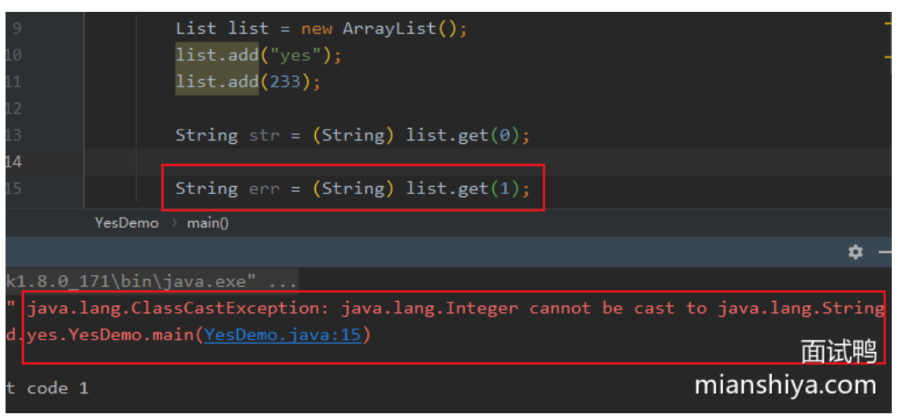
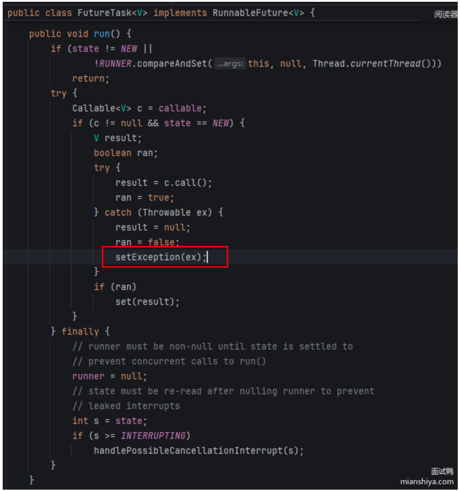
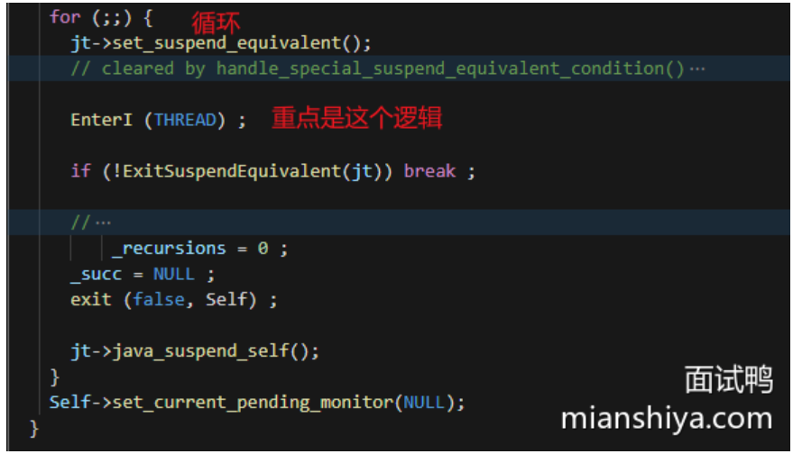
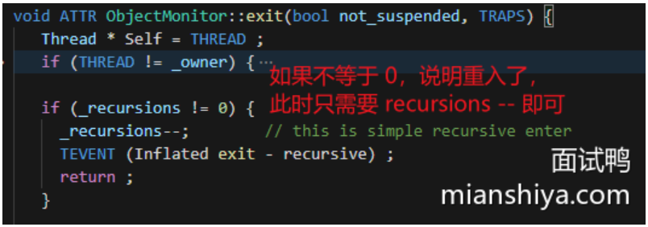
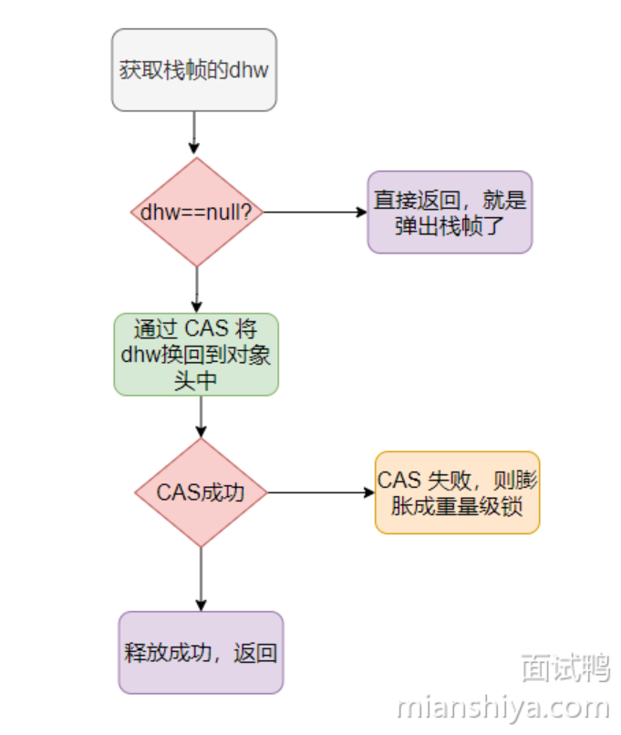

# 小米虫宝典

资料来源:[| Java 全栈知识体系](https://pdai.tech/)、[面试鸭 - 程序员求职面试刷题神器，高频编程题目免费刷](https://www.mianshiya.com/)

本笔记收录`米虫`后端技术栈的相关知识，分为知识篇、面试篇、其余篇。本篇为`面试篇`。

> 对于准备参加校招或应届同学来说，系统地掌握计算机基础知识和常用开发技术至关重要。
>
> 重点应放在扎实的`计算机网络`、`操作系统基础`、`Java基础`、深入理解`Java集合与并发`、掌握`Java虚拟机原理`，以及熟悉常用的`数据库(MySQL)`和`缓存(Redis)`技术。
>
> 此外，了解 Spring 系列框架、微服务架构以及消息队列等内容，将有助于提升综合能力，增强面试竞争力。
>
> ​																					              --Yes面试鸭官方

## Java基础

### Java 中的序列化和反序列化是什么?

#### 回答重点

##### 序列化

将==对象转为字节流的过程==，这样就可以就行网络通信、文件存储或者缓存。Java中提供 `java.io.Serializable` 接口支持序列化，只有实现了这个接口，才可以将该类的对象序列化。

##### 反序列化

是将==字节流重新转换为对象的过程==，即从存储中读取数据并重新创建对象。这也是创建对象的一种手段。

##### 其他

- **应用场景**:包括网络传输、远程调用、持久化存储(如保存到文件或数据库)、以及分布式系统中数据交换。
- **Java 序列化关键类和接口**: `Objectoutputstream` 用于序列化，`ObjectInputstream` 用于反序列化。类必须实现 `Serializable` 接口才能被序列化。
- **transient 关键字**:在序列化过程中，有些字段不需要被序列化，例如敏感数据，可以使用 `transient` 关键字标记不需要序列化的字段。
- **serialVersionUID**:每个 `serializable` 类都应该定义一个 `serialVersionUID`，用于在反序列化时验证版本一致性。如果没有明确指定，Java 会根据类的定义自动生成一个 UID，版本不匹配可能导致反序列化失败。
- **序列化性能问题**:Java 的默认序列化机制可能比较慢，尤其是对于大规模分布式系统，可能会选择更加高效的序列化框架(如 Protobuf、Kryo)。
- **安全性**:反序列化是一个潜在的安全风险，因为通过恶意构造的字节流，可能会加载不安全的类或执行不期望的代码。因此，反序列化过程需要进行输入验证，避免反序列化漏洞。

#### 扩展知识

##### 序列化与反序列化理解

==序列化其实就是将对象转化成可传输的字节序列格式，以便于存储和传输。==

因为对象在VM中可以认为是“立体”的，会有各种引用，比如在内存地址Ox1234引用了某某对象，那此时这个对象要传输到网络的另一端时候就需要把这些
引用“压扁”。

因为网络的另一端的内存地址Ox1234可以没有某某对象，所以传输的对象需要包含这些信息，然后接收端将这些扁平的信息再反序列化得到对象。
所以，==反序列化就是将字节序列格式转换为对象的过程。==


##### Java 序列化 Serializable 接口的意义

> 首先说一下Serializable，这个接口没有什么实际的含义，就是起标记作用。

来看下源码就很清楚了，除了String、数组和枚举之外，如果实现了这个接口就走writeOrdinaryObject，否则就序列化就抛错。


> serialVersionUID 又有什么用?

```java
private static final long serialVersionUID = 1L;
```

想必经常会看到这样的代码，这个ID 其实就是==用来验证序列化的对象和反序列化对应的对象的 ID 是否是一致的==。
所以这个 ID 的数字其实不重要，无论是 1L 还是 idea 自动生成的，只要序列化的时候对象的 serialVersionUID和反序列化的时候对象的 serialVersionUID 一致的话就行。

如果没有显式指定 serialVersionUID ，则编译器会根据类的相关信息自动生成一个，可以认为是一个指纹。所以如果你没有定义一个serialVersionUID 然后序列化一个对象之后，在反序列化之前把对象的类的结构改了比如增加了一个成员变量，则此时的反序列化会失败。因为类的结构变了，生成的指纹就变了，所以 serialVersionUID 就不一致了,==所以 serialVersionUID 就是起验证作用==。

> Java 序列化不包含静态变量

简单地说就是序列化之后存储的内容不包含静态变量的值，看一下下面的代码就很清晰了。


### 什么是 Java 中的不可变类?

#### 回答重点

不可变类是指在创建后==其状态(对象的字段)无法被修改的类==。一旦对象被创建，它的所有属性都不能被更改。这种类的实例在整个生命周期内保持不变。

##### 关键特征

1. 声明类为 `final` ，防止子类继承。
2. 类的所有==字段==都是 `private` 和 `final` ，确保它们在初始化后不能被更改。
3. 通过==构造函数初始化所有字段==。
4. ==不提供任何修改对象状态的方法==(如 setter方法)。
5. 如果类包含可变对象的引用，确保这些==引用在对象外部无法被修改==。例如 `getter` 方法中返回对象的副本(new 一个新的对象)来保护可变对象或者不提供该属性的 `getter` 方法。

Java 中的经典不可变类有:`String`、`Integer`、`BigDecimal`、`LocalDate` 等。

#### 扩展知识

##### 不可变类的优缺点

**优点**:

1. **线程安全**:由于不可变对象的状态不能被修改，它们天生是线程安全的，在并发环境中无需同步。
2. **缓存友好**:不可变对象可以安全地被缓存和共享，如 `String`的字符串常量池。
3. **防止状态不一致**:不可变类可以有效避免因意外修改对象状态而导致的不一致问题。

**缺点**:

1. **性能问题**:不可变对象需要在每次状态变化时创建新的对象，这可能会导致性能开销，尤其是对于大规模对象或频繁修改的场景(例如 String 频繁拼接)。

##### 举例 String

String 就是典型的不可变类，当你创建一个 String 对象之后，这个对象就无法被修改。因为无法被修改，所以像执行s+="a";这样的方法，其实返回的是一个==新建的 Sting 对象==，老的s指向的对象不会发生变化，只是s的引用指向了新的对象而已。

所以不要在字符串拼接频繁的场景使用 + 来拼接，因为这样会频繁的创建对象。

不可变类的好处就是==安全==，因为知晓这个对象不可能会被修改，因此可以放心大胆的用，在多线程环境下也是线程安全的。

##### **如何实现一个不可变类?**

具体按照回答重点内的关键特征实现就行了。

我们来一起看下 String 的设计，String 类用 final 修饰，表示无法被继承。


String 本质是一个 char 数组，然后==用 final 修饰==，不过 final 限制不了数组内部的数据，所以这还不够。

所以 value 是用 private 修饰的，并且==没有暴露出 set 方法==，这样外部其实就接触不到 value 所以无法修改。

当然还是有修改的需求，比如 replace 方法，所以这时候就需要返回==一个新对象==来作为结果,


总结一下就是私有化变量，然后不要暴露 set 方法，即使有修改的需求也是返回一个新对象。

### Java 中 Exception 和 Error 有什么区别?


#### 回答重点

`Exception`和`Error`都是`Throwable`类的子类(在Java代码中只有继承了Throwable类的实例才可以被throw或者被catch)它们表示在程序运行时发生的异常或错误情况。

总结来看：Exception表示==可以被处理的程序异常==，Error表示系统级的==不可恢复错误==。

**详细说明**：

1. **Exception**：是程序中可以处理的异常情况，表示程序逻辑或外部环境中的问题，可以通过代码进行恢复或处理。
   常见子类有:`IOException`、`SQLException`、`NullPointerException`、`IndexOutofBoundsException`等。
   Exception又分为**Checked Exception(编译期异常)**和**Unchecked Exception(运行时异常)**。
   - **Checked Exception**:在编译时必须显式处理(如使用try-catch块或通过throws声明抛出)。如`IOException`。
   - **Unchecked Exception**:运行时异常，不需要显式捕获。常见的如`NullPointerException`、`IlegalArgumentException`等，继承自`RuntimeException`。

2. **Error**：表示严重的错误，通常是JVM层次内系统级的、无法预料的错误，程序无法通过代码进行处理或恢复。例如内存耗尽（`OutofMemoryError`）、栈溢出（`StackOverflowError`)。

`Error`不应该被程序捕获或处理，因为一般出现这种错误时程序无法继续运行。

#### 扩展知识

##### 异常处理时需要注意的六个点

> 1. 尽量不要捕获类似Exception这样通用的异常，而应该捕获特定的异常。

软件工程是一门协作的艺术，在日常的开发中我们有义务使自己的代码能更直观、清晰地表达出我们想要表达的信息。

但是如果你什么异常都用了Exception，那别的开发同事就不能一眼得知这段代码实际想要捕获的异常，并且**这样的代码也会捕获到可能你希望它抛出而不希望捕获的异常**。

> 2. 不要“吞”了异常

如果我们捕获了异常，不把异常抛出，或者没有写到日志里，那会出现什么情况？线上除了bug莫名其妙的没有任何的信息，你都不知道哪里出错以及出错的原因。

这可能会让一个简单的bug变得难以诊断，而且有些同学比较喜欢用catch之后用 `e.printStackTrace()`，在我们产品中通常不推荐用这种方法，一般情况下这样是没有问题的但是这个方法输出的是个标准错误流。


比如是在分布式系统中，发生异常但是找不到stacktrace。

所以最好是输入到日志里，我们产品可以自定义一定的格式，将详细的信息输入到日志系统中，适合清晰高效的排查错误。

> 3. 不要延迟处理异常

比如你有个方法，参数是个name，函数**内部调了别的好几个方法**，其中你的name传的是null值，但是你没有在进入这个方法或者这个方法一开始就处理这个情况，而是在你调了别的好几个方法然后爆出这个空指针。

这样的话明明你的出错堆栈信息只需要抛出一点点信息就能定位到这个错误所在的地方，经过了好多方法之后可能就是**一坨堆栈信息**。

> 4. 只在需要try-catch的地方try-catch,try-catch的范围能小则小

只要必要的代码段使用try-catch，不要不分青红皂白try住一坨代码，**因为try-catch中的代码会影响JVM对代码的优化，例如重排序**。

> 5. 不要通过异常来控制程序流程

一些**可以用if/else的条件语句来判断例如null值等，就不要用异常**，异常肯定是比一些条件语句低效的，有CPU分支预测的优化等。

而且**每实例化一个Exception都会对栈进行快照**，相对而言这是一个比较重的操作，如果数量过多开销就不能被忽略了。

> 6. 不要在finally代码块中处理返回值或者直接return

在finally中return或者处理返回值会发生很诡异的事情，**比如覆盖了try中的return，或者屏蔽的异常**。

### 你认为 Java 的优势是什么?

#### 回答重点

我觉得可以从**跨平台**、**垃圾回收**、**生态**、**面向对象**四个方面来阐述。

##### 跨平台

Java 编译器生成的是**字节码**（.class 文件），字节码是一种跨平台的中间代码，必须通过 JVM 在不同的操作系统和硬件上解释或即时编译（JIT）为机器码：

>Java 源代码 → 编译器 → 字节码 → JVM（解释/JIT） → 机器码 → 运行

首先Java是跨平台的，不同平台执行的机器码是不一样的，而Java因为加了一层中间层JVM，所以可以做到**一次编写多平台(如Windows、Linux、macOS)**
**运行**,即 「Write once,Run anywhere」。

编译执行过程是先把Java源代码编译成字节码，字节码再由JVM解释或JIT编译执行，而因为JIT编译时需要预热的，所以还提供了AOT（Ahead-of-Time
Compilation)，可以直接把字节码转成机器码，来让程序重启之后能迅速拉满战斗力。

（解释执行比编译执行效率差，你想想每次给你英语让你翻译阅读，还是直接给你看中文，哪个快？）

##### 垃圾回收

Java还提供**垃圾自动回收功能**，虽说手动管理内存意味着自由、精细化地掌控，但是很容易出错。在内存较充裕的当下，将内存的管理交给GC来做，减轻了程序员编程的负担，**提升了开发效率**，更加划算！

##### 生态

现在**Java生态圈太全了**，丰富的第三方类库、网上全面的资料、企业级框架、各种中间件等等。

##### 面向对象

Java是一种**严格的面向对象编程语言**，具有清晰的类、对象、继承、接口等概念，支持封装、继承、多态等OOP特性，有助于**代码的可维护性和可扩展性**。

### Java中的参数传递是按值还是按引用?

#### 回答重点

在Java中，**参数传递只有按值传递，不论是基本类型还是引用类型**。

- **基本数据类型**（如`int`，`char`，`boolean`等）：传递的是值的==副本==，==即基本类型的数值本身==。因此，==对方法参数的任何修改都不会影响原始变量==。
- **引用数据类型**（如对象引用）：传递的是引用的==副本==，==即对象引用的内存地址==。因此，方法内可以通过引用修改对象的属性，==但不能改变引用本身，使其指向另一个对象==。

#### 扩展知识

##### 基本类型与引用类型的区别

- **基本类型**：包括`int`，`float`，`double`，`char`，`boolean`等，存储在栈内存中。方法中对基本类型参数的操作只会影响传递的副本，原始变量的值不受影响。
- **引用类型**：包括所有的对象和数组，==引用类型的变量存储的是对象在堆内存中的地址==。当引用类型作为参数传递时，传递的是这个地址的副本。因此，方法内的修改可以影响到传入的对象的内容，但不会影响对象引用本身的地址。


##### 实例代码

```java
public class ParameterPassing {
    public static void main(String[] args) {
        int a = 5;
        modifyPrimitive(a);
        System.out.println("After modifyPrimitive: " + a); // 输出: 5

        MyObject obj = new MyObject();
        obj.value = 10;
        modifyObject(obj);
        System.out.println("After modifyObject: " + obj.value); // 输出: 20

        resetReference(obj);
        System.out.println("After resetReference: " + obj.value); // 输出: 20
    }

    public static void modifyPrimitive(int num) {
        num = 10; // 仅仅修改了副本，不影响原始变量
    }

    public static void modifyObject(MyObject obj) {
        obj.value = 20; // 修改了对象的属性，会影响原始对象
    }

    public static void resetReference(MyObject obj) {
        obj = new MyObject(); // 修改的是引用的副本，不影响原始对象
        obj.value = 30;
    }
}

class MyObject {
    int value;
}
```

- 在`modifyPrimitive`方法中，`num`是基本类型的副本，因此对它的修改不影响原始变量`a`。
- 在`modifyObject`方法中，`obj`是引用类型的副本，但这个副本仍指向原始对象，因此修改`value`属性会影响原始对象。
- 在`resetReference`方法中，`obj`被重新赋值为一个新对象，这个变化只影响副本，不影响原始引用。

##### 不可变类

关于引用的回答后，面试官可能会接着问不可变类。不可变类在多线程环境中不需要额外的同步控制，因为它们的状态一旦创建就不能改变。

### 为什么Java不支持多重继承?

#### 回答重点

主要是因为多继承会产生菱形继承（也叫钻石继承)问题，Java之父就是吸取C++他们的教训，因此不支持多继承。

所谓的菱形继承很好理解，我们来看下这个图：


是不是看起来很像一个菱形，BC继承了A，然后D继承了BC，==假设此时要调用D内定义在A的方法，因为B和C都有不同的实现，此时就会出现歧义，不知道应该调用哪个了==。

> 无法确认调用那个方法的具体实现。

#### 扩展知识

这里很可能会被面试官追问:既然多继承不行，那为什么接口多实现可以?

##### 为什么接口可以多实现?

在 Java8 之前接口是无法定义具体方法实现的，所以即使有多个接口必须子类自己实现，所以并不会发生歧义。

Java8 之后出了默认方法(default method)，此时不就又出现的多继承的萎形继承问题了?

==所以 Java 强制规定，如果多个接口内有相同的默认方法，子类必须重写这个方法。==

不然，编译期就会报错:


### Java 面向对象编程与面向过程编程的区别是什么?

#### 回答重点

**面向对象编程**(Object Oriented Programming，`OOP`)是==一种对象为中心的编程范式或者说编程风格==。**把类或对象作为基本单元来组织代码**，并且运用提炼出的：封装、继承和多态来作为代码设计指导。

**面向过程编程**是==一种以过程或函数为中心的编程范式或者说编程风格==，以过程作为基本单元来组织代码。过程其实就是动作，对应到代码中来就是函数，面向过程中函数和数据是分离的，数据就是成员变量。

==总结来看：面向对象编程注重**对象之间的交互和模块化设计**，而面向过程编程注重**逻辑的分步实现**。==

**主要区别如下**：

1. 思维方式：
   - 面向对象：通过定==义对象的属性和行为来解决问题，关注对象之间的关系和交互==。
   - 面向过程：通过==函数或过程一步步实现业务逻辑，关注执行的步骤和顺序==。
2. 数据与行为的关系：
   - 面向对象：==数据和行为封装在对象内部==，数据操作由对象方法进行管理。
   - 面向过程：==数据和函数是分离的==，函数对数据进行操作。
3. 可扩展性和复用性：
   - 面向对象：==通过继承、接口、多态等机制支持代码的高复用性和扩展性==。
   - 面向过程：复用性较低，==扩展需要修改已有代码，影响整体稳定性==。
4. 适用场景：
   - 面向对象：适合==处理复杂的系统和模块化设计，便于维护和扩展==。
   - 面向过程：适用于==一些简单、顺序性强的小型程序，开发效率较高==。

#### 扩展知识

##### 面向对象的三大特性

- 封装:==将数据和行为封装在对象内部，提供接口进行访问==，隐藏实现细节，提高安全性。
- 继承:==子类可以继承父类的属性和方法==，实现代码复用和扩展。
- 多态:==对象可以通过父类或接口进行多态性调用==，不同对象在运行时执行不同的行为。(父类引用可以指向子类对象，根据不同的子类运行不同的行为)

##### 面向对象/过程优缺点总结

###### 面向对象的优缺点:

- 优点:高复用性、扩展性、维护性强，==适合复杂系统的开发==。
- 缺点:开发和理解成本较高，对于简单项目可能显得繁琐。

###### 面向过程的优缺点:

- 优点:开发简单，代码执行速度快，适合小型项目。
- 缺点:可维护性差，代码复用性低，扩展性差。

##### 面向过程与面向对象的理解

==面向过程其实就是一条道的思路==，因为起初就是按计算机的思路来编写程序。

我就拿用咖啡机煮咖啡为例，按照面向过程的流程是：

1. 执行加咖啡豆方法
2. 执行加水方法
3. 执行煮咖啡方法
4. 执行喝咖啡方法

很简单直观的操作，你可能没什么感觉，我再按面向对象思想来分析下这个流程。

在执行煮咖啡操作前要抽象出：人和咖啡机（分类），然后开始执行：

1. 人.加咖啡豆
2. 人.加水
3. 咖啡机.煮
4. 人.喝咖啡

是不是有点感觉了？

面向过程，从名字可以得知重点是**过程**，而面向对象的重点是**对象**

从这个例子可以看出两者的不同：**面向过程是很直接的思维，一步步的执行，一条道走到底**。

而面向对象是先抽象，把事物分类得到不同的类，划分每个类的职责，暴露出每个类所能执行的动作，然后按逻辑执行时调用每个类的方法即可，不关心内部的逻辑。

从例子可以看出面向对象编程执行的步骤没有变少，整体执行流程还是一样的，都是先加咖啡豆、加水、煮咖啡、喝，这个逻辑没有变。

无非就是划分了类，把每一步骤具体的实现封装了起来，散布在不同的类中。

对我们程序员来说是最最直接的感受：变的其实就是代码的分布，煮咖啡的代码实现被封装在咖啡机内部，喝咖啡的代码实现被封装在人内部，而不是在一个方法中写出来。

代码的分布确实是最直观的，但是变得不仅只是分布，而是思想上的变化。

就是上面提到的计算机思维到人类思维的变化。

我认为这个变化是因为软件的发展，业务越来越复杂。

**人们用面向过程语言编写复杂的软件时，需要按照不同的功能把一些数据和函数放到不同的文件中，渐渐地人们就发现这不就是先分类吗？**

并且好像业务分析下来都能和现实世界的东西对应上？

于是**人们慢慢地总结、提炼就演变成了面向对象，再根据面向对象的特性提炼出关键点：封装、继承和多态**。

而这个**面向对象思想就类似我们人类面对复杂场景时候的分析思维：归类、汇总。**

所以面向对象编程就成为了现在主流的编程风格，因为符合人类的思考方式。

面向过程编程和面向对象编程从思想上的变化是：**从计算机思维转变成了人类的思维来编写编码。**

而面向对象编程的类中数据和动作是在一起的，这也是两者的一个显著的区别。

### Java方法重载和方法重写之间的区别是什么？

#### 回答重点

**方法重载（Overloading）**：在同一个类中，==允许有多个同名方法，只要它们的参数列表不同（参数个数、类型或顺序）==。主要关注方法的签名变化，适用于在同一类中定义不同场景下的行为。

**方法重写（Overriding）**：子类在继承父类时，可以重写父类的某个方法（参数列表、方法名必须相同），从而为该方法提供新的实现。主要关注继承关系，用于子类改变父类的方法实现，实现运行时多态性。

区别主要如下：

| 区别             | 重载                                   | 重写                                                         |
| ---------------- | -------------------------------------- | ------------------------------------------------------------ |
| 发生的场所       | 在同一个类中                           | 在继承关系的子类和父类之间                                   |
| 参数列表         | 必须不同（参数的数量、类型或顺序不同） | 必须相同，不能改变参数列表                                   |
| 返回类型         | 可以不同                               | 必须与父类方法的返回类型相同，或者是父类返回类型的子类（协变返回类型） |
| 访问修饰符       | 不受访问修饰符影响                     | 子类方法的访问修饰符不能比父类更严格，**通常是相同或更宽泛** |
| 静态和非静态方法 | 可以是静态方法或非静态方法             | 只能重写非静态方法，**静态方法不能被重写**（静态方法可以被隐藏） |
| 异常处理         | 方法的异常处理可以不同                 | **子类的异常不能抛出比父类更多的异常**（可以抛出更少的或相同类型的异常） |

#### 扩展知识

##### 重载注意点

重载中提到的方法同名但参数列表不同（参数个数、类型或顺序），这里要注意和返回值没有关系，**方法的签名仅是名字和参数列表，不包括返回值**。

**重载通常用于提供同一操作的不同实现，例如构造函数的重载、不同类型输入的处理等。**

重载简单示例代码：

```java
public class OverloadingExample {
    // 重载方法：参数数量不同
    public void print(int a) {
        System.out.println("Printing int: " + a);
    }

    // 重载方法：参数类型不同
    public void print(String a) {
        System.out.println("Printing String: " + a);
    }

    // 重载方法：参数类型和数量不同
    public void print(int a, int b) {
        System.out.println("Printing two ints: " + a + ", " + b);
    }
}
```

重写注意点

在重写时，**子类方法不能使用比父类更严格的访问级别**。例如，父类的方法是 protected ，子类不能将其修改为private ，但可以改为 public
且**子类方法抛出的异常必须与父类一致，或者是其父类异常的子类**。

重写通常用于**在子类中提供父类方法的具体实现，以实现多态性**。例如，子类对父类方法进行扩展或修改以适应特定需求。

重写简单示例代码:

```java
class Parent {
    public void display() {
        System.out.println("Parent display");
    }
}

class Child extends Parent {
    @Override
    public void display() {
        System.out.println("Child display");
    }
}

public class OverridingExample {
    public static void main(String[] args) {
        Parent obj = new Child();
        obj.display(); // 输出 "Child display"
    }
}
```

还有一个 `@Override` 注解，在重写方法时使用 `@Override` 注解，编译器可以帮助检査是否正确实现了重写，以防误操作。

### 什么是Java内部类？它有什么作用?

#### 回答重点

Java内部类是**指在一个类的内部定义的类**，Java支持多种类型的内部类，包括**成员内部类、局部内部类、匿名内部类和静态内部类**。内部类==可以访问外部类的成员变量和方法，甚至包括私有的成员==。

内部类的作用主要包括：

1. 封装性：将逻辑相关的类封装在一起，**提高类的内聚性**。
2. 访问外部类成员：内部类可以方便地访问外部类的成员变量和方法，**尤其在需要操作外部类对象的场景下非常有用**。
3. 简化代码：对于只在一个地方使用的小类，**内部类能减少冗余代码，简化结构**。
4. 事件处理：**匿名内部类广泛用于实现回调函数或事件监听，简化了代码结构**，特别是对于实现接口或抽象类的场景。

#### 扩展知识

##### 内部类的类型

- ==成员内部类==:非静态类，作为外部类的一个成员。它可以直接访问==外部类的所有成员，包括私有成员==。
- 静态内部类:定义为 static ，==无法访问外部类的非静态成员==，==只能访问外部类的静态成员==。
- 局部内部类:定义在方法或代码块中的类，==仅在该方法或代码块内可见，通常用于临时的对象构建==。
- 匿名内部类:没有类名的内部类，通常用于创建短期使用的类实例，==尤其是在接口回调或事件处理时被广泛使用==。

##### 内部类举例

1. 成员内部类，定义在另一个类中的类，可以使用外部类的所有成员变量以及方法，包括 private 的。

```java
public class OuterClass {
    private String outerField = "Outer Field";

    class InnerClass {
        void display() {
            System.out.println("Outer Field: " + outerField);
        }
    }

    public void createInner() {
        InnerClass inner = new InnerClass();
        inner.display();
    }
}
```

>注意：如果想在外部环境创建成员内部类的实例，需要先创建外部类的实例再通过**外部类实例.new 内部类实例()**的形式来创建对象，但是无论是成员或者静态内部类都不应该在外部环境创建，应该只在外部类的内部活动。

2. 静态内部类，**只能访问外部类的静态成员变量以及方法，其实它就等于一个顶级类，可以独立于外部类使用所以更多的只是表明类结构和命名空间**。

```java
public class OuterClass {
    private static String staticOuterField = "Static Outer Field";

    static class StaticInnerClass {
        void display() {
            System.out.println("Static Outer Field: " + staticOuterField);
        }
    }

    public static void createStaticInner() {
        StaticInnerClass staticInner = new StaticInnerClass();
        staticInner.display();
    }
}
```

3. 局部内部类，指在方法中定义的类，==只在该方法内可见，可以访问外部类的成员以及方法中的局部变量==（需要声明为 ==final 或 effectively final==)。

```java
public class OuterClass {
    void outerMethod() {
        final String localVar = "Local Variable";

        class LocalInnerClass {
            void display() {
                System.out.println("Local Variable: " + localVar);
            }
        }

        LocalInnerClass localInner = new LocalInnerClass();
        localInner.display();
    }
}
```

4. 匿名类，指的是==没有类名的内部类==。用于==简化实现接口和继承类的代码==，仅在创建对象时使用，例如回调逻辑定义场景

```java
public class OuterClass {
    interface Greeting {
        void greet();
    }

    public void sayHello() {
        Greeting greeting = new Greeting() {
            @Override
            public void greet() {
                System.out.println("Hello, World!");
            }
        };
        greeting.greet();
    }
}
```

局部内部类用的比较少，常用**成员内部类、静态内部类和匿名内部类**。

实际上内部类是一个编译层面的概念，像一个语法糖一样，经过编译器之后其实**内部类会提升为外部顶级类**，和外部类没有任何区别，所以在 **JVM 中是没有内部类的概念的**。

### JDK8有哪些新特性?

#### 回答重点

JDK8较为重要和平日里经常被问的特性如下：

1. JVM的内存结构用元数据替代了永久代
2. **引入了Lambda表达式**
3. 引入了**日期类**、接口**默认方法、静态方法**
4. 新增Stream流式接口
5. 引入Optional类
6. 新增了CompletableFuture、StampedLock等并发实现类。

如果你对HashMap、ConcurrentHashMap面试题有准备的话，这时候也可以抛出来，引导面试官来询问。比如:Java 8修改了HashMap 和 ConcurrentHashMap 的实现。

#### 扩展知识

##### 元空间替代了永久代

因为 JDK8 要把 JRockit 虚拟机和 Hotspot 虚拟机融合，而 JRockit 没有永久代，所以把 Hotspot 永久代给去了(本质也是永久代回收效率太低)

详细可看:面试鸭《[为什么 Java8 移除了永久代，加了元空间?](https://www.mianshiya.com/question/1780933295228350466)》 这题。

##### Lambda 表达式

Lambda 是 Java8 引入的一种匿名函数，可以把, Lambda 表达式理解为是一段可以传递的代码(将代码像数据一样进行传递)。使用它可以写出更简洁、更灵活的代码。其本质是作为函数式接口的实例。例如:

```java
// 传统方式
Runnable runnable1 = new Runnable() {
    @Override
    public void run() {
        System.out.println("mianshiya.com");
    }
};

// Lambda 表达式
Runnable runnable2 = () -> System.out.println("mianshiya.com");
```

##### 日期类

Java8引入了新的日期和时间 API(位于 `java.time` 包中)，它们更加简洁和易于使用，解决了旧版日期时间 API 的许多问题。

例如 `Date`、 `calendar` 都是可变类且线程不安全。==而新的日期类都是不可变的，一旦创建就不能修改，这样可以避免意外的修改，提升代码的安全性和可维护性==。

```java
LocalDate date = LocalDate.now();
LocalTime time = LocalTime.now();
LocalDateTime dateTime = LocalDateTime.now();
```

`Date`本身不包含时区信息，必须使用 `calendar` 类来处理时区，但使用起来非常复杂且容易出错。

新 API 提供了专门的时区类(如 `ZonedpateTime`，`OffsetDateTime` ，`ZoneId` 等)，简化了时区处理，并且这些类的方法更加直观和易用。

##### 接口默认方法、静态

默认方法允许在接口中定义方法的默认实现，这样接口的实现类不需要再实现这些方法。之所以提供静态方法，==是为了将相关的方法内聚在接口中==，而不必创建新的对象。

```java
interface MyInterface {
    default void defaultMethod() {
        System.out.println("Default Method");
    }

    static void hello() { 
        System.out.println("Hello, New Static Method Here"); 
    } 
}
```

##### Stream流式接口

StreamAPI提供了一种高效且易于使用的方式来处理数据集合。它支持链式操作、惰性求值和并行处理。

```java
List<String> list = Arrays.asList("a", "b", "c", "d");
List<String> result = list.stream()
                          .filter(s -> s.startsWith("a"))
                          .collect(Collectors.toList());
```

##### Optional

`Optional`类用来解决可能出现的`NullPointerException`问题，提供了一种优雅的方式来处理可能为空的值。

```java
Optional<String> optional = Optional.of("mianshiya.com");
optional.ifPresent(System.out::println);
```

Optional详细可查看面试鸭《[什么是Optional类？](https://www.mianshiya.com/bank/1787463103423897602/question/1800345746421391361#heading-0)》这题

##### CompletableFuture

CompletableFuture提供了一个新的异步编程模型，简化了异步任务的编写和管理。

```java
CompletableFuture.supplyAsync(() -> "Hello")
                 .thenApply(s -> s + " World")
                 .thenAccept(System.out::println);
```

StampedLock可查看面试鸭《[StampedLock用过吗？](https://www.mianshiya.com/question/1780933294947332098)》这题。

### Java 中 String、StringBuffer和 StringBuilder的区别是什么?

#### 回答重点

它们都是Java中**处理字符串的类**，区别主要体现在**可变性、线程安全性和性能上**：

1) **String**
- **不可变**：`String`是不可变类，字符串一旦创建，其内容无法更改。每次对`String`进行修改操作（如拼接、截取等），都会**创建新的`String`对象**。
- **适合场景**：`String`适用于**字符串内容不会频繁变化的场景**，例如少量的字符串拼接操作或字符串常量。
2) **StringBuffer**
- 可变：`StringBuffer`是可变的，可以进行字符串的追加、删除、插入等操作。
- 线程安全：`StringBuffer`是线程安全的，内部使用了`synchronized`关键字来保证多线程环境下的安全性。
- 适合场景：`StringBuffer`适用于在**多线程环境中需要频繁修改字符串的场景**。
3) **StringBuilder**
- 可变：`StringBuilder`也是可变的，提供了与`StringBuffer`类似的操作接口。
- 非线程安全：`StringBuilder`不保证线程安全，性能比`StringBuffer`更高。
- 适合场景：`StringBuilder`适用于`单线程环境中需要大量修改字符串的场景，如高频拼接操作`。

总结

- String：不可变，适合少量字符串操作。
- StringBuffer：可变且线程安全，适合多线程环境中的频繁字符串修改。
- StringBuilder：可变且非线程安全，适合单线程环境中的高性能字符串处理。

#### 扩展知识

##### Java8中的优化

在Java8及以后，编译器会对字符串的常量拼接做优化，将字符串拼接转换为`StringBuilder`操作。**这种优化提高了代码性能**，但是在动态拼接或多线程场景下，手动使用`StringBuilder`和`StringBuffer`仍然更合适。

##### 从演进角度看待三者

`String`是Java 中基础且重要的类，并且`String`也是`Immutable`类的典型实现，**被声明为final class**，除了**hash这个属性其它属性都声明为final**。

因为它的不可变性，所以例如拼接字符串时候会产生很多**无用的中间对象**，如果频繁的进行这样的操作对性能有所影响。

`StringBuffer`就是为了解决大量拼接字符串时产生很多中间对象问题而提供的一个类，提供`append`和`insert`方法，可以将字符串添加到已有序列的末尾或指定位置。

它的本质是一个线程安全的可修改的字符序列，把所有**修改数据的方法**都加上了`synchronized`。但是保证了线程安全是**需要性能的代价**的。

在很多情况下我们的字符串拼接操作不需要线程安全，这时候`StringBuilder`登场了，`StringBuilder`是DK1.5发布的，它和`StringBuffer`本质上没什么区别，就是**去掉了保证线程安全的那部分，减少了开销**。

`StringBuffer`和`StringBuilder`二者都继承了`AbstractStringBuilder`，底层都是利用可修改的char数组(JDK 9 以后是byte数组)。

所以如果我们有大量的字符串拼接，如果能预知大小的话最好在`new StringBuffer`或者`StringBuilder`的时候设置好capacity，避免多次扩容的开销（扩容要抛弃原有数组，还要进行数组拷贝创建新的数组）。

### Java的StringBuilder是怎么实现的?

#### 回答重点

StringBuilder主要是为了解决String对象的不可变性问题，提供高效动态的字符串拼接和修改操作。大致需要实现 append、insert...等功能。

大致核心实现如下：

- 内部使用**字符数组(char[]value)来存储字符序列**
- 需要一些**变量count来记录当前内容数量**
- 通过方法如append()、insert()等操作，直接**修改内部的字符数组**，**而不会像String那样创建新的对象**。
- 每次进行字符串操作时，**如果当前容量不足**，它会通过扩展数组容量来容纳新的字符，按2倍的容量扩展，以减少扩展次数，提高性能。

#### 扩展深入剖析 StringBuilder

对于这类题目，因为已经有现有的实现作为参考，所以回答诸如此类的问题，不要急，先回想一下平日用这个StringBuilder 都用了哪些方法。

- `append`
- `insert`
- `delete`
- `replace`
- `charAt`
- ...

大致就这么几个，没必要说太全，这不是小学课文背诵，关键方法提出来就行了。脑子浮现这几个方法之后，直接按上述的回答重点说出来即可。

实际上 StringBuilder 底层使用 char 数组来存储字符，并且**用 count 来记录存放的字符数**。


回答重点提到了 char 数组，这里可能会被面试官插入问:String 底层不也是用的 char 数组存放吗?**两者有啥区别**?


展示的机会就来了呀!String 被 final 修饰，且**内部的 char 也被 private 和 final 修饰**了，所以是**不可变的**，是典型的 Immutable 类，因此其不可变性，**保证了线程安全，能实现字符串常量池等**。

ok，咱们继续。

由于 `StringBuilder` 底层是用 char 数组存放字符，而**数组是连续内存结构**，为了防止频繁地复制和申请内存，需要提供 capacity 参数来设置初始化数组的大小，**这样在预先已经知晓大字符串的情况下，可以减少数组的扩容次数，有效的提升效率!**


这里一定要点破:数组是连续内存的结构，并且要体现出你有节省内存和提高效率的意识，熟悉 HashMap 的同学对这类操作应该很有经验。

我们来看下调用 `AbstractStringBuilder` 这个父类的构造器。


可以看到，就是直接 new 申请数组没啥花头。

我们来看下 append 操作。


可以看到 `append` 有多个实现，毕竟我们平日啥都类型都直接 `append` ，那底层是怎么实现这些类型转换的呢?

我们拿 `append(int)` 来举个例子，其他类型本质都是一样的。


主要逻辑已经在图中标识了，熟悉 HashMap 八股文的同学一看就知道老套路了，先看看 append 的 int值转成char 需要占数组的几位，然后计算一下现在的数组够不够放，如果不够就扩容一下，然后再把 int 转成 char 放进去，再更新现有的字符数。

所以面试回答 append 实现的时候，直接把上面那段话的思路说一下即可。

面试官可能会追问:怎么扩容的呀?

我们直接看下 `ensurecapacityInternal` 这个方法的实现


直接就是 `Arrays.copyof` ，进行一波扩容加拷贝，扩容之后的数组容量为之前的两倍+2。

这时候想必有很多同学好奇，前面是如何根据传入的 int 来计算得知所占的字符位数?即上面代码的`Integer.stringSize`方法，注意这个方法已经跑到 Integer 这个类中啦!不是 `AbstractStringBuilder`的实现了。


哈哈，你以为会经过一番看不懂的位运算?

实际上就是查表法!直接列了各个位数的边界值依次存放在数组中，然后判断大小再根据数组下标算出位数，就是这么简单、方便、高效!

再来看下 int 是如何转换成 char 然后插入到数组中的，即 `Integer.getchars` 方法。


身为底层实现，还是很细的，可以仔细看下上面的逻辑，位运算看不懂没事，注释已经把原有的公式写出来的，对照着看看，还是能理解的，这里我就不再赘述了。

然后各位也应该注意到上面的数字、数字十这两个数组了，没错还是熟悉的查表法!


你们可以选几个数字带入算一算，很准的，哈哈，至于 digits 也一样，还是查表。

其实我们常用的 `String.valueOf(int i)`，内部实现一样也是通过 `Integer.stringSize`和 `Integer.getChars`来完成的。


好了，这波操作下来，想必拨开了很多对`StringBuilder`的迷雾吧~

再来看看 insert，我们还是拿int的插入来举例：


可以看到，这里是把 int 转成 string 了，然后调用以下的方法。


注释写的很明白了，没什么花头，主要逻辑就是插入前先判断下数组长度足够，若不够就扩容，然后移动字符，给待插入的位置腾出空间，然后往对应位置插入字符，最后更新 StringBuilder 已有的字符数。

是吧，很直白的逻辑。

delete 这个就更简单了，就是一个数组的删除操作，没什么花头。


剩下的replace、charAt 等等方法就不提了，没有什么花头，总结来说都是数组的操作，有兴趣的自行去看看吧~

##### 总结

这样看下来，想必对 StringBuilder 的内部实现已经很清晰了吧!就是数组的操作，**而数组的特性就是内存连续，下标访问快**。

针对内存连续这点，又要保持 StringBuilder 的动态性，那不可避免的就需要扩容操作，扩容操作简单来说就是申请一个更大 char 数组，把老 char 数组的数据拷贝过去。

对了，从源码来看，StringBuilder 没有实现**缩容操作**。

所以回答这个设计题的时候，先说下需要实现哪些关键方法:`append`、`delete` 等等，然后点明底层是 char数组实现，在执行 append、insert 等操作的时候需要先判断数组容量是否足够容纳字符来判断是否需要扩容，然后修改之类的操作就是调用 `System.arraycopy` 来完成字符串的变更。

因为原生的 StringBuilder 没有实现缩容操作，所以你可以提一下在 delete 的时候判断下，如果删除的字符过多，为了节省内存，**实现缩容的操作**。

然后还可以再提一下，char数组是可以优化的，底层可以用 byte 数组+一个coder 标志位来实现，这样更节省内存，因为 char 占用两个字节，这样对于 latin 系的字符来说太大了，就很浪费，所以用 byte 数组，**然后配备一个 coder 来标识所用的编码**。

嘿嘿，其实 jdk9之后就是这样实现的，但是你可以假装不知道呀，装的像你自己想出来的优化，你看看这多细呀~疯狂加分!

来看下源码，我的是 jdk 11版本~，可以看到已经变成 byte 数组了， coder 也用一个 byte 标识。


再看下 append 的方法的实现:


###  接口和抽象类有什么区别？

#### 回答重点

接口和抽象类在设计**动机上有所不同**。

接口的设计是**自上而下**的。我们知晓某一行为，于是基于这些行为约束定义了接口，一些类需要有这些行为，因此实现对应的接口。

抽象类的设计是**自下而上**的。我们写了很多类，发现**它们之间有共性(方法、成员变量)**，有很多代码可以复用，因此将公共逻辑封装成一个抽象类，减少代码冗余。

所谓的 **自上而下** 指的是先约定接口，再实现。

而 **自下而上** 是先有一些类，才抽象了共同父类(可能和学校教的不太一样，但是实战中很多时候都是因为重构才有的抽象)。

##### 其他区别

1. 方法实现

接口中的**方法默认是public和abstract**(但在Java8之后可以设置default方法或者静态方法)。抽象类可以**包含abstract方法（没有实现）和具体方法（有实现）**。它允许**子类继承并重用抽象类中的方法实现**。

2. 构造函数和成员变量

接口不能包含**构造函数**，接口中的成员变量默认为**public static final**，即静态常量。抽象类可以包含**构造函数**，成员变量可以有不同的**访问修饰符（如private、protected、public)**，并且**可以不是常量**。

3. 多继承

抽象类**只能单继承**，接口可以**有多个实现**。

[为什么Java 不支持多重继承?]([为什么 Java 不支持多重继承？ - Java 基础面试题 - 面试鸭 - 程序员求职面试刷题神器](https://www.mianshiya.com/bank/1787463103423897602/question/1780933294435627010))

#### 扩展知识

##### 接口的演变

- Java8：引入了`default`和`static`方法，使得接口不仅仅是方法的声明，还可以提供具体的实现。default方法允许在接口中添加新的方法实现，而不影响已经实现该接口的类。
- Java9：引入了`私有方法，允许在接口中定义私有方法，用于default方法的内部逻辑复用`。
- Java14：引入了sealed接口(仅在某些子类中使用），进一步增强了接口的功能

### JDK 和 JRE 有什么区别?

#### 回答重点

**JRE(Java Runtime Environment)**指的是**Java运行环境**，包含了JVM、核心类库和其他支持运行Java程序的文件。

- **JVM(Java Virtual Machine)**：执行Java字节码，提供了Java程序的运行环境。
- 核心类库：一组标准的类库（如 `java.lang`、`java.util`等），供Java程序使用。
- 其他文件：如配置文件、库文件等，支持JVM的运行。

**JDK(Java Development Kit)**可以视为JRE的超集，是用于**开发Java程序的完整开发环境**，它包含了JRE，以及用于开发、调试和监控Java应用程序的工具。

- JRE：JDK包含了完整的JRE，因此它也能运行Java程序。
- 开发工具：如**编译器(javac)**、**调试器(jdb)**、**打包工具(jar)**等，用于开发和管理Java程序。
- 附加库和文件：**支持开发、文档生成和其他开发相关的任务**。

#### 扩展知识

列举一下J**DK提供的主要工具**：

- `javac`:Java编译器，用于**将Java源代码(java文件)编译成字节码（.class文件)**。
- `java`：Java应用程序启动器，用于运行Java应用程序。
- `javadoc`:文档生成器，用于从Java源代码中提取注释并生成HTML格式的API文档。
- `jar`:归档(打包)工具，用于创建和管理JAR(Java ARchive)文件。
- `jdb`：Java 调试器，用于调试 Java 程序。
- `jps`：Java进程状态工具，用于列出当前所有的Java进程。
- `jstat`：JVM统计监视工具，用于监视JVM统计信息。
- `jstatd`：JVM统计监视守护进程，用于在远程监视JVM统计信息。
- `jmap`：内存映射工具，用于生成堆转储(heap dump)、查看内存使用情况。
- `jhat`：堆分析工具，用于分析堆转储文件。
- `jstack`：线程栈追踪工具，用于打印Java线程的栈追踪信息。
- `javap`：类文件反汇编器，用于反汇编和查看Java类文件。
- `jdeps`：Java类依赖分析工具，用于分析类文件或JAR文件的依赖关系。

### 你使用过哪些 JDK 提供的工具?

#### 回答重点

##### JDK提供的主要工具

- javac:**Java编译器，负责将Java源代码编译成字节码**（.class文件)。
- java：**运行Java应用程序的命令**，使用JVM来解释并执行编译后的字节码文件。
- javadoc：**生成API文档的工具**，能够根据源代码中的注释生成HTML格式的文档。
- jar：用于创建和管理JAR文件的工具，**可以将多个.class文件打包为单一文件**，便于分发和管理。
- jdb：Java调试工具，用于在**命令行中调试Java应用程序**，支持断点设置、变量查看等功能。

##### 性能监控和分析工具

- jps：Java进程工具，显示所有正在运行的Java进程，便于监控和诊断。
- jstack：生成线程堆栈信息的工具，常用于分析死锁和线程问题。
- jmap：内存映射工具，可以生成堆转储(heap dump）文件，便于内存泄漏分析和垃圾回收优化。
- jhat：堆分析工具，配合jmap使用，分析生成的堆转储文件，帮助开发者了解内存使用情况。
- jstat：JVM统计监控工具，实时监控垃圾回收、内存、类加载等信息，帮助开发者调优JVM性能。
- jconsole：图形化的JVM监控工具，可以监控应用程序的内存、线程和类加载情况，常用于监控和调试。
- jvisualvm：功能强大的性能分析工具，支持堆、线程、GC的详细监控，还提供内存分析和CPU性能分析。

##### 诊断工具

- jinfo：用于查看和修改正在运行的JVM参数，便于动态调优和调整JVM行为。
- jstatd：远程JVM监控工具，可以通过网络远程监控JVM的状态，适合分布式系统中的性能监控。

#### 扩展知识

##### 高级调试和性能优化工具

* Java Mission Control(MC)：一个功能强大的工具，用于分析和优化Java应用程序的性能，提供了基于飞行记录器(Java Flight Recorder，JFR)的性能分析功能，可以详细查看垃圾回收、线程活动、CPU使用率等指标，是进行深度性能分析的利器。
* Java Flight Recorder(JFR):低开销的监控工具，能够记录JVM的运行时数据，适合生产环境中的性能分析，尤其是在高并发系统中使用频率较高。

##### GC调优和内存分析

jmap和jhat常用于排查内存泄漏或内存占用过高的问题。通过jmap生成堆转储文件后，开发者可以使用jhat或其他工具（如EclipseMAT）分析对象的引l用链，从而发现潜在的内存问题。

##### 线程和死锁分析

jstack是用于调试线程状态的利器，尤其是在分析线程死锁时。当应用卡死或响应时间异常时，通过jstack可以捕获应用的线程状态，并分析是否存在死锁情况。

##### 建议

虽然面试这样答可能就差不多了，但还是希望大家可以自己找机会用用，没机会就自己给自己创造机会。因为这属于线上排查能力，只有真正实践了，到时候自己负责的项目真的出了问题，才不至于手忙脚乱。我们毕竟是工程师，问题解决能力必须掌握。

- [怎么分析JVM当前的内存占用情况？OOM后怎么分析？](https://www.mianshiya.com/bank/1795650132375805954/question/1818990174270726145)
- [线上CPU飙高如何排查？](https://www.mianshiya.com/bank/1795650132375805954/question/1807672527650004993)

### Java 中 hashCode 和 equals 方法是什么?它们与==操作符有什么区别？

#### 回答重点

`hashcode`、`equals`和 `== ` 都是 `Java` 中用于比较对象的三种方式，但是它们的**用途和实现**还是有挺大区别的。

- `hashcode`用于**散列存储结构中确定对象的存储位置**。可用于**快速比较两个对象是否不同，因为如果它们的哈希码不同，那么它们肯定不相等**。
- `equals` 用于**比较两个对象的内容是否相等**，通常需要重写自定义比较逻辑。
- `==` 用于比较**两个引用是否指向同一个对象(即内存地址)**。对于基本数据类型，比较它们的值。

#### 扩展知识

##### hashCode

方法返回对象的**哈希码(整数)主要用于支持基于哈希表的集合**，用来确定**对象的存储位置**，如 `Hashmap`、等 `HashSet`

`Object` 类中的**默认实现会根据对象的内存地址生成哈希码**( native 方法)


在 Java中hashcode 方法和 equals 方法之间有一个`“合约“`

- 如果两个对象根据 equals 方法被认为是相等的，那么**它们必须具有相同的哈希码**。
- 如果**两个对象具有相同的哈希码，它们并不一定相等，但会被放在同一个哈希桶中**。

##### equals

用于比较两个对象的内容是否相等。 `Object` 类中的默认实现会使用 `==` 操作符来**比较对象的内存地址**。


通常我们需要在自定义类中重写equals方法，以基于对象的属性进行内容比较。比如你可以自定义两个对象的名字一样就是相等的、年龄一样就是相等，可以灵活按照需求定制。

如果两个对象的equals方法返回true，则它们的hashCode方法必须返回相同的值，反之则不需要。

对于equals定义的比较，实际上还有以下五个要求：

- `自反性`：对于任何非空引用值，x.equals(x)必须返回true。
- `对称性`：对于任何非空引用值x和y，如果x.equals(y)返回true，则y.equals(x)也必须返回true 。
- `传递性`：对于任何非空引用值x、y和z，如果x.equals(y)返回true且y.equals(z)返回true则x.equals(z)也必须返回true。
- `一致性`：对于任何非空引用值和，只要对象在比较中没有被修改，多次调用x.equals(y)应返回相同的结果。
- 对于任何非空引用值，`x.equals(null)必须返回false`。

##### ==

操作符用于比较两个引用是否指向同一个对象（即**比较内存地址**），如果是基本数据类型，直接比较它们的值。

### Java 中的 hashCode和equals方法之间有什么关系?

#### 回答重点

在Java中，`hashCode()`和`equals()`方法的关系主要体现在集合类（如`HashMap`、`HashSet`）中。

它俩决定了**对象的逻辑相等性**和**哈希存储方式**。

##### equals()方法

用于判断两个对象是否相等。**默认实现是使用==比较对象的内存地址**，但可以在类中重写equals()来定义自己的相等逻辑。

##### hashCode()方法

返回对象的**哈希值**，**主要用于基于哈希的集合（如HashMap、HashSet）**。同一个对象每次调用hashCode()必须返回相同的值，且相等的对象必须有相同的哈希码。

##### 两者的关系

如果两个对象**根据equals()相等，它们的hashCode()值必须相同**。即a.equals(b) == true，那么a.hashCode() == b.hashCode()必须为 true。

**但是反过来不要求成立**：即两个对象的hashCode()相同，不一定equals()相等。

注意：如果违背上述关系会导致在基于哈希的集合中出现错误行为。例如，HashMap可能无法正确存储和查找元素。

#### 扩展知识

##### 为什么要重写hashCode()和equals()

因为在使用HashMap、HashSet等集合时，这些集合内部依赖hashCode()和equals()方法来确定元素的存储位置。如果没有正确地重写这两个方法，集合可能无法正确判断对象的相等性，导致重复存储、查找失败等问题。

##### 重写equals()方法的基本规则

- 自反性：对于任何非空对象引用，x.equals(x)必须为true。
- 对称性：对于任何非空对象引l用和，x.equals(y)应当等于y.equals(x)。
- 传递性: 如果x.equals(y) == true且y.equals(z) = true，那么x.equals(z)必须为 true。
- 一致性：只要对象未发生改变，多次调用x.equals(y)结果应该一致。
- 对于null：对于任何非空对象引用x，x.equals(null)必须返回false。

##### 重写hashCode()方法的基本规则

- 在相同的应用程序执行过程中，对于同一个对象多次调用hashCode(必须返回相同的值。
- 如果两个对象根据equals()方法相等，则它们的hashCode()值必须相等。
- 但是，如果两个对象equals()不相等，则它们的hashCode()值不必不同，但不同的hashCode()值可以提高哈希表的性能。

##### hashCode & equals &集合源码分析

hashCode是属于Object的一个方法，并且是个native方法，本质就是返回一个哈希码，即一个int值，一般是一个**对象的内存地址转成的整数**。


equals，我们知道是用来判断两个对象是否相同的，也是属于 Object 的一个方法，并且默认实现如下:


看到这，是不是觉得 hashCode 和 equals **没啥关系**啊?为什么要放在一起说?

确实，**一般情况下两者是没啥关系。但如果是将一个对象用在散列表的相关类的时候，是有关系的**。

比如 HashSet，我们常用来得到一个不重复的集合。

现在有个 Yes 类的 HashSet 集合，我只重写了 Yes 类的 equals 方法，表明如果 name 相同就返回 true。

```java
public boolean equals(Object obj) {
    if (this == obj) {
        return true;
    }
    if (obj instanceof Yes) {
        Yes other = (Yes) obj;
        return name.equals(other.name);
    }
    return false;
}
```

**就重写一个 equals 的话，HashSet 中会出现相同 name 的 Yes 对象**。

原因就是 `hashCode` 没有重写，那为什么会这样呢?因为 `HashSet` 是复用 `HashMap` 的能力存储对象，**而塞入key 的时候要计算 hash 值**，可以看到这里实际会调用对象的 `hashCode` 方法来计算 hash 值。


然后在具体执行 `putVal` 方法的时候，相关的判断条件会**先判断 hash 值是否相等**，如果 hash 值都不同，**那就认为这两个对象不相等**，这与我们之前设定的 name 一样的对象就是相等的条件就冲突了，我们简单看下源码就清楚了:


可以看到，**相关的判断条件都是先判断 hash 值**，**如果 hash 值相等，才会接着判断 equals**。如果 hash 值不等这个判断条件直接就 false 了。

因此规定，重写 equals 方法的时候，也要重写 hashCode 方法，这样**才能保持条件判断的同步**。我建议不管会不会用到散列表，**只要你重写 equals 就一起重写 hashcode ，这样肯定不会出错**。

### 什么是Java中的动态代理?

#### 回答重点

Java 中的动态代理是一种在**运行时创建代理对象的机制**。动态代理允许程序**在运行时决定代理对象的行为，而不需要在编译时确定**。它通过**代理模式**为对象提供了一种机制，使得可以在**不修改目标对象的情况下对其行为进行增强或调整**。

代理可以看作是调用目标的一个包装，通常用来在调用真实的目标之前进行一些逻辑处理，消除一些重复的代码。

静态代理指的是我们预先编码好一个代理类，而动态代理指的是运行时生成代理类。

#### 扩展知识

##### 动态代理主要用途

- 简化代码:通过代理模式，**可以减少重复代码，尤其是在横切关注点(如日志记录、事务管理、权限控制等)方面**。
- 增强灵活性:动态代理使得代码**更具灵活性和可扩展性**，**因为代理对象是在运行时生成的，可以动态地改变行为**。
- 实现 AOP:动态代理是**实现面向切面编程(AOP Aspect-Oriented Programming)的基础，可以在方法调用前后插入额外的逻辑**。

##### Java动态代理与CGLIB代理

- Java动态代理：只能对接口进行代理，不支持对类进行代理。
- CGLIB代理：通过**字节码技术动态生成目标类的子类来实现代理，支持对类（非接口）进行代理**。

Java动态代理

```java
import java.lang.reflect.InvocationHandler;
import java.lang.reflect.Method;
import java.lang.reflect.Proxy;

// 目标接口
interface MyService {
   void doSomething();
}

// 目标对象的实现
class MyServiceImpl implements MyService {
   @Override
   public void doSomething() {
       System.out.println("Doing something...");
   }
}

// 动态代理处理器
class MyInvocationHandler implements InvocationHandler {
   private final Object target;

   public MyInvocationHandler(Object target) {
       this.target = target;
   }

   @Override
   public Object invoke(Object proxy, Method method, Object[] args) throws Throwable {
       System.out.println("Before method call");
       Object result = method.invoke(target, args);
       System.out.println("After method call");
       return result;
   }
}

// 使用动态代理
public class Main {
   public static void main(String[] args) {
       MyService target = new MyServiceImpl();
       MyService proxy = (MyService) Proxy.newProxyInstance(
           target.getClass().getClassLoader(),
           target.getClass().getInterfaces(),
           new MyInvocationHandler(target)
       );

       proxy.doSomething();
   }
}
```

CGLIB代理

```java
import net.sf.cglib.proxy.Enhancer;
import net.sf.cglib.proxy.MethodInterceptor;
import net.sf.cglib.proxy.MethodProxy;

// 目标类
class MyService {
   public void doSomething() {
       System.out.println("Doing something...");
   }
}

// CGLIB 代理处理器
class MyInterceptor implements MethodInterceptor {
   @Override
   public Object intercept(Object obj, Method method, Object[] args, MethodProxy proxy) throws Throwable {
       System.out.println("Before method call");
       Object result = proxy.invokeSuper(obj, args);
       System.out.println("After method call");
       return result;
   }
}

// 使用 CGLIB 动态代理
public class Main {
   public static void main(String[] args) {
       Enhancer enhancer = new Enhancer();
       enhancer.setSuperclass(MyService.class);
       enhancer.setCallback(new MyInterceptor());

       MyService proxy = (MyService) enhancer.create();
       proxy.doSomething();
   }
}
```

### JDK动态代理和CGLIB动态代理有什么区别？

#### 回答重点

JDK 动态代理是基于接口的，所以要求代理类一定是有定义接口的。

CGLIB 基于 ASM 字节码生成工具，它是通过继承的方式生成目标类的子类来实现代理类，所以要注意 final 方法。

它们之间的性能随着 JDK 版本的不同而不同，以下内容取自:[haiq的博客]([Cglib 与 JDK动态代理的运行性能比较 - haiq - 博客园](https://www.cnblogs.com/haiq/p/4304615.html))

- jdk6 下，在运行次数较少的情况下，jdk动态代理与 cglib 差距不明显，甚至更快一些;而当调用次数增加之后，cglib 表现稍微更快一些。
- jdk7 下，情况发生了逆转!在运行次数较少(1,000,000)的情况下，jdk动态代理比 `cglib` 快了差不多30%;而当调用次数增加之(50,000,000)，动态代理比 `cglib` 快了接近1倍。
- jdk8 表现和 jdk7 基本一致。

#### 扩展知识

##### 扩展JDK动态代理

JDK动态代理是基于接口的代理，因此要求代理类一定是有定义的接口，使用`java.lang·reflect.Proxy`类和`java.lang.reflect.InvocationHandler`接口实现。

以下为一个简单JDK动态代理示例：

```java
// 接口
public interface Service {
    void perform();
}

// 需要被代理的实现类
public class ServiceImpl implements Service {
    @Override
    public void perform() {
        System.out.println("mianshiya.com");
    }
}

```

JDK动态代理处理类：

```java
import java.lang.reflect.InvocationHandler;
import java.lang.reflect.Method;

public class ServiceInvocationHandler implements InvocationHandler {
    private final Object target;

    public ServiceInvocationHandler(Object target) {
        this.target = target;
    }

    @Override
    public Object invoke(Object proxy, Method method, Object[] args) throws Throwable {
        System.out.println("Before method invoke");
        Object result = method.invoke(target, args);
        System.out.println("After method invoke");
        return result;
    }
}
```

创建并使用动态代理对象：

```java
import java.lang.reflect.Proxy;

public class DynamicProxyDemo {
    public static void main(String[] args) {
        Service target = new ServiceImpl();
        Service proxy = (Service) Proxy.newProxyInstance(
                target.getClass().getClassLoader(),
                target.getClass().getInterfaces(),
                new ServiceInvocationHandler(target)
        );

        proxy.perform();
    }
}
```

我们再看看JDK动态代理实现原理：

- 首先通过实现`InvocationHandler`接口得到一个切面类。
- 然后利用Proxy根据目标类的**类加载器、接口和切面类得到一个代理类**。
- 代理类的逻辑就是**把所有接口方法的调用转发到切面类的invoke()方法上**，然后根据反射调用目标类的方法。


再深一点点就是代理类会现在静态块中通过反射把所有方法都拿到存在静态变量中，我之前反编译看过代理类，我盲写了一下，大致长这样:


这一套下来 JDK 动态代理原理应该就很清晰了。

### Java中的注解原理是什么？

#### 回答重点

注解其实就是一个**标记**，**是一种提供元数据的机制，用于给代码添加说明信息**。可以标记在类上、方法上、属性上等，标记自身也可以设置一些值。

注解本身不影响程序的逻辑执行，但可以通过工具或框架来利用这些信息进行特定的处理，如**代码生成、编译时检查、运行时处理**等。

#### 扩展知识

##### 注解的使用

**定义注解**：注解是一种特殊的接口，以`@interface`关键字

```java
@interface MyAnnotation {
 String value() default ""; //可以在注解中为属性指定默认值
}
```

**使用注解**：在类、方法、字段等代码元素上。

```java
@MyAnnotation(value = "example")
public class MyClass {
 @MyAnnotation
 public void myMethod() {}
}
```

**处理注解**:

- 编译时处理:使用 `javax.annotation.processing` 包进行注解处理器的开发。
- 运行时处理:使用反射机制访问注解，通过`Class.setAnnotation()`或 `Field.getAnnotation()`等方法获取注解信息。

**示例代码**(运行时处理):

```java
@Retention(RetentionPolicy.RUNTIME)
@Target(ElementType.METHOD)
public @interface MyAnnotation {
   String value();
}

public class AnnotationProcessor {
   public static void main(String[] args) throws Exception {
       Method method = MyClass.class.getMethod("myMethod");
       if (method.isAnnotationPresent(MyAnnotation.class)) {
           MyAnnotation annotation = method.getAnnotation(MyAnnotation.class);
           System.out.println("Annotation value: " + annotation.value());
       }
   }
}
```

##### 元注解

元注解，即注解的注解，如 @Retention、@Target、@Inherited(表示注解是否可以被继承)

**注解的三大保留策略(生命周期)**

`@Retention` :定义注解的保留策略，即注解的有效范围

- `RetentionPolicy.SOURCE`:注解仅在源码中存在，编译时被丢弃，
- `RetentionPolicy.CLASS`:注解存在于编译后的`.class`文件中，但运行时不可用。
- `RetentionPolicy.RUNTIME`:注解在运行时可用，可以通过反射机制访问。

**Target**

`@Target` :指定注解可以应用于哪些代码元素,

- `ElementType.TYPE`:类、接口(包括注解类型)或枚举。
- `ElementType.FIELD`:字段(包括枚举常量)
- `ElementType.METHOD` :方法。
- `ElementType.PARAMETER`:方法参数
- `ElementType.CONSTRUCTOR` :构造方法
- `ElementType.LOCAL_VARIABLE`:局部变量,
- `ElementType.ANNOTATION_TYPE` :注解类型
- `ElementType.PACKAGE`:包

##### 常见例子

例如 Override:


是给编译器用的，编译器编译的时候检査没问题就 ok了，class 文件里面不会有 Override 这个标记。

再比如 Spring 常见的 `Autowired`，是 RUNTIME 的。所以在运行的时候可以通过反射得到注解的信息，还能拿到标记的值 required。


所以注解就是一个**标记**，可以给**编译器用、也能运行时候用**。

### 你使用过 Java 的反射机制吗?如何应用反射?

#### 回答重点

Java 的反射机制是指在**运行时获取类的结构信息(如方法、字段、构造函数)并操作对象的一种机制**。反射机制提供了在**运行时动态创建对象、调用方法、访问字段等功能**，而无需在编译时知道这些类的具体信息。

**反射机制的优点**

- 可以动态地**获取类的信息**，不需要在编译时就知道类的信息。
- 可以动态地**创建对象**，不需要在编译时就知道对象的类型。
- 可以动态地**调用对象的属性和方法**，在运行时动态地改变对象的行为。

#### 扩展知识

般在业务编码中不会用到反射，**在框架上用的较多，因为很多场景需要很灵活，不确定目标对象的类型，届时只能通过反射动态获取对象信息**。

例如 Spring 使用反射机制来**读取和解析配置文件**，从而**实现依赖注入和面向切面编程**等功能。

##### 反射的性能考虑

反射操作相比直接代码调用**具有较高的性能开销**，因为它涉及到**动态解析和方法调用**。

所以在性能敏感的场景中，尽量避免频繁使用反射。可以通过**缓存反射结果**。例如把第一次得到的 Method 缓存起来，后续就不需要再调用 `class.getDeclaredMethod` 也就不需要再次动态加载了，**这样就可以避免反射性能问题**。

##### 反射基本概念

**Class类**：反射机制的核心，通过c1ass类的实例可以获取类的各种信息。

反射的主要功能：

- 创建对象:通过class.newInstance()或Constructor.newInstance()创建对象实例。
- 访问字段：使用Field类访问和修改对象的字段。
- 调用方法：使用Method类调用对象的方法。
- 获取类信息：获取类的名称、父类、接口等信息。

反射的使用：

1. 获取class对象：

```java
Class<?> clazz = Class.forName("com.mianshiya.MyClass");
// 或者
Class<?> clazz = MyClass.class;
// 或者
Class<?> clazz = obj.getClass();
```

2. 创建对象：

```java
Object obj = clazz.newInstance(); // 已过时
Constructor<?> constructor = clazz.getConstructor();
Object obj = constructor.newInstance();
```

3. 访问字段

```java
Field field = clazz.getField("myField");
field.setAccessible(true); // 允许访问 private 字段
Object value = field.get(obj);
field.set(obj, newValue);
```

4. 调用方法

```java
Method method = clazz.getMethod("myMethod", String.class);
Object result = method.invoke(obj, "param");
```

反射的最佳实践:

- 限制访问:尽量避免过度依赖反射，尤其是在性能关键的代码中。
- 使用缓存:缓存反射获取的类、方法、字段等信息，减少反射操作的频率。
- 遵循设计原则:在设计系统时，**尽量使用更稳定和易于维护的设计方案**，只有在确实需要时才使用反射

### 什么是 Java 的 SPI(Service Provider Interface)机制?

#### 回答重点

SPI是一种**插件机制**，**用于在运行时动态加载服务的实现**。它通过**定义接口（服务接口）并提供一种可扩展的方式来让服务的提供者（实现类）在运行时注入，实现解耦和模块化设计**。

SPI机制的核心概念：

- 服务接口：接口或抽象类，定义某个服务的规范或功能。
- 服务提供者：实现了服务接口的具体实现类。
- 服务加载器（`ServiceLoader`）：Java提供的工具类，**负责动态加载服务的实现类**。通过`ServiceLoader`可以在运行时发现和加载多个服务提供者。
- 配置文件：服务提供者通过在`META-INF/services/`目录下**配置服务接口的文件来声明自己**。这些文件的内容是**实现该接口的类的完全限定名**。

SPI机制的优势：

- 解耦：接口与实现分离，客户端不需要依赖具体实现，能够在**运行时灵活加载不同的实现类**。
- 可扩展性：提供了一种**易于扩展的机制**，允许**后期添加或替换实现类**，而不需要修改现有代码。

#### 扩展知识

##### SPI通俗理解

**SPI可以通俗地理解为一种插件机制，用于在程序运行时动态加载某些功能的实现**。

打个比方：

假设你有一个音乐播放器（相当于一个程序），这个播放器可以播放不同格式的音乐，比如MP3、WAV、AAC等格式。你作为用户，并不关心播放器内部是如何解码这些格式的，你只需要它能正常播放音乐。

- SPI就像是播放器的插槽：播放器本身并不内置所有的解码器（MP3解码器、WAV解码器等），而是有一个标准接口（SPI），允许外部开发者（服务提供者）开发并"插入”解码器（不同格式的处理实现）。
- 插件机制：当播放器启动时，它通过SPI机制去寻找并加载外部提供的解码器，选择合适的解码器来处理不同的音乐格式。这些解码器可以是程序事先知道的，也可以是后期动态加入的，只要遵循SPI规定的接口规范。

带入Java 中理解:

- Java SPI就是一个类似的机制。你定义一个接口（类似播放器的插槽），然后不同的开发者实现这个接口，提供不同的实现（类似各种解码器）。
- Java会通过SPI自动加载这些实现，在运行时决定用哪个实现，而不用你手动去修改代码。

总结：**SPI机制的好处是灵活，能让程序根据需求动态地加载或更换某些功能实现**，就像给一个音乐播放器加装不同的解码器插件，而不需要每次都修改播放器的核心代码。

一个典型的SPI应用场景是**JDBC(Java数据库连接库)，不同的数据库(mysql、oracle、sqlserver等）有不同的实现**，它们根据JDBC定制自己的数据库驱动程序，我们根据SPI机制使用它们的实现，而不需要修改JDBC核心代码。

##### 如何实现一个SPI？

1. 创建一个服务接口：`MyService.java`

```java
public interface MyService {
    void execute();
}
```

2. 创建一个服务提供者：`MyServiceImpl.java`

实际上就是接口的实现类：

```java
public class MyServiceImpl implements MyService {
    @Override
    public void execute() {
        System.out.println("Executing MyServiceImpl");
    }
}
```

3. 创建配置文件（需要在META-INF/services目录下创建文件，文件名为接口的全限定名）

`META-INF/services/com.example.MyService`

文件的内容就是实现类的全限定名：

```text
com.example.MyServiceImpl
```

4. 通过`ServiceLoader`load接口类型即可加载配置文件中的实现类：

```java
ServiceLoader<MyService> serviceLoader = ServiceLoader.load(MyService.class);
for (MyService service : serviceLoader) {
    service.execute();
}
```

5. 如果要替换实现类，仅需新建一个实现类，然后修改配置文件中的全限定名即可替换，无需修改使用代码例如，新建了一个实现类 `MyserviceImplA`

```java
 public class MyServiceImplA implements MyService {
     @Override
     public void execute() {
         System.out.println("Executing MyServiceImplA");
     }
 }
```

仅需将 `META-INF/services/com.example.MyService` 文件中的内容改成

```text
com.example.MyServiceImplA
```

### Java 泛型的作用是什么?

#### 回答重点

Java 泛型的作用是**通过在编译时检査类型安全**，允许程序员编写更通用和灵活的代码，**避免在运行时发生类型转换错误**。

总结作用:

- 类型安全:**泛型允许在编译时进行类型检查，确保在使用集合或其他泛型类时**，不会出现类型不匹配的问题减少了运行时的 `ClassCastException` 错误。
- 代码重用:**泛型使代码可以适用于多种不同的类型**，**减少代码重复**，提升可读性和维护性。
- 消除显式类型转换:泛型**允许在编译时指定类型参数**，从而消除了运行时需要显式类型转换的麻烦。

```java
List<String> list = new ArrayList<>();
list.add("Hello");
String str = list.get(0); // 不需要类型转换
```

>Java泛型最直接明了的作用：能够将**运行时异常转为编译时异常**

#### 扩展知识

##### 泛型的实际应用

- 集合框架：Java的集合框架广泛使用了泛型。**List<T>、Set<T>和Map<K，V>等接口可以针对不同的数据类型实现统一的操作**。
- 泛型方法：不仅可以定义**泛型类**，还可以定义**泛型方法**，使得方法能够处理多种不同的数据类型。

```java
public static <T> void printArray(T[] array) {
    for (T element : array) {
        System.out.println(element);
    }
}
```

##### 为什么需要泛型的通俗理解

在Java5之前是没有泛型的，没泛型都能用的好好的，那为什么要加个泛型呢，能给我们带来什么呢？

我们先来看下下面这段代码：

```java
  List list = new ArrayList();
  list.add("yes"); // 加入string
  list.add(233); // 加入int
```

在没有泛型的时候，加入的集合的数据并不会做任何约束，**都会被当作成 Object 类型**。

可能有人说，这很好呀，多自由!确实，自由是自由了，但是**代码的约束能力越低，就越容易出错**，使用上也有诸多不便，比如获取的时候需要强转。


如果一不小心取错类型，终编译的时候能过，但是运行的时候却抛错。



综上，Java 引入了泛型。

而泛型的作用就是加了一层约束，约束了类型。

有了这一层约束就好办事儿了，由于声明了类型，可以在**编译的时候就识别出不准确的类型元素**。使得错误提早抛出，**避免运行时才发现**。


并且也不需要在代码上显示的强转，从以下代码可以看出，能直接获取 String 类型元素。


我们再小结一下泛型的好处：

- 提高了代码的可读性，一眼就能看出集合（其它泛型类）的类型
- 可在编译期检查类型安全，增加程序的健壮性
- 省心不需要强转（其实内部帮做了强转，下面会说）
- 提高代码的复用率，定义好泛型，一个方法（类）可以适配所有类型（其实以前**Object也行**，就是比较麻烦）

##### 为什么都说Java的泛型是伪泛型


可以看到，我声明的是一个 String 类型的集合，但是通过反射往集合中插入了 int 类型的数据，居然成功了?这说明在运行时泛型根本没有起作用!也就是说在运行的时候JVM 获取不到泛型的信息，也会不对其做任何的约束。

你可以认为 Java 的泛型就是编译的时候生效，运行的时候没有泛型，所以大家才说 Java 是**伪泛型**!

因此，虽然在 IDE写代码的时候泛型生效了，而实际上在**运行的时候泛型的类型是被擦除的**。

一言蔽之，**Java的泛型只在编译时生效，JVM 运行时没有泛型**。

##### Java 泛型相关面试题

- [Java 泛型擦除是什么?](https://www.mianshiya.com/bank/1787463103423897602/question/1833434214495657985)
- [什么是 Java 泛型的上下界限定符?](https://www.mianshiya.com/bank/1787463103423897602/question/1780933294636953601)

### Java 泛型擦除是什么?

#### 回答重点

泛型擦除指的是**Java编译器在编译时将所有泛型信息删除的过程**，以确保与 **Java1.4 及之前的版本保持兼容**。

泛型参数在运行时会被替换为**其上界（通常是Object）**，这样一来在**运行时无法获取泛型的实际类型**。

**作用**：泛型擦除确保了 Java 代码的**向后兼容性**，但它也限制了在**运行时对泛型类型的操作**。

**影响**：由于类型擦除，**无法在运行时获取泛型的实际类型**，也不能创建泛型类型的数组或对泛型类型使用`instanceof`检查。

```java
public <T> void printList(List<T> list) {
   for (T element : list) {
       System.out.println(element);
   }
}
```

在编译时，类型会被擦除为Object，因此编译后的代码类似于：

```java
public void printList(List list) {
   for (Object element : list) {
       System.out.println(element);
   }
}
```

#### 扩展知识

##### 为什么Java泛型的实现是类型擦除？

回答重点提到主要原因是为了**向下兼容**，即兼容Java5之前的编译的`class`文件。

例如 Java1.2 上正在跑的代码，可以在Java5的 `JRE` 上运行。

也是因为需要向下兼容，才使得Java实现的是**伪泛型**。

我从现有的实现倒推伪泛型的设计可能思路（我个人瞎掰的，您随意听听)是这样的：

1. 这Java5以前的版本，线上已经有很多应用在跑了，我好像不能新加一套，影响推广还可能被骂的很惨
2. 咋办，泛型毕竟是加一个约束，以前的代码没这个约束啊，该如何兼容？
3. 有了，要不我在编译器上动手脚，在编译的时候识别和约束泛型，然后编译过了就把泛型的信息擦除了。这样运行的时候约束不是没了吗？不就和之前保持一致了吗？好，就这样干了！

总而言之，就是为了**向下兼容才采用类型擦除来实现的**。

这里还有个坑，也就是泛型不支持基本类型，比如int。因为泛型擦除后就变成了Object，这个int和Object兼容有点麻烦。

参考网上R大的解释：

> GJ/Java5说：这个问题有点麻烦，赶不及在这个版本发布前完成了，就先放着不管吧。于是Java5的泛型就不支持原始类型，而我们不得不写恶心的ArrayList<Integer>、ArrayList<Long>...这就是一个偷懒了的地方。

这说明啥？写Java的也是程序员，也是要发版有上线需求的，所以说...

##### 既然擦除了类型，为什么在运行期通过反射可以获得类型?

我们来看下这段代码:


上述定义了泛型类型为 String 的 list，并且获取的 str 不需要强转，这一步是怎么做的呢?

`javap -c` 看下字节码:


我们从反编译看生成的字节码可以看到，new的list没有保存泛型的信息，所以是被擦除了。

然后看到#7没，有个`checkcast`，强转的类型是String，看到这大伙儿应该都明白，为什么类型擦除了，但是我们get的时候不需要强转呢?

**因为编译器隐性的帮我们插入了强转的代码**！所以我们的Java代码中不需要写强转。

再回到此小节标题：既然擦除了类型，为什么在运行期仍能反射获得类型？

**答案就藏在class文件中**。我们来看下这段代码：


通过反射，我确实获得了 list 的类型。那既然类型被擦除了，这又是怎么做到的呢?

我们直接进行一手 `javap -v`，反编译看到字节码里面有这样的记录:


这下很好理解了，class文件里面存了这个信息，所以我们通过反射自然而然的就能得到这个类型。没错，就是这么简单。

也正因为原理如此，所以我们**只能对以下三种情况利用反射获取泛型类型**：

- 成员变量的泛型
- 方法入参的泛型
- 方法返回值的泛型

对于**局部变量这种是无能为力的(即获取类中一个方法的局部变量的泛型类型是不可能的)**。

### 什么是Java泛型的上下界限定符?

#### 回答重点

Java泛型的上下界限定符用于对**泛型类型参数进行范围限制**，主要有**上界限定符(Upper Bound Wildcards)**和**下界限定符(Lower Bound Wildcards)**。

1. **上界限定符（T extends ?)**:

- 定义：`T extends ?`表示**通配符类型必须是类型`?`或`?`的子类**。
- 作用：允许使用`?`或其**子类型作为泛型参数**，通常用于**读取操作**，确保可以读取为或的子类的对象。
- 示例：

```java
public <T> void process(List<T extends Number> list) {
    Number num = list.get(0); // 读取时是安全的，返回类型是 Number 或其子类
    // list.add(1); // 编译错误，不能往其中添加元素
}
```

2. **下界限定符（T super ?)**:

- 定义：`T super ?`表示通配符类型必须是`?`类型或`?`的父类。
- 作用：允许使用`?`或其**父类型作为泛型参数**，通常用于**写入操作**，确保可以安全地向泛型集合中插入类型的对象。
- 示例：

```java
public <T> void addToList(List<T super Integer> list) {
    list.add(1); // 可以安全地添加 Integer 类型的元素
    // Integer value = list.get(0); // 编译错误，不能安全地读取
}
```

#### 扩展知识

##### 上界限定符（extends）使用示例

上界限定符通常用于**限定泛型必须是某个类或接口的子类**。如果使用了不符合上界的类型，将导致编译错误。

```java
import java.util.ArrayList;
import java.util.List;

public class UpperBoundErrorExample {

    // 泛型方法，T 必须是 Number 的子类
    public static <T extends Number> void printNumbers(List<T> list) {
        for (T num : list) {
            System.out.println(num);
        }
    }

    public static void main(String[] args) {
        List<Integer> integerList = new ArrayList<>();
        integerList.add(1);
        integerList.add(2);

        List<Double> doubleList = new ArrayList<>();
        doubleList.add(1.1);
        doubleList.add(2.2);

        // 正确的调用：Integer 和 Double 都是 Number 的子类
        printNumbers(integerList);
        printNumbers(doubleList);

        // 编译错误：String 不是 Number 的子类
        List<String> stringList = new ArrayList<>();
        stringList.add("Hello");
        // printNumbers(stringList); // 编译错误
    }
}
```

- `printNumbers()`方法要求`T`必须是`Number`的子类，因此当我们尝试传入`List<String>`时会导致编译错误，因为`String`不是`Number`的子类。
- 编译错误的代码：`printNumbers(stringList)`。

##### 下界限定符（super）使用示例

下界限定符用于**限定泛型必须是某个类或接口的父类**。如果不符合下界要求，同样会导致编译错误。

```java
import java.util.ArrayList;
import java.util.List;

public class LowerBoundErrorExample {

    // 泛型方法，T 是 Integer 或其父类
    public static void addIntegers(List<? super Integer> list) {
        list.add(1);
        list.add(2);
    }

    public static void main(String[] args) {
        List<Number> numberList = new ArrayList<>();
        addIntegers(numberList); // 正确，Number 是 Integer 的父类

        List<Object> objectList = new ArrayList<>();
        addIntegers(objectList); // 正确，Object 是 Integer 的父类

        // 编译错误：List<Double> 不符合下界条件
        List<Double> doubleList = new ArrayList<>();
        // addIntegers(doubleList); // 编译错误
    }
}
```

- `addIntegers()`方法要求`T`必须是`Integer`或其父类，因此`List<Number>`和`List<Object>`是有效的，但`List<Double>`不符合条件，因为`Double`不是`Integer`的父类。
- 编译错误的代码：`addIntegers(doubleList)`。

##### 泛型类型转换使用示例

使用泛型时，**类型的转换必须严格遵循泛型的定义**，否则会产生编译错误。例如，下界不能保证类型安全写入，这会导致问题。

```java
import java.util.List;
import java.util.ArrayList;

public class GenericsTypeErrorExample {

    public static void main(String[] args) {
        List<? extends Number> numberList = new ArrayList<>();
        
        // 编译错误：不能向上界类型中添加元素
        // numberList.add(10);  // 编译错误
        
        List<? super Integer> integerList = new ArrayList<>();
        integerList.add(10); // 正确，可以添加 Integer 类型
        integerList.add(20);

        // 编译错误：虽然是 Integer 的父类，但不能保证是 Integer 类型，因此不能读取为 Integer
        // Integer num = integerList.get(0);  // 编译错误
    }
}
```

- `List<？extends Number>`限定了**泛型上界为Number的子类**，但无法保证具体是哪种类型，**因此不能添加元素（除了null）**，否则会违反类型安全性。尝试执行`numberList.add(10)`时会导致编译错误。
- `List<? super Integer>`限定了泛型下界为`Integer`的父类，**虽然可以向列表中添加Integer类型的元素，但从列表中读取时无法确定具体类型，因此不能安全地将其赋值为Integer**，编译器会阻止这种操作。

##### 为何需要上下界限定符

泛型提供了类型安全性，但有时**我们希望泛型参数的类型在某个范围内**，这样可以确保在**不同场景下使用泛型时既能获得灵活性，又能保证类型安全**。上下界限定符正是为此设计的，允许我们定义类型的范围，而不是具体类型。

常见使用场景：

- 上界限定符（`T extends ?`）：常用于**协变场景**，允许**我们对泛型集合进行只读操作**。比如，**我们可以从List<? extends Number>中读取Number或其子类，但不能往其中添加对象**。
- 下界限定符（`T super ?`）：常用于**逆变场景**，允许我们对**泛型集合进行写入操作**。比如，**我们可以向List<? super Integer>中添加Integer或其父类，但不保证读取到的对象类型**。

##### 什么是协变和逆变

它们主要用于**描述类型之间的兼容性关系**。

`协变(Covariance)`：**子类型可以替换父类型（派生类替换基类)**。

- 场景：当一个泛型容器（或方法返回类型）允许子类型替代父类型时，就是协变。
- 特点：类型的方向是**一致**的（从父类到子类）。
- 关键词：输出方向（比如方法的返回值）。

协变代码示例：

```java
class Animal {}
class Dog extends Animal {}

List<? extends Animal> animals;  // 协变
animals = new ArrayList<Dog>();  // 子类型（Dog）替换父类型（Animal）
```

这里的List<?extends Animal>允许Dog作为Animal的子类，体现了协变的特性。

`逆变(Contravariance)`：父类型可以替换子类型(基类替换派生类）。

- 场景：当一个泛型容器（或方法参数类型）允许父类型替代子类型时，就是逆变。
- 特点：类型的方向是**相反**的（从子类到父类）。
- 关键词：输入方向（比如方法的参数）。

逆变代码示例：

```java
class Animal {}
class Dog extends Animal {}

List<? super Dog> dogs;       // 逆变
dogs = new ArrayList<Animal>();  // 父类型（Animal）替换子类型（Dog）
```

这里的List<? super Dog>允许Animal作为Dog的父类，体现了逆变的特性。

**为什么要有协变和逆变？**

1. 协变：主要解决**返回值的灵活性问题，允许更具体的类型返回**。
2. 逆变：主要解决**参数传递的灵活性问题，允许更广泛的类型输入**。

##### PECS 原则

PECS原则是Producer Extends，Consumer Super的缩写，帮助理解何时使用上界和下界限定符:

- `Producer Extends`：如果某个对象提供数据(即生产者），使用extends（上界限定符)。
- `Consumer Super`：如果某个对象使用数据（即消费者)，使用super(下界限定符)。

##### 类型擦除与泛型边界

Java泛型是通过**类型擦除实现的，即在编译时会将泛型信息移除，用实际类型替代泛型参数**。上下界限定符通过边界限制（Bounded Type Parameters）确保在擦除时可以限制类型的范围，保证了类型的安全性和灵活性。

例如：

```java
public <T extends Number> void print(T value) {
    System.out.println(value);
}
```

### Java中的深拷贝和浅拷贝有什么区别?

#### 回答重点

**深拷贝**：深拷贝**不仅复制对象本身**，还**递归复制对象中所有引用的对象**。这样**新对象与原对象完全独立**，修改新对象不会影响到原对象。即包括基本类型和引用类型，**堆内的引用对象也会复制一份**。

浅拷贝：拷贝**只复制对象的引用**，而不复制**引用指向的实际对象**。也就是说，浅拷贝**创建一个新对象**，但**它的字段（若是对象类型）指向的是原对象中的相同内存地**。

深拷贝创建的新对象与原对象完全独立，**任何一个对象的修改都不会影响另一个**。而修改浅拷贝对象中**引用类型的字段会影响到原对象**，因为它们共享相同的引用。

#### 扩展知识

##### 图示深浅拷贝区别

比如现在**有个teacher对象，然后成员里面有一个student列表**。

teacher深拷贝之后堆内**有2个student列表**，之间不会**影响**，而浅拷贝的话堆内还是只**有一个student列表**。


所以，如果是深拷贝，那么原对象对 student 列表的修改并不会影响拷贝对象，而浅拷贝则会影响。

##### 如何实现浅拷贝

使用`Object.clone()`方法是**浅拷贝**的常见方式。默认情况下，**clone()方法只是对对象的字段进行字段拷贝**，对于基本类型的字段会**复制值**，对于引用类型的字段则**复制引用**。

示例代码：

```java
class Person implements Cloneable {
    String name;
    int age;

    @Override
    protected Object clone() throws CloneNotSupportedException {
        return super.clone(); // 浅拷贝
    }
}
```

> 注意：要使用`clone`就需要实现`Cloneable`接口

##### 如何实现深拷贝

深拷贝可以通过**递归调用**`clone()`方法手动实现，也可以通过**序列化与反序列化实现**。序列化方式简单易用，但**性能相对较低**，尤其是在深层嵌套对象或大对象的情况下。

递归方式：

```java
class Address implements Cloneable {
    String city;
    public Address(String city) { this.city = city; }
    @Override
    protected Object clone() throws CloneNotSupportedException {
        return super.clone(); // 浅拷贝
    }
}

class Person implements Cloneable {
    String name;
    int age;
    Address address;

    public Person(String name, int age, Address address) {
        this.name = name;
        this.age = age;
        this.address = address;
    }

    @Override
    protected Object clone() throws CloneNotSupportedException {
        Person cloned = (Person) super.clone();
        cloned.address = (Address) address.clone(); // 深拷贝
        return cloned;
    }
}
```

序列化方式：

```java
public static Object deepCopy(Object object) {
    try {
        ByteArrayOutputStream bos = new ByteArrayOutputStream();
        ObjectOutputStream oos = new ObjectOutputStream(bos);
        oos.writeObject(object);
        ByteArrayInputStream bis = new ByteArrayInputStream(bos.toByteArray());
        ObjectInputStream ois = new ObjectInputStream(bis);
        return ois.readObject();
    } catch (Exception e) {
        e.printStackTrace();
        return null;
    }
}
```

### 什么是Java的 Integer缓存池?

#### 回答重点

Java的Integer缓存池(`Integer Cache`)是为了**提升性能和节省内存**。根据实践发现大部分的数据操作都集中在值比较小的范围，因此**缓存这些对象可以减少内存分配和垃圾回收的负担**，提升性能。

在**-128到127范围内的Integer对象会被缓存和复用**。

**原理：**

- Java在自动装箱时，对于值在-128到127之间的int类型，会直接返回一个已经缓存的Integer对象，而不是创建新的对象。

**缓存池的使用场景：**

- **自动装箱(Auto-boxing)**：当基本类型`int`转换为包装类`Integer`时，若数值在缓存范围内，返回缓存对象。
- **值比较**：由于相同范围内的整数使用同一个缓存对象，使用`==`可以正确比较它们的地址(引用相同)，而不需要使用`equals()`。但是要注意对于超过缓存范围的`Integer`对象，`==`比较的是对象引用，而不是数值。要比较数值，应使用`equals()`方法。

#### 扩展知识

##### 缓存池的可配置范围：

在Java 8及以后的版本中，可以通过JVM参数`-XX:AutoBoxCacheMax=size`来调整缓存池的上限。

比如:

```bash
java -XX:AutoBoxCacheMax=500
```

这样可以将缓存范围扩展到-128到500。

##### 缓存池实现原理分析

实现的原理是int 在自动装箱的时候会调用`Integer.valueOf`，进而用到了`IntegerCache`。


实现很简单，就是判断下值是否在范围之内，如果是的话去`IntegerCache`中取。

`IntegerCache`在静态块中会初始化好缓存值。


所以这里还有个面试题，就是为什么Integer 127之内的相等，而超过127的就不等了，因为127之内的就是同一个对象，所以当然相等。

不仅 Integer 有缓存池，Long也是有的，不过范围是写死的-128到127(**无法配置**)。


##### 其他包装类型的缓存机制

- Long、Short、Byte这3种包装类缓存范围也是-128到127的。
- Float和Double没有缓存池，因为是小数，能存的数太多了。
- Character缓存范围是\u0000到\u007F(即 0到 127，代表 ASCll字符集)
- Boolean只缓存两个值，即 true 和 false

### Java的类加载过程是怎样的?

#### 回答重点

**类加载指的是把类加载到JVM中。把二进制流存储到内存中**，之后经过一番解析、处理转化成可用的class类。

二进制流可以来源于class文件，或通过字节码工具生成的字节码或来自于网络。只要符合格式的二进制流，JVM来者不拒。

类加载流程分为：

1. 加载
2. 连接
3. 初始化

连接还能拆分为：**验证、准备、解析**三个阶段。

所以总的来看可以分为5个阶段：

1. **加载**

将**二进制流读入内存中**，生成一个Class 对象。

2. **验证**

主要是验证加载进来的**二进制流是否符合一定格式**，是否规范，是否符合当前JVM版本等等之类的验证。

3. **准备**

**为静态变量(类变量)赋初始值，也即为它们在方法区划分内存空间**。这里注意是静态变量，并且是初始值，比如int的初始值是0。

4. **解析**

将常量池的**符号引用转化成直接引用**。

符号引用可以理解为只是个替代的标签，比如你此时要做一个计划，暂时还没有人选，你设定了个A去做这个事。然后等计划真的要落地的时候肯定要找到确定的人选，到时候就是小明去做一件事。**解析就是把A(符号引用)替换成小明(直接引用)**。符号引用就是一个**字面量**，没有什么实质性的意义，只是一个代表。
**直接引用指的是一个真实引用，在内存中可以通过这个引用查找到目标**。

5. **初始化**

这时候就执行一些**静态代码块**，**为静态变量赋值**，这里的赋值才是代码里面的赋值，**准备阶段只是设置初始值占个坑**。

#### 扩展知识

类加载机制一问基本上就会接着问双亲委派和类加载器。

##### 双亲委派模型

类加载器先将**类加载请求委派给父类加载器处理**，只有父加载器找不到类时，才由当前类加载器加载。

[什么是Java中的双亲委派模型?](https://www.mianshiya.com/question/1780933294670508033)

##### 类加载器

类加载器负责加载类，可以是系统自带的(如Bootstrap、Extension、Application ClassLoader)，也可以是用户自定义的类加载器。

[你了解Java 的类加载器吗?](https://www.mianshiya.com/question/1780933295186407425)

### 什么是 Java 的 BigDecimal?

#### 回答重点

`BigDecimal`是Java中提供的一个用于**高精度计算的类**，属于`java.math`包。它提供**对浮点数和定点数的精确控制**，**特别适用于金融和科学计算等需要高精度的领域**。

主要特点:

- 高精度：`BigDecimal`可以处理任意精度的数值，而不像 `float`和`double`存在精度限制。
- 不可变性：`BigDecimal`是不可变类，所有的算术运算都会返回新的`BigDecimal`对象，而不会修改原有对象(所以要注意性能问题)。
- 丰富的功能：提供了加、减、乘、除、取余、舍入、比较等多种方法，并支持各种舍入模式。

#### 扩展知识

通常情况下，大部分需要浮点数精确运算结果的业务场景(比如涉及到钱的场景）都是通过BigDecimal来做的。

《阿里巴巴Java开发手册》中提到：`浮点数之间的等值判断，基本数据类型不能用==来比较，包装数据类型不能用equals来判断`。


想要解决浮点数运算精度丢失这个问题，可以直接使用`BigDecimal`来定义浮点数的值，然后再进行浮点数的运算操作即可。

```java
BigDecimal a = new BigDecimal("1.0");
BigDecimal b = new BigDecimal("0.9");
BigDecimal c = new BigDecimal("0.8");

BigDecimal x = a.subtract(b);
BigDecimal y = b.subtract(c);

System.out.println(x.compareTo(y));// 0

```

##### 如何创建BigDecimal 对象

可以通过多种方式创建BigDecimal对象：

1. 使用字符串（推荐方式，因为字符串可以精确表示数值）：

```java
BigDecimal bd1 = new BigDecimal("123.45");
```

2. 使用数值(不推荐，因为double和float有精度问题)

```java
BigDecimal bd2 = new BigDecimal(123.45); // 可能会引入精度问题
```

3. 使用 `BigDecimal.valueOf`方法(推荐方式)：

```java
BigDecimal bd3 = BigDecimal.valueOf(123.45);
```

##### 四舍五入模式介绍

- `RoundingMode.UP`:向远离零的方向舍入。
- `RoundingMode.DOWN`:向接近零的方向舍入。
- `RoundingMode.CEILING`:向正无穷方向舍入。
- `RoundingMode.FLOOR`:向负无穷方向舍入。
- `RoundingMode.HALF_UP`：向“最近”的数字舍入，如果有两个相等的最近数字，则向上舍入。
- `RoundingMode.HALF_DOWN`:向“最近”的数字舍入，如果有两个相等的最近数字，则向下舍入。
- `RoundingMode.HALF_EVEN`：向“最近”的数字舍入，如果有两个相等的最近数字，则向相的偶数舍入

##### MySQL中存储金额数据，应该使用什么数据类型？

[在MySQL中存储金额数据，应该使用什么数据类型？](https://www.mianshiya.com/question/1803683668511154178)

### BigDecimal为什么能保证精度不丢失?

#### 回答重点

`BigDecimal`能够保证精度，是因为它使用了任意精度的整数表示法，而不是浮动的二进制表示。

`BigDecimal`内部使用两个字段存储数字，一个是**整数部分**`intVal`，另一个是用来表示**小数点的位置**`scale`，避免了浮点数转化过程中可能的精度丢失。

计算时通过整数计算，**再结合小数点位置和设置的精度与舍入行为**，控制结果精度，避免了由默认浮点数舍入导致的误差。

简化版源码示意：

```java
public class BigDecimal extends Number implements Comparable<BigDecimal> {
    private final BigInteger intVal;  // 存储整数部分
    private final int scale;          // 存储小数点的位置

    public BigDecimal(String val) {
        // 使用 BigInteger 来表示数值
        intVal = new BigInteger(val.replace(".", ""));
        scale = val.contains(".") ? val.length() - val.indexOf(".") - 1 : 0;
    }
}
```

例如`BigDecimal("0.123")`，`intVal`存储 123，而`scale`存储3，表示这个数字有三位小数。

#### 扩展知识

##### 举例说明：0.1* 0.2

首先，让我们看看在使用double类型进行乘法时会发生什么：

```java
public class FloatPrecisionExample {
    public static void main(String[] args) {
        double a = 0.1;
        double b = 0.2;
        System.out.println(a * b); // 输出 0.020000000000000004
    }
}
```

**输出**: 8.0200000004

虽然我们期望的结果是0.02，但是由于浮点数（double）在内存中使用二进制表示法，它不能精确表示**某些十进制小数(例如0.1和0.2）**，所以在乘法运算时就产生了微小的误差。

接下来，我们用`BigDecimal`来进行相同的乘法计算：

```java
import java.math.BigDecimal;

public class BigDecimalPrecisionExample {
    public static void main(String[] args) {
        BigDecimal a = new BigDecimal("0.1");
        BigDecimal b = new BigDecimal("0.2");
        System.out.println(a.multiply(b));  // 输出 0.02
    }
}
```

**输出**：0.02

> 为什么`BigDecimal`能保证精度？

`BigDecimal`内部不使用二进制浮点数表示，而是使用`BigInteger`来**精确存储数字**。对于0.1和0.2，BigDecimal会将它们存储为整数（去除小数点)并通过**scale(小数点的位置)来跟踪小数点的位置**。

- 0.1会被表示为 `BigInteger`存储 1和`scale`为1(表示小数点后有1位)。
- 0.2会被表示为 `BigInteger`存储 2和`scale`为1。

在`BigDecimal`中进行乘法运算时，它会将两个`BigInteger`数字相乘，然后调整结果的`scale`(小数点的位置)。具体的源码实现大致如下：

```java
public BigDecimal multiply(BigDecimal val) {
    // 计算两个 BigDecimal 的乘积
    BigInteger result = this.intVal.multiply(val.intVal);
    // 计算新的 scale：两个数的 scale 相加
    int resultScale = this.scale + val.scale;
    return new BigDecimal(result, resultScale);
}
```

在乘法操作中：

- `this.intVal.multiply(val.intVal)`：将两个整数部分相乘，得到乘积。

- `this.scale +val.scale`：乘法后，`scale`会根据两个操作数的scale相加。因为两个操作数都有1位小数，所以最终结果的scale为2。

例如：

- 0.1可以表示为1 * 10^-1，即BigInteger("1")和scale = 1。
- 0.2可以表示为2 * 10^-1，即BigInteger("2")和scale = 1

相乘后，得到1*2 = 2，并且scale被调整为2(即0.02）。

### 使用new String("yupi")语句在Java中会创建多少个对象?

#### 回答重点

会创建1或2个字符串对象。

主要有两种情况：

1. 如果字符串**常量池中不存在字符串对象"yupi”的引用**，那么**它会在堆上创建两个字符串对象，其中一个字符串对象的引用会被保存在字符串常量池中**。
2. 如果字符串**常量池中已存在字符串对象"yupi”的引用**，**则只会在堆中创建1个字符串对象"yupi”**。

可以看下这个图再理解一下：


#### 扩展知识

##### 详细分析

1. 如果字符串常量池中不存在字符串对象"yupi”的引用，那么它会在堆上创建两个字符串对象，其中一个字符串对象的引用会被保存在字符串常量池中。

示例代码(JDK 1.8)：

```java
String s = new String("yupi");
```

对应的字节码：


`ldc`命令用于**判断字符串常量池中是否保存了对应的字符串对象的引用**，如果**保存了的话直接返回**，如果**没有保存的话**，会在堆中创建对应的字符串对象并将该字符串对象的引用保存到字符串常量池中。

2. 如果字符串常量池中已存在字符串对象"yupi”的引用，则只会在堆中创建1个字符串对象“yupi”。

示例代码 (JDK 1.8)：

```java
// 字符串常量池中已存在字符串对象“yupi”的引用
String s1 = "yupi";
// 下面这段代码只会在堆中创建 1 个字符串对象“yupi”
String s2 = new String("yupi");
```

对应的字节码：


这里的过程与上面差不多，我们可以看一下，7这个位置的`ldc`命令不会在堆中创建新的字符串对象"yupi”，这是因为0这个位置已经执行了一次`ldc`命令，已经在堆中创建过一次字符串对象"yupi”了。7这个位置执行`ldc`命令会直接返回字符串常量池中字符串对象"yupi”对应的引用。

### Java中 final、finally 和 finalize各有什么区别?

#### 回答重点

1. `final`：用于修饰类、方法、和变量，主要用来设计不可变类、确保类的安全性、优化性能（编译器优化）。

- 类：被final修饰的类不能被继承。
- 方法：被final修饰的方法不能被重写。
- 变量：被final修饰的变量不可重新赋值，常用于定义常量。

2. `finally`：与try-catch语句块结合使用，**用于确保无论是否发生异常，finally代码块都会执行**。

主要用于释放资源（如**关闭文件、数据库连接**等），以保证即使发生异常，资源也会被正确释放。

3. `finalize()`：是`Object`类中的方法，允许**对象在被垃圾回收前进行清理操作**。

较少使用，通常用于回收非内存资源(如关闭文件或释放外部资源)，但不建议依赖于它，因为JVM不保证finalize()会被及时执行。

在**JDK 9之后**:finalize()方法已被标记为**废弃**，因为Java 提供了更好的替代方案(如**AutoCloseable接口和try-with-resources语句**)。

#### 扩展知识

##### finally 的注意事项

不推荐在`finally`中使用return，这样**会覆盖try块中的返回值**，容易引发难以发现的错误。

##### finalize()的替代方案

当JVM检测到对象不可达时，会标记对象，标记后将调用finalize()方法进行清理(如果重写了该方法)，之后才会真正回收对象。但**JVM并不承诺一定会等待finalize()运行结束**，因此可能会**造成内存泄漏或性能问题**，所以在实际开发中，尽量避免使用finalize()进行清理操作。Java 7引入了try-with-resources，它比依赖finalize()更加安全有效，能够自动关闭实现`AutoCloseable`接口的资源。因此推荐使用try-with-resources。或者**可以依赖对象生命周期管理机制(如Spring的`DisposableBean`）来实现更精细的资源回收**。

### 为什么在Java中编写代码时会遇到乱码问题?

#### 回答重点

主要原因是**字符编码与解码不一致**。在Java中，乱码问题常常**由字符编码(比如UTF-8、GBK)和解码过程的不一致引起**。如果在编码时使用了一种字符集，**而在解码时使用了另一种，字符将无法正确显示，从而出现乱码**。

常见的有：

1. 默认编码设置问题：Java默认使用**操作系统的字符编码**，如果**程序在不同操作系统上运行且未明确指定编码**，就可能导致字符处理时出现差异，引发乱码。
2. 流处理中的编码问题：在文件或网络流处理中，**读取或写入字符时没有指定编码格式**，可能会**默认使用平台编码**，造成乱码问题。
3. 数据库乱码问题：数据库**字符集和应用字符集不匹配**，也会导致从数据库读取的数据出现乱码，特别是存取多字节字符（如中文）时。

#### 扩展知识

“锟斤拷锟斤拷锟斤拷锟叫癸拷锟斤拷”，是不是似曾相识？很多人在编程的时候，都会遇到乱码问题。

甚至你拿上面这些乱码在网上搜，都能找到对应错误的网页：


那为什么会这样呢？先了解下什么是编解码：

- 编码：将**字符**按照一定的格式转换成**字节流**的过程。
- 解码：就是将**字节流**解析成**字符**。

用专业的术语来说，**乱码是因为编解码时使用的字符集不一致导致的**。比如**你将字符利用UTF-8编码后**，传输给别人，然后这个人用GBK来解码，那解出来的不就是乱码吗？

就好比加密算法和解密算法对不上，那解出来的是啥？不就是一堆乱七八糟的东西。

##### 那为什么要需要编解码呢？

因为计算机底层的存储都是`0101`，它可不认识什么字符。所以我们需要告诉计算机什么数字代表什么字符。

比如告诉它`0000`代表`面试`，`0001`代表`鸭`，这样我输入`00000001`后，计算机就可以展示`面试鸭三`个字了。

这样的一套**对应规则就是字符集**，所以编解码用的字符集不同，就乱码了。其实就是类似一个翻译的过程，如果翻译成英文，我们按照中文的语法就再翻过来，不就乱了吗。

##### 标准字符编码

ASCII是美国国家标准协会ANSI就制定的一个标准规定了常用字符集的集合和对应的数字编号


从图可以看到，共8位，但是第一位都是0，实际上就用了7位。可以看到完全就是美国标准，中文啥的完全没有。

所以我们**中国制定了GB2312**字符集，后续又发布了GBK，基于GB2312增加了一些繁体字等字符，这里的K是扩展的意思。

##### Unicode

中国需要中国的字符编码，美国需要美国的，韩国还需要韩国的，所以每个国家都弄一个无法统一。

所以就指定了一个统一码Unicode，又译作万国码、统一字符码、统一字符编码，是信息技术领域的业界标准，其整理、编码了世界上大部分的文字系统，使得电脑能以通用划一的字符集来处理和显示文字，不但减轻在不同编码系统间切换和转换的困扰，更提供了一种跨平台的乱码问题解决方案！

Unicode和之前的编码不太一样，**它将字符集和编码实现解耦**了。

来看下这张图就理解了：


所以Unicode是一种全球通用的字符编码标准字符编码中存在的地域和语言兼容性问题。

##### Unicode字符集和编码解耦的进一步解析

Unicode 的设计包含两个重要的概念：**字符集(Character Set)和字符编码(Encoding)**，它们在Unicode中是分离的，称为字符集和编码的“解耦”。

**字符集**

字符集是一种逻辑集合，用于定义特定字符的编号，也称为**码位**(`Code Point`)。在Unicode中，每个字符被分配一个唯一的码位，形式为+后跟十六进制数字(如`u+e041`表示字母`A`)。

Unicode的字符集包含了几乎所有现代和历史上的书写系统字符，包括：

- 拉丁字母、阿拉伯字母、希腊字母等常见字母
- 中文、日文、韩文 (CJK) 字符
- 符号、表情符号、标点、数学符号等

`Unicode`字符集从逻辑上定义了字符与其唯一的码位的对应关系，这与实际的编码实现无关。

**字符编码**

**字符编码是指将字符集中的码位转换为计算机存储和传输的字节序列的规则**。在Unicode中，字符编码方案包括UTF-8、UTF-16和UTF-32，它们是Unicode字符集的不同实现方式。

由于字符集和编码的解耦，Unicode字符集可以通过不同的编码方式实现：

- **UTF-8**：**一种变长编码方式**，使用1到4个**字节编码一个字符**，向后兼容ASCII。UTF-8是目前互联网上最常用的Unicode编码，因为它节省了存储空间，且对ASCIl字符的处理较为高效。
- **UTF-16**：也是一种变长编码，使用2或4个字节编码一个字符。UTF-16对BMP（基本多文种平面）字符(即常用字符）使用2个字节，对补充字符使用4个字节编码。
- **UTF-32**：一种定长编码方式，使用4个字节编码所有字符。虽然UTF-32编码简单，但占用存储空间较大，通常不用于存储大量文本的场合。

### 为什么JDK 9中将String 的 char 数组改为 byte数组?

#### 回答重点

主要是为了节省内存空间，**提高内存利用率**。

在JDK9之前，String类是基于`char[]`实现的，内部采用**UTF-16编码**，**每个字符占用两个字节**。但是，如果当前的字符仅需一个字节的空间，这就造成了浪费。例如一些`Latin-1`字符用一个字节即可表示。

因此JDK9做了优化采用byte[]数组来实现，`ASCII`字符串(**单字节字符**)通过byte[]存储，仅需1字节，减小了内存占用。并引入了`coder`变量来标识编码方式(`Latin-1`或`UTF-16`)。如果字符串中只包含`Latin-1`范围内的字符(如`ASCII`)，则使用**单字节编码**，否则使用UTF-16。这种机制在保持兼容性的同时，**又减少了内存占用**。

#### 扩展知识

##### Latin1

Latin1是国际标准编码ISO-8859-1的别名。**Latin1也是单字节编码**，在`ASCII`编码的基础上，**利用了ASCII未利用的最高位，扩充了128个字符，因此Latin1可以表示256个字符，并向下兼容 ASCII**。

Latin1收录的字符除ASCII收录的字符外，还包括西欧语言、希腊语、泰语、阿拉伯语、希伯来语对应的文字符号。欧元符号出现的比较晚，没有被收录在ISO-8859-1当中，在后来的修订版ISO-8859-15 加入了欧元符号。

**Latin1的编码范围是0x00-0xFF，ASCII的编码范围是0x00-0x7F。**

Latin1相对ASCII而言，较少被提及，其实Latin1的使用还是比较广泛的，比如MySQL(8.0之前)的数据表存储默认编码就是Latin1。

### 如何在Java中调用外部可执行程序或系统命令？

#### 回答重点

面试中一般不会问这题，大家仅做了解即可（除非是特殊岗位的一些场景)

在Java中，可以使用`Runtime`类或`ProcessBuilder`类来调用**外部可执行程序或执行系统命令**。这两种方法都能**创建一个子进程来执行指定的命令或程序。接下来就是这两个类的简单使用**：

1. 使用 `Runtime.exec`()

`Runtime`类提供了exec()方法，它允许你执行外部命令。相对于`ProcessBuilder`比较简单。

使用例子如下：


如果还需要获取返回的内容，可以通过Process对象中的getInputStream方法来获取字符输入流对象。

简单解释一下：

- 执行命令：使用`Runtime.getRuntime().exec`方法执行命令。
- 等待进程结束：使用`waitFor`方法等待进程结束并获取退出码。

2. 使用 `ProcessBuilder`

ProcessBuilder类提供了一个**更灵活和强大的方式来管理外部进程**。它允许你设置环境变量、工作目录，以及重定向输入和输出流。

使用 ProcessBuilder 的例子:


简单解释一下：

- 创建`ProcessBuilder`实例：使用`ProcessBuilder`创建一个新的进程。
- 设置命令：通过`command`方法指定要执行的命令及其参数或像例子直接在构造函数内写入。
- 启动进程：使用`start`方法启动进程。
- 读取输出：通过`getInputStream`获取进程的输入流，并读取输出。
- 等待进程结束：使用`waitFor`方法等待进程结束并获取退出码。

### 如果一个线程在Java中被两次调用start(方法，会发生什么?

#### 回答重点

**会报错**！因为在Java中，一个线程只能被启动一次！所以尝试第二次调用start0方法时，会抛出IllegalThreadStateException异常。

这是因为**一旦线程已经开始执行，它的状态不能再回到初始状态**。线程的生命周期**不允许它从终止状态回到可运行状态**。

#### 扩展知识

##### 线程的生命周期

在Java中，线程的生命周期可以细化为以下几个状态：

- `New`(初始状态)：线程对象创建后，但未调用start)方法。
- `Runnable`(可运行状态)：调用start)方法后，线程进入就绪状态，等待CPU调度。
- `Blocked`（阻塞状态）：线程试图获取一个对象锁而被阻塞。
- `Waiting`（等待状态）：线程进入等待状态，需要被显式唤醒才能继续执行。
- `TimedWaiting`（含等待时间的等待状态）：线程进入等待状态，但指定了等待时间，超时后会被唤醒。
- `Terminated`(终止状态)：线程执行完成或因异常退出。

而**Blocked、Waiting、Timed Waiting 其实都属于休眠状态**。	


一开始线程新建的时候就是初始状态，还未start。

调用可运行状态就是可以运行。可能正在运行，也可能正在等CPU时间片。

造成线程等待的操作有：`Object.wait`、`Thread.join`、`LockSupport.park`。

含等待时间的等待就是上面这些操作设置了timeout参数的方法，例如`Object.wait(1000)`。

##### 操作系统中线程的生命周期

操作系统中线程的生命周期通常包括以下五个阶段：

- 新建(New）：线程对象被创建，但尚未启动。
- 就绪(Runnable）：线程被启动，处于可运行状态，等待CPU调度执行。
- 运行(Running)：线程获得CPU资源，开始执行run(方法中的代码。
- 阻塞(Blocked）：线程因为某些操作(如等待锁、I/O操作）被阻塞，暂时停止执行。
- 终止(Terminated）：线程执行完成或因异常退出，生命周期结束。

### 栈和队列在Java中的区别是什么?

#### 回答重点

`栈(Stack)`：遵循**后进先出(LIFO,Last In,First Out)原则**。即，最后插入的元素最先被移除。主要操作包括`push`(入栈)和`pop`(出栈)。Java中的`Stack`类（`java.util.Stack`）实现了这个数据结构。

`队列(Queue)`：遵循**先进先出(FIFO，First In,First Out)原则**。即，最早插入的元素最先被移除。主要操作包括`enqueue`(入队)和`dequeue`(出队)。Java 中的`Queue`接口（`java.util.Queue`）提供了此数据结构的实现，如`LinkedList`和`PriorityQueue`。

**使用场景：**

- **栈**：常用于函数调用、表达式求值、回溯算法(如深度优先搜索）等场景。
- **队列**：常用于任务调度、资源管理、数据流处理(如广度优先搜索）等场景。

#### 扩展知识

##### 栈的变体：

- `双端队列(Deque)`：支持在**两端插入和删除元素**，可以用作**栈或队列**。`java.util.ArrayDeque`和`java.util.LinkedList`都实现了`Deque`接口，提供了栈和队列的功能。

##### 队列的变体：

- 优先队列(`PriorityQueue`)：队列中的元素**按优先级排序**，而不是按插入顺序。适用于需要按优先级处理任务的场景。

- 阻塞队列(`BlockingQueue`)：支持**阻塞操作，特别适合多线程环境中的生产者-消费者问题**。常用实现包括`ArrayBlockingQueue`、`LinkedBlockingQueue`和`PriorityBlockingQueue`。

### Java的Optional类是什么?它有什么用?

#### 回答重点

`Optional`是Java8引入的一个**容器类**，用于**表示可能为空的值**。它通过提供更为清晰的API，来减少程序中出现`null`的情况，避免`NullPointerException`(空指针异常）的发生。

`Optional`可以包含一个值，也可以为空，从而表示“值存在”或“值不存在”这两种状态。

作用：

- **减少NullPointerException**：通过Optional提供的操作方法，避免直接使用null进行空值检查，从而降低空指针异常的风险。
- **提高代码可读性**:Optional提供了一套简洁的API，例如isPresent()、ifPresent()和orElse()，可以让代码更具表达性，清晰地展示处理空值的逻辑。

#### 扩展知识

基本方法

- `of(T value)`：创建一个包含非空值的Optional。
- `empty()`：创建一个空的Optional。
- `get()`：获取Optional中的值（不推荐直接使用，可能抛出异常）。
- `isPresent()`：判断Optional中是否包含值。
- `ifPresent(Consumerく? super T>)`：如果Optional中包含值，则执行指定的操作。
- `orElse(T other)`：如果Optional为空，返回默认值。
- `orElseGet(Supplier<? extends T>)`：如果Optional为空，执行Supplier提供的操作，返回值。

##### Optional 进一步分析

Optional是Java8引l入的一个容器类，它用来表示一个值可能存在或不存在。

常见的使用方式如下：

```java
Optional<User> userOption = Optional.ofNullable(userService.getUser(...));
if (!userOption.isPresent()) {....}
```

Optional设计出来的意图是什么，Java语言架构师BrianGoetz是这么说的:

>Our intention was to provide a limited mechanism for library method return types where there needed to be a clear way to represent "no result",and using null for such was overwhelmingly likely to cause errors.

意思就是：**Optional可以给返回结果提供了一个表示无结果的值，而不是返回null**。

简单理解下，**Optional**其实就是一个壳，里面放着原先的值，至于这个值是不是null另说，反正拿到的这个壳肯定不是null。


网上比较流行的说法是Optional可以避免空指针，我不太赞同这种说法。因为最终的目的是拿到Optional里面存储的值，如果这个值是null，不做额外的判断，直接使用还是会有空指针的问题。

我认为Optional的好处在于**可以简化平日里一系列判断null的操作**，使得用起来的时候看着不需要判断null，纵享丝滑，表现出来好像用Optional就不需要关心空指针的情况。

而事实上是Optional在替我们负重前行，该有的判断它替我们完成了，而且用了Optional最后拿结果的时候还是小心的，盲目get一样会抛错，Brian Goetz说get 应该叫 `getOrEIseThrowNoSuchElementException`。

我们来看一下代码就很清楚Optional的好处在哪儿了。比如现在有个`yesSerivce`能get一个Yes，此时需要输出Yes所在的省，此时的代码是这样的：

```java
Yes yes = getYes();
if (yes != null) {
    Address yesAddress = yes.getAddress();
    if (yesAddress != null) {
        Province province = yesAddress.getProvince();
        System.out.println(province.getName());
    }
}
throw new NoSuchElementException(); //如果没找到就抛错
//如果用Optional的话，那就变成下面这样：
Optional.ofNullable(getYes())
        .map(a -> a.getAddress())
        .map(p -> p.getProvince())
        .map(n -> n.getName())
        .orElseThrow(NoSuchElementException::new);
```

可以看到，如果用了`Optional`，代码里不需要判空的操作，即使`address`、`province`为空的话，`也不会产生空指针错误`，这就是Optional带来的好处！

##### Optional性能问题

关于`Optional`还有个性能问题，我们看一下：

Optional里有`orElseGet`和`orElse`这两个看起来挺相似的方法，都是处理当值为null时的兜底逻辑。可能你也在一些文章上看到说用`orElseGet`不要用`orElse`，因为在`Optional`有值时候`orElse`仍然会调用方法，所以后者性能比较差。其实从上面分析我们知道不论`Optional`是否有值，`orElse`和`orElseGet`都会被执行，所以是怎么回事呢?

看下这个代码：


这样看来orElse确实性能会差，奇怪了，难道是bug?

我们来看下源码：


可以看到两者的入参不同，**一个就是普通参数**，**一个是Supplier**。我们已经得知不论Optional.ofNullable返回的是否是空Optional，下面的逻辑还是会执行，所以orEIse和orElseGet这两个方法无论如何都会执行。

因此`orElse(createYes())`会被执行，在参数入栈之前，执行了`createYes`方法得到结果，然后入栈，而orElseGet的参数是Supplier，所以直接入栈，然后在调用`other.get`的时候，`createYes`方法才会被触发执行，这就是两者的区别之处。

所以才会造成上面表现出的性能问题，因此不是`BUG`，也不是有些文章说的Optional有值orElse也会被执行而orElseGet不会执行这样不准确的说法，相信现在你的心里很有数了。

### Java 的I/O 流是什么?

#### 回答重点

Java的I/O（输入/输出）流是用于处理输入和输出数据的类库。通过流，程序可以从各种输入源（如文件、网络）读取数据，或将数据写入目标位置（如文件、控制台）。

I/O流分为两大类：**字节流**和**字符流**，分别用于处理字节级和字符级的数据：

- **字节流**：处理8位字节数据，适合于处理二进制文件，如图片、视频等。主要类是`InputStream`和`OutputStream`及其子类。
- **字符流**：处理16位字符数据，适合于处理文本文件。主要类是`Reader`和`Writer`及其子类。

#### 扩展知识

##### 输入流与输出流

输入流(Input Stream)：用于读取数据的流。

输出流(Output Stream)：用于写入数据的流。

按照处理的数据类型，基于这两种输入输出的类型进行分类：

1. **字节流(Byte Streams)**：

输入流：`InputStream`，常用以下几个输入流:

- `FilelnputStream`：从文件中读取字节数据。
- `BufferedInputStream`：为输入流提供缓冲功能，提高读取性能。
- `DatalnputStream`：读取基本数据类型的数据。

输出流：`OutputStream`，常用以下几个输出流:

- `FileOutputStream`：将字节数据写入文件。
- `BufferedOutputStream`：为输出流提供缓冲功能，提高写入性能。
- `DataOutputStream`：写入基本数据类型的数据。

2. **字符流(Character Streams)**：

输入流：Reader，常用以下几个输入流：

- `FileReader`：从文件中读取字符数据。
- `BufferedReader`：为字符输入流提供缓冲功能，提高读取性能。
- `InputStreamReader`:将字节流转换为字符流。

输出流：`Writer`，常用以下几个输出流:

- `FileWriter`:将字符数据写入文件。
- `BufferedWriter`：为字符输出流提供缓冲功能，提高写入性能。
- `OutputStreamWriter`:将字符流转换为字节流。

##### 缓冲流：

缓冲流是对基础流的包装，可以显著提高I/O性能。常见的缓冲流有`BufferedInputStream`、`BufferedOutputStream`、`BufferedReader`和`BufferedWriter`，它们通过**内部缓冲区减少实际1/O操作的次数**。

在处理大文件或频繁I/O操作时，使用缓冲流可以有效提高性能。

### 什么是Java的网络编程?

#### 回答重点

这题一般会出现在笔试题中，例如让你手写一个基于Java实现网络通信的代码。Java的网络编程主要利用java.net包，它提供了用于网络通信的基本类和接口。

Java网络编程的基本概念：

- IP地址：用于标识网络中的计算机。
- 端口号：用于标识计算机上的具体应用程序或进程。
- Socket（套接字）：网络通信的基本单位，通过IP地址和端口号标识。
- 协议：网络通信的规则，如TCP(传输控制协议)和UDP(用户数据报协议)

Java网络编程的核心类：

- Socket：用于创建客户端套接字。
- ServerSocket：用于创建服务器套接字。
- `DatagramSocket`：用于创建支持UDP协议的套接字。
- URL：用于处理统一资源定位符。
- `URLConnection`：用于读取和写入URL引I用的资源。

示例代码参考(以下代码时基于TCP通信的，一般笔试考察的都是TCP):

服务端代码：

```java
import java.io.*;
import java.net.*;

public class TCPServer {
    public static void main(String[] args) {
        try (ServerSocket serverSocket = new ServerSocket(8080)) {
            System.out.println("Server is listening on port 8080");

            while (true) {
                Socket socket = serverSocket.accept();
                //异步处理，优化可以用线程池
                new ServerThread(socket).start();
            }
        } catch (IOException e) {
            e.printStackTrace();
        }
    }
}

class ServerThread extends Thread {
    private Socket socket;

    public ServerThread(Socket socket) {
        this.socket = socket;
    }

    public void run() {
        try (PrintWriter out = new PrintWriter(socket.getOutputStream(), true);
             BufferedReader in = new BufferedReader(new InputStreamReader(socket.getInputStream()))) {

            // 读取客户端消息
            String message = in.readLine();
            System.out.println("Received: " + message);

            // 响应客户端
            out.println("Hello, client!");
        } catch (IOException e) {
            e.printStackTrace();
        }
    }
}

```

客户端代码：

```java
import java.io.*;
import java.net.*;

public class TCPClient {
    public static void main(String[] args) {
        try (Socket socket = new Socket("localhost", 8080);
             PrintWriter out = new PrintWriter(socket.getOutputStream(), true);
             BufferedReader in = new BufferedReader(new InputStreamReader(socket.getInputStream()))) {

            // 发送消息给服务器
            out.println("Hello, server!");

            // 接收服务器的响应
            String response = in.readLine();
            System.out.println("Server response: " + response);
        } catch (IOException e) {
            e.printStackTrace();
        }
    }
}

```

### Java中的基本数据类型有哪些?

#### 回答重点

Java提供了8种基本数据类型(Primitive Types)，用于处理不同类型的值：

**整型**：

- `byte`：占用1字节(8位)，取值范围为-128到127。
- `short`：占用2字节(16位)，取值范围为-32,768到32,767。
- `int`：占用4字节（32位），取值范围为-2^31^到2^31^-1。
- `long`：占用8字节(64位)，取值范围为-2^63^到2^63^-1。

**浮点型**：

- `float`：占用4字节(32位)，符合IEEE 754 单精度标准。
- `double`：占用8字节(64 位)，符合IEEE 754 双精度标准。

**字符型**：

- `char`：占用2字节(16位)，存储单个Unicode字符，取值范围为 0到65,535。

**布尔型**：

- `boolean`：用于表示true或false两个值，具体存储大小依赖于虚拟机实现。

#### 扩展知识

基本数据类型的特性：

- 大小固定：每种基本类型在不同的操作系统和平台上占用的内存大小是固定的，保证了跨平台的一致性。
- 不支持 null：基本类型不能为null，它们在声明时会有默认值，例如int的默认值是0，boolean的默认值是false。
- 性能更高：基本类型直接存储在栈内存中，操作效率高于包装类型（如Integer、Double）。

默认值：

-  `byte`、`short`、`int`、`long` 的默认值是`0`。
- `float`、`double`的默认值是`0.0`。
- `char`的默认值是`"\u0000"`。
- `boolean`的默认值是`false`。

类型转换：

- `隐式转换`：当小类型赋值给大类型时（例如int到long），会进行隐式转换，不会发生数据丢失。
- `强制类型转换`：当大类型转换为小类型时（例如double到f1oat），需要显式进行强制类型转换，可能会造成精度丢失或溢出。

`boolean`的存储：

- 虽然`boolean`类型在逻辑上只占用1位，但Java的虚拟机对boolean的存储通常会根据系统架构分配1字节或更多位数的空间。这是因为CPU通常按字
  节操作内存，而非按位。

### 什么是Java中的自动装箱和拆箱?

#### 回答重点

**自动装箱(Autoboxing)**：指的是Java编译器自动将**基本数据类型转换为它们对应的包装类型**。比如，将int转换为Integer。

**自动拆箱(Unboxing)**：指的是Java编译器自动将**包装类型转换为基本数据类型**。比如，将Integer转换为int。

主要作用：

- 它在Java5中引入，主要是为了**提高代码的可读性，减少手动转换操作，简化了代码编写，开发者可以更方便地在基本类型和包装类型之间进行转换**。

常见于：

- 集合类如`List<Integer>`中**无法存储基本类型**，通过自动装箱，可以将int转换为Integer存入集合。
- 自动装箱和拆箱经常在算术运算中出现，尤其是包装类型参与运算时。

#### 扩展知识

##### 自动装箱与拆箱的底层实现

自动装箱和拆箱并不是通过语法糖实现的，它是通过调用包装类型的`valueof()`和`xxValue()`方法实现的。

自动装箱调用：`Integer.valueof(int i)`

自动拆箱调用: `Integer.intValue()`

示例：

```java
Integer a = Integer.valueOf(10);  // 自动装箱
int b = a.intValue();             // 自动拆箱
```

##### 自动装箱与拆箱的注意点

性能影响

自动装箱和拆箱虽然简化了编码，**但在频繁使用的场景，可能导致性能开销**，尤其是在循环中频繁发生装箱或拆箱时，容易引入不必要的对象创建和垃圾回收。

所以尽量避免在性能敏感的代码中频繁使用自动装箱和拆箱。例如：

```java
Integer sum = 0;
for (int i = 0; i < 10000; i++) {
    sum += i;  // sum 是包装类型，导致多次装箱和拆箱
}
```

`NullPointerException`

在进行拆箱操作时，如果包装类对象为null，会抛出`NullPointerException`。

示例：

```java
Integer num = null;
int n = num;  // 抛出 NullPointerException
```

### 什么是Java中的迭代器(Iterator) ?

#### 回答重点

**Iterator是Java集合框架中用于遍历集合元素的接口**，**允许开发者依次访问集合中的每一个元素，而不需要关心集合的具体实现**。它提供了**一种统一的方式**来遍历List、Set等集合类型，通常与`collection`类接口一起使用。

**Iterator的核心方法:**

- hasNext()：返回true表示集合中还有下一个元素，返回false则表示遍历完毕。
- next()：返回集合中的下一个元素，如果没有更多元素则抛出`NoSuchElementException`。
- remove()：从集合中移除最近一次通过next()方法返回的元素，执行时只能在调用next()之后使用。这个方法是可选的，不是所有的实现都支持该操作。如果不支持，调用时会抛出`UnsupportedOperationException`。

**主要作用：**

- 迭代器使得遍历**不同类型的集合更加简洁、统一，避免直接操作索引**，提升了代码的可读性和可维护性。
- 它支持在**遍历过程中动态修改集合内容**（例如删除元素，这在for-each循环中是会报错的）。

使用示例：

```java
List<String> list = Arrays.asList("A", "B", "C");
Iterator<String> iterator = list.iterator();
while (iterator.hasNext()) {
   String item = iterator.next();
   System.out.println(item);
}
```

#### 扩展知识

##### Iterator 与 for-each 循环的关系

`for-each`循环实际上是对`Iterator`的一种简化形式，背后是通过`Iterator`实现的。

不过`for-each`适合只遍历集合而不进行删除等操作。如果需要在遍历过程中修改集合内容，则需要使用Iterator。

因为Iterator在遍历集合的过程中，如果检测到集合的结构发生了非迭代器自身的修改(比如使用List#add()、List#remove()直接修改集合），会抛出
`ConcurrentModificationException`。这种机制称为"fail-fast”。

为了避免这种情况发生，修改集合时应使用Iterator的remove()方法，而非直接操作集合。

示例：

```java
List<String> list = new ArrayList<>(Arrays.asList("A", "B", "C"));
Iterator<String> iterator = list.iterator();
while (iterator.hasNext()) {
   String item = iterator.next();
   if ("B".equals(item)) {
       iterator.remove();  // 正确，避免 fail-fast
   }
}

```

##### Iterator 的缺点

- Iterator只能单向遍历集合，不能向前遍历。
- 使用Iterator的remove()方法删除元素时，每次只能删除最近一次通过next()方法获取的元素，删除的灵活性有限。

##### ListIterator

`ListIterator`是Iterator的子接口，专门用于操作List类型集合。与Iterator不同，**它支持双向遍历和元素修改**。

ListIterator的方法:

- hasPrevious()：判断是否有上一个元素。
- previous()：返回上一个元素。
- set(E e)：将当前元素替换为指定的元素。
- add(E e)：在当前迭代位置之前插入一个新元素。

示例：

```java
List<String> list = new ArrayList<>(Arrays.asList("A", "B", "C"));
ListIterator<String> listIterator = list.listIterator();
while (listIterator.hasNext()) {
   String item = listIterator.next();
   if ("B".equals(item)) {
       listIterator.set("D"); // 修改当前元素
   }
}
```

### Java运行时异常和编译时异常之间的区别是什么?

#### 回答重点

主要有三大区别：分别是**发生时机**、**捕获和处理方式**和**设计意图**。

1. 发生时机：

- `编译时异常(Checked Exception)`：发生在编译阶段，编译器会检查此类异常，程序必须对这些异常进行处理（通过try-catch或抛出throws），否则程序将无法通过编译。
- `运行时异常(Unchecked Exception)`：发生在程序运行期间，编译器不会强制要求处理这些异常。程序员可以选择是否处理它们，通常是程序逻辑错误导致的。

2. 捕获和处理方式的区别：

- 编译时异常：必须在代码中**显式处理**，使用**try-catch或者throws关键字声明抛出**。
- 运行时异常：可以**不用显式处理**，可以选择使用try-catch捕获处理，或者让**程序终止时由JVM抛出**。

3. 设计意图区别：：

- 编译时异常：通常是**由外部因素引发的异常**（如文件I/O操作、数据库连接失败等），**开发者无法完全预知这些问题**，因此编译器强制要求进行处理。
- 运行时异常：一般是由**开发者的编程错误或逻辑漏洞引发的，属于程序内部的问题**，开发者理论上可以预知，可以在调试阶段发现处理。

#### 扩展知识

##### 常见的编译时异常：

SQLException：数据库访问出错。

FileNotFoundException：文件未找到。

ClassNotFoundException：无法找到指定类。

InterruptedException：线程在阻塞状态被打断。

##### 常见的运行时异常：

ArithmeticException：数学运算错误，例如除以零。

ClassCastException：强制类型转换失败。

ArrayIndexOutOfBoundsException：数组索引|越界。

### 什么是 BIO、NIO、AIO?

#### 回答重点

`BIO(Blocking I/O)`、`NIO(Non-blocking I/O)`、和`AIO(Asynchronous I/O)`是**三种不同的I/O模型**，它们在处理数据传输时的行为有所不同，适用于不同的应用场景：

**BIO (Blocking I/O)**:

- 传统的**阻塞I/O模式**，调用方在发起I/O操作时会被阻塞，直到操作完成后才继续执行。适用于连接数较少、逻辑简单的场景。
- 例如，在Java中，`ServerSocket`和`socket`的`accept()`方法是**阻塞的**，需要等待客户端连接。

**NIO (Non-blocking I/O)**:

- **非阻塞I/O模式**，调用方在**发起I/O操作后可以立即返回**，即使操作未完成。通常结合**I/O多路复用技术**（如`select`、poll、epoll），使得**一个线程可以同时管理多个连接**。
- 例如，Java中的 `java.nio`包提供了`Selector`、`Channel`等类，可以实现高效的非阻塞`I/O`。

**AIO (Asynchronous I/O)**:

- 异步I/O模式，调用方在发起I/O请求后，**不需要等待操作完成**。操作系统或底层库在I/O操作完成后，通过**回调或事件通知的方式告知调用方**。
- 例如，Java7引I入了`java.nio.channels.AsynchronousSocketChannel`类，可以实现异步I/O，适用于对响应时间要求较高的应用场景。

#### 扩展知识

##### BIO(Blocking I/O)的详细解释

在BIO模式下，服务器为**每个客户端连接创建一个独立的线程**，**每个线程负责处理一个I/O操作**。线程在进行I/O操作时，如果数据未准备好，会阻塞，直到操作完成后才继续。

- 例如，在Java中，使用`serverSocket`和`socket`进行网络通信时，**accept()、read()、write()**等操作都是阻塞的，直到请求或数据到来。

优点与缺点：

- 优点：实现简单，代码逻辑清晰，适合小型应用或**低并发场景**。
- 缺点：**线程资源开销大**，当连接数增多时，需要大量线程处理，**每个线程会占用内存和CPU资源，易出现性能瓶颈**。

适用场景：适用于并发连接数量少、业务逻辑相对简单的系统，如小型文件服务器、管理系统等。

##### NIO (Non-blocking I/O)的详细解释

NIO模式通过**非阻塞I/O和I/O多路复用实现高并发**。服务器端通过`selector`管理多个通道(`Channel`)，当某个通道有事件（如可读、可写）时，Selector会通知程序进行处理。

- 在Java中，`java.nio.channels.Selector`可以同时管理多个`socketChannel`，在一个线程中实现对多个连接的管理。

优点与缺点：

- 优点：**可以减少线程数量，大幅度降低线程切换的开销**，提升系统的资源利用率，特别**适用于需要处理大量并发连接的场景**。
- 缺点：**实现复杂度较高**，**编写和调试NIO程序需要处理大量状态和事件**，对开发人员要求较高。

适用场景：适合**高并发服务器应用**，如**聊天室、即时通讯服务器、大型网站的后台服务等**。

##### AIO (Asynchronous I/O)的详细解释

AIO模式是**真正的异步I/O操作，操作系统在I/O操作完成后会通知应用程序**。调用方在发起请求后，可以继续执行其他任务，不需要轮询或等待I/O操作完成。

- 在Java中，`AsynchronousSocketChannel`是AIO的典型代表，通过**回调函数处理读写操作完成后的结果**。

优点与缺点：

- 优点：在**I/O密集型应用中，AIO能提供更高的并发性和更低的响应时间**，因为调用方在等待I/O时不会被阻塞。
- 缺点：**实现复杂，对操作系统的支持依赖较大**，一些操作系统在底层支持不够完善时，AIO的性能优势可能无法完全体现。

适用场景：适用于**对延迟和吞吐量有高要求的系统**，如实时数据处理系统、大型交易系统、在线游戏服务器等。

### 什么是Java中的双亲委派模型?

#### 回答重点

双亲委派模型是**Java类加载机制的设计模式之一**。它的核心思想是：**类加载器在加载某个类时，会先委派给父类加载器去加载，父类加载器无法加载时，才由当前类加载器自行加载**。

**工作流程：**

- 当一个类加载器（如自定义类加载器）试图加载某个类时，先将加载请求向上委派给父类加载器，父类加载器再向上委派给它的父类，直到根类加载器
  (`Bootstrap ClassLoader`)。

#### 扩展知识

##### 三种类加载器

在JDK 9之前，Java自身提供了 3 种类加载器:

1. 启动类加载器(`Bootstrap ClassLoader`)，它是属于虚拟机自身的一部分，**用C++实现的**，主要负责加载`<JAVA_HOME>\lib`目录中或被`-Xbootclasspath`指定的路径中的并且文件名是被虚拟机识别的文件。**它是所有类加载器的爸爸**。

2. 扩展类加载器(`Extension ClassLoader`),它是Java实现的，独立于虚拟机，主要负责加载`<JAVA_HOME>\lib\ext`目录中或被`java.ext.dirs`系统变量所指定的**路径的类库**。

3. 应用程序类加载器(`Application ClassLoader`),它是Java实现的，独立于虚拟机。**主要负责加载用户类路径(classPath）上的类库**，如果我们没有实现自定义的类加载器那这玩意就是我们程序中的**默认加载器**。

所以一般情况类加载会从应用程序类加载器委托给扩展类再委托给启动类，启动类找不到然后扩展类找，扩展类加载器找不到再应用程序类加载器找。


双亲委派模型不是一种强制性约束，也就是你不这么做也不会报错怎样的，**它是一种AVA设计者推荐使用类加载器的方式。**

JDK9关于类加载器进行了一些修改，详细可以看面试鸭：《[类加载器有了解过吗？](https://www.mianshiya.com/question/1780933295186407425)》这题。

##### 为什么要有双亲委派机制？

它使得类有了层次的划分。就拿`java.lang.Object`来说，加载它经过一层层委托最终是由`Bootstrap ClassLoader`来加载的，也就是最终都是由`Bootstrap ClassLoader`去找`\lib` 中 `rt.jar` 里面的 `java.lang.Object` 加载到JvM中。

这样如果有不法分子自己造了个`java.lang·Object`，里面嵌了不好的代码，如果我们是按照双亲委派模型来实现的话，最终加载`JVM`中的**只会是我们`rt.jar`里面的东西**，也就是这些核心的基础类代码得到了保护。

因为这个机制使得系统中只会出现一个`java.lang.Object`。不会乱套了。你想想如果我们`JVM`里面有两个`Object`，那岂不是天下大乱了。

总结：

- 安全性：避免重复加载类。例如，`java.lang.Object`类**只能由根类加载器加载**，防止恶意代码加载不受信任的类来替代系统核心类。
- 一致性：保证**同一个类在JVM中只会被加载一次**，确保在整个应用中使用的是同一个类对象。

##### 那你知道有违反双亲委派的例子吗？

典型的例子就是：**JDBC**。

JDBC的接口是类库定义的，但实现是在**各大数据库厂商提供的jar包中**，那通过启动类加载器是找不到这个实现类的，所以就需要**应用程序加载器去完成这个任务，这就违反了自下而上的委托机制了**。

具体做法是**搞了个线程上下文类加载器**，通过`setContextClassLoader()`默认设置了**应用程序类加载器**，然后通过
`Thread.current.currentThread().getContextClassLoader()`获得类加载器来加载。

这是一个具体的例子，**实际上Java的SPI机制都违反了双亲委派模型**。因为**SPI允许开发者在类路径中自定义服务实现**，通常通过线程上下文类加载器来加载SPI实现类，绕过了父类加载器。

除此之外，在`JavaEE`容器(如Tomcat、WebLogic)中，每个**Web应用有自己的类加载器**，应用级别的类加载器优先加载应用的类库，而不是父类加载器。所以它们也违反了双亲委派。

##### 自定义类加载器的简单示例

重写 `findClass`即可实现。

```java
public class MyClassLoader extends ClassLoader {
   @Override
   protected Class<?> findClass(String name) throws ClassNotFoundException {
       // 自定义加载类的逻辑
       byte[] classData = loadClassData(name);
       if (classData == null) {
           throw new ClassNotFoundException();
       }
       return defineClass(name, classData, 0, classData.length);
   }

   private byte[] loadClassData(String name) {
       // 读取 class 文件的字节码
       return null;  // 简单示例，此处省略实际实现
   }
}
```

##### 双亲委派机制先自下而上委托，再自上而下加载，那为什么不直接自上而下加载？

因为本来**类加载器是组合关系**，也就是**子加载器只记录了父加载器，父加载器没记录子加载器（找不到子加载器）**。

其次如果先父加载器接活再传给子加载器，假设有5个子加载器（比如5个平级的自定义加载器）传给哪个加载呢？每个试过去嘛？效率就不高了。

## Java集合

### 说说 Java 中 HashMap 的原理?

#### 回答重点

`HashMap`是基于哈希表的数据结构，用于**存储键值对（key-value）**。其核心是将**键的哈希值映射到数组索引|位置**，通过**数组+链表**（在Java8及之后是**数组+链表+红黑树**）来处理哈希冲突。

`HashMap`使用键的`hashCode()`方法计算哈希值，并通过`indexFor`方法(JDK1.7及之后版本移除了这个方法，直接使用**(n－1)&hash**）确定元素在数组中的存储位置。哈希值是经过一定扰动处理的，防止哈希值分布不均匀，从而减少冲突。

`HashMap`的**默认初始容量为16**，**负载因子为0.75**。也就是说，当存储的元素数量超过**16x0.75=12**个时，`HashMap`会触发扩容操作，**容量x2并重新分配元素位置**。这种扩容是比较耗时的操作，频繁扩容会影响性能。

#### 扩展知识

##### HashMap的红黑树优化：

从Java8开始，为了优化当多个元素映射到同一个哈希桶（即发生哈希冲突）时的查找性能，当链表长度**超过8时**，链表会转变为**红黑树**。红黑树是一种**自平衡二叉搜索树**，能够将最坏情况下的**查找复杂度从O(n)降低到O(logn)**。

如果树中元素的**数量低于6，红黑树会转换回链表**，以减少不必要的树操作开销。

##### hashCode()和equals()的重要性:

HashMap的键必须**实现hashCode()和equals()方法**。hashCode()用于**计算哈希值**，以决定键的存储位置，而equals()用于比较**两个键是否相同**。在put操作时，如果两个键的hashCode()相同，但equals()返回false，则这两个键会被视为不同的键，存储在同一个桶的不同位置。

误用hashCode()和equals()会导致HashMap中的元素无法正常查找或插入。

##### 默认容量与负载因子的选择：

**默认容量是16，负载因子为0.75**，这个组合是在性能和空间之间找到的平衡。较高的**负载因子（如1.0)会减少空间浪费**，但**增加了哈希冲突的概率**；较低的负载因子则会增加空间开销，但减少哈希冲突。

如果已知HashMap的容量需求，建议**提前设定合适的初始容量**，以减少扩容带来的性能损耗。

##### 哈希冲突链表法图解

当要塞入一个键值对的时候，会根据**一个hash算法计算key的hash值**，然后通过数组大小**n-1&hash**值之后，得到一个数组的下标，然后往那个位置塞入这
键值对。


hash算法是可能产生冲突的，且数组的大小是有限的，所以很可能通过不同的key计算得到一样的下标，因此为了解决键值对冲突的问题，采用了**链表法**，如下图所示：


在JDK1.7及之前链表的插入采用的是**头插法**，即每当发生哈希冲突时，**新的节点总是插入到链表的头部**，老节点依次向后移动，形成新的链表结构。


在**多线程环境下，头插法可能导致链表形成环**，特别是在**并发扩容时(rehashing)**。当多个线程同时执行put(操作时，如果线程A正在进行头插，线程B也在同一时刻操作链表，可能导致**链表结构出现环路**，从而引发死循环，最终导致程序卡死或无限循环。

**举个例子：**

假如此时线程1和2同时在插入，同时触发了扩容：


```java
void transfer(Entry[] newTable) {
  Entry[] src = table; 
  int newCapacity = newTable.length;
  for (int j = 0; j < src.length; j++) { 
      Entry<K,V> e = src[j];           
      if (e != null) {
          src[j] = null; 
          do { 
              Entry<K,V> next = e.next; 
             int i = indexFor(e.hash, newCapacity);//线程1执行到这没cpu时间片，线程2继续执行
             e.next = newTable[i]; 
             newTable[i] = e;  
             e = next;             
         } while (e != null);
     }
 }
}
```

假设此时，线程1中e是A，next为B，刚要开始搬运，时间片到了，此时停止操作（停止在源码中注释那一行）。

而线程2开始扩容，且成功扩容完毕，此时：


待线程2扩容完毕后，线程1得到了时间片要开始执行了，它开始执行以下代码：

```java
e.next = newTable[i];  // A.next = null
newTable[i] = e;   
e = next;  
```

此时`A.next= null`，因为**线程1的newTable是新建的，此时上面还没有数据，所以A.next为null**，且被放到数组上，e变成B。


此时继续执行以下代码（看注释）：

```java
  do { 
     Entry<K,V> next = e.next;  // e 为 B，e.next 为 A
     int i = indexFor(e.hash, newCapacity);
     e.next = newTable[i]; // B.next = A
     newTable[i] = e;  // newTable[i] = B
     e = next;        // e = A      
 } while (e != null);
```

由于线程2的操作，`e.next`已经变成了A，`hashmap`变成如下结构:


由于e！=null继续循环执行以下代码:

```java
  do { 
     Entry<K,V> next = e.next;  // e 为 A，e.next 为 null
     int i = indexFor(e.hash, newCapacity);
     e.next = newTable[i]; // A.next = B
     newTable[i] = e;  // newTable[i] = A
     e = next;        // e = null      
 } while (e != null); // e ==null 跳出循环，此时成环。
```


在JDK1.8的时候，改成了**尾插法**，即新的节点插入到链表的尾部，保持插入的顺序。并且引入了**红黑树**。


当链表的长度大于8且数组大小大于等于64的时候，就把链表转化成红黑树，当红黑树节点小于6的时候，又会退化成链表。


### Java 的 CopyOnWriteArrayList和 Collections.synchronizedList 有什么区别?分别有什么优缺

#### 回答重点

**CopyOnWriteArrayList:**

是一个线程安全的List实现，特性就是**写时复制**。

每次对List的修改操作(如add,set,remove）都**会复制创建一个新的底层数组**。读操作不需要加锁，写操作需要加锁。

优点:

- 读操作无锁：每次写操作都会创建并复制新数组，所以读写之间不冲突，因此读操作不需要加锁，能够提供非常高效的并发读性能。

缺点:

- 写操作开销大：每次写操作都会**创建并复制新数组**，且要将数据复制到新的数组中，在写操作频繁的场景下性能会较低。
- **内存消耗大**：每次写操作都会创建并复制新数组，在数据量大的情况下，**同一时刻会存在两倍List大小的内存占用，开销较大**。

`CopyOnWriteArrayList`适合**读多写少的场景**。

**Collections.synchronizedList:**

是一个包装方法，可以**将任何List转换为线程安全的版本**，它会对**每个访问方法(如get,set,add,remove)进行同步**（加synchronized锁)，从而保证线程安全。

优点：

- 方便：简单一个方法就可以将List变为线程安全版本，非常方便。

缺点:

- 并发低：读写操作都需要加锁，高并发场景下性能不高。

`Collections.synchronizedList`适用于**简单将List转为线程安全版本临时使用的场景。特定的场景还需使用并发度高的JUC类**。

### Java 中的 HashMap 和 Hashtable 有什么区别?

#### 回答重点

1. 线程安全性：

**HashMap**：**非线程安全**，多线程环境下可能会产生数据不一致问题。

**Hashtable**：**线程安全**，内部大部分方法都使用了synchronized关键字进行同步，保证了多线程的并发安全性。

2. 性能差异：

**HashMap**：由于**没有线程同步开销**，因此在单线程环境下性能优于`Hashtable`。

**Hashtable**：由于方法的同步锁机制，**性能低于HashMap**。由于使用全局锁的方式，使得即使是**不同的操作也会被串行化**。

3. 允许空值：

**HashMap**：**允许一个null键和多个null值**。

**Hashtable**：**不允许null键和null值**，插入null键或null值时会抛出`NullPointerException`。

4. 继承结构：

**HashMap**：继承自`AbstractMap`，是Map接口的实现类。

**Hashtable**：继承自**Dictionary(已废弃)**，后来也**实现了Map接口**。它是一种较为古老的类，在Java2之后逐渐被HashMap所取代（不推荐使用)。

5. 迭代器类型：

**HashMap**：使用的是**快速失败的Iterator**，在迭代过程中如果**对Map进行结构性修改**，会抛出`ConcurrentModificationException`。

**Hashtable**：使用的是**弱一致性的Enumerator**，虽然也不建议在迭代过程中**修改Map**，但不会抛出`ConcurentModificationException`。

#### 扩展知识

ConcurrentHashMap vs Hashtable:

- `ConcurrentHashMap`是`Hashtable`的替代方案。**它在实现线程安全的同时，通过分段锁机制提高了并发性能**，避免了全局锁导致的性能瓶颈。适用于高并发环境。

- `ConcurrentHashMap`的读操作无锁化，写操作则使用了局部锁分段，使得在高并发下性能大大优于`Hashtable`。

### ConcurrentHashMap和 Hashtable的区别是什么?

#### 回答重点

它们都是Java中常用的线程安全的哈希表实现，它们主要在性能有显著的差异。

**因为在线程安全性上的实现方式不同，导致了它们性能上的差别：**

- `Hashtable`：Hashtable使用的是**单一的锁机制（全表锁）**，即对整个哈希表进行同步，所有的操作（如插入、删除、查找等）都必须通过一个锁
  (synchronized)来保证线程安全。这种方式使得Hashtable在多线程环境下效率较低，因为无论是读取还是写入操作都需要获得锁，无法做到并发访问。
- `ConcurrentHashMap`：在Java 8中，`ConcurrentHashMap`采用了`CAS +synchronized`的方式进行线程安全控制。**CAS用于无锁的写入操作**。如果**某个Node节点为空，则通过CAS将数据插入节点**。如果不为空，则会退化到synchronized。**使用synchronized锁定冲突节点的头结点**。这种锁的粒度更细，仅锁住特定的冲突节点，而非整个表，因此在并发访问时性能较好。高的并发性能。

#### 扩展知识

##### `Hashtable`的历史背景

`Hashtable`是**早期Java提供的线程安全的哈希表实现**，它的设计使用了**全表锁来保证线程安全**。然而，随着多核CPU和高并发场景的普及，Hashtable的性能问题显现出来。因此，Java在Java 5引入了`ConcurrentHashMap`，解决了Hashtable性能瓶颈和其他限制。

##### `Hashtable`和`ConcurrentHashMap`的适用场景

- `Hashtable`：由于性能较差，Hashtable适用于线程数较少、对性能要求不高的场景，但在现代Java开发中，已很少使用`Hashtable`。
- `ConcurrentHashMap`：适用于高并发的场景，尤其是在多线程读写操作频繁的情况下，`ConcurrentHashMap`能够提供比`Hashtable`更高的性能和更低的延迟。

因此，`ConcurrentHashMap`更适用于大规模分布式缓存、Web应用程序中的缓存、以及需要**高并发读写的系统**。

### Java中HashMap的扩容机制是怎样的?

#### 回答重点

HashMap中的扩容是**基于负载因子(load factor)来决定的**。默认情况下，**HashMap的负载因子为0.75**，这意味着当HashMap的已存储元素数量超过当前容量的75%时，就会触发扩容操作。

例如，初始容量为16，负载因子为0.75，则扩容阈值为16 ×0.75＝ 12。当存入第13个元素时，HashMap就会触发扩容。

当触发扩容时，HashMap的容量会扩大为**当前容量的两倍**。例如，容量从16增加到32，从32增加到64等。

扩容时，**HashMap需要重新计算所有元素的哈希值，并将它们重新分配到新的哈希桶中**，这个过程称为rehashing。每个元素的存储位置会根据新容量的大小重新计算哈希值，并移动到新的数组中。

#### 扩展知识

##### rehashing 细节

按照我们的思维，每一个**元素应该是重新hash一个一个搬迁过去**。

在1.7的时候就是这样实现的，然而1.8在这里做了优化，关键点就在于**数组的长度是2的次方**，且扩容为2倍。

因为数组的长度是2的n次方，所以假设**以前的数组长度（16)二进制表示是010000**，那么**新数组的长度（32)二进制表示是100000**，这个应该很好理解吧？

它们之间的差别就在于高位多了一个1，而我们通过key的hash值定位其在数组位置所采用的方法是`(数组长度-1)&hash`。我们还是拿16和32长度来举例：

`16-1=15，二进制为 001111`

`32-1=31，二进制为 011111`

所以重点就在**key的hash值的从右往左数第五位是否是1**，如果是1说明需要搬迁到新位置，且新位置的下标就是原下标+16(原数组大小)，如果是0说明吃不到新数组长度的高位，那就还是在原位置，不需要迁移。

所以，我们网好拿老数组的长度（010000）来判断高位是否是1，这里只有两种情况，要么是1要么是0。


从上面的源码可以看到，**链表的数据是一次性计算完，然后一堆搬运的，因为扩容时候，节点的下标变化只会是原位置，或者原位置+老数组长度**，不会有第三种选择。

上面的位操作，包括为什么是原下标+老数组长度等，如果你不理解的话，可以举几个数带进去算一算，就能理解了。

总结一下：

- 当扩容发生时，HashMap并**不是简单地将元素复制到新数组**中。每个**元素的哈希值会根据新的数组容量重新计算**，因此元素的存储位置会发生变化。
- Java8之后的扩容不需要每个节点重新hash算下标，因为元素的新位置只与高位有关，通过**和老数组长度的&计算是否为0就能判断新下标的位置**，因此链表中的元素可能只**需要部分移动**。这一优化减少了扩容时的计算开销。

扩容的考虑

每次扩容都需要遍历当前所有的元素，重新计算哈希值并移动它们到新的位置，因此**扩容是一个比较耗时的操作**。如果频繁扩容，整体性能会明显下降。

优化策略：如果能预估到HashMap中大概会存储多少数据，可以在**创建HashMap时就指定一个较大的初始容量**，以减少扩容次数。例如，对于存储100万个元素的HashMap，可以直接设置一个1024x1024的初始容量，避免多次扩容。

##### 场景题

- [752.假设有一个1G大的HashMap，此时用户请求过来刚好触发它的扩容，会怎样？怎么优化？](https://www.mianshiya.com/bank/1795650132375805954/question/1797473188553293825)

### Java 中的 TreeMap 是什么?

#### 回答重点

`TreeMap`内部是通过**红黑树**实现的，可以**让key 的实现Comparable接口或者自定义实现一个comparator传入构造函数**，这样塞入的节点就会根据你定义的规则进行排序。

基本特性：

- 数据结构：`TreeMap`基于**红黑树**实现，**红黑树是一种自平衡的二叉查找树**，能够保证基本操作（插入、删除、查找）的时间复杂度为`O(logn)`。
- 键的有序性：`TreeMap`中的键是**有序的，默认按自然顺序（键的Comparable实现）排序**，也可以通过构造时提供的Comparator进行自定义排序。
- 不允许 null键：TreeMap不允许键为 null，但允许值为 null。

这个用的比较少，我常用在跟加密有关的时候，有些加密需要根据字母序排，然后再拼接成字符串排序，在这个时候就可以把业务上的值统一都塞到TreeMap里维护，取出来就是有序的。

##### 简单使用示例

```java
import java.util.Comparator;
import java.util.TreeMap;

public class TreeMapExample {
    public static void main(String[] args) {
        // 使用自然顺序
        TreeMap<Integer, String> treeMap = new TreeMap<>();
        treeMap.put(3, "Three");
        treeMap.put(1, "One");
        treeMap.put(2, "Two");
        System.out.println("TreeMap: " + treeMap);

        // 使用自定义比较器
        TreeMap<Integer, String> reverseTreeMap = new TreeMap<>(Comparator.reverseOrder());
        reverseTreeMap.put(3, "Three");
        reverseTreeMap.put(1, "One");
        reverseTreeMap.put(2, "Two");
        System.out.println("Reverse TreeMap: " + reverseTreeMap);

        // 获取子映射
        System.out.println("SubMap (1, 3): " + treeMap.subMap(1, 3));

        // 获取前缀映射
        System.out.println("HeadMap (2): " + treeMap.headMap(2));

        // 获取后缀映射
        System.out.println("TailMap (2): " + treeMap.tailMap(2));
    }
}
```

#### 扩展知识

##### 红黑树介绍

**红黑树(Red-BlackTree）**是一种自平衡二叉搜索树(`BinarySearchTree`，BST)，它通过引入**颜色(红色和黑色）标记每个节点**，确保在最坏情况下的时间复杂度仍然是`O(logn)`。红黑树常用于需要高效插入、删除和查找操作的场景，如Java中的`TreeMap`和`TreeSet`，以及Linux内核中的**虚拟内存管理**。

它具有以下性质：

- 节点是**红色**或**黑色**。
- **根节点是黑色**。
- 所有**叶子节点（NIL节点）是黑色**。
- **红色节点的两个子节点都是黑色**（从每个叶子到根的路径上不能有两个连续的红色节点）。
- 从**任一节点到其每个叶子的所有路径都包含相同数目的黑色节点**。


这些性质保证了红黑树的高度近似平衡，从而使得插入、删除、查找操作的时间复杂度保持在`O(logn)`。

1. **插入操作**

- 插入的**节点初始颜色总是红色**。
- 插入后，可能违反红黑树的某些性质（例如，连续红色节点）。
- 为了恢复红黑树的平衡，可能需要通过**旋转（左旋或右旋）和颜色调整**来修复违反的性质。

2. **删除操作**

- 删除一个节点后，可能**导致树不再平衡**，需要通过**调整颜色和旋转操作**来恢复平衡。
- 可能会通过**替换节点或合并节点的方式来处理删除操作**。

3. **旋转操作**

旋转是红黑树的核心操作，用于恢复平衡：

- 左旋转：将某个节点的**右子树提升为其父节点**。
- 右旋转：将某个节点的**左子树提升为其父节点**。

##### 红黑树的优点

- 平衡性：通过旋转和颜色调整，红黑树能够保持相对的平衡性，避免退化成链表，保证了查找、插入和删除操作的时间复杂度为O(Iogn)。
- 灵活性：红黑树在插入和删除操作中相对于AVL树的调整操作较少，因此在需要频繁插入和删除的场景中性能更好。

关于红黑树动态渲染可以利用这个网站：https://www.cs.usfca.edu/~galles/visualization/RedBlack.html

### Java 中的 WeakHashMap 是什么?

#### 回答重点

`WeakHashMap`是Java中的一个特殊的Map实现，它使用**弱引用(`WeakReference`)作为键**。**弱引用允许垃圾回收器在没有其他强引用指向该对象时回收它的内存**。因此，当一个键不再被其他对象引用时，`WeakHashMap`会**自动删除与该键相关联的条目**。

常用于**缓存（内存敏感场景）的实现**。当缓存中的键不再被其他地方引用时，可以自动移除相应的缓存条目，节省内存，防止**内存泄漏**。

#### 扩展知识

##### Java中的强引用、软引用、弱引用和虚引用

[532.Java中的强引用、软引用、弱引|用和虚引|用分别是什么?](https://www.mianshiya.com/question/1780933295211573249)

##### WeakHashMap的实际应用：

- **动态代理缓存**：Java的动态代理生成过程中可能会**生成多个代理类实例**，而这些实例在不再使用时可能会浪费内存。`WeakHashMap`可以用于缓存这些代理类，确保当代理类不再被引用时，它们可以被及时回收。
- **EventListener管理**：某些事件监听器(`Listener`)模式中，可能需要根据**对象的生命周期动态添加和移除监听器**，`WeakHashMap`可以用于管理这些监听器，确保当监听器对象不再使用时，它们会自动被移除，避免内存泄漏。

### Java中 ConcurrentHashMap 1.7和 1.8之间有哪些区别?

#### 回答重点

JDK 1.7 `ConcurrentHashMap`采用的是**分段锁**，即每个`Segment`是独立的，可以并发访问不同的`Segment`，**默认是16个Segment**，所以最多有16个线程可以并发执行。

而JDK1.8移除了`Segment`，锁的粒度变得更加细化，**锁只在链表或红黑树的节点级别上进行**。通过**CAS进行插入操作**，只有在**更新链表或红黑树时才使用synchronized**，并且只**锁住链表或树的头节点**，进一步减少了锁的竞争，并发度大大增加。

并且JDK1.7 `ConcurrentHashMap`只使用**了数组+链表的结构**，而JDK1.8和HashMap一样引入了**红黑树**。

除此之外，还有扩容的区别以及`size`方法的计算也不一样。

#### 扩展知识

`ConcurrentHashMap` 1.7简单图解

我们来看下大致的结构。


原理就是**先通过 key 的hash 判断得到 Segment 数组的下标**，将这个 Segment上锁，然后再次通过 key 的hash 得到 Segment里`HashEntry` 数组的下标，下面**这步其实就是HashMap一致了，所以我说差别就是引入了一个Segments数组**。

因此可以简化的这样理解：**每个Segment数组存放的就是一个单独的HashMap**。


可以看到，图上我们有6个Segment，那么等于有六把锁，因此**共可以有六个线程同时操作**这个`ConcurrentHashMap`，并发度就是6，相比于直接将put方法上锁，并发度就提高了，这就是分段锁。

具体上锁的方式来源于Segment，**这个类实际继承了ReentrantLock**，因此它自身具备加锁的功能。

可以看出，1.7的分段锁已经有了细化锁粒度的概念，它的一个**缺陷是Segment数组一旦初始化了之后不会扩容**，只有`HashEntry`数组会扩容，这就导致并发度过于死板，**不能随着数据的增加而提高并发度**。

##### ConcurrentHashMap1.8简单图解

1.8ConcurrentHashMap做了**更细粒度的锁控制**，可以理解为**1.8HashMap的数组的每个位置都是一把锁**，这样扩容了锁也会变多，并发度也会增加。


思想的转变就是把粒度更加细化。不分段了，我直接**把Node数组的每个节点分别上一把锁**，这样并发度不就更高了吗？

并且1.8也不借助于`ReentrantLock`了，直接用synchronized，这也侧面证明，都1.8了**synchronized优化后的速度已经不下于ReentrantLock**了。

具体实现思路也简单：当塞入一个值的时候，先计算key的hash后的下标，如果计算到的下标还未有Node，那么就**通过cas塞入新的Node**。如果已经**有node则通过synchronized将这个node上锁**，这样别的线程就无法访问这个node及其之后的所有节点。

然后判断key是否相等，**相等则是替换value，反之则是新增一个node**，这个操作和HashMap是一样的。

##### 扩容的区别

**JDK 1.7中的扩容：**

**基于Segment**:`ConcurrentHashMap`是由多个Segment组成的，每个Segment中包含一个HashMap。当某个Segment内的HashMap达到广容阈值时，**单独为该segment进行扩容**，而不会影响其他Segment。

**扩容过程**：每个Segment维护自己的负载因子，**当Segment中的元素数量超过阈值时**，该Segment的HashMap会扩容，整体的`ConcurrentHashMap`并不是一次性全部广容。

**JDK 1.8 中的扩容：**

**全局扩容**：`ConcurrentHashMap`取消了Segment，变成了一个全局的数组（类似于HashMap）。因此，当`ConcurrentHashMap`中任意位置的元素超过阈值时，整个`ConcurrentHashMap`的数组都会被扩容。

**基于CAS的扩容**：在扩容时，`ConcurrentHashMap`采用了类似HashMap的方式，但通过CAS操作确保线程安全，避免了锁住整个数组。在广容时，多个线程可以同时帮助完成扩容操作。

**渐进式扩容**：JDK1.8的`ConcurrentHashMap`引入了**渐进式扩容机制**，扩容时并不是一次性将所有数据重新分配，而是多个线程共同参与，逐步迁移日数据到新数组中，降低了扩容时的性能开销。

**渐进式扩容分析**

当put的时候，发现当前`nodehash`值是-1，则表明当前的**节点正在扩容**，则会触发协助扩容机制：


其实大家大致理解下就够了：

扩容无非就是搬迁Node，假设当前数组长度为32，那就可以分着搬迁，31-16这几个下标的Node都由**线程A**来搬迁，然后**线程B**来搬迁15-0这几个下标的Node。

简单说就是会维护一个`transferIndex`变量，来的线程死循环cas争抢下标，如果下标已经分配完了，那自然就不需要搬迁了，如果cas抢到了要搬运的下标，那就去帮忙搬就好了，就是这么个事儿。

##### size逻辑的区别

1.7有个尝试的思想，当调用size方法的时候不会加锁，而是先尝试三次不加锁获取sum。

如果三次总数一样，说明当前数量没有变化，那就直接返回了。如果总数不一样，那说明此时有线程在增删map，于是加锁计算，这时候其他线程就操作不了map了。

```java
if (retries++ == RETRIES_BEFORE_LOCK) {
       for (int j = 0; j < segments.length; ++j)
           ensureSegment(j).lock(); // force creation
}
   ...再累加数量
```

而1.8不一样，它就是直接计算返回结果，具体采用的是**类似LongAdder的思想**，累加不再是基于一个成员变量，而是**搞了一个数组**，每个线程在自己对应的下标地方进行累加，等最后的时候把数组里面的数据统一—下，就是最终的值了。

所以这是一个分解的思想，分而治之。


在put的时候，就会通过`addCount`方法维护`counterCells`的数量，当然remove的时候也会调用此方法。


总而言之，就是**平日的操作会维护map里面的节点数量**，会**先通过CAS修改baseCount**，如果成功就直接返回，如果失败说明此时有线程在竞争，那么就通过**hash选择一个CounterCell对象就行修改，最终size的结果就是 baseCount +所有 CounterCell**。

这种通过`counterCell`数组来减少并发下场景下对**单个成员变量的竞争压力**，提高了并发度，提升了性能，这也就是LongAdder的思想。

## Java并发

### 什么是协程?Java支持协程吗?

#### 回答重点

**协程（Coroutine）是一种轻量级的线程**，它允许在执行中暂停并在之后恢复执行，**而无需阻塞线程**。与线程相比，协程是**用户态调度**，效率更高，因为它不涉及**操作系统内核调度**。

**Java**一开始没有原生支持协程，但在**Java 19**中通过Project Loom引入了**虚拟线程(Virtual Threads)**，最终在Java21中确认。它提供了类似协程的功能。

**虚拟线程可以被认为是Java对协程的一种实现**，虽然实现原理与传统协程略有不同，但它实现了高效并发。

#### 扩展知识

##### 协程的特点：

- **轻量级**：与传统线程不同，协程在**用户态切换**，不依赖**内核态的上下文切换**，避免了线程创建、销毁和切换的高昂成本。
- **非抢占式调度**：协程的切换由程序员控制，可以通过**显式的yield或await来暂停和恢复执行**，避免了**线程中断问题**。
- **异步化编程**：协程可以让异步代码**写得像同步代码一样，使代码结构更加简洁清晰**。

##### 协程与线程的区别：

调度方式：

- 线程：由**操作系统调度**，切换线程时会涉及上下文切换和内核态的开销。
- 协程：由**程序调度，在用户态切换**，没有**上下文切换的开销**，性能更高。

阻塞与非阻塞：

- 线程：通常**采用阻塞模型**（例如，I/O操作会阻塞当前线程）。
- 协程：是非阻塞的，**I/O等操作会挂起协程**，而不是整个线程，因此**不会阻塞其他协程**的执行。

资源占用：

- 线程：每个线程需要分配栈空间，且栈大小固定，导致**线程资源消耗较大**。
- 协程：协程的栈空间可以动态增长，**内存开销远小于线程**。

##### 协程的应用场景

- **高并发服务**：协程特别适合处理大量并发请求的服务，例如Web服务、微服务架构等。
- **异步I/O操作**：协程能够有效处理异步I/O操作而不阻塞主线程，提高I/O密集型应用的性能。
- **游戏开发**：协程常用于游戏开发中的脚本和动画控制，因为协程提供了暂停和恢复执行的能力，能够实现复杂的游戏逻辑。

##### 虚拟线程的使用方式

1. 创建虚拟线程

使用`Thread.ofVirtual()`方法来创建虚拟线程。虚拟线程的API与传统线程相似。

示例：

```java
public class VirtualThreadDemo {
   public static void main(String[] args) throws InterruptedException {
       Thread virtualThread = Thread.ofVirtual().start(() -> {
           System.out.println("This is a virtual thread!");
       });
       virtualThread.join();  // 等待虚拟线程结束
   }
}
```

在这个示例中，虚拟线程被创建并执行打印操作，最后通过join()方法等待线程结束。

2. 虚拟线程执行并发任务

虚拟线程最适合用来处理大量的并发任务。例如，可以使用`Executors.newVirtualThreadPerTaskExecutor()`来创建一个虚拟线程执行器，处理大量并发任务。

示例：

```java
import java.util.concurrent.ExecutorService;
import java.util.concurrent.Executors;

public class VirtualThreadExecutorDemo {
   public static void main(String[] args) {
       // 创建一个虚拟线程执行器
       try (ExecutorService executor = Executors.newVirtualThreadPerTaskExecutor()) {
           for (int i = 0; i < 1000; i++) {
               executor.submit(() -> {
                   System.out.println(Thread.currentThread());
               });
           }
       }
   }
}
```

在这个例子中，虚拟线程执行器被用来处理1000个并发任务。每个任务都运行在一个独立的虚拟线程上。

3. 与同步 I/0 的结合

虚拟线程支持与阻塞的同步I/O结合，程序员可以使用常规的阻塞式API，而虚拟线程不会因为I/O操作阻塞而影响其他线程。

示例：

```java
public class VirtualThreadWithIO {
   public static void main(String[] args) throws InterruptedException {
       Thread vThread = Thread.ofVirtual().start(() -> {
           try {
               Thread.sleep(1000); // 虚拟线程的阻塞操作不会影响性能
               System.out.println("Completed sleep in virtual thread");
           } catch (InterruptedException e) {
               e.printStackTrace();
           }
       });
       vThread.join();
   }
}
```

### Java线程池内部任务出异常后，如何知道是哪个线程出了异常？

#### 回答重点

默认情况下，**线程池不会直接报告哪个线程发生了异常**，但是可以采取以下几种方法：

1. 自定义线程池的ThreadFactory:

- 通过自定义`ThreadFactory`，为每个线程设置一个异常处理器`（UncaughtExceptionHandler）`，在其中记录发生异常的线程信息。

2. 使用`Future`:

- 提交任务时使用`submit()方法，而不是execute()`，这样可以通过**Future对象捕获并检查任务的执行结果和异常**。

3. 任务内部手动捕获异常并记录：

- 在任务的run()方法内部，**使用try-catch结构捕获异常**，并记录或处理异常，同时记录线程信息。

#### 扩展知识

##### 方案落地

使用 `ThreadFactory` 和 `UncaughtExceptionHandler`

通过自定义`ThreadFactory`，为每个线程设置一个`UncaughtExceptionHandler`，记录异常信息。

```java

public class CustomThreadFactory implements ThreadFactory {
    @Override
    public Thread newThread(Runnable r) {
        Thread thread = new Thread(r);
        thread.setUncaughtExceptionHandler((t, e) -> {
            System.out.println("面试鸭Thread " + t.getName() + " threw exception: " + e);
        });
        return thread;
    }
}
```

##### 使用 Future捕获异常

通过`submit()`提交任务，使用Future获取任务执行结果，如果任务抛出异常，可以通过`Future.get()`捕获并处理。

```java
import java.util.concurrent.*;

public class ThreadPoolWithFuture {
    public static void main(String[] args) {
        ExecutorService executor = Executors.newFixedThreadPool(5);

        Future<?> future = executor.submit(() -> {
            throw new RuntimeException("Exception in thread");
        });

        try {
            future.get(); // 可以获取报错
        } catch (InterruptedException | ExecutionException e) {
            System.out.println("Task threw exception: " + e.getCause());
        }

        executor.shutdown();
    }
}
```

如果任务抛出异常，`get()`方法会抛出出`ExecutionException`，其中包含任务的异常信息。

##### 任务内部捕获异常并记录

在任务的`run()`方法内部手动捕获异常，并记录异常及线程信息。

```java
public class TaskWithExceptionHandling implements Runnable {
    @Override
    public void run() {
        try {
             // do sth
            throw new RuntimeException("Exception in task");
        } catch (Exception e) {
            System.out.println("手动打印：Exception caught in thread " + Thread.currentThread().getName() + ": " + e);
        }
    }
}
```

##### 如果线程池中的线程在执行任务的时候，抛异常了，会怎么样？

一共有两种情况：

- 如果使用execute()提交任务，**任务执行时抛出未捕获异常，线程会被移除，线程池会创建新线程**；

- 如果使用submit()提交任务，**任务执行时抛出未捕获异常**，异常会封装在`ExecutionException`中返回，**不会抛出，且不会创建新线程**。

看下`execute(）`相关源码，最终会调用`runWorker`方法:


任务执行逻辑就是`task.run()`，可以看到它被`try catch finally`包裹，异常被扔到了`afterExecute`中，并且也继续被抛了出来。而这一层外面，还有个`try finally`，所以异常的抛出打破了while循环，最终会执行`processWorkerExit`方法。我们来看下这个方法，其实逻辑很简单，**把这个线程废了，然后新建一个线程替换之**。


移除了引用就等于销毁了，后续会被`GC`了。

所以如果一个任务执行一半就抛出异常，并且你没有自行处理这个异常，那么这个任务就这样夏然而止了，**后面也不会有线程继续执行剩下的逻辑**，所以要自行捕获和处理业务异常。

实际上`submit`最终也会调用`execute`，差别就在于包了一层`RunnableFuture`。


那么submit也调用了execute为什么不会创建新线程呢?

门道就在`RunnableFuture`，从下面代码可以看到`RunnableFuture`的实现类`FutureTask`中的 run方法有个`setException(ex);`逻辑，就是**它把异常给catch住了**，没有继续往上抛，所以没有触发移除线程和新建线程的操作。



### Java 中的 DelayQueue 和 ScheduledThreadPool 有什么区别?

#### 回答重点

`DelayQueue`是一个**阻塞队列**，而`ScheduledThreadPool`是**线程池**，不过内部核心原理都是差不多的。

`DelayQueue`是利用**优先队列存储元素**，当从队列中获取任务的时候，如果最老的任务已经到了执行时间，**可以从队列中出队一个任务，反之可以获得null或者阻塞等待任务到时**。

`ScheduledThreadPool`内部也使用的一个优先队列`DelayedWorkQueue`且可以**内部多线程执行任务**，支持定时执行的任务，即每隔一段时间执行一次的任务。

#### 扩展知识

##### DelayQueue 源码分析

首先，`DelayQueue`中存储的**所有元素必须实现Delayed接口**，内部使用了优先级队列来存储元素，PriorityQueue能保证优先级最高的元素优先出队。


##### 添加元素

在添加元素的时候，会利用`ReentrantLock`上锁，实现添加元素的并发安全：


`q.peek()`会返回**优先级队列中最小的元素**，这里的**最小指的是延迟时间最短**，最快需要执行的元素。

如果这个元素就是刚插入的元素，说明**这个元素可能需要马上执行**，因此立马通过`condition`的`signal`唤醒**等待拿元素的线程**。这个动作是为了**确保队列的头部元素总是能够及时被处理**。

##### 阻塞获取元素

take方法的逻辑其实很简单，看下面的源码注解应该就很清晰了：


所以`DelayQueue`的本质就是使用了`PriorityQueue+lock+condition`来实现的。

##### DelayedWorkQueue 源码分析

实际上 `DelayedWorkQueue` 和 `DelayQueue` 几乎一模一样,差别就是 `DelayedWorkQueue` 没有使用 `PriorityQueue` 而是用 `RunnableScheduledFuture` 数组来实现了**优先级队列，不过底层原理都是一样的**。

我们来看下take方法，就能知道它们的实现没什么差别了：


所以`DelayedWorkQueue`的本质就是使用了`RunnableScheduledFuture`+`lock`+`condition`来实现的。

### 你了解Java线程池的原理吗?

#### 回答重点

**线程池是一种池化技术**，用于预先创建并管理一组线程，**避免频繁创建和销毁线程的开销，提高性能和响应速度**。

它几个关键的配置包括：**核心线程数**、**最大线程数**、**空闲存活时间**、**工作队列**、**拒绝策略**。


主要工作原理如下：

1. 默认情况下**线程不会预创建**，任务提交之后才会创建线程（不过设置`prestartAlICoreThreads`可以预创建核心线程）。

2. 当核心线程满了之后不会新建线程，而是把**任务堆积到工作队列中**。

3. **如果工作队列放不下了，然后才会新增线程，直至达到最大线程数**。

4. 如果工作队列满了，**然后也已经达到最大线程数了，这时候来任务会执行拒绝策略**。

5. 如果线程空闲时间超过空闲存活时间，并且当前线程数大于核心线程数的则会销毁线程，直到线程数等于核心线程数（设置`allowCoreThreadTimeOut`为true **可以回收核心线程**，默认为false)。

#### 扩展知识

##### 图解线程池

任务提交，线程池线程数**还未达到核心线程数**：


核心线程数**已满**，任务队列**未满**的情况：


核心线程数**已满**，任务队列**已满**的情况：


线程池中线程数已达**最大线程数**的情况：


注意，**核心线程和非核心线程在线程池中是一样的**，并没有特殊的标识区分！图中区分仅为说清创建的顺序

##### prestartAllCoreThreads 源码

线程池初始化会执行以下代码，默认的`prestartAllCoreThreads`为false，因此**默认不会创建核心线程**。


不过，可以通过`setPrestartAllCoreThreads`将其改为 true。


##### processWorkerExit 源码

可以看到，根据`allowCoreThreadTimeOut`参数，实际可以控制线程池的最小线程数，使得**核心线程数也可以被销毁**。


##### 线程池相关参数解释

- `corePoolSize`：核心线程数，即线程池中始终保持的线程数量。
- `maximumPoolSize`：最大线程数，即线程池中允许的最大线程数量。
- `keepAliveTime`：线程空闲时间，超过这个时间的非核心线程会被销毁。
- `workQueue`：任务队列，存放待执行的任务。
- `threadFactory`：线程工厂，用于创建新线程。
- `rejectedExecutionHandler`：任务拒绝处理器，当任务无法执行时的处理策略。

##### 工作队列类型

- `SynchronousQueue`：不存储任务，直接**将任务提交给线程**。
- `LinkedBlockingQueue`：链表结构的阻塞队列，**大小无限**。
- `ArrayBlockingQueue`：数组结构的**有界阻塞队列**。
- `PriorityBlockingQueue`：带**优先级的无界阻塞队列**。

##### 提供的线程池类型

[Java并发库中提供了哪些线程池实现？它们有什么区别？](https://www.mianshiya.com/bank/1789249312885223425/question/1780933294913777665)

##### 线程池拒绝策略

[Java线程池有哪些拒绝策略？](https://www.mianshiya.com/bank/1789249312885223425/question/1780933294909583361)

##### 为什么线程池要先使用阻塞队列，而不是直接增加线程？

因为每创建一个线程都会占用一定的系统资源（如栈空间、线程调度开销等），直接增加线程会迅速消耗系统资源，导致性能下降。

使用阻塞队列可以将任务暂存，避免线程数量无限增长，确保资源利用率更高。

如果阻塞队列都满了，说明此时系统负载很大，再去增加线程到最大线程数去消化任务即可。

举个例子：老板现在手下有10个人在干活（核心线程数），突然活变多了，每个人干不过来了，此时老板不会立马招人，它会让这些活积累一下（放到阻塞队列中），看看过段时间能不能消化掉。如果老板发现这个活积累的实在太多了（队列满了），他才会继续招人（达到最大线程数）。这就是所谓的人员（线程）有成本。

### Java线程池有哪些拒绝策略？

#### 回答重点

一共提供了4种：

1. `AbortPolicy`，当任务队列满且没有线程空闲，此时添加任务会直接**抛出`RejectedExecutionException`错误**，这也是**默认的拒绝策略**。适用于必须通知调用者任务未能被执行的场景。
2. `CallerRunsPolicy`，当任务队列满且没有线程空闲，此时**添加任务由即调用者线程执行**。适用于希望通过减缓任务提交速度来稳定系统的场景。
3. `DiscardOldestPolicy`，当任务队列满且没有线程空闲，**会删除最早的任务，然后重新提交当前任务**。适用于希望丢弃最旧的任务以保证新的重要任务能够被处理的场景。
4. `DiscardPolicy`，**直接丢弃当前提交的任务**，不会执行任何操作，也不会抛出异常。适用于对部分任务丢弃没有影响的场景，或系统负载较高时不需要处理所有任务。

#### 扩展知识

##### 自定义拒绝策略

可以实现`RejectedExecutionHandler`接口来定义自定义的拒绝策略。例如，记录日志或将任务重新排队。

```java
public class CustomRejectedExecutionHandler implements RejectedExecutionHandler {
    @Override
    public void rejectedExecution(Runnable r, ThreadPoolExecutor executor) {
        System.out.println("mianshiya.com Task " + r.toString() + " rejected");
        // 可以在这里实现日志记录或其他逻辑
    }
}
```

### Java并发库中提供了哪些线程池实现？它们有什么区别?

#### 回答重点

Java并发库中提供了5种常见的线程池实现，主要通过Executors工具类来创建。

1. `FixedThreadPool`:创建一个**固定数量的线程池**。

线程池中的**线程数是固定的**，空闲的线程会被复用。如果所有线程都在忙，则**新任务会放入队列中等待**。

**适合负载稳定的场景**，任务数量确定且不需要动态调整线程数。

2. `CachedThreadPool`：一个可以根据需要创建新线程的线程池。

线程池的线程数量**没有上限**，**空闲线程会在60秒后被回收**，**如果有新任务且没有可用线程，会创建新线程**。

适合**短期大量并发任务的场景**，任务执行时间短且线程数需求变化较大。

3. `SingleThreadExecutor`：创建一个**只有单个线程的线程池**。

只有**一个线程处理任务**，任务会按照提交顺序依次执行。

适用于需要保证任务**按顺序执行的场景**，或者不需要并发处理任务的情况。

4. `ScheduledThreadPool`:支持**定时任务和周期性任务的线程池**。

可以**定时或以固定频率执行任务，线程池大小可以由用户指定**。

适用于需要周期性任务执行的场景，如定时任务调度器。

5. `WorkStealingPool`:基于**任务窃取算法的线程池**。

线程池中的**每个线程维护一个双端队列（deque)**，线程**可以从自己的队列中取任务执行**。如果线程的任务队列为空，它可以**从其他线程的队列中“窃取”任务**来执行，达到负载均衡的效果。

适合**大量小任务并行执行**，特别是递归算法或大任务分解成小任务的场景。

#### 扩展知识

##### 不同线程池的选择总结：

- `FixedThreadPool`适合任务数量相对固定，且需要限制线程数的场景，避免线程过多占用系统资源。
- `CachedThreadPool`更适合大量短期任务或任务数量不确定的场景，能够根据任务量动态调整线程数。
- `SingleThreadExecutor`保证任务按顺序执行，适合要求严格顺序执行的场景。
- `ScheduledThreadPool`是定时任务的最佳选择，能够轻松实现周期性任务调度。
- `WorkStealingPool`适合处理大量的小任务，能更好地利用CPU资源。

### 你了解时间轮(TimeWheel)吗？有哪些应用场景?

#### 回答重点

**时间轮(TimeWheel)**是一种用于**管理和调度大量定时任务的数据结构**。它是一种高效的定时任务调度算法，主要用于优化任务调度的效率，特别是在**需要处理大量定时任务**时。

时间轮是一种**环形的数据结构**，通过将**时间划分为若干个时间片（槽）**，每个时间片负责**管理一定时间段(如秒、分钟等内)的任务**。

工作原理：

- 时间轮的中心是一个**环形结构**，每个槽表示一个时间段。当**时间轮的指针移动到某个槽时，该槽中的任务会被执行**。
- 任务被插入到特定的槽中，**根据任务的延迟时间确定插入的位置**。
- 时间轮以**固定的时间步长（如秒）推进**，每次推进一个时间单位，执行相应槽中的任务。

应用场景：

- 高效的定时任务调度：在需要**处理大量定时任务的场景**，如**高并发的定时任务系统**，时间轮可以有效地**减少任务调度的开销**。
- 网络服务器：在网络服务器中，时间轮常用于**实现定时操作，如连接超时、请求超时**等。
- 分布式系统：在分布式系统中，**时间轮可以用于协调不同节点的定时任务**，优化任务调度和超时处理。

实际应用示例：

`Netty`：`Netty`是一个高性能的网络框架，它使用时间轮来管理定时任务，如超时处理和定时操作。

`Guava`：Google的Guava库中也有时间轮的实现，用于优化定时任务调度的性能。

`CaffineCache`：这个高性能本地缓存库中也有时间轮的实现，即`TimerWheel`。

#### 扩展知识

##### 时间轮的优点：

**高效性**：时间轮**减少了任务调度的时间复杂度**，使得**管理大量定时任务变得高效**。通过将任务分配到槽中，时间轮**避免了使用链表等数据结构的高时间复杂度**
**操作**。

**内存占用**：时间轮通过固定大小的槽来管理任务，相比于链表，它的**内存占用更加稳定和可控**。

##### 时间轮原理解析

时间轮就是和手表时钟很相似的存在，它是用**环形数组实现**，数组的**每个元素可以称为槽**，和HashMap一样称呼。

**槽**的内部用**双向链表存着待执行的任务**，添加和删除的链表操作**时间复杂度都是O(1)**，槽位本身也指代时间精度，比如一秒扫一个槽，那么这个时间轮的最高精度就是1秒。

也就是说**延迟1.2秒的任务和1.5秒的任务会被加入到同一个槽中**，然后在1秒的时候遍历这个槽中的链表执行任务。


从图中可以看到此时指针指向的是第一个槽，一共有**八个槽0~7**，假设**槽的时间单位为1秒**，现在要加入一个延时5秒的任务，计算方式就是5%8+1＝6，即放在**槽位为6**，下标为5的那个槽中。更具体的就是拼到槽的双向链表的尾部。

然后每秒指针顺时针移动一格，这样就扫到了下一格，**遍历这格中的双向链表执行任务。然后再循环继续**。

可以看到插入任务从计算槽位到插入链表，时间复杂度都是O(1)。那假设现在**要加入一个50秒后执行的任务怎么办？这槽好像不够啊？**难道要加槽嘛？和HashMap一样扩容?

不是的，常见有**两种方式**，一种是**通过增加轮次的概念**。50%8+1＝3，即应该放在**槽位是3，下标是2的位置**。然后（50－1)/8＝6，即**轮数记为6**。也就是说当**循环6轮之后扫到下标的2的这个槽位会触发这个任务**。Netty中的HashedWheelTimer使用的就是这种方式。

还有一种是通过多层次的时间轮，这个和我们的手表就更像了，像我们秒针走一圈，分针走一格，分针走一圈，时针走一格。

多层次时间轮就是这样实现的。假设上图就是第一层，那么第一层走了一圈，第二层就走一格。

可以得知第二层的一格就是8秒，假设第二层也是8个槽，那么第二层走一圈，第三层走一格，可以得知第三层一格就是64秒。

那么一格三层，每层8个槽，一共24个槽时间轮就可以处理最多延迟512秒的任务。


而多层次时间轮还会有降级的操作，假设一个任务延迟500秒执行，那么刚开始加进来肯定是放在第三层的，当时间过了436秒后，此时还需要64秒就会触发任务的执行，而此时相对而言它就是个延迟64秒后的任务，因此它会被降低放在第二层中，第一层还放不下它。

再过个56秒，相对而言它就是个延迟8秒后执行的任务，因此它会再被降级放在第一层中，等待执行。

**降级是为了保证时间精度一致性**。Kafka内部用的就是多层次的时间轮算法。

### 什么是 Java 的 CompletableFuture?

#### 回答重点

`CompletableFuture`是Java8引入的一个强大的**异步编程工具**。允许**非阻塞地处理异步任务**，并且可以通过**链式调用组合**多个异步操作。

**核心特性：**

1. **异步执行**：使用`runAsync()`或`supplyAsync()`方法，可以非阻塞地执行任务。
2. **任务的组合**：可以使用`thenApply()`、`thenAccept()`等方法在任务完成后进行后续操作，支持链式调用。
3. **异常处理**：提供`exceptionally()`、`handle()`等方法来处理异步任务中的异常。
4. **并行任务**：支持多个异步任务的组合，如`thenCombine()`、`allof()`等方法，可以在**多个任务完成后进行操作**。
5. **非阻塞获取结果**：相比`Future`，`CompletableFuture`支持通过回调函数获取结果，而不需要显式的阻塞等待

#### 扩展知识

##### 使用示例

创建异步任务：

- `runAsync`：创建异步任务，**不返回结果**
- `supplyAsync`：创建异步任务并**返回结果**

```java
CompletableFuture<Void> future1 = CompletableFuture.runAsync(() -> {
    // 异步任务
});

CompletableFuture<String> future2 = CompletableFuture.supplyAsync(() -> {
    // 异步任务并返回结果
    return "Hello, mianshiya.com!";
});

```

任务完成回调：

- `thenApply`：在任务完成后**可以对任务结果进行转换返回**
- `thenAccept`：在任务完成后**对结果进行消费**，但**不返回新结果**
- `thenRun`：在任务完成后执行一个操作，但**不需要使用任务结果**

```java

// 转换任务结果
CompletableFuture<String> future = CompletableFuture.supplyAsync(() -> "Hello")
    .thenApply(result -> result + " mianshiya.com");
    
// 消费任务结果，不返回新结果
CompletableFuture<Void> future = CompletableFuture.supplyAsync(() -> "Hello")
    .thenAccept(result -> System.out.println(result));
    
// 不消费任务结果，也不返回新结果
CompletableFuture<Void> future = CompletableFuture.supplyAsync(() -> "Hello")
.thenRun(() -> System.out.println("Task finished"));

```

任务组合：

- `thenCombine`:合并两个 `CompletableFuture` 的结果。
- `thenCompose`：将一个`CompletableFuture`的结果作为另一个`CompletableFuture`的输入。

```java
CompletableFuture<String> future1 = CompletableFuture.supplyAsync(() -> "Hello");
CompletableFuture<String> future2 = CompletableFuture.supplyAsync(() -> "面试鸭");

CompletableFuture<String> combinedFuture = future1.thenCombine(future2, (result1, result2) -> result1 + " " + result2);

CompletableFuture<String> future = CompletableFuture.supplyAsync(() -> "Hello")
    .thenCompose(result -> CompletableFuture.supplyAsync(() -> result + " 面试鸭"));
```

异常处理：

- `exceptionally`：在任务发生异常时提供默认值。
- `handle`：在任务完成或发生异常时进行处理。

```java
CompletableFuture<String> future = CompletableFuture.supplyAsync(() -> {
    if (true) {
        throw new RuntimeException("Exception");
    }
    return "Hello";
}).exceptionally(ex -> "面试鸭");


CompletableFuture<String> future = CompletableFuture.supplyAsync(() -> {
    if (true) {
        throw new RuntimeException("Exception");
    }
    return "Hello";
}).handle((result, ex) -> {
    if (ex != null) {
        return "Default Value";
    }
    return result;
});

```

并行处理：

`allOf`:等待多个`CompletableFuture`全部完成

`anyOf`:任意一个`CompletableFuture`完成时执行操作

```java

CompletableFuture<Void> allFutures = CompletableFuture.allOf(future1, future2);
allFutures.thenRun(() -> System.out.println("面试鸭 tasks finished"));


CompletableFuture<Object> anyFuture = CompletableFuture.anyOf(future1, future2);
anyFuture.thenAccept(result -> System.out.println("面试鸭 task finished with result: " + result));


```

##### 与 Future 的区别:

`Future`是Java5引入的接口，提供了基本的异步处理功能，但它的局限性在于**只能通过get()方法阻塞获取结果**，无法链式调用多个任务，也缺少异常处理机制。

`CompletableFuture`是`Future`的增强版，提供了**非阻塞的结果处理、任务组合和异常处理，使得异步编程更加灵活和强大**。

##### 异步执行自定义线程池

默认情况下，`CompletableFuture`使用`ForkJoinPool`作为**线程池**，可以通过**自定义线程池提高性能或满足特定的并发需求**。

例如：

```java
Executor executor = Executors.newFixedThreadPool(10);
CompletableFuture.supplyAsync(() -> "result", executor);
```

##### 异常处理的灵活性：

`CompletableFuture`提供了**多种处理异常的方式**，允许在异步任务中优雅地处理异常，避免代码复杂度提升。常见的异常处理方法有：

- exceptionally()
- handle()

### 你使用过Java中的哪些阻塞队列?

#### 回答重点

阻塞队列主要用来阻塞队列的插入和获取操作，当队列满了的时候插入操作会被阻塞，直到队列有空位。当队列为空的时候获取操作会被阻塞，直到队列有值。

常用在实现生产者和消费者场景，在笔试题中比较常见。

常见的阻塞队列包括：

- `ArrayBlockingQueue`：一个**有界队列**，底层基于数组实现。需要在初始化时指定队列的大小，队列满时，**生产者会被阻塞，队列空时，消费者会被阻塞**。
- `LinkedBlockingQueue`：**基于链表的阻塞队列，允许可选的界限（有界或无界）**。无界模式下可以不断添加元素，直到耗尽系统资源。有界模式则类似于`ArrayBlockingQueue`，但吞吐量通常较高。
- `PriorityBlockingQueue`：一个**无界的优先级队列**，元素按照自然顺序或者指定的比较器顺序进行排序。与其他阻塞队列不同的是，`PriorityBlockingQueue`不保证元素的FIFO顺序。
- `DelayQueue`：一个无界队列，**队列中的元素必须实现Delayed接口**，只有当元素的延迟时间到期时，**才能被取出。常用于延迟任务调度**。
- `SynchronousQueue`：一个没有内部容量的队列，每个插入操作必须等待对应的移除操作，反之亦然。**常用于在线程之间的直接传递任务，而不是存储任务。**

#### 扩展知识

使用场景

- `ArrayBlockingQueue`和`LinkedBlockingQueue`常用于**典型的生产者-消费者场景**。例如：任务处理系统中，生产者生成任务，消费者从队列中取出任务并执行。
- `PriorityBlockingQueue`更适合处理带有**优先级的任务场景，如任务调度系统**。
- `DelayQueue`适用于需要**延迟处理的任务**，例如：缓存失效策略、**定时任务调度**等。
- `SynchronousQueue`适合在线程间直接传递数据，**而不希望数据被存储在队列中**。例如：`ThreadPoolExecutor`的直接交接模式中使用`SynchronousQueue`来传递任务。

##### ArrayBlockingQueue 和 LinkedBlockingQueue 区别

常见的有ArrayBlockingQueue和LinkedBlockingQueue，分别是**基于数组和链表的有界阻塞队列**。

两者原理都是基于ReentrantLock和Condition。

ArrayBlockingQueue基于数组，内部实现**只用了一把锁**，可以指定公平或者非公平锁。

LinkedBlockingQueue基于链表，内部实现用了**两把锁，take一把、put一把**，所以**入队和出队这两个操作是可以并行的**，从这里看并发度应该比ArrayBlockingQueue 高。

##### LinkedTransferQueue

`LinkedTransferQueue`，相对于其他阻塞队列从名字来看它有Transfer功能，其实也不是什么神奇功能，一般阻塞队列都是将元素入队，然后消费者从队列中获取元素。

而`LinkedTransferQueue`的transfer是**元素入队的时候看看是否已经有消费者在等了，如果有在等了直接给消费者即可**，所以就是这里少了一层，没有锁操作。

### 你使用过Java中的哪些原子类？

#### 回答重点

Java中的原子类是通过使用硬件提供的**原子操作指令(如CAS，Compare-And-Swap)来确保操作的原子性**，从而**避免线程竞争问题**。常用的原子类有以下几种：

1. `AtomicInteger`：用于操作整数的原子类，提供了原子性的自增、自减、加法等操作。
2. `AtomicLong`：与`AtomicInteger`类似，但用于操作long型数据。
3. `AtomicBoolean`：用于操作布尔值的原子类，提供了原子性的布尔值比较和设置操作。
4. `AtomicReference`：用于操作对象引用的原子类，支持对引l用对象的原子更新。
5. `AtomicStampedReference`：在`AtomicReference`的基础上，增加了**时间戳或版本号的比较**，避免了ABA问题。
6. `AtomicIntegerArray`和`AtomicLongArray`:分别是`AtomicInteger`和`AtomicLong`的数组版本，提供了对数组中各个元素的原子操作。

#### 扩展知识

##### 原子类可以分为五大类

画个脑图汇总一下：


**CAS简单的理解为**：给予**一个共享变量的内存地址和内存中应该的值（预期值)和新值**，然后通过**一条CPU指令来比较此内存地址上的值是否等于预期值**，如果是则替换内存地址上的值为新值，如果不是则不予替换且返回。

也就是说**硬件层面支持一条指令来实现这么几个操作**，一条指令是不会被打断的，所以保证了原子性。

##### 基本类型

可以简单的理解为通过基本类型原子类AtomicBoolean、AtomicInteger和AtomicLong就可线程安全地、原子地更新这几个基本类型。

##### 数组类型

`AtomicIntegerArray`、`AtomicLongArray`和`AtomicReferenceArray`，简单的理解为可以原子化地更新数组内的每个元素，几个的差别无非就是数组里面存储的数据是什么类型。

##### 引用类型

`AtomicReference`、`AtomicStampedReference` 和`AtomicMarkableReference`,就是对象引I用的原子化更新。

差别在于`AtomicStampedReference` 和 `AtomicMarkableReference` 可以避免 CAS 的 ABA 问题。

`AtomicStampedReference`是通过**版本号stamp来避免**，`AtomicMarkableReference`是通过一个**布尔值mark来避免**。

> ABA 问题

因为CAS是将期望值和当时内存地址上的值进行对比，**假设期望值是1，地址上的值现在是1，只不过中间被人改成了2，然后又改回了1，所以此时你CAS操**
**作去对比是可以替换的**，你无法得知中间值是否改过，这种情况就叫**ABA问题**。

而解决ABA问题的做法就是用版本号，每次修改版本就+1，这样即使值是一样的但是版本不同，就能得知之前被改过了。

##### 属性更新类型

`AtomicIntegerFieldUpdater`、`AtomicLongFieldUpdater`和`AtomicReferenceFieldUpdater`，是通过反射,原子化的更新对象的属性，不过要求属性**必须用volatile修饰来保证可见性**，看下源码，很直观。


##### 累加器

上述的都是更新数据，而`DoubleAccumulator`、`DoubleAdder`、`LongAccumulator`和`LongAdder`主要用来累加数据。

首先AtomicLong也能累加，而LongAdder是专业累加，也只能累加，并发度更高，**它通过分多个cells来减少线程的竞争，提高了并发度**。

你可以理解为如果拿AtomicLong是实现累加就是一本本子，然后20个人要让本子上累加计数。

而LongAdder分了10个本子，20个人可以分别拿这10个本子来计数(减少了竞争，提高了并发度)，然后最后的结果再由10个本子上的数相加即可。

> `xxxAccumulator`和 `xxxAdder` 两者的区别?

`xxxAccumulator`的功能比`xxxAdder`丰富，可以自定义累加方法，也可以设置初始值，按照注释上的解释xxxAdder等价于`newxxxAccumulator(x,y)->x+y, OL}`。

所以可以说 `xxxAdder`是 `xxAccumulator` 的一个特例。


### 什么是 Java 的 CAS (Compare-And-Swap)操作?

#### 回答重点

CAS是一种**硬件级别的原子操作**，它**比较内存中的某个值是否为预期值**，如果是，则更新为新值，否则不做修改。

工作原理：

- **比较(Compare)**：CAS会检查内存中的某个值是否与预期值相等。
- **交换（Swap）**：如果相等，则将内存中的值更新为新值。
- **失败重试**：如果不相等，说明有其他线程已经修改了该值，CAS操作失败，一般会利用**重试**，直到成功。

#### 扩展知识

##### 举例说明

我们经常有累加需求，**比较一个值是否等于1，如果等于1我们将它替换成2，如果等于2替换成3**。

这种比较在多线程的情况下就不安全，比如此时同时有两个线程执行到比较值是否等于1，然后两个线程发现都等于1。

然后两个线程都将它变成了2，这样明明加了两次，值却等于2。


这种情况其实加锁可以解决，但是**加锁是比较消耗资源的**。

因此**硬件层面就给予支持，将这个比较和交换的动作封装成一个指令**，这样就保证了原子性，不会判断值确实等于1，但是替换的时候值已经不等于1了。这指令就是CAS。

CAS需要三个操作数，分别是**旧的预期值(图中的1)**，**变量内存地址(图中a的内存地址)**，**新值(图中的2)**。

指令是根据变量地址拿到值，比较是否和预期值相等，如果是的话则替换成新值，如果不是则不替换。

##### CAS 的优缺点

优点:

- **无锁并发**：CAS操作不使用锁，因此**不会导致线程阻塞**，提高了**系统的并发性和性能**。
- **原子性**：CAS操作是原子的，**保证了线程安全**。

缺点:

- ABA问题：CAS操作中，**如果一个变量值从A变成B，又变回A**，CAS无法检测到这种变化，可能导致错误。
- 自旋开销：CAS操作通常通过**自旋实现**，可能**导致CPU资源浪费**，尤其在高并发情况下。
- 单变量限制：CAS操作**仅适用于单个变量的更新**，不适用于涉及多个变量的复杂操作。

##### ABA问题

ABA问题是指当**变量值从A变为B再变回A时，CAS操作无法检测到这种变化**。解决ABA问题的一种常见方法是**引入版本号或时间戳**，每次更新变量时同时更
新版本号，从而检测到变量的变化。

Java中的`AtomicStampedReference`就提供了版本号解决方案，它内部提供了一个Pair封装了引用和版本号，利用`volatile`保证了可见性。


在内部CAS中，添加了版本号的对比：


这样就避免的ABA的问题。简单使用示例如下：

```java
    private AtomicStampedReference<Integer> atomicStampedReference = new AtomicStampedReference<>(0, 0);

    public void updateValue(int expected, int newValue) {
        int[] stampHolder = new int[1];
        Integer currentValue = atomicStampedReference.get(stampHolder);
        int currentStamp = stampHolder[0];

        boolean updated = atomicStampedReference.compareAndSet(expected, newValue, currentStamp, currentStamp + 1);
        if (updated) {
            System.out.println("Value updated to " + newValue);
        } else {
            System.out.println("Update failed");
        }
    }
```

Java还提供了一个`AtomicMarkableReference`类，原理和`AtomicStampedReference`类似，差别就是它内部**只要一个bool值**，只能表示数据是否被修改过。


而`AtomicStampedReference`中的stamp是int，可以表现数据被修改了几次。其它原理都是一致的。

##### CAS 在 Java 中的实现

在Java中，CAS操作由`sun.misc.Unsafe`类提供，但该类是**内部类**，不推荐直接使用。具体是通过`JNI(JavaNative Interface)`调用这些底层的**硬件指令来实现CAS操作**，从而确保操作的原子性。


在Java中，可以使用并发包中Atomic类(如`AtomicInteger`、`AtomicLong`等），这些类封装了CAS操作，提供了线程安全的原子操作:

```java
 boolean updated = atomicInteger.compareAndSet(expected, newValue);
    if (updated) {
        System.out.println("Value updated to " + newValue);
    } else {
        System.out.println("Update failed");
    }
```

CAS操作的**底层实现依赖于硬件的原子指令，如x86架构上的cmpxchg指令**。

在JDK9之前，会根据当**前处理器是否是多处理器在cmpxchg前加上lock前缀，给对应写指令的内存区域加锁**，使得其它处理器无法读写这块内存区域，保证指令执行的原子性。如果是单处理器则不会添加lock前缀指令。

但是JDK9移除了这个判断，**直接添加lock前缀指令**（基本上市面上都是多处理器了）。

##### CAS 总线风暴

lock前缀指令**会把写缓冲区中的所有数据立即刷新到主内存中**。

在对称多处理器架构下，每个cpu都会通过**嗅探总线**来检查自己的缓存是否过期。如果某个cpu刷新自己的数据到主存，就会**通过总线通知其它cpu过期对应的缓存**，这就实现了内存屏障，保证了缓存一致性。


而通过**总线来回通信称为cache一致性流量**。因为都需要通过总线通信，如果这个流量过大，**总线就会成为瓶颈，导致本地缓存更新延迟**。

如果CAS修改同一个变量并发很高，就会导致**总线风暴**。这也是CAS高并发下的一个性能瓶颈。

### 说说AQS吧?

#### 回答重点

> 如果面试官问你为什么需要AQS，不要长篇大论，容易把自己和面试官绕进去。
>
> 就这样简要的回答：

简单来说AQS就是**起到了一个抽象、封装的作用**，将一些**排队、入队、加锁、中断等方法提供出来**，便于**其他相关JUC锁的使用**，具体**加锁时机、入队时机等都需要实现类自己控制**。

它主要通过**维护一个共享状态（state）和一个先进先出(FIFO）的等待队列**，来管理**线程**对共享资源的访问。

state用volatile修饰，表示**当前资源的状态**。例如，在独占锁中，**state为0表示未被占用，为1表示已被占用**。

当线程尝试获取资源失败时，会被加入到AQS的等待队列中。这个**队列是一个变体的CLH队列**，采用**双向链表结构**，**节点包含线程的引用、等待状态以及前驱和后继节点的指针**。

AQS 常见的实现类有`ReentrantLock`、`CountDownLatch`、`Semaphore`等等。

然后面试官会引申问你具体`ReentrantLock`的实现原理是怎样的呢？

参见这题：[ReentrantLock原理](https://www.mianshiya.com/bank/1789249312885223425/question/1780933295014440961)

#### 扩展知识

##### AQS的核心机制

1. 状态 (State）：

AQS通过一个volatile类型的整数state来表示同步状态。


子类通过`getState()`、`setState(int)`和`compareAndSetState(int, int)`方法来检查和修改该状态。

状态可以表示多种含义，例如在`ReentrantLock`中，状态表示**锁的重入次数**；在`Semaphore`中，状态表示**可用的许可数**。

2) 队列 (Queue）：

AQS维护了一个FIFO的**等待队列**，用于**管理等待获取同步状态的线程**。**每个节点(Node）代表一个等待的线程**，节点之间通过next和prev指针链接。

```java
static final class Node {
    static final Node SHARED = new Node();
    static final Node EXCLUSIVE = null;
    volatile int waitStatus;
    volatile Node prev;
    volatile Node next;
    volatile Thread thread; // 保存等待的线程
    Node nextWaiter;
    .....
}
```

当一个线程获取同步状态失败时，它会被添加到等待队列中，并自旋等待或被阻塞，直到前面的线程释放同步状态。

3. 独占模式和共享模式：

独占模式：只有**一个线程能获取同步状态**，例如`ReentrantLock`。

共享模式：**多个线程可以同时获取同步状态**，例如`Semaphore`和`ReadWriteLock`。

##### 简单俯瞰AQS框架

AQS整体架构图-（图来自美团技术）：


一般**实现类仅需重写图中的API层**，来**控制加锁和入队等时机**（仅关注这层就够了，其他AQS都封装好了）。具体如何获取到锁由上图第二层的方法提供，**如果未获取到锁，则进入排队层**。然后上述从API层到排队层都依赖数据层提供的支持。

关键方法介绍，子类通过重写这些方法来实现特定的同步器：

1. `tryAcquire(int arg)`:

尝试以独占模式获取同步状态。由子类实现，返回true表示获取成功，返回false表示获取失败。

2. `tryRelease(int arg)`:

尝试以独占模式释放同步状态。由子类实现，返回true表示释放成功，返回false表示释放失败。

3. `tryAcquireShared(int arg)`:

尝试以共享模式获取同步状态。由子类实现，返回一个非负数表示获取成功，返回负数表示获取失败。

4. `tryReleaseShared(int arg)`:

尝试以共享模式释放同步状态。由子类实现，返回true表示释放成功，返回false表示释放失败。

5. `isHeldExclusively()`:

判断当前线程是否以独占模式持有同步状态。由子类实现，返回true表示当前线程持有同步状态，返回false表示没有持有。

##### 简单基于AQS实现一个独占锁

定义一个Sync继承AQS自定义`tryAcquire`、`tryRelease`、`isHeldExclusively` 即可实现一个独占锁，非常简单。所以说AQS把一切都封装的很好，基于AQS可以便于其他相关JUC 锁的使用！

```java
public class SimpleLock {
    private static class Sync extends AbstractQueuedSynchronizer {
        @Override
        protected boolean tryAcquire(int acquires) {
            if (compareAndSetState(0, 1)) {
                setExclusiveOwnerThread(Thread.currentThread());
                return true;
            }
            return false;
        }

        @Override
        protected boolean tryRelease(int releases) {
            if (getState() == 0) throw new IllegalMonitorStateException();
            setExclusiveOwnerThread(null);
            setState(0);
            return true;
        }

        @Override
        protected boolean isHeldExclusively() {
            return getState() == 1;
        }

        final ConditionObject newCondition() {
            return new ConditionObject();
        }
    }

    private final Sync sync = new Sync();

    public void lock() {
        sync.acquire(1);
    }

    public void unlock() {
        sync.release(1);
    }

    public boolean isLocked() {
        return sync.isHeldExclusively();
    }

    public Condition newCondition() {
        return sync.newCondition();
    }
}
```

##### ReentrantLock 对 AQS 的使用

简单基于AQS实现一个独占锁之后，我们来看看`ReentrantLock`是如何基于AQS实现的。

可以看到,同样是定义一个Sync 继承AQS自定义`tryAcquire`、`tryRelease`、`isHeldExclusively`等方法:


先简单分析下`nonfairTryAcquire`尝试申请锁的方法，看源码注释应该就很清晰了。**本质就是CAS修改state并且实现了可重入**：


再看下`tryRelease`尝试释放锁的方法：


如果有重入或者共享状态，那么来一个线程则可以将`state+1`，同理释放的时候将`state－1`，如果state为0说明**线程已经不需要这把锁了**，此时尝试释放锁即可。

所以本质还是对state的修改！

再看一下 `ReentrantLock`尝试公平锁的加锁实现：


再看下`ReentrantLock`强制加锁，如果未抢到则入队的过程：


这里需要先看下acquireQueued方法:


着重看我圈起来的那块。

我们都知道线程是可以被中断的，如果当前线程阻塞等待锁的过程被中断唤醒，此时如果前面有排队抢锁的线程，那么被中断的线程还是会因为抢不到锁而再次阻塞等待。

这样就无法响应这个中断了！

因此`acquireQueued`通过interrupted变量记录了之前产生过的中断，然后acquire方法判断，如果interrupted＝true说明之前被中断过，则自己主动触发一次中断补上之前的中断！

### Java 中ReentrantLock的实现原理是什么?

#### 回答重点

`ReentrantLock`其实就是**基于AQS实现的一个可重入锁，支持公平和非公平两种方式。**

内部实现依靠**一个state变量和两个等待队列**：**同步队列和等待队列**。

利用 CAS修改 state 来争抢锁。

**争抢不到则入同步队列等待，同步队列是一个双向链表**。

条件`condition`不满足时候则入等待队列等待，是个单向链表。

是否是公平锁的区别在于：线程获取锁时是加入到**同步队列尾部**还是**直接利用CAS争抢锁**。


#### 扩展知识

##### 自旋锁

自旋锁（`Spinlock`）是一种**轻量级锁机制**。线程在获取锁失败时不会立即进入阻塞状态，而是会在循环中反复尝试获取锁，直到成功。这种方式**避免了线程的上下文切换开销**，所以称之为轻量级锁，**适用于锁等待时间较短的场景**。

以下就是一个简单自旋锁的实现：

```java
public class SpinLock {
    private final AtomicBoolean lock = new AtomicBoolean(false);

    public void lock() {
        while (!lock.compareAndSet(false, true)) {
            // 自旋等待
        }
    }

    public void unlock() {
        lock.set(false);
    }
    
 }
```

它的优点能避免线程上下文切换的开销，缺点主要有两点：

**锁饥饿问题**：高并发场景，可能存在**某个线程一直CAS失败，争抢不到锁**。

**性能问题**：多核处理器如果对同一变量高并发进行CAS操作，会导致**总线风暴问题**（参见CAS扩展知识)。

##### CLH

针对自旋锁的问题，**演进出一种基于队列的自旋锁即CLH(Craig,Landin,andHagersten)，它适用于多处理器环境下的高并发场景**。

原理是通过维护一个**隐式队列**，使**线程在等待锁时自旋在本地变量上**，从而减少了**对共享变量的争用和缓存一致性流量**。

它将**争抢的线程组织成一个队列，通过排队的方式按序争抢锁**。且每个线程不再CAS争抢一个变量，而是**自旋判断排在它前面线程的状态，如果前面的线程状态为释放锁，那么后续的线程则抢锁**。


因此，CLH通过排队按序争抢解决了锁饥饿的问题。通过CAS自旋监听前面线程的状态避免的总线风暴问题的产生。

不过 CLH还是有缺点的：

- 占用CPU资源：**自旋期间线程会一直占用CPU资源，适用于锁等待时间较短的场景**。

注意！上面说了CLH是通过隐式队列实现的，这里的隐式指的是不同线程之前是没有真正通过指针连接的，仅仅是**利用AtomicReference+ThreadLocal实现了隐式关联**。

大家可以参考下这个示例代码实现：

```java

public class CLHLock {
    private static class CLHNode {
        volatile boolean isLocked = true; // 默认加锁状态
    }

    private final ThreadLocal<CLHNode> currentNode;
    private final ThreadLocal<CLHNode> predecessorNode;
    private final AtomicReference<CLHNode> tail;

    public CLHLock() {
        this.currentNode = ThreadLocal.withInitial(CLHNode::new);
        this.predecessorNode = new ThreadLocal<>();
        this.tail = new AtomicReference<>(new CLHNode());
    }

    public void lock() {
        CLHNode node = currentNode.get();
        CLHNode pred = tail.getAndSet(node);
        predecessorNode.set(pred);

        // 自旋等待前驱节点释放锁
        while (pred.isLocked) {
        }
    }

    public void unlock() {
        CLHNode node = currentNode.get();
        node.isLocked = false; // 释放锁
        currentNode.set(predecessorNode.get()); // 回收当前节点
    }
}

```

##### AQS 对CLH 的改造

因为CLH有占用CPU资源问题，因此AQS将自旋等待前置节点改成了阻塞线程。

而后续的线程阻塞就无法主动发现前面的线程释放锁，因此前面线程需要需要通知后续线程锁被释放了。

所以AQS的变型版CLH需要显式地维护一个队列，且是一个双向列表实现，因为前面线程需要通知后续线程。


且前面线程如果等待超时或者主动取消后，需要从队列中移除，且后面的线程需要“顶”上来。


在AQS中，线程的等待状态有以下几种：

- 0，初始化的时候的默认值
- CANCELLED，值为1，由于超时、中断或其他原因，该节点被取消
- SIGNAL，值为-1，表示该节点准备就绪，正常等待资源
- CONDITION，值为-2，表示该节点位于条件等待队列中
- PROPAGATE，值为-3，当处在SHARED情况下，该字段才有用，将`releaseShared`动作需要传播到其他节点

### Java的synchronized是怎么实现的?

#### 回答重点

`synchronized`实现原理依赖于**JVM的Monitor(监视器锁)和对象头(Object Header)**。

当synchronized修饰在方法或代码块上时，会对特定的对象或类加锁，从而确保同一时刻只有一个线程能执行加锁的代码块。

- synchronized修饰**方法**：会在方法的访问标志中**增加一个ACC_SYNCHRONIZED标志**。每当一个线程访问该方法时，**JVM会检查方法的访问标志。如果包含ACC_SYNCHRONIZED标志**，线程必须先获得该方法对应的**对象的监视器锁（即对象锁)**，然后才能执行该方法，从而保证方法的同步性。
- synchronized修饰**代码块**：会在**代码块的前后插入monitorenter和monitorexit字节码指令**。可以把**monitorenter理解为加锁**，**monitorexit理解为解锁**。

#### 扩展知识

##### 对象头(Object Header)

在JVM中，每个对象的**内存布局主要由两部分组成**：

- `MarkWord`：用于存储对象的运行时数据，包括锁状态、哈希码、GC分代信息等。
- `KlassPointer`：指向对象的类型元数据，帮助JVM确定对象的类型信息。

MarkWord是实现synchronized的关键，因为它会根据锁的状态保存不同的信息，具体包括：

- 未锁定状态：MarkWord存储对象的**哈希码和GC分代信息**。
- 偏向锁状态：MarkWord保存获取**该锁的线程ID和一些偏向锁标志位**。
- 轻量级锁状态：MarkWord存储的是**指向栈中锁记录的指针**。
- 重量级锁状态：MarkWord存储的是**指向Monitor对象的指针**。

##### 锁的升级与优化

为了提高synchronized的性能，JVM从JDK1.6开始引入了锁的优化机制，包括**偏向锁、轻量级锁、重量级**锁，这些状态会根据线程的竞争情况进行动态升级或降级。

**偏向锁**

在没有锁竞争的情况下，**锁总是“偏向”于第一个获得它的线程**。偏向锁通过减少不必要的CAS操作来提高性能。

- 加锁过程：当线程第一次请求锁时，JVM会将该**线程的ID记录在对象头的MarkWord中**，表示锁偏向于该线程。**后续该线程再进入该锁时，无需进行额外的同步操作**。

- 撤销偏向锁：如果在**偏向锁持有期间**，另一个线程请求同一把锁，**JVM会撤销偏向锁，并升级为轻量级锁**。

**轻量级锁**

轻量级锁适用于多个线程**短时间内争用**同一锁的场景。

- 加锁过程：当线程进入同步块时，JVM会在**当前线程的栈帧中创建一个锁记录(LockRecord)**，并将**对象头中的MarkWord拷贝到锁记录中**。线程尝试使用**CAS操作将对象头中的MarkWord更新为指向锁记录的指针**。如果成功，则表示该线程获取了锁；如果失败，则**表示其他线程已经持有该锁**，此时锁会升级为**重量级锁**。
- 解锁过程：线程退出同步块时，JVM会将对象头中的MarkWord恢复为原始值。

**重量级锁(Heavyweight Locking)**

当锁竞争激烈时，JVM会升级为重量级锁，**重量级锁使用操作系统的互斥量(Mutex）机制来实现线程的阻塞与唤醒**。

- 加锁过程：如果线程无法通过轻量级锁获取锁，JVM会将该锁升级为重量级锁，**并将当前线程阻塞**。
- 解锁过程：当线程释放重量级锁时，**JVM会唤醒所有阻塞的线程，允许它们再次尝试获取锁**。

**锁升级总结：**

- 偏向锁：当一个线程第一次获取锁时，JVM会将该线程标记为“偏向”状态，后续若该线程再获取该锁，几乎没有开销。
- 轻量级锁：当另一个线程尝试获取已经被偏向的锁时，锁会升级为轻量级锁，使用CAS操作来减少锁竞争的开销。
- 重量级锁：当CAS失败无法获取锁，锁会升级为重量级锁，**线程会被挂起**，直到锁被释放。

##### Synchronized的可重入性

`synchronized`是可重入的，**每获取一次锁，计数器加一，释放锁时，计数器减一，直到计数器为0，锁才会真正释放**。

##### 锁消除和锁粗化

- 锁消除：JVM会通过**逃逸分析判断对象是否只在当前线程使用，如果是，那么会消除不必要的加锁操作**。
- 锁粗化：当多个锁操作频繁出现时，**JVM会将这些锁操作合并**，减少锁获取和释放的开销。

##### 重量级锁的实现原理深入分析

`Synchronized`关键字可以修饰代码块，实例方法和静态方法，本质上都是作用于对象上。

代码块作用于括号里面的对象，实例方法是当前的实例对象即this，而静态方法就是当前的类。


这里有个概念叫**临界区**。

我们知道，**之所以会有竞争是因为有共享资源的存在，多个线程都想要得到那个共享资源，所以就划分了一个区域，操作共享资源的代码就在区域内。**

可以理解为想要进入到这个区域就必须持有锁，不然就无法进入，这个区域叫临界区。

###### 当用`Synchronized`修饰代码块时

此时编译得到的**字节码会有monitorenter和monitorexit指令**，我习惯按照临界区来理解，enter就是要进入临界区了，exit就是要退出临界区了，与之对应的就是获得锁和解锁。

实际上这两个指令还是和修饰代码块的那个对象相关的，也就是上文代码中的`lockObject`。

每个对象都有一个`monitor`对象于之关联，执行`monitorenter`指令的线程就是**试图去获取monitor的所有权**，抢到了就是成功获取锁了。

这个`monitor`下文会详细分析，我们先看下生成的字节码是怎样的。

图片上方是`lockObject`方法编译得到的字节码，下面就是`lockObject`方法，这样对着看比较容易理解。


从截图来看，执行`System.out`之前执行了`monitorenter`执行，这里执行争锁动作，拿到锁即可进入临界区。

调用完之后有个`monitorexit`指令，表示释放锁，要出临界区了。

图中我还标了一个`monitorexit`指令时，因为**有异常的情况也需要解锁，不然就死锁了**。

从生成的字节码我们也可以得知，为什么synchronized不需要手动解锁?

是有人在替我们负重前行啊！**编译器生成的字节码都帮咱们做好了，异常的情况也考虑到了**。

###### 当用synchronized修饰方法时

修饰方法生成的字节码和修饰代码块的不太一样，但本质上是一样。

此时字节码中没有`monitorenter`和`monitorexit`指令，不过在当前方法的访问标记上做了手脚。

我这里用的是idea的插件来看字节码，所以展示的字面结果不太一样，**不过flag标记是一样的：OxO021，是ACC_PUBLIC和ACC_SYNCHRONIZED的结合**。


原理就是修饰方法的时候在**flag上标记ACC_SYNCHRONIZED**，在运行时**常量池中通过ACC_SYNCHRONIZED标志来区分**，这样JVM就知道这个方法是被

**synchronized标记的**，于是在**进入方法的时候就会进行执行争锁的操作，一样只有拿到锁才能继续执行**。

然后不论是正常退出还是异常退出，都会进行解锁的操作，所以本质还是一样的。

###### 我们再来继续深入synchronized

从上文我们已经知道synchronized是作用于对象身上的，但是没细说，我们接下来剖析一波。

在Java中，对象结构分为对象头、实例数据和对齐填充。

而对象头又分为：**MarkWord、klass pointer、数组长度(只有数组才有)**，我们的重点是锁，所以关注点只放在MarkWord上。


我再画一下64位时`MarkWord`在不同状态下的内存布局


MarkWord结构之所以搞得这么复杂，是因为需要节省内存，让同一个内存区域在不同阶段有不同的用处。

记住这个图啊，各种锁操作都和这个MarkWord有很强的联系。

从图中可以看到，在重量级锁时，对象头的锁标记位为10，并且会有一个指针指向这个monitor对象，所以锁对象和monitor两者就是这样关联的。


而这个`monitor`在HotSpot中是c++实现的，叫`ObjectMonitor`，**它是管程的实现，也有叫监视器的**。

它长这样，重点字段我都注释了含义，还专门截了个头文件的注释：


暂时记忆一下，等下源码和这几个字段关联很大。

###### synchronized底层原理

先来一张图，结合上面monitor的注释，先看看，看不懂没关系，有个大致流转的印象即可：


好，我们继续。

前面我们提到了`monitorenter`这个指令，这个指令会执行下面的代码：


我们现在分析的是重量级锁，所以不关心偏向的代码，而slow_enter方法文章一开始的截图就是了，最终会执行到`ObjectMonitor::enter`这个方法中。


可以看到重点就是通过CAS把`ObjectMonitor`中的`_owner`设置为当前线程，设置成功就**表示获取锁成功**。

然后通过**recursions的自增来表示重入**。

如果CAS失败的话，会执行下面的一个循环：



`Enterl`的代码其实上面也已经截图了，这里再来一次，我把重要的入队操作加上，并且删除了一些不重要的代码：


先再尝试一下获取锁，不行的话就**自适应自旋**，还不行就包装成`ObjectWaiter`对象加入到**_cxq这个单向链表之中**，挣扎一下还是没抢到锁的话，**那么就要阻塞了，所以下面还有个阻塞的方法**。


可以看到不论哪个分支都会执行`Self->_ParkEvent->park()`，这个就是上文提到的调用`pthread_mutex_lock`。

至此争抢锁的流程已经很清晰了，我再画个图来理一理。


`ObjectMonitor::exit`就是解锁时会调用的方法。



可重入锁就是根据`_recursions`来判断的，重入一次`_recursions++`，解锁一次`_recursions--`，如果减到0说明需要释放锁了。

然后**此时解锁的线程还会唤醒之前等待的线程**，这里有好几种模式，我们来看看。

如果`QMode == 2 & _cxq l= NULL`的时候:


如果`QMode == 3 &&_cxq!= NULL`的时候，我就截取了一部分代码：


如果`QMode == 4 && _cxq != NULL`的时候:


如果QMode不是2的话，最终会执行：


至此，解锁的流程就完毕了！我再画一波流程图：


`wait`

没啥花头，就是将当前线程加入到`_waitSet`这个双向链表中，然后再执行`ObjectMonitor::exit`方法来释放锁。


`notify`

也没啥花头，就是从`_waitSet`头部拿节点，然后根据策略选择是放在`cxq`还是`EntryList`的头部或者尾部，并且进行唤醒。


至于notifyAll我就不分析了，一样的，无非就是做了个循环，全部唤醒。

至此synchronized的几个操作都齐活了，出去可以说自己深入研究过synchronized了。

现在再来看下这个图，应该心里很有数了。


> 为什么会有_cxq和_EntryList 两个列表来放线程?

因为会有多个线程会同时竞争锁，所以搞了个`_cxq`这个单向链表基于CAS来hold住这些并发，然后另外搞一个`_EntryList`这个双向链表，来在每次唤醒的时候搬迁一些线程节点，降低`_cxq`的尾部竞争。

> 引入自旋

synchronized的原理大致应该都清晰了，我们也知道了底层会用到系统调用，会有较大的开销，那思考一下该如何优化？

从小标题就已经知道了，方案就是自旋，文章开头就已经说了，这里再提一提。

**自旋其实就是空转CPU，执行一些无意义的指令，目的就是不让出CPU等待锁的释放。**

正常情况下锁获取失败就应该阻塞入队，但是有时候可能刚一阻塞，别的线程就释放锁了，然后再唤醒刚刚阻塞的线程，这就没必要了。

所以在线程竞争不是很激烈的时候，稍微自旋一会儿，指不定不需要阻塞线程就能直接获取锁，这样就避免了不必要的开销，提高了锁的性能。

但是自旋的次数又是一个难点，在竞争很激烈的情况，自旋就是在浪费CPU，因为结果肯定是自旋一会让之后阻塞。

所以**Java引入的是自适应自旋，根据上次自旋次数，来动态调整自旋的次数，这就叫结合历史经验做事**。

注意这是**重量级锁的步骤，别忘了文章开头说的～**。

> 至此，synchronized重量级锁的原理应该就很清晰了吧？小结一下

synchronized底层是**利用monitor对象，CAS和mutex互斥锁来实现的**，内部会有等待队列(`cxq`和`EntryList`)和条件等待队列(`waitSet`)来存放相应阻塞的线程。

未竞争到锁的线程存储到等待队列中，获得锁的线程**调用wait后便存放在条件等待队列**中，**解锁和notify都会唤醒相应队列中的等待线程来争抢锁**。

然后由于**阻塞和唤醒依赖于底层的操作系统实现**，系统调用存在**用户态**与**内核态**之间的切换，所以有较高的开销，因此称之为重量级锁。

所以又引入了自适应自旋机制，来提高锁的性能。

##### 引入轻量级锁

我们再思考一下，是否有这样的场景：**多个线程都是在不同的时间段来请求同一把锁**，此时根本就用不需要阻塞线程，连monitor对象都不需要，所以就引入了轻量级锁这个概念，避免了系统调用，减少了开销。

在锁竞争不激烈的情况下，这种场景还是很常见的，可能是常态，所以轻量级锁的引入很有必要。

在介绍轻量级锁的原理之前，再看看之前MarkWord图。


轻量级锁操作的就是对象头的MarkWord。

如果判断当前处于无锁状态，会在**当前线程栈的当前栈帧中划出一块叫LockRecord的区域**，然后把**锁对象的MarkWord拷贝一份到LockRecord**中称之为dhw(就是那个set_displaced_header方法执行的)里。

然后通过**CAS把锁对象头指向这个 LockRecord**。

轻量级锁的加锁过程：


如果当前是有锁状态，并且**是当前线程持有的**，**则将null放到dhw中，这是重入锁的逻辑**。


我们再看下轻量级锁解锁的逻辑：


逻辑还是很简单的，就是要把当前栈帧中LockRecord存储的markword(dhw)通过CAS换回到对象头中。

如果获取到的`dhw`是`null`说明此时是重入的，所以直接返回即可，否则就是利用CAS换，如果CAS失败说明此时有竞争，那么就膨胀！



每次加锁肯定是在一个方法调用中，而方法调用就是有栈帧入栈，如果是轻量级锁重入的话那么此时入栈的栈帧里面的dhw就是null，否则就是锁对象的`markword`。

这样在解锁的时候就能通过dhw的值来判断此时是否是重入的。

##### 引入偏向锁

我们再思考一下，是否有这样的场景：**一开始一直只有一个线程持有这个锁，也不会有其他线程来竞争，此时频繁的CAS是没有必要的**，CAS也是有开销的。

所以JVM研究者们就搞了个偏向锁，就是偏向一个线程，那么这个线程就可以直接获得锁。

我们再看看这个图，偏向锁在第二行。


原理也不难，如果当前锁对象支持偏向锁，那么就会通过CAS操作：将当前线程的地址(也当做唯一ID)记录到markword中，并且将标记字段的最后三位设置为101。

之后有线程请求这把锁，只需要判断markword最后三位是否为101，是否指向的是当前线程的地址。

还有一个可能很多文章会漏的点，就是还需要判断epoch值是否和锁对象的类中的epoch值相同。

如果都满足，那么说明当前线程持有该偏向锁，就可以直接返回。


可以理解为是第几代偏向锁。

偏向锁在有竞争的时候是要执行撤销操作的，其实就是要升级成轻量级锁。

而当一类对象撤销的次数过多，比如有个Yes类的对象作为偏向锁，经常被撤销，次数到了一定阈值`(XX:BiasedLockingBulkRebiasThreshold，默认为20)`就会把当代的偏向锁废弃，把类的epoch加一。

所以当类对象和锁对象的epoch值不等的时候，当前线程可以将该锁重偏向至自己，因为前一代偏向锁已经废弃了。

不过为保证正在执行的持有锁的线程不能因为这个而丢失了锁，偏向锁撤销需要所有线程处于安全点，然后遍历所有线程的Java栈，找出该类已加锁的实例，并且将它们标记字段中的 epoch值加 1。

当撤销次数超过另一个阈值(`XX:BiasedLockingBulkRevokeThreshold`，默认值为40)，则废弃此类的偏向功能，也就是说这个类都无法偏向了。

>注意：JDK15版本偏向锁被废弃了，因为随着多核CPU和高并发应用的普及，偏向锁的性能优势逐渐变得不明显。在多线程竞争严重的情况下，**偏向锁会引发较多的撤销和重偏向操作，反而对性能产生负面影响**。

至此整个Synchronized的流程应该都比较清楚了。

我是反着来讲锁升级的过程的，因为**事实上是先有的重量级锁，然后根据实际分析优化得到的偏向锁和轻量级锁**。.


包括期间的一些细节应该也较为清楚了，我觉得对于Synchronized了解到这份上差不多了。

我再搞了张`openjdk wiki`上的图，看看是不是很清晰了：


### 当Java的synchronized升级到重量级锁后，所有线程都释放锁了，此时它还是重量级锁吗?

#### 回答重点

当重量级锁释放了之后，**锁对象是无锁的**。

有新的线程来竞争的话又会从**轻量级锁开始**。

#### 扩展知识

我们都知道`synchronized`的锁升级，也听过锁升级之后不会降级，所以理所当然的认为当一个锁升级为重量级锁之后，任何线程再来争抢之后会走重量级锁的逻辑。

不会再从无锁到偏向锁到轻量级锁再到重量级锁。

那事实是怎样的呢？这篇咱们不看源码，直接整结果。

我们直接看锁对象的锁标志来判断。


直接上实验代码。


代码非常简单，先看下无锁的对象布局，然后**多线程争抢此时应该是重量级锁**，然后sleep等待所有线程执行完毕释放锁，然后再看看此时的锁布局。最后再加一次锁看看对象布局。

> 这里有个注意点

1.8的偏向锁是会**延迟生效**的，**得在JVM启动4秒后生效，通过-XX:BiasedLockingStartupDelay=0关闭偏向锁延迟**

这边我没搞这个参数，因为不是重点，所以等下结果里面**不会有偏向锁**。

上结果！


结果显而易见，**初始是无锁的**。

然后4个线程同时竞争变成了**重量级锁**。

4个线程执行完毕之后，**锁对象变成了无锁**。

**此时再有一个线程去争抢锁，就从无锁变成了轻量级锁**。

所以当重量级锁释放了之后，锁对象是无锁的！

有新的线程来竞争的话又会从轻量级锁开始！

### Synchronized和 ReentrantLock有什么区别?

#### 回答重点

Synchronized是**Java内置的关键字**，实现基本的同步机制，**不支持超时，非公平，不可中断，不支持多条件**。

`ReentrantLock`是JUC类库提供的，由JDK1.5引I入，**支持设置超时时间，可以避免死锁，比较灵活，并且支持公平锁，可中断，支持多条件判断。**

`ReentrantLock`需要**手动解锁**，而Synchronized不需要，它们都是**可重入锁**。

一般情况下用`Synchronized`足矣，**比较简单**，而`ReentrantLock`比较灵活，支持的功能比较多，所以复杂的情况用`ReentrantLock`。

> 性能问题：很多年前，`Synchronized`性能不如`ReentrantLock`，现在基本上性能是一致的。

#### 扩展知识

##### 可重入锁

重入锁指的是同一个线程在持有某个锁的时候，可以再次获取该锁而不会发生死锁。例如以下代码：

outer还需要调用inner，它们都用到了同一把锁，如果不可重入那么就会导致死锁。

```java
public class ReentrantLockExample {
    private final ReentrantLock lock = new ReentrantLock();

    public void outer() {
        lock.lock();
        try {
            inner();
        } finally {
            lock.unlock();
        }
    }

    public void inner() {
        lock.lock();
        try {
            // critical section
        } finally {
            lock.unlock();
        }
    }
}

```

在递归调用或循环调用上锁时，可重入这个特性就十分重要了。

##### 可重入锁实现方式

一般可重入锁是通过**计数的方式实现，例如维护一个计数器，当前线程抢到锁则+1，如果当前线程再次抢到锁则继续+1**。

如果当前线程释放锁之后，则计数器-1，当减到0则释放当前锁。

##### 扩展 Synchronized 性能优化

Synchronized在JDK1.6之后进行了很多性能优化，主要包括以下几种：

- 偏向锁：如果**一个锁被同一个线程多次获得，JVM会将该锁设置为偏向锁**，以减少获取锁的代价。
- 轻量级锁：如果**没有线程竞争，JVM会将锁设置为轻量级锁，使用CAS操作代替互斥同步**。
- 锁粗化：JVM会将**一些短时间内连续的锁操作合并为一个锁操作**，以减少锁操作的开销。
- 锁消除：JVM在**JIT编译时会检测到一些没有竞争的锁**，并将这些锁去掉，以减少同步的开销。

### 什么是Java内存模型(JMM)?

#### 回答重点

**Java内存模型(JavaMemoryModel,JMM)是Java虚拟机(JVM)定义的一种规范**，用于描述**多线程程序中变量(包括实例字段、静态字段和数组元素）如**
**何在内存中存储和传递的规则**。规范了线程何时会从主内存中读取数据、何时会把数据写回主内存。

JMM的核心目标是确保多线程环境下的可见性、有序性和原子性，从而避免由于硬件和编译器优化带来的不一致问题。

- **可见性**：确保一个**线程对变量的修改，能及时被其他线程看到**。关键字`volatile`就是用来保证可见性的，它**强制线程每次读写时都直接从主内存中获取最新值**。
- **有序性**：指线程执行操作的顺序。**JMM允许某些指令重排序以提高性能，但会保证线程内的操作顺序不会被破坏**，并通过`happens-before`关系保证跨线程的有序性。
- **原子性**：是指**操作不可分割，线程不会在执行过程中被中断**。例如，synchronized关键字能确保方法或代码块的原子性。

#### 扩展知识

##### 为什么需要JMM

操作系统有一套**内存模型**，而Java是跨平台实现的，因此**它需要自己定义一套内存模型屏蔽各操作系统之间的差异**。

JMM(JSR133)定义了Java源码到CPU指令执行一套规范，我们仅需直接使用Java提供的并发类(synchronized、volatile等)，知晓它定义的`happens-before`原则，即可写出并发安全的代码，无需关心底层的CPU指令重排、多级缓存等各种底层原理。

抽象的来看**JMM会把内存分为本地内存和主存，每个线程都有自己的私有化的本地内存，然后还有个存储共享数据的主存**。


从图中可以看出，变量-1实际上是一个共享变量，线程A和B都操作这个变量，**如果没有规则约定，那么就会产生并发安全问题**。

例如线程A修改了变量-1，但是线程B是不知道这个情况的，因此它可能会针对老数据进行修改，且修改后刷新到主存，又覆盖了线程A的修改。

**而JMM就是来定义这两个内存之间的交互规则，我们只要遵守它定义的规则，就不会出现并发安全问题。**


这里要注意本地内存只是一种抽象的说法，**实际指代：寄存器、CPU缓存等等**。

总之JMM屏蔽了各大底层硬件的细节，是抽象出来的一套虚拟机层面的内存规范。

可以参考《Java并发编程的艺术》对JMM的设计示意图：


##### Happens-Before

上图的`Happens-Before`是JMM中的重要概念，**用于确定两个操作之间的执行顺序，确保多线程程序的正确性和一致性**，底层主要是利用内存屏障来实现的。

具体来说：`Happens-Before`关系定义了某个操作的结果对另一个操作可见，即如果操作A `Happens-Before`操作B，则**操作A的结果对操作B可见**。

`Happens-Before`规则包括以下几个重要的顺序：

1. 程序顺序规则：

在一个线程内，按照代码顺序，前面的操作Happens-Before后面的操作。

2. 监视器锁规则：

对一个锁的解锁操作Happens-Before后续对这个锁的加锁操作。

3. volatile变量规则:

对一个volatile变量的写操作`Happens-Before`后续对这个volatile变量的读操作。

4. 线程启动规则：

对线程的`Thread.start()`调用Happens-Before该线程中的每一个动作。

5. 线程终止规则：

线程中的所有操作Happens-Before其他线程检测到该线程已经终止(通过`Thread.join()`、`Thread.isAlive()`返回的值等）。

6. 线程中断规则：

对线程的 `interrupt()`调用Happens-Before检测到中断事件的代码(如`Thread.interrupted()`或`Thread.isInterrupted()`)。

7. 对象终结规则：

一个对象的初始化完成Happens-Before它的`finalize()`方法的开始。

8. 传递性:

如果操作A Happens-Before操作 B，操作BHappens-Before操作C,则操作A Happens-Before操作C。

参考《Java并发编程的艺术》对JMM和Happens-Before的关系:


### 什么是 Java 的 happens-before 规则?

#### 回答重点

**happens-before规则是Java内存模型(Java Memory Model,JMM)中的核心概念**，用于定义多线程程序中操作的可见性和顺序性。它通过指定一系列操作之间的顺序关系，确保线程间的操作是有序的，**避免由于重排序或线程间数据不可见导致的并发问题**。

happens-before规则的主要规则：

1. **程序次序规则**：在一个线程中，代码的执行顺序是按照程序中的书写顺序执行的，即一个线程内，前面的操作happens-before后面的操作。
2. **监视器锁规则**：一个锁的解锁（unlock）操作happens-before后续对这个锁的加锁（lock）操作。也就是说，在释放锁之前的所有修改在加锁后对其他线程可见。
3. **volatile变量规则**：对一个volatile变量的写操作happens-before后续对这个volatile变量的读操作。它保证volatile变量的可见性，确保一个线程修改volatile变量后，其他线程能立即看到最新值。
4. **线程启动规则**:线程A执行`Thread.start()`操作后，线程B中的所有操作 happens-before 线程A的`Thread.start()`调用。
5. **线程终止规则**:线程A执行`Thread.join()`操作后，线程B中的所有操作 happens-before 线程A从`Thread.join()`返回。
6. **线程中断规则**:对线程的`interrupt()`调用happens-before线程检测到中断事件(通过`Thread.interrupted()`或`Thread.isInterrupted()`）。
7. **对象的构造规则**：对象的构造完成(即构造函数执行完毕)happens-before该对象的`finalize()`方法调用。

### 什么是Java中的指令重排?

#### 回答重点

**指令重排是Java编译器和处理器为了优化性能**，在保证单线程程序语义不变的情况下，对指令执行顺序进行调整的过程。在多线程环境下，指令重排可能导致线程之间的操作出现不同步或不可见的现象，因此Java提供了内存模型(JMM)和相关机制(如`volatile`和`synchronized`）来限制这种行为，确保并发操作的正确性。

**主要原因：**

- **编译器优化**：编译器会在不影响单线程程序语义的情况下重排序代码，以提升执行效率。
- **处理器优化**：现代处理器会进行指令流水线优化，允许多条指令并行执行或重排序。

**重排序的影响：**

- 单线程情况下不会影响程序执行结果。
- 多线程情况下，**指令重排可能导致线程之间的数据不一致问题**，影响并发的正确性。

#### 扩展知识

##### 指令重排的三种类型

- **编译器重排**：编译器在生成字节码时，根据优化策略调整代码的顺序，前提是不会改变程序的单线程语义。
- **CPU重排**：处理器执行指令时，可能会对指令顺序进行调整，以充分利用CPU资源，例如指令流水线和多核并行执行。
- **内存系统重排**：不同线程访问共享内存时，内存系统可能会对内存操作顺序进行调整。

##### 单例双重检查锁定的指令重排问题

单例模式中的`“双重检查锁定”`就是为了避免指令重排的问题。在初始化单例对象时，由于编译器或CPU的指令重排，可能会导致另一个线程读取到未初始化完成的对象。这种情况可以通过使用`volatile`关键字来避免。

示例代码：

```java
public class Singleton {
   private static volatile Singleton instance;

   private Singleton() {}

   public static Singleton getInstance() {
       if (instance == null) {
           synchronized (Singleton.class) {
               if (instance == null) {
                   instance = new Singleton();  // 可能会发生指令重排
               }
           }
       }
       return instance;
   }
}
```

在上述例子中，`instance ＝ new Singleton();`实际上分为三步操作:
1. 分配内存空间。
2. 初始化对象。
3. 将对象指向内存地址。

如果没有`volatile`关键字，编译器或处理器可能会重排步骤2和步骤3，这就会导致另一个线程可能读取到一个尚未初始化完成的对象。

##### 如何避免指令重排导致的并发问题

- 使用`volatile`关键字来确保关键变量的读写操作不被重排。
- 使用`synchronized`来保证代码块的顺序执行。
- 遵循`happens-before`原则来确保多线程环境下的可见性和有序性。

### Java中的ThreadLocal是如何实现线程资源隔离的?

#### 回答重点

`ThreadLocal`提供了一种线程内独享的变量机制，使每个线程都能有自己独立的变量副本。**每个线程内部维护一个`ThreadLocalMap`，这个`ThreadLocalMap`用于存储线程独立的变量副本**。**`ThreadLocalMap`以`ThreadLocal`实例作为键**，**以线程独立的变量副本作为值**。不同线程通过`ThreadLocal`获取各自的变量副本，而不会影响其他线程的数据。

**工作流程：**

当线程访问`ThreadLocal.get()`时，当前线程会根据自身的`ThreadLocalMap`获取到与调用的`ThreadLocal`对应的值。如果是第一次访问，`ThreadLocal`会初始化一个值，并将其存入该线程的`ThreadLocalMap`中。后续访问时，直接从`ThreadLocalMap`中获取，确保每个线程都有自己的数据副本。

#### 扩展知识

##### ThreadLocal设计思路理解

大部分人一开始想到`ThreadLocal`来实现线程安全的思路可能就是将`ThreadLocal`看做一个map，然后每个线程是key，这样每个线程去调用`ThreadLocal.get`的时候，将自身作为 key去map找，这样就能获取各自的值了！

**听起来很完美？错了！**

这样`ThreadLocal`就变成共享变量了，多个线程竞争`ThreadLocal`，那就得保证`ThreadLocal`的并发安全，那就得加锁了，这样绕了一圈就又回去了！

所以这个方案不行，那应该怎么做?

**需要在每个线程的本地都存一份值**，说白了就是每个线程需要有个变量，来存储这些需要本地化资源的值，并且值有可能有多个，所以怎么弄呢？

在线程对象内部搞个map，**把`ThreadLocal`对象自身作为key**，**把它的值作为map的值**。

这样每个线程可以利用同一个对象作为key，去各自的map中找到对应的值。

这不就完美了嘛！比如我现在有3个`ThreadLocal`对象，2个线程。

```java
ThreadLocal<String> threadLocal1 =  new ThreadLocal<>();
ThreadLocal<Integer> threadLocal2 =  new ThreadLocal<>();
ThreadLocal<Integer> threadLocal3 =  new ThreadLocal<>();
```

那此时`ThreadLocal`对象和线程的关系如下图所示：


这样一来就满足了本地化资源的需求，每个线程维护自己的变量，互不干扰，实现了变量的线程隔离，同时也满足存储多个本地变量的需求，完美！

##### 从源码层面分析Java的ThreadLocal原理

上面我们说到Thread对象里面会有个`ThreadLocalMap`，用来保存本地变量。

我们来看下`jdk`的 Thread实现:

```java
public class Thread implements Runnable {
     // 这就是我们说的那个 map 。
    ThreadLocal.ThreadLocalMap threadLocals = null;
}
```

可以看到，确实有个map，不过这个map是`ThreadLocal`的静态内部类，记住这个变量的名字threadLocals，下面会有用的哈。

看到这里，想必有很多小伙伴会产生一个疑问。

> 竟然这个map是放在Thread里面使用，那为什么要定义成`ThreadLocal`的静态内部类呢?

首先内部类这个东西是编译层面的概念，就像语法糖一样，**经过编译器之后其实内部类会提升为外部顶级类**，和平日里外部定义的类没有区别，也就是说在JVM中是没有内部类这个概念的。

一般情况下**非静态内部类用在内部类，跟其他类无任何关联，专属于这个外部类使用**，并且也便于调用外部类的成员变量和方法，比较方便。

而**静态外部类其实就等于一个顶级类，可以独立于外部类使用，所以更多的只是表明类结构和命名空间。**

所以说这样定义的用意就是说明`ThreadLocalMap`是和`ThreadLocal`强相关的，专用于保存线程本地变量。

现在我们来看一下`ThreadLocalMap`的定义:


重点我已经标出来了，首先可以看到这个`ThreadLocalMap`里面有个Entry数组，熟悉HashMap的小伙伴可能有点感觉了。

这个Entry继承了`WeakReference`即弱引用。这里需要注意，**不是说Entry自己是弱引用，看到我标注的Entry构造函数的super(k)没，这个key才是弱引用**。

所以`ThreadLocalMap`里有个Entry 的数组，这个Entry的 key就是`ThreadLocal` 对象，value就是我们需要保存的值。

> 那是如何通过 key 在数组中找到 Entry 然后得到 value的呢？

来看下`ThreadLocal`的get方法，这里就可以得知为什么不同的线程对同一个`ThreadLocal`对象调用get方法竟然能得到不同的值了。


这个中文注释想必很清晰了吧！`ThreadLocal#get`方法**首先获取当前线程**，然后得到当前线程的`ThreadLocalMap`变量即`threadLocals`，然后将自己作为key从`ThreadLocalMap` 中找到 Entry，最终返回 Entry 里面的 value 值。

这里我们再看一下 key是如何从`ThreadLocalMap`中找到 Entry的，即`map.getEntry(this)`是如何实现的，其实很简单。


可以看到`ThreadLocalMap`虽然和HashMap一样，都是基于数组实现的，但是它们对于Hash冲突的解决方法不一样，HashMap是通过链表(红黑树)法来解决冲突，而`ThreadLocalMap`是通过**开放寻址法来解决冲突**。

听起来好像很高级，其实道理很简单，我们来看一张图就很清晰了。


所以说，如果通过key的哈希值得到的**下标无法直接命中，则会将下标+1，即继续往后遍历数组查找Entry，直到找到或者返回null。**

可以看到，这种hash冲突的解决效率其实不高，但是一般`ThreadLocal`也不会太多，所以用这种简单的办法解决即可。

至于代码中的`expungeStaleEntry`我们等下再分析，先来看下`ThreadLocalMap#set`方法，看看写入的怎样实现的，来看看hash冲突的解决方法是否和上面说的—致。


可以看到set的逻辑也很清晰，先通过key的hash值计算出一个数组下标，然后看看这个下标是否被占用了，如果被占了看看是否就是要找的Entry，如果是则进行更新，如果不是则下标++，**即往后遍历数组，查找下一个位置，找到空位就new个Entry然后把坑给占用了**。

当然，这种数组操作**一般免不了阈值的判断，如果超过阈值则需要进行扩容**。

上面的**清理操作和key为空的情况**，下面再做分析，这里先**略过**。

至此，我们已经分析了`ThreadLocalMap`的核心操作get和set，想必你对`ThreadLocalMap`的原理已经从源码层面清晰了！

可能有些小伙伴对 key的哈希值的来源有点疑惑，所以我再来补充一下`key.threadLocalHashCode`的分析。


可以看到`key.threadLocalHashCode`其实就是调用`nextHashCode`进行一个原子类的累加。

注意看上面都是静态变量和静态方法，所以在`ThreadLocal`对象之间是共享的，然后通过固定累加一个奇怪的数字`0x61c88647`来分配hash值。

这个数字当然不是乱写的，是实验证明的一个值，即通过`0x61c88647`累加生成的值与2的幂取模的结果，可以较为均匀地分布在2的幂长度的数组中，这样可以减少 hash 冲突。

### 为什么Java中的 ThreadLocal 对 key的引用为弱引用?

#### 回答重点

使用弱引用作为`ThreadLocal`的键可以防止**内存泄漏**。若`ThreadLocal`实例被不再需要的线程持有为强引用，那么当该线程结束时，相关的`ThreadLocal`实例及其对应的数据**可能无法被回收，导致内存持续占用**。

而**弱引用允许垃圾回收器在内存不足时回收对象**。这样，当没有其他强引用指向某个`ThreadLocal`实例时，它可以被及时回收，避免长时间占用内存。

#### 扩展知识

##### 详细分析

那为什么要这样设计呢?

假设**Entry对key的引用是强引用**，那么来看一下这个引用链：


从这条引用链可以得知，如果线程一直在，那么相关的`ThreadLocal`对象肯定会一直在，**因为它一直被强引用着**。

看到这里，可能有人会说那线程被回收之后就好了呀。

重点来了！线程在我们应用中，常常是以线程池的方式来使用的，比如Tomcat的线程池处理了一堆请求，**而线程池中的线程一般是不会被清理掉的**，所以这个引用链就会一直在，那么`ThreadLocal`对象即使没有用了，也会随着线程的存在，而一直存在着！

所以**这条引用链需要弱化一下，而能操作的只有Entry和key之间的引用**，所以它们之间用弱引用来实现。

与之对应的还有一个条引用链，我结合着上面的线程引用链都画出来：


另一条引用链就是栈上的`ThreadLocal`引用指向堆中的`ThreadLocal`对象，这个引用是强引用。

如果有这条强引用存在，那说明此时的`ThreadLocal`是有用的，此时**如果发生GC则ThreadLocal对象不会被清除，因为有个强引用存在**。

**当随着方法的执行完毕，相应的栈帧也出栈了，此时这条强引用链就没了**，如果没有别的栈有对`ThreadLocal`对象的引用，那么说明ThreadLocal对象无法再被访问到(定义成静态变量的另说)。

那此时`ThreadLocal`只存在与Entry之间的弱引用，那此时**发生GC它就可以被清除了**，因为它无法被外部使用了，那就等于没用了，是个垃圾，应该被处理来节省空间。

至此，想必你已经明白为什么Entry和key之间要设计为弱引用，就是因为平日线程的使用方式基本上都是线程池，所以线程的生命周期就很长，可能从你部署上线后一直存在，而`ThreadLocal`对象的生命周期可能没这么长。

**所以为了能让已经没用`ThreadLocal`对象得以回收，所以Entry和key要设计成弱引用**，不然Entry和key是强引用的话，`ThreadLocal`对象就会一直在内存中存在。

但是这样设计就可能产生内存泄漏。

那什么叫**内存泄漏**？就是指：程序中已经无用的内存无法被释放，造成系统内存的浪费。

当Entry中的 key即`ThreadLocal`对象被回收了之后，会发生Entry中key为 null 的情况，其实这个Entry就已经没用了，但是又无法被回收，因为有`Thread->ThreadLocalMap->Entry`这条强引用在，**这样没用的内存无法被回收就是内存泄露。**

> 那既然会有内存泄漏还这样实现？

设计者当然知道会出现这种情况，**所以在多个地方都做了清理无用Entry，即key已经被回收的Entry的操作**。

比如通过key查找Entry的时候，如果下标无法直接命中，那么就会向后遍历数组，此时遇到key为null的Entry就会清理掉，再贴一下这个方法：


这个方法也很简单，我们来看一下它的实现：


所以在查找Entry的时候，就会顺道清理无用的Entry，**这样就能防止一部分的内存泄露啦**！

还有像扩容的时候也会清理无用的Entry：


其它还有，我就不贴了，反正知晓设计者是做了一些操作来回收无用的Entry的即可。

##### 如果将value也设置为弱引用，是否可以防止内存泄漏？

答案肯定是可以的。value一般都是局部变量赋值，栈帧出栈后，局部变量的强引用没了，如果Entry对其是弱引l用，那么**发生一次gc后value就被回收了，肯定没内存泄漏问题**。

但是一次`gc`就没了，等用到的时候不就找不到value了？**所以value不能被设置为弱引用**。

##### 强引用、软引用、弱引用和虚引用

[532.Java中的强引用、软引用、弱引用和虚引用分别是什么?](https://www.mianshiya.com/question/1780933295211573249)

### Java中什么情况会导致死锁?如何避免?

#### 回答重点

这是一个非常典型的八股文，即操作系统中的经典理论，死锁的发生必须满足以下四个条件，这些条件被称为**“死锁的必要条件”**：

1. **互斥条件**：每个资源**只能被一个线程占用**。

2. **占有和等待**：线程在持有**至少一个资源的同时，等待获取其他资源**。

3. **不可抢占**：线程所获得的**资源在未使用完毕之前不能被其他线程抢占**。

4. **循环等待**：多个线程形成一种**头尾相接的循环等待资源关系**。

只要我们打破上述的一个条件，就能避免死锁的发生。

#### 扩展知识

##### 避免死锁的方法

1. 按序申请资源：确保所有线程在获取多个锁时，按照相同的顺序获取锁。

2. 尽量减少锁的范围：将锁的粒度尽可能缩小，减少持有锁的时间。可以通过拆分锁或使用更细粒度的锁来实现。

3. 使用尝试锁机制：使用`ReentrantLock`的`tryLock`方法，尝试在一段时间内获取锁，如果无法获取，则可以选择放弃或采取其他措施，避免死锁。

4. 设置超时等待时间：为锁操作设置超时，防止线程无限期地等待锁。

5. 避免嵌套锁：尽量避免在一个锁的代码块中再次尝试获取另一个锁。

### Java线程安全的集合有哪些？

#### 回答重点

| 类名                    | 描述                                             | 线程安全模型         | 使用场景                                   |
| ----------------------- | ------------------------------------------------ | -------------------- | ------------------------------------------ |
| `Vector`                | 线程安全的动态数组                               | 每个方法加锁         | 较低并发需求的场景（不推荐使用）           |
| `Hashtable`             | 线程安全的哈希表                                 | 每个方法加锁         | 较低并发需求的场景（不推荐使用）           |
| `ConcurrentHashMap`     | 线程安全的哈希表（高并发）                       | 分段锁，支持高并发   | 高并发的场景，如缓存、分布式锁等           |
| `CopyOnWriteArrayList`  | 线程安全的动态数组，适用于读多写少的场景         | 写时复制             | 读多写少的场景，如监听器集合等             |
| `CopyOnWriteArraySet`   | 线程安全的集合，基于 `CopyOnWriteArrayList` 实现 | 写时复制             | 读多写少的集合操作                         |
| `BlockingQueue`         | 适用于生产者-消费者模型的线程安全队列            | 阻塞操作             | 生产者-消费者模型，消息队列，任务调度      |
| `ConcurrentSkipListMap` | 线程安全的有序 Map，基于跳表实现                 | 锁表实现，支持高并发 | 需要有序访问的高并发场景                   |
| `ConcurrentSkipListSet` | 线程安全的有序 Set，基于跳表实现                 | 锁表实现，支持高并发 | 需要有序访问的高并发场景                   |
| `LinkedBlockingQueue`   | 基于链表实现的阻塞队列                           | 支持阻塞操作         | 适用于队列处理任务，如任务调度、消息队列等 |

### 什么是Java中的ABA 问题?

#### 回答重点

**ABA问题**是指在多线程环境下，**某个变量的值在一段时间内经历了从A到B再到A的变化，这种变化可能被线程误认为值没有变化**，从而导致错误的判断和操
作。ABA问题常发生在使用**CAS(Compare-And-Swap)操作的无锁并发编程中**。

> 补充解释CAS ABA问题影响

**CAS是一种无锁算法**，用于在多线程环境下实现原子操作。它通过比较内存中的值是否与预期值一致，来决定是否更新变量的值。在这种机制下，如果一个线程读取到的变量值是A，而在它执行CAS操作之前，另一个线程将该变量的值从A改成B然后又改回A，那么**第一个线程会认为变量的值没有变化**，从而**错误地**进行下一步操作。

#### 扩展知识

##### ABA问题的示例

假设有一个简单的无锁栈，其pop操作如下：

```java
public class LockFreeStack<T> {
    private AtomicReference<Node<T>> head = new AtomicReference<>();

    public T pop() {
        Node<T> oldHead;
        Node<T> newHead;
        do {
            oldHead = head.get();
            if (oldHead == null) {
                return null;
            }
            newHead = oldHead.next;
        } while (!head.compareAndSet(oldHead, newHead));
        return oldHead.value;
    }
}
```

在这种实现中，如果线程A读取了`oldHead`，此时另一个线程B修改了栈的内容，将`oldHead`移除(即将**栈顶元素从A变为B，又变为A**），当线程A再次执
行`compareAndSet`时，尽管值是一样的（即`oldHead`没有变化)，但实际上栈的状态已经被修改过，这可能导致数据一致性问题。

##### 解决ABA问题的方法

1. 引入版本号:

最常见的解决ABA问题的方法是使用版本号。在每次更新一个变量时，不仅更新变量的值，还更新一个版本号。CAS操作在比较时，除了比较值是否一致，还比较版本号是否匹配。这样，即使值回到了初始值，版本号的变化也能检测到修改。

Java 中的`AtomicStampedReference`提供了版本号机制来避免ABA 问题。

```java
AtomicStampedReference<Integer> stampedRef = new AtomicStampedReference<>(1, 0);
int[] stampHolder = new int[1];
Integer ref = stampedRef.get(stampHolder);
```

在这段代码中，每次更新`stampedRef`时，都会一起更新对应的版本号（或“戳”）。通过检查版本号，能够有效防止ABA问题。

2. 使用`AtomicMarkableReference`:

这是另一种类似的机制，它允许在引用上标记一个布尔值，帮助区分是否发生了特定变化。虽然不直接使用版本号，但标记位可以用来追踪状态的变化。

```java
AtomicMarkableReference<Integer> markableRef = new AtomicMarkableReference<>(1, false);
```

## Java虚拟机

### Java中有哪些垃圾回收算法?

#### 回答重点

Java中的垃圾回收算法主要有以下几种：

**标记-清除算法(Mark-Sweep)：**

- 工作原理：首先遍历堆中的对象，标记出所有的存活对象，接着**清除未标记的对象**。
- 优点：实现简单，能够处理堆中的所有对象。
- 缺点：**标记和清除的过程会产生内存碎片**，影响后续内存分配的效率。

**标记-整理算法(Mark-Compact):**

- 工作原理：首先标记出所有存活的对象，然后将**存活的对象整理到一边**，最后**清除未标记的对象**。
- 优点：避免了内存碎片问题。
- 缺点：整理阶段需要移动对象，会**导致额外的开销**。

**复制算法(Copying):**

- 工作原理：将内存分成两部分，**每次只使用其中一半**，垃圾回收时将**存活的对象从一半复制到另一半**，清除原区域的所有对象（朴素的复制算法是这样的，实际使用会分为两个survivor和一个`eden`区)。
- 优点：无需处理内存碎片，分配效率高。
- 缺点：**需要双倍的内存空间，浪费了一半的空间**。

#### 扩展知识

##### 标记-清除详细分析

分为两个阶段：

**标记阶段**：tracing阶段，从**根（栈、寄存器、全局变量等）开始遍历对象图**，标记所遇到的每个对象。

**清除阶段**：扫描堆中的对象，将为标记的对象作为垃圾回收。

基本上就是下图所示这个过程：


**清除不会移动和整理内存空间**，一般都是通过空闲链表（双向链表）来标记哪一块内存空闲可用，因此会导致一个情况：**空间碎片**。

这会使得明明总的内存是够的，但是申请内存就是不足。


而且在申请内存的时候也有点麻烦，需要**遍历链表查找合适的内存块**，**会比较耗时**。

所以会有**多个空闲链表的实现**，也就是根据内存分块大小组成不同的链表，比如分为**大分块链表和小分块链表**，这样根据申请的内存分块大小遍历不同的链表，加快申请的效率。


当然还可以分更多个链表。

还有标记，标记的话一般我们会觉得应该是标记在对象身上，比如标记位放在对象头中，但是这对写时复制不兼容。

等于每一次GC都需要修改对象，假设是fork出来的，其实是共享一块内存，那修改必然导致复制。

所以有一种**位图标记法**，其实就是将**堆的内存某个块用一个位来标记**。就像我们的内存是一页一页的，堆中的内存可以分成一块一块，而对象就是在一块，或者多块内存上。

根据对象所在的**地址和堆的起始地址就可以算出对象是在第几块上**，然后用一个位图中的第几位置为1，表明**这块地址上的对象被标记了**。


而且用位图表格法不仅可以利用写时复制，清除也更加高效，如果标记在对象头上，那么需要遍历整个堆来扫描对象，**现在有了位图，可以快速遍历清除对象**。

但是不论是标记对象头还是利用位图，标记-清除的**碎片问题**还是处理不了。

因此就引出了**标记-复制和标记-整理**。

##### 标记-复制详细分析

首先这个算法会把堆分为两块，**一块是From**、**一块是To**。

**对象只会在From上生成**，发生GC之后会找到所有存活对象，然后将其复制到To区，之后整体回收From区。

再将 To 区和 From区身份对调，即 To变成 From，From变成 To，我再用图来解释一波。


可以看到**内存的分配是紧凑的**，不会有内存碎片的产生。

不需要空闲链表的存在，直接移动指针分配内存，效率很高。

对CPU缓存亲和性高，因为从根开始遍历一个节点，是深度优先遍历，把关联的对象都找到，然后内存分配在相近的地方。

这样根据局部性原理，**一个对象被加载了那它所引用的对象也同时被加载，因此访问缓存直接命中**。

当然它也是有缺点的，因为对象的分配只能在From区，而From区只有**堆一半大小**，因此内存的利用率是50%。

其次**如果存活的对象很多，那么复制的压力还是很大的**，会比较慢。

然后由于需要移动对象，因此不适用于上文提到的保守式GC。

当然我上面描述的是深度优先就是递归调用，有栈溢出风险，还有一种Cheney的GC复制算法，是采用迭代的广度优先遍历，具体不做分析了，有兴趣自行搜
索。

##### 标记-整理详细分析

标记-整理其实和标记-复制差不多，区别在于**复制算法是分为两个区来回复制，而整理不分区，直接整理**。


算法思路还是很清晰的，将存活的对象往边界整理，也没有内存碎片，也不需要复制算法那样腾出一半的空间，所以内存利用率也高。

缺点就是需要**对堆进行多次搜索，毕竟是在一个空间内又标记，又移动的，所以整体而言花费的时间较多**，而且如果堆很大的情况，那么消耗的时间将更加突出。

至此相信你对标记-清除、标记-复制和标记-整理都清晰了，让我们再回到刚才提到的分代收集。

##### 新生代的复制算法

[537.为什么Java新生代被划分为S0、S1和Eden区?](https://www.mianshiya.com/bank/1789931432793948162/question/1780933295232544769)

### JVM由哪些部分组成?

#### 回答重点

JVM的主要组成部分包括**类加载器子系统(ClassLoader)**、**运行时数据区(Runtime Data Area)**、**执行引擎(Execution Engine)**以及**本地方法接口**
**(Native Interface, JNI)**。


我们要知道Java虚拟机(JVM）是一个运行Java程序的虚拟环境，它负责将Java字节码转换为机器码并执行。

然后我们再理解型的记忆上述几个组成部分：

- 首先需要**准备编译好的Java字节码文件(即class文件)**。
- 然后需要先通过**一定方式（类加载器）将class文件加载到内存中（运行时数据区）**。
- 又因为**字节码文件是JVM定义的一套指令集规范**，**底层操作系统无法直接执行**。
- 因此**需要特定的命令解释器（执行引擎）将字节码翻译成特定的操作系统指令集交给CPU去执行**。
- 这个过程中会**需要调用到一些不同语言为Java提供的接口（例如驱动、地图制作等）**，这就用到了本地方法接口(`Native Interface`)。

#### 扩展知识

##### 类加载器子系统(ClassLoader)

类加载器子系统负责将`.class`文件加载到JVM中。它**负责将Java类从文件系统或网络中加载**，并将**它们转化为JVM能理解的数据结构**。类加载器的主要过程包括：

- **加载(Loading)**：找到并加载类文件到JVM。
- **链接(Linking)**：将类文件的数据合并到JVM中，分为**验证(Verification)、准备(Preparation)和解析(Resolution)**三个阶段。
- **初始化(Initialization)**：执行类的静态初始化块和静态变量赋值。

关联知识点：

[438.Java的类加载过程是怎样的?](https://www.mianshiya.com/question/1780933294662119426)

[527.你了解Java 的类加载器吗?](https://www.mianshiya.com/question/1780933295186407425)

##### 运行时数据区(Runtime Data Area)

[523.JVM的内存区域是如何划分的?](https://www.mianshiya.com/question/1780933295169630210)

##### 执行引|擎(Execution Engine)

执行引擎负责将字节码转换为机器指令并执行。执行引擎的主要组成部分包括：

- 解释器(`Interpreter`)：逐行解释字节码并执行，适用于程序首次运行时。
- 即时编译器(`JIT Compiler`)：将热点代码（频繁执行的代码）编译为机器码，提升执行效率。

##### 本地方法接口(JNI)

本地方法接口允许Java程序调用非Java代码(如C/C++)，便于与操作系统或其他本地库交互。JNI提供了跨语言调用能力，使Java程序可以访问操作系统级
别的功能或高性能库。

### 编译执行与解释执行的区别是什么？JVM使用哪种方式？

#### 回答重点

**编译执行**：是指程序在执行之前，首先**通过编译器将源代码编译为机器代码，然后直接在CPU上运行**。常见的编译语言如C、C++。

- 优点：编译后的程序运行速度快，因为机器代码是针对目标平台直接生成的，且**不需要在运行时再进行翻译**。
- 缺点：程序必须针对**每个平台重新编译**，跨平台性差；另外，**编译后生成的机器代码难以调试和逆向工程**。

**解释执行**：解释执行是指**源代码不经过编译器的预先编译，而是在运行时通过解释器逐行翻译并执行**。常见的解释语言如Python、Ruby。

- 优点：跨平台性好，因为代码在每个平台上都是**通过相应平台的解释器来运行的**，且开发周期更短。
- 缺点：运行速度较慢，因为每次执行时都需要**进行动态翻译和解释**。

JVM采用**编译执行和解释执行相结合**的方式：

- 解释执行：JVM会逐行解释执行字节码，尤其是**程序初次运行时**，这种**方式有助于程序的跨平台性**。
- 即时编译(JIT)：JVM引入了**即时编译器**(`Just-In-Time Compiler`)，在**程序运行时将热代码(经常执行的代码）编译为本地机器码**，避免反复解释，提升性能。因此，**JVM实际上是混合使用解释执行和编译执行**。

#### 扩展知识

##### 通俗理解

我们以英文阅读的角度来看**解释执行**和**编译执行**。

例如英文不好的人，看英文的时候会在脑海中翻译成中文，然后才能知晓其意思，这就是解释执行。

如果有个人把英文翻译成中文，然后直接给我看，这就叫编译执行。

从描述我们也可以得知编译执行的效率比较高，它仅需在前期花点时间“翻译”下，后期就不要在实时翻译了。

JVM是哪个呢？**都有！**

正常情况下JVM是解释执行，但是如果JVM发现这段逻辑执行特别频繁，是个**热点代码**，那么就会把它就会**通过JIT(JUSTINTIME)即时编译将其直接编译成机器码，这样就是编译执行了**。

##### JIT 和 AOT

[529.什么是Java 中的JIT (Just-In-Time)？](https://www.mianshiya.com/bank/1789931432793948162/question/1780933295194796033)

[530.什么是Java 的 AOT (Ahead-Of-Time)？](https://www.mianshiya.com/bank/1789931432793948162/question/1780933295194796034)

## MySQL

## Redis

## Spring

## SpringBoot

## SpringCloud

## 计算机网络

## 操作系统

## 消息队列

## Mybatis

