# 小米虫宝典

## MySQL

### 详细描述一条 SQL 语句在 MySQL 中的执行过程。 

#### 回答重点

1. 先通过连接器校验权限
2. 利用分析器进行 SQL 语句的词法分析和语法分析，构建解析树
3. 使用优化器选择合适的索引和表连接顺序，最终选择一个最佳的执行计划
4. 利用执行器，调用引擎层查询数据，返回结果集给客户端

#### 扩展知识

##### 详细流程分析

我们以一条查询 SQL 为例：select * from user where id=1；

在这条查询语句中，大体可以分为两个层面，Server 层和存储引擎层。

Server 层涉及到一系列的业务的组件，而存储引擎层则是负责存储发送过来的数据、提供读写接口等功能（补充：MySQL 的存储引擎是插件式的，一个数据库里面的不同表可以用不同的存储引擎）。


具体流程如下：

1）当客户端的 SQL 发送到 MySQL 时，首先是到达 Server 层的**连接器**，连接器会对你此次发起的连接进行权限校验，以此来获取你这个账号拥有的权限。当你的账号或密码不正确时，会报 `Access denied for user` 错误，相信大家对这个错误也并不陌生。连接成功如果后续没有任何操作，那么这个连接就处于空闲状态，到达一定时间后它便会断开连接，这个时间一般是 8 小时，是由 **wait_timeout** 参数控制的。

2）查询缓存（在 MySQL 8.0 之后就被砍了）具体做法就是将一个查询语句作为 key ，将上一次请求的结果作为 value，存储在缓存组件中，当同样的语句来查询的时候即可立马返回结果，不需要经历词法、语法分析等以下的步骤。只要表有数据改动缓存就失效了，在我们常见的联机事务处理（OLTP） 场景下是个鸡肋。

3）接下来就到了**分析器**来进行**语法分析**、**词法分析**。MySQL 会首先对你的语句进行 ”词法分析“ ，来判断你的语句是什么类型以及携带什么参数等。比如：MySQL 会将输入语句的 select 提取出来，判断出这是一条查询语句、将 from 后面的 user 提取出来作为查询的表名、把 id 提取出来作为列名等。做完这些 MySQL 将会进行 ”语法分析“ 来判断你的语句的语法是否有误、是否满足 MySQL 的语法。如果语法有问题，那这个错误相信大家都不陌生：`You have an error in your SQL syntax; check the manual......`。

4）经过分析器就到了**优化器**，它会对你的语句进行优化判断。比如你的表中有多个索引，优化器会帮你选择使用哪个索引、你使用了 join 多表连接，优化器会帮你调整表的连接顺序。我们平日里用的 explain 其实就是让 MySQL 告诉我们它的优化决定策略是怎样的。

5）最后会到达**执行器**，它先会判断你对这个 user 表是否有权限查询，如果没有权限它将会拒绝本次查询，返回错误信息。如果有权限，它将会根据表的存储引擎提供的接口进行数据查询将重复遍历表的行数据，判断 id 字段是否等于 1。直到遍历完整个表将符合条件的数据作为结果集返回给客户端。

### MySQL 索引的最左前缀匹配原则是什么？ 

#### 回答重点

MySQL 索引的最左前缀匹配原则指的是在使用**联合索引**时，查询条件必须从索引的最左侧开始匹配。如果一个联合索引包含多个列，查询条件必须包含第一个列的条件，然后是第二个列，以此类推。

**底层原理**：因为联合索引在 B+ 树中的排列方式遵循“从左到右”的顺序，例如联合索引` (first_name, last_name, age)` 会按照 `(first_name, last_name, age) `的顺序在 B+ 树中进行排序。

MySQL 在查找时会优先使用 `first_name` 作为匹配依据，然后依次使用 `last_name` 和 `age`。因此，组合索引能够从左到右依次高效匹配，跳过最左侧字段会导致无法利用该索引。

按照 `(first_name, last_name, age)` 的顺序在 B+ 树中的排列方式(大致的示意图)如下

```scss
                          (Alice, Black, 35)
                              |
      -------------------------------------------------------------
      |                |                     |                |
    (Alice, Brown, 25)  (Alice, Smith, 30) (Bob, Smith, 20) (Bob, White, 19)   
```

#### 扩展知识

##### 举例说明

假设当前表有一个联合索引（a,b,c）。

以下查询条件 **符合** 最左匹配原则：

```sql
where a=1;
where a=1, b=2;
where a=1, b=2, c=3;
```

以下查询条件 **不符合** 最左匹配原则：

```sql
where b=2;
where c=3;
where b=2, c=3;
```

再来看下这个查询：

```sql
where a=1, c=3;
```

这个查询可能可以用上联合索引（a,b,c），在 5.6版本之前，即使用上也只能利用 a=1 这个条件来过滤。但是在 MySQL 5.6 版本后有个优化，即**索引下推**，可以在引擎层面，查询得到 a=1 的数据之后，利用 c 过滤掉不符合的数据，再返回给 server 层。

- [596. MySQL 的索引下推是什么？](https://www.mianshiya.com/bank/1791003439968264194/question/1780933295459037186)

##### 注意范围查询

在理解范围查询不同点之前，需要**理解联合索引的顺序**。

**例如联合索引（a,b,c），在 B+树的中排序是：先按 a 的值排序，如果 a 的值相同，则按 b 的值排序，如果 b 的值相同，再按 c 的值排序。**

类似下图的排序： 

**如果遇到范围查询(>、<)，就会停止匹配**。

```sql
where a>1, b=2, c=3;
```

所谓的停止匹配指的是：a 可以用上联合索引，但是 b 和 c 却不行。因为 a 需要先经过范围查询，此时经过筛选得到 b 和 c 的数据是无序的。比如 a 为 1 和 a 为 2 数据之间 b 和 c 是无序的，因此无法利用索引查询。

**如果遇到如 >=、<=、BETWEEN、前缀like（xx%）的范围查询，则不会停止匹配**。因为这些查询包含一个等值判断，可以直接定位到某个数据，然后往后扫描即可。

例如：

```sql
where a>=1, b=2, c=3;
```

查询可以定位到 a=1 这条数据，然后往后遍历即可，而定**位到的 a=1 数据内，b 和 c 是有序的，因此可以利用索引查询**。

而以下的查询则可以全部用上联合索引：

```sql
where a=1, b=2, c>3;
```

因为 a 和 b 是等值查询的情况下，c 是有序的，有序就可以用上索引。

> 补充说明：拿 `where a>=1, b=2`，再来理解一下。因为 a = 1 这个条件，再加上 b = 2，mysql 可以直接定位到 a=1 and b=2 这条数据，然后再往后遍历，因此说用上了 b（因为确实利用了 b 的条件快速定位到第一条记录）。但是要注意往后遍历即 扫描 a > 1 的情况是用不到 b 的。

##### MySQL 8 都不需要最左匹配就能用上联合索引了？

> 以下实验基于 MySQL8.0.26 版本

为了故事顺利的发展，我们先建个表。

```sql
CREATE TABLE `t1` (
  `f1` int NOT NULL AUTO_INCREMENT,
  `f2` int NOT NULL,
  `f3` int NOT NULL,
  PRIMARY KEY (`f1`),
  KEY `idx_f2_f3` (`f2`,`f3`)
) ENGINE=InnoDB AUTO_INCREMENT=1 DEFAULT CHARSET=utf8mb4 COLLATE=utf8mb4_0900_ai_ci
```

很简单的一张表，一个主键索引，一个联合索引`idx_f2_f3`。

此时插入一波数据

```sql
INSERT INTO t1 (f2,f3) VALUES
  (1,1), (1,2), (1,3), (1,4), (1,5),
  (2,1), (2,2), (2,3), (2,4), (2,5);
INSERT INTO t1(f2,f3) SELECT f2, f3 + 5 FROM t1;
INSERT INTO t1(f2,f3) SELECT f2, f3 + 10 FROM t1;
INSERT INTO t1(f2,f3) SELECT f2, f3 + 20 FROM t1;
INSERT INTO t1(f2,f3) SELECT f2, f3 + 40 FROM t1;
```

这个时候表里一共有160条数据，**f2 的值基数很低，只有1、2这两个值，基数为2**。

数据准备完了，咱们可以开始操作一下了，此时执行：


先执行了一下`ANALYZE TABLE t1;` 更新了一下表的统计信息，防止 MySQL 误判。

简单执行了一个 f2 为条件的联合索引查询，且结果只要求返回 f2 和 f3，所以从这个联合索引可以直接得到值，不需要回表。

这个查询的 explain 结果相信大家也都能理解，用上了 `idx_f2_f3`，且 type 是ref，说明用上了这个索引查询。

现在我们换一个查询条件，让 f3 作为条件来查询，这个时候就不是最左匹配原则了，讲道理应该用不上索引查询。


看看这结果，好像不太对？type 是 range，这是基于索引的范围扫描，所以用上了索引！

但是我的查询条件 `f3=1` 明明是等值呀？怎么就用上了范围扫描呢？

还有 Extra 里面显示的`Using index for skip scan`又是啥？

##### Using index for skip scan

让我们直接进行一个官方文档的查询！


在优化里面的范围优化里确实有`Skip Scan Range Access Method`，它就是产生上述 Extra 的原因。

好了，可以忘了官网这个截图了，基于我展示的例子我来解释下。

根据我们所认知的最左匹配原则，执行

- where f3 =1

是无法在`idx_f2_f3`上利用 type 是 ref 的查询方式来查询的。

因为只有带上索引左边的查询条件才能用上索引，例如：

- where f2=1 and f3 =1

那如果无法利用索引进行查询，最终只有一个选择，全表扫描：要么全表扫描主键索引，要么全表扫描二级索引。

MySQL 就意识到这效率确实低，能不能找个优化点呢？

所以就在 8.0.13 版本引入了`Skip Scan Range Access Method`，它在一定条件下，利用了范围扫描来替代了全表扫描的发生。

具体原理如下：

1. 先统计一下索引最左字段 f2 的基数即唯一值，这里一共有 1 和 2 两个值。
2. 然后将 f2 的值拼入查询条件中构造 `where f2=1 and f3=1` 和 `where f2=2 and f3=1`这样的条件进行查询。

这波是不是小秀？

你 SQL 不带索引最左的条件是吧，我自个儿给你拼上去！

所以一条查询就变成了多次查询，所以 type 就变成了 range 了。

**因此最终还是没有逃出最左匹配原则**，只是 MySQL 隐式的构造了查询条件，使得看起来好像不需要最左匹配原则而已。

这个优化的中文名叫：**跳过扫描范围访问**(我直译的，哈哈哈)

##### 跳过扫描范围访问的局限性

不要高兴的太早，这个优化其实有很大的局限性！

它要求最左条件的基数很低，因为它需要列举最左条件的值来构造查询，假如最左条件有上万个，那还不如直接进行全表扫描了对吧。

其实也不需要上万个，我来改一下表里的数据来做一次实验。


我直接把 f2 的值随机化了，这样 f2 的基数就变大了，可以看到此时再执行查询语句就用不上了`Using index for skip scan`了。

变成了一个基于二级索引的**全表扫描**。

除了上面这个关键点之外，还有很多局限性，我根据官网的内容做了一下翻译(和一点便于理解的小修改)：

- 需要联合索引
- 查询不能跨表
- 查询不能使用 GROUP BY 或者 DISTINCT
- 查询只能用一个索引，即索引需要覆盖查询的值，不能回表
- 查询条件必须是常量，包括 IN() 运算符。

还有两条我不翻译了，我觉得讲的是废话...有点兴趣的自己去看看吧，文末会放链接。

总而言之，能用上这个优化的场景很有限，就**基数很低**这一个限制我就觉得很大了。

所以这也不是什么万能药，就当一个知识点咱们知晓下，到时候遇到特殊场景能用上的时候装一下，或者在面试官问你最左匹配的时候，提一下，我知道那个 MySQL 8.0.13 版本啊，它做了个优化.....

### MySQL 的索引下推是什么？ 

#### 回答重点

索引下推（Index Condition Pushdown, ICP）是一种减少回表查询，提高查询效率的技术。它允许 MySQL 在使用索引查找数据时，将部分查询条件下推到存储引擎层过滤，从而减少需要从表中读取的数据行，减少了 IO（本该由 Server 层做操作，交由存储引擎层因此叫做 “下推” ） 。

**注意：索引下推是应用在联合索引上的。**

#### 扩展知识

##### 官网示例说明

假设当前 people 表有索引 `INDEX (zipcode, lastname, firstname)` ，当执行以下查询时：

```sql
SELECT * FROM people
  WHERE zipcode='95054'
  AND lastname LIKE '%etrunia%'
  AND address LIKE '%Main Street%';
```

**如果没有索引下推**，当前的联合索引只能用上 `zipcode='95054'` 这个条件，引擎层用不上 lastname 这个条件过滤，只能得到所有符合 `zipcode='95054'` 记录，传递给 server 层过滤。

**有了索引下推之后**，引擎层在得到符合`zipcode='95054'`的数据后，可以直接通过 lastname 条件过滤数据，不符合条件的不会返回给 server 层。

##### 索引下推注意点

1）索引下推在 MySQL 5.6 及以后的版本支持，`InnoDB` 和 `MyISAM` 这两个存储引擎都生效。

2）如果查询中引用了子查询索引下推可能不会生效，具体看 explain。

3）使用了函数或表达式索引下推也不能生效，这个和是否能命中索引的条件是一样的。

4）使用了聚簇索引（主键）查询，索引下推也不会生效，因为其是对于非聚簇索引来进行减少回表次数。

> 索引下推就是通过二级索引查到主键id后回表完再进行where条件过滤 改为 => 二级索引查到数据后直接where过滤一遍 再进行回表 减少回表的次数

### MySQL 的覆盖索引是什么？

#### 回答重点

MySQL 的覆盖索引（Covering Index）是指二级索引中包含了查询所需的所有字段，从而使查询可以仅通过访问二级索引而不需要访问实际的表数据（主键索引）。

#### 扩展知识

##### 覆盖索引的优点

- 减少I/O操作：因为查询可以直接从索引中获取所有需要的数据，避免了访问实际表的数据页，从而减少了I/O操作。
- 提高查询速度：索引比表数据更紧凑，因此从索引中读取数据比从表中读取要快。
- 减少内存占用：只需要读取索引页而不是表数据页，可以减少内存占用。

##### 覆盖索引示例

比如，目前有一张表：

```sql
CREATE TABLE employees (
    emp_id INT PRIMARY KEY,
    first_name VARCHAR(50),
    last_name VARCHAR(50),
    hire_date DATE,
    department_id INT,
    INDEX idx_name_hiredate (last_name, first_name, hire_date)
);
```

我们需要获取员工的姓、名和雇佣日期：

```sql
SELECT last_name, first_name, hire_date 
FROM employees 
WHERE last_name = '鸭' AND first_name = '面试';
```

**对于这个查询，idx_name_hiredate 就是一个覆盖索引**，因为它包含了查询所需的所有列 last_name、first_name 和 hire_date，MySQL 可以直接从这个索引中获取结果，而无需访问实际的主键索引的数据。

如果需求变化，要多查找一个 department_id 信息：

```sql
SELECT last_name, first_name, hire_date, department_id 
FROM employees 
WHERE last_name = '鸭' AND first_name = '面试';
```

**此时就无法利用覆盖索引了**，因为 idx_name_hiredate 上并不包含 department_id，所以需要从主键索引中获得数据。

### MySQL 的索引类型有哪些？ 

#### 回答重点

从**数据结构**角度来看，MySQL 索引可以分为以下几类：

- B+树索引
- 哈希索引
- 倒排索引（即全文索引 Full-Text）
- R-树索引（多维空间树）

从**常见的基于 InnoDB B+ 树索引角度来看**，可以分为：

- 聚簇索引（Clustered Index）
- 非聚簇索引（Non-clustered Index）

从**索引性质**的角度来看，可以分为：

- 普通索引（二级索引、辅助索引）
- 主键索引
- 联合索引
- 唯一索引
- 全文索引
- 空间索引

#### 扩展知识

##### 进一步分析基于数据结构的索引分类

- **B+树索引**：通过树形结构存储数据，适用于范围查询（如 `BETWEEN`）和精确查询（如 `=`），支持有序数据的快速查找、排序和聚合操作。是 MySQL 默认的索引类型，常用于 **InnoDB** 和 **MyISAM** 引擎。
- **哈希索引**：基于哈希表的结构，适用于等值查询（如 `=`），查询速度非常快，但不支持范围查询（如 `>`、`<`）。哈希索引不存储数据的顺序，常用于 **Memory** 引擎。
- **倒排索引（Full-Text）**：用于全文搜索，将全文分词，通过存储词与文档的映射，支持模糊匹配和关键字搜索。特别适合用于大文本字段，如 `TEXT` 类型的列，用于查找包含特定词语的记录。
- **R-树索引**：专为多维空间数据（如地理坐标）设计，适用于空间查询（例如，计算地理位置的最近距离、区域查询等）。常用于存储和查询地理信息系统（GIS）中的空间数据。

##### 进一步分析基于 InnoDB B+ 树索引分类

- **聚簇索引**：InnoDB 中主键索引就是聚簇索引。它基于主键排序存储。之所以叫**聚簇**索引是因为索引的**叶子节点存储完整数据行数据**。
- **非聚簇索引**：指的是 InnoDB 中非主键索引的索引，之所以称之为非聚簇是因为这个索引的叶子节点仅保存索引字段和主键的值。如果要查询完整的数据行中的数据，需要再从聚簇索引即主键索引中通过主键查询，一个表可以有多个非聚簇索引。

##### 进一步分析基于索引性质的分类

- **普通索引**：一般指非主键索引且非唯一索引。
- **主键索引**：表中的每一行数据都有唯一的主键。每个表只能有一个主键索引，且主键值不能为 `NULL`。InnoDB 中主键索引是聚簇索引结构实现的。
- **联合索引**：由多个列组成的索引，适用于多列的查询条件，能够提高包含多个条件的查询的性能。联合索引中的列是按照指定顺序排列的。
- **唯一索引**：保证索引列中的值是唯一的，可以有效防止重复数据的插入。唯一索引允许 `NULL` 值，但一个列中可以有多个 `NULL`。
- **全文索引**：用于全文搜索，支持对长文本字段（如 `TEXT` 类型）进行关键字查找，支持自然语言处理、模糊匹配等操作。适用于需要对文本内容进行复杂搜索的场景。
- **空间索引**：用于空间数据（如地图上的经纬度坐标等）查询。通常使用 R-树结构，适合多维数据的查询，如区域查询和最近距离查询，主要用于 **MyISAM** 和 **InnoDB** 存储引擎中的地理信息数据。

##### 索引建立 SQL 示例

**主键索引**：

```sql
CREATE TABLE users (
    id INT NOT NULL AUTO_INCREMENT,
    username VARCHAR(50) NOT NULL,
    password VARCHAR(50),
    PRIMARY KEY(id)
);
```

**唯一索引**：

```sql
CREATE UNIQUE INDEX idx_username ON users(username);
```

**普通索引**

```sql
CREATE INDEX idx_username ON users(username);
```

**全文索引**：

```sql
CREATE FULLTEXT INDEX idx_content ON articles(content);
```

**联合索引**：

```sql
CREATE INDEX idx_username_email ON users(username, email);
```

**哈希索引**：

```sql
CREATE INDEX idx_username_hash ON users(username) USING HASH;
```

**空间索引**

```sql
CREATE SPATIAL INDEX idx_location ON places(location);
```

### MySQL 中的回表是什么？

#### 回答重点

"回表" 是指在使用二级索引（非聚簇索引）作为条件进行查询时，由于二级索引中只存储了索引字段的值和对应的主键值，无法得到其它数据。如果要查询数据行中的其它数据，需要根据主键去聚簇索引查找实际的数据行，**这个过程被称为回表**。

#### 扩展知识

##### 进一步理解回表

举个例子：`select * from user where age = 20;`(user 包含 name、age、id 三个字段。假设 MySQL 优化器确定使用 age 索引)

1）根据二级索引（age）找到 age = 20 的 主键键值：

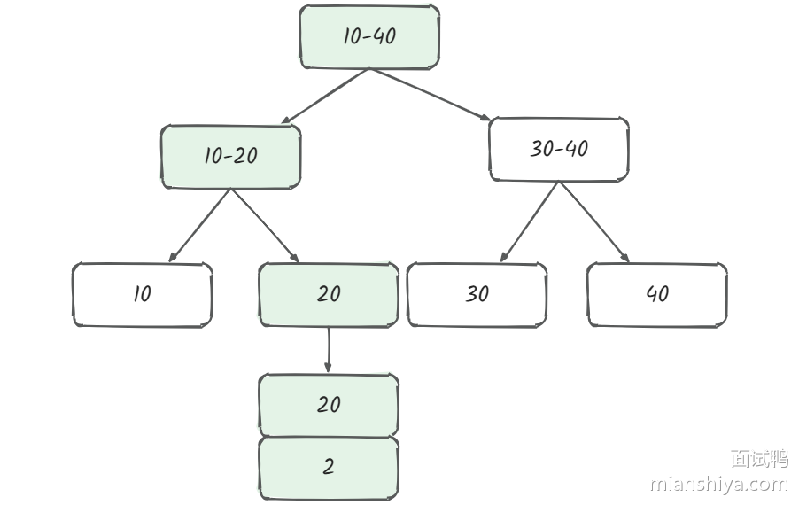

2）由于查询条件是 select * ，需要 name、age、id 三个字段，而 age 索引内没有 name 字段，因此还需要再根据主键去查找整行的数据：


最终得到 2、小鱼、20 三个数据。

回表其实不仅仅只是多查一次，**还会带来随机 I/O**。

因为通过 id 去主键索引查询的时候，id 肯定是不连续的（例如 age 为 20 的人很多，age 索引中年龄是有序的，但是 id 无序，且是不连续的），所以去主键索引频繁查询会造成大量随机 I/O ，我们都知道顺序 I/O 查询快，而随机 I/O 慢，所以频繁回表效率很低。

因此，不要因为图方便，在代码里都用 select * ，从而引发不必要的回表操作。

### MySQL InnoDB 引擎中的聚簇索引和非聚簇索引有什么区别？

#### 回答重点

**聚簇索引**：

- 索引叶子节点存储的是数据行，可以直接访问完整数据。
- 每个表只能有一个聚簇索引，通常是主键索引，适合范围查询和排序。

**非聚簇索引**：

- 索引叶子节点存储的是数据行的主键和对应的索引列，需通过主键才能访问完整的数据行。
- 一个表可以有多个非聚簇索引（称之为非主键索引、辅助索引、二级索引），适用于快速查找特定列的数据。

#### 扩展知识

##### 进一步分析

在 InnoDB 里聚簇索引就是主键索引，非聚簇索引指的是非主键索引（辅助索引、二级索引），默认情况下它们都是 B+树实现的。

以下为一个简单的 B+ 树示例图：

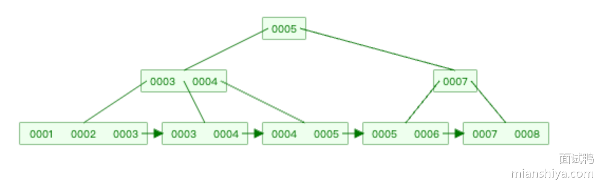

如果是主键索引：

- 非叶子节点存储主键和页号
- 叶子节点存储完整的数据
- 叶子节点之间有双向链表链接，便于范围查询
- 叶子节点内部有页目录，内部记录是单链表链接，通过页目录二分再遍历链表即可得到对应记录。
- B+ 树只能帮助快速定位到的是页，而不是记录。
- 页大小默认 16k，是按照主键大小排序的，所以无序的记录插入因为排序会插入到页中间，又因为容量有限会导致页分裂存储，性能比较差，所以主键要求有序。

如果是非聚簇索引：

- 和主键索引的差别就在于叶子节点仅存储索引列和主键，不包含完整行的数据。

例如一个表有 id、姓名、性别、地址等等字段，本身包含聚簇索引，此时再给姓名建立一个索引，此时的索引叶子节点存储如下图所示：


所以说不要所有查询都用 select * ，因为如果本来只需要查询索引列数据的话，直接利用二级索引就能得到所要的数据。

例如通过姓名仅查询 id 的话，直接利用姓名索引就能得到数据，通过如果图方便直接用 select * ，那就不得不通过 id 再去主键索引查找不需要的性别和地址，浪费资源，且可能伴随着很多随机 I/O。

通过二级索引查找得到 id ，再去主键索引查询的这个过程叫回表。

### 请详细描述 MySQL 的 B+ 树中查询数据的全过程 

#### 回答重点

1）数据从根节点找起，根据比较数据键值与节点中存储的索引键值（用了二分），确定数据落在哪个区间，从而确定分支，从上到下最终定位到叶子节点 

2）叶子节点存储实际的数据行记录，但是一页有 16KB 大小，存储的数据行不止一条 

3）叶子节点中数据行以组的形式划分，利用**页目录**结构，通过二分查找可以定位到对应的组 

4）定位组后，利用链表遍历就可以找到对应的数据行

#### 扩展知识

##### 详细流程解析

数据从根节点找起，根据比较数据键值与节点中存储的索引键值（非叶子节点也有页目录，也能用二分查找，详细看下面叶子节点的分析），确定数据落在哪个区间，从而确定分支，从上到下最终定位到叶子节点。

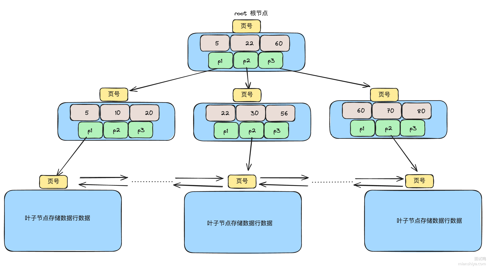

定位到叶子节点后，因为一片叶子默认有 16KB 大小，所以理论上可以存多条记录。叶子节点的实际构造如下图所示：

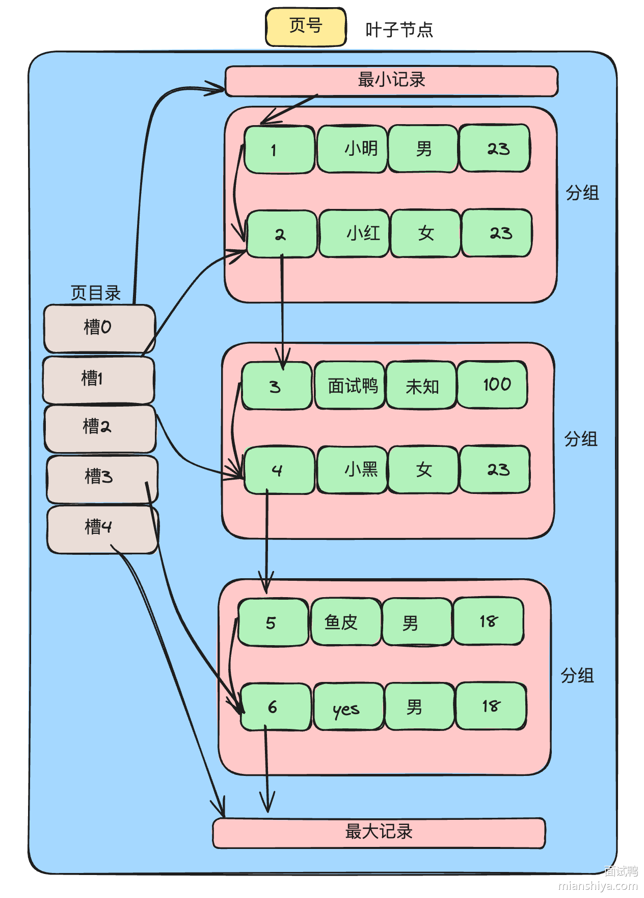

从上图可以知晓，叶子节点有**页目录**结构（非叶子节点也有，当前拿叶子节点分析，结构是一样的），它其实就是一个索引，通过它可以快速找到记录。

页目录分为了多个槽，每个槽都指向对应一个分组内的最大记录，每个分组内都会包含若干条记录。

通过**二分查询**，利用槽就能直接定位到记录所在的组，从而就能获取到对应的记录。

举个例子，现在有 5 个槽，如果想查找主键为 3 的记录，此时的流程是：

1）通过二分得到槽的中间位置，`low = 0`，`high = 4`，`（0+4)/2 = 2`; 2）通过槽定位到第二个分组中的主键为 4 的记录，4 大于 3，`low = 0` 不变，`high = 2`; 3）继续二分 `(0+2)/2 = 1`; 槽 1 中主键 2 小于 3，`low = 1`，`high = 2`; 4）此时 `high - low = 1`，可以确定值在 high 即槽 2 中，但是槽 2 只能定位到主键为 4 的记录，又因为槽之间是挨着的，所以可以得到槽 1 的位置，从槽 1 入手拿到 主键 2 的记录，然后因为记录是通过单向链表串起来的，往下遍历即可定位到主键 3 的记录。

以上就是利用二分查询的定位流程。通过槽可找到对应记录所在的组，或能直接定位到记录，或还需通过链表遍历找到对应的数据。

实际上，每个分组的记录数是有规定的，图中做了省略只画了两条，InnoDB 规定：

- 第一个分组只有一条记录
- 中间的分组 4-8 条记录
- 最后一个分组 1-8 条记录

因此不必担心遍历很长的链表导致性能问题。

这题的重点是先简单提下从根节点遍历到子节点的过程，然后提到每页节点默认大小为 16KB ，所以理论上能存储很多记录，从而引出页目录，再通过二分查找才能对应记录。

### MySQL 中使用索引一定有效吗？如何排查索引效果？

#### 回答重点

**索引不一定有效**。

例如查询条件中不包含索引列、低基数列索引效果不佳，或查询条件复杂且不匹配索引的顺序。

对于一些小表，MySQL可能选择全表扫描而非使用索引，因为全表扫描的开销可能更小。

最终是否用上索引是根据 MySQL 成本计算决定的，评估 CPU 和 I/O 成本最终选择用辅助索引还是全表扫描。有时候确实是全表扫描成本低所以没用上索引。但有时候由于一些统计数据的不准确，导致成本计算误判，而没用上索引。

**排查索引效果的方法**：使用 `EXPLAIN` 命令，通过在查询前加上`EXPLAIN`，可以查看 MySQL 选择的执行计划，了解是否使用了索引、使用了哪个索引、估算的行数等信息。

主要观察 `EXPLAIN` 结果以下几点：

- type（访问类型）：这个属性显示了查询使用的访问方法，例如 `ALL`、`index`、`range `等。当查询使用索引时，这个属性通常会显示为 `index` 或 `range` ，表示查询使用了索引访问。如果这个值是 `ALL` ，则表示查询执行了全表扫描，没有使用索引。
- key（使用的索引）：这个属性显示了查询使用的索引，如果查询使用了索引，则会显示索引的名称。如果这个值是 `NULL`，则表示查询没有使用索引。
- rows（扫描的行数）：这个属性显示了查询扫描的行数，需要评估下扫描量。

#### 扩展知识

##### 确定索引真的生效了吗？

索引失效的场景有很多，也是面试官经常喜欢问的，可以根据具体场景进行排查，典型场景可以分为以下几点（实际索引的选择会根据 mysql 优化器的成本评定，答案最后会提到）：

###### 1）使用了联合索引却不符合最左前缀

举个例子：小鱼对 `user` 表建立了一个联合索引为 `name_age_id` 的联合索引。

他使用以下 SQL 查询`select * from user where age = 10 and id = 1;`

这样的写法恰恰不满足最左前缀原则，索引就失效啦。

###### 2）索引中使用了运算

例如这个 SQL `select * from user where id + 3 = 8`。这样会导致全表扫描计算 `id` 的值再进行比较，使得索引失效。

###### 3）索引上使用了函数也会失效

例如：`select * from user where LOWER(name) like 'cong%';`。这样也会导致索引失效，索引参与了函数处理，会导致去全表扫描。

###### 4） like 的随意使用

例如：`select * from user where name like '%cong%';`因为索引是从左到右来进行排序查找的，占位符直接放在了最左边开头，可能会导致直接全表扫描，这种情况就会导致索引失效。

###### 5）or 的随意使用

`user` 当前只有一个索引 `name` 。此时执行以下SQL ：`select * from user where name= 'cong' or age = 18;` 这可能也会导致索引失效，因为 age 没有索引。

###### 6）随意的字段类型使用

不小心将 `varchar` 类型的 `name` 条件匹配了 `int` 类型字段。SQL 是这样的 `select * from user where name = 1;`，在代码中涉及 隐式转换 ！等于 `select * from user where CAST(name AS signed int) = 1;`，这就变成了第三条索引上使用了函数，导致索引失效。

除此之外还有**隐式字符编码转换**的问题，即联表查询的时候，如果不同表之间的关联字段字符编码不一致，也会导致隐式转换编码，等于变相用上了函数，使得索引失效。

###### 7）不同的参数也会导致索引失效

这个就是我在回答重点里面说的“是否用上索引是根据 MySQL 成本计算决定的”。不同的参数 MySQL 评估成本不一致，有时候会选择使用索引，有时候会选择全表扫描，**特别是在复杂查询（联表、子查询、需要回表等）的情况下**。

比如根据商品从订单表查询，收集商品对应的所有买家的订单信息。如果传入的商品 id 是个热点商品，占据这家店铺 80% 的销量，那么本次查询对订单表很可能是全表查询，如果是冷门商品，则很可能是走索引查询。

###### 8）表中两个不同字段进行比较

例如这样的SQL :`select * from user where id > age;` ，将 `id` 跟 `age` 字段做了比较，索引失效。

###### 9）使用了 order by

当 `order by` 后面跟的 **不是主键** 或者 **不是覆盖索引** 会导致不走索引。

##### 为什么索引生效了反而查询变慢了呢？

确认是否选对了索引！MySQL 根据优化器会评估成本选择对应的索引，但有时候 MySQL 因为估计值不准确，导致选错了索引，因此查询速度反而更慢。

##### 关于使用索引的进一步认识

为了故事可以顺利的发展，先来一张表， DDL 如下：

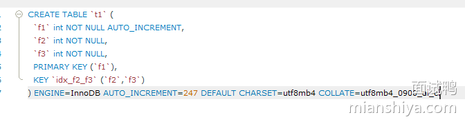

现在要执行这个语句`SELECT * FROM yes.t1 where f3 = 11`;

你觉得用的是哪个索引？

很多同学可能会觉得虽然有 idx_f2_f3 这个联合索引，但是查询条件是 f3，没有 f2，不符合最左匹配原则，所以很显然只能进行全表扫描。

我们来 explain 一下，看看：


可以看到结果，key 是 idx_f2_f3 ，所以这个查询用上了 idx_f2_f3 这个索引！这里可能有人就理解不了，怎么不符合最左索引原则也能用上联合索引了呢？

从 explain 结果来看，确实用上的联合索引，**但是它的 type 是 index，所以它不是你认为的那种用上索引**，它等于全扫描的联合索引来获取结果。现在不太理解没事，听下面好好解释。

##### 到底什么叫用了索引？

我们都知道 InnoDB 是基于聚簇索引来构建数据的，在没有创建其它二级索引的前提下，你查询数据就必须且只能用聚簇索引，因为数据就只在这个索引上，那你找数据不用这个索引那用什么呢？

如果你建起了其他二级索引，那么查找数据就可能不用聚簇索引，而是只用上二级索引就能直接得到想要的数据(就是上面查询的例子)。

综上所述，**你在 InnoDB 查找任何数据，都只能用索引**。

那为什么平日里有人说这个不走索引，走了全表扫描呢？

我们都知道默认 InnoDB 的索引结构是 B+ 树，这个树有个特性，它的叶子节点之间是通过链表相连的。

所以只要我们找到**主键索引**最左边的叶子结点，然后往右顺序遍历扫描，就能得到这张表的所有记录，这样的扫描方式就叫全表扫描。

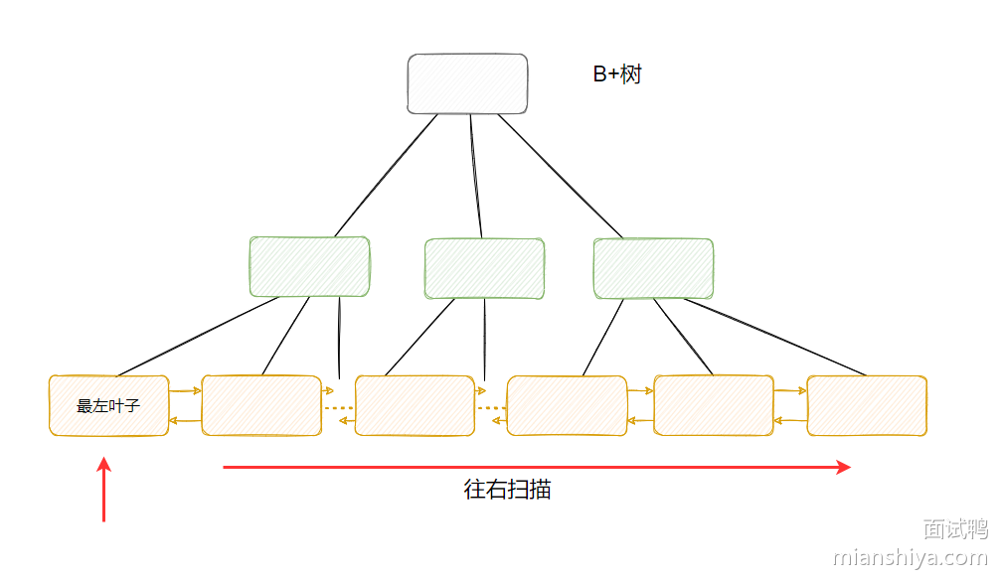

> 小贴士：我不清楚 MySQL 是记录了最左叶子节点的位置还是根据根节点查找到最左叶子节点的，反正意思就是那个意思，不影响我们理解全表扫描。

那什么叫用上索引？

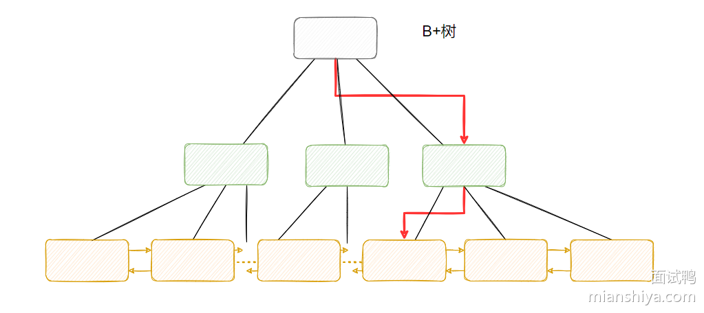

看红色的查询路线没，能利用树的快速查找能力来定位到数据所在的页，这样的查询才能算用上索引。

那从主键索引反推到二级索引，其实是一样的。能利用二级索引树的特性来查找数据，就是用上了索引。

但是如果用不上二级索引树的快速查找，是否有像全表扫描这样，直接扫描二级索引的所有叶子节点的操作呢？

有的，就是我们上面的例子，我再把执行结果的截图搬下来：

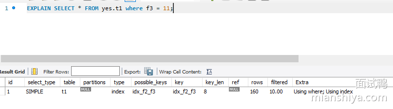

这次查询 MySQL 就是全扫描二级索引 idx_f2_f3 来直接返回所要的数据。

原因就是二级索引已经包含了查询所要到全部数据:f1、f2、f3，所以直接全扫描二级索引即可。

可以看到 explain 的 **type=index**，即全扫描二级索引。

这也叫用上了索引。

此时我们换用 f2 来作为查询条件，这样就符合最左匹配原则了，我们来看看 explain 有什么区别：

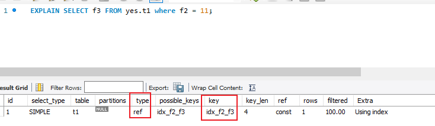

可以看到还是用了 idx_f2_f3 ，只是 type 变成 ref ，这个 ref 就表明可以与常量进行等值匹配时来快速查询得到结果。

这也叫用上了索引。

好了，我们来总结一下到底什么叫用了索引：

- 利用主键索引快速查找
- 利用二级索引快速查找
- 全扫描二级索引进行查找

以上这三种就是我们平日里所说的用上了索引，然后全扫描主键索引就是我们所说的全表扫描（等价于没用上索引，但是我们知道它其实是用上了主键索引对吧？）。

至此，我想你应该已经清楚，到底什么叫用了索引了。

##### 小疑惑

关于 MySQL 索引的一些认识都讲完了，不过看了上面的例子，有些同学可能会有点疑惑：

> 既然都要全扫描，为什么要扫描二级索引，而不是主键索引？

因为主键索引存储了所有的数据，包括数据行相关的事务ID、回滚指针等等。

而二级索引不包含这些，它只有主键值和索引列的值。

所以相对而言直接读取二级索引开销会更小一些，**所以在索引能覆盖返回值的时候，一般都会选择二级索引来查找**。

比如我把上面的表再加个字段：f4。

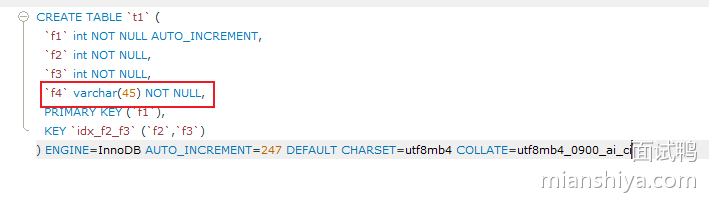

现在我们再来执行`SELECT * FROM yes.t1 where f3 = 11;`


可以看到，这个时候就没用上二级索引了，而是直接全表扫描了。原因就是二级索引无法覆盖返回值，因为多了个 f4 的字段。

如果用了 idx_f2_f3 这个索引，想要得到 f4 的值，还需要再得到的主键再去主键索引里面进行查找，然后才能得到 f4 的值，这样回表的效率就低了。

当然其实结果还不一定，有时候也有可能 MySQL 的统计信息有误，用错了索引。因为 MySQL 是基于成本来选择执行计划的，有 I/O 成本和 CPU 成本，哪个索引成本低就用哪个索引。

###### MySQL 如何选择执行计划(I/O 成本和 CPU 成本，即如何选择合适的索引)？

- [2640. MySQL 的查询优化器如何选择执行计划？](https://www.mianshiya.com/bank/1791003439968264194/question/1811361311347494913)

### MySQL 中的索引数量是否越多越好？为什么？

#### 回答重点

**索引并不是越多越好**。因为索引**不论从时间还是空间上都是有一定成本的**

**1）从时间上**

每次对表中的数据进行增删改(INSERT、UPDATE 或 DELETE)的时候，索引也必须被更新，这会增加写入操作的开销。例如删除了一个 name 为面试鸭的记录，不仅主键索引上需要修改，如果 name 字段有索引，那么 name 索引也需要修改，所以**索引越多需要修改的地方也就越多，时间开销就大了**，并且 B+ 树可能会有页分裂、合并等操作，时间开销就会更大。

还有一点需要注意：MySQL 有个查询优化器，它需要分析当前的查询，选择最优的计划，这过程就需要考虑选择哪个索引的查询成本低。如果索引过多，那么会导致优化器耗费更多的时间在选择上，甚至可能因为数据的不准确而选择了次优的索引。

**2）从空间上**

每建立一个二级索引，都需要新建一个 B+ 树，默认每个数据页都是 16KB，如果数据量很大，索引又很多，占用的空间可不小。

#### 扩展知识

- [597. 在 MySQL 中建索引时需要注意哪些事项？](https://www.mianshiya.com/bank/1791003439968264194/question/1780933295459037187)

### 为什么 MySQL 选择使用 B+ 树作为索引结构？ 

#### 回答重点

B+ 树在数据库系统中具有以下几个显著优势：

**1）高效的查找性能**：

B+ 树是一种自平衡树，每个叶子节点到根节点的路径长度相同，B+ 树在插入和删除节点时会进行分裂和合并操作，以保持树的平衡，但它又会有一定的冗余节点，使得删除的时候树结构的变化小，更高效。

查找、插入、删除等操作的时间复杂度为 O(log n)，能够保证在大数据量情况下也能有较快的响应时间。

**2）树的高度增长不会过快，使得查询磁盘的 I/O 次数减少**：

B+ 树不像红黑树，数据越多树的高度增长就越快。它是多叉树，**非叶子节点仅保存主键或索引值和页面指针**，使得每一页能容纳更多的记录，因此内存中就能存放更多索引，容易命中缓存，使得查询磁盘的 I/O 次数减少。

**3）范围查询能力强**：

B+ 树特别适合范围查询。因为叶子节点通过链表链接，从根节点定位到叶子节点查找到范围的起点之后，只需要顺序扫描链表即可遍历后续的数据，非常高效。

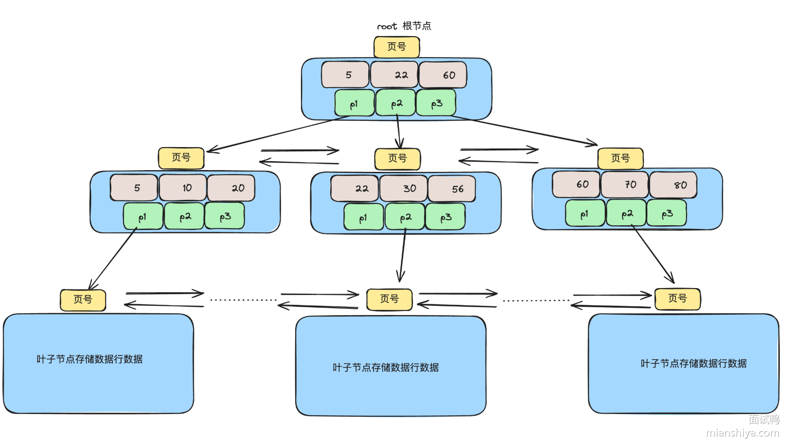

#### 扩展知识

##### B+ 树和 B 树区别

1）B 树每个节点都存储了完整的数据，而 B+ 树非叶子节点仅存储 key 和指针，完整数据存储在叶子节点。这使得 B+ 树可以在内存中存放更多索引页，减少磁盘查询次数。

2）B+ 树叶子组成了链表，便于区间查找，而 B 树只能每一层遍历查找。

3）B+ 树查询时间更平均、稳定，都需要从根节点扫描到叶子节点。而 B 树则在非叶子节点就可能找到对应的数据返回。

### MySQL 三层 B+ 树能存多少数据？

#### 回答重点

在 MySQL 的 InnoDB 存储引擎中，B+ 树默认数据页大小为 16KB。

**参数**：

- 每个节点页大小为 **16KB**（即 **16384 字节**）。
- 假设每个数据记录的主键和数据大小为 **1KB**（一般会比这个小，但这里取整方便计算）。
- 每个内部节点（非叶子节点）存储的是指向子节点的指针和索引键。

**三层 B+ 树的存储计算**：

- **叶子节点**：第三层为叶子节点，每个叶子节点页可存储 **16 条数据记录**（16KB ÷ 1KB）。
- **第二层（中间层）**：假设每个指针**6 字节**和索引键（一般为 bigint）的大小为 **8 字节**，那么每个中间节点页可以指向 **1170 个叶子节点**【16KB 转成字节需要乘以 1024，因此（16 * 1024 ÷ （6+8）字节）=1170】。
- **第一层（根节点）**：根节点可以指向 **1170 个中间节点**。

由此，三层 B+ 树大致能存储的数据总量为：`1170 * 1170 * 16 = 21902400`，一棵三层的 B+ 树在 MySQL 中可以存储大约 **2000 万条记录**。

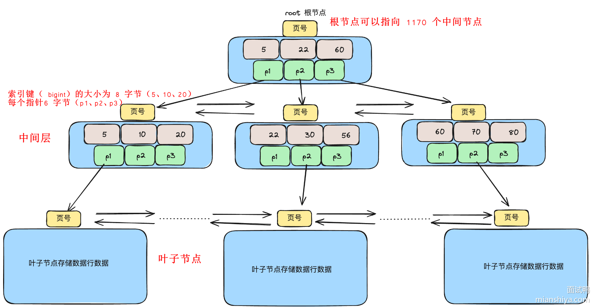

**这里要注意这个只是估算值，具体数量会因实际的数据大小、页大小等因素略有不同。**

#### 扩展知识

##### InnoDB 中页的大小

在 InnoDB 中，B+ 树的每个节点通常对应一个 **页（Page）**，默认页大小为 **16KB**。页的大小可以通过调整参数 `innodb_page_size` 来修改（通常为 4KB、8KB 或 16KB）。

注意：在 MySQL InnoDB 中，主键索引 B+ 树叶子节点存储的是数据行的完整信息，包括主键和其他字段。

每条记录（即每个数据行）在 B+ 树的叶子节点中按照主键顺序存储，这使得 InnoDB 的 B+ 树既支持高效的单条记录查询，也支持范围查询。

##### 其他

- [600. 请详细描述 MySQL 的 B+ 树中查询数据的全过程](https://www.mianshiya.com/bank/1791003439968264194/question/1780933295471620098)
- [601. 为什么 MySQL 选择使用 B+ 树作为索引结构？](https://www.mianshiya.com/bank/1791003439968264194/question/1780933295475814402)

### 在 MySQL 中建索引时需要注意哪些事项？ 

#### 回答重点

简单总结了以下六点：

1）不能盲目建立索引，**索引并不是越多越好**，索引会占用空间，且每次修改的时候可能都需要维护索引的数据，消耗资源。

2）对于字段的值有**大量重复的不要建立索引**。比如说：性别字段，在这种重复比例很大的数据行中，建立索引也不能提高检索速度。**但是也不绝对**，例如定时任务的场景，大部分任务都是成功，少部分任务状态是失败的，这时候通过失败状态去查询任务，实际上能过滤大部分成功的任务，效率还是可以的。

3）对于一些**长字段不应该建立索引**。比如 text、longtext 这种类型字段不应该建立索引。因为占据的内存大，扫描的时候大量加载至内存中还耗时，使得提升的性能可能不明显，甚至可能还会降低整体的性能，因为别的缓存数据可能因为它被踢出内存，下次查询还需要从磁盘中获取。

4）当**数据表的修改频率远大于查询频率**时，应该好好考虑是否需要建立索引。因为建立索引会减慢修改的效率，如果很少的查询较多的修改，则得不偿失。

5）对于需要频繁作为条件查询的字段应该建立索引。在 where 关键词后经常查询的字段，建立索引能提高查询的效率，如果有多个条件经常一起查询，则**可以考虑联合索引，减少索引数量**。

6）对经常在 order by、group by、distinct 后面的字段建立索引。这些操作通常需要对结果进行排序、分组或者去重，而索引可以帮助加快这些操作的速度。

#### 扩展知识

##### MySQL 索引的最左前缀匹配原则

- [594. MySQL 索引的最左前缀匹配原则是什么？](https://www.mianshiya.com/bank/1791003439968264194/question/1780933295450648578)

##### MySQL 的索引类型

- [591. MySQL 的索引类型有哪些？](https://www.mianshiya.com/bank/1791003439968264194/question/1780933295438065665)

### MySQL 的存储引擎有哪些？它们之间有什么区别？ 

#### 回答重点

MySQL 的主要存储引擎包括：

1）**InnoDB（重点）**：

- 支持事务、行级锁和外键。
- 提供高并发性能，适用于高负载的 OLTP 应用。
- 数据以聚集索引的方式存储，提高检索效率。

2）**MyISAM（重点）**：

- 不支持事务和外键，使用表级锁。
- 适合读取多、更新少的场景，如数据仓库。
- 具有较高的读性能和较快的表级锁定。

3）**MEMORY**：

- 数据存储在内存中，速度快，但数据在服务器重启后丢失。
- 适用于临时数据存储或快速缓存。

4）**NDB (NDBCluster)：**

- 支持高可用性和数据分布，适合大规模分布式应用
- 提供行级锁和自动分区。

5）**ARCHIVE**：

- 用于存储大量历史数据，支持高效的插入和压缩。
- 不支持索引，适合日志数据存储。

| 特性                 | MyISAM | Memory  | InnoDB | Archive | NDB   |
| -------------------- | ------ | ------- | ------ | ------- | ----- |
| B+树索引             | Yes    | Yes     | Yes    | No      | No    |
| 备份/按时间点恢复    | Yes    | Yes     | Yes    | Yes     | Yes   |
| 集群数据库支持       | No     | No      | No     | No      | Yes   |
| 聚簇索引             | No     | No      | Yes    | No      | No    |
| 压缩数据             | Yes    | No      | Yes    | Yes     | No    |
| 数据缓存             | No     | N/A     | Yes    | No      | Yes   |
| 加密数据             | Yes    | Yes     | Yes    | Yes     | Yes   |
| 外键支持             | No     | No      | Yes    | No      | Yes   |
| 全文检索             | Yes    | No      | Yes    | No      | No    |
| 地理空间数据类型支持 | Yes    | No      | Yes    | Yes     | Yes   |
| 地理空间索引支持     | Yes    | No      | Yes    | No      | No    |
| 哈希索引             | No     | Yes     | No     | No      | Yes   |
| 索引缓存             | Yes    | N/A     | Yes    | No      | Yes   |
| 锁的粒度             | Table  | Table   | Row    | Row     | Row   |
| MVCC                 | No     | No      | Yes    | No      | No    |
| 复制支持             | Yes    | Limited | Yes    | Yes     | Yes   |
| 存储限制             | 256TB  | RAM     | 64TB   | None    | 384EB |
| T-tree 索引          | No     | No      | No     | No      | Yes   |
| 事务                 | No     | No      | Yes    | No      | Yes   |

实际上我们仅需重点了解 InnoDB 和 MyISAM 即可，其它仅需有点印象即可。

#### 扩展知识

##### MySQL 8.4 版本一共提供了 10 个引擎

有兴趣的小伙伴可以[点击这里](https://dev.mysql.com/doc/refman/8.4/en/storage-engines.html)，访问官网查看其他引擎详细介绍。


##### 扩展 MySQL 的 InnoDB 存储引擎和 MyISAM 存储引擎有何不同？

[MySQL 中 InnoDB 存储引擎与 MyISAM 存储引擎的区别是什么？](https://www.mianshiya.com/question/1811361310328279041)

### MySQL 中 InnoDB 存储引擎与 MyISAM 存储引擎的区别是什么？

#### 回答重点

##### MyISAM ：

1）MyISAM 是基于 ISAM 引擎而来的，支持全文检索、数据压缩、空间函数，**不支持事务和行级锁，只有表级别锁**，它适用于 OLAP 场景，也就是分析类的，基本上都是读取，不会有什么写入动作的场景。

2）MyISAM 的索引也是 B+ 树，只是不像 InnoDB 那种叶子节点会存储完整的数据，MyISAM 的数据是独立于索引单独存储的，所以主键和非主键索引差别不大。


3）MyISAM 不支持崩溃后的安全恢复，而 InnoDB 有个 redolog 可以支持安全恢复。

4）MyISAM 写入性能差。因为锁的粒度太粗了，不支持行锁，只有表锁，所以写入的时候会对整张表加锁。不过有个并发插入的开关，开启之后当数据中间没有空洞的时候，也就是插入的新数据是从末尾插入时，读取数据是不会阻塞的。

##### InnoDB（MySQL 默认引擎）：

1）InnoDB 支持事务，实现了四种标准的隔离级别，利用 MVCC 来支持高并发，默认事务隔离级别为可重复读，支持行锁，利用行锁+间隙锁提供可重复读级别下防止幻读的能力，支持崩溃后的数据安全恢复。

2）支持外键，不过一般互联网项目都不会用外键的，性能太差，利用业务代码来实现约束即可。

3）由于 InnoDB 使用行级锁定和支持事务，因此在并发性能方面表现较好，特别是在多个用户同时对数据库进行读写操作时。

4）InnoDB 的主键索引称为聚簇索引，也就是数据和索引是放在一起的，这与 MyISAM 有所不同，并且它的辅助索引(非主键索引)只存储索引值与主键，因此当辅助索引不能覆盖查询的列时，需要通过找到的主键再去聚簇索引查询数据，这个过程称之为回表。


#### 扩展知识

##### MyISAM 和 InnoDB 适用场景

InnoDB 更适合需要高并发、事务处理和数据完整性保证的场景，例如电商平台、金融系统和社交网络等。

而 MyISAM 更适合读操作远多于写操作且对数据完整性要求不高的场景，例如内容管理系统、博客平台和报表系统等。

### 数据库的脏读、不可重复读和幻读分别是什么？ 

#### 回答重点

**1）脏读（Dirty Read）**：

- 一个事务读取到另一个事务未提交的数据。如果该未提交事务最终被回滚，那么第一个事务读取的数据就是不一致的（脏的）。

**2）不可重复读（Non-repeatable Read）**：

- 在同一事务中，读取同一数据两次，但由于其他事务的提交，读取的结果不同。例如，事务 A 读取了一行数据，事务 B 修改并提交了这行数据，导致事务 A 再次读取时得到不同的值。

**3）幻读（Phantom Read）**：

- 在同一事务中，执行相同的查询操作，返回的结果集由于其他事务的插入而发生变化。例如，事务 A 查询符合某条件的记录，事务 B 插入了新记录并提交，导致事务 A 再次查询时看到不同的记录数量。

#### 扩展知识

##### **几种读与隔离级别的关系**：

脏读、不可重复读和幻读是不同隔离级别下可能发生的问题：

- 读未提交允许脏读。
- 读已提交防止脏读，但可能出现不可重复读。
- 可重复读防止脏读和不可重复读，但仍可能出现幻读。
- 串行化防止所有三种问题，但性能开销较大。

##### 注意不可重复读与幻读的区别

幻读是指在事务期间，对于数据总量的突然增加或减少，将别的事务提交的读取到了（针对于数据的数量），不可重复读是指对于同一条数据，在事务执行期间，里面的字段内容发生了变化，读取到了别的事务提交修改的数据。（针对于数据的内容）。

### MySQL 是如何实现事务的？

#### 回答重点

MySQL 主要是通过：**锁、Redo Log 、Undo Log、MVCC** 来实现事务。

MySQL 利用锁（行锁、间隙锁等等）机制，使用数据并发修改的控制，满足事务的隔离性。

Redo Log（重做日志），它会记录事务对数据库的所有修改，当 MySQL 发生宕机或崩溃时，通过重放 redolog 就可以恢复数据，用来满足事务的持久性。

Undo Log（回滚日志），它会记录事务的反向操作，简单地说就是保存数据的历史版本，用于事务的回滚，使得事务执行失败之后可以恢复之前的样子。实现原子性和隔离性

MVCC（多版本并发控制），满足了非锁定读的需求，提高了并发度，实现了读已提交和可重复读两种隔离级别，实现了事务的隔离性。

> 看到这有小伙伴问一致性呢？

其实事务主要是为了实现一致性，具体是通过 AID，即原子性、隔离性和持久性来达到一致性的目的。

#### 扩展知识

##### binlog、redo log 和 undo log

- [106. MySQL 中的日志类型有哪些？binlog、redo log 和 undo log 的作用和区别是什么？](https://www.mianshiya.com/question/1772575207802904578)
- [1534.什么是 Write-Ahead Logging (WAL) 技术？它的优点是什么？MySQL 中是否用到了 WAL？](https://www.mianshiya.com/question/1805421201916108802)

##### MySQL 锁

[609.MySQL 中有哪些锁类型？](https://www.mianshiya.com/question/1780933295500980225)

##### Log buffer

[628. MySQL 中的 Log Buffer 是什么？它有什么作用？](https://www.mianshiya.com/question/1780933295563894785)

##### Undo Log 和 MVCC

[604.MySQL 中的 MVCC 是什么？](https://www.mianshiya.com/question/1780933295484203009)

### MySQL 事务的二阶段提交是什么？

#### 回答重点

MySQL 事务的二阶段提交是指在 MySQL 中，为了确保**redo log**（重做日志）和 **binlog**（二进制日志）之间的一致性，使用的一种机制。MySQL 通过二阶段提交来保证在**crash recovery**（崩溃恢复）时，不会出现**数据丢失**或**数据不一致**的情况。

**二阶段提交的两个阶段**：

- **准备阶段（Prepare Phase）**：在事务提交时，MySQL 的 InnoDB 引擎会先写入 **redo log**，并将其状态标记为**prepare**，表示事务已经准备提交但还未真正完成。此时的 redo log 是预提交状态，还未标记为完成提交。
- **提交阶段（Commit Phase）**：当 redo log 的状态变为 prepare 后，MySQL Server 会写入 **binlog**（记录用户的 DML 操作）。binlog 写入成功后，MySQL 会通知 InnoDB，将 redo log 状态改为**commit**，完成整个事务的提交过程。


#### 扩展知识

##### binlog 和 redo log 的区别

**redo log**：

- **重做日志**（redo log）是 InnoDB 引擎内部的事务日志，用于记录数据页的物理修改。
- redo log 是固定大小的环形日志，主要用于**崩溃恢复**。它可以帮助 InnoDB 在崩溃后通过日志重做未写入数据页的数据修改，从而确保数据的持久性。

**binlog**：

- **二进制日志**（binlog）是 MySQL Server 层的日志，用于记录所有数据库的修改操作，包括增删改操作（DML）以及表结构的修改（DDL）。
- binlog 是**追加写入**的日志文件，主要用于**数据恢复**、**主从复制**、**数据备份**等场景。它记录的是 SQL 语句的逻辑修改操作，而非数据页的物理修改。

##### 为什么需要二阶段提交

**如果没有二阶段提交**，关于这两个日志，要么就是先写完 redo log，再写 binlog 或者先写 binlog 再写 redo log。我们来分析一下会产生什么后果。

1）**先写完 redo log，再写 binlog**

写完 redo log 后，MySQL 异常宕机，binlog 还未写入数据。重启后 redo log 记录了，因此可以从 redo log 恢复事务的修改，但是 binlog 并没有本次事务提交的数据。后续通过 binlog 恢复的时候，本次事务的修改就丢了。

2）**先写完 binlog，再写 redo log**

写完 binlog 后，MySQL 异常宕机，redo log 还未写入数据。重启后因为 redo log 中没有记录，所以无法恢复本次事务的修改，但是 binlog 记录了本次事务提交的数据。后续通过 binlog 恢复的时候，本次事务的修改可以复原，但是这和原库的数据又不一致了。

**如有有二阶段提交**，MySQL 异常宕机恢复后如何保证数据一致呢？

1）**redo log 处于 prepare 阶段，binlog 还未写入**，此时 MySQL 异常宕机。

这个阶段很好理解，由于 redo log 还未 commit ，所以异常恢复后，redo log 中记录的数据也不作数，binlog 内也没有记录数据，此时数据是一致的。

1）**redo log 处于 prepare 阶段，binlog 已写入，但 redo log 还未 commit**，此时 MySQL 异常宕机。

此时仅需对比 redo log 中 prepare 的数据和 binlog 中的数据是都一致即可。

如果一致，则提交事务。不一致，则回滚事务。

##### 直接先写完 redo log，再写 binlog，崩溃恢复后直接判断两个日志数据是否完整不就好了？为什么还要分二阶段?

理论上是可以的，但是从意义上来说有冲突。

因为 redo log 提交了，意味着事务已经提交，**此时是无法回滚的**。如果 binlog 没写入，此时数据就不一致了。

此时还有一种方案就是崩溃恢复时再补 binlog，补数据还是比较麻烦，还不如直接用两阶段了。

两阶段提交其实是一个经典的分布式解决方案，在协商场景下，每个人都被询问说 ok 了才提交，就是为了避免后续的回滚或者补数据的情况。

##### 如何对比 redo log 和 binlog 是一致的？

两个日志都有一个字段：XID。

因此崩溃恢复的时候，扫描 redo log，如果发现有 prepare 的 redo log 则利用它的 XID 去 binlog 查询，如果找到对应的数据，则说明数据都保存了，事务可以提交，反之事务回滚。

##### 组提交

组提交（Group Commit） 是 InnoDB 引擎中的一种优化技术，主要用于优化 redo log 的写入过程。它通过将多个事务的 redo log 刷盘操作合并为一次磁盘同步操作，从而减少 fsync 的调用次数，提高 MySQL 在高并发环境下的事务提交效率。

具体工作原理如下：

1. 当多个事务同时提交时，InnoDB 会先将这些事务的 redo log 记录写入到日志缓冲区中，但不会立即将每个事务的日志同步到磁盘。
2. 当组提交条件满足时（如等待时间到达、日志缓冲区达到一定大小等），InnoDB 会将多个事务的日志一次性进行磁盘同步（`fsync`），将这些事务的 redo log 一起持久化到磁盘。

通过组提交的方式，InnoDB 能够减少多次单独的 `fsync` 调用，从而降低磁盘 I/O 的压力。

组提交除了能应用到 redo log 中，实际 binlog 的刷盘也可以组提交，但是效果一般，因为它的 write 和 fsync 之间的间隔比较短。

不过可以通过设置 `binlog_group_commit_sync_delay` 和 `binlog_group_commit_sync_no_delay_count` 来实现 binlog 组提交的效果。

- `binlog_group_commit_sync_delay` 参数，表示延迟多少微秒后才调用 fsync;
- `binlog_group_commit_sync_no_delay_count` 参数，表示累积多少次以后才调用 fsync。

除此之外还有一个参数也需要关注一下，即 **`innodb_flush_log_at_trx_commit`** 。

这个参数控制了 **redo log** 的刷盘策略，是影响组提交效果的重要配置：

- **`innodb_flush_log_at_trx_commit=1`**：每个事务提交时都立即将 **redo log** 刷新到磁盘，最安全，但组提交效果较弱。
- **`innodb_flush_log_at_trx_commit=2`**：每个事务提交时仅将日志写入操作系统缓存，定期刷新到磁盘，组提交效果更明显。
- **`innodb_flush_log_at_trx_commit=0`**：不在事务提交时刷盘，数据可能丢失，但可以最大化组提交的效果。

### MySQL 中长事务可能会导致哪些问题？

#### 回答重点

1）**长时间的锁竞争，阻塞资源**：

- 长事务持有锁的时间较长，容易导致其他事务在尝试获取相同锁时发生阻塞，从而增加系统的等待时间和降低并发性能。
- 业务线程也会因为长时间的数据库请求等待而阻塞，部分业务的阻塞可能还会影响到别的服务，导致产生雪崩，最终使得服务全面崩盘，导致非常严重的线上事故。

2）**死锁风险**：

- 长事务更容易产生死锁，因为多个事务可能在互相等待对方释放锁，导致系统无法继续执行。

3）**主从延迟**：

- 主库需要长时间执行，然后传输给从库，从库又要重放好久，期间可能有很长一段时间数据是不同步的。

4）**回滚导致时间浪费**：

- 如果长事务执行很长一段时间，中间突发状况导致抛错，使得事务回滚了，之前做的执行都浪费了。

#### 扩展知识

##### 长事务的 SQL 如何处理？

比如，你现在需要删除一张一共有 5 亿数据的表里面的 2021 年数据，假设这张表叫 yes。

我相信你脑子在 1s 内肯定会蹦出这条 SQL :

```sql
delete from yes where create_date > " 2020-12-31" and create_date < "2022-01-01";
```

当时由于数据量太大，这就会产生上面所说的长事务问题。如何解决呢？

答案就是拆！怎么拆呢？想必很多小伙伴会觉得很简单，按日期拆不就完事了？

```
delete from yes where create_date > "2020-12-31" and create_date < "2021-02-01";
```

`delete from yes where create_date >= "2021-02-01" and create_date < "2021-03-01";` ......

这当然可以，恭喜你，你已经拆分成功了，没错就这么简单。

但是，**如果 create_date 没有索引怎么办？**

没索引的话，上面这就全表扫描了啊？

影响不大，没有索引我们就给他创造索引条件，这个条件就是主键。

我们直接一个 select min(id)... 和 select max(id).... 得到这张表的主键最小值和最大值，假设答案是233333333 和 666666666。

然后我们就可以开始操作了：

```
delete from yes where (id >= 233333333 and id < 233433333) and create_date > "2020-12-31" and create_date < "2022-01-01";
delete from yes where (id >= 233433333 and id <233533333) and create_date > "2020-12-31" and create_date < "2022-01-01";
```

......

```
delete from yes where (id >= 666566666 and id <=666666666) and create_date > "2020-12-31" and create_date < "2022-01-01";
```

当然你也可以再精确些，通过日期筛选来得到 maxId，这影响不大（不满足条件的 SQL 执行很快，不会耗费很多时间）。

这样一来 SQL 就满足了分批的操作，且用得上索引。

如果哪条语句执行出错，只会回滚小部分数据，我们重新排查下就好了，影响不大。

而且拆分 SQL 之后还可以**并行提高执行效率**。

当然并行可能有锁竞争的情况，导致个别语句等待超时。不过影响不大，只要机器状态好，执行的快，因为锁竞争导致的等待并不一定会超时，如果个别 SQL 超时的话，重新执行就好了。

##### 删除的思路转换

关于大表删除有时候要转换思路，**把删除转成插入**。

假设还是有一张 5 亿的数据表，此时你需要删除里面 4.8 亿的数据，那这时候就不要想着删除了，要想着插入。

道理很简单，删除 4.8 亿的数据，不如把要的 2000W 插入到新表中，我们后面业务直接用新表就好了。

这两个数据量对比，时间效率差异不言而喻了吧？

具体操作也简单：

1. 创建一张新表，名为 yes_temp
2. 将 yes 表的 2000W 数据 select into 到 yes_temp 中
3. 将 yes 表 rename 成 yes_233
4. 将 yes_temp 表 rename 成 yes

狸猫换太子，大功告成啦！

之前有个记录表我们就是这样操作的，就 select into 近一个月的数据到新表中，以前老数据就不管了，然后 rename 一下，执行的非常快，1 分钟内就搞定了。

这种类似的操作是有工具的，比如 pt-online-schema-change 等，不过我没用过，有兴趣的小伙伴可以自己去看看，道理是一样的，多了几个触发器，这里不多赘述了。

### MySQL 中的 MVCC 是什么？

#### 回答重点

MVCC（Multi-Version Concurrency Control，多版本并发控制）是一种并发控制机制，允许多个事务同时读取和写入数据库，而无需互相等待，从而提高数据库的并发性能。

在 MVCC 中，数据库为每个事务创建一个数据快照。每当数据被修改时，MySQL 不会立即覆盖原有数据，而是生成新版本的记录。每个记录都保留了对应的版本号或时间戳。

多版本之间串联起来就形成了一条版本链，这样不同时刻启动的事务可以**无锁**地获得不同版本的数据(普通读)。此时读(普通读)写操作不会阻塞。

写操作可以继续写，无非就是会创建新的数据版本（但只有在事务提交后，新版本才会对其他事务可见。未提交的事务修改不会影响其他事务的读取），历史版本记录可供已经启动的事务读取。


（为保持简短，简化了SQL语句，下面的内容也同样简化）

#### 扩展知识

##### Undo Log

Undo Log 是 MySQL InnoDB 中用于支持事务的回滚操作的一种日志机制。它记录了数据修改的历史信息，使得在事务失败或需要撤销某些操作时，可以将数据恢复到先前的状态。

实际上 MVCC 所谓的多版本不是真的存储了多个版本的数据，**只是借助 undolog 记录每次写操作的反向操作**，所以索引上对应的记录只会有一个版本，即最新版本。只不过可以根据 undolog 中的记录反向操作得到数据的历史版本，所以看起来是多个版本。


拿上面的` insert （1，XX）`这条语句举例，成功插入之后数据页的记录上不仅存储 ID 1，name XX，还有 trx_id 和 roll_pointer 这两个隐藏字段：

- trx_id：当前事务ID。
- roll_pointer：指向 undo log 的指针。

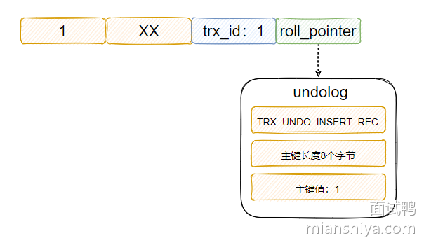

从图中可以得知此时插入的事务 ID 是 1，此时插入会生成一条 undolog ，并且记录上的 roll_pointer 会指向这条 undolog ，而这条 undolog 是一个类型为`TRX_UNDO_INSERT_REC`的 log，代表是 insert 生成的。

里面存储了主键的长度和值(还有其他值，不提)，所以 InnoDB 可以根据 undolog 里的主键的值，找到这条记录，然后把它删除来实现回滚(复原)的效果。因此可以简单地理解 undolog 里面存储的就是当前操作的反向操作，所以认为里面存了个` delete 1` 就行。

此时**事务1提交**，然后另一个 ID 为 5 的事务再执行 `update NO where id 1` 这个语句，此时的记录和 undolog 就如下图所示：


没错，之前 insert 产生的 undolog 没了，insert 的事务提交了之后对应的 undolog 就回收了，因为不可能有别的事务会访问比这还要早的版本了，访问插入之前的版本？访问个寂寞吗？

而 update 产生的 undolog 不一样，它的类型为 `TRX_UNDO_UPD_EXIST_REC`。

此时**事务 5 提交**，然后另一个 ID 为 11 的事务执行`update Yes where id 1` 这个语句，此时的记录和 undolog 就如下图所示：


没错，update 产生的 undolog 不会马上删除，因为可能有别的事务需要访问之前的版本，所以不能删。这样就串成了一个版本链，可以看到记录本身加上两条 undolog，这条 id 为 1 的记录共有三个版本。

##### readView

版本链搞清楚了，这时候还需要知道一个概念 readView，这个 readView 就是用来判断哪个版本对当前事务可见的，这里有四个概念：

- creator_trx_id，当前事务ID。
- m_ids，生成 readView 时还活跃的事务ID集合，也就是已经启动但是还未提交的事务ID列表。
- min_trx_id，当前活跃ID之中的最小值。
- max_trx_id，生成 readView 时 InnoDB 将分配给下一个事务的 ID 的值（事务 ID 是递增分配的，越后面申请的事务ID越大）

**对于可见版本的判断是从最新版本开始沿着版本链逐渐寻找老的版本，如果遇到符合条件的版本就返回**。

判断条件如下：

- 如果当前数据版本的 trx_id == creator_trx_id 说明修改这条数据的事务就是当前事务，所以可见。
- 如果当前数据版本的 trx_id < min_trx_id，说明修改这条数据的事务在当前事务生成 readView 的时候已提交，所以可见。
- 如果当前数据版本的 trx_id 大小在 min_trx_id 和 max_trx_id 之间，此时 trx_id 若在 m_ids 中，说明修改这条数据的事务此时还未提交，所以不可见，若不在 m_ids 中，表明事务已经提交，可见。
- 如果当前数据版本的 trx_id >= max_trx_id，说明修改这条数据的事务在当前事务生成 readView 的时候还未启动，所以不可见(结合事务ID递增来看)。

来看一个简单的案例，练一练上面的规则。

##### 读已提交隔离级别下的 MVCC

**现在的隔离级别是读已提交**。

假设**此时上文的事务1已经提交，事务 5 已经执行，但还未提交**，此时有另一个事务在执行`update YY where id 2`，也未提交，它的事务 ID 为 6，且也是现在最大的事务 ID。

现在有一个查询开启了事务，语句为`select name where id 1`，那么这个查询语句：

- 此时 creator_trx_id 为 0，因为一个事务只有当有修改操作的时候才会被分配事务 ID。
- 此时 m_ids 为 [5，6]，这两个事务都未提交，为活跃的。
- 此时 min_trx_id，为 5。
- 此时 max_trx_id，为 7，因为最新分配的事务 ID 为 6，那么下一个就是7，事务 ID 是递增分配的。

由于查询的是 ID 为 1 的记录，所以先找到 ID 为 1 的这条记录，此时的版本如下：


此时最新版本的记录上 trx_id 为 5，不比 min_trx_id 小，在 m_ids 之中，表明还是活跃的，未提交，所以不可访问，根据 roll_pointer 找到上一个版本。

于是找到了图上的那条 undolog，这条log上面记录的 trx_id 为 1，比 min_trx_id 还小，说明在生成 readView 的时候已经提交，所以可以访问，因此返回结果 name 为 XX。

**然后事务 5 提交**。

此时**再次查询** `select name where id 1`，这时候又会**生成新的 readView**。

- 此时 creator_trx_id 为 0，因为还是没有修改操作。
- 此时 m_ids 为 [6]，因为事务5提交了。
- 此时 min_trx_id，为 6。
- 此时 max_trx_id，为 7，此时没有新的事务申请。

同样还是查询的是 ID 为 1 的记录，所以还是先找到 ID 为 1 的这条记录，此时的版本如下(和上面一样，没变)：

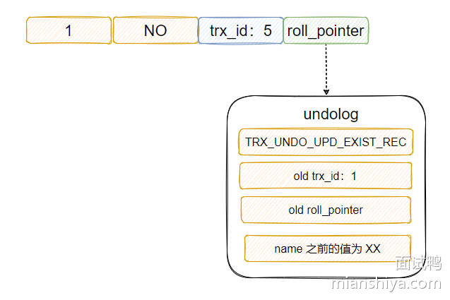

此时最新版本的记录上 trx_id 为 5，比 min_trx_id 小，说明事务已经提交了，是可以访问的，因此返回结果 name 为 NO。

**这就是读已提交的 MVCC 操作**，可以看到一个事务中的两次查询得到了不同的结果，所以也叫不可重复读。

##### 可重复读隔离级别下的MVCC

**现在的隔离级别是可重复读**。

可重复读和读已提交的 MVCC 判断版本的过程是一模一样的，**唯一的差别在生成 readView 上**。

上面的读已提交每次查询都会重新生成一个新的 readView ，而可重复读在第一次生成 readView 之后的所有查询都共用同一个 readView 。

也就是说可重复读只会在第一次 select 时候生成一个 readView ，所以一个事务里面不论有几次 select ，其实看到的都是同一个 readView 。

套用上面的情况，差别就在**第二次**执行`select name where id 1`，不会生成新的 readView，而是用之前的 readView，所以第二次查询时：

- m_ids 还是为 [5，6]，虽说事务 5 此时已经提交了，但是这个readView是在事务5提交之前生成的，所以当前还是认为这两个事务都未提交，为活跃的。
- 此时 min_trx_id，为 5。

(对于判断过程有点卡顿的同学可以再拉上去看看，判断版本的过程和读已提交一致)。

所以在可重复级别下，两次查询得到的 name 都为 XX，所以叫**可重复读**。

##### 可重复读能完全避免幻读的发生吗？

不能。

首先了解下**快照读**和**当前读**这两个概念。

##### 快照读（Snapshot Read）

快照读是指事务在执行查询时，不直接读取当前最新的数据，而是读取数据的历史版本（快照）。MySQL InnoDB 通过多版本并发控制（MVCC）来实现快照读。快照读只会返回在事务开始时可见的数据，即使其他事务在之后修改了这些数据，快照读也不会受影响。

##### 当前读（Current Read）

当前读是指读取数据的最新版本，并且会加锁以确保数据的一致性。即使其他事务对这个数据的修改在当前读的事务之后，这个修改也会反映在当前读的结果中（如果事务 2 开始时间发生在事务 1 之后，那么正常情况下事务 2 的修改对事务 1 不可见，但是事务 1 的当前读可见这个修改）。

当前读出现在带有锁的查询中，如 `SELECT ... FOR UPDATE`、`SELECT ... LOCK IN SHARE MODE`以及 `UPDATE、DELETE`等 DML 语句。

当前读需要获取最新版本应该不难理解，例如别的事务已经 delete 一条语句了，当前事务要执行 update 不得先去看看当前最新的数据情况，如果都删除了还 update 成功那不就乱了吗？

当前读会通过加锁（如 Next-Key Locking）锁定读范围内的所有记录和间隙，防止其他事务在该范围内插入新记录。

再回到可重复读和幻读的问题上来，我们来看下这个场景：

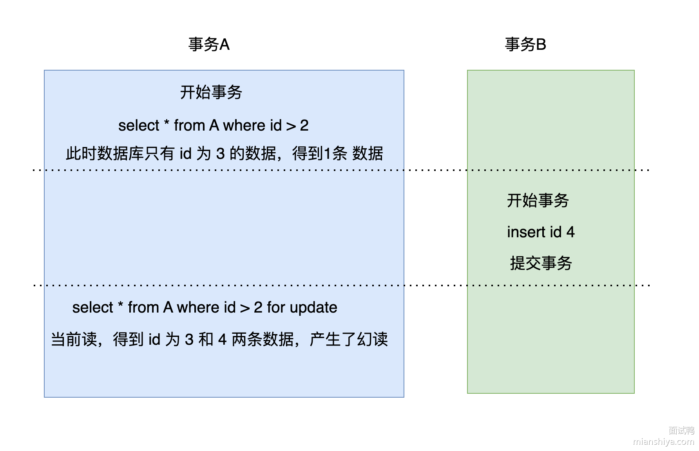

由于当前读的特性，即使在可重复读隔离级别下，也产生了幻读的场景。

如果要避免这个幻读的产生，那么在事务开始的时候，直接就使用 `SELECT ... FOR UPDATE`，加锁了后其他事务就新增不了数据了，也就避免了幻读的发生。

### MySQL 中的事务隔离级别有哪些？ 

#### 回答重点

在 MySQL 中，事务隔离级别主要有以下四种：

**1）读未提交（READ UNCOMMITTED）**：

- 这是最低的隔离级别，在该级别下，一个事务可以看到另一个事务尚未提交的数据修改。这可能会导致**脏读**问题，即读取到其他事务未提交的数据。

**2）读已提交（READ COMMITTED）**：

- 在这个级别下，一个事务只能看到已经提交的其他事务所做的修改。这可以避免脏读问题，但是可能会引发**不可重复读**问题，即在同一个事务中，相同的查询可能返回不同的结果。

**3）可重复读（REPEATABLE READ）**：

- 在这个级别下，确保在一个事务中的多个查询返回的结果是一致的。这可以避免不可重复读问题，但是可能会引发**幻读**问题，即在同一个事务中，多次查询可能返回不同数量的行（MySQL 默认的隔离级别）。

**4）串行化（SERIALIZABLE）**：

- 并发 SQL 事务在 SERIALIZABLE 隔离级别下的执行被保证是可串行化的。可串行化执行被定义为：并发执行的 SQL 事务的操作，其效果与这些 SQL 事务按某种顺序串行执行的效果相同。串行执行是指每个 SQL 事务在下一个 SQL 事务开始之前完成其全部操作 [来源 SQL92定义](https://www.contrib.andrew.cmu.edu/~shadow/sql/sql1992.txt)。
- 这是最高的隔离级别，在这个级别下，保证事务间的操作结果相当于一个按顺序执行的单线程操作。这可以避免所有的并发问题，但是会大大降低并发性能。

#### 扩展知识

##### 隔离级别的影响

较低的隔离级别（如读未提交）提高了并发性，但可能导致数据不一致；较高的隔离级别（如串行化）保证数据一致性，但降低了并发性。因此，在设计应用时，需要在性能和数据一致性之间找到平衡。

一般互联网大厂会选择**读已提交**隔离级别。

- [1535. 你们生产环境的 MySQL 中使用了什么事务隔离级别？为什么？](https://www.mianshiya.com/question/1805421515868151810)

##### 脏读、不可重复读、幻读的概念

- [608. 数据库的脏读、不可重复读和幻读分别是什么？](https://www.mianshiya.com/bank/1791003439968264194/question/1780933295496785922)

##### 补充说明 MySQL 的串行化（SERIALIZABLE）

根据[官网所述](https://dev.mysql.com/doc/refman/8.0/en/innodb-transaction-isolation-levels.html)，MySQL 的 `SERIALIZABLE` 级别类似于 `REPEATABLE READ`。但是如果关闭了自动提交事务，那么 `SERIALIZABLE` 级别下的`普通 SELECT` 会被隐式转成 `SELECT ... FOR SHARE`，即对读加共享锁确保其他事务无法修改正在读取的数据，实现了读的一致性。

这个操作就避免了`REPEATABLE READ`隔离级别下[由于快照读和当前读混用形成的幻读问题](https://www.mianshiya.com/question/1780933295484203009#heading-6)。

### MySQL 默认的事务隔离级别是什么？为什么选择这个级别？ 

#### 回答重点

MySQL 默认的隔离级别是可重复读（ Repeatable Read ），即 RR。

原因是为了兼容早期 binlog 的 statement 格式问题，如果是使用读已提交、读未提交等隔离级别，使用了 statement 格式的 binlog 会导致主从（备）数据库数据不一致问题。

#### 扩展知识

##### 进一步分析 binlog statement 格式和可重复级别的影响

接下来我们来展开讲解下，便于大家理解。

MySQL 在使用过程中，为了避免单台故障，需要使用主从（备）机制：


而 MySQL 的主从（备）涉及 binlog 的复制，即从（备）库的数据是通过 binlog 从主库复制过来的。

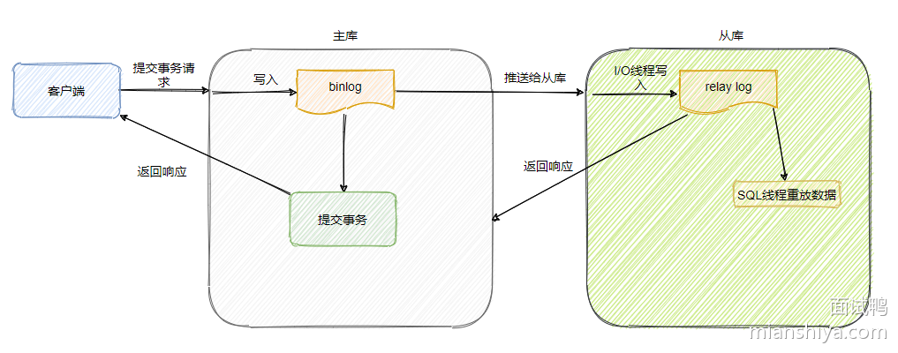

在早期，MySQL binlog 仅支持 statement 格式，这个格式其实存的就是**原先的SQL 语句**，这就使得在读未提交（ru）和读提交（rc）两种隔离级别下会出问题。

我们来实际看个例子：

例如有两个事务 A 和 B ，以下图的时间顺序执行：


在读已提交隔离级别且手动提交事务的情况下， 插入的 5 这条记录会被保留。

但是由于事务 B 先提交，所以它会先被记录在 binlog 中，**这个操作就导致了问题**。

binlog 的记录顺序是：


使得从库同步 binlog 重放的时候，先执行了 insert 再执行 delete，**这就使得从库的数据与主库不一致了！**， 5 这条记录也会被删除了。

所以，为了避免这个问题，只能默认为可重复读级别。因为这个隔离级别下有间隙锁（Gap Locks）、临键锁（Next-Key Locks），所以事务 B 是无法先提交的，会被事务 A 阻塞，因此 binlog 的记录只能是先 delete 再 insert ，这样就没问题了。

### MySQL 中有哪些锁类型？

#### 回答重点

在 MySQL 中，主要有以下几种锁类型：

1）**行级锁（Row Lock）（重点）**：

- 仅对特定的行加锁，允许其他事务并发访问不同的行，适用于高并发场景。

2）**表级锁（Table Lock）（重点）**：

- 对整个表加锁，其他事务无法对该表进行任何读写操作，适用于需要保证完整性的小型表。

3）**意向锁（Intention Lock）**：

- 一种表锁，用于表示某个事务对某行数据加锁的意图，分为意向共享锁（IS）和意向排它锁（IX），主要用于行级锁与表级锁的结合。

4）**共享锁（Shared Lock）（重点）**：

- 允许多个事务并发读取同一资源，但不允许修改。只有在释放共享锁后，其他事务才能获得排它锁。

5）**排它锁（Exclusive Lock）（重点）**：

- 只允许一个事务对资源进行读写，其他事务在获得排它锁之前无法访问该资源。

6）**元数据锁（Metadata Lock, MDL）**：

- 用于保护数据库对象（如表和索引）的元数据，防止在进行 DDL 操作时其他事务对这些对象进行修改。

7）**间隙锁（Gap Lock）（重点）**：

- 针对索引中两个记录之间的间隙加锁，防止其他事务在这个间隙中插入新记录，以避免幻读。间隙锁不锁定具体行，而是锁定行与行之间的空间。

8）**临键锁（Next-Key Lock）（重点）**：

- 是行级锁和间隙锁的结合，锁定具体行和其前面的间隙，确保在一个范围内不会出现幻读。常用于支持可重复读的隔离级别。

9）**插入意向锁（Insert Intention Lock）**：

- 一种等待间隙的锁，用于指示事务打算在某个间隙中插入记录，允许其他事务进行共享锁，但在插入时会阻止其他的排它锁。

10）**自增锁（Auto Increment Lock）**：

- 在插入自增列时，加锁以保证自增值的唯一性，防止并发插入导致的冲突。通常在插入操作时被使用，以确保生成的自增 ID 是唯一的。

#### 扩展知识

这个扩展知识比较长，也是从演进的角度来讲解 MySQL 中比较关键的几个锁，这样记忆和理解会更深刻，减少出现看过没多久就忘了的情况。

##### 共享锁和排他锁

在 MySQL 中锁可以分为两大类，分别是 shared (S) locks 和 exclusive (X) locks。

- S锁，称为共享锁，事务在读取记录的时候获取 S 锁，它允许多个事务同时获取 S 锁，互相之间不会冲突。
- X锁，称为独占锁（排他锁），事务在修改记录的时候获取 X 锁，且只允许一个事务获取 X 锁，其它事务需要阻塞等待。

S 锁之间不冲突，X 锁则为独占锁，所以 X 之间会冲突， X 和 S 也会冲突。

| 冲突 | S      | X    |
| ---- | ------ | ---- |
| S    | 不冲突 | 冲突 |
| X    | 冲突   | 冲突 |

`SELECT ... LOCK IN SHARE MODE;` 这种读取需要对记录上 S 锁。

`SELECT ... FOR UPDATE;` 需要对记录上 X 锁。

MyISAM 引擎仅支持表锁，而 Innodb 即支持表锁也支持行锁。

- `LOCK TABLES yes READ` 是对 yes 这个表上 S 锁。
- `LOCK TABLES yes WRITE` 是对 yes 这个表上 X 锁。

不过一般情况下，我们不会使用表锁，因为平日的 UPDATE 、SELECT 要用也是用行锁了，不可能用粒度粗的表锁，不然性能太低。

唯一能想到用上表锁的就是 DDL 语句了，比如 ALTER TABLE 的时候，应该锁定整个表，防止查询和修改。除此之外 MySQL 还提供了一个叫 MDL 的锁，即 `Metadata Locks`（元数据锁）。

##### 元数据锁

元数据锁也分为读锁和写锁：

1）读锁 (MDL_SHARED)：

当一个事务需要读取表的元数据时（如执行 SELECT 操作），会获取读锁。 多个事务可以同时持有读锁，不会互相阻塞。

2）写锁 (MDL_EXCLUSIVE)：

当一个事务需要修改表的元数据时（如执行 ALTER TABLE 操作），会获取写锁。 写锁会阻塞其他任何读锁和写锁，确保独占访问。

元数据锁的主要作用如下：

1）防止并发的 DDL 操作和 DML 操作冲突：

- 当一个事务对表进行结构性更改（如 ALTER TABLE），元数据锁（写锁）会阻止其他事务对该表进行操作，直到结构更改完成。
- 当一个事务对表进行数据操作（如 SELECT、INSERT、UPDATE、DELETE），元数据锁（读锁）会阻止其他事务对该表进行结构性更改。

2）保护元数据一致性：

- 确保在执行 DDL 操作（如 CREATE TABLE、DROP TABLE、ALTER TABLE）时，元数据不会被其他事务同时修改。

假设业务上真用到了表锁，那么表锁和行锁之间肯定会冲突，当 InnoDB 加表锁的时候，如何判断表里面是否已经有行锁？难道得一条记录一条记录遍历过去找吗？

显然这样的效率太低了！

##### 意向锁

所以有了个叫意向锁（Intention Locks）的东西。

- IS（Intention Shared Lock），共享意向锁
- IX（Intention Exclusive Lock），独占意向锁。

这两个锁是表级别的锁，当需要对表中的某条记录上 S 锁的时候，先在表上加个 IS 锁，表明此时表内有 S 锁。当需要对表中的某条记录上 X 锁的时候，先在表上加个 IX 锁，表明此时表内有 X 锁。

这样操作之后，如果要加表锁，就不需要遍历所有记录去找了，直接看看表上面有没有 IS 和 IX 锁。

比如，此时要上表级别的 S 锁，如果表上没有 IX ，说明表中没有记录有独占锁，其实就可以直接上表级 S 锁。

如果此时要上表级别的 X 锁，如果表上没有 IX 和 IS ，说明表中的所有记录都没加锁，其实就可以直接上表级 X 锁。

**因此 IS 和 IX 的作用就是在上表级锁的时候，可以快速判断是否可以上锁，而不需要遍历表中的所有记录**。

所以 IS 和 IX 互相之间是不会冲突的，因为它们的作用只是打个标记，来丰富一下上面的表格：

| 冲突 | S      | X    | IS     | IX     |
| ---- | ------ | ---- | ------ | ------ |
| S    | 不冲突 | 冲突 | 不冲突 | 冲突   |
| X    | 冲突   | 冲突 | 冲突   | 冲突   |
| IS   | 不冲突 | 冲突 | 不冲突 | 不冲突 |
| IX   | 冲突   | 冲突 | 不冲突 | 不冲突 |

至此，已经理解了共享锁、独占锁、表锁相关的知识，接下来再来看看 MySQL 中的行锁有哪几种。

主要有三种：

- 记录锁（Record Locks）
- 间隙锁（Gap Locks）
- 临键锁（Next-Key Locks）

##### 记录锁

记录锁顾名思义就是锁住当前的记录，它是作用到索引上的。我们都知道 innodb 是肯定有索引的，即使没有主键也会创建隐藏的聚簇索引，所以**记录锁总是锁定索引记录**。

比如，此时一个事务 A 执行 `SELECT * FROM yes WHERE name = 'xx' FOR UPDATE;` 那么 name = xx 这条记录就被锁定了，其他事务无法插入、删除、修改 name = xx 的记录。

此时事务 A 还未提交，另一个事务 B 要执行 `insert into yes (name) values ('xx')`，此时会被阻塞，这个很好理解。

但是，如果另一个事务 C 执行了 `insert into yes (name) values ('aa')`，这个语句会被阻塞吗？

**看情况**。

**在可重复读隔离级别下，如果 name 没有索引**。前面提到记录锁是加到索引上的，但是 name 没索引啊，那只能去找聚簇索引，但聚簇索引上面能通过 name 快速找到数据吗？它只能通过全表扫描一个一个看过去，所以咋办？都锁了呗！

因此，**如果 name 没有索引，那么事务 C 会被阻塞，如果有索引，则不会被阻塞**！

所以这里要注意，没索引的列不要轻易的锁，不要以为有行锁就可以为所欲为，并不是这样的。

##### 间隙锁和临键锁

前面说了，记录锁需要加到记录上，但是如果**要给此时还未存在的记录加锁怎么办**？也就是要预防幻读的出现！

这时候间隙锁就派上用场了，它是给间隙加上锁。

比如此时有 1、3、5、10 这四条记录，之前的文章分析过，数据页中还有两条虚拟的记录，分别是 `Infimum` 和 `Supremum`。

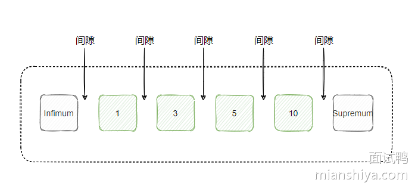

可以看到，记录之前都有间隙，**那间隙锁呢，锁的就是这个间隙**！

比如我把 3 和 5 之间的间隙锁了，此时要插入 id = 4 的记录，就会被这个间隙锁给阻塞了，这样就避免了幻读的产生！也就实现了锁定未插入的记录的需求！

还有个 `Next-Key Locks` 就是记录锁+间隙锁，像上面间隙锁的举例，只能锁定(3,5) 这个区间，而 `Next-Key Locks` 是一个前开后闭的区间(3,5]，这样能防止查询 id=5 的这个幻读。

间隙锁之间不会冲突，**间隙锁的唯一目的就是防止其他事务插入数据到间隙中** ，所以即使两个间隙锁要锁住相同的间隙也没有关系，因为它们的目的是一致的。

间隙锁可以显式禁用，它是在事务隔离级别为可重复读的时候生效的，如果将事务隔离级别更改为 READ COMMITTED，就会禁用了，此时，间隙锁对于搜索和索引扫描是禁用的，仅用于外键约束检查和重复键检查。

##### 插入意向锁

插入意向锁，即 Insert Intention Locks，**它也是一类和间隙相关锁**，但是它不是锁定间隙，而是等待某个间隙。比如上面举例的 id = 4 的那个事务 C ，由于被间隙锁给阻塞了，所以事务 C 会生成一个插入意向锁，表明等待这个间隙锁的释放。

并且插入意向锁之间不会阻塞，因为它们的目的也是只等待这个间隙被释放，所以插入意向锁之间没有冲突。

它的目的不在于锁定资源防止别人访问，我个人觉得更像是为了遵循 MySQL 的锁代码实现而为之。

**锁其实就是内存里面的一个结构**，每个事务为某个记录或者间隙上锁就是创建一个锁对象来争抢资源。

如果某个事务没有抢到资源，那也会生成一个锁对象，只是状态是等待的，而当拥有资源的事务释放锁之后，就会寻找正在等待当前资源的锁结构，然后选一个让它获得资源并唤醒对应的事务使之得以执行。


所以按照这么个逻辑，**那些在等待间隙锁的插入事务，也需要对应的建立一个锁结构，然后锁类型是插入意向锁**。

这样一来，间隙锁的事务在释放间隙锁的时候，才能得以找到那些等待插入的事务，然后进行唤醒，而由锁的类型也可以得知是插入意向锁，之间不需要阻塞，所以可以一起执行插入。

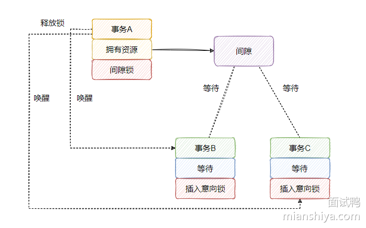

##### Auto-Inc Lock

Auto-Inc Lock 是一个特殊的表级锁，用于自增列插入数据时使用。 在插入一条数据的时候，需要在表上加个 Auto-Inc Lock，然后为自增列分配递增的值，在语句插入结束之后，再释放 Auto-Inc Lock。

在 MySQL 5.1.22 版本之后，又弄了个互斥量来进行自增减的累加。互斥量的性能高于 Auto-Inc Lock，因为 Auto-Inc Lock是语句插入完毕之后才释放锁，而互斥量是在语句插入的时候，**获得递增值之后，就可以释放锁**，所以性能更好。

但是我们还需要考虑主从的情况，由于**并发插入**的情况，基于 statement -based binlog 复制时，自增的值顺序无法把控，可能会导致主从数据不一致。

所以 MySQL 有个 innodb_autoinc_lock_mode 配置，一共有三个值：

- 0，只用 Auto-Inc Lock。
- 1，**默认值**，对于插入前已知插入行数的插入，用互斥量，对于插入前不知道具体插入数的插入，用 Auto-Inc Lock，这样即使基于 statement -based binlog 复制也是安全的。
- 2，只用互斥量。

##### 扩展学习

还有一个谓词锁，Predicate Locks，这个比较少见，大家了解下就好了。

InnoDB 是支持空间数据的，所以有空间索引，为了处理涉及空间索引的操作的锁定，next-key locking 不好使，因为多维数据中没有绝对排序的概念，因此不清楚 “下一个” key 在哪。

所以为了支持具有空间索引的表的隔离级别，InnoDB 使用谓词锁。

空间索引包含最小边界矩形（MBR）值，因此 InnodB 通过在用于查询的 MBR 值上设置谓词锁定，使得 InnoDB 在索引上执行一致性读， 其他事务无法插入或修改与查询条件匹配的行。

### MySQL 的乐观锁和悲观锁是什么？ 

#### 回答重点

**悲观锁（Pessimistic Locking）**：

- 假设会发生冲突，因此在操作数据之前就**对数据加锁**，确保其他事务无法访问该数据。常见于对数据一致性要求较高的场景。
- 实现方式：使用行级锁或表级锁，例如可以使用 `SELECT ... FOR UPDATE` 或 `LOCK IN SHARE MODE` 语句来加锁。

**乐观锁（Optimistic Locking）**：

- 假设不会发生冲突，因此在操作数据时不加锁，而是在更新数据时**进行版本控制或校验**。如果发现数据被其他事务修改，则会拒绝当前事务的修改，需重新尝试。
- 实现方式：通常通过版本号或时间戳来实现，每次更新时检查版本号或时间戳是否一致。

#### 扩展知识

##### 适用场景

1）乐观锁适合**并发冲突少，读多写少**的场景，不用通过加锁只需通过比较字段版本号（或时间戳）是否发生改变的形式，无锁操作，吞吐量较高。

数据库实现乐观锁的例子（版本号）：

```sql
-- 假设有一张用户表 users，包含 id、name 和 version 字段
-- 读取数据
SELECT id, name, version FROM users WHERE id = 1;

-- 更新数据时检查版本号
UPDATE users
SET name = 'new_name', version = version + 1
WHERE id = 1 AND version = current_version;
```

2）悲观锁适合**并发冲突多，写多读少**的场景。通过每次加锁的形式来确保数据的安全性，吞吐量较低。

数据库实现悲观锁的例子：

```sql
-- 读取数据并加锁
SELECT id, name FROM users WHERE id = 1 FOR UPDATE;

-- 执行更新操作
UPDATE users SET name = 'new_name' WHERE id = 1;
```

### MySQL 中如果发生死锁应该如何解决？ 

#### 回答重点

**自动检测与回滚**：

- MySQL 自带死锁检测机制（innodb_deadlock_detect），当检测到死锁时，数据库会自动回滚其中一个事务，以解除死锁。通常会回滚事务中持有最少资源的那个。
- 也有锁等待超时的参数（innodb_lock_wait_timeout），当获取锁的等待时间超过阈值时，就释放锁进行回滚。

**手动 kill 发生死锁的语句**：

- 可以通过命令，手动快速地找出被阻塞的事务及其线程 ID，然后手动 kill 它，及时释放资源。

#### 扩展知识

##### 死锁日志

如果线上遇到死锁的情况，可以通过 `SHOW ENGINE INNODB STATUS` 来获取死锁的日志信息，从而定位到死锁发生的原因。

我从网上找了一个死锁日志，供大家参考学习，有个大致印象即可：

```perl
------------------------
LATEST DETECTED DEADLOCK
------------------------
170219 13:31:31
*** (1) TRANSACTION:
TRANSACTION 2A8BD, ACTIVE 11 sec starting index read
mysql tables in use 1, locked 1
LOCK WAIT 2 lock struct(s), heap size 376, 1 row lock(s)
MySQL thread id 448218, OS thread handle 0x2abe5fb5d700, query id 18923238 renjun.fangcloud.net 121.41.41.92 root updating
delete from test where a = 2
*** (1) WAITING FOR THIS LOCK TO BE GRANTED:
RECORD LOCKS space id 0 page no 923 n bits 80 index `a` of table `oauthdemo`.`test` trx id 2A8BD lock_mode X waiting
Record lock, heap no 3 PHYSICAL RECORD: n_fields 2; compact format; info bits 32
 0: len 4; hex 00000002; asc ;;
 1: len 4; hex 00000002; asc ;;
*** (2) TRANSACTION:
TRANSACTION 2A8BC, ACTIVE 18 sec inserting
mysql tables in use 1, locked 1
4 lock struct(s), heap size 1248, 3 row lock(s), undo log entries 2
MySQL thread id 448217, OS thread handle 0x2abe5fd65700, query id 18923239 renjun.fangcloud.net 121.41.41.92 root update
insert into test (id,a) values (10,2)
*** (2) HOLDS THE LOCK(S):
RECORD LOCKS space id 0 page no 923 n bits 80 index `a` of table `oauthdemo`.`test` trx id 2A8BC lock_mode X locks rec but not gap
Record lock, heap no 3 PHYSICAL RECORD: n_fields 2; compact format; info bits 32
 0: len 4; hex 00000002; asc ;;
 1: len 4; hex 00000002; asc ;;
*** (2) WAITING FOR THIS LOCK TO BE GRANTED:
RECORD LOCKS space id 0 page no 923 n bits 80 index `a` of table `oauthdemo`.`test` trx id 2A8BC lock mode S waiting
Record lock, heap no 3 PHYSICAL RECORD: n_fields 2; compact format; info bits 32
 0: len 4; hex 00000002; asc ;;
 1: len 4; hex 00000002; asc ;;
*** WE ROLL BACK TRANSACTION (1)
```

简单分析一下，上半部分在解释事务 1 即 (1) TRANSACTION 的情况，它执行`delete from test where a = 2` 在申请索引 a 的 X 锁（index `a` of table ... lock_mode X waiting）

下半部分在解释事务 2 即 (2) TRANSACTION，它持有索引 a 的 X 锁，又因为 `insert into test (id,a) values (10,2)` 这个插入语句在申请 S 锁（表中的 a 建立了唯一索引，因此需要 S 锁来进行重复 key 判断）。

所以事务 1 排着队等事务 2 释放 X 锁，而事务 2 又需要 S 锁，申请 S 锁的时候发现等锁的队伍前还有个 X 锁，这样一来就形成了相互依赖。

通过日志分析我们就能知晓死锁的原因，然后通过一定的修改来避免死锁的产生或降低死锁的概率。

##### 常见避免死锁或降低死锁的手段

**1）避免大事务**。大事务占据锁的时间长，将大事务拆分成多个小事务快速释放锁，可降低死锁产生的概率和避免冲突。

**2）调整申请锁的顺序**。在更新数据的时候要保证获得足够的锁，举个例子：先获取影响范围大的锁，比如说修改操作，先将排他锁获取到，再获取共享锁。或固定顺序访问数据，这样也能避免死锁的情况。

**3）更改数据库隔离级别**。可重复读比读已提交多了间隙锁和临键锁，利用读已提交替换之可降低死锁的情况。

**4）合理建立索引，减少加锁范围**。如果命中索引，则会锁对应的行，不然就是全表行都加锁，这样冲突大，死锁的概率就高了。

**5）开启死锁检测**，适当调整锁等待时长。

##### 手动 kill 语句步骤

1）**查找当前的事务和锁信息**：

使用以下命令查看当前正在执行的事务和相关的锁信息：

```sql
SHOW ENGINE INNODB STATUS;
```

这个命令会输出 InnoDB 的状态，包括死锁信息和当前的活动事务。你可以在输出中找到被阻塞的事务及其线程 ID。

除此之外，也可以使用 INFORMATION_SCHEMA 中的 INNODB_LOCKS 和 INNODB_LOCK_WAITS 表，查看当前锁和锁等待情况，得到事务ID。

```sql
SELECT * FROM INFORMATION_SCHEMA.INNODB_LOCKS;
SELECT * FROM INFORMATION_SCHEMA.INNODB_LOCK_WAITS;
```

再通过 INFORMATION_SCHEMA 的 innodb_trx 可以找到事务ID和线程 ID 的对应关系。

2）**手动终止该事务**：

一旦确定了需要 KILL 的线程 ID，使用以下命令终止该事务：

```sql
KILL <thread_id>;
```

将 `<thread_id>` 替换为你找到的实际线程 ID。

##### INNODB_LOCKS 、 INNODB_LOCK_WAITS 和 INNODB_TRX 示例

**INNODB_LOCKS 查询当前锁的信息**

```sql
SELECT * FROM INFORMATION_SCHEMA.INNODB_LOCKS;
```

**示例结果**

| LOCK_ID    | LOCK_MODE | LOCK_TYPE | LOCK_TABLE           | LOCK_INDEX | LOCK_OWNER | LOCK_DATA |
| ---------- | --------- | --------- | -------------------- | ---------- | ---------- | --------- |
| 12345678:1 | X         | RECORD    | my_database/my_table | PRIMARY    | 123456     | 1         |
| 12345678:2 | S         | RECORD    | my_database/my_table | PRIMARY    | 123457     | 2         |

**字段解释**：

- **LOCK_ID**: 唯一标识每个锁。
- **LOCK_MODE**: 锁的类型（X：排它锁，S：共享锁）。
- **LOCK_TYPE**: 锁的作用对象类型（如 RECORD 表示行锁）。
- **LOCK_TABLE**: 被锁定的表。
- **LOCK_INDEX**: 相关索引。
- **LOCK_OWNER**: 拥有该锁的事务 ID。
- **LOCK_DATA**: 被锁定的数据行的主键值。

**INNODB_LOCK_WAITS 查询锁等待情况**

```sql
SELECT * FROM INFORMATION_SCHEMA.INNODB_LOCK_WAITS;
```

**示例结果**

| REQUESTING_TRX_ID | HOLDING_TRX_ID | LOCK_ID    | LOCK_TYPE |
| ----------------- | -------------- | ---------- | --------- |
| 123456            | 123457         | 12345678:1 | RECORD    |
| 123458            | 123459         | 12345678:2 | RECORD    |

**字段解释**

- **REQUESTING_TRX_ID**: 请求锁的事务 ID。
- **HOLDING_TRX_ID**: 当前持有锁的事务 ID。
- **LOCK_ID**: 与 `INNODB_LOCKS` 表中的锁相对应。
- **LOCK_TYPE**: 请求的锁类型。

**INNODB_TRX 查询线程 ID 示例**

```sql
SELECT trx_state, trx_started, trx_mysql_thread_id, trx_query, trx_id 
FROM INFORMATION_SCHEMA.INNODB_TRX 
WHERE trx_id = '123456';
```

**示例结果**

| trx_state | trx_started         | trx_mysql_thread_id | trx_query                           | trx_id |
| --------- | ------------------- | ------------------- | ----------------------------------- | ------ |
| LOCK_WAIT | 2024-09-25 10:00:00 | 1234                | SELECT * FROM my_table WHERE id = 1 | 123456 |

**字段解释：**

- **trx_state**: 事务的当前状态。在此示例中，`LOCK_WAIT` 表示该事务正在等待锁。
- **trx_started**: 事务开始的时间。在此示例中，事务于 2024-09-25 10:00:00 开始。
- **trx_mysql_thread_id**: 与该事务关联的 MySQL 线程 ID，可以用来查找该事务的更多信息。
- **trx_query**: 当前事务正在执行的查询。在此示例中，它正在执行一个简单的 `SELECT` 查询。
- **trx_id**: 事务的唯一标识符。在此示例中，事务 ID 为 `123456`。

### MySQL 中 count(*)、count(1) 和 count(字段名) 有什么区别？ 

#### 回答重点

在 MySQL 中，`count(*)` 、`count(1)`和`count(字段名)` 都是用来**统计行数的聚合函数**，但它们有些许的区别：

##### 功能上：

1）`count(*)` 会统计表中所有行的数量，包括 `null` 值（不会忽略任何一行数据）。由于只是计算行数，不需要对具体的列进行处理，因此性能通常较高。

2）`count(1)` 和 `count(*)` 几乎没差别，也会统计表中所有行的数量，包括 `null` 值。

3）`count(字段名)` 会统计指定字段不为 `null` 的行数。这种写法会对指定的字段进行计数，只会统计字段值不为 `null` 的行。

##### 效率上：

1）`count(1)` 和 `count(*)` 效率一致，网上其实众说纷纭，实际上当然得看官网怎么说！

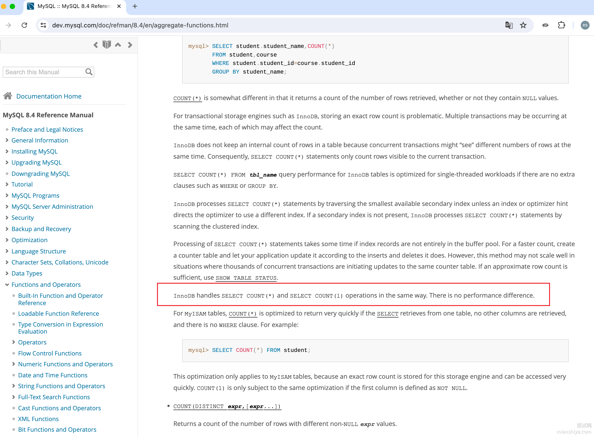

`There is no performance difference.` 没有差异的！

2）`count(字段)` 的查询就是全表扫描(如果对应的字段没有索引，如果有索引则用索引)，正常情况下它还需要判断字段是否是 null 值，因此理论上会比 `count(1)` 和 `count(*)` 慢。

但是如果字段不为 null，例如是主键，那么理论上也差不多，而且本质上它们的统计功能不一样，在需要统计 null 的时候，只能用 `count(1)` 和 `count(*)`，不需要统计 null 的时候只能用`count(字段)`，所以也不用太纠结性能问题。

#### 扩展知识

在 MyISAM 中，由于只有表锁，因此它把每张表的总数单独记录维护（表锁使得对表的修改是串行，因此能维护总数），所以 `count(*)` 非常快，因为等于直接返回一个字段。当然，**前提是不需要条件过滤而是直接返回整表数据**。

而 InnoDB 由于支持行锁，所以会有很多并发来修改表的数据，因此无法维护记录总数，但是 InnoDB 对`count(*)`和`count(1)`也做了一定的优化。

count 的字段如果是主键，由于主键索引保存的是整行记录，占据的空间和内存都比较大，此时表中如果还有其它二级索引，那么成本会更低，因此 InnoDB 会评估这个成本选择合适的索引扫描。当然，这个前提也是不能有对应的条件过滤等功能。

### MySQL 中如何进行 SQL 调优？ 

#### 回答重点

平时进行 SQL 调优，主要是通过观察慢 SQL，然后利用 explain 分析查询语句的执行计划，识别性能瓶颈，优化查询语句。

1）合理设计索引，利用联合索引进行覆盖索引的优化，避免回表的发生，减少一次查询和随机 I/O

2）避免 SELECT * ，只查询必要的字段

3）避免在 SQL 中进行函数计算等操作，使得无法命中索引

4）避免使用 %LIKE，导致全表扫描

5）注意联合索引需满足最左匹配原则

6）不要对无索引字段进行排序操作

7）连表查询需要注意不同字段的字符集是否一致，否则也会导致全表扫描

除此之外，还可以**利用缓存**来优化，一些变化少或者访问频繁的数据设置到缓存中，减轻数据库的压力，提升查询的效率。

还可以**通过业务**来优化，例如少展示一些不必要的字段，减少多表查询的情况，将列表查询替换成分页分批查询等等。

#### 扩展知识

##### 慢 SQL

这是 MySQL 自带的日志记录，默认关闭，通过 `set global slow_query_log = 'ON'` 即可开启。

通过 `show variables like '%slow_query_log%'` 即可查询当前慢日志是否开启，以及存储的路径。

通过 `set global long_query_time = 3` 即可设置慢 SQL 的阈值，3 就是 3 秒，当一个 SQL 执行的时间操作 3 秒，就会被记录到慢日志中。

##### explain

具体 explain 的分析，可以看：[如何使用 MySQL 的 EXPLAIN 语句进行查询分析？](https://www.mianshiya.com/question/1780933295509368833)

### 如何使用 MySQL 的 EXPLAIN 语句进行查询分析？ 

#### 回答重点

explain 主要用来 SQL 分析，它主要的属性详解如下：

- `id`：查询的执行顺序的标识符，值越大优先级越高。简单查询的 id 通常为 1，复杂查询（如包含子查询或 UNION）的 id 会有多个。
- `select_type`（**重要**）：查询的类型，如 SIMPLE（简单查询）、PRIMARY（主查询）、SUBQUERY（子查询）等。
- `table`：查询的数据表。
- `type`（**重要**）：访问类型，如 ALL（全表扫描）、index（索引扫描）、range（范围扫描）等。一般来说，性能从好到差的顺序是：const > eq_ref > ref > range > index > ALL。
- `possible_keys`：可能用到的索引。
- `key`（**重要**）：实际用到的索引。
- `key_len`：用到索引的长度。
- `ref`：显示索引的哪一列被使用。
- `rows`（**重要**）：估计要扫描的行数，值越小越好。
- `filtered`：显示查询条件过滤掉的行的百分比。一个高百分比表示查询条件的选择性好。
- `Extra`（**重要**）：额外信息，如 `Using index`（表示使用覆盖索引）、`Using where`（表示使用 WHERE 条件进行过滤）、`Using temporary`（表示使用临时表）、`Using filesort`（表示需要额外的排序步骤）。

type 详解：

- system：表示查询的表只有一行（系统表）。这是一个特殊的情况，不常见。
- const：表示查询的表最多只有一行匹配结果。这通常发生在查询条件是**主键**或**唯一索引**，并且是常量比较。
- eq_ref：表示对于每个来自前一张表的行，MySQL 仅访问一次这个表。这通常发生在连接查询中使用主键或唯一索引的情况下。
- ref：MySQL 使用非唯一索引扫描来查找行。查询条件使用的索引是非唯一的（如普通索引）。
- range：表示 MySQL 会扫描表的一部分，而不是全部行。范围扫描通常出现在使用索引的范围查询中（如 `BETWEEN`、`>`, `<`, `>=`, `<=`）。
- index：表示 MySQL 扫描索引中的所有行，而不是表中的所有行。即使索引列的值覆盖查询，也需要扫描整个索引。
- all（性能最差）：表示 MySQL 需要扫描表中的所有行，即全表扫描。通常出现在没有索引的查询条件中。

#### 扩展知识

##### 实际 explain 例子

1）创建 employees 表

```sql
CREATE TABLE employees (
    employee_id INT PRIMARY KEY,
    first_name VARCHAR(50),
    last_name VARCHAR(50),
    department_id INT,
    salary DECIMAL(10, 2),
    hire_date DATE,
    INDEX (department_id)
);
```

我们要执行以下查询来查找部门 ID 为 5 且薪水在 50000 到 100000 之间的员工，并按薪水降序排序：

```sql
SELECT employee_id, first_name, last_name, salary
FROM employees
WHERE department_id = 5 AND salary BETWEEN 50000 AND 100000
ORDER BY salary DESC;
```

2）我们先使用 explain 分析计划进行分析：

```sql
EXPLAIN SELECT employee_id, first_name, last_name, salary
FROM employees
WHERE department_id = 5 AND salary BETWEEN 50000 AND 100000
ORDER BY salary DESC;
```

输出结果如下：

| id   | select_type | table     | partitions | type | possible_keys | key           | key_len | ref   | rows | filtered | Extra                       |
| ---- | ----------- | --------- | ---------- | ---- | ------------- | ------------- | ------- | ----- | ---- | -------- | --------------------------- |
| 1    | SIMPLE      | employees | NULL       | ref  | department_id | department_id | 4       | const | 5000 | 20.00    | Using where; Using filesort |

3）分析执行计划

从执行计划中看出，`type` 为 `ref`，表示使用了 `department_id` 索引，这是个非唯一索引。`key ` 为 `department_id` 这个索引，而且 `rows` 为 5000，表示扫描了 5000 行数据。从 `Extra` 看出在应用 `WHERE` 条件后，还需要进行文件排序来满足 `ORDER BY` 子句。

4）找出问题

尽管查询使用了索引，但由于索引不完全覆盖查询的条件和排序，查询需要进行额外的文件排序。这可能会导致性能瓶颈，特别是在结果集较大时。

5）优化解决它！

**创建复合索引**

创建一个包含 `department_id` 和 `salary` 的复合索引，这样可以覆盖查询的 `WHERE` 和 `ORDER BY` 条件：

```sql
CREATE INDEX idx_department_salary ON employees (department_id, salary);
```

复合索引可以使查询在扫描 `department_id` 列时，同时按 `salary` 列排序，避免额外的文件排序。

**再次执行计划分析**

优化后的 `EXPLAIN` 输出如下：

| id   | select_type | table     | partitions | type  | possible_keys         | key                   | key_len | ref  | rows | filtered | Extra       |
| ---- | ----------- | --------- | ---------- | ----- | --------------------- | --------------------- | ------- | ---- | ---- | -------- | ----------- |
| 1    | SIMPLE      | employees | NULL       | range | idx_department_salary | idx_department_salary | 5       | NULL | 500  | 100.00   | Using where |

6）分析优化后的结果

从新的 `EXPLAIN` 输出中可以看出：

- **type**: `range`，表示使用范围扫描，这是个相对高效的访问类型。
- **key**: `idx_department_salary`，表示实际使用了复合索引。
- **rows**: 500，估计扫描的行数减少了，因为索引更精确地覆盖了查询条件。
- **Extra**: 仅显示 `Using where`，不再需要文件排序，因为索引已经覆盖了排序需求。

### MySQL 中如何解决深度分页的问题？ 

#### 回答重点

优化方式可以有三种：

**1）子查询**

比如 `select * from mianshiya where name = ’yupi‘ limit 99999990，10；` 这样的一条查询语句，可以优化成：

```sql
 select * from mianshiya where 
 name = 'yupi' 
 and id >= 
 (select id from mianshiya where name = 'yupi' order by id limit 99999990，1)
 order by id limit 10;
```

name 有索引的情况下，这样的查询直接扫描 name 的二级索引，**二级索引的数据量少**，且在子查询中能直接得到 id 不需要回表。将子查询得到的 id 再去主键索引查询，速度很快，数据量也小。

如果直接扫描主键索引的话，数据量就比较大，因为主键索引包含全部的数据。

当然上面的 SQL 改成 Join 也行，本质上是一样的。

```sql
 select * from mianshiya 
 inner join
 (select id from mianshiya where name = 'yupi' order by id limit 99999990，10)
 as mianshiya1 on mianshiya.id = mianshiya1.id
```

**2）记录 id**

每次分页都返回当前的最大 id ，然后下次查询的时候，带上这个 id，就可以利用 id > maxid 过滤了。

这种查询**仅适合连续查询**的情况，如果跳页的话就不生效了。

**3）elasticsearch**

可以考虑用搜索引擎来解决这个问题，不过 es 也会有深度分页的问题，所以如果对 es 不熟，面试就不要这样答了，防止面试官问 es 的深度分页如何解决。

#### 扩展知识

##### 深度分页

所谓的深度分页是指数据量很大的时候，按照分页访问后面的数据，例如 `limit 99999990，10`，这会使得数据库扫描前面的 99999990 条数据，才能得到最终的 10 条数据，大批量的扫描数据会增加数据库的负载，影响性能。

### 什么是 MySQL 的主从同步机制？它是如何实现的？ 

#### 回答重点

MySQL 的主从同步机制是一种数据复制技术，用于将主数据库（Master）上的数据同步到一个或多个从数据库（Slave）中。

主要是通过二进制日志（Binary Log，简称 binlog）实现数据的复制。主数据库在执行写操作时，会将这些操作记录到 binlog 中，然后推送给从数据库，从数据库重放对应的日志即可完成复制。

#### 扩展知识

##### MySQL 主从复制类型

MySQL 支持异步复制、同步复制、半同步复制。

- **异步复制**：主库不需要等待从库的响应（性能较高，数据一致性低）。
- **同步复制**：主库同步等待所有从库确认收到数据（性能差，数据一致性高）。
- **半同步复制**：主库等待至少一个从库确认收到数据（性能折中，数据一致性较高）。

##### 异步复制

MySQL 默认是异步复制，具体流程如下：

主库：

- 接受到提交事务请求
- 更新数据
- 将数据写到binlog中
- 给客户端响应
- 主库推送 binlog 变更事件到从库中
- 从库接收到事件去主库拉取数据

从库：

- 由 I/O 线程将同步过来的 binlog 写入到 relay log 中。
- 由 SQL 线程从 relay log 重放事件，更新数据
- 给主库返回响应。

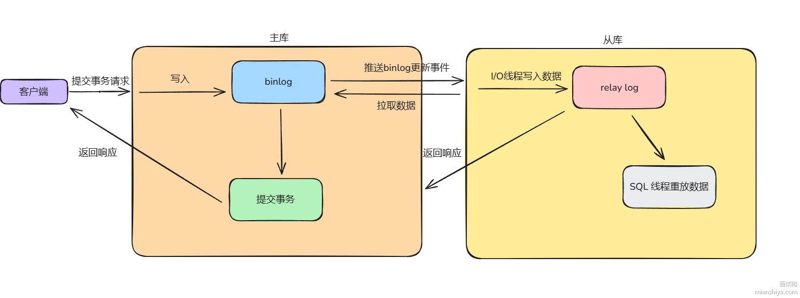

用一句话概括一下：主库提交事务会写 binlog，会由一个 dump 线程监听 binlog 文件的变更，如果 binlog 有更新则推送更新事件给从库，从库接收到事件后拉取数据，会有一个 I/O 线程将其写到 relay log 中，慢慢消化，由 SQL 线程来重放更新数据。

异步复制有数据丢失风险，例如数据还未同步到从库，主库就给客户端响应，然后主库挂了，此时从库晋升为主库的话数据是缺失的。

##### 同步复制

主库需要将 binlog 复制到所有从库，等所有从库响应了之后才会给客户端响应，这样的话性能很差，一般不会选择同步复制。

##### 半同步复制

MySQL 5.7 之后搞了个半同步复制，有个参数可以选择“成功同步几个从库就返回响应。”

比如一共有 3 个从库，我参数配置 1，那么只要有一个从库响应说复制成功了，主库就直接返回响应给客户端，不会等待其他两个从库。

这样的话性能就比较好，并且数据可靠性也增强了，只有当那个从库和主库同时都挂了，才会缺失数据。

##### 并行复制

以前从库是通过一个 SQL 线程**按照顺序逐条执行主库的 binlog 日志指令**（即从 relay log 重放事件）。对于主库的高并发写入操作，这种串行执行的方式会导致从库的复制速度跟不上主库，从而产生**主从延迟**问题。

所以 MySQL 引入了**并行复制**，说白了就是通过 **多个 SQL 线程** 来并发执行重放事件。MySQL 提供了以下几种并行复制模式。

##### MySQL 5.6 基于库级别的并行复制

假设主库有多个数据库（如 `db1` 和 `db2`），在从库上，`db1` 的事务和 `db2` 的事务可以同时执行。即将不同数据库上的事务分配到不同的 SQL 线程中执行。如果主库大部分事务集中在一个数据库上，这个就没啥用了。

##### MySQL 5.7 基于组提交（Group Commit）事务的并行复制

进一步细化了并行的颗粒度，从库级别细化到组提交级别。即 MySQL 会将组提交的事务视为彼此独立的事务，可以在从库**并行**重放。

如果主库开启了组提交，且事务之间没有冲突。那么这些事务都可以由多线程并行执行。

binlog 中如果两个事务的 `last_committed` 相同，说明这两个事务是在同一个 Group 内提交的。但是粒度还是不够，如果大部分事务都集中在一张表上？

那么只有相同 `last_committed` 可以并发，即使有些数据的更改和当前事务是不冲突的，也无法并发。

##### MySQL 5.7 基于逻辑时钟（LOGICAL_CLOCK）的并行复制

`LOGICAL_CLOCK` 是基于` Group Commit` 的并行复制，引入了时间标记的概念。

基于所有在主库同时处于 `prepare` 阶段且未提交的事务不会存在锁冲突的情况（就是这些事务在从库执行时都可以并行执行），将这些事务都打上一个时间标记（实际实现用的是上一个提交事务的 `sequence_number`，即上面提到的 binlog 中的 `last_committed`）。

这样从库在识别到这些事务时，可以并行，进一步的提高并发度。

所以提升主库的组提交事务数可以让从库复制的并行度更高，所以 MySQL 5.7 引入了两个参数：

- `binlog_group_commit_sync_delay`：组提交等待延迟提交的时间。即每次 binlog 组提交时等待一段时间再 fsync。让进入 group 的事务更多，提高并行度。
- `binlog_group_commit_sync_no_delay_count`：组提交时允许的最大事务数量，达到该数量时立即触发组提交，而无需等待延迟时间（binlog_group_commit_sync_delay）。即达到期望的并行度后立即提交，缩小等待时长。

##### MySQL 8.0 基于 WriteSet 的并行复制

在 MySQL 5.7 中，为了提升从库的事务回放速度，需要在主库提高事务的并行度。主库上的事务越多线程并行提交，备库就能在更大程度上实现并行回放。然而，这种方式依赖于主库的并行提交情况，当主库事务是串行提交时，备库的回放效率会显著下降。

所以 MySQL 8.0 引入了 **基于 WriteSet** 的并行复制，即使主库上的事务是串行提交的，只要事务之间没有冲突，备库也可以并行回放这些事务，提升复制效率。

WriteSet 是事务更新行的集合，通过哈希算法对主键或唯一索引生成标识，记录在二进制日志中。即通过 WriteSet 判定事务之间的冲突，如果两个事务的 WriteSet 没有冲突，则它们可以并行回放。

### 如何处理 MySQL 的主从同步延迟？ 

#### 回答重点

> 首先需要明确一个点**延迟是必然存在的**，无论怎么优化都无法避免延迟的存在，只能减少延迟的时间。

常见解决方式有以下几种：

- **二次查询**。如果从库查不到数据，则再去主库查一遍，由 API 封装这个逻辑即可，算是一个兜底策略，比较简单。不过等于读的压力又转移到主库身上了，如果有不法分子故意查询必定查不到的查询，这就对主库产生冲击了。
- **强制将写之后立马读的操作转移到主库上**。这种属于代码写死了，比如一些写入之后立马查询的操作，就绑定在一起，写死都走主库。不推荐，比较死板。
- **关键业务读写都走主库**，非关键还是读写分离。比如上面我举例的用户注册这种，可以读写主库，这样就不会有登陆报该用户不存在的问题，这种访问量频次应该也不会很多，所以看业务适当调整此类接口。
- **使用缓存**，主库写入后同步到缓存中，这样查询时可以先查询缓存，避免了延迟的问题，不过又引入了缓存数据一致性的问题。

除此之外，也可以提一提配置问题，例如主库的配置高，从库的配置太低了，可以提升从库的配置等。如果面试官对 MySQL 比较熟，可能会追问一些偏 DBA 侧的问题，例如并行复制等。

- [MySQL 并行复制](https://www.mianshiya.com/question/1780933295538728962#heading-6)

#### 扩展知识

##### MySQL 主从延迟的常见原因及优化方案

| 原因               | 优化方案                                                     |
| ------------------ | ------------------------------------------------------------ |
| **从库单线程复制** | 启用多线程复制：[MySQL 并行复制](https://www.mianshiya.com/question/1780933295538728962#heading-6)。 |
| **网络延迟**       | 优化网络连接，缩短主从之间的物理距离。                       |
| **从库性能不足**   | 增加硬件资源。                                               |
| **长事务**         | 优化应用程序，减少主库写入压力，避免长事务。[MySQL 中长事务可能会导致哪些问题？](https://www.mianshiya.com/bank/1791003439968264194/question/1780933295480008706#heading-0) |
| **从库太多**       | 从库过多主库同步压力大，导致延迟，合理的评估主从数量         |
| **从库负载太高**   | 增加从库实例，分散查询压力，避免慢查询。                     |

再强调一下主从**延迟是必然存在的**，无论怎么优化都无法避免延迟的存在，只能减少延迟的时间。例如即使启用多线程复制就一定可以避免延迟吗？所以业务上的解决方案还是以回答重点内的几个解决方式为准。

### 什么是分库分表？分库分表有哪些类型（或策略）？ 

#### 回答重点

**分库分表**是数据库性能优化的一种方法，通过将数据分散存储在多个数据库或表中，来提高系统的可扩展性、性能和可用性。

**分库分表的类型（或策略）** 包括：

1）**水平分表**：

- 将同一张表的数据按行划分，分散到多个表中。例如，可以按用户 ID 的范围将数据分为多个表（如 `user_1`、`user_2`）。

2）**垂直分表**：

- 将一张表的不同列拆分到多个表中，以减少每张表的字段数量和提高查询效率。例如，用户表可以分为基本信息表和详细信息表。

3）**水平分库**：

- 将相同的表结构复制一份到另一个库中，每个库的表结构是一样的，可以减少单一数据库的读写压力，在大数量的情况下提高读写性能。例如，`database1`、 `database2`。

4）**垂直分库**：

- 将数据分散到不同的数据库实例中。可以根据业务功能或模块进行分库，如将用户数据、订单数据分别存储在不同的数据库中。

#### 扩展知识

##### 为什么需要分库分表

随着用户量的激增和时间的堆砌，存在数据库里面的数据越来越多，此时的数据库就会产生瓶颈，出现资源报警、查询慢等场景。

首先单机数据库所能承载的连接数、I/O及网络的吞吐等都是有限的，所以当并发量上来了之后，数据库就渐渐顶不住了。

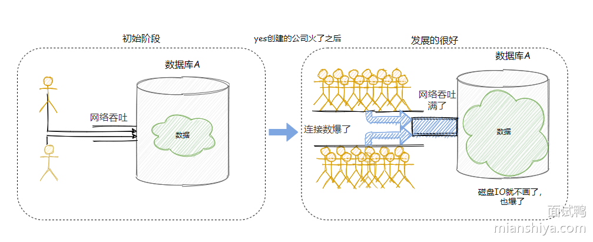

再则，如果单表的数据量过大，查询的性能也会下降。因为数据越多 B+ 树就越高，树越高则查询 I/O 的次数就越多，那么性能也就越差。

因为上述的原因，不得已就得上分库分表了。

把以前存在一个数据库实例里的数据拆分成多个数据库实例，部署在不同的服务器中，这是分库。

把以前存在一张表里面的数据拆分成多张表，这是分表。

一般而言：

- 分表：是为了解决由于单张表数据量多大，而导致查询慢的问题。大致三、四千万行数据就得拆分，不过具体还是得看每一行的数据量大小，有些字段都很小的可能支持更多行数，有些字段大的可能一千万就顶不住了。
- 分库：是为了解决服务器资源受单机限制，顶不住高并发访问的问题，把请求分配到多台服务器上，降低服务器压力。

##### **分库分表的优点**

- 提高性能：分库后，通过减少单个数据库的负载，提高读写性能。
- 可扩展性：可以通过增加新的数据库或表来扩展系统。
- 容错性：某个库或表的故障不会影响整个系统。

##### **分库分表的缺点**

- 复杂性：数据的查询、维护和事务管理变得复杂，增加了开发和运维的成本。
- 事务处理：跨库或跨表的事务处理复杂，需要额外的处理机制。
- 数据一致性：需要额外机制来保证数据的一致性和完整性。

##### 分库图示

一般分库都是按照业务划分的，比如订单库、用户库等等。

有时候会针对一些特殊的库再作切分，比如一些活动相关的库都做了拆分。

因为做活动的时候并发可能会比较高，怕影响现有的核心业务，所以即使有关联，也会单独做拆分。

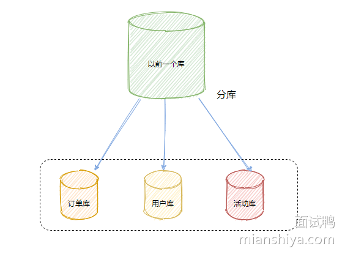

##### 分表图示

分表其实有两种：

- 垂直分表
- 水平分表

垂直分表，来看个图，很直观：


垂直分表就是把一些不常用的大字段剥离出去。

像上面的例子：用户名是很常见的搜索结果，性别和年龄占用的空间又不大，而地址和个人简介占用的空间相对而言就较大，我们都知道一个数据页的空间是有限的，把一些无用的数据拆分出去，一页就能存放更多行的数据。

内存存放更多有用的数据，就减少了磁盘的访问次数，性能就得到提升。

水平分表，则是因为一张表内的数据太多了，我们知道数据越多 B+ 树就越高，访问的性能就差，所以进行水平拆分。


其实不管这些，浅显的理解下，在一百个数据里面找一个数据快，还是在一万个数据里面找一个数据快？

即使有索引，那厚的书目录多，翻目录也慢~


## Redis

### Redis 实现分布式锁时可能遇到的问题有哪些？ 

#### 回答重点

1. 业务未执行完，锁已到期
2. 单点故障问题
3. 主从问题不同步问题
4. 网络分区问题
5. 时钟漂移问题
6. 锁的可重入性问题
7. 误释放锁问题

#### 扩展知识

##### 业务未执行完，锁已到期

为了避免持有锁的客户端崩溃或因网络问题断开连接时，锁无法被正常释放，需要给锁设置过期时间。

那么就有可能出现业务还在执行，锁已到期的情况。

可以设置一种续约机制（Redisson 中的看门狗机制），线程 a 在执行的时候，设置一个超时时间，并且启动一个守护线程，守护线程每隔一段时间就去判断线程 a 的执行情况，如果 a 还没有执行完毕并且 a 的时间快过期了，就重新设置一下超时时间，即继续续约。

锁的过期时间的设置也需要好好评估一下。

如果设置太长，业务结束了它还在阻塞的话，会影响 Redis 的性能。如果设置太短，就出现刚说的问题，因此要保证是设置一个合理的时间**使得在大多数情况下任务能够在锁过期之前完成**。

##### 单点故障问题

如果 Redis 单机部署，当实例宕机或不可用，整个分布式锁服务将无法正常工作，阻塞业务的正常执行。

##### 主从问题

如果线上 Redis 是主从+哨兵部署的，则分布式锁可能会有问题。

因为 Redis 的主从复制过程是异步实现的，如果 Redis 主节点获取到锁之后，还没同步到其他的从节点，此时 Redis 主节点发生宕机了，这个时候新的主节点上没锁的数据，因此其他客户端可以获取锁，就会导致多个应用服务同时获取锁。

##### 网络分区

在网络不稳定的情况下，客户端与 Redis 之间的连接可能中断，如果未设置锁的过期时间，可能会导致锁无法正常释放。如果有多个锁，还可能引发锁的死锁情况。

##### 时钟漂移

因为 Redis 分布式锁依赖于实例的时间来判断是否过期，如果时钟出现漂移，很可能导致锁直接失效。

可以让所有节点的系统时钟通过 NTP 服务进行同步，减少时钟漂移的影响。

### Redis 中如何实现分布式锁？ 

#### 回答重点

在 Redis 中实现分布式锁的常见方法是通过`set ex nx` 命令 + lua 脚本组合使用。确保多个客户端不会获得同一个资源锁的同时，也保证了安全解锁和意外情况下锁的自动释放。

#### 扩展知识

##### 理解 Redis 实现的分布式锁

如果基于 Redis 来实现分布锁，需要利用 `set ex nx` 命令 + lua 脚本。

1）加锁：`SET lock_key uniqueValue EX expire_time NX` 2）解锁：使用 lua 脚本，先通过 get 获取 key 的 value 判断锁是否是自己加的，如果是则 del。

lua 脚本如下：

```lua
if redis.call("GET",KEYS[1]) == ARGV[1]
then
    return redis.call("DEL",KEYS[1])
else
    return 0
end
```

我们来一一理解一下。

首先**锁需要有过期机制**。假设某个客户端加了锁之后宕机了，锁没有设置过期机制，会使得其他客户端都无法抢到锁。

`EX expire_time` 就是设置了锁的过期，单位是秒。还一个 `PX`， 也是过期时间，单位是毫秒。

然后，在 2.6.12 版本之前只有 `SETNX` 即 SET if Not eXists，它表示如果 key 已存在，则什么都不会做，返回 0，如果不存在则会设置它的值，返回 1。

那个时候 `SETNX` 和过期时间的设置就无法保证原子性，如果客户端在发送完 `SETNX` 之后就宕机了，还没来得及设置过期时间，一样会导致锁不会被释放。

因此 2.6.12 版本之后，优化了 SET 命令，使得可以执行 `set ex px`。

最后，再解释下什么是 `uniqueValue`，翻译过来就是一个唯一的值。

之所以要设置唯一值是为了**防止被别的客户端给释放了**。

我们来看下这个场景：

1. 客户端 1 加锁成功，然后执行业务逻辑，但执行的时间超过了锁的过期时间
2. 此时锁已经过期被释放了，客户端 2 加锁成功
3. 客户端 2 执行业务逻辑
4. 客户端 1 执行完了，执行释放锁的逻辑，即删除锁。

客户端 2 一脸懵，我还在执行着呢，怎么锁被人释放了？？

所以每个客户端加锁（客户端可能是每个线程），需要是设置一个唯一标识，比如一个 uuid，防止锁被别的客户端误释放了。

因为需要先判断锁的值和唯一标识是否一致，一致后再删除释放锁，这里就涉及到两步操作，只有使用了 lua 脚本才能保证原子性，这也是为什么释放锁需要用 lua 脚本的原因。

##### 单点故障问题

单台 Redis 实现分布式锁存在单点故障问题，如果采用主从读写分离架构，如果一个客户端在主节点上锁成功，但是主节点突然宕机，由于主从延迟导致从节点还未同步到这个锁，此时可能有另一个客户端抢到新晋升的主节点，此时会导致两个客户端抢到锁，产生了数据不一致。

基于这个情况，Redis 推出了 Redlock。

##### Redlock 红锁

Redlock 是 Redis 官方推荐的一种实现分布式锁的算法，适用于集群环境下。

**Redlock 的基本思想**：

- 部署多个 Redis 实例（通常为 5 个）。
- 客户端在大多数实例（如至少 3 个）上请求锁，并在一定时间内获得成功，表示加锁成功。
- 使用 Redlock 可以提供更高的容错性，即使部分 Redis 实例故障，仍然可以获得锁。

**Redlock 的实现流程**：

- 客户端尝试在每个 Redis 实例上加锁，必须在有限时间内（通常为锁的过期时间）完成所有实例的加锁。
- 如果大多数实例（N/2 + 1）加锁成功，则表示加锁成功。
- 否则，客户端将释放所有已经加锁的实例，重新尝试。

**Redlock 的缺点包括**：

- **复杂性**：实现 Redlock 需要多个 Redis 实例，增加了系统的复杂性和维护成本。
- **时间同步依赖**：Redlock 依赖于多个节点的系统时间的一致性。如果节点之间的时间不同步（例如发生时间回拨），可能导致锁的有效性受到影响。
- **不适用于高并发**：在高并发场景下，因需要访问多个实例同时尝试获取锁，可能会导致锁获取的性能下降。
- **锁的续期问题**：在长时间的操作中，可能需要手动续期锁，因为涉及多个实例，增加了实现的复杂度和风险。
- [Redis 的 Red Lock 是什么？你了解吗？](https://www.mianshiya.com/bank/1791375592078610434/question/1780933295664558082)

##### Redis 分布锁注意事项以及其它常见分布式锁的实现

- [Redis 分布锁注意事项以及其它常见分布式锁的实现](https://www.mianshiya.com/question/1800458377811533825)
- [Redisson 分布式锁的原理](https://www.mianshiya.com/question/1833406734003052546)
- [10745. Redisson 看门狗（watch dog）机制了解吗？](https://www.mianshiya.com/bank/1791375592078610434/question/1869931978230796290)

### Redis 中如何保证缓存与数据库的数据一致性？

#### 回答重点

缓存和数据库的同步可以通过以下几种方式:

1）先更新缓存，再更新数据库

2）先更新数据库存，再更新缓存

3）先删除缓存，再更新数据库，后续等查询把数据库的数据回种到缓存中

4）先更新数据库，再删除缓存，后续等查询把数据库的数据回种到缓存中

5）缓存双删策略。更新数据库之前，删除一次缓存；更新完数据库后，再进行一次延迟删除

6）使用 Binlog 异步更新缓存，监听数据库的 Binlog 变化，通过异步方式更新 Redis 缓存

以上就是实现数据库与缓存一致性的六种方式，这里前面三种都不太推荐使用，后面三种的话其主要根据实际场景：

- 如果是要考虑实时一致性的话，先写 MySQL，再删除 Redis 应该是较为优的方案，虽然短期内数据可能不一致，不过其能尽量保证数据的一致性。
- 如果考虑最终一致性的话，推荐的是使用 binlog + 消息队列的方式，这个方案其有重试和顺序消费，能够最大限度地保证缓存与数据库的最终一致性。

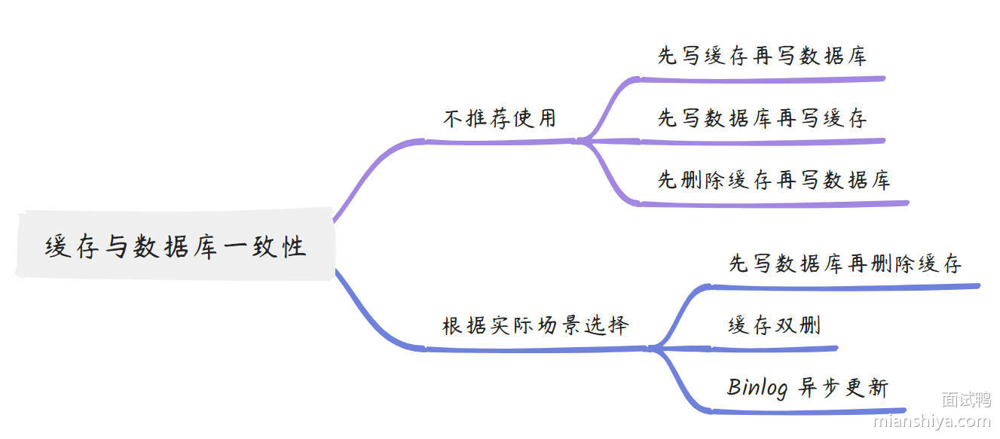

#### 扩展知识

我们以 MySQL 和 Redis 为主要实现的案例对上述几个方案再进行展开分析。

##### 先更新缓存，再更新数据库

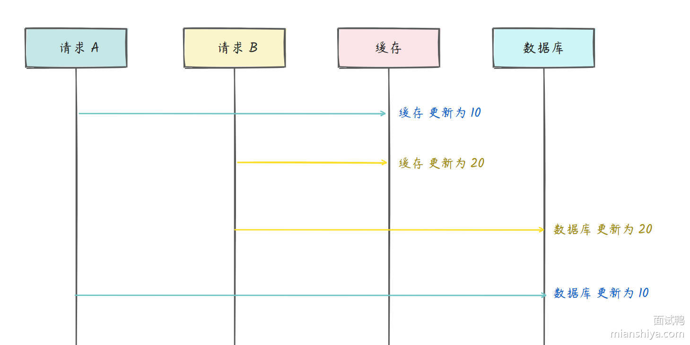

由于网络原因，请求顺序无法保证，可能出现先更新缓存的请求，后更新数据库，而后更新缓存的请求反而先更新了数据库，这样就出现了缓存数据为 20，数据库数据为 10，即数据不一致的情况。

##### 先写数据库，再写缓存

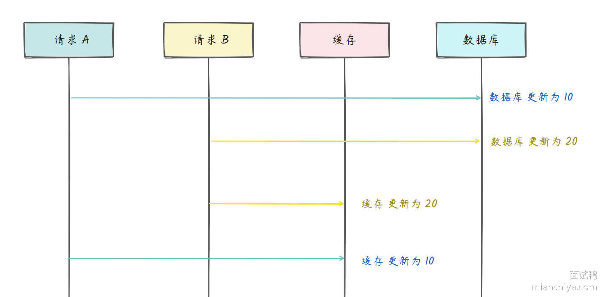

这个问题上面其实一样，都是因为并发和网络问题导致的数据库与缓存不一致。

##### 先删除缓存再写数据库

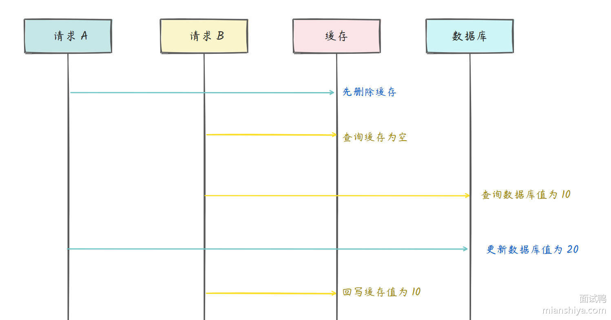

盘一下流程：

1. 请求 A 先对缓存中的数据进行删除操作。
2. 请求 B 这个时候来执行查询，发现缓存中数据为空，就去数据库进行查询并回写缓存。
3. 这个时候请求 A 删除缓存中的数据之后，进行数据库数据的更新。
4. 但此时请求 B 已经把从数据库查询到的原始数据回写缓存了，这个时候就出现了上图的情况，数据库中查询的值是 20，而缓存中的数据是 10 。

读操作获取到的数据是过时的数据，虽然写操作已经完成了，但是因为缓存被删除了，读操作就必须从数据库中读取到旧值，并不是最新的数据。

##### 缓存双删（先删除缓存，再写数据库，然后过一段时间再删除缓存）

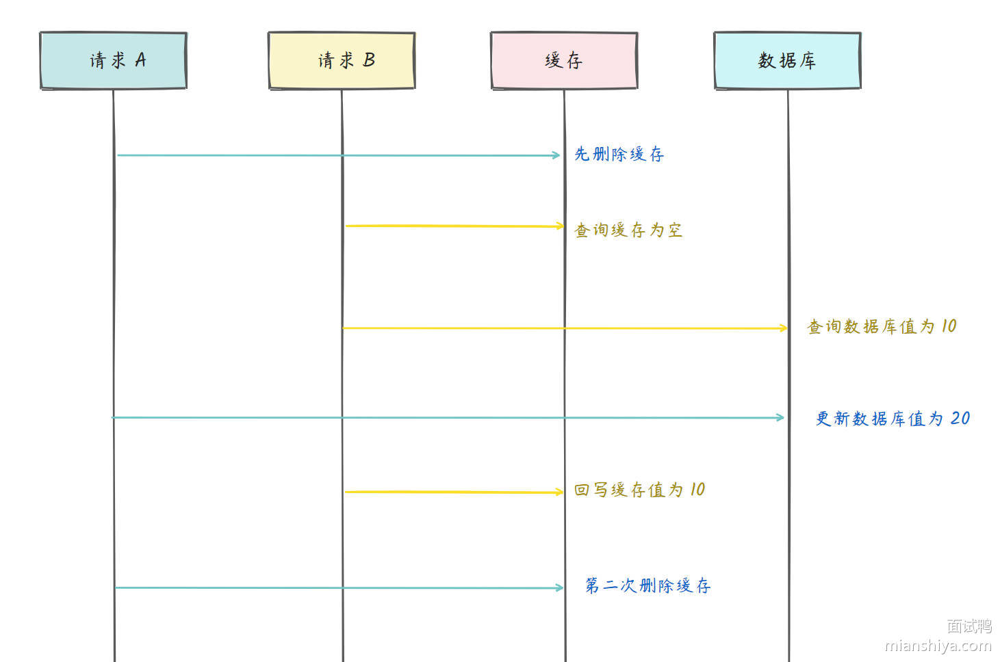

这个方案为了避免旧数据被回种，等待一段时间后再延迟删除缓存。

也可以使用消息队列、定时任务或者延迟任务等方式去实现延迟删除：

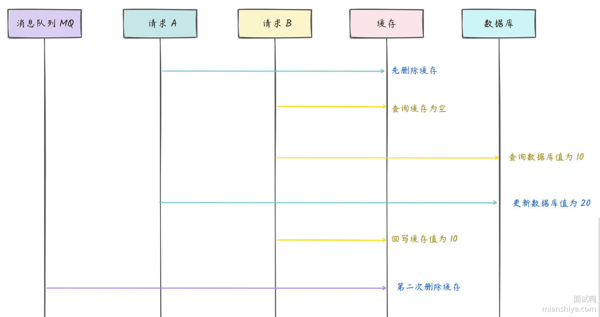

##### 先写数据库，再删除缓存

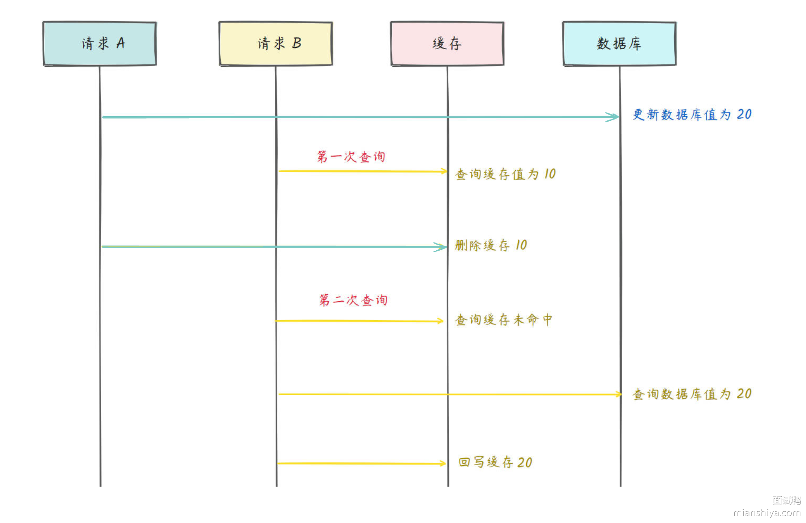

先把数据库的信息修改了，然后再删除对应的缓存，然后在修改数据库期间，可以允许一定时间的缓存不一致，保证缓存的最终一致性。

不过这种模型也有一定的问题，如下图所示：

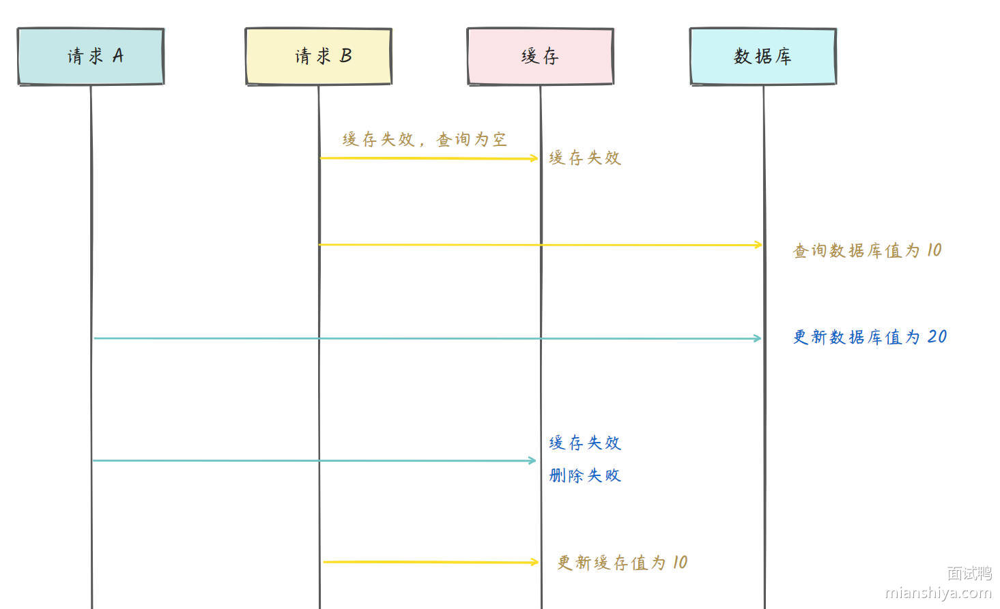

其主要原因在于有一个写操作，此时刚好缓存失效，又在同一时刻刚好有一个并发读请求过来，且回写缓存的请求晚于缓存删除，导致数据库与缓存的不一致。

从上面的表述可以知道，这个发生的概率比较低，一般而言业务上都会使用这个方案。

##### 先写数据库，通过 Binlog ,异步更新缓存

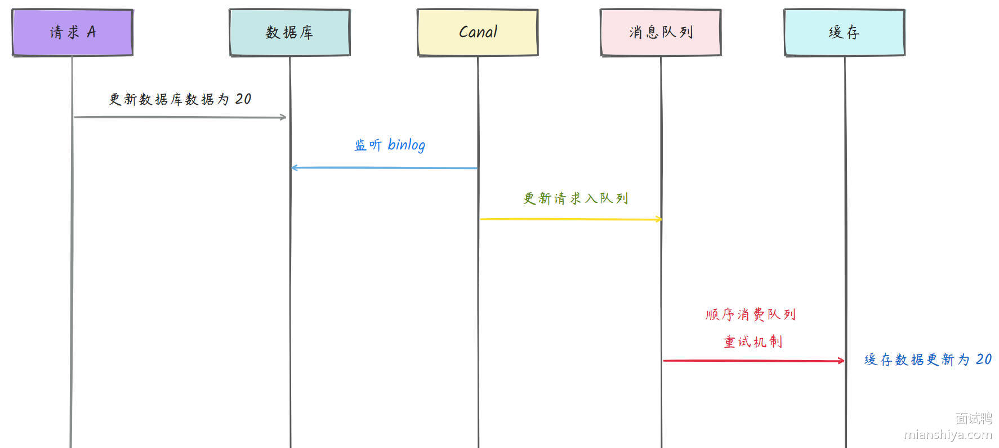

先修改数据库，然后通过 Canal 监听数据库的 binlog 日志，记录数据库的修改信息，然后通过消息队列异步修改缓存的数据。

这里需要注意需要保证顺序消费，保证缓存中数据按顺序更新，然后再加上重试机制，避免因为网络问题导致更新失败。

##### 强一致性补充

可以使用分布式读写锁实现强一致性。读写锁中读和读操作不互斥，读写互斥，写写互斥。

**写操作流程**：

- 获取写锁。
- 更新数据库。
- 删除缓存。
- 释放写锁。

**读操作流程**：

- 获取读锁。
- 查询缓存：如果命中缓存，释放读锁，返回结果。如果缓存未命中，读取数据库，并将数据更新到缓存。
- 释放读锁。

### Redis 中有哪些内存淘汰策略？ 

#### 回答重点

Redis 的内存淘汰策略一共有 8 种。 8 种里面可以细分为两大类，即**开启数据淘汰**和**不开启数据淘汰**两大类，然后开启数据的那一类又可以进行细分，分为**基于过期时间的淘汰策略**以及**全部数据的淘汰策略**。

**不淘汰数据（默认）**：

- noeviction：当运行内存超过最大设置内存的时候，不会淘汰数据，而是直接返回报错禁止写入

**设置了过期时间的数据淘汰**：

- volatile-random：随机淘汰掉设置了过期时间的 key
- volatile-ttl：优先淘汰掉较早过期的 key
- volatile-lru（redis3.0之前默认策略）：淘汰掉所有设置了过期时间的，然后最久未使用的 key
- volatile-lfu（redis4.0后新增）：与上面类似，不过是淘汰掉最少使用的 key

**所有数据的数据淘汰**：

- allkeys-random：随机淘汰掉任意的 key
- allkeys-lru：淘汰掉缓存中最久没有使用的 key
- allkeys-lfu（redis4.0后新增）：淘汰掉缓存中最少使用的 key

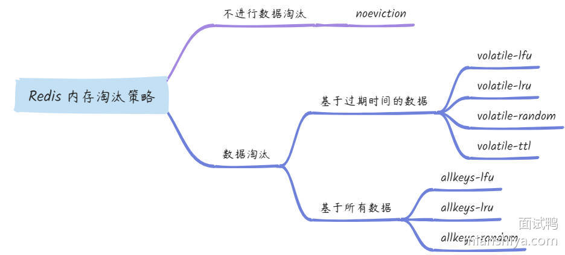

#### 扩展知识

##### 不同淘汰策略适用场景

- `noeviction`：适用于所有数据都被持久化或避免丢失任何数据的场景。
- `allkeys-lru`：适用于希望保证最常访问的数据在内存中的场景。如电商促销活动中，某些商品会在短时间内被频繁访问，此时不会被淘汰。
- `allkeys-lfu`：适用于希望保证访问频率最高的数据在内存中的场景。如社交媒体或直播类应用中，某些热点内容访问次数高，不能被淘汰。
- `allkeys-random`：适用于对数据没有严格的优先级需求。
- `volatile-lru`：同`allkeys-lru`，仅只关心设置了过期时间的键。
- `volatile-random`：同`allkeys-random`，仅只关心设置了过期时间的键。
- `volatile-ttl`：适用于对实时性较敏感的场景，比如存储用户会话等。
- `volatile-lfu`：同`allkeys-lfu`，仅只关心设置了过期时间的键。

##### noeviction 演示

通过 `config set maxmeory` 先将其内存大小修改至 2 字节，然后设置一个超过 2 字节的字符串值 99999，其会报一个 OOM 的错误，并且不允许写入。


不过需要注意一个点，虽然其不支持写入数据，但是已有的数据并不会删除，其还是可以进行查询和删除操作，如下图所示，这里演示了 keys * 指令，发现其执行结果正常。


这里补充一个知识点，如果不设置最大内存大小或者设置最大内存大小为 0 的话，在 64 位操作系统下不限制内存大小，在 32 位操作系统下最多使用 3 GB 内存。

##### 内存淘汰配置

可以通过修改 Redis 配置文件（`redis.conf`）中的 `maxmemory-policy` 参数来设置不同的内存淘汰策略（配置后需要重启 redis，且后续重启后配置不会丢失）。

例如：

```conf
maxmemory-policy allkeys-lru
```

或者通过 Redis 命令动态设置（立即生效，不需要重启，但是重启后就失效了）：

```sh
CONFIG SET maxmemory-policy allkeys-lru
```

### Redis 为什么这么快？ 

#### 回答重点

主要有 3 个方面的原因，分别是存储方式、优秀的线程模型以及 IO 模型、高效的数据结构。

- Redis 将数据存储在内存中，提供快速的读写速度，相比于传统的磁盘数据库，内存访问速度快得多。
- Redis 使用单线程事件驱动模型结合 I/O 多路复用，避免了多线程上下文切换和竞争条件，提高了并发处理效率。
- Redis 提供多种高效的数据结构（如字符串、哈希、列表、集合等），这些结构经过优化，能够快速完成各种操作

#### 扩展知识

##### 存储方式

Redis 的存储是**基于内存**的，直接访问内存的速度是远远大于访问磁盘的速度的。

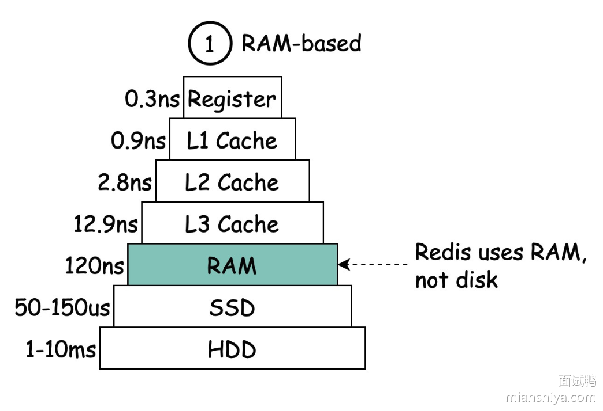

一般情况下，计算机访问一次 SSD 磁盘的时间大概是 50 ~ 150 微秒，如果是传统硬盘的话，需要的时间会更长，可能需要 1 ~ 10 毫秒，而你访问一次内存，其需要的时间大概是 120 纳秒。由此可见，其访问的速度差了快一千倍左右。

除了一些场景，比如说持久化，Redis 很少需要与磁盘进行交互，大多数时候 Redis 的读写是基于内存的，因此其效率较高。

##### 优秀的线程模型以及 IO 模型

Redis 使用单个主线程来执行命令，不需要进行线程切换，避免了上下文切换带来的性能开销，大大提高了 Redis 的运行效率和响应速度。

Redis 采用了 I/O 多路复用技术，实现了单个线程同时处理多个客户端连接的能力，从而提高 Redis 的并发能力。

不过 Redis 并不是一直都是单线程的，自 4.0 开始，Redis 就引入了 Unlink 这类命令，用于异步执行删除等操作，还有在 6.0 之后，Redis 为了进一步提升 I/O 的性能，引入了多线程的机制，利用多线程的机制并发处理网络请求，从而减少 Redis 由于网络 I/O 等待造成的影响。

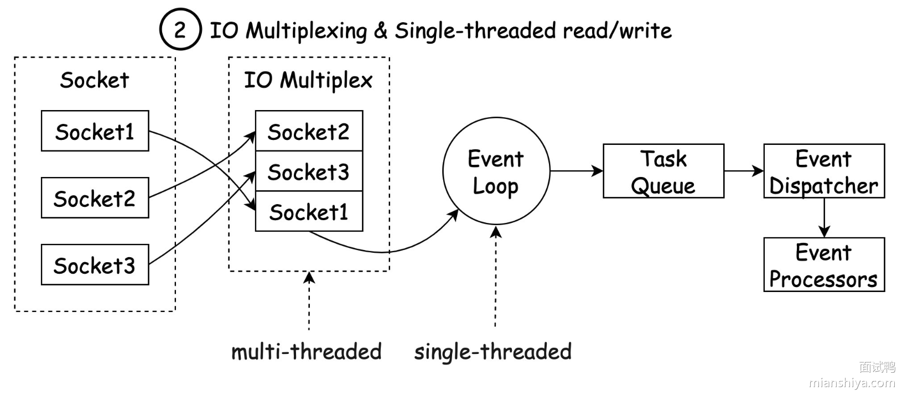

##### 高效的数据结构

Redis 本身提供了丰富的数据结构，比如字符串、哈希、Zset 等，这些数据结构大多操作的时间复杂度都为 O(1)。

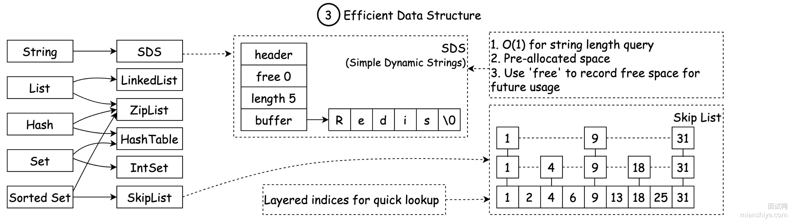

备注：答案中的图来自 ByteByteGo：*https://blog.bytebytego.com/p/why-is-redis-so-fast*

##### 五种 I/O 模型

- [1460. 说说你知道的几种 I/O 模型](https://www.mianshiya.com/question/1804476796656885762)

##### Select、Poll、Epoll

- [722. Select、Poll、Epoll 之间有什么区别？](https://www.mianshiya.com/question/1780933295857496065)

##### Redis 中常见的数据类型（数据结构）

- [637. Redis 中常见的数据类型有哪些？](https://www.mianshiya.com/bank/1791375592078610434/question/1780933295593254915)
- [5206. Redis 源码中有哪些巧妙的设计，举几个典型的例子？](https://www.mianshiya.com/question/1823990291696906241)

### Redis 的持久化机制有哪些？

#### 回答重点

Redis 提供两种主要的持久化机制：

**RDB（Redis Database）快照**：

- RDB 是通过生成某一时刻的数据快照来实现持久化的，可以在特定时间间隔内保存数据的快照。
- 适合灾难恢复和备份，能生成紧凑的二进制文件，但可能会在崩溃时丢失最后一次快照之后的数据。

**AOF（Append Only File）日志**：

- AOF 通过将每个写操作追加到日志文件中实现持久化，支持将所有写操作记录下来以便恢复。
- 数据恢复更为精确，但文件体积较大，重写时可能会消耗更多资源。

Redis 4.0 新增了 RDB 和 AOF 的混合持久化机制。

#### 扩展知识

##### RDB 持久化详解

RDB 持久化通过创建快照来获取内存某个时间点上的副本，利用快照可以进行方便地进行主从复制，默认快照文件为 dump.rdb。

redis.conf 文件可以配置在 x 秒内如果至少有 y 个 key 发生变化就会触发命令进行持久化操作。

**它的优点**：

- **快速加载**：RDB 生成的快照文件是压缩的二进制文件，适合备份和灾难恢复。
- **低资源占用**：RDB 持久化在 Redis 主线程之外进行，不会对主线程产生太大影响。

**它的缺点**：

- **数据丢失风险**：由于 RDB 是**间隔性**保存的快照，如果 Redis 崩溃，可能会丢失上次保存快照后的数据。

**RDB 持久化命令：**

- **save**：在主线程生成 RDB 文件，因此生成其间，主进程无法执行正常的读写命令，需要等待 RDB 结束。
- **bgsave**：利用 Fork 操作得到子进程，在子进程执行 RDB 生成，不会阻塞主进程，默认使用 bgsave。

**bgsave 流程（重点）：**

1）检查子进程（检查是否存在 AOF/RDB 的子进程正在进行），如果有返回错误

2）触发持久化，调用 rdbSaveBackground

3）开始 fork，子进程执行 rdb 操作，同时主进程响应其他操作。

4）RDB 完成后，替换原来的旧 RDB 文件，子进程退出。

**注意事项（重点）：**

1）Fork 操作会产生**短暂的阻塞**，微秒级别操作过后，不会阻塞主进程，整个过程不是完全的非阻塞。

2）RDB 由于是快照备份所有数据，而不是像 AOF 一样存写命令，因为 Redis 实例重启后恢复数据的速度可以得到保证，大数据量下比AOF 会快很多。

3）Fork 操作利用了**写时复制**，类似与 [CopyOnWriteArrayList](https://www.mianshiya.com/question/1780933294838280194)。

**小知识-写时复制：**

在子进程创建时，它不会直接将主进程地址空间全部复制，而是共享同一个内存。

之后如果任意一个进程需要对内存进行修改操作，内存会重新复制一份提供给修改的进程单独使用。

更多可看：

- [649. Redis 在生成 RDB 文件时如何处理请求？](https://www.mianshiya.com/question/1780933295639392257)

##### AOF 持久化详解

AOF 持久化机制是指**将 Redis 写命令以追加的形式写入到磁盘中的 AOF 文件**，AOF 文件记录了 Redis 在内存中的操作过程，只要在 Redis 重启后重新执行 AOF 文件中的写命令即可将数据恢复到内存中。

**AOF 机制的优点**：

- AOF 机制比 RDB 机制更加**可靠**，因为 AOF 文件**记录了 Redis 执行的所有写命令**，可以在每次写操作命令执行完毕后都落盘存储。

**AOF 机制的缺点**：

- AOF 机制生成的 **AOF 文件比 RDB 文件更大**，当数据集比较大时，AOF 文件会比 RDB 文件占用更多的磁盘空间。
- AOF 机制对于**数据恢复的时间比 RDB 机制更加耗时**，因为要重新执行 AOF 文件中的所有操作命令。

##### 混合持久化

RDB 和 AOF 都有各自的缺点。

如果 RDB 备份的频率低，那么丢的数据多。备份的频率高，性能影响大。

AOF 文件虽然丢数据比较少，但是恢复起来又比较耗时。

因此 Redis 4.0 以后引入了混合持久化，通过 `aof‐use‐rdb‐preamble` 配置开启混合持久化。

**当 AOF 重写的时候**（注意混合持久化是在 aof 重写时触发的）。它会先生成当前时间的 RDB 快照，将其写入新的 AOF 文件头部位置。

这段时间主线程处理的操作命令会记录在重写缓冲区中，RDB 写入完毕后将这里的增量数据追加到这个新 AOF 文件中，最后再用新 AOF 文件替换旧 AOF 文件。

如此一来，当 Redis 通过 AOF 文件恢复数据时，会先加载 RDB，然后再重新执行指令恢复后半部分的增量数据，这样就可以大幅度提高数据恢复的速度！

##### AOF 写回策略

AOF 提供了三种写回策略，决定何时将数据同步到磁盘中：

- always：每次写操作后立即调用 fsync，将数据同步到磁盘。这种策略保证了最高的数据安全性，但也会显著降低性能，因为每个写操作都要等待磁盘写入完成。
- everysec：每秒调用一次 fsync，将数据同步到磁盘。这种策略在性能和数据安全性之间做了折中，默认情况下，Redis 使用这种策略。最多会丢失 1 秒的数据。
- no：由操作系统决定何时将数据写入磁盘。通常，操作系统会在一定时间后或缓冲区满时同步数据到磁盘。这种策略具有最高的性能，但数据安全性较低，因为在 Redis 崩溃时可能会丢失较多的数据。

设置 always 能一定保证数据不丢失吗？

答案是**不能**！因为 Redis 是先执行命令再写入 aof，所以如果执行命令写入 aof 这段时间 Redis 宕机了，重启后也无法利用 aof 恢复！

所以 Redis 的持久化机制，并不能保证数据不丢失！

##### AOF 重写机制

AOF 文件随着写操作的增加会不断变大，过大的 AOF 文件会导致恢复速度变慢，并消耗大量磁盘空间。所以，Redis 提供了 AOF 重写机制，即对 AOF 文件进行压缩，通过最少的命令来重新生成一个等效的 AOF 文件。

拿 key A 举个例子，AOF 记录了每次写命令如 `set A 1`、`set A 2`、`set A 3`。实际上前面的 `set A 1`、`set A 2` 是历史值，我们仅关心最新的值，因此 AOF 重写就是仅记录数据的最终值即可，即`set A 3`，这样 AOF 文件就“瘦身”了。

**注意：AOF 重写并不是对现有的 AOF 文件进行修改，而是根据当前每个键的最新值转换为对应的写命令，写入新的 AOF 文件，形成一个新文件。**

**注意：后台 AOF 重写，也是需要 fork 子线程，因此也有写时复制的机制。**

**AOF 重写流程如下**：

1. 创建子进程：Redis 使用 BGREWRITEAOF 命令创建一个子进程，负责 AOF 重写操作。
2. 生成新的 AOF 文件：子进程根据当前数据库的状态，将每个键的最新值转换为对应的写命令，并写入新的 AOF 文件。例如，对于一个列表键，子进程会使用一条 RPUSH 命令将所有元素写入，而不是记录之前的多次操作。
3. 处理新写入的命令：在重写过程中，主进程仍然处理新的写操作。为了避免数据不一致，主进程会将这些新的写命令同时追加到现有的 AOF 文件和一个缓冲区（`aof_rewrite_buf`）中。
4. 合并新命令：当子进程完成新的 AOF 文件的写入后，主进程会将缓冲区中的新命令追加到新的 AOF 文件中，确保其包含所有最新的操作。
5. 替换旧的 AOF 文件：最后，Redis 使用新的 AOF 文件替换旧的文件，实现 AOF 文件的重写。

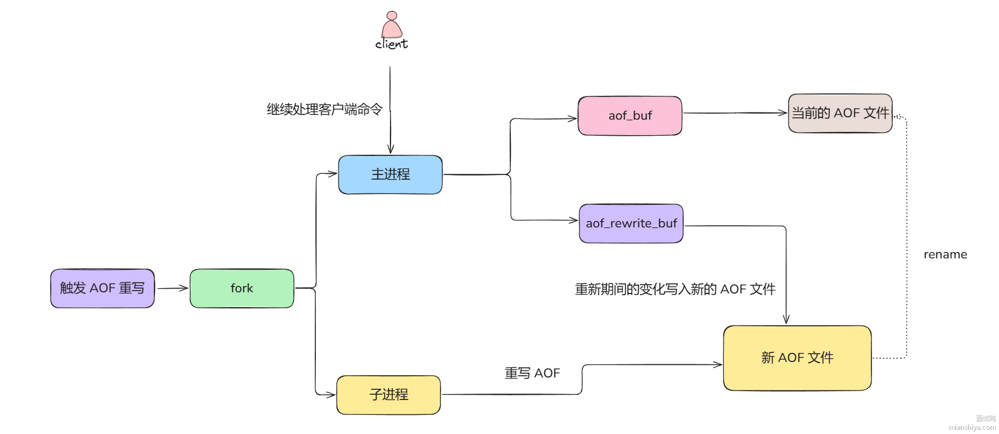

AOF 重写可以通过手动触发或自动触发：

1）手动触发：使用 BGREWRITEAOF 命令可以手动触发 AOF 重写。

2）自动触发：通过配置文件中的参数控制自动触发条件，参数如下：

- `auto-aof-rewrite-min-size`：AOF 文件达到该大小时允许重写（默认 64 MB）。
- `auto-aof-rewrite-percentage`：当前 AOF 文件大小相对于上次重写后的增长百分比达到该值时触发重写。

##### Redis 7.0 MP-AOF（Multi-Part Append Only File）

7.0 之前的 AOF 重写有三大问题：

1. **内存开销**：`aof_buf` 和 `aof_rewrite_buf` 中大部分内容是重复的。
2. **CPU 开销**：主进程需要花费 CPU 时间往 `aof_rewrite_buf` 写入数据，并向子进程发送 `aof_rewrite_buf` 中的数据。子进程需要消耗 CPU 时间将`aof_rewrite_buf` 写入新 AOF 文件。
3. **磁盘开销**：`aof_buf`数据会写到当前的 AOF 文件，`aof_rewrite_buf`数据写到新的 AOF 文件，一份数据需要写两次磁盘。

针对以上问题 Redis 7.0 引入了 MP-AOF（Multi-Part Append Only File）机制。简单来说就是将一个 AOF 文件拆分成了多个文件：

- 一个基础文件（base file），代表数据的初始快照
- 增量文件（incremental files），记录自基础文件创建以来的所有写操作，可以有多个
- 基础文件和增量文件都会存放在一个单独的目录中，并由一个清单文件（manifest file）进行统一跟踪和管理

**大致流程如下**： 

可以看到，重写期间的数据变更直接写到 aof_buf 再到新的增量 AOF 文件中，避免了之前多个 buf 的写入。

且子进程独立重写基础的 AOF，于主进程无交互，节省了主进程的 CPU 开销。

当重写完毕后，仅需更新 manifest 文件，加入新的增量 AOF 文件和基础 AOF 文件，然后将之前的增量 AOF 文件和基础 AOF 文件标记为历史文件（会被异步删除）即可。更新完 manifest 就代表 AOF 重写结束。

##### AOF 文件修复

如果 AOF 文件因系统崩溃等原因损坏，可以使用 `redis-check-aof` 工具修复。该工具会截断文件中的不完整命令，使其恢复到一致状态。

### Redis 中的缓存击穿、缓存穿透和缓存雪崩是什么？

#### 回答重点

**缓存击穿**：指某个热点数据在缓存中失效，导致大量请求直接访问数据库。此时，由于瞬间的高并发，可能导致数据库崩溃。

**缓存穿透**：指查询一个不存在的数据，缓存中没有相应的记录，每次请求都会去数据库查询，造成数据库负担加重。

**缓存雪崩**：指多个缓存数据在同一时间过期，导致大量请求同时访问数据库，从而造成数据库瞬间负载激增。

##### 解决方案

**缓存击穿**：

- 使用互斥锁，确保同一时间只有一个请求可以去数据库查询并更新缓存。
- 热点数据永不过期。

**缓存穿透**：

- 使用布隆过滤器，过滤掉不存在的请求，避免直接访问数据库。
- 对查询结果进行缓存，即使是不存在的数据，也可以缓存一个标识，以减少对数据库的请求。

**缓存雪崩**：

- 采用随机过期时间策略，避免多个数据同时过期。
- 使用双缓存策略，将数据同时存储在两层缓存中，减少数据库直接请求。

#### 扩展知识

##### 缓存雪崩解析


缓存雪崩是指在某个时间点，大量缓存同时失效或被清空，导致大量请求直接打到数据库或后端系统，造成系统负载激增，甚至引发系统崩溃。

这通常是由于缓存中的大量数据在同一时间失效引起的。

想象一个电商系统，用户量很大，假设某一系列的商品缓存突然同一时间失效，那就会造成我们的缓存雪崩，导致服务全部打到了数据库，引发严重后果。

###### 解决办法

缓存键同时失效：

1）过期时间随机化：设置缓存的过期时间，加上一个随机值，避免同一时间大量缓存失效。

2）使用多级缓存：引入多级缓存机制，如本地缓存和分布式缓存相结合，减少单点故障风险。

3）缓存预热：系统启动时提前加载缓存数据，避免大量请求落到冷启动状态下的数据库。

4）加互斥锁：使得没缓存或缓存失效的情况下，同一时间只有一个请求来构建缓存，防止数据库压力过大。

缓存中间件故障：

1）服务熔断：暂停业务的返回数据，直接返回错误。

2）构建集群：构建多个 Redis 集群保证其高可用。

##### 缓存击穿解析


缓存击穿指的是某一热点数据缓存失效，使得大量请求直接打到了数据库，增加数据库负载。

想象一下大家都在抢茅台，但在某一时刻茅台的缓存失效了，大家的请求打到了数据库中，这就是缓存击穿。

缓存雪崩是多个 key，大量数据同时过期，而缓存击穿是某个热点 key 崩溃，可以认为缓存击穿是缓存雪崩的子集。

###### 解决办法

1）加互斥锁：保证同一时间只有一个请求来构建缓存，跟缓存雪崩相同。

2）热点数据永不过期：不要给热点数据设置过期时间，在后台异步更新缓存。

##### 缓存穿透解析


缓存穿透是指查询一个不存在的数据，由于缓存中肯定不存在，导致每次请求都直接访问数据库，增加数据库负载。

攻击者可以通过构造不存在的 key 发起大量请求，对数据库造成很大的压力，可能会造成系统宕机。

###### 解决办法

1）防止非法请求：检查非法请求，封禁其 IP 以及账号，防止它再次为非作歹。

2）缓存空值：将数据库中不存在的结果（例如空值）也缓存起来，并设置一个较短的过期时间，避免频繁查询数据库。

3）使用布隆过滤器：使用布隆过滤器来快速判断一个请求的数据是否存在，如果布隆过滤器判断数据不存在，则直接返回，避免查询数据库。

##### 互斥锁实现示例（Java）

```java
public class CacheService {
    private Jedis jedis = new Jedis("localhost");
    private Lock lock = new ReentrantLock();

    public String getData(String key) {
        // 尝试从缓存获取数据
        String value = jedis.get(key);
        
        // 如果缓存不存在
        if (value == null) {
            // 加锁以防止并发请求
            lock.lock();
            try {
                // 再次检查缓存，避免重复查询
                value = jedis.get(key);
                if (value == null) {
                    // 查询数据库
                    value = queryDatabase(key);
                    // 将结果放入缓存
                    jedis.set(key, value);
                }
            } finally {
                // 释放锁
                lock.unlock();
            }
        }
        return value;
    }
}
```

**说明**：

1. **缓存查询**：首先尝试从 Redis 中获取数据。
2. **加锁**：如果缓存中没有数据，使用 `ReentrantLock` 加锁，确保只有一个线程可以查询数据库。
3. **二次检查**：在加锁后再次检查缓存，避免重复查询。
4. **数据库查询**：如果缓存仍然没有数据，查询数据库并将结果存入缓存。
5. **释放锁**：确保锁在查询结束后被释放，以防止死锁。

这种方式有效地防止了缓存击穿，因为即使在高并发的情况下，只有一个请求会去数据库查询数据，其他请求则会等待锁释放。如果后端是多实例部署，一般实例数量也不多，即使使用本地锁也行，因为并发也不高。

##### 布隆过滤器

- [663. 如何使用 Redis 快速实现布隆过滤器？](https://www.mianshiya.com/question/1780933295689723905)

### 如何解决 Redis 中的热点 key 问题？

#### 回答重点

Redis 中的热点 Key 问题是指某些 Key 被频繁访问，导致 Redis 的压力过大，进而影响整体性能甚至导致集群节点故障。

解决热点 Key 问题的主要方法包括：

- **热点 key 拆分**：将热点数据分散到多个 Key 中，例如通过引入随机前缀，使不同用户请求分散到多个 Key，多个 key 分布在多实例中，避免集中访问单一 Key。
- **多级缓存**：在 Redis 前增加其他缓存层（如 CDN、本地缓存），以分担 Redis 的访问压力。
- **读写分离**：通过 Redis 主从复制，将读请求分发到多个从节点，从而减轻单节点压力。
- **限流和降级**：在热点 Key 访问过高时，应用限流策略，减少对 Redis 的请求，或者在必要时返回降级的数据或空值。

#### 扩展知识

##### 热点 key 的定义

热点 Key 与 big key 一样，没有一个很明确的定义来约定什么样的 key 叫做热点 key。

我们可以参考阿里云 Redis 对热 key 的定义：

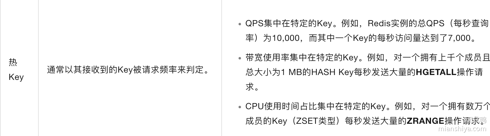

可以看到，如果一个 key 的访问频率占比过大，或带宽占比过大，都属于热点 key。

由于 Redis 的读写是单线程执行的，所以热点 key 可能会影响 Redis 的整体效率，消耗大量的 CPU 资源，从而降低 Redis 的整体吞吐量。集群环境下会使得流量不均衡，从而导致读写热点倾斜问题的发生。

##### 如何发现热 key？

1）**根据业务经验进行分析**

这个主要就是依据业务场景进行分析，通过经验判断哪些 key 可能成为热门 key，比如某明星的花边新闻、秒杀活动，演唱会门票等。

- 优点：这个方案实现起来简单直接，只有直接进行判断就可以了，基本没有什么成本。
- 缺点：这个主要依据业务能力，对于业务能力有一定的要求，并且不是所有的业务都能判断出来是否是热 key 的。且有些突发事情是无法预测的。

2）**redis 集群监控**

这种方式主要依据与 Redis 集群，我们只需要查看集群中哪个 Redis 出现 QPS 倾斜，而出现 QPS 倾斜的实例有极大的概率存在热点 Key。

- 优点：这种方案和上面差不多，由于企业的 Redis 大多数是集群部署，所以使用起来非常简单。
- 缺点：每次发生状况都需要排查，因为不一定所有的 QPS 倾斜都是热 Key 导致的。

3）**使用 hotkey 监控**

这个是 Redis 4.0 版本之后引入的一个新的指令，只需要在命令行执行 redis-cli 的时候加上 --hotkeys 的选项就可以了。它是通过 scan + object freq 实现的。

- 优点：因为这个命令是 Redis 自带的，使用起来简单快捷
- 缺点：需要扫描整个 keyspace，如果 Redis 中的 key 数量比较多的话，可能导致执行时间非常长，且实时性不好。

4）**使用 monitor 命令**

如下图所示，这个是 Redis 自 1.0 起就支持的功能。

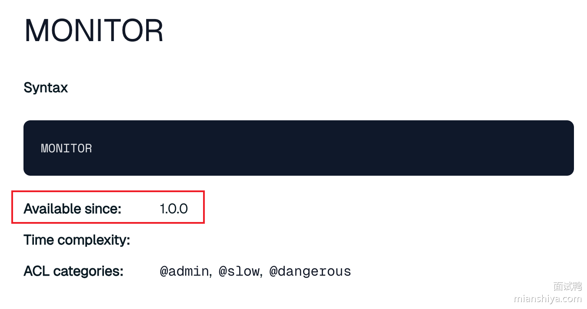

当通过 MONITOR 命令开启监视器之后，Redis 只需要在执行之后结合一些日志和相关的分析工具就可以进行统计。

- 优点：这个方案的优点在于这个是 Redis 原生支持的功能，使用起来简单快捷。
- 缺点：monitor 非常消耗性能，单个客户端执行 monitor 就会损耗 50% 的性能！不推荐这个方式！

以下为 redis 官网的 benchmark：


5）**客户端收集**

在操作 Redis 之前，通过加上统计 Redis 键值查询频次的逻辑，将统计数据发送给一个聚合计算平台进行计算，计算之后查看相对应的结果

- 优点：对性能损耗较低。
- 缺点：成本较大，企业如果没有聚合计算平台还需要引入。

6）**代理层收集**

在代理层进行统一的收集，因为有些服务在请求 Redis 之前都会请求一个代理服务，这种场景可以使用在代理层收集 Redis 热 Key 数据，和在客户端收集比较类似。

- 优点：客户端使用方便，不需要考虑 SDK 多语言异构差异和升级成本高的问题。
- 缺点：需要给 Redis 定制一个代理层，进行转发等操作，构建代理成本不低，且转发有性能损耗。

##### 应用程序中的多级缓存

在应用程序中，一般结合使用一级缓存和二级缓存：

- 一级缓存：一般指的是应用程序本地缓存（如 JVM 内存中的缓存）。
- 二级缓存：则为 Redis 缓存。当数据不在一级缓存中时，才会请求二级缓存。

通过这种多级缓存架构，可以有效减少 Redis 的访问次数，从而避免单 Key 的热点问题。

##### **热点 key 的拆分**

我们可以按照不同场景做不同的“拆分“。有些场景可以全量拷贝，即将 mianshiya 这个 key 复制成 mianshiya_1、mianshiya_2、mianshiya_3 ，**它们之间的数据是一致的**，这样不同用户都访问到全量的数据。

有些场景直接进行 key 的拆分，mianshiya_1、mianshiya_2、mianshiya_3 **各存一部分的数据**，不同用户仅需访问不同数据即可，例如一些推流信息，因为一个热点往往有很多发布者，大家看一部分，后续热度稍微降低下来，可以替换数据。

不同用户可以进行 hash，将用户 id 哈希之后取余得到后缀，拼上 mianshiya_ 即可组成一个 key。

## Spring

## SpringBoot

### Spring Boot 2.x 与 1.x 版本有哪些主要的改进和区别？ 

#### 回答重点

##### **Spring Framework 版本不同**

- Spring Boot 2.x 版本基于 **Spring Framework 5**，引入了对 **响应式编程**（Reactive Programming）的支持，这是 Spring 5 的一个重要特性。
- Spring Boot 1.x 则是基于 **Spring Framework 4.x**，不支持响应式编程。

##### **嵌入式 Web 容器版本变化**

Spring Boot 2.x 升级了嵌入式 Web 容器的默认版本（这些升级带来了更好的性能和对新 HTTP 标准（如 HTTP/2）的支持），例如：

- **Tomcat**：从 8.x 升级到 9.x。
- **Jetty**：从 9.x 升级到 10.x。
- **Undertow**：从 1.x 升级到 2.x。

##### **更好的性能**

- Spring Boot 2.x 版本在底层组件（如 Tomcat、Hibernate 等）和框架本身做了大量性能优化，使得应用启动时间更快、运行时性能更高，适合云原生应用和大规模微服务架构。

##### 新的 Actuator 端点

- Spring Boot 2.x 对 Spring Boot Actuator 做了全面改进，添加了更多的默认监控端点，并重新设计了 Actuator 的安全性和暴露策略。默认情况下，大多数端点是关闭的，开发者可以通过配置显式启用需要的端点。
- Spring Boot 1.x 中，Actuator 端点是默认全部开启的，这在安全性上存在隐患。

##### **自动配置的改进**

- Spring Boot 2.x 版本增强了自动配置机制，增加了更多常用技术栈的自动配置支持（如响应式编程、JPA 等），使得应用的自动配置更智能，减少了开发者的手动配置工作。

#### 扩展知识

Spring Boot 2.x 版本的特性和迁移策略

##### 响应式编程的支持

Spring Boot 2.x 是基于 **Spring Framework 5** 的，这意味着它支持响应式编程模型。响应式编程使得应用可以以非阻塞、异步的方式处理大量并发请求，特别适合构建高并发、I/O 密集型的应用。

- **Spring WebFlux**：Spring Boot 2.x 引入了 **Spring WebFlux**，这是一个用于构建响应式 Web 应用的框架，基于 **Reactor** 库。与传统的 Spring MVC 不同，WebFlux 使用非阻塞的 Netty 或 Undertow 作为底层服务器，支持响应式流式数据处理。

**示例**：

```java
@RestController
public class ReactiveController {

  @GetMapping("/reactive")
  public Mono<String> reactiveEndpoint() {
      return Mono.just("Hello, Reactive World!");
  }
}
```

##### 数据库支持的改进

Spring Boot 2.x 对数据库的支持做了多项改进，特别是在 JPA 和数据访问层方面：

- **HikariCP**：在 Spring Boot 2.x 中，**HikariCP** 被设为默认的数据源连接池。这是一个轻量且高效的连接池，比 Spring Boot 1.x 中的默认连接池（如 Tomcat JDBC）性能更好。
- **JPA 性能改进**：Spring Boot 2.x 对 **Hibernate 5.x** 提供了更好的支持，同时通过自动配置增强了 JPA 相关功能，使得数据库操作更加高效和易用。

##### HTTP/2 的支持

HTTP/2 是一种新的协议，具有以下几个优势：

- **多路复用**：允许在一个连接上并行处理多个请求，减少延迟。
- **头部压缩**：减少了每次请求和响应传输的头部数据大小。
- **服务器推送**：服务器可以主动向客户端推送资源，减少等待时间。

Spring Boot 2.x 支持通过配置简单地启用 HTTP/2，例如对于 Tomcat 的配置：

**示例**：

```properties
server.http2.enabled=true
```

这样，应用程序将自动支持 HTTP/2 协议。

##### 配置属性变化

Spring Boot 2.x 对配置文件中的属性名称进行了清理和调整，这意味着从 1.x 升级到 2.x 时，开发者需要特别关注一些属性名称的变化。常见的变化包括：

- `security.basic.enabled` → `spring.security.basic.enabled`
- `server.contextPath` → `server.servlet.context-path`

Spring 提供了详细的 [Spring Boot 2.x 升级指南](https://docs.spring.io/spring-boot/docs/2.0.0.RELEASE/reference/htmlsingle/#migration-guide)，开发者可以通过查阅这个指南来完成项目的平滑迁移。

##### 配置的改进与精简

Spring Boot 2.x 中进一步优化了自动配置的能力，减少了很多冗余配置，同时也支持通过 **`SpringApplicationBuilder`** 进行更加灵活的应用程序启动配置。

**示例：简化配置**：

```properties
spring.jpa.hibernate.ddl-auto=update
spring.datasource.url=jdbc:mysql://localhost:3306/mydb
```

Spring Boot 2.x 提供了更多的开箱即用配置，并允许通过少量的覆盖来达到项目所需的灵活性。

### 说说 Springboot 的启动流程？ 

#### 回答重点

Spring Boot 的启动流程可以总结为以下几个核心步骤（回答不要太发散，说出核心点即可，示例为 springboot 2.7.6 版本）：

##### 1. **启动 main() 方法**

- 应用从 `main()` 方法启动，并通过 `SpringApplication.run()` 引导应用启动。

##### 2. **创建SpringApplication**

- 应用会创建`SpringApplication` 对象，推断应用类型、设置初始化器、设置启动监听器、确定主应用类。

##### 3. **准备环境（ConfigurableEnvironment）**

- Spring Boot 在启动过程中准备应用环境，加载配置文件、系统环境变量以及命令行参数。

##### 4. **创建并刷新 ApplicationContext**

- 创建应用上下文，加载配置类和自动配置类，注册 Bean 并执行依赖注入等初始化操作。

##### 5. **在刷新上下文时启动嵌入式 Web 服务器**

- 对于 Web 应用，Spring Boot 会自动启动嵌入式 Web 容器（如 Tomcat），并注册相关的 Servlet 和 Filter。

##### 6. **发布应用已启动事件**

- 对应监听 stated 事件逻辑会被触发。

##### 7. **执行 CommandLineRunner 和 ApplicationRunner**

- 在应用启动完成后，执行实现了 `CommandLineRunner` 和 `ApplicationRunner` 接口的初始化逻辑。

##### 8. **发布 ready 事件、应用启动完成**

- 触发 `ApplicationReadyEvent`，应用进入运行状态，处理业务请求或任务。

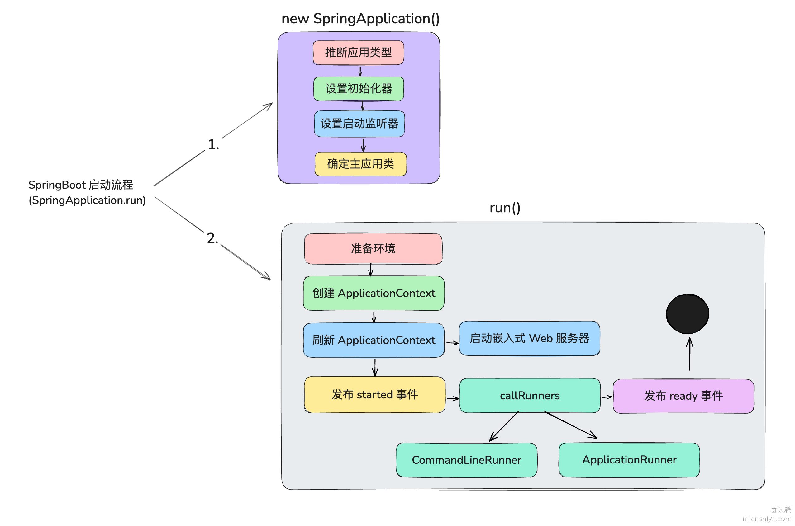

#### 扩展知识

详细分析 Spring Boot 启动流程（2.7.6版本）

##### 启动入口：`main()` 方法

Spring Boot 应用的启动从包含 **`@SpringBootApplication`** 注解的 `main()` 方法开始。`@SpringBootApplication` 是一个组合注解，包含了以下三个核心注解：

- **`@SpringBootConfiguration`**：相当于 `@Configuration`，表示该类是 Spring 配置类。
- **`@EnableAutoConfiguration`**：启用自动配置功能。
- **`@ComponentScan`**：启用组件扫描，默认扫描当前包及其子包下的 Spring 组件（如 `@Service`、`@Controller`、`@Repository` 等）。

```java
@SpringBootApplication
public class MyApplication {
    public static void main(String[] args) {
        SpringApplication.run(MyApplication.class, args);
    }
}
```

最终这个方法会触发:

```java
public static ConfigurableApplicationContext run(Class<?>[] primarySources, String[] args) {
        return new SpringApplication(primarySources).run(args);
}
```

因此上述图中分了两块，分别是` new SpringApplication()` 和 `run`。

##### 创建 `SpringApplication` 实例

**`SpringApplication`** 是 Spring Boot 启动的核心类，它负责引导整个 Spring 应用的启动流程。在 `run()` 方法中，会创建 `SpringApplication` 对象，并根据类路径中的依赖和配置进行初始化。

```java
public SpringApplication(ResourceLoader resourceLoader, Class<?>... primarySources) {
    this.resourceLoader = resourceLoader;
    Assert.notNull(primarySources, "PrimarySources must not be null");
    this.primarySources = new LinkedHashSet<>(Arrays.asList(primarySources));
    //推断应用类型
    this.webApplicationType = WebApplicationType.deduceFromClasspath();
    this.bootstrapRegistryInitializers = new ArrayList<>(
                    getSpringFactoriesInstances(BootstrapRegistryInitializer.class));
    //设置初始化器
    setInitializers((Collection) getSpringFactoriesInstances(ApplicationContextInitializer.class));
    // 设置启动监听器
    setListeners((Collection) getSpringFactoriesInstances(ApplicationListener.class));
    // 确定主应用类
    this.mainApplicationClass = deduceMainApplicationClass();
}
```

**推断应用类型**：Spring Boot 会根据类路径中的依赖自动判断应用是 Web 应用、Reactive 应用还是普通的非 Web 应用。常见的应用类型包括：

- **Servlet 应用**：如果类路径中存在 `javax.servlet.Servlet`。
- **Reactive 应用**：如果类路径中存在 `org.springframework.web.reactive.DispatcherHandler`。
- **None 类型**：不包含 Web 服务器，仅适用于普通的非 Web 应用。

##### `run` 方法详解

创建完 `SpringApplication` 对应后，SpringBoot 启动后续所有逻辑都在这个 `run` 方法里面。这个方法也是 Spring Boot 应用的核心启动流程，它负责启动应用、初始化上下文、执行各种初始化逻辑，并通知相关的监听器和组件。

我把源码关键信息都打上了注释：

```java
public ConfigurableApplicationContext run(String... args) {
    // 记录启动的开始时间，用于统计启动耗时
    long startTime = System.nanoTime();

    // 创建 DefaultBootstrapContext，用于在启动过程中保存共享的对象
    DefaultBootstrapContext bootstrapContext = createBootstrapContext();
    ConfigurableApplicationContext context = null;

    // 配置系统属性 "java.awt.headless"，适用于没有显示器的服务器环境
    configureHeadlessProperty();

    // 获取 SpringApplicationRunListeners，这些监听器可以监听应用的启动过程
    SpringApplicationRunListeners listeners = getRunListeners(args);

    // 通知所有监听器，Spring Boot 应用程序即将启动
    listeners.starting(bootstrapContext, this.mainApplicationClass);

    try {
        // 解析传入的命令行参数
        ApplicationArguments applicationArguments = new DefaultApplicationArguments(args);

        // 准备环境，加载配置文件、环境变量、命令行参数等
        ConfigurableEnvironment environment = prepareEnvironment(listeners, bootstrapContext, applicationArguments);

        // 配置环境，决定是否忽略 Java 的 `BeanInfo` 类，以加快启动速度
        configureIgnoreBeanInfo(environment);

        // 打印 Banner（欢迎信息），通常会在控制台或日志中展示
        Banner printedBanner = printBanner(environment);

        // 创建应用上下文（ApplicationContext），可以是不同类型的 Web 或非 Web 上下文
        context = createApplicationContext();

        // 设置应用启动监控器，用于收集应用启动过程中的统计数据
        context.setApplicationStartup(this.applicationStartup);

        // 准备应用上下文，注入环境、事件监听器、命令行参数等
        prepareContext(bootstrapContext, context, environment, listeners, applicationArguments, printedBanner);

        // 刷新上下文，启动 Spring 的核心容器，完成 Bean 的初始化等过程，其间会触发内嵌的 web 容器
        refreshContext(context);

        // 上下文刷新后的回调操作，可以用于自定义初始化逻辑
        afterRefresh(context, applicationArguments);

        // 计算应用启动耗时
        Duration timeTakenToStartup = Duration.ofNanos(System.nanoTime() - startTime);

        // 如果配置了日志，输出启动耗时等信息
        if (this.logStartupInfo) {
            new StartupInfoLogger(this.mainApplicationClass).logStarted(getApplicationLog(), timeTakenToStartup);
        }

        // 通知监听器，应用上下文已启动完成
        listeners.started(context, timeTakenToStartup);

        // 执行 CommandLineRunner 或 ApplicationRunner 接口中的代码
        callRunners(context, applicationArguments);
    }
    catch (Throwable ex) {
        // 处理启动过程中发生的异常
        handleRunFailure(context, ex, listeners);
        throw new IllegalStateException(ex);
    }

    try {
        // 计算到应用完全准备好所需的时间
        Duration timeTakenToReady = Duration.ofNanos(System.nanoTime() - startTime);

        // 通知监听器，应用已经完全准备好
        listeners.ready(context, timeTakenToReady);
    }
    catch (Throwable ex) {
        // 处理应用准备过程中的异常
        handleRunFailure(context, ex, null);
        throw new IllegalStateException(ex);
    }

    // 返回创建好的应用上下文
    return context;
}
```

##### run源码总结：

1. **启动时间记录**: 通过 `System.nanoTime()` 记录应用启动的时间，用于统计整个启动过程的耗时。
2. **`DefaultBootstrapContext`**: 创建一个用于启动过程中共享对象的上下文，提供基础的启动支持。
3. **`configureHeadlessProperty()`**: 配置 `java.awt.headless` 属性，以适应在无图形界面的环境（如服务器）中运行。
4. **`getRunListeners()`**: 获取启动监听器，监听应用的各个生命周期事件。
5. **`listeners.starting()`**: 通知所有监听器，应用程序开始启动。
6. **命令行参数解析**: 通过 `DefaultApplicationArguments` 对命令行参数进行解析。
7. **环境准备**: 调用 `prepareEnvironment()` 来加载配置文件、环境变量、命令行参数等，生成 `ConfigurableEnvironment`。
8. **`configureIgnoreBeanInfo()`**: 配置环境参数，决定是否忽略 Java 的 `BeanInfo` 类，优化性能。
9. **打印 Banner**: 调用 `printBanner()` 打印应用启动时的 Banner。
10. **创建 `ApplicationContext`**: 根据应用类型创建相应的 `ApplicationContext`，用于管理应用 Bean。
11. **`prepareContext()`**: 将环境、监听器、启动参数等注入到上下文中，并进行应用上下文的准备工作。
12. **`refreshContext()`**: 刷新 Spring 容器，完成 Bean 的创建与初始化，其间会触发内嵌的 web 容器。
13. **`afterRefresh()`**: 刷新上下文后的回调，执行自定义逻辑。
14. **日志记录启动耗时**: 通过 `StartupInfoLogger` 记录应用的启动耗时。
15. **通知应用启动完成**: `listeners.started()` 通知监听器，应用启动已完成。
16. **执行 CommandLineRunner 和 ApplicationRunner**: 调用实现 `CommandLineRunner` 或 `ApplicationRunner` 接口的 Bean，执行启动后的初始化逻辑。
17. **异常处理**: 在启动和运行过程中捕获异常并进行处理。

------

> 接下来再对一些细节进行补充

##### 启动监听器

**启动监听器**（`ApplicationListener`）在 Spring Boot 启动过程中起到监听特定事件的作用。Spring Boot 中的事件机制会触发不同的生命周期事件，比如：

- **`ApplicationStartingEvent`**：在应用启动时触发。
- **`ApplicationEnvironmentPreparedEvent`**：在环境变量和配置文件准备完成时触发。
- **`ApplicationPreparedEvent`**：在 Spring 容器（`ApplicationContext`）准备完成时触发。

这些事件都可以通过 `ApplicationListener` 进行监听，**使得可以在应用启动过程中进行自定义处理**。

##### 准备环境 `ConfigurableEnvironment`

在启动过程中，Spring Boot 通过 **`ConfigurableEnvironment`** 准备应用的环境变量。它会读取配置文件（如 `application.properties` 或 `application.yml`），并加载系统环境变量、命令行参数等。Spring Boot 使用 `PropertySource` 来管理这些配置属性。

**激活配置文件**：Spring Boot 支持通过 `spring.profiles.active` 激活不同的配置文件，以实现开发、测试、生产环境的灵活切换。

##### 创建 `ApplicationContext`

创建 **`ApplicationContext`** ，会注册所有配置类和自动配置类

Spring Boot 使用 **`@EnableAutoConfiguration`** 自动加载符合条件的配置类。自动配置机制基于条件注解（如 `@ConditionalOnClass`、`@ConditionalOnMissingBean` 等），在满足条件时自动注入相应的 Bean（**自动装配**）。

- **加载配置类**：包括开发者定义的 `@Configuration` 类以及 Spring Boot 提供的自动配置类（如 `DataSourceAutoConfiguration`、`WebMvcAutoConfiguration` 等）。
- **注册 BeanPostProcessor**：Spring 的 Bean 生命周期会经过 `BeanPostProcessor` 的处理，这包括依赖注入、AOP 代理等操作。

##### 刷新 `ApplicationContext`

它负责完成以下工作：

- **创建并初始化所有单例 Bean**：Spring 容器会创建并初始化所有定义的单例 Bean。这里包括开发者定义的 Bean 以及自动配置注入的 Bean。
- **处理 BeanPostProcessor**：在 Bean 初始化之前和之后，Spring 通过 `BeanPostProcessor` 对 Bean 进行加工，例如为某些 Bean 创建 AOP 代理对象。
- **事件发布与监听**：在容器刷新过程中，Spring 会发布 `ContextRefreshedEvent`，通知监听器应用上下文刷新完成。

##### 启动嵌入式 Web 服务器（如 Tomcat）

对于 Web 应用，Spring Boot 会自动启动嵌入式 Web 服务器（默认是 Tomcat）。这一步是在刷新 `refresh()` 方法的最后阶段进行的，主要包括以下操作：

- **注册内置的 Servlet 和 Filter**：Spring Boot 会自动注册 `DispatcherServlet`、`ErrorPageFilter` 等 Servlet 和 Filter。
- **启动嵌入式 Web 容器**：Spring Boot 根据应用的类型自动选择 Web 容器，并绑定到指定的端口上监听 HTTP 请求。

##### 执行 `CommandLineRunner` 和 `ApplicationRunner`

Spring Boot 在应用启动完成后，会调用实现了 **`CommandLineRunner`** 或 **`ApplicationRunner`** 接口的 Bean。这两个接口适合在应用启动后执行一些初始化逻辑。

**示例：CommandLineRunner**

```java
@Component
public class MyStartupRunner implements CommandLineRunner {
  @Override
  public void run(String... args) throws Exception {
      System.out.println("Mianshiya Application started, 刷题刷刷刷！");
  }
}
```

### 如何理解 Spring Boot 中的 starter？ 

#### 回答重点

在 Spring Boot 中，Starter 是一组有用的依赖集合，用于简化构建配置。Spring Boot 通过 Starter POMs 提供了各种常用功能模块的集成，开发者只需引入一个 Starter 依赖，便可以自动获得该模块的所有相关依赖和配置，而无需手动添加多个依赖库和配置文件。

有点像我们去买一些必需品，然后有人打包成一个套餐售卖，我们就不需要一个一个再去找了，直接一次性打包拿走，节省了时间。

#### 扩展知识

##### 如何自定义实现一个 starter

我举一个通用的示例。

首先创建一个 maven 项目，pom.xml 中添加 SpringBoot 和其他相关依赖。

```xml
<project ...>
    
    <groupId>com.example</groupId>
    <artifactId>my-starter</artifactId>
    <version>1.0.0</version>
    <name>xxx</name>
    
    .....
    
    <dependencies>
        <dependency>
            <groupId>org.springframework.boot</groupId>
            <artifactId>spring-boot-starter</artifactId>
        </dependency>
        <dependency>
            <groupId>org.springframework.boot</groupId>
            <artifactId>spring-boot-starter-web</artifactId>
        </dependency>
        <!-- 添加其他依赖 -->
    </dependencies>
</project>
```

首先我们配置一个属性类，这样我们在配置文件中根据固定的前缀加属性就可以修改制定的配置：

```java
@ConfigurationProperties(prefix = "spring.xxx")
@Data
public class XxxProperties {

    private String host;

    private Integer port;


}
```

然后创建一个自动配置类，需要使用 @Configuration 和 @ConditionalOnxxx 注解来条件化的配置 Bean。

```java
@Configuration
@EnableConfigurationProperties(XxxProperties.class)
public class MyAutoConfiguration {

    @Autowired
    private XxxProperties properties;
    
    @Bean
    @ConditionalOnMissingBean
    public MyService myService() {
        MyService service =  new MyService();
        service.setHost(properties.getHost());
        service.setPort(properties.getPort());
        return service;
    }
}
```

像上面的代码就是当没有 MyService Bean 的时候，默认创建一个，并且属性来源于配置。

最后，在 src/main/resources/META-INF 目录下创建 spring.factories 文件，并在其中定义自动配置类。

```properties
org.springframework.boot.autoconfigure.EnableAutoConfiguration=\
  com.example.starter.MyAutoConfiguration
```

大功告成，就是这么简单，然后 maven 打包可以发布到中央仓库或者私有仓库即可。

最终其他项目引入这个 starter 就能直接使用：

```xml
<dependency>
    <groupId>com.example</groupId>
    <artifactId>my-starter</artifactId>
    <version>1.0.0</version>
</dependency>
```

##### 简单参考企业级的 starter （MyBatisPlus）

例如 MyBatisPlus 的，我简单对照我们上面的步骤截几个图，大家可以简单感受下，有兴趣也自行去查看：

  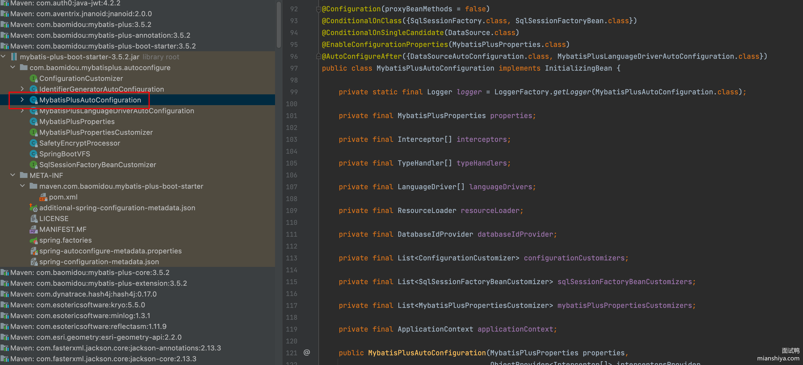 

##### SpringBoot3.x spring.factories 问题

上面我们演示的是 SpringBoot2.x 版本。如果升级到 SpringBoot3.x 那么 spring.factories 就无法生效了，因为官方已经把它移除了。

可以看下官方文档：

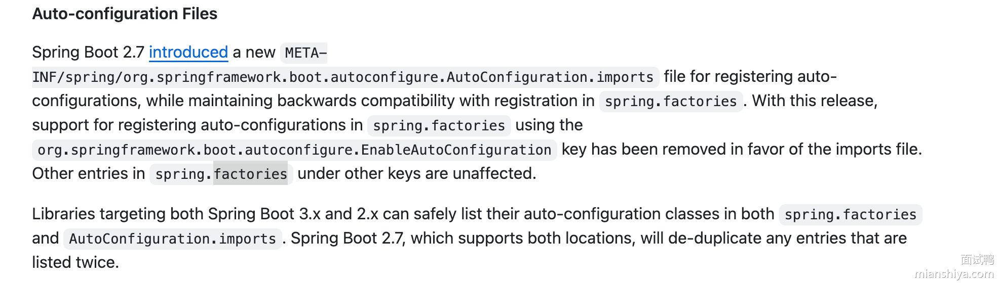

spring.factories 功能在 Spring Boot 2.7已经废弃，并且会在 Spring Boot 3.0移除

这使得类似上述的 mybatis-plus 低版本都无法使用。

此时的方案就不能用 spring.factories ，需要在类路径下创建 `META-INF/spring/org.springframework.boot.autoconfigure.AutoConfiguration.imports`文件。

然后文件的内容是：每个实现类的全类名单独一行。

```stylus
com.example.starter.MyAutoConfiguration
```

详情可看[官方 Spring-Boot-3.0-Migration-Guide](https://github.com/spring-projects/spring-boot/wiki/Spring-Boot-3.0-Migration-Guide)

SpringBoot3.x 其实迁移的成本还是有点高的，因为它需要 jdk17。 

### Spring Boot 是如何通过 main 方法启动 web 项目的？

#### 回答重点

Spring Boot 应用的启动流程都封装在 SpringApplication.run 方法中，它的大部分逻辑都是复用 Spring 启动的流程，只不过在它的基础上做了大量的扩展。

在启动的过程中有一个刷新上下文的动作，这个方法内会触发 webServer 的创建，此时就会创建并启动内嵌的 web 服务，默认的 web 服务就是 tomcat。

##### Spring Boot 的启动过程几个核心步骤：

1. SpringApplication.run()：这是启动的入口，它会创建 Spring 应用上下文，并执行自动配置。
2. 创建应用上下文：为 Web 应用创建 AnnotationConfigServletWebServerApplicationContext 上下文。
3. 启动内嵌 Web 服务器：在 refreshContext() 阶段启动内嵌的 Web 服务器（如 Tomcat）。
4. 自动配置：通过 @EnableAutoConfiguration 自动配置各种组件，如 DispatcherServlet。
5. 请求处理：内嵌的 DispatcherServlet 负责处理 HTTP 请求。

#### 扩展知识

##### 源码分析

###### SpringApplication#run

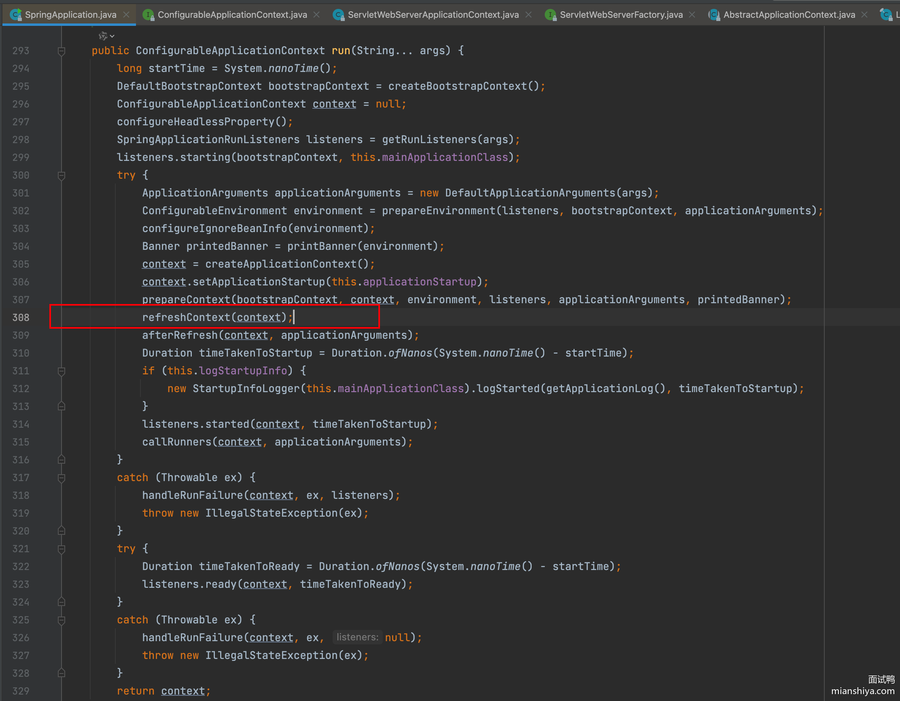

- getRunListeners()：获取应用启动监听器，监听应用的启动状态（比如 ApplicationStartedEvent）。
- prepareEnvironment()：配置应用的环境（Environment），包括从配置文件（application.properties 或 application.yml）加载配置。
- createApplicationContext()：创建 ApplicationContext，用于管理 Spring 的 Bean 及依赖注入。对于 Web 应用，通常会创建 AnnotationConfigServletWebServerApplicationContext 上下文。
- prepareContext()：将环境和参数注入到上下文中，初始化上下文中的各种组件，如 BeanFactory、资源等。
- refreshContext()：刷新应用上下文，启动所有已注册的 Bean，自动配置各类组件，加载 Spring MVC、事务管理等相关配置。
- afterRefresh()：上下文刷新后，执行额外的初始化操作，比如启动内嵌的 Web 服务器。
- callRunners()：调用 ApplicationRunner 和 CommandLineRunner 接口的实现类，以执行启动后的自定义逻辑。

我们再来关注下上面源码中圈的 refreshContext 方法

###### refreshContext

在 `run()` 方法中，`refreshContext()` 会调用 Spring 的 AbstractApplicationContext 的 refresh() 方法，该方法是 Spring 应用启动的核心。

对于 Web 应用，它还会启动内嵌的 Web 服务器。

最终会调用到 `ServletWebServerApplicationContext#onRefresh` 方法，这个方法内会调用 `createWebServer`

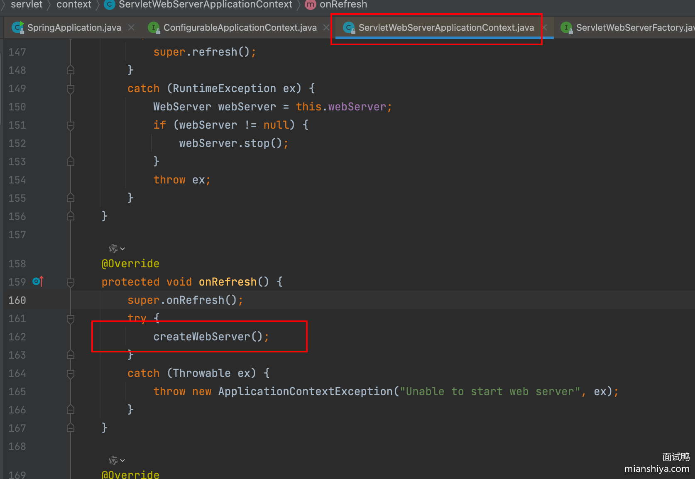

```
createWebServer` 从名字就能理解这个方法是干嘛的（创建对应的内嵌 Web 服务器，比如 Tomcat、Jetty 或 Undertow。），可以看到内部通过一个 `ServletWebServerFactory `获取 `webServer
```

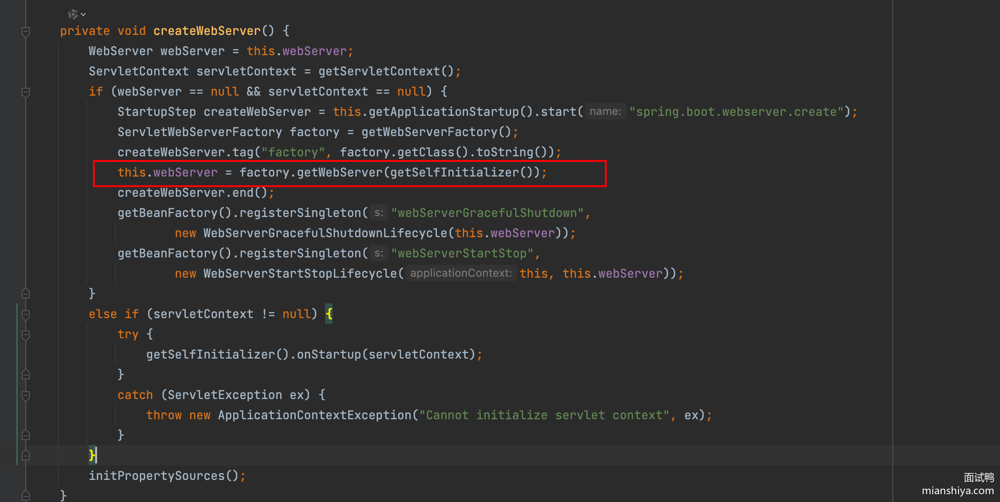

默认的 WebServer 是 tomcat，可以看到源码里就是直接 new 了一个 Tomcat，且包装成一个 WebServer：


实际上这个 getTomcatWebServer 会 new 一个 WebServer：


而 new WebServer 会触发 initialize 方法，这个方法内就会触发 tomcat.start：


这个时候 tomcat 就被启动了，web 服务就起来了！

这里再扩展下，实际上有 5 种 webServer，默认用的是 TomcatWebServer，还有 jetty、undertow 等。

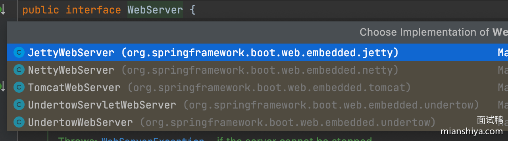

##### 自动配置机制：`@EnableAutoConfiguration`

Spring Boot 的自动配置机制由 `@EnableAutoConfiguration` 驱动，它会扫描类路径中的依赖，并根据预定义的条件加载相应的配置类。

`@EnableAutoConfiguration` 的核心逻辑是通过 spring.factories 文件加载自动配置类。该文件位于 spring-boot-autoconfigure 包中，内容类似于：

```stylus
org.springframework.boot.autoconfigure.EnableAutoConfiguration=\
org.springframework.boot.autoconfigure.web.servlet.ServletWebServerFactoryAutoConfiguration,\
org.springframework.boot.autoconfigure.web.servlet.DispatcherServletAutoConfiguration
```

这些配置类会在启动时自动注册，并将所需的 Bean 注入到应用上下文中。

##### @SpringBootApplication 注解的作用是什么

它是 Spring Boot 中的一个核心注解，是一个**组合注解**，由以下三个重要的注解组成，分别是：

1）**`@SpringBootConfiguration`**：

- 它是 Spring 的 `@Configuration` 注解的特殊形式，表示这是一个 Spring 配置类，Spring 会根据该类来加载和注册 Bean。
- 作用类似于传统的 XML 配置文件，它让类中的 `@Bean` 方法生效，并将其注册到 Spring 容器中。

2）**`@EnableAutoConfiguration`**：

- 它是 Spring Boot 的自动配置机制的核心，负责启用 Spring Boot 的自动配置功能。
- Spring Boot 会根据应用的类路径、已添加的依赖以及定义的配置（如 `application.properties` 或 `application.yml`），自动配置 Spring 应用的相关组件和 Bean，简化了手动配置。
- 例如，如果你引入了 `spring-boot-starter-web` 依赖，Spring Boot 会自动配置一个嵌入式的 Tomcat 服务器，并且配置 Spring MVC 的相关 Bean。

3）**`@ComponentScan`**：

- 启用组件扫描功能，自动发现并注册 `@Component`、`@Service`、`@Repository`、`@Controller` 等注解标注的 Spring 组件。
- 它会扫描 `@SpringBootApplication` 所在类的当前包及其子包，自动将符合条件的组件加载到 Spring 容器中。

##### `@SpringBootApplication` 的作用总结

- **简化配置**：通过这个组合注解，Spring Boot 项目可以不用手动配置 `@Configuration`、`@EnableAutoConfiguration`、`@ComponentScan`，使应用更易于启动和管理。
- **自动配置**：借助自动配置机制，开发者无需手动配置许多 Spring 组件，Spring Boot 会根据项目依赖来自动注入所需的 Bean。
- **组件扫描**：自动扫描和加载定义在项目中的 Spring 组件，简化了 Bean 注册过程。

### Spring Boot 的核心特性有哪些？

#### 回答重点

1）开箱即用，内嵌服务器。这个特点是程序员最直观的感受，相较于原本的开发，spring boot 可以省略以前繁琐的 tomcat 配置，快速创建一个 web 容器。

2）自动化配置。在 spring boot 中我们可以按照自动配置的规定（将自动加载的 bean 写在自己jar 包当中的 **meta/info/spring.factories** 文件中或者通过的注解 **@Import** 导入时加载指定的类）这样我们的配置类就会被 Springboot 自动加载到容器当中。 **同时还支持通过改写yaml 和 propreties来覆盖默认配置**

3）支持 jar 包运行。传统部署web 容器都是打成 war 包放在 tomcat 中。spring boot 可以打成 jar 包只要有 java 运行环境即可运行 web 容器。

4）完整的生态支持。spring boot 可以随意整合 spring 全家桶的支持。像 Actuator 健康检查模块，Spring Data JPA 数据库模块，Spring Test 测试模块。这些都可以很优雅的集成在 springboot 当中。

5）监控、健康检查支持。spring boot Actuator 支持开发者监控应用的运行状态，包括性能指标、应用信息和日志级别控制等。

#### 扩展知识

面试时可以跟面试官说说自己是如何实现一个 spring boot starter 来帮助项目简化某些通用的业务的。

比如现在项目中有很多列表接口需要导出 excel。我利用自动化配置写了一个 excel 导出模块。

实现思路如下：

1)写一个 @ExcelExport 注解，放在列表接口上。利用切面来切列表的返回结果，拿到列表结果后写入 excel 当中。

2)然后写一个配置类放在 meta/info/spring.factories 文件下。这样让 spring boot 自动装配我们这个写 excel 文件的处理类。

3)在整个项目中有需要列表导出 excel 的地方，仅需把注解写在列表接口上即可。

通过这个例子让面试官相信你有实际使用自动化装配的经验。

### 什么是 Spring Boot？ 

#### 回答重点

Spring Boot 是一个简化 Spring 应用程序开发的框架。**它的主要目标是减少 Spring 应用程序的配置和开发复杂性，使我们能够更快地构建、测试和部署 Spring 应用**。

简单来说它通过提供默认配置、自动化配置和嵌入式服务器等功能，简化了传统 Spring 应用的繁琐配置过程。

有人将一些依赖关系、默认配置都梳理好了，我们直接一个引用就搞定了，这就是它的本质。

#### 扩展知识

##### Spring Boot 主要特点

1. **简化配置**：Spring Boot 通过自动配置（`@EnableAutoConfiguration`），根据项目中的类路径依赖、环境变量等自动为应用配置适当的 Spring 模块，避免了大量的 XML 配置。
2. **内置服务器**：Spring Boot 内置了 Tomcat、Jetty、Undertow 等服务器，应用程序可以直接通过 `java -jar` 方式启动，而不需要部署到外部的 Web 服务器中。
3. **快速开发**：Spring Boot 提供了开箱即用的项目结构、默认配置和依赖管理，支持快速原型开发。它还提供了许多常用的开发工具（如开发时热部署、应用健康检查等）。
4. **独立运行**：Spring Boot 应用打包成一个独立的 JAR 或 WAR 包，可以通过命令行直接运行，简化了部署过程。

##### **Spring Boot 的核心注解**

###### `@SpringBootApplication`

`@SpringBootApplication` 是 Spring Boot 的核心注解，它是以下三个注解的组合：

- `@Configuration`：表示该类是 Spring 配置类。
- `@EnableAutoConfiguration`：启用 Spring Boot 的自动配置功能。
- `@ComponentScan`：自动扫描当前包及其子包中带有 Spring 注解的类（如 `@Controller`、`@Service` 等）。

###### `@EnableAutoConfiguration`

`@EnableAutoConfiguration` 是 Spring Boot 的自动配置核心注解，它会根据类路径中的依赖自动配置 Spring 应用中的各种组件。

**示例**： 如果应用中引入了 `spring-boot-starter-web` 依赖，Spring Boot 会自动为应用配置嵌入式 Tomcat 服务器、MVC 框架等。

##### **Spring Boot 的启动器（Starters）**

Spring Boot 提供了一系列 **Starters**（启动器），这些启动器是预定义的依赖包集合，涵盖了常用的 Spring 和第三方库。通过引入一个简单的启动器依赖，开发者可以快速整合需要的功能。

###### 常用 starter

- **`spring-boot-starter-web`**：用于构建 Web 应用，包含 Spring MVC 和嵌入式 Tomcat。
- **`spring-boot-starter-data-jpa`**：用于集成 Spring Data JPA 和 Hibernate，简化数据库访问。
- **`spring-boot-starter-security`**：用于集成 Spring Security，实现身份验证和授权。
- **`spring-boot-starter-thymeleaf`**：集成 Thymeleaf 模板引擎，适用于 MVC 模式下的视图层渲染。

**示例**：

```xml
<dependency>
    <groupId>org.springframework.boot</groupId>
    <artifactId>spring-boot-starter-web</artifactId>
</dependency>
```

引入 `spring-boot-starter-web` 之后，Spring Boot 会自动配置 Web 服务器和 Spring MVC，开发者只需编写业务逻辑即可。

##### **Spring Boot 的自动配置**

Spring Boot 的自动配置机制依赖于 `spring-boot-autoconfigure` 模块，它会根据类路径中的依赖和配置文件自动配置相关的 Bean 和服务。

###### 工作原理

Spring Boot 自动配置的核心原理是 `@EnableAutoConfiguration` 注解，它根据项目中的依赖和 `application.properties` 或 `application.yml` 文件中的配置，判断需要加载哪些 Bean。通过条件注解（如 `@ConditionalOnClass`、`@ConditionalOnMissingBean` 等），Spring Boot 可以有选择地加载相关配置。

###### 自定义配置

虽然 Spring Boot 自动配置非常方便，但开发者可以通过 `application.properties` 文件自定义和覆盖默认配置。

**示例**：

```properties
server.port=8081  # 修改内置 Tomcat 的端口号
spring.datasource.url=jdbc:mysql://localhost:3306/mydb  # 配置数据源
```

##### **Spring Boot 内置服务器**

Spring Boot 内置了几种常见的 Web 服务器，如 Tomcat、Jetty 和 Undertow。默认情况下，Spring Boot 使用嵌入式 Tomcat 作为 Web 应用的服务器，开发者可以通过 `application.properties` 文件或代码配置来切换服务器或修改其配置。

###### 嵌入式 Tomcat 配置

Spring Boot 默认使用嵌入式 Tomcat 服务器，开发者可以通过修改配置文件来调整 Tomcat 的属性，例如端口号、线程池大小等。

**示例**：

```properties
server.port=8080
server.tomcat.max-threads=200
```

###### 切换到 Jetty 或 Undertow

开发者可以通过替换依赖来切换嵌入式服务器。

**示例**：切换到 Jetty

```xml
<dependency>
    <groupId>org.springframework.boot</groupId>
    <artifactId>spring-boot-starter-jetty</artifactId>
</dependency>
```

##### **Spring Boot Actuator**

Spring Boot Actuator 是一个用于监控和管理 Spring Boot 应用的工具包，提供了丰富的健康检查、度量指标、应用状态等功能。开发者可以通过 Actuator 轻松地监控应用的运行状态。

###### 常见的 Actuator 端点

- **`/actuator/health`**：检查应用的健康状态。
- **`/actuator/metrics`**：查看应用的性能指标。
- **`/actuator/info`**：显示应用的基本信息。

**示例**： 在 `application.properties` 文件中启用 Actuator 端点：

```properties
management.endpoints.web.exposure.include=*
```

访问 `/actuator/health`，可以查看应用的健康状态信息：

```json
{
    "status": "UP"
}
```

##### **Spring Boot 的优点**

- **快速启动**：Spring Boot 提供了简洁的配置和开箱即用的功能，减少了项目启动时所需的配置工作，开发者可以专注于业务逻辑。
- **简化的配置管理**：Spring Boot 的自动配置机制大大减少了开发者手动配置的繁琐工作，尤其是在集成数据库、消息队列、安全性等复杂组件时，开发者可以通过少量配置完成集成。
- **内置 Web 服务器**：Spring Boot 内置了常用的 Web 服务器，使得开发者可以直接运行 Web 应用，而无需部署到外部服务器。
- **强大的生态系统**：Spring Boot 集成了 Spring 全家桶，提供了与 Spring 生态中各个组件的无缝集成，并通过各种 Starter 来快速添加第三方库支持。

###  SpringBoot 是如何实现自动配置的？ 

#### 回答重点

Spring Boot 的自动配置是通过 **`@EnableAutoConfiguration`** 注解实现，这个注解包含`@Import({AutoConfigurationImportSelector.class})`注解，导入的这个类会去扫描 classpath 下所有的 **`META-INF/spring.factories`** 中的文件，根据文件中指定的配置类加载相应的 Bean 的自动配置。

这些 Bean 通常会使用 **`@ConditionalOnClass`**、**`@ConditionalOnMissingBean`**、**`@ConditionalOnProperty`** 等条件注解。来控制自动配置的加载条件，例如仅在类路径中存在某个类时，才加载某些配置。

#### 扩展知识

##### Spring Boot 实现自动配置的核心机制

1）**`@EnableAutoConfiguration` 注解**：

Spring Boot 的自动配置是通过 **`@EnableAutoConfiguration`** 注解实现的。

```java
@Target({ElementType.TYPE})
@Retention(RetentionPolicy.RUNTIME)
@Documented
@Inherited
@AutoConfigurationPackage
@Import({AutoConfigurationImportSelector.class})
public @interface EnableAutoConfiguration {
    String ENABLED_OVERRIDE_PROPERTY = "spring.boot.enableautoconfiguration";

    Class<?>[] exclude() default {};

    String[] excludeName() default {};
}
```

这个注解位于 `@SpringBootApplication` 中，它导入的 `AutoConfigurationImportSelector` 会通过扫描类路径中的依赖，根据应用的上下文自动加载配置类，并为应用自动注入合适的 Bean。

> `@SpringBootApplication` 实际上包含了 **`@EnableAutoConfiguration`**，从而启用了自动配置功能。

2）**`spring.factories` 文件**：

Spring Boot 的自动配置依赖于 **`META-INF/spring.factories`** 文件，该文件中列出了所有自动配置类。当 Spring Boot 启动时，它会根据 `spring.factories` 文件中指定的配置类加载相应的自动配置。

**示例**（`spring.factories` 文件片段）：

```properties
▼properties复制代码org.springframework.boot.autoconfigure.EnableAutoConfiguration=\
org.springframework.boot.autoconfigure.jdbc.DataSourceAutoConfiguration,\
org.springframework.boot.autoconfigure.orm.jpa.HibernateJpaAutoConfiguration,\
org.springframework.boot.autoconfigure.web.servlet.WebMvcAutoConfiguration
```

`spring.factories` 文件的内容是 `EnableAutoConfiguration` 注解扫描的目标。Spring Boot 会根据应用的环境条件，选择性地加载这些配置类。

> springboot 3.0 废弃了spring.factories，详细点击：[SpringBoot3.x spring.factories 问题](https://www.mianshiya.com/bank/1797452903309508610/question/1797866285598638082#heading-4)

3）**条件注解（Conditional）**：

自动配置类通常使用 **`@ConditionalOnClass`**、**`@ConditionalOnMissingBean`**、**`@ConditionalOnProperty`** 等条件注解。它们控制自动配置的加载条件，例如仅在类路径中存在某个类时，才加载某些配置。

**示例**：

```java
@Configuration
@ConditionalOnClass(DataSource.class)  // 只有类路径中存在 DataSource 时才生效
public class DataSourceAutoConfiguration {
   @Bean
   @ConditionalOnMissingBean  // 如果没有自定义 DataSource，则使用默认配置
   public DataSource dataSource() {
       return new HikariDataSource();
   }
}
```

##### @Conditional 注解的作用是什么？

- [833. Spring 中的 @Conditional 注解的作用是什么？](https://www.mianshiya.com/bank/1790683494127804418/question/1798881653496274945)

##### 如何自定义自动配置

1）**创建自动配置类**：自定义自动配置类需要标注 `@Configuration` 注解，同时可以使用各种条件注解控制配置的加载。

**示例**：

```java
@Configuration
@ConditionalOnClass(MyCustomService.class)
public class MyCustomAutoConfiguration {

   @Bean
   @ConditionalOnMissingBean
   public MyCustomService myCustomService() {
       return new MyCustomService();
   }
}
```

2）**配置 `spring.factories` 文件**：创建 `META-INF/spring.factories` 文件，并将自定义的自动配置类注册到 `EnableAutoConfiguration` 中。

**示例**：

```properties
org.springframework.boot.autoconfigure.EnableAutoConfiguration=\
com.example.config.MyCustomAutoConfiguration
```

3）**打包并发布**：自定义的自动配置类可以随应用一起打包，也可以打包成库供其他应用使用。当这个库被引入到其他 Spring Boot 应用时，自动配置就会生效。

##### 自动配置的优先级

Spring Boot 提供了控制自动配置顺序的机制。可以通过 **`@AutoConfigureBefore`** 和 **`@AutoConfigureAfter`** 注解，来指定自动配置类的加载顺序。

- **`@AutoConfigureBefore`**：让当前配置类在指定的配置类之前加载。
- **`@AutoConfigureAfter`**：让当前配置类在指定的配置类之后加载。

**示例**：

```java
@Configuration
@AutoConfigureBefore(DataSourceAutoConfiguration.class)
public class MyDataSourceAutoConfiguration {
    // 自定义的数据源配置
}
```

##### 禁用特定的自动配置

在某些情况下，Spring Boot 的默认自动配置可能与业务需求不符，可以通过以下方式禁用不需要的自动配置类：

1）**在 `application.properties` 中禁用**：

```properties
spring.autoconfigure.exclude=org.springframework.boot.autoconfigure.jdbc.DataSourceAutoConfiguration
```

2）**使用 `@SpringBootApplication` 注解的 `exclude` 属性**：

```java
@SpringBootApplication(exclude = {DataSourceAutoConfiguration.class})
public class MyApplication {
   public static void main(String[] args) {
       SpringApplication.run(MyApplication.class, args);
   }
}
```

##### 自动配置与 Starter

- [如何理解 Spring Boot 中的 starter？](https://www.mianshiya.com/bank/1797452903309508610/question/1797866285598638082#heading-0)

### 如何理解 Spring Boot 中的 starter？ 

#### 回答重点

在 Spring Boot 中，Starter 是一组有用的依赖集合，用于简化构建配置。Spring Boot 通过 Starter POMs 提供了各种常用功能模块的集成，开发者只需引入一个 Starter 依赖，便可以自动获得该模块的所有相关依赖和配置，而无需手动添加多个依赖库和配置文件。

有点像我们去买一些必需品，然后有人打包成一个套餐售卖，我们就不需要一个一个再去找了，直接一次性打包拿走，节省了时间。

#### 扩展知识

##### 如何自定义实现一个 starter

我举一个通用的示例。

首先创建一个 maven 项目，pom.xml 中添加 SpringBoot 和其他相关依赖。

```xml
<project ...>
    
    <groupId>com.example</groupId>
    <artifactId>my-starter</artifactId>
    <version>1.0.0</version>
    <name>xxx</name>
    
    .....
    
    <dependencies>
        <dependency>
            <groupId>org.springframework.boot</groupId>
            <artifactId>spring-boot-starter</artifactId>
        </dependency>
        <dependency>
            <groupId>org.springframework.boot</groupId>
            <artifactId>spring-boot-starter-web</artifactId>
        </dependency>
        <!-- 添加其他依赖 -->
    </dependencies>
</project>
```

首先我们配置一个属性类，这样我们在配置文件中根据固定的前缀加属性就可以修改制定的配置：

```java
@ConfigurationProperties(prefix = "spring.xxx")
@Data
public class XxxProperties {

    private String host;

    private Integer port;


}
```

然后创建一个自动配置类，需要使用 @Configuration 和 @ConditionalOnxxx 注解来条件化的配置 Bean。

```java
@Configuration
@EnableConfigurationProperties(XxxProperties.class)
public class MyAutoConfiguration {

    @Autowired
    private XxxProperties properties;
    
    @Bean
    @ConditionalOnMissingBean
    public MyService myService() {
        MyService service =  new MyService();
        service.setHost(properties.getHost());
        service.setPort(properties.getPort());
        return service;
    }
}
```

像上面的代码就是当没有 MyService Bean 的时候，默认创建一个，并且属性来源于配置。

最后，在 src/main/resources/META-INF 目录下创建 spring.factories 文件，并在其中定义自动配置类。

```properties
▼properties复制代码org.springframework.boot.autoconfigure.EnableAutoConfiguration=\
  com.example.starter.MyAutoConfiguration
```

大功告成，就是这么简单，然后 maven 打包可以发布到中央仓库或者私有仓库即可。

最终其他项目引入这个 starter 就能直接使用：

```xml
<dependency>
    <groupId>com.example</groupId>
    <artifactId>my-starter</artifactId>
    <version>1.0.0</version>
</dependency>
```

##### 简单参考企业级的 starter （MyBatisPlus）

例如 MyBatisPlus 的，我简单对照我们上面的步骤截几个图，大家可以简单感受下，有兴趣也自行去查看：

   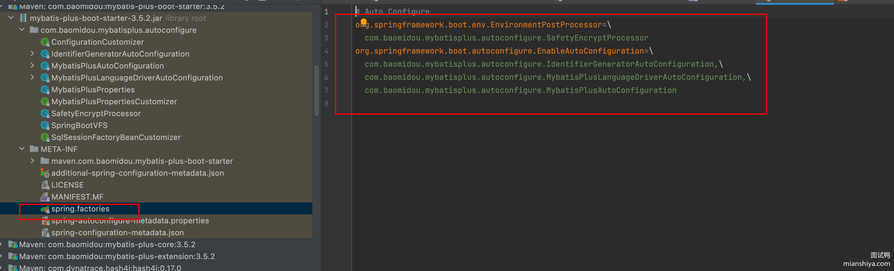

##### SpringBoot3.x spring.factories 问题

上面我们演示的是 SpringBoot2.x 版本。如果升级到 SpringBoot3.x 那么 spring.factories 就无法生效了，因为官方已经把它移除了。

可以看下官方文档：


spring.factories 功能在 Spring Boot 2.7已经废弃，并且会在 Spring Boot 3.0移除

这使得类似上述的 mybatis-plus 低版本都无法使用。

此时的方案就不能用 spring.factories ，需要在类路径下创建 `META-INF/spring/org.springframework.boot.autoconfigure.AutoConfiguration.imports`文件。

然后文件的内容是：每个实现类的全类名单独一行。

```stylus
com.example.starter.MyAutoConfiguration
```

详情可看[官方 Spring-Boot-3.0-Migration-Guide](https://github.com/spring-projects/spring-boot/wiki/Spring-Boot-3.0-Migration-Guide)

SpringBoot3.x 其实迁移的成本还是有点高的，因为它需要 jdk17。


## SpringCloud

## Mybatis


