# 小米虫宝典

## 消息队列

### 什么是消息队列？ 

#### 回答重点

消息队列（Message Queue）是一种**异步通信机制**，用于在**分布式系统**中解耦发送方和接收方之间的通信。它通过在消息生产者和消费者之间引入一个**中间缓冲区**（常见为 broker），将消息存储在 broker 中，然后由消费者从 broker 中读取和处理消息。

**常见用途**：

- **解耦**：生产者和消费者无需同时在线，生产者可以发送消息后立即返回，而消费者在合适的时机处理消息。
- **削峰填谷**：在高并发场景下，消息队列可以暂存大量请求，平滑高峰流量，避免系统过载。
- **异步处理**：可以将不需要立即处理的任务放入消息队列中异步执行，减少用户请求的响应时间。

#### 扩展知识

##### 常见的消息队列实现

**RabbitMQ**：

- RabbitMQ 是基于 AMQP 协议的消息队列，适合**复杂路由**和**多种消息模式**的场景。
- 具有强大的消息路由能力，包括**Direct**、**Fanout**、**Topic** 等多种交换机类型。
- 支持消息的**持久化**、**确认机制**和**死信队列**，确保消息的可靠传输。

**Kafka**：

- Kafka 是一种高吞吐量、分布式的消息队列，适用于**实时数据流**和**大数据分析**的场景。
- Kafka 的数据是以**分区（Partition）** 为单位存储，支持水平扩展。
- Kafka 的消费者可以以**消费组**的方式消费消息，实现**消息的多次消费**和**负载均衡**。

**RocketMQ**：

- RocketMQ 是阿里巴巴开源的一款消息队列，具有**高吞吐**、**低延迟**的特点，适用于企业级应用场景。
- 支持事务消息、延时消息和顺序消息，适用于金融支付、交易系统等对数据一致性要求较高的场景。

### 为什么需要消息队列？ 

#### 回答重点

从本质上来说是因为互联网的快速发展，**业务不断扩张**，促使技术架构需要不断的演进。

从以前的单体架构到现在的微服务架构，成百上千的服务之间相互调用和依赖。从互联网初期一个服务器上有 100 个在线用户已经很了不得，到现在坐拥 10 亿日活的微信。

我们需要有一个「东西」来**解耦服务之间的关系**、**控制资源合理合时的使用**以及**缓冲流量洪峰**等等。

消息队列就应运而生了。它常用来实现：**异步处理、服务解耦、流量控制**。

消息队列的典型应用场景：

- 订单系统：在电商系统中，订单的创建、支付、发货等步骤可以通过消息队列进行异步处理和解耦。
- 日志处理：使用消息队列将日志从应用系统传输到日志处理系统，实现实时分析和监控。
- 任务调度：在批量任务处理、任务调度系统中，通过消息队列将任务分发给多个工作节点，进行并行处理。
- 数据同步：在数据同步系统中，消息队列可以用于将变更的数据异步同步到不同的存储系统或服务。

#### 扩展知识

##### 异步处理

随着公司的发展你可能会发现你项目的**请求链路越来越长**，例如刚开始的电商项目，可以就是粗暴的扣库存、下单。慢慢地又加上积分服务、短信服务等。这一路同步调用下来客户可能等急了，这时候就是消息队列登场的好时机。

**调用链路长、响应就慢了**，并且相对于扣库存和下单，积分和短信没必要这么的 "及时"。因此只需要在下单结束那个流程，扔个消息到消息队列中就可以直接返回响应了。而且积分服务和短信服务可以并行的消费这条消息。

可以看出消息队列可以**减少请求的等待，还能让服务异步并发处理，提升系统总体性能**。


##### 服务解耦

上面我们说到加了积分服务和短信服务，这时候可能又要来个营销服务，之后领导又说想做个大数据，又来个数据分析服务等等。

可以发现订单的下游系统在不断的扩充，为了迎合这些下游系统订单服务需要经常地修改，任何一个下游系统接口的变更可能都会影响到订单服务，这订单服务组可疯了，**真 「核心」项目组**。

所以一般会选用消息队列来解决系统之间耦合的问题，订单服务把订单相关消息塞到消息队列中，下游系统谁要谁就订阅这个主题。这样订单服务就解放啦！


##### 流量控制

想必大家都听过「削峰填谷」，后端服务相对而言都是比较「弱」的，因为业务较重，处理时间较长。像一些例如秒杀活动爆发式流量打过来可能就顶不住了。因此需要引入一个中间件来做缓冲，消息队列再适合不过了。

网关的请求先放入消息队列中，后端服务尽自己最大能力去消息队列中消费请求。超时的请求可以直接返回错误。

当然还有一些服务特别是某些后台任务，不需要及时地响应，并且业务处理复杂且流程长，那么过来的请求先放入消息队列中，后端服务按照自己的节奏处理。这也是很 nice 的。

上面两种情况分别对应着生产者生产过快和消费者消费过慢两种情况，消息队列都能在其中发挥很好的缓冲效果。

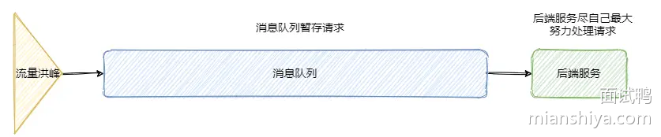

##### 注意

引入消息队列固然有以上的好处，但是多引入一个中间件系统的稳定性就下降一层，运维的难度抬高一层。因此要**权衡利弊，系统是演进的**。

### 说一下消息队列的模型有哪些？

#### 回答重点

常见的消息队列模型主要有以下两种：

**队列模型（也称点对点模型）**：

- 在队列模型中，消息从生产者发送到队列，并且每条消息只能被一个消费者消费一次。消费之后，消息在队列中被删除。
- 适用于任务处理类场景，如一个任务只需要一个处理者执行。

**发布/订阅模型（Publish/Subscribe）**：

- 在发布/订阅模型中，生产者将消息发布到某个主题（Topic），所有订阅了该主题的消费者都会接收到该消息。
- 每个订阅者都会接收到相同的消息，适用于广播通知、实时推送等场景。

#### 扩展知识

##### 队列模型（点对点模型）

生产者往某个队列里面发送消息，一个队列可以存储多个生产者的消息，一个队列也可以有多个消费者，但是消费者之间是竞争关系，**即每条消息只能被一个消费者消费**。


##### 发布/订阅模型

**为了解决一条消息能被多个消费者消费的问题**，发布/订阅模型就来了。该模型是将消息发往一个Topic 即主题中，所有订阅了这个 Topic 的订阅者都能消费这条消息。

其实可以这么理解，发布/订阅模型等于我们都加入了一个群聊中，我发一条消息，加入了这个群聊的人都能收到这条消息。

那么队列模型就是一对一聊天，我发给你的消息，只能在你的聊天窗口弹出，是不可能弹出到别人的聊天窗口中的。

讲到这有人说，那我一对一聊天对每个人都发同样的消息不就也实现了一条消息被多个人消费了嘛。

是的，通过多队列全量存储相同的消息，即数据的冗余可以实现一条消息被多个消费者消费。

RabbitMQ 就是采用队列模型，通过 Exchange 模块来将消息发送至多个队列，解决一条消息需要被多个消费者消费问题。

这里还能看到假设群聊里除我之外只有一个人，那么此时的发布/订阅模型和队列模型其实就一样了。

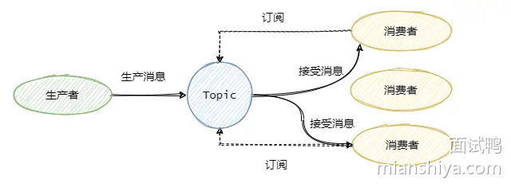

##### 小结一下

队列模型每条消息只能被一个消费者消费，而发布/订阅模型就是为让一条消息可以被多个消费者消费而生的，当然队列模型也可以通过消息全量存储至多个队列来解决一条消息被多个消费者消费问题，但是会有数据的冗余。

**发布/订阅模型兼容队列模型**，即只有一个消费者的情况下和队列模型基本一致。

RabbitMQ 采用队列模型， RocketMQ 和 Kafka 采用发布/订阅模型。

> RabbitMQ 的发布/订阅模式在本质上依然是基于队列模型的，只是通过引入多队列和交换机的绑定，同时将消息发给多个队列，模拟出消息发布/订阅的效果。

### 简述下消息队列核心的一些术语？ 

#### 回答重点

常见的消息队列核心术语：

- **生产者（Producer）**：负责向消息队列中发送消息的应用程序或服务。生产者将消息发送到指定的队列或主题（Topic），供消费者消费。
- **消费者（Consumer）**：从消息队列中读取和处理消息的应用程序或服务。消费者根据业务逻辑处理收到的消息，并可以向消息队列发送确认。
- **Broker**：消息队列的核心组件，负责接收、存储和分发消息。
- **队列（Queue）**：存储消息的容器，消息按照先进先出（FIFO）的顺序在队列中存储。队列中的每条消息通常只能被一个消费者消费一次。
- **主题（Topic）**：用于在发布/订阅模型中，消息生产者将消息发布到一个主题，多个订阅该主题的消费者可以接收到相同的消息。

仅关注消息的发送和消费流程的话：消息从 Producer 发往 Broker，Broker 将消息存储至本地，然后 Consumer 从 Broker 拉取消息，或者 Broker 推送消息至 Consumer，最后消费。

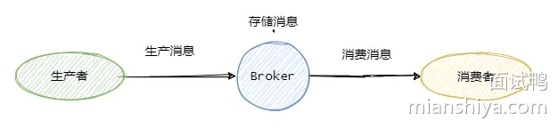

#### 扩展知识

##### 其它术语与概念

**消息确认（Ack）**：

- 消费者处理完消息后，向消息队列系统发送的确认信号（Acknowledgment）。
- 如果消息队列未收到确认，消息会被重新投递给其他消费者，保证消息不会丢失。

**死信队列（DLQ，Dead Letter Queue）**：

- 当消息因为消费失败、多次重试后未成功处理、消息过期或队列达到最大长度等原因被丢弃时，消息可以被转移到死信队列。
- 死信队列用于记录这些未能成功消费的消息，以便后续分析或人工处理。

**NameServer（命名服务）**：

- NameServer 提供了服务发现和负载均衡的功能。
- 在分布式消息队列（如 RocketMQ）中，用于管理 Broker 的地址列表，消费者和生产者通过 NameServer 找到 Broker 并进行消息的传递。Kafka 中使用 ZooKeeper 作为命名服务，RabbitMQ 没有命名服务，RocketMQ 使用自己实现的 namesrv。

**Cluster（集群）**：

- 为了提高消息队列的可靠性和处理能力，将多个 Broker 组成一个集群。
- 集群架构可以在一个 Broker 发生故障时，保证消息服务的高可用性。

**分区与队列**：

- 为了提高并发度，往往**发布/订阅模型**还会引入队列或者分区的概念。
- 即消息是发往一个主题（Topic）下的某个队列或者某个分区中。
- RocketMQ 中叫队列（MessageQueue）， Kafka 叫分区。
- 这里的队列要区别于队列模型中的队列，RocketMQ 中的队列更多是逻辑概念，用于 Topic 下的消息存储与消费。一个 Topic 可以包含多个MessageQueue，这些队列类似于 Kafka 的分区，用于并发消费。

**Offset**：

- Offset 可以认为是每条消息在分区（队列）中的唯一编号，消费者需要记录自己的消费位点，以便在恢复时继续消费未处理的消息
- Kafka 和 RocketMQ 有这个概念，RabbitMQ 没有。

**Consumer Group（消费组）**:

- Consumer Group 用于协调消费者并行消费消息。
- 在 Kafka 中同一消费组内的消费者共享同一个 Topic 下的分区，一个分区只会被组内的一个消费者消费。
- 在 RocketMQ 中同一消费组内的消费者共享同一个 Topic 下的队列，一个队列只会被组内的一个消费者消费
- RabbitMQ 没有 Consumer Group 概念。

> 我们来理解下 Consumer Group 中的消费情况，以 RocketMQ 举例说明

假设现在有两个消费组分别是 Group 1 和 Group 2，它们都订阅了 Topic-a。此时有一条消息发往 Topic-a ，那么这两个消费组都能接收到这条消息。

这条消息实际是写入 Topic 某个队列中的，消费组中的某个消费者对应消费一个队列的消息。

一条消息在 Broker 中只会有一份（除了集群架构下的副本拷贝），每个消费组会有自己的 offset 即消费点位来标识消费到的位置。在消费点位之前的消息表明已经消费过了。

这个 offset 是队列级别的，每个消费组都会维护订阅的 Topic 下的每个队列的 offset 。

来看下这个图应该就很清晰了：

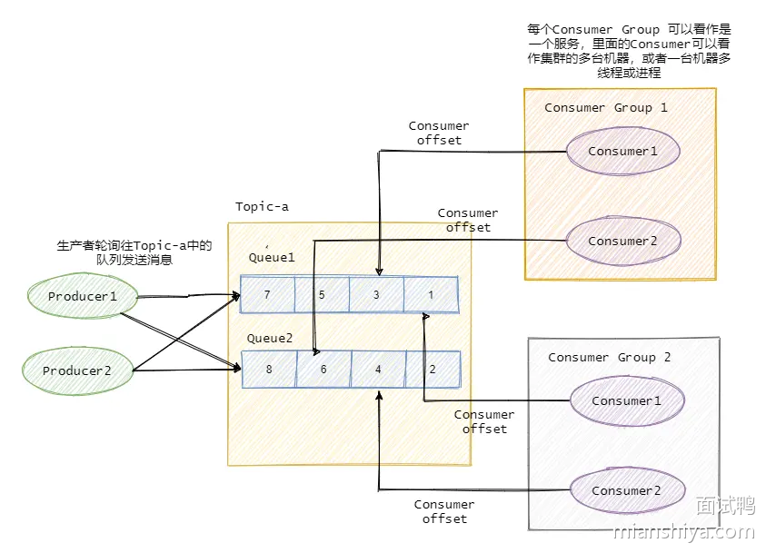

### 如何保证消息不丢失？

#### 回答重点

这需要生产消息、存储消息和消费消息三个阶段共同努力才能保证消息不丢失。

- **生产者的消息确认**：生产者在发送消息时，需要通过消息确认机制来确保消息成功到达。
- **存储消息**：broker 收到消息后，需要将消息持久化到磁盘上，避免消息因内存丢失。即使消息队列服务器重启或宕机，也可以从磁盘中恢复消息。
- **消费者的消息确认**：消费者在处理完消息后，再向消息队列发送确认（ACK），如果消费者未发送确认，消息队列需要重新投递该消息。

除此之外，如果消费者持续消费失败，消息队列可以自动进行重试或将消息发送到死信队列（DLQ）或通过日志等其他手段记录异常的消息，避免因一时的异常导致消息丢失。

#### 扩展知识

就我们市面上常见的消息队列而言，只要**配置得当**，我们的消息就不会丢。

先来看看一个图：

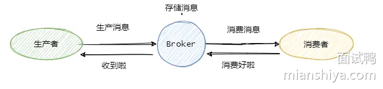

可以看到消息的生命周期其实就经历了三个阶段，分别是生产消息、存储消息和消费消息。我们从这三个阶段分别入手来看看如何确保消息不会丢失。

##### 生产消息

生产者发送消息至 Broker ，需要处理 Broker 的响应，不论是同步还是异步发送消息，同步和异步回调都需要做好 try-catch ，妥善的处理响应，如果 Broker 返回写入失败等错误消息，需要重试发送。当多次发送失败需要作报警，日志记录等。

这样就能保证在生产消息阶段消息不会丢失。

##### 存储消息

存储消息阶段需要在**消息刷盘**之后再给生产者响应，假设消息写入缓存中就返回响应，那么机器突然断电这消息就没了，而生产者以为已经发送成功了。

如果 Broker 是集群部署，有多副本机制，即消息不仅仅要写入当前 Broker，还需要写入副本机中。可以配置成至少写入两台机子后再给生产者响应，这样基本上就能保证存储的可靠了。

##### 消费消息

这里经常会有同学犯错，有些同学当消费者拿到消息之后直接存入内存队列中就直接返回给 Broker 消费成功，这是不对的。

你需要考虑拿到消息放在内存之后消费者就宕机了怎么办。所以我们应该在**消费者真正执行完业务逻辑之后，再发送给 Broker 消费成功**，这才是真正的消费了。

所以只要我们在消息业务逻辑处理完成之后再给 Broker 响应，那么消费阶段消息就不会丢失。

##### 小结一下

可以看出，保证消息的可靠性需要**三方配合**。

**生产者**需要处理好 Broker 的响应，出错情况下利用重试、报警等手段。

**Broker**需要控制响应的时机，单机情况下是消息刷盘后返回响应，集群多副本情况下，即发送至两个副本及以上的情况下再返回响应。

**消费者**需要在执行完真正的业务逻辑之后再返回响应给 Broker。

但是要注意消息**可靠性增强了，性能就下降**了，等待消息刷盘、多副本同步后返回都会影响性能。因此还是看业务，例如日志的传输可能丢那么一两条关系不大，因此没必要等消息刷盘再响应。

### 如何处理重复消息？

#### 回答重点

只有让消费者的处理逻辑具有**幂等性**，保证无论同一条消息被消费多少次，结果都是一样的，从而避免因重复消费带来的副作用。

#### 扩展知识

##### 什么是幂等性

幂等性是指一个操作无论执行多少次，产生的结果都是一样的。例如，HTTP 的 PUT 方法是幂等的，因为无论对同一资源执行多少次 PUT 操作，结果都是相同的。

例如这条 SQL:

```sql
update t1 set money = 150 where id = 1 and money = 100;
```

执行多少遍 money 都是 150，这就叫幂等。

##### 如何幂等处理重复消息

需要改造业务处理逻辑，使得在重复消息的情况下也不会影响最终的结果。

主要是**利用唯一标识（ID）去重**。

在消息中引入全局唯一 ID，例如 UUID、订单号等，利用 redis 等缓存，或者数据库来存储消息 ID，然后消费者在处理消息时可以检查该消息 ID 是否存在代表此消息是否已经处理过。

**去重缓存的使用**：

- 使用 Redis 等缓存系统存储已经处理的消息 ID，以减少数据库的查询压力。
- 可以为 Redis 中的去重记录设置过期时间，例如 7 天，以便自动清理历史消息，减小存储压力。

**去重表的设计**：

- 在数据库中创建一张去重表，用来存储已处理消息的 ID 及处理时间。在消费每条消息前，先查询该表。
- 对于高并发场景，可以结合数据库的唯一索引来避免多次插入同一个消息 ID（`insert into update on duplicate key...`），确保去重表中的记录唯一。

此外，一些触发数据库修改操作的消息，可以像上述举例的 SQL 一样，做了个**前置条件判断**，即 money = 100 这样的条件直接修改，这样无论执行多少次都不影响。更通用的是做个 version 即版本号控制，对比消息中的版本号和数据库中的版本号。

##### 可以从源头消除重复消息吗？即消费者仅会接收到一条消息

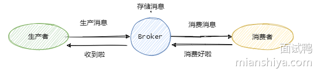

看下上面的图，我们来分析下看能不能避免消息的重复。

假设我们发送消息只管发，不管 Broker 的响应，那么我们发往 Broker 的消息是不会重复的。

但是一般情况我们是不允许这样的，因为这样无法保证消息的可靠性。

我们的基本需求是消息至少得发到 Broker 上，要确定 Broker 收到消息就得等 Broker 的响应，那么就可能存在 Broker 已经写入了，但是响应由于网络原因生产者没有收到，于是生产者又重发了一次，此时消息就重复了。

再看消费者消费的时候，假设我们消费者拿到消息消费了，业务逻辑已经走完了，事务提交了，此时需要更新 Consumer offset 了（告诉 Broker 这条消息我消费过了）。

但是就这这一刻这个消费者挂了，此时还未更新 Consumer offset。另一个消费者顶上，因为 Consumer offset 还没更新，于是新的消费者又拿到刚才那条消息，业务又被执行了一遍，这样消息不就重复了吗？

可以看到，对平常业务而言**消息重复是不可避免**的，因此我们只能从**另一个角度**来解决重复消息的问题。

关键点就是**幂等**。既然我们不能防止重复消息的产生，那么我们只能在业务上处理重复消息所带来的影响。

### 如何保证消息的有序性？

#### 回答重点

保证消息有序性的常见方法如下：

**单一生产者和单一消费者**：

- 使用单个生产者发送消息到**单个队列**，并由单个消费者处理消息。这样可以确保消息按照生产者的发送顺序消费。
- 这种方法简单但容易成为**性能瓶颈**，无法充分利用并发的优势。

**分区与顺序键（Partition Key）**：

- 在支持**分区（Partition）** 的消息队列中（如 Kafka、RocketMQ），可以通过 **Partition Key** 将消息发送到特定的分区。每个分区内部是**有序的**，这样可以保证相同 Partition Key 的消息按顺序消费。
- 例如，在订单处理系统中，可以使用订单号作为 Partition Key，将同一个订单的所有消息路由到同一个分区，确保该订单的消息顺序。

**顺序队列（Ordered Queue）**：

- 一些消息队列系统（如 RabbitMQ）支持顺序队列，消息在队列中的存储顺序与投递顺序一致。**如果使用单个顺序队列**，消息将按顺序被消费。
- 可以使用多个顺序队列来提高并发处理能力，并使用特定规则将消息分配到不同的顺序队列中。

#### 扩展知识

##### 不同消息队列的顺序性保证

**Kafka**：Kafka 中的消息在**分区**内部是有序的。生产者在发送消息时，可以指定分区（Partition）。如果所有相同 Key 的消息都发送到同一个分区，则可以保证这些消息的顺序。

- 通过配置生产者的**hash**函数，可以将同一类型的消息发送到相同的分区，保证顺序。
- 在消费端，使用**单线程消费者**从特定分区读取消息，可以确保消费的顺序性。

**RabbitMQ**：RabbitMQ 通过单个队列可以保证消息的顺序，如果消息需要并发消费，则需要将其路由到不同的**顺序队列**中。

- 使用**Message Grouping**技术，将具有相同属性的消息分组到一个队列中，以确保组内消息的顺序。
- 通过**自定义路由策略**，可以将同一业务逻辑的消息发送到相同的队列，从而保证顺序。

**RocketMQ**：RocketMQ 支持**顺序消息**（Ordered Messages），生产者可以使用 `send` 方法将消息发送到指定的分区队列，并使用**Message Queue Selector**来选择目标队列（本质的实现和 kafka 是一样的）。

- 消费者端通过**顺序消费模式**，可以从同一个消息队列中按顺序读取消息，确保消息的顺序性。
- 通过指定 Message Queue 的选择算法（如按订单 ID 对队列数取模），可以将同一订单的所有消息投递到相同的队列中。

##### 有序消息之全局有序

如果要保证消息的**全局有序**，首先只能由一个生产者往 Topic 发送消息，并且一个 Topic 内部只能有一个队列（分区）。消费者也必须是单线程消费这个队列。这样的消息就是全局有序的！

不过一般情况下我们都不需要全局有序，即使是同步 MySQL Binlog 也只需要保证**单表**消息有序即可。

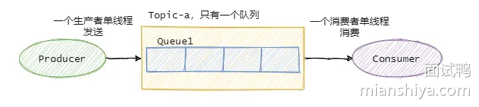

##### 有序消息之部分有序

绝大部分的有序需求是部分有序，部分有序我们就可以将 Topic 内部划分成我们需要的队列数，把消息通过特定的策略发往固定的队列中，然后每个队列对应一个单线程处理的消费者。

这样即完成了部分有序的需求，又可以通过队列数量的并发来提高消息处理效率。

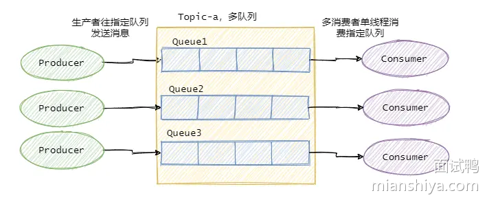

图中我画了多个生产者，一个生产者也可以，只要同类消息发往指定的队列即可。

使用**顺序消息**在 Kafka 和 RocketMQ 中的实现方式略有不同，下面是针对这两种消息队列的顺序消息实现的详细示例。

##### Kafka 顺序消息示例

假设场景是一个订单系统，我们希望保证同一订单 ID 的消息按照顺序被消费。通过将**相同的业务 Key（订单 ID）\**的消息发送到同一个\**分区（Partition）**，可以保证这些消息在分区内部的顺序性。消费时，同一个分区的数据按顺序消费，就能保证了消息的有序性。

###### 生产者代码

```java
//忽略相关配置
KafkaProducer<String, String> producer = new KafkaProducer<>(props);

String orderId = "order-123";

for (int i = 1; i <= 5; i++) {
    String value = "Order Step " + i + " for " + orderId;
    // 使用订单 ID 作为 Key，确保相同订单的消息发送到同一个分区
    ProducerRecord<String, String> record = new ProducerRecord<>(TOPIC, orderId, value);

    RecordMetadata metadata = producer.send(record).get();
}
```

###### 消费者代码

```java
KafkaConsumer<String, String> consumer = new KafkaConsumer<>(props);
consumer.subscribe(Collections.singletonList(TOPIC));

while (true) {
    ConsumerRecords<String, String> records = consumer.poll(Duration.ofSeconds(1));
    for (ConsumerRecord<String, String> record : records) {
        System.out.printf("Consumed message: %s from partition: %d, offset: %d\n",
                record.value(), record.partition(), record.offset());
    }
}
```

- **生产者**：使用 `orderId` 作为 `key`，Kafka 根据这个 `key` 将消息发送到同一个分区。这样可以确保相同 `orderId` 的消息被发送到同一个分区，从而保证顺序。
- **消费者**：从 Kafka 的 `order-topic` 中读取消息，因为 Kafka 的分区内部消息是有序的，消费者将按照 `orderId` 的顺序消费这些消息。

##### RocketMQ 顺序消息示例

在 **RocketMQ** 中，可以通过**消息队列选择器**（`MessageQueueSelector`）将消息发送到指定的队列，从而实现顺序消费

###### 生产者代码

```java
String orderId = "order-123";

for (int i = 1; i <= 5; i++) {
    String body = "Order Step " + i + " for " + orderId;
    Message message = new Message("OrderTopic", body.getBytes(StandardCharsets.UTF_8));

    // 使用 MessageQueueSelector 按照 orderId 选择队列
    SendResult sendResult = producer.send(message, new MessageQueueSelector() {
        @Override
        public MessageQueue select(List<MessageQueue> mqs, Message msg, Object arg) {
            // 将 orderId 转为 hash 值，以决定消息发往哪个队列
            String orderId = (String) arg;
            int index = orderId.hashCode() % mqs.size();
            return mqs.get(Math.abs(index));
        }
    }, orderId);
}
```

###### 消费者代码

```java
// 使用并发消费消息监听器，保证单队列内的顺序性
consumer.registerMessageListener((MessageListenerConcurrently) (msgs, context) -> {
    for (MessageExt msg : msgs) {
        String body = new String(msg.getBody());
        System.out.printf("Consumed message: %s from queue: %d\n", body, msg.getQueueId());
    }
    return ConsumeConcurrentlyStatus.CONSUME_SUCCESS;
});
```

- **生产者**：使用 `MessageQueueSelector` 将具有相同 `orderId` 的消息发送到同一个消息队列（`MessageQueue`），确保这些消息被发送到同一队列，从而保证顺序。
- **消费者**：通过 `DefaultMQPushConsumer` 订阅 `OrderTopic`，RocketMQ 保证每个队列中的消息是按顺序消费的。只要相同订单 ID 的消息在同一队列中，就可以保证它们的消费顺序。

在 **RabbitMQ** 中，保证消息的顺序性可以通过以下方式实现：

- **单个队列单个消费者**：将消息发送到一个队列中，并使用单个消费者进行消费，这样可以确保消息按照生产者发送的顺序被消费。
- **多队列顺序性保证**：可以根据某个业务 Key（例如订单 ID）选择队列，从而保证具有相同业务 Key 的消息总是发送到同一个队列，由一个消费者按顺序处理。

下面的示例演示了**RabbitMQ 顺序消息的实现**，通过将所有相同订单 ID 的消息发送到同一个队列中，以确保消息的顺序。

##### RabbitMQ 顺序消息示例

###### 生产者代码

```java
try (Connection connection = factory.newConnection();
     Channel channel = connection.createChannel()) {
    // 声明队列（如果不存在则创建）
    channel.queueDeclare(QUEUE_NAME, true, false, false, null);

    String orderId = "order-123";

    for (int i = 1; i <= 5; i++) {
        String message = "Order Step " + i + " for " + orderId;
        // 发送消息
        channel.basicPublish("", QUEUE_NAME, null, message.getBytes("UTF-8"));
        System.out.println("Sent: " + message);
    }
}
```

###### 消费者代码

```java
try (Connection connection = factory.newConnection();
     Channel channel = connection.createChannel()) {
    // 声明队列（如果不存在则创建）
    channel.queueDeclare(QUEUE_NAME, true, false, false, null);

    // 创建消费者，并定义处理逻辑
    DeliverCallback deliverCallback = (consumerTag, delivery) -> {
        String message = new String(delivery.getBody(), "UTF-8");
        System.out.println("Received: " + message);

        // 模拟消息处理逻辑
        try {
            Thread.sleep(500); // 模拟处理延迟
        } catch (InterruptedException e) {
            e.printStackTrace();
        }

        // 发送手动确认
        channel.basicAck(delivery.getEnvelope().getDeliveryTag(), false);
    };

    // 开始消费消息（手动确认模式）
    channel.basicConsume(QUEUE_NAME, false, deliverCallback, consumerTag -> { });
}
```

- **单个消费者**：此示例中使用了单个消费者处理消息，确保消息按照发送顺序被消费。对于顺序性要求高的业务，通常只使用一个消费者进行处理。

##### RabbitMQ 方案扩展：多队列+顺序消费

在某些场景下，单个队列和单个消费者的方式可能会因为性能问题无法满足业务需求。我们可以通过多队列的方式，将不同业务 Key 的消息发送到不同的队列中，以提高并发处理能力，同时保证每个 Key 的消息顺序。

- **将消息分配到不同的队列**：例如，可以使用订单 ID 的哈希值，将订单消息发送到多个不同的队列。
- **每个队列使用一个消费者**：确保同一个队列中的消息按顺序被消费。每个消费者只负责处理一个队列中的消息。

###### 多队列的生产者

```java
try (Connection connection = factory.newConnection();
     Channel channel = connection.createChannel()) {

    String orderId = "order-123";
    int numberOfQueues = 3; // 假设有 3 个队列
    int queueIndex = Math.abs(orderId.hashCode() % numberOfQueues);
    String queueName = QUEUE_PREFIX + queueIndex;

    // 声明队列（如果不存在则创建）
    channel.queueDeclare(queueName, true, false, false, null);

    for (int i = 1; i <= 5; i++) {
        String message = "Order Step " + i + " for " + orderId;
        channel.basicPublish("", queueName, null, message.getBytes("UTF-8"));
        System.out.println("Sent: " + message + " to " + queueName);
    }
}
```

###### 多队列的消费者

```java
try (Connection connection = factory.newConnection();
     Channel channel = connection.createChannel()) {
    String queueName = QUEUE_PREFIX + QUEUE_INDEX;

    channel.queueDeclare(queueName, true, false, false, null);
    System.out.println("Waiting for messages in " + queueName);

    DeliverCallback deliverCallback = (consumerTag, delivery) -> {
        String message = new String(delivery.getBody(), "UTF-8");
        System.out.println("Received: " + message);

        // 模拟处理逻辑
        try {
            Thread.sleep(500);
        } catch (InterruptedException e) {
            e.printStackTrace();
        }

        channel.basicAck(delivery.getEnvelope().getDeliveryTag(), false);
    };

    channel.basicConsume(queueName, false, deliverCallback, consumerTag -> { });
}
```

- **多队列方案**：生产者根据业务 Key（如订单 ID）的哈希值，将消息发送到不同的队列（如 `order_queue_0`、`order_queue_1`、`order_queue_2`）。这种方法可以提高并发处理能力，因为每个队列可以有一个独立的消费者。
- **每个消费者处理一个队列**：消费者从指定的队列中消费消息，确保每个队列内的消息按顺序消费。

### 如何处理消息堆积？

#### 回答重点

消息堆积是指在消息队列中，消息的生产速度远大于消费速度，导致大量消息积压在队列中。

我们需要**先定位消费慢的原因**，如果是 bug 则处理 bug，同时可以临时扩容增加消费速率，减少线上的资损。

如果是因为本身消费能力较弱，则可以优化下消费逻辑

常见有以下几种方式**提升消费者的消费能力**：

1. **增加消费者线程数量**：提高并发消费能力。
2. **增加消费实例**：在分布式系统中，可以水平扩展多个消费实例，从而提高消费速率。
3. **优化消费者逻辑**：检查消费者的代码，减少单个消息的处理时间。例如，减少 I/O 操作、使用批量处理等。

**注意上述的第二点**：

- 增加消费实例，一定要注意**注意Topic 对应的分区/队列数需要大于等于消费实例数**，不然新增加的消费者是没东西消费的。**因为一个Topic中，一个分区/队列只会分配给一个消费实例**

除此之外还可以进行**限流和降级处理**：

- 对消息生产端进行限流，降低生产速率，避免消息积压进一步恶化。
- 对非关键消息进行**丢弃**或**延迟处理**，只保留高优先级的消息，提高系统的响应速度。

#### 扩展知识

##### 优化消费者逻辑常见做法

**批量消费**：

- 通过一次性从队列中消费多条消息（如批量读取 100 条），可以减少每次拉取消息的网络开销，提高处理效率。

**异步消费**：

- 使用异步处理方法，在消费的同时不阻塞后续消息的消费。处理完一条消息后立即开始处理下一条消息，提升并发度（但是要注意消息丢失的风险）。

**优化数据库操作**：

- 如果消费者在处理消息时需要频繁访问数据库，可以通过**数据库连接池**、**SQL 优化**、**缓存**等手段减少数据库操作的时间。
- 使用批量插入或更新操作，而不是逐条处理，可以显著提升效率。

##### 临时扩展队列的策略

**临时扩展多个消费者队列**：

- 在消息积压严重时，可以通过临时扩展多个消费者队列，将积压的消息分配到不同的队列中进行消费。消费完成后，可以将这些临时队列关闭。
- 例如，在 Kafka 中，可以增加分区数（Partition），同时扩展更多的消费者实例，分摊消费压力。
- 在 RocketMQ 中可以增加队列数。

**使用多队列调度机制**：

- 例如，使用 RabbitMQ 的**Exchange**机制，将消息按照特定规则路由到多个队列中。这样可以在消息堆积时，将不同类型的消息分开处理。

##### 限流与降级的实现方式

**生产者限流**：

- 在生产者端增加限流逻辑，使用**令牌桶**、**漏桶算法**等限流策略，限制生产者的发送速率，从而避免消息队列被快速填满。
- 例如，在 Kafka 中可以通过配置生产者的 `linger.ms` 和 `batch.size` 来缓解消息发送的速度。

**消费者降级**：

- 在消息堆积严重时，对低优先级的消息进行**丢弃**或延迟处理。只保留高优先级消息的消费，确保系统核心功能的正常运行。
- 可以在消费端增加**优先级队列**或通过消息属性区分优先级，先处理高优先级的消息。

### 消息队列设计成推消息还是拉消息？推拉模式的优缺点？ 

#### 回答重点

**推模式（Push）**：消息队列将消息主动推送给消费者，适合实时性要求高、消费者能够及时处理消息的场景。

- **优点**：实时性好，消息可立即送达消费者。
- **缺点**：难以控制消费速度，容易导致消费者过载，尤其是在高并发时。

**拉模式（Pull）**：消费者主动从消息队列中拉取消息，适合消费能力有限、需要根据自身处理能力调控速率的场景。

- **优点**：消费者可以根据自身负载决定拉取频率，避免过载；更适合批量处理。
- **缺点**：可能会导致消息延迟，实时性不如推模式，尤其是拉取频率较低时。

#### 扩展知识

##### 推拉模式

首先明确一下推拉模式到底是在讨论消息队列的哪一个步骤，一般而言我们在谈论**推拉模式的时候指的是 Comsumer 和 Broker 之间的交互。**

默认的认为 Producer 与 Broker 之间就是推的方式，即 Producer 将消息推送给 Broker，而不是 Broker 主动去拉取消息。

想象一下，如果需要 Broker 去拉取消息，那么 Producer 就必须在本地通过日志的形式保存消息来等待 Broker 的拉取，如果有很多生产者的话，那么消息的可靠性不仅仅靠 Broker 自身，还需要靠成百上千的 Producer。

Broker 还能靠多副本等机制来保证消息的存储可靠，而成百上千的 Producer 可靠性就有点难办了，所以默认的 Producer 都是推消息给 Broker。

所以说有些情况分布式好，而有些时候还是集中管理好。

##### 推模式

推模式指的是消息从 Broker 推向 Consumer，即 Consumer 被动的接收消息，由 Broker 来主导消息的发送。

**推模式有什么好处**：

- **消息实时性高**，Broker 接受完消息之后可以立马推送给 Consumer。
- **对于消费者使用来说更简单**，简单啊就等着，反正有消息来了就会推过来。

###### 推模式有什么缺点？

**推送速率难以适应消费速率**，推模式的目标就是以最快的速度推送消息，当生产者往 Broker 发送消息的速率大于消费者消费消息的速率时，随着时间的增长消费者那边可能就“爆仓”了，因为根本消费不过来啊。当推送速率过快就像 DDos 攻击一样消费者就傻了。

并且不同的消费者的消费速率还不一样，身为 Broker 很难平衡每个消费者的推送速率，如果要实现自适应的推送速率那就需要在推送的时候消费者告诉 Broker ，我不行了你推慢点吧，然后 Broker 需要维护每个消费者的状态进行推送速率的变更。

这其实就增加了 Broker 自身的复杂度。

所以说推模式难以根据消费者的状态控制推送速率，适用于消息量不大、消费能力强要求实时性高的情况下。

##### 拉模式

拉模式指的是 Consumer 主动向 Broker 请求拉取消息，即 Broker 被动的发送消息给 Consumer。

###### 我们来想一下拉模式有什么好处？

拉模式主动权就在消费者身上了，消费者可以根据自身的情况来发起拉取消息的请求。假设当前消费者觉得自己消费不过来了，它可以根据一定的策略停止拉取，或者间隔拉取都行。

**拉模式下 Broker 就相对轻松了**，它只管存生产者发来的消息，至于消费的时候自然由消费者主动发起，来一个请求就给它消息呗，从哪开始拿消息，拿多少消费者都告诉它，它就是一个没有感情的工具人，消费者要是没来取也不关它的事。

**拉模式可以更合适的进行消息的批量发送**，基于推模式可以来一个消息就推送，也可以缓存一些消息之后再推送，但是推送的时候其实不知道消费者到底能不能一次性处理这么多消息。而拉模式就更加合理，它可以参考消费者请求的信息来决定缓存多少消息之后批量发送。

###### 拉模式有什么缺点？

**消息延迟**，毕竟是消费者去拉取消息，但是消费者怎么知道消息到了呢？所以它只能不断地拉取，但是又不能很频繁地请求，太频繁了就变成消费者在攻击 Broker 了。因此需要降低请求的频率，比如隔个2 秒请求一次，你看着消息就很有可能延迟 2 秒了。

**消息忙请求**，忙请求就是比如消息隔了几个小时才有，那么在几个小时之内消费者的请求都是无效的，在做无用功。

##### 到底是推还是拉

可以看到推模式和拉模式各有优缺点，到底该如何选择呢？

**RocketMQ 和 Kafka 都选择了拉模式**，当然业界也有基于推模式的消息队列如 ActiveMQ。

我个人觉得拉模式更加的合适，因为现在的消息队列都有持久化消息的需求，也就是说本身它就有个存储功能，它的使命就是接受消息，保存好消息使得消费者可以消费消息即可。

而消费者各种各样，身为 Broker 不应该有依赖于消费者的倾向，我已经为你保存好消息了，你要就来拿好了。

虽说一般而言 Broker 不会成为瓶颈，因为消费端有业务消耗比较慢，但是 Broker 毕竟是一个中心点，能轻量就尽量轻量。

那么竟然 RocketMQ 和 Kafka 都选择了拉模式，它们就不怕拉模式的缺点么？ 怕，所以它们操作了一波，减轻了拉模式的缺点。

即

##### 长轮询

RocketMQ 和 Kafka 都是利用“长轮询”来实现拉模式。所谓的“长轮询”具体的做法都是通过消费者去 Broker 拉取消息时，当有消息的情况下 Broker 会直接返回消息，如果没有消息都会采取延迟处理的策略，即保持连接，暂时 hold 主请求，然后在对应队列或者分区有新消息到来的时候都会提醒消息来了，通过之前 hold 主的请求及时返回消息，保证消息的及时性。

一句话说就是消费者和 Broker 相互配合，拉取消息请求不满足条件的时候 hold 住请求，避免了多次频繁的拉取动作，当消息一到就返回消息。

##### 扩展阅读：RocketMQ 中的长轮询

RocketMQ 中的 PushConsumer 其实是披着拉模式的方法，**只是看起来像推模式而已**。

因为 RocketMQ 在被背后偷偷的帮我们去 Broker 请求数据了。

后台会有个 RebalanceService 线程，这个线程会根据 topic 的队列数量和当前消费组的消费者个数做负载均衡，每个队列产生的 pullRequest 放入阻塞队列 pullRequestQueue 中。然后又有个 PullMessageService 线程不断的从阻塞队列 pullRequestQueue 中获取 pullRequest，然后通过网络请求 broker，这样实现的准实时拉取消息。

这一部分代码我不截了，就是这么个事儿，稍后会用图来展示。

然后 Broker 的 PullMessageProcessor 里面的 processRequest 方法是用来处理拉消息请求的，有消息就直接返回，如果没有消息怎么办呢？我们来看一下代码。


我们再来看下 suspendPullRequest 方法做了什么。

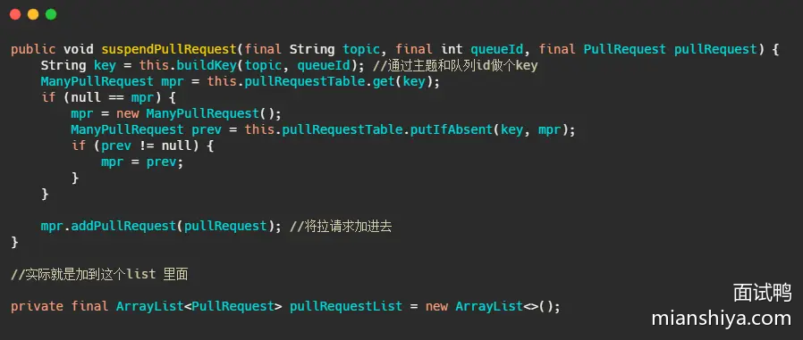

而 PullRequestHoldService 这个线程会每 5 秒从 pullRequestTable 取PullRequest请求，然后看看待拉取消息请求的偏移量是否小于当前消费队列最大偏移量，如果条件成立则说明有新消息了，则会调用 notifyMessageArriving ，最终调用 PullMessageProcessor 的 executeRequestWhenWakeup() 方法重新尝试处理这个消息的请求，也就是再来一次，整个长轮询的时间默认 30 秒。

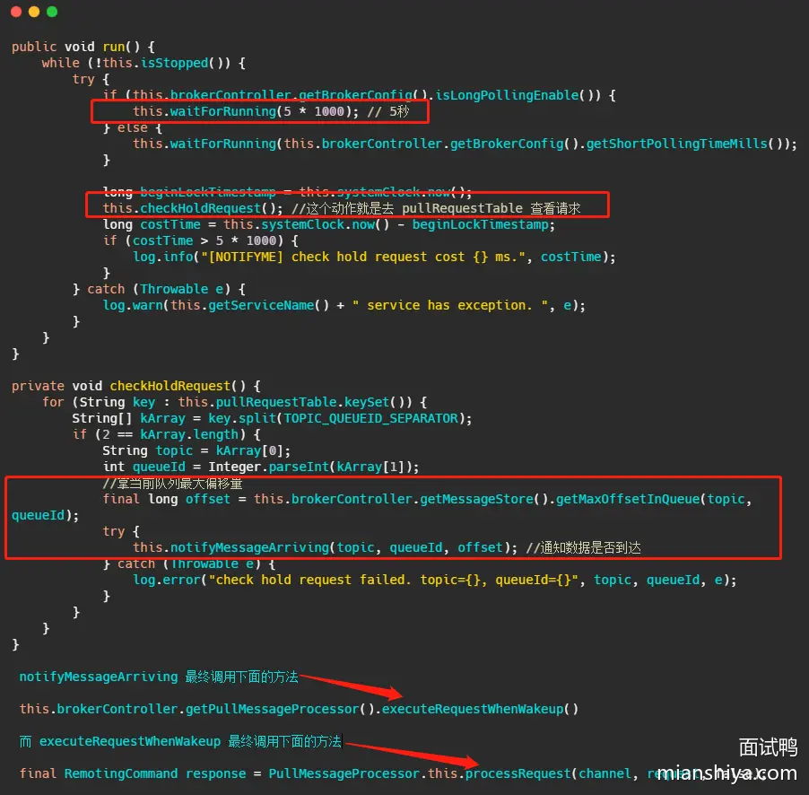

简单的说就是 5 秒会检查一次消息时候到了，如果到了则调用 processRequest 再处理一次。这好像不太实时啊？ 5秒？

别急，还有个 ReputMessageService 线程，这个线程用来不断地从 commitLog 中解析数据并分发请求，构建出 ConsumeQueue 和 IndexFile 两种类型的数据，**并且也会有唤醒请求的操作，来弥补每 5s 一次这么慢的延迟**

代码我就不截了，就是消息写入并且会调用 pullRequestHoldService#notifyMessageArriving。

最后我再来画个图，描述一下整个流程。


##### 扩展阅读：Kafka 中的长轮询

像 Kafka 在拉请求中有参数，可以使得消费者请求在 “长轮询” 中阻塞等待。

简单的说就是消费者去 Broker 拉消息，定义了一个超时时间，也就是说消费者去请求消息，如果有的话马上返回消息，如果没有的话消费者等着直到超时，然后再次发起拉消息请求。

并且 Broker 也得配合，如果消费者请求过来，有消息肯定马上返回，没有消息那就建立一个延迟操作，等条件满足了再返回。

我们来简单的看一下源码，为了突出重点，我会删减一些代码。

先来看消费者端的代码。

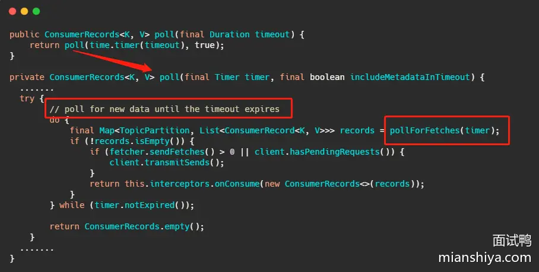

上面那个 poll 接口想必大家都很熟悉，其实从注解直接就知道了确实是等待数据的到来或者超时，我们再简单的往下看。


我们再来看下最终 client.poll 调用的是什么。


最后**调用的就是 Kafka 包装过的 selector，而最终会调用 Java nio 的 select(timeout)**。

现在消费者端的代码已经清晰了，**我们再来看看 Broker 如何做的**。

Broker 处理所有请求的入口其实我在之前的文章介绍过，就在 KafkaApis.scala 文件的 handle 方法下，这次的主角就是 handleFetchRequest 。


这个方法进来，我截取最重要的部分。


下面的图片就是 fetchMessages 方法内部实现，源码给的注释已经很清晰了，大家放大图片看下即可。

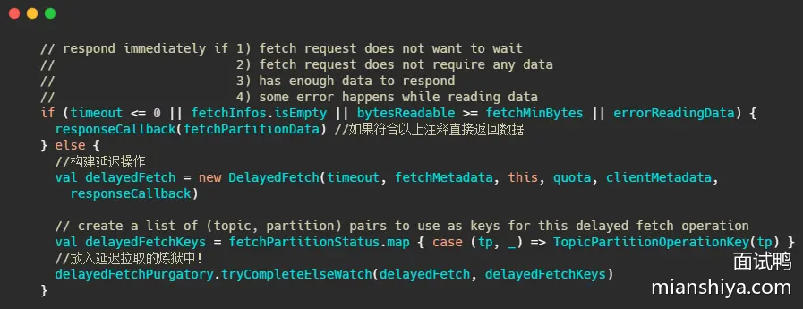

这个炼狱名字取得很有趣，简单的说就是利用我之前文章提到的时间轮，来执行定时任务，例如这里是`delayedFetchPurgatory`，专门用来处理延迟拉取操作。

我们先简单想一下，这个延迟操作都需要实现哪些方法，首先构建的延迟操作需要有检查机制，来查看消息是否已经到了，然后呢还得有个消息到了之后该执行的方法，还需要有执行完毕之后该干啥的方法，当然还得有个超时之后得干啥的方法。

这几个方法其实对应的就是代码里的 DelayedFetch ，这个类继承了 DelayedOperation 内部有：

- isCompleted 检查条件是否满足的方法
- tryComplete 条件满足之后执行的方法
- onComplete 执行完毕之后调用的方法
- onExpiration 过期之后需要执行的方法

判断是否过期就是由时间轮来推动判断的，但是总不能等过期的时候再去看消息到了没吧？

这里 Kafka 和 RocketMQ 的机制一样，也会在消息写入的时候提醒这些延迟请求消息来了，具体代码我不贴了， 在 ReplicaManager#appendRecords 方法内部再深入个两方法可以看到。

不过虽说代码不贴，图还是要画一下的。

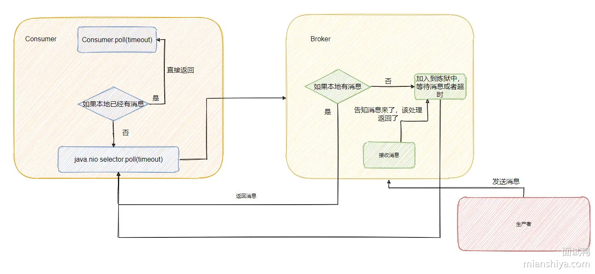

### RabbitMQ 中无法路由的消息会去到哪里？ 

#### 回答重点

在 **RabbitMQ** 中，无法被路由的消息通常有以下几种处理方式：

1. **丢弃消息**：默认情况下，若消息无法找到符合条件的队列（即没有匹配的绑定关系），RabbitMQ 会直接丢弃消息，不会进行特殊处理。
2. **备份交换机（Alternate Exchange）**：可以为交换机配置一个备份交换机，无法被路由的消息将被发送到备份交换机，再由备份交换机根据其绑定关系决定如何处理消息。例如，可以将这些消息发送到指定队列进行保存或处理。
3. **消息回退（Return Listener）**：在使用 `mandatory` 参数的情况下，如果消息无法路由，则会触发返回机制，将消息退回到生产者，这样生产者可以自行处理未路由的消息。

#### 扩展知识

##### 配置备份交换机

**备份交换机（Alternate Exchange）** 是 RabbitMQ 中处理未路由消息的常用方式。为交换机配置备份交换机后，任何无法找到匹配队列的消息都会自动路由到指定的备份交换机。

```java
// 配置交换机和备份交换机
Map<String, Object> args = new HashMap<>();
args.put("alternate-exchange", "my-alternate-exchange");
channel.exchangeDeclare("main-exchange", "direct", true, false, args);
channel.exchangeDeclare("my-alternate-exchange", "fanout", true);
```

##### 消息回退机制（Return Listener）

当生产者设置 `mandatory` 参数为 `true` 时，如果消息无法路由，则会触发**消息回退机制**，消息会被返回给生产者，生产者可以通过 `Return Listener` 监听未路由消息：

```java
channel.addReturnListener((replyCode, replyText, exchange, routingKey, properties, body) -> {
    System.out.println("Message returned: " + new String(body));
});
channel.basicPublish("exchange", "routing-key", true, MessageProperties.PERSISTENT_TEXT_PLAIN, "Test message".getBytes());
```

##### 死信队列（DLX）

如果消息未能被正常路由，并且在备份交换机或回退机制无法处理的情况下，还可以通过**死信交换机（DLX）** 将消息转发到死信队列，进行后续处理。这在消息队列中的存储和处理环节起到补充作用，尤其适合未能及时消费或路由的消息。

##### 不同策略的应用场景

- **备份交换机**：适用于业务场景中需要监控或重处理未路由消息的情况。
- **Return Listener 回退机制**：适用于生产者对消息流控制严格的场景，确保无路由消息被生产者感知。
- **死信交换机**：适合管理超时、失败和未能路由的消息，适用于需要严格消息管控的系统。

### RabbitMQ 中消息什么时候会进入死信交换机？

#### 回答重点

消息会在以下几种情况**进入死信交换机（Dead-Letter Exchange，DLX）**：

1. **消息被拒绝（Rejection）**：当消费者使用 `basic.reject` 或 `basic.nack` 明确拒绝消息，并且不要求重新投递（`requeue` 设置为 `false`）时，消息会被直接投递到死信交换机。
2. **消息过期（TTL Expiration）**：RabbitMQ 支持为消息或队列设置 TTL（Time-To-Live），即生存时间。当消息超过指定的存活时间后还未被消费，它会自动变为死信并被发送到死信交换机。
3. **队列达到最大长度（或总大小）**：如果队列设置了最大长度（`x-max-length` 或 `x-max-length-bytes`），当消息数量或总大小超出限制时，最早进入队列的消息会被移入死信交换机。

这些条件下进入死信交换机的消息，可以再通过死信队列进行日志记录、重新处理或监控。

##### 死信队列的配置

- **绑定死信交换机**：在声明队列时，可以为该队列配置一个死信交换机，通过参数 `x-dead-letter-exchange` 和 `x-dead-letter-routing-key` 指定死信交换机和路由键。

#### 扩展知识

##### 死信交换机的配置示例

配置死信交换机可以确保未被正常处理的消息有去处，避免消息丢失。以下是为队列 `my-queue` 配置死信交换机的示例：

```java
Map<String, Object> args = new HashMap<>();
args.put("x-dead-letter-exchange", "dlx-exchange");
args.put("x-dead-letter-routing-key", "dlx-routing-key");

// 声明队列并绑定死信交换机
channel.queueDeclare("my-queue", true, false, false, args);
channel.exchangeDeclare("dlx-exchange", "direct");
channel.queueBind("dlx-queue", "dlx-exchange", "dlx-routing-key");
```

##### 各种场景下的死信队列应用

- **消费者拒绝（Rejection）**：当消费者不能处理消息时，使用 `basic.reject` 或 `basic.nack` 将其拒绝并路由到死信队列。死信队列可以用来监控和分析消费者无法处理的异常消息。
- **过期消息处理**：在电商订单系统中，TTL 机制可用来控制支付超时的订单，将超时未支付的订单放入死信队列中，并在后续对这些订单进行自动取消。
- **队列限流**：如果队列有容量限制，当消息超出队列容量时，最早进入的消息会被丢入死信队列，适用于系统负载较高的场景中进行限流和控制。

##### 死信队列的注意事项

- **避免死信循环**：在配置死信交换机时，避免将死信交换机和原队列配置为相互死信的循环，防止消息重复转发引起的系统资源浪费。

### 说一下 AMQP 协议？

#### 回答重点

AMQP（Advanced Message Queuing Protocol）是一种应用层协议，用于在消息队列系统中**定义消息的格式、传输方式和处理机制**。

它是一个**面向消息的、异步传输的协议**，具有高可靠性、可拓展性、跨平台的特性，适合在分布式系统中传输重要数据。被广泛用于构建可靠的消息队列和消息传输系统，是 RabbitMQ、ActiveMQ 等消息中间件的核心协议。

**五大组成部分**：

- **连接（Connection）**：客户端与消息代理（如 RabbitMQ）建立的网络连接。
- **信道（Channel）**：在连接内创建的逻辑通信链路，支持多信道复用一个连接。
- **交换机（Exchange）**：负责将消息路由到绑定的队列，支持多种路由策略。
- **队列（Queue）**：存储实际传输的消息，消费者从队列拉取消息进行处理。
- **绑定（Binding）**：定义交换机与队列之间的关系，通过路由键实现消息路由。

#### 扩展知识

##### AMQP 的路由模型

AMQP 提供了丰富的消息路由模型，可以灵活满足各种业务需求。常见的交换机类型包括：

- **Direct Exchange**：消息根据精确匹配的路由键路由到队列。
- **Fanout Exchange**：消息会广播到所有绑定的队列，不考虑路由键，适用于广播消息。
- **Topic Exchange**：根据路由键的模式匹配将消息路由到符合条件的队列，支持模糊匹配（如 `order.*`）。
- **Headers Exchange**：通过消息头（Headers）中的键值匹配进行路由，不依赖路由键。

##### 消息的可靠传输机制

AMQP 提供了多种机制确保消息的可靠性：

- **消息确认（Acknowledge）**：消费者接收消息后可以选择确认消息，若确认失败，消息会重新进入队列。
- **消息持久化（Durable）**：队列和消息可以被设置为持久化，以保证在代理宕机后数据不丢失。
- **事务支持（Transactional）**：AMQP 支持事务机制，确保消息的批量操作具有原子性；在事务模式下，生产者可以通过 `commit` 和 `rollback` 控制消息的提交和回滚。

##### 3. AMQP 与其他协议的对比

- **与 MQTT**：AMQP 偏向于企业级应用，具有较强的消息持久化和事务控制，而 MQTT 设计轻量，适合物联网（IoT）中资源受限的设备。
- **与 JMS**：AMQP 是跨平台的标准协议，适用于不同的编程语言和消息中间件，而 JMS 是 Java 标准，通常与 Java 企业应用紧密结合。

### 说一下 RabbitMQ 的事务机制？ 

#### 回答重点

RabbitMQ 的事务机制指的是在一组消息操作中，**要么所有消息都成功发送，要么全部回滚**，从而确保消息不会丢失。即RabbitMQ 支持的事务，不是我们理解的 ACID 的那类事务或者说分布式事务消息，而是保证消息发送的原子性。

##### 使用事务的基本流程

- 开启事务：调用 `txSelect` 命令。
- 消息发送：将消息发送到 RabbitMQ。
- 提交事务：调用 `txCommit` 确认提交。
- 回滚事务：在出现异常时，可以调用 `txRollback` 放弃未成功的消息发送。

#### 扩展知识

##### 发布确认模式（Publisher Confirms） vs 事务机制

在大多数场景中，**发布确认模式**是事务机制的轻量替代方案。发布确认通过确认每条消息是否到达队列，以确保消息的可靠性，而不会带来事务机制的显著性能损耗。发布确认的工作原理是：

- **单个确认**：消息被发送后，RabbitMQ 会在接收到并处理后，向生产者返回一个确认（ACK），生产者再决定是否继续发送下一条消息。
- **批量确认**：可以批量发送多条消息，然后等待 RabbitMQ 的批量确认，从而减少往返次数，提升吞吐量。

相比事务机制，发布确认模式更高效、适用于高吞吐量的场景。

##### 事务机制的使用示例

以下是使用 RabbitMQ 事务机制进行消息发送的示例：

```java
public class RabbitMQTransactionExample {
    public static void main(String[] args) throws Exception {
        ConnectionFactory factory = new ConnectionFactory();
        factory.setHost("localhost");
        try (Connection connection = factory.newConnection();
             Channel channel = connection.createChannel()) {

            // 开启事务
            channel.txSelect();
            try {
                channel.basicPublish("exchange", "routingKey", null, "Hello Transaction!".getBytes());
                // 提交事务
                channel.txCommit();
                System.out.println("Message sent successfully in a transaction.");
            } catch (Exception e) {
                // 出现异常，回滚事务
                channel.txRollback();
                System.out.println("Transaction rolled back due to an error: " + e.getMessage());
            }
        }
    }
}
```

##### 事务机制的优缺点

- **优点**：事务机制能严格保证消息传递的可靠性，适合业务场景中对消息一致性和可靠性要求极高的场景。
- **缺点**：事务的每一步操作都会带来延迟，导致 RabbitMQ 性能大幅下降，不适用于高并发、大吞吐量的场景。因此，事务机制多用于处理批量小消息量的关键数据传递，而不是高频率数据流。

### RabbitMQ 中主要有哪几个角色或者说概念？

#### 回答重点

在 **RabbitMQ** 中，主要有以下几个关键角色或概念，它们构成了消息的发布和消费过程：

1. **生产者（Producer）**：负责向 RabbitMQ 发送消息的应用程序，消息会发送到交换机并最终路由到队列中。
2. **消费者（Consumer）**：从 RabbitMQ 的队列中接收消息并处理的应用程序，通常在客户端中实现。
3. **交换机（Exchange）**：用于接收生产者的消息并根据特定的路由规则，将消息转发到一个或多个队列。RabbitMQ 提供了几种不同类型的交换机，如 `Direct`、`Fanout`、`Topic` 和 `Headers`。
4. **队列（Queue）**：消息最终被路由到的存储载体，是消息暂时存放的地方，消费者从队列中取出消息并进行处理。
5. **绑定（Binding）**：将交换机和队列连接起来的桥梁，定义了交换机和队列之间的消息传递关系，可以通过路由键进一步控制消息的流向。
6. **路由键（Routing Key）**：用于确定消息的路由路径，特别是在 `Direct` 和 `Topic` 类型的交换机中，通过路由键选择性地将消息发送到符合条件的队列。

在 RabbitMQ 中还有一个 VHost（虚拟主机）概念，它其实就是一个命名空间，将资源分组，使得不同虚拟主机之间的资源互不干涉，每个 VHost 拥有自己的交换机、队列、权限设置等。

整体架构图如下：

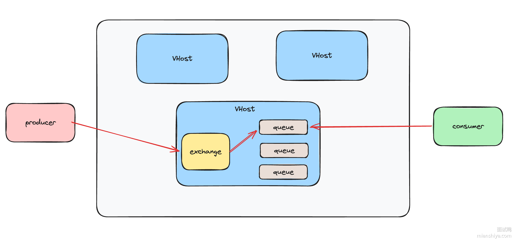

#### 扩展知识

##### 角色之间数据流转流程

1. **生产者发送消息**：生产者创建一个消息，并指定将消息发送到某个交换机，通常会附带一个路由键。
2. **交换机路由消息**：交换机根据绑定的路由规则决定将消息路由到哪个队列。不同类型的交换机会有不同的路由逻辑。
3. **队列存储消息**：消息被路由到指定的队列。队列负责存储消息，直到消费者来消费。
4. **消费者消费消息**：消费者监听某个队列，并从中获取消息进行处理。消费者可以是同步的也可以是异步的。

##### 各角色的细分与作用

**生产者和消费者的异步解耦**：RabbitMQ 将生产者和消费者解耦，使得生产者无需关心消费者的数量、状态以及处理速度，生产和消费过程可以独立进行。

**交换机类型**：

- **Direct Exchange**：通过精确匹配的路由键将消息路由到指定队列。
- **Fanout Exchange**：将消息广播到所有绑定的队列，不考虑路由键。
- **Topic Exchange**：基于路由键的模式匹配实现消息分发，适合多条件订阅的场景。
- **Headers Exchange**：根据消息头的键值进行路由，适合复杂的路由需求。

**队列的特点**：队列是 RabbitMQ 消息暂存的核心载体，支持持久化设置，以便在服务重启后保留消息。队列中的消息会按照 FIFO（先入先出）的顺序被消费者取出。

##### RabbitMQ 的消息确认机制

- **消息确认（Acknowledge）**：RabbitMQ 提供消息确认机制，确保消息从生产者发送到队列或从队列发送到消费者的过程中不会丢失。消费者处理完消息后会向 RabbitMQ 发送确认（ACK），如果没有确认，RabbitMQ 会将消息重新放回队列，以保证消息的消费被确认。
- **持久化**：通过对队列和消息设置 `durable` 属性，RabbitMQ 支持持久化消息存储，使得即使 RabbitMQ 服务重启，也能保留未被处理的消息。

### RabbitMQ 的 routing key 和 binding key 的最大长度是多少字节？ 

#### 回答重点

**Routing Key**（路由键）和 **Binding Key**（绑定键）的最大长度限制为 **255 字节**。这个限制是 RabbitMQ 系统内置的，对所有路由键和绑定键均适用。如果超过该长度，RabbitMQ 将会抛出异常，拒绝处理该消息或绑定。

- **Routing Key**：在消息发送到交换机时，由生产者指定，决定消息将被路由到哪些队列。
- **Binding Key**：在交换机与队列建立绑定关系时指定，用于匹配 Routing Key，实现消息的选择性路由。

##### 使用注意

- Routing Key 和 Binding Key 的长度包括所有字符，使用前需确保不超过 255 字节。
- 如果使用了带有占位符的 Topic 交换机时，需要注意路由键和绑定键的匹配规则，确保长度在限制范围内。

#### 扩展知识

##### Routing Key 和 Binding Key 的匹配规则

在 RabbitMQ 的不同交换机类型中，Routing Key 和 Binding Key 的匹配方式有所不同：

- **Direct 交换机**：Routing Key 和 Binding Key 必须完全一致，才能将消息路由到队列中。
- **Topic 交换机**：Routing Key 和 Binding Key 可以通过占位符（如 `*` 表示一个词，`#` 表示多个词）进行模式匹配。Topic 路由非常适合广播和模糊匹配场景。
- **Headers 交换机**：不使用 Routing Key，而是依赖消息头中的键值对，进行条件匹配。

##### Routing Key 和 Binding Key 的长度管理建议

- **尽量简短**：由于 Routing Key 和 Binding Key 会影响消息路由效率和内存占用，建议将其长度控制在合理范围，尽量简洁明了。
- **遵循约定格式**：在使用复杂的 Topic 路由模式时，可以设计统一的命名规范，例如 `{app}.{module}.{event}`，有助于维持系统的可读性和扩展性。

### 说说 RabbitMQ 的工作模式？

#### 回答重点

以下是 RabbitMQ 的几种主要工作模式：

1. **简单模式（Simple Queue）**：生产者向一个队列发送消息，单个消费者从该队列中消费消息，是最基本的点对点模式。
2. **工作队列模式（Work Queue）**：一个生产者将消息发送到队列中，多个消费者可以同时监听该队列，实现消息的负载均衡，常用于任务分发。
3. **发布/订阅模式（Publish/Subscribe）**：生产者将消息发送到交换机（通常为 Fanout 类型），所有绑定到该交换机的队列都会接收到消息，适合广播消息的场景。
4. **路由模式（Routing）**：生产者将消息发送到带有路由键的 Direct 交换机，不同路由键的消息会被路由到不同的队列，消费者可以选择性订阅感兴趣的消息。
5. **主题模式（Topic）**：使用 Topic 交换机，支持基于路由键的模糊匹配，将消息路由到匹配的队列中，适用于复杂的多条件路由需求。
6. **RPC 模式（Remote Procedure Call）**：实现远程过程调用，通常用于客户端请求服务器的响应，实现双向通信。
7. **发布确认模式（Publisher Confirms）**：确保生产者消息发送的可靠性，适合需要确保消息成功到达队列的场景。

#### 扩展知识

1）简单模式（Simple Queue） 作用：生产者将消息发送到队列，消费者从队列中获取消息。每条消息只能被一个消费者消费。

适用场景：适用于消息量较小且不需要复杂路由逻辑的场景。

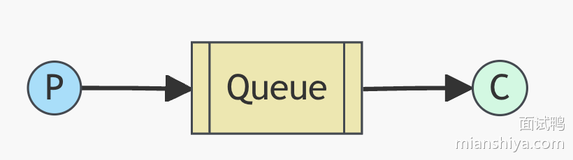

2）工作队列模式（Work Queue） 作用：通过多个消费者分担任务，达到负载均衡的目的。消息在多个消费者之间分配，每条消息只能被一个消费者处理。

适用场景：适用于需要并行处理大量独立任务的场景，如图像处理、视频转码等。

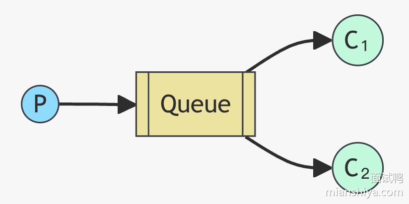

3）发布/订阅模式（Publish/Subscribe） 作用：消息发布到交换机，所有绑定到该交换机的队列都会收到消息。常用的交换机类型是 fanout。

适用场景：适用于广播消息的场景，如日志处理、事件通知等。

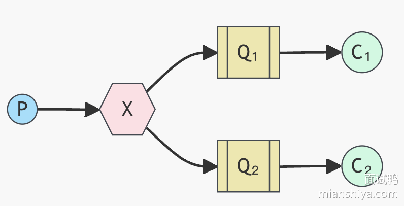

4）路由模式（Routing） 作用：消息发布到交换机，并根据路由键将消息发送到相应的队列。常用的交换机类型是 direct。

适用场景：适用于需要对消息进行分类处理的场景，如日志系统中按严重级别分类的日志处理。

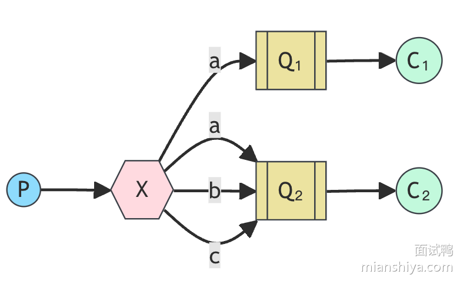

5）主题模式（Topics） 作用：消息发布到交换机，并根据路由键模式（通配符匹配）将消息发送到相应的队列。常用的交换机类型是 topic。

适用场景：适用于需要根据复杂的路由规则对消息进行分类处理的场景，如日志系统中按模块和严重级别分类的日志处理。

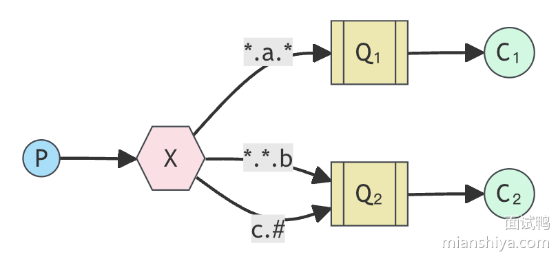

6）RPC 模式

作用：实现远程过程调用，客户端发送请求消息到队列，服务器端处理后返回响应消息。

适用场景：适用于需要实现远程服务调用的场景，如微服务之间的通信。

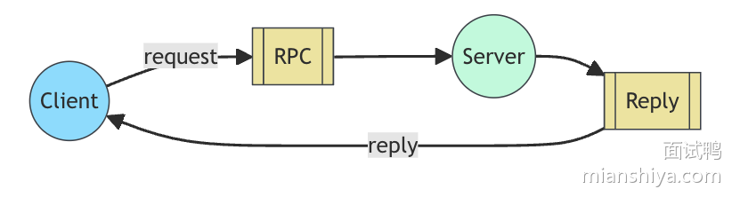

7）发布确认模式

作用：用于确保消息已经成功地发布并被 broker 接收。它提供了一种轻量级的方法来确认消息的持久性和可靠性，适用于需要高可靠性消息传递的场景。

适用场景：金融交易、订单处理等确保消息被可靠地传递和处理，防止丢失的场景。

### 说说 RabbitMQ 的集群模式？

#### 回答重点

RabbitMQ 集群主要可以分三种：

- 标准集群
- 镜像集群
- 联邦集群

##### 标准集群

多台 RabbitMQ 服务器通过网络连接组成一个集群，所有节点共享元数据（如队列、交换机、绑定等），**但一个消息仅存储在单个节点上**。

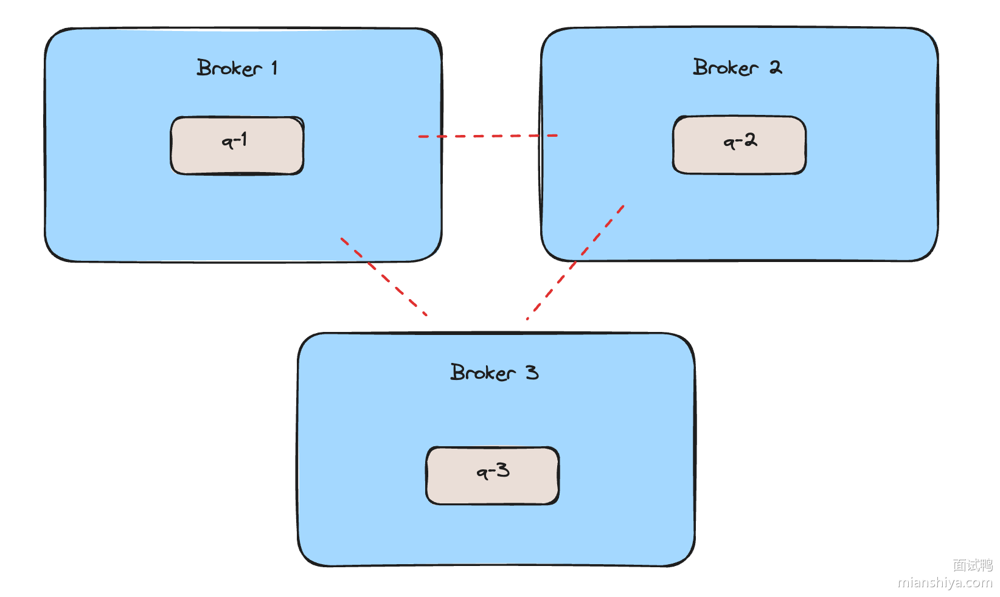

客户端可以连接到集群中的任一节点，因为元数据是共享的，所以任何一个节点都知晓具体消息在哪个节点上，因此可以实现负载均衡。但消息仅会存储在一个节点上不会自动复制到其他节点，所以如果某个节点故障，那么实际上这部分消息就无法消费了，但别的节点还可以提供服务。

##### 镜像集群模式

相比于标准模式，镜像队列模式下，队列的主副本和一个或多个副本会同步到不同的节点上，即队列的消息会复制到多个节点，如果主队列所在的节点故障，副本节点会自动接管，保证队列的可用性。

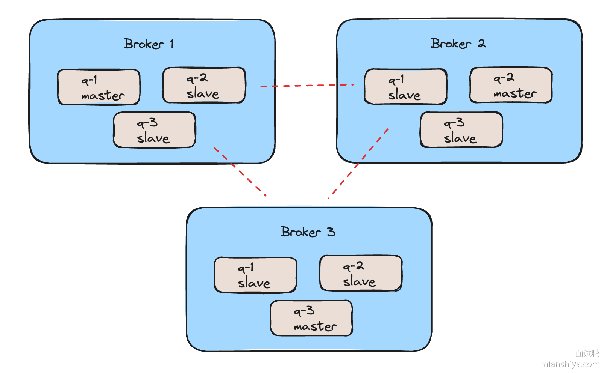

##### Federated 集群模式

这其实就是多活模式，主要用于异地的数据复制，例如在北京上海两个机房都部署 RabbitMQ 集群，它们之间依赖 RabbitMQ 的 federation 插件实现持续的可靠的 AMQP 数据通信。

如果北京机房出了故障，上海的机房还可以顶上。

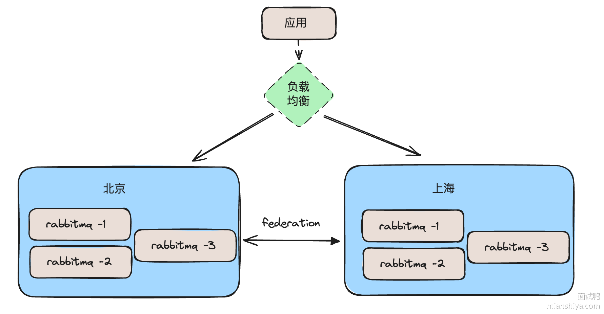

### RabbitMQ 怎么实现延迟队列？ 

#### 回答重点

RabbitMQ 本身不支持延迟消息，但是可以通过它提供的两个特性 TTL（Time-To-Live and Expiration ，消息存活时间）、DLX（Dead Letter Exchanges，死信交换器） 来实现。还可以利用 RabbitMQ 插件来实现。

##### 使用TTL + 死信队列：

在 RabbitMQ 中，通过设置消息的 TTL 和死信交换器可以实现延迟队列。

不给原队列（正常队列）设置消费者，当消息在原队列中达到 TTL 后，由于还未被消费，则会被转发到绑定的死信交换器，消费者从死信队列中消费消息，从而实现消息的延迟处理。

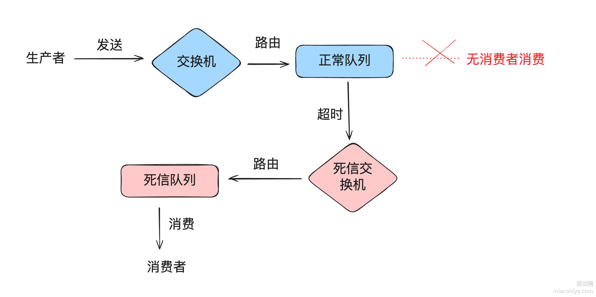

##### 使用 RabbitMQ 插件：延迟消息插件（rabbitmq-delayed-message-exchange）：

通过安装 RabbitMQ 的延迟消息插件，可以直接创建延迟交换器（Delayed Exchange）。

在发送消息时，指定消息的延迟时间，RabbitMQ 会在消息达到延迟时间后将其转发到对应的队列进行消费。

#### 扩展知识

##### TTL 和 DLX 简要说明

- TTL（Time-To-Live）：指消息在队列中的存活时间。你可以为队列中的所有消息统一设置TTL，也可以为每条消息单独设置TTL。当消息超过TTL时，消息会被标记为过期。
- 死信队列（DLX）：当消息在原队列中过期、被拒绝（nack/reject）或队列已满时，消息会被转发到绑定的死信交换器（DLX）。DLX 可以将消息重新路由到死信队列（即这里的延迟队列）。

##### TTL + DLX 时序问题

因为队列的特点就是先进先出，如果发送的消息延迟的时间不同，例如第一个延迟 10s、第二个延迟 5s、第三个延迟 1s。

那么后面的消息，需要等 10s 的消息消费完才能消费。当 10s 消息未被消费，则后续的消息都会被阻塞，即使消息设置了更短的延迟。

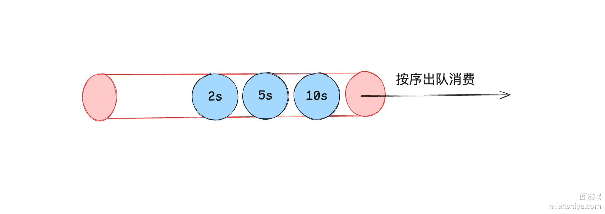

这就是时序问题。如果一个队列中的消息延迟时间都一致，就可以避免这个问题，因此可以针对不同的延迟时间对应多创建几个队列。

或者可以利用延迟消息插件，插件不会有时序问题。

##### 延迟消息插件原理

插件提供了一种新的交换器类型 `x-delayed-message`。这种交换器可以像普通的交换器一样，接收消息并根据路由键将消息路由到相应的队列。只不过 `x-delayed-message` 类型的交换机接收消息投递后，不会直接路由到队列中，而是存储到 Mnesia(Mnesia 是 Erlang 运行时中自带的一个数据库管理系统)中。

等到消息达到可投递时间，消息才会被投递到目标队列中。

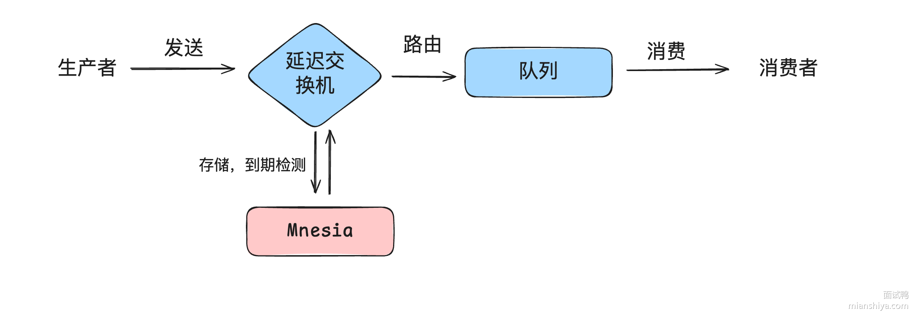

更多关于插件的内容，可以查看 [github：rabbitmq-delayed-message-exchange](https://github.com/rabbitmq/rabbitmq-delayed-message-exchange)。

##### TTL + DLX 实现

```java
public class DelayedQueueExample {

    private static final String EXCHANGE_NAME = "normal_exchange";
    private static final String DEAD_LETTER_EXCHANGE = "dead_letter_exchange";
    private static final String QUEUE_NAME = "normal_queue";
    private static final String DELAYED_QUEUE_NAME = "delayed_queue";
    private static final String ROUTING_KEY = "routing_key";

    public static void main(String[] args) throws Exception {
        ConnectionFactory factory = new ConnectionFactory();
        factory.setHost("localhost");
        try (Connection connection = factory.newConnection(); Channel channel = connection.createChannel()) {
            // 声明死信交换器
            channel.exchangeDeclare(DEAD_LETTER_EXCHANGE, BuiltinExchangeType.DIRECT);

            // 声明延迟队列（用于接收过期消息）
            channel.queueDeclare(DELAYED_QUEUE_NAME, true, false, false, null);
            channel.queueBind(DELAYED_QUEUE_NAME, DEAD_LETTER_EXCHANGE, ROUTING_KEY);

            // 声明正常交换器
            channel.exchangeDeclare(EXCHANGE_NAME, BuiltinExchangeType.DIRECT);

            // 配置带有死信交换器的正常队列
            Map<String, Object> argsMap = new HashMap<>();
            argsMap.put("x-dead-letter-exchange", DEAD_LETTER_EXCHANGE);
            argsMap.put("x-dead-letter-routing-key", ROUTING_KEY);
            argsMap.put("x-message-ttl", 5000); // 消息的TTL为5秒

            channel.queueDeclare(QUEUE_NAME, true, false, false, argsMap);
            channel.queueBind(QUEUE_NAME, EXCHANGE_NAME, ROUTING_KEY);

            // 向正常交换器发送消息
            String message = "This is a delayed message!";
            channel.basicPublish(EXCHANGE_NAME, ROUTING_KEY, null, message.getBytes(StandardCharsets.UTF_8));
            System.out.println("Sent message: " + message);
        }
    }
}
```

##### 延迟插件的实现

###### 安装插件

首先，确保安装并启用了 `rabbitmq_delayed_message_exchange` 插件：

```bash
rabbitmq-plugins enable rabbitmq_delayed_message_exchange
```

###### 使用插件配置延迟队列

在安装插件后，可以通过设置 `x-delayed-type` 参数来创建支持延迟消息的交换机：

```java
public class RabbitMQDelayedExchange {
    private static final String DELAYED_EXCHANGE = "delayed_exchange";
    private static final String DELAYED_QUEUE = "delayed_queue";

    public static void main(String[] args) throws Exception {
        ConnectionFactory factory = new ConnectionFactory();
        factory.setHost("localhost");
        try (Connection connection = factory.newConnection();
             Channel channel = connection.createChannel()) {

            // 声明延迟交换机
            Map<String, Object> argsMap = new HashMap<>();
            argsMap.put("x-delayed-type", BuiltinExchangeType.DIRECT.getType());

            channel.exchangeDeclare(DELAYED_EXCHANGE, "x-delayed-message", true, false, argsMap);
            channel.queueDeclare(DELAYED_QUEUE, true, false, false, null);
            channel.queueBind(DELAYED_QUEUE, DELAYED_EXCHANGE, "");

            System.out.println("Delayed exchange and queue declared.");

            // 发送带有延迟时间的消息
            String message = "This is a delayed message";
            Map<String, Object> headers = new HashMap<>();
            headers.put("x-delay", 10000);  // 延迟 10 秒

            AMQP.BasicProperties properties = new AMQP.BasicProperties.Builder()
                    .headers(headers)
                    .build();

            channel.basicPublish(DELAYED_EXCHANGE, "", properties, message.getBytes("UTF-8"));
            System.out.println("Message sent with delay: " + message);
        }
    }
}
```

## 操作系统

## 计算机网络

### HTTP 1.0 和 2.0 有什么区别？

#### 回答重点

HTTP/1.0 版本主要增加以下几点：

- 增加了 HEAD、POST 等新方法。
- 增加了响应状态码。
- 引入了头部，即请求头和响应头。
- 在请求中加入了 HTTP 版本号。
- 引入了 Content-Type ，使得传输的数据不再限于文本。

HTTP/1.1 版本主要增加以下几点：

- 新增了连接管理即 keepalive ，允许持久连接。
- 支持 pipeline，无需等待前面的请求响应，即可发送第二次请求。
- 允许响应数据分块（chunked），即响应的时候不标明Content-Length，客户端就无法断开连接，直到收到服务端的 EOF ，利于传输大文件。
- 新增缓存的控制和管理。
- 加入了 Host 头，用在你一台机子部署了多个主机，然后多个域名解析又是同一个 IP，此时加入了 Host 头就可以判断你到底是要访问哪个主机。

HTTP/2 版本主要增加以下几点：

- 是二进制协议，不再是纯文本。
- 支持一个 TCP 连接发起多请求，移除了 pipeline。
- 利用 HPACK 压缩头部，减少数据传输量。
- 允许服务端主动推送数据。

#### 扩展知识 HTTP 从发明到 3.0 的演进之路

##### 互联网的始祖-阿帕网

在 1950 年代，通信研究者们认识到不同计算机用户和网络之间的需要通信，这促使了分布式网络、排队论和封包交互的研究。

在1958 年2月7日，美国国防部长尼尔 · 麦克尔罗伊发布了国防部 5105.15 号指令，建立了高级研究计划局(ARPA) 。


ARPA 的核心机构之一 IPTO（信息处理处）赞助的一项研究导致了阿帕网的开发。

我们来看看这段历史。

在 1962 年，ARPA 的主任聘请约瑟夫·利克莱德担任 IPTO 的第一任主任，他是最早预见到现代交互计算及其在各种应用的人之一。

IPTO 资助了先进的计算机和网络技术的研究，并委托十三个研究小组对人机交互和分布式系统相关技术进行研究。**每个小组获得的预算是正常研究补助金的三十至四十倍。**

这就是财大气粗啊，研究人员肯定是干劲十足！

在 1963 年利克莱德资助了一个名为 MAC 的研究项目，**该项目旨在探索在分时计算机上建立社区的可能性**。

这个项目对 IPTO 和更广泛的研究界产生了持久的影响，成为广泛联网的原型。

并且利克莱德的全球网络愿景极大地影响了他在 IPTO 的继任者们。

1964 年利克莱德跳槽到了 IBM，第二任主任萨瑟兰上线，他创建了革命性的 Sketchpad 程序，用于存储计算机显示器的内存，在 1965 年他与麻省理工学院的劳伦斯 · 罗伯茨签订了 IPTO 合同，以进一步发展计算机网络技术。

随后，罗伯茨和托马斯 · 梅里尔在麻省理工学院的 TX-2 计算机和加利福尼亚的 Q-32 计算机之间，**通过拨号电话连接实现了第一个数据包交换**。

1966 年第三任主任鲍勃 · 泰勒上任，他深受利克莱德的影响，巧的是泰勒和利克莱德一样也是个心理声学家。


在泰勒的 IPTO 办公室里有三个不同的终端连接到三个不同的研究站点，他意识到这种架构将严重限制他扩展访问多个站点的能力。

于是他想着把一个终端连接到一个可以访问多个站点的网络上，并且从他在五角大楼的职位来说，他有这个能力去实现这个愿景。

美国国防部高级研究计划局局长查理 · 赫茨菲尔德向泰勒承诺，如果 IPTO 能够组织起来，他将提供 100 万美元用于建立一个分布式通信网络。

泰勒一听舒服了，然后他对罗伯茨的工作印象很深刻，邀请他加入并领导这项工作，然后罗伯茨却不乐意。

泰勒不高兴了，于是要求赫茨菲尔德**让林肯实验室的主任向罗伯茨施压，要求他重新考虑**，这最终促使罗伯茨缓和了态度，于1966年12月加入 IPTO 担任首席科学家。


在 1968 年6月3日，罗伯茨向泰勒描述了建立阿帕网的计划，18 天后，也就是 6 月 21 日，泰勒批准了这个计划，14 个月后**阿帕网建立**。

当阿帕网顺利发展时，泰勒于 1969 年9月将 IPTO 的管理权移交给罗伯茨。

随后罗伯茨离开 ARPA 成为 Telenet 的 CEO ，而利克莱德再次回到 IPTO 担任董事，以完成该组织的生命周期。

至此，这段历史暂告一段落，可以看到阿帕网之父罗伯茨还是被施压的才接受这项任务，**最终创建了阿帕网，互联网的始祖**。

也多亏了利克莱德的远见和砸钱促进了技术的发展，ARPA 不仅成为网络诞生地，同样也是电脑图形、平行过程、计算机模拟飞行等重要成果的诞生地。

历史就是这么的巧合和有趣。

##### 互联网的历史

在 1973 年 ARPA 网扩展成互联网，第一批接入的有英国和挪威计算机，逐渐地成为网络连接的骨干。

**1974 年 ARPA 的罗伯特·卡恩和斯坦福的文顿·瑟夫提出TCP/IP 协议。**

1986 年，美国国家科学基金会（National Science Foundation，NSF）建立了大学之间互联的骨干网络 NSFNET ，这是互联网历史上重要的一步，NSFNET 成为新的骨干，1990 年 ARPANET 退役。

在 1990 年 ，**蒂姆·伯纳斯-李（下文我就称李老）** 创建了运行万维网所需的所有工具：超文本传输协议（HTTP）、超文本标记语言（HTML）、第一个网页浏览器、第一个网页服务器和第一个网站。


至此，互联网开启了快速发展之路，HTTP 也开始了它的伟大征途。

还有很多有趣的历史，比如第一次浏览器大战等等，之后有机会再谈，今天我们的主角是 HTTP。

接下来我们就看看 HTTP 各大版本的演进，来看看它是如何成长到今天这个样子的。

##### HTTP / 0.9 时代

在 1989 年，李老发表了一篇论文，文中提出了三项现在看来很平常的三个概念。

- URI，统一资源标识符，作为互联网上的唯一标识。
- HTML，超文本标记语言，描述超文本。
- HTTP ，超文本传输协议，传输超文本。

随后李老就付之于行动，把这些都搞出来了，称之为万维网（World Wide Web）。

那时候是互联网初期，计算机的处理能力包括网速等等都很弱，所以 HTTP 也逃脱不了那个时代的约束，**因此设计的非常简单，而且也是纯文本格式**。

李老当时的想法是文档存在服务器里面，我们只需要从服务器获取文档，**因此只有 “GET”，也不需要啥请求头，并且拿完了就结束了，因此请求响应之后连接就断了**。

这就是为什么 HTTP 设计为文本协议，并且一开始只有“GET”、响应之后连接就断了的原因了。

在我们现在看来这协议太简陋了，但是在当时这是互联网发展的一大步！**一个东西从无到有是最困难的**。

这时候的 HTTP 还没有版本号的，之所以称之为 HTTP / 0.9 是后人加上去了，为了区别之后的版本。

##### HTTP 1.0 时代

人们的需求是无止尽的，随着图像和音频的发展，浏览器也在不断的进步予以支持。

在 1995 年又开发出了 Apache，简化了 HTTP 服务器的搭建，越来越多的人用上了互联网，这也促进了 HTTP 协议的修改。

需求促使添加各种特性来满足用户的需求，经过了一系列的草案 HTTP/1.0 于 1996 年正式发布。

Dave Raggett 在1995年领导了 HTTP 工作组，他希望通过扩展操作、扩展协商、更丰富的元信息以及与安全协议相关的安全协议来扩展协议，这种安全协议通过添加额外的方法和头字段来提高效率。


所以在 HTTP/1.0 版本主要增加以下几点：

- 增加了 HEAD、POST 等新方法。
- 增加了响应状态码。
- 引入了头部，即请求头和响应头。
- 在请求中加入了 HTTP 版本号。
- 引入了 Content-Type ，使得传输的数据不再限于文本。

可以看到引入了新的方法，填充了操作的语义，像 HEAD 还可以只拿元信息不必传输全部内容，提高某些场景下的效率。

引入的响应状态码让请求方可以得知服务端的情况，可以区分请求出错的原因，不会一头雾水。

引入了头部，使得请求和响应更加的灵活，把控制数据和业务实体进行了拆分，也是一种解耦。

新增了版本号表明这是一种工程化的象征，说明走上了正途，毕竟没版本号无法管理。

引入了 Content-Type，支持传输不同类型的数据，丰富了协议的载体，充实了用户的眼球。

但是那时候 HTTP/1.0 还不是标准，没有实际的约束力，各方势力不吃这一套，大白话就是你算老几。

##### HTTP 1.1 时代

HTTP/1.1 版本在 1997 的 RFC 2068 中首次被记录，从 1995 年至 1999 年间的第一次浏览器大战，极大的推动了 Web 的发展。

随着发展 HTTP/1.0 演进成了 HTTP/1.1，并且在 1999 年废弃了之前的 RFC 2068，发布了 RFC 2616。

从版本号可以得知这是一个小版本的更新，更新主要是因为 HTTP/1.0 很大的性能问题，就是每请求一个资源都得新建一个 TCP 连接，而且只能串行请求。

所以在 HTTP/1.1 版本主要增加以下几点：

- 新增了连接管理即 keepalive ，允许持久连接。
- 支持 pipeline，无需等待前面的请求响应，即可发送第二次请求。
- 允许响应数据分块（chunked），即响应的时候不标明Content-Length，客户端就无法断开连接，直到收到服务端的 EOF ，利于传输大文件。
- 新增缓存的控制和管理。
- 加入了 Host 头，用在你一台机子部署了多个主机，然后多个域名解析又是同一个 IP，此时加入了 Host 头就可以判断你到底是要访问哪个主机。

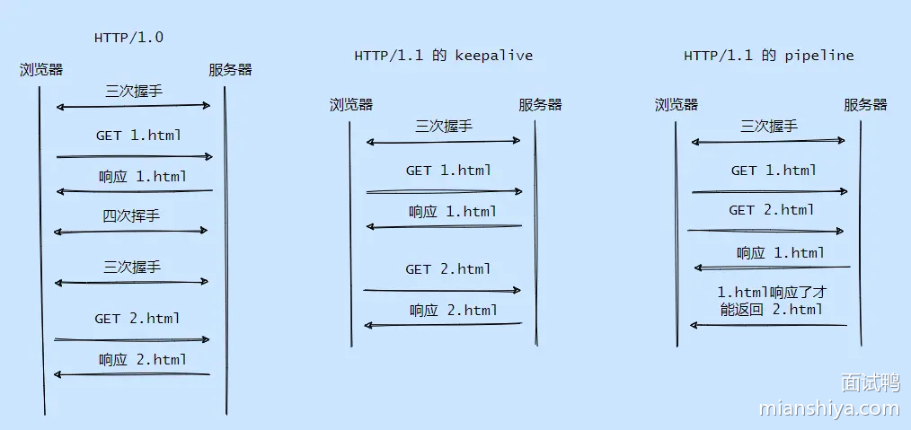

可以看到浏览器大战推进了 Web 的发展，也暴露出 HTTP/1.0 的不足之处，毕竟网络带宽等等都在进步，总不能让协议限制了硬件的发展。

因此提出了 HTTP/1.1 ，主要是为了解决性能的问题，包括支持持久连接、pipeline、缓存管理等等，也添加了一些特性。

再后来到 2014 年对 HTTP/1.1 又做了一次修订，因为其太过庞大和复杂，因此进行了拆分，弄成了六份小文档 RFC7230 - RFC7235

这时候 HTTP/1.1 已经成了标准，其实标准往往是在各大强力竞争对手相对稳定之后建立的，因为标准意味着统一，统一就不用费劲心思去兼容各种玩意。

**只有强大的势力才能定标准，当你足够强大的时候你也可以定标准，去挑战老标准。**

##### HTTP 2 时代

随着 HTTP/1.1 的发布，互联网也开始了爆发式的增长，这种增长暴露出 HTTP 的不足，主要还是性能问题，而 HTTP/1.1 无动于衷。

这就是人的惰性，也符合平日里我们对产品的演进，当你足够强大又安逸的时候，任何的改动你是不想理会的。

**别用咯。**

这时候 Google 看不下去了，你不搞是吧？我自己搞我的，我自己和我自己玩，我用户群体大，我有 Chrome，我服务多了去了。

Google 推出了 SPDY 协议，凭借着它全球的占有率超过了 60% 的底气，2012年7月，开发 SPDY 的小组公开表示，它正在努力实现标准化。

HTTP 坐不住了，之后互联网标准化组织以 SPDY 为基础开始制定新版本的 HTTP 协议，最终在 2015 年发布了 HTTP/2。

HTTP/2 版本主要增加以下几点：

- 是二进制协议，不再是纯文本。
- 支持一个 TCP 连接发起多请求，移除了 pipeline。
- 利用 HPACK 压缩头部，减少数据传输量。
- 允许服务端主动推送数据。

**从文本到二进制**其实简化了整齐的复杂性，解析数据的开销更小，数据更加紧凑，减少了网络的延迟，提升了整体的吞吐量。

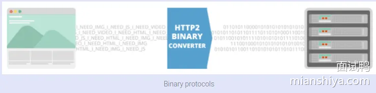

**支持一个 TCP 连接发起多请求**，即支持多路复用，像 HTTP/1.1 pipeline 还是有阻塞的情况，**需要等前面的一个响应返回了后面的才能返回**。

而多路复用就是完全异步化，这减少了整体的往返时间（RTT），**解决了 HTTP 队头阻塞问题，也规避了 TCP 慢启动带来的影响**。

**HPACK 压缩头部**，采用了静态表、动态表和哈夫曼编码，在客户端和服务器都维护请求头的列表，所以只需要增量和压缩过的头部信息，服务端拿到之后组装一下就能得到完整的头部信息。

形象一点就是如下图所示：

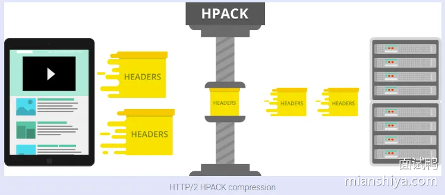

再具体一点就是下图这样：

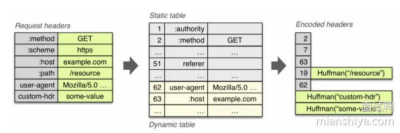

**服务端主动推送数据**，这个其实就是减少了请求的次数，比如客户端请求 1.html，我把 1.html 需要的 js 和 css 也一块送过去，省的之后客户端再请求我要 js ，我要这个 css。

可以看到 HTTP/2 的整体演进都是往性能优化的角度发展，因为此时的性能就是痛点，**任何东西的演进都是哪里痛医哪里。**

当然有一些例外，比如一些意外，或者就是“闲的蛋疼”的那种捯饬。

这次推进属于用户揭竿而起为之，你再不给我升级我自己搞了，我有着资本，你自己掂量。

最终结果是好的，Google 后来放弃了 SPDY ，拥抱标准，而 HTTP/1.1 这个历史包袱太重了，所以 HTTP/2 到现在也只有大致一半的网站使用它。

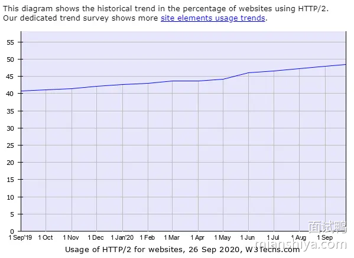

##### HTTP 3 时代

这 HTTP/2 还没捂热， HTTP/3 怎么就来了？

这次又是 Google，它自己突破自己，主要也是源自于痛点，这次的痛点来自于 HTTP 依赖的 TCP。

**TCP 是面向可靠的、有序的传输协议**，因此会有失败重传和按序机制，而 HTTP/2 是所有流共享一个 TCP 连接，所以会有 **TCP 层面的队头阻塞**，当发生重传时会影响多个请求响应。

并且 **TCP 是基于四元组（源IP，源端口，目标IP，目标端口）来确定连接的**，而在移动网络的情况下 IP 地址会频繁的换，这会导致反复的建连。

还有 TCP 与 TLS 的叠加握手，增加了延时。

问题就出在 TCP 身上，所以 Google 就把目光瞄向了 UDP。

UDP 我们知道是无连接的，不管什么顺序，也不管你什么丢包，而 TCP 太无私了，或者说太保守了，现在需要一种更激进的做法。

那怎么搞? TCP 改不动我就换！然后把 TCP 可靠、有序的功能提到应用层来实现，因此 Google 就研究出了 QUIC 协议。

QUIC 层来实现自己的丢包重传和拥塞控制，还有出于安全的考虑我们都会用 HTTPS ，所以需要多次握手。

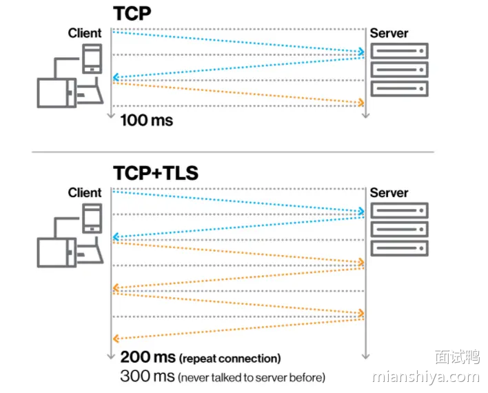

上面我也已经提到了关于四元组的情况，所以在移动互联网时代这握手的消耗就更加放大了，于是 QUIC 引入了个叫 Connection ID 来标识一个链接，所以切换网络之后可以复用这个连接，达到 0 RTT 就能开始传输。

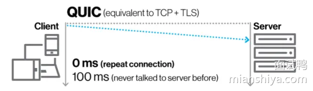

注意上图是在已经和服务端握过手之后的，由于网络切换等原因才有 0 RTT ，**也就是 Connection ID 在之前生成过了**。

如果是第一次建连还是需要多次握手的，我们来看一下**简化**的握手对比图。

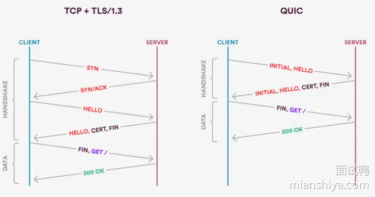

所以所谓的 0RTT 是在之前已经建连的情况下。

当然还有 HTTP/2 提到的 HPACK，这个是依赖 TCP 的可靠、有序传输的，于是 QUIC 得搞了个 QPACK，也采用了静态表、动态表和哈夫曼编码。

它丰富了 HTTP/2 的静态表，从 61 项加到了 98 项。

上面提到的动态表，是用来存储未包含在静态表中的头部项，假设动态表还未收到，后面来解头部的时候肯定要被阻塞的。

所以 QPACK 就另开一条路，在单向的 Stream 里传输动态表的编解码，单向传输好了，接受端到才能开始解码，也就是说**还没好你就先别管，防止做一半卡住了**。

那还有前面提到的 TCP 队头阻塞， **QUIC 是怎么解决的呢？毕竟它也要保证有序和可靠啊。**

因为 TCP 不认识每个流分别是哪个请求的，所以它只能全部阻塞住，而 QUIC 知道，因此比如请求 A 丢包了，我就把 A 卡住了就行，请求 B 完全可以全部放行，丝毫不受影响。

可以看到基于 UDP 的 QUIC 还是很强大的，而且人家用户多，在 2018 年，互联网标准化组织 IETF 提议将 **HTTP over QUIC 更名为 HTTP/3 并获得批准**。

可以看到需求又推动技术的进步，由于 TCP 自身机制的限制，我们的目光已经往 UDP 上靠了，那 TCP 会不会成为历史呢？

我们拭目以待。

##### 最后

通过这个扩展知识我们大致过了一遍 HTTP 发展的历史和它的演进之路，可以看到技术是源于需求，需求推动着技术的发展。

**本质上就是人的惰性，只有痛了才会成长**。

而且标准其实也是巨头们为了他们的利益推动的，不过标准确实能减轻对接的开销，统一而方便。

当然就 HTTP 来说还是有很多内容的，有很多细节，很多算法，比如拿 Connection ID 来说，不同的四元组你如何保证请求一定会转发到之前的服务器上？

不过对于面试而言以上的内容足够了，后续有时间一些技术细节可以再扩展一下。

不过相对于这些实现细节我更感兴趣的是历史的演进，这能让我们从时代背景等一些约束来得知，为什么这东西一开始是这么设计的，从而更深刻的理解这玩意。

而且历史还是很有趣的，不是么？

### HTTP 2.0 和 3.0 有什么区别？ 

#### 回答重点

1） **基于的传输层协议不同**：

- **HTTP/2**：基于 TCP，使用二进制分帧层（Binary Framing Layer）实现多路复用。
- **HTTP/3**：基于 UDP，使用 QUIC 协议（Quick UDP Internet Connections），提供类似TCP 的可靠性和多路复用。

2） **性能和可靠性区别**：

- **HTTP/2**：解决了HTTP/1.x中的队头阻塞问题，但仍然受制于TCP的队头阻塞，尤其在高延迟或丢包情况下。
- **HTTP/3**：通过 QUIC 协议，避免了 TCP 队头阻塞，即使在网络不稳定的情况下也能提供更好的性能。

3）**从安全性角度来看**：

- **HTTP/2**：可以使用 TLS 加密（HTTPS），但加密并非强制要求。
- **HTTP/3**：默认使用 QUIC 自带的 TLS 1.3加密，安全性更高，且加密是强制的。

4） **从连接建立速度**：

- **HTTP/2**：需要 TCP 三次握手和 TLS 握手，连接建立相对较慢。
- **HTTP/3**：QUIC 集成了连接建立和加密握手，连接建立速度更快，尤其在初次连接时。

#### 扩展知识

##### QUIC 技术优势

QUI，Quick UDP Internet Connections 是一个基于 UDP 的传输协议，由 Google 开发，旨在替代TCP 以提高网络传输性能和安全性。QUIC 在传输层和应用层之间提供可靠、低延迟的传输服务。

QUIC（Quick UDP Internet Connections）是一种由 Google 开发的基于 UDP 的传输层协议，旨在改进 HTTP/2 的性能。QUIC 的设计目标是减少连接延迟，提高传输效率和安全性。以下是 QUIC 的一些技术优势和细节：

##### 技术优势

1）**低延迟连接建立**：

- QUIC 使用 0-RTT（Zero Round Trip Time）技术，可以在首次握手时减少延迟。对于已经建立过连接的客户端，可以直接发送数据，无需等待服务器的响应。

2）**内置加密**：

- QUIC 协议默认采用 TLS 1.3 进行端到端加密，从而提高了数据传输的安全性，并简化了协议设计，不再需要像 TCP 那样进行额外的加密层配置。

3）**减少了队头阻塞（Head-of-Line Blocking）**：

- 与 TCP 不同，QUIC 在每个连接内使用多个独立的流，这意味着一个流上的丢包不会阻塞其他流的数据传输，从而显著减少队头阻塞问题，提高传输效率。

4）**更快的拥塞控制**：

- QUIC 可以更快速地调整拥塞控制算法，因为它能够访问更多的上下文信息（如链路的RTT、丢包率等），且能够在应用层进行定制优化。

5）**连接迁移**：

- QUIC 支持连接迁移，当客户端的 IP 地址或网络环境变化时（例如从 Wi-Fi 切换到蜂窝网络），连接依然可以保持，不会像 TCP 那样中断。

6）**更高的带宽利用率**：

- QUIC 通过改进的流量控制机制，可以更好地利用可用带宽，从而提高传输速度和效率。

更多 QUIC 细节参见 [HTTP 1.0 和 2.0 有什么区别？](https://www.mianshiya.com/bank/1790948499480616961/question/1780933295710695425) 内扩展知识 HTTP 3.0 时代

### 常见的 HTTP 状态码有哪些？

#### 重点回答

常见的 HTTP 状态码分为五大类，每个状态码由三位数字组成，第一位数字表示类别：

1）**1xx: 信息响应**

- **100 Continue**：服务器已接收请求的初步部分，客户端应继续请求。
- **101 Switching Protocols**：服务器同意切换协议，如从 HTTP 切换到 WebSocket。

2）**2xx: 成功**

- **200 OK**：请求成功，服务器返回所请求的资源或数据。
- **201 Created**：请求成功并创建了新的资源，常用于 POST 请求。
- **204 No Content**：请求成功但服务器不返回任何内容，常用于删除操作。

3）**3xx: 重定向**

- **301 Moved Permanently**：资源已永久移动到新的 URL，客户端应使用新 URL 访问。
- **302 Found**：资源临时移动到新的 URL，客户端应继续使用原来的 URL。
- **304 Not Modified**：资源未修改，客户端可以使用缓存版本。

4）**4xx: 客户端错误**

- **400 Bad Request**：请求无效或语法错误，服务器无法处理。
- **401 Unauthorized**：请求需要身份验证，客户端未提供有效的凭证。
- **403 Forbidden**：服务器理解请求但拒绝执行，通常是权限问题。
- **404 Not Found**：请求的资源在服务器上未找到。

5）**5xx: 服务器错误**

- **500 Internal Server Error**：服务器内部错误，无法完成请求。
- **502 Bad Gateway**：服务器作为网关或代理，从上游服务器接收到无效响应。
- **503 Service Unavailable**：服务器暂时无法处理请求，通常是因为过载或维护。

#### 扩展知识

1）**常见的重定向机制**：

- **301 Moved Permanently** 和 **302 Found** 都用于重定向，但前者用于永久重定向，通常会更新客户端的书签，而后者用于临时重定向，不会更新书签。
- **307 Temporary Redirect** 与 **302 Found** 类似，但要求客户端必须使用相同的 HTTP 方法进行重定向请求，保证重定向的语义一致性。

2）**4xx 与 5xx 状态码的区别**：

- **4xx** 系列状态码表示客户端的问题，如请求的格式错误（400）、未经授权访问（401）、请求的资源不存在（404）等。客户端应根据这些状态码调整请求内容或行为。
- **5xx** 系列状态码表示服务器的内部问题，如服务器错误（500）、服务不可用（503）等。通常，客户端需要稍后重试请求。

3）**204 和 304 区别**：

- **204 No Content**：适用于不需要返回响应体的成功操作，比如删除资源或表单提交后的页面跳转。
- **304 Not Modified**：用于缓存机制中，当资源未修改时，服务器通过返回该状态码，通知客户端继续使用缓存资源，减少带宽消耗。

4）**401 和 403 区别**：

- 状态码 **401 Unauthorized** 和 **403 Forbidden** 常用于访问控制。当用户未认证时，返回 **401** 提示用户登录，而在用户认证后发现无权访问资源时，返回 **403** 提示权限不足。

### HTTP 请求包含哪些内容，请求头和请求体有哪些类型？

#### 重点回答

**HTTP 请求由以下几部分组成**：

- **请求行（Request Line）**：包含请求方法（如GET、POST）、请求的资源路径（如`/index.html`）、以及HTTP协议版本（如HTTP/1.1）。
- **请求头（Request Headers）**：包含各种键值对，用于传递客户端环境、请求内容、认证信息等。
- **空行（Blank Line）**：用于分隔请求头和请求体。
- **请求体（Request Body）**：通常在POST、PUT等方法中存在，包含需要发送到服务器的数据。

**常见的请求头类型**：

- **通用头部（General Headers）**：适用于请求和响应，如`Cache-Control`、`Connection`等。
- **请求头部（Request Headers）**：特定于请求的头部，如`Host`、`User-Agent`、`Accept`、`Authorization`等。
- **实体头部（Entity Headers）**：描述请求体的头部，如`Content-Type`、`Content-Length`。

**请求体的类型**：

- **表单数据（Form Data）**：`application/x-www-form-urlencoded`，用于提交表单数据。
- **多部分数据（Multipart Data）**：`multipart/form-data`，用于上传文件或复杂表单数据。
- **JSON数据**：`application/json`，用于提交JSON格式的数据。
- **XML数据**：`application/xml`，用于提交XML格式的数据。
- **文本数据**：`text/plain`，用于提交纯文本数据。

#### 扩展知识

##### 1. **请求方法**

- **GET**：请求指定的资源，通常用于获取数据，不包含请求体。
- **POST**：向服务器提交数据，通常用于表单提交，数据在请求体中。
- **PUT**：用于更新资源，数据也在请求体中。
- **DELETE**：请求删除指定资源。

##### 2. **请求头部**

- **`Host`**：指定请求的主机名及端口，HTTP/1.1中必须包含。
- **`User-Agent`**：标识客户端信息，通常用于服务器端的统计和个性化服务。
- **`Accept`**：指定客户端可接受的媒体类型，服务器可以根据此头部返回合适的内容。
- **`Authorization`**：用于身份验证，包含凭证信息，如`Basic`或`Bearer` token。

##### 3. **请求体**

- **`application/x-www-form-urlencoded`**：键值对形式的表单数据，通常用在简单表单提交。
- **`multipart/form-data`**：处理复杂表单，包括文件上传，内容按边界分割。
- **自定义数据格式**：根据API需求，可能需要提交XML、JSON、甚至是二进制数据。不同的`Content-Type`可以标识数据格式。

##### 4. **性能与安全**

- **缓存机制**：通过`Cache-Control`和`ETag`等头部，客户端和服务器可以有效管理缓存，减少不必要的请求。
- **压缩**：`Content-Encoding`头部可以指定压缩方式，如`gzip`，以减少数据传输量。
- **安全性**：`Authorization`和`Cookie`等头部涉及身份验证和会话管理，应注意保护敏感信息，防止中间人攻击等安全威胁。

### HTTP 和 HTTPS 有什么区别？

#### 回答重点

1）数据传输安全性：

- **HTTP**：数据以明文传输，容易被窃听、篡改。
- **HTTPS**：通过 SSL/TLS 协议对数据进行加密传输，提供数据机密性和完整性保障。

2）端口号：

- **HTTP**：默认使用端口 80。
- **HTTPS**：默认使用端口 443。

3）性能：

- **HTTP**：无加密过程，连接建立速度稍快。
- **HTTPS**：基于 HTTP上又加了 SSL（Secure Sockets Layer）或 TLS（Transport Layer Security） 协议来实现的加密传输,加解密过程增加了计算开销，握手时间较长，但现代硬件和协议优化已使性能差距减小。

4）SEO 影响：

- **HTTP**：搜索引擎一般会降低未加密站点的排名。
- **HTTPS**：搜索引擎更倾向于优先展示 HTTPS 网站。

#### 扩展知识

##### HTTPS 的握手过程

HTTPS 使用 TLS 协议进行握手，所以我们主要关注的是 TLS 的握手过程。

而 TLS 的握手根据密钥交互算法的不同，可以分为两种，一种是 RSA 算法另一种是 ECDHE 算法。

##### HTTPS RSA 算法握手流程

**一共需要四次握手：**

1. **客户端问候（ClientHello）**
2. **服务器问候（ServerHello）**
3. **客户端密钥交换（Client Key Exchange）** + **开始使用加密（Change Cipher Spec）** + **客户端完成（Client Finished）**
4. **服务器发送开始使用加密（Change Cipher Spec）** + **服务器完成（Server Finished）**

主要分为四次握手，内部还有一些细节交互，我们看下**详细分析：**

**1） 客户端问候（ClientHello）**

客户端向服务器发送一个 ClientHello 消息，包含：

- **TLS 版本**
- **加密算法套件**（Cipher Suites）
- **随机数**。

**2） 服务器问候（ServerHello）**

服务器接收到 ClientHello 后，会认证 TLS 版本号是否支持，选择一个加密算法套件，保证客户端的随机数，再生成一个随机数。所以 ServerHello 的消息包含：

- **确认的 TLS 版本**
- **确认的加密算法套件**（Cipher Suite）
- **随机数**。

除此之外，服务器还需向客户端发送自己的数字证书，内含公钥，用于证明其身份，这个步骤是**服务器证书（Server Certificate）**

最后，服务器会发送 **服务器完成（ServerHelloDone）**，表示握手的初步阶段结束。

**3）客户端密钥交换（Client Key Exchange） + 开始使用加密（Change Cipher Spec）+ 客户端完成（Client Finished）**

客户端通过 CA（证书认证机构）验证服务端传递过来的服务器证书可信后，再次生成一个随机数（pre-master），通过证书得到的公钥，加密通过客户端密钥交换（Client Key Exchange）发送给服务端。

紧接着再发送开始使用加密（Change Cipher Spec）给服务器端。因为此时不论是客户端还是服务端都拿到了三个随机数（第一次客户端给的、第二次服务端给的、第三次客户端的 pre-master）。

因此这三个随机数就可以作为对称加密的密钥，用户后续传输的加解密。**这个步骤后，后续的传输数据都是加密的**。

发送完（Change Cipher Spec）后，客户端再发送客户端完成（Client Finished），这个 Finished 会带上 Encrypted Handshake Message，这个 message 就是之前发送的所有数据的摘要，并且还用生成的对称加密密钥加密了，传递给服务器端验证，预防握手过程中的握手信息被修改。

4）**服务器发送开始使用加密（Change Cipher Spec）** + **服务器完成（Server Finished）**

同理，服务器也是一样发送（Change Cipher Spec），代表后续要用加密数据传输了，且发送握手摘要 给客户端验证，一切正常的话， RSA TLS 握手就结束了。

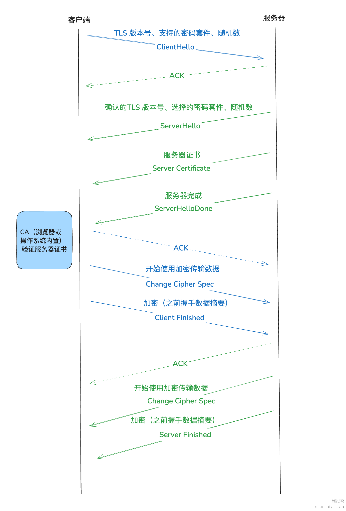

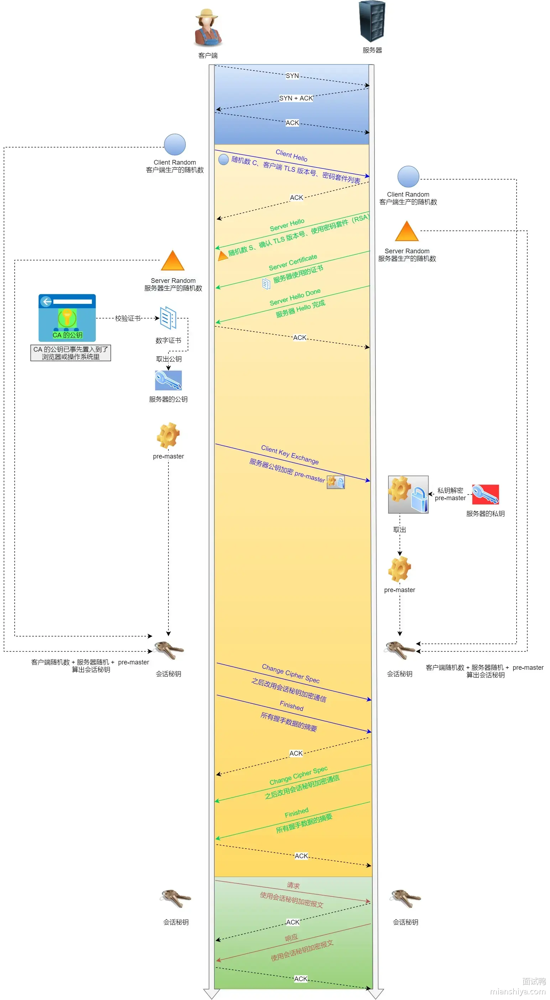

##### HTTPS ECDHE 算法握手流程

**同样也需要四次握手，大致步骤和 RSA 是一致的，主要区别在第二步：**

1. **客户端问候（ClientHello）**
2. **服务器问候（ServerHello）+ 服务器密钥交换（Client Key Exchange）**
3. **客户端密钥交换（Client Key Exchange）** + **开始使用加密（Change Cipher Spec）** + **客户端完成（Client Finished）**
4. **服务器发送开始使用加密（Change Cipher Spec）** + **服务器完成（Server Finished）**

但是内部细节交互和 RSA 有一些不同，我们看下**详细分析：**

**1） 客户端问候（ClientHello）**

客户端向服务器发送一个 ClientHello 消息，包含：

- **TLS 版本**
- **加密算法套件**（Cipher Suites）
- **随机数**。

这步和 RSA 一致。

**2） 服务器问候（ServerHello）+ 服务器密钥交换（Client Key Exchange）**

服务器接收到 ClientHello 后，会认证 TLS 版本号是否支持，选择一个加密算法套件，保证客户端的随机数，再生成一个随机数。所以 ServerHello 的消息包含：

- **确认的 TLS 版本**
- **确认的加密算法套件**（Cipher Suite），这里会选 ECDHE 相关的套件
- **随机数**。

同样，服务器也会向客户端发送自己的数字证书，内含公钥，用于证明其身份，这个步骤是**服务器证书（Server Certificate）**

**区别来了**。

ECDHE 实际上是基于椭圆曲线特性的算法，此时服务器需要确认选择的椭圆曲线以及一个随机数作为服务器椭圆曲线私钥，基于椭圆曲线和私钥算出椭圆曲线公钥。

为了防止公钥被修改，服务器通过 RSA 给公钥签名，最终利用（Server Key Exchange）发送给客户端。【椭圆曲线点这方面的知识仅做了解即可】

小结下 Server Key Exchange 消息的内容，包含：

- 椭圆曲线（如果客户端未指定）。
- 服务器的椭圆曲线公钥（用于 Diffie-Hellman 密钥交换）。
- 签名：服务器使用其私钥对相关参数进行签名（包括椭圆曲线参数和公钥），以确保这些参数没有被篡改。

最后，服务器会发送 **服务器完成（ServerHelloDone）**，表示握手的初步阶段结束。

**3）客户端密钥交换（Client Key Exchange） + 开始使用加密（Change Cipher Spec）+ 客户端完成（Client Finished）**

同样，客户端通过 CA（证书认证机构）验证服务端传递过来的服务器证书可信后，生成一个随机数作为客户端椭圆曲线私钥，基于椭圆曲线和私钥算出椭圆曲线公钥。

将这个公钥通过客户端密钥交换（Client Key Exchange）发送给服务端。

此时客户端和服务端拥有【客户端随机数+服务端随机数+共享密钥（对方公钥+自己私钥计算得到）】，**这三个元素生成最终的会话密钥**。

紧接着再发送开始使用加密（Change Cipher Spec）给服务器端。**这个步骤后，后续的传输数据都是加密的**。

发送完（Change Cipher Spec）后，客户端再发送客户端完成（Client Finished），这个 Finished 会带上 Encrypted Handshake Message，这个 message 就是之前发送的所有数据的摘要，并且还用生成的对称加密密钥加密了，传递给服务器端验证，预防握手过程中的握手信息被修改。

4）**服务器发送开始使用加密（Change Cipher Spec）** + **服务器完成（Server Finished）**

同理，服务器也是一样发送（Change Cipher Spec），代表后续要用加密数据传输了，且发送握手摘要 给客户端验证，一切正常的话， ECDHE TLS 握手就结束了。

所以 ECDHE 和 RSA 主要差别在第二次握手，服务端需要发送 （Server Key Exchange）。

##### HTTPS RSA 和 ECDHE 区别

可以从三个角度来看：

- 安全性：**ECDHE 提供前向安全性，而 RSA 不具备**。如果服务器的私钥泄露，基于 ECDHE 的握手不会影响之前的会话，而基于 RSA 的握手会导致之前的通信被解密。
- 计算复杂度：ECDHE 由于涉及椭圆曲线数学运算，相比 RSA 的操作更复杂，但提供更高的安全性。
- 使用场景：现代 HTTPS 实践中，**ECDHE 已成为首选**，因为它能够提供前向安全性，同时结合 RSA 或 ECDSA 用于签名和认证。

还有一点，基于 RSA 的 TLS 需要等四次握手完全结束后，客户端才可以发送数据，而 ECDHE 在客户端得到完整密钥后，可以直接开始发送数据。

#### SSL/TLS 协议的演进：

HTTPS 使用的加密协议从最初的 SSL（Secure Sockets Layer）演变为 TLS（Transport Layer Security）。

目前广泛使用的是 TLS 1.2 和 TLS 1.3。TLS 1.3 引入了更快的握手机制（0-RTT），进一步降低了延迟（QUIC内嵌使用这个协议）。

简单了解下 SSL/TLS 协议的演进之路：

1）**SSL 1.0**：

- **状态**：从未公开发布。
- **原因**：存在严重的安全漏洞，未达到发布标准。

2）**SSL 2.0**（1995年发布）：

- **特性**：是第一个公开发布的 SSL 版本，提供了基本的加密和认证功能。
- **问题**：存在多种安全问题，如容易受到截断攻击、缺乏握手完整性保护等。SSL 2.0 被认为不安全。

3）**SSL 3.0**（1996年发布）：

- **特性**：对 SSL 2.0 进行了显著改进，包括引入消息完整性校验、握手的改进以及更强的加密算法。
- **问题**：尽管较 SSL 2.0 更加安全，但 SSL 3.0 仍然存在漏洞，特别是后来被发现的 POODLE 攻击（Padding Oracle On Downgraded Legacy Encryption），导致 SSL 3.0 被废弃。

4）**TLS 1.0**（1999年发布）：

- **特性**：TLS（Transport Layer Security）是 SSL 3.0 的演进版。TLS 1.0 改进了加密算法、密钥生成、消息认证码（MAC）机制，并增加了对握手的保护。
- **问题**：随着时间推移，TLS 1.0 被发现存在对称密钥的选择偏差、密钥流恢复攻击等问题，且部分加密算法过时。

5）**TLS 1.1**（2006年发布）：

- **特性**：引入了对 CBC（Cipher Block Chaining）模式攻击的保护，改进了消息认证码（MAC）算法，并提供了更多加密算法的支持。
- **问题**：尽管修复了部分安全问题，但随着加密技术的发展，TLS 1.1 仍然不够安全，且效率较低。

6）**TLS 1.2**（2008年发布）：

- **特性**：支持更强的加密算法（如 AES-GCM），引入更灵活的握手机制，允许使用哈希算法（如 SHA-256）进行握手完整性校验，并提供了更好的安全性和性能。
- **问题**：尽管 TLS 1.2 被广泛采用，但随着计算能力的提高，安全社区逐渐意识到加密协议需要进一步优化以应对未来的威胁。

7）**TLS 1.3**（2018年发布）：

- **特性**：显著简化了握手过程，减少了加密套件的数量，移除了不安全的加密算法（如 RSA 密钥交换），采用了 0-RTT 握手以减少连接建立的延迟，并增强了前向保密性（Forward Secrecy）。
- **原因**：TLS 1.3 的发布主要是为了提高协议的安全性和性能，以应对现代计算环境中的安全需求。

### HTTP 中 GET 和 POST 的区别是什么？

#### 回答重点

从 HTTP 的定义来看：

- **GET**：用于获取资源，通常用于请求数据而不改变服务器状态。
- **POST**：用于提交数据到服务器，通常会改变服务器的状态或产生副作用（如创建或更新资源）。

由于 HTTP 和浏览器等规定，它们在应用过程中会出现一些区别：

**参数传递方式**：

- **GET**：参数通过 URL 拼接传递，暴露在请求 URL 中，具有可见性，长度有限（取决于浏览器和服务器）。
- **POST**：参数放在请求体中，通常不可见且长度理论上没有限制，更适合传递大量数据（但是注意，POST 也可以在 URL 上放参数！）。

**安全性**：

- **GET**：参数可见，数据容易暴露在浏览器历史记录、日志和缓存中，不适合传递敏感信息。
- **POST**：数据放在请求体中，相对安全，但需要 HTTPS 才能保证数据加密传输。

**幂等性**：

- **GET**：幂等（重复请求不会改变服务器状态）。
- **POST**：非幂等（多次请求可能导致重复创建资源或执行多次相同操作）。

#### 扩展知识

##### GET 和 POST 的数据传输方式与限制

- **URL 长度限制**：GET 请求中的参数通过 URL 传递，受 URL 长度限制。不同浏览器和服务器对 URL 长度限制不同，一般为 2048 字节左右，因此不适合大数据传输。
- **POST 请求体限制**：POST 请求的数据放在请求体中，理论上无长度限制，适合传输较多的数据。但实际中服务器对请求体长度有配置限制，如 Nginx 默认限制为 1MB，可根据需求调整。

##### GET 和 POST 的数据安全性差异

- **GET 请求暴露数据**：由于 GET 请求的参数出现在 URL 中，可能被浏览器缓存、日志记录或历史记录保存，增加了信息泄露的风险，不适合传输敏感信息，如用户名、密码等。
- **POST 请求相对安全**：POST 请求数据位于请求体中，尽管这并不提供加密保护，但比 URL 中传递更隐蔽。配合 HTTPS 加密传输可进一步确保数据安全。

##### 缓存机制的不同

- **GET 请求可缓存**：GET 请求可以被浏览器和 CDN 缓存，当请求同一个 URL 时可以直接返回缓存内容，减少服务器负载。适用于不频繁变动的资源，比如图片、静态页面。
- **POST 请求默认不缓存**：大部分浏览器和缓存服务器不缓存 POST 请求，主要因为 POST 请求通常会对服务器数据产生影响（如创建、修改数据），需要确保请求每次都传递到服务器。

##### 幂等性和安全性原则

- **GET 的幂等性**：GET 请求是幂等的，重复多次请求对服务器资源没有影响。即使客户端多次请求同一 URL，服务器的资源状态不会变化。
- **POST 的非幂等性**：POST 请求不是幂等的，重复的 POST 请求可能导致重复的数据创建或操作。例如，重复提交表单可能导致服务器多次生成同样的数据记录（除非业务代码做了特殊处理）。
- **安全性原则**：在 HTTP 方法的安全性定义中，GET 是安全的，因为它只获取数据，不对服务器状态产生影响，而 POST 可能会更改服务器数据，因此不是安全的操作。

##### RESTful API 设计中的角色分工

在 RESTful 架构中，各种 HTTP 方法有明确的分工：

- **GET**：用于查询或检索资源数据。例如，`GET /users/123` 用于获取 ID 为 123 的用户信息。
- **POST**：用于创建资源或执行某些动作。例如，`POST /users` 可以用于创建新用户，表单提交、上传文件通常用 POST 实现。
- **PUT** 和 **PATCH**：用于更新资源，其中 PUT 替换整个资源，PATCH 部分更新资源。
- **DELETE**：用于删除资源，如 `DELETE /users/123` 删除用户。

详细可看：

- [876. 什么是 Restful 风格的接口？](https://www.mianshiya.com/question/1799588814148411394)

##### GET 和 POST 在网络层的具体差异

- **TCP 连接行为**：GET 请求默认是无状态、快速响应的请求，通常可以复用已有的 TCP 连接，不需要建立新的连接（尤其在 HTTP/2 中）。POST 请求因数据量较大，可能涉及多个数据包的传输，在某些情况下会使用新的 TCP 连接。
- **请求数据的拆分和传输**：在大多数情况下，GET 请求的请求行和请求头（包括 URL 参数）可以一次性发送完成。而 POST 请求的数据放在请求体中，如果数据量大，可能需要分段传输。尤其在 HTTPS 加密情况下，POST 请求的数据会被拆分为多个加密数据包，可能导致传输开销稍高。

##### 浏览器行为和编码影响

- **GET 请求的重定向**：浏览器在重定向（如 301、302 状态码）后会自动保留 GET 方法，但会将 POST 转换为 GET。大家需要注意这点，以避免数据丢失或意外的二次请求。
- **字符编码问题**：GET 请求的 URL 编码通常为百分比编码（URL Encoding），而 POST 请求支持更广泛的内容类型（Content-Type），如 `application/x-www-form-urlencoded`、`multipart/form-data` 和 `application/json` 等，可以根据需要选择合适的编码格式。

### WebSocket 与 HTTP 有什么区别？

#### 回答重点

WebSocket 适用于需要实时通信和双向数据流的场景，而 HTTP 更适合于传统的客户端与服务器之间的短时请求响应场景。

主要区别在于**通信模式**：

- **HTTP**：请求/响应模型，客户端发起请求，服务器响应，连接后即关闭。
- **WebSocket**：双向全双工通信，客户端和服务器建立持久连接后，双方可以随时发送消息，直到主动关闭连接。

#### 扩展知识

##### WebSocket 握手过程

WebSocket 在建立连接时通过 HTTP 协议进行一次 **Upgrade** 握手，完成后切换到 WebSocket 协议，连接保持打开状态，双方可以随时传输数据。

具体过程如下：

1）**客户端发起请求**：

- 客户端发送一个 HTTP 请求，其中包含 `Upgrade: websocket` 头部，表示希望升级协议为 WebSocket。
- 请求中还包含 `Sec-WebSocket-Key`，用于服务器验证请求是否来自合法客户端。

2）**服务器响应**：

- 服务器接收到请求后，如果支持 WebSocket 协议，会返回一个 101 状态码（Switching Protocols），并响应 `Upgrade: websocket` 和 `Sec-WebSocket-Accept` 头部，用于确认协议升级。

3）**连接建立**：

- 握手完成后，HTTP 连接升级为 WebSocket 连接，此时可以通过 WebSocket 协议进行数据交换。

##### WebSocket 数据传输

WebSocket 通过 TCP 协议建立连接，允许双向传输数据。数据传输使用 **帧**（Frame）进行，主要有两种类型：

- **文本帧**：用于传输文本数据，通常是 UTF-8 编码的字符串。
- **二进制帧**：用于传输二进制数据，可以传输文件、图片等非文本数据。

WebSocket 帧格式：

- **Fin、Opcode**：标识消息的结束和数据的类型（文本、二进制等）。
- **Mask**：客户端数据包需要进行掩码处理，服务器端数据包不需要掩码。
- **Payload length**：数据负载的长度，表示数据部分的大小。

### 服务端是如何解析 HTTP 请求的数据？（考察 HTTP 请求格式的了解程度） 

#### 回答重点

客户端发送 HTTP 请求时，服务器接收到的是一个由 **请求行**、**请求头**、**请求体**（可选）组成的数据包。

**HTTP 请求格式**：

```xml
<请求行>
<请求头>
<空行>
<请求体>（可选）
```

- 请求行包含 **请求方法**（如 GET、POST）、**请求 URI**（如 `/index.html`）和 **HTTP 版本**（如 HTTP/1.1）。
- 请求头包含了一些元数据，例如请求来源（Host）、用户代理（User-Agent）、接受的内容类型（Accept）等。
- 请求体（如果存在）通常用于提交数据（如 POST 请求的表单数据）。

##### 解析 HTTP 请求：

1）**请求行解析**：根据 HTTP 请求的第一行（请求行），服务器首先解析出请求方法、请求 URI 和协议版本。

- 例如，`GET /index.html HTTP/1.1`：方法是 `GET`，URI 是 `/index.html`，版本是 `HTTP/1.1`。

2）**请求头解析**：请求头的格式为 `key: value`，可以通过换行符来分隔每一行的头部信息。头部信息指示了客户端的行为、首选内容类型、缓存控制等。

```http
Host: www.mianshiya.com
User-Agent: Mozilla/5.0
Accept: text/html,application/xhtml+xml
```

3）**请求体解析**：对于包含请求体的请求（如 POST 或 PUT），服务器需要解析请求体的内容。通常，内容类型（如 `application/json`, `application/x-www-form-urlencoded`）会告知服务器如何解析请求体。

4）**请求路由与处理**：HTTP 请求中的 URI 部分会被用来进行路由匹配，决定请求应该被哪个资源或处理程序处理。

- 例如，URL `/index.html` 可能会被路由到一个处理该页面的静态文件服务，或者后端应用的某个控制器方法。

5）**生成 HTTP 响应**：服务器处理请求后，会生成一个 HTTP 响应，通常由 **状态行**、**响应头**、**响应体** 组成。

**HTTP 响应格式**：

```xml
<状态行>
<响应头>
<空行>
<响应体>（可选）
```

- **状态行**：包括 HTTP 协议版本、状态码（如 200 OK、404 Not Found）和状态描述（如 OK）。
- **响应头**：类似请求头，包含服务器信息、缓存控制、内容类型等。
- **响应体**：是实际返回的内容，比如 HTML、JSON、图片等。

6）**发送 HTTP 响应**：服务器将构造好的 HTTP 响应通过 TCP 连接返回给客户端。客户端接收到响应后，会根据状态码和响应头判断如何处理响应体（如渲染网页、显示图片、执行 JavaScript 等）。

#### 扩展知识

- [670. HTTP 1.0 和 2.0 有什么区别？](https://www.mianshiya.com/question/1780933295710695425)
- [671. HTTP 2.0 和 3.0 有什么区别？](https://www.mianshiya.com/question/1780933295710695426)
- [5898. 常见的 HTTP 状态码有哪些？](https://www.mianshiya.com/question/1828371336037654530)

### 到底什么是 TCP 连接？

#### 回答重点

根据 [RFC793](https://www.rfc-editor.org/rfc/rfc793) 定义，TCP 的连接就是：TCP 为每个数据流初始化并维护的某些状态信息（这些信息包括 socket、序列号和窗口大小），称为连接。

这些信息主要是为了实现可靠性和流量控制机制。

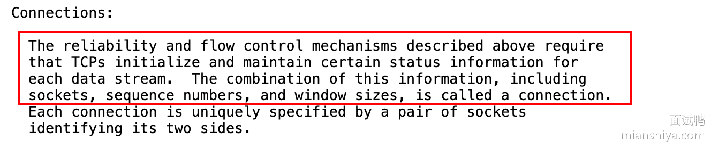

所以 TCP 所谓的是、面向连接的并不是真的是拉了一条线让端与端之间连起来，只是双方都维护了一个状态，通过每一次通信来维护状态的变更，使得看起来好像有一条线关联了对方。

#### 扩展知识

##### TCP 中的 Socket、序列号和窗口大小

1）**Socket**:

在 TCP/IP 协议中，`Socket` 是通信的端点。由 IP 地址和端口号组成，如 `192.168.1.1:8080`。在编程中，Socket 是用于网络通信的接口，通过它，应用程序可以发送和接收数据。

2）**序列号 (Sequence Number)**:

TCP 序列号在传输过程中非常关键，因为它保证了数据传输的有序性和完整性。在三次握手中，双方交换初始序列号 (ISN)，并在此基础上为后续的每个数据段分配序列号。

序列号有助于接收方按顺序重组数据包，并检测丢包情况。

3）**窗口大小 (Window Size)**:

TCP 窗口大小指的是在特定时刻，接收方能够接收的最大数据量。这个大小由接收方通知发送方，表明接收方的缓冲区能处理多少数据。

它直接影响 TCP 的流量控制和拥塞控制机制。通过调整窗口大小，TCP 可以避免发送过多数据导致接收方的缓冲区溢出，也能根据网络状况调整发送速率。

##### 什么是三元组和四元组？

1）**三元组 (3-tuple)**:

三元组指的是 IP 地址和端口号的组合，即 `IP 地址 + 端口号 + 协议类型`。例如，`192.168.1.1:8080 (TCP)` 就是一个三元组。在一个机器上，这样的组合唯一标识了一个网络服务或应用程序。

2）**四元组 (4-tuple)**:

四元组即 `源 IP 地址 + 源端口号 + 目的 IP 地址 + 目的端口号`。**这四个要素唯一标识了一个 TCP 连接。**

例如，一个客户端通过 IP 地址 `192.168.1.100` 和端口 `50000` 连接到服务器 `192.168.1.1` 的端口 `80`，则这个连接可以表示为 `192.168.1.100:50000 -> 192.168.1.1:80`。

这就是一个四元组，唯一标识了该连接。

### TCP 是用来解决什么问题？ 

#### 回答重点

TCP （Transmission Control Protocol）通过提供可靠传输、流量控制、拥塞控制和连接管理，解决了数据在不可靠的 IP 网络上的传输问题：

1）可靠性传输：TCP 确保数据包在网络传输过程中不丢失、不重复，并且按顺序到达。通过确认（ACK）、重传机制以及序列号，TCP 能够保证数据在不可靠的 IP 网络上可靠传输。

2）流量控制：TCP 通过滑动窗口机制调节发送方的数据发送速率，防止接收方因为处理能力有限而被数据流淹没。

3）拥塞控制：TCP 通过拥塞避免算法（如慢启动、拥塞避免、快速重传和快速恢复）来防止网络过载，确保网络资源的公平使用和稳定性。

4）连接管理：TCP 是面向连接的协议，采用三次握手（建立连接）和四次挥手（断开连接）机制来管理会话，确保通信的可靠性和状态的同步。

#### 扩展知识

1）数据包重排序与重传机制：

- TCP 的序列号机制确保数据包按照正确的顺序组装。接收方通过序列号识别数据包的顺序，如果检测到丢失或乱序的包，会请求重传，保证数据完整性。

2）滑动窗口与流量控制：

- 滑动窗口用于动态调整可以发送的数据量。接收方通过发送窗口大小通告，指示发送方可以发送的最大数据量。这种机制不仅避免了接收方的溢出，还提高了数据传输效率。

3）拥塞控制算法： TCP 的拥塞控制算法是核心的网络稳定性保证。经典算法包括以下几个步骤：

- 慢启动：逐步增加发送窗口，直到检测到网络的拥塞点。
- 拥塞避免：当达到网络容量后，逐渐增加窗口以避免拥塞。
- 快速重传和快速恢复：在检测到包丢失时，立即进行重传并调整发送窗口，快速恢复正常传输状态。

4）TCP 三次握手与四次挥手：

- 三次握手：建立连接时，双方通过三次信息交换（SYN, SYN-ACK, ACK）来确保双方都准备好进行数据传输，并协商参数（如初始序列号）。
- 四次挥手：断开连接时，通过四次消息交换来确保数据传输完成且资源可以安全释放，防止未传输的数据丢失。

5）TCP 的适应性与演变：

- 随着互联网的发展，TCP 也经历了多次改进，如 TCP Reno、TCP NewReno、TCP Vegas 等，它们在拥塞控制和流量管理上有不同的策略，以适应不同的网络环境。

6）TCP 的局限性：

- 虽然 TCP 解决了可靠传输的问题，但在高延迟、高带宽的网络（如卫星通信、现代数据中心）中可能会受到性能瓶颈，进而催生了如 QUIC 等新协议的出现。

更多 QUIC 细节参见 [HTTP 1.0 和 2.0 有什么区别？](https://www.mianshiya.com/bank/1790948499480616961/question/1780933295710695425) 内扩展知识 HTTP 3.0 时代

#### TCP 为什么可靠？

TCP 之所以被称为可靠的协议，主要是因为它提供了以下功能：

1. 数据完整性：使用校验和确保数据在传输中没有被破坏。
2. 数据顺序：保证数据按顺序到达接收方，且接收方能够重新排序乱序到达的数据。
3. 流量控制：通过滑动窗口机制避免接收方溢出。
4. 拥塞控制：通过动态调整发送速率避免网络拥塞。
5. 重传机制：确保丢失的数据会被重新传输。
6. 可靠的连接建立和关闭：通过三次握手和四次挥手确保连接的正确建立和断开。
7. 防止数据重复：通过序列号和确认机制防止重复数据的接收。

### 为什么 TCP 挥手需要有 TIME_WAIT 状态? 

#### 回答重点

主要原因有以下两点：

1）**确保最后的 ACK 被成功接收**：

- 在 TCP 四次挥手过程中，主动关闭连接的一方在发送最后一个 ACK 确认包后进入 **TIME_WAIT** 状态。
- 如果这个 ACK 丢失了，另一方（被动关闭连接的一方）没有收到确认包，会重发 FIN 报文。主动关闭的一方需要在 **TIME_WAIT** 状态下保持一段时间，以便能够重发 ACK，确保连接能被正确地关闭。

2）**防止旧的重复分段干扰新连接**：

- TCP 连接在关闭后，可能会有一些延迟的或者已经失效的报文还在网络中传输。如果立即重新使用相同的 IP 地址和端口建立新的连接，可能会受到这些旧报文的干扰。
- **TIME_WAIT** 状态可以确保在旧连接的所有报文都超时失效后，才允许新的连接使用相同的 IP 地址和端口，从而避免数据混乱。

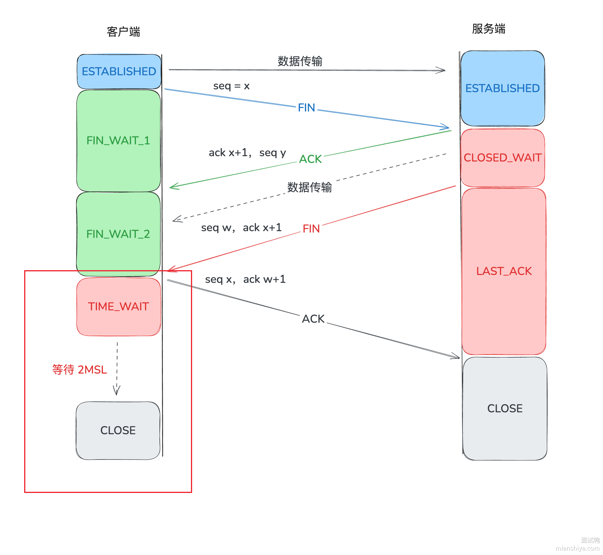

##### 为什么 TIME_WAIT 等待的是 2MSL？

MSL（Maximum Segment Lifetime） 是 TCP 报文段在网络中可以存活的最大时间。RFC 793 定义的 MSL 时间是 2 分钟，Linux 实际实现是 30s，那么 2MSL 是一分钟。

那为什么设置了 2MSL ?

来看个例子，假设被动关闭方（上图的服务端）没有客户端的最后一个 ACK ，此时会触发超时重发 FIN 。

当客户端收到 FIN 后，会重发 ACK 给被动关闭方，这一来一回就需要 2 个 MSL 的时间。

#### 扩展知识

##### 等待 2MSL 会产生什么问题？

如果**服务器主动关闭**大量的连接，那么会出现大量的资源占用，需要等到 2MSL 才会释放资源。

如果是**客户端主动关闭**大量的连接，那么在 2MSL 时间内那些端口都是被占用的，端口只有 65535 个，如果端口耗尽了就无法发起新的连接了。

### 为什么要 TCP，IP 层实现控制不行么？ 

#### 回答重点

主要是为了分层架构设计的灵活性和可扩展性。

IP 层负责数据包的路由和传输，而 TCP 提供传输层的可靠性服务，这种分离使得网络协议更加灵活和可扩展。

基于 IP 层，如果需要可靠性服务，那么上层可以使用 TCP 协议。如果不需要可靠性服务，对实时性要求较高，且允许一定程度的数据丢失，可以使用 UDP。

所以，这样的设计可以在 IP 层之上构建其他传输协议（如 UDP、SCTP），**为不同应用提供更合适的传输服务，而无需修改 IP 层的实现**。

并且，一条数据在网络上传输需要经过很多设备，而设备之间需要靠 IP 来寻址，假设 IP 层实现了控制，那么整体传输的效率会大打折扣，这样整体通信的信息都会变差。

#### 扩展知识

##### 进一步分析通信效率问题

我们知道网络是分层实现的，网络协议的设计就是为了通信，从链路层到 IP 层其实就已经可以完成通信了。

链路层不可或缺，毕竟我们电脑都是通过链路相互连接的，然后 IP 充当了地址的功能，所以通过 IP 咱们找到了对方就可以进行通信了。

理论上并不需要 TCP 层，IP 层就可以实现控制，但是 IP 层涉及到的设备更多，一条数据在网络上传输需要经过很多设备，设备之间都需要靠 IP 来寻址。

假设 IP 层实现了控制，那是不是涉及到的所有设备都需要关心序列号、确认机制、重传机制？这样传输的效率会低很多。

举个发送快递的例子， 假如 A 要传输给 F 一个快递，但是无法直接传输到，需要经过 B、C、D、E 这几个中转站之手。

这里有两种情况：

1. BCDE 都需要关心这个快递包裹内的东西是不是完好无损的，都拆开包裹仔细的看看，没问题了再装回去，最终到了 F 的手中。
2. BCDE 都不关心快递的情况，来啥包裹只管转发就完事了，由最终的 F 自己来检查这个快递是否有问题。

哪种效率高？明显是第二种，转发的设备不需要关心这些事，只管转发就完事！

所以把控制的逻辑独立出来成 TCP 层，让真正的接收端来处理，这样网络整体的传输效率就高了。

### TCP 的粘包和拆包能说说吗？

#### 回答重点

1）粘包与拆包（也称半包）现象：

- 粘包：指的是在 TCP 传输中，发送方的多个数据包在接收方被合并成一个包接收，导致多条消息数据粘在一起，接收方无法正确区分这些消息的边界。
- 拆包：指的是发送方的一个数据包在接收方被分成了多个包接收，导致一条完整的消息被拆成多个部分，接收方无法一次性接收到完整的数据。

2）原因：

- 粘包：主要由于 TCP 是面向字节流的协议，它不关心数据边界，数据在发送方可能被一次性发送，接收方在读取时可能会将多个消息拼接在一起。
- 拆包：可能由于网络传输中的 MTU（最大传输单元）限制或发送缓冲区大小限制，一个大包被分成了多个小包传输。

3）解决方法：

- 使用定长消息：每个消息都有固定的长度，接收方按照固定长度读取数据。
- 添加消息分隔符：在每个消息之间添加特定的分隔符（如换行符），接收方可以通过分隔符来区分消息。
- 使用消息头：在消息的头部添加一个长度字段，指示消息的长度，接收方根据这个长度来读取相应长度的数据。

#### 扩展知识

##### 通俗理解粘包与拆包

这里先举个可能不太恰当，但是很容易理解的例子。

比如，平时我们要寄快递，如果东西太大的话，那么就需要拆成几个包裹来邮寄。

收件人仅收到个别包裹的时候，东西是不完整的，对应到网络传输中，**这种情况就叫半包。**

只有等接收到全部包裹时，这个东西（传输的信息）才完整，所以半包情况下无法解析出完整的数据，需要等，等接收到全部包裹。

那么问题来了，如何知晓已经收到全部包裹了呢？下文我们再作分析。

再比如，快过年了，我打算给家里的亲戚送点礼物，给每位长辈送个手表，我们都知道手表的体积不大，并且我家里人都住在一个村，所以把给各长辈的礼物打包在一个包裹里邮寄，这样能节省运费。

这种把本应该分多个包传输的数据合成一个包发送的情况，对应到网络传输中，**就叫粘包。**

看完这个例子之后，应该对粘包与半包有点感觉了，接下来我们看下网络中实际的情况。

**粘包与半包只有在 TCP 传输的时候才会有，像 UDP 是不会有这种情况的**，原因是因为 TCP 是面向流的，数据之间没有界限的，而 UDP 是有的界限的。

如果熟悉 TCP 和 UDP 报文格式的同学肯定知道，**TCP 的包没有报文长度，而 UDP 的包有报文长度**，这也说明了 TCP 为什么是流式。

所以我为什么说上面的例子不太恰当，因为现实生活中快递的包裹之间其实是有界限的，TCP 则像流水，没有明确的界限。

然后 TCP 有发送缓冲区的概念，UDP 实际上是没这个概念。

假设 TCP 一次传输的数据大小超过发送缓冲区大小，那么一个完整的报文就需要被拆分成两个或更多的小报文，这可能会产生半包的情况，当接收端收到不完整的数据，是无法解析成功的。

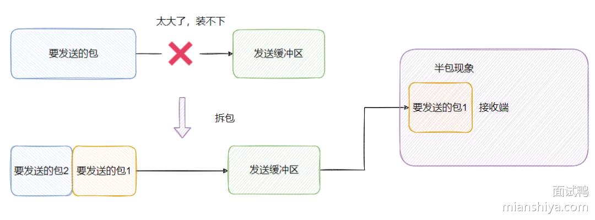

如果 TCP 一次传输的数据大小小于发送缓冲区，那么可能会跟别的报文合并起来一块发送，这就是粘包。

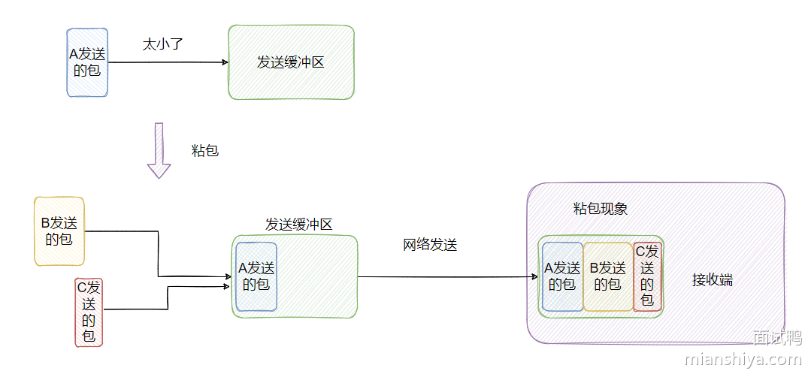

##### 如何解决粘包与半包问题呢？

- **粘包**：这个思路其实很清晰，就是把它拆开呗，具体就是看怎么拆了，比如我们可以固定长度，我们规定每个包都是10个字节，那么就10个字节切一刀，这样拆开解析就 ok 了。
- **半包**：半包其实就是信息还不完整，我们需要等接收到全部的信息之后再作处理，当我们识别这是一个不完整的包时候，我们先 hold 住，不作处理，等待数据完整再处理。这里关键点在于，我们如何才能知道此时完整了？上面说的固定长度其实也是一点，当然还有更多更好的解决方案，我们接着往下看。

实际常见解决粘包与半包问题有三个方案：

- 固定长度
- 分隔符
- 固定长度字段+内容

> 为了说明方便，以下没有按二进制的位等单位来描述。

##### 固定长度

这个其实很简单，比如现在要传输 ABC、EF 这两个包，如果不做处理接收端很可能收到的是 AB、CEF 或者 ABCE、F 等等。

这时候我们固定长度，我们规定每个报文长度都是 3，如果一个报文实际数据不足 3，那么就用空字符填充一下 。

所以我们发送的报文是 ：


接收到的情况可能是：

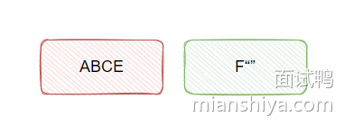

但我们是按照 3 位来处理的，所以一次只会按照 3 位来解析，所以第一次虽然收到的数据是 ABCE，但我们就解析 3 位，即解析出 ABC，留着了个 E，等我们要继续解析 3 位的时候，发现长度不足 3，所以我们暂时先不管，先等等。

后面等到了 `F“”`，我们发现当下数据又满足 3 位了，所以我们接着解析 `EF“”` 。

这样就解决了粘包与半包问题。

固定长度的优点：简单。

缺点：固定长度很僵硬，不易于扩展，且如果设置过大来满足业务场景的话，会导致空间浪费，因为不足长度的需要填充。

##### 分隔符

这个应该很好理解， 还是拿 ABC、EF 这两个包举例，我在写完 ABC后，插入一个分号，组成`ABC;`，EF 同理：

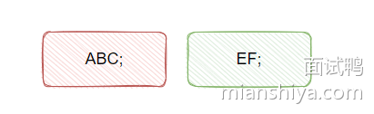

这样以分隔符为界限来切分无界限的 TCP 流，来解决粘包与半包问题，这个应该很好理解，既然你 TCP 没界限，我业务上给你搞个界限。

一直解析，等识别到分隔符之后，说明前面的数据完整了，于是解析前面的数据，然后继续往后扫描解析。

分隔符的优点：简单，也不会浪费空间。

缺点：需要对内容本身进行处理，防止内容内出现分隔符，这样就会导致错乱，所以需要扫描一遍传输的数据将其转义，或者可以用 base64 编码数据，用 64 个之外的字符作为分隔符即可。

分隔符的处理方式在业界也是常用的，比如 Redis 就用换行符来分隔。

##### 固定长度字段+内容

这个也很好理解，比如协议规定固定 4 位存放内容的长度，这样内容就可以伸缩：

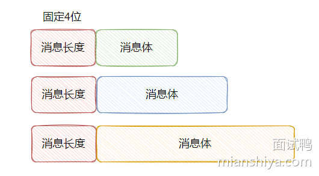

还是拿 ABC、EF 这两个包举例：

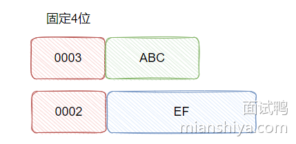

解析流程是：先获取 4 位，如果当前收到的数据不够 4 位，那就再等等，够 4 位之后解析得到长度是 3，所以我再往后取 3 位，同样数据如果不够 3 位就再等等，够了的话就解析，这样就获取一个完整的包了。

然后接着往后获取 4 位，解析得到 2，同理根据 2 往后再取 2 位，解析得到 EF。

这种方式就是先解析固定长度的字段，获得后面内容的长度，根据内容长度来获取内容，从而得到一个完整的报文。

固定长度字段+内容的优点：可以根据固定字段精准定位，也不用扫描转义字符。

缺点：固定长度字段的设计比较困难，大了浪费空间，毕竟每个报文都带这个长度，小了可能不够用。

##### Nagle 算法的影响：

为了减少网络中的小包数量，TCP 中引入了 Nagle 算法，它会将小数据块缓冲起来，直到缓冲区满或者收到了接收方的确认后再发送。这可能导致粘包现象。

所以在需要实时传输小数据包的场景（如在线游戏、实时聊天）中，可以通过设置 TCP_NODELAY 禁用 Nagle 算法，减少粘包的可能性。

### TCP 初始序列号 ISN 怎么取值的？ 

#### 回答重点

初始序列号 ISN 是以时间戳为基础生成的。

RFC793 中认为 ISN 要和一个假的时钟绑定在一起。ISN 每四微秒加一，当超过 2 的 32 次方之后又从 0 开始，即四个半小时左右发生 ISN 回绕。

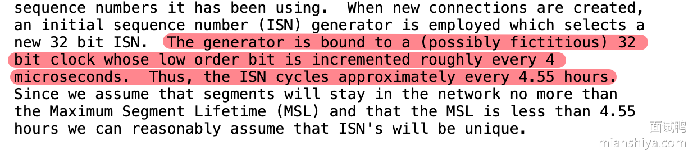

所以 ISN 变成一个递增值，真实的实现还需要加一些随机值在里面，防止被不法份子猜到 ISN。

#### 扩展知识

##### 为什么初始序列号不能写死，比如从 0 开始？

想象一下如果写死一个值，比如 0 ，那么假设已经建立好连接了，client 也发了很多包比如已经第 20 个包了，然后网络断了之后 client 重新，端口号还是之前那个，然后序列号又从 0 开始，此时服务端返回第 20 个包的ack，客户端是不是错乱了？

所以它基于时间递增比较合适，并且还提高了安全性，避免不法分子预测序列号。

小结下为什么这样设计：

- 避免重复序列号导致的冲突：如果两个连接在短时间内使用了相同的 ISN，可能会导致数据包被错误地认为是属于前一次连接的，从而引发数据错误。动态生成 ISN 可以有效避免这种冲突。
- 提高安全性：动态的 ISN 使得预测或篡改 TCP 序列号变得困难，从而提高了连接的安全性，抵御诸如 TCP 序列号预测攻击。

##### RFC 6528

[RFC 6528](https://dl.acm.org/doi/pdf/10.17487/RFC6528) 提出了安全改进，用于增强 TCP 初始序列号 (ISN) 的生成，以抵御序列号预测攻击。

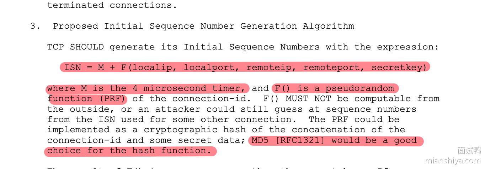

可以看到，M 是每 4 微秒 + 1 的计时器，F 是一个伪随机函数，可以基于 MD5 将源IP、源端口、远端ip、远端端口和一个密钥生成一个哈希值，以抵御序列号预测攻击。

### 常见的登录鉴权方式有哪些？各自的优缺点是？ 

#### 回答重点

##### Session-Cookie 认证

在 Web 应用中，用户登录后，服务器会创建一个会话（Session）并将会话 ID 存储在 Cookie 中。后续请求中客户端携带该 Cookie 以维持会话状态，服务器通过 Session ID 查找用户信息，完成身份验证。

**优缺点**：

- **优点**：适合基于服务端渲染的 Web 应用，状态管理清晰。
- **缺点**：会话信息存储在服务器端，不适合分布式应用，增加了服务器负担。

##### Token 认证（JWT）

Token 认证使用 JSON Web Token（JWT）等加密的令牌标识用户身份。用户登录成功后，服务器生成 JWT 并返回给客户端，客户端在后续请求中携带该 Token 完成身份验证。Token 无状态存储，使得后端无需存储会话。

**优缺点**：

- **优点**：适用于分布式系统和前后端分离应用，减少服务器状态存储。
- **缺点**：Token 过期或失效控制较难，增加了令牌保护的复杂性。

##### OAuth2.0 认证

OAuth2.0 是一种开放授权协议，允许用户在不暴露用户名和密码的情况下，授权第三方访问其受保护的资源（如支付宝api、微信支付等）。用户通过第三方账户登录后，第三方服务提供的授权信息会传递到应用服务器完成鉴权。

**优缺点**：

- **优点**：用户体验好，避免了多账户管理，安全性较高。
- **缺点**：依赖第三方服务，适用性较窄。

##### API Key

API Key 是一段唯一标识客户端的密钥，用于访问受保护的 API。每次请求中客户端都会携带 API Key 签名的（一般用 md5 进行签名）数据进行验证，服务器验证后允许或拒绝访问。

**优缺点**：

- **优点**：实现简单，适合快速搭建的服务或前期验证。
- **缺点**：密钥泄露风险较高，无法细粒度控制访问权限。

这个主要适用于内部系统、微服务之间的 API 调用，或者外部服务的基本认证（有些开放平台除了支持OAuth 认证 还会有 api key 这种比较轻量级的鉴权操作）。

#### 扩展知识

##### Cookie、Session、Token 之间有什么区别？

- [698. Cookie、Session、Token 之间有什么区别？](https://www.mianshiya.com/question/1780933295798775810)

##### JWT Token

- [699. JWT Token 能说说吗？](https://www.mianshiya.com/question/1780933295802970113)

##### OAuth2.0

OAuth 2.0 是一种开放授权协议，允许第三方应用在不需要用户直接提供用户名和密码的情况下，安全地访问用户在其他服务上的受保护资源

在 OAuth 2.0 中，主要涉及以下四个角色：

1. **资源所有者（Resource Owner）**：通常指用户，拥有需要访问的受保护资源。
2. **客户端（Client）**：请求访问资源的第三方应用，代表资源所有者执行操作。
3. **授权服务器（Authorization Server）**：负责认证资源所有者的身份，并提供授权码或访问令牌。
4. **资源服务器（Resource Server）**：存储资源并对外提供访问接口，验证访问令牌，并提供资源访问。

##### OAuth 2.0 授权码模式

授权码模式通常用于**服务器端的 Web 应用**（目前主流的都是使用这种模式）。在这种模式中，用户的授权和客户端的资源请求分开处理，客户端不直接访问用户的凭据。

流程如下：

1. **用户授权**：客户端将用户重定向到授权服务器，用户在授权服务器上登录并同意授权。
2. **获取授权码**：授权服务器将用户重定向回客户端，并附带授权码。
3. **交换访问令牌**：客户端使用授权码向授权服务器请求访问令牌。
4. **访问资源**：客户端携带访问令牌向资源服务器请求资源。

**优点**：客户端无法直接获得用户凭据，适合对安全性要求较高的应用。

##### OAuth 2.0 授权码模式详细流程

1）**请求授权**：客户端将用户重定向到授权服务器，并附带客户端 ID、重定向 URI 和权限范围（scope）。

```http
GET /authorize?response_type=code&client_id=CLIENT_ID&redirect_uri=REDIRECT_URI&scope=read_profile
```

2）**用户授权**：授权服务器验证用户身份后，询问用户是否同意授权。

3）**返回授权码**：用户同意后，授权服务器将用户重定向到客户端指定的重定向 URI，并附带授权码。

```http
▼http

复制代码GET /callback?code=AUTHORIZATION_CODE
```

4）**交换访问令牌**：客户端向授权服务器发送授权码，并附带 `client_id` 和 `client_secret`，请求访问令牌。

```http
POST /token
Content-Type: application/x-www-form-urlencoded
grant_type=authorization_code&code=AUTHORIZATION_CODE&redirect_uri=REDIRECT_URI&client_id=CLIENT_ID&client_secret=CLIENT_SECRET
```

5） **返回访问令牌**：授权服务器验证授权码后，返回访问令牌和可选的刷新令牌。

6）**访问资源**：客户端携带访问令牌向资源服务器请求用户资源。

```http
GET /resource
Authorization: Bearer ACCESS_TOKEN
```

参考快手开放平台的授权码模式示意图： 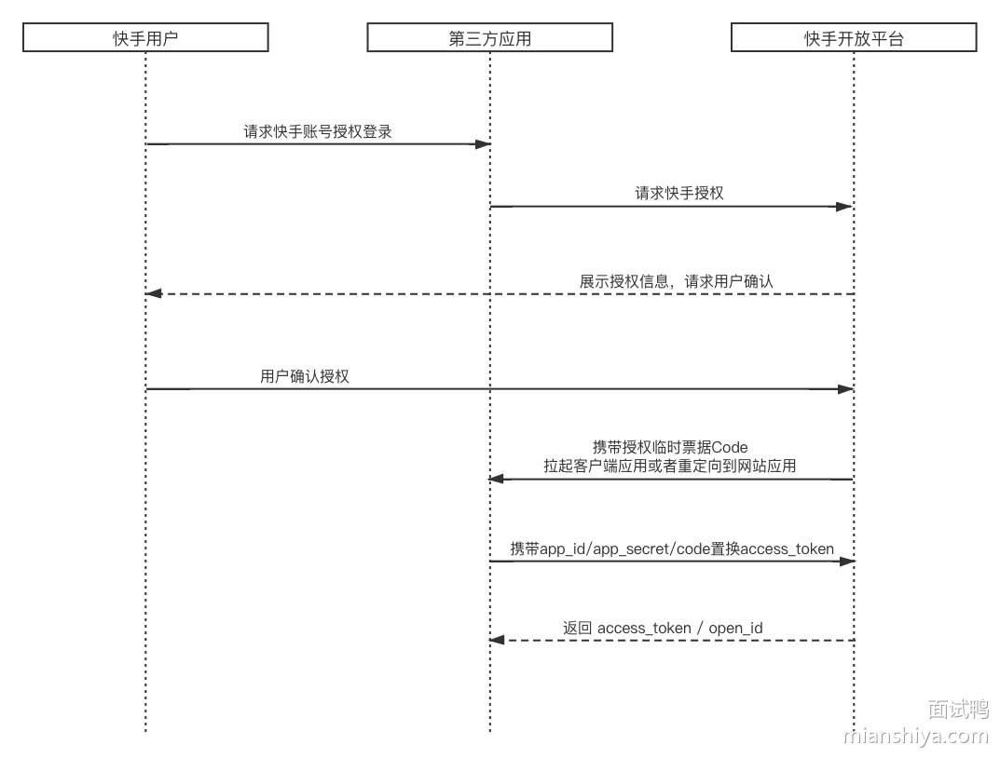


### 从网络角度来看，用户从输入网址到网页显示，期间发生了什么？ 

#### 回答重点

1）**浏览器解析 URL**

浏览器会解析 URL，根据请求信息生成对应的 HTTP 请求报文。

2）**DNS 解析**

请求需要知晓服务器域名对应的 IP 地址才能通信，浏览器会检查本地缓存、操作系统缓存，甚至路由器缓存。如果未命中缓存，浏览器向配置的 DNS 服务器发送查询请求，**DNS 服务器递归查询**最终返回 IP 地址。

3）**TCP或者UDP**

接着浏览器会调用 Socket 库委托协议栈工作，根据指定的情况选择 TCP 或 UDP。

如果使用 TCP，需要通过三次握手建立连接。需要在数据发送前通过三次握手与服务端建立连接。

此时得到了封装了 HTTP 数据的 TCP 数据包。

4）**IP**

在 TCP 数据包的基础上，再封装源地址 IP 和目标地址 IP 等信息，得到网络包。有了 IP 就能在多个网络节点中确定数据包的传输路径，最终能找到目标服务器。

5）**MAC**

得到网络包后，需要在 IP 头部的前面加上 MAC 头部，封装发送方 MAC 地址和接收方目标 MAC 地址。

MAC 用来确保子网内设备两点之间的通信寻址。（IP 是多个网络节点传输寻址）

6）**网卡**

这个时候，网络包还是存储在内存中的二进制数据，需要网卡把二进制数据转换为电信号，通过网线进行传输。

7）**交换机**

通过网线会连到交换机，交换机是二层网络设备。工作在 MAC 层，它会根据数据包中的 MAC 头找到另一个设备连接在交换机的哪个端口，然后传输。

如果找不到对应的端口，则会向交换机上的所有端口(除了源端口)广播。

8）**路由器**

路由器也是进行转发，但它是三层网络设备，包含 IP 层。利用路由器，数据在不同网络节点之间转发，最后到达服务器。

9）**层层验证**

服务器确认 MAC 地址匹配、IP 地址匹配，如果是 TCP 协议则看看序列号是否匹配，若匹配根据端口找到对应的监听进程，此时服务器上对应的应用就接收到数据了。

10）服务器处理

服务器接收到请求后，处理相应的业务逻辑，生成 HTTP 响应。这其间可能涉及到读取数据库、访问文件系统等。最终会生成响应给客户端（又是一层一层的封装 TCP、IP、MAC 等头部数据，得到最终传输的数据包），从网卡到交换机到路由器....

11）浏览器接收响应并渲染页面

经过多个路由器转发后，浏览器最终会接收到服务器返回的响应，进行页面渲染展示。

------

如果面试官问到 HTTPS 呢？那仅需提到三次握手后需要先进行 SSL/TLS 握手即可。

本题能比较地考察一个候选人对网络知识的理解程度，如果想要做到无懈可击仅仅看这一道面试题是不够的，需要理解很多前置知识。

#### 扩展知识

##### DNS

[简单谈谈你对 DNS 的理解？](https://www.mianshiya.com/bank/1790948499480616961/question/1780933295802970114)

##### HTTP

[HTTP 1.0 和 2.0 有什么区别？](https://www.mianshiya.com/bank/1790948499480616961/question/1780933295710695425)

[HTTP 2.0 和 3.0 有什么区别？](https://www.mianshiya.com/bank/1790948499480616961/question/1780933295710695426)

[HTTP 和 HTTPS 有什么区别？](https://www.mianshiya.com/bank/1790948499480616961/question/1780933295714889729)

##### TCP

[到底什么是 TCP 连接？](https://www.mianshiya.com/bank/1790948499480616961/question/1780933295706501122)

[TCP 是用来解决什么问题？](https://www.mianshiya.com/bank/1790948499480616961/question/1780933295719084033)

##### 交换机

交换机是工作在数据链路层（第二层）的网络设备，主要用于在局域网（LAN）内连接多个设备，如计算机、打印机、服务器等。

**交换机根据 MAC 地址表决定将数据帧转发到哪一个具体端口，从而实现设备之间的通信。**

**工作原理**：

- **MAC 地址表**：交换机会记录每个连接设备的 MAC 地址及其所在的端口，当一个数据帧到达交换机时，它会查找目的 MAC 地址，并将数据帧发送到对应的端口。若 MAC 地址表中没有找到该地址，则会将数据帧广播到所有端口（除了源端口），以找到目的设备。
- **全双工与半双工**：现代交换机通常支持全双工通信，即同一时间可以进行双向的数据传输，从而提升网络的传输效率。早期的交换机和集线器则多为半双工，只能在一个方向上传输数据。
- **VLAN**：交换机可以通过 VLAN（虚拟局域网）将一个物理网络划分为多个逻辑网络，从而提升网络的安全性和管理灵活性。VLAN 使得不同的网络段可以在相同的物理基础设施上独立运行。

**应用场景**：

- **局域网内部通信**：交换机用于在公司、学校、家庭等局域网内部，连接不同的设备，确保它们能够有效通信。
- **网络性能优化**：通过配置 VLAN 和 QoS（服务质量），交换机可以优化网络流量，提升重要数据的传输优先级，减少网络延迟。

##### 路由器

路由器是工作在网络层（第三层）的网络设备，主要用于在不同网络之间转发数据包。路由器通过查找路由表，根据目的 IP 地址选择最佳路径，将数据包从一个网络传送到另一个网络。

**工作原理**：

- **路由表**：路由器维护一个路由表，记录了网络中的不同网段及其对应的下一跳路由器或直接连接的接口。当数据包到达路由器时，它会根据目的 IP 地址查找路由表，决定将数据包转发到哪一个接口。若数据包的目的地不在路由表中，路由器会将数据包发送到默认网关。
- **动态路由协议**：为了自动更新路由表，路由器可以使用动态路由协议，如 OSPF（开放最短路径优先）、BGP（边界网关协议）、RIP（路由信息协议）等。这些协议使得路由器能够动态调整路径，以适应网络拓扑的变化。
- **NAT（网络地址转换）**：路由器通常用于连接家庭或公司网络与互联网，它会使用 NAT 将内网的私有 IP 地址转换为公有 IP 地址，从而使得多个内网设备能够共享一个公共 IP 访问互联网。

**应用场景**：

- **跨网络通信**：路由器用于连接不同的网络段或自治系统，是互联网的核心设备，确保数据包能够在全球范围内正确传输。
- **家庭与企业网络连接**：在家庭或企业中，路由器用于连接内部网络与互联网，通过 NAT 和防火墙功能，提供访问控制和网络安全。

### 简单谈谈你对 CDN 的理解？ 

#### 回答重点

CDN（Content Delivery Network）是一个由多个地理位置分散的服务器节点组成的分布式网络架构，用于加速互联网内容的分发。

当用户请求内容时，CDN 会根据用户的地理位置，将请求转发到最近的缓存服务器上。这样可以减少数据传输的延迟，提高用户访问速度，同时减轻源服务器的负载。

CDN 通常用于加速静态内容（如图片、视频、静态页面等）的访问，提高网站的性能和用户体验。

#### 扩展知识

##### CDN 通俗理解

如果网站服务器部署在北京，香港的用户访问该网站，由于物理距离的缘故（网络的传输时间受距离影响），时延相对而言会比较大，导致体验上并不是很好。

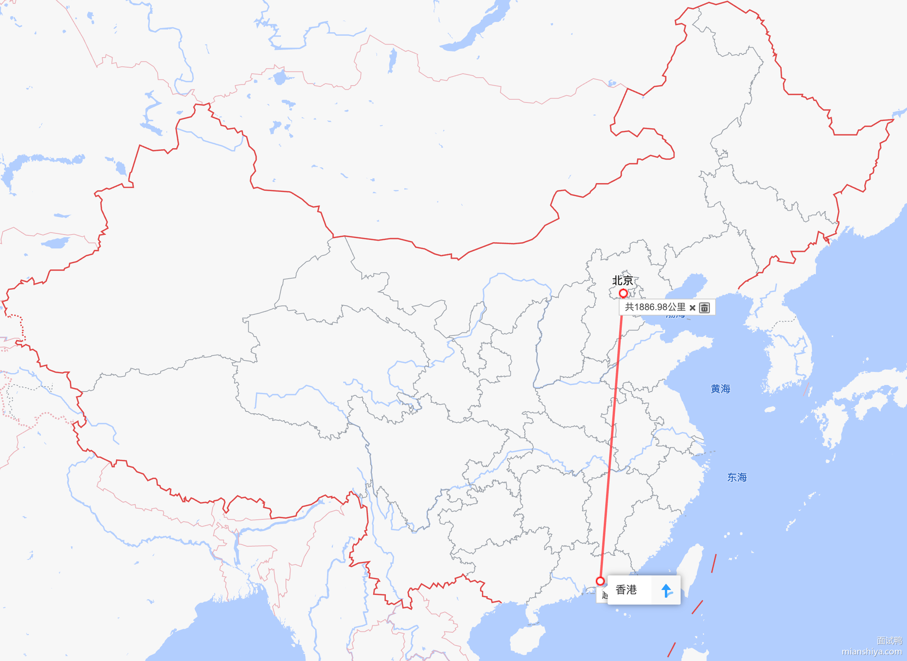

并且当用户量比较大的时候，全国各地所有的请求都涌向北京的服务器，网络的主干道就会被阻塞。这个应该很好理解，就好比国庆假期的网红打卡点，大家都想去那里打卡，那么前往这个打卡点的道路不就都被堵满了吗？

这其实就是所谓的“热点”问题，该如何解决这个问题呢？可以采取类似**分流**的操作。

主服务器部署在北京不变，但是全国各地都建立一些**缓存站**，这些缓存站可以缓存一些主服务器上变化不频繁的资源，比如一些 css/js/图片等静态资源。

当香港的用户想去访问网站的时候，根据就近原则，选择一个距离它最近的缓存站，比如有个深圳站：

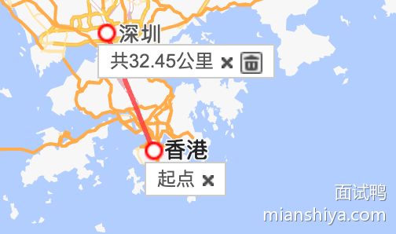

那么先去这个站上看看有没有资源，如果有就直接就从缓存站要到资源了，这个流量就被深圳站拦截了，由于距离很近，响应时延也很低，且不占用请求北京的主干道流量，也减轻了北京服务器的负担，一举多得！

如果缓存站找不到，那么就**回源**到源站，也就是缓存站会去北京的服务器去要数据，然后将这些数据缓存到本地且返回给用户，用户的感觉可能就是网站卡了一下，然后就好了。

这次操作后，别的香港用户访问同样的内容由于缓存站缓存了，因此不需要再次回源，直接从深圳站就返回数据了。

当然，一些热点的数据也可以让源站主动推送给缓存站，进行**缓存预热**，这样减少了回源的动作，使得高峰时期服务器更加平稳，用户也不会有卡一下的表现。

同理，源站也可以主动刷新缓存来更新缓存站上的老数据，缓存站上的缓存也可以设置有效期，过期删除，减轻缓存站的存储压力。

##### 动态数据怎么办？

上面我说的是**静态资源**，如果是提交订单这样的操作怎么缓存呢？不还是得请求北京的服务器吗？

确实如此，很多业务场景涉及到存储层面是有状态的，如果我们让缓存站也能处理这些业务场景，就得将一些业务数据存储下来，那么就又会涉及**数据同步问题**。

这种数据同步机制又会带来另一个高复杂度的挑战，也就是数据一致性问题，很复杂。

所以现在很多云厂商提供的全站 CDN， 一般指的是 CDN 厂商会自动识别你网站资源哪些是静态的，哪些是动态的。

静态的按照我们上面说的路子走，动态的则是根据内部的一些调度算法，**智能地选择最优回源路径去请求源站**，节省请求的时间。

这就好比我们自驾从香港开到北京，路线有很多，然后有个导航很智能，它可以实时监控计算当前道路信息，给我们提供一条路径最短、最不堵的路。

##### CDN 基础架构

接下来我们就来分析下 CDN 究竟是如何工作的，一图胜千言，我们先来看看下图：

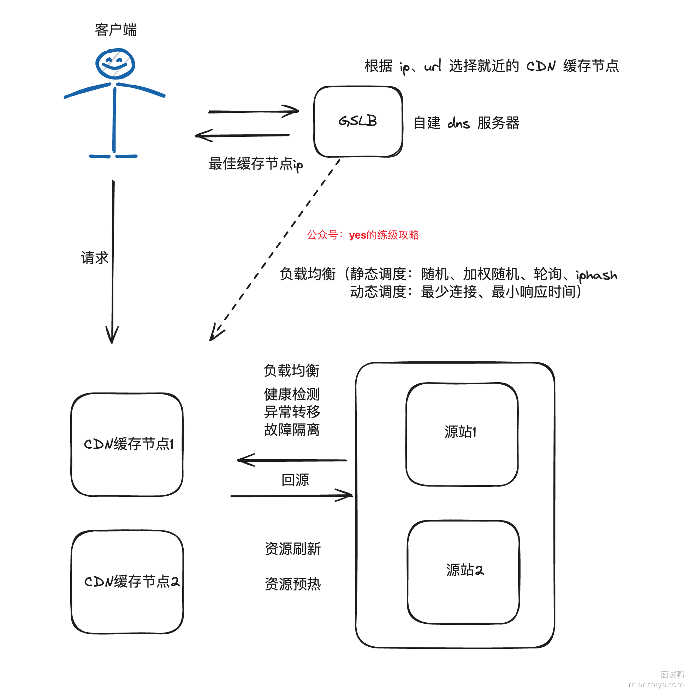

所谓的 CDN 缓存节点就是我上面说的缓存站，然后还是一个很重要的 **GSLB （全局负载均衡器）**。

这个 GSLB 的主要功能就是实现我上面说的 ：`当香港的用户想去访问网站的时候，**根据就近原则**，选择一个距离它最近的缓存站`。

没错，它最主要的功能就是用户访问网站的时候，根据用户请求的 ip、url 选择最近的节点，让用户直接请求最近的节点即可。

简单来说就是**请求转发，转发到最近（或许是最空闲）的站**。

GSLB 转发机制有三种实现：

- 基于 DNS 解析
- 基于 HTTP 重定向（主流应用层协议为 HTTP）
- 基于 IP 路由。

业界实现转发的**主流技术是 DNS 解析**，这里大家可以花 10 秒钟思考一下，为什么主流是 DNS 解析？

**答案是 DNS 有缓存功能和负载均衡能力，能天然减轻 GSLB 的压力**。

设想一下，如果采用 HTTP 重定向去实现转发，从功能角度来看有问题吗？

没问题，301 永久重定向和 302 临时重定向都可以实现转发功能。

那么 301 合适吗？永久重定向好像不合适，比如重定向的缓存站挂了咋办，迁移了咋办？GSLB 叫全局负载均衡，就均衡一次完事儿啦？

所以只能 302 ，而 302 的流程每次还得访问 GSLB，那不就等于所有请求每次都得经过 GSLB 操作？因此 GSLB 可能会成为性能瓶颈。

而 DNS 解析不会这样，用户通过域名解析定位到 GSLB ，通过负载均衡返回用户最近的一个缓存站 ip，后续浏览器、本地 DNS 服务器等都会将本次域名解析得到的 ip 结果缓存一段时间。

那么这个时间段内用户再次请求这个域名，压根不会打到 GSLB 而是直接访问对应的缓存站，这不就解决瓶颈问题了吗？

> tips：以下内容需要提前你了解 DNS 基本解析流程，篇幅有限，这里不多介绍 DNS 相关知识

基于 DNS 解析具体有三种实现方式：

- 利用 CNAME 实现负载均衡
- 将 GSLB 作为权威 DNS 服务器
- 将 GSLB 作为权威 DNS 服务器的代理服务器

**业界最多是使用 CNAME 方式来实现负载均衡**，实现简单且不需要修改公共 DNS 系统配置。

> 利用 CNAME 如果实现 CDN？

简单举个例子，比如之前网站网址是 `www.netitv.com.cn`，此时进行要 cdn 改造，那么将之前的网站网址作为 GSLB 服务域名的 CNAME，用户访问 ` www.netitv.com.cn`，经过 CNAME 解析会映射到 GSLB 地址 `www.netitv.cdn.com.cn` 上，然后 GSLB 基于 DNS 协议可以进行后续的负载均衡操作，选择合适的 IP 返回给用户。

具体如下图所示，图来自《CDN技术详解》：

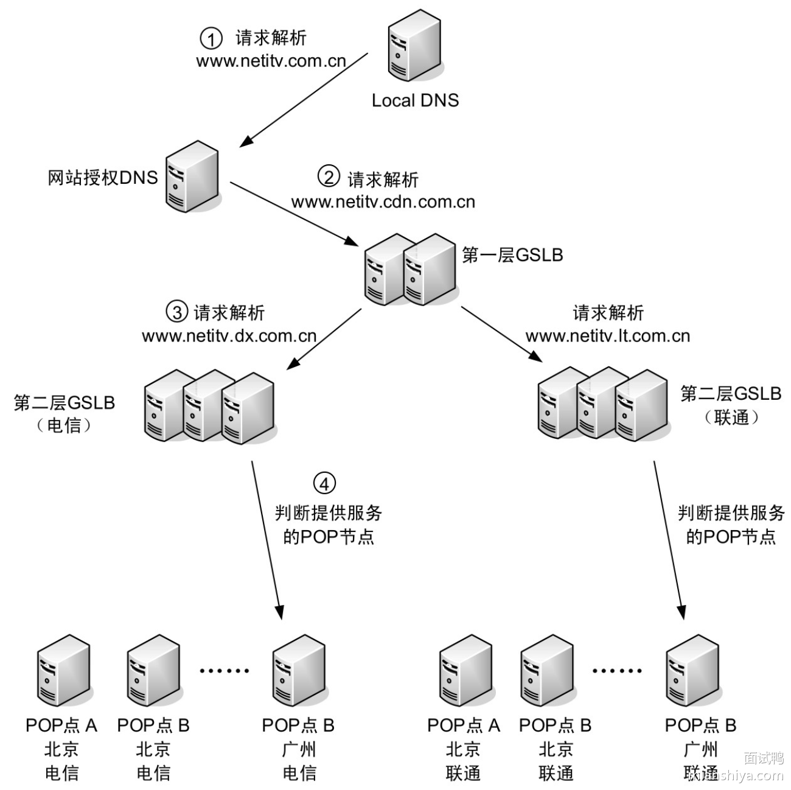

第二种实现方式其实很好理解，就是将 GSLB 作为一个域的权威 DNS 服务器，**取而代之**，那么对于这个域来说，正常域名解析的过程不就可以为所欲为了？负载均衡就都由 GSLB 来把控了，至于如何才能成为一个域的权威 DNS 服务器？这个我不清楚，听起来好像有点难度。

至于第三种实现方式其实就是在权威 DNS 服务器前面做一个代理，差别就是不需要实现一个功能完整的权威 DNS 服务器，仅需对个别需要 GSLB 操作的请求进行修改转发即可，不过这其实也得将对外公布的权威 DNS 服务器的地址变成代理服务器地址，这个难度和第二点一致。

好了，最后还有一个 IP 路由没介绍，其实本质的原理是基于路由器原有的路由算法和数据包转发能力来实现转发。

简单来说就是域名解析得到一个 VIP（虚拟 IP），用户向 VIP 请求的时候，经过路由器 A， 路由器 A 查看路由表来进行转发数据包，然后发现有多个路由，因此就可以不同路径的转发了，一般这种只能实现在某个内部网络，全国性基本不可能实现，所以简单了解下就行。

其他还有一些我最上面图画的健康检测、异常转移等等，这个其实和正常的微服务操作都是一样的，这里就不多介绍了。

### 简单谈谈你对 DNS 的理解？

#### 回答重点

DNS（Domain Name System，域名系统）是一个用于将域名转换为 IP 地址的互联网基础服务。

当用户输入一个域名时，DNS 服务器会查询该域名对应的 IP 地址，并将结果返回给用户。这样，用户就可以通过易记的域名访问网站，而不需要记住复杂的 IP 地址。

除此之外，DNS 还有 **负载均衡** 能力，通过将域名解析到多个 IP 地址，DNS 可以帮助分散流量，进行负载均衡，提高服务的可靠性和性能。

在计算机网络中，DNS（Domain Name System）的查询方法主要包括**递归查询**和**迭代查询**两种：

##### 1. 递归查询（Recursive Query）：

在递归查询中，DNS客户端向本地DNS服务器发送一个查询请求，并要求该DNS服务器负责进行完整的解析过程，直到找到所需的IP地址或者得到一个无法解析的响应。

- **工作流程**：本地DNS服务器会负责向根域名服务器、顶级域名服务器和权威域名服务器依次发送查询请求，直到获得最终结果，并将结果返回给DNS客户端。
- **优点**：递归查询简化了客户端的查询过程，客户端只需发送一次查询请求，其他的查询工作由本地DNS服务器负责完成。

##### 2. 迭代查询（Iterative Query）：

在迭代查询中，DNS客户端向DNS服务器发送一个查询请求，DNS服务器要么返回所需的IP地址，要么告诉客户端下一步应该向哪个DNS服务器查询。

- **工作流程**：DNS客户端向DNS服务器发送查询请求，如果该DNS服务器无法直接解析该域名，它会返回一个指向另一个DNS服务器的查询结果，直到找到最终的IP地址。
- **优点**：迭代查询允许DNS服务器之间协作进行解析，每个DNS服务器都负责一部分工作，这有助于分担网络负载和提高解析效率。

这两种查询方法在DNS解析过程中起着重要的作用，根据网络环境和配置，DNS服务器可能会选择使用递归查询或迭代查询来处理客户端的查询请求。

#### 扩展知识

互联网中的域名地址，分为多级结构：最顶级是根域，然后是顶级域（TLD），如 `.com`、`.org`，接着是二级域（如 `mianshiya.com`），以及子域（如 `www.mianshiya.com`）。

DNS 服务器和客户端会缓存 DNS 查询结果，以减少查询时间和降低对 DNS 服务器的负载。缓存的内容会在一定时间后过期，具体取决于 DNS 记录的生存时间（TTL）设置。

##### DNS 的工作流程

DNS 的工作流程可以分为以下几个步骤：

1）**域名解析请求**：

- 用户在浏览器中输入一个域名（例如 `www.mianshiya.com`），浏览器首先检查本地缓存（如果有的话）是否存有该域名的 IP 地址。

2）**递归 DNS 解析**：

- 如果本地缓存中没有所需的 IP 地址，浏览器会向配置的递归 DNS 服务器发送请求。递归 DNS 服务器是互联网服务提供商（ISP）或公共 DNS 提供商（如 Google DNS 或 Cloudflare DNS）提供的服务。

3）**查询根域名服务器**：

- 递归 DNS 服务器会查询根域名服务器以获取顶级域（TLD）的 DNS 服务器地址。根域名服务器负责将请求转发到对应的 TLD 服务器。

4）**查询 TLD 服务器**：

- 根域名服务器将请求转发到对应的 TLD 服务器（例如，`.com`、`.org` 或 `.net` 服务器），这些服务器负责处理特定顶级域的请求。

5）**查询权威 DNS 服务器**：

- TLD 服务器将请求转发到域名的权威 DNS 服务器（例如 `ns1.mianshiya.com`）。权威 DNS 服务器拥有该域名的最终 DNS 记录。

6）**返回 IP 地址**：

- 权威 DNS 服务器返回与域名对应的 IP 地址给递归 DNS 服务器，然后递归 DNS 服务器将该 IP 地址返回给用户的浏览器。

7）**缓存和访问**：

- 浏览器缓存该 IP 地址以供后续请求使用，并通过 IP 地址连接到目标服务器以访问网站内容。

DNS 服务器小结：

- **根域名服务器**：最顶层的 DNS 服务器，负责根域和 TLD 的解析。
- **TLD 服务器**：处理特定顶级域（如 `.com`、`.org`）的 DNS 查询。
- **权威 DNS 服务器**：存储实际的 DNS 记录并提供最终的解析结果。
- **递归 DNS 服务器**：负责处理用户的 DNS 查询请求并从其他服务器获取解析结果。

##### DNS 记录类型

常见的 DNS 记录类型包括：

- **A 记录**：将域名映射到 IPv4 地址。
- **AAAA 记录**：将域名映射到 IPv6 地址。
- **CNAME 记录**：将一个域名别名指向另一个域名。
- **MX 记录**：定义邮件服务器的地址，用于电子邮件的传输。
- **TXT 记录**：存储任意文本信息，通常用于验证和安全设置。
- **NS 记录**：定义域名的权威 DNS 服务器。

### JWT Token 能说说吗？ 

#### 回答重点

JWT（JSON Web Token）是一种用于在各方之间传递安全信息的紧凑、URL安全的令牌格式。

在用户登录后，服务器生成JWT并返回给客户端。客户端在后续请求中通过HTTP头部（通常是`Authorization`头）发送该JWT，服务器则验证该JWT的有效性以进行用户身份验证。

因为它的无状态性，常用于分布式系统和微服务架构中。

其结构主要包括三个部分：**Header**、**Payload**和**Signature**。

JWT的工作原理可以总结为以下几个步骤：

1）**Header**：描述令牌的元数据，通常包含令牌的类型（即JWT）和所使用的签名算法（如HMAC SHA256）。

2）**Payload**：包含声明（Claims），即传递的数据。这些数据通常包括用户信息和其他相关数据。常见的声明类型有`iss`（发行者）、`exp`（到期时间）、`sub`（主题）等。

3）**Signature**：将Header和Payload用指定的算法进行签名，用以验证JWT的真实性和完整性。签名确保了令牌内容在传输过程中未被篡改。

**JWT的优点**：

- **自包含**：JWT中包含了所有必要的信息，因此在验证时不需要查询数据库，提升了性能。
- **跨语言**：由于JWT是基于JSON的，几乎所有编程语言都支持它的生成和解析。

#### 扩展知识

##### 如何废除一个未过期的 JWT

因为 JWT 是无状态的，一般服务器并不保存已签发的 JWT，所以服务器无法主动撤销一个已经签发的 JWT。不过可以通过其他方式来实现这个功能。

###### 使用黑名单（Blacklist）

- **实现思路**：在服务器端维护一个黑名单（或者叫作废列表），该列表包含所有已被废除的 JWT 标识符（通常使用 JWT 的`jti`声明）。每次服务器验证 JWT 时，除了验证签名和其他标准信息外，还需要检查该 JWT 是否在黑名单中。
- **优点**：可以精确废除特定的 JWT，不影响其他合法的 JWT。
- **缺点**：需要在服务器端存储和管理黑名单，违背了 JWT 的无状态特性，增加了系统复杂度。如果黑名单列表变大，查询效率可能成为问题。

###### 使用版本控制（Token Versioning）

- **实现思路**：在用户信息中引入一个“Token 版本号”的字段，每次生成 JWT 时，将这个版本号作为 JWT 的一部分（可以放在 Payload 的自定义声明中）。当需要废除某个用户的 JWT 时，只需将用户的版本号递增。在服务器验证 JWT 时，检查 JWT 中的版本号与用户当前的版本号是否匹配，若不匹配，则视为无效。
- **优点**：无需维护黑名单，可以较容易地废除特定用户的所有 JWT。
- **缺点**：在多用户、多设备情况下，如果一个设备上的 JWT 被废除，所有设备上的 JWT 都会失效。需要在服务器端存储和管理用户的版本号。

###### 结合状态信息

- **实现思路**：在某些场景下，可以在服务器端结合一些状态信息来决定 JWT 是否有效。例如，在用户注销或更改密码时，更新服务器上的某些状态。当用户发出请求时，除了验证 JWT 外，服务器还检查这些状态是否符合要求，不符合时即使 JWT 有效，也拒绝请求。
- **优点**：灵活性高，可以根据具体业务需求决定 JWT 的有效性。
- **缺点**：需要服务器端保存一定的状态信息，违背了无状态设计的初衷，且具体实现较为复杂。

##### JWT的安全性考虑

- **签名与加密**：JWT的签名保证了数据的完整性，但它的Payload部分通常不加密。因此，敏感信息不应直接放在JWT的Payload中。为了保护数据，可以使用JWE（JSON Web Encryption）标准加密JWT的Payload。
- **密钥管理**：签名的安全性依赖于密钥的保护。如果密钥泄露，攻击者可以伪造有效的JWT。因此，密钥管理是JWT安全的关键。
- **Token泄露与防护**：JWT通常会存储在客户端（如本地存储或Cookies中），如果JWT泄露（如通过XSS攻击），攻击者可以冒充合法用户。可以通过设置短期有效期（`exp`）和定期刷新Token来降低风险。

##### JWT与Session的对比

- **无状态认证**：JWT通常用于无状态认证，即服务器不存储会话数据。相比之下，Session认证通常需要服务器存储用户的会话信息。
- **扩展性**：由于JWT不依赖服务器存储，因此在分布式系统中更具扩展性。Session认证在多服务器环境中需要依赖共享存储或会话粘性（Session Stickiness），从而增加了系统复杂度。

### Cookie、Session、Token 之间有什么区别？

#### 回答重点

1）Cookie：

Cookie 是存储在用户浏览器端的一个小型数据文件，用于跟踪和保存用户的状态信息。

主要用于保持用户登录状态、跟踪用户行为、存储用户偏好等。

**存储在浏览器端**。

2）Session：

Session 是服务器端保存用户状态的机制，每个用户会话都有一个唯一的 Session ID。

主要用于跟踪用户在服务器上的状态信息，例如登录状态和购物车内容。

**存储在服务器端**，然后对应的 Session ID 通过 Cookie 保存在客户端浏览器中。

3）Token：

Token 本质是一种加密的字符串，用于身份验证和授权，可以包含用户信息和权限，用于验证用户身份或授权访问资源。

认证后，后端服务会返回 Token，**存储在客户端**（浏览器或移动应用中），后续客户端访问服务端需要带上这个 Token。

它们之间使用场景区别：

- Cookie：主要用于客户端状态的简单存储和追踪。
- Session：用于服务器端的复杂状态管理，特别是在需要存储大量会话数据时。
- Token：用于无状态的认证和授权，特别是在分布式和跨域环境下。

简单来说，Cookie 和Session 更适合用于单次会话的认证和状态管理，而 Token 更适合用于跨会话的认证和状态管理。

#### 扩展知识

##### 从演进的角度来理解 Cookie 、Session、Token

1990 年。

蒂姆·伯纳斯·李创建了 HTTP 协议。

李老的想法是把文档存储在服务器中，谁需要这个文档直接从服务器获取即可。

按照这个思想，当时的需求只有 GET。

并且按照拿文档的思路：拿完了连接就可以断了，也不需要什么交互。

所以 **HTTP 起初的设计就是无状态的。**

也就是请求和请求之间是没有关联的。

而随着互联网的发展，交互开始兴起。

人们不再满足简单的静态文件获取，各种购物、社交接踵而至。

这意味着服务器需要判断每个请求的发起者是谁，也就是需要状态。

你聊天总得表明你是谁，并且和谁聊吧？不然服务器可不知这聊天信息得发给谁。

你购物总得让服务器知道是谁买了这玩意吧？

总不能你买完了下线，再上线发现你买的东西没了。

这时候就是需要一种技术让请求与请求之间建立起联系，让请求变得有状态。

这技术叫 Cookie，**就是一个以 Key-Value 格式存储的小文件，保存在客户端本地**。

比如登录之后，服务器就能设置 Cookie 返回给浏览器，然后保存在本地。

随便截了个百度的，列出来的就是 key，下拉箭头打开里面就有 value。

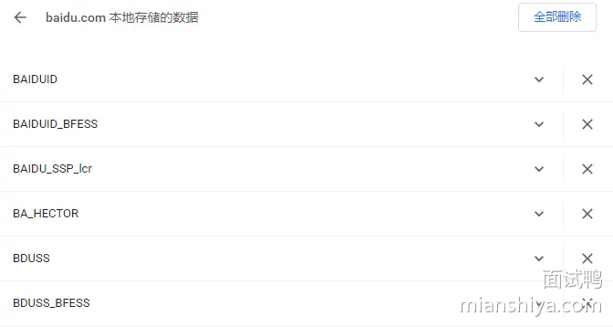

之后对百度的请求就可以带着 Cookie 去访问服务器，这里假设 BAIDUID 是用户 ID。

百度的服务器一看原来是这个 ID 啊，就知道是“我”请求了，这就有状态了。

简单地说 Cookie 就是存储在本地的一份文件，每次请求都会带上 Cookie 去访问服务器。

所以把一些**用户信息塞到 Cookie 里，这样服务器就能判别是哪个用户的请求了**。

注意 **Cookie 是有域的划分的**，来看下这个图：

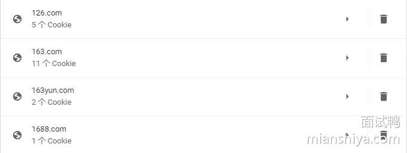

也就是每个域下面都有各自的 Cookie ，访问不同的网站带属于这个网站的 Cookie ，不会带别人的 Cookie ，不然就乱套了。

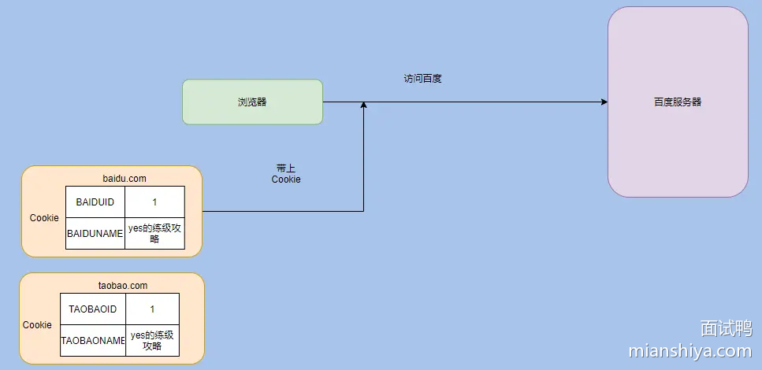

但是 Cookie 是**明文存储在用户本地，而且带有大量的用户信息**这不太安全。

并且每次请求都需要带这么多 Cookie 对带宽来说也不太划算。

**Session** 就解决了这个问题，Session 就是会话，**它有更加广泛的含义**，在和 Cookie 这些一起谈论的场景，我们把它狭义化。

Session 就是把用户的会话信息存储在服务端。

然后颁发给客户端一个 sessionId，让客户端之后带着 sessionId 来请求。

这样服务端就可以通过 sessionId 去找到这个用户的信息，从而识别请求。

那客户端是如何带上 sessionId 的？

这个 sessionId 还是按照 Cookie 的形式存储在用户的本地，发起请求的时候带上即可。

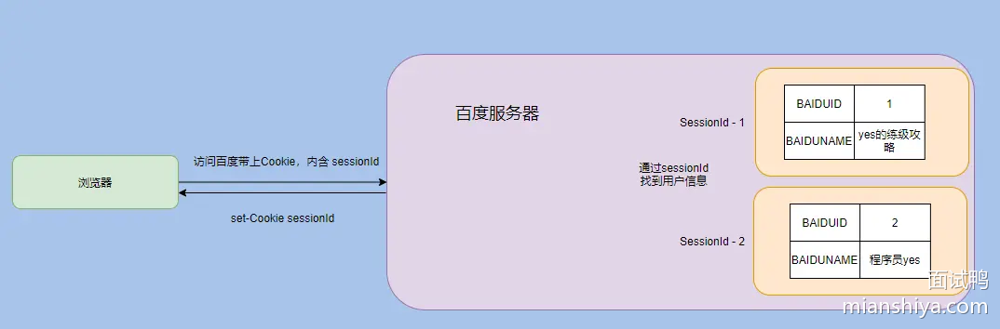

但是把这种状态信息存储到服务器中**使得服务器就有状态了**。

一般我们部署在线上的服务器会有多台来做负载均衡，也互相作为 backup。

所以如果 Session 的信息存在某一台机器上，那么当**下一次请求被负载分到另一台机器**那就找不到这个 Session 信息了。

也就不认得这个请求了，可能的现象就是告诉用户没登录，那用户不就傻了。

我这刚还登录着呢，这就告诉我没登录了？

所以处理方式有 session 复制，就是服务器之间互相同步 session，这样不论请求到哪个服务器都有用户的信息。

不过这复制就冗余了，有额外的开销。

还有一种就是 session sticky，其实就是把你的请求一直粘在某一个服务器上，如果你请求的一开始被指派的是 A 服务器，那么之后的所有请求都只会被指派到 A 服务器上。

但是**如果 A 服务器挂了**，你的请求还是会被指派到别的服务器上，这样一来用户登录信息还是会丢了。

可以看到复制和 sticky 都有缺陷，所以可以把 session 放到第三方存储，比如 Redis 里。

这样服务器等于又没状态了。

而服务器的无状态意味着可以随意伸缩，服务集群根据流量加几台减几台很方便。

但是把 session 放第三方存储上只是把这个维护从服务器转嫁到第三方身上。

第三方得保证它的高可用，不然用户登录信息又会丢了。

不过一般而言我们的系统本来就要维护的第三方存储，所以影响不大。

**小结一下**：Cookie 明文存储在本地不太安全，所以想着把用户状态存在服务端，而 Session 就是将用户状态信息保存在服务端。

就暴露 sessionId 给客户端，这样相对而言安全些，并且也减少了网络流量。

但这样服务端就有状态了，难以扩展。

因此可以把 Session 放到第三方存储上，但是等于状态还是由服务端维护。

##### Token

其实仔细想想，**是不是不需要在服务端存储用户的信息？**

只需要一个**能代表身份的凭证**即可，一个服务端颁发给用户的凭证，之后的请求让用户带着这个凭证就行。

就像我们的身份证，就代表我们。

这个凭证里面就包含了用户的信息，有人可能怕凭证被伪造。

没事，**把凭证给签名了**，这样我们服务器就能验证凭证的真伪。

和别人做不得假身份证一样。

**这种凭证叫 Token。**

如果一个用户登录了系统，我就返回一个 Token 给他，之后每次请求他带着这个 Token 来就行。

服务器验证了真伪之后拿到 Token 里面的用户信息就知道这个请求是谁发的了。

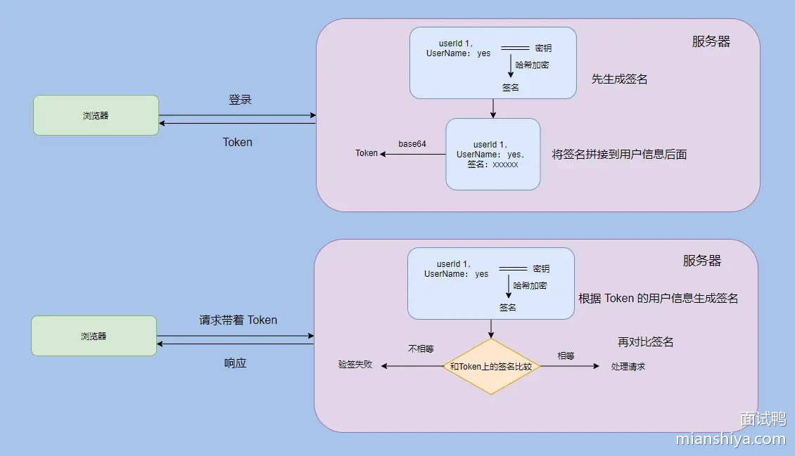

这样服务器就无状态了，是真的无状态了，当然客户端有状态了。

由客户端来保存 Token ，这样是最合理的，不需要在服务端冗余数据。

有了 Token 之后服务器因为无状态所以可扩展，**并且 Token 还能跨应用使用。**

比如同一个公司不同应用之间的调用，所有应用只要能识别这个 Token 就都能登录。

一个 Token 就搞定了，不用每个网站都登录一遍，这就是单点登录。

如果是第三方服务提供方也更容易的提供服务，只需要颁发一个 Token 给调用者即可。

**Token 简单的说就是一个含有凭证信息的令牌**，只要服务器能识别这个令牌就能根据令牌的身份进行相应的响应。

其实这还**蕴含了时间换空间的思想**，把存储在服务器的用户信息暴露出去，利用签名来验证 Token 的真伪。

这样每次请求都需要耗费时间去验签，不过好处就是不需要存储信息，也就是时间换空间。

> 其实像 Cookie + Session 除了可扩展还有跨域啊、跨站伪造请求等问题。像 Token 更加灵活，在移动端等场景也更加的适用。有关上述内容所讲的演进看起来好像就是 Cookie => Session =>Token。不是的！这几个东西都很有用，上述内容只是单从认证这一方面来看罢了。

##### Cookie 进一步介绍

**Cookie** 是由服务器发送到客户端浏览器的小数据片段，浏览器会将其存储，并在每次发送请求时带上这些 Cookie。

**主要用途如下：**

- **会话管理**：保存用户的会话状态，如登录状态。
- **个性化设置**：存储用户的偏好设置和配置。
- **跟踪和分析**：记录用户的行为，用于分析和广告跟踪（经常会有网站弹出来让你允许存储 cookie）。

**特性**：

- **生命周期**：Cookie 可以设置过期时间，过期后自动删除。可以是会话 Cookie（当浏览器关闭时删除）或持久 Cookie（根据设置的过期时间删除）。
- **安全性**：Cookie 可以使用 `Secure` 和 `HttpOnly` 标志来提高安全性。`Secure` 标志表示仅在 HTTPS 连接下发送，`HttpOnly` 标志表示 JavaScript 无法访问。
- **大小限制**：浏览器对每个 Cookie 的大小有限制（通常为 4 KB），同时对每个域名的 Cookie 数量也有限制。

##### **Session** 进一步介绍

**Session** 是一种在服务器端存储用户会话数据的机制。它通过唯一的会话标识符（Session ID）来关联用户的请求和服务器上存储的会话数据。这些信息一般存储在服务器的内存或数据库中。

**主要用途如下：**

- **会话管理**：用于在用户与服务器的交互过程中保持状态，如登录状态、购物车内容等。
- **数据存储**：在用户的会话中保存较大的数据，如用户配置、临时数据等。

**特性**：

- **生命周期**：Session 在用户与服务器的交互期间保持有效，一般会在用户关闭浏览器或达到超时设置后失效。
- **存储位置**：数据存储在服务器上，而不是客户端，增加了数据的安全性。
- **标识符**：服务器会生成一个唯一的 Session ID，通过 Cookie 或 URL 参数将其传递给客户端，客户端在后续请求中将其发送给服务器。

##### **Token** 进一步介绍

**Token** 是一种用于身份验证和授权的机制，通常在客户端存储，并在请求中传递，以证明用户的身份或权限。

一般是一段字符串，通常经过加密或编码，用于在用户和服务器之间传递身份验证信息。

常见的 Token 类型包括 JSON Web Token (JWT) 和 OAuth 2.0 Token。

**主要用途如下**：

- **身份验证**：用于验证用户身份，例如在登录后生成 Token，客户端将其用于后续的请求。
- **授权**：用于控制用户对特定资源的访问权限。
- **无状态会话**：Token 支持无状态的会话管理，即服务器不需要存储会话状态，而是通过 Token 本身验证和授权。

**特性**：

- **自包含**：Token（尤其是 JWT）通常自包含了用户的身份和权限信息，无需服务器存储会话数据。
- **过期和刷新**：Token 通常有过期时间，用户需要重新登录或通过刷新 Token 机制获取新的 Token。
- **安全性**：Token 可以进行加密和签名，以保护其内容不被篡改，并验证其来源的合法性。

### TCP/IP 四层模型是什么？ 

#### 回答重点

TCP/IP 四层模型是一个分层网络通信模型，它将网络通信过程分为四个层次，这四层分别是：网络接口层、互联网层、传输层和应用层。

- 网络接口层负责在计算机和网络硬件之间传输数据，负责在物理网络上发送和接收数据帧，包括以太网、Wi-Fi 等协议
- 互联网层（网络层）通过 IP 协议提供数据包的路由和转发
- 传输层负责在两个主机之间提供端到端的通信服务，常见的协议有 TCP 和 UDP
- 应用层通过各种协议提供网络应用程序的功能，如 HTTP、FTP、SMTP 等协议

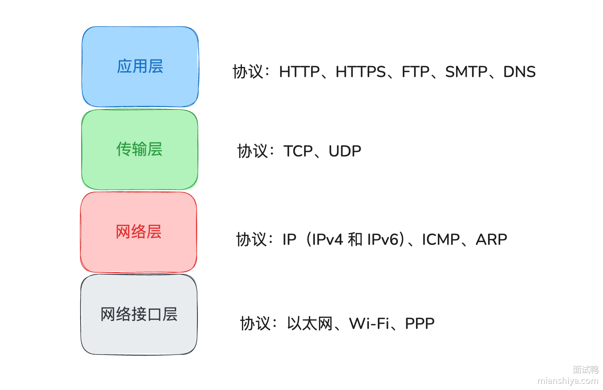

##### 分层的优点

- **简化设计与实现**：通过将网络功能分解为不同的层，每一层只负责特定的任务，从而简化了设计和实现的复杂性。
- **模块化**：每一层可以独立发展和优化，不同层次之间通过标准接口进行通信，便于各层的更新和替换。
- **互操作性**：明确定义每个层次之间的接口和协议，不同厂商或组织开发的网络设备和软件可以相互兼容，使得不同的网络设备和系统能够在不同的层次上进行无缝互操作，提升了网络的兼容性。
- **故障隔离**：每个层次都有自己的错误检测、纠错和恢复机制，且分层结构能够帮助网络工程师定位问题所在的层次，从而更快地进行故障排除。

#### **扩展知识**

##### TCP/IP 四层模型与 OSI 七层模型的对比

- **OSI 七层模型** 是另一个著名的网络模型，它将网络通信过程分为七个层次：物理层、数据链路层、网络层、传输层、会话层、表示层和应用层。
- **简化与实用性**：TCP/IP 四层模型是对 OSI 七层模型的简化，省略了会话层和表示层，将数据链路层和物理层合并为网络接口层。这种简化更符合实际应用中的网络协议栈实现。
- **应用层的差异**：在 OSI 模型中，应用层、表示层和会话层是分开的，而在 TCP/IP 模型中，它们被合并成了单一的应用层。这种设计简化了上层协议的开发和实现。

##### 每一层主要包头信息和单位

###### 应用层

**包头信息主要字段**：

- **HTTP**：`Host`（目标主机）、`User-Agent`（客户端类型）、`Content-Length`（内容长度）等。
- **DNS**：`Transaction ID`（事务 ID）、`Flags`（标识符）、`Query/Response`（查询/响应标识）等。

**数据单位**：**数据（Data）**

###### **传输层**

**包头信息主要字段**：

- **TCP**：`Source Port`（源端口）、`Destination Port`（目的端口）、`Sequence Number`（序列号）、`Acknowledgment Number`（确认号）、`Flags`（控制标志）等。
- **UDP**：`Source Port`（源端口）、`Destination Port`（目的端口）、`Length`（数据包长度）、`Checksum`（校验和）等。

**数据单位**：**报文段（Segment）**

###### **网络层**

**包头信息主要字段**：

- **IP**：`Source IP Address`（源 IP 地址）、`Destination IP Address`（目的 IP 地址）、`TTL`（生存时间）、`Protocol`（上层协议类型）等。

**数据单位**：**数据包（Packet）**

###### **网络接口层（数据链路层和物理层）**

**包头信息主要字段**：

- **以太网**：`Source MAC Address`（源 MAC 地址）、`Destination MAC Address`（目的 MAC 地址）、`Type`（上层协议类型）等。

**数据单位**：**帧（Frame）**

### ARP 和 RARP 分别是什么？有什么区别？ 

#### 回答重点

ARP（Address Resolution Protocol）将 IP 地址转换为 MAC 地址，它工作在 **网络层** 和 **数据链路层** 之间，主要用于在局域网中确定一个特定 IP 地址对应的物理地址（MAC 地址）。因为最终需要找到 MAC 地址才能跟具体的设备通信。

RARP（Reverse Address Resolution Protocol）用于将 MAC 地址转换为 IP 地址，比如一些设备启动的时候，需要根据 RARP 来得知分配给它的 ip 是什么。

| 特性         | ARP (地址解析协议)                          | RARP (反向地址解析协议)                |
| ------------ | ------------------------------------------- | -------------------------------------- |
| **功能**     | 将 IP 地址转换为 MAC 地址                   | 将 MAC 地址转换为 IP 地址              |
| **使用场景** | 网络设备需要知道目标设备的 MAC 地址         | 网络设备需要通过 MAC 地址获取 IP 地址  |
| **工作方式** | 通过广播请求和回应来获取目标设备的 MAC 地址 | 通过广播请求和回应来获取设备的 IP 地址 |
| **表的存储** | ARP 表：IP 地址到 MAC 地址的映射            | RARP 表：MAC 地址到 IP 地址的映射      |
| **现代替代** | ARP 仍在广泛使用                            | RARP 被 BOOTP 和 DHCP 替代             |

#### 扩展知识

##### **ARP工作流程**

1）**ARP 请求**：主机 A 需要发送数据包给主机 B，但只有主机 B 的 IP 地址，没有它的 MAC 地址。主机 A 发送一个 ARP 请求广播到网络，询问 "哪个设备拥有 IP 地址 X.X.X.X？"。

2）**ARP 响应**：拥有该 IP 地址的主机 B 接收到请求后，回复一个 ARP 响应，告知主机 A 自己的 MAC 地址。

3）**更新 ARP 表**：主机 A 将主机 B 的 IP 和 MAC 地址的映射关系保存到 ARP 表中，以便以后使用。

#### 特性

- **广播**：ARP 请求是以广播的方式发送到网络中的所有设备，ARP 响应是点对点的。
- **缓存**：每台主机都维护一个 ARP 表来缓存 IP 地址与 MAC 地址的映射，减少频繁的 ARP 请求。
- **协议**：ARP 是一个非标准化的协议，不同操作系统的实现可能略有不同。

##### RARP工作流程

1）**RARP 请求**：设备 A 只有自己的 MAC 地址，但没有 IP 地址。设备 A 发送一个 RARP 请求广播到网络，询问 "我的 MAC 地址对应的 IP 地址是什么？"。

2）**RARP 响应**：配置了 RARP 服务的服务器收到请求后，查找其 RARP 表中与该 MAC 地址相关联的 IP 地址，并将结果返回给设备 A。

3）**配置 IP 地址**：设备 A 收到 IP 地址后，配置其网络接口使用该 IP 地址。

#### 特性

- **广播**：RARP 请求是以广播的方式发送到网络中的 RARP 服务器，RARP 响应是点对点的。
- **服务器**：RARP 需要一个专门的 RARP 服务器来响应请求，这些服务器通常在网络上配置静态的 MAC 地址到 IP 地址的映射。
- **限制**：RARP 的使用已大幅减少，主要因为它只能处理静态映射，且缺乏灵活性。

### 说说 TCP 拥塞控制的步骤？

#### 回答重点

主要有以下几个步骤：

1）**慢启动（Slow Start）**：

发送方在连接建立初期，缓慢地增加数据发送速率。初始的拥塞窗口（cwnd）通常为一个 MSS（最大报文段大小），然后在每次收到 ACK 后成倍增加 cwnd，直到达到慢启动阈值（ssthresh）或检测到网络拥塞。

2）**拥塞避免（Congestion Avoidance）**

当 cwnd 达到 ssthresh 后，TCP 进入拥塞避免阶段，拥塞窗口的增长速度从指数变为线性增长，即每个 RTT（往返时间）增加一个 MSS。这一阶段旨在避免激烈的拥塞反应，保持网络稳定性。

3）**快速重传（Fast Retransmit）**

发送方在收到三个重复的 ACK 后，立即重传被认为丢失的报文段，而无需等待超时。这减少了重传的延迟，迅速应对数据丢失。

4）**快速恢复（Fast Recovery）**

在快速重传后，TCP 不进入慢启动，而是减小 cwnd 到当前的一半，并设置 ssthresh 为当前新的 cwnd 的值，然后开始线性增加 cwnd，以快速恢复到丢包前的传输速率。

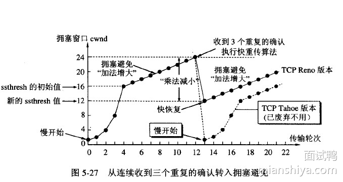

#### 扩展知识

##### 拥塞控制进一步分析

慢启动，就是新司机上路慢慢来，初始化 cwnd（Congestion Window）为 1，然后每收到一个 ACK 就 cwnd++ 并且每过一个 RTT ，cwnd = 2*cwnd 。

线性中带着指数，指数中又夹杂着线性增。

然后到了一个阈值，也就是 ssthresh（slow start threshold）的时候就进入了拥塞避免阶段。

这个阶段是每收到一个 ACK 就 cwnd = cwnd + 1/cwnd并且每一个 RTT 就 cwnd++。

可以看到都是线性增。

然后就是一直增，直到开始丢包的情况发生。我们知道 TCP 重传有两种，一种是超时重传，一种是快速重传。

- 如果发生超时重传的时候，那说明情况有点糟糕，于是直接把 ssthresh 置为当前 cwnd 的一半，然后 cwnd 直接变为 1，进入慢启动阶段。
- 如果是快速重传，那么这里有两种实现，一种是 TCP Tahoe 和超时重传一样的处理。一种是 TCP Reno，这个实现是把 cwnd = cwnd/2 ，然后把 ssthresh 设置为当前最新的 cwnd。

然后进入快速恢复阶段，将 cwnd = cwnd + 3（因为快速重传有三次），重传 DACK 指定的包，如果再收到一个DACK 则 cwnd++，如果收到是正常的 ACK 那么就将 cwnd 设为 ssthresh 大小，进入拥塞避免阶段。

可以看到快速恢复就重传了指定的一个包，那有可能是很多包都丢了，然后其他的包只能等待超时重传，超时重传就会导致 cwnd 减半，多次触发就指数级下降。

所以又搞了个 New Reno，多加了个 New，它是在没有 SACK 的情况下改进快速恢复，它会观察重传 DACK 指定的包的响应 ACK 是否是已经发送的最大 ACK，比如你发了1、2、3、4，对方没收到 2，但是 3、4都收到了，于是你重传 2 之后 ACK 肯定是 5，说明就丢了这一个包。

不然就是还有其他包丢了，如果就丢了一个包就是之前的过程一样，如果还有其他包丢了就继续重传，直到 ACK 是全部的之后再退出快速恢复阶段。

简单的说就是一直探测到全部包都收到了再结束这个环节。

还有个 FACK，它是基于 SACK 用来作为重传过程中的拥塞控制，相对于上面的 New Reno 我们就知道它有 SACK 所以不需要一个一个试过去。

##### 有哪些拥塞控制算法？

从维基上看，有以下这些：

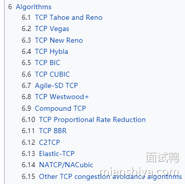

简单了解各算法的原理、优缺点，以及适用的场景：

###### 1. **TCP Tahoe and Reno**

**TCP Tahoe**:

- **原理**: 引入了慢启动 (Slow Start)、拥塞避免 (Congestion Avoidance) 和快速重传 (Fast Retransmit) 三个机制。初始阶段，发送方通过指数增加拥塞窗口 (Congestion Window, cwnd) 的大小来迅速达到网络的容量。当检测到丢包时，认为网络发生了拥塞，将 `cwnd` 重置为 1 并进入慢启动阶段。
- **优点**: 简单且较为有效，广泛应用于早期的网络环境中。
- **缺点**: 丢包后 `cwnd` 的重置导致网络带宽利用率降低。
- **适用场景**: 适用于较低带宽、低延迟的网络环境。

**TCP Reno**:

- **原理**: 在 Tahoe 的基础上加入了快速恢复 (Fast Recovery) 机制。在发生丢包时，不是将 `cwnd` 重置为 1，而是减半，进入快速恢复阶段，避免了 Tahoe 中的剧烈波动。
- **优点**: 在单次丢包情况下，比 Tahoe 更加高效。
- **缺点**: 在多次丢包时性能表现不佳，容易出现大量重传。
- **适用场景**: 适用于中等带宽和低到中等延迟的网络。

###### 2. **TCP Vegas**

- **原理**: 基于 RTT（Round-Trip Time）的变化来检测网络拥塞，通过测量预期吞吐量和实际吞吐量之间的差异来调整 `cwnd`。如果检测到潜在拥塞，Vegas 会提前减少发送速率，避免丢包。
- **优点**: 更加主动和精确地避免拥塞，能够在拥塞发生前调整。
- **缺点**: 在高动态网络环境下可能表现不稳定。
- **适用场景**: 适用于延迟较为稳定的网络，特别是对丢包敏感的应用。

###### 3. **TCP New Reno**

- **原理**: 继承了 Reno 的大部分机制，但对快速恢复进行了优化，尤其是处理多个丢包的情况。New Reno 能够在多次丢包的情况下通过分阶段的 `ACK` 确认逐步恢复 `cwnd`。
- **优点**: 相比于 Reno 在多次丢包情况下有更好的性能。
- **缺点**: 仍然依赖于丢包作为拥塞的信号，在高丢包率网络中效率低下。
- **适用场景**: 适用于中等到高带宽，丢包率相对较低的网络。

###### 4. **TCP Hybla**

- **原理**: 针对高延迟网络（如卫星链路）进行优化，通过加速慢启动过程，增加拥塞窗口增长率，减少高延迟对吞吐量的影响。
- **优点**: 提高了高延迟网络中的吞吐量，减少延迟对性能的影响。
- **缺点**: 在低延迟网络中表现一般，可能会导致不公平的带宽使用。
- **适用场景**: 适用于高延迟、高带宽的网络，如卫星通信。

###### 5. **TCP BIC (Binary Increase Congestion control)**

- **原理**: 使用二分查找的方式调整 `cwnd`，特别是在丢包后快速恢复到最优的发送速率。BIC 将 `cwnd` 增长分为两部分，首先是快速增长到一个中间值，然后是缓慢增长到最大值。
- **优点**: 在高带宽高延迟的网络中能够快速利用网络资源。
- **缺点**: 在低延迟网络中，过度激进的窗口增长可能导致网络不稳定。
- **适用场景**: 适用于高带宽延迟乘积（BDP）较大的网络，如数据中心之间的传输。

###### 6. **TCP CUBIC**

- **原理**: CUBIC 是 BIC 的改进版本，采用了立方函数来描述 `cwnd` 的增长曲线，使得拥塞窗口在接近最大值时增长较慢，而在远离最大值时增长较快，从而在不同的网络条件下都能保持较好的性能。
- **优点**: 兼顾了高速和稳定性，在各种网络环境中表现优异。
- **缺点**: 在某些情况下仍可能导致不公平的带宽使用。
- **适用场景**: 适用于多种网络环境，特别是高 BDP 网络，是 Linux 系统默认的 TCP 拥塞控制算法。

###### 7. **Agile-SD TCP**

- **原理**: 通过对网络状态的动态感知来调整发送速率，尤其适合移动网络等快速变化的网络条件。
- **优点**: 在网络环境变化时，能够快速适应，提高数据传输效率。
- **缺点**: 在稳定的网络环境中可能没有显著优势。
- **适用场景**: 适用于移动网络、卫星网络等动态变化的网络环境。

###### 8. **TCP Westwood+**

- **原理**: 通过实时估算可用带宽来调整 `cwnd`，尤其适合无线网络环境，能够减少由于误码率引起的拥塞窗口缩减。
- **优点**: 在无线网络中能够更好地利用带宽，减少丢包对吞吐量的影响。
- **缺点**: 在有线网络中的表现可能不如其他算法。
- **适用场景**: 适用于无线网络环境，如 Wi-Fi、蜂窝网络。

###### 9. **Compound TCP**

- **原理**: 结合了延迟和丢包两种反馈机制，综合考虑 RTT 和丢包率，通过两部分 `cwnd` 的计算来优化拥塞控制，尤其适合高 BDP 网络。
- **优点**: 在高带宽、高延迟网络中能够有效利用带宽，同时保持低延迟。
- **缺点**: 在低带宽或低延迟网络中优势不明显。
- **适用场景**: 适用于高 BDP 的网络，如跨大陆连接。

###### 10. **TCP Proportional Rate Reduction (PRR)**

- **原理**: PRR 的目标是丢包后尽可能平滑地减少发送速率，确保丢包后的数据传输更高效。PRR 会在丢包后按比例减少发送速率，而不是立即大幅度缩减 `cwnd`。
- **优点**: 提高了丢包后的网络利用率，减少了重传的次数。
- **缺点**: 需要精确的带宽估算，否则可能导致网络资源浪费。
- **适用场景**: 适用于对丢包敏感、需要高效数据传输的应用，如视频流、实时通信。

###### 11. **TCP BBR (Bottleneck Bandwidth and RTT)**

- **原理**: BBR 不依赖于丢包作为拥塞信号，而是通过直接测量瓶颈带宽和 RTT 来决定发送速率。BBR 会周期性地探测最大带宽和最小延迟，以便动态调整速率。
- **优点**: 能够更好地利用可用带宽，提高了网络的吞吐量，尤其适合高带宽低延迟的链路。
- **缺点**: 在共享网络环境中可能引发公平性问题。
- **适用场景**: 适用于需要最大化带宽利用率的应用，如视频传输、大文件下载。

###### 12. **C2TCP**

- **原理**: C2TCP 考虑了竞争环境，通过感知网络竞争情况调整 `cwnd`，试图在竞争流量中获得公平的带宽分享。
- **优点**: 能够在多流量竞争环境中维持公平的带宽分配。
- **缺点**: 在单一流量环境中可能表现欠佳。
- **适用场景**: 适用于共享网络资源的环境，如大型数据中心。

###### 13. **Elastic-TCP**

- **原理**: 通过适应网络负载的变化来动态调整发送速率，适用于网络状况变化较大的环境。
- **优点**: 提高了在负载变化较大的网络中的资源利用率和传输效率。
- **缺点**: 在稳定的网络环境中表现不如其他算法。
- **适用场景**: 适用于负载变化较大的网络环境，如大规模云计算网络。

###### 14. **NATCP/NACubic**

- **原理**: NATCP 是 CUBIC 的变种，通过调整参数和算法使其在动态网络环境中表现更优。NACubic 是针对特定网络条件的进一步优化。
- **优点**: 保留了 CUBIC 的优势，同时提高了动态网络环境中的适应性。
- **缺点**: 相比 CUBIC，优化的效果在稳定网络中不显著。
- **适用场景**: 适用于动态变化的网络环境，如移动网络。

### TCP 滑动窗口的作用是什么？ 

#### 回答重点

TCP 滑动窗口机制的主要作用是实现流量控制（Flow Control），即协调发送方和接收方的数据传输速率，确保发送方不会发送超出接收方处理能力的数据量，防止接收端缓冲区溢出。

滑动窗口允许发送方在未收到前一个数据包的确认（ACK）前继续发送多个数据包，从而提高网络吞吐量，减少等待时间，实现高效的数据流传输。

#### 扩展知识

##### 滑动窗口详细分析

网络是复杂多变的，有时候就会阻塞住，而有时候又很通畅。需要根据情况来控制一下发送速率。

发送方需要知道接收方的情况，好控制一下发送的速率，不至于蒙着头一个劲儿的发然后接收方都收不过来。

因此 TCP 就有个叫滑动窗口的东西来做流量控制，也就是接收方告诉发送方我还能接受多少数据，然后发送方就可以根据这个信息来进行数据的发送。

以下是**发送方维护的窗口**，就是黑色圈起来的。

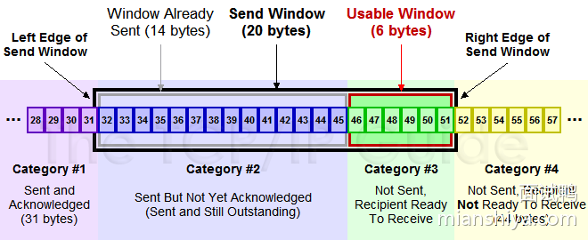

图中的 #1 是已收到 ACK 的数据，#2 是已经发出去但是还没收到 ACK 的数据，#3 就是在窗口内可以发送但是还没发送的数据。#4 就是还不能发送的数据。

然后此时收到了 36 的 ACK，并且发出了 46-51 的字节，于是窗口向右滑动了。

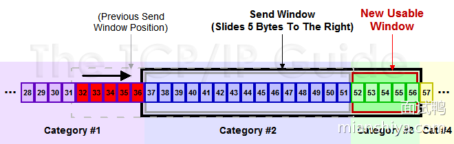

TCP/IP Guide 上还有一张完整的图，画的十分清晰，大家看一下。

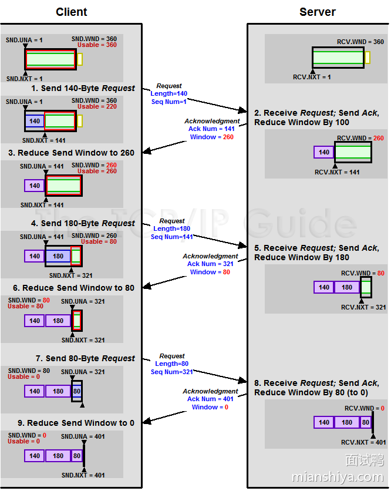

##### 已经有滑动窗口了为什么还要拥塞控制？

滑动窗口仅根据接收方的处理能力进行调节，主要防止接收端因处理不及时导致的数据丢失或阻塞。

而拥塞控制（Congestion Control）是为了防止网络本身的拥塞情况，即在网络中出现过载时，调节发送方的传输速率以避免进一步加剧拥塞。即使接收方有足够的处理能力，网络中途路由器和链路的负载仍可能造成数据丢失和延迟，因此需要拥塞控制机制来应对。

### TCP 有超时重传为什么还需要快速重传机制？ 

#### 回答重点

因为超时重传局限性，它是按时间来驱动的，如果是网络状况真的不好的情况，超时重传没问题，但是如果网络状况好的时候，只是恰巧丢包了，那等这么长时间就没必要。

所以又引入了数据驱动的重传叫快速重传，它的设计初衷是为了在检测到丢包的情况下，尽快重传丢失的数据包，而不必等待超时计时器的触发。

它通过检测三个或更多的重复 ACK，认为数据包丢失，从而触发立即重传。

因为连续收到三次相同 ACK 证明当前网络状况是 ok 的，那么确认是丢包了，于是立马重发，没必要等这么久。

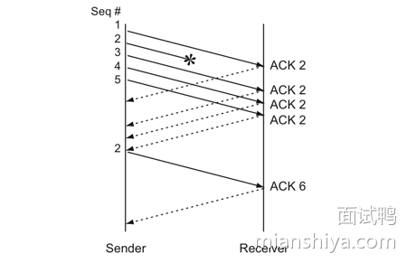

通过快速重传，TCP 能够更快地恢复丢失的数据包，减少重传等待时间，提升数据传输的整体效率，特别是在网络条件良好的情况下。

### TCP 中何时会出现 RST（reset）报文？

#### 回答重点

> `RST`（reset）报文是一种用来强制终止连接的标志。

主要出现在以下几种情况下：

1. **端口未监听**：当主机接收到一个发往没有在监听的端口的 TCP 数据包时，会回复一个 `RST` 报文来告知发送方该端口不可用。
2. **连接异常关闭后**：如果一方出现崩溃、强制退出或被其他因素干扰导致连接中断，TCP 会使用 `RST` 报文来通知对方连接已无法继续。（例如服务端断电重启后，客户端再次通过之前的连接请求，就会被返回一个 `RST`）。
3. **数据包冲突**：当某一方接收到的序列号不在预期范围内时，可能会发送 `RST` 报文以重置连接。
4. **重置无效的连接请求**：当主机收到与当前连接状态不符的请求时，例如在未建立连接时收到 `FIN` 报文，会发送 `RST` 报文表示无效。

除此之外还有主动发送 `RST`，用来强行终止一条连接。

#### 扩展知识

##### RST 报文的作用

`RST` 报文是 TCP 提供的一种快速、强制关闭连接的方式，用于异常情况下的连接终止。相对于正常的 `FIN` 关闭过程，`RST` 更加“暴力”，不会等待缓冲区中的数据传输完成，因此适用于对数据完整性要求不高的场景。

##### 应用场景中的 `RST` 报文

在实际应用中，防火墙或负载均衡器可能会使用 `RST` 报文来控制连接。例如，在流量控制或安全策略中，当判断客户端不再被允许访问时，会通过发送 `RST` 报文来强制断开连接。

### TCP 超时重传机制是为了解决什么问题？ 

#### 回答重点

因为 TCP（传输控制协议）是一种面向连接的协议，需要保证数据可靠传输。

而在数据传输过程中，由于网络拥塞、链路错误、路由器或主机故障等原因，数据包可能会丢失或延迟到达目的地。

因此若未在指定时间内收到对方的确认应答（ACK），则认为该数据包可能已经丢失，此时会触发超时重传机制，重新发送该数据包，以确保数据的可靠到达。

#### 扩展知识

##### TCP ACK 确认号

TCP 的可靠性是靠确认号的，比如我发给你1、2、3、4这4个包，你告诉我你现在要 5 那说明前面四个包你都收到了，就是这么回事儿。

不过这里要注意，SeqNum 和 ACK 都是**以字节数为单位的**，也就是说假设你收到了1、2、4 但是 3 没有收到你不能 ACK 5，如果你回了 5 那么发送方就以为你 5 之前的都收到了。

所以**只能回复确认最大连续收到包**，也就是 3。

##### 超时重传的时间 RTO

接着上面的例子说，发送方不清楚 3、4 这两个包到底是还没到呢还是已经丢了，于是发送方需要等待，这等待的时间就比较讲究了。

如果太心急可能 ACK 已经在路上了，你这重传就是浪费资源了，如果太散漫，那么接收方急死了，这死鬼怎么还不发包来，我等的花儿都谢了。

所以这个等待超时重传的时间很关键，怎么搞？聪明的小伙伴可能一下就想到了，你估摸着正常来回一趟时间是多少不就好了，我就等这么长。

这就来回一趟的时间就叫 RTT，即`Round Trip Time`，然后根据这个时间制定超时重传的时间 RTO，即 `Retransmission Timeout`。

RTO 具体要怎么算？首先肯定是采样，然后一波加权平均得到 RTO。

RFC793 定义的公式如下：

> 1、先采样 RTT
>
> 2、SRTT = ( ALPHA * SRTT ) + ((1-ALPHA) * RTT)
>
> 3、RTO = min[UBOUND,max[LBOUND,(BETA*SRTT)]]

ALPHA 是一个平滑因子取值在 0.8-0.9之间，UBOUND 就是超时时间上界-1分钟，LBOUND 是下界-1秒钟，BETA 是一个延迟方差因子，取值在 1.3-2.0。

但是还有个问题，RTT 采样的时间用一开始发送数据的时间到收到 ACK 的时间作为样本值还是重传的时间到 ACK 的时间作为样本值？

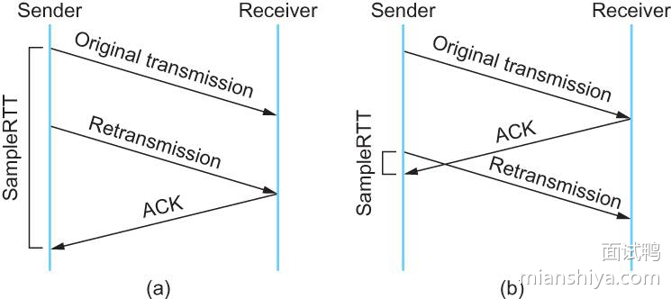

从图中就可以看到，一个时间算长了，一个时间算短了，这有点难，因为你不知道这个 ACK 到底是回复谁的。

所以怎么办？**发生重传的来回我不采样不就好了**，我不知道这次 ACK 到底是回复谁的，我就不管他，我就采样正常的来回。

这就是 Karn / Partridge 算法，不采样重传的 RTT。

但是不采样重传会有问题，比如某一时刻网络突然就是很差，你要是不管重传，那么还是按照正常的 RTT 来算 RTO， 那么超时的时间就过短了，于是在网络很差的情况下还疯狂重传加重了网络的负载。

因此 Karn 算法就很粗暴的搞了个发生重传我就将现在的 RTO 翻倍，就是这么简单粗暴。

但是这种平均的计算很容易把一个突然间的大波动，平滑掉，所以又搞了个算法，叫 Jacobson / Karels Algorithm。

它把最新的 RTT 和平滑过的 SRTT 做了波计算得到合适的 RTO，公式我就不贴了，仅做了解即可。

### 除了四次挥手，还有什么方法断开连接？

#### 回答重点

1）**RST（Reset）标志**：

- 使用 TCP RST 标志可以强制立即终止连接。发送方可以直接发送带有 RST 标志的 TCP 报文，通知对方立即断开连接。

2）**超时（Timeout）**：

- 如果连接一段时间内没有任何数据包传输，连接双方可以依据设定的超时时间自动断开连接。

#### 扩展知识

**RST 的应用场景**：

- **异常关闭**：当遇到程序异常或攻击时，RST 可用于立即中止连接，不经过正常的四次挥手。例如，在入侵检测系统中，RST 可用于主动切断可疑连接。
- **防火墙**：有些防火墙或安全设备会通过发送 RST 来强制终止不允许的连接。

**超时机制**：

- **TCP Keepalive**：TCP 可以配置 `keepalive` 参数，通过定期发送探测报文检查连接是否活跃。如果对方没有响应多次探测，连接将自动断开。
- **应用层超时**：许多应用层协议（如 HTTP、FTP）实现了自定义的超时机制，能够在长时间无响应后关闭连接，以节省资源。
- [681. 说说 TCP 的四次挥手？](https://www.mianshiya.com/question/1780933295740055554)
- [684. 为什么 TCP 挥手需要有 TIME_WAIT 状态?](https://www.mianshiya.com/question/1780933295748444163)

### 说说 TCP 的四次挥手？

#### 回答重点

TCP 的四次挥手是用于安全关闭一个已建立的连接的过程，它确保双方都能完成数据传输并安全地释放连接资源。

简述步骤：

1）第一次挥手（FIN → ACK）：客户端主动关闭连接，发送 FIN 包，进入 FIN_WAIT_1 状态。服务器收到 FIN 后，表示不再接收数据，但仍可能继续发送数据。

2）第二次挥手（ACK）：服务器发送 ACK 包，确认已收到 FIN。此时服务器进入 CLOSE_WAIT 状态，客户端进入 FIN_WAIT_2 状态。

3）第三次挥手（FIN → ACK）：服务器完成所有数据传输后，发送 FIN 包，进入 LAST_ACK 状态。客户端收到 FIN 后，准备关闭连接。

4）第四次挥手（ACK）：客户端发送最后一个 ACK 包，进入 TIME_WAIT 状态，等待可能迟到的 FIN 包。服务器收到 ACK 后，关闭连接，进入 CLOSED 状态。客户端在 TIME_WAIT 计时结束后（2MSL），正式关闭连接。

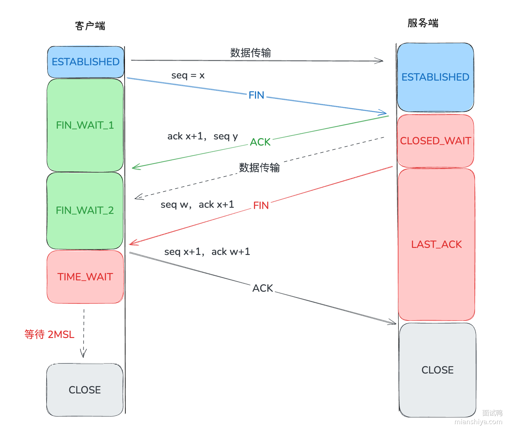

#### 面试追问

##### 为什么挥手需要四次？

主要是为了**确保数据完整性**。

TCP 是一个全双工协议，也就是说双方都要关闭，每一方都向对方发送 FIN 和回应 ACK。

客户端发起连接断开，代表客户端没数据要发送的，但是服务端可能还有数据没有返回给客户端。

就像我对你说我数据发完了，然后你回复好的你收到了。然后你对我说你数据发完了，然后我向你回复我收到了。这样才能保证数据不会丢失。

所以一个 FIN + ACK 代表一方结束数据的传输，因此需要两对 FIN + ACK，加起来就是四次通信。

##### 挥手一定需要四次吗？

**不一定，有时候可以变成三次挥手**。

看下这张图：

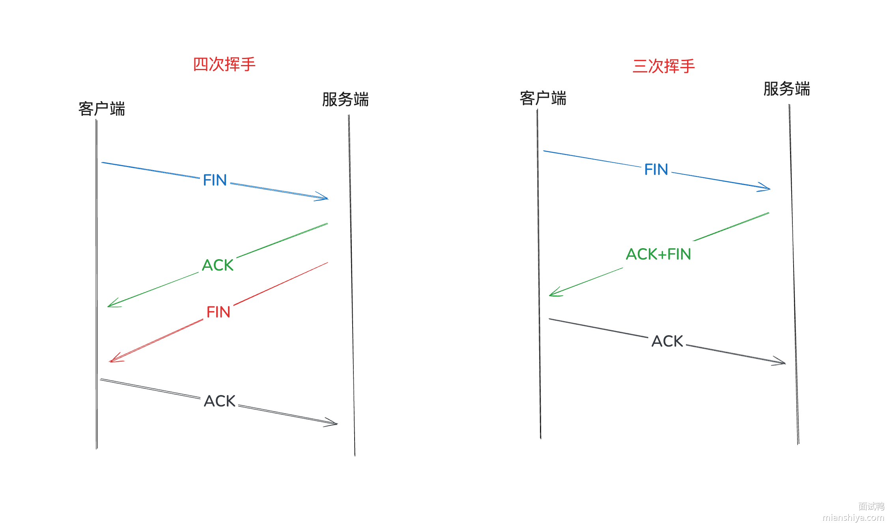

正常的四次挥手流程应该很熟悉了，但是思考一下，如果 Client 发送 FIN 给 server 的时候 server 已经没数据发送给 Client 了，**那么 Server 就可以将 ACK 和它的 FIN 一起发给 Client** ，这样一来不就变成三次挥手了吗？

### 说说 TCP 的三次握手？

#### 回答重点

具体流程文字描述就是：客户端首先发送一个SYN（同步序列编号）消息给服务器，服务器收到后回复一个SYN-ACK（同步序列编号-确认）消息，最后客户端再发送一个ACK（确认）消息确认服务器已经收到SYN-ACK消息，从而完成三次握手，建立起一个可靠的TCP连接。

来看下这个图：

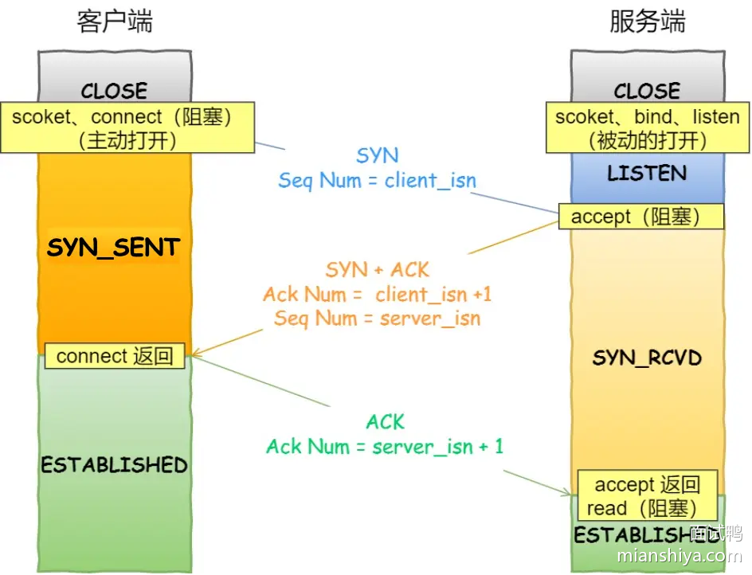

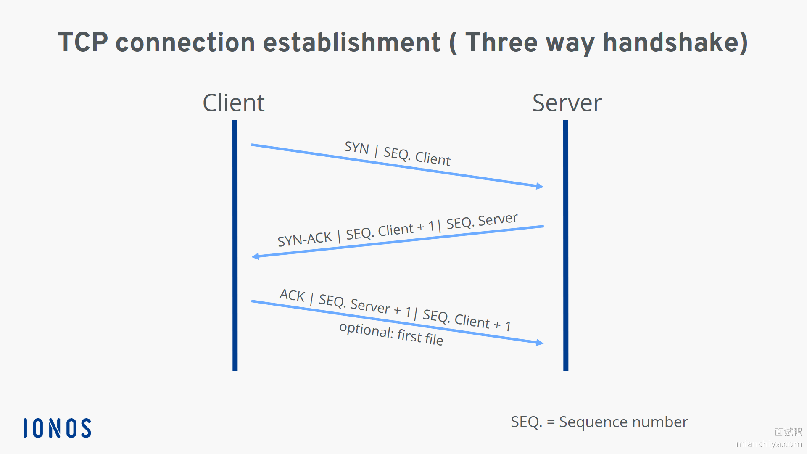

#### 扩展知识

##### 为什么需要三次握手？

有两个原因：

- 避免历史错误连接的建立，减少通信双方不必要的资源消耗
- 帮助通信双方同步初始化序列号

##### 避免历史错误连接的建立

[RFC 793](https://www.rfc-editor.org/rfc/rfc793) 明确指出了使用三次握手的首要原因是：**为了阻止历史的重复连接初始化导致的混乱**。

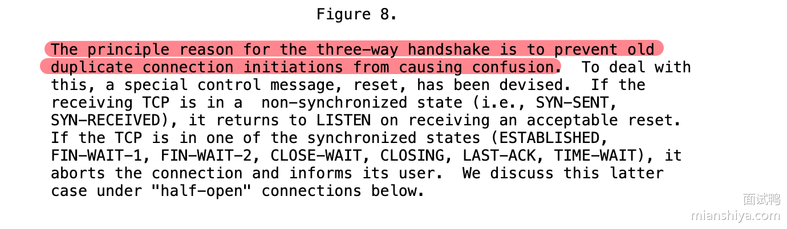

> 为什么三次能阻止这个问题？

实际上很好理解。

因为网络情况比较复杂，发送方第一次发送请求后，可能由于网络原因被阻塞住了，此时发送方可能又会再次发送请求。

**如果握手只有两次**，那么接收方应对发送方的请求只能拒绝或者接受，但是**它无法识别当前的请求是旧的请求还是新的请求**。

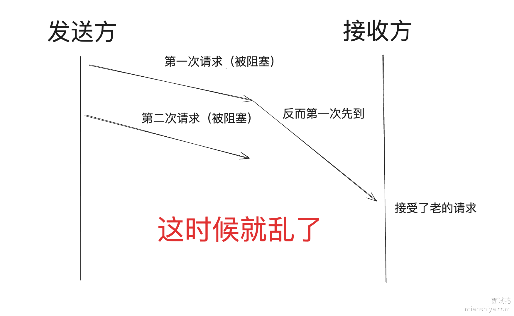

并且如果网络阻塞时间较长，**发送方可能多次发送请求，且接收方还可能全部接受这些连接（它不清楚，以为都是有效的），这就造成了不必要的资源的浪费**。

如果要避免这种情况发生，两次通信是不够的。发送方需要知晓接收方到底接受了哪个连接，如果接受的是老连接，那么发送方需要告知接收方，这个连接不对！也就是 RST 通知。如果对，那么就返回 ACK 告诉接收方 OK！这就使得一次握手至少需要 3 次。

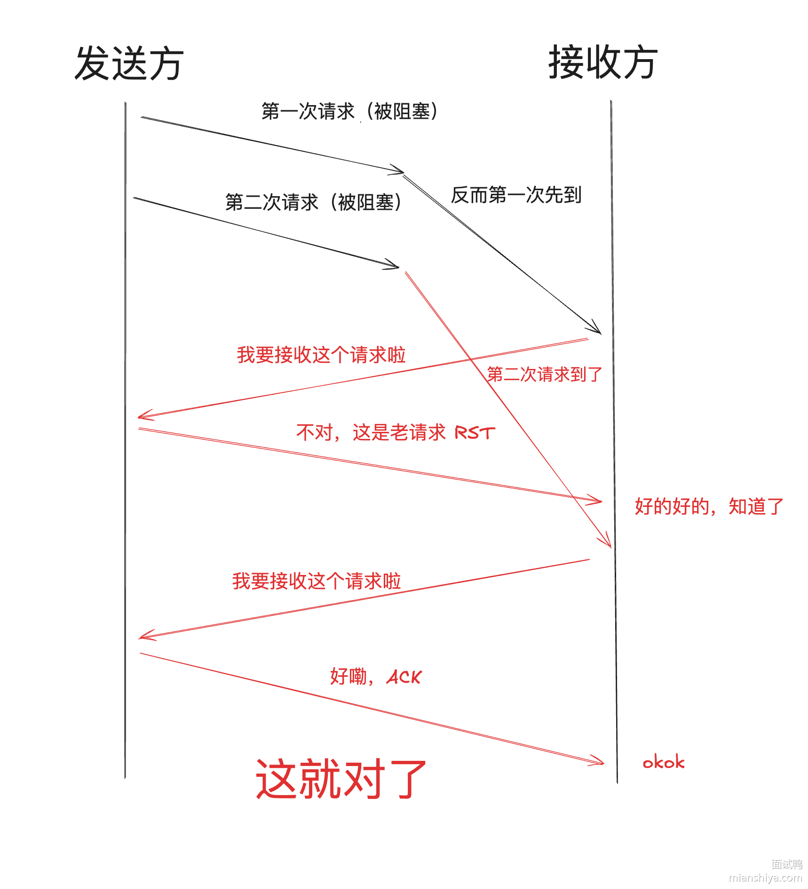

因此三次握手，多了一次发送方确认接收方接受的连接是否正确的验证过程，所以避免了历史重复连接的错误情况。

##### 帮助通信双方同步初始化序列号

因为网络本身的不稳定性可能为导致：

- 数据丢失
- 数据重复传输
- 数据乱序

而 TCP 是一个可靠传输协议，它需要保证数据不丢失且有序的传输。基于上述的问题，TCP 引入了序列号，它使得：

- 接收方可以根据序列号去重
- 接收方可以根据序列号排序
- 发送方针对为接收到 ACK 的序列号对应的数据包，可以重传

序列号是有序的，因此在通信的初始化阶段，双方就需要同步序列号，不然数据后面就都对不上了。

那如何同步呢？看下下面这个图：

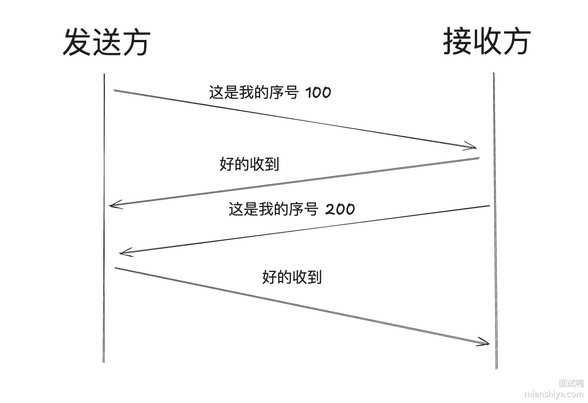

这好像四次了？如果真的按一来一回就是四次，**但是中间一步可以合并**，就是接收方告知发送方收到初始序号的同时将自己的初始序号告诉发送方。

因此四次握手就可以减到三次了。

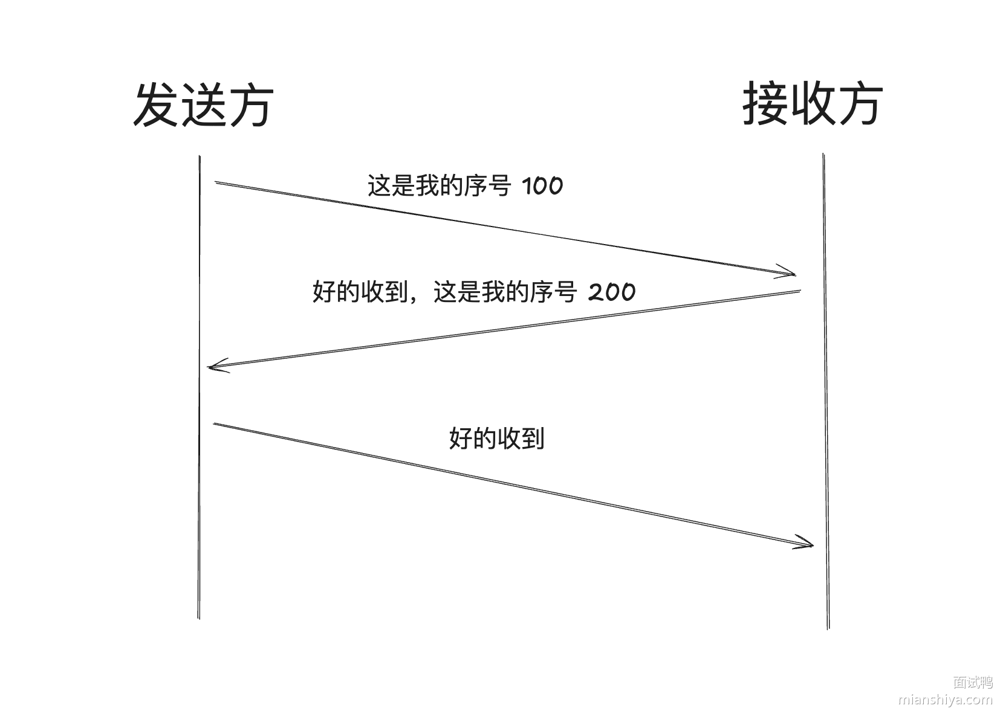

通俗理解后，我们再看下这张图：


- 发送方通过 SYN 控制消息并携带自己期望的初始序列号 SEQ 给接收方
- 接收方收到 SYN 消息之后，通过 ACK 控制消息以及 SEQ+1 来进行确认，并带上自己的 SEQ
- 发送方通过 ACK 控制消息以及接收方的 SEQ+1 来进行确认，**并且还能够在第三次握手通信的同时，直接携带数据进行传输**

##### 为什么不是两次握手？

这个在上述的扩展已经解释了，因为两次握手无法阻止历史连接的建立，使得资源的浪费，也不能正确地同步序列号。

##### 为什么不是四次握手？

理论上 3 次以上的握手都行，但是 3 次就已经够用了，没必要选择更多的握手次数。

### TCP 协议是如何保证可靠传输的？ 

#### 回答重点

TCP（传输控制协议）是一种面向连接的、可靠的传输层协议。它有一系列机制来保证数据在不可靠的网络环境中能够可靠地传输。

##### **1. 面向连接**

**三次握手建立连接**：

- 在数据传输之前，TCP 使用三次握手（SYN、SYN+ACK、ACK）确保双方都准备好通信。

**四次挥手断开连接**：

- 数据传输完成后，TCP 使用四次挥手（FIN、ACK、FIN、ACK）优雅地关闭连接，确保数据传输完成且资源被正确释放。

##### **2. 数据分段与重组**

**分段传输**：

- TCP 将应用层的大块数据分割成适合网络传输的小段（每个段称为一个 TCP 报文段），并为每个报文段分配一个序列号。

**按序重组**：

- 接收方根据序列号将接收到的数据段重新排序，从而恢复原始数据流。

##### **3. 确认应答机制（ACK）**

**确认应答**：

- 每个发送的数据段都会被接收方确认，接收方通过 ACK 报文通知发送方哪些数据已经成功接收。
- 如果发送方在一定时间内未收到某个数据段的 ACK，则会触发重传机制。

##### **4. 超时重传机制**

**超时计时器**：

- 发送方为每个发送的数据段启动一个计时器。如果在计时器到期之前没有收到对应的 ACK，则认为该数据段可能丢失，并重新发送该数据段。

**动态调整超时时间**：

- 根据网络状况动态计算超时时间（RTO，Retransmission Timeout），以提高效率。

##### **5. 流量控制**

**滑动窗口机制**：

- TCP 使用滑动窗口机制来控制发送方向接收方发送数据的速率。
- 接收方通过 `window` 字段告诉发送方其当前可用的接收缓冲区大小，避免发送方发送过多数据让接收方无法处理。

##### **6. 拥塞控制**

**慢启动**：

- 初始阶段，发送方以较低的速率发送数据，逐渐增加发送速率，直到达到网络的最大承载能力。

**拥塞避免**：

- 当检测到网络拥塞（如丢包）时，降低发送速率以缓解网络压力。

**快速重传与快速恢复**：

- 当发送方连续收到三个重复的 ACK 时，立即重传丢失的数据段，而不需要等待超时。
- 快速恢复机制允许发送方在发生丢包后迅速恢复正常传输速率。

##### **7. 校验和（Checksum）**

**数据完整性校验**：

- 每个 TCP 报文段包含一个校验和字段，用于检测数据在传输过程中是否发生错误。
- 接收方对接收到的数据进行校验，若校验失败则丢弃该数据段。

##### **8. 序列号与确认号**

**序列号**：

- 每个字节的数据都有唯一的序列号，用于标识数据段的顺序。

**确认号**：

- 接收方通过确认号告知发送方下一次期望接收的数据的序列号，从而实现按序接收。

##### **9. 连接管理**

**半关闭机制**：

- 在 TCP 连接中，一方可以先关闭自己的发送通道，但仍能接收对方的数据，直到对方也关闭连接。

**TIME_WAIT 状态**：

- 在连接关闭后，主动关闭的一方会进入 TIME_WAIT 状态，等待一段时间以确保所有数据段都被正确处理，避免旧数据干扰新连接。

总结一下

| **机制**            | **作用**                                               |
| ------------------- | ------------------------------------------------------ |
| **面向连接**        | 通过三次握手和四次挥手确保连接的建立与关闭是可靠的。   |
| **数据分段与重组**  | 将数据分段并按序重组，保证数据完整性和顺序性。         |
| **确认应答（ACK）** | 接收方确认已收到的数据，发送方根据 ACK 决定是否重传。  |
| **超时重传**        | 当数据段未被确认时，发送方重新发送数据段。             |
| **流量控制**        | 使用滑动窗口机制避免发送方发送过多数据导致接收方过载。 |
| **拥塞控制**        | 动态调整发送速率，避免网络拥塞导致丢包。               |
| **校验和**          | 检测数据在传输过程中是否发生错误，确保数据完整性。     |
| **序列号与确认号**  | 通过序列号和确认号确保数据按序传输并被正确接收。       |
| **连接管理**        | 确保连接的建立与关闭过程可靠，避免数据丢失或混乱。     |

#### 扩展知识

握手和挥手

- [2547. 描述 TCP 三次握手和四次挥手的过程及其原理。](https://www.mianshiya.com/question/1811361110423543810)

ACK 相关

- [689. TCP 的 SACK 的引入是为了解决什么问题？](https://www.mianshiya.com/question/1780933295773609986)

拥塞控制

- [693. 说说 TCP 拥塞控制的步骤？](https://www.mianshiya.com/question/1780933295781998594)

流量控制

- [691. TCP 滑动窗口的作用是什么？](https://www.mianshiya.com/question/1780933295777804290)

超时重传

- [687. TCP 超时重传机制是为了解决什么问题？](https://www.mianshiya.com/question/1780933295761027073)

### 什么是 SYN Flood 攻击？

#### 回答重点

SYN Flood 是一种拒绝服务攻击（DoS），攻击者通过发送大量的 SYN（连接请求）包来耗尽服务器的资源，从而使服务器无法响应用户的连接请求。

攻击是利用了 TCP 三次握手的机制，攻击者发送了大量的 SYN 包，但不完成后续的握手步骤（不发送 ACK），导致服务器在等待未完成连接的状态下耗尽资源。

#### 扩展知识

##### TCP 三次握手原理与攻击利用

一般情况下，SYN 超时需要耗费服务端 [63s](https://www.mianshiya.com/question/1780933295735861250) 的时间断开连接，也就说 63s 内服务端需要保持这个资源，所以不法分子就可以构造出大量的 client 向 server 发 SYN 但就是不回 server。

##### 正常三次握手：

- 客户端发送 SYN 包请求连接。
- 服务器收到 SYN 包后，返回 SYN+ACK 包，表示同意连接并等待客户端确认。
- 客户端收到 SYN+ACK 包后，发送 ACK 包确认，连接建立。

##### SYN Flood 攻击：

- 攻击者只发送第一步的 SYN 包，并伪造源 IP 地址，使服务器无法收到正确的 ACK 包。
- 服务器保持在等待 ACK 的 SYN-RECEIVED 状态，资源被逐步耗尽。

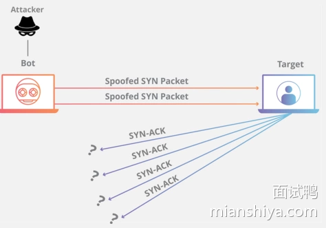

##### 如何防御 SYN Flood ？

1）SYN Cookies

SYN Cookies 是一种防御技术，根据第一次握手的客户端信息，生成 cookies，随着第二次握手返回给客户端，后续客户端第三次握手时带上 cookies，最终建连。这个过程是不会使用 SYN 队列。

从而预防了攻击。

2）缩短连接超时时间：

通过缩短 SYN-RECEIVED 状态的超时时间，可以更快地释放未完成连接，从而降低资源占用。

即调整 `tcp_synack_retries` ，减少重试的次数。

3）TCP 半连接队列扩展：

增大服务器的 TCP 半连接队列，使其能够容纳更多的未完成连接，从而提高抵抗攻击的能力。

设置 `tcpmaxsyn_backlog` 增加 SYN 队列数，并设置 `tcp_abortonoverflow` SYN 队列满了直接拒绝连接。

### TCP 三次握手时，发送 SYN 之后就宕机了会怎么样？

#### 回答重点

Client 发送 SYN 至 Server 之后宕机了，此时 Server 发送 SYN+ACK 就一直得不到回复，此时会进行阶段性重试，多次重试后还没有收到 ACK 则会断开连接，释放资源。

重试次数由系统参数 `tcp_synack_retries` 决定。在 Linux 中就是默认重试 5 次，并且就是阶梯性的重试，间隔就是1s、2s、4s、8s、16s，再第五次发出之后还得等 32s 才能知道这次重试的结果，所以说总共等 63s 才能断开连接。

#### 扩展

##### **在 Linux 中设置 `tcp_synack_retries` 参数的方法**

1）**查看当前参数值**：

可以使用以下命令查看当前系统中 `tcp_synack_retries` 的值：

```bash
sysctl net.ipv4.tcp_synack_retries
```

或者：

```bash
cat /proc/sys/net/ipv4/tcp_synack_retries
```

2）**临时设置 `tcp_synack_retries`**：

如果你想临时更改此参数，可以使用 `sysctl` 命令。该设置会在下次系统重启后失效。

```bash
sudo sysctl -w net.ipv4.tcp_synack_retries=3
```

在上述命令中，`3` 是想设置的重试次数。

3）**永久设置 `tcp_synack_retries`**：

要使更改永久生效，需要将参数添加到 `/etc/sysctl.conf` 文件中。

编辑 `/etc/sysctl.conf` 文件：

```bash
sudo nano /etc/sysctl.conf
```

添加或修改以下行：

```bash
net.ipv4.tcp_synack_retries = 3
```

保存并退出编辑器，然后执行以下命令应用更改：

```bash
sudo sysctl -p
```

##### **注意**

- **参数范围**：`tcp_synack_retries` 参数的有效值通常在 0 到 255 之间。典型设置值为 3 或 5。
- **调优目的**：在高并发环境或低延迟需求下，减少 `tcp_synack_retries` 的值可能有助于更快地释放资源，**但过低的值可能导致合法连接被过早放弃。**