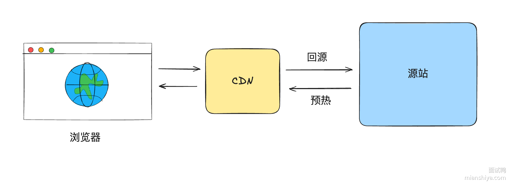
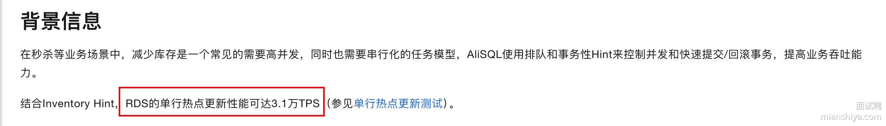
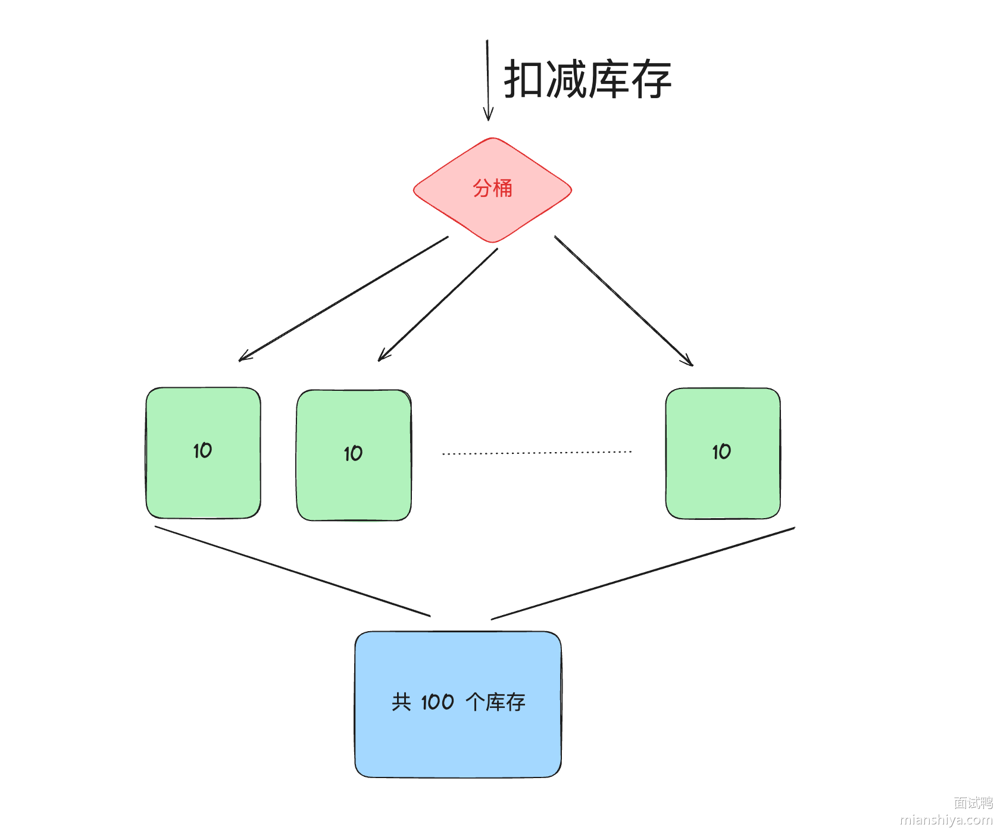
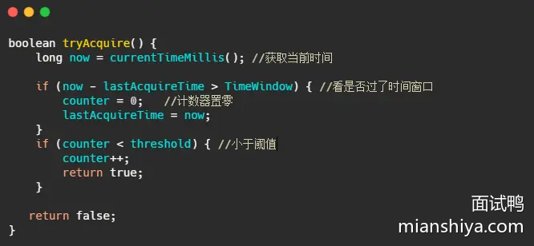

# 小米虫宝典

## 场景题

### MySQL 中 如果我 select * from 一个有 1000 万行的表，内存会飙升么？ 

#### 回答重点

内存不会飙升。

因为 MySQL 在执行简单 `SELECT * FROM` 查询时，**不会一次性将所有 1000 万行数据加载到内存中，而是通过逐批次处理的方式来控制内存使用。也就是说 MySQL 是边查边发送数据给客户端**。

分批的大小与 `net_buffer_length` 有关，默认 16384 字节（16 KB）。

所以实际上获取数据和发送数据的流程是这样的：

- 获取一行，写入到 `net_buffer` 中。
- 重复获取行，直到 `net_buffer` 写满，调用网络接口发出去。
- 发送成功后 清空 `net_buffer`。
- 再继续取下一行，并写入 `net_buffer`，继续上述的操作。

这里还需要注意一点，发送的数据是需要被客户端读取的，如果客户端读取的慢，导致本地网络栈（socket send buffer）写满了，那么当前数据的写入会被暂停。

综上，**`SELECT \* FROM` 一个有 1000 万行的表，不会导致内存飙升**。

#### 扩展知识

##### 注意 ORDER BY 和 GROUP BY

正常不需要排序和分组的查询不会占用过多的数据和影响 MySQL Server 的执行，但是如果涉及到分组和排序，那么就需要使用额外的内存（或外部空间）来处理全量数据，可能会占用额外的内存并影响查询的效率。

- [617. MySQL 中的数据排序是怎么实现的？](https://www.mianshiya.com/question/1780933295526146049)

##### 客户端的处理方式

虽然 MySQL 会分批返回数据，但是客户端需要做一定的处理，不能全量保存数据，否则可能会导致内存溢出。

客户端需要使用流式处理或者游标来查询。

- 在编写查询代码时，使用流式读取方式（如 JDBC 中的 ResultSet.FETCH_SIZE），这会让数据库逐步返回数据，客户端按需处理。

**JDBC 简单示例**，重点就是 `statement.setFetchSize(Integer.MIN_VALUE)`;

```java
// 获取数据库连接并开启流式处理
try (Connection connection = DriverManager.getConnection(URL, USER, PASSWORD)) {
    // 禁用自动提交，避免结果集完全缓存到内存
    connection.setAutoCommit(false);

    // 创建一个可以进行流式处理的 Statement
    try (PreparedStatement statement = connection.prepareStatement(query,
            ResultSet.TYPE_FORWARD_ONLY, ResultSet.CONCUR_READ_ONLY)) {
        // 设置流式处理的关键：MySQL 特定配置
        statement.setFetchSize(Integer.MIN_VALUE);

        // 执行查询
        try (ResultSet resultSet = statement.executeQuery()) {
            while (resultSet.next()) {
                // 获取每行数据，这里假设有 "id" 和 "name" 两列
                int id = resultSet.getInt("id");
                String name = resultSet.getString("name");

                // 处理数据（例如打印出来）
                System.out.printf("ID: %d, Name: %s%n", id, name);
            }
        }
    }
} catch (SQLException e) {
    e.printStackTrace();
}
        
```

**MyBatis 简单示例**，重点就是 `session.getConfiguration().setDefaultFetchSize(Integer.MIN_VALUE)`;

```java
try (SqlSession session = sqlSessionFactory.openSession()) {
    // 设置 fetchSize 为 Integer.MIN_VALUE 启用流式查询
    session.getConfiguration().setDefaultFetchSize(Integer.MIN_VALUE);

    // 获取 Mapper
    LargeTableMapper mapper = session.getMapper(LargeTableMapper.class);

    // 使用 ResultHandler 处理数据，逐行读取
    mapper.selectAll(resultContext -> {
        LargeTableRecord record = resultContext.getResultObject();
        System.out.printf("ID: %d, Name: %s%n", record.getId(), record.getName());
        // 可以在这里对数据进行处理，避免一次性加载到内存
    });
}
```

**MyBatis 游标查询示例**，重点就是使用 `Cursor` 接口

```java
try (SqlSession session = sqlSessionFactory.openSession()) {
    // 获取 Mapper
    LargeTableMapper mapper = session.getMapper(LargeTableMapper.class);

    // 使用游标查询数据
    try (Cursor<LargeTableRecord> cursor = mapper.selectAllWithCursor()) {
        for (LargeTableRecord record : cursor) {
            System.out.printf("ID: %d, Name: %s%n", record.getId(), record.getName());
            // 可以在这里对数据进行处理，避免一次性加载到内存
        }
    }
}
```

##### 一次性查询大量数据对 MySQL BufferPool 的影响

BufferPool 实现了一个冷热分区的 LRU

- [BufferPool 知识](https://www.mianshiya.com/bank/1791003439968264194/question/1780933295555506177#heading-5)

### 如何设计一个秒杀功能？ 

#### 回答重点

> 面试官针对这个问题不指望候选人可以系统地回答出完且可落地的方案。只是想考察候选人是否拥有高并发大流量场景下的处理思路或者说能考虑到的一些关键点。

针对秒杀场景，我们需要先和面试官说出以下几个需要解决的问题点：

1. 瞬时流量的承接
2. 防止超卖
3. 预防黑产
4. 避免对正常服务的影响
5. 兜底方案

然后可以从前后端两个视角向面试官阐述整体的设计点：

首先是前端：

- 利用 CDN 缓存静态资源（秒杀页面的 HTML、CSS、JS 等），减轻服务器的压力
- 客户端限流，在前端随机限流，降低请求量
- 按钮防抖，防止用户重复多次点击发出大量请求

其次是后端：

- Nginx（或其他接入层）做统一接入，负载均衡与流量过滤、限流
- 业务端限流，可以自定义实现本地 guava 限流或利用 sentinel 等
- 服务拆分，将秒杀功能拆分为独立的服务，避免对现有服务产生影响
- 秒杀数据的拆分和缓存，缓存可以使用分布式缓存或本地缓存方案，且需要缓存预热
- 精准地库存扣减，防止超卖发生
- 风控识别黑产，进行流量防控且需要动态黑名单机制
- 验证码、答题等手段预防脚本刷单
- 幂等操作，防止重复下单
- 业务手段降低并发量，例如通过预约、预售。
- 兜底方案，如果服务压力过大或者代码有漏洞，那么关闭秒杀直接返回秒杀结束，降低服务压力及时止损。

#### 详细分析

##### 瞬时流量的承接

一般情况下，秒杀的流量特性就是**持续性短**和**大**。

流量集中在活动即将开始的时候，会有很多用户开始持续性地刷新页面。前端资源的访问也需要损耗大量的资源，因此需要利用 CDN 缓存秒杀页面的一些静态资源，将这部分压力给到 CDN 厂商。

并且静态资源放在 CDN 厂商那之后，地理位置也距离用户更近，用户访问也就更快，体验上也更好！



秒杀页面可手动推给 CDN 预热。

秒杀流量还有个特点，就是**大部分请求实际都是无效的**，因为秒杀的商品库存往往都是个位数，而抢购的用户是其成千上万倍。

假设有 100 万的请求来抢购一台 iPhone，那么需要放这 100 万请求直接打到后端服务吗？显然不需要。

针对这个情况，我们就需要**层层过滤请求**。

例如前面提到的客户端限流，即在前端随机限流，降低请求量。说的更直白一些即部分用户点击抢购按钮，但是请求都发不到后端，直接前端代码返回秒杀结束。（如果预测量是在太大，可以这样操作，毕竟也是随机的）

如果前端请求发出来了，那么可以利用 nginx 统一接入，针对更大的流量可以在 nginx 前面再加 lvs。

lvs 四层转发请求打到多台 nginx 上， nginx 再负载均衡到多台后端服务，且 nginx 有限流功能，例如 ip 限流，还可以配置黑名单等等，其实已经可以拦截大量请求流量。

请求到达后端服务之前还可以再进行限流，比如使用 sentinel 再拦截一道。

最终请求打到后端服务，涉及到一些读取数据和写数据的操作。如果量级不大且数据库配置高，理论上可以用数据库来承接（数据库层面也是有优化的，后面介绍）。

这时候也可以利用缓存来承接读写，可以用本地缓存或分布式缓存，如 Redis。

最终一个相对而言比较完整的请求链路如下：


我把 DNS 解析也加上了，因为对一些大公司而言，DNS 其实也是一个分流的手段。

在量级没这么大的情况下，实际上的秒杀架构不需要如上图所示，例如不需要引入 lvs、本地缓存之类的。

##### 库存扣减设计

先看一下正常扣减库存的思路：


这样的设计会有什么问题？**并发问题，导致超卖**。


此时可以加锁，比如利用数据库的锁，针对这个场景数据库常用的是乐观锁。

```sql
update inventory set available_inventory = available_inventory - 1
where sku_id = 1 and available_inventory > 0;
```

###### 数据库热点行问题解决方案

如果使用这个语句，在高并发场景下，实际上就会产生**热点行**问题。

我之前公司基于数据库扣减方案，压测单台机子下单链路的并发只能达到 70。单个扣减库存的接口并发只有 200 就把数据库 CPU 压满了。（各公司实际内部业务不同，仅供参考）

**数据库补丁优化**

我们当时数据库用的是阿里云的 RDS，实际上有一个可落地的优化方案：`Inventory hint` + `Returning`。

如果你公司本身用的就是阿里云的 RDS，这个改造成本就很低，仅需在 SQL 上填写一些 hint 即可。

在 SQL 表名前加 `/*+ COMMIT_ON_SUCCESS ROLLBACK_ON_FAIL   TARGET_AFFECT_ROW(1)*/`

```sql
update /*+ COMMIT_ON_SUCCESS ROLLBACK_ON_FAIL
  TARGET_AFFECT_ROW(1)*/ inventory 
 set available_inventory = available_inventory - 1
where sku_id = 1 and available_inventory > 0;
```

`Inventory hint` 原理简单介绍：

- COMMIT_ON_SUCCESS：当前语句执行成功就提交事务上下文。
- ROLLBACK_ON_FAIL：当前语句执行失败就回滚事务上下文。
- TARGET_AFFECT_ROW(NUMBER)：如果当前语句影响行数是指定的就成功，否则语句失败。

设置了这几个 hint 后，当前的语句会按照主键（或唯一键）分组，将相同行的请求修改分为一组，分组后仅组内第一条 SQL 需要抢锁，后续的都不需要申请锁，减少申请锁的流程。

然后组内第一条 SQL 已经遍历 B+树查询到数据了，后续组内库存扣减直接改即可，不用再次查询。且组内 SQL 都修改完之后，仅需一次分组提交事务即可。

根据阿里云介绍，结合 `Inventory hint` 单行 TPS 可达 3.1w：



还可以配合 `Returning` 使用：

```sql
CALL dbms_trans.returning("*", "update /*+ COMMIT_ON_SUCCESS ROLLBACK_ON_FAIL
  TARGET_AFFECT_ROW(1)*/ inventory 
 set available_inventory = available_inventory - 1
where sku_id = 1 and available_inventory > 0;");
```

正常情况下，如果我们 update 扣减了一次库存之后，如果想得知最新的库存，那么需要再执行一次 select 操作，而 `Returning` 可以直接返回实时的库存，减少一次查询。

利用 `Returning`，我们可以得知实时的库存，发现没库存后，可以直接设置一个标志位，表明秒杀已经结束，快速 fail 请求，降低服务的压力。

还有一个 `Statement queue` 我之前没用到，关于这几个 hint 的详情，可以查看这个[介绍链接](https://www.alibabacloud.com/help/zh/rds/apsaradb-rds-for-mysql/inventory-hint#section-e99-qg7-ceh)

**库存拆分**

除了数据库补丁优化，从业务角度，我们可以将库存进行拆分。

上面举例是 1 个库存，但有时候的秒杀的库存会更多，例如 1000 个库存，此时就可以将这 1000 个库存拆分成 100 个小库存，每个小库存内有 10 个库存。



这样其实就是人为的把热点行拆分了，可以把小库存分散到不同的表或者库中，等于将并发度提升了 10 倍。

看起来挺简单，实际对于整个库存扣减流程的改造还是挺大的，例如分桶的库存调配、创建库存时分桶的库存分配、表的映射、库的映射等等。

**插入库存扣减流水**

既然直接 update 有热点行问题，那么就将 update 改为 insert 。

实际上用户的购买从更新库存变成插入流水，然后异步定时将流水库存同步到剩余库存中。

这个手段确实避免了热点行的问题，但插入数据不好控制总的数据量，**容易导致超卖**。

可以跟面试官提一下这个方案，跟他说清这个方案是有超卖的问题。表明你知道这个思路，也知道这个方案的缺点。

这个思路实际上在非限制库存的热点行场景可以使用。

**缓存**

利用缓存来承接热点数据是很多人都熟知的方案，例如使用 Redis。

可以将库存提前同步到 Redis 中，然后利用 redis + lua 脚本控制库存的扣减。

lua 脚本的内容实际上很简单，我用文字来描述一下：

1. 根据商品 key 获取库存
2. 如果有则库存-1，返回新库存
3. 如果没库存，则返回没库存

redis + lua 可以保证操作的原子性，且性能足够优秀，因此是一个非常高效的库存扣减方案。

然后 redis 扣减完毕之后，可以发送一个异步消息（消息队列削峰填谷），后端服务异步消费把数据库中的库存给扣了，实现**最终一致性**。


看到这肯定有同学会问：“redis 操作成功后，mq发送失败怎么办？”

因此，我们还需要一个**准实时对账机制**，lua 脚本内不仅要扣减库存，还需要利用 zset 增加流水，score 设置为时间。定时拉取一段时间流水记录比对数据库的库存是否一致，如果不一致则补偿。

至于本地缓存，理论上性能更高，但是方案设计上会更复杂，因为库存被分配到多个应用中。需要在秒杀预热的时候，给后端服务预分配好库存，然后应用各自承接库存扣减，也需要做好对账，防止意外的发生。

##### 预防黑产

大一点的公司都会有风控机制，借助一些算法对用户的来源、行为数据等等进行分析，如果发现不法分子，则将其加入到黑名单中。

脚本抢购实际上可以用验证码、答题等机制拦截，并且这种机制也可以打散用户的请求，降低瞬时流量高峰。

##### 幂等设计

可以看这题：[如何避免用户重复下单（多次下单未支付，占用库存）](https://www.mianshiya.com/bank/1795650132375805954/question/1856228340908228610)

##### 业务手段

###### 预约

例如 Nike 设计就是抢购，预约有一个比较长的时间段，例如 15 分钟。然后预约通过后等待最终抽签结果即可。

这样的设计通过一段时间的预约，可减少瞬时的压力，再异步通过后台实现抽签来间接解决秒杀的问题。

###### 预售

例如现在的电商活动都搞定金预售。

通过下定让用户感觉这个商品已经到手了，不需要再等到双十一或者 618 零点准时抢购，均摊了请求，减少准点抢购的压力。

##### 避免对正常服务的影响

大部分公司秒杀都是和正常服务糅合在一起的，没有做区分。

如果成本允许，且为了避免对正常业务产生影响，则可以将秒杀单独剥离出一套，独立域名、独立服务器部署等。

不过这样实现起来其实很麻烦，最终的数据还是需要同步的正常服务中的，成本比较大。

##### 兜底方案

或许在真正的业务中，很少有人会做兜底方案，都仅考虑正向业务，但是兜底确实很重要！

所以在业务上的设计我们要尽量考虑异常极端情况，设计一个简单的兜底也比没兜底好。

在面试中，那就得疯狂兜底！向面试官展示出你的方案面面俱到！

针对秒杀，其实最简单的方案就是加个开关：关闭秒杀，直接返回秒杀结束。

这个兜底是为了避免极端情况发生，严重影响正常业务的进行或产生资损。

因为秒杀对用户而言本身是一个可以接受失败的场景，没抢到很正常。只要用户来参加我们的活动，营销目的也达到了，所以在严重影响正常业务进行或者发现代码出现漏洞，被人薅羊毛的情况下，关闭秒杀是最好的选择！

### 什么是限流？限流算法有哪些？怎么实现的？ 

#### 限流是什么？

首先来解释下什么是限流？

在日常生活中限流很常见，例如去有些景区玩，每天售卖的门票数是有限的，例如 2000 张，即每天最多只有 2000 个人能进去游玩。

那在我们工程上限流是什么呢？限制的是 「流」，在不同场景下「流」的定义不同，可以是每秒请求数、每秒事务处理数、网络流量等等。

而通常我们说的限流指代的是 **限制到达系统的并发请求数**，使得系统能够正常的处理 **部分** 用户的请求，来保证系统的稳定性。

限流不可避免的会造成用户的请求变慢或者被拒的情况，从而会影响用户体验。

因此限流是需要在用户体验和系统稳定性之间做平衡的，即我们常说的 `trade off`。

对了，限流也称流控（流量控制）。

#### 为什么要限流？

前面，我们提到限流是为了保证系统的稳定性。

日常的业务上有类似**秒杀活动、双十一大促或者突发新闻**等场景，用户的流量突增，**后端服务的处理能力是有限的**，如果不能处理好突发流量，后端服务很容易就被打垮。

亦或是爬虫等**不正常流量**，我们对外暴露的服务都要以**最大恶意去防备**调用者。

我们不清楚调用者会如何调用我们的服务，假设某个调用者开几十个线程一天二十四小时疯狂调用你的服务，如果不做啥处理咱服务也算完了，更胜的还有DDos攻击。

还有对于很多第三方开放平台来说，不仅仅要防备不正常流量，还要保证资源的公平利用，一些接口都免费给你用了，资源都不可能一直都被你占着吧，别人也得调的。


**当然加钱的话好商量**。

> 小结一下

限流的本质是因为后端处理能力有限，需要截掉超过处理能力之外的请求，亦或是为了均衡客户端对服务端资源的公平调用，防止一些客户端饿死。

#### 常见的限流算法

有关限流算法我给出了对应的图解和相关伪代码，有些人喜欢看图，有些人更喜欢看代码。

##### 计数限流

最简单的限流算法就是计数限流了。

例如系统能同时处理 100 个请求，保存一个计数器，处理了一个请求，计数器就加一，一个请求处理完毕之后计数器减一。

每次请求来的时候看看计数器的值，如果超过阈值就拒绝。

非常简单粗暴，计数器的值要是存内存中就算单机限流算法。

如果放在第三方存储里，例如 Redis 中，集群机器访问就算分布式限流算法。

优点就是：简单粗暴，单机在 Java 中可用 Atomic 等原子类、分布式就 Redis incr。

缺点就是：假设我们允许的阈值是1万，此时计数器的值为 0， 当 1 万个请求在前 1 秒内一股脑儿的都涌进来，这突发的流量可是顶不住的。

缓缓地增加流量处理和一下子涌入对于程序来说是不一样的。


而且一般的限流都是为了限制在指定时间间隔内的访问量，因此还有个算法叫固定窗口。

##### 固定窗口限流

它相比于计数限流主要是多了个时间窗口的概念，计数器每过一个时间窗口就重置。 规则如下：

- 请求次数小于阈值，允许访问并且计数器 +1；
- 请求次数大于阈值，拒绝访问；
- 这个时间窗口过了之后，计数器清零；



看起来好像很完美，实际上还是有缺陷的。

##### 固定窗口临界问题

假设系统每秒允许 100 个请求，假设第一个时间窗口是 0-1s，在第 0.55s 处一下次涌入 100 个请求，过了 1 秒的时间窗口后计数清零，此时在 1.05 s 的时候又一下次涌入100个请求。

虽然窗口内的计数没超过阈值，但是全局来看在 0.55s-1.05s 这 0.5 秒内涌入了 200 个请求，这其实对于阈值是 100/s 的系统来说是无法接受的。


为了解决这个问题引入了滑动窗口限流。

##### 滑动窗口限流

滑动窗口限流解决固定窗口临界值的问题，可以保证在任意时间窗口内都不会超过阈值。

相对于固定窗口，滑动窗口除了需要引入计数器之外还需要记录时间窗口内每个请求到达的时间点，因此**对内存的占用会比较多**。

规则如下，假设时间窗口为 1 秒：

- 记录每次请求的时间
- 统计每次请求的时间 至 往前推1秒这个时间窗口内请求数，并且 1 秒前的数据可以删除。
- 统计的请求数小于阈值就记录这个请求的时间，并允许通过，反之拒绝。


但是滑动窗口和固定窗口都**无法解决短时间之内集中流量的突击**。

我们所想的限流场景是：

每秒限制 100 个请求。希望请求每 10ms 来一个，这样我们的流量处理就很平滑，但是真实场景很难控制请求的频率，因此可能存在 5ms 内就打满了阈值的情况。

当然对于这种情况还是有变型处理的，例如设置多条限流规则。不仅限制每秒 100 个请求，再设置每 10ms 不超过 2 个。

再多说一句，这个**滑动窗口可与TCP的滑动窗口不一样**。

TCP的滑动窗口是接收方告知发送方自己能接多少“货”，然后发送方控制发送的速率。

接下来再说说漏桶，它可以解决时间窗口类的痛点，使得流量更加平滑。

##### 漏桶算法

如下图所示，水滴持续滴入漏桶中，底部定速流出。

如果水滴滴入的速率大于流出的速率，当存水超过桶的大小的时候就会溢出。

规则如下：

- 请求来了放入桶中
- 桶内请求量满了拒绝请求
- 服务定速从桶内拿请求处理


可以看到水滴对应的就是请求。

它的特点就是**宽进严出**，无论请求多少，请求的速率有多大，都按照固定的速率流出，对应的就是服务按照固定的速率处理请求。

看到这想到啥，是不是和消息队列思想有点像，削峰填谷。

一般而言漏桶也是由队列来实现的，处理不过来的请求就排队，队列满了就开始拒绝请求。

看到这又想到啥，**线程池**不就是这样实现的嘛？

经过漏洞这么一过滤，请求就能平滑的流出，看起来很像很挺完美的？实际上它的优点也即缺点。

面对突发请求，服务的处理速度和平时是一样的，这其实不是我们想要的。

在面对突发流量我们希望在系统平稳的同时，提升用户体验即能更快的处理请求，而不是和正常流量一样，循规蹈矩的处理（看看，之前滑动窗口说流量不够平滑，现在太平滑了又不行，难搞啊）。

而令牌桶在应对突击流量的时候，可以更加的“激进”。

##### 令牌桶算法

令牌桶其实和漏桶的原理类似，只不过漏桶是**定速地流出**，而令牌桶是**定速地往桶里塞入令牌**，然后请求只有拿到了令牌才能通过，之后再被服务器处理。

当然令牌桶的大小也是有限制的，假设桶里的令牌满了之后，定速生成的令牌会丢弃。

规则：

- 定速的往桶内放入令牌
- 令牌数量超过桶的限制，丢弃
- 请求来了先向桶内索要令牌，索要成功则通过被处理，反之拒绝


看到这又想到什么？**Semaphore 信号量啊**，信号量可控制某个资源被同时访问的个数，其实和咱们拿令牌思想一样，一个是拿信号量，一个是拿令牌。

只不过信号量用完了返还，而咱们令牌用了不归还，因为令牌会定时再填充。

再来看看令牌桶的伪代码实现，可以看出和漏桶的区别就在于一个是加法，一个是减法。


可以看出令牌桶在应对突发流量的时候，桶内假如有 100 个令牌，那么这 100 个令牌可以马上被取走，而不像漏桶那样匀速的消费。所以在**应对突发流量的时候令牌桶表现的更佳**。

###### 小结令牌桶算法的优点

1）**平滑的流量控制**：令牌桶算法能够平滑处理请求流量，避免了突发流量对系统造成的冲击。

2）**突发流量处理**：由于桶的容量可以缓冲突发流量，系统可以在短时间内处理更多的请求，而不会立即拒绝。

###### 令牌桶算法使用时的注意点：

1）**桶容量的配置**：

- 如果桶的容量设置过小，可能会导致系统频繁地拒绝请求，从而影响用户体验。
- 如果桶的容量设置过大，可能会导致系统在短时间内处理过多的请求，从而增加系统负担。

2）**令牌生成速率**：

- 令牌生成速率需要根据实际需求进行调整。如果速率设置过低，可能无法满足用户的请求；如果速率设置过高，可能会导致系统负担过重。

##### 限流算法小结

上面所述的算法其实只是这些算法最粗略的实现和最本质的思想，**在工程上其实还是有很多变型的**。

从上面看来好像漏桶和令牌桶比时间窗口算法好多了，那时间窗口算法有什么用？

并不是的，虽然漏桶和令牌桶对比时间窗口对流量的**整形效果更佳**，流量更加得平滑，但是也有各自的缺点（上面已经提到了一部分）。

拿令牌桶来说，假设你没预热，那是不是上线时候桶里没令牌？没令牌请求过来不就直接拒了么？

这就误杀了，明明系统没啥负载现在。

再比如说请求的访问其实是随机的，假设令牌桶每20ms放入一个令牌，桶内初始没令牌，这请求就刚好在第一个20ms内有两个请求，再过20ms里面没请求，其实从40ms来看只有2个请求，应该都放行的，而有一个请求就直接被拒了。

这就有可能造成很多请求的误杀，但是如果看监控曲线的话，好像流量很平滑，峰值也控制的很好。

再拿漏桶来说，漏桶中请求是暂时存在桶内的，**这其实不符合互联网业务低延迟的要求**。

所以漏桶和令牌桶其实比较适合**阻塞式限流**场景，即没令牌我就等着，这样就不会误杀了，而漏桶本就是等着，比较适合后台任务类的限流。

而基于时间窗口的限流比较适合**对时间敏感**的场景，请求过不了您就快点儿告诉我，等的花儿都谢了。

##### 单机限流和分布式限流

本质上单机限流和分布式限流的区别其实就在于 “阈值” 存放的位置。

单机限流就上面所说的算法直接在单台服务器上实现就好了，而往往我们的服务是集群部署的。

因此需要多台机器协同提供限流功能。

像上述的计数器或者时间窗口的算法，可以将计数器存放至 Redis 等分布式 K-V 存储中。

例如滑动窗口的每个请求的时间记录可以利用 Redis 的 `zset` 存储，利用`ZREMRANGEBYSCORE ` 删除时间窗口之外的数据，再用 `ZCARD`计数。

像令牌桶也可以将令牌数量放到 Redis 中。

不过这样的方式等于每一个请求我们都需要去`Redis`判断一下能不能通过，在性能上有一定的损耗。

所以有个优化点就是 「**批量获取**」，每次取令牌不是一个一取，而是取一批，不够了再去取一批，这样可以减少对 Redis 的请求。

不过要注意一点，**批量获取会导致一定范围内的限流误差**。比如你取了 10 个此时不用，等下一秒再用，那同一时刻集群机器总处理量可能会超过阈值。

其实「批量」这个优化点太常见了，不论是 MySQL 的批量刷盘，还是 Kafka 消息的批量发送还是分布式 ID 的高性能发号，都包含了「批量」的思想。

当然，分布式限流还有一种思想是平分，假设之前单机限流 500，现在集群部署了 5 台，那就让每台继续限流 500 呗，即在总的入口做总的限流限制，然后每台机子再自己实现限流。

##### 限流的难点

可以看到，每个限流都有个阈值，这个阈值如何定是个难点。

定大了服务器可能顶不住，定小了就“误杀”了，没有资源利用最大化，对用户体验不好。

我能想到的就是限流上线之后先预估个大概的阈值，然后不执行真正的限流操作，而是采取日志记录方式，对日志进行分析查看限流的效果，然后调整阈值，推算出集群总的处理能力，和每台机子的处理能力(方便扩缩容)。

然后将线上的流量进行重放，测试真正的限流效果，最终阈值确定，然后上线。

我之前还看过一篇耗子叔的文章，讲述了在自动化伸缩的情况下，我们要动态地调整限流的阈值很难。

于是基于TCP拥塞控制的思想，根据请求响应在一个时间段的响应时间P90或者P99值来确定此时服务器的健康状况，来进行动态限流。在他的 Ease Gateway 产品中实现了这套算法，有兴趣的同学可以自行搜索。

其实真实的业务场景很复杂，**需要限流的条件和资源很多**，每个资源限流要求还不一样。

##### 限流组件

一般而言，我们不需要自己实现限流算法来达到限流的目的，不管是接入层限流还是细粒度的接口限流，都有现成的轮子使用，其实现也是用了上述我们所说的限流算法。

比如`Google Guava` 提供的限流工具类 `RateLimiter`，是基于令牌桶实现的，并且扩展了算法，支持预热功能。

阿里开源的限流框架` Sentinel` 中的匀速排队限流策略，就采用了漏桶算法。

Nginx 中的限流模块 `limit_req_zone`，采用了漏桶算法，还有 OpenResty 中的 `resty.limit.req`库等等。

具体的使用还是很简单的，有兴趣的同学可以自行搜索，对内部实现感兴趣的同学可以下个源码看看，学习下生产级别的限流是如何实现的。


