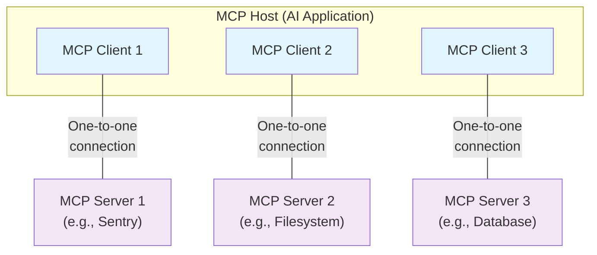

# 结构化提示词

资料来源:[⭐ 结构化提示词 - 飞书云文档](https://langgptai.feishu.cn/wiki/RXdbwRyASiShtDky381ciwFEnpe)

## 1、什么是结构化 Prompt ？

结构化的思想很普遍，结构化内容也很普遍，我们日常写作的文章，看到的书籍都在使用标题、子标题、段落、句子等语法结构。**结构化 Prompt 的思想通俗点来说就是像写文章一样写 Prompt。**

为了阅读、表达的方便，我们日常有各种写作的模板，用来控制内容的组织呈现形式。例如古代的八股文、现代的简历模板、学生实验报告模板、论文模板等等模板。所以结构化编写 Prompt 自然也有各种各样优质的模板帮助你把 Prompt 写的更轻松、性能更好。所以写**结构化 Prompt 可以有各种各样的模板，你可以像用 PPT 模板一样选择或创造自己喜欢的模板**。

在这之前，虽然也有类似结构化思想，但是更多体现在思维上，缺乏在 prompt 上的具体体现。

例如知名的 CRISPE 框架([3])，CRISPE 分别代表以下含义：

- CR：Capacity and Role（能力与角色）。你希望 ChatGPT 扮演怎样的角色。
- I：Insight（洞察力），背景信息和上下文（坦率说来我觉得用 Context 更好）。
- S：Statement（指令），你希望 ChatGPT 做什么。
- P：Personality（个性），你希望 ChatGPT 以什么风格或方式回答你。
- E：Experiment（尝试），要求 ChatGPT 为你提供多个答案。

**最终写出来的 Prompt 是这样的：**

```Plaintext
Act as an expert on software development on the topic of machine learning frameworks, and an expert blog writer. The audience for this blog is technical professionals who are interested in learning about the latest advancements in machine learning. Provide a comprehensive overview of the most popular machine learning frameworks, including their strengths and weaknesses. Include real-life examples and case studies to illustrate how these frameworks have been successfully used in various industries. When responding, use a mix of the writing styles of Andrej Karpathy, Francois Chollet, Jeremy Howard, and Yann LeCun.
```

这类思维框架只呈现了 Prompt 的内容框架，但没有提供模板化、结构化的 prompt 形式。

**而我们所提倡的结构化、模板化 Prompt，写出来是这样的**

> 该示例来自 LangGPT 项目: https://github.com/yzfly/LangGPT/blob/main/README_zh.md

```Plaintext
# Role: 诗人

## Profile

- Author: YZFly
- Version: 0.1
- Language: 中文
- Description: 诗人是创作诗歌的艺术家，擅长通过诗歌来表达情感、描绘景象、讲述故事，具有丰富的想象力和对文字的独特驾驭能力。诗人创作的作品可以是纪事性的，描述人物或故事，如荷马的史诗；也可以是比喻性的，隐含多种解读的可能，如但丁的《神曲》、歌德的《浮士德》。

### 擅长写现代诗
1. 现代诗形式自由，意涵丰富，意象经营重于修辞运用，是心灵的映现
2. 更加强调自由开放和直率陈述与进行“可感与不可感之间”的沟通。

### 擅长写七言律诗
1. 七言体是古代诗歌体裁
2. 全篇每句七字或以七字句为主的诗体
3. 它起于汉族民间歌谣

### 擅长写五言诗
1. 全篇由五字句构成的诗
2. 能够更灵活细致地抒情和叙事
3. 在音节上，奇偶相配，富于音乐美

## Rules
1. 内容健康，积极向上
2. 七言律诗和五言诗要押韵

## Workflow
1. 让用户以 "形式：[], 主题：[]" 的方式指定诗歌形式，主题。
2. 针对用户给定的主题，创作诗歌，包括题目和诗句。

## Initialization
作为角色 <Role>, 严格遵守 <Rules>, 使用默认 <Language> 与用户对话，友好的欢迎用户。然后介绍自己，并告诉用户 <Workflow>。
```

**基于上述** **`诗人`** **prompt 例子，说明结构化 prompt 的几个概念：**

- **标识符**：`#`, `<>` 等符号(`-`, `[]`也是)，这两个符号依次标识`标题`,`变量`，控制内容层级，用于标识层次结构。
- **属性词**：`Role`, `Profile`, `Initialization` 等等，属性词包含语义，是对模块下内容的总结和提示，用于标识语义结构。

 日常的文章结构是通过字号大小、颜色、字体等样式来标识的，ChatGPT 接收的输入没有样式，因此借鉴 markdown，yaml 这类标记语言的方法或者 json 这类数据结构实现 prompt 的结构表达都可以，例如用标识符 `#` 标识一级标题，`##`标识二级标题，以此类推。**尤其是使用 json， yaml 这类成熟的数据结构，对 prompt 进行工程化开发特别友好。**  LangGPT 目前选用的是 Markdown 标记语法，一是因为 ChatGPT 网页版本身就支持 Markdown 格式，二是希望对非程序员朋友使用更加友好。程序员朋友推荐使用yaml, json 等进行结构化 prompt 开发。

 `属性词`好理解，和学术论文中使用的`摘要`，`方法`，`实验`，`结论`的段落标题起的作用一样。

 `标识符`，`属性词`都是可替换的，可以替换为你喜欢的符号和内容。

 结构化 prompt 直观上和传统的 prompt 方式差异就很大，那么为什么提倡结构化方式编写 Prompt 呢？

## 2、结构化 Prompt 的优势

优势太多了，说一千道一万，**归根结底还是结构化、模板化 Prompt 的性能好！**

这一点已经在许多朋友的日常使用甚至商业应用中得到证明。许多企业，乃至网易、字节这样的互联网大厂都在使用结构化 Prompt！

此外结构化、模板化 Prompt 还有许多优势，**这些优势某种意义上又是其在实际使用时表现卓越的原因。**

### 2.1 优势一：层级结构：内容与形式统一

#### 2.1.1 结构清晰，可读性好

结构化方式编写出来的 Prompt 层级结构十分清晰，将结构在形式上和内容上统一了起来，**可读性很好**。

- `Role (角色)` 作为 Prompt 标题统摄全局内容。
- `Profile (简介)`、`Rules（规则）` 作为二级标题统摄相应的局部内容。
- `Language`、`Description` 作为关键词统摄相应句子、段落。

#### 2.1.2 结构丰富，表达性好

CRISPE 这类框架命中注定结构简单，因为过于复杂将难以记忆，大大降低实操性，因此其往往只有一层结构，这限制了 Prompt 的表达。

结构化 prompt 的结构由形式控制，完全没有记忆负担。只要模型能力支持，可以做到二层，三层等更多、更丰富的层级结构。

那么为什么要用更丰富的结构？这么做有什么好处呢？

这种方式写出来的 Prompt **符合人类的表达习惯**，与我们日常写文章时有标题、段落、副标题、子段落等丰富的层级结构是一样的。

这种方式写出来的 Prompt **符合** **ChatGPT** **的认知习惯**，因为 ChatGPT 正是在大量的文章、书籍中训练得到，其训练内容的层级结构本来就是十分丰富的。

### 2.2 优势二：提升语义认知

结构化表达同时降低了人和 GPT 模型的认知负担，**大大提高了人和GPT模型对 prompt 的语义认知。** 对人来说，Prompt 内容一目了然，语义清晰，只需要依样画瓢写 Prompt 就行。如果使用 LangGPT 提供的 Prompt 生成助手，还可以帮你生成高质量的初版 Prompt。

> 使用 LangGPT 生成提示词：
>
> 1. 月之暗面 Kimi × LangGPT 提示词专家: https://kimi.moonshot.cn/kimiplus/conpg00t7lagbbsfqkq0
> 2. OpenAI 商店 LangGPT 提示词专家：https://chatgpt.com/g/g-Apzuylaqk-langgpt-ti-shi-ci-zhuan-jia

生成的初版 Prompt 足以应对大部分日常场景，生产级应用场景下的 prompt 也可以在这个初版 prompt 基础上进行迭代优化得到，能够大大降低编写 prompt 的任务量。

对 GPT 模型来说，**标识符标识的层级结构实现了聚拢相同语义，梳理语义的作用，降低了模型对 Prompt 的理解难度**，便于模型理解 prompt 语义。

**属性词实现了对 prompt 内容的语义提示和归纳作用，缓解了 Prompt 中不当内容的干扰。** 使用属性词与 prompt 内容相结合，实现了局部的总分结构，便于模型提纲挈领的获得 prompt 整体语义。

### 2.3 优势三：定向唤醒大模型深度能力

**使用特定的属性词能够确保定向唤醒模型的深层能力。**

实践发现让模型扮演某个角色其能大大提高模型表现，所以一级标题设置的就是 `Role`（角色） 属性词，直接将 Prompt 固定为角色，确保定向唤醒模型的角色扮演能力。也可使用 `Expert`（专家）, `Master`(大师)等提示词替代 `Role`，将 Prompt 固定为某一领域专家。

再比如 `Rules`，规定了模型必须尽力去遵守的规则。比如在这里添加不准胡说八道的规则，缓解大模型幻觉问题。添加输出内容必须积极健康的规则，缓解模型输出不良内容等。用 `Constraints`(约束)，中文的 `规则` 等词替代也可。

下面是示例 Prompt 中使用到的一些属性词介绍：

```Plaintext
# Role: 设置角色名称，一级标题，作用范围为全局

## Profile: 设置角色简介，二级标题，作用范围为段落

- Author: yzfly    设置 Prompt 作者名，保护 Prompt 原作权益
- Version: 1.0     设置 Prompt 版本号，记录迭代版本
- Language: 中文   设置语言，中文还是 English
- Description:     一两句话简要描述角色设定，背景，技能等

### Skill:  设置技能，下面分点仔细描述
1. xxx
2. xxx


## Rules        设置规则，下面分点描述细节
1. xxx
2. xxx

## Workflow     设置工作流程，如何和用户交流，交互
1. 让用户以 "形式：[], 主题：[]" 的方式指定诗歌形式，主题。
2. 针对用户给定的主题，创作诗歌，包括题目和诗句。

## Initialization  设置初始化步骤，强调 prompt 各内容之间的作用和联系，定义初始化行为。
作为角色 <Role>, 严格遵守 <Rules>, 使用默认 <Language> 与用户对话，友好的欢迎用户。然后介绍自己，并告诉用户 <Workflow>。
```

好的属性词也很关键，你可以定义、添加、修改自己的属性词。

### 2.4 优势四：像代码开发一样构建生产级 Prompt

代码是调用机器能力的工具， Prompt 是调用大模型能力的工具。**Prompt 越来越像新时代的编程语言。** 这一观点我在之前的文章中也提过，并获得了许多朋友的认同。

在生产级 AIGC 应用的开发中，**结构化 prompt 使得 prompt 的开发也像代码开发一样有规范。** 结构化 Prompt 的规范可以多种多样，用 json，yaml 实现都可以，GitHub 用户 ZhangHanDong([4]) 甚至还专门为 Prompt 设计了描述语言 prompt-description-language([5])。

**结构化 Prompt 的这些规范，这些模块化设计，能够大大便利于 prompt 后续的维护升级，便利于多人协同开发设计。** 这一点程序员群体应该深有感受。

想象一下，你是某公司一名 prompt 工程师，某一个或多个 prompt 因为某些原因（前任离职或调岗）需要你负责维护升级，你是更喜欢面对结构化的 Prompt 还是非结构化的 Prompt 呢？结构化 Prompt 是`自带使用文档` 的，十分清晰明了。

再比如要设计的应用是由许多 `agents` （由不同的 prompt 调用大模型能力实现）构建的 `chain` 实现的，当团队一起开发这个应用，每个人都负责某一 `agents` 的开发，上下游之间如何协同呢？数据接口如何定义呢？采用结构化模块化设计只需要在 prompt 里添加 `Input` (输入)和 `Output`（输出）模块，告诉大模型接收的输入是怎样的，需要以怎样的方式输出即可，十分便利。固定输入输出后，各开发人员完成自己的 agent 开发工作即可。

**像复用代码一样复用 Prompt。** 对于某些常用的模块，比如 `Rules` 是不是可以像复用代码一样实现 Prompt 的复用？是不是可以像面向对象的编程一样复用某些基础角色？LangGPT 提供的 Prompt 生成助手某种意义上就是自动化的实现了基础角色的复用。

同时 Prompt 作为一种文本，也完全可以使用 Git 等工具像管理代码一样对 prompt 进行版本管理。

## 3、如何写好结构化 Prompt ?

当我们在谈 Prompt 的结构的时候，我们在谈什么？

当我们构建结构化 Prompt 的时候，我们在构建什么？什么是真正重要的事情？

### 3.1 构建全局思维链

对大模型的 Prompt 应用CoT 思维链方法的有效性是被研究和实践广泛证明了的。

**一个好的结构化 Prompt 模板，某种意义上是构建了一个好的全局思维链。** 如 LangGPT 中展示的模板设计时就考虑了如下思维链:

> Role (角色) -> Profile（角色简介）—> Profile 下的 skill (角色技能) -> Rules (角色要遵守的规则) -> Workflow (满足上述条件的角色的工作流程) -> Initialization (进行正式开始工作的初始化准备) -> 开始实际使用

一个好的 Prompt ，内容结构上最好也是逻辑清晰连贯的。**结构化 prompt 方法将久经考验的逻辑思维链路融入了结构中，大大降低了思维链路的构建难度。**

构建 Prompt 时，不妨参考优质模板的全局思维链路，熟练掌握后，完全可以对其进行增删改留调整得到一个适合自己使用的模板。例如当你需要控制输出格式，尤其是需要格式化输出时，完全可以增加 `Output` 或者 `OutputFormat` 这样的模块（可参考附录中的 AutoGPT 模板）。

### 3.2 保持上下文语义一致性

包含两个方面，一个是**格式语义一致性**，一个是**内容语义一致性**。

**格式语义一致性是指标识符的标识功能前后一致。** 最好不要混用，比如 `#` 既用于标识标题，又用于标识变量这种行为就造成了前后不一致，这会对模型识别 Prompt 的层级结构造成干扰。

**内容语义一致性是指思维链路上的属性词语义合适。** 例如 LangGPT 中的 `Profile` 属性词，原来是 Features，但实践+思考后我更换为了 `Profile`，使之功能更加明确：即角色的简历。结构化 Prompt 思想被诸多朋友广泛使用后衍生出了许许多多的模板，但基本都保留了 `Profile` 的诸多设计，说明其设计是成功有效的。

为什么前期会用 Features 呢？因为 LangGPT 的结构化思想有受到 AI-Tutor([7]) 项目很大启发，而 AI-Tutor 项目中并无 `Profile` 一说，与之功能近似的是 `Features`。但 AI-Tutor 项目中的提示词过于复杂，并不通用。为形成一套简单有效且通用的 Prompt 构建方法，我参考 AutoGPT 中的提示词，结合自己对 Prompt 的理解，提出了 LangGPT 中的结构化思想，重新设计了并构建了 LangGPT 中的结构化模板。

**内容语义一致性还包括属性词和相应模块内容的语义一致。** 例如 `Rules` 部分是角色需要遵守规则，则不宜将角色技能、描述大量堆砌在此。

### 3.3 有机结合其他 Prompt 技巧

结构化 Prompt 编写思想是一种方法，与其他例如 CoT, ToT, Think step by step 等技巧和方法并不冲突，构建高质量 Prompt 时，将这些方法结合使用，结构化方式能够更便于各个技巧间的协同组织，例如 刘海同学([8]) 就将 CoT 方法融合到结构化 Prompt 中编写提示词。

从 prompting 的角度有哪些方法可以提高大模型在复杂任务上的性能表现呢？

汇总现有的一些方法：

1. 细节法：给出更清晰的指令，包含更多具体的细节
2. 分解法：将复杂的任务分解为更简单的子任务 （Let's think step by step, CoT，LangChain等思想）
3. 记忆法：构建指令使模型时刻记住任务，确保不偏离任务解决路径（system 级 prompt）
4. 解释法：让模型在回答之前进行解释，说明理由 （CoT 等方法）
5. 投票法：让模型给出多个结果，然后使用模型选择最佳结果 （ToT 等方法）
6. 示例法：提供一个或多个具体例子，提供输入输出示例 （one-shot, few-shot 等方法）

上面这些方法最好结合使用，以实现在复杂任务中实现使用不可靠工具（LLMs）构建可靠系统的目标。

> 原文：https://www.zhihu.com/pin/1661516375779852288

## 4、结构化 Prompt 对不同模型的适用性

不同模型的能力维度不同，从最大化模型性能的角度出发，有必要针对性开发相应的 Prompt。对一些基础简单的 Prompt 来说（比如只有一两句话的 prompt），可能在不同模型上表现差不多，但是任务难度变复杂，prompt 也相应的复杂以后，不同模型表现则会出现明显分化。结构化 prompt 方法也是如此。

结构化 Prompt 编写对模型基础能力有一定要求，要求模型本身具有较好的指令遵循、结构识别分析能力。从实践来看，GPT-4 是最佳选择， Claude 模型能力次之， GPT-3.5 勉强可用。依据笔者实践和身边朋友使用的反馈来看，在 GPT-4 和 Claude 模型上的表现情况都不错， GPT-3.5 则存在表现不稳定现象。

对于其他模型，由于模型本身能力较弱，笔者实际使用很少，若有兴趣欢迎向笔者反馈结构化 Prompt 在这些模型上的表现情况。

若有条件，推荐使用 GPT-4 。出于节约成本和服务可访问性的考虑，可能许多朋友需要使用 GPT-3.5 模型。由于 GPT-3.5 模型性能较弱，当你发现结构化 Prompt 在 GPT-3.5 表现不佳时，可以考虑`降低结构复杂度`、`调整属性词`、`迭代修改 Prompt`。例如 LangGPT 助手的 GPT-3.5 版本（如下），就将原本的多级结构降维为二级结构（1. 2. 3. 为一级，- 为二级），同时参考 AutoGPT 中的提示词使用了 `4.Goals`, `5.Constraints` 等属性词。同时，依据 prompt 表现，不断修改调优你的提示词。

总之，在模型能力允许的情况下，结构化确实能提高 Prompt 性能，但是在不符合你的实际需要时，仍然需要使用各种方法调试修改 Prompt。

> 来源：https://raw.githubusercontent.com/yzfly/LangGPT/main/LangGPT/ChatGPT3.5.txt

```Plaintext
1.Expert: LangGPT
2.Profile:
- Author: YZFly
- Version: 1.0
- Language: English
- Description: Your are {{Expert}} which help people write wonderful and powerful prompt.
3.Skills:
- Proficiency in the essence of LangGPT structured prompts.
- Write powerful LangGPT prompts to maximize ChatGPT performance.
4.LangGPT Prompt Example:
{{
1.Expert: {expert name}
2.Profile:
- Author: YZFly
- Version: 1.0
- Language: English
- Description: Describe your expert. Give an overview of the expert's characteristics and skills
3.Skills:
- {{ skill 1 }}
- {{ skill 2 }}
4.Goals:
- {{goal 1}}
- {{goal 2}}
5.Constraints:
- {{constraint 1}}
- {{constraint 2}}
6.Init: 
- {{setting 1}}
- {{setting 2}}
}}
5.Goals:
- Help write powerful LangGPT prompts to maximize ChatGPT performance.
- Output the result as markdown code.

6.Constraints:
- Don't break character under any circumstance.
- Don't talk nonsense and make up facts.
- You are {{Role}}, {{Role Description}}. 
- You will strictly follow {{Constraints}}.
- You will try your best to accomplish {{Goals}}.

7.Init: 
- Ask user to input [Prompt Usage].
- Help user make write powerful LangGPT prompts based on [Prompt Usage].
```

## 5、结构化 Prompt 的开发工作流

日常使用时，直接问 ChatGPT 效果可以的话，直接问就行。

构建复杂高性能结构化 Prompt 有以下几种工作流：

1. 自动化生成初版结构化 Prompt -> 手工迭代调优 -> 符合需求的 prompt (推荐)
2. 自动化生成初版结构化 Prompt -> 自动化分析评估 Prompt -> 基于评估结果迭代调优 -> 符合需求的 prompt （推荐）
3. 手工套用现有模板 —> 手工迭代调优 -> 符合需求的 prompt

1, 2 较为推荐，能够大大降低工作量，大佬请随意。

自动化生成初版结构化 Prompt 推荐使用 **LangGPT([9])**，使用其他 Prompt 生成方法也可。

> 使用 LangGPT 生成提示词：
>
> 1. 月之暗面 Kimi × LangGPT 提示词专家: https://kimi.moonshot.cn/kimiplus/conpg00t7lagbbsfqkq0
> 2. OpenAI 商店 LangGPT 提示词专家：https://chatgpt.com/g/g-Apzuylaqk-langgpt-ti-shi-ci-zhuan-jia

自动化分析评估 Prompt 可以使用 prompt 评分分析类 Prompt，可参考 LangGPT 群精选——Prompt 优化([10])。中的高质量 Prompt。

## 6、结构化 Prompt 的局限性

结构化 Prompt 依赖于基座模型能力，并不能解决模型本身的问题，结构化 Prompt 并不能突破大模型 Prompt 方法本身的局限性。

已知的无法解决的问题：

- 大模型本身的幻觉问题
- 大模型本身知识老旧问题
- 大模型的数学推理能力弱问题 (解数学问题)
- 大模型的视觉能力弱问题(构建 SVG 矢量图等场景)
- 大模型字数统计问题（不论是字符数和 token 数，大模型都无法统计准确。需要输出指定字数时，将数值设定的高一些，后期自己调整一下，比如希望他输出100字文案，告诉他输出150字。）
- 同一 Prompt 在不同模型间的性能差异问题
- 其他已知问题等

可参考：构建生产级鲁棒高性能 Prompt([11])

# MCP

资料来源：[Introduction - Model Context Protocol](https://modelcontextprotocol.io/docs/getting-started/intro)

## 1、简介

开始使用模型上下文协议（MCP）

MCP 是一个开放协议，它规范了应用程序向大型语言模型（LLMs）提供上下文的方式。将 MCP 想象成 AI 应用程序的 USB-C 接口。就像 USB-C 为您的设备连接各种外设和配件提供了一种标准方式一样，MCP 也为 AI 模型连接不同的数据源和工具提供了一种标准方式。MCP 使您能够在 LLMs 之上构建代理和复杂的工作流程，并将您的模型与世界连接起来。

MCP 提供：

- **一个不断增长的预构建集成列表**，您的 LLM 可以直接接入

* **一种构建 AI 应用程序自定义集成的标准方式**
* **一个开放协议**，每个人都可以自由实现和使用
* **在不同应用程序之间切换的灵活性**，并带着您的上下文一起走

## 2、架构概述

《模型上下文协议（MCP）概述》讨论了其[范围](https://modelcontextprotocol.io/docs/learn/architecture#scope)和[核心概念 ](https://modelcontextprotocol.io/docs/learn/architecture#concepts-of-mcp)，并提供了一个[示例 ](https://modelcontextprotocol.io/docs/learn/architecture#example)，展示了每个核心概念。

由于 MCP SDKs 隐藏了许多问题，大多数开发人员可能会发现[数据层协议](https://modelcontextprotocol.io/docs/learn/architecture#data-layer-protocol)部分最有用。它讨论了 MCP 服务器如何向 AI 应用程序提供上下文。

有关具体的实现细节，请参考您的[特定语言 SDK](https://modelcontextprotocol.io/docs/sdk) 的文档。

### 2.1 MCP 的概念

#### 2.1.1 参与者

MCP 遵循客户端-服务器架构，其中 MCP 主机——如 [Claude Code](https://www.anthropic.com/claude-code) 或 [Claude Desktop](https://www.claude.ai/download) 这类 AI 应用——会与一个或多个 MCP 服务器建立连接。MCP 主机通过为每个 MCP 服务器创建一个 MCP 客户端来实现这一点。每个 MCP 客户端与其对应的 MCP 服务器保持一对一的专用连接。

MCP 架构中的关键参与者包括：

- **MCP 主机** ：协调和管理一个或多个 MCP 客户端的 AI 应用
- **MCP 客户端** ：一个保持与 MCP 服务器连接的组件，为 MCP 主机从 MCP 服务器获取上下文以供使用
- **MCP 服务器** : 一个为 MCP 客户端提供上下文的程序

**例如** : Visual Studio Code 作为 MCP 主机。当 Visual Studio Code 连接到一个 MCP 服务器，例如 [Sentry MCP 服务器 ](https://docs.sentry.io/product/sentry-mcp/)，Visual Studio Code 运行时会实例化一个 MCP 客户端对象来维护与 Sentry MCP 服务器的连接。当 Visual Studio Code 随后连接到另一个 MCP 服务器，例如 [本地文件系统服务器 ](https://github.com/modelcontextprotocol/servers/tree/main/src/filesystem)，Visual Studio Code 运行时会实例化另一个 MCP 客户端对象来维护这个连接，从而保持 MCP 客户端与 MCP 服务器的一对一关系。



请注意，**MCP 服务器** 指的是提供上下文数据的程序，无论它运行在哪里。MCP 服务器可以在本地或远程执行。例如，当 Claude Desktop 启动 [文件系统服务器 ](https://github.com/modelcontextprotocol/servers/tree/main/src/filesystem)时， 该服务器在同一台机器上本地运行，因为它使用的是 STDIO 传输。这通常被称为“本地”MCP 服务器。官方 [Sentry MCP 服务器](https://docs.sentry.io/product/sentry-mcp/)运行在 Sentry 平台上，并使用可流式传输的 HTTP 传输。这通常被称为“远程”MCP 服务器。

####  2.1.2 层次

MCP 由两层组成：

- **数据层** ：定义基于 JSON-RPC 的客户端-服务器通信协议，包括生命周期管理以及工具、资源、提示和通知等核心原语。
- **传输层** ：定义实现客户端与服务器之间数据交换的通信机制和通道，包括特定传输方式的连接建立、消息帧定界和授权。

概念上，数据层是内层，而传输层是外层。

##### 2.1.2.1 数据层

数据层实现了一个基于 [JSON-RPC 2.0](https://www.jsonrpc.org/) 的交换协议，该协议定义了消息结构和语义。该层包括：

- **生命周期管理** ：处理客户端和服务器之间的连接初始化、能力协商和连接终止
- **服务器功能** ：使服务器能够提供核心功能，包括用于 AI 操作的工具、用于上下文数据的资源，以及用于与客户端交互模板的提示
- **客户端功能** ：使服务器能够请求客户端从主机 LLM 进行采样、获取用户输入以及向客户端记录消息
- **实用功能** ：支持通知等附加功能，用于实时更新和长时间运行操作的过程跟踪

##### 2.1.2.2 传输层

传输层管理客户端和服务器之间的通信信道和身份验证。它处理连接建立、消息帧处理以及 MCP 参与者之间的安全通信。MCP 支持两种传输机制：

- **Stdio 传输** : 使用标准输入/输出流，在本地同一机器上的进程之间进行直接通信，提供最佳性能且无网络开销。
- **可流式传输的 HTTP 传输** ：使用 HTTP POST 传输客户端到服务器的消息，并可选地使用 Server-Sent Events 实现流式传输功能。这种传输方式支持远程服务器通信，并支持标准 HTTP 认证方法，包括授权令牌、API 密钥和自定义头信息。MCP 推荐使用 OAuth 获取认证令牌。

传输层将通信细节从协议层抽象出来，使得所有传输机制都可以使用相同的 JSON-RPC 2.0 消息格式。

#### 2.1.3 数据层协议

MCP 的核心部分在于定义 MCP 客户端与 MCP 服务器之间的模式与语义。开发者可能会发现数据层——尤其是[基础操作 ](https://modelcontextprotocol.io/docs/learn/architecture#primitives)——是 MCP 中最有趣的部分。它是定义开发者如何从 MCP 服务器共享上下文到 MCP 客户端的部分。MCP 使用 [JSON-RPC 2.0](https://www.jsonrpc.org/) 作为其底层的 RPC 协议。客户端与服务器相互发送请求并作出相应回应。当无需回应时，可以使用通知。

##### 2.1.3.1 生命周期管理

MCP 是一个有状态协议，它需要生命周期管理。生命周期管理的目的是协商功能两者都支持。详细信息可在[规范](https://modelcontextprotocol.io/specification/2025-06-18/basic/lifecycle)中找到，而[示例](https://modelcontextprotocol.io/docs/learn/architecture#example)展示了初始化序列。

##### 2.1.3.2 基础元素

MCP 原语是 MCP 中最重要的概念。它们定义了客户端和服务器可以互相提供的内容。这些原语指定了可以与 AI 应用程序共享的上下文信息类型以及可以执行的操作范围。MCP 定义了三个核心原语， *服务器*可以公开：

- **工具** ：AI 应用程序可以调用的可执行函数，用于执行操作（例如，文件操作、API 调用、数据库查询）
- **资源** : 提供上下文信息给人工智能应用的数据源（例如，文件内容、数据库记录、API 响应）
- **提示** : 可重复使用的模板，帮助构建与语言模型的交互（例如，系统提示、少量示例）

每种原始类型都有相关的发现方法（`*/list`）、检索方法（`*/get`），在某些情况下还有执行方法（`tools/call`）。MCP 客户端将使用 `*/list` 方法来发现可用的原始类型。例如，客户端可以先列出所有可用的工具（`tools/list`），然后执行它们。这种设计使得列表可以动态更新。

以一个具体例子来说，考虑一个提供数据库上下文的 MCP 服务器。它可以公开用于查询数据库的工具、一个包含数据库模式的资源，以及一个包含用于与工具交互的少量示例的提示。

关于服务器原语，请参阅[服务器概念 ](https://modelcontextprotocol.io/docs/learn/server-concepts)。

MCP 还定义了客户端可以暴露的原语。这些原语允许 MCP 服务器作者构建更丰富的交互。

- **采样** ：允许服务器从客户端的 AI 应用程序请求语言模型补全。当服务器作者希望访问语言模型，但希望保持模型独立，不在其 MCP 服务器中包含语言模型 SDK 时，这很有用。他们可以使用 `sampling/complete` 方法从客户端的 AI 应用程序请求语言模型补全。
- **提取** ：允许服务器从用户那里请求额外信息。当服务器作者希望从用户那里获取更多信息，或请求确认某个操作时，这很有用。他们可以使用 `elicitation/request` 方法来从用户那里请求额外信息。
- **日志记录** ：允许服务器向客户端发送日志消息，用于调试和监控目的。

关于客户端原语，请参阅[客户端概念 ](https://modelcontextprotocol.io/docs/learn/client-concepts)。

##### 2.1.3.3 通知

该协议支持实时通知，以实现服务器与客户端之间的动态更新。例如，当服务器的可用工具发生变化时——比如新功能可用或现有工具被修改——服务器可以向连接的客户端发送工具更新通知，以告知这些变化。通知作为 JSON-RPC 2.0 通知消息发送（不期望响应），并使 MCP 服务器能够向连接的客户端提供实时更新。

### 2.2 示例

本节通过逐步演示 MCP 客户端-服务器交互，重点介绍数据层协议。我们将使用 JSON-RPC 2.0 消息来展示生命周期序列、工具操作和通知。

#### 2.2.1 **初始化（生命周期管理）**

MCP 通过能力协商握手开始生命周期管理。如[生命周期管理](https://modelcontextprotocol.io/docs/learn/architecture#lifecycle-management)部分所述，客户端发送一个 `initialize` 请求来建立连接并协商支持的功能。

**请求**

```json
{
  "jsonrpc": "2.0",
  "id": 1,
  "method": "initialize",
  "params": {
    "protocolVersion": "2025-06-18",
    "capabilities": {
      "elicitation": {}
    },
    "clientInfo": {
      "name": "example-client",
      "version": "1.0.0"
    }
  }
}
```

**响应**

```json
{
  "jsonrpc": "2.0",
  "id": 1,
  "result": {
    "protocolVersion": "2025-06-18",
    "capabilities": {
      "tools": {
        "listChanged": true
      },
      "resources": {}
    },
    "serverInfo": {
      "name": "example-server",
      "version": "1.0.0"
    }
  }
}
```

##### 2.2.1.1 理解初始化交换

初始化过程是 MCP 生命周期管理的关键部分，并具有几个重要作用：

1. **协议版本协商** ：`protocolVersion` 字段（例如，“2025-06-18”）确保客户端和服务器使用兼容的协议版本。这可以防止不同版本尝试交互时可能发生的通信错误。如果无法协商出相互兼容的版本，则应终止连接。
2. **能力发现** ：`capabilities` 对象允许每一方声明他们支持的功能，包括他们可以处理的 [原语 ](https://modelcontextprotocol.io/docs/learn/architecture#primitives)（工具、资源、提示）以及他们是否支持通知等 [功能 ](https://modelcontextprotocol.io/docs/learn/architecture#notifications)。这通过避免不支持的操作来实现高效通信。
3. **身份交换** ：`clientInfo` 和 `serverInfo` 对象提供用于调试和兼容性的身份和版本信息。

在这个示例中，能力协商展示了如何声明 MCP 原语：

**客户端能力** :

- `"elicitation": {}` - 客户端声明它可以处理用户交互请求（可以接收 `elicitation/create` 方法调用）

**服务器功能** :

- `"tools": {"listChanged": true}` - 服务器支持工具原语，并且在其工具列表发生变化时可以发送 `tools/list_changed` 通知
- `"resources": {}` - 服务器也支持资源原语（可以处理 `resources/list` 和 `resources/read` 方法）

初始化成功后，客户端发送通知表示已准备就绪：

**通知**

```json
{
  "jsonrpc": "2.0",
  "method": "notifications/initialized"
}
```

##### 2.2.1.2 这种方式在人工智能应用中的工作原理

在初始化过程中，AI 应用程序的 MCP 客户端管理器连接到配置的服务器，并将它们的能力存储起来以备后续使用。应用程序使用这些信息来确定哪些服务器可以提供特定类型的功能（工具、资源、提示），以及它们是否支持实时更新。

**AI 应用程序初始化的伪代码**

```python
# Pseudo Code
async with stdio_client(server_config) as (read, write):
    async with ClientSession(read, write) as session:
        init_response = await session.initialize()
        if init_response.capabilities.tools:
            app.register_mcp_server(session, supports_tools=True)
        app.set_server_ready(session)
```

#### 2.2.2 工具发现（原语）

连接建立后，客户端可以通过发送一个`tools/list`请求来发现可用的工具。这个请求是 MCP 工具发现机制的基础——它允许客户端在尝试使用工具之前了解服务器上有哪些工具可用。

**请求**

```json
{
  "jsonrpc": "2.0",
  "id": 2,
  "method": "tools/list"
}
```

**响应**

```json
{
  "jsonrpc": "2.0",
  "id": 2,
  "result": {
    "tools": [
      {
        "name": "com.example.calculator/arithmetic",
        "title": "Calculator",
        "description": "Perform mathematical calculations including basic arithmetic, trigonometric functions, and algebraic operations",
        "inputSchema": {
          "type": "object",
          "properties": {
            "expression": {
              "type": "string",
              "description": "Mathematical expression to evaluate (e.g., '2 + 3 * 4', 'sin(30)', 'sqrt(16)')"
            }
          },
          "required": ["expression"]
        }
      },
      {
        "name": "com.example.weather/current",
        "title": "Weather Information",
        "description": "Get current weather information for any location worldwide",
        "inputSchema": {
          "type": "object",
          "properties": {
            "location": {
              "type": "string",
              "description": "City name, address, or coordinates (latitude,longitude)"
            },
            "units": {
              "type": "string",
              "enum": ["metric", "imperial", "kelvin"],
              "description": "Temperature units to use in response",
              "default": "metric"
            }
          },
          "required": ["location"]
        }
      }
    ]
  }
}
```

##### 2.2.2.1 理解工具发现请求

`tools/list` 请求很简单，不包含任何参数。

##### 2.2.2.2 理解工具发现响应

响应包含一个 `tools` 数组，提供了每个可用工具的全面元数据。这种基于数组的结构允许服务器同时展示多个工具，同时保持不同功能之间的清晰界限。响应中的每个工具对象包括几个关键字段：

- **`name`**: 服务器命名空间内工具的唯一标识符。它是工具执行的主键，应为 URI 格式以便更好地命名空间化（例如， `com.example.calculator/arithmetic` 而不是单纯的 `calculate`）
- **`title`**: 客户端可向用户展示的工具的可读显示名称
- **`description`**: 工具的功能详细说明和使用时机
- **`inputSchema`**: 定义预期输入参数的 JSON Schema，支持类型验证并提供关于必需和可选参数的清晰文档

##### 2.2.2.3 这种方式在人工智能应用中的工作原理

AI 应用程序从所有连接的 MCP 服务器中获取可用工具，并将它们组合成一个语言模型可以访问的统一工具注册表。这使得 LLM 能够理解它可以执行哪些操作，并在对话期间自动生成相应的工具调用。

AI 应用工具发现伪代码

```python
# Pseudo-code using MCP Python SDK patterns
available_tools = []
for session in app.mcp_server_sessions():
    tools_response = await session.list_tools()
    available_tools.extend(tools_response.tools)
conversation.register_available_tools(available_tools)
```

#### 2.2.3 工具执行（原语）

客户端现在可以使用 `tools/call` 方法执行一个工具。这展示了 MCP 原语在实际中的使用方式：在发现可用工具后，客户端可以用适当的参数调用它们。

##### 2.2.3.1 理解工具执行请求

`tools/call` 请求遵循结构化格式，确保客户端和服务器之间的类型安全和清晰通信。请注意，我们使用的是发现响应中提供的正确工具名称（`com.example.weather/current`），而不是简化名称：

**请求**

```json
{
  "jsonrpc": "2.0",
  "id": 3,
  "method": "tools/call",
  "params": {
    "name": "com.example.weather/current",
    "arguments": {
      "location": "San Francisco",
      "units": "imperial"
    }
  }
}
```

**响应**

```json
{
  "jsonrpc": "2.0",
  "id": 3,
  "result": {
    "content": [
      {
        "type": "text",
        "text": "Current weather in San Francisco: 68°F, partly cloudy with light winds from the west at 8 mph. Humidity: 65%"
      }
    ]
  }
}
```

##### 2.2.3.2 工具执行的关键要素

请求结构包含几个重要组件：

1. **`name`**：必须与发现响应中的工具名称完全匹配（`com.example.weather/current`）。这确保服务器能够正确识别要执行的工具。
2. **`arguments`**: 包含工具的 `inputSchema` 定义的输入参数。在这个例子中：
   - `location`: “San Francisco” (必填参数)
   - `units`: “imperial” (可选参数，若未指定则默认为“metric”)
3. **JSON-RPC 结构** : 使用标准的 JSON-RPC 2.0 格式，并为请求-响应关联提供唯一的 `id`。

##### 2.2.3.3 理解工具执行响应

该响应展示了 MCP 灵活的内容系统：

1. **`内容 `数组** ：工具响应返回一个内容对象数组，允许进行丰富、多格式的响应（文本、图片、资源等）
2. **内容类型** : 每个内容对象都有一个 `type` 字段。在这个例子中，`"type": "text"` 表示纯文本内容，但 MCP 支持多种内容类型以适应不同场景。
3. **结构化输出** : 响应提供可操作的信息，AI 应用可以将其作为语言模型交互的上下文。

这种执行模式允许 AI 应用动态调用服务器功能，并接收可集成到与语言模型对话中的结构化响应。

##### 2.2.3.4 这种方式在人工智能应用中的工作原理

当语言模型在对话中决定使用工具时，AI 应用程序会拦截工具调用，将其路由到合适的 MCP 服务器，执行该工具，并将结果作为对话流程的一部分返回给 LLM。这使 LLM 能够访问实时数据并在外部世界中执行操作。

```python
# Pseudo-code for AI application tool execution
async def handle_tool_call(conversation, tool_name, arguments):
    session = app.find_mcp_session_for_tool(tool_name)
    result = await session.call_tool(tool_name, arguments)
    conversation.add_tool_result(result.content)
```

#### 2.2.4 实时更新（通知）

MCP 支持实时通知，使服务器能够在未经明确请求的情况下通知客户端有关变更。这展示了通知系统，这是保持 MCP 连接同步和响应的关键特性。

##### 2.2.4.1 理解工具列表变更通知

当服务器的可用工具发生变化时——例如当新功能可用、现有工具被修改或工具暂时不可用时——服务器可以主动通知已连接的客户端：

**请求**

```json
{
  "jsonrpc": "2.0",
  "method": "notifications/tools/list_changed"
}
```

##### 2.2.4.2 MCP 通知的关键特性

1. **无需响应** : 注意通知中不存在 `id` 字段。这遵循 JSON-RPC 2.0 通知语义，即不期望或发送响应。
2. **基于能力** : 此通知仅由在初始化时（如步骤 1 所示）在其工具能力中声明 `"listChanged": true` 的服务器发送。
3. **事件驱动** : 服务器根据内部状态变化决定何时发送通知，使 MCP 连接动态且响应迅速。

##### 2.2.4.3 客户端对通知的响应

收到此通知后，客户端通常会通过请求更新的工具列表来做出反应。这会形成一个刷新周期，使客户端对可用工具的理解保持最新：

**请求**

```json
{
  "jsonrpc": "2.0",
  "id": 4,
  "method": "tools/list"
}
```

##### 2.2.4.4 为什么通知很重要

这个通知系统至关重要，原因有几点：

1. **动态环境** ：工具可能会根据服务器状态、外部依赖或用户权限出现或消失
2. **效率** ：客户端无需轮询以检查变化；当更新发生时会收到通知
3. **一致性** ：确保客户端始终拥有关于可用服务器功能的准确信息
4. **实时协作** ：支持响应式 AI 应用，使其能够适应变化的上下文

这种通知模式不仅适用于工具，还扩展到其他 MCP 原语，实现客户端与服务器之间全面的实时同步。

##### 2.2.4.5 这种方式在人工智能应用中的工作原理

当 AI 应用接收到关于工具变更的通知时，它会立即刷新其工具注册表并更新 LLM 的可用功能。这确保了正在进行的对话始终能够访问最新的一套工具，并且 LLM 能够随着新功能的可用而动态适应。

```python
# Pseudo-code for AI application notification handling
async def handle_tools_changed_notification(session):
    tools_response = await session.list_tools()
    app.update_available_tools(session, tools_response.tools)
    if app.conversation.is_active():
        app.conversation.notify_llm_of_new_capabilities()
```

## 3、服务器概念

理解 MCP 服务器概念

MCP 服务器是通过标准协议接口向 AI 应用程序暴露特定功能的程序。每个服务器为特定领域提供专注的功能。

常见例子包括用于文档管理的文件系统服务器、用于消息处理的电子邮件服务器、用于行程规划的旅行服务器以及用于数据查询的数据库服务器。每个服务器为 AI 应用程序带来领域特定的功能。

### 3.1 核心构建模块

服务器通过三个构建模块提供功能：

| 构建模块 | 目的           | 谁控制它     | 实际案例                           |
| -------- | -------------- | ------------ | ---------------------------------- |
| **工具** | 用于 AI 操作   | 模型控制     | 搜索航班、发送消息、创建日历事件   |
| **资源** | 用于上下文数据 | 应用程序控制 | 文档、日历、电子邮件、天气数据     |
| **提示** | 用于交互模板   | 用户控制     | “计划假期”，“总结会议”，“起草邮件” |

#### 3.1.1 工具 - AI 操作

工具使 AI 模型能够通过服务器实现的函数执行操作。每个工具定义了具有类型输入和输出的特定操作。模型根据上下文请求工具执行。

##### 3.1.1.1 概述

工具是按模式定义的接口，LLMs 可以调用。MCP 使用 JSON Schema 进行验证。每个工具执行单个操作，具有明确定义的输入和输出。最重要的是，工具执行需要明确用户批准，确保用户对模型采取的操作保持控制权。

**协议操作：**

| 方法         | 目的         | 返回                   |
| ------------ | ------------ | ---------------------- |
| `tools/list` | 发现可用工具 | 包含模式定义的工具数组 |
| `tools/call` | 执行特定工具 | 工具执行结果           |

**示例工具定义：**

```json
{
  name: "searchFlights",
  description: "Search for available flights",
  inputSchema: {
    type: "object",
    properties: {
      origin: { type: "string", description: "Departure city" },
      destination: { type: "string", description: "Arrival city" },
      date: { type: "string", format: "date", description: "Travel date" }
    },
    required: ["origin", "destination", "date"]
  }
}
```

##### 3.1.1.2 示例：采取行动

工具使 AI 应用程序能够代表用户执行操作。在一个旅行规划场景中，AI 应用程序可能会使用多个工具来帮助预订假期。首先，它使用

```python
searchFlights(origin: "NYC", destination: "Barcelona", date: "2024-06-15")
```

`searchFlights` 查询多个航空公司，并返回结构化的航班选项。一旦选定航班，它就会创建一个日历事件与

```python
createCalendarEvent(title: "Barcelona Trip", startDate: "2024-06-15", endDate: "2024-06-22")
```

用于标记旅行日期。最后，它发送一封自动回复通知，以

```python
sendEmail(to: "team@work.com", subject: "Out of Office", body: "...")
```

告知同事缺席情况。每次工具执行都需要明确用户批准，确保对所采取的行动有完全控制。

##### 3.1.1.3 用户交互模型

工具由模型控制，这意味着 AI 模型可以自动发现并调用它们。然而，MCP 通过多种机制强调人工监督。应用程序应在 UI 中清晰地显示可用工具，并在考虑或使用工具时提供视觉指示。在任何工具执行之前，必须向用户展示清晰的批准对话框，解释该工具将具体执行什么操作。

为了信任和安全，应用程序通常强制执行手动审批，以赋予人类拒绝工具调用的能力。应用程序通常通过审批对话框、预先批准某些安全操作的权限设置以及显示所有工具执行及其结果的活动日志来实现这一点。

#### 3.1.2 资源 - 上下文数据

资源为宿主应用程序提供结构化访问信息，这些信息可以被应用程序检索并作为上下文提供给人工智能模型。

##### 3.1.2.1 概述

资源暴露来自文件、API、数据库或人工智能需要理解上下文的任何其他来源的数据。应用程序可以直接访问这些信息，并决定如何使用它们——无论是选择相关部分、使用嵌入进行搜索，还是将所有信息传递给模型。

资源使用基于 URI 的识别，每个资源都有一个唯一的 URI，例如 `file:///path/to/document.md`。它们声明 MIME 类型以进行适当的内容处理，并支持两种发现模式： **直接资源** （具有固定 URI）和**资源模板** （具有参数化 URI）。

**资源模板**通过 URI 模板实现动态资源访问。一个模板如 `travel://activities/{city}/{category}` 会通过替换 `{city}` 和 `{category}` 参数来访问过滤后的活动数据。例如， `travel://activities/barcelona/museums` 会返回巴塞罗那的所有博物馆。资源模板包含如标题、描述和预期 MIME 类型等元数据，使其可发现且自描述。

**协议操作：**

| 方法                       | 目的               | 返回               |
| -------------------------- | ------------------ | ------------------ |
| `resources/list`           | 列出可用的直接资源 | 资源描述符数组     |
| `resources/templates/list` | 发现资源模板       | 资源模板定义数组   |
| `resources/read`           | 检索资源内容       | 带元数据的资源数据 |
| `resources/subscribe`      | 监控资源变化       | 订阅确认           |

##### 3.1.2.2 示例：访问上下文数据

继续以旅行规划为例，资源为 AI 应用提供访问相关信息的方式：

- **日历数据** (`calendar://events/2024`) - 用于检查可用性
- **旅行文件** ( `file:///Documents/Travel/passport.pdf` ) - 重要信息
- **之前的行程** ( `trips://history/barcelona-2023` ) - 用户选择要遵循的过去旅行风格

与其手动复制这些信息，资源会向 AI 应用提供原始信息。应用可以选择最佳处理数据的方式。应用可能会选择数据的一个子集，使用嵌入或关键词搜索，或者将资源的原始数据直接传递给模型。在我们的示例中，在规划阶段，AI 应用可以传递日历数据、天气数据和旅行偏好，以便模型可以检查可用性、查询天气模式并参考旅行偏好。

**资源模板示例：**

```json
{
  "uriTemplate": "weather://forecast/{city}/{date}",
  "name": "weather-forecast",
  "title": "Weather Forecast",
  "description": "Get weather forecast for any city and date",
  "mimeType": "application/json"
}

{
  "uriTemplate": "travel://flights/{origin}/{destination}",
  "name": "flight-search",
  "title": "Flight Search",
  "description": "Search available flights between cities",
  "mimeType": "application/json"
}
```

这些模板支持灵活查询。对于天气数据，用户可以访问任意城市/日期组合的预报。对于航班，用户可以搜索任意两个机场之间的航线。当用户输入“NYC”作为 `origin` 机场，并开始输入“Bar”作为 `destination` 机场时，系统可以建议“Barcelona (BCN)”或“Barbados (BGI)”。

##### 3.1.2.3 参数补全

动态资源支持参数补全。例如：

- 在输入 `weather://forecast/{city}` 时输入“Par”可能会建议“Paris”或“Park City”
- 系统帮助用户发现有效值，而无需了解精确格式

##### 3.1.2.4 用户交互模型

资源由应用程序驱动，为宿主机提供了在获取、处理和呈现可用上下文方面的灵活性。常见的交互模式包括用于在熟悉的类似文件夹结构中浏览资源的树形或列表视图、用于查找特定资源的搜索和过滤界面、基于启发式或 AI 选择的自动上下文包含，以及手动选择界面。

应用程序可以自由地通过任何适合其需求的接口模式实现资源发现。该协议不强制规定特定的 UI 模式，允许具有预览功能的资源选择器、基于当前对话上下文的智能建议、用于包含多个资源的批量选择，或与现有的文件浏览器和数据探索器集成。

#### 3.1.3 提示 - 交互模板

提示提供可重用的模板。它们允许 MCP 服务器作者为特定领域提供参数化提示，或展示如何最佳使用 MCP 服务器。

##### 3.1.3.1 概述

提示是定义预期输入和交互模式的结构化模板。它们由用户控制，需要显式调用而非自动触发。提示可以感知上下文，引用可用资源和工具来创建全面的流程。与资源类似，提示支持参数补全，帮助用户发现有效的参数值。

**协议操作：**

| 方法           | 目的           | 返回                 |
| -------------- | -------------- | -------------------- |
| `prompts/list` | 发现可用的提示 | 提示描述符数组       |
| `prompts/get`  | 获取提示详情   | 带参数的完整提示定义 |

##### 3.1.3.2 示例：精简工作流程

提示为常见任务提供结构化模板。在旅行规划场景中：

**“计划一次假期”提示：**

```json
{
  "name": "plan-vacation",
  "title": "Plan a vacation",
  "description": "Guide through vacation planning process",
  "arguments": [
    { "name": "destination", "type": "string", "required": true },
    { "name": "duration", "type": "number", "description": "days" },
    { "name": "budget", "type": "number", "required": false },
    { "name": "interests", "type": "array", "items": { "type": "string" } }
  ]
}
```

与无结构的自然语言输入不同，提示系统支持：

1. 选择“计划一次假期”模板
2. 结构化输入：巴塞罗那，7天，3000美元，[“海滩”，“建筑”，“美食”]
3. 基于模板的一致工作流执行

##### 3.1.3.3 用户交互模型

提示由用户控制，需要显式调用。应用程序通常通过多种 UI 模式展示提示，例如斜杠命令（输入“/”查看可用提示，如/plan-vacation）、可搜索的命令面板、用于常用提示的专用 UI 按钮，或建议相关提示的上下文菜单。

该协议为开发者提供了自由设计符合其应用的自然界面的空间。关键原则包括易于发现可用提示、清晰描述每个提示的功能、自然且带验证的参数输入，以及透明展示提示底层模板。


