# Django

资料来源:

[2024 版 Django5 Python web 开发 视频教程(无废话版) 玩命更新中~\_哔哩哔哩\_bilibili](https://www.bilibili.com/video/BV14Z421z78C?p=1&vd_source=6f12eac1da397b0efdd20e02514a56f9)

## 1、Django5 介绍及安装

### 1.1 Django5 简介

Django(发音:[`dʒæŋɡəʊ]) 也有的小伙伴读成 “酱狗”，"贱狗"，"进狗"，"撞狗"，甚至还有读成"打 狗"。

[官方](https://www.djangoproject.com/) Django 是一个高级的 Python Web 框架，可以快速开发安全和可维护的网站。由经验丰富的开发者构 建，Django 负责处理网站开发中麻烦的部分，可以专注于编写应用程序，而无需重新开发。它是免费和 开源的，有活跃繁荣的社区，丰富的文档，以及很多免费和付费的解决方案。目前最新版本：5.0.1

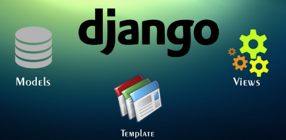

### 1.2 Django5**安装**

pip 安装：

```bash
pip install Django==5.0.3 -i https://pypi.tuna.tsinghua.edu.cn/simple
```

执行安装完成后，在 python 目录的 Scripts 下，会多出一个 diango-admin.exe 这个是 django 项目创建工具


当然同时 Lib 下的 site-packages 下，也会有一个 django 目录，这个是后面我们开发项目会用到的 django 开发包。


## 2、Django5**项目创建与项目配置**

### 2.1 Django5**创建项目**(**用命令方式**)

首先 cmd，进入命令提示符终端

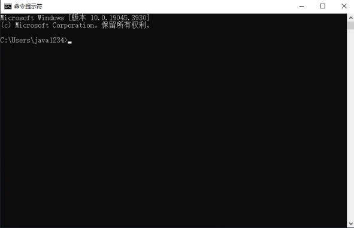

我这边是准备把项目创建在 D:\python\django5 这个目录下。

cd 切换到你需要建项目的目录：

```bash
cd /d D:\python\django5
```


接下啦 借助 django-admin 工具，创建项目，命令如下：

```bash
django-admin startproject 项目名称
```

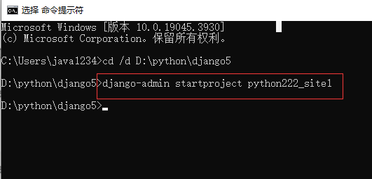

执行后，我们去看下 项目目录：


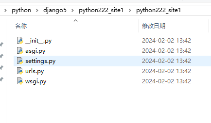

说明项目创建成功。

### 2.2 Django5**创建项目**(**用**PyCharm**工具**)

除了在命令提示符窗口创建项目之外，还可以在 PyCharm 中创建项目。PyCharm 必须为专业版才能创建与调试 Django 项目，社区版是不支持此功能的。打开 PyCharm 并在左上方单击 File→New Project，选择第一个 Django，创建新项目，如下图：


相对于用命令方式，PyCharm 创建的项目，多了 templates 目录（用来放 html 模版文件）,以及 settings.py，多了`BASE_DIR / 'templates'`

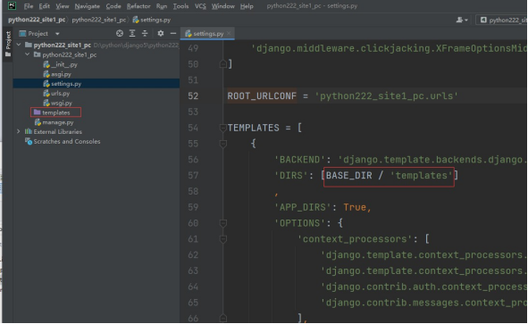

这里介绍下默认创建的文件

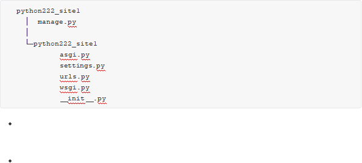

- `manage.py`:项目管理命令行工具，内置多种方式与项目进行交互，包括启动项目，创建 app，数据管理等。在命令提示符窗口下，将路径切换到 python222_site1 项目并输入 python manage.py help，可以查看该工具的指令信息；==**【不用修改】**==

- `__init__.py`：初始化文件,一般情况下无须修改；

- `settings.py`：项目的配置文件，项目的所有功能都需要在该文件中进行配置；

- `urls.py`：项目的路由设置，设置网站的具体网址内容；

- `wsgi.py`：全 称 为 Python Web Server Gateway Interface，即 Python 服务器⽹关接⼝，是 Python 应⽤与 Web 服务器之间的接⼝，⽤于 Django 项⽬在服务器上的部署和上线；==**【不用修改】**==

- `asgi.py`：开启⼀个 ASGI 服务，ASGI 是异步⽹关协议接⼝；==**【不用修改】**==

## 3、Django5**应用创建与应用配置**

### 3.1 Django5**操作命令**

我们掌握了如何在命令提示符或 PyCharm 下创建 Django 项目和项目应用，无论是创建项目还是创建项目应用，都需要输入相关的指令才能得以实现，这些都是 Django 内置的操作指令。

在 PyCharm 的 Terminal 中输入指令`python manage.py help`并按回车键，即可看到相关的指令信息，如下图所示。


Django5 的操作指令共有 31 条，每条指令的说明以表格形式展示。

| **指令**                  | **说明**                                                     |
| :------------------------ | :----------------------------------------------------------- |
| changepassword            | 修改内置用户表的用户密码                                     |
| createsuperuser           | 为内置用户表创建超级管理员账号                               |
| remove_stale_contenttypes | 删除数据库中已不使用的数据表                                 |
| check                     | 检测整个项目是否存在异常问题                                 |
| compilemessages           | 编译语言文件，用于项目的区域语言设置                         |
| createcachetable          | 创建缓存数据表，为内置的缓存机制提供存储功能                 |
| dbshell                   | 进入 Django 配置的数据库，可以执行数据库的 SOL 语句          |
| diffsettings              | 显示当前 settings.py 的配置信息与默认配置的差异              |
| dumpdata                  | 导出数据表的数据并以 JSON 格式存储，如 python manage.py dumpdata index >data.json，这是 index 的模型所对应的数据导出，并保存在 data.json 文件中 |
| flush                     | 清空数据表的数据信息                                         |
| inspectdb                 | 获取项目所有模型的定义过程                                   |
| loaddata                  | 将数据文件导入数据表，如 python manage.py loaddatadata.,json |
| makemessages              | 创建语言文件，用于项目的区域语言设置                         |
| makemigrations            | 从模型对象创建数据迁移文件并保存在 App 的 migrations 文件夹  |
| migrate                   | 根据迁移文件的内容，在数据库里生成相应的数据表               |
| sendtestemail             | 向指定的收件人发送测试的电子邮件                             |
| shell                     | 进入 Django 的 Shell 模式,用于调试项目功能                   |
| showmigrations            | 查看当前项目的所有迁移文件                                   |
| sqlflush                  | 查看清空数据库的 SOL 语句脚本                                |
| sqlmigrate                | 根据迁移文件内容输出相应的 SQL 语句                          |
| sqlsequencereset          | 重置数据表递增字段的索引值                                   |
| squashmigrations          | 对迁移文件进行压缩处理                                       |
| startapp                  | 创建项目应用 App                                             |
| optimizemigration         | 允许优化迁移操作                                             |
| startproject              | 创建新的 Django 项目                                         |
| test                      | 运行 App 里面的测试程序                                      |
| testserver                | 新建测试数据库并使用该数据库运行项目                         |
| clearsessions             | 清除会话 Session 数据                                        |
| collectstatic             | 收集所有的静态文件                                           |
| findstatic                | 查找静态文件的路径信息                                       |
| runserver                 | 在本地计算机上启动 Django 项目                               |

小技巧，前面每次执行命令都要在 Terminal 终端输入`python manage.py 命令`比较繁琐，我们借助 PyCharm 开发工具，在菜单 Tools 里，有个`Run manage.py Task... `,直接点击


直接输入命令，比如 help ，结果就出来，是不是很方便，以后我们就用这种简便方式，来提高工作效率。


### 3.2 Django5**应用创建**

前面我们创建的是一个项目，一个项目是由于一个或者多个应用组成(我们一般开发，一个项目里就创建一个应用即可)。

项目里的每个应用 都是独立的，可以拥有独立的数据库，模版代码，业务代码。比如，一个网站，可以有前台用户应用和后台管理员应用；

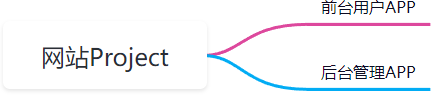

复杂的电商项目，后台甚至可以拆分用户应用，商品应用，订单应用，支付应用，积分应用，优惠券应用等。

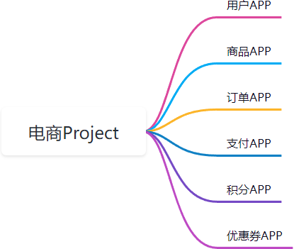

前面我们学过 Django5 的操作命令，有一个命令是`startapp` ，就是用来创建项目应用 APP 的。我们执行`startapp app01`创建名字为 app01 的应用，执行完毕后，多出一个 app01 目录(目录里的生成文件，我们下一讲解释)

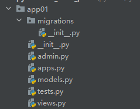

我们还可以继续执行`startapp app02`,`startapp app03`


一个项目可以拥有一个或者多个应用，所以理论上，我们可以创建无数应用。但是还是强调下，==**一般情况，我们一个项目就之需要创建一个应用即可。**==

### 3.3 Django5**应用配置**

为了更好的理解 Django5 的应用配置，我们先来学习下 Django 的 MTV 模型。

Django 的 MTV 分别代表：

Model(模型)：业务对象与数据库的对象(ORM)

Template(模版)：负责如何把页面展示给用户

View(视图)：负责页面逻辑，并在适当的时候调用 Model 和 Template

此外，Django 还有一个 urls 分发器，它的作用是将一个 URI 的页面请求分发给不同的 view 处理，view 再调用相应的 Model 和 Template。 Django WEB 框架示意图如下所示:

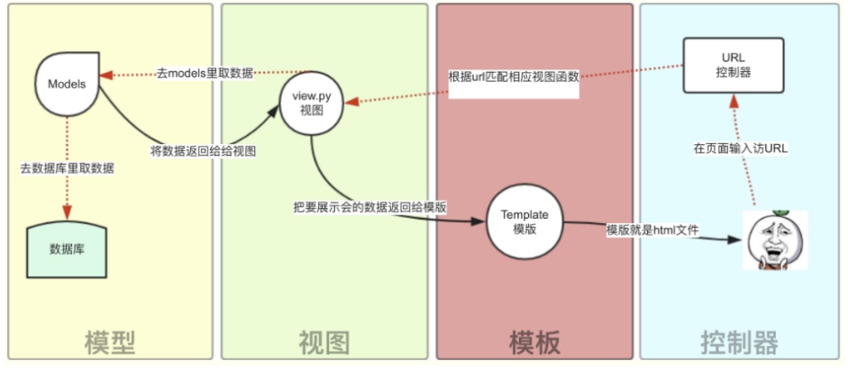

前面生成应用结构如下：

```bash
+---app01
| | admin.py
| | apps.py
| | models.py
| | tests.py
| | views.py
| | __init__.py
| |
| \---migrations
| __init__.py
```

我们来解释下这些生成的 python 文件。

`__init__.py`：说明目录是一个 python 模块

`migrations.py`目录：用于存放数据库迁移历史文件

`models.py`： 用于应用操作数据库的模型

`views.py`： 用于编写 Web 应用视图，接收数据，处理数据，与 Model(模型)，Template(模版)进行交互，返回应答

`apps.py`：应用配置文件。

`tests.py`：做单元测试。

`admin.py`：默认提供了 admin 后台管理，用作网站的后台管理站点配置相关

### 3.4 Django5 Hello World 编写

前面对应用创建和应用配置掌握后，我们来编写第一个 Hello World 应用吧。体验一把 Django5 的项目开 发过程。

#### 第一步：创建 Hello World 应用

直接执行 startapp helloWorld 命令创建应用。


#### 第二步：注册应用到项目的 settings.py

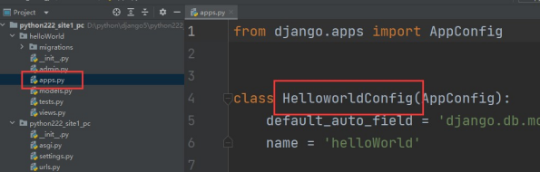

把 helloWorld 应用的 apps.py 里的 HelloworldConfig 类注册到 settings.py 里去

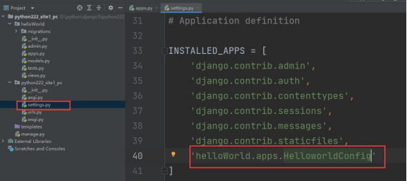

#### 第三步：编写模版网页代码 index.html

在 templates 目录下，新建 index.html 文件


```html
<!DOCTYPE html>
<html lang="en">
  <head>
    <meta charset="UTF-8" />
    <title>Title</title>
  </head>
  <body>
    <p>Django5大爷你好！</p>
    <a href="http://python222.com/post/7" target="_blank">Python学习路线图</a>
  </body>
</html>
```

#### 第四步：编写视图处理请求层代码

在应用的 views.py 里编写 index 方法,request 是客户端请求对象,render 是渲染方法，可以携带数据渲染 到指定页面

```python
def index(request):
    return render(request,'index.html')
```

#### 第五步：编写请求映射函数配置

在项目的 urls.py 里编写应用的 index/请求，执行我们上面应用定义的请求处理代码，也就是写一个映射 关系代码。


```python
import helloWorld.views

urlpatterns = [
    path('admin/', admin.site.urls),
    path('index/', helloWorld.views.index),
]
```

#### 第六步，启动项目，测试

我们可以用前面讲的 Django5 的操作命令 `runserver` 启动

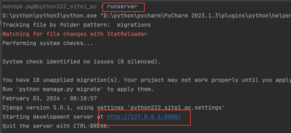

默认端口 8000 当然我们还有更简单的方式。直接用 PyCharm 启动。

直接点击绿色小三角即可。


启动后，浏览器输入，因为我们项目 urls.py 里配置的请求地址就是 index/ 所以请求如下

```http
http://127.0.0.1:8000/index/
```


运行测试成功。

执行过程：客户端请求 index/ - > 经过 django url 请求分发器 - > 执行到应用的 views.py 的 index 方法 - > index 方法再 render 渲染到 index.html 模版代码 - > 最终显示到用户浏览器终端。

### 3.5 Django5 项目配置 settings.py 文件

#### 3.5.1 基本配置

Django 的配置文件 settings.py 用于配置整个网站的环境和功能，核心配置必须有项目路径、密钥配置、域名访问权限、App 列表、中间件、资源文件、模板配置、数据库的连接方式。

```properties
# 项目路径
# Build paths inside the project like this: BASE_DIR / 'subdir'.
BASE_DIR = Path( file ).resolve().parent.parent


# Quick-start development settings - unsuitable for production
# See https://docs.djangoproject.com/en/5.0/howto/deployment/checklist/

# 密钥配置
# SECURITY WARNING: keep the secret key used in production secret!
SECRET_KEY = 'django-insecure-^+$)&&p^atz- o)&ytg&8%6dq!!ujgh7t2w#2n^i_f#r^#*vyqh'

# 调试模式
# SECURITY WARNING: don't run with debug turned on in production!
DEBUG = True
# 域名访问权限
ALLOWED_HOSTS = []
# Application definition # APP列表
INSTALLED_APPS = [
'django.contrib.admin',
'django.contrib.auth',
'django.contrib.contenttypes',
'django.contrib.sessions',
'django.contrib.messages',
'django.contrib.staticfiles',
'helloWorld.apps.HelloworldConfig'
]
```

- `BASE_DIR` 项目路径：主要通过 os 模块读取当前项目在计算机系统的具体路径，该代码在创建项目 时自动生成，一般情况下无须修改。

- `SECRET_KEY` 密钥配置：密钥配置 SECRET_KEY:这是一个随机值，在项目创建的时候自动生成，一 般情况下无须修改。主要用于重要数据的加密处理，提高项目的安全性，避免遭到攻击者恶意破坏。密钥主要用于用户密码、CSRF 机制和会话 Session 等数据加密。
- 用户密码: Django 内置一套 Auth 认证系统，该系统具有用户认证和存储用户信息等功能，在创建用户的时候，将用户密码通过密钥进行加密处理，保证用户的安全性。
- CSRF 机制:该机制主要用于表单提交，防止窃取网站的用户信息来制造恶意请求。
- 会话 Session: Session 的信息存放在 Cookie 中，以一串随机的字符串表示，用于标识当前访问 网站的用户身份，记录相关用户信息。

`DEBUG` 调试模式：该值为布尔类型。如果在开发调试阶段，那么应设置为 True，在开发调试过程中 会自动检测代码是否发生更改，根据检测结果执行是否刷新重启系统。如果项目部署上线，那么应将其改为 False，否则会泄漏项目的相关信息。

`ALLOWED_HOSTS` 域名访问权限：设置可访问的域名,默认值为空列表。当 DEBUG 为 True 并且 ALLOWED_HOSTS 为空列表时，项目只允许以 localhost 或 127.0.0.1 在浏览器上访问。当 DEBUG 为 False 时，ALLOWED_HOSTS 为必填项，否则程序无法启动，如果想允许所有域名访问，可设置 ALLOW_HOSTS=['*']。

`INSTALLED_APPS` APP 列表：告诉 Django 有哪些 App。在项目创建时已有 admin、auth 和 sessions 等配置信息，这些都是 Django 内置的应用功能，各个功能说明如下。

1. admin:内置的后台管理系统。
2. auth:内置的用户认证系统。
3. contenttypes:记录项目中所有 model 元数据( Django 的 ORM 框架)。
4. sessions: Session 会话功能，用于标识当前访问网站的用户身份，记录相关用户信息。
5. messages:消息提示功能。
6. staticfiles:查找静态资源路径。

如果在项目中创建了 App，就必须在 App 列表 INSTALLED_APPS 添加 App 类

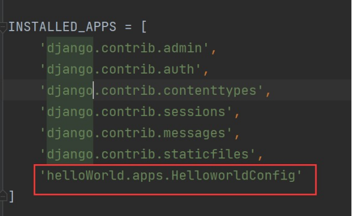

#### 3.5.2 资源文件配置

资源文件配置分为静态资源和媒体资源。静态资源的配置方式由配置属性 STATIC_URL、STATICFILES_DIRS 和 STATIC_ROOT 进行设置;媒体资源的配置方式由配置属性 MEDIA_URL 和 MEDIA_ROOT 决定。

**==静态资源配置=STATIC_URL==**

静态资源指的是网站中不会改变的文件。在一般的应用程序中，静态资源包括 CSS 文件、JavaScript 文件 以及图片等资源文件。 默认配置，app 下的 static 目录为静态资源，可以直接访问。其他目录不行。

```properties
STATIC_URL = 'static/'
```

我们在 app 下新建 static 目录，再放一个 logo.png 图片。

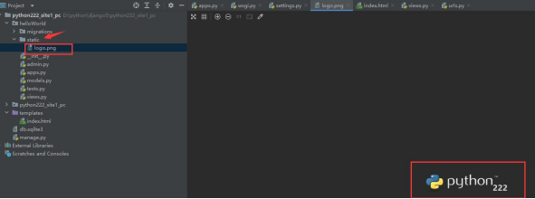

同时在 app 目录下再新建一个 images 目录，放一个 qq.jpg 头像图片

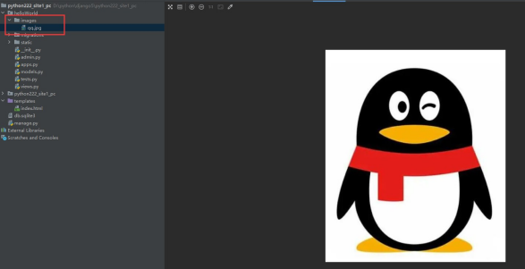

最后再项目目录下新建一个 static，放一个 pig.jpg，也试试看是否可以访问；


我们启动项目测试：

先测试 app 下的 static 目录下的 logo.png，能显示没问题。

```http
http://127.0.0.1:8000/static/logo.png
```

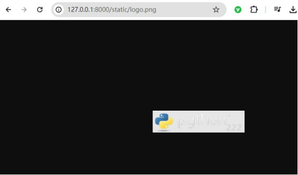

再试试 app 下的 images 目录下的 qq.jpg

```http
http://127.0.0.1:8000/static/qq.jpg
```


404 不存在

最后再测试下项目目录下的 static 下的 pig.jpg

```http
http://127.0.0.1:8000/static/pig.jpg
```


也是 404 不存在。

通过测试说明，==**也就 app 下的 static 目录下的静态资源才能访问。**==

##### 3.5.2.1 静态资源集合配置-STATICFILES DIRS

由于 STATIC_URL 的特殊性，在开发中会造成诸多不便，比如将静态文件夹存放在项目的根目录以及定义 多个静态文件夹等。我们可以通过配置 STATICFILES_DIRS 实现多个目录下的静态资源可以访问。

```properties
# 设置静态资源文件集合
STATICFILES_DIRS = [BASE_DIR / "static", BASE_DIR / "helloWorld/images"]
```

我们再测试下：

```http
http://127.0.0.1:8000/static/pig.jpg
```


```http
http://127.0.0.1:8000/static/qq.jpg
```

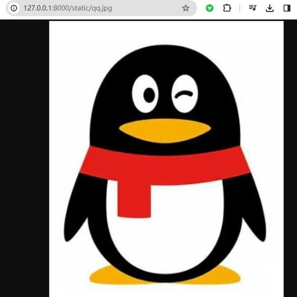

##### 3.5.2.2 静态资源部署配置-STATIC_ROOT

静态资源配置还有 STATIC_ROOT，其作用是在服务器上部署项目，实现服务器和项目之间的映射。 STATIC_ROOT 主要收集整个项目的静态资源并存放在一个新的文件夹，然后由该文件夹与服务器之间 构建映射关系。STATIC_ROOT 配置如下:

```properties
# 静态资源部署
STATIC_ROOT = BASE_DIR / 'static'
```

当项目的配置属性 DEBUG 设为 True 的时候，Django 会自动提供静态文件代理服务，此时整个项目处于开发阶段，因此无须使用 STATIC_ROOT。当配置属性 DEBUG 设为 False 的时候，意味着项目进入生产环境，Django 不再提供静态文件代理服务，此时需要在项目的配置文件中设置 STATIC_ROOT。 设置 STATIC_ROOT 需要使用 Django 操作指令 collectstatic 来收集所有静态资源，这些静态资源都会保存 在 STATIC_ROOT 所设置的文件夹里。

##### 3.5.2.3 媒体资源配置-MEDIA

一般情况下，STATIC_URL 是设置静态文件的路由地址，如 CSS 样式文件、JavaScript 文件以及常用图片等。对于一些经常变动的资源，通常将其存放在媒体资源文件夹，如用户头像、歌曲文件等。媒体资源和静态资源是可以同时存在的，而且两者可以独立运行，互不影响，而媒体资源只有配置属性 MEDIA_URL 和 MEDIA_ROOT。 我们在项目目录下新建 media 目录，里面再放一个 boy.jpg 图片。


然后在配置文件 settings.py 里设置配置属性 MEDIA_URL 和 MEDIA_ROOT，MEDIA_URL 用于设置媒体资 源的路由地址，MEDIA_ROOT 用于获取 media 文件夹在计算机系统的完整路径信息，如下所示：

```properties
# 设置媒体路由
MEDIA_URL = 'media/'
# 设置media目录的完整路径
MEDIA_ROOT = BASE_DIR / 'media'
```

配置属性设置后，还需要将 media 文件夹注册到 Django 里，让 Django 知道如何找到媒体文件，否则无法在浏览器上访问该文件夹的文件信息。打开项目文件夹的 urls.py 文件，为媒体文件夹 media 添加相应 的路由地址，代码如下:

```python
from django.conf import settings
from django.contrib import admin
from django.urls import path, re_path
from django.views.static import serve
import helloWorld.views

urlpatterns = [
    path('admin/', admin.site.urls),
    path('index/', helloWorld.views.index),
    # 配置媒体文件的路由地址
    re_path('media/(?P<path>.*)', serve, {'document_root': settings.MEDIA_ROOT},
            name='media')
]

```

我们来测试下：

```http
http://127.0.0.1:8000/media/boy.jpg
```


#### 3.5.3 模版配置

在 Web 开发中，模板是一种较为特殊的 HTML 文档。这个 HTML 文档嵌入了一些能够让 Django 识别的变量和指令，然后由 Django 的模板引擎解析这些变量和指令，生成完整的 HTML 网页并返回给用户浏览。 模板是 Django 里面的 MTV 框架模式的 T 部分，配置模板路径是告诉 Django 在解析模板时，如何找到模板所在的位置。创建项目时，Django 已有初始的模板配置信息，如下所示:

```python
TEMPLATES = [
    {
        'BACKEND': 'django.template.backends.django.DjangoTemplates',
        'DIRS': [BASE_DIR / 'templates'],
        'APP_DIRS': True,
        'OPTIONS': {
            'context_processors': [ 'django.template.context_processors.debug',
                                   'django.template.context_processors.request',
                                   'django.contrib.auth.context_processors.auth',
                                   'django.contrib.messages.context_processors.messages',
                                  ],
        },
    },
]
```

模板配置是以列表格式呈现的，每个元素具有不同的含义，其含义说明如下。

- BACKEND:定义模板引擎，用于识别模板里面的变量和指令。内置的模板引擎有 DjangoTemplates 和 jinja2.Jinja2，每个模板引擎都有自己的变量和指令语法。
- DIRS:设置模板所在路径，告诉 Django 在哪个地方查找模板的位置，默认为空列表。
- APP_DIRS:是否在 App 里查找模板文件。
- OPTIONS:用于填充在 RequestContext 的上下文（模板里面的变量和指令)，一般情况下不做任何修改。

我们是可以在应用里新建 templates，供自己的应用使用。在 templates 下新建 index2.html 模版文件


views.py 里面把 index.html 改成 index2.html

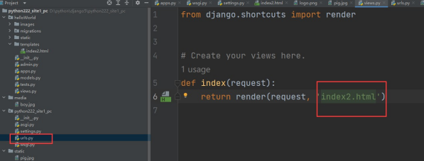

最后就是在 DIRS 里面加上应用的模版路径即可。

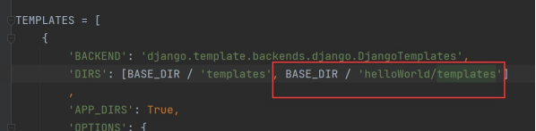

启动测试：

```http
http://127.0.0.1:8000/index/
```

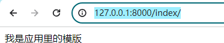

但是我们这里有个疑问，如果说应用里的模版和项目里的模版名字一样，起冲突了。这时候，会选择哪 个呢，或者说哪个优先级高？

我们测试下吧。把应用里的 index2.html 改成 index.html，以及 views.py 里面也改下。


然后我们重新运行测试：运行结果显示的是项目里的模版。


锋哥经过查看 Django 底层源码，其实优先级顺序是==**根据模版配置的目录顺序来定的**==，我们前面项目模版在前面，所以就显示项目模版。

如果我们把应用模版配置路径放前面


运行测试下：


结果就是应用模版了。

#### 3.5.4 数据库配置

数据库配置是选择项目所使用的数据库的类型，不同的数据库需要设置不同的数据库引擎，数据库引擎 用于实现项目与数据库的连接，Django 提供 4 种数据库引擎:

- 'django.db.backends.postgresql'
- 'django.db.backends.mysql'
- 'django.db.backends.sqlite3'
- 'django.db.backends.oracle'

项目创建时默认使用 Sqlite3 数据库，这是一款轻型的数据库，常用于嵌入式系统开发，而且占用的资源 非常少。Sqlite3 数据库配置信息如下:

```python
DATABASES = {
    'default': {
        'ENGINE': 'django.db.backends.sqlite3',
        'NAME': BASE_DIR / 'db.sqlite3',
    }
}
```

如果要把上述的连接信息改成 MySQL 数据库，首先需要安装 MySQL 连接模块 mysqlclient

```bash
pip install mysqlclient -i https://pypi.tuna.tsinghua.edu.cn/simple
```

mysqlclient 模块安装后，在项目的配置文件 settings.py 中配置 MySQL 数据库连接信息

```python
DATABASES = {
    'default': {
        'ENGINE': 'django.db.backends.mysql',
        'NAME': 'db_python222',
        'USER': 'root',
        'PASSWORD': '123456',
        'HOST': 'localhost',
        'PORT': '3306'
    }
}

```

（django5 至少需要 MySQL 8.0.11 版本)

我们来测试下数据库连接；

我们首先在 mysql 里创建数据库 db_python222

然后我们用 Django5 manage.py 提供的内置命令 migrate 来创建 Django 内置功能的数据表；

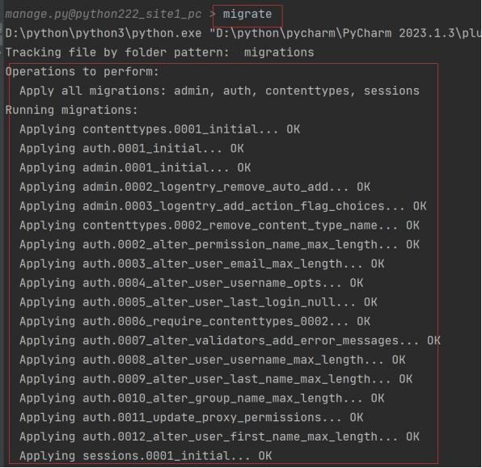

刷新数据库表：

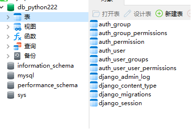

这些是 Django 内置自带的 Admin 后台管理系统，Auth 用户系统以及会话机制等功能需要用到的表。

==**注意：django 也支持 pymysql,mysqldb 等，但是用的时候会有点小问题，所以建议大家还是用 mysqlclient，比较稳定。**==

同时 django 支持多数据库；

```python
DATABASES = {
    'default': {
        'ENGINE': 'django.db.backends.mysql',
        'NAME': 'db_python222',
        'USER': 'root',
        'PASSWORD': '123456',
        'HOST': 'localhost',
        'PORT': '3308'
    },
    'mySqlite3': {
        'ENGINE': 'django.db.backends.sqlite3',
        'NAME': BASE_DIR / 'db.sqlite3',
    },
    'mySql3': {
        'ENGINE': 'django.db.backends.mysql',
        'NAME': 'db_django',
        'USER': 'root',
        'PASSWORD': '123',
        'HOST': 'localhost',
        'PORT': '3306'
    }
}
```

例如上面，我们定义了三个数据库，两个 mysql，一个 sqlite；配置属性 DATABASES 设有 3 个键值对，分 别是：'default'，'mySqlite3'，'mySql3'，每个键值对代表 Django 连接了某个数据库。

若项目中连接了多个数据库，则数据库之间的使用需要遵从一定的规则和设置。比如项目中定义了多个模型，每个模型所对应的数据表可以选择在某个数据库中生成，如果模型没有指向某个数据库，模型就 会在 key 为 default 的数据库里生成。

#### 3.5.5 中间件

中间件(Middleware）是一个用来处理 Django 的请求(Request）和响应（Response）的框架级别的钩 子，它是一个轻量、低级别的插件系统，用于在全局范围内改变 Django 的输入和输出。当用户在网站中进行某个操作时，这个过程是用户向网站发送 HTTP 请求(Request);而网站会根据用户的 操作返回相关的网页内容，这个过程称为响应处理(Response)。从请求到响应的过程中，当 Django 接 收到用户请求时，首先经过中间件处理请求信息，执行相关的处理，然后将处理结果返回给用户。


django 默认的中间配置如下：

```python
MIDDLEWARE = [
    'django.middleware.security.SecurityMiddleware',
    'django.contrib.sessions.middleware.SessionMiddleware',
    'django.middleware.common.CommonMiddleware',
    'django.middleware.csrf.CsrfViewMiddleware',
    'django.contrib.auth.middleware.AuthenticationMiddleware',
    'django.contrib.messages.middleware.MessageMiddleware',
    'django.middleware.clickjacking.XFrameOptionsMiddleware',
]
```

django 自带的中间件有：

- SecurityMiddleware:内置的安全机制，保护用户与网站的通信安全。
- SessionMiddleware:会话 Session 功能。
- LocaleMiddleware:国际化和本地化功能。
- CommonMiddleware:处理请求信息，规范化请求内容。
- CsrfViewMiddleware:开启 CSRF 防护功能。
- AuthenticationMiddleware:开启内置的用户认证系统。
- MessageMiddleware:开启内置的信息提示功能。
- XFrameOptionsMiddleware:防止恶意程序单击劫持。

我们也可以自定义中间件：

中间件可以定义五个方法，分别是：（主要的是 process_request 和 process_response），在自己定义中间件时，必须继承 MiddlewareMixin

process_request(self,request) 请求 views 方法之前会执行。

process_view(self, request, callback, callback_args, callback_kwargs) Django 会在调用视图函数之前调用 process_view 方法。

process_template_response(self,request,response) 该方法对视图函数返回值有要求，必须是一个含有 render 方法类的对象，才会执行此方法

process_exception(self, request, exception) 这个方法只有在视图函数中出现异常了才执行

process_response(self, request, response) 请求执行完成，返回页面前会执行

新建 Md1 自定义中间件类，继承 MiddlewareMixin，实现 process_request 和 process_response 方法。


```python
"""
自定义中间件
作者 : 小锋老师
官网 : www.python222.com
"""
from django.utils.deprecation import MiddlewareMixin
class Md1(MiddlewareMixin):
    def process_request(self, request):
        print("request请求来了")

    def process_response(self, request, response):
        print("请求处理完毕，将返回到页面")
        return response
```

setting.py 里配置自定义中间件。


views.py 的 index 请求处理方法，我们加一句打印。


最后我们运行测试：

```http
http://127.0.0.1:8000/index/
```

```
request请求来了
页面请求处理中
请求处理完毕，将返回到页面
```

#### 3.5.6 其他配置

还有一些其他 settings.py 配置我们了解下

ROOT_URLCONF = 'python222_site1_pc.urls' 它指定了当前项目的根 URL，是 Django 路由系统的入口。

WSGI_APPLICATION = 'python222_site1_pc.wsgi.application' 项目部署时，Django 的内置服务器将 使用的 WSGI 应用程序对象的完整 Python 路径。

AUTH_PASSWORD_VALIDATORS 这是一个支持插拔的密码验证器，且可以一次性配置多个，Django 通过这些内置组件来避免用户设置的密码等级不足的问题。

LANGUAGE_CODE = 'en-us' TIME_ZONE = 'UTC'

分别代表语言配置项和当前服务端时区的配置项，我们常用的配置如下所示：

- LANGUAGE_CODE 取值是英文：'en-us'或者中文：'zh-Hans'；
- TIME_ZONE 取值是世界时区 'UTC' 或中国时区 'Asia/Shanghai'；

USE_I18N = True 项目开发完成后，可以选择向不同国家的用户提供服务，那么就需要支持国际化和本 地化。

USE_TZ = True 它指对时区的处理方式，当设置为 True 的时候，存储到数据库的时间是世界时间 'UTC'。

DEFAULT_AUTO_FIELD = 'django.db.models.BigAutoField' 默认主键自增类型

## 4、Django5 路由定义与使用

### 4.1 Django5 路由定义

一个完整的路由包含:路由地址、视图函数（或者视图类)、可选变量和路由命名。

路由称为 URL (Uniform Resource Locator，统一资源定位符），也可以称为 URLconf，是对可以从互联 网上得到的资源位置和访问方法的一种简洁的表示，是互联网上标准资源的地址。互联网上的每个文件都有一个唯一的路由，用于指出网站文件的路径位置。简单地说，路由可视为我们常说的网址，每个网址代表不同的网页。

前面的 Hello World 项目。我们请求的地址：

```http
http://127.0.0.1:8000/index/
```

就是一个路由地址。

`index/`请求地址，根据 urls.py 配置文件，找到对应的 helloWorld views 下的 index 视图函数；

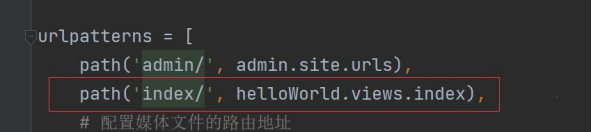

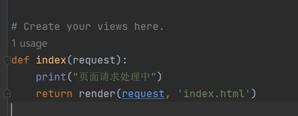

然后最终执行 index 视图函数，然后到 index.html 页面。

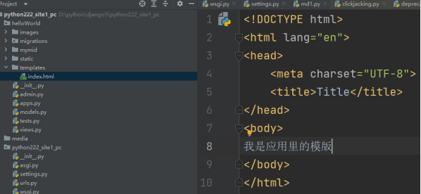

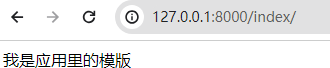

### 4.2 Django5 路由变量

在平时开发中，有时候一个路由可以代表多个不同的页面，比如博客系统里面，有 1 千个博客页面，按照前面学习的方式，需要写 1 千个路由才能实现，这种做法显然不可取，维护也麻烦。我们可以通过路由变量，来实现一个路由代表多个页面。

路由的变量类型有`字符类型`、`整型`、`slug` 和 `uuid`，最为常用的是字符类型和整型。各个类型说明如下。

- 字符类型:匹配任何非空字符串，但不含斜杠。如果没有指定类型，就默认使用该类型。
- 整型:匹配 О 和正整数。
- slug:可理解为注释、后缀或附属等概念，常作为路由的解释性字符。可匹配任何 ASCII 字符以及连 接符和下画线，能使路由更加清晰易懂。比如网页的标题是“15 岁的孩子”，其路由地址可以设置为 “15-sui-de-hai-zi”。
- uuid:匹配一个 uuid 格式的对象。为了防止冲突，规定必须使用“”并且所有字母必须小写，例如 175194d3-6885-437e-a8a8-6c231e272f00。

下面列举实例一 博客帖子请求：

首先 urls.py 里定义路由映射：

```python
path('blog/<int:id>', helloWorld.views.blog)
```

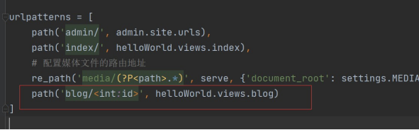

views.py 里再定义 blog 函数实现：

```python
def blog(request, id):
    return HttpResponse('id是' + str(id) + "的博客页面")
```

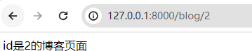

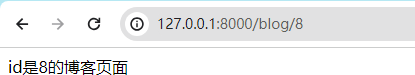

这样，我们就实现了一个带变量的路由的多个博客页面的实现。

当然我们也可以带多个路由变量。让博客的路由地址，在带上年月日变量。

urls.py 修改

```python
path('blog2/<int:year>/<int:month>/<int:day>/<int:id>', helloWorld.views.blog2)
```

views.py 修改

```python
def blog2(request, year, month, day, id):
    return HttpResponse(str(year) + '/' + str(month) + '/' + str(day) + '/' + ' id是' + str(id) + "的博客页面")
```

运行测试：

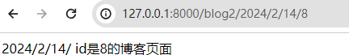

### 4.3 Django5 正则路由

有时候我们为了更好的进行路由匹配，可以用正则表达式。

比如前面讲的日期的路由变量，其实是有点问题的。

我们月份输入 333，也是满足条件的。但是不符合实际，实际情况月份最多两位数。

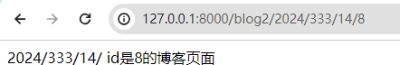

所以这时候，我们可以用正则表达式来限制。

urls.py 修改：

```python
re_path('blog3/(?P<year>[0-9]{4})/(?P<month>[0-9]{2})/(?P<day>[0-9]{2})',helloWorld.views.blog3)
```

views.py 添加 blogs 方法：

```python
def blog3(request, year, month, day):
    return HttpResponse(str(year) + '/' + str(month) + '/' + str(day) + '的博客页面')
```

> 注意：
>
> - 正则 urls 匹配，必须用==**re_path**==方法；
> - 正则表达式==**?P**==开头是固定格式；

运行测试：

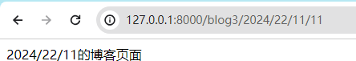

### 4.4 Django5 路由重定向

重定向称为 HTTP 协议重定向，也可以称为网页跳转，它对应的 HTTP 状态码为 301、302、303、307、 308。简单来说，网页重定向就是在浏览器访问某个网页的时候，这个网页不提供响应内容，而是自动 跳转到其他网址，由其他网址来生成响应内容。

Django 的网页重定向有两种方式:

1. 第一种方式是路由重定向;
2. 第二种方式是自定义视图的重定向;

两种重定向方式各有优点，前者是使用 Django 内置的视图类 RedirectView 实现的，默认支持 HTTP 的 GET 请求;后者是在自定义视图的响应状态设置重定向，能让开发者实现多方面的开发需求。

我们分别用实例来演示下这两种方式：

#### 4.4.1 路由重定向(不建议使用)

路由重定向方式，我们用 RedirectView 实现，在 urls.py 里面，我们再加一个路由代码：

```python
path('redirectTo', RedirectView.as_view(url="index/"))
```

请求 redirectTo，直接重定向到 index/ 地址

运行测试，请求：

```http
http://127.0.0.1:8000/redirectTo
```

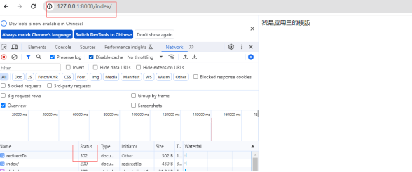

自动重定向到 index，状态是 302。

#### 4.4.2 自定义视图重定向(推荐)

更多的情况，我们平时开发用的是自定义视图重定向，视图代码里，通过逻辑判断，通过 redirect 方法来实现具体的页面重定向，使用更加灵活。

我们改造下前面的 views.py 下的 blog 函数：假如 id 是 0，重定向到错误静态页面。

```python
def blog(request, id):
    if id == 0:
        return redirect("/static/error.html")
    else:
        return HttpResponse('id是' + str(id) + "的博客页面")

```

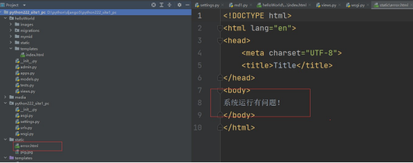

static 目录下新建一个 error.html 文件

```html
<!DOCTYPE html>
<html lang="en">
  <head>
    <meta charset="UTF-8" />
    <title>Title</title>
  </head>
  <body>
    系统运行有问题！
  </body>
</html>
```

当然你也可以项目根目录下再新建一个目录，比如 common,然后 STATICFILES_DIRS 静态资源文件集合 里，加下 BASE_DIR / "common"，把 error.html 放到 common 目录下，我们也是可以通过 static/请求地 址访问的。当然如果你觉得 static/请求名称不好，也可以修改 STATIC_URL 参数 比如 改成 common/ 也 行，你就可以通过 common/ 也访问你的静态资源文件。

我们访问

```http
http://127.0.0.1:8000/blog/0
```

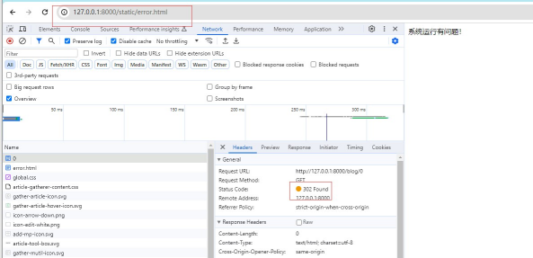

302 状态，自动跳转到了 error.html 错误页面。

访问其他 id 是正常的。

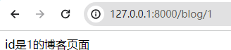

### 4.5 Django5 命名空间 namespace

当我们网站项目规模越来越多，子项目很多的时候，为了方便管理路由地址，我们可以采用命名空间 namespace 来对路由地址根据子项目分类。

我们通过 django manage.py 自带的 startapp 命令新建两个项目，分别是 user 和 order

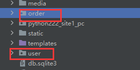

我们分别添加 urls.py 到 user 和 order 项目里去。

以及加下代码:

user 项目的 urls.py:

```python
from django.contrib import admin
from django.urls import path
from user import views

urlpatterns = [
    path('admin/', admin.site.urls),
    path('index/', views.index),
]

```

user 项目的 views.py:

```python
def index(request):
    return HttpResponse("用户信息")
```

order 项目的 urls.py:

```python
from django.contrib import admin
from django.urls import path
from order import views
urlpatterns = [
    path('admin/', admin.site.urls),
    path('index/', views.index),
    path('list/', views.list),
]
```

order 项目的 views.py：

```python
from django.http import HttpResponse
# Create your views here.
def index(request):
    return HttpResponse("订单信息")

def list(request):
    return HttpResponse("订单列表")
```

接下来，我们在主项目里，加下映射：

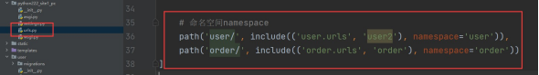

```python
path('user/', include(('user.urls', 'user'), namespace='user')),
path('order/', include(('order.urls', 'order'), namespace='order'))
```

说明下：

include(('user.urls', 'user') 相当于找到 user 项目的 urls.py 文件。

namespace='user' 给这个映射取名是 user，一般是根据项目名称来取。

第一个参数 'user/' 标识 user/开头的请求，都由 user 项目的 urls.py 去管理处理映射关系。

通过这种命名空间，我们可以把复杂项目的路由映射拆分，升级维护会方便很多。

### 4.6 Django5 路由命名与反向解析 reverse 与 resolve

我们在 urls.py 里定义的路由信息，有时候需要动态获取路由信息，然后进行一些处理，统计，日志等操作，这时候我们需要在其他代码里用到路由信息，比如 views.py，后面要学到的模型 models.py， Admin 系统等，因此我们引入路由反向解析 reverse 与 resolve 方法，再使用这两个方法前，我们还需要给路由取名，否则我们无法找到我们需要的那个路由的信息。reverse 方法根据路由名称得到路由地址， resolve 方法根据路由地址得到路由所有信息。

我们先举一个简单例子来体会下吧。

在 order 项目的 urls.py 里，我们对 index/和 list/请求路由分别取名 index 和 list

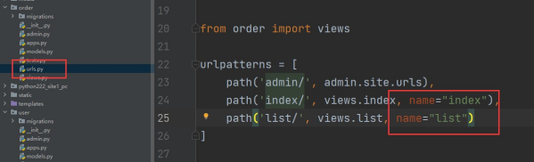

然后修改 views.py 的 index 方法：

```python
def index(request):
    route_url = reverse('order:index')
    print("reverse反向解析得到路由地址：" + route_url)
    result = resolve(route_url)
    print("resolve通过路由地址得到路由信息：" + str(result))
    return HttpResponse("订单信息")
```

我们运行请求：

```http
http://127.0.0.1:8000/order/index/
```

控制台输出：

```
reverse反向解析得到路由地址：/order/index/
resolve通过路由地址得到路由信息：ResolverMatch(func=order.views.index, args=(),
kwargs={}, url_name='index', app_names=['order'], namespaces=['order'],
route='order/index/')
```

resolve 返回对象属性介绍：

| **函数方法** | **说明**                               |
| ------------ | -------------------------------------- |
| func         | 路由的视图函数对象或视图类对象         |
| args         | 以列表格式获取路由的变量信息           |
| kwargs       | 以字典格式获取路由的变量信息           |
| url_name     | 获取路由命名 name                      |
| app names    | 与 app name 功能一致，但以列表格式表示 |
| namespaces   | 与 namespace 功能一致,但以列表格式表示 |
| route        | 获取整个路由的名称，包括命名空间       |

这里我们在修改下项目，来讲下参数的运用。

order 的 urls.py 的 list 请求加下年月日路由变量

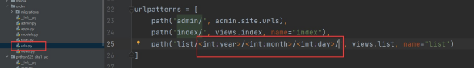

```python
path('list/<int:year>/<int:month>/<int:day>/', views.list, name="list")
```

对应的 views.py 的 list 方法我们也进行修改，要加上三个路由变量

```python
def list(request, year, month, day):
    kwargs = {'year': year - 1, 'month': month + 1, 'day': day}
    args = [year, month, day]
    # route_url = reverse('order:list', args=args)
    route_url = reverse('order:list', kwargs=kwargs)
    print("reverse反向解析得到路由地址：" + route_url)
    result = resolve(route_url)
    print("resolve通过路由地址得到路由信息：" + str(result))
    return HttpResponse("订单列表")
```

进行反向解析路由的时候，我们也可以带上路由实参，可以通过 kwargs 字典键值对，也可以通过 args 元 组；

测试请求地址： http://127.0.0.1:8000/order/list/2010/11/11/

控制台输出：

```
reverse反向解析得到路由地址：/order/list/2009/12/11/
resolve通过路由地址得到路由信息：ResolverMatch(func=order.views.list, args=(),
kwargs={'year': 2009, 'month': 12, 'day': 11}, url_name='list', app_names=
['order'], namespaces=['order'],
route='order/list/<int:year>/<int:month>/<int:day>/', captured_kwargs={'year':
2009, 'month': 12, 'day': 11})
```

==**点开 reverse 方法：**==

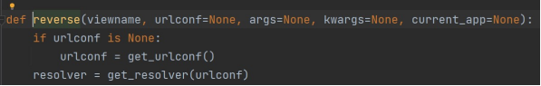

必须参数 viewname，以及一些可选参数：

viewname:代表路由命名或可调用视图对象，一般情况下是以路由命名 name 来生成路由地址的。

urlconf:设置反向解析的 URLconf 模块。默认情况下，使用配置文件 settings.py 的 ROOT_URLCONF 属性( 主项目文件夹的 urls.py ).

args:以列表方式传递路由地址变量，列表元素顺序和数量应与路由地址变量的顺序和数量一致。

kwargs:以字典方式传递路由地址变量，字典的键必须对应路由地址变量名，字典的键值对数量与 变量的数量一致。

current_app:提示当前正在执行的视图所在的项目应用，主要起到提示作用，在功能上并无实质的作用。

==**点开 resolve 方法：**==

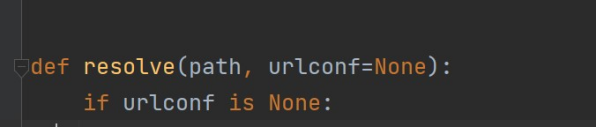

就两个参数：

- path:代表路由地址，通过路由地址来获取对应的路由对象信息。
- urlconf:设置反向解析的\_URLconf 模块。默认情况下，使用配置文件 settings.py 的 ROOT_URLCONF 属性( 主项目文件夹的 urls.py ).

## 5、Django5 视图定义于使用

视图(Views）是 Django 的 MTV 架构模式的 V 部分，主要负责处理用户请求和生成相应的响应内容,然后 在页面或其他类型文档中显示。

Django 的 MTV 分别代表：

Model(模型)：业务对象与数据库的对象(ORM)

Template(模版)：负责如何把页面展示给用户

View(视图)：负责业务逻辑，并在适当的时候调用 Model 和 Template

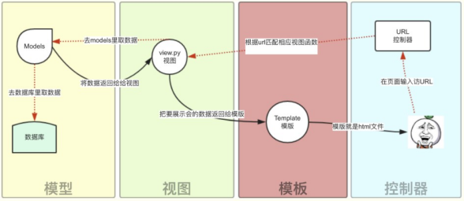

### 5.1 Django5 设置视图响应状态

客户端请求后端服务，在 view.py 视图层方法最终 return 返回视图响应。Python 内置提供了响应类型， 来实现不同的返回不同的 http 状态码；

| **响应类型**                       | **解释说明**                            |
| ---------------------------------- | --------------------------------------- |
| HttpResponse('Hello world'")       | 状态码 200，请求已成功被服务器接收      |
| HttpResponseRedirect('/')          | 状态码 302，重定向首页地址              |
| HttpResponsePermanentRedirect('/') | 状态码 301，永久重定向首页地址          |
| HttpResponseBadRequest("'400')     | 状态码 400，访问的页面不存在或请求错误  |
| HttpResponseNotFound('404")        | 状态码 404，网页不存在或网页的 URL 失效 |
| HttpResponseForbidden('403')       | 状态码 403，没有访问权限                |
| HttpResponseNotAllowed('405')      | 状态码 405，不允许使用该请求方式        |
| HttpResponseServerError('500'")    | 状态码 500，服务器内容错误              |
| JsonResponse( {'foo' : 'bar'})     | 默认状态码 200，响应内容为 JSON 数据    |
| StreamingHttpResponse()            | 默认状态码 200，响应内容以流式输出      |

下面我们举几个例子来实操下视图响应状态应用；

举例一：HttpResponse

修改 helloWorld 的 views.py 的 index 函数：

```python
def index(request):
    html = "<font color='red'>学Python，上www.python222.com</font>"
    return HttpResponse(html, status=200)
```

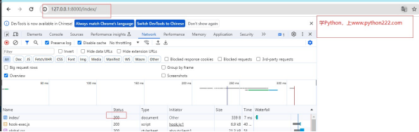

请求测试，状态码 200，返回网页信息。status=200 不写的话默认也是 200.

举例二：HttpResponseNotFound 404

```python
def index(request):
    return HttpResponseNotFound()
```

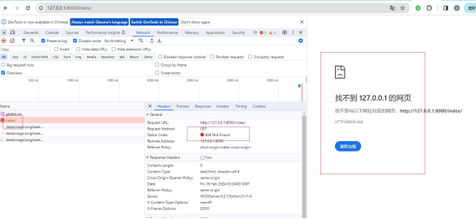

请求测试，状态码 404。

举例三：JsonResponse 响应 json 数据

```python
def index(request):
    return JsonResponse({'foo': 'bar'})
```

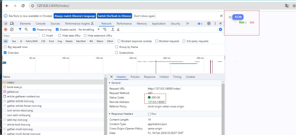

请求测试，状态码 200，返回 json 格式数据。

我们第一个实例用到的是 HttpResponse，简单网页我们直接可以响应到页面，但是假如是复杂网页，就 会增加视图函数的代码量。所以我们引入模版，通过 django 提供的 render 方法渲染数据到模版，然后再 响应到页面。

```python
def index(request):
    return render(request, 'index.html')
```

这个是我们前面的的 HelloWorld 代码，我们 ctrl 点进去 render 方法，看下源码：

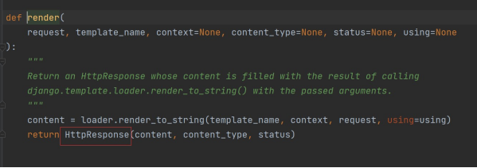

经过模版渲染后得到 content 网页内容，依然返回的是 HttpResponse 对象。

render 方法定义：

```python
def render(request,
           template_name,
           context=None,
           content_type=None,
           status=None,
           using=None
)
```

request 和 template_name 是必须的参数。其他参数可选。

- request:浏览器向服务器发送的请求对象，包含用户信息、请求内容和请求方式等。
- template_name:设置模板文件名，用于生成网页内容。
- context:对模板上下文（模板变量）赋值，以字典格式表示，默认情况下是一个空字典。
- content_type:响应内容的数据格式，一般情况下使用默认值即可。 status: HTTP 状态码，默认为 200。
- using:设置模板引擎，用于解析模板文件，生成网页内容。

我们再写一个带字典参数的 render 渲染模版实例：

views.py 改写下：

```python
def index(request):
    content_value = {"msg": '学Python，上www.python222.com'}
    return render(request, 'index.html', context=content_value)
```

模版代码改写下，模版里取值语法 {{ 字典的key值 }}

```html
<!DOCTYPE html>
<html lang="en">
  <head>
    <meta charset="UTF-8" />
    <title>Title</title>
  </head>
  <body>
    模版取值： {{ msg }}
  </body>
</html>
```

请求测试：

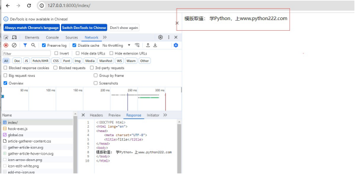

### 5.2 Django5 设置重定向响应

Django 重定向我们前面讲过一种 urls.py 里使用 RedirectView 实现

```python
path('redirectTo', RedirectView.as_view(url="index/"))
```

这种方便书写简单，但是不灵活，我们实际开发，为了能否实现业务上的判断，来进行业务重定向跳 转，还是需要用 redirect 方法。

重定向的状态码分为 301 和 302，前者是永久性跳转的，后者是临时跳转的，两者的区别在于搜索引擎的网页抓取。301 重定向是永久的重定向，搜索引擎在抓取新内容的同时会将旧的网址替换为重定向之后的网址。302 跳转是暂时的跳转，搜索引擎会抓取新内容而保留旧的网址。因为服务器返回 302 代码，所以搜索引擎认为新的网址只是暂时的。

Django 内置提供了重定向类 HttpResponseRedirect 和 HttpResponsePermanentRedirect 分别代表 HTTP 状态码 302 和 301

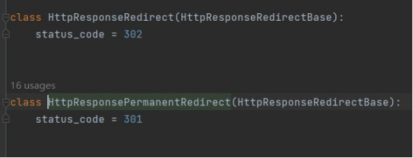

我们通过一个实例来测试下重定向

我们 static 下面新建一个新页面 new.html


改写 helleWorld 里得 index 方法：

```python
def index(request):
    return redirect("/static/new.html")
```

我们测试下：请求 http://127.0.0.1:8000/index/ 302 跳转到了 new.html 页面 （最好用谷歌浏览 器得无痕浏览，这样没有缓存干扰测试）


我们加上 permanent=True 参数；

```python
def index(request):
    return redirect("/static/new.html", permanent=True)
```

再测试下，就变成 301 永久跳转了。


我们点进去看下 redirect 方法得源码实现：

```python
def redirect(to, *args, permanent=False, **kwargs):
    """
    Return an HttpResponseRedirect to the appropriate URL for the arguments
    passed.
    The arguments could be:
    * A model: the model's `get_absolute_url()` function will be called.
    * A view name, possibly with arguments: `urls.reverse()` will be used
    to reverse-resolve the name.
    * A URL, which will be used as-is for the redirect location.
    Issues a temporary redirect by default; pass permanent=True to issue a
    permanent redirect.
    """
    redirect_class = (
        HttpResponsePermanentRedirect if permanent else HttpResponseRedirect
    )
    return redirect_class(resolve_url(to, *args, **kwargs))
```

第一个跳转参数支持模型，视图路由名称，还有最常用得 url 地址；第二个参数就是是否永久跳转，默认 Flase;

redirect_class 通过 permanent 判断，true 返回 HttpResponsePermanentRedirect，false 返回 HttpResponseRedirect;

### 5.3 Django5 二进制文件下载响应

响应内容除了返回网页信息外，还可以实现文件下载功能，是网站常用的功能之一。 Django 提供三种方式实现文件下载功能，分别是 HttpResponse、StreamingHttpResponse 和 FileResponse,三者的说明如下:

- HttpResponse 是所有响应过程的核心类，它的底层功能类是 HttpResponseBase。
- StreamingHttpResponse 是在 HttpResponseBase 的基础上进行继承与重写的，它实现流式响应 输出（流式响应输出是使用 Python 的迭代器将数据进行分段处理并传输的)，适用于大规模数据响 应和文件传输响应。
- FileResponse 是在 StreamingHttpResponse 的基础上进行继承与重写的，它实现文件的流式响应 输出，只适用于文件传输响应。

我们通过实例来看下如何应用：

我们准备一个文件，这里我们用一个 exe 二进制文件。放 D 盘根目录。


views.py 里写方法实现方法：

```python
# 定义文件路径
file_path = "D:\\360zip_setup.exe"
def download_file1(request):
    file = open(file_path, 'rb') # 打开文件
    response = HttpResponse(file) # 创建HttpResponse对象
    response['Content_Type'] = 'application/octet-stream'
    response['Content-Disposition'] = 'attachment;filename=file1.exe'
    return response

def download_file2(request):
    file = open(file_path, 'rb') # 打开文件
    response = StreamingHttpResponse(file) # 创建StreamingHttpResponse对象
    response['Content_Type'] = 'application/octet-stream'
    response['Content-Disposition'] = 'attachment;filename=file2.exe'
    return response

def download_file3(request):
    file = open(file_path, 'rb') # 打开文件
    response = FileResponse(file) # 创建FileResponse对象
    response['Content_Type'] = 'application/octet-stream'
    response['Content-Disposition'] = 'attachment;filename=file3.exe'
    return response
```

urls.py 里定义下映射：

```python
path('download1', helloWorld.views.download_file1),
path('download2', helloWorld.views.download_file2),
path('download3', helloWorld.views.download_file3)
```

为了方便测试，我们 static 目录下新建一个 download.html 静态文件：

```html
<!DOCTYPE html>
<html lang="en">
  <head>
    <meta charset="UTF-8" />
    <title>下载测试</title>
  </head>
  <body>
    <a href="/download1">下载测试一：HttpResponse</a><br />
    <a href="/download2">下载测试二：StreamingHttpResponse</a><br />
    <a href="/download3">下载测试三：FileResponse</a>
  </body>
</html>
```

页面输入： http://127.0.0.1:8000/static/download.html 测试：


分别点击下载测试：


### 5.4 Http 请求&HttpRequest 请求类

超文本传输协议（Hypertext Transfer Protocol，HTTP）是一个简单的请求-响应协议，它通常运行在 TCP 之上。它指定了客户端可能发送给服务器什么样的消息以及得到什么样的响应。

当在浏览器上访问某个网址时，其实质是向网站发送一个 HTTP 请求，HTTP 请求分为 8 种请求方式，每种 请求方式的说明如下：

| **请求方式** | **说明**                                                |
| ------------ | ------------------------------------------------------- |
| OPTIONS      | 返回服务器针对特定资源所支持的请求方法                  |
| GET          | 向特定资源发出请求（访问网页）                          |
| POST         | 向指定资源提交数据处理请求（提交表单、上传文件)         |
| PUT          | 向指定资源位置上传数据内容                              |
| DELETE       | 请求服务器删除 request-URL 所标示的资源                 |
| HEAD         | 与 GET 请求类似，返回的响应中没有具体内容，用于获取报头 |
| TRACE        | 回复和显示服务器收到的请求，用于测试和诊断              |
| CONNECT      | HTTP/1.1 协议中能够将连接改为管道方式的代理服务器       |

在上述的 HTTP 请求方式里，最基本的是 GET 请求和 POST 请求，网站开发者关心的也只有 GET 请求和 POST 请求。GET 请求和 POST 请求是可以设置请求参数的，两者的设置方式如下:

- GET 请求的请求参数是在路由地址后添加“?”和参数内容，参数内容以 key=value 形式表示，等号前 面的是参数名，后面的是参数值，如果涉及多个参数，每个参数之间就使用“&”隔开，如 127.0.0.1:8000/?name=python222&pw=123456。
- POST 请求的请求参数一般以表单的形式传递，常见的表单使用 HTML 的 form 标签，并且 form 标签 的 method 属性设为 POST。

再 Django5 中，Http 请求信息都被封装到了 HttpRequest 类中。

HttpRequest 类的常用属性如下：

- COOKIE:获取客户端（浏览器）的 Cookie 信息，以字典形式表示，并且键值对都是字符串类型。
- FILES: django.http.request.QueryDict 对象，包含所有的文件上传信息。
- GET:获取 GET 请求的请求参数，它是 django.http.request.QueryDict 对象，操作起来类似于字典。
- POST:获取 POST 请求的请求参数，它是 django.http.request.QueryDict 对象，操作起来类似于字 典。
- META:获取客户端（浏览器）的请求头信息，以字典形式存储。
- method:获取当前请求的请求方式(GET 请求或 POST 请求)。
- path:获取当前请求的路由地址。
- session:一个类似于字典的对象，用来操作服务器的会话信息，可临时存放用户信息。
- user:当 Django 启用 AuthenticationMiddleware 中间件时才可用。它的值是内置数据模型 User 的 对象，表示当前登录的用户。如果用户当前没有登录，那么 user 将设为 django.contrib.auth.models.AnonymousUser 的一个实例。

HttpRequest 类常用方法如下：

- is_secure():是否是采用 HTTPS 协议。
- get_host():获取服务器的域名。如果在访问的时候设有端口，就会加上端口号，如 127.0.0.1:8000。
- get_full path():返回路由地址。如果该请求为 GET 请求并且设有请求参数，返回路由地址就会将请 求参数返回，如/?name=python222&pw=123456。

我们搞个实例来测试下吧：

先 views.py 里定义两个方法，分别测试 get 和 post：

```python
def get_test(request):
    """
    get请求测试
    :param request:
    :return:
    """
    print(request.method) # 请求方式
    # 常用属性
    print(request.content_type)
    print(request.content_params)
    print(request.COOKIES)
    print(request.scheme)
    # 常用方法
    print(request.is_secure())
    print(request.get_host())
    print(request.get_full_path())
    print(request.GET.get("name"))
    print(request.GET.get("pwd"))
    print(request.GET.get("aaa", "666"))
    return HttpResponse("http get ok")

def post_test(request):
    """
    post请求测试
    :param request:
    :return:
    """
    print(request.method) # 请求方式
    print(request.POST.get("name"))
    print(request.POST.get("pwd"))
    print(request.POST.get("aaa", "666"))
    return HttpResponse("http post ok")
```

urls.py 里定义下映射：

```python
path('get', helloWorld.views.get_test),
path('post', helloWorld.views.post_test)
```

模版里新建 http.html，这里我们不能用静态页面，需要一个 csrf 安全机制 token 需要后端 server 来提 供，所以只能用模版

```html
<!DOCTYPE html>
<html lang="en">
  <head>
    <meta charset="UTF-8" />
    <title>Title</title>
  </head>
  <body>
    <a href="/get?name=python222&pwd=123456" target="_blank">http get请求测试</a
    ><br />
    <form action="/post" method="post">
       name:<input type="text" name="name" /><br />
      pwd:<input type="text" name="pwd" /><br />
      <input type="submit" value="提交" />
    </form>
  </body>
</html>
```

请求 index 跳转到 http.html

```python
def index(request):
    return render(request, 'http.html')
```

浏览器输入 http://127.0.0.1:8000/index/ 测试：


点击 get 链接地址：

后台输出：

```
GET
text/plain
{}
{'csrftoken': 'GDgfE2kvXwRYS6WMejaYNE9ij9KPodHi'}
http
False
127.0.0.1:8000
/get?name=python222&pwd=123456
python222
123456
666
请求处理完毕，将返回到页面
[20/Feb/2024 17:09:52] "GET /get?name=python222&pwd=123456 HTTP/1.1" 200 11
```

再 post 表单测试：

后台输出：

```
POST
python222
123456
666
```

### 5.5 会话管理（Cookies&Session）

HTTP 是一种无状态协议，每次客户端访问 web 页面时，客户端打开一个单独的浏览器窗口连接到 web 服务器，由于服务器不会自动保存之前客户端请求的相关信息，所有无法识别一个 HTTP 请求是否为第一次访问。这就引进了 web 客户端和服务器端之间的会话，这就是会话管理。

常用的会话跟踪技术是 Cookie 与 Session。Cookie 通过在客户端记录信息确定用户身份，Session 通过在 服务器端记录信息确定用户身份。

#### 5.5.1 关于 Cookie

cookie 是某些网站为了辨别用户身份，进行 Session 跟踪而储存在用户本地终端上的数据（通常经过加 密），由用户客户端计算机暂时或永久保存的信息。

Cookie 定义了一些 HTTP 请求头和 HTTP 响应头，通过这些 HTTP 头信息使服务器可以与客户进行状态交互。

客户端请求服务器后，如果服务器需要记录用户状态，服务器会在响应信息中包含一个 Set-Cookie 的响 应头，客户端会根据这个响应头存储 Cookie 信息。再次请求服务器时，客户端会在请求信息中包含一个 Cookie 请求头，而服务器会根据这个请求头进行用户身份、状态等较验。


#### 5.5.2 关于 Session

Session 是另一种记录客户状态的机制，不同的是 Cookie 保存在客户端浏览器中，而 Session 保存在服务 器上。客户端浏览器访问服务器的时候，服务器把客户端信息以某种形式记录在服务器上。这就是 Session。客户端浏览器再次访问时只需要从该 Session 中查找该客户的状态就可以了。

当程序需要为某个客户端的请求创建一个 session 的时候，服务器首先检查这个客户端的请求里是否已包含了一个 session 标识，称为 session id，如果已包含一个 session id 则说明以前已经为此客户端创建过 session，服务器就按照 session id 把这个 session 检索出来使用（如果检索不到，可能会新建一个），如果客户端请求不包含 session id，则为此客户端创建一个 session 并且生成一个与此 session 相关联的 session id，session id 的值应该是一个既不会重复，又不容易被找到规律以仿造的字符串，这个 session id 将被在本次响应中返回给客户端保存。


#### 5.5.3 Session 和 Cookie 的区别

1. 数据存储位置：cookie 数据存放在客户的浏览器上，session 数据放在服务器上。
2. 安全性：cookie 不是很安全，别人可以分析存放在本地的 cookie 并进行 cookie 欺骗，考虑到安全应 当使用 session。
3. 服务器性能：session 会在一定时间内保存在服务器上。当访问增多，会比较占用你服务器的性能， 考虑到减轻服务器性 能方面，应当使用 cookie。
4. 数据大小：单个 cookie 保存的数据不能超过 4K，很多浏览器都限制一个站点最多保存 20 个 cookie。
5. 信息重要程度：可以考虑将用户信息等重要信息存放为 session，其他信息如果需要保留，可以放在 cookie 中。

#### 5.5.4 Cookie&Session 在 Django 中使用实例

==**获取 cookie**==

```python
request.COOKIES['key']
request.COOKIES.get('key')
这俩个方法可以获取指定键名的cookie
request.get_signed_cookie(key, default=RAISE_ERROR, salt='', max_age=None)
default: 默认值
salt: 加密盐
max_age: 后台控制过期时间，默认是秒数
expires: 专门针对IE浏览器设置超时时间
```

==**设置 cookie**==

```python
# 获取HttpResponse对象
# rep = HttpResponse(...)
rep ＝ render(request, ...)
# 设置 cookie
rep.set_cookie(key,value,...)
rep.set_signed_cookie(key,value,salt='加密盐', max_age=None, ...)
参数
key, 键
value='', 值
max_age=None, 超时时间
expires=None, 超时时间(IE requires expires, so set it if hasn't been already.)
path='/', Cookie生效的路径，/ 表示根路径，特殊的：根路径的cookie可以被任何url的页面访
问
domain=None, Cookie生效的域名
secure=False, https传输
httponly=False 只能http协议传输，无法被JavaScript获取（不是绝对，底层抓包可以获取到也可以被
覆盖）
```

==**删除 cookie**==

```python
# 获取HttpResponse对象
# rep = HttpResponse(...)
rep ＝ render(request, ...)
# 删除 cookie
rep.delete_cookie(key)
此方法会删除用户浏览器上之前设置的cookie值
```

==**Django 操作 session**==

```python
1. 获取、设置、删除Session中数据
request.session['k1'] # 没有值会报错
request.session.get('k1',None) # 可以获取多组
request.session['k1'] = 123 # 可以设置多组
request.session.setdefault('k1',123) # 存在则不设置
del request.session['k1']
2. 所有 键、值、键值对
request.session.keys()
request.session.values()
request.session.items()
request.session.iterkeys()
request.session.itervalues()
request.session.iteritems()
4. 会话session的key
request.session.session_key
5. 将所有Session失效日期小于当前日期的数据删除
request.session.clear_expired()
6. 检查会话session的key在数据库中是否存在
request.session.exists("session_key")
7. 删除当前会话的所有Session数据
request.session.delete() # 只删客户端
8. 删除当前的会话数据并删除会话的Cookie。
request.session.flush() # 服务端、客户端都删
这用于确保前面的会话数据不可以再次被用户的浏览器访问
例如，django.contrib.auth.logout() 函数中就会调用它。
9. 设置会话Session和Cookie的超时时间
'django默认的session失效时间是14天'
request.session.set_expiry(value)
* 如果value是个整数，session会在些秒数后失效。
* 如果value是个datatime或timedelta，session就会在这个时间后失效。
* 如果value是0,用户关闭浏览器session就会失效。
* 如果value是None,session会依赖全局session失效策略。
```

下面通过一个具体 Django 事例来深入体验下 Django 项目里的 Cookie&Session 操作 views.py 里定义两个方法，分别是登录页面跳转，以及登录逻辑处理

```python
def to_login(request):
    """
    跳转登录页面
    :param request:
    :return:
    """
    return render(request, 'login.html')

def login(request):
    """
    登录
    :param request:
    :return:
    """
    user_name = request.POST.get("user_name")
    pwd = request.POST.get("pwd")
    if user_name == 'python222' and pwd == '123456':
        request.session['currentUserName'] = user_name # session中存一个用户名
        print('session获取', request.session['currentUserName'])
        response = render(request, 'main.html') # 获取HttpResponse
        response.set_cookie("remember_me", True) # 设置cookie
        return response
    else:
        content_value = {"error_info": '用户名或者密码错误！'}
        return render(request, 'login.html', context=content_value)
```

urls.py 里定义映射：

```python
path('toLogin/', helloWorld.views.to_login),
path('login', helloWorld.views.login)
```

templates 下新建 login.html 和 main.html

login.html

```html
<!DOCTYPE html>
<html lang="en">
  <head>
    <meta charset="UTF-8" />
    <title>登录页面</title>
  </head>
  <body>
    <form action="/login" method="post">
      
      <table>
        <tr>
          <th>用户登录</th>
        </tr>
        <tr>
          <td>用户名：</td>
          <td>
            <input type="text" name="user_name" />
          </td>
        </tr>
        <tr>
          <td>密码：</td>
          <td><input type="password" name="pwd" /></td>
        </tr>
        <tr>
          <td>
            main.html 测试运行，浏览器输入： http://127.0.0.1:8000/toLogin/
            转发到login.html 我们先输入一个错误的用户名和密码：
            <input type="submit" value="提交" />
          </td>
        </tr>
        <tr>
          <td colspan="2">
            <font color="red">{{ error_info }}</font>
          </td>
        </tr>
      </table>
    </form>
  </body>
</html>
```

main.html

```html
<!DOCTYPE html>
<html lang="en">
  <head>
    <meta charset="UTF-8" />
    <title>主页面</title>
  </head>
  <body>
    欢迎：{{ request.session.currentUserName }}
  </body>
</html>
```

测试运行，浏览器输入： http://127.0.0.1:8000/toLogin/


转发到 login.html

我们先输入一个错误的用户名和密码：


携带错误信息参数，转发到登录页面，页面提示错误信息。

我们在输入一个正确的用户名和密码：，则转发到 main.html 主页面。


同时服务器返回 set-cookies 信息，包括内置的 sessionid 以及我们自己设置的 remember_me。


==**Django 中的 Session 配置**==

```python
1. 数据库Session
SESSION_ENGINE = 'django.contrib.sessions.backends.db' # 引擎（默认）
2. 缓存Session
SESSION_ENGINE = 'django.contrib.sessions.backends.cache' # 引擎
SESSION_CACHE_ALIAS = 'default' # 使用的缓存别名（默认内存
缓存，也可以是memcache），此处别名依赖缓存的设置
3. 文件Session
SESSION_ENGINE = 'django.contrib.sessions.backends.file' # 引擎
SESSION_FILE_PATH = None # 缓存文件路径，如果为
None，则使用tempfile模块获取一个临时地址tempfile.gettempdir()
4. 缓存+数据库
SESSION_ENGINE = 'django.contrib.sessions.backends.cached_db' # 引擎
5. 加密Cookie Session
SESSION_ENGINE = 'django.contrib.sessions.backends.signed_cookies' # 引擎
其他公用设置项：
SESSION_COOKIE_NAME ＝ "sessionid" # Session的cookie保存在浏览器上时的key，
即：sessionid＝随机字符串（默认）
SESSION_COOKIE_PATH ＝ "/" # Session的cookie保存的路径（默认）
SESSION_COOKIE_DOMAIN = None # Session的cookie保存的域名（默认）
SESSION_COOKIE_SECURE = False # 是否Https传输cookie（默认）
SESSION_COOKIE_HTTPONLY = True # 是否Session的cookie只支持http传输（默认）
SESSION_COOKIE_AGE = 1209600 # Session的cookie失效日期（2周）（默认）
SESSION_EXPIRE_AT_BROWSER_CLOSE = False # 是否关闭浏览器使得Session过期（默认）
SESSION_SAVE_EVERY_REQUEST = False # 是否每次请求都保存Session，默认修改之后才保
存（默认）
```

### 5.6 Django5 文件上传实现

文件上传功能是网站开发或者业务系统常见的功能之一，比如上传图片（用户头像或文章配图）和导入 文件（压缩包，视频，音乐)。无论上传的文件是什么格式的，其上传原理都是将文件以二进制的数据格式读取并写入网站或者业务系统指定的目录里。 我们通过一个实例来深入体验学习下文件上传：

首先 templates 下新建 upload.html ，前端上传文件模版页面

```html
<!DOCTYPE html>
<html lang="en">
  <head>
    <meta charset="UTF-8" />
    <title>文件上传</title>
  </head>
  <body>
    <form action="/upload" enctype="multipart/form-data" method="post">
      
      <input type="file" name="myfile" /><br /><br />
      <input type="submit" value="上传文件" />
    </form>
  </body>
</html>
```

views.py 里定义 to_upload 和 upload 两个方法，分别是跳转文件页面，和文件上传处理

```python
def to_upload(request):
    """
    跳转文件上传页面
    :param request:
    :return:
    """
    return render(request, 'upload.html')

def upload(request):
    """
    文件上传
    :param request:
    :return:
    """
    # 获取上传的文件，如果没有文件，就默认为None
    myFile = request.FILES.get("myfile", None)
    if myFile:
        # 打开特定的文件进行二进制的写操作
        f = open(os.path.join("D:\\myFile", myFile.name), "wb+")
        # 分块写入文件
        for chunk in myFile.chunks():
            f.write(chunk)
            f.close()
            return HttpResponse("文件上传成功！")
        else:
            return HttpResponse("没发现文件！")

```

最后 urls.py 里，定义下映射：

```python
path('toUpload/', helloWorld.views.to_upload),
path('upload', helloWorld.views.upload)
```

运行测试：浏览器输入 http://127.0.0.1:8000/toUpload/ ，进入文件上传页面：


测试两个文件，一个压缩包，一个图片，选择文件，点击上传文件，则上传到指定目录：


文件对象 myFile 提供一下属性来获取文件信息：

- myFile.name:获取上传文件的文件名，包含文件后缀名。
- myFile.size:获取上传文件的文件大小。
- myFile.content_type:获取文件类型，通过后续名判断文件类型。

从文件对象 myFile 获取文件内容，Django 提供了以下读取方式，每种方式说明如下。

- myFile.read():从文件对象里读取整个文件上传的数据，这个方法只适合小文件。
- myFile.chunks():按流式响应方式读取文件，在 for 循环中进行迭代，将大文件分块写入服务器所指 定的保存位置。
- myFile.multiple_chunks():判断文件对象的文件大小,返回 True 或者 False,当文件大于 2.5MB（默认 值为 2.5MB）时，该方法返回 True，否则返回 False。因此，可以根据该方法来选择选用 read 方法 读取还是采用 chunks 方法。

### 5.7 Django5 列表视图 ListView

为了实现快速开发，Django 提供了视图类功能，封装了视图开发常用的代码，这种基于类实现的响应与 请求称为 CBV（ Class Base Views）,我们先介绍列表视图 ListView，该视图类可以将数据库表的数据以列表的形式显示到页面，常用于数据的查询和展示。

首先为了得到数据库数据，我们先定义模型，来映射数据库表；

models.py 里定义 StudentInfo 类：

```python
from django.db import models
# Create your models here.
class StudentInfo(models.Model):
    id = models.AutoField(primary_key=True)
    name = models.CharField(max_length=20)
    age = models.IntegerField()
    class Meta:
        db_table = "t_student"
```

然后我们执行： python manage.py makemigrations 生成数据库迁移文件

所谓的迁移文件, 是类似模型类的迁移类,主要是描述了数据表结构的类文件；

再执行： python manage.py migrate 执行迁移文件，同步到数据库中

注意：生成的表名默认为：app 名\_定义的表名，可通过 db_table 指明数据库表名。


我们会看到数据库 t_student 自动生成了：


我们输入一些测试数据：

```sql
insert into t_student VALUES(null,'张三1',20);
insert into t_student VALUES(null,'张三2',21);
insert into t_student VALUES(null,'张三3',22);
insert into t_student VALUES(null,'张三4',23);
insert into t_student VALUES(null,'张三5',24);
insert into t_student VALUES(null,'张三6',25);
insert into t_student VALUES(null,'张三7',26);
insert into t_student VALUES(null,'张三8',27);
insert into t_student VALUES(null,'张三9',28);
insert into t_student VALUES(null,'张三10',29);
insert into t_student VALUES(null,'张三11',30);
insert into t_student VALUES(null,'张三12',31);
```

要使用 ListView，需要继承它并设置一些属性。以下属性是最常用的：

- model ：指定要使用的模型。
- template_name ：指定要使用的模板名称。
- context_object_name ：指定上下文变量名称，默认为 object_list。
- paginate_by ：指定分页大小。
- extra_context ：设置模型外的数据

在 views.py 里，我们可以定义 List 类：

```python
class List(ListView):
    # 设置模版文件
    template_name = 'student/list.html'
    # 设置模型外的数据
    extra_context = {'title': '学生信息列表'}
    # 查询结果集
    queryset = StudentInfo.objects.all()
    # 每页展示5条数据
    paginate_by = 5
    # 设置上下文对象名称
    context_object_name = 'student_list'
```

除了设置属性之外，还可以重写 ListView 中的方法以进行自定义。以下是一些常见的方法：

get_queryset() ：返回要在视图中使用的查询集合。这里可以对查询集合进行筛选、排序等操 作。

get_context_data() ：返回要在模板上下文中使用的变量。这里可以添加额外的变量，如表单、 过滤器等。

urls.py 里，我们定义映射：

```python
path('student/list', helloWorld.views.List.as_view())
```

在模版页面，Django 给我们提供了分页的功能： Paginator 和 Page 类都是用来做分页的。

````python
# Paginator常用属性和方法
1.`count`： 总共有多少条数据。
2.`num_pages`： 总共有多少页。
3.`page_range`：页面的区间。比如有三页，那么就是```range``(``1``,``4``)`。
# Page常用属性和方法：
1.`has_next`: 是否还有下一页。
2.`has_previous`: 是否还有上一页。
3.`next_page_number`: 下一页的页码。
4.`previous_page_number`: 上一页的页码。
5.`number`: 当前页。
6.`start_index`: 当前页的第一条数据的索引值。
7.`end_index`: 当前页的最后一条数据的索引值。
````

我们在 templates 下新建 student 目录，再新建 list.html

```html
<!DOCTYPE html>
<html lang="en">
  <head>
    <meta charset="UTF-8" />
    <title>{{ title }}</title>
  </head>
  <body>
    <h3>{{ title }}</h3>
    <table border="1">
      <tr>
        <th>编号</th>
        <th>姓名</th>
        <th>年龄</th>
      </tr>
      
      <tr>
        <td>{{ student.id }}</td>
        <td>{{ student.name }}</td>
        <td>{{ student.age }}</td>
      </tr>
      
    </table>
    <br />
     
    <a href="/student/list?page={{ page_obj.previous_page_number }}">上一页 </a>
      
    <a href="/student/list?page={{ current }}"
      ><b><font color="blue">{{ current }}</font></b></a
    >
    
    <a href="/student/list?page={{ current }}">{{ current }}</a>
      
    <a href="/student/list?page={{ page_obj.next_page_number }}">下一页</a>
     
  </body>
</html>
```

测试，浏览器输入： http://127.0.0.1:8000/student/list


点击下一页：


运用 ListView 列表视图开发，是不是非常容易，方便。

### 5.8 Django5 详细视图 DetailView

DetailView 多用于展示某一个具体数据对象的详细信息的页面。

使用 DetailView，你只需要指定要使用的模型和对象的唯一标识符，并可以自定义其他一些属性，例如 模型名称、模板名称、上下文数据等。

以下是 DetailView 的一些常见属性和方法：

- model：指定要使用的模型。
- queryset：指定要使用的查询集，用于获取对象。如果未指定，则将使用模型的默认查询集。
- pk_url_kwarg：指定 URL 中用于获取对象的唯一标识符的参数名称，默认为’pk’。
- context_object_name：指定将对象传递给模板时的上下文变量名称，默认为’model’。
- template_name：指定要使用的模板的名称。
- get_object(queryset=None)：获取要展示的对象。可以重写这个方法来自定义获取对象的逻辑。
- get_context_data(kwargs)：返回要传递给模板的上下文数据。你可以重写这个方法来自定义上下 文数据。
- get()：处理 GET 请求的方法，根据配置的对象获取规则执行对象获取和展示逻辑。
- dispatch(request, \*args, \*\*kwargs)：处理请求的入口方法，根据请求的不同方法（GET、POST 等）执行相应的处理逻辑。

通过继承 DetailView，并根据自己的需求重写这些方法，你可以创建自定义的展示单个对象详细信息的 视图，并实现你想要的功能。

总之，DetailView 是 Django 框架中的一个便捷的通用视图，用于展示单个对象的详细信息，并提供了一 些有用的属性和方法来简化对象展示逻辑。

通过重新设置 model 属性来指定需要获取的 Model 类，默认对象名称为 object,也可以通过重新设置 context_object_name 属性来更改这个名字。

下面我们通过实例来体验下吧：

views.py 里新建 Detail，继承 DetailView

```python
class Detail(DetailView):
    # 设置模版文件
    template_name = 'student/detail.html'
    # 设置模型外的数据
    extra_context = {'title': '学生信息详情'}
    # 设置查询模型
    model = StudentInfo
    # 设置上下文对象名称
    context_object_name = 'student'
    # 指定URL中用于获取对象的唯一标识符的参数名称，默认为’pk’。
    # pk_url_kwarg = 'id'
```

templates 下的 student 目录下新建 detail.html

```html
<!DOCTYPE html>
<html lang="en">
  <head>
    <meta charset="UTF-8" />
    <title>{{ title }}</title>
  </head>
  <body>
    <h3>{{ title }}</h3>
    编号：{{ student.id }}<br />
    姓名：{{ student.name }}<br />
    年龄：{{ student.age }}
  </body>
</html>
```

urls.py 里加一个映射：

```python
path('student/<int:pk>', helloWorld.views.Detail.as_view()),
```

list.html 里，加一个操作项-查看详情：

```html
<!DOCTYPE html>
<html lang="en">
  <head>
    <meta charset="UTF-8" />
    <title>{{ title }}</title>
  </head>
  <body>
    <h3>{{ title }}</h3>
    <table border="1">
      <tr>
        <th>编号</th>
        <th>姓名</th>
        <th>年龄</th>
        <th>操作</th>
      </tr>
      
      <tr>
        <td>{{ student.id }}</td>
        <td>{{ student.name }}</td>
        <td>{{ student.age }}</td>
        <td>
          <a href="/student/{{ student.id }}">查看详情</a>
        </td>
      </tr>
      
    </table>
    <br />
     
    <a href="/student/list?page={{ page_obj.previous_page_number }}">上一页 </a>
      
    <a href="/student/list?page={{ current }}"
      ><b><font color="blue">{{ current }}</font></b></a
    >
    
    <a href="/student/list?page={{ current }}">{{ current }}</a>
      
    <a href="/student/list?page={{ page_obj.next_page_number }}">下一页</a>
     
  </body>
</html>
```

运行测试，浏览器输入： http://127.0.0.1:8000/student/list ，点击“查看详情”


即可查询出学生详情；

### 5.9 Django5 新增视图 CreateView

视图类 CreateView 是对模型新增数据的视图类，它是在表单视图类 FormView 的基础上加以封装的。简 单来说，就是在视图类 FormView 的基础上加入数据新增的功能。

所有涉及到表单视图的功能开发，都需要定义 form 表单类：

我们新建 forms.py，里面新建 StudentForm

```python
from django import forms
from django.forms import ModelForm
from helloWorld.models import StudentInfo
# 定义学生form表单
class StudentForm(ModelForm):
    # 配置中心
    class Meta:
        model = StudentInfo # 导入model
        # fields = '__all__' # 代表所有字段
        fields = ['name', 'age'] # 指定字段
        widgets = { # 定义控件
            'name': forms.TextInput(attrs={'id': 'name', 'class':
                                           'inputClass'}),
            'age': forms.NumberInput(attrs={'id': 'age'})
        }
        labels = { # 指定标签
            'name': '姓名',
            'age': '年龄'
        }
```

views.py 里新建 Create 类，继承 CreateView

```python
class Create(CreateView):
    # 设置模版文件
    template_name = 'student/create.html'
    # 设置模型外的数据
    extra_context = {'title': '学生信息添加'}
    # 指定form
    form_class = StudentForm
    # 执行成功后跳转地址
    success_url = '/student/list'
```

student 目录下新建 create.html

```html
<!DOCTYPE html>
<html lang="en">
  <head>
    <meta charset="UTF-8" />
    <title>{{ title }}</title>
    <style>
      .inputClass {
        width: 200px;
      }
    </style>
  </head>
  <body>
    <h3>{{ title }}</h3>
    <form method="post">
       {{ form.as_p }}
      <input type="submit" value="确定" />
    </form>
  </body>
</html>
```

urls.py 里加一个映射：

```python
path('student/create', helloWorld.views.Create.as_view()),
```

list.html 页面，加一个新增学生链接

```html
<!DOCTYPE html>
<html lang="en">
  <head>
    <meta charset="UTF-8" />
    <title>{{ title }}</title>
  </head>
  <body>
    <h3>{{ title }}</h3>
    <a href="/student/create">新增学生</a>
    <table border="1">
      <tr>
        <th>编号</th>
        <th>姓名</th>
        <th>年龄</th>
        <th>操作</th>
      </tr>
      
      <tr>
        <td>{{ student.id }}</td>
        <td>{{ student.name }}</td>
        <td>{{ student.age }}</td>
        <td>
          <a href="/student/{{ student.id }}">查看详情</a>
        </td>
      </tr>
      
    </table>
    <br />
     
    <a href="/student/list?page={{ page_obj.previous_page_number }}">上一页 </a>
      
    <a href="/student/list?page={{ current }}"
      ><b><font color="blue">{{ current }}</font></b></a
    >
    
    <a href="/student/list?page={{ current }}">{{ current }}</a>
      
    <a href="/student/list?page={{ page_obj.next_page_number }}">下一页</a>
     
  </body>
</html>
```

测试，浏览器输入： http://127.0.0.1:8000/student/list


点击“新增学生“链接


输入表单信息


点击确定，则跳转到学生信息列表页面


### 5.10 Django5 修改视图 UpdateView

视图类 UpdateView 是在视图类 FormView 和视图类 DetailView 的基础上实现的，它首先使用视图类 DetailView 的功能（功能核心类是 SingleObjectMixin)，通过路由变量查询数据表某条数据并显示在网页 上，然后在视图类 FormView 的基础上，通过表单方式实现数据修改。

views.py 里新建 Update 类：

```python
class Update(UpdateView):
    # 设置模版文件
    template_name = 'student/update.html'
    # 设置模型外的数据
    extra_context = {'title': '学生信息编辑'}
    # 设置查询模型
    model = StudentInfo
    # 指定form
    form_class = StudentForm
    # 执行成功后跳转地址
    success_url = '/student/list'
```

student 下新建 update.html

```html
<!DOCTYPE html>
<html lang="en">
  <head>
    <meta charset="UTF-8" />
    <title>{{ title }}</title>
    <style>
      .inputClass {
        width: 200px;
      }
    </style>
  </head>
  <body>
    <h3>{{ title }}</h3>
    <form method="post">
       {{ form.as_p }}
      <input type="submit" value="确定" />
    </form>
  </body>
</html>
```

urls.py 里加一个映射：

```python
path('student/update/<int:pk>', helloWorld.views.Update.as_view()),
```

list.html 里加一个'修改'

```html
<!DOCTYPE html>
<html lang="en">
  <head>
    <meta charset="UTF-8" />
    <title>{{ title }}</title>
  </head>
  <body>
    <h3>{{ title }}</h3>
    <a href="/student/create">新增学生</a>
    <table border="1">
      <tr>
        <th>编号</th>
        <th>姓名</th>
        <th>年龄</th>
        <th>操作</th>
      </tr>
      
      <tr>
        <td>{{ student.id }}</td>
        <td>{{ student.name }}</td>
        <td>{{ student.age }}</td>
        <td>
          <a href="/student/{{ student.id }}">查看详情</a>
          <a href="/student/update/{{ student.id }}">修改</a>
        </td>
      </tr>
      
    </table>
    <br />
     
    <a href="/student/list?page={{ page_obj.previous_page_number }}">上一页 </a>
      
    <a href="/student/list?page={{ current }}"
      ><b><font color="blue">{{ current }}</font></b></a
    >
    
    <a href="/student/list?page={{ current }}">{{ current }}</a>
      
    <a href="/student/list?page={{ page_obj.next_page_number }}">下一页</a>
     
  </body>
</html>
```

运行测试：浏览器输入 http://127.0.0.1:8000/student/list


点击修改，进入修改页面，我们发现，django 自动帮我获取了数据，并且填充到了表单


我们修改，数据：


点击确定提交，则 django 给我们做了数据库修改操作，然后准发到列表页面。是不是非常的方便。


### 5.11 Django5 删除视图 DeleteView

视图类 DeleteView 的使用方法与视图类 UpdateView 类似，视图类 DeleteView 只能删除单条数据，路由 变量为模型主键提供查询范围，因为模型主键具有唯一性，所以通过主键查询能精准到某条数据。查询 出来的数据通过 POST 请求实现数据删除。

views.py 里面，我们新建 Delete 类，继承 DeleteView

```python
class Delete(DeleteView):
    # 设置模版文件
    template_name = 'student/delete.html'
    # 设置模型外的数据
    extra_context = {'title': '学生信息删除'}
    # 设置上下文对象名称
    context_object_name = 'student'
    # 设置查询模型
    model = StudentInfo
    # 执行成功后跳转地址
    success_url = '/student/list'
```

urls.py 里加下映射：

```python
path('student/delete/<int:pk>', helloWorld.views.Delete.as_view()),
```

student 下新建 delete.html

```html
<!DOCTYPE html>
<html lang="en">
  <head>
    <meta charset="UTF-8" />
    <title>{{ title }}</title>
  </head>
  <body>
    <h3>{{ title }}</h3>
    <form method="post">
       您确定更要删除 id:{{ student.id }} name:{{ student.name
      }} age:{{ student.age }} 的记录吗 ？
      <input type="submit" value="确定" />
    </form>
  </body>
</html>
```

list.hml 加下'删除'

```html
<!DOCTYPE html>
<html lang="en">
  <head>
    <meta charset="UTF-8" />
    <title>{{ title }}</title>
  </head>
  <body>
    <h3>{{ title }}</h3>
    <a href="/student/create">新增学生</a>
    <table border="1">
      <tr>
        <th>编号</th>
        <th>姓名</th>
        运行测试：浏览器输入： http://127.0.0.1:8000/student/list
        <th>年龄</th>
        <th>操作</th>
      </tr>
      
      <tr>
        <td>{{ student.id }}</td>
        <td>{{ student.name }}</td>
        <td>{{ student.age }}</td>
        <td>
          <a href="/student/{{ student.id }}">查看详情</a>
          <a href="/student/update/{{ student.id }}">修改</a>
          <a href="/student/delete/{{ student.id }}">删除</a>
        </td>
      </tr>
      
    </table>
    <br />
     
    <a href="/student/list?page={{ page_obj.previous_page_number }}">上一页 </a>
      
    <a href="/student/list?page={{ current }}"
      ><b><font color="blue">{{ current }}</font></b></a
    >
    
    <a href="/student/list?page={{ current }}">{{ current }}</a>
      
    <a href="/student/list?page={{ page_obj.next_page_number }}">下一页</a>
     
  </body>
</html>
```

运行测试：浏览器输入： http://127.0.0.1:8000/student/list


点击删除，进入删除确定页面：


点击 确定，django 帮我删除数据后，转发到列表页面：


## 6、Django5 模板引擎

Django 作为 Web 框架，需要一种很便利的方法动态地生成 HTML 网页，因此有了模板这个概念。模板 包含所需 HTML 的部分代码以及一些特殊语法，特殊语法用于描述如何将视图传递的数据动态插入 HTML 网页中。 Django 可以配置一个或多个模板引擎(甚至是 О 个，如前后端分离，Django 只提供 API 接口，无须使用模 板引擎)，模板引擎有 Django 模板语言（Django Template Language，DTL)和 Jinja3。Django 模板语言 是 Django 内置的功能之一，Jinja3 是当前 Python 流行的模板语言。本章分别讲述 Django 模板语言和 Jinja3 的使用方法。

### 6.1 Django5 内置模板引擎

Django 内置的模板引擎包含模板上下文（亦可称为模板变量)、标签和过滤器，各个功能说明如下:

- 模板上下文是以变量的形式写入模板文件里面，变量值由视图函数或视图类传递所得。
- 标签是对模板上下文进行控制输出，比如模板上下文的判断和循环控制等。
- 模板继承隶属于标签，它是将每个模板文件重复的代码抽取出来并写在一个共用的模板文件中，其他模板文件通过继承共用模板文件来实现完整的网页输出。
- 过滤器是对模板上下文进行操作处理，比如模板上下文的内容截取、替换或格式转换等。

#### 6.1.1 模板上下文

模板上下文是模板中基本的组成单位，上下文的数据由视图函数或视图类传递。它以{{ variable }}表 示，variable 是上下文的名称，它支持 Python 所有的数据类型，如字典、列表、元组、字符串、整型或 实例化对象等。上下文的数据格式不同，在模板里的使用方式也有所差异。

使用变量的一些注意点如下：

>- 当模板引擎遇到一个变量，将计算这个变量，然后输出结果
>- 变量名必须由字母、数字、下划线、点组成，不能由数字和下划线开头
>- 当模板引擎遇到 “ . ” 的时候，按以下顺序进行解析
> - 按照 dict 解析 var[key]
> - 按照对象的属性或方法解析 var.var/func
> - 按照索引解析 var[index]
>- 如果变量不存在，不会引发异常，模板会插入空字符串 ''
>- 在模板中使用变量或方法时，不能出现 ()、[]、{}
>- 调用方法时，不能传递参数

我们通过一个实例来学习下：

views.py，index 方法：

```python
# 定义人类
class Person:
    # 属性 姓名
    name = None
    # 属性 年龄
    age = None
    def __init__(self, name, age):
        self.name = name
        self.age = age


def index(request):
    str = "模板变量"
    myDict = {"tom": '666', 'cat': '999', 'wzw': '333'}
    # 创建一个对象 zhangsan
    zhangsan = Person("张三", 21)
    myList = ["java", "python", "c"]
    myTuple = ("python", 222, 3.14, False)
    content_value = {"msg": str, "msg2": myDict, "msg3": zhangsan, "msg4":
                     myList, "msg5": myTuple}
    return render(request, 'index.html', context=content_value)
```

index.html:

```html
<!DOCTYPE html>
<html lang="en">
  <head>
    <meta charset="UTF-8" />
    <title>Title</title>
  </head>
  <body>
    字符串：{{ msg }}<br />
    字典类型：{{ msg2.tom }},{{ msg2.cat }},{{ msg2.wzw }}<br />
    对象：{{ msg3.name }},{{ msg3.age }}<br />
    列表：{{ msg4.0 }},{{ msg4.1 }},{{ msg4.3 }},{{ msg4.2 }}<br />
    元组：{{ msg5.0 }},{{ msg5.4 }},{{ msg5.1 }},{{ msg5.2 }},{{ msg5.3 }}
  </body>
</html>
```

测试，浏览器输入： http://127.0.0.1:8000/index/


#### 6.1.2 模板标签

标签是对模板上下文进行控制输出，它是以表示的，其中 tag 是标签的名称，Django 内置了许 多模板标签，比如（判断标签）、(循环标签）或(路由标签）等。

常用内置标签如下：

| **标签**          | **描述**                                            |
| ----------------- | --------------------------------------------------- |
|          | 遍历输出上下文的内容                                |
|           | 对上下文进行条件判断                                |
|   | 生成 csrf_token 的标签，用于防护跨站请求伪造攻击    |
|          | 引用路由配置的地址，生成相应的路由地址              |
|         | 将上下文名重新命名                                  |
|         | 加载导入 Django 的标签库                            |
|       | 读取静态资源的文件内容                              |
|  | 模板继承，xxx 为模板文件名，使当前模板继承 xxx 模板 |
|    | 重写父类模板的代码                                  |

在 for 标签中，模板还提供了一些特殊的变量来获取 for 标签的循环信息，变量说明如下：

| **变量**            | **描述**                                         |
| ------------------- | ------------------------------------------------ |
| forloop.counter     | 获取当前循环的索引，从 1 开始计算                |
| forloop.counter0    | 获取当前循环的索引，从 0 开始计算                |
| forloop.revcounter  | 索引从最大数开始递减，直到索引到 1 位置          |
| forloop.revcounter0 | 索引从最大数开始递减，直到索引到 0 位置          |
| forloop.first       | 当遍历的元素为第一项时为真                       |
| forloop.last        | 当遍历的元素为最后一项时为真                     |
| forloop.parentloop  | 在嵌套的 for 循环中，获取上层 for 循环的 forloop |

我们修改 index.html：

```html
<!DOCTYPE html>
<html lang="en">
  <head>
    <meta charset="UTF-8" />
    <title>Title</title>
  </head>
  <body>
    字符串：{{ msg }}<br />
    字典类型：{{ msg2.tom }},{{ msg2.cat }},{{ msg2.wzw }}<br />
    对象：{{ msg3.name }},{{ msg3.age }}<br />
    列表：{{ msg4.0 }},{{ msg4.1 }},{{ msg4.3 }},{{ msg4.2 }}<br />
    元组：{{ msg5.0 }},{{ msg5.4 }},{{ msg5.1 }},{{ msg5.2 }},{{ msg5.3 }}
    <h3>模板标签</h3>
    <p>遍历for标签：</p>
    
    <p>这个是第{{ forloop.counter }}次循环</p>
    
    <p>这个是第一项：{{ item }}</p>
    
    <p>这个是最后一项：{{ item }}</p>
     
    <p>判断if标签：</p>
    
    <p>模板变量</p>
    
    <p>模板变量2</p>
    
    <p>其他</p>
    
    <p>url标签</p>
    <a href="">请求index</a>
    <p>with标签</p>
     {{ info }} 
  </body>
</html>
```

用 url 标签的时候 第二个参数是路由名称，所以 urls.py 里，修改下：

```python
path('index/', helloWorld.views.index, name="index"),
```

测试，浏览器输入： http://127.0.0.1:8000/index/


#### 6.1.3 模板继承

Django 模板继承是一个强大的工具，可以将通用页面元素（例如页眉、页脚、侧边栏等）分离出来，并在多个页面之间共享他们。

模板继承和 Python 语言中类的继承含义是一样的，在 Django 中模板只是一个文本文件，如 HTML。

模板继承是 Django 模板语言中最强大的部分。模板继承使你可以构建基本的“骨架”模板，将通用的功能 或者属性写在基础模板中，也叫基类模板或者父模板。子模板可以继承父类模板，子模板继承后将自动拥有父类中的属性和方法，我们还可以在子模板中对父模板进行重写，即重写父模板中方法或者属性，从而实现子模板的定制。模板继承大大提高了代码的可重用性，减轻开发人员的工作量。

在模板继承中最常用了标签就是  与  标签，其中 {% block% } 标签与  标签成对出现

我们新建一个基础模版 base.html

```html
<!DOCTYPE html>
<html lang="en">
  <head>
    <meta charset="UTF-8" />
    <title> Python222学院 </title>
  </head>
  <body>
    <div id="head">
      
    </div>
    <div id="content">
       欢迎进入Python222学院 
    </div>
    <div id="footer">版权所有 www.python222.com</div>
  </body>
</html>
```

再写一个 course.html，继承 base.html

```html

<!-- 重写title -->
 课程页面-Python222 
<!-- 重写content -->
 Django5课程-模板引擎章节 
```

我们来测试下吧。

views.py 里新建一个 to_course 方法：

```python
def to_course(request):
    """
    跳转课程页面
    :param request:
    :return:
    """
    return render(request, 'course.html')

```

urls.py 里加一个映射：

```python
path('toCourse/', helloWorld.views.to_course)
```

浏览器输入： http://127.0.0.1:8000/toCourse/


我们发现模板里的标题和内容被 course 页面修改了，其他的没变。

这里我们再优化下，直接写死静态路径是不是很不好啊。

```html
<div id="head">
  
</div>
```

这时候我们就能用上  ，加载项目中的静态文件，包括图片，css，js 文件，字体文 件等。

```html

```

完整 base.html：

```html
<!DOCTYPE html>
<html lang="en">
  <head>
    <meta charset="UTF-8" />
    <title> Python222学院 </title>
  </head>
  
  <body>
    <div id="head">
      
    </div>
    <div id="content">
       欢迎进入Python222学院 
    </div>
    <div id="footer">版权所有 www.python222.com</div>
  </body>
</html>
```

#### 6.1.4 过滤器

Django 过滤器是一种用于在 Django 模板中处理数据的技术。过滤器的作用是可以对模板中的变量进行加 工、过滤或格式化，返回一个新的值供模板使用。

过滤器作用是在变量输出时，对输出的变量值做进一步的处理。

我们可以使用过滤器来更改变量的输出显示。

过滤器跟模板标签一样，也是在模板中对函数进行调用对输出的日期进行格式化处理，或者转换大小写字母等，这些都有对应的过滤器去处理它们。

过滤器的语法格式如下：

{{ 变量 | 过滤器1:参数值1 | 过滤器2:参数值2 ... }}

常用内置过滤器如下：

| **过滤器**         | **说明**                                                |
| ------------------ | ------------------------------------------------------- |
| add                | 加法                                                    |
| addslashes         | 添加斜杠                                                |
| capfirst           | 首字母大写                                              |
| center             | 文本居中                                                |
| cut                | 切除字符                                                |
| date               | 日期格式化                                              |
| default            | 设置默认值                                              |
| default_if_none    | 为 None 设置默认值                                      |
| dictsort           | 字典排序                                                |
| dictsortreversed   | 字典反向排序                                            |
| divisibleby        | 整除判断                                                |
| escape             | 转义                                                    |
| escapejs           | 转义 js 代码                                            |
| filesizeformat     | 文件尺寸人性化显示                                      |
| first              | 第一个元素                                              |
| floatformat        | 浮点数格式化                                            |
| force_escape       | 强制立刻转义                                            |
| get_digit          | 获取数字                                                |
| iriencode          | 转换 IRI                                                |
| join               | 字符列表链接                                            |
| last               | 最后一个                                                |
| length             | 长度                                                    |
| length_is          | 长度等于                                                |
| linebreaks         | 行转换                                                  |
| linebreaksbr       | 行转换                                                  |
| linenumbers        | 行号                                                    |
| ljust              | 左对齐                                                  |
| lower              | 小写                                                    |
| make_list          | 分割成字符列表                                          |
| phone2numeric      | 电话号码                                                |
| pluralize          | 复数形式                                                |
| pprint             | 调试                                                    |
| random             | 随机获取                                                |
| rjust              | 右对齐                                                  |
| safe               | 安全确认                                                |
| safeseq            | 列表安全确认                                            |
| slice              | 切片                                                    |
| slugify            | 转换成 ASCII                                            |
| stringformat       | 字符串格式化                                            |
| striptags          | 去除 HTML 中的标签                                      |
| time               | 时间格式化                                              |
| timesince          | 从何时开始                                              |
| timeuntil          | 到何时多久                                              |
| title              | 所有单词首字母大写                                      |
| truncatechars      | 截断字符                                                |
| truncatechars_html | 截断字符                                                |
| truncatewords      | 截断单词                                                |
| truncatewords_html | 截断单词                                                |
| unordered_list     | 无序列表                                                |
| upper              | 大写                                                    |
| urlencode          | 转义 url                                                |
| urlize             | url 转成可点击的链接                                    |
| urlizetrunc        | urlize 的截断方式                                       |
| wordcount          | 单词计数                                                |
| wordwrap           | 单词包裹                                                |
| yesno              | 将 True，False 和 None，映射成字符串‘yes’，‘no’，‘maybe |

根据给定的格式格式化日期

| 格式字符 | 描述                                                      | 示例输出                                        |
| -------- | --------------------------------------------------------- | ----------------------------------------------- |
| a        | ‘a.m.’ or ‘p.m.’                                          | ‘a.m.’                                          |
| A        | ‘AM’ or ‘PM’                                              | ‘AM’                                            |
| b        | 月份，文字形式，3 个字幕库，小写                          | 'jan'                                           |
| B        | 未实现                                                    |                                                 |
| c        | ISO 8601 格式                                             | 2008-01-02T10:30:00.000123+02:00                |
| d        | 月的日子，带前导零的 2 位数字。                           | 01'到'31'                                       |
| D        | 周几的文字表述形式，3 个字母。                            | 'Fri'                                           |
| e        | 时区名称                                                  | "，'GMT,'-500'，US/Eastern'等                   |
| E        | 月份，分地区。                                            |                                                 |
| f        | 时间                                                      | 1'，1:30'                                       |
| g        | 12 小时格式，无前导零。                                   | "1'到'12'                                       |
| G        | 24 小时格式，无前导零。                                   | 0'到'23'                                        |
| h        | 12 小时格式。                                             | '01'到'12'                                      |
| H        | 24 小时格式。                                             | '00'到 23'                                      |
| i        | 分钟                                                      | 00'到 59'                                       |
| I        | 夏令时间，无论是否生效。                                  | '1'或 0                                         |
| j        | 没有前导零的月份的日子。                                  | '1'到"31'                                       |
| l        | 星期几,完整英文名                                         | 'Friday'                                        |
| L        | 布尔值是否是—个闰年。                                     | True 或 False                                   |
| m        | 月，2 位数字带前导零。                                    | '01'到'12'                                      |
| M        | 月，文字，3 个字母。                                      | "Jan”                                           |
| n        | 月无前导零。                                              | '1'到'12'                                       |
| N        | 美联社风格的月份缩写。                                    | 'Jan.' ,'Feb.','March','May'                    |
| o        | ISO-8601 周编号                                           | '1999'                                          |
| O        | 与格林威治时间的差，单位小时。                            | '+0200'                                         |
| P        | 时间为 12 小时                                            | 1:30 p.m.’ , ‘midnight’ , ‘noon’ , ‘12:30 p.m.’ |
| r        | RFC 5322 格式化日期。                                     | 'Thu,21 Dec 2000 16:01:07+0200'                 |
| s        | 秒，带前导零的 2 位数字。                                 | '00'到 59'                                      |
| S        | 一个月的英文序数后缀，2 个字符。                          | 'st' ,'nd', 'rd'或'th'                          |
| t        | 给定月份的天数。                                          | 28 to 31                                        |
| u        | 微秒。                                                    | 000000 to 999999                                |
| U        | 自 Unix Epoch 以来的秒数(1970 年 1 月 1 日 00:00:00 UTC). |                                                 |
| w        | 星期几,数字无前导零。                                     | 'O'（星期日)至'6’(星期六)                       |
| W        | ISO-8601 周数，周数从星期一开始。                         | 1，53                                           |
| y        | 年份，2 位数字。                                          | 99                                              |
| Y        | 年，4 位数。                                              | '1999'                                          |
| z        | —年中的日子                                               | 0 到 365                                        |
| Z        | 时区偏移量，单位为秒。                                    | -43200 到 43200                                 |

views.py

index 函数我们修改下：str 改成"hello"，再定义一个日期对象

```python
def index(request):
    str = "hello"
    date = datetime.datetime.now()
    myDict = {"tom": '666', 'cat': '999', 'wzw': '333'}
    # 创建一个对象 zhangsan
    zhangsan = Person("张三", 21)
    myList = ["java", "python", "c"]
    myTuple = ("python", 222, 3.14, False)
    content_value = {"msg": str, "msg2": myDict, "msg3": zhangsan, "msg4":
                     myList, "msg5": myTuple, "date": date}
    return render(request, 'index.html', context=content_value)

```

index.html 加下：

```html
<p>内置过滤器</p>
capfirst:{{ msg | capfirst }}<br />
length:{{ msg | length }}<br />
date:{{ date }} - >> {{ date | date:'Y-m-d H:i:s' }}
```

运行测试：


### 6.2 Jinja3 模板引擎

Jinja 是 Python 里面被广泛应用的模板引擎，最新版本 3.1.3 它的设计思想来源于 Django 的模板引擎，并 扩展了其语法和一系列强大的功能。其中最显著的是增加了沙箱执行功能和可选的自动转义功能，这对大多数应用的安全性来说是非常重要。此外，它还具备以下特性:

- 沙箱执行模式，模板的每个部分都在引擎的监督之下执行，模板将会被明确地标记在白名单或黑名单内，这样对于那些不信任的模板也可以执行。 强大的自动 HTML 转义系统，可以有效地阻止跨站脚本攻击。
- 模板继承机制，此机制可以使得所有模板具有相似一致的布局，也方便开发人员对模板进行修改和管理。
- 高效的执行效率，Jinja3 引擎在模板第一次加载时就把源码转换成 Python 字节码，加快模板执行时间。调试系统融合了标准的 Python 的 TrackBack 功能，使得模板编译和运行期间的错误能及时被发现和调试。
- 语法配置，可以重新配置 Jinja3，使得它更好地适应 LaTeX 或 JavaScript 的输出。官方文档手册，此手册 指导设计人员更好地使用 Jinja3 引擎的各种方法。

Django 支持 Jinja3 模板引擎的使用，由于 Jinja3 的设计思想来源于 Django 的模板引擎，因此 Jinja3 的使用方法与 Django 的模板语法有相似之处。

开源主页： https://github.com/pallets/jinja

官方文档： https://jinja.palletsprojects.com/en/3.1.x/

#### 6.2.1 Jinja3 安装配置

我们用 pip 命令安装 Jinja3

```bash
pip install Jinja2 -i https://pypi.tuna.tsinghua.edu.cn/simple
```

Jinja3 安装成功后，接着在 Django 里配置 Jinja3 模板。由于 Django 的内置功能是使用 Django 的模板引 擎，如果将整个项目都改为 Jinja3 模板引擎，就会导致内置功能无法正常使用。在这种情况下，既要保证 内置功能能够正常使用,又要使用 Jinja3 模板引擎，只能将两个模板引擎共存在同一个项目里。

首先我们在 helloWorld 项目库里新建 Jinja3.py，用来定义环境参数；

```python
from django.contrib.staticfiles.storage import staticfiles_storage
from django.urls import reverse
from jinja2 import Environment

def environment(**options):
    env = Environment(**options)
    env.globals.update(
        {
            'static': staticfiles_storage.url,
            'url': reverse
        }
    )
    return env

```

然后我们找到项目配置 settings.py

```python
TEMPLATES = [
    {
        'BACKEND': 'django.template.backends.jinja2.Jinja2',
        'DIRS': [BASE_DIR / 'templates'],
        'APP_DIRS': True,
        'OPTIONS': {
            'environment': 'helloWorld.Jinja3.environment'
        },
    },
    {
        'BACKEND': 'django.template.backends.django.DjangoTemplates',
        'DIRS': [BASE_DIR / 'helloWorld/templates', BASE_DIR / 'templates'],
        'APP_DIRS': True,
        'OPTIONS': {
            'context_processors': [
                'django.template.context_processors.debug',
                'django.template.context_processors.request',
                'django.contrib.auth.context_processors.auth',
                'django.contrib.messages.context_processors.messages',
            ],
        },
    },
]
```

我们找到项目目录下 templates 的 index.html，修改下 Jinja3 支持的模板语法：

```html
<!DOCTYPE html>
<html lang="en">
  <head>
    <meta charset="UTF-8" />
    <title>Title</title>
  </head>
  <body>
    {{ msg2['cat'] }}
  </body>
</html>
```

运行测试：


#### 6.2.2 Jinja3 模板语法

尽管 Jinja3 的设计思想来源于 Django 的模板引擎，但在功能和使用细节上，Jinja3 比 Django 的模板引擎 更为完善，而且 Jinja3 的模板语法在使用上与 Django 的模板引擎存在一定的差异。 由于 Jinja3 有模板设计人员帮助手册（官方文档: https://jinja.palletsprojects.com/en/3.1.x/ )，并且官方文档对模板语法的使用说明较为详细，因此这里只讲述 Jinja3 与 Django 模板语言的使用差异。

我们把 helloworld 子项目下 templates 下的 index.html 复制到父项目下的 templates 下，然后进行修改：

```html
<!DOCTYPE html>
<html lang="en">
  <head>
    <meta charset="UTF-8" />
    <title>Title</title>
  </head>
  <body>
    字符串：{{ msg }}<br />
    字典类型：{{ msg2.tom }},{{ msg2.cat }},{{ msg2.wzw }}<br />
    对象：{{ msg3.name }},{{ msg3.age }}<br />
    列表：{{ msg4.0 }},{{ msg4.1 }},{{ msg4.3 }},{{ msg4.2 }}<br />
    元组：{{ msg5.0 }},{{ msg5.4 }},{{ msg5.1 }},{{ msg5.2 }},{{ msg5.3 }}
    <h3>模板标签</h3>
    <p>遍历for标签：</p>
    
    <p>这个是第{{ loop.length }}次循环</p>
    
    <p>这个是第一项：{{ item }}</p>
    
    <p>这个是最后一项：{{ item }}</p>
     
    <p>判断if标签：</p>
    
    <p>模板变量</p>
    
    <p>模板变量2</p>
    
    <p>其他</p>
    
    <p>url标签</p>
    {#<a href="">请求index</a>#}
    <a href="{{ url('index') }}">请求index</a>
    <p>with标签</p>
     {{ info }} 
  </body>
</html>
```

运行测试：


在遍历对象，列表，元组的时候，假如元素或者属性不存在，Jinja3 会返回具体的报错信息：no such element 以及 url 函数用法不一样；在遍历 for 标签上，属性页不一样，内置的对象是 loop

for 函数模板变量：

| 属性                | 描述                                          |
| ------------------- | --------------------------------------------- |
| loop.index          | 循环的当前迭代（索引从 1 开始)                |
| loop.index0         | 循环的当前迭代（索引从 0 开始）               |
| loop.revindex       | 循环结束时的迭代次数(索引从 1 开始)           |
| loop.revindex0      | 循环结束时的迭代次数(索引从 0 开始)           |
| loop.first          | 如果是第一次迭代，就为 True                   |
| loop.last           | 如果是最后一次迭代，就为 True                 |
| loop.length         | 序列中的项目数，即循环总次                    |
| loop.cycle          | 辅助函数,用于在序列列表之间循环               |
| loop.depth          | 当前递归循环的深度，从 1 级开始               |
| loop.depth0         | 当前递归循环的深度，从 0 级开始               |
| loop.previtem       | 上一次迭代中的对象                            |
| loop.nextitem       | 下一次迭代中的对象                            |
| loop.changed(\*val) | 若上次迭代的值与当前迭代的值不同，则返回 True |

我们把 base.html 和 course.html 也复制一份到父项目 templates 下；

base.html 需要修改下：

```html
<!DOCTYPE html>
<html lang="en">
  <head>
    <meta charset="UTF-8" />
    <title> Python222学院 </title>
  </head>
  {# load不支持，要去掉 #} {##}
  <body>
    <div id="head">
      {# Django语法 #} {# #} {# Jinja3语法
      #}
      
    </div>
    <div id="content">
       欢迎进入Python222学院 
    </div>
    <div id="footer">版权所有 www.python222.com</div>
  </body>
</html>
```

运行测试:


相比较 Django，Jinja3 在 static 函数用法上也有区别，模版继承用法基本一致。

#### 6.2.3 Jinja3 过滤器

Jinja3 的过滤器与 Django 内置过滤器的使用方法有相似之处，也是由管道符号“|”连接模板上下文和过滤 器，但是两者的过滤器名称是不同的，而且过滤器的参数设置方式也不同。Jinja3 常用过滤器如下表格：

| **过滤器** | **说明**                       |
| ---------- | ------------------------------ |
| abs        | 设置数值的绝对值               |
| default    | 设置默认值                     |
| escape     | 转义字符，转成 HTML 的语法     |
| first      | 获取上下文的第一个元素         |
| last       | 获取上下文的最后一个元素       |
| length     | 获取上下文的长度               |
| join       | 功能与 Python 的 join 语法一致 |
| safe       | 将上下文转义处理               |
| int        | 将上下文转换为 int 类型        |
| float      | 将上下文转换为 float 类型      |
| lower      | 将字符串转换为小写             |
| upper      | 将字符串转换为大写             |
| replace    | 字符串的替换                   |
| truncate   | 字符串的截断                   |
| striptags  | 删除字符串中所有的 HTML 标签   |
| trim       | 截取字符串前面和后面的空白字符 |
| string     | 将上下文转换成字符串           |
| wordcount  | 计算长字符串的单词个数         |

具体使用可以参考下 Jinja3 官方文档( https://jinja.palletsprojects.com/en/3.1.x/templates/#filters )

下面我们通过实例来体检下 Jinja3 的用法吧：

修改 index.html：

```html
<p>Jinja3过滤器</p>
first: {{ msg | first }}<br />
last:{{ msg | last }}<br />
length:{{ msg | length }}<br />
upper:{{ msg | upper }}
```

运行结果：


## 7、Django5 模型定义与使用

Django5 对各种数据库提供了很好的支持，包括 PostgreSQL、MySQL、SQLite 和 Oracle，而且为这些 数据库提供了统一的 API 方法，这些 API 统称为 ORM 框架。通过使用 Django5 内置的 ORM 框架可以实现数 据库连接和读写操作。

### 7.1 模型定义

ORM 框架是一种程序技术，用于实现面向对象编程语言中不同类型系统的数据之间的转换。 从效果上说，它创建了一个可在编程语言中使用的“虚拟对象数据库”，通过对虚拟对象数据库的操作从 而实现对目标数据库的操作，虚拟对象数据库与目标数据库是相互对应的。在 Django5 中，虚拟对象数 据库也称为模型，通过模型实现对目标数据库的读写操作，实现方法如下:

1. 配置目标数据库，在 settings.py 中设置配置属性
2. 构建虚拟对象数据库，在 App 的 models.py 文件中以类的形式定义模型。
3. 通过模型在目标数据库中创建相应的数据表。
4. 在其他模块（如视图函数）里使用模型来实现目标数据库的读写操作。

settings.py 下我们配置 mysql 数据库：

```python
DATABASES = {
    'default': {
        'ENGINE': 'django.db.backends.mysql',
        'NAME': 'db_python222',
        'USER': 'root',
        'PASSWORD': '123456',
        'HOST': 'localhost',
        'PORT': '3308'
    }
}
```

然后我们在 models.py 里新建两个模型类，分别是图书模型 BookInfo 和图书类别模型 BookTypeInfo，他 们是多对一的关系；

```python
class BookTypeInfo(models.Model):
    id = models.AutoField(primary_key=True)
    bookTypeName = models.CharField(max_length=20)
    class Meta:
        db_table = "t_bookType"
        verbose_name = "图书类别信息" # 给模型取个直观的名字

class BookInfo(models.Model):
    id = models.AutoField(primary_key=True)
    bookName = models.CharField(max_length=20)
    price = models.FloatField()
    publishDate = models.DateField()
    bookType = models.ForeignKey(BookTypeInfo, on_delete=models.PROTECT)
    class Meta:
        db_table = "t_book"
        verbose_name = "图书信息" # 给模型取个直观的名字
```

模型字段类型如下：

- AutoField:自增长类型，数据表的字段类型为整数，长度为 11 位。
- BigAutoField:自增长类型，数据表的字段类型为 bigint，长度为 20 位。
- CharField:字符类型。
- BooleanField:布尔类型。
- CommaSeparatedIntegerField:用逗号分割的整数类型。
- DateField:日期( Date）类型。
- DateTimeField:日期时间( Datetime)类型。
- Decimal:十进制小数类型。
- EmailField:字符类型,存储邮箱格式的字符串。
- FloatField:浮点数类型，数据表的字段类型变成 Double 类型。
- IntegerField:整数类型，数据表的字 段类型为 11 位的整数。
- BigIntegerField:长整数类型。
- IPAddressField:字符类型，存储 Ipv4 地址的字符串。
- GenericIPAddressField:字符类型，存储 Ipv4 和 Ipv6 地址的字符串。
- NullBooleanField:允许为空的布尔类型。
- PositiveIntegerFiel:正整数的整数类型。
- PositiveSmallIntegerField:小正整数类型，取值范围为 0~32767。
- SlugField:字符类型，包含字 母、数字、下画线和连字符的字符串。
- SmallIntegerField:小整数类型，取值范围为-32,768~+32,767。
- TextField:长文本类型。
- TimeField:时间类型，显示时分秒 HH:MM[ :ss[.uuuuuu]]。
- URLField:字符类型，存储路由格式的 字符串。
- BinaryField:二进制数据类型。
- FileField:字符类型，存储文件路径的字符串。
- ImageField:字符类型，存储图片路径的字符串。
- FilePathField:字符类型，从特定的文件目录选择某个文件。

模型字段参数如下：

- verbose_name:默认为 None，在 Admin 站点管理设置字段的显示名称。
- primary_key:默认为 False，若为 True，则将字段设置成主键。
- max_length:默认为 None，设置字段的最大长度。
- unique:默认为 False，若为 True，则设置字段的唯一属性。
- blank:默认为 False，若为 True，则字段允许为空值，数据库将存储空字符串。null:默认为 False， 若为 True，则字段允许为空值，数据库表现为 NULL。
- db_index:默认为 False，若为 True，则以此字段来创建数据库索引。
- default:默认为 NOT_PROVIDED 对象，设置字段的默认值。
- editable:默认为 True，允许字段可编辑，用于设置 Admin 的新增数据的字段。
- serialize:默认为 True，允许字段序列化，可将数据转化为 JSON 格式。
- unique_for_date:默认为 None，设置日期字段的唯一性。
- unique_for_month:默认为 None，设置日期字段月份的唯一性。
- unique_for_year:默认为 None， 设置日期字段年份的唯一性。
- choices:默认为空列表，设置字段的可选值。
- help_text:默认为空字符串，用于设置表单的提示信息。
- db_column:默认为 None，设置数据表的列名称，若不设置，则将字段名作为数据表的列名。
- db_tablespace:默认为 None，如果字段已创建索引，那么数据库的表空间名称将作为该字段的索引名。注意:部分数据库不支持表空间。
- auto_created:默认为 False，若为 True，则自动创建字段，用于一对一的关系模型。
- validators:默认为空列表,设置字段内容的验证函数。
- error_messages:默认为 None，设置错误提示。

ForeignKey 方法参数如下：

| **参数名**       | **参数说明**                                                 |
| ---------------- | ------------------------------------------------------------ |
| to               | 指定关联的目标模型类。可以使用字符串表示模型类的路径，也可以直接使用模型类的引用。 |
| on_delete        | 指定当关联对象被删除时的行为。CASCADE、PROTECT、SET_NULL、SET_DEFAULT、SET0、DO_NOTHING。 |
| related_name     | 指定反向关联的名称，默认为模型类名\_set。                    |
| to_field         | 指定关联的目标模型类中用于关联的字段名称。默认为主键字段。   |
| db_index         | 如果为 True，则在目标模型的关联字段上创建索引。              |
| null             | 指定关联字段是否可以为空。如果 null=True，则数据库中该字段将允许 NULL 值。 |
| blank            | 指定关联字段是否可以为空。如果 blank=True，则表单中该字段可以为空。 |
| limit_choices_to | 指定关联对象的过滤条件。可以是一个字典、一个 QuerySet 或一个函数。 |
| verbose_name     | 用于在 Django Admin 后台中显示字段名称。                     |
| help_text        | 用于在 Django Admin 后台中显示帮助文本。                     |

on_delete 的 models 属性有下面设置选项；

- CASCADE:这就是默认的选项，级联删除，你无需显性指定它。
- PROTECT: 保护模式，如果采用该选项，删除的时候，会抛出 ProtectedError 错误。
- SET_NULL: 置空模式，删除的时候，外键字段被设置为空，前提就是 blank=True, null=True,定义 该字段的时候，允许为空。
- SET_DEFAULT: 置默认值，删除的时候，外键字段设置为默认值，所以定义外键的时候注意加上一 个默认值。
- SET(): 自定义一个值，该值当然只能是对应的实体了

### 7.2 数据迁移

然后我们执行： python manage.py makemigrations 生成数据库迁移文件

所谓的迁移文件, 是类似模型类的迁移类,主要是描述了数据表结构的类文件；

这个生成的迁移文件在 migrations 目录下；每执行一次，都会生成一个新文件。


再执行： python manage.py migrate 执行迁移文件，同步到数据库中；

数据库里就会生成 t_book 和 t_bookType 两个表；


最后我们再搞一些测试数据；

```sql
INSERT INTO `t_booktype` VALUES (1, '计算机类');
INSERT INTO `t_booktype` VALUES (2, '数学类');
INSERT INTO `t_book` VALUES (1, 'Java编程思想', 100, '2004-03-16', 1);
INSERT INTO `t_book` VALUES (2, 'Head First设计模式', 88, '2020-03-16', 1);
INSERT INTO `t_book` VALUES (3, '数学的秘密', 50, '2019-03-06', 2);
```

### 7.3 模型查询(上)

我们知道数据库设有多种数据查询方式，如单表查询、多表查询、子查询和联合查询等，而 Django 的 ORM 框架对不同的查询方式定义了相应的 API 方法。下面我们通过实例来深入学习下；

我们来实现下图书信息的查询，顺便通过外键关联配置，把图书类别信息也级联查询出来。我们通过 all()方法查询出所有图书信息；

views.py 里我们加下 bookList 方法：

```python
def bookList(request):
    """
    图书列表查询
    """
    # 查询所有信息
    bookList = BookInfo.objects.all()
    print(bookList)
    content_value = {"title": "图书列表", "bookList": bookList}
    return render(request, 'book/list.html', context=content_value)
```

urls.py 里加下映射配置：

```python
path('book/list', helloWorld.views.bookList)
```

templates 下新建 book 目录，book 目录下新建 list.html

```html
<!DOCTYPE html>
<html lang="en">
  <head>
    <meta charset="UTF-8" />
    <title>{{ title }}</title>
  </head>
  <body>
    <h3>{{ title }}</h3>
    <table border="1">
      <tr>
        <th>编号</th>
        <th>图书名称</th>
        <th>价格</th>
        <th>出版日期</th>
        <th>图书类别</th>
      </tr>
      
      <tr>
        <td>{{ book.id }}</td>
        <td>{{ book.bookName }}</td>
        <td>{{ book.price }}</td>
        <td>{{ book.publishDate | date:'Y-m-d' }}</td>
        <td>{{ book.bookType.bookTypeName }}</td>
      </tr>
      
    </table>
  </body>
</html>
```

测试运行，浏览器输入： http://127.0.0.1:8000/book/list


查询出了所有的图书信息；

### 7.4 模型查询(下)

前面实例我们用了 ORM 框架提供的 all 方法，查询所有数据。


下面我们继续学习下 ORM 框架给我们提供的一些其他常用方法；

```python
# 查询所有信息
bookList = BookInfo.objects.all()
# 获取数据集的第一条数据的bookName属性值
print(bookList[0].bookName)
# 返回前2条数据 select * from t_book limit 2
bookList = BookInfo.objects.all()[:2]
# 查询指定字段
bookList = BookInfo.objects.values("bookName", "price")
# 查询指定字段 数据以列表方式返回，列表元素以元组表示
bookList = BookInfo.objects.values_list("bookName", "price")
```

ORM 框架提供了 get()方法，返回满足条件的单个数据：

```python
# 获取单个对象，一般是根据id查询
book = BookInfo.objects.get(id=2)
print(book.bookName)
```

ORM 框架提供了 filter()方法，返回满足条件的数据：

```python
# 返回满足条件id=2的数据，返回类型是列表
bookList = BookInfo.objects.filter(id=2)
bookList = BookInfo.objects.filter(price=100, id=1)
# filter的查询条件可以设置成字典格式
d = dict(price=100, id=1)
bookList = BookInfo.objects.filter(**d)
# SQL的or查询，需要引入Q，from django.db.models import Q
# 语法格式：Q(field=value)|Q(field=value) 多个Q之间用"|"隔开
bookList = BookInfo.objects.filter(Q(id=1) | Q(price=88))
# SQL的不等于查询，在Q查询中用“~”即可
# SQL select * from t_book where not (id=1)
bookList = BookInfo.objects.filter(~Q(id=1))
```

ORM 框架提供了 exclude()方法，返回不满足条件的数据：

```python
# 也可以使用exclude 返回满足条件之外的数据 实现不等于查询
bookList = BookInfo.objects.exclude(id=1)
```

ORM 框架提供了 count()方法，返回满足查询条件后的数据量：

```python
# 使用count()方法，返回满足查询条件后的数据量
t = BookInfo.objects.filter(id=2).count()
print(t)
```

ORM 框架提供了 distinct()方法，返回去重后的数据：

```python
# distinct()方法，返回去重后的数据
bookList = BookInfo.objects.values('bookName').distinct()
print(bookList)
```

ORM 框架提供了 order_by()方法，对结果进行排序；默认是升序；如果需要降序，只需要在字段前面加 “-”即可；

```python
# 使用order_by设置排序
# bookList = BookInfo.objects.order_by("price")
bookList = BookInfo.objects.order_by("-id")
```

ORM 框架提供了 annotate 方法来实现聚合查询，比如数据值求和，求平均值等。

```python
# annotate类似于SQL里面的GROUP BY方法
# 如果不设置values，默认对主键进行GROUIP BY分组
# SQL: select bookType_id，SUM(price) AS 'price_sum' from t_book GROUP BY bookType_id
r = BookInfo.objects.values('bookType').annotate(Sum('price'))
# SQL: select bookType_id，AVG(price) AS 'price_sum' from t_book GROUP BY bookType_id
r2 = BookInfo.objects.values('bookType').annotate(Avg('price'))
```

### 7.5 模型分页查询

在 Django 中实现分页通常使用 Paginator 类。以下是一个简单的示例，展示了如何在 Django 视图中实 现分页功能：

```python
bookList = BookInfo.objects.all()
# Paginator(object_list ,per_page)
# object_list 结果集/列表
# per_page 每页多少条记录
p = Paginator(bookList, 2)
# 获取第几页的数据
bookListPage = p.page(2)
print("总记录数：", BookInfo.objects.count())
```

### 7.6 高级查询匹配符

前面讲了开发中常用的数据查询方法，但有时需要设置不同的查询条件来满足多方面的查询要求。上述 的查询条件 filter 和 get 是使用等值的方法来匹配结果。若想使用大于、不等于或模糊查询的匹配方法， 则可在查询条件 filter 和 get 里使用下表的匹配符实现。

| **匹配符**      | **使用**                            | **说明**                           |
| --------------- | ----------------------------------- | ---------------------------------- |
| \_\_exact       | filter（job\_\_exact='开发')        | 精确等于，如 SQL 的 like'开发'。   |
| \_\_iexact      | filter（job\_\_iexact='开发'）      | 精确等于,并忽略大小写。            |
| \_\_contains    | filter（job\_\_contains='开发'）    | 模糊匹配，如 SQL 的 like'%荣耀%'。 |
| \_\_icontains   | filter（job\_\_icontains='开发'）   | 模糊匹配，忽略大小写。             |
| \_\_gt          | filter（job\_\_gt=5）               | 大于。                             |
| \_\_gte         | filter（job\_\_gte=5）              | 大于等于。                         |
| \_\_lt          | filter（job\_\_lt=5）               | 小于。                             |
| \_\_lte         | filter（job\_\_lte=5）              | 小于等于。                         |
| \_\_in          | filter（job\_\_in=[1,2,3]）         | 判断是否在列表内。                 |
| \_\_startswith  | filter（job\_\_startswith='开发'）  | 以...开头。                        |
| \_\_istartswith | filter（job\_\_istartswith='开发'） | 以...开头并忽略大小写。            |
| \_\_endswith    | filter（job\_\_endswith='开发'）    | 以...结尾。                        |
| \_\_iendswith   | filter（job\_\_iendswith='开发'）   | 以...结尾并忽略大小写。            |
| \_\_range       | filter（job\_\_range='开发'）       | 在...范围内。                      |
| \_\_year        | filter（job\_\_year='2018'）        | 日期字段的年份。                   |
| \_\_month       | filter（job\_\_month='12'）         | 日期字段的月份。                   |
| \_\_day         | filter（job\_\_day=30）             | 日期字段的天数。                   |
| \_\_isnull      | filter（job\_\_isnull=True/False）  | 判断是否为空。                     |

实例代码：

```python
# 模糊查询图书名称含有"编程"的所有数据
# bookList = BookInfo.objects.filter(bookName__contains='编程')
# 查询图书价格大于等于50的所有数据
bookList = BookInfo.objects.filter(price__gte=50)
```

在查询数据时可以使用查询条件 get 或 filter 实现，但是两者的执行过程存在一定的差异，说明如下。

- 查询条件 get:查询字段必须是主键或者唯一约束的字段，并且查询的数据必须存在，如果查询的字 段有重复值或者查询的数据不存在，程序就会抛出异常信息。
- 查询条件 filter:查询字段没有限制，只要该字段是数据表的某一字段即可。查询结果以列表形式返 回，如果查询结果为空（查询的数据在数据表中找不到)，就返回空列表。

### 7.7 模型多表查询

我们在日常的开发中，常常需要对多张数据表同时进行数据查询。多表查询需要在数据表之间建立表关 系才能够实现。一对多或一对一的表关系是通过外键实现关联的，而多表查询分为正向查询和反向查询。

以模型 BookInfo 和 BokkTypeInfo 为例，如果查询主题是 BookInfo，通过外键 bookType_id 去查询 BooKTypeInfo 的关联数据，那么该查询称为正向查询；如果查询对象的主题是模型 BookTypeInfo，要 查询它与模型 BookInfo 的关联数据，那么该查询称为反向查询;

下面是一个实例：

```python
def bookList2(request):
    """
    多表查询 正常查询 和反向查询
    :param request:
    :return:
    """
    # 正向查询
    book: BookInfo = BookInfo.objects.filter(id=2).first()
    print(book.bookType.bookTypeName)
    # 反向查询
    bookType = BookTypeInfo.objects.filter(id=1).first()
    print(bookType.bookinfo_set.first().bookName)
    print(bookType.bookinfo_set.all())
    content_value = {"title": "图书列表"}
    return render(request, 'book/list.html')
```

### 7.8 模型数据新增

Django 对数据库的数据进行增、删、改操作是借助内置 ORM 框架所提供的 API 方法实现的,简单来说，它在模型基础类 Model 里定义数据操作方法，通过类继承将这些操作方法传给开发者自定义的模型对象，再由模型对象调用即可实现数据操作。

添加操作通过模型的 save 方法实现，添加下可以返回主键 id 值。

我们在前面实例的基础上，来实现这个例子。

因为添加页面是需要图书类别的数据，我们用下拉框实现。所以这里需要一个预处理操作。

先在 views.py 里定义一个添加预处理方法 preAdd

```python
def preAdd(request):
    """
    预处理，添加操作
    :param request:
    :return:
    """
    bookTypeList = BookTypeInfo.objects.all()
    print(bookTypeList)
    content_value = {"title": "图书添加", "bookTypeList": bookTypeList}
    return render(request, 'book/add.html', context=content_value)
```

urls.py 里加下映射：

```python
path('book/preAdd', helloWorld.views.preAdd),
```

原先的 list.html，加上添加的链接：

```html
<!DOCTYPE html>
<html lang="en">
  <head>
    <meta charset="UTF-8" />
    <title>{{ title }}</title>
  </head>
  <body>
    <h3>{{ title }}</h3>
    <a href="/book/preAdd">添加</a><br /><br />
    <table border="1">
      <tr>
        <th>编号</th>
        <th>图书名称</th>
        <th>价格</th>
        <th>出版日期</th>
        <th>图书类别</th>
      </tr>
      
      <tr>
        <td>{{ book.id }}</td>
        <td>{{ book.bookName }}</td>
        <td>{{ book.price }}</td>
        <td>{{ book.publishDate | date:'Y-m-d' }}</td>
        <td>{{ book.bookType.bookTypeName }}</td>
      </tr>
      
    </table>
  </body>
</html>
```

再创建下图书添加页面 add.html：

```html
<!DOCTYPE html>
<html lang="en">
  <head>
    <meta charset="UTF-8" />
    <title>{{ title }}</title>
  </head>
  <body>
    <h3>{{ title }}</h3>
    <form action="/book/add" method="post">
      
      <table>
        <tr>
          <td>图书名称：</td>
          <td>
            <input type="text" name="bookName" />
          </td>
        </tr>
        <tr>
          <td>出版日期：</td>
          <td>
            <input type="text" name="publishDate" />
          </td>
        </tr>
        <tr>
          <td>图书类别：</td>
          <td>
            <select name="bookType_id">
              
              <option value="{{ bookType.id }}">
                {{ bookType.bookTypeName }}
              </option>
              
            </select>
          </td>
        </tr>
        <tr>
          <td>图书价格：</td>
          <td>
            <input type="text" name="price" />
          </td>
        </tr>
        <tr>
          <td colspan="2">
            <input type="submit" value="提交" />
          </td>
        </tr>
      </table>
    </form>
  </body>
</html>
```

最后在 views.py 里创建图书添加函数 add：

```python
def add(request):
    """
图书添加
:param request:
:return:
"""
    # print(request.POST.get("bookName"))
    # print(request.POST.get("publishDate"))
    # print(request.POST.get("bookType_id"))
    # print(request.POST.get("price"))
    book = BookInfo()
    book.bookName = request.POST.get("bookName")
    book.publishDate = request.POST.get("publishDate")
    book.bookType_id = request.POST.get("bookType_id")
    book.price = request.POST.get("price")
    book.save()
    # 数据添加后，获取新增数据的主键id
    print(book.id)
    return bookList(request)
```

运行测试：浏览器输入： http://127.0.0.1:8000/book/list


点击添加链接，


进入图书添加页面，输入图书信息，点提交：


页面显示最新数据；

### 7.9 模型数据修改

模型数据修改和添加都是用的 save 方法。

我们结合案例先实现下；

我们在 views.py 里先定义 preUpdate 方法，修改预处理，根据 id 获取图书信息，以及获取图书类别列表；

```python
def preUpdate(request, id):
    """
预处理，修改操作
:param request:
:return:
"""
    print("id:", id)
    book = BookInfo.objects.get(id=id)
    print(book)
    bookTypeList = BookTypeInfo.objects.all()
    print(bookTypeList)
    content_value = {"title": "图书修改", "bookTypeList": bookTypeList, "book":
                     book}
    return render(request, 'book/edit.html', context=content_value)
```

urls.py 里加下映射：

```python
path('book/preUpdate/<int:id>', helloWorld.views.preUpdate),
```

book/list.html 修改下，加下修改操作链接：

```html
<!DOCTYPE html>
<html lang="en">
  <head>
    <meta charset="UTF-8" />
    <title>{{ title }}</title>
  </head>
  <body>
    <h3>{{ title }}</h3>
    <a href="/book/preAdd">添加</a><br /><br />
    <table border="1">
      <tr>
        <th>编号</th>
        <th>图书名称</th>
        <th>价格</th>
        <th>出版日期</th>
        <th>图书类别</th>
        <th>操作</th>
      </tr>
      
      <tr>
        <td>{{ book.id }}</td>
        <td>{{ book.bookName }}</td>
        <td>{{ book.price }}</td>
        <td>{{ book.publishDate | date:'Y-m-d' }}</td>
        <td>{{ book.bookType.bookTypeName }}</td>
        <td>
          <a href="/book/preUpdate/{{ book.id }}">修改</a>
        </td>
      </tr>
      
    </table>
  </body>
</html>
```

新建编辑页面 edit.html

```html
<!DOCTYPE html>
<html lang="en">
    <head>
        <meta charset="UTF-8">
        <title>{{ title }}</title>
    </head>
    <body>
        <h3>{{ title }}</h3>
        <form action="/book/update" method="post">
            
            <table>
                <tr>
                    <td>图书名称：</td>
                    <td>
                        <input type="text" name="bookName" value="{{ book.bookName }}">
                    </td>
                </tr>
                <tr>
                    <td>出版日期：</td>
                    <td>
                        <input type="text" name="publishDate" value="{{ book.publishDate
                                                                     | date:'Y-m-d' }}">
                    </td>
                </tr>
                <tr>
                    <td>图书类别：</td>
                    <td>
                        <select name="bookType_id">
                            
                            <option value="{{ bookType.id }}"
                                    selected>
                                {{ bookType.bookTypeName }}
                            </option>
                            
                        </select>
                    </td>
                </tr>
                <tr>
                    <td>图书价格：</td>
                    <td>
                        <input type="text" name="price" value="{{ book.price }}">
                    </td>
                </tr>
                <tr>
                    <td colspan="2">
                        <input type="hidden" name="id" value="{{ book.id }}">
                        <input type="submit" value="提交">
                    </td>
                </tr>
            </table>
        </form>
    </body>
</html>
```

再写一个 update 方法，保存图书信息

```python
def update(request):
    """
图书修改
:param request:
:return:
"""
    book = BookInfo()
    book.id = request.POST.get("id")
    book.bookName = request.POST.get("bookName")
    book.publishDate = request.POST.get("publishDate")
    book.bookType_id = request.POST.get("bookType_id")
    book.price = request.POST.get("price")
    book.save()
    return bookList(request)

```

urls.py 里再加下映射：

```python
path('book/update', helloWorld.views.update),
```

我们来测试下，浏览器输入： http://127.0.0.1:8000/book/list


我们点修改，修改 id 是 5 的图书，


修改信息后，点提交；


测试成功！

### 7.10 模型数据删除

Django5 ORM 框架提供了 delete()方法来实现数据删除操作，下面是一些常用的方式，删除所有数据， 删除指定 id 数据，根据 filter 条件删除删除。

```python
# 删除所有数据
BookInfo.objects.all().delete()
# 删除指定id数据
BookInfo.objects.get(id=1).delete()
# 根据条件删除多条数据
BookInfo.objects.filter(price__gte=90).delete()
```

我们来完善下前面的实例：

views.py 里先定义 delete 方法。

```python
def delete(request, id):
    """
图书删除
:param request:
:return:
"""
    # 删除所有数据
    # BookInfo.objects.all().delete()
    # 删除指定id数据
    BookInfo.objects.get(id=id).delete()
    # 根据条件删除多条数据
    # BookInfo.objects.filter(price__gte=90).delete()
    return bookList(request)

```

urls.py 里加下映射：

```python
path('book/delete/<int:id>', helloWorld.views.delete),
```

book/list.html 里加下删除操作：

```html
<!DOCTYPE html>
<html lang="en">
  <head>
    <meta charset="UTF-8" />
    <title>{{ title }}</title>
  </head>
  <body>
    <h3>{{ title }}</h3>
    <a href="/book/preAdd">添加</a><br /><br />
    <table border="1">
      <tr>
        <th>编号</th>
        <th>图书名称</th>
        <th>价格</th>
        <th>出版日期</th>
        <th>图书类别</th>
        <th>操作</th>
      </tr>
       我们测试下，浏览器输入
      http://127.0.0.1:8000/book/list 点击删除链接，
      <tr>
        <td>{{ book.id }}</td>
        <td>{{ book.bookName }}</td>
        <td>{{ book.price }}</td>
        <td>{{ book.publishDate | date:'Y-m-d' }}</td>
        <td>{{ book.bookType.bookTypeName }}</td>
        <td>
          <a href="/book/preUpdate/{{ book.id }}">修改</a>
          <a href="/book/delete/{{ book.id }}">删除</a>
        </td>
      </tr>
      
    </table>
  </body>
</html>
```

我们测试下，浏览器输入 http://127.0.0.1:8000/book/list


点击删除链接，


数据直接被删除，说明测试成功！

### 7.11 ORM 执行 SQL 语句

Django 在查询数据时，大多数查询都能使用 ORM 提供的 API 方法，但对于一些复杂的查询可能难以使用 ORM 的 API 方法实现，因此 Django 引入了 SQL 语句的执行方法，有以下 3 种实现方法。

- extra:结果集修改器，一种提供额外查询参数的机制。
- raw:执行原始 SQL 并返回模型实例对象。
- execute:直接执行自定义 SQL。

extra 适合用于 ORM 难以实现的查询条件，将查询条件使用原生 SQL 语法实现，此方法需要依靠模型对象，在某程度上可防止 SQL 注入。它一共定义了 6 个参数，每个参数说明如下：

- select:添加新的查询字段，即新增并定义模型之外的字段。
- where:设置查询条件。
- params:如果 where 设置了字符串格式化%s，那么该参数为 where 提供数值。
- tables:连接其他数据表，实现多表查询。
- order_by:设置数据的排序方式。
- select_params:如果 select 设置字符串格式化%s，那么该参数为 select 提供数值。

参考实例：

```python
bookList = BookInfo.objects.extra(where=["price>%s"], params=[90])
```

raw 只能实现数据查询操作，并且也要依靠模型对象，它一共定义了 4 个参数，每个参数说明如下：

- raw_query: SQL 语句。
- params:如果 raw_query 设置字符串格式化%s，那么该参数为 raw_query 提供数值。
- translations:为查询的字段设置别名。
- using:数据库对象，即 Django 所连接的数据库。

参考实例：

```python
bookList = BookInfo.objects.raw("select * from t_book where price>%s",params= [90])
```

execute 的语法，它执行 SQL 语句无须经过 Django 的 ORM 框架。我们知道 Django 连接数据库需要借助第 三方模块实现连接过程，如 MySQL 的 mysqlclient 模块和 SQLite 的 sqlite3 模块等，这些模块连接数据库 之后，可通过游标的方式来执行 SQL 语句，而 execute 就是使用这种方式执行 SQL 语句，实例如下:

```python
cursor: CursorDebugWrapper = connection.cursor()
cursor.execute("select count(*) from t_book where price>90")
print(cursor.fetchone())
```

### 7.12 ORM 数据库事务

事务是指作为单个逻辑执行的一系列操作，这些操作具有原子性，即这些操作要么完全执行，要么完全不执行。事务处理可以确保事务性单元内的所有操作都成功完成,否则不会执行数据操作。事务应该具有 4 个属性:原子性（Atomicity)、一致性（Consistency)、隔离性(Isolation),持久性 (Durability)，这 4 个属性通常称为 ACID 特性，说明如下。

- 原子性:一个事务是一个不可分割的工作单位，事务中包括的操作要么都做，要么都不做。
- 一致性:事务必须使数据库从某个一致性状态变到另一个一致性状态，一致性与原子性是密切相关 的。
- 隔离性:一个事务的执行不能被其他事务干扰，即一个事务内部的操作及使用的数据对其他事务是隔 离的，各个事务之间不能互相干扰。
- 持久性:持久性也称永久性(Permanence)，指一个事务一旦提交，它对数据库中数据的改变应该是 永久性的，其他操作或故障不应该对其有任何影响。

我们先来做一个用户转账的事例：

models.py 下新建 AccountInfo 账户信息模型

```python
class AccountInfo(models.Model):
    user = models.CharField(max_length=20)
    account = models.FloatField()
    class Meta:
        db_table = "t_account"
        verbose_name = "用户账户信息" # 给模型取个直观的名字
```

然后我们执行： python manage.py makemigrations 生成数据库迁移文件，再执行： python manage.py migrate 执行迁移文件，同步到数据库中；生成了 t_account 表


表里，我们加两个测试数据：


views.py 里，我们写一个测试转账测试实例：

```python
def transfer2(request):
    """
模拟转账
:param request:
:return:
"""
    a1 = AccountInfo.objects.filter(user='张三')
    a1.update(account=F('account') + 100)
    a2 = AccountInfo.objects.filter(user='李四')
    a2.update(account=F('account') - 100)
    return HttpResponse("OK")
```

urls.py 里配置下映射：

```python
path('transfer2/', helloWorld.views.transfer2),
```

测试，浏览器输入： http://127.0.0.1:8000/transfer2/ ，测试成功。


这里涉及到 2 个数据库操作，假如第二个数据库操作失败，那张三就多了 100，但是李四钱没少，这时候 金融账务就对不上了，除了问题。 我们来模拟下吧，转出代码，除以 0：


再运行测试下，页面报错，


李四的钱也没被扣，


这时候，Django5 提供的事务功能就派上用场了。

Django5 主要有 4 个事务方法：

- atomic():在视图函数或视图类里使用事务。
- savepoint():开启事务。
- savepoint_rollback():回滚事务。
- savepoint_commit():提交事务。

我们用上事务，改下代码：

```python
@transaction.atomic
def transfer(request):
    """
模拟转账
:param request:
:return:
"""
    # 开启事务
    sid = transaction.savepoint()
    try:
        a1 = AccountInfo.objects.filter(user='张三')
        a1.update(account=F('account') + 100)
        a2 = AccountInfo.objects.filter(user='李四')
        a2.update(account=F('account') - 100 / 0)
        # 提交事务 （如不设置，当程序执行完成后，会自动提交事务）
        transaction.savepoint_commit(sid)
    except Exception as e:
        print("异常信息：", e)
        # 事务回滚
        transaction.savepoint_rollback(sid)
        return HttpResponse("OK")
```

我们再测试下，发现回滚了，钱都没有变化；

## 8、Django5 表单定义与使用

表单是搜集用户数据信息的各种表单元素的集合，其作用是实现网页上的数据交互，比如用户在网站输 入数据信息，然后提交到网站服务器端进行处理（如数据录入和用户登录注册等）。 网页表单是Web开发的一项基本功能，Django5的表单功能由Form类实现，主要分为两 种:django.forms.Form和 django.forms.ModelForm。前者是一个基础的表单功能，后者是在前者的基础上结合模型所生成的数据表单。

### 8.1 Form 表单定义与使用

首先forms.py里定义下BookInfoForm类

```python
class BookInfoForm(Form):
    """
图书表单
"""
    bookName = forms.CharField(max_length=20, label="图书名称")
    price = forms.FloatField(label="图书价格")
    publishDate = forms.DateField(label="出版日期")
    # 获取图书类别列表
    bookTypeList = BookTypeInfo.objects.values()
    # 图书类别以下拉框形式显示，下拉框选项id是图书类别Id，下拉框选项文本是图书类别名称
    choices = [(v['id'], v['bookTypeName']) for v, v in enumerate(bookTypeList)]
    bookType_id = forms.ChoiceField(required=False, choices=choices, label="图书类别")
```

views.py下新建preAdd2方法

```python
def preAdd2(request):
    """
预处理，添加操作 使用form表单
:param request:
:return:
"""
    form = BookInfoForm()
    context_value = {"title": "图书添加", "form": form}
    return render(request, 'book/add2.html', context_value)
```

urls.py加下映射：

```python
path('book/preAdd2', helloWorld.views.preAdd2),
```

book/list.html加一个新的添加链接：

```html
<a href="/book/preAdd2">添加(使用form)</a><br/><br/>
```

我们测试下哈， http://127.0.0.1:8000/book/list ，点下 添加(使用form)


输入表单信息，点击提交，测试成功。

表单Form的常用属性和方法如下： 

- data:默认值为None，以字典形式表示，字典的键为表单字段，代表将数据绑定到对应的表单字段。 
- auto_id:默认值为id_%s，以字符串格式化表示，若设置HTML元素控件的id属性，比如表单字段 job，则元素控件id属性为id_job，%s 代表表单字段名称。
- prefix:默认值为None，以字符串表示，设置表单的控件属性name和id的属性值，如果一个网页里 使用多个相同的表单，那么设置该属性可以区分每个表单。
- initial:默认值为None，以字典形式表示，在表单的实例化过程中设置初始化值。
- label_suffix:若参数值为None，则默认为冒号,以表单字段job为例,其HTML控件含有label标签(职 位: )，其中 label标签里的冒号由参数label_suffix设置。
- field_order:默认值为None，则以表单字段定义的先后顺序进行排列，若要自定义排序，则将每个表单字段按先后顺序放置在列表里，并把列表作为该参数的值。 
- use_required_attribute:默认值为None(或为True )，为表单字段所对应的 HTML控件设置 required属性，该控件为必填项，数据不能为空，若设为False，则HTML控件为可填项。
- errors(): 验证表单的数据是否存在异常，若存在异常，则获取异常信息，异常信息可设为字典或JSON格 式。 
- is_valid():验证表单数据是否存在异常，若存在，则返回False，否则返回True。 
- as_table():将表单字段以HTML的标签生成网页表单。 
- as_ul():将表单字段以HTML的 标签生成网页表单。 
  - as _p():将表单字段以HTML的 标签生成网页表单。 
  - has_changed():对比用于提交的表单数据与表单初始化数据是否发生变化。

表单定义字段如如下类型： 

- CharField:文本框，参数max_length 和min_length分别设置文本长度。 
- IntegerField:数值框，参数max_value设置最大值，min_value设置最小值。 
- FloatField:数值框，继承IntegerField，验证数据是否为浮点数。 
- DecimalField:数值框，继承IntegerField，验证数值是否设有小数点，参数max_digits设置最 大位数，参数decimal_places设置小数点最大位数。 
- DateField:文本框，继承BaseTemporalField，具有验证日期格式的功能，参数 input_formats设置日期格式。 
- TimeField:文本框，继承BaseTemporalField，验证数据是否为datetime.time或特定时间格 式的字符串。 
- DateTimeField:文本框，继承 BaseTemporalField，验证数据是否为datetime.datetime ,datetime.date或特定日期时间格式的字符串。 
- DurationField:文本框，验证数据是否为一个有效的时间段。 
- RegexField:文本框，继承CharField，验证数据是否与某个正则表达式匹配，参数regex设置 正则表达式。 
- EmailField:文本框，继承CharField，验证数据是否为合法的邮箱地址。 
- FileField:文件上传框，参数max_length设置上传文件名的最大长度，参数allow_empty_file 设置是否允许文件内容为空。 
- ImageField:文件上传控件，继承FileField，验证文件是否为Pillow库可识别的图像格式。 
- FilePathField:文件选择控件，在特定的目录选择文件，参数 path是必需参数，参数值为目录 的绝对路径;参数recursive、match、 allow_files和allow_folders为可选参数。 
- URLField:文本框，继承CharField，验证数据是否为有效的路由地址。 
- BooleanField:复选框，设有选项True和 False，如果字段带有required=True，复选框就默认 为True。 
- NullBooleanField:复选框，继承BooleanField，设有3个选项，分别为None、True和 False。
- ChoiceField:下拉框，参数choices 以元组形式表示，用于设置下拉框的选项列表。 
- TypedChoiceField:下拉框，继承 ChoiceField，参数coerce 代表强制转换数据类型，参数 empty_value表示空值，默认为空字符串。 
- MultipleChoiceField:下拉框，继承ChoiceField，验证数据是否在下拉框的选项列表。 
- TypedMultipleChoiceField:下拉框，继承MultipleChoiceField，验证数据是否在下拉框的选 项列表，并且可强制转换数据类型，参数coerce代表强制转换数据类型，参数 empty_value 表示空值，默认为空字符串。

- ComboField:文本框，为表单字段设置验证功能，比如字段类型为CharField，为该字段添加 EmailField，使字段具有邮箱验证功能。 
- MultiValueField:文本框，将多个表单字段合并成一个新的字段。 
- SplitDateTimeField:文本框，继承MultiValueField，验证数据是否为datetime.datetime或特 定日期时间格式的字符串。 
- GenericIPAddressField:文本框，继承CharField，验证数据是否为有效的IP地址。 
- SlugField:文本框，继承CharField，验证数据是否只包括字母、数字、下画线及连字符。 
- UUIDField:文本框，继承CharField，验证数据是否为UUID格式。

每个表单有一些常用属性如下： 

- required:输入的数据是否为空，默认值为True。 
- widget:设置HTML控件的样式。 
- label:用于生成label标签的网页内容。
- initial:设置表单字段的初始值。 
- help_text:设置帮助提示信息。 
- error_messages:设置错误信息，以字典形式表示，比如{'required": '不能为空', 'invalid': '格 式错误}。 
- show_hidden_initial:参数值为True/False，是否在当前控件后面再加一个隐藏的且具有默认 值的控件（ 可用于检验两次输入的值是否一致)。 
- validators:自定义数据验证规则。以列表格式表示，列表元素为函数名。
- localize:参数值为 True/False，设置本地化，不同时区自动显示当地时间。
- disabled:参数值为True/False， HTML控件是否可以编辑。 
- label_suffix:设置label 的后缀内容。 

参数widget是一个forms.widgets对象，有4大类小部件：文本框类型，下拉框(复选框)类型，文件 上传类型和复合框类型； 

文本框类型： 

- TextInput，对应CharField字段，文本框内容设置为文本格式 
- NumberInput，对应IntegerField字段，文本框内容只允许输入数值 
- Emaillnput，对应 EmailField字段，验证输入值是否为邮箱地址格式 
- URLInput，对应URLField字段，验证输入值是否为路由地址格式 
- PasswordInput，对应CharField字段，输入值以“*”显示 
- HiddenInput，对应CharField字段,隐藏文本框,不显示在网页上 
- DateInput，对应DateField字段，验证输入值是否为日期格式 
- DateTimeInput，对应DateTimeField字段，验证输入值是否为日期时间格式 
- TimeInput，对应TimeField字段，验证输入值是否为时间格式 
- Textarea，对应CharField字段，将文本框设为Textarea格式 

下拉框(复选框)类型： 

- CheckboxInput，对应 BooleanField字段,设置复选框,选项为True和 False 
- Select，对应 ChoiceField字段，设置下拉框 
- NullBooleanSelect，对应NullBooleanField，设置复选框，选项为None、True和 False 
- SelectMultiple，对应ChoiceField字段，与Select类似，允许选择多个值 
- RadioSelect，对应ChoiceField字段，将数据列表设置为单选按钮 
- CheckboxSelectMultiple，对应ChoiceField字段，与SelectMultiple类似，设置为复选框列表 

文件上传类型： 

- FileInput，对应 FileField 或 ImageField字段 
- ClearableFileInput，对应 FileField 或ImageField字段，但多了复选框，允许清除上传的文件和图像 

复合框类型：

- MultipleHiddenInput，隐藏一个或多个HTML的控件 
- SplitDateTimeWidget，组合使用Datelnput和 Timelnput 
- SplitHiddenDateTimeWidget，与SplitDateTimeWidget类似，但将控件隐藏，不显示在网页 上 
- SelectDateWidget，组合使用3个Select，分别生成年、月、日的下拉框


我们优化下前面表单实例，加一个字段验证，以及样式； 

forms.py修改下BookInfoForm类：

```python
class BookInfoForm(Form):
    """
图书表单
"""
    bookName = forms.CharField(
        max_length=20,
        label="图书名称",
        required=True,
        widget=widgets.TextInput(attrs={"placeholder": "请输入用户名",
                                        "class": "inputCls"})
    )
    price = forms.FloatField(label="图书价格")
    publishDate = forms.DateField(label="出版日期")
    # 获取图书类别列表
    bookTypeList = BookTypeInfo.objects.values()
    # 图书类别以下拉框形式显示，下拉框选项id是图书类别Id，下拉框选项文本是图书类别名称
    choices = [(v['id'], v['bookTypeName']) for v, v in
               enumerate(bookTypeList)]
    bookType_id = forms.ChoiceField(required=False, choices=choices,
                                    label="图书类别")
```

add2.html加个样式：

```html
<style>
    .inputCls {
        width: 200px;
    }
</style>
```

运行测试：


### 8.2 ModelForm 表单定义与使用

我们知道Django的表单分为两种: django.forms.Form和 django.forms.ModelForm。前者是一个 基础的表单功能，后者是在前者的基础上结合模型所生成的模型表单。模型表单是将模型字段转换 成表单字段，由表单字段生成HTML控件，从而生成网页表单。 

ModelForm有9个属性，说明如下： 

- model:必需属性，用于绑定Model对象。 
- fields:可选属性，设置模型内哪些字段转换成表单字段，默认值为None，代表所有的模型字段，也可以将属性值设为'all'，同样表示所有的模型字段。若只需部分模型字段，则将模型字 段写入一个列表或元组里，再把该列表或元组作为属性值。 
- exclude:可选属性，与fields 相反，禁止模型字段转换成表单字段。属性值以列表或元组表示，若设置了该属性，则属性fields无须设置。 
- labels:可选属性，设置表单字段的参数label，属性值以字典表示，字典的键为模型字段。 
- widgets:可选属性，设置表单字段的参数 widget，属性值以字典表示，字典的键为模型字段。 
- localized_fields:可选参数,将模型字段设为本地化的表单字段,常用于日期类型的模型字段。 
- field_classes:可选属性,将模型字段重新定义,默认情况下,模型字段与表单字段遵从Django内 置的转换规则。 
- help_texts:可选属性,设置表单字段的参数help_text。 
- error_messages:可选属性，设置表单字段的参数error_messages。

模型字段转换表单字段遵从Django内置的规则进行转换，两者的转换规则如下：

| **模型字段类型**          | **表单字段类型**                 |
| ------------------------- | -------------------------------- |
| AutoField                 | 不能转换表单字段                 |
| BigAutoField              | 不能转换表单字段                 |
| BigIntegerField           | IntegerField                     |
| BinaryField               | CharField                        |
| BooleanField              | BooleanField或者NullBooleanField |
| CharField                 | CharField                        |
| DateField                 | DateField                        |
| DateTimeField             | DateTimeField                    |
| DecimalField              | DecimalField                     |
| EmailField                | EmailField                       |
| FileField                 | FileField                        |
| FilePathField             | FilePathField                    |
| ForeignKey                | ModelChoiceField                 |
| ImageField                | ImageField                       |
| IntegerField              | IntegerField                     |
| IPAddressField            | IPAddressField                   |
| GenericlPAddressField     | GenericIPAddressField            |
| ManyToManyField           | ModelMultipleChoiceField         |
| NullBooleanField          | NullBooleanField                 |
| PositiveIntegerField      | IntegerField                     |
| PositiveSmallIntegerField | IntegerField                     |
| SlugField                 | SlugField                        |
| SmalllntegerField         | IntegerField                     |
| TextField                 | CharField                        |
| TimeField                 | TimeField                        |
| URLField                  | URLField                         |

我们用ModelForm改写下前面的图书添加实例： 

forms.py里创建BookInfoModelForm类，继承ModelForm

```python
class BookInfoModelForm(ModelForm):
    # 配置中心
    class Meta:
        model = BookInfo # 导入model
        fields = '__all__' # 代表所有字段
        # fields = ['bookName', 'price'] # 指定字段
        widgets = { # 定义控件
            'bookName': forms.TextInput(attrs={"placeholder": "请输入用户名",
                                               'id': 'bookName', 'class': 'inputCls'})
        }
        labels = { # 指定标签
            'bookName': '图书名称',
            'price': '图书价格',
            'publishDate': '出版日期',
            'bookType': '图书类别'
        }
        help_texts = {
            'bookName': '请输入图书名称'
        }
```

views.py里定义preAdd3函数

```python
def preAdd3(request):
    """
预处理，添加操作 使用modelForm表单
:param request:
:return:
"""
    form = BookInfoModelForm()
    context_value = {"title": "图书添加", "form": form}
    return render(request, 'book/add2.html', context_value)
```

urls.py里定义下映射：

```python
path('book/preAdd3', helloWorld.views.preAdd3),
```

book/list.html里加下新的添加链接

```html
<a href="/book/preAdd3">添加(使用ModelForm)</a><br/><br/>
```

运行测试，浏览器输入： http://127.0.0.1:8000/book/list


其他表单没问题，就这下拉框出现问题了；


谷歌浏览器F12开发者工具，审查元素看下：


我们看到value默认取的图书类型的主键id，但是选项文本取值就不对了。这时候我们可以通过魔法方法 `__str__` 来实现，默认打印对象输出图书类别名称；

```python
class BookTypeInfo(models.Model):
    id = models.AutoField(primary_key=True)
    bookTypeName = models.CharField(max_length=20)
    class Meta:
        db_table = "t_bookType"
        verbose_name = "图书类别信息" # 给模型取个直观的名字
        def __str__(self):
            return self.bookTypeName
```


这里要注意一个细节，默认转换的时候，下拉框的name是bookType，所以我们要改下views.py里的add方法，


对应的改成bookType 

我们最后测试下：


测试成功：


平时开发，建议大家还是用ModelForm，简单方便。

## 9、Django5 内置 Admin 系统

Admin后台系统也称为网站后台管理系统，主要对网站的信息进行管理，如文字、图片、影音和其 他日常使用的文件的发布、更新、删除等操作，也包括功能信息的统计和管理，如用户信息、订单 信息和访客信息等。简单来说，它是对网站数据库和文件进行快速操作和管理的系统，以使网页内 容能够及时得到更新和调整。

### 9.1 内置 Admin 系统初体验

当一个网站上线之后，网站管理员通过网站后台系统对网站进行管理和维护。

Django 已内置Admin后台系统，在创建Django项目的时候，可以从配置文件settings.py中看到项 目已默认启用Admin后台系统。


urls.py里定义了Admin系统的首页地址：


我们浏览器输入http://127.0.0.1:8000/admin/ 即可进入Admin系统首页，默认跳转到Admin系 统登录页面。


我们发现是英文，我们一般开发交付给客户，必须是本地化中文。我们可以加一个中文本地化的中 间件即可实现； 

settings.py里加下：

```python
# 使用中文
'django.middleware.locale.LocaleMiddleware'
```


注意下有顺序要求。

Admin系统用户，权限，认证相关的表有如下6个，其中auth_user是用来存后台管理员信息，默认里面是没有数据的。


我们可以通过python内置的manage.py的 createsuperuser 命令来创建超级管理员的账号和密码：


输入 createsuperuser 命令，提示让我们输入用户名，再输入邮箱，以及密码和确认密码，最终我们可以强制输入y，确认。 这样auth_user数据库表有就有管理员数据了。


我们回到Admin登录页面，输入刚才创建的用户名和密码：


点击登录按钮，则进入系统管理主页；


在Admin后台系统中可以看到，网页布局分为站点管理、认证和授权、用户和组，分别说明如下: 

(1）站点管理是整个Admin后台的主体页面，整个项目的App所定义的模型都会在此页面显示。 

(2）认证和授权是Django内置的用户认证系统，包括用户信息、权限管理和用户组设置等功能。 

(3）用户和组是认证和授权所定义的模型，分别对应数据表auth_user和 auth_user_groups。

### 9.2 注册模型到 Admin 系统

我们开发业务系统的时候，会定义很多的业务模型，我们可以把模型注册到Admin系统，让Admin系统帮我们维护这些模型。也就是在Admin后台自动给模型实现增删改查功能。 

注册模型到Admin系统有两个方式，我们都来演示下：

==**方式一，直接将模型注册到admin后台，以BookTypeInfo模型为例：**==

打开admin.py,

```python
from helloWorld.models import BookTypeInfo
# Register your models here.
# 方法一，将模型直接注册到admin后台
admin.site.register(BookTypeInfo)
```


这样admin后台就出现了图书类别信息的管理，我们可以点进去，


我们可以图书类别信息进行增删改查操作；

==**方式二：自定义类，继承ModelAdmin，以BookInfo为例**==

```python
# 方法二，自定义类，继承ModelAdmin
@admin.register(BookInfo)
class BookInfoAdmin(admin.ModelAdmin):
    # 设置显示的字段
    list_display = ['id', 'bookName', 'price', 'publishDate', 'bookType']

```

我们可以点进ModelAdmin类里看下，我们可以对模型的增删改查操作做精细化的配置，包括显示 字段，分页，可编辑字段，查询字段，排序等。


Admin后台就多了图书信息


点进去：


我们同样可以对图书信息做增删改查操作；

### 9.3 内置 Admin 系统自定义设置

我们在使用Django5的内置Admin系统时会发现一些默认的设置，并不符合我们的业务需求，我们 需要自定义设置下；

比如模块项目管理这块标题，默认用了模块项目名称，很不好：


我们打开helloWorld项目的apps.py，配置类里加下 verbose_name = '网站图书管理'


这样我们会发现，用户体验好多了；


还有一个地方，网站标题和子标题，也不友好。


我们可以打开admin.py，设置如下：

```python
# 设置网站标题和应用标题
admin.site.site_title = '锋哥后台管理'
admin.site.index_title = '图书管理模块'
```


这样就更友好了。 

最后一个地方，最不能接受；


我们可以通过在admin.py设置 admin.site.site_header 实现；

```python
admin.site.site_header = "python222网站管理系统"
```


这样一设置，客户会认为是我们专业定制开发一样的。

### 9.4 内置 Admin 系统二次开发

前面我们体验了Admin系统，以及模型注册，自定义设置。但是依然满足不了我们实际的业务开发 需求。接下来，我们来讲下更细致的Admin系统二次开发。

#### 9.4.1 创建一个普通管理员账户

首先我们在Admin后台系统里新建一个普通管理员账号。认证和授权的用户右侧点击“新增”


输入用户名和密码后，点击“保存”


勾选“职员状态”


把所有系统权限都授权给fengge用户。


最后点“保存”

这样我们就可以用fengge这个用户登录系统了。


#### 9.4.2 设置不可编辑字段 get_readonly_fields()

业务开发时，有时候一些敏感字段，我们不允许普通管理员修改。我们可以通过重写ModelAdmin 的get_readonly_fields()方法实现；

```python
# 重写分类方法，设置只读字段
def get_readonly_fields(self, request, obj=None):
    if request.user.is_superuser:
        self.readonly_fields = []
    else:
        self.readonly_fields = ['bookName']
        return self.readonly_fields
```

我们用普通管理员fengge登录，然后点击编辑，


图书名称已经变成只读了。 

这里我们同时也发现，字段label名称是英文BookName，原因是我们没有设置属性字段的verbose_name

我们可以在models.py里，加下verbose_name配置即可；


再进入下系统，


搞定，其他字段大家自行设置下。

用python222管理员登录的话，是所有字段都可以编辑的。


当然还有很多细粒度设置的方法，如下 

formfield_for_foreignkey() 设置外键下拉框过滤筛选 

formfield_for_foreignkey() 重写外键下拉框数据，比如增加下拉选项。 

save_model() 添加或者修改处理逻辑重写 ，可以增加一些日志等处理。 

等等...

#### 9.4.3 自定义 Admin 模板

Admin后台管理系统的模版文件和Django框架内置提供的，我们可以在源码里找到。 

具体位置在django -> contrib -> admin -> templates 下


很多时候我们需要修改默认的模版，包括程序功能，样式等，来达到业务需求。

我们可以直接修改源码里的模版，但是这种方式不好，如果一台机器有多个项目，会影响其他项目使用。

我们提倡在项目的模块项目的templates下，通过优先级来实现修改模版。

具体方式如下：

模块项目(比如我们这是helloWorld项目)的templates下，新建admin目录，然后admin目录下创建 你需要覆盖的模版名称。 

比如我们覆盖下修改的模版change_form.html。


从django源码里复制一份源码，贴进去，然后根据需求我们改下。 

我们先测试下 

change_form.html官方模版源码是如下：

```html


{{ block.super }}
<script src=""></script>
{{ media }}

{{ block.super }}<link rel="stylesheet" href="">
colM
{{ block.super }} app-{{ opts.app_label }} model-{{
opts.model_name }} change-form


<div class="breadcrumbs">
    <a href=""></a>
    &rsaquo; <a href="">{{
    opts.app_config.verbose_name }}</a>
    &rsaquo; <a href="">{{ opts.verbose_name_plural|capfirst }}
    </a>{{ opts.verbose_name_plural|capfirst }}
    &rsaquo; Add {{
    name }}{{ original|truncatewords:"18" }}
</div>


<div id="content-main">
    
    
    <ul class="object-tools">
        
        
        
    </ul>
    
    
    <form enctype="multipart/form-data" action="{{ form_url }}" method="post" id="{{
                                                                          opts.model_name }}_form" novalidate>
        <div>
            <input type="hidden" name="{{ is_popup_var }}" value="1">
            <input type="hidden" name="{{ to_field_var }}" value="{{
                to_field }}">
            
            
            <p class="errornote">
                Please correct the error
                below.Please correct the errors below.
            </p>
            {{ adminform.form.non_field_errors }}
            
            
            
            
            
            
            
            
            
            
            
            
            
            
            
            <script id="django-admin-form-add-constants"
                    src=""
                    
                    data-model-name="{{ opts.model_name }}"
                    
                    async>
            </script>
            
            {# JavaScript for prepopulated fields #}
            
        </div>
    </form>
</div>


```

运行效果如下：


我们从测试有效性的出发点来删除源码，改造如下：

```html


{{ block.super }}
<script src=""></script>
{{ media }}


{{ block.super }}
<link rel="stylesheet" href=''>

colM
```

再刷新页面看下：


说明我们这种方式是有效的。

## 10、Django5 内置 Auth 认证系统

我们在开发一个网站的时候，无可避免的需要设计实现网站的用户系统。此时我们需要实现包括用户注册、用户登录、用户认证、注销、修改密码等功能，这还真是个麻烦的事情呢。 Django作为一个完美主义者的终极框架，当然也会想到用户的这些痛点。它内置了强大的用户认证 系统--auth，可以实现上述需求。它默认使用 auth_user 表来存储用户数据。 前面我们已经通过数据迁移生成了用户权限认证系统的物流表；里面包含系统用户表，权限表，用 户组，以及用户组权限关联表，用户和组关联表，用户权限关联表。


### 10.1 用户注册实现

我们实现Auth认证系统里的用户注册的话，用的是auth模版models.py里定义的User模型。


通过auth内置的User，我们可以直接操作用户相关功能； 

首先urls.py里定义下映射：

```python
# 跳转注册页面
path('auth/toRegister', helloWorld.views.to_register),
# 提交注册请求
path('auth/register', helloWorld.views.register),

```


templates下新建auth目录，再新建login.html和register.html两个页面；（用户注册后，跳转到 登录页面） 

register.html页面源码：

```html
<!DOCTYPE html>
<html lang="en">
    <head>
        <meta charset="UTF-8">
        <title>注册页面</title>
    </head>
    <body>
        <form action="/auth/register" method="post">
            
            <table>
                <tr>
                    <th>用户注册</th>
                </tr>
                <tr>
                    <td>用户名：</td>
                    <td><input type="text" name="username" value="{{ username }}">
                    </td>
                </tr>
                <tr>
                    <td>密码：</td>
                    <td><input type="password" name="password" value="{{ password
                        }}"></td>
                </tr>
                <tr>
                    <td>
                        <input type="submit" value="提交">
                    </td>
                    <td>
                        <font color="red">{{ errorInfo }}</font>
                    </td>
                </tr>
            </table>
        </form>
    </body>
</html>
```

login.html页面源码（临时的）：

```html
<!DOCTYPE html>
<html lang="en">
    <head>
        <meta charset="UTF-8">
        <title>Title</title>
    </head>
    <body>
        登录页面
    </body>
</html>
```

views.py实现to_register和register两个方法。新增用户用的是create_user，判断用户是否存在通 过filter

```python
def to_register(request):
    """
跳转注册页面
:param request:
:return:
"""
    return render(request, 'auth/register.html')


def register(request):
    """
用户注册
:param request:
:return:
"""
    username = request.POST.get('username')
    password = request.POST.get('password')
    # 检验用户名是否存在
    result = User.objects.filter(username=username)
    if result:
        return render(request, 'auth/register.html',
                      context={"errorInfo": "该用户名已存在", "username":
                               username, "password": password})
        User.objects.create_user(username=username, password=password)
        return render(request, "auth/login.html")
```

测试，浏览器输入 http://127.0.0.1:8000/auth/toRegister


输入用户名和密码，点提交； 

auth_user表，就会有用户数据：


如果用户名重复，则报错提示：


### 10.2 用户登录实现

用户登录功能，后端验证主要通过auth模块提供的authenticate校验方法，以及login登录方法实现。 首先urls.py里加下映射：

```python
# 跳转登录页面
path('auth/toLogin', helloWorld.views.to_login),
# 提交登录请求
path('auth/login', helloWorld.views.login),
```

登录页面login.html：

```html
<!DOCTYPE html>
<html lang="en">
    <head>
        <meta charset="UTF-8">
        <title>登录页面</title>
    </head>
    <body>
        <form action="/auth/login" method="post">
            
            <table>
                <tr>
                    <th>用户登录</th>
                </tr>
                <tr>
                    <td>用户名：</td>
                    <td><input type="text" name="username" value="{{ username }}">
                    </td>
                </tr>
                <tr>
                    <td>密码：</td>
                    <td><input type="password" name="password" value="{{ password
                        }}"></td>
                </tr>
                <tr>
                    <td>
                        <input type="submit" value="提交">
                    </td>
                    <td>
                        <font color="red">{{ errorInfo }}</font>
                    </td>
                </tr>
            </table>
        </form>
    </body>
</html>
```

网站首页index.html，登录成功后跳转：

```html
<!DOCTYPE html>
<html lang="en">
    <head>
        <meta charset="UTF-8">
        <title>网站首页</title>
    </head>
    <body>
        网站首页,欢迎: {{ request.user }}
    </body>
</html>
```

views.py里实现to_login和login方法。 

通过auth.authenticate校验用户是否已经存在。校验用户成功后，返回的是一个封装好的用户对 象；校验错误则返回None 用户对象is_active方法判断用户是否激活。 

通过调用auth.login，用户登录成功之后，返回给客户端登录的凭证或者说是令牌、随机字符串，则不需要我们去操作diango_session表，会自动创建session 

当执行完 auth.authenticate 和 auth.login 后，也就是登录成功后，我们就可以通过 request.user 直接获取到当前登录的用户对象数据 

- 登录成功的情况下，该方法获得的是登录用户对象 
- 登录不成功的情况下，该方法获得的是匿名对象 AnonymousUser

```python
def to_login(request):
    """
跳转登录页面
:param request:
:return:
"""
    return render(request, 'auth/login.html')


def login(request):
    """
登录处理
:param request:
:return:
"""
    username = request.POST.get('username')
    password = request.POST.get('password')
    # 通过auth模块来检验加密后的密码 ，校验成功返回用户对象，否则返回None
    resUser: User = auth.authenticate(request, username=username,
                                      password=password)
    if resUser and resUser.is_active:
        print(resUser, type(resUser))
        # 用户登录成功之后（返回给客户端登录的凭证或者说是令牌、随机字符）
        auth.login(request, resUser)
        return render(request, 'auth/index.html')
    else:
        return render(request, 'auth/login.html',
                      context={"errorInfo": "用户名或者密码错误", "username":
                               username, "password": password})
```


我们来测试下：浏览器输入： http://127.0.0.1:8000/auth/toLogin 进入登录页面：


用户名密码输入错误，提示报错信息：


用户名密码输入正确，则跳转到主页：


### 10.3 用户修改密码实现

用户修改密码主要通过request.user对象的set_password实现，当然校验原密码用 check_password，设置完后，需要保存，调用save()方法。

我们urls.py里加下映射；

```python
# 修改密码 get请求直接跳转页面，post请求执行处理
path('auth/setPwd', helloWorld.views.setPwd),
```

新建setPwd.html

```html
<!DOCTYPE html>
<html lang="en">
    <head>
        <meta charset="UTF-8">
        <title>修改密码</title>
    </head>
    <body>
        <form action="/auth/setPwd" method="post">
            
            <table>
                <tr>
                    <th>修改密码</th>
                </tr>
                <tr>
                    <td>用户名：</td>
                    <td><input type="text" name="username" value="{{ request.user
                        }}" readonly></td>
                </tr>
                <tr>
                    <td>原密码：</td>
                    <td><input type="password" name="oldPwd" value="{{ oldPwd }}">
                    </td>
                </tr>
                <tr>
                    <td>新密码：</td>
                    <td><input type="password" name="newPwd" value="{{ newPwd }}">
                    </td>
                </tr>
                <tr>
                    <td>
                        <input type="submit" value="提交">
                    </td>
                    <td>
                        <font color="red">{{ errorInfo }}</font>
                    </td>
                </tr>
            </table>
        </form>
    </body>
</html>
```

views.py里实现setPwd函数：

```python
def setPwd(request):
    """
修改密码
:param request:
:return:
"""
    if request.method == "POST":
        oldPwd = request.POST.get("oldPwd")
        newPwd = request.POST.get("newPwd")
        # 1,校验用户密码 check_password
        isRight = request.user.check_password(oldPwd)
        if not isRight:
            return render(request, 'auth/setPwd.html',
                          context={"errorInfo": "原密码错误", "oldPwd":
                                   oldPwd, "newPwd": newPwd})
            # 2,设置新密码 set_password 实现加密
            request.user.set_password(newPwd)
            # 3,保存用户信息
            request.user.save()
            return render(request, 'auth/index.html')
        return render(request, "auth/setPwd.html")
```

我们测试下，先用户登录，然后浏览器输入： http://127.0.0.1:8000/auth/setPwd 进入修改 密码页面；


如果原密码输入错误，提示报错信息


校验成功，跳转主页；


系统用户表的密码也会被修改，同时是加密的后的密码；


### 10.4 用户注销实现

用户注销通过auth.logout方法实现。我们来完善上前面的例子。用户登录后进入主页，显示注销功能； 

如果用户没登录，则显示登录功能； 

views.py里实现Logout方法：

```python
def logout(request):
    """
注销
:param request:
:return:
"""
    auth.logout(request)
    return render(request, 'auth/index.html')
```

再实现一个跳转主页的方法to_index：

```python
def to_index(request):
    """
跳转主页
:param request:
:return:
"""
    return render(request, 'auth/index.html')
```

urls.py里加映射：

```python
# 跳转主页
path('auth/index', helloWorld.views.to_index),
# 用户注销
path('auth/logout', helloWorld.views.logout),
```

主页index.html修改如下：

```html
<!DOCTYPE html>
<html lang="en">
    <head>
        <meta charset="UTF-8">
        <title>网站首页</title>
    </head>
    <body>
        网站首页
        
        ,欢迎: {{ request.user }}<br/>
        <a href="/auth/logout">注销</a>
        
        <a href="/auth/toLogin">登录</a>
        
    </body>
</html>
```

通过is_authenticated()方法可以判断用户是否登录认证； 

我们测试下：浏览器地址栏输入： http://127.0.0.1:8000/auth/index


点击登录，用户登录后再次跳转主页：


我们点击注销：


## 11、Django5 内置其他高级功能

Django5为开发者提供了常见的Web应用支持，如会话控制、缓存机制、CSRF 防护、消息框架、 分页功能、国际化和本地化、和自定义中间件等，有效的提高了开发者的开发效率。 这些支持点前面课程基本都有涉及，部分没涉及的，比如缓存机制，我们一般用redis，这些我们后面实战可以安排。感谢大家支持。 后面计划安排两个Django5实战，一个是Vue3+Django5的通用权限系统，还有一个是Django5的博客系统，用来巩固和提升大家的python web开发技术。


# RAG

资料来源:

[Coggle 30 Days of ML（24 年 1/2 月）：动手学 RAG - 竞赛学习 - Coggle 竞赛论坛](http://discussion.coggle.club/t/topic/30)

> ## 引言
>
> 针对大型语言模型效果不好的问题，之前人们主要关注大语言模型(LLM)再训练、大语言模型微调、大语言模型的 Prompt 增强，但对于专有、快速更新的数据却并没有较好的解决方法，为此检索增强生成（RAG）的出现，弥合了 LLM 常识和专有数据之间的差距。
>
> 今天给大家分享的这篇文章，将介绍 RAG 的概念理论，并带大家利用 LangChain 进行编排，OpenAI 语言模型、Weaviate 矢量[数据库](https://cloud.tencent.com/solution/database?from_column=20065&from=20065)（也可以自己搭建 Milvus[向量数据库](https://cloud.tencent.com/product/vdb?from_column=20065&from=20065)）来实现简单的 RAG 管道。

## 1、RAG 介绍

在自然语言处理领域，大型语言模型（LLM）如 GPT-3、BERT 等已经取得了显著的进展，它们能够生成连贯、自然的文本，回答问题，并执行其他复杂的语言任务。然而，这些模型存在一些固有的局限性，如“模型幻觉问题”、“时效性问题”和“数据安全问题”。为了克服这些限制，检索增强生成（RAG）技术应运而生。

RAG 的全称是 Retrieval-Augmented Generation，中文翻译为==**检索增强生成**==。它是一个为大模型提供外部知识源的概念，这使它们能够生成准确且符合上下文的答案，同时能够减少模型幻觉。


RAG 技术结合了大型语言模型的强大生成能力和检索系统的精确性。它允许模型在生成文本时，从外部知识库中检索相关信息，从而提高生成内容的准确性、相关性和时效性。这种方法不仅增强了模型的回答能力，还减少了生成错误信息的风险。

> 教程开源地址：[Github 链接](https://github.com/coggle-club/notebooks/blob/main/notebooks/llm/Coggle202401-RAG打卡.ipynb)
>
> 教程视频地址：[动手学 RAG：Part1 什么是 RAG？\_哔哩哔哩\_bilibili](https://www.bilibili.com/video/BV1vt42157Si)

## 2、初始 RAG

### 2.1 大模型的局限性

大型语言模型在自然语言处理领域展示了显著的能力，但它们也存在一系列固有的缺点。首先，虽然这些模型在掌握大量信息方面非常有效，但它们的结构和参数数量使得对其进行修改、微调或重新训练变得异常困难，且相关成本相当可观。

其次，大型语言模型的应用往往依赖于构建适当的提示（prompt）来引导模型生成所需的文本。这种方法通过将信息嵌入到提示中，从而引导模型按照特定的方向生成文本。然而，这种基于提示的方法可能使模型过于依赖先前见过的模式，而无法真正理解问题的本质。

| **大模型现存问题** | 大型语言模型的局限性                     |
| :----------------- | :--------------------------------------- |
| 问题 1.1           | 模型幻觉问题：生成内容可能不准确或不一致 |
| 问题 1.2           | 时效性问题：生成的内容不具有当前时效性   |
| 问题 1.3           | 数据安全问题：可能存在敏感信息泄露风险   |

在自然语言处理领域，==**幻觉（Hallucination）**==被定义为生成的内容与提供的源内容无关或不忠实，具体而言，是一种虚假的感知，但在表面上却似乎是真实的。在一般语境中，幻觉是一个心理学术语，指的是一种特定类型的感知。在自然语言处理或大型语言模型的语境下，这种感知即为一种虚假的、不符合实际的信息。

造成==**幻觉的原因主要可以归结为数据驱动原因、表示和解码的不完善以及参数知识偏见。**==首先，数据对不齐或不匹配可能导致幻觉，因为模型在训练中未能准确地理解源内容与参考内容之间的关系。

### 2.2 知识库问答（Knowledge Base Question Answering，KBQA）

知识库问答（Knowledge Base Question Answering，简称 KBQA）是一种早期的对话系统方法，旨在利用结构化的知识库进行自然语言问题的回答。这种方法基于一个存储在图数据库中的知识库，==**通常以三元组的形式表示为<主题，关系，对象>**==，其中每个三元组都附带相关的属性信息。


知识库问答早期是对话系统中的有效方法，其基于知识图谱的结构为系统提供了丰富的语义信息，使得系统能够更深入地理解用户提出的问题，并以结构化的形式回答这些问题。随着技术的不断发展，KBQA 方法也在不断演进，为对话系统的进一步提升奠定了基础。

在 KBQA 中，有两种主流方法用于处理自然语言问题：

- 主题识别与实体链接：该方法从识别问题中的主题开始，将其链接到知识库中的实体（称为主题实体）。通过主题实体，系统能够在知识库中查找相关的信息并回答问题。
- 多跳查询：基于图数据库的优势，KBQA 能够进行多跳查询，即通过多个关系跨越多个实体来获取更深层次的信息。这种灵活性使得系统能够更全面地理解和回答用户的复杂问题。

### 2.3 RAG 介绍

检索增强生成（RAG）技术在弥补大型语言模型（LLM）的局限性方面取得了显著进展，尤其是在解决幻觉问题和提升实效性方面。在之前提到的 LLM 存在的问题中，特别是幻觉问题和时效性问题，RAG 技术通过引入外部知识库的检索机制，成功提升了生成内容的准确性、相关性和时效性。


- RAG 技术通过检索外部知识库，避免了幻觉问题的困扰。相较于单纯依赖大型语言模型对海量文本数据的学习，==**RAG 允许模型在生成文本时从事实丰富的外部知识库中检索相关信息**==。
- RAG 技术的时效性优势使其在处理实效性较强的问题时更为可靠。通过与外部知识库的连接，==**RAG 确保了模型可以获取最新的信息，及时适应当前的事件和知识。**==
- 与传统的知识库问答（KBQA）相比，RAG 技术在知识检索方面更加灵活，不仅能够从结构化的知识库中检索信息，还能够应对非结构化的自然语言文本。

| **RAG 优点** | 描述                                         |
| :----------- | :------------------------------------------- |
| 优点 1.1     | 提高准确性和相关性                           |
| 优点 1.2     | 改善时效性，使模型适应当前事件和知识         |
| 优点 1.3     | 降低生成错误风险，依赖检索系统提供的准确信息 |

**RAG 被构建为一个应用于大型语言模型的框架，其目标是通过结合大模型的生成能力和外部知识库的检索机制，提升自然语言处理任务的效果。** RAG 并非旨在取代已有的知识库问答（KBQA）系统，而是作为一种补充，利用检索机制强调实时性和准确性，从而弥补大型语言模型固有的局限性。


RAG 框架的最终输出被设计为一种协同工作模式，将检索到的知识融合到大型语言模型的生成过程中。在应对任务特定问题时，RAG 会生成一段标准化的句子，引导大模型进行回答。下面是 RAG 输出到大型语言模型的典型模板：

```python
你是一个{task}方面的专家，请结合给定的资料，并回答最终的问题。请如实回答，如果问题在资料中找不到答案，请回答不知道。

问题：{question}

资料：
- {information1}
- {information2}
- {information3}
```

其中，`{task}`代表==**任务的领域或主题**==，`{question}`是==**最终要回答的问题**==，而`{information1}`、`{information2}`等则是提供给模型的==**外部知识库中的具体信息**==。

### 2.4 RAG 和 SFT 对比

在更新大型语言模型的知识方面，==**微调模型(SFT)**==和使用==**RAG**==这两种方法有着各自的优缺点。

微调模型优势在于能够通过有监督学习的方式，通过对任务相关数据的反复迭代调整，使得模型更好地适应特定领域的知识和要求。

RAG 能够从外部知识库中检索最新、准确的信息，从而提高了答案的质量和时效性。其优势在于可以利用最新的外部信息，从而更好地适应当前事件和知识。

|      | 微调模型                                               | RAG                                                          |
| :--- | :----------------------------------------------------- | ------------------------------------------------------------ |
| 优点 | 针对特定任务调整预训练模型。优点是可针对特定任务优化； | 结合检索系统和生成模型。优点是能利用最新信息，提高答案质量，具有更好的可解释性和适应性; |
| 缺点 | 但缺点是更新成本高，对新信息适应性较差；               | 是可能面临检索质量问题和曾加额外计算资源需求;                |

| 特性       | RAG 技术                                   | SFT 模型微调                             |
| :--------- | :----------------------------------------- | :--------------------------------------- |
| 知识更新   | 实时更新检索库，适合动态数据，无需频繁重训 | 存储静态信息，更新知识需要重新训练       |
| 外部知识   | 高效利用外部资源，适合各类数据库           | 可对齐外部知识，但对动态数据源不够灵活   |
| 数据处理   | 数据处理需求低                             | 需构建高质量数据集，数据限制可能影响性能 |
| 模型定制化 | 专注于信息检索和整合，定制化程度低         | 可定制行为，风格及领域知识               |
| 可解释性   | 答案可追溯，解释性高                       | 解释性相对低                             |
| 计算资源   | 需要支持检索的计算资源，维护外部数据源     | 需要训练数据集和微调资源                 |
| 延迟要求   | 数据检索可能增加延迟                       | 微调后的模型反应更快                     |
| 减少幻觉   | 基于实际数据，幻觉减少                     | 通过特定域训练可减少幻觉，但仍然有限     |
| 道德和隐私 | 处理外部文本数据时需要考虑隐私和道德问题   | 训练数据的敏感内容可能引发隐私问题       |

### 2.5 RAG 实现流程

如果使用 RAG，主要包括==**信息检索**==和==**大型语言模型调用**==两个关键过程。信息检索通过连接外部知识库，获取与问题相关的信息；而大型语言模型调用则用于将这些信息整合到自然语言生成的过程中，以生成最终的回答。

| **RAG 流程**     | 描述                     |
| :--------------- | :----------------------- |
| 步骤 1：问题理解 | 准确把握用户的意图       |
| 步骤 2：知识检索 | 从知识库中相关的知识检索 |
| 步骤 3：答案生成 | 将检索结果与问题         |

RAG 每个步骤都面临一些挑战，这些挑战使得 RAG 的实现变得复杂而困难。在问题理解阶段，系统需要准确把握用户的意图。**用户提问往往是短文本，而知识库中的信息可能是长文本。** 将用户提问与知识库中的知识建立有效的关联是一个难点，特别是考虑到用户提问可能模糊，用词不规范，难以直接找到相关的知识。

知识检索是 RAG 流程中的关键步骤，但也是面临挑战的步骤之一。**用户提问可能以多种方式表达，而知识库的信息来源可能是多样的，包括 PDF、PPT、Neo4j 等格式。**

**此外用户的意图可能非常灵活，可能是提问，也可能需要进行闲聊** 。在这个阶段，需要确保生成的答案与用户的意图一致，同时保持自然、连贯的文本。此外，大型模型的输出可能存在幻觉问题，即生成的内容可能与问题不相关，增加了生成准确回答的难度。

在论文综述[「Retrieval-Augmented Generation for Large Language Models: A Survey」](https://arxiv.org/pdf/2312.10997.pdf)中，作者将 RAG 技术按照复杂度继续划分为 Naive RAG，Advanced RAG、Modular RAG。

| **技术类型**     | **描述**                                                     |
| :--------------- | :----------------------------------------------------------- |
| **Naive RAG**    | Naive RAG 是 RAG 技术的最基本形式，也被称为经典 RAG。包括索引、检索、生成三个基本步骤。索引阶段将文档库分割成短的 Chunk，并构建向量索引。检索阶段根据问题和 Chunks 的相似度检索相关文档片段。生成阶段以检索到的上下文为条件，生成问题的回答。 |
| **Advanced RAG** | Advanced RAG 在 Naive RAG 的基础上进行优化和增强。包含额外处理步骤，分别在数据索引、检索前和检索后进行。包括更精细的数据清洗、设计文档结构和添加元数据，以提升文本一致性、准确性和检索效率。在检索前使用问题的重写、路由和扩充等方式对齐问题和文档块之间的语义差异。在检索后通过重排序避免“Lost in the Middle”现象，或通过上下文筛选与压缩缩短窗口长度。 |
| **Modular RAG**  | Modular RAG 引入更多具体功能模块，例如查询搜索引擎、融合多个回答等。技术上融合了检索与微调、强化学习等。流程上对 RAG 模块进行设计和编排，出现多种不同 RAG 模式。提供更大灵活性，系统可以根据应用需求选择合适的功能模块组合。模块化 RAG 的引入使得系统更自由、灵活，适应不同场景和需求。 |


在 RAG 技术流程中，涉及多个关键模块，每个模块承担着特定的任务，协同工作以实现准确的知识检索和生成自然语言回答。

| **技术模块**     | **描述**                                                     |
| :--------------- | :----------------------------------------------------------- |
| **意图理解**     | 意图理解模块负责准确把握用户提出的问题，确定用户的意图和主题。处理用户提问的模糊性和不规范性，为后续流程提供清晰的任务目标。 |
| **文档解析**     | 文档解析模块用于处理来自不同来源的文档，包括 PDF、PPT、Neo4j 等格式。该模块负责将文档内容转化为可处理的结构化形式，为知识检索提供合适的输入。 |
| **文档索引**     | 文档索引模块将解析后的文档分割成短的 Chunk，并构建向量索引。或通过全文索引进行文本检索，使得系统能够更快速地找到与用户问题相关的文档片段。 |
| **向量嵌入**     | 向量嵌入模块负责将文档索引中的内容映射为向量表示，以便后续的相似度计算。这有助于模型更好地理解文档之间的关系，提高知识检索的准确性。 |
| **知识检索**     | 知识检索模块根据用户提问和向量嵌入计算的相似度检索或文本检索打分。这一步骤需要解决问题和文档之间的语义关联，确保检索的准确性。 |
| **重排序**       | 重排序模块在知识检索后对文档库进行重排序，以避免“Lost in the Middle”现象，确保最相关的文档片段在前面。 |
| **大模型回答**   | 大模型回答模块利用大型语言模型生成最终的回答。该模块结合检索到的上下文，以生成连贯、准确的文本回答。 |
| **其他功能模块** | 可根据具体应用需求引入其他功能模块，如查询搜索引擎、融合多个回答等。模块化设计使得系统更加灵活，能够根据不同场景选择合适的功能模块组合。 |

## 3、ChatGPT/GLM API 使用

### 3.1 两个大模型介绍

ChatGPT 是 OpenAI 开发的聊天生成预训练转换器，基于 GPT-3.5 和 GPT-4 架构。该模型通过强化学习训练，具有出色的语言生成能力。ChatGPT 支持文字方式的交互，用户可以使用自然语言对话的方式与 ChatGPT 进行通信。API 的引入使得开发者能够将 ChatGPT 整合到自己的应用中，实现自动文本生成、自动问答等功能。

GLM 是智谱 AI 推出的新一代基座大模型，相比上一代有着显著提升的性能，逼近 GPT-4。GLM 支持更长的上下文（128k），具备强大的多模态能力，并且推理速度更快，支持更高的并发。GLM 的 API 接口为开发者提供了在自己应用中利用 GLM 进行语言生成的机会，为多种领域的任务提供了新的解决方案。

虽然这两个大模型都非常有效，但我们希望所有的学习者都需要学会对应的 API 调用。如果在本地使用 ChatGLM3-6B 等开源模型，也可以完成类似功能，但整体效果肯定不如这些费用的 API。在任务 2 中，为了方便所有同学参与，我们将使用在线的 ChatGPT/GLM API 进行开发。这为没有本地 GPU 资源的同学提供了更便捷的方式。**但 ChatGPT/GLM API 都是需要注册账号并付费才能进行使用，如果你没有账号请联系小助手，我们将想要参与学习的同学提供 API token。**

| ** ChatGPT**     | **ChatGLM**                                                  |                                                              |
| :--------------- | :----------------------------------------------------------- | ------------------------------------------------------------ |
| **官网**         | [https://chat.openai.com/](https://chat.openai.com/)         | [https://open.bigmodel.cn/](https://open.bigmodel.cn/)       |
| **API 文档**     | [https://platform.openai.com/docs/api-reference](https://platform.openai.com/docs/api-reference) | [https://open.bigmodel.cn/dev/api](https://open.bigmodel.cn/dev/api) |
| **API 计费说明** | [https://openai.com/pricing](https://openai.com/pricing)     | [https://open.bigmodel.cn/pricing](https://open.bigmodel.cn/pricing) |

在继续后续的学习中，有以下注意事项：

1. ChatGPT/GLM API 可以通过 Python 的库进行调用，也可以通过 HTTP 方式进行调用。为了代码方便，后续都使用 HTTP 方式调用。
2. ChatGPT/GLM API 都有 v3.5 和 v4 两个对话版本的模型，但 v4 价格比 v3.5 高 5-10 倍，且更慢。所以除非必要，请默认使用 v3.5 模型。
3. ChatGPT API 在国内无法链接，教程使用了[第三方充值和转发方式](https://api2d.com/)。

### 3.2 对话 API

对话 API 是所有大模型的最常见的 API，可以完成通用对话，也可以完成很多功能。但在进行调用时需要注意如下入参和参数返回结果。

- 请求参数说明

| 参数                | 类型                 | 必填 | 描述                                                         |
| :------------------ | :------------------- | :--- | :----------------------------------------------------------- |
| `messages`          | Array                | 必填 | 包含对话的消息列表。                                         |
| `model`             | String               | 必填 | 要使用的模型的 ID。                                          |
| `frequency_penalty` | Number 或 null       | 可选 | 根据文本中已有令牌的频率对新令牌进行惩罚。取值范围在-2.0 到 2.0 之间。 |
| `logit_bias`        | Map                  | 可选 | 修改指定令牌在完成中出现的可能性。接受一个将令牌映射到偏置值（-100 到 100）的 JSON 对象。 |
| `logprobs`          | Boolean 或 null      | 可选 | 是否返回输出令牌的对数概率。                                 |
| `top_logprobs`      | Integer 或 null      | 可选 | 如果 `logprobs` 设置为 `true`，则返回每个令牌位置上最有可能的令牌数，每个都带有关联的对数概率。 |
| `max_tokens`        | Integer 或 null      | 可选 | 可以在聊天完成中生成的最大 [令牌数](https://platform.openai.com/tokenizer)。 |
| `n`                 | Integer 或 null      | 可选 | 为每个输入消息生成的聊天完成选择的数量。                     |
| `presence_penalty`  | Number 或 null       | 可选 | 根据新令牌是否出现在到目前为止的文本中对其进行惩罚，增加模型谈论新主题的可能性。 |
| `seed`              | Integer 或 null      | 可选 | 如果指定，系统将尽力进行确定性采样，以使具有相同 `seed` 和参数的重复请求应返回相同的结果。 |
| `stop`              | String/Array 或 null | 可选 | API 将停止生成进一步的令牌的序列，最多可设置为 4 个。        |
| `stream`            | Boolean 或 null      | 可选 | 如果设置，将发送部分消息增量，就像在 ChatGPT 中一样。令牌将作为数据仅 [server-sent events](https://developer.mozilla.org/en-US/docs/Web/API/Server-sent_events/Using_server-sent_events#Event_stream_format) 发送，一旦可用，流将以 `data: [DONE]` 消息终止。参考 [Example Python code](https://cookbook.openai.com/examples/how_to_stream_completions)。 |
| `temperature`       | Number 或 null       | 可选 | 使用的采样温度，介于 0 和 2 之间。较高的值（如 0.8）会使输出更随机，而较低的值（如 0.2）会使其更集中和确定性。 |
| `top_p`             | Number 或 null       | 可选 | 与温度采样的替代方法，称为核采样，其中模型考虑具有 top_p 概率质量的令牌的结果。因此，0.1 表示仅考虑构成前 10% 概率质量的令牌。 |

- 返回结果字段

| 参数                 | 类型   | 描述                                                         |
| :------------------- | :----- | :----------------------------------------------------------- |
| `id`                 | 字符串 | 用于唯一标识聊天完成的标识符。                               |
| `choices`            | 数组   | 聊天完成选择的列表。如果 n 大于 1，则可以有多个选择。        |
| `created`            | 整数   | 聊天完成创建的 Unix 时间戳（以秒为单位）。                   |
| `model`              | 字符串 | 用于聊天完成的模型。                                         |
| `system_fingerprint` | 字符串 | 此指纹表示模型运行时的后端配置。可与 seed 请求参数一起使用，了解可能影响确定性的后端更改。 |
| `usage`              | 对象   | 完成请求的使用统计信息。                                     |
| `finish_reason`      | 字符串 | 表示聊天完成的原因。可能的值包括"stop"（API 返回了完整的聊天完成而没有受到任何限制），“length”（生成超过了 max_tokens 或对话超过了 max context length），等等。 |

- ChatGPT（支持 gpt-3.5-turbo-0613、gpt-3.5-turbo-16k-0613、gpt-4-0613）

```python
import requests
url = "https://openai.api2d.net/v1/chat/completions"
headers = {
    'Content-Type': 'application/json',
    'Authorization': 'Bearer 填入Key'
}

data = {
    "model": "gpt-3.5-turbo",
    "messages": [{"role": "user", "content": """你好"""},]
}
response = requests.post(url, headers=headers, json=data)
print("Status Code", response.status_code)
print("JSON Response ", response.json())
```

- ChatGLM（支持 glm-3-turbo、glm-4）

```python
import time
import jwt
import requests

# 实际KEY，过期时间
def generate_token(apikey: str, exp_seconds: int):
    try:
        id, secret = apikey.split(".")
    except Exception as e:
        raise Exception("invalid apikey", e)

    payload = {
        "api_key": id,
        "exp": int(round(time.time() * 1000)) + exp_seconds * 1000,
        "timestamp": int(round(time.time() * 1000)),
    }
    return jwt.encode(
        payload,
        secret,
        algorithm="HS256",
        headers={"alg": "HS256", "sign_type": "SIGN"},
    )

url = "https://open.bigmodel.cn/api/paas/v4/chat/completions"
headers = {
  'Content-Type': 'application/json',
  'Authorization': generate_token("填入Key", 1000)
}

data = {
    "model": "glm-3-turbo",
    "messages": [{"role": "user", "content": """你好"""}]
}

response = requests.post(url, headers=headers, json=data)

print("Status Code", response.status_code)
print("JSON Response ", response.json())
```

### 3.3 Embedding API

- ChatGPT

```python
import requests

url = "https://openai.api2d.net/v1/embeddings"

headers = {
  'Content-Type': 'application/json',
  'Authorization': 'Bearer 填入Key'
}

data = {
    "model": "text-embedding-ada-002",
    "input": "魔兽世界坐骑去哪买"
}
response = requests.post(url, headers=headers, json=data)
print("Status Code", response.status_code)
print("JSON Response ", response.json())
```

- ChatGLM

```python
import requests
url = "https://open.bigmodel.cn/api/paas/v4/embeddings"

headers = {
  'Content-Type': 'application/json',
  'Authorization': generate_token("填入Key", 1000)
}

data = {
  "model": "embedding-2",
  "input": "测试文本，今天很开心。"
}

response = requests.post(url, headers=headers, json=data)

print("Status Code", response.status_code)
print("JSON Response ", response.json())
```

### 3.4 Function CALL API

- ChatGPT

```python
import requests
import json

url = "https://openai.api2d.net/v1/chat/completions"

headers = {
    'Content-Type': 'application/json',
    'Authorization': 'Bearer 填入Key'
}

data = {
  "model": "gpt-3.5-turbo-0613", # "gpt-4-0613",
  "messages": [
    {"role": "user", "content": "李华和小王是不是认识？"},
  ],
  "functions": [
    {
      "name": "get_connection",
      "description": "判断用户1和用户2 是否为朋友关系",
      "parameters": {
        "type": "object",
        "properties": {
          "user_id1": {
            "type": "string",
            "description": "用户ID 1"
          },
          "user_id2": {
            "type": "string",
            "description": "用户ID 2"
          },
        },
        "required": ["user_id1", "user_id2"]
      }
    }
  ]
}

response = requests.post(url, headers=headers, json=data)
print("Status Code", response.status_code)
print("JSON Response ", response.json())
```

## 4、读取汽车问答数据

本次==**RAG 学习**==使用了[天池 2023 全球智能汽车 AI 挑战赛——赛道一：AI 大模型检索问答](https://tianchi.aliyun.com/competition/entrance/532154)的数据集，bing 进行了重新标注。比赛要求参赛选手以大模型为中心制作一个问答系统，回答用户的汽车相关问题。参赛选手需要根据问题，在文档中定位相关信息的位置，并根据文档内容通过大模型生成相应的答案。本次比赛涉及的问题主要围绕汽车使用、维修、保养等方面。

在线评测地址：[https://competition.coggle.club/](https://competition.coggle.club/)

```
问题1：怎么打开危险警告灯？
答案1：危险警告灯开关在方向盘下方，按下开关即可打开危险警告灯。

问题2：车辆如何保养？
答案2：为了保持车辆处于最佳状态，建议您定期关注车辆状态，包括定期保养、洗车、内部清洁、外部清洁、轮胎的保养、低压蓄电池的保养等。

问题3：靠背太热怎么办？
答案3：您好，如果您的座椅靠背太热，可以尝试关闭座椅加热功能。在多媒体显示屏上依次点击空调开启按键→座椅→加热，在该界面下可以关闭座椅加热。
```

数据集下载地址：

- 数据（百度云盘）链接: [https://pan.baidu.com/s/19_oqY4bC_lJa_7Mc6lxU7w?pwd=v4bi](https://pan.baidu.com/s/19_oqY4bC_lJa_7Mc6lxU7w?pwd=v4bi) 提取码: v4bi
- 数据（谷歌云盘）链接：[https://drive.google.com/drive/folders/1rD52-7W5ypzLk9ZXOrMBYx8F8xHaAzlW?usp=sharing](https://pan.baidu.com/s/19_oqY4bC_lJa_7Mc6lxU7w?pwd=v4bi)

### 4.1 读取问答数据集

```python
import json
import pdfplumber

questions = json.load(open("questions.json"))
print(questions[0])

pdf = pdfplumber.open("初赛训练数据集.pdf")
len(pdf.pages) # 页数
pdf.pages[0].extract_text() # 读取第一页内容，可复制pdf
```

### 4.2 读取所有页内容

```python
pdf_content = []
for page_idx in range(len(pdf.pages)):
    pdf_content.append({
        'page': 'page_' + str(page_idx + 1),
        'content': pdf.pages[page_idx].extract_text()
    })
```

## 5、文本索引与答案检索

### 5.1 文本检索流程

文本检索是一个多步骤的过程，其核心是构建倒排索引以实现高效的文本检索：

- 步骤 1（文本预处理）：在文本预处理阶段，对原始文本进行清理和规范化，包括去除停用词、标点符号等噪声，并将文本统一转为小写。接着，采用词干化或词形还原等技术，将单词转换为基本形式，以减少词汇的多样性，为后续建立索引做准备。
- 步骤 2（文本索引）：构建倒排索引是文本检索的关键步骤。通过对文档集合进行分词，得到每个文档的词项列表，并为每个词项构建倒排列表，记录包含该词项的文档及其位置信息。这种结构使得在查询时能够快速找到包含查询词的文档，为后续的文本检索奠定了基础。
- 步骤 3（文本检索）：接下来是查询处理阶段，用户查询经过预处理后，与建立的倒排索引进行匹配。计算查询中每个词项的权重，并利用检索算法（如 TFIDF 或 BM25）对文档进行排序，将相关性较高的文档排在前面。

在实际应用中，倒排索引的构建和维护需要考虑性能问题，采用一些优化技术来提高检索效率，如压缩倒排索引、分布式索引等。这些步骤共同构成了一个有序而逻辑完整的文本检索流程。

### 5.2 文本检索与语义检索

下面是文本检索和语义检索的区别和联系的表格形式：

|              | 文本检索                                                     | 语义检索                                             |
| :----------- | :----------------------------------------------------------- | ---------------------------------------------------- |
| **定义**     | 通过关键词或短语匹配文本数据的过程                           | 强调理解查询与文本之间的深层语义关系                 |
| **方法**     | 基于关键词匹配，使用 TFIDF、BM25 等权重计算                  | 使用 NLP 技术，如词嵌入、预训练的语言模型            |
| **特点**     | 强调字面意义，关注表面文本的匹配                             | 关注词语之间的关联、语境和含义                       |
| **应用场景** | 大规模文本数据的快速匹配                                     | 对语义理解要求较高的场景                             |
| **优势**     | 处理速度较快，适用于大规模文本数据                           | 能够处理一词多义、近义词等语义上的复杂情况           |
| **联系**     | 结合使用，先使用文本检索筛选出候选文档，然后在这些文档上应用语义检索 | 可以利用语义模型提取关键词的上下文信息，提升检索效果 |

在一些场景中，文本检索和语义检索可以结合使用，以充分利用它们各自的优势。例如，可以先使用文本检索筛选出候选文档，然后在这些文档上应用语义检索来进一步提高检索的准确性。当然具体使用哪种检索方法，需要具体分析，在 RAG 中可以结合两种方法一起进行使用。

### 5.3 TFIDF

TFIDF（Term Frequency-Inverse Document Frequency）是一种用于信息检索和文本挖掘的常用权重计算方法，旨在衡量一个词项对于一个文档集合中某个文档的重要性。该方法结合了两个方面的信息：词项在文档中的频率（TF）和在整个文档集合中的逆文档频率（IDF）。

1. **词项在文档中的频率（TF）**：

   $TF(t,d) = \frac{词项t在文档d中出现的次数}{文档d中所有词项的总数}$

其中，$t$表示词项，$d$表示文档。TF 表示了一个词项在文档中的相对频率，即在文档中出现的次数相对于文档总词项数的比例。

2. **逆文档频率（IDF）**：

$IDF(t) = \log(\frac{文档集合中的文档总数}{包含词项t的文档数 + 1})$

其中，$t$表示词项。IDF 表示了一个词项在整个文档集合中的稀有程度，如果词项在许多文档中都出现，其 IDF 值较低，反之则较高。

3. **TFIDF 的计算**：

   $TFIDF(t,d,D) = TF(t,d)\times IDf(t)$

其中，$D$表示文档集合。TFIDF 的最终值是将词项在文档中的频率和在整个文档集合中的逆文档频率相乘，这样可以得到一个更全面的评估，既考虑了在文档中的重要性，也考虑了在整个文档集合中的稀有性。

```python
import jieba
import numpy as np
from sklearn.feature_extraction.text import TfidfVectorizer
from sklearn.preprocessing import normalize

# 对提问和PDF内容进行分词
question_words = [' '.join(jieba.lcut(x['question'])) for x in questions]
pdf_content_words = [' '.join(jieba.lcut(x['content'])) for x in pdf_content]

tfidf = TfidfVectorizer()
tfidf.fit(question_words + pdf_content_words)

# 提取TFIDF
question_feat = tfidf.transform(question_words)
pdf_content_feat = tfidf.transform(pdf_content_words)

# 进行归一化
question_feat = normalize(question_feat)
pdf_content_feat = normalize(pdf_content_feat)

# 检索进行排序
for query_idx, feat in enumerate(question_feat):
    score = feat @ pdf_content_feat.T
    score = score.toarray()[0]
    max_score_page_idx = score.argsort()[-1] + 1
    questions[query_idx]['reference'] = 'page_' + str(max_score_page_idx)

# 生成提交结果
# https://competition.coggle.club/
with open('submit.json', 'w', encoding='utf8') as up:
    json.dump(questions, up, ensure_ascii=False, indent=4)
```

### 5.4 BM25

BM25Okapi 是 BM25 算法的一种变体，它在信息检索中用于评估文档与查询之间的相关性。以下是 BM25Okapi 的原理和打分方式的概述：

1. BM25Okapi 的主要参数：

- $k_1$：控制词项频率对分数的影响，通常设置为 1.5。
- $b$：控制文档长度对分数的影响，通常设置为 0.75。
- $epsilon$：用于防止逆文档频率（IDF）为负值的情况，通常设置为 0.25。

1. 打分的计算过程：

BM25Okapi 的打分过程基于以下三个因素：词项在文档中的频率（TF）、文档的长度（doc_len）以及逆文档频率（IDF）。

- TF（词项在文档中的频率）
- IDF（逆文档频率）
- 文档长度（doc_len）

文档长度对分数的影响通过 b 控制。文档长度越长，该项的分数越小。BM25Okapi 的打分公式综合考虑了以上三个因素，通过对每个词项的打分求和得到最终的文档与查询的相关性分数。

$score = \sum_{q \in query} (IDF(q) \times \frac{q_freq \times (k1+1)}{q_freq + k1 \times (1-b+b \times \frac{doc\_len}{abgdl})} )$

其中，$\text{avgdl}$是文档集合中的平均文档长度。BM25Okapi 通过合理调整参数，兼顾了词项频率、文档长度和逆文档频率，使得在信息检索任务中能够更准确地评估文档与查询之间的相关性，提高检索效果。

```python
# !pip install rank_bm25
from rank_bm25 import BM25Okapi

pdf_content_words = [jieba.lcut(x['content']) for x in pdf_content]
bm25 = BM25Okapi(pdf_content_words)

for query_idx in range(len(questions)):
    doc_scores = bm25.get_scores(jieba.lcut(questions[query_idx]["question"]))
    max_score_page_idx = doc_scores.argsort()[-1] + 1
    questions[query_idx]['reference'] = 'page_' + str(max_score_page_idx)

with open('submit.json', 'w', encoding='utf8') as up:
    json.dump(questions, up, ensure_ascii=False, indent=4)
```

==**注意事项：**==

1. **实现非工业级别**：
   - 提供的 TFIDF 和 BM25 的实现并非工业级别，仅作为演示目的。在实际进行文本检索时，特别是在大规模数据集和生产环境中，应该使用专业的文本检索引擎工具，例如==**Elasticsearch**==，以确保高效、可扩展和内存友好的实现。
2. **相似度计算的内存和数据量级考虑**：
   - 在实际应用中，对整个文本集合构建矩阵并进行相似度计算可能导致内存占用较大，尤其在大规模数据集情况下。建议考虑使用基于倒排索引等数据结构的文本检索引擎，以减小内存占用并提高检索效率。
3. **停用词和单词筛选**：
   - 未对文本进行停用词筛选和额外的单词筛选。在实际应用中，建议进行停用词的去除，以排除常见但无实际意义的词汇，提高检索的准确性。同时，考虑引入领域专有的单词筛选，以过滤掉与任务无关的词汇，优化检索结果。
4. **PDF 处理方式**：
   - 将 PDF 内每一页都当做一个文档进行处理。实际应用中，对于 PDF 文档，可以考虑使用专业的 PDF 文本提取工具，提取有意义的文本内容，而不是将每一页都当做独立的文档处理。这有助于更好地利用文档内部的语义信息。

## 6、文本嵌入与向量检索

### 6.1 语义检索流程

**语义检索是通过词嵌入和句子嵌入等技术，将文本表示为语义丰富的向量**。通过相似度计算和结果排序找到最相关的文档。用户查询经过自然语言处理处理，最终系统返回经过排序的相关文档，提供用户友好的信息展示。语义检索通过深度学习和自然语言处理技术，使得系统能够更准确地理解用户查询，提高检索的准确性和效果。


### 6.2 文本编码模型

文本编码模型对于语义检索的精度至关重要。目前，大多数语义检索系统采用预训练模型进行文本编码，其中最为常见的是基于==**BERT**==（Bidirectional Encoder Representations from Transformers）的模型，或者使用==**GPT**==（Generative Pre-trained Transformer）等。这些预训练模型通过在大规模语料上进行训练，能够捕捉词语和句子之间的复杂语义关系。选择合适的文本编码模型直接影响到得到的文本向量的有效性，进而影响检索的准确性和效果。

编码模型排行榜：[https://huggingface.co/spaces/mteb/leaderboard ](https://huggingface.co/spaces/mteb/leaderboard)

- M3E

```python
from sentence_transformers import SentenceTransformer
model = SentenceTransformer('../hugging-face-model/moka-ai/m3e-small/')

question_sentences = [x['question'] for x in questions]
pdf_content_sentences = [x['content'] for x in pdf_content]

question_embeddings = model.encode(question_sentences, normalize_embeddings=True)
pdf_embeddings = model.encode(pdf_content_sentences, normalize_embeddings=True)

for query_idx, feat in enumerate(question_embeddings):
    score = feat @ pdf_embeddings.T
    max_score_page_idx = score.argsort()[-1] + 1
    questions[query_idx]['reference'] = 'page_' + str(max_score_page_idx)

with open('submit.json', 'w', encoding='utf8') as up:
    json.dump(questions, up, ensure_ascii=False, indent=4)
```

- BGE

```py
model = SentenceTransformer('../hugging-face-model/BAAI/bge-small-zh-v1.5/')

# 剩余代码与M3E部分相同
```

- BCEmbedding

```python
model = SentenceTransformer("../hugging-face-model/maidalun1020/bce-embedding-base_v1", device='cuda')
model.max_seq_length = 512

# 剩余代码与M3E部分相同
```

### 6.3 文本切分方法

文本的长度是另一个关键因素，影响了文本编码的结果。短文本和长文本在编码成向量时可能表达不同的语义信息。即使两者包含相同的单词或有相似的语义，由于上下文的不同，得到的向量也会有所不同。因此，当在语义检索中使用短文本来检索长文本时，或者反之，可能导致一定的误差。针对文本长度的差异，有些系统采用截断或填充等方式处理，以保持一致的向量表示。

更多阅读资料：

- [https://python.langchain.com/docs/modules/data_connection/document_transformers/](https://python.langchain.com/docs/modules/data_connection/document_transformers/)
- [https://chunkviz.up.railway.app/](https://chunkviz.up.railway.app/)

| 名称            | 分割依据                   | 描述                                                         |
| :-------------- | :------------------------- | :----------------------------------------------------------- |
| 递归式分割器    | 一组用户定义的字符         | 递归地分割文本。递归分割文本的目的是尽量保持相关的文本段落相邻。这是开始文本分割的推荐方式。 |
| HTML 分割器     | HTML 特定字符              | 基于 HTML 特定字符进行文本分割。特别地，它会添加有关每个文本块来源的相关信息（基于 HTML 结构）。 |
| Markdown 分割器 | Markdown 特定字符          | 基于 Markdown 特定字符进行文本分割。特别地，它会添加有关每个文本块来源的相关信息（基于 Markdown 结构）。 |
| 代码分割器      | 代码（Python、JS）特定字符 | 基于特定于编码语言的字符进行文本分割。支持从 15 种不同的编程语言中选择。 |
| Token 分割器    | Tokens                     | 基于 Token 进行文本分割。存在一些不同的 Token 计量方法。     |
| 字符分割器      | 用户定义的字符             | 基于用户定义的字符进行文本分割。这是较为简单的分割方法之一。 |
| 语义分块器      | 句子                       | 首先基于句子进行分割。然后，如果它们在语义上足够相似，就将相邻的句子组合在一起。 |

对于自然语言，可以推荐使用 Token 分割器，结合 Chunk Size 和 Overlap Size 可以得到不同的切分：

- **Chunk Size（块大小）**：表示将文本划分为较小块的大小。这是分割后每个独立文本块的长度或容量。块大小的选择取决于应用的需求和对文本结构的理解。
- **Overlap Size（重叠大小）**：指相邻两个文本块之间的重叠部分的大小。在切割文本时，通常希望保留一些上下文信息，重叠大小就是控制这种上下文保留的参数。

```python
def split_text(text,chunk_size):
    return [text[i:i+chunk_size] for i in range(0,len(text),chunk_size)]
```

## 7、文本多路召回与重排序

### 7.1 多路召回逻辑

多路召回逻辑是在文本检索中常用的一种策略，其目的是通过多个召回路径（或方法）综合获取候选文档，以提高检索的全面性和准确性。单一的召回方法可能由于模型特性或数据特点而存在局限性，多路召回逻辑引入了多个召回路径，每个路径采用不同的召回方法。

- 实现方法 1：将 BM25 的检索结果 和 语义检索结果 按照排名进行加权
- 实现方法 2：按照段落、句子、页不同的角度进行语义编码进行检索，综合得到检索结果。


### 7.2 重排序逻辑（BM25 + BGE Rerank）

重排序逻辑是文本检索领域中一种重要的策略，主要用于优化原有文本检索方法返回的候选文档顺序，以提高最终的检索效果。在传统的文本检索方法中，往往采用打分的逻辑，如计算 BERT 嵌入向量之间的相似度。而重排序逻辑引入了更为复杂的文本交叉方法，通过特征交叉得到更进一步的打分，从而提高排序的准确性。


- 重排序逻辑常常使用更为强大的模型，如交叉编码器（cross-encoder）模型。这类模型能够更好地理解文本之间的交叉关系，捕捉更复杂的语义信息。
- 首先通过传统的嵌入模型获取初始的 Top-k 文档，然后使用重排序逻辑对这些文档进行重新排序。这样可以在保留初步筛选文档的基础上，更精确地排列它们的顺序。

```python
import jieba, json, pdfplumber
import numpy as np
from sklearn.feature_extraction.text import TfidfVectorizer
from sklearn.preprocessing import normalize
from rank_bm25 import BM25Okapi

questions = json.load(open("questions.json"))

pdf = pdfplumber.open("初赛训练数据集.pdf")
pdf_content = []
for page_idx in range(len(pdf.pages)):
    pdf_content.append({
        'page': 'page_' + str(page_idx + 1),
        'content': pdf.pages[page_idx].extract_text()
    })

# 加载重排序模型
import torch
from transformers import AutoModelForSequenceClassification, AutoTokenizer
tokenizer = AutoTokenizer.from_pretrained('../hugging-face-model/BAAI/bge-reranker-base/')
rerank_model = AutoModelForSequenceClassification.from_pretrained('../hugging-face-model/BAAI/bge-reranker-base/')
rerank_model.cuda()

pdf_content_words = [jieba.lcut(x['content']) for x in pdf_content]
bm25 = BM25Okapi(pdf_content_words)

for query_idx in range(len(questions)):
		# 首先进行BM25检索
    doc_scores = bm25.get_scores(jieba.lcut(questions[query_idx]["question"]))
    max_score_page_idxs = doc_scores.argsort()[-3:]

		# top3进行重排序
    pairs = []
    for idx in max_score_page_idxs:
        pairs.append([questions[query_idx]["question"], pdf_content[idx]['content']])

    inputs = tokenizer(pairs, padding=True, truncation=True, return_tensors='pt', max_length=512)
    with torch.no_grad():
        inputs = {key: inputs[key].cuda() for key in inputs.keys()}
        scores = rerank_model(**inputs, return_dict=True).logits.view(-1, ).float()

    max_score_page_idx = max_score_page_idxs[scores.cpu().numpy().argmax()]
    questions[query_idx]['reference'] = 'page_' + str(max_score_page_idx + 1)

with open('submit.json', 'w', encoding='utf8') as up:
    json.dump(questions, up, ensure_ascii=False, indent=4)
```

## 8、文本问答 Promopt 优化

将检索结果结合问题构造 promot，完成问答

```python
def ask_glm(content):
    url = "https://open.bigmodel.cn/api/paas/v4/chat/completions"
    headers = {
      'Content-Type': 'application/json',
      'Authorization': generate_token("填写key", 1000)
    }

    data = {
        "model": "glm-3-turbo",
        "messages": [{"role": "user", "content": content}]
    }

    response = requests.post(url, headers=headers, json=data)
    return response.json()

pdf_content_words = [jieba.lcut(x['content']) for x in pdf_content]
bm25 = BM25Okapi(pdf_content_words)

for query_idx in range(len(questions)):
    doc_scores = bm25.get_scores(jieba.lcut(questions[query_idx]["question"]))
    max_score_page_idxs = doc_scores.argsort()[-3:]

    pairs = []
    for idx in max_score_page_idxs:
        pairs.append([questions[query_idx]["question"], pdf_content[idx]['content']])

    inputs = tokenizer(pairs, padding=True, truncation=True, return_tensors='pt', max_length=512)
    with torch.no_grad():
        inputs = {key: inputs[key].cuda() for key in inputs.keys()}
        scores = rerank_model(**inputs, return_dict=True).logits.view(-1, ).float()
    max_score_page_idx = max_score_page_idxs[scores.cpu().numpy().argmax()]
    questions[query_idx]['reference'] = 'page_' + str(max_score_page_idx + 1)

    prompt = '''你是一个汽车专家，帮我结合给定的资料，回答一个问题。如果问题无法从资料中获得，请输出结合给定的资料，无法回答问题。
资料：{0}

问题：{1}
    '''.format(
        pdf_content[max_score_page_idx]['content'],
        questions[query_idx]["question"]
    )
    answer = ask_glm(prompt)['choices'][0]['message']['content']
    questions[query_idx]['answer'] = answer
```

## 9、问答意图识别（进阶方向）

使用文本相似度和 prompt 进行意图识别


通过这种方式，意图识别允许系统更加灵活地适应用户的多样化需求。它允许系统在不同的上下文中识别用户意图，从而提供更准确、定制的回答。这种方法的优势在于通过使用专门的模型来处理特定领域的问题，可以提高系统的准确性和用户体验。

### 9.1 文本相似度

- 步骤 1：提取用户提问的嵌入向量
- 步骤 2：提取文档所有的嵌入向量
- 步骤 3：判断提问向量与文档向量的最低相似度，结合相似度大小进行判断

### 9.2 Prompt 意图识别

```
你是一个汽车维修和汽车销售的专家，请判断下面的提问是否与汽车使用相关。

{用户提问}

输出：相关 / 不相关
```

## 10、问答关键词提取（进阶方向）

对用户的提问提取关键词

文本关键词抽取是自然语言处理领域的一项重要任务，其目标是从给定的文本中提取出最具代表性和有意义的单词或短语。这些关键词通常反映了文本的主题、内容或重要信息。常见的步骤包括分词、词性标注、停用词移除、计算词语权重以及关键词抽取算法等过程。


### 10.1 方法 1：IDF

1. **分词（Tokenization）：** 将文本拆分为单词或短语。这一步骤将文本转换为基本的语言单元，为后续的处理做准备。
2. **移除通用词（Stopword Removal）：** 剔除常见的停用词，如"and"、“the”、"is"等，这些词在文本中普遍出现但往往没有实际的信息价值。这样做可以减少噪音，使关键词更集中在文本的内容性词汇上。
3. **计算逆文档频率（IDF）：** 对于每个单词，计算其逆文档频率。逆文档频率是一个衡量单词重要性的指标，它通过对整个文本集合中包含该词的文档数取倒数来计算。
4. **计算 TF-IDF 得分：** 对于每个单词，计算其 TF-IDF 得分，即词频（TF）与逆文档频率（IDF）的乘积。TF 表示单词在当前文档中的出现频率。
5. **排序和选取关键词：** 根据计算得到的 TF-IDF 得分对单词进行排序，选择排名前几的单词作为关键词。排名越高的单词表示在当前文档中具有更高的重要性。

### 10.2 方法 2：KeyBERT

[https://github.com/MaartenGr/KeyBERT](https://github.com/MaartenGr/KeyBERT)


1. **Embedding 文本：** 首先，KEYBERT 使用预训练的 BERT 模型，例如`distilbert-base-nli-mean-tokens`，将输入的文本嵌入到一个高维的向量空间中。BERT 模型能够学习丰富的语义表示，因此生成的向量能够捕捉文本的语义信息。
2. **计算余弦相似度：** 然后，KEYBERT 计算文档中每个候选关键词或关键短语与整个文档之间的余弦相似度。余弦相似度是一种衡量两个向量之间夹角的度量，它在这里用于度量嵌入向量之间的相似性。
3. **排序关键词：** 最后，根据计算得到的余弦相似度值，KEYBERT 将关键词或关键短语排序，从而形成最终的关键词列表。余弦相似度越高，表示关键词与文档的语义相似度越大，因此在排序中位置越靠前。

### 10.3 方法 3：Prompt 关键词提取

```
你是一个专业的文本理解专家，现在请你识别下面内容中的关键词，将关键词使用空格隔开：

{输入文本}
```


为了提高关键词提取过程的效率，可以采用一种优化策略。首先，将所有文档通过预训练的嵌入模型映射到向量空间中，生成它们的向量表示。接着，通过计算文档之间的相似性，使用余弦相似度等度量方法，将相似的文档聚合成一个文档聚类。在每个文档聚类中，选择一个代表性文档，利用关键词提取模型生成关键词。

## 11、扩展词与扩展查询（进阶方向）

查询改写（Query Rewriting，或称为查询扩展 Query Expansion）。查询改写的应用方式是对原始 Query 拓展出与用户需求关联度高的改写词，多个改写词与用户搜索词一起做检索，从而用更好的表述，帮用户搜到更多符合要求的文本。

- 语义拓展：主要是同义词、下位词以及常见的大小写数字和繁简转化等，例如“理发”、“剪发”、“造型”、“发艺”、“美发”、“剪头”等等。
- 用户表达和商家表达上的 Gap：非语言上的同义。如用户表述口语化“学吉他”，商户描述书面化“吉他培训”；用户输入不完全匹配商户名：“希尔顿大酒店”（商家更常见的描述为“希尔顿酒店”）。
- 场景拓展：例如“摘草莓”在美团的搜索场景下，用户基于对平台的认知对应需求是“草莓园”。
- 其他漏召回问题：部分的多字少字、纠错等问题，如“房屋扫”对应“家政保洁”的需求；理论上查询改写可以通过增加改写词解决所有漏召回问题，诸如“冬日四件套”包括“冰糖葫芦、烤地瓜、炒栗子、热奶茶”这类有时效性的网红概念，也可以通过改写进行解决。

阅读链接：

- [https://tech.meituan.com/2022/02/17/exploration-and-practice-of-query-rewriting-in-meituan-search.html](https://tech.meituan.com/2022/02/17/exploration-and-practice-of-query-rewriting-in-meituan-search.html)

### 11.1 通过词向量找到同义词

在进行查询改写时，可以利用词向量等技术找到同义词，以建立更丰富的词汇关联，从而提升搜索的全面性和准确性。

### 11.2 通过大模型生成扩展句

```
你是一个汽车维修和汽车销售的专家，将用户的提问改为含义相近当不相同的句子：

{用户提问}
```

## 12、本地微调 ChatGLM（进阶方向）

ChatGLM3 是智谱 AI 和清华大学 KEG 实验室联合发布的对话预训练模型，ChatGLM3-6B 是 ChatGLM3 系列中的开源模型。ChatGLM3-6B 的基础模型 ChatGLM3-6B-Base 采用了更多样的训练数据、更充分的训练步数和更合理的训练策略。ChatGLM3-6B 采用了全新设计的 Prompt 格式 ，除正常的多轮对话外。同时原生支持工具调用（Function Call）、代码执行（Code Interpreter）和 Agent 任务等复杂场景。

### 12.1 ChatGLM6B 本地对话 Demo

```
>>> from transformers import AutoTokenizer, AutoModel
>>> tokenizer = AutoTokenizer.from_pretrained("THUDM/chatglm3-6b", trust_remote_code=True)
>>> model = AutoModel.from_pretrained("THUDM/chatglm3-6b", trust_remote_code=True, device='cuda')
>>> model = model.eval()
>>> response, history = model.chat(tokenizer, "你好", history=[])
>>> print(response)
你好👋!我是人工智能助手
ChatGLM3 - 6
B, 很高兴见到你, 欢迎问我任何问题。
>>> response, history = model.chat(tokenizer, "晚上睡不着应该怎么办", history=history)
>>> print(response)
晚上睡不着可能会让你感到焦虑或不舒服, 但以下是一些可以帮助你入睡的方法:

1.制定规律的睡眠时间表: 保持规律的睡眠时间表可以帮助你建立健康的睡眠习惯, 使你更容易入睡。尽量在每天的相同时间上床, 并在同一时间起床。
2.创造一个舒适的睡眠环境: 确保睡眠环境舒适, 安静, 黑暗且温度适宜。可以使用舒适的床上用品, 并保持房间通风。
3.放松身心: 在睡前做些放松的活动, 例如泡个热水澡, 听些轻柔的音乐, 阅读一些有趣的书籍等, 有助于缓解紧张和焦虑, 使你更容易入睡。
4.避免饮用含有咖啡因的饮料: 咖啡因是一种刺激性物质, 会影响你的睡眠质量。尽量避免在睡前饮用含有咖啡因的饮料, 例如咖啡, 茶和可乐。
5.避免在床上做与睡眠无关的事情: 在床上做些与睡眠无关的事情, 例如看电影, 玩游戏或工作等, 可能会干扰你的睡眠。
6.尝试呼吸技巧: 深呼吸是一种放松技巧, 可以帮助你缓解紧张和焦虑, 使你更容易入睡。试着慢慢吸气, 保持几秒钟, 然后缓慢呼气。

如果这些方法无法帮助你入睡, 你可以考虑咨询医生或睡眠专家, 寻求进一步的建议。
```

### 12.2 ChatGLM3-6B 微调示例

[https://github.com/THUDM/ChatGLM3/tree/main/finetune_chatmodel_demo](https://github.com/THUDM/ChatGLM3/tree/main/finetune_chatmodel_demo)

==**专业名词介绍**==

| **专业名词**          | **描述**                                                     |
| :-------------------- | :----------------------------------------------------------- |
| 大型语言模型          | 在自然语言处理领域展示出强大生成能力的模型，如 GPT 系列。但其修改、微调或重新训练困难，成本高。 |
| Prompt                | “Prompt”（提示）是指一种引导大型语言模型（LLM）生成特定文本的方法。或可以理解为输给大模型的输入文本。 |
| 幻觉（Hallucination） | 在自然语言处理领域被定义为生成的内容与提供的源内容无关或不忠实，一种虚假的感知。 |
| 知识库问答（KBQA）    | 早期的对话系统方法，利用结构化的知识库进行自然语言问题的回答。知识库以三元组形式表示<主题，关系，对象>，存储在图数据库中。 |
| RAG                   | RAG 是检索增强生成（Retrieval-augmented Generation）的缩写，是一种结合了大型语言模型的生成能力和检索系统的精确性的技术，用于提高生成内容的准确性、相关性和时效性。 |
| 倒排索引              | 倒排索引（Inverted Index）是一种数据结构，用于加速文本检索过程。它将文档中的词汇映射到出现该词汇的文档列表，从而实现根据词汇快速检索相关文档的目的。 |
| 文本嵌入              | 文本嵌入是将文本信息映射到高维向量空间的过程，使得具有语义相似性的文本在向量空间中距离较近。 |
| 文本相似度            | 文本相似度是衡量两段文本之间语义接近程度的度量。通过计算文本在嵌入空间中的相似性，可以评估它们在语义上的相似程度。 |
| 排序与重排序          | 在信息检索中，排序指的是将检索到的文档按照其与查询的相关性进行排序。重排序则是在排序后的结果基础上再次调整文档的顺序，以进一步提高与用户查询的匹配度。 |

## 13、使用 Langchain + openAI + Mlivus 实现

```python
import dotenv
import os

from langchain_community.document_loaders import PyPDFLoader
from langchain_milvus.vectorstores import Milvus
from langchain_openai import OpenAIEmbeddings, ChatOpenAI
from langchain_text_splitters import CharacterTextSplitter
from langchain.prompts import ChatPromptTemplate
from langchain.schema.runnable import RunnablePassthrough
from langchain.schema.output_parser import StrOutputParser


# 加载pdf文件
def load_pdf_file(pdf_file):
    file = open(pdf_file, 'rb')
    loader = PyPDFLoader(file)
    docs = loader.load()
    print('pdf:\n', docs[0].page_content[:100])
    return docs


def rag_llm_chain(query: str):
    # 加载GPT配置
    os.environ['OPENAI_API_KEY'] = 'fk228384-Cy7o7ePOKGf1uQcop66sLW4FC1T5ZV1o'

    # 读取知识文档
    documents = load_pdf_file('../资料/汽车知识问答/初赛训练数据集.pdf')
    # 将文档分割成小块
    text_splitter = CharacterTextSplitter(chunk_size=1024, chunk_overlap=128)
    chunks = text_splitter.split_documents(documents)

    # 使用OpenAI的GPT模型生成文档的向量
    embeddings = OpenAIEmbeddings(model="text-embedding-ada-002",
                                  openai_api_base='https://oa.api2d.net/v1',
                                  openai_api_key='fk228384-Cy7o7ePOKGf1uQcop66sLW4FC1T5ZV1o'
                                  )
    # 存入Milvus
    # vector_db = Milvus.from_documents(
    #     chunks,
    #     embeddings,
    #     connection_args={
    #         "uri": "https://in01-7d4aa6fa8cbf734.ali-cn-hangzhou.vectordb.zilliz.com.cn:19530",
    #         "user": "db_admin",
    #         "password": "Ks1{B?)5;cqw/yj{",
    #         "secure": True
    #     }
    # )
    #从现有的Mlivus中去知识库
    vector_db = Milvus(
        embeddings,
        connection_args={
            "uri": "https://in01-7d4aa6fa8cbf734.ali-cn-hangzhou.vectordb.zilliz.com.cn:19530",
            "user": "db_admin",
            "password": "Ks1{B?)5;cqw/yj{",
        },
        collection_name="LangChainCollection"
    )

    # 从Milvus中检索文档
    retriever = vector_db.as_retriever()
    # 提示模板
    template = """你是一个问答机器人助手，请使用以下检索到的上下文来回答问题，
    如果你不知道答案，就说你不知道。问题是：{question},上下文: {context},答案是:
    """
    prompt = ChatPromptTemplate.from_template(template)
    llm = ChatOpenAI(model="gpt-3.5-turbo",
                     temperature=0,
                     base_url='https://oa.api2d.net/v1',
                     api_key='fk228384-Cy7o7ePOKGf1uQcop66sLW4FC1T5ZV1o'
                     )
    rag_chain = (
            {"context": retriever, "question": RunnablePassthrough()}
            | prompt
            | llm
            | StrOutputParser()
    )

    res = rag_chain.invoke(query)
    print(f'答案：{res}')


if __name__ == '__main__':
    query = "请问Lynk&Co领克汽车的事件数据记录系统（EDR）主要记录哪些信息？"
    rag_llm_chain(query)

```

# AutoGen

资料来源:[AutoGen — AutoGen](https://microsoft.github.io/autogen/stable/)

## 1、简介

AutoGen 是一个旨在简化使用大型语言模型（LLMs）开发应用程序的过程的框架。它基于促进多代理对话的概念，这些代理可以是 LLMs、工具或甚至人类输入，共同工作以执行任务。该框架强调易用性、模块化以及将人类反馈无缝集成到工作流中的能力，使开发人员能够以显著减少的努力和专业知识创建复杂的 LLM 应用。 本文的代码例子来源于官方文档([Microsoft on GitHub](https://microsoft.github.io/autogen/docs/tutorial/introduction/)) ([Microsoft on GitHub](https://microsoft.github.io/autogen/))。

### 1.2 安装

AutoGen 需要 **Python 3.10 或更高版本** 。

```bash
# Install AgentChat and OpenAI client from Extensions
pip install -U "autogen-agentchat" "autogen-ext[openai]"
```

目前的稳定版本是 v0.4。如果您要从 AutoGen v0.2 升级，请参阅[迁移指南 ](https://microsoft.github.io/autogen/stable/user-guide/agentchat-user-guide/migration-guide.html)，了解有关如何更新代码和配置的详细说明。

```bash
# Install AutoGen Studio for no-code GUI
pip install -U "autogenstudio"
```

### 1.3 AgentChat

AgentChat 是用于构建多代理应用程序的高级 API。它构建在 [`autogen-core`](https://microsoft.github.io/autogen/stable/user-guide/core-user-guide/index.html) 包之上。对于初学者用户，AgentChat 是推荐的起点。对于高级用户，[`autogen-core`](https://microsoft.github.io/autogen/stable/user-guide/core-user-guide/index.html) 的事件驱动编程模型提供了更大的灵活性和对底层组件的控制。

AgentChat 提供直观的默认值，例如具有预设行为的 **Agent** 和具有预定义[多代理设计模式的 ](https://microsoft.github.io/autogen/stable/user-guide/core-user-guide/design-patterns/intro.html)**Teams**。

### 1.4 Core

AutoGen 核心提供了一种简单的方法来快速构建事件驱动、分布式、可扩展、弹性的 AI 代理系统。代理是使用 [Actor 模型](https://en.wikipedia.org/wiki/Actor_model)开发的。您可以在本地构建和运行代理系统，并在准备就绪时轻松迁移到云中的分布式系统。

## 2、快速入门

本教程只针对**AutoGenChat**

通过 AgentChat，您可以使用预设代理快速构建应用程序。为了说明这一点，我们将从创建可以使用工具的单个代理开始。

首先，我们需要安装 AgentChat 和 Extension 包。

```bash
pip install -U "autogen-agentchat" "autogen-ext[openai,azure]"
```

此示例使用 OpenAI 模型，但是，您也可以使用其他模型。只需使用所需的模型或模型客户端类更新 `model_client`。

要使用 Azure OpenAI 模型和 AAD 身份验证，您可以按照[此处](https://microsoft.github.io/autogen/stable/user-guide/agentchat-user-guide/tutorial/models.html#azure-openai)的说明进行作。要使用其他模型，请参阅[模型 ](https://microsoft.github.io/autogen/stable/user-guide/agentchat-user-guide/tutorial/models.html)。

```python
from autogen_agentchat.agents import AssistantAgent
from autogen_agentchat.ui import Console
from autogen_ext.models.openai import OpenAIChatCompletionClient

# Define a model client. You can use other model client that implements
# the `ChatCompletionClient` interface.
model_client = OpenAIChatCompletionClient(
    model="gpt-4o",
    # api_key="YOUR_API_KEY",
)


# Define a simple function tool that the agent can use.
# For this example, we use a fake weather tool for demonstration purposes.
async def get_weather(city: str) -> str:
    """Get the weather for a given city."""
    return f"The weather in {city} is 73 degrees and Sunny."


# Define an AssistantAgent with the model, tool, system message, and reflection enabled.
# The system message instructs the agent via natural language.
agent = AssistantAgent(
    name="weather_agent",
    model_client=model_client,
    tools=[get_weather],
    system_message="You are a helpful assistant.",
    reflect_on_tool_use=True,
    model_client_stream=True,  # Enable streaming tokens from the model client.
)


# Run the agent and stream the messages to the console.
async def main() -> None:
    await Console(agent.run_stream(task="What is the weather in New York?"))
    # Close the connection to the model client.
    await model_client.close()


# NOTE: if running this inside a Python script you'll need to use asyncio.run(main()).
await main()

```

## 3、模型

在许多情况下，代理需要访问LLM模型服务，例如 OpenAI、Azure OpenAI 或本地模型。由于有许多不同的提供商和不同的 `API，autogen-core` 为模型客户端实现了一个协议， 而 `autogen-ext` 为流行的模型服务实现了一组模型客户端。AgentChat 可以使用这些模型客户端与模型服务进行交互。

本节提供了可用模型客户端的快速概述。有关如何直接使用它们的更多详细信息，请参阅 Core API 文档中的 [Model Clients](https://microsoft.github.io/autogen/stable/user-guide/core-user-guide/components/model-clients.html)。

### 3.1 记录模型调用 

AutoGen 使用标准的 Python 日志记录模块来记录模型调用和响应等事件。记录器名称为 [`autogen_core.EVENT_LOGGER_NAME`](https://microsoft.github.io/autogen/stable/reference/python/autogen_core.html#autogen_core.EVENT_LOGGER_NAME)，事件类型为 `LLMCall`。

```python
import logging

from autogen_core import EVENT_LOGGER_NAME

logging.basicConfig(level=logging.WARNING)
logger = logging.getLogger(EVENT_LOGGER_NAME)
logger.addHandler(logging.StreamHandler())
logger.setLevel(logging.INFO)

```

### 3.2 OpenAI

要访问 OpenAI 模型，请安装 `openai` 扩展，该扩展允许您使用 [`OpenAIChatCompletionClient`](https://microsoft.github.io/autogen/stable/reference/python/autogen_ext.models.openai.html#autogen_ext.models.openai.OpenAIChatCompletionClient)。

```bash
pip install "autogen-ext[openai]"
```

您还需要从 OpenAI 获取 [API 密钥 ](https://platform.openai.com/account/api-keys)。

```python
from autogen_ext.models.openai import OpenAIChatCompletionClient

openai_model_client = OpenAIChatCompletionClient(
    model="gpt-4o-2024-08-06",
    # api_key="sk-...", # Optional if you have an OPENAI_API_KEY environment variable set.
)
```

要测试模型客户端，您可以使用以下代码：

```python
from autogen_core.models import UserMessage

result = await openai_model_client.create([UserMessage(content="What is the capital of France?", source="user")])
print(result)
await openai_model_client.close()
```

```
CreateResult(finish_reason='stop', content='The capital of France is Paris.', usage=RequestUsage(prompt_tokens=15, completion_tokens=7), cached=False, logprobs=None)
```

### 3.3 Azure OpenAI

同样，安装 `azure` 和 `openai` 扩展以使用 [`AzureOpenAIChatCompletionClient`](https://microsoft.github.io/autogen/stable/reference/python/autogen_ext.models.openai.html#autogen_ext.models.openai.AzureOpenAIChatCompletionClient).

```bash
pip install "autogen-ext[openai,azure]"
```

要使用客户端，您需要提供部署 ID、Azure 认知服务终端节点、API 版本和模型功能。对于身份验证，您可以提供 API 密钥或 Azure Active Directory （AAD） 令牌凭证。

以下代码片段演示如何使用 AAD 身份验证。必须为使用的标识分配认知[服务 OpenAI 用户](https://learn.microsoft.com/en-us/azure/ai-services/openai/how-to/role-based-access-control#cognitive-services-openai-user)角色。

```python
from autogen_ext.auth.azure import AzureTokenProvider
from autogen_ext.models.openai import AzureOpenAIChatCompletionClient
from azure.identity import DefaultAzureCredential

# Create the token provider
token_provider = AzureTokenProvider(
    DefaultAzureCredential(),
    "https://cognitiveservices.azure.com/.default",
)

az_model_client = AzureOpenAIChatCompletionClient(
    azure_deployment="{your-azure-deployment}",
    model="{model-name, such as gpt-4o}",
    api_version="2024-06-01",
    azure_endpoint="https://{your-custom-endpoint}.openai.azure.com/",
    azure_ad_token_provider=token_provider,  # Optional if you choose key-based authentication.
    # api_key="sk-...", # For key-based authentication.
)

result = await az_model_client.create([UserMessage(content="What is the capital of France?", source="user")])
print(result)
await az_model_client.close()
```

### 3.4 Azure AI Foundry

[Azure AI Foundry](https://learn.microsoft.com/en-us/azure/ai-studio/)（以前称为 Azure AI Studio）提供托管在 Azure 上的模型。若要使用这些模型，请使用 [`AzureAIChatCompletionClient`](https://microsoft.github.io/autogen/stable/reference/python/autogen_ext.models.azure.html#autogen_ext.models.azure.AzureAIChatCompletionClient)。

您需要安装 `azure` extra 才能使用此客户端。

```bash
pip install "autogen-ext[azure]"
```

以下是将此客户端与 [GitHub Marketplace](https://github.com/marketplace/models) 中的 Phi-4 模型一起使用的示例。

```python
import os

from autogen_core.models import UserMessage
from autogen_ext.models.azure import AzureAIChatCompletionClient
from azure.core.credentials import AzureKeyCredential

client = AzureAIChatCompletionClient(
    model="Phi-4",
    endpoint="https://models.inference.ai.azure.com",
    # To authenticate with the model you will need to generate a personal access token (PAT) in your GitHub settings.
    # Create your PAT token by following instructions here: https://docs.github.com/en/authentication/keeping-your-account-and-data-secure/managing-your-personal-access-tokens
    credential=AzureKeyCredential(os.environ["GITHUB_TOKEN"]),
    model_info={
        "json_output": False,
        "function_calling": False,
        "vision": False,
        "family": "unknown",
        "structured_output": False,
    },
)

result = await client.create([UserMessage(content="What is the capital of France?", source="user")])
print(result)
await client.close()

```

### 3.5 Anthropic (experimental)

要使用 [`AnthropicChatCompletionClient`](https://microsoft.github.io/autogen/stable/reference/python/autogen_ext.models.anthropic.html#autogen_ext.models.anthropic.AnthropicChatCompletionClient)，您需要安装 `anthropic` extra。在底层，它使用 `anthropic` python sdk 来访问模型。您还需要从 Anthropic 获取 [API 密钥 ](https://console.anthropic.com/)。

```bash
pip install -U "autogen-ext[anthropic]"
```

```python
from autogen_core.models import UserMessage
from autogen_ext.models.anthropic import AnthropicChatCompletionClient

anthropic_client = AnthropicChatCompletionClient(model="claude-3-7-sonnet-20250219")
result = await anthropic_client.create([UserMessage(content="What is the capital of France?", source="user")])
print(result)
await anthropic_client.close()
```

```
finish_reason='stop' content="The capital of France is Paris. It's not only the political and administrative capital but also a major global center for art, fashion, gastronomy, and culture. Paris is known for landmarks such as the Eiffel Tower, the Louvre Museum, Notre-Dame Cathedral, and the Champs-Élysées." usage=RequestUsage(prompt_tokens=14, completion_tokens=73) cached=False logprobs=None thought=None
```

### 3.5 Ollama (experimental)

[Ollama](https://ollama.com/) 是一个本地模型服务器，可以在您的计算机上本地运行模型。

小型本地模型通常不如云上的大型模型强大。对于某些任务，它们可能无法执行，并且输出可能会令人惊讶。

要使用 Ollama，请安装 `ollama` 扩展并使用 [`OllamaChatCompletionClient`](https://microsoft.github.io/autogen/stable/reference/python/autogen_ext.models.ollama.html#autogen_ext.models.ollama.OllamaChatCompletionClient)。

```bash
pip install -U "autogen-ext[ollama]"
```

```python
from autogen_core.models import UserMessage
from autogen_ext.models.ollama import OllamaChatCompletionClient

# Assuming your Ollama server is running locally on port 11434.
ollama_model_client = OllamaChatCompletionClient(model="llama3.2")

response = await ollama_model_client.create([UserMessage(content="What is the capital of France?", source="user")])
print(response)
await ollama_model_client.close()
```

```
finish_reason='unknown' content='The capital of France is Paris.' usage=RequestUsage(prompt_tokens=32, completion_tokens=8) cached=False logprobs=None thought=None
```

### 3.6 Gemini (experimental)

Gemini 目前提供[与 OpenAI 兼容的 API（测试版）。](https://ai.google.dev/gemini-api/docs/openai) 因此，您可以将 [`OpenAIChatCompletionClient`](https://microsoft.github.io/autogen/stable/reference/python/autogen_ext.models.openai.html#autogen_ext.models.openai.OpenAIChatCompletionClient) 与 Gemini API 一起使用。

>虽然一些模型提供商可能会提供与 OpenAI 兼容的 API，但它们可能仍然存在细微的差异。例如，响应中的 `finish_reason` 字段可能不同。

```python
from autogen_core.models import UserMessage
from autogen_ext.models.openai import OpenAIChatCompletionClient

model_client = OpenAIChatCompletionClient(
    model="gemini-1.5-flash-8b",
    # api_key="GEMINI_API_KEY",
)

response = await model_client.create([UserMessage(content="What is the capital of France?", source="user")])
print(response)
await model_client.close()
```

```
finish_reason='stop' content='Paris\n' usage=RequestUsage(prompt_tokens=7, completion_tokens=2) cached=False logprobs=None thought=None
```

### 3.7 Semantic Kernel Adapter

[`SKChatCompletionAdapter`](https://microsoft.github.io/autogen/stable/reference/python/autogen_ext.models.semantic_kernel.html#autogen_ext.models.semantic_kernel.SKChatCompletionAdapter) 允许您将语义内核模型客户端用作 [`ChatCompletionClient`](https://microsoft.github.io/autogen/stable/reference/python/autogen_core.models.html#autogen_core.models.ChatCompletionClient) 通过使它们适应所需的接口。

您需要安装相关的 provider extras 才能使用此适配器。

可以安装的 extras 列表：

- `semantic-kernel-anthropic`：安装此 extra 以使用 Anthropic 模型。
- `semantic-kernel-google`：安装此 extra 以使用 Google Gemini 模型。
- `semantic-kernel-ollama`：安装此 extra 以使用 Ollama 模型。
- `semantic-kernel-mistralai`：安装此 extra 以使用 MistralAI 模型。
- `semantic-kernel-aws`：安装此 extra 以使用 AWS 模型。
- `semantic-kernel-hugging-face`：安装此 extra 以使用 Hugging Face 模型。

例如，要使用 Anthropic 模型，您需要安装 `semantic-kernel-anthropic`。

```bash
pip install "autogen-ext[semantic-kernel-anthropic]"
```

要使用此适配器，您需要创建一个 Semantic Kernel 模型客户端并将其传递给适配器。

例如，要使用 Anthropic 模型：

```python
import os

from autogen_core.models import UserMessage
from autogen_ext.models.semantic_kernel import SKChatCompletionAdapter
from semantic_kernel import Kernel
from semantic_kernel.connectors.ai.anthropic import AnthropicChatCompletion, AnthropicChatPromptExecutionSettings
from semantic_kernel.memory.null_memory import NullMemory

sk_client = AnthropicChatCompletion(
    ai_model_id="claude-3-5-sonnet-20241022",
    api_key=os.environ["ANTHROPIC_API_KEY"],
    service_id="my-service-id",  # Optional; for targeting specific services within Semantic Kernel
)
settings = AnthropicChatPromptExecutionSettings(
    temperature=0.2,
)

anthropic_model_client = SKChatCompletionAdapter(
    sk_client, kernel=Kernel(memory=NullMemory()), prompt_settings=settings
)

# Call the model directly.
model_result = await anthropic_model_client.create(
    messages=[UserMessage(content="What is the capital of France?", source="User")]
)
print(model_result)
await anthropic_model_client.close()
```

## 4、消息

在 AutoGen-AgentChat 中， *消息*有助于与其他代理、编排器和应用程序进行通信和信息交换。AgentChat 支持各种消息类型，每种类型都是为特定目的而设计的。

### 4.1 消息类型

概括地说，AgentChat 中的消息可以分为两种类型：**代理-代理消息**和**代理的内部事件和消息**。

#### 4.2 代理-代理消息

AgentChat 支持多种消息类型进行代理到代理通信。它们属于基类 [`BaseChatMessage`](https://microsoft.github.io/autogen/stable/reference/python/autogen_agentchat.messages.html#autogen_agentchat.messages.BaseChatMessage) 的子类。具体子类涵盖基本文本和多模态通信，例如 [`TextMessage`](https://microsoft.github.io/autogen/stable/reference/python/autogen_agentchat.messages.html#autogen_agentchat.messages.TextMessage) 和 [`MultiModalMessage`](https://microsoft.github.io/autogen/stable/reference/python/autogen_agentchat.messages.html#autogen_agentchat.messages.MultiModalMessage)。

例如，以下代码片段演示了如何创建接受字符串内容和字符串源的文本消息：

```python
from autogen_agentchat.messages import TextMessage

text_message = TextMessage(content="Hello, world!", source="User")
```

同样，以下代码片段演示了如何创建多模式消息，该消息接受字符串或 [`Image`](https://microsoft.github.io/autogen/stable/reference/python/autogen_core.html#autogen_core.Image) 对象列表：

```python
from io import BytesIO

import requests
from autogen_agentchat.messages import MultiModalMessage
from autogen_core import Image as AGImage
from PIL import Image

pil_image = Image.open(BytesIO(requests.get("https://picsum.photos/300/200").content))
img = AGImage(pil_image)
multi_modal_message = MultiModalMessage(content=["Can you describe the content of this image?", img], source="User")
img
```


我们创建的 [`TextMessage`](https://microsoft.github.io/autogen/stable/reference/python/autogen_agentchat.messages.html#autogen_agentchat.messages.TextMessage) 和 [`MultiModalMessage`](https://microsoft.github.io/autogen/stable/reference/python/autogen_agentchat.messages.html#autogen_agentchat.messages.MultiModalMessage) 可以通过 [`on_messages`](https://microsoft.github.io/autogen/stable/reference/python/autogen_agentchat.base.html#autogen_agentchat.base.ChatAgent.on_messages) 方法直接传递给代理，也可以作为任务传递给团队 [`run（）`](https://microsoft.github.io/autogen/stable/reference/python/autogen_agentchat.teams.html#autogen_agentchat.teams.BaseGroupChat.run) 方法。消息也用于代理的响应中。我们将在 [Agents](https://microsoft.github.io/autogen/stable/user-guide/agentchat-user-guide/tutorial/agents.html) 和 [Teams](https://microsoft.github.io/autogen/stable/user-guide/agentchat-user-guide/tutorial/teams.html) 中更详细地解释这些内容。

### 4.3 内部消息

AgentChat 还支持`事件`的概念 - 代理内部的消息。这些消息用于传达事件和有关代理本身*内*作的信息，并且属于基类 [`BaseAgentEvent`](https://microsoft.github.io/autogen/stable/reference/python/autogen_agentchat.messages.html#autogen_agentchat.messages.BaseAgentEvent) 的子类。

这些示例包括 [`ToolCallRequestEvent`](https://microsoft.github.io/autogen/stable/reference/python/autogen_agentchat.messages.html#autogen_agentchat.messages.ToolCallRequestEvent)（指示已发出调用工具的请求）和 [`ToolCallExecutionEvent`](https://microsoft.github.io/autogen/stable/reference/python/autogen_agentchat.messages.html#autogen_agentchat.messages.ToolCallExecutionEvent)（包含工具调用的结果）。

通常，事件由代理本身创建，并包含在从 [`on_messages`](https://microsoft.github.io/autogen/stable/reference/python/autogen_agentchat.base.html#autogen_agentchat.base.ChatAgent.on_messages) 返回的 [`Response`](https://microsoft.github.io/autogen/stable/reference/python/autogen_agentchat.base.html#autogen_agentchat.base.Response) 的 [`inner_messages`](https://microsoft.github.io/autogen/stable/reference/python/autogen_agentchat.base.html#autogen_agentchat.base.Response.inner_messages) 字段中。如果您正在构建自定义代理，并且具有要与其他实体（例如 UI）通信的事件，则可以将这些事件包含在 [`Response`](https://microsoft.github.io/autogen/stable/reference/python/autogen_agentchat.base.html#autogen_agentchat.base.Response) 的 [`inner_messages`](https://microsoft.github.io/autogen/stable/reference/python/autogen_agentchat.base.html#autogen_agentchat.base.Response.inner_messages) 字段中。我们将在 [自定义代理 ](https://microsoft.github.io/autogen/stable/user-guide/agentchat-user-guide/custom-agents.html)中展示这方面的示例。

您可以在 [`messages`](https://microsoft.github.io/autogen/stable/reference/python/autogen_agentchat.messages.html#module-autogen_agentchat.messages) 模块中了解 AgentChat 支持的完整消息集。

### 4.4 自定义消息类型

您可以通过子类来创建自定义消息类型 [`BaseChatMessage`](https://microsoft.github.io/autogen/stable/reference/python/autogen_agentchat.messages.html#autogen_agentchat.messages.BaseChatMessage) 或 [`BaseAgentEvent`](https://microsoft.github.io/autogen/stable/reference/python/autogen_agentchat.messages.html#autogen_agentchat.messages.BaseAgentEvent)这允许您定义自己的消息格式和行为，为您的应用程序量身定制。在编写自定义代理时，自定义消息类型非常有用。

## 5、代理

AutoGen AgentChat 提供了一组预设的 Agent，每个 Agent 的响应方式都有所不同。所有代理共享以下属性和方法：

- [`name`](https://microsoft.github.io/autogen/stable/reference/python/autogen_agentchat.agents.html#autogen_agentchat.agents.BaseChatAgent.name)：代理的唯一名称。
- [`description`](https://microsoft.github.io/autogen/stable/reference/python/autogen_agentchat.agents.html#autogen_agentchat.agents.BaseChatAgent.description)：文本中代理的描述。
- [`on_messages（）`](https://microsoft.github.io/autogen/stable/reference/python/autogen_agentchat.agents.html#autogen_agentchat.agents.BaseChatAgent.on_messages)：向代理发送一系列消息，这些消息将 [`BaseChatMessage`](https://microsoft.github.io/autogen/stable/reference/python/autogen_agentchat.messages.html#autogen_agentchat.messages.BaseChatMessage) 子类化并获取 [`Response`](https://microsoft.github.io/autogen/stable/reference/python/autogen_agentchat.base.html#autogen_agentchat.base.Response)。 **请务必注意，代理应该是有状态的，并且此方法应使用新消息调用，而不是使用完整历史记录**调用。
- [`on_messages_stream（）`](https://microsoft.github.io/autogen/stable/reference/python/autogen_agentchat.agents.html#autogen_agentchat.agents.BaseChatAgent.on_messages_stream)：与 [`on_messages（）`](https://microsoft.github.io/autogen/stable/reference/python/autogen_agentchat.agents.html#autogen_agentchat.agents.BaseChatAgent.on_messages) 相同，但返回子类 [`BaseAgentEvent`](https://microsoft.github.io/autogen/stable/reference/python/autogen_agentchat.messages.html#autogen_agentchat.messages.BaseAgentEvent) 或 [`BaseChatMessage`](https://microsoft.github.io/autogen/stable/reference/python/autogen_agentchat.messages.html#autogen_agentchat.messages.BaseChatMessage) 的消息迭代器，后跟作为最后一项的 [`Response`](https://microsoft.github.io/autogen/stable/reference/python/autogen_agentchat.base.html#autogen_agentchat.base.Response)。
- [`on_reset（）`](https://microsoft.github.io/autogen/stable/reference/python/autogen_agentchat.agents.html#autogen_agentchat.agents.BaseChatAgent.on_reset) ：将代理重置为其初始状态。
- [`run（）`](https://microsoft.github.io/autogen/stable/reference/python/autogen_agentchat.agents.html#autogen_agentchat.agents.BaseChatAgent.run) 和 [`run_stream（）：`](https://microsoft.github.io/autogen/stable/reference/python/autogen_agentchat.agents.html#autogen_agentchat.agents.BaseChatAgent.run_stream) 分别调用 [`on_messages（）`](https://microsoft.github.io/autogen/stable/reference/python/autogen_agentchat.agents.html#autogen_agentchat.agents.BaseChatAgent.on_messages) 和 [`on_messages_stream（）`](https://microsoft.github.io/autogen/stable/reference/python/autogen_agentchat.agents.html#autogen_agentchat.agents.BaseChatAgent.on_messages_stream) 但提供与 [Teams](https://microsoft.github.io/autogen/stable/user-guide/agentchat-user-guide/tutorial/teams.html) 相同的接口的便捷方法。

有关 AgentChat 消息类型的更多信息，请参阅 [`autogen_agentchat.messages`](https://microsoft.github.io/autogen/stable/reference/python/autogen_agentchat.messages.html#module-autogen_agentchat.messages)。

### 5.1 助理代理

[`AssistantAgent`](https://microsoft.github.io/autogen/stable/reference/python/autogen_agentchat.agents.html#autogen_agentchat.agents.AssistantAgent) 是一个内置代理，它使用语言模型并具有使用工具的能力。

```python
from autogen_agentchat.agents import AssistantAgent
from autogen_agentchat.messages import StructuredMessage, TextMessage
from autogen_agentchat.ui import Console
from autogen_core import CancellationToken
from autogen_ext.models.openai import OpenAIChatCompletionClient

# Define a tool that searches the web for information.
async def web_search(query: str) -> str:
    """Find information on the web"""
    return "AutoGen is a programming framework for building multi-agent applications."


# Create an agent that uses the OpenAI GPT-4o model.
model_client = OpenAIChatCompletionClient(
    model="gpt-4o",
    # api_key="YOUR_API_KEY",
)
agent = AssistantAgent(
    name="assistant",
    model_client=model_client,
    tools=[web_search],
    system_message="Use tools to solve tasks.",
)

```

### 5.2 获取响应

我们可以使用 [`on_messages（）`](https://microsoft.github.io/autogen/stable/reference/python/autogen_agentchat.agents.html#autogen_agentchat.agents.AssistantAgent.on_messages) 方法来获取代理对给定消息的响应。

```python
async def assistant_run() -> None:
    response = await agent.on_messages(
        [TextMessage(content="Find information on AutoGen", source="user")],
        cancellation_token=CancellationToken(),
    )
    print(response.inner_messages)
    print(response.chat_message)


# Use asyncio.run(assistant_run()) when running in a script.
await assistant_run()
```

```
[ToolCallRequestEvent(source='assistant', models_usage=RequestUsage(prompt_tokens=598, completion_tokens=16), content=[FunctionCall(id='call_9UWYM1CgE3ZbnJcSJavNDB79', arguments='{"query":"AutoGen"}', name='web_search')], type='ToolCallRequestEvent'), ToolCallExecutionEvent(source='assistant', models_usage=None, content=[FunctionExecutionResult(content='AutoGen is a programming framework for building multi-agent applications.', call_id='call_9UWYM1CgE3ZbnJcSJavNDB79', is_error=False)], type='ToolCallExecutionEvent')]
source='assistant' models_usage=None content='AutoGen is a programming framework for building multi-agent applications.' type='ToolCallSummaryMessage'
```

对 [`on_messages（）`](https://microsoft.github.io/autogen/stable/reference/python/autogen_agentchat.agents.html#autogen_agentchat.agents.AssistantAgent.on_messages) 方法的调用将返回一个 [`Response`](https://microsoft.github.io/autogen/stable/reference/python/autogen_agentchat.base.html#autogen_agentchat.base.Response) ，该属性中包含代理的最终响应 [`chat_message`](https://microsoft.github.io/autogen/stable/reference/python/autogen_agentchat.base.html#autogen_agentchat.base.Response.chat_message) ，以及 [`inner_messages`](https://microsoft.github.io/autogen/stable/reference/python/autogen_agentchat.base.html#autogen_agentchat.base.Response.inner_messages) 属性中的内部消息列表，该属性存储了导致最终响应的代理的 **“思考过程”** 。

>需要注意的是，[`on_messages（）`](https://microsoft.github.io/autogen/stable/reference/python/autogen_agentchat.agents.html#autogen_agentchat.agents.AssistantAgent.on_messages) 将更新代理的内部状态 – 它会将消息添加到代理的 历史。因此，您应该使用**新消息调用此方法**。 **不应使用相同的消息或完整的历史记录重复调用此方法。**
>
>与 v0.2 AgentChat 不同，这些工具由同一代理在对 [`on_messages（）`](https://microsoft.github.io/autogen/stable/reference/python/autogen_agentchat.agents.html#autogen_agentchat.agents.AssistantAgent.on_messages)的同一调用中直接执行。默认情况下，代理将返回工具调用的结果作为最终响应。

您还可以调用 [`run（）`](https://microsoft.github.io/autogen/stable/reference/python/autogen_agentchat.agents.html#autogen_agentchat.agents.BaseChatAgent.run) 方法，这是一种调用 [`on_messages（） 的`](https://microsoft.github.io/autogen/stable/reference/python/autogen_agentchat.agents.html#autogen_agentchat.agents.BaseChatAgent.on_messages)便捷方法。它遵循与 [Teams](https://microsoft.github.io/autogen/stable/user-guide/agentchat-user-guide/tutorial/teams.html) 相同的接口，并返回 [`TaskResult`](https://microsoft.github.io/autogen/stable/reference/python/autogen_agentchat.base.html#autogen_agentchat.base.TaskResult) 对象。

### 5.3 多模态输入

[`AssistantAgent`](https://microsoft.github.io/autogen/stable/reference/python/autogen_agentchat.agents.html#autogen_agentchat.agents.AssistantAgent) 可以通过将输入作为 [`MultiModalMessage`](https://microsoft.github.io/autogen/stable/reference/python/autogen_agentchat.messages.html#autogen_agentchat.messages.MultiModalMessage) 提供来处理多模式输入。

```python
from io import BytesIO

import PIL
import requests
from autogen_agentchat.messages import MultiModalMessage
from autogen_core import Image

# Create a multi-modal message with random image and text.
pil_image = PIL.Image.open(BytesIO(requests.get("https://picsum.photos/300/200").content))
img = Image(pil_image)
multi_modal_message = MultiModalMessage(content=["Can you describe the content of this image?", img], source="user")
img
```


```python
# Use asyncio.run(...) when running in a script.
response = await agent.on_messages([multi_modal_message], CancellationToken())
print(response.chat_message)
```

```
The image depicts a vintage car, likely from the 1930s or 1940s, with a sleek, classic design. The car seems to be customized or well-maintained, as indicated by its shiny exterior and lowered stance. It has a prominent grille and round headlights. There's a license plate on the front with the text "FARMER BOY." The setting appears to be a street with old-style buildings in the background, suggesting a historical or retro theme.
```

您也可以将 [`MultiModalMessage`](https://microsoft.github.io/autogen/stable/reference/python/autogen_agentchat.messages.html#autogen_agentchat.messages.MultiModalMessage) 用作`任务` input 添加到 [`run（）`](https://microsoft.github.io/autogen/stable/reference/python/autogen_agentchat.agents.html#autogen_agentchat.agents.BaseChatAgent.run) 方法中。

### 5.4 流式处理消息

我们还可以使用 [`on_messages_stream（）`](https://microsoft.github.io/autogen/stable/reference/python/autogen_agentchat.agents.html#autogen_agentchat.agents.AssistantAgent.on_messages_stream) 方法，然后使用 [`Console`](https://microsoft.github.io/autogen/stable/reference/python/autogen_agentchat.ui.html#autogen_agentchat.ui.Console) 打印显示在控制台中的消息。

```python
async def assistant_run_stream() -> None:
    # Option 1: read each message from the stream (as shown in the previous example).
    # async for message in agent.on_messages_stream(
    #     [TextMessage(content="Find information on AutoGen", source="user")],
    #     cancellation_token=CancellationToken(),
    # ):
    #     print(message)

    # Option 2: use Console to print all messages as they appear.
    await Console(
        agent.on_messages_stream(
            [TextMessage(content="Find information on AutoGen", source="user")],
            cancellation_token=CancellationToken(),
        ),
        output_stats=True,  # Enable stats printing.
    )


# Use asyncio.run(assistant_run_stream()) when running in a script.
await assistant_run_stream()
```

```
---------- assistant ----------
[FunctionCall(id='call_fSp5iTGVm2FKw5NIvfECSqNd', arguments='{"query":"AutoGen information"}', name='web_search')]
[Prompt tokens: 61, Completion tokens: 16]
---------- assistant ----------
[FunctionExecutionResult(content='AutoGen is a programming framework for building multi-agent applications.', call_id='call_fSp5iTGVm2FKw5NIvfECSqNd')]
---------- assistant ----------
AutoGen is a programming framework designed for building multi-agent applications. If you need more detailed information or specific aspects about AutoGen, feel free to ask!
[Prompt tokens: 93, Completion tokens: 32]
---------- Summary ----------
Number of inner messages: 2
Total prompt tokens: 154
Total completion tokens: 48
Duration: 4.30 seconds
```

[`on_messages_stream（）`](https://microsoft.github.io/autogen/stable/reference/python/autogen_agentchat.agents.html#autogen_agentchat.agents.AssistantAgent.on_messages_stream) 方法返回一个异步生成器，该生成器生成代理生成的每个内部消息，最后一项是 [`chat_message`](https://microsoft.github.io/autogen/stable/reference/python/autogen_agentchat.base.html#autogen_agentchat.base.Response.chat_message) 属性中的响应消息。

从消息中，您可以观察到助理代理使用 `web_search` 工具收集信息并根据搜索结果做出响应。

您还可以使用 [`run_stream（）`](https://microsoft.github.io/autogen/stable/reference/python/autogen_agentchat.agents.html#autogen_agentchat.agents.BaseChatAgent.run_stream) 获得与 [`on_messages_stream（）`](https://microsoft.github.io/autogen/stable/reference/python/autogen_agentchat.agents.html#autogen_agentchat.agents.BaseChatAgent.on_messages_stream) 相同的流式处理行为。它遵循与 [Teams](https://microsoft.github.io/autogen/stable/user-guide/agentchat-user-guide/tutorial/teams.html) 相同的界面。

### 5.5 使用工具

大型语言模型 （LLMs）通常仅限于生成文本或代码响应。但是，许多复杂任务都受益于使用执行特定作（例如从 API 或数据库获取数据）的外部工具的能力。

为了解决此限制，modern LLMs 现在可以接受可用工具架构的列表（工具及其参数的描述）并生成工具调用消息。此功能称为**工具调用**或**函数调用**(Function Call) ，并且正在成为构建基于智能代理的应用程序的流行模式。请参阅 [OpenAI](https://platform.openai.com/docs/guides/function-calling) 的文档 和 [Anthropic](https://docs.anthropic.com/en/docs/build-with-claude/tool-use) 了解有关 中的工具调用的更多信息 LLMs。

在 AgentChat 中，[`AssistantAgent`](https://microsoft.github.io/autogen/stable/reference/python/autogen_agentchat.agents.html#autogen_agentchat.agents.AssistantAgent) 可以使用工具来执行特定任务。`web_search` 工具就是这样一种工具，它允许助理代理在 Web 上搜索信息。自定义工具可以是 Python 函数或 [`BaseTool`](https://microsoft.github.io/autogen/stable/reference/python/autogen_core.tools.html#autogen_core.tools.BaseTool) 的子类。

默认情况下，当[`AssistantAgent`](https://microsoft.github.io/autogen/stable/reference/python/autogen_agentchat.agents.html#autogen_agentchat.agents.AssistantAgent) 执行工具时，它会在其响应的 [`ToolCallSummaryMessage`](https://microsoft.github.io/autogen/stable/reference/python/autogen_agentchat.messages.html#autogen_agentchat.messages.ToolCallSummaryMessage) 中以字符串形式返回工具的输出。如果您的工具没有以自然语言返回格式正确的字符串，则可以通过在 [`AssistantAgent`](https://microsoft.github.io/autogen/stable/reference/python/autogen_agentchat.agents.html#autogen_agentchat.agents.AssistantAgent) 构造函数中设置 `reflect_on_tool_use=True` 参数来添加反射步骤，让模型汇总工具的输出。

#### 5.5.1 内置工具

AutoGen Extension 提供了一组可与 Assistant Agent 一起使用的内置工具。前往 [API 文档 ](https://microsoft.github.io/autogen/stable/reference/index.html)，了解 `autogen_ext.tools` 命名空间下的所有可用工具。例如，您可以找到以下工具：

- [`graphrag`](https://microsoft.github.io/autogen/stable/reference/python/autogen_ext.tools.graphrag.html#module-autogen_ext.tools.graphrag)：使用 GraphRAG 索引的工具。
- [`http`](https://microsoft.github.io/autogen/stable/reference/python/autogen_ext.tools.http.html#module-autogen_ext.tools.http)：用于发出 HTTP 请求的工具。
- [`langchain`](https://microsoft.github.io/autogen/stable/reference/python/autogen_ext.tools.langchain.html#module-autogen_ext.tools.langchain)：用于使用 LangChain 工具的适配器。
- [`mcp`](https://microsoft.github.io/autogen/stable/reference/python/autogen_ext.tools.mcp.html#module-autogen_ext.tools.mcp)：用于使用模型聊天协议 （MCP） 服务器的工具。

#### 5.5.2 功能工具

[`AssistantAgent`](https://microsoft.github.io/autogen/stable/reference/python/autogen_agentchat.agents.html#autogen_agentchat.agents.AssistantAgent) 会自动将 Python 函数转换为 [`FunctionTool`](https://microsoft.github.io/autogen/stable/reference/python/autogen_core.tools.html#autogen_core.tools.FunctionTool) 该 API 可以被代理用作工具，并自动生成工具架构 从函数签名和文档字符串中。

`web_search_func` 工具是函数工具的一个示例。架构是自动生成的。

```python
from autogen_core.tools import FunctionTool


# Define a tool using a Python function.
async def web_search_func(query: str) -> str:
    """Find information on the web"""
    return "AutoGen is a programming framework for building multi-agent applications."


# This step is automatically performed inside the AssistantAgent if the tool is a Python function.
web_search_function_tool = FunctionTool(web_search_func, description="Find information on the web")
# The schema is provided to the model during AssistantAgent's on_messages call.
web_search_function_tool.schema
```

```
{'name': 'web_search_func',
 'description': 'Find information on the web',
 'parameters': {'type': 'object',
  'properties': {'query': {'description': 'query',
    'title': 'Query',
    'type': 'string'}},
  'required': ['query'],
  'additionalProperties': False},
 'strict': False}
```

#### 5.5.3 对上下文协议工具

[`AssistantAgent`](https://microsoft.github.io/autogen/stable/reference/python/autogen_agentchat.agents.html#autogen_agentchat.agents.AssistantAgent) 还可以使用使用 [`mcp_server_tools（）`](https://microsoft.github.io/autogen/stable/reference/python/autogen_ext.tools.mcp.html#autogen_ext.tools.mcp.mcp_server_tools) 从模型上下文协议 （MCP） 服务器提供的工具。

```python
from autogen_agentchat.agents import AssistantAgent
from autogen_ext.models.openai import OpenAIChatCompletionClient
from autogen_ext.tools.mcp import StdioServerParams, mcp_server_tools

# Get the fetch tool from mcp-server-fetch.
fetch_mcp_server = StdioServerParams(command="uvx", args=["mcp-server-fetch"])
tools = await mcp_server_tools(fetch_mcp_server)

# Create an agent that can use the fetch tool.
model_client = OpenAIChatCompletionClient(model="gpt-4o")
agent = AssistantAgent(name="fetcher", model_client=model_client, tools=tools, reflect_on_tool_use=True)  # type: ignore

# Let the agent fetch the content of a URL and summarize it.
result = await agent.run(task="Summarize the content of https://en.wikipedia.org/wiki/Seattle")
assert isinstance(result.messages[-1], TextMessage)
print(result.messages[-1].content)

# Close the connection to the model client.
await model_client.close()
```

```
Seattle, located in Washington state, is the most populous city in the state and a major city in the Pacific Northwest region of the United States. It's known for its vibrant cultural scene, significant economic presence, and rich history. Here are some key points about Seattle from the Wikipedia page:

1. **History and Geography**: Seattle is situated between Puget Sound and Lake Washington, with the Cascade Range to the east and the Olympic Mountains to the west. Its history is deeply rooted in Native American heritage and its development was accelerated with the arrival of settlers in the 19th century. The city was officially incorporated in 1869.

2. **Economy**: Seattle is a major economic hub with a diverse economy anchored by sectors like aerospace, technology, and retail. It's home to influential companies such as Amazon and Starbucks, and has a significant impact on the tech industry due to companies like Microsoft and other technology enterprises in the surrounding area.

3. **Cultural Significance**: Known for its music scene, Seattle was the birthplace of grunge music in the early 1990s. It also boasts significant attractions like the Space Needle, Pike Place Market, and the Seattle Art Museum. 

4. **Education and Innovation**: The city hosts important educational institutions, with the University of Washington being a leading research university. Seattle is recognized for fostering innovation and is a leader in environmental sustainability efforts.

5. **Demographics and Diversity**: Seattle is noted for its diverse population, reflected in its rich cultural tapestry. It has seen a significant increase in population, leading to urban development and changes in its social landscape.

These points highlight Seattle as a dynamic city with a significant cultural, economic, and educational influence within the United States and beyond.
```

#### 5.5.4 Langchain 工具

您还可以通过将 Langchain 库中的工具包装在 [`LangChainToolAdapter`](https://microsoft.github.io/autogen/stable/reference/python/autogen_ext.tools.langchain.html#autogen_ext.tools.langchain.LangChainToolAdapter) 中来使用它们。

```python
import pandas as pd
from autogen_ext.tools.langchain import LangChainToolAdapter
from langchain_experimental.tools.python.tool import PythonAstREPLTool

df = pd.read_csv("https://raw.githubusercontent.com/pandas-dev/pandas/main/doc/data/titanic.csv")
tool = LangChainToolAdapter(PythonAstREPLTool(locals={"df": df}))
model_client = OpenAIChatCompletionClient(model="gpt-4o")
agent = AssistantAgent(
    "assistant", 
    tools=[tool], 
    model_client=model_client, 
    system_message="Use the `df` variable to access the dataset."
)
await Console(
    agent.on_messages_stream(
        [TextMessage(content="What's the average age of the passengers?", source="user")], CancellationToken()
    ),
    output_stats=True,
)

await model_client.close()
```

```
---------- assistant ----------
[FunctionCall(id='call_BEYRkf53nBS1G2uG60wHP0zf', arguments='{"query":"df[\'Age\'].mean()"}', name='python_repl_ast')]
[Prompt tokens: 111, Completion tokens: 22]
---------- assistant ----------
[FunctionExecutionResult(content='29.69911764705882', call_id='call_BEYRkf53nBS1G2uG60wHP0zf')]
---------- assistant ----------
29.69911764705882
---------- Summary ----------
Number of inner messages: 2
Total prompt tokens: 111
Total completion tokens: 22
Duration: 0.62 seconds
```

```
Response(chat_message=ToolCallSummaryMessage(source='assistant', models_usage=None, content='29.69911764705882', type='ToolCallSummaryMessage'), inner_messages=[ToolCallRequestEvent(source='assistant', models_usage=RequestUsage(prompt_tokens=111, completion_tokens=22), content=[FunctionCall(id='call_BEYRkf53nBS1G2uG60wHP0zf', arguments='{"query":"df[\'Age\'].mean()"}', name='python_repl_ast')], type='ToolCallRequestEvent'), ToolCallExecutionEvent(source='assistant', models_usage=None, content=[FunctionExecutionResult(content='29.69911764705882', call_id='call_BEYRkf53nBS1G2uG60wHP0zf')], type='ToolCallExecutionEvent')])
```

#### 5.5.5 并行工具调用

某些模型支持并行工具调用，这对于需要同时调用多个工具的任务非常有用。默认情况下，如果模型客户端产生多个工具调用，则[`AssistantAgent`](https://microsoft.github.io/autogen/stable/reference/python/autogen_agentchat.agents.html#autogen_agentchat.agents.AssistantAgent) 将并行调用这些工具。

当工具具有可能相互干扰的副作用时，或者当代理行为需要在不同模型之间保持一致时，您可能希望禁用并行工具调用。这应该在模型客户端级别完成。

对于 [`OpenAIChatCompletionClient`](https://microsoft.github.io/autogen/stable/reference/python/autogen_ext.models.openai.html#autogen_ext.models.openai.OpenAIChatCompletionClient) 和 [`AzureOpenAIChatCompletionClient`](https://microsoft.github.io/autogen/stable/reference/python/autogen_ext.models.openai.html#autogen_ext.models.openai.AzureOpenAIChatCompletionClient)，设置 `parallel_tool_calls=False` 以禁用并行工具调用。

```python
model_client_no_parallel_tool_call = OpenAIChatCompletionClient(
    model="gpt-4o",
    parallel_tool_calls=False,  # type: ignore
)
agent_no_parallel_tool_call = AssistantAgent(
    name="assistant",
    model_client=model_client_no_parallel_tool_call,
    tools=[web_search],
    system_message="Use tools to solve tasks.",
)
```

### 5.6 在循环中运行代理

[`AssistantAgent`](https://microsoft.github.io/autogen/stable/reference/python/autogen_agentchat.agents.html#autogen_agentchat.agents.AssistantAgent) 一次执行一个步骤：一个模型调用，然后是一个工具调用（或并行工具调用），然后是一个可选的反射。

要在循环中运行它，例如，运行它直到它停止产生工具调用，请参考 [Single-Agent Team](https://microsoft.github.io/autogen/stable/user-guide/agentchat-user-guide/tutorial/teams.html#single-agent-team)。

### 5.7 结构化输出

**结构化输出:允许模型返回具有应用程序提供的预定义架构的结构化 JSON 文本。**

与 JSON 模式不同，该模式可以作为 [Pydantic BaseModel](https://docs.pydantic.dev/latest/concepts/models/) 提供类，该类也可用于验证输出。

在 [`AssistantAgent`](https://microsoft.github.io/autogen/stable/reference/python/autogen_agentchat.agents.html#autogen_agentchat.agents.AssistantAgent) 构造函数的 `output_content_type` 参数中指定基模型类后，代理将使用 [`StructuredMessage`](https://microsoft.github.io/autogen/stable/reference/python/autogen_agentchat.messages.html#autogen_agentchat.messages.StructuredMessage) 进行响应 其 `content`'s type 是 base model 类的类型。

这样，您可以将代理的响应直接集成到您的应用程序中，并将模型的输出用作结构化对象。

> 设置 `output_content_type` 后，默认情况下，它要求代理反映工具使用情况，并根据工具调用结果返回结构化输出消息。您可以通过显式设置 `reflect_on_tool_use=False` 来禁用此行为。

结构化输出对于将 Chain-of-Thought 推理合并到代理的响应中也很有用。有关如何将结构化输出与 Assistant 代理一起使用，请参阅以下示例。

```python
from typing import Literal

from pydantic import BaseModel


# The response format for the agent as a Pydantic base model.
class AgentResponse(BaseModel):
    thoughts: str
    response: Literal["happy", "sad", "neutral"]


# Create an agent that uses the OpenAI GPT-4o model.
model_client = OpenAIChatCompletionClient(model="gpt-4o")
agent = AssistantAgent(
    "assistant",
    model_client=model_client,
    system_message="Categorize the input as happy, sad, or neutral following the JSON format.",
    # Define the output content type of the agent.
    output_content_type=AgentResponse,
)

result = await Console(agent.run_stream(task="I am happy."))

# Check the last message in the result, validate its type, and print the thoughts and response.
assert isinstance(result.messages[-1], StructuredMessage)
assert isinstance(result.messages[-1].content, AgentResponse)
print("Thought: ", result.messages[-1].content.thoughts)
print("Response: ", result.messages[-1].content.response)
await model_client.close()
```

```
---------- user ----------
I am happy.
---------- assistant ----------
{
  "thoughts": "The user explicitly states they are happy.",
  "response": "happy"
}
Thought:  The user explicitly states they are happy.
Response:  happy
```

### 5.8 流式处理令牌

您可以通过设置 `model_client_stream=True` 来流式传输模型客户端生成的令牌。这将导致代理在 [`on_messages_stream（）`](https://microsoft.github.io/autogen/stable/reference/python/autogen_agentchat.agents.html#autogen_agentchat.agents.BaseChatAgent.on_messages_stream) 和 [`run_stream（） 中`](https://microsoft.github.io/autogen/stable/reference/python/autogen_agentchat.agents.html#autogen_agentchat.agents.BaseChatAgent.run_stream)生成[`ModelClientStreamingChunkEvent`](https://microsoft.github.io/autogen/stable/reference/python/autogen_agentchat.messages.html#autogen_agentchat.messages.ModelClientStreamingChunkEvent)消息。

底层模型 API 必须支持流式处理令牌才能正常工作。请与您的模型提供商联系，了解是否支持此功能。

```python
model_client = OpenAIChatCompletionClient(model="gpt-4o")

streaming_assistant = AssistantAgent(
    name="assistant",
    model_client=model_client,
    system_message="You are a helpful assistant.",
    model_client_stream=True,  # Enable streaming tokens.
)

# Use an async function and asyncio.run() in a script.
async for message in streaming_assistant.on_messages_stream(  # type: ignore
    [TextMessage(content="Name two cities in South America", source="user")],
    cancellation_token=CancellationToken(),
):
    print(message)
```

```
source='assistant' models_usage=None content='Two' type='ModelClientStreamingChunkEvent'
source='assistant' models_usage=None content=' cities' type='ModelClientStreamingChunkEvent'
source='assistant' models_usage=None content=' in' type='ModelClientStreamingChunkEvent'
source='assistant' models_usage=None content=' South' type='ModelClientStreamingChunkEvent'
source='assistant' models_usage=None content=' America' type='ModelClientStreamingChunkEvent'
source='assistant' models_usage=None content=' are' type='ModelClientStreamingChunkEvent'
source='assistant' models_usage=None content=' Buenos' type='ModelClientStreamingChunkEvent'
source='assistant' models_usage=None content=' Aires' type='ModelClientStreamingChunkEvent'
source='assistant' models_usage=None content=' in' type='ModelClientStreamingChunkEvent'
source='assistant' models_usage=None content=' Argentina' type='ModelClientStreamingChunkEvent'
source='assistant' models_usage=None content=' and' type='ModelClientStreamingChunkEvent'
source='assistant' models_usage=None content=' São' type='ModelClientStreamingChunkEvent'
source='assistant' models_usage=None content=' Paulo' type='ModelClientStreamingChunkEvent'
source='assistant' models_usage=None content=' in' type='ModelClientStreamingChunkEvent'
source='assistant' models_usage=None content=' Brazil' type='ModelClientStreamingChunkEvent'
source='assistant' models_usage=None content='.' type='ModelClientStreamingChunkEvent'
Response(chat_message=TextMessage(source='assistant', models_usage=RequestUsage(prompt_tokens=0, completion_tokens=0), content='Two cities in South America are Buenos Aires in Argentina and São Paulo in Brazil.', type='TextMessage'), inner_messages=[])
```

您可以在上面的输出中看到流数据块。块由模型客户端生成，并在收到时由代理生成。最终响应，即所有块的串联，在最后一个块之后生成。

同样，[`run_stream（）`](https://microsoft.github.io/autogen/stable/reference/python/autogen_agentchat.agents.html#autogen_agentchat.agents.BaseChatAgent.run_stream) 也会产生相同的流式 chunk，并在最后一个 chunk 之后紧跟着一条完整的文本消息。

```python
async for message in streaming_assistant.run_stream(task="Name two cities in North America."):  # type: ignore
    print(message)
```

```
source='user' models_usage=None content='Name two cities in North America.' type='TextMessage'
source='assistant' models_usage=None content='Two' type='ModelClientStreamingChunkEvent'
source='assistant' models_usage=None content=' cities' type='ModelClientStreamingChunkEvent'
source='assistant' models_usage=None content=' in' type='ModelClientStreamingChunkEvent'
source='assistant' models_usage=None content=' North' type='ModelClientStreamingChunkEvent'
source='assistant' models_usage=None content=' America' type='ModelClientStreamingChunkEvent'
source='assistant' models_usage=None content=' are' type='ModelClientStreamingChunkEvent'
source='assistant' models_usage=None content=' New' type='ModelClientStreamingChunkEvent'
source='assistant' models_usage=None content=' York' type='ModelClientStreamingChunkEvent'
source='assistant' models_usage=None content=' City' type='ModelClientStreamingChunkEvent'
source='assistant' models_usage=None content=' in' type='ModelClientStreamingChunkEvent'
source='assistant' models_usage=None content=' the' type='ModelClientStreamingChunkEvent'
source='assistant' models_usage=None content=' United' type='ModelClientStreamingChunkEvent'
source='assistant' models_usage=None content=' States' type='ModelClientStreamingChunkEvent'
source='assistant' models_usage=None content=' and' type='ModelClientStreamingChunkEvent'
source='assistant' models_usage=None content=' Toronto' type='ModelClientStreamingChunkEvent'
source='assistant' models_usage=None content=' in' type='ModelClientStreamingChunkEvent'
source='assistant' models_usage=None content=' Canada' type='ModelClientStreamingChunkEvent'
source='assistant' models_usage=None content='.' type='ModelClientStreamingChunkEvent'
source='assistant' models_usage=RequestUsage(prompt_tokens=0, completion_tokens=0) content='Two cities in North America are New York City in the United States and Toronto in Canada.' type='TextMessage'
TaskResult(messages=[TextMessage(source='user', models_usage=None, content='Name two cities in North America.', type='TextMessage'), TextMessage(source='assistant', models_usage=RequestUsage(prompt_tokens=0, completion_tokens=0), content='Two cities in North America are New York City in the United States and Toronto in Canada.', type='TextMessage')], stop_reason=None)
```

### 5.9 使用模型上下文

[`AssistantAgent`](https://microsoft.github.io/autogen/stable/reference/python/autogen_agentchat.agents.html#autogen_agentchat.agents.AssistantAgent) 具有 `model_context` 参数，该参数可用于传入 [`ChatCompletionContext`](https://microsoft.github.io/autogen/stable/reference/python/autogen_core.model_context.html#autogen_core.model_context.ChatCompletionContext) 对象。这允许代理使用不同的模型上下文，例如 [`BufferedChatCompletionContext`](https://microsoft.github.io/autogen/stable/reference/python/autogen_core.model_context.html#autogen_core.model_context.BufferedChatCompletionContext) 来限制发送到模型的上下文。

默认情况下，[`AssistantAgent`](https://microsoft.github.io/autogen/stable/reference/python/autogen_agentchat.agents.html#autogen_agentchat.agents.AssistantAgent) 使用[`UnboundedChatCompletionContext`](https://microsoft.github.io/autogen/stable/reference/python/autogen_core.model_context.html#autogen_core.model_context.UnboundedChatCompletionContext)它将完整的对话历史记录发送到模型。限制上下文 到最后 `n` 条消息，你可以使用 [`BufferedChatCompletionContext`](https://microsoft.github.io/autogen/stable/reference/python/autogen_core.model_context.html#autogen_core.model_context.BufferedChatCompletionContext)。 要通过令牌计数限制上下文，您可以使用 [`TokenLimitedChatCompletionContext`](https://microsoft.github.io/autogen/stable/reference/python/autogen_core.model_context.html#autogen_core.model_context.TokenLimitedChatCompletionContext)。

```python
from autogen_core.model_context import BufferedChatCompletionContext

# Create an agent that uses only the last 5 messages in the context to generate responses.
agent = AssistantAgent(
    name="assistant",
    model_client=model_client,
    tools=[web_search],
    system_message="Use tools to solve tasks.",
    model_context=BufferedChatCompletionContext(buffer_size=5),  # Only use the last 5 messages in the context.
)
```

### 5.10 其他预设代理

可以使用以下预设代理：

- [`UserProxyAgent`](https://microsoft.github.io/autogen/stable/reference/python/autogen_agentchat.agents.html#autogen_agentchat.agents.UserProxyAgent)：接受用户输入的代理将其作为响应返回。
- [`CodeExecutorAgent`](https://microsoft.github.io/autogen/stable/reference/python/autogen_agentchat.agents.html#autogen_agentchat.agents.CodeExecutorAgent)：可以执行代码的代理。
- [`OpenAIAssistantAgent`](https://microsoft.github.io/autogen/stable/reference/python/autogen_ext.agents.openai.html#autogen_ext.agents.openai.OpenAIAssistantAgent)：由 OpenAI Assistant 支持的代理，能够使用自定义工具。
- [`MultimodalWebSurfer`](https://microsoft.github.io/autogen/stable/reference/python/autogen_ext.agents.web_surfer.html#autogen_ext.agents.web_surfer.MultimodalWebSurfer)：一个多模式代理，可以搜索 Web 并访问网页以获取信息。
- [`FileSurfer`](https://microsoft.github.io/autogen/stable/reference/python/autogen_ext.agents.file_surfer.html#autogen_ext.agents.file_surfer.FileSurfer)：可以搜索和浏览本地文件以获取信息的代理。
- [`VideoSurfer`](https://microsoft.github.io/autogen/stable/reference/python/autogen_ext.agents.video_surfer.html#autogen_ext.agents.video_surfer.VideoSurfer)：可以观看视频以获取信息的代理。

## 6、团队

在本节中，您将学习如何使用 AutoGen 创建***多代理团队*** （或简称团队）。团队是一组为实现共同目标而共同努力的代理。

我们首先将向您展示如何创建和运行团队。然后，我们将解释如何观察团队的行为，这对于调试和理解团队的绩效至关重要，以及控制团队行为的常见作。

AgentChat 支持多种团队预设：

- [`RoundRobinGroupChat`](https://microsoft.github.io/autogen/stable/reference/python/autogen_agentchat.teams.html#autogen_agentchat.teams.RoundRobinGroupChat)：一个团队，以循环方式与参与者轮流进行群聊（在本页中介绍）。[ 教程](https://microsoft.github.io/autogen/stable/user-guide/agentchat-user-guide/tutorial/teams.html#creating-a-team)
- [`SelectorGroupChat`](https://microsoft.github.io/autogen/stable/reference/python/autogen_agentchat.teams.html#autogen_agentchat.teams.SelectorGroupChat)：在每条消息后使用 ChatCompletion 模型选择下一位说话人的团队。[ 教程](https://microsoft.github.io/autogen/stable/user-guide/agentchat-user-guide/selector-group-chat.html)
- [`MagenticOneGroupChat`](https://microsoft.github.io/autogen/stable/reference/python/autogen_agentchat.teams.html#autogen_agentchat.teams.MagenticOneGroupChat)：一个通用的多代理系统，用于解决跨各种域的开放式 Web 和基于文件的任务。[ 教程](https://microsoft.github.io/autogen/stable/user-guide/agentchat-user-guide/magentic-one.html)

>**何时应使用团队？**
>
>团队用于需要协作和各种专业知识的复杂任务。但是，与单个代理相比，它们也需要更多的脚手架来纵。虽然 AutoGen 简化了与团队合作的流程，但从单个代理开始以完成更简单的任务，当单个代理证明不够用时，过渡到多代理团队。在转向基于团队的方法之前，请确保您已使用适当的工具和说明优化了您的单个代理。

### 6.1 创建团队

[`RoundRobinGroupChat`](https://microsoft.github.io/autogen/stable/reference/python/autogen_agentchat.teams.html#autogen_agentchat.teams.RoundRobinGroupChat) 是一种简单而有效的团队配置，其中所有代理共享相同的上下文，并**轮流以循环方式响应**。每个代理在轮到它时，都会向所有其他代理广播其响应，确保整个团队保持一致的上下文。

首先，我们将创建一个具有两个 [`AssistantAgent`](https://microsoft.github.io/autogen/stable/reference/python/autogen_agentchat.agents.html#autogen_agentchat.agents.AssistantAgent) 和一个 [`TextMentionTermination`](https://microsoft.github.io/autogen/stable/reference/python/autogen_agentchat.conditions.html#autogen_agentchat.conditions.TextMentionTermination) 条件的团队，当在代理的响应中检测到特定单词时，该条件将停止团队。

双代理团队实施 **Reflection Pattern**，这是一种**多代理设计模式**，其中批评代理评估主要代理的响应。了解有关使用 [Core API](https://microsoft.github.io/autogen/stable/user-guide/core-user-guide/design-patterns/reflection.html) 的反射模式的更多信息。

```python
import asyncio

from autogen_agentchat.agents import AssistantAgent
from autogen_agentchat.base import TaskResult
from autogen_agentchat.conditions import ExternalTermination, TextMentionTermination
from autogen_agentchat.teams import RoundRobinGroupChat
from autogen_agentchat.ui import Console
from autogen_core import CancellationToken
from autogen_ext.models.openai import OpenAIChatCompletionClient

# Create an OpenAI model client.
model_client = OpenAIChatCompletionClient(
    model="gpt-4o-2024-08-06",
    # api_key="sk-...", # Optional if you have an OPENAI_API_KEY env variable set.
)

# Create the primary agent.
primary_agent = AssistantAgent(
    "primary",
    model_client=model_client,
    system_message="You are a helpful AI assistant.",
)

# Create the critic agent.
critic_agent = AssistantAgent(
    "critic",
    model_client=model_client,
    system_message="Provide constructive feedback. Respond with 'APPROVE' to when your feedbacks are addressed.",
)

# Define a termination condition that stops the task if the critic approves.
text_termination = TextMentionTermination("APPROVE")

# Create a team with the primary and critic agents.
team = RoundRobinGroupChat([primary_agent, critic_agent], termination_condition=text_termination)
```

### 6.2 运行团队

让我们调用 [`run（）`](https://microsoft.github.io/autogen/stable/reference/python/autogen_agentchat.teams.html#autogen_agentchat.teams.BaseGroupChat.run) 方法以启动具有任务的团队。

```python
# Use `asyncio.run(...)` when running in a script.
result = await team.run(task="Write a short poem about the fall season.")
print(result)
```

```
TaskResult(messages=[TextMessage(source='user', models_usage=None, content='Write a short poem about the fall season.', type='TextMessage'), TextMessage(source='primary', models_usage=RequestUsage(prompt_tokens=28, completion_tokens=109), content="Leaves of amber, gold, and rust,  \nDance upon the gentle gust.  \nCrisp air whispers tales of old,  \nAs daylight wanes, the night grows bold.  \n\nPumpkin patch and apple treats,  \nLaughter in the street repeats.  \nSweaters warm and fires aglow,  \nIt's time for nature's vibrant show.  \n\nThe harvest moon ascends the sky,  \nWhile geese in formation start to fly.  \nAutumn speaks in colors bright,  \nA fleeting grace, a pure delight.  ", type='TextMessage'), TextMessage(source='critic', models_usage=RequestUsage(prompt_tokens=154, completion_tokens=200), content='Your poem beautifully captures the essence of the fall season with vivid imagery and a rhythmic flow. The use of descriptive language like "amber, gold, and rust" effectively paints a visual picture of the changing leaves. Phrases such as "crisp air whispers tales of old" and "daylight wanes, the night grows bold" add a poetic touch by incorporating seasonal characteristics.\n\nHowever, you might consider exploring other sensory details to deepen the reader\'s immersion. For example, mentioning the sound of crunching leaves underfoot or the scent of cinnamon and spices in the air could enhance the sensory experience.\n\nAdditionally, while the mention of "pumpkin patch and apple treats" is evocative of fall, expanding on these elements or including more personal experiences or emotions associated with the season might make the poem more relatable and engaging.\n\nOverall, you\'ve crafted a lovely poem that celebrates the beauty and traditions of autumn with grace and warmth. A few tweaks to include multisensory details could elevate it even further.', type='TextMessage'), TextMessage(source='primary', models_usage=RequestUsage(prompt_tokens=347, completion_tokens=178), content="Thank you for the thoughtful feedback. Here's a revised version of the poem with additional sensory details:\n\nLeaves of amber, gold, and rust,  \nDance upon the gentle gust.  \nCrisp air whispers tales of old,  \nAs daylight wanes, the night grows bold.  \n\nCrunch beneath the wandering feet,  \nA melody of autumn's beat.  \nCinnamon and spices blend,  \nIn every breeze, nostalgia sends.  \n\nPumpkin patch and apple treats,  \nLaughter in the street repeats.  \nSweaters warm and fires aglow,  \nIt's time for nature's vibrant show.  \n\nThe harvest moon ascends the sky,  \nWhile geese in formation start to fly.  \nAutumn speaks in colors bright,  \nA fleeting grace, a pure delight.  \n\nI hope this version resonates even more with the spirit of fall. Thank you again for your suggestions!", type='TextMessage'), TextMessage(source='critic', models_usage=RequestUsage(prompt_tokens=542, completion_tokens=3), content='APPROVE', type='TextMessage')], stop_reason="Text 'APPROVE' mentioned")
```

该团队将运行代理，直到满足终止条件。在这种情况下，团队按照循环顺序运行代理，直到在代理的响应中检测到“APPROVE”一词时满足终止条件。当团队停止时，它将返回一个 [`TaskResult`](https://microsoft.github.io/autogen/stable/reference/python/autogen_agentchat.base.html#autogen_agentchat.base.TaskResult) 对象，其中包含团队中的代理生成的所有消息。

### 6.3 观察团队

与代理的 [`on_messages_stream（）`](https://microsoft.github.io/autogen/stable/reference/python/autogen_agentchat.agents.html#autogen_agentchat.agents.BaseChatAgent.on_messages_stream) 方法类似，您可以通过调用 [`run_stream（）`](https://microsoft.github.io/autogen/stable/reference/python/autogen_agentchat.teams.html#autogen_agentchat.teams.BaseGroupChat.run_stream) 方法在团队运行时流式传输团队的消息。此方法返回一个生成器，该生成器在生成消息时生成团队中的代理生成的消息，最后一项是 [`TaskResult`](https://microsoft.github.io/autogen/stable/reference/python/autogen_agentchat.base.html#autogen_agentchat.base.TaskResult) 对象。

```python
# When running inside a script, use a async main function and call it from `asyncio.run(...)`.
await team.reset()  # Reset the team for a new task.
async for message in team.run_stream(task="Write a short poem about the fall season."):  # type: ignore
    if isinstance(message, TaskResult):
        print("Stop Reason:", message.stop_reason)
    else:
        print(message)
```

```
source='user' models_usage=None content='Write a short poem about the fall season.' type='TextMessage'
source='primary' models_usage=RequestUsage(prompt_tokens=28, completion_tokens=105) content="Leaves descend in golden dance,  \nWhispering secrets as they fall,  \nCrisp air brings a gentle trance,  \nHeralding Autumn's call.  \n\nPumpkins glow with orange light,  \nFields wear a cloak of amber hue,  \nDays retreat to longer night,  \nSkies shift to deeper blue.  \n\nWinds carry scents of earth and pine,  \nSweaters wrap us, warm and tight,  \nNature's canvas, bold design,  \nIn Fall's embrace, we find delight.  " type='TextMessage'
source='critic' models_usage=RequestUsage(prompt_tokens=150, completion_tokens=226) content='Your poem beautifully captures the essence of fall with vivid imagery and a soothing rhythm. The imagery of leaves descending, pumpkins glowing, and fields cloaked in amber hues effectively paints a picture of the autumn season. The use of contrasting elements like "Days retreat to longer night" and "Sweaters wrap us, warm and tight" provides a nice balance between the cold and warmth associated with the season. Additionally, the personification of autumn through phrases like "Autumn\'s call" and "Nature\'s canvas, bold design" adds depth to the depiction of fall.\n\nTo enhance the poem further, you might consider focusing on the soundscape of fall, such as the rustling of leaves or the distant call of migrating birds, to engage readers\' auditory senses. Also, varying the line lengths slightly could add a dynamic flow to the reading experience.\n\nOverall, your poem is engaging and effectively encapsulates the beauty and transition of fall. With a few adjustments to explore other sensory details, it could become even more immersive. \n\nIf you incorporate some of these suggestions or find another way to expand the sensory experience, please share your update!' type='TextMessage'
source='primary' models_usage=RequestUsage(prompt_tokens=369, completion_tokens=143) content="Thank you for the thoughtful critique and suggestions. Here's a revised version of the poem with added attention to auditory senses and varied line lengths:\n\nLeaves descend in golden dance,  \nWhisper secrets in their fall,  \nBreezes hum a gentle trance,  \nHeralding Autumn's call.  \n\nPumpkins glow with orange light,  \nAmber fields beneath wide skies,  \nDays retreat to longer night,  \nChill winds and distant cries.  \n\nRustling whispers of the trees,  \nSweaters wrap us, snug and tight,  \nNature's canvas, bold and free,  \nIn Fall's embrace, pure delight.  \n\nI appreciate your feedback and hope this version better captures the sensory richness of the season!" type='TextMessage'
source='critic' models_usage=RequestUsage(prompt_tokens=529, completion_tokens=160) content='Your revised poem is a beautiful enhancement of the original. By incorporating auditory elements such as "Breezes hum" and "Rustling whispers of the trees," you\'ve added an engaging soundscape that draws the reader deeper into the experience of fall. The varied line lengths work well to create a more dynamic rhythm throughout the poem, adding interest and variety to each stanza.\n\nThe succinct, yet vivid, lines of "Chill winds and distant cries" wonderfully evoke the atmosphere of the season, adding a touch of mystery and depth. The final stanza wraps up the poem nicely, celebrating the complete sensory embrace of fall with lines like "Nature\'s canvas, bold and free."\n\nYou\'ve successfully infused more sensory richness into the poem, enhancing its overall emotional and atmospheric impact. Great job on the revisions!\n\nAPPROVE' type='TextMessage'
Stop Reason: Text 'APPROVE' mentioned
```

如上面的示例所示，您可以通过检查 [`stop_reason`](https://microsoft.github.io/autogen/stable/reference/python/autogen_agentchat.base.html#autogen_agentchat.base.TaskResult.stop_reason) 属性来确定团队停止的原因。

[`Console（）`](https://microsoft.github.io/autogen/stable/reference/python/autogen_agentchat.ui.html#autogen_agentchat.ui.Console) 方法提供了一种将消息打印到控制台的便捷方法，格式正确。

```python
await team.reset()  # Reset the team for a new task.
await Console(team.run_stream(task="Write a short poem about the fall season."))  # Stream the messages to the console.
```

```
---------- user ----------
Write a short poem about the fall season.
---------- primary ----------
Golden leaves in crisp air dance,  
Whispering tales as they prance.  
Amber hues paint the ground,  
Nature's symphony all around.  

Sweaters hug with tender grace,  
While pumpkins smile, a warm embrace.  
Chill winds hum through towering trees,  
A vibrant tapestry in the breeze.  

Harvest moons in twilight glow,  
Casting magic on fields below.  
Fall's embrace, a gentle call,  
To savor beauty before snowfalls.  
[Prompt tokens: 28, Completion tokens: 99]
---------- critic ----------
Your poem beautifully captures the essence of the fall season, creating a vivid and cozy atmosphere. The imagery of golden leaves and amber hues paints a picturesque scene that many can easily relate to. I particularly appreciate the personification of pumpkins and the gentle embrace of sweaters, which adds warmth to your verses. 

To enhance the poem further, you might consider adding more sensory details to make the reader feel even more immersed in the experience. For example, including specific sounds, scents, or textures could deepen the connection to autumn's ambiance. Additionally, you could explore the emotional transitions as the season prepares for winter to provide a reflective element to the piece.

Overall, it's a lovely and evocative depiction of fall, evoking feelings of comfort and appreciation for nature's changing beauty. Great work!
[Prompt tokens: 144, Completion tokens: 157]
---------- primary ----------
Thank you for your thoughtful feedback! I'm glad you enjoyed the imagery and warmth in the poem. To enhance the sensory experience and emotional depth, here's a revised version incorporating your suggestions:

---

Golden leaves in crisp air dance,  
Whispering tales as they prance.  
Amber hues paint the crunchy ground,  
Nature's symphony all around.  

Sweaters hug with tender grace,  
While pumpkins grin, a warm embrace.  
Chill winds hum through towering trees,  
Crackling fires warm the breeze.  

Apples in the orchard's glow,  
Sweet cider scents that overflow.  
Crunch of paths beneath our feet,  
Cinnamon spice and toasty heat.  

Harvest moons in twilight's glow,  
Casting magic on fields below.  
Fall's embrace, a gentle call,  
Reflects on life's inevitable thaw.  

--- 

I hope this version enhances the sensory and emotional elements of the season. Thank you again for your insights!
[Prompt tokens: 294, Completion tokens: 195]
---------- critic ----------
APPROVE
[Prompt tokens: 506, Completion tokens: 4]
---------- Summary ----------
Number of messages: 5
Finish reason: Text 'APPROVE' mentioned
Total prompt tokens: 972
Total completion tokens: 455
Duration: 11.78 seconds

```

### 6.4 重置团队

您可以通过调用 [`reset（）`](https://microsoft.github.io/autogen/stable/reference/python/autogen_agentchat.teams.html#autogen_agentchat.teams.BaseGroupChat.reset) 方法来重置团队。此方法将清除团队的状态，包括所有代理。它将调用每个代理的 [`on_reset（）`](https://microsoft.github.io/autogen/stable/reference/python/autogen_agentchat.base.html#autogen_agentchat.base.ChatAgent.on_reset) 方法来清除代理的状态。

```python
await team.reset()  # Reset the team for the next run.
```

如果下一个任务与上一个任务无关，则重置团队通常是一个好主意。但是，如果下一个任务与上一个任务相关，则无需重置，而是可以恢复团队。

### 6.5 停止团队

除了 [`TextMentionTermination`](https://microsoft.github.io/autogen/stable/reference/python/autogen_agentchat.conditions.html#autogen_agentchat.conditions.TextMentionTermination) 等自动终止条件 根据团队的内部状态停止团队，您也可以停止团队 使用 [`ExternalTermination`](https://microsoft.github.io/autogen/stable/reference/python/autogen_agentchat.conditions.html#autogen_agentchat.conditions.ExternalTermination)。

调用 [`set()`](https://microsoft.github.io/autogen/stable/reference/python/autogen_agentchat.conditions.html#autogen_agentchat.conditions.ExternalTermination.set) 在 [`ExternalTermination`](https://microsoft.github.io/autogen/stable/reference/python/autogen_agentchat.conditions.html#autogen_agentchat.conditions.ExternalTermination) 上，当当前代理的回合结束后将停止团队。因此，团队可能不会立即停止。这允许当前代理完成其回合并向团队广播最终消息，以保持团队状态的一致性。

```python
# Create a new team with an external termination condition.
external_termination = ExternalTermination()
team = RoundRobinGroupChat(
    [primary_agent, critic_agent],
    termination_condition=external_termination | text_termination,  # Use the bitwise OR operator to combine conditions.
)

# Run the team in a background task.
run = asyncio.create_task(Console(team.run_stream(task="Write a short poem about the fall season.")))

# Wait for some time.
await asyncio.sleep(0.1)

# Stop the team.
external_termination.set()

# Wait for the team to finish.
await run
```

```
---------- user ----------
Write a short poem about the fall season.
---------- primary ----------
Leaves of amber, gold, and red,  
Gently drifting from trees overhead.  
Whispers of wind through the crisp, cool air,  
Nature's canvas painted with care.  

Harvest moons and evenings that chill,  
Fields of plenty on every hill.  
Sweaters wrapped tight as twilight nears,  
Fall's charming embrace, as warm as it appears.  

Pumpkins aglow with autumn's light,  
Harvest feasts and stars so bright.  
In every leaf and breeze that calls,  
We find the magic of glorious fall.  
[Prompt tokens: 28, Completion tokens: 114]
---------- Summary ----------
Number of messages: 2
Finish reason: External termination requested
Total prompt tokens: 28
Total completion tokens: 114
Duration: 1.71 seconds
```

```
TaskResult(messages=[TextMessage(source='user', models_usage=None, content='Write a short poem about the fall season.', type='TextMessage'), TextMessage(source='primary', models_usage=RequestUsage(prompt_tokens=28, completion_tokens=114), content="Leaves of amber, gold, and red,  \nGently drifting from trees overhead.  \nWhispers of wind through the crisp, cool air,  \nNature's canvas painted with care.  \n\nHarvest moons and evenings that chill,  \nFields of plenty on every hill.  \nSweaters wrapped tight as twilight nears,  \nFall's charming embrace, as warm as it appears.  \n\nPumpkins aglow with autumn's light,  \nHarvest feasts and stars so bright.  \nIn every leaf and breeze that calls,  \nWe find the magic of glorious fall.  ", type='TextMessage')], stop_reason='External termination requested')
```

从上面的输出中，您可以看到团队停止了，因为满足了外部终止条件，但是说话的代理能够在团队停止之前完成其回合。

### 6.6 恢复团队

Teams 是有状态的，会在每次运行后保持对话历史和上下文，除非你重置团队。

您可以通过再次调用 [`run()`](https://microsoft.github.io/autogen/stable/reference/python/autogen_agentchat.teams.html#autogen_agentchat.teams.BaseGroupChat.run) 或 [`run_stream()`](https://microsoft.github.io/autogen/stable/reference/python/autogen_agentchat.teams.html#autogen_agentchat.teams.BaseGroupChat.run_stream) 方法来恢复团队，以便从上次停止的地方继续。 而不创建新的任务[`RoundRobinGroupChat`](https://microsoft.github.io/autogen/stable/reference/python/autogen_agentchat.teams.html#autogen_agentchat.teams.RoundRobinGroupChat) 将从轮询顺序中的下一个代理继续。

```python
await Console(team.run_stream())  # Resume the team to continue the last task.
```

```
---------- critic ----------
This poem beautifully captures the essence of the fall season with vivid imagery and a soothing rhythm. The descriptions of the changing leaves, cool air, and various autumn traditions make it easy for readers to envision and feel the charm of fall. Here are a few suggestions to enhance its impact:

1. **Structure Variation**: Consider breaking some lines with a hyphen or ellipsis for dramatic effect or emphasis. For instance, “Sweaters wrapped tight as twilight nears— / Fall’s charming embrace, as warm as it appears."

2. **Sensory Details**: While the poem already evokes visual and tactile senses, incorporating other senses such as sound or smell could deepen the immersion. For example, include the scent of wood smoke or the crunch of leaves underfoot.

3. **Metaphorical Language**: Adding metaphors or similes can further enrich the imagery. For example, you might compare the leaves falling to a golden rain or the chill in the air to a gentle whisper.

Overall, it’s a lovely depiction of fall. These suggestions are minor tweaks that might elevate the reader's experience even further. Nice work!

Let me know if these feedbacks are addressed.
[Prompt tokens: 159, Completion tokens: 237]
---------- primary ----------
Thank you for the thoughtful feedback! Here’s a revised version, incorporating your suggestions:  

Leaves of amber, gold—drifting like dreams,  
A golden rain from trees’ canopies.  
Whispers of wind—a gentle breath,  
Nature’s scented tapestry embracing earth.  

Harvest moons rise as evenings chill,  
Fields of plenty paint every hill.  
Sweaters wrapped tight as twilight nears—  
Fall’s embrace, warm as whispered years.  

Pumpkins aglow with autumn’s light,  
Crackling leaves underfoot in flight.  
In every leaf and breeze that calls,  
We find the magic of glorious fall.  

I hope these changes enhance the imagery and sensory experience. Thank you again for your feedback!
[Prompt tokens: 389, Completion tokens: 150]
---------- critic ----------
Your revisions have made the poem even more evocative and immersive. The use of sensory details, such as "whispers of wind" and "crackling leaves," beautifully enriches the poem, engaging multiple senses. The metaphorical language, like "a golden rain from trees’ canopies" and "Fall’s embrace, warm as whispered years," adds depth and enhances the emotional warmth of the poem. The structural variation with the inclusion of dashes effectively adds emphasis and flow. 

Overall, these changes bring greater vibrancy and life to the poem, allowing readers to truly experience the wonders of fall. Excellent work on the revisions!

APPROVE
[Prompt tokens: 556, Completion tokens: 132]
---------- Summary ----------
Number of messages: 3
Finish reason: Text 'APPROVE' mentioned
Total prompt tokens: 1104
Total completion tokens: 519
Duration: 9.79 seconds
```

```
TaskResult(messages=[TextMessage(source='critic', models_usage=RequestUsage(prompt_tokens=159, completion_tokens=237), content='This poem beautifully captures the essence of the fall season with vivid imagery and a soothing rhythm. The descriptions of the changing leaves, cool air, and various autumn traditions make it easy for readers to envision and feel the charm of fall. Here are a few suggestions to enhance its impact:\n\n1. **Structure Variation**: Consider breaking some lines with a hyphen or ellipsis for dramatic effect or emphasis. For instance, “Sweaters wrapped tight as twilight nears— / Fall’s charming embrace, as warm as it appears."\n\n2. **Sensory Details**: While the poem already evokes visual and tactile senses, incorporating other senses such as sound or smell could deepen the immersion. For example, include the scent of wood smoke or the crunch of leaves underfoot.\n\n3. **Metaphorical Language**: Adding metaphors or similes can further enrich the imagery. For example, you might compare the leaves falling to a golden rain or the chill in the air to a gentle whisper.\n\nOverall, it’s a lovely depiction of fall. These suggestions are minor tweaks that might elevate the reader\'s experience even further. Nice work!\n\nLet me know if these feedbacks are addressed.', type='TextMessage'), TextMessage(source='primary', models_usage=RequestUsage(prompt_tokens=389, completion_tokens=150), content='Thank you for the thoughtful feedback! Here’s a revised version, incorporating your suggestions:  \n\nLeaves of amber, gold—drifting like dreams,  \nA golden rain from trees’ canopies.  \nWhispers of wind—a gentle breath,  \nNature’s scented tapestry embracing earth.  \n\nHarvest moons rise as evenings chill,  \nFields of plenty paint every hill.  \nSweaters wrapped tight as twilight nears—  \nFall’s embrace, warm as whispered years.  \n\nPumpkins aglow with autumn’s light,  \nCrackling leaves underfoot in flight.  \nIn every leaf and breeze that calls,  \nWe find the magic of glorious fall.  \n\nI hope these changes enhance the imagery and sensory experience. Thank you again for your feedback!', type='TextMessage'), TextMessage(source='critic', models_usage=RequestUsage(prompt_tokens=556, completion_tokens=132), content='Your revisions have made the poem even more evocative and immersive. The use of sensory details, such as "whispers of wind" and "crackling leaves," beautifully enriches the poem, engaging multiple senses. The metaphorical language, like "a golden rain from trees’ canopies" and "Fall’s embrace, warm as whispered years," adds depth and enhances the emotional warmth of the poem. The structural variation with the inclusion of dashes effectively adds emphasis and flow. \n\nOverall, these changes bring greater vibrancy and life to the poem, allowing readers to truly experience the wonders of fall. Excellent work on the revisions!\n\nAPPROVE', type='TextMessage')], stop_reason="Text 'APPROVE' mentioned")
```

您可以在上面的输出中看到团队从上次停止的地方恢复，第一条消息来自团队停止前最后发言的代理之后的下一个代理。

让我们在保持前一项任务上下文的情况下，重新开始团队并分配一项新任务。

```python
# The new task is to translate the same poem to Chinese Tang-style poetry.
await Console(team.run_stream(task="将这首诗用中文唐诗风格写一遍。"))
```

```
---------- user ----------
将这首诗用中文唐诗风格写一遍。
---------- primary ----------
朔风轻拂叶飘金，  
枝上斜阳染秋林。  
满山丰收人欢喜，  
月明归途衣渐紧。  

南瓜影映灯火中，  
落叶沙沙伴归程。  
片片秋意随风起，  
秋韵悠悠心自明。  
[Prompt tokens: 700, Completion tokens: 77]
---------- critic ----------
这首改编的唐诗风格诗作成功地保留了原诗的意境与情感，体现出秋季特有的氛围和美感。通过“朔风轻拂叶飘金”、“枝上斜阳染秋林”等意象，生动地描绘出了秋天的景色，与唐诗中的自然意境相呼应。且“月明归途衣渐紧”、“落叶沙沙伴归程”让人感受到秋天的安宁与温暖。

通过这些诗句，读者能够感受到秋天的惬意与宁静，勾起丰收与团圆的画面，是一次成功的翻译改编。

APPROVE
[Prompt tokens: 794, Completion tokens: 161]
---------- Summary ----------
Number of messages: 3
Finish reason: Text 'APPROVE' mentioned
Total prompt tokens: 1494
Total completion tokens: 238
Duration: 3.89 seconds
```

```
TaskResult(messages=[TextMessage(source='user', models_usage=None, content='将这首诗用中文唐诗风格写一遍。', type='TextMessage'), TextMessage(source='primary', models_usage=RequestUsage(prompt_tokens=700, completion_tokens=77), content='朔风轻拂叶飘金，  \n枝上斜阳染秋林。  \n满山丰收人欢喜，  \n月明归途衣渐紧。  \n\n南瓜影映灯火中，  \n落叶沙沙伴归程。  \n片片秋意随风起，  \n秋韵悠悠心自明。  ', type='TextMessage'), TextMessage(source='critic', models_usage=RequestUsage(prompt_tokens=794, completion_tokens=161), content='这首改编的唐诗风格诗作成功地保留了原诗的意境与情感，体现出秋季特有的氛围和美感。通过“朔风轻拂叶飘金”、“枝上斜阳染秋林”等意象，生动地描绘出了秋天的景色，与唐诗中的自然意境相呼应。且“月明归途衣渐紧”、“落叶沙沙伴归程”让人感受到秋天的安宁与温暖。\n\n通过这些诗句，读者能够感受到秋天的惬意与宁静，勾起丰收与团圆的画面，是一次成功的翻译改编。\n\nAPPROVE', type='TextMessage')], stop_reason="Text 'APPROVE' mentioned")
```

### 6.7 终止一个团队

您可以在执行过程中通过设置传递给 [`run()`](https://microsoft.github.io/autogen/stable/reference/python/autogen_agentchat.teams.html#autogen_agentchat.teams.BaseGroupChat.run) 或 [`run_stream()`](https://microsoft.github.io/autogen/stable/reference/python/autogen_agentchat.teams.html#autogen_agentchat.teams.BaseGroupChat.run_stream) 的 [`CancellationToken`](https://microsoft.github.io/autogen/stable/reference/python/autogen_core.html#autogen_core.CancellationToken) 来终止调用。 通过将 [`CancellationToken`](https://microsoft.github.io/autogen/stable/reference/python/autogen_core.html#autogen_core.CancellationToken) 传递给 `cancellation_token` 参数来设置，以在执行期间终止。

与停止一个团队不同，终止一个团队将立即停止团队并引发一个[`已取消错误`](https://docs.python.org/3/library/asyncio-exceptions.html#asyncio.CancelledError)异常。

>当团队被取消时，调用者将接收到一个 [`已取消错误 `](https://docs.python.org/3/library/asyncio-exceptions.html#asyncio.CancelledError)异常。

```
Task was cancelled.
```

### 6.8 单代理团队

经常，你可能想在团队配置中运行单个代理。这在循环运行 [`AssistantAgent`](https://microsoft.github.io/autogen/stable/reference/python/autogen_agentchat.agents.html#autogen_agentchat.agents.AssistantAgent) 直到满足终止条件时非常有用。

这与使用 [`run()`](https://microsoft.github.io/autogen/stable/reference/python/autogen_agentchat.agents.html#autogen_agentchat.agents.BaseChatAgent.run) 或 [`run_stream()`](https://microsoft.github.io/autogen/stable/reference/python/autogen_agentchat.agents.html#autogen_agentchat.agents.BaseChatAgent.run_stream) 方法运行 [`AssistantAgent`](https://microsoft.github.io/autogen/stable/reference/python/autogen_agentchat.agents.html#autogen_agentchat.agents.AssistantAgent) 不同，后者只运行代理一步并返回结果。有关单步操作的详细信息，请参阅 [`AssistantAgent`](https://microsoft.github.io/autogen/stable/reference/python/autogen_agentchat.agents.html#autogen_agentchat.agents.AssistantAgent)。

这里是一个在[`轮询群聊组`](https://microsoft.github.io/autogen/stable/reference/python/autogen_agentchat.teams.html#autogen_agentchat.teams.RoundRobinGroupChat)团队配置中使用[`文本消息终止`](https://microsoft.github.io/autogen/stable/reference/python/autogen_agentchat.conditions.html#autogen_agentchat.conditions.TextMessageTermination)条件的示例。任务是通过一个工具递增一个数字，直到它达到 10。代理将持续调用该工具，直到数字达到 10，然后返回一个最终的[`文本消息`](https://microsoft.github.io/autogen/stable/reference/python/autogen_agentchat.messages.html#autogen_agentchat.messages.TextMessage) 这将停止运行。

```python
from autogen_agentchat.agents import AssistantAgent
from autogen_agentchat.conditions import TextMessageTermination
from autogen_agentchat.teams import RoundRobinGroupChat
from autogen_agentchat.ui import Console
from autogen_ext.models.openai import OpenAIChatCompletionClient

model_client = OpenAIChatCompletionClient(
    model="gpt-4o",
    # api_key="sk-...", # Optional if you have an OPENAI_API_KEY env variable set.
    # Disable parallel tool calls for this example.
    parallel_tool_calls=False,  # type: ignore
)


# Create a tool for incrementing a number.
def increment_number(number: int) -> int:
    """Increment a number by 1."""
    return number + 1


# Create a tool agent that uses the increment_number function.
looped_assistant = AssistantAgent(
    "looped_assistant",
    model_client=model_client,
    tools=[increment_number],  # Register the tool.
    system_message="You are a helpful AI assistant, use the tool to increment the number.",
)

# Termination condition that stops the task if the agent responds with a text message.
termination_condition = TextMessageTermination("looped_assistant")

# Create a team with the looped assistant agent and the termination condition.
team = RoundRobinGroupChat(
    [looped_assistant],
    termination_condition=termination_condition,
)

# Run the team with a task and print the messages to the console.
async for message in team.run_stream(task="Increment the number 5 to 10."):  # type: ignore
    print(type(message).__name__, message)

await model_client.close()
```

```
TextMessage source='user' models_usage=None metadata={} content='Increment the number 5 to 10.' type='TextMessage'
ToolCallRequestEvent source='looped_assistant' models_usage=RequestUsage(prompt_tokens=75, completion_tokens=15) metadata={} content=[FunctionCall(id='call_qTDXSouN3MtGDqa8l0DM1ciD', arguments='{"number":5}', name='increment_number')] type='ToolCallRequestEvent'
ToolCallExecutionEvent source='looped_assistant' models_usage=None metadata={} content=[FunctionExecutionResult(content='6', name='increment_number', call_id='call_qTDXSouN3MtGDqa8l0DM1ciD', is_error=False)] type='ToolCallExecutionEvent'
ToolCallSummaryMessage source='looped_assistant' models_usage=None metadata={} content='6' type='ToolCallSummaryMessage'
ToolCallRequestEvent source='looped_assistant' models_usage=RequestUsage(prompt_tokens=103, completion_tokens=15) metadata={} content=[FunctionCall(id='call_VGZPlsFVVdyxutR63Yr087pt', arguments='{"number":6}', name='increment_number')] type='ToolCallRequestEvent'
ToolCallExecutionEvent source='looped_assistant' models_usage=None metadata={} content=[FunctionExecutionResult(content='7', name='increment_number', call_id='call_VGZPlsFVVdyxutR63Yr087pt', is_error=False)] type='ToolCallExecutionEvent'
ToolCallSummaryMessage source='looped_assistant' models_usage=None metadata={} content='7' type='ToolCallSummaryMessage'
ToolCallRequestEvent source='looped_assistant' models_usage=RequestUsage(prompt_tokens=131, completion_tokens=15) metadata={} content=[FunctionCall(id='call_VRKGPqPM9AHoef2g2kgsKwZe', arguments='{"number":7}', name='increment_number')] type='ToolCallRequestEvent'
ToolCallExecutionEvent source='looped_assistant' models_usage=None metadata={} content=[FunctionExecutionResult(content='8', name='increment_number', call_id='call_VRKGPqPM9AHoef2g2kgsKwZe', is_error=False)] type='ToolCallExecutionEvent'
ToolCallSummaryMessage source='looped_assistant' models_usage=None metadata={} content='8' type='ToolCallSummaryMessage'
ToolCallRequestEvent source='looped_assistant' models_usage=RequestUsage(prompt_tokens=159, completion_tokens=15) metadata={} content=[FunctionCall(id='call_TOUMjSCG2kVdFcw2CMeb5DYX', arguments='{"number":8}', name='increment_number')] type='ToolCallRequestEvent'
ToolCallExecutionEvent source='looped_assistant' models_usage=None metadata={} content=[FunctionExecutionResult(content='9', name='increment_number', call_id='call_TOUMjSCG2kVdFcw2CMeb5DYX', is_error=False)] type='ToolCallExecutionEvent'
ToolCallSummaryMessage source='looped_assistant' models_usage=None metadata={} content='9' type='ToolCallSummaryMessage'
ToolCallRequestEvent source='looped_assistant' models_usage=RequestUsage(prompt_tokens=187, completion_tokens=15) metadata={} content=[FunctionCall(id='call_wjq7OO9Kf5YYurWGc5lsqttJ', arguments='{"number":9}', name='increment_number')] type='ToolCallRequestEvent'
ToolCallExecutionEvent source='looped_assistant' models_usage=None metadata={} content=[FunctionExecutionResult(content='10', name='increment_number', call_id='call_wjq7OO9Kf5YYurWGc5lsqttJ', is_error=False)] type='ToolCallExecutionEvent'
ToolCallSummaryMessage source='looped_assistant' models_usage=None metadata={} content='10' type='ToolCallSummaryMessage'
TextMessage source='looped_assistant' models_usage=RequestUsage(prompt_tokens=215, completion_tokens=15) metadata={} content='The number 5 incremented to 10 is 10.' type='TextMessage'
TaskResult TaskResult(messages=[TextMessage(source='user', models_usage=None, metadata={}, content='Increment the number 5 to 10.', type='TextMessage'), ToolCallRequestEvent(source='looped_assistant', models_usage=RequestUsage(prompt_tokens=75, completion_tokens=15), metadata={}, content=[FunctionCall(id='call_qTDXSouN3MtGDqa8l0DM1ciD', arguments='{"number":5}', name='increment_number')], type='ToolCallRequestEvent'), ToolCallExecutionEvent(source='looped_assistant', models_usage=None, metadata={}, content=[FunctionExecutionResult(content='6', name='increment_number', call_id='call_qTDXSouN3MtGDqa8l0DM1ciD', is_error=False)], type='ToolCallExecutionEvent'), ToolCallSummaryMessage(source='looped_assistant', models_usage=None, metadata={}, content='6', type='ToolCallSummaryMessage'), ToolCallRequestEvent(source='looped_assistant', models_usage=RequestUsage(prompt_tokens=103, completion_tokens=15), metadata={}, content=[FunctionCall(id='call_VGZPlsFVVdyxutR63Yr087pt', arguments='{"number":6}', name='increment_number')], type='ToolCallRequestEvent'), ToolCallExecutionEvent(source='looped_assistant', models_usage=None, metadata={}, content=[FunctionExecutionResult(content='7', name='increment_number', call_id='call_VGZPlsFVVdyxutR63Yr087pt', is_error=False)], type='ToolCallExecutionEvent'), ToolCallSummaryMessage(source='looped_assistant', models_usage=None, metadata={}, content='7', type='ToolCallSummaryMessage'), ToolCallRequestEvent(source='looped_assistant', models_usage=RequestUsage(prompt_tokens=131, completion_tokens=15), metadata={}, content=[FunctionCall(id='call_VRKGPqPM9AHoef2g2kgsKwZe', arguments='{"number":7}', name='increment_number')], type='ToolCallRequestEvent'), ToolCallExecutionEvent(source='looped_assistant', models_usage=None, metadata={}, content=[FunctionExecutionResult(content='8', name='increment_number', call_id='call_VRKGPqPM9AHoef2g2kgsKwZe', is_error=False)], type='ToolCallExecutionEvent'), ToolCallSummaryMessage(source='looped_assistant', models_usage=None, metadata={}, content='8', type='ToolCallSummaryMessage'), ToolCallRequestEvent(source='looped_assistant', models_usage=RequestUsage(prompt_tokens=159, completion_tokens=15), metadata={}, content=[FunctionCall(id='call_TOUMjSCG2kVdFcw2CMeb5DYX', arguments='{"number":8}', name='increment_number')], type='ToolCallRequestEvent'), ToolCallExecutionEvent(source='looped_assistant', models_usage=None, metadata={}, content=[FunctionExecutionResult(content='9', name='increment_number', call_id='call_TOUMjSCG2kVdFcw2CMeb5DYX', is_error=False)], type='ToolCallExecutionEvent'), ToolCallSummaryMessage(source='looped_assistant', models_usage=None, metadata={}, content='9', type='ToolCallSummaryMessage'), ToolCallRequestEvent(source='looped_assistant', models_usage=RequestUsage(prompt_tokens=187, completion_tokens=15), metadata={}, content=[FunctionCall(id='call_wjq7OO9Kf5YYurWGc5lsqttJ', arguments='{"number":9}', name='increment_number')], type='ToolCallRequestEvent'), ToolCallExecutionEvent(source='looped_assistant', models_usage=None, metadata={}, content=[FunctionExecutionResult(content='10', name='increment_number', call_id='call_wjq7OO9Kf5YYurWGc5lsqttJ', is_error=False)], type='ToolCallExecutionEvent'), ToolCallSummaryMessage(source='looped_assistant', models_usage=None, metadata={}, content='10', type='ToolCallSummaryMessage'), 
TextMessage(source='looped_assistant', models_usage=RequestUsage(prompt_tokens=215, completion_tokens=15), metadata={}, content='The number 5 incremented to 10 is 10.', type='TextMessage')], stop_reason="Text message received from 'looped_assistant'")
```

关键在于关注终止条件。在这个例子中，我们使用了一个当代理停止生成[`工具调用摘要消息`](https://microsoft.github.io/autogen/stable/reference/python/autogen_agentchat.messages.html#autogen_agentchat.messages.ToolCallSummaryMessage)时停止团队的[`文本消息终止`](https://microsoft.github.io/autogen/stable/reference/python/autogen_agentchat.conditions.html#autogen_agentchat.conditions.TextMessageTermination)条件。团队将继续运行，直到代理生成一个包含最终结果的[`文本消息 `](https://microsoft.github.io/autogen/stable/reference/python/autogen_agentchat.messages.html#autogen_agentchat.messages.TextMessage)。

您还可以使用其他终止条件来控制代理。有关详细信息，请参阅[终止条件 ](https://microsoft.github.io/autogen/stable/user-guide/agentchat-user-guide/tutorial/termination.html)。

## 7、人工介入

在上一节[团队](https://microsoft.github.io/autogen/stable/user-guide/agentchat-user-guide/tutorial/teams.html)中，我们学习了如何创建、观察和控制一组智能体。本节将重点介绍如何从您的应用程序与团队交互，并为团队提供人工反馈。

从您的应用程序与团队交互主要有两种方式：

1. 在团队运行期间——执行 [`run()`](https://microsoft.github.io/autogen/stable/reference/python/autogen_agentchat.teams.html#autogen_agentchat.teams.BaseGroupChat.run) 或 [`run_stream()`](https://microsoft.github.io/autogen/stable/reference/python/autogen_agentchat.teams.html#autogen_agentchat.teams.BaseGroupChat.run_stream)，可以通过 [`UserProxyAgent`](https://microsoft.github.io/autogen/stable/reference/python/autogen_agentchat.agents.html#autogen_agentchat.agents.UserProxyAgent) 提供反馈。
2. 运行结束后，通过输入向下一个调用 [`run()`](https://microsoft.github.io/autogen/stable/reference/python/autogen_agentchat.teams.html#autogen_agentchat.teams.BaseGroupChat.run) 或 [`run_stream()`](https://microsoft.github.io/autogen/stable/reference/python/autogen_agentchat.teams.html#autogen_agentchat.teams.BaseGroupChat.run_stream) 提供反馈。

本节我们将介绍这两种方法。

要直接跳转到与 Web 和 UI 框架集成的代码示例，请参阅以下链接：

- [智能体聊天 + FastAPI](https://github.com/microsoft/autogen/tree/main/python/samples/agentchat_fastapi)
- [AgentChat + ChainLit](https://github.com/microsoft/autogen/tree/main/python/samples/agentchat_chainlit)
- [AgentChat + Streamlit](https://github.com/microsoft/autogen/tree/main/python/samples/agentchat_streamlit)

### 7.1 运行期间提供反馈

[`UserProxyAgent`](https://microsoft.github.io/autogen/stable/reference/python/autogen_agentchat.agents.html#autogen_agentchat.agents.UserProxyAgent)是一个特殊的内置智能体，它作为用户的代理，为团队提供反馈。

使用 [`UserProxyAgent`](https://microsoft.github.io/autogen/stable/reference/python/autogen_agentchat.agents.html#autogen_agentchat.agents.UserProxyAgent)，您可以在运行团队之前创建其实例并将其包含在团队中。团队将决定何时调用 [`UserProxyAgent`](https://microsoft.github.io/autogen/stable/reference/python/autogen_agentchat.agents.html#autogen_agentchat.agents.UserProxyAgent) 以获取用户反馈。 从用户那里获取反馈。

例如，在一个 [`RoundRobinGroupChat`](https://microsoft.github.io/autogen/stable/reference/python/autogen_agentchat.teams.html#autogen_agentchat.teams.RoundRobinGroupChat) 团队中，[`UserProxyAgent`](https://microsoft.github.io/autogen/stable/reference/python/autogen_agentchat.agents.html#autogen_agentchat.agents.UserProxyAgent) 按照传递给团队的顺序被调用，而在一个 [`SelectorGroupChat`](https://microsoft.github.io/autogen/stable/reference/python/autogen_agentchat.teams.html#autogen_agentchat.teams.SelectorGroupChat) 团队中， 选择器提示或选择器函数将决定何时调用。 [`UserProxyAgent`](https://microsoft.github.io/autogen/stable/reference/python/autogen_agentchat.agents.html#autogen_agentchat.agents.UserProxyAgent)被调用。

以下图表说明了您如何使用 [`UserProxyAgent`](https://microsoft.github.io/autogen/stable/reference/python/autogen_agentchat.agents.html#autogen_agentchat.agents.UserProxyAgent) 获取团队运行过程中的用户反馈：


粗箭头表示团队运行中的控制流程：当团队调用 [`UserProxyAgent`](https://microsoft.github.io/autogen/stable/reference/python/autogen_agentchat.agents.html#autogen_agentchat.agents.UserProxyAgent) 时，控制权转移到应用程序/用户，并等待反馈；一旦提供反馈，控制权将返回到团队，团队继续执行。

>当在运行过程中调用 [`UserProxyAgent`](https://microsoft.github.io/autogen/stable/reference/python/autogen_agentchat.agents.html#autogen_agentchat.agents.UserProxyAgent) 时，它会阻塞团队的执行，直到用户提供反馈或出错。这将阻碍团队的进度，使团队处于无法保存或恢复的不稳定状态。

由于这种方法具有阻塞性，建议仅用于需要用户立即反馈的短交互，例如通过按钮点击请求批准或拒绝，或需要立即注意的警报，否则任务将失败。

下面是使用 [`UserProxyAgent`](https://microsoft.github.io/autogen/stable/reference/python/autogen_agentchat.agents.html#autogen_agentchat.agents.UserProxyAgent) 的示例 在一个 [`RoundRobinGroupChat`](https://microsoft.github.io/autogen/stable/reference/python/autogen_agentchat.teams.html#autogen_agentchat.teams.RoundRobinGroupChat) 中进行诗歌生成任务：

```python
from autogen_agentchat.agents import AssistantAgent, UserProxyAgent
from autogen_agentchat.conditions import TextMentionTermination
from autogen_agentchat.teams import RoundRobinGroupChat
from autogen_agentchat.ui import Console
from autogen_ext.models.openai import OpenAIChatCompletionClient

# Create the agents.
model_client = OpenAIChatCompletionClient(model="gpt-4o-mini")
assistant = AssistantAgent("assistant", model_client=model_client)
user_proxy = UserProxyAgent("user_proxy", input_func=input)  # Use input() to get user input from console.

# Create the termination condition which will end the conversation when the user says "APPROVE".
termination = TextMentionTermination("APPROVE")

# Create the team.
team = RoundRobinGroupChat([assistant, user_proxy], termination_condition=termination)

# Run the conversation and stream to the console.
stream = team.run_stream(task="Write a 4-line poem about the ocean.")
# Use asyncio.run(...) when running in a script.
await Console(stream)
await model_client.close()
```

```
---------- user ----------
Write a 4-line poem about the ocean.
---------- assistant ----------
In endless blue where whispers play,  
The ocean's waves dance night and day.  
A world of depths, both calm and wild,  
Nature's heart, forever beguiled.  
TERMINATE
---------- user_proxy ----------
APPROVE
```

```
TaskResult(messages=[TextMessage(source='user', models_usage=None, metadata={}, content='Write a 4-line poem about the ocean.', type='TextMessage'), TextMessage(source='assistant', models_usage=RequestUsage(prompt_tokens=46, completion_tokens=43), metadata={}, content="In endless blue where whispers play,  \nThe ocean's waves dance night and day.  \nA world of depths, both calm and wild,  \nNature's heart, forever beguiled.  \nTERMINATE", type='TextMessage'), UserInputRequestedEvent(source='user_proxy', models_usage=None, metadata={}, request_id='2622a0aa-b776-4e54-9e8f-4ecbdf14b78d', content='', type='UserInputRequestedEvent'), TextMessage(source='user_proxy', models_usage=None, metadata={}, content='APPROVE', type='TextMessage')], stop_reason="Text 'APPROVE' mentioned")
```

从控制台输出中，您可以看到团队通过 `user_proxy `向用户征求反馈以批准生成的诗歌。

您可以为[`UserProxyAgent`](https://microsoft.github.io/autogen/stable/reference/python/autogen_agentchat.agents.html#autogen_agentchat.agents.UserProxyAgent)提供自己的输入函数 以自定义反馈过程。 例如，当团队作为 Web 服务运行时，您可以使用自定义 输入函数等待来自 WebSocket 连接的消息。 以下代码片段展示了自定义输入函数的示例 当使用 [FastAPI](https://fastapi.tiangolo.com/) 网络框架时：

```python
@app.websocket("/ws/chat")
async def chat(websocket: WebSocket):
    await websocket.accept()

    async def _user_input(prompt: str, cancellation_token: CancellationToken | None) -> str:
        data = await websocket.receive_json() # Wait for user message from websocket.
        message = TextMessage.model_validate(data) # Assume user message is a TextMessage.
        return message.content
    
    # Create user proxy with custom input function
    # Run the team with the user proxy
    # ...
```

查看以下 [AgentChat FastAPI 示例](https://github.com/microsoft/autogen/blob/main/python/samples/agentchat_fastapi)以获取完整示例。

有关 [ChainLit](https://github.com/Chainlit/chainlit) 与 [`UserProxyAgent`](https://microsoft.github.io/autogen/stable/reference/python/autogen_agentchat.agents.html#autogen_agentchat.agents.UserProxyAgent) 的集成，请参阅 [AgentChat ChainLit 示例 ](https://github.com/microsoft/autogen/blob/main/python/samples/agentchat_chainlit)。

### 7.2 提供下一次运行的反馈 

通常情况下，应用程序或用户会与一组智能代理在交互循环中进行交互：团队运行直到终止，应用程序或用户提供反馈，然后团队再次运行并使用反馈。

这种方法适用于团队与应用程序/用户之间具有异步通信的持久会话：一旦团队完成一次运行，应用程序就会保存团队的状态，将其放入持久存储，并在收到反馈时恢复团队。

>关于如何保存和加载团队状态，请参阅[管理状态 ](https://microsoft.github.io/autogen/stable/user-guide/agentchat-user-guide/tutorial/state.html)。本节将重点介绍反馈机制。

以下图表展示了该方法的控制流程：


有两种方法来实现这种方法：

- 设置最大轮数，以确保团队在指定轮数后总是停止。
- 使用如 [`TextMentionTermination`](https://microsoft.github.io/autogen/stable/reference/python/autogen_agentchat.conditions.html#autogen_agentchat.conditions.TextMentionTermination) 和 [`HandoffTermination`](https://microsoft.github.io/autogen/stable/reference/python/autogen_agentchat.conditions.html#autogen_agentchat.conditions.HandoffTermination) 这样的终止条件，允许团队根据内部状态决定何时停止并交回控制权。

您可以将这两种方法结合起来以实现所需的行为。

#### 7.2.1 使用最大轮数

此方法允许您通过设置最大回合数来暂停团队以获取用户输入。例如，您可以将团队配置为在第一个代理响应后停止，通过将 `max_turns` 设置为 1。这在需要持续用户参与的场景中特别有用，例如在聊天机器人中。

要实现此功能，请在 [`RoundRobinGroupChat()`](https://microsoft.github.io/autogen/stable/reference/python/autogen_agentchat.teams.html#autogen_agentchat.teams.RoundRobinGroupChat) 构造函数中将 `max_turns` 参数设置。

```python
team = RoundRobinGroupChat([...], max_turns=1)
```

一旦团队停止，轮数将重置。当你恢复团队时，它将从 0 开始。然而，团队内部状态将保持不变，例如，[`RoundRobinGroupChat`](https://microsoft.github.io/autogen/stable/reference/python/autogen_agentchat.teams.html#autogen_agentchat.teams.RoundRobinGroupChat)将从列表中下一个具有相同会话历史的代理处恢复。

>`max_turn` 是团队类特有的，目前仅由 [`RoundRobinGroupChat`](https://microsoft.github.io/autogen/stable/reference/python/autogen_agentchat.teams.html#autogen_agentchat.teams.RoundRobinGroupChat)、[`SelectorGroupChat`](https://microsoft.github.io/autogen/stable/reference/python/autogen_agentchat.teams.html#autogen_agentchat.teams.SelectorGroupChat) 和 [`Swarm`](https://microsoft.github.io/autogen/stable/reference/python/autogen_agentchat.teams.html#autogen_agentchat.teams.Swarm) 支持。当与终止条件一起使用时，团队会在满足任一条件时停止。

这里是一个如何在诗歌生成任务中使用 `max_turns` 在 `RoundRobinGroupChat` 中的示例，该任务最多包含 1 次回合：

```python
from autogen_agentchat.agents import AssistantAgent
from autogen_agentchat.teams import RoundRobinGroupChat
from autogen_agentchat.ui import Console
from autogen_ext.models.openai import OpenAIChatCompletionClient

# Create the agents.
model_client = OpenAIChatCompletionClient(model="gpt-4o-mini")
assistant = AssistantAgent("assistant", model_client=model_client)

# Create the team setting a maximum number of turns to 1.
team = RoundRobinGroupChat([assistant], max_turns=1)

task = "Write a 4-line poem about the ocean."
while True:
    # Run the conversation and stream to the console.
    stream = team.run_stream(task=task)
    # Use asyncio.run(...) when running in a script.
    await Console(stream)
    # Get the user response.
    task = input("Enter your feedback (type 'exit' to leave): ")
    if task.lower().strip() == "exit":
        break
await model_client.close()
```

```
---------- user ----------
Write a 4-line poem about the ocean.
---------- assistant ----------
Endless waves in a dance with the shore,  
Whispers of secrets in tales from the roar,  
Beneath the vast sky, where horizons blend,  
The ocean’s embrace is a timeless friend.  
TERMINATE
[Prompt tokens: 46, Completion tokens: 48]
---------- Summary ----------
Number of messages: 2
Finish reason: Maximum number of turns 1 reached.
Total prompt tokens: 46
Total completion tokens: 48
Duration: 1.63 seconds
---------- user ----------
Can you make it about a person and its relationship with the ocean
---------- assistant ----------
She walks along the tide, where dreams intertwine,  
With every crashing wave, her heart feels aligned,  
In the ocean's embrace, her worries dissolve,  
A symphony of solace, where her spirit evolves.  
TERMINATE
[Prompt tokens: 117, Completion tokens: 49]
---------- Summary ----------
Number of messages: 2
Finish reason: Maximum number of turns 1 reached.
Total prompt tokens: 117
Total completion tokens: 49
Duration: 1.21 seconds
```

您可以看到，在一名代理回应后，团队立即停止了。

#### 7.2.3 使用终止条件

在前面的章节中，我们已经看到了几个终止条件的例子。在本节中，我们重点关注 [`HandoffTermination`](https://microsoft.github.io/autogen/stable/reference/python/autogen_agentchat.conditions.html#autogen_agentchat.conditions.HandoffTermination) 它会在代理发送一个 [`HandoffMessage`](https://microsoft.github.io/autogen/stable/reference/python/autogen_agentchat.messages.html#autogen_agentchat.messages.HandoffMessage) 消息时停止团队。

让我们创建一个包含单个 [`AssistantAgent`](https://microsoft.github.io/autogen/stable/reference/python/autogen_agentchat.agents.html#autogen_agentchat.agents.AssistantAgent) 代理的团队，并运行一个需要用户额外输入的任务，因为代理没有相关的工具来继续处理任务。

>该模型必须支持工具调用以使用交接功能，其中使用的模型为 [`AssistantAgent`](https://microsoft.github.io/autogen/stable/reference/python/autogen_agentchat.agents.html#autogen_agentchat.agents.AssistantAgent)。

```python
from autogen_agentchat.agents import AssistantAgent
from autogen_agentchat.base import Handoff
from autogen_agentchat.conditions import HandoffTermination, TextMentionTermination
from autogen_agentchat.teams import RoundRobinGroupChat
from autogen_agentchat.ui import Console
from autogen_ext.models.openai import OpenAIChatCompletionClient

# Create an OpenAI model client.
model_client = OpenAIChatCompletionClient(
    model="gpt-4o",
    # api_key="sk-...", # Optional if you have an OPENAI_API_KEY env variable set.
)

# Create a lazy assistant agent that always hands off to the user.
lazy_agent = AssistantAgent(
    "lazy_assistant",
    model_client=model_client,
    handoffs=[Handoff(target="user", message="Transfer to user.")],
    system_message="If you cannot complete the task, transfer to user. Otherwise, when finished, respond with 'TERMINATE'.",
)

# Define a termination condition that checks for handoff messages.
handoff_termination = HandoffTermination(target="user")
# Define a termination condition that checks for a specific text mention.
text_termination = TextMentionTermination("TERMINATE")

# Create a single-agent team with the lazy assistant and both termination conditions.
lazy_agent_team = RoundRobinGroupChat([lazy_agent], termination_condition=handoff_termination | text_termination)

# Run the team and stream to the console.
task = "What is the weather in New York?"
await Console(lazy_agent_team.run_stream(task=task), output_stats=True)
```

```
---------- user ----------
What is the weather in New York?
---------- lazy_assistant ----------
[FunctionCall(id='call_EAcMgrLGHdLw0e7iJGoMgxuu', arguments='{}', name='transfer_to_user')]
[Prompt tokens: 69, Completion tokens: 12]
---------- lazy_assistant ----------
[FunctionExecutionResult(content='Transfer to user.', call_id='call_EAcMgrLGHdLw0e7iJGoMgxuu')]
---------- lazy_assistant ----------
Transfer to user.
---------- Summary ----------
Number of messages: 4
Finish reason: Handoff to user from lazy_assistant detected.
Total prompt tokens: 69
Total completion tokens: 12
Duration: 0.69 seconds
```

```
TaskResult(messages=[TextMessage(source='user', models_usage=None, content='What is the weather in New York?', type='TextMessage'), ToolCallRequestEvent(source='lazy_assistant', models_usage=RequestUsage(prompt_tokens=69, completion_tokens=12), content=[FunctionCall(id='call_EAcMgrLGHdLw0e7iJGoMgxuu', arguments='{}', name='transfer_to_user')], type='ToolCallRequestEvent'), ToolCallExecutionEvent(source='lazy_assistant', models_usage=None, content=[FunctionExecutionResult(content='Transfer to user.', call_id='call_EAcMgrLGHdLw0e7iJGoMgxuu')], type='ToolCallExecutionEvent'), HandoffMessage(source='lazy_assistant', models_usage=None, target='user', content='Transfer to user.', context=[], type='HandoffMessage')], stop_reason='Handoff to user from lazy_assistant detected.')
```

您可以看到团队因检测到交接信息而停止。让我们通过提供代理所需的信息来继续团队。

```python
await Console(lazy_agent_team.run_stream(task="The weather in New York is sunny."))
```

```
---------- user ----------
The weather in New York is sunny.
---------- lazy_assistant ----------
Great! Enjoy the sunny weather in New York! Is there anything else you'd like to know?
---------- lazy_assistant ----------
TERMINATE
```

```
TaskResult(messages=[TextMessage(source='user', models_usage=None, content='The weather in New York is sunny.', type='TextMessage'), TextMessage(source='lazy_assistant', models_usage=RequestUsage(prompt_tokens=110, completion_tokens=21), content="Great! Enjoy the sunny weather in New York! Is there anything else you'd like to know?", type='TextMessage'), TextMessage(source='lazy_assistant', models_usage=RequestUsage(prompt_tokens=137, completion_tokens=5), content='TERMINATE', type='TextMessage')], stop_reason="Text 'TERMINATE' mentioned")
```

您可以看到，在用户提供了信息后，团队继续进行。

>如果你正在使用 [`Swarm`](https://microsoft.github.io/autogen/stable/reference/python/autogen_agentchat.teams.html#autogen_agentchat.teams.Swarm) 团队， [`HandoffTermination`](https://microsoft.github.io/autogen/stable/reference/python/autogen_agentchat.conditions.html#autogen_agentchat.conditions.HandoffTermination) 定位到用户，要恢复团队，你需要将 `task `设置为 [`HandoffMessage`](https://microsoft.github.io/autogen/stable/reference/python/autogen_agentchat.messages.html#autogen_agentchat.messages.HandoffMessage) 将 `目标 `设置为你想要运行的下一个代理。有关详细信息，请参阅 [Swarm](https://microsoft.github.io/autogen/stable/user-guide/agentchat-user-guide/swarm.html)。

## 8、终止

在上一节中，我们探讨了如何定义智能体，并将它们组织成能够解决任务的团队。然而，一个运行可能会无限进行下去，在许多情况下，我们需要知道*何时*停止它们。这就是终止条件的作用。

AgentChat 支持多种终止条件，通过提供基类 `TerminationCondition` 和几个继承自它的实现。

终止条件是一个可调用的对象，它接受自上次调用条件以来的一系列 `BaseAgentEvent` 或 [`BaseChatMessage`](https://microsoft.github.io/autogen/stable/reference/python/autogen_agentchat.messages.html#autogen_agentchat.messages.BaseChatMessage) 对象，如果对话应该终止，则返回一个 [`StopMessage`](https://microsoft.github.io/autogen/stable/reference/python/autogen_agentchat.messages.html#autogen_agentchat.messages.StopMessage)，否则返回 `None`。一旦达到终止条件，必须通过调用[`reset()`](https://microsoft.github.io/autogen/stable/reference/python/autogen_agentchat.base.html#autogen_agentchat.base.TerminationCondition.reset) 来重置它，然后才能再次使用。

关于终止条件的注意事项：

- 它们是状态性的，但在每次运行（[`run()`](https://microsoft.github.io/autogen/stable/reference/python/autogen_agentchat.base.html#autogen_agentchat.base.TaskRunner.run) 或 [`run_stream()`](https://microsoft.github.io/autogen/stable/reference/python/autogen_agentchat.base.html#autogen_agentchat.base.TaskRunner.run_stream)）完成后会自动重置。
- 它们可以使用 AND 和 OR 运算符进行组合。

>对于群聊团队（例如，[`RoundRobinGroupChat`](https://microsoft.github.io/autogen/stable/reference/python/autogen_agentchat.teams.html#autogen_agentchat.teams.RoundRobinGroupChat)， [`SelectorGroupChat`](https://microsoft.github.io/autogen/stable/reference/python/autogen_agentchat.teams.html#autogen_agentchat.teams.SelectorGroupChat)和[`Swarm `](https://microsoft.github.io/autogen/stable/reference/python/autogen_agentchat.teams.html#autogen_agentchat.teams.Swarm)），每个代理响应后都会调用终止条件。虽然一个响应可能包含多个内部消息，但团队只为单个响应中的所有消息调用一次终止条件。因此，条件是使用自上次调用以来消息的“delta 序列”来调用的。

内置终止条件：

1. [`MaxMessageTermination`](https://microsoft.github.io/autogen/stable/reference/python/autogen_agentchat.conditions.html#autogen_agentchat.conditions.MaxMessageTermination): 在产生指定数量的消息后停止，包括代理和任务消息。
2. [`TextMentionTermination`](https://microsoft.github.io/autogen/stable/reference/python/autogen_agentchat.conditions.html#autogen_agentchat.conditions.TextMentionTermination): 当消息中提及特定文本或字符串时停止（例如，“终止”）。
3. [`TokenUsageTermination`](https://microsoft.github.io/autogen/stable/reference/python/autogen_agentchat.conditions.html#autogen_agentchat.conditions.TokenUsageTermination)：当使用一定数量的提示或完成令牌时停止。这要求代理在其消息中报告令牌使用情况。
4. [`TimeoutTermination`](https://microsoft.github.io/autogen/stable/reference/python/autogen_agentchat.conditions.html#autogen_agentchat.conditions.TimeoutTermination)：在指定秒数后停止。
5. [`HandoffTermination`](https://microsoft.github.io/autogen/stable/reference/python/autogen_agentchat.conditions.html#autogen_agentchat.conditions.HandoffTermination)：在请求将工作转交给特定目标时停止。可以使用转交消息构建如 [`Swarm`](https://microsoft.github.io/autogen/stable/reference/python/autogen_agentchat.teams.html#autogen_agentchat.teams.Swarm) 之类的模式。当您希望在代理将工作转交给应用或用户时暂停运行并允许他们提供输入时，这很有用。
6. [`SourceMatchTermination`](https://microsoft.github.io/autogen/stable/reference/python/autogen_agentchat.conditions.html#autogen_agentchat.conditions.SourceMatchTermination)：在特定代理响应后停止。
7. [`ExternalTermination`](https://microsoft.github.io/autogen/stable/reference/python/autogen_agentchat.conditions.html#autogen_agentchat.conditions.ExternalTermination): 从外部运行中启用程序化控制终止。这对于 UI 集成很有用（例如，聊天界面中的“停止”按钮）。
8. [`StopMessageTermination`](https://microsoft.github.io/autogen/stable/reference/python/autogen_agentchat.conditions.html#autogen_agentchat.conditions.StopMessageTermination): 当代理产生一个 [`StopMessage`](https://microsoft.github.io/autogen/stable/reference/python/autogen_agentchat.messages.html#autogen_agentchat.messages.StopMessage) 时停止。
9. [`TextMessageTermination`](https://microsoft.github.io/autogen/stable/reference/python/autogen_agentchat.conditions.html#autogen_agentchat.conditions.TextMessageTermination): 当代理产生一个 [`TextMessage`](https://microsoft.github.io/autogen/stable/reference/python/autogen_agentchat.messages.html#autogen_agentchat.messages.TextMessage) 时停止。
10. [`FunctionCallTermination`](https://microsoft.github.io/autogen/stable/reference/python/autogen_agentchat.conditions.html#autogen_agentchat.conditions.FunctionCallTermination): 当代理产生一个包含匹配名称的 [`FunctionExecutionResult`](https://microsoft.github.io/autogen/stable/reference/python/autogen_core.models.html#autogen_core.models.FunctionExecutionResult) 的 [`ToolCallExecutionEvent`](https://microsoft.github.io/autogen/stable/reference/python/autogen_agentchat.messages.html#autogen_agentchat.messages.ToolCallExecutionEvent) 时停止。

### 8.1 基本用法

为了展示终止条件的特性，我们将创建一个由两个智能体组成的团队：一个负责文本生成的主体智能体和一个负责审查并给出反馈的批评家智能体。

```python
from autogen_agentchat.agents import AssistantAgent
from autogen_agentchat.conditions import MaxMessageTermination, TextMentionTermination
from autogen_agentchat.teams import RoundRobinGroupChat
from autogen_agentchat.ui import Console
from autogen_ext.models.openai import OpenAIChatCompletionClient

model_client = OpenAIChatCompletionClient(
    model="gpt-4o",
    temperature=1,
    # api_key="sk-...", # Optional if you have an OPENAI_API_KEY env variable set.
)

# Create the primary agent.
primary_agent = AssistantAgent(
    "primary",
    model_client=model_client,
    system_message="You are a helpful AI assistant.",
)

# Create the critic agent.
critic_agent = AssistantAgent(
    "critic",
    model_client=model_client,
    system_message="Provide constructive feedback for every message. Respond with 'APPROVE' to when your feedbacks are addressed.",
)
```

让我们探索在每次 `run`或 `run_stream`调用后，终止条件如何自动重置，从而使团队能够从上次停止的地方继续对话。

```python
max_msg_termination = MaxMessageTermination(max_messages=3)
round_robin_team = RoundRobinGroupChat([primary_agent, critic_agent], termination_condition=max_msg_termination)

# Use asyncio.run(...) if you are running this script as a standalone script.
await Console(round_robin_team.run_stream(task="Write a unique, Haiku about the weather in Paris"))
```

```
---------- user ----------
Write a unique, Haiku about the weather in Paris
---------- primary ----------
Gentle rain whispers,  
Cobblestones glisten softly—  
Paris dreams in gray.
[Prompt tokens: 30, Completion tokens: 19]
---------- critic ----------
The Haiku captures the essence of a rainy day in Paris beautifully, and the imagery is vivid. However, it's important to ensure the use of the traditional 5-7-5 syllable structure for Haikus. Your current Haiku lines are composed of 4-7-5 syllables, which slightly deviates from the form. Consider revising the first line to fit the structure.

For example:
Soft rain whispers down,  
Cobblestones glisten softly —  
Paris dreams in gray.

This revision maintains the essence of your original lines while adhering to the traditional Haiku structure.
[Prompt tokens: 70, Completion tokens: 120]
---------- Summary ----------
Number of messages: 3
Finish reason: Maximum number of messages 3 reached, current message count: 3
Total prompt tokens: 100
Total completion tokens: 139
Duration: 3.34 seconds
```

```
TaskResult(messages=[TextMessage(source='user', models_usage=None, content='Write a unique, Haiku about the weather in Paris'), TextMessage(source='primary', models_usage=RequestUsage(prompt_tokens=30, completion_tokens=19), content='Gentle rain whispers,  \nCobblestones glisten softly—  \nParis dreams in gray.'), TextMessage(source='critic', models_usage=RequestUsage(prompt_tokens=70, completion_tokens=120), content="The Haiku captures the essence of a rainy day in Paris beautifully, and the imagery is vivid. However, it's important to ensure the use of the traditional 5-7-5 syllable structure for Haikus. Your current Haiku lines are composed of 4-7-5 syllables, which slightly deviates from the form. Consider revising the first line to fit the structure.\n\nFor example:\nSoft rain whispers down,  \nCobblestones glisten softly —  \nParis dreams in gray.\n\nThis revision maintains the essence of your original lines while adhering to the traditional Haiku structure.")], stop_reason='Maximum number of messages 3 reached, current message count: 3')
```

对话在达到最大消息限制后停止。由于主要代理未能对反馈做出回应，让我们继续对话。

```python
# Use asyncio.run(...) if you are running this script as a standalone script.
await Console(round_robin_team.run_stream())
```

```
---------- primary ----------
Thank you for your feedback. Here is the revised Haiku:

Soft rain whispers down,  
Cobblestones glisten softly —  
Paris dreams in gray.
[Prompt tokens: 181, Completion tokens: 32]
---------- critic ----------
The revised Haiku now follows the traditional 5-7-5 syllable pattern, and it still beautifully captures the atmospheric mood of Paris in the rain. The imagery and flow are both clear and evocative. Well done on making the adjustment! 

APPROVE
[Prompt tokens: 234, Completion tokens: 54]
---------- primary ----------
Thank you for your kind words and approval. I'm glad the revision meets your expectations and captures the essence of Paris. If you have any more requests or need further assistance, feel free to ask!
[Prompt tokens: 279, Completion tokens: 39]
---------- Summary ----------
Number of messages: 3
Finish reason: Maximum number of messages 3 reached, current message count: 3
Total prompt tokens: 694
Total completion tokens: 125
Duration: 6.43 seconds
```

```
TaskResult(messages=[TextMessage(source='primary', models_usage=RequestUsage(prompt_tokens=181, completion_tokens=32), content='Thank you for your feedback. Here is the revised Haiku:\n\nSoft rain whispers down,  \nCobblestones glisten softly —  \nParis dreams in gray.'), TextMessage(source='critic', models_usage=RequestUsage(prompt_tokens=234, completion_tokens=54), content='The revised Haiku now follows the traditional 5-7-5 syllable pattern, and it still beautifully captures the atmospheric mood of Paris in the rain. The imagery and flow are both clear and evocative. Well done on making the adjustment! \n\nAPPROVE'), TextMessage(source='primary', models_usage=RequestUsage(prompt_tokens=279, completion_tokens=39), content="Thank you for your kind words and approval. I'm glad the revision meets your expectations and captures the essence of Paris. If you have any more requests or need further assistance, feel free to ask!")], stop_reason='Maximum number of messages 3 reached, current message count: 3')
```

团队从上次停止的地方继续，允许主要代理响应反馈。

### 8.2 结合终止条件

让我们展示如何使用 AND（`&`）和 OR（`|`）运算符结合终止条件，以创建更复杂的终止逻辑。例如，我们将创建一个团队，该团队在生成 10 条消息后停止，或者当评论代理批准一条消息时停止。

```python
max_msg_termination = MaxMessageTermination(max_messages=10)
text_termination = TextMentionTermination("APPROVE")
combined_termination = max_msg_termination | text_termination

round_robin_team = RoundRobinGroupChat([primary_agent, critic_agent], termination_condition=combined_termination)

# Use asyncio.run(...) if you are running this script as a standalone script.
await Console(round_robin_team.run_stream(task="Write a unique, Haiku about the weather in Paris"))
```

```
---------- user ----------
Write a unique, Haiku about the weather in Paris
---------- primary ----------
Spring breeze gently hums,  
Cherry blossoms in full bloom—  
Paris wakes to life.
[Prompt tokens: 467, Completion tokens: 19]
---------- critic ----------
The Haiku beautifully captures the awakening of Paris in the spring. The imagery of a gentle spring breeze and cherry blossoms in full bloom effectively conveys the rejuvenating feel of the season. The final line, "Paris wakes to life," encapsulates the renewed energy and vibrancy of the city. The Haiku adheres to the 5-7-5 syllable structure and portrays a vivid seasonal transformation in a concise and poetic manner. Excellent work!

APPROVE
[Prompt tokens: 746, Completion tokens: 93]
---------- Summary ----------
Number of messages: 3
Finish reason: Text 'APPROVE' mentioned
Total prompt tokens: 1213
Total completion tokens: 112
Duration: 2.75 seconds
```

```
TaskResult(messages=[TextMessage(source='user', models_usage=None, content='Write a unique, Haiku about the weather in Paris'), TextMessage(source='primary', models_usage=RequestUsage(prompt_tokens=467, completion_tokens=19), content='Spring breeze gently hums,  \nCherry blossoms in full bloom—  \nParis wakes to life.'), TextMessage(source='critic', models_usage=RequestUsage(prompt_tokens=746, completion_tokens=93), content='The Haiku beautifully captures the awakening of Paris in the spring. The imagery of a gentle spring breeze and cherry blossoms in full bloom effectively conveys the rejuvenating feel of the season. The final line, "Paris wakes to life," encapsulates the renewed energy and vibrancy of the city. The Haiku adheres to the 5-7-5 syllable structure and portrays a vivid seasonal transformation in a concise and poetic manner. Excellent work!\n\nAPPROVE')], stop_reason="Text 'APPROVE' mentioned")
```

对话在评论代理批准信息后停止，尽管如果生成了10条信息，对话也可能停止。

如果我们只想在两个条件都满足时停止运行，可以使用 AND (和 `&`) 操作符。

```python
combined_termination = max_msg_termination & text_termination
```

### 8.3 自定义终止条件

内置的终止条件对于大多数用例来说已经足够。然而，可能存在需要实现一个不适用于现有条件的自定义终止条件的情况。您可以通过继承 [`TerminationCondition`](https://microsoft.github.io/autogen/stable/reference/python/autogen_agentchat.base.html#autogen_agentchat.base.TerminationCondition) 类来完成此操作。

在这个例子中，我们创建了一个自定义终止条件，当调用特定函数时停止对话。

```python
from typing import Sequence

from autogen_agentchat.base import TerminatedException, TerminationCondition
from autogen_agentchat.messages import BaseAgentEvent, BaseChatMessage, StopMessage, ToolCallExecutionEvent
from autogen_core import Component
from pydantic import BaseModel
from typing_extensions import Self


class FunctionCallTerminationConfig(BaseModel):
    """Configuration for the termination condition to allow for serialization
    and deserialization of the component.
    """

    function_name: str


class FunctionCallTermination(TerminationCondition, Component[FunctionCallTerminationConfig]):
    """Terminate the conversation if a FunctionExecutionResult with a specific name is received."""

    component_config_schema = FunctionCallTerminationConfig
    """The schema for the component configuration."""

    def __init__(self, function_name: str) -> None:
        self._terminated = False
        self._function_name = function_name

    @property
    def terminated(self) -> bool:
        return self._terminated

    async def __call__(self, messages: Sequence[BaseAgentEvent | BaseChatMessage]) -> StopMessage | None:
        if self._terminated:
            raise TerminatedException("Termination condition has already been reached")
        for message in messages:
            if isinstance(message, ToolCallExecutionEvent):
                for execution in message.content:
                    if execution.name == self._function_name:
                        self._terminated = True
                        return StopMessage(
                            content=f"Function '{self._function_name}' was executed.",
                            source="FunctionCallTermination",
                        )
        return None

    async def reset(self) -> None:
        self._terminated = False

    def _to_config(self) -> FunctionCallTerminationConfig:
        return FunctionCallTerminationConfig(
            function_name=self._function_name,
        )

    @classmethod
    def _from_config(cls, config: FunctionCallTerminationConfig) -> Self:
        return cls(
            function_name=config.function_name,
        )
```

让我们使用这个新的终止条件，当评论代理使用`approve `函数调用批准一条消息时停止对话。

首先，我们创建一个简单的函数，当评论代理批准一条消息时将被调用。

```python
def approve() -> None:
    """Approve the message when all feedbacks have been addressed."""
    pass
```

然后我们创建代理。评论家代理配备了 `approve `工具。

```python
from autogen_agentchat.agents import AssistantAgent
from autogen_agentchat.teams import RoundRobinGroupChat
from autogen_agentchat.ui import Console
from autogen_ext.models.openai import OpenAIChatCompletionClient

model_client = OpenAIChatCompletionClient(
    model="gpt-4o",
    temperature=1,
    # api_key="sk-...", # Optional if you have an OPENAI_API_KEY env variable set.
)

# Create the primary agent.
primary_agent = AssistantAgent(
    "primary",
    model_client=model_client,
    system_message="You are a helpful AI assistant.",
)

# Create the critic agent with the approve function as a tool.
critic_agent = AssistantAgent(
    "critic",
    model_client=model_client,
    tools=[approve],  # Register the approve function as a tool.
    system_message="Provide constructive feedback. Use the approve tool to approve when all feedbacks are addressed.",
)
```

现在，我们创建终止条件和团队。我们用写诗任务运行团队。

```python
function_call_termination = FunctionCallTermination(function_name="approve")
round_robin_team = RoundRobinGroupChat([primary_agent, critic_agent], termination_condition=function_call_termination)

# Use asyncio.run(...) if you are running this script as a standalone script.
await Console(round_robin_team.run_stream(task="Write a unique, Haiku about the weather in Paris"))
await model_client.close()
```

```
---------- user ----------
Write a unique, Haiku about the weather in Paris
---------- primary ----------
Raindrops gently fall,  
Cobblestones shine in dim light—  
Paris dreams in grey.  
---------- critic ----------
This Haiku beautifully captures a melancholic yet romantic image of Paris in the rain. The use of sensory imagery like "Raindrops gently fall" and "Cobblestones shine" effectively paints a vivid picture. It could be interesting to experiment with more distinct seasonal elements of Paris, such as incorporating the Seine River or iconic landmarks in the context of the weather. Overall, it successfully conveys the atmosphere of Paris in subtle, poetic imagery.
---------- primary ----------
Thank you for your feedback! I’m glad you enjoyed the imagery. Here’s another Haiku that incorporates iconic Parisian elements:

Eiffel stands in mist,  
Seine's ripple mirrors the sky—  
Spring whispers anew.  
---------- critic ----------
[FunctionCall(id='call_QEWJZ873EG4UIEpsQHi1HsAu', arguments='{}', name='approve')]
---------- critic ----------
[FunctionExecutionResult(content='None', name='approve', call_id='call_QEWJZ873EG4UIEpsQHi1HsAu', is_error=False)]
---------- critic ----------
None
```

```
TaskResult(messages=[TextMessage(source='user', models_usage=None, metadata={}, content='Write a unique, Haiku about the weather in Paris', type='TextMessage'), TextMessage(source='primary', models_usage=RequestUsage(prompt_tokens=30, completion_tokens=23), metadata={}, content='Raindrops gently fall,  \nCobblestones shine in dim light—  \nParis dreams in grey.  ', type='TextMessage'), TextMessage(source='critic', models_usage=RequestUsage(prompt_tokens=99, completion_tokens=90), metadata={}, content='This Haiku beautifully captures a melancholic yet romantic image of Paris in the rain. The use of sensory imagery like "Raindrops gently fall" and "Cobblestones shine" effectively paints a vivid picture. It could be interesting to experiment with more distinct seasonal elements of Paris, such as incorporating the Seine River or iconic landmarks in the context of the weather. Overall, it successfully conveys the atmosphere of Paris in subtle, poetic imagery.', type='TextMessage'), TextMessage(source='primary', models_usage=RequestUsage(prompt_tokens=152, completion_tokens=48), metadata={}, content="Thank you for your feedback! I’m glad you enjoyed the imagery. Here’s another Haiku that incorporates iconic Parisian elements:\n\nEiffel stands in mist,  \nSeine's ripple mirrors the sky—  \nSpring whispers anew.  ", type='TextMessage'), ToolCallRequestEvent(source='critic', models_usage=RequestUsage(prompt_tokens=246, completion_tokens=11), metadata={}, content=[FunctionCall(id='call_QEWJZ873EG4UIEpsQHi1HsAu', arguments='{}', name='approve')], type='ToolCallRequestEvent'), ToolCallExecutionEvent(source='critic', models_usage=None, metadata={}, content=[FunctionExecutionResult(content='None', name='approve', call_id='call_QEWJZ873EG4UIEpsQHi1HsAu', is_error=False)], type='ToolCallExecutionEvent'), ToolCallSummaryMessage(source='critic', models_usage=None, metadata={}, content='None', type='ToolCallSummaryMessage')], stop_reason="Function 'approve' was executed.")
```

您可以看到，当评论代理使用`approve`函数调用批准消息时，对话停止了。

## 9、管理状态

到目前为止，我们已经讨论了如何在多智能体应用程序中构建组件——智能体、团队、终止条件。在许多情况下，将这些组件的状态保存到磁盘并在稍后加载它们非常有用。这在 Web 应用程序中尤其有用，因为无状态端点响应请求并需要从持久存储中加载应用程序的状态。

在这个笔记本中，我们将讨论如何保存和加载智能体、团队和终止条件的状态。

### 9.1 保存和加载智能体

我们可以通过调用 [`save_state()`](https://microsoft.github.io/autogen/stable/reference/python/autogen_agentchat.agents.html#autogen_agentchat.agents.AssistantAgent.save_state) 方法来获取代理的状态，该方法位于 [`AssistantAgent`](https://microsoft.github.io/autogen/stable/reference/python/autogen_agentchat.agents.html#autogen_agentchat.agents.AssistantAgent) 上。

```python
from autogen_agentchat.agents import AssistantAgent
from autogen_agentchat.conditions import MaxMessageTermination
from autogen_agentchat.messages import TextMessage
from autogen_agentchat.teams import RoundRobinGroupChat
from autogen_agentchat.ui import Console
from autogen_core import CancellationToken
from autogen_ext.models.openai import OpenAIChatCompletionClient

model_client = OpenAIChatCompletionClient(model="gpt-4o-2024-08-06")

assistant_agent = AssistantAgent(
    name="assistant_agent",
    system_message="You are a helpful assistant",
    model_client=model_client,
)

# Use asyncio.run(...) when running in a script.
response = await assistant_agent.on_messages(
    [TextMessage(content="Write a 3 line poem on lake tangayika", source="user")], CancellationToken()
)
print(response.chat_message)
await model_client.close()
```

```
In Tanganyika's embrace so wide and deep,  
Ancient waters cradle secrets they keep,  
Echoes of time where horizons sleep.  
```

```python
agent_state = await assistant_agent.save_state()
print(agent_state)
```

```
{'type': 'AssistantAgentState', 'version': '1.0.0', 'llm_messages': [{'content': 'Write a 3 line poem on lake tangayika', 'source': 'user', 'type': 'UserMessage'}, {'content': "In Tanganyika's embrace so wide and deep,  \nAncient waters cradle secrets they keep,  \nEchoes of time where horizons sleep.  ", 'source': 'assistant_agent', 'type': 'AssistantMessage'}]}
```

```python
model_client = OpenAIChatCompletionClient(model="gpt-4o-2024-08-06")

new_assistant_agent = AssistantAgent(
    name="assistant_agent",
    system_message="You are a helpful assistant",
    model_client=model_client,
)
await new_assistant_agent.load_state(agent_state)

# Use asyncio.run(...) when running in a script.
response = await new_assistant_agent.on_messages(
    [TextMessage(content="What was the last line of the previous poem you wrote", source="user")], CancellationToken()
)
print(response.chat_message)
await model_client.close()
```

```
The last line of the poem was: "Echoes of time where horizons sleep."
```

>对于 [`AssistantAgent`](https://microsoft.github.io/autogen/stable/reference/python/autogen_agentchat.agents.html#autogen_agentchat.agents.AssistantAgent) 来说，其状态由 model_context 组成。如果您编写自己的自定义代理，请考虑重写 [`save_state()`](https://microsoft.github.io/autogen/stable/reference/python/autogen_agentchat.agents.html#autogen_agentchat.agents.BaseChatAgent.save_state) 和 [`load_state()`](https://microsoft.github.io/autogen/stable/reference/python/autogen_agentchat.agents.html#autogen_agentchat.agents.BaseChatAgent.load_state) 方法来自定义行为。默认实现保存和加载一个空状态。

### 9.2 保存和加载团队

我们可以通过在团队上调用 `save_state` 方法来获取团队的状态，并通过在团队上调用 `load_state` 方法来重新加载它。

当我们在团队上调用 `save_state` 时，它会保存团队中所有代理的状态。

我们将首先创建一个简单的 [`RoundRobinGroupChat`](https://microsoft.github.io/autogen/stable/reference/python/autogen_agentchat.teams.html#autogen_agentchat.teams.RoundRobinGroupChat) 团队，并要求它写一首诗。

```python
model_client = OpenAIChatCompletionClient(model="gpt-4o-2024-08-06")

# Define a team.
assistant_agent = AssistantAgent(
    name="assistant_agent",
    system_message="You are a helpful assistant",
    model_client=model_client,
)
agent_team = RoundRobinGroupChat([assistant_agent], termination_condition=MaxMessageTermination(max_messages=2))

# Run the team and stream messages to the console.
stream = agent_team.run_stream(task="Write a beautiful poem 3-line about lake tangayika")

# Use asyncio.run(...) when running in a script.
await Console(stream)

# Save the state of the agent team.
team_state = await agent_team.save_state()
```

```
---------- user ----------
Write a beautiful poem 3-line about lake tangayika
---------- assistant_agent ----------
In Tanganyika's gleam, beneath the azure skies,  
Whispers of ancient waters, in tranquil guise,  
Nature's mirror, where dreams and serenity lie.
[Prompt tokens: 29, Completion tokens: 34]
---------- Summary ----------
Number of messages: 2
Finish reason: Maximum number of messages 2 reached, current message count: 2
Total prompt tokens: 29
Total completion tokens: 34
Duration: 0.71 seconds
```

如果我们重置团队（模拟团队的实例化），然后询问问题 `What was the last line of the poem you wrote?` ，我们会看到团队无法完成这项任务，因为没有引用之前的运行。

```python
await agent_team.reset()
stream = agent_team.run_stream(task="What was the last line of the poem you wrote?")
await Console(stream)
```

```
---------- user ----------
What was the last line of the poem you wrote?
---------- assistant_agent ----------
I'm sorry, but I am unable to recall or access previous interactions, including any specific poem I may have composed in our past conversations. If you like, I can write a new poem for you.
[Prompt tokens: 28, Completion tokens: 40]
---------- Summary ----------
Number of messages: 2
Finish reason: Maximum number of messages 2 reached, current message count: 2
Total prompt tokens: 28
Total completion tokens: 40
Duration: 0.70 seconds
```

```
TaskResult(messages=[TextMessage(source='user', models_usage=None, content='What was the last line of the poem you wrote?', type='TextMessage'), TextMessage(source='assistant_agent', models_usage=RequestUsage(prompt_tokens=28, completion_tokens=40), content="I'm sorry, but I am unable to recall or access previous interactions, including any specific poem I may have composed in our past conversations. If you like, I can write a new poem for you.", type='TextMessage')], stop_reason='Maximum number of messages 2 reached, current message count: 2')
```

接下来，我们加载队伍的状态并询问同样的问题。我们看到队伍能够准确地返回它所写的最后一行诗。

```python
print(team_state)

# Load team state.
await agent_team.load_state(team_state)
stream = agent_team.run_stream(task="What was the last line of the poem you wrote?")
await Console(stream)
```

```
{'type': 'TeamState', 'version': '1.0.0', 'agent_states': {'group_chat_manager/a55364ad-86fd-46ab-9449-dcb5260b1e06': {'type': 'RoundRobinManagerState', 'version': '1.0.0', 'message_thread': [{'source': 'user', 'models_usage': None, 'content': 'Write a beautiful poem 3-line about lake tangayika', 'type': 'TextMessage'}, {'source': 'assistant_agent', 'models_usage': {'prompt_tokens': 29, 'completion_tokens': 34}, 'content': "In Tanganyika's gleam, beneath the azure skies,  \nWhispers of ancient waters, in tranquil guise,  \nNature's mirror, where dreams and serenity lie.", 'type': 'TextMessage'}], 'current_turn': 0, 'next_speaker_index': 0}, 'collect_output_messages/a55364ad-86fd-46ab-9449-dcb5260b1e06': {}, 'assistant_agent/a55364ad-86fd-46ab-9449-dcb5260b1e06': {'type': 'ChatAgentContainerState', 'version': '1.0.0', 'agent_state': {'type': 'AssistantAgentState', 'version': '1.0.0', 'llm_messages': [{'content': 'Write a beautiful poem 3-line about lake tangayika', 'source': 'user', 'type': 'UserMessage'}, {'content': "In Tanganyika's gleam, beneath the azure skies,  \nWhispers of ancient waters, in tranquil guise,  \nNature's mirror, where dreams and serenity lie.", 'source': 'assistant_agent', 'type': 'AssistantMessage'}]}, 'message_buffer': []}}, 'team_id': 'a55364ad-86fd-46ab-9449-dcb5260b1e06'}
---------- user ----------
What was the last line of the poem you wrote?
---------- assistant_agent ----------
The last line of the poem I wrote is:  
"Nature's mirror, where dreams and serenity lie."
[Prompt tokens: 86, Completion tokens: 22]
---------- Summary ----------
Number of messages: 2
Finish reason: Maximum number of messages 2 reached, current message count: 2
Total prompt tokens: 86
Total completion tokens: 22
Duration: 0.96 seconds
```

```
TaskResult(messages=[TextMessage(source='user', models_usage=None, content='What was the last line of the poem you wrote?', type='TextMessage'), TextMessage(source='assistant_agent', models_usage=RequestUsage(prompt_tokens=86, completion_tokens=22), content='The last line of the poem I wrote is:  \n"Nature\'s mirror, where dreams and serenity lie."', type='TextMessage')], stop_reason='Maximum number of messages 2 reached, current message count: 2')
```

### 9.3 持久化状态（文件或数据库）

在许多情况下，我们可能希望将团队的状态持久化到磁盘（或数据库）中，并在稍后重新加载。状态是一个可以序列化到文件或写入数据库的字典。

```python
import json

## save state to disk

with open("coding/team_state.json", "w") as f:
    json.dump(team_state, f)

## load state from disk
with open("coding/team_state.json", "r") as f:
    team_state = json.load(f)

new_agent_team = RoundRobinGroupChat([assistant_agent], termination_condition=MaxMessageTermination(max_messages=2))
await new_agent_team.load_state(team_state)
stream = new_agent_team.run_stream(task="What was the last line of the poem you wrote?")
await Console(stream)
await model_client.close()
```

```
---------- user ----------
What was the last line of the poem you wrote?
---------- assistant_agent ----------
The last line of the poem I wrote is:  
"Nature's mirror, where dreams and serenity lie."
[Prompt tokens: 86, Completion tokens: 22]
---------- Summary ----------
Number of messages: 2
Finish reason: Maximum number of messages 2 reached, current message count: 2
Total prompt tokens: 86
Total completion tokens: 22
Duration: 0.72 seconds
```

```
TaskResult(messages=[TextMessage(source='user', models_usage=None, content='What was the last line of the poem you wrote?', type='TextMessage'), TextMessage(source='assistant_agent', models_usage=RequestUsage(prompt_tokens=86, completion_tokens=22), content='The last line of the poem I wrote is:  \n"Nature\'s mirror, where dreams and serenity lie."', type='TextMessage')], stop_reason='Maximum number of messages 2 reached, current message count: 2')
```

## 10、自定义代理

您可能拥有不符合预设行为的代理。在这种情况下，您可以构建自定义代理。

所有 AgentChat 中的代理都继承自 `BaseChatAgent` 类并实现以下抽象方法和属性：

- [`on_messages()`](https://microsoft.github.io/autogen/stable/reference/python/autogen_agentchat.agents.html#autogen_agentchat.agents.BaseChatAgent.on_messages)：定义代理在接收到消息时行为的抽象方法。当代理被要求在 [`run()`](https://microsoft.github.io/autogen/stable/reference/python/autogen_agentchat.agents.html#autogen_agentchat.agents.BaseChatAgent.run) 中提供响应时，会调用此方法。它返回一个 [`Response`](https://microsoft.github.io/autogen/stable/reference/python/autogen_agentchat.base.html#autogen_agentchat.base.Response) 对象。
- [`on_reset()`](https://microsoft.github.io/autogen/stable/reference/python/autogen_agentchat.agents.html#autogen_agentchat.agents.BaseChatAgent.on_reset)：将代理重置为其初始状态的抽象方法。当代理被要求重置自身时，会调用此方法。
- [`produced_message_types`](https://microsoft.github.io/autogen/stable/reference/python/autogen_agentchat.agents.html#autogen_agentchat.agents.BaseChatAgent.produced_message_types)：代理在其响应中可以生成的可能的 [`BaseChatMessage`](https://microsoft.github.io/autogen/stable/reference/python/autogen_agentchat.messages.html#autogen_agentchat.messages.BaseChatMessage) 消息类型的列表。

可选，您可以实现 [`on_messages_stream()`](https://microsoft.github.io/autogen/stable/reference/python/autogen_agentchat.agents.html#autogen_agentchat.agents.BaseChatAgent.on_messages_stream) 方法以流式传输代理生成的消息。如果此方法未实现，代理将使用 [`on_messages_stream()`](https://microsoft.github.io/autogen/stable/reference/python/autogen_agentchat.agents.html#autogen_agentchat.agents.BaseChatAgent.on_messages_stream) 的默认实现。 调用 [`on_messages()`](https://microsoft.github.io/autogen/stable/reference/python/autogen_agentchat.agents.html#autogen_agentchat.agents.BaseChatAgent.on_messages) 方法并产生响应中的所有消息。

### 10.1 CountDownAgent

在此示例中，我们创建了一个简单的计数器代理，从给定的数字倒数到零，并产生包含当前计数的消息流。

```python
from typing import AsyncGenerator, List, Sequence

from autogen_agentchat.agents import BaseChatAgent
from autogen_agentchat.base import Response
from autogen_agentchat.messages import BaseAgentEvent, BaseChatMessage, TextMessage
from autogen_core import CancellationToken


class CountDownAgent(BaseChatAgent):
    def __init__(self, name: str, count: int = 3):
        super().__init__(name, "A simple agent that counts down.")
        self._count = count

    @property
    def produced_message_types(self) -> Sequence[type[BaseChatMessage]]:
        return (TextMessage,)

    async def on_messages(self, messages: Sequence[BaseChatMessage], cancellation_token: CancellationToken) -> Response:
        # Calls the on_messages_stream.
        response: Response | None = None
        async for message in self.on_messages_stream(messages, cancellation_token):
            if isinstance(message, Response):
                response = message
        assert response is not None
        return response

    async def on_messages_stream(
        self, messages: Sequence[BaseChatMessage], cancellation_token: CancellationToken
    ) -> AsyncGenerator[BaseAgentEvent | BaseChatMessage | Response, None]:
        inner_messages: List[BaseAgentEvent | BaseChatMessage] = []
        for i in range(self._count, 0, -1):
            msg = TextMessage(content=f"{i}...", source=self.name)
            inner_messages.append(msg)
            yield msg
        # The response is returned at the end of the stream.
        # It contains the final message and all the inner messages.
        yield Response(chat_message=TextMessage(content="Done!", source=self.name), inner_messages=inner_messages)

    async def on_reset(self, cancellation_token: CancellationToken) -> None:
        pass


async def run_countdown_agent() -> None:
    # Create a countdown agent.
    countdown_agent = CountDownAgent("countdown")

    # Run the agent with a given task and stream the response.
    async for message in countdown_agent.on_messages_stream([], CancellationToken()):
        if isinstance(message, Response):
            print(message.chat_message)
        else:
            print(message)


# Use asyncio.run(run_countdown_agent()) when running in a script.
await run_countdown_agent()
```

```
3...
2...
1...
Done!
```

### 10.2 ArithmeticAgent

在本例中，我们创建一个可以执行给定整数简单算术运算的代理类。然后，我们将使用这个代理类的不同实例在 [`SelectorGroupChat`](https://microsoft.github.io/autogen/stable/reference/python/autogen_agentchat.teams.html#autogen_agentchat.teams.SelectorGroupChat) 中。 通过应用一系列算术运算将给定的整数转换成另一个整数。

`ArithmeticAgent` 类接受一个 `operator_func`，该函数接受一个整数并返回一个整数，在执行算术运算后。在其 `on_messages` 方法中，它将 `operator_func` 应用到输入消息中的整数上，并返回一个包含结果的响应。

```python
from typing import Callable, Sequence

from autogen_agentchat.agents import BaseChatAgent
from autogen_agentchat.base import Response
from autogen_agentchat.conditions import MaxMessageTermination
from autogen_agentchat.messages import BaseChatMessage
from autogen_agentchat.teams import SelectorGroupChat
from autogen_agentchat.ui import Console
from autogen_core import CancellationToken
from autogen_ext.models.openai import OpenAIChatCompletionClient


class ArithmeticAgent(BaseChatAgent):
    def __init__(self, name: str, description: str, operator_func: Callable[[int], int]) -> None:
        super().__init__(name, description=description)
        self._operator_func = operator_func
        self._message_history: List[BaseChatMessage] = []

    @property
    def produced_message_types(self) -> Sequence[type[BaseChatMessage]]:
        return (TextMessage,)

    async def on_messages(self, messages: Sequence[BaseChatMessage], cancellation_token: CancellationToken) -> Response:
        # Update the message history.
        # NOTE: it is possible the messages is an empty list, which means the agent was selected previously.
        self._message_history.extend(messages)
        # Parse the number in the last message.
        assert isinstance(self._message_history[-1], TextMessage)
        number = int(self._message_history[-1].content)
        # Apply the operator function to the number.
        result = self._operator_func(number)
        # Create a new message with the result.
        response_message = TextMessage(content=str(result), source=self.name)
        # Update the message history.
        self._message_history.append(response_message)
        # Return the response.
        return Response(chat_message=response_message)

    async def on_reset(self, cancellation_token: CancellationToken) -> None:
        pass
```

> `on_messages` 方法可能被调用时传入一个空消息列表，在这种情况下，这意味着代理之前已被调用，现在再次被调用，而没有来自调用者的新消息。因此，保留代理之前接收到的消息历史很重要，并使用该历史来生成响应。

现在我们可以创建一个 [`SelectorGroupChat`](https://microsoft.github.io/autogen/stable/reference/python/autogen_agentchat.teams.html#autogen_agentchat.teams.SelectorGroupChat)，包含 5 个实例的 `ArithmeticAgent`：

- 一个将输入整数加1的，
- 一个将输入整数减1的，
- 一个将输入整数乘以2的，
- 一个将输入整数除以2并向下取整的函数，并且
- 一个返回输入整数不变的函数。

然后我们使用这些代理创建一个 [`选择器组聊天 `](https://microsoft.github.io/autogen/stable/reference/python/autogen_agentchat.teams.html#autogen_agentchat.teams.SelectorGroupChat)，并设置适当的选择器设置：

- 允许连续选择相同的代理，以便进行重复操作，并且
- 自定义选择提示以使模型响应适应特定任务。

```python
async def run_number_agents() -> None:
    # Create agents for number operations.
    add_agent = ArithmeticAgent("add_agent", "Adds 1 to the number.", lambda x: x + 1)
    multiply_agent = ArithmeticAgent("multiply_agent", "Multiplies the number by 2.", lambda x: x * 2)
    subtract_agent = ArithmeticAgent("subtract_agent", "Subtracts 1 from the number.", lambda x: x - 1)
    divide_agent = ArithmeticAgent("divide_agent", "Divides the number by 2 and rounds down.", lambda x: x // 2)
    identity_agent = ArithmeticAgent("identity_agent", "Returns the number as is.", lambda x: x)

    # The termination condition is to stop after 10 messages.
    termination_condition = MaxMessageTermination(10)

    # Create a selector group chat.
    selector_group_chat = SelectorGroupChat(
        [add_agent, multiply_agent, subtract_agent, divide_agent, identity_agent],
        model_client=OpenAIChatCompletionClient(model="gpt-4o"),
        termination_condition=termination_condition,
        allow_repeated_speaker=True,  # Allow the same agent to speak multiple times, necessary for this task.
        selector_prompt=(
            "Available roles:\n{roles}\nTheir job descriptions:\n{participants}\n"
            "Current conversation history:\n{history}\n"
            "Please select the most appropriate role for the next message, and only return the role name."
        ),
    )

    # Run the selector group chat with a given task and stream the response.
    task: List[BaseChatMessage] = [
        TextMessage(content="Apply the operations to turn the given number into 25.", source="user"),
        TextMessage(content="10", source="user"),
    ]
    stream = selector_group_chat.run_stream(task=task)
    await Console(stream)


# Use asyncio.run(run_number_agents()) when running in a script.
await run_number_agents()
```

```
---------- user ----------
Apply the operations to turn the given number into 25.
---------- user ----------
10
---------- multiply_agent ----------
20
---------- add_agent ----------
21
---------- multiply_agent ----------
42
---------- divide_agent ----------
21
---------- add_agent ----------
22
---------- add_agent ----------
23
---------- add_agent ----------
24
---------- add_agent ----------
25
---------- Summary ----------
Number of messages: 10
Finish reason: Maximum number of messages 10 reached, current message count: 10
Total prompt tokens: 0
Total completion tokens: 0
Duration: 2.40 seconds
```

从输出中我们可以看到，代理已成功将输入整数从10转换为25，通过选择合适的代理按顺序应用算术运算。

### 10.3 在自定义代理中使用自定义模型客户端

[`AssistantAgent`](https://microsoft.github.io/autogen/stable/reference/python/autogen_agentchat.agents.html#autogen_agentchat.agents.AssistantAgent)预设在 AgentChat 中的一个关键特性是它接受一个 `model_client` 参数，并可以在回复消息时使用它。然而，在某些情况下，您可能希望您的代理使用当前不支持的自定义模型客户端（参见[支持的模型客户端 ](https://microsoft.github.io/autogen/dev/user-guide/core-user-guide/components/model-clients.html)）或自定义模型行为。

您可以通过实现一个自定义代理来完成此操作，该代理实现了 *您的自定义模型客户端* 。

在下面的示例中，我们将通过一个自定义代理的示例来展示如何直接使用 [Google Gemini SDK](https://github.com/googleapis/python-genai) 来响应消息。

> 注意：您需要安装 [Google Gemini SDK](https://github.com/googleapis/python-genai) 来运行此示例。您可以使用以下命令进行安装：

```
pip install google-genai
```

```python
# !pip install google-genai
import os
from typing import AsyncGenerator, Sequence

from autogen_agentchat.agents import BaseChatAgent
from autogen_agentchat.base import Response
from autogen_agentchat.messages import BaseAgentEvent, BaseChatMessage
from autogen_core import CancellationToken
from autogen_core.model_context import UnboundedChatCompletionContext
from autogen_core.models import AssistantMessage, RequestUsage, UserMessage
from google import genai
from google.genai import types


class GeminiAssistantAgent(BaseChatAgent):
    def __init__(
        self,
        name: str,
        description: str = "An agent that provides assistance with ability to use tools.",
        model: str = "gemini-1.5-flash-002",
        api_key: str = os.environ["GEMINI_API_KEY"],
        system_message: str
        | None = "You are a helpful assistant that can respond to messages. Reply with TERMINATE when the task has been completed.",
    ):
        super().__init__(name=name, description=description)
        self._model_context = UnboundedChatCompletionContext()
        self._model_client = genai.Client(api_key=api_key)
        self._system_message = system_message
        self._model = model

    @property
    def produced_message_types(self) -> Sequence[type[BaseChatMessage]]:
        return (TextMessage,)

    async def on_messages(self, messages: Sequence[BaseChatMessage], cancellation_token: CancellationToken) -> Response:
        final_response = None
        async for message in self.on_messages_stream(messages, cancellation_token):
            if isinstance(message, Response):
                final_response = message

        if final_response is None:
            raise AssertionError("The stream should have returned the final result.")

        return final_response

    async def on_messages_stream(
        self, messages: Sequence[BaseChatMessage], cancellation_token: CancellationToken
    ) -> AsyncGenerator[BaseAgentEvent | BaseChatMessage | Response, None]:
        # Add messages to the model context
        for msg in messages:
            await self._model_context.add_message(msg.to_model_message())

        # Get conversation history
        history = [
            (msg.source if hasattr(msg, "source") else "system")
            + ": "
            + (msg.content if isinstance(msg.content, str) else "")
            + "\n"
            for msg in await self._model_context.get_messages()
        ]
        # Generate response using Gemini
        response = self._model_client.models.generate_content(
            model=self._model,
            contents=f"History: {history}\nGiven the history, please provide a response",
            config=types.GenerateContentConfig(
                system_instruction=self._system_message,
                temperature=0.3,
            ),
        )

        # Create usage metadata
        usage = RequestUsage(
            prompt_tokens=response.usage_metadata.prompt_token_count,
            completion_tokens=response.usage_metadata.candidates_token_count,
        )

        # Add response to model context
        await self._model_context.add_message(AssistantMessage(content=response.text, source=self.name))

        # Yield the final response
        yield Response(
            chat_message=TextMessage(content=response.text, source=self.name, models_usage=usage),
            inner_messages=[],
        )

    async def on_reset(self, cancellation_token: CancellationToken) -> None:
        """Reset the assistant by clearing the model context."""
        await self._model_context.clear()
```

```python
gemini_assistant = GeminiAssistantAgent("gemini_assistant")
await Console(gemini_assistant.run_stream(task="What is the capital of New York?"))
```

```
---------- user ----------
What is the capital of New York?
---------- gemini_assistant ----------
Albany
TERMINATE
```

```
TaskResult(messages=[TextMessage(source='user', models_usage=None, content='What is the capital of New York?', type='TextMessage'), TextMessage(source='gemini_assistant', models_usage=RequestUsage(prompt_tokens=46, completion_tokens=5), content='Albany\nTERMINATE\n', type='TextMessage')], stop_reason=None)
```

在上述示例中，我们选择了提供 `模型 `、`API 密钥 `和 `系统消息 `作为参数 - 您可以选择提供您使用的模型客户端所需的任何其他参数，或者与您的应用程序设计相匹配的参数。

现在，让我们探索如何在 AgentChat 中将这个自定义代理作为团队的一部分来使用。

```python
from autogen_agentchat.agents import AssistantAgent
from autogen_agentchat.conditions import TextMentionTermination
from autogen_agentchat.teams import RoundRobinGroupChat
from autogen_agentchat.ui import Console

model_client = OpenAIChatCompletionClient(model="gpt-4o-mini")

# Create the primary agent.
primary_agent = AssistantAgent(
    "primary",
    model_client=model_client,
    system_message="You are a helpful AI assistant.",
)

# Create a critic agent based on our new GeminiAssistantAgent.
gemini_critic_agent = GeminiAssistantAgent(
    "gemini_critic",
    system_message="Provide constructive feedback. Respond with 'APPROVE' to when your feedbacks are addressed.",
)


# Define a termination condition that stops the task if the critic approves or after 10 messages.
termination = TextMentionTermination("APPROVE") | MaxMessageTermination(10)

# Create a team with the primary and critic agents.
team = RoundRobinGroupChat([primary_agent, gemini_critic_agent], termination_condition=termination)

await Console(team.run_stream(task="Write a Haiku poem with 4 lines about the fall season."))
await model_client.close()
```

```
---------- user ----------
Write a Haiku poem with 4 lines about the fall season.
---------- primary ----------
Crimson leaves cascade,  
Whispering winds sing of change,  
Chill wraps the fading,  
Nature's quilt, rich and warm.
---------- gemini_critic ----------
The poem is good, but it has four lines instead of three.  A haiku must have three lines with a 5-7-5 syllable structure.  The content is evocative of autumn, but the form is incorrect.  Please revise to adhere to the haiku's syllable structure.

---------- primary ----------
Thank you for your feedback! Here’s a revised haiku that follows the 5-7-5 syllable structure:

Crimson leaves drift down,  
Chill winds whisper through the gold,  
Autumn’s breath is near.
---------- gemini_critic ----------
The revised haiku is much improved.  It correctly follows the 5-7-5 syllable structure and maintains the evocative imagery of autumn.  APPROVE
```

```
TaskResult(messages=[TextMessage(source='user', models_usage=None, content='Write a Haiku poem with 4 lines about the fall season.', type='TextMessage'), TextMessage(source='primary', models_usage=RequestUsage(prompt_tokens=33, completion_tokens=31), content="Crimson leaves cascade,  \nWhispering winds sing of change,  \nChill wraps the fading,  \nNature's quilt, rich and warm.", type='TextMessage'), TextMessage(source='gemini_critic', models_usage=RequestUsage(prompt_tokens=86, completion_tokens=60), content="The poem is good, but it has four lines instead of three.  A haiku must have three lines with a 5-7-5 syllable structure.  The content is evocative of autumn, but the form is incorrect.  Please revise to adhere to the haiku's syllable structure.\n", type='TextMessage'), TextMessage(source='primary', models_usage=RequestUsage(prompt_tokens=141, completion_tokens=49), content='Thank you for your feedback! Here’s a revised haiku that follows the 5-7-5 syllable structure:\n\nCrimson leaves drift down,  \nChill winds whisper through the gold,  \nAutumn’s breath is near.', type='TextMessage'), TextMessage(source='gemini_critic', models_usage=RequestUsage(prompt_tokens=211, completion_tokens=32), content='The revised haiku is much improved.  It correctly follows the 5-7-5 syllable structure and maintains the evocative imagery of autumn.  APPROVE\n', type='TextMessage')], stop_reason="Text 'APPROVE' mentioned")
```

在上述章节中，我们展示了几个非常重要的概念：

- 我们开发了一个自定义代理，该代理使用 Google Gemini SDK 来响应消息。
- 我们表明，这个自定义代理可以作为更广泛的 AgentChat 生态系统的一部分使用——在这种情况下，作为[`RoundRobinGroupChat`](https://microsoft.github.io/autogen/stable/reference/python/autogen_agentchat.teams.html#autogen_agentchat.teams.RoundRobinGroupChat) 的参与者，只要它继承自 [`BaseChatAgent`](https://microsoft.github.io/autogen/stable/reference/python/autogen_agentchat.agents.html#autogen_agentchat.agents.BaseChatAgent)。

### 10.4 制作声明式自定义代理

Autogen 提供了一个[组件](https://microsoft.github.io/autogen/dev/user-guide/core-user-guide/framework/component-config.html)接口，用于将组件配置序列化为声明性格式。这对于保存和加载配置以及与他人共享配置非常有用。

我们通过继承自 `Component` 类并实现 `_from_config` 和 `_to_config` 方法来完成此操作。声明性类可以使用 `dump_component` 方法序列化为 JSON 格式，并使用 `load_component` 方法从 JSON 格式反序列化。

```python
import os
from typing import AsyncGenerator, Sequence

from autogen_agentchat.agents import BaseChatAgent
from autogen_agentchat.base import Response
from autogen_agentchat.messages import BaseAgentEvent, BaseChatMessage
from autogen_core import CancellationToken, Component
from pydantic import BaseModel
from typing_extensions import Self


class GeminiAssistantAgentConfig(BaseModel):
    name: str
    description: str = "An agent that provides assistance with ability to use tools."
    model: str = "gemini-1.5-flash-002"
    system_message: str | None = None


class GeminiAssistantAgent(BaseChatAgent, Component[GeminiAssistantAgentConfig]):  # type: ignore[no-redef]
    component_config_schema = GeminiAssistantAgentConfig
    # component_provider_override = "mypackage.agents.GeminiAssistantAgent"

    def __init__(
        self,
        name: str,
        description: str = "An agent that provides assistance with ability to use tools.",
        model: str = "gemini-1.5-flash-002",
        api_key: str = os.environ["GEMINI_API_KEY"],
        system_message: str
        | None = "You are a helpful assistant that can respond to messages. Reply with TERMINATE when the task has been completed.",
    ):
        super().__init__(name=name, description=description)
        self._model_context = UnboundedChatCompletionContext()
        self._model_client = genai.Client(api_key=api_key)
        self._system_message = system_message
        self._model = model

    @property
    def produced_message_types(self) -> Sequence[type[BaseChatMessage]]:
        return (TextMessage,)

    async def on_messages(self, messages: Sequence[BaseChatMessage], cancellation_token: CancellationToken) -> Response:
        final_response = None
        async for message in self.on_messages_stream(messages, cancellation_token):
            if isinstance(message, Response):
                final_response = message

        if final_response is None:
            raise AssertionError("The stream should have returned the final result.")

        return final_response

    async def on_messages_stream(
        self, messages: Sequence[BaseChatMessage], cancellation_token: CancellationToken
    ) -> AsyncGenerator[BaseAgentEvent | BaseChatMessage | Response, None]:
        # Add messages to the model context
        for msg in messages:
            await self._model_context.add_message(msg.to_model_message())

        # Get conversation history
        history = [
            (msg.source if hasattr(msg, "source") else "system")
            + ": "
            + (msg.content if isinstance(msg.content, str) else "")
            + "\n"
            for msg in await self._model_context.get_messages()
        ]

        # Generate response using Gemini
        response = self._model_client.models.generate_content(
            model=self._model,
            contents=f"History: {history}\nGiven the history, please provide a response",
            config=types.GenerateContentConfig(
                system_instruction=self._system_message,
                temperature=0.3,
            ),
        )

        # Create usage metadata
        usage = RequestUsage(
            prompt_tokens=response.usage_metadata.prompt_token_count,
            completion_tokens=response.usage_metadata.candidates_token_count,
        )

        # Add response to model context
        await self._model_context.add_message(AssistantMessage(content=response.text, source=self.name))

        # Yield the final response
        yield Response(
            chat_message=TextMessage(content=response.text, source=self.name, models_usage=usage),
            inner_messages=[],
        )

    async def on_reset(self, cancellation_token: CancellationToken) -> None:
        """Reset the assistant by clearing the model context."""
        await self._model_context.clear()

    @classmethod
    def _from_config(cls, config: GeminiAssistantAgentConfig) -> Self:
        return cls(
            name=config.name, description=config.description, model=config.model, system_message=config.system_message
        )

    def _to_config(self) -> GeminiAssistantAgentConfig:
        return GeminiAssistantAgentConfig(
            name=self.name,
            description=self.description,
            model=self._model,
            system_message=self._system_message,
        )
```

现在我们已经实现了所需的方法，我们可以将自定义代理加载和导出为 JSON 格式，然后再从 JSON 格式加载代理。

>注意：您应将 `component_provider_override` 类变量设置为包含自定义代理类的模块的完整路径，例如（ `mypackage.agents.GeminiAssistantAgent` ）。此变量由 `load_component` 方法用于确定如何实例化该类。

```python
gemini_assistant = GeminiAssistantAgent("gemini_assistant")
config = gemini_assistant.dump_component()
print(config.model_dump_json(indent=2))
loaded_agent = GeminiAssistantAgent.load_component(config)
print(loaded_agent)
```

```
{
  "provider": "__main__.GeminiAssistantAgent",
  "component_type": "agent",
  "version": 1,
  "component_version": 1,
  "description": null,
  "label": "GeminiAssistantAgent",
  "config": {
    "name": "gemini_assistant",
    "description": "An agent that provides assistance with ability to use tools.",
    "model": "gemini-1.5-flash-002",
    "system_message": "You are a helpful assistant that can respond to messages. Reply with TERMINATE when the task has been completed."
  }
}
<__main__.GeminiAssistantAgent object at 0x11a5c5a90>
```

## 11、选择器群聊

[`SelectorGroupChat`](https://microsoft.github.io/autogen/stable/reference/python/autogen_agentchat.teams.html#autogen_agentchat.teams.SelectorGroupChat)实现了一个团队，团队成员轮流向所有其他成员广播消息。一个生成模型（例如，LLM）根据共享上下文选择下一个发言者，从而实现动态、上下文感知的协作。

关键特性包括：

- 基于模型的说话人选择
- 可配置的参与者角色和描述
- 防止同一说话人连续发言（可选）
- 可定制的选择提示
- 可定制的选择功能以覆盖默认基于模型的选取
- 可定制的候选函数，用于通过模型缩小选择代理的集合

>[`SelectorGroupChat`](https://microsoft.github.io/autogen/stable/reference/python/autogen_agentchat.teams.html#autogen_agentchat.teams.SelectorGroupChat) 是一个高级 API。若需更多控制和定制，请参阅核心 API 文档中的 [ 群聊模式 ](https://microsoft.github.io/autogen/stable/user-guide/core-user-guide/design-patterns/group-chat.html) 以实现您自己的群聊逻辑。

### 11.1 它是如何工作的？

[`SelectorGroupChat`](https://microsoft.github.io/autogen/stable/reference/python/autogen_agentchat.teams.html#autogen_agentchat.teams.SelectorGroupChat) 是一个群聊，类似于 [`RoundRobinGroupChat`](https://microsoft.github.io/autogen/stable/reference/python/autogen_agentchat.teams.html#autogen_agentchat.teams.RoundRobinGroupChat)，但具有基于模型的下一位发言者选择机制。当团队通过 [`run()`](https://microsoft.github.io/autogen/stable/reference/python/autogen_agentchat.teams.html#autogen_agentchat.teams.BaseGroupChat.run)或 [`run_stream()`](https://microsoft.github.io/autogen/stable/reference/python/autogen_agentchat.teams.html#autogen_agentchat.teams.BaseGroupChat.run_stream) 接收到任务时，将执行以下步骤：

1. 团队分析当前对话上下文，包括对话历史和参与者[`姓名`](https://microsoft.github.io/autogen/stable/reference/python/autogen_agentchat.base.html#autogen_agentchat.base.ChatAgent.name)和[`描述`](https://microsoft.github.io/autogen/stable/reference/python/autogen_agentchat.base.html#autogen_agentchat.base.ChatAgent.description)属性，以确定下一个说话者。默认情况下，除非是唯一可用的代理，否则团队不会连续选择相同的说话者。这可以通过设置 `allow_repeated_speaker=True` 来更改。您还可以通过提供自定义选择函数来覆盖模型。
2. 团队提示选定的说话者代理提供响应，然后将其 ***\*broadcasted\** 广播给所有其他参与者。**
3. 检查终止条件以确定对话是否应该结束，如果没有，则从步骤1重复该过程。
4. 当对话结束时，团队返回包含此任务对话历史的 [`TaskResult`](https://microsoft.github.io/autogen/stable/reference/python/autogen_agentchat.base.html#autogen_agentchat.base.TaskResult)。

一旦团队完成任务，对话上下文将保留在团队和所有参与者之间，以便下一个任务可以从之前的对话上下文继续。您可以通过调用 [`reset()`](https://microsoft.github.io/autogen/stable/reference/python/autogen_agentchat.teams.html#autogen_agentchat.teams.BaseGroupChat.reset) 来重置对话上下文。

在本节中，我们将通过一个简单的示例来演示如何使用 [`SelectorGroupChat`](https://microsoft.github.io/autogen/stable/reference/python/autogen_agentchat.teams.html#autogen_agentchat.teams.SelectorGroupChat) 进行网络搜索和数据分析任务。

### 11.2 示例：网络搜索/分析

```python
from typing import List, Sequence

from autogen_agentchat.agents import AssistantAgent, UserProxyAgent
from autogen_agentchat.conditions import MaxMessageTermination, TextMentionTermination
from autogen_agentchat.messages import BaseAgentEvent, BaseChatMessage
from autogen_agentchat.teams import SelectorGroupChat
from autogen_agentchat.ui import Console
from autogen_ext.models.openai import OpenAIChatCompletionClient
```

#### 11.2.1 代理


该系统使用三个专业代理：

- **规划代理** ：将复杂任务分解为可管理子任务的策略协调器。
- **网络搜索代理** ：与 `search_web_tool` 交互的信息检索专家。
- **数据分析代理** ：配备 `percentage_change_tool` 的计算专家代理。

工具 `search_web_tool` 和 `percentage_change_tool` 是代理可以使用的用于执行任务的第三方工具。

```python
# Note: This example uses mock tools instead of real APIs for demonstration purposes
def search_web_tool(query: str) -> str:
    if "2006-2007" in query:
        return """Here are the total points scored by Miami Heat players in the 2006-2007 season:
        Udonis Haslem: 844 points
        Dwayne Wade: 1397 points
        James Posey: 550 points
        ...
        """
    elif "2007-2008" in query:
        return "The number of total rebounds for Dwayne Wade in the Miami Heat season 2007-2008 is 214."
    elif "2008-2009" in query:
        return "The number of total rebounds for Dwayne Wade in the Miami Heat season 2008-2009 is 398."
    return "No data found."


def percentage_change_tool(start: float, end: float) -> float:
    return ((end - start) / start) * 100
```

让我们使用 `AssistantAgent` 类创建专门的代理。需要注意的是，代理的 `name` 和 `description` 属性被模型用来确定下一个说话者，因此建议提供有意义的名称和描述。

```python
model_client = OpenAIChatCompletionClient(model="gpt-4o")

planning_agent = AssistantAgent(
    "PlanningAgent",
    description="An agent for planning tasks, this agent should be the first to engage when given a new task.",
    model_client=model_client,
    system_message="""
    You are a planning agent.
    Your job is to break down complex tasks into smaller, manageable subtasks.
    Your team members are:
        WebSearchAgent: Searches for information
        DataAnalystAgent: Performs calculations

    You only plan and delegate tasks - you do not execute them yourself.

    When assigning tasks, use this format:
    1. <agent> : <task>

    After all tasks are complete, summarize the findings and end with "TERMINATE".
    """,
)

web_search_agent = AssistantAgent(
    "WebSearchAgent",
    description="An agent for searching information on the web.",
    tools=[search_web_tool],
    model_client=model_client,
    system_message="""
    You are a web search agent.
    Your only tool is search_tool - use it to find information.
    You make only one search call at a time.
    Once you have the results, you never do calculations based on them.
    """,
)

data_analyst_agent = AssistantAgent(
    "DataAnalystAgent",
    description="An agent for performing calculations.",
    model_client=model_client,
    tools=[percentage_change_tool],
    system_message="""
    You are a data analyst.
    Given the tasks you have been assigned, you should analyze the data and provide results using the tools provided.
    If you have not seen the data, ask for it.
    """,
)
```

>默认情况下，[`AssistantAgent`](https://microsoft.github.io/autogen/stable/reference/python/autogen_agentchat.agents.html#autogen_agentchat.agents.AssistantAgent) 返回工具输出作为响应。如果您的工具不返回自然语言格式的良好格式化字符串，您可能希望在创建代理时通过设置 `reflect_on_tool_use=True` 在代理中添加一个反射步骤。这将允许代理对工具输出进行反思并提供自然语言响应。

#### 11.2.2 工作流程

1. 任务由 [`SelectorGroupChat`](https://microsoft.github.io/autogen/stable/reference/python/autogen_agentchat.teams.html#autogen_agentchat.teams.SelectorGroupChat) 接收，该组件根据代理描述选择最合适的代理来处理初始任务（通常是规划代理）。
2. **规划代理**分析任务并将其分解为子任务，将每个子任务分配给最合适的代理，格式如下： `代理 : 任务`
3. 根据对话上下文和代理描述，` 选择器群聊 `管理员动态选择下一个处理分配子任务的代理。
4. **网页搜索代理** 逐个执行搜索，并将结果存储在共享的对话历史中。
5. **数据分析员** 在被选中时，使用可用的计算工具处理收集到的信息。
6. 工作流程继续，直到动态选择代理人员，直到以下任一情况：
   - 计划代理确定所有子任务已完成并发送“终止”
   - 达到替代终止条件（例如，最大消息数）

在定义您的代理时，请确保包括一个有用的 [`description`](https://microsoft.github.io/autogen/stable/reference/python/autogen_agentchat.base.html#autogen_agentchat.base.ChatAgent.description) ，因为这将用于决定下一个选择哪个代理。

#### 11.2.3 终止条件 

让我们使用两个终止条件： [`TextMentionTermination`](https://microsoft.github.io/autogen/stable/reference/python/autogen_agentchat.conditions.html#autogen_agentchat.conditions.TextMentionTermination) 当规划代理发送“TERMINATE”时结束对话，以及 [`MaxMessageTermination`](https://microsoft.github.io/autogen/stable/reference/python/autogen_agentchat.conditions.html#autogen_agentchat.conditions.MaxMessageTermination) 限制对话为 25 条消息以避免无限循环。

```python
text_mention_termination = TextMentionTermination("TERMINATE")
max_messages_termination = MaxMessageTermination(max_messages=25)
termination = text_mention_termination | max_messages_termination
```

#### 11.2.4 选择器提示

[`SelectorGroupChat`](https://microsoft.github.io/autogen/stable/reference/python/autogen_agentchat.teams.html#autogen_agentchat.teams.SelectorGroupChat)使用模型根据对话上下文选择下一个说话者。我们将使用自定义选择器提示以正确匹配工作流程。

```python
selector_prompt = """Select an agent to perform task.

{roles}

Current conversation context:
{history}

Read the above conversation, then select an agent from {participants} to perform the next task.
Make sure the planner agent has assigned tasks before other agents start working.
Only select one agent.
"""
```

>尽量不要在选择器提示中添加过多指令。
>
>什么是过多？这取决于你使用的模型能力。对于 GPT-4o 及其等效模型，你可以使用带有条件的选择器提示，以确定何时选择每个说话者。对于 Phi-4 等较小模型，你应该尽可能简化选择器提示，如本例所示。
>
>通常，如果你发现自己为每个代理编写多个条件，这可能意味着你应该考虑使用自定义选择函数，或者将任务分解成更小的、按顺序处理的子任务，由不同的代理或团队处理。

#### 11.2.5 运行团队

让我们创建一个包含代理、终止条件和自定义选择提示的团队。

```python
team = SelectorGroupChat(
    [planning_agent, web_search_agent, data_analyst_agent],
    model_client=model_client,
    termination_condition=termination,
    selector_prompt=selector_prompt,
    allow_repeated_speaker=True,  # Allow an agent to speak multiple turns in a row.
)
```

现在我们给团队分配了一个任务，去查找关于一名 NBA 球员的信息。

```python
task = "Who was the Miami Heat player with the highest points in the 2006-2007 season, and what was the percentage change in his total rebounds between the 2007-2008 and 2008-2009 seasons?"
# Use asyncio.run(...) if you are running this in a script.
await Console(team.run_stream(task=task))
```

```
---------- user ----------
Who was the Miami Heat player with the highest points in the 2006-2007 season, and what was the percentage change in his total rebounds between the 2007-2008 and 2008-2009 seasons?
---------- PlanningAgent ----------
To complete this task, we need to perform the following subtasks:

1. Find out which Miami Heat player had the highest points in the 2006-2007 season.
2. Gather data on this player's total rebounds for the 2007-2008 season.
3. Gather data on this player's total rebounds for the 2008-2009 season.
4. Calculate the percentage change in the player's total rebounds between the 2007-2008 and 2008-2009 seasons.

I'll assign these tasks accordingly:

1. WebSearchAgent: Search for the Miami Heat player with the highest points in the 2006-2007 NBA season.
2. WebSearchAgent: Find the total rebounds for this player in the 2007-2008 NBA season.
3. WebSearchAgent: Find the total rebounds for this player in the 2008-2009 NBA season.
4. DataAnalystAgent: Calculate the percentage change in total rebounds from the 2007-2008 season to the 2008-2009 season for this player.
---------- WebSearchAgent ----------
[FunctionCall(id='call_89tUNHaAM0kKQYPJLleGUKK7', arguments='{"query":"Miami Heat player highest points 2006-2007 season"}', name='search_web_tool')]
---------- WebSearchAgent ----------
[FunctionExecutionResult(content='Here are the total points scored by Miami Heat players in the 2006-2007 season:\n        Udonis Haslem: 844 points\n        Dwayne Wade: 1397 points\n        James Posey: 550 points\n        ...\n        ', name='search_web_tool', call_id='call_89tUNHaAM0kKQYPJLleGUKK7', is_error=False)]
---------- WebSearchAgent ----------
Here are the total points scored by Miami Heat players in the 2006-2007 season:
        Udonis Haslem: 844 points
        Dwayne Wade: 1397 points
        James Posey: 550 points
        ...
        
---------- WebSearchAgent ----------
The Miami Heat player with the highest points in the 2006-2007 season was Dwyane Wade, with 1,397 points.

Next, I will search for Dwyane Wade's total rebounds for the 2007-2008 season.
---------- WebSearchAgent ----------
[FunctionCall(id='call_RC55TkSjG3JXRuVOTPrcE1RL', arguments='{"query":"Dwyane Wade total rebounds 2007-2008 season"}', name='search_web_tool')]
---------- WebSearchAgent ----------
[FunctionExecutionResult(content='The number of total rebounds for Dwayne Wade in the Miami Heat season 2007-2008 is 214.', name='search_web_tool', call_id='call_RC55TkSjG3JXRuVOTPrcE1RL', is_error=False)]
---------- WebSearchAgent ----------
The number of total rebounds for Dwayne Wade in the Miami Heat season 2007-2008 is 214.
---------- WebSearchAgent ----------
[FunctionCall(id='call_pBXoABrErDow0rZjw3tjOZol', arguments='{"query":"Dwyane Wade total rebounds 2008-2009 season"}', name='search_web_tool')]
---------- WebSearchAgent ----------
[FunctionExecutionResult(content='The number of total rebounds for Dwayne Wade in the Miami Heat season 2008-2009 is 398.', name='search_web_tool', call_id='call_pBXoABrErDow0rZjw3tjOZol', is_error=False)]
---------- WebSearchAgent ----------
The number of total rebounds for Dwayne Wade in the Miami Heat season 2008-2009 is 398.
---------- DataAnalystAgent ----------
[FunctionCall(id='call_qMxxXtcJsiK8KFSSCx3zm0is', arguments='{"start":214,"end":398}', name='percentage_change_tool')]
---------- DataAnalystAgent ----------
[FunctionExecutionResult(content='85.98130841121495', name='percentage_change_tool', call_id='call_qMxxXtcJsiK8KFSSCx3zm0is', is_error=False)]
---------- DataAnalystAgent ----------
85.98130841121495
---------- PlanningAgent ----------
The player with the highest points for the Miami Heat in the 2006-2007 NBA season was Dwyane Wade, who scored 1,397 points. The percentage change in Dwyane Wade's total rebounds from 214 in the 2007-2008 season to 398 in the 2008-2009 season is approximately 85.98%.

TERMINATE
```

```
TaskResult(messages=[TextMessage(source='user', models_usage=None, metadata={}, content='Who was the Miami Heat player with the highest points in the 2006-2007 season, and what was the percentage change in his total rebounds between the 2007-2008 and 2008-2009 seasons?', type='TextMessage'), TextMessage(source='PlanningAgent', models_usage=RequestUsage(prompt_tokens=161, completion_tokens=220), metadata={}, content="To complete this task, we need to perform the following subtasks:\n\n1. Find out which Miami Heat player had the highest points in the 2006-2007 season.\n2. Gather data on this player's total rebounds for the 2007-2008 season.\n3. Gather data on this player's total rebounds for the 2008-2009 season.\n4. Calculate the percentage change in the player's total rebounds between the 2007-2008 and 2008-2009 seasons.\n\nI'll assign these tasks accordingly:\n\n1. WebSearchAgent: Search for the Miami Heat player with the highest points in the 2006-2007 NBA season.\n2. WebSearchAgent: Find the total rebounds for this player in the 2007-2008 NBA season.\n3. WebSearchAgent: Find the total rebounds for this player in the 2008-2009 NBA season.\n4. DataAnalystAgent: Calculate the percentage change in total rebounds from the 2007-2008 season to the 2008-2009 season for this player.", type='TextMessage'), ToolCallRequestEvent(source='WebSearchAgent', models_usage=RequestUsage(prompt_tokens=368, completion_tokens=27), metadata={}, content=[FunctionCall(id='call_89tUNHaAM0kKQYPJLleGUKK7', arguments='{"query":"Miami Heat player highest points 2006-2007 season"}', name='search_web_tool')], type='ToolCallRequestEvent'), ToolCallExecutionEvent(source='WebSearchAgent', models_usage=None, metadata={}, content=[FunctionExecutionResult(content='Here are the total points scored by Miami Heat players in the 2006-2007 season:\n        Udonis Haslem: 844 points\n        Dwayne Wade: 1397 points\n        James Posey: 550 points\n        ...\n        ', name='search_web_tool', call_id='call_89tUNHaAM0kKQYPJLleGUKK7', is_error=False)], type='ToolCallExecutionEvent'), ToolCallSummaryMessage(source='WebSearchAgent', models_usage=None, metadata={}, content='Here are the total points scored by Miami Heat players in the 2006-2007 season:\n        Udonis Haslem: 844 points\n        Dwayne Wade: 1397 points\n        James Posey: 550 points\n        ...\n        ', type='ToolCallSummaryMessage'), ThoughtEvent(source='WebSearchAgent', models_usage=None, metadata={}, content="The Miami Heat player with the highest points in the 2006-2007 season was Dwyane Wade, with 1,397 points.\n\nNext, I will search for Dwyane Wade's total rebounds for the 2007-2008 season.", type='ThoughtEvent'), ToolCallRequestEvent(source='WebSearchAgent', models_usage=RequestUsage(prompt_tokens=460, completion_tokens=83), metadata={}, content=[FunctionCall(id='call_RC55TkSjG3JXRuVOTPrcE1RL', arguments='{"query":"Dwyane Wade total rebounds 2007-2008 season"}', name='search_web_tool')], type='ToolCallRequestEvent'), ToolCallExecutionEvent(source='WebSearchAgent', models_usage=None, metadata={}, content=[FunctionExecutionResult(content='The number of total rebounds for Dwayne Wade in the Miami Heat season 2007-2008 is 214.', name='search_web_tool', call_id='call_RC55TkSjG3JXRuVOTPrcE1RL', is_error=False)], type='ToolCallExecutionEvent'), ToolCallSummaryMessage(source='WebSearchAgent', models_usage=None, metadata={}, content='The number of total rebounds for Dwayne Wade in the Miami Heat season 2007-2008 is 214.', type='ToolCallSummaryMessage'), ToolCallRequestEvent(source='WebSearchAgent', models_usage=RequestUsage(prompt_tokens=585, completion_tokens=28), metadata={}, content=[FunctionCall(id='call_pBXoABrErDow0rZjw3tjOZol', arguments='{"query":"Dwyane Wade total rebounds 2008-2009 season"}', name='search_web_tool')], type='ToolCallRequestEvent'), ToolCallExecutionEvent(source='WebSearchAgent', models_usage=None, metadata={}, content=[FunctionExecutionResult(content='The number of total rebounds for Dwayne Wade in the Miami Heat season 2008-2009 is 398.', name='search_web_tool', call_id='call_pBXoABrErDow0rZjw3tjOZol', is_error=False)], type='ToolCallExecutionEvent'), ToolCallSummaryMessage(source='WebSearchAgent', models_usage=None, metadata={}, content='The number of total rebounds for Dwayne Wade in the Miami Heat season 2008-2009 is 398.', type='ToolCallSummaryMessage'), ToolCallRequestEvent(source='DataAnalystAgent', models_usage=RequestUsage(prompt_tokens=496, completion_tokens=21), metadata={}, content=[FunctionCall(id='call_qMxxXtcJsiK8KFSSCx3zm0is', arguments='{"start":214,"end":398}', name='percentage_change_tool')], type='ToolCallRequestEvent'), ToolCallExecutionEvent(source='DataAnalystAgent', models_usage=None, metadata={}, content=[FunctionExecutionResult(content='85.98130841121495', name='percentage_change_tool', call_id='call_qMxxXtcJsiK8KFSSCx3zm0is', is_error=False)], type='ToolCallExecutionEvent'), ToolCallSummaryMessage(source='DataAnalystAgent', models_usage=None, metadata={}, content='85.98130841121495', type='ToolCallSummaryMessage'), TextMessage(source='PlanningAgent', models_usage=RequestUsage(prompt_tokens=528, completion_tokens=80), metadata={}, content="The player with the highest points for the Miami Heat in the 2006-2007 NBA season was Dwyane Wade, who scored 1,397 points. The percentage change in Dwyane Wade's total rebounds from 214 in the 2007-2008 season to 398 in the 2008-2009 season is approximately 85.98%.\n\nTERMINATE", type='TextMessage')], stop_reason="Text 'TERMINATE' mentioned")
```

正如我们所见，在 Web 搜索代理进行必要的搜索和数据分析师代理完成必要的计算后，我们发现德维恩·韦德是 2006-2007 赛季迈阿密热火队得分最高的球员，他在 2007-2008 赛季和 2008-2009 赛季总篮板数的百分比变化为 85.98%！

### 11.3 自定义选择器函数

通常我们希望对选择过程有更好的控制。为此，我们可以设置 `selector_func` 参数，使用自定义选择函数来覆盖基于模型的默认选择。这允许我们实现更复杂的选择逻辑和基于状态的变化。

例如，我们希望规划代理在任何专业代理之后立即发言，以检查进度。

>返回自定义选择器函数中的 `None` 将使用基于模型的默认选择。

```python
def selector_func(messages: Sequence[BaseAgentEvent | BaseChatMessage]) -> str | None:
    if messages[-1].source != planning_agent.name:
        return planning_agent.name
    return None


# Reset the previous team and run the chat again with the selector function.
await team.reset()
team = SelectorGroupChat(
    [planning_agent, web_search_agent, data_analyst_agent],
    model_client=model_client,
    termination_condition=termination,
    selector_prompt=selector_prompt,
    allow_repeated_speaker=True,
    selector_func=selector_func,
)

await Console(team.run_stream(task=task))
```

```
---------- user ----------
Who was the Miami Heat player with the highest points in the 2006-2007 season, and what was the percentage change in his total rebounds between the 2007-2008 and 2008-2009 seasons?
---------- PlanningAgent ----------
To answer this question, we need to follow these steps: 

1. Identify the Miami Heat player with the highest points in the 2006-2007 season.
2. Retrieve the total rebounds of that player for the 2007-2008 and 2008-2009 seasons.
3. Calculate the percentage change in his total rebounds between the two seasons.

Let's delegate these tasks:

1. WebSearchAgent: Find the Miami Heat player with the highest points in the 2006-2007 NBA season.
2. WebSearchAgent: Retrieve the total rebounds for the identified player during the 2007-2008 NBA season.
3. WebSearchAgent: Retrieve the total rebounds for the identified player during the 2008-2009 NBA season.
4. DataAnalystAgent: Calculate the percentage change in total rebounds between the 2007-2008 and 2008-2009 seasons for the player found.
---------- WebSearchAgent ----------
[FunctionCall(id='call_Pz82ndNLSV4cH0Sg6g7ArP4L', arguments='{"query":"Miami Heat player highest points 2006-2007 season"}', name='search_web_tool')]
---------- WebSearchAgent ----------
[FunctionExecutionResult(content='Here are the total points scored by Miami Heat players in the 2006-2007 season:\n        Udonis Haslem: 844 points\n        Dwayne Wade: 1397 points\n        James Posey: 550 points\n        ...\n        ', call_id='call_Pz82ndNLSV4cH0Sg6g7ArP4L')]
---------- WebSearchAgent ----------
Here are the total points scored by Miami Heat players in the 2006-2007 season:
        Udonis Haslem: 844 points
        Dwayne Wade: 1397 points
        James Posey: 550 points
        ...
        
---------- PlanningAgent ----------
Great! Dwyane Wade was the Miami Heat player with the highest points in the 2006-2007 season. Now, let's continue with the next tasks:

2. WebSearchAgent: Retrieve the total rebounds for Dwyane Wade during the 2007-2008 NBA season.
3. WebSearchAgent: Retrieve the total rebounds for Dwyane Wade during the 2008-2009 NBA season.
---------- WebSearchAgent ----------
[FunctionCall(id='call_3qv9so2DXFZIHtzqDIfXoFID', arguments='{"query": "Dwyane Wade total rebounds 2007-2008 season"}', name='search_web_tool'), FunctionCall(id='call_Vh7zzzWUeiUAvaYjP0If0k1k', arguments='{"query": "Dwyane Wade total rebounds 2008-2009 season"}', name='search_web_tool')]
---------- WebSearchAgent ----------
[FunctionExecutionResult(content='The number of total rebounds for Dwayne Wade in the Miami Heat season 2007-2008 is 214.', call_id='call_3qv9so2DXFZIHtzqDIfXoFID'), FunctionExecutionResult(content='The number of total rebounds for Dwayne Wade in the Miami Heat season 2008-2009 is 398.', call_id='call_Vh7zzzWUeiUAvaYjP0If0k1k')]
---------- WebSearchAgent ----------
The number of total rebounds for Dwayne Wade in the Miami Heat season 2007-2008 is 214.
The number of total rebounds for Dwayne Wade in the Miami Heat season 2008-2009 is 398.
---------- PlanningAgent ----------
Now let's calculate the percentage change in total rebounds between the 2007-2008 and 2008-2009 seasons for Dwyane Wade.

4. DataAnalystAgent: Calculate the percentage change in total rebounds for Dwyane Wade between the 2007-2008 and 2008-2009 seasons.
---------- DataAnalystAgent ----------
[FunctionCall(id='call_FXnPSr6JVGfAWs3StIizbt2V', arguments='{"start":214,"end":398}', name='percentage_change_tool')]
---------- DataAnalystAgent ----------
[FunctionExecutionResult(content='85.98130841121495', call_id='call_FXnPSr6JVGfAWs3StIizbt2V')]
---------- DataAnalystAgent ----------
85.98130841121495
---------- PlanningAgent ----------
Dwyane Wade was the Miami Heat player with the highest points in the 2006-2007 season, scoring a total of 1397 points. The percentage change in his total rebounds from the 2007-2008 season (214 rebounds) to the 2008-2009 season (398 rebounds) is approximately 86.0%.

TERMINATE
```

```
TaskResult(messages=[TextMessage(source='user', models_usage=None, content='Who was the Miami Heat player with the highest points in the 2006-2007 season, and what was the percentage change in his total rebounds between the 2007-2008 and 2008-2009 seasons?', type='TextMessage'), TextMessage(source='PlanningAgent', models_usage=RequestUsage(prompt_tokens=161, completion_tokens=192), content="To answer this question, we need to follow these steps: \n\n1. Identify the Miami Heat player with the highest points in the 2006-2007 season.\n2. Retrieve the total rebounds of that player for the 2007-2008 and 2008-2009 seasons.\n3. Calculate the percentage change in his total rebounds between the two seasons.\n\nLet's delegate these tasks:\n\n1. WebSearchAgent: Find the Miami Heat player with the highest points in the 2006-2007 NBA season.\n2. WebSearchAgent: Retrieve the total rebounds for the identified player during the 2007-2008 NBA season.\n3. WebSearchAgent: Retrieve the total rebounds for the identified player during the 2008-2009 NBA season.\n4. DataAnalystAgent: Calculate the percentage change in total rebounds between the 2007-2008 and 2008-2009 seasons for the player found.", type='TextMessage'), ToolCallRequestEvent(source='WebSearchAgent', models_usage=RequestUsage(prompt_tokens=340, completion_tokens=27), content=[FunctionCall(id='call_Pz82ndNLSV4cH0Sg6g7ArP4L', arguments='{"query":"Miami Heat player highest points 2006-2007 season"}', name='search_web_tool')], type='ToolCallRequestEvent'), ToolCallExecutionEvent(source='WebSearchAgent', models_usage=None, content=[FunctionExecutionResult(content='Here are the total points scored by Miami Heat players in the 2006-2007 season:\n        Udonis Haslem: 844 points\n        Dwayne Wade: 1397 points\n        James Posey: 550 points\n        ...\n        ', call_id='call_Pz82ndNLSV4cH0Sg6g7ArP4L')], type='ToolCallExecutionEvent'), ToolCallSummaryMessage(source='WebSearchAgent', models_usage=None, content='Here are the total points scored by Miami Heat players in the 2006-2007 season:\n        Udonis Haslem: 844 points\n        Dwayne Wade: 1397 points\n        James Posey: 550 points\n        ...\n        ', type='ToolCallSummaryMessage'), TextMessage(source='PlanningAgent', models_usage=RequestUsage(prompt_tokens=420, completion_tokens=87), content="Great! Dwyane Wade was the Miami Heat player with the highest points in the 2006-2007 season. Now, let's continue with the next tasks:\n\n2. WebSearchAgent: Retrieve the total rebounds for Dwyane Wade during the 2007-2008 NBA season.\n3. WebSearchAgent: Retrieve the total rebounds for Dwyane Wade during the 2008-2009 NBA season.", type='TextMessage'), ToolCallRequestEvent(source='WebSearchAgent', models_usage=RequestUsage(prompt_tokens=525, completion_tokens=71), content=[FunctionCall(id='call_3qv9so2DXFZIHtzqDIfXoFID', arguments='{"query": "Dwyane Wade total rebounds 2007-2008 season"}', name='search_web_tool'), FunctionCall(id='call_Vh7zzzWUeiUAvaYjP0If0k1k', arguments='{"query": "Dwyane Wade total rebounds 2008-2009 season"}', name='search_web_tool')], type='ToolCallRequestEvent'), ToolCallExecutionEvent(source='WebSearchAgent', models_usage=None, content=[FunctionExecutionResult(content='The number of total rebounds for Dwayne Wade in the Miami Heat season 2007-2008 is 214.', call_id='call_3qv9so2DXFZIHtzqDIfXoFID'), FunctionExecutionResult(content='The number of total rebounds for Dwayne Wade in the Miami Heat season 2008-2009 is 398.', call_id='call_Vh7zzzWUeiUAvaYjP0If0k1k')], type='ToolCallExecutionEvent'), ToolCallSummaryMessage(source='WebSearchAgent', models_usage=None, content='The number of total rebounds for Dwayne Wade in the Miami Heat season 2007-2008 is 214.\nThe number of total rebounds for Dwayne Wade in the Miami Heat season 2008-2009 is 398.', type='ToolCallSummaryMessage'), TextMessage(source='PlanningAgent', models_usage=RequestUsage(prompt_tokens=569, completion_tokens=68), content="Now let's calculate the percentage change in total rebounds between the 2007-2008 and 2008-2009 seasons for Dwyane Wade.\n\n4. DataAnalystAgent: Calculate the percentage change in total rebounds for Dwyane Wade between the 2007-2008 and 2008-2009 seasons.", type='TextMessage'), ToolCallRequestEvent(source='DataAnalystAgent', models_usage=RequestUsage(prompt_tokens=627, completion_tokens=21), content=[FunctionCall(id='call_FXnPSr6JVGfAWs3StIizbt2V', arguments='{"start":214,"end":398}', name='percentage_change_tool')], type='ToolCallRequestEvent'), ToolCallExecutionEvent(source='DataAnalystAgent', models_usage=None, content=[FunctionExecutionResult(content='85.98130841121495', call_id='call_FXnPSr6JVGfAWs3StIizbt2V')], type='ToolCallExecutionEvent'), ToolCallSummaryMessage(source='DataAnalystAgent', models_usage=None, content='85.98130841121495', type='ToolCallSummaryMessage'), TextMessage(source='PlanningAgent', models_usage=RequestUsage(prompt_tokens=659, completion_tokens=76), content='Dwyane Wade was the Miami Heat player with the highest points in the 2006-2007 season, scoring a total of 1397 points. The percentage change in his total rebounds from the 2007-2008 season (214 rebounds) to the 2008-2009 season (398 rebounds) is approximately 86.0%.\n\nTERMINATE', type='TextMessage')], stop_reason="Text 'TERMINATE' mentioned")
```

您可以从对话记录中看到，规划代理总是在专业代理之后立即发言。

>每个参与者代理在每个回合中只执行一步（执行工具、生成响应等）。如果您想让 [`AssistantAgent`](https://microsoft.github.io/autogen/stable/reference/python/autogen_agentchat.agents.html#autogen_agentchat.agents.AssistantAgent) 重复执行，直到它停止返回[`ToolCallSummaryMessage`](https://microsoft.github.io/autogen/stable/reference/python/autogen_agentchat.messages.html#autogen_agentchat.messages.ToolCallSummaryMessage) 当它运行完所有需要运行的工具后，您可以这样做 通过检查最后一条消息，如果它是一个[`ToolCallSummaryMessage`](https://microsoft.github.io/autogen/stable/reference/python/autogen_agentchat.messages.html#autogen_agentchat.messages.ToolCallSummaryMessage)，则返回代理 [`ToolCallSummaryMessage`](https://microsoft.github.io/autogen/stable/reference/python/autogen_agentchat.messages.html#autogen_agentchat.messages.ToolCallSummaryMessage)。

### 11.4 自定义选择器函数

可能还有一个要求是自动从过滤后的代理列表中选择下一个说话者。为此，我们可以设置 `candidate_func` 参数，使用自定义的候选函数来过滤每个轮次群聊中潜在代理的列表。

这允许我们在指定代理之后将说话者选择限制在特定的一组代理中。

> 候选人函数 `candidate_func` 仅在 `selector_func` 未设置时有效。从自定义候选人函数返回 `None` 或空列表 `[]` 将引发 `ValueError` 异常。

```python
def candidate_func(messages: Sequence[BaseAgentEvent | BaseChatMessage]) -> List[str]:
    # keep planning_agent first one to plan out the tasks
    if messages[-1].source == "user":
        return [planning_agent.name]

    # if previous agent is planning_agent and if it explicitely asks for web_search_agent
    # or data_analyst_agent or both (in-case of re-planning or re-assignment of tasks)
    # then return those specific agents
    last_message = messages[-1]
    if last_message.source == planning_agent.name:
        participants = []
        if web_search_agent.name in last_message.to_text():
            participants.append(web_search_agent.name)
        if data_analyst_agent.name in last_message.to_text():
            participants.append(data_analyst_agent.name)
        if participants:
            return participants  # SelectorGroupChat will select from the remaining two agents.

    # we can assume that the task is finished once the web_search_agent
    # and data_analyst_agent have took their turns, thus we send
    # in planning_agent to terminate the chat
    previous_set_of_agents = set(message.source for message in messages)
    if web_search_agent.name in previous_set_of_agents and data_analyst_agent.name in previous_set_of_agents:
        return [planning_agent.name]

    # if no-conditions are met then return all the agents
    return [planning_agent.name, web_search_agent.name, data_analyst_agent.name]


# Reset the previous team and run the chat again with the selector function.
await team.reset()
team = SelectorGroupChat(
    [planning_agent, web_search_agent, data_analyst_agent],
    model_client=model_client,
    termination_condition=termination,
    candidate_func=candidate_func,
)

await Console(team.run_stream(task=task))
```

```
---------- user ----------
Who was the Miami Heat player with the highest points in the 2006-2007 season, and what was the percentage change in his total rebounds between the 2007-2008 and 2008-2009 seasons?
---------- PlanningAgent ----------
To answer this question, we'll break it down into two main subtasks:

1. Identify the Miami Heat player with the highest points in the 2006-2007 season.
2. Calculate the percentage change in that player's total rebounds between the 2007-2008 and 2008-2009 seasons.

Let's assign these tasks:

1. WebSearchAgent: Search for the Miami Heat player with the highest points in the 2006-2007 NBA season.
2. WebSearchAgent: Find the total rebound statistics for that identified player for both the 2007-2008 and 2008-2009 NBA seasons.
3. DataAnalystAgent: Calculate the percentage change in the player's total rebounds between the 2007-2008 and 2008-2009 seasons once the data is retrieved.
---------- WebSearchAgent ----------
[FunctionCall(id='call_WtR5KTfEIxs3jIO25gjAw7dF', arguments='{"query":"Miami Heat highest points scorer 2006-2007 NBA season"}', name='search_web_tool')]
---------- WebSearchAgent ----------
[FunctionExecutionResult(content='Here are the total points scored by Miami Heat players in the 2006-2007 season:\n        Udonis Haslem: 844 points\n        Dwayne Wade: 1397 points\n        James Posey: 550 points\n        ...\n        ', name='search_web_tool', call_id='call_WtR5KTfEIxs3jIO25gjAw7dF', is_error=False)]
---------- WebSearchAgent ----------
Here are the total points scored by Miami Heat players in the 2006-2007 season:
        Udonis Haslem: 844 points
        Dwayne Wade: 1397 points
        James Posey: 550 points
        ...
        
---------- DataAnalystAgent ----------
[FunctionCall(id='call_9HA3DEacUl4WuG2G2PtRkXAO', arguments='{"start": 432, "end": 527}', name='percentage_change_tool')]
---------- DataAnalystAgent ----------
[FunctionExecutionResult(content='21.99074074074074', name='percentage_change_tool', call_id='call_9HA3DEacUl4WuG2G2PtRkXAO', is_error=False)]
---------- DataAnalystAgent ----------
21.99074074074074
---------- PlanningAgent ----------
It seems we've missed some context there, so let's assign the subtasks again for clarity:

Based on the search results, Dwyane Wade had the highest points for the Miami Heat in the 2006-2007 season with 1397 points.

Now, let's find the necessary rebound statistics:

2. WebSearchAgent: Find Dwyane Wade's total rebound statistics for both the 2007-2008 and 2008-2009 NBA seasons.
3. DataAnalystAgent: Once the data is retrieved, calculate the percentage change in Dwyane Wade's total rebounds between the 2007-2008 and 2008-2009 seasons.
---------- WebSearchAgent ----------
[FunctionCall(id='call_3i1wTDSjkGg6Ev8YKYWkZK55', arguments='{"query": "Dwyane Wade total rebounds 2007-2008 NBA season"}', name='search_web_tool'), FunctionCall(id='call_NRAs6jHxXRi8zsvpW5WlHAaU', arguments='{"query": "Dwyane Wade total rebounds 2008-2009 NBA season"}', name='search_web_tool')]
---------- WebSearchAgent ----------
[FunctionExecutionResult(content='The number of total rebounds for Dwayne Wade in the Miami Heat season 2007-2008 is 214.', name='search_web_tool', call_id='call_3i1wTDSjkGg6Ev8YKYWkZK55', is_error=False), FunctionExecutionResult(content='The number of total rebounds for Dwayne Wade in the Miami Heat season 2008-2009 is 398.', name='search_web_tool', call_id='call_NRAs6jHxXRi8zsvpW5WlHAaU', is_error=False)]
---------- WebSearchAgent ----------
The number of total rebounds for Dwayne Wade in the Miami Heat season 2007-2008 is 214.
The number of total rebounds for Dwayne Wade in the Miami Heat season 2008-2009 is 398.
---------- PlanningAgent ----------
The total rebounds for Dwyane Wade in the 2007-2008 season were 214, and in the 2008-2009 season, they were 398.

Now, let's calculate the percentage change.

3. DataAnalystAgent: Calculate the percentage change in Dwyane Wade's total rebounds from the 2007-2008 season to the 2008-2009 season.
---------- DataAnalystAgent ----------
[FunctionCall(id='call_XECA7ezz7VIKbf8IbZYSCSpI', arguments='{"start":214,"end":398}', name='percentage_change_tool')]
---------- DataAnalystAgent ----------
[FunctionExecutionResult(content='85.98130841121495', name='percentage_change_tool', call_id='call_XECA7ezz7VIKbf8IbZYSCSpI', is_error=False)]
---------- DataAnalystAgent ----------
85.98130841121495
---------- PlanningAgent ----------
The Miami Heat player with the highest points in the 2006-2007 season was Dwyane Wade, with 1397 points. The percentage change in his total rebounds between the 2007-2008 and 2008-2009 seasons was approximately 85.98%.

TERMINATE
```

```
TaskResult(messages=[TextMessage(source='user', models_usage=None, metadata={}, content='Who was the Miami Heat player with the highest points in the 2006-2007 season, and what was the percentage change in his total rebounds between the 2007-2008 and 2008-2009 seasons?', type='TextMessage'), TextMessage(source='PlanningAgent', models_usage=RequestUsage(prompt_tokens=161, completion_tokens=169), metadata={}, content="To answer this question, we'll break it down into two main subtasks:\n\n1. Identify the Miami Heat player with the highest points in the 2006-2007 season.\n2. Calculate the percentage change in that player's total rebounds between the 2007-2008 and 2008-2009 seasons.\n\nLet's assign these tasks:\n\n1. WebSearchAgent: Search for the Miami Heat player with the highest points in the 2006-2007 NBA season.\n2. WebSearchAgent: Find the total rebound statistics for that identified player for both the 2007-2008 and 2008-2009 NBA seasons.\n3. DataAnalystAgent: Calculate the percentage change in the player's total rebounds between the 2007-2008 and 2008-2009 seasons once the data is retrieved.", type='TextMessage'), ToolCallRequestEvent(source='WebSearchAgent', models_usage=RequestUsage(prompt_tokens=324, completion_tokens=28), metadata={}, content=[FunctionCall(id='call_WtR5KTfEIxs3jIO25gjAw7dF', arguments='{"query":"Miami Heat highest points scorer 2006-2007 NBA season"}', name='search_web_tool')], type='ToolCallRequestEvent'), ToolCallExecutionEvent(source='WebSearchAgent', models_usage=None, metadata={}, content=[FunctionExecutionResult(content='Here are the total points scored by Miami Heat players in the 2006-2007 season:\n        Udonis Haslem: 844 points\n        Dwayne Wade: 1397 points\n        James Posey: 550 points\n        ...\n        ', name='search_web_tool', call_id='call_WtR5KTfEIxs3jIO25gjAw7dF', is_error=False)], type='ToolCallExecutionEvent'), ToolCallSummaryMessage(source='WebSearchAgent', models_usage=None, metadata={}, content='Here are the total points scored by Miami Heat players in the 2006-2007 season:\n        Udonis Haslem: 844 points\n        Dwayne Wade: 1397 points\n        James Posey: 550 points\n        ...\n        ', type='ToolCallSummaryMessage'), ToolCallRequestEvent(source='DataAnalystAgent', models_usage=RequestUsage(prompt_tokens=390, completion_tokens=37), metadata={}, content=[FunctionCall(id='call_9HA3DEacUl4WuG2G2PtRkXAO', arguments='{"start": 432, "end": 527}', name='percentage_change_tool')], type='ToolCallRequestEvent'), ToolCallExecutionEvent(source='DataAnalystAgent', models_usage=None, metadata={}, content=[FunctionExecutionResult(content='21.99074074074074', name='percentage_change_tool', call_id='call_9HA3DEacUl4WuG2G2PtRkXAO', is_error=False)], type='ToolCallExecutionEvent'), ToolCallSummaryMessage(source='DataAnalystAgent', models_usage=None, metadata={}, content='21.99074074074074', type='ToolCallSummaryMessage'), TextMessage(source='PlanningAgent', models_usage=RequestUsage(prompt_tokens=413, completion_tokens=137), metadata={}, content="It seems we've missed some context there, so let's assign the subtasks again for clarity:\n\nBased on the search results, Dwyane Wade had the highest points for the Miami Heat in the 2006-2007 season with 1397 points.\n\nNow, let's find the necessary rebound statistics:\n\n2. WebSearchAgent: Find Dwyane Wade's total rebound statistics for both the 2007-2008 and 2008-2009 NBA seasons.\n3. DataAnalystAgent: Once the data is retrieved, calculate the percentage change in Dwyane Wade's total rebounds between the 2007-2008 and 2008-2009 seasons.", type='TextMessage'), ToolCallRequestEvent(source='WebSearchAgent', models_usage=RequestUsage(prompt_tokens=576, completion_tokens=73), metadata={}, content=[FunctionCall(id='call_3i1wTDSjkGg6Ev8YKYWkZK55', arguments='{"query": "Dwyane Wade total rebounds 2007-2008 NBA season"}', name='search_web_tool'), FunctionCall(id='call_NRAs6jHxXRi8zsvpW5WlHAaU', arguments='{"query": "Dwyane Wade total rebounds 2008-2009 NBA season"}', name='search_web_tool')], type='ToolCallRequestEvent'), ToolCallExecutionEvent(source='WebSearchAgent', models_usage=None, metadata={}, content=[FunctionExecutionResult(content='The number of total rebounds for Dwayne Wade in the Miami Heat season 2007-2008 is 214.', name='search_web_tool', call_id='call_3i1wTDSjkGg6Ev8YKYWkZK55', is_error=False), FunctionExecutionResult(content='The number of total rebounds for Dwayne Wade in the Miami Heat season 2008-2009 is 398.', name='search_web_tool', call_id='call_NRAs6jHxXRi8zsvpW5WlHAaU', is_error=False)], type='ToolCallExecutionEvent'), ToolCallSummaryMessage(source='WebSearchAgent', models_usage=None, metadata={}, content='The number of total rebounds for Dwayne Wade in the Miami Heat season 2007-2008 is 214.\nThe number of total rebounds for Dwayne Wade in the Miami Heat season 2008-2009 is 398.', type='ToolCallSummaryMessage'), TextMessage(source='PlanningAgent', models_usage=RequestUsage(prompt_tokens=612, completion_tokens=84), metadata={}, content="The total rebounds for Dwyane Wade in the 2007-2008 season were 214, and in the 2008-2009 season, they were 398.\n\nNow, let's calculate the percentage change.\n\n3. DataAnalystAgent: Calculate the percentage change in Dwyane Wade's total rebounds from the 2007-2008 season to the 2008-2009 season.", type='TextMessage'), ToolCallRequestEvent(source='DataAnalystAgent', models_usage=RequestUsage(prompt_tokens=720, completion_tokens=21), metadata={}, content=[FunctionCall(id='call_XECA7ezz7VIKbf8IbZYSCSpI', arguments='{"start":214,"end":398}', name='percentage_change_tool')], type='ToolCallRequestEvent'), ToolCallExecutionEvent(source='DataAnalystAgent', models_usage=None, metadata={}, content=[FunctionExecutionResult(content='85.98130841121495', name='percentage_change_tool', call_id='call_XECA7ezz7VIKbf8IbZYSCSpI', is_error=False)], type='ToolCallExecutionEvent'), ToolCallSummaryMessage(source='DataAnalystAgent', models_usage=None, metadata={}, content='85.98130841121495', type='ToolCallSummaryMessage'), TextMessage(source='PlanningAgent', models_usage=RequestUsage(prompt_tokens=718, completion_tokens=63), metadata={}, content='The Miami Heat player with the highest points in the 2006-2007 season was Dwyane Wade, with 1397 points. The percentage change in his total rebounds between the 2007-2008 and 2008-2009 seasons was approximately 85.98%.\n\nTERMINATE', type='TextMessage')], stop_reason="Text 'TERMINATE' mentioned")
```

您可以从对话记录中看到，在 Web 搜索代理和数据分析师代理轮换之后，规划代理再次回到对话中，因为它发现任务没有按预期完成，所以它再次调用 WebSearchAgent 以获取反弹值，然后调用 DataAnalysetAgent 以获取百分比变化。

### 11.5 用户反馈

我们可以在运行期间添加 [`UserProxyAgent`](https://microsoft.github.io/autogen/stable/reference/python/autogen_agentchat.agents.html#autogen_agentchat.agents.UserProxyAgent) 到团队中，以提供用户反馈。有关 [人机交互 ](https://microsoft.github.io/autogen/stable/user-guide/agentchat-user-guide/tutorial/human-in-the-loop.html)的更多详细信息，请参阅  [`UserProxyAgent`](https://microsoft.github.io/autogen/stable/reference/python/autogen_agentchat.agents.html#autogen_agentchat.agents.UserProxyAgent)。

在网络搜索示例中，要使用  [`UserProxyAgent`](https://microsoft.github.io/autogen/stable/reference/python/autogen_agentchat.agents.html#autogen_agentchat.agents.UserProxyAgent) ，我们只需将其添加到团队中，并更新选择器函数，使其在规划代理发言后始终检查用户反馈。如果用户响应 `"批准"`，则对话继续，否则，规划代理将再次尝试，直到用户批准。

```python
user_proxy_agent = UserProxyAgent("UserProxyAgent", description="A proxy for the user to approve or disapprove tasks.")


def selector_func_with_user_proxy(messages: Sequence[BaseAgentEvent | BaseChatMessage]) -> str | None:
    if messages[-1].source != planning_agent.name and messages[-1].source != user_proxy_agent.name:
        # Planning agent should be the first to engage when given a new task, or check progress.
        return planning_agent.name
    if messages[-1].source == planning_agent.name:
        if messages[-2].source == user_proxy_agent.name and "APPROVE" in messages[-1].content.upper():  # type: ignore
            # User has approved the plan, proceed to the next agent.
            return None
        # Use the user proxy agent to get the user's approval to proceed.
        return user_proxy_agent.name
    if messages[-1].source == user_proxy_agent.name:
        # If the user does not approve, return to the planning agent.
        if "APPROVE" not in messages[-1].content.upper():  # type: ignore
            return planning_agent.name
    return None


# Reset the previous agents and run the chat again with the user proxy agent and selector function.
await team.reset()
team = SelectorGroupChat(
    [planning_agent, web_search_agent, data_analyst_agent, user_proxy_agent],
    model_client=model_client,
    termination_condition=termination,
    selector_prompt=selector_prompt,
    selector_func=selector_func_with_user_proxy,
    allow_repeated_speaker=True,
)

await Console(team.run_stream(task=task))
```

```
---------- user ----------
Who was the Miami Heat player with the highest points in the 2006-2007 season, and what was the percentage change in his total rebounds between the 2007-2008 and 2008-2009 seasons?
---------- PlanningAgent ----------
To address the user's query, we will need to perform the following tasks:

1. Identify the Miami Heat player with the highest points in the 2006-2007 season.
2. Find the total rebounds for that player in the 2007-2008 season.
3. Find the total rebounds for that player in the 2008-2009 season.
4. Calculate the percentage change in the total rebounds between the 2007-2008 and 2008-2009 seasons.

Let's assign these tasks:

1. **WebSearchAgent**: Identify the Miami Heat player with the highest points in the 2006-2007 season.
   
(Task 2 and 3 depend on the result of Task 1. We'll proceed with Tasks 2 and 3 once Task 1 is complete.)
---------- UserProxyAgent ----------
approve
---------- WebSearchAgent ----------
[FunctionCall(id='call_0prr3fUnG5CtisUG7QeygW0w', arguments='{"query":"Miami Heat highest points scorer 2006-2007 NBA season"}', name='search_web_tool')]
---------- WebSearchAgent ----------
[FunctionExecutionResult(content='Here are the total points scored by Miami Heat players in the 2006-2007 season:\n        Udonis Haslem: 844 points\n        Dwayne Wade: 1397 points\n        James Posey: 550 points\n        ...\n        ', call_id='call_0prr3fUnG5CtisUG7QeygW0w')]
---------- WebSearchAgent ----------
Here are the total points scored by Miami Heat players in the 2006-2007 season:
        Udonis Haslem: 844 points
        Dwayne Wade: 1397 points
        James Posey: 550 points
        ...
        
---------- PlanningAgent ----------
Dwyane Wade was the Miami Heat player with the highest points in the 2006-2007 season, scoring 1397 points.

Next, we need to find Dwyane Wade's total rebounds for the 2007-2008 and 2008-2009 seasons:

2. **WebSearchAgent**: Find Dwyane Wade's total rebounds for the 2007-2008 season.
3. **WebSearchAgent**: Find Dwyane Wade's total rebounds for the 2008-2009 season.
---------- UserProxyAgent ----------
approve
---------- WebSearchAgent ----------
[FunctionCall(id='call_fBZe80NaBfruOVGwRWbhXyRm', arguments='{"query": "Dwyane Wade total rebounds 2007-2008 NBA season"}', name='search_web_tool'), FunctionCall(id='call_cURYibna4fGxySiL7IYt0c3s', arguments='{"query": "Dwyane Wade total rebounds 2008-2009 NBA season"}', name='search_web_tool')]
---------- WebSearchAgent ----------
[FunctionExecutionResult(content='The number of total rebounds for Dwayne Wade in the Miami Heat season 2007-2008 is 214.', call_id='call_fBZe80NaBfruOVGwRWbhXyRm'), FunctionExecutionResult(content='The number of total rebounds for Dwayne Wade in the Miami Heat season 2008-2009 is 398.', call_id='call_cURYibna4fGxySiL7IYt0c3s')]
---------- WebSearchAgent ----------
The number of total rebounds for Dwayne Wade in the Miami Heat season 2007-2008 is 214.
The number of total rebounds for Dwayne Wade in the Miami Heat season 2008-2009 is 398.
---------- PlanningAgent ----------
Now that we have Dwyane Wade's total rebounds for both seasons, we can calculate the percentage change:

4. **DataAnalystAgent**: Calculate the percentage change in Dwyane Wade's total rebounds from the 2007-2008 season (214 rebounds) to the 2008-2009 season (398 rebounds).
---------- UserProxyAgent ----------
approve
---------- DataAnalystAgent ----------
[FunctionCall(id='call_z3uog7t2x0z1Suzl5hACF9hY', arguments='{"start":214,"end":398}', name='percentage_change_tool')]
---------- DataAnalystAgent ----------
[FunctionExecutionResult(content='85.98130841121495', call_id='call_z3uog7t2x0z1Suzl5hACF9hY')]
---------- DataAnalystAgent ----------
85.98130841121495
---------- PlanningAgent ----------
Dwyane Wade was the Miami Heat player with the highest points in the 2006-2007 season, scoring 1397 points. His total rebounds increased from 214 in the 2007-2008 season to 398 in the 2008-2009 season, which is a percentage change of approximately 85.98%.

TERMINATE
```

```
TaskResult(messages=[TextMessage(source='user', models_usage=None, content='Who was the Miami Heat player with the highest points in the 2006-2007 season, and what was the percentage change in his total rebounds between the 2007-2008 and 2008-2009 seasons?', type='TextMessage'), TextMessage(source='PlanningAgent', models_usage=RequestUsage(prompt_tokens=161, completion_tokens=166), content="To address the user's query, we will need to perform the following tasks:\n\n1. Identify the Miami Heat player with the highest points in the 2006-2007 season.\n2. Find the total rebounds for that player in the 2007-2008 season.\n3. Find the total rebounds for that player in the 2008-2009 season.\n4. Calculate the percentage change in the total rebounds between the 2007-2008 and 2008-2009 seasons.\n\nLet's assign these tasks:\n\n1. **WebSearchAgent**: Identify the Miami Heat player with the highest points in the 2006-2007 season.\n   \n(Task 2 and 3 depend on the result of Task 1. We'll proceed with Tasks 2 and 3 once Task 1 is complete.)", type='TextMessage'), UserInputRequestedEvent(source='UserProxyAgent', models_usage=None, request_id='2a433f88-f886-4b39-a078-ea1acdcb2f9d', content='', type='UserInputRequestedEvent'), TextMessage(source='UserProxyAgent', models_usage=None, content='approve', type='TextMessage'), ToolCallRequestEvent(source='WebSearchAgent', models_usage=RequestUsage(prompt_tokens=323, completion_tokens=28), content=[FunctionCall(id='call_0prr3fUnG5CtisUG7QeygW0w', arguments='{"query":"Miami Heat highest points scorer 2006-2007 NBA season"}', name='search_web_tool')], type='ToolCallRequestEvent'), ToolCallExecutionEvent(source='WebSearchAgent', models_usage=None, content=[FunctionExecutionResult(content='Here are the total points scored by Miami Heat players in the 2006-2007 season:\n        Udonis Haslem: 844 points\n        Dwayne Wade: 1397 points\n        James Posey: 550 points\n        ...\n        ', call_id='call_0prr3fUnG5CtisUG7QeygW0w')], type='ToolCallExecutionEvent'), ToolCallSummaryMessage(source='WebSearchAgent', models_usage=None, content='Here are the total points scored by Miami Heat players in the 2006-2007 season:\n        Udonis Haslem: 844 points\n        Dwayne Wade: 1397 points\n        James Posey: 550 points\n        ...\n        ', type='ToolCallSummaryMessage'), TextMessage(source='PlanningAgent', models_usage=RequestUsage(prompt_tokens=403, completion_tokens=112), content="Dwyane Wade was the Miami Heat player with the highest points in the 2006-2007 season, scoring 1397 points.\n\nNext, we need to find Dwyane Wade's total rebounds for the 2007-2008 and 2008-2009 seasons:\n\n2. **WebSearchAgent**: Find Dwyane Wade's total rebounds for the 2007-2008 season.\n3. **WebSearchAgent**: Find Dwyane Wade's total rebounds for the 2008-2009 season.", type='TextMessage'), UserInputRequestedEvent(source='UserProxyAgent', models_usage=None, request_id='23dd4570-2391-41e9-aeea-86598499792c', content='', type='UserInputRequestedEvent'), TextMessage(source='UserProxyAgent', models_usage=None, content='approve', type='TextMessage'), ToolCallRequestEvent(source='WebSearchAgent', models_usage=RequestUsage(prompt_tokens=543, completion_tokens=73), content=[FunctionCall(id='call_fBZe80NaBfruOVGwRWbhXyRm', arguments='{"query": "Dwyane Wade total rebounds 2007-2008 NBA season"}', name='search_web_tool'), FunctionCall(id='call_cURYibna4fGxySiL7IYt0c3s', arguments='{"query": "Dwyane Wade total rebounds 2008-2009 NBA season"}', name='search_web_tool')], type='ToolCallRequestEvent'), ToolCallExecutionEvent(source='WebSearchAgent', models_usage=None, content=[FunctionExecutionResult(content='The number of total rebounds for Dwayne Wade in the Miami Heat season 2007-2008 is 214.', call_id='call_fBZe80NaBfruOVGwRWbhXyRm'), FunctionExecutionResult(content='The number of total rebounds for Dwayne Wade in the Miami Heat season 2008-2009 is 398.', call_id='call_cURYibna4fGxySiL7IYt0c3s')], type='ToolCallExecutionEvent'), ToolCallSummaryMessage(source='WebSearchAgent', models_usage=None, content='The number of total rebounds for Dwayne Wade in the Miami Heat season 2007-2008 is 214.\nThe number of total rebounds for Dwayne Wade in the Miami Heat season 2008-2009 is 398.', type='ToolCallSummaryMessage'), TextMessage(source='PlanningAgent', models_usage=RequestUsage(prompt_tokens=586, completion_tokens=70), content="Now that we have Dwyane Wade's total rebounds for both seasons, we can calculate the percentage change:\n\n4. **DataAnalystAgent**: Calculate the percentage change in Dwyane Wade's total rebounds from the 2007-2008 season (214 rebounds) to the 2008-2009 season (398 rebounds).", type='TextMessage'), UserInputRequestedEvent(source='UserProxyAgent', models_usage=None, request_id='e849d193-4ab3-4558-8560-7dbc062a0aee', content='', type='UserInputRequestedEvent'), TextMessage(source='UserProxyAgent', models_usage=None, content='approve', type='TextMessage'), ToolCallRequestEvent(source='DataAnalystAgent', models_usage=RequestUsage(prompt_tokens=655, completion_tokens=21), content=[FunctionCall(id='call_z3uog7t2x0z1Suzl5hACF9hY', arguments='{"start":214,"end":398}', name='percentage_change_tool')], type='ToolCallRequestEvent'), ToolCallExecutionEvent(source='DataAnalystAgent', models_usage=None, content=[FunctionExecutionResult(content='85.98130841121495', call_id='call_z3uog7t2x0z1Suzl5hACF9hY')], type='ToolCallExecutionEvent'), ToolCallSummaryMessage(source='DataAnalystAgent', models_usage=None, content='85.98130841121495', type='ToolCallSummaryMessage'), TextMessage(source='PlanningAgent', models_usage=RequestUsage(prompt_tokens=687, completion_tokens=74), content='Dwyane Wade was the Miami Heat player with the highest points in the 2006-2007 season, scoring 1397 points. His total rebounds increased from 214 in the 2007-2008 season to 398 in the 2008-2009 season, which is a percentage change of approximately 85.98%.\n\nTERMINATE', type='TextMessage')], stop_reason="Text 'TERMINATE' mentioned")
```

现在，用户的反馈被纳入对话流程中，用户可以批准或拒绝规划代理的决定。

### 11.6 使用推理模型

到目前为止，在示例中，我们使用了 `gpt-4o` 模型。像 `gpt-4o` 这样的模型 和 `gemini-1.5-flash` 在遵循指令方面非常出色，因此您可以在选择提示中为团队提供相对详细的指令，以及为每个代理的系统消息来指导他们的行为。

然而，如果您正在使用像 `o3-mini` 这样的推理模型，您需要尽可能使选择器提示和系统消息简单明了。这是因为推理模型已经擅长根据提供的上下文自己生成指令。

这也意味着我们不再需要规划代理来分解任务，因为使用推理模型的 [`SelectorGroupChat`](https://microsoft.github.io/autogen/stable/reference/python/autogen_agentchat.teams.html#autogen_agentchat.teams.SelectorGroupChat) 可以自行完成这项工作。

在以下示例中，我们将使用 `o3-mini` 作为代理和团队的模型，并且我们不会使用规划代理。同时，我们也将选择器提示和系统消息保持得尽可能简单。

```python
model_client = OpenAIChatCompletionClient(model="o3-mini")

web_search_agent = AssistantAgent(
    "WebSearchAgent",
    description="An agent for searching information on the web.",
    tools=[search_web_tool],
    model_client=model_client,
    system_message="""Use web search tool to find information.""",
)

data_analyst_agent = AssistantAgent(
    "DataAnalystAgent",
    description="An agent for performing calculations.",
    model_client=model_client,
    tools=[percentage_change_tool],
    system_message="""Use tool to perform calculation. If you have not seen the data, ask for it.""",
)

user_proxy_agent = UserProxyAgent(
    "UserProxyAgent",
    description="A user to approve or disapprove tasks.",
)

selector_prompt = """Select an agent to perform task.

{roles}

Current conversation context:
{history}

Read the above conversation, then select an agent from {participants} to perform the next task.
When the task is complete, let the user approve or disapprove the task.
"""

team = SelectorGroupChat(
    [web_search_agent, data_analyst_agent, user_proxy_agent],
    model_client=model_client,
    termination_condition=termination,  # Use the same termination condition as before.
    selector_prompt=selector_prompt,
    allow_repeated_speaker=True,
)
await Console(team.run_stream(task=task))
```

```
---------- user ----------
Who was the Miami Heat player with the highest points in the 2006-2007 season, and what was the percentage change in his total rebounds between the 2007-2008 and 2008-2009 seasons?
---------- WebSearchAgent ----------
[FunctionCall(id='call_hl7EP6Lp5jj5wEdxeNHTwUVG', arguments='{"query": "Who was the Miami Heat player with the highest points in the 2006-2007 season Miami Heat statistics Dwyane Wade rebounds percentage change 2007-2008 2008-2009 seasons"}', name='search_web_tool')]
---------- WebSearchAgent ----------
[FunctionExecutionResult(content='Here are the total points scored by Miami Heat players in the 2006-2007 season:\n        Udonis Haslem: 844 points\n        Dwayne Wade: 1397 points\n        James Posey: 550 points\n        ...\n        ', call_id='call_hl7EP6Lp5jj5wEdxeNHTwUVG', is_error=False)]
---------- WebSearchAgent ----------
Here are the total points scored by Miami Heat players in the 2006-2007 season:
        Udonis Haslem: 844 points
        Dwayne Wade: 1397 points
        James Posey: 550 points
        ...
        
---------- DataAnalystAgent ----------
I found that in the 2006–2007 season the player with the highest points was Dwyane Wade (with 1,397 points). Could you please provide Dwyane Wade’s total rebounds for the 2007–2008 and the 2008–2009 seasons so I can calculate the percentage change?
---------- WebSearchAgent ----------
[FunctionCall(id='call_lppGTILXDvO9waPwKO66ehK6', arguments='{"query": "Dwyane Wade total rebounds 2007-2008 and 2008-2009 seasons for Miami Heat"}', name='search_web_tool')]
---------- WebSearchAgent ----------
[FunctionExecutionResult(content='The number of total rebounds for Dwayne Wade in the Miami Heat season 2007-2008 is 214.', call_id='call_lppGTILXDvO9waPwKO66ehK6', is_error=False)]
---------- WebSearchAgent ----------
The number of total rebounds for Dwayne Wade in the Miami Heat season 2007-2008 is 214.
---------- DataAnalystAgent ----------
Could you please provide Dwyane Wade’s total rebounds in the 2008-2009 season?
---------- WebSearchAgent ----------
[FunctionCall(id='call_r8DBcbJtQfdtugLtyTrqOvoK', arguments='{"query": "Dwyane Wade total rebounds 2008-2009 season Miami Heat"}', name='search_web_tool')]
---------- WebSearchAgent ----------
[FunctionExecutionResult(content='The number of total rebounds for Dwayne Wade in the Miami Heat season 2008-2009 is 398.', call_id='call_r8DBcbJtQfdtugLtyTrqOvoK', is_error=False)]
---------- WebSearchAgent ----------
The number of total rebounds for Dwayne Wade in the Miami Heat season 2008-2009 is 398.
---------- DataAnalystAgent ----------
[FunctionCall(id='call_4jejv1wM7V1osbBCxJze8aQM', arguments='{"start": 214, "end": 398}', name='percentage_change_tool')]
---------- DataAnalystAgent ----------
[FunctionExecutionResult(content='85.98130841121495', call_id='call_4jejv1wM7V1osbBCxJze8aQM', is_error=False)]
---------- DataAnalystAgent ----------
85.98130841121495
---------- DataAnalystAgent ----------
Dwyane Wade was the Miami Heat player with the highest total points (1,397) during the 2006-2007 season. His total rebounds increased by approximately 86% from 214 in the 2007-2008 season to 398 in the 2008-2009 season.
---------- UserProxyAgent ----------
Approve. TERMINATE
```

```
TaskResult(messages=[TextMessage(source='user', models_usage=None, content='Who was the Miami Heat player with the highest points in the 2006-2007 season, and what was the percentage change in his total rebounds between the 2007-2008 and 2008-2009 seasons?', type='TextMessage'), ToolCallRequestEvent(source='WebSearchAgent', models_usage=RequestUsage(prompt_tokens=103, completion_tokens=384), content=[FunctionCall(id='call_hl7EP6Lp5jj5wEdxeNHTwUVG', arguments='{"query": "Who was the Miami Heat player with the highest points in the 2006-2007 season Miami Heat statistics Dwyane Wade rebounds percentage change 2007-2008 2008-2009 seasons"}', name='search_web_tool')], type='ToolCallRequestEvent'), ToolCallExecutionEvent(source='WebSearchAgent', models_usage=None, content=[FunctionExecutionResult(content='Here are the total points scored by Miami Heat players in the 2006-2007 season:\n        Udonis Haslem: 844 points\n        Dwayne Wade: 1397 points\n        James Posey: 550 points\n        ...\n        ', call_id='call_hl7EP6Lp5jj5wEdxeNHTwUVG', is_error=False)], type='ToolCallExecutionEvent'), ToolCallSummaryMessage(source='WebSearchAgent', models_usage=None, content='Here are the total points scored by Miami Heat players in the 2006-2007 season:\n        Udonis Haslem: 844 points\n        Dwayne Wade: 1397 points\n        James Posey: 550 points\n        ...\n        ', type='ToolCallSummaryMessage'), TextMessage(source='DataAnalystAgent', models_usage=RequestUsage(prompt_tokens=183, completion_tokens=1038), content='I found that in the 2006–2007 season the player with the highest points was Dwyane Wade (with 1,397 points). Could you please provide Dwyane Wade’s total rebounds for the 2007–2008 and the 2008–2009 seasons so I can calculate the percentage change?', type='TextMessage'), ToolCallRequestEvent(source='WebSearchAgent', models_usage=RequestUsage(prompt_tokens=299, completion_tokens=109), content=[FunctionCall(id='call_lppGTILXDvO9waPwKO66ehK6', arguments='{"query": "Dwyane Wade total rebounds 2007-2008 and 2008-2009 seasons for Miami Heat"}', name='search_web_tool')], type='ToolCallRequestEvent'), ToolCallExecutionEvent(source='WebSearchAgent', models_usage=None, content=[FunctionExecutionResult(content='The number of total rebounds for Dwayne Wade in the Miami Heat season 2007-2008 is 214.', call_id='call_lppGTILXDvO9waPwKO66ehK6', is_error=False)], type='ToolCallExecutionEvent'), ToolCallSummaryMessage(source='WebSearchAgent', models_usage=None, content='The number of total rebounds for Dwayne Wade in the Miami Heat season 2007-2008 is 214.', type='ToolCallSummaryMessage'), TextMessage(source='DataAnalystAgent', models_usage=RequestUsage(prompt_tokens=291, completion_tokens=224), content='Could you please provide Dwyane Wade’s total rebounds in the 2008-2009 season?', type='TextMessage'), ToolCallRequestEvent(source='WebSearchAgent', models_usage=RequestUsage(prompt_tokens=401, completion_tokens=37), content=[FunctionCall(id='call_r8DBcbJtQfdtugLtyTrqOvoK', arguments='{"query": "Dwyane Wade total rebounds 2008-2009 season Miami Heat"}', name='search_web_tool')], type='ToolCallRequestEvent'), ToolCallExecutionEvent(source='WebSearchAgent', models_usage=None, content=[FunctionExecutionResult(content='The number of total rebounds for Dwayne Wade in the Miami Heat season 2008-2009 is 398.', call_id='call_r8DBcbJtQfdtugLtyTrqOvoK', is_error=False)], type='ToolCallExecutionEvent'), ToolCallSummaryMessage(source='WebSearchAgent', models_usage=None, content='The number of total rebounds for Dwayne Wade in the Miami Heat season 2008-2009 is 398.', type='ToolCallSummaryMessage'), ToolCallRequestEvent(source='DataAnalystAgent', models_usage=RequestUsage(prompt_tokens=353, completion_tokens=158), content=[FunctionCall(id='call_4jejv1wM7V1osbBCxJze8aQM', arguments='{"start": 214, "end": 398}', name='percentage_change_tool')], type='ToolCallRequestEvent'), ToolCallExecutionEvent(source='DataAnalystAgent', models_usage=None, content=[FunctionExecutionResult(content='85.98130841121495', call_id='call_4jejv1wM7V1osbBCxJze8aQM', is_error=False)], type='ToolCallExecutionEvent'), ToolCallSummaryMessage(source='DataAnalystAgent', models_usage=None, content='85.98130841121495', type='ToolCallSummaryMessage'), TextMessage(source='DataAnalystAgent', models_usage=RequestUsage(prompt_tokens=394, completion_tokens=138), content='Dwyane Wade was the Miami Heat player with the highest total points (1,397) during the 2006-2007 season. His total rebounds increased by approximately 86% from 214 in the 2007-2008 season to 398 in the 2008-2009 season.', type='TextMessage'), UserInputRequestedEvent(source='UserProxyAgent', models_usage=None, request_id='b3b05408-73fc-47d4-b832-16c9f447cd6e', content='', type='UserInputRequestedEvent'), TextMessage(source='UserProxyAgent', models_usage=None, content='Approve. TERMINATE', type='TextMessage')], stop_reason="Text 'TERMINATE' mentioned")
```

>有关如何提示推理模型的更多指导，请参阅 Azure AI 服务博客中的《[OpenAI 的 O1 和 O3-mini 推理模型的提示工程 ](https://techcommunity.microsoft.com/blog/azure-ai-services-blog/prompt-engineering-for-openai’s-o1-and-o3-mini-reasoning-models/4374010)》
