# MQ

资料来源:[飞书MQ](https://b11et3un53m.feishu.cn/wiki/OQH4weMbcimUSLkIzD6cCpN0nvc)

微服务一旦拆分，必然涉及到服务之间的相互调用，目前我们服务之间调用采用的都是基于OpenFeign的调用。这种调用中，调用者发起请求后需要**等待**服务提供者执行业务返回结果后，才能继续执行后面的业务。也就是说调用者在调用过程中处于阻塞状态，因此我们称这种调用方式为**同步调用**，也可以叫**同步通讯**。但在很多场景下，我们可能需要采用**异步通讯**的方式，为什么呢？

我们先来看看什么是同步通讯和异步通讯。如图：


解读：

- 同步通讯：就如同打视频电话，双方的交互都是实时的。因此同一时刻你只能跟一个人打视频电话。
- 异步通讯：就如同发微信聊天，双方的交互不是实时的，你不需要立刻给对方回应。因此你可以多线操作，同时跟多人聊天。

两种方式各有优劣，打电话可以立即得到响应，但是你却不能跟多个人同时通话。发微信可以同时与多个人收发微信，但是往往响应会有延迟。

所以，如果我们的业务需要实时得到服务提供方的响应，则应该选择同步通讯（同步调用）。而如果我们追求更高的效率，并且不需要实时响应，则应该选择异步通讯（异步调用）。 

同步调用的方式我们已经学过了，之前的OpenFeign调用就是。但是：

- 异步调用又该如何实现？
- 哪些业务适合用异步调用来实现呢？

通过今天的学习你就能明白这些问题了。

## 1、初识MQ

### 1.1 同步调用

之前说过，我们现在基于OpenFeign的调用都属于是同步调用，那么这种方式存在哪些问题呢？

举个例子，我们以昨天留给大家作为作业的**余额支付功能**为例来分析，首先看下整个流程：


目前我们采用的是基于OpenFeign的同步调用，也就是说业务执行流程是这样的：

- 支付服务需要先调用用户服务完成余额扣减
- 然后支付服务自己要更新支付流水单的状态
- 然后支付服务调用交易服务，更新业务订单状态为已支付

三个步骤依次执行。

这其中就存在3个问题：

**第一、拓展性差**

我们目前的业务相对简单，但是随着业务规模扩大，产品的功能也在不断完善。

在大多数电商业务中，用户支付成功后都会以短信或者其它方式通知用户，告知支付成功。假如后期产品经理提出这样新的需求，你怎么办？是不是要在上述业务中再加入通知用户的业务？

某些电商项目中，还会有积分或金币的概念。假如产品经理提出需求，用户支付成功后，给用户以积分奖励或者返还金币，你怎么办？是不是要在上述业务中再加入积分业务、返还金币业务？

。。。

最终你的支付业务会越来越臃肿：


也就是说每次有新的需求，现有支付逻辑都要跟着变化，代码经常变动，不符合开闭原则，拓展性不好。

**第二、性能下降**

由于我们采用了同步调用，调用者需要等待服务提供者执行完返回结果后，才能继续向下执行，也就是说每次远程调用，调用者都是阻塞等待状态。最终整个业务的响应时长就是每次远程调用的执行时长之和：


假如每个微服务的执行时长都是50ms，则最终整个业务的耗时可能高达300ms，性能太差了。

**第三、级联失败**

由于我们是基于OpenFeign调用交易服务、通知服务。当交易服务、通知服务出现故障时，整个事务都会回滚，交易失败。

这其实就是同步调用的**级联失败**问题。

但是大家思考一下，我们假设用户余额充足，扣款已经成功，此时我们应该确保支付流水单更新为已支付，确保交易成功。毕竟收到手里的钱没道理再退回去吧。


因此，这里不能因为短信通知、更新订单状态失败而回滚整个事务。

综上，同步调用的方式存在下列问题：

- 拓展性差
- 性能下降
- 级联失败

而要解决这些问题，我们就必须用**异步调用**的方式来代替**同步调用**。

### 1.2 异步调用

异步调用方式其实就是基于消息通知的方式，一般包含三个角色：

- 消息发送者：投递消息的人，就是原来的调用方
- 消息Broker：管理、暂存、转发消息，你可以把它理解成微信服务器
- 消息接收者：接收和处理消息的人，就是原来的服务提供方


在异步调用中，发送者不再直接同步调用接收者的业务接口，而是发送一条消息投递给消息Broker。然后接收者根据自己的需求从消息Broker那里订阅消息。每当发送方发送消息后，接受者都能获取消息并处理。

这样，发送消息的人和接收消息的人就完全解耦了。

还是以余额支付业务为例：


除了扣减余额、更新支付流水单状态以外，其它调用逻辑全部取消。而是改为发送一条消息到Broker。而相关的微服务都可以订阅消息通知，一旦消息到达Broker，则会分发给每一个订阅了的微服务，处理各自的业务。

假如产品经理提出了新的需求，比如要在支付成功后更新用户积分。支付代码完全不用变更，而仅仅是让积分服务也订阅消息即可：


不管后期增加了多少消息订阅者，作为支付服务来讲，执行问扣减余额、更新支付流水状态后，发送消息即可。业务耗时仅仅是这三部分业务耗时，仅仅100ms，大大提高了业务性能。

另外，不管是交易服务、通知服务，还是积分服务，他们的业务与支付关联度低。现在采用了异步调用，解除了耦合，他们即便执行过程中出现了故障，也不会影响到支付服务。

综上，异步调用的优势包括：

- 耦合度更低
- 性能更好
- 业务拓展性强
- 故障隔离，避免级联失败

当然，异步通信也并非完美无缺，它存在下列缺点：

- 完全依赖于Broker的可靠性、安全性和性能
- 架构复杂，后期维护和调试麻烦

### 1.3 技术选型

消息Broker，目前常见的实现方案就是消息队列（MessageQueue），简称为MQ.

目比较常见的MQ实现：

- ActiveMQ
- RabbitMQ
- RocketMQ
- Kafka

几种常见MQ的对比：

|            | RabbitMQ                | ActiveMQ                       | RocketMQ   | Kafka      |
| ---------- | ----------------------- | ------------------------------ | ---------- | ---------- |
| 公司/社区  | Rabbit                  | Apache                         | 阿里       | Apache     |
| 开发语言   | Erlang                  | Java                           | Java       | Scala&Java |
| 协议支持   | AMQP，XMPP，SMTP，STOMP | OpenWire,STOMP，REST,XMPP,AMQP | 自定义协议 | 自定义协议 |
| 可用性     | 高                      | 一般                           | 高         | 高         |
| 单机吞吐量 | 一般                    | 差                             | 高         | 非常高     |
| 消息延迟   | 微秒级                  | 毫秒级                         | 毫秒级     | 毫秒以内   |
| 消息可靠性 | 高                      | 一般                           | 高         | 一般       |

追求可用性：Kafka、 RocketMQ 、RabbitMQ

追求可靠性：RabbitMQ、RocketMQ

追求吞吐能力：RocketMQ、Kafka

追求消息低延迟：RabbitMQ、Kafka

据统计，目前国内消息队列使用最多的还是RabbitMQ，再加上其各方面都比较均衡，稳定性也好，因此我们课堂上选择RabbitMQ来学习。

## 2、RabbitMQ

RabbitMQ是基于Erlang语言开发的开源消息通信中间件，官网地址：

https://www.rabbitmq.com/

接下来，我们就学习它的基本概念和基础用法。

### 2.1 安装

我们同样基于Docker来安装RabbitMQ，使用下面的命令即可：

```Shell
docker run \
 -e RABBITMQ_DEFAULT_USER=itheima \
 -e RABBITMQ_DEFAULT_PASS=123321 \
 -v mq-plugins:/plugins \
 --name mq \
 --hostname mq \
 -p 15672:15672 \
 -p 5672:5672 \
 --network hm-net\
 -d \
 rabbitmq:3.8-management
```

如果拉取镜像困难的话，可以使用课前资料给大家准备的镜像，利用docker load命令加载：


可以看到在安装命令中有两个映射的端口：

- 15672：RabbitMQ提供的管理控制台的端口
- 5672：RabbitMQ的消息发送处理接口

安装完成后，我们访问 http://localhost:15672即可看到管理控制台。首次访问需要登录，默认的用户名和密码都是`guest`在配置文件中已经指定了。

登录后即可看到管理控制台总览页面：


RabbitMQ对应的架构如图：


其中包含几个概念：

- **`publisher`**：生产者，也就是发送消息的一方
- **`consumer`**：消费者，也就是消费消息的一方
- **`queue`**：队列，存储消息。生产者投递的消息会暂存在消息队列中，等待消费者处理
- **`exchange`**：交换机，负责消息路由。生产者发送的消息由交换机决定投递到哪个队列。
- **`virtual host`**：虚拟主机，起到数据隔离的作用。每个虚拟主机相互独立，有各自的exchange、queue，不同项目会有不同`virtual host`

上述这些东西都可以在RabbitMQ的管理控制台来管理，下一节我们就一起来学习控制台的使用。

### 2.2 收发消息

#### 2.2.1 交换机

我们打开Exchanges选项卡，可以看到已经存在很多交换机：


我们点击任意交换机，即可进入交换机详情页面。仍然会利用控制台中的publish message 发送一条消息：

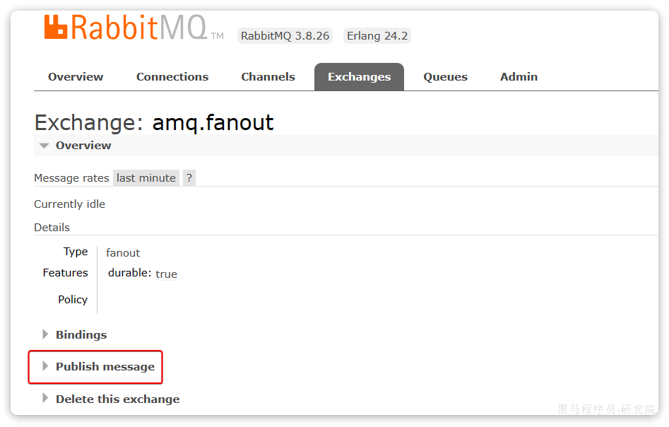


这里是由控制台模拟了生产者发送的消息。由于没有消费者存在，最终消息丢失了，这样说明==交换机没有存储消息的能力==。

#### 2.2.2 队列

我们打开`Queues`选项卡，新建一个队列：


命名为`hello.queue1`：


再以相同的方式，创建一个队列，密码为`hello.queue2`，最终队列列表如下：


此时，我们再次向`amq.fanout`交换机发送一条消息。会发现消息依然没有到达队列！！

怎么回事呢？

发送到交换机的消息，只会路由到与其绑定的队列，因此仅仅创建队列是不够的，我们还需要将其与交换机绑定。

#### 2.2.3 绑定关系

点击`Exchanges`选项卡，点击`amq.fanout`交换机，进入交换机详情页，然后点击`Bindings`菜单，在表单中填写要绑定的队列名称：


相同的方式，将hello.queue2也绑定到改交换机。

最终，绑定结果如下：


#### 2.2.4 发送消息

再次回到exchange页面，找到刚刚绑定的`amq.fanout`，点击进入详情页，再次发送一条消息：


回到`Queues`页面，可以发现`hello.queue`中已经有一条消息了：


点击队列名称，进入详情页，查看队列详情，这次我们点击get message：


可以看到消息到达队列了：


这个时候如果有消费者监听了MQ的`hello.queue1`或`hello.queue2`队列，自然就能接收到消息了。

### 2.3 数据隔离

#### 2.3.1 用户管理

点击`Admin`选项卡，首先会看到RabbitMQ控制台的用户管理界面：


这里的用户都是RabbitMQ的管理或运维人员。目前只有安装RabbitMQ时添加的`itheima`这个用户。仔细观察用户表格中的字段，如下：

- `Name`：`itheima`，也就是用户名
- `Tags`：`administrator`，说明`itheima`用户是超级管理员，拥有所有权限
- `Can access virtual host`： `/`，可以访问的`virtual host`，这里的`/`是默认的`virtual host`

对于小型企业而言，出于成本考虑，我们通常只会搭建一套MQ集群，公司内的多个不同项目同时使用。这个时候为了避免互相干扰， 我们会利用`virtual host`的隔离特性，将不同项目隔离。一般会做两件事情：

- 给每个项目创建独立的运维账号，将管理权限分离。
- 给每个项目创建不同的`virtual host`，将每个项目的数据隔离。

比如，我们给黑马商城创建一个新的用户，命名为`hmall`：

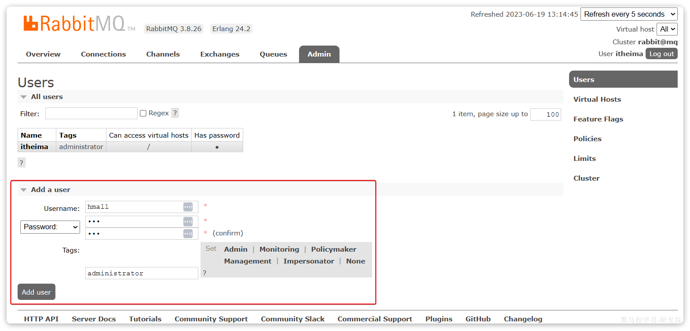

你会发现此时hmall用户没有任何`virtual host`的访问权限：

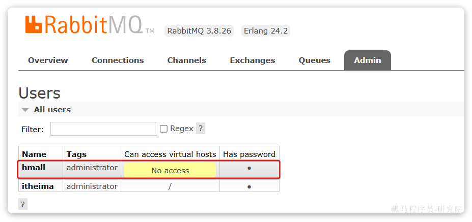

别急，接下来我们就来授权。

#### 2.3.2 virtual host

我们先退出登录：


切换到刚刚创建的hmall用户登录，然后点击`Virtual Hosts`菜单，进入`virtual host`管理页：


可以看到目前只有一个默认的`virtual host`，名字为 `/`。

 我们可以给黑马商城项目创建一个单独的`virtual host`，而不是使用默认的`/`。


创建完成后如图：


由于我们是登录`hmall`账户后创建的`virtual host`，因此回到`users`菜单，你会发现当前用户已经具备了对`/hmall`这个`virtual host`的访问权限了：


此时，点击页面右上角的`virtual host`下拉菜单，切换`virtual host`为 `/hmall`：


然后再次查看queues选项卡，会发现之前的队列已经看不到了：

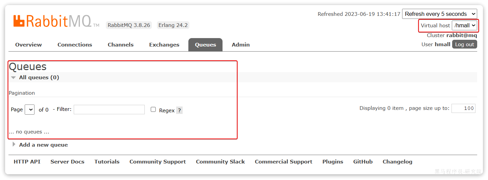

这就是基于`virtual host `的隔离效果。

## 3、SpringAMQP

将来我们开发业务功能的时候，肯定不会在控制台收发消息，而是应该基于编程的方式。由于`RabbitMQ`采用了AMQP协议，因此它具备跨语言的特性。任何语言只要遵循AMQP协议收发消息，都可以与`RabbitMQ`交互。并且`RabbitMQ`官方也提供了各种不同语言的客户端。

但是，RabbitMQ官方提供的Java客户端编码相对复杂，一般生产环境下我们更多会结合Spring来使用。而Spring的官方刚好基于RabbitMQ提供了这样一套消息收发的模板工具：SpringAMQP。并且还基于SpringBoot对其实现了自动装配，使用起来非常方便。

SpringAmqp的官方地址：

https://spring.io/projects/spring-amqp

SpringAMQP提供了三个功能：

- 自动声明队列、交换机及其绑定关系
- 基于注解的监听器模式，异步接收消息
- 封装了RabbitTemplate工具，用于发送消息

这一章我们就一起学习一下，如何利用SpringAMQP实现对RabbitMQ的消息收发。

### 3.1 导入Demo工程

在课前资料给大家提供了一个Demo工程，方便我们学习SpringAMQP的使用：


将其复制到你的工作空间，然后用Idea打开，项目结构如图：


包括三部分：

- mq-demo：父工程，管理项目依赖
- publisher：消息的发送者
- consumer：消息的消费者

在mq-demo这个父工程中，已经配置好了SpringAMQP相关的依赖：

```XML
<?xml version="1.0" encoding="UTF-8"?>
<project xmlns="http://maven.apache.org/POM/4.0.0"
         xmlns:xsi="http://www.w3.org/2001/XMLSchema-instance"
         xsi:schemaLocation="http://maven.apache.org/POM/4.0.0 http://maven.apache.org/xsd/maven-4.0.0.xsd">
    <modelVersion>4.0.0</modelVersion>

    <groupId>cn.itcast.demo</groupId>
    <artifactId>mq-demo</artifactId>
    <version>1.0-SNAPSHOT</version>
    <modules>
        <module>publisher</module>
        <module>consumer</module>
    </modules>
    <packaging>pom</packaging>

    <parent>
        <groupId>org.springframework.boot</groupId>
        <artifactId>spring-boot-starter-parent</artifactId>
        <version>2.7.12</version>
        <relativePath/>
    </parent>

    <properties>
        <maven.compiler.source>8</maven.compiler.source>
        <maven.compiler.target>8</maven.compiler.target>
    </properties>

    <dependencies>
        <dependency>
            <groupId>org.projectlombok</groupId>
            <artifactId>lombok</artifactId>
        </dependency>
        <!--AMQP依赖，包含RabbitMQ-->
        <dependency>
            <groupId>org.springframework.boot</groupId>
            <artifactId>spring-boot-starter-amqp</artifactId>
        </dependency>
        <!--单元测试-->
        <dependency>
            <groupId>org.springframework.boot</groupId>
            <artifactId>spring-boot-starter-test</artifactId>
        </dependency>
    </dependencies>
</project>
```

因此，子工程中就可以直接使用SpringAMQP了。

### 3.2 快速入门

在之前的案例中，我们都是经过交换机发送消息到队列，不过有时候为了测试方便，我们也可以直接向队列发送消息，跳过交换机。

在入门案例中，我们就演示这样的简单模型，如图：


也就是：

- publisher直接发送消息到队列
- 消费者监听并处理队列中的消息

> **注意**：这种模式一般测试使用，很少在生产中使用。

为了方便测试，我们现在控制台新建一个队列：simple.queue


添加成功：


接下来，我们就可以利用Java代码收发消息了。

#### 3.2.1 消息发送

首先配置MQ地址，在`publisher`服务的`application.yml`中添加配置：

```YAML
spring:
  rabbitmq:
    host: 192.168.150.101 # 你的虚拟机IP
    port: 5672 # 端口
    virtual-host: /hmall # 虚拟主机
    username: hmall # 用户名
    password: 123 # 密码
```

然后在`publisher`服务中编写测试类`SpringAmqpTest`，并利用`RabbitTemplate`实现消息发送：

```Java
package com.itheima.publisher.amqp;

import org.junit.jupiter.api.Test;
import org.springframework.amqp.rabbit.core.RabbitTemplate;
import org.springframework.beans.factory.annotation.Autowired;
import org.springframework.boot.test.context.SpringBootTest;

@SpringBootTest
public class SpringAmqpTest {

    @Autowired
    private RabbitTemplate rabbitTemplate;

    @Test
    public void testSimpleQueue() {
        // 队列名称
        String queueName = "simple.queue";
        // 消息
        String message = "hello, spring amqp!";
        // 发送消息
        rabbitTemplate.convertAndSend(queueName, message);
    }
}
```

打开控制台，可以看到消息已经发送到队列中：


接下来，我们再来实现消息接收。

#### 3.2.2 消息接收

首先配置MQ地址，在`consumer`服务的`application.yml`中添加配置：

```YAML
spring:
  rabbitmq:
    host: 192.168.150.101 # 你的虚拟机IP
    port: 5672 # 端口
    virtual-host: /hmall # 虚拟主机
    username: hmall # 用户名
    password: 123 # 密码
```

然后在`consumer`服务的`com.itheima.consumer.listener`包中新建一个类`SpringRabbitListener`，代码如下：

```Java
package com.itheima.consumer.listener;

import org.springframework.amqp.rabbit.annotation.RabbitListener;
import org.springframework.stereotype.Component;

@Component
public class SpringRabbitListener {
        // 利用RabbitListener来声明要监听的队列信息
    // 将来一旦监听的队列中有了消息，就会推送给当前服务，调用当前方法，处理消息。
    // 可以看到方法体中接收的就是消息体的内容
    @RabbitListener(queues = "simple.queue")
    public void listenSimpleQueueMessage(String msg) throws InterruptedException {
        System.out.println("spring 消费者接收到消息：【" + msg + "】");
    }
}
```

#### 3.2.3 测试

启动consumer服务，然后在publisher服务中运行测试代码，发送MQ消息。最终consumer收到消息：


### 3.3 WorkQueues模型

Work queues，任务模型。简单来说就是**让多个消费者绑定到一个队列，共同消费队列中的消息**。


当消息处理比较耗时的时候，可能生产消息的速度会远远大于消息的消费速度。长此以往，消息就会堆积越来越多，无法及时处理。

此时就可以使用work 模型，**多个消费者共同处理消息处理，消息处理的速度就能大大提高**了。

接下来，我们就来模拟这样的场景。

首先，我们在控制台创建一个新的队列，命名为`work.queue`：


#### 3.3.1 消息发送

这次我们循环发送，模拟大量消息堆积现象。

在publisher服务中的SpringAmqpTest类中添加一个测试方法：

```java
/**
     * workQueue
     * 向队列中不停发送消息，模拟消息堆积。
     */
@Test
public void testWorkQueue() throws InterruptedException {
    // 队列名称
    String queueName = "simple.queue";
    // 消息
    String message = "hello, message_";
    for (int i = 0; i < 50; i++) {
        // 发送消息，每20毫秒发送一次，相当于每秒发送50条消息
        rabbitTemplate.convertAndSend(queueName, message + i);
        Thread.sleep(20);
    }
}
```

#### 3.3.2 消息接收

要模拟多个消费者绑定同一个队列，我们在consumer服务的SpringRabbitListener中添加2个新的方法：

```Java
@RabbitListener(queues = "work.queue")
public void listenWorkQueue1(String msg) throws InterruptedException {
    System.out.println("消费者1接收到消息：【" + msg + "】" + LocalTime.now());
    Thread.sleep(20);
}

@RabbitListener(queues = "work.queue")
public void listenWorkQueue2(String msg) throws InterruptedException {
    System.err.println("消费者2........接收到消息：【" + msg + "】" + LocalTime.now());
    Thread.sleep(200);
}
```

注意到这两消费者，都设置了`Thead.sleep`，模拟任务耗时：

- 消费者1 sleep了20毫秒，相当于每秒钟处理50个消息
- 消费者2 sleep了200毫秒，相当于每秒处理5个消息

#### 3.3.3 测试

启动ConsumerApplication后，在执行publisher服务中刚刚编写的发送测试方法testWorkQueue。

最终结果如下：

```Java
消费者1接收到消息：【hello, message_0】21:06:00.869555300
消费者2........接收到消息：【hello, message_1】21:06:00.884518
消费者1接收到消息：【hello, message_2】21:06:00.907454400
消费者1接收到消息：【hello, message_4】21:06:00.953332100
消费者1接收到消息：【hello, message_6】21:06:00.997867300
消费者1接收到消息：【hello, message_8】21:06:01.042178700
消费者2........接收到消息：【hello, message_3】21:06:01.086478800
消费者1接收到消息：【hello, message_10】21:06:01.087476600
消费者1接收到消息：【hello, message_12】21:06:01.132578300
消费者1接收到消息：【hello, message_14】21:06:01.175851200
消费者1接收到消息：【hello, message_16】21:06:01.218533400
消费者1接收到消息：【hello, message_18】21:06:01.261322900
消费者2........接收到消息：【hello, message_5】21:06:01.287003700
消费者1接收到消息：【hello, message_20】21:06:01.304412400
消费者1接收到消息：【hello, message_22】21:06:01.349950100
消费者1接收到消息：【hello, message_24】21:06:01.394533900
消费者1接收到消息：【hello, message_26】21:06:01.439876500
消费者1接收到消息：【hello, message_28】21:06:01.482937800
消费者2........接收到消息：【hello, message_7】21:06:01.488977100
消费者1接收到消息：【hello, message_30】21:06:01.526409300
消费者1接收到消息：【hello, message_32】21:06:01.572148
消费者1接收到消息：【hello, message_34】21:06:01.618264800
消费者1接收到消息：【hello, message_36】21:06:01.660780600
消费者2........接收到消息：【hello, message_9】21:06:01.689189300
消费者1接收到消息：【hello, message_38】21:06:01.705261
消费者1接收到消息：【hello, message_40】21:06:01.746927300
消费者1接收到消息：【hello, message_42】21:06:01.789835
消费者1接收到消息：【hello, message_44】21:06:01.834393100
消费者1接收到消息：【hello, message_46】21:06:01.875312100
消费者2........接收到消息：【hello, message_11】21:06:01.889969500
消费者1接收到消息：【hello, message_48】21:06:01.920702500
消费者2........接收到消息：【hello, message_13】21:06:02.090725900
消费者2........接收到消息：【hello, message_15】21:06:02.293060600
消费者2........接收到消息：【hello, message_17】21:06:02.493748
消费者2........接收到消息：【hello, message_19】21:06:02.696635100
消费者2........接收到消息：【hello, message_21】21:06:02.896809700
消费者2........接收到消息：【hello, message_23】21:06:03.099533400
消费者2........接收到消息：【hello, message_25】21:06:03.301446400
消费者2........接收到消息：【hello, message_27】21:06:03.504999100
消费者2........接收到消息：【hello, message_29】21:06:03.705702500
消费者2........接收到消息：【hello, message_31】21:06:03.906601200
消费者2........接收到消息：【hello, message_33】21:06:04.108118500
消费者2........接收到消息：【hello, message_35】21:06:04.308945400
消费者2........接收到消息：【hello, message_37】21:06:04.511547700
消费者2........接收到消息：【hello, message_39】21:06:04.714038400
消费者2........接收到消息：【hello, message_41】21:06:04.916192700
消费者2........接收到消息：【hello, message_43】21:06:05.116286400
消费者2........接收到消息：【hello, message_45】21:06:05.318055100
消费者2........接收到消息：【hello, message_47】21:06:05.520656400
消费者2........接收到消息：【hello, message_49】21:06:05.723106700
```

可以看到消费者1和消费者2竟然每人消费了25条消息：

- 消费者1很快完成了自己的25条消息
- 消费者2却在缓慢的处理自己的25条消息。

也就是说消息是平均分配给每个消费者，并没有考虑到消费者的处理能力。导致1个消费者空闲，另一个消费者忙的不可开交。没有充分利用每一个消费者的能力，最终消息处理的耗时远远超过了1秒。这样显然是有问题的。

#### 3.3.4 能者多劳

默认情况下，RabbitMQ的会将消息依次轮询投递给绑定在队列上的每一个消费者。但这并没有考虑到消费者是否已经
处理完消息，可能出现消息堆积。

因此我们需要修改application.yml，设置prefetch值为1，确保同一时刻最多投递给消费者1条消息:

在spring中有一个简单的配置，可以解决这个问题。我们修改consumer服务的application.yml文件，添加配置：

```YAML
spring:
  rabbitmq:
    listener:
      simple:
        prefetch: 1 # 每次只能获取一条消息，处理完成才能获取下一个消息
```

再次测试，发现结果如下：

```Java
消费者1接收到消息：【hello, message_0】21:12:51.659664200
消费者2........接收到消息：【hello, message_1】21:12:51.680610
消费者1接收到消息：【hello, message_2】21:12:51.703625
消费者1接收到消息：【hello, message_3】21:12:51.724330100
消费者1接收到消息：【hello, message_4】21:12:51.746651100
消费者1接收到消息：【hello, message_5】21:12:51.768401400
消费者1接收到消息：【hello, message_6】21:12:51.790511400
消费者1接收到消息：【hello, message_7】21:12:51.812559800
消费者1接收到消息：【hello, message_8】21:12:51.834500600
消费者1接收到消息：【hello, message_9】21:12:51.857438800
消费者1接收到消息：【hello, message_10】21:12:51.880379600
消费者2........接收到消息：【hello, message_11】21:12:51.899327100
消费者1接收到消息：【hello, message_12】21:12:51.922828400
消费者1接收到消息：【hello, message_13】21:12:51.945617400
消费者1接收到消息：【hello, message_14】21:12:51.968942500
消费者1接收到消息：【hello, message_15】21:12:51.992215400
消费者1接收到消息：【hello, message_16】21:12:52.013325600
消费者1接收到消息：【hello, message_17】21:12:52.035687100
消费者1接收到消息：【hello, message_18】21:12:52.058188
消费者1接收到消息：【hello, message_19】21:12:52.081208400
消费者2........接收到消息：【hello, message_20】21:12:52.103406200
消费者1接收到消息：【hello, message_21】21:12:52.123827300
消费者1接收到消息：【hello, message_22】21:12:52.146165100
消费者1接收到消息：【hello, message_23】21:12:52.168828300
消费者1接收到消息：【hello, message_24】21:12:52.191769500
消费者1接收到消息：【hello, message_25】21:12:52.214839100
消费者1接收到消息：【hello, message_26】21:12:52.238998700
消费者1接收到消息：【hello, message_27】21:12:52.259772600
消费者1接收到消息：【hello, message_28】21:12:52.284131800
消费者2........接收到消息：【hello, message_29】21:12:52.306190600
消费者1接收到消息：【hello, message_30】21:12:52.325315800
消费者1接收到消息：【hello, message_31】21:12:52.347012500
消费者1接收到消息：【hello, message_32】21:12:52.368508600
消费者1接收到消息：【hello, message_33】21:12:52.391785100
消费者1接收到消息：【hello, message_34】21:12:52.416383800
消费者1接收到消息：【hello, message_35】21:12:52.439019
消费者1接收到消息：【hello, message_36】21:12:52.461733900
消费者1接收到消息：【hello, message_37】21:12:52.485990
消费者1接收到消息：【hello, message_38】21:12:52.509219900
消费者2........接收到消息：【hello, message_39】21:12:52.523683400
消费者1接收到消息：【hello, message_40】21:12:52.547412100
消费者1接收到消息：【hello, message_41】21:12:52.571191800
消费者1接收到消息：【hello, message_42】21:12:52.593024600
消费者1接收到消息：【hello, message_43】21:12:52.616731800
消费者1接收到消息：【hello, message_44】21:12:52.640317
消费者1接收到消息：【hello, message_45】21:12:52.663111100
消费者1接收到消息：【hello, message_46】21:12:52.686727
消费者1接收到消息：【hello, message_47】21:12:52.709266500
消费者2........接收到消息：【hello, message_48】21:12:52.725884900
消费者1接收到消息：【hello, message_49】21:12:52.746299900
```

可以发现，由于消费者1处理速度较快，所以处理了更多的消息；消费者2处理速度较慢，只处理了6条消息。而最终总的执行耗时也在1秒左右，大大提升。

正所谓能者多劳，这样充分利用了每一个消费者的处理能力，可以有效避免消息积压问题。

#### 3.3.5 总结

Work模型的使用：

- 多个消费者绑定到一个队列，同一条消息只会被一个消费者处理
- 通过设置prefetch来控制消费者预取的消息数量

### 3.4 交换机类型

在之前的两个测试案例中，都没有交换机，生产者直接发送消息到队列。而一旦引入交换机，消息发送的模式会有很大变化：


可以看到，在订阅模型中，多了一个exchange角色，而且过程略有变化：

- **Publisher**：生产者，不再发送消息到队列中，而是发给交换机
- **Exchange**：交换机，一方面，接收生产者发送的消息。另一方面，知道如何处理消息，例如递交给某个特别队列、递交给所有队列、或是将消息丢弃。到底如何操作，取决于Exchange的类型。
- **Queue**：消息队列也与以前一样，接收消息、缓存消息。不过队列一定要与交换机绑定。
- **Consumer**：消费者，与以前一样，订阅队列，没有变化

**Exchange（交换机）只负责转发消息，不具备存储消息的能力**，因此如果没有任何队列与Exchange绑定，或者没有符合路由规则的队列，那么消息会丢失！

交换机的类型有四种：

- **Fanout**：广播，将消息交给所有绑定到交换机的队列。我们最早在控制台使用的正是Fanout交换机
- **Direct**：订阅，基于RoutingKey（路由key）发送给订阅了消息的队列
- **Topic**：通配符订阅，与Direct类似，只不过RoutingKey可以使用通配符
- **Headers**：头匹配，基于MQ的消息头匹配，用的较少。

课堂中，我们讲解前面的三种交换机模式。

### 3.5 Fanout交换机

Fanout，英文翻译是扇出，我觉得在MQ中叫广播更合适。

在广播模式下，消息发送流程是这样的：


- 1）  可以有多个队列
- 2）  每个队列都要绑定到Exchange（交换机）
- 3）  生产者发送的消息，只能发送到交换机
- 4）  交换机把消息发送给绑定过的所有队列
- 5）  订阅队列的消费者都能拿到消息

我们的计划是这样的：


- 创建一个名为` hmall.fanout`的交换机，类型是`Fanout`
- 创建两个队列`fanout.queue1`和`fanout.queue2`，绑定到交换机`hmall.fanout`


#### 3.5.1 声明队列和交换机

在控制台创建队列`fanout.queue1`:


在创建一个队列`fanout.queue2`：


然后再创建一个交换机：

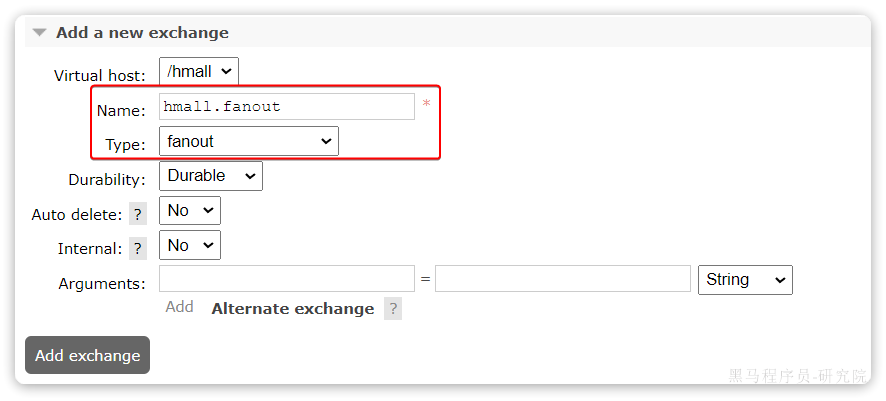

然后绑定两个队列到交换机：


#### 3.5.2 消息发送

在publisher服务的SpringAmqpTest类中添加测试方法：

```Java
@Test
public void testFanoutExchange() {
    // 交换机名称
    String exchangeName = "hmall.fanout";
    // 消息
    String message = "hello, everyone!";
    rabbitTemplate.convertAndSend(exchangeName, "", message);
}
```

#### 3.5.3 消息接收

在consumer服务的SpringRabbitListener中添加两个方法，作为消费者：

```Java
@RabbitListener(queues = "fanout.queue1")
public void listenFanoutQueue1(String msg) {
    System.out.println("消费者1接收到Fanout消息：【" + msg + "】");
}

@RabbitListener(queues = "fanout.queue2")
public void listenFanoutQueue2(String msg) {
    System.out.println("消费者2接收到Fanout消息：【" + msg + "】");
}
```

#### 3.5.4 总结

交换机的作用是什么？

- 接收publisher发送的消息
- 将消息按照规则路由到与之绑定的队列
- 不能缓存消息，路由失败，消息丢失
- FanoutExchange的会将消息路由到每个绑定的队列

### 3.6 Direct交换机

在Fanout模式中，一条消息，会被所有订阅的队列都消费。但是，在某些场景下，我们希望不同的消息被不同的队列消费。这时就要用到Direct类型的Exchange。

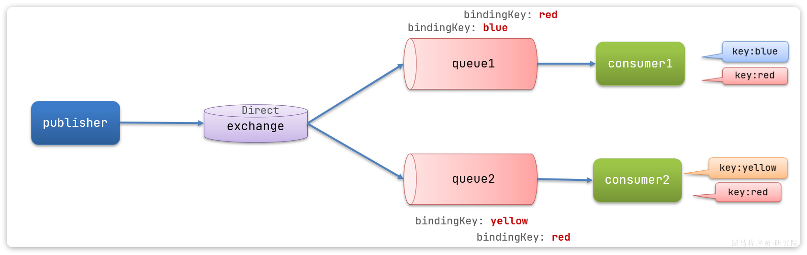

在Direct模型下：

- 队列与交换机的绑定，不能是任意绑定了，而是要指定一个`RoutingKey`（路由key）
- 消息的发送方在 向 Exchange发送消息时，也必须指定消息的 `RoutingKey`。
- Exchange不再把消息交给每一个绑定的队列，而是根据消息的`Routing Key`进行判断，只有队列的`Routingkey`与消息的 `Routing key`完全一致，才会接收到消息

**案例需求如图**：


1.  声明一个名为`hmall.direct`的交换机
2. 声明队列`direct.queue1`，绑定`hmall.direct`，`bindingKey`为`blud`和`red`
3. 声明队列`direct.queue2`，绑定`hmall.direct`，`bindingKey`为`yellow`和`red`
4.  在`consumer`服务中，编写两个消费者方法，分别监听direct.queue1和direct.queue2 
5.  在publisher中编写测试方法，向`hmall.direct`发送消息 

#### 3.6.1 声明队列和交换机

首先在控制台声明两个队列`direct.queue1`和`direct.queue2`，这里不再展示过程：


然后声明一个direct类型的交换机，命名为`hmall.direct`:


然后使用`red`和`blue`作为key，绑定`direct.queue1`到`hmall.direct`：


同理，使用`red`和`yellow`作为key，绑定`direct.queue2`到`hmall.direct`，步骤略，最终结果：


#### 3.6.2 消息接收

在consumer服务的SpringRabbitListener中添加方法：

```Java
@RabbitListener(queues = "direct.queue1")
public void listenDirectQueue1(String msg) {
    System.out.println("消费者1接收到direct.queue1的消息：【" + msg + "】");
}

@RabbitListener(queues = "direct.queue2")
public void listenDirectQueue2(String msg) {
    System.out.println("消费者2接收到direct.queue2的消息：【" + msg + "】");
}
```

#### 3.6.3 消息发送

在publisher服务的SpringAmqpTest类中添加测试方法：

```Java
@Test
public void testSendDirectExchange() {
    // 交换机名称
    String exchangeName = "hmall.direct";
    // 消息
    String message = "红色警报！日本乱排核废水，导致海洋生物变异，惊现哥斯拉！";
    // 发送消息
    rabbitTemplate.convertAndSend(exchangeName, "red", message);
}
```

由于使用的red这个key，所以两个消费者都收到了消息：


我们再切换为blue这个key：

```Java
@Test
public void testSendDirectExchange() {
    // 交换机名称
    String exchangeName = "hmall.direct";
    // 消息
    String message = "最新报道，哥斯拉是居民自治巨型气球，虚惊一场！";
    // 发送消息
    rabbitTemplate.convertAndSend(exchangeName, "blue", message);
}
```

你会发现，只有消费者1收到了消息：


#### 3.6.4 总结

描述下Direct交换机与Fanout交换机的差异？

- Fanout交换机将消息路由给每一个与之绑定的队列
- Direct交换机根据RoutingKey判断路由给哪个队列
- 如果多个队列具有相同的RoutingKey，则与Fanout功能类似

### 3.7 Topic交换机

#### 3.7.1 说明

`Topic`类型的`Exchange`与`Direct`相比，都是可以根据`RoutingKey`把消息路由到不同的队列。

只不过`Topic`类型`Exchange`可以让队列在绑定`BindingKey` 的时候使用通配符！

```
BindingKey` 一般都是有一个或多个单词组成，多个单词之间以`.`分割，例如： `item.insert
```

通配符规则：

- `#`：匹配一个或多个词
- `*`：匹配不多不少恰好1个词

举例：

- `item.#`：能够匹配`item.spu.insert` 或者 `item.spu`
- `item.*`：只能匹配`item.spu`

图示：

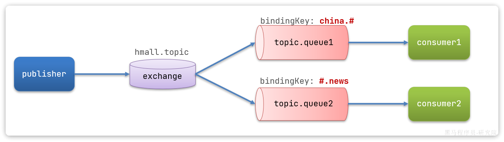

假如此时publisher发送的消息使用的`RoutingKey`共有四种：

- `china.news `代表有中国的新闻消息；
- `china.weather` 代表中国的天气消息；
- `japan.news` 则代表日本新闻
- `japan.weather` 代表日本的天气消息；

解释：

- `topic.queue1`：绑定的是`china.#` ，凡是以 `china.`开头的`routing key` 都会被匹配到，包括：
  - `china.news`
  - `china.weather`
- `topic.queue2`：绑定的是`#.news` ，凡是以 `.news`结尾的 `routing key` 都会被匹配。包括:
  - `china.news`
  - `japan.news`

接下来，我们就按照上图所示，来演示一下Topic交换机的用法。

首先，在控制台按照图示例子创建队列、交换机，并利用通配符绑定队列和交换机。此处步骤略。最终结果如下：


#### 3.7.2 消息发送

在publisher服务的SpringAmqpTest类中添加测试方法：

```Java
/**
 * topicExchange
 */
@Test
public void testSendTopicExchange() {
    // 交换机名称
    String exchangeName = "hmall.topic";
    // 消息
    String message = "喜报！孙悟空大战哥斯拉，胜!";
    // 发送消息
    rabbitTemplate.convertAndSend(exchangeName, "china.news", message);
}
```

#### 3.7.3 消息接收

在consumer服务的SpringRabbitListener中添加方法：

```Java
@RabbitListener(queues = "topic.queue1")
public void listenTopicQueue1(String msg){
    System.out.println("消费者1接收到topic.queue1的消息：【" + msg + "】");
}

@RabbitListener(queues = "topic.queue2")
public void listenTopicQueue2(String msg){
    System.out.println("消费者2接收到topic.queue2的消息：【" + msg + "】");
}
```

#### 3.7.4 总结

描述下Direct交换机与Topic交换机的差异？

- Topic交换机接收的消息RoutingKey必须是多个单词，以 **`.`** 分割
- Topic交换机与队列绑定时的bindingKey可以指定通配符
- `#`：代表0个或多个词
- `*`：代表1个词

### 3.8 声明队列和交换机

在之前我们都是基于RabbitMQ控制台来创建队列、交换机。但是在实际开发时，队列和交换机是程序员定义的，将来项目上线，又要交给运维去创建。那么程序员就需要把程序中运行的所有队列和交换机都写下来，交给运维。在这个过程中是很容易出现错误的。

因此推荐的做法是==由程序启动时检查队列和交换机是否存在，如果不存在自动创建==。

#### 3.8.1 基本API

**一般在消费者声明交换机、队列**

SpringAMQP提供了一个Queue类，用来创建队列：


SpringAMQP还提供了一个Exchange接口，来表示所有不同类型的交换机：


我们可以自己创建队列和交换机，不过SpringAMQP还提供了ExchangeBuilder来简化这个过程：


而在绑定队列和交换机时，则需要使用BindingBuilder来创建Binding对象：


#### 3.8.2 fanout示例

在consumer中创建一个类，声明队列和交换机：

```Java
package com.itheima.consumer.config;

import org.springframework.amqp.core.Binding;
import org.springframework.amqp.core.BindingBuilder;
import org.springframework.amqp.core.FanoutExchange;
import org.springframework.amqp.core.Queue;
import org.springframework.context.annotation.Bean;
import org.springframework.context.annotation.Configuration;

@Configuration
public class FanoutConfig {
    /**
     * 声明交换机
     * @return Fanout类型交换机
     */
    @Bean
    public FanoutExchange fanoutExchange(){
        return new FanoutExchange("hmall.fanout");
    }

    /**
     * 第1个队列
     */
    @Bean
    public Queue fanoutQueue1(){
        return new Queue("fanout.queue1");
    }

    /**
     * 绑定队列和交换机
     */
    @Bean
    public Binding bindingQueue1(Queue fanoutQueue1, FanoutExchange fanoutExchange){
        return BindingBuilder.bind(fanoutQueue1).to(fanoutExchange);
    }

    /**
     * 第2个队列
     */
    @Bean
    public Queue fanoutQueue2(){
        return new Queue("fanout.queue2");
    }

    /**
     * 绑定队列和交换机
     */
    @Bean
    public Binding bindingQueue2(Queue fanoutQueue2, FanoutExchange fanoutExchange){
        return BindingBuilder.bind(fanoutQueue2).to(fanoutExchange);
    }
}
```

#### 3.8.3 direct示例

direct模式由于要绑定多个KEY，会非常麻烦，每一个Key都要编写一个binding：

```Java
package com.itheima.consumer.config;

import org.springframework.amqp.core.*;
import org.springframework.context.annotation.Bean;
import org.springframework.context.annotation.Configuration;

@Configuration
public class DirectConfig {

    /**
     * 声明交换机
     * @return Direct类型交换机
     */
    @Bean
    public DirectExchange directExchange(){
        return ExchangeBuilder.directExchange("hmall.direct").build();
    }

    /**
     * 第1个队列
     */
    @Bean
    public Queue directQueue1(){
        return new Queue("direct.queue1");
    }

    /**
     * 绑定队列和交换机
     */
    @Bean
    public Binding bindingQueue1WithRed(Queue directQueue1, DirectExchange directExchange){
        return BindingBuilder.bind(directQueue1).to(directExchange).with("red");
    }
    /**
     * 绑定队列和交换机
     */
    @Bean
    public Binding bindingQueue1WithBlue(Queue directQueue1, DirectExchange directExchange){
        return BindingBuilder.bind(directQueue1).to(directExchange).with("blue");
    }

    /**
     * 第2个队列
     */
    @Bean
    public Queue directQueue2(){
        return new Queue("direct.queue2");
    }

    /**
     * 绑定队列和交换机
     */
    @Bean
    public Binding bindingQueue2WithRed(Queue directQueue2, DirectExchange directExchange){
        return BindingBuilder.bind(directQueue2).to(directExchange).with("red");
    }
    /**
     * 绑定队列和交换机
     */
    @Bean
    public Binding bindingQueue2WithYellow(Queue directQueue2, DirectExchange directExchange){
        return BindingBuilder.bind(directQueue2).to(directExchange).with("yellow");
    }
}
```

#### 3.8.4 基于注解声明

基于@Bean的方式声明队列和交换机比较麻烦，Spring还提供了基于注解方式来声明。

例如，我们同样声明Direct模式的交换机和队列：

```Java
@RabbitListener(bindings = @QueueBinding(
    value = @Queue(name = "direct.queue1"),
    exchange = @Exchange(name = "hmall.direct", type = ExchangeTypes.DIRECT),
    key = {"red", "blue"}
))
public void listenDirectQueue1(String msg){
    System.out.println("消费者1接收到direct.queue1的消息：【" + msg + "】");
}

@RabbitListener(bindings = @QueueBinding(
    value = @Queue(name = "direct.queue2"),
    exchange = @Exchange(name = "hmall.direct", type = ExchangeTypes.DIRECT),
    key = {"red", "yellow"}
))
public void listenDirectQueue2(String msg){
    System.out.println("消费者2接收到direct.queue2的消息：【" + msg + "】");
}
```

是不是简单多了。

再试试Topic模式：

```Java
@RabbitListener(bindings = @QueueBinding(
    value = @Queue(name = "topic.queue1"),
    exchange = @Exchange(name = "hmall.topic", type = ExchangeTypes.TOPIC),
    key = "china.#"
))
public void listenTopicQueue1(String msg){
    System.out.println("消费者1接收到topic.queue1的消息：【" + msg + "】");
}

@RabbitListener(bindings = @QueueBinding(
    value = @Queue(name = "topic.queue2"),
    exchange = @Exchange(name = "hmall.topic", type = ExchangeTypes.TOPIC),
    key = "#.news"
))
public void listenTopicQueue2(String msg){
    System.out.println("消费者2接收到topic.queue2的消息：【" + msg + "】");
}
```

### 3.9 消息转换器

Spring的消息发送代码接收的消息体是一个Object：


而在数据传输时，它会把你发送的消息序列化为字节发送给MQ，接收消息的时候，还会把字节反序列化为Java对象。

只不过，默认情况下Spring采用的序列化方式是JDK序列化。众所周知，JDK序列化存在下列问题：

- 数据体积过大
- 有安全漏洞
- 可读性差

我们来测试一下。

#### 3.9.1 测试默认转换器

1）创建测试队列

首先，我们在consumer服务中声明一个新的配置类：

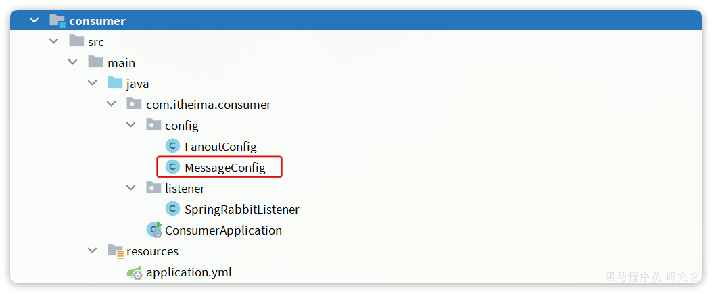

利用@Bean的方式创建一个队列，

具体代码：

```Java
package com.itheima.consumer.config;

import org.springframework.amqp.core.Queue;
import org.springframework.context.annotation.Bean;
import org.springframework.context.annotation.Configuration;

@Configuration
public class MessageConfig {

    @Bean
    public Queue objectQueue() {
        return new Queue("object.queue");
    }
}
```

注意，这里我们先不要给这个队列添加消费者，我们要查看消息体的格式。

重启consumer服务以后，该队列就会被自动创建出来了：

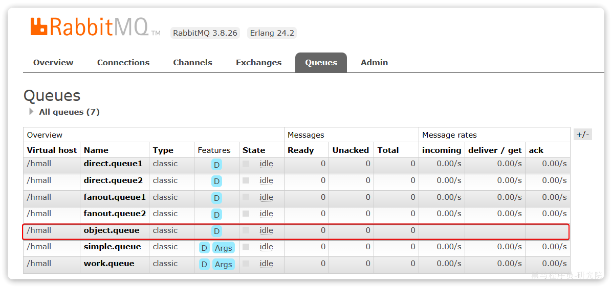

2）发送消息

我们在publisher模块的SpringAmqpTest中新增一个消息发送的代码，发送一个Map对象：

```Java
@Test
public void testSendMap() throws InterruptedException {
    // 准备消息
    Map<String,Object> msg = new HashMap<>();
    msg.put("name", "柳岩");
    msg.put("age", 21);
    // 发送消息
    rabbitTemplate.convertAndSend("object.queue", msg);
}
```

发送消息后查看控制台：


可以看到消息格式非常不友好。

#### 3.9.2 配置JSON转换器

显然，JDK序列化方式并不合适。我们希望消息体的体积更小、可读性更高，因此可以使用JSON方式来做序列化和反序列化。

在`publisher`和`consumer`两个服务中都引入依赖：

```XML
<dependency>
    <groupId>com.fasterxml.jackson.dataformat</groupId>
    <artifactId>jackson-dataformat-xml</artifactId>
    <version>2.9.10</version>
</dependency>
```

注意，如果项目中引入了`spring-boot-starter-web`依赖，则无需再次引入`Jackson`依赖。

配置消息转换器，在`publisher`和`consumer`两个服务的启动类中添加一个Bean即可：

```Java
@Bean
public MessageConverter messageConverter(){
    // 1.定义消息转换器
    Jackson2JsonMessageConverter jackson2JsonMessageConverter = new Jackson2JsonMessageConverter();
    // 2.配置自动创建消息id，用于识别不同消息，也可以在业务中基于ID判断是否是重复消息
    jackson2JsonMessageConverter.setCreateMessageIds(true);
    return jackson2JsonMessageConverter;
}
```

消息转换器中添加的messageId可以便于我们将来做幂等性判断。

此时，我们到MQ控制台**删除**`object.queue`中的旧的消息。然后再次执行刚才的消息发送的代码，到MQ的控制台查看消息结构：

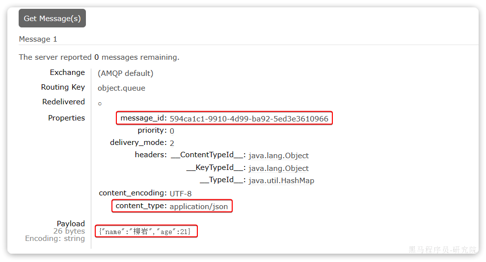

#### 3.9.3 消费者接收Object

我们在consumer服务中定义一个新的消费者，publisher是用Map发送，那么消费者也一定要用Map接收，格式如下：

```Java
@RabbitListener(queues = "object.queue")
public void listenSimpleQueueMessage(Map<String, Object> msg) throws InterruptedException {
    System.out.println("消费者接收到object.queue消息：【" + msg + "】");
}
```

## 4、业务改造

案例需求：改造余额支付功能，将支付成功后基于OpenFeign的交易服务的更新订单状态接口的同步调用，改为基于RabbitMQ的异步通知。

如图：


说明：目前没有通知服务和积分服务，因此我们只关注交易服务，步骤如下：

- 定义`direct`类型交换机，命名为`pay.direct`
- 定义消息队列，命名为`trade.pay.success.queue`
- 将`trade.pay.success.queue`与`pay.direct`绑定，`BindingKey`为`pay.success`
- 支付成功时不再调用交易服务更新订单状态的接口，而是发送一条消息到`pay.direct`，发送消息的`RoutingKey`  为`pay.success`，消息内容是订单id
- 交易服务监听`trade.pay.success.queue`队列，接收到消息后更新订单状态为已支付

#### 4.1 配置MQ

不管是生产者还是消费者，都需要配置MQ的基本信息。分为两步：

1）添加依赖：

```XML
  <!--消息发送-->
  <dependency>
      <groupId>org.springframework.boot</groupId>
      <artifactId>spring-boot-starter-amqp</artifactId>
  </dependency>
```

2）配置MQ地址：

```YAML
spring:
  rabbitmq:
    host: 192.168.150.101 # 你的虚拟机IP
    port: 5672 # 端口
    virtual-host: /hmall # 虚拟主机
    username: hmall # 用户名
    password: 123 # 密码
```

#### 4.2 接收消息

在trade-service服务中定义一个消息监听类：


其代码如下：

```Java
package com.hmall.trade.listener;

import com.hmall.trade.service.IOrderService;
import lombok.RequiredArgsConstructor;
import org.springframework.amqp.core.ExchangeTypes;
import org.springframework.amqp.rabbit.annotation.Exchange;
import org.springframework.amqp.rabbit.annotation.Queue;
import org.springframework.amqp.rabbit.annotation.QueueBinding;
import org.springframework.amqp.rabbit.annotation.RabbitListener;
import org.springframework.stereotype.Component;

@Component
@RequiredArgsConstructor
public class PayStatusListener {

    private final IOrderService orderService;

    @RabbitListener(bindings = @QueueBinding(
            value = @Queue(name = "trade.pay.success.queue", durable = "true"),
            exchange = @Exchange(name = "pay.topic"),
            key = "pay.success"
    ))
    public void listenPaySuccess(Long orderId){
        orderService.markOrderPaySuccess(orderId);
    }
}
```

#### 4.3 发送消息

修改`pay-service`服务下的`com.hmall.pay.service.impl.PayOrderServiceImpl`类中的`tryPayOrderByBalance`方法：

```Java
private final RabbitTemplate rabbitTemplate;

@Override
@Transactional
public void tryPayOrderByBalance(PayOrderDTO payOrderDTO) {
    // 1.查询支付单
    PayOrder po = getById(payOrderDTO.getId());
    // 2.判断状态
    if(!PayStatus.WAIT_BUYER_PAY.equalsValue(po.getStatus())){
        // 订单不是未支付，状态异常
        throw new BizIllegalException("交易已支付或关闭！");
    }
    // 3.尝试扣减余额
    userClient.deductMoney(payOrderDTO.getPw(), po.getAmount());
    // 4.修改支付单状态
    boolean success = markPayOrderSuccess(payOrderDTO.getId(), LocalDateTime.now());
    if (!success) {
        throw new BizIllegalException("交易已支付或关闭！");
    }
    // 5.修改订单状态
    // tradeClient.markOrderPaySuccess(po.getBizOrderNo());
    try {
        rabbitTemplate.convertAndSend("pay.direct", "pay.success", po.getBizOrderNo());
    } catch (Exception e) {
        log.error("支付成功的消息发送失败，支付单id：{}， 交易单id：{}", po.getId(), po.getBizOrderNo(), e);
    }
}
```

## 5、发送者的可靠性

首先，我们一起分析一下消息丢失的可能性有哪些。

消息从发送者发送消息，到消费者处理消息，需要经过的流程是这样的：


消息从生产者到消费者的每一步都可能导致消息丢失：

- 发送消息时丢失：
  - 生产者发送消息时连接MQ失败
  - 生产者发送消息到达MQ后未找到`Exchange`
  - 生产者发送消息到达MQ的`Exchange`后，未找到合适的`Queue`
  - 消息到达MQ后，处理消息的进程发生异常
- MQ导致消息丢失：
  - 消息到达MQ，保存到队列后，尚未消费就突然宕机
- 消费者处理消息时：
  - 消息接收后尚未处理突然宕机
  - 消息接收后处理过程中抛出异常

综上，我们要解决消息丢失问题，保证MQ的可靠性，就必须从3个方面入手：

- 确保生产者一定把消息发送到MQ
- 确保MQ不会将消息弄丢
- 确保消费者一定要处理消息

这一章我们先来看如何确保生产者一定能把消息发送到MQ。

### 5.1 生产者重试机制

首先第一种情况，就是生产者发送消息时，出现了网络故障，导致与MQ的连接中断。

为了解决这个问题，SpringAMQP提供的消息发送时的重试机制。即：当`RabbitTemplate`与MQ连接超时后，多次重试。

修改`publisher`模块的`application.yaml`文件，添加下面的内容：

```YAML
spring:
  rabbitmq:
    connection-timeout: 1s # 设置MQ的连接超时时间
    template:
      retry:
        enabled: true # 开启超时重试机制
        initial-interval: 1000ms # 失败后的初始等待时间
        multiplier: 1 # 失败后下次的等待时长倍数，下次等待时长 = initial-interval * multiplier
        max-attempts: 3 # 最大重试次数
```

我们利用命令停掉RabbitMQ服务：

```Shell
docker stop mq
```

然后测试发送一条消息，会发现会每隔1秒重试1次，总共重试了3次。消息发送的超时重试机制配置成功了！

>**注意**：当网络不稳定的时候，利用重试机制可以有效提高消息发送的成功率。不过SpringAMQP提供的重试机制是**阻塞式**的重试，也就是说多次重试等待的过程中，当前线程是被阻塞的。
>
>如果对于业务性能有要求，建议禁用重试机制。如果一定要使用，请合理配置等待时长和重试次数，当然也可以考虑使用==异步线程==来执行发送消息的代码。

### 5.2 生产者确认机制

一般情况下，只要生产者与MQ之间的网路连接顺畅，基本不会出现发送消息丢失的情况，因此大多数情况下我们无需考虑这种问题。

不过，在少数情况下，也会出现消息发送到MQ之后丢失的现象，比如：

- MQ内部处理消息的进程发生了异常
- 生产者发送消息到达MQ后未找到`Exchange`
- 生产者发送消息到达MQ的`Exchange`后，未找到合适的`Queue`，因此无法路由

针对上述情况，RabbitMQ提供了生产者消息确认机制，包括`Publisher Confirm`和`Publisher Return`两种。在开启确认机制的情况下，当生产者发送消息给MQ后，MQ会根据消息处理的情况返回不同的**回执**。

具体如图所示：


总结如下：

- 当消息投递到MQ，但是路由失败时，通过**Publisher Return**返回异常信息，同时返回ack的确认信息，代表投递成功
- 临时消息投递到了MQ，并且入队成功，返回ACK，告知投递成功
- 持久消息投递到了MQ，并且入队完成持久化，返回ACK ，告知投递成功
- 其它情况都会返回NACK，告知投递失败

其中`ack`和`nack`属于**Publisher Confirm**机制，`ack`是投递成功；`nack`是投递失败。而`return`则属于**Publisher Return**机制。

默认两种机制都是关闭状态，需要通过配置文件来开启。

### 5.3.实现生产者确认

#### 5.3.1.开启生产者确认

在publisher模块的`application.yaml`中添加配置：

```YAML
spring:
  rabbitmq:
    publisher-confirm-type: correlated # 开启publisher confirm机制，并设置confirm类型
    publisher-returns: true # 开启publisher return机制
```

这里`publisher-confirm-type`有三种模式可选：

- `none`：关闭confirm机制
- `simple`：同步阻塞等待MQ的回执
- `correlated`：MQ异步回调返回回执

一般我们推荐使用`correlated`，回调机制。

#### 5.3.2.定义ReturnCallback

每个`RabbitTemplate`只能配置一个`ReturnCallback`，因此我们可以在配置类中统一设置。我们在publisher模块定义一个配置类：


内容如下：

```Java
package com.itheima.publisher.config;

import lombok.AllArgsConstructor;
import lombok.extern.slf4j.Slf4j;
import org.springframework.amqp.core.ReturnedMessage;
import org.springframework.amqp.rabbit.core.RabbitTemplate;
import org.springframework.context.annotation.Configuration;

import javax.annotation.PostConstruct;

@Slf4j
@AllArgsConstructor
@Configuration
public class MqConfig {
    private final RabbitTemplate rabbitTemplate;

    @PostConstruct
    public void init(){
        rabbitTemplate.setReturnsCallback(new RabbitTemplate.ReturnsCallback() {
            @Override
            public void returnedMessage(ReturnedMessage returned) {
                log.error("触发return callback,");
                log.debug("exchange: {}", returned.getExchange());
                log.debug("routingKey: {}", returned.getRoutingKey());
                log.debug("message: {}", returned.getMessage());
                log.debug("replyCode: {}", returned.getReplyCode());
                log.debug("replyText: {}", returned.getReplyText());
            }
        });
    }
}
```

#### 5.3.3.定义ConfirmCallback

由于每个消息发送时的处理逻辑不一定相同，因此ConfirmCallback需要在每次发消息时定义。具体来说，是在调用RabbitTemplate中的convertAndSend方法时，多传递一个参数：

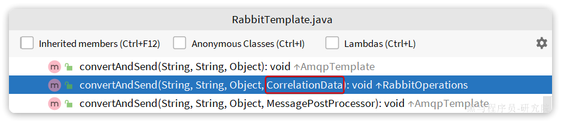

这里的CorrelationData中包含两个核心的东西：

- `id`：消息的唯一标示，MQ对不同的消息的回执以此做判断，避免混淆
- `SettableListenableFuture`：回执结果的Future对象

将来MQ的回执就会通过这个`Future`来返回，我们可以提前给`CorrelationData`中的`Future`添加回调函数来处理消息回执：


我们新建一个测试，向系统自带的交换机发送消息，并且添加`ConfirmCallback`：

```Java
@Test
void testPublisherConfirm() {
    // 1.创建CorrelationData
    CorrelationData cd = new CorrelationData();
    // 2.给Future添加ConfirmCallback
    cd.getFuture().addCallback(new ListenableFutureCallback<CorrelationData.Confirm>() {
        @Override
        public void onFailure(Throwable ex) {
            // 2.1.Future发生异常时的处理逻辑，基本不会触发
            log.error("send message fail", ex);
        }
        @Override
        public void onSuccess(CorrelationData.Confirm result) {
            // 2.2.Future接收到回执的处理逻辑，参数中的result就是回执内容
            if(result.isAck()){ // result.isAck()，boolean类型，true代表ack回执，false 代表 nack回执
                log.debug("发送消息成功，收到 ack!");
            }else{ // result.getReason()，String类型，返回nack时的异常描述
                log.error("发送消息失败，收到 nack, reason : {}", result.getReason());
            }
        }
    });
    // 3.发送消息
    rabbitTemplate.convertAndSend("hmall.direct", "q", "hello", cd);
}
```

执行结果如下：

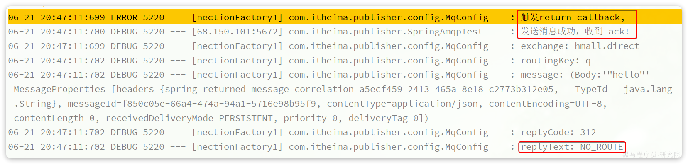

可以看到，由于传递的`RoutingKey`是错误的，路由失败后，触发了`return callback`，同时也收到了ack。

当我们修改为正确的`RoutingKey`以后，就不会触发`return callback`了，只收到ack。

而如果连交换机都是错误的，则只会收到nack。

>**注意**：
>
>开启生产者确认比较消耗MQ性能，一般不建议开启。而且大家思考一下触发确认的几种情况：
>
>- 路由失败：一般是因为RoutingKey错误导致，往往是编程导致
>- 交换机名称错误：同样是编程错误导致
>- MQ内部故障：这种需要处理，但概率往往较低。因此只有对消息可靠性要求非常高的业务才需要开启，而且仅仅需要开启ConfirmCallback处理nack就可以了。

## 6、MQ的可靠性

消息到达MQ以后，如果MQ不能及时保存，也会导致消息丢失，所以MQ的可靠性也非常重要。

### 6.1 数据持久化

为了提升性能，默认情况下MQ的数据都是在内存存储的临时数据，重启后就会消失。为了保证数据的可靠性，必须配置数据持久化，包括：

- 交换机持久化
- 队列持久化
- 消息持久化

我们以控制台界面为例来说明。

#### 6.1.1 交换机持久化

> 注意:这里的持久化是指`交换机`本身持久化也就是说在下次开启RabbitMQ的时候不再需要出现创建该`交换机`，下面的`队列`持久化也是如此。

在控制台的`Exchanges`页面，添加交换机时可以配置交换机的`Durability`参数：


设置为`Durable`就是持久化模式，`Transient`就是临时模式。

#### 6.1.2 队列持久化

在控制台的Queues页面，添加队列时，同样可以配置队列的`Durability`参数：


除了持久化以外，你可以看到队列还有很多其它参数，有一些我们会在后期学习。

#### 6.1.3 消息持久化

在控制台发送消息的时候，可以添加很多参数，而消息的持久化是要配置一个`properties`：


**说明**：在开启持久化机制以后，如果同时还开启了生产者确认，那么MQ会在消息持久化以后才发送ACK回执，进一步确保消息的可靠性。

不过出于性能考虑，为了减少IO次数，发送到MQ的消息并不是逐条持久化到数据库的，而是每隔一段时间批量持久化。一般间隔在100毫秒左右，这就会导致ACK有一定的延迟，因此建议生产者确认全部采用异步方式。

### 6.2 LazyQueue

在默认情况下，RabbitMQ会将接收到的信息保存在内存中以降低消息收发的延迟。但在某些特殊情况下，这会导致消息积压，比如：

- 消费者宕机或出现网络故障
- 消息发送量激增，超过了消费者处理速度
- 消费者处理业务发生阻塞

一旦出现消息堆积问题，RabbitMQ的内存占用就会越来越高，直到触发内存预警上限。此时RabbitMQ会将内存消息刷到磁盘上，这个行为成为`PageOut`. `PageOut`会耗费一段时间，并且会阻塞队列进程。因此在这个过程中RabbitMQ不会再处理新的消息，生产者的所有请求都会被阻塞。

为了解决这个问题，从RabbitMQ的3.6.0版本开始，就增加了Lazy Queues的模式，也就是惰性队列。惰性队列的特征如下：

- 接收到消息后直接存入磁盘而非内存
- 消费者要消费消息时才会从磁盘中读取并加载到内存（也就是懒加载）
- 支持数百万条的消息存储

而在3.12版本之后，LazyQueue已经成为所有队列的默认格式。因此官方推荐升级MQ为3.12版本或者所有队列都设置为LazyQueue模式,无法更改。

#### 6.2.1 控制台配置Lazy模式

在添加队列的时候，添加`x-queue-mod=lazy`参数即可设置队列为Lazy模式：


#### 6.2.2 代码配置Lazy模式

在利用SpringAMQP声明队列的时候，添加`x-queue-mod=lazy`参数也可设置队列为Lazy模式：

```Java
@Bean
public Queue lazyQueue(){
    return QueueBuilder
            .durable("lazy.queue")
            .lazy() // 开启Lazy模式
            .build();
}
```

这里是通过`QueueBuilder`的`lazy()`函数配置Lazy模式，底层源码如下：


当然，我们也可以基于注解来声明队列并设置为Lazy模式：

```Java
@RabbitListener(queuesToDeclare = @Queue(
        name = "lazy.queue",
        durable = "true",
        arguments = @Argument(name = "x-queue-mode", value = "lazy")
))
public void listenLazyQueue(String msg){
    log.info("接收到 lazy.queue的消息：{}", msg);
}
```

#### 6.2.3 更新已有队列为lazy模式

对于已经存在的队列，也可以配置为lazy模式，但是要通过设置policy实现。

可以基于命令行设置policy：

```Shell
rabbitmqctl set_policy Lazy "^lazy-queue$" '{"queue-mode":"lazy"}' --apply-to queues  
```

命令解读：

- `rabbitmqctl` ：RabbitMQ的命令行工具
- `set_policy` ：添加一个策略
- `Lazy` ：策略名称，可以自定义
- `"^lazy-queue$"` ：用正则表达式匹配队列的名字
- `'{"queue-mode":"lazy"}'` ：设置队列模式为lazy模式
- `--apply-to queues`：策略的作用对象，是所有的队列

当然，也可以在控制台配置policy，进入在控制台的`Admin`页面，点击`Policies`，即可添加配置：


## 7、消费者的可靠性

当RabbitMQ向消费者投递消息以后，需要知道消费者的处理状态如何。因为消息投递给消费者并不代表就一定被正确消费了，可能出现的故障有很多，比如：

- 消息投递的过程中出现了网络故障
- 消费者接收到消息后突然宕机
- 消费者接收到消息后，因处理不当导致异常
- ...

一旦发生上述情况，消息也会丢失。因此，RabbitMQ必须知道消费者的处理状态，一旦消息处理失败才能重新投递消息。

但问题来了：RabbitMQ如何得知消费者的处理状态呢？

本章我们就一起研究一下消费者处理消息时的可靠性解决方案。

### 7.1 消费者确认机制

为了确认消费者是否成功处理消息，RabbitMQ提供了消费者确认机制（**Consumer Acknowledgement**）。即：当消费者处理消息结束后，应该向RabbitMQ发送一个回执，告知RabbitMQ自己消息处理状态。回执有三种可选值：

- ack：成功处理消息，RabbitMQ从队列中删除该消息
- nack：消息处理失败，RabbitMQ需要再次投递消息
- reject：消息处理失败并拒绝该消息，RabbitMQ从队列中删除该消息

一般reject方式用的较少，除非是消息格式有问题，那就是开发问题了。因此大多数情况下我们需要将消息处理的代码通过`try catch`机制捕获，消息处理成功时返回ack，处理失败时返回nack.

由于消息回执的处理代码比较统一，因此SpringAMQP帮我们实现了消息确认。并允许我们通过配置文件设置ACK处理方式，有三种模式：

- **`none`**：不处理。即消息投递给消费者后立刻ack，消息会立刻从MQ删除。非常不安全，不建议使用
- **`manual`**：手动模式。需要自己在业务代码中调用api，发送`ack`或`reject`，存在业务入侵，但更灵活
- **`auto`**：自动模式。SpringAMQP利用AOP对我们的消息处理逻辑做了环绕增强，当业务正常执行时则自动返回`ack`.  当业务出现异常时，根据异常判断返回不同结果：
  - 如果是**业务异常**，会自动返回`nack`；
  - 如果是**消息处理或校验异常**，自动返回`reject`;

返回Reject的常见异常有：

> Starting with version 1.3.2, the default ErrorHandler is now a ConditionalRejectingErrorHandler that rejects (and does not requeue) messages that fail with an irrecoverable error. Specifically, it rejects messages that fail with the following errors:
>
> - o.s.amqp…MessageConversionException: Can be thrown when converting the incoming message payload using a MessageConverter.
> - o.s.messaging…MessageConversionException: Can be thrown by the conversion service if additional conversion is required when mapping to a @RabbitListener method.
> - o.s.messaging…MethodArgumentNotValidException: Can be thrown if validation (for example, @Valid) is used in the listener and the validation fails.
> - o.s.messaging…MethodArgumentTypeMismatchException: Can be thrown if the inbound message was converted to a type that is not correct for the target method. For example, the parameter is declared as Message<Foo> but Message<Bar> is received.
> - java.lang.NoSuchMethodException: Added in version 1.6.3.
> - java.lang.ClassCastException: Added in version 1.6.3.

通过下面的配置可以修改SpringAMQP的ACK处理方式：

```YAML
spring:
  rabbitmq:
    listener:
      simple:
        acknowledge-mode: none # 不做处理
```

修改consumer服务的SpringRabbitListener类中的方法，模拟一个消息处理的异常：

```Java
@RabbitListener(queues = "simple.queue")
public void listenSimpleQueueMessage(String msg) throws InterruptedException {
    log.info("spring 消费者接收到消息：【" + msg + "】");
    if (true) {
        throw new MessageConversionException("故意的");
    }
    log.info("消息处理完成");
}
```

测试可以发现：当消息处理发生异常时，消息依然被RabbitMQ删除了。

我们再次把确认机制修改为auto：

```YAML
spring:
  rabbitmq:
    listener:
      simple:
        acknowledge-mode: auto # 自动ack
```

在异常位置打断点，再次发送消息，程序卡在断点时，可以发现此时消息状态为`unacked`（未确定状态）：


放行以后，由于抛出的是**消息转换异常**，因此Spring会自动返回`reject`，所以消息依然会被删除：


我们将异常改为RuntimeException类型：

```Java
@RabbitListener(queues = "simple.queue")
public void listenSimpleQueueMessage(String msg) throws InterruptedException {
    log.info("spring 消费者接收到消息：【" + msg + "】");
    if (true) {
        throw new RuntimeException("故意的");
    }
    log.info("消息处理完成");
}
```

在异常位置打断点，然后再次发送消息测试，程序卡在断点时，可以发现此时消息状态为`unacked`（未确定状态）：


放行以后，由于抛出的是业务异常，所以Spring返回`nack`，最终消息恢复至`Ready`状态，并且没有被RabbitMQ删除：


当我们把配置改为`auto`时，消息处理失败后，会回到RabbitMQ，并重新投递到消费者。

### 7.2 失败重试机制

当消费者出现异常后，消息会不断requeue（重入队）到队列，再重新发送给消费者。如果消费者再次执行依然出错，消息会再次requeue到队列，再次投递，直到消息处理成功为止。

极端情况就是消费者一直无法执行成功，那么消息requeue就会无限循环，导致mq的消息处理飙升，带来不必要的压力：


当然，上述极端情况发生的概率还是非常低的，不过不怕一万就怕万一。为了应对上述情况Spring又提供了消费者失败重试机制：在消费者出现异常时利用本地重试，而不是无限制的requeue到mq队列。

修改consumer服务的application.yml文件，添加内容：

```YAML
spring:
  rabbitmq:
    listener:
      simple:
        retry:
          enabled: true # 开启消费者失败重试
          initial-interval: 1000ms # 初识的失败等待时长为1秒
          multiplier: 1 # 失败的等待时长倍数，下次等待时长 = multiplier * last-interval
          max-attempts: 3 # 最大重试次数
          stateless: true # true无状态；false有状态。如果业务中包含事务，这里改为false
```

重启consumer服务，重复之前的测试。可以发现：

- 消费者在失败后消息没有重新回到MQ无限重新投递，而是在本地重试了3次
- 本地重试3次以后，抛出了`AmqpRejectAndDontRequeueException`异常。查看RabbitMQ控制台，发现消息被删除了，说明最后SpringAMQP返回的是`reject`

结论：

- 开启本地重试时，消息处理过程中抛出异常，不会requeue到队列，而是在消费者本地重试
- 重试达到最大次数后，Spring会返回reject，消息会被丢弃

### 7.3 失败处理策略

在之前的测试中，本地测试达到最大重试次数后，消息会被丢弃。这在某些对于消息可靠性要求较高的业务场景下，显然不太合适了。

因此Spring允许我们自定义重试次数耗尽后的消息处理策略，这个策略是由`MessageRecovery`接口来定义的，它有3个不同实现：

-  `RejectAndDontRequeueRecoverer`：重试耗尽后，直接`reject`，丢弃消息。默认就是这种方式 
-  `ImmediateRequeueMessageRecoverer`：重试耗尽后，返回`nack`，消息重新入队 
-  `RepublishMessageRecoverer`：重试耗尽后，将失败消息投递到指定的交换机 

比较优雅的一种处理方案是`RepublishMessageRecoverer`，失败后将消息投递到一个指定的，专门存放异常消息的队列，后续由人工集中处理。

1）在consumer服务中定义处理失败消息的交换机和队列

```Java
@Bean
public DirectExchange errorMessageExchange(){
    return new DirectExchange("error.direct");
}
@Bean
public Queue errorQueue(){
    return new Queue("error.queue", true);
}
@Bean
public Binding errorBinding(Queue errorQueue, DirectExchange errorMessageExchange){
    return BindingBuilder.bind(errorQueue).to(errorMessageExchange).with("error");
}
```

2）定义一个RepublishMessageRecoverer，关联队列和交换机

```Java
@Bean
public MessageRecoverer republishMessageRecoverer(RabbitTemplate rabbitTemplate){
    return new RepublishMessageRecoverer(rabbitTemplate, "error.direct", "error");
}
```

完整代码如下：

```Java
package com.itheima.consumer.config;

import org.springframework.amqp.core.Binding;
import org.springframework.amqp.core.BindingBuilder;
import org.springframework.amqp.core.DirectExchange;
import org.springframework.amqp.core.Queue;
import org.springframework.amqp.rabbit.core.RabbitTemplate;
import org.springframework.amqp.rabbit.retry.MessageRecoverer;
import org.springframework.amqp.rabbit.retry.RepublishMessageRecoverer;
import org.springframework.context.annotation.Bean;

@Configuration
@ConditionalOnProperty(name = "spring.rabbitmq.listener.simple.retry.enabled", havingValue = "true")
public class ErrorMessageConfig {
    @Bean
    public DirectExchange errorMessageExchange(){
        return new DirectExchange("error.direct");
    }
    @Bean
    public Queue errorQueue(){
        return new Queue("error.queue", true);
    }
    @Bean
    public Binding errorBinding(Queue errorQueue, DirectExchange errorMessageExchange){
        return BindingBuilder.bind(errorQueue).to(errorMessageExchange).with("error");
    }

    @Bean
    public MessageRecoverer republishMessageRecoverer(RabbitTemplate rabbitTemplate){
        return new RepublishMessageRecoverer(rabbitTemplate, "error.direct", "error");
    }
}
```

### 7.4 业务幂等性

何为幂等性？

**幂等**是一个数学概念，用函数表达式来描述是这样的：`f(x) = f(f(x))`，例如求绝对值函数。

在程序开发中，则是指同一个业务，执行一次或多次对业务状态的影响是一致的。例如：

- 根据id删除数据
- 查询数据
- 新增数据

但数据的更新往往不是幂等的，如果重复执行可能造成不一样的后果。比如：

- 取消订单，恢复库存的业务。如果多次恢复就会出现库存重复增加的情况
- 退款业务。重复退款对商家而言会有经济损失。

所以，我们要尽可能避免业务被重复执行。

然而在实际业务场景中，由于意外经常会出现业务被重复执行的情况，例如：

- 页面卡顿时频繁刷新导致表单重复提交
- 服务间调用的重试
- MQ消息的重复投递

我们在用户支付成功后会发送MQ消息到交易服务，修改订单状态为已支付，就可能出现消息重复投递的情况。如果消费者不做判断，很有可能导致消息被消费多次，出现业务故障。

举例：

1. 假如用户刚刚支付完成，并且投递消息到交易服务，交易服务更改订单为**已支付**状态。
2. 由于某种原因，例如网络故障导致生产者没有得到确认，隔了一段时间后**重新投递**给交易服务。
3. 但是，在新投递的消息被消费之前，用户选择了退款，将订单状态改为了**已退款**状态。
4. 退款完成后，新投递的消息才被消费，那么订单状态会被再次改为**已支付**。业务异常。

因此，我们必须想办法保证消息处理的幂等性。这里给出两种方案：

- 唯一消息ID
- 业务状态判断

#### 7.4.1 唯一消息ID

这个思路非常简单：

1. 每一条消息都生成一个唯一的id，与消息一起投递给消费者。
2. 消费者接收到消息后处理自己的业务，业务处理成功后将消息ID保存到数据库
3. 如果下次又收到相同消息，去数据库查询判断是否存在，存在则为重复消息放弃处理。

我们该如何给消息添加唯一ID呢？

其实很简单，SpringAMQP的MessageConverter自带了MessageID的功能，我们只要开启这个功能即可。

以Jackson的消息转换器为例：

```Java
@Bean
public MessageConverter messageConverter(){
    // 1.定义消息转换器
    Jackson2JsonMessageConverter jjmc = new Jackson2JsonMessageConverter();
    // 2.配置自动创建消息id，用于识别不同消息，也可以在业务中基于ID判断是否是重复消息
    jjmc.setCreateMessageIds(true);
    return jjmc;
}
```

#### 7.4.2 业务判断

业务判断就是基于业务本身的逻辑或状态来判断是否是重复的请求或消息，不同的业务场景判断的思路也不一样。

例如我们当前案例中，处理消息的业务逻辑是把订单状态从未支付修改为已支付。因此我们就可以在执行业务时判断订单状态是否是未支付，如果不是则证明订单已经被处理过，无需重复处理。

相比较而言，消息ID的方案需要改造原有的数据库，所以我更推荐使用业务判断的方案。

以支付修改订单的业务为例，我们需要修改`OrderServiceImpl`中的`markOrderPaySuccess`方法：

```Java
    @Override
    public void markOrderPaySuccess(Long orderId) {
        // 1.查询订单
        Order old = getById(orderId);
        // 2.判断订单状态
        if (old == null || old.getStatus() != 1) {
            // 订单不存在或者订单状态不是1，放弃处理
            return;
        }
        // 3.尝试更新订单
        Order order = new Order();
        order.setId(orderId);
        order.setStatus(2);
        order.setPayTime(LocalDateTime.now());
        updateById(order);
    }
```

上述代码逻辑上符合了幂等判断的需求，但是由于判断和更新是两步动作，因此在极小概率下可能存在线程安全问题。

我们可以合并上述操作为这样：

```Java
@Override
public void markOrderPaySuccess(Long orderId) {
    // UPDATE `order` SET status = ? , pay_time = ? WHERE id = ? AND status = 1
    lambdaUpdate()
            .set(Order::getStatus, 2)
            .set(Order::getPayTime, LocalDateTime.now())
            .eq(Order::getId, orderId)
            .eq(Order::getStatus, 1)
            .update();
}
```

注意看，上述代码等同于这样的SQL语句：

```SQL
UPDATE `order` SET status = ? , pay_time = ? WHERE id = ? AND status = 1
```

我们在where条件中除了判断id以外，还加上了status必须为1的条件。如果条件不符（说明订单已支付），则SQL匹配不到数据，根本不会执行。

### 7.5 兜底方案

虽然我们利用各种机制尽可能增加了消息的可靠性，但也不好说能保证消息100%的可靠。万一真的MQ通知失败该怎么办呢？

有没有其它兜底方案，能够确保订单的支付状态一致呢？

其实思想很简单：既然MQ通知不一定发送到交易服务，那么交易服务就必须自己**主动去查询**支付状态。这样即便支付服务的MQ通知失败，我们依然能通过主动查询来保证订单状态的一致。

流程如下：


图中黄色线圈起来的部分就是MQ通知失败后的兜底处理方案，由交易服务自己主动去查询支付状态。

不过需要注意的是，交易服务并不知道用户会在什么时候支付，如果查询的时机不正确（比如查询的时候用户正在支付中），可能查询到的支付状态也不正确。

那么问题来了，我们到底该在什么时间主动查询支付状态呢？

这个时间是无法确定的，因此，通常我们采取的措施就是利用**定时任务**定期查询，例如每隔20秒就查询一次，并判断支付状态。如果发现订单已经支付，则立刻更新订单状态为已支付即可。

定时任务大家之前学习过，具体的实现这里就不再赘述了。

至此，消息可靠性的问题已经解决了。

综上，支付服务与交易服务之间的订单状态一致性是如何保证的？

- 首先，支付服务会正在用户支付成功以后利用MQ消息通知交易服务，完成订单状态同步。
- 其次，为了保证MQ消息的可靠性，我们采用了生产者确认机制、消费者确认、消费者失败重试等策略，确保消息投递的可靠性
- 最后，我们还在交易服务设置了定时任务，定期查询订单支付状态。这样即便MQ通知失败，还可以利用定时任务作为兜底方案，确保订单支付状态的最终一致性。

## 8、延迟消息

在电商的支付业务中，对于一些库存有限的商品，为了更好的用户体验，通常都会在用户下单时立刻扣减商品库存。例如电影院购票、高铁购票，下单后就会锁定座位资源，其他人无法重复购买。

但是这样就存在一个问题，假如用户下单后一直不付款，就会一直占有库存资源，导致其他客户无法正常交易，最终导致商户利益受损！

因此，电商中通常的做法就是：**对于超过一定时间未支付的订单，应该立刻取消订单并释放占用的库存**。

例如，订单支付超时时间为30分钟，则我们应该在用户下单后的第30分钟检查订单支付状态，如果发现未支付，应该立刻取消订单，释放库存。

但问题来了：如何才能准确的实现在下单后第30分钟去检查支付状态呢？

像这种在一段时间以后才执行的任务，我们称之为**延迟任务**，而要实现延迟任务，最简单的方案就是利用MQ的延迟消息了。

在RabbitMQ中实现延迟消息也有两种方案：

- 死信交换机+TTL
- 延迟消息插件

这一章我们就一起研究下这两种方案的实现方式，以及优缺点。

### 8.1 死信交换机和延迟消息

首先我们来学习一下基于死信交换机的延迟消息方案。

#### 8.1.1 死信交换机

什么是死信？

当一个队列中的消息满足下列情况之一时，可以成为死信（dead letter）：

- 消费者使用`basic.reject`或 `basic.nack`声明消费失败，并且消息的`requeue`参数设置为false
- 消息是一个过期消息，超时无人消费
- 要投递的队列消息满了，无法投递

如果一个队列中的消息已经成为死信，并且这个队列通过**`dead-letter-exchange`**属性指定了一个交换机，那么队列中的死信就会投递到这个交换机中，而这个交换机就称为**死信交换机**（Dead Letter Exchange）。而此时加入有队列与死信交换机绑定，则最终死信就会被投递到这个队列中。

死信交换机有什么作用呢？

1. 收集那些因处理失败而被拒绝的消息
2. 收集那些因队列满了而被拒绝的消息
3. 收集因TTL（有效期）到期的消息

#### 8.1.2 延迟消息

前面两种作用场景可以看做是把死信交换机当做一种消息处理的最终兜底方案，与消费者重试时讲的`RepublishMessageRecoverer`作用类似。

而最后一种场景，大家设想一下这样的场景：

如图，有一组绑定的交换机（`ttl.fanout`）和队列（`ttl.queue`）。但是`ttl.queue`没有消费者监听，而是设定了死信交换机`hmall.direct`，而队列`direct.queue1`则与死信交换机绑定，RoutingKey是blue：


假如我们现在发送一条消息到`ttl.fanout`，RoutingKey为blue，并设置消息的**有效期**为5000毫秒：


**注意**：尽管这里的`ttl.fanout`不需要RoutingKey，但是当消息变为死信并投递到死信交换机时，会沿用之前的RoutingKey，这样`hmall.direct`才能正确路由消息。

消息肯定会被投递到`ttl.queue`之后，由于没有消费者，因此消息无人消费。5秒之后，消息的有效期到期，成为死信：


死信被再次投递到死信交换机`hmall.direct`，并沿用之前的RoutingKey，也就是`blue`：


由于`direct.queue1`与`hmall.direct`绑定的key是blue，因此最终消息被成功路由到`direct.queue1`，如果此时有消费者与`direct.queue1`绑定， 也就能成功消费消息了。但此时已经是5秒钟以后了：


也就是说，publisher发送了一条消息，但最终consumer在5秒后才收到消息。我们成功实现了**延迟消息**。

#### 8.1.3 总结

**注意：**

RabbitMQ的消息过期是基于追溯方式来实现的，也就是说当一个消息的TTL到期以后不一定会被移除或投递到死信交换机，而是在消息恰好处于队首时才会被处理。

当队列中消息堆积很多的时候，过期消息可能不会被按时处理，因此你设置的TTL时间不一定准确。

### 8.2 DelayExchange插件

基于死信队列虽然可以实现延迟消息，但是太麻烦了。因此RabbitMQ社区提供了一个延迟消息插件来实现相同的效果。

官方文档说明：

https://blog.rabbitmq.com/posts/2015/04/scheduling-messages-with-rabbitmq

#### 8.2.1 下载

插件下载地址：

https://github.com/rabbitmq/rabbitmq-delayed-message-exchange

由于我们安装的MQ是`3.8`版本，因此这里下载`3.8.17`版本：


当然，也可以直接使用课前资料提供好的插件：


#### 8.2.2 安装

因为我们是基于Docker安装，所以需要先查看RabbitMQ的插件目录对应的数据卷。

```Shell
docker volume inspect mq-plugins
```

结果如下：

```JSON
[
    {
        "CreatedAt": "2024-06-19T09:22:59+08:00",
        "Driver": "local",
        "Labels": null,
        "Mountpoint": "/var/lib/docker/volumes/mq-plugins/_data",
        "Name": "mq-plugins",
        "Options": null,
        "Scope": "local"
    }
]
```

插件目录被挂载到了`/var/lib/docker/volumes/mq-plugins/_data`这个目录，我们上传插件到该目录下。

接下来执行命令，安装插件：

```Shell
docker exec -it mq rabbitmq-plugins enable rabbitmq_delayed_message_exchange
```

运行结果如下：


#### 8.2.3 声明延迟交换机

基于注解方式：

```Java
@RabbitListener(bindings = @QueueBinding(
        value = @Queue(name = "delay.queue", durable = "true"),
        exchange = @Exchange(name = "delay.direct", delayed = "true"),
        key = "delay"
))
public void listenDelayMessage(String msg){
    log.info("接收到delay.queue的延迟消息：{}", msg);
}
```

基于`@Bean`的方式：

```Java
package com.itheima.consumer.config;

import lombok.extern.slf4j.Slf4j;
import org.springframework.amqp.core.*;
import org.springframework.context.annotation.Bean;
import org.springframework.context.annotation.Configuration;

@Slf4j
@Configuration
public class DelayExchangeConfig {

    @Bean
    public DirectExchange delayExchange(){
        return ExchangeBuilder
                .directExchange("delay.direct") // 指定交换机类型和名称
                .delayed() // 设置delay的属性为true
                .durable(true) // 持久化
                .build();
    }

    @Bean
    public Queue delayedQueue(){
        return new Queue("delay.queue");
    }
    
    @Bean
    public Binding delayQueueBinding(){
        return BindingBuilder.bind(delayedQueue()).to(delayExchange()).with("delay");
    }
}
```

#### 8.2.4 发送延迟消息

发送消息时，必须通过x-delay属性设定延迟时间：

```Java
@Test
void testPublisherDelayMessage() {
    // 1.创建消息
    String message = "hello, delayed message";
    // 2.发送消息，利用消息后置处理器添加消息头
    rabbitTemplate.convertAndSend("delay.direct", "delay", message, new MessagePostProcessor() {
        @Override
        public Message postProcessMessage(Message message) throws AmqpException {
            // 添加延迟消息属性
            message.getMessageProperties().setDelay(5000);
            return message;
        }
    });
}
```

**注意：**

延迟消息插件内部会维护一个本地数据库表，同时使用Elang Timers功能实现计时。如果消息的延迟时间设置较长，可能会导致堆积的延迟消息非常多，会带来较大的CPU开销，同时延迟消息的时间会存在误差。

因此，**不建议设置延迟时间过长的延迟消息**。

### 8.3 超时订单问题

接下来，我们就在交易服务中利用延迟消息实现订单超时取消功能。其大概思路如下：


假如订单超时支付时间为30分钟，理论上说我们应该在下单时发送一条延迟消息，延迟时间为30分钟。这样就可以在接收到消息时检验订单支付状态，关闭未支付订单。

#### 8.3.1 定义常量

无论是消息发送还是接收都是在交易服务完成，因此我们在`trade-service`中定义一个常量类，用于记录交换机、队列、RoutingKey等常量：


内容如下：

```Java
package com.hmall.trade.constants;

public interface MQConstants {
    String DELAY_EXCHANGE_NAME = "trade.delay.direct";
    String DELAY_ORDER_QUEUE_NAME = "trade.delay.order.queue";
    String DELAY_ORDER_KEY = "delay.order.query";
}
```

#### 8.3.2 配置MQ

在`trade-service`模块的`pom.xml`中引入amqp的依赖：

```XML
  <!--amqp-->
  <dependency>
      <groupId>org.springframework.boot</groupId>
      <artifactId>spring-boot-starter-amqp</artifactId>
  </dependency>
```

在`trade-service`的`application.yaml`中添加MQ的配置：

```YAML
spring:
  rabbitmq:
    host: 192.168.150.101
    port: 5672
    virtual-host: /hmall
    username: hmall
    password: 123
```

#### 8.3.3 改造下单业务，发送延迟消息

接下来，我们改造下单业务，在下单完成后，发送延迟消息，查询支付状态。

修改`trade-service`模块的`com.hmall.trade.service.impl.OrderServiceImpl`类的`createOrder`方法，添加消息发送的代码：


这里延迟消息的时间应该是15分钟，不过我们为了测试方便，改成10秒。

#### 8.3.4 编写查询支付状态接口

由于MQ消息处理时需要查询支付状态，因此我们要在`pay-service`模块定义一个这样的接口，并提供对应的`FeignClient`.

首先，在`hm-api`模块定义三个类：

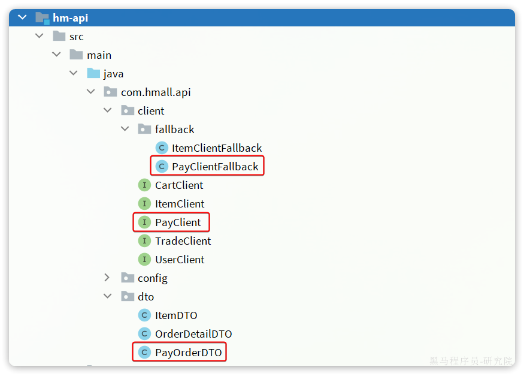

说明：

- PayOrderDTO：支付单的数据传输实体
- PayClient：支付系统的Feign客户端
- PayClientFallback：支付系统的fallback逻辑

`PayOrderDTO`代码如下：

```Java
package com.hmall.api.dto;

import io.swagger.annotations.ApiModel;
import io.swagger.annotations.ApiModelProperty;
import lombok.Data;

import java.time.LocalDateTime;

/**
 * <p>
 * 支付订单
 * </p>
 */
@Data
@ApiModel(description = "支付单数据传输实体")
public class PayOrderDTO {
    @ApiModelProperty("id")
    private Long id;
    @ApiModelProperty("业务订单号")
    private Long bizOrderNo;
    @ApiModelProperty("支付单号")
    private Long payOrderNo;
    @ApiModelProperty("支付用户id")
    private Long bizUserId;
    @ApiModelProperty("支付渠道编码")
    private String payChannelCode;
    @ApiModelProperty("支付金额，单位分")
    private Integer amount;
    @ApiModelProperty("付类型，1：h5,2:小程序，3：公众号，4：扫码，5：余额支付")
    private Integer payType;
    @ApiModelProperty("付状态，0：待提交，1:待支付，2：支付超时或取消，3：支付成功")
    private Integer status;
    @ApiModelProperty("拓展字段，用于传递不同渠道单独处理的字段")
    private String expandJson;
    @ApiModelProperty("第三方返回业务码")
    private String resultCode;
    @ApiModelProperty("第三方返回提示信息")
    private String resultMsg;
    @ApiModelProperty("支付成功时间")
    private LocalDateTime paySuccessTime;
    @ApiModelProperty("支付超时时间")
    private LocalDateTime payOverTime;
    @ApiModelProperty("支付二维码链接")
    private String qrCodeUrl;
    @ApiModelProperty("创建时间")
    private LocalDateTime createTime;
    @ApiModelProperty("更新时间")
    private LocalDateTime updateTime;
}
```

`PayClient`代码如下：

```Java
package com.hmall.api.client;

import com.hmall.api.client.fallback.PayClientFallback;
import com.hmall.api.dto.PayOrderDTO;
import org.springframework.cloud.openfeign.FeignClient;
import org.springframework.web.bind.annotation.GetMapping;
import org.springframework.web.bind.annotation.PathVariable;

@FeignClient(value = "pay-service", fallbackFactory = PayClientFallback.class)
public interface PayClient {
    /**
     * 根据交易订单id查询支付单
     * @param id 业务订单id
     * @return 支付单信息
     */
    @GetMapping("/pay-orders/biz/{id}")
    PayOrderDTO queryPayOrderByBizOrderNo(@PathVariable("id") Long id);
}
```

`PayClientFallback`代码如下：

```Java
package com.hmall.api.client.fallback;

import com.hmall.api.client.PayClient;
import com.hmall.api.dto.PayOrderDTO;
import lombok.extern.slf4j.Slf4j;
import org.springframework.cloud.openfeign.FallbackFactory;

@Slf4j
public class PayClientFallback implements FallbackFactory<PayClient> {
    @Override
    public PayClient create(Throwable cause) {
        return new PayClient() {
            @Override
            public PayOrderDTO queryPayOrderByBizOrderNo(Long id) {
                return null;
            }
        };
    }
}
```

最后，在`pay-service`模块的`PayController`中实现该接口：

```Java
@ApiOperation("根据id查询支付单")
@GetMapping("/biz/{id}")
public PayOrderDTO queryPayOrderByBizOrderNo(@PathVariable("id") Long id){
    PayOrder payOrder = payOrderService.lambdaQuery().eq(PayOrder::getBizOrderNo, id).one();
    return BeanUtils.copyBean(payOrder, PayOrderDTO.class);
}
```

#### 8.3.5 监听消息，查询支付状态

接下来，我们在`trader-service`编写一个监听器，监听延迟消息，查询订单支付状态：


代码如下：

```Java
package com.hmall.trade.listener;

import com.hmall.api.client.PayClient;
import com.hmall.api.dto.PayOrderDTO;
import com.hmall.trade.constants.MQConstants;
import com.hmall.trade.domain.po.Order;
import com.hmall.trade.service.IOrderService;
import lombok.RequiredArgsConstructor;
import org.springframework.amqp.rabbit.annotation.Exchange;
import org.springframework.amqp.rabbit.annotation.Queue;
import org.springframework.amqp.rabbit.annotation.QueueBinding;
import org.springframework.amqp.rabbit.annotation.RabbitListener;
import org.springframework.stereotype.Component;

@Component
@RequiredArgsConstructor
public class OrderDelayMessageListener {

    private final IOrderService orderService;
    private final PayClient payClient;

    @RabbitListener(bindings = @QueueBinding(
            value = @Queue(name = MQConstants.DELAY_ORDER_QUEUE_NAME),
            exchange = @Exchange(name = MQConstants.DELAY_EXCHANGE_NAME, delayed = "true"),
            key = MQConstants.DELAY_ORDER_KEY
    ))
    public void listenOrderDelayMessage(Long orderId){
        // 1.查询订单
        Order order = orderService.getById(orderId);
        // 2.检测订单状态，判断是否已支付
        if(order == null || order.getStatus() != 1){
            // 订单不存在或者已经支付
            return;
        }
        // 3.未支付，需要查询支付流水状态
        PayOrderDTO payOrder = payClient.queryPayOrderByBizOrderNo(orderId);
        // 4.判断是否支付
        if(payOrder != null && payOrder.getStatus() == 3){
            // 4.1.已支付，标记订单状态为已支付
            orderService.markOrderPaySuccess(orderId);
        }else{
            // TODO 4.2.未支付，取消订单，回复库存
            orderService.cancelOrder(orderId);
        }
    }
}
```

注意，这里要在OrderServiceImpl中实现cancelOrder方法，留作作业大家自行实现。


# uni-app

资料来源:[uni-app官网 (dcloud.net.cn)](https://uniapp.dcloud.net.cn/)

## 1、概念简介

`uni-app` 是一个使用 [Vue.js](https://vuejs.org/) 开发所有前端应用的框架，开发者编写一套代码，可发布到iOS、Android、Web（响应式）、以及各种小程序（微信/支付宝/百度/头条/飞书/QQ/快手/钉钉/淘宝）、快应用等多个平台。

`DCloud`公司拥有900万开发者、数百万应用、12亿手机端月活用户、数千款uni-app插件、70+微信/qq群。阿里小程序工具官方内置uni-app（[详见](https://opendocs.alipay.com/mini/ide/overview)），腾讯课堂官方为uni-app录制培训课程（[详见](https://ask.dcloud.net.cn/article/35640)），开发者可以放心选择。

`uni-app`在手，做啥都不愁。即使不跨端，`uni-app`也是更好的小程序开发框架（[详见](https://ask.dcloud.net.cn/article/35947)）、更好的App跨平台框架、更方便的H5开发框架。不管领导安排什么样的项目，你都可以快速交付，不需要转换开发思维、不需要更改开发习惯。

### 1.1 **功能框架图**

从下面`uni-app`功能框架图可看出，`uni-app`在跨平台的过程中，不牺牲平台特色，可优雅的调用平台专有能力，真正做到海纳百川、各取所长。 


### 1.2 基本语言和开发规范

uni-app代码编写，基本语言包括js、vue、css。以及ts、scss等css预编译器。

在app端，还支持原生渲染的[nvue](https://uniapp.dcloud.net.cn/tutorial/nvue-outline.html)，以及可以编译为kotlin和swift的[uts](https://doc.dcloud.net.cn/uni-app-x/uts/)。

DCloud还提供了使用js编写服务器代码的uniCloud云引擎。所以只需掌握js，你可以开发web、Android、iOS、各家小程序以及服务器等全栈应用。

为了实现多端兼容，综合考虑编译速度、运行性能等因素，`uni-app` 约定了如下开发规范：

- 页面文件遵循 [Vue 单文件组件 (SFC) 规范](https://vue-loader.vuejs.org/zh/spec.html)，即每个页面是一个.vue文件
- 组件标签靠近小程序规范，详见[uni-app 组件规范](https://uniapp.dcloud.net.cn/component/)
- 接口能力（JS API）靠近小程序规范，但需将前缀 `wx`、`my` 等替换为 `uni`，详见[uni-app接口规范](https://uniapp.dcloud.net.cn/api/)
- 数据绑定及事件处理同 `Vue.js` 规范，同时补充了[应用生命周期](https://uniapp.dcloud.net.cn/collocation/App.html#applifecycle)及[页面的生命周期](https://uniapp.dcloud.net.cn/tutorial/page.html#lifecycle)
- 如需兼容app-nvue平台，建议使用flex布局进行开发

uni-app分`编译器`和`运行时（runtime）`。uni-app能实现一套代码、多端运行，是通过这2部分配合完成的。

编译器将开发者的代码进行编译，编译的输出物由各个终端的runtime进行解析，每个平台（Web、Android App、iOS App、各家小程序）都有各自的runtime。

### 1.3 编译器

- 编译器运行在电脑开发环境。一般是内置在HBuilderX工具中，也可以使用独立的cli版。
- 开发者按uni-app规范编写代码，由编译器将开发者的代码编译生成每个平台支持的特有代码
  - 在web平台，将.vue文件编译为js代码。与普通的vue cli项目类似
  - 在微信小程序平台，编译器将.vue文件拆分生成wxml、wxss、js等代码
  - 在app平台，将.vue文件编译为js代码。进一步，如果涉及uts代码：
    - 在Android平台，将.uts文件编译为kotlin代码
    - 在iOS平台，将.uts文件编译为swift代码
- 编译器分vue2版和vue3版
  - vue2版：基于`webpack`实现
  - vue3版：基于`Vite`实现，性能更快
- 编译器支持条件编译，即可以指定某部分代码只编译到特定的终端平台。从而将公用和个性化融合在一个工程中。

```js
// #ifdef  App
console.log("这段代码只有在App平台才会被编译进去。非App平台编译后没有这段代码")
// #endif
```

更多编译器介绍参见：[编译器](https://uniapp.dcloud.net.cn/tutorial/compiler.html)

### 1.4 运行时（runtime）

runtime不是运行在电脑开发环境，而是运行在真正的终端上。

uni-app在每个平台（Web、Android App、iOS App、各家小程序）都有各自的runtime。这是一个比较庞大的工程。

- 在小程序端，uni-app的runtime，主要是一个小程序版的vue runtime，页面路由、组件、api等方面基本都是转义。
- 在web端，uni-app的runtime相比普通的vue项目，多了一套ui库、页面路由框架、和uni对象（即常见API封装）
- 在App端，uni-app的runtime更复杂，可以先简单理解为DCloud也有一套小程序引擎，打包app时将开发者的代码和DCloud的小程序打包成了apk或ipa。当然，事实上DCloud确实有小程序引擎产品，供原生应用实现小程序化，[详见](https://nativesupport.dcloud.net.cn/README)

uni-app runtime包括3部分：基础框架、组件、API。

1. 基础框架：
   - 包括语法、数据驱动、全局文件、应用管理、页面管理、js引擎、渲染和排版引擎等
   - 在web和小程序上，不需要uni-app提供js引擎和排版引擎，直接使用浏览器和小程序的即可。但app上需要uni-app提供
   - App的js引擎：App-Android上，uni-app的js引擎是v8，App-iOS是jscore
   - App的渲染引擎：同时提供了2套渲染引擎，`.vue`页面文件由webview渲染，原理与小程序相同；`.nvue`页面文件由原生渲染，原理与react native相同。开发者可以根据需要自主选择渲染引擎。
2. 组件：
   - runtime中包括的组件只有基础组件，如`<view>`、`<button>`等。扩展组件不包含在uni-app的runtime中，而是下载到用户的项目代码中。（这些组件都是vue组件）
   - 为了降低开发者的学习成本，uni-app的内置基础组件命名规范与小程序基本相同。
   - 这几十个组件不管在哪个平台，已被处理为均有一致表现。
   - 在小程序端，uni-app基础组件会直接转义为小程序自己的内置组件。在小程序的runtime中不占体积。
   - 在web和android、iOS端，这几十个组件都在uni-app的runtime中，会占用一定体积，相当于内置了一套ui库。
   - 组件的扩展：
     - 有了几十个基础组件，大多数扩展组件也都是基于这些基础组件封装的。比如官方提供的扩展ui库`uni ui`。
     - 在web平台，for web的各种ui库（如elementUI）也可以使用，但这些库由于操作了dom，无法跨端在app和小程序中使用。
     - 在App平台，uni-app也支持使用原生编程语言来自行扩展原生组件，比如原生的地图、ar等。
     - uni-app同时支持将[微信自定义组件](https://uniapp.dcloud.net.cn/tutorial/miniprogram-subject.html)运行到微信小程序、web、app这3个平台。注意微信自定义组件不是vue组件。
3. API：
   - uni-app runtime内置了大量常见的、跨端的 [API](https://uniapp.dcloud.net.cn/api/index.html)，比如联网(uni.request)、读取存储(uni.getStorage)
   - 同时uni-app不限制各端原生平台的API调用。开发者可以在uni-app框架中无限制的调用该平台所有能使用的API。即，在小程序平台，小程序的所有API都可以使用；在web平台，浏览器的所有API都可使用；在iOS和Android平台，os的所有API都可以使用。
   - 也就是说，使用uni-app的标准API，可以跨端使用。但对于不跨端的部分，仍可以调用该端的专有API。由于常见的API都已经被封装内置，所以日常开发时，开发者只需关注uni标准API，当需要调用特色端能力时在条件编译里编写特色API调用代码。
   - [ext API](https://uniapp.dcloud.net.cn/api/extapi.html)：web和app的runtime体积不小，如果把小程序的所有API等内置进去会让开发者的最终应用体积变大。所以有部分不常用的API被剥离为ext API。虽然仍然是uni.开头，但需要单独下载插件到项目下
   - 小程序平台：uni对象会转为小程序的自有对象，比如在微信小程序平台，编写uni.request等同于wx.request。那么所有wx.的API都可以这样使用。
   - web平台：window、dom等浏览器专用API仍可以使用
   - app平台：除了uni.的API，还可以使用[plus.的API](https://www.html5plus.org/doc/h5p.html)、[Native.js](https://uniapp.dcloud.net.cn/tutorial/native-js.html)，以及通过uts编写原生插件，或者使用java和objectC编写原生插件。这些原生插件调用os的API并封装给js使用。
   - 由于历史沿革，DCloud在开发app时有：5+App、wap2app、uni-app等3种模式。这3种方式的runtime在底层能力上是公用的，所有uni-app可以调用5+（也就是plus.xxx）的API。虽然都可以使用5+的系统能力，但uni-app的逻辑层运行在js层，渲染层是webview和原生nvue双选。而5+不区分逻辑层和渲染层，全部运行在webview里，在性能上5+不及uni-app。

DCloud还提供了[插件市场](https://ext.dcloud.net.cn/)，大多数用得着的组件和API都已经有现成的插件。

#### 1.4.1 逻辑层和渲染层分离

在web平台，逻辑层（js）和渲染层（html、css），都运行在统一的webview里。

但在小程序和app端，逻辑层和渲染层被分离了。

分离的核心原因是性能。过去很多开发者吐槽基于webview的app性能不佳，很大原因是js运算和界面渲染抢资源导致的卡顿。

不管小程序还是app，逻辑层都独立为了单独的js引擎，渲染层仍然是webview（app上也支持纯原生渲染）。

所以注意小程序和app的逻辑层都不支持浏览器专用的window、dom等API。app只能在渲染层操作window、dom，即[renderjs](https://uniapp.dcloud.net.cn/tutorial/renderjs.html)。

关于逻辑层和渲染层分离带来的注意事项，请[详读](https://uniapp.dcloud.net.cn/tutorial/performance.html)

### 1.5 组件/标签的变化

以前是html标签，比如`<div>`，现在是小程序组件，比如`<view>`。 那么`标签`和`组件`有什么区别，不都是用尖括号包围起来一段英文吗？ 其实标签是老的概念，标签属于浏览器内置的东西。但组件，是可以自由扩展的。 类似你可以把一段js封装成函数或模块，你也可以把一个ui控件封装成一个组件。

`uni-app`参考小程序规范，提供了一批内置组件。

下为html标签和uni-app内置组件的映射表：

- div 改成 [view](https://uniapp.dcloud.io/component/view)
- span、font 改成 [text](https://uniapp.dcloud.io/component/text)
- a 改成 [navigator](https://uniapp.dcloud.io/component/navigator)
- img 改成 [image](https://uniapp.dcloud.io/component/image)
- [input](https://uniapp.dcloud.io/component/input) 仅仅是输入框。 原html规范中input不仅是输入框，还有radio、checkbox、时间、日期、文件选择功能。在uni-app和小程序规范中，input仅仅是输入框。其他功能uni-app有单独的组件或API：[radio组件](https://uniapp.dcloud.io/component/radio)、[checkbox组件](https://uniapp.dcloud.io/component/checkbox)、[时间选择](https://uniapp.dcloud.io/component/picker?id=时间选择器)、[日期选择](https://uniapp.dcloud.io/component/picker?id=日期选择器)、[图片选择](https://uniapp.dcloud.io/api/media/image?id=chooseimage)、[视频选择](https://uniapp.dcloud.io/api/media/video?id=choosevideo)、[多媒体文件选择(含图片视频)](https://uniapp.dcloud.io/api/media/video?id=choosemedia)、[通用文件选择](https://uniapp.dcloud.io/api/media/file?id=choosefile)。
- [form](https://uniapp.dcloud.io/component/form)、[button](https://uniapp.dcloud.io/component/button)、[label](https://uniapp.dcloud.io/component/label)、[textarea](https://uniapp.dcloud.io/component/textarea)、[canvas](https://uniapp.dcloud.io/component/canvas)、[video](https://uniapp.dcloud.io/component/video) 这些还在。
- select 改成 [picker](https://uniapp.dcloud.io/component/picker)
- iframe 改成 [web-view](https://uniapp.dcloud.io/component/web-view)
- ul、li没有了，都用view替代。做列表一般使用[uList组件](https://ext.dcloud.net.cn/plugin?id=24)
- audio 不再推荐使用，改成api方式，[背景音频api文档](https://uniapp.dcloud.io/api/media/background-audio-manager?id=getbackgroundaudiomanager) 其实老的HTML标签也可以在uni-app里使用，uni-app编译器会在编译时把老标签转为新标签，比如把div编译成view。但不推荐这种用法，调试H5端时容易混乱。

**除了改动外，新增了一批手机端常用的新组件**

- scroll-view [可区域滚动视图容器](https://uniapp.dcloud.io/component/scroll-view)

- swiper [可滑动区域视图容器](https://uniapp.dcloud.io/component/swiper)

- icon [图标](https://uniapp.dcloud.io/component/icon)

- rich-text [富文本（不可执行js，但可渲染各种文字格式和图片）](https://uniapp.dcloud.io/component/rich-text)

- progress [进度条](https://uniapp.dcloud.io/component/progress)

- slider [滑块指示器](https://uniapp.dcloud.io/component/slider)

- switch [开关选择器](https://uniapp.dcloud.io/component/switch)

- camera [相机](https://uniapp.dcloud.io/component/camera)

- live-player [直播](https://uniapp.dcloud.io/component/live-player)

- map [地图](https://uniapp.dcloud.io/component/map)

- cover-view [可覆盖原生组件的视图容器](https://uniapp.dcloud.io/component/cover-view?id=cover-view)

  cover-view需要多强调几句，uni-app的非h5端的video、map、canvas、textarea是原生组件，层级高于其他组件。如需覆盖原生组件，则需要使用cover-view组件。详见[层级介绍](https://uniapp.dcloud.net.cn/component/native-component)

除了内置组件，还有很多开源的扩展组件，把常用操作都进行封装，DCloud建立了插件市场收录这些扩展组件，详见[插件市场](https://ext.dcloud.net.cn/)

## 2、工程简介

一个 uni-app 工程，就是一个 Vue 项目，你可以通过 HBuilderX 或 cli 方式快速创建 uni-app 工程，详见：[快速上手](https://uniapp.dcloud.net.cn/quickstart-hx.html)。

### 2.1 目录结构

一个uni-app工程，默认包含如下目录及文件：

```
┌─uniCloud              云空间目录，支付宝小程序云为uniCloud-alipay，阿里云为uniCloud-aliyun，腾讯云为uniCloud-tcb（详见uniCloud）
│─components            符合vue组件规范的uni-app组件目录
│  └─comp-a.vue         可复用的a组件
├─utssdk                存放uts文件
├─pages                 业务页面文件存放的目录
│  ├─index
│  │  └─index.vue       index页面
│  └─list
│     └─list.vue        list页面
├─static                存放应用引用的本地静态资源（如图片、视频等）的目录，注意：静态资源都应存放于此目录
├─uni_modules           存放uni_module 详见
├─platforms             存放各平台专用页面的目录，详见
├─nativeplugins         App原生语言插件 详见
├─nativeResources       App端原生资源目录
│  ├─android            Android原生资源目录 详见
|  └─ios                iOS原生资源目录 详见
├─hybrid                App端存放本地html文件的目录，详见
├─wxcomponents          存放小程序组件的目录，详见
├─unpackage             非工程代码，一般存放运行或发行的编译结果
├─main.js               Vue初始化入口文件
├─App.vue               应用配置，用来配置App全局样式以及监听 应用生命周期
├─pages.json            配置页面路由、导航条、选项卡等页面类信息，详见
├─manifest.json         配置应用名称、appid、logo、版本等打包信息，详见
├─AndroidManifest.xml   Android原生应用清单文件 详见
├─Info.plist            iOS原生应用配置文件 详见
└─uni.scss              内置的常用样式变量
```

> **Tips**
>
> - HbuilderX 1.9.0+ 支持在根目录创建 `ext.json`、`sitemap.json` 等小程序需要的文件。

### 2.2 static目录

- 为什么需要static这样的目录？

uni-app编译器根据pages.json扫描需要编译的页面，并根据页面引入的js、css合并打包文件。
对于本地的图片、字体、视频、文件等资源，如果可以直接识别，那么也会把这些资源文件打包进去，但如果这些资源以变量的方式引用， 比如：`<image :src="url"></image>`，甚至可能有更复杂的函数计算，此时编译器无法分析。

那么有了static目录，编译器就会把这个目录整体复制到最终编译包内。这样只要运行时确实能获取到这个图片，就可以显示。

当然这也带来一个注意事项，如果static里有一些没有使用的废文件，也会被打包到编译包里，造成体积变大。

另外注意，static目录支持特殊的平台子目录，比如web、app、mp-weixin等，这些目录存放专有平台的文件，这些平台的文件在打包其他平台时不会被包含。详见[条件编译](https://uniapp.dcloud.net.cn/tutorial/platform.html#static-目录的条件编译)

非 `static` 目录下的文件（vue组件、js、css 等）只有被引用时，才会被打包编译。

`css`、`less/scss` 等资源不要放在 `static` 目录下，建议这些公用的资源放在自建的 `common` 目录下。

- static目录和App原生资源目录有关系吗？

uni-app支持App原生资源目录nativeResources，下面有assets、res等目录，[详见](https://uniapp.dcloud.net.cn/tutorial/app-nativeresource-android.html#nativeresources)。但和static目录没有关系。

static目录下的文件，在app第一次启动时，解压到了app的外部存储目录（external-path）。（uni-app x 从3.99+不再解压）

所以注意控制static目录的大小，太大的static目录和太多文件，会造成App安装后第一次启动变慢。

## 3、页面

### 3.1 页面介绍

uni-app项目中，一个页面就是一个符合`Vue SFC规范`的 vue 文件。

- 在 uni-app js 引擎版中，后缀名是`.vue`文件或`.nvue`文件。 这些页面均全平台支持，差异在于当 uni-app 发行到App平台时，`.vue`文件会使用webview进行渲染，`.nvue`会使用原生进行渲染，详见：[nvue原生渲染](https://uniapp.dcloud.net.cn/tutorial/nvue-outline)。

  一个页面可以同时存在vue和nvue，在[pages.json](https://uniapp.dcloud.net.cn/collocation/pages.html)的路由注册中不包含页面文件名后缀，同一个页面可以对应2个文件名。重名时优先级如下：

  - 在非app平台，先使用vue，忽略nvue
  - 在app平台，使用nvue，忽略vue

- 在 uni-app x 中，后缀名是`.uvue`文件

  uni-app x 中没有js引擎和webview，不支持和vue页面并存。

  uni-app x 在app-android上，每个页面都是一个全屏activity，不支持透明。

### 3.2 页面管理

#### 3.2.1 新建页面

`uni-app`中的页面，默认保存在工程根目录下的`pages`目录下。

每次新建页面，均需在`pages.json`中配置`pages`列表；未在`pages.json -> pages` 中注册的页面，`uni-app`会在编译阶段进行忽略。pages.json的完整配置参考：[页面配置](https://uniapp.dcloud.net.cn/collocation/pages.html)。

通过HBuilderX开发 `uni-app` 项目时，在 `uni-app` 项目上右键“新建页面”，HBuilderX会自动在`pages.json`中完成页面注册，开发更方便。

同时，HBuilderX 还内置了常用的页面模板（如图文列表、商品列表等），选择这些模板，可以大幅提升你的开发效率。


新建页面时，可以选择`是否创建同名目录`。创建目录的意义在于：

- 如果你的页面较复杂，需要拆分多个附属的js、css、组件等文件，则使用目录归纳比较合适。
- 如果只有一个页面文件，大可不必多放一层目录。

#### 3.2.2 删除页面

删除页面时，需做两件工作：

- 删除`.vue`文件、`.nvue`、`.uvue`文件
- 删除`pages.json -> pages`列表项中的配置 （如使用HBuilderX删除页面，会在状态栏提醒删除pages.json对应内容，点击后会打开pages.json并定位到相关配置项）

#### 3.2.3 页面改名

操作和删除页面同理，依次修改文件和 `pages.json`。

#### 3.2.4 pages.json

pages.json是工程的页面管理配置文件，包括：页面路由注册、页面参数配置（原生标题栏、下拉刷新...）、首页tabbar等众多功能。

其篇幅较长，另见 [pages.json](https://uniapp.dcloud.net.cn/collocation/pages.html)

#### 3.2.5 设置应用首页

`pages.json -> pages`配置项中的第一个页面，作为当前工程的首页（启动页）。

```json
{
	"pages": [
		{
			"path": "pages/index/index", //名字叫不叫index无所谓，位置在第一个，就是首页
			"style": {
				"navigationBarTitleText": "首页" //页面标题
			}
		},
		{
			"path": "pages/my",
			"style": {
				"navigationBarTitleText": "我的"
			}
		},
	]
}

```

### 3.3 页面内容构成

uni-app 页面基于 vue 规范。一个页面内，有3个根节点标签：

- 模板组件区 `<template>`
- 脚本区 `<script>`
- 样式区 `<style>`

```vue
<template>
	<view class="content">
		<button @click="buttonClick">{{title}}</button>
	</view>
</template>

<script>
	export default {
		data() {
			return {
				title: "Hello world", // 定义绑定在页面上的data数据
			}
		},
		onLoad() {
			// 页面启动的生命周期，这里编写页面加载时的逻辑
		},
		methods: {
			buttonClick: function () {
				console.log("按钮被点了")
			},
		}
	}
</script>

<style>
	.content {
		width: 750rpx;
		background-color: white;
	}
</style>
```

#### 3.3.1 template模板区

template中文名为`模板`，它类似html的标签。但有2个区别：

1. html中 `script` 和 `style` 是 html 的二级节点。但在 vue 文件中，`template`、`script`、`style` 这3个是平级关系。
2. html 中写的是 web 标签，但 vue 的 `template` 中写的全都是 vue 组件，每个组件支持属性、事件、 vue 指令，还可以绑定 vue 的 data 数据。

在vue2中，`template` 的二级节点只能有一个节点，一般是在一个根 `view` 下继续写页面组件（如上示例代码）。

但在vue3中，template可以有多个二级节点，省去一个层级，如下：

```vue
<template>
	<view>
		<text>标题</text>
	</view>
	<scroll-view>

	</scroll-view>
</template>

```

可以在 `manifest` 中切换使用 Vue2 还是 Vue3。

注意：`uni-app x` 中只支持 Vue3。

#### 3.3.2 script 脚本区

script中编写脚本，可以通过lang属性指定脚本语言。

- 在vue和nvue中，默认是js，可以指定ts。
- 在uvue中，仅支持uts，不管script的lang属性写成什么，都按uts编译。

```js
<script lang="ts">
</script>
```

在vue的选项式（option）规范中，script下包含 `export default {}`。除了选项式，还有 [组合式](https://uniapp.dcloud.net.cn/tutorial/vue3-composition-api.html) 写法。

页面级的代码大多写在 `export default {}` 中。写在里面的代码，会随着页面关闭而关闭。

##### 3.3.2.1 `export default` 外的代码

写在 `export default {}` 外面的代码，一般有几种情况：

1. 引入第三方 js/ts 模块
2. 引入非 easycom 的组件（一般组件推荐使用[easycom](https://uniapp.dcloud.net.cn/collocation/pages.html#easycom)，无需导入注册）
3. 在 ts/uts 中，对 data 进行类型定义
4. 定义作用域更大的变量

```js
<script lang="ts">
	const TAB_OFFSET = 1; // 外层静态变量不会跟随页面关闭而回收
	import charts from 'charts.ts'; // 导入外部js/ts模块
	import swiperPage from 'swiper-page.vue'; //导入非easycom的组件
	type GroupType = {
		id : number,
		title : string
	} // 在ts中，为下面data数据的 groupList 定义类型
	export default {
		components: {
		    swiperPage
		}, // 注册非easycom组件
		data() {
			return {
				groupList: [
					{ id: 1, title: "第一组" },
					{ id: 2, title: "第二组" },
				] as GroupType[], // 为数据groupList定义ts类型
			}
		},
		onLoad() {},
		methods: {}
	}
</script>
```

开发者应谨慎编写 `export default {}` 外面的代码，这里的代码有2个注意事项：

1. 影响应用性能。这部分代码在应用启动时执行，而不是页面加载。如果这里的代码写的太复杂，会影响应用启动速度，占用更多内存。
2. 不跟随组件、页面关闭而回收。在外层的静态变量不会跟随页面关闭而回收。如果必要你需要手动处理。比如 `beforeDestroy` 或 `destroyed` 生命周期进行处理。

##### 3.3.2.2 export default 里的代码

`export default {}` 里的内容，是页面的主要逻辑代码。包括几部分：

1. data：template模板中需要使用的数据。具体 [另见](https://uniapp.dcloud.net.cn/tutorial/vue-basics.html#data)
2. 页面生命周期：如页面加载、隐藏、关闭，具体 [见下](https://uniapp.dcloud.net.cn/tutorial/page.html#lifecycle)
3. methods方法，如按钮点击、屏幕滚动

如下页面代码的逻辑是：

1. 在data中定义了`title`，初始值是"点我"
2. 在页面中放置了一个button组件，按钮文字区使用`{{}}`模板写法，里面写`title`，把data里的`title`绑定到按钮的文字区，即按钮的初始文字是"点我"
3. 按钮的点击事件`@click`，指向了methods里的一个方法`buttonClick`，点击按钮即触发这个方法的执行
4. buttonClick方法里通过`this.title`的方式，访问data数据，并重新赋值为"被点了"。由于vue中data和界面是双向绑定，修改data中的`title`后，因为按钮文字绑定了`title`，会自动更新按钮的文字。

整体效果就是，刚开始按钮文字是"点我"，点一下后按钮文字变成了"被点了"

```js
<template>
	<view>
		<button @click="buttonClick">{{title}}</button>
	</view>
</template>

<script>
	export default {
		data() {
			return {
				title: "点我", // 定义绑定在页面上的data数据
				// 多个data在这里继续定义。逗号分隔
			}
		},
		onLoad() {
			// 页面启动的生命周期，这里编写页面加载时的逻辑
		},
		// 多个页面生命周期监听，在这里继续写。逗号分隔
		methods: {
			buttonClick: function () {
				this.title = "被点了"
			},
			// 多个方法，在这里继续写。逗号分隔
		}
	}
</script>
```

本章节为页面代码介绍，并非vue教程，了解data数据需[详见](https://uniapp.dcloud.net.cn/tutorial/vue-basics.html#data)

#### 3.3.3 style样式区

style的写法与web的css基本相同。

如果页面是nvue或uvue，使用原生渲染而不是webview渲染，那么它们支持的css是有限的。

详见[css文档](https://uniapp.dcloud.net.cn/tutorial/syntax-css.html)

### 3.4 页面生命周期

`uni-app` 页面除支持 Vue 组件生命周期外还支持下方页面生命周期函数，当以组合式 API 使用时，在 Vue2 和 Vue3 中存在一定区别，请分别参考：[Vue2 组合式 API 使用文档](https://uniapp.dcloud.net.cn/tutorial/vue-composition-api.html) 和 [Vue3 组合式 API 使用文档](https://uniapp.dcloud.net.cn/tutorial/vue3-composition-api.html)。

| 函数名                              | 说明                                                         | 平台差异说明                                                 | 最低版本 |
| :---------------------------------- | :----------------------------------------------------------- | :----------------------------------------------------------- | :------- |
| onInit                              | 监听页面初始化，其参数同 onLoad 参数，为上个页面传递的数据，参数类型为 Object（用于页面传参），触发时机早于 onLoad | 百度小程序                                                   | 3.1.0+   |
| onLoad                              | 监听页面加载，该钩子被调用时，响应式数据、计算属性、方法、侦听器、props、slots 已设置完成，其参数为上个页面传递的数据，参数类型为 Object（用于页面传参），参考[示例](https://uniapp.dcloud.net.cn/api/router#navigateto)。 |                                                              |          |
| onShow                              | 监听页面显示，页面每次出现在屏幕上都触发，包括从下级页面点返回露出当前页面 |                                                              |          |
| onReady                             | 监听页面初次渲染完成，此时组件已挂载完成，DOM 树($el)已可用，注意如果渲染速度快，会在页面进入动画完成前触发 |                                                              |          |
| onHide                              | 监听页面隐藏                                                 |                                                              |          |
| onUnload                            | 监听页面卸载                                                 |                                                              |          |
| onResize                            | 监听窗口尺寸变化                                             | App、微信小程序、快手小程序                                  |          |
| onPullDownRefresh                   | 监听用户下拉动作，一般用于下拉刷新，参考[示例](https://uniapp.dcloud.net.cn/api/ui/pulldown.html) |                                                              |          |
| onReachBottom                       | 页面滚动到底部的事件（不是scroll-view滚到底），常用于下拉下一页数据。具体见下方注意事项 |                                                              |          |
| onTabItemTap                        | 点击 tab 时触发，参数为Object，具体见下方注意事项            | 微信小程序、QQ小程序、支付宝小程序、百度小程序、H5、App、快手小程序、京东小程序 |          |
| onShareAppMessage                   | 用户点击右上角分享                                           | 微信小程序、QQ小程序、支付宝小程序、抖音小程序、飞书小程序、快手小程序、京东小程序 |          |
| onPageScroll                        | 监听页面滚动，参数为Object                                   | nvue不支持                                                   |          |
| onNavigationBarButtonTap            | 监听原生标题栏按钮点击事件，参数为Object                     | App、H5                                                      |          |
| onBackPress                         | 监听页面返回，返回 event = {from:backbutton、 navigateBack} ，backbutton 表示来源是左上角返回按钮或 android 返回键；navigateBack表示来源是 uni.navigateBack；[详见](https://uniapp.dcloud.net.cn/tutorial/page.html#onbackpress) | app、H5、支付宝小程序                                        |          |
| onNavigationBarSearchInputChanged   | 监听原生标题栏搜索输入框输入内容变化事件                     | App、H5                                                      | 1.6.0    |
| onNavigationBarSearchInputConfirmed | 监听原生标题栏搜索输入框搜索事件，用户点击软键盘上的“搜索”按钮时触发。 | App、H5                                                      | 1.6.0    |
| onNavigationBarSearchInputClicked   | 监听原生标题栏搜索输入框点击事件（pages.json 中的 searchInput 配置 disabled 为 true 时才会触发） | App、H5                                                      | 1.6.0    |
| onShareTimeline                     | 监听用户点击右上角转发到朋友圈                               | 微信小程序                                                   | 2.8.1+   |
| onAddToFavorites                    | 监听用户点击右上角收藏                                       | 微信小程序、QQ小程序                                         | 2.8.1+   |

#### 3.4.1 Vue2 页面及组件生命周期流程图

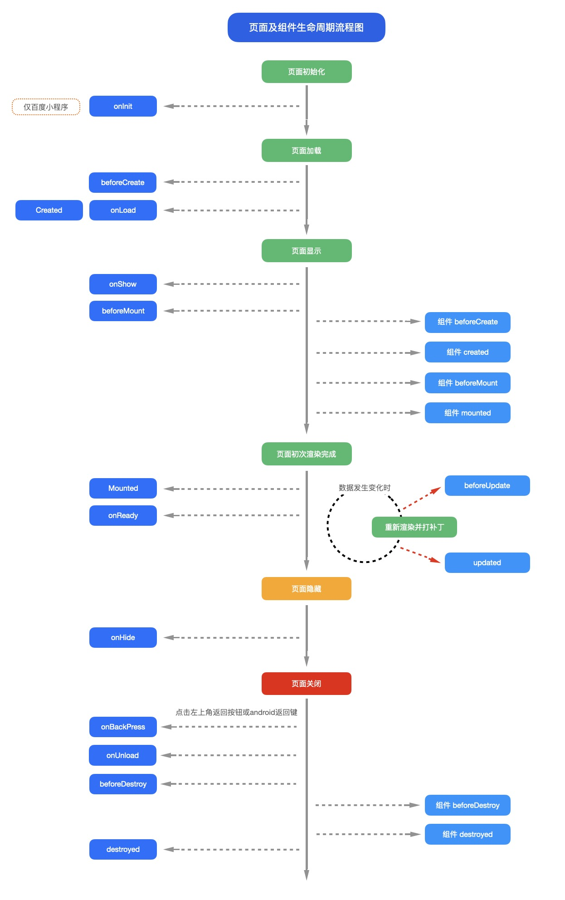

#### 3.4.2 Vue3 页面及组件生命周期流程图


#### 3.4.3 页面加载时序介绍

接下来我们介绍onLoad、onReady、onShow的先后关系，页面加载的详细流程。

1. **uni-app框架，首先根据pages.json的配置，创建页面**

所以原生导航栏是最快显示的。页面背景色也应该在这里配置。

2. **根据页面template里的组件，创建dom**

这里的dom创建仅包含第一批处理的静态dom。对于通过js/uts更新data然后通过v-for再创建的列表数据，不在第一批处理。

要注意一个页面静态dom元素过多，会影响页面加载速度。在uni-app x Android版本上，可能会阻碍页面进入的转场动画。 因为此时，页面转场动画还没有启动。

3. **触发onLoad**

此时页面还未显示，没有开始进入的转场动画，页面dom还不存在。

所以这里不能直接操作dom（可以修改data，因为vue框架会等待dom准备后再更新界面）；在 app-uvue 中获取当前的activity拿到的是老页面的activity，只能通过页面栈获取activity。

onLoad比较适合的操作是：==接受上页的参数，联网取数据，更新data==。

手机都是多核的，uni.request或云开发联网，在子线程运行，不会干扰UI线程的入场动画，并行处理可以更快的拿到数据、渲染界面。

但onLoad里不适合进行大量同步耗时运算，因为此时转场动画还没开始。

尤其uni-app x 在 Android上，onLoad里的代码（除了联网和加载图片）默认是在UI线程运行的，大量同步耗时计算很容易卡住页面动画不启动。除非开发者显式指定在其他线程运行。

4. **转场动画开始**

新页面开始进入的转场动画，动画默认耗时300ms，可以在路由API中调节时长。

5. **页面onReady**

第2步创建dom是虚拟dom，dom创建后需要经历一段时间，UI层才能完成了页面上真实元素的创建，即触发了onReady。

onReady后，页面元素就可以自由操作了，比如ref获取节点。同时首批界面也渲染了。

注意：onReady和转场动画开始、结束之间，没有必然的先后顺序，完全取决于dom的数量和复杂度。

如果元素排版和渲染够快，转场动画刚开始就渲染好了；

大多情况下，转场动画走几格就看到了首批渲染内容；

如果元素排版和渲染过慢，转场动画结束都没有内容，就会造成白屏。

联网进程从onLoad起就在异步获取数据更新data，如果服务器速度够快，第二批数据也可能在转场动画结束前渲染。

6. **转场动画结束**

再次强调，4和5的先后顺序不一定，取决于首批dom渲染的速度。

#### 3.4.4 页面加载常见问题

了解了页面加载时序原理，我们就知道如何避免页面加载常见的问题：

- 优化白屏的方法：

1. 页面dom太多，注意有的组件写的不好，会拖累整体页面。uni-app x 里减少dom数量的策略，[详见](https://doc.dcloud.net.cn/uni-app-x/performance.html)
2. 联网不要在onReady里，那样太慢了，在onLoad里早点联网
3. 在pages.json里配置原生导航栏和背景色
4. 有的页面template内容非常少，整页就是一个需要联网加载的列表，这会造成虽然首批dom飞快渲染了，但页面其实还是白的，联网后才能显示字和图。 此时需要在template里做一些简单占位组件，比如loading组件、骨架屏，让本地先显示一些内容。

- 卡住动画不启动的原因：

1. 页面dom太多，注意有的组件写的不好，会拖累整体页面。uni-app x 里减少dom数量的策略，[详见](https://doc.dcloud.net.cn/uni-app-x/performance.html)
2. onLoad里执行了耗时的同步计算

#### 3.4.5 onShow和onHide

注意页面显示，是一个会重复触发的事件。

a页面刚进入时，会触发a页面的onShow。

当a跳转到b页面时，a会触发onHide，而b会触发onShow。

但当b被关闭时，b会触发onUnload，此时a再次显示出现，会再次触发onShow。

在tabbar页面（指pages.json里配置的tabbar），不同tab页面互相切换时，会触发各自的onShow和onHide。

#### 3.4.6 onInit

**注意**

- 仅百度小程序基础库 3.260 以上支持 onInit 生命周期
- 其他版本或平台可以同时使用 onLoad 生命周期进行兼容，注意避免重复执行相同逻辑
- 不依赖页面传参的逻辑可以直接使用 created 生命周期替代

#### 3.4.7 onLoad

**注意**

- `uni-app x android` 平台，如需获取 [activity 实例](https://doc.dcloud.net.cn/uni-app-x/plugin/uts-for-android.html#activity)，此时当前页面的 `activity 实例`并未创建完成，会获取到上一个页面的 `activity 实例`（首页会获取应用默认的 `activity 实例`）。如需获取当前页面的 `activity 实例`，应在 `onShow` 或 `onReady` 生命周期中获取。

#### 3.4.8 onReachBottom

可在pages.json里定义具体页面底部的触发距离[onReachBottomDistance](https://uniapp.dcloud.net.cn/collocation/pages#globalstyle)，

比如设为50，那么滚动页面到距离底部50px时，就会触发onReachBottom事件。

如使用scroll-view导致页面没有滚动，则触底事件不会被触发。scroll-view滚动到底部的事件请参考scroll-view的文档。

#### 3.4.9 onPageScroll

**参数说明**

| 属性      | 类型   | 说明                                 |
| --------- | ------ | ------------------------------------ |
| scrollTop | Number | 页面在垂直方向已滚动的距离（单位px） |

```js
onPageScroll : function(e) { //nvue暂不支持滚动监听，可用bindingx代替
	console.log("滚动距离为：" + e.scrollTop);
},
```

**注意**

- `onPageScroll`里不要写交互复杂的js，比如频繁修改页面。因为这个生命周期是在渲染层触发的，在非h5端，js是在逻辑层执行的，两层之间通信是有损耗的。如果在滚动过程中，频发触发两层之间的数据交换，可能会造成卡顿。（uvue在app端无此限制）
- 在webview渲染时，比如app-vue、微信小程序、H5中，也可以使用wxs监听滚动，[参考](https://uniapp.dcloud.io/tutorial/miniprogram-subject#wxs)；在app-nvue中，可以使用bindingx监听滚动，[参考](https://uniapp.dcloud.io/tutorial/nvue-api#nvue-里使用-bindingx)。
- 如果想实现滚动时标题栏透明渐变，在App和H5下，可在pages.json中配置titleNView下的type为transparent，[参考](https://uniapp.dcloud.io/collocation/pages?id=app-titlenview)。(uni-app x不支持)
- 如果需要滚动吸顶固定某些元素，推荐使用css的粘性布局，参考[插件市场](https://ext.dcloud.net.cn/plugin?id=715)。插件市场也有其他js实现的吸顶插件，但性能不佳，需要时可自行搜索。（uni-app x可自由在uts中设置固定位置）

#### 3.4.10 onBackPress

**参数说明**

| 属性 | 类型   | 说明                                                         |
| ---- | ------ | ------------------------------------------------------------ |
| from | String | 触发返回行为的来源：'backbutton'——左上角导航栏按钮及安卓返回键；'navigateBack'——uni.navigateBack() 方法。**支付宝小程序端不支持返回此字段** |

```javascript
export default {
	onBackPress(options) {
		console.log('from:' + options.from)
	}
}
```

**注意**

- `onBackPress`上不可使用`async`，会导致无法阻止默认返回
- 支付宝小程序只有真机可以监听到非`navigateBack`引发的返回事件（使用小程序开发工具时不会触发`onBackPress`），不可以阻止默认返回行为

详细说明及使用：[onBackPress 详解](http://ask.dcloud.net.cn/article/35120)

#### 3.4.11 onTabItemTap

**参数说明**

| 属性     | 类型   | 说明                         |
| -------- | ------ | ---------------------------- |
| index    | Number | 被点击tabItem的序号，从0开始 |
| pagePath | String | 被点击tabItem的页面路径      |
| text     | String | 被点击tabItem的按钮文字      |

```js
onTabItemTap : function(e) {
	console.log(e);
	// e的返回格式为json对象： {"index":0,"text":"首页","pagePath":"pages/index/index"}
},
```

**注意**

- onTabItemTap常用于点击当前tabitem，滚动或刷新当前页面。如果是点击不同的tabitem，一定会触发页面切换。
- 如果想在App端实现点击某个tabitem不跳转页面，不能使用onTabItemTap，可以使用[plus.nativeObj.view](http://www.html5plus.org/doc/zh_cn/nativeobj.html)放一个区块盖住原先的tabitem，并拦截点击事件。
- 支付宝小程序平台onTabItemTap表现为点击非当前tabitem后触发，因此不能用于实现点击返回顶部这种操作

#### 3.4.12 onNavigationBarButtonTap

**参数说明**

| 属性  | 类型   | 说明                     |
| ----- | ------ | ------------------------ |
| index | Number | 原生标题栏按钮数组的下标 |

```js
onNavigationBarButtonTap : function (e) {
	console.log(e);
	// e的返回格式为json对象：{"text":"测试","index":0}
}
```

**注意**

- nvue 页面weex编译模式支持的生命周期同weex，具体参考：[weex生命周期介绍](https://uniapp.dcloud.io/tutorial/nvue-outline?id=编译模式)。

### 3.5 组件生命周期

`uni-app` 组件支持的生命周期，与vue标准组件的生命周期相同。==这里没有页面级的onLoad等生命周期==：

| 函数名        | 说明                                                         | 平台差异说明 | 最低版本 |
| :------------ | :----------------------------------------------------------- | :----------- | :------- |
| beforeCreate  | 在实例初始化之前被调用。[详见](https://v2.cn.vuejs.org/v2/api/#beforeCreate) |              |          |
| created       | 在实例创建完成后被立即调用。[详见](https://v2.cn.vuejs.org/v2/api/#created) |              |          |
| beforeMount   | 在挂载开始之前被调用。[详见](https://v2.cn.vuejs.org/v2/api/#beforeMount) |              |          |
| mounted       | 挂载到实例上去之后调用。[详见](https://v2.cn.vuejs.org/v2/api/#mounted) 注意：此处并不能确定子组件被全部挂载，如果需要子组件完全挂载之后在执行操作可以使用`$nextTick`[Vue官方文档](https://v2.cn.vuejs.org/v2/api/#vm-nextTick) |              |          |
| beforeUpdate  | 数据更新时调用，发生在虚拟 DOM 打补丁之前。[详见](https://v2.cn.vuejs.org/v2/api/#beforeUpdate) | 仅H5平台支持 |          |
| updated       | 由于数据更改导致的虚拟 DOM 重新渲染和打补丁，在这之后会调用该钩子。[详见](https://v2.cn.vuejs.org/v2/api/#updated) | 仅H5平台支持 |          |
| beforeDestroy | 实例销毁之前调用。在这一步，实例仍然完全可用。[详见](https://v2.cn.vuejs.org/v2/api/#beforeDestroy) |              |          |
| destroyed     | Vue 实例销毁后调用。调用后，Vue 实例指示的所有东西都会解绑定，所有的事件监听器会被移除，所有的子实例也会被销毁。[详见](https://v2.cn.vuejs.org/v2/api/#destroyed) |              |          |

### 3.6 页面调用接口

#### 3.6.1 getApp()

`getApp()` 函数用于获取当前应用实例，一般用于获取globalData。也可通过应用实例调用 `App.vue methods` 中定义的方法。

**实例**

```javascript
const app = getApp()
console.log(app.globalData)
app.doSomething() // 调用 App.vue methods 中的 doSomething 方法
```

**注意：**

- 不要在定义于 `App()` 内的函数中，或调用 `App` 前调用 `getApp()` ，可以通过 `this.$scope` 获取对应的app实例
- 通过 `getApp()` 获取实例之后，不要私自调用生命周期函数。
- 当在首页`nvue`中使用`getApp()`不一定可以获取真正的`App`对象。对此提供了`const app = getApp({allowDefault: true})`用来获取原始的`App`对象，可以用来在首页对`globalData`等初始化

#### 3.6.2 getCurrentPages()

`getCurrentPages()` 函数用于获取当前[页面栈](https://uniapp.dcloud.net.cn/tutorial/page.html#页面栈)的实例，以数组形式按栈的顺序给出，数组中的元素为页面实例，第一个元素为首页，最后一个元素为当前页面。

每个页面实例的方法属性列表：

| 方法                  | 描述                          | 平台说明 |
| --------------------- | ----------------------------- | -------- |
| page.$getAppWebview() | 获取当前页面的webview对象实例 | App      |
| page.route            | 获取当前页面的路由            |          |

**注意：**

`getCurrentPages()` 仅用于展示页面栈的情况，请勿修改页面栈，以免造成页面状态错误。
页面关闭时，对应页面实例会在页面栈中删除。

Tips：

- `navigateTo`, `redirectTo` 只能打开非 tabBar 页面。
- `switchTab` 只能打开 `tabBar` 页面。
- `reLaunch`` 可以打开任意页面。
- 页面底部的 `tabBar` 由页面决定，即只要是定义为 `tabBar` 的页面，底部都有 `tabBar`。
- 不能在首页 `onReady` 之前进行页面跳转。

#### 3.6.3 $getAppWebview()

`uni-app` 在 `getCurrentPages()`获得的页面里内置了一个方法 `$getAppWebview()` 可以得到当前webview的对象实例，从而实现对 webview 更强大的控制。在 html5Plus 中，plus.webview具有强大的控制能力，可参考：[WebviewObject](http://www.html5plus.org/doc/zh_cn/webview.html#plus.webview.WebviewObject)。

但`uni-app`框架有自己的窗口管理机制，请不要自己创建和销毁webview，如有需求覆盖子窗体上去，请使用[原生子窗体subNvue](https://uniapp.dcloud.net.cn/api/window/subNVues)。

**注意：此方法仅 App 支持**

**示例：**

获取当前页面 webview 的对象实例

```javascript
export default {
  data() {
    return {
      title: 'Hello'
    }
  },
  onLoad() {
    // #ifdef APP-PLUS
    const currentWebview = this.$scope.$getAppWebview(); //此对象相当于html5plus里的plus.webview.currentWebview()。在uni-app里vue页面直接使用plus.webview.currentWebview()无效
    currentWebview.setBounce({position:{top:'100px'},changeoffset:{top:'0px'}}); //动态重设bounce效果
    // #endif
  }
}
```

获取指定页面 webview 的对象实例

`getCurrentPages()`可以得到所有页面对象，然后根据数组，可以取指定的页面webview对象

```javascript
var pages = getCurrentPages();
var page = pages[pages.length - 1];
// #ifdef APP-PLUS
var currentWebview = page.$getAppWebview();
console.log(currentWebview.id);//获得当前webview的id
console.log(currentWebview.isVisible());//查询当前webview是否可见
);
// #endif
```

uni-app自带的web-view组件，是页面中新插入的一个子webview。获取该对象的方法见：https://ask.dcloud.net.cn/article/35036

### 3.7 页面通讯

#### 3.7.1 uni.$emit(eventName,OBJECT)

触发全局的自定义事件。附加参数都会传给监听器回调。

| 属性      | 类型   | 描述                   |
| --------- | ------ | ---------------------- |
| eventName | String | 事件名                 |
| OBJECT    | Object | 触发事件携带的附加参数 |

**代码示例**

```javascript
uni.$emit('update',{msg:'页面更新'})
```

#### 3.7.2 uni.$on(eventName,callback)

监听全局的自定义事件。事件可以由 uni.$emit 触发，回调函数会接收所有传入事件触发函数的额外参数。

| 属性      | 类型     | 描述           |
| --------- | -------- | -------------- |
| eventName | String   | 事件名         |
| callback  | Function | 事件的回调函数 |

**代码示例**

```javascript
uni.$on('update',function(data){
    console.log('监听到事件来自 update ，携带参数 msg 为：' + data.msg);
})
```

#### 3.7.3 uni.$once(eventName,callback)

监听全局的自定义事件。事件可以由 uni.$emit 触发，但是只触发一次，在第一次触发之后移除监听器。

| 属性      | 类型     | 描述           |
| --------- | -------- | -------------- |
| eventName | String   | 事件名         |
| callback  | Function | 事件的回调函数 |

**代码示例**

```javascript
	uni.$once('update',function(data){
		console.log('监听到事件来自 update ，携带参数 msg 为：' + data.msg);
	})
```

#### 3.7.4 uni.$off(eventName, callback)

移除全局自定义事件监听器。

| 属性      | 类型     | 描述           |
| --------- | -------- | -------------- |
| eventName | String   | 事件名         |
| callback  | Function | 事件的回调函数 |

**Tips**

- 如果没有提供参数，则移除所有的事件监听器；
- 如果只提供了事件，则移除该事件所有的监听器；
- 如果同时提供了事件与回调，则只移除这个回调的监听器；
- 提供的回调必须跟$on的回调为同一个才能移除这个回调的监听器；

**代码示例**

`$emit`、`$on`、`$off`常用于跨页面、跨组件通讯，这里为了方便演示放在同一个页面

```html
	<template>
		<view class="content">
			<view class="data">
				<text>{{val}}</text>
			</view>
			<button type="primary" @click="comunicationOff">结束监听</button>
		</view>
	</template>

	<script>
		export default {
			data() {
				return {
					val: 0
				}
			},
			onLoad() {
				setInterval(()=>{
					uni.$emit('add', {
						data: 2
					})
				},1000)
				uni.$on('add', this.add)
			},
			methods: {
				comunicationOff() {
					uni.$off('add', this.add)
				},
				add(e) {
					this.val += e.data
				}
			}
		}
	</script>

	<style>
		.content {
			display: flex;
			flex-direction: column;
			align-items: center;
			justify-content: center;
		}

		.data {
			text-align: center;
			line-height: 40px;
			margin-top: 40px;
		}

		button {
			width: 200px;
			margin: 20px 0;
		}
	</style>
```

**注意事项**

- uni.$emit、 uni.$on 、 uni.$once 、uni.$off 触发的事件都是 App 全局级别的，跨任意组件，页面，nvue，vue 等
- 使用时，注意及时销毁事件监听，比如，页面 onLoad 里边 uni.$on 注册监听，onUnload 里边 uni.$off 移除，或者一次性的事件，直接使用 uni.$once 监听

扩展阅读：

- [如何使用uni.$emit()和uni.$on() 进行页面间通讯](https://ask.dcloud.net.cn/article/36010)

### 3.8 路由

`uni-app`页面路由为框架统一管理，开发者需要在[pages.json](https://uniapp.dcloud.net.cn/collocation/pages#pages)里配置每个路由页面的路径及页面样式。类似小程序在 app.json 中配置页面路由一样。所以 `uni-app` 的路由用法与 `Vue Router` 不同，如仍希望采用 `Vue Router` 方式管理路由，可在插件市场搜索 [Vue-Router](https://ext.dcloud.net.cn/search?q=vue-router)。

#### 3.8.1 路由跳转

`uni-app` 有两种页面路由跳转方式：使用[navigator](https://uniapp.dcloud.net.cn/component/navigator)组件跳转、调用[API](https://uniapp.dcloud.net.cn/api/router)跳转。

**注意**：

页面返回时会自动关闭 loading 及 toast, modal 及 actionSheet 不会自动关闭。

页面关闭时，只是销毁了页面实例，未完成的网络请求、计时器等副作用需开发者自行处理。

#### 3.8.2 页面栈

框架以栈的形式管理当前所有页面， 当发生路由切换的时候，页面栈的表现如下：

| 路由方式   | 页面栈表现                        | 触发时机                                                     |
| ---------- | --------------------------------- | ------------------------------------------------------------ |
| 初始化     | 新页面入栈                        | uni-app 打开的第一个页面                                     |
| 打开新页面 | 新页面入栈                        | 调用 API  [uni.navigateTo](https://uniapp.dcloud.net.cn/api/router#navigateto) 、使用组件  <navigator open-type="navigate"/> |
| 页面重定向 | 当前页面出栈，新页面入栈          | 调用 API  [uni.redirectTo](https://uniapp.dcloud.net.cn/api/router#redirectto) 、使用组件 <navigator open-type="redirectTo"/> |
| 页面返回   | 页面不断出栈，直到目标返回页      | 调用 API  [uni.navigateBack](https://uniapp.dcloud.net.cn/api/router#navigateback)  、使用组件 <navigator open-type="navigateBack"/> 、用户按左上角返回按钮、安卓用户点击物理back按键 |
| Tab 切换   | 页面全部出栈，只留下新的 Tab 页面 | 调用 API  [uni.switchTab](https://uniapp.dcloud.net.cn/api/router#switchtab) 、使用组件 <navigator open-type="switchTab"/> 、用户切换 Tab |
| 重加载     | 页面全部出栈，只留下新的页面      | 调用 API  [uni.reLaunch](https://uniapp.dcloud.net.cn/api/router#relaunch) 、使用组件  <navigator open-type="reLaunch"/> |

### 3.9 页面代码规范介绍

`uni-app` 支持在 template 模板中嵌套 `<template/>` 和 `<block/>`，用来进行 [条件渲染](https://uniapp.dcloud.net.cn/tutorial/vue-basics#condition) 和 [列表渲染](https://uniapp.dcloud.net.cn/tutorial/vue-basics#listrendering)。

`<template/>` 和 `<block/>` 并不是一个组件，它们仅仅是一个包装元素，不会在页面中做任何渲染，只接受控制属性。

`<block/>` 在不同的平台表现存在一定差异，推荐统一使用 `<template/>`。

**代码示例**

```html
<template>
	<view>
		<template v-if="test">
			<view>test 为 true 时显示</view>
		</template>
		<template v-else>
			<view>test 为 false 时显示</view>
		</template>
	</view>
</template>
```

```html
<template>
	<view>
		<block v-for="(item,index) in list" :key="index">
			<view>{{item}} - {{index}}</view>
		</block>
	</view>
</template>
```

### 3.10 nvue 开发与 vue 开发的常见区别

基于原生引擎的渲染，虽然还是前端技术栈，但和 web 开发肯定是有区别的。

1. nvue 页面控制显隐只可以使用`v-if`不可以使用`v-show`
2. nvue 页面只能使用`flex`布局，不支持其他布局方式。页面开发前，首先想清楚这个页面的纵向内容有什么，哪些是要滚动的，然后每个纵向内容的横轴排布有什么，按 flex 布局设计好界面。
3. nvue 页面的布局排列方向默认为竖排（`column`），如需改变布局方向，可以在 `manifest.json` -> `app-plus` -> `nvue` -> `flex-direction` 节点下修改，仅在 uni-app 模式下生效。[详情](https://uniapp.dcloud.io/collocation/manifest?id=nvue)。
4. nvue 页面编译为 H5、小程序时，会做一件 css 默认值对齐的工作。因为 weex 渲染引擎只支持 flex，并且默认 flex 方向是垂直。而 H5 和小程序端，使用 web 渲染，默认不是 flex，并且设置`display:flex`后，它的 flex 方向默认是水平而不是垂直的。所以 nvue 编译为 H5、小程序时，会自动把页面默认布局设为 flex、方向为垂直。当然开发者手动设置后会覆盖默认设置。
5. 文字内容，必须、只能在`<text>`组件下。不能在`<div>`、`<view>`的`text`区域里直接写文字。否则即使渲染了，也无法绑定 js 里的变量。
6. 只有`text`标签可以设置字体大小，字体颜色。
7. 布局不能使用百分比、没有媒体查询。
8. nvue 切换横竖屏时可能导致样式出现问题，建议有 nvue 的页面锁定手机方向。
9. 支持的 css 有限，不过并不影响布局出你需要的界面，`flex`还是非常强大的。[详见](https://uniapp.dcloud.net.cn/tutorial/nvue-css#flexbox)
10. 不支持背景图。但可以使用`image`组件和层级来实现类似 web 中的背景效果。因为原生开发本身也没有 web 这种背景图概念
11. css 选择器支持的比较少，只能使用 class 选择器。[详见](https://uniapp.dcloud.net.cn/tutorial/nvue-css)
12. nvue 的各组件在安卓端默认是透明的，如果不设置`background-color`，可能会导致出现重影的问题。
13. `class` 进行绑定时只支持数组语法。
14. Android 端在一个页面内使用大量圆角边框会造成性能问题，尤其是多个角的样式还不一样的话更耗费性能。应避免这类使用。
15. nvue 页面没有`bounce`回弹效果，只有几个列表组件有`bounce`效果，包括 `list`、`recycle-list`、`waterfall`。
16. 原生开发没有页面滚动的概念，页面内容高过屏幕高度并不会自动滚动，只有部分组件可滚动（`list`、`waterfall`、`scroll-view/scroller`），要滚得内容需要套在可滚动组件下。这不符合前端开发的习惯，所以在 nvue 编译为 uni-app 模式时，给页面外层自动套了一个 `scroller`，页面内容过高会自动滚动。（组件不会套，页面有`recycle-list`时也不会套）。后续会提供配置，可以设置不自动套。
17. 在 App.vue 中定义的全局 js 变量不会在 nvue 页面生效。`globalData`和`vuex`是生效的。
18. App.vue 中定义的全局 css，对 nvue 和 vue 页面同时生效。如果全局 css 中有些 css 在 nvue 下不支持，编译时控制台会报警，建议把这些不支持的 css 包裹在[条件编译](https://uniapp.dcloud.io/tutorial/platform)里，`APP-PLUS-NVUE`
19. 不能在 `style` 中引入字体文件，nvue 中字体图标的使用参考：[加载自定义字体](https://uniapp.dcloud.net.cn/tutorial/nvue-api#addrule)。如果是本地字体，可以用`plus.io`的 API 转换路径。
20. 目前不支持在 nvue 页面使用 `typescript/ts`。
21. nvue 页面关闭原生导航栏时，想要模拟状态栏，可以[参考文章](https://ask.dcloud.net.cn/article/35111)。但是，仍然强烈建议在 nvue 页面使用原生导航栏。nvue 的渲染速度再快，也没有原生导航栏快。原生排版引擎解析`json`绘制原生导航栏耗时很少，而解析 nvue 的 js 绘制整个页面的耗时要大的多，尤其在新页面进入动画期间，对于复杂页面，没有原生导航栏会在动画期间产生整个屏幕的白屏或闪屏。

## 4、页面引用

### 4.1 引用组件

传统vue项目开发，引用组件需要`导入 - 注册 - 使用`三个步骤，如下：

```html
<template>
	<view>
		<!-- 3.使用组件 -->
		<uni-rate text="1"></uni-rate>
	</view>
</template>
<script>
	// 1. 导入组件
	import uniRate from '@/components/uni-rate/uni-rate.vue';
	export default {
		components: { uniRate } // 2. 注册组件
	}
</script>
```

Vue 3.x增加了`script setup`特性，将三步优化为两步，无需注册步骤，更为简洁：

```html
<template>
	<view>
		<!-- 2.使用组件 -->
		<uni-rate text="1"></uni-rate>
	</view>
</template>
<script setup>
	// 1. 导入组件
	import uniRate from '@/components/uni-rate/uni-rate.vue';
</script>
```

`uni-app`的`easycom`机制，将组件引用进一步优化，开发者只管使用，无需考虑导入和注册，更为高效：

```html
<template>
	<view>
		<!-- 1.使用组件 -->
		<uni-rate text="1"></uni-rate>
	</view>
</template>
<script>
</script>
```

在 uni-app 项目中，页面引用组件和组件引用组件的方式都是一样的（可以理解为：页面是一种特殊的组件），均支持通过 `easycom` 方式直接引用。

easycom 规范详细介绍，参考：[easycom](https://uniapp.dcloud.net.cn/collocation/pages.html#easycom)

### 4.2 引用js

#### 4.2.1 js 文件引入

> `js`文件或`script`标签内（包括 renderjs 等）引入`js`文件时，可以使用相对路径和绝对路径，形式如下

```js
// 绝对路径，@指向项目根目录，在cli项目中@指向src目录
import add from '@/common/add.js';
// 相对路径
import add from '../../common/add.js';
```

**注意**

- js 文件不支持使用`/`开头的方式引入

#### 4.2.2 NPM支持

uni-app支持使用**npm**安装第三方包。

此文档要求开发者们对**npm**有一定的了解，因此不会再去介绍**npm**的基本功能。如若之前未接触过**npm**，请翻阅[NPM官方文档](https://docs.npmjs.com/getting-started/what-is-npm)进行学习。

**初始化npm工程**

若项目之前未使用npm管理依赖（项目根目录下无package.json文件），先在项目根目录执行命令初始化npm工程：

```shell
npm init -y
```

cli项目默认已经有package.json了。HBuilderX创建的项目默认没有，需要通过初始化命令来创建。

**安装依赖**

在项目根目录执行命令安装npm包：

```shell
npm install packageName --save
```

**使用**

安装完即可使用npm包，js中引入npm包：

```js
import package from 'packageName'
const package = require('packageName')
```

**注意**

- 为多端兼容考虑，建议优先从 [uni-app插件市场](https://ext.dcloud.net.cn/) 获取插件。直接从 npm 下载库很容易只兼容H5端。
- 非 H5 端不支持使用含有 dom、window 等操作的 vue 组件和 js 模块，安装的模块及其依赖的模块使用的 API 必须是 uni-app 已有的 [API](https://uniapp.dcloud.net.cn/api/)（兼容小程序 API），比如：支持[高德地图微信小程序 SDK](https://www.npmjs.com/package/amap-wx)。类似[jQuery](https://www.npmjs.com/package/jquery) 等库只能用于H5端。
- node_modules 目录必须在项目根目录下。不管是cli项目还是HBuilderX创建的项目。
- 关于ui库的获取，详见[多端UI库](https://ask.dcloud.net.cn/article/35489)

### 4.3 引用css

使用`@import`语句可以导入外联样式表，`@import`后跟需要导入的外联样式表的相对路径，用`;`表示语句结束。

**示例代码：**

```html
<style>
    @import "../../common/uni.css";

    .uni-card {
        box-shadow: none;
    }
</style>
```

### 4.4 引用json

`uni-app vue3` 和 `uni-app x (HBuilderX 4.25+)` 项目支持引入 `json` 文件。

`js | ts | uts` 文件或 `script` 标签内引入 `json` 文件时，可以使用相对路径或绝对路径，例如:

```js
// 绝对路径，@指向项目根目录，在cli项目中@指向src目录
import pagesJson from '@/pages.json';
// 相对路径
import pagesJson from '../../common/pages.json';
```

导入 `json` 文件时支持解构，此时会根据导入内容进行摇树，减小包体积，例如：

```js
import { pages } from '@/pages.json';
```

导入的 `json` 文件内部支持条件编译, 导入的结果是根据条件编译规则进行处理后的结果，以如下 `json` 文件为例：

```json
{
  "pages": [{
      "path": "pages/index/index",
      "style": {
        "navigationBarTitleText": "index"
      }
    },
    // #ifdef APP
    {
      "path": "pages/index/app",
      "style": {
        "navigationBarTitleText": "app"
      }
    },
    // #endif 
    // #ifdef H5 
    {
      "path": "pages/index/web",
      "style": {
        "navigationBarTitleText": "web"
      }
    }
    // #endif 
  ],
  "globalStyle": {
    "navigationBarTextStyle": "black",
    "navigationBarTitleText": "uni-app",
    "navigationBarBackgroundColor": "#F8F8F8",
    "backgroundColor": "#F8F8F8"
  },
  "uniIdRouter": {}
}
```

在 `App` 平台导入的结果中，`pages` 下只包含 `path` 为 `pages/index/index` 和 `pages/index/app` 的对象。
在 `Web` 平台导入的结果中，`pages` 下只包含 `path` 为 `pages/index/index` 和 `pages/index/web` 的对象。

### 4.5 引用静态资源

#### 4.5.1 模板内引入静态资源

> `template`内引入静态资源，如`image`、`video`等标签的`src`属性时，可以使用相对路径或者绝对路径，形式如下

```html
<!-- 绝对路径，/static指根目录下的static目录，在cli项目中/static指src目录下的static目录 -->
<image class="logo" src="/static/logo.png"></image>
<image class="logo" src="@/static/logo.png"></image>
<!-- 相对路径 -->
<image class="logo" src="../../static/logo.png"></image>
```

**注意**

- `@`开头的绝对路径以及相对路径会经过 base64 转换规则校验
- 引入的静态资源在非 web 平台，均不转为 base64。
- web 平台，小于 4kb 的资源会被转换成 base64，其余不转。
- 自`HBuilderX 2.6.6`起`template`内支持`@`开头路径引入静态资源，旧版本不支持此方式
- App 平台自`HBuilderX 2.6.9`起`template`节点中引用静态资源文件时（如：图片），调整查找策略为【基于当前文件的路径搜索】，与其他平台保持一致
- 支付宝小程序组件内 image 标签不可使用相对路径

#### 4.5.2 css 引入静态资源

> `css`文件或`style标签`内引入`css`文件时（scss、less 文件同理），可以使用相对路径或绝对路径（`HBuilderX 2.6.6`）

```css
/* 绝对路径 */
@import url('/common/uni.css');
@import url('@/common/uni.css');
/* 相对路径 */
@import url('../../common/uni.css');
```

**注意**

- 自`HBuilderX 2.6.6`起支持绝对路径引入静态资源，旧版本不支持此方式

> `css`文件或`style标签`内引用的图片路径可以使用相对路径也可以使用绝对路径，需要注意的是，有些小程序端 css 文件不允许引用本地文件（请看注意事项）。

```css
/* 绝对路径 */
background-image: url(/static/logo.png);
background-image: url(@/static/logo.png);
/* 相对路径 */
background-image: url(../../static/logo.png);
```

**Tips**

- 引入字体图标请参考，[字体图标](https://uniapp.dcloud.net.cn/tutorial/syntax-css.html#字体图标)
- `@`开头的绝对路径以及相对路径会经过 base64 转换规则校验
- 不支持本地图片的平台，小于 40kb，一定会转 base64。（共四个平台 mp-weixin, mp-qq, mp-toutiao, app v2）
- web 平台，小于 4kb 会转 base64，超出 4kb 时不转。
- 其余平台不会转 base64

#### 4.5.3 js/uts 引入静态资源

> js/uts中引入静态资源，多用于静态资源存放在非 `static` 目录中的情况，可以使用 import 引入相对路径或绝对路径

例：有如下目录结构 ，在static 和页面文件夹下分别有静态资源

```text
├── pages                            
│   └── index
│       │── index.uvue  
│       └── icon.png                  
└── static                             
    └── logo.png                  
```

正常情况下，如 image 的 src 中直接引入 static 中 logo.png ，可以使用相对路径或绝对路径

```html
<!-- /pages/index/index.vue -->
<template>
	<view class="content">
        <image src="../../static/logo.png" />
        <image src="/static/logo.png" />
        <image src="@static/logo.png" />
	</view>
</template>
```

而引入 index 下的 icon.png 不管是相对还是绝对路径，都无法显示，所以这时候需要在 js/uts 中 使用 import 来引入

```html
<!-- /pages/index/index.vue -->
<template>
	<view class="content">
        <image :src="src" />
	</view>
</template>

<script>
// 使用 import 引入静态资源，并在 data 中赋值引用
import icon_src from './icon.png'
export default { 
  data() {
    return { 
      src: icon_src
    }
  },
}
</script>
```

#### 4.5.4 静态资源引入注意事项

通常项目中规定根目录下的 static 为静态资源文件夹（目前暂不支持修改），资源存放此处后，可在任意文件直接使用相对或者绝对路径引用,具体参考上述模板 `css/js/uts` 中引入静态资源的说明。

而非 `static` 目录的静态资源，不支持直接引用，需要在 `js/uts` 中使用 `import` 来引入，确保路径正确。

综上所述，我们总结一下静态资源引用的注意事项：

- 在模板或者 `css` 文件使用 `static` 目录中的静态资源，无需特殊处理，可直接通过相对路径或者绝对路径直接引入。
- 在 `js/uts` 文件使用静态资源，需要使用 `import` 来引入。
- 不管在任何文件引入非 `static` 目中的静态资源，均需在 `js/uts` 文件使用 `import` 来引入。

#### 4.5.5 静态资源编译规则

项目 `static` 目录下的静态资源，会被直接拷贝到编译后目录的 `static` 目录下。

非`static`目录下的静态资源在`vue3`下，被引用的资源会编译到 `assets` 目录下，并重新命名为 `原始名称+内容hash`,如：`logo.png` 会编译为类似 `logo.cfd8fa94.png` 的名称。如果该静态资源未被引用，则不会被编译器处理。

非`static`目录下的静态资源在`vue2`不同平台下，编译规则有些不同：

> 自 `HBuilderX 4.0` 起已和 `vue3` 保持一致

- web: 静态资源将会编译到 `static -> img` 下, 如小于 4k 则转为base64
- 小程序：静态资源将会编译到资源同名文件下，如小于 40kb 则转base64
- app: 静态资源将会编译到资源同名文件下

# Nginx

## 1、Nginx简介

Nginx是⽬前最流⾏的Web服务器，最开始是由⼀个叫做igor的俄罗斯的程序员开发的，2019年3⽉11⽇被美国的F5公司以6.7亿美元的价格收购，现在Nginx是F5公司旗下的⼀款产品了。

## 2、Nginx版本

Nginx开源版本主要分为两种，⼀种是稳定版，⼀种是主线版。 

- 主线版（mainline）：主线版是最新的版本，功能会⽐较多，会包含⼀些正在开发中的体验性模块功能，但是也可能会有⼀些新的bug。 

- 稳定版（Stable）：稳定版是经过⻓时间测试的版本，不会有太多的bug，也不会包含⼀些新的功能。

## 3、Nginx安装

### 3.1 安装

这里只讲述Windows系统下安装，其他系统下自行查资料。

[nginx官方下载](https://nginx.org/en/download.html)


- Mainline version:主线版本
- Stable version:稳定版本
- Legacy versions:旧版本

我们选择`稳定`版本下载。


我们选择`Windows`版本下载zip，下载完成后解压。解压后目录如下图所示。


- conf：存在Nginx配置文件的目录
- docs：存放Nginx文档的目录
- html：存放静态html文件的目录
- logs：存放Nginx日志的目录
- temp：存放临时文件的目录

### 3.2 启动Nginx

启动Nginx方式有两种：

1. 直接双击`nginx.exe`（不推荐），双击后会闪出一个黑色弹窗，如果你想要看是否开启成功可以在`任务资源管理器`中查看。


或者在浏览器中打开[Welcome to nginx!](http://localhost/)，如果出现下图说明开启成功。


2. 在有`nginx.exe`的路径下进入cmd命令窗口，然后输入`nginx`或`start nginx`也可以开启。


在命令行中输入`nginx -s stop`关闭nginx。

## 4、Nginx配置文件

Nginx的配置⽂件是`nginx.conf`。一般在`conf`文件夹下面 

可以使⽤nginx -t来查看配置⽂件的位置和检查配置⽂件是否正确。

默认配置文件如下：

```powershell

#user  nobody;
worker_processes  1;

#error_log  logs/error.log;
#error_log  logs/error.log  notice;
#error_log  logs/error.log  info;

#pid        logs/nginx.pid;


events {
    worker_connections  1024;
}


http {
    include       mime.types;
    default_type  application/octet-stream;

    #log_format  main  '$remote_addr - $remote_user [$time_local] "$request" '
    #                  '$status $body_bytes_sent "$http_referer" '
    #                  '"$http_user_agent" "$http_x_forwarded_for"';

    #access_log  logs/access.log  main;

    sendfile        on;
    #tcp_nopush     on;

    #keepalive_timeout  0;
    keepalive_timeout  65;

    #gzip  on;

    server {
        listen       80;
        server_name  localhost;

        #charset koi8-r;

        #access_log  logs/host.access.log  main;

        location / {
            root   html;
            index  index.html index.htm;
        }

        #error_page  404              /404.html;

        # redirect server error pages to the static page /50x.html
        #
        error_page   500 502 503 504  /50x.html;
        location = /50x.html {
            root   html;
        }

        # proxy the PHP scripts to Apache listening on 127.0.0.1:80
        #
        #location ~ \.php$ {
        #    proxy_pass   http://127.0.0.1;
        #}

        # pass the PHP scripts to FastCGI server listening on 127.0.0.1:9000
        #
        #location ~ \.php$ {
        #    root           html;
        #    fastcgi_pass   127.0.0.1:9000;
        #    fastcgi_index  index.php;
        #    fastcgi_param  SCRIPT_FILENAME  /scripts$fastcgi_script_name;
        #    include        fastcgi_params;
        #}

        # deny access to .htaccess files, if Apache's document root
        # concurs with nginx's one
        #
        #location ~ /\.ht {
        #    deny  all;
        #}
    }


    # another virtual host using mix of IP-, name-, and port-based configuration
    #
    #server {
    #    listen       8000;
    #    listen       somename:8080;
    #    server_name  somename  alias  another.alias;

    #    location / {
    #        root   html;
    #        index  index.html index.htm;
    #    }
    #}


    # HTTPS server
    #
    #server {
    #    listen       443 ssl;
    #    server_name  localhost;

    #    ssl_certificate      cert.pem;
    #    ssl_certificate_key  cert.key;

    #    ssl_session_cache    shared:SSL:1m;
    #    ssl_session_timeout  5m;

    #    ssl_ciphers  HIGH:!aNULL:!MD5;
    #    ssl_prefer_server_ciphers  on;

    #    location / {
    #        root   html;
    #        index  index.html index.htm;
    #    }
    #}

}
```

### 4.1 配置⽂件的结构

Nginx的配置⽂件是由⼀系列的指令组成的，每个指令都是由⼀个指令名和⼀个或者多个参数组成的。 

指令和参数之间使⽤空格来分隔，指令以分号`;`结尾，参数可以使⽤单引号或者双引号来包裹。

配置⽂件分为以下⼏个部分：

```powershell
# 全局块
worker_processes  1;

events{
	# events块
}

http{
	# http块
	server{
		# server块
		location / {
			# location块
		}
	}
}
```

#### 4.1.1 全局块

全局块是配置⽂件的第⼀个块，也是配置⽂件的主体部分，==主要⽤来设置⼀些影响Nginx服务器整体运⾏的配置指令，主要包括配置运⾏Nginx服务器的⽤户（组）、允许⽣成的worker process数、进程PID存放路径、⽇志存放路径和类型以及配置⽂件引⼊等==。

```powershell
# 指定运行Nginx服务器的用户，只能在全局块配置
# 将user指令注释掉，或者配置成nobody的话所有用户都可以运行
# user [user] [group]
# user nobody nobody;
user nginx;

# 指定生成的worker进程的数量，也可使用自动模式，只能在全局块配置
worker_processes auto;

# 错误日志存放路径和类型
error_log logs/error.log warn;
# 进程PID存放路径
pid logs/nginx.pid;
```

#### 4.1.2 events块

```powershell
events{
	# 指定适用哪种网络IO模型，只能在events块中进行配置
	# use epoll

	# 每个worker process允许的最大连接数
	worker_connections 1024;
}
```

#### 4.1.3 Http块

```powershell
http {
	# nginx 可以使用include指令引入其他配置文件
	include  mime.types;
	
	# 默认类型，如果请求的URL没有包含文件类型，会使用默认类型
	default_type application/octet-stream; #默认类型
	
	# 开启高效文件传输模式
	sendfile on;
	
	# 连接超时时间
	keepalive_timeout 65;
	
	# access_log 日志存放路径和类型
	# 格式为:access_log <path> [format [buffer=size] [gzip[=level][flush=time] [if=condition]];
	access_log  logs/access.log  main;
	
	# 定义日志格式
    log_format  main  '$remote_addr - $remote_user [$time_local] "$request" '
                      '$status $body_bytes_sent "$http_referer" '
                      '"$http_user_agent" "$http_x_forwarded_for"';
                      
	# 设置sendfile最大传输片段大小，默认为0，表示不限制
	# sendfile_max_chunk 1m:
	
	# 每个连接的请求次数
	# keepalive_requests 100;
	
	# keepalive超时时间
	keepalive_timeout 65:
	
	# 开启gzip压缩
	# gzip on;
	
	# 开启gzip压缩的最小文件大小
	# gzip_min_length 1k;
	
	# gzip压缩级别，1-9，级别越高压缩率越高，但是消耗CPU资源也越多
	# gzip_comp_level 2;
	
	# gzip压缩文件类型
	# gzip_types text/plain application/javascript application/x-javascript text/css application/xml text/javascript application/x-httpd.php image/jpeg image/gif image/png;
	
	# upstream指令用于定义一组服务器，一般用来配置反向代理和负载均衡
	upstream ww.example.com {
		# ip_hash指令用于设置负载均衡的方式，ip_hash表示使用客户端的IP进行hash这样可以保证同一个客户端的请求每次都会分配到同一个服务器，解决了session共享的问题
		ip_hash;
		# weight 用于设置权重，权重越高被分配到的几率越大
		server 192.168.50.11:80 weight=3;
		server 192.168.50.12:80;
		server 192.168.50.13:80;
	}
	
	server{
		# 参考server块配置
	}
}	
```

#### 4.1.4 server块

server块是配置虚拟主机的，一个http块可以包含多个server块，每个server块就是一个虚拟主机。

```powershell
server
	# 监听IP和端口
	# listen的格式为:
	# listen [ip]:port [default_server] [ssl] [https] [spdy] [proxy_protocol] [setfib=number] [fastopen=number] 	[backlog=number];
	# listen指令非常灵活，可以指定多个IP和端口，也可以使用通配符
	# 下面是几个实际的例子:
	# listen 127.0.0.1:80; # 监听来自127.0.0.1的80端口的请求
	# listen 80: #监听来自所有IP的80端口的请求
	# listen *:80; # 监听来自所有IP的80端口的请求，同上
	# listen 127.0.0.1; # 监听来自来自127.0.0.1的80端口，默认端口为80
	
	listen 80;
	
	# server_name 用来指定虚拟主机的域名，可以使用精确匹配、通配符匹配和正则匹配等方式,在生产环境一般是你的域名
	# server_name example.org www.example.org; # 精确匹配
	# server_name *.example.org;               # 通配符匹配
	# server_name ~^www\d+\.example\.net$;     # 正则匹配
	server_name localhost;
	
	# location块用来配置请求的路由，一个server块可以包含多个location块，每个location块就是一个请求路由
	# location块的格式是:
	# location [=l~|~*|^~] /uri/ { ... }
	# = 表示精确匹配，只有完全匹配上才能生效
	# ~ 表示区分大小写的正则匹配
	# ~* 表示不区分大小写的正则匹配
	# ^~ 表示普通字符匹配，如果匹配成功，则不再匹配其他location
	# /uri/ 表示请求的URI，可以是字符串:也可以是正则表达式
	# {...} 表示location块的配置内容
	
	location / {
		# root指令用于指定请求的根目录，可以是绝对路径，也可以是相对路径
		root html; #根目录
		# index指令用于指定默认文件，如果请求的是目录，则会在目录下查找默认文件
		index index.html index.htm; #默认文件
	}
	
	# 下面是一些location的示例:
	location =/{ # 精确匹配请求
		root html;
		index index.html index.htm;
	}
	location ^~/images/ { # 匹配以/images/开头的请求
		root html;
	}
	location ~*\.(gif|jpg|jpeg)$ { # 匹配以gif、jpg或者jpeg结尾的请求
		root html;
	}
	
	location !~\.(gifljpgljpeg)$ { # 不匹配以gif、jpg或者jpeg结尾的请求
		root html;
	}
	location !~*\.(gifljpgljpeg)$ {# 不匹配以gif、jpg或者jpeg结尾的请求 
		root html;
	}
	
	# error_page 用于指定错误页面，可以指定多个，按照优先级从高到低依次查找
	error_page 500 502 503 504 /50x.html; #错误页面
	location =/50x.html {
		root html;
	}
}
```

## 5、Nginx常用命令

```powershell
nginx             # 启动Nginx
nginx -c filename # 指定配置文件
nginx -V          # 查看Nginx的版本和编译参数等信息
nginx -t          # 检查配置文件是否正确，也可以用来定位配置文件的位置
nginx -s quit     # 优雅停止Nginx
nginx -s stop     # 快速停止Nginx
nginx -s reload   # 重新加载配置文件
nginx -s reopen   # 重新打开日志文件
```

# Node

## 1、初始Node.js

### 1.1 Node.js简介


> Node.js® is a ==JavaScript runtime== built on Chrome's V8 JavaScript engine.
>
> Node.js 是一个基于==Chrome V8 引擎==的 ==JavaScript 运行环境==。

Node.js 的官网地址： https://nodejs.org/zh-cn/

### 1.2 浏览器中的JavaScript

浏览器中的JavaScript 的组成部分。


- **思考**：为什么JavaScript 可以在浏览器中被执行？


不同的浏览器使用不同的JavaScript 解析引擎： 

- Chrome 浏览器 =>  V8 
- Firefox 浏览器 =>  OdinMonkey（奥丁猴） 
- Safri 浏览器 =>  JSCore
- IE 浏览器 =>  Chakra（查克拉）
- etc... 

其中，==**Chrome 浏览器的V8 解析引擎性能最好！**==

- **思考**：为什么 JavaScript 可以操作 DOM 和 BOM


每个浏览器都==内置==了DOM、BOM 这样的API  函数，因此，浏览器中的JavaScript 才可以调用它们。

JavaScript的运行环境：浏览器

>==运行环境是指代码正常运行所需的必要环境。==


总结： 

1. V8引擎负责解析和执行JavaScript代码。

2. 内置API是由运行环境提供的特殊接口，==只能在所属的运行环境中被调用==。

### 1.3 Node.js中的JavaScript


注意： 

- 浏览器是 JavaScript 的==前端运行环境==。 
- Node.js 是 JavaScript 的==后端运行环境==。 
- Node.js 中无法调用 DOM 和 BOM 等==浏览器内置API==。

### 1.4 Node.js 可以做什么

Node.js 作为一个 JavaScript 的运行环境，仅仅提供了基础的功能和API。然而，基于Node.js 提供的这些基础能，很多强大的工具和框架如雨后春笋，层出不穷，所以学会了Node.js ，可以让前端程序员胜任更多的工作和岗位： 

① 基于Express 框架（http://www.expressjs.com.cn/），可以快速构建Web应用

② 基于Electron框架（https://electronjs.org/），可以构建跨平台的桌面应用

③ 基于restify框架（http://restify.com/），可以快速构建API 接口项目

④ 读写和操作数据库、创建实用的命令行工具辅助前端开发、etc…

总之：Node.js 是大前端时代的“大宝剑”，有了Node.js 这个超级buff 的加持，前端程序员的行业竞争力会越来越强！


## 2、内置模块

### 2.1 fs文件系统模块

==fs 模块==是 Node.js 官方提供的、用来操作文件的模块。它提供了一系列的方法和属性，用来满足用户对文件的操作需求。

例如：

- `fs.readFile()`方法，用来读取指定文件内容
- `fs.writeFile()`方法，用来向指定文件中写入内容

如果要在JavaScript 代码中，使用fs 模块来操作文件，则需要使用如下的方式先导入它：

```js
const fs = require('fs')
```

#### 2.1.1 读取指定文件中的内容

1. `fs.readFile()`的语法格式

使用 `fs.readFile()` 方法，可以读取指定文件中的内容，语法格式如下：

```js
fs.readFile(path[, options], callback)
```

参数解读：

- **参数1**: 必选参数，字符串，==表示文件的路径==。
- **参数2**: 可选参数，表示**以什么编码**格式来读取文件。
- **参数3**: 必选参数，**文件读取完成后，通过回调函数拿到读取的结果**。

2. `fs.readFile()` 的示例代码

以 utf8 的编码格式，读取指定文件的内容，并打印 err 和 dataStr 的值：

```js
const fs = require('fs')
fs.readFile('./files/11.txt', 'utf8', function(err, dataStr) {
  console.log(err)
  console.log('------')
  console.log(dataStr)
})
```

3. 判断文件是否读取成功

可以判断 err 对象是否为 null，从而知晓文件读取的结果：

```js
const fs = require('fs')
fs.readFile('./files/1.txt', 'utf8', function(err, result) {
  if (err) {
    return console.log('文件读取失败！' + err.message)
  }
  console.log('文件读取成功，内容是：' + result)
})
```

#### 2.1.2 向指定的文件中写入内容

1. `fs.writeFile()` 的语法格式

使用 `fs.writeFile()` 方法，可以向指定的文件中写入内容，语法格式如下：

```js
fs.writeFile(file, data[, options], callback)
```

参数解读：

- **参数1**: 必选参数，需要指定一个==文件路径的字符串==，表示文件的存放路径。
- **参数2**: 必选参数，表示==要写入的内容==。
- **参数3**: 可选参数，表示==以什么格式写入文件内容，默认值是 utf8==。
- **参数4**: 必选参数，文件写入完成后的回调函数。

2. `fs.writeFile()` 的示例代码

向指定的文件路径中，写入文件内容：

```js
const fs = require('fs')
fs.writeFile('./files/2.txt', 'Hello Node.js!', function(err) {
  console.log(err)
})
```

3. 判断文件是否写入成功

可以判断 err 对象是否为 null，从而知晓文件写入的结果：

```js
const fs = require('fs')
fs.writeFile('F:/files/2.txt', 'Hello Node.js!', function(err) {
  if (err) {
    return console.log('文件写入失败！' + err.message)
  }
  console.log('文件写入成功！')
})
```

#### 2.1.3 案例

使用fs 文件系统模块，将素材目录下成绩.txt文件中的考试数据，整理到成绩-ok.txt文件中。 

整理前，成绩.txt文件中的数据格式如下：

```
小红=99 小白=100 小黄=70 小黑=66 小绿=88
```

整理前，成绩.txt文件中的数据格式如下：

```
小红：99
小白：100
小黄：70
小黑：66
小绿：88
```

#### 2.1.4 fs 模块 - 路径动态拼接的问题

在使用 fs 模块操作文件时，如果提供的操作路径是以 `/` 或 `./` 开头的相对路径时，很容易出现路径动态拼接错误的问题。

原因：代码在运行的时候，会以执行 node 命令时所处的目录，动态拼接出被操作文件的完整路径。

解决方案：在使用 fs 模块操作文件时，直接提供完整的路径，不要提供 `/` 或 `./` 开头的相对路径，从而防止路径动态拼接的问题。

```js
// 不要使用 / 或 ./ 这样的相对路径
fs.readFile('./files/1.txt', 'utf8', function(err, dataStr) {
  if (err) return console.log('读取文件夹数！' + err.message)
  console.log(dataStr)
})

// __dirname 表示当前文件所处的目录
fs.readFile(__dirname + '/files/1.txt', 'utf8', function(err, dataStr) {
  if (err) return console.log('读取文件夹数！' + err.message)
  console.log(dataStr)
})
```

### 2.2 path路径模块

path 模块是 Node.js 官方提供的，用来==处理路径==的模块。它提供了一系列的方法和属性，用来满足用户对路径的处理需求。

例如：

- `path.join()` 方法，用来==将多个路径片段拼接成一个完整的路径字符串==
- `path.basename()` 方法，用来从路径字符串中，将文件名解析出来

如果要在 JavaScript 代码中，使用 path 模块来处理路径，则需要使用如下的方式先导入它：

```js
const path = require('path')
```

#### 2.2.1 路径拼接

1. `path.join()` 的语法格式

使用path.join() 方法，可以把多个路径片段拼接为完整的路径字符串，语法格式如下：

```js
path.join([...paths])
```

参数解读：

- `...paths <string>` 路径片段的序列
- 返回值: `<string>`

2. `path.join()` 的代码示例

使用 `path.join()` 方法，可以把多个路径片段拼接为完整的路径字符串：

```js
const pathStr = path.join('/a','/b/c','../../', './d', 'e')
console.log(pathStr) // 输出 `\a\d\e`

const pathStr2 = path.join(__dirname, './files/1.txt')
console.log(pathStr2) // 输出 当前文件所处目录\files\1.txt
```

> 注意：今后凡是涉及到路径拼接的操作，都要使用 `path.join()` 方法进行处理。不要直接使用 `+` 进行字符串的拼接。

#### 2.2.2 获取路径中的文件名

1. `path.basename()`的语法格式

使用 `path.basename()` 方法，可以获取路径中的最后一部分，经常通过这个方法获取路径中的文件名，语法格式如下：

```
path.basename(path[, ext])
```

参数解读：

- `path <string>` 必选参数，表示一个路径的字符串
- `ext <string>` 可选参数，表示文件扩展名
- 返回：`<string>` 表示路径中的最后一部分

2. `path.basename()` 的代码示例

使用 `path.basename()` 方法，可以从一个文件路径中，获取到文件的名称部分：

```js
const fpath = '/a/b/c/index.html' // 文件的存放路径

var fullName = path.basename(fpath)
console.log(fullName) // 输出 index.html

var nameWithoutExt = path.basename(fpath, '.html')
console.log(nameWithoutExt) // 输出 index
```

#### 2.2.3 获取路径中的文件扩展名

1. `path.extname()` 的语法格式

使用 `path.extname()` 方法，可以获取路径中的扩展名部分，语法格式如下：

```js
path.extname(path)
```

参数解读：

- `path <string>` 必选参数，表示一个路径的字符串
- 返回：`<string>` 返回得到的扩展名字符串

2. `path.extname()` 的代码示例

使用 `path.extname()` 方法，可以获取路径中的扩展名部分：

```js
const fpath = '/a/b/c/index.html' // 路径字符串

const fext = path.extname(fpath)
console.log(fext) // 输出 .html
```

#### 2.2.4 案例

1. 案例要实现的功能

   将素材目录下的 index.html 页面，拆分成三个文件，分别是：

   - index.css
   - index.js
   - index.html

   并且将拆分出来的 3 个文件，存放到 clock 目录中。


2. 案例的实现步骤

- 创建两个正则表达式，分别用来匹配 `<style>` 和 `<script>` 标签
- 使用 fs 模块，读取需要被处理的 HTML 文件
- 自定义 resolveCSS 方法，来写入 index.css 样式文件
- 自定义 resolveJS 方法，来写入 index.js 脚本文件
- 自定义 resolveHTML 方法，来写入 index.html 文件

3. 步骤1 - 导入需要的模块并创建正则表达式

```js
// 1.1 导入 fs 文件系统模块
const fs = require('fs')
// 1.2 导入 path 路径处理模块
const path = require('path')

// 1.3 匹配 <style></style> 标签的正则
// 其中 \s 表示空白字符；\S 表示非空白字符；* 表示匹配任意次
const regStyle = /<style>[\s\S]*<\/style>/
// 1.4 匹配 <script></script> 标签的正则
const regScript = /<script>[\s\S]*<\/script>
```

4. 步骤2 - 使用 fs 模块读取需要被处理的 html 文件

```js
// 2.1 读取需要被处理的 HTML 文件
fs.readFile(path.join(__dirname, '../素材/index.html'), 'utf8', (err, dataStr) => {
  // 2.2 读取 HTML 文件失败
  if (err) return console.log('读取HTML文件夹块！' + err.message)
  
  // 2.3 读取 HTML 文件成功后，调用对应的方法，拆解出 css、js 和 html 文件
  resolveCSS(dataStr)
  resolveJS(dataStr)
  resolveHTML(dataStr)
})
```

5. 步骤3 - 自定义 resolveCSS 方法

```js
// 3.1 处理 css 样式
function resolveCSS(htmlStr) {
  // 3.2 使用正则提取页面中的 <style></style> 标签
  const r1 = regStyle.exec(htmlStr)
  // 3.3 将提取出来的样式字符串，做进一步的处理
  const newCSS = r1[0].replace("<style>", '').replace("</style>", '')
  // 3.4 将提取出来的 css 样式，写入到 index.css 文件中
  fs.writeFile(path.join(__dirname, './clock/index.css'), newCSS, err => {
    if (err) return console.log('写入 CSS 样式失败！' + err.message)
    console.log('写入 CSS 样式成功！')
  })
}
```

6. 步骤4 - 自定义 resolveJS 方法

```js
// 4.1 处理 js 脚本
function resolveJS(htmlStr) {
    // 4.2 使用正则提取页面中的 <script></script> 标签
    const r2 = regScript.exec(htmlStr)
    // 4.3 将提取出来的脚本字符串，做进一步的处理
    const newJS = r2[0].replace("<script>", "").replace("</script>", "")
    // 4.4 将提取出来的 js 脚本，写入到 index.js 文件中
    fs.writeFile(path.join(__dirname, './clock/index.js'), newJS, err => {
        if (err) return console.log('写入 JavaScript 脚本失败！' + err.message)
        console.log('写入 JS 脚本成功！')
    })
}
```

7. 步骤5 - 自定义 resolveHTML 方法

```js
// 5. 处理 html 文件
function resolveHTML(htmlStr) {
  // 5.1 使用字符串的 replace 方法，把内部的 <style> 和 <script> 标签，替换为外联的 <link> 和 <script> 标签
  const newHTML = htmlStr
    .replace(regStyle, '<link rel="stylesheet" href="./index.css"/>')
    .replace(regScript, '<script src="./index.js"></script>')
  // 5.2 将替换完成之后的 html 代码，写入到 index.html 文件中
  fs.writeFile(path.join(__dirname, './clock/index.html'), newHTML, err => {
    if (err) return console.log('写入 HTML 文件夹数！' + err.message)
    console.log('写入 HTML 页面成功！')
  })
}
```

8. 案例的两个==注意点==

   `fs.writeFile()` 方法只能用来创建文件，不能用来创建路径。

   重复调用 `fs.writeFile()` 写入同一个文件，新写入的内容会覆盖之前的旧内容。

### 2.3 http模块

回顾：什么是客户端、什么是服务器？

- 在网络节点中，负责消费资源的电脑，叫做客户端；负责对外提供网络资源的电脑，叫做服务器。

http 模块是 Node.js 官方提供的、用来创建 web 服务器的模块。通过 http 模块提供的 `http.createServer()` 方法，就能方便的把一台普通的电脑，变成一台 Web 服务器，从而对外提供 Web 资源服务。

如果要希望使用 http 模块创建 Web 服务器，则需要先导入它：

```js
const http = require('http')
```

#### 2.3.1 进一步理解 http 模块的作用

服务器和普通电脑的区别在于，服务器上安装了 web 服务器软件，例如：IIS、Apache 等。通过安装这些服务器软件，就能把一台普通的电脑变成一台 web 服务器。

在 Node.js 中，我们不需要使用 IIS、Apache 等这些第三方 web 服务器软件。因为我们可以基于 Node.js 提供的 http 模块，通过几行简单的代码，就能轻松的手写一个服务器软件，从而对外提供 web 服务。

#### 2.3.2 服务器相关的概念

1. **IP 地址**

IP 地址就是互联网上每台计算机的唯一地址，因此IP 地址具有唯一性。如果把“个人电脑”比作“一台电话”，那么“IP地 址”就相当于“电话号码”，只有在知道对方IP 地址的前提下，才能与对应的电脑之间进行数据通信。 

IP 地址的格式：通常用“点分十进制”表示成（a.b.c.d）的形式，其中，a,b,c,d都是0~255 之间的十进制整数。例如：用 点分十进表示的IP地址（192.168.1.1）

> 注意：
>
> 1. **互联网中每台 Web 服务器，都有自己的 IP 地址**，例如：大家可以在 Windows 的终端中运行 `ping www.baidu.com` 命令，即可查看到百度服务器的 IP 地址。
> 2. 在开发期间，自己的电脑既是一台服务器，也是一个客户端，为了方便测试，可以在自己的浏览器中输入 `127.0.0.1` 这个 IP 地址，就能把自己的电脑当做一台服务器进行访问了。

2. **域名和域名服务器**

尽管 IP 地址能够唯一地标记网络上的计算机，但IP地址是一长串数字，不直观，而且不便于记忆，于是人们又发明了另一套字符型的地址方案，即所谓的 **域名（Domain Name）地址**。

IP地址和域名是一一对应的关系，这份对应关系存放在一种叫做 **域名服务器** (DNS, Domain name server) 的电脑中。使用者只需通过好记的域名访问对应的服务器即可，对应的转换工作由域名服务器实现。因此， **域名服务器就是提供 IP 地址和域名之间的转换服务的服务器**。

> 注意：
>
> 1. 单纯使用 IP 地址，互联网中的电脑也能够正常工作。但是有了域名的加持，能让互联网的世界变得更加方便。
> 2. 在开发测试期间，`127.0.0.1` 对应的域名是 `localhost`，它们都代表我们自己的这台电脑，在使用效果上没有任何区别。

3. **端口号**

计算机中的端口号，就好像是现实生活中的门牌号一样。通过门牌号，外卖小哥可以在整栋大楼众多的房间中，准确把外卖送到你的手中。

同样的道理，在一台电脑中，可以运行成百上千个 web 服务。每个 web 服务都对应一个唯一的端口号。客户端发送过来的网络请求，通过端口号，可以被准确地交给对应的 web 服务进行处理。


> 注意：
>
> 1. 每个端口号不能同时被多个 web 服务占用。
> 2. 在实际应用中，URL 中的 80 端口可以被省略。

#### 2.3.3 创建最基本的web 服务器

1. 创建web 服务器的基本步骤

- 导入http 模块 
- 创建web 服务器实例 
- 为服务器实例绑定request事件，监听客户端的请求 
- 启动服务器

2. 步骤1 - 导入http 模块

如果希望在自己的电脑上创建一个web 服务器，从而对外提供web 服务，则需要导入http 模块：

```js
const http = require('http')
```

3. 步骤2 - 创建 web 服务器实例

调用 `http.createServer()` 方法，即可快速创建一个 web 服务器实例：

```js
const server = http.createServer()
```

4. 步骤3 - 为服务器实例绑定 request 事件

为服务器实例绑定 request 事件，即可监听客户端发送过来的网络请求：

```js
// 使用服务器实例的 .on() 方法，为服务器绑定一个 request 事件
server.on('request', (req, res) => {
  // 只要有客户端请求我们自己的服务器，就会触发 request 事件，从而调用这个事件处理函数
  console.log('Someone visit our web server.')
})
```

5. 步骤4 - 启动服务器

调用服务器实例的 `.listen()` 方法，即可启动当前的 web 服务器实例：

```js
// 调用 server.listen(端口号, cb回调) 方法，即可启动 web 服务器
server.listen(80, () => {
  console.log('http server running at http://127.0.0.1')
})
```

6. req 请求对象

- 只要服务器接收到了客户端请求，就会调用通过 `server.on()` 为服务器绑定的 request 事件处理函数。
- 如果想在事件处理函数中，访问与客户端相关的 **数据** 或 **属性** ，可以使用如下的方式：

```js
server.on('request', (req) => {
  // req 是请求对象，它包含了与客户端相关的数据和属性，例如：
  // req.url 是客户端请求的 URL 地址；
  // req.method 是客户端的 method 请求类型
  const str = 'Your request url is ${req.url}, and request method is ${req.method}'
  console.log(str)
})
```

7. res 响应对象

在服务器的 request 事件处理函数中，如果想访问与服务器相关的 **数据或属性**，可以使用如下的方式：

```js
server.on('request', (req, res) => {
  // res 是响应对象，它包含了与服务器相关的数据和属性，例如：
  // 要发送到客户端的内容
  const str = 'Your request url is ${req.url}, and request method is ${req.method}'
  // res.end() 方法的作用：
  // 向客户端发送指定的内容，并结束这次请求的处理过程
  res.end(str)
})
```

8. 解决中文乱码问题

当调用 `res.end()` 方法，向客户端发送中文内容的时候，会出现乱码问题，此时，需要手动设置内容的编码格式：

```js
server.on('request', (req, res) => {
  // 发送的内容包含中文
  const str = '您请求的 url 地址是 ${req.url}, 请求的 method 类型是 ${req.method}'
  // 为了防止中文显示乱码的问题，需要设置响应头 Content-Type 的值为 text/html; charset=utf-8
  res.setHeader('Content-Type', 'text/html; charset=utf-8')
  // 把包含中文的内容，响应给客户端
  res.end(str)
})
```

#### 2.3.4 根据不同的url 响应不同的html 内容

1. 核心实现步骤

- 获取请求的 url 地址
- 设置默认的响应内容为 404 Not found
- 判断用户请求的是否为 / 或 /index.html 首页
- 判断用户请求的是否为 /about.html 关于页面
- 设置 Content-Type 响应头，防止中文乱码
- 使用 res.end() 把内容响应给客户端

2. 动态响应内容

```js
server.on('request', function(req, res) {
  const url = req.url // 1. 获取请求的 url 地址
  let content = '<h1>404 Not found!</h1>' // 2. 设置默认的内容为 404 Not found
  if (url === '/' || url === '/index.html') {
    content = '<h1>首页</h1>' // 3. 用户请求的是首页
  } else if (url === '/about.html') {
    content = '<h1>关于页面</h1>' // 4. 用户请求的是关于页面
  }
  res.setHeader('Content-Type', 'text/html; charset=utf-8') // 5. 设置 Content-Type 响应头，防止中文乱码
  res.end(content) // 6. 把内容发送给客户端
})
```

#### 2.3.5 案例

1. 核心思路

把文件的实际存放路径，作为每个资源的请求url 地址。


2. 实现步骤

- 导入需要的模块
- 创建基本的 web 服务器
- 将资源的请求 url 地址映射为文件的存放路径
- 读取文件内容并响应给客户端
- 优化资源的请求路径

3. 步骤1 - 导入需要的模块

```js
// 1.1 导入 http 模块
const http = require('http')
// 1.2 导入 fs 文件系统模块
const fs = require('fs')
// 1.3 导入 path 路径处理模块
const path = require('path')
```

4. 步骤2 - 创建基本的 web 服务器

```js
// 2.1 创建 web 服务器
const server = http.createServer()

// 2.2 监听 web 服务器的 request 事件
server.on('request', function(req, res) { })

// 2.3 启动 web 服务器
server.listen(80, function() {
  console.log('server listen at http://127.0.0.1')
})
```

5.步骤3 - 将资源的请求 url 地址映射为文件的存放路径

```js
// 3.1 获取到客户端请求的 url 地址
const url = req.url
// 3.2 把 请求的 url 地址，映射为本地文件的存放路径
const fpath = path.join(__dirname, url)
```

6. 步骤4 - 读取文件的内容并响应给客户端

```js
// 4.1 根据“映射”过来的文件路径读取文件
fs.readFile(fpath, 'utf8', (err, dataStr) => {
  // 4.2 读取文件失败后，向客户端响应固定的“错误消息”
  if(err) return res.end('404 Not found.')
  // 4.3 读取文件成功后，将“读取成功的内容”响应给客户端
  res.end(dataStr)
})
```

7. 步骤5 - 优化资源的请求路径

```js
// 5.1 预定义空白的文件存放路径
let fpath = ''
if (url === '/') {
  // 5.2 如果请求的路径是否为 /，则手动指定文件的存放路径
  fpath = path.join(__dirname, './clock/index.html')
} else {
  // 5.3 如果请求的路径不为 /，则动态拼接文件的存放路径
  fpath = path.join(__dirname, './clock', url)
}
```

## 3、模块化

### 3.1 模块化概念

#### 3.1.1 什么是模块化

模块化是指==解决一个复杂问题时==，==自顶向下逐层把系统划分成若干模块的过程==。对于整个系统来说，模块是==可组合、分解和更换的单元==。

编程领域中的模块化，就是遵守固定的规则，把一个大文件拆成独立并互相依赖的多个小模块。

把代码进行模块化拆分的好处：

- 提高了代码的复用性 
- 提高了代码的可维护性
- 可以实现按需加载

#### 3.1.2 模块化规范

==模块化规范就是对代码进行模块化的拆分与组合时，需要遵守的那些规则。==

例如： 

- 使用什么样的语法格式来==引用模块== 
- 在==模块中使用什么样的语法格式向外暴露成员== 

模块化规范的好处：大家都遵守同样的模块化规范写代码，降低了沟通的成本，极大方便了各个模块之间的相互调用， 利人利己。

### 3.2 Node.js中模块化

#### 3.2.1 Node.js 中模块的分类

Node.js 中根据模块来源的不同，将模块分为了 3 大类，分别是：

- **内置模块**（内置模块是由 Node.js 官方提供的，例如 fs、path、http 等）
- **自定义模块**（用户创建的每个 js 文件，都是自定义模块）
- **第三方模块**（由第三方开发出来的模块，并非官方提供的内置模块，也不是用户创建的自定义模块，使用前需要先下载）

#### 3.2.2 加载模块

使用强大的require() 方法，可以加载需要的内置模块、用户自定义模块、第三方模块进行使用。例如：

```js
// 1. 加载内置的 fs 模块
const fs = require('fs')

// 2. 加载用户的自定义模块
const custom = require('./custom.js')

// 3. 加载第三方模块（关于第三方模块的下载和使用，会在后面的课程中进行专门的讲解）
const moment = require('moment')
```

> 注意：使用 require() 方法加载其它模块时，==会执行被加载模块中的代码==。

#### 3.2.3 Node.js 中的模块作用域

1. 什么是模块作用域

和函数作用域类似，在==自定义模块中定义的变量、方法等成员，只能在当前模块内被访问==，这种模块级别的访问限制，叫做==**模块作用域**==。


2. 模块作用域的好处

防止了全局变量污染的问题。


#### 3.2.4 向外共享模块作用域中的成员

1. module

在每个.js 自定义模块中都有一个 `module` 对象，它里面存储了和当前模块有关的信息，打印如下：


2. module.exports 对象

在自定义模块中，可以使用module.exports 对象，将模块内的成员共享出去，供外界使用。 

外界用require() 方法导入自定义模块时，得到的就是module.exports 所指向的对象。

3. 共享成员时的注意点

使用require() 方法导入模块时，导入的结果，永远以module.exports 指向的对象为准。


4. exports 对象

由于module.exports 单词写起来比较复杂，为了简化向外共享成员的代码，Node 提供了exports对象。默认情况下，exports 和module.exports 指向同一个对象。最终共享的结果，还是以module.exports指向的对象为准。


5. exports 和 module.exports 的使用误区

时刻谨记，require() 模块时，得到的永远是==module.exports==指向的对象：


>注意：为了防止混乱，==建议大家不要在同一个模块中同时使用exports 和module.exports==

#### 3.2.5 Node.js 中的模块化规范

Node.js 遵循了 CommonJS 模块化规范，CommonJS 规定了模块的特性和各模块之间如何相互依赖。

CommonJS 规定： 

- 每个模块内部，module 变量代表当前模块。
- module 变量是一个对象，它的exports 属性（即module.exports）是对外的接口。
- 加载某个模块，其实是加载该模块的module.exports 属性。require() 方法用于加载模块。

### 3.3 npm与包

#### 3.3.1 包

1. 什么是包

Node.js 中的==第三方模块==又叫做==包==。 

就像电脑和计算机指的是相同的东西，==第三方模块和包指的是同一个概念，只不过叫法不同==。

2. 包的来源

==不同于Node.js 中的内置模块与自定义模块，包是由第三方个人或团队开发出来的，免费供所有人使用。== 

> 注意：Node.js 中的包==都是免费且开源的，不需要付费即可免费下载使用==。

3. 为什么需要包

由于Node.js 的内置模块仅提供了一些底层的API，导致在基于内置模块进行项目开发的时，效率很低。 

包是基于内置模块封装出来的，提供了更高级、更方便的API，极大的提高了开发效率。 

包和内置模块之间的关系，类似于jQuery和浏览器内置API 之间的关系。

4. 从哪里下载

国外有一家IT 公司，叫做npm, Inc. 这家公司旗下有一个非常著名的网站：https://www.npmjs.com/ 大的包共享平台，你可以从这个网站上搜索到任何你需要的包，只要你有足够的耐心！ 

到目前为止，全球约1100 多万的开发人员，通过这个包共享平台，开发并共享了超过120 多万个包供我们使用。 

npm, Inc. 公司提供了一个地址为https://registry.npmjs.org/ 器上下载自己所需要的包。

> 注意： 
>
> - 从https://www.npmjs.com/ 网站上搜索自己所需要的包 
> - 从https://registry.npmjs.org/ 服务器上下载自己需要的包

5. 如何下载包

npm, Inc. 公司提供了一个包管理工具，我们可以使用这个包管理工具，从https://registry.npmjs.org/ 的包下载到本地使用。

这个包管理工具的名字叫做Node Package Manager（简称npm 包管理工具），这个包管理工具随着Node.js 的安装包一起被安装到了用户的电脑上。 

大家可以在终端中执行npm -v命令，来查看自己电脑上所安装的npm 包管理工具的版本号：


#### 3.3.2 npm 初体验

1. 格式化时间的传统做法


- 创建格式化时间的自定义模块 
- 定义格式化时间的方法 
- 创建补零函数 
- 从自定义模块中导出格式化时间的函数 
- 导入格式化时间的自定义模块 
- 调用格式化时间的函数

2. 格式化时间的高级做法

- 使用npm 包管理工具，在项目中安装格式化时间的包moment
- 使用require() 导入格式化时间的包
- 参考moment 的官方API 文档对时间进行格式化

```js
// 1. 导入 moment 包
const moment = require('moment')

// 2. 参考 moment 官方 API 文档，调用对应的方法，对时间进行格式化
// 2.1 调用 moment() 方法，获取当前的时间
// 2.2 针对当前的时间，调用 format() 方法，按照指定的格式进行时间的格式化
const dt = moment().format('YYYY-MM-DD HH:mm:ss')

console.log(dt) // 输出 2020-01-12 17:23:48
```

3. 在项目中安装包的命令

使用如下指令下载包：

```
npm install 包的完整名称
或
npm i 完整的包名称
```

4. 初次装包后多了哪些文件

初次装包完成后，在项目文件夹下多一个叫做node_modules的文件夹和package-lock.json的配置文件。

其中： 

- `node_modules` 文件夹用来存放所有已安装到项目中的包。require() 导入第三方包时，就是从这个目录中查找并加载包。 
- `package-lock.json` 配置文件用来记录 node_modules 目录下的每一个包的下载信息，例如包的名字、版本号、下载地址等。

> 注意：程序员不要手动修改node_modules 或package-lock.json文件中的任何代码，npm 包管理工具会自动维护它们。

5. 安装指定版本的包

默认情况下，使用 `npm install` 命令安装包的时候，会自动安装最新版本的包。如果需要安装指定版本的包，可以在包名之后，通过 `@` 符号指定具体的版本，例如：

```
npm i moment@2.22.2
```

6. 包的语义化版本规范

包的版本号是以“点分十进制”形式进行定义的，总共有三位数字，例如2.24.0 其中每一位数字所代表的的含义如下： 

第1位数字：==大版本== 

第2位数字：功能版本 

第3位数字：Bug修复版本 

==版本号提升的规则==：只要前面的版本号增长了，则后面的版本号归零。

#### 3.3.3 包管理配置文件

npm 规定，在项目根目录中，必须提供一个叫做package.json的包管理配置文件。用来记录与项目有关的一些配置信息。

例如： 

- 项目的名称、版本号、描述等
- 项目中都用到了哪些包 
- 哪些包只在开发期间会用到
- 那些包在开发和部署时都需要用到

1. 多人协作的问题


整个项目的体积是30.4M 

第三方包的体积是28.8M 

项目源代码的体积1.6M 

遇到的问题：第三方包的体积过大，不方便团队成员之间共享项目源代码。 

解决方案：共享时剔除node_modules

2. 如何记录项目中安装了哪些包

在==项目根目录==中，创建一个叫做==package.json==的配置文件，即可用来记录项目中安装了哪些包。从而方便剔除 node_modules 目录之后，在团队成员之间共享项目的源代码。 

注意：今后在项目开发中，一定要把node_modules文件夹，添加到.gitignore忽略文件中。

3. 快速创建package.json

npm 包管理工具提供了一个快捷命令，可以在执行命令时所处的目录中，快速创建`package.json`这个包管理

```
npm init -y
```

**注意**：

1. 上述命令只能在英文的目录下成功运行！所以，项目文件夹的名称一定要使用英文命名，不要使用中文，不能出现空格。
2. 运行 `npm install` 命令安装包的时候，npm 包管理工具会自动把包的名称和版本号，记录到 `package.json` 中。

4.  dependencies 节点

package.json 文件中，有一个dependencies 节点，专门用来记录您使用npm install 命令安装了哪些包。


5. 一次性安装所有的包

当我们拿到一个剔除了node_modules 的项目之后，需要先把所有的包下载到项目中，才能将项目运行起来。 

否则会报类似于下面的错误：

```js
// 由于项目运行依赖于 moment 这个包，如果没有提前安装好这个包，就会报如下的错误：
Error: Cannot find module 'moment'
```

可以运行 `npm install` 命令（或 `npm i`）一次性安装所有的依赖包：

```
npm install
```

执行 npm install 命令时，npm 包管理工具会先读取 package.json 中的 dependencies 节点,

读取到记录的所有依赖包名称和版本号之后，npm 包管理工具会把这些包一次性下载到项目中

6. 卸载包

可以运行npm uninstall 命令，来卸载指定的包：

```
npm uninstall moment
```

> 注意：npm uninstall 命令执行成功后，会把卸载的包，自动从package.json 的dependencies 中移除掉。

7. devDependencies 节点

如果某些包只在项目开发阶段会用到，在项目上线之后不会用到，则建议把这些包记录到 `devDependencies` 节点中。

与之对应的，如果某些包在开发和项目上线之后都需要用到，则建议把这些包记录到 `dependencies` 节点中。

您可以使用如下的命令，将包记录到 `devDependencies` 节点中：

```
npm i 包名 -D
```

**注意**：上述命令是简写形式，等价于下面完整的写法：

```
npm install 包名 --save-dev
```

#### 3.3.4 包的分类

使用npm 包管理工具下载的包，共分为两大类，分别是：

- 项目包
- 全局包

1. 项目包

那些被安装到项目的 `node_modules` 目录中的包，都是项目包。

项目包又分为两类，分别是：

- **开发依赖包**（被记录到 `devDependencies` 节点中的包，只在开发期间会用到）
- **核心依赖包**（被记录到 `dependencies` 节点中的包，在开发期间和项目上线之后都会用到）

```
npm i 包名 -D # 开发依赖包（会被记录到 devDependencies 节点下）
npm i 包名    # 核心依赖包（会被记录到 dependencies 节点下）
```

2. 全局包

在执行npm install 命令时，如果提供了-g参数，则会把包安装为全局包。 

> 全局包会被安装到`自己node全局依赖` 目录下。

```
npm i 包名 -g    # 全局安装指定的包
npm uninstall 包名 -g  # 卸载全局安装的包
```

> 注意： 
>
> - 只有**工具性质的包**，才有全局安装的必要性。因为它们提供了好用的终端命令。
> - 判断某个包是否需要全局安装后才能使用，可以参考官方提供的使用说明即可。

3. i5ting_toc

 i5ting_toc 是一个可以把 md 文档转为html 页面的小工具，使用步骤如下：

```
# 将 i5ting_toc 安装为全局包
npm install -g i5ting_toc

# 调用 i5ting_toc，轻松实现 md 转 html 的功能
i5ting_toc -f 要转换的md文件路径 -o
```

#### 3.3.5 规范的包结构

一个规范的包，它的组成结构，必须符合以下 3 点要求：

1. 包必须以单独的目录而存在
2. 包的顶级目录下要必须包含 `package.json` 这个包管理配置文件
3. `package.json` 中必须包含 `name`, `version`, `main` 这三个属性，分别代表包的名字、版本号、包的入口。

**注意**：以上 3 点要求是一个规范的包结构必须遵守的格式，关于更多的约束，可以参考如下网址：

https://yarnpkg.com/zh-Hans/docs/package-json

#### 3.3.6 开发属于自己的包

1. 需要实现的功能

- 格式化日期 
- 转义HTML 中的特殊字符 
- 还原HTML 中的特殊字符

```js
// 1.导入自己的包
const itheima = require('itehima-utils')

//---功能1:格式化日期---
const dt=itheima.dateFormat(new Date())
// 输出 2020-01-20 10:09:45
console.log(dt)


//----功能2:转义 HTML 中的特殊字符----
const htmlStr ='<h1 style="color: red;">你好!&copy;<span>小黄!</span></h1>'
const str= itheima.htmlEscape(htmlStr)
//&lt;h1 style=&quot;color: red;&quot;&gt;你好!&amp; copy;&lt;span&gt;小黄!&lt;/span&gt;&lt; /h1&gt;
console.log(str)


//--功能3:还原 HTML 中的特殊字符--
const rawHTML = itheima.htmlUnEscape(str)
// 输出 <h1 style="color: red;">你好!&copy;<span>小黄!</span></h1>
console.log(rawHTML)
```

2. 初始化包的基本结构

> 1. 新建 `itheima-tools` 文件夹，作为包的根目录
>
> 2. 在 `itheima-tools` 文件夹中，新建如下三个文件：
>
> - `package.json` （包含配置文件）
> - `index.js` （包的入口文件）
> - `README.md` （包的说明文档）

3. 初始化 package.json

```json
{
  "name": "itheima-tools",
  "version": "1.0.0",
  "main": "index.js",
  "description": "提供了格式化时间，HTMLEscape的功能",
  "keywords": ["itheima", "dateFormat", "escape"],
  "license": "ISC"
}
```

关于更多license 许可协议相关的内容，可参考https://www.jianshu.com/p/86251523e898

4. 在 index.js 中定义格式化时间的方法

```js
// 格式化时间的方法
function dateFormat(dateStr) { /* 省略其余代码 */ }

// 补零的方法
function padZero(n) {
  return n > 9 ? n : '0' + n
}

module.exports = {
  dateFormat
}
```

5. 在 index.js 中定义转义 HTML 的方法

```js
function htmlEscape(htmlStr) {
  return htmlStr.replace(/<|>|"|&/g, (match) => {
    switch (match) {
      case '<':
        return '&lt;'
      case '>':
        return '&gt;'
      case '"':
        return '&quot;'
      case '&':
        return '&amp;'
    }
  })
}
```

6. 在 index.js 中定义还原 HTML 的方法

```js
function htmlUnEscape(str) {
  return str.replace(/&lt;|&gt;|&quot;|&amp;/g, (match) => {
    switch (match) {
      case '&lt;':
        return '<'
      case '&gt;':
        return '>'
      case '&quot;':
        return '"'
      case '&amp;':
        return '&'
    }
  })
}
```

7. 将不同的功能进行模块化拆分

> - 将格式化时间的功能，拆分到 `src -> dateFormat.js` 中
> - 将处理 HTML 字符串的功能，拆分到 `src -> htmlEscape.js` 中
> - 在 `index.js` 中，导入两个模块，得到需要向外共享的方法
> - 在 `index.js` 中，使用 `module.exports` 把对应的方法共享出去

8. 编写README.md文件

包根目录中的 `README.md` 文件，是包的使用说明文档。通过它，我们可以事先把包的使用说明，以 markdown 的格式写出来，方便用户参考。

`README` 文件中具体写什么内容，没有强制性的要求；只要能够清晰地把包的作用、用法、注意事项等描述清楚即可。

我们所创建的这个包的 `README.md` 文档中，会包含以下 6 项内容：

- 安装方式
- 导入方式
- 格式化时间
- 转义 HTML 中的特殊字符
- 还原 HTML 中的特殊字符
- 开源协议

### 3.4 模块的加载机制

#### 3.4.1 优先从缓存中加载

**模块在第一次加载后会被缓存。** 这也意味着多次调用 `require()` 不会导致模块的代码被执行多次。

注意：不论是内置模块、用户自定义模块、还是第三方模块，它们都会优先从缓存中加载，从而提高模块的加载效率。

#### 3.4.2 内置模块的加载机制

内置模块是由 Node.js 官方提供的模块，内置模块的加载优先级最高。

例如，`require('fs')` 始终返回内置的 `fs` 模块，即使在 `node_modules` 目录下有名字相同的包也叫做 `fs`。

#### 3.4.3 自定义模块的加载机制

使用 `require()` 加载自定义模块时，必须指定以 `./` 或 `../` 开头的路径标识符。如果没有指定路径标识符，Node.js 会将其视为内置模块或第三方模块。

如果省略文件扩展名，Node.js 会按以下顺序尝试加载：

1. 按照确切的文件名进行加载
2. 补全 `.js` 扩展名进行加载
3. 补全 `.json` 扩展名进行加载
4. 补全 `.node` 扩展名进行加载
5. 加载失败，终端报错

#### 3.4.4 第三方模块的加载机制

如果传递给 `require()` 的模块标识符不是内置模块且不以 `../` 或 `./` 开头，Node.js 会从当前模块的父目录开始，逐层向上在 `node_modules` 文件夹中查找。

例如，假设在 `C:\Users\theima\project\foo.js` 中调用 `require('tools')`，查找顺序为：

1. `C:\Users\theima\project\node_modules\tools`
2. `C:\Users\theima\node_modules\tools`
3. `C:\Users\node_modules\tools`
4. `C:\node_modules\tools`

#### 3.4.5 目录作为模块

当目录作为模块标识符传递给 `require()` 时，加载方式如下：

1. 查找目录下的 `package.json` 文件，并读取 `main` 属性作为入口文件。
2. 若 `package.json` 不存在或 `main` 无效，则尝试加载目录下的 `index.js`。
3. 若上述步骤均失败，Node.js 会报错：`Error: Cannot find module 'xxx'`。

## 4、Express

### 4.1 Express 简介

#### 4.1.1 什么是 Express
- **官方定义**：Express 是基于 Node.js 平台，快速、开放、极简的 Web 开发框架。
- **通俗理解**：作用类似于 Node.js 内置的 `http` 模块，专门用于创建 Web 服务器。
- **本质**：Express 是 npm 上的第三方包，提供了快速创建 Web 服务器的便捷方法。
- **官网**：[Express 中文官网](http://www.expressjs.com.cn/)

#### 4.1.2 进一步理解 Express
- **不使用 Express 能否创建 Web 服务器？**  
  能，使用 Node.js 原生的 `http` 模块即可。
  
- **为何有了 `http` 模块还需要 Express？**  
  `http` 模块使用复杂、开发效率低；Express 基于 `http` 封装，大幅提高开发效率。
  
- **`http` 与 Express 的关系**  
  类似浏览器中 Web API 和 jQuery 的关系，后者是对前者的封装。

#### 4.1.3 Express 能做什么
- 创建两种常见服务器：
  1. **Web 网站服务器**：对外提供网页资源。
  2. **API 接口服务器**：对外提供 API 接口。

### 4.2 Express 的基本使用

#### 4.2.1 安装
在项目目录中执行以下命令：  
```bash
npm install express
```

#### 4.2.3 创建基本的Web 服务器

```js
// 1. 导入 express
const express = require('express')
// 2. 创建 Web 服务器实例
const app = express()

// 3. 启动服务器
app.listen(80, () => {
  console.log('Server running at http://127.0.0.1')
})
```

#### 4.2.4 监听各种请求

```js
app.get('请求URL', (req, res) => {
  // req: 请求对象，res: 响应对象
})

app.post('请求URL', (req, res) => {
  // req: 请求对象，res: 响应对象
})
//put、delete一样
```

#### 4.2.5 响应内容给客户端

```js
// GET 请求返回 JSON
app.get('/user', (req, res) => {
  res.send({ name: 'zs', age: 20, gender: '男' })
})

// POST 请求返回文本
app.post('/user', (req, res) => {
  res.send('请求成功')
})
```

#### 4.2.6 获取 URL 查询参数

```js
app.get('/', (req, res) => {
  // 通过 req.query 获取查询参数（如 ?name=zs&age=20）
  console.log(req.query)
})
```

#### 4.2.7 获取 URL 动态参数

```js
app.get('/user/:id', (req, res) => {
  // 通过 req.params 获取动态参数（如 /user/1）
  console.log(req.params)
})
```

### 4.3 托管静态资源

#### 4.3.1 express.static()

express 提供了一个非常好用的函数，叫做express.static()，通过它，我们可以非常方便地创建一个静态资源服务器， 例如，通过如下代码就可以将public 目录下的图片、CSS 文件、JavaScript 文件对外开放访问了：

```js
// 将 public 目录下的文件开放访问
app.use(express.static(path.join(__direname,'public')))
```

现在，你就可以访问public 目录中的所有文件了： 

http://localhost:3000/images/bg.jpg 

http://localhost:3000/css/style.css 

http://localhost:3000/js/login.js 

注意：Express 在==指定的==静态目录中查找文件，并对外提供资源的访问路径。 因此，==存放静态文件的目录名不会出现在URL中==。

注意：这里最好使用Path的join方法来获得绝对路径，如果是相对路径express将从项目的跟目录开始找，这样会导致找不到。

#### 4.3.2 托管多个静态资源目录

如果要托管多个静态资源目录，请多次调用express.static() 函数：

```js
app.use(express.static(path.join(__direname,'public')))
app.use(express.static(path.join(__direname,'public')))
// 按添加顺序查找文件
```

访问静态资源文件时，express.static() 函数会根据目录的添加顺序查找所需的文件。

#### 4.3.3 挂载路径前缀

如果希望在托管的静态资源访问路径之前，挂载路径前缀，则可以使用如下的方式：

```js
app.use('/public', express.static(path.join(__direname,'public')))
```

现在，你就可以通过带有/public 前缀地址来访问public 目录中的文件了： 

http://localhost:3000/public/images/kitten.jpg 

http://localhost:3000/public/css/style.css 

http://localhost:3000/public/js/app.js

### 4.4 nodemon

#### 4.4.1 为什么要使用nodemon

在编写调试Node.js 项目的时候，如果修改了项目的代码，则需要频繁的手动 close 掉，然后再重新启动，非常繁琐。 现在我们可以使用nodemon（https://www.npmjs.com/package/nodemon ）这个工具，它能够监听项目文件的变动，当代码被修改后，nodemon会自动帮我们重启项目，极大方便了开发和调试。

#### 4.4.2 安装 nodemon

在终端中，运行如下命令，即可将nodemon安装为全局可用的工具：

```bash
npm install -g nodemon
```

#### 4.4.3 使用 nodemon

当基于Node.js 编写了一个网站应用的时候，传统的方式，是运行node app.js 命令，来启动项目。这样做的坏处是： 代码被修改之后，需要手动重启项目。 

现在，我们可以将node 命令替换为nodemon命令，使用`nodemon app.js` 来启动项目。这样做的好处是：代码 被修改之后，会被nodemon监听到，从而实现自动重启项目的效果。

```bash
node app.js
# 将上述的替换为下面的命令，就可以实现重启项目的效果
nodemon app.js
```

### 4.5 Express 路由

#### 4.5.1 路由的概念

在Express 中，路由指的是==客户端的请求==与==服务器处理函数之间的映射关系==。 

Express 中的路由分 3 部分组成，分别是==请求的类型==、==请求的URL== 地址、==处理函数==，格式如下：

```js
app.METHOD(PATH, HANDLER)
```

1. Express 中的路由的例子

```js
// 匹配 GET 请求，URL 为 /
app.get('/', (req, res) => {
  res.send('Hello World!');
});

// 匹配 POST 请求，URL 为 /
app.post('/', (req, res) => {
  res.send('POST Request Received');
});
```

**注意**：

- 路由按定义顺序匹配。
- 若未匹配到任何路由，Express 默认返回 404。

2. 路由的匹配过程

每当一个请求到达服务器之后，需要先经过路由的匹配，只有匹配成功之后，才会调用对应的处理函数。 

在匹配时，会按照路由的顺序进行匹配，如果请求类型和请求的 URL 同时匹配成功，则Express 会将这次请求，转交给对应的function 函数进行处理。


#### 4.5.2 路由的使用

1. 最简单的用法

在Express 中使用路由最简单的方式，就是把路由挂载到app 上，示例代码如下：

```js
const express = require('express');
const app = express();

// 挂载路由
app.get('/', (req, res) => res.send('Home Page'));
app.post('/', (req, res) => res.send('POST Request'));

app.listen(80, () => console.log('Server running'));
```

2. 模块化路由

为了方便对路由进行模块化的管理，Express 不建议将路由直接挂载到app 上，而是推荐将路由抽离为单独的模块。 将路由抽离为单独模块的步骤如下： 

- 创建路由模块对应的.js 文件 
- 调用express.Router() 函数创建路由对象 
- 向路由对象上挂载具体的路由 
- 使用module.exports 向外共享路由对象 
- 使用app.use() 函数注册路由模块

3. 创建路由模块

```js
const express = require('express');
const router = express.Router();

router.get('/list', (req, res) => res.send('User List'));
router.post('/add', (req, res) => res.send('Add User'));

module.exports = router;
```

4. 注册路由模块

```js
const userRouter = require('./user.js');
app.use(userRouter); // 路由访问路径如 /list、/add
```

可以注册多个路由模块。

5. 为路由模块添加前缀

类似于托管静态资源时，为静态资源统一挂载访问前缀一样，路由模块添加前缀的方式也非常简单：

```js
app.use('/api', userRouter); // 路由访问路径如 /api/list、/api/add
```

### 4.6 Express 中间件

#### 4.6.1 中间件的概念

1. 什么是中间件

中间件（Middleware ），特指业务流程的==中间处理环节==。

2. 现实生活中的例子

在处理污水的时候，一般都要经过`三个处理环节`，从而保证处理过后的废水，达到排放标准。


==处理污水的这三个中间处理环节==，就可以叫做==**中间件**==。

3. Express 中间件的调用流程

当一个请求到达Express 的服务器之后，可以连续调用多个中间件，从而对这次请求进行预处理。


4. Express 中间件的格式

Express 的中间件，本质上就是一个==function 处理函数==，Express 中间件的格式如下：


> 注意：中间件函数的形参列表中，==必须包含next 参数==。而路由处理函数中只包含req 和res。

5. next 函数的作用

==next 函数==是实现多个==中间件连续调用==的关键，它表示把==流转关系转交给下一个中间件或路由==。


#### 4.6.2  Express 中间件的初体验

1. 定义中间件函数

可以通过如下的方式，定义一个最简单的中间件函数：

```js
function middleware(req, res, next) {
  // 处理逻辑...
    
  next(); // 移交控制权给下一个中间件
}
```

2. 全局生效的中间件

客户端发起的==任何请求==，到达服务器之后，都会==触发的中间件==，叫做==全局生效的中间件==。 

通过调用app.use(中间件函数)，即可定义一个全局生效的中间件，示例代码如下：

```js
// 定义中间件
const mw = (req, res, next) => {
  console.log('全局中间件');
  next();
};

// 注册全局中间件
app.use(mw);


//定义全局中间件的简易形式
app.use((req, res, next) => {
  console.log('简化全局中间件');
  next();
});
```

> 注意：必须再注册路由之前注册全局中间件才有效，否则无效。

3. 中间件的作用

多个中间件之间，共享同一份req和res。基于这样的特性，我们可以在上游的中间件中，统一为req 或res 对象==添加自定义的属性或方法==，供下游的中间件或路由进行使用。


4. 定义多个全局中间件

可以使用app.use() 连续定义多个全局中间件。客户端请求到达服务器之后，会==按照中间件定义的先后顺序依次进行调用==，示例代码如下：

```js
app.use(function(req,res,next){
    console.log('调用第1个全局中间件')
    next()
})
app.use(function(req,res,next){
    console.log('调用第2个全局中间件)
})
app.get('/user',(req,res)=>{  //会触发上述的全局中间件
    res.send('Home Page')
})
```

5. 局部生效的中间件

不使用app.use() 定义的中间件，叫做局部生效的中间件，示例代码如下：

```js
const mw1 = (req, res, next) => {
  console.log('局部中间件');
  next();
};

// 仅在根路由生效
app.get('/', mw1, (req, res) => res.send('Home Page'));
```

6. 定义多个局部中间件

可以在路由中，通过如下两种等价的方式，使用多个局部中间件：

```js
app.get('/',mw1,mw2,(req,res)=> res.send('Home Page'));
app.get('/', [mw1, mw2], (req, res) => res.send('Home Page'));
```

7. 了解中间件的5个使用注意事项

- 一定要在==路由之前注册中间件== 
- 客户端发送过来的请求，可以连续调用多个中间件进行处理 
- 执行完中间件的业务代码之后，不要忘记调用next() 函数 
- 为了防止代码逻辑混乱，调用next() 函数后不要再写额外的代码 
- 连续调用多个中间件时，多个中间件之间，共享req 和res 对象

#### 4.6.3 中间件的分类

为了方便大家理解和记忆中间件的使用，Express 官方把常见的中间件用法，分成了5 大类，分别是：

- 应用级别的中间件 
- 路由级别的中间件 
- 错误级别的中间件 
- Express 内置的中间件 
- 第三方的中间件


1. 应用级别的中间件 

通过==app.use() 或 app.get() 或 app.post()== ，==绑定到 app 实例上的中间件==，叫做应用级别的中间件，代码示例如下：

```js
//应用级别中间件（全局中间件）
app.use((req,res,next)=>{
    next()
})
//应用级别中间件（局部中间件）
app.get('/',mw1,(req,res)=>{
    res.send('Home Page')
})
```

2. 路由级别的中间件

绑定到==express.Router()== 实例上的中间件，叫做路由级别的中间件。它的用法和应用级别中间件没有任何区别。只不过，==应用级别中间件是绑定到app 实例上，路由级别中间件绑定到router 实例上==，代码示例如下：

```js
const app = express()
const router = express.Router()
router.use(function (req,res,next)=>{
           console.log('Time:',Date.now())
		next()
})
app.user('/',router)
```

3. 错误级别的中间件

错误级别中间件的作用：==专门用来捕获整个项目中发生的异常错误，从而防止项目异常崩溃的问题。== 

格式：错误级别中间件的function 处理函数中，必须有4 个形参，形参顺序从前到后，分别是(err, req, res, next)。

```js
app.get('/', (req, res) => {
  throw new Error('Server Error');
});

app.use((err, req, res, next) => {
  console.error(err.message);
  res.status(500).send('Internal Server Error');
});
```

> 注意：错误级别的中间件， 必须注册在所有路由之后！

4. Express内置的中间件

自Express 4.16.0 版本开始，Express 内置了 3 个常用的中间件，极大的提高了Express 项目的开发效率和体验： 

- express.static 快速托管静态资源的内置中间件，例如：HTML 文件、图片、CSS 样式等（无兼容性） 
- express.json 解析 JSON 格式的请求体数据（有兼容性，仅在4.16.0+ 版本中可用）
- express.urlencoded 解析 URL-encoded 格式的请求体数据（有兼容性，仅在4.16.0+ 版本中可用）

```JS
//配置解析application/json格式的内置中间件
app.use(express.json());
//配置解析application/x-www-form-urlencoded格式数据的内置中间件
app.use(express.urlencoded({ extended: false }));
```

5. 第三方的中间件

非Express 官方内置的，而是由第三方开发出来的中间件，叫做第三方中间件。在项目中，大家可以按需下载并配置第三方中间件，从而提高项目的开发效率。 

例如：在express@4.16.0 之前的版本中，经常使用body-parser 这个第三方中间件，来解析请求体数据。使用步骤如下： 

- 运行npm install body-parser安装中间件 
- 使用require导入中间件 
- 调用app.use() 注册并使用中间件 

> 注意：Express 内置的 express.urlencoded 中间件，就是基于body-parser 这个第三方中间件进一步封装出来的。

#### 4.6.4 自定义中间件

1. 需求描述与实现步骤

自己手动模拟一个类似于express.urlencoded这样的中间件，来解析POST 提交到服务器的==表单数据==。

实现步骤： 

- 定义中间件 
- 监听req 的data 事件 
- 监听req 的end 事件 
- 使用querystring模块解析请求体数据 
- 将解析出来的数据对象挂载为req.body 
- 将自定义中间件封装为模块

2. 定义中间件

使用app.use() 来定义全局生效的中间件，代码如下：

```js
app.use(function(req, res, next) {
    // 中间件的业务逻辑
});
```

3. 监听 req 的 data 事件

在中间件中，==需要监听 req 对象的 data 事件==，来获取客户端发送到服务器的数据。 

如果数据量比较大，无法一次性发送完毕，则客户端会把数据切割后，分批发送到服务器。所以data 事件可能会触发多次，每一次触发data 事件时，获取到数据只是完整数据的一部分，需要手动对接收到的数据进行拼接。

```js
let str = "";
req.on('data', (chunk) => {
    str += chunk;
});
```

4. 监听 req 的 end 事件

当请==求体数据接收完毕之后==，会自动触发req 的end 事件。 

因此，我们可以在 req 的 end 事件中，拿到并处理完整的请求体数据。示例代码如下：

```js
req.on('end', () => {
    console.log(str);
    // TODO：把字符串格式的请求体数据，解析成对象格式
});
```

5. 使用 querystring 模块解析请求体数据

Node.js 内置了一个querystring 模块，专门用来处理查询字符串。通过这个模块提供的parse() 函数，可以轻松把查询字符串，解析成对象的格式。示例代码如下：

```js
const qs = require('querystring');
const body = qs.parse(str);
```

6. 将解析出来的数据对象挂载为req.body

==上游的中间件和下游的中间件及路由之间==，共享同一份req 和res。因此，我们可以将解析出来的数据，挂载为req  的自定义属性，命名为req.body，供下游使用。示例代码如下：

```js
req.on('end', () => {
    const body = qs.parse(str);
    req.body = body;
    next();  //在监听器中跳转下一个这样可以实现同步串行
});
```

7. 将自定义中间件封装为模块

为了优化代码的结构，我们可以把自定义的中间件函数，封装为独立的模块，示例代码如下：

```js
// custom-body-parser.js 模块中的代码
const qs = require("querystring");
function bodyParser(req, res, next) { /* 编程建立代码 */ }
module.exports = bodyParser;

// 1. 导入自定义的中间件模块
const myBodyParser = require("custom-body-parser");
// 2. 注册自定义的中间件模块
app.use(myBodyParser);
```

### 4.7 使用Express 写接口

#### 4.7.1 创建基本的服务器

```js
// 导入 express 模块
const express = require('express')
// 创建 express 的服务器实例
const app = express()

// write your code here...

// 调用 app.listen 方法，指定端口号并启动web服务器
app.listen(80, function () {
  console.log('Express server running at http://127.0.0.1')
})
```

#### 4.7.2 创建API 路由模块

```js
// apiRouter.js [路由模块]
const express = require('express')
const apiRouter = express.Router()

// bind your router here...

module.exports = apiRouter

// ---

// app.js [导入并注册路由模块]
const apiRouter = require('./apiRouter.js')
app.use('/api', apiRouter)
```

#### 4.7.3 编写 GET 接口

```js
apiRouter.get('/get', (req, res) => {
  // 1. 获取到客户端通过查询字符串，发送到服务器的数据
  const query = req.query
  // 2. 调用 res.send() 方法，把数据响应给客户端
  res.send({
    status: 0,    // 状态, 0 表示成功, 1 表示失败
    msg: 'GET请求成功！',    // 状态描述
    data: query    // 需要响应给客户端的具体数据
  })
})
```

#### 4.7.4 编写 POST 接口

```js
apiRouter.post('/post', (req, res) => {
  // 1. 获取客户端通过请求体，发送到服务器的 URL-encoded 数据
  const body = req.body
  // 2. 调用 res.send() 方法，把数据响应给客户端
  res.send({
    status: 0,    // 状态, 0 表示成功, 1 表示失败
    msg: 'POST请求成功！',    // 状态描述消息
    data: body    // 需要响应给客户端的具体数据
  })
})
```

> 注意：如果要获取 URL-encoded 格式的请求体数据，必须配置中间件 `app.use(express.urlencoded({ extended: false }))`

#### 4.7.5  CORS 跨域资源共享

1. 接口的跨域问题

刚才编写的 GET 和 POST 接口，存在一个很严重的问题：==不支持跨域请求==。

解决接口跨域问题的方案主要有两种：

- CORS（主流的解决方案，推荐使用）
- JSONP（有缺陷的解决方案：只==支持 GET 请求==）

2. 使用 cors 中间件解决跨域问题

cors 是 Express 的一个第三方中间件。通过安装和配置 cors 中间件，可以很方便地解决跨域问题。

使用步骤分为如下 3 步：

>1. 运行 `npm install cors` 安装中间件
>2. 使用 `const cors = require('cors')` 导入中间件
>3. 在路由之前调用 `app.use(cors())` 配置中间件

3. 什么是 CORS

CORS（Cross-Origin Resource Sharing，跨域资源共享）由一系列 ==**HTTP 响应头**==组成，这些 HTTP 响应头决定浏览器是否阻止前端 JS 代码跨域获取资源。

浏览器的==同源安全策略==默认会阻止网页“跨域”获取资源。但如果接口服务器配置了 CORS 相关的 HTTP 响应头，就可以解除浏览器端的跨域访问限制。


4. CORS 的注意事项

>1. CORS 主要在==服务器端进行配置==。==客户端浏览器无须做任何额外的配置==，即可请求开启了 CORS 的接口。
>2. CORS 在浏览器中有兼容性。只有支持 XMLHttpRequest Level2 的浏览器，才能正常访问开启了 CORS 的服务端接口（例如：IE10+、Chrome4+、FireFox3.5+）。

5. CORS 响应头部-Access-Control-Allow-Origin 

响应头部中可以携带一个Access-Control-Allow-Origin字段，其语法如下:

```js
Access-Control-Allow-Origin: <origin> | *
```

其中，origin 参数的值指定了允许访问该资源的外域 URL。

例如，下面的字段值将只允许来自 `http://itcast.cn` 的请求：

```js
res.setHeader('Access-Control-Allow-Origin','http://itcast.cn')
```

如果指定了 Access-Control-Allow-Origin 字段的值为通配符 `*`，表示==允许来自任何域的请求==，示例代码如下：

```js
res.setHeader('Access-Control-Allow-Origin', '*')
```

6. CORS 响应头部-Access-Control-Allow-Headers

默认情况下，==CORS 仅支持客户端向服务器发送如下的 9 个请求头==：

`Accept, Accept-Language, Content-Language, DPR, Downlink, Save-Data, Viewport-Width, Width , Content-Type`（值仅限于 `text/plain, multipart/form-data, application/x-www-form-urlencoded` 三者之一）

如果客户端向服务器发送了额外的请求头信息，则需要在服务器端，通过 `Access-Control-Allow-Headers` 对额外的请求头进行声明，否则这次请求会失败！

```js
// 允许客户端额外向服务器发送 Content-Type 请求头和 X-CustomHeader 请求头  
// 注意：多个请求头之间使用英文的逗号进行分割  
res.setHeader('Access-Control-Allow-Headers', 'Content-Type, X-CustomHeader')
```

7. CORS 响应头部 - Access-Control-Allow-Methods

默认情况下，CORS 仅支持客户端发起 GET、POST、HEAD 请求。

如果客户端希望通过 PUT、DELETE 等方式请求服务器的资源，则需要在服务器端，通过 `Access-Control-Allow-Methods` 来指明实际请求所允许使用的 HTTP 方法。

示例代码如下：

```js
// 只允许 POST、GET、DELETE、HEAD 请求方法
res.setHeader('Access-Control-Allow-Methods', 'POST, GET, DELETE, HEAD')
// 允许所有的 HTTP 请求方法
res.setHeader('Access-Control-Allow-Methods', '*')
```

8. CORS请求的分类

客户端在请求 CORS 接口时，根据请求方式和请求头的不同，可以将 CORS 的请求分为两大类，分别是：

- 简单请求
- 预检请求


9. 简单请求

==同时满足以下两大条件的请求==，就属于简单请求：

>1. 请求方式：GET、POST、HEAD 三者之一
>2. HTTP 头部信息不超过以下几种字段：无自定义头部字段、Accept、Accept-Language、Content-Language、DPR、Downlink、Save-Data、Viewport-Width、Width、Content-Type（只有三个值 `application/x-www-form-urlencoded`、`multipart/form-data`、`text/plain`）


10. 预检请求

只要符合以下==任何一个条件的请求==，都需要进行预检请求：

>1. 请求方式为 GET、POST、HEAD 之外的请求 Method 类型 
>2. 请求头中包含自定义头部字段
>3. 向服务器发送了 `application/json` 格式的数据

在浏览器与服务器正式通信之前，浏览器会先发送 OPTION 请求进行预检，以获取服务器是否允许该实际请求。所以这一次的 OPTION 请求称为“预检请求”。服务器成功响应预检请求后，才会发送真正的请求，并且携带真实数据。

11. 简单请求和预检请求的区别

简单请求的特点：客户端与服务器之间只会发生一次请求。

预检请求的特点：客户端与服务器之间会发生两次请求，OPTION 预检请求成功之后，才会发起真正的请求。

## 5、数据库

### 5.1 在项目中操作MySQL

#### 5.1.1  在项目中操作数据库的步骤

1. 安装操作 MySQL 数据库的第三方模块（mysql）
2. 通过 mysql 模块连接到 MySQL 数据库
3. 通过 mysql 模块执行 SQL 语句


#### 5.1.2 安装与配置mysql模块

1. 安装mysql模块

mysql 模块是托管于 npm 上的第三方模块。它提供了在 Node.js 项目中连接和操作 MySQL 数据库的能力。

想要在项目中使用它，需要先运行如下命令，将 mysql 安装为项目的依赖包：

```bash
npm install mysql
```

2. 配置mysql模块

在使用mysql模块操作MySQL 数据库之前，必须先对mysql模块进行必要的配置，主要的配置步骤如下：

```js
// 1. 导入 mysql 模块
const mysql = require('mysql')

// 2. 建立与 MySQL 数据库的连接
const db = mysql.createPool({
  host: '127.0.0.1', // 数据库的 IP 地址
  user: 'root', // 登录数据库的账号
  password: 'admin123', // 登录数据库的密码
  database: 'my_db_01' // 指定要操作哪个数据库
})
```

3. 测试 mysql 模块能否正常工作

调用 db.query() 函数，指定要执行的 SQL 语句，通过回调函数拿到执行的结果：

```js
// 检测 mysql 模块能否正常工作
db.query('SELECT 1', (err, results) => {
  if (err) return console.log(err.message)
  // 只要能打印出 [ RowDataPacket { '1': 1 } ] 的结果，就证明数据库连接正常
  console.log(results)
})
```

#### 5.1.3 使用mysql 模块操作MySQL 数据库

1. 查询数据

查询users 表中所有的数据：

```js
// 查询 users 表中所有的用户数据
db.query('SELECT * FROM users', (err, results) => {
  // 查询失败
  if (err) return console.log(err.message)
  // 查询成功
  console.log(results)
})
```

2. 插入数据

向 users 表中新增数据，其中 username 为 Spider-Man，password 为 pcc321。示例代码如下：

```js
// 1. 要插入到 users 表中的数据对象
const user = { username: 'Spider-Man', password: 'pcc321' }

// 2. 待执行的 SQL 语句，其中英文的 ? 表示占位符
const sqlStr = 'INSERT INTO users (username, password) VALUES (?, ?)'

// 3. 使用数组的形式，依次为 ? 占位符指定具体的值
db.query(sqlStr, [user.username, user.password], (err, results) => {
  if (err) return console.log(err.message) // 失败
  if (results.affectedRows === 1) { console.log('插入数据成功') } // 成功
})
```

3. 插入数据的便捷方式

向表中新增数据时，如果数据对象的每个属性和数据表的字段一一对应，则可以通过如下方式快速插入数据：

```js
// 1. 要插入到 users 表中的数据对象
const user = { username: 'Spider-Man2', password: 'pcc4321' }

// 2. 待执行的 SQL 语句，其中英文的 ? 表示占位符
const sqlStr = 'INSERT INTO users SET ?'

// 3. 直接将数据对象当作占位符的值
db.query(sqlStr, user, (err, results) => {
  if (err) return console.log(err.message) // 失败
  if (results.affectedRows === 1) { console.log('插入数据成功') } // 成功
})
```

4. 更新数据

可以通过如下方式，更新表中的数据：

```js
// 1. 要更新的数据对象
const user = { id: 7, username: 'aaa', password: '000' }

// 2. 要执行的 SQL 语句
const sqlStr = 'UPDATE users SET username=?, password=? WHERE id=?'

// 3. 调用 db.query() 执行 SQL 语句的同时，使用数组依次为占位符指定具体的值
db.query(sqlStr, [user.username, user.password, user.id], (err, results) => {
  if (err) return console.log(err.message) // 失败
  if (results.affectedRows === 1) { console.log('更新数据成功！') } // 成功
})
```

5. 更新数据的便捷方式

更新表数据时，如果数据对象的每个属性和数据表的字段一一对应，则可以通过如下方式快速更新表数据：

```js
// 1. 要更新的数据对象
const user = { id: 7, username: 'aaaa', password: '0000' }

// 2. 要执行的 SQL 语句
const sqlStr = 'UPDATE users SET ? WHERE id=?'

// 3. 调用 db.query() 执行 SQL 语句的同时，使用数组依次为占位符指定具体的值
db.query(sqlStr, [user, user.id], (err, results) => {
  if (err) return console.log(err.message) // 失败
  if (results.affectedRows === 1) { console.log('更新数据成功！') } // 成功
})
```

6. 删除数据

在删除数据时，推荐根据id 这样的唯一标识，来删除对应的数据。示例如下：

```js
// 1. 要执行的 SQL 语句
const sqlStr = 'DELETE FROM users WHERE id=?'

// 2. 调用 db.query() 执行 SQL 语句的同时，为占位符指定具体的值
// 注意：如果 SQL 语句中有多个占位符，则必须使用数组为每个占位符指定具体的值
// 如果 SQL 语句中只有一个占位符，则可以省略数组
db.query(sqlStr, 7, (err, results) => {
  if (err) return console.log(err.message) // 失败
  if (results.affectedRows === 1) { console.log('删除数据成功！') } // 成功
})
```

7. 标记删除

使用 DELETE 语句，会把真正的把数据从表中删除掉。为了保险起见，推荐使用==标记删除==的形式，来模拟删除的动作。

所谓的标记删除，就是在表中设置类似于 status 这样的状态字段，来标记当前这条数据是否被删除。

当用户执行了删除的动作时，我们并没有执行 DELETE 语句把数据删除掉，而是执行了 UPDATE 语句，将这条数据对应的 status 字段标记为删除即可。

```js
// 标记删除：使用 UPDATE 语句替代 DELETE 语句；只更新数据的状态，并没有真正删除
db.query('UPDATE users SET status=1 WHERE id=?', 6, (err, results) => {
  if (err) return console.log(err.message) // 失败
  if (results.affectedRows === 1) { console.log('删除数据成功！') } // 成功
})
```


# JVM

资料来源:[首页 | JVM 底层原理最全知识总结](https://doocs.github.io/jvm/)

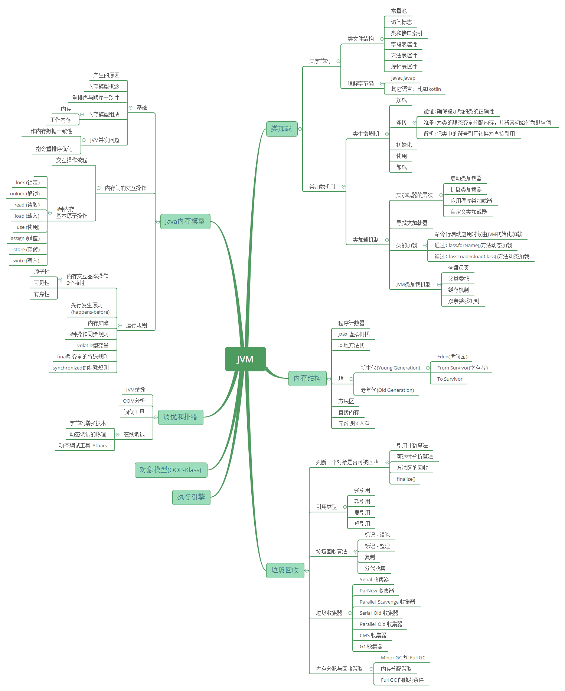


## 1、JVM 内存结构

Java 虚拟机的内存空间分为 5 个部分：

- ==程序计数器==
- ==Java 虚拟机栈==
- ==本地方法栈==
- 堆
- 方法区


JDK 1.8 同 JDK 1.7 比，最大的差别就是：元数据区取代了永久代。元空间的本质和永久代类似，都是对 JVM 规范中方法区的实现。不过元空间与永久代之间最大的区别在于：元数据空间并不在虚拟机中，而是使用本地内存。

### 1.1 程序计数器（PC 寄存器）

#### 1.1.1 程序计数器的定义

程序计数器是一块较小的内存空间，是**当前线程正在执行的那条字节码指令的地址。若当前线程正在执行的是一个本地方法，那么此时程序计数器为`Undefined`。**

#### 1.1.2 程序计数器的作用

- 字节码解释器通过改变程序计数器来依次读取指令，从而实现代码的流程控制。
- 在多线程情况下，程序计数器记录的是当前线程执行的位置，从而当线程切换回来时，就知道上次线程执行到哪了。

#### 1.1.3 程序计数器的特点

- 是一块较小的内存空间。
- 线程私有，每条线程都有自己的程序计数器。
- 生命周期：随着线程的创建而创建，随着线程的结束而销毁。
- 是唯一一个不会出现 `OutOfMemoryError` 的内存区域。

### 1.2 Java 虚拟机栈（Java 栈）

#### 1.2.1 Java 虚拟机栈的定义

Java 虚拟机栈是**描述 Java 方法运行过程的内存模型**。

Java 虚拟机栈会为每一个即将运行的 Java 方法创建一块叫做“栈帧”的区域，用于存放该方法运行过程中的一些信息，如：

- 局部变量表
- 操作数栈
- 动态链接
- 方法出口信息
- ......


#### 1.2.2 压栈出栈过程

当方法运行过程中需要创建局部变量时，就将局部变量的值存入栈帧中的局部变量表中。

==Java 虚拟机栈的栈顶的栈帧是当前正在执行的活动栈，也就是当前正在执行的方法==，PC 寄存器也会指向这个地址。只有这个活动的栈帧的本地变量可以被操作数栈使用，当在这个栈帧中调用另一个方法，与之对应的栈帧又会被创建，新创建的栈帧压入栈顶，变为当前的活动栈帧。

方法结束后，当前栈帧被移出，**栈帧的返回值变成新的活动栈帧中操作数栈的一个操作数**。如果没有返回值，那么新的活动栈帧中操作数栈的操作数没有变化。

> 由于 Java 虚拟机栈是与线程对应的，数据不是线程共享的（也就是线程私有的)，因此不用关心数据一致性问题，也不会存在同步锁的问题。

#### 1.2.3 局部变量表

**定义为一个数字数组，主要用于存储方法参数、定义在方法体内部的局部变量，数据类型包括各类基本数据类型，对象引用，以及 return address 类型。**

局部变量表容量大小是在编译期确定下来的。最基本的存储单元是 slot，32 位占用一个 slot，64 位类型（long 和 double）占用两个 slot。

对于 slot 的理解：

- JVM 虚拟机会**为局部变量表中的每个 slot 都分配一个访问索引**，通过这个索引即可成功访问到局部变量表中指定的局部变量值。
- 如果当前帧是由构造方法或者实例方法创建的，那么该对象引用 this，会存放在 index 为 0 的 slot 处，其余的参数表顺序继续排列。
- 栈帧中的局部变量表中的槽位是可以重复的，如果一个局部变量过了其作用域，那么其作用域之后申明的新的局部变量就有可能会复用过期局部变量的槽位，从而达到节省资源的目的。

==**在栈帧中，与性能调优关系最密切的部分，就是局部变量表，方法执行时，虚拟机使用局部变量表完成方法的传递，局部变量表中的变量也是重要的垃圾回收根节点，只要被局部变量表中直接或间接引用的对象都不会被回收。**==

#### 1.2.4 操作数栈

- **栈顶缓存技术**：由于操作数是存储在内存中，频繁的进行内存读写操作影响执行速度，将栈顶元素全部缓存到物理 CPU 的寄存器中，以此降低对内存的读写次数，提升执行引擎的执行效率。
- 每一个操作数栈会拥有一个明确的栈深度，用于存储数值，最大深度在编译期就定义好。32bit 类型占用一个栈单位深度，64bit 类型占用两个栈单位深度操作数栈。
- 并非采用访问索引方式进行数据访问，而是只能通过标准的入栈、出栈操作完成一次数据访问。

#### 1.2.5 方法的调用

- 静态链接：当一个字节码文件被装载进 JVM 内部时，如果被调用的目标方法在编译期可知，且运行时期间保持不变，这种情况下将调用方的符号引用转为直接引用的过程称为静态链接。
- 动态链接：如果被调用的方法无法在编译期被确定下来，只能在运行期将调用的方法的符号引用转为直接引用，这种引用转换过程具备动态性，因此被称为动态链接。
- 方法绑定
  - 早期绑定：被调用的目标方法如果在编译期可知，且运行期保持不变。
  - 晚期绑定：被调用的方法在编译期无法被确定，只能够在程序运行期根据实际的类型绑定相关的方法。
- 非虚方法：如果方法在编译期就确定了具体的调用版本，则这个版本在运行时是不可变的，这样的方法称为非虚方法静态方法。**私有方法，final 方法，实例构造器，父类方法都是非虚方法，除了这些以外都是虚方法**。
- 虚方法表：面向对象的编程中，会很频繁的使用动态分配，如果每次动态分配的过程都要重新在类的方法元数据中搜索合适的目标的话，就可能影响到执行效率，因此为了提高性能，JVM 采用在类的方法区建立一个虚方法表，使用索引表来代替查找。
  - 每个类都有一个虚方法表，表中存放着各个方法的实际入口。
  - 虚方法表会在类加载的链接阶段被创建，并开始初始化，类的变量初始值准备完成之后，JVM 会把该类的方法也初始化完毕。
- 方法重写的本质
  - 找到操作数栈顶的第一个元素所执行的对象的实际类型，记做 C。如果在类型 C 中找到与常量池中描述符和简单名称都相符的方法，则进行访问权限校验。
  - 如果通过则返回这个方法的直接引用，查找过程结束；如果不通过，则返回 java.lang.IllegalAccessError 异常。
  - 否则，按照继承关系从下往上依次对 C 的各个父类进行上一步的搜索和验证过程。
  - 如果始终没有找到合适的方法，则抛出 java.lang.AbstractMethodError 异常。

**Java 中任何一个普通方法都具备虚函数的特征（运行期确认，具备晚期绑定的特点）**，C++ 中则使用关键字 virtual 来显式定义。如果在 Java 程序中，不希望某个方法拥有虚函数的特征，则可以使用关键字 final 来标记这个方法。

#### 1.2.6 Java 虚拟机栈的特点

- 运行速度特别快，仅仅次于 PC 寄存器。
- 局部变量表随着栈帧的创建而创建，它的大小在编译时确定，创建时只需分配事先规定的大小即可。在方法运行过程中，局部变量表的大小不会发生改变。
- Java 虚拟机栈会出现两种异常：StackOverFlowError 和 OutOfMemoryError。
  - StackOverFlowError 若 Java 虚拟机栈的大小不允许动态扩展，那么当线程请求栈的深度超过当前 Java 虚拟机栈的最大深度时，抛出 StackOverFlowError 异常。
  - OutOfMemoryError 若允许动态扩展，那么当线程请求栈时内存用完了，无法再动态扩展时，抛出 OutOfMemoryError 异常。
- Java 虚拟机栈也是线程私有，随着线程创建而创建，随着线程的结束而销毁。
- 出现 StackOverFlowError 时，内存空间可能还有很多。

常见的运行时异常有：

- NullPointerException - 空指针引用异常
- ClassCastException - 类型强制转换异常
- IllegalArgumentException - 传递非法参数异常
- ArithmeticException - 算术运算异常
- ArrayStoreException - 向数组中存放与声明类型不兼容对象异常
- IndexOutOfBoundsException - 下标越界异常
- NegativeArraySizeException - 创建一个大小为负数的数组错误异常
- NumberFormatException - 数字格式异常
- SecurityException - 安全异常
- UnsupportedOperationException - 不支持的操作异常

### 1.3 本地方法栈（C 栈）

#### 1.3.1 本地方法栈的定义

**本地方法栈是为 JVM 运行 Native 方法准备的空间**，由于很多 Native 方法都是用 C 语言实现的，所以它通常又叫 C 栈。它与 Java 虚拟机栈实现的功能类似，只不过本地方法栈是描述本地方法运行过程的内存模型。

#### 1.3.2 栈帧变化过程

本地方法被执行时，在本地方法栈也会创建一块栈帧，用于存放该方法的局部变量表、操作数栈、动态链接、方法出口信息等。

方法执行结束后，相应的栈帧也会出栈，并释放内存空间。也会抛出 StackOverFlowError 和 OutOfMemoryError 异常。

> 如果 Java 虚拟机本身不支持 Native 方法，或是本身不依赖于传统栈，那么可以不提供本地方法栈。如果支持本地方法栈，那么这个栈一般会在线程创建的时候按线程分配。

### 1.4 堆

#### 1.4.1 堆的定义

==堆是用来存放对象的内存空间，**几乎**所有的对象都存储在堆中。==


#### 1.4.2 堆的特点

- ==线程共享，整个 Java 虚拟机只有一个堆==，所有的线程都访问同一个堆。而程序计数器、Java 虚拟机栈、本地方法栈都是一个线程对应一个。
- 在虚拟机启动时创建。
- 是垃圾回收的主要场所。
- 堆可分为新生代（Eden 区：`From Survior`，`To Survivor`）、老年代。
- Java 虚拟机规范规定，堆可以处于物理上不连续的内存空间中，但在逻辑上它应该被视为连续的。
- 关于 Survivor s0，s1 区: 复制之后有交换，谁空谁是 to。

不同的区域存放不同生命周期的对象，这样可以根据不同的区域使用不同的垃圾回收算法，更具有针对性。

堆的大小既可以固定也可以扩展，但对于主流的虚拟机，堆的大小是可扩展的，因此当线程请求分配内存，但堆已满，且内存已无法再扩展时，就抛出 OutOfMemoryError 异常。

> Java 堆所使用的内存不需要保证是连续的。而由于堆是被所有线程共享的，所以对它的访问需要注意==同步问题==，方法和对应的属性都需要保证一致性。

#### 1.4.3 新生代与老年代

- 老年代比新生代生命周期长。
- 新生代与老年代空间默认比例 `1:2`：JVM 调参数，`XX:NewRatio=2`，表示新生代占 1，老年代占 2，新生代占整个堆的 1/3。
- HotSpot 中，Eden 空间和另外两个 Survivor 空间缺省所占的比例是：`8:1:1`。
- ==几乎所有的 Java 对象都是在 Eden 区被 new 出来的，Eden 放不了的大对象，就直接进入老年代了==。

#### 1.4.4 对象分配过程

- new 的对象先放在 Eden 区，大小有限制
- 如果创建新对象时，Eden 空间填满了，就会**触发 Minor GC**，将 Eden 不再被其他对象引用的对象进行销毁，再加载新的对象放到 Eden 区，特别注意的是 Survivor 区满了是不会触发 Minor GC 的，而是 Eden 空间填满了，Minor GC 才顺便清理 Survivor 区
- 将 Eden 中剩余的对象移到 Survivor0 区
- 再次触发垃圾回收，此时上次 Survivor 下来的，放在 Survivor0 区的，如果没有回收，就会放到 Survivor1 区
- 再次经历垃圾回收，又会将幸存者重新放回 Survivor0 区，依次类推
- 默认是 15 次的循环，超过 15 次，则会将幸存者区幸存下来的转去老年区 jvm 参数设置次数 : -XX:MaxTenuringThreshold=N 进行设置
- 频繁在新生区收集，很少在养老区收集，几乎不在永久区/元空间搜集

#### 1.4.5 Full GC /Major GC 触发条件

- 显示调用`System.gc()`，老年代的空间不够，方法区的空间不够等都会触发 Full GC，同时对新生代和老年代回收，FUll GC 的 STW 的时间最长，应该要避免
- 在出现 Major GC 之前，会先触发 Minor GC，如果老年代的空间还是不够就会触发 Major GC，STW 的时间长于 Minor GC

#### 1.4.6 逃逸分析

- #### 标量替换

  - 标量不可再分解的量，java 的基本数据类型就是标量，标量的对立就是**可以被进一步分解的量，而这种量称之为聚合量**。而在 JAVA 中**对象就是可以被进一步分解的聚合量**。
  - 替换过程，通过逃逸分析确定该对象不会被外部访问，并且对象可以被进一步分解时，JVM 不会创建该对象，而会将该对象成员变量分解若干个被这个方法使用的成员变量所代替。这些代替的成员变量在栈帧或寄存器上分配空间。

- **对象和数组并非都是在堆上分配内存的**

- 《深入理解 Java 虚拟机中》关于 Java 堆内存有这样一段描述：随着 JIT 编译期的发展与逃逸分析技术逐渐成熟，`栈上分配`,`标量替换`优化技术将会导致一些变化，所有的对象都分配到堆上也渐渐变得不那么"绝对"了。

- 这是一种可以有效减少 Java 内存堆分配压力的分析算法，通过逃逸分析，Java Hotspot 编译器能够分析出一个新的对象的引用的使用范围从而决定是否要将这个对象分配到堆上。

- 当一个对象在方法中被定义后，它可能被外部方法所引用，如作为调用参数传递到其他地方中，称为`方法逃逸`。

- 再如赋值给类变量或可以在其他线程中访问的实例变量，称为`线程逃逸`

- 使用逃逸分析，编译器可以对代码做如下优化：

  - 同步省略：如果一个对象被发现只能从一个线程被访问到，那么对于这个对象的操作可以不考虑同步。
  - 将堆分配转化为栈分配：如果一个对象在子程序中被分配，要使指向该对象的指针永远不会逃逸，对象可能是栈分配的候选，而不是堆分配。
  - 分离对象或标量替换：有的对象可能不需要作为一个连续的内存结构存在也可以被访问到，那么对象的部分（或全部）可以不存储在内存，而是存储在 CPU 寄存器中。

```java
public static StringBuffer createStringBuffer(String s1, String s2) {

    StringBuffer s = new StringBuffer();

    s.append(s1);

    s.append(s2);

    return s;
}
```

s 是一个方法内部变量，上边的代码中直接将 s 返回，这个 StringBuffer 的对象有可能被其他方法所改变，导致它的作用域就不只是在方法内部，即使它是一个局部变量，但还是逃逸到了方法外部，称为`方法逃逸`。

还有可能被外部线程访问到，譬如赋值给类变量或可以在其他线程中访问的实例变量，称为`线程逃逸`。

- 在编译期间，如果 JIT 经过逃逸分析，发现有些对象没有逃逸出方法，那么有可能堆内存分配会被优化成栈内存分配。
- jvm 参数设置，`-XX:+DoEscapeAnalysis` ：开启逃逸分析 ，`-XX:-DoEscapeAnalysis` ： 关闭逃逸分析
- 从 jdk 1.7 开始已经默认开始逃逸分析。

#### 1.4.7 TLAB

- TLAB 的全称是 Thread Local Allocation Buffer，**即线程本地分配缓存区**，是属于 Eden 区的，这是一个线程专用的内存分配区域，线程私有，默认开启的（当然也不是绝对的，也要看哪种类型的虚拟机）
- 堆是全局共享的，在同一时间，可能会有多个线程在堆上申请空间，但每次的对象分配需要同步的进行（虚拟机采用 CAS 配上失败重试的方式保证更新操作的原子性）但是效率却有点下降
- 所以用 TLAB 来避免多线程冲突，在给对象分配内存时，每个线程使用自己的 TLAB，这样可以使得线程同步，提高了对象分配的效率
- 当然并不是所有的对象都可以在 TLAB 中分配内存成功，如果失败了就会使用加锁的机制来保持操作的原子性
- `-XX:+UseTLAB `使用 TLAB，`-XX:+TLABSize` 设置 TLAB 大小

#### 1.4.8 四种引用方式

- 强引用：创建一个对象并把这个对象赋给一个引用变量，**普通 new 出来对象的变量引用都是强引用**，有引用变量指向时永远不会被垃圾回收，jvm 即使抛出 OOM，可以将引用赋值为 null，那么它所指向的对象就会被垃圾回收。
- 软引用：如果一个对象具有软引用，内存空间足够，垃圾回收器就不会回收它，如果内存空间不足了，就会回收这些对象的内存。只要垃圾回收器没有回收它，该对象就可以被程序使用。
- 弱引用：非必需对象，当 JVM 进行垃圾回收时，无论内存是否充足，都会回收被弱引用关联的对象。
- 虚引用：虚引用并不会决定对象的生命周期，如果一个对象仅持有虚引用，那么它就和没有任何引用一样，在任何时候都可能被垃圾回收器回收。

### 1.3 方法区

#### 1.3.1 方法区的定义

==Java 虚拟机规范中定义方法区是堆的一个逻辑部分。==方法区存放以下信息：

- 已经被虚拟机加载的类信息
- 常量
- 静态变量
- 即时编译器编译后的代码

#### 1.3.2 方法区的特点

- 线程共享。 方法区是堆的一个逻辑部分，因此和堆一样，都是线程共享的。整个虚拟机中只有一个方法区。
- 永久代。 方法区中的信息一般需要长期存在，而且它又是堆的逻辑分区，因此用堆的划分方法，把方法区称为“永久代”。
- 内存回收效率低。 方法区中的信息一般需要长期存在，回收一遍之后可能只有少量信息无效。主要回收目标是：对常量池的回收；对类型的卸载。
- Java 虚拟机规范对方法区的要求比较宽松。 和堆一样，允许固定大小，也允许动态扩展，还允许不实现垃圾回收。

#### 1.3.3 运行时常量池

方法区中存放：类信息、常量、静态变量、即时编译器编译后的代码。常量就存放在运行时常量池中。

当类被 Java 虚拟机加载后， .class 文件中的常量就存放在方法区的运行时常量池中。而且在运行期间，可以向常量池中添加新的常量。如 String 类的 `intern()` 方法就能在运行期间向常量池中添加字符串常量。

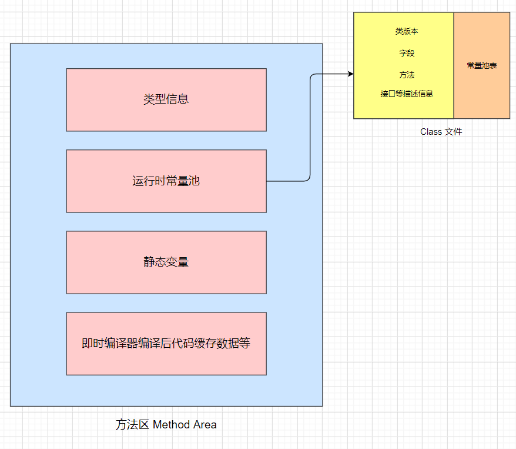

### 1.4 直接内存（堆外内存）

**直接内存是除 Java 虚拟机之外的内存，但也可能被 Java 使用。**

#### 1.4.1 操作直接内存

在 NIO 中引入了一种基于通道和缓冲的 IO 方式。它可以通过调用本地方法直接分配 Java 虚拟机之外的内存，然后通过一个存储在堆中的`DirectByteBuffer`对象直接操作该内存，而无须先将外部内存中的数据复制到堆中再进行操作，从而提高了数据操作的效率。

直接内存的大小不受 Java 虚拟机控制，但既然是内存，当内存不足时就会抛出 OutOfMemoryError 异常。

#### 1.4.2 直接内存与堆内存比较

- 直接内存申请空间耗费更高的性能
- 直接内存读取 IO 的性能要优于普通的堆内存
- 直接内存作用链： 本地 IO -> 直接内存 -> 本地 IO
- 堆内存作用链：本地 IO -> 直接内存 -> 非直接内存 -> 直接内存 -> 本地 IO

> 服务器管理员在配置虚拟机参数时，会根据实际内存设置`-Xmx`等参数信息，但经常忽略直接内存，使得各个内存区域总和大于物理内存限制，从而导致动态扩展时出现`OutOfMemoryError`异常。

> 

## 2、HotSpot 虚拟机对象探秘

> **HotSpot JVM 是 Java 虚拟机（JVM）的一种高性能实现**，由 Sun Microsystems 开发（现隶属于 Oracle），目前是 OpenJDK 和 Oracle JDK 的默认虚拟机。它的名称“HotSpot”来源于其核心设计理念：**动态识别和优化代码的“热点”（频繁执行的代码）**，从而大幅提升 Java 程序的运行效率。

### 2.1 对象的内存布局

在 HotSpot 虚拟机中，对象的内存布局分为以下 3 块区域：

- 对象头（Header）
- 实例数据（Instance Data）
- 对齐填充（Padding）


#### 2.1.1 对象头

对象头记录了对象在运行过程中所需要使用的一些数据：

- 哈希码
- GC 分代年龄
- 锁状态标志
- 线程持有的锁
- 偏向线程 ID
- 偏向时间戳

对象头可能包含类型指针，==通过该指针能确定对象属于哪个类==。如果对象是一个数组，那么==对象头还会包括数组长度==。

#### 2.1.2 实例数据

==实例数据部分就是成员变量的值，其中包括父类成员变量和本类成员变量。==

#### 2.1.3 对齐填充

用于确保对象的==总长度为 8 字节的整数倍==。

HotSpot VM 的自动内存管理系统要求对象的大小必须是 8 字节的整数倍。而对象头部分正好是 8 字节的倍数（1 倍或 2 倍），因此，当对象实例数据部分没有对齐时，就需要通过对齐填充来补全。

> 对齐填充并不是必然存在，也没有特别的含义，它仅仅起着占位符的作用。

### 2.2 对象的创建过程


#### 2.2.1 类加载检查

虚拟机在解析`.class`文件时，若遇到一条 new 指令，==首先它会去检查常量池中是否有这个类的符号引用，并且检查这个符号引用所代表的类是否已被加载、解析和初始化过。如果没有，那么必须先执行相应的类加载过程==。

#### 2.2.2 为新生对象分配内存

==对象所需内存的大小在类加载完成后便可完全确定==，接下来从堆中划分一块对应大小的内存空间给新的对象。分配堆中内存有两种方式：

- **指针碰撞**
  如果 Java **堆中内存绝对规整**（说明采用的是“**复制算法**”或“**标记整理法**”），空闲内存和已使用内存中间放着一个指针作为分界点指示器，那么分配内存时只需要把指针向空闲内存挪动一段与对象大小一样的距离，这种分配方式称为“**指针碰撞**”。
- **空闲列表**
  如果 Java **堆中内存并不规整**，已使用的内存和空闲内存交错（说明采用的是**标记-清除法**，有碎片），此时没法简单进行指针碰撞， VM 必须维护一个列表，记录其中哪些内存块空闲可用。分配之时从空闲列表中找到一块足够大的内存空间划分给对象实例。这种方式称为“**空闲列表**”。

#### 2.2.3 初始化

分配完内存后，为对象中的成员变量赋上初始值，设置对象头信息，调用对象的构造函数方法进行初始化。

至此，整个对象的创建过程就完成了。

### 2.3 对象的访问方式

所有对象的存储空间都是在堆中分配的，但是这个对象的引用却是在堆栈中分配的。也就是说在建立一个对象时两个地方都分配内存，在堆中分配的内存实际建立这个对象，而在堆栈中分配的内存只是一个指向这个堆对象的指针（引用）而已。 那么根据引用存放的地址类型的不同，对象有不同的访问方式。

#### 2.3.1 句柄访问方式

堆中需要有一块叫做“句柄池”的内存空间，句柄中包含了对象实例数据与类型数据各自的具体地址信息。

引用类型的变量存放的是该对象的句柄地址（reference）。==访问对象时，首先需要通过引用类型的变量找到该对象的句柄，然后根据句柄中对象的地址找到对象。==


#### 2.3.2 直接指针访问方式

引用类型的变量直接存放对象的地址，从而不需要句柄池，==通过引用能够直接访问对象。但对象所在的内存空间需要额外的策略存储对象所属的类信息的地址==。


需要说明的是，HotSpot 采用第二种方式，即直接指针方式来访问对象，只需要一次寻址操作，所以在性能上比句柄访问方式快一倍。但像上面所说，它需要**额外的策略**来存储对象在方法区中类信息的地址。

## 3、垃圾收集策略与算法

程序计数器、虚拟机栈、本地方法栈随线程而生，也随线程而灭；栈帧随着方法的开始而入栈，随着方法的结束而出栈。这几个区域的内存分配和回收都具有确定性，在这几个区域内不需要过多考虑回收的问题，因为方法结束或者线程结束时，内存自然就跟随着回收了。

==而对于 Java 堆和方法区，我们只有在程序运行期间才能知道会创建哪些对象，这部分内存的分配和回收都是动态的，垃圾收集器所关注的正是这部分内存==。

### 3.1 判定对象是否存活

==若一个对象不被任何对象或变量引用，那么它就是无效对象，需要被回收。==

#### 3.1.1 引用计数法

在对象头维护着一个 counter 计数器，对象被引用一次则计数器 +1；若引用失效则计数器 -1。当计数器为 0 时，就认为该对象无效了。

引用计数算法的实现简单，判定效率也很高，在大部分情况下它都是一个不错的算法。但是主流的 Java 虚拟机里没有选用引用计数算法来管理内存，主要是因为它很难解决对象之间循环引用的问题。（虽然循环引用的问题可通过 Recycler 算法解决，==但是在多线程环境下，引用计数变更也要进行昂贵的同步操作，性能较低，早期的编程语言会采用此算法==。）

> 举个栗子 👉 对象 objA 和 objB 都有字段 instance，令 objA.instance = objB 并且 objB.instance = objA，由于它们互相引用着对方，导致它们的引用计数都不为 0，于是==引用计数算法无法通知 GC 收集器回收它们==。

#### 3.1.2 可达性分析法

==所有和 GC Roots 直接或间接关联的对象都是有效对象，和 GC Roots 没有关联的对象就是无效对象。==

GC Roots 是指：

- Java 虚拟机栈（栈帧中的本地变量表）中引用的对象
- 本地方法栈中引用的对象
- 方法区中常量引用的对象
- 方法区中类静态属性引用的对象

GC Roots 并不包括堆中对象所引用的对象，这样就不会有循环引用的问题。

### 3.2 引用的种类

判定对象是否存活与“引用”有关。在 JDK 1.2 以前，Java 中的引用定义很传统，一个对象只有被引用或者没有被引用两种状态，我们希望能描述这一类对象：当内存空间还足够时，则保留在内存中；如果内存空间在进行垃圾收集后还是非常紧张，则可以抛弃这些对象。很多系统的缓存功能都符合这样的应用场景。

在 JDK 1.2 之后，Java 对引用的概念进行了扩充，将引用分为了以下四种。不同的引用类型，主要体现的是对象不同的可达性状态`reachable`和垃圾收集的影响。

#### 3.2.1 强引用（Strong Reference）

类似 "`Object obj = new Object()`" 这类的引用，就是强引用，只要强引用存在，垃圾收集器永远不会回收被引用的对象。但是，如果我们**错误地保持了强引用**，比如：赋值给了 static 变量，那么对象在很长一段时间内不会被回收，会产生内存泄漏。

#### 3.2.2 软引用（Soft Reference）

软引用是一种相对强引用弱化一些的引用，可以让对象豁免一些垃圾收集，==只有当 JVM 认为内存不足时，才会去试图回收软引用指向的对象。JVM 会确保在抛出 OutOfMemoryError 之前，清理软引用指向的对象==。软引用通常用来**实现内存敏感的缓存**，如果还有空闲内存，就可以暂时保留缓存，当内存不足时清理掉，这样就保证了使用缓存的同时，不会耗尽内存。

#### 3.2.3 弱引用（Weak Reference）

弱引用的**强度比软引用更弱**一些。当 JVM 进行垃圾回收时，**无论内存是否充足，都会回收**只被弱引用关联的对象。

#### 3.2.4 虚引用（Phantom Reference）

虚引用也称幽灵引用或者幻影引用，它是**最弱**的一种引用关系。一个对象是否有虚引用的存在，完全不会对其生存时间构成影响。它仅仅是提供了一种确保对象被 finalize 以后，做某些事情的机制，比如，通常用来做所谓的 Post-Mortem 清理机制。

### 3.3 回收堆中无效对象

对于可达性分析中不可达的对象，也并不是没有存活的可能。

#### 3.3.1 判定 finalize() 是否有必要执行


JVM 会判断此对象是否有必要执行 finalize() 方法，如果对象没有覆盖 finalize() 方法，或者 finalize() 方法已经被虚拟机调用过，那么视为“没有必要执行”。那么对象基本上就真的被回收了。

如果对象被判定为有必要执行 finalize() 方法，那么对象会被放入一个 F-Queue 队列中，虚拟机会以较低的优先级执行这些 finalize()方法，但不会确保所有的 finalize() 方法都会执行结束。如果 finalize() 方法出现耗时操作，虚拟机就直接停止指向该方法，将对象清除。

#### 3.3.2 对象重生或死亡

如果在执行 finalize() 方法时，将 this 赋给了某一个引用，那么该对象就重生了。如果没有，那么就会被垃圾收集器清除。

> 任何一个对象的 finalize() 方法只会被系统自动调用一次，如果对象面临下一次回收，它的 finalize() 方法不会被再次执行，想继续在 finalize() 中自救就失效了。

### 3.4 回收方法区内存

方法区中存放生命周期较长的类信息、常量、静态变量，每次垃圾收集只有少量的垃圾被清除。方法区中主要清除两种垃圾：

- 废弃常量
- 无用的类

#### 3.4.1 判定废弃常量

只要常量池中的常量不被任何变量或对象引用，那么这些常量就会被清除掉。比如，一个字符串 "bingo" 进入了常量池，但是当前系统没有任何一个 String 对象引用常量池中的 "bingo" 常量，也没有其它地方引用这个字面量，必要的话，"bingo"常量会被清理出常量池。

#### 3.4.2 判定无用的类

判定一个类是否是“无用的类”，条件较为苛刻。

- 该类的所有对象都已经被清除
- 加载该类的 ClassLoader 已经被回收
- 该类的 java.lang.Class 对象没有在任何地方被引用，无法在任何地方通过反射访问该类的方法。

> 一个类被虚拟机加载进方法区，那么在堆中就会有一个代表该类的对象：java.lang.Class。这个对象在类被加载进方法区时创建，在方法区该类被删除时清除。

### 3.5 垃圾收集算法

学会了如何判定无效对象、无用类、废弃常量之后，剩余工作就是回收这些垃圾。常见的垃圾收集算法有以下几个：

#### 3.5.1 标记-清除算法


**标记**的过程是：遍历所有的 `GC Roots`，然后将所有 `GC Roots` 可达的对象**标记为存活的对象**。

**清除**的过程将遍历堆中所有的对象，==将没有标记的对象全部清除掉==。与此同时，清除那些被标记过的对象的标记，以便下次的垃圾回收。

这种方法有两个**不足**：

- 效率问题：标记和清除两个过程的效率都不高。
- 空间问题：标记清除之后会产生**大量不连续的内存碎片**，碎片太多可能导致以后需要分配较大对象时，无法找到足够的连续内存而不得不提前触发另一次垃圾收集动作。

#### 3.5.2 复制算法（新生代）


为了解决效率问题，“复制”收集算法出现了。它将可用**内存按容量划分为大小相等的两块**，每次只使用其中的一块。当这一块内存用完，需要进行垃圾收集时，就将存活者的对象复制到另一块上面，然后将第一块内存全部清除。这种算法有优有劣：

- 优点：不会有内存碎片的问题。
- 缺点：内存缩小为原来的一半，浪费空间。

为了解决空间利用率问题，可以将内存分为三块： **Eden、From Survivor、To Survivor，比例是 8:1:1**，每次使用 Eden 和其中一块 Survivor。回收时，将 Eden 和 Survivor 中还存活的对象一次性复制到另外一块 Survivor 空间上，最后清理掉 Eden 和刚才使用的 Survivor 空间。这样只有 10% 的内存被浪费。

但是我们无法保证每次回收都只有不多于 10% 的对象存活，当 Survivor 空间不够，需要依赖其他内存（指老年代）进行分配担保。

##### 3.5.2.1 分配担保

为对象分配内存空间时，如果 Eden+Survivor 中空闲区域无法装下该对象，会触发 **Minor GC 进行垃圾收集**。但如果 Minor GC 过后依然有超过 10% 的对象存活，这样存活的对象直接通过分配担保机制进入**老年代**，然后再将新对象存入 Eden 区。

#### 3.5.3 标记-整理算法（老年代）


**标记**：它的第一个阶段与**标记-清除算法**是一模一样的，均是遍历 `GC Roots`，然后将存活的对象标记。

**整理**：移动所有**存活的对象**，且按照内存地址次序依次排列，然后将末端内存地址以后的内存全部回收。因此，第二阶段才称为整理阶段。

这是一种老年代的垃圾收集算法。老年代的对象一般寿命比较长，因此每次垃圾回收会有大量对象存活，如果采用复制算法，每次需要复制大量存活的对象，效率很低。

#### 3.5.4 分代收集算法

根据对象存活周期的不同，将内存划分为几块。一般是把 Java 堆分为新生代和老年代，针对各个年代的特点采用最适当的收集算法。

- 新生代：复制算法
- 老年代：标记-清除算法、标记-整理算法

## 4、HotSpot 垃圾收集器

HotSpot 虚拟机提供了**多种垃圾收集器**，每种收集器都有各自的特点，虽然我们要对各个收集器进行比较，但并非为了挑选出一个最好的收集器。我们选择的只是对具体应用最合适的收集器。

### 4.1 新生代垃圾收集器

#### 4.1.1 Serial 垃圾收集器（单线程）

只开启**一条** GC 线程进行垃圾回收，并且在垃圾收集过程中停止一切用户线程，即 `Stop The World`。

一般客户端应用所需内存较小，不会创建太多对象，而且堆内存不大，因此垃圾收集器回收时间短，即使在这段时间停止一切用户线程，也不会感觉明显卡顿。因此 Serial 垃圾收集器**适合客户端**使用。

==由于 Serial 收集器只使用一条 GC 线程，避免了线程切换的开销，从而简单高效。==


#### 4.1.2 ParNew 垃圾收集器（多线程）

ParNew 是 Serial 的多线程版本。由多条 GC 线程并行地进行垃圾清理。但清理过程依然需要 `Stop The World`。

ParNew 追求“**低停顿时间**”,与 Serial 唯一区别就是使用了多线程进行垃圾收集，在多 CPU 环境下性能比 Serial 会有一定程度的提升；==但**线程切换需要额外的开销**，因此在单 CPU 环境中表现不如 Serial==。


#### 4.1.3 Parallel Scavenge 垃圾收集器（多线程）

Parallel Scavenge 和 ParNew 一样，都是多线程、新生代垃圾收集器。但是两者有巨大的不同点：

- Parallel Scavenge：==追求高 CPU 吞吐量，能够在较短时间内完成指定任务，因此适合没有交互的后台计算。==
- ParNew：追求降低用户停顿时间，适合交互式应用。

```
吞吐量 = 运行用户代码时间 / (运行用户代码时间 + 垃圾收集时间)
```

追求高吞吐量，可以通过减少 GC 执行实际工作的时间，然而，仅仅偶尔运行 GC 意味着每当 GC 运行时将有许多工作要做，因为在此期间积累在堆中的对象数量很高。单个 GC 需要花更多的时间来完成，从而导致更高的暂停时间。而考虑到低暂停时间，最好频繁运行 GC 以便更快速完成，反过来又导致吞吐量下降。

- 通过参数 -XX:GCTimeRadio 设置垃圾回收时间占总 CPU 时间的百分比。
- 通过参数 -XX:MaxGCPauseMillis 设置垃圾处理过程最久停顿时间。
- 通过命令 -XX:+UseAdaptiveSizePolicy 开启自适应策略。我们只要设置好堆的大小和 MaxGCPauseMillis 或 GCTimeRadio，收集器会自动调整新生代的大小、Eden 和 Survivor 的比例、对象进入老年代的年龄，以最大程度上接近我们设置的 MaxGCPauseMillis 或 GCTimeRadio。

### 4.2 老年代垃圾收集器

#### 4.2.1 Serial Old 垃圾收集器（单线程）

Serial Old 收集器是 Serial 的老年代版本，都是单线程收集器，只启用一条 GC 线程，都适合客户端应用。它们唯一的区别就是：Serial Old 工作在老年代，==使用“标记-整理”算法==；Serial 工作在新生代，==使用“复制”算法==。

#### 4.2.2 Parallel Old 垃圾收集器（多线程）

Parallel Old 收集器是 Parallel Scavenge 的老年代版本，追求 CPU 吞吐量。

#### 4.2.3 CMS 垃圾收集器

==CMS（Concurrent Mark Sweep，并发标记清除）收集器是以获取最短回收停顿时间为目标的收集器（追求低停顿）==，它在垃圾收集时使得==用户线程和 GC 线程并发执行==，因此在垃圾收集过程中用户也不会感到明显的卡顿。

- 初始标记：Stop The World，仅使用一条初始标记线程对所有与 ==GC Roots 直接关联的对象==进行标记。
- 并发标记：使用**多条**标记线程，与用户线程并发执行。此过程进行可达性分析，标记出所有废弃对象。速度很慢。
- 重新标记：Stop The World，使用多条标记线程并发执行，将刚才并发标记过程中新出现的废弃对象标记出来。
- 并发清除：只使用一条 GC 线程，与用户线程并发执行，清除刚才标记的对象。这个过程非常耗时。

并发标记与并发清除过程耗时最长，且可以与用户线程一起工作，因此，**总体上说**，CMS 收集器的内存回收过程是与用户线程**一起并发执行**的。


CMS 的缺点：

- 吞吐量低
- 无法处理浮动垃圾
- 使用“标记-清除”算法产生碎片空间，导致频繁 Full GC

对于产生碎片空间的问题，可以通过开启 `-XX:+UseCMSCompactAtFullCollection`，在每次 Full GC 完成后都会进行一次内存压缩整理，将零散在各处的对象整理到一块。设置参数 `-XX:CMSFullGCsBeforeCompaction` 告诉 CMS，经过了 N 次 Full GC 之后再进行一次内存整理。

### 4.3 G1 通用垃圾收集器

G1 是一款面向服务端应用的垃圾收集器，它没有新生代和老年代的概念，而是将堆划分为一块块独立的 Region。当要进行垃圾收集时，首先估计每个 Region 中垃圾的数量，==每次都从垃圾回收价值最大的 Region 开始回收，因此可以获得最大的回收效率==。

从整体上看， G1 是==基于“标记-整理”算法实现的收集器==，从局部（两个 Region 之间）上看是基于“复制”算法实现的，这意味着运行期间不会产生内存空间碎片。

这里抛个问题 👇

> 一个对象和它内部所引用的对象可能不在同一个 Region 中，那么当垃圾回收时，是否需要扫描整个堆内存才能完整地进行一次可达性分析？

并不！每个 Region 都有一个 ==Remembered Set，用于记录本区域中所有对象引用的对象所在的区域==，进行可达性分析时，只要在 GC Roots 中再加上 Remembered Set 即可防止对整个堆内存进行遍历。

如果不计算维护 Remembered Set 的操作，G1 收集器的工作过程分为以下几个步骤：

- 初始标记：Stop The World，仅使用一条初始标记线程对所有与 ==GC Roots 直接关联的对象==进行标记。
- 并发标记：使用**一条**标记线程与用户线程并发执行。此过程进行可达性分析，速度很慢。
- 最终标记：Stop The World，使用多条标记线程并发执行。
- 筛选回收：回收废弃对象，此时也要 Stop The World，并使用多条筛选回收线程并发执行。

## 5、内存分配与回收策略

对象的内存分配，就是在堆上分配（也可能经过 JIT 编译后被拆散为标量类型并间接在栈上分配），对象主要分配在新生代的 Eden 区上，少数情况下可能直接分配在老年代，**分配规则不固定**，取决于当前使用的垃圾收集器组合以及相关的参数配置。

以下列举几条最普遍的内存分配规则，供大家学习。

### 5.1 对象优先在 Eden 分配

大多数情况下，对象在新生代 Eden 区中分配。当 Eden 区没有足够空间进行分配时，虚拟机将发起一次 Minor GC。

👇**Minor GC** vs **Major GC**/**Full GC**：

- Minor GC：回收新生代（包括 Eden 和 Survivor 区域），因为 Java 对象大多都具备朝生夕灭的特性，所以 Minor GC 非常频繁，一般回收速度也比较快。
- Major GC / Full GC：回收老年代，出现了 Major GC，经常会伴随至少一次的 Minor GC，但这并非绝对。Major GC 的速度一般会比 Minor GC 慢 10 倍 以上。

> 在 JVM 规范中，Major GC 和 Full GC 都没有一个正式的定义，所以有人也简单地认为 Major GC 清理老年代，而 Full GC 清理整个内存堆。

### 5.2 大对象直接进入老年代

==大对象是指需要大量连续内存空间的 Java 对象，如很长的字符串或数据。==

一个大对象能够存入 Eden 区的概率比较小，发生分配担保的概率比较大，而分配担保需要涉及大量的复制，就会造成效率低下。

虚拟机提供了一个 -XX:PretenureSizeThreshold 参数，令大于这个设置值的对象直接在老年代分配，这样做的目的是避免在 Eden 区及两个 Survivor 区之间发生大量的内存复制。（还记得吗，新生代采用复制算法回收垃圾）

### 5.3 长期存活的对象将进入老年代

JVM 给每个对象定义了一个对象年龄计数器。当新生代发生一次 Minor GC 后，存活下来的对象年龄 +1，当年龄超过一定值时，就将超过该值的==所有对象转移到老年代中去==。

使用 `-XX:MaxTenuringThreshold` 设置新生代的最大年龄，只要超过该参数的新生代对象都会被转移到老年代中去。

### 5.4 动态对象年龄判定

如果当前新生代的 Survivor 中，相同年龄所有对象大小的总和大于 Survivor 空间的一半，==年龄 >= 该年龄的对象就可以直接进入老年代，无须等到 `MaxTenuringThreshold` 中要求的年龄==。

### 5.5 空间分配担保

JDK 6 Update 24 之前的规则是这样的：

在发生 Minor GC 之前，虚拟机会先检查**老年代最大可用的连续空间是否大于新生代所有对象总空间**， 如果这个条件成立，Minor GC 可以确保是安全的； 如果不成立，则虚拟机会查看 `HandlePromotionFailure` 值是否设置为允许担保失败， 如果是，那么会继续检查老年代最大可用的连续空间是否大于历次晋升到老年代对象的平均大小， 如果大于，将尝试进行一次 Minor GC，尽管这次 Minor GC 是有风险的； 如果小于，或者 `HandlePromotionFailure` 设置不允许冒险，那此时也要改为进行一次 Full GC。

JDK 6 Update 24 之后的规则变为：

只要老年代的连续空间大于新生代对象总大小或者历次晋升的平均大小，就会进行 Minor GC，否则将进行 Full GC。

通过清除老年代中的废弃数据来扩大老年代空闲空间，以便给新生代作担保。

这个过程就是分配担保。

------

👇 总结一下有哪些情况可能会触发 JVM 进行 Full GC。

1. **`System.gc()` 方法的调用** 此方法的调用是建议 JVM 进行 Full GC，注意这**只是建议而非一定**，但在很多情况下它会触发 Full GC，从而增加 Full GC 的频率。通常情况下我们只需要让虚拟机自己去管理内存即可，我们可以通过 -XX:+ DisableExplicitGC 来禁止调用 `System.gc()`。
2. **老年代空间不足** 老年代空间不足会触发 Full GC 操作，若进行该操作后空间依然不足，则会抛出如下错误：`java.lang.OutOfMemoryError: Java heap space`
3. **永久代空间不足** JVM 规范中==运行时数据区域中的方法区==，在 HotSpot 虚拟机中也称为永久代（Permanet Generation），存放一些类信息、常量、静态变量等数据，当系统要加载的类、反射的类和调用的方法较多时，永久代可能会被占满，会触发 Full GC。如果经过 Full GC 仍然回收不了，那么 JVM 会抛出如下错误信息：`java.lang.OutOfMemoryError: PermGen space`
4. **CMS GC 时出现 `promotion failed` 和 `concurrent mode failure`** promotion failed，就是上文所说的担保失败，而 concurrent mode failure 是在执行 CMS GC 的过程中同时有对象要放入老年代，而此时老年代空间不足造成的。
5. **统计得到的 Minor GC 晋升到旧生代的平均大小大于老年代的剩余空间。**

## 6、JVM 性能调优

在高性能硬件上部署程序，目前主要有两种方式：

- ==通过 64 位 JDK 来使用大内存==；
- 使用==若干个 32 位虚拟机建立逻辑集群来利用硬件资源==。

### 6.1 使用 64 位 JDK 管理大内存

堆内存变大后，虽然垃圾收集的频率减少了，但每次垃圾回收的时间变长。 如果堆内存为 14 G，那么每次 Full GC 将长达数十秒。如果 Full GC 频繁发生，那么对于一个网站来说是无法忍受的。

对于用户交互性强、对停顿时间敏感的系统，可以==给 Java 虚拟机分配超大堆的前提是有把握把应用程序的 Full GC 频率控制得足够低==，至少要低到不会影响用户使用。

可能面临的问题：

- 内存回收导致的长时间停顿；
- 现阶段，64 位 JDK 的性能普遍比 32 位 JDK 低；
- 需要保证程序足够稳定，因为这种应用要是产生堆溢出几乎就无法产生堆转储快照（因为要产生超过 10GB 的 Dump 文件），哪怕产生了快照也几乎无法进行分析；
- 相同程序在 64 位 JDK 消耗的内存一般比 32 位 JDK 大，这是由于指针膨胀，以及数据类型对齐补白等因素导致的。

### 6.2 使用 32 位 JVM 建立逻辑集群

在一台物理机器上启动多个应用服务器进程，每个服务器进程分配不同端口， 然后在前端搭建一个负载均衡器，以反向代理的方式来分配访问请求。

==考虑到在一台物理机器上建立逻辑集群的目的仅仅是为了尽可能利用硬件资源==，并不需要关心状态保留、热转移之类的高可用性能需求， 也不需要保证每个虚拟机进程有绝对的均衡负载，因此使用无 Session 复制的亲合式集群是一个不错的选择。 我们仅仅需要保障集群具备亲合性，也就是均衡器按一定的规则算法（一般根据 SessionID 分配） ==将一个固定的用户请求永远分配到固定的一个集群节点进行处理即可==。

可能遇到的问题：

- 尽量避免节点竞争全局资源，如磁盘竞争，==各个节点如果同时访问某个磁盘文件的话，很可能导致 IO 异常==；
- 很难高效利用资源池，如连接池，一般都是在节点建立自己独立的连接池，==这样有可能导致一些节点池满了而另外一些节点仍有较多空余==；
- 各个节点受到 32 位的内存限制；
- 大量使用本地缓存的应用，在逻辑集群中会造成较大的内存浪费，==因为每个逻辑节点都有一份缓存，这时候可以考虑把本地缓存改成集中式缓存==。

### 6.3 调优案例分析与实战

#### 6.3.1 场景描述

一个小型系统，使用 32 位 JDK，4G 内存，测试期间发现服务端不定时抛出内存溢出异常。 加入 -XX:+HeapDumpOnOutOfMemoryError（添加这个参数后，==堆内存溢出时就会输出异常日志==）， 但再次发生内存溢出时，没有生成相关异常日志。

#### 6.3.2 分析

在 32 位 JDK 上，1.6G 分配给堆，还有一部分分配给 JVM 的其他内存，直接内存最大也只能在剩余的 0.4G 空间中分出一部分， 如果使用了 NIO，JVM 会在 JVM 内存之外分配内存空间，那么就要小心“直接内存”不足时发生内存溢出异常了。

#### 6.3.3 直接内存的回收过程

直接内存虽然不是 JVM 内存空间，但它的垃圾回收也由 JVM 负责。

垃圾收集进行时，虚拟机虽然会对直接内存进行回收， 但是直接内存却不能像新生代、老年代那样，发现空间不足了就通知收集器进行垃圾回收， 它只能等老年代满了后 Full GC，然后`“顺便”`帮它清理掉内存的废弃对象。 否则只能一直等到抛出内存溢出异常时，先 catch 掉，再在 catch 块里大喊 “`System.gc()`”。 要是虚拟机还是不听，那就只能眼睁睁看着堆中还有许多空闲内存，自己却不得不抛出内存溢出异常了。

## 7、类文件结构

### 7.1 JVM 的“无关性”

谈论 JVM 的无关性，主要有以下两个：

- 平台无关性：任何操作系统都能运行 Java 代码
- 语言无关性： JVM 能运行除 Java 以外的其他代码

Java 源代码首先需要使用 Javac 编译器编译成 .class 文件，然后由 JVM 执行 .class 文件，从而程序开始运行。

==JVM 只认识 .class 文件，它不关心是何种语言生成了 .class 文件，只要 .class 文件符合 JVM 的规范就能运行。 目前已经有 JRuby、Jython、Scala 等语言能够在 JVM 上运行。它们有各自的语法规则，不过它们的编译器 都能将各自的源码编译成符合 JVM 规范的 .class 文件，从而能够借助 JVM 运行它们。==

> Java 语言中的各种变量、关键字和运算符号的语义最终都是由多条字节码命令组合而成的， 因此字节码命令所能提供的语义描述能力肯定会比 Java 语言本身更加强大。 因此，有一些 Java 语言本身无法有效支持的语言特性，不代表字节码本身无法有效支持。

### 7.2 Class 文件结构

==Class 文件是二进制文件，它的内容具有严格的规范，文件中没有任何空格，全都是连续的 0/1==。Class 文件 中的所有内容被分为两种类型：无符号数、表。

- 无符号数:无符号数表示 Class 文件中的值，这些值没有任何类型，但有不同的长度。u1、u2、u4、u8 分别代表 1/2/4/8 字节的无符号数。
- 表:由多个无符号数或者其他表作为数据项构成的复合数据类型。

Class 文件具体由以下几个构成:

- 魔数
- 版本信息
- 常量池
- 访问标志
- 类索引、父类索引、接口索引集合
- 字段表集合
- 方法表集合
- 属性表集合

#### 7.2.1 魔数

==Class 文件的头 4 个字节称为魔数==，用来表示这个 Class 文件的类型。

Class 文件的魔数是用 16 进制表示的“CAFE BABE”，是不是很具有浪漫色彩？

> 魔数相当于文件后缀名，只不过后缀名容易被修改，不安全，因此在 Class 文件中标识文件类型比较合适。

#### 7.2.2 版本信息

==紧接着魔数的 4 个字节是版本信息==，5-6 字节表示次版本号，7-8 字节表示主版本号，它们表示当前 Class 文件中使用的是哪个版本的 JDK。

高版本的 JDK 能向下兼容以前版本的 Class 文件，但不能运行以后版本的 Class 文件，即使文件格式并未发生任何变化，==虚拟机也必须拒绝执行超过其版本号的 Class 文件==。

#### 7.2.3 常量池

版本信息之后就是常量池，常量池中存放两种类型的常量：

- 字面值常量

  字面值常量就是我们在程序中定义的==字符串、被 final 修饰的值==。

- 符号引用

  符号引用就是我们定义的各种名字：==类和接口的全限定名、字段的名字和描述符、方法的名字和描述符==。

##### 7.2.3.1 常量池的特点

- 常量池中==常量数量不固定==，因此常量池开头放置一个 u2 类型的无符号数，用来存储当前常量池的容量。
- 常量池的==每一项常量都是一个表==，表开始的第一位是一个 u1 类型的标志位（tag），代表当前这个常量属于哪种常量类型。

##### 7.2.3.2 常量池中常量类型

| 类型                             | tag  | 描述                   |
| -------------------------------- | ---- | ---------------------- |
| CONSTANT_utf8_info               | 1    | UTF-8 编码的字符串     |
| CONSTANT_Integer_info            | 3    | 整型字面量             |
| CONSTANT_Float_info              | 4    | 浮点型字面量           |
| CONSTANT_Long_info               | 5    | 长整型字面量           |
| CONSTANT_Double_info             | 6    | 双精度浮点型字面量     |
| CONSTANT_Class_info              | 7    | 类或接口的符号引用     |
| CONSTANT_String_info             | 8    | 字符串类型字面量       |
| CONSTANT_Fieldref_info           | 9    | 字段的符号引用         |
| CONSTANT_Methodref_info          | 10   | 类中方法的符号引用     |
| CONSTANT_InterfaceMethodref_info | 11   | 接口中方法的符号引用   |
| CONSTANT_NameAndType_info        | 12   | 字段或方法的符号引用   |
| CONSTANT_MethodHandle_info       | 15   | 表示方法句柄           |
| CONSTANT_MethodType_info         | 16   | 标识方法类型           |
| CONSTANT_InvokeDynamic_info      | 18   | 表示一个动态方法调用点 |

对于 CONSTANT_Class_info（此类型的常量代表一个类或者接口的符号引用），它的二维表结构如下：

| 类型 | 名称       | 数量 |
| ---- | ---------- | ---- |
| u1   | tag        | 1    |
| u2   | name_index | 1    |

tag 是标志位，用于区分常量类型；name_index 是一个索引值，它指向常量池中一个 CONSTANT_Utf8_info 类型常量，此常量代表这个类（或接口）的全限定名，这里 name_index 值若为 0x0002，也即是指向了常量池中的第二项常量。

CONSTANT_Utf8_info 型常量的结构如下：

| 类型 | 名称   | 数量   |
| ---- | ------ | ------ |
| u1   | tag    | 1      |
| u2   | length | 1      |
| u1   | bytes  | length |

tag 是当前常量的类型；length 表示这个字符串的长度；bytes 是这个字符串的内容（采用缩略的 UTF8 编码）

#### 7.2.4 访问标志

在常量池结束之后，紧接着的==两个字节代表访问标志==，==这个标志用于识别一些类或者接口层次的访问信息，包括：这个 Class 是类还是接口；是否定义为 public 类型；是否被 abstract/final 修饰==。

#### 7.2.5 类索引、父类索引、接口索引集合

==类索引和父类索引都是一个 u2 类型的数据，而接口索引集合是一组 u2 类型的数据的集合，Class 文件中由这三项数据来确定类的继承关系==。类索引用于确定这个类的全限定名，父类索引用于确定这个类的父类的全限定名。

由于 Java 不允许多重继承，所以父类索引只有一个，除了 java.lang.Object 之外，所有的 Java 类都有父类，因此除了 java.lang.Object 外，所有 Java 类的父类索引都不为 0。一个类可能实现了多个接口，因此用接口索引集合来描述。这个集合第一项为 u2 类型的数据，表示索引表的容量，接下来就是接口的名字索引。

类索引和父类索引用两个 u2 类型的索引值表示，它们各自指向一个类型为 CONSTANT_Class_info 的类描述符常量，通过该常量总的索引值可以找到定义在 CONSTANT_Utf8_info 类型的常量中的全限定名字符串。

#### 7.2.6 字段表集合

==字段表集合存储本类涉及到的成员变量，包括实例变量和类变量，但不包括方法中的局部变量==。

每一个字段表只表示一个成员变量，本类中的所有成员变量构成了字段表集合。字段表结构如下：

| 类型 | 名称             | 数量             | 说明                                                         |
| ---- | ---------------- | ---------------- | ------------------------------------------------------------ |
| u2   | access_flags     | 1                | 字段的访问标志，与类稍有不同                                 |
| u2   | name_index       | 1                | 字段名字的索引                                               |
| u2   | descriptor_index | 1                | 描述符，用于描述字段的数据类型。 基本数据类型用大写字母表示； 对象类型用“L 对象类型的全限定名”表示。 |
| u2   | attributes_count | 1                | 属性表集合的长度                                             |
| u2   | attributes       | attributes_count | 属性表集合，用于存放属性的额外信息，如属性的值。             |

> 字段表集合中不会出现从父类（或接口）中继承而来的字段，但有可能出现原本 Java 代码中不存在的字段，譬如在内部类中为了保持对外部类的访问性，会自动添加指向外部类实例的字段。

#### 7.2.7 方法表集合

方法表结构与属性表类似。

==volatile 关键字 和 transient 关键字不能修饰方法==，所以方法表的访问标志中没有 ACC_VOLATILE 和 ACC_TRANSIENT 标志。

方法表的属性表集合中有一张 Code 属性表，==用于存储当前方法经编译器编译后的字节码指令==。

#### 7.2.8 属性表集合

每个属性对应一张属性表，属性表的结构如下：

| 类型 | 名称                 | 数量             |
| ---- | -------------------- | ---------------- |
| u2   | attribute_name_index | 1                |
| u4   | attribute_length     | 1                |
| u1   | info                 | attribute_length |

## 8、类加载的时机

### 8.1 类的生命周期

类从被加载到虚拟机内存开始，到卸载出内存为止，它的整个生命周期包括以下 7 个阶段：

- 加载
- 验证
- 准备
- 解析
- 初始化
- 使用
- 卸载

验证、准备、解析 3 个阶段统称为==连接==。


加载、验证、准备、初始化和卸载这 5 个阶段的顺序是确定的，类的加载过程必须按照这种顺序按部就班地开始（==注意是“开始”，而不是“进行”或“完成”==），而解析阶段则不一定：==它在某些情况下可以在初始化后再开始，这是为了支持 Java 语言的运行时绑定。==

### 8.2 类加载过程中“初始化”开始的时机

Java 虚拟机规范没有强制约束类加载过程的第一阶段（即：加载）什么时候开始，但对于“初始化”阶段，有着严格的规定。有且仅有 5 种情况必须立即对类进行“初始化”：

- 在遇到 new、putstatic、getstatic、invokestatic 字节码指令时，==如果类尚未初始化，则需要先触发其初始化==。
- 对类进行反射调用时，如果类还没有初始化，==则需要先触发其初始化==。
- 初始化一个类时，如果其父类还没有初始化，则需要==先初始化父类==。
- 虚拟机启动时，用于需要指定一个包含 `main()` 方法的主类，==虚拟机会先初始化这个主类==。
- 当使用 JDK 1.7 的动态语言支持时，如果一个 java.lang.invoke.MethodHandle 实例最后的解析结果为 REF_getStatic、REF_putStatic、REF_invokeStatic 的方法句柄，并且这个方法句柄所对应的类还没初始化，则需要先触发其初始化。

这 5 种场景中的行为称为对一个类进行**主动引用**，除此之外，其它所有引用类的方式都不会触发初始化，称为**被动引用**。

### 8.3 被动引用演示 Demo

#### 8.3.1 Demo1

```java
/**
 * 被动引用 Demo1:
 * 通过子类引用父类的静态字段，不会导致子类初始化。
 *
 * @author ylb
 *
 */
class SuperClass {
    static {
        System.out.println("SuperClass init!");
    }

    public static int value = 123;
}

class SubClass extends SuperClass {
    static {
        System.out.println("SubClass init!");
    }
}

public class NotInitialization {

    public static void main(String[] args) {
        System.out.println(SubClass.value);
        // SuperClass init!
    }

}
```

对于静态字段，只有直接定义这个字段的类才会被初始化，==因此通过其子类来引用父类中定义的静态字段，只会触发父类的初始化而不会触发子类的初始化==。

#### 8.3.2 Demo2

```java
/**
 * 被动引用 Demo2:
 * 通过数组定义来引用类，不会触发此类的初始化。
 *
 * @author ylb
 *
 */

public class NotInitialization {

    public static void main(String[] args) {
        SuperClass[] superClasses = new SuperClass[10];
    }

}
```

这段代码==不会触发父类的初始化==，但会触发“[L 全类名]”这个类的初始化，==它由虚拟机自动生成==，直接继承自 java.lang.Object，创建动作由字节码指令 newarray 触发。

#### 8.3.3 Demo3

```java
/**
 * 被动引用 Demo3:
 * 常量在编译阶段会存入调用类的常量池中，本质上并没有直接引用到定义常量的类，因此不会触发定义常量的类的初始化。
 *
 * @author ylb
 *
 */
class ConstClass {
    static {
        System.out.println("ConstClass init!");
    }

    public static final String HELLO_BINGO = "Hello Bingo";

}

public class NotInitialization {

    public static void main(String[] args) {
        System.out.println(ConstClass.HELLO_BINGO);
    }

}
```

编译通过之后，常量存储到 NotInitialization 类的常量池中，NotInitialization 的 Class 文件中并没有 ConstClass 类的符号引用入口，这两个类在编译成 Class 之后就没有任何联系了。

### 8.4 接口的加载过程

接口加载过程与类加载过程稍有不同。

当一个类在初始化时，要求其父类全部都已经初始化过了，但是一个接口在初始化时，并不要求其父接口全部都完成了初始化，当真正用到父接口的时候才会初始化。

## 9、类加载的过程

类加载过程包括 5 个阶段：加载、验证、准备、解析和初始化。

### 9.1 加载

#### 9.1.1 加载的过程

==“加载”是“类加载”过程的一个阶段，不能混淆这两个名词==。在加载阶段，虚拟机需要完成 3 件事：

- 通过类的全限定名获取该类的二进制字节流。
- 将二进制字节流所代表的静态结构转化为方法区的运行时数据结构。
- 在内存中创建一个代表该类的 `java.lang.Class` 对象，作为==方法区这个类的各种数据的访问入口==。

#### 9.1.2 获取二进制字节流

对于 Class 文件，虚拟机没有指明要从哪里获取、怎样获取。除了直接从编译好的 .class 文件中读取，还有以下几种方式：

- 从 zip 包中读取，如 jar、war 等；
- 从网络中获取，如 Applet；
- 通过动态代理技术生成代理类的二进制字节流；
- 由 JSP 文件生成对应的 Class 类；
- 从数据库中读取，如 有些中间件服务器可以选择把程序安装到数据库中来完成程序代码在集群间的分发。

#### 9.1.3 “非数组类”与“数组类”加载比较

- ==非数组类加载阶段可以使用系统提供的引导类加载器==，也可以由用户自定义的类加载器完成，开发人员可以通过定义自己的类加载器控制字节流的获取方式（如重写一个类加载器的 `loadClass()` 方法）。
- ==数组类本身不通过类加载器创建，它是由 Java 虚拟机直接创建的==，再由类加载器创建数组中的元素类。

#### 9.1.4 注意事项

- 虚拟机规范未规定 Class 对象的存储位置，对于 HotSpot 虚拟机而言，Class 对象比较特殊，它虽然是对象，但存放在方法区中。
- 加载阶段与连接阶段的部分内容交叉进行，加载阶段尚未完成，连接阶段可能已经开始了。==但这两个阶段的开始时间仍然保持着固定的先后顺序==。

### 9.2 验证

#### 9.2.1 验证的重要性

==验证阶段确保 Class 文件的字节流中包含的信息符合当前虚拟机的要求，并且不会危害虚拟机自身的安全==。

#### 9.2.2 验证的过程

- 文件格式验证 验证字节流是否符合 Class 文件格式的规范，并且能被当前版本的虚拟机处理，验证点如下：
  - 是否以魔数 0XCAFEBABE 开头。
  - 主次版本号是否在当前虚拟机处理范围内。
  - 常量池是否有不被支持的常量类型。
  - 指向常量的索引值是否指向了不存在的常量。
  - CONSTANT_Utf8_info 型的常量是否有不符合 UTF8 编码的数据。
  - ......
- 元数据验证 对字节码描述信息进行语义分析，确保其符合 Java 语法规范。
- 字节码验证 本阶段是验证过程中最复杂的一个阶段，==是对方法体进行语义分析，保证方法在运行时不会出现危害虚拟机的事件。==
- 符号引用验证 本阶段发生在解析阶段，确保解析正常执行。

### 9.3 准备

准备阶段是正式为类变量（或称==“静态成员变量”==）分配内存并设置初始值的阶段。==这些变量（不包括实例变量）所使用的内存都在方法区中进行分配==。

初始值“通常情况下”是数据类型的零值（0, null...），假设一个类变量的定义为：

```java
public static int value = 123;
```

那么变量 value 在准备阶段过后的初始值为 0 而不是 123，因为这时候尚未开始执行任何 Java 方法。

存在“特殊情况”：如果类字段的字段属性表中存在 ConstantValue 属性，那么在准备阶段 value 就会被初始化为 ConstantValue 属性所指定的值，假设上面类变量 value 的定义变为：

```java
public static final int value = 123;
```

那么在准备阶段虚拟机会根据 ConstantValue 的设置将 value 赋值为 123。

### 9.4 解析

解析阶段是虚拟机将常量池内的符号引用替换为直接引用的过程。

### 9.5 初始化

类初始化阶段是类加载过程的最后一步，是执行类构造器 `<clinit>()` 方法的过程。

`<clinit>()` 方法==是由编译器自动收集类中的所有类变量的赋值动作和静态语句块（static {} 块）中的语句合并产生的==，编译器收集的顺序是由语句在源文件中出现的顺序所决定的。

==静态语句块中只能访问定义在静态语句块之前的变量，定义在它之后的变量，在前面的静态语句块中可以赋值，但不能访问==。如下方代码所示：

```java
public class Test {
    static {
        i = 0;  // 给变量赋值可以正常编译通过
        System.out.println(i);  // 这句编译器会提示“非法向前引用”
    }
    static int i = 1;
}
```

`<clinit>()` 方法不需要显式调用父类构造器，虚拟机会保证在子类的 `<clinit>()` 方法执行之前，父类的 `<clinit>()` 方法已经执行完毕。

由于父类的 `<clinit>()` 方法先执行，意味着父类中定义的静态语句块要优先于子类的变量赋值操作。如下方代码所示：

```java
static class Parent {
    public static int A = 1;
    static {
        A = 2;
    }
}

static class Sub extends Parent {
    public static int B = A;
}

public static void main(String[] args) {
    System.out.println(Sub.B); // 输出 2
}
```

`<clinit>()` 方法不是必需的，如果一个类没有静态语句块，也没有对类变量的赋值操作，那么编译器可以不为这个类生成 `<clinit>()` 方法。

接口中不能使用静态代码块，但接口也需要通过 `<clinit>()` 方法为接口中定义的静态成员变量显式初始化。但接口与类不同，接口的 `<clinit>()` 方法不需要先执行父类的 `<clinit>()` 方法，只有当父接口中定义的变量使用时，父接口才会初始化。

虚拟机会保证一个类的 `<clinit>()` 方法在多线程环境中被正确加锁、同步。==如果多个线程同时去初始化一个类，那么只会有一个线程去执行这个类的 `<clinit>()` 方法==。

## 10、类加载器

### 10.1 类与类加载器

#### 10.1.1 判断类是否“相等”

任意一个类，都由**加载它的类加载器**和这个**类本身**一同确立其在 Java 虚拟机中的唯一性，每一个类加载器，都有一个独立的类名称空间。

==因此，比较两个类是否“相等”，只有在这两个类是由同一个类加载器加载的前提下才有意义，否则，即使这两个类来源于同一个 Class 文件，被同一个虚拟机加载，只要加载它们的类加载器不同，那么这两个类就必定不相等==。

这里的“相等”，包括代表类的 Class 对象的 `equals()` 方法、`isInstance()` 方法的返回结果，也包括使用 instanceof 关键字做对象所属关系判定等情况。

#### 10.1.2 加载器种类

系统提供了 3 种类加载器：

- 启动类加载器（Bootstrap ClassLoader）： 负责将存放在 `<JAVA_HOME>\lib` 目录中的，并且能被虚拟机识别的（仅按照文件名识别，如 rt.jar，名字不符合的类库即使放在 lib 目录中也不会被加载）类库加载到虚拟机内存中。
- 扩展类加载器（Extension ClassLoader）： 负责加载 `<JAVA_HOME>\lib\ext` 目录中的所有类库，开发者可以直接使用扩展类加载器。
- 应用程序类加载器（Application ClassLoader）： 由于这个类加载器是 ClassLoader 中的 `getSystemClassLoader()` 方法的返回值，所以一般也称它为`“系统类加载器”`。它负责加载用户类路径（classpath）上所指定的类库，开发者可以直接使用这个类加载器，如果应用程序中没有自定义过自己的类加载器，一般情况下这个就是程序中默认的类加载器。


当然，如果有必要，还可以加入自己定义的类加载器。

### 10.2 双亲委派模型

#### 10.2.1 什么是双亲委派模型

==双亲委派模型是描述类加载器之间的层次关系。它要求除了顶层的启动类加载器外，其余的类加载器都应当有自己的父类加载器==。（父子关系一般不会以继承的关系实现，而是以组合关系来复用父加载器的代码）

#### 10.2.2 工作过程

如果一个类加载器收到了类加载的请求，它首先不会自己去尝试加载这个类，而是把这个请求委派给父类加载器去完成，每一个层次的类加载器都是如此，因此所有的加载请求最终都应该传送到顶层的启动类加载器中，只有当父加载器反馈自己无法完成这个加载请求（找不到所需的类）时，子加载器才会尝试自己去加载。

在 java.lang.ClassLoader 中的 `loadClass` 方法中实现该过程。

#### 10.2.3 为什么使用双亲委派模型

==像 java.lang.Object 这些存放在 rt.jar 中的类，无论使用哪个类加载器加载，最终都会委派给最顶端的启动类加载器加载，从而使得不同加载器加载的 Object 类都是同一个==。

相反，如果没有使用双亲委派模型，==由各个类加载器自行去加载的话，如果用户自己编写了一个称为 java.lang.Object 的类，并放在 classpath 下，那么系统将会出现多个不同的 Object 类==，Java 类型体系中最基础的行为也就无法保证。

# Reactor

资料来源：[响应式编程全套](https://www.yuque.com/leifengyang/springboot3/rg4wqgdbg8mfv04q)、[About the Documentation :: Reactor Core Reference Guide](https://projectreactor.io/docs/core/release/reference/aboutDoc.html)

[反应式宣言](https://www.reactivemanifesto.org/zh-CN)


## 1、Reactor 简介

Reactor 是 JVM 的完全非阻塞反应式编程基础，具有高效的需求管理（以管理 `“背压”` 的形式）。它直接与 Java 8 功能 API 集成，特别是 `CompletableFuture`、`Stream` 和 `持续时间`。它提供可组合的异步序列 API — `Flux`（用于 [N] 个元素）和 `Mono` （对于 [0|1] 元素） — 并广泛实现 [Reactive Streams](https://www.reactive-streams.org/) 规范。

Reactor 还支持与 `reactor-netty` 项目。Reactor Netty 适用于微服务架构，为 HTTP（包括 Websockets）、TCP 和 UDP 提供背压就绪网络引擎。完全支持反应式编码和解码。

作为迈向反应式编程方向的第一步，Microsoft 在 .NET 生态系统中创建了反应式扩展 （Rx） 库。然后 RxJava 在 JVM 上实现了反应式编程。随着时间的推移，通过 Reactive Streams 工作出现了 Java 标准化，该规范为 JVM 上的反应式库定义了一组接口和交互规则。它的接口已集成到 Java 9 的 `Flow` 类下。

响应式编程范例通常在面向对象语言中表示为 `Observer 设计模式的扩展`。您还可以比较主要的响应式流 模式替换为熟悉的 Iterator 设计模式，因为 `Iterable-Iterator` 对。一个主要区别是，虽然 Iterator 是基于 pull 的，但 reactive streams 是基于 push 的。

使用迭代器是一种命令式编程模式，即使访问值的方法完全是 `Iterable` 的责任。实际上，由开发人员选择何时访问 `sequence 中的 next（）` 项。在反应式流中，上述对的等效项是 `Publisher-Subscriber`。但它是 `Publisher` 在新的可用值*出现时*通知 Subscriber，而这个 push 方面是反应性的关键。此外，应用于推送值的作以声明方式表示，而不是以命令方式表示：程序员表达计算的逻辑，而不是描述其确切的控制流。

除了推送值之外，错误处理和完成方面也以明确定义的方式进行了介绍。`发布服务器`可以将新值推送到其`订阅服务器`（通过调用 `onNext`），但也可以发出错误（通过调用 `onError`）或完成（通过调用 `onComplete`）的信号。错误和完成都会终止序列。这可以总结如下：

```java
onNext x 0..N [onError | onComplete]
```

这种方法非常灵活。该模式支持没有值、一个值或 n 个值（包括无限的值序列，例如时钟的连续滴答声）的用例。

但是，为什么我们首先需要这样一个异步响应式库呢？

### 1.1 阻塞可能是浪费

现代应用程序可以覆盖大量并发用户，即使现代硬件的功能不断改进，现代软件的性能仍然是一个关键问题。

从广义上讲，有两种方法可以提高程序的性能：

- **并行化**以使用更多线程和更多硬件资源。
- **寻求提高**当前资源使用效率。

通常，Java 开发人员使用阻塞代码编写程序。在出现性能瓶颈之前，这种做法很好。然后是时候引入其他线程，运行类似的阻塞代码了。但是，这种资源利用率的缩减会很快引入争用和并发问题。

更糟糕的是，阻塞会浪费资源。如果您仔细观察，一旦程序涉及一些延迟（特别是 I/O，例如数据库请求或网络调用），资源就会浪费，因为线程（可能许多线程）现在处于空闲状态，等待数据。

因此，并行化方法不是灵丹妙药。访问硬件的全部功能是必要的，但推理也很复杂，并且容易浪费资源。

### 1.2 异步可以解决问题吗？

前面提到的第二种方法，寻求更高的效率，可以解决资源浪费问题。通过编写异步、非阻塞代码，您可以让执行切换到另一个使用相同底层资源的活动任务，并在异步处理完成后返回到当前进程。

但是如何在 JVM 上生成异步代码呢？Java 提供了两种异步编程模型：

- **回调**：异步方法没有返回值，但需要额外的 `callback` 参数（一个 Lambda 或匿名类），该参数在结果可用时调用。一个众所周知的示例是 Swing 的`EventListener`层次结构。
- **Futures**：异步方法*立即*返回 `Future<T>`。异步过程计算 `T` 值，但 `Future` 对象包装对它的访问。该值不会立即可用，并且可以轮询对象，直到该值可用。例如，运行 `Callable<T>` 任务的 `ExecutorService` 使用 `Future` 对象。

这些技术足够好吗？并非每个用例都适用，两种方法都有局限性。

回调很难组合在一起，很快就会导致代码难以阅读和维护（称为“回调地狱”）。

考虑一个例子：在 UI 上显示用户的前五个收藏夹，如果她没有收藏夹，则显示建议。这将通过三个服务（一个提供收藏的 ID，第二个获取收藏的详细信息，第三个提供包含详细信息的建议），如下所示：

```java
userService.getFavorites(userId, new Callback<List<String>>() {
  public void onSuccess(List<String> list) {
    if (list.isEmpty()) {
      suggestionService.getSuggestions(new Callback<List<Favorite>>() {
        public void onSuccess(List<Favorite> list) {
          UiUtils.submitOnUiThread(() -> {
            list.stream()
                .limit(5)
                .forEach(uiList::show);
            });
        }

        public void onError(Throwable error) {
          UiUtils.errorPopup(error);
        }
      });
    } else {
      list.stream()
          .limit(5)
          .forEach(favId -> favoriteService.getDetails(favId,
            new Callback<Favorite>() {
              public void onSuccess(Favorite details) {
                UiUtils.submitOnUiThread(() -> uiList.show(details));
              }

              public void onError(Throwable error) {
                UiUtils.errorPopup(error);
              }
            }
          ));
    }
  }

  public void onError(Throwable error) {
    UiUtils.errorPopup(error);
  }
});
```

1. 我们有基于回调的服务：一个 `Callback` 接口，其中一种方法在异步过程成功时调用，另一个在发生错误时调用。
2. 第一个服务使用收藏 ID 列表调用其回调。
3. 如果列表为空，则必须转到 `suggestionService`。
4. `suggestionService` 向第二个回调提供 `List<Favorite>`。
5. 由于我们处理的是 UI，因此需要确保使用代码在 UI 线程中运行。
6. 我们使用 Java 8 `Stream` 将处理的建议数量限制为 5 个，并在 UI 的图形列表中显示它们。
7. 在每个级别，我们以相同的方式处理错误：我们在弹出窗口中显示错误。
8. 返回到收藏夹 ID 级别。如果服务返回了完整的列表，我们需要转到 `favoriteService` 以获取详细的 `Favorite` 对象。由于我们只需要 5 个，因此我们首先流式传输 ID 列表以将其限制为 5。
9. 再一次，回调。这一次，我们得到了一个成熟的 `Favorite` 对象，我们将其推送到 UI 线程内的 UI。

这是大量的代码，而且有点难以理解并且有重复的部分。考虑它在 Reactor 中的等价物：

```java
userService.getFavorites(userId)
           .flatMap(favoriteService::getDetails)
           .switchIfEmpty(suggestionService.getSuggestions())
           .take(5)
           .publishOn(UiUtils.uiThreadScheduler())
           .subscribe(uiList::show, UiUtils::errorPopup);
```

1. 我们从收藏的 ID 流开始。
2. 我们异步地*将这些对象转换为*详细的 `Favorite` 对象 （`flatMap`）。我们现在有一个 `Favorite` 流。
3. 如果 `Favorite` 的流是空的，我们通过 `suggestionService` 的
4. 我们只对结果流中的五个元素感兴趣。
5. 最后，我们希望在 UI 线程中处理每条数据。
6. 我们通过描述如何处理数据的最终形式（在 UI 列表中显示它）和在出现错误时要做什么（显示弹出窗口）来触发流。

如果你希望确保最喜爱的 ID 能在少于 800ms 内获取到，或者如果耗时较长，则从缓存中获取？在基于回调的代码中，这是一个复杂的任务。而在 Reactor 中，只需在链中添加一个 `timeout` 操作符即可，如下所示：

```java
userService.getFavorites(userId)
           .timeout(Duration.ofMillis(800))
           .onErrorResume(cacheService.cachedFavoritesFor(userId))
           .flatMap(favoriteService::getDetails)
           .switchIfEmpty(suggestionService.getSuggestions())
           .take(5)
           .publishOn(UiUtils.uiThreadScheduler())
           .subscribe(uiList::show, UiUtils::errorPopup);
```

如果上方的部分在超过 800ms 的时间内没有任何输出，传播一个错误。

在出现错误时，回退到 `cacheService` 。

链中的其余部分与之前的示例类似。

`Future` 对象比回调稍微好一些，但它们在组合方面仍然做得不好，尽管 Java 8 通过 `CompletableFuture` 带来了改进。将多个 `Future` 对象组合在一起是可行的但并不容易。此外， `Future` 还有其他问题：

- 调用 `get()` 方法可能会导致另一个阻塞情况，特别是在处理 `Future` 对象时。
- 他们不支持惰性计算。
- 它们不支持多个值且缺乏高级错误处理功能。

考虑另一个例子：我们从一个 ID 列表中获取名称和统计信息，并将这些信息两两组合，全部异步进行。以下示例使用了类型为 `CompletableFuture` 的列表 ：

```java
CompletableFuture<List<String>> ids = ifhIds();

CompletableFuture<List<String>> result = ids.thenComposeAsync(l -> {
	Stream<CompletableFuture<String>> zip =
			l.stream().map(i -> {
				CompletableFuture<String> nameTask = ifhName(i);
				CompletableFuture<Integer> statTask = ifhStat(i);

				return nameTask.thenCombineAsync(statTask, (name, stat) -> "Name " + name + " has stats " + stat);
			});
	List<CompletableFuture<String>> combinationList = zip.collect(Collectors.toList());
	CompletableFuture<String>[] combinationArray = combinationList.toArray(new CompletableFuture[combinationList.size()]);

	CompletableFuture<Void> allDone = CompletableFuture.allOf(combinationArray);
	return allDone.thenApply(v -> combinationList.stream()
			.map(CompletableFuture::join)
			.collect(Collectors.toList()));
});

List<String> results = result.join();
assertThat(results).contains(
		"Name NameJoe has stats 103",
		"Name NameBart has stats 104",
		"Name NameHenry has stats 105",
		"Name NameNicole has stats 106",
		"Name NameABSLAJNFOAJNFOANFANSF has stats 121");
```

1. 我们从一个未来开始，它给我们提供了一组 `id` 需要处理的值。
2. 我们获取列表后想要开始一些更深的异步处理。
3. 列表中的每个元素：
4. 异步获取关联名称。
5. 异步获取相关统计信息。
6. 将两个结果合并。
7. 我们现在有一份代表所有组合任务的期货列表。要执行这些任务，我们需要将列表转换为数组。
8. 将数组传递给 `CompletableFuture.allOf` ，输出一个 `Future` ，当所有任务完成后，`Future` 会完成。
9. 棘手的部分是 `allOf` 返回 `CompletableFuture<Void>` ，因此我们遍历未来列表，通过使用 `join()` 来收集它们的结果（在这里，`join()` 并不会阻塞，因为 `allOf` 确保所有未来都已经完成）。
10. 一旦整个异步管道被触发，我们等待它被处理并返回我们可以断言的结果列表。

由于 Reactor 自带更多的组合操作符，这个过程可以简化，如下所示：

```java
Flux<String> ids = ifhrIds();

Flux<String> combinations =
		ids.flatMap(id -> {
			Mono<String> nameTask = ifhrName(id);
			Mono<Integer> statTask = ifhrStat(id);

			return nameTask.zipWith(statTask,
					(name, stat) -> "Name " + name + " has stats " + stat);
		});

Mono<List<String>> result = combinations.collectList();

List<String> results = result.block();
assertThat(results).containsExactly(
		"Name NameJoe has stats 103",
		"Name NameBart has stats 104",
		"Name NameHenry has stats 105",
		"Name NameNicole has stats 106",
		"Name NameABSLAJNFOAJNFOANFANSF has stats 121"
);
```

1. 这次，我们从一个异步提供的序列 `ids` （一个 `Flux<String>` ）开始。
2. 对于序列中的每个元素，我们异步处理它（在函数体 `flatMap` call 中）两次。
3. 获取关联名称。
4. 获取相关统计信息。
5. 异步结合两个值。
6. 将可用的值汇总到 `List` 中。
7. 在生产中，我们会继续通过进一步组合它或订阅它的方式与 `Flux` 异步工作。很可能我们会返回 `result` `Mono` 。由于我们现在在进行测试，我们选择阻塞，等待处理完成，然后直接返回聚合后的值列表。
8. 断言结果。

### 1.3 从命令式编程到响应式编程

类似 Reactor 这样的响应式库的目标就是要弥补上述“经典”的 JVM 异步方式所带来的不足， 此外还会关注一下几个方面：

- **可编排性（Composability）** 以及 **可读性（Readability）**
- 使用丰富的 **操作符** 来处理形如 **流** 的数据
- 在 **订阅（subscribe）** 之前什么都不会发生
- **背压（backpressure）** 具体来说即 *消费者能够反向告知生产者生产内容的速度的能力*
- **高层次** （同时也是有高价值的）的抽象，从而达到 *并发无关* 的效果

### 1.4 可编排性与可读性

可编排性，指的是编排多个异步任务的能力。比如我们将**前一个任务的结果传递给后一个任务作为输入**， 或者将多个任务以分解再汇总（fork-join）的形式执行，或者将异步的任务作为离散的组件在系统中 进行重用。

这种编排任务的能力与代码的可读性和可维护性是紧密相关的。随着异步处理任务数量和复杂度 的提高，编写和阅读代码都变得越来越困难。就像我们刚才看到的，回调模式是简单的，但是缺点 是在复杂的处理逻辑中，回调中会层层嵌入回调，导致 **回调地狱（Callback Hell）** 。你能猜到 （或有过这种痛苦经历），这样的代码是难以阅读和分析的。

Reactor 提供了丰富的编排操作，从而代码直观反映了处理流程，并且所有的操作保持在同一层次 （尽量避免了嵌套）。

### 1.5 就像装配流水线

你可以想象数据在响应式应用中的处理，就像流过一条装配流水线。Reactor 既是传送带， 又是一个个的装配工或机器人。**原材料从源头（最初的 Publisher）流出，最终被加工为成品， 等待被推送到消费者（或者说 Subscriber）**。

原材料会经过不同的中间处理过程，或者作为半成品与其他半成品进行组装。如果某处有齿轮卡住， 或者某件产品的包装过程花费了太久时间，相应的工位就可以向上游发出信号来限制或停止发出原材料。

### 1.6 操作符（Operators）

在 Reactor 中，操作符（operator）就像装配线中的工位（操作员或装配机器人）。**每一个操作符 对 Publisher 进行相应的处理，然后将 Publisher 包装为一个新的 Publisher。**就像一个链条， 数据源自第一个 Publisher，然后顺链条而下，在每个环节进行相应的处理。**最终，一个订阅者 (Subscriber）终结这个过程**。请记住，**在订阅者（Subscriber）订阅（subscribe）到一个 发布者（Publisher）之前，什么都不会发生。**

**理解了操作符会创建新的** **Publisher** **实例这一点，能够帮助你避免一个常见的问题， 这种问题会让你觉得处理链上的某个操作符没有起作用。**

虽然响应式流规范（Reactive Streams specification）没有规定任何操作符， 类似 Reactor 这样的响应式库所带来的最大附加价值之一就是提供丰富的操作符。包括基础的转换操作， 到过滤操作，甚至复杂的编排和错误处理操作。

### 1.7 subscribe() 之前什么都不会发生

在 Reactor 中，当你创建了一条 Publisher 处理链，数据还不会开始生成。事实上，你是创建了一种抽象的对于异步处理流程的描述（从而方便重用和组装）。

当真正“订阅（subscrib）”的时候，你需要将 Publisher 关联到一个 Subscriber 上，然后 才会触发整个链的流动。这时候，**Subscriber 会向上游发送一个 request 信号**，一直到达源头 的 Publisher。

### 1.8 背压

向上游传递信号这一点也被用于实现 **背压** ，就像在装配线上，某个工位的处理速度如果慢于流水线 速度，会对上游发送反馈信号一样。

在响应式流规范中实际定义的机制同刚才的类比非常接近：订阅者可以无限接受数据并让它的源头 “满负荷”推送所有的数据，也可以通过使用 request 机制来告知源头它一次最多能够处理 n 个元素。

中间环节的操作也可以影响 request。想象一个能够将每10个元素分批打包的缓存（buffer）操作。 如果订阅者请求一个元素，那么对于源头来说可以生成10个元素。此外预取策略也可以使用了， 比如在订阅前预先生成元素。

**这样能够将“推送”模式转换为“推送+拉取”混合的模式，如果下游准备好了，可以从上游拉取 n 个元素；但是如果上游元素还没有准备好，下游还是要等待上游的推送。**

### 1.9 热（Hot） vs 冷（Cold）

在 Rx 家族的响应式库中，响应式流分为“热”和“冷”两种类型，区别主要在于响应式流如何 对订阅者进行响应：

- 一个“冷”的序列，指**对于每一个 Subscriber，都会收到从头开始所有的数据**。如果源头生成了一个 HTTP 请求，对于每一个订阅都会创建一个新的 HTTP 请求。
- 一个“热”的序列，指**对于一个 Subscriber，只能获取从它开始订阅 *之后* 发出的数据**。不过注意，有些“热”的响应式流可以缓存部分或全部历史数据。 通常意义上来说，一个“热”的响应式流，甚至在即使没有订阅者接收数据的情况下，也可以发出数据（这一点同 “Subscribe() 之前什么都不会发生”的规则有冲突）。

## 2、核心特性

Reactor 项目的主要 artefact 是 `reactor-core` ，这是一个专注于 Reactive Streams 规范并针对 Java 8 的反应式库。

Reactor 引入了**可组合的反应型类型**，实现了 `Publisher` ，但还提供了一套丰富的操作符： `Flux` 和 `Mono` 。一个 `Flux` 对象表示 0..N 项的反应型序列，而一个 `Mono` 对象表示单值或空的结果（0..1）。

这种区分向类型中带入了一些语义信息，表明异步处理的大致数量。例如，一个 HTTP 请求只会产生一个响应，所以进行 `count` 操作并没有太多意义。将这样的 HTTP 调用的结果表示为 `Mono<HttpResponse>` 比表示为 `Flux<HttpResponse>` 更合理，因为后者只提供了适用于零项或一项上下文的相关操作符。

改变处理最大基数的操作符也会切换到相应的类型。例如， `count` 操作符存在于 `Flux` 中，但会返回一个 `Mono<Long>` 。

### 2.1 Flux

以下图像展示了如何一个 `Flux` 转变物品：


`Flux<T>` 是一个能够发出 0 到 N 个元素的标准的 `Publisher<T>`，它会被一个“错误（error）” 或“完成（completion）”信号终止。因此，一个 flux 的可能结果是一个 value、completion 或 error。 就像在响应式流规范中规定的那样，这三种类型的信号被翻译为面向下游的 `onNext`，`onComplete`和`onError`方法。

由于多种不同的信号可能性，`Flux` 可以作为一种通用的响应式类型。注意，所有的信号事件， 包括代表终止的信号事件都是可选的：如果没有 `onNext` 事件但是有一个 `onComplete` 事件， 那么发出的就是 *空的* 有限序列，但是去掉 `onComplete` 那么得到的就是一个 *无限的* 空序列。 当然，无限序列也可以不是空序列，比如，`Flux.interval(Duration)` 生成的是一个 `Flux<Long>`， 这就是一个无限地周期性发出规律 tick 的时钟序列。

### 2.2 Mono

以下图片显示了一个 `Mono` 如何转换一个物品：


`Mono<T>` 是一个专门的 `Publisher<T>` ，最多通过 `onNext` 信号发出一个项目然后终止带有 `onComplete` 信号（成功 `Mono` ，可能带有值），或者仅发出一个 `onError` 信号（失败 `Mono` ）。

大多数实现都在调用 `onNext` 后立即对 `Subscriber` 调用 `onComplete` 。 `Mono.never()` 是一个例外：它不会发出任何信号，虽然从技术上说这并不被禁止，但在测试之外并不太有用。另一方面， `onNext` 和 `onError` 的组合是明确禁止的。

`Mono` 只提供了一部分可用于 `Flux` 的操作符，并且有些操作符（尤其是那些将 `Mono` 与另一个 `Publisher` 结合的操作符）会切换到 `Flux` 。例如， `Mono#concatWith(Publisher)` 返回一个 `Flux` 而 `Mono#then(Mono)` 返回另一个 `Mono` 。

注意，你可以使用 `Mono` 来表示无值的异步过程，这类过程仅有完成的概念（类似于 `Runnable` ）。要创建一个，你可以使用一个空的`Mono<Void>` 。

### 2.3 创建 Flux 或 Mono 的简单方法以及订阅它


使用 `Flux` 和 `Mono` 最简便的方式是利用它们各自类中找到的众多工厂方法。

例如，要创建一个由 `String` 组成的序列，你可以对其进行枚举，或者将它们放入一个集合中并从该集合创建 Flux，如下所示：

```java
Flux<String> seq1 = Flux.just("foo", "bar", "foobar");

List<String> iterable = Arrays.asList("foo", "bar", "foobar");
Flux<String> seq2 = Flux.fromIterable(iterable);
```

工厂方法的其他示例包括以下内容：

```java
Mono<String> noData = Mono.empty(); //注意工厂方法会尊重泛型类型，即使它没有值。

Mono<String> data = Mono.just("foo");

Flux<Integer> numbersFromFiveToSeven = Flux.range(5, 3); //第一个参数是范围的起始值，而第二个参数是生成项的数量
```

 当涉及到订阅时， `Flux` 和 `Mono` 使用了 Java 8 的 lambda 表达式。您可以根据不同的回调组合选择多种 `.subscribe()` 变体，如下所示的方法签名：

```java
subscribe(); //订阅并触发序列。

subscribe(Consumer<? super T> consumer); //对每个生成的值做些处理

subscribe(Consumer<? super T> consumer,
          Consumer<? super Throwable> errorConsumer); //处理值，同时也应对错误作出反应

subscribe(Consumer<? super T> consumer,
          Consumer<? super Throwable> errorConsumer,
          Runnable completeConsumer); //处理值和错误，但在序列成功完成时也运行一些代码。

subscribe(Consumer<? super T> consumer,
          Consumer<? super Throwable> errorConsumer,
          Runnable completeConsumer,
          Consumer<? super Subscription> subscriptionConsumer); //处理值、错误和成功完成，但也要处理由这个 subscribe 调用产生的 Subscription 。

```

>这些变体返回一个订阅的引用，您可以在不需要更多数据时使用该引用取消订阅。取消订阅后，源应停止生成值，并清理其创建的任何资源。Reactor 通过通用的 `Disposable` 接口来表示这种取消并清理的行为。

#### 2.3.1 `subscribe` 方法示例

本节包含每个 `subscribe` 方法的五个签名的最小示例。以下代码显示了一个没有参数的基本方法示例：

```java
Flux<Integer> ints = Flux.range(1, 3); //设置一个 Flux ，当订阅者连接时生成三个值。
ints.subscribe(); //以最简单的方式订阅。
```

代码没有产生可见的输出，但它确实起作用。 `Flux` 产生三个值。如果我们提供一个 lambda，我们可以使这些值变得可见。下一个 `subscribe` 方法的示例展示了使这些值出现的一种方式：

```java
Flux<Integer> ints = Flux.range(1, 3); // 设置一个 `Flux` ，当订阅者连接时生成三个值。
ints.subscribe(i -> System.out.println(i)); //订阅一个订阅者，该订阅者将打印这些值。
```

代码产生以下输出：

```
1
2
3
```

为了演示下一个签名，我们故意引入了一个错误，如下例所示：

```java
Flux<Integer> ints = Flux.range(1, 4) //设置一个 Flux，在订阅者连接时产生四个值。
      .map(i -> {//为了对元素进行处理，我们需要一个 map 操作。
        if (i <= 3) return i; //	对于大多数值，返回该值。
        throw new RuntimeException("Got to 4"); //对其中一个元素抛出错误。
      }); //订阅的时候定义如何进行错误处理。
ints.subscribe(i -> System.out.println(i),
      error -> System.err.println("Error: " + error));
```

现在我们有两个 lambda 表达式：一个是用来处理正常数据，一个用来处理错误。 刚才的代码输出如下：

```
1
2
3
Error: java.lang.RuntimeException: Got to 4
```

下一个 `subscribe` 方法的签名既有错误处理，还有一个完成后的处理，如下：

```java
Flux<Integer> ints = Flux.range(1, 4); //配置一个在订阅时会产生4个值的 Flux。
ints.subscribe(i -> System.out.println(i),
    error -> System.err.println("Error " + error),
    () -> System.out.println("Done")); //订阅一个包含完成事件处理程序的 Subscriber。
```

错误和完成信号都是终止信号，并且二者只会出现其中之一。为了能够最终全部正常完成，你必须处理错误信号。

用于处理完成信号的 lambda 是一对空的括号，因为它实际上匹配的是 `Runnalbe` 接口中的 `run` 方法， 不接受参数。刚才的代码输出如下：

```java
1
2
3
4
Done
```

最后一个 `subscribe` 方法签名包含一个自定义的 `subscriber`（下一节会介绍到）：

#### 2.3.2 取消一个 `subscribe()` 与其 `Disposable`

所有这些基于 lambda 的 `subscribe()` 变体都有 `Disposable` 返回类型。在这种情况下， `Disposable` 接口表示可以通过调用其 `dispose()` 方法取消订阅。

对于一个 `Flux` 或 `Mono` ，取消是一个信号，指示源应停止生成元素。然而，这并不保证是立即的：有些源可能生成元素的速度非常快，以至于在收到取消指令之前就已经完成了。

`Disposable` 周围的某些工具函数包含在 `Disposables` 类中。其中， `Disposables.swap()` 创建一个 `Disposable` 包装器，允许你原子地取消和替换一个具体的 `Disposable` 。这在例如用户每次点击按钮时想要取消一个请求并用新请求替换时非常有用。丢弃该包装器本身会关闭它。这样做会丢弃当前的具体值以及所有未来的替换尝试。

另一个有趣的工具是 `Disposables.composite(…)` 。这个组合体让你可以收集几个 `Disposable` ——例如，与服务调用相关的多个飞行请求——并在稍后一次性处理它们。一旦调用了组合体的 `dispose()` 方法，立即尝试添加另一个 `Disposable` 将会立即处理掉它。

#### 2.3.3 Lambda 的替代方案: `BaseSubscriber`

有一个额外的 `subscribe` 方法，它更通用，并接受一个完整的 `Subscriber` 而不是用 lambda 组合一个。为了帮助编写这样的 `Subscriber` ，我们提供了一个可扩展的名为 `BaseSubscriber` 的类。

>`BaseSubscriber` 的实例（或其子类）是一次性的，这意味着如果一个 `BaseSubscriber` 对第二个 `Publisher` 进行了订阅，那么它会取消对第一个 `Publisher` 的订阅。这是因为使用同一个实例两次会违反 Reactive Streams 规则，即 `Subscriber` 的 `onNext` 方法不能并行调用。因此，只有在调用 `Publisher#subscribe(Subscriber)` 时直接声明的匿名实现才是可以接受的。

现在我们可以实现其中一个。我们称之为一个 `SampleSubscriber` 。以下示例展示了它将如何附着到一个 `Flux` 上：

```java
SampleSubscriber<Integer> ss = new SampleSubscriber<Integer>();
Flux<Integer> ints = Flux.range(1, 4);
ints.subscribe(ss);
```

以下示例展示了 `SampleSubscriber` 可能的样子，作为一个极简实现的 `BaseSubscriber` ：

```java
import org.reactivestreams.Subscription;

import reactor.core.publisher.BaseSubscriber;

public class SampleSubscriber<T> extends BaseSubscriber<T> {

	@Override
	public void hookOnSubscribe(Subscription subscription) {
		System.out.println("Subscribed");
		request(1);
	}

	@Override
	public void hookOnNext(T value) {
		System.out.println(value);
		request(1);
	}
}
```

`SampleSubscriber` 类继承自 `BaseSubscriber`，在 Reactor 中, 推荐用户扩展它来实现自定义的 `Subscriber`。这个类提供了一些 hook 方法，我们可以通过重写它们来调整 subscriber 的行为。 默认情况下，它会触发一个无限个数的请求，但是当你想自定义请求元素的个数的时候，扩展 `BaseSubscriber` 就很方便了。

扩展的时候通常至少要覆盖 `hookOnSubscribe(Subscription subscription)` 和 `hookOnNext(T value)` 这两个方法。这个例子中， `hookOnSubscribe` 方法打印一段话到标准输出，然后进行第一次请求。 然后 `hookOnNext` 同样进行了打印，同时逐个处理剩余请求。

```
Subscribed
1
2
3
4
```

`BaseSubscriber` 也提供了一种 `requestUnbounded()` 切换到无界模式的方法（相当于 `request(Long.MAX_VALUE)` ），以及一种 `cancel()` 方法。

它还具有额外的钩子： `hookOnComplete` ， `hookOnError` ， `hookOnCancel` ，和 `hookFinally` （当序列终止时总是会被调用，并且会通过 `SignalType` 参数传递终止类型）

>你几乎肯定需要实现 `hookOnError` 、 `hookOnCancel` 和 `hookOnComplete` 方法。你可能还需要实现 `hookFinally` 方法。 `SampleSubscriber` 是 `Subscriber` 的绝对最小实现，用于执行有界请求。

### 2.4 可编程式地创建一个序列

在这一小节，我们介绍如何通过定义相对应的事件（`onNext`、`onError`和`onComplete`） 创建一个 `Flux` 或 `Mono`。所有这些方法都通过 API 来触发我们叫做 **sink（池）** 的事件。 sink 的类型不多，我们快速过一下。

#### 2.4.1 Generate

最简单的创建 `Flux` 的方式就是使用 `generate` 方法。

这是一种 **同步地**， **逐个地** 产生值的方法，意味着 sink 是一个 `SynchronousSink` 而且其 `next()` 方法在每次回调的时候最多只能被调用一次。你也可以调用 `error(Throwable)` 或者 `complete()`，不过是可选的。

最有用的一种方式就是同时能够记录一个状态值（state），从而在使用 sink 发出下一个元素的时候能够 基于这个状态值去产生元素。此时生成器（generator）方法就是一个 `BiFunction<S, SynchronousSink<T>, S>`， 其中 `<S>` 是状态对象的类型。你需要提供一个 `Supplier<S>` 来初始化状态值，而生成器需要 在每一“回合”生成元素后返回新的状态值（供下一回合使用）。

例如我们使用一个 `int` 作为状态值。

```java
Flux<String> flux = Flux.generate(
    () -> 0, //	我们提供初始状态值 0。
    (state, sink) -> {
      sink.next("3 x " + state + " = " + 3*state); //我们基于状态值 state 来生成下一个值（state 乘以 3）。
      if (state == 10) sink.complete(); //我们也可以用状态值来决定什么时候终止序列。
      return state + 1; //返回一个新的状态值 state，用于下一次调用。
    });
```

上面的代码生成了“3 x”的乘法表：

```
3 x 0 = 0
3 x 1 = 3
3 x 2 = 6
3 x 3 = 9
3 x 4 = 12
3 x 5 = 15
3 x 6 = 18
3 x 7 = 21
3 x 8 = 24
3 x 9 = 27
3 x 10 = 30
```

我们也可以使用可变（mutable）类型（译者注：如上例，原生类型及其包装类，以及String等属于不可变类型） 的 `<S>`。上边的例子也可以用 `AtomicLong` 作为状态值，在每次生成后改变它的值。

```java
Flux<String> flux = Flux.generate(
    AtomicLong::new, //这次我们初始化一个可变类型的状态值。
    (state, sink) -> {
      long i = state.getAndIncrement(); //改变状态值。
      sink.next("3 x " + i + " = " + 3*i);
      if (i == 10) sink.complete();
      return state; //返回 同一个 实例作为新的状态值。
    });
```

如果你的状态对象需要清理一些资源，请使用 `generate(Supplier<S>, BiFunction, Consumer<S>)` 变体来清理最后一个状态实例。

以下示例使用了 `generate` 方法，其中包含了一个 `Consumer` ：

```java
Flux<String> flux = Flux.generate(
    AtomicLong::new, //同样，初始化一个可变对象作为状态变量。
      (state, sink) -> {
      long i = state.getAndIncrement(); //改变状态。
      sink.next("3 x " + i + " = " + 3*i);
      if (i == 10) sink.complete();
      return state; //返回 同一个 实例作为新的状态。
    }, (state) -> System.out.println("state: " + state)); //我们会看到最后一个状态值（11）会被这个 Consumer lambda 输出。
```

如果 state 使用了数据库连接或者其他需要最终进行清理的资源，这个 `Consumer` lambda 可以用来在最后关闭连接或完成相关的其他清理任务。

#### 2.4.2 多线程Create

作为一个更高级的创建 `Flux` 的方式， `create` 方法的生成方式既可以是同步， 也可以是异步的，并且还可以每次发出多个元素。

该方法用到了 `FluxSink`，后者同样提供 `next`，`error` 和 `complete` 等方法。 与 `generate` 不同的是，`create` 不需要状态值，另一方面，它可以在回调中触发 多个事件（即使是在未来的某个时间）。

>`create` 可以非常有用地将现有的 API 与响应式世界对接 - 例如基于监听器的异步 API。

假设你有一个监听器 API，它按 chunk 处理数据，有两种事件：（1）一个 chunk 数据准备好的事件；（2）处理结束的事件。如下：

```java
interface MyEventListener<T> {
    void onDataChunk(List<T> chunk);
    void processComplete();
}
```

你可以使用 `create` 方法将其转化为响应式类型 `Flux<T>`：

```java
Flux<String> bridge = Flux.create(sink -> {
    myEventProcessor.register(  //所有这些都是在 myEventProcessor 执行时异步执行的。
      new MyEventListener<String>() {//桥接 MyEventListener。

        public void onDataChunk(List<String> chunk) {
          for(String s : chunk) {
            sink.next(s); //每一个 chunk 的数据转化为 Flux 中的一个元素。
          }
        }

        public void processComplete() {
            sink.complete(); //processComplete 事件转换为 onComplete。
        }
    });
});
```

此外，既然 `create` 可以是异步地，并且能够控制背压，你可以通过提供一个 `OverflowStrategy` 来定义背压行为。

- `IGNORE`： 完全忽略下游背压请求，这可能会在下游队列积满的时候导致 `IllegalStateException`。
- `ERROR`： 当下游跟不上节奏的时候发出一个 `IllegalStateException` 的错误信号。
- `DROP`：当下游没有准备好接收新的元素的时候抛弃这个元素。
- `LATEST`：让下游只得到上游最新的元素。
- `BUFFER`：（默认的）缓存所有下游没有来得及处理的元素（这个不限大小的缓存可能导致 `OutOfMemoryError`）。

>`Mono` **也有一个用于** `create` **的生成器（generator）——** `MonoSink`**，它不能生成多个元素， 因此会抛弃第一个元素之后的所有元素。**

#### 2.4.3 单线程推送（push）模式

`create` 的一个变体是 `push`，适合生成事件流。与 `create`类似，`push` 也可以是异步地， 并且能够使用以上各种溢出策略（overflow strategies）管理背压。每次只有一个生成线程可以调用 `next`，`complete` 或 `error`。

```java
Flux<String> bridge = Flux.push(sink -> {
    myEventProcessor.register(
      new SingleThreadEventListener<String>() { //桥接 SingleThreadEventListener API。

        public void onDataChunk(List<String> chunk) { //在监听器所在线程中，事件通过调用 next 被推送到 sink。
          for(String s : chunk) {
            sink.next(s);
          }
        }

        public void processComplete() { //complete 事件也在同一个线程中。
            sink.complete();
        }

        public void processError(Throwable e) {//error 事件也在同一个线程中。
            sink.error(e);
        }
    });
});
```

##### 2.4.3.1 推送/拉取（push/pull）混合模式

不像 `push`，`create` 可以用于 `push` 或 `pull` 模式，因此适合桥接监听器的 的 API，因为事件消息会随时异步地到来。回调方法 `onRequest` 可以被注册到 `FluxSink` 以便跟踪请求。这个回调可以被用于从源头请求更多数据，或者通过在下游请求到来的时候传递数据给 sink 以实现背压管理。这是一种推送/拉取混合的模式， 因为下游可以从上游拉取已经就绪的数据，上游也可以在数据就绪的时候将其推送到下游。

注意 `push()` 和 `create()` 都允许设置一个 `onRequest` 消费者以管理请求数量，并确保只有在有未处理请求时才会将数据推送到接收端。

```java
Flux<String> bridge = Flux.create(sink -> {
    myMessageProcessor.register(
      new MyMessageListener<String>() {

        public void onMessage(List<String> messages) {
          for(String s : messages) {
            sink.next(s); //后续异步到达的 message 也会被发送给 sink。
          }
        }
    });
    sink.onRequest(n -> {
        List<String> messages = myMessageProcessor.getHistory(n); //当有请求的时候取出一个 message。
        for(String s : messages) {
           sink.next(s); //如果有就绪的 message，就发送到 sink。
        }
    });
});
```

##### 2.4.3.2 清理（Cleaning up）

`onDispose` 和 `onCancel` 这两个回调用于在被取消和终止后进行清理工作。 `onDispose` 可用于在 `Flux` 完成，有错误出现或被取消的时候执行清理。 `onCancel` 只用于针对“取消”信号执行相关操作，会先于 `onDispose` 执行。

```java
Flux<String> bridge = Flux.create(sink -> {
    sink.onRequest(n -> channel.poll(n))
        .onCancel(() -> channel.cancel())  //onCancel 在取消时被调用。
        .onDispose(() -> channel.close())  //onDispose 在有完成、错误和取消时被调用。
    });
```

#### 2.4.4 handle

`handle` 方法有些不同，它在 `Mono` 和 `Flux` 中都有。然而，它是一个实例方法 （instance method），意思就是它要链接在一个现有的源后使用（与其他操作符一样）。

它与 `generate` 比较类似，因为它也使用 `SynchronousSink`，并且只允许元素逐个发出。 然而，`handle` 可被用于基于现有数据源中的元素生成任意值，有可能还会跳过一些元素。 这样，可以把它当做 `map` 与 `filter` 的组合。`handle` 方法签名如下：

```java
Flux<R> handle(BiConsumer<T, SynchronousSink<R>>);
```

举个例子，响应式流规范允许 `null` 这样的值出现在序列中。假如你想执行一个类似 `map` 的操作，你想利用一个现有的具有映射功能的方法，但是它会返回 null，这时候怎么办呢？

例如，下边的方法可以用于 Integer 序列，映射为字母或 null 。

```java
public String alphabet(int letterNumber) {
        if (letterNumber < 1 || letterNumber > 26) {
                return null;
        }
        int letterIndexAscii = 'A' + letterNumber - 1;
        return "" + (char) letterIndexAscii;
}
```

我们可以使用 `handle` 来去掉其中的 null。

将 `handle` 用于一个 "映射 + 过滤 null" 的场景

```java
Flux<String> alphabet = Flux.just(-1, 30, 13, 9, 20)
    .handle((i, sink) -> {
        String letter = alphabet(i);  //映射到字母。
        if (letter != null)  //如果返回的是 null …
            sink.next(letter); //就不会调用 sink.next 从而过滤掉。
    });

alphabet.subscribe(System.out::println);
```

输出如下：

```
M
I
T
```

### 2.5 调度器（Schedulers）

Reactor， 就像 RxJava，也可以被认为是 **并发无关（concurrency agnostic）** 的。意思就是， 它并不强制要求任何并发模型。更进一步，它将选择权交给开发者。不过，它还是提供了一些方便 进行并发执行的库。

获取一个 `Flux` 或一个 `Mono` 并不意味着它在专用的 `Thread` 中运行。相反，大多数操作符继续在上一个操作符执行的 `Thread` 中工作。除非另有说明，最顶层的操作符（源）本身将在 `Thread` 中运行，该 `Thread` 是 `subscribe()` 调用所在的 `Thread` 。以下示例在一个新线程中运行一个 `Mono` ：

```java
public static void main(String[] args) throws InterruptedException {
  final Mono<String> mono = Mono.just("hello "); //	Mono<String> 由线程 main 组装。

  Thread t = new Thread(() -> mono 
      .map(msg -> msg + "thread ")
      .subscribe(v -> // 然而，它是在线程 Thread-0 中订阅的。
          System.out.println(v + Thread.currentThread().getName()) //	因此， map 和 onNext 回调实际上在 Thread-0 中运行

      )
  );
  t.start();
  t.join();

}
```

输出如下：

```
hello thread Thread-0
```

在 Reactor 中，执行模式以及执行过程取决于所使用的 `Scheduler`。 [`Scheduler`](https://projectreactor.io/docs/core/release/api/reactor/core/scheduler/Scheduler.html) 是一个拥有广泛实现类的抽象接口。 [`Schedulers`](https://projectreactor.io/docs/core/release/api/reactor/core/scheduler/Schedulers.html) 类提供的静态方法用于达成如下的执行环境：

`Schedulers` 类包含静态方法，可访问以下执行上下文：

- 当前线程（`Schedulers.immediate()`）
- 可重用的单线程（`Schedulers.single()`）。注意，这个方法对所有调用者都提供同一个线程来使用， 直到该调度器（Scheduler）被废弃。如果你想使用专一的线程，就对每一个调用使用 `Schedulers.newSingle()`。
- 弹性线程池（`Schedulers.elastic()`。它根据需要创建一个线程池，重用空闲线程。线程池如果空闲时间过长 （默认为 60s）就会被废弃。对于 I/O 阻塞的场景比较适用。 `Schedulers.elastic()` 能够方便地给一个阻塞 的任务分配它自己的线程，从而不会妨碍其他任务和资源，见 [如何包装一个同步阻塞的调用？](https://www.cnblogs.com/crazymakercircle/p/14292098.html#faq.wrap-blocking)。
- 有界弹性线程池 ( `Schedulers.boundedElastic()` )。这是一种给阻塞过程分配独立线程的方法，使其不会占用其他资源。这对于 I/O 阻塞工作来说是一个更好的选择。参见《如何包装一个同步、阻塞的调用？》，但不会给系统带来过多的新线程压力。从 3.6.0 版本开始，这可以提供两种不同的实现方式：
  - `ExecutorService` -基于，这会在任务之间重用平台线程。此实现与其前身 `elastic()` 一样，根据需要创建新的工人池并重用空闲的池。如果空闲时间过长（默认为 60 秒），也会丢弃这些空闲的工人池。与它的 `elastic()` 前身不同，它对可以创建的后台线程数量有上限（默认为 CPU 核心数的 10 倍）。在达到上限后提交的最多 100000 个任务将被排队，在线程可用时重新调度（当延迟调度时，延迟从线程可用时开始）。
  - 线程-任务基于设计，旨在运行在 `VirtualThread` 实例上。为了充分利用该功能，应用程序应在 Java 21+环境中运行，并设置 `reactor.schedulers.defaultBoundedElasticOnVirtualThreads` 系统属性为 `true` 。设置上述内容后，共享 `Schedulers.boundedElastic()` 返回特定的 `BoundedElasticScheduler` 实现，该实现针对每个任务创建一个新的 `VirtualThread` 实例。此实现在行为上类似于基于 `ExecutorService` 的实现，但没有空闲池，并为每个任务创建一个新的 `VirtualThread` 。
- 固定大小线程池（`Schedulers.parallel()`）。所创建线程池的大小与 CPU 个数等同。

此外，您可以使用 `Scheduler` 将任何现有的 `ExecutorService` 转换为 `Schedulers.fromExecutorService(ExecutorService)` 。（您也可以从 `Executor` 创建一个，尽管这样做不被推荐。）

您还可以通过使用 `newXXX` 方法来创建各种调度器类型的新的实例。例如， `Schedulers.newParallel(yourScheduleName)` 创建一个名为 `yourScheduleName` 的并行调度器。

一些操作员默认使用 `Schedulers` 的特定调度器（通常会给你提供使用其他调度器的选项）。例如，调用 `Flux.interval(Duration.ofMillis(300))` 工厂方法会生成一个每 300ms 跳变的 `Flux<Long>` 。默认情况下，这由 `Schedulers.parallel()` 启用。以下行将调度器更改为类似于 `Schedulers.single()` 的新实例：

```java
Flux.interval(Duration.ofMillis(300), Schedulers.newSingle("test"))
```

Reactor 提供了两种在响应式链中调整调度器 `Scheduler` 的方法：`publishOn` 和 `subscribeOn`。 它们都接受一个 `Scheduler` 作为参数，从而可以改变调度器。但是 `publishOn` 在链中出现的位置 是有讲究的，而 `subscribeOn` 则无所谓。要理解它们的不同，你首先要理解 [nothing happens until you subscribe()](https://www.cnblogs.com/crazymakercircle/p/14292098.html#reactive.subscribe)。

在 Reactor 中，当你在操作链上添加操作符的时候，你可以根据需要在 `Flux` 和 `Mono` 的实现中包装其他的 `Flux` 和 `Mono`。一旦你订阅（subscribe）了它，一个 `Subscriber` 的链 就被创建了，一直向上到第一个 publisher 。这些对开发者是不可见的，开发者所能看到的是最外一层的 `Flux` （或 `Mono`）和 `Subscription`，但是具体的任务是在中间这些跟操作符相关的 subscriber 上处理的。

有了这些知识，我们可以更仔细地看看 `publishOn` 和 `subscribeOn` 运算符：

#### 2.5.1 `publishOn` 方法

`publishOn` 在订阅者链的中间同样适用。它从上游获取信号并在关联的 `Scheduler` 的工作线程上执行回调后重新发送这些信号到下游。因此，它影响了后续操作符的执行位置（直到链入另一个 `publishOn` 为止），如下所示：

- 将执行上下文更改为由 `Scheduler` 挑选的 `Thread`
- 按照规范， `onNext` 调用按顺序发生，所以这会占用一个线程
- 除非它们在特定的 `Scheduler` 上工作，否则 `publishOn` 后的操作将继续在同一个线程上执行

以下示例使用了 `publishOn` 方法：

```java
Scheduler s = Schedulers.newParallel("parallel-scheduler", 4); //创建一个由四个 Thread 实例支持的新 Scheduler 。

final Flux<String> flux = Flux
    .range(1, 2)
    .map(i -> 10 + i) /// 第一个 map 运行在匿名线程 <5> 中。
    .publishOn(s) //publishOn 从 <1> 中选择一个 Thread ，然后开启整个序列。
    .map(i -> "value " + i); //第二个 map 运行在 Thread 上从 <1>。

new Thread(() -> flux.subscribe(System.out::println)); //	此匿名 Thread 是发生订阅的线程。打印发生在最新的执行上下文上，即来自 publishOn 的执行上下文。
```

#### 2.5.2 `subscribeOn` 方法

`subscribeOn` 适用于在构建向后链时订阅进程。通常建议将其放在数据源之后，因为中间运算符可能会影响执行的上下文。

但是，这不会影响对 `publishOn` 的后续调用的行为 — 它们仍然会切换其之后的链部分的执行上下文。

- 更改**整个 operator 链**订阅的 `Thread`
- 从 `Scheduler` 中选取一个线程

>只有下游链中最近的 `subscribeOn` 调用才能有效地将订阅和请求信号调度到可以拦截它们的源或运算符（`doFirst`、`doOnRequest`）。使用多个 `subscribeOn` 调用将引入不必要的 Thread 开关，这些开关没有价值。

以下示例使用 `subscribeOn` 方法：

```java
Scheduler s = Schedulers.newParallel("parallel-scheduler", 4); //创建一个由四个 Thread 支持的新 Scheduler。

final Flux<String> flux = Flux
    .range(1, 2)
    .map(i -> 10 + i) //第一个映射在这四个线程之一上运行......
    .subscribeOn(s) //…因为 subscribeOn 会直接从订阅时间 （<5>） 切换整个序列。
    .map(i -> "value " + i); //第二个映射也在同一线程上运行。

new Thread(() -> flux.subscribe(System.out::println)); //这个匿名 Thread 是最初发生订阅的线程，但 subscribeOn 会立即将其转移到四个计划程序线程之一。
```

### 2.6 错误处理

在 Reactive Streams 中，错误是终端事件。一旦发生错误，它就会停止序列，并沿着运算符链向下传播到最后一步， `Subscriber` 及其 `onError` 方法。

此类错误仍应在应用程序级别处理。例如，您可以在 UI 中显示错误通知，或在 REST 终端节点中发送有意义的错误负载。因此，应始终定义订阅者的 `onError` 方法。

>如果未定义，`则 onError` 会引发 `UnsupportedOperationException`。您可以使用该方法 `Exceptions.isErrorCallbackNotImplemented` 进一步检测和分类它。

Reactor 还提供了处理链中间错误的替代方法，作为错误处理运算符。以下示例显示了如何执行此作：

```java
Flux.just(1, 2, 0)
    .map(i -> "100 / " + i + " = " + (100 / i)) //this triggers an error with 0
    .onErrorReturn("Divided by zero :("); // error handling example
```

在了解错误处理运算符之前，必须记住 *反应式序列中的任何错误都是 TERMINAL 事件*。即使使用了错误处理运算符，它也不会让原始序列继续。相反，它将 `onError` 信号转换为新序列（回退序列）的开头。换句话说，它替换了它*上游*的 terminated 序列。

#### 2.6.1 “错误处理”方法

你也许熟悉在 try-catch 代码块中处理异常的几种方法。常见的包括如下几种：

1. 捕获并返回一个静态的缺省值。
2. 捕获并执行一个异常处理方法。
3. 捕获并动态计算一个候补值来顶替。
4. 捕获，并再包装为某一个 `业务相关的异常`，然后再抛出业务异常。
5. 捕获，记录错误日志，然后继续抛出。
6. 使用 `finally` 来清理资源，或使用 Java 7 引入的 "try-with-resource"。

以上所有这些在 Reactor 都有相应的基于 error-handling 操作符处理方式。

在开始研究这些操作符之前，我们先准备好响应式链（reactive chain）方式和 try-catch 代码块方式（以便对比）。

当订阅的时候，位于链结尾的 `onError` 回调方法和 `catch` 块类似，一旦有异常，执行过程会跳入到 catch：

```java
Flux<String> s = Flux.range(1, 10)
    .map(v -> doSomethingDangerous(v))  //执行 map 转换，有可能抛出异常。
    .map(v -> doSecondTransform(v));  //如果没问题，执行第二个 map 转换操作。
s.subscribe(value -> System.out.println("RECEIVED " + value), //所有转换成功的值都打印出来。
            error -> System.err.println("CAUGHT " + error) //一旦有错误，序列（sequence）终止，并打印错误信息。
);
```

这与 try/catch 代码块是类似的：

```java
try {
    for (int i = 1; i < 11; i++) {
        String v1 = doSomethingDangerous(i);  //如果这里抛出异常…
        String v2 = doSecondTransform(v1); //…后续的代码跳过…
        System.out.println("RECEIVED " + v2); //…执行过程直接到这。
    }
} catch (Throwable t) {
    System.err.println("CAUGHT " + t); 
}
```

既然我们准备了两种方式做对比，我们就来看一下不同的错误处理场景，以及相应的操作符。

##### 2.6.1.1 静态缺省值

“Catch 并返回静态默认值”的等效项是 `onErrorReturn`。以下示例演示如何使用它：

```java
try {
  return doSomethingDangerous(10);
}
catch (Throwable error) {
  return "RECOVERED";
}
```

以下示例显示了 Reactor 等效项：

```java
Flux.just(10)
    .map(this::doSomethingDangerous)
    .onErrorReturn("RECOVERED");
```

您还可以选择对异常应用 `Predicate` 来决定是否恢复，如下例所示：

```java
Flux.just(10)
    .map(this::doSomethingDangerous)
    .onErrorReturn(e -> e.getMessage().equals("boom10"), "recovered10");//仅当异常的消息为 “boom10” 时才恢复
```

##### 2.6.1.2 捕获并吞下错误

如果您甚至不想将异常替换为 fallback 值，而是**忽略它并仅传播到目前为止已生成的元素**，那么您实际上想要的是用 `onComplete` 信号替换 `onError` 信号。这可以通过 `onErrorComplete` 运算符完成：

```java
Flux.just(10,20,30)
    .map(this::doSomethingDangerousOn30)
    .onErrorComplete(); //通过将 onError 转换为 onComplete 来恢复
```

与 `onErrorReturn` 一样，`onErrorComplete` 也具有变体，可让您根据异常的类或 `Predicate` 筛选要回退的异常。

##### 2.6.1.3 回退方法

如果需要多个默认值，并且有其他 （更安全） 的数据处理方式，则可以使用 `onErrorResume`。这相当于 “Catch and execute an alternative path with a fallback method”。

例如，如果名义上的进程是从外部且不可靠的服务获取数据，但您还保留了相同数据的本地缓存，该缓存*可能*更过时但更可靠，则可以执行以下作：

```java
String v1;
try {
  v1 = callExternalService("key1");
}
catch (Throwable error) {
  v1 = getFromCache("key1");
}

String v2;
try {
  v2 = callExternalService("key2");
}
catch (Throwable error) {
  v2 = getFromCache("key2");
}
```

以下示例显示了 Reactor 等效项：

```java
Flux.just("key1", "key2")
    .flatMap(k -> callExternalService(k) //对于每个键，异步调用外部服务。
        .onErrorResume(e -> getFromCache(k)) //如果外部服务调用失败，则回退到该键的缓存。请注意，无论源错误 e 是什么，我们总是应用相同的回退。
    );
```

与 `onErrorReturn` 一样，`onErrorResume` 也具有变体，允许您根据异常的类或 `Predicate` 筛选要回退的异常。它需要一个 `Function` 这一事实还允许您根据遇到的错误选择要切换到的不同回退序列。以下示例显示了如何执行此作：

```java
Flux.just("timeout1", "unknown", "key2")
    .flatMap(k -> callExternalService(k)
        .onErrorResume(error -> { //该函数允许动态选择如何继续。
            if (error instanceof TimeoutException) // 如果源超时，则命中本地缓存。
                return getFromCache(k);
            else if (error instanceof UnknownKeyException) //如果源显示密钥未知，请创建一个新条目。
                return registerNewEntry(k, "DEFAULT");
            else
                return Flux.error(error); //在所有其他情况下，“re-throw”。
        })
    );
```

##### 2.6.1.2.4 动态回退值

即使您没有其他 （更安全） 的数据处理方式，您也可能希望从收到的异常中计算出一个回退值。这相当于 “Catch and dynamic compute a fallback value”。

例如，如果你的返回类型 （`MyWrapper`） 有一个专门用于保存异常的变体（想想 `Future.complete（T success）` versus `Future.completeExceptionally(Throwable error)` ），你可以实例化持有错误的变体并传递异常。

命令式示例如下所示：

```java
try {
  Value v = erroringMethod();
  return MyWrapper.fromValue(v);
}
catch (Throwable error) {
  return MyWrapper.fromError(error);
}
```

您可以采用与回退方法解决方案相同的方式被动地执行此作，方法是使用 `onErrorResume`，并使用少量样板，如下所示：

```java
erroringFlux.onErrorResume(error -> Mono.just( // 由于您需要错误的 MyWrapper 表示，因此您需要获取 Mono<MyWrapper> 用于 onErrorResume。为此，我们使用 Mono.just（）。
        MyWrapper.fromError(error) // 我们需要计算异常的值。在这里，我们通过使用相关的 MyWrapper 工厂方法包装异常来实现这一点。
));
```

##### 2.6.1.2.5 Catch 和 Rethrow

在命令式世界中，“Catch， wrap to a `BusinessException`， and re-throw” 类似于以下内容：

```java
try {
  return callExternalService(k);
}
catch (Throwable error) {
  throw new BusinessException("oops, SLA exceeded", error);
}
```

在 “fallback method” 示例中，`flatMap` 中的最后一行为我们提供了响应式实现相同效果的提示，如下所示：

```java
Flux.just("timeout1")
    .flatMap(k -> callExternalService(k))
    .onErrorResume(original -> Flux.error(
            new BusinessException("oops, SLA exceeded", original))
    );
```

但是，有一种更直接的方法可以使用 `onErrorMap` 实现相同的效果：

```java
Flux.just("timeout1")
    .flatMap(k -> callExternalService(k))
    .onErrorMap(original -> new BusinessException("oops, SLA exceeded", original));
```

##### 2.6.1.2.6 在侧面 log 或 react

对于您希望错误继续传播但仍希望在不修改序列（例如记录它）的情况下对其做出反应的情况，您可以使用 `doOnError` 算子。这相当于 “Catch， log an error-specific message， and re-throw” pattern，如下例所示：

```java
try {
  return callExternalService(k);
}
catch (RuntimeException error) {
  //make a record of the error
  log("uh oh, falling back, service failed for key " + k);
  throw error;
}
```

`doOnError` 运算符以及所有前缀为 `doOn` 的运算符有时称为具有“副作用”。它们允许您查看序列的事件，而无需修改它们。

与前面显示的命令式示例一样，以下示例仍然传播错误，但确保我们至少记录外部服务出现故障：

```java
LongAdder failureStat = new LongAdder();
Flux<String> flux =
Flux.just("unknown")
    .flatMap(k -> callExternalService(k) //可能失败的外部服务调用...
        .doOnError(e -> {
            failureStat.increment();
            log("uh oh, falling back, service failed for key " + k); // …装饰着 logging 和 stats 副作用...
        })
         //	…之后，它仍然会以错误终止，除非我们在这里使用 error-recovery 运算符。
    );
```

我们还可以想象我们有统计计数器作为第二个错误副作用来递增。

##### 2.6.1.2.7 使用资源和 Finally 块

使用命令式编程绘制的最后一个并行是清理，可以通过使用“使用 `finally` 块清理资源”或使用“Java 7 try-with-resource 构造”来完成，两者如下所示：

```java
Stats stats = new Stats();
stats.startTimer();
try {
  doSomethingDangerous();
}
finally {
  stats.stopTimerAndRecordTiming();
}
```

```java
try (SomeAutoCloseable disposableInstance = new SomeAutoCloseable()) {
  return disposableInstance.toString();
}
```

两者都有其对应的 Reactor 版本：`doFinally` 和 `using`。

`doFinally` 是关于您希望在序列终止（使用 `onComplete` 或 `onError`）或取消时执行的副作用。它为您提供了有关哪种终止触发了副作用的提示。以下示例演示如何使用 `doFinally`：

```java
Stats stats = new Stats();
LongAdder statsCancel = new LongAdder();

Flux<String> flux =
Flux.just("foo", "bar")
    .doOnSubscribe(s -> stats.startTimer())
    .doFinally(type -> { // doFinally 使用 SignalType 作为终止类型。
        stats.stopTimerAndRecordTiming(); // 与 finally 区块类似，我们总是记录计时。
        if (type == SignalType.CANCEL) // 	在这里，我们还仅在取消的情况下增加统计数据。
          statsCancel.increment();
    })
    .take(1); // take（1） 从上游请求 1 个，并在发出 1 个项目后取消。
```

另一方面，`using` 处理 `Flux` 派生自资源的情况，并且在处理完成时必须对该资源执行作。在以下示例中，我们将 “try-with-resource” 的 `AutoCloseable` 接口替换为 `一次性：`

```java
AtomicBoolean isDisposed = new AtomicBoolean();
Disposable disposableInstance = new Disposable() {
    @Override
    public void dispose() {
        isDisposed.set(true); ////订阅并执行序列后， isDisposed 原子布尔值变为 true。
    }

    @Override
    public String toString() {
        return "DISPOSABLE";
    }
};
```

现在我们可以对它执行 “try-with-resource” 的响应式等效作，如下所示：

```java
Flux<String> flux =
Flux.using( 
        () -> disposableInstance, // 第一个 lambda 生成资源。在这里，我们返回我们的 mock Disposable。
        disposable -> Flux.just(disposable.toString()), // 第二个 lambda 处理资源，返回 Flux<T>。
        Disposable::dispose // 当 Flux from <2> 终止或被取消时，将调用第三个 lambda 以清理资源。
);
```

#### 2.6.2 处理运算符或函数中的异常

通常，所有运算符本身都可以包含可能触发异常的代码或对用户定义回调的调用，这些代码也可能同样失败，因此它们都包含某种形式的错误处理。

根据经验，未经检查的异常始终通过 `onError` 传播。例如，在 `map` 函数中抛出 `RuntimeException` 会转换为 `onError` 事件，如下面的代码所示：

```java
Flux.just("foo")
    .map(s -> { throw new IllegalArgumentException(s); })
    .subscribe(v -> System.out.println("GOT VALUE"),
               e -> System.out.println("ERROR: " + e));
```

上述代码打印出以下内容：

```
ERROR: java.lang.IllegalArgumentException: foo
```

但是，Reactor 定义了一组始终被视为致命的异常（例如 `OutOfMemoryError`）。请参阅 `Exceptions.throwIfFatal` 方法。这些错误意味着 Reactor 无法继续运行，并且被抛出而不是传播。

您可能会问：“检查异常呢？

例如，如果需要调用某个声明它`引发`异常的方法，则仍必须在 `try-catch` 块中处理这些异常。不过，您有以下几种选择：

1. 捕获异常并从中恢复。序列正常继续。
2. 捕获异常，将其包装到*未检查*的异常中，然后引发它（中断序列）。`Exceptions` 实用程序类可以帮助您解决这个问题（我们接下来将介绍）。
3. 如果需要返回 `Flux`（例如，您在 `flatMap` 中），请将异常包装在会产生错误的 `Flux` 中，如下所示： `return Flux.error(checkedException)` 。（序列也终止。

Reactor 有一个 `Exceptions` 实用程序类，您可以使用它来确保仅在选中异常时包装异常：

- 如有必要，请使用 `Exceptions.propagate` 方法包装异常。它还调用 `throwIfFatal 的 Alpha Kill`，并且不包装 `RuntimeException`。
- 使用 `Exceptions.unwrap` 方法获取原始的 unwrapped 异常（返回到特定于反应器的异常层次结构的根本原因）。

请考虑以下示例，该 `Map` 使用转换方法，该方法可以引发 `IOException` 的 API API 中：

```java
public String convert(int i) throws IOException {
    if (i > 3) {
        throw new IOException("boom " + i);
    }
    return "OK " + i;
}
```

现在假设您想在 `map` 中使用该方法。现在，您必须显式捕获异常，并且 map 函数无法重新引发异常。因此，您可以将其作为 `RuntimeException` 传播到 map 的 `onError` 方法，如下所示：

```java
Flux<String> converted = Flux
    .range(1, 10)
    .map(i -> {
        try { return convert(i); }
        catch (IOException e) { throw Exceptions.propagate(e); }
    });
```

稍后，在订阅前面的 `Flux` 并对错误做出反应（例如在 UI 中）时，如果您想对 IOExceptions 执行一些特殊作，则可以恢复到原始异常。以下示例显示了如何执行此作：

```java
converted.subscribe(
    v -> System.out.println("RECEIVED: " + v),
    e -> {
        if (Exceptions.unwrap(e) instanceof IOException) {
            System.out.println("Something bad happened with I/O");
        } else {
            System.out.println("Something bad happened");
        }
    }
);
```

### 2.7 Sink

在 Reactor 中， sink 是一个允许以独立方式安全地手动触发信号的类，创建一个类似 `Publisher` 的结构，能够处理多个 `Subscriber`（`unicast（）` 风格除外）。

#### 2.7.1 使用 `Sinks.One` 和 `Sinks.Many` 安全地从多个线程生成

reactor-core 公开的 `Sink` 的默认风格确保检测到多线程使用，并且不会从下游订阅者的角度导致规范违规或未定义的行为。使用 `tryEmit*` API 时，并行调用会很快失败。使用 `emit*` 时 API，提供的 `EmissionFailureHandler` 可能允许在争用时重试（例如，忙循环），否则 sink 将因错误而终止。

这是对 `Processor.onNext` 的改进，后者必须在外部同步，否则从下游订阅者的角度来看会导致未定义的行为。

`Sinks` 构建器为主要支持的 producer 类型提供了一个指导 API。您将识别 `Flux` 中的一些行为，例如 `onBackpressureBuffer`。

```java
Sinks.Many<Integer> replaySink = Sinks.many().replay().all();
```

多个创建器线程可以通过执行以下作同时在 sink 上生成数据：

```java
//thread1
replaySink.emitNext(1, EmitFailureHandler.FAIL_FAST);

//thread2, later
replaySink.emitNext(2, EmitFailureHandler.FAIL_FAST);

//thread3, concurrently with thread 2
//would retry emitting for 2 seconds and fail with EmissionException if unsuccessful
replaySink.emitNext(3, EmitFailureHandler.busyLooping(Duration.ofSeconds(2)));

//thread3, concurrently with thread 2
//would return FAIL_NON_SERIALIZED
EmitResult result = replaySink.tryEmitNext(4);
```

使用 `busyLooping` 时，请注意返回的 `EmitFailureHandler` 实例不能重复使用，例如，它应该是每个 `emitNext` 调用 `busyLooping` 一次。此外，建议使用超过 100 毫秒的超时，因为较小的值没有实际意义。

`Sinks.Many` 可以作为`Flux`呈现给下游消费者，如下例所示：

```java
Flux<Integer> fluxView = replaySink.asFlux();
fluxView
	.takeWhile(i -> i < 10)
	.log()
	.blockLast();
```

同样，`Sinks.Empty` 和 `Sinks.One` 版本可以被看作是使用 `asMono()` 方法的 `Mono`。

Skin的类别是

1. `many().multicast()`：一个仅将新推送的数据传输给其订阅者的接收器，尊重它们的背压（新推送的，即在“订阅者订阅之后”）。
2. `many().unicast()`：与上述相同，但有一个变化，即在第一个订阅者注册之前推送的数据将被缓冲。
3. `many().replay()`：一个将重放指定历史数据大小的推送数据到新订阅者，然后继续实时推送新数据的接收器。
4. `one()`：一个将单个元素播放给其订阅者的接收器
5. `empty()`：一个只会向其订阅者播放终端信号的接收器（错误或完成），但仍可以被视为一个 `Mono<T>`（注意泛型类型 `<T>`）。

#### 2.7.2 可用 Sink 概述

##### 2.7.2.1 sinks.many（）.unicast（）.onBackpressureBuffer（args？）

单播 `Sinks.Many` 可以通过使用内部缓冲区来处理背压。权衡是它*最多可以*有一个 `Subscriber`。

基本单播接收器是通过 `Sinks.many().unicast().onBackpressureBuffer()` 创建的。但是在 `Sinks.many（）.unicast（）` 中还有一些额外的`单播`静态工厂方法允许更精细的调整。

例如，默认情况下，它是无界的：如果在 `Subscriber` 尚未请求数据时通过它推送任意数量的数据，它将缓冲所有数据。您可以通过在 `Sinks.many().unicast().onBackpressureBuffer(Queue)` 工厂方法中为内部缓冲提供自定义 `Queue` 实现来更改此设置。如果该队列是有界的，则当缓冲区已满且未收到来自下游的足够请求时，sink 可能会拒绝对值的推送。

##### 2.7.2.2 sinks.many（）.multicast（）.onBackpressureBuffer（args？）

多播 `Sinks.Many` 可以向多个订阅者发出，同时遵守每个订阅者的背压。订阅者在订阅后仅接收通过 sink 推送的信号。

基本多播接收器是通过 创建的 `Sinks.many().multicast().onBackpressureBuffer()` 。

默认情况下，如果它的所有订阅者都被取消（这基本上意味着他们都已取消订阅），它会清除其内部缓冲区并停止接受新订阅者。您可以通过在 `Sinks.many（）.multicast（）` 下的`组播`静态工厂方法中使用 `autoCancel` 参数来调整此设置。

##### 2.7.2.3 sinks.many（）.multicast（）.directAllOrNothing（）

多播 `Sinks.Many` 对背压的处理非常简单：如果**任何**订阅者太慢（需求为零），则**所有订阅者的** `onNext` 将被丢弃。

但是，慢速订阅者不会终止，一旦慢速订阅者再次开始请求，所有订阅者都将恢复接收从那里推送的元素。

一旦 `Sinks.Many` 终止（通常通过其 `emitError（Throwable）`或 `emitComplete（）` 方法），它允许更多订阅者订阅，但会立即向他们重放终止信号。

##### 2.7.2.4 sinks.many（）.multicast（）.directBestEffort（）

多播 `Sinks.Many` 尽最大努力处理背压：如果订阅者太慢（需求为零），**则仅丢弃此慢速订阅者**的 `onNext`。

但是，慢速订阅者不会被终止，一旦他们再次开始请求，他们将继续接收新推送的元素。

一旦 `Sinks.Many` 终止（通常通过其 `emitError（Throwable）`或 `emitComplete（）` 方法），它允许更多订阅者订阅，但会立即向他们重放终止信号。

##### 2.7.2.5 sinks.many（）.replay（）

重放 `Sinks.Many` 缓存发出的元素，并将其重放给延迟的订阅者。

它可以在多个配置中创建：

- 缓存有限历史记录 （ `Sinks.many().replay().limit(int)` ） 或无界历史记录 （`Sinks.many（）.replay（）.all（）`）。
- 缓存基于时间的重播窗口 （ `Sinks.many().replay().limit(Duration)` ）。
- 缓存历史记录大小和时间窗口 （ `Sinks.many().replay().limit(int, Duration)` ） 的组合。

还可以在 `Sinks.many（）.replay（）` 下找到用于微调上述内容的其他重载，以及允许缓存单个元素的变体（`latest（）` 和 `latestOrDefault（T）`）。

##### 2.7.2.6 sinks.unsafe（）.many（）

高级用户和 Operator 构建者可能要考虑使用 `Sinks.unsafe（）.many（）` 这将提供相同的 `Sinks.many()`*工厂没有*额外的 producer 线程安全。因此，每个 sink 的开销会更少，因为线程安全的 sink 必须检测多线程访问。

库开发人员不应暴露不安全的 sink，但可以在受控的调用环境，他们可以确保导致 `onNext`、`onComplete` 和 `onError` 信号。

##### 2.7.2.7 Sinks.one（）

此方法直接构造 `Sinks.One<T>` 的简单实例。这种风格的 `Sinks` 可以作为 `Mono` 查看（通过其 `asMono（）` 视图方法），并且具有略有不同的 `emit` 方法，以更好地传达这种类似 Mono 的语义：

- `emitValue（T value）` 会生成一个 `onNext（value）` 信号，并且 - 在大多数实现中 - 还将触发一个隐式的 `onComplete（）`
- `emitEmpty（）` 生成一个隔离的 `onComplete（）` 信号，旨在生成空 `Mono` 的等效信号
- `emitError（Throwable t）` 生成 `onError（t）` 信号

`Sinks.one（）` *接受这些*方法中的任何一个调用，从而有效地生成一个 `Mono` 以值完成、完成为空或失败。

##### 2.7.2.8 Sinks.empty（）

此方法直接构造 `Sinks.Empty<T>` 的简单实例。这种风格的 `Sinks` 类似于 `Sinks.One<T>`，只是它不提供 `emitValue` 方法。

因此，它只能生成一个 complete empty 或 failing的 `Mono`。

尽管无法触发 `onNext`，但接收器仍使用泛型 `<T>` 进行类型化，因为它允许轻松组合和包含在需要特定类型的运算符链中。

