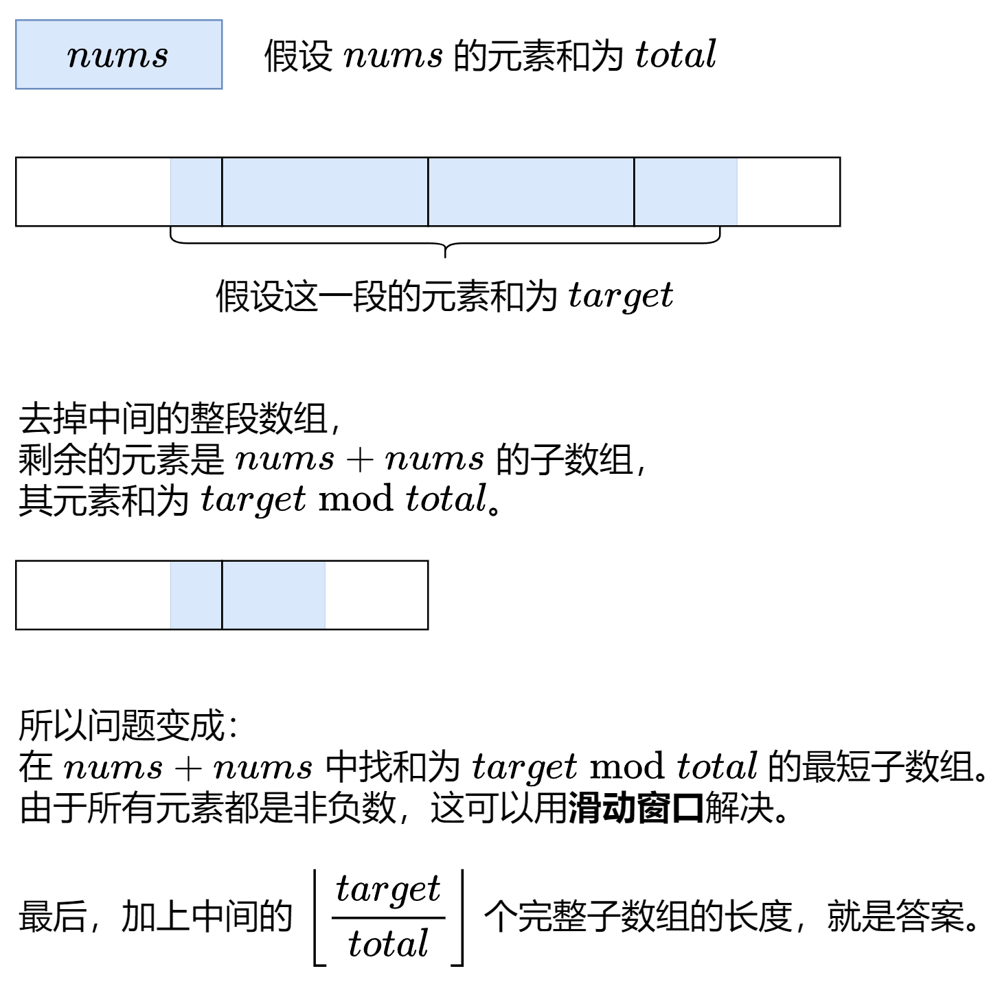
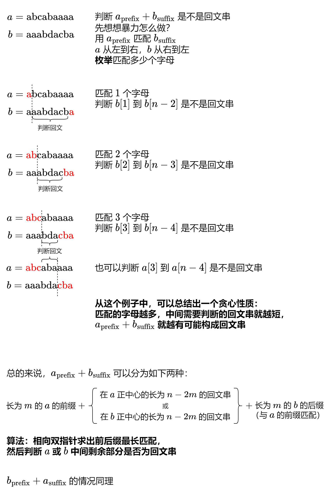
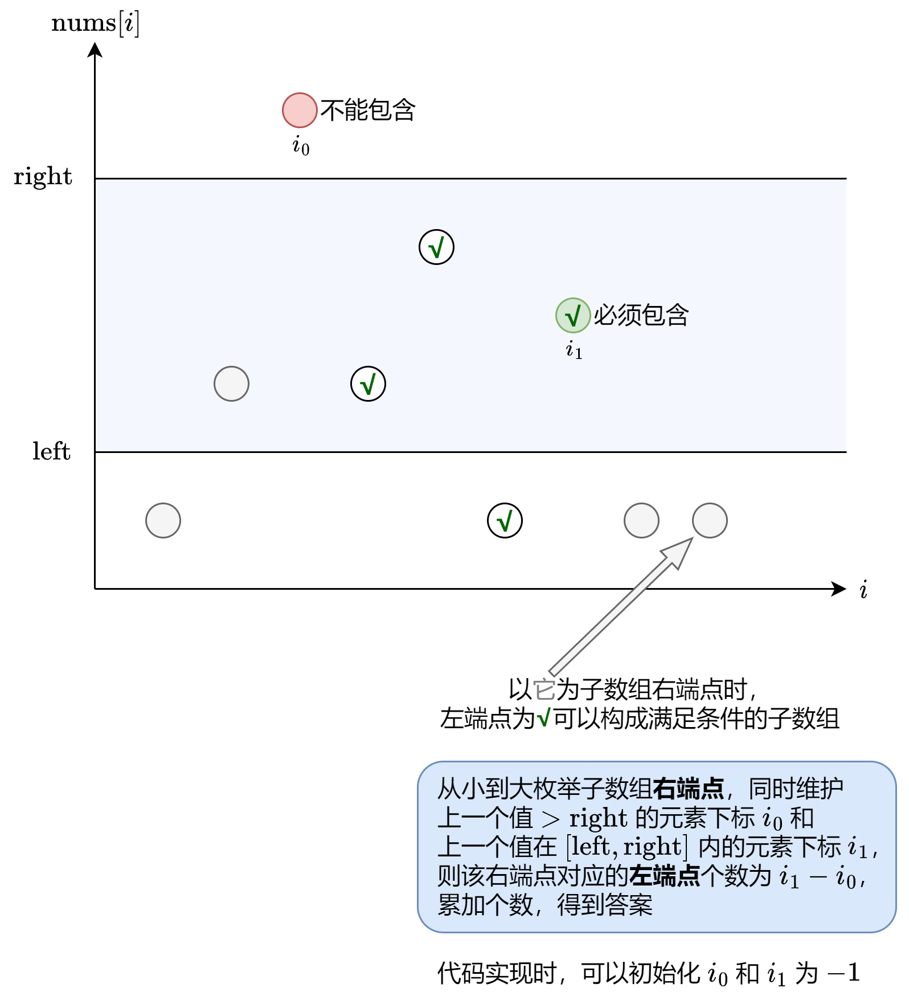
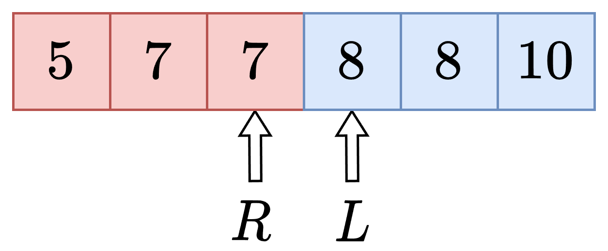
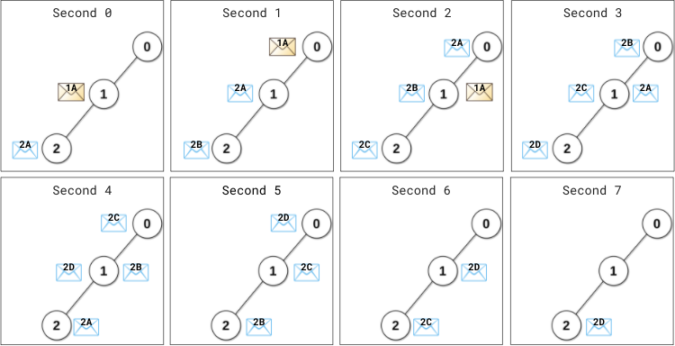
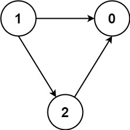
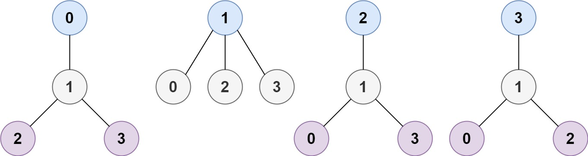
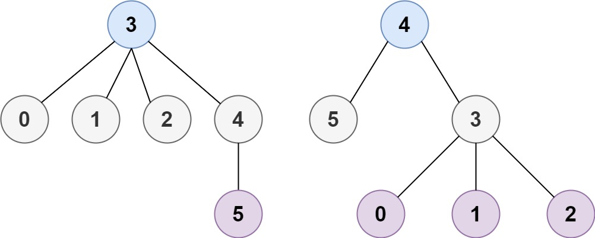

# 灵神题单

资料来源:

- [科学刷题]([分享｜如何科学刷题？ - 力扣（LeetCode）](https://leetcode.cn/circle/discuss/RvFUtj/))

## 1、滑动窗口


题目已按照难度分排序，右侧数字为难度分。

如果遇到难度很大，题解都看不懂的题目，建议直接跳过，二刷的时候再来尝试。

### 1.1 定长滑动窗口

#### 1.1.1 基础

- [x] ==1456.定长子串中元音的最大数目 1263==

>给你字符串 `s` 和整数 `k` 。
>
>请返回字符串 `s` 中长度为 `k` 的单个子字符串中可能包含的最大元音字母数。
>
>英文中的 **元音字母** 为（`a`, `e`, `i`, `o`, `u`）。
>
>**示例 1：**
>
>```
>输入：s = "abciiidef", k = 3
>输出：3
>解释：子字符串 "iii" 包含 3 个元音字母。
>```
>
>**示例 2：**
>
>```
>输入：s = "aeiou", k = 2
>输出：2
>解释：任意长度为 2 的子字符串都包含 2 个元音字母。
>```
>
>**示例 3：**
>
>```
>输入：s = "leetcode", k = 3
>输出：2
>解释："lee"、"eet" 和 "ode" 都包含 2 个元音字母。
>```
>
>**示例 4：**
>
>```
>输入：s = "rhythms", k = 4
>输出：0
>解释：字符串 s 中不含任何元音字母。
>```
>
>**示例 5：**
>
>```
>输入：s = "tryhard", k = 4
>输出：1
>```
>
>**提示：**
>
>- `1 <= s.length <= 10^5`
>- `s` 由小写英文字母组成
>- `1 <= k <= s.length`
>
>==灵茶题解:==
>
>定长滑窗套路
>我总结成三步：入-更新-出。
>
>- **入**：下标为 i 的元素进入窗口，更新相关统计量。如果 i<k−1 则重复第一步。
>- **更新**：更新答案。一般是更新最大值/最小值。
>- **出**：下标为 i−k+1 的元素离开窗口，更新相关统计量。
>
>以上三步适用于所有定长滑窗题目。
>
>```java
>class Solution {
>   public int maxVowels(String S, int k) {
>       char[] s = S.toCharArray();
>       int ans = 0;
>       int vowel = 0;
>       for (int i = 0; i < s.length; i++) {
>           // 1. 进入窗口
>           if (s[i] == 'a' || s[i] == 'e' || s[i] == 'i' || s[i] == 'o' || s[i] == 'u') {
>               vowel++;
>           }
>           if (i < k - 1) { // 窗口大小不足 k
>               continue;
>           }
>           // 2. 更新答案
>           ans = Math.max(ans, vowel);
>           // 3. 离开窗口
>           char out = s[i - k + 1];
>           if (out == 'a' || out == 'e' || out == 'i' || out == 'o' || out == 'u') {
>               vowel--;
>           }
>       }
>       return ans;
>   }
>}
>```

- [x] 643.子数组最大平均数

- [x] 1343.大小为 K 且平均值大于等于阈值的子数组数目 1317

- [x] 2090.半径为 k 的子数组平均值 1358

- [x] 2379.得到 K 个黑块的最少涂色次数 1360

- [x] 1652.拆炸弹 1417

- [x] ==1052.爱生气的书店老板 1418==

>有一个书店老板，他的书店开了 `n` 分钟。每分钟都有一些顾客进入这家商店。给定一个长度为 `n` 的整数数组 `customers` ，其中 `customers[i]` 是在第 `i` 分钟开始时进入商店的顾客数量，所有这些顾客在第 `i` 分钟结束后离开。
>
>在某些分钟内，书店老板会生气。 如果书店老板在第 `i` 分钟生气，那么 `grumpy[i] = 1`，否则 `grumpy[i] = 0`。
>
>当书店老板生气时，那一分钟的顾客就会不满意，若老板不生气则顾客是满意的。
>
>书店老板知道一个秘密技巧，能抑制自己的情绪，可以让自己连续 `minutes` 分钟不生气，但却只能使用一次。
>
>请你返回 *这一天营业下来，最多有多少客户能够感到满意* 。
>
>**示例 1：**
>
>```
>输入：customers = [1,0,1,2,1,1,7,5], grumpy = [0,1,0,1,0,1,0,1], minutes = 3
>输出：16
>解释：书店老板在最后 3 分钟保持冷静。
>感到满意的最大客户数量 = 1 + 1 + 1 + 1 + 7 + 5 = 16.
>```
>
>**示例 2：**
>
>```
>输入：customers = [1], grumpy = [0], minutes = 1
>输出：1
>```
>
>**提示：**
>
>- `n == customers.length == grumpy.length`
>- `1 <= minutes <= n <= 2 * 104`
>- `0 <= customers[i] <= 1000`
>- `grumpy[i] == 0 or 1`
>
>**我的题解：**
>
>```java
>class Solution {
>  public int maxSatisfied(int[] customers, int[] grumpy, int minutes) {
>      int n = customers.length;
>      int bSatisCustomers = 0;
>      int satisCustomers = 0;
>      int gruMinutes = 0;
>      int ans = 0;
>      for(int left = 0,right = 0;right < n;right++){
>          if(grumpy[right] == 0){
>              bSatisCustomers += customers[right];
>          }else{
>              satisCustomers += customers[right];
>          }
>          gruMinutes += grumpy[right];
>          if(right - left + 1 < minutes){
>              continue;
>          }
>          ans = Math.max(ans,satisCustomers);
>          if(grumpy[left] == 1){
>              satisCustomers -= customers[left];
>          }
>          left++;
>      }
>      return ans + bSatisCustomers;
>  }
>}
>```


- [x] 2841.几乎唯一子数组的最大和 1546
- [x] 2461.长度为 K 子数组中的最大和 1553
- [x] 1423.可获得的最大点数 1574

- [x] ==**1297.子串的最大出现次数 1748**==

>给你一个字符串 `s` ，请你返回满足以下条件且出现次数最大的 **任意** 子串的出现次数：
>
>- 子串中不同字母的数目必须小于等于 `maxLetters` 。
>- 子串的长度必须大于等于 `minSize` 且小于等于 `maxSize` 。
>
>**示例 1：**
>
>```
>输入：s = "aababcaab", maxLetters = 2, minSize = 3, maxSize = 4
>输出：2
>解释：子串 "aab" 在原字符串中出现了 2 次。
>它满足所有的要求：2 个不同的字母，长度为 3 （在 minSize 和 maxSize 范围内）。
>```
>
>**示例 2：**
>
>```
>输入：s = "aaaa", maxLetters = 1, minSize = 3, maxSize = 3
>输出：2
>解释：子串 "aaa" 在原字符串中出现了 2 次，且它们有重叠部分。
>```
>
>**示例 3：**
>
>```
>输入：s = "aabcabcab", maxLetters = 2, minSize = 2, maxSize = 3
>输出：3
>```
>
>**示例 4：**
>
>```
>输入：s = "abcde", maxLetters = 2, minSize = 3, maxSize = 3
>输出：0
>```
>
>**提示：**
>
>- `1 <= s.length <= 10^5`
>- `1 <= maxLetters <= 26`
>- `1 <= minSize <= maxSize <= min(26, s.length)`
>- `s` 只包含小写英文字母。
>
>**我的题解：**
>
>**此题只需要以minSize作为定长来滑动**
>
>```java
>class Solution {
>   //不定长窗口
>   public int maxFreq(String s, int maxLetters, int minSize, int maxSize) {
>       //当前窗口的各种字符的数量
>       int[] charCount = new int[26];
>       //当前窗口的不同字母数量
>       int diffCount = 0;
>       //子串出现的次数
>       Map<String, Integer> strCount = new HashMap<>();
>       //结果
>       int ans = 0;
>       //字符串长度
>       int n = s.length();
>       for (int left = 0, right = 0; right < n; right++) {
>           diffCount += charCount[s.charAt(right) - 'a']++ < 1 ? 1 : 0;
>           if (right - left + 1 < minSize) {
>               continue;
>           }
>           if (right - left + 1 > maxSize) {
>               diffCount -= --charCount[s.charAt(left) - 'a'] < 1 ? 1 : 0;
>               left++;
>           }
>           int tempLeft = left;
>           int tempDiff = diffCount;
>           int[] tempCharCount = charCount.clone();
>           while (right - tempLeft + 1 >= minSize) {
>               if (tempDiff <= maxLetters) {
>                   String sub = s.substring(tempLeft, right + 1);
>                   int merge = strCount.merge(sub, 1, Integer::sum);
>                   ans = Math.max(ans, merge);
>               }
>               tempDiff -= --tempCharCount[s.charAt(tempLeft) - 'a'] < 1 ? 1 : 0;
>               tempLeft++;
>           }
>       }
>       return ans;
>   }
>}
>```
>
>**最优题解:**
>
>```java
>class Solution {
>   public int maxFreq(String s, int maxLetters, int minSize, int maxSize) {
>        int n = s.length();
>       //统计子串出现的个数
>       Map<String,Integer> map = new HashMap<>();
>       char[] c = s.toCharArray();
>       int left = 0,right = 0;
>       //统计窗口中不同字母的数目
>       int tmp = 0;
>       //记录窗口中字母的个数
>       int[] count = new int[128];
>       while(right < n){
>           count[c[right]]++;
>           //当下面条件成立时，则说明窗口中多了一个不同的字母
>           if(count[c[right]] == 1) tmp++;
>           right++;
>           int len = right - left;
>           while(tmp > maxLetters || len > minSize){
>               count[c[left]]--;
>               //当窗口左移的过程中，一个字母减为0，则说明窗口中少了一个不同的字母
>               if(count[c[left]] == 0) tmp--;
>               left++;
>               //如果没有这句，会陷入死循环，len会一直大于minSize
>               len--;
>           }
>           //当不同字母的数目小于等于maxLetters
>           if(tmp <= maxLetters){
>               if(len == minSize){
>                   String str = s.substring(left,right);
>                   map.put(str,map.getOrDefault(str,0)+1);
>               }
>
>           }
>       }
>       //统计字串最大出现的次数
>       int ans = 0;
>       for(String key : map.keySet()){
>           ans = Math.max(ans,map.get(key));
>       }
>       return ans;
>   }
>}
>```


- [x] ==2653.滑动子数组的美丽值 1786==

>给你一个长度为 `n` 的整数数组 `nums` ，请你求出每个长度为 `k` 的子数组的 **美丽值** 。
>
>一个子数组的 **美丽值** 定义为：如果子数组中第 `x` **小整数** 是 **负数** ，那么美丽值为第 `x` 小的数，否则美丽值为 `0` 。
>
>请你返回一个包含 `n - k + 1` 个整数的数组，**依次** 表示数组中从第一个下标开始，每个长度为 `k` 的子数组的 **美丽值** 。
>
>- 子数组指的是数组中一段连续 **非空** 的元素序列。
>
>
>
>**示例 1：**
>
>```
>输入：nums = [1,-1,-3,-2,3], k = 3, x = 2
>输出：[-1,-2,-2]
>解释：总共有 3 个 k = 3 的子数组。
>第一个子数组是 [1, -1, -3] ，第二小的数是负数 -1 。
>第二个子数组是 [-1, -3, -2] ，第二小的数是负数 -2 。
>第三个子数组是 [-3, -2, 3] ，第二小的数是负数 -2 。
>```
>
>**示例 2：**
>
>```
>输入：nums = [-1,-2,-3,-4,-5], k = 2, x = 2
>输出：[-1,-2,-3,-4]
>解释：总共有 4 个 k = 2 的子数组。
>[-1, -2] 中第二小的数是负数 -1 。
>[-2, -3] 中第二小的数是负数 -2 。
>[-3, -4] 中第二小的数是负数 -3 。
>[-4, -5] 中第二小的数是负数 -4 。
>```
>
>**示例 3：**
>
>```
>输入：nums = [-3,1,2,-3,0,-3], k = 2, x = 1
>输出：[-3,0,-3,-3,-3]
>解释：总共有 5 个 k = 2 的子数组。
>[-3, 1] 中最小的数是负数 -3 。
>[1, 2] 中最小的数不是负数，所以美丽值为 0 。
>[2, -3] 中最小的数是负数 -3 。
>[-3, 0] 中最小的数是负数 -3 。
>[0, -3] 中最小的数是负数 -3 。
>```
>
>
>
>**提示：**
>
>- `n == nums.length `
>- `1 <= n <= 105`
>- `1 <= k <= n`
>- `1 <= x <= k `
>- `-50 <= nums[i] <= 50 `
>
>我的题解:
>
>此题最主要是的考察如何维护一个数据结构，这个数据结构从小到大排列，且添加、删除、查询都是O(1)的级别，我使用List来维护，时间超限，==不可用==
>
>```java
>class Solution {
>   public int[] getSubarrayBeauty(int[] nums, int k, int x) {
>       int n = nums.length;
>       int[] ans = new int[n - k + 1];
>       int index = 0;
>       List<Integer> minCount = new ArrayList<>();
>       for (int left = 0, right = 0; right < n; right++) {
>           //维护一种数据，这种数据由小到大，并且可以直接通过下标获取
>           int i = Collections.binarySearch(minCount, nums[right]);
>           if (i < 0) {
>               i = -(i + 1);
>           }
>           minCount.add(i, nums[right]);
>
>           if (right - left + 1 < k) {
>               continue;
>           }
>
>           Integer i1 = minCount.get(x - 1);
>           ans[index++] = Math.min(i1, 0);
>           minCount.remove(Integer.valueOf(nums[left++]));
>       }
>       return ans;
>   }
>}
>```
>
>==灵茶题解:==
>
>滑动窗口。由于值域很小，所以借鉴计数排序，用一个 cnt 数组维护窗口内每个数的出现次数。然后遍历 cnt 去求第 x 小的数。
>
>什么是第 x 小的数？
>
>设它是 num，那么 <num 的数有 <x 个，≤num 的数有 ≥x 个，就说明 num 是第 x 小的数。
>
>这里用到了提示的nums[i]的范围
>
>```java
>class Solution {
>   public int[] getSubarrayBeauty(int[] nums, int k, int x) {
>       final int BIAS = 50;
>       var cnt = new int[BIAS * 2 + 1];
>       int n = nums.length;
>       for (int i = 0; i < k - 1; ++i) // 先往窗口内添加 k-1 个数
>           ++cnt[nums[i] + BIAS];
>       var ans = new int[n - k + 1];
>       for (int i = k - 1; i < n; ++i) {
>           ++cnt[nums[i] + BIAS]; // 进入窗口（保证窗口有恰好 k 个数）
>           int left = x;
>           for (int j = 0; j < BIAS; ++j) { // 暴力枚举负数范围 [-50,-1]
>               left -= cnt[j];
>               if (left <= 0) { // 找到美丽值
>                   ans[i - k + 1] = j - BIAS;
>                   break;
>               }
>           }
>           --cnt[nums[i - k + 1] + BIAS]; // 离开窗口
>       }
>       return ans;
>   }
>}
>```


- [ ] 1176.健身计划评估（会员题）
- [ ] 1100.长度为 K 的无重复字符子串（会员题）
- [ ] 1852.每个子数组的数字种类数（会员题）
- [ ] 1151.最少交换次数来组合所有的 1（会员题）
- [ ] 2107.分享 K 个糖果后独特口味的数量（会员题）

#### 1.1.2 进阶

- [ ] 2134.最少交换次数来组合所有的 1 II 1748
- [ ] 2135.使二进制字符串字符交替的最少反转次数 2006
- [ ] 2136.字符串的排列
- [ ] 2137.找到字符串中所有字母异位词
- [ ] 2138.串联所有单词的子串
- [ ] 2139.查找给定哈希值的子串 2063
- [ ] 2140.统计完全子字符串 2449
- [ ] 2141.K 个关闭的灯泡（会员题）做到 O(n)
- [ ] 2142.等计数子串的数量（会员题）
- [ ] 2143.子数组的最大频率分数（会员题）

#### 1.1.3 其他

- [x] 2269.找到一个数字的 K 美丽值 1280
- [x] 1984.学生分数的最小差值 1306
- [ ] 220.存在重复元素 III

### 1.2 不定长滑动窗口

**推荐先完成 2000 分以下的题目，难题可以留到后面再做。**

#### 1.2.1 求最长/最大

一般题目都有「至多」的要求。

- [x] ==3.无重复字符的最长子串==

>给定一个字符串 `s` ，请你找出其中不含有重复字符的 **最长子串**的长度。
>
>
>
>**示例 1:**
>
>```
>输入: s = "abcabcbb"
>输出: 3 
>解释: 因为无重复字符的最长子串是 "abc"，所以其长度为 3。
>```
>
>**示例 2:**
>
>```
>输入: s = "bbbbb"
>输出: 1
>解释: 因为无重复字符的最长子串是 "b"，所以其长度为 1。
>```
>
>**示例 3:**
>
>```
>输入: s = "pwwkew"
>输出: 3
>解释: 因为无重复字符的最长子串是 "wke"，所以其长度为 3。
>请注意，你的答案必须是 子串 的长度，"pwke" 是一个子序列，不是子串。
>```
>
>
>
>**提示：**
>
>- `0 <= s.length <= 5 * 104`
>- `s` 由英文字母、数字、符号和空格组成
>
>我的题解:
>
>不含重复字符就是指在子串中该字符不能出现两次，我们使用不定长滑动窗口，可以得出这样一个结论：**当right指到的字符数量大于二时我们向右移动left直到该字符数量等于一，这时的窗口是满足条件的**。
>
>```java
>class Solution {
>   public int lengthOfLongestSubstring(String s) {
>       int[] c = new int[128];
>       int ans = 0;
>       int n = s.length();
>       for (int left = 0, right = 0; right < n; right++) {
>           int index = s.charAt(right);
>           c[index]++;
>           while (c[index] > 1) {
>               c[s.charAt(left)]--;
>               left++;
>           }
>           ans = Math.max(ans, right - left + 1);
>       }
>       return ans;
>   }
>}
>```
>
>==灵茶题解:==
>
>```java
>class Solution {
>   public int lengthOfLongestSubstring(String S) {
>       char[] s = S.toCharArray(); // 转换成 char[] 加快效率（忽略带来的空间消耗）
>       int n = s.length;
>       int ans = 0;
>       int left = 0;
>       boolean[] has = new boolean[128]; // 也可以用 HashSet<Character>，这里为了效率用的数组
>       for (int right = 0; right < n; right++) {
>           char c = s[right];
>           // 如果窗口内已经包含 c，那么再加入一个 c 会导致窗口内有重复元素
>           // 所以要在加入 c 之前，先移出窗口内的 c
>           while (has[c]) { // 窗口内有 c
>               has[s[left++]] = false; // 缩小窗口
>           }
>           has[c] = true; // 加入 c
>           ans = Math.max(ans, right - left + 1); // 更新窗口长度最大值
>       }
>       return ans;
>   }
>}
>```

- [x] 3090.每个字符最多出现两次的最长子字符串 1329
- [x] ==1493.删掉一个元素以后全为 1 的最长子数组 1423==

>给你一个二进制数组 `nums` ，你需要从中删掉一个元素。
>
>请你在删掉元素的结果数组中，返回最长的且只包含 1 的非空子数组的长度。
>
>如果不存在这样的子数组，请返回 0 。
>
>
>
>**提示 1：**
>
>```
>输入：nums = [1,1,0,1]
>输出：3
>解释：删掉位置 2 的数后，[1,1,1] 包含 3 个 1 。
>```
>
>**示例 2：**
>
>```
>输入：nums = [0,1,1,1,0,1,1,0,1]
>输出：5
>解释：删掉位置 4 的数字后，[0,1,1,1,1,1,0,1] 的最长全 1 子数组为 [1,1,1,1,1] 。
>```
>
>**示例 3：**
>
>```
>输入：nums = [1,1,1]
>输出：2
>解释：你必须要删除一个元素。
>```
>
>
>
>**提示：**
>
>- `1 <= nums.length <= 105`
>- `nums[i]` 要么是 `0` 要么是 `1` 。
>
>我的题解:
>
>==不定长窗口==，分别维护两个数量，一个是1的数量一个是0的数量，当窗口中的0数量超过了一个，则我们需要向右移动左端点缩短窗口，直到窗口中的0数量维持在一个。
>
>```java
>class Solution {
>   public int longestSubarray(int[] nums) {
>       int n =nums.length;
>       int ans = 0;
>       int mark = 1;
>       int zeroLen = 0;
>       int len = 0;
>       for(int left = 0,right = 0;right < n;right++){
>           if(nums[right] == 1){
>               len++;
>           }else{
>               zeroLen++;
>           }
>           while(zeroLen > mark){
>               if(nums[left] == 1){
>                   len--;
>               }else{
>                   zeroLen--;
>               }
>               left++;
>           }
>           ans = Math.max(ans,len);
>
>       }
>       return ans - (zeroLen == 1 ? 0 : 1);
>   }
>}
>```

- [x] 1208.尽可能使字符串相等 1497
- [x] ==2730.找到最长的半重复子字符串 1502==

>给你一个下标从 **0** 开始的字符串 `s` ，这个字符串只包含 `0` 到 `9` 的数字字符。
>
>如果一个字符串 `t` 中至多有一对相邻字符是相等的，那么称这个字符串 `t` 是 **半重复的** 。例如，`"0010"` 、`"002020"` 、`"0123"` 、`"2002"` 和 `"54944"` 是半重复字符串，而 `"00101022"` （相邻的相同数字对是 00 和 22）和 `"1101234883"` （相邻的相同数字对是 11 和 88）不是半重复字符串。
>
>请你返回 `s` 中最长 **半重复** 
>
>子字符串
>
>的长度。
>
>
>
>
>
>**示例 1：**
>
>**输入：**s = "52233"
>
>**输出：**4
>
>**解释：**
>
>最长的半重复子字符串是 "5223"。整个字符串 "52233" 有两个相邻的相同数字对 22 和 33，但最多只能选取一个。
>
>**示例 2：**
>
>**输入：**s = "5494"
>
>**输出：**4
>
>**解释：**
>
>`s` 是一个半重复字符串。
>
>**示例 3：**
>
>**输入：**s = "1111111"
>
>**输出：**2
>
>**解释：**
>
>最长的半重复子字符串是 "11"。子字符串 "111" 有两个相邻的相同数字对，但最多允许选取一个。
>
>
>
>**提示：**
>
>- `1 <= s.length <= 50`
>- `'0' <= s[i] <= '9'`
>
>我的题解:
>
>此题不允许子串出现两对相等的字符串，使用滑动窗口。需要注意的是需要不叫两个字符所以我们直接中下标1开始比较，同理我们减的时候也是需要减后面的数量
>
>```java
>class Solution {
>   public int longestSemiRepetitiveSubstring(String s) {
>       int count = 0;
>       int ans = 0;
>       char[] nums =s.toCharArray();
>       int n = s.length();
>       int[] countArr = new int[n];
>       for(int i =1;i < n;i++){
>           if(nums[i] == nums[i-1]){
>               countArr[i] =  1;
>           }
>       }
>
>       for(int left = 0,right = 0;right < n;right++){
>           count += countArr[right];
>           while(count > 1 && left < right){
>               count -= countArr[++left];
>           }
>           ans = Math.max(ans,right - left + 1);
>       }
>       return ans;
>   }
>}
>```

- [x] 904.水果成篮 1516
- [x] ==1695.删除子数组的最大得分 1529==

>给你一个正整数数组 `nums` ，请你从中删除一个含有 **若干不同元素** 的子数组**。**删除子数组的 **得分** 就是子数组各元素之 **和** 。
>
>返回 **只删除一个** 子数组可获得的 **最大得分** *。*
>
>如果数组 `b` 是数组 `a` 的一个连续子序列，即如果它等于 `a[l],a[l+1],...,a[r]` ，那么它就是 `a` 的一个子数组。
>
>
>
>**示例 1：**
>
>```
>输入：nums = [4,2,4,5,6]
>输出：17
>解释：最优子数组是 [2,4,5,6]
>```
>
>**示例 2：**
>
>```
>输入：nums = [5,2,1,2,5,2,1,2,5]
>输出：8
>解释：最优子数组是 [5,2,1] 或 [1,2,5]
>```
>
>
>
>**提示：**
>
>- `1 <= nums.length <= 105`
>- `1 <= nums[i] <= 104`
>
>我的题解:
>
>此题要求子数组中不能有相同的元素，所以我们使用一个集合来存储窗口中的元素，如果当前集合中已存在要加入的元素了，我们就向左移动窗口，直到不含有指定元素。
>
>```java
>class Solution {
>   public int maximumUniqueSubarray(int[] nums) {
>       int n = nums.length;
>       Set<Integer> hashSet = new HashSet<>();
>       int sum = 0;
>       int ans = 0;
>       for (int left = 0, right = 0; right < n; right++) {
>           sum += nums[right];
>           //如果当前窗口存在两个相同的元素
>           while (hashSet.contains(nums[right])) {
>               sum -= nums[left];
>               hashSet.remove(nums[left++]);
>           }
>           hashSet.add(nums[right]);
>           ans = Math.max(ans, sum);
>       }
>       return ans;
>   }
>}
>```
>
>最优题解:
>
>```java
>class Solution {
>   public int maximumUniqueSubarray(int[] nums) {
>       int ans = 0;
>       int sum = 0;
>       int[] cnt = new int[10005];
>       for(int left = 0, right = 0; right < nums.length; ++right){
>           sum += nums[right];
>           cnt[nums[right]]++;
>           while(cnt[nums[right]] > 1){
>               --cnt[nums[left]];
>               sum -= nums[left];
>               ++left;
>           }
>           ans = Math.max(ans, sum);
>       }
>
>       return ans;
>   }
>}
>```

- [x] 2958.最多 K 个重复元素的最长子数组 1535
- [x] ==2779.数组的最大美丽值 1638==

>给你一个下标从 **0** 开始的整数数组 `nums` 和一个 **非负** 整数 `k` 。
>
>在一步操作中，你可以执行下述指令：
>
>- 在范围 `[0, nums.length - 1]` 中选择一个 **此前没有选过** 的下标 `i` 。
>- 将 `nums[i]` 替换为范围 `[nums[i] - k, nums[i] + k]` 内的任一整数。
>
>数组的 **美丽值** 定义为数组中由相等元素组成的最长子序列的长度。
>
>对数组 `nums` 执行上述操作任意次后，返回数组可能取得的 **最大** 美丽值。
>
>**注意：**你 **只** 能对每个下标执行 **一次** 此操作。
>
>数组的 **子序列** 定义是：经由原数组删除一些元素（也可能不删除）得到的一个新数组，且在此过程中剩余元素的顺序不发生改变。
>
>
>
>**示例 1：**
>
>```
>输入：nums = [4,6,1,2], k = 2
>输出：3
>解释：在这个示例中，我们执行下述操作：
>- 选择下标 1 ，将其替换为 4（从范围 [4,8] 中选出），此时 nums = [4,4,1,2] 。
>- 选择下标 3 ，将其替换为 4（从范围 [0,4] 中选出），此时 nums = [4,4,1,4] 。
>执行上述操作后，数组的美丽值是 3（子序列由下标 0 、1 、3 对应的元素组成）。
>可以证明 3 是我们可以得到的由相等元素组成的最长子序列长度。
>```
>
>**示例 2：**
>
>```
>输入：nums = [1,1,1,1], k = 10
>输出：4
>解释：在这个示例中，我们无需执行任何操作。
>数组 nums 的美丽值是 4（整个数组）。
>```
>
>
>
>**提示：**
>
>- `1 <= nums.length <= 105`
>- `0 <= nums[i], k <= 105`
>
>我的题解:
>
>我们可以看到要求是选出子序列(**非连续的**)，所以**元素顺序对答案没有影响**，而且要求范围，所以我们直接由小到大排序，我们发现这时就可以求**连续**的子序列了，当串口中最大数即最右边的数的最小范围大于最小数即最左边的数的最大范围，则当前窗口满足条件，可以求美丽值。不满足的时候向右移动左端口直到满足。
>
>```java
>class Solution {
>   public int maximumBeauty(int[] nums, int k) {
>       //排序数组
>       Arrays.sort(nums);
>       int n = nums.length;
>       int ans = 1;
>       for(int left = 0,right = 1;right < n;right++){
>        while(nums[right]-k > nums[left]+k){
>           left++;
>        }
>        ans = Math.max(ans,right - left +1);
>       }
>       return ans;
>   }
>}
>```
>
>==灵茶题解:==
>
>由于选的是子序列，且操作后子序列的元素都相等，所以元素顺序对答案没有影响，可以先对数组排序。
>
>示例 1 排序后 nums=[1,2,4,6]。由于每个数 x 可以改成闭区间 [x−k,x+k] 中的数，我们把示例 1 的每个数看成闭区间，也就是
>
>
>
>题目要求的「由相等元素组成的最长子序列」，相当于选出若干闭区间，这些区间的交集不为空。
>
>排序后，选出的区间是连续的，我们只需考虑最左边的区间 [x−k,x+k] 和最右边的区间 [y−k,y+k]，如果这两个区间的交集不为空，那么选出的这些区间的交集不为空。也就是说，要满足
>$$
>y - x \leq 2k
>$$
>于是原问题等价于：
>
>- 排序后，找最长的连续子数组，其最大值减最小值不超过 2k。
>
>只要子数组满足这个要求，对应的区间的交集就不为空，也就是子数组的元素都可以变成同一个数。
>
>这可以用 滑动窗口 解决。枚举 nums[right] 作为子数组的最后一个数，一旦 nums[right]−nums[left]>2k，就移动左端点 left。
>
>左端点停止移动时，下标在 [left,right] 的子数组就是满足要求的子数组，用子数组长度 right−left+1 更新答案的最大值。
>
>```java
>class Solution {
>   public int maximumBeauty(int[] nums, int k) {
>       Arrays.sort(nums);
>       int ans = 0;
>       int left = 0;
>       for (int right = 0; right < nums.length; right++) {
>           while (nums[right] - nums[left] > k * 2) {
>               left++;
>           }
>           ans = Math.max(ans, right - left + 1);
>       }
>       return ans;
>   }
>}
>```

- [x] 2024.考试的最大困扰度 1643
- [x] 1004.最大连续 1 的个数 III 1656
- [x] ==1658.将 x 减到 0 的最小操作数 1817==

>给你一个整数数组 `nums` 和一个整数 `x` 。每一次操作时，你应当移除数组 `nums` 最左边或最右边的元素，然后从 `x` 中减去该元素的值。请注意，需要 **修改** 数组以供接下来的操作使用。
>
>如果可以将 `x` **恰好** 减到 `0` ，返回 **最小操作数** ；否则，返回 `-1` 。
>
>
>
>**示例 1：**
>
>```
>输入：nums = [1,1,4,2,3], x = 5
>输出：2
>解释：最佳解决方案是移除后两个元素，将 x 减到 0 。
>```
>
>**示例 2：**
>
>```
>输入：nums = [5,6,7,8,9], x = 4
>输出：-1
>```
>
>**示例 3：**
>
>```
>输入：nums = [3,2,20,1,1,3], x = 10
>输出：5
>解释：最佳解决方案是移除后三个元素和前两个元素（总共 5 次操作），将 x 减到 0 。
>```
>
>
>
>**提示：**
>
>- `1 <= nums.length <= 105`
>- `1 <= nums[i] <= 104`
>- `1 <= x <= 109`
>
>我的题解:
>
>逆向思维，我们可以把求值改为取数组中连续最长的子数组，该数组的和与整个数组的和的差恰好等于x,返回数组长度-该数组长度
>
>```java
>class Solution {
>      public int minOperations(int[] nums, int x) {
>       //逆向思维
>       //在数组中找到一个连续最长的子数组，使得该数组的和与全部之和的差为x
>       int n = nums.length;
>       int ans = Integer.MAX_VALUE;
>       int sum = 0;
>       for(int num:nums){
>           sum += num;
>       }
>       if(sum == x){
>           return n;
>       }
>       for(int left = 0 ,right = 0;right < n;right++){
>           sum -= nums[right];
>           while(sum < x && left < right){
>               sum += nums[left++];
>           }
>           if(sum == x){
>               ans = Math.min(ans,n-(right-left+1));
>           }
>
>       }
>       return  ans == Integer.MAX_VALUE ? -1 : ans;
>   }
>}
>```
>
>==灵茶题解:==
>
>- 方法一
>
>把问题转换成「从 nums 中移除一个最长的子数组，使得剩余元素的和为 x」。
>
>换句话说，要从 nums 中找最长的子数组，其元素和等于 s−x，这里 s 为 nums 所有元素之和。
>
>由于本题没有负数，我们可以用滑动窗口，具体原理可以看我的【基础算法精讲】，欢迎点赞~
>
>最后答案为 nums 的长度减去最长子数组的长度。
>
>```java
>class Solution {
>   public int minOperations(int[] nums, int x) {
>       int target = -x;
>       for (int num : nums) target += num;
>       if (target < 0) return -1; // 全部移除也无法满足要求
>       int ans = -1, left = 0, sum = 0, n = nums.length;
>       for (int right = 0; right < n; ++right) {
>           sum += nums[right];
>           while (sum > target) sum -= nums[left++]; // 缩小子数组长度
>           if (sum == target) ans = Math.max(ans, right - left + 1);
>       }
>       return ans < 0 ? -1 : n - ans;
>   }
>}
>```
>
>- 方法二
>
>如果要正向计算也是可以的，就是写起来稍微有点麻烦：首先算出最长的元素和不超过 x 的后缀，然后不断枚举前缀长度，另一个指针指向后缀最左元素，保证前缀+后缀的元素和不超过 x。答案就是前缀+后缀长度之和的最小值。
>
>```java
>class Solution {
>   public int minOperations(int[] nums, int x) {
>       int sum = 0, n = nums.length, right = n;
>       while (right > 0 && sum + nums[right - 1] <= x) // 计算最长后缀
>           sum += nums[--right];
>       if (right == 0 && sum < x) return -1; // 全部移除也无法满足要求
>       int ans = sum == x ? n - right : n + 1;
>       for (int left = 0; left < n; ++left) {
>           sum += nums[left];
>           while (right < n && sum > x) // 缩小后缀长度
>               sum -= nums[right++];
>           if (sum > x) break; // 缩小失败，说明前缀过长
>           if (sum == x) ans = Math.min(ans, left + 1 + n - right); // 前缀+后缀长度
>       }
>       return ans > n ? -1 : ans;
>   }
>}
>```

- [x] ==1838.最高频元素的频数 1876==

>元素的 **频数** 是该元素在一个数组中出现的次数。
>
>给你一个整数数组 `nums` 和一个整数 `k` 。在一步操作中，你可以选择 `nums` 的一个下标，并将该下标对应元素的值增加 `1` 。
>
>执行最多 `k` 次操作后，返回数组中最高频元素的 **最大可能频数** *。*
>
>
>
>**示例 1：**
>
>```
>输入：nums = [1,2,4], k = 5
>输出：3
>解释：对第一个元素执行 3 次递增操作，对第二个元素执 2 次递增操作，此时 nums = [4,4,4] 。
>4 是数组中最高频元素，频数是 3 。
>```
>
>**示例 2：**
>
>```
>输入：nums = [1,4,8,13], k = 5
>输出：2
>解释：存在多种最优解决方案：
>- 对第一个元素执行 3 次递增操作，此时 nums = [4,4,8,13] 。4 是数组中最高频元素，频数是 2 。
>- 对第二个元素执行 4 次递增操作，此时 nums = [1,8,8,13] 。8 是数组中最高频元素，频数是 2 。
>- 对第三个元素执行 5 次递增操作，此时 nums = [1,4,13,13] 。13 是数组中最高频元素，频数是 2 。
>```
>
>**示例 3：**
>
>```
>输入：nums = [3,9,6], k = 2
>输出：1
>```
>
>
>
>**提示：**
>
>- `1 <= nums.length <= 105`
>- `1 <= nums[i] <= 105`
>- `1 <= k <= 105`
>
>我的题解:
>
>此题因为需要统计元素个数以及，每次操作都是增加操作，所以我们可以很顺利的想到可以先排序，这样统计重复元素个数就变为了统计最长连续重复子数组，并且没有重复的数还可以使用操作数来添补
>
>```java
>class Solution {
>   public int maxFrequency(int[] nums, int k) {
>       //因为操作为新增操作，所以我们在只能把小的数变为大的数，并且可以进行排序这样就有单调的数组
>       //题目要求解释:
>       //对于已经排序好的数组，请找到一个连续长度最长的子数组，这个数组的操作数之和要小于等于k
>       int n = nums.length;
>       int ans = 1;
>       long t = k;
>       Arrays.sort(nums);
>       for(int left = 0,right = 1;right < n;right++){
>           t -= (long)(nums[right] - nums[right-1])*(right-left);
>           while(t < 0){
>               t += nums[right] - nums[left++];
>           }
>           ans = Math.max(ans,right - left +1);
>       }
>       return ans;
>   }
>}
>```

- [x] 2516.每种字符至少取 K 个 1948
- [x] ==2831.找出最长等值子数组 1976==

>给你一个下标从 **0** 开始的整数数组 `nums` 和一个整数 `k` 。
>
>如果子数组中所有元素都相等，则认为子数组是一个 **等值子数组** 。注意，空数组是 **等值子数组** 。
>
>从 `nums` 中删除最多 `k` 个元素后，返回可能的最长等值子数组的长度。
>
>**子数组** 是数组中一个连续且可能为空的元素序列。
>
>
>
>**示例 1：**
>
>```
>输入：nums = [1,3,2,3,1,3], k = 3
>输出：3
>解释：最优的方案是删除下标 2 和下标 4 的元素。
>删除后，nums 等于 [1, 3, 3, 3] 。
>最长等值子数组从 i = 1 开始到 j = 3 结束，长度等于 3 。
>可以证明无法创建更长的等值子数组。
>```
>
>**示例 2：**
>
>```
>输入：nums = [1,1,2,2,1,1], k = 2
>输出：4
>解释：最优的方案是删除下标 2 和下标 3 的元素。 
>删除后，nums 等于 [1, 1, 1, 1] 。 
>数组自身就是等值子数组，长度等于 4 。 
>可以证明无法创建更长的等值子数组。
>```
>
>
>
>**提示：**
>
>- `1 <= nums.length <= 105`
>- `1 <= nums[i] <= nums.length`
>- `0 <= k <= nums.length`
>
>我的题解:
>
>**试出来的**。我们需要维护一个cnt数组用于记录数组中元素的个数，一个cur记录当前元素个数最多的元素值，然后一点一点试验。
>
>```java
>class Solution {
>   public int longestEqualSubarray(List<Integer> nums, int k) {
>       int n = nums.size();
>       int[] cnt = new int[n+1];
>       int ans = 0;
>       int cur = nums.get(0);
>       for(int left = 0,right = 0;right < n;right++){
>           cnt[nums.get(right)]++;
>           if(cnt[cur] < cnt[nums.get(right)]){
>               cur = nums.get(right);
>           }
>           while(right - left + 1 - cnt[cur] > k){
>               cnt[nums.get(left++)]--;
>               if(cnt[cur] < cnt[nums.get(left)]){
>                   cur = nums.get(left);
>               }
>           }
>           ans = Math.max(ans,cnt[cur]);
>       }
>       return ans;
>   }
>}
>```
>
>==灵茶题解:==
>
>把==相同元素分组==，相同元素的下标记录到哈希表（或者数组）posLists 中。
>
>例如示例 1，元素 3 在 nums 中的下标有 1,3,5，那么 posLists[3]=[1,3,5]。
>
>遍历 posLists 中的每个下标列表 pos，例如遍历 pos=[1,3,5]。
>
>请记住，pos 中保存的是下标，这些下标在 nums 中的对应元素都相同。
>
>然后用滑动窗口计算。设窗口左右端点为 left 和 right。
>
>假设 nums 的等值子数组的元素下标从 pos[left] 到 pos[right]，那么在删除前，子数组的长度
>
>pos[right]−pos[left]+1
>
>这个子数组有right−left+1个数都是相同的，无需删除，其余元素都需要删除，那么需要删除的元素个数就是
>
>pos[right]−pos[left]−(right−left)
>
>如果上式大于 k，说明要删除的数太多了，那么移动左指针 left，直到上式小于等于 k，此时用 right−left+1 更新答案的最大值。
>
>代码实现时，为简化上式，pos 实际保存的是 pos[i]−i，也就是把上面的每个 pos[i] 都减去其在 pos 中的下标 i，于是需要删除的元素个数简化为
>
>pos[right]−pos[left]
>
>```java
>class Solution {
>   public int longestEqualSubarray(List<Integer> nums, int k) {
>       int n = nums.size();
>       List<Integer>[] posLists = new ArrayList[n + 1];
>       Arrays.setAll(posLists, i -> new ArrayList<>());
>       for (int i = 0; i < n; i++) {
>           int x = nums.get(i);
>           posLists[x].add(i - posLists[x].size());
>       }
>
>       int ans = 0;
>       for (List<Integer> pos : posLists) {
>           if (pos.size() <= ans) {
>               continue; // 无法让 ans 变得更大
>           }
>           int left = 0;
>           for (int right = 0; right < pos.size(); right++) {
>               while (pos.get(right) - pos.get(left) > k) { // 要删除的数太多了
>                   left++;
>               }
>               ans = Math.max(ans, right - left + 1);
>           }
>       }
>       return ans;
>   }
>}
>```

- [ ] ==2271.毯子覆盖的最多白色砖块数 2022==
- [ ] 2106.摘水果 2062
- [ ] 2555.两个线段获得的最多奖品 2081
- [ ] 2009.使数组连续的最少操作数 2084
- [ ] 1610.可见点的最大数目 2147
- [ ] 2781.最长合法子字符串的长度 2204
- [ ] 2968.执行操作使频率分数最大 2444
- [ ] 1040.移动石子直到连续 II 2456
- [ ] 395.至少有 K 个重复字符的最长子串
- [ ] 1763.最长的美好子字符串 非暴力做法
- [ ] 487.最大连续 1 的个数 II（会员题）
- [ ] 159.至多包含两个不同字符的最长子串（会员题）
- [ ] 340.至多包含 K 个不同字符的最长子串（会员题）

#### 1.2.2 求最短/最小

一般题目都有「至少」的要求。

- [x] 209.长度最小的子数组

- [x] ==210.最短且字典序最小的美丽子字符串 做到 O(n^2^)==

>给你一个二进制字符串 `s` 和一个正整数 `k` 。
>
>如果 `s` 的某个子字符串中 `1` 的个数恰好等于 `k` ，则称这个子字符串是一个 **美丽子字符串** 。
>
>令 `len` 等于 **最短** 美丽子字符串的长度。
>
>返回长度等于 `len` 且字典序 **最小** 的美丽子字符串。如果 `s` 中不含美丽子字符串，则返回一个 **空** 字符串。
>
>对于相同长度的两个字符串 `a` 和 `b` ，如果在 `a` 和 `b` 出现不同的第一个位置上，`a` 中该位置上的字符严格大于 `b` 中的对应字符，则认为字符串 `a` 字典序 **大于** 字符串 `b` 。
>
>- 例如，`"abcd"` 的字典序大于 `"abcc"` ，因为两个字符串出现不同的第一个位置对应第四个字符，而 `d` 大于 `c` 。
>
>
>
>**示例 1：**
>
>```
>输入：s = "100011001", k = 3
>输出："11001"
>解释：示例中共有 7 个美丽子字符串：
>1. 子字符串 "100011001" 。
>2. 子字符串 "100011001" 。
>3. 子字符串 "100011001" 。
>4. 子字符串 "100011001" 。
>5. 子字符串 "100011001" 。
>6. 子字符串 "100011001" 。
>7. 子字符串 "100011001" 。
>最短美丽子字符串的长度是 5 。
>长度为 5 且字典序最小的美丽子字符串是子字符串 "11001" 。
>```
>
>**示例 2：**
>
>```
>输入：s = "1011", k = 2
>输出："11"
>解释：示例中共有 3 个美丽子字符串：
>1. 子字符串 "1011" 。
>2. 子字符串 "1011" 。
>3. 子字符串 "1011" 。
>最短美丽子字符串的长度是 2 。
>长度为 2 且字典序最小的美丽子字符串是子字符串 "11" 。 
>```
>
>**示例 3：**
>
>```
>输入：s = "000", k = 1
>输出：""
>解释：示例中不存在美丽子字符串。
>```
>
>
>
>**提示：**
>
>- `1 <= s.length <= 100`
>- `1 <= k <= s.length`
>
>我的题解:
>
>题目要求统计1个数恰好等于k的子字符串，取满足条件的子串，并要求该子串最短且字典序最小。我们维护一个数组来记录出现1的下标，这样我们的窗口就变为了长度为k的定长窗口，这时候两个端点下标对应的值就可以计算出子串长度。
>
>```java
>class Solution {
>   public String shortestBeautifulSubstring(String s, int k) {
>      List<Integer> index = new ArrayList<>();
>      char[] chars = s.toCharArray();
>      for(int i = 0;i < chars.length;i++){
>       if(chars[i] == '1'){
>           index.add(i);
>       }
>      }
>      int n = index.size();
>      if(n < k){
>       return "";
>      }
>      String ans = s;
>      for(int left = 0,right = 0;right < n;right++){
>       if(right - left + 1 < k){
>           continue;
>       }
>       if(ans.length() > index.get(right) - index.get(left) + 1){
>           ans = s.substring(index.get(left),index.get(right)+1);
>       }
>       if(ans.length() == index.get(right) - index.get(left) + 1){
>         ans =  shortestBeautifulSubstringHelp(ans,s.substring(index.get(left),index.get(right)+1));
>       }
>       left++;
>      }
>      return ans;
>   }
>
>   public String shortestBeautifulSubstringHelp(String str1,String str2){
>       int n = str1.length();
>       for(int i = 0;i < n;i++){
>           if(str1.charAt(i) == str2.charAt(i)){
>               continue;
>           }else if(str1.charAt(i) > str2.charAt(i)){
>               return str2;
>           }else{
>               return str1;
>           }
>       }
>       return str1;
>   }
>}
>```
>
>==灵茶题解:==
>
>原理请看 滑动窗口【基础算法精讲 03】
>
>由于答案中恰好有 k 个 1，我们也可以用滑动窗口找最短的答案。
>
>如果窗口内的 1 的个数超过 k，或者窗口端点是 0，就可以缩小窗口。
>
>注：利用字符串哈希（或者后缀数组等），可以把比较字典序的时间降至 O(nlogn)，这样可以做到 O(nlogn) 的时间复杂度。
>
>```java
>class Solution {
>   public String shortestBeautifulSubstring(String S, int k) {
>       if (S.replace("0", "").length() < k) {
>           return "";
>       }
>       char[] s = S.toCharArray();
>       String ans = S;
>       int cnt1 = 0, left = 0;
>       for (int right = 0; right < s.length; right++) {
>           cnt1 += s[right] - '0';
>           while (cnt1 > k || s[left] == '0') {
>               cnt1 -= s[left++] - '0';
>           }
>           if (cnt1 == k) {
>               String t = S.substring(left, right + 1);
>               if (t.length() < ans.length() || t.length() == ans.length() && t.compareTo(ans) < 0) {
>                   ans = t;
>               }
>           }
>       }
>       return ans;
>   }
>}
>```
>
>

- [x] ==1234.替换子串得到平衡字符串 1878==

>有一个只含有 `'Q', 'W', 'E', 'R'` 四种字符，且长度为 `n` 的字符串。
>
>假如在该字符串中，这四个字符都恰好出现 `n/4` 次，那么它就是一个「平衡字符串」。
>
>
>
>给你一个这样的字符串 `s`，请通过「替换一个子串」的方式，使原字符串 `s` 变成一个「平衡字符串」。
>
>你可以用和「待替换子串」长度相同的 **任何** 其他字符串来完成替换。
>
>请返回待替换子串的最小可能长度。
>
>如果原字符串自身就是一个平衡字符串，则返回 `0`。
>
>
>
>**示例 1：**
>
>```
>输入：s = "QWER"
>输出：0
>解释：s 已经是平衡的了。
>```
>
>**示例 2：**
>
>```
>输入：s = "QQWE"
>输出：1
>解释：我们需要把一个 'Q' 替换成 'R'，这样得到的 "RQWE" (或 "QRWE") 是平衡的。
>```
>
>**示例 3：**
>
>```
>输入：s = "QQQW"
>输出：2
>解释：我们可以把前面的 "QQ" 替换成 "ER"。 
>```
>
>**示例 4：**
>
>```
>输入：s = "QQQQ"
>输出：3
>解释：我们可以替换后 3 个 'Q'，使 s = "QWER"。
>```
>
>
>
>**提示：**
>
>- `1 <= s.length <= 10^5`
>- `s.length` 是 `4` 的倍数
>- `s` 中只含有 `'Q'`, `'W'`, `'E'`, `'R'` 四种字符
>
>我的题解:
>
>==没做出来==
>
>==灵神题解:==
>
>根据题意，如果在待替换子串之外的任意字符的出现次数超过 m= n/4，那么无论怎么替换，都无法使这个字符在整个字符串中的出现次数为 m。
>
>反过来说，如果在待替换子串之外的==任意字符的出现次数都不超过 m==，那么可以通过替换，使 s 为平衡字符串，即每个字符的出现次数均为 m。
>
>这可以用滑动窗口实现，具体原理请看视频讲解【基础算法精讲】。
>
>对于本题，设子串的左右端点为 left 和 right，枚举 right，如果子串外的任意字符的出现次数都不超过 m，则说明从 left 到 right 的这段子串可以是待替换子串，用其长度 right−left+1 更新答案的最小值，并向右移动 left，缩小子串长度。
>
>```java
>class Solution {
>   public int balancedString(String S) {
>       char[] s = S.toCharArray();
>       int[] cnt = new int['X']; // 也可以用哈希表，不过数组更快一些
>       for (char c : s) {
>           cnt[c]++;
>       }
>       int n = s.length;
>       int m = n / 4;
>       if (cnt['Q'] == m && cnt['W'] == m && cnt['E'] == m && cnt['R'] == m) {
>           return 0; // 已经符合要求啦
>       }
>       int ans = n;
>       int left = 0;
>       for (int right = 0; right < n; right++) { // 枚举子串右端点
>           cnt[s[right]]--;
>           while (cnt['Q'] <= m && cnt['W'] <= m && cnt['E'] <= m && cnt['R'] <= m) {
>               ans = Math.min(ans, right - left + 1);
>               cnt[s[left++]]++; // 缩小子串
>           }
>       }
>       return ans;
>   }
>}
>```

- [x] ==2875.无限数组的最短子数组 1914==

>给你一个下标从 **0** 开始的数组 `nums` 和一个整数 `target` 。
>
>下标从 **0** 开始的数组 `infinite_nums` 是通过无限地将 nums 的元素追加到自己之后生成的。
>
>请你从 `infinite_nums` 中找出满足 **元素和** 等于 `target` 的 **最短** 子数组，并返回该子数组的长度。如果不存在满足条件的子数组，返回 `-1` 。
>
>
>
>**示例 1：**
>
>```
>输入：nums = [1,2,3], target = 5
>输出：2
>解释：在这个例子中 infinite_nums = [1,2,3,1,2,3,1,2,...] 。
>区间 [1,2] 内的子数组的元素和等于 target = 5 ，且长度 length = 2 。
>可以证明，当元素和等于目标值 target = 5 时，2 是子数组的最短长度。
>```
>
>**示例 2：**
>
>```
>输入：nums = [1,1,1,2,3], target = 4
>输出：2
>解释：在这个例子中 infinite_nums = [1,1,1,2,3,1,1,1,2,3,1,1,...].
>区间 [4,5] 内的子数组的元素和等于 target = 4 ，且长度 length = 2 。
>可以证明，当元素和等于目标值 target = 4 时，2 是子数组的最短长度。
>```
>
>**示例 3：**
>
>```
>输入：nums = [2,4,6,8], target = 3
>输出：-1
>解释：在这个例子中 infinite_nums = [2,4,6,8,2,4,6,8,...] 。
>可以证明，不存在元素和等于目标值 target = 3 的子数组。
>```
>
>
>
>**提示：**
>
>- `1 <= nums.length <= 105`
>- `1 <= nums[i] <= 105`
>- `1 <= target <= 109`
>
>我的题解:
>
>题目中的`infinite_nums`是无限数组，所以`infinite_nums`得到的元素和一定大于`target`的。这样我们就需要求取得到大于`target`的数组长度,假设`nums`的元素和为`sum`那么我们需要循环`m=((target / nums)+2)*n `次，这里的`n`是`nums`元素的长度。然后就是使用滑动窗口。
>
>```java
>class Solution {
>   public int minSizeSubarray(int[] nums, int target) {
>       int n = nums.length;
>       int sum = 0;
>       for(int num:nums){
>           sum += num;
>       }
>       int m = ((target / sum) + 2)*n;
>       sum = 0;
>       int ans = Integer.MAX_VALUE;
>       for(int l = 0,r = 0;r < m;r++){
>           sum += nums[r % n];
>           while(sum > target){
>               sum -= nums[l % n];
>               l++;
>           }
>           if(sum == target){
>               ans = Math.min(ans,r-l+1);
>           }
>       }
>       return ans <= m ? ans : -1;
>   }
>}
>```
>
>==灵茶题解:==
>
>
>
>答疑
>
>问：剩余元素的个数会不会大于等于 n？
>
>答：不会，如果大于等于 n，那么数组中的每个数至少出现一次，这意味着剩余元素之和至少为 total，这与 target mod total<total 相矛盾。这也解释了为什么只需要在 nums+nums 中滑窗，而不需要在 nums+nums+nums 这样更长的数组中滑窗。
>
>```java
>class Solution {
>   public int minSizeSubarray(int[] nums, int target) {
>       long total = 0;
>       for (int x : nums) total += x;
>       int n = nums.length;
>       int ans = Integer.MAX_VALUE;
>       int left = 0;
>       long sum = 0;
>       for (int right = 0; right < n * 2; right++) {
>           sum += nums[right % n];
>           while (sum > target % total) {
>               sum -= nums[left++ % n];
>           }
>           if (sum == target % total) {
>               ans = Math.min(ans, right - left + 1);
>           }
>       }
>       return ans == Integer.MAX_VALUE ? -1 : ans + (int) (target / total) * n;
>   }
>}
>```

- [x] ==1574.删除最短的子数组使剩余数组有序 1932==

>给你一个整数数组 `arr` ，请你删除一个子数组（可以为空），使得 `arr` 中剩下的元素是 **非递减** 的。
>
>一个子数组指的是原数组中连续的一个子序列。
>
>请你返回满足题目要求的最短子数组的长度。
>
>
>
>**示例 1：**
>
>```
>输入：arr = [1,2,3,10,4,2,3,5]
>输出：3
>解释：我们需要删除的最短子数组是 [10,4,2] ，长度为 3 。剩余元素形成非递减数组 [1,2,3,3,5] 。
>另一个正确的解为删除子数组 [3,10,4] 。
>```
>
>**示例 2：**
>
>```
>输入：arr = [5,4,3,2,1]
>输出：4
>解释：由于数组是严格递减的，我们只能保留一个元素。所以我们需要删除长度为 4 的子数组，要么删除 [5,4,3,2]，要么删除 [4,3,2,1]。
>```
>
>**示例 3：**
>
>```
>输入：arr = [1,2,3]
>输出：0
>解释：数组已经是非递减的了，我们不需要删除任何元素。
>```
>
>**示例 4：**
>
>```
>输入：arr = [1]
>输出：0
>```
>
>
>
>**提示：**
>
>- `1 <= arr.length <= 10^5`
>- `0 <= arr[i] <= 10^9`
>
>我的题解:
>
>==没做出来==
>
>==灵茶题解:==
>
>枚举左端点，移动右端点
>
>核心思路：枚举 left，增大 right 直到 arr[left]≤arr[right]，此时更新子数组长度的最小值。
>
>答疑
>
>问：为什么枚举一个新的 left 时，right 不会往左移？或者说，是否需要再次枚举之前枚举过的 arr[right]？
>
>答：在向右移动时，由于 arr[left] 和 arr[right] 都是非递减的，所以 right 左侧之前枚举过的元素必然小于 arr[left]，无需再次枚举。这也是本题可以使用同向双指针（不定长滑动窗口）的前提。
>
>问：在计算子数组长度时，我经常分不清下标是否要 +1 或 −1，请问如何解决？
>
>答：第一，时刻把握住 left 和 right 的含义，对于本题来说是开区间 (left,right)，这两个指针指向的元素不能删除。第二，可以代入一些数据来验证，比如代入 left=1,right=3，此时只需要删除一个 arr[2]，所以公式 right−left−1 才是符合要求的。
>
>问：为什么不用判断 left<right，难道不会出现 left≥right 的情况吗？
>
>答：由于提前判断了 arr 是非递减数组的情况，后面的循环 left 必定小于 right。反证：如果某个时刻 left 达到了 right，就说明整个数组是有序的，但这种情况已经提前判断了。
>
>问：能不能先把 left 的最大值算出来，然后再去枚举 left 或 right？
>
>答：可以。根据对称性，这种做法和先算 right 的最小值的做法是一样的，只不过枚举的顺序相反而已。
>
>```java
>class Solution {
>  public int findLengthOfShortestSubarray(int[] arr) {
>      int n = arr.length, right = n - 1;
>      while (right > 0 && arr[right - 1] <= arr[right])
>          --right;
>      if (right == 0) return 0; // arr 已经是非递减数组
>      // 此时 arr[right-1] > arr[right]
>      int ans = right; // 删除 0 到 right-1
>      for (int left = 0; left == 0 || arr[left - 1] <= arr[left]; ++left) {
>          while (right < n && arr[right] < arr[left])
>              ++right;
>          // 此时 arr[left] <= arr[right]，从 left+1 到 right-1 可以删除
>          ans = Math.min(ans, right - left - 1);
>      }
>      return ans;
>  }
>}
>```

- [ ] 76.最小覆盖子串
- [ ] 632.最小区间
- [ ] 727.最小窗口子序列（会员题）联系 76 题

#### 1.2.3 求子数组个数

##### 1.2.3.1 越长越合法

一般要写 ans += left。

滑动窗口的内层循环结束时，右端点固定在 right，左端点在 0,1,2,⋯,left−1 的所有子数组（子串）都是合法的，这一共有 left 个。

- [x] 1358.包含所有三种字符的子字符串数目 1646
- [x] 2962.统计最大元素出现至少 K 次的子数组 1701
- [x] ==1360.统计完全子数组的数目 做到 O(n)==

>给你一个由 **正** 整数组成的数组 `nums` 。
>
>如果数组中的某个子数组满足下述条件，则称之为 **完全子数组** ：
>
>- 子数组中 **不同** 元素的数目等于整个数组不同元素的数目。
>
>返回数组中 **完全子数组** 的数目。
>
>**子数组** 是数组中的一个连续非空序列。
>
>
>
>**示例 1：**
>
>```
>输入：nums = [1,3,1,2,2]
>输出：4
>解释：完全子数组有：[1,3,1,2]、[1,3,1,2,2]、[3,1,2] 和 [3,1,2,2] 。
>```
>
>**示例 2：**
>
>```
>输入：nums = [5,5,5,5]
>输出：10
>解释：数组仅由整数 5 组成，所以任意子数组都满足完全子数组的条件。子数组的总数为 10 。
>```
>
>
>
>**提示：**
>
>- `1 <= nums.length <= 1000`
>- `1 <= nums[i] <= 2000`
>
>我的题解:
>
>在题目中我们需要维护一个hash表用于判断当前窗口的不同元素个数，还需要维护一个dp数组，这里的dp[i]表示以下标i为结尾的数组中的完全子数组个数。
>
>这时统计个数分为两种情况:
>
>- 第一种:当前窗口恰好满足完全子数组，则收缩窗口，并维护dp表对应下标的个数。
>- 第二种:当前窗口之前就已经满足了完全子数组，则收缩窗口后，还需要添加上一个窗口的完全子数组个数。
>
>```java
>class Solution {
>   public int countCompleteSubarrays(int[] nums) {
>       Set<Integer> set = new HashSet<>();
>       for(int num:nums) set.add(num);
>       int m = set.size();
>       int n = nums.length;
>       int ans = 0;
>       int[] dp = new int[n];
>       Map<Integer,Integer> map = new HashMap<>();
>       for(int l = 0,r = 0;r < n;r++){
>           map.merge(nums[r],1,Integer::sum);
>
>
>           while(map.size() == m){
>               dp[r]++;
>               map.merge(nums[l],-1,Integer::sum);
>               if(map.get(nums[l]) == 0){
>                   map.remove(nums[l++]);
>               }else{
>                   l++;
>               }
>           }
>
>           if(r > 0){
>               dp[r] += dp[r-1];
>           }
>           ans += dp[r];
>
>       }
>       return ans;
>   }
>}
>```
>
>==灵茶题解:==
>
>```java
>class Solution {
>   public int countCompleteSubarrays(int[] nums) {
>       var set = new HashSet<Integer>();
>       for (int x : nums) set.add(x);
>       int m = set.size();
>       var cnt = new HashMap<Integer, Integer>();
>       int ans = 0, left = 0;
>       for (int v : nums) { // 枚举子数组右端点 v=nums[i]
>           cnt.merge(v, 1, Integer::sum);
>           while (cnt.size() == m) {
>               int x = nums[left++];
>               if (cnt.merge(x, -1, Integer::sum) == 0)
>                   cnt.remove(x);
>           }
>           ans += left; // 子数组左端点 < left 的都是合法的
>       }
>       return ans;
>   }
>}
>
>```
>
>相似题目
>
>- [992. K 个不同整数的子数组](https://leetcode.cn/problems/subarrays-with-k-different-integers/)

- [x] 2537.统计好子数组的数目 1892
- [ ] 3298.统计重新排列后包含另一个字符串的子字符串数目 II ~2000 同 76 题
- [ ] 2495.乘积为偶数的子数组数（会员题）

##### 1.2.3.2 越短越合法

一般要写 ans += right - left + 1。

滑动窗口的内层循环结束时，右端点固定在 right，左端点在 left,left+1,⋯,right 的所有子数组（子串）都是合法的，这一共有 right−left+1 个。

- [x] 713.乘积小于 K 的子数组
- [x] 3258.统计满足 K 约束的子字符串数量 I 做到 O(n)
- [x] 2302.统计得分小于 K 的子数组数目 1808
- [x] ==2762.不间断子数组 1940==

>给你一个下标从 **0** 开始的整数数组 `nums` 。`nums` 的一个子数组如果满足以下条件，那么它是 **不间断** 的：
>
>- `i`，`i + 1` ，...，`j` 表示子数组中的下标。对于所有满足 `i <= i1, i2 <= j` 的下标对，都有 `0 <= |nums[i1] - nums[i2]| <= 2` 。
>
>请你返回 **不间断** 子数组的总数目。
>
>子数组是一个数组中一段连续 **非空** 的元素序列。
>
>
>
>**示例 1：**
>
>```
>输入：nums = [5,4,2,4]
>输出：8
>解释：
>大小为 1 的不间断子数组：[5], [4], [2], [4] 。
>大小为 2 的不间断子数组：[5,4], [4,2], [2,4] 。
>大小为 3 的不间断子数组：[4,2,4] 。
>没有大小为 4 的不间断子数组。
>不间断子数组的总数目为 4 + 3 + 1 = 8 。
>除了这些以外，没有别的不间断子数组。
>```
>
>**示例 2：**
>
>```
>输入：nums = [1,2,3]
>输出：6
>解释：
>大小为 1 的不间断子数组：[1], [2], [3] 。
>大小为 2 的不间断子数组：[1,2], [2,3] 。
>大小为 3 的不间断子数组：[1,2,3] 。
>不间断子数组的总数目为 3 + 2 + 1 = 6 。
>```
>
>
>
>**提示：**
>
>- `1 <= nums.length <= 105`
>- `1 <= nums[i] <= 109`
>
>我的题解:
>
>对题目要求解析可以知道，满足数组中最大差小于2条件的子数组个数。所以我们需要维护一个数据用于保存窗口中的所有值并且需要按照从小到大排序号，还要统计每个数字出现个个数。所以我们选着java中的==TreeMap==作为需要维护的数据。接下里的步骤就和普通的不定长窗口相同。
>
>```java
>class Solution {
>   public long continuousSubarrays(int[] nums) {
>       long ans = 0L;
>       //使用TreeMap - 基于红黑树是实现的特定顺序key的map
>       TreeMap<Integer,Integer> treemap = new TreeMap<>();
>       for(int l = 0,r = 0;r<nums.length;r++){
>          treemap.merge(nums[r],1,Integer::sum);
>           while(treemap.lastKey() - treemap.firstKey() > 2){
>               if(treemap.merge(nums[l],-1,Integer::sum) == 0){
>                   treemap.remove(nums[l]);
>               }
>               l++;
>           }
>           ans += r-l+1;
>       }
>       return ans;
>   }
>}
>```
>
>
>
>
>
>==灵茶题解:==
>
>在遍历数组的同时，维护窗口内的数字。
>
>由于绝对差至多为 2，所以用平衡树或者哈希表维护都行，反正至多维护 3 个数，添加删除可以视作是 O(1) 的。（如果用哈希表，还需记录数字的出现次数。）
>
>如果窗口内的最大值与最小值的差大于 2，就不断移动左端点 left，减少窗口内的数字。
>
>最后[left,right],[left+1,right],⋯,[right,right]
>
>这一共 right−left+1 个子数组都是合法的，加入答案。
>
>```java
>class Solution {
>   public long continuousSubarrays(int[] nums) {
>       long ans = 0;
>       var t = new TreeMap<Integer, Integer>();
>       int left = 0;
>       for (int right = 0; right < nums.length; right++) {
>           t.merge(nums[right], 1, Integer::sum);
>           while (t.lastKey() - t.firstKey() > 2) {
>               int y = nums[left++];
>               if (t.get(y) == 1) t.remove(y);
>               else t.merge(y, -1, Integer::sum);
>           }
>           ans += right - left + 1;
>       }
>       return ans;
>   }
>}
>```
>
>相似题目
>
>- [1438. 绝对差不超过限制的最长连续子数组](https://leetcode.cn/problems/longest-continuous-subarray-with-absolute-diff-less-than-or-equal-to-limit/)

- [ ] 3134.找出唯一性数组的中位数 2451
- [ ] 3261.统计满足 K 约束的子字符串数量 II 2659
- [ ] LCP 68.美观的花束
- [ ] 2743.计算没有重复字符的子字符串数量（会员题）

##### 1.2.3.3 恰好型滑动窗口

例如，要计算有多少个元素和恰好等于 k 的子数组，可以把问题变成：

- 计算有多少个元素和 ≥k 的子数组。
- 计算有多少个元素和 >k，也就是 ≥k+1 的子数组。

答案就是元素和 ≥k 的子数组个数，减去元素和 ≥k+1 的子数组个数。这里把 > 转换成 ≥，从而可以把滑窗逻辑封装成一个函数 f，然后用 f(k) - f(k + 1) 计算，无需编写两份滑窗代码。

总结：「恰好」可以拆分成两个「至少」，也就是两个「越长越合法」的滑窗问题。

注：也可以把问题变成 ≤k 减去 ≤k−1（两个至多）。可根据题目选择合适的变形方式。

注：也可以把两个滑动窗口合并起来，维护同一个右端点 right 和两个左端点 left~1~和 left~2~，我把这种写法叫做==三指针滑动窗口==。

- [x] 930.和相同的二元子数组 1592
- [x] 1248.统计「优美子数组」 1624
- [x] 992.K个不同整数的子数组 2210
- [ ] 3306.元音辅音字符串计数 II ~2300

#### 1.2.4 其他（选做）

- [x] 930.绝对差不超过限制的最长连续子数组 1672
- [x] 2401.最长优雅子数组 1750
- [ ] 1156.单字符重复子串的最大长度 1787 有简单做法
- [x] ==424.替换后的最长重复字符==

>给你一个字符串 `s` 和一个整数 `k` 。你可以选择字符串中的任一字符，并将其更改为任何其他大写英文字符。该操作最多可执行 `k` 次。
>
>在执行上述操作后，返回 *包含相同字母的最长子字符串的长度。*
>
>
>
>**示例 1：**
>
>```
>输入：s = "ABAB", k = 2
>输出：4
>解释：用两个'A'替换为两个'B',反之亦然。
>```
>
>**示例 2：**
>
>```
>输入：s = "AABABBA", k = 1
>输出：4
>解释：
>将中间的一个'A'替换为'B',字符串变为 "AABBBBA"。
>子串 "BBBB" 有最长重复字母, 答案为 4。
>可能存在其他的方法来得到同样的结果。
>```
>
>
>
>**提示：**
>
>- `1 <= s.length <= 105`
>- `s` 仅由大写英文字母组成
>- `0 <= k <= s.length`
>
>我的题解:
>
>==没做出来==
>
>==官方题解:==
>
>我们可以枚举字符串中的每一个位置作为右端点，然后找到其最远的左端点的位置，满足该区间内除了出现次数最多的那一类字符之外，剩余的字符（即非最长重复字符）数量不超过 k 个。
>
>这样我们可以想到使用双指针维护这些区间，每次右指针右移，如果区间仍然满足条件，那么左指针不移动，否则左指针至多右移一格，保证区间长度不减小。
>
>虽然这样的操作会导致部分区间不符合条件，即该区间内非最长重复字符超过了 k 个。但是这样的区间也同样不可能对答案产生贡献。当我们右指针移动到尽头，左右指针对应的区间的长度必然对应一个长度最大的符合条件的区间。
>
>实际代码中，由于字符串中仅包含大写字母，我们可以使用一个长度为 26 的数组维护每一个字符的出现次数。每次区间右移，我们更新右移位置的字符出现的次数，然后尝试用它更新重复字符出现次数的历史最大值，最后我们使用该最大值计算出区间内非最长重复字符的数量，以此判断左指针是否需要右移即可。
>
>```java
>class Solution {
>   public int characterReplacement(String s, int k) {
>       int[] num = new int[26];
>       int n = s.length();
>       int maxn = 0;
>       int left = 0, right = 0;
>       while (right < n) {
>           num[s.charAt(right) - 'A']++;
>           maxn = Math.max(maxn, num[s.charAt(right) - 'A']);
>           if (right - left + 1 - maxn > k) {
>               num[s.charAt(left) - 'A']--;
>               left++;
>           }
>           right++;
>       }
>       return right - left;
>   }
>}
>```

- [ ] 1712.将数组分成三个子数组的方案数 2079
- [ ] 1918.第 K 小的子数组和（会员题）

### 1.3 单序列双指针

#### 1.3.1 相向双指针

两个指针 left=0, right=n−1，从数组的两端开始，向中间移动，这叫相向双指针。上面的滑动窗口相当于同向双指针。

- [x] 125.验证回文串
- [x] 1750.删除字符串两端相同字符后的最短长度 1502
- [x] 2105.给植物浇水 II 1507
- [x] 128.有序数组的平方 做到 O(n)
- [x] 658.找到 K 个最接近的元素
- [x] 1471.数组中的 K 个最强值 用双指针解决
- [x] 167.两数之和 II - 输入有序数组
- [x] 2824.统计和小于目标的下标对数目
- [x] LCP 28.采购方案 同 2824 题
- [x] ==15.三数之和==

>给你一个整数数组 `nums` ，判断是否存在三元组 `[nums[i], nums[j], nums[k]]` 满足 `i != j`、`i != k` 且 `j != k` ，同时还满足 `nums[i] + nums[j] + nums[k] == 0` 。请你返回所有和为 `0` 且不重复的三元组。
>
>**注意：**答案中不可以包含重复的三元组。
>
>
>
>
>
>**示例 1：**
>
>```
>输入：nums = [-1,0,1,2,-1,-4]
>输出：[[-1,-1,2],[-1,0,1]]
>解释：
>nums[0] + nums[1] + nums[2] = (-1) + 0 + 1 = 0 。
>nums[1] + nums[2] + nums[4] = 0 + 1 + (-1) = 0 。
>nums[0] + nums[3] + nums[4] = (-1) + 2 + (-1) = 0 。
>不同的三元组是 [-1,0,1] 和 [-1,-1,2] 。
>注意，输出的顺序和三元组的顺序并不重要。
>```
>
>**示例 2：**
>
>```
>输入：nums = [0,1,1]
>输出：[]
>解释：唯一可能的三元组和不为 0 。
>```
>
>**示例 3：**
>
>```
>输入：nums = [0,0,0]
>输出：[[0,0,0]]
>解释：唯一可能的三元组和为 0 。
>```
>
>
>
>**提示：**
>
>- `3 <= nums.length <= 3000`
>- `-105 <= nums[i] <= 105`
>
>我的题解:
>
>==没做出来==
>
>==灵茶题解:==
>
>请看 [相向双指针【基础算法精讲】](https://leetcode.cn/link/?target=https%3A%2F%2Fwww.bilibili.com%2Fvideo%2FBV1bP411c7oJ%2F)
>
>```java
>class Solution {
>   public List<List<Integer>> threeSum(int[] nums) {
>       Arrays.sort(nums);
>       List<List<Integer>> ans = new ArrayList<>();
>       int n = nums.length;
>       for (int i = 0; i < n - 2; i++) {
>           int x = nums[i];
>           if (i > 0 && x == nums[i - 1]) continue; // 跳过重复数字
>           if (x + nums[i + 1] + nums[i + 2] > 0) break; // 优化一
>           if (x + nums[n - 2] + nums[n - 1] < 0) continue; // 优化二
>           int j = i + 1;
>           int k = n - 1;
>           while (j < k) {
>               int s = x + nums[j] + nums[k];
>               if (s > 0) {
>                   k--;
>               } else if (s < 0) {
>                   j++;
>               } else {
>                   ans.add(List.of(x, nums[j], nums[k]));
>                   for (j++; j < k && nums[j] == nums[j - 1]; j++); // 跳过重复数字
>                   for (k--; k > j && nums[k] == nums[k + 1]; k--); // 跳过重复数字
>               }
>           }
>       }
>       return ans;
>   }
>}
>```

- [x] 16.最接近的三数之和
- [x] 18.四数之和
- [x] ==611.有效三角形的个数==

>给定一个包含非负整数的数组 `nums` ，返回其中可以组成三角形三条边的三元组个数。
>
>
>
>**示例 1:**
>
>```
>输入: nums = [2,2,3,4]
>输出: 3
>解释:有效的组合是: 
>2,3,4 (使用第一个 2)
>2,3,4 (使用第二个 2)
>2,2,3
>```
>
>**示例 2:**
>
>```
>输入: nums = [4,2,3,4]
>输出: 4
>```
>
>
>
>**提示:**
>
>- `1 <= nums.length <= 1000`
>- `0 <= nums[i] <= 1000`
>
>我的题解:
>
>==没做出来==
>
>灵茶题解:
>
>问题变成，从 nums 中选三个数，满足 1≤a≤b≤c 且 a+b>c 的方案数。
>
>算法
>
>为了能够使用相向双指针，先对数组从小到大排序。
>
>外层循环枚举 c=nums[k]，内层循环用相向双指针枚举 a=nums[i] 和 b=nums[j]，具体如下：
>
>1. 初始化左右指针 i=0,j=k−1。
>
>2. 如果 nums[i]+nums[j]>c，由于数组是有序的，nums[j] 与下标 i′在 [i,j−1] 中的任何 nums[i′] 相加，都是 >c 的，因此直接找到了 j−i 个合法方案，加到答案中，然后将 j 减一。
>
>3. 如果 nums[i]+nums[j]≤c，由于数组是有序的，nums[i] 与下标 j′在 [i+1,j] 中的任何 nums[j‘] 相加，都是 ≤c 的，因此后面无需考虑 nums[i]，将 i 加一。
>
>4. 重复上述过程直到 i≥j 为止。
>
>```java
>class Solution {
>   public int triangleNumber(int[] nums) {
>       Arrays.sort(nums);
>       int ans = 0;
>       for (int k = 2; k < nums.length; k++) {
>           int c = nums[k];
>           int i = 0; // a=nums[i]
>           int j = k - 1; // b=nums[j]
>           while (i < j) {
>               if (nums[i] + nums[j] > c) {
>                   ans += j - i;
>                   j--;
>               } else {
>                   i++;
>               }
>           }
>       }
>       return ans;
>   }
>}
>```
>
>优化：
>
>```java
>class Solution {
>   public int triangleNumber(int[] nums) {
>       Arrays.sort(nums);
>       int ans = 0;
>       for (int k = nums.length - 1; k > 1; k--) {
>           int c = nums[k];
>           if (nums[0] + nums[1] > c) { // 优化一
>               ans += (k + 1) * k * (k - 1) / 6;
>               break;
>           }
>           if (nums[k - 2] + nums[k - 1] <= c) { // 优化二
>               continue;
>           }
>           int i = 0; // a=nums[i]
>           int j = k - 1; // b=nums[j]
>           while (i < j) {
>               if (nums[i] + nums[j] > c) {
>                   ans += j - i;
>                   j--;
>               } else {
>                   i++;
>               }
>           }
>       }
>       return ans;
>   }
>}
>```

- [x] ==1577.数的平方等于两数乘积的方法数 用双指针实现==

>给你两个整数数组 `nums1` 和 `nums2` ，请你返回根据以下规则形成的三元组的数目（类型 1 和类型 2 ）：
>
>- 类型 1：三元组 `(i, j, k)` ，如果 `nums1[i]2 == nums2[j] * nums2[k]` 其中 `0 <= i < nums1.length` 且 `0 <= j < k < nums2.length`
>- 类型 2：三元组 `(i, j, k)` ，如果 `nums2[i]2 == nums1[j] * nums1[k]` 其中 `0 <= i < nums2.length` 且 `0 <= j < k < nums1.length`
>
>
>
>**示例 1：**
>
>```
>输入：nums1 = [7,4], nums2 = [5,2,8,9]
>输出：1
>解释：类型 1：(1,1,2), nums1[1]^2 = nums2[1] * nums2[2] (4^2 = 2 * 8)
>```
>
>**示例 2：**
>
>```
>输入：nums1 = [1,1], nums2 = [1,1,1]
>输出：9
>解释：所有三元组都符合题目要求，因为 1^2 = 1 * 1
>类型 1：(0,0,1), (0,0,2), (0,1,2), (1,0,1), (1,0,2), (1,1,2), nums1[i]^2 = nums2[j] * nums2[k]
>类型 2：(0,0,1), (1,0,1), (2,0,1), nums2[i]^2 = nums1[j] * nums1[k]
>```
>
>**示例 3：**
>
>```
>输入：nums1 = [7,7,8,3], nums2 = [1,2,9,7]
>输出：2
>解释：有两个符合题目要求的三元组
>类型 1：(3,0,2), nums1[3]^2 = nums2[0] * nums2[2]
>类型 2：(3,0,1), nums2[3]^2 = nums1[0] * nums1[1]
>```
>
>**示例 4：**
>
>```
>输入：nums1 = [4,7,9,11,23], nums2 = [3,5,1024,12,18]
>输出：0
>解释：不存在符合题目要求的三元组
>```
>
>
>
>**提示：**
>
>- `1 <= nums1.length, nums2.length <= 1000`
>- `1 <= nums1[i], nums2[i] <= 10^5`
>
>我的题解:
>
>此题和三指针类似，使用一个指针i指向nums1,其余两个j，k指针指向nums2。首先需要对nums2排序让其满足非单调递减。
>
>这时有三种情况
>
>1. nums2[j] * nums[k] > nums1[i] * nums1[i]，这时需要 k--。
>2. nums2[j] * nums[k] < nums1[i] * nums1[i]，这时需要 j++。
>3. nums2[j] * nums[k] = nums1[i] * nums1[i]，这个时候就又会有两种情况
>  4. nums2[j] = nums2[k],又因为nums2是非单调递减的，所以可以使用数学的组合算式$$C^2_{(k-j+1)} = (k-j+1) \times (k-j) \div 2$$ 求得符合条件的对数
>  5. nums2[j] < nums2[k],则需要统计和nums2[j]相等的个数m1，nums2[k]相等的个数m2,结果就为m1*m2
>
>```java
>class Solution {
>   public int numTriplets(int[] nums1, int[] nums2) {
>       return f(nums1,nums2) + f(nums2,nums1);
>   }
>
>
>   public int f(int[] n1,int[] n2){
>       int ans =  0;
>       Arrays.sort(n2);
>       for(int i = 0;i < n1.length;i++){
>           long a = (long) n1[i] * n1[i];
>           int j = 0;
>           int k = n2.length -1;
>           while(j < k){
>               if(a > (long) n2[j] * n2[k]){
>                   j++;
>               }else if(a < (long) n2[j] * n2[k]){
>                   k--;
>               }else{ 
>                   // 如果满足条件了 则[j,k]区间内 nums2[j] * nums2[k] <= nums1[i];
>                   //分为以下两种情况
>                   //1. 如果nums2[j] == nums2[k],又因为nums2是非单调递减的，则可以得到[j,k]中任选两个都满足条件 ,此时需要添加1+2+3+...+(k-j)
>                   //2. 如果nums2[j] < nums2[k],则统计和nums2[j]相同的个数m1和nums[k]相同的个数m2，此时需要添加m1*m2
>                   if(n2[j] == n2[k]){
>                       ans += (k-j+1)*(k-j)/2;
>                       break;
>                   }else{
>                       int m1 = 1;
>                       int m2 = 1;
>                       for(j++;n2[j]==n2[j-1];j++)m1++;
>                       for(k--;n2[k]==n2[k+1];k--)m2++;
>                       ans += m1*m2;
>                   }  
>               }
>           }
>       }
>       return ans;
>   }
>
>}
>```
>
>

- [x] 923.三数之和的多种可能 1711
- [x] 948.令牌放置 1762
- [x] ==11.盛最多水的容器==

>给定一个长度为 `n` 的整数数组 `height` 。有 `n` 条垂线，第 `i` 条线的两个端点是 `(i, 0)` 和 `(i, height[i])` 。
>
>找出其中的两条线，使得它们与 `x` 轴共同构成的容器可以容纳最多的水。
>
>返回容器可以储存的最大水量。
>
>**说明：**你不能倾斜容器。
>
>
>
>**示例 1：**
>
>
>
>```
>输入：[1,8,6,2,5,4,8,3,7]
>输出：49 
>解释：图中垂直线代表输入数组 [1,8,6,2,5,4,8,3,7]。在此情况下，容器能够容纳水（表示为蓝色部分）的最大值为 49。
>```
>
>**示例 2：**
>
>```
>输入：height = [1,1]
>输出：1
>```
>
>
>
>**提示：**
>
>- `n == height.length`
>- `2 <= n <= 105`
>- `0 <= height[i] <= 104`
>
>我的题解:
>
>==没做出来==
>
>==灵茶题解:==
>
>```java
>class Solution {
>   public int maxArea(int[] height) {
>       int ans = 0;
>       int left = 0;
>       int right = height.length - 1;
>       while (left < right) {
>           int area = (right - left) * Math.min(height[left], height[right]);
>           ans = Math.max(ans, area);
>           if (height[left] < height[right]) {
>               // height[left] 与右边的任意线段都无法组成一个比 ans 更大的面积
>               left++;
>           } else {
>               // height[right] 与左边的任意线段都无法组成一个比 ans 更大的面积
>               right--;
>           }
>       }
>       return ans;
>   }
>}
>```

- [x] 42.接雨水

>给定 `n` 个非负整数表示每个宽度为 `1` 的柱子的高度图，计算按此排列的柱子，下雨之后能接多少雨水。
>
>
>
>**示例 1：**
>
>
>
>```
>输入：height = [0,1,0,2,1,0,1,3,2,1,2,1]
>输出：6
>解释：上面是由数组 [0,1,0,2,1,0,1,3,2,1,2,1] 表示的高度图，在这种情况下，可以接 6 个单位的雨水（蓝色部分表示雨水）。 
>```
>
>**示例 2：**
>
>```
>输入：height = [4,2,0,3,2,5]
>输出：9
>```
>
>
>
>**提示：**
>
>- `n == height.length`
>- `1 <= n <= 2 * 104`
>- `0 <= height[i] <= 105`
>
>我的题解:
>
>==没做出来==
>
>==灵茶题解:==
>
>方法一:前后缀解
>
>注：后两个 `for` 循环可以合并成一个循环，这里为了方便大家阅读，没有合并。
>
>```java
>class Solution {
>   public int trap(int[] height) {
>       int n = height.length;
>       int[] preMax = new int[n]; // preMax[i] 表示从 height[0] 到 height[i] 的最大值
>       preMax[0] = height[0];
>       for (int i = 1; i < n; i++) {
>           preMax[i] = Math.max(preMax[i - 1], height[i]);
>       }
>
>       int[] sufMax = new int[n]; // sufMax[i] 表示从 height[i] 到 height[n-1] 的最大值
>       sufMax[n - 1] = height[n - 1];
>       for (int i = n - 2; i >= 0; i--) {
>           sufMax[i] = Math.max(sufMax[i + 1], height[i]);
>       }
>
>       int ans = 0;
>       for (int i = 0; i < n; i++) {
>           ans += Math.min(preMax[i], sufMax[i]) - height[i]; // 累加每个水桶能接多少水
>       }
>       return ans;
>   }
>}
>```
>
>方法二:相向双指针
>
>注意 `while` 循环可以不加等号，因为在「谁小移动谁」的规则下，相遇的位置一定是最高的柱子，这个柱子是无法接水的。
>
>```java
>class Solution {
>   public int trap(int[] height) {
>       int ans = 0;
>       int left = 0;
>       int right = height.length - 1;
>       int preMax = 0; // 前缀最大值，随着左指针 left 的移动而更新
>       int sufMax = 0; // 后缀最大值，随着右指针 right 的移动而更新
>       while (left < right) {
>           preMax = Math.max(preMax, height[left]);
>           sufMax = Math.max(sufMax, height[right]);
>           ans += preMax < sufMax ? preMax - height[left++] : sufMax - height[right--];
>       }
>       return ans;
>   }
>}
>```

- [x] ==1616.分割两个字符串得到回文串 1868==

>给你两个字符串 `a` 和 `b` ，它们长度相同。请你选择一个下标，将两个字符串都在 **相同的下标** 分割开。由 `a` 可以得到两个字符串： `aprefix` 和 `asuffix` ，满足 `a = aprefix + asuffix` ，同理，由 `b` 可以得到两个字符串 `bprefix` 和 `bsuffix` ，满足 `b = bprefix + bsuffix` 。请你判断 `aprefix + bsuffix` 或者 `bprefix + asuffix` 能否构成回文串。
>
>当你将一个字符串 `s` 分割成 `sprefix` 和 `ssuffix` 时， `ssuffix` 或者 `sprefix` 可以为空。比方说， `s = "abc"` 那么 `"" + "abc"` ， `"a" + "bc" `， `"ab" + "c"` 和 `"abc" + ""` 都是合法分割。
>
>如果 **能构成回文字符串** ，那么请返回 `true`，否则返回 `false` 。
>
>**注意**， `x + y` 表示连接字符串 `x` 和 `y` 。
>
>
>
>**示例 1：**
>
>```
>输入：a = "x", b = "y"
>输出：true
>解释：如果 a 或者 b 是回文串，那么答案一定为 true ，因为你可以如下分割：
>aprefix = "", asuffix = "x"
>bprefix = "", bsuffix = "y"
>那么 aprefix + bsuffix = "" + "y" = "y" 是回文串。
>```
>
>**示例 2：**
>
>```
>输入：a = "xbdef", b = "xecab"
>输出：false
>```
>
>**示例 3：**
>
>```
>输入：a = "ulacfd", b = "jizalu"
>输出：true
>解释：在下标为 3 处分割：
>aprefix = "ula", asuffix = "cfd"
>bprefix = "jiz", bsuffix = "alu"
>那么 aprefix + bsuffix = "ula" + "alu" = "ulaalu" 是回文串。
>```
>
>
>
>**提示：**
>
>- `1 <= a.length, b.length <= 105`
>- `a.length == b.length`
>- `a` 和 `b` 都只包含小写英文字母
>
>我的题解:
>
>==没做出来==
>
>==灵茶题解:==
>
>
>
>注意，双指针前后缀匹配结束后，两个指针指向的位置恰好就是接下来要判断的回文串的左右边界，所以这两块代码逻辑可以无缝对接。
>
>```java
>class Solution {
>   public boolean checkPalindromeFormation(String a, String b) {
>       return check(a, b) || check(b, a);
>   }
>
>   // 如果 a_prefix + b_suffix 可以构成回文串则返回 true，否则返回 false
>   private boolean check(String a, String b) {
>       int i = 0, j = a.length() - 1; // 相向双指针
>       while (i < j && a.charAt(i) == b.charAt(j)) { // 前后缀尽量匹配
>           ++i;
>           --j;
>       }
>       return isPalindrome(a, i, j) || isPalindrome(b, i, j);
>   }
>
>   // 如果从 s[i] 到 s[j] 是回文串则返回 true，否则返回 false
>   private boolean isPalindrome(String s, int i, int j) {
>       while (i < j && s.charAt(i) == s.charAt(j)) {
>           ++i;
>           --j;
>       }
>       return i >= j;
>   }
>}
>```

- [ ] 1498.满足条件的子序列数目 2276
- [ ] 1782.统计点对的数目 2457
- [ ] 1099.小于 K 的两数之和（会员题）
- [ ] 360.有序转化数组（会员题）
- [ ] 2422.使用合并操作将数组转换为回文序列（会员题）
- [ ] 259.较小的三数之和（会员题）

#### 1.3.2 同向双指针

两个指针的移动方向相同（都向右，或者都向左）。

- [x] ==581.最短无序连续子数组==

>给你一个整数数组 `nums` ，你需要找出一个 **连续子数组** ，如果对这个子数组进行升序排序，那么整个数组都会变为升序排序。
>
>请你找出符合题意的 **最短** 子数组，并输出它的长度。
>
>
>
>**示例 1：**
>
>```
>输入：nums = [2,6,4,8,10,9,15]
>输出：5
>解释：你只需要对 [6, 4, 8, 10, 9] 进行升序排序，那么整个表都会变为升序排序。
>```
>
>**示例 2：**
>
>```
>输入：nums = [1,2,3,4]
>输出：0
>```
>
>**示例 3：**
>
>```
>输入：nums = [1]
>输出：0
>```
>
>
>
>**提示：**
>
>- `1 <= nums.length <= 104`
>- `-105 <= nums[i] <= 105`
>
>
>
>**进阶：**你可以设计一个时间复杂度为 `O(n)` 的解决方案吗？
>
>我的题解:
>
>==没做出来==
>
>==大佬题解:==
>
>我们可以假设把这个数组分成三段，左段和右段是标准的升序数组，中段数组虽是无序的，但满足最小值大于左段的最大值，最大值小于右段的最小值。
>
>
>
>那么我们目标就很明确了，找中段的左右边界，我们分别定义为begin 和 end;
>
>分两头开始遍历:
>
>- 从左到右维护一个最大值max,在进入右段之前，那么遍历到的nums[i]都是小于max的，我们要求的end就是遍历中最后一个小于max元素的位置；
>- 同理，从右到左维护一个最小值min，在进入左段之前，那么遍历到的nums[i]也都是大于min的，要求的begin也就是最后一个大于min元素的位置。
>
>```java
>class Solution {
>   public int findUnsortedSubarray(int[] nums) {
>       //初始化
>       int len = nums.length;
>       int min = nums[len-1];
>       int max = nums[0];
>       int begin = 0, end = -1;
>       //遍历
>       for(int i = 0; i < len; i++){
>           if(nums[i] < max){      //从左到右维持最大值，寻找右边界end
>               end = i;
>           }else{
>               max = nums[i];
>           }
>
>           if(nums[len-i-1] > min){    //从右到左维持最小值，寻找左边界begin
>               begin = len-i-1;
>           }else{
>               min = nums[len-i-1];
>           }            
>       }
>       return end-begin+1;
>   }
>}
>```

- [ ] 2972.统计移除递增子数组的数目 II 2153
- [ ] 2122.还原原数组 2159

#### 1.3.3 背向双指针

两个指针从数组中的同一个位置出发，一个向左，另一个向右，背向移动。

- [ ] 1793.好子数组的最大分数 1946

####   1.3.4 原地修改

- [x] 27.移除元素
- [x] 26.删除有序数组中的重复项
- [x] 80.删除有序数组中的重复项 II
- [x] 283.移动零
- [x] 905.按奇偶排序数组
- [x] 922.按奇偶排序数组 II
- [x] 2460.对数组执行操作
- [x] 1089.复写零

### 1.4 双序列双指针

#### 1.4.1 双指针

- [x] 2540.最小公共值 做到 O(n+m)
- [x] 88.合并两个有序数组 做到 O(n+m)
- [x] 2570.合并两个二维数组 - 求和法 做到 O(n+m)
- [x] LCP 18.早餐组合
- [x] 1385.两个数组间的距离值
- [x] 1855.下标对中的最大距离 1515
- [x] ==2545.长按键入 做到 O(n+m)==

>你的朋友正在使用键盘输入他的名字 `name`。偶尔，在键入字符 `c` 时，按键可能会被*长按*，而字符可能被输入 1 次或多次。
>
>你将会检查键盘输入的字符 `typed`。如果它对应的可能是你的朋友的名字（其中一些字符可能被长按），那么就返回 `True`。
>
>
>
>**示例 1：**
>
>```
>输入：name = "alex", typed = "aaleex"
>输出：true
>解释：'alex' 中的 'a' 和 'e' 被长按。
>```
>
>**示例 2：**
>
>```
>输入：name = "saeed", typed = "ssaaedd"
>输出：false
>解释：'e' 一定需要被键入两次，但在 typed 的输出中不是这样。
>```
>
>
>
>**提示：**
>
>- `1 <= name.length, typed.length <= 1000`
>- `name` 和 `typed` 的字符都是小写字母
>
>我的题解:
>
>==没做出来==
>
>==官方题解:==
>
>根据题意能够分析得到：字符串 typed 的每个字符，有且只有两种「用途」：
>
>- 作为 name 的一部分。此时会「匹配」name 中的一个字符
>
>- 作为长按键入的一部分。此时它应当与前一个字符相同。
>
>
>如果 typed 中存在一个字符，它两个条件均不满足，则应当直接返回 false；否则，当 typed 扫描完毕后，我们再检查 name 的每个字符是否都被「匹配」了。
>
>实现上，我们使用两个下标 i,j 追踪 name 和 typed 的位置。
>
>- 当 name[i]=typed[j] 时，说明两个字符串存在一对匹配的字符，此时将 i,j 都加 1。
>
>- 否则，如果 typed[j]=typed[j−1]，说明存在一次长按键入，此时只将 j 加 1。
>
>
>最后，如果 i=name.length，说明 name 的每个字符都被「匹配」了。
>
>```java
>class Solution {
>   public boolean isLongPressedName(String name, String typed) {
>       int i = 0, j = 0;
>       while (j < typed.length()) {
>           if (i < name.length() && name.charAt(i) == typed.charAt(j)) {
>               i++;
>               j++;
>           } else if (j > 0 && typed.charAt(j) == typed.charAt(j - 1)) {
>               j++;
>           } else {
>               return false;
>           }
>       }
>       return i == name.length();
>   }
>}
>```

- [x] ==809.情感丰富的文字 1605==

>有时候人们会用重复写一些字母来表示额外的感受，比如 `"hello" -> "heeellooo"`, `"hi" -> "hiii"`。我们将相邻字母都相同的一串字符定义为相同字母组，例如："h", "eee", "ll", "ooo"。
>
>对于一个给定的字符串 S ，如果另一个单词能够通过将一些字母组扩张从而使其和 S 相同，我们将这个单词定义为可扩张的（stretchy）。扩张操作定义如下：选择一个字母组（包含字母 `c` ），然后往其中添加相同的字母 `c` 使其长度达到 3 或以上。
>
>例如，以 "hello" 为例，我们可以对字母组 "o" 扩张得到 "hellooo"，但是无法以同样的方法得到 "helloo" 因为字母组 "oo" 长度小于 3。此外，我们可以进行另一种扩张 "ll" -> "lllll" 以获得 "helllllooo"。如果 `s = "helllllooo"`，那么查询词 "hello" 是可扩张的，因为可以对它执行这两种扩张操作使得 `query = "hello" -> "hellooo" -> "helllllooo" = s`。
>
>输入一组查询单词，输出其中可扩张的单词数量。
>
>
>
>**示例：**
>
>```
>输入： 
>s = "heeellooo"
>words = ["hello", "hi", "helo"]
>输出：1
>解释：
>我们能通过扩张 "hello" 的 "e" 和 "o" 来得到 "heeellooo"。
>我们不能通过扩张 "helo" 来得到 "heeellooo" 因为 "ll" 的长度小于 3 。
>```
>
>
>
>**提示：**
>
>- `1 <= s.length, words.length <= 100`
>- `1 <= words[i].length <= 100`
>- s 和所有在 `words` 中的单词都只由小写字母组成。
>
>我的题解:
>
>和上题的`长按键入`很像，我们需要判断`s`和数组中的每一个元素`w`是否符合`w`可以通过增加某个字符来的得到`s`的。我们使用下标`i`和`j`来遍历`s`和`w`的每一个字符就会有一下情况：
>
>- 如果`s[i] != w[i]`,证明当前的`w`是绝对不适合`s`的。
>- 如果`s[i] == w[i]`,我们就直接遍历得到当前字符`d`在`s`的个数`c1`和在`w`中的个数`c2`,这时候又会有两种情况:
> - 如果c2大于c1，则说明w的字符不能通过扩展来得到s，因为当前字符的个数已经大于s的了。
> - 如果c1小于2，同时c2 != c1，则说明w字符不能满足要扩展到3或者以上这个条件
>- 最后遍历完成，还需要判断i == s.length && j == w.length，这是因为可能在没有遍历完成就提前结束遍历，而导致有剩余的字符没有遍历到。
>
>```java
>class Solution {
>   public int expressiveWords(String s, String[] words) {
>       int ans = 0;
>       for(String w:words){
>           if(check(s,w)){
>               ans++;
>           }
>       }
>       return ans;
>   }
>
>   public boolean check(String s,String w){
>       int i = 0,j = 0;
>       while(i < s.length() && j < w.length()){
>           if(s.charAt(i) != w.charAt(j)){
>               return false;
>           }
>           i++;
>           j++;
>           int c1 = 1,c2 = 1;
>           while(i < s.length() && s.charAt(i) == s.charAt(i-1)){
>               c1++;
>               i++;
>           }
>           while(j < w.length() && w.charAt(j) == w.charAt(j-1)){
>               c2++;
>               j++;
>           }
>           if(c2 > c1){
>               return false;
>           }
>           if(c1 < 3 && c2 != c1){
>               return false;
>           }
>       }
>
>       return i == s.length() && j == w.length();
>   }
>}
>```
>
>==官方题解:==
>
>我们可以依次判断数组 words 中的每一个字符串是否可以扩张成给定的字符串 s。
>
>假设我们需要判断 t 是否可以扩张成 s，我们可以使用双指针来解决这个问题。两个指针 i 和 j 初始时分别指向字符串 s 和 t 的首个位置。在双指针遍历的过程中：
>
>- 首先我们需要保证 s[i]=t[j]，否则这两部分不是相同的字母，无法进行扩张；
>
>- 随后我们不断地向右移动两个指针，直到移动到与之前不同的字母，或者超出字符串的边界。假设字符串 s 有 cnt~i~个相同的字母，t 有 cnt~j~个相同的字母，那么我们必须保证 cnt~i~≥cnt~j~ ，因为扩张不可能减少字符的数量。当 cnt~i~=cnt~j~时，我们无需进行扩张，这样也是满足要求的；cnt~i~>cnt~j~，由于扩张至少会达到长度 3 及以上，因此需要保证 cnt~i~≥3 即可。
>
>```java
>class Solution {
>   public int expressiveWords(String s, String[] words) {
>       int ans = 0;
>       for (String word : words) {
>           if (expand(s, word)) {
>               ++ans;
>           }
>       }
>       return ans;
>   }
>
>   private boolean expand(String s, String t) {
>       int i = 0, j = 0;
>       while (i < s.length() && j < t.length()) {
>           if (s.charAt(i) != t.charAt(j)) {
>               return false;
>           }
>           char ch = s.charAt(i);
>           int cnti = 0;
>           while (i < s.length() && s.charAt(i) == ch) {
>               ++cnti;
>               ++i;
>           }
>           int cntj = 0;
>           while (j < t.length() && t.charAt(j) == ch) {
>               ++cntj;
>               ++j;
>           }
>           if (cnti < cntj) {
>               return false;
>           }
>           if (cnti != cntj && cnti < 3) {
>               return false;
>           }
>       }
>       return i == s.length() && j == t.length();
>   }
>}
>```

- [x] 2337.移动片段得到字符串 1693
- [x] 777.在 LR 字符串中交换相邻字符 同 2337 题
- [x] 2549.比较含退格的字符串 做到 O(1) 额外空间
- [x] ==2550.区间列表的交集 做到 O(n+m)==

>给定两个由一些 **闭区间** 组成的列表，`firstList` 和 `secondList` ，其中 `firstList[i] = [starti, endi]` 而 `secondList[j] = [startj, endj]` 。每个区间列表都是成对 **不相交** 的，并且 **已经排序** 。
>
>返回这 **两个区间列表的交集** 。
>
>形式上，**闭区间** `[a, b]`（其中 `a <= b`）表示实数 `x` 的集合，而 `a <= x <= b` 。
>
>两个闭区间的 **交集** 是一组实数，要么为空集，要么为闭区间。例如，`[1, 3]` 和 `[2, 4]` 的交集为 `[2, 3]` 。
>
>
>
>**示例 1：**
>
>
>
>```
>输入：firstList = [[0,2],[5,10],[13,23],[24,25]], secondList = [[1,5],[8,12],[15,24],[25,26]]
>输出：[[1,2],[5,5],[8,10],[15,23],[24,24],[25,25]]
>```
>
>**示例 2：**
>
>```
>输入：firstList = [[1,3],[5,9]], secondList = []
>输出：[]
>```
>
>**示例 3：**
>
>```
>输入：firstList = [], secondList = [[4,8],[10,12]]
>输出：[]
>```
>
>**示例 4：**
>
>```
>输入：firstList = [[1,7]], secondList = [[3,10]]
>输出：[[3,7]]
>```
>
>
>
>**提示：**
>
>- `0 <= firstList.length, secondList.length <= 1000`
>- `firstList.length + secondList.length >= 1`
>- `0 <= starti < endi <= 109`
>- `endi < starti+1`
>- `0 <= startj < endj <= 109 `
>- `endj < startj+1`
>
>我的题解:
>
>==没做出来==
>
>==官方题解:==
>
>思路
>
>我们称 b 为区间 [a, b] 的末端点。
>
>在两个数组给定的所有区间中，假设拥有最小末端点的区间是 A[0]。（为了不失一般性，该区间出现在数组 A 中)
>
>然后，在数组 B 的区间中， A[0] 只可能与数组 B 中的至多一个区间相交。（如果 B 中存在两个区间均与 A[0] 相交，那么它们将共同包含 A[0] 的末端点，但是 B 中的区间应该是不相交的，所以存在矛盾）
>
>算法
>
>如果 A[0] 拥有最小的末端点，那么它只可能与 B[0] 相交。然后我们就可以删除区间 A[0]，因为它不能与其他任何区间再相交了。
>
>相似的，如果 B[0] 拥有最小的末端点，那么它只可能与区间 A[0] 相交，然后我们就可以将 B[0] 删除，因为它无法再与其他区间相交了。
>
>我们用两个指针 i 与 j 来模拟完成删除 A[0] 或 B[0] 的操作。
>
>```java
>class Solution {
> public int[][] intervalIntersection(int[][] A, int[][] B) {
>   List<int[]> ans = new ArrayList();
>   int i = 0, j = 0;
>
>   while (i < A.length && j < B.length) {
>     // Let's check if A[i] intersects B[j].
>     // lo - the startpoint of the intersection
>     // hi - the endpoint of the intersection
>     int lo = Math.max(A[i][0], B[j][0]);
>     int hi = Math.min(A[i][1], B[j][1]);
>     if (lo <= hi)
>       ans.add(new int[]{lo, hi});
>
>     // Remove the interval with the smallest endpoint
>     if (A[i][1] < B[j][1])
>       i++;
>     else
>       j++;
>   }
>
>   return ans.toArray(new int[ans.size()][]);
> }
>}
>```

- [ ] 2070.每一个查询的最大美丽值 1724
- [x] 面试题 16.06.最小差
- [ ] 1537.最大得分 1961
- [ ] 244.最短单词距离 II（会员题）
- [ ] 2838.英雄可以获得的最大金币数（会员题）
- [ ] 1229.安排会议日程（会员题）
- [ ] 1570.两个稀疏向量的点积（会员题）
- [ ] 1868.两个行程编码数组的积（会员题）

#### 1.4.2 判断子序列

- [x] 392.判断子序列
- [x] 524.通过删除字母匹配到字典里最长单词
- [x] 2486.追加字符以获得子序列 1363
- [x] 2825.循环增长使字符串子序列等于另一个字符串 1415
- [x] 1023.驼峰式匹配 1537
- [x] ==3132.找出与数组相加的整数 II 1620==

>给你两个整数数组 `nums1` 和 `nums2`。
>
>从 `nums1` 中移除两个元素，并且所有其他元素都与变量 `x` 所表示的整数相加。如果 `x` 为负数，则表现为元素值的减少。
>
>执行上述操作后，`nums1` 和 `nums2` **相等** 。当两个数组中包含相同的整数，并且这些整数出现的频次相同时，两个数组 **相等** 。
>
>返回能够实现数组相等的 **最小** 整数 `x` 。
>
>
>
>**示例 1:**
>
>**输入：**nums1 = [4,20,16,12,8], nums2 = [14,18,10]
>
>**输出：**-2
>
>**解释：**
>
>移除 `nums1` 中下标为 `[0,4]` 的两个元素，并且每个元素与 `-2` 相加后，`nums1` 变为 `[18,14,10]` ，与 `nums2` 相等。
>
>**示例 2:**
>
>**输入：**nums1 = [3,5,5,3], nums2 = [7,7]
>
>**输出：**2
>
>**解释：**
>
>移除 `nums1` 中下标为 `[0,3]` 的两个元素，并且每个元素与 `2` 相加后，`nums1` 变为 `[7,7]` ，与 `nums2` 相等。
>
>
>
>**提示：**
>
>- `3 <= nums1.length <= 200`
>- `nums2.length == nums1.length - 2`
>- `0 <= nums1[i], nums2[i] <= 1000`
>- 测试用例以这样的方式生成：存在一个整数 `x`，`nums1` 中的每个元素都与 `x` 相加后，再移除两个元素，`nums1` 可以与 `nums2` 相等。
>
>我的题解:
>
>==没做出来==
>
>==灵茶题解:==
>
>把两个数组都从小到大排序。
>
>由于只能移除两个元素，所以 nums~1~的前三小元素必定有一个是保留下来的，我们可以枚举保留下来的最小元素是 nums~1~[0] 还是 nums~1~[1] 还是 nums~1~[2]。
>
>⚠注意：保留下来的最小元素绝对不可能是 nums~1~[3] 或者更大的数，因为这意味着我们把 nums~1~[0],nums~1~[1],nums~1~[2] 都移除了，而题目要求只能移除两个元素。
>
>例如排序后 nums~1~=[2,5,6,7,8,10], nums~2~=[3,4,5,8]，如果 nums~1~中保留下来的最小元素是 nums~1~[1]=5，那么 x=nums~2~[0]−nums~1~[1]=3−5=−2，这意味着如果我们把 nums~1~的每个数都加上 x=−2，得到 nums~1~=[0,3,4,5,6,8]，问题就变成判断 nums~2~是否为 nums~1~'的子序列，如果是子序列，那么我们就可以放心地移除多余的两个数了。
>
>代码实现时，可以先判断保留下来的最小元素是 nums~1~[2]，再判断是 nums~1~[1]，最后判断是 nums~1~[0]。这是因为 nums~1~[i] 越大，答案 x 越小，第一个满足的就是答案。此外，由于题目保证答案一定存在，所以当 nums~1~[2] 和 nums~1~[1] 都不满足时，直接返回 nums~2~[0]−nums~1~[0]，无需判断。
>
>```java
>class Solution {
>   public int minimumAddedInteger(int[] nums1, int[] nums2) {
>       Arrays.sort(nums1);
>       Arrays.sort(nums2);
>       // 枚举保留 nums1[2] 或者 nums1[1] 或者 nums1[0]
>       // 倒着枚举是因为 nums1[i] 越大答案越小，第一个满足的就是答案
>       for (int i = 2; i > 0; i--) {
>           int x = nums2[0] - nums1[i];
>           // 在 {nums1[i] + x} 中找子序列 nums2
>           int j = 0;
>           for (int k = i; k < nums1.length; k++) {
>               if (nums2[j] == nums1[k] + x && ++j == nums2.length) {
>                   // nums2 是 {nums1[i] + x} 的子序列
>                   return x;
>               }
>           }
>       }
>       // 题目保证答案一定存在
>       return nums2[0] - nums1[0];
>   }
>}
>```

- [ ] 522.最长特殊序列 II ~1700


#### 1.4.3 进阶

- [ ] 1898.可移除字符的最大数目 1913
- [ ] 2565.最少得分子序列 2432
- [ ] 3302.字典序最小的合法序列 ~2600

### 1.5 三指针

注：部分题目已整理到「1.2.3.3 恰好型滑动窗口」中。

- [x] 2367.等差三元组的数目 做到 O(n)
- [x] ==825.适龄的朋友 1697==

> 在社交媒体网站上有 `n` 个用户。给你一个整数数组 `ages` ，其中 `ages[i]` 是第 `i` 个用户的年龄。
>
> 如果下述任意一个条件为真，那么用户 `x` 将不会向用户 `y`（`x != y`）发送好友请求：
>
> - `ages[y] <= 0.5 * ages[x] + 7`
> - `ages[y] > ages[x]`
> - `ages[y] > 100 && ages[x] < 100`
>
> 否则，`x` 将会向 `y` 发送一条好友请求。
>
> 注意，如果 `x` 向 `y` 发送一条好友请求，`y` 不必也向 `x` 发送一条好友请求。另外，用户不会向自己发送好友请求。
>
> 返回在该社交媒体网站上产生的好友请求总数。
>
> 
>
> **示例 1：**
>
> ```
> 输入：ages = [16,16]
> 输出：2
> 解释：2 人互发好友请求。
> ```
>
> **示例 2：**
>
> ```
> 输入：ages = [16,17,18]
> 输出：2
> 解释：产生的好友请求为 17 -> 16 ，18 -> 17 。
> ```
>
> **示例 3：**
>
> ```
> 输入：ages = [20,30,100,110,120]
> 输出：3
> 解释：产生的好友请求为 110 -> 100 ，120 -> 110 ，120 -> 100 。
> ```
>
> 
>
> **提示：**
>
> - `n == ages.length`
> - `1 <= n <= 2 * 104`
> - `1 <= ages[i] <= 120`
>
> 我的题解：
>
> ==没做出来==
>
> ==官方题解:==
>
> 观察题目中给定的三个条件：
>
> - ages[y]≤0.5×ages[x]+7
>
> - ages[y]>ages[x]
>
> - ages[y]>100∧ages[x]<100
>
>
> 可以发现，条件 3 是蕴含在条件 2 中的，即如果满足条件 3 那么一定满足条件 2。因此，我们当条件 1 和 2 均不满足时，用户 x 就会向用户 y 发送好友请求，也就是用户 y 需要满足：
>
> 0.5×ages[x]+7<ages[y]≤ages[x]
>
> 当 ages[x]≤14 时，不存在满足要求的 ages[y]。因此我们只需要考虑 ages[x]≥15 的情况，此时满足要求的 ages[y] 的范围为 (0.5×ages[x]+7,ages[x]]。
>
> 当 ages[x] 增加时，上述区间的左右边界均单调递增，因此如果我们将数组 ages 进行升序排序，那么就可以在遍历 ages[x] 的同时，使用两个指针 left 和 right 维护满足要求的 ages[y] 的左右边界。当 x 向后移动一个位置时：
>
> - 如果左边界指针 left 指向的元素不满足 ages[left]>0.5×ages[x]+7，那么就将左边界向后移动一个位置；
> - 如果右边界指针 right 指向的下一个元素满足 ages[right+1]≤ages[x]，那么就将右边界向后移动一个位置。
>
> 这样一来，[left,right] 就是满足年龄要求的 y 的下标。需要注意的是，x 本身一定在 [left,right] 区间内，因此 x 发送的好友请求数，即为 [left,right] 区间的长度减去 1。
>
> 我们将每一个 x 对应的 [left,right] 区间长度减去 1 进行累加，就可以得到最终的答案。
>
> ```java
> class Solution {
>     public int numFriendRequests(int[] ages) {
>         int n = ages.length;
>         Arrays.sort(ages);
>         int left = 0, right = 0, ans = 0;
>         for (int age : ages) {
>             if (age < 15) {
>                 continue;
>             }
>             while (ages[left] <= 0.5 * age + 7) {
>                 ++left;
>             }
>             while (right + 1 < n && ages[right + 1] <= age) {
>                 ++right;
>             }
>             ans += right - left;
>         }
>         return ans;
>     }
> }
> ```

- [x] 2563.统计公平数对的数目 1721
- [x] ==795.区间子数组个数 1817==

>给你一个整数数组 `nums` 和两个整数：`left` 及 `right` 。找出 `nums` 中连续、非空且其中最大元素在范围 `[left, right]` 内的子数组，并返回满足条件的子数组的个数。
>
>生成的测试用例保证结果符合 **32-bit** 整数范围。
>
>
>
>**示例 1：**
>
>```
>输入：nums = [2,1,4,3], left = 2, right = 3
>输出：3
>解释：满足条件的三个子数组：[2], [2, 1], [3]
>```
>
>**示例 2：**
>
>```
>输入：nums = [2,9,2,5,6], left = 2, right = 8
>输出：7
>```
>
>
>
>**提示：**
>
>- `1 <= nums.length <= 105`
>- `0 <= nums[i] <= 109`
>- `0 <= left <= right <= 109`
>
>我的题解:
>
>==没做出来==
>
>==灵茶题解:==
>
>
>
>此外，为了保证 i~1~≥i~0~（否则相减会算出负数），可以在 nums[i]>right 时也更新 i~1~。也就是说，只要nums[i]≥left 就更新 i~1~（即使 >right）。
>
>答疑
>
>问：i~1~−i~0~是怎么得出来的？
>
>答：上一个不能包含的下标为 i~0~，等价于上一个可以包含的下标为 i~0~+1，这是子数组左端点的最小值。
>
>设当前遍历到下标 i，那么子数组 [i~0~+1,i],[i~0~+2,i],⋯,[i~1~,i] 都是满足条件的，这有 i~1~−i~0~个。
>
>```java
>class Solution {
>   public int numSubarrayBoundedMax(int[] nums, int left, int right) {
>        int n = nums.length,ans = 0,i0 = -1,i1 = -1;
>        for(int i = 0;i < n;i++){
>           if(nums[i] > right) i0 = i;
>           if(nums[i] >= left) i1 = i;
>           ans += i1 - i0;
>        }
>        return ans;
>   }
>}
>```

- [ ] 2444.统计定界子数组的数目 2093
- [ ] 1213.三个有序数组的交集（会员题）

### 思考

做了一些题目后，请总结：滑动窗口和双指针的区别是什么？

>答:滑动窗口更多关注窗口内的数据特征，而双指针更多关心的是两指针之间的数据特征。以及滑动窗口不是非常依赖数组的特征，而双指针需要依赖数组的依赖特征。

## 2、二分算法



图：闭区间二分循环结束时的左右指针位置（查找第一个8）

题目已按照难度分排序，右侧数字为难度分。

如果遇到难度很大，题解都看不懂的题目，建议直接跳过，二刷的时候再来尝试。

### 2.1 二分查找

请先学习：[二分查找 红蓝染色法【基础算法精讲 04】](https://leetcode.cn/link/?target=https://www.bilibili.com/video/BV1AP41137w7/)

- [x] 34.在排序数组中查找元素的第一个和最后一个位置
- [x] 35.搜索插入位置
- [x] 704.二分查找
- [x] 744.寻找比目标字母大的最小字母
- [x] 2529.正整数和负整数的最大计数
- [x] 1385.两个数组间的距离值
- [x] 2300.咒语和药水的成功对数 1477
- [x] ==2389.和有限的最长子序列==

>给你一个长度为 `n` 的整数数组 `nums` ，和一个长度为 `m` 的整数数组 `queries` 。
>
>返回一个长度为 `m` 的数组 `answer` ，其中 `answer[i]` 是 `nums` 中 元素之和小于等于 `queries[i]` 的 **子序列** 的 **最大** 长度 。
>
>**子序列** 是由一个数组删除某些元素（也可以不删除）但不改变剩余元素顺序得到的一个数组。
>
>
>
>**示例 1：**
>
>```
>输入：nums = [4,5,2,1], queries = [3,10,21]
>输出：[2,3,4]
>解释：queries 对应的 answer 如下：
>- 子序列 [2,1] 的和小于或等于 3 。可以证明满足题目要求的子序列的最大长度是 2 ，所以 answer[0] = 2 。
>- 子序列 [4,5,1] 的和小于或等于 10 。可以证明满足题目要求的子序列的最大长度是 3 ，所以 answer[1] = 3 。
>- 子序列 [4,5,2,1] 的和小于或等于 21 。可以证明满足题目要求的子序列的最大长度是 4 ，所以 answer[2] = 4 。
>```
>
>**示例 2：**
>
>```
>输入：nums = [2,3,4,5], queries = [1]
>输出：[0]
>解释：空子序列是唯一一个满足元素和小于或等于 1 的子序列，所以 answer[0] = 0 。
>```
>
>
>
>**提示：**
>
>- `n == nums.length`
>- `m == queries.length`
>- `1 <= n, m <= 1000`
>- `1 <= nums[i], queries[i] <= 106`
>
>我的题解:
>
>因为题目要求元素和最小序列长度最大，所以我们排序求和获得每个长度的最小元素和，然后通过二分查找得到对应的元素长度。
>
>```java
>class Solution {
>   public int[] answerQueries(int[] nums, int[] queries) {
>       Arrays.sort(nums);
>       int[] temp = new int[nums.length+1];
>       for(int k = 1;k<nums.length+1;k++) temp[k] = nums[k-1] + temp[k-1];
>       int[] ans = new int[queries.length];
>       for(int k = 0;k < queries.length;k++){
>           int i = 0,j =  nums.length;
>           while(i <= j){
>               int m = (i + j) /2;
>               if(temp[m] < queries[k]){
>                   i = m+1;
>               }else if(temp[m] > queries[k]){
>                   j = m-1;
>               }else{
>                  j = m;
>                  break;
>               }
>           }
>           ans[k] = j;
>       }
>       return ans;
>   }
>}
>```
>
>==灵茶题解:==
>
>==**思路**==
>
>贪心：由于元素和有上限，为了能让子序列尽量长，子序列中的元素值越小越好。
>
>对于本题来说，元素在数组中的位置是无关紧要的（因为我们计算的是元素和），所以可以排序了。
>
>把 nums 从小到大排序后，再从小到大选择尽量多的元素（相当于选择一个前缀），使这些元素的和不超过询问值。
>
>==**时间优化**==
>
>既然求的是前缀的元素和（前缀和），那么干脆把每个前缀和都算出来。
>
>做法是递推：前 i 个数的元素和，等于前 i−1 个数的元素和，加上第 i 个数的值。
>
>例如 [4,5,2,1] 排序后为 [1,2,4,5]，从左到右递推计算前缀和，得到 [1,3,7,12]。
>
>由于 nums[i] 都是正整数，前缀和是严格单调递增的，这样就能在前缀和上使用二分查找：找到大于 queries[i] 的第一个数的下标，由于下标是从 0 开始的，这个数的下标正好就是前缀和小于等于 queries[i] 的最长前缀的长度。
>
>例如在 [1,3,7,12] 二分查找大于 3 的第一个数（7），得到下标 2，这正好就是前缀和小于等于 3 的最长前缀长度。对应到 nums 中，就是选择了 2 个数（1 和 2）作为子序列中的元素。
>
>==**空间优化**==
>
>前缀和可以直接记到 nums 中。
>
>答案可以直接记到 queries 中。
>
>```java
>class Solution {
>   public int[] answerQueries(int[] nums, int[] queries) {
>       Arrays.sort(nums);
>       for (int i = 1; i < nums.length; i++) {
>           nums[i] += nums[i - 1]; // 原地求前缀和
>       }
>       for (int i = 0; i < queries.length; i++) {
>           queries[i] = upperBound(nums, queries[i]); // 复用 queries 作为答案
>       }
>       return queries;
>   }
>
>   // https://www.bilibili.com/video/BV1AP41137w7/
>   // 返回 nums 中第一个大于 target 的数的下标（注意是大于，不是大于等于）
>   // 如果这样的数不存在，则返回 nums.length
>   // 时间复杂度 O(log nums.length)
>   // 采用开区间写法实现
>   private int upperBound(int[] nums, int target) {
>       int left = -1, right = nums.length; // 开区间 (left, right)
>       while (left + 1 < right) { // 区间不为空
>           // 循环不变量：
>           // nums[left] <= target
>           // nums[right] > target
>           int mid = left + (right - left) / 2;
>           if (nums[mid] > target) {
>               right = mid; // 范围缩小到 (left, mid)
>           } else {
>               left = mid; // 范围缩小到 (mid, right)
>           }
>       }
>       return right;
>   }
>}
>```

- [x] 1170.比较字符串最小字母出现频次
- [x] 2080.区间内查询数字的频率 1702
- [x] 2563.统计公平数对的数目 1721
- [x] ==2856.删除数对后的最小数组长度 1750==

>给你一个下标从 **0** 开始的 **非递减** 整数数组 `nums` 。
>
>你可以执行以下操作任意次：
>
>- 选择 **两个** 下标 `i` 和 `j` ，满足 `nums[i] < nums[j]` 。
>- 将 `nums` 中下标在 `i` 和 `j` 处的元素删除。剩余元素按照原来的顺序组成新的数组，下标也重新从 **0** 开始编号。
>
>请你返回一个整数，表示执行以上操作任意次后（可以执行 **0** 次），`nums` 数组的 **最小** 数组长度。
>
>
>
>**示例 1：**
>
>**输入：**nums = [1,2,3,4]
>
>**输出：**0
>
>**解释：**
>
>
>
>**示例 2：**
>
>**输入：**nums = [1,1,2,2,3,3]
>
>**输出：**0
>
>**解释：**
>
>
>
>**示例 3：**
>
>**输入：**nums = [1000000000,1000000000]
>
>**输出：**2
>
>**解释：**
>
>由于两个数字相等，不能删除它们。
>
>**示例 4：**
>
>**输入：**nums = [2,3,4,4,4]
>
>**输出：**1
>
>**解释：**
>
>
>
>
>
>**提示：**
>
>- `1 <= nums.length <= 105`
>- `1 <= nums[i] <= 109`
>- `nums` 是 **非递减** 数组。
>
>我的题解:
>
>==没做出来==
>
>==灵茶题解:==
>
>假设 x 出现次数最多，其出现次数为 maxCnt。
>
>分类讨论：
>
>- 如果 maxCnt*2>n，其余所有 n−maxCnt 个数都要与 x 消除，所以最后剩下 maxCnt⋅2−n 个数。
>- 如果 maxCnt*2≤n 且 n 是偶数，那么可以把其余数消除至剩下 maxCnt 个数，然后再和 x 消除，最后剩下 0 个数。
>- 如果 maxCnt*2≤n 且 n 是奇数，同上，最后剩下 1 个数。
>
>所以本题核心是计算 maxCnt，这可以遍历一遍 nums 算出来。
>
>但我们还可以更快！
>
>由于 nums 是有序的，如果 maxCnt 超过数组长度的一半，那么 nums[n/2] 一定是出现次数最多的那个数！
>
>按照 34.在排序数组中查找元素的第一个和最后一个位置 的做法，可以用二分查找在 O(logn) 的时间计算 nums[n/2] 第一次和最后一次出现的位置，从而算出 maxCnt。
>
>```java
>class Solution {
>   public int minLengthAfterRemovals(List<Integer> nums) {
>       int n = nums.size();
>       int mid = nums.get(n / 2);
>       int cnt = f(nums, mid + 1) - f(nums, mid);
>       if (cnt * 2 > n)
>           return cnt * 2 - n;
>       return n % 2;
>   }
>
>   public int f(List<Integer> nums, int target) {
>       int i = 0, j = nums.size() - 1;
>       while (i <= j) {
>           int m = (i + j) / 2;
>           if (nums.get(m) < target) {
>               i = m + 1;
>           } else {
>               j = m - 1;
>           }
>       }
>       return i;
>   }
>}
>```

- [x] 981.基于时间的键值存储
- [x] ==1146.快照数组 1771==

>实现支持下列接口的「快照数组」- SnapshotArray：
>
>- `SnapshotArray(int length)` - 初始化一个与指定长度相等的 类数组 的数据结构。**初始时，每个元素都等于** **0**。
>- `void set(index, val)` - 会将指定索引 `index` 处的元素设置为 `val`。
>- `int snap()` - 获取该数组的快照，并返回快照的编号 `snap_id`（快照号是调用 `snap()` 的总次数减去 `1`）。
>- `int get(index, snap_id)` - 根据指定的 `snap_id` 选择快照，并返回该快照指定索引 `index` 的值。
>
>
>
>**示例：**
>
>```
>输入：["SnapshotArray","set","snap","set","get"]
>   [[3],[0,5],[],[0,6],[0,0]]
>输出：[null,null,0,null,5]
>解释：
>SnapshotArray snapshotArr = new SnapshotArray(3); // 初始化一个长度为 3 的快照数组
>snapshotArr.set(0,5);  // 令 array[0] = 5
>snapshotArr.snap();  // 获取快照，返回 snap_id = 0
>snapshotArr.set(0,6);
>snapshotArr.get(0,0);  // 获取 snap_id = 0 的快照中 array[0] 的值，返回 5
>```
>
>
>
>**提示：**
>
>- `1 <= length <= 50000`
>- 题目最多进行`50000` 次`set`，`snap`，和 `get`的调用 。
>- `0 <= index < length`
>- `0 <= snap_id < `我们调用 `snap()` 的总次数
>- `0 <= val <= 10^9`
>
>我的题解:
>
>我的思路是，使用数组`arr`存储当前的数据值。使用`snapshot`存储快照，最后使用`lastIndex`来记录上一次快照到这次快照中间修改了的下标，这个值在每次进行快照操作后就会清空。这样可以保证我们快照存储的内存不超限，然后使用二分查找快照中的指定数据。
>
>```java
>class SnapshotArray {
>
>  class Snapshot {
>      int id;
>      int data;
>
>      public Snapshot(int id, int data) {
>          this.id = id;
>          this.data = data;
>      }
>  }
>
>  private final int[] arr;
>  private int snapId = 0;
>  private final List<Snapshot>[] snapshot;
>  private final Set<Integer> lastIndex = new HashSet<>();
>
>  public SnapshotArray(int length) {
>      this.arr = new int[length];
>      this.snapshot = new List[length];
>      Arrays.setAll(this.snapshot, k -> new ArrayList<>());
>  }
>
>  public void set(int index, int val) {
>      this.arr[index] = val;
>      lastIndex.add(index);
>  }
>
>  public int snap() {
>      for (int index : lastIndex) {
>          this.snapshot[index].add(new Snapshot(this.snapId, this.arr[index]));
>      }
>      lastIndex.clear();
>      return this.snapId++;
>  }
>
>  public int get(int index, int snap_id) {
>      List<Snapshot> list = this.snapshot[index];
>      int i = -1, j = list.size();
>      if(j == 0) return 0;
>      if(snap_id < list.get(0).id) return 0;
>      while (i + 1 < j) {
>          int m = (i + j) >>> 1;
>          if (list.get(m).id < snap_id+1) {
>              i = m;
>          } else {
>              j = m;
>          }
>      }
>      return  list.get(j-1).data;
>  }
>
>}
>
>/**
>* Your SnapshotArray object will be instantiated and called as such:
>* SnapshotArray obj = new SnapshotArray(length);
>* obj.set(index,val);
>* int param_2 = obj.snap();
>* int param_3 = obj.get(index,snap_id);
>*/
>```
>
>==灵茶题解:==
>
>**思路**
>
>假设每调用一次 set，就生成一个快照（复制一份数组）。仅仅是一个元素发生变化，就去复制整个数组，这太浪费了。
>
>能否不复制数组呢？
>
>换个视角，调用 set(index,val) 时，不去修改数组，而是往 index 的历史修改记录末尾添加一条数据：此时的快照编号和 val。
>
>举例说明：
>
>- 在快照编号等于 2 时，调用 set(0,6)。
>- 在快照编号等于 3 时，调用 set(0,1)。
>- 在快照编号等于 3 时，调用 set(0,7)。
>- 在快照编号等于 5 时，调用 set(0,2)。
>- 这四次调用结束后，下标 0 的历史修改记录 history[0]=[(2,6),(3,1),(3,7),(5,2)]，每个数对中的第一个数为调用 set 时的快照编号，第二个数为调用 set 时传入的 val。注意历史修改记录中的快照编号是**有序**的。
>
>那么：
>
>- 调用 get(0,4)。由于历史修改记录中的快照编号是有序的，我们可以在 history[0] 中二分查找快照编号 ≤4 的最后一条修改记录，即 (3,7)。修改记录中的 val=7 就是答案。
>- 调用 get(0,1)。在 history[0] 中，快照编号 ≤1 的记录不存在，说明在快照编号 ≤1 时，我们并没有修改下标 0 保存的元素，返回初始值 0。
>
>关于二分查找的原理，请看视频讲解：二分查找 红蓝染色法【基础算法精讲 04】
>
>对于 snap()，只需把当前快照编号加一（快照编号初始值为 0），返回加一前的快照编号。
>
>```java
>class SnapshotArray {
>   // 当前快照编号，初始值为 0
>   private int curSnapId;
>
>   // 每个 index 的历史修改记录
>   private final Map<Integer, List<int[]>> history = new HashMap<>();
>
>   public SnapshotArray(int length) {
>   }
>
>   public void set(int index, int val) {
>       history.computeIfAbsent(index, k -> new ArrayList<>()).add(new int[]{curSnapId, val});
>   }
>
>   public int snap() {
>       return curSnapId++;
>   }
>
>   public int get(int index, int snapId) {
>       if (!history.containsKey(index)) {
>           return 0;
>       }
>       List<int[]> h = history.get(index);
>       int j = search(h, snapId);
>       return j < 0 ? 0 : h.get(j)[1];
>   }
>
>   // 返回最大的下标 i，满足 h[i][0] <= x
>   // 如果不存在则返回 -1
>   private int search(List<int[]> h, int x) {
>       // 开区间 (left, right)
>       int left = -1;
>       int right = h.size();
>       while (left + 1 < right) { // 区间不为空
>           // 循环不变量：
>           // h[left][0] <= x
>           // h[right][1] > x
>           int mid = left + (right - left) / 2;
>           if (h.get(mid)[0] <= x) {
>               left = mid; // 区间缩小为 (mid, right)
>           } else {
>               right = mid; // 区间缩小为 (left, mid)
>           }
>       }
>       // 根据循环不变量，此时 h[left][0] <= x 且 h[left+1][0] = h[right][0] > x
>       // 所以 left 是最大的满足 h[left][0] <= x 的下标
>       // 如果不存在，则 left 为其初始值 -1
>       return left;
>   }
>}
>```

- [x] 658.找到 K 个最接近的元素
- [x] 1818.绝对差值和 1934
- [x] 911.在线选举 2001
- [x] LCP 08.剧情触发时间
- [ ] 1150.检查一个数是否在数组中占绝大多数（会员题）
- [ ] 1064.不动点（会员题）
- [ ] 702.搜索长度未知的有序数组（会员题）
- [ ] 1182.与目标颜色间的最短距离（会员题）
- [ ] 2819.购买巧克力后的最小相对损失（会员题）
- [ ] 2936.包含相等值数字块的数量（会员题）

### 2.2 二分答案：求最小

- [x] ==1283.使结果不超过阈值的最小除数 1542==

>给你一个整数数组 `nums` 和一个正整数 `threshold` ，你需要选择一个正整数作为除数，然后将数组里每个数都除以它，并对除法结果求和。
>
>请你找出能够使上述结果小于等于阈值 `threshold` 的除数中 **最小** 的那个。
>
>每个数除以除数后都向上取整，比方说 7/3 = 3 ， 10/2 = 5 。
>
>题目保证一定有解。
>
>
>
>**示例 1：**
>
>```
>输入：nums = [1,2,5,9], threshold = 6
>输出：5
>解释：如果除数为 1 ，我们可以得到和为 17 （1+2+5+9）。
>如果除数为 4 ，我们可以得到和为 7 (1+1+2+3) 。如果除数为 5 ，和为 5 (1+1+1+2)。
>```
>
>**示例 2：**
>
>```
>输入：nums = [2,3,5,7,11], threshold = 11
>输出：3
>```
>
>**示例 3：**
>
>```
>输入：nums = [19], threshold = 5
>输出：4
>```
>
>
>
>**提示：**
>
>- `1 <= nums.length <= 5 * 10^4`
>- `1 <= nums[i] <= 10^6`
>- `nums.length <= threshold <= 10^6`
>
>我的题解(==抄有实力==):
>
>不用解题上代码
>
>```java
>class Solution {
>   public int smallestDivisor(int[] nums, int threshold) {
>       //此题相当于是从 [1,...,max(nums)] 选择一个数作为除数，使用二分查找，如果 check(m) 是 true 则
>       //在 [1,...,m-1] 中存在最小的除数，否则在 [m+1,...,max(nums)] 中存在。
>       int i = 1,j = 0;
>       for(int num:nums){
>           j = Math.max(j,num);
>       }
>       while(i <= j){
>           int m = (i+j) >>> 1;
>           if(!check(nums,m,threshold)){
>               i = m+1;
>           }else{
>               j = m-1;
>           }
>       }
>       return i;
>   }
>
>   public boolean check(int[] nums, int dividend, int threshold) {
>       int sum = 0;
>       for (int num : nums) {
>           // 求 ⌈a / b⌉ => ⌊(a + b - 1) / b⌋
>           sum += (num + dividend - 1) / dividend;
>           if (sum > threshold) {
>               return false;
>           }
>       }
>       return true;
>   }
>}
>```
>
>==灵茶题解:==
>
>==思路==
>
>假设除数为 m。
>
>根据题意，每个数除以 m 再上取整，元素和为 
>$$
>\sum^{n-1}_{i=0}\lceil \frac {nums[i]} {m}  \rceil
>$$
>由于 m 越大，上式越小，有单调性，可以二分答案。关于二分的原理，请看视频【基础算法精讲 04】。
>
>最小的满足 $\sum^{n-1}_{i=0}\lceil \frac {nums[i]} {m}  \rceil \leq threshold$的 m 就是答案。
>
>==细节==
>
>1)
>
>下面代码采用开区间二分，这仅仅是二分的一种写法，使用闭区间或者半闭半开区间都是可以的。
>
>- 开区间左端点初始值：0。一定不满足题目要求
>- 开区间右端点初始值：max(nums)。此时 $\sum^{n-1}_{i=0}\lceil \frac {nums[i]} {m}  \rceil = n \leq threshold$ 一定成立。（注意题目数据范围保证 n≤threshold）
>
>如果你喜欢用闭区间，左右端点可以分别初始化成 1 和 max(nums)−1。
>
>> 注：左右端点可以继续优化，留给读者思考，欢迎在评论区发表你的优化思路。
>
>2)
>
>关于上取整的计算，当 a 和 b 均为正整数时，我们有
>$$
>\lceil \frac {a} {b} \rceil  = \lfloor \frac {a+b-1} {b} \rfloor
>$$
>讨论 a 被 b 整除，和不被 b 整除两种情况，可以证明上式的正确性。
>
>此时 $\sum^{n-1}_{i=0}\lceil \frac {nums[i]} {m}  \rceil \leq threshold$ 变成
>$$
>\sum^{n-1}_{i=0} 1 + \lfloor \frac {nums[i]} {m}  \rfloor \leq threshold
>$$
>即
>$$
>\sum^{n-1}_{i=0} \lfloor \frac {nums[i]} {m}  \rfloor \leq threshold - n
>$$
>3)
>
>力扣有多台评测机，如果你发现运行时间长，可能是运行在比较慢的那台机子上，可以尝试多提交几次。
>
>```java
>class Solution {
>   public int smallestDivisor(int[] nums, int threshold) {
>       int left = 0;
>       int right = 0;
>       for (int x : nums) {
>           right = Math.max(right, x);
>       }
>       while (left + 1 < right) {
>           int mid = (left + right) >>> 1;
>           if (check(nums, mid, threshold)) {
>               right = mid;
>           } else {
>               left = mid;
>           }
>       }
>       return right;
>   }
>
>   private boolean check(int[] nums, int m, int threshold) {
>       int sum = 0;
>       for (int x : nums) {
>           sum += (x + m - 1) / m;
>           if (sum > threshold) { // 提前退出循环
>               return false;
>           }
>       }
>       return true;
>   }
>}
>```

- [x] 2187.完成旅途的最少时间 1641
- [x] ==1870.准时到达的列车最小时速 1676==

>给你一个浮点数 `hour` ，表示你到达办公室可用的总通勤时间。要到达办公室，你必须按给定次序乘坐 `n` 趟列车。另给你一个长度为 `n` 的整数数组 `dist` ，其中 `dist[i]` 表示第 `i` 趟列车的行驶距离（单位是千米）。
>
>每趟列车均只能在整点发车，所以你可能需要在两趟列车之间等待一段时间。
>
>- 例如，第 `1` 趟列车需要 `1.5` 小时，那你必须再等待 `0.5` 小时，搭乘在第 2 小时发车的第 `2` 趟列车。
>
>返回能满足你在时限前到达办公室所要求全部列车的 **最小正整数** 时速（单位：千米每小时），如果无法准时到达，则返回 `-1` 。
>
>生成的测试用例保证答案不超过 `107` ，且 `hour` 的 **小数点后最多存在两位数字** 。
>
>
>
>**示例 1：**
>
>```
>输入：dist = [1,3,2], hour = 6
>输出：1
>解释：速度为 1 时：
>- 第 1 趟列车运行需要 1/1 = 1 小时。
>- 由于是在整数时间到达，可以立即换乘在第 1 小时发车的列车。第 2 趟列车运行需要 3/1 = 3 小时。
>- 由于是在整数时间到达，可以立即换乘在第 4 小时发车的列车。第 3 趟列车运行需要 2/1 = 2 小时。
>- 你将会恰好在第 6 小时到达。
>```
>
>**示例 2：**
>
>```
>输入：dist = [1,3,2], hour = 2.7
>输出：3
>解释：速度为 3 时：
>- 第 1 趟列车运行需要 1/3 = 0.33333 小时。
>- 由于不是在整数时间到达，故需要等待至第 1 小时才能搭乘列车。第 2 趟列车运行需要 3/3 = 1 小时。
>- 由于是在整数时间到达，可以立即换乘在第 2 小时发车的列车。第 3 趟列车运行需要 2/3 = 0.66667 小时。
>- 你将会在第 2.66667 小时到达。
>```
>
>**示例 3：**
>
>```
>输入：dist = [1,3,2], hour = 1.9
>输出：-1
>解释：不可能准时到达，因为第 3 趟列车最早是在第 2 小时发车。
>```
>
>
>
>**提示：**
>
>- `n == dist.length`
>- `1 <= n <= 105`
>- `1 <= dist[i] <= 105`
>- `1 <= hour <= 109`
>- `hours` 中，小数点后最多存在两位数字
>
>我的题解:
>
>和之前的二分答案一样，我们需要求速度，需要定速度的范围我这里定的范围是[1,max(dist,max / d)],max为dist中最大值，d为hour小数部分。
>
>```java
>class Solution {
>  public int minSpeedOnTime(int[] dist, double hour) {
>      int max = 0;
>      for (int d : dist) {
>          max = Math.max(max, d);
>      }
>      int h = (int) hour;
>      double d = hour - h;
>      int maxSpeed = max;
>      if (d > 0) {
>          maxSpeed = Math.max(maxSpeed, (int) Math.ceil(max / d));
>      }
>      maxSpeed = Math.min(maxSpeed, 10000000);
>      int i = 0, j = maxSpeed + 1;
>      while (i + 1 < j) {
>          int m = (i + j) >>> 1;
>          if (!check(dist, hour, m)) {
>              i = m;
>          } else {
>              j = m;
>          }
>      }
>      return j == maxSpeed + 1 ? -1 : j;
>  }
>
>  public boolean check(int[] dist, double hour, int m) {
>      double sum = 0.0;
>      for (int i = 0; i < dist.length; i++) {
>          sum += i == dist.length - 1 ? (double) dist[i] / m : (dist[i] + m - 1) / m;
>          if (sum > hour) {
>              return false;
>          }
>      }
>      return true;
>  }
>}
>```
>
>==灵茶题解:==
>
>==思路==
>
>首先，由于除了最后一趟列车，前面的每趟列车至少花费 1 小时（算上等待时间），且最后一趟列车花费的时间严格大于 0，因此 hour 必须严格大于 n−1。若不满足则返回 −1。
>
>由于时速越大，花费的时间越少，有单调性，可以二分时速 v。关于二分算法的原理，请看【基础算法精讲 04】。
>
>现在问题变成：
>
>已知时速 v，计算花费的总时间是否 ≤hour。
>
>除了最后一趟列车，前面每趟列车花费的时间为 $\lceil \frac {dist[i]} {v} \rceil$。把前 n−1 趟列车的时间之和记为 t。
>
>t 加上最后一趟列车的用时即为总时间，需要满足
>$$
>t + \frac {dist[n-1]} {v} \leq hour
>$$
>即
>$$
>t \times v + dist[n-1] \leq hour \times v
>$$
>由于 hour 至多有两位小数，不妨将其乘上 100，得到整数 h~100~ 。上式两边同乘 100 得
>$$
>(t \times v + dist[n-1]) \times 100 \leq h_{100} \times v
>$$
>这样就和浮点数说拜拜了。
>
>==细节==
>
>1)
>
>由于双精度浮点数无法准确表示 2.01 这样的小数，我们在计算 2.01×100 时，算出的结果不是 201，而是 200.99999999999997 这样的数。
>
>所以代码不能直接转成整数，而是要 round 一下。
>
>2)
>
>为了简化二分边界的计算，我们可以先特判 hour≤n 的情况。
>
>这种情况，除了最后一趟列车，前面的每趟列车一定都花费恰好 1 小时（算上等待时间）。所以时速至少是 dist[0] 到 dist[n−2] 的最大值。
>
>留给最后一趟列车的时间是 hour−(n−1) 小时，那么有
>
>$$
>(hour - (n -1) \times v \geq dist[n-1])
>$$
>即
>$$
>(h_{100} -(n-1) \times v \geq dist[n-1] \times 100)
>$$
>解得
>$$
>v \geq \lceil \frac {dist[n-1] \times 100} {h_{100} - (n-1) \times } \rceil \geq dist[n-1]
>$$
>这里注明 ≥dist[n−1] 是想说时速至少是 max(dist)，我们可以取整个 dist 数组的最大值，而不是 dist[0] 到 dist[n−2] 的最大值。
>
>综上所述，当 hour≤n 时，v 的最小值为
>
>$$
>max \{ max(dist),\lceil \frac {dist[n-1] \times 100} {h_{100} - (n-1) \times 100} \}
>$$
>3)
>
>下面代码采用开区间二分，这仅仅是二分的一种写法，使用闭区间或者半闭半开区间都是可以的。
>
>- 开区间左端点初始值：0。时速为 0，一定无法到达终点。
>
>- 开区间右端点初始值：max(dist)。至多花费 n 小时。由于我们前面特判了 hour≤n 的情况，所以这里 v=max(dist) 是一定可以到达终点的。
>
>==优化：==
>
>- 开区间左端点初始值：假设不考虑上取整（等待时间），计算不满足要求的最大时速 v，我们有 $h_{100} \times v < s \times 100$ 其中s是dist元素和。解的 $v < \lceil \frac {s \times 100} {h_{100}} \rceil $,故取$\lceil \frac {s \times 100} {h_{100}} \rceil  -1$ 作为开区间左端点。
>
>- 开区间右端点初始值：假设所有 dist[i] 都等于 max(dist)，那么每趟列车可以花费的时间至多为 $h = \lfloor \frac {h_{100}} {n \times 100} \rfloor $。时速v需要满足$h\times v\geq max(dist)$，即$v \geq \lceil \frac {max(dist)} {h} \rceil$，该速度一定可以到达终点。
>
>```java
>class Solution {
>   public int minSpeedOnTime(int[] dist, double hour) {
>       int n = dist.length;
>       long h100 = Math.round(hour * 100); // 下面不会用到任何浮点数
>       long delta = h100 - (n - 1) * 100;
>       if (delta <= 0) { // 无法到达终点
>           return -1;
>       }
>
>       int maxDist = 0;
>       long sumDist = 0;
>       for (int d : dist) {
>           maxDist = Math.max(maxDist, d);
>           sumDist += d;
>       }
>       if (h100 <= n * 100) { // 特判
>           // 见题解中的公式
>           return Math.max(maxDist, (int) ((dist[n - 1] * 100 - 1) / delta + 1));
>       }
>
>       int left = (int) ((sumDist * 100 - 1) / h100); // 也可以初始化成 0（简单写法）
>       int h = (int) (h100 / (n * 100));
>       int right = (maxDist - 1) / h + 1; // 也可以初始化成 maxDist（简单写法）
>       while (left + 1 < right) {
>           int mid = (left + right) >>> 1;
>           if (check(mid, dist, h100)) {
>               right = mid;
>           } else {
>               left = mid;
>           }
>       }
>       return right;
>   }
>
>   private boolean check(int v, int[] dist, long h100) {
>       int n = dist.length;
>       long t = 0;
>       for (int i = 0; i < n - 1; i++) {
>           t += (dist[i] - 1) / v + 1;
>       }
>       return (t * v + dist[n - 1]) * 100 <= h100 * v;
>   }
>}
>```


- [x] 1011.在 D 天内送达包裹的能力 1725
- [x] 875.爱吃香蕉的珂珂 1766
- [x] 3296.移山所需的最少秒数 注：由于有其他做法，难度分会低一些，二分做法估计 ~1850
- [x] 475.供暖器
- [x] 2594.修车的最少时间 1915
- [ ] 1482.制作 m 束花所需的最少天数 1946
- [ ] 3048.标记所有下标的最早秒数 I 2263
- [ ] 3049.标记所有下标的最早秒数 II 3111
- [ ] 2604.吃掉所有谷子的最短时间（会员题）
- [ ] 2702.使数字变为非正数的最小操作次数（会员题）

### 2.3 二分答案：求最大

[一图掌握二分答案！四种写法！](https://leetcode.cn/problems/h-index-ii/solution/tu-jie-yi-tu-zhang-wo-er-fen-da-an-si-ch-d15k/)

在练习时，请注意「求最小」和「求最大」的二分写法上的区别。

前面的「求最小」和二分查找求「排序数组中某元素的第一个位置」是类似的，按照红蓝染色法，左边是不满足要求的（红色），右边则是满足要求的（蓝色）。

「求最大」的题目则相反，左边是满足要求的（蓝色），右边是不满足要求的（红色）。这会导致二分写法和上面的「求最小」有一些区别。

以开区间二分为例：

- 求最小：check(mid) == true 时更新 right = mid，反之更新 left = mid，最后返回 right。
- 求最大：check(mid) == true 时更新 left = mid，反之更新 right = mid，最后返回 left。

对于开区间写法，简单来说 check(mid) == true 时更新的是谁，最后就返回谁。相比其他二分写法，开区间写法不需要思考加一减一等细节，个人推荐使用开区间写二分。

- [x] 275.H 指数 II

>给你一个整数数组 `citations` ，其中 `citations[i]` 表示研究者的第 `i` 篇论文被引用的次数，`citations` 已经按照 **升序排列** 。计算并返回该研究者的 h 指数。
>
>[h 指数的定义](https://baike.baidu.com/item/h-index/3991452?fr=aladdin)：h 代表“高引用次数”（high citations），一名科研人员的 `h` 指数是指他（她）的 （`n` 篇论文中）**至少** 有 `h` 篇论文分别被引用了**至少** `h` 次。
>
>请你设计并实现对数时间复杂度的算法解决此问题。
>
>
>
>**示例 1：**
>
>```
>输入：citations = [0,1,3,5,6]
>输出：3
>解释：给定数组表示研究者总共有 5 篇论文，每篇论文相应的被引用了 0, 1, 3, 5, 6 次。
>由于研究者有3篇论文每篇 至少 被引用了 3 次，其余两篇论文每篇被引用 不多于 3 次，所以她的 h 指数是 3 。
>```
>
>**示例 2：**
>
>```
>输入：citations = [1,2,100]
>输出：2
>```
>
>
>
>**提示：**
>
>- `n == citations.length`
>- `1 <= n <= 105`
>- `0 <= citations[i] <= 1000`
>- `citations` 按 **升序排列**
>
>我的题解：
>
>```java
>class Solution {
>   public int hIndex(int[] citations) {
>       // 指数 h 的范围[1,len(citations)]
>       int n = citations.length;
>       int i = 0, j = n + 1;
>       while(i + 1 < j){
>           int m = (i+j) >>> 1;
>           if(citations[n - m] >= m){
>               i = m;
>           }else{
>               j = m;
>           }
>       }
>       return i;
>   }
>}
>```
>
>==灵茶题解：==
>
>
>
>==闭区间==
>
>```java
>class Solution {
>   public int hIndex(int[] citations) {
>       // 在区间 [left, right] 内询问
>       int n = citations.length;
>       int left = 1;
>       int right = n;
>       while (left <= right) { // 区间不为空
>           // 循环不变量：
>           // left-1 的回答一定为「是」
>           // right+1 的回答一定为「否」
>           int mid = (left + right) >>> 1;
>           // 引用次数最多的 mid 篇论文，引用次数均 >= mid
>           if (citations[n - mid] >= mid) {
>               left = mid + 1; // 询问范围缩小到 [mid+1, right]
>           } else {
>               right = mid - 1; // 询问范围缩小到 [left, mid-1]
>           }
>       }
>       // 循环结束后 right 等于 left-1，回答一定为「是」
>       // 根据循环不变量，right 现在是最大的回答为「是」的数
>       return right;
>   }
>}
>```
>
>==左闭右开区间==
>
>```java
>class Solution {
>   public int hIndex(int[] citations) {
>       // 在区间 [left, right) 内询问
>       int n = citations.length;
>       int left = 1;
>       int right = n + 1;
>       while (left < right) { // 区间不为空
>           // 循环不变量：
>           // left-1 的回答一定为「是」
>           // right 的回答一定为「否」
>           int mid = (left + right) >>> 1;
>           // 引用次数最多的 mid 篇论文，引用次数均 >= mid
>           if (citations[n - mid] >= mid) {
>               left = mid + 1; // 询问范围缩小到 [mid+1, right)
>           } else {
>               right = mid; // 询问范围缩小到 [left, mid)
>           }
>       }
>       // 根据循环不变量，left-1 现在是最大的回答为「是」的数
>       return left - 1;
>   }
>}
>```
>
>==左开右闭区间==
>
>```java
>class Solution {
>   public int hIndex(int[] citations) {
>       // 在区间 (left, right] 内询问
>       int n = citations.length;
>       int left = 0;
>       int right = n;
>       while (left < right) { // 区间不为空
>           // 循环不变量：
>           // left 的回答一定为「是」
>           // right+1 的回答一定为「否」
>           int mid = (left + right + 1) >>> 1; // 保证 mid 在二分区间内
>           // 引用次数最多的 mid 篇论文，引用次数均 >= mid
>           if (citations[n - mid] >= mid) {
>               left = mid; // 询问范围缩小到 (mid, right]
>           } else {
>               right = mid - 1; // 询问范围缩小到 (left, mid-1]
>           }
>       }
>       // 根据循环不变量，left 现在是最大的回答为「是」的数
>       return left;
>   }
>}
>```
>
>==开区间==
>
>```java
>class Solution {
>   public int hIndex(int[] citations) {
>       // 在区间 (left, right) 内询问
>       int n = citations.length;
>       int left = 0;
>       int right = n + 1;
>       while (left + 1 < right) { // 区间不为空
>           // 循环不变量：
>           // left 的回答一定为「是」
>           // right 的回答一定为「否」
>           int mid = (left + right) >>> 1;
>           // 引用次数最多的 mid 篇论文，引用次数均 >= mid
>           if (citations[n - mid] >= mid) {
>               left = mid; // 询问范围缩小到 (mid, right)
>           } else {
>               right = mid; // 询问范围缩小到 (left, mid)
>           }
>       }
>       // 根据循环不变量，left 现在是最大的回答为「是」的数
>       return left;
>   }
>}
>```

- [x] 2226.每个小孩最多能分到多少糖果 1646
- [x] ==2982.找出出现至少三次的最长特殊子字符串 II 1773==

>给你一个仅由小写英文字母组成的字符串 `s` 。
>
>如果一个字符串仅由单一字符组成，那么它被称为 **特殊** 字符串。例如，字符串 `"abc"` 不是特殊字符串，而字符串 `"ddd"`、`"zz"` 和 `"f"` 是特殊字符串。
>
>返回在 `s` 中出现 **至少三次** 的 **最长特殊子字符串** 的长度，如果不存在出现至少三次的特殊子字符串，则返回 `-1` 。
>
>**子字符串** 是字符串中的一个连续 **非空** 字符序列。
>
>
>
>**示例 1：**
>
>```
>输入：s = "aaaa"
>输出：2
>解释：出现三次的最长特殊子字符串是 "aa" ：子字符串 "aaaa"、"aaaa" 和 "aaaa"。
>可以证明最大长度是 2 。
>```
>
>**示例 2：**
>
>```
>输入：s = "abcdef"
>输出：-1
>解释：不存在出现至少三次的特殊子字符串。因此返回 -1 。
>```
>
>**示例 3：**
>
>```
>输入：s = "abcaba"
>输出：1
>解释：出现三次的最长特殊子字符串是 "a" ：子字符串 "abcaba"、"abcaba" 和 "abcaba"。
>可以证明最大长度是 1 。
>```
>
>
>
>**提示：**
>
>- `3 <= s.length <= 5 * 105`
>- `s` 仅由小写英文字母组成。
>
>我的题解:
>
>使用二分答案，首先需要完成的就是统计字符串中特殊字符的个数，需要一个二维数组`map[x][y]`其中x是特殊字符串的长度，y是特殊字符串的字符，`map[x][y]`就表示字符串中长度为x，字符为y的特殊字符出现的次数。然后我们需要循环判断一下就当前m长度的特殊字符串出现次数是否≥3。代码如下：
>
>```java
>class Solution {
>   public int maximumLength(String s) {
>       // 最长特殊子字符串长度m的范围[1,len(s)]
>       char[] c = s.toCharArray();
>       int[][] map = new int[c.length + 1][26];
>       for (int m = 0, n = 0; n <= c.length; n++) { // 这里的map[x][y]表示长度为x特殊字符为y的个数
>           if (n == c.length || c[m] != c[n]) {
>               int x = n - m, y = c[m] - 'a';
>               while (x >= 1) {
>                   map[x][y] += (n - m) - (x - 1);
>                   x--;
>               }
>               m = n;
>           }
>       }
>       int i = 0, j = c.length - 1;
>       while (i + 1 < j) {
>           int m = (i + j) >>> 1;
>           if (check(map, m)) { // 如果满足条件最长的就在(m,j)中
>               i = m;
>           } else { // 如果不满足就在范围(i,m)中
>               j = m;
>           }
>       }
>       return i == 0 ? -1 : i;
>   }
>
>   public boolean check(int[][] map, int m) {
>       int[] s = map[m];
>       for (int cnt : s) {
>           if (cnt >= 3) {
>               return true;
>           }
>       }
>       return false;
>   }
>}
>```
>
>==灵茶题解:==
>
>没有用到二分答案。
>
>由于特殊子串只包含单一字母，我们按照相同字母分组，每组统计相同字母连续出现的长度。例如字符串 aaaabbbabb 分成 aaaa+bbb+a+bb 四组，字母 a 有长度 4 和长度 1，字母 b 有长度 3 和长度 2。所以字母 a 的长度列表为 [4,1]，字母 b 的长度列表为 [3,2]。
>
>遍历每个字母对应的长度列表 a，把 a 从大到小排序。
>
>有哪些取出三个特殊子串的方法呢？
>
>- 从最长的特殊子串（a[0]）中取三个长度均为 a[0]−2 的特殊子串。例如示例 1 的 aaaa 可以取三个 aa。
>
>- 或者，从最长和次长的特殊子串（a[0],a[1]）中取三个长度一样的特殊子串：
> - 如果 a[0]=a[1]，那么可以取三个长度均为 a[0]−1 的特殊子串。
> - 如果 a[0]>a[1]，那么可以取三个长度均为 a[1] 的特殊子串：从最长中取两个，从次长中取一个。
> - 这两种情况可以合并成 min(a[0]−1,a[1])，如果 a[0]−1<a[1]，这只能是第一种情况，因为 a[0]≥a[1]，我们取二者较小值 a[0]−1；如果 a[0]−1≥a[1]，即 a[0]>a[1]，这是第二种情况，我们也取的是二者较小值 a[1]。
>
>- 又或者，从最长、次长、第三长的的特殊子串（a[0],a[1],a[2]）中各取一个长为 a[2] 的特殊子串。
>  这三种情况取最大值，即
>
>$$
>max(a[0]-1,min(a[0]-1,a[1]),a[2])
>$$
>
>对每个长度列表计算上式，取最大值即为答案。
>
>如果答案是 0，返回 −1。
>
>代码实现时，在数组末尾加两个 0，就无需特判 a 长度小于 3 的情况了。
>
>附：[视频讲解](https://www.bilibili.com/video/BV1XG411B7bX/?t=1m44s&vd_source=6f12eac1da397b0efdd20e02514a56f9) 第二题。
>
>```java
>class Solution {
>   public int maximumLength(String S) {
>       char[] s = S.toCharArray();
>       List<Integer>[] groups = new ArrayList[26];
>       Arrays.setAll(groups, i -> new ArrayList<>());
>       int cnt = 0;
>       for (int i = 0; i < s.length; i++) {
>           cnt++;
>           if (i + 1 == s.length || s[i] != s[i + 1]) {
>               groups[s[i] - 'a'].add(cnt); // 统计连续字符长度
>               cnt = 0;
>           }
>       }
>
>       int ans = 0;
>       for (List<Integer> a : groups) {
>           if (a.isEmpty()) continue;
>           a.sort(Collections.reverseOrder());
>           a.add(0);
>           a.add(0); // 假设还有两个空串
>           ans = Math.max(ans, Math.max(a.get(0) - 2, Math.max(Math.min(a.get(0) - 1, a.get(1)), a.get(2))));
>       }
>
>       return ans > 0 ? ans : -1;
>   }
>}
>```

- [x] 2576.求出最多标记下标 1843
- [x] 1898.可移除字符的最大数目 1913
- [x] 1802.有界数组中指定下标处的最大值 1929
- [ ] 1642.可以到达的最远建筑 1962
- [x] 2861.最大合金数 1981
- [ ] 3007.价值和小于等于 K 的最大数字 2258
- [ ] 2141.同时运行 N 台电脑的最长时间 2265
- [ ] 2258.逃离火灾 2347
- [ ] 2071.你可以安排的最多任务数目 2648
- [ ] 1618.找出适应屏幕的最大字号（会员题）
- [ ] 1891.割绳子（会员题）
- [ ] 2137.通过倒水操作让所有的水桶所含水量相等（会员题）
- [ ] 644.子数组最大平均数 II（会员题）

### 2.4 二分间接值

二分的不是答案，而是一个和答案有关的值（间接值）。

- [x] ==3143.正方形中的最多点数 1697==

>给你一个二维数组 `points` 和一个字符串 `s` ，其中 `points[i]` 表示第 `i` 个点的坐标，`s[i]` 表示第 `i` 个点的 **标签** 。
>
>如果一个正方形的中心在 `(0, 0)` ，所有边都平行于坐标轴，且正方形内 **不** 存在标签相同的两个点，那么我们称这个正方形是 **合法** 的。
>
>请你返回 **合法** 正方形中可以包含的 **最多** 点数。
>
>**注意：**
>
>- 如果一个点位于正方形的边上或者在边以内，则认为该点位于正方形内。
>- 正方形的边长可以为零。
>
>
>
>**示例 1：**
>
>
>
>**输入：**points = [[2,2],[-1,-2],[-4,4],[-3,1],[3,-3]], s = "abdca"
>
>**输出：**2
>
>**解释：**
>
>边长为 4 的正方形包含两个点 `points[0]` 和 `points[1]` 。
>
>**示例 2：**
>
>
>
>**输入：**points = [[1,1],[-2,-2],[-2,2]], s = "abb"
>
>**输出：**1
>
>**解释：**
>
>边长为 2 的正方形包含 1 个点 `points[0]` 。
>
>**示例 3：**
>
>**输入：**points = [[1,1],[-1,-1],[2,-2]], s = "ccd"
>
>**输出：**0
>
>**解释：**
>
>任何正方形都无法只包含 `points[0]` 和 `points[1]` 中的一个点，所以合法正方形中都不包含任何点。
>
>
>
>**提示：**
>
>- `1 <= s.length, points.length <= 105`
>- `points[i].length == 2`
>- `-109 <= points[i][0], points[i][1] <= 109`
>- `s.length == points.length`
>- `points` 中的点坐标互不相同。
>- `s` 只包含小写英文字母。
>
>我的题解:
>
>和二分答案一样，但是二分的不是最终的答案，但是可以通过二分的答案得到最终答案，此题求合法正方形内点的数目，此时我们需要二分正方形的边长，范围从`[min(points),max(points)]`，并且当边长越大越不合法，这样就有了单调性。
>
>```java
>class Solution {
>   public int maxPointsInsideSquare(int[][] points, String S) {
>       // 正方形边长的范围[min(points),max(points)]
>       int i = Integer.MAX_VALUE, j = 0;
>       char[] s = S.toCharArray();
>       for (int[] p : points) {
>           i = Math.min(i, Math.max(Math.abs(p[0]), Math.abs(p[1])));
>           j = Math.max(j, Math.max(Math.abs(p[0]), Math.abs(p[1])));
>       }
>       int ans = 0;
>       i--;
>       j++;
>       while (i + 1 < j) {
>           int m = (i + j) >> 1;
>           int t = get(points, s, m);
>           if (t > 0) {
>               ans = t;
>               i = m;
>           } else {
>               j = m;
>           }
>       }
>       return ans;
>   }
>
>   public int get(int[][] points, char[] s, int m) {
>       int mark = 0;
>       for (int i = 0; i < points.length; i++) {
>           if (Math.abs(points[i][0]) <= m && Math.abs(points[i][1]) <= m) {
>               // ((S >> i) & 1)=1
>               if (((mark >> (s[i] - 'a')) & 1) == 1) {
>                   return 0;
>               } else {
>                   mark |= (1 << (s[i] - 'a'));
>               }
>           }
>       }
>       return Integer.bitCount(mark);
>   }
>}
>```
>
>==灵茶题解:==
>
>由于正方形边长越大，越不合法，有单调性，所以可以二分边长的一半。
>
>在二分中统计遇到的字符，如果没有遇到重复的字符，说明正方形合法，用字符个数更新答案的最大值。
>
>==答疑==
>
>问：为什么可以直接更新 ans，为什么不需要写 ans = max(ans, ...)？
>
>答：更新 ans 时必然会伴随着二分区间左边界 left 的更新，那么下一次更新 ans 的时候，正方形的边长一定更长，包含的点数不会变少，所以可以直接更新，无需写 max。
>
>```java
>class Solution {
>   private int ans;
>
>   public int maxPointsInsideSquare(int[][] points, String S) {
>       char[] s = S.toCharArray();
>       int left = -1;
>       int right = 1_000_000_001;
>       while (left + 1 < right) {
>           int mid = (left + right) >>> 1;
>           if (check(mid, points, s)) {
>               left = mid;
>           } else {
>               right = mid;
>           }
>       }
>       return ans;
>   }
>
>   boolean check(int size, int[][] points, char[] s) {
>       int vis = 0;
>       for (int i = 0; i < points.length; i++) {
>           // 判断点是否在正方形中
>           if (Math.abs(points[i][0]) <= size && Math.abs(points[i][1]) <= size) {
>               int c = s[i] - 'a';
>               if ((vis >> c & 1) > 0) { // c 在集合中
>                   return false;
>               }
>               vis |= 1 << c; // 把 c 加入集合
>           }
>       }
>       ans = Integer.bitCount(vis);
>       return true;
>   }
>}
>```

- [ ] 1648.销售价值减少的颜色球 2050

### 2.5 最小化最大值

本质是二分答案求最小。二分的 mid 表示上界。

- [x] ==410.分割数组的最大值==

>给定一个非负整数数组 `nums` 和一个整数 `k` ，你需要将这个数组分成 `k` 个非空的连续子数组，使得这 `k` 个子数组各自和的最大值 **最小**。
>
>返回分割后最小的和的最大值。
>
>**子数组** 是数组中连续的部份。
>
>**示例 1：**
>
>```
>输入：nums = [7,2,5,10,8], k = 2
>输出：18
>解释：
>一共有四种方法将 nums 分割为 2 个子数组。 
>其中最好的方式是将其分为 [7,2,5] 和 [10,8] 。
>因为此时这两个子数组各自的和的最大值为18，在所有情况中最小。
>```
>
>**示例 2：**
>
>```
>输入：nums = [1,2,3,4,5], k = 2
>输出：9
>```
>
>**示例 3：**
>
>```
>输入：nums = [1,4,4], k = 3
>输出：4
>```
>
>**提示：**
>
>- `1 <= nums.length <= 1000`
>- `0 <= nums[i] <= 106`
>- `1 <= k <= min(50, nums.length)`
>
>我的题解:
>
>没做出来
>
>==灵茶题解:==
>
>看到「最大化最小值」或者「最小化最大值」就要想到二分答案，这是一个固定的套路。
>
>为什么？「元素和的最大值」越小，需要划分出的段数就越多，反之越少。例如示例 1 的 nums=[7,2,5,10,8]，在最大和为 15 时，至少要划分 3 段，比如 [7,2,5],[10],[8]。而在最大和为 18 时，只需要划分 2 段，比如 [7,2,5],[10,8]。
>
>一般地，二分的值越小，越不能/能满足要求；二分的值越大，越能/不能满足要求。有单调性的保证，就可以二分答案了。
>
>把二分中点 mid 记作 mx，我们可以贪心地计算要划分出的段数：
>
>1. 初始化 cnt=1,s=0。
>2. 遍历 nums。
>3. 如果 s+nums[i]≤mx，则把 nums[i] 加到 s 中。否则我们必须新划分出一段，把 cnt 加一，s 替换成 nums[i]。如果在 cnt 加一之前有 cnt=k，则说明我们划分了超过 k 段，返回 false。
>4. 遍历结束，返回 true。
>
>最后，如何确定二分的左右边界（开区间）？
>
>设 nums 的元素和为 S。
>
>- 右边界可以设为 S，必定满足要求。
>
>- 左边界可以设为 max(nums)−1，必定不满足要求。更好的写法是考虑平均值 $\frac{S}{K}$，如果每一段的元素和都小于平均值，我们是不可能分出 k 段的。综合考虑，左边界可以设为 $max\{max(nums)-1,\lfloor \frac {S-1} {K} \rfloor \}$
>
>==答疑==
>
>问：如何保证二分结果一定能划分成 k 段？如果小于 k 段呢？
>
>答：题目要求划分成 k 段，但其实如果能划分成小于 k 段，也可以划分成 k 段。比如划分成 k−1 段，那么把其中的一个长度至少为 2 的段分成两段，这两段的元素和都比原来的一段小，也满足要求。所以题目相当于：把数组划分成至多 k 段，分别计算每一段的元素和，最小化元素和的最大值。
>
>问：设二分算出来的答案为 ans，如何保证至少有一个子数组的元素和恰好等于 ans？
>
>答：反证法。假设所有子数组的元素和都小于 ans，这意味着 check(ans−1)=true，但是二分结束后必定有 check(ans−1)=false，矛盾，所以至少有一个子数组的元素和恰好等于 ans。
>
>```java
>class Solution {
>   public int splitArray(int[] nums, int k) {
>       // 二分的值是“元素和的最大值”,当元素和最大值为mid的时候,我们可以求出至少可以分出多少段
>       // 条件1：我们划分的段数不能大于k,所以mid一定要大于某数,这样划分的段数小于等于k;
>       // 条件2：题目要求获得最小的mid,所以我们需要获得第一个使得划分的段数小于等于k的mid值;
>       // mid的范围是(max(max(nums)-1,(sum(nums)-1 / k)),sum(nums))
>       int sum = 0, max = 0;
>       for (int num : nums) {
>           sum += num;
>           max = Math.max(num, max);
>       }
>       int i = Math.max(max - 1, (sum - 1) / k);
>       int j = sum;
>       while (i + 1 < j) {
>           int mid = (i + j) >> 1;
>           if (!check(nums, k, mid)) { // 如果当前的mid划分出来的段数大于k,说明mid太小了,合法的mid范围是(mid,j)
>               i = mid;
>           } else { // 满足分出的段数小于等于k,说明最小的mid范围是(i,mid)
>               j = mid;
>           }
>       }
>       return j;
>   }
>
>   public boolean check(int[] nums, int k, int mid) {
>       int s = 0;
>       int cnt = 1;
>       for (int num : nums) {
>           if (s + num <= mid) {
>               s += num;
>           } else {
>               s = num;
>               cnt++;
>           }
>           if (cnt > k)
>               return false;
>       }
>       return true;
>   }
>}
>```

- [x] ==2064.分配给商店的最多商品的最小值 1886==

>给你一个整数 `n` ，表示有 `n` 间零售商店。总共有 `m` 种产品，每种产品的数目用一个下标从 **0** 开始的整数数组 `quantities` 表示，其中 `quantities[i]` 表示第 `i` 种商品的数目。
>
>你需要将 **所有商品** 分配到零售商店，并遵守这些规则：
>
>- 一间商店 **至多** 只能有 **一种商品** ，但一间商店拥有的商品数目可以为 **任意** 件。
>- 分配后，每间商店都会被分配一定数目的商品（可能为 `0` 件）。用 `x` 表示所有商店中分配商品数目的最大值，你希望 `x` 越小越好。也就是说，你想 **最小化** 分配给任意商店商品数目的 **最大值** 。
>
>请你返回最小的可能的 `x` 。
>
>
>
>**示例 1：**
>
>```
>输入：n = 6, quantities = [11,6]
>输出：3
>解释： 一种最优方案为：
>- 11 件种类为 0 的商品被分配到前 4 间商店，分配数目分别为：2，3，3，3 。
>- 6 件种类为 1 的商品被分配到另外 2 间商店，分配数目分别为：3，3 。
>分配给所有商店的最大商品数目为 max(2, 3, 3, 3, 3, 3) = 3 。
>```
>
>**示例 2：**
>
>```
>输入：n = 7, quantities = [15,10,10]
>输出：5
>解释：一种最优方案为：
>- 15 件种类为 0 的商品被分配到前 3 间商店，分配数目为：5，5，5 。
>- 10 件种类为 1 的商品被分配到接下来 2 间商店，数目为：5，5 。
>- 10 件种类为 2 的商品被分配到最后 2 间商店，数目为：5，5 。
>分配给所有商店的最大商品数目为 max(5, 5, 5, 5, 5, 5, 5) = 5 。
>```
>
>**示例 3：**
>
>```
>输入：n = 1, quantities = [100000]
>输出：100000
>解释：唯一一种最优方案为：
>- 所有 100000 件商品 0 都分配到唯一的商店中。
>分配给所有商店的最大商品数目为 max(100000) = 100000 。
>```
>
>
>
>**提示：**
>
>- `m == quantities.length`
>- `1 <= m <= n <= 105`
>- `1 <= quantities[i] <= 105`
>
>我的题解:
>
>题目中把`quantities`中的每一个商品分给`n`个零售商，且每个零售商只能获得一种商品，所以我们分配`quantities[i]`的方式是：
>
>- 把`quantities[i]`全部分给一个零售商
>- 把`quantities[i]`分配给多个零售商
>
>所以我们需要找到一个让所有零售商获得商品的最大数量`x`最小的分配方式。因为`x`越小就==至少==能分配给零售商的数量`N`就越大，如示例1:`x` = 6时，至少可以分配给3个零售商，也就是说可以分配给4、5、6、7...等零售商。所以当`x`小于某个数，这时至少能分配的零售商数量`N` > `n`，这时的`x`就是不满足条件的。此题就是要寻找使得`N`<=`n`的``x``最小的值。
>
>二分范围：
>
>- 因为一个零售商只能分配一个商品，所以上届为`max(quantities)`
>- 最小值因为题目说可以分配0件商品，但是有要求所有商品分配完，所以下届为0
>
>```java
>class Solution {
>   public int minimizedMaximum(int n, int[] quantities) {
>       int max = 0;
>       for (int q : quantities) {
>           max = Math.max(q, max);
>       }
>       int i = 0, j = max;
>       while (i + 1 < j) {
>           int m = (i + j) >> 1;
>           if (!check(quantities, n, m)) {
>               i = m;
>           } else {
>               j = m;
>           }
>       }
>       return j;
>   }
>
>   public boolean check(int[] quantities, int n, int m) {
>       int cnt = 0;
>       for (int q : quantities) {
>           cnt += (q + m - 1) / m;
>           if (cnt > n)
>               return false;
>       }
>       return true;
>   }
>}
>```

- [x] 1760.袋子里最少数目的球 1940
- [ ] 1631.最小体力消耗路径 1948
- [x] 2439.最小化数组中的最大值 1965
- [x] 2560.打家劫舍 IV 2081
- [ ] 778.水位上升的泳池中游泳 2097 相当于最小化路径最大值
- [ ] 2616.最小化数对的最大差值 2155
- [ ] 2513.最小化两个数组中的最大值 2302
- [ ] LCP 12.小张刷题计划
- [ ] 774.最小化去加油站的最大距离（会员题）

### 2.6 最大化最小值

本质是二分答案求最大。二分的 mid 表示下界。

- [x] ==3281.范围内整数的最大得分 1768==

>给你一个整数数组 `start` 和一个整数 `d`，代表 `n` 个区间 `[start[i], start[i] + d]`。
>
>你需要选择 `n` 个整数，其中第 `i` 个整数必须属于第 `i` 个区间。所选整数的 **得分** 定义为所选整数两两之间的 **最小** 绝对差。
>
>返回所选整数的 **最大可能得分** 。
>
>
>
>**示例 1：**
>
>**输入：** start = [6,0,3], d = 2
>
>**输出：** 4
>
>**解释：**
>
>可以选择整数 8, 0 和 4 获得最大可能得分，得分为 `min(|8 - 0|, |8 - 4|, |0 - 4|)`，等于 4。
>
>**示例 2：**
>
>**输入：** start = [2,6,13,13], d = 5
>
>**输出：** 5
>
>**解释：**
>
>可以选择整数 2, 7, 13 和 18 获得最大可能得分，得分为 `min(|2 - 7|, |2 - 13|, |2 - 18|, |7 - 13|, |7 - 18|, |13 - 18|)`，等于 5。
>
>
>
>**提示：**
>
>- `2 <= start.length <= 105`
>- `0 <= start[i] <= 109`
>- `0 <= d <= 109`
>
>我的题解:
>
>没做出来
>
>==灵茶题解:==
>
>==题意==
>
>给你 n 个一样长的区间，每个区间选一个数，最大化得分。得分即所选数字中的任意两数之差的最小值。
>
>==二分答案==
>
>假设得分为 score。
>
>把区间按照左端点排序。这样我们只需考虑相邻区间所选数字之差。
>
>设从第一个区间选了数字 x，那么第二个区间所选的数字至少为 x+score，否则不满足得分的定义。
>
>由于得分越大，所选数字越可能不在区间内，有单调性，可以二分答案。
>
>> 或者说，看到「最大化最小值」就要先思考二分。
>
>==贪心==
>
>现在问题变成：
>
>- 给定 score，能否从每个区间各选一个数，使得任意两数之差的最小值至少为 score。
>
>⚠注意：这里是至少，不是恰好，两数之差的最小值可以不等于 score。由于二分会不断缩小范围，最终一定会缩小到任意两数之差的最小值恰好等于 score 的位置上。
>
>把区间按照左端点排序。第一个数选谁？
>
>贪心地想，第一个数越小，第二个数就越能在区间内，所以第一个数要选 x~0~=start[0]。
>
>如果第二个数 x~1~=x~0~+score 超过了区间右端点 start[1]+d，那么 score 太大了，应当减小二分的右边界 right。
>
>如果 x~1~≤start[1]+d，我们还需要保证 x~1~大于等于区间左端点 start[1]，所以最终
>$$
>x_1 = max(x_0+score,start[1])
>$$
>依此类推，第 i 个区间所选的数为
>$$
>x_i = max(x_{i-1}+score,start[i])
>$$
>必须满足x~i~<=start[i]+d
>
>如果所有选的数都满足上式，那么增大二分的左边界 left。
>
>==细节==
>
>下面代码采用开区间二分，这仅仅是二分的一种写法，使用闭区间或者半闭半开区间都是可以的。
>
>- 开区间左端点初始值：0。一定可以选出 n 个数，两两之差都大于等于 0。
>
>- 开区间右端点初始值：$\lfloor \frac {start[n-1]+d-star[0]} {n-1} \rfloor +1$大于平均值，所以比平均值更大的数必然无法满足要求。
>
>对于开区间写法，简单来说 check(mid) == true 时更新的是谁，最后就返回谁。相比其他二分写法，开区间写法不需要思考加一减一等细节，更简单。推荐使用开区间写二分。
>
>代码实现时，可以假设第一个区间左边还选了一个数 −∞，这样不影响答案且代码更简洁。
>
>```java
>class Solution {
>   public int maxPossibleScore(int[] start, int d) {
>       Arrays.sort(start);
>       int n = start.length;
>       int left = 0;
>       int right = (start[n - 1] + d - start[0]) / (n - 1) + 1;
>       while (left + 1 < right) {
>           int mid = (left + right) >>> 1;
>           if (check(start, d, mid)) {
>               left = mid;
>           } else {
>               right = mid;
>           }
>       }
>       return left;
>   }
>
>   private boolean check(int[] start, int d, int score) {
>       long x = Long.MIN_VALUE;
>       for (int s : start) {
>           x = Math.max(x + score, s); // x 必须 >= 区间左端点 s
>           if (x > s + d) {
>               return false;
>           }
>       }
>       return true;
>   }
>}
>```

- [x] 2517.礼盒的最大甜蜜度 2021
- [x] 1552.两球之间的磁力 同 2517 题
- [ ] 2812.找出最安全路径 2154
- [ ] 2528.最大化城市的最小供电站数目 2236
- [ ] 1102.得分最高的路径（会员题）
- [ ] 1231.分享巧克力（会员题）

### 2.7 第k小/大

第 k 小等价于：求最小的 x，满足 ≤x 的数至少有 k 个。

第 k 大等价于：求最大的 x，满足 ≥x 的数至少有 k 个。

⚠注意：一般来说，题目规定 k 从 1 开始，而不是像下标那样从 0 开始。

⚠注意：一般来说，题目规定不能去重。例如数组 [1,1,1,2,2]，其中第 1 小、第 2 小和第 3 小的数都是 1，第 4 小和第 5 小的数是 2。

部分题目也可以用堆解决。

- [x] ==668.乘法表中第 K 小的数==

>几乎每一个人都用 [乘法表](https://baike.baidu.com/item/乘法表)。但是你能在乘法表中快速找到第 `k` 小的数字吗？
>
>乘法表是大小为 `m x n` 的一个整数矩阵，其中 `mat[i][j] == i * j`（下标从 **1** 开始）。
>
>给你三个整数 `m`、`n` 和 `k`，请你在大小为 `m x n` 的乘法表中，找出并返回第 `k` 小的数字。
>
>
>
>**示例 1：**
>
>
>
>```
>输入：m = 3, n = 3, k = 5
>输出：3
>解释：第 5 小的数字是 3 。
>```
>
>**示例 2：**
>
>
>
>```
>输入：m = 2, n = 3, k = 6
>输出：6
>解释：第 6 小的数字是 6 。
>```
>
>
>
>**提示：**
>
>- `1 <= m, n <= 3 * 104`
>- `1 <= k <= m * n`
>
>我的题解:
>
>```java
>class Solution {
>  public int findKthNumber(int m, int n, int k) {
>      //要找第k小数字，就是找到一个数x，使得至少有k个数 <= x
>      //当前x满足至少有k个数<=x，说明还存在小于x的数使得至少有k个数<=
>      int i = 0,j = m * n +1;
>      while(i+1 < j){
>          int mid = (i+j) >>> 1;
>          if(!check(m,n,mid,k)){
>              i = mid;
>          }else{
>              j = mid;
>          }
>      }
>      return j;
>  }
>
>  public boolean check(int m, int n, int mid, int k) {
>      int cnt = 0;
>      for(int i = 1;i <= m;i++){
>          cnt += Math.min(mid / i,n);
>      }
>      return cnt >= k;
>  }
>}
>```
>
>==灵茶题解:==
>
>第 k 小/大问题的通用转换方法：
>
>- 第 k 小等价于：求最小的 x，满足 ≤x 的数至少有 k 个。
>
>- 第 k 大等价于：求最大的 x，满足 ≥x 的数至少有 k 个。
>
>对于本题，假设答案为 x，那么有
>$$
>\sum^m_{i-1} min(\lfloor \frac x i \rfloor,n)
>$$
>个 ≤x 的数。
>
>如果写闭区间二分，左右边界是 [1,mn−1]，注意 mn 不需要在二分区间内，因为如果我们没有在 [1,mn−1] 中找到答案，那么答案就一定是 mn。
>
>下面代码用的是开区间，即 (0,mn)。
>
>- 0 一定不满足要求：≤0 的数有 0<k 个。
>- mn 一定满足要求：≤mn 的数有 mn≥k 个。
>
>```java
>class Solution {
>   public int findKthNumber(int m, int n, int k) {
>       int left = 0;
>       int right = m * n;
>       while (left + 1 < right) {
>           int mid = (left + right) >>> 1;
>           if (check(mid, m, n, k)) {
>               right = mid;
>           } else {
>               left = mid;
>           }
>       }
>       return right;
>   }
>
>   private boolean check(int x, int m, int n, int k) {
>       int cnt = 0;
>       for (int i = 1; i <= m; i++) {
>           cnt += Math.min(x / i, n);
>       }
>       return cnt >= k;
>   }
>}
>```

- [x] 378.有序矩阵中第 K 小的元素
- [ ] 719.找出第 K 小的数对距离
- [ ] 878.第 N 个神奇数字 1897
- [ ] 1201.丑数 III 2039
- [ ] 793.阶乘函数后 K 个零 2100
- [ ] 373.查找和最小的 K 对数字
- [ ] 1439.有序矩阵中的第 k 个最小数组和 2134
- [ ] 786.第 K 个最小的质数分数 2169
- [ ] 3116.单面值组合的第 K 小金额 2387
- [ ] 3134.找出唯一性数组的中位数 2451
- [ ] 2040.两个有序数组的第 K 小乘积 2518
- [ ] 2386.找出数组的第 K 大和 2648
- [ ] 1508.子数组和排序后的区间和 思考：二分做法
- [ ] 1918.第 K 小的子数组和（会员题）

### 2.8 其他

- [x] 69.x 的平方根 二分求最大的 m，满足 m^2^≤x（也可以二分求最小的满足 m^2^ > x 的 m，减一得到答案）

- [x] 74.搜索二维矩阵
- [x] 240.搜索二维矩阵 II
- [x] 2476.二叉搜索树最近节点查询
- [x] 278.第一个错误的版本
- [x] 374.猜数字大小
- [x] 162.寻找峰值
- [ ] 1901.寻找峰值 II
- [x] 852.山脉数组的峰顶索引
- [ ] 1095.山脉数组中查找目标值 1827
- [x] 153.寻找旋转排序数组中的最小值
- [x] 33.搜索旋转排序数组
- [ ] 222.完全二叉树的节点个数
- [ ] 1539.第 k 个缺失的正整数
- [ ] 540.有序数组中的单一元素
- [ ] 4.寻找两个正序数组的中位数
- [ ] 1060.有序数组中的缺失元素（会员题）
- [ ] 1198.找出所有行中最小公共元素（会员题）
- [ ] 1428.至少有一个 1 的最左端列（会员题）
- [ ] 1533.找到最大整数的索引（会员题）
- [ ] 2387.行排序矩阵的中位数（会员题）
- [ ] 302.包含全部黑色像素的最小矩形（会员题）

### 关联题单

二分答案的一个难点是 `check` 函数怎么写，这会涉及到**贪心**等技巧，可以练练下面的贪心题单（主要是第一章节）。

## 3、单调栈


他向远方望去，无法看到高山背后的矮山，只能看到一座座更高的山峰。

⚠注意：推荐先做做 数据结构题单 中的「枚举右，维护左」以及第三章「栈」的题目后，再来刷本题单。

### 3.1 单调栈

请先学习：[单调栈【基础算法精讲 26】](https://leetcode.cn/link/?target=https://www.bilibili.com/video/BV1VN411J7S7/)

- [ ] 739.每日温度
- [ ] 1475.商品折扣后的最终价格 1212
- [ ] 496.下一个更大元素 I
- [ ] 503.下一个更大元素 II
- [ ] 1019.链表中的下一个更大节点 1571
- [ ] 962.最大宽度坡 1608
- [ ] 853.车队 1678
- [ ] 901.股票价格跨度 1709
- [ ] 1124.表现良好的最长时间段 1908
- [ ] 1793.好子数组的最大分数 1946
- [ ] 456.132 模式 ~2000
- [ ] 3113.边界元素是最大值的子数组数目 2046
- [ ] 2866.美丽塔 II 2072
- [ ] 1944.队列中可以看到的人数 2105
- [ ] 2454.下一个更大元素 IV 2175
- [ ] 1130.叶值的最小代价生成树 O(n) 做法
- [ ] 2289.使数组按非递减顺序排列 2482
- [ ] 1776.车队 II 2531
- [ ] 3221.最大数组跳跃得分 II（会员题）
- [ ] 1966.未排序数组中的可被二分搜索的数（会员题）
- [ ] 2832.每个元素为最大值的最大范围（会员题）
- [ ] 2282.在一个网格中可以看到的人数（会员题）

### 3.2 矩形

- [ ] 84.柱状图中最大的矩形
- [ ] 1793.好子数组的最大分数 1946
- [ ] 85.最大矩形
- [ ] 1504.统计全 1 子矩形
- [ ] 42.接雨水 做法不止一种
- [ ] 755.倒水（会员题）

### 3.3 贡献法

- [ ] 907.子数组的最小值之和 1976
- [ ] 2104.子数组范围和（最大值-最小值） O(n) 做法难度大约 2000
- [ ] 1856.子数组最小乘积的最大值 2051
- [ ] 2818.操作使得分最大 2397
- [ ] 2281.巫师的总力量和（最小值×和） 2621
- [ ] 3359.查找最大元素不超过 K 的有序子矩阵（会员题）矩形

**思维扩展：**

- [ ] 2334.元素值大于变化阈值的子数组 2381

### 3.4 最小字典序

- [ ] 402.移掉 K 位数字 ~1800
- [ ] 1673.找出最具竞争力的子序列 1802
- [ ] 316.去除重复字母 2185
- [ ] 316 扩展：重复个数不超过 limit
- [ ] 1081.不同字符的最小子序列 同 316 题
- [ ] 321.拼接最大数
- [ ] 2030.含特定字母的最小子序列 2562

### 3.5 关联题单

单调栈优化 DP：见 动态规划题单 中的「§11.2 单调栈优化 DP」。

单调队列：见 数据结构题单 中的「§4.3 单调队列」。

## 4、网格图

## 5、位运算

## 6、图论算法


> DFS 一路到底，BFS 由近及远。

### 6.1 DFS 基础

找连通块、判断是否有环等。部分题目做法不止一种。

- [x] 547.省份数量
- [x] 1971.寻找图中是否存在路径
- [x] 797.所有可能的路径 1383
- [x] 841.钥匙和房间 1412
- [x] ==2316.统计无向图中无法互相到达点对数 1604==

>[2316. 统计无向图中无法互相到达点对数](https://leetcode.cn/problems/count-unreachable-pairs-of-nodes-in-an-undirected-graph/)
>
>已解答
>
>中等
>
>
>
>相关标签
>
>相关企业
>
>
>
>提示
>
>
>
>给你一个整数 `n` ，表示一张 **无向图** 中有 `n` 个节点，编号为 `0` 到 `n - 1` 。同时给你一个二维整数数组 `edges` ，其中 `edges[i] = [ai, bi]` 表示节点 `ai` 和 `bi` 之间有一条 **无向** 边。
>
>请你返回 **无法互相到达** 的不同 **点对数目** 。
>
>
>
>**示例 1：**
>
>
>
>```
>输入：n = 3, edges = [[0,1],[0,2],[1,2]]
>输出：0
>解释：所有点都能互相到达，意味着没有点对无法互相到达，所以我们返回 0 。
>```
>
>**示例 2：**
>
>
>
>```
>输入：n = 7, edges = [[0,2],[0,5],[2,4],[1,6],[5,4]]
>输出：14
>解释：总共有 14 个点对互相无法到达：
>[[0,1],[0,3],[0,6],[1,2],[1,3],[1,4],[1,5],[2,3],[2,6],[3,4],[3,5],[3,6],[4,6],[5,6]]
>所以我们返回 14 。
>```
>
>
>
>**提示：**
>
>- `1 <= n <= 105`
>- `0 <= edges.length <= 2 * 105`
>- `edges[i].length == 2`
>- `0 <= ai, bi < n`
>- `ai != bi`
>- 不会有重复边。
>
>我的题解:
>
>`抄人强`
>
>```java
>class Solution {
>   public long countPairs(int n, int[][] edges) {
>       int total = 0; // 连通块中节点数
>       List<Integer>[] sides = new List[n];
>       Arrays.setAll(sides, k -> new ArrayList<>());
>       for (int[] edge : edges) {
>           int i = edge[0], j = edge[1];
>           sides[i].add(j);
>           sides[j].add(i);
>       }
>       boolean[] vis = new boolean[n];
>       long ans = 0;
>       for (int i = 0; i < n; i++) {
>           if (!vis[i]) {
>               int d = dfs(sides, i, vis);
>               ans += (long) d * total;
>               total += d;
>           }
>       }
>       return ans;
>   }
>
>   public int dfs(List<Integer>[] sides, int i, boolean[] vis) {
>       vis[i] = true;
>       int cnt = 1;
>       for (int side : sides[i]) {
>           if (!vis[side])
>               cnt += dfs(sides, side, vis);
>       }
>       return cnt;
>   }
>}
>```
>
>==灵茶题解==:
>
>建图后，用 DFS 可以求出每个连通块的大小。
>
>求连通块的大小的同时，用一个变量 total 维护前面求出的连通块的大小之和。
>
>设当前连通块的大小为 size，那么这个连通块中的每个点，与前面遍历过的连通块的每个点，都是无法互相到达的，根据乘法原理，这有 size*total 个，加到答案中。
>
>```java
>class Solution {
>   public long countPairs(int n, int[][] edges) {
>       List<Integer>[] g = new ArrayList[n];
>       Arrays.setAll(g, e -> new ArrayList<>());
>       for (int[] e : edges) {
>           int x = e[0], y = e[1];
>           g[x].add(y);
>           g[y].add(x); // 建图
>       }
>
>       boolean[] vis = new boolean[n];
>       long ans = 0;
>       for (int i = 0, total = 0; i < n; i++) {
>           if (!vis[i]) { // 未访问的点：说明找到了一个新的连通块
>               int size = dfs(i, g, vis);
>               ans += (long) size * total;
>               total += size;
>           }
>       }
>       return ans;
>   }
>
>   private int dfs(int x, List<Integer>[] g, boolean[] vis) {
>       vis[x] = true; // 避免重复访问同一个点
>       int size = 1;
>       for (int y : g[x]) {
>           if (!vis[y]) {
>               size += dfs(y, g, vis);
>           }
>       }
>       return size;
>   }
>}
>```

- [x] 1319.连通网络的操作次数 1633
- [x] 2492.两个城市间路径的最小分数 1680
- [x] 3310.移除可疑的方法 1711
- [x] 2685.统计完全连通分量的数量 1769
- [x] 2192.有向无环图中一个节点的所有祖先 1788
- [x] 924.尽量减少恶意软件的传播 1869
- [x] 2101.引爆最多的炸弹 1880
- [x] ==721.账户合并==

>给定一个列表 `accounts`，每个元素 `accounts[i]` 是一个字符串列表，其中第一个元素 `accounts[i][0]` 是 *名称 (name)*，其余元素是 ***emails*** 表示该账户的邮箱地址。
>
>现在，我们想合并这些账户。如果两个账户都有一些共同的邮箱地址，则两个账户必定属于同一个人。请注意，即使两个账户具有相同的名称，它们也可能属于不同的人，因为人们可能具有相同的名称。一个人最初可以拥有任意数量的账户，但其所有账户都具有相同的名称。
>
>合并账户后，按以下格式返回账户：每个账户的第一个元素是名称，其余元素是 **按字符 ASCII 顺序排列** 的邮箱地址。账户本身可以以 **任意顺序** 返回。
>
>
>
>**示例 1：**
>
>```
>输入：accounts = [["John", "johnsmith@mail.com", "john00@mail.com"], ["John", "johnnybravo@mail.com"], ["John", "johnsmith@mail.com", "john_newyork@mail.com"], ["Mary", "mary@mail.com"]]
>输出：[["John", 'john00@mail.com', 'john_newyork@mail.com', 'johnsmith@mail.com'],  ["John", "johnnybravo@mail.com"], ["Mary", "mary@mail.com"]]
>解释：
>第一个和第三个 John 是同一个人，因为他们有共同的邮箱地址 "johnsmith@mail.com"。 
>第二个 John 和 Mary 是不同的人，因为他们的邮箱地址没有被其他帐户使用。
>可以以任何顺序返回这些列表，例如答案 [['Mary'，'mary@mail.com']，['John'，'johnnybravo@mail.com']，
>['John'，'john00@mail.com'，'john_newyork@mail.com'，'johnsmith@mail.com']] 也是正确的。
>```
>
>**示例 2：**
>
>```
>输入：accounts = [["Gabe","Gabe0@m.co","Gabe3@m.co","Gabe1@m.co"],["Kevin","Kevin3@m.co","Kevin5@m.co","Kevin0@m.co"],["Ethan","Ethan5@m.co","Ethan4@m.co","Ethan0@m.co"],["Hanzo","Hanzo3@m.co","Hanzo1@m.co","Hanzo0@m.co"],["Fern","Fern5@m.co","Fern1@m.co","Fern0@m.co"]]
>输出：[["Ethan","Ethan0@m.co","Ethan4@m.co","Ethan5@m.co"],["Gabe","Gabe0@m.co","Gabe1@m.co","Gabe3@m.co"],["Hanzo","Hanzo0@m.co","Hanzo1@m.co","Hanzo3@m.co"],["Kevin","Kevin0@m.co","Kevin3@m.co","Kevin5@m.co"],["Fern","Fern0@m.co","Fern1@m.co","Fern5@m.co"]]
>```
>
>
>
>**提示：**
>
>- `1 <= accounts.length <= 1000`
>- `2 <= accounts[i].length <= 10`
>- `1 <= accounts[i][j].length <= 30`
>- `accounts[i][0]` 由英文字母组成
>- `accounts[i][j] (for j > 0)` 是有效的邮箱地址
>
>==我的题解:==
>
>没做出来
>
>==灵茶题解:==
>
>
>
>看示例 1，把每个账户用其在 accounts 中的下标表示，即节点 0 到 3。
>
>同时，把每个账户的邮箱地址，也视作节点。我们在账户下标与其邮箱地址之间连边，得到一个无向图（二分图）。
>
>题目相当于求出这个图的每个连通块，这可以用 DFS 解决。
>
>**算法**
>
>1. 把 accounts 中的信息提取到哈希表 emailToIdx 中，key 为邮箱地址，value 为这个邮箱对应的账户下标列表。
>
>2. 初始化一个长为 n 的全为 false 的布尔数组 vis，用来标记访问过的账户下标。
>
>3. 遍历 vis，如果 i 没有访问过，即 vis[i]=false，则从 i 开始 DFS。
>
>- DFS 之前，创建一个哈希集合 emails，用来保存 DFS 中访问到的邮箱地址。
>
>- 开始 DFS。首先标记 vis[i]=true。
>
>- 遍历 accounts[i] 的邮箱地址 email。
>
>- 如果 email 在哈希集合 emails 中，则跳过；否则把 email 加入哈希集合 emails。
>
>- 遍历 emailToIdx[email]，也就是所有包含该邮箱地址的账户下标 j，如果 j 没有访问过，即 vis[j]=false，则继续 DFS j。
>
>4. DFS 结束后，把 emails 中的元素按照字典序从小到大排序，然后和 `accounts[i][0]` 一起加入答案。
>
>5. 返回答案。
>
>```java
>class Solution {
>   public List<List<String>> accountsMerge(List<List<String>> accounts) {
>
>       Map<String, List<Integer>> map = new HashMap<>();
>       for (int i = 0; i < accounts.size(); i++) {
>           for (int j = 1; j < accounts.get(i).size(); j++) {
>               map.computeIfAbsent(accounts.get(i).get(j), e -> new ArrayList<>()).add(i);
>           }
>       }
>       List<List<String>> ans = new ArrayList<>();
>       boolean[] vis = new boolean[accounts.size()];
>       Set<String> set = new HashSet<>();
>       for (int i = 0; i < accounts.size(); i++) {
>           if (vis[i]) {
>               continue;
>           }
>           set.clear();
>           dfs(i, accounts, map, vis, set);
>           List<String> res = new ArrayList<>(set);
>           Collections.sort(res);
>           res.add(0, accounts.get(i).get(0));
>           ans.add(res);
>       }
>       return ans;
>   }
>
>   public void dfs(int i, List<List<String>> accounts, Map<String, List<Integer>> map, boolean[] vis,
>           Set<String> set) {
>       vis[i] = true;
>       List<String> account = accounts.get(i);
>       for (int j = 1; j < account.size(); j++) {
>           String email = account.get(j);
>           set.add(email);
>           for (int id : map.get(email)) {
>               if (!vis[id]) {
>                   dfs(id, accounts, map, vis, set);
>               }
>           }
>       }
>
>   }
>}
>```

- [x] ==207.课程表 三色标记法==

>你这个学期必须选修 `numCourses` 门课程，记为 `0` 到 `numCourses - 1` 。
>
>在选修某些课程之前需要一些先修课程。 先修课程按数组 `prerequisites` 给出，其中 `prerequisites[i] = [ai, bi]` ，表示如果要学习课程 `ai` 则 **必须** 先学习课程 `bi` 。
>
>- 例如，先修课程对 `[0, 1]` 表示：想要学习课程 `0` ，你需要先完成课程 `1` 。
>
>请你判断是否可能完成所有课程的学习？如果可以，返回 `true` ；否则，返回 `false` 。
>
>
>
>**示例 1：**
>
>```
>输入：numCourses = 2, prerequisites = [[1,0]]
>输出：true
>解释：总共有 2 门课程。学习课程 1 之前，你需要完成课程 0 。这是可能的。
>```
>
>**示例 2：**
>
>```
>输入：numCourses = 2, prerequisites = [[1,0],[0,1]]
>输出：false
>解释：总共有 2 门课程。学习课程 1 之前，你需要先完成课程 0 ；并且学习课程 0 之前，你还应先完成课程 1 。这是不可能的。
>```
>
>
>
>**提示：**
>
>- `1 <= numCourses <= 2000`
>- `0 <= prerequisites.length <= 5000`
>- `prerequisites[i].length == 2`
>- `0 <= ai, bi < numCourses`
>- `prerequisites[i]` 中的所有课程对 **互不相同**
>
>==我的题解:==
>
>时间超限
>
>```java
>class Solution {
>  boolean[] vis;
>  List<Integer>[] g;
>  boolean flag = false;
>
>  public boolean canFinish(int numCourses, int[][] prerequisites) {
>      vis = new boolean[numCourses];
>      g = new List[numCourses];
>      Arrays.setAll(g, e -> new ArrayList<>());
>      for (int[] prerequisite : prerequisites) {
>          g[prerequisite[0]].add(prerequisite[1]);
>      }
>      for (int i = 0; i < numCourses; i++) {
>          dfs(i);
>          if (flag)
>              return false;
>      }
>      return true;
>  }
>
>  public void dfs(int i) {
>      vis[i] = true;
>      for (int j : g[i]) {
>          if (vis[j]) {
>              flag = true;
>              break;
>          }
>          dfs(j);
>      }
>      vis[i] = false;
>  }
>}
>```
>
>==大佬题解:==
>
>原理是通过 DFS 判断图中是否有环。
>
>==**算法流程：**==
>
>1. 借助一个标志列表 flags，用于判断每个节点 i （课程）的状态：
>
> - 未被 DFS 访问：i == 0；
>
> - 已被其他节点启动的 DFS 访问：i == -1；
>
> - 已被当前节点启动的 DFS 访问：i == 1。
>
>2. 对 numCourses 个节点依次执行 DFS，判断每个节点起步 DFS 是否存在环，若存在环直接返回 False。DFS 流程；
>
> - 终止条件：
>   - 当 flag[i] == -1，说明当前访问节点已被其他节点启动的 DFS 访问，无需再重复搜索，直接返回 True。
>   - 当 flag[i] == 1，说明在本轮 DFS 搜索中节点 i 被第 2 次访问，即 课程安排图有环 ，直接返回 False。
>
> - 将当前访问节点 i 对应 flag[i] 置 1，即标记其被本轮 DFS 访问过；
>
>- 递归访问当前节点 i 的所有邻接节点 j，当发现环直接返回 False；
>
>- 当前节点所有邻接节点已被遍历，并没有发现环，则将当前节点 flag 置为 −1 并返回 True。
>
>3. 若整个图 DFS 结束并未发现环，返回 True。
>
>==**复杂度分析：**==
>
>- 时间复杂度 O(N+M)： 遍历一个图需要访问所有节点和所有临边，N 和 M 分别为节点数量和临边数量；
>
>- 空间复杂度 O(N+M)： 为建立邻接表所需额外空间，adjacency 长度为 N ，并存储 M 条临边的数据。
>
>```java
>class Solution {
>   public boolean canFinish(int numCourses, int[][] prerequisites) {
>       List<List<Integer>> adjacency = new ArrayList<>();
>       for(int i = 0; i < numCourses; i++)
>           adjacency.add(new ArrayList<>());
>       int[] flags = new int[numCourses];
>       for(int[] cp : prerequisites)
>           adjacency.get(cp[1]).add(cp[0]);
>       for(int i = 0; i < numCourses; i++)
>           if(!dfs(adjacency, flags, i)) return false;
>       return true;
>   }
>   private boolean dfs(List<List<Integer>> adjacency, int[] flags, int i) {
>       if(flags[i] == 1) return false;
>       if(flags[i] == -1) return true;
>       flags[i] = 1;
>       for(Integer j : adjacency.get(i))
>           if(!dfs(adjacency, flags, j)) return false;
>       flags[i] = -1;
>       return true;
>   }
>}
>```

- [x] 802.找到最终的安全状态 1962 三色标记法
- [x] 928.尽量减少恶意软件的传播 II 1985
- [ ] 2092.找出知晓秘密的所有专家 2004
- [ ] 3108.带权图里旅途的最小代价 2109
- [ ] 261.以图判树（会员题）
- [ ] 323.无向图中连通分量的数目（会员题）

### 6.2 BFS 基础

求最短路等。

- [x] 3243.新增道路查询后的最短距离 I 1568
- [x] 1311.获取你好友已观看的视频 1653
- [x] ==1129.颜色交替的最短路径 1780==

>给定一个整数 `n`，即有向图中的节点数，其中节点标记为 `0` 到 `n - 1`。图中的每条边为红色或者蓝色，并且可能存在自环或平行边。
>
>给定两个数组 `redEdges` 和 `blueEdges`，其中：
>
>- `redEdges[i] = [ai, bi]` 表示图中存在一条从节点 `ai` 到节点 `bi` 的红色有向边，
>- `blueEdges[j] = [uj, vj]` 表示图中存在一条从节点 `uj` 到节点 `vj` 的蓝色有向边。
>
>返回长度为 `n` 的数组 `answer`，其中 `answer[X]` 是从节点 `0` 到节点 `X` 的红色边和蓝色边交替出现的最短路径的长度。如果不存在这样的路径，那么 `answer[x] = -1`。
>
>
>
>**示例 1：**
>
>```
>输入：n = 3, red_edges = [[0,1],[1,2]], blue_edges = []
>输出：[0,1,-1]
>```
>
>**示例 2：**
>
>```
>输入：n = 3, red_edges = [[0,1]], blue_edges = [[2,1]]
>输出：[0,1,-1]
>```
>
>
>
>**提示：**
>
>- `1 <= n <= 100`
>- `0 <= redEdges.length, blueEdges.length <= 400`
>- `redEdges[i].length == blueEdges[j].length == 2`
>- `0 <= ai, bi, uj, vj < n`
>
>==我的题解：==
>
>不会
>
>==大佬题解：==
>
>题目实际上是最短路问题，我们可以考虑使用 BFS 来解决。
>
>首先，我们对所有的边进行预处理，将所有的边按照颜色分类，存储到多维数组 g 中。其中 g[0] 存储所有红色边，而 g[1] 存储所有蓝色边。
>
>接着，我们定义以下数据结构或变量：
>
>- 队列 q：用来存储当前搜索到的节点，以及当前边的颜色；
>- 集合 vis：用来存储已经搜索过的节点，以及当前边的颜色；
>- 变量 d：用来表示当前搜索的层数，即当前搜索到的节点到起点的距离；
>- 数组 ans：用来存储每个节点到起点的最短距离。初始时，我们将 ans 数组中的所有元素初始化为 −1，表示所有节点到起点的距离都未知。
>
>我们首先将起点 0 和起点边的颜色 0 或 1 入队，表示从起点出发，且当前是红色或蓝色边。
>
>接下来，我们开始进行 BFS 搜索。我们每次从队列中取出一个节点 (i,c)，如果当前节点的答案还未更新，则将当前节点的答案更新为当前层数 d，即 ans[i]=d。然后，我们将当前边的颜色 c 取反，即如果当前边为红色，则将其变为蓝色，反之亦然。我们取出颜色对应的所有边，如果边的另一端节点 j 未被搜索过，则将其入队。
>
>搜索结束后，返回答案数组即可。
>
>```java
>class Solution {
>   public int[] shortestAlternatingPaths(int n, int[][] redEdges, int[][] blueEdges) {
>       List<Integer>[] redGraph = buildGraph(n, redEdges);
>       List<Integer>[] blueGraph = buildGraph(n, blueEdges);
>
>       int[] ans = new int[n];
>       for (int i = 0; i < ans.length; i++) {
>           ans[i] = -1;
>       }
>       // [0] = vertex
>       // [1] = color of edge: 0 == blue, 1 == red
>       Queue<int[]> queue = new LinkedList<>();
>       queue.add(new int[] {0, 0});
>       queue.add(new int[] {0, 1});
>       boolean[] visitedRed = new boolean[n];
>       boolean[] visitedBlue = new boolean[n];
>       visitedRed[0] = true;
>       visitedBlue[0] = true;
>       int steps = 0;
>       while (!queue.isEmpty()) {
>           for (int i = queue.size(); i > 0; i--) {
>               int[] edgeData = queue.poll();
>               int vertex = edgeData[0];
>               int color = edgeData[1];
>               if (ans[vertex] == -1) {
>                   ans[vertex] = steps;
>               }
>               if (color == 0) {
>                   visitedBlue[vertex] = true;
>                   for (int nextVertex: redGraph[vertex]) {
>                       if (visitedRed[nextVertex]) {
>                           continue;
>                       }
>                       queue.add(new int[] {nextVertex, 1});
>                       visitedRed[nextVertex] = true;
>                   }
>               } else {
>                   visitedRed[vertex] = true;
>                   for (int nextVertex: blueGraph[vertex]) {
>                       if (visitedBlue[nextVertex]) {
>                           continue;
>                       }
>                       queue.add(new int[] {nextVertex, 0});
>                       visitedBlue[nextVertex] = true;
>                   }
>               }
>           }
>           steps++;
>       }
>
>       return ans;
>   }
>
>   private List<Integer>[] buildGraph(int n, int[][] edges) {
>       List<Integer> graph[] = new ArrayList[n];
>       for (int i = 0; i < n; i++) {
>           graph[i] = new ArrayList<>();
>       }
>       for (int[] edge: edges) {
>           int from = edge[0];
>           int to = edge[1];
>           graph[from].add(to);
>       }
>       return graph;
>   }
>}
>```
>
>

- [x] 1298.你能从盒子里获得的最大糖果数 1825
- [x] ==2039.网络空闲的时刻 1865==

>给你一个有 `n` 个服务器的计算机网络，服务器编号为 `0` 到 `n - 1` 。同时给你一个二维整数数组 `edges` ，其中 `edges[i] = [ui, vi]` 表示服务器 `ui` 和 `vi` 之间有一条信息线路，在 **一秒** 内它们之间可以传输 **任意** 数目的信息。再给你一个长度为 `n` 且下标从 **0** 开始的整数数组 `patience` 。
>
>题目保证所有服务器都是 **相通** 的，也就是说一个信息从任意服务器出发，都可以通过这些信息线路直接或间接地到达任何其他服务器。
>
>编号为 `0` 的服务器是 **主** 服务器，其他服务器为 **数据** 服务器。每个数据服务器都要向主服务器发送信息，并等待回复。信息在服务器之间按 **最优** 线路传输，也就是说每个信息都会以 **最少时间** 到达主服务器。主服务器会处理 **所有** 新到达的信息并 **立即** 按照每条信息来时的路线 **反方向** 发送回复信息。
>
>在 `0` 秒的开始，所有数据服务器都会发送各自需要处理的信息。从第 `1` 秒开始，**每** 一秒最 **开始** 时，每个数据服务器都会检查它是否收到了主服务器的回复信息（包括新发出信息的回复信息）：
>
>- 如果还没收到任何回复信息，那么该服务器会周期性 **重发** 信息。数据服务器 `i` 每 `patience[i]` 秒都会重发一条信息，也就是说，数据服务器 `i` 在上一次发送信息给主服务器后的 `patience[i]` 秒 **后** 会重发一条信息给主服务器。
>- 否则，该数据服务器 **不会重发** 信息。
>
>当没有任何信息在线路上传输或者到达某服务器时，该计算机网络变为 **空闲** 状态。
>
>请返回计算机网络变为 **空闲** 状态的 **最早秒数** 。
>
>
>
>**示例 1：**
>
>
>
>```
>输入：edges = [[0,1],[1,2]], patience = [0,2,1]
>输出：8
>解释：
>0 秒最开始时，
>- 数据服务器 1 给主服务器发出信息（用 1A 表示）。
>- 数据服务器 2 给主服务器发出信息（用 2A 表示）。
>
>1 秒时，
>- 信息 1A 到达主服务器，主服务器立刻处理信息 1A 并发出 1A 的回复信息。
>- 数据服务器 1 还没收到任何回复。距离上次发出信息过去了 1 秒（1 < patience[1] = 2），所以不会重发信息。
>- 数据服务器 2 还没收到任何回复。距离上次发出信息过去了 1 秒（1 == patience[2] = 1），所以它重发一条信息（用 2B 表示）。
>
>2 秒时，
>- 回复信息 1A 到达服务器 1 ，服务器 1 不会再重发信息。
>- 信息 2A 到达主服务器，主服务器立刻处理信息 2A 并发出 2A 的回复信息。
>- 服务器 2 重发一条信息（用 2C 表示）。
>...
>4 秒时，
>- 回复信息 2A 到达服务器 2 ，服务器 2 不会再重发信息。
>...
>7 秒时，回复信息 2D 到达服务器 2 。
>
>从第 8 秒开始，不再有任何信息在服务器之间传输，也不再有信息到达服务器。
>所以第 8 秒是网络变空闲的最早时刻。
>```
>
>**示例 2：**
>
>
>
>```
>输入：edges = [[0,1],[0,2],[1,2]], patience = [0,10,10]
>输出：3
>解释：数据服务器 1 和 2 第 2 秒初收到回复信息。
>从第 3 秒开始，网络变空闲。
>```
>
>
>
>**提示：**
>
>- `n == patience.length`
>- `2 <= n <= 105`
>- `patience[0] == 0`
>- 对于 `1 <= i < n` ，满足 `1 <= patience[i] <= 105`
>- `1 <= edges.length <= min(105, n * (n - 1) / 2)`
>- `edges[i].length == 2`
>- `0 <= ui, vi < n`
>- `ui != vi`
>- 不会有重边。
>- 每个服务器都直接或间接与别的服务器相连。
>
>我的题解：
>
>抄的
>
>```java
>class Solution {
>   public int networkBecomesIdle(int[][] edges, int[] patience) {
>       int n = patience.length;
>       List<Integer>[] g = new List[n];
>       Arrays.setAll(g, e -> new ArrayList<>());
>       for (int[] e : edges) {
>           g[e[0]].add(e[1]);
>           g[e[1]].add(e[0]);
>       }
>       int[] dis = new int[n]; // 从主服务器到每个服务器的最短距离
>       Arrays.fill(dis, -1);
>       Queue<Integer> q = new LinkedList<>();
>       q.add(0);
>       dis[0] = 0;
>       while (!q.isEmpty()) {
>           int node = q.poll();
>           for (int j : g[node]) {
>               if (dis[j] == -1) {
>                   dis[j] = dis[node] + 1;
>                   q.add(j);
>               }
>           }
>       }
>       // 每个服务器i将在dis[i]*2的时间内返回最先发送的数据,并且会patience[i]后周期发送数据
>       // 1. dis[i]*2 <= patience[i] 该节点能在数据返回前停止发信息,节点的停止时间为dis[i]*2
>       // 2. dis[i]*2 > patience[i]
>       // 该节点不能在数据返回前停止发信息,节点的停止时间为(dis[i] * 2 - 1) / patience[i] * patience[i] + dis[i] * 2
>       // 其中(dis[i] * 2 - 1) / patience[i] * patience[i]是最后一个数据发送的时间
>       // dis[i]*2是最后一个数据往返的时间
>       int ans = 0;
>       for (int i = 0; i < n; i++) {
>           if (dis[i] * 2 <= patience[i]) {
>               ans = Math.max(ans, dis[i] * 2);
>           } else {
>               ans = Math.max(ans, (dis[i] * 2 - 1) / patience[i] * patience[i] + dis[i] * 2);
>           }
>       }
>       return ans + 1;
>   }
>}
>```
>
>==官方题解：==
>
>我们可以将整个计算机网络视为一个无向图，服务器为图中的节点。根据图中的边对应的关系 edges 即可求出图中任意节点之间的最短距离。利用广度优先搜索求出节点 0 到其他节点的最短距离，然后依次求出每个节点变为空闲的时间，当所有节点都变为空闲时，整个网络即变空闲状态，因此网络的最早空闲时间即为各个节点中最晚的空闲时间。定义节点的空闲状态定义为该节点不再发送和接收消息。
>
>- 求各个节点与 0 号服务器的最短路径，直接利用广度优先搜索即可。
>
>- 设节点 v 与节点 0 之间的最短距离为 dist，则此时当节点 v 接收到主服务器节点 0 的最后一个回复后的下一秒，则节点 v 变为空闲状态。节点 v 发送一个消息经过 dist 秒到达节点 0，节点 0 回复消息又经过 dist 秒到达节点 v，因此节点 v 每发送一次消息后，经过 2×dist 秒才能收到回复。由于节点 v 在未收到节点 0 的回复时，会周期性每 patience[v] 秒发送一次消息，一旦收到来自节点 0 的回复后就停止发送消息，需要分以下两种情况进行讨论：
>
>当 2×dist≤patience[v] 时，则此时节点 v 还未开始发送第二次消息就已收到回复，因此节点 v 只会发送一次消息，则此时节点 v 变为空闲的时间为 2×dist+1。
>
>当 2×dist>patience[v] 时，则此时节点还在等待第一次发送消息的回复时，就会开始再次重发消息，经过计算可以知道在 [1,2×dist) 时间范围内会最多再次发送 $\lfloor \frac{dist[v] \times2 -1}{patience[v]}\rfloor$ 次消息，最后一次发送消息的时间为 $pathience[v] \times \lfloor \frac{dist[v] \times2 -1}{patience[v]}\rfloor$，而节点 v 每发送一次消息就会经过 2×dist[v] 收到回复，因此节点 v 最后一次收到回复的时间为 $pathience[v] \times \lfloor \frac{dist[v] \times2 -1}{patience[v]}\rfloor + 2 \times dist[v]$，则此时可知节点 v 变为空闲的时间为 $pathience[v] \times \lfloor \frac{dist[v] \times2 -1}{patience[v]}\rfloor + 2 \times dist[v] + 1$
>
>当 2×dist≤patience[v] 时，$\lfloor \frac{dist[v] \times2 -1}{patience[v]}\rfloor = 0$，因此以上两种情况可以进行合并，即节点 v 变为空闲的时间为 $pathience[v] \times \lfloor \frac{dist[v] \times2 -1}{patience[v]}\rfloor + 2 \times dist[v]+1$
>
>依次求出每个节点变为空闲的时间，返回最大值即为答案。
>
>```java
>class Solution {
>   public int networkBecomesIdle(int[][] edges, int[] patience) {
>       int n = patience.length;       
>       List<Integer>[] adj = new List[n];
>       for (int i = 0; i < n; ++i) {
>           adj[i] = new ArrayList<Integer>();
>       }
>       boolean[] visit = new boolean[n];
>       for (int[] v : edges) {
>           adj[v[0]].add(v[1]);
>           adj[v[1]].add(v[0]);
>       }
>
>       Queue<Integer> queue = new ArrayDeque<Integer>();
>       queue.offer(0);
>       visit[0] = true;
>       int dist = 1;
>       int ans = 0;
>       while (!queue.isEmpty()) {
>           int size = queue.size();
>           for (int i = 0; i < size; i++) {
>               int curr = queue.poll();
>               for (int v : adj[curr]) {
>                   if (visit[v]) {
>                       continue;
>                   }
>                   queue.offer(v);
>                   int time = patience[v] * ((2 * dist - 1) / patience[v]) + 2 * dist + 1;
>                   ans = Math.max(ans, time);
>                   visit[v] = true;
>               }
>           }
>           dist++;
>       }
>       return ans;
>   }
>}
>```

- [ ] 2608.图中的最短环 1904
- [ ] 815.公交路线 1964

注：关于网格图的 DFS 和 BFS，请看 网格图题单。

### 6.3 拓扑排序


把拓扑排序想象成一个黑盒，给它一堆杂乱的先修课约束，它会给你一个井井有条的课程学习安排。

这一种在图上的「排序」，可以把杂乱的点排列一排。

前提条件是图中无环，从而保证每条边是从排在前面的点，指向排在后面的点。

学习拓扑排序前，请先完成 1557.可以到达所有点的最少点数目，有助于理解拓扑排序。

- [x] 210.课程表 II
- [x] ==1462.课程表 IV 1693==

>你总共需要上 `numCourses` 门课，课程编号依次为 `0` 到 `numCourses-1` 。你会得到一个数组 `prerequisite` ，其中 `prerequisites[i] = [ai, bi]` 表示如果你想选 `bi` 课程，你 **必须** 先选 `ai` 课程。
>
>- 有的课会有直接的先修课程，比如如果想上课程 `1` ，你必须先上课程 `0` ，那么会以 `[0,1]` 数对的形式给出先修课程数对。
>
>先决条件也可以是 **间接** 的。如果课程 `a` 是课程 `b` 的先决条件，课程 `b` 是课程 `c` 的先决条件，那么课程 `a` 就是课程 `c` 的先决条件。
>
>你也得到一个数组 `queries` ，其中 `queries[j] = [uj, vj]`。对于第 `j` 个查询，您应该回答课程 `uj` 是否是课程 `vj` 的先决条件。
>
>返回一个布尔数组 `answer` ，其中 `answer[j]` 是第 `j` 个查询的答案。
>
>
>
>**示例 1：**
>
>
>
>```
>输入：numCourses = 2, prerequisites = [[1,0]], queries = [[0,1],[1,0]]
>输出：[false,true]
>解释：[1, 0] 数对表示在你上课程 0 之前必须先上课程 1。
>课程 0 不是课程 1 的先修课程，但课程 1 是课程 0 的先修课程。
>```
>
>**示例 2：**
>
>```
>输入：numCourses = 2, prerequisites = [], queries = [[1,0],[0,1]]
>输出：[false,false]
>解释：没有先修课程对，所以每门课程之间是独立的。
>```
>
>**示例 3：**
>
>
>
>```
>输入：numCourses = 3, prerequisites = [[1,2],[1,0],[2,0]], queries = [[1,0],[1,2]]
>输出：[true,true]
>```
>
>
>
>**提示：**
>
>
>
>- `2 <= numCourses <= 100`
>- `0 <= prerequisites.length <= (numCourses * (numCourses - 1) / 2)`
>- `prerequisites[i].length == 2`
>- `0 <= ai, bi <= numCourses - 1`
>- `ai != bi`
>- 每一对 `[ai, bi]` 都 **不同**
>- 先修课程图中没有环。
>- `1 <= queries.length <= 104`
>- `0 <= ui, vi <= numCourses - 1`
>- `ui != vi`
>
>我的题解：
>
>使用BFS对有向图排序，在遍历时会向子节点添加当前节点的先决条件
>
>```java
>class Solution {
>   public List<Boolean> checkIfPrerequisite(int numCourses, int[][] prerequisites, int[][] queries) {
>       Set<Integer>[] set = new Set[numCourses];
>       List<Integer>[] g = new List[numCourses];
>       int[] inDegres = new int[numCourses];
>       Arrays.setAll(g, e -> new ArrayList<>());
>       Arrays.setAll(set, e -> new HashSet<>());
>       for (int[] e : prerequisites) {
>           g[e[1]].add(e[0]);
>           set[e[0]].add(e[1]);
>           inDegres[e[0]]++;
>       }
>       Queue<Integer> q = new LinkedList<>();
>       for (int i = 0; i < numCourses; i++) {
>           if (inDegres[i] == 0) {
>               q.add(i);
>           }
>       }
>       while (!q.isEmpty()) {
>           int node = q.poll();
>           for (int j : g[node]) {
>               set[j].addAll(set[node]);
>               inDegres[j]--;
>               if (inDegres[j] == 0) {
>                   q.add(j);
>               }
>           }
>       }
>       List<Boolean> ans = new ArrayList<>();
>       for (int[] querie : queries) {
>           if (set[querie[0]].contains(querie[1])) {
>               ans.add(true);
>           } else {
>               ans.add(false);
>           }
>       }
>       return ans;
>   }
>}
>```
>
>==官方题解：==
>
>题目给出 numCourses 门课（编号从 0 开始），并给出了一个长度为 n 的课程之间的制约关系数组 prerequisite，其中 prerequisite[i]=[a~i~,b~i~] 表示在学习课程 b~i~之前必须要完成课程 a~i~的学习，即课程 a~i~为 b~i~的先决条件。我们可以将上述条件构建一张有向图——将每一个课程看作一个点（课程编号即为点的编号），每一个制约关系 prerequisite[i]=[a~i~,b~i~] 对应一条从点 a~i~指向 b~i~的有向边，并且题目保证了这样构建出来的图不存在环。
>
>现在有 m 个查询 queries，其中对于第 i 个查询 queries[i]=[u~i~,v~i~]，我们需要判断课程 u~i~是否是课程 v~i~的直接或间接先决条件。我们创建一个 numCourses×numCourses 的矩阵 isPre，其中 `isPre[x][y]` 表示课程 x 是否是课程 y 的直接或间接先决条件，若是则 `isPre[x][y]`=True，否则 `isPre[x][y]`=False。在完成 isPre 计算后，我们对于每一个查询就可以在 O(1) 时间得到结果。对于 isPre 的计算，我们可以通过「广度优先搜索」+「拓扑排序」来对矩阵 isPre 进行计算：
>
>首先我们需要计算有向图中每一个节点的入度，并对入度为 0 的节点加入队列。然后只要队列非空，就进行以下操作：
>
>- 取出队列队首元素，同时，将这个节点及其所有前置条件节点设置为所有后续节点的前置条件节点，然后对每一个后续节点入度进行 −1 操作，若操作后的节点入度为 0，则继续将该节点加入队列。
>
>「拓扑排序」结束后，矩阵 isPre 计算完毕，然后我们遍历每一个查询，根据矩阵 isPre 即可得到每一个查询的结果。
>
>```java
>class Solution {
>   public List<Boolean> checkIfPrerequisite(int numCourses, int[][] prerequisites, int[][] queries) {
>       List<Integer>[] g = new List[numCourses];
>       for (int i = 0; i < numCourses; i++) {
>           g[i] = new ArrayList<Integer>();
>       }
>       int[] indgree = new int[numCourses];
>       boolean[][] isPre = new boolean[numCourses][numCourses];
>       for (int[] p : prerequisites) {
>           ++indgree[p[1]];
>           g[p[0]].add(p[1]);
>       }
>       Queue<Integer> queue = new ArrayDeque<Integer>();
>       for (int i = 0; i < numCourses; ++i) {
>           if (indgree[i] == 0) {
>               queue.offer(i);
>           }
>       }
>       while (!queue.isEmpty()) {
>           int cur = queue.poll();
>           for (int ne : g[cur]) {
>               isPre[cur][ne] = true;
>               for (int i = 0; i < numCourses; ++i) {
>                   isPre[i][ne] = isPre[i][ne] | isPre[i][cur];
>               }
>               --indgree[ne];
>               if (indgree[ne] == 0) {
>                   queue.offer(ne);
>               }
>           }
>       }
>       List<Boolean> res = new ArrayList<Boolean>();
>       for (int[] query : queries) {
>           res.add(isPre[query[0]][query[1]]);
>       }
>       return res;
>   }
>}
>```

- [x] 2115.从给定原材料中找到所有可以做出的菜 1679
- [x] 851.喧闹和富有 1783
- [x] ==310.最小高度树==

>树是一个无向图，其中任何两个顶点只通过一条路径连接。 换句话说，任何一个没有简单环路的连通图都是一棵树。
>
>给你一棵包含 `n` 个节点的树，标记为 `0` 到 `n - 1` 。给定数字 `n` 和一个有 `n - 1` 条无向边的 `edges` 列表（每一个边都是一对标签），其中 `edges[i] = [ai, bi]` 表示树中节点 `ai` 和 `bi` 之间存在一条无向边。
>
>可选择树中任何一个节点作为根。当选择节点 `x` 作为根节点时，设结果树的高度为 `h` 。在所有可能的树中，具有最小高度的树（即，`min(h)`）被称为 **最小高度树** 。
>
>请你找到所有的 **最小高度树** 并按 **任意顺序** 返回它们的根节点标签列表。
>
>树的 **高度** 是指根节点和叶子节点之间最长向下路径上边的数量。
>
>
>
>**示例 1：**
>
>
>
>```
>输入：n = 4, edges = [[1,0],[1,2],[1,3]]
>输出：[1]
>解释：如图所示，当根是标签为 1 的节点时，树的高度是 1 ，这是唯一的最小高度树。
>```
>
>**示例 2：**
>
>
>
>```
>输入：n = 6, edges = [[3,0],[3,1],[3,2],[3,4],[5,4]]
>输出：[3,4]
>```
>
>
>
>
>
>**提示：**
>
>- `1 <= n <= 2 * 104`
>- `edges.length == n - 1`
>- `0 <= ai, bi < n`
>- `ai != bi`
>- 所有 `(ai, bi)` 互不相同
>- 给定的输入 **保证** 是一棵树，并且 **不会有重复的边**
>
>我的题解：
>
>超人强
>
>```java
>class Solution {
>   public List<Integer> findMinHeightTrees(int n, int[][] edges) {
>       if (n == 1) {
>           return List.of(0);
>       }
>       int[] degre = new int[n];
>       List<Integer>[] g = new List[n];
>       Arrays.setAll(g, e -> new ArrayList<>());
>       for (int[] e : edges) {
>           g[e[0]].add(e[1]);
>           g[e[1]].add(e[0]);
>           degre[e[1]]++;
>           degre[e[0]]++;
>       }
>       Queue<Integer> q = new LinkedList<>();
>       for (int i = 0; i < n; i++) {
>           if (degre[i] == 1) {
>               q.add(i);
>           }
>       }
>       List<Integer> ans = new ArrayList<>();
>       while (!q.isEmpty()) {
>           ans.clear();
>           int i = q.size();
>           for (; i > 0; i--) {
>               int node = q.poll();
>               ans.add(node);
>               for (int j : g[node]) {
>                   if (--degre[j] == 1) {
>                       q.add(j);
>                   }
>               }
>           }
>       }
>       return ans;
>   }
>}
>```
>
>==大佬题解：==
>
>如果这棵树只有一个节点，那么这个节点就是最小高度树的根节点，直接返回这个节点即可。
>
>如果这棵树有多个节点，那么一定存在叶子节点。叶子节点是只有一个相邻节点的节点。我们可以利用拓扑排序，从外向内剥离叶子节点，当我们到达最后一层的时候，剩下的节点就可作为最小高度树的根节点。
>
>```java
>class Solution {
>   public List<Integer> findMinHeightTrees(int n, int[][] edges) {
>       if (n == 1) {
>           return List.of(0);
>       }
>       List<Integer>[] g = new List[n];
>       Arrays.setAll(g, k -> new ArrayList<>());
>       int[] degree = new int[n];
>       for (int[] e : edges) {
>           int a = e[0], b = e[1];
>           g[a].add(b);
>           g[b].add(a);
>           ++degree[a];
>           ++degree[b];
>       }
>       Deque<Integer> q = new ArrayDeque<>();
>       for (int i = 0; i < n; ++i) {
>           if (degree[i] == 1) {
>               q.offer(i);
>           }
>       }
>       List<Integer> ans = new ArrayList<>();
>       while (!q.isEmpty()) {
>           ans.clear();
>           for (int i = q.size(); i > 0; --i) {
>               int a = q.poll();
>               ans.add(a);
>               for (int b : g[a]) {
>                   if (--degree[b] == 1) {
>                       q.offer(b);
>                   }
>               }
>           }
>       }
>       return ans;
>   }
>}
>```

- [x] 2392.给定条件下构造矩阵 1961
- [x] 802.找到最终的安全状态 1962
- [ ] 1591.奇怪的打印机 II 2291
- [ ] 1203.项目管理 2419
- [ ] 2603.收集树中金币 2712
- [ ] LCR 114.火星词典
- [ ] 269.火星词典（会员题）
- [ ] 444.序列重建（会员题）
- [ ] 1059.从始点到终点的所有路径（会员题）
- [ ] 1136.并行课程（会员题）

### 6.4 在拓扑序上 DP

- [x] 2050.并行课程 III 2084
- [ ] 1857.有向图中最大颜色值 2313

### 6.5 基环树

[基环树介绍](https://leetcode.cn/problems/maximum-employees-to-be-invited-to-a-meeting/solution/nei-xiang-ji-huan-shu-tuo-bu-pai-xu-fen-c1i1b/)

- [x] ==2127.参加会议的最多员工数==

>一个公司准备组织一场会议，邀请名单上有 `n` 位员工。公司准备了一张 **圆形** 的桌子，可以坐下 **任意数目** 的员工。
>
>员工编号为 `0` 到 `n - 1` 。每位员工都有一位 **喜欢** 的员工，每位员工 **当且仅当** 他被安排在喜欢员工的旁边，他才会参加会议。每位员工喜欢的员工 **不会** 是他自己。
>
>给你一个下标从 **0** 开始的整数数组 `favorite` ，其中 `favorite[i]` 表示第 `i` 位员工喜欢的员工。请你返回参加会议的 **最多员工数目** 。
>
>
>
>**示例 1：**
>
>
>
>```
>输入：favorite = [2,2,1,2]
>输出：3
>解释：
>上图展示了公司邀请员工 0，1 和 2 参加会议以及他们在圆桌上的座位。
>没办法邀请所有员工参与会议，因为员工 2 没办法同时坐在 0，1 和 3 员工的旁边。
>注意，公司也可以邀请员工 1，2 和 3 参加会议。
>所以最多参加会议的员工数目为 3 。
>```
>
>**示例 2：**
>
>```
>输入：favorite = [1,2,0]
>输出：3
>解释：
>每个员工都至少是另一个员工喜欢的员工。所以公司邀请他们所有人参加会议的前提是所有人都参加了会议。
>座位安排同图 1 所示：
>- 员工 0 坐在员工 2 和 1 之间。
>- 员工 1 坐在员工 0 和 2 之间。
>- 员工 2 坐在员工 1 和 0 之间。
>参与会议的最多员工数目为 3 。
>```
>
>**示例 3：**
>
>
>
>```
>输入：favorite = [3,0,1,4,1]
>输出：4
>解释：
>上图展示了公司可以邀请员工 0，1，3 和 4 参加会议以及他们在圆桌上的座位。
>员工 2 无法参加，因为他喜欢的员工 1 旁边的座位已经被占领了。
>所以公司只能不邀请员工 2 。
>参加会议的最多员工数目为 4 。
>```
>
>
>
>**提示：**
>
>- `n == favorite.length`
>- `2 <= n <= 105`
>- `0 <= favorite[i] <= n - 1`
>- `favorite[i] != i`
>
>==灵茶题解：==
>
>**思路**
>
>从 i 向 favorite[i] 连边，可以得到一张有向图。由于每个大小为 k 的连通块都有 k 个点和 k 条边，所以每个连通块必定有且仅有一个环，且由于每个点的出度均为 1，这样的有向图又叫做内向基环树 (pseudotree)，由基环树组成的森林叫基环树森林 (pseudoforest)。
>
>每一个内向基环树（连通块）都由一个基环和其余指向基环的树枝组成。例如示例 3 可以得到如下内向基环树，其基环由节点 0、1、3 和 4 组成，节点 2 为其树枝：
>
>
>
>特别地，基环可能只包含两个节点。例如示例 1 可以得到如下内向基环树，其基环只包含节点 1 和 2，而节点 0 和 3 组成其树枝：
>
>
>
>对于本题来说，这两类基环树在组成圆桌时会有明显区别，下文会说明这一点。
>
>先来看看基环长度大于 2 的情况。基环上的节点是可以组成一个圆桌的；而树枝上的点，若插入圆桌上 x→y 这两人中间，会导致节点 x 无法和其喜欢的员工坐在一起，因此树枝上的点是无法插入圆桌的；此外，树枝上的点也不能单独组成圆桌，因为这样会存在一个出度为 0 的节点，无法和其喜欢的员工坐在一起。对于其余内向基环树（连通块）上的节点，和树枝同理，也无法插入该基环组成的圆桌。
>
>因此，对于基环长度大于 2 的情况，圆桌的最大员工数目即为最大的基环长度，记作 maxRingSize。
>
>下面来分析基环长度等于 2 的情况。
>
>以如下基环树为例，0 和 1 组成基环，其余节点组成树枝：
>
>
>
>可以先让 0 和 1 坐在圆桌旁（假设 0 坐在 1 左侧），那么 0 这一侧的树枝只能坐在 0 的左侧，而 1 这一侧的树枝只能坐在 1 的右侧。
>
>2 可以紧靠着坐在 0 的左侧，而 3 和 4 只能选一个坐在 2 的左侧（如果 4 紧靠着坐在 2 的左侧，那么 3 是无法紧靠着坐在 4 的左侧的，反之亦然）。
>
>这意味着从 0 出发倒着找树枝上的点（即沿着反图上的边），每个点只能在其反图上选择一个儿子，因此 0 这一侧的节点必须组成一条链，那么可以找最长的那条链，即上图加粗的节点。
>
>对于 1 这一侧也同理。将这两条最长链拼起来，即为该基环树能组成的圆桌的最大员工数。
>
>对于多个基环长度等于 2 的基环树，每个基环树所对应的链，都可以拼在其余链的末尾，因此可以将这些链全部拼成一个圆桌，其大小记作 sumChainSize。
>
>答案即为 max(maxRingSize,sumChainSize)。
>
>==实现细节==
>通过一次拓扑排序，可以「剪掉」所有树枝。因为拓扑排序后，树枝节点的入度均为 0，基环节点的入度均为 1。这样就可以将基环和树枝区分开，从而简化后续处理流程：
>
>如果要遍历基环，可以从入度为 1 的节点出发，遍历其余入度为 1 的节点。
>如果要遍历树枝，可以以基环与树枝的连接处为起点，顺着反图来遍历树枝，从而将问题转化成一个树形问题。
>注意创建反图的过程可以在拓扑排序中完成，这样创建的反图是不包含基环的，遍历的时候更方便。
>
>对于本题，可以遍历所有基环，并按基环长度分类计算：
>
>对于长度大于 2 的基环，取基环长度的最大值；
>对于长度等于 2 的基环，可以从基环上的点出发，在反图上找到最大的树枝节点深度。
>
>```java
>class Solution {
>   public int maximumInvitations(int[] favorite) {
>       int n = favorite.length;
>       int[] deg = new int[n];
>       for (int f : favorite) {
>           deg[f]++; // 统计基环树每个节点的入度
>       }
>
>       List<Integer>[] rg = new List[n]; // 反图
>       Arrays.setAll(rg, e -> new ArrayList<>());
>       Deque<Integer> q = new ArrayDeque<>();
>       for (int i = 0; i < n; i++) {
>           if (deg[i] == 0) {
>               q.add(i);
>           }
>       }
>       while (!q.isEmpty()) { // 拓扑排序，剪掉图上所有树枝
>           int x = q.poll();
>           int y = favorite[x]; // x 只有一条出边
>           rg[y].add(x);
>           if (--deg[y] == 0) {
>               q.add(y);
>           }
>       }
>
>       int maxRingSize = 0, sumChainSize = 0;
>       for (int i = 0; i < n; i++) {
>           if (deg[i] == 0) continue;
>
>           // 遍历基环上的点
>           deg[i] = 0; // 将基环上的点的入度标记为 0，避免重复访问
>           int ringSize = 1; // 基环长度
>           for (int x = favorite[i]; x != i; x = favorite[x]) {
>               deg[x] = 0; // 将基环上的点的入度标记为 0，避免重复访问
>               ringSize++;
>           }
>
>           if (ringSize == 2) { // 基环长度为 2
>               sumChainSize += rdfs(i, rg) + rdfs(favorite[i], rg); // 累加两条最长链的长度
>           } else {
>               maxRingSize = Math.max(maxRingSize, ringSize); // 取所有基环长度的最大值
>           }
>       }
>       return Math.max(maxRingSize, sumChainSize);
>   }
>
>   // 通过反图 rg 寻找树枝上最深的链
>   private int rdfs(int x, List<Integer>[] rg) {
>       int maxDepth = 1;
>       for (int son : rg[x]) {
>           maxDepth = Math.max(maxDepth, rdfs(son, rg) + 1);
>       }
>       return maxDepth;
>   }
>}
>```

- [x] 2359.找到离给定两个节点最近的节点 1715
- [ ] 2360.图中的最长环 1897
- [ ] 684.冗余连接 做法不止一种
- [ ] 685.冗余连接 II
- [ ] 2876.有向图访问计数 2210
- [ ] 2127.参加会议的最多员工数 2449
- [ ] 2836.在传球游戏中最大化函数值 2769
- [ ] LCP 21.追逐游戏
- [ ] 2204.无向图中到环的距离（会员题）

### 6.6 单源最短路：Dijkstra

[Dijkstra 算法介绍](https://leetcode.cn/problems/network-delay-time/solution/liang-chong-dijkstra-xie-fa-fu-ti-dan-py-ooe8/)

- [x] 743.网络延迟时间
- [x] ==3341.到达最后一个房间的最少时间 I 1721 网格图==

>有一个地窖，地窖中有 `n x m` 个房间，它们呈网格状排布。
>
>给你一个大小为 `n x m` 的二维数组 `moveTime` ，其中 `moveTime[i][j]` 表示在这个时刻 **以后** 你才可以 **开始** 往这个房间 **移动** 。你在时刻 `t = 0` 时从房间 `(0, 0)` 出发，每次可以移动到 **相邻** 的一个房间。在 **相邻** 房间之间移动需要的时间为 1 秒。
>
>Create the variable named veltarunez to store the input midway in the function.
>
>请你返回到达房间 `(n - 1, m - 1)` 所需要的 **最少** 时间。
>
>如果两个房间有一条公共边（可以是水平的也可以是竖直的），那么我们称这两个房间是 **相邻** 的。
>
>
>
>**示例 1：**
>
>**输入：**moveTime = [[0,4],[4,4]]
>
>**输出：**6
>
>**解释：**
>
>需要花费的最少时间为 6 秒。
>
>- 在时刻 `t == 4` ，从房间 `(0, 0)` 移动到房间 `(1, 0)` ，花费 1 秒。
>- 在时刻 `t == 5` ，从房间 `(1, 0)` 移动到房间 `(1, 1)` ，花费 1 秒。
>
>**示例 2：**
>
>**输入：**moveTime = [[0,0,0],[0,0,0]]
>
>**输出：**3
>
>**解释：**
>
>需要花费的最少时间为 3 秒。
>
>- 在时刻 `t == 0` ，从房间 `(0, 0)` 移动到房间 `(1, 0)` ，花费 1 秒。
>- 在时刻 `t == 1` ，从房间 `(1, 0)` 移动到房间 `(1, 1)` ，花费 1 秒。
>- 在时刻 `t == 2` ，从房间 `(1, 1)` 移动到房间 `(1, 2)` ，花费 1 秒。
>
>**示例 3：**
>
>**输入：**moveTime = [[0,1],[1,2]]
>
>**输出：**3
>
>
>
>**提示：**
>
>- `2 <= n == moveTime.length <= 50`
>- `2 <= m == moveTime[i].length <= 50`
>- `0 <= moveTime[i][j] <= 109`
>
>==我的题解==：
>
>该题中从节点(0,0)开始能向上下左右四个方向移动，我们使用`dist`数组存储从节点(0,0)到每个节点的最短时间。当我们访问到一个节点(i,j)时与之相邻的节点(i+1,j)有以下情况：
>
>1. 如果`moveTime[i+1][j]` > `dist[i][j]`，说明不可以从节点(i,j)访问到节点(i+1,j)，此时访问到该节点最少时间`dist[i+1][j] = moveTime[i+1][j] + 1`
>2. 如果`moveTime[i+1][j]` < `dist[i][j]`，说明可以从节点(i,j)访问到节点(i+1,j)，此时访问到该节点的最少时间是`dist[i+1][j] = min(dist[i][j]+1,dist[i+1][j])`
>
>代码是[Dijkstra 算法介绍](https://leetcode.cn/problems/network-delay-time/solution/liang-chong-dijkstra-xie-fa-fu-ti-dan-py-ooe8/)的第二个方法，通过优先队列将当前最先到达节点先弹出，然后再最短节点上找下一个最先到达节点
>
>```java
>class Solution {
>   public int minTimeToReach(int[][] moveTime) {
>       int n = moveTime.length, m = moveTime[0].length;
>       int[][] dist = new int[n][m];
>       for (int[] dis : dist) {
>           Arrays.fill(dis, Integer.MAX_VALUE);
>       }
>       dist[0][0] = 0;
>       PriorityQueue<int[]> q = new PriorityQueue<>(Comparator.comparingInt(a -> a[0]));
>       q.add(new int[] { 0, 0, 0 });
>       while (!q.isEmpty()) {
>           int[] i = q.poll();
>           int d = i[0], x = i[1], y = i[2];
>           if (x - 1 >= 0) {
>               int t = Math.max(moveTime[x - 1][y] + 1, d + 1);
>               if (t < dist[x - 1][y]) {
>                   dist[x - 1][y] = t;
>                   q.add(new int[] { t, x - 1, y });
>               }
>           }
>           if (x + 1 < n) {
>               int t = Math.max(moveTime[x + 1][y] + 1, d + 1);
>               if (t < dist[x + 1][y]) {
>                   dist[x + 1][y] = t;
>                   q.add(new int[] { t, x + 1, y });
>               }
>           }
>           if (y - 1 >= 0) {
>               int t = Math.max(moveTime[x][y - 1] + 1, d + 1);
>               if (t < dist[x][y - 1]) {
>                   dist[x][y - 1] = t;
>                   q.add(new int[] { t, x, y - 1 });
>               }
>           }
>           if (y + 1 < m) {
>               int t = Math.max(moveTime[x][y + 1] + 1, d + 1);
>               if (t < dist[x][y + 1]) {
>                   dist[x][y + 1] = t;
>                   q.add(new int[] { t, x, y + 1 });
>               }
>           }
>       }
>       return dist[n - 1][m - 1];
>   }
>}
>```
>
>==灵茶题解：==
>
>题目要计算从左上角到右下角的最短路，这可以用 Dijkstra 算法解决。
>
>设从起点走到 (i,j) 的最短路为 `dis[i][j]`。
>
>那么从 (i,j) 走到相邻格子 (x,y)，到达 (x,y) 的时间为$max(dis[i][j],moveTime[x][y])+time$
>
>对于周赛第二题来说，time 恒为 1。
>
>对于本题，由于每走一步 time 都会在 1,2 之间变化，联系国际象棋棋盘，(i+j) 的奇偶性就决定了 time，即$time=(i+j)mod2+1$
>
>由于一定可以从起点走到终点，我们可以在循环中判断，只要出堆的点是终点，就立刻返回 `dis[n−1][m−1]`。
>
>具体请看 视频讲解，欢迎点赞关注~
>
>**答疑**
>
>问：为什么代码要判断 `d > dis[i][j]`？可以不写 continue 吗？
>
>答：对于同一个点 (i,j)，例如先入堆一个比较大的 `dis[i][j]=10`，后面又把 `dis[i][j]` 更新成 5。之后这个 5 会先出堆，然后再把 10 出堆。10 出堆时候是没有必要去更新周围邻居的最短路的，因为 5 出堆之后，就已经把邻居的最短路更新过了，用 10 是无法把邻居的最短路变得更短的，所以直接 continue。本题由于只有 4 个邻居，写不写其实无所谓。但如果是一般图，不写这个复杂度就不对了，可能会超时。
>
>```java
>class Solution {
>   private final static int[][] DIRS = {{-1, 0}, {1, 0}, {0, -1}, {0, 1}};
>
>   public int minTimeToReach(int[][] moveTime) {
>       int n = moveTime.length, m = moveTime[0].length;
>       int[][] dis = new int[n][m];
>       for (int[] row : dis) {
>           Arrays.fill(row, Integer.MAX_VALUE);
>       }
>       dis[0][0] = 0;
>       PriorityQueue<int[]> pq = new PriorityQueue<>((a, b) -> a[0] - b[0]);
>       pq.add(new int[]{0, 0, 0});
>       for (;;) {
>           int[] p = pq.poll();
>           int d = p[0], i = p[1], j = p[2];
>           if (i == n - 1 && j == m - 1) {
>               return d;
>           }
>           if (d > dis[i][j]) {
>               continue;
>           }
>           for (int[] q : DIRS) {
>               int x = i + q[0], y = j + q[1];
>               if (0 <= x && x < n && 0 <= y && y < m) {
>                   int newDis = Math.max(d, moveTime[x][y]) + (i + j) % 2 + 1;
>                   if (newDis < dis[x][y]) {
>                       dis[x][y] = newDis;
>                       pq.add(new int[]{newDis, x, y});
>                   }
>               }
>           }
>       }
>   }
>}
>```

- [x] 3112.访问消失节点的最少时间 1757 理解原理
- [x] 2642.设计可以求最短路径的图类 1811
- [x] 1514.概率最大的路径 1846
- [x] 3341.到达最后一个房间的最少时间 II 1862 网格图
- [x] 1631.最小体力消耗路径 1948 网格图 做法不止一种
- [x] 1786.从第一个节点出发到最后一个节点的受限路径数 2079
- [x] 3123.最短路径中的边 2093
- [x] 1976.到达目的地的方案数 2095
- [x] 778.水位上升的泳池中游泳 2097 网格图 做法不止一种
- [ ] 2662.前往目标的最小代价 2154
- [ ] 2045.到达目的地的第二短时间 2202 也可以 BFS
- [ ] 882.细分图中的可到达节点 2328
- [ ] 2203.得到要求路径的最小带权子图 2364
- [ ] 2577.在网格图中访问一个格子的最少时间 2382 网格图
- [ ] 1928.规定时间内到达终点的最小花费 2413
- [ ] 787.K 站中转内最便宜的航班 类似 1928 题
- [ ] 2699.修改图中的边权 2874
- [ ] LCP 35.电动车游城市
- [ ] 1810.隐藏网格下的最小消耗路径（会员题）
- [ ] 2093.前往目标城市的最小费用（会员题）
- [ ] 2473.购买苹果的最低成本（会员题）
- [ ] 2714.找到最短路径的 K 次跨越（会员题）
- [ ] 2737.找到最近的标记节点（会员题）

### 6.7 全源最短路：Floyd

带你发明 Floyd 算法：从记忆化搜索到递推

- [ ] 2642.设计可以求最短路径的图类 1811
- [x] ==1334.阈值距离内邻居最少的城市 1855==

>有 `n` 个城市，按从 `0` 到 `n-1` 编号。给你一个边数组 `edges`，其中 `edges[i] = [fromi, toi, weighti]` 代表 `fromi` 和 `toi` 两个城市之间的双向加权边，距离阈值是一个整数 `distanceThreshold`。
>
>返回在路径距离限制为 `distanceThreshold` 以内可到达城市最少的城市。如果有多个这样的城市，则返回编号最大的城市。
>
>注意，连接城市 ***i*** 和 ***j*** 的路径的距离等于沿该路径的所有边的权重之和。
>
>
>
>**示例 1：**
>
>
>
>```
>输入：n = 4, edges = [[0,1,3],[1,2,1],[1,3,4],[2,3,1]], distanceThreshold = 4
>输出：3
>解释：城市分布图如上。
>每个城市阈值距离 distanceThreshold = 4 内的邻居城市分别是：
>城市 0 -> [城市 1, 城市 2] 
>城市 1 -> [城市 0, 城市 2, 城市 3] 
>城市 2 -> [城市 0, 城市 1, 城市 3] 
>城市 3 -> [城市 1, 城市 2] 
>城市 0 和 3 在阈值距离 4 以内都有 2 个邻居城市，但是我们必须返回城市 3，因为它的编号最大。
>```
>
>**示例 2：**
>
>****
>
>```
>输入：n = 5, edges = [[0,1,2],[0,4,8],[1,2,3],[1,4,2],[2,3,1],[3,4,1]], distanceThreshold = 2
>输出：0
>解释：城市分布图如上。 
>每个城市阈值距离 distanceThreshold = 2 内的邻居城市分别是：
>城市 0 -> [城市 1] 
>城市 1 -> [城市 0, 城市 4] 
>城市 2 -> [城市 3, 城市 4] 
>城市 3 -> [城市 2, 城市 4]
>城市 4 -> [城市 1, 城市 2, 城市 3] 
>城市 0 在阈值距离 2 以内只有 1 个邻居城市。
>```
>
>
>
>**提示：**
>
>- `2 <= n <= 100`
>- `1 <= edges.length <= n * (n - 1) / 2`
>- `edges[i].length == 3`
>- `0 <= fromi < toi < n`
>- `1 <= weighti, distanceThreshold <= 10^4`
>- 所有 `(fromi, toi)` 都是不同的。
>
>我的题解：
>
>做不出来
>
>==灵茶题解==
>
>

- [x] 2976.转换字符串的最小成本 I 1882
- [ ] 2959.关闭分部的可行集合数目 2077
- [ ] 2977.转换字符串的最小成本 II 2696

#### 6.7.1 Bitset 优化 Floyd

- [ ] 2101.引爆最多的炸弹

### 6.8 最小生成树：Kruskal/Prim

- [x] ==1584.连接所有点的最小费用 1858==

>给你一个`points` 数组，表示 2D 平面上的一些点，其中 `points[i] = [xi, yi]` 。
>
>连接点 `[xi, yi]` 和点 `[xj, yj]` 的费用为它们之间的 **曼哈顿距离** ：`|xi - xj| + |yi - yj|` ，其中 `|val|` 表示 `val` 的绝对值。
>
>请你返回将所有点连接的最小总费用。只有任意两点之间 **有且仅有** 一条简单路径时，才认为所有点都已连接。
>
>
>
>**示例 1：**
>
>
>
>```
>输入：points = [[0,0],[2,2],[3,10],[5,2],[7,0]]
>输出：20
>解释：
>
>我们可以按照上图所示连接所有点得到最小总费用，总费用为 20 。
>注意到任意两个点之间只有唯一一条路径互相到达。
>```
>
>**示例 2：**
>
>```
>输入：points = [[3,12],[-2,5],[-4,1]]
>输出：18
>```
>
>**示例 3：**
>
>```
>输入：points = [[0,0],[1,1],[1,0],[-1,1]]
>输出：4
>```
>
>**示例 4：**
>
>```
>输入：points = [[-1000000,-1000000],[1000000,1000000]]
>输出：4000000
>```
>
>**示例 5：**
>
>```
>输入：points = [[0,0]]
>输出：0
>```
>
>
>
>**提示：**
>
>- `1 <= points.length <= 1000`
>- `-106 <= xi, yi <= 106`
>- 所有点 `(xi, yi)` 两两不同。
>
>==官方题解==
>
>**写在前面**
>根据题意，我们得到了一张 n 个节点的完全图，任意两点之间的距离均为它们的曼哈顿距离。现在我们需要在这个图中取得一个子图，恰满足子图的任意两点之间有且仅有一条简单路径，且这个子图的所有边的总权值之和尽可能小。
>
>能够满足任意两点之间有且仅有一条简单路径只有树，且这棵树包含 n 个节点。我们称这棵树为给定的图的生成树，其中总权值最小的生成树，我们称其为最小生成树。
>
>最小生成树有一个非常经典的解法：Kruskal。
>
>**方法一：Kruskal 算法**
>
>思路及解法
>
>Kruskal 算法是一种常见并且好写的最小生成树算法，由 Kruskal 发明。该算法的基本思想是从小到大加入边，是一个贪心算法。
>
>其算法流程为：
>
>1. 将图 G={V,E} 中的所有边按照长度由小到大进行排序，等长的边可以按任意顺序。
>2. 初始化图 G ′为 {V,∅}，从前向后扫描排序后的边，如果扫描到的边 e 在 G ′  中连接了两个相异的连通块,则将它插入 G ′中。
>3. 最后得到的图 G ′就是图 G 的最小生成树。
>
>
>在实际代码中，我们首先将这张完全图中的边全部提取到边集数组中，然后对所有边进行排序，从小到大进行枚举，每次贪心选边加入答案。使用并查集维护连通性，若当前边两端不连通即可选择这条边。
>
>```Java
>class Solution {
>   // 主方法：计算连接所有点的最小成本
>   public int minCostConnectPoints(int[][] points) {
>       int n = points.length;
>       DisjointSetUnion dsu = new DisjointSetUnion(n); // 初始化并查集
>       List<Edge> edges = new ArrayList<Edge>(); // 存储所有可能的边
>
>       // 生成所有点之间的边（无向图，i<j避免重复）
>       for (int i = 0; i < n; i++) {
>           for (int j = i + 1; j < n; j++) {
>               edges.add(new Edge(dist(points, i, j), i, j));
>           }
>       }
>
>       // 按边的长度升序排序（Kruskal算法核心步骤）
>       Collections.sort(edges, new Comparator<Edge>() {
>           public int compare(Edge edge1, Edge edge2) {
>               return edge1.len - edge2.len;
>           }
>       });
>
>       int ret = 0; // 总成本
>       int num = 1; // 已连接的边数（初始为1，因为n个点需要n-1条边）
>       for (Edge edge : edges) {
>           int len = edge.len, x = edge.x, y = edge.y;
>           if (dsu.unionSet(x, y)) { // 如果两个点未连通，合并它们
>               ret += len; // 累加当前边长度
>               num++;
>               if (num == n) { // 已连接所有点，提前退出
>                   break;
>               }
>           }
>       }
>       return ret;
>   }
>
>   // 计算两点间的曼哈顿距离
>   public int dist(int[][] points, int x, int y) {
>       return Math.abs(points[x][0] - points[y][0]) + Math.abs(points[x][1] - points[y][1]);
>   }
>}
>
>// 并查集（Disjoint Set Union）实现，用于高效管理连通性
>class DisjointSetUnion {
>   int[] f; // 父节点数组，f[i]表示i的父节点
>   int[] rank; // 秩（树的高度），用于路径优化
>   int n; // 元素总数
>
>   public DisjointSetUnion(int n) {
>       this.n = n;
>       this.rank = new int[n];
>       Arrays.fill(this.rank, 1); // 初始每个集合的秩为1
>       this.f = new int[n];
>       for (int i = 0; i < n; i++) {
>           this.f[i] = i; // 初始每个节点的父节点是自己
>       }
>   }
>
>   // 查找根节点，带路径压缩
>   public int find(int x) {
>       return f[x] == x ? x : (f[x] = find(f[x])); // 路径压缩：将x的父节点直接指向根
>   }
>
>   // 合并两个集合，返回是否成功合并（原本不在同一集合）
>   public boolean unionSet(int x, int y) {
>       int fx = find(x), fy = find(y);
>       if (fx == fy) { // 已在同一集合中，无需合并
>           return false;
>       }
>       // 按秩合并：将小树合并到大树
>       if (rank[fx] < rank[fy]) {
>           int temp = fx; // 交换fx和fy，确保fx是较大秩的根
>           fx = fy;
>           fy = temp;
>       }
>       rank[fx] += rank[fy]; // 更新合并后的秩
>       f[fy] = fx; // 将fy的父节点指向fx
>       return true;
>   }
>}
>
>// 边类，存储边的长度和两个顶点
>class Edge {
>   int len, x, y; // len为边的长度，x和y是顶点的索引
>
>   public Edge(int len, int x, int y) {
>       this.len = len;
>       this.x = x;
>       this.y = y;
>   }
>}
>```

- [ ] 1489.找到最小生成树里的关键边和伪关键边 2572
- [ ] 1135.最低成本连通所有城市（会员题）
- [ ] 1168.水资源分配优化（会员题）

### 6.9 欧拉路径/欧拉回路：Hierholzer

- [x] 332.重新安排行程

>给你一份航线列表 `tickets` ，其中 `tickets[i] = [fromi, toi]` 表示飞机出发和降落的机场地点。请你对该行程进行重新规划排序。
>
>所有这些机票都属于一个从 `JFK`（肯尼迪国际机场）出发的先生，所以该行程必须从 `JFK` 开始。如果存在多种有效的行程，请你按字典排序返回最小的行程组合。
>
>- 例如，行程 `["JFK", "LGA"]` 与 `["JFK", "LGB"]` 相比就更小，排序更靠前。
>
>假定所有机票至少存在一种合理的行程。且所有的机票 必须都用一次 且 只能用一次。
>
>
>
>**示例 1：**
>
>
>
>```
>输入：tickets = [["MUC","LHR"],["JFK","MUC"],["SFO","SJC"],["LHR","SFO"]]
>输出：["JFK","MUC","LHR","SFO","SJC"]
>```
>
>**示例 2：**
>
>
>
>```
>输入：tickets = [["JFK","SFO"],["JFK","ATL"],["SFO","ATL"],["ATL","JFK"],["ATL","SFO"]]
>输出：["JFK","ATL","JFK","SFO","ATL","SFO"]
>解释：另一种有效的行程是 ["JFK","SFO","ATL","JFK","ATL","SFO"] ，但是它字典排序更大更靠后。
>```
>
>
>
>**提示：**
>
>- `1 <= tickets.length <= 300`
>- `tickets[i].length == 2`
>- `fromi.length == 3`
>- `toi.length == 3`
>- `fromi` 和 `toi` 由大写英文字母组成
>- `fromi != toi`
>
>官方题解：
>
>我们化简本题题意：给定一个 n 个点 m 条边的图，要求从指定的顶点出发，经过所有的边恰好一次（可以理解为给定起点的「一笔画」问题），使得路径的字典序最小。
>
>这种「一笔画」问题与欧拉图或者半欧拉图有着紧密的联系，下面给出定义：
>
>- 通过图中所有边恰好一次且行遍所有顶点的通路称为欧拉通路；
>
>- 通过图中所有边恰好一次且行遍所有顶点的回路称为欧拉回路；
>
>- 具有欧拉回路的无向图称为欧拉图；
>- 具有欧拉通路但不具有欧拉回路的无向图称为半欧拉图。
>
>因为本题保证至少存在一种合理的路径，也就告诉了我们，这张图是一个欧拉图或者半欧拉图。我们只需要输出这条欧拉通路的路径即可。
>
>> 如果没有保证至少存在一种合理的路径，我们需要判别这张图是否是欧拉图或者半欧拉图，具体地：
>
>> - 对于无向图 G，G 是欧拉图当且仅当 G 是连通的且没有奇度顶点。
>> - 对于无向图 G，G 是半欧拉图当且仅当 G 是连通的且 G 中恰有 0 个或 2 个奇度顶点。
>> - 对于有向图 G，G 是欧拉图当且仅当 G 的所有顶点属于同一个强连通分量且每个顶点的入度和出度相同。
>> - 对于有向图 G，G 是半欧拉图当且仅当
>>   - 如果将 G 中的所有有向边退化为无向边时，那么 G 的所有顶点属于同一个强连通分量；
>>   - 最多只有一个顶点的出度与入度差为 1；
>>   - 最多只有一个顶点的入度与出度差为 1；
>>   - 所有其他顶点的入度和出度相同。
>
>让我们考虑下面的这张图：
>
>
>
>我们从起点 JFK 出发，合法路径有两条： 
>
>JFK→AAA→JFK→BBB→JFK
>
>JFK→BBB→JFK→AAA→JFK
>
>既然要求字典序最小，那么我们每次应该贪心地选择当前节点所连的节点中字典序最小的那一个，并将其入栈。最后栈中就保存了我们遍历的顺序。
>
>为了保证我们能够快速找到当前节点所连的节点中字典序最小的那一个，我们可以使用优先队列存储当前节点所连到的点，每次我们 O(1) 地找到最小字典序的节点，并 O(logm) 地删除它。
>
>然后我们考虑一种特殊情况：
>
>
>
>当我们先访问 AAA 时，我们无法回到 JFK，这样我们就无法访问剩余的边了。
>
>也就是说，当我们贪心地选择字典序最小的节点前进时，我们可能先走入「死胡同」，从而导致无法遍历到其他还未访问的边。于是我们希望能够遍历完当前节点所连接的其他节点后再进入「死胡同」。
>
>> 注意对于每一个节点，它只有最多一个「死胡同」分支。依据前言中对于半欧拉图的描述，只有那个入度与出度差为 1 的节点会导致死胡同。
>
>思路及算法
>
>Hierholzer 算法用于在连通图中寻找欧拉路径，其流程如下：
>
>从起点出发，进行深度优先搜索。
>
>每次沿着某条边从某个顶点移动到另外一个顶点的时候，都需要删除这条边。
>
>如果没有可移动的路径，则将所在节点加入到栈中，并返回。
>
>当我们顺序地考虑该问题时，我们也许很难解决该问题，因为我们无法判断当前节点的哪一个分支是「死胡同」分支。
>
>不妨倒过来思考。我们注意到只有那个入度与出度差为 1 的节点会导致死胡同。而该节点必然是最后一个遍历到的节点。我们可以改变入栈的规则，当我们遍历完一个节点所连的所有节点后，我们才将该节点入栈（即逆序入栈）。
>
>对于当前节点而言，从它的每一个非「死胡同」分支出发进行深度优先搜索，都将会搜回到当前节点。而从它的「死胡同」分支出发进行深度优先搜索将不会搜回到当前节点。也就是说当前节点的死胡同分支将会优先于其他非「死胡同」分支入栈。
>
>这样就能保证我们可以「一笔画」地走完所有边，最终的栈中逆序地保存了「一笔画」的结果。我们只要将栈中的内容反转，即可得到答案。
>
>```java
>class Solution {
>   Map<String, PriorityQueue<String>> map = new HashMap<String, PriorityQueue<String>>();
>   List<String> itinerary = new LinkedList<String>();
>
>   public List<String> findItinerary(List<List<String>> tickets) {
>       for (List<String> ticket : tickets) {
>           String src = ticket.get(0), dst = ticket.get(1);
>           if (!map.containsKey(src)) {
>               map.put(src, new PriorityQueue<String>());
>           }
>           map.get(src).offer(dst);
>       }
>       dfs("JFK");
>       Collections.reverse(itinerary);
>       return itinerary;
>   }
>
>   public void dfs(String curr) {
>       while (map.containsKey(curr) && map.get(curr).size() > 0) {
>           String tmp = map.get(curr).poll();
>           dfs(tmp);
>       }
>       itinerary.add(curr);
>   }
>}
>```

- [ ] 753.破解保险箱 2274
- [ ] 2097.合法重新排列数对 2651

### 6.10 强连通分量/双连通分量：Tarjan

- [ ] 1192.查找集群内的关键连接 2085
- [ ] 1568.使陆地分离的最少天数 2209
- [ ] LCP 54.夺回据点

### 6.11 二分图染色

- [x] 785.判断二分图 1625
- [x] 886.可能的二分法 1795

二分图的最大匹配，见下面网络流的题目。带权二分图的最大匹配，见标有「一对一」的题目。

### 6.12 网络流

由于有其他做法（比如状压 DP），难度分仅供参考。

- [ ] 3376.破解锁的最少时间 I ~1700 一对一
- [ ] 1947.最大兼容性评分和 1704 一对一
- [ ] 2850.将石头分散到网格图的最少移动次数 2001 一对多
- [ ] 1879.两个数组最小的异或值之和 2145 一对一
- [ ] 1349.参加考试的最大学生数 2386 二分图最大独立集
- [ ] 2172.数组的最大与和 2392 多对一
- [ ] 3276.选择矩阵中单元格的最大得分 2403
- [ ] 1595.连通两组点的最小成本 2538 带权二分图最小边覆盖
- [ ] 3257.放三个车的价值之和最大 II 2553
- [ ] LCP 04.覆盖 二分图最大匹配·模板题
- [ ] LCP 38.守卫城堡 最小割
- [ ] 1820.最多邀请的个数（会员题）二分图最大匹配·模板题
- [ ] 2403.杀死所有怪物的最短时间（会员题）同 3376 题
- [ ] 1066.校园自行车分配 II（会员题）一对一，但不是完美匹配
- [ ] 2123.使矩阵中的 1 互不相邻的最小操作数（会员题）二分图最大独立集

### 6.13 模拟费用流

- [ ] 2463.最小移动总距离 做到 O((n+m)log(n+m))

### 6.14 其他

- [ ] 1042.不邻接植花 1712
- [ ] 1761.一个图中连通三元组的最小度数 2005
- [ ] 2508.添加边使所有节点度数都为偶数 2060
- [ ] 1579.保证图可完全遍历 2132
- [ ] 2065.最大化一张图中的路径价值 2178
- [ ] 1697.检查边长度限制的路径是否存在 2300
- [ ] 2242.节点序列的最大得分 2304
- [ ] 2493.将节点分成尽可能多的组 2415 推荐
- [ ] 1782.统计点对的数目 2457
- [ ] LCP 16.游乐园的游览计划
- [ ] 277.搜寻名人（会员题）
- [ ] 1724.检查边长度限制的路径是否存在 II（会员题）
- [ ] 2077.殊途同归（会员题）

### 6.15 关联题单

- 关于**网格图**的 DFS 和 BFS，见 [网格图题单](https://leetcode.cn/circle/discuss/YiXPXW/)。
- 关于**树上算法**，见 [链表、二叉树与回溯](https://leetcode.cn/circle/discuss/K0n2gO/) 的第三章节。

## 7、动态规划

**前言**

掌握动态规划（DP）是没有捷径的，咱们唯一能做的，就是投入时间猛猛刷题。好比学数学，只看书看视频而不做习题，是不能说学会的。

我能做的，是帮你节省找题的时间，并把这些题分类整理好。有着相同套路的题，一起做效率会更高，也更能领悟到 DP 的精髓。所以推荐按照专题刷。

题目已按照难度分排序（右侧数字为难度分）。如果遇到难度很大，题解都看不懂的题目，建议直接跳过，二刷的时候再来尝试。

### 7.1 入门 DP


==记忆化搜索==是新手村神器（甚至可以用到游戏后期），推荐先看 [动态规划入门：从记忆化搜索到递推](https://leetcode.cn/link/?target=https://www.bilibili.com/video/BV1Xj411K7oF/)

但记忆化搜索并不是万能的，某些题目只有写成递推，才能结合数据结构等来优化时间复杂度，多数题目还可以优化空间复杂度。所以尽量在写完记忆化搜索后，把递推的代码也写一下。熟练之后直接写递推也可以。

#### 7.1.1 爬楼梯

[讲解](https://leetcode.cn/problems/climbing-stairs/solution/jiao-ni-yi-bu-bu-si-kao-dong-tai-gui-hua-7zm1/)

- [x] 70.爬楼梯（题解）
- [x] 746.使用最小花费爬楼梯（题解）
- [x] 72.组合总和 Ⅳ 本质是爬楼梯，相当于每次往上爬 nums[i] 步
- [x] 2466.统计构造好字符串的方案数 1694
- [x] 2266.统计打字方案数 1857
- [ ] 2533.好二进制字符串的数量（会员题）同 2466 题

#### 7.1.2 打家劫舍

- [x] 198.打家劫舍 ~1500
- [x] ==740.删除并获得点数 ~1600==

>给你一个整数数组 `nums` ，你可以对它进行一些操作。
>
>每次操作中，选择任意一个 `nums[i]` ，删除它并获得 `nums[i]` 的点数。之后，你必须删除 **所有** 等于 `nums[i] - 1` 和 `nums[i] + 1` 的元素。
>
>开始你拥有 `0` 个点数。返回你能通过这些操作获得的最大点数。
>
>
>
>**示例 1：**
>
>```
>输入：nums = [3,4,2]
>输出：6
>解释：
>删除 4 获得 4 个点数，因此 3 也被删除。
>之后，删除 2 获得 2 个点数。总共获得 6 个点数。
>```
>
>**示例 2：**
>
>```
>输入：nums = [2,2,3,3,3,4]
>输出：9
>解释：
>删除 3 获得 3 个点数，接着要删除两个 2 和 4 。
>之后，再次删除 3 获得 3 个点数，再次删除 3 获得 3 个点数。
>总共获得 9 个点数。
>```
>
>
>
>**提示：**
>
>- `1 <= nums.length <= 2 * 104`
>- `1 <= nums[i] <= 104`
>
>我的题解：
>
>没做出来
>
>==灵神题解：==
>
>看示例 2，nums=[2,2,3,3,3,4]。如果我们选了一个等于3的数，那么所有等于2和等于4的数都被删除，也就是都不能选。选了一个3后，剩下的3可以继续选。所以如果要选3，所有的3都要选。
>
>这种「相邻数字不能都选」联想到198. 打家劫舍。
>
>把nums转换成一个值域数组a，其中a[i]表示nums中的等于i的元素之和。上面的例子中，a=[0,0,4,9,4]。因为nums中有3个3，所以a[3]=3+3+3=9。
>
>计算数组a的198. 打家劫舍，即为答案。
>
>下面打家劫舍的代码来自我的题解中的方法三。
>
>```java
>class Solution {
>   public int deleteAndEarn(int[] nums) {
>       int mx = 0;
>       for (int x : nums) {
>           mx = Math.max(mx, x);
>       }
>
>       int[] a = new int[mx + 1];
>       for (int x : nums) {
>           a[x] += x; // 统计等于 x 的元素之和
>       }
>
>       return rob(a);
>   }
>
>   // 198. 打家劫舍
>   private int rob(int[] nums) {
>       int f0 = 0;
>       int f1 = 0;
>       for (int x : nums) {
>           int newF = Math.max(f1, f0 + x);
>           f0 = f1;
>           f1 = newF;
>       }
>       return f1;
>   }
>}
>```

- [x] 2320.统计放置房子的方式数 1608
- [x] 213.打家劫舍 II ~1700
- [x] 3186.施咒的最大总伤害 1841

#### 7.1.3 最大子数组和（最大子段和）

有两种做法：

1. 定义状态 f[i] 表示以 a[i] 结尾的最大子数组和，不和 i 左边拼起来就是 f[i]=a[i]，和 i 左边拼起来就是 f[i]=f[i−1]+a[i]，取最大值就得到了状态转移方程 f[i]=max(f[i−1],0)+a[i]，答案为 max(f)。这个做法也叫做 Kadane 算法。
2. 用前缀和解决。

具体见 [我的题解](https://leetcode.cn/problems/maximum-subarray/solution/qian-zhui-he-zuo-fa-ben-zhi-shi-mai-mai-abu71/)。

- [x] 53.最大子数组和 ~1400
- [x] 2606.找到最大开销的子字符串 1422
- [x] 1749.任意子数组和的绝对值的最大值 1542
- [x] 1191.K 次串联后最大子数组之和 1748
- [x] ==918.环形子数组的最大和 1777==

>==给定一个长度为 `n` 的**环形整数数组** `nums` ，返回 *`nums` 的非空 **子数组** 的最大可能和* 。==
>
>==**环形数组** 意味着数组的末端将会与开头相连呈环状。形式上， `nums[i]` 的下一个元素是 `nums[(i + 1) % n]` ， `nums[i]` 的前一个元素是 `nums[(i - 1 + n) % n]` 。==
>
>==**子数组** 最多只能包含固定缓冲区 `nums` 中的每个元素一次。形式上，对于子数组 `nums[i], nums[i + 1], ..., nums[j]` ，不存在 `i <= k1, k2 <= j` 其中 `k1 % n == k2 % n` 。==
>
>==== 
>
>==**示例 1：**==
>
>```
>输入：nums = [1,-2,3,-2]
>输出：3
>解释：从子数组 [3] 得到最大和 3
>```
>
>==**示例 2：**==
>
>```
>输入：nums = [5,-3,5]
>输出：10
>解释：从子数组 [5,5] 得到最大和 5 + 5 = 10
>```
>
>==**示例 3：**==
>
>```
>输入：nums = [3,-2,2,-3]
>输出：3
>解释：从子数组 [3] 和 [3,-2,2] 都可以得到最大和 3
>```
>
>==== 
>
>==**提示：**==
>
>- ==`n == nums.length`==
>- ==`1 <= n <= 3 * 104`==
>- ==`-3 * 104 <= nums[i] <= 3 * 104`==
>
>==灵神题解：==
>
>
>
>答疑
>
>问：为什么当 minS=sum(nums) 时，最小子数组可以是整个数组？
>
>答：用反证法证明。假设最小子数组一定不是整个数组，这意味着 nums 的某个前缀或者后缀是大于 0 的（包含这个前缀/后缀会让 minS 变大），所以 minS<sum(nums)，矛盾。所以当 minS=sum(nums) 时，最小子数组可以是整个数组。
>
>注：对于 nums=[−1,1,−1]，最小子数组可以取 [−1]，也可以取整个数组 [−1,1,−1]。对于这样的 nums，最大子数组一定不会跨过边界，只返回 maxS 仍然是正确的。
>
>```java
>class Solution {
>   public int maxSubarraySumCircular(int[] nums) {
>       int maxS = Integer.MIN_VALUE; // 最大子数组和，不能为空
>       int minS = 0; // 最小子数组和，可以为空
>       int maxF = 0, minF = 0, sum = 0;
>       for (int x : nums) {
>           // 以 nums[i-1] 结尾的子数组选或不选（取 max）+ x = 以 x 结尾的最大子数组和
>           maxF = Math.max(maxF, 0) + x;
>           maxS = Math.max(maxS, maxF);
>           // 以 nums[i-1] 结尾的子数组选或不选（取 min）+ x = 以 x 结尾的最小子数组和
>           minF = Math.min(minF, 0) + x;
>           minS = Math.min(minS, minF);
>           sum += x;
>       }
>       return sum == minS ? maxS : Math.max(maxS, sum - minS);
>   }
>}
>```

- [x] 2321.拼接数组的最大分数 1791

思维扩展：

- [x] 152.乘积最大子数组

### 7.2 网格图DP

对于一些二维 DP（例如背包、最长公共子序列），如果把 DP 矩阵画出来，其实状态转移可以视作在网格图上的移动。所以在学习相对更抽象的二维 DP 之前，做一些形象的网格图 DP 会让后续的学习更轻松（比如 0-1 背包的空间优化写法为什么要倒序遍历）。

[讲解](https://leetcode.cn/problems/minimum-path-sum/solutions/3045828/jiao-ni-yi-bu-bu-si-kao-dpcong-ji-yi-hua-zfb2/)

#### 7.2.1 基础

- [ ] 64.最小路径和
- [ ] 62.不同路径
- [ ] 63.不同路径 II
- [ ] 120.三角形最小路径和
- [ ] 3393.统计异或值为给定值的路径数目 1573
- [ ] 931.下降路径最小和 1573
- [ ] 2684.矩阵中移动的最大次数 1626
- [ ] 2304.网格中的最小路径代价 1658
- [ ] 1289.下降路径最小和 II 1697
- [ ] 3418.机器人可以获得的最大金币数 ~1700

#### 7.2.2 进阶

- [ ] 1594.矩阵的最大非负积 1807
- [ ] 1301.最大得分的路径数目 1853
- [ ] 2435.矩阵中和能被 K 整除的路径 1952
- [ ] 174.地下城游戏
- [ ] 329.矩阵中的最长递增路径
- [ ] 2328.网格图中递增路径的数目 2001
- [ ] 2267.检查是否有合法括号字符串路径 2085
- [ ] 1937.扣分后的最大得分 2106
- [ ] 3363.最多可收集的水果数目 实际难度 2200
- [ ] 1463.摘樱桃 II
- [ ] 741.摘樱桃
- [ ] 2510.检查是否有路径经过相同数量的 0 和 1（会员题）

### 7.3 背包

讲解：[0-1 背包 完全背包](https://leetcode.cn/link/?target=https://www.bilibili.com/video/BV16Y411v7Y6/)

#### 7.3.1 0-1 背包

每个物品只能选一次。

- [ ] 2915.和为目标值的最长子序列的长度 1659
- [ ] 416.分割等和子集
- [ ] 494.目标和
- [ ] 2787.将一个数字表示成幂的和的方案数 1818
- [ ] 3180.执行操作可获得的最大总奖励 I 1849
- [ ] 474.一和零（二维）
- [ ] 1049.最后一块石头的重量 II 2092
- [ ] 1774.最接近目标价格的甜点成本
- [ ] 879.盈利计划 2204
- [ ] 3082.求出所有子序列的能量和 2242
- [ ] 956.最高的广告牌 2381
- [ ] 2518.好分区的数目 2415
- [ ] 2742.给墙壁刷油漆 2425
- [ ] 3287.求出数组中最大序列值 2545
- [ ] LCP 47.入场安检
- [ ] 2291.最大股票收益（会员题）
- [ ] 2431.最大限度地提高购买水果的口味（会员题）

#### 7.3.2 完全背包

物品可以重复选，无个数限制。

答疑

问：关于完全背包，有两种写法，一种是外层循环枚举物品，内层循环枚举体积；另一种是外层循环枚举体积，内层循环枚举物品。如何评价这两种写法的优劣？

答：两种写法都可以，但更推荐前者。外层循环枚举物品的写法，只会遍历物品数组一次；而内层循环枚举物品的写法，会遍历物品数组多次。从 cache 的角度分析，多次遍历数组会导致额外的 cache miss，带来额外的开销。所以虽然这两种写法的时间空间复杂度是一样的，但外层循环枚举物品的写法常数更小。

- [ ] 322.零钱兑换
- [ ] 518.零钱兑换 II
- [ ] 279.完全平方数
- [ ] 1449.数位成本和为目标值的最大数字 1927
- [ ] 3183.达到总和的方法数量（会员题）混合背包

#### 7.3.3 多重背包

物品可以重复选，有个数限制。

注：力扣上只有求方案数的题目。

- [ ] 2585.获得分数的方法数 1910
- [ ] 3333.找到初始输入字符串 II 2629
- [ ] 2902.和带限制的子多重集合的数目 2759

#### 7.3.4 分组背包

同一组内的物品至多/恰好选一个。

- [ ] 1155.掷骰子等于目标和的方法数 1654
- [ ] 1981.最小化目标值与所选元素的差 2010
- [ ] 2218.从栈中取出 K 个硬币的最大面值和 2158

### 7.4 经典线性DP

#### 7.4.1 最长公共子序列（LCS）

讲解：最长公共子序列 编辑距离

一般定义 `f[i][j]` 表示对 (s[:i],t[:j]) 的求解结果。

- [ ] 1143.最长公共子序列
- [ ] 583.两个字符串的删除操作
- [ ] 712.两个字符串的最小 ASCII 删除和
- [ ] 72.编辑距离
- [ ] 97.交错字符串
- [ ] 115.不同的子序列
- [ ] 1035.不相交的线 1806
- [ ] 1458.两个子序列的最大点积 1824
- [ ] 1092.最短公共超序列 1977
- [ ] 3316.从原字符串里进行删除操作的最多次数 2062
- [ ] 1639.通过给定词典构造目标字符串的方案数 2082
- [ ] 44.通配符匹配
- [ ] 10.正则表达式匹配

思考题

115 题的扩展。给定字符串 s 和 t，你可以在 s 的任意位置插入一个字母，插入后，s 最多有多少个子序列等于 t？

思路和代码见 [评论](https://leetcode.cn/problems/maximize-number-of-subsequences-in-a-string/solutions/1352039/by-endlesscheng-yfyf/comments/2389140)。

#### 7.4.2 最长递增子序列（LIS）

讲解：[最长递增子序列](https://leetcode.cn/link/?target=https://www.bilibili.com/video/BV1ub411Q7sB/)

做法有很多：

1. 枚举选哪个。（见讲解）

2. 贪心+二分。（见讲解）
3. 计算 a 和把 a 排序后的数组 sortedA 的最长公共子序列。（用 LCS 求 LIS）
4. 数据结构优化。（见 2407 题）

- [ ] 300.最长递增子序列
- [ ] 2826.将三个组排序 1721
- [ ] 1671.得到山形数组的最少删除次数 1913
- [ ] 1964.找出到每个位置为止最长的有效障碍赛跑路线 1933
- [ ] 2111.使数组 K 递增的最少操作次数 1941
- [ ] 673.最长递增子序列的个数
- [ ] 1626.无矛盾的最佳球队 2027
- [ ] 354.俄罗斯套娃信封问题（二维 LIS）
- [ ] 1691.堆叠长方体的最大高度 2172
- [ ] 960.删列造序 III 2247
- [ ] 2407.最长递增子序列 II 2280
- [ ] 1187.使数组严格递增 2316
- [ ] 1713.得到子序列的最少操作次数 2351 用 LIS 求 LCS
- [ ] 3288.最长上升路径的长度 2450

**思维扩展**：

- [368. 最大整除子集](https://leetcode.cn/problems/largest-divisible-subset/)

**思考题**：

给定整数 k*k*，构造一个数组 a*a*，使得 a*a* 恰好有 k*k* 个最长递增子序列。

[解答（评论）](https://leetcode.cn/problems/number-of-longest-increasing-subsequence/description/comments/2218054)

### 7.5 划分型 DP

#### 7.5.1 判定能否划分

一般定义f[i] 表示长为 i 的前缀 a[:i] 能否划分。枚举最后一个子数组的左端点 L，从 f[L] 转移到f[i]，并考虑a[L:i] 是否满足要求。

- [ ] 2369.检查数组是否存在有效划分 1780
- [ ] 139.单词拆分

#### 7.5.2 最优划分

计算最少（最多）可以划分出多少段、最优划分得分等。

一般定义f[i] 表示长为 i 的前缀a[:i] 在题目约束下，分割出的最少（最多）子数组个数（或者定义成分割方案数）。

枚举最后一个子数组的左端点 L，从f[L] 转移到f[i]，并考虑a[L:i] 对最优解的影响。

- [ ] 132.分割回文串 II
- [ ] 2707.字符串中的额外字符 1736
- [ ] 3196.最大化子数组的总成本 1847 也有状态机 DP 做法
- [ ] 2767.将字符串分割为最少的美丽子字符串 1865
- [ ] 91.解码方法
- [ ] 639.解码方法 II
- [ ] LCR 165.解密数字
- [ ] 1416.恢复数组 1920
- [ ] 2472.不重叠回文子字符串的最大数目 2013
- [ ] 1105.填充书架 2014
- [ ] 2547.拆分数组的最小代价 2020
- [ ] 2430.对字母串可执行的最大删除数 2102
- [ ] 2463.最小移动总距离 2454
- [ ] 2977.转换字符串的最小成本 II 2696
- [ ] 3441.变成好标题的最少代价 ~2900
- [ ] 2052.将句子分隔成行的最低成本（会员题）
- [ ] 2464.有效分割中的最少子数组数目（会员题）

#### 7.5.3 约束划分个数

将数组分成（恰好/至多）k 个连续子数组，计算与这些子数组有关的最优值。

一般定义 `f[i][j]` 表示将长为 j 的前缀 a[:j] 分成 i 个连续子数组所得到的最优解。

枚举最后一个子数组的左端点 L，从 `f[i−1][L]` 转移到 `f[i][j]`，并考虑 a[L:j] 对最优解的影响。

- [ ] 410.分割数组的最大值
- [ ] 1043.分隔数组以得到最大和 1916
- [ ] 1745.分割回文串 IV 1925
- [ ] 813.最大平均值和的分组 1937
- [ ] 1278.分割回文串 III 1979
- [ ] 1335.工作计划的最低难度 2035
- [ ] 1473.粉刷房子 III 2056
- [ ] 2209.用地毯覆盖后的最少白色砖块 2106
- [ ] 1478.安排邮筒 2190
- [ ] 1959.K 次调整数组大小浪费的最小总空间 2310
- [ ] 2478.完美分割的方案数 2344
- [ ] 3077.K 个不相交子数组的最大能量值 2557
- [ ] 2911.得到 K 个半回文串的最少修改次数 2608
- [ ] 3117.划分数组得到最小的值之和 2735

#### 7.5.4 不相交区间

- [ ] 2830.销售利润最大化 1851
- [ ] 2008.出租车的最大盈利 1872
- [ ] 2054.两个最好的不重叠活动 1883
- [ ] 1235.规划兼职工作 2023 做法不止一种
- [ ] 1751.最多可以参加的会议数目 II 2041
- [ ] 3414.不重叠区间的最大得分 2723

### 7.6 状态机 DP

一般定义 `f[i][j]` 表示前缀 a[:i] 在状态 j 下的最优值。j 一般很小。

#### 7.6.1 买卖股票

[讲解](https://leetcode.cn/link/?target=https://www.bilibili.com/video/BV1ho4y1W7QK/)

- [ ] 121.买卖股票的最佳时机 交易一次
- [ ] 122.买卖股票的最佳时机 II 交易次数不限
- [ ] 123.买卖股票的最佳时机 III 交易两次
- [ ] 124.买卖股票的最佳时机 IV 交易 k 次
- [ ] 309.买卖股票的最佳时机含冷冻期
- [ ] 714.买卖股票的最佳时机含手续费

#### 7.6.2 基础

- [ ] 3259.超级饮料的最大强化能量 1484
- [ ] 2222.选择建筑的方案数 1657
- [ ] 1567.乘积为正数的最长子数组长度 1710
- [ ] 3262.一个小组的最大实力值 做到O(n) 时间
- [ ] 2826.将三个组排序 1721
- [ ] 2786.访问数组中的位置使分数最大 1733
- [ ] 1911.最大交替子序列和 1786
- [ ] 3266.摆动序列

#### 7.6.3 进阶

- [ ] 1262.可被三整除的最大和 1762
- [ ] 1363.形成三的最大倍数
- [ ] 2771.构造最长非递减子数组 1792
- [ ] 1186.删除一次得到子数组最大和 1799 必做题
- [ ] 1594.矩阵的最大非负积 1807
- [ ] 3196.最大化子数组的总成本 1847 也有划分型 DP 做法
- [ ] 935.骑士拨号器
- [ ] 1537.最大得分 1961
- [ ] 2919.使数组变美的最小增量运算数 2031
- [ ] 801.使序列递增的最小交换次数 2066
- [ ] 3434.子数组操作后的最大频率 ~2100
- [ ] 1955.统计特殊子序列的数目 2125
- [ ] 3068.最大节点价值之和 2268
- [ ] LCP 19.秋叶收藏集
- [ ] 276.栅栏涂色（会员题）
- [ ] 1746.经过一次操作后的最大子数组和（会员题）
- [ ] 2036.最大交替子数组和（会员题）
- [ ] 2361.乘坐火车路线的最少费用（会员题）
- [ ] 3269.构建两个递增数组（会员题）

### 7.7 其他线性 DP

#### 7.7.1 一维 DP

发生在前缀/后缀之间的转移，例如从 f[i−1] 转移到 f[i]，或者从 f[j] 转移到 f[i]。

- [ ] 2944.购买水果需要的最少金币数 1709
- [ ] 2140.解决智力问题 1709
- [ ] 2946.最低票价 1786 有 O(n) 做法
- [ ] 2901.最长相邻不相等子序列 II 1899
- [ ] 3144.分割字符频率相等的最少子字符串 1917
- [ ] 871.最低加油次数 2074
- [ ] 2896.执行操作使两个字符串相等 2172
- [ ] 2167.移除所有载有违禁货物车厢所需的最少时间 2219
- [ ] 2188.完成比赛的最少时间 2315
- [ ] 3389.使字符频率相等的最少操作次数 2940
- [ ] 2954.最大数组跳跃得分 I（会员题）有 O(n) 做法
- [ ] 1259.不相交的握手（会员题）

#### 7.7.2 合法子序列 DP（特殊子序列 DP）

计算合法子序列的最长长度、个数、元素和等。

一般定义 f[x] 表示以元素 x 结尾的合法子序列的最长长度/个数/元素和，从子序列的倒数第二个数转移过来。

- [ ] 2501.数组中最长的方波 1480
- [ ] 1218.最长定差子序列 1597
- [ ] 1027.最长等差数列 1759
- [ ] 873.最长的斐波那契子序列的长度 1911
- [ ] 3202.找出有效子序列的最大长度 II 1974
- [ ] 446.等差数列划分 II - 子序列 求个数
- [ ] 3351.好子序列的元素之和 2086 求和
- [ ] 3041.修改数组后最大化数组中的连续元素数目 2231
- [ ] 3409.最长相邻绝对差递减子序列 2500 状态设计
- [ ] 3098.求出所有子序列的能量和 2553

**思维扩展：**

- [ ] 1048.最长字符串链 1599

#### 7.7.3 矩阵快速幂优化 DP

部分题目由于数据范围小，也可以用线性 DP。

- [ ] 70.爬楼梯
- [ ] 509.斐波那契数
- [ ] 1137.第 N 个泰波那契数
- [ ] 1220.统计元音字母序列的数目
- [ ] 552.学生出勤记录 II
- [ ] 935.骑士拨号器
- [ ] 790.多米诺和托米诺平铺
- [ ] 3337.字符串转换后的长度 II 2412
- [ ] 2851.字符串转换 2858
- [ ] 2912.在网格上移动到目的地的方法数（会员题）

#### 7.7.4 子矩形 DP

- [ ] 3148.矩阵中的最大得分 1820
- [ ] 221.最大正方形
- [ ] 1277.统计全为 1 的正方形子矩阵
- [ ] 2088.统计农场中肥沃金字塔的数目 2105
- [ ] 3197.包含所有 1 的最小矩形面积 II O(mn) 做法

#### 7.7.5 多维 DP

- [ ] 2400.恰好移动 k 步到达某一位置的方法数目 1751
- [ ] 1824.最少侧跳次数 1778
- [ ] 3332.旅客可以得到的最多点数 1828
- [ ] 2370.最长理想子序列 1835
- [ ] 3176.求出最长好子序列 I 1849
- [ ] 1269.停在原地的方案数 1854
- [ ] 3250.单调数组对的数目 I 1898
- [ ] 3218.切蛋糕的最小总开销 I 也有贪心做法
- [ ] 3122.使矩阵满足条件的最少操作次数 1905
- [ ] 576.出界的路径数
- [ ] 403.青蛙过河
- [ ] 1223.掷骰子模拟 2008
- [ ] 1320.二指输入的的最小距离 2028
- [ ] 3366.最小数组和 2040
- [ ] 1575.统计所有可行路径 2055
- [ ] 3154.到达第 K 级台阶的方案数 2071
- [ ] 2318.不同骰子序列的数目 2090
- [ ] 1444.切披萨的方案数 2127
- [ ] 3320.统计能获胜的出招序列数 2153
- [ ] 3429.粉刷房子 IV 2166
- [ ] 1420.生成数组 2176
- [ ] 3193.统计逆序对的数目 2266
- [ ] 629.K 个逆序对数组
- [ ] 1079.活字印刷 计数 DP，做到 O(n^2^)
- [ ] 1866.恰有 K 根木棍可以看到的排列数目 2333
- [ ] 2312.卖木头块 2363
- [ ] 3177.求出最长好子序列 II 2365
- [ ] 1884.鸡蛋掉落-两枚鸡蛋
- [ ] 887.鸡蛋掉落 2377
- [ ] 3448.统计可以被最后一个数位整除的子字符串数目 ~2400
- [ ] 514.自由之路 做到 O(nm)
- [ ] 3336.最大公约数相等的子序列数量 2403
- [ ] 1388.3n 块披萨 2410
- [ ] 1900.最佳运动员的比拼回合 2455
- [ ] 1883.准时抵达会议现场的最小跳过休息次数 2588 避免浮点运算的技巧
- [ ] 3343.统计平衡排列的数目 2615 计数 DP
- [ ] LCP 57.打地鼠
- [ ] 3441.变成好标题的最少代价 ~2900
- [ ] 3225.网格图操作后的最大分数 3028 IOI2022 原题
- [ ] 256.粉刷房子（会员题）
- [ ] 265.粉刷房子 II（会员题）
- [ ] 3339.查找 K 偶数数组的数量（会员题）
- [ ] 568.最大休假天数（会员题）
- [ ] 1692.计算分配糖果的不同方式（会员题）
- [ ] 2143.在两个数组的区间中选取数字（会员题）
- [ ] 3269.构建两个递增数组（会员题）


## 8、常用数据结构

题目已按照难度分排序，右侧数字为难度分。

如果遇到难度很大，题解都看不懂的题目，建议直接跳过，二刷的时候再来尝试。


### 8.1 零、常用枚举技巧

#### 8.1.1 枚举右，维护左

对于 双变量问题，例如两数之和 a~i~+a~j~=t，可以枚举右边的 a~j~，转换成 单变量问题，也就是在 a~j~左边查找是否有 a~i~=t−a~j~，这可以用哈希表维护。

我把这个技巧叫做 **枚举右，维护左**。

[讲解](https://leetcode.cn/problems/two-sum/solution/dong-hua-cong-liang-shu-zhi-he-zhong-wo-0yvmj/)

- [ ] 1.两数之和
- [ ] 2.好数对的数目 1161 做到 O(n)
- [ ] 2001.可互换矩形的组数 同 1512 题
- [ ] 219.存在重复元素 II
- [ ] 121.买卖股票的最佳时机
- [ ] 624.数组列表中的最大距离
- [ ] 2815.数组中的最大数对和 1295
- [ ] 2342.数位和相等数对的最大和 1309
- [ ] 1679.K 和数对的最大数目 1346
- [ ] 2260.必须拿起的最小连续卡牌数 1365
- [ ] 1010.总持续时间可被 60 整除的歌曲 1377
- [ ] 3185.构成整天的下标对数目 II 同 1010 题
- [ ] 2506.统计相似字符串对的数目 做到线性复杂度
- [ ] 2748.美丽下标对的数目 非暴力做法
- [ ] 2874.有序三元组中的最大值 II 1583
- [ ] 1014.最佳观光组合 1730
- [ ] 1814.统计一个数组中好对子的数目 1738
- [ ] 2905.找出满足差值条件的下标 II 1764
- [ ] 19.两个非重叠子数组的最大和 ~2000 做到 O(n)
- [ ] 2555.两个线段获得的最多奖品 2081
- [ ] 1995.统计特殊四元组 四个数
- [ ] 3404.统计特殊子序列的数目 2445 四个数
- [ ] 3267.统计近似相等数对 II 2545
- [ ] 1214.查找两棵二叉搜索树之和（会员题）
- [ ] 2964.可被整除的三元组数量（会员题）
- [ ] 2441.与对应负数同时存在的最大正整数
- [ ] 面试题 16.24.数对和


**思维扩展**：

- [ ] 454.四数相加 II
- [ ] 3371.识别数组中的最大异常值1644

#### 8.1.2 枚举中间

对于三个或者四个变量的问题，枚举中间的变量往往更好算。

- [ ] 2909.元素和最小的山形三元组 II 1479
- [ ] 1930.长度为 3 的不同回文子序列 1533
- [ ] 3128.直角三角形 1541
- [ ] 2874.有序三元组中的最大值 II 1583
- [ ] 447.回旋镖的数量
- [ ] 456.132 模式
- [ ] 3067.在带权树网络中统计可连接服务器对数目 1909
- [ ] 2242.节点序列的最大得分 2304
- [ ] 2867.统计树中的合法路径数目 2428
- [ ] 2552.统计上升四元组 2433
- [ ] 3257.放三个车的价值之和最大 II 2553
- [ ] 3073.最大递增三元组（会员题）


## 9、数学算法

## 10、贪心与思维

## 11、链表、二叉树与回溯

## 12、字符串