# 计算机操作系统

资料来源：[图解系统介绍 | 小林coding](https://xiaolincoding.com/os/)

## 1、硬件结构

### 1.1 CPU 是如何执行程序的

代码写了那么多，你知道`ａ＝1+2`这条代码是怎么被CPU执行的吗?

软件用了那么多，你知道软件的32位和64位之间的区别吗？再来32位的操作系统可以运行在64位的电脑上吗？64位的操作系统可以运行在32位的电脑上吗？如果不行，原因是什么？

CPU看了那么多，我们都知道CPU通常分为32位和64位，你知道64位相比32位CPU的优势在哪吗？64位CPU的计算性能一定比32位CPU高很多吗?

不知道也不用慌张，接下来就循序渐进的、一层一层的攻破这些问题。

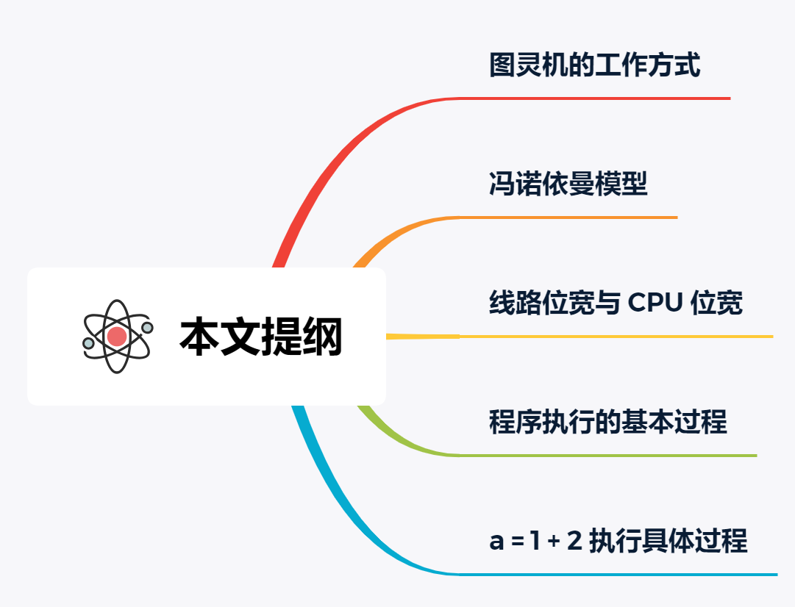

#### 1.1.1 图灵机的工作方式

要想知道程序执行的原理，我们可以先从「图灵机」说起，图灵的基本思想是用机器来模拟人们用纸笔进行数学运算的过程，而且还定义了计算机由哪些部分组成，程序又是如何执行的。

图灵机长什么样子呢？你从下图可以看到图灵机的实际样子：


图灵机的基本组成如下：

- 有一条「纸带」，纸带由一个个连续的格子组成，每个格子可以写入字符，纸带就好比内存，而纸带上的格子的字符就好比内存中的数据或程序；
- 有一个「读写头」，读写头可以读取纸带上任意格子的字符，也可以把字符写入到纸带的格子；
- 读写头上有一些部件，比如存储单元、控制单元以及运算单元：1、存储单元用于存放数据； 2、控制单元用于识别字符是数据还是指令，以及控制程序的流程等；3、运算单元用于执行运算指令；

知道了图灵机的组成后，我们以简单数学运算的 `1 + 2` 作为例子，来看看它是怎么执行这行代码的。

- 首先，用读写头把 「1、2、+」这 3 个字符分别写入到纸带上的 3 个格子，然后读写头先停在 1 字符对应的格子上；

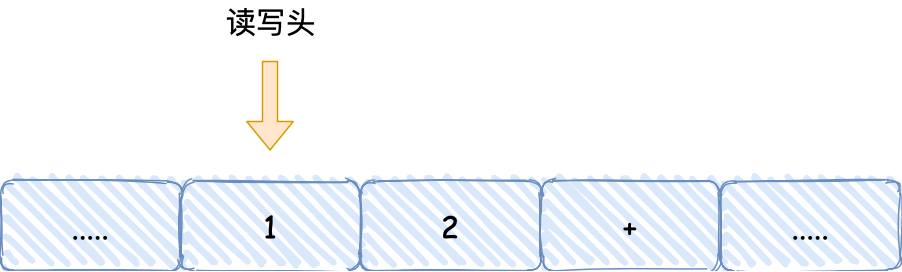

- 接着，读写头读入 1 到存储设备中，这个存储设备称为图灵机的状态；

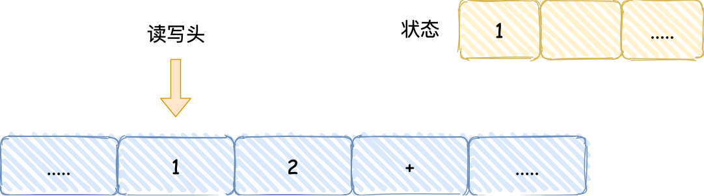

- 然后读写头向右移动一个格，用同样的方式把2读入到图灵机的状态，于是现在图灵机的状态中存储着两个连续的数字，1和2;

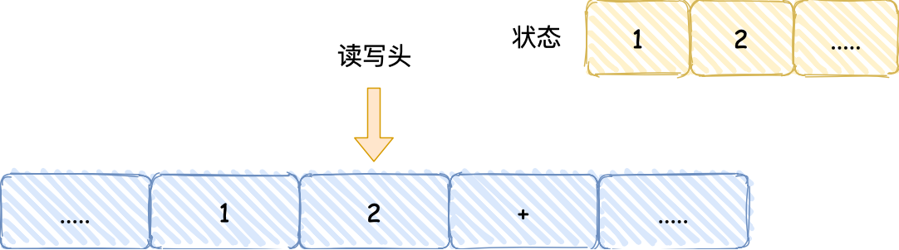

- 读写头再往右移动一个格，就会碰到+号，读写头读到+号后，将+号传输给「控制单元」，控制单元发现是一个+号而不是数字，所以没有存入到状态中，因为+号是运算符指令，作用是加和目前的状态，于是通知「运算单元」工作。运算单元收到要加和状态中的值的通知后，就会把状态中的1和2读入并计算，再将计算的结果3存放到状态中；

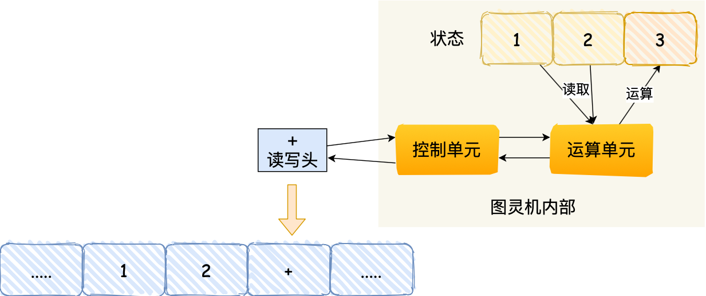

- 最后，运算单元将结果返回给控制单元，控制单元将结果传输给读写头，读写头向右移动，把结果3写入到纸带的格子中；

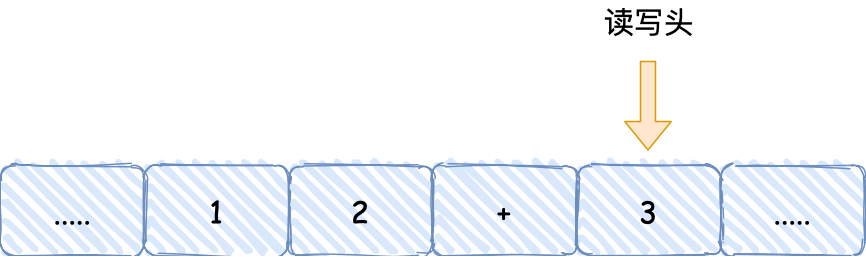

通过上面的图灵机计算1+2的过程，可以发现图灵机主要功能就是读取纸带格子中的内容，然后交给控制单元识别字符是数字还是运算符指令，如果是数字则存入到图灵机状态中，如果是运算符，则通知运算符单元读取状态中的数值进行计算，计算结果最终返回给读写头，读写头把结果写入到纸带的格子中。

事实上，图灵机这个看起来很简单的工作方式，和我们今天的计算机是基本一样的。接下来，我们一同再看看当今计算机的组成以及工作方式。

#### 1.1.2 冯诺依曼模型

在 1945 年冯诺依曼和其他计算机科学家们提出了计算机具体实现的报告，其遵循了图灵机的设计，而且还提出用电子元件构造计算机，并约定了用二进制进行计算和存储。

最重要的是定义计算机基本结构为 5 个部分，分别是**运算器、控制器、存储器、输入设备、输出设备**，这 5 个部分也被称为**冯诺依曼模型**。

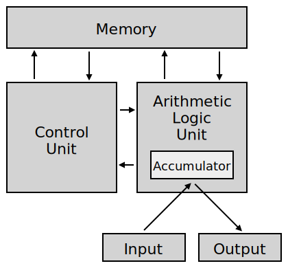

运算器、控制器是在中央处理器里的，存储器就我们常见的内存，输入输出设备则是计算机外接的设备，比如键盘就是输入设备，显示器就是输出设备。

存储单元和输入输出设备要与中央处理器打交道的话，离不开总线。所以，它们之间的关系如下图：

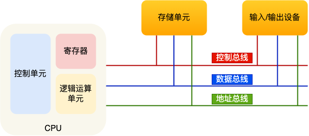

接下来，分别介绍内存、中央处理器、总线、输入输出设备。

#### 1.1.3 内存

我们的程序和数据都是存储在内存，存储的区域是线性的。

在计算机数据存储中，存储数据的基本单位是**字节（*byte*）**，1 字节等于 8 位（8 bit）。每一个字节都对应一个内存地址。

内存的地址是从 0 开始编号的，然后自增排列，最后一个地址为内存总字节数 - 1，这种结构好似我们程序里的数组，所以内存的读写任何一个数据的速度都是一样的。

#### 1.1.4 中央处理器

中央处理器也就是我们常说的 CPU，32 位和 64 位 CPU 最主要区别在于一次能计算多少字节数据：

- 32 位 CPU 一次可以计算 4 个字节；
- 64 位 CPU 一次可以计算 8 个字节；

**这里的 32 位和 64 位，通常称为 CPU 的位宽，代表的是 CPU 一次可以计算（运算）的数据量。**

之所以 CPU 要这样设计，是为了能计算更大的数值，如果是 8 位的 CPU，那么一次只能计算 1 个字节 `0~255` 范围内的数值，这样就无法一次完成计算 `10000 * 500` ，于是为了能一次计算大数的运算，CPU 需要支持多个 byte 一起计算，所以 CPU 位宽越大，可以计算的数值就越大，比如说 32 位 CPU 能计算的最大整数是 `4294967295`。

CPU 内部还有一些组件，常见的有**寄存器、控制单元和逻辑运算单元**等。其中，控制单元负责控制 CPU 工作，逻辑运算单元负责计算，而寄存器可以分为多种类，每种寄存器的功能又不尽相同。

CPU 中的寄存器主要作用是存储计算时的数据，你可能好奇为什么有了内存还需要寄存器？原因很简单，因为内存离 CPU 太远了，而寄存器就在 CPU 里，还紧挨着控制单元和逻辑运算单元，自然计算时速度会很快。

常见的寄存器种类：

- *通用寄存器*，用来存放需要进行运算的数据，比如需要进行加和运算的两个数据。
- *程序计数器*，用来存储 CPU 要执行下一条指令「所在的内存地址」，注意不是存储了下一条要执行的指令，此时指令还在内存中，程序计数器只是存储了下一条指令「的地址」。
- *指令寄存器*，用来存放当前正在执行的指令，也就是指令本身，指令被执行完成之前，指令都存储在这里。

#### 1.1.5 总线

总线是用于 CPU 和内存以及其他设备之间的通信，总线可分为 3 种：

- *地址总线*，用于指定 CPU 将要操作的内存地址；
- *数据总线*，用于读写内存的数据；
- *控制总线*，用于发送和接收信号，比如中断、设备复位等信号，CPU 收到信号后自然进行响应，这时也需要控制总线；

当 CPU 要读写内存数据的时候，一般需要通过下面这三个总线：

- 首先要通过「地址总线」来指定内存的地址；
- 然后通过「控制总线」控制是读或写命令；
- 最后通过「数据总线」来传输数据；

#### 1.1.6 输入、输出设备

输入设备向计算机输入数据，计算机经过计算后，把数据输出给输出设备。期间，如果输入设备是键盘，按下按键时是需要和 CPU 进行交互的，这时就需要用到控制总线了。

#### 1.1.7 线路位宽与 CPU 位宽

数据是如何通过线路传输的呢？其实是通过操作电压，低电压表示 0，高压电压则表示 1。

如果构造了高低高这样的信号，其实就是 101 二进制数据，十进制则表示 5，如果只有一条线路，就意味着每次只能传递 1 bit 的数据，即 0 或 1，那么传输 101 这个数据，就需要 3 次才能传输完成，这样的效率非常低。

这样一位一位传输的方式，称为串行，下一个 bit 必须等待上一个 bit 传输完成才能进行传输。当然，想一次多传一些数据，增加线路即可，这时数据就可以并行传输。

为了避免低效率的串行传输的方式，线路的位宽最好一次就能访问到所有的内存地址。

CPU 想要操作「内存地址」就需要「地址总线」：

- 如果地址总线只有 1 条，那每次只能表示 「0 或 1」这两种地址，所以 CPU 能操作的内存地址最大数量为 2（2^1）个（注意，不要理解成同时能操作 2 个内存地址）；
- 如果地址总线有 2 条，那么能表示 00、01、10、11 这四种地址，所以 CPU 能操作的内存地址最大数量为 4（2^2）个。

那么，想要 CPU 操作 4G 大的内存，那么就需要 32 条地址总线，因为 `2 ^ 32 = 4G`。

知道了线路位宽的意义后，我们再来看看 CPU 位宽。

CPU 的位宽最好不要小于线路位宽，比如 32 位 CPU 控制 40 位宽的地址总线和数据总线的话，工作起来就会非常复杂且麻烦，所以 32 位的 CPU 最好和 32 位宽的线路搭配，因为 32 位 CPU 一次最多只能操作 32 位宽的地址总线和数据总线。

如果用 32 位 CPU 去加和两个 64 位大小的数字，就需要把这 2 个 64 位的数字分成 2 个低位 32 位数字和 2 个高位 32 位数字来计算，先加个两个低位的 32 位数字，算出进位，然后加和两个高位的 32 位数字，最后再加上进位，就能算出结果了，可以发现 32 位 CPU 并不能一次性计算出加和两个 64 位数字的结果。

对于 64 位 CPU 就可以一次性算出加和两个 64 位数字的结果，因为 64 位 CPU 可以一次读入 64 位的数字，并且 64 位 CPU 内部的逻辑运算单元也支持 64 位数字的计算。

但是并不代表 64 位 CPU 性能比 32 位 CPU 高很多，很少应用需要算超过 32 位的数字，所以**如果计算的数额不超过 32 位数字的情况下，32 位和 64 位 CPU 之间没什么区别的，只有当计算超过 32 位数字的情况下，64 位的优势才能体现出来**。

另外，32 位 CPU 最大只能操作 4GB 内存，就算你装了 8 GB 内存条，也没用。而 64 位 CPU 寻址范围则很大，理论最大的寻址空间为 `2^64`。

------

#### 1.1.8 程序执行的基本过程

在前面，我们知道了程序在图灵机的执行过程，接下来我们来看看程序在冯诺依曼模型上是怎么执行的。

程序实际上是一条一条指令，所以程序的运行过程就是把每一条指令一步一步的执行起来，负责执行指令的就是 CPU 了。

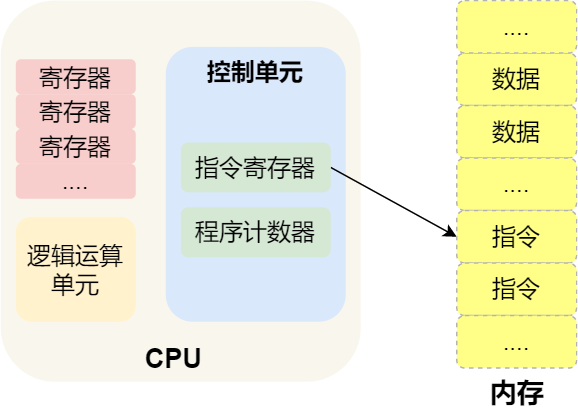

那 CPU 执行程序的过程如下：

- 第一步，CPU 读取「程序计数器」的值，这个值是指令的内存地址，然后 CPU 的「控制单元」操作「地址总线」指定需要访问的内存地址，接着通知内存设备准备数据，数据准备好后通过「数据总线」将指令数据传给 CPU，CPU 收到内存传来的数据后，将这个指令数据存入到「指令寄存器」。
- 第二步，「程序计数器」的值自增，表示指向下一条指令。这个自增的大小，由 CPU 的位宽决定，比如 32 位的 CPU，指令是 4 个字节，需要 4 个内存地址存放，因此「程序计数器」的值会自增 4；
- 第三步，CPU 分析「指令寄存器」中的指令，确定指令的类型和参数，如果是计算类型的指令，就把指令交给「逻辑运算单元」运算；如果是存储类型的指令，则交由「控制单元」执行；

简单总结一下就是，一个程序执行的时候，CPU 会根据程序计数器里的内存地址，从内存里面把需要执行的指令读取到指令寄存器里面执行，然后根据指令长度自增，开始顺序读取下一条指令。

CPU 从程序计数器读取指令、到执行、再到下一条指令，这个过程会不断循环，直到程序执行结束，这个不断循环的过程被称为 **CPU 的指令周期**。

------

#### 1.1.9 a = 1 + 2 执行具体过程

知道了基本的程序执行过程后，接下来用 `a = 1 + 2` 的作为例子，进一步分析该程序在冯诺伊曼模型的执行过程。

CPU 是不认识 `a = 1 + 2` 这个字符串，这些字符串只是方便我们程序员认识，要想这段程序能跑起来，还需要把整个程序翻译成**汇编语言**的程序，这个过程称为编译成汇编代码。

针对汇编代码，我们还需要用汇编器翻译成机器码，这些机器码由 0 和 1 组成的机器语言，这一条条机器码，就是一条条的**计算机指令**，这个才是 CPU 能够真正认识的东西。

下面来看看 `a = 1 + 2` 在 32 位 CPU 的执行过程。

程序编译过程中，编译器通过分析代码，发现 1 和 2 是数据，于是程序运行时，内存会有个专门的区域来存放这些数据，这个区域就是「数据段」。如下图，数据 1 和 2 的区域位置：

- 数据 1 被存放到 0x200 位置；
- 数据 2 被存放到 0x204 位置；

注意，数据和指令是分开区域存放的，存放指令区域的地方称为「正文段」。

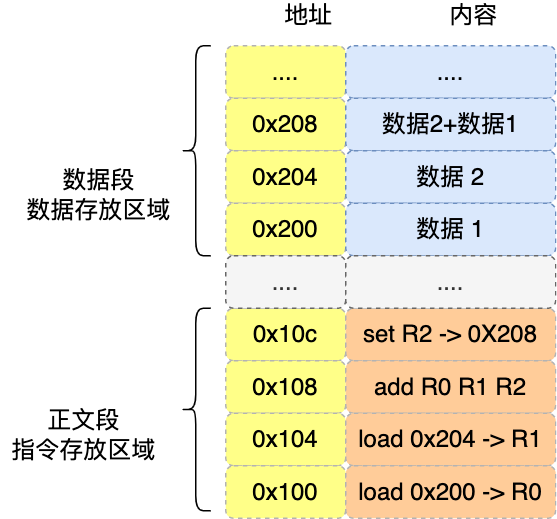

编译器会把 `a = 1 + 2` 翻译成 4 条指令，存放到正文段中。如图，这 4 条指令被存放到了 0x100 ~ 0x10c 的区域中：

- 0x100 的内容是 `load` 指令将 0x200 地址中的数据 1 装入到寄存器 `R0`；
- 0x104 的内容是 `load` 指令将 0x204 地址中的数据 2 装入到寄存器 `R1`；
- 0x108 的内容是 `add` 指令将寄存器 `R0` 和 `R1` 的数据相加，并把结果存放到寄存器 `R2`；
- 0x10c 的内容是 `store` 指令将寄存器 `R2` 中的数据存回数据段中的 0x208 地址中，这个地址也就是变量 `a` 内存中的地址；

编译完成后，具体执行程序的时候，程序计数器会被设置为 0x100 地址，然后依次执行这 4 条指令。

上面的例子中，由于是在 32 位 CPU 执行的，因此一条指令是占 32 位大小，所以你会发现每条指令间隔 4 个字节。

而数据的大小是根据你在程序中指定的变量类型，比如 `int` 类型的数据则占 4 个字节，`char` 类型的数据则占 1 个字节。

##### 指令

上面的例子中，图中指令的内容我写的是简易的汇编代码，目的是为了方便理解指令的具体内容，事实上指令的内容是一串二进制数字的机器码，每条指令都有对应的机器码，CPU 通过解析机器码来知道指令的内容。

不同的 CPU 有不同的指令集，也就是对应着不同的汇编语言和不同的机器码，接下来选用最简单的 MIPS 指集，来看看机器码是如何生成的，这样也能明白二进制的机器码的具体含义。

MIPS 的指令是一个 32 位的整数，高 6 位代表着操作码，表示这条指令是一条什么样的指令，剩下的 26 位不同指令类型所表示的内容也就不相同，主要有三种类型R、I 和 J。

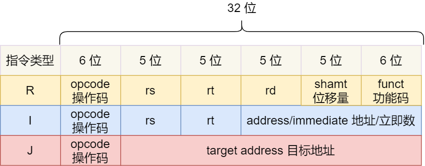

一起具体看看这三种类型的含义：

- *R 指令*，用在算术和逻辑操作，里面有读取和写入数据的寄存器地址。如果是逻辑位移操作，后面还有位移操作的「位移量」，而最后的「功能码」则是再前面的操作码不够的时候，扩展操作码来表示对应的具体指令的；
- *I 指令*，用在数据传输、条件分支等。这个类型的指令，就没有了位移量和功能码，也没有了第三个寄存器，而是把这三部分直接合并成了一个地址值或一个常数；
- *J 指令*，用在跳转，高 6 位之外的 26 位都是一个跳转后的地址；

接下来，我们把前面例子的这条指令：「`add` 指令将寄存器 `R0` 和 `R1` 的数据相加，并把结果放入到 `R2`」，翻译成机器码。

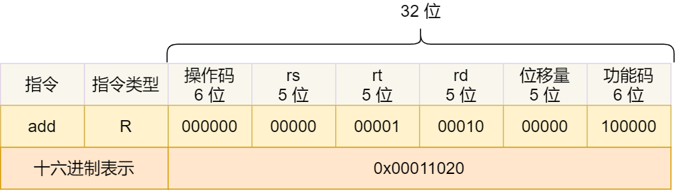

加和运算 add 指令是属于 R 指令类型：

- add 对应的 MIPS 指令里操作码是 `000000`，以及最末尾的功能码是 `100000`，这些数值都是固定的，查一下 MIPS 指令集的手册就能知道的；
- rs 代表第一个寄存器 R0 的编号，即 `00000`；
- rt 代表第二个寄存器 R1 的编号，即 `00001`；
- rd 代表目标的临时寄存器 R2 的编号，即 `00010`；
- 因为不是位移操作，所以位移量是 `00000`

把上面这些数字拼在一起就是一条 32 位的 MIPS 加法指令了，那么用 16 进制表示的机器码则是 `0x00011020`。

编译器在编译程序的时候，会构造指令，这个过程叫做指令的编码。CPU 执行程序的时候，就会解析指令，这个过程叫作指令的解码。

现代大多数 CPU 都使用来流水线的方式来执行指令，所谓的流水线就是把一个任务拆分成多个小任务，于是一条指令通常分为 4 个阶段，称为 4 级流水线，如下图：

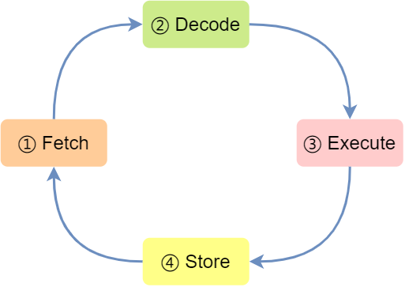

四个阶段的具体含义：

1. CPU 通过程序计数器读取对应内存地址的指令，这个部分称为 **Fetch（取得指令）**；
2. CPU 对指令进行解码，这个部分称为 **Decode（指令译码）**；
3. CPU 执行指令，这个部分称为 **Execution（执行指令）**；
4. CPU 将计算结果存回寄存器或者将寄存器的值存入内存，这个部分称为 **Store（数据回写）**；

上面这 4 个阶段，我们称为**指令周期（\*Instrution Cycle\*）**，CPU 的工作就是一个周期接着一个周期，周而复始。

事实上，不同的阶段其实是由计算机中的不同组件完成的：

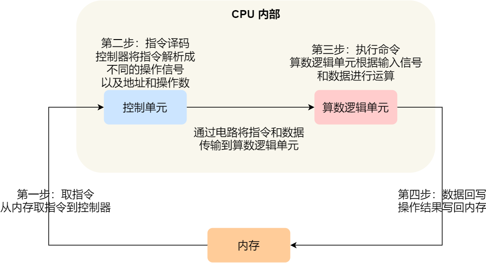

- 取指令的阶段，我们的指令是存放在**存储器**里的，实际上，通过程序计数器和指令寄存器取出指令的过程，是由**控制器**操作的；
- 指令的译码过程，也是由**控制器**进行的；
- 指令执行的过程，无论是进行算术操作、逻辑操作，还是进行数据传输、条件分支操作，都是由**算术逻辑单元**操作的，也就是由**运算器**处理的。但是如果是一个简单的无条件地址跳转，则是直接在**控制器**里面完成的，不需要用到运算器。

##### 指令的类型

指令从功能角度划分，可以分为 5 大类：

- *数据传输类型的指令*，比如 `store/load` 是寄存器与内存间数据传输的指令，`mov` 是将一个内存地址的数据移动到另一个内存地址的指令；
- *运算类型的指令*，比如加减乘除、位运算、比较大小等等，它们最多只能处理两个寄存器中的数据；
- *跳转类型的指令*，通过修改程序计数器的值来达到跳转执行指令的过程，比如编程中常见的 `if-else`、`switch-case`、函数调用等。
- *信号类型的指令*，比如发生中断的指令 `trap`；
- *闲置类型的指令*，比如指令 `nop`，执行后 CPU 会空转一个周期；

##### 指令的执行速度

CPU 的硬件参数都会有 `GHz` 这个参数，比如一个 1 GHz 的 CPU，指的是时钟频率是 1 G，代表着 1 秒会产生 1G 次数的脉冲信号，每一次脉冲信号高低电平的转换就是一个周期，称为时钟周期。

对于 CPU 来说，在一个时钟周期内，CPU 仅能完成一个最基本的动作，时钟频率越高，时钟周期就越短，工作速度也就越快。

一个时钟周期一定能执行完一条指令吗？答案是不一定的，大多数指令不能在一个时钟周期完成，通常需要若干个时钟周期。不同的指令需要的时钟周期是不同的，加法和乘法都对应着一条 CPU 指令，但是乘法需要的时钟周期就要比加法多。

> 如何让程序跑的更快？

程序执行的时候，耗费的 CPU 时间少就说明程序是快的，对于程序的 CPU 执行时间，我们可以拆解成 **CPU 时钟周期数（\*CPU Cycles\*）和时钟周期时间（\*Clock Cycle Time\*）的乘积**。


时钟周期时间就是我们前面提及的 CPU 主频，主频越高说明 CPU 的工作速度就越快，比如我手头上的电脑的 CPU 是 2.4 GHz 四核 Intel Core i5，这里的 2.4 GHz 就是电脑的主频，时钟周期时间就是 1/2.4G。

要想 CPU 跑的更快，自然缩短时钟周期时间，也就是提升 CPU 主频，但是今非彼日，摩尔定律早已失效，当今的 CPU 主频已经很难再做到翻倍的效果了。

另外，换一个更好的 CPU，这个也是我们软件工程师控制不了的事情，我们应该把目光放到另外一个乘法因子 —— CPU 时钟周期数，如果能减少程序所需的 CPU 时钟周期数量，一样也是能提升程序的性能的。

对于 CPU 时钟周期数我们可以进一步拆解成：「**指令数 x 每条指令的平均时钟周期数（\*Cycles Per Instruction\*，简称 `CPI`）**」，于是程序的 CPU 执行时间的公式可变成如下：


因此，要想程序跑的更快，优化这三者即可：

- *指令数*，表示执行程序所需要多少条指令，以及哪些指令。这个层面是基本靠编译器来优化，毕竟同样的代码，在不同的编译器，编译出来的计算机指令会有各种不同的表示方式。
- *每条指令的平均时钟周期数 CPI*，表示一条指令需要多少个时钟周期数，现代大多数 CPU 通过流水线技术（Pipeline），让一条指令需要的 CPU 时钟周期数尽可能的少；
- *时钟周期时间*，表示计算机主频，取决于计算机硬件。有的 CPU 支持超频技术，打开了超频意味着把 CPU 内部的时钟给调快了，于是 CPU 工作速度就变快了，但是也是有代价的，CPU 跑的越快，散热的压力就会越大，CPU 会很容易奔溃。

很多厂商为了跑分而跑分，基本都是在这三个方面入手的哦，特别是超频这一块。

------

#### 1.1.10 总结

最后我们再来回答开头的问题。

> 64 位相比 32 位 CPU 的优势在哪吗？64 位 CPU 的计算性能一定比 32 位 CPU 高很多吗？

64 位相比 32 位 CPU 的优势主要体现在两个方面：

- 64 位 CPU 可以一次计算超过 32 位的数字，而 32 位 CPU 如果要计算超过 32 位的数字，要分多步骤进行计算，效率就没那么高，但是大部分应用程序很少会计算那么大的数字，所以**只有运算大数字的时候，64 位 CPU 的优势才能体现出来，否则和 32 位 CPU 的计算性能相差不大**。
- 通常来说 64 位 CPU 的地址总线是 48 位，而 32 位 CPU 的地址总线是 32 位，所以 64 位 CPU 可以**寻址更大的物理内存空间**。如果一个 32 位 CPU 的地址总线是 32 位，那么该 CPU 最大寻址能力是 4G，即使你加了 8G 大小的物理内存，也还是只能寻址到 4G 大小的地址，而如果一个 64 位 CPU 的地址总线是 48 位，那么该 CPU 最大寻址能力是 `2^48`，远超于 32 位 CPU 最大寻址能力。

> 你知道软件的 32 位和 64 位之间的区别吗？再来 32 位的操作系统可以运行在 64 位的电脑上吗？64 位的操作系统可以运行在 32 位的电脑上吗？如果不行，原因是什么？

64 位和 32 位软件，实际上代表指令是 64 位还是 32 位的：

- 如果 32 位指令在 64 位机器上执行，需要一套兼容机制，就可以做到兼容运行了。但是**如果 64 位指令在 32 位机器上执行，就比较困难了，因为 32 位的寄存器存不下 64 位的指令**；
- 操作系统其实也是一种程序，我们也会看到操作系统会分成 32 位操作系统、64 位操作系统，其代表意义就是操作系统中程序的指令是多少位，比如 64 位操作系统，指令也就是 64 位，因此不能装在 32 位机器上。

总之，硬件的 64 位和 32 位指的是 CPU 的位宽，软件的 64 位和 32 位指的是指令的位宽。

### 1.2 磁盘比缓存慢万倍？

大家如果想自己组装电脑的话，肯定需要购买一个 CPU，但是存储器方面的设备，分类比较多，那我们肯定不能只买一种存储器，比如你除了要买内存，还要买硬盘，而针对硬盘我们还可以选择是固态硬盘还是机械硬盘。

相信大家都知道内存和硬盘都属于计算机的存储设备，断电后内存的数据是会丢失的，而硬盘则不会，因为硬盘是持久化存储设备，同时也是一个 I/O 设备。

但其实 CPU 内部也有存储数据的组件，这个应该比较少人注意到，比如**寄存器、CPU L1/L2/L3 Cache** 也都是属于存储设备，只不过它们能存储的数据非常小，但是它们因为靠近 CPU 核心，所以访问速度都非常快，快过硬盘好几个数量级别。

问题来了，**那机械硬盘、固态硬盘、内存这三个存储器，到底和 CPU L1 Cache 相比速度差多少倍呢？**

在回答这个问题之前，我们先来看看「**存储器的层次结构**」，好让我们对存储器设备有一个整体的认识。

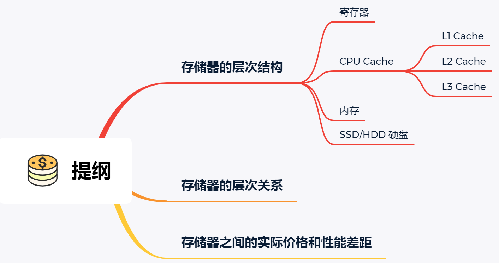

------

#### 1.2.1 存储器的层次结构

我们想象中一个场景，大学期末准备考试了，你前去图书馆临时抱佛脚。那么，在看书的时候，我们的大脑会思考问题，也会记忆知识点，另外我们通常也会把常用的书放在自己的桌子上，当我们要找一本不常用的书，则会去图书馆的书架找。

就是这么一个小小的场景，已经把计算机的存储结构基本都涵盖了。

我们可以把 CPU 比喻成我们的大脑，大脑正在思考的东西，就好比 CPU 中的**寄存器**，处理速度是最快的，但是能存储的数据也是最少的，毕竟我们也不能一下同时思考太多的事情，除非你练过。

我们大脑中的记忆，就好比 **CPU Cache**，中文称为 CPU 高速缓存，处理速度相比寄存器慢了一点，但是能存储的数据也稍微多了一些。

CPU Cache 通常会分为 **L1、L2、L3 三层**，其中 L1 Cache 通常分成「数据缓存」和「指令缓存」，L1 是距离 CPU 最近的，因此它比 L2、L3 的读写速度都快、存储空间都小。我们大脑中短期记忆，就好比 L1 Cache，而长期记忆就好比 L2/L3 Cache。

寄存器和 CPU Cache 都是在 CPU 内部，跟 CPU 挨着很近，因此它们的读写速度都相当的快，但是能存储的数据很少，毕竟 CPU 就这么丁点大。

知道 CPU 内部的存储器的层次分布，我们放眼看看 CPU 外部的存储器。

当我们大脑记忆中没有资料的时候，可以从书桌或书架上拿书来阅读，那我们桌子上的书，就好比**内存**，我们虽然可以一伸手就可以拿到，但读写速度肯定远慢于寄存器，那图书馆书架上的书，就好比**硬盘**，能存储的数据非常大，但是读写速度相比内存差好几个数量级，更别说跟寄存器的差距了。

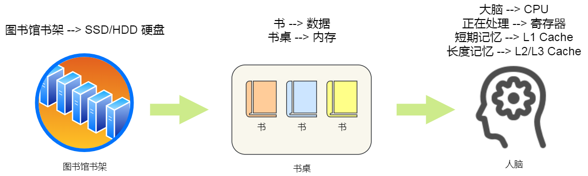

我们从图书馆书架取书，把书放到桌子上，再阅读书，我们大脑就会记忆知识点，然后再经过大脑思考，这一系列过程相当于，数据从硬盘加载到内存，再从内存加载到 CPU 的寄存器和 Cache 中，然后再通过 CPU 进行处理和计算。

**对于存储器，它的速度越快、能耗会越高、而且材料的成本也是越贵的，以至于速度快的存储器的容量都比较小。**

CPU 里的寄存器和 Cache，是整个计算机存储器中价格最贵的，虽然存储空间很小，但是读写速度是极快的，而相对比较便宜的内存和硬盘，速度肯定比不上 CPU 内部的存储器，但是能弥补存储空间的不足。

存储器通常可以分为这么几个级别：

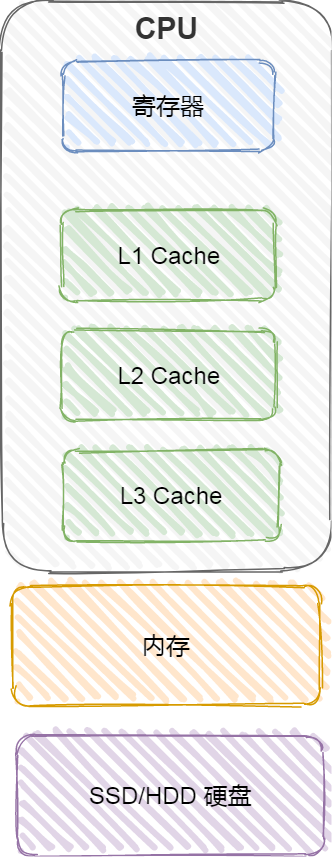

- 寄存器；
- CPU Cache；
  1. L1-Cache；
  2. L2-Cache；
  3. L3-Cahce；
- 内存；
- SSD/HDD 硬盘

##### 寄存器

最靠近 CPU 的控制单元和逻辑计算单元的存储器，就是寄存器了，它使用的材料速度也是最快的，因此价格也是最贵的，那么数量不能很多。

寄存器的数量通常在几十到几百之间，每个寄存器可以用来存储一定的字节（byte）的数据。比如：

- 32 位 CPU 中大多数寄存器可以存储 `4` 个字节；
- 64 位 CPU 中大多数寄存器可以存储 `8` 个字节。

寄存器的访问速度非常快，一般要求在半个 CPU 时钟周期内完成读写，CPU 时钟周期跟 CPU 主频息息相关，比如 2 GHz 主频的 CPU，那么它的时钟周期就是 1/2G，也就是 0.5ns（纳秒）。

CPU 处理一条指令的时候，除了读写寄存器，还需要解码指令、控制指令执行和计算。如果寄存器的速度太慢，则会拉长指令的处理周期，从而给用户的感觉，就是电脑「很慢」。

##### CPU Cache

CPU Cache 用的是一种叫 **SRAM（\*Static Random-Access\* Memory，静态随机存储器）** 的芯片。

SRAM 之所以叫「静态」存储器，是因为只要有电，数据就可以保持存在，而一旦断电，数据就会丢失了。

在 SRAM 里面，一个 bit 的数据，通常需要 6 个晶体管，所以 SRAM 的存储密度不高，同样的物理空间下，能存储的数据是有限的，不过也因为 SRAM 的电路简单，所以访问速度非常快。

CPU 的高速缓存，通常可以分为 L1、L2、L3 这样的三层高速缓存，也称为一级缓存、二级缓存、三级缓存。

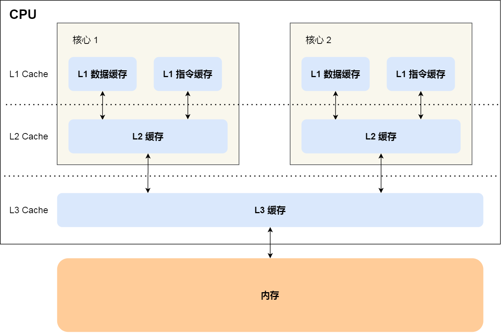

###### L1 高速缓存

L1 高速缓存的访问速度几乎和寄存器一样快，通常只需要 `2~4` 个时钟周期，而大小在几十 KB 到几百 KB 不等。

每个 CPU 核心都有一块属于自己的 L1 高速缓存，指令和数据在 L1 是分开存放的，所以 L1 高速缓存通常分成**指令缓存**和**数据缓存**。

在 Linux 系统，我们可以通过这条命令，查看 CPU 里的 L1 Cache 「数据」缓存的容量大小：

```bash
$ cat /sys/devices/system/cpu/cpu0/cache/index0/size
32K
```

而查看 L1 Cache 「指令」缓存的容量大小，则是：

```bash
$ cat /sys/devices/system/cpu/cpu0/cache/index1/size
32K
```

###### L2 高速缓存

L2 高速缓存同样每个 CPU 核心都有，但是 L2 高速缓存位置比 L1 高速缓存距离 CPU 核心 更远，它大小比 L1 高速缓存更大，CPU 型号不同大小也就不同，通常大小在几百 KB 到几 MB 不等，访问速度则更慢，速度在 `10~20` 个时钟周期。

在 Linux 系统，我们可以通过这条命令，查看 CPU 里的 L2 Cache 的容量大小：

```bash
$ cat /sys/devices/system/cpu/cpu0/cache/index2/size
256K
```

###### L3 高速缓存

L3 高速缓存通常是多个 CPU 核心共用的，位置比 L2 高速缓存距离 CPU 核心 更远，大小也会更大些，通常大小在几 MB 到几十 MB 不等，具体值根据 CPU 型号而定。

访问速度相对也比较慢一些，访问速度在 `20~60`个时钟周期。

在 Linux 系统，我们可以通过这条命令，查看 CPU 里的 L3 Cache 的容量大小：

```bash
$ cat /sys/devices/system/cpu/cpu0/cache/index3/size 
3072K
```

##### 内存

内存用的芯片和 CPU Cache 有所不同，它使用的是一种叫作 **DRAM （\*Dynamic Random Access Memory\*，动态随机存取存储器）** 的芯片。

相比 SRAM，DRAM 的密度更高，功耗更低，有更大的容量，而且造价比 SRAM 芯片便宜很多。

DRAM 存储一个 bit 数据，只需要一个晶体管和一个电容就能存储，但是因为数据会被存储在电容里，电容会不断漏电，所以需要「定时刷新」电容，才能保证数据不会被丢失，这就是 DRAM 之所以被称为「动态」存储器的原因，只有不断刷新，数据才能被存储起来。

DRAM 的数据访问电路和刷新电路都比 SRAM 更复杂，所以访问的速度会更慢，内存速度大概在 `200~300` 个 时钟周期之间。

##### SSD/HDD 硬盘

SSD（*Solid-state disk*） 就是我们常说的固体硬盘，结构和内存类似，但是它相比内存的优点是断电后数据还是存在的，而内存、寄存器、高速缓存断电后数据都会丢失。内存的读写速度比 SSD 大概快 `10~1000` 倍。

当然，还有一款传统的硬盘，也就是机械硬盘（*Hard Disk Drive, HDD*），它是通过物理读写的方式来访问数据的，因此它访问速度是非常慢的，它的速度比内存慢 `10W` 倍左右。

由于 SSD 的价格快接近机械硬盘了，因此机械硬盘已经逐渐被 SSD 替代了。

------

#### 1.2.2 存储器的层次关系

现代的一台计算机，都用上了 CPU Cahce、内存、到 SSD 或 HDD 硬盘这些存储器设备了。

其中，存储空间越大的存储器设备，其访问速度越慢，所需成本也相对越少。

CPU 并不会直接和每一种存储器设备直接打交道，而是每一种存储器设备只和它相邻的存储器设备打交道。

比如，CPU Cache 的数据是从内存加载过来的，写回数据的时候也只写回到内存，CPU Cache 不会直接把数据写到硬盘，也不会直接从硬盘加载数据，而是先加载到内存，再从内存加载到 CPU Cache 中。

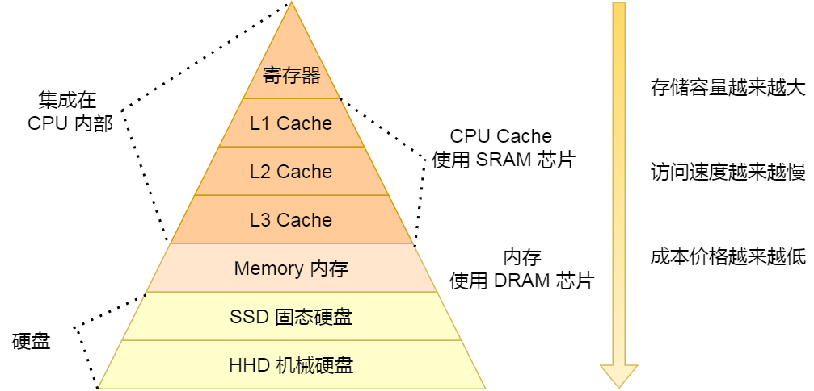

所以，**每个存储器只和相邻的一层存储器设备打交道，并且存储设备为了追求更快的速度，所需的材料成本必然也是更高，也正因为成本太高，所以 CPU 内部的寄存器、L1\L2\L3 Cache 只好用较小的容量，相反内存、硬盘则可用更大的容量，这就我们今天所说的存储器层次结构**。

另外，当 CPU 需要访问内存中某个数据的时候，如果寄存器有这个数据，CPU 就直接从寄存器取数据即可，如果寄存器没有这个数据，CPU 就会查询 L1 高速缓存，如果 L1 没有，则查询 L2 高速缓存，L2 还是没有的话就查询 L3 高速缓存，L3 依然没有的话，才去内存中取数据。

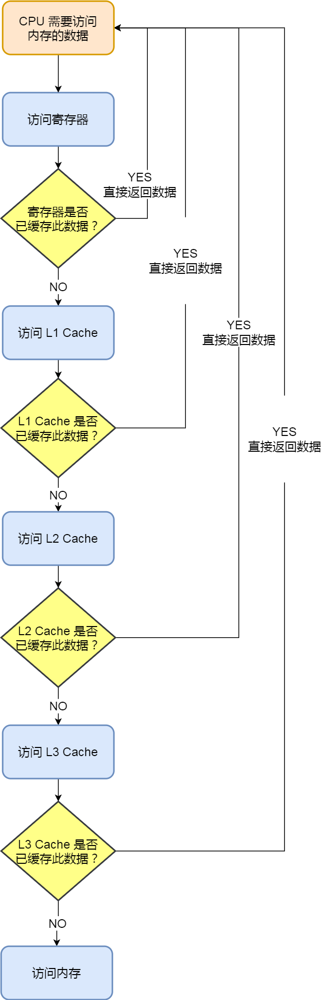

所以，存储层次结构也形成了**缓存**的体系。

------

#### 1.2.3 存储器之间的实际价格和性能差距

前面我们知道了，速度越快的存储器，造价成本往往也越高，那我们就以实际的数据来看看，不同层级的存储器之间的性能和价格差异。

下面这张表格是不同层级的存储器之间的成本对比图：

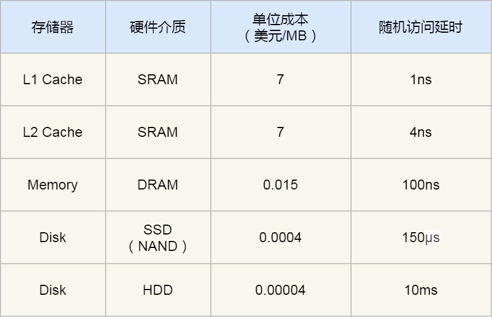

你可以看到 L1 Cache 的访问延时是 1 纳秒，而内存已经是 100 纳秒了，相比 L1 Cache 速度慢了 `100` 倍。另外，机械硬盘的访问延时更是高达 10 毫秒，相比 L1 Cache 速度慢了 `10000000` 倍，差了好几个数量级别。

在价格上，每生成 MB 大小的 L1 Cache 相比内存贵了 `466` 倍，相比机械硬盘那更是贵了 `175000` 倍。

我在某东逛了下各个存储器设备的零售价，8G 内存 + 1T 机械硬盘 + 256G 固态硬盘的总价格，都不及一块 Intle i5-10400 的 CPU 的价格，这款 CPU 的高速缓存的总大小也就十多 MB。

------

#### 1.2.4 总结

各种存储器之间的关系，可以用我们在图书馆学习这个场景来理解。

CPU 可以比喻成我们的大脑，我们当前正在思考和处理的知识的过程，就好比 CPU 中的**寄存器**处理数据的过程，速度极快，但是容量很小。而 CPU 中的 **L1-L3 Cache** 好比我们大脑中的短期记忆和长期记忆，需要小小花费点时间来调取数据并处理。

我们面前的桌子就相当于**内存**，能放下更多的书（数据），但是找起来和看起来就要花费一些时间，相比 CPU Cache 慢不少。而图书馆的书架相当于**硬盘**，能放下比内存更多的数据，但找起来就更费时间了，可以说是最慢的存储器设备了。

从 寄存器、CPU Cache，到内存、硬盘，这样一层层下来的存储器，访问速度越来越慢，存储容量越来越大，价格也越来越便宜，而且每个存储器只和相邻的一层存储器设备打交道，于是这样就形成了存储器的层次结构。

再来回答，开头的问题：那机械硬盘、固态硬盘、内存这三个存储器，到底和 `CPU L1 Cache` 相比速度差多少倍呢？

CPU L1 Cache 随机访问延时是 1 纳秒，内存则是 100 纳秒，所以 **CPU L1 Cache 比内存快 `100` 倍左右**。

SSD 随机访问延时是 150 微秒，所以 **CPU L1 Cache 比 SSD 快 `150000` 倍左右**。

最慢的机械硬盘随机访问延时已经高达 10 毫秒，我们来看看机械硬盘到底有多「龟速」：

- **SSD 比机械硬盘快 70 倍左右；**
- **内存比机械硬盘快 100000 倍左右；**
- **CPU L1 Cache 比机械硬盘快 10000000 倍左右；**

我们把上述的时间比例差异放大后，就能非常直观感受到它们的性能差异了。如果 CPU 访问 L1 Cache 的缓存时间是 1 秒，那访问内存则需要大约 2 分钟，随机访问 SSD 里的数据则需要 1.7 天，访问机械硬盘那更久，长达近 4 个月。

可以发现，不同的存储器之间性能差距很大，构造存储器分级很有意义，分级的目的是要构造**缓存**体系。

### 1.3 如何写出让CPU跑得更快得代码？

### 1.4 CPU 缓存一致性

### 1.5 CPU 是如何执行任务得？

### 1.6 什么是软中断

### 1.7 为什么0.1+0.2不等于0.3？

## 2、操作系统结构

### 2.1 Linux内核 vs Windows内核

## 3、内存管理

### 3.1 为什么要虚拟内存？

### 3.2 malloc是如何分配内存的？

### 3.3 内存满了，会发生什么？

### 3.4 在4GB物理内存的机器上，申请8G内存会这么样？

### 3.5 如何避免预读失效和缓存污染的问题？

### 3.6 深入理解Linux虚拟内存管理

### 3.7 深入理解Linux物理内存管理

## 4、进程管理

### 4.1 进程、线程基础知识

### 4.2 进程间有哪些通信方式？

### 4.3 多线程冲突了怎么办？

### 4.4 如何避免死锁？

### 4.5 什么是悲观锁、乐观锁？

### 4.6 一个进程最多可以创建多少个线程？

### 4.7 线程崩溃了，进程也会崩溃吗？

## 5、调度算法

### 5.1 进程调度/页面置换/磁盘调度算法

## 6、文件系统

### 6.1 文件系统全家桶

### 6.2 进程写文件时，进程发生了崩溃，已写入的数据会丢失吗？

## 7、设备管理

### 7.1 键盘敲入字母A时，操作系统期间发送了什么？

## 8、网络系统

### 8.1 什么是零拷贝？

### 8.2 I/O多路复用：select/poll/epoll

### 8.3 高性能网络模型：Reactor和Proactor

### 8.4 什么是一致性哈希？

## 9、Linxu命令

### 9.1 如何查看网络的性能指标

### 9.2 如何从日志分析PV、UV?