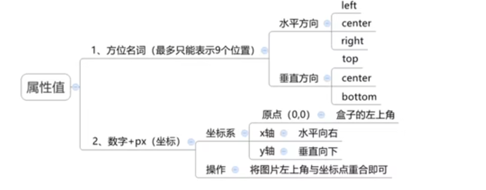
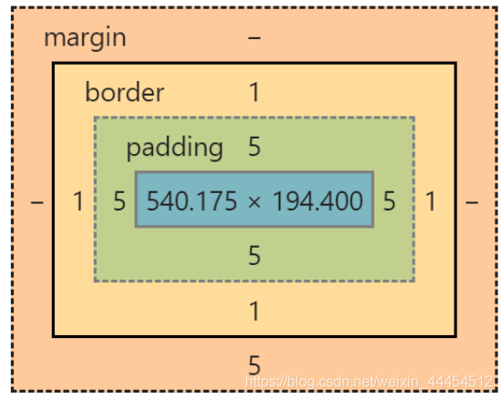
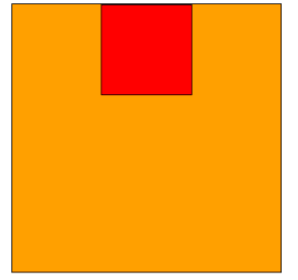
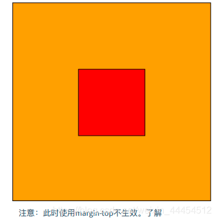
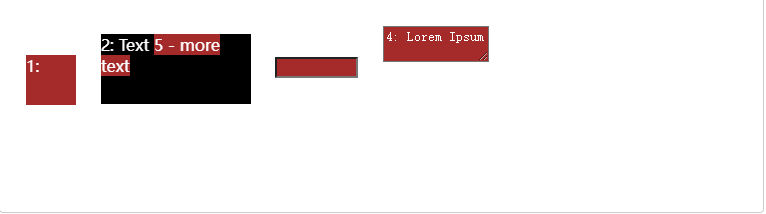

# Css

## 1、什么是CSS

CSS（英⽂全称：Cascading Style Sheets）层叠样式表, 是⼀种⽤来表现HTML（标准通⽤标记语⾔的⼀个应⽤）或XML（标准通⽤标记语⾔的⼀个⼦集）等⽂件样式的计算机语⾔。

CSS⽬前最新版本为CSS3，是能够真正做到⽹⻚表现与内容分离的⼀种样式设计语⾔。相对于传统HTML的表现⽽⾔，CSS能够对⽹⻚中的对象的位置排版进⾏像素级的精确控制，⽀持⼏乎所有的字体字号样式，拥有对⽹⻚对象和模型样式编辑的能⼒，并能够进⾏初步交互设计，是⽬前基于⽂本展示最优秀的表现设计语⾔。CSS能够根据不同使⽤者的理解能⼒，简化或者优化写法，针对各类⼈群，有较强的易读性。

==CSS是⽤来美化⽹⻚⽤的，没有⽹⻚则CSS毫⽆⽤处，所以CSS需要依赖HTML展示其功能。==

## 2、CSS语法 

CSS 样式由==选择器==和⼀条或多条以分号隔开的==样式声明==组成。每条声明的样式包含着⼀个 ==CSS属性和属性值==。

```css
选择器名 {
 属性 : 属性值;
 ......
}
/* 如下 */
div {
 background-color : red;
}
/*注意：
css声明要以分号;结束，声明以{}括起来
建议⼀⾏书写⼀个属性
若值为若⼲单词，则要给值加引号，如 font-family: “agency fb”;
*/
```

## 3、CSS使用规则

### 1、⾏内式

⾏内样式将样式定义在具体html元素的style属性中。以⾏内式写的CSS耦合度⾼，只适⽤于当前元素，在设定某个元素的样式时⽐较常⽤。

```css
<p style="color:red;font-size:50px;">这是⼀段⽂本</p>
```

在当前元素使⽤ style 属性的声明⽅式。

style 是⾏内样式属性；

color 是颜⾊属性；red 是颜⾊属性值；

font-size是字体⼤⼩属性；50px 是字体⼤⼩属性值

### 2、嵌⼊式

嵌⼊式通过在html⻚⾯**内容开辟⼀段属于css的代码区域**，通常做法为在 head 标签中**嵌套 style标签**，在 style 中**通过选择器的⽅式调⽤指定的元素并设置相关 CSS**。

```css
<head>
    <meta charset="UTF-8">
    <title>Title</title>
    <style>
        div {
            border: 1px solid black;
            width: 100px;
            height: 100px;
            background-color: lightgreen;
            margin-top: 5px;
        }
    </style>
</head>
<body>
    <div style="border: 1px solid black;width: 100px; height: 100px;">&nbsp;</div>
    <div ></div>
    <div ></div>
    <div ></div>
</body>
```

### 3、引⼊外联样式⽂件

在实际开发当中，很多时候都使⽤引⼊外联样式⽂件，这种形式可以使html⻚⾯更加清晰，⽽且可以达到更好的重⽤效果。
如有一个文件style.css内容如下：

```css
p {
 color: green;
 font-size: 30px;
}
```

就可以在要使用这个CSS文件的HTML的head标签内加入

```html
<link rel="stylesheet" type="text/css" href="style.css">
<!--
rel:rel 属性规定当前⽂档与被链接⽂档之间的关系。
stylesheet:⽂档的外部样式表。
很多时候，⼤量的 HTML ⻚⾯使⽤了同⼀个CSS。那么就可以将这些 CSS 样式保存在⼀个单独的.css ⽂件中，然后通过 link 元素去引⼊它。
-->
```

**注意：当有多重样式时，记住前提规则，越精确越优先。**

## 4 CSS选择器&高级选择器

在 CSS 中，选择器是⼀种模式，⽤于选择需要添加样式的元素。CSS选择器有很多，掌握常⽤的即可；

### 1、通⽤选择器

选择所有 *，即html中所有元素都会实现css中的属性设置。

```css
* {
 ......
}

* {
 color: orange;
}
```

### 2、标签选择器

选择指定标签，通过标签为名字的选择器，==选中所有的相同的标签==

```css
元素名称 {
 ......
}

p {
 color: red;
 font-size: 20px;
}
```

### 3、id选择器

选择设置过指定id属性值的元素 #，通过标签的id值来进行属性设置，**主要用于配合js找标签使用**

```css
#id属性值 {
 ......
}

#one {
    font-size: 20px;
    background-color: lightgreen;
}

```

在html中代码如下

```html
<p id="one">Hello, this is a p tag.</p>
<p>Hello, this is a p tag.</p>
```

==注意：每个标签都有id，但是唯一即只能有一个值，且一个id选择器选中后就不能选择其他的标签了，因为id选择器本身不是用来做美化工作的而是配合js使用的。==

### 4、类选择器

选择设置过指定class属性值的元素 ，和id选择器相似。

```css
.class属性值 {
 ......
}

.two {
    border: 1px solid black;
    width: 100px;
    height: 100px;
    background-color: yellow;
    margin-top: 5px;
}


```

在html中代码如下

```html
<div class="two">&nbsp;</div>
<div class="two">&nbsp;</div>
<div class="two">&nbsp;</div>
```

==注意：一个标签可以被多个类选择器选择，而一个类选择器也可以选择多个标签==

### 5、分组选择器

当⼏个元素样式属性⼀样时，可以共同调⽤⼀个声明，元素之间⽤逗号分隔

```css
选择器1,选择器2,... {
 ......
}

h2 , #pre1 {
 color: orange;
 font-style: italic;
}
/*CSS样式的优先级，是根据选择器的精确度/权重来决定的，常⻅的权重如下，权重越⼤，优先级越⾼
元素选择器：1
类选择器：10
id选择器：100
内联样式：1000*/
```

### 6、后代选择器

作用：根据HMTL标签的嵌套关系，选择父元素后代中满足条件的元素

语法：==选择器1 选择器2{css}==

特点：在选择器1所找到标签的后代(儿子、孙子、重孙子..）中，找到满足选择器2的标签，设置样式

解释：**标签后代就是在一个标签中嵌套另一个标签。**

注意：选择器1和选择器2可以是类选择器、标签选择器等

代码如下:

html

 ```html
<p>这是一个p标签</p>
<div>
    <p>
        这是div的儿子标签
    </p>
</div>
 ```

css

```css
div p{
    color:red;
}
```

### 7、子代选择器

作用:根据HTML标签的嵌套关系，选择父元素子代中满足条件的元素

语法：选择器1>选择器2{css}

特点：在选择器1所找到标签的子代(儿子)中，找到满足选择器2的标签，设置样式

区别后代选择器：==子代选择器只能选择子代（儿子）==

html代码如下：

```html
 <div class="one">
        <a href="#">这是儿子</a>
        <p>这是儿子
            <a href="#">这是孙子
            </a>
        </p>
    </div>
```

css代码如下：

```css
.one>a{
            color: red;
            text-decoration:none;
        }
```

### 8、并集选择器

作用:同时选择多组标签，设置相同的样式

语法：选择器1 ，选择器2{ css }

==特点：找到选择器1和选择器2选中的标签，设置样式==

代码省略

### 9、交集选择器

作用:选中页面中同时满足多个选择器的标签

语法:选择器1选择器2{ css }（==中间什么都没有==）

特点： (既又原则）找到页面中既能被选择器1选中，又能被选择器2选中的标签，设置样式

代码省略

### 10、hover伪类选择器

作用:选中鼠标悬停在元素上的状态，设置样式

语法：选择器：hover{css}

特点：==鼠标悬停时就会出现样式==

代码省略

### 11、结构伪类选择器E:nth-child(n)、E:nth-of-type(n)

目标：能够使用结构伪类选择器在HTML中定位元素

作用与优势：

1作用:根据元素在HTML中的结构关系查找元素

2 优势:减少对于HTML中类的依赖，有利于保持代码整洁

3场景:常用于查找某父级选择器中的子元素

**:nth-child选择器**

**描述：选择父元素下的第n个子元素，并且这第n个子元素的类型为E,**

| 选择器                | 说明                                     |
| --------------------- | ---------------------------------------- |
| E:first-child{}       | 匹配父元素的第一个子元素，并且是E元素    |
| E:last-child{}        | 匹配父元素中最后一个子元素，并且是E元素  |
| E:nth-child(){}       | 匹配父元素中第n个子元素，并且是E元素     |
| E:nth-last-child(n){} | 匹配父元素中倒数第n个子元素，并且是E元素 |

**:nth-of-type选择器**

描述：选择父元素中的E类型的元素，且是第n个。

用法与:nth-child相似

==区别：E:nth-of-type(n) 是先去找到父元素中子元素类型为E的，然后把它们单独拿出来进行排序，顺着数数为n的那个子元素就是我们筛选出来的,对子子元素也是一样的操作。而E:nth-child(n)是现在再到第n个元素然后再判断是否是E型，不是就再子子元素找最后找完；==

### 12、伪元素选择器

伪元素：一般页面中的非主体内容可以使用伪元素，即并没有在html中写出的标签而是通过css写出的标签。

区别：

元素：HTML设置的标签

伪元素：有CSS模拟出来的标签效果

种类

|  伪元素  |              作用              |
| :------: | :----------------------------: |
| ::before | 在元素内容的前面添加一个伪元素 |
| ::after  | 在元素内容的后面添加一个伪元素 |

==注意点:必须设置content属性才能生效，伪元素默认是行内元素==

## 5 CSS属性

### 1、背景

**背景颜⾊：background-color**

作用：设置元素的背景颜⾊

```css
background-color:red;
```

**背景图片：background-image**

属性值：background-image：url('图片路径'）;

作用：设置元素的背景图像，默认情况下，背景图像进⾏平铺重复显示，以覆盖整个元素实体。

```css
background-image:url('paper.gif');
```

**背景平铺：background-repeat**

属性值：repeat(平铺)、no-repeat(不平铺)、repeat-x(沿着x轴平铺)、repeat-y(沿着y轴平铺)

作用：设置背景图的平铺问题

**背景图位置：background-position**

属性值：background-position：水平位置 竖着位置



作用：设置背景图的位置

背景图与img的区别

img：不能设置位置一般用于放重要的图片

背景图：可以设置图片的位置一般用于放不重要的图

**背景图覆盖：background-size**

属性值：auto（背景图不变）、contain（背景按比例改变）、’length‘（使用特定的长度来设置背景图大小）、‘percentage’（使用百分比来设置背景图尺寸）、cover（背景图按比例改变）

contain和cover的区别是：contain==背景图片不会超出背景区域==。如果背景区域的宽高比与背景图片的宽高比不同，背景图片可能会在水平或垂直方向上留有空白。cover背景图片将被调整大小以填充整个背景区域，并保持其宽高比例不变。==背景图片可能会被裁剪，以确保它覆盖整个背景区域，同时保持其纵横比==。

### 2、文本

**文本颜色：color**

作用：设置文字的颜色

```css
color:blue;
color:#00ff00;
color:rgb(255,0,0);
```

**文本对齐：text-align**

作用：设置⽂本对⻬⽅式，center（居中），left（左对⻬），right（右对⻬）, justify(两端对齐)

```css
text-align:center;
text-align:right;
text-align:right;
```

注意：值 可以使⽂本的两端都对⻬。在两端对⻬⽂本中，⽂本⾏的左右两端都放在⽗元素的内边界上。然后，调整单词和字⺟间的间隔，使各⾏的⻓度恰好相等。对最后⼀⾏不⽣效。

**文本修饰：text-decoration**

作用：规定添加到⽂本的修饰，属性值：none、underline、overline、line-through

解释：

1）underline
对⽂本添加下划线，与HTML的u元素相同。

2）overline
对⽂本添加上划线。

3）line-through
对⽂本添加中划线，与HTML中的s和 strike 元素相同。

4）none
关闭原本应⽤到元素上的所有装饰。

```css
text-decoration:underline;
```

**文本缩进：text-indent**

作用：设置⽂本⾸⾏缩进，属性值为：px（像素）、em（相对值）

```css
text-indent: 2em;
```

==注意：em⼀个相对值，一个em值就是文本中一个字的大小==

**文本行高：line-height**

作用：设置文本行与行之间的间距，属性值：px、倍数（当前font-size的倍数）

```css
line-height:10px;
line-height:1.5;
```

### 3、字体

**字体样式：font-family**

作用：⽂本字体，该属性设置⽂本的字体。

==注意：font-family属性应该设置⼏个字体名称作为⼀种"后备"机制，如果浏览器不⽀持第⼀种字体，他将尝试下⼀种字体，所以尽量将不常⻅的字体靠前，将最常⻅的字体放置在最后，作为替补。==

```css
font-family: "arial black";
/* 靠前的字体先⽣效 */
font-family: 微软雅⿊,⿊体,"agency fb";
```

**字体大小：font-size**

作用：设置字体大小

```css
font-size: 50px; /*字体⼤⼩50px*/
font-size: 25px; /*字体⼤⼩25px*/
```

**字体风格：font-style**

作用：字体⻛格，该属性最常⽤于规定斜体⽂本。 属性值：normal、italic、oblique

说明：

1）normal：⽂本正常显示；

2）italic：⽂本斜体显示；

3）oblique：⽂本倾斜显示，oblique是将⽂字强制倾斜。

注意：⼀般情况下，字体有粗体、斜体、下划线、删除线等诸多属性，但是不是所有字体都具有这些属性，⼀些不常⽤字体可能只有正常体，**若使⽤italic属性则没有效果，所以需要oblique属性强制倾斜**。

```css
font-style:normal;
font-style:italic;
```

**字体粗细：font-weight**

作用：字体加粗或变细，该属性设置⽂本的粗细。属性值：bold（加粗）、100 ~ 900（为字体指定了 9 级加粗度。如果⼀个字体内置了这些加粗级别，那么这些数字就直接映射到预定义的级别）

```css
font-weight:bold;
```

### 4、display属性

display 属性规定元素应该⽣成的框的类型。这个属性⽤于定义建⽴布局时元素⽣成的显示框类型。

| 属性值       | 描述                                                 |
| ------------ | ---------------------------------------------------- |
| none         | 此元素不会被显示。                                   |
| block        | 此元素将显示为块级元素，此元素前后会带有换行符。     |
| inline       | 默认。此元素会被显示为内联元素，元素前后没有换行符。 |
| inline-block | 行内块元素。(CSS2.1新增的值)                         |
| list-item    | 此元素会作为列表显示。                               |
| flex         | 弹性布局，它能够扩展和收缩 flex 容器内的元素         |

### 5、浮动

float的属性值有none、left、right。

特点

1. 只有横向浮动，并没有纵向浮动。
2. 会将元素的display属性变更为block。
3. 浮动元素的后⼀个元素会围绕着浮动元素（典型运⽤是⽂字围绕图⽚）
4. 浮动元素的前⼀个元素不会受到任何影响（如果你想让两个块状元素并排显示，必须让两个块状元素都应⽤float）。

### 6、盒⼦模型

border、padding、margin三个属性构成了盒⼦模型。



#### border

设置所有的边框属性。宽度、样式、颜⾊

```css
border-width
border-style
border-color
```

#### padding

设置元素所有内边距的宽度，或者设置各边上内边距的宽度。

单独设置各边的内边距：padding-top、padding-left、padding-bottom、padding-right

```css
padding: 1.5cm
padding: 0.5cm 2.5cm 2.5cm 2.5cm
```

注意：通过padding属性设置元素内边距时，会使元素变形。若不想影响格式效果，可以⽤margin属性设置元素外边距。

#### margin

设置⼀个元素所有外边距的宽度，或者设置各边上外边距的宽度。

单独设置各边的外边距：margin-top、margin-left、margin-bottom、margin-right

```css
margin-top:100px;
margin-bottom:100px;
margin-right:50px;
margin-left:50px;
margin: auto auto;
margin: 100px auto;
```

说明：

auto：⾃动，可以理解为居中的意思。浏览器⾃动计算外边距。

margin: auto auto：第⼀个auto表示上下外边距⾃动计算，第⼆个auto表示左右外边距⾃动算。但是上下外边距在⾃动计算时不会⽣效，⽽左右外边距会⽣效，表现为居中状态，效果如下：



若要设置为上下左右居中状态，则要自行计算好上下的外边距，效果如下：



==注意：如果未设置 `width` 属性（或将其设置为 100％），则居中对齐无效。==

### 7、元素显示模式转换

目的：改变元素默认的显示特点，让元素符合布局要求

语法：display：属性值

block：块级

inline-block：行内块级

inline：行内级

flex：弹性盒

弹性盒子特点：弹性盒子可以**批量式**的改变**子元素**的布局！

什么时候使用弹性盒子：

1.当一个盒子里的子元素需要垂直居中一个块的内容

2.当盒子里所有的子元素占用等量的可用宽度/高度时

3.当多列布局中都需要相同的高度(不用理会内容)

## 6 CSS特性

### 1、继承性

特性:子元素有默认继承父元素样式的特点（子承父业)可以继承的常见属性(==文字控制属性都可以继承==)

### 2、层叠性

特性：

1．给同一个标签设置不同的样式→此时样式会层叠叠加→会共同作用在标签上

2．给同一个标签设置相同的样式→此时样式会层叠覆盖→最终写在最后的样式会生效

### 3、优先级

==解释：如果一个标签选择了多个选择器，样式冲突了会按照优先级来选择==

特性：不向选择器具有不同的优先级，优先级高的选择器样式会覆盖优先级低选择器样式

优先级：继承<通配符选择器<标签选择器<类选择器<id选择器<行内样式<!important

## 7 布局方式

### 1、标准流

标准流:又称**文档流**，是浏览器在渲染显示网页内容时默认采用的一套排版规则，规定了应该以何种方式排列元素，即按照标签默认的布局规则布局。

常见标准流排版规则:

1、块级元素:从上往下，**垂直布局**，独占一行

2、行内元素或行内块元素:从左往右，**水平布局**，空间不够自动折行

### 2、浮动布局

 浮动布局：可以让两个元素之间没有间隔的放在一起

float的属性值有none、left、right。

特点：

1、会脱离标准流的控制，在标准流中不占位置

2、浮动元素比标准流高半个级别，可以覆盖标准流中的**元素**

3、浮动找浮动，下一个浮动元素会在上一个浮动元素后面左右浮动

4、浮动元素有特殊的显示效果，一行可以显示多个，可以设置宽高

### 3、弹性布局

弹性布局：对父元素使用属性display：flex把它变成弹性盒子，里面的子元素就会弹性布局，默认让子节点横向排列，通过更改属性来实现对块的不同布局

### 4、定位布局

定位布局：通过使用定位属性来精确控制元素在页面中的位置。通过设置元素的 `position` 属性为 `relative`、`absolute`、`fixed` 或 `sticky`，配合使用 `top`、`bottom`、`left` 和 `right` 属性，可以将元素定位在页面中的特定位置。

**相对定位（Relative Positioning）**：通过设置 `position: relative;`，可以相对于元素在正常文档流中的原来位置进行定位。然后使用 `top`、`bottom`、`left` 和 `right` 属性来进行位置的微调。

**绝对定位（Absolute Positioning）**：通过设置 `position: absolute;`，可以将元素从正常文档流中脱离，并相对于最近的已定位父元素或整个文档进行定位。使用 `top`、`bottom`、`left` 和 `right` 属性来精确定位元素。

**固定定位（Fixed Positioning）**：通过设置 `position: fixed;`，可以将元素相对于浏览器窗口进行定位。无论页面如何滚动，元素都会保持在固定的位置。同样，使用 `top`、`bottom`、`left` 和 `right` 属性来指定元素的位置。

**粘性定位（Sticky Positioning）**：通过设置 `position: sticky;`，可以使元素在滚动到特定位置时变为固定定位，超过该位置后又恢复到相对定位。这使得元素在页面滚动时可以保持在屏幕内的特定位置。使用 `top`、`bottom`、`left` 和 `right` 属性来定义元素在黏性定位过程中的行为。

## 8 自定义属性

**自定义属性**（有时候也被称作**CSS 变量**或者**级联变量**）是由 CSS 作者定义的，它包含的值可以在整个文档中重复使用。由自定义属性标记设定值（比如： **`--main-color: black;`**），由 var()函数来获取值（比如： `color: var(--main-color);`）复杂的网站都会有大量的 CSS 代码，通常也会有许多重复的值。举个例子，同样一个颜色值可能在成千上百个地方被使用到，如果这个值发生了变化，需要全局搜索并且一个一个替换（很麻烦哎～）。自定义属性在某个地方存储一个值，然后在其他许多地方引用它。另一个好处是语义化的标识。比如，`--main-text-color` 会比 `#00ff00` 更易理解，尤其是这个颜色值在其他上下文中也被使用到。自定义属性受级联的约束，并从其父级继承其值。

声明一个自定义属性，属性名需要以==两个减号（`--`）开始==，==属性值则可以是任何有效的 CSS 值==。和其他属性一样，==自定义属性也是写在规则集之内的==，如下：

```css
:root {
  --main-bg-color: brown;
}
```

==注意，规则集所指定的选择器定义了自定义属性的可见作用域。通常的最佳实践是定义在根伪类 **:root** 下，这样就可以在 HTML 文档的任何地方访问到它了==

------

补充：伪类（：root）

**`:root`** 这个 CSS **伪类**匹配文档树的==根元素==。对于 HTML 来说，**`:root`** 表示元素，除了优先级更高之外，与 `html` 选择器相同。

语法：

```css
:root {
  /* ... */
}
```

作用：声明全局CSS变量

在声明全局 CSS 变量时 **`:root`** 会很有用：

```css
:root {
  --main-color: hotpink;
  --pane-padding: 5px 42px;
}
```

------

使用教程：

我们从这个简单的 CSS 代码开始，它将相同的颜色应用在了不同 class 的元素上

```css
.one {
  color: white;
  background-color: brown;
  margin: 10px;
  width: 50px;
  height: 50px;
  display: inline-block;
}

.two {
  color: white;
  background-color: black;
  margin: 10px;
  width: 150px;
  height: 70px;
  display: inline-block;
}
.three {
  color: white;
  background-color: brown;
  margin: 10px;
  width: 75px;
}
.four {
  color: white;
  background-color: brown;
  margin: 10px;
  width: 100px;
}

.five {
  background-color: brown;
}

```

html代码如下：

```html
<div>
  <div class="one">1:</div>
  <div class="two">2: Text <span class="five">5 - more text</span></div>
  <input class="three">
  <textarea class="four">4: Lorem Ipsum</textarea>
</div>
```

效果如下：



注意到其中的元素都用到了相同的样式设置，就可以使用：root中定义的自定义元素

```css
:root {
  --main-bg-color: brown;
}

.one {
  color: white;
  background-color: var(--main-bg-color);
  margin: 10px;
  width: 50px;
  height: 50px;
  display: inline-block;
}

.two {
  color: white;
  background-color: black;
  margin: 10px;
  width: 150px;
  height: 70px;
  display: inline-block;
}
.three {
  color: white;
  background-color: var(--main-bg-color);
  margin: 10px;
  width: 75px;
}
.four {
  color: white;
  background-color: var(--main-bg-color);
  margin: 10px;
  width: 100px;
}

.five {
  background-color: var(--main-bg-color);
}
```


## 9 动画

**CSS animations** 使得可以将从一个 CSS 样式配置转换到另一个 CSS 样式配置。动画包括两个部分：描述动画的样式规则和用于指定动画开始、结束以及中间点样式的关键帧。

创建动画序列，需要使用 `animation`属性或其子属性，该属性允许配置动画时间、时长以及其他动画细节，但该属性不能配置动画的实际表现，动画的实际表现是由 **`@keyframes`** 规则实现，具体情况参见**使用 keyframes 定义动画序列**小节部分。

[`animation`](https://developer.mozilla.org/zh-CN/docs/Web/CSS/animation) 的子属性有：

- **[`animation-delay`](https://developer.mozilla.org/zh-CN/docs/Web/CSS/animation-delay)**

  设置延时，即从元素加载完成之后到动画序列开始执行的这段时间。

- **[`animation-direction`](https://developer.mozilla.org/zh-CN/docs/Web/CSS/animation-direction)**

  设置动画在每次运行完后是反向运行还是重新回到开始位置重复运行。

- **[`animation-duration`](https://developer.mozilla.org/zh-CN/docs/Web/CSS/animation-duration)**

  设置动画一个周期的时长。

- **[`animation-iteration-count`](https://developer.mozilla.org/zh-CN/docs/Web/CSS/animation-iteration-count)**

  设置动画重复次数，可以指定 infinite 无限次重复动画

- **[`animation-name`](https://developer.mozilla.org/zh-CN/docs/Web/CSS/animation-name)**

  指定由[`@keyframes`](https://developer.mozilla.org/zh-CN/docs/Web/CSS/@keyframes)描述的关键帧名称。

- **[`animation-play-state`](https://developer.mozilla.org/zh-CN/docs/Web/CSS/animation-play-state)**

  允许暂停和恢复动画。

- **[`animation-timing-function`](https://developer.mozilla.org/zh-CN/docs/Web/CSS/animation-timing-function)**

  设置动画速度，即通过建立加速度曲线，设置动画在关键帧之间是如何变化。

- **[`animation-fill-mode`](https://developer.mozilla.org/zh-CN/docs/Web/CSS/animation-fill-mode)**

  指定动画执行前后如何为目标元素应用样式。

  话不多说css代码如下：

  ```css
  p {
    animation-duration: 3s;
    animation-name: slidein;
  }
  
  @keyframes slidein {
    from {
      margin-left: 100%;
      width: 300%;
    }
  
    to {
      margin-left: 0%;
      width: 100%;
    }
  }
  ```

  html代码如下：

  ```html
  <p>The Caterpillar and Alice looked at each other for some time in silence:
  at last the Caterpillar took the hookah out of its mouth, and addressed
  her in a languid, sleepy voice.</p>
  ```

  