# Go基础
省略
# Go进阶
## 逃逸分析
参考资料：[10. 逃逸分析 | 秀才的进阶之路](https://golangstar.cn/go_series/go_principles/escape_principles.html)
### 1 什么是逃逸

> **逃逸分析是编译器用于决定变量分配到堆上还是栈上的一种行为。**

函数的运行都是在栈上面运行的，在栈上面声明临时变量，分配内存，函数运行完毕之后，回收内存，每个函数的栈空间都是独立的，其他函数是无法进行访问，但是在某些情况下栈上面的数据需要在函数结束之后还能被访问，这时候就会设计到内存逃逸了，什么是逃逸，就是抓不住

如果变量从栈上面逃逸，会跑到堆上面，栈上面的变量在函数结束的时候回自动回收，回收代价比较小，栈的内存分配和使用一般只需要两个CPU指令"PUSH"和"RELEASE"，分配和释放，而堆分配内存，则是首先需要找到一块大小合适的内存，之后通过GC回收才能释放，对于这种情况，频繁的使用垃圾回收，则会占用比较大的系统开销，所以尽量分配内存到栈上面，减少gc的压力，提高程序运行速度
### 2 逃逸分析过程

Go语言最基本的逃逸分析原则：如果一个函数返回一个对变量的引用，那么它就会发生逃逸。

在任何情况下，如果一个值被分配到了栈之外的地方，那么一定是到了堆上面。简而概之：编译器会分析代码的特征和代码生命周期，Go中的变量只有在编译器可以证明在函数返回后不会再被引用的，才分配到栈上，其他情况下都是分配到堆上

Go语言里面没有一个关键字或者函数可以直接让变量被编译器分配到堆上，相反，编译器是通过分析代码来决定将变量分配到何处。

简单来说，编译器会根据变量是否被外部引用来决定是否逃逸：

如果函数外部没有引用，则优先放到栈中；  
如果函数外部存在引用，则必定放到堆中；
### 3 指针逃逸

我们知道传递指针可以减少底层值的拷贝，可以提高效率，但是如果拷贝的数据量小，由于指针传递会产生逃逸，可能会使用堆，也可能会增加GC的负担，所以传递指针不一定是高效的。

如下实例

```go
package main

type Student struct {
    Name string
    Age  int
}

func StudentRegister(name string, age int) *Student {
    s := new(Student) //局部变量s逃逸到堆

    s.Name = name
    s.Age = age

    return s
}

func main() {
    StudentRegister("Jim", 18)
}
```

虽然在函数 StudentRegister() 内部 s 为局部变量，其值通过函数返回值返回，s 本身为一指针，其指向的内存地址不会是栈而是堆，这就是典型的逃逸案例。

> **使用命令 go build -gcflags '-m -l' main.go**

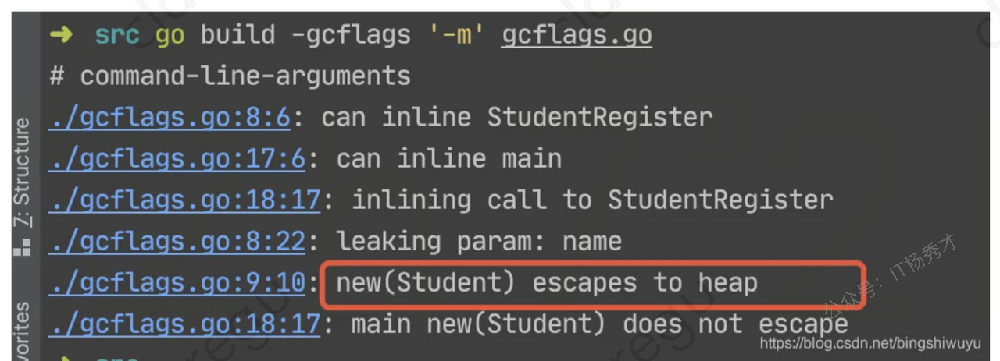

"escapes to heap"，代表该行内存分配发生了逃逸现象。
### 4 栈空间不足

```go
package main

func MakeSlice() {
 s := make([]int, 100, 100)

 for index, _ := range s {
  s[index] = index
 }
}

func main() {
 MakeSlice()
}
```

执行

```
go build --gcflags '-m -l' trip.go
```

分析结果：

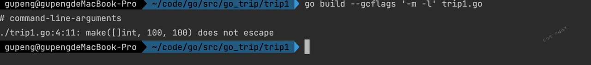

此时栈空间充足，slice分配在栈上，未发生逃逸，假设将slice扩大100倍，再看一下

```go
package main

func MakeSlice() {
    s := make([]int, 10000, 10000)

    for index, _ := range s {
       s[index] = index
    }
}

func main() {
    MakeSlice()
}
```
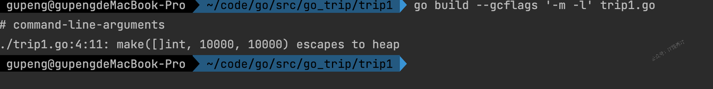

此时，分配的slice容量太大，当栈空间不足以存放当前对象时或无法判断当前切片长度时会将对象分配到堆中
### 5 动态类型逃逸

很多函数参数为interface类型。比如：

```go
func Printf(format string, a ...interface{}) (n int, err error)
func Sprintf(format string, a ...interface{}) string
func Fprint(w io.Writer, a ...interface{}) (n int, err error)
func Print(a ...interface{}) (n int, err error)
func Println(a ...interface{}) (n int, err error)
```

编译期间很难确定其参数的具体类型，也能产生逃逸。

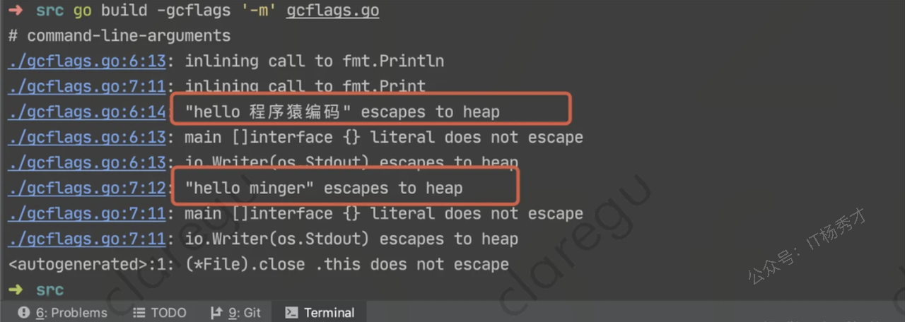
### 6 变量大小不确定（有待考究）

在创建切片的时候，初始化切片容量的时候，传入一个变量来指定其大小，由于变量的值不能在编译器确定，所以就不能确定其占用空间的大小，直接将对象分配在堆上

```go
package main

func MakeSlice() {
    length := 1
    a := make([]int, length, length)
    for i := 0; i < length; i++ {
       a[i] = i
    }
}

func main() {
    MakeSlice()
}
```
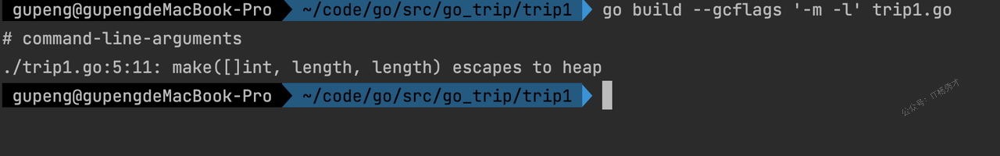
### 7 逃逸常见情况

1. 指针逃逸，函数内部返回一个局部变量指针
2. 分配大对象，导致栈空间不足，不得不分配到堆上
3. 调用接口类型的方法。接口类型的方法调用是动态调度 - 实际使用的具体实现只能在运行时确定。考虑一个接口类型为 io.Reader 的变量 r。对 r.Read(b) 的调用将导致 r 的值和字节片b的后续转义并因此分配到堆上。
4. 尽管能够符合分配到栈的场景，但是其大小不能够在在编译时候确定的情况，也会分配到堆上
### 8 如何避免

1. go 中的接口类型的方法调用是动态调度，因此不能够在编译阶段确定，所有类型结构转换成接口的过程会涉及到内存逃逸的情况发生。如果对于性能要求比较高且访问频次比较高的函数调用，应该尽量避免使用接口类型
2. 由于切片一般都是使用在函数传递的场景下，而且切片在 append 的时候可能会涉及到重新分配内存，如果切片在编译期间的大小不能够确认或者大小超出栈的限制，多数情况下都会分配到堆上
### 9 总结

1. 堆上动态分配内存比栈上静态分配内存，开销大很多。
2. 变量分配在栈上需要能在编译期确定它的作用域，否则会分配到堆上。
3. Go编译器会在编译期对考察变量的作用域，并作一系列检查，如果它的作用域在运行期间对编译器一直是可知的，那么就会分配到栈上。简单来说，编译器会根据变量是否被外部引用来决定是否逃逸。
4. 对于Go程序员来说，编译器的这些逃逸分析规则不需要掌握，我们只需通过go build -gcflags '-m'命令来观察变量逃逸情况就行了
5. 不要盲目使用变量的指针作为函数参数，虽然它会减少复制操作。但其实当参数为变量自身的时候，复制是在栈上完成的操作，开销远比变量逃逸后动态地在堆上分配内存少的多。
## 垃圾回收
### 1 什么是GC

GC的全称是 Garbage Collection，字面意思是垃圾回收，其实可以理解为垃圾内存回收。GC是编程语言实现的一种自动内存管理机制，用来找到程序中不再使用的那些"垃圾"内存，然后把它们清理掉，让这些内存重新可用。这里所说的"垃圾"内存更确切一点说其实是堆上的不再使用的内存，因为栈上的内存是由编译器自动分配和释放的，不需要GC参与

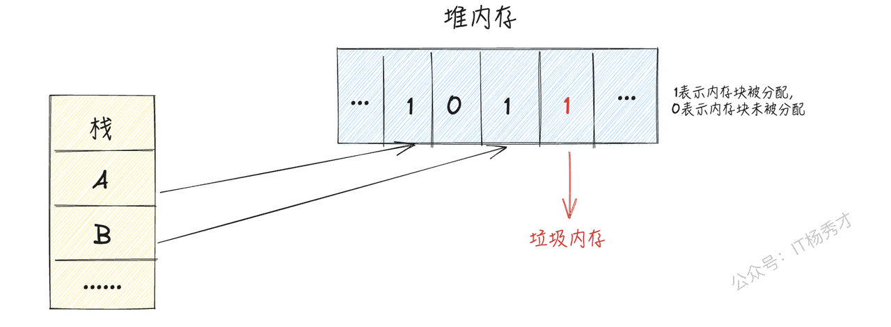

如上图所示，红色1标示的堆内存块就是垃圾内存，需要被回收清理，因为这块内存已经被分配，但是并没被使用，而剩下的两个黑色1标示的堆内存块不能被gc回收，因为还有两个栈上对象指向他们，它们还处于被引用状态中，处于使用阶段，不是垃圾内存
### 2 为什么需要GC

先来看个经典的c代码示例

```c
int * func(void) {
 int a = 100;
 /* 
 ... 
 */
 return &a;
}
```

`return &a;`会出错，这就是经典的悬挂指针问题，c语言是不允许返回一般局部变量地址的，其原因是一般局部变量的作用域只在函数内，其存储位置在栈区中，当程序调用完函数后，局部变量会随此函数一起被释放。 其地址指向的内容不明，就会成为一个悬挂指针，可能会引起严重的段错误

在上述例子中，代码比较简单，我们在写代码的时候可以轻松的发现悬挂指针问题，但是真实业务场景下的代码往往很复杂，比如下图


我们在手动free对象的时候，根据当前程序链路A-->C-->D-->E，依次free对象，当free掉D,E对象之后，只剩下C对象，貌似没有问题，但是其实还有其他的对象B引用了D对象，这样就造成了悬挂指针问题

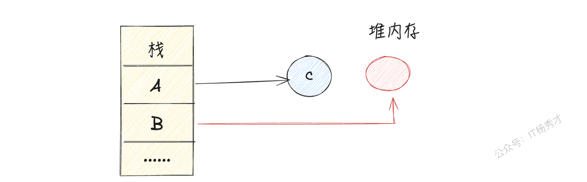

所以在真实业务写代码场景中，程序员要free对象的时候必须要非常小心，对于当前对象的所有引用关系要很清楚，否则一旦误删，就会导致严重错误。但是真实业务代码中的对象有太多了，引用关系又极其复杂，所以这就导致很难避免这种悬挂指针错误，而且由于程序员写代码的时候要特别注意这些问题，导致开发效率又很低。

所以一门可以自动识别并且回收垃圾内存的语言会大大的提升程序的开发效率，同时也会减少很多不必要的错误，这就是程序语言的GC机制。现代语言中，包括java，go，python都有集成了自己的gc机制，用他们进行开发的时候，效率都比c，c++要高的多
### 3 常见的GC算法

#### 3.1 引用计数法

引用计数法会为程序中的每个对象在对象头中分配一个空间来保存该对象被引用的次数，如果有其他对象引用了该对象，那么它的引用计数加1。如果其他对象删除了对该对象的引用，则它的引用计数减1，当该对象的引用计数为0时，此时他已经没有任何对象引用了，该对象就可以被回收

注意：当创建一个新对象时，引用计数器从 1 开始，表示有一个地方正在使用这个对象

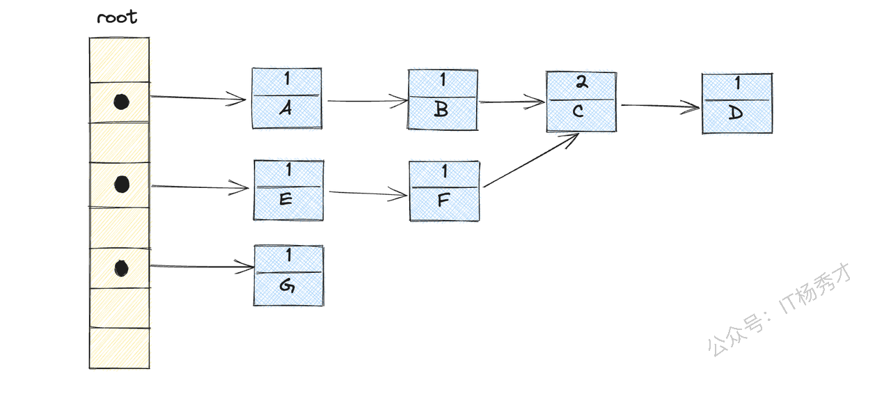

如上图所示，对象c由于有两个对象B，F引用，所以计数为2，其余节点计数都是1

##### 3.1.1 优点

简单直接，回收速度快，不会出现内存耗尽或达到某个阀值时才回收

##### 3.1.2 缺点

不能很好的处理循环引用，而且需要有额外的空间实时维护引用计数，有也一定的代价

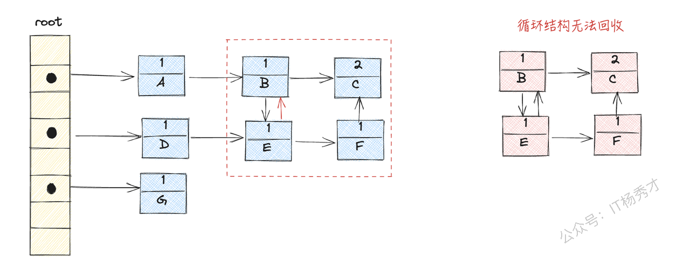

比如上图，再删除了对象A和D之后，由于对象B和E之间存在循环引用，所以上下B,C,E,F四个对象都存再引用关系，计数都不为0，所以都不能被回收，如果大量存在这种循环对象的话，就会造成一定的内存泄漏

#### 3.2 标记清除法

标记清除算法主要分为两个阶段来完成对垃圾内存的回收

**标记阶段** ：遍历所有活动对象，并标记那些还在使用的对象标签

**清除阶段** ：遍历内存中所有对象，清除那些没有被标记的对象

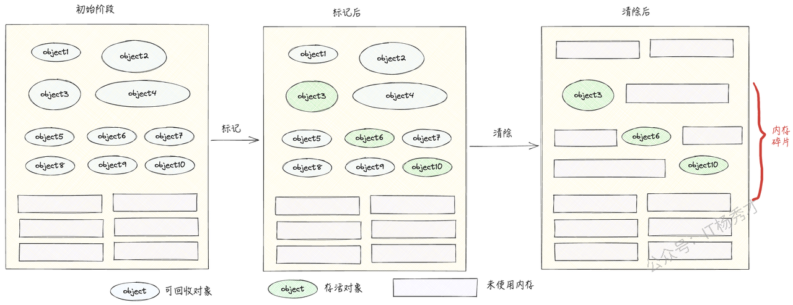

##### 3.2.1 优点

简单易实现，不需要额外的数据结构，只需遍历一次对象图即可完成标记和清除操作，适合可回收对象不多的场景

##### 3.2.2 缺点

主要是会造成内存碎片，导致后续需要创建大对象的时候，由于没有连续的足够大的内存空间而创建不了，降低了内存的使用率

#### 3.3 复制法

复制算法将内存分成两个相等的区域，并且一次只使用其中一个。当这个区域被用完时，程序会把所有还在使用的对象复制到另一个空区域（保留区域），然后将已使用的区域全部清除。

这样，每次只需对一个区域进行垃圾回收，分配内存时也无需处理碎片问题，只需按顺序移动指针进行分配


##### 3.3.1 优点

主要是避免了内存碎片问题，每次清除针对的都是整块内存

##### 3.3.2 缺点

内存利用率降低，使用的内存会缩小为了原来的一半

如果存活的对象很多，将这些对象都复制一遍，并且更新它们的应用地址，这一过程耗时可能较长，回收效率不够高

#### 3.4 标记整理

标记整理算法与标记清除算法非常相似，只是做了一点稍稍的改进，其过程可以分为以下两步：

标记：这一步骤和标记清除算法一样，都是从GC 根节点开始扫描，并标记存活对象

整理：接下来，所有存活对象会被移动到一端的空闲空间，按照内存地址进行排序，并更新相应的引用指针。然后，清理掉末端内存地址之外的所有内存空间。

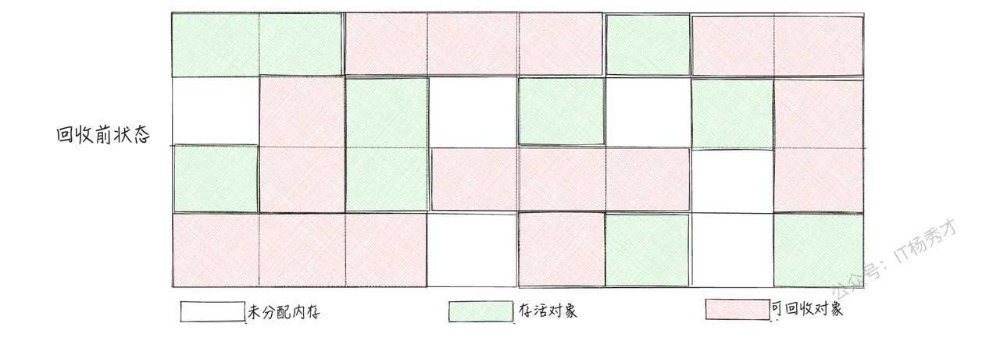


#### 3.5 分代法

分代收集算法可以被视为上述内容的扩展。它的实现思路是根据对象生命周期的差异，将内存划分为多个区域，例如将堆空间划分为新生代和老年代，然后根据每个区域的特点选择最合适的收集算法。

在新生代中，由于存在大量对象很快被销毁、少量对象存活的特点，通常使用"复制算法"。这种算法只需付出少量存活对象的复制成本就可以完成垃圾对象的收集，效率非常高。而在老年代中，由于对象的存活率高，且没有额外空间进行分配担保，通常使用"标记-清理"或"标记-整理"算法来进行回收。
### 4 Go语言GC算法

目前go语言GC在实现上采用的是一种**并发三色标记法**（GC程序与用户代码并发执行）加上屏障技术来实现的。并发三色标记法本质上也是一种标记清理算法，并且这种并发三色标记没有前面垃圾回收算法中提到的分代与整理过程，仅仅就是标记和清理过程。三色标记只是对其标记过程的一种简单描述，下面将详细介绍这种算法。

#### 4.1 为什么go语言gc不选择分代与标记整理

通过前面的gc算法分析知道基于整理的 GC 算法和基于复制的 GC 算法能够降低内存碎片，提高内存的使用率，但是go语言为什么不采用这种方式呢？主要有以下几点原因：

1. **go为什么没有选用标记整理或者复制？**

标记整理算法或者是复制算法主要是为了减少内存碎片，然而，Go 运行时使用的内存分配算法是基于 TCMalloc，虽然不能像复制算法那样消除掉内存碎片化的问题，但也极大地降低了碎片率，所以标记整理显得有时并不是那么明显，并且Thread Cache 的分配机制使得 Go 在大多数分配场景下可以避免使用锁，从而在高并发情况下展现出强大的性能优势。

2. **go为什么没有选择分代？**

go语言的struct类型创建是可以分配到栈上的，而不是像java一样new出来的对象在堆上。go会在编译期做静态逃逸分析，可以将生命周期很短的对象直接安排在栈上分配（比如函数内未发生逃逸的struc类型变量），分代GC最大的优势就是可以区分长生命周期和短生命周期对象，从而快速回收生命周期短的对象，但是由于go语言在编译期会做逃逸分析，所以Go 语言中的短生命周期对象并没有那么多，使得分代 GC 在 Go 语言中收益并不明显。此外，分代GC 还需要额外的写屏障来维护老年代对新生代的引用关系，这也增加了 GC 的开销
### 5 GO语言GC的主要发展过程

go语言也不是一开始就是使用的并发三色标记法（GC程序与用户代码并发执行）加上屏障技术来实现，其主要经历以下三个过程：

- **V1.3及之前：标记清除算法**
- **V1.5：三色并发标记法**
- **V1.8：混合写屏障机制**

下面将逐一介绍这三个过程的GC算法

#### 5.1 什么样的内存GC不能回收？

在开始正式讲GO语言GC之前，我们先来看看GC是否够可以回收掉堆上的任意的垃圾内存呢？

先来看一个简单的例子

```go
package main

import "fmt"

type Student struct {
    ID    int64
    Name  string
    Age   int
    Score float64
}

func main() {
    slice := make([]Student, 6)
    slice = slice[:3]
    fmt.Println(slice)
}
```

程序创建了一个Student类型的切片slice，包含6个元素


当slice发生缩小，大小缩为原来的一半，只有三个元素的时候，底层数组的3两个元素已经无法再访问了

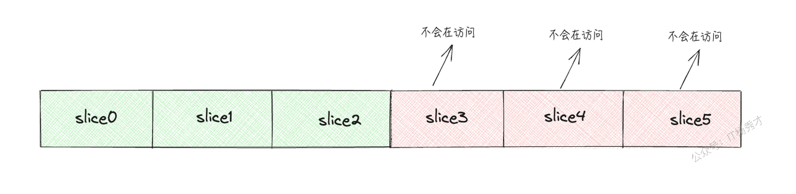

但是堆上的slice3，slice4，slice5的内存是不会被gc的，因为根据标记清理方法从根结点开始标记的话，这块内存还是属于**可达**的，所以不会被gc掉。同样的情况还存在于Map中，当创建一个Map之后，delete掉Map中的某个key之后，对应部分的内存也是不会被gc的

#### 5.2 标记清除算法

从前面标记清除算法可知，标记清除算法（Mark Sweep Algorithm），包括标记（Mark）和清除（Sweep）两个阶段：

**标记阶段：** 从根对象开始，查找并标记堆中所有存活的对象

**清除阶段** ：遍历堆中所有对象，回收未被标记的对象

假设程序开始阶段对象分布如下图所示，下面用图示的方式展示标记清除的过程

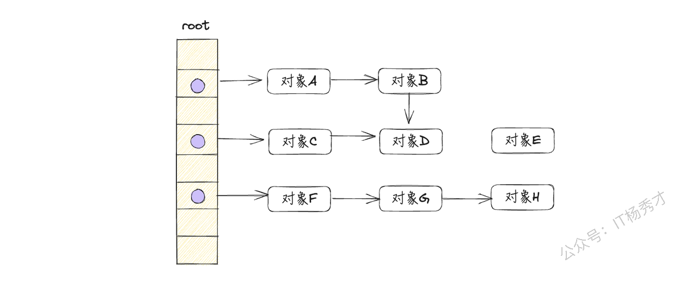

1. 从根对象开始，逐一遍历每个对象及其子对象，并标记它们的可达状态，如下图所示：
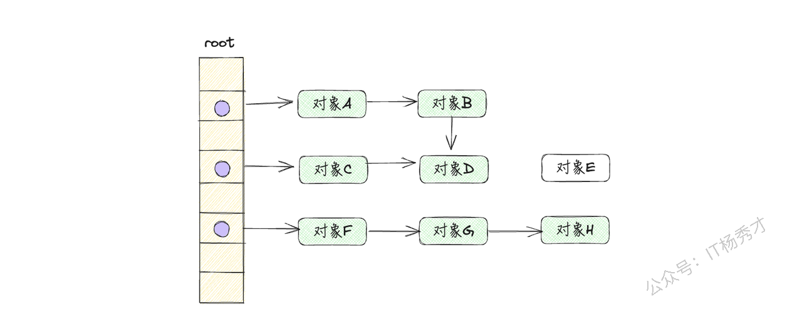

- 可达对象：对象A、对象B、对象C、对象D、对象F、对象G、对H
- 不可达对象：对象E
- 遍历堆上的所有对象，回收没有被标记的不可达对象，如下图所示：
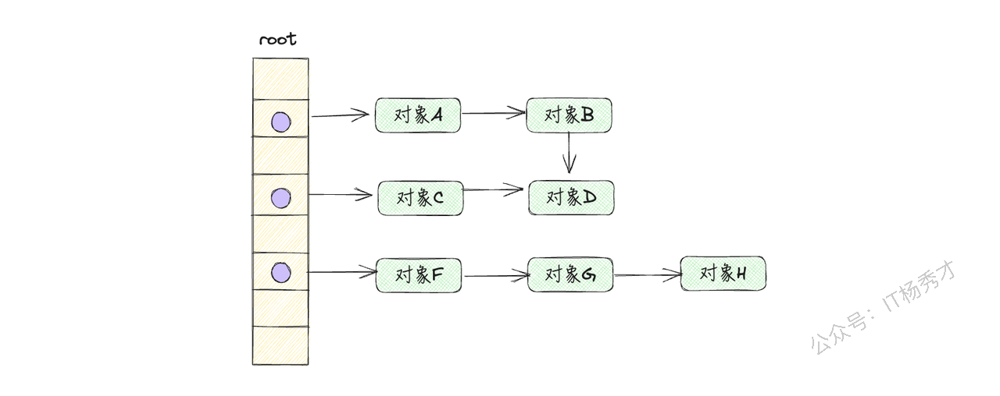

清除完成之后，剩下可达对象A，B，C，D，F，G，H，不可达对象E被清除，内存释放

注意：以上只是回收器（GC程序）的工作过程，还没有考虑赋值器（用户程序），其实在回收器在进行标记和清扫的过程中是要暂停整个用户程序的，暂停整个用户程序也称作STW。

如果不STW，会出现什么情况呢？

假设现在标记阶段已经完成，对象A，B，C，D，F，G，H被打上标记，而对象E是未被标记的准备回收的对象，就在此时，清除之前对象H又指向了对象E

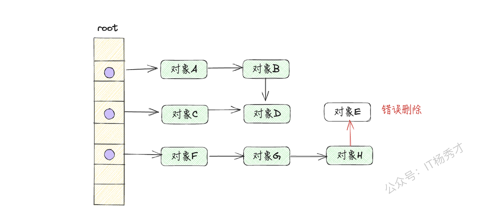

那么接下来回收器就会将对象E错误删除，其实对象E此时已经是可达对象了，是存在引用关系，再被使用的，是不能被GC的，所以完整的标记清除算法需要在进行GC前进行STW，即暂停整个用户程序。这样的话，性能必然很低，很难有人可以接受这种性能损耗

#### 5.3 三色标记法

简单的标记清除算法会带来长时间的STW，为了解决这个问题，Go语言在V1.5版本，使用三色并发标记法来优化这个问题

三色标记法将程序中的对象分为三类：白色、灰色和黑色

- 白色：未被垃圾收集器访问到的对象，也就是潜在的垃圾对象。在回收开始阶段 ，所有对象都标记为白色；在回收结束后，所有白色对象均不可达，其内存将被释放
- 灰色：已被垃圾收集器访问到的对象，但是垃圾收集器需要继续扫描它们的子对象，因为其可能存在指向白色对象的外部指针
- 黑色：已被垃圾收集器访问到的对象，且其引用都已被扫描到，黑色对象中任何一个指针都不可能直接指向白色对象

标记过程如下：

1. **初始状态** ：所有对象都是白色的
2. **扫描根对象** ：从根对象开始扫描，将所有可达对象标记为灰色，并放入待处理集合中
3. **处理灰色对象** ：从待处理集合中取出灰色对象，将它们引用的对象标记为灰色，并将这些新标记的对象加入待处理集合中，同时将自身标记为黑色。
4. **重复扫描** ：重复第3步，直到待处理集合为空。此时，所有白色对象都是不可达的垃圾对象，可以进行回收

假设应用程序中的对象关系如下图所示，下面用图示的方式展示三色标记的过程

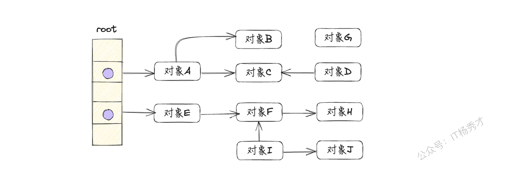

1. 应用程序开始运行时，所有对象默认标记为白色，如下图所示：
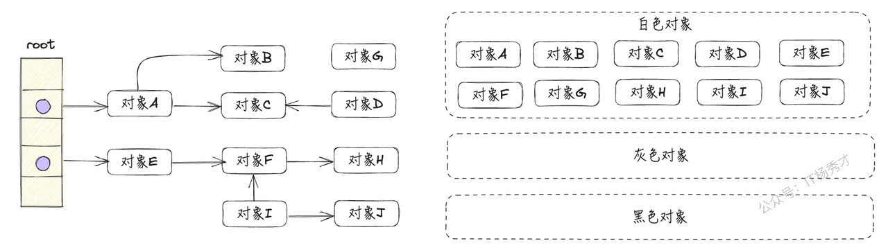

用3个集合来存储被标记为3种颜色的对象，程序开始运行时，所有对象都存放在白色标记集合中

- 从根节点开始遍历，把遍历到的对象标记为灰色，放到灰色标记集合中，如下图所示：
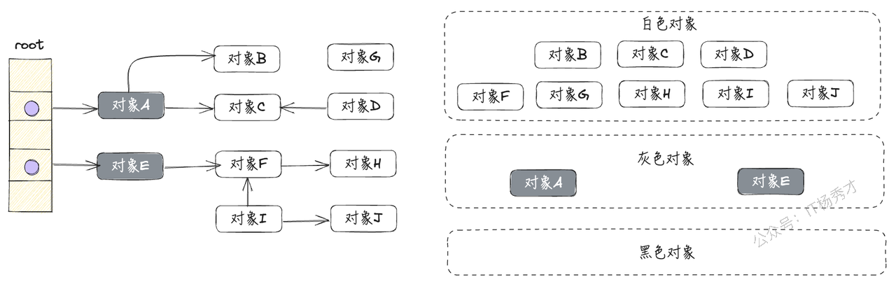

- 对象A、对象E，被标记为灰色
- 遍历灰色标记集合，将灰色对象本身标记为黑色，并将它们移动到黑色标记集合中；将黑色对象引用的白色对象标记为灰色，放到灰色标记集合中，如稀土所示：
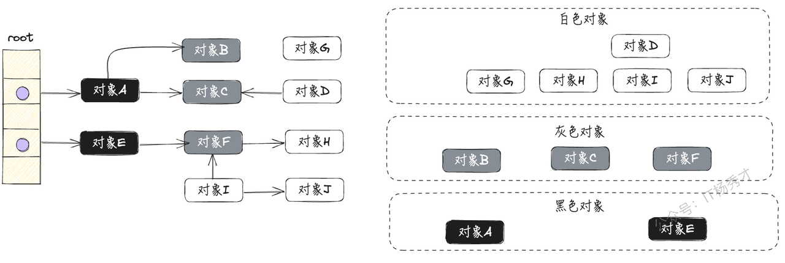

- 对象A、对象E，被标记为黑色
- 对象B、对象C、对象F，被标记为灰色
- 重复第三步，直到灰色标记表为空，如下图所示
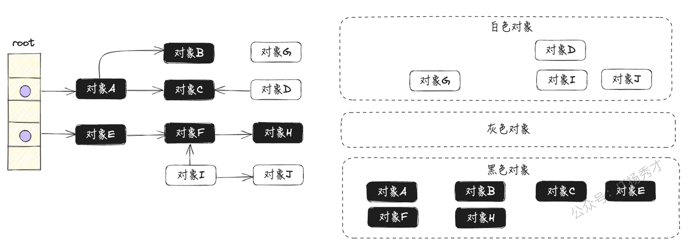

- 清除所有的白色对象，完成垃圾回收，如下图所示：
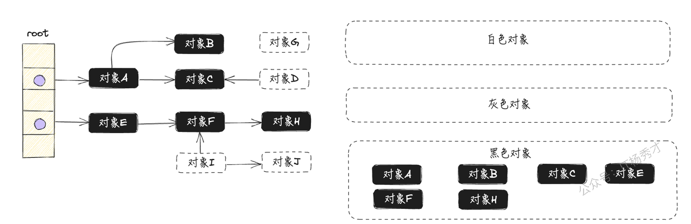

明白了三色标记的过程，还需要搞清楚垃圾回收最开始扫描的根集合究竟包含哪些对象，通常情况下**根节点**包含以下几个部分：

1. **全局变量**：程序在编译期就能确定的那些存在于程序整个生命周期的变量
2. **执行栈上的对象或指针**：每个 goroutine 都包含自己的执行栈，这些执行栈上的对象包含栈上的变量及指向分配的堆内存区块的指针。
3. **寄存器中的变量**：寄存器的值可能表示一个指针，参与计算的这些指针可能指向某些赋值器分配的堆内存区块

#### 5.4 没有STW的三色标记法

从前面的分析了解到，STW会大大的降低用户程序的执行效率，甚至达到用户难以接受的地步。那么go经过优化后的并行三色标记法需要STW吗？先看一下假设不进行STW会不会有什么问题？

以下图的程序对象关系进行分析，假设当前已经完成第一轮扫描，如下图所示。此时灰色对象F通过p指针指向白色对象H：

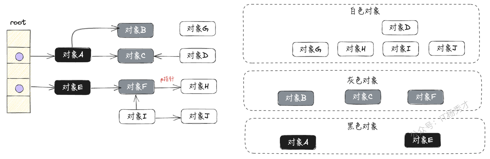

由于没有进行STW，所以对象都有可能发生读写操作。假设还没扫描到对象F时，已经标记为黑色的对象E，创建q指针指向白色对象H，如下图所示：

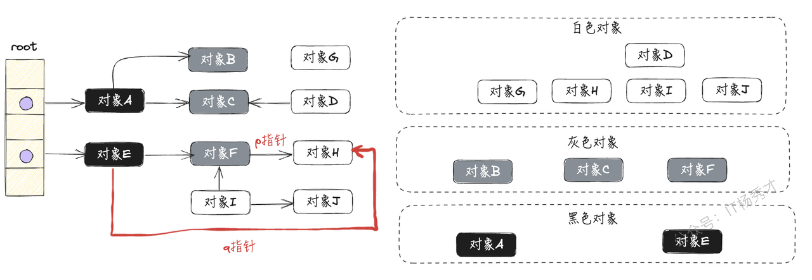

在新增q指针的同时，灰色对象F移除p指针，此时白色对象H只挂在已经完成扫描的黑色对象E下，如下图所示：

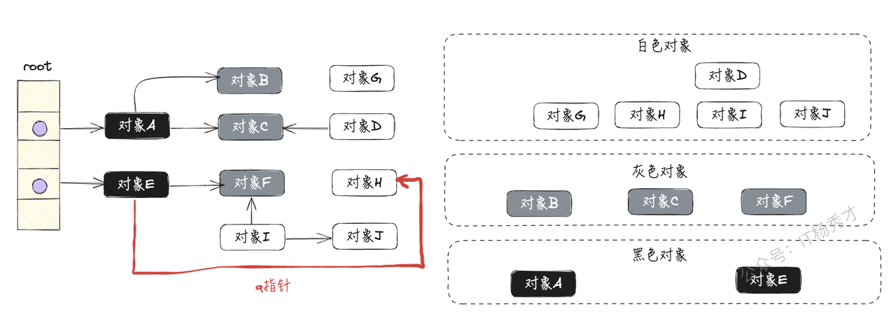

然后，按照三色标记的规则继续执行，最终会得到如下图所示的结果：

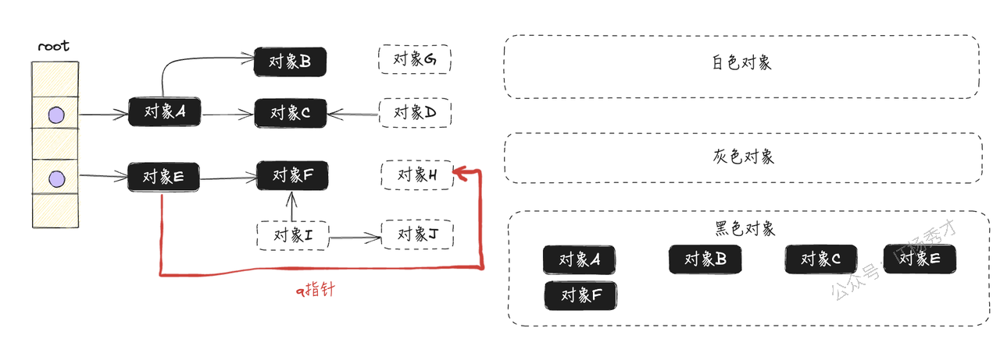

对象H其实是被对象E正确引用的，但却被垃圾收集器"错误"回收了，这将会导致程序严重错误，是不允许的。

从上面的分析来看，在不进行STW时，如果同时满足下面两个条件将会破坏垃圾收集器的正确性

- 一个白色对象被黑色对象引用(白色对象被挂在黑色对象下)
- 灰色对象与它之间的可达关系的白色对象遭到破坏(灰色对象同时丢失了该白色对象的引用)

#### 5.5 屏障技术

##### 5.5.1 强弱三色不变性

根据前面分析垃圾回收器会出现错误回收的两个条件，很容易可以总结出：只要破坏这两个必要条件，就可以保证对象不会被错误回收。也就是接下来讲到的两种三色不变性：强三色不变性和弱三色不变性

- **强三色不变性** ：不存在黑色对象引用到白色对象的指针，即黑色对象不会指向白色对象，只会指向灰色对象或黑色对象


- **弱三色不变性** ：所有被黑色对象引用的白色对象都处于灰色对象的保护状态，黑色对象可以指向的白色对象，但是必须包含一条从灰色对象到这个白色对象的可达路径


**只要满足了这两种三色不变性其一，其实就破坏了垃圾收集器"错误回收"两个条件同时存在**，这样就能保证垃圾回收的正确性了，go语言其实是引入内存写屏障技术来实现这两个三色不变性的，接下来将详细讨论什么是内存屏障以及go语言中涉及的3种屏障技术：

1. 插入写屏障
2. 删除写屏障
3. 混合写屏障

##### 5.5.2 什么是内存屏障

内存屏障其实是一种赋值器技术，对应于在编译期生成的一段特殊代码，用于在程序运行时拦截内存写操作，相当于一个 hook 调用。其作用是通过 hook 内存的写操作时机, 做一些标记工作, 从而保证垃圾回收的正确性

下面通过一个具体的例子来看在屏障技术在汇编时期是怎么做的

```go
package main

type Student struct {
    Name string
    Age  *int
}

func fun1(s *Student) {
    s.Age = new(int)
}

func fun2(s *Student) {
    var st = new(Student)
    st.Name = "google"
}

func main() {
    st1 := new(Student)
    st2 := new(Student)

    go fun1(st1)
    go fun2(st2)
}
```

对于上述代码，我们先看一下他的内存逃逸情况

回顾一下内存逃逸的原则：

1. **尽可能分配到栈上** ：在确保程序正确性的前提下，如果可以，将对象分配到栈上。栈上的对象生命周期与 goroutine 紧密相关，当 goroutine 结束时，这些对象会自动释放，避免了垃圾回收的负担，从而提高性能。
2. **堆分配的必要性** ：当对象需要在函数调用返回后继续存在，或者对象的大小和结构无法在编译期确定时，就必须将其分配到堆上。这些对象的生命周期由程序的业务逻辑决定，最终由垃圾回收器管理和回收。
3. **不确定性时选择堆分配** ：如果无法明确判断对象是否可以分配到栈上，为了保证程序的正确性和稳定性，通常会选择将其分配到堆上。堆上的对象在业务程序的创建时分配，最终由垃圾回收器负责回收

执行以下命令，查看其内存逃逸情况

```go
go build -gcflags "-N -l -m" ./main.go
```

输出

```
# command-line-arguments
./main.go:8:11: s does not escape
./main.go:9:13: new(int) escapes to heap
./main.go:12:11: s does not escape
./main.go:13:14: new(Student) does not escape
./main.go:18:12: new(Student) escapes to heap
./main.go:19:12: new(Student) escapes to heap
```

程序当中一共 执行了4次new操作， 但只有 3 次逃逸到了堆

```
's.Age = new(int)' 逃逸到堆上, 因为其生命周期需要超越该 goroutine
'var st = new(Student)' 分配到栈上, st对象就只是在栈上使用
'st1 := new(Student)', 逃逸到堆上, 因为其他的goroutine要使用该参数
'st2 := new(Student)', 逃逸到堆上, 同st1
```

接着来看下这段代码的汇编代码，执行以下命令

```
go tool compile -S ./main.go
```

选取 `s.Age = new(int)` 这个int变量的创建汇编代码来看一下

```go
main.fun1 STEXT size=112 args=0x8 locals=0x28 funcid=0x0 align=0x0                                                                                                               
        0x0000 00000 (～/go_tourist/gcdemo/main.go:8)       TEXT    main.fun1(SB), ABIInternal, $48-8                                                        
        0x0000 00000 (main.go:8)       MOVD    16(g), R16  //将全局变量 g 的偏移量 16 处的数据移动到寄存器 R16 中                                                                              
        0x0004 00004 (main.go:8)       PCDATA  $0, $-2  //记录调试信息和垃圾收集信息。PCDATA 是跟踪垃圾回收和调试信息的数据指令                                                                                
        0x0004 00004 (main.go:8)       CMP     R16, RSP  //将寄存器 R16 的值与栈指针 RSP 的值进行比较                                                                               
        0x0008 00008 (main.go:8)       BLS     92        //如果 RSP 小于等于 R16，跳转到地址 0x005c，即指令地址 92                                                                              
        0x000c 00012 (main.go:8)       PCDATA  $0, $-1   //更新调试和垃圾回收信息                                                                                
        0x000c 00012 (main.go:8)       MOVD.W  R30, -48(RSP)  //将寄存器 R30 的值移动到栈指针 RSP 的偏移量 -48 的位置                                                                          
        0x0010 00016 (main.go:8)       MOVD    R29, -8(RSP) //将寄存器 R29 的值保存到栈指针 RSP 的偏移量 -8 的位置                                                                           
        0x0014 00020 (main.go:8)       SUB     $8, RSP, R29  //将 RSP 减去 8，结果存储到 R29 中                                                                           
        0x0018 00024 (main.go:8)       FUNCDATA        $0, gclocals·wgcWObbY2HYnK2SU/U22lA==(SB)  //提供函数的局部变量的垃圾收集信息                                      
        0x0018 00024 (main.go:8)       FUNCDATA        $1, gclocals·J5F+7Qw7O7ve2QcWC7DpeQ==(SB)  //提供函数的参数的垃圾收集信息                                     
        0x0018 00024 (main.go:8)       FUNCDATA        $5, main.fun1.arginfo1(SB)    //提供函数参数的其它信息                                                   
        0x0018 00024 (main.go:8)       FUNCDATA        $6, main.fun1.argliveinfo(SB)  //提供函数参数的生命周期信息                                                  
        0x0018 00024 (main.go:8)       PCDATA  $3, $1             //调试和垃圾回收相关的指令                                                                      
        0x0018 00024 (main.go:8)       MOVD    R0, main.s(FP)    //将寄存器 R0 的值存储到帧指针 FP 的 main.s 中                                                                        
        0x001c 00028 (main.go:8)       PCDATA  $3, $-1    //更新调试和垃圾回收信息                                                                              
        0x001c 00028 (main.go:9)       MOVD    $type:int(SB), R0   //将 int 类型的全局变量地址移动到 R0 中                                                                     
        0x0024 00036 (main.go:9)       PCDATA  $1, $0       #更新调试和垃圾回收信息                                                                            
        0x0024 00036 (main.go:9)       CALL    runtime.newobject(SB)  //调用 runtime.newobject 函数，为新对象分配内存                                                                  
        0x0028 00040 (main.go:9)       MOVD    main.s(FP), R1   //将 main.s 的值从 FP 中移动到寄存器 R1                                                                        
        0x002c 00044 (main.go:9)       PCDATA  $0, $-2    //更新调试和垃圾回收信息                                                                              
        0x002c 00044 (main.go:9)       MOVB    (R1), R27   // 将 R1 地址中的字节数据移动到 R27 中                                                                             
        0x0030 00048 (main.go:9)       PCDATA  $0, $-1      //更新调试和垃圾回收信息                                                                            
        0x0030 00048 (main.go:9)       PCDATA  $0, $-2      //更新调试和垃圾回收信息                                                                            
        0x0030 00048 (main.go:9)       MOVWU   runtime.writeBarrier(SB), R2  //将 runtime.writeBarrier 地址的数据移动到 R2 中                                                           
        0x0038 00056 (main.go:9)       CBNZW   R2, 68       //如果 R2 不为零，则跳转到地址 0x0044                                                                             
        0x003c 00060 (main.go:9)       MOVD    R0, 16(R1)    //将 R0 的值存储到 R1 偏移 16 处                                                                           
        0x0040 00064 (main.go:9)       JMP     80            //跳转到地址 0x0050。                                                                                 
        0x0044 00068 (main.go:9)       ADD     $16, R1, R2   //将 R1 加 16 的结果存储到 R2 中                                                                           
        0x0048 00072 (main.go:9)       MOVD    R0, R3        //将寄存器 R0 的值移动到寄存器 R3                                                                          
        0x004c 00076 (main.go:9)       CALL    runtime.gcWriteBarrier(SB)  //调用 runtime.gcWriteBarrier 函数。这个函数处理写屏障，确保在垃圾回收时正确处理写入                                                             
        0x0050 00080 (main.go:10)      PCDATA  $0, $-1     //更新调试和垃圾回收信息                                                                             
        0x0050 00080 (main.go:10)      PCDATA  $1, $-1     //更新调试和垃圾回收信息                                                                             
        0x0050 00080 (main.go:10)      LDP     -8(RSP), (R29, R30)  //从 RSP 偏移量 -8 处加载两个寄存器的值到 R29 和 R30 中。LDP 表示加载双字                                                                    
        0x0054 00084 (main.go:10)      ADD     $48, RSP      //将栈指针 RSP 加 48                                                                           
        0x0058 00088 (main.go:10)      RET     (R30)     //从 R30 寄存器中返回，结束函数 main.fun1 的执行                                                                               
        0x005c 00092 (main.go:10)      NOP            //无操作指令（No Operation），通常用于对齐或占位                                                                                  
        0x005c 00092 (main.go:8)       PCDATA  $1, $-1    //更新调试和垃圾回收信息                                                                              
        0x005c 00092 (main.go:8)       PCDATA  $0, $-2    //更新调试和垃圾回收信息                                                                              
        0x005c 00092 (main.go:8)       MOVD    R0, 8(RSP)   //将 R0 寄存器的值移动到 RSP 偏移量 8 处                                                                            
        0x0060 00096 (main.go:8)       MOVD    R30, R3      //将寄存器 R30 的值移动到寄存器 R3                                                                            
        0x0064 00100 (main.go:8)       CALL    runtime.morestack_noctxt(SB)  //调用 runtime.morestack_noctxt 函数。此函数用于检查是否需要更多的栈空间                                                         
        0x0068 00104 (main.go:8)       MOVD    8(RSP), R0   //将 RSP 偏移量 8 处的值移动到寄存器 R0                                                                            
        0x006c 00108 (main.go:8)       PCDATA  $0, $-1      //更新调试和垃圾回收信息                                                                            
        0x006c 00108 (main.go:8)       JMP     0            // 跳转到地址 0x0000，即函数的开始位置。这个跳转通常在栈空间不足的情况下发生
```

汇编代码中红色背景的语句注释主要就是关于 `s.Age = new(int)` 这条语句的对象创建以及过程中开启的写屏障机制。

可以看到在写对象（这里是创建一个新对象）在编译期有写屏障的hook操作，写屏障是一段编译器在编译期插入的特殊代码，代码函数名字叫做 `gcWriteBarrier`

屏障代码的运行，而是需要条件判断的，并不是只要是堆上内存赋值就会运行 `gcWriteBarrier` 代码。在回收器开始扫描前，STW程序会设置这个判断语句，只有当判断条件符合的时候 `gcWriteBarrier` 代码才会运行

可以简单用伪代码描述一下上述屏障功能

```go
if runtime.writeBarrier.enabled {
    runtime.gcWriteBarrier(ptr, val)
} else {
    *ptr = val
}
```

下面简单看一下在 `amd64` 架构下， `gcWriteBarrier` 的汇编代码，具体文件可以在src/runtime/asm\_amd64.s查看，看看 `gcWriteBarrier` 函数具体做了些什么工作

```go
// gcWriteBarrier 执行堆指针的写操作并通知垃圾回收器（GC）。
    //
    // gcWriteBarrier 不遵循 Go ABI（应用二进制接口）。它接收两个参数:
    // - DI 是写入操作的目标地址
    // - AX 是要写入 DI 地址的值
    // 它会修改 FLAGS（标志寄存器）。它不会修改任何通用寄存器
    // 但可能会修改其他寄存器（例如，SSE 寄存器）.
    // 定义为 ABIInternal，因为它不使用基于堆栈的 Go ABI.
    TEXT runtime·gcWriteBarrier<ABIInternal>(SB),NOSPLIT,$112
            // Save the registers clobbered by the fast path. This is slightly
            // faster than having the caller spill these.
            MOVQ        R12, 96(SP)     //将寄存器 R12 的值保存到栈中偏移 96 的位置
            MOVQ        R13, 104(SP)    //将寄存器 R13 的值保存到栈中偏移 104 的位置
            // TODO: Consider passing g.m.p in as an argument so they can be shared
            // across a sequence of write barriers.
            MOVQ        g_m(R14), R13   //从寄存器 R14 指向的位置加载 g_m 的值（全局变量），并存储到寄存器 R13
            MOVQ        m_p(R13), R13   //从寄存器 R13 指向的位置加载 m_p（当前线程的堆指针）
            MOVQ        (p_wbBuf+wbBuf_next)(R13), R12 //从 R13 指向的 p_wbBuf 结构中的 wbBuf_next 偏移处加载数据到寄存器 R12，这是获取写屏障缓冲区的位置
            // Increment wbBuf.next position.
            LEAQ        16(R12), R12    //计算 R12 + 16 的地址，并将其存储回 R12，这一步更新了写屏障缓冲区的写入位置
            MOVQ        R12, (p_wbBuf+wbBuf_next)(R13) //将更新后的缓冲区写位置存储回 p_wbBuf 结构中的 wbBuf_next
            CMPQ        R12, (p_wbBuf+wbBuf_end)(R13)  //比较写屏障缓冲区的当前位置 R12 与缓冲区的结束位置。用于检查缓冲区是否已满
            // Record the write.
            MOVQ        AX, -16(R12)    //将寄存器 AX（要写入的值）存储到缓冲区当前位置的偏移 -16 处。    // Record value
            // Note: This turns bad pointer writes into bad
            // pointer reads, which could be confusing. We could avoid
            // reading from obviously bad pointers, which would
            // take care of the vast majority of these. We could
            // patch this up in the signal handler, or use XCHG to
            // combine the read and the write.
            MOVQ        (DI), R13   //将 DI 寄存器中的地址内容加载到 R13。DI 指向要写入的地址
            MOVQ        R13, -8(R12)   // 将 R13 的值（即要写入的地址）存储到缓冲区中的偏移 -8 处     // Record *slot
            // Is the buffer full? (flags set in CMPQ above)
            JEQ        flush      //如果上面比较结果表明缓冲区已满（R12 等于 wbBuf_end），则跳转到 flush 标签，意思就是 wbBuffer 队列满了，那么就下刷处理，比如置灰，置黑等操作
    ret:                          // 其实就是执行赋值：*slot = val，直接置灰色，置黑色
            MOVQ        96(SP), R12  // 从栈中恢复寄存器 R12 的值
            MOVQ        104(SP), R13  // 从栈中恢复寄存器 R13 的值
            // Do the write.
            MOVQ        AX, (DI)      // 将 AX 寄存器中的值写入到 DI 指定的地址
            RET                       // 从函数中返回
    flush:
            ...
            // This takes arguments DI and AX
            CALL    runtime·wbBufFlush(SB)        // 批量刷新操作, 最终调用 wbBufFlush1, 将 mspan.gcmarkBits 进行标记
            ...
            JMP    ret
```

按照上面汇编代码以及写屏障的作用来看，写屏障最后不就是简单执行 **`*slot = value` 这个赋值操作，给对象加颜色吗，wbBuf队列的作用是什么呢？**

写屏障函数 `gcWriteBarrier` 的 **wbBuf队列其实是go1.10 左右为了性能优化而引入的，每个 P 都有一个 wbBuf 队列，** 主要是将赋值的前后两个值记录下来，攒满一个 buffer ，然后批量处理，来提升效率

总结一下写屏障函数 `gcWriteBarrier` 功能：

1. 首先写屏障会拦截写操作
2. 拦截完写操作之后，会记录下赋值前后的旧值与新值，存储在 p.wbBuf 队列
3. 当 p.wbBuf 满了之后, 批量刷入到扫描队列(置灰)

##### 5.5.3 go语言中的屏障技术

在 GC 领域中，常见的写屏障（write barrier ）有两种：

1. **插入写屏障（Dijistra Insertion Barrier）**
2. **删除写屏障（Yuasa Deletion Barrier）**

###### 5.5.3.1 插入写屏障（Dijistra Insertion Barrier）

插入写屏障的原理可以用如下伪代码表示

```go
// ptr 赋值给 slot
func DijkstraWritePointer(slot *unsafe.Pointer, ptr unsafe.Pointer) {
     shade(ptr) //  shade(ptr) 会将新的下游对象ptr 标记为灰色。通过保守的假设 *slot 可能会变为黑色， 并确保 ptr 不会在将赋值为 *slot 前变为白色，进而确保了强三色不变性。
     *slot = ptr // 将新的下游对象ptr赋值给当前下游对象slot
 }
```

上述伪代码可以翻译如下：

```go
添加下游对象(当前下游对象slot, 新下游对象ptr) {   
  //step 1
  将新的下游对象ptr标记为灰色   
  
  //step 2
  当前下游对象slot = 新下游对象ptr                    
}
```

插入写屏障一般有两种适用场景：

- A添加新下游对象，比如A 之前没有下游， 新添加一个下游对象B， B被标记为灰色
- A变更下游对象，比如A 将下游对象C 更换为B， B被标记为灰色

由于 **指针修改时，指向的新对象要被强制标灰，** 所以插入写屏障满足强三色不变式，不存在黑色对象引用白色对象的情况了， 因为白色会强制变成灰色

> 注意：虽然插入写屏障实现非常的简单，并且也能保证强三色不变性，但却没有在栈上使用，因为栈空间的特点是容量小，但要求响应速度快，在栈上的对象增加写屏障，会大幅度增加写入指针的额外开销，所以栈空间的对象操作中不使用. 而仅仅使用在堆空间对象的操作中

go语言在Go 1.7 之前其实就使用的是 插入写屏障（Dijkstra Write barrier）

假设应用程序中的对象关系如下图所示，下面用图示的方式展示插入写屏障的过程

1. 程序初始阶段，所有对象均标记为白色，将所有对象放入到白色集合
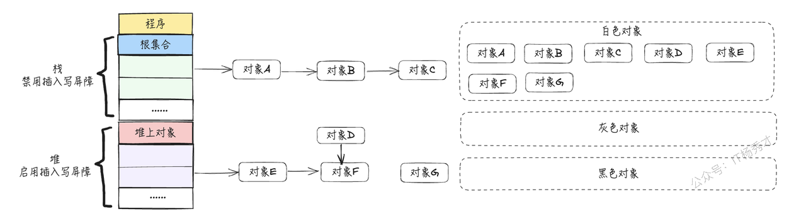

注意：对象E的箭头是由堆指过来，并不是表示是从堆上开始扫描，其实也是从栈上扫描的， 只不过是栈上根节点直接引用的它，它位于堆上，这里方便画图，就用堆上箭头指向它

- 从根节点开始遍历，把遍历到的对象标记为灰色（只遍历一次），放到灰色标记集合中，如下图所示：
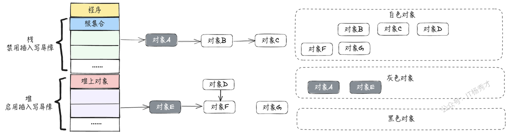

- 遍历灰色集合，将可达对象从白色标记为灰色， 放入灰色集合，并将自身标记为黑色放入黑色集合
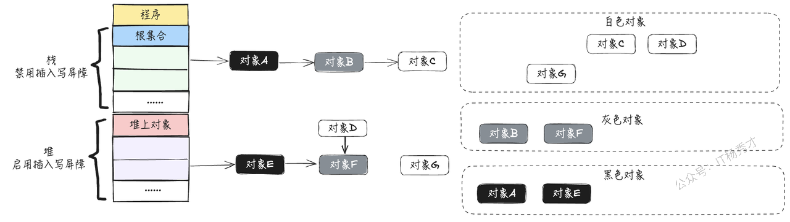

- 由于是并发进行标记，此时对象E指向一个新的对H，对象A指向一个新的对象I，对象E在堆区，出发插入写屏障，对象A在栈区，不触发
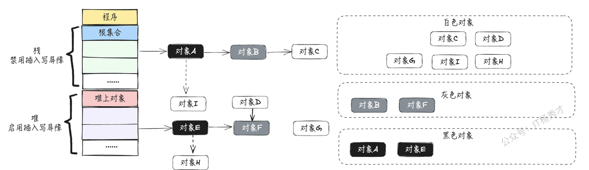

- 插入写屏障的作用（黑色对象添加白色对象，将白色对象标记为灰色），对象H被标记为灰色，由于栈上没有开启写屏障，所以对象I仍然为白色
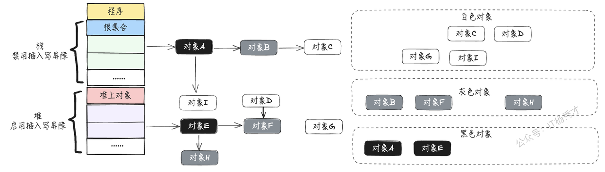

- 循环执行上述流程，直到灰色集合没有节点
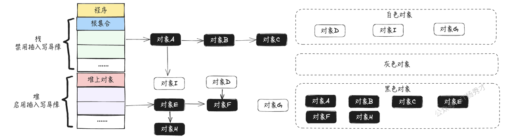

可以看到出现了黑色对象A指向白色对象I的情况，会出现错误回收，这是由于在栈上没有开启写屏障导致的，所以在全部三色标记扫描之后，要对栈重新进行三色标记扫描, 但这次为了对象不丢失, 要对本次标记扫描启动STW. 直到栈空间的三色标记结束

- 在正式开始回收工作之前，此时开启STW，开始重新扫描一次栈上对象
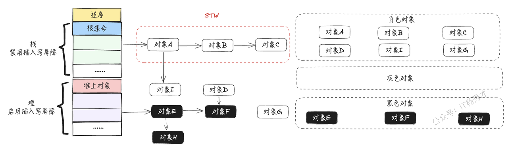

- 对栈上的对象进行三色标记，直至没有灰色对象
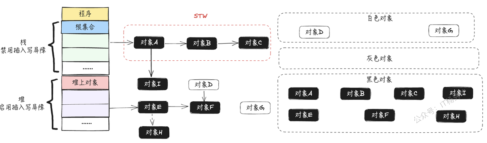

- 停止STW，这次STW大约的时间在10~100ms之间
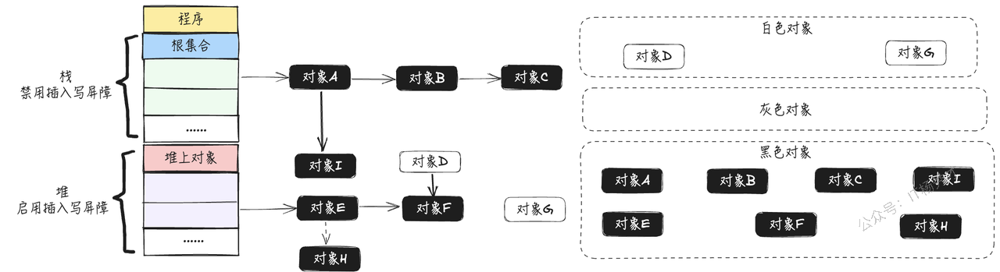

- 将剩余的白色节点全部清除
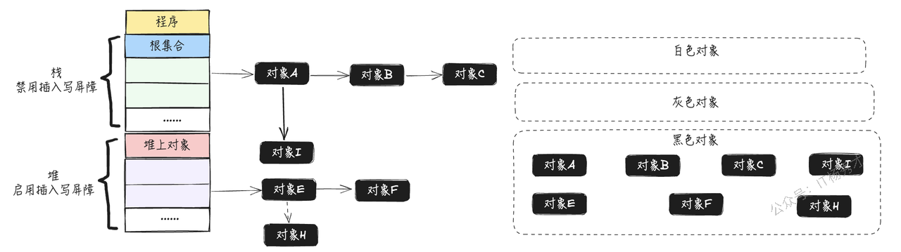

###### 5.5.3.2 删除写屏障（Yuasa Deletion Barrier）

删除写屏障的原理可以用如下伪代码表示

```go
func YuasaWB(slot *unsafe.Pointer, ptr unsafe.Pointer){
    shade(*slot) // 将*slot标记为灰色，即指针修改时，修改前指向的对象要标灰
    *slot = ptr  // 将新的下游对象ptr赋值给当前下游对象slot
}
```

上述伪代码可以翻译如下：

```go
添加下游对象(当前下游对象slot， 新下游对象ptr) {
  //step 1
  if (当前下游对象slot是灰色 || 当前下游对象slot是白色){
      标记灰色(当前下游对象slot)     //slot为当前下游对象，即将被删除， 标记为灰色
  }
  
  }  
  //step 2
  当前下游对象slot = 新下游对象ptr
}
```

删除写屏障一般有两种适用场景：

- A删除下游对象，比如A 之前的下游对象B被删除， B被标记为灰色
- A变更下游对象，比如A 将下游对象C 更换为B， C被标记为灰色

由于 **指针修改时，修改前指向的对象要标灰，即被删除的对象，如果自身为灰色或者白色，那么被标记为灰色；** 所以满足弱三色不变性，因为保护灰色对象到白色对象的路径不会断

注意，虽然删除写屏障也是GC领域常见的屏障技术，但是go语言 在GC中从来没有直接使用删除写屏障

假设应用程序中的对象关系如下图所示，下面用图示的方式展示删除写屏障的过程

1. 程序初始阶段，所有对象均标记为白色，将所有对象放入到白色集合
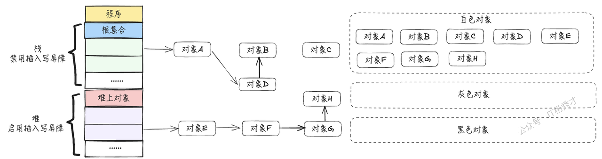

- 从根节点开始按照三色标记遍历，标记到如下图所示的状态：
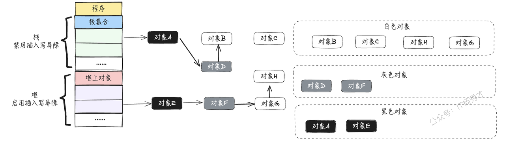

- 此时用户程序将原本对象E指向对象F的指针指向对象G，即对象E删除对象F，添加对象；触发删除写屏障，由于对象F已经被标记为灰色，所以不做改变，如下图所示
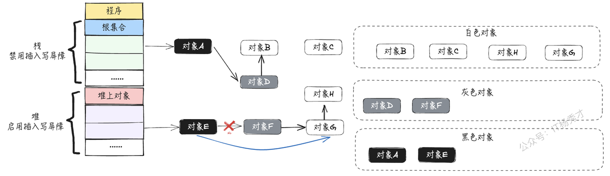

- 用户程序将对象F指向对象G的指针删除，触发删除写屏障，对象G被标记为灰色，如下图所示：
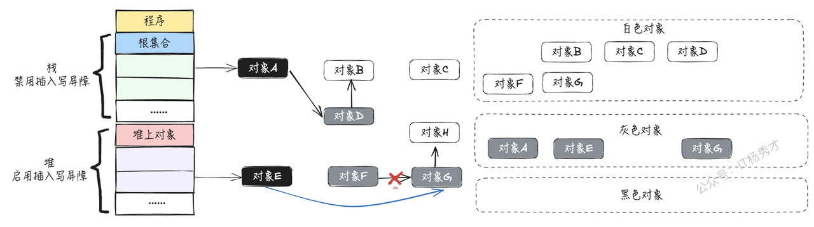

- 按照三色标记法和删除写屏障的的步骤继续往下执行，最终得到的结果如下图所示：
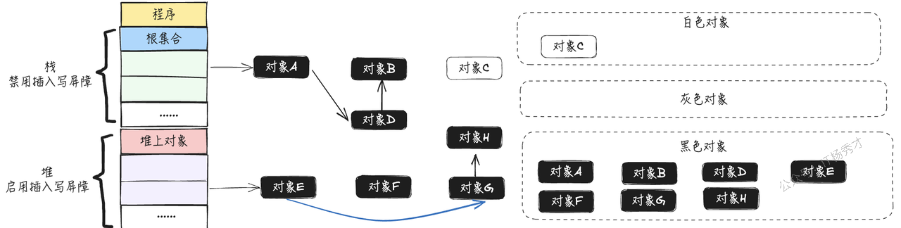

可以看到由于有删除写屏障的存在，可以准确回收掉不需要的内存，不会出现错误回收的情况，但是却会出现回收精度低的问题。同时注意看上图，对象F其实是一个孤立的对象，不会再使用了，却最终被标记为了黑色，没有被回收掉，只能通过下一轮GC的时候将其回收，所以，删除写屏障虽然不需要在标记结束后开启STW，但却存在回收精度低的问题

###### 5.5.3.2.1 删除写屏障是否真的不需要STW

前面分析了，删除写屏障虽然不需要在标记结束后开启STW，是否意味着单独使用删除写屏障进行GC就不需要STW了呢？

其实并非如此，删除写屏障又叫做基于其实快照的解决方案（snapshot-at-the-begining）。删除写屏障（基于起始快照的写屏障）在使用的时候有一个前提条件，就是必须起始的时候，把整个根部扫描一遍，做一次快照，让所有的可达对象全都在灰色保护下（根对象全为黑，下一级在堆上的对象全灰），之后利用删除写屏障拦截内存写操作，确保弱三色不变式不被破坏，这样就绝对不会有被误回收的对象，就可以保证垃圾回收的正确性。而在起始阶段，扫描整个根节点，做快照的时候是要进行STW的，所以从整体上看删除写屏障同样要进行STW

下面通过一个简单的图示看一下，经过了STW快照之后的，删除写屏障过程


1. 起始阶段，根节点全黑，堆上一级节点全灰
2. 开始三色标记
3. 新增黑色对象A指向白色对象C
4. 对象B删除对象C，触发删除写屏障，对象C置灰，避免黑色对象引用白色对象

**总结** ：

1. 删除写屏障必须在起始阶段，开启STW来 扫描整个栈（注意所有的 goroutine 栈，所以整个用户程序所有的goroutine都要扫描，所以是STW，STW是让用户所有的goroutine全部停止），来确保堆上的一级对象全灰，保证 **所有堆上在用的对象** 都处于灰色保护下，才能保证弱三色不变性
2. 删除写屏障需要在起始阶段执开启STW 扫描，因此不适合具有大栈内存的场景，栈越大，扫描时间越久，比如现代服务器程序栈内存都相对较大，所以都不太适合删除写屏障。相反，它更适合栈内存较小的环境，如嵌入式系统和物联网设备，因为它们的栈空间有限，STW 时间较短
3. 删除写屏障的可能会有遗漏对象需要在下一轮GC才可能被回收，所以税收精度相对较低，不如插入写屏障

**思考题：前面分析在使用删除写屏障之前需要STW来扫描整个栈空间，获取快照？那是否可以不一次性暂停所有的goroutine，而是一个栈一个栈的暂停获取快照呢？这样就不用STW了**

先看个具体例子：

1. 对象A 是 goroutine1 里栈上的一个对象，goroutine1里的栈空间已经扫描完了，并且 对象C 也扫描完标记为黑色的对象；
2. 对象B 是 goroutine2里 栈上的对象，指向了goroutine1里的对象 C 和goroutine2里的对象 D，由于goroutine2 还没有完全扫描，对象B 是一个灰色对象，对象D 是白色对象


此时假设执行以下步骤：

第一步：goroutine2 进行赋值变更，把 对象C 指向 D 对象，此时黑色对象 C 就指向了白色的 D（这里是删除屏障，而不是插入写屏障，所以新增引用不会触发任何操作）

第二步：删除对象 B 到对象D的引用，由于是栈对象操作，不会触发删除写屏障

执行完上述两个，结果如下图：

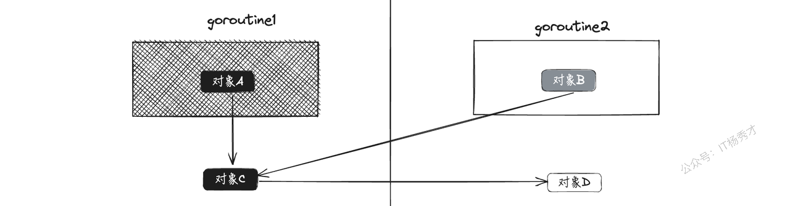

由于对象C 已经是黑色对象了，所以不会再扫描，所以对象 D 就会被错误的清理掉

**所以** ， **一个栈一个栈的暂停获取快照是不可行的，必须STW，暂停用户程序的所有goroutine的栈空间，来打快照，把所有的堆对象都处于灰色保护中才行**

###### 5.5.3.3 混合写屏障

仔细思考下删除写平展的弊端和流程，发现它最大的问题就是起始阶段的栈空间扫描，要进行STW暂停整个的用户程序，而一个一个的栈暂停又会出现问题，那有没有什么办法可以解决这个问题呢？

回顾上面删除写屏障的例子的第一步，在把对象C 指向 D 对象的时候，正是由于此时是删除写屏障，所以导致黑色对象 C 就指向了白色的 D而没有任何操作，那如果在这里加入插入写屏障的逻辑，此时对象D就会被置灰，尽管后面对象C已经是黑色不会再被扫描，也不会出现黑色对象指向白色对象的情况了

仔细想想，这里引入的插入写屏障还是在一个一个的栈暂停的情况下的，是不需要进行STW的。这里既用到了删除写屏障，又用到了插入写屏障，这不就是混合写屏障吗？

**混合写屏障 = 删除写屏障 + 插入写屏障**

**混合写屏障模式下，利用删除写屏障避免了插入写屏障的STW问题（全部三色标记扫描之后，要STW对栈重新进行三色标记扫描），又利用插入写屏障避免了删除写屏障的STW问题（使用删除写屏障之前需要STW垃圾扫描整个栈空间，获取快照，把所有的堆对象都处于灰色保护中），这样就完美解决了屏障技术带来的STW问题**

上面只是从感官上分析了插入写屏障和删除写屏障的结合，解决了STW的问题，但其实混合写屏障不仅仅是做了这两点

Go 在Go V1.8版本时候为了简化 GC 的流程，同时减少标记终止阶段的重扫成本，将 Dijkstra 插入屏障和 Yuasa 删除屏障进行混合，引入了混合写屏障机制（hybrid write barrier）。

混合写屏障的基本思想是： **对正在被覆盖的对象进行着色，且如果当前栈未扫描完成，则同样对指针进行着色。**

混合写屏障的原理可以用如下伪代码表示

```go
func HybridWritePointerSimple(slot *unsafe.Pointer, ptr unsafe.Pointer) {
    shade(*slot)
    shade(ptr)
    *slot = ptr
}
```

可以做如下翻译

```go
添加下游对象(当前下游对象slot, 新下游对象ptr) {
//step1 
标记灰色(当前下游对象slot)    //只要当前下游对象被移走，就标记灰色

//step2 
标记灰色(新下游对象ptr)      //新下游对象标记为灰色

//3step
当前下游对象slot = 新下游对象ptr
}
```

意思就是在垃圾回收阶段，只要是堆上的一个赋值 `*slot = ptr` 那么都会被拦截住，然后把旧值（ `*slot` ）指向的对象，和新值（ptr）指向的对象都置灰（投到扫描队列）

所以混合写屏障的流程可以总结为：

- **GC 开始将栈上的对象全部扫描并标记为黑色（注意是一个一个栈标记，不是所有栈全部暂停标记）**
- **GC 期间，任何在栈上创建的新对象，均标记为黑色**
- **被删除的堆对象标记为灰色**
- **被添加的堆对象标记为灰色**

假设应用程序中的对象关系如下图所示，下面用图示的方式展示混合写屏障的过程

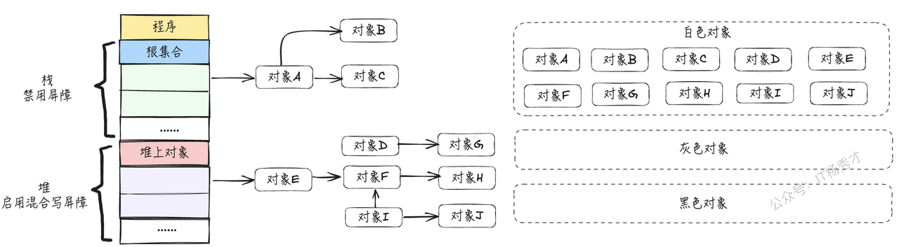

1. GC开始扫描站对象，将所有栈上可达对象A,B,C标记为黑色
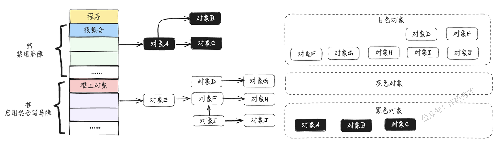

- GC期间栈上新创建的对象K被标记为黑色
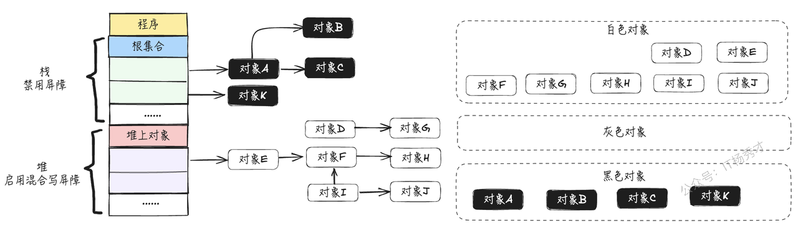

- 进行三色标记到如下阶段，对象E被标记为黑色，对象F被标记为灰色
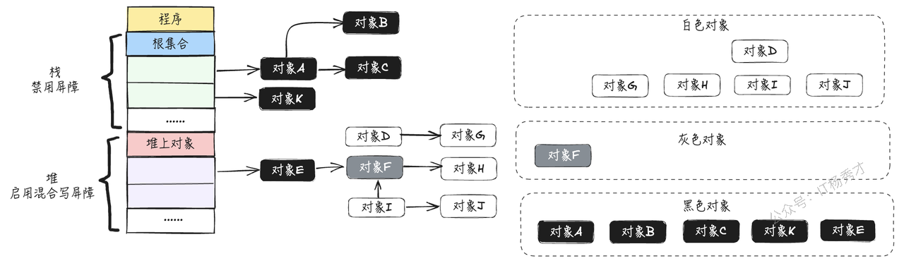

- 此时，对象E新增指针指向对象I，对象F删除对对象H的指针引用，触发混合写屏障，对象I标记为灰色，对象H标记为灰色
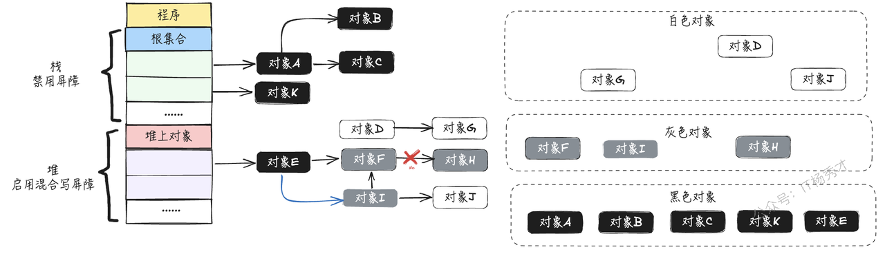

- 按照三色标记法和混合写屏障的的步骤继续往下执行，最终得到的结果如下图所示：
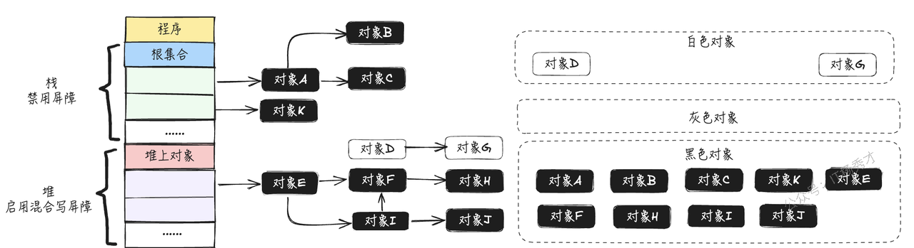

最终垃圾对象为白色对象D,G，将会被垃圾回收器清理掉

**总结：**

1. 混合写屏障结合了插入和删除写屏障的优势。它不需要在开始时进行全局的STW操作来创建快照，也不需要在三色标记扫描之后，进行STW对栈重新进行三色标记扫描
2. 混合写屏障保留了删除写屏障的功能，所以其扫描精度比插入写屏障低，但它实现了整个GC过程中无STW
3. 虽然混合写屏障整个GC过程中无STW，然而在扫描某个特定的栈时，还是需要暂时停止该goroutine的赋值器操作，以确保状态的原子切换

#### 5.6 三色标记对应的程序本质

其实在go语言的GC程序里面是没有所谓的黑色，白色，灰色属性的，这三个颜色属性认为抽象出来的概念，帮助我们理解三色标记的过程

在go语言GC程序内部，对这三种颜色的对象状态的描述，是通过一个队列 + 掩码位图 来实现的：

- 白色对象：对象所在 span 的 gcmarkBits 中对应的 bit 为 0，并且该对象不在扫描队列中
- 灰色对象：对象所在 span 的 gcmarkBits 中对应的 bit 为 1，并且该对象在扫描队列中
- 黑色对象：对象所在 span 的 gcmarkBits 中对应的 bit 为 1，并且该对象已经从扫描队列中处理并剔除掉

#### 5.7 GC的完整流程

GO语言GC 相关的代码在 `runtime/mgc.go` 文件中，一共分为分为 `清除终止` （SweepTermination）, `标记` （Mark）, `标记终止` （MarkTermination）, 和 `清除` （Sweep） 四个不同阶段, 它们分别完成了不同的工作:

1. **清除终止（SweepTermination）**

这个阶段的主要任务是结束上一个GC周期的清除工作，并为新的GC周期做准备。

- **标记（Mark）**
	- 将GC状态从 **\` `` _GCoff` ``** `更改为` **`` `_GCmark `` \`** ，并且开启写屏障（Write Barrier）和协助线程（mutator assists），紧接着将根对象入队
		- 恢复用户程序的正常执行，标记进程（mark workers）和协助线程（mutator assists）开始发地标记内存中的对象，写屏障会将被覆盖的指针和新指针都标记成灰色, 而所有新创建的对象都会直接标记成黑色
		- 遍历灰色对象集合，将灰色对象标记为黑色，并将该对象指向的对象标记为灰色
		- 使用分布式终止算法（distributed termination algorithm）来检测剩余工作，即何时不再有根标记作业或灰色对象，如果没有了则转为标记终止（MarkTermination）阶段
- **标记终止（MarkTermination）**
	- 执行STW
		- 将GC状态切换至 **\` `_GCmarktermination` \`** ，关闭 GC 工作线程以及 mutator assists（协助线程）
		- 清理处理器P上的缓存（mcache）
- **清除（Sweep）**
	- 将 GC 状态切换至 **\` `` _GCoff` ``** ，初始化清理状态并关闭写屏障（Write Barrier）
		- 恢复用户程序的正常执行，从此时开始所有新创建的对象会标记成白色
		- 后台并发清理所有的内存管理单元，当应用程序goroutine尝试在堆内存中分配新内存时，会触发该操作

#### 5.8 GC的触发时机

GO语言中GC的触发分为手动触发和被动触发两种

1. **手动触发** ，通过调用 runtime.GC() 来触发 GC，此调用阻塞式地等待当前 GC 运行完毕
2. **被动触发** ，分为两种方式：
	- go后台有一系统监控线程，当超过两分钟没有产生任何 GC 时，强制触发 GC。
		- 使用步调算法，通过内存增长的比例来触发GC，每次内存分配时检查当前内存分配量是否已达到阈值（环境变量GOGC）：默认100%，即当内存扩大一倍时启用GC
		- 我们可以通过debug.SetGCPercent(500)来修改步调，这里表示，如果当前堆大小超过了上次标记的堆大小的500%，就会触发
				- 而第一次GC的触发的堆内存临界值是4MB

总结：

1、监控线程 runtime.sysmon 定时调用

2、手动调用 runtime.GC 函数进行垃圾收集

3、申请内存时 runtime.mallocgc 会根据堆大小判断是否调用

#### 5.9 小结

GO语言GC总体上来说是采用的并行三色标记法+混合写屏障机制来实现的，内存写屏障是由插入写屏障向混合写屏障过渡的，go语言在Go 1.7 之前其实就使用的是插入写屏障（Dijkstra Write barrier），在Go V1.8版本引入了混合写屏障。

1. 插入写屏障没有完全保证完整的强三色不变式，由于性能影响，栈上对象没有开启写屏障，所以三色标记完成之后，最后必须 STW 重新扫描栈
2. 混合写屏障消除了屏障过程中所有的 STW，不用 STW 扫描栈，但由于引入了删除想屏障，所以损失了一定的回收精度，其回收精度和删除写屏障的一致，比插入写屏障要低
3. 混合写屏障扫描栈的方式是逐个暂停扫描的，不需要STW

## GMP 模型
参考资料：[13. GMP调度原理 | 秀才的进阶之路](https://golangstar.cn/go_series/go_principles/gmp_principles.html)
Go作为新进语言为什么有这么强大的并发能力。答案就藏在它核心的 **GMP调度模型** 里。
- **第一部分：宏观视角**
	- **第一小节：从基础聊起** ：咱们先热个身，聊聊线程、协程这些基本概念，看看Go的goroutine是如何站在巨人肩膀上的。
		- **第二小节：GMP设计图纸** ：直接上源码，看看G、M、P这三个核心组件在底层到底长啥样。
- **第二部分：微观之旅**
	- **第三小节：一个G的诞生与执行** ：跟着一个goroutine的视角，看它是如何被创建并被调度器翻牌子执行的。
		- **第四小节：G的主动让贤** ：看看一个正在运行的goroutine是如何主动让出CPU，把机会留给其他G的。
		- **第五小节：霸道的调度器** ：当一个G"占着茅坑不拉屎"，长期占用CPU时，我们的监控者是如何强制把它"请"下来的。
### 1 故事的开始：了解基础概念

#### 1.1 从线程到协程
在聊GMP之前，我们得先搞明白两个老朋友： **线程（Thread）** 和 **协程（Coroutine）** 。

- **线程（Thread）** ：这家伙是操作系统的大内总管——内核（Kernel）眼里的最小执行单元。它的生老病死、工作调度，全得听内核的号令。你可以把它想象成一个正式工，有编制，但每次调度（切换）都得走一套复杂的流程，成本比较高。
- **协程（Coroutine）** ：这家伙更像是用户自己请的临时工。它活在用户态，比线程更轻量，可以理解为用户态线程。多个协程可以在一个线程上跑，它们的调度切换由用户程序自己说了算，不用去麻烦内核这个大忙人。所以，协程的切换开销极小，非常灵活。
简单总结一下：线程是内核级的，重而稳；协程是用户级的，轻而快。
#### 1.2 Go的答案：goroutine
Go语言选择的并发实现，就是我们所熟知的 **goroutine** 。你可以把它看作是Go对协程的"超级魔改版"。它并不是一个孤立的概念，而是整个 **GMP调度体系** 的核心产物。

正是因为有了GMP这套精妙的架构，goroutine才拥有了超越原生协程的两大核心优势：
1. **灵活的调度** ：G（goroutine）、M（Machine，内核线程）、P（Processor，处理器）三者之间可以动态地绑定和解绑，整个调度过程充满了弹性。
2. **动态的栈空间** ：每个goroutine的栈空间可以根据需要自动伸缩，既方便使用，又极大地节约了内存资源。
更牛的是，Go语言在顶层完全屏蔽了线程这个概念，所有的并发操作都是围绕着goroutine来的，就像秦始皇统一了度量衡，Go也用goroutine统一了并发江湖的秩序。
#### 1.3 GMP架构全景图

好了，主角登场！GMP，顾名思义，就是 **G** oroutine + **M** achine + **P** rocessor。
- **G（Goroutine）** ：就是我们的"任务单元"。它有自己的执行栈、生命状态，以及要完成的具体工作（就是你 `go` 后面跟的那个函数）。G需要绑定到M上才能运行，你可以把M想象成G的CPU。
- **M（Machine）** ：你可以把它看作Go对系统线程的封装，是真正干活的"工人"。M需要和P"绑定"后，才能进入GMP的调度循环。M的工作很简单，就是在 `g0` （一个特殊的goroutine，负责调度）和普通的G之间反复横跳：执行 `g0` 时，它在找任务；执行普通G时，它在处理任务。
- **P（Processor）** ：P是调度器，是GMP模型中的"中枢大脑"。M必须获取到一个P，才能开始调度和执行G。P的数量决定了同一时间最多有多少个M可以处于运行状态，这个数量通常由 `GOMAXPROCS` 环境变量决定。P还有一个非常重要的职责：它自带一个本地的goroutine队列，我们称之为 **LRQ (Local Run Queue)** 。

现在，我们把目光聚焦到存放G的"容器"上。Go的设计非常巧妙，它有两种队列：
1. **P的本地队列（LRQ - Local Run Queue）** ：这是每个P私有的G队列。当一个M想执行G时，会优先从自己绑定的P的LRQ里找。因为是私有的，所以大部分时间不需要加锁，通过高效的CAS（Compare-And-Swap）操作就能完成存取，大大减少了并发冲突。当然，也并非完全没有冲突，因为当一个P的LRQ空了的时候，它可能会从其他P的LRQ里"偷"一些G过来，这就是著名的 **work-stealing** 机制。
2. **全局队列（GRQ - Global Run Queue）** ：这是一个全局共享的G队列。当一个P的LRQ满了，新创建的G就会被放到GRQ里。因为是全局共享的，所以所有M都可能来访问，竞争激烈，因此访问它需要加一把全局大锁。
**G的存放与获取逻辑** ：
- **放G（put g）** ：当你在一个goroutine里通过 `go func(){...}` 创建一个新的goroutine时，它会优先被放到当前P的LRQ里。如果LRQ满了，没办法，只能加个全局锁，把它扔到GRQ里去。这遵循的是"就近原则"。
- **取G（get g）** ：当M上的 `g0` 开始找活干时，它会遵循一个"负载均衡"的策略，按以下顺序来寻找G：
	1. 先从当前P的LRQ里找（无锁，速度最快）。
	2. 如果LRQ没有，就去全局GRQ里看看（需要加锁）。
	3. 如果GRQ也没有，就去网络轮询器（netpoll）里找找有没有因为IO操作而就绪的G。
	4. 如果还是没有，就只能去"偷"了，从别的P的LRQ里偷一半过来（work-stealing，无锁）。
这里有个小细节：为了防止GRQ里的G被"饿死"（因为M上的 `g0` 总是优先从LRQ取），调度器规定，每进行61次调度循环，就必须强制去下一次去 `GRQ` 取 。这样做是为了避免 `LRQ` 过于繁忙，而导致 `GRQ` 中的 `g` "饿死"。
#### 1.4 GMP生态圈
在Go的世界里，GMP是绝对的基石。所有上层的建筑，比如内存管理、并发工具等，都是围绕着GMP模型来精心设计的。
##### 1.4.1 内存管理


Go的内存管理借鉴了Google自家的TCMalloc思想，并为GMP模型量身定做了优化。它为每个P都配备了一个私有的内存缓存—— `mcache` 。当一个P上的G需要分配小对象时，可以直接从这个私有的 `mcache` 里拿，完全无锁，速度飞快。
##### 1.4.2 并发工具（Mutex, Channel）

你有没有想过，为什么在Go里一个channel的读写阻塞了，或者一个Mutex锁住了，并不会把整个线程都卡死？
这就是因为Go的并发工具都是"G级别"的。当一个G因为这些操作需要阻塞时，它会被挂起，让出M的执行权。M会立刻去寻找并执行其他的G，整个过程都在用户态完成，无需内核介入。这极大地提升了并发性能。
我最近在用C++尝试模拟GMP时，就深有感触。C++标准库里的锁，一旦锁住，阻塞的是整个线程，这会导致线程上所有其他的协程都得干等着。想要实现Go这种效果，就得重写所有并发工具，成本巨大。这也反向证明了Go在并发设计上的优越性。
##### 1.4.3 IO多路复用（netpoll）

对于网络IO，Go采用了Linux下性能强悍的epoll技术。但为了避免epoll的等待操作阻塞整个M，Go设计了一套巧妙的 `netpoll` 机制。它将IO阻塞操作转换成了G级别的阻塞（ `gopark` ），当IO就绪时，再通过 `goready` 唤醒对应的G。这样，IO操作也被完美地融入了GMP的调度体系中。

可以说，不理解GMP，就无法真正理解Go语言的精髓。
### 2 深入源码：GMP的底层结构

理论说了一大堆，我们现在就潜入源码，看看G、M、P在 `runtime/runtime2.go` 文件里到底长什么样。
#### 2.1 G的结构（goroutine）


`g` 结构体是goroutine的实体，我们来看看它的关键字段：

- `stack`: 描述了goroutine的栈空间信息（起始和结束地址）。
- `stackguard0`: 栈的警戒线。当goroutine的栈使用量将要越过这条线时，就会触发栈扩容。同时，它也被用来标记"抢占请求"。
- `_panic`: 用来记录goroutine中发生的panic。
- `_defer`: 用链表的形式存储了goroutine中的defer操作（后进先出）。
- `m`: 指向当前正在执行它的M。如果G没在运行，这个字段就是 `nil` 。
- `atomicstatus`: G的生命周期状态，比如 `_Gidle` 、 `_Grunnable` 、 `_Grunning` 、 `_Gwaiting` 等。
```go
// g represents a goroutine.
type g struct {
        // stack describes the goroutine's stack. The bounds are
        // [stack.lo, stack.hi).
        stack       stack   // goroutine的执行栈空间
        // stackguard0 is the stack pointer compared in the Go stack growth prologue.
        // It is stack.lo + _StackGuard.
        // It is also used to signal a request to preempt the goroutine.
        stackguard0 uintptr // 栈空间保护区边界，也用于传递抢占标识

        // ...

        _panic       *_panic // 记录g执行过程中遇到的异常
        _defer       *_defer // g中挂载的defer函数，是一个LIFO的链表结构
        m            *m      // 当前执行本g的m
        
        // atomicstatus is the status of the goroutine.
        // It is changed atomically with casgstatus.
        // This field is read and written atomically, and the values are not in the
        // GStatus enum.
        atomicstatus uint32 // g的状态

        // ...
        
        // schedlink is a link in the global run queue, idle g list, or gfree list.
        schedlink guintptr // 进入全局队列grq时指向相邻g的next指针
}
```
#### 2.2 M的结构（Machine）


`m` 结构体是内核线程的抽象，核心字段如下：

- `g0`: 一个非常特殊的G。每个M都有一个自己的 `g0` ，这个 `g0` 不执行用户代码，它的任务就是执行调度逻辑，为M寻找下一个要运行的普通G。
- `gsignal`: 另一个特殊的G，专门用来处理分配给这个M的信号。
- `curg`: 指向当前M上正在运行的那个普通的用户G。
- `p`: 指向当前与M绑定的P。
```go
// m represents an OS thread.
type m struct {
        g0      *g     // 专门用于调度的g，每个M都有一个
        // ...
        procid  uint64 // M的唯一ID
        gsignal *g     // 用于处理信号的g
        
        curg    *g     // M上正在运行的普通g
        p       puintptr // M关联的p
        
        // ...
        
        schedlink muintptr // M在空闲链表中的下一个M
}
```

你可以把M的运行过程想象成两个状态的切换：当它在执行 `g0` 时，它在扮演"调度者"的角色；当它在执行 `curg` 时，它在扮演"执行者"的角色。
#### 2.3 P的结构（Processor）


`p` 结构体是调度器，是连接G和M的桥梁，核心字段如下：

- `status`: P的生命周期状态，如 `_Pidle` 、 `_Prunning` 等。
- `m`: 指向当前与它绑定的M。
- `runq`: P的私有G队列，也就是我们前面说的LRQ，它是一个定长的数组，可以存放256个G。
- `runqhead`, `runqtail`: LRQ的头尾索引，用来实现一个环形队列。
- `runnext`: LRQ里的一个"VIP通道"。通过 `runqput` 放入的下一个G会优先放在这里，调度器会首先检查 `runnext` 是否有G，有的话直接拿来执行，可以省去操作 `runq` 队列的开销。
```go
// p represents a processor.
type p struct {
        id          int32  // P的ID
        status      uint32 // P的状态 (pidle, prunning, etc.)
        link        puintptr
        schedtick   uint32   // 每执行一次schedule，该值+1
        syscalltick uint32   // 每进行一次系统调用，该值+1
        m           muintptr // 回指到关联的M (如果idle则为nil)
        
        // Queue of runnable goroutines. Accessed without lock.
        runqhead uint32
        runqtail uint32
        runq     [256]guintptr // 本地G队列，即LRQ
        // runnext, if non-nil, is a runnable G that was ready'd by
        // the current G and should be run next instead of what's in
        // runq.
        runnext guintptr // 下一个要调度的G，可以看作是LRQ中的一个特权位置
        
        // ...
}
```

#### 2.4 全局调度器（schedt）


除了G、M、P这三大组件，还有一个全局的 `schedt` 结构体，它掌管着全局资源，访问它需要加锁。

- `lock`: 全局互斥锁。
- `midle`: 空闲的M队列，没活干的M会在这里排队。
- `pidle`: 空闲的P队列，没活干的P也在这里排队。
- `runq`: 全局G队列，也就是GRQ。
- `runqsize`: GRQ里G的数量。
```go
// 全局调度模块
type schedt struct{
    // ...
    // 互斥锁
    lock mutex

    // 空闲 m 队列
    midle        muintptr // idle m's waiting for work
    // ...
    // 空闲 p 队列
    pidle      puintptr // idle p's
    // ...

    // 全局 g 队列——grq
    runq     gQueue
    // grq 中存量 g 的个数
    runqsize int32
    // ...
}
```

> `midle` 和 `pidle`的设计是为了资源的复用和节能。当系统不忙时，空闲的M和P会被放进这两个队列里"休眠"，避免CPU空转，等到有新任务时再被唤醒。
### 3 正向追踪：一个G的诞生与调度

好了，基础结构我们都看完了。现在，让我们切换到第一人称视角，看看一个我们用 `go func(){...}` 创建的goroutine，是如何一步步被调度并执行的。这个过程，可以看作是从 `g0` 到 `g` 的转换。
#### 3.1 main函数的特殊性

`main` 函数是所有Go程序的入口，它比较特殊。它是由一个全局唯一的 m0（主线程）来执行的。源码位于 runtime.proc.go

```go
// The main goroutine.
func main() {
        // ...
        // 获取用户定义的 main.main 函数
        fn := main_main
        // 执行用户的 main 函数
        fn()
        // ...
}
```
#### 3.2 普通G的创建之旅


除了 `main` 这个特例，我们自己启动的goroutine都会经历一个标准的创建流程。比如这段代码：

```go
func handle() {
        // 异步启动一个goroutine
        go func() {
                // do something ...
        }()
}
```

编译器会把 `go func()` 转换成对 `runtime.newproc` 函数的调用。这个函数的核心逻辑如下（我们跟着代码走一遍）：

1. **切换到** `g0` **栈** ： `newproc` 会先通过 `systemstack` 把自己从当前的用户G栈切换到M的 `g0` 调度栈上。因为创建G是调度层面的工作，得由专业的 `g0` 来干。
2. **创建G实例** ：在 `g0` 栈上，调用 `newproc1` 来创建一个新的 `g` 结构体实例，并做好初始化工作，比如设置好要执行的函数入口地址、程序计数器等。
3. **放入就绪队列** ：新创建的G需要被放到一个就绪队列里，等待被调度。这里会调用 `runqput` 函数。
4. `runqput` **的逻辑** ：
	- 它会优先尝试把新的G放到当前P的 `runnext` 这个VIP位置。
		- 如果 `runnext` 被占了，它会尝试把G放到当前P的LRQ的队尾。
		- 如果LRQ也满了，那没办法，只能加个全局锁，把这个G和LRQ里的一半G都转移到全局队列GRQ里去（这个操作叫 `runqputslow` ）。
5. **唤醒休眠的P** ：如果此时有P因为没事干而处于休眠状态， `wakep` 函数会负责唤醒一个P来处理这个新任务。
6. **切回用户G栈** ： `systemstack` 执行完毕，切回到原来的用户G，继续执行它自己的代码。
```go
// 创建一个新的g，并将其投递到就绪队列中。fn是用户指定的函数。
// 当前的执行者还是某个普通的g。
func newproc(fn *funcval) {
        // 获取当前正在执行的普通g和程序计数器
        gp := getg()
        pc := getcallerpc()
        
        // systemstack会临时切换到g0栈，执行完闭包函数后，再切回原来的普通g
        systemstack(func() {
                // 此时执行方为g0
                // 构造一个新的g实例
                newg := newproc1(fn, gp, pc)

                // 获取当前P
                _p_ := getg().m.p.ptr()
                
                // 将newg添加到队列中:
                // 1) 优先添加到P的本地队列LRQ
                // 2) 如果LRQ满了，则添加到全局队列GRQ
                runqput(_p_, newg, true)

                // 如果有因为空闲而被阻塞的P和M，需要唤醒它们
                if mainStarted {
                        wakep()
                }
        })
        // 切回到原来的普通g继续执行
}
```
#### 3.3 从 g0 到 g 的切换


每个M都有一个自己的 `g0` ， `g0` 的工作就是不断地调用 `schedule` 函数来寻找可执行的G。所以，一个M的生命周期，就是在执行 `g0` （找任务）和执行普通 `g` （做任务）之间循环往复。
当一个M的普通`g`执行完成后或者被阻塞了就会切换回`g0`

这个切换过程有两个关键的"桩函数"：

- `mcall`, `systemstack`: 实现从 `g` 切换到 `g0` 。
- `gogo`: 实现从 `g0` 切换到 `g` 。

我们从 `g0` 的视角来看，它主要做两件事：

1. `schedule()`: 调用 `findrunnable()` 方法，从各个队列里找到一个可执行的G。
2. `execute()`: 找到G之后，更新上下文信息（比如把 `m.curg` 指向找到的G），然后调用 `gogo` ，把M的CPU执行权从 `g0` 交到这个G手上。

上述方法均实现于 runtime/proc.go 文件中：

```go
// 执行方为g0
func schedule() {
        _g_ := getg() // 获取当前g0

top:
        pp := _g_.m.p.ptr() // 获取当前P
        
        // ...

        // 核心方法: 获取一个可调度的g
        // - 按照优先级，依次从本地队列LRQ、全局队列GRQ、netpoll、其他P的LRQ中寻找
        // - 如果都找不到，就把P和M都休眠掉
        gp, inheritTime, tryWakeP := findRunnable() // 这个函数会阻塞直到找到任务

        // ...

        // 执行g，这个方法会把执行权从g0切换到gp
        execute(gp, inheritTime)
}

// 执行指定的g。当前执行方还是g0，但会通过gogo方法切换到gp
func execute(gp *g, inheritTime bool) {
        _g_ := getg() // 获取g0

        // 建立g0和gp的关系
        _g_.m.curg = gp
        gp.m = _g_.m

        // 更新gp的状态：runnable -> running
        casgstatus(gp, _Grunnable, _Grunning)
        
        // 设置gp的栈保护区边界
        gp.stackguard0 = gp.stack.lo + _StackGuard

        // 执行gogo方法，M的执行权会切换到gp
        gogo(&gp.sched)
}
```
#### 3.4 寻找G的漫漫长路：findrunnable

`findrunnable` 是调度循环中最核心的函数，它寻找G的策略体现了Go调度器的智慧。


我们来梳理一下它的寻找步骤：

1. **检查全局队列（GRQ）** ：还记得吗？每61次调度循环，必须先从全局队列 `globrunqget` 拿一个G，防止GRQ饥饿。（需要加锁）
2. **检查本地队列（LRQ）** ：从当前P的LRQ里 `runqget` 一个G。（无锁CAS）
3. **再次检查全局队列（GRQ）** ：如果本地没有，再去全局队列里 `globrunqget` 找。（需要加锁）
4. **检查网络轮询器（netpoll）** ：如果还没有，就去 `netpoll` 里看看有没有因为网络IO就绪的G。（非阻塞模式）
5. **从别的P偷（steal work）** ：如果还找不到，就只能启动 `stealwork` 机制，随机找一个别的P，从它的LRQ里偷一半的G过来。
6. **再次double check全局队列** ：偷完之后，再最后看一眼全局队列。
7. **进入休眠** ：如果以上所有努力都失败了，说明系统现在真的很闲， `findrunnable` 会：
	- 把当前的P设置为 `_Pidle` 状态，并把它放到全局的 `pidle` 队列里。
		- 在把当前M也休眠之前，会做最后一次挣扎：以 **阻塞模式** 调用 `netpoll` ，看看能不能等到一个IO事件。
		- 如果连阻塞等待IO都没用，那就彻底死心了，把当前M也放到全局的 `midle` 队列里，然后调用 `stopm` 让M休眠，交出线程控制权。

这个过程设计得非常精妙，既保证了任务获取的高效性（优先无锁操作），又实现了负载均衡（work-stealing），还能在系统空闲时自动缩容，节省资源。
#### 3.5 findRunnable函数详解

Go调度器的核心在于 `findRunnable` 函数，这个函数负责为当前的处理器P找到一个可执行的goroutine。整个过程遵循着严格的优先级顺序，确保系统的公平性和效率。

```go
// 寻找可执行的goroutine，返回时必定已经找到目标g
func findRunnable()(gp *g, inheritTime, tryWakeP bool){
    // 获取当前P下的g0（调度协程）
    _g_ := getg()
    // ...
top:
    // 获取当前的处理器P
    _p_ := _g_.m.p.ptr()
    // ...
    
    // 防饥饿机制：每61次调度检查一次全局队列
    if _p_.schedtick%61==0 && sched.runqsize > 0{
        lock(&sched.lock)
        gp = globrunqget(_p_, 1)
        unlock(&sched.lock)
        if gp != nil{
            return gp, false, false
        }
    }
    // ...
    
    // 第一优先级：从本地运行队列获取goroutine
    if gp, inheritTime := runqget(_p_); gp != nil{
        return gp, inheritTime, false
    }
    
    // 第二优先级：从全局队列获取goroutine
    if sched.runqsize != 0{
        lock(&sched.lock)
        gp := globrunqget(_p_, 0)
        unlock(&sched.lock)
        if gp != nil{
            return gp, false, false
        }
    }
    
    // 第三优先级：处理网络I/O就绪的goroutine
    if netpollinited() && atomic.Load(&netpollWaiters) > 0 &&
       atomic.Load64(&sched.lastpoll) != 0{
        if list := netpoll(0); !list.empty(){ // 非阻塞调用
            gp := list.pop()
            injectglist(&list)
            casgstatus(gp, _Gwaiting, _Grunnable)
            // ...
            return gp, false, false
        }
    }
    // ...
    
    // 第四优先级：从其他P的本地队列偷取goroutine
    gp, inheritTime, tnow, w, newWork := stealWork(now)
    if gp != nil{
        return gp, inheritTime, false
    }
    
    // 若有GC标记任务，参与协作而非直接回收P
    // ...
    
    // 最后检查：再次确认全局队列
    lock(&sched.lock)
    // ...
    if sched.runqsize != 0{
        gp := globrunqget(_p_, 0)
        unlock(&sched.lock)
        return gp, false, false
    }
    // ...
    
    // 无事可做时：解绑P和M，将P放入空闲队列
    releasep()
    now = pidleput(_p_, now)
    unlock(&sched.lock)
    // ...
    
    // 网络轮询保障机制：确保有M专门处理I/O事件
    if netpollinited() && (atomic.Load(&netpollWaiters) > 0 || pollUntil != 0) &&
       atomic.Xchg64(&sched.lastpoll, 0) != 0{
        atomic.Store64(&sched.pollUntil, uint64(pollUntil))
        // ...
        
        // 阻塞模式执行网络轮询
        delay := int64(-1)
        // ...
        list := netpoll(delay) // 阻塞直到有新任务
        
        // 恢复轮询标识
        atomic.Store64(&sched.lastpoll, uint64(now))
        // ...
        
        lock(&sched.lock)
        // 尝试获取空闲的P
        _p_, _ = pidleget(now)
        unlock(&sched.lock)
        
        // 如果没有可用的P，将就绪的goroutine放入全局队列
        if _p_ == nil{
            injectglist(&list)
        } else {
            // 重新绑定P和M
            acquirep(_p_)
            // 取第一个goroutine用于调度，其余放入全局队列
            if !list.empty(){
                gp := list.pop()
                injectglist(&list)
                casgstatus(gp, _Gwaiting, _Grunnable)
                // ...
                return gp, false, false
            }
            // ...
            goto top
        }
    }
    // ...
    
    // 最终手段：阻塞当前M，加入空闲队列
    stopm()
    goto top
}
```
##### 3.5.1 本地队列获取策略

从本地队列获取goroutine是最高效的方式，因为不需要加锁。 `runqget` 函数采用了巧妙的双重策略：

```go
// 无锁方式从P的本地队列获取goroutine
func runqget(_p_ *p)(gp *g, inheritTime bool){
    // 优先获取runnext位置的goroutine（高优先级位置）
    next := _p_.runnext
    if next != 0 && _p_.runnext.cas(next, 0){
        return next.ptr(), true
    }
    
    // 从队列头部获取普通goroutine
    for{
        // 原子操作获取头部索引
        h := atomic.LoadAcq(&_p_.runqhead) // load-acquire语义，与其他消费者同步
        // 获取尾部索引
        t := _p_.runqtail
        
        // 队列为空的情况
        if t == h {
            return nil, false
        }
        
        // 根据索引取出对应的goroutine
        gp := _p_.runq[h%uint32(len(_p_.runq))].ptr()
        
        // CAS操作更新头部索引
        if atomic.CasRel(&_p_.runqhead, h, h+1){ // cas-release语义，提交消费操作
            return gp, false
        }
    }
}
```

这里有个有趣的设计： `runnext` 是一个特殊位置，专门存放高优先级的goroutine，比如刚刚创建的新goroutine。这样设计可以提高响应性。

##### 3.5.2 全局队列的公平调度

当本地队列为空时，调度器会转向全局队列。但这里有个重要的防饥饿机制：

```go
// 从全局队列获取goroutine，调用前必须持有全局锁
func globrunqget(_p_ *p, max int32)*g {
    // 确保持有锁的断言检查
    assertLockHeld(&sched.lock)
    
    // 队列空检查
    if sched.runqsize == 0{
        return nil
    }
    // ...
    
    // 根据max参数可能会批量转移goroutine到本地队列
    // 这里简化显示核心逻辑
    // ...
    
    // 从全局队列头部弹出一个goroutine
    gp := sched.runq.pop()
    // ...
    return gp
}
```

##### 3.5.3 网络I/O事件处理机制

在 gmp 调度流程中，如果 lrq 和 grq 都为空，则会执行 netpoll 流程，尝试以非阻塞模式下的 epoll_wait 操作获取 io 就绪的 g。该方法位于 runtime/netpoll_epoll.go：

```go
func netpoll(delay int64) gList {
    // ...
    // 调用系统的epoll_wait获取就绪事件
    var events [128]epollevent
    n := epollwait(epfd, &events[0], int32(len(events)), waitms)
    // ...
    
    var toRun gList
    for i := int32(0); i < n; i++{
        ev := &events[i]
        // 将就绪事件对应的goroutine加入待运行列表
        netpollready(...)
    }
    return toRun
}
```

这个机制让Go程序能够高效处理大量并发连接，而不需要为每个连接分配单独的线程。

##### 3.5.4 从其他的P队列窃取g

当本地队列和全局队列都为空时，并且执行完 netpoll 流程后仍未获得 g，则会尝试从其他 p 的 lrq 中窃取半数 g 补充到当前 p 的 lrq 中。工作窃取算法是负载均衡的关键，它确保了系统中的处理器都能保持忙碌状态。

```go
func stealWork(now int64) (gp *g, inheritTime bool, rnow, pollUntil int64, newWork bool){
    // 获取当前P
    pp := getg().m.p.ptr()
    // ...
    
    // 最多尝试4轮窃取
    const stealTries = 4
    for i := 0; i < stealTries; i++{
        // ...
        
        // 随机选择窃取目标，避免热点竞争
        for enum := stealOrder.start(fastrand()); !enum.done(); enum.next(){
            // ...
            
            // 获取目标P
            p2 := allp[enum.position()]
            
            // 不能从自己这里偷
            if pp == p2 {
                continue
            }
            // ...
            
            // 只要目标P不是空闲状态就尝试窃取
            if !idlepMask.read(enum.position()){
                // 窃取目标P本地队列中的一半goroutine
                if gp := runqsteal(pp, p2, stealTimersOrRunNextG); gp != nil{
                    return gp, false, now, pollUntil, ranTimer
                }
            }
        }
    }
    
    // 窃取失败
    return nil, false, now, pollUntil, ranTimer
}
```

##### 3.5.5 回收空闲p和m

再执行完上述逻辑之后，如果还是未能获取到可运行的g，系统需要妥善处理空闲的P和M，此时会将 p 和 m 添加到 schedt 的 pidle 和 midle 队列中并停止 m 的运行，避免产生资源浪费

```go
// 将P加入空闲队列
func pidleput(_p_ *p, now int64)int64{
    assertLockHeld(&sched.lock)
    // ...
    
    // 将P插入空闲队列头部
    _p_.link = sched.pidle
    sched.pidle.set(_p_)
    atomic.Xadd(&sched.npidle, 1)
    // ...
}

// 停止当前M的运行
func stopm(){
    _g_ := getg()
    // ...
    
    lock(&sched.lock)
    // 将M加入空闲队列
    mput(_g_.m)
    unlock(&sched.lock)
    
    // 让M进入休眠状态
    mPark()
    // ...
}
```
### 4 逆向追踪：G的让渡艺术

有借有还，再借不难。G拿到了M的执行权，也得在适当的时候还回去。这个"还"的过程，我们称之为 **让渡（yield）** 。让渡是一个主动的行为，由G自己发起，目的是把执行权交还给 `g0` ，让 `g0` 可以去调度其他的G。这是一个从 `g` 到 `g0` 的转换。

#### 4.1 功成身退：执行结束

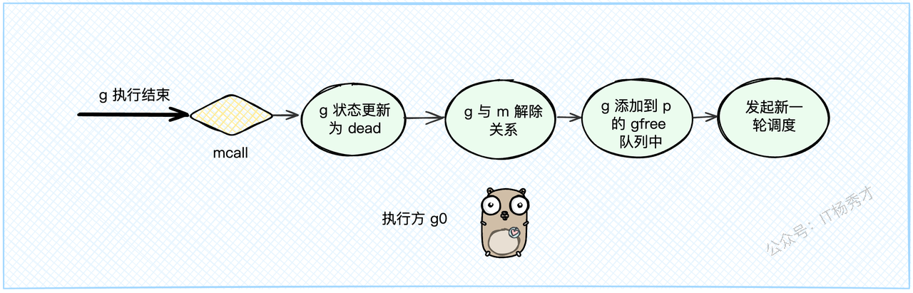

当一个G的任务执行完毕，它会调用 `goexit1` ，这是一个主动的"退休"申请。

1. 在 `goexit1` 里，它会调用 `mcall(goexit0)` ，这个 `mcall` 指令会把执行权从当前的G切换到M的 `g0` 上，并让 `g0` 去执行 `goexit0` 函数。
2. `goexit0` 函数（此时由 `g0` 执行）会负责给这个退休的G办"后事"：
	- 把G的状态从 `_Grunning` 更新为 `_Gdead` 。
		- 清理G内部的数据。
		- 解除G和M的绑定关系（ `dropg` ）。
		- 把这个G的结构体放到P的 `gfree` 队列里，方便下次创建新G时复用，避免了内存的反复申请和释放。
		- 最后，调用 `schedule()` ，开始新一轮的调度。
```go
// goroutine运行结束，此时执行方是普通g
func goexit1() {
        // 通过mcall，将执行方转为g0，调用goexit0方法
        mcall(goexit0)
}

// 此时执行方为g0，入参gp为已经运行结束的g
func goexit0(gp *g) {
        _g_ := getg() // 获取g0
        _p_ := _g_.m.p.ptr()

        // 将gp的状态由running更新为dead
        casgstatus(gp, _Grunning, _Gdead)
        // ... 清理工作 ...
        
        // 将g和p解除关系
        dropg()

        // 将g添加到p的gfree队列中以供复用
        gfput(_p_, gp)
        
        // 发起新一轮调度流程
        schedule()
}
```

#### 4.2 高风亮节：主动让渡

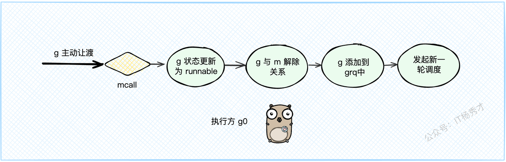

我们可以通过在代码里调用 `runtime.Gosched()` 来手动让一个G让出CPU。这个函数会做和 `goexit1` 类似的事情：

1. 调用 `mcall(gosched_m)` ，把执行权从当前G切换到 `g0` 。
2. `g0` 执行 `gosched_m` 函数，它的逻辑是：
	- 把G的状态从 `_Grunning` 改回 `_Grunnable` 。
		- 解除G和M的绑定。
		- 把这个G直接扔到 **全局队列GRQ** 中，等待下一次被调度。
		- 调用 `schedule()` ，开始新一轮调度。
```go
// 主动让渡出执行权，此时执行方还是普通g
func Gosched() {
        // 通过mcall，将执行方转为g0，调用gosched_m方法
        mcall(gosched_m)
}

// 此时执行方为g0
func gosched_m(gp *g) {
        // ...
        goschedImpl(gp)
}

func goschedImpl(gp *g) {
        // 将g状态由running改为runnable就绪态
        casgstatus(gp, _Grunning, _Grunnable)
        // 解除g和m的关系
        dropg()
        // 将g添加到全局队列grq
        lock(&sched.lock)
        globrunqput(gp)
        unlock(&sched.lock)
        // 发起新一轮调度
        schedule()
}
```

#### 4.3 情非得已：阻塞让渡

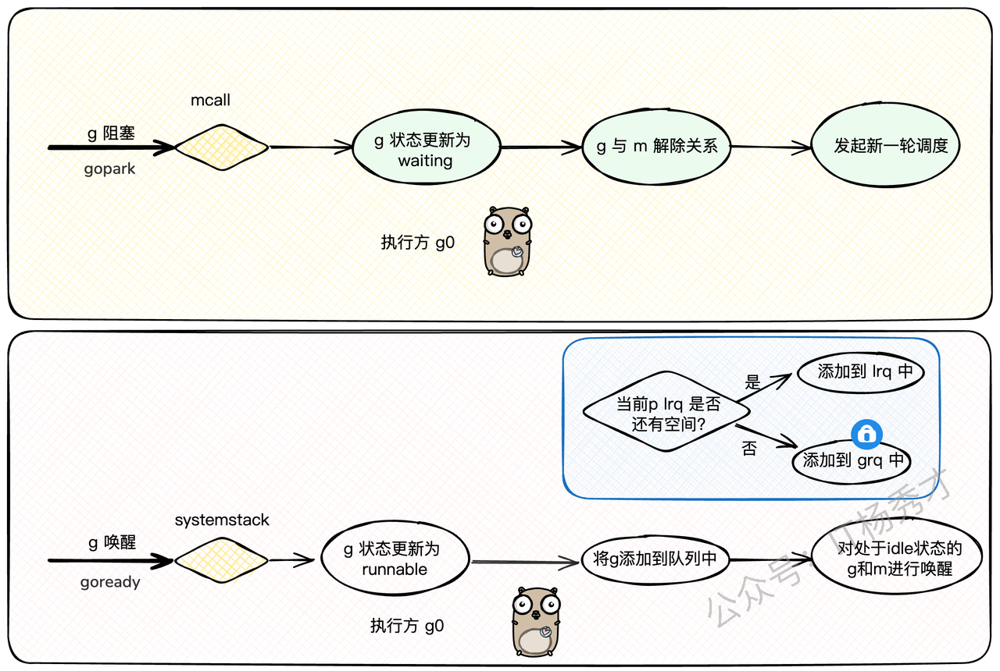

这是最常见的一种让渡方式。当G执行到需要等待某个外部条件的地方（比如读一个空的channel，或者等待一个锁），它就会被阻塞。

这个过程的核心是 `gopark` 函数：

1. 当G需要阻塞时，上层函数（比如channel的读写逻辑）会调用 `gopark` 。
2. `gopark` 同样会调用 `mcall(park_m)` ，把执行权交给 `g0` 。
3. `g0` 执行 `park_m` ，它会：
	- 把G的状态从 `_Grunning` 改为 `_Gwaiting` 。
		- 解除G和M的绑定。
		- **注意** ： `_Gwaiting` 状态的G不会被放到任何就绪队列里！它会被上层调用者（比如channel）自己保管。
		- `g0` 调用 `schedule()` ，寻找下一个G来执行。

当外部条件满足时（比如channel里有了数据），另一个G会调用 `goready` 函数来唤醒这个处于 `_Gwaiting` 状态的G。

`goready` 会：

1. 把目标G的状态从 `_Gwaiting` 改回 `_Grunnable` 。
2. 调用 `runqput` ，把这个G重新放回到就绪队列（LRQ或GRQ）中。
3. 调用 `wakep` ，尝试唤醒一个空闲的P来处理这个刚被唤醒的G。

这一 `park` 一 `ready` ，完美地实现了G级别的阻塞和唤醒，整个过程高效且对用户透明。

以下是具体的代码分析：

```go
// 此时执行方为普通 g
func gopark(unlockf func(*g, unsafe.Pointer)bool,lockunsafe.Pointer, reason waitReason, traceEv byte, traceskip int){
    // 获取 m 正在执行的 g，也就是要阻塞让渡的 g
    gp := mp.curg
    // ...
    // 通过 mcall，将执行方由普通 g -> g0
    mcall(park_m)
}

// 此时执行方为 g0. 入参 gp 为需要执行 park 的普通 g
func park_m(gp *g){
    // 获取 g0 
    _g_ := getg()

    // 将 gp 状态由 running 变更为 waiting
    casgstatus(gp,_Grunning,_Gwaiting)
    // 解绑 g 与 m 的关系
    dropg()

    // g0 发起新一轮调度流程
    schedule()
}
```

与 gopark 相对的，是用于唤醒 g 的 goready 方法，其中会通过 systemstack 压栈切换至 g0 执行 ready 方法——将目标 g 状态由 waiting 改为 runnable，然后添加到就绪队列中.

```go
// 此时执行方为普通 g. 入参 gp 为需要唤醒的另一个普通 g
func goready(gp *g, traceskip int) {
    // 调用 systemstack 后，会切换至 g0 调用传入的 ready 方法. 调用结束后则会直接切换回到当前普通 g 继续执行. 
    systemstack(func() {
        ready(gp, traceskip, true)
    })

    // 恢复成普通 g 继续执行 ...
}
```
```go
// 此时执行方为 g0. 入参 gp 为拟唤醒的普通 g
func ready(gp *g, traceskip int, next bool){
    // ...

    // 获取当前 g0
    _g_ := getg()
    // ...
    // 将目标 g 状态由 waiting 更新为 runnable
    casgstatus(gp,_Gwaiting,_Grunnable)
    /*
        1) 优先将目标 g 添加到当前 p 的本地队列 lrq
        2）若 lrq 满了，则将 g 追加到全局队列 grq
    */
    runqput(_g_.m.p.ptr(), gp,next)
    // 如果有 m 或 p 处于 idle 状态，将其唤醒
    wakep()
    // ...
}
```
### 5 第三方视角：抢占式调度

前面说的"让渡"都是G的主动行为。但如果一个G是个"老赖"，执行一个超长的计算任务，一直不主动让出CPU怎么办？难道要让整个系统都等它一个吗？

当然不行！Go调度器还有一个"霸道总裁"的角色来强制干预，就是 **抢占（Preemption）** 。一个由外部力量发起的、为了维护整个系统公平和效率的"强制让位"过程。

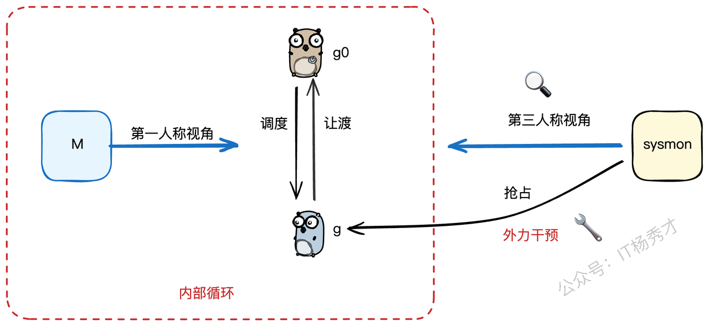

#### 5.1 幕后英雄：无处不在的sysmon

在我们的Go程序启动时，除了我们熟知的主线程外，runtime还会悄悄启动一个非常关键的后台线程—— `sysmon` （System Monitor，系统监控）。

你可以把它想象成一个永不休息的"巡逻兵"，它独立于普通的G-P-M调度模型，持续地在后台循环执行。这个线程在整个程序生命周期里是全局唯一的，就像一个大管家，不知疲倦地监视着整个Go程序的运行状态。


`sysmon` 的工作是一个永不停歇的循环，它主要关心三件大事儿：

- **网络轮询（netpoll）** ：检查有没有已经完成IO操作的网络连接，唤醒那些等待IO的Goroutine。
- **抢占（retake）** ：找出那些运行时间太长的Goroutine，毫不留情地把它"踹"下CPU。
- **GC触发检查** ：看看是不是时候该进行垃圾回收（GC）了。

这个 `sysmon` 线程是在哪里创建的呢？答案就在 `main` 函数启动的深处。Go运行时会通过 `newm` 创建一个新的系统线程（M）专门来跑 `sysmon` 这个函数。

它的核心工作逻辑大致如下：

```go
// The main goroutine.
// main goroutine的入口
func main(){
        systemstack(func() {
                // 创建一个新的M（系统线程）来执行sysmon函数
                // 这个M不关联任何P，是一个专门用于系统监控的线程
                newm(sysmon, nil, -1)
        })
        // ...
}

// sysmon是系统监控函数，它在一个独立的M上无限循环运行
func sysmon() {
        //..
        for {
                // 根据程序的繁忙程度，动态调整休眠时间
                // 如果程序比较空闲，会休眠长一点，最长10毫秒
                usleep(delay)
                // ...

                // 记录上次网络轮询的时间
                lastpoll := int64(atomic.Load64(&sched.lastpoll))
                // 如果网络轮询器已初始化，并且距离上次轮询超过10ms
                if netpollinited() && lastpoll != 0 && lastpoll+10*1000*1000 < now {
                        //...
                        // 执行非阻塞的网络轮询，返回一个就绪的goroutine列表
                        list := netpoll(0) 
                        // ...
                }

                // 执行抢占工作，这是我们的重点
                retake(now)
                //...

                // 检查是否需要触发GC
                if t := (gcTrigger{kind: gcTriggerTime, now: now}); t.test() && atomic.Load(&forcegc.idle) != 0 {
                        // ...
                }
                // ...
        }
}
```

可以看到， `sysmon` 的核心就是一个 `for` 死循环，每次循环都会执行一遍它的"三板斧"。而我们的抢占逻辑，就藏在 `retake` 这个函数里。 `retake` 会根据Goroutine的不同状态，采取不同的抢占策略，主要分为两种： **系统调用抢占** 和 **运行超时抢占** 。

#### 5.2 系统调用抢占

我们知道，系统调用（syscall）是连接用户态程序和操作系统内核的桥梁。但当一个M（系统线程）陷入系统调用时，它就会被操作系统挂起，暂时无法执行任何用户态代码。这对Go的调度器来说是个大问题，因为如果M上还绑定着一个P（处理器），那这个P也就跟着被闲置了，它所管理的本地Goroutine队列就得不到执行，造成了资源浪费。

Go的策略非常聪明： **人走可以，但办公桌得留下！**

当一个Goroutine即将发起系统调用时，调度器会做几件事：

1. **解除P与M的绑定** ：把当前线程M和处理器P分离开。
2. **状态更新** ：把Goroutine和P的状态都更新为 `_Gsyscall` 和 `_Psyscall` 。
3. **保留弱联系** ：虽然P和M分开了，但M会记住这个P（存放在 `m.oldp` ），方便回来的时候能"再续前缘"。
4. **寻找新机会** ：脱离了M的P，可以去和其他空闲的M结合，继续执行其他Goroutine，一点都不耽误事儿。
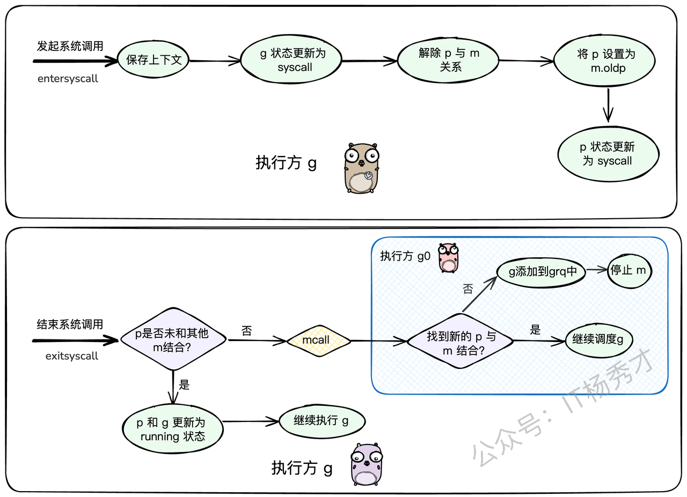

这个过程主要发生在 `reentersyscall` 函数中：

```go
// reentersyscall 在goroutine进入系统调用时被调用
func reentersyscall(pc, sp uintptr) {
        _g_ := getg() // 获取当前的goroutine

        // ...
        // 保存当前的程序计数器(PC)和栈指针(SP)等上下文信息
        save(pc, sp)
        // ...

        // 1. 将goroutine的状态从 _Grunning 更新为 _Gsyscall
        casgstatus(_g_, _Grunning, _Gsyscall)

        // ...
        // 2. 解除 P 和 M 的绑定关系
        pp := _g_.m.p.ptr()
        pp.m = 0          // P的m指针置空
        _g_.m.p = 0       // M的p指针置空

        // 3. 将P设置为M的oldp，建立一个弱引用关系
        _g_.m.oldp.set(pp)
        
        // 4. 将P的状态更新为 _Psyscall
        atomic.Store(&pp.status, _Psyscall)

        // ...
}
```

等系统调用结束，Goroutine从内核态返回时，会执行 `exitsyscall` 函数。这时它会尝试"复位归来"：

- **快速路径** ：先看看之前那个P（ `oldp` ）是不是还单身（没有和其他M结合）。如果是，太好了，直接拿回来用，光速恢复执行。
- **慢速路径** ：如果P已经被别的M"拐走"了，那就没办法了。当前Goroutine会被切换到 `g0` 栈，执行 `exitsyscall0` ，尝试为自己所在的M寻找一个新的空闲P。如果找到了，就继续执行；如果找不到，说明现在很忙，M就会被挂起，这个Goroutine则被放到全局队列中，等待下一次被调度
```go
// exitsyscall 在goroutine退出系统调用时执行
func exitsyscall() {
        _g_ := getg() // 获取当前goroutine

        // ...
        // 尝试快速路径：如果oldp没有被其他M绑定，就直接复用
        oldp := _g_.m.oldp.ptr()
        _g_.m.oldp = 0
        if exitsyscallfast(oldp) {
                // ...
                // 快速恢复成功，将g的状态改回_Grunning
                casgstatus(_g_, _Gsyscall, _Grunning)
                // ...
                return // 直接返回，继续执行g
        }

        // 快速路径失败，切换到g0栈，执行慢速路径逻辑
        mcall(exitsyscall0)
        // ...
}

// exitsyscall0 在g0栈上为当前M寻找一个新的P
func exitsyscall0(gp *g) {
        // 将goroutine的状态从 _Gsyscall 改为 _Grunnable 就绪态
        casgstatus(gp, _Gsyscall, _Grunnable)
        // 解除g和当前M的绑定
        dropg()
        lock(&sched.lock)
        
        // 尝试从空闲列表获取一个P
        var _p_ *p
        _p_, _ = pidleget(0)
        // ...
        
        // 如果没有找到空闲的P
        if _p_ == nil {
                // 将g放入全局运行队列
                globrunqput(gp)
                // ...
        }
        // ...
        unlock(&sched.lock)

        // 如果找到了P
        if _p_ != nil {
                // 绑定P，然后立即执行这个goroutine
                acquirep(_p_)
                execute(gp, false) // 不会返回
        }

        // 如果没找到P，M只能进入休眠
        stopm()
        // 当M被唤醒后，重新开始调度循环
        schedule() // 不会返回
}
```
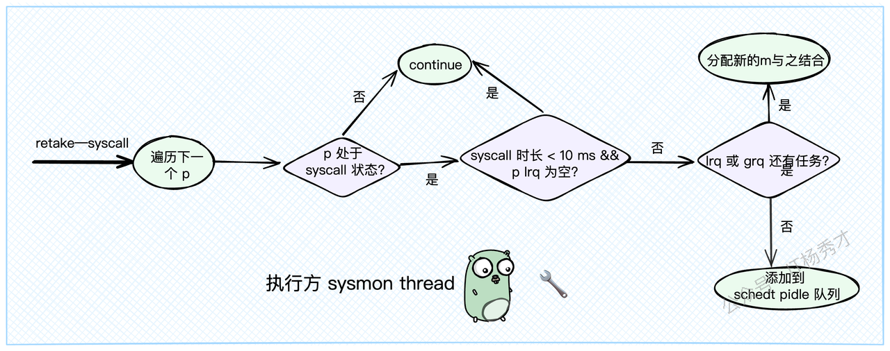

你可能会问，这和 `sysmon` 有什么关系？关系大了！ `sysmon` 会在它的 `retake` 检查中，遍历所有的P。如果发现某个P长时间处于 `_Psyscall` 状态（默认超过10ms），或者这个P虽然在syscall，但它的本地队列里还有其他Goroutine在排队， `sysmon` 就会认为不能再等了，必须执行抢占。 它会调用 `handoffp` ，强制把这个P从syscall的M那里"抢"过来，分配给一个新的或者空闲的M，去执行P本地队列里的其他任务。

```go
// retake 函数由 sysmon 线程周期性调用
func retake(now int64) uint32{
    n :=0
    // 加锁
    lock(&allpLock)
    // 遍历所有 p
    for i :=0; i <len(allp); i++{
        _p_ := allp[i]
        // ...
        s := _p_.status
        // ...
        // 对于正在执行 syscall 的 p
        if s ==_Psyscall{
            // 如果 p 本地队列为空且发起系统调用时间 < 10ms，则不进行抢占
            if runqempty(_p_)&& atomic.Load(&sched.nmspinning)+atomic.Load(&sched.npidle)>0&& pd.syscallwhen+10*1000*1000> now {
                continue
            }
            unlock(&allpLock)
            // 将 p 的状态由 syscall 更新为 idle
            if atomic.Cas(&_p_.status, s,_Pidle){
                // ...
                // 让 p 拥有和其他 m 结合的机会
                handoffp(_p_)
            }
            // ...
            lock(&allpLock)
        }
    }
    unlock(&allpLock)
    return uint32(n)
}
```
```javascript
func handoffp(_p_ *p) {
    // 如果 p lrq 中还有 g 或者全局队列 grq 中还有 g，则立即分配一个新 m 与该 p 结合
    if!runqempty(_p_)|| sched.runqsize !=0{
        // 分配一个 m 与 p 结合
        startm(_p_,false)
        return
    }
    // ...
    // 若系统空闲没有 g 需要调度，则将 p 添加到 schedt 中的空闲 p 队列 pidle 中
    pidleput(_p_,0)
    // ...
}
```

#### 5.3 运行超时抢占

除了系统调用，另一种需要抢占的场景就是Goroutine运行时间过长。比如一个纯计算的循环，没有任何IO或channel操作，它就会像个"钉子户"一样霸占着CPU。

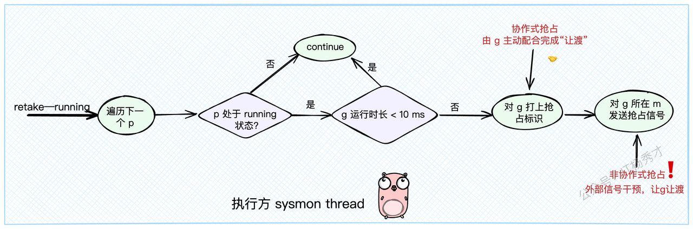

`sysmon` 在 `retake` 函数中同样会检查每个处于 `_Prunning` 状态的P。它会看当前P上的Goroutine从何时开始执行（ `schedwhen` ），如果执行时间超过了一个阈值（ `forcePreemptNS` ，通常是10ms）， `sysmon` 就会认为需要抢占了。

```go
// retake 函数的一部分
func retake(now int64) uint32 {
        // ...
        for i := 0; i < len(allp); i++ {
                _p_ := allp[i]
                // ...
                // 如果P正在运行
                if s == _Prunning {
                        // ...
                        // 检查当前goroutine的执行时间是否超过了10ms
                        if _p_.schedwhen+forcePreemptNS <= now {
                                // 发起抢占
                                preemptone(_p_)
                        }
                }
        }
        // ...
}
```

这里的抢占又分为两种方式：一种是"好言相劝"，一种是"强行执法"。

##### 5.3.1 协作式抢占

这是Go早期版本就有的抢占方式，比较"温柔"。 `sysmon` 在决定抢占后，会调用 `preemptone` 函数。这个函数首先会给目标Goroutine打上一个"抢占标记"。具体来说，就是把 `gp.preempt` 设置为 `true` ，同时把 `gp.stackguard0` 设置为一个特殊值 `stackPreempt` 。

```go
// preemptone 抢占指定P上正在运行的g
func preemptone(_p_ *p) bool {
        // 获取P上绑定的M
        mp := _p_.m.ptr()
        // 获取M上正在运行的g，也就是我们的抢占目标
        gp := mp.curg

        // ...
        // 1. 设置协作式抢占标志
        gp.preempt = true
        
        // 2. 修改栈保护标志，这是协作式抢占的关键
        // 当g进行函数调用（特别是涉及栈检查）时，会检查这个值
        gp.stackguard0 = stackPreempt

        // ...
}
```

这个 `stackguard0` 标志位非常关键。Goroutine在执行函数调用时，尤其是可能导致栈扩容的场景下，会检查这个标志位。当它发现 `stackguard0` 变成了 `stackPreempt` ，就知道："哦，调度器想让我让位了"。于是，它就会很"自觉"地停止当前工作，调用 `gopreempt_m` ，将自己重新放回全局队列，让出CPU。这个过程就叫做 **协作式抢占** 。

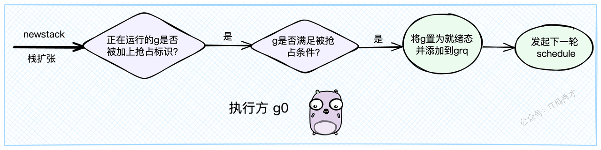

这个检查点通常在 `newstack` 函数中，也就是栈扩容的逻辑里：

```go
// newstack 在g0栈上为goroutine扩展栈空间时执行
func newstack() {
        // 获取当前需要扩容栈的goroutine
        gp := thisg.m.curg
        
        // 读取g的栈保护标志
        stackguard0 := atomic.Loaduintptr(&gp.stackguard0)

        // 如果标志被设置为stackPreempt，说明被标记为需要抢占
        if stackguard0 == stackPreempt {
                // 检查当前g是否满足被抢占的条件（比如没有持有锁等）
                if canPreemptM(thisg.m) {
                        // 条件满足，响应抢占，执行让渡操作
                        gopreempt_m(gp) // 这个函数不会返回
                }
        }
        // ...
}

// gopreempt_m 会走到 goschedImpl，后续流程和主动让渡(gosched)一样
func gopreempt_m(gp *g) {
        // ...
        goschedImpl(gp)
}

func goschedImpl(gp *g) {
        // g状态从_Grunning变为_Grunnable
        casgstatus(gp, _Grunning, _Grunnable)
        // 解绑M
        dropg()
        // 加锁后放入全局队列
        lock(&sched.lock)
        globrunqput(gp)
        unlock(&sched.lock)
        // 触发新一轮调度
        schedule()
}
```

但协作式抢占有个明显的缺点：如果一个Goroutine是个铁憨憨，一直在执行纯计算的死循环，没有任何函数调用，那它就永远没有机会去检查 `stackguard0` ，也就无法响应抢占意图。这可怎么办？

##### 5.3.2 非协作式抢占

为了解决协作式抢占的短板，Go 1.14 版本引入了基于信号的抢占机制，也就是 **非协作式抢占** 。这种方式就非常"硬核"了。

在 `preemptone` 函数中，除了设置协作标记，还会做一件事：向目标Goroutine所在的M（线程）发送一个信号 `sigPreempt` 。

```go
// preemptone 函数的另一部分
func preemptone(_p_ *p) bool {
    // ... （前面设置协作标记的代码）

        // 3. 基于信号实现非协作式抢占
        if preemptMSupported && debug.asyncpreemptoff == 0 {
                _p_.preempt = true
                // 向目标M发送抢占信号
                preemptM(mp)
        }
        return true
}

func preemptM(mp *m) {
    // ...
    // 向指定的线程（由mp.procid标识）发送sigPreempt信号
    signalM(mp, sigPreempt)
    // ...
}

func signalM(mp *m, sig int) {
        // 底层通过pthread_kill实现向线程发送信号
        pthread_kill(pthread(mp.procid), uint32(sig))
}
```

Go程序启动时，会注册一个信号处理器 `sighandler` 来处理各种信号，其中就包括了我们的 `sigPreempt`

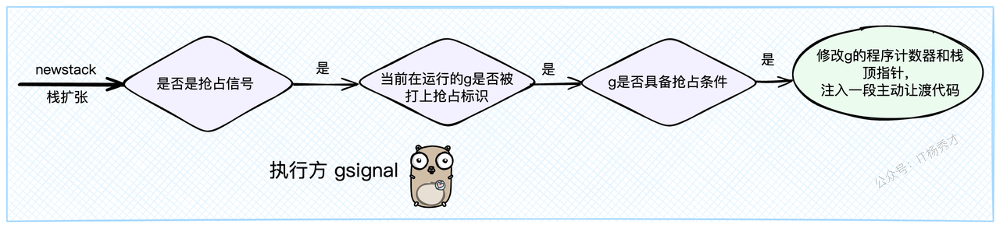

当M接收到 `sigPreempt` 信号后，操作系统会中断M的当前执行，转而去执行 `sighandler` 。 信号处理函数会发现这是一个抢占信号，然后检查当前的Goroutine是否满足被抢占的条件（例如，没有在执行一些敏感的运行时代码）。

如果条件满足，最关键的一步来了： `sighandler` 会像一个黑客一样，直接修改G的寄存器信息，主要是程序计数器（PC）和栈顶指针（SP）。它会强行在G的执行流中"注入"一段代码，这段代码就是 `asyncPreempt` 函数。

```go
// sighandler 是go的信号处理总入口
// 它在gsignal这个特殊的goroutine上执行
func sighandler(sig uint32, info *siginfo, ctxt unsafe.Pointer, gp *g) {
        // ...
        // 如果收到了抢占信号
        if sig == sigPreempt {
                // 执行抢占处理
                doSigPreempt(gp, ctxt)
        }
        // ...
}

// doSigPreempt 执行具体的信号抢占逻辑
func doSigPreempt(gp *g, ctxt *sigctxt) {
        // 判断g是否满足抢占条件
        if wantAsyncPreempt(gp) {
                if ok, newpc := isAsyncSafePoint(gp, ctxt.sigpc(), ctxt.sigsp(), ctxt.siglr()); ok {
                        // 通过修改g的寄存器，强行让它下一条指令去执行asyncPreempt
                        ctxt.pushCall(abi.FuncPCABI0(asyncPreempt), newpc)
                }
        }
        // ...
}

// pushCall 修改栈指针和程序计数器，实现"指令注入"
func (c *sigctxt) pushCall(targetPC, resumePC uintptr) {
        // 获取当前栈顶指针 sp (rsp寄存器)
        sp := uintptr(c.rsp())
        // 栈向下移动一个指针大小，为返回地址腾出空间
        sp -= goarch.PtrSize
        // 将原始的下一条指令地址（resumePC）存入新的栈顶
        *(*uintptr)(unsafe.Pointer(sp)) = resumePC
        // 更新栈顶指针
        c.set_rsp(uint64(sp))
        // 将程序计数器（rip寄存器）设置为我们要注入的函数的地址 (targetPC)
        c.set_rip(uint64(targetPC))
}
```

这样一来，当信号处理结束，G恢复执行时，它下一条要执行的指令不再是原来被打断的地方，而是被篡改为了 `asyncPreempt` 函数。这个函数会立即调用 `mcall` 切换到 `g0` 栈，执行 `gopreempt_m` ，最终完成让渡操作，和协作式抢占殊途同归。

```go
// asyncPreempt2 是被强行注入的代码逻辑
// 此时的执行方是被抢占的g自己
func asyncPreempt2() {
        gp := getg()
        // ...
        // 切换到g0栈，调用gopreempt_m完成让渡
        mcall(gopreempt_m)
        // ...
}
```

至此，哪怕是最顽固的"钉子户"Goroutine，也会被这种强制手段给请下CPU，保证了调度器的公平性。

**抢占** 是Go调度器为了公平和效率，由 `sysmon` 线程发起的强制性调度行为。

1. **系统调用抢占** ：通过解绑P和M，让P可以继续服务其他Goroutine，避免因单个M阻塞导致整个P被浪费。
2. **运行超时抢占** ：针对长时间运行的Goroutine，Go提供了两手准备：
	- **协作式抢占** ：温柔地打个标记，让Goroutine在函数调用时"自觉"让出CPU。
	- **非协作式抢占** ：对于不自觉的Goroutine，直接发送信号，通过修改PC和SP寄存器的方式，强行中断其执行，注入让渡逻辑。

正是有了这套精密的、软硬兼施的抢占机制，Go的并发调度才能如此健壮和高效，让我们能够放心地创建和使用海量的Goroutine。
