# Go基础
省略
# Go进阶
## GMP 模型
参考资料：[13. GMP调度原理 | 秀才的进阶之路](https://golangstar.cn/go_series/go_principles/gmp_principles.html)
Go作为新进语言为什么有这么强大的并发能力。答案就藏在它核心的 **GMP调度模型** 里。
- **第一部分：宏观视角**
	- **第一小节：从基础聊起** ：咱们先热个身，聊聊线程、协程这些基本概念，看看Go的goroutine是如何站在巨人肩膀上的。
		- **第二小节：GMP设计图纸** ：直接上源码，看看G、M、P这三个核心组件在底层到底长啥样。
- **第二部分：微观之旅**
	- **第三小节：一个G的诞生与执行** ：跟着一个goroutine的视角，看它是如何被创建并被调度器翻牌子执行的。
		- **第四小节：G的主动让贤** ：看看一个正在运行的goroutine是如何主动让出CPU，把机会留给其他G的。
		- **第五小节：霸道的调度器** ：当一个G"占着茅坑不拉屎"，长期占用CPU时，我们的监控者是如何强制把它"请"下来的。
### 1 故事的开始：了解基础概念

#### 1.1 从线程到协程
在聊GMP之前，我们得先搞明白两个老朋友： **线程（Thread）** 和 **协程（Coroutine）** 。
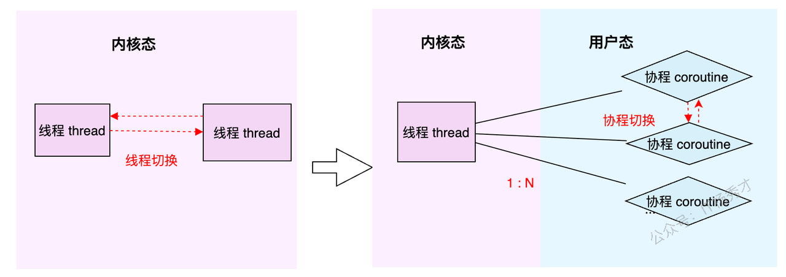
- **线程（Thread）** ：这家伙是操作系统的大内总管——内核（Kernel）眼里的最小执行单元。它的生老病死、工作调度，全得听内核的号令。你可以把它想象成一个正式工，有编制，但每次调度（切换）都得走一套复杂的流程，成本比较高。
- **协程（Coroutine）** ：这家伙更像是用户自己请的临时工。它活在用户态，比线程更轻量，可以理解为用户态线程。多个协程可以在一个线程上跑，它们的调度切换由用户程序自己说了算，不用去麻烦内核这个大忙人。所以，协程的切换开销极小，非常灵活。
简单总结一下：线程是内核级的，重而稳；协程是用户级的，轻而快。
#### 1.2 Go的答案：goroutine
Go语言选择的并发实现，就是我们所熟知的 **goroutine** 。你可以把它看作是Go对协程的"超级魔改版"。它并不是一个孤立的概念，而是整个 **GMP调度体系** 的核心产物。
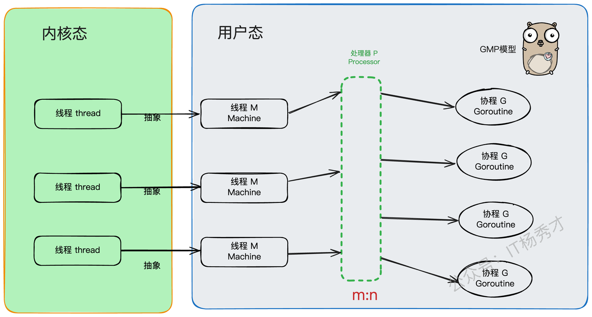
正是因为有了GMP这套精妙的架构，goroutine才拥有了超越原生协程的两大核心优势：
1. **灵活的调度** ：G（goroutine）、M（Machine，内核线程）、P（Processor，处理器）三者之间可以动态地绑定和解绑，整个调度过程充满了弹性。
2. **动态的栈空间** ：每个goroutine的栈空间可以根据需要自动伸缩，既方便使用，又极大地节约了内存资源。
更牛的是，Go语言在顶层完全屏蔽了线程这个概念，所有的并发操作都是围绕着goroutine来的，就像秦始皇统一了度量衡，Go也用goroutine统一了并发江湖的秩序。
#### 1.3 GMP架构全景图

好了，主角登场！GMP，顾名思义，就是 **G** oroutine + **M** achine + **P** rocessor。
- **G（Goroutine）** ：就是我们的"任务单元"。它有自己的执行栈、生命状态，以及要完成的具体工作（就是你 `go` 后面跟的那个函数）。G需要绑定到M上才能运行，你可以把M想象成G的CPU。
- **M（Machine）** ：你可以把它看作Go对系统线程的封装，是真正干活的"工人"。M需要和P"绑定"后，才能进入GMP的调度循环。M的工作很简单，就是在 `g0` （一个特殊的goroutine，负责调度）和普通的G之间反复横跳：执行 `g0` 时，它在找任务；执行普通G时，它在处理任务。
- **P（Processor）** ：P是调度器，是GMP模型中的"中枢大脑"。M必须获取到一个P，才能开始调度和执行G。P的数量决定了同一时间最多有多少个M可以处于运行状态，这个数量通常由 `GOMAXPROCS` 环境变量决定。P还有一个非常重要的职责：它自带一个本地的goroutine队列，我们称之为 **LRQ (Local Run Queue)** 。
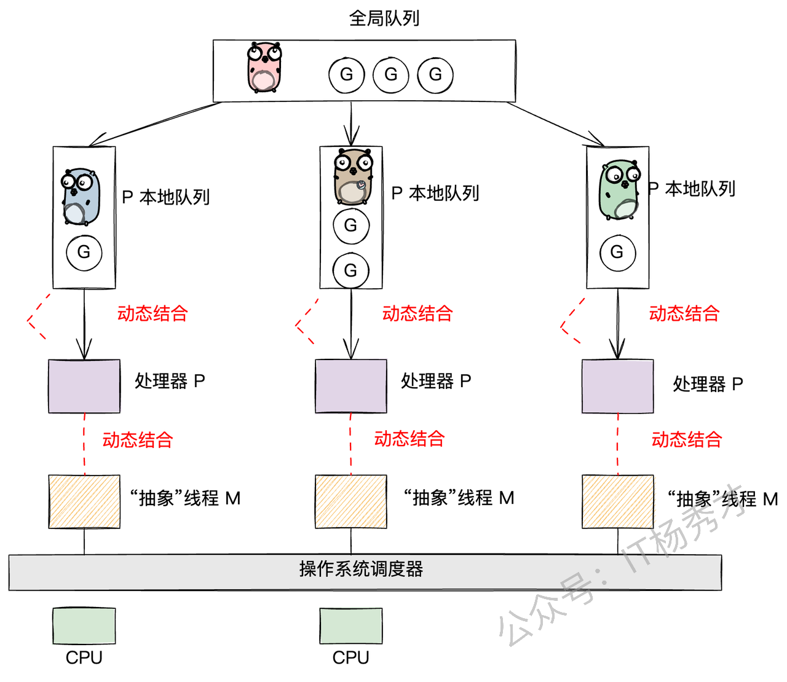
现在，我们把目光聚焦到存放G的"容器"上。Go的设计非常巧妙，它有两种队列：
1. **P的本地队列（LRQ - Local Run Queue）** ：这是每个P私有的G队列。当一个M想执行G时，会优先从自己绑定的P的LRQ里找。因为是私有的，所以大部分时间不需要加锁，通过高效的CAS（Compare-And-Swap）操作就能完成存取，大大减少了并发冲突。当然，也并非完全没有冲突，因为当一个P的LRQ空了的时候，它可能会从其他P的LRQ里"偷"一些G过来，这就是著名的 **work-stealing** 机制。
2. **全局队列（GRQ - Global Run Queue）** ：这是一个全局共享的G队列。当一个P的LRQ满了，新创建的G就会被放到GRQ里。因为是全局共享的，所以所有M都可能来访问，竞争激烈，因此访问它需要加一把全局大锁。
**G的存放与获取逻辑** ：
- **放G（put g）** ：当你在一个goroutine里通过 `go func(){...}` 创建一个新的goroutine时，它会优先被放到当前P的LRQ里。如果LRQ满了，没办法，只能加个全局锁，把它扔到GRQ里去。这遵循的是"就近原则"。
- **取G（get g）** ：当M上的 `g0` 开始找活干时，它会遵循一个"负载均衡"的策略，按以下顺序来寻找G：
	1. 先从当前P的LRQ里找（无锁，速度最快）。
	2. 如果LRQ没有，就去全局GRQ里看看（需要加锁）。
	3. 如果GRQ也没有，就去网络轮询器（netpoll）里找找有没有因为IO操作而就绪的G。
	4. 如果还是没有，就只能去"偷"了，从别的P的LRQ里偷一半过来（work-stealing，无锁）。
这里有个小细节：为了防止GRQ里的G被"饿死"（因为M上的 `g0` 总是优先从LRQ取），调度器规定，每进行61次调度循环，就必须强制去下一次去 `GRQ` 取 。这样做是为了避免 `LRQ` 过于繁忙，而导致 `GRQ` 中的 `g` "饿死"。
#### 1.4 GMP生态圈
在Go的世界里，GMP是绝对的基石。所有上层的建筑，比如内存管理、并发工具等，都是围绕着GMP模型来精心设计的。
##### 1.4.1 内存管理

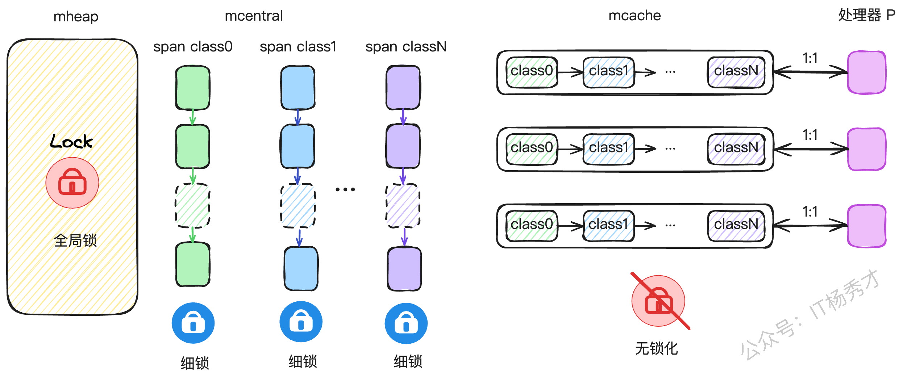

Go的内存管理借鉴了Google自家的TCMalloc思想，并为GMP模型量身定做了优化。它为每个P都配备了一个私有的内存缓存—— `mcache` 。当一个P上的G需要分配小对象时，可以直接从这个私有的 `mcache` 里拿，完全无锁，速度飞快。
##### 1.4.2 并发工具（Mutex, Channel）
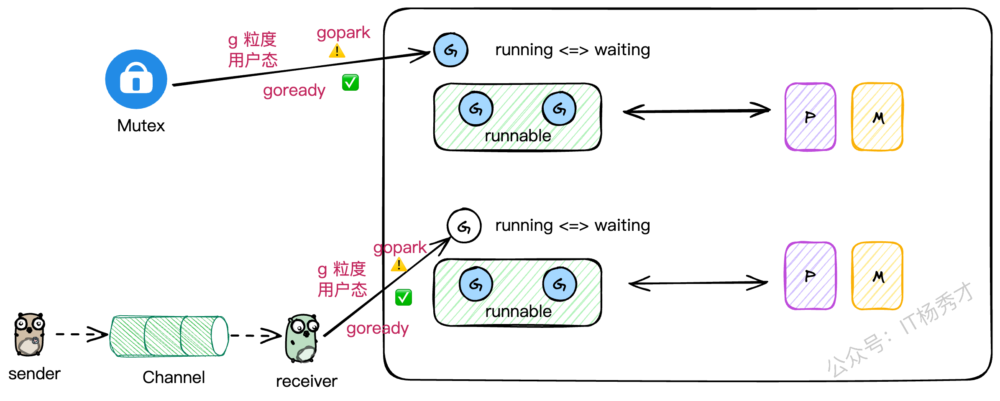
你有没有想过，为什么在Go里一个channel的读写阻塞了，或者一个Mutex锁住了，并不会把整个线程都卡死？
这就是因为Go的并发工具都是"G级别"的。当一个G因为这些操作需要阻塞时，它会被挂起，让出M的执行权。M会立刻去寻找并执行其他的G，整个过程都在用户态完成，无需内核介入。这极大地提升了并发性能。
我最近在用C++尝试模拟GMP时，就深有感触。C++标准库里的锁，一旦锁住，阻塞的是整个线程，这会导致线程上所有其他的协程都得干等着。想要实现Go这种效果，就得重写所有并发工具，成本巨大。这也反向证明了Go在并发设计上的优越性。
##### 1.4.3 IO多路复用（netpoll）
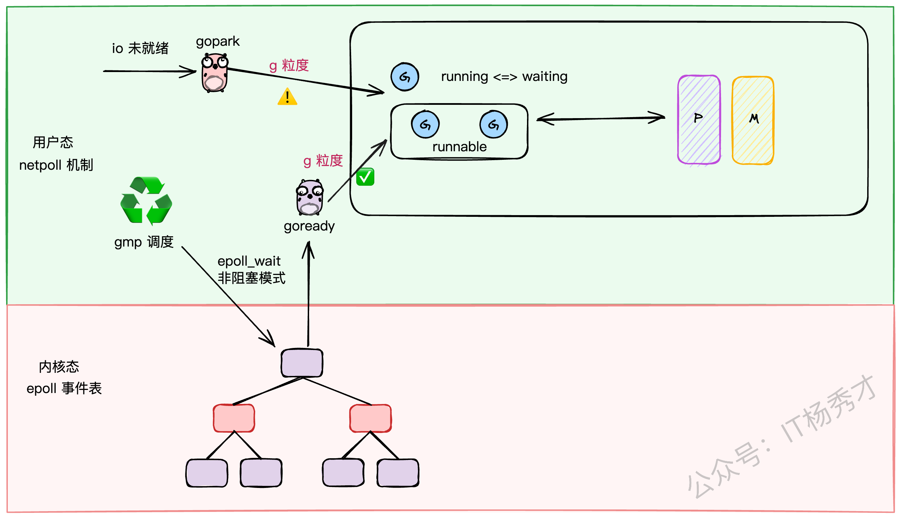
对于网络IO，Go采用了Linux下性能强悍的epoll技术。但为了避免epoll的等待操作阻塞整个M，Go设计了一套巧妙的 `netpoll` 机制。它将IO阻塞操作转换成了G级别的阻塞（ `gopark` ），当IO就绪时，再通过 `goready` 唤醒对应的G。这样，IO操作也被完美地融入了GMP的调度体系中。

可以说，不理解GMP，就无法真正理解Go语言的精髓。
### 2 深入源码：GMP的底层结构

理论说了一大堆，我们现在就潜入源码，看看G、M、P在 `runtime/runtime2.go` 文件里到底长什么样。
#### 2.1 G的结构（goroutine）

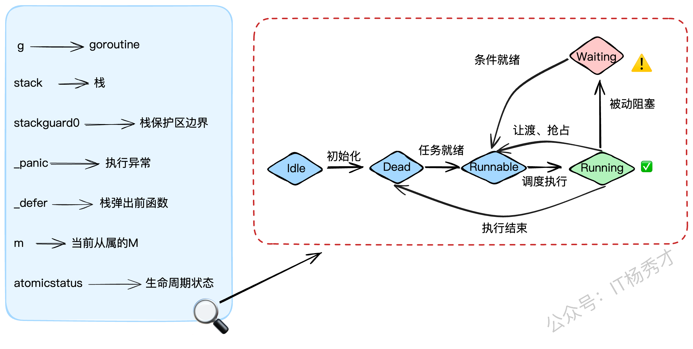

`g` 结构体是goroutine的实体，我们来看看它的关键字段：

- `stack`: 描述了goroutine的栈空间信息（起始和结束地址）。
- `stackguard0`: 栈的警戒线。当goroutine的栈使用量将要越过这条线时，就会触发栈扩容。同时，它也被用来标记"抢占请求"。
- `_panic`: 用来记录goroutine中发生的panic。
- `_defer`: 用链表的形式存储了goroutine中的defer操作（后进先出）。
- `m`: 指向当前正在执行它的M。如果G没在运行，这个字段就是 `nil` 。
- `atomicstatus`: G的生命周期状态，比如 `_Gidle` 、 `_Grunnable` 、 `_Grunning` 、 `_Gwaiting` 等。
```go
// g represents a goroutine.
type g struct {
        // stack describes the goroutine's stack. The bounds are
        // [stack.lo, stack.hi).
        stack       stack   // goroutine的执行栈空间
        // stackguard0 is the stack pointer compared in the Go stack growth prologue.
        // It is stack.lo + _StackGuard.
        // It is also used to signal a request to preempt the goroutine.
        stackguard0 uintptr // 栈空间保护区边界，也用于传递抢占标识

        // ...

        _panic       *_panic // 记录g执行过程中遇到的异常
        _defer       *_defer // g中挂载的defer函数，是一个LIFO的链表结构
        m            *m      // 当前执行本g的m
        
        // atomicstatus is the status of the goroutine.
        // It is changed atomically with casgstatus.
        // This field is read and written atomically, and the values are not in the
        // GStatus enum.
        atomicstatus uint32 // g的状态

        // ...
        
        // schedlink is a link in the global run queue, idle g list, or gfree list.
        schedlink guintptr // 进入全局队列grq时指向相邻g的next指针
}
```
#### 2.2 M的结构（Machine）

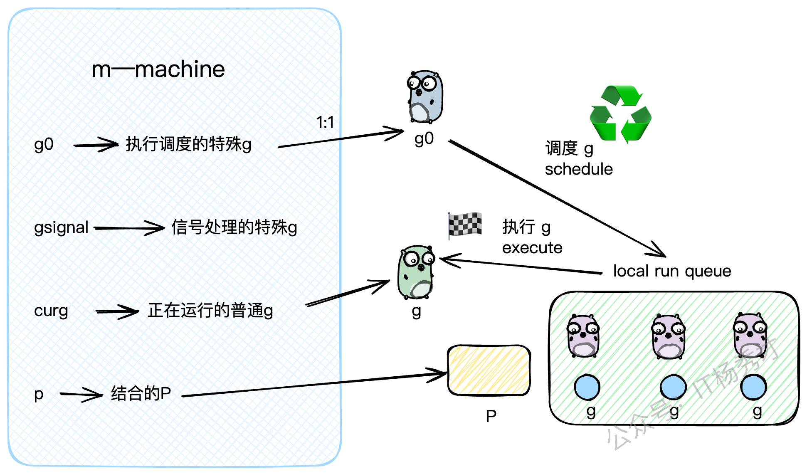

`m` 结构体是内核线程的抽象，核心字段如下：

- `g0`: 一个非常特殊的G。每个M都有一个自己的 `g0` ，这个 `g0` 不执行用户代码，它的任务就是执行调度逻辑，为M寻找下一个要运行的普通G。
- `gsignal`: 另一个特殊的G，专门用来处理分配给这个M的信号。
- `curg`: 指向当前M上正在运行的那个普通的用户G。
- `p`: 指向当前与M绑定的P。
```go
// m represents an OS thread.
type m struct {
        g0      *g     // 专门用于调度的g，每个M都有一个
        // ...
        procid  uint64 // M的唯一ID
        gsignal *g     // 用于处理信号的g
        
        curg    *g     // M上正在运行的普通g
        p       puintptr // M关联的p
        
        // ...
        
        schedlink muintptr // M在空闲链表中的下一个M
}
```

你可以把M的运行过程想象成两个状态的切换：当它在执行 `g0` 时，它在扮演"调度者"的角色；当它在执行 `curg` 时，它在扮演"执行者"的角色。
#### 2.3 P的结构（Processor）

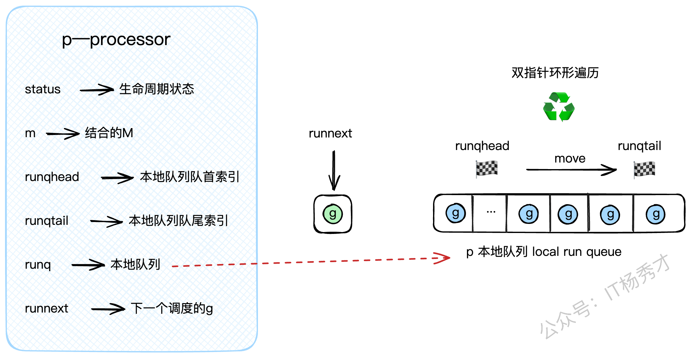

`p` 结构体是调度器，是连接G和M的桥梁，核心字段如下：

- `status`: P的生命周期状态，如 `_Pidle` 、 `_Prunning` 等。
- `m`: 指向当前与它绑定的M。
- `runq`: P的私有G队列，也就是我们前面说的LRQ，它是一个定长的数组，可以存放256个G。
- `runqhead`, `runqtail`: LRQ的头尾索引，用来实现一个环形队列。
- `runnext`: LRQ里的一个"VIP通道"。通过 `runqput` 放入的下一个G会优先放在这里，调度器会首先检查 `runnext` 是否有G，有的话直接拿来执行，可以省去操作 `runq` 队列的开销。
```go
// p represents a processor.
type p struct {
        id          int32  // P的ID
        status      uint32 // P的状态 (pidle, prunning, etc.)
        link        puintptr
        schedtick   uint32   // 每执行一次schedule，该值+1
        syscalltick uint32   // 每进行一次系统调用，该值+1
        m           muintptr // 回指到关联的M (如果idle则为nil)
        
        // Queue of runnable goroutines. Accessed without lock.
        runqhead uint32
        runqtail uint32
        runq     [256]guintptr // 本地G队列，即LRQ
        // runnext, if non-nil, is a runnable G that was ready'd by
        // the current G and should be run next instead of what's in
        // runq.
        runnext guintptr // 下一个要调度的G，可以看作是LRQ中的一个特权位置
        
        // ...
}
```

#### 2.4 全局调度器（schedt）

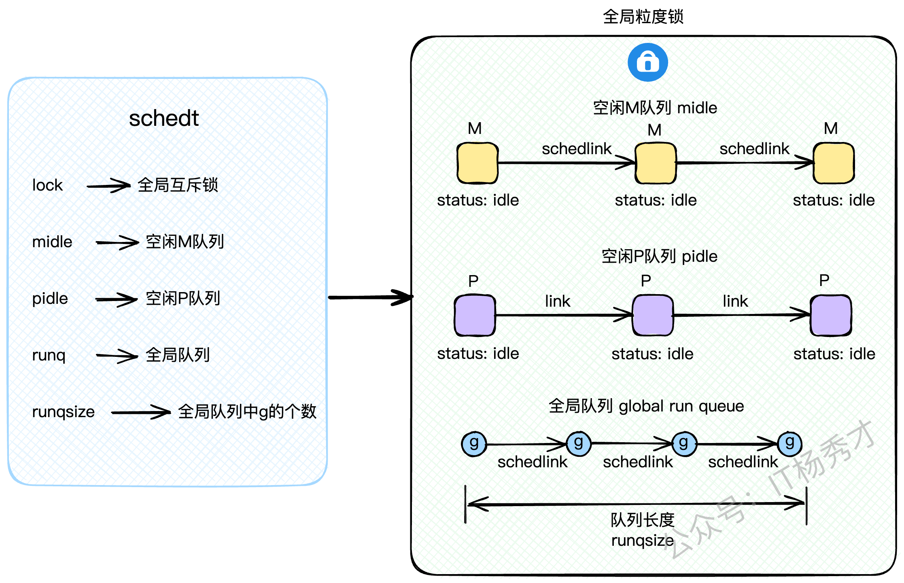

除了G、M、P这三大组件，还有一个全局的 `schedt` 结构体，它掌管着全局资源，访问它需要加锁。

- `lock`: 全局互斥锁。
- `midle`: 空闲的M队列，没活干的M会在这里排队。
- `pidle`: 空闲的P队列，没活干的P也在这里排队。
- `runq`: 全局G队列，也就是GRQ。
- `runqsize`: GRQ里G的数量。
```go
// 全局调度模块
type schedt struct{
    // ...
    // 互斥锁
    lock mutex

    // 空闲 m 队列
    midle        muintptr // idle m's waiting for work
    // ...
    // 空闲 p 队列
    pidle      puintptr // idle p's
    // ...

    // 全局 g 队列——grq
    runq     gQueue
    // grq 中存量 g 的个数
    runqsize int32
    // ...
}
```

> `midle` 和 `pidle`的设计是为了资源的复用和节能。当系统不忙时，空闲的M和P会被放进这两个队列里"休眠"，避免CPU空转，等到有新任务时再被唤醒。
### 3 正向追踪：一个G的诞生与调度

好了，基础结构我们都看完了。现在，让我们切换到第一人称视角，看看一个我们用 `go func(){...}` 创建的goroutine，是如何一步步被调度并执行的。这个过程，可以看作是从 `g0` 到 `g` 的转换。
#### 3.1 main函数的特殊性

`main` 函数是所有Go程序的入口，它比较特殊。它是由一个全局唯一的 m0（主线程）来执行的。源码位于 runtime.proc.go

```go
// The main goroutine.
func main() {
        // ...
        // 获取用户定义的 main.main 函数
        fn := main_main
        // 执行用户的 main 函数
        fn()
        // ...
}
```
#### 3.2 普通G的创建之旅

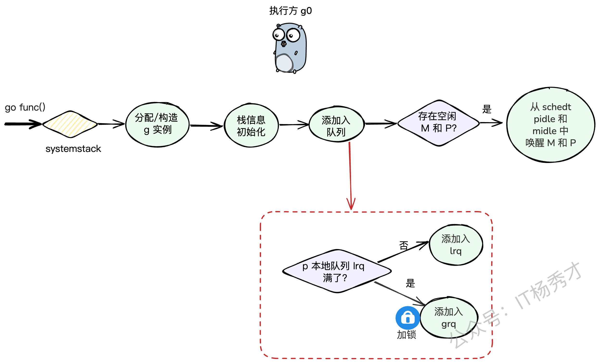

除了 `main` 这个特例，我们自己启动的goroutine都会经历一个标准的创建流程。比如这段代码：

```go
func handle() {
        // 异步启动一个goroutine
        go func() {
                // do something ...
        }()
}
```

编译器会把 `go func()` 转换成对 `runtime.newproc` 函数的调用。这个函数的核心逻辑如下（我们跟着代码走一遍）：

1. **切换到** `g0` **栈** ： `newproc` 会先通过 `systemstack` 把自己从当前的用户G栈切换到M的 `g0` 调度栈上。因为创建G是调度层面的工作，得由专业的 `g0` 来干。
2. **创建G实例** ：在 `g0` 栈上，调用 `newproc1` 来创建一个新的 `g` 结构体实例，并做好初始化工作，比如设置好要执行的函数入口地址、程序计数器等。
3. **放入就绪队列** ：新创建的G需要被放到一个就绪队列里，等待被调度。这里会调用 `runqput` 函数。
4. `runqput` **的逻辑** ：
	- 它会优先尝试把新的G放到当前P的 `runnext` 这个VIP位置。
		- 如果 `runnext` 被占了，它会尝试把G放到当前P的LRQ的队尾。
		- 如果LRQ也满了，那没办法，只能加个全局锁，把这个G和LRQ里的一半G都转移到全局队列GRQ里去（这个操作叫 `runqputslow` ）。
5. **唤醒休眠的P** ：如果此时有P因为没事干而处于休眠状态， `wakep` 函数会负责唤醒一个P来处理这个新任务。
6. **切回用户G栈** ： `systemstack` 执行完毕，切回到原来的用户G，继续执行它自己的代码。
```go
// 创建一个新的g，并将其投递到就绪队列中。fn是用户指定的函数。
// 当前的执行者还是某个普通的g。
func newproc(fn *funcval) {
        // 获取当前正在执行的普通g和程序计数器
        gp := getg()
        pc := getcallerpc()
        
        // systemstack会临时切换到g0栈，执行完闭包函数后，再切回原来的普通g
        systemstack(func() {
                // 此时执行方为g0
                // 构造一个新的g实例
                newg := newproc1(fn, gp, pc)

                // 获取当前P
                _p_ := getg().m.p.ptr()
                
                // 将newg添加到队列中:
                // 1) 优先添加到P的本地队列LRQ
                // 2) 如果LRQ满了，则添加到全局队列GRQ
                runqput(_p_, newg, true)

                // 如果有因为空闲而被阻塞的P和M，需要唤醒它们
                if mainStarted {
                        wakep()
                }
        })
        // 切回到原来的普通g继续执行
}
```
#### 3.3 从 g0 到 g 的切换

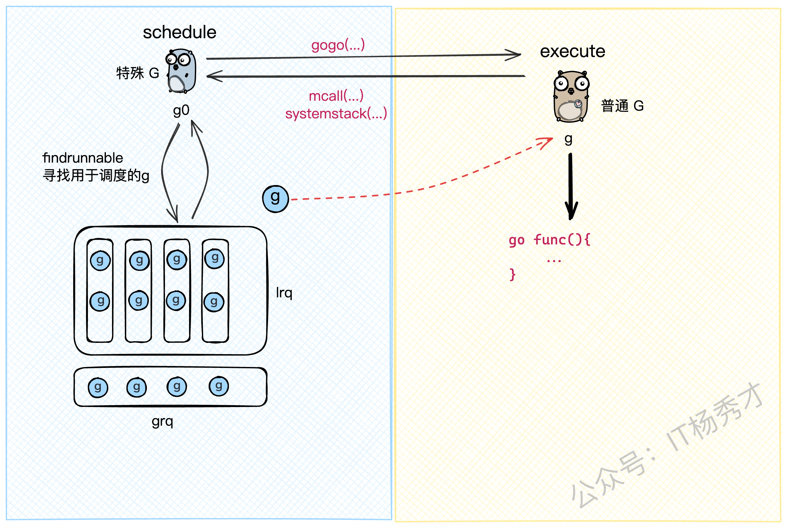

每个M都有一个自己的 `g0` ， `g0` 的工作就是不断地调用 `schedule` 函数来寻找可执行的G。所以，一个M的生命周期，就是在执行 `g0` （找任务）和执行普通 `g` （做任务）之间循环往复。
当一个M的普通`g`执行完成后或者被阻塞了就会切换回`g0`

这个切换过程有两个关键的"桩函数"：

- `mcall`, `systemstack`: 实现从 `g` 切换到 `g0` 。
- `gogo`: 实现从 `g0` 切换到 `g` 。

我们从 `g0` 的视角来看，它主要做两件事：

1. `schedule()`: 调用 `findrunnable()` 方法，从各个队列里找到一个可执行的G。
2. `execute()`: 找到G之后，更新上下文信息（比如把 `m.curg` 指向找到的G），然后调用 `gogo` ，把M的CPU执行权从 `g0` 交到这个G手上。

上述方法均实现于 runtime/proc.go 文件中：

```go
// 执行方为g0
func schedule() {
        _g_ := getg() // 获取当前g0

top:
        pp := _g_.m.p.ptr() // 获取当前P
        
        // ...

        // 核心方法: 获取一个可调度的g
        // - 按照优先级，依次从本地队列LRQ、全局队列GRQ、netpoll、其他P的LRQ中寻找
        // - 如果都找不到，就把P和M都休眠掉
        gp, inheritTime, tryWakeP := findRunnable() // 这个函数会阻塞直到找到任务

        // ...

        // 执行g，这个方法会把执行权从g0切换到gp
        execute(gp, inheritTime)
}

// 执行指定的g。当前执行方还是g0，但会通过gogo方法切换到gp
func execute(gp *g, inheritTime bool) {
        _g_ := getg() // 获取g0

        // 建立g0和gp的关系
        _g_.m.curg = gp
        gp.m = _g_.m

        // 更新gp的状态：runnable -> running
        casgstatus(gp, _Grunnable, _Grunning)
        
        // 设置gp的栈保护区边界
        gp.stackguard0 = gp.stack.lo + _StackGuard

        // 执行gogo方法，M的执行权会切换到gp
        gogo(&gp.sched)
}
```
#### 3.4 寻找G的漫漫长路：findrunnable

`findrunnable` 是调度循环中最核心的函数，它寻找G的策略体现了Go调度器的智慧。

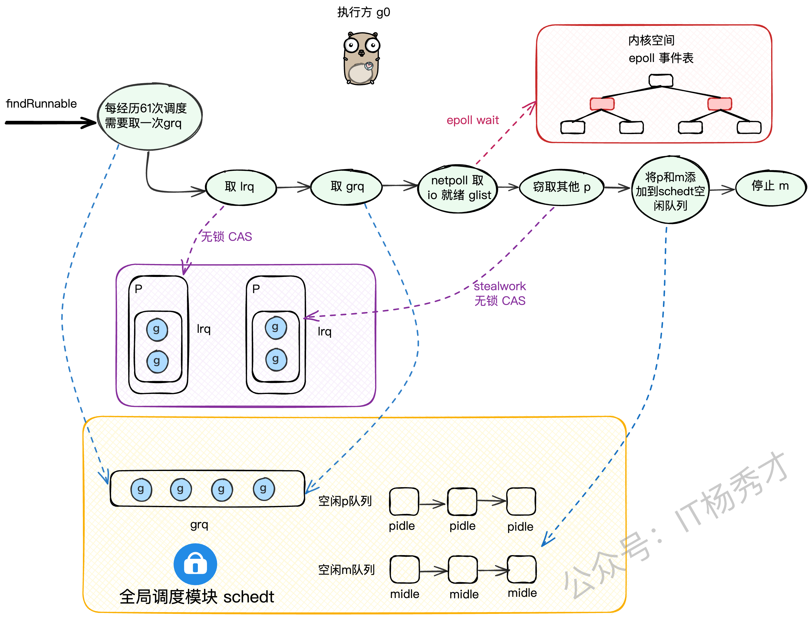

我们来梳理一下它的寻找步骤：

1. **检查全局队列（GRQ）** ：还记得吗？每61次调度循环，必须先从全局队列 `globrunqget` 拿一个G，防止GRQ饥饿。（需要加锁）
2. **检查本地队列（LRQ）** ：从当前P的LRQ里 `runqget` 一个G。（无锁CAS）
3. **再次检查全局队列（GRQ）** ：如果本地没有，再去全局队列里 `globrunqget` 找。（需要加锁）
4. **检查网络轮询器（netpoll）** ：如果还没有，就去 `netpoll` 里看看有没有因为网络IO就绪的G。（非阻塞模式）
5. **从别的P偷（steal work）** ：如果还找不到，就只能启动 `stealwork` 机制，随机找一个别的P，从它的LRQ里偷一半的G过来。
6. **再次double check全局队列** ：偷完之后，再最后看一眼全局队列。
7. **进入休眠** ：如果以上所有努力都失败了，说明系统现在真的很闲， `findrunnable` 会：
	- 把当前的P设置为 `_Pidle` 状态，并把它放到全局的 `pidle` 队列里。
		- 在把当前M也休眠之前，会做最后一次挣扎：以 **阻塞模式** 调用 `netpoll` ，看看能不能等到一个IO事件。
		- 如果连阻塞等待IO都没用，那就彻底死心了，把当前M也放到全局的 `midle` 队列里，然后调用 `stopm` 让M休眠，交出线程控制权。

这个过程设计得非常精妙，既保证了任务获取的高效性（优先无锁操作），又实现了负载均衡（work-stealing），还能在系统空闲时自动缩容，节省资源。
#### 3.5 findRunnable函数详解

Go调度器的核心在于 `findRunnable` 函数，这个函数负责为当前的处理器P找到一个可执行的goroutine。整个过程遵循着严格的优先级顺序，确保系统的公平性和效率。

```go
// 寻找可执行的goroutine，返回时必定已经找到目标g
func findRunnable()(gp *g, inheritTime, tryWakeP bool){
    // 获取当前P下的g0（调度协程）
    _g_ := getg()
    // ...
top:
    // 获取当前的处理器P
    _p_ := _g_.m.p.ptr()
    // ...
    
    // 防饥饿机制：每61次调度检查一次全局队列
    if _p_.schedtick%61==0 && sched.runqsize > 0{
        lock(&sched.lock)
        gp = globrunqget(_p_, 1)
        unlock(&sched.lock)
        if gp != nil{
            return gp, false, false
        }
    }
    // ...
    
    // 第一优先级：从本地运行队列获取goroutine
    if gp, inheritTime := runqget(_p_); gp != nil{
        return gp, inheritTime, false
    }
    
    // 第二优先级：从全局队列获取goroutine
    if sched.runqsize != 0{
        lock(&sched.lock)
        gp := globrunqget(_p_, 0)
        unlock(&sched.lock)
        if gp != nil{
            return gp, false, false
        }
    }
    
    // 第三优先级：处理网络I/O就绪的goroutine
    if netpollinited() && atomic.Load(&netpollWaiters) > 0 &&
       atomic.Load64(&sched.lastpoll) != 0{
        if list := netpoll(0); !list.empty(){ // 非阻塞调用
            gp := list.pop()
            injectglist(&list)
            casgstatus(gp, _Gwaiting, _Grunnable)
            // ...
            return gp, false, false
        }
    }
    // ...
    
    // 第四优先级：从其他P的本地队列偷取goroutine
    gp, inheritTime, tnow, w, newWork := stealWork(now)
    if gp != nil{
        return gp, inheritTime, false
    }
    
    // 若有GC标记任务，参与协作而非直接回收P
    // ...
    
    // 最后检查：再次确认全局队列
    lock(&sched.lock)
    // ...
    if sched.runqsize != 0{
        gp := globrunqget(_p_, 0)
        unlock(&sched.lock)
        return gp, false, false
    }
    // ...
    
    // 无事可做时：解绑P和M，将P放入空闲队列
    releasep()
    now = pidleput(_p_, now)
    unlock(&sched.lock)
    // ...
    
    // 网络轮询保障机制：确保有M专门处理I/O事件
    if netpollinited() && (atomic.Load(&netpollWaiters) > 0 || pollUntil != 0) &&
       atomic.Xchg64(&sched.lastpoll, 0) != 0{
        atomic.Store64(&sched.pollUntil, uint64(pollUntil))
        // ...
        
        // 阻塞模式执行网络轮询
        delay := int64(-1)
        // ...
        list := netpoll(delay) // 阻塞直到有新任务
        
        // 恢复轮询标识
        atomic.Store64(&sched.lastpoll, uint64(now))
        // ...
        
        lock(&sched.lock)
        // 尝试获取空闲的P
        _p_, _ = pidleget(now)
        unlock(&sched.lock)
        
        // 如果没有可用的P，将就绪的goroutine放入全局队列
        if _p_ == nil{
            injectglist(&list)
        } else {
            // 重新绑定P和M
            acquirep(_p_)
            // 取第一个goroutine用于调度，其余放入全局队列
            if !list.empty(){
                gp := list.pop()
                injectglist(&list)
                casgstatus(gp, _Gwaiting, _Grunnable)
                // ...
                return gp, false, false
            }
            // ...
            goto top
        }
    }
    // ...
    
    // 最终手段：阻塞当前M，加入空闲队列
    stopm()
    goto top
}
```
##### 3.5.1 本地队列获取策略

从本地队列获取goroutine是最高效的方式，因为不需要加锁。 `runqget` 函数采用了巧妙的双重策略：

```go
// 无锁方式从P的本地队列获取goroutine
func runqget(_p_ *p)(gp *g, inheritTime bool){
    // 优先获取runnext位置的goroutine（高优先级位置）
    next := _p_.runnext
    if next != 0 && _p_.runnext.cas(next, 0){
        return next.ptr(), true
    }
    
    // 从队列头部获取普通goroutine
    for{
        // 原子操作获取头部索引
        h := atomic.LoadAcq(&_p_.runqhead) // load-acquire语义，与其他消费者同步
        // 获取尾部索引
        t := _p_.runqtail
        
        // 队列为空的情况
        if t == h {
            return nil, false
        }
        
        // 根据索引取出对应的goroutine
        gp := _p_.runq[h%uint32(len(_p_.runq))].ptr()
        
        // CAS操作更新头部索引
        if atomic.CasRel(&_p_.runqhead, h, h+1){ // cas-release语义，提交消费操作
            return gp, false
        }
    }
}
```

这里有个有趣的设计： `runnext` 是一个特殊位置，专门存放高优先级的goroutine，比如刚刚创建的新goroutine。这样设计可以提高响应性。

##### 3.5.2 全局队列的公平调度

当本地队列为空时，调度器会转向全局队列。但这里有个重要的防饥饿机制：

```go
// 从全局队列获取goroutine，调用前必须持有全局锁
func globrunqget(_p_ *p, max int32)*g {
    // 确保持有锁的断言检查
    assertLockHeld(&sched.lock)
    
    // 队列空检查
    if sched.runqsize == 0{
        return nil
    }
    // ...
    
    // 根据max参数可能会批量转移goroutine到本地队列
    // 这里简化显示核心逻辑
    // ...
    
    // 从全局队列头部弹出一个goroutine
    gp := sched.runq.pop()
    // ...
    return gp
}
```

##### 3.5.3 网络I/O事件处理机制

在 gmp 调度流程中，如果 lrq 和 grq 都为空，则会执行 netpoll 流程，尝试以非阻塞模式下的 epoll_wait 操作获取 io 就绪的 g。该方法位于 runtime/netpoll_epoll.go：

```go
func netpoll(delay int64) gList {
    // ...
    // 调用系统的epoll_wait获取就绪事件
    var events [128]epollevent
    n := epollwait(epfd, &events[0], int32(len(events)), waitms)
    // ...
    
    var toRun gList
    for i := int32(0); i < n; i++{
        ev := &events[i]
        // 将就绪事件对应的goroutine加入待运行列表
        netpollready(...)
    }
    return toRun
}
```

这个机制让Go程序能够高效处理大量并发连接，而不需要为每个连接分配单独的线程。

##### 3.5.4 从其他的P队列窃取g

当本地队列和全局队列都为空时，并且执行完 netpoll 流程后仍未获得 g，则会尝试从其他 p 的 lrq 中窃取半数 g 补充到当前 p 的 lrq 中。工作窃取算法是负载均衡的关键，它确保了系统中的处理器都能保持忙碌状态。

```go
func stealWork(now int64) (gp *g, inheritTime bool, rnow, pollUntil int64, newWork bool){
    // 获取当前P
    pp := getg().m.p.ptr()
    // ...
    
    // 最多尝试4轮窃取
    const stealTries = 4
    for i := 0; i < stealTries; i++{
        // ...
        
        // 随机选择窃取目标，避免热点竞争
        for enum := stealOrder.start(fastrand()); !enum.done(); enum.next(){
            // ...
            
            // 获取目标P
            p2 := allp[enum.position()]
            
            // 不能从自己这里偷
            if pp == p2 {
                continue
            }
            // ...
            
            // 只要目标P不是空闲状态就尝试窃取
            if !idlepMask.read(enum.position()){
                // 窃取目标P本地队列中的一半goroutine
                if gp := runqsteal(pp, p2, stealTimersOrRunNextG); gp != nil{
                    return gp, false, now, pollUntil, ranTimer
                }
            }
        }
    }
    
    // 窃取失败
    return nil, false, now, pollUntil, ranTimer
}
```

##### 3.5.5 回收空闲p和m

再执行完上述逻辑之后，如果还是未能获取到可运行的g，系统需要妥善处理空闲的P和M，此时会将 p 和 m 添加到 schedt 的 pidle 和 midle 队列中并停止 m 的运行，避免产生资源浪费

```go
// 将P加入空闲队列
func pidleput(_p_ *p, now int64)int64{
    assertLockHeld(&sched.lock)
    // ...
    
    // 将P插入空闲队列头部
    _p_.link = sched.pidle
    sched.pidle.set(_p_)
    atomic.Xadd(&sched.npidle, 1)
    // ...
}

// 停止当前M的运行
func stopm(){
    _g_ := getg()
    // ...
    
    lock(&sched.lock)
    // 将M加入空闲队列
    mput(_g_.m)
    unlock(&sched.lock)
    
    // 让M进入休眠状态
    mPark()
    // ...
}
```
