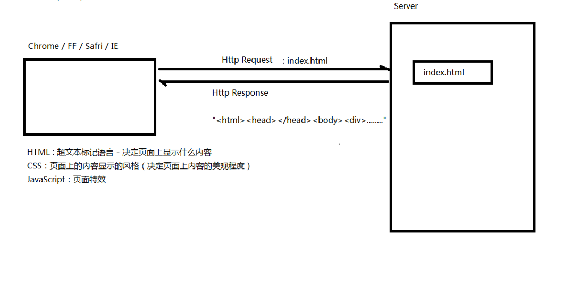
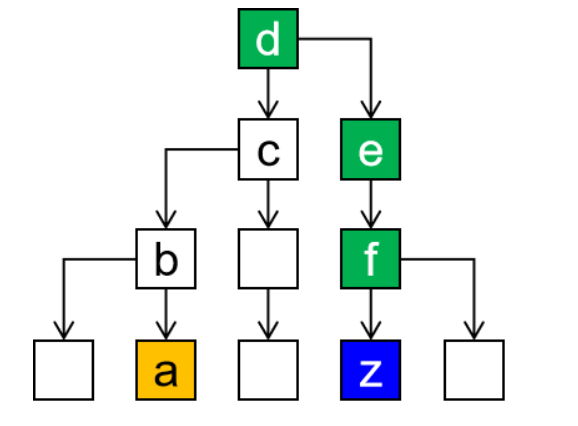

# H

## CSS和HTML的结构图



## 1.1 HTML是什么？

首先来说HTML，HTML中文称为**超文本标记语言**，**从语义上来说，它只是一种是一种标识性的语言，并不是一种编程语言。**

HTML文件本质上是文本文件，而普通的文本文件只能显示字符。但是HTML技术则通过HTML标签把其他网页、图片、音频、视频等各种多媒体资源引入到当前网页中，让网页有了非常丰富的呈现方式，这就是超文本的含义——**==本身是文本，但是呈现出来的最终效果超越了文本==**。

HTML主要分为HTML4版本和HTML5版本，它们之间有不同的声明方式

HTML ⽹⻚⽂件可以使⽤记事本、写字板、HBuilder、Sublime 等编辑⼯具来编写（主流使用vscode），以 .htm 或 .html 为⽂件后缀名保存。将 HTML ⽹⻚⽂件⽤浏览器打开显示，若测试没有问题则可以放到服务器（Server）上，对外发布信息。

## 1.2 标记语言

说HTML是一种『==标记语言==』是因为它不是向Java这样的『==编程语言==』，因为它是由一系列『==标签==』组成的，没有常量、变量、流程控制、异常处理、IO等等这些功能。HTML很简单，每个标签都有它固定的含义和确定的页面显示效果。

标签是通过==一组尖括号+标签名的方式来定义的==：

```html
<title>Title</title>
```

这个例子中使用了一个**p标签**来定义一个段落，< title >叫 **『开始标签』** ，< /title >叫 **『结束标签』** 。开始标签和结束标签一起构成了一个完整的标签。开始标签和结束标签之间的部分叫 『文本标签体』，也简称 『标签体』。

有的时候标签里还带有 **『属性』**：

```html
<a href="http://www.baidu.com">百度</a>
<!-- href是 『属性名』，"http://www.baidu.com"是 『属性值』 -->
```

还有一种标签是 **『单标签』**：

```html
<input type="text" name="username" />
```

## 1.3 HTML文件结构（骨架）

### 1、文档类型声明

HTML4版本的文档类型声明是：

```html
<!DOCTYPE HTML PUBLIC "-//W3C//DTD HTML 4.01 Transitional//EN"
"http://www.w3.org/TR/html4/loose.dtd">
```

HTML5版本的文档类型声明是：

```html
<!DOCTYPE html>
```

但现在主流的技术选型都是使用HTML5，之前的版本基本不用了。

### 2、根标签

html标签是整个文档的根标签，所有==其他标签都必须放在html标签里面==。上面的文档类型不能当做普通标签看待。

如下：

```html
<html>
</html>
```

### 3、头部标签

head标签用于定义文档的头部，其他头部元素都放在head标签里。头部元素包括**title**标签、**script**标签、**style**标签、**link**标签、**meta**标签等等。

如下：

```html
<head>
</head>
```

### 4、主体标签

body标签定义网页的主体内容，在浏览器窗口内显示的内容都定义到body标签内。

如下：

```html
<body>
</body>
```

### 5、注解

```html
<!-- 注释内容 -->
```

注释的内容不会显示到浏览器窗口内，**是开发人员用来对代码内容进行解释说明**。

正确的HTML的骨架如下:

```html
<!DOCTYPE html>
<!--声明文件类型告诉浏览器怎么编译-->
<html lang="en">
<!-- 跟标签 语言属性 “zn-cn”为中文 “en”为英文 -->
<head>
<!-- 头标签 -->
    <meta charset="UTF-8">
    <!--
	meta标签用来设置网页的一些元数据，比如网页的字符集，关键字、简介
    常见的字符编码有：gb2312、gbk、unicode、utf-8。-->
    <meta name="viewport" content="width=device-width, initial-scale=1.0">
     <!-- 
     viewport 表示设备的屏幕
     width属性控制设备的宽度
	 width=device-width 可以确保它能正确呈现在不同设备上。
     initial-scale=1.0 表示网页加载时，以 1:1 的比例呈现，不会有任何的缩放。-->
    <title>Document</title>
    <!-- 网页标题 -->
</head>
<body>
    <!--body标签用来设置网页的主体内容，即网页中显示的内容在此标签中编写-->
</body>
</html>
```

## 1.4 HTML语法规则

- 根标签有且只能有一个
- 无论是双标签还是单标签都必须正确关闭
- 标签可以嵌套但不能交叉嵌套
- 注释不能嵌套
- 属性必须有值，值必须加引号，单引号或双引号均可
- 标签名不区分大小写但建议使用小写

## 1.5 路径

在我们整个Web开发技术体系中，『路径』是一个贯穿始终的重要概念。凡是需要获取另外一个资源的时候都需要用到路径。

- 相对路径（常用）
- 绝对路径

### 1、相对路径

**相对路径都是以『当前位置』为基准**来编写的。假设我们现在正在浏览a页面，想在a页面内通过超链接跳转到z页面。


所以整个路径的写法是：

```html
<a href="../../e/f/z.html">To z.html</a>
<!-- 在文件路径中./表示当前文件夹 ../表示上一个文件夹 想要表示上上个文件夹用两个../来表示  -->
```

一般我们把文件资源和.html文件放在一起打包好。

### 2、绝对路径

拿前面相对路径中的例子来说，我们想在a.html页面中通过超链接访问z.html。此时路径从正斜线开始，和a.html自身所在位置没有任何关系：



```html
<!-- 文件资源在D盘中 -->
<a href="D:\d\e\f\z.html">To z.html</a>
<!-- 这是本地路径的资源获取，远程路径 http://ip:端口/项目/文件>
```


## 1.6 常用标签

|         标签         |                      功能                      |
| :------------------: | :--------------------------------------------: |
|        h1~h6         |                1级标题~6级标题                 |
|          hr          |                     水平线                     |
|          p           |                      段落                      |
|          br          |                      换行                      |
|          a           |                     超链接                     |
|        ol/li         |                    有序列表                    |
|        ul/li         |                    无序列表                    |
|         img          |                      图片                      |
|         div          |             定义一个前后有换行的块             |
|         span         |             定义一个前后无换行的块             |
| b、i、u、s、sub、sup | 加粗、斜体、下划线、删除线、下标文本、上标文本 |

### 1、标题

h1~h6表示6级标题，每一级大小不同。代码如下：

```html
 <h1>这是一级标题</h1>
 <h2>这是二级标题</h2>
 <h3>这是三级标题</h3>
 <h4>这是四级标题</h4>
 <h5>这是五级标题</h5>
 <h6>这是六级标题</h6>
```

### 2、水平线

hr 标签在 HTML ⻚⾯中创建⼀条⽔平线（horizontal rule）可以在视觉上将⽂档分隔成各个部分。在HTML 中，hr 标签没有结束标签。代码如下：

```html
<hr />
```

### 3、段落

用<p></p>表示

```html
<p>文本内容</p>
```

###  4、换行

br标签为换⾏符号 br 标签是空标签（意味着它没有结束标签，因此这是错误的：`<br></br>`）。
**注意：br 标签只是简单地开始新的⼀⾏，⽽当浏览器遇到 p 标签时，通常会在相邻的段落之间插⼊⼀些垂直的间距。请使⽤br 来输⼊空⾏，⽽不是分割段落。**代码如下：

```html
<br/>
```

### 5、超链接

a标签定义超链接，⽤于从⼀张⻚⾯链接到另⼀张⻚⾯。


a元素最重要的属性是 href 属性，它指示要链接的⽬标位置，同时没有href属性a标签内的内容与普通⽂本没有区别，也就失去了超链接的功能。

若是想要跳转到当前⻚⾯，那么href的值为#。被链接⻚⾯通常显示在当前浏览器窗⼝中，除⾮您规定了另⼀个⽬标（target 属性）。

```html
<a href="http://www.baidu.com">百度</a>
```

a标签有两个很重要的属性href和target。href表示打开的链接，target表示在那里打开值为blank、parent、self、parent、top

### 6、有序列表、无序列表

有序列表使用ol/il表示，无序列表ul/li表示代码如下

```html
<ol>
        <li>A</li>
        <li>B</li>
        <li>C</li>
    </ol>
<!--无序-->
<ul>
        <li>A</li>
        <li>B</li>
        <li>C</li>
    </ul>
```

注意：<ol></ol>和<ul></ul>中只能放<li></li>标签，而<li></li>可以放让任何标签

### 7、图片

img元素向⽹⻚中嵌⼊⼀幅图像。代码如下：

```html

```

除了图片以为还有音频<audio></audio>和视频<video></video>都和图片的

### 8、块

**块**并不是为了显示文章内容的，而是为了方便结合**CSS对页面进行布局**。块有两种，**div是前后有换行的块**，**span是前后没有换行的块**。代码如下：

```html
<div style="border: 1px solid black;width: 100px;height: 100px;">这是div块</div>
<div style="border: 1px solid black;width: 100px;height: 100px;">这是div块</div>

<span style="border: 1px solid black;width: 100px;height: 100px;">这是span块</span>
<span style="border: 1px solid black;width: 100px;height: 100px;">这是span块</span>
```

## 1.7 表格标签

- **table** 标签定义 HTML表格。
- **tr** 标签定义表格的⾏。tr元素包含⼀个或多个th或td元素
- **td** 标签定义 HTML 表格中的标准单元格。
- **th** 定义表格内的表头单元格。th元素内部的⽂本通常会呈现为居中的粗体⽂本，⽽ td 元素内的⽂本通常是左对⻬的普通⽂本。

简单的的HTML表格由table元素以及⼀个或多个tr、th、或td元素组成。

理解：table相当于⼀个表格的外框，tr为⾏，td为⼀个⼀个单元格，th为有标题作⽤的单元格，th中的内容同时有加粗的效果。代码如下：

```html
<table border="1" width="600" cellspacing="0" cellpadding="4">
			<tr align="center">
				<th>1</th>
				<th>2</th>
				<th>3</th>
				<th>4</th>
			</tr>
</table>
<!-- border表示规定表格边框的宽度 cellspacing表示单元格间距 cellpadding表示单元格填充-->
```

## 	1.8 表单标签

在项目开发过程中，凡是需要用户填写的信息都需要用到表单。

### 1、form标签

form 标签⽤于为⽤户输⼊创建 HTML 表单。表单能够包含 input 元素，⽐如⽂本字段、复选框、单选框、提交按钮等等。还可以包含 textarea等元素。

```html
<form action="/aaa/bbb/ccc/test01.html" method="post">
    <!--里面放表单的其他元素-->
</form>
```

表单中有两个重要的**属性action和method**，**action表示**用户在表单输入的信息后传入服务端能接受信息的地址；**method表示**传输的方式，不同浏览器和不同服务器传输的数据是不同的所以就要用method来规定传输的方式，值有get和post，一般用post

### 2、name和value

在用户使用一个软件系统时，需要一次性提交很多数据是非常正常的现象。我们肯定不能要求用户一个数据一个数据的提交，而肯定是所有数据填好后一起提交。那就带来一个问题，服务器怎么从众多数据中识别出来收货人、所在地区、详细地址、手机号码等信息……？

给每个数据都起一个『**名字**』 ，发送数据时用 『名字』 携带对应的数据，接收数据时通过 『名字』 获取对应的数据。

在各个具体的表单标签中，我们通过 『**name属性**』 来给数据起 『名字』 ，通过 『**value属性**』 来保存要发送给服务器的 『值』 。

但是名字和值之间既有可能是 『一个名字对应一个值』 ，也有可能是 『一个名字对应多个值』。

这么看来这样的关系很像我们Java中的Map，而事实上在服务器端就是使用Map类型来接收请求参数的。具体的类型是：**Map<String,String[]>**

**name属性就是Map的键，value属性就是Map的值。**

### 3、input标签

input 标签⽤于搜集⽤户信息。

根据不同的 type 属性值，输⼊字段拥有很多种形式。输⼊字段可以是⽂本字段、复选框、单选按钮、按钮等等。

常见属性

|   属性    |                              值                              |                             描述                             |
| :-------: | :----------------------------------------------------------: | :----------------------------------------------------------: |
|    alt    |                             text                             |                   定义图像输⼊的替代⽂本。                   |
|  checked  |                           checked                            |           规定此 input 元素⾸次加载时应当被选中。            |
| disabled  |                           disabled                           |                当 input 元素加载时禁⽤此元素                 |
| readonly  |                           readonly                           |                     规定输⼊字段为只读。                     |
| maxlength |                            number                            |               规定输⼊字段中的字符的最⼤⻓度。               |
|   value   |                            value                             |                    规定 input 元素的值。                     |
|   type    | button、checkbox、file、hidden、image、password、radio、reset、submit、text | 规定 input 元素的类型。按钮、复选框、⽂件、隐藏域、图像形按钮、密码、单选框、重置、提交按钮、⽂本 |

 注意：

1. 没有==name属性的元素==是⽆法提交到后台的！！！！
2. Radio单选按钮以name相同为⼀组。
3. Checkbox复选按钮以name相同为⼀组。

### 4、textarea标签

该标签定义多⾏的⽂本输⼊控件。⽂本区中可容纳⽆限数量的⽂本，可以通过 cols 和 rows 属性来规定 textarea 的尺⼨。cols规定⽂本区内的可⻅宽度。rows规定⽂本区内的可⻅⾏数。

```html
<textarea name="text">content</textarea>
```

### 5、label标签

- label 标签为input 元素定义标注（标记）。
- label元素不会呈现任何的特殊效果。
- label标签的for属性应当与相关元素的id属性相同，此时点击label标签会⾃动为元素聚焦

```html
<label for="username">⽤户名：</label>
<input type="text" id="username" name="username"/>
```

### 6、select标签

select⽤于定义下拉列表

- 下拉列表用到了两种标签，其中select标签用来定义下拉列表，而option标签设置列表项。
- name属性在select标签中设置。
- value属性在option标签中设置。
- option标签的标签体是显示出来给用户看的，提交到服务器的是value属性的值。
- 通过在option标签中设置selected="selected"属性实现默认选中的效果。

```html
<select name="color" >
 <option value="red">红⾊</option>
 <option value="green">绿⾊</option>
 <option value="blue" selected="selected">蓝⾊</option>
</select>
```

select常用属性

| 属性     | 值       | 描述                           |
| -------- | -------- | ------------------------------ |
| disabled | disabled | 禁⽤该下拉框。                 |
| multiple | multiple | 规定可选择多个选项。           |
| name     | name     | 规定下拉列表的名称。           |
| size     | number   | 规定下拉列表中可⻅选项的数⽬。 |

option常用属性

| 属性     | 值       | 描述                                             |
| -------- | -------- | ------------------------------------------------ |
| disabled | disabled | 禁⽤该下拉框。                                   |
| selected | selected | 规定选项（在⾸次显示在列表中时）表现为选中状态。 |
| value    | text     | 定义送往服务器的选项值。                         |

### 7、button标签

```html
<button type="button">普通按钮</button>   <!--点击后无效果，需要通过JavaScript绑定单击响应函数-->
<button type="reset">重置按钮</button>    <!--点击后将表单内的所有表单项都恢复为默认值-->
<button type="submit">提交按钮</button>   <!--点击后提交表单-->
```

| 属性     | 值                    | 描述               |
| -------- | --------------------- | ------------------ |
| disabled | disabled              | 禁⽤该按钮。       |
| type     | button、submit、reset | 规定按钮的类型。   |
| value    | text                  | 规定按钮的初始值。 |
| name     | button_name           | 规定按钮的名称。   |

