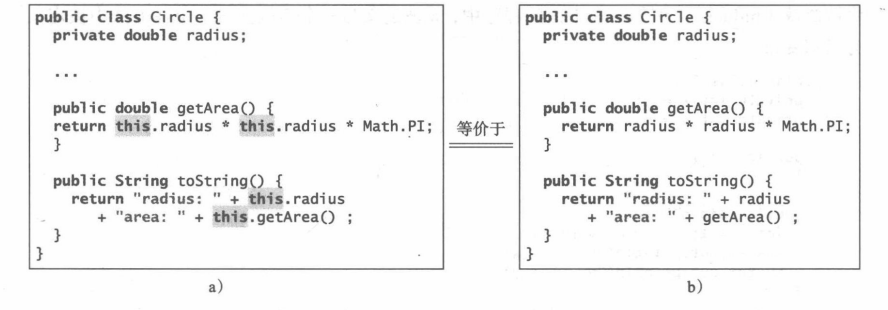

# Java

## 一、计算机、程序和java概述

### 1.1 计算机

#### 1.1.1 什么是计算机

计算机是储存和处理数据得电子设备，包括**硬件（hardware）**和**软件（software）**两部分。

计算机主要有以下硬件组成：

- 中央处理器（CPU）

- 内存（主存）

- 储存设备（例如，磁盘和光盘）

- 输入设备（例如，鼠标键盘）

- 输出设备（例如，显示器和打印机）

- 通信设备（例如，调制解调其和网卡）

  ```mermaid
  graph TD;
  总线 --> 中央处理器;
  总线 --> 内存;
  总线 --> 存储设备;
  总线 --> 通信设备;
  总线 --> 输出\输入设备;
  
  ```

    

#### 1.1.2 比特和字节

  计算机中储存信息是以1和0来储存，这些1和0被解释为二进制系统的数，成为**比特（*bit，二进制数*）**

  计算机中**字节（byte）**是最小的存储单元。==每个字节由8个比特组成==。

### 1.2 编程语言

#### 1.2.1 机器语言

  计算机的原生语言就是**机器语言（machine language）**，即一组内置的原始指令集。这些指令采用二进制代码的形式。

  例如，为将两数相加，可能必须编写的二进制代码指令如下：

​    **1101101010011010**

#### 1.2.2 汇编语言

**汇编语言（assembly language）**使用简短的描述性的单词（**称为助记符**）来表示每条机器语言指令。例如，助记符add一般表示数字相加，sub表示数字相减。要将2和3相加的结果，可以编写如下汇编代码：

add 2，3，result

由于计算机不理解汇编语言，所以需要使用一种称为**汇编器（assembler）**的程序将汇编语言程序转换为机器代码。


#### 1.2.3 高级语言

20世纪50年代，新一代编程语言出现，即**高级语言**，可以在不同类型的机器上运行，高级语言中的指令称为**语句**。例如，下面是计算半径为5的圆的面积的高级语言语句：

area = 5 * 5 * 3.1415926;

流行的高级编程语言有：


用高级语言编写的程序称为**源程序（source program）**或**源代码（source code**）。源程序转换成可执行的机器代码，这种转换可以有一种称为**解释器（interpreter）**或者**编译器（compiler）**的编程工具来完成。

下面是解释器和编译器的区别：


### 1.3 简单Java程序

**提示**：Java是从类的main方法开始执行的。

下面程序会在控制台打印"Welcome to Java!"

```java
public class Welcome{
    public static void main(String[] args){
        Systen.out.println("Welcome to Java!");
    }
}
```

Java中的每条语句都是以（;）结束，也成为语句的**终止符(statement terminator)**；**关键字（Keyword）**对编译器有特定的含义，所以不能在程序中用于其他目的。关键字有：class、if、new、package、private、protected、public、return、static、super、switch、this、void等；

### 1.4 创建、编译和执行Java程序

**提示**：Java源程序保存在.java文件中，然后被编译为.class文件。.class文件有**Java虚拟机（JVM）**执行。

以下是流程图：

```flow
st=>start: 创建/修改源代码
op1=>operation: 存盘
op2=>operation: 存盘
io1=>inputoutput: 源代码
io2=>inputoutput: 字节码
sub1=>subroutine: 如果出现编译错误
sub2=>subroutine: 如果出现运行时错误或结果是错误的
cond1=>condition: 编译源代码
cond2=>condition: 运行字节码（由java虚拟机完成）
e=>end: Welcome to Java!
st->op1->io1->cond1(yes)-op2->io2->cond2(yes)->e
cond1(no)->sub1(right)->op1
cond2(no)->sub2(right)->op1
```

**注意：**==源文件的文件名必须与公共类名一致，且一个源文件中只能有一个公共类。==

Java语言是高级语言，而Java字节码是低级语言。字节码类似于机器指令，但它是体系结构中立的，是可以在任何**带Java虚拟机(JVM)的平台**上运行的。虚拟机不是物理机器,而是一个解释Java字节码的程序。这正是Java的主要优点之一:Java字节码可以在不同的硬件平台和操作系统上运行。Java源代码编译成Java字节码，然后Java字节码被JVM解释执行。你的Java代码可能要用到Java库中的代码。JVM将执行你的程序代码以及库中的代码。

### 1.5 程序设计错误

#### 1.5.1 语法错误

在编译过程中由编译器检测到的错误称为**语法错误（syntax error）**或**编译错误（compile error）**。语法错误是由构建代码时的错误引起的，例如：拼错关键字，忽略一些必要的标点符号，或者左括号没有对应的右括号等。

#### 1.5.2 运行时错误

**运行时错误（runtime error）**是导致程序异常终止的错误。运行应用程序时，如果环境检测到一些不可能执行的操作，就会出现运行时错误。

#### 1.5.3 逻辑错误

当程序没有按预期的方式执行时就会发生**逻辑错误（logic error）**。这种错误发生的原因有很多种。

#### 1.5.4 常见错误

对于编程初学者来说，遗漏括号、遗漏分号、遗漏字符串的引号、名称拼写错误都是常见错误。

### 1.6 JDK

1.7 

## 二、基本程序设计

### 2.1 标识符

**要点：**==标识符==是为了标识程序中如类、方法和变量等元素而采用的==命名==。

- 标识符有==字母、数字、下划线（_）和美元符号（$）构成==
- 标识符**不能以数字开头**，其他开头都可以
- 标识符不能是保留字，**关键字是保留字**
- 标识符可以是任意长度

**注意：**==由于Java是区分大小写的，所以如area、Area和AREA是不同的标识符==

### 2.2 赋值语句和赋值表达式和增强赋值操作符

#### 2.2.1 赋值语句与表达式

**赋值语句：在Java中将符号（=）作为**赋值操作符**，赋值语句的语法如下：

variable = *expression*;

可以在表达式中使用变量。变量还可以同时出现在赋值符号=两侧，例如：

x = x + 1;

假设此语句执行前x = 1那么该语句执行后就变为2了。

注意：==变量名必须在赋值操作符的左侧，赋值符号的顺序是从右到左。==

#### 2.2.2 增强赋值操作符

**增强赋值操作符**:操作符+、-、*、/、%可以结合赋值操作符使用，形成**增强赋值操作符**。如下表达式：i += 8  ==>   i = i+8。其他增强符也一样。

### 2.3 命名

#### 2.3.1 命名常量

Java中常量也称为**由final修饰的变量**，这个变量只能被赋值一次。下面是声明常量的语法：

**fianl** datatype CONSTANTNAME = *value*;

#### 2.3.2 命名习惯

下面是Java的命名规定：

- 使用**大小写字母命名变量和方法**。如，变量radius和方法print。如果一个名称包含多个单词，就把它们连起来，==第一个单词的字母小写，而后面单词的首字母大写。==例如，变量numberOfStudents。这种命名风格称为**驼峰命名法**。
- 类名中每个**==单词首字母大写==**。例如，类名ComuteArea和System。
- **常量所有字母都大写，两个单词之间用下划线（_）连接**。例如，常量PI和常量MAX_VALUE。

### 2.4 数值数据类型和操作

Java针对整数和浮点数有6种数值类。

| 类型名 | 范围                                                         | 储存空间              |
| ------ | ------------------------------------------------------------ | --------------------- |
| byte   | -2^7 ~ 2^7-1，即-128 ~ 127                                   | 8位带符号数           |
| short  | -2^15 ~ 2^15-1，即-32768 ~ 32767                             | 16位带符号数          |
| int    | -2^31 ~ 2^31-1，即-2147483648 ~ 2147483647                   | 32位带符号数          |
| long   | -2^63 ~ 2^63-1,即-9223372036854774808 ~ 9223372036854774807  | 64位带符号数          |
| float  | 负数范围：-3.4028235E+38~-1.4E-45    正数范围：1.4E-45~3.4028235E+38 | 32位，标准IEEE754     |
| double | 负数范围：-1.7976931348623157E+308~-4.9E-324    正数范围：4.9E-324~1.7976931348623157E+308 | 64位,     标准IEEE754 |

#### 2.4.1 从键盘读取数值

Java中Scanner类有许多方法来读取键盘的值，可以用来赋值给变量或参数。

| 方法        | 描述                    | 方法         | 描述                   |
| ----------- | ----------------------- | ------------ | ---------------------- |
| nextByte()  | 读取一个byte类型的整数  | nextLong()   | 读取一个long类型的整数 |
| nextShort() | 读取一个short类型的整数 | nextFloat()  | 读取一个float类型的数  |
| nextInt()   | 读取一个int类型的整数   | nextDouble() | 读取一个double类型的数 |


#### 2.4.2 数值操作符（包括指数、对数、开方）

常见运算操作符有：+（加）、-（减）、*（乘）、/（除）、%（取模）。

提示：在一个乘除运算中若其中一个**操作数是浮点数则结果必为浮点数。**

操作符%一般用于**正整数**，但也可以**用于负数和浮点数**。只有当被除数是负数时，余数才是负的。例如，-7%3的结果时-1，-12%4的结果是0，-26%8结果是-2，20%-13结果是7；

**指数:**Java中指数运算用方法Math.pow(double a, double b)来计算指数，exp(double a)来计算e^a^ 。

**对数：**Java提供Math.log(double)来计算以e为底的对数，用Math.log(double a，double b)来计算log~a~^b^ 。

**开方：**Java中提供sqrt(double a)来返回a的平方根。

注意：==对于这些数学函数方法，在使用时要前置Math. 如Math.pow()；==

### 2.5 数值型字面值

**字面值**：字面值是直接出现在程序中的常量值。

例如，下面的34和0.305都是字面值：

int numberOfYear = 34；

double weight = 0.305;

#### 2.5.1 整型字面值

整型字面值默认为int型，为了表示一个long型的整型字面值，需要在**其后****加字母L或l**（推荐使用L）。

注意：默认情况下，整型字面值为十进制整数。如果要一个二进制整型字面值需要**前置0b或0B（零B）**；表示一个八进制需**前置0（零）**；表示十六进制要**前置0x或0X（零x）**。例如：

System.out.println(0B1111);//二进制，表示15

System.out.println(07777);//八进制，表示4095

System.out.println(0XFFFF);//十六进制，表示65535

#### 2.5.2 浮点型字面值

浮点型字面值带小数点，默认为double型。要表示float类型需要**在后加上F或f**表示float，也可以在**其后加上D或d**表示double型。**float类型具有6到9位有效数字，double类型具有15到17有效数字**。

#### 2.5.3 科学计数法

浮点型字面值可以用科学计数法a * 10^b^ 。Java中提供一种特殊的语法可以表示科学计数法的数值，例如，1.23456×10^2^ 可以写成1.23456E2或1.23456E+2，而1.23456×10^-2^ 写成1.23456E-2。**E或e表示指数**。

### 2.6 表达式求值和操作符优先级

Java的运算顺序和数学一样，下面是操作符优先级规则：

- 首先乘、除、取模运算，从左到右。
- 再执行加、减运算，从左到右。
- 如果有括号就先执行括号里面的操作符。

### 2.7 数值类型转换

**要点提示**：通过显式转换浮点数可以转换为整数。

**数据转换**：数据转换就是指把一种类型的数值转换成另一种类型的数值，Java可以自动把范围小的数据类型转换成范围大的数据类型（**扩大类型**），要想将范围大的数据类型的数值转换成范围小的数据类型（**缩小类型**）就必须显式的转换。

强制类型转换的语法是**在括号中指定目标类型**，紧跟其后的是转换的**变量名或值**。例如：

System.out.println((int)1.7);

就是把double类型数值1.7转换成1；

### 2.8自增自减操作符

Java中（++）和（--）表示自增和自减操作，这种操作分为前置和后置，如下代码解释了对于前置和后置的区别：

```java
int i = 10;
System.out.println(i++);
//相当于
{
    i = i + 1;
    System.out.println(i);//结果显示11
}

System.out.println(++i);
//相当于
{
    System.out.println(i);//结果显示10
    i = i + 1;
}
```

### 2.9 常见错误和陷阱

1、未声明/未初始化和未使用的变量

2、整数溢出：当一个变量被赋得值过大就会导致**溢出**，如，int value = 2147483647 + 1；value就会变成-2147483648。如果浮点数过小将导致**下溢**，Java将其近似为0。

3、**舍入问题**：舍入错误是指计算机得到的数字近似值和其精确得数学值之间得差。浮点数计算都是近似得例如System.out.println(1.0-0.9);显示的是0.0999999999998，而不是0.1。

4、非预期得整数除法：要是两个数相除得到的值为浮点数就需要其中一个数是浮点型或强制转换一个数的类型。

5、冗余的输入对象：再通过Scanner输入数据时，只需要创建一个Scanner对象不用每个输入都创建对象。

### 2.10 从控制台读取输入

Java中使用Scanner类创建的对象来读取控制台的输入，语句为：**Scanner input = new Scanner(System.in);**该语句创建了Scanner类的对象。对象调用nextDouble()方法来读取下一个double值，如下所示：

double radius = input.nextDouble();

该语句从**键盘读入一个数值**，并赋给radius。

==注意：如果使用nextInt()后再使用nextLine()是会出现错误的，因为输入Int类型的数字后的回车符会被nextLine()读取，导致nextLine是空字符。所以不能在使用了nextByte()、nextShort()、nextInt()、nextLong()、nextFloat()、nextDouble()和next()后使用nextLine()，防止出现错误。==

## 三、选择

### 3.1 boolean数据类型、关系操作符

### 3.2 if语句

#### 3.3.1 if语句

#### 3.3.2 双分支if—else语句

#### 3.3.3 嵌套的if语句和多分支if—else语句

### 3.4 常见错误和陷阱

### 3.5 逻辑操作符

要点提示：逻辑操作符==!（非）、&&（与）、||（或）==和==^(异或)==可以用于产生复合布尔表达式。

- **！（非）：**一个为真，则加上！后为假；相反一个为假，则加上！后为真
- **&&（与）:**同时为真则结果为真。
- **||（或）：**一个为真则结果为真
- **^(异或)：**不同则结果为真，相同则结果为假

警告：从数学的角度看，**表达式1<=numberOfDaysInAMonth <=31是正确的**。但是，==在Java中它是错的==，因为1<=numberOfDaysInAMonth得到的是一个布尔值的结果，它是不能和31进行比较的。**这里的两个操作数(一个布尔值和一个数值)是不兼容的**。正确的Java表达式是:

```java
(1 <= numberOfDaysInAMonth) 8& (numberOfDaysInAMonth <= 31)
```

### 3.6 switch语句

要点提示：switch语句基于**变量或者表达式的值来执行语句**。

switch的写法：


switch语句遵从下述规则:

①==switch表达式必须能计算出一个char、byte、short、int或者String型值==，并且必须总是要用括号括住。(char和String类型将在下一章介绍。)

②value1，...，valueN必须与switch表达式的值具有相同的数据类型。注意：value1，...，valueN都是常量表达式，也就是说这里的==表达式是不能包含变量的==，例如，不允许出现1+x。

③当switch表达式的值与case语句的值相匹配时，执行从该case开始的语句，==直到遇到一个break语句或到达该switch语句的结束。==

④默认情况==（ default)是可选的==，当没有一个给出的case与 switch表达式匹配时，用来执行该操作。

⑤关键字==break是可选的==。break语句会立即终止switch语句。

### 3.7 条件操作符

要点提示:条件操作符基于一个条件计算表达式的值。

条件操作符是一种完全不同的风格，在语句中没有明确出现if。该语法如下所示:

```java
boolean-expression ? expression1 : expression2;(布尔表达式?表达式1:表达式2)
```

符号？和：一起出，成为==条件操作符==（也成为*三元操作符*，因为使用到了三个操作数）

如下所示：

```java
if(x > 0)
    y = 1;
else
    y = -1;
//上述代码可以写成
y = x > 0 ? 1 : -1;
```

### 3.8 操作符的优先级和结合规则

要点提示:操作符的**优先级和结合规则**确定了操作符计算的顺序。

首先我们应该先了解操作符之间的顺序。


大致上可以分为：==运算操作符 > 关系操作符 > 逻辑操作符==

如果优先级相同的操作符相邻，则**结合规则( associativity)**决定它们的执行顺序。除了==赋值操作符之外==，所有的二元操作符都是==左结合的(left-associative==)。

学习后试着解释一下下面的表达式：

3 +4*4>5 *(4 + 3)- 1 &&(4 - 3 >5)

它的值是多少呢?这些操作符的执行顺序是什么呢?

## 四、数学函数、字符和字符串

### 4.1 常用数学函数

**提示**：Java在Math类中提供了许多用于计算的数学方法。比如，Math.random()产生double类型的随机数。Math提供PI和e常量。

#### 4.1.1 三角函数方法

Math类中的各种三角函数方法：


sin、cos和 tan的参数都是**以弧度为单位的角度**。asin和 atan的返回值是一T/2～T/2的一个弧度值，acos 的返回值在0到PI之间。1°相当于 PI/180弧度，90°相当于 PI/2弧度，而30°相当于PI/6弧度。

#### 4.1.2 指数函数

Math中各种指数方法：


#### 4.1.3 取整方法

Math中各种取整方法：


#### 4.1.4 random方法

你已经使用过random()方法，==生成大于等于0.0且小于1.0的double型随机数( 0.0<=Math.random()<1.0)==。可以使用它编写简单的表达式，生成任意范围的随机数。例如:

```java
(int)(Math.random() * 10) //返回0～9之间的一个随机整数
50 + (int)(Math.random() * 50) //返回50～ 99之间的一个随机整数
/*通常，
返回a ~a+b之间的一个随机数可以使用下面代码*/
a + Math.random() * b
//随机整数,不包括a+b
```

#### 4.1.5 min、max和abs方法

min和 max方法用于返回两个数( int、long、float或double型)的最小值和最大值。例如，max(4.4,5.0)返回5.0，而min(3,2)返回2。

abs方法以返回一个数(int、long、float或double型)的绝对值。


### 4.2 字符数据类型和操作

要点提示：字符数据类型表示**单个字符**。

警告：字符串直接量必须括在双引号中。而字符直接量是括在单引号中的单个字符。**因此"A"是一个字符串，而'A'是一个字符**。

#### 4.2.1 Unicode和 ASCII码

#### 4.2.2 特殊字符的转义序列


#### 4.2.3 字符型数据与数值型数据的转换

char型数据可以转换成==任意一种数值类型==，反之亦然。将整数转换成char型数据时,**只用到该数据的低十六位,其余部分都被忽略**。例如:

```java
char ch = (char)0XAB0041;
System.out.println(ch);// ch is character A
```

要将一个浮点值转换成char型时，首先将浮点值转换成int型，然后将这个整型值转换为char型。

```java
char ch = (char)65.25;
System.out.print7n(ch);//ch is character A
```

当一个char型数据转换成数值型时，这个字符的Unicode码就被转换成某个特定的数值类型。

```java
int i = (int)'A ';
System. out.println(i);// i is 65
```

所有数值操作符都可以用在char型操作数上。如果另一个操作数是一个数字或字符，那么char型操作数就会被自动转换成一个数字。如果另一个操作数是一个字符串，字符就会与该字符串相连。例如，下面的语句:

```java
int i = '2'+ '3 '; //'2'的码是50，'3'的码是51，所以i是101
System.out.println("i is " +i);
int j = 2 + 'a';//'a'的码是97，所以j是99
System.out.println("j is " +j);
System.out.print1n(j + " is the Unicode for character "+(char)j);
System.out.print1n("Chapter " + '2');
//显示为
//i是101
//j是99
```

#### 4.2.4 字符的比较与测试

两个字符可以使用关系操作符进行比较，如同比较两个数字一样。这是通过比较两个字符的Unicode值实现的。比如:

'a'< 'b'为true，因为'a'(97)的Unicode值比 'b'(98)的Unicode值小。

'a'< 'A'为 false，因为 'a’(97)的Unicode值比'A'(65)的Unicode值大。

'I' < '8'为true，因为'I'(49)的 Unicode值比'8'(56)的 Unicode值小。

为了方便，Java的Character类提供了下列方法用于进行字符测试，如下表：


### 4.3 String类型

要点提示：**字符串是一个字符序列**。

String中的方法：


String是Java中的对象。上表中的方法只能从一个特定的字符串实例来调用。由于这个原因，这些方法称为**实例方法**。**非实例方法称为静态方法**。静态方法可以不使用对象来调用。定义在Math类中的所有方法都是静态方法。它们没有绑定到一个特定的对象实例上。调用一个实例方法的语法是reference-Variable.methodName(arguments)。一个方法可以有多个参数，或者无参。例如，charAt(index)方法具有一个参数，但是length()方法则无参。回顾曾经介绍过的，调用静态方法的语法是ClassName .methodName(arguments)。例如，Math类中的pow方法可以使用Math.pow(2,2.5)来调用。

#### 4.3.1 求字符串长度

可以调用字符串的==length()方法==获取它的长度。

#### 4.3.2 从字符串中获取字符

方法 s.charAt(index)可用于提取字符串s中的某个特定字符，其中**下标index 的取值范围在0～ s.length()-1之间**。例如，message.charAt(0)返回字符w，如下图所示。注意，字符串中第一个字符的下标值是0。


警告：在字符串s中越界访问字符是一种常见的程序设计错误。为了避免此类错误，要确保使用的下标不会超过s.length()-1。例如，s.charAt(s.length())会造成一个==StringIndexOutOfBoundsException异常==。

#### 4.3.3 连接字符串

可以使用concat方法连接两个字符串。例如，如下所示的语句将字符串s1和s2连接构成s3:

```java
String s1 = "你好 ";
String s2 = "世界！";
String s3 = s1.concat(s2);
//s3就是“你好 世界”


//因为字符串连接在程序设计中应用非常广泛，所以Java提供了一种实现字符串连接的简便办法。可以使用加号(+)连接两个或多个字符串。因此，上面的语句等价于:
s3 = s1+s2;
```

==加号(+)也可用于连接数字和字符串==。在这种情况下，先将数字转换成**字符串**，然后再进行连接。注意，若要用加号实现连接功能，至少要有==一个操作数必须为字符串==。如果操作数之一不是字符串(比如，一个数字)，非字符串值转换为字符串，并与另外一个字符串连接。这里是一些示例:

```java
String message="welcome " +"to" +"Java";
String s = "Chapter" + 2; //s是Chapter2
String s1 = "Supplement" + 'B'; // s1 是SupplementB
```

提示：增强的+=操作符也可以用于字符串连接。

#### 4.3.4 从控制台获取字符串

为了从控制台读取字符串，调用Scanner对象上的next()方法。例如，下面的代码就可以从键盘读取三个字符串:


==重要警告：为了避免输入错误，不要在nextByte()、nextShort()、nextInt()、nextLong()、nextFloat()、nextDouble()和next()之后使用nextLine()，原因将在12.9.4节中解释。==

#### 4.3.5 从控制台读取字符

为了从控制台读取字符，调用nextLine()方法读取一个字符串，然后在字符串上调用charAt(0)来返回第一个字符。例如，下列代码从键盘读取一个字符:

```java
Scanner input =new Scanner(System.in);
System.out.print( "Enter a character: ");

String s = input.nextLine();
char ch = s.charAt(O);
//或者可以在这样写
char ch = input.nextLine().charAt(0);

System.out.print1n("The character entered is " + ch);
```

#### 4.3.6 字符串的转换

方法toLowerCase()返回一个新字符串，**其中所有字母小写**;方法toUpperCase()返回一个新字符串，**其中所有字母大写**。例如,

方法trim()通过删除字符串两端的空白字符返回一个新字符串。字符''、\t、\f、\r、或者\n被称为空白字符。例如，

```java
"\t Good Night \n".trim()
//返回一个新字符串Good Night。
```

#### 4.3.7 字符串的比较

String类提供了如下表所示的方法，用于比较两个字符串。


```java
string1 == string2;
//操作符==只能检测string1和 string2是否指向同一个对象，但它不会告诉你它们的内容是否相同。因此，不能使用==操作符判断两个字符串变量的内容是否相同。取而代之，应该使用equals方法。
```

警告：如果使用**像>、>=、<或<=这样的比较操作符比较两个字符串**，就会发生语法错误。替代的方法就是使用s1.compareTo(s2)来进行比较。

#### 4.3.8 获得子字符串

方法 s.charAt(index)可用于提取字符串s 中的某个特定字符。也可以使用String类中的**substring方法从字符串中提取子串**,如下表所示。


例如,

```java
String message = "welcome to Java";
String message = message.substring(0，11) +"HTML";//字符串message变成了welcome to HTML.
```


#### 4.3.9 获取字符串的字符或子串

String类提供了几个版本的indexOf和 lastIndexOf方法，它们可以在字符串中找出一个字符或一个子串，如下表所示。


例如，

```java
"welcome to Java" .indexOf( 'w' ) returns 0.
"welcome to Java" .indexOf( 'o') returns 4.
"welcome to Java" .indexOf( 'o', 5) returns 9.
"welcome to Java" .indexOf("come") returns 3.
"welcome to Java".indexOf("Java", 5) returns 11.
"welcome to Java" .indexOf("java"， 5) returns -1.
"welcome to Java" .lastIndexOf('w' ) returns 0.
"welcome to java".1astIndexOf( 'o')returns 9.
"welcome to Java".TastIndexOf( 'o', 5) returns 4.
"welcome to Java".1astIndexOf("come") returns 3.
"welcome to Java".TastIndexOf("Java", 5)returns -1.
"welcome to Java" .lastIndex0f("Java") returns 11.
```

假设一个字符串s包含使用空格分开的姓和名。可以使用下面的代码从字符串中抽取姓和名。

```java
int k = s.indexOf( ' ');
String firstName = s.substring(0，k);
String lastName = s.substring(k + 1);
```

例如，如果s是Kim Jones，下图显示了如何抽取出姓和名。


#### 4.3.10 字符串和数字之间的转换

可以将数值型字符串转换为数值。要将字符串转换为int值，使用Integer.parseInt方法,如下所示:

```java
int intValue = Integer.parseInt(intString);
//intString是一个数值型字符串,例如"123""。
```

```java
//要将字符串转换为double值，使用Double.parseDouble方法，如下所示:
doub1e doub1eValue = Double.parseDouble(doub1eString);
//doubleString是一个数值型字符串,例如"123.45"。
```

```java
//可以将数值转换为字符串，只需要简单使用字符串的连接操作符，如下所示:
String s= number +"":
//注意这里必须使用""，因为连接操作必须保证有一个是字符串类型的
```

### 4.5 格式化控制台输出

要点提示：可以使用**System.out.printf方法在控制台上显示格式化输出**。

```java
Double num = 16.404676;
//我们要保留两位小数怎么输出，可以使用System.out.printf格式化输出
System.out.printf("%4.2f",num);
//这样输出的是16.40了
```


调用这个方法的语法是:

System.out.printf(format，item1，item2，..., itemk)

这里的**format是指一个由子串和格式标识符构成的字符串**。

格式标识符指定每个条目应该如何显示。这里的条目可以是数值、字符、布尔值或字符串。简单的格式标识符是以百分号(%）开头的转换码。下表列出了一些常用的简单格式标识符。


条目与标识符必须在次序、数量和类型上匹配。例如:count的格式标识符应该是‰d，**而amount的格式标识符应该是%f**。默认情况下，浮点值显示小数点后6位数字。可以在标识符中指定宽度和精度，如下表中的例子所示。


```java
//如果一个条目需要比指定宽度更多的空间，宽度自动增加。例如，下面的代码:
System.out.printf("%3d#%2s#%4.2F\n", 1234，"Java"，51.6653);
//显示
1234#3ava#51.67
//条目所规定的宽度比实际宽度小时，条目宽度会自动增加
```

默认情况下，输出是向右对齐的。可以在格式标识符中放一个负号( -)，表明该条目在特定区域中的输出是左对齐的。例如,以下语句:

```java
System.out.printf("%8d%8s%8.1f\n"，1234，"Java"，5.63);
System.out.printf("%-8d%-8s%-8.lf \n"，1234，"Java"，5.63);
```

显示（方框是空格）


## 五、循环

### 5.1 while循环

### 5.2 do-while循环

### 5.3 for循环

### 5.4 采用哪种循环

### 5.5 嵌套循环

### 5.6 最小化数值错误

要点提示：在循环继续条件中使用浮点数将导致数值错误。

下列代码给出的例子计算从0.01到1.0的数列之和，该数列中的数值以0.01递增，如下所示:0.01+0.02+0.03 + ...


sum的精确结果应该是50.50，但是答案是50.499985。这个结果是不精确的，因为计算机==使用固定位数表示浮点数==，因此，**它就不能精确表示某些浮点数**。如果如下所示，将程序中的float型改成double型，应该可以看到精度有一些小小的改善，因为double型变量占64位而float型变量只占32位。


可是你会吃惊地看到，**实际的结果是49.50000000000003**。究竟哪里出错了呢?如果将循环中每次迭代的i打印出来，会发现==最后一个i比1稍微大一点(不是精确的1)==。这就会造成**最后一个i不能加到sum**中。==根本问题就是浮点数是用近似值表示的==。为了解决这个问题，使用整数计数器以确保所有数字都被加到sum中。下面是一个新的循环:


这个循环结束后，sum的值是50.50000000000003。这个循环从小到大添加数字。如果如下所示从大到小(即以1.0，0.99,0.98，....，0.02,0.01的顺序）添加，那会发生什么呢?


在这个循环之后，==sum的值是50.49999999999995==。从**大到小添加数字没有从小到大添加数字得到的值精确**。==这种现象是有限精度算术的产物==。如果结果值要求的精度比变量可以存储的更高，那么添加一个非常小的数到一个非常大的数上可能没有什么影响。例如,100000000.0+0.000000001的不精确的结果是100000000.0。为了得到更精确的结果，仔细选择计算的顺序。在较大数之前先增加较小数是减小误差的一种方法。

### 5.7 关键字break和continue


## 六、方法

### 6.1 方法的定义

要点提示：方法的**定义由方法名称、参数、返回值类型**以及**方法体**组成。

定义方法的语法如下所示:

修饰符  返回值类型  方法名（参数列表){
       //方法体;
       }

我们来看一个方法的定义max（）


方法头( method header）是**指方法的修饰符( modifier)、返回值类型( return valuetype)、方法名( method name)和方法的参数( parameter)。**

方法可以返回一个值。**returnValueType是方法返回值的数据类型**。有些方法只是完成某些要求的操作，而不返回值。在这种情况下，**returnValueType为关键字void**。

定义在方法头中的变量称为**形式参数( formal parameter)**或者简称为**形参( parameter)**。参数就像占位符。当调用方法时，就给参数传递一个==值==，这个==值称为实际参数==（ actualparameter)或实参( argument)。参数列表( parameter list)指明方法中参数的**类型**、**顺序**和**个数**。==方法名和参数列表一起构成**方法签名**== ( method signature)。参数是可选的，也就是说,方法可以不包含参数。例如:Math.random()方法就没有参数。

注意：我们经常会说“定义方法”和“声明变量”，这里我们谈谈两者的细微差别。**定义是指被定义的条目是什么**，而**声明通常是指为被声明的条目分配内存来存储数据**。

### 6.2 调用方法

要点提示：方法的调用是执行方法中的代码。

```java
//调用有返回值的方法
int num = max(5,6);
//max(5,6)方法返回5和6之间的大的数
//调用无返回值的方法
system.out.println("5");
//这个方法就不会有返回值，只会在控制台输出5
```

注意：在Java中，带返回值的方法也可以当作语句调用。这种情况下，**函数调用者只需忽略返回值即可**。虽然这种情况很少见，但是，如果调用者对返回值不感兴趣，这样也是允许的。

警告：对带返回值的方法而言，return语句是必需的。下面图a中显示的方法在逻辑上是正确的，但它会有编译错误，因为Java编译器认为该**方法有可能不会返回任何值**。


为解决这个问题，删除图a中的if(n<0)，这样，编译器将发现不管if语句如何执行，总可以执行到return语句。

### 6.3 通过传值进行参数传递

要点提示：调用方法的时候是通过传值的方式将**实参传给形参**的。

方法的强大之处在于**它处理参数的能力**。可以使用方法println打印任意字符串，用max方法求任意两个int值的最大值。调用方法时，需要提供实参，它们必须与方法签名中所对应的**形参次序相同**。这称作**参数顺序匹配( parameter order association)**。例如，下面的方法打印 message信息n次:

```java
public static void nPrintln(String message，int n) {
for (int i =0; i < n; i++)
System.out.print1n(message);
}
```

警告：实参必须与方法签名中定义的参数在**次序和数量上匹配**，在类型上兼容。类型兼容是**指不需要经过显式的类型转换**，实参的值就可以传递给形参，例如，将int型的实参值传递给double型形参。

### 6.4 模块化代码

要点提示：模块化使得代码易于维护和调试，并且使得代码可以被重用。

这节的具体内容就是把一个操作或动作写成一个方法来封装。这样可以保护代码的安全性。

### 6.5 重载方法

要点提示：重载方法使得你**可以使用同样的名字来定义不同方法，只要它们的==签名==是不同的**。

例如，

```java
//max(int num1,int num2)和方法max(int num1,int num2,int num3)是不同的方法
//这就是方法的重载
```

注意：被重载的方法==必须具有不同的参数列表==。不能基于==不同修饰符或返回值类型来重载方法==。

注意：有时调用一个方法时，会有两个或更多可能的匹配，但是，编译器无法判断哪个是最精确的匹配。这称为**歧义调用( ambiguous invocation)**。**歧义调用会产生一个编译错误**。


**max(int, double)和max(double,int)都有可能与max(1,2)匹配**。由于两个方法谁也不比谁更精确，所以这个调用是有歧义的，==它会导致一个编译错误==。

### 6.6 变量的作用域

要点提示：变量的作用域(scope of a variable)是指**变量可以在程序中引用的范围**。

可以在**一个方法中**的不同块里声明同名的局部变量，但是，不能在嵌套块中或同一块中两次声明同一个局部变量,如x下图所示。


警告：不要在**块内声明一个变量然后企图在块外使用它**。下面是一个常见错误的例子:

```java
for (int i = o; i < 10; i++) 
{
    
}
system.out.print1n(i);
//因为变量i没有在for循环外定义，所以最后一条语句就会产生一个语法错误。
```

## 七、一维数组


## 八、多维数组


## 九、对象和类

### 9.1 为对象定义类

要点提示：类为对象定义属性与行为。

面向对象程序设计(OOP）就是使用对象进行程序设计。**对象（ object)代表现实世界中可以明确标识的一个实体**。例如:**一个学生、一张桌子、一个圆、一个按钮甚至一笔贷款都可以看作是一个对象。**每个对象都有自己独特的标识、状态和行为。

- 一个对象的状态**（ state，也称为特征( property))** 或**属性( attribute)**==是由具有当前值的数据域来表示的==。例如:圆对象具有一个数据域radius，它是标识圆的属性。一个矩形对象具有数据域width 和 height，==它们都是描述矩形的属性==。

- 一个对象的行为 **( behavior，也称为动作( action)）**是由方法定义的。**调用对象的一个方法就是要求对象完成一个动作**。例如:可以为圆对象定义一个名为getArea()和getPerimeter()的方法。圆对象可以调用getArea()返回圆的面积，调用getPerimeter()返回它的周长。还可以定义setRadius(radius)方法。圆对象可以调用这个方法来修改它的半径。

**使用一个通用类来定义同一类型的对象**。**类是一个模板、蓝本或者说是合约，用来定义对象的数据域是什么以及方法是做什么的。**==一个对象是类的一个实例==。可以从一个类中创建多个实例。==创建实例的过程称为实例化( instantiation)。==对象(object)和实例( instance)经常是可以互换的。==类和对象之间的关系类似于苹果派配方和苹果派之间的关系。可以用一种配方做出任意多的苹果派来。==

Java类使用变量定义数据域，使用方法定义动作。除此之外，**类还提供了一种称为构造方法( constructor)的特殊类型的方法，调用它可以创建一个新对象。**构造方法本身是可以完成任何动作的，但是设计构造方法是为了完成初始化动作，例如:初始化对象的数据域。

下图Circle类与目前所见过的所有其他类都不同，**它没有main方法，因此是不能运行的**;它只是对圆对象的定义。本书还将涉及包含main方法的类。**为了方便，本书将包含main方法的类称为==主类(main class)。==**


ULM类图


### 9.2 定义类和创建对象

要点提示：**类是对象提示的，对象从类创建**。

本节给出两个定义类和使用类创建对象的例子。下面代码是一个定义Circle类并使用该类创建对象的程序。程序构造了三个圆对象，其半径分别为1、25和125，然后显示这三个圆的半径和面积。然后将第二个对象的半径改为100，并显示它的新半径和面积。


程序包括两个类。其中第一个类**TestSimpleCircle是主类**。它的唯一目的就是测试第二个类SimpleCircle。**使用这样的类的程序通常称为该类的客户( client)**。运行这个程序时，Java运行系统会调用这个主类的main方法。

==可以把两个类放在同一个文件中，但是文件中只能有一个类是公共( public)类。此外,公共类必须与文件同名。==因此，文件名就应该是TestSimpleCircle.java，因为TestSimpleCircle是公共的。==源代码中的每个类编译成.class文件。==当编译TestSimpleCircle.java时，产生两个类文件TestSimpleCircle.class和 SimpleCircle.class，如下，


主类包含main方法(第3行)，该方法创建三个对象。和创建数组一样，**使用new操作符从构造方法创建一个对象。new SimpleCircle()创建一个半径为1的对象(第5行)，newSimpleCircle(25)创建一个半径为25的对象(第10行)，而new SimpleCircle (125)创建一个半径为125的对象(第15行)。**

这三个对象（通过circle1、circle2和circle3来引用)有不同的数据，但是有相同的方法。因此，可以使用getArea()方法计算它们各自的面积。可以分别使用circle1.radius、circle2.radius、circle3.radius来通过对象引用访问数据域。对象可以分别使用circle1.getArea() , circle2.getArea() , circle3.getArea()来通过对象引用调用它的方法。

==三个对象是独立的。==


另一个例子是关于电视机的。每台电视机都是一个对象，每个对象都有状态（当前频道、当前音量、电源开或关)以及动作(转换频道、调节音量、开启/关闭)。可以使用一个类对电视机进行建模。这个类的UML图如下，


大致代码如下，


测试类代码，


### 9.3 使用构造方法构造对象

要点提示：构造方法在使用new操作符创建对象时候被调用。

构造方法是一种特殊的方法。它们有以下三个特殊性:

- 构造方法必须具备和所在类相同的名字。

- ==构造方法没有返回值类型,甚至连void也没有。==

- 构造方法是在创建一个对象使用new操作符时调用的。==构造方法的作用是初始化对象==。

**构造方法具有和定义它的类完全相同的名字**。和所有其他方法一样，==构造方法也可以重载（也就是说，可以有多个同名的构造方法，但它们要有不同的签名)==，这样更易于用不同的初始数据值来构造对象。

一个常见的错误就是将关键字void放在构造方法的前面。例如:

```java
public void Circle(){
}
//这是错误的
```

在这个情况下Circle()是**方法**不是**构造方法。**

通常，一个类会提供一个没有参数的构造方法（例如:Circle())。**这样的构造方法称为==无参构造方法(no-arg 或no-argument constructor)。==**

一个类可以不定义构造方法。**在这种情况下，类中隐含定义一个方法体为空的无参构造方法。**这个构造方法称为==默认构造方法(default constructor)==，==当且仅当类中没有明确定义任何构造方法时才会自动提供它==。

### 9.4 使用引用变量访问对象

要点提示：对象的数据和方法可以运用点==操作符（.)==通过对象的引用变量进行访问。

新创建的对象在内存中被分配空间。它们可以通过**引用变量**来访问。

#### 9.4.1 引用变量和引用类型

对象是通过对象**引用变量(reference variable)**来访问的，该**变量包含对对象的引用**，使用如下语法格式声明这样的变量:

```java
ClassName objectRefVar;
```

本质上来说，==一个类是一个程序员定义的类型。==**类是一种引用类型(reference type)**，这意味着该类/**类型的变量都可以引用该类的一个实例**。下面的语句声明变量myCircle的类型是Circle类型:

```java
Circle myCircle;
```

变量myCircle能够引用一个Circle对象。==下面的语句创建一个对象，并且将它的引用赋给变量myCircle:==

```java
myCircle = new Circle();
```

采用如下所示的语法，可以写一条**包括声明对象引用变量**、**创建对象**以及**将对象的引用赋值**给这个变量的语句。

```java
Circle myCircle = new Circle();
```

==变量myCircle 中放的是对Circle对象的一个引用。==

注意：从表面上看，**对象引用变量中似乎存放了一个对象**，但事实上，==它只是包含了对该对象的引用==。严格地讲，对象引用变量和对象是不同的，但是大多数情况下，这种差异是可以忽略的。因此，可以简单地说myCircle是一个Circle对象，而不用冗长地描述说，**myCircle是一个包含对Circle对象引用的变量。**

注意：在Java中，数组被看作是对象。数组是用new操作符创建的。**一个数组变量实际上是一个包含数组引用的变量。**

#### 9.4.2 访问对象的数据和方法

在面向对象编程中，对象成员可以引用该对象的数据域和方法。在创建一个对象之后，**它的数据和方法可以使用点操作符（.)来访问和调用**，==该操作符也称为对象成员访问操作符(object member access operator ):==

- objectRefVar.dataField引用对象的数据域。

- objectRefVar.method(arguments)调用对象的方法。

例如:myCircle.radius引用myCircle的半径，而myCircle.getArea()调用myCircle的getArea方法。方法作为对象上的操作被调用。

数据域radius称作**实例变量( instance variable)**，**因为它依赖于某个具体的实例**。基于同样的原因，getArea方法称为**实例方法( instance method)**，因为只能在具体的实例上调用它。**调用对象上的实例方法的过程称为调用对象(calling object)。**

注意：回想一下，我们曾经使用过Math.methodName(参数)(例如:Math.pow(3,2.5))来调用Math类中的方法。那么能否用Circle.getArea()来调用getArea方法呢?==答案是不能==。Math类中的**所有方法都是用关键字static定义的静态方法**。但是，**getArea()是实例方法，因此它是非静态的**。它必须使用objectRefVar.methodName(参数)的方式(例如:myCircle.getArea())从对象调用。

注意：通常，我们创建一个对象，然后将它赋值给一个变量，之后就可以使用这个变量来引用对象。有时候，一个对象在创建之后并不需要引用。在这种情况下，可以创建一个对象，而并不将它明确地赋值给一个变量，如下所示:

```java
new Circle();
//或者
System.out.println("Area is "+new Circle(2.5).getArea());
```

前面的语句创建了一个Circle对象。后面的语句创建了一个Circle对象，然后调用它的getArea方法返回其面积。这种方式创建的对象称为**匿名对象( anonymous object)。**

#### 9.4.3 应用数据域和null值

**数据域也可能是引用型的**。例如:下面的Student类包含一个String类型的name数据域，String是一个预定义的Java类。

```java
class Student {
String name; 
int age;
boolean isScienceMajor;
char gender;
}
```

**如果一个引用类型的数据域没有引用任何对象，那么这个数据域就有一个特殊的Java值null**。null同true和false一样都是一个**直接量**。true和false是boolean类型**直接量**，而null是**引用类型直接量**。

引用类型数据域的**默认值是null**，数值类型数据域的**默认值是0**，boolean类型数据域的**默认值是false**，而char类型数据域的**默认值是'\u0000'**。但是，==Java没有给方法中的局部变量赋默认值==。下面的代码显示Student对象中数据域name、age、isScienceMajor和gender的默认值:


==在方法中局部变量没有赋值会编译错误。==

警告：NullPointerException是一种常见的运行时错误，当调用/**值为null的引用变量**上的方法时会发生此类异常。在**通过引用变量调用一个方法之前，确保先将对象引用赋值给这个变量。**

#### 9.4.4 基本类型变量和引用类型变量的区别

**每个变量都代表一个存储值的内存位置**。**声明一个变量时，就是在告诉编译器这个变量可以存放什么类型的值**。对基本类型变量来说，对应内存所存储的值是基本类型值。对引用类型变量来说，**对应内存所存储的值是一个引用，是对象的存储地址**。例如:下图所示，int型变量i的值就是int值1，**而Circle对象c的值存的是一个引用，它指明这个Circle对象的内容存储在内存中的什么位置。**


将一个变量赋值给另一个变量时，另一个变量就被赋予同样的值。对基本类型变量而言，就是将一个变量的**实际值**赋给另一个变量**。对引用类型变量而言，**就是将一个**变量的引用赋给另一个变量**。如下图所示，赋值语句i=j将基本类型变量j的内容复制给基本类型变量i。


如下图所示，对引用变量来讲，赋值语句c1=c2是将c2的引用赋给c1。赋值之后，**变量c1和c2指向同一个对象**。


注意：如上所示，执行完赋值语句c1=c2之后，c1指向c2所指的同一个对象。**c1以前引用的对象就不再有用**，因此，现在它就成为**垃圾( garbage)**。垃圾会占用内存空间。**Java运行系统会检测垃圾并自动回收它所占的空间，这个过程称为垃圾回收(garbagecollection)。**

### 9.5 Java库中的类

要点提示：Java API包含了丰富的类的集合，用于开发Java程序。

#### 9.5.1 Date类


可以使用Date类中的无参构造方法为当前的日期和时间创建一个实例，它的getTime()方法返回自从GMT时间1970年1月1日算起至今流逝的时间，它的toString()方法返回日期和时间的字符串。例如，下面的代码

```java
java.util.Date date = new java.util.DateO;
system.out.println("The elapsed time since Jan 1，1970 is " +
date.getTime + " mil1iseconds");
System.out.println(date.toString();
```

Date类还有另外一个构造方法:Date(long elapseTime)，可以用它创建一个Date对象。该对象有一个从GMT时间1970年1月1日算起至今流逝的以毫秒为单位的给定时间。

#### 9.5.2 Random类

可以使用Math.random()获取一个0.0到1.0(不包括1.0)之间的随机double型值。另一种产生随机数的方法是使用如下图所示的java.util.Random类，它可以产生一个int、long、double、float和boolean型值。


创建一个Random对象时，必须指定一个种子或者使用默认的种子。种子是一个用于初始化一个随机数字生成器的数字。无参构造方法使用**当前已经逝去的时间作为种子**，创建一个Random对象。如果这两个Random对象有相同的种子，那它们将产生相同的数列。例如:下面的代码都用相同的种子（3）来产生两个Random对象。


注意：产生**相同随机值序列的能力在软件测试以及其他许多应用中是很有用的**。在软件测试中，经常需要从一组固定顺序的随机数中来重复生成测试案例。

#### 9.5.3 Point2D类

Java API在javafx.geometry包中有一个便于使用的Point2D类，用于表示二维平面上的点。该类的UML图如下图所示。


### 9.6 静态变量、常量和方法

要点提示：**静态变量被类中的所有对象所共享。静态方法不能访问类中的实例成员。**

Circle类的数据域radius称为一个**实例变量**。实例变量是绑定到类的某个特定实例的,它是不能被同一个类的不同对象所共享的。例如，假设创建了如下的两个对象:

```java
Circle circle1 = new Circle();
Circle circle2 = new Circle(5);
```

circle1中的radius和circle2中的radius是不相关的，它们存储在不同的内存位置。circle1中radius的变化不会影响circle2中的radius，反之亦然。

如果想让一个类的所有实例共享数据，就要使用**静态变量( static variable)**，也称为**类变量( class variable)**。静态变量将变量值存储在一个公共的内存地址。因为它是公共的地址，所以如果某一个对象修改了静态变量的值，那么同一个类的所有对象都会受到影响。Java支持静态方法和静态变量，无须创建类的实例就可以调用**静态方法(static method)**。

修改Circle类，**添加静态变量numberOfobjects统计创建的Circle对象的个数**。当该类的第一个对象创建后，numberOfObjects的值是1。当第二个对象创建后，numberof0bjects的值是2。新Circle类的UML图如下图所示。Circle类定义了**实例变量radius和静态变量number0f0bjects**，还定义了实例方法getRadius、setRadius和getArea以及静态方法 getNumberofObjects。(==注意，在UML类图中，静态变量和静态方法都是以下划线标注的==。)


要声明一个静态变量或定义一个静态方法，就要在这个变量或方法的声明中加上**修饰符static**。静态变量number0f0bjects和静态方法getNumber0fobjects()可以如下声明:

```java
static int numberOf0bjects;
static int getNumberObjects( {
return numberOf0bjects;
}
```

类中的**常量**同样是被该类的**所有对象所共享**的。因此，**常量应该声明为final static**,例如，Math类中的常量PI是如下定义的:

```java
final static double PI = 3.14159265358979323846;
```

提示：**静态变量和方法可以不创建对象的情况下使用。**

提示：使用“**类名.方法名(参数)**”的方式**调用静态方法**，使用“**类名.静态变量**”的方式访问静态变量。**这会提高可读性，因为可以很容易地识别出类中的静态方法和数据。**

==实例方法可以调用实例方法和静态方法，以及访问实例数据域或者静态数据域。静态方法可以调用静态方法以及访问静态数据域。**然而，静态方法不能调用实例方法或者访问实例数据域**，因为**静态方法和静态数据域不属于某个特定的对象**。==静态成员和实例成员的关系总结在下图中。


### 9.7 可见性修饰符

要点提示：**可见性修饰符可以用于确定一个类以及它的成员的可见性（范围）。**

可以在**类、方法和数据域前使用public修饰符**，表示它们可以被任何其他的类访问。如果没有使用可见性修饰符，那么则**默认类、方法和数据域是可以被同一个包中的任何一个类访问的**。**这称作包私有(package-private)或包内访问(package-access)。**

注意：包可以用来组织类。为了完成这个目标，需要在程序中首先出现下面这行语句，在这行语句之前不能有注释也不能有空白:

```java
package packageName;
```

如果定义类时没有声明包，就表示把它放在默认包中。Java建议最好**将类放入包中**，而不要使用默认包。

警告：修饰符private只能**应用在类的成员上**。修饰符public可以**应用在类或类的成员上**。在==局部变量上使用修饰符public和private都会导致编译错误==。

注意：大多数情况下，构造方法应该是公共的。但是，如果想防止用户创建类的实例，==就该使用私有构造方法==。例如:因为Math类的所有数据域和方法都是静态的，所以没必要创建Math类的实例。为了防止用户从Math类创建对象，在java.lang.Math中的构造方法定义为如下所示:

```java
private Math(){
    
}
```

提示：如果一个对象是在它自己的类中定义的，那么这个对象可以访问它的私有成员。

### 9.8 数据域封装

要点提示：将数据域设为私有**保护数据**，并且使类易于维护。

CirclewithStaticMembers类的数据域radius和numberOf0bjects可以直接修改（例如: c1.radius = 5或CirclewithStaticMembers . numberOFObjects = 10)。这不是一个好的做法，原因有两点:

- **首先，数据可能被篡改**。例如:numberOfObjects是用来统计被创建的对象的个数的，但是它可能会被错误地设置为一个任意值（**例如:CirclewithStaticMembers.numberOf0bjects = 10**)。

- 其次，**它使类变得难于维护，同时容易出现错误**。假如在其他程序已经使用CirclewithStaticMembers类之后想修改半径以确保半径是一个非负数。因为使用该类的客户可以直接修改radius(例如:myCircle.radius=-5)，所以，不仅要修改CirclewithStaticMembers，而且还要修改使用CirclewithStaticMembers的这些程序。

为了避免对数据域的直接修改，应该使用private修饰符将数据域声明为私有的，这称为==数据域封装(data field encapsulation)。==

**在定义私有数据域的类外的对象是不能访问这个数据域的**。但是经常会有客户端需要存取、修改数据域的情况。为了能够访问私有数据域，**可以提供一个get方法返回数据域的值**。为了能够更新一个数据域，**可以提供一个set方法给数据域设置新值**。get方法也被称为**访问器( accessor)**，而set方法称为**修改器(mutator)**。

```java
//get方法有如下签名:
public returnType getPropertyName();
如果返回值类型是boolean型，习惯上如下定义get方法:
public boolean isPropertyName();
//set方法有如下签名:
pub1ic void setPropertyName(dataType propertyValue)
```

### 9.9 向方法传递对象参数

要点提示：给方法传递一个对象，**是将对象的引用传递给方法**。

可以将对象传递给方法。同传递数组一样，传递对象实际上是传递对象的引用。下面的代码将myCircle对象作为参数传递给printCircle方法:


Java只有一种参数传递方式:**值传递( pass-by-value)**。在上面的代码中，myCircle的值被传递给printCircle方法。这个**值就是一个对Circle对象的引用值**。

下图的程序展示了传递基本类型值和传递引用值的差异。


下面是栈图，注意，对象是存储在堆中的；


当传递基本数据类型参数时，**传递的是实参的值**。在这种情况下，n(5)的值就被传递给times。在 printAreas方法内，times的内容改变，这并不会**影响n**的内容。

传递引用类型的参数时，**传递的是对象的引用**。在这种情况下，c具有与myCircle相同的引用值。因此，通过在printAreas方法内部的c与在方法外的myCircle来改变对象的属性，效果是一样的。引用上的传值在语义上最好描述为**传共享( pass-by-sharing)**，也就是说，==在方法中引用的对象和传递的对象是一样的==。

### 9.10 对象数组

要点提示：**数组既可以存储基本类型值，也可以存储对象**。

```java
//下面语句声明并创建了10个Circle对象的数组:
Circle[] circleArray = new Circle[10];
//为了初始化数组circleArray，可以使用如下的for循环:
for (int i =0; i < circleArray.length; i++){
    circleArray[i] = new Circle();
}
```

**对象的数组实际上是引用变量的数组**。因此，调用circleArray[1].getArea()实际上调用了两个层次的引用，如下图9所示。**circleArray引用了整个数组**，**circleArray[1]引用了一个Circle对象**。


注意：当使用new操作符创建对象数组后，这个数组中的每个元素都是**默认值为null的引用变量**。

下图给出了一个例子，演示如何使用对象数组。这个程序求圆的数组的总面积。程序创建5个Circle对象组成的数组circleArray，接着使用随机值初始化这些圆的半径，然后显示数组中的圆的总面积。


### 9.11 不可变对象和类

要点提示：可以**定义不可变类**来产生不可变对象。**不可变对象的内容不能被改变**。

通常，创建一个对象后，它的内容是允许之后改变的。有时候也需要创建一个一旦创建其内容就不能再改变的对象。我们称这种对象为一个**不可变对象(immutable object)**，而它的类就称为**不可变类( immutable class)**。例如:==String类就是不可变的==。如果把 CirclewithPrivateDataFields类的set方法删掉，该类就变成不可变类，因为半径是私有的,所以如果没有set方法，它的值就不能再改变。

如果一个类是不可变的，**那么它的所有数据域必须都是私有的**，而且**没有对任何一个数据域提供公共的set方法**。一个**类的所有数据都是私有的且没有修改器并不意味着它一定是不可变类**。例如:下面的Student类，它的所有数据域都是私有的，而且也没有set方法，但它不是一个不可变的类。


如下面的代码所示，使用getDateCreated()方法返回**数据域dateCreated**。它是对Date对象的一个引用。**通过这个引用，可以改变dateCreated的值。**


要使一个类成为不可变的,它必须满足下面的要求:

- ==所有数据域都是私有的。==
- ==没有修改器方法==。
- ==没有一个返回指向可变数据域的引用的访问器方法。==

### 9.12 变量的作用域

要点提示：**实例变量和静态变量**的作用域是整个类，无论变量是在哪里声明的。

一个类的**实例变量和静态变量称为类变量( class's variables）**或**数据域( data field)**。在方法内部定义的变量**称为局部变量**。无论在何处声明，类变量的作用域都是整个类。类的变量和方法可以在类中以任意顺序出现，如下图a所示。==但是当一个数据域是基于对另一个数据域的引用来进行初始化时则不是这样。==在这种情况下，必须首先声明另一个数据域，如下图b所示。为保持一致性，本书在类的开头就声明数据域。


类变量**只能声明一次**，但是在**一个方法内不同的非嵌套块中，可以多次声明相同的变量名**。

如果一个局部变量和一个类变量具有相同的名字，那么局部变量优先，而同名的类变量将被**隐藏( hidden)**。例如:在下面的程序中，x被定义为一个实例变量，也在方法中被定义为局部变量。


假设f是F的一个实例，那么f.p()的打印输出是什么呢? f.p()的打印输出是: x为1，y为0。其原因如下:

×被声明为类中初值为0的数据域，但是它在方法p()中又被声明了一次，初值为1。System.out. println语句中**引用的×是后者。**

 y在方法p()的外部声明,但在**方法内部也是可访问**的。

提示：为避免混淆和错误，除了方法中的参数，不要将实例变量或静态变量的名字作为局部变量名。

### 9.13 this引用

要点提示：关键字**this引用对象自身**。它也可以在构造方法内部用于调用同一个类的其他构造方法。

关键字==this是指向调用对象本身的引用名==。可以用this关键字引用对象的实例成员。例如，下面a的代码使用this来显式地引用对象的radius以及调用它的getArea()方法。this引用通常是省略掉的，如b所示。然而，在**引用隐藏数据域以及调用一个重载的构造方法的时候,this引用是必须的**。



#### 9.13.1 使用this引用隐藏数据域

this关键字可以用于引用类的隐藏数据域。例如，在数据域的set方法中，**经常将数据域名用作参数名**。在这种情况下，这个数据域在set方法中被隐藏。==为了给它设置新值，需要在方法中引用隐藏的数据域名==。隐藏的静态变量可以简单地通过**“类名.静态变量”的方式引用**。隐藏的实例变量就需要使用关键字this 来引用，如下图a所示。


关键字this给出一种**引用调用实例方法的对象的方法**。调用f1.setI(10)时，执行了this.i=i，将参数i的值赋给调用对象f1的数据域i。关键字this是指调用实例方法setI的对象，如上图b所示。F.k=k这一行的意思是将参数k的值赋给这个类的静态数据域k,k是被类的所有对象所共享的。

#### 9.13.2 使用this调用构造方法

关键字this可以用于**调用同一个类的另一个构造方法**。例如，可以如下改写Circle类:


在第二个构造方法中，**this(1.0)这一行调用带double值参数**的第一个构造方法。

注意：Java要求在构造方法中，==语句this(参数列表）应在任何其他可执行语句之前出现==。

提示：如果一个类有多个构造方法，最好尽可能使用this(参数列表）实现它们。通常，

**无参数或参数少的构造方法可以用this(参数列表）调用参数多的构造方法**。这样做通常可以==简化代码，使类易于阅读和维护。==

### 9.14 UML类图

统一建模语言(Unified Modeling Language，UML) 可分类成：

- 功能模型：从用户的角度展示系统的功能，包括用例图。

- 对象模型：采用==对象，属性，操作，关联等概念展示系统的结构和基础，包括类别图、对象图。==

- 动态模型：展现系统的内部行为。包括序列图，活动图，状态图。   

#### 9.14.1 类图基础

 类图概括起来主要由两部分组成 —— ==**类**、**类之间的关系**==， 其中对类的定义如下图所示， 主要由三部分组成， 它们是 **==类名==、 ==类的属性(成员变量)==、 ==类的相关操作(函数方法)==** ， 分别对应图里的 ==**上中下**== 三个分区内容。


[ 符号解释 ]

- -： private
- +： public
- ~： default ( package 维度 )
- #:    protected
- 下划线： static
- 斜体： **抽象 **
- << interface >>：**接口画法是在接口前面写上,接口名字也要斜体**
- 冒号前是方法名/变量名（根据有无括号区分），冒号后是返回参数/变量类型（根据有无括号区分），**如果没有冒号的话表示方法返回空**（也有人通过：void表示返空），**如果是抽象方法使用斜体表示**。

#### 9.14.2 类的关系

##### 一、继承


网上标准解释： 泛化关系为 **is-a** 的关系；两个对象之间如果可以用 is-a 来表示，就是**泛化关系** 。

笔者通俗解释： Mac is a 电脑，懂了吧 ？ **也就是说Mac 继承 了电脑，是电脑的子类** 。

总结： ==空心三角 + 实线== （也有乱画成实心表示的，你反正记住这个 形状+ 实线 就行）**== 继承关系**

注意：**继承抽象类也是用这个**。

##### 二、实现关系


网上标准解释： **程序里面实现关系表现为实现接口** 。

笔者通俗解释： 实现 接口 属于实现关系 。 需要特别注意的是实现关系有种 "棒棒糖" 表示法，**就是被实现的那个对象是用圆形表示的如下图**。


总结： ==空心三角 + 虚线==（也有乱画成实心表示的，你反正记住这个 形状+ 虚线 就行） **== 实现关系**


##### 三、关联关系（也叫简单关联关系）


网上标准解释： 通常用一条直线表示，当然 如果需要标明方向 可以添加箭头。它是描述不同的**类对象之间的关系，通常不会随着状态的变化而变化，可以理解为被关联者属于关联者的一部分**。

笔者通俗解释： 其实就是一个类中的 ==对象与对象 之间的引用关系==，你可以理解为一个类中的 **所有** 成员变量

当然如果是多对多关系（比如一个类中的成员变量含有另一个对象的List， 另一个类的成员变量又含有当前对象的List）， 那么就可以不用箭头表示， 也可以用双向箭头表示 —— 另外也有 【完全不用箭头】 表示，就是简单 【一条直线】 结合 【两头的数量符号】 来标识关系。

总结：==尖括号+实线====关联关系

###### 1、组合关系（组合关系是关联关系的一种，属于强关联关系）


网上标准解释： 与聚合关系一样，组合关系同样表示整体由部分构成的关系，不同之处在于整体和部分是==强依赖关系，如果整体不存在了，部分也不复存在==。

笔者通俗解释： 你可以理解为 非集合类的成员变量， 它与类共存亡 —— 比如这里的 部门 不能脱离 公司 独自存在（别跟我杠，我们这里讨论的是名词，你要想独自存在，不如干脆叫自己为叛徒小公司吧）总之 —— 公司亡，部门必亡 ~

总结： ==实心 棱形== + 实线 == 组合关系

###### 2、聚合关系( 聚合关系也是关联关系的一种，属于弱关联关系 )


网上标准解释： 与组合关系不同的是，==整体和部分不是强依赖的，即使整体不存在了，部分仍然存在==。

笔者通俗解释： 你可以理解为 集合类的成员变量， 集合类中聚合的对象就代表了这层聚合关系 。 如 List<码农> ，这个集合中 聚合 的 “码农” 对象是可有可无的， 他不影响自身， 二者各自的存活时长完全独立 ，这就是聚合关系 。

总结： ==空心 棱形== + 实线 == 聚合关系

##### 四、依赖关系


网上标准解释： 通常描述一**个对象在运行期间会用到另一个对象的关系**。

笔者通俗解释： ==当一个对象依赖另一个对象提供的服务时，就是依赖关系== 。 函数方法的入参 、 局部变量的引用 、 静态方法的直接调用 都属于这个范畴 。 一个对象中的函数方法依赖另一个对象作为实例入参的表现形式最为常见， 拿函数方法举例 —— 比如 A 函数方法的入参实例 B，**就是需要依赖过来的调用对象**。

总结： ==尖括号 + 虚线== == 依赖关系

#### 9.14.3 总结


图中的意思概括就是：

1. 一个 公司 中可以有多个 部门 —— 非集合类的成员变量（公司亡，部门必亡）
2. 一个 部门 中可以有多个 码农 —— 集合类成员变量，如 List<码农>（码农可有可无，没了换掉就是了，不影响部门的存活）
3. 一个 码农 可以有多个 手机 —— 成员变量
4. 一个 码农 依赖多个 Mac —— 很简单，有了 Mac 我才能敲代码嘛，可以理解为需要 Mac 来完成自身的方法调用
5. Mac 是 电脑 的一种拓展 —— 继承关系
6. 电脑 是 可处理计算机 这个概念的一种实现 —— 实现关系

原文链接：https://blog.csdn.net/sinat_25207295/article/details/116073819                  

## 十、面向对象

### 10.1 类的抽象与封装

要点提示：类的抽象是指==将类的实现==和==类的使用分离开==，**实现的细节被封装并且对用户隐藏**，这被称为类的**封装**。

**类抽象(class abstraction)是将类的实现和使用分离**。**类的创建者描述类的功能，让使用者明白如何才能使用类**。从类外可以访问的方法和数据域的集合以及预期这些成员如何行为的描述，**合称为类的合约(class's contract)**。类的使用者不需要知道类是如何实现的。**实现的细节经过封装，对用户隐藏起来，这称为类的封装( class encapsulation)。**例如:可以创建一个Circle对象，并且可以在不知道面积是如何计算出来的情况下，求出这个圆的面积。由于这个原因，**类也称为抽象数据类型(Abstract Data Type，ADT)**。


类的抽象和封装是一个问题的两个方面。现实生活中的许多例子都可以说明类抽象的概念。例如:考虑建立一个计算机系统。个人计算机有很多组件——CPU、内存、磁盘、主板和风扇等。每个组件都可以看作是一个有属性和方法的对象。要使各个组件一起工作，只需要知道每个组件是怎么用的以及是如何与其他组件进行交互的，而无须了解这些组件内部是如何工作的。内部功能的实现被封装起来，对你是隐藏的。所以，你可以组装一台计算机,而不需要了解每个组件的功能是如何实现的。

**面向对象编程的范式重点在于对象**，**动作和数据一起定义在对象中**。为了将日期和贷款联系起来，可以定义一个贷款类，将日期和贷款的其他属性一起作为数据域，并且贷款数据和动作在一个对象中集成。下图给出 Loan类的UML类图。


上图UML图可以**看做Loan类的合约**。贯穿本书，你将扮演两个角色，一个是类的用户，一个是类的开发者。==记住用户可以在不知道类是如何实现的情况下使用类！==

下图是使用Loan类：


下图是Loan类具体的实现：


Loan类包含**两个构造方法、四个get方法、三个set方法，以及求月偿还额和总偿还额的方法**。可以通过使用无参构造方法或者带三个参数(年利率、年数和贷款额）的构造方法来构造一个Loan对象。当创建一个贷款对象时，它的数据存储在loanDate域中,getLoanDate方法返回日期。方法 getAnnualInterest、getNumberOfYears和 getLoanAmount分别返回年利率、还款时间以及贷款总额。这个类的所有**数据属性和方法都被绑定到Loan类的某个特定实例**。因此，它们都是实例变量或者方法。

### 10.2 面向对象的思考

要点提示：面向过程的范式重点在于设计方法。面向对象的范式将数据和方法耦合在一起构成对象。使用面向对象范式的软件设计重点在对象以及对对象的操作上。

有如下代码：

```java
public static double getBMI(double weight，double height)
```

这个方法对于计算给定体重和身高的身体质量指数是很有用的。但是，它是有局限性的。**假设需要将体重和身高同一个人的名字与出生日期相关联**，虽然可以分别声明几个变量来存储这些值，**但是这些值不是紧密耦合在一起的**。将它们耦合在一起的理想方法就是**创建一个包含它们的对象**。因为这些值都被绑定到单独的对象上，所以它们应该存储在实例数据域中。可以定义一个名为BMI的类，如下图：


下图是具体的实现BMI类


在面向过程程序设计中，**数据和数据上的操作是分离的**，而且这种做法**要求传递数据给方法**。**面向对象程序设计将数据和对它们的操作都放在一个对象中**。这个方法解决了很多面向过程程序设计固有的问题。**面向对象程序设计方法以一种反映真实世界的方式组织程序**，在真实世界中，所有的对象和属性及动作都相关联。使用对象提高了软件的可重用性，并且使程序更易于开发和维护。Java程序设计涉及对对象的思考，一个Java程序可以看作是一个相互操作的对象集合。

### 10.3 将基本数据类型值作为对象处理

要点提示：基本数据类型值不是一个对象，**但是可以使用Java API中的包装类来包装成一个对象**。

Java提供了一个方便的办法，**即将基本数据类型并入对象或包装成对象**（例如，将int包装成Integer类，将double包装成Double类，将char包装成Character类)。通过使用包装类，可以将基本数据类型值作为对象处理。**Java为基本数据类型提供了Boolean、Character、Double、Float、Byte、Short、Integer和Long等包装类**。这些包装类都打包在java.lang包里。Boolean类包装了布尔值true或者false。

注意:**大多数基本类型的包装类的名称与对应的基本数据类型名称一样，第一个字母要大写**。==Integer和Character例外==。

数值包装类相互之间都非常相似。**每个都包含了doubleValue()、floatvalue()、intValue()、longValue()、shortValue()和 byteValue()方法**。这些方法将==对象"转换"为基本类型值==。Integer类和 Double类的主要特征如下图所示。

既可以用**基本数据类型值**也可以用**表示数值的字符串**来构造包装类。例如，newDouble(5.0)、new Double("5.0")、new Integer(5)和new Integer("5"")。


包装类没有无参构造方法。==所有包装类的实例都是不可变的，这意味着一旦创建对象后，它们的内部值就不能再改变。==

***


**下面是各种包装类中的方法使用：**

1、每一个数值包装类都有常量**MAX_VALUE 和MIN_VALUE**。MAX_VALUE 表示对应的基本数据类型的最大值。对于Byte、Short、Integer和 Long而言，MIN_VALUE 表示对应的基本类型byte、short、int和long的最小值。**对Float和 Double类而言，MIN_VALUE表示float型和double型的最小正值**。下面的语句显示**最大整数（2147483 647)**、**最小正浮点数( 1.4E-45 )**，以及**双精度浮点数的最大值(1.79769313486231570e+308d)**:

```java
System.out.print1n("The maximum integer is " + Integer.MAX_VALUE);
System.out.print7n("The minimum positive float is "+Float.MIN_VALUE);
System.out.print1n("The maximum double-precision floating-point number is " +Double.MAX_VALUE);
```

2、**每个数值包装类**都会包含方法**doubleValue()、floatValue()、intvalue()、longValue()和shortValue()**。这些方法返回包装对象的double、float、int、long或short值。例如，

```java
new Double(12.4) .intValue();//returns 12;
new Integer(12) .doubleValue();//returns 12.0;
```

3、包装类中也有像String类中的**compareTo()**方法用于比较两个数值的大小，并且如果**该数值大于、等于或者小于另外一个数值时，分别返回1、0、-1**。例如，

```java
new Double(12.4).compareTo(new Double(12.3)) returns l;
new Double(12.3).compareTo(new Double(12.3)) returns 0;
new Double(12.3). compareTo(new Double(12.51)) returns -l;
```

4、数值包装类有一个有用的静态方法**valueOf(String s)**。该方法创建一个==新对象==，**并将它初始化为指定字符串表示的值**。例如，

```java
Double doub1e0bject = Double.valueOf("12.4");
Integer integerobject = Integer.valueOf("12 ");
```

5、我们已经使用过Integer类中的parseInt方法将一个数值字符串转换为一个int值,而且使用过Double类中的parseDouble方法将一个数值字符串转变为一个double值。每个数值包装类都有两个重载的方法，将**数值字符串**转换为**正确的10（十进制）数**，也可以指定**由哪一种进制（例如，2为二进制,8为八进制,16为十六进制）**转化成十进制。例如，

```java
Integer.parseInt("11"，2) returns 3;
Integer.parseInt("12"，8) returns 10;
Integer.parseInt("13"，10) returns 13;
Integer.parseInt("1A",16) returns 26;
//注意,可以使用format方法将一个十进制数转换为十六进制数，例如,
String.format("%x"，26) returns 1A;
```

------


### 10.4 基本类型和包装类类型之间的自动转换

要点提示：根据上下文环境，**基本数据类型值可以使用包装类自动转换成一个对象**，**反过来的自动转换也可以**。

将基本类型值转换为包装类对象的过程称为**装箱( boxing)**，相反的转换过程称为**开箱( unboxing)**。Java允许基本类型和包装类类型之间进行自动转换。如果一个基本类型值出现在需要对象的环境中，编译器会将基本类型值进行自动装箱;如果一个对象出现在需要基本类型值的环境中，编译器会将对象进行自动开箱。**这称为自动装箱和自动开箱。**

例如，可以用**自动装箱**将图a中的语句简化为图b中的语句:


考虑下端代码：

```java
Integer[] intArray = {1，2，3};
System.out.println(intArray[0]+ intArray[1] + intArray[2]);
```

在第一行中，基本类型值1、2和3被自动装箱成对象new Integer(1)、new Integer(2)和new Integer(3)。第二行中，对象intArray[0]、intArray[1]和intArray[2]被自动转换为int值,然后进行相加。

### 10.5 BigInteger和BigDecimal类

要点提示：BigInteger类和BigDecimal类可以用于**表示任意大小和精度的整数或者十进制数**。

如果要进行非常大的数的计算或者高精度浮点值的计算，可以使用java.math包中的BigInteger类和BigDecimal类。==它们都是不可变的==。long类型的最大整数值为long.MAX_VALUE (即 9223372036854775807)。**BigInteger的实例可以表示任意大小的整数。**可以使用new BigInteger(String)和new BigDecimal(String)来创建BigInteger和BigDecimal的实例，**使用add、subtract、multiple、divide和remainder方法完成算术运算，使用compareTo方法比较两个大数字。**例如，下面的代码创建两个BigInteger对象并且将它们进行相乘:


**对BigDecimal对象的精度没有限制**。如果结果不能终止，==那么divide方法会抛出ArithmeticException异常==。但是，可以使用**重载的divide(BigDecimal d,int scale，int roundingMode)方法来指定尺度和舍入方式来避免这个异常**，这里的==scale是指小数点后最小的整数位数，rundongMode是舍入方式==。例如，下面的代码创建两个尺度为20、舍入方式为BigDecimal.ROUND_UP的BigDecimal对象。


### 10.6 String类

#### 10.6.1 构造字符串

要点提示：String对象是不可改变的。==字符串一旦创建，内容不能再改变。==

可以用字符串直接量或字符数组创建一个字符串对象。使用如下语法，用字符串直接量创建一个字符串:

```java
String newString = new String(StringLiteral);
//参数stringLitera1是一个括在双引号内的字符序列。
//下面的语句为字符串直接量"we1come to Java"创建一个String对象message:
String message = new String("we1come to Java");
//Java将字符串直接量看作String对象。所以，下面的语句是合法的:
String string = "we1come to Java";
//还可以用字符数组创建一个字符串。例如，下述语句构造一个字符串"Good Day" :
char[] charArray = { 'G', 'o', 'o'， 'd'，' '，'D'，'a'，'y'3;
String message = new String(charArray);
```

==注意:String变量存储的是对String 对象的引用，String 对象里存储的才是字符串的值。==严格地讲，术语String变量、String 对象和字符串值是不同的。但在大多数情况下，它们之间的区别是可以忽略的。为简单起见，术语字符串将经常被用于指String变量、String对象和字符串的值。

#### 10.6.2 不可变字符串和限定字符串

String对象是不可变的，它的内容是不能改变的。下列代码会改变字符串的内容吗?

```java
String str = "java"
s = "HTML" 
```

==答案是不能。==第一条语句创建了一个内容为"Java"的String对象，并将其引用赋值给s。第二条语句创建了一个内容为"HTML”的新String对象，并将其引用赋值给s。赋值后第一个String对象仍然存在，但是不能再访问它，因为变量s现在指向了新的对象。如图：


因为字符串在程序设计中是不可变的，但同时又会频繁地使用，所以Java虚拟机为了提高效率并节约内存，==对具有相同字符序列的字符串直接量使用同一个实例==。这样的实例称为==限定的 ( interned)字符串==。例如，下面的语句:


在上述语句中，由于s1和s3指向相同的限定字符串"welcome to Java"，==因此，s1=（是否等于）s3为true。但是，s1（是否等于）s2为false==，这是因为尽管s1和s2的内容相同，但它们是不同的字符串对象。

#### 10.6.3 字符串的替换与分割

String类提供分割和替换的方法：


一旦创建了字符串，它的内容就不能改变。但是，方法repalce、replaceFirst和replaceAll会返回一个源自原始字符串的==新字符串==(==并未改变原始字符串!==)。方法replace有好几个版本，它们实现用新的字符或子串替换字符串中的某个字符或子串。

split方法可以从一个指定分隔符的字符串中提取标识。例如，下面的代码:

```java
String[] tokens = "Java#HTML#perl".split("#");
for(int i = 0;i < tokens.lenght; i++)
    System.out.print(tokens[i] + " ");
//显示Java HTML perl
```

#### 10.6.4 依照模式匹配、替换和分隔

**正则表达式(regular expression)(缩写regex)是一个字符串**，==用于描述匹配一个字符串集的模式==。可以通过指定某个模式来匹配、替换或分隔一个字符串。这是一种非常有用且功能强大的特性。

从String类中的matches方法开始。乍一看，matches方法和equals方法非常相似。例如，下面两条语句的值均为true:

```java
"java".matches("java");
"java".equals("java");
```

但是，==matches方法的功能更强大。它不仅可以匹配定长的字符串，还能匹配一套遵从某种模式的字符串。==例如,下面语句的结果均为true:

```java
"Java is fun".matches("Java.*")
"Java is coo1 ".matches ("Java.*")
"Java is powerful ".matches ("Java.*")
```

在前面语句中的=="Java.*"==是一个正则表达式。它描述的字符串模式是以字符串Java开始的，后面紧跟任意0个或多个字符。==这里，子串.*与0个或多个字符相匹配。==

下面语句结果为true.

"440-02-4534".matches("\\\d{3}-\\\d{2}-\\\d{4}")

```java
/*
这里\\d表示单个数字位,\\d{3}表示三个数字位。
```

```java
/*
方法replaceAll、replaceFirst和 split也可以和正则表达式结合在一起使用。例如，下面的语句用字符串NNN替换"a+b$#c”中的$、+或者#，然后返回一个新字符串。*/

String str = "a+b$#C".replaceAll("[+$#]","NNN");
System.out.println(s);

//结果输出aNNNbNNNNNNc
```

下面的语句将字符串分隔为由标点符号分隔开的字符串数组。

```java
String[] tokens = "Java,C?C#,C++".split("[.,:; ?]"");
for (int i = o; i < tokens .length; i++){
System.out.println(tokens[i]);
}
//结果输出java C? C# C++
```

这里的正则表达式[.,:;?]指定的模式是指匹配**.** 、**,** 、**:** 、**;**或者**?**。这里的每个字符都是分隔字符串的分隔符。因此，这个字符串就被分割成Java、C、C#和C++，它们都存储在数组tokens 中。

#### 10.6.5 字符串与(字符)数组的之间的转换

==将字符串转换为数组可以使用String的toCharArray()方法==

例如，下述语句将字符串"Java”转换成一个数组:

```java
char[] c = "java".toCharArray();
//因此，chars[0]是'j',chars[1]是'a', chars[2]是'v',chars[3]是'a '。
```

还可以使用方法==getChars(int srcBegin,int srcEnd, char[]dst,int dstBegin)==将下标从**srcBegin**到**srcEnd-1**(注意是结束位置减1的下标)的子串复制到字符数组**dst**中下标从**dstBegin**开始的位置。例如，下面的代码将字符串“CS3720”中下标从2到6-1的子串"3720"复制到字符数组dst中下标从4开始的位置:

```java
char[] det = {'j','a','v','a','1','3','0','1'};
"CS3720".getChars(2,6,det,4);

//这样det就变成了{'j','a','v','a','3','7','2','0'}
```

将字符数组转化为字符串==可以使用构造方法String(char[])==，或者==方法String.valueOf(char[])==，例如代码展示：

```java
//使用String(char[])构造方法
String str = new String(new char[]{'j','a','v','a'})
    
//使用String.valueOf(char[])方法
String str = String.valueOf(new char[]{'j','a','v','a'});
```

#### 10.6.6 将字符和数值转换成字符串

回顾下，**可以使用Double.parseDouble(str)或者Integer.parseInt(str)将一个字符串转换为一个double值或者一个int值**，也可以使用字符串的连接操作符来将字符或者数字转换为字符串。另外一种将数字转换为字符串的方法是使用**重载的静态valueOf方法**。该方法可以用于将字符和数值转换成字符串。


```java
double num1 = 3.2;
int num2 = 5.1;
String str1 = String.valueOf(num1);
String str2 = String.valueOf(num2);

//str1={"3.2"}  str2={"5.1"}
```

#### 10.6.7 格式化字符串

String类包==含静态format方法==，它可以创建一个格式化的字符串。调用该方法的语法是:

```java
String.format(format,item1, item2,..., itemk);
```

这个方法和怕ptintf()方法很像，只是format返回一个格式化的字符串，而printf显示一个格式化的字符串。

```java
String s = String.format("%7.2f%6d%-4s"，45.556，14，"AB");//注意%m.nf是向右对齐方式会在左边补空格，%-m.nf是向左对齐方式会在右边补空格。
System.out.print1n(s);
//显示如图：
```


注意：这里的**方框是空格**

```java
//注意：
String.format(format,item1, item2,..., itemk);
//等价于
System.out.print(String.format(format，item1，item2, ..., itemk));
```

### 10.7 StringBuilder和 StringBuffer类

要点提示：StringBuilder和StringBuffer类似于String类，==区别在于String类是不可改变的， 而 StringBuilder和StringBuffer可变==。

一般来说，只要使用字符串的地方，都可以使用StringBuilder/StringBuffer类。StringBuilder/StringBuffer类比String类更灵活。**可以给一个StringBui1der或String-Buffer 中添加、插人或追加新的内容**，但是**String对象一旦创建，它的值就确定了**。

StringBuilder类有3个构造方法和30多个用于管理构建器或修改构建器内字符串的方法。可以使用构造方法创建一个空的构建器或从一个字符串创建一个构建器，如图;


#### 10.7.1 修改StringBuilder中的字符串

StringBuilder中修改的方法：


StringBuilder类提供了几个重载方法，可以将boolean、char、char数组、double,float、int、long和 String类型值**追加**到字符串构建器。例如，下面的代码将字符串和字符追加到stringBuilder，构成新的字符串"welcome to Java"。


StringBuilder类提供了几个重载方法，可以将boolean、char、char数组、double,float、int、long和 String类型值**插入**到字符串构建器。

```java
stringBuilder.intsert(11,"HTML and");
```

假设在应用insert方法之前，stringBuilder包含的字符串是"welcome to Java"。上面的代码就在stringBuilder的**第11个位置(就在J之前）**插入"HTML and"。新的stringBuilder就变成**"welcome to HTML and Java"。**

也可以使用两个**delete方法**将字符从构建器中的字符串中删除，使用**reverse方法**倒置字符串，使用**replace方法**替换字符串中的字符，或者使用**setCharAt方法**在字符串中设置一个新字符。

```java
//假设stringBuilder包含的是"Welcome to Java"。

//将构建器变为welcome Java。
stringBuilder.de1ete(8,11);

//将构建器变为we1come o Java。
stringBui1der.deleteCharAt(8);
    
//将构建器变为avaJ ot emoclew。
stringBui1der.reverse();
    
//将构建器变为welcome to HTML。 
stringBuilder.replace(11,15,"HTML");

//将构建器变为welcome to Java。 变小写了  
stringBuilder.setCharAt(0, 'w')
```

除了setCharAt方法之外，所有这些进行修改的方法都做两件事:

- ==改变字符串构建器的内容。==

- ==返回字符串构建器的引用。==

  例如，下面的语句:

  ```java
  StringBuilder stringBuilder1 = stringBuilder.reverse();
  ```

  将**构建器中的字符倒置**并把**构建器的引用赋值给stringBuilder1**。这样，stringBuilder和stringBuilder1都指向同一个StringBuffer对象。回顾一下，==如果对方法的返回值不感兴趣，所有带返回值类的方法都可以被当作语句调用。==在这种情况下，**Java就简单地忽略掉返回值**。例如，下面的语句

  ```java
  stringBuilder.reverse();
  //它的返回值就会被忽略
  ```

  提示:**如果一个字符串不需要任何改变，则使用String类而不使用StringBuffer类**。Java可以完成对String类的优化，例如，共享限定字符串等。

#### 10.7.2 toString、capacity、length、setLength和charAt方法

StringBuilder类提供了许多其他处理字符串构建器和获取它的属性的方法，如图：


capacity()方法返回字符串构建器当前的容量。**容量是指在不增加构建器大小的情况下能够存储的字符数量(杯子大小)**。

**length()方法返回字符串构建器中实际存储的字符数量（杯子装了的水的大小）**。setLength(newLength)方法设置字符串构建器的长度。如果参数newLength**小于字符串构建器的当前长度**，则字符串构建器会被**截短到恰好能包含由参数newLength给定的字符个数**。如果参数newLength**大于或等于当前长度**，则给字符串构建器**追加足够多的空字符('\u0000')**，使其长度length变成新参数newLength。==参数newLength 必须大于等于0==。

charAt(index)方法返回字符串构建器中某个特定下标(index)的**字符**。下标是基于0的,字符串构建器中的第一个字符的下标为0，第二个字符的下标为1，依此类推。参数index必须大于或等于0，并且小于字符串构建器的长度。

注意:==字符串的长度总是小于或等于构建器的容量==。长度是存储在构建器中的字符串的实际大小，而容量是构建器的当前大小。**如果有更多的字符添加到字符串构建器，超出它的容量，则构建器的容量就会自动增加**。在计算机内部，**字符串构建器是一个==字符数组==**，因此，构建器的容量就是数组的大小。如果超出构建器的容量，就用**新的数组替换现有数组**。==新数组的大小为2×(之前数组的长度+1)。==

提示: 可以**使用new StringBuilder(initialCapacity)创建指定初始容量的StringBuilder**。通过仔细选择初始容量能够使程序更有效。如果容量**总是超过构建器的实际使用长度**，JVM将**永远不需要为构建器重新分配内存**。另一方面，如果容量**过大将会浪费内存空间**。可以使用**==trimToSize()方法将容量降到实际的大小==**。

### 10.8 类的关系

要点提示：为了设计类，需要探究类之间的关系。类中间的关系通常是==关联、聚合、组合以及继承==。

#### 10.8.1 关联

关联是一种常见的二元关系，描述两个类之间的活动。例如，**学生选取课程是Student类和Course类之间的一种关联**，**而教师教授课程是Faculty类和Course类之间的关联**。这些关联可以使用UML图形标识来表达，下图：


关联中**涉及的每个类可以给定一个多重性( multiplicity)**，放置在类的边上用于给定UML图中关系所涉及的类的对象数。多重性可以是一个数字或者一个区间，决定在关系中涉及类的多少个对象。字符*意味着无数多个对象，而m..n表示对象数处于m和n之间，并且包括m和n。上图中，每个学生可以选取任意数量的课程数，每门课程可以有至少5个最多60个学生。每门课程只由一位教师教授，并且每位教师每学期可以教授0到3门课程。

在Java代码中，可以通过使用数据域以及方法来实现关联。例如，上图中的关系可以使用下图中的类来实现。关系“一个学生选取一门课程”使用Student类中的addCourse方法和Course类中的addStudent方法实现。关系“一位教师教授一门课程”使用Faculty类中的addCourse方法和Course类中的setFaculty方法实现。Student类可以使用一个列表来存储学生选取的课程，Faculty类可以使用一个列表来存储教师教授的课程,Course类可以使用一个列表来存储课程中登记的学生以及一个数据域来存储教授该课程的教师。


注意:**实现类之间的关系可以有很多种可能的方法**。例如，Course类中的学生和教师信息可以省略，因为它们已经在Student和 Faculty类中了。同样的，如果不需要知道一个学生选取的课程或者教师教授的课程，Student或者Faculty类中的数据域courseList和addCourse方法也可以省略。

#### 10.8.2 聚集与组合

==聚集是关联的一种特殊形式，代表了两个对象之间的归属关系==。==聚集建模 has-a关系==。所有者对象称为**聚集对象**，它的类称为**聚集类**。而从属对象称为**被聚集对象**，它的类称为**被聚集类**。

**一个对象可以被多个其他的聚集对象所拥有**。**如果一个对象只归属于一个聚集对象，那么它和聚集对象之间的关系就称为组合( composition)**。例如:“一个学生有一个名字”就是学生类Student与名字类Name之间的一个组合关系，而“一个学生有一个地址”是学生类Student与地址类Address之间的一个聚集关系，因为一个地址可以被几个学生所共享。在UML 中，附加在聚集类（例如:Student)上的**实心菱形表示它和被聚集类（例如:Name)之间具有组合关系**;而附加在聚集类（例如:Student)上的**空心菱形表示它与被聚集类（例如:Address)之间具有聚集关系**，如下图所示。


**聚集关系通常被表示为聚集类中的一个数据域**。例如:上图中的关系可以使用下图中的类来实现。关系“一个学生拥有一个名字”以及“一个学生有一个地址”在Student类中的数据域name和 address中实现。


聚集可以存在于同一类的多个对象之间。例如:一个人可能有一个管理者，下图所示。


在关系“一个人有一个管理者”中，管理者可以如下表示为Person类的一个数据域:

```java
pub1ic class Person {
private Person supervisor;
}
```

注意:==由于聚集和组合关系都以同样的方式用类来表示，我们不区分它们，将两者都称为组合。==

## 十一、继承与多态

### 11.1 父类和子类

要点提示：继承使得你可以定义一个**通用的类（即父类)**，之后扩充该类为一个**更加特定的类（即子类)**。

在Java术语中，如果**类C1扩展自另一个类C2**，那么就将C1称为**次类( subclass)**，将C2称为**超类( superclass)**。==超类也称为父类（( parent class)或基类( base class)，次类又称为子类(child class)、扩展类( extended class）或派生类(derived class)。==子类从它的父类中继承可访问的数据域和方法,还可以添加新数据域和新方法。

通过下列代码学习继承的基础知识

```java
class className extends superClassName{
    
}
```


下面是关于继承应该注意的几个关键点:

- 和传统的理解不同，子类并不是父类的一个子集。实际上，==一个子类通常比它的父类包含更多的信息和方法==。
- 父类中的==私有数据域在该类之外是不可访问的。拥有但是不能直接访问，同样的私有方法也是可以继承的但是不能见==。因此，不能在子类中直接使用。但是，如果父类中定义了公共的访问器/修改器，那么可以通过这些公共的访问器/修改器来访问和修改它们。
- 不是所有的“是一种”( is-a)关系都该用继承来建模。例如:正方形是一种矩形，但是不应该定义一个Square类来扩展Rectangle类，因为width 和 height属性并不适合于正方形。应该定义一个继承自Geometricobject类的Square类，并为正方形的边定义一个side属性。
- 继承是用来为“是一种”关系( is-a)建模的。不要仅仅为了重用方法这个原因而盲目地扩展一个类。例如:尽管Person类和Tree类可以共享类似高度和重量这样的通用特性，但是从 Person类扩展出Tree类是毫无意义的。一个父类和它的子类之间必须存在“是一种”(is-a)关系。
- 某些程序设计语言是允许从几个类派生出一个子类的。这种能力称为多重继承( multiple inheritance)。==但是在Java中是不允许多重继承的==。一个Java类只可能直接继承自一个父类。==这种限制称为单一继承( single inheritance)==。如果使用extends关键字来定义一个子类，它只允许有一个父类。然而，**多重继承是可以通过接口来实现的。**

### 11.2 super

要点提示:**关键字super指代父类，可以用于调用父类中的普通方法和构造方法**。

#### 11.2.1 调用父类的构造方法

首先父类的构造方法不同于属性与普通方法，==父类的构造方法不会被继承，只能通过关键字super调用。==

语句如下：

```java
super()或
super(parameters)
```

语句super()调用父类的无参构造方法，而语句super(arguments)调用与参数匹配的父类的构造方法。语句super()和 super(arguments)必须出现在子类构造方法的第一行，这是**显式调用父类构造方法的唯一**方式。

一般使用父类的无参构造方法时不用显示调用，系统会在子类的构造方法中默认添加super()来隐式调用父类的构造方法。

==警告:要调用父类构造方法就必须使用关键字super，而且这个调用必须是构造方法的第一条语句。在子类中调用父类构造方法的名字会引起一个语法错误。==

#### 11.2.2构造方法链

在任何情况下，构造一个类的实例时，将会调用沿着继承链的所有父类的构造方法。**当构造一个子类的对象时，子类构造方法会在完成自己的任务之前，首先调用它的父类的构造方法**。如果父类继承自其他类，那么父类构造方法又会在完成自己的任务之前，调用它自己的父类的构造方法。这个过程持续到沿着这个继承体系结构的最后一个构造方法被调用为止。**这就是构造方法链(constructor chaining)**。


哪一个类的构造方法会先被调用？


提示：如果要设计一个可以被继承的类，最好提供一个无参构造方法以避免程序设计错误。

#### 11.2.3 调用父类的普通方法

关键字super 不仅可以引用父类的构造方法，也可以引用父类的方法。所用语法如下:

```java
super.方法名（参数);
```

可以如下改写Circle类中的printCircle()方法:

```java
public void printCircle {
   System.out.println("The circle is created " +super. getDateCreated() + " and the radius is " +radius);
}
```

其实这个代码可以不用super也可以运行，因为Circle是GeometricObject类的子类，继承了所有方法。

### 11.3 方法重写

要点提示：要重写一个方法，需要在**子类中使用和父类一样的签名**以及**一样的返回值类型**来对该方法进行定义。

子类从父类中继承方法。有时，**子类需要修改父类中定义的方法的实现，这称作==方法重写(method overriding)==。**

以下几点值得注意:

- 仅当实例方法是**可访问**时，它才能被覆盖。因为私有方法（即使用private标识的方法）在它的类本身以外是不能访问的，所以它不能被覆盖。**如果子类中定义的方法在父类中是私有的，那么这两个方法没有关系。**
- **与实例方法一样，静态方法（即使用static标识的方法）也能被继承。但是，==静态方法不能被覆盖==**。如果父类中定义的静态方法在子类中被重新定义，那么在父类中定义的静态方法将**被隐藏**。可以使用语法:父类名.静态方法名( SuperClassName.staticMethodName)调用隐藏的静态方法。

### 11.4 方法重载

要点提示：重载意味着使用同样的名字但是不同的签名来==定义多个方法==。重写意味着在子类中提供一个对方法的==新的实现==。

让我们用一个例子来显示重写和重载的不同。在图 a中，类A中的方法 p(double i)重写了在类B中定义的相同方法。但是，在图b中，类A中有两个重载的方法p(double i)和p(int i)。方法p(double i)继承自类B。


注意以下问题:

- 方法重写发生在通过**==继承而相关的不同类中==**;方法重载可以==发生在同一个类中，也可以发生在由于继承而相关的不同类中==。
- 方法重写具有==同样的签名和返回值类型==;方法重载==具有同样的名字，但是不同的参数列表==。

为了避免错误，可以使用一个特殊的Java语法，称为重写标注（override annotation),在子类的方法前面放一个@0verride。例如:


该标注表示被标注的方法必须重写父类的一个方法。如果具有该标注的方法没有重写父类的方法，编译器将报告一个错误。例如，**如果toString被错误地输人为tostring，将报告一个编译错误。如果没有使用重写标注，编译器不会报告错误。使用标注可以避免错误。**

### 11.5 Object类及其toString()方法

要点提示：**Java中的所有类都继承自java.lang.Object类**。

如果在定义一个类时没有指定继承性，**那么这个类的父类就被默认为是0bject**。

Object类中有一个非常重要的方法toString()方法，方法调用一个对象的toString()会返回一个描述该对象的字符串。默认情况下，它返回一个由该对象所属的类名、at符号（@)以及该对象十六进制形式的内存地址组成的字符串。

```java
Loan loan = new Loan();
System.out.println(loan.toString());
```

上列代码会返回Loan@....的字符串

通常，应该重写这个toString方法，这样，它可以返回一个代表该对象的描述性字符串。例如，object类中的toString方法在Geometricobject类中重写

```java
public String toString(){
    return "Created on " + dareCreated + "\ncolor: " + color + "and filled: " + filled;
}
```

因此可以调用System.out.println(loan)来使用toString()方法。

### 11.6 多态

==**提示：多态意味着父类的变量（引用）可以指向子类的对象。**==

首先，定义两个有用的术语:**子类型和父类型**。一个类实际上定义了一种类型。子类定义的类型称为子类型( subtype)，而父类定义的类型称为父类型( supertype)。因此，可以说Circle是GeometricObject的子类型，而Geometricobject是Circle的父类型。

```java
//Person类是Object类的子类
Object object = new Person;
//这段代码中object是指的引用：是用来指向对象的；而这个引用的类型就是父类Object,而指向的对象的类型是Person类；
```

例如：每个圆都是一个几何对象，但并非每个几何对象都是圆。因此，总可以将子类的实例传给需要父类型的参数。考虑下列的代码：


### 11.7 动态绑定

==要点提示：**方法可以在沿着继承链的多个类中实现。JVM决定运行时调用哪个方法**。==

方法可以在父类中定义而在子类中重写。例如:toString()方法是在0bject类中定义的，而在Geometricobject类中重写。思考下面的代码:

```java
Object o = new GeometricObject();
System.out.println(o.toString);
```

这里的o是调用的哪里的toString方法？为了回答这个问题，我们首先介绍两个术语:**声明类型**和**实际类型**。一个变量必须被声明为某种类型。变量的这个类型称为它的声明类型( declared type)。这里，**o的声明类型是0bject**。一个引用类型变量可以是一个null值或者是一个对声明类型实例的引用。**实例可以使用声明类型或它的子类型的构造方法创建**。变量的**实际类型( actual type）是被变量引用的对象的实际类**。这里，o的实际类型是GeometricObject，因为o指向使用new Geometricobject()创建的对象。==o调用哪个toString()方法由o的实际类型决定。这称为**动态绑定(dynamic binding)**。==

动态绑定工作机制如下：假设对象o是类c1，c2，…，Cn-1，Cn的实例，其中C1是C2的子类，C2是C3的子类，…，Cn-1是Cn的子类，如图11-2所示。也就是说，Cn是最通用类，C1是最特殊的类。**在Java中，Cn是object类。如果对象o调用一个方法p，那么JVM会依次在类C1，c2，…，Cn-1，Cn中查找方法p的实现，直到找到为止。一旦找到一个实现，就停止查找，然后调用这个首先找到的实现。**


下列是给出动态绑定的演示代码：


**第三行相当于Object x = new GraduateStudent(),把父类的引用指向子类的实例，具体内容看下一节。**

### 11.8 对象转换和instanceof操作符

要点提示:==对象的引用可以类型转换为对另外一种对象的引用，这称为对象转换==。在上一节中，语句

```java
m(new Student());
//将对象new Student()赋值给一个Object类型的参数，等价于
Object o = new Student();
m(o);
```

由于Student的实例也是0bject的实例，所以，**语句0bject o = new Student()是合法的,它称为隐式转换（ implicit casting)。**

假设想使用下面的语句把对象引用o赋值给Student类型的变量:

```java
Student b = o;
```

在这种情况下，**将会发生编译错误**。为什么语句0bject o = new Student()可以运行，而语句Student b = o不行呢?==原因是Student对象总是object的实例，但是，0bject对象不一定是Student的实例==。**即使可以看到o实际上是一个Student的对象，但是编译器还没有聪明到知道这一点。**为了告诉编译器o就是一个Student对象，就**要使用显式转换( explicit casting)**。它的语法与基本类型转换的语法很类似，用圆括号把目标对象的类型括住，然后放到要转换的对象前面,如下所示:

```java
Student b = (Student)o;
```

总是可以将一个子类的实例转换为一个父类的变量，**称为向上转换（upcasting)**，因为子类的实例永远是它的父类的实例。当把一个父类的实例转换为它的**子类变量(称为向下转换(downcasting))**时，必须使用转换记号“(子类名)”进行显式转换，向编译器表明你的意图。

==注意：类型转换主要是针对引用类型的转换，将子类对象引用转换为父类类型的引用。当你将一个子类对象赋值给一个父类类型的引用时，编译器会自动进行类型转换。这个类型转换是将子类对象看作是父类对象的一种形式。通过父类类型的引用，你只能访问和调用父类中的数据域，而无法直接访问子类中特有的数据域。而方法通过动态绑定还是子类的方法==

如果父类对象不是子类的一个实例，**就会出现一个运行异常ClassCastException**。例如:如果一个对象不是Student的实例，它就不能转换成Student类型的变量。因此，一个好的经验是，在尝试转换之前确保该对象是另一个对象的实例。这是可以利用运算符instanceof来实现的。考虑下面的代码:


> *==这里为什么要强制转化类型，难道动态绑定不能确定调用那个方法吗？==*
> 首先动态绑定的适用范围：
>  1、当使用父类引用指向子类对象时，通过父类引用调用的方法可以根据实际对象类型来确定要调用的方法实现。
>  2、当子类重写了父类的方法时，通过父类引用调用该方法时将会调用子类的方法实现。
>  3、当类实现接口并提供接口中定义的方法实现时，通过接口引用调用这些方法时将调用类中提供的实现。
>  ==这是因为编译器在编译时无法确定具体的对象类型，而是在运行时根据对象的实际类型来确定调用哪个方法。所以在调用父类中不存在的方法时需要告诉编译器时那个要调用这个方法。==

使用instanceof判断一个对象是否是类的实例。

==注意：java中关键字都是小写，instanceof是关键字。==

下列代码演示了多态和类型转换。程序创建两个对象(第5～6行)，一个圆和一个矩形，然后调用displayobject方法显示它们(第9～10行)。如果对象是一个圆,display0bject方法显示它的面积和周长(第15行);而如果对象是一个矩形，这个方法显示面积（第21~22行）


==警告:对象成员访问运算符（.)优先于类型转换运算符。使用圆括号保证在点运算符(.)之前进行转换，例如:==

```java
((Circle)object).getArea();
```

注意：转换一个对象引用不会创建一个新的对象，例如:

```java
0bject o = new Circle();
Circle c = (Circle)o;
//现在，引用变量o和c指向同一个对象。
```

### 11.9 Object类的equals方法

要点提示：如同toString()方法，equals(Object)方法是定义在Object类中的另外一个有用的方法。

这个方法测试两个对象是否相等。调用它的语法是:

```java
object1.equals(object2);
0bject类中equals方法的默认实现是:
public boolean equals(Object obj) {
    return (this == obj);
}
```

这个实现使用==运算符**检测两个引用变量是否指向同一个对象**。因此，应该在自己的客户类中重写这个方法，以测试两个不同的对象是否具有相同的内容。

```java
//注意:比较运算符==用来比较两个基本数据类型的值是否相等，或者判断两个对象是否具有相同的引用。如果想让equals方法能够判断两个对象是否具有相同的内容，可以在定义这些对象的类时，重写Circle类中的equals方法。运算符==要比 equals方法的功能强大些，因为==运算符可以检测两个引用变量是否指向同一个对象。
```

### 11.10 ArrayList类

**提示:ArrayList对象可以用于存储一个对象列表。**

现在，我们介绍一个很有用的用于存储对象的类了。Java提供**ArrayList类来存储不限定个数的对象**。给出了ArrayList中的一些方法。

ArrayList是一种泛型类，具有一个泛型类型E。创建一个ArrayList时，可以指定一个具体的类型来替换E。

下面是ArrayList类的一些方法：


下面是使用ArrayList类的代码：

```java
import java.util.ArrayList;

public class TestArrayList{
    public static void main(String[] args){
        ArrayList<String> stringList = new ArrayList<>();
        String str1 = {"你好"}；
        String str2 = {"java"};
        stringList.add(str1);
        stringList.add(str2);
        System.out.println(stringList.get(0));
        System.out.println(stringList.get(1));
    }
}

//上段代码会输出“你好”和“java”
```

下面是数组与ArrayList的不同：


**数组是固定的，而ArrayList是可变长度的**。

- ==ArrayList的大小是灵活的，所以无须提前给定它的大小。而当创建一个数组时，它的大小必须给定。==
- ArrayList包含许多有用的方法。比如，可以使用contains方法来测试某个元素是否在列表中。如果使用数组，则需要编写额外代码来实现该方法。

### 11.11 Protected数据方法

要点提示：一个类中的受**保护成员可以从子类**中访问。

**修饰符private、protected和 public都称为可见性修饰符( visibility modifier)或可访问性修饰符( accessibility modifier)**，因为它们指定如何访问类和类的成员。这些修饰符的可见性按下面的顺序递增:


| 类中成员的修饰符 | 在同一类内可访问 | 在同一包内可访问 | 在不同包子类内可访问 | 在不同包内可访问 |
| :--------------: | :--------------: | :--------------: | :------------------: | :--------------: |
|      public      |        能        |        能        |          能          |        能        |
|    protected     |        能        |        能        |          能          |     ==不能==     |
|    (default)     |        能        |        能        |       ==不能==       |     ==不能==     |
|     private      |        能        |     ==不能==     |       ==不能==       |     ==不能==     |

注意：子类可以重写它的父类的protected方法，并把它的可见性改为public。但是，==子类不能削弱父类中定义的方法的可访问性==。例如:==如果一个方法在父类中定义为public,在子类中也必须定义为public。==

### 11.12 防止继承和重写

要点提示：一个**被final修饰的类和方法都不能被扩展**。被final修饰的数据域是一个常数。

有时候，可能希望防止类扩展。在这种情况下，使用==final修饰符表明一个类是最终的，是不能作为父类的==。Math类就是一个最终类。String、StringBuilder和StringBuffer类也可以是最终类。例如，下面的类A就是最终类，是不能被继承的:


注意:==修饰符public、protected、private、static、abstract以及final可以用在类和类的成员（数据和方法)上==，只有final修饰符还可以用在方法中的局部变量上。方法内的最终局部变量就是常量。

## 十二、异常处理和文本I/O

### 12.1 异常

**异常**：异常就是运行时错误。**异常处理是的程序可以处理运行时的错误，并且继续正常的执行。**

在Java中，运行时错误会作为异常抛出。**异常是一种对象**，代表阻止正常运行的错误或者情况，如果异常没有被处理，那么程序会非正常终止。异常是从方法**抛出**的。方法的调用者可以**捕获并处理异常**。不应该让方法终止程序——应该由调用者决定是否终止程序。

下图代码中给出方法通知其调用者产生了一个异常。


异常可能是**通过try块中的throw语句直接抛出**，或者调用一个可能**会抛出异常的方法而抛出**。异常处理的最关键优势就是将**检测错误（由被调用的方法完成）与处理错误（由调用方法完成）**分开。

### 12.2 异常类型

提示：异常是对象，而对象都由类定义。异常的根类是Java.lang.Throwable。


这些异常类分为三种主要类型：==系统错误==、==异常==和==运行时异常==。

- **系统错误**：是由Java虚拟机抛出的，用Error类表示。这种错误很少发生，一旦发生几乎什么也做不了。
- **运行时异常**：用RuntimeException类表示，它描述的是程序设计错误。
- **异常**：是由Exception类表示的，它描述的有你的程序和外部环境所引其错误。这些错误能被捕获和处理。

**RuntimeException、Error**以及它的子类都称为**免检异常**，其他所有异常都称为**必检异常**。

### 12.3 声明、抛出和捕获异常

java的异常处理模型基于三种操作，即**声明异常**、**抛出异常**、**捕获异常**。

```java
try{//捕获异常
    //抛出异常的方法
}
catch(Exception ex){
    //处理异常——异常处理器
}

throws Exception//声明异常
    
throw Exception()//抛出异常
```

#### 12.3.1 声明异常

**声明异常**：Java解释器调用mian方法开始执行一个程序时，每个方法都必须声明它可能抛出的**必检异常的类型**。

如下所示：

```java
public void myMethod() throws IOException{
    
}
//这里表示通知myMethod方法的调用者该方法将可能抛出IOException类型的异常
```

如果方法可能会抛出多个异常，可以在**关键字throws**后面添加一个**用逗号分隔开的异常列表**：

```java
public void myMethod() throws Exception1,Exception2,....，ExceptionN{
    
}
```

注意：==如果在父类中的方法没有声明异常，那么就不能在子类中对其重写时声明异常。==

#### 12.3.2 抛出异常

**抛出异常**：检测到错误的程序可以创建一个合适的异常类型的**实例**并抛出它。

提示：**声明异常的关键字时throws，抛出异常的关键字是throw。**

注意：==Java API中每个异常类至少有两个构造方法：一个无参构造，一个带有描述这个异常的String参数的构造方法。该参数称为异常消息==

#### 12.3.3 捕获异常

**捕获异常**：如果在执行try块的过程中没有出现异常，则跳过catch子句。相反如果出现异常就会跳过try块中剩余的语句，然后开始查找处理这个异常的代码——**异常处理器**，会沿着方法调用链找处理器。这个查找过程就是**捕获异常**。

注意：==如果catch可以捕获一个父类异常对象，它就能捕获该父类的所有子类的异常对象。catch块中顺序很重要，如果父类的catch块出现在子类的catch块之前就会报错。 Java强制程序员处理必检异常。==

注意：**在catch块中异常被指定的顺序是非常重要的。如果父类的catch块出现在子类的catch块之前，就会导致编译错误**。例如，a中的顺序是错误的，因为RuntimeException是Exception的一个子类。正确的顺序应该如b中所示。


请看下图代码学习声明抛出和捕获异常。


测试代码：


注意：在异常事件中，执行仍然会继续。如果处理器没有捕获到这个异常，程序就会突然中断。

#### 12.3.4 throws和throw的区别

- throw代表**动作**,表示抛出一个==异常的动作==; throws代表一种**状态**,代表==方法可能有异常抛出==。

- throw用在方法实现中,而throws用在方法声明中。

- throw只能用于抛出一种异常,而throws可以抛出多个异常。

### 12.4 finally子句

**提示**：**无论异常是否产生，finally子句总会被执行**。

finally子句的语法如下所示：

```java
try{
    statements;
}
catch(TheException ex){
    
}
finally{
    finalStatements;
}
```

在任何情况下，finally 块中的代码都会执行，无论try块中是否出现异常或者是否被捕获。考虑下面三种情况:

- 如果try块中没有出现异常，**执行finalStatements, 然后执行try语句的下一条语**句。
- 如果try块中有一条语句引起了异常并被catch块捕获，会跳过try块的其他语句， **执行catch块和finally子句**。然后执行try语句后的下一条语句。
- 如果try块中的一条语句引起异常，但是没有被任何catch块捕获，就会跳过try块中的其他语句，**执行finally 子句**，并且将异常传递给这个方法的调用者。

finally子句中的代码经常用于关闭文件及清理资源。**==即使在到达finally块之前有一个return语句，finally块还是会执行==**。

注意：使用finally子句时可以省略掉catch 块。

### 12.5 重新抛出异常

**提示**：如果异常处理器不能处理一个异常，或者只是简单的希望它调用注意到该异常，**Java允许该异常处理器重新抛出异常。**

重新抛出异常的语法如下所示：

```java
try{
    statements();
}
catch(TheException ex){
    perform operations before exist;
    throw ex;//catch时抛出异常
}
```

**语句throw ex重新抛出异常给调用者**，以便调用者的其他处理器获得处理异常的机会。

### 12.6 链式异常

**提示**：和其他异常一起抛出一个异常，构成了链式异常。

catch 块重新抛出原始的异常。有时候，可能需要同原始异常一起抛出一
个新异常(带有附加信息),这称为**链式异常**( chained exception)。如下


### 12.7 创建自定义异常类

**提示**：可以通过派生Java.lang.Exception类来定义一个自定义异常类。

Java提供相当多的异常类，**尽量使用它们而不要创建自己的异常类**。然而，如果遇到一个不能用预定义异常类恰当描述的问题，那就可以通过派生Exception类或其子类，例如，IOException，来创建自己的异常类。


**提示：**可以扩展RuntimeException声明一个自定义异常类吗?**可以，但这不是一个好方法**，因为这会使自定义异常成为免检异常。**最好使自定义异常必检**，这样，编译器就可以在程序中强制捕获这些异常。

下列代码测试异常完整版：


### 12.8 File类

提示：**File类包含了获得一个文件/目录的属性，以及对文件/目录进行改名和删除的方法**。

在文件系统中，每个文件都存放在一个目录下。**绝对文件名**( absolute file name)是由**文件名和它的完整路径以及驱动器字母组成**。例如，c:\book\Welcome.java是文件Welcome.java在 Windows,操作系统上的绝对文件名。这里的c:\book称为该文件的**目录路径( directory path)**。绝对文件名是依赖机器的，在UNIX平台上，绝对文件名可能会是/homelliang/book/Welcome.java，其中/home/liang/book是文件Welcome.java的目录路径。

**相对文件名**是相对于当前工作目录的。对于相对文件名而言，完整目录被忽略。例如，Welcome.java是一个相对文件名。如果当前工作目录是c:\book，绝对文件名将是c:\booklWelcome.java。

**注意：File类不包含读写文件内容的方法。**

File类的UML图


==注意:构建一个File实例并不会在机器上创建一个文件。不管文件是否存在，都可以创建任意文件名的File实例。可以调用File实例上的exists()方法来判断这个文件是否存在。==

```java
if(!file.exists()){//用此代码检查是否成功和创建真正的实体文件
            try {
                file.createNewFile();
                System.out.println("创建成功");
            } catch (IOException e) {
                System.out.println(e);
            }
        }
```


### 12.9 文件输入和输出

**提示**：使==用Scanner类从文件中读取文本数据==，使==用PrintWriter类像文本文件读写数据==。

File对象封装了文件或路径的属性，但是它既不包括创建文件的方法，**也不包括从向文件读/写数据（称为数据输入输出，简称IO)**的方法。为了完成I/O操作，需要**使用恰当的Java I/O类创建对象**。这些对象包含从向文件读/写数据的方法。文本文件本质上是存储在磁盘上的字符。

#### 12.9.1 使用PrintWriter写数据

**java.io.Printwriter类**可用来创建一个文件并向文本文件**写入数据**。首先，必须为一个文本文件创建一个 Printwriter对象，如下所示:
       Printwriter output = new Printwriter(filename);
       然后，可以调用Printerwriter对象上的print、println和 printf方法**向文件写入数据**。

UML图


下面是实例代码：


**调用Printwriter的构造方法可能会抛出某种IO异常**。Java强制要求编写代码来处理这类异常。在12章中将学习如何处理它。为简单起见，只要在方法头声明中声明throws Exception即可。

==必须使用close()方法关闭文件==。如果没有此方法，==数据不能正确保持到文件中==。

注意：Printwriter只能覆盖写入，不能追加写入

#### 12.9.2 使用scanner读取数据

java.util.Scanner类用来==从控制台读取字符串和基本类型数值==。Scanner可以将输入分为由空白字符分隔的标记。为了能从键盘读取，需要为System.in创建一个Scanner，如下所示:
Scanner input = new Scanner(System.in) ;
**为了从文件中读取，为文件创建一个Scanner**，如下所示:

Scanner input = new Scanner(new File(filename));

UML图


下面是代码示例：


**调用构造方法new Scanner(File)可能会抛出一个I/O异常**。因此，main方法在第4行声明了throws Exception。

没有必要关闭输入文件(第22行)，但**这样做是一种释放被文件占用的资源的好方法**。可以**==使用try-with-resources语法重写==**该程序。

#### 12.9.3 使用try-with-resources

程序员经常会**忘记关闭文件**。JDK 7提供了下面的新的**==try-with-resources==**语法来自动关闭文件。

```java
try(声明和创建资源){
    使用资源来处理文件；
}
```


注意：==资源放在括号中==。且声明与创建必须在同一行语句中。块结束后，资源的close()方法自动调用以关闭资源。==使用try-with-resourse不仅可以避免错误，而且可以简化代码。==

#### 12.9.4 Scanner如何工作

方法nextByte()、nextShort()、nextInt()、nextLong()、nextFloat()、nextDouble()和next()等都称为标记读取方法( token-reading method)，因为**它们会读取用分隔符分隔开的标记**。默认情况下，**分隔符是空格**。可以使用useDelimiter(String regex)方法设置新的分隔符模式。

方法next()和nextLine()都会读取一个字符串。next()方法读取一个由分隔符（空格或tab）分隔的字符串,但是nextLine()读取一个以换行符（回车）结束的行。

==注意：如果使用nextInt()后再使用nextLine()是会出现错误的，因为输入Int类型的数字后的回车符会被nextLine()读取，导致nextLine是空字符。所以不能在使用了nextByte()、nextShort()、nextInt()、nextLong()、nextFloat()、nextDouble()和next()后使用nextLine()，防止出现错误。==

### 12.10 常见异常（补充）


#### 12.10.1 java.lang. LlgalAccessError：违法访问错误

违法访问错误。当一个应用试图访问、修改某个类的域(Field) 或者调用其方法,但是又违反域或方法的可见性声明，则抛出该异常。

#### 12.10.2 java.lang.InstantiationError：实例化错误

实例化错误。当一个应用试图通过Java的new操作符构造一个抽象 类或者接口时拋出该异常.

#### 12.10.3 java.lang.OutOfMemoryError：内存不足错误

内存不足错误。当可用内存不足以让Java虚拟机分配给-一个对象时抛出该错误

#### 12.10.4 java.lang StackOverflowError：堆栈溢出错误

堆栈溢出错误。当-个应用递归调用的层次太深而导致堆栈溢出或者陷入死循环时抛出该错误。

#### 12.10.5 java.lang .ClassNotFoundException： 找不到类异常

找不到类异常。当应用试图根据字符串形式的类名构造类，而在遍历CLASSPAH之后找 不到对应名称的class文件时，抛出该异常

#### 12.10.6 java.lang.ClassCastException：类造型异常

类造型异常。假设有类A和B (A不是B的父类或子类)，C是A的实例，那么当强制将C构造为类B的实例时抛出该异常。该异常经常被称为强制类型转换异常

#### 12.10.7 java.lang. ArithmeticException：算术条件异常

算术条件异常  譬如:整数除零等

#### 12.10.8 java.lang.ArrayIndexOutOfBoundsException： 数组索引越界异常

数组索引越界异常。当对数组的索引值为负数或大于等于数组大小时抛出。

#### 12.10.9 java.lang.IndexOutOfBoundsException：索引越界异常

索引越界异常。当访问某个序列的索引值小于0或大于等于序列大小时，抛出该异常。

#### 12.10.10 java.lang.InstantiationException： 实例化异常

实例化异常。当试图通过newInstance()方法创建某个类的实例，而该类是一一个抽象类或接口时，抛出该异常。

#### 12.10.11 java.lang.NoSuchFieldException：属性不存在异常

属性不存在异常。当访问某个类的不存在的属性时抛出该异常。

#### 12.10.12 java.lang.NoSuchMethodException：方法不存在异常

方法不存在异常。当访问某个类的不存在的方法时抛出该异常。

#### 12.10.13 java.lang.NullPointerException：空指针异常

空指针异常。当应用试图在要求使用对象的地方使用了null 时，抛出该异常。譬如:调用null对象的实例方法、访问null对象的属性、计算null对象的长度、使用throw语句抛出null等等。

#### 12.10.14 java.lang. NumberFormatException：数字格式异常

数字格式异常。当试图将一个String 转换为指定的数字类型，而该字符串确不满足数字类型要求的格式时，抛出该异常。

#### 12.10.15 java.lang.StringIndexOutOfBoundsException：字符串索引越界异常

字符串索引越界异常。当使用索引值访问某个字符串中的字符，而该索引值小于0或大于等于序列大小时，抛出该异常。

## 十三、抽象类和接口

### 13.1 抽象类

要点提示：**抽象类不可以用于创建对象**。抽象类可以包含抽象方法，这些**方法将在具体的子类中实现**。

在继承的层次结构中，每个**新子类都使类变得越来越明确和具体**。如果从一个子类追溯到父类，类就会变得更通用、更加不明确。**类的设计应该确保父类包含它的子类的共同特征**。有时候，一个父类设计得非常抽象，以至于它都没有任何具体的实例。这样的类称为**抽象类(abstract class)**。

Geometric0bject类定义成Circle类和Rectangle类的父类。Geometric-0bject类模拟了几何对象的共同特征。Circle类和Rectangle类分别包含计算圆和矩形的面积和周长的方法getArea()和getPerimeter()。因为可以计算所有几何对象的面积和周长，所以最好在GeometricObject类中定义getArea()和getPerimeter()方法。但是，这些方法不能在Geometric0bject类中实现，因为它们的实现取决于几何对象的具体类型。这样的方法称为**抽象方法( abstract method)**，在方法头中使用**abstract修饰符**表示。在GeometricObject类中定义了这些方法后，GeometricObject就成为一个抽象类。**在类头使用abstract修饰符表示该类为抽象类**。在UML 图形记号中，==抽象类和抽象方法的名字用斜体==表示，如下图给出了新的Geometricobject类的源代码。


抽象类和常规类很像，**但是不能使用new操作符创建它的实例。**抽象方法只有定义而**没有实现**。它的实现由子类提供。**一个包含抽象方法的类必须声明为抽象类**。

==抽象类的构造方法定义为protected==，因为它只被子类使用。创建一个具体子类的实例时，它的父类的构造方法被调用以初始化父类中定义的数据域。

#### 13.1.1 为何使用抽象类

你可能会疑惑在GeometricObject类中定义方法getArea()和 getPerimeter()为抽象的而不是在每个子类中定义它们会有什么好处。下面代码的例子就能看出在GeometricObject中定义它们的好处。程序创建了两个几何对象：一个圆和一个矩形，调用equalArea方法来检查它们的面积是否相同，然后调用displayGeometricObject方法来显示它们。


注意：如果Geometricobject里没有定义getArea()方法，就不能在该程序中定义equalArea方法来计算这两个几何对象的面积是否相同。所以，现在可以看出在Geometricobject中定义抽象方法的好处。

#### 13.1.2 抽象类的几点说明

下面是关于抽象类值得注意的几点:

- ==抽象方法不能包含在非抽象类中==。如果抽象父类的**子类不能实现==所有的==抽象方法**，那么**子类也必须定义为抽象的**。换句话说，在抽象类扩展的非抽象子类中，必须实现所有的抽象方法。还要注意到，**抽象方法是==非静态的==**。
- 抽象类是==不能使用new操作符来初始化的==。但是，仍然可以定义它的构造方法，这个构造方法在它的子类的构造方法中调用。例如，Geometricobject类的构造方法在Circle类和Rectange类中调用。
- ==包含抽象方法的类必须是抽象的==。但是，可以定义**一个不包含抽象方法的抽象类**。在这种情况下，不能使用new操作符创建该类的实例。**这种类是用来定义新子类的基类的**。
- ==子类可以覆盖父类的方法并将它定义为abstract==。这是很少见的，但是它在当父类的方法实现在子类中变得无效时是很有用的。在这种情况下，==子类必须定义为abstract==。
- 即使子类的父类是具体的，这个子类也可以是抽象的。例如，**0bject类是具体的，但是它的子类如Geometricobject可以是抽象的**。
- ==不能使用new操作符从一个抽象类创建一个实例，但是抽象类可以用作一种数据类型==。因此，下面的语句创建一个元素是GeometricObject类型的数组是正确的:

```java
Geometricobject[] objects = new Geometricobject[10];
```

然后可以创建一个Geometricobject的实例，并将它的引用赋值给数组，如下所示:

```java
objects[0] = new Circle();
```

### 13.2 接口

要点提示：接口是一种与类相似的结构，只包含**常量和抽象方法**。

为了区分接口和类,Java采用下面的语法来定义接口:


下面是一个接口的例子:


==在Java中，接口被看作是一种特殊的类==。就像常规类一样，每个接口都被编译为独立的字节码文件。**使用接口或多或少有点像使用抽象类**。例如，可以使用接口作为引用变量的数据类型或类型转换的结果等。与抽象类相似，==不能使用new操作符创建接口的实例==。

可以使用Edible接口来明确一个对象是否是可食用的。这需要使用implements关键字让对象的类实现这个接口来完成。例如，下图的代码中的Chicken类和Fruit类(第20、39行)实现Edible接口。类和接口之间的关系称为**接口继承( interface inheritance)。**因为接口继承和类继承本质上是相同的，所以我们将它们都简称为**继承。**


上述代码的关系：


注意：由于接口中所有的数据域都是==public static final==而且所有的方法都是**public abstract**，所以Java允许忽略这些修饰符。因此，下面的接口定义是等价的:


### 13.3 Comparable接口

要点提示：Comparable接口**定义了compareTo方法**，用于比较对象。


compareTo方法判断这个对象相对于给定对象o的顺序，并且当这个对象**小于、等于或大于**给定对象o时,分别**返回负整数、0或正整数**。

Comparable接口是**一个泛型接口**。在实现该接口时，泛型类型E被替换成一种具体的类型。Java类库中的许多类实现了Comparable接口以定义对象的自然顺序。Byte、Short,Integer、Long、Float、Double、Character、BigInteger、BigDecimal、Calendar、String以及Date类都实现了Comparable接口。例如，在Java API中，Integer、BigInteger,String以及Date类都如下定义:


因此，数字是可比较的，字符串是可比较的，日期也是如此。可以使用compareTo方法来比较两个数字、两个字符串以及两个日期。例如，下面代码：


显示


### 13.4 Clonable接口

要点提示：Cloneable接口给出了一个可克隆的对象。

注意：clone（）方法是把原对象的内容复制然后**返回一个新的对象**，并不是指向同一个对象

经常会出现需要创建一个对象拷贝的情况。**为了实现这个目的**，需要使用clone方法并理解Cloneable接口。

接口包括**常量和抽象方法**，但是Cloneable接口是一个特殊情况。在java.lang包中的Cloneable接口的定义如下所示:


这个接口是空的。一个带空体的接口称为**标记接口(marker interface)**。**一个标记接口既不包括常量也不包括方法**。它用来表示一个类拥有某些特定的属性。实现Cloneable接口的**类标记为可克隆的**，而且它的对象可以使用在Object类中定义的clone()方法克隆。

Java库中的很多类（例如，Date、Calendar和 ArrayList)实现Cloneable。这样，这些类的实例可以被克隆。例如，下面的代码:


在前面的代码中，第2行将calendar的引用复制给calendar1，所以calendar和calendar1都指向相同的Calendar对象。第3行创建一个新对象，它是calendar的克隆，然后将这个新对象的引用赋值给calendar2。**calendar2和 calendar是内容相同的不同对象。**

下面代码：


前面的代码中，第5行创建了一个新对象作为list1的克隆，并且将新对象的引用赋值给list2。list2和list1是具有同样内容的不同对象。第6行复制list1的引用给list3,==因此list1和list3指向同一个ArrayList对象==。第7行将4.5添加到list2中。第8行从list3中移除1.5。由于list1和list3指向同一个 ArrayList，第9行和第11行显示同样的内容。

为了定义一个自定义类来实现Cloneable接口，这个类必须覆盖0bject类中的clone()方法。下列代码定义一个实现Cloneable和Comparable的名为House的类。


House类实现在0bject类中定义的clone方法(第26～28行)，方法头是:

```JAVA
protected native 0bject clone() throws CloneNotSupportedException;
```

**关键字native**表明这个**方法不是用Java写的**，但它是JVM针对自身平台实现的。**关键字protected限定方法只能在同一个包内或在其它包的子类中访问**。由于这个原因，House类必须覆盖该方法并将它的可见性修饰符改为public，这样，该方法就可以在任何一个包中使用。因为Object类中针对自身平台实现的clone方法完成了克隆对象的任务，所以，在House类中的clone方法只要简单调用super.clone()即可。在0bject类中定义的clone方法会抛出CToneNotSupportedException异常。

现在，可以创建一个House类的对象，然后从这个对象创建一个完全一样的拷贝，如下所示:


```java
//house1和house2是两个内容相同的不同对象。Object类中的clone方法将原始对象的每个数据域复制给目标对象。如果一个数据域是基本类型，复制的就是它的值。例如，area( double类型)的值从house1复制到house2。如果一个数据域是对象，复制的就是该域的引用。例如，域whenBuilt是Date类，所以，它的引用被复制给house2，下图所示。因此，尽管house1==house2为假，但是house1.whenBuiltm==house2.whenBuilt为真。这称为浅复制( shallow copy)而不是深复制( deep copy)，这意味着如果数据域是对象类型，那么复制的是对象的引用，而不是它的内容。
```


如果希望为House对象执行深复制，将clone()方法中的26～28行替换为下面代码:


==浅复制和深复制的区别：浅复制时遇到对象数据域会把对象数据域的引用复制，而不是重新new一个对象数据域来传出。而深复制则就是重新new一个内容相同的对象数据域复制。==

### 13.5 接口与抽象类

要点提示：一个类可以==实现多个接口==，但是==只能继承一个父类==。

定义一个接口和抽象类的不同：


Java只允许为类的扩展做单一继承，**但是允许使用接口做多重扩展**。例如,

```java
pub1lic class NewCTass extends BaseClass
implements Interface1, ..., InterfaceN {
    ...
}
```

利用关键字extends，**接口可以继承其他接口**。这样的接口称为==子接口(subinterface)==。例如，在下面代码中，NewInterface是Interface1，…，InterfaceN的子接口。

提示：==类只能继承单个类，但是接口可以继承多个接口==

```java
public interface NewInterface extends Interface1，... ,InterfaceN {
   ...
}
```

一个实现NewInterface的类必须**实现**在NewInterface，Interface1，…，Interfacel中定义的**抽象方法**。**接口可以扩展其他接口==而不是类==**。**一个类可以扩展它的父类同时实现多个接口**。

所有的类共享同一个根类Object，**但是接口没有共同的根**。与类相似，接口也可以**定义一种类型**。一个接口类型的变量可以**引用任何实现该接口的类的实例**。如果一个类实现了一个接口，那么==这个接口就类似于该类的一个父类==。可以将接口当作一种数据类型使用，将接口类型的变量转换为它的子类，反过来也可以。例如，假设c是下图中 Class2的一个实例，那么c也是Object、Class1、Interface1、Interface1_1、Interface1_2、Interface2_1和Interface2_2的实例。


注意：类名是一个名词。接口名可以是形容词或名词。

提示：通常，推荐使用**接口**而非**抽象类**，因为接口可以定义非相关类共有的父类型。**接口比类更加灵活**。

### 13.6 类的设计原则

要点提示：类的设计原则有助于设计出合理的类。

#### 13.6.1 内聚性

**类应该描述一个单一的实体**，而所有的类操作应该在逻辑上相互配合，支持一个一致的目的。例如:可以设计一个类用于学生，但不应该将学生与教职工组合在同一个类中，因为学生和教职工是不同的实体。

**如果一个实体担负太多的职责，就应该按各自的职责分成几个类**。例如:String类、StringBuffer类和StringBuilder类都用于处理字符串，**但是它们的职责不同**。==String类处理不可变字符串==，==StringBuilder类创建可变字符串==，==StringBuffer与StringBuilder类似==,只是StringBuffer类**还包含更新字符串**的同步方法。

#### 13.6.2 封装性

一个类应该使用**private修饰符隐藏其数据**，以免用户直接访问它。这使得类更易于维护。

只在希望数据域可读的情况下，才提供get方法;也只在希望数据域可更新的情况下，才提供set方法。例如:Rational类为numerator和denominator提供了get方法，但是没有提供set方法，因为Rational对象是不可改变的。

#### 13.6.3 一致性

遵循标准Java程序设计风格和命名习惯。为类、数据域和方法**选取具有信息的名字**。通常的风格是将**数据声明**置于**构造方法**之前，并且将**构造方法置于方法之前**。

选择名字要保持一致。给类似的操作选择不同的名字并非良好的实践。例如: length()方法返回String、StringBuilder和 StringBuffer的大小。**如果在这些类中给这个方法用不同的名字就不一致了**。

一般来说，应该具有一致性地**提供一个公共无参构造方法**，用于构建默认实例。如果一个类不支持无参的构造方法，要用文档写出原因。如果没有显式定义构造方法，即假定有一个空方法体的公共默认无参构造方法。

==如果不想让用户创建类的对象，可以在类中声明一个**私有的构造方法**==，Math类就是如此。,如下

```java
public class PrivateClass{
    private PrivateClass(){
        
    }
}
//这个类就不能在其他类中实例化
```

#### 13.6.4 清晰性

为使设计清晰，内聚性、一致性和封装性都是很好的设计原则。除此之外，类应该有一个很清晰的合约，从而易于解释和理解。

用户可以以各种不同组合、顺序，以及在各种环境中结合使用多个类。==因此，在设计一个类时，这个类不应该限制用户如何以及何时使用该类==;以一种方式设计属性，以容许用户按值的任何顺序和任何组合来设置;设计方法应该使得实现的功能与它们出现的顺序无关。例如:Loan类包含属性loanAmount、number0fYears和 annualInterestRate，**这些属性的值可以按任何顺序来设置**。

方法应在不产生混淆的情况下进行直观定义。例如:String类中的substring(intbeginIndex,int endIndex)方法就有一点混乱。这个方法返回从 beginIndex到endIndex-1而不是endIndex的子串。该方法应该返回从beginIndex到endIndex的子字符串，从而更加直观。

不应该声明一个来自其他数据域的数据域。例如，下面的Person类有两个数据域:birthDate和age。由于age可以从birthDate 导出，所以age不应该声明为数据域。

```java
public class Person {
private java.uti7.Date birthDate;
private int age;
}
```

#### 13.6.5 完整性

类是为许多不同用户的使用而设计的。为了能在一个广泛的应用中使用，一个类应该通过属性和方法提供多种方案以适应用户的不同需求。例如:为满足不同的应用需求，String类包含了40多种很实用的方法。

#### 13.6.6 实例和静态

**依赖于类的具体实例的变量或方法必须是一个实例变量或方法**。如果一个变量被类的所有实例所共享，那就应该将它声明为静态的。

应该总是使用==类名(而不是引用变量)引用静态变量和方法==，以增强可读性并避免错误。

==不要==从构造方法中传入参数来初始化静态数据域。最好使用set方法改变静态数据域。图a中的类最好用图b中的代替。


**实例和静态是面向对象程序设计不可或缺的部分**。**数据域或方法要么是实例的，要么是静态的。**不要错误地忽视了静态数据域或方法。常见的设计错误是将本应该声明为静态方法的方法声明为实例方法。例如:用于计算n的阶乘的factorial(int n)方法应该定义为静态的，因为它不依赖于任何具体实例。

==构造方法永远都是实例方法，因为它是用来创建具体实例的==。==一个静态变量或方法可以从实例方法中调用,但是不能从静态方法中调用实例变量或方法。==

#### 13.6.7 继承与聚合

继承和聚合之间的差异，就是 is-a(是一种）和 has-a(具有)之间的关系。例如，苹果是一种水果;因此，可以使用继承来对Apple类和 Fruit类之间的关系进行建模。人具有名字;因此，可以使用聚合来对Person类和 Name类之间的关系建模。

#### 13.6.8 接口和抽象类

==接口和抽象类都可以用于为对象指定共同的行为==。如何决定是采用接口还是类呢?通常，**比较强的is-a(是一种)关系清晰地描述了父子关系，应该采用类来建模**。例如，因为桔子是一种水果，它们的关系就应该采用类的继承关系来建模。**弱的 is-a关系，也称为is-kind-of(是一类)关系，表明一个对象拥有某种属性。弱的is-a关系可以使用接口建模**。例如，所有的字符串都是可以比较的，因此String类实现了Comparable接口。圆或者矩形是一个几何对象，因此Circle可以设计为GeometricObject的子类。圆有不同的半径，并且可以基于半径进行比较，因此Circle可以实现Comparable接口。

**==接口比抽象类更加灵活，因为一个子类只能继承一个父类，但是却可以实现任意个数的接口==**。然而，接口不能具有具体的方法。可以结合接口和抽象类的优点，创建一个接口，使用一个抽象类来实现它。可以视其方便使用接口或者抽象类。

## 十四、二进制I/O

==注意：输入输出流的方向都是以程序的内存为参照的如下：==


==输入流：从文件传输到程序==

==输出流：从程序传输到文件==

### 14.1 文本I/O与二进制I/O

文件可以分类为**文本**或者**二进制**的。可以使用文本编辑器，比如Windows下的记事本或者UNIX下的vi编辑器，进行处理(读取、创建或者修改)的文件称为**文本文件**。所有其他的文件称为**二进制文件**。

计算机并不区分二进制文件与文本文件。**所有的文件都是以二进制形式来存储的**，因此，从本质上说，所有的文件都是二进制文件。文本I/O建立在二进制I/O的基础之上，它能提供一层抽象，用于字符层次的编码和解码，对于文本IO而言，**编码和解码**是自动进行的。


由于二进制IO不需要编码和解码，所以，**它比文本I/O效率高。**

### 14.2 二进制I/O类

**提示**：抽象类**InputStream**是读取二进制数据的根类，抽象类**OutputStream**是写入二进制数据的根类

而InputStream类和OutputStream类都是Object的子类且都是抽象类：


InputStream类：


OutputStream类：


#### 14.2.1 FileInputStream和FileOutputStream

**FileInputStream类和FileOutputStream类用于从/向文件读取/写入字节**。它们所有的方法都是从InputStream类和OutputStream类继承过来的，**==这两个类都没有引入新方法==**。


在OutputStream中的构造方方法+FileOutputStream(file:File,append:boolean)表示**如果append为true，数据将追加到已存在的文件中。**

==注意：几乎所有的I/O类中的方法都会抛出异常java.io.IOException。因此，必须在方法中声明会抛出java.io.IOException异常，或者将代码放到try-catch块中。==

下面是使用二进制I/O将从1到10的10个字节值写入一个名为temp.dat的文件，再把它们从文件中读出来。


提示：**当流不再需要使用时，记得使用close()方法将其关闭，或者使用try-with-resource语句自动关闭**。不关闭流可能会在输出文件中造成数据受损，或导致其他的程序设计错误。

注意：**FileInputStream类的实例可以作为参数去构造一个 Scanner对象**，**而FileOutputStream类的实例可以作为参数构造一个Printerwriter对象**。可以创建一个Printerwriter对象来向文件中追加文本。如果temp.txt不存在，就会创建这个文件。如果temp.txt文件已经存在，就将新数据追加到该文件中。

==**new Printwriter(new FileOutputStream("temp.txt"，true));**==

#### 14.2.2 FilterInputStream和FilterOutputStream

**过滤器数据流（ filter stream)**是为某种目的过滤字节的数据流。基本字节输入流提供的读取方法 read只能用来读取字节。如果要读取整数值、双精度值或字符串，那就需要一个**过滤器类**来包装字节输入流。使用过滤器类就可以读取整数值、双精度值和字符串，而不是字节或字符。FilterInputStream类和FilterOutputStream类是**过滤数据的基类**。需要处理基本数值类型时，就使用DataInputStream类和DataOutputStream类来过滤字节。

#### 14.2.3 DataInptStream和DataOutputStream

DataInputStream从数据流读取字节，并且将它们**转换为合适的基本类型值或字符串**。DataOutputStream将基本类型的值或字符串**转换为字节**，并且**将字节输出到数据流**。

DataInputStream类扩展FilterInputStream类，并实现DataInput接口，DataOutputStream类扩展FilterOutputStream类，并实现DataOutput接口

DataInputStream类：


DataOutputStream类：


下面是DataStream的示例：


**检测文件的末尾：如果到达 InputStream的末尾之后还继续从中读取数据，就会发生EOFException异常。这个异常可以用来检查是否已经到达文件末尾。**

#### 14.2.4 BufferedInputStream和BufferedOutputStream

**BufferedInputStream类和BufferedOutputStream类可以通过==减少磁盘读写次数来提高输入和输出的速度==**。使用BufferdInputStream时，磁盘上的整块数据**―次性**地读入到内存中的缓冲区中。然后从缓冲区中将个别的数据传递到程序中。使用BufferedOutputStream，**个别**的数据首先写入到内存中的缓冲区中。当缓冲区已满时，缓冲区中的所有数据**一次性**写入到磁盘中。


BufferedInputStream类:


注意：**如果没有指定缓冲区大小，默认的大小是522个字节。**

BufferedOutputStream类：


如何创建缓冲流：

```java
DataOutputStream output = new DataOutputStream(new BufferedOutputStream(new FileOutputStram(File file)))//输出
DataInputStream input = new DataInputStream(new BufferedInputStream(new FileInputStream(File file)))//输入
```

提示：==应该总是使用缓冲区IO来加速输入和输出==。对于小文件，我们可能注意不到性能的提升。但是，对于超过100MB的大文件，我们将会看到使用缓冲的I/O带来的实质性的性能提升。

### 14.3 对象I/O

提示：ObjectInputStream类和ObjectOutputStream类可以用于**读/写可序列化的对象**。

ObjectInputStream类和ObjectOutputStream类除了可以**实现基本数据类型与字符串的输入和输出之外**，**还可以实现对象的输人和输出**。由于ObjectInputStream类和ObjectOutputStream类包含DataInputStream类和DataOutputStream类的所有功能，所以，完全可以用ObjectInputStream类和ObjectOutputStream类代替DataInputStream类和DataOutputStream类。


为了提高程序的性能，可以使用下面的语句，以完成在流中添加一个缓冲区:

```java
0bjectOutputStream output = new 0bjectOutputStream(
   new BufferedOutputStream(new FileOutputStream("object.dat")));
```

从文件中读取对象


==注意：（这是针对同一个类中的不同对象，如果是不同类的对象就不会发生）第一次ObjectOutputStream流读写完对象并关闭文件后，当第二次打开ObjectOutputStream流读入的对象会覆盖上一次读入的对象，这是在创建FileOutputStream时没有选择追加，但是注意选择了追加后再反序列化全部对象时也会有问题，要解决这个问题查看一下网站：https://www.cnblogs.com/liaoweipeng/p/4474680.html 或https://blog.csdn.net/m0_61849361/article/details/123561580?spm=1001.2014.3001.5506 。==

#### 14.3.1 Serializable接口

并不是每一个对象都可以写到输出流。可以写入输出流中的对象称为**可序列化的( serializable)**。因为可序列化的对象是java.io.Serializable接口的实例，所以，**可序列化对象的类必须实现Serializable接口**。

**Serializable接口是一种标记接口**。因为它没有方法，所以，不需要在类中为实现Serializable接口增加额外的代码。实现这个接口可以启动Java的序列化机制，自动完成存储对象和数组的过程。

许多Java API中的类都实现了Serializable接口。**所有针对基本类型值的包装类**，java.math.BigInteger、java.math.BigDecimal、java.lang.String、java.lang.StringBuilder、java.lang.StringBuffer、java.util.Date以及java.util.ArrayList都实现了java.io.Serializable接口。试图存储一个不支持Serializable接口的对象会**引起一个NotSerializableException异常。**

当存储一个可序列化对象时，会对该对象的类进行编码。编码包括类名、类的签名、对象实例变量的值以及该对象引用的任何其他对象的闭包，但是**==不存储对象静态变量的值==**。

注意：非序列化的数据域

如果一个对象是Serializable的实例，但它包含了非序列化的实例数据域，那么可以序列化这个对象吗?答案是否定的。==为了使该对象是可序列化的，需要给这些数据域加上关键字transient，告诉Java虚拟机将对象写入对象流时忽略这些数据域。==

```java
public class C implements java.io.Serializable {
    private int v1;
    private static double v2;
    private transient A v3 = new A();
}

class A { }// A is not seria1izable
```

当C类的一个对象进行序列化时==，只需序列化变量v1。因为v2是一个静态变量，所以没有序列化。因为v3标记为transient，所以也没有序列化。==如果v3没有标记为transient，将会发生异常java.io.NotSerializab1eException。

注意：重复的对象
**如果一个对象不止一次写入对象流，会存储对象的多份副本吗?答案是不会**。第一次写入一个对象时，就会为它创建一个序列号。Java虚拟机将对象的所有内容和序列号一起写入对象流。以后每次存储时，如果再写入相同的对象，就只存储序列号。读出这些对象时，它们的引用相同,因为在内存中实际上存储的只是一个对象。

#### 14.3.2 序列化数组

如果数组中的所有元素都是可序列化的，这个数组就是可序列化的。==一个完整的数组可以用writeObject方法==存入文件，随后==用read0bject方法恢复==。下面是示例代码：


注意：==序列化和反序列化的顺序是相同的，你先序列化那个对象，那个对象就会被先反序列化出来==。

## 十五、JavaFX基础

### 15.1  JavaFX程序的基本结构

### 15.2 面板、UI组件以及形状

### 15.3 属性绑定

### 15.4 节点的通用属性和方法

### 15.5 Color类

### 15.6 Font类

### 15.7 Image和ImagView类

### 15.8 布局面板

#### 15.8.1 FlowPane

#### 15.8.2 GridPane

#### 15.8.3 BorderPane

#### 15.8.4 HBox和VBox

### 15.9 形状

#### 15.9.1 Text

#### 15.9.2 Line

#### 15.9.3 Rectangle

#### 15.9.4 Circle和Ellipse

#### 15.9.5 Arc

#### 15.9.6 Polygon和Polyline

## 十六、事件驱动

## 十七、Java FX UI组件和多媒体

## 十八、Maven管理系统

### 18.1 Maven介绍

在了解Maven之前，我们先来看看一个Java项目需要的东西。==首先==，我们需要确定引入**哪些依赖包**。例如，如果我们需要用到[commons logging](https://commons.apache.org/proper/commons-logging/)，我们就必须把commons logging的jar包放入classpath。如果我们还需要[log4j](https://logging.apache.org/log4j/)，就需要把log4j相关的jar包都放到classpath中。这些就是依赖包的管理。

==其次==，我们要**确定项目的目录结构**。例如，`src`目录存放Java源码，`resources`目录存放配置文件，`bin`目录存放编译生成的`.class`文件。

==此外==，我们**还需要配置环境**，例如JDK的版本，编译打包的流程，当前代码的版本号。

==最后==，除了使用Eclipse这样的IDE进行编译外，我们还必须能通过命令行工具进行编译，才能够让项目在一个独立的服务器上编译、测试、部署。

这些工作难度不大，但是非常琐碎且耗时。如果每一个项目都自己搞一套配置，肯定会一团糟。我们需要的是一个标准化的Java项目管理和构建工具。

Maven就是是专门为Java项目打造的管理和构建工具，它的主要功能有：

- 提供了一套标准化的项目结构；
- 提供了一套标准化的构建流程（编译，测试，打包，发布……）；
- 提供了一套依赖管理机制。

### 18.2 Maven项目结构

一个使用Maven管理的普通的Java项目，它的目录结构默认如下：

```ascii
a-maven-project
├── pom.xml
├── src
│   ├── main
│   │   ├── java
│   │   └── resources
│   └── test
│       ├── java
│       └── resources
└── target
```

项目的根目录`a-maven-project`是项目名，它有一个项目描述文件`pom.xml`，存放Java源码的目录是`src/main/java`，存放资源文件的目录是`src/main/resources`，存放测试源码的目录是`src/test/java`，存放测试资源的目录是`src/test/resources`，最后，所有编译、打包生成的文件都放在`target`目录里。这些就是一个Maven项目的标准目录结构。

所有的目录结构都是约定好的标准结构，我们千万不要随意修改目录结构。==使用标准结构不需要做任何配置，Maven就可以正常使用==。

### 18.3 Maven安装与配置

#### 一、安装maven下载地址：[官方地址](https://maven.apache.org/download.cgi)


------

> Binary是可执行版本，已经编译好可以直接使用。
>
> Source是源代码版本，需要自己编译成可执行软件才可使用。
>
> tar.gz和zip两种压缩格式,其实这两个压缩文件里面包含的内容是同样的,只是压缩格式不同
>
> tar.gz格式的文件比zip文件小很多,用于unix操作系统。
>
> zip格式用于Windows操作系统,但在Windows系统使用WinRar工具一样能够解压缩tar.gz格式

------

下载完成后，解压到某一路径下。本文以E:\Tools\Maven\apache-maven-3.8.1为例，实际配置环境变量时以自己安装的路径为准。


#### 二、配置环境变量

1. 右键此电脑–>属性–>高级系统设置–>环境变量
2. 新建变量MAVEN_HOME = E:\Tools\Maven\apache-maven-3.8.1（==以自己的安装路径为准==）
3. 编辑变量Path，添加变量值%MAVEN_HOME%\bin
4. 然后win+R运行cmd，输入mvn -version，如图所示则配置成功

#### 三、配置Maven

1. 在E:\Tools\Maven\路径下新建maven-repository文件夹，用作maven的本地库

2. 在路径E:\Tools\Maven\apache-maven-3.8.1\conf下找到settings.xml文件

3. 找到节点localRepository，在注释外添加

   ```
   <localRepository>E:\Tools\Maven\maven-repository</localRepository>
   ```

   

   ------

   > localRepository节点用于配置本地仓库，本地仓库其实起到了一个缓存的作用，它的默认地址是 C:\Users\用户名.m2。
   > 当我们从maven中获取jar包的时候，maven首先会在本地仓库中查找，如果本地仓库有则返回；如果没有则从远程仓库中获取包，并在本地库中保存。此外，我们在maven项目中运行mvn install，项目将会自动打包并安装到本地仓库中。

#### 四、配置镜像

1. 在settings.xml配置文件中找到mirrors节点

2. 添加如下配置（注意要添加在<mirrors>和</mirrors>两个标签之间，其它配置同理）

   ```java
   <!-- 阿里云仓库 -->
   <mirror>
   	<id>alimaven</id>
   	<mirrorOf>central</mirrorOf>
   	<name>aliyun maven</name>
   	<url>http://maven.aliyun.com/nexus/content/repositories/central/</url>
   </mirror>
   ```

   

   > 因为国外的服务器下载jar包很慢所以我们改为阿里云服务器
   >
   > 虽然mirrors可以配置多个子节点，但是它只会使用其中的一个节点，即默认情况下配置多个mirror的情况下，只有第一个生效，只有当前一个mirror无法连接的时候，才会去找后一个；而我们想要的效果是：当a.jar在第一个mirror中不存在的时候，maven会去第二个mirror中查询下载，但是maven不会这样做！

#### 五、配置JDk

1. 在settings.xml配置文件中找到profiles节点
2. 添加如下配置

```
<!-- java版本 --> 
<profile>
	  <id>jdk-1.8</id>
	  <activation>
		<activeByDefault>true</activeByDefault>
		<jdk>1.8</jdk>
	  </activation>

	  <properties>
		<maven.compiler.source>1.8</maven.compiler.source>
		<maven.compiler.target>1.8</maven.compiler.target>
		<maven.compiler.compilerVersion>1.8</maven.compiler.compilerVersion>
	  </properties>
</profile>
```


------

配置完成，win+R运行cmd，输入mvn help:system测试，配置成功则本地仓库（E:\Tools\Maven\maven-repository）中会出现一些文件


> 首次执行 mvn help:system 命令，Maven相关工具自动帮我们到Maven中央仓库下载缺省的或者Maven中央仓库更新的各种配置文件和类库（jar包)到Maven本地仓库中。下载完各种文件后， mvn help:system 命令会打印出所有的Java系统属性和环境变量，这些信息对我们日常的编程工作很有帮助。

#### 六、附录

完整的settings.xml配置文件，可以直接复制使用，只需要修改相应的路径即可

```
<?xml version="1.0" encoding="UTF-8"?>

<!--
Licensed to the Apache Software Foundation (ASF) under one
or more contributor license agreements.  See the NOTICE file
distributed with this work for additional information
regarding copyright ownership.  The ASF licenses this file
to you under the Apache License, Version 2.0 (the
"License"); you may not use this file except in compliance
with the License.  You may obtain a copy of the License at

    http://www.apache.org/licenses/LICENSE-2.0

Unless required by applicable law or agreed to in writing,
software distributed under the License is distributed on an
"AS IS" BASIS, WITHOUT WARRANTIES OR CONDITIONS OF ANY
KIND, either express or implied.  See the License for the
specific language governing permissions and limitations
under the License.
-->

<!--
 | This is the configuration file for Maven. It can be specified at two levels:
 |
 |  1. User Level. This settings.xml file provides configuration for a single user,
 |                 and is normally provided in ${user.home}/.m2/settings.xml.
 |
 |                 NOTE: This location can be overridden with the CLI option:
 |
 |                 -s /path/to/user/settings.xml
 |
 |  2. Global Level. This settings.xml file provides configuration for all Maven
 |                 users on a machine (assuming they're all using the same Maven
 |                 installation). It's normally provided in
 |                 ${maven.conf}/settings.xml.
 |
 |                 NOTE: This location can be overridden with the CLI option:
 |
 |                 -gs /path/to/global/settings.xml
 |
 | The sections in this sample file are intended to give you a running start at
 | getting the most out of your Maven installation. Where appropriate, the default
 | values (values used when the setting is not specified) are provided.
 |
 |-->
<settings xmlns="http://maven.apache.org/SETTINGS/1.2.0"
          xmlns:xsi="http://www.w3.org/2001/XMLSchema-instance"
          xsi:schemaLocation="http://maven.apache.org/SETTINGS/1.2.0 http://maven.apache.org/xsd/settings-1.2.0.xsd">
  <!-- localRepository
   | The path to the local repository maven will use to store artifacts.
   |
   | Default: ${user.home}/.m2/repository
  <localRepository>/path/to/local/repo</localRepository>
  -->
  <localRepository>E:\Tools\Maven\maven-repository</localRepository>
  <!-- interactiveMode
   | This will determine whether maven prompts you when it needs input. If set to false,
   | maven will use a sensible default value, perhaps based on some other setting, for
   | the parameter in question.
   |
   | Default: true
  <interactiveMode>true</interactiveMode>
  -->

  <!-- offline
   | Determines whether maven should attempt to connect to the network when executing a build.
   | This will have an effect on artifact downloads, artifact deployment, and others.
   |
   | Default: false
  <offline>false</offline>
  -->

  <!-- pluginGroups
   | This is a list of additional group identifiers that will be searched when resolving plugins by their prefix, i.e.
   | when invoking a command line like "mvn prefix:goal". Maven will automatically add the group identifiers
   | "org.apache.maven.plugins" and "org.codehaus.mojo" if these are not already contained in the list.
   |-->
  <pluginGroups>
    <!-- pluginGroup
     | Specifies a further group identifier to use for plugin lookup.
    <pluginGroup>com.your.plugins</pluginGroup>
    -->
  </pluginGroups>

  <!-- proxies
   | This is a list of proxies which can be used on this machine to connect to the network.
   | Unless otherwise specified (by system property or command-line switch), the first proxy
   | specification in this list marked as active will be used.
   |-->
  <proxies>
    <!-- proxy
     | Specification for one proxy, to be used in connecting to the network.
     |
    <proxy>
      <id>optional</id>
      <active>true</active>
      <protocol>http</protocol>
      <username>proxyuser</username>
      <password>proxypass</password>
      <host>proxy.host.net</host>
      <port>80</port>
      <nonProxyHosts>local.net|some.host.com</nonProxyHosts>
    </proxy>
    -->
  </proxies>

  <!-- servers
   | This is a list of authentication profiles, keyed by the server-id used within the system.
   | Authentication profiles can be used whenever maven must make a connection to a remote server.
   |-->
  <servers>
    <!-- server
     | Specifies the authentication information to use when connecting to a particular server, identified by
     | a unique name within the system (referred to by the 'id' attribute below).
     |
     | NOTE: You should either specify username/password OR privateKey/passphrase, since these pairings are
     |       used together.
     |
    <server>
      <id>deploymentRepo</id>
      <username>repouser</username>
      <password>repopwd</password>
    </server>
    -->

    <!-- Another sample, using keys to authenticate.
    <server>
      <id>siteServer</id>
      <privateKey>/path/to/private/key</privateKey>
      <passphrase>optional; leave empty if not used.</passphrase>
    </server>
    -->
  </servers>

  <!-- mirrors
   | This is a list of mirrors to be used in downloading artifacts from remote repositories.
   |
   | It works like this: a POM may declare a repository to use in resolving certain artifacts.
   | However, this repository may have problems with heavy traffic at times, so people have mirrored
   | it to several places.
   |
   | That repository definition will have a unique id, so we can create a mirror reference for that
   | repository, to be used as an alternate download site. The mirror site will be the preferred
   | server for that repository.
   |-->
  <mirrors>
    <!-- mirror
     | Specifies a repository mirror site to use instead of a given repository. The repository that
     | this mirror serves has an ID that matches the mirrorOf element of this mirror. IDs are used
     | for inheritance and direct lookup purposes, and must be unique across the set of mirrors.
     |
    <mirror>
      <id>mirrorId</id>
      <mirrorOf>repositoryId</mirrorOf>
      <name>Human Readable Name for this Mirror.</name>
      <url>http://my.repository.com/repo/path</url>
    </mirror>
     -->
	 
	 <!-- 阿里云仓库 -->
	<mirror>
		<id>alimaven</id>
		<mirrorOf>central</mirrorOf>
		<name>aliyun maven</name>
		<url>http://maven.aliyun.com/nexus/content/repositories/central/</url>
	</mirror>
	
    <mirror>
      <id>maven-default-http-blocker</id>
      <mirrorOf>external:http:*</mirrorOf>
      <name>Pseudo repository to mirror external repositories initially using HTTP.</name>
      <url>http://0.0.0.0/</url>
      <blocked>true</blocked>
    </mirror>
  </mirrors>

  <!-- profiles
   | This is a list of profiles which can be activated in a variety of ways, and which can modify
   | the build process. Profiles provided in the settings.xml are intended to provide local machine-
   | specific paths and repository locations which allow the build to work in the local environment.
   |
   | For example, if you have an integration testing plugin - like cactus - that needs to know where
   | your Tomcat instance is installed, you can provide a variable here such that the variable is
   | dereferenced during the build process to configure the cactus plugin.
   |
   | As noted above, profiles can be activated in a variety of ways. One way - the activeProfiles
   | section of this document (settings.xml) - will be discussed later. Another way essentially
   | relies on the detection of a system property, either matching a particular value for the property,
   | or merely testing its existence. Profiles can also be activated by JDK version prefix, where a
   | value of '1.4' might activate a profile when the build is executed on a JDK version of '1.4.2_07'.
   | Finally, the list of active profiles can be specified directly from the command line.
   |
   | NOTE: For profiles defined in the settings.xml, you are restricted to specifying only artifact
   |       repositories, plugin repositories, and free-form properties to be used as configuration
   |       variables for plugins in the POM.
   |
   |-->
  <profiles>
  
	<!-- java版本 --> 
	<profile>
		  <id>jdk-1.8</id>
		  <activation>
			<activeByDefault>true</activeByDefault>
			<jdk>1.8</jdk>
		  </activation>

		  <properties>
			<maven.compiler.source>1.8</maven.compiler.source>
			<maven.compiler.target>1.8</maven.compiler.target>
			<maven.compiler.compilerVersion>1.8</maven.compiler.compilerVersion>
		  </properties>
	</profile>
	
    <!-- profile
     | Specifies a set of introductions to the build process, to be activated using one or more of the
     | mechanisms described above. For inheritance purposes, and to activate profiles via <activatedProfiles/>
     | or the command line, profiles have to have an ID that is unique.
     |
     | An encouraged best practice for profile identification is to use a consistent naming convention
     | for profiles, such as 'env-dev', 'env-test', 'env-production', 'user-jdcasey', 'user-brett', etc.
     | This will make it more intuitive to understand what the set of introduced profiles is attempting
     | to accomplish, particularly when you only have a list of profile id's for debug.
     |
     | This profile example uses the JDK version to trigger activation, and provides a JDK-specific repo.
    <profile>
      <id>jdk-1.4</id>

      <activation>
        <jdk>1.4</jdk>
      </activation>

      <repositories>
        <repository>
          <id>jdk14</id>
          <name>Repository for JDK 1.4 builds</name>
          <url>http://www.myhost.com/maven/jdk14</url>
          <layout>default</layout>
          <snapshotPolicy>always</snapshotPolicy>
        </repository>
      </repositories>
    </profile>

    -->

    <!--
     | Here is another profile, activated by the system property 'target-env' with a value of 'dev',
     | which provides a specific path to the Tomcat instance. To use this, your plugin configuration
     | might hypothetically look like:
     |
     | ...
     | <plugin>
     |   <groupId>org.myco.myplugins</groupId>
     |   <artifactId>myplugin</artifactId>
     |
     |   <configuration>
     |     <tomcatLocation>${tomcatPath}</tomcatLocation>
     |   </configuration>
     | </plugin>
     | ...
     |
     | NOTE: If you just wanted to inject this configuration whenever someone set 'target-env' to
     |       anything, you could just leave off the <value/> inside the activation-property.
     |
    <profile>
      <id>env-dev</id>

      <activation>
        <property>
          <name>target-env</name>
          <value>dev</value>
        </property>
      </activation>

      <properties>
        <tomcatPath>/path/to/tomcat/instance</tomcatPath>
      </properties>
    </profile>
    -->
  </profiles>

  <!-- activeProfiles
   | List of profiles that are active for all builds.
   |
  <activeProfiles>
    <activeProfile>alwaysActiveProfile</activeProfile>
    <activeProfile>anotherAlwaysActiveProfile</activeProfile>
  </activeProfiles>
  -->
</settings>

```

### 18.4 IDEA配置Maven

#### 一、打开IDEA，新建一个Maven项目：


进入项目后有三项：


一般我们就在下图所示的位置创建类


#### 二、在pom.xml中添加依赖包，确定依赖包成功导入，在项目中import依赖包

下面我们需要添加依赖包，依赖包是随便找的，用来演示：

```java
    <dependencies>

        <dependency>
            <groupId>junit</groupId>
            <artifactId>junit</artifactId>
            <version>3.8.1</version>
            <scope>compile</scope>
        </dependency>

        <dependency>
            <groupId>javax.servlet</groupId>
            <artifactId>servlet-api</artifactId>
            <version>2.5</version>
            <scope>provided</scope>
        </dependency>

    </dependencies>
```

将上面这些内容加入到pom.xml文件中：

````java
<?xml version="1.0" encoding="UTF-8"?>
<project xmlns="http://maven.apache.org/POM/4.0.0"
         xmlns:xsi="http://www.w3.org/2001/XMLSchema-instance"
         xsi:schemaLocation="http://maven.apache.org/POM/4.0.0 http://maven.apache.org/xsd/maven-4.0.0.xsd">
    <modelVersion>4.0.0</modelVersion>

    <groupId>org.example</groupId>
    <artifactId>maven_blog</artifactId>
    <version>1.0-SNAPSHOT</version>

    <properties>
        <maven.compiler.source>8</maven.compiler.source>
        <maven.compiler.target>8</maven.compiler.target>
    </properties>

    <dependencies>

        <dependency>
            <groupId>junit</groupId>
            <artifactId>junit</artifactId>
            <version>3.8.1</version>
            <scope>compile</scope>
        </dependency>

        <dependency>
            <groupId>javax.servlet</groupId>
            <artifactId>servlet-api</artifactId>
            <version>2.5</version>
            <scope>provided</scope>
        </dependency>

    </dependencies>

</project>
````

在右侧的maven栏里进行下图操作：


如果构建成功会出现如下显示


#### 三、怎么确定maven成功的导入了依赖包

查看右侧的maven管理栏


注意：一般IDEA导入后会有延迟，建议关闭项目重新打开。

#### 四、设置Maven

1.为新的项目设置Maven，这样就不用每次都设置


地址就放刚才放Maven的地址

2.推荐配置：设置Maven在不联网的情况下使用本地插件

一般使用Maven为我们提供好的骨架时，是需要联网的。配置这个，在没有网络的情况下，可以正常创建工程，并从之前已经使用过的工

程中找到相应的骨架。输入内容：

```java
-DarchetypeCatalog=internal
```

