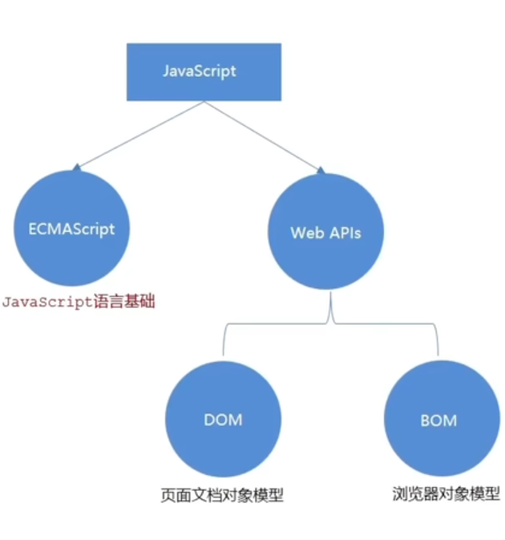
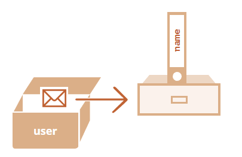
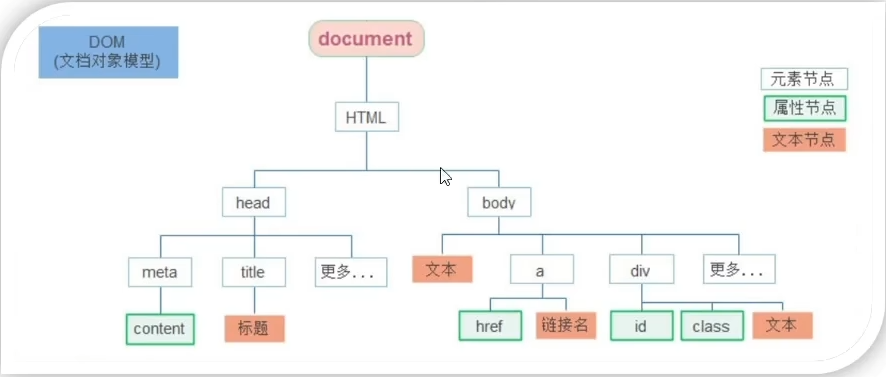
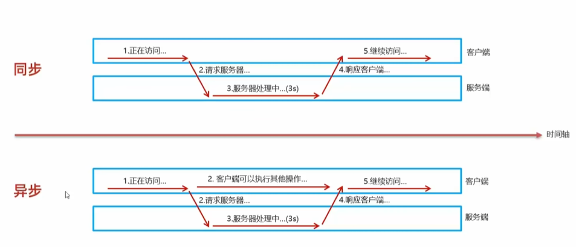

# JavaScript 



## 1、Java Script简介

*JavaScript* 最初被创建的目的是“使网页更生动”。

这种编程语言写出来的程序被称为 **脚本**。它们可以被直接写在网页的 HTML 中，在页面加载的时候自动执行。脚本被以纯文本的形式提供和执行。它们不需要特殊的准备或编译即可运行。

## 2、使用位置

js和css一样有三种使用方式

- **行内式：**代码写在标签内部。注意：一般在vue中会使用

- **内部式：**直接写在html文件中，用script标签包裹住。

  ==注意：一般把script标签写在</body>上方，应为浏览器在加载文件时，是从上往下加载，当加载到一些script后相应的html标签没有加载出来就会失效。==

- **外部式：**代码写在.js的文件中（和css一样），用过script标签里的属性src来指向.js文件路径调用相应的的js。

==注意：<script src="index.js"></script>中间无需写代码，就算写了代码，也会被忽略掉==

## 3 、JS输入输出语法与注释

目标:**能写出常见JavaScript输入输出语法**,输出和输入也可理解为人和计算机的交互，用户通过键盘、鼠标等向计算机输入信息，计算机处理后再展示结果给用户

**输出语法：**

语法1：语法会直接在浏览器内显示内容，==注意:如果输出的内容写的是标签，也会被解析成网页元素==

```javascript
document.write('内容')
```

语法2：控制台输出语法，程序员调试使用

```javascript
console.log('控制台打印')
```

**输入语法：**

prompt：显示信息要求用户输入文本。==点击确定返回文本==，点击取消或按下 Esc 键返回 `null`。

```javascript
prompt('请输入您的姓名'，default)
//default指定 input 框的初始值。点击
```

==作用:显示一个对话框，对话框中包含一条文字信息，用来提示用户输入文字==

**注释：js的注释与java一样**

## 4、现代模式，"use strict"

ES5 规范增加了新的语言特性并且修改了一些已经存在的特性。为了保证旧的功能能够使用，大部分的修改是默认不生效的。你需要一个特殊的指令 —— `"use strict"` 来明确地激活这些特性。

**use strict**

这个指令看上去像一个字符串 `"use strict"` 或者 `'use strict'`。当它处于脚本文件的顶部时，则整个脚本文件都将以“现代”模式进行工作。

比如：

```javascript
"use strict";

// 代码以现代模式工作
...
```

==注意：**use strict**必须出现在最顶部，否则严格模式可能无法启用。只有注释可以出现在 "use strict" 的上面。一旦开启严格模式后就无法取消==

## 5、JS变量与常量

### 5.1 变量

**变量是数据的“命名存储”。**在 JavaScript 中创建一个变量，我们需要用到 `let` 关键字。

下面的语句创建（也可以称为 **声明** 或者 **定义**）了一个名称为 “message” 的变量：

```javascript
let message;
//现在，我们可以通过赋值运算符 = 为变量添加一些数据：
let message;
message = 'Hello'; // 将字符串 'Hello' 保存在名为 message 的变量中
//也可以在一行中声明多个变量：
let user = 'John', age = 25, message = 'Hello';
//一些程序员采用下面的形式书写多个变量：
let user = 'John',
  age = 25,
  message = 'Hello';
```

在一些老版本中也有另一种声明==关键字var==

var和let的区别：


==注意：**声明两次会触发 error**，一个变量应该只被声明一次。，对同一个变量进行重复声明会触发 error==

------

### 5.2 变量命名规则

规则：

1. 变量名称**必须仅包含字母、数字、符号 `$` 和 `_`。**
2. 首字符必须**非数字**。

JavaScript和java的命名规则相同==驼峰命名法。==命名允许非英文字母，但不推荐。

### 5.3 常量

声明一个常数（不变）变量，可以使用 `const` 而非 `let`：

```javascript
const myBirthday = '18.04.1982';
```

使用 `const` 声明的变量称为“常量”。它们不能被修改，如果你尝试修改就会发现报错：

也和java一样常量命名推荐使用大写字母和_来命名。


## 6、数据类型 类型的转换

在 JavaScript 中有 **8 种基本的数据类型**（译注：**7 种原始类型**和 **1 种引用类型**）

再JS中允许**动态数据类型**，例如，一个变量可以在前一刻是个字符串，下一刻就存储一个数字。

### 6.1 Number类型

***number* 类型**代表整数和浮点数。除了常规数外还包括所谓的“特殊数值（“special numeric values”）”也属于这种类型：`Infinity`（无穷大）、`-Infinity`（（无穷小）） 和 `NaN`（计算错误）。

```javascript
let n = 123;
n = 12.345;
alert( 1 / 0 ); // Infinity
alert( "not a number" / 2 ); // NaN，这样的除法是错误的
//NaN 是粘性的。任何对 NaN 的进一步数学运算都会返回 NaN：
alert( NaN + 1 ); // NaN
alert( 3 * NaN ); // NaN
```

### 6.2 BigInt类型

Number类型的数不能超过安全整数范围 `±(253-1)` ，超出就会出现精度问题。

`BigInt` 类型是最近被添加到 JavaScript 语言中的，用于表示任意长度的整数。可以通过将 `n` 附加到整数字段的末尾来创建 `BigInt` 值。

```javascript
// 尾部的 "n" 表示这是一个 BigInt 类型
const bigInt = 1234567890123456789012345678901234567890n;
```

### 6.3 String类型

JavaScript 中的字符串必须被括在引号里。

```javascript
let str = "Hello";
let str2 = 'Single quotes are ok too';
let phrase = `can embed another ${str}`;
```

在 JavaScript 中，有三种包含字符串的方式。

1. 双引号：`"Hello"`.
2. 单引号：`'Hello'`.
3. 反引号：``Hello``.

双引号和单引号都是“简单”引用，在 JavaScript 中两者几乎没有什么差别。

反引号是 **功能扩展** 引号。它们允许我们通过将变量和表达式包装在 `${…}` 中，来将它们==嵌入到字符串==中。例如：

```javascript
let name = "John";

// 嵌入一个变量
alert( `Hello, ${name}!` ); // Hello, John!

// 嵌入一个表达式
alert( `the result is ${1 + 2}` ); // the result is 3
```

### 6.4 Boolean类型

**类型值：true和false**，基本用法和java相同

### 6.5 数组类型

创建一个空数组有两种语法：

```javascript
let arr = new Array();
let arr = [];
```

绝大多数情况下使用的都是第二种语法。我们可以在方括号中添加初始元素：

```javascript
let fruits = ["Apple", "Orange", "Plum"];
```

也可以用 `alert` 来显示整个数组:

```javascript
alert( fruits ); // Apple,Orange,Plum
```

数组可以存储任何类型的元素。

```javascript
// 混合值
let arr = [ 'Apple', { name: 'John' }, true, function() { alert('hello'); } ];

// 获取索引为 1 的对象然后显示它的 name
alert( arr[1].name ); // John

// 获取索引为 3 的函数并执行
arr[3](); // hello
```


### 6.6 null和undefined值

==null:==**特殊的 `null` 值不属于上述任何一种类型。它构成了一个独立的类型，只包含 `null` 值**

==undefined:==`undefined` 的含义是 `未被赋值`。如果一个变量已被声明，但未被赋值，那么它的值就是 `undefined`

==注意：这两个类型没有任何方法。==

### 6.7 Object类型和Symbol类型

==Object==:`object` 类型是一个特殊的类型。其他所有的数据类型都被称为“原始类型”，因为它们的值只包含一个单独的内容（字符串、数字或者其他）。相反，`object` 则用于储存数据集合和更复杂的实体。（其实与java中的类有些相似）

==Symbol:==`symbol` 类型用于创建对象的唯一标识符。我们在这里提到 `symbol` 类型是为了完整性

### 6.8 typeof运算符

`typeof` 运算符返回参数的类型。当我们想要分别处理不同类型值的时候，或者想快速进行数据类型检验时，非常有用。

对 `typeof x` 的调用会以**字符串的形式**返回数据类型：

```javascript
typeof undefined // 返回"undefined"

typeof 0 // "number"

typeof 10n // "bigint"

typeof true // "boolean"

typeof "foo" // "string"

typeof Symbol("id") // "symbol"

typeof Math // "object"  (1)

typeof null // "object"  (2)

typeof alert // "function"  (3)
```

### 6.9 类型转换

在js中的各种变量在声明的时候没有声明是哪种类型，当我们调用一些函数时返回值不是我们想要得到的类型时就会出错。

```javascript
let num = prompt("请输入数字")；
//这样获得的num时String类型的数字，但是我想要num是数字，所以要进行数字转换如下
let num = +prompt("请输入数字")；
```

#### **二元运算符 + 连接字符串**

通常，加号 `+` 用于求和。但是如果加号 `+` 被应用于字符串，它将合并（连接）各个字符串：

```javascript
let s = "my" + "string";
alert(s); // mystring
//注意：只要任意一个运算元是字符串，那么另一个运算元也将被转化为字符串。
alert(2 + 2 + '1' ); // "41"，不是 "221"
//在这里，运算符是按顺序工作。第一个 + 将两个数字相加，所以返回 4，然后下一个 + 将字符串 1 加入其中，所以就是 4 + '1' = '41'。
```

**注意：二元 `+` 是唯一一个以这种方式支持字符串的运算符。其他算术运算符只对数字起作用，并且总是将其运算元转换为数字。即其他的运算符号都会把非数字类型转化成数字类型。**

#### **数字转化，一元运算符 +**

一元运算符加号，或者说，加号 `+` 应用于单个值，对数字没有任何作用。但是如果运算元不是数字，加号 `+` 则会将其转化为数字。

```javascript
// 对数字无效
let x = 1;
alert( +x ); // 1

let y = -2;
alert( +y ); // -2

// 转化非数字
alert( +true ); // 1
alert( +"" );   // 0
```

#### 强制转换

语法 数据类型(值);

```javascript
let str = '520';

let num = Number(str);

alert(num);//显示数字520
```

==注意：在数据类型转换时要看看是否能被转换。==

```javascript
let str = '你好！'；

let num = Number(str);//这里会出错NaN
```


## 7、逻辑运算符

JavaScript 中有四个逻辑运算符：`||`（或），`&&`（与），`!`（非），`??`（空值合并运算符）

### 7.1 一般逻辑符号

JS中的逻辑运算符与java中的一大区别就是运算符不一定返回布尔值，如下

**寻找第一个真值（||）**：

```javascript
result = value1 || value2 || value3;
```

或运算符 `||` 做了如下的事情：

- 从左到右依次计算操作数。
- 处理每一个操作数时，都将其转化为布尔值。如果结果是 `true`，就停止计算，返回这个操作数的初始值。
- 如果所有的操作数都被计算过（也就是，转换结果都是 `false`），则返回最后一个操作数。

返回的值是操作数的初始形式，不会做布尔转换。换句话说，==一个或运算||的链，将返回第一个真值，如果不存在真值，就返回该链的最后一个值。==

**寻找第一个假值(&&)**:

```javascript
result = value1 && value2 && value3;
```

与运算 `&&` 做了如下的事：

- 从左到右依次计算操作数。
- 在处理每一个操作数时，都将其转化为布尔值。如果结果是 `false`，就停止计算，并返回这个操作数的初始值。
- 如果所有的操作数都被计算过（例如都是真值），则返回最后一个操作数。

换句话说，与运算返回第一个假值，如果没有假值就返回最后一个值。==上面的规则和或运算很像。区别就是与运算返回第一个假值，而或运算返回第一个真值。==

**可以用逻辑符号来进行类似if的操作：（绝对不推荐）**

```javascript
let x = 1;
if (x > 0) alert( 'Greater than zero!' );
//就可以写成：
let x = 1;
(x > 0) && alert( 'Greater than zero!' );
//&& 右边的代码只有运算抵达到那里才能被执行。也就是，当且仅当 (x > 0) 为真。会执行后面的内容
```

### 7.2 空值合并运算符'??'

空值合并运算符（nullish coalescing operator）的写法为两个问号 `??`。

==注意：这是新增的特性，有些浏览器可能没有。==

由于它对待 `null` 和 `undefined` 的方式类似，所以在本文中我们将使用一个特殊的术语对其进行表示。为简洁起见，当一个值既不是 `null` 也不是 `undefined` 时，==我们将其称为“已定义的（defined）”==。

`a ?? b` 的结果是：

- 如果 `a` 是已定义的，则结果为 `a`，
- 如果 `a` 不是已定义的，则结果为 `b`。

换句话说，如果第一个参数不是 `null/undefined`，==则 ??返回第一个参数==。否则，==返回第二个参数。==空值合并运算符并不是什么全新的东西。==它只是一种获得两者中的第一个“已定义的”值的不错的语法。==


## 8、函数

我们经常需要在脚本的许多地方执行很相似的操作。

例如，当访问者登录、注销或者在其他地方时，我们需要显示一条好看的信息。

函数是程序的主要“构建模块”。函数使该段代码可以被调用很多次，而不需要写重复的代码。

我们已经看到了内建函数的示例，如 `alert(message)`、`prompt(message, default)` 和 `confirm(question)`。但我们也可以创建自己的函数。

### 8.1 函数声明

使用 **函数声明** 创建函数。

看起来就像这样：

```javascript
function showMessage() {
  alert( 'Hello everyone!' );
}
```

`function` 关键字首先出现，然后是 **函数名**，然后是括号之间的 **参数** 列表（用逗号分隔，在上述示例中为空，我们将在接下来的示例中看到），最后是花括号之间的代码（即“函数体”）。

```javascript
function name(parameter1, parameter2, ... parameterN) {
  ...body...
}
```

**函数里面的变量是局部变量，函数可以访问函数外的全部变量以及修改**

### 8.2 默认值

在调用函数时，不提供参数，相应的参数会变成`undefined`(**已声明未赋值**)

我们可以使用 `=` 为函数声明中的参数指定所谓的“**默认**”（如果对应参数的值未被传递则使用）值：

```javascript
function showMessage(from, text = "no text given") {
  alert( from + ": " + text );
}

showMessage("Ann"); // 输出Ann: no text given
```

这样操作就像是再函数里**添加一个条件**来让参数发生初始变化

```javascript
function showMessage(text) {
  // ...

  if (text === undefined) { // 如果参数未被传递进来
    text = 'empty message';
  }

  alert(text);
}

showMessage(); // empty message
```

### 8.3 函数表达式

==函数不是“神奇的语言结构”，而是一种特殊的值。==

原本创建函数的语法**函数声明：**

```javascript
function sayHi() {
  alert( "Hello" );
}
```

另一种创建函数的语法称为 **函数表达式**。它允许我们在任何表达式的中间创建一个新函数。

```javascript
let sayHi = function() {
  alert( "Hello" );
};
```

在这里我们可以看到变量 `sayHi` 得到了一个值，新函数 `function() { alert("Hello"); }`。由于函数创建发生在赋值表达式的上下文中（在 `=` 的右侧），因此这是一个 **函数表达式**。请注意，`function` 关键字后面没有函数名。函数表达式允许省略函数名。这里我们立即将它赋值给变量，所以上面的两个代码示例的含义是一样的：“==创建一个函数并将其放入变量 satHi中==”。**其实这里可以把`sayHi`看作函数名**，当我们使用`sayHi()`时就会调用函数；

==注意：函数是一个值；==

```javascript
function sayHi() {
  alert( "Hello" );
}

alert( sayHi ); // 显示函数代码
```

函数是一个值，所以我们可以把它当成值对待。上面代码显示了一段字符串值，即函数的源码。的确，在某种意义上说一个函数是一个特殊值，==我们可以像sayHi()这样调用它==。但它依然是一个值，所以我们可以像使用其他类型的值一样使用它。

### 8.4 箭头函数

目的:引入箭头函数的目的是更简短的函数写法并且不绑定this，箭头函数的语法比函数表达式更简洁。

使用场景:箭头函数更适用于那些本来==需要匿名函数的地方==

#### 8.4.1 单行箭头函数

创建函数还有另外一种非常简单的语法，并且这种方法通常比函数表达式更好。它被称为“箭头函数”，因为它看起来像这样：

```javascript
let func = (arg1, arg2, ..., argN) => expression;
//这里创建了一个函数 func，它接受参数 arg1..argN，然后使用参数对右侧的 expression 求值并返回其结果。
```

让我们来看一个具体的例子：

```javascript
let sum = (a, b) => a + b;

/* 这个箭头函数是下面这个函数的更短的版本：

let sum = function(a, b) {
  return a + b;
};
*/

alert( sum(1, 2) ); // 3
```

可以看到 `(a, b) => a + b` 表示一个函数接受两个名为 `a` 和 `b` 的参数。在执行时，它将对表达式 `a + b` 求值，并返回计算结果。

```javascript
//如果我们只有一个参数，还可以省略掉参数外的圆括号，使代码更短。
let double = n => n * 2;
// 差不多等同于：let double = function(n) { return n * 2 }
alert( double(3) ); // 6

//如果没有参数，括号则是空的（但括号必须保留）：
let sayHi = () => alert("Hello!");
sayHi();
```

#### 8.4.2 多行的箭头函数

到目前为止，我们看到的箭头函数非常简单。它们从 `=>` 的左侧获取参数，计算并返回右侧表达式的计算结果。有时我们需要更复杂一点的函数，比如带有多行的表达式或语句。在这种情况下，我们可以使用花括号将它们括起来。主要区别在于，用花括号括起来之后，需要包含 `return` 才能返回值（就像常规函数一样）。

```javascript
let sum = (a, b) => {  // 花括号表示开始一个多行函数
  let result = a + b;
  return result; // 如果我们使用了花括号，那么我们需要一个显式的 “return”
};//和函数表达式相似
alert( sum(1, 2) ); // 3
```

## 9、对象

### 9.1 对象

对象用来存储键值对和更复杂的实体。在 JavaScript 中，对象几乎渗透到了这门编程语言的方方面面。所以，在我们深入理解这门语言之前，必须先理解对象。

我们可以通过使用带有可选 **属性列表** 的花括号 `{…}` 来创建对象。一个属性就是一个键值对（“key: value”），其中键（`key`）是一个字符串（也叫做属性名），值（`value`）可以是任何值。

我们可以用下面两种语法中的任一种来创建一个空的对象（“空柜子”）：

```javascript
let user = new Object(); // “构造函数” 的语法
let user = {};  // “字面量” 的语法
//通常，我们用花括号。这种方式我们叫做 字面量。
```

我们可以在创建对象的时候，立即将一些属性以键值对的形式放到 `{...}` 中。

```javascript
let user = {     // 一个对象
  name: "John",  // 键 "name"，值 "John"
  age: 30 ,      // 键 "age"，值 30
};
/*属性有键（或者也可以叫做“名字”或“标识符”），位于冒号 ":" 的前面，值在冒号的右边。
在 user 对象中，有两个属性：
第一个的键是 "name"，值是 "John"。
第二个的键是 "age"，值是 30。*/
```

### 9.2 属性

点访问符（.）

```javascript
// 读取文件的属性：
alert( user.name ); // John
alert( user.age ); // 30
```

对象的属性是可以随意添加的：

```javascript
user.isAdmin = true;
//这样就对user对象添加了一个布尔类型了属性值
```

对象的属性是也可以随意删除：我们可以用 `delete` 操作符移除属性

```javascript
delete user.age;
```

### 9.3 方括号

对于多词属性，点操作就不能用了：

```javascript
// 这将提示有语法错误
user.likes birds = true
```

JavaScript 理解不了。它认为我们在处理 `user.likes`，然后在遇到意外的 `birds` 时给出了语法错误。

点符号要求 `key` 是有效的变量标识符。这意味着：不包含空格，不以数字开头，也不包含特殊字符（允许使用 `$` 和 `_`）。

有另一种方法，就是使用方括号，可用于任何字符串：

```javascript
let user = {};

// 设置
user["likes birds"] = true;

// 读取
alert(user["likes birds"]); // true

// 删除
delete user["likes birds"];
```

现在一切都可行了。请注意方括号中的**字符串要放在引号中，单引号或双引号都可以**。

方括号同样提供了一种可以通过任意表达式来获取属性名的方式 —— 与文本字符串不同 —— 例如下面的变量：

```javascript
let key = "likes birds";

// 跟 user["likes birds"] = true; 一样
user[key] = true;
```


### 9.4 计算属性

当创建一个对象时，我们可以在对象字面量中使用方括号。这叫做 **计算属性**。

```javascript
let fruit = prompt("Which fruit to buy?", "apple");

let bag = {
  [fruit]: 5, // 属性名是从 fruit 变量中得到的
};

alert( bag.apple ); // 5 如果 fruit="apple"
```

计算属性的含义很简单：`[fruit]` 含义是属性名应该从 `fruit` 变量中获取。

所以，如果一个用户输入 `"apple"`，`bag` 将变为 `{apple: 5}`。同理如果用户输入`"banana"`,`bag`就会变为{`banana：5`}。

### 9.5 in操作符

相比于其他语言，JavaScript 的对象有一个需要注意的特性：能够被访问任何属性。==即使属性不存在也不会报错！==

读取不存在的属性只会得到 `undefined`。所以我们可以很容易地判断一个属性是否存在：

```javascript
let user = {};

alert( user.noSuchProperty === undefined ); // true 意思是没有这个属性
```

这里还有一个特别的，检查属性是否存在的操作符 `"in"`。

语法是：

```javascript
"key" in object
```

请注意，`in` 的左边必须是 **属性名**。通常是一个带引号的字符串。

==如果我们省略引号，就意味着左边是一个变量，它应该包含要判断的实际属性名。==

```javascript
let user = { age: 30 };

let key = "age";
alert( key in user ); // true，属性 "age" 存在
```

### 9.6 历遍对象属性

为了遍历一个对象的所有键（key），可以使用一个特殊形式的循环：`for..in`。这跟我们在前面学到的 `for(;;)` 循环是完全不一样的东西。

例如，让我们列出 `user` 所有的属性：

```javascript
let user = {
  name: "John",
  age: 30,
  isAdmin: true
};

for (let key in user) {
  // keys
  alert( key );  // name, age, isAdmin
  // 属性键的值
  alert( user[key] ); // John, 30, true
}
```

注意，所有的 “for” 结构体都允许我们在循环中定义变量，像这里的 `let key`。

同样，我们可以用其他属性名来替代 `key`。例如 `"for(let prop in obj)"` 也很常用。

### 9.7 对象的引用

对象与原始类型的根本区别之一是，对象是“通过引用”存储和复制的，而原始类型：字符串、数字、布尔值等 —— 总是“作为一个整体”复制。

**赋值了对象的变量存储的不是对象本身，而是该对象“在内存中的地址” —— 换句话说就是对该对象的“引用”。**这和java的对象是一样的。

```javascript
let user = {
  name: "John"
};
```

这是它实际存储在内存中的方式：



### 9.8 对象克隆

#### 浅克隆

对象可以复制但是复制的时对象的引用，这样就有两个引用指向一个相同的对象了，但是我们想要两个引用不同而内容相同又该如何做。

我们可以使用for..in历遍对象的属性：

```javascript
let user = {
  name: "John",
  age: 30
};

let clone = {}; // 新的空对象

// 将 user 中所有的属性拷贝到其中
for (let key in user) {
  clone[key] = user[key];
}

// 现在 clone 是带有相同内容的完全独立的对象
clone.name = "Pete"; // 改变了其中的数据

alert( user.name ); // 原来的对象中的 name 属性依然是 John
```

我们也可以使用 `Object.assign` 方法来达成同样的效果。

```javascript
Object.assign(dest, [src1, src2, src3...])
```

- 第一个参数 `dest` 是指目标对象。
- 更后面的参数 `src1, ..., srcN`（可按需传递多个参数）是源对象。
- 该方法将所有源对象的属性拷贝到目标对象 `dest` 中。换句话说，从第二个开始的所有参数的属性都被拷贝到第一个参数的对象中。
- 调用结果返回 `dest`。

```javascript
let user = { name: "John" };

let permissions1 = { canView: true };
let permissions2 = { canEdit: true };

// 将 permissions1 和 permissions2 中的所有属性都拷贝到 user 中
Object.assign(user, permissions1, permissions2);

// 现在 user = { name: "John", canView: true, canEdit: true }
```

==注意：使用 const 声明的对象也是可以被修改的，因为const声明的常量是地址为常量，地址指向的对象属性可以改变==

#### 深克隆

到现在为止，我们都假设 `user` 的所有属性均为原始类型。==但属性可以是对其他对象的引用==。

```javascript
let user = {
  name: "John",
  sizes: {
    height: 182,
    width: 50
  }
};

alert( user.sizes.height ); // 182
```

现在这样拷贝 `clone.sizes = user.sizes` 已经不足够了，因为 `user.sizes` 是个对象，它会以引用形式被拷贝。因此 `clone` 和 `user` 会共用一个 sizes,为了解决这个问题，并让 `user` 和 `clone` 成为两个真正独立的对象，我们应该使用一个拷贝循环来检查 `user[key]` 的每个值，如果它是一个对象，那么也复制它的结构。这就是所谓的“==深拷贝==”。

### 9.9 打印对象

大多数浏览器在其开发者工具中都支持这两个命令：`console.log` 和 `console.dir`。它们将它们的参数输出到控制台中。对于 JavaScript 对象，这些命令通常做的是相同的事。

但对于 DOM 元素，它们是不同的：

- `console.log(elem)` 显示元素的 DOM 树。
- `console.dir(elem)` 将元素显示为 DOM 对象，非常适合探索其属性。

你可以在 `document.body` 上尝试一下。

所以我们常使用`console.dir(elem)`进行输出对象

## 10、原始数据方法

以下是 JavaScript 创建者面临的悖论：

- 人们可能想对诸如字符串或数字之类的原始类型执行很多操作。最好使用方法来访问它们。
- 原始类型必须尽可能的简单轻量。

而解决方案看起来多少有点尴尬，如下：

1. 原始类型仍然是原始的。与预期相同，提供单个值
2. JavaScript 允许访问字符串，数字，布尔值和 symbol 的方法和属性。
3. ==为了使它们起作用，创建了提供额外功能的特殊“对象包装器”，使用后即被销毁。==

“对象包装器”对于每种原始类型都是不同的，它们被称为 `String`、`Number`、`Boolean`、`Symbol` 和 `BigInt`。因此，它们提供了不同的方法。

### 10.1 Number类型的方法

#### num.toFixed(n) 

将数字舍入到给定的精度

```javascript
let n = 1.23456;

alert( n.toFixed(2) ); // 1.23
```

==注意：只是舍入小数点后面的位数。==

#### toString(base)

返回在给定 `base` 进制数字系统中 `num` 的字符串表示形式。

```javascript
let num = 255;

alert( num.toString(16) );  // ff
alert( num.toString(2) );   // 11111111
```

`base` 的范围可以从 `2` 到 `36`。默认情况下是 `10`。

常见的用例如下：

- **base=16** 用于十六进制颜色，字符编码等，数字可以是 `0..9` 或 `A..F`。
- **base=2** 主要用于调试按位操作，数字可以是 `0` 或 `1`。
- **base=36** 是最大进制，数字可以是 `0..9` 或 `A..Z`。所有拉丁字母都被用于了表示数字。对于 `36` 进制来说，一个有趣且有用的例子是，当我们需要将一个较长的数字标识符转换成较短的时候，例如做一个短的 URL。可以简单地使用基数为 `36` 的数字系统表示

#### isFinite 和 isNaN

还记得这两个特殊的数值吗？

- `Infinity`（和 `-Infinity`）是一个特殊的数值，比任何数值都大（小）。

- `NaN` 代表一个 error。

  

它们属于 `number` 类型，但不是“普通”数字，因此，这里有用于检查它们的特殊函数：

`isNaN(value)` 将其参数转换为数字，然后测试它是否为 `NaN`：

```javascript
alert( isNaN(NaN) ); // true
alert( isNaN("str") ); // true
```

但是我们需要这个函数吗？我们不能只使用 `=== NaN` 比较吗？很不幸，这不行。值 “NaN” 是独一无二的，它不等于任何东西，包括它自身：

```javascript
alert( NaN === NaN ); // false
```

`isFinite(value)` 将其参数转换为数字，如果是常规数字而不是 `NaN/Infinity/-Infinity`，则返回 `true`：

```javascript
alert( isFinite("15") ); // true
alert( isFinite("str") ); // false，因为是一个特殊的值：NaN
alert( isFinite(Infinity) ); // false，因为是一个特殊的值：Infinity
```

#### parseInt 和 parseFloat

但在现实生活中，我们经常会有带有单位的值，例如 CSS 中的 `"100px"` 或 `"12pt"`。并且，在很多国家，货币符号是紧随金额之后的，所以我们有 `"19€"`，并希望从中提取出一个数值。

这就是 `parseInt` 和 `parseFloat` 的作用。

它们可以从字符串中“读取”数字，直到无法读取为止。如果发生 error，则返回收集到的数字。函数 `parseInt` 返回一个整数，而 `parseFloat` 返回一个浮点数：

```javascript
alert( parseInt('100px') ); // 100
alert( parseFloat('12.5em') ); // 12.5

alert( parseInt('12.3') ); // 12，只有整数部分被返回了
alert( parseFloat('12.3.4') ); // 12.3，在第二个点出停止了读取
```

某些情况下，`parseInt/parseFloat` 会返回 `NaN`。当没有数字可读时会发生这种情况：

```javascript
alert( parseInt('a123') ); // NaN，第一个符号停止了读取
```

`parseInt()` 函数具有可选的第二个参数。它指定了数字系统的基数，因此 `parseInt` 还可以解析十六进制数字、二进制数字等的字符串：

```javascript
alert( parseInt('0xff', 16) ); // 255
alert( parseInt('ff', 16) ); // 255，没有 0x 仍然有效

alert( parseInt('2n9c', 36) ); // 123456
```

### 10.2 String类型的方法

#### 访问字符

要获取在 `pos` 位置的一个字符，可以使用方括号 `[pos]` 或者调用 str.charAt(pos)方法。第一个字符从零位置开始：

```javascript
let str = `Hello`;

// 第一个字符
alert( str[0] ); // H
alert( str.charAt(0) ); // H

// 最后一个字符
alert( str[str.length - 1] ); // o
```

我们也可以使用 `for..of` 遍历字符：

```javascript
for (let char of "Hello") {
  alert(char); // H,e,l,l,o（char 变为 "H"，然后是 "e"，然后是 "l" 等）
}
```

#### 字符串不可变

在 JavaScript 中，字符串不可更改。改变字符是不可能的。

我们证明一下为什么不可能：

```javascript
let str = 'Hi';

str[0] = 'h'; // error
alert( str[0] ); // 无法运行

//但是这样可以
str = 'hi';
//字符串的改变不能单独改变单个字符要改就要全部赋值，如下
let str = 'Hi';

str = 'h' + str[1];  // 替换字符串

alert( str ); // hi
```

#### 改变大小写

toLowerCase()和 toUpperCase()方法可以改变大小写：

```javascript
alert( 'Interface'.toUpperCase() ); // INTERFACE
alert( 'Interface'.toLowerCase() ); // interface
```

或者我们想要使一个字符变成小写：

```javascript
alert( 'Interface'[0].toLowerCase() ); // 'i'
```

#### 查找子字符串

第一个方法是 str.indexOf(substr, pos)

它从给定位置 `pos` 开始，在 `str` 中查找 `substr`，如果没有找到，则返回 `-1`，否则返回匹配成功的位置。

例如：

```javascript
let str = 'Widget with id';

alert( str.indexOf('Widget') ); // 0，因为 'Widget' 一开始就被找到
alert( str.indexOf('widget') ); // -1，没有找到，检索是大小写敏感的

alert( str.indexOf("id") ); // 1，"id" 在位置 1 处（……idget 和 id）
```

可选的第二个参数允许我们从一个给定的位置开始检索。

例如，`"id"` 第一次出现的位置是 `1`。查询下一个存在位置时，我们从 `2` 开始检索：

```javascript
let str = 'Widget with id';

alert( str.indexOf('id', 2) ) // 12
```

第二个方法是includes，startsWith，endsWith

更现代的方法 str.includes(substr, pos) 根据 `str` 中是否包含 `substr` 来返回 `true/false`。

如果我们需要检测匹配，但不需要它的位置，那么这是正确的选择：

```javascript
alert( "Widget with id".includes("Widget") ); // true

alert( "Hello".includes("Bye") ); // false
```

`str.includes` 的第二个可选参数是开始搜索的起始位置：

```javascript
alert( "Widget".includes("id") ); // true
alert( "Widget".includes("id", 3) ); // false, 从位置 3 开始没有 "id"
```

方法 str.startsWith 和 str.endsWith的功能与其名称所表示的意思相同：

```javascript
alert( "Widget".startsWith("Wid") ); // true，"Widget" 以 "Wid" 开始
alert( "Widget".endsWith("get") ); // true，"Widget" 以 "get" 结束
```

#### 获取子字符串

JavaScript 中有三种获取字符串的方法：`substring`、`substr` 和 `slice`。

`str.slice(start [, end])`

返回字符串从 `start` 到（但不包括）`end` 的部分。

```javascript
let str = "stringify";
alert( str.slice(0, 5) ); // 'strin'，从 0 到 5 的子字符串（不包括 5）
alert( str.slice(0, 1) ); // 's'，从 0 到 1，但不包括 1，所以只有在 0 处的字符
```

`start/end` 也有可能是负值。它们的意思是起始位置从字符串结尾计算：

```javascript
let str = "stringify";

// 从右边的第四个位置开始，在右边的第一个位置结束
alert( str.slice(-4, -1) ); // 'gif'
```

`str.substring(start [, end])`

返回字符串从 `start` 到（但不包括）`end` 的部分。

这与 `slice` 几乎相同，但它允许 `start` 大于 `end`。不支持负参数（不像 slice），它们被视为 `0`。

`str.substr(start [, length])`

返回字符串从 `start` 开始的给定 `length` 的部分。

与以前的方法相比，这个允许我们指定 `length` 而不是结束位置：

```javascript
let str = "stringify";
alert( str.substr(2, 4) ); // 'ring'，从位置 2 开始，获取 4 个字符
```

第一个参数可能是负数，从结尾算起：

```javascript
let str = "stringify";
alert( str.substr(-4, 2) ); // 'gi'，从第 4 位获取 2 个字符
```

#### 字符串的比较

调用 str.localeCompare(str2) 会根据语言规则返回一个整数，这个整数能指示字符串 `str` 在排序顺序中排在字符串 `str2` 前面、后面、还是相同：

- 如果 `str` 排在 `str2` 前面，则返回负数。
- 如果 `str` 排在 `str2` 后面，则返回正数。
- 如果它们在相同位置，则返回 `0`。

```javascript
alert( 'Österreich'.localeCompare('Zealand') ); // -1
```

### 10.3 数组方法

#### at方法获取元素

`arr.at(i)`：

- 如果 `i >= 0`，则与 `arr[i]` 完全相同。
- 对于 `i` 为负数的情况，它则从数组的尾部向前数。

```javascript
let fruits = ["Apple", "Orange", "Plum"];

// 与 fruits[fruits.length-1] 相同
alert( fruits.at(-1) ); // Plum
```

#### pop/push, shift/unshift 方法

pop/push作用于末端

`pop`取出并返回数组的最后一个元素：

```javascript
let fruits = ["Apple", "Orange", "Pear"];

alert( fruits.pop() ); // 移除 "Pear" 然后 alert 显示出来

alert( fruits ); // Apple, Orange
```

`fruits.pop()` 和 `fruits.at(-1)` 都返回数组的最后一个元素，但 `fruits.pop()` 同时也删除了数组的最后一个元素，进而修改了原数组。


`push`在数组末端添加元素：

```javascript
let fruits = ["Apple", "Orange"];

fruits.push("Pear");

alert( fruits ); // Apple, Orange, Pear
```


shift/unshift作用于首端

`shift`取出数组的第一个元素并返回它：

```javascript
let fruits = ["Apple", "Orange", "Pear"];

alert( fruits.shift() ); // 移除 Apple 然后 alert 显示出来

alert( fruits ); // Orange, Pear
```

`unshift`在数组的首端添加元素：

```javascript
let fruits = ["Orange", "Pear"];

fruits.unshift('Apple');

alert( fruits ); // Apple, Orange, Pear
```


`push` 和 `unshift` 方法都可以一次添加多个元素：

```javascript
let fruits = ["Apple"];

fruits.push("Orange", "Peach");
fruits.unshift("Pineapple", "Lemon");

// ["Pineapple", "Lemon", "Apple", "Orange", "Peach"]
alert( fruits );
```

#### 历遍数组

foreach循环方法允许为数组的每个元素都运行一个函数。

```javascript
// 对每个元素调用 alert
["Bilbo", "Gandalf", "Nazgul"].forEach(alert);
```

而这段代码更详细地介绍了它们在目标数组中的位置：

```javascript
["Bilbo", "Gandalf", "Nazgul"].forEach((item, index, array) => {
  alert(`${item} is at index ${index} in ${array}`);
});
```

#### 移除指定元素

arr.splice 方法可以说是处理数组的瑞士军刀。它可以做所有事情：添加，删除和插入元素。

```javascript
arr.splice(start[, deleteCount, elem1, ..., elemN])
```

它从索引 `start` 开始修改 `arr`：删除 `deleteCount` 个元素并在当前位置插入 `elem1, ..., elemN`。最后返回被删除的元素所组成的数组。

```javascript
let arr = ["I", "study", "JavaScript"];

arr.splice(1, 1); // 从索引 1 开始删除 1 个元素

alert( arr ); // ["I", "JavaScript"]
```

### 10.4 复杂数据类型(对象)与字符串的相互转换

==因为在网络传输或储存都传输的是字符串==，所以我们需要把对象或其他复杂数据转==换成字符串的形式==，进行操作。

把对象转换成字符串就要用到`JSON`方法，`JSON`（JavaScript Object Notation）是表示值和对象的通用格式。

`JSON`有两种方法

- `JSON.stringify` 将对象转换为 JSON。==语法：JSON.stringify(value[, replacer, space])==
- `JSON.parse` 将 JSON 转换回对象。

```javascript
let student = {
  name: 'John',
  age: 30,
  isAdmin: false,
  courses: ['html', 'css', 'js'],
  spouse: null
};

let json = JSON.stringify(student);

alert(typeof json); // we've got a string!

alert(json);
/* JSON 编码的对象：
{
  "name": "John",
  "age": 30,
  "isAdmin": false,
  "courses": ["html", "css", "js"],
  "spouse": null
}
*/
```

方法 `JSON.stringify(student)` 接收对象并将其转换为字符串。

得到的 `json` 字符串是一个被称为 **JSON 编码（JSON-encoded）** 或 **序列化（serialized）** 或 **字符串化（stringified）** 或 **编组化（marshalled）** 的对象。我们现在已经准备好通过有线发送它或将其放入普通数据存储。

请注意，JSON 编码的对象与对象字面量有几个重要的区别：

- 字符串使用双引号。JSON 中没有单引号或反引号。所以 `'John'` 被转换为 `"John"`。
- 对象属性名称也是双引号的。这是强制性的。所以 `age:30` 被转换成 `"age":30`。

## 11、DOM

### 11.1 DOM树

==文档对象模型（Document Object Model），简称 DOM，将所有页面内容表示为可以修改的对象。==

`document` 对象是页面的主要“入口点”。我们可以使用它来更改或创建页面上的任何内容。

根据文档对象模型（DOM），每个 HTML 标签都是一个对象。嵌套的标签是闭合标签的“子标签（children）”。标签内的文本也是一个对象。

所有这些对象都可以通过 JavaScript 来访问，我们可以使用它们来修改页面。

例如，`document.body` 是表示 `<body>` 标签的对象。

运行这段代码会使 `<body>` 保持 3 秒红色状态:

```javascript
document.body.style.background = 'red'; // 将背景设置为红色

setTimeout(() => document.body.style.background = '', 3000); // 恢复回去
```


在一个html文件中

```html
<!DOCTYPE HTML>
<html>
<head>
  <title>About elk</title>
</head>
<body>
  The truth about elk.
</body>
</html>
```

DOM 将 HTML 表示为标签的树形结构。它看起来如下所示：




### 11.2 获取DOM元素


### 11.3 通过选择器来获取DOM元素

#### querySelectorAll(css)

到目前为止，最通用的方法是 `document.querySelectorAll(css)`，它返回 `document` 中与给定 CSS 选择器匹配的所有元素。

```javascript
<ul>
  <li>The</li>
  <li>test</li>
</ul>
<ul>
  <li>has</li>
  <li>passed</li>
</ul>
<script>
  let elements = document.querySelectorAll('ul > li:last-child');

  for (let elem of elements) {
    alert(elem.innerHTML); // "test", "passed"
  }
</script>
```

==返回的是一个数组，数组里面元素是DOM对象==

#### querySelector(css)

`document.querySelector(css)` 调用会返回给定 CSS 选择器的第一个元素。换句话说，结果与 `document.querySelectorAll(css)[0]` 相同，但是后者会查找 **==所有==** 元素，并从中选取一个，而 `document.querySelector(css)` 只会查找一个。因此它在速度上更快，并且写起来更短。

### 11.4 修改元素内容

#### 元素innerText属性

向对象里面添加纯文本==不解析标签==，将文本内容添加/更新到任意标签位置。

```javascript
    <div class="class">我是文字</div>

    <script>
        let div = document.querySelector('.class');
        div.innerText = '我不是文字'
    </script>
```

==注意：这里的文本是不解析标签的==

```javascript
<div class="class">我是文字</div>

    <script>
        let div = document.querySelector('.class');
        div.innerText = '<button>我不是文字</button>';
    </script>
```

#### 元素innerHTML属性

将文本内容添加/更新到任意标签位置会解析标签，多标签建议使用模板字符。

与`innerText`属性最大的区别就是==会解析标签==

```javascript
<div class="class">我是文字</div>

    <script>
        let div = document.querySelector('.class');
        div.innerText = '<button>我不是文字</button>';
    </script>
//在div中就会有一个按钮
```

### 11.5 修改元素常见属性

元素常见属性如scr、href、name等，都可以通过得到对象，再通过==对象.属性 = 值；==

### 11.6 修改元素样式属性

#### 通过style属性修改样式

==语法：对象.style.属性值=值;==

#### 通过标签的类名修改样式

如果修改的样式比较多，直接通过style属性修改比较繁琐，我们可以通过借助于css类名的形式。

操作类名(className)修改CSS,==语法：元素.className = 'active';== //active是css的一个类名

#### .通过classList 操作类控制CSS

为了解决className容易覆盖以前的类名，我们可以通过classList方式**追加**和删除类名。

语法：

//追加一个类
	==元素.classList.add('类名')==

//删除一个类
	==元素.classList.remove('类名')==

//切换一个类，有就加上，没有就观点
	==元素.classList.toggle('类名')==

### 11.7 修改表单属性

表单很多情况，也需要修改属性，比如点击眼睛，可以看到密码，本质是把表单类型转换为文本框

正常的有属性有取值的跟其他的标签属性没有任何区别

#### 得到表单的值

语法：元素.value

#### 修改表单类型

语法：元素.type = 值

## 12、定时器

定时器有两种：

- `setTimeout` 允许我们将函数推迟到一段时间间隔之后再执行。
- `setInterval` 允许我们重复运行一个函数，从一段时间间隔之后开始运行，之后以该时间间隔连续重复运行该函数。

### 12.1 setTimeout

```javascript
let timerId = setTimeout(function(){}, [delay], [arg1], [arg2], ...)
```

`function(){}`

要执行的函数/操作

`delay`

执行前的延时，以毫秒为单位（1000 毫秒 = 1 秒），默认值是 0；

`arg1`，`arg2`…

要传入被执行函数（或代码字符串）的参数列表（IE9 以下不支持）

```javascript
function sayHi() {
  alert('Hello');
}

setTimeout(sayHi, 1000);
//有参数的情况
function sayHi(phrase, who) {
  alert( phrase + ', ' + who );
}

setTimeout(sayHi, 1000, "Hello", "John"); // Hello, John

```

```javascript
// 错的！
setTimeout(sayHi(), 1000);
```

这样不行，因为 `setTimeout` 期望得到一个对函数的引用。而这里的 `sayHi()` 很明显是在执行函数，所以实际上传入 `setTimeout` 的是 **函数的执行结果**。在这个例子中，`sayHi()` 的执行结果是 `undefined`（也就是说函数没有返回任何结果），所以实际上什么也没有调度。

### 12.2 clearTimeout

`setTimeout` 在调用时会返回一个“定时器标识符（timer identifier）”(定时器ID)，在我们的例子中是 `timerId`，我们可以使用它来取消执行。

==注意：每次调用一次setTimeout()就会产生新的定时器ID==

取消调度的语法：

```javascript
let timerId = setTimeout(...);
clearTimeout(timerId);
```

### 12.3 setInterval

`setInterval` 方法和 `setTimeout` 的语法相同：

```javascript
let timerId = setInterval(func|code, [delay], [arg1], [arg2], ...)
```

和`setTimeout`一样先等待时间再执行函数

下面的例子将每间隔 2 秒就会输出一条消息。5 秒之后，输出停止：

```javascript
// 每 2 秒重复一次
let timerId = setInterval(() => alert('tick'), 2000);

// 5 秒之后停止
setTimeout(() => { clearInterval(timerId); alert('stop'); }, 5000);
```

## 13 事件监听

语法:元素对象.addEventListener('事件类型'，要执行的函数)

事件类型有：

鼠标事件 

`mousedown/mouseup`:在元素上点击/释放鼠标按钮。


`mouseover/mouseout`:鼠标指针从一个元素上移入/移出。


`mousemove`:鼠标在元素上的每个移动都会触发此事件


`click`:如果使用的是鼠标左键，则在同一个元素上的 `mousedown` 及 `mouseup` 相继触发后，触发该事件。


`dblclick`:在短时间内双击同一元素后触发。如今已经很少使用了。


`contextmenu`:在鼠标右键被按下时触发。还有其他打开上下文菜单的方式，例如使用特殊的键盘按键，在这种情况下它也会被触发，因此它并不完全是鼠标事件。


==顺序==：在单个动作触发多个事件时，事件的顺序是固定的。也就是说，会遵循 `mousedown` → `mouseup` → `click` 的顺序调用处理程序。


键盘事件

在进行键盘事件,可以通过`event.key`和`event.code`获取键值

```javascript
document.addEventListener('keydown', function(event) {
  if (event.key = "Enter") {//如果是回车键就执行if的内容
    alert('Undo!')
  }
});
```


`keydown `:当一个按键被按下时，会触发 `keydown` 事件


`keyup`:当按键被释放时，会触发 `keyup` 事件。


`keypress`: 按下某个键盘键并释放时触发,会触发 `keypress` 事件


`input`事件

每当用户对输入值进行修改后，就会触发 `input` 事件。与键盘事件不同，只要值改变了，`input` 事件就会触发，即使那些不涉及键盘行为（action）的值的更改也是如此：使用鼠标粘贴，或者使用语音识别来输入文本。

```javascript
<input type="text" id="input"> oninput: <span id="result"></span>
<script>
  input.addEventListener('input' ,function() {
    result.innerHTML = input.value;
  });
</script>
```


## 14 DOM节点操作

DOM树中的每一个内容都称之为节点，类型有==元素节点==(所有标签)、==属性节点==、==文本节点==和其他节点

### 14.1 获取节点

通过节点关系:针对的找亲戚返回的都是对象

#### 查找父节点

==子元素.parentNode==，返回最近一级的父节点找不到返回为null


#### 查找子节点

 ==父元素.children==,仅获得所有子元素节点,返回的还是一个伪数组

#### 查找兄节点

下一个兄弟节点
==兄弟元素.nextElementSibling==属性

上一个兄弟节点
==兄弟元素.previousElementSibling==属性

### 14.2 增加节点和克隆节点

**一般步骤：**

**1.创建节点**

**2.新节点放入指定元素内部**

#### 创建节点

即创造出一个新的网页元素，再添加到网页内，一般先创建节点，然后插入节点

==语法：document.createElement('标签名')==

#### 追加节点

要确定位置

插入到父元素的最后一个子元素:

==父元素.appendChild(子元素);==

插入到父元素中某个子元素前：

==父元素.insertBefore(要插入的元素，在哪个元素前面)== 

#### 克隆节点

==元素.cloneNode(布尔值)==

cloneNode会克隆出一个跟原标签一样的元素，括号内传入布尔值
	若为==true==，则代表克隆时会包含后代节点一起克隆，深克隆
	若为==false==，则代表克隆时不包含后代节点，浅克隆
	默认为==false==


### 14.3 删除节点

在JavaScript原生DOM操作中，要删除元素必须通过父元素删除

==父元素.removeChild(要删除的元素)==

删除节点和隐藏节点(==display:none==）有区别的:隐藏节点还是存在的，但是删除，则从html中删除节点

## 15 本地存储

Web 存储对象 `localStorage` 和 `sessionStorage` 允许我们在浏览器上保存键/值对。它们有趣的是，在页面刷新后（对于 `sessionStorage`）甚至浏览器完全重启（对于 `localStorage`）后，数据仍然保留在浏览器中。我们很快就会看到。

两个存储对象都提供相同的方法和属性：

- `setItem(key, value)` —— 存储键/值对。
- `getItem(key)` —— 按照键获取值。
- `removeItem(key)` —— 删除键及其对应的值。
- `clear()` —— 删除所有数据。
- `key(index)` —— 获取该索引下的键名。
- `length` —— 存储的内容的长度。

### 15.1 localStorage

**存储**

能够使用localStorage把数据存储的浏览器中。

作用:可以将数据永久存储在本地(用户的电脑),除非手动删除，否则关闭页面也会存在

==语法：localStorage.setltem('key', 'value')==

要加引号成为否则就是变量。


**存储复杂数据类型**

```javascript
 const student = {
        name : '李四',
        age : '18',
        shcool : '理工大学'
    }
    localStorage.setItem('student',student);
//这样是存入的对象，无法取出使用，要解决就要使用JSON类型
```

解决:使用`JSON.stringify`将==复杂数据类型转换成JSON字符串==,在存储到本地，在10原始数据方法里有介绍

```javascript
 const student = {
        name : '李四',
        age : '18',
        shcool : '理工大学'
    }
 let json = JSON.stringify(student);
    localStorage.setItem('student',student);
```

### 15.2 sessionStorage

与localStorage使用相同

## 16 正则表达式

正则表达式是提供了一种在文本中进行搜索和替换的强大的方式的模式。在 JavaScript 中，我们可以通过 `RegExp`对象使用它们，也可以与字符串方法结合使用。

正则表达式（可叫作 “regexp”，或 “reg”）由 **模式** 和可选的 **修饰符** 组成。

### 16.1==定义语法==

较长一点的语法：

```javascript
regexp = new RegExp("pattern", "flags");
```

较短一点的语法，使用斜线 `"/"`：

```javascript
regexp = /pattern/; // 没有修饰符
regexp = /pattern/gmi; // 带有修饰符 g、m 和 i（后面会讲到）
```

斜线 `/.../` 告诉 JavaScript 我们正在创建一个正则表达式。它的作用与字符串的引号作用相同。这两种语法之间的主要区别在于，使用斜线 `/.../` 的模式不允许插入表达式（如带有 `${...}` 的字符串模板）。它是完全静态的。

### 16.2**修饰符**

正则表达式可能有影响搜索结果的修饰符。

在 JavaScript 中，只有 6 个修饰符：

- `i`：使用此修饰符后，搜索时不区分大小写：`A` 和 `a` 之间没有区别（请参见下面的示例）。
- `g`：使用此修饰符后，搜索时会寻找所有的匹配项 —— 没有它，则仅返回第一个匹配项。
- `m`：多行模式
- `s`:启用 “dotall” 模式，允许点 `.` 匹配换行符 `\n`
- `u`:开启完整的 Unicode 支持。该修饰符能够正确处理代理对
- `y`:粘滞（Sticky）模式，在文本中的确切位置搜索

### 16.3 测试test

==语法：regexp.test(被检查字符串)==

`regexp.test(str)` 方法寻找至少一个匹配项，如果找到了，则返回 `true`，否则返回 `false`。

```javascript
let str = "I love JavaScript";
let regexp = /LOVE/i;

alert( regexp.test(str) ); // true
```

### 16.4 元字符(特殊字符)

是一些具有特殊含义的字符，可以极大提高了灵活性和强大的匹配功能。

存在以下字符类：

- `\d` —— 数字。
- `\D` —— 非数字。
- `\s` —— 空格符号，制表符，换行符。
- `\S` —— 除了 `\s` 。
- `\w` —— 拉丁字母，数字，下划线 `'_'`。
- `\W` —— 除了 `\w`。
- `.` —— 带有修饰符 `'s'` 时匹配任何字符，否则匹配除换行符 `\n` 之外的任何字符。

#### 边界符号

插入符号 `^` 和美元符号 `$` 在正则表达式中具有特殊的含义。它们被称为“==锚点==”。

插入符号 `^` 匹配文本开头，而美元符号 `$` 则匹配文本末尾。它们并不匹配一个具体的字符，而是让正则引擎测试所表示的条件（文本开头/文本末尾）。

#### 范围字符

[]符号就是**字符范围**符号

例如，`[a-z]` 表示从 `a` 到 `z` 范围内的字符，`[0-5]` 表示从 `0` 到 `5` 的数字。

- **\d** —— 和 `[0-9]` 相同，
- **\w** —— 和 `[a-zA-Z0-9_]` 相同，
- **\s** —— 和 `[\t\n\v\f\r ]` 外加少量罕见的 Unicode 空格字符相同。
- `[0-9A-F]` 中有两个范围：它搜索一个字符，该字符要么是在 `0` 到 `9` 范围内的数字，要么是从 `A` 到 `F` 的字母。

除了普通的范围匹配，还有像这样 `[^…]` 的“排除”范围匹配。通过在开头添加插入符号 `^` 来表示匹配所有 **除了给定的字符** 之外的任意字符。

#### 量词符号

**+, *, ? 和 {n}**

假设我们有一个像这样 `+7(903)-123-45-67` 的字符串，并想要找到其中所有数字。但与之前不同的是，我们对单个数字不感兴趣，只对全数感兴趣：`7, 903, 123, 45, 67`。

| 量词  |       说明       |
| :---: | :--------------: |
|   *   | 重复零次或更多次 |
|   +   | 重复一次或更多次 |
|   ?   |  重复零次或一次  |
|  {n}  |     重复n次      |
| {n,}  | 重复n次或更多次  |
| {n,m} |    重复n到m次    |

这是一个java的正则表达式，辅助理解一下：

```java
//通过正则表达式"[1-9]\\d{0,2}(\\.\\d{0,2})?"代表[1-9]第一个数字为1-9的任意数，\\d{0,2}代表后面为0-2位的任意数字，(\\.\\d{0,2})? 表示匹配一个小数点后面跟着0到2个数字的可选部分
```

检查中文简体繁体字符的正则表达:

```java
字符串："^[\\u4e00-\\u9fa5]{0,}$"
正则表达式：^[\u4e00-\u9fa5]{0,}$
```

如我前一个数字是0那么我后一个数组就必须在0-5的范围，前一个数字是9后一个数字在6-9的范围

```java
正则表达式/^(0[0-5]|9[6-9])$/表示以0开头，后跟0-5之间的数字，或者以9开头，后跟6-9之间的数字，然后以字符串结尾
在你提到的正则表达式中，括号 (0[0-5]|9[6-9]) 是一个分组，它将两个子表达式 0[0-5] 和 9[6-9] 组合在一起，并使用逻辑或 | 表示匹配其中任意一个子表达式。这个分组表示匹配前一个数字是0，后一个数字在0-5的范围，或者前一个数字是9，后一个数字在6-9的范围。
```

## 17、高阶js

### 17.1 回调函数

回调函数callback什么是回调函数
定义:把A函数当作==**参数**==传递到B函数内部再B函数内部以形参的方式==**调用A函数**==.这种函数的调用方式,我们叫做==**回调函数(callback)**==

```javascript
function A(){
    console.log("a")
}

function B(cd){
    console.log("b")
    cd();
}
B(A);
//上述回调函数会先打印b再打印a


//复杂一点
function A(cd){
    console.log("a")
    cd()
}

function B(cd){
    console.log("b")
    cd(()=> console.log(new date()));    
}
B(A)
//这个就会先打印b再打印a最后打印时间
```

回调地狱：不停的再一个回调函数里面去进行第二个回调函数的操作,就是代码没有可读性和可维护性

#### 为什么需要回调函数：

1. 异步
2. 因为我要在异步的末尾或者中间做一些事情

### 17.2 Promise

**Promise** 是将“生产者代码”和“消费者代码”连接在一起的一个特殊的 JavaScript 对象。分三种状态

- 持续pending
- 成功resolved
- 失败rejected

作用：专门用**来解决回调地狱问题**

Promise的基础语法：Promise是一个构造函数

```javascript
cosnt q =  new Promise(function(resolve, reject){'executor'你想要执行的操作})
//q是一个promise的对象
q.then(function(){
//这个执行的就是resolve这个函数
}
q.catch(function(){
//这个执行的就是reject这个函数
}
```

传递给 new Promise 的函数被称为 `executor`。当 new Promise 被创建，executor 会自动运行。它包含最终应产出结果的生产者代码

它的参数 `resolve` 和 `reject` 是由 JavaScript 自身提供的回调。我们的代码仅在 executor 的内部。

当 executor 获得了结果，无论是早还是晚都没关系，它应该调用以下回调之一：

- `resolve(value)` —— 如果任务成功完成并带有结果 `value`。
- `reject(error)` —— 如果出现了 error，`error` 即为 error 对象。

所以总结一下就是：executor 会自动运行并尝试执行一项工作。尝试结束后，如果成功则调用 `resolve`，如果出现 error 则调用 `reject`。


## 18、Ajax

概念:Asynchronous JavaScript And XML，异步的JavaScript和XML（标记语言存储数据）。

作用:

- 数据交换:通过Ajax可以给服务器发送请求，并获取服务器响应的数据。
- 异步交互:可以在不重新加载整个页面的情况下，与服务器交换数据并更新部分网页的技术，如:搜索联想、用户名是否可用的校验等等。

### 18.1 异步与同步



同步：需要等到服务端返回响应前端才会继续执行

异步：不需要等到服务端来返回响应就可以继续执行前端的操作

### 18.2 Ajax

步骤：

1.  第一步：创建异步请求对象。
2.  第二步：打开连接。
3.  第三步：发送请求。
4.  第四步：设置监听对象改变所触发的函数,处理结果

####  GET请求方式的入门

```java
//使用原生的js代码发送异步请求
function fn1() {
    //1. 创建XMLHTTPRequest对象
    let xhr = new XMLHttpRequest();
    //2. 建立与服务器的连接
    xhr.open("GET","demo01?username=jay")
    //3. 发送请求
    xhr.send()

    //4.自己编写代码处理响应，展示响应数据
    xhr.onreadystatechange = function () {
        if (xhr.readyState == 4 && xhr.status == 200) {
            //获取响应数据
            var responseText = xhr.responseText;
            document.getElementById("msg").innerHTML = responseText
        }
    }
}
```

#### POST请求方式的入门

```java
//使用js原生的代码发送异步的post请求
function fn2() {
    //1. 创建XMLHTTPRequest对象
     let xhr = new XMLHttpRequest();
    //2. 建立与服务器的连接
    xhr.open("POST","demo01")
    //3. 发送请求
    //设置一个请求头，用来设置请求参数的类型
    xhr.setRequestHeader("Content-Type","application/x-www-form-urlencoded")
    xhr.send("username=jay")
    //4.自己编写代码处理响应，展示响应数据
    xhr.onreadystatechange = function () {
        if (xhr.readyState == 4 && xhr.status == 200) {
            //获取响应数据
            var responseText = xhr.responseText;
            document.getElementById("msg").innerHTML = responseText
        }
    }
}
```

#### get和post的区别

- get：用于获取数据，将请求参数附加在URL的末尾，通常用于请求数据列表等操作。
- post：用于提交数据，将请求参数放在请求体中，通常用于新增、修改等操作。
- 从语义上来说，get表示“请给我这些资源”，post表示“我要提交这些资源”，因此使用时需要根据业务需求进行选择。

### 18.3 Axios

介绍:Axios 对原生的Ajax进行了封装，简化书写，快速开发。

官网: https://www.axios-http.cn/

第一步：引入Axios的js文件

```html
<script src="js/axios-18.0.js"></script>
```

第二步：使用Axios发生请求，并获取响应结果

```js
//在Axios中提供有有发送请求和提交数据的api直接使用就行了
//首先引入axios
<script src="js/axios.js"></script>
<script>
  function get () {
    //获取数据并在控制台打印数据
    axios.get("https://unpkg.com/axios/dist/axios.min.js").then(result => {
      console.log(result.data)
    })
  }
</script>
```

Axios的所有请求方式：

```js
//传入url和请求参数
axios.get(url [, config])//从服务器获取数据 (参数是 params:{键值对})
axios.delete(url [, config])//  删除服务器上的数据
axios.post(url [, data[, config]])//向服务器新增数据 (参数是 data:{键值对})
axios.put(url [, data[, config]l)//完整更新服务器上的数据(一般可用于更新用户的完整信息)
axios.patch(url,[,data[,config]])//部分更新服务器上的数据(例如:只更新用户的手机号)
```

**注意：**
**post请求的时候参数通过data进行传递**
**get请求的时候参数通过params进行传递**