# Python

## 1、基础语法

### 1.1 字面量

==**什么是字面量？**==

==**字面量：在代码中，被写下来的的固定的值，称之为字面量**==

python中常用的6种值（数据）的类型

| 类型               | 描述                                                         | 说明                                                         |
| ------------------ | ------------------------------------------------------------ | ------------------------------------------------------------ |
| 数字（Number）     | 支持<br />整数（int）<br />浮点数（float）<br />复数（complex）<br />布尔（bool） | 整数（int），如：10、-10<br />浮点数（float），如：13.14、-13.14<br />复数（complex），如：4+3j，以j结尾表示复数<br />布尔（bool）表达现实生活中的逻辑，即真和假，True表示真，False表示假。<br />True本质上是一个数字记作1，False记作0 |
| 字符串（String）   | 描述文本的一种数据类型                                       | 字符串（string）由任意数量的字符组成                         |
| 列表（List）       | 有序的可变序列                                               | Python中使用最频繁的数据类型，可有序记录一堆数据             |
| 元组（Tuple）      | 有序的不可变序列                                             | 可有序记录一堆不可变的Python数据集合                         |
| 集合（Set）        | 无序不重复集合                                               | 可无序记录一堆不重复的Python数据集合                         |
| 字典（Dictionary） | 无序Key-Value集合                                            | 可无序记录一堆Key-Value型的Python数据集合                    |

### 1.2 注释

注释：在程序代码中对程序代码进行解释说明的文字。

作用：注释不是程序，不能被执行，只是对程序代码进行解释说明，让别人可以看懂程序代码的作用，能够大大增强程序的可读性。

#### 1.2.1 注释的分类

- 单行注释：以 ==**#开头**==，==**#右边**== 的所有文字当作说明，而不是真正要执行的程序，起辅助说明作用。

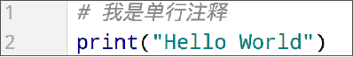

==**注意，#号和注释内容一般建议以一个空格隔开**==

- 多行注释： 以 ==**一对三个双引号**== 引起来 ("""注释内容""")来解释说明一段代码的作用使用方法

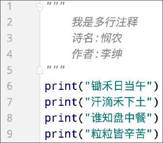

### 1.3 变量 

==**变量：在程序运行时，能储存计算结果或能表示值的抽象概念。简单的说，变量就是在程序运行时，记录数据用的**==

#### 1.3.1 变量的定义格式

```py
变量名称 = 变量的值
```

#### 1.3.2 变量的特征

变量，从名字中可以看出，表示“量”是可变的。所以变量的特征就是:变量存储的数据，是可以发生改变的。

```python
#初始有100元
money = 100

print("I have", money, "dollars")

#花费50
money -= 50

#只剩余50
print("now,I have", money, "dollars")
```

### 1.4 数据类型

在学习字面量的时候，我们了解到：数据是有类型的。目前在入门阶段，我们主要接触如下三类数据类型：

| 类型       | 描述             | 说明                              |
| ---------- | ---------------- | --------------------------------- |
| **string** | 字符串类型       | 用引号引起来的数据都是字符串      |
| **int**    | 整型（有符号）   | 数字类型，存放整数 如 -1,10, 0 等 |
| **float**  | 浮点型（有符号） | 数字类型，存放小数 如 -3.14, 6.66 |

string、int、float这三个英文单词，就是类型的标准名称。

#### 1.4.1 type()

那么，问题来了，==**如何验证数据的类型呢**==？

我们可以通过==**type()**==语句来得到数据的类型：语法：type(被查看类型的数据)

type()语句的使用方式

- 在print语句中，直接输出类型信息：

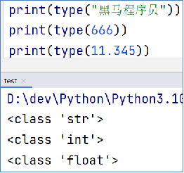

- 用变量存储type()的结果（返回值）

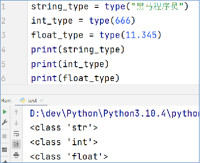

==**注意:使用type(变量)时，检测的时变量所存储的数据的类型，变量本身没有类型**==

### 1.5 数据类型转换

| **语句(函数)** | **说明**              |
| -------------- | --------------------- |
| int(x)         | 将x转换为一个整数     |
| float(x)       | 将x转换为一个浮点数   |
| str(x)         | 将对象 x 转换为字符串 |

同前面学习的type()语句一样，这三个语句，都是带有结果的（返回值）我们可以用print直接输出或用变量存储结果值

==**类型转换注意事项**==

- 任何类型，都可以通过str()，转换成字符串
- 字符串内必须真的是数字，才可以将字符串转换为数字

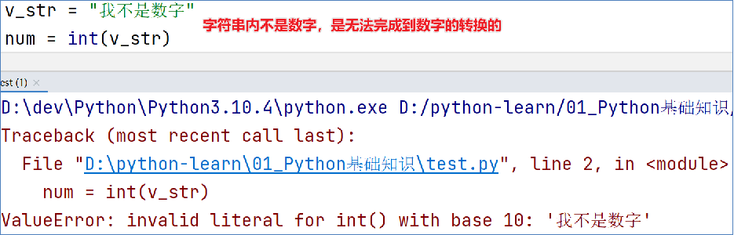

### 1.6 标识符

在Python程序中，我们可以给很多东西起名字，

比如：变量的名字

方法的名字

类的名字,

等等这些名字，我们把它统一的称之为==**标识符**==，用来做内容的标识。

所以==**标识符：是用户在编程的时候所使用的一系列名字，用于给变量、类、方法等命名。**==

Python中，标识符命名的规则主要有3类：

- 内容限定
- 大小写敏感
- 不可使用关键字

#### 1.6.1 内容限定

标识符命名中，只允许出现：**英文**、**中文**、**数字**、**下划线(_)**

但是规范中一般==**不使用中文**==、==**不是使用数字作为开头**==

#### 1.6.2 大小写敏感

以定义变量为例：

Andy = “安迪1”

andy = “安迪2”

字母a的大写和小写，是完全能够区分的。

==**python中大小写是会被区分的**==

#### 1.6.3 不可使用关键字

Python中有一系列单词，称之为关键字关键字在Python中都有特定用途我们不可以使用它们作为标识符。

常见关键字如下:

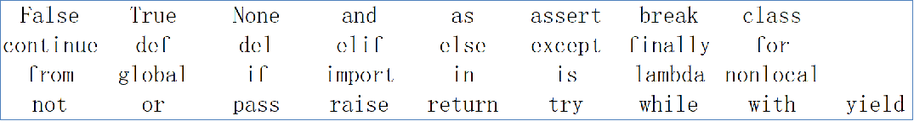

#### 1.6.4 变量命名规范

学完了标识符（变量、类、方法）的命名规则后，我们在来学习标识符的命名规范。变量名类名方法名不同的标识符，有不同的规范。

我们目前只接触到了：变量。所以，

目前学习：变量的命名规范。

- 见名知意:命名要一眼知道该变量所表达的意思
- 下划线命名法:多个单词使用下划线分开
- 英文字母全小写:变量命名全部都要小写

### 1.7 运算符

算术（数学）运算符

| 运算符 | 描述   | 实例                                                         |
| ------ | ------ | ------------------------------------------------------------ |
| +      | 加     | 两个对象相加 a + b 输出结果 30                               |
| -      | 减     | 得到负数或是一个数减去另一个数 a - b 输出结果 -10            |
| *      | 乘     | 两个数相乘或是返回一个被重复若干次的字符串 a * b 输出结果 200 |
| /      | 除     | b / a 输出结果 2                                             |
| //     | 取整除 | 返回商的整数部分 9//2 输出结果 4 , 9.0//2.0 输出结果 4.0     |
| %      | 取余   | 返回除法的余数 b % a 输出结果 0                              |
| **     | 指数   | a**b 为10的20次方， 输出结果 100000000000000000000           |

赋值运算符

| **运算符** | **描述**   | **实例**                                                     |
| ---------- | ---------- | ------------------------------------------------------------ |
| =          | 赋值运算符 | 把 = 号右边的结果 赋给 左边的变量，如 num = 1 + 2 * 3，结果num的值为7 |

复合赋值运算符

| **运算符** | **描述**         | **实例**                  |
| ---------- | ---------------- | ------------------------- |
| +=         | 加法赋值运算符   | c += a 等效于 c = c + a   |
| -=         | 减法赋值运算符   | c -= a 等效于 c = c - a   |
| *=         | 乘法赋值运算符   | c *= a 等效于 c = c * a   |
| /=         | 除法赋值运算符   | c /= a 等效于 c = c / a   |
| %=         | 取模赋值运算符   | c %= a 等效于 c = c % a   |
| **=        | 幂赋值运算符     | c **= a 等效于 c = c ** a |
| //=        | 取整除赋值运算符 | c //= a 等效于 c = c // a |

### 1.8 字符串扩展

#### 1.8.1 字符串定义

字符串在Python中有多种定义形式：

```py
#单引号定义法：
name = 'Hello world'
#双引号定义法：
name = "Hello world"
#三引号定义法：
name = """Hello world"""
```

三引号定义法，和多行注释的写法一样，同样支持换行操作。==使用变量接收它，它就是字符串不使用变量接收它，就可以作为多行注释使用==

#### 1.8.2 字符串拼接

如果我们有两个字符串（文本）字面量，可以将其拼接成一个字符串，通过+号即可完成，如：

```python
str_1 = "Hello"
str_2 = "world"
print(str_1 + str_2)
```

既然可以和字符串变量完成拼接，那么，是否可以和其它变量类型如数字类型完成拼接呢？

==**注意:不可以，字符串无法和非字符串变量进行拼接，因为类型不一致，无法接上**==

#### 1.8.3 字符串格式化

上述字符串拼接还是有问题

- 变量过多，拼接起来实在是太麻烦了
- 字符串无法和数字或其它类型完成拼接。

所以我们可以使用字符串格式化来解决

```python
name = "Jack"
message = "Hello %s" % name
print(message)
"""
其中的，%s 
%  表示：我要占位
s   表示：将变量变成字符串放入占位的地方
所以，综合起来的意思就是：我先占个位置，等一会有个变量过来，我把它变成字符串放到占位的位置
"""
#其他类型也是可以使用的
age = 18
weight = 60.5
height = 180
message = "我是%s，我的年龄是%s，我的体重是%s,我的身高是%s" % (name,age,weight,height)
print(message)
""""
多个变量占位
变量要用括号括起来
并按照占位的顺序填入
"""
```

Python中，其实支持非常多的数据类型占位最常用的是如下三类

| 格式符号 | 转化                             |
| -------- | -------------------------------- |
| %s       | 将内容转换成字符串，放入占位位置 |
| %d       | 将内容转换成整数，放入占位位置   |
| %f       | 将内容转换成浮点型，放入占位位置 |

#### 1.8.4 格式化的精度控制

我们可以使用辅助符号"m.n"来控制数据的宽度和精度

m，控制宽度，要求是数字（很少使用）,设置的宽度小于数字自身，不生效。

n，控制小数点精度，要求是数字，会进行小数的四舍五入

示例：

%5d：表示将整数的宽度控制在5位，如数字11，被设置为5d，就会变成：[空格][空格][空格]11，用三个空格补足宽度。

%5.2f：表示将宽度控制为5，将小数点精度设置为2      小数点和小数部分也算入宽度计算。如，对11.345设置了%7.2f 后，结果是：[空格][空格]11.35。2个空格补足宽度，小数部分限制2位精度后，四舍五入为 .35

%.2f：表示不限制宽度，只设置小数点精度为2，如11.345设置%.2f后，结果是11.35

#### 1.8.5 字符串格式化方式2

快速写法

通过语法：f"内容{变量}"的格式来快速格式化

```python
name = "Jack"
message = "Hello "
print(f"{message} {name}!")
```

这种写法不做精度控制,也不理会类型,适用于快速格式化字符串

#### 1.8.6 表达式的格式化

表达式：一条具有明确执行结果的代码语句

如：1 + 1、5 * 2，就是表达式，因为有具体的结果，结果是一个数字

又或者，常见的变量定义：name = “张三”     age = 11 + 11

等号右侧的都是表达式呢，因为它们有具体的结果，结果赋值给了等号左侧的变量。

```python
print("1 * 1 的结果是 %d",% (1 * 1))
print(f"1 * 1 的结果是{1 * 1}")
```

在无需使用变量进行数据存储的时候，可以直接格式化表达式，简化代码哦

#### 1.8.7 数据输入

我们前面学习过print语句（函数），可以完成将内容（字面量、变量等）输出到屏幕上。在Python中，与之对应的还有一个input语句，用来获取键盘输入。

使用上也非常简单：使用input()语句可以从键盘获取输入使用一个变量接收（存储）input语句获取的键盘输入数据即可

```python
name = input("请输入名称")
print("你的名称是"，name)
```

==**注意:无论输入的是什么获取的都是string类型的数据**==

## 2、判断语句

### 2.1 布尔类型和比较运算符

#### 2.1.1 布尔类型

Python中常用的有6种值（数据）的类型

| 类型               | 描述                                                         | 说明                                                         |
| ------------------ | ------------------------------------------------------------ | ------------------------------------------------------------ |
| 数字(Number)       | 支持整数（int）<br />浮点数（float）<br />复数（complex）<br />布尔（bool） <br /> | 整数（int），如：10、-10<br />浮点数（float），如：13.14、-13.14<br />复数（complex），如：4+3j，以j结尾表示复数<br />布尔（bool）表示逻辑真和假,True和Flase |
| 字符串（String）   | 描述文本的一种数据类型                                       | 字符串（string）由任意数量的字符组成                         |
| 列表（List）       | 有序的可变序列                                               | Python中使用最频繁的数据类型，可有序记录一堆数据             |
| 元组（Tuple）      | 有序的不可变序列                                             | 可有序记录一堆不可变的Python数据集合                         |
| 集合（Set）        | 无序不重复集合                                               | 可无序记录一堆不重复的Python数据集合                         |
| 字典（Dictionary） | 无序Key-Value集合                                            | 可无序记录一堆Key-Value型的Python数据集合                    |

布尔类型的字面量：

True  表示真（是、肯定）

False 表示假 （否、否定）

定义变量存储布尔类型数据：

```python
变量名 = 布尔字面量
```

#### 2.1.2 比较运算符

| **运算符** | **描述**                                                    | **示例**                      |
| ---------- | ----------------------------------------------------------- | ----------------------------- |
| ==         | 判断内容是否相等，满足为True，不满足为False                 | 如a=3,b=3，则(a == b) 为 True |
| !=         | 判断内容是否不相等，满足为True，不满足为False               | 如a=1,b=3，则(a != b) 为 True |
| >          | 判断运算符左侧内容是否大于右侧满足为True，不满足为False     | 如a=7,b=3，则(a > b) 为 True  |
| <          | 判断运算符左侧内容是否小于右侧满足为True，不满足为False     | 如a=3,b=7，则(a < b) 为 True  |
| >=         | 判断运算符左侧内容是否大于等于右侧满足为True，不满足为False | 如a=3,b=3，则(a >= b) 为 True |
| <=         | 判断运算符左侧内容是否小于等于右侧满足为True，不满足为False | 如a=3,b=3，则(a <= b) 为 True |

### 2.2 if语句的基本格式

基本格式：

```python
if 判断条件:
    满足条件时，执行的代码
elif 其他条件:
    满足条件时，执行的代码
else:
    最后执行的代码
```


```python
if age > 18 :
    print("刚满十八岁")
elif age <=0:
    print("错误年龄")
else:
    print("未满十八岁")
```

==**注意：if后面的冒号不能省略，if后面代码的缩进不能去掉，Python通过缩进判断代码块的归属关系。**==

## 3、循环语句

### 3.1 while循环

```py
while 条件:
    语句....
    while 条件:
        语句...
```

实例

```py
i = 0
while i < 100:
    print(i)
    i += 1
```


### 3.2 for循环

除了while循环语句外，Python同样提供了for循环语句。两者能完成的功能基本差不多，但仍有一些区别：while循环的循环条件是自定义的，自行控制循环条件for循环是一种”轮询”机制，是对一批内容进行”逐个处理”

```py
for 临时变量 in 待处理数据集: 
        循环满足条件时执行的代码

```

从待处理数据集中：逐个取出数据赋值给临时变量

实例：

```py
str_1 = 'abc'
for j in str_1:
    print(j)
```


#### 3.2.1 range()

range可以获得一个简单的数字序列（可迭代类型的一种）。

```py
range(5) => [0,1,2,3,4]
#获取一个从0开始，到num结束的数字序列（不含num本身）
#如range(5)取得的数据是：[0, 1, 2, 3, 4]
range(5,10) => [5,6,7,8,9]
#获得一个从num1开始，到num2结束的数字序列（不含num2本身）
#如，range(5, 10)取得的数据是：[5, 6, 7, 8, 9]
range(5,10,2) => [5,7,9]
#获得一个从num1开始，到num2结束的数字序列（不含num2本身）
#数字之间的步长，以step为准（step默认为1）
#如，range(5, 10, 2)取得的数据是：[5, 7, 9]
```


### 3.3 循环中断 : break和continue

思考：无论是while循环或是for循环，都是重复性的执行特定操作。在这个重复的过程中，会出现一些其它情况让我们不得不：暂时跳过某次循环，直接进行下一次提前退出循环，不在继续对于这种场景，Python提供continue和break关键字用以对循环进行临时跳过和直接结束

continue关键字用于：中断本次循环，直接进入下一次循环

continue可以用于：    for循环和while循环，效果一致

break关键字用于：直接结束所在循环

break可以用于：    for循环和while循环，效果一致

## 4、函数

### 4.2 函数定义

函数：是组织好的，可重复使用的，用来实现特定功能的代码段。

```py
def 函数名(参数名):
    函数体
    return 返回值
```

==**注意：参数如不需要，可以省略（后续章节讲解），返回值如不需要，可以省略（后续章节讲解），函数必须先定义后使用**==

函数即“模块”，模块化程序设计是编程的重要思想！（面向对象程序设计中，类也是模块）

### 4.3 函数参数

传入参数的数量是不受限制的。可以不使用参数也可以仅使用任意N个参数

函数的参数数量不限，使用逗号分隔开传入参数的时候，要和形式参数一一对应，逗号隔开

### 4.4 函数的返回值

所谓“返回值”，就是程序中函数完成事情后，最后给调用者的结果

如图，变量就能接收到函数的返回值语法就是：通过return关键字，就能向调用者返回数据

思考：如果函数没有使用return语句返回数据，那么函数有返回值吗？实际上是：有的。Python中有一个特殊的字面量：None，其类型是：<class 'NoneType'>无返回值的函数，实际上就是返回了：None这个字面量None表示：空的、无实际意义的意思函数返回的None，就表示，这个函数没有返回什么有意义的内容。也就是返回了空的意思。

### 4.5 函数说明文档

函数是纯代码语言，想要理解其含义，就需要一行行的去阅读理解代码，效率比较低。我们可以给函数添加说明文档，辅助理解函数的作用。语法如下：

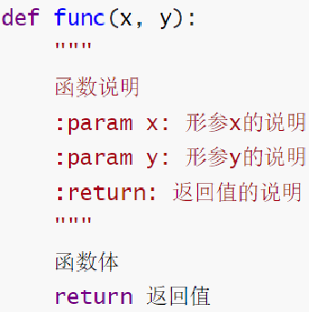

### 4.6 global关键字

使用 global关键字 可以在函数内部声明变量为全局变量, 如下所示

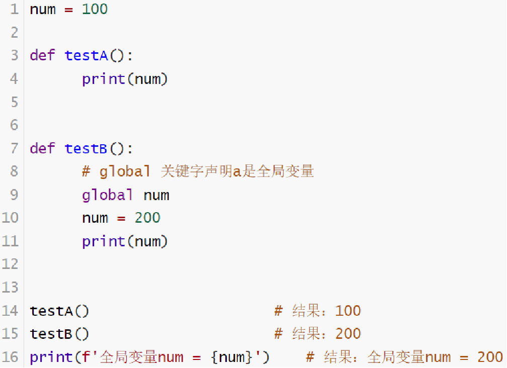

## 5、数据容器

Python中的数据容器：一种可以容纳多份数据的数据类型，容纳的每一份数据称之为1个元素每一个元素，可以是任意类型的数据，如字符串、数字、布尔等。数据容器根据特点的不同，

如：

是否支持重复元素

是否可以修改

是否有序，等分为5类，分别是：列表（list）、元组（tuple）、字符串（str）、集合（set）、字典（dict）

### 5.1 列表

列表（list）类型，是数据容器的一类，我们来详细学习它。

基本语法：

```py
#字面量
[元素1，元素2，元素3]

#变量
test_list = [元素1，元素2，元素3]

#定义空列表
test_list = []
test_list = list()
```

列表内的每一个数据，称之为元素以 [] 作为标识列表内每一个元素之间用, 逗号隔开

==**注意：列表可以一次存储多个数据，且可以为不同的数据类型，支持嵌套**==

列表中的每一个元素，都有其位置下标索引，从前向后的方向，从0开始，依次递增我们只需要按照下标索引，即可取得对应位置的元素。

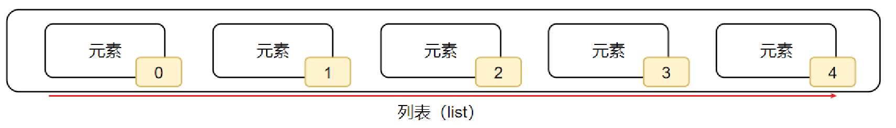

```py
#列表名[下标索引]
test_list[0]
test_list[1]
```

特别的是py中list的下标索引可以使用==**负数**==如下

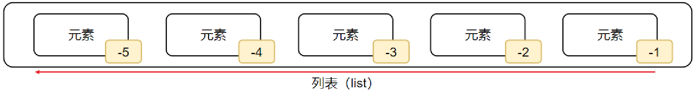

```py
#列表名[下标索引]
test_list[-1]
test_list[-2]
```

==**注意：下标索引的取值范围，超出范围无法取出元素，并且会报错**==

列表方法

- index()

  功能：查找指定元素在列表的下标，如果找不到，报错ValueError

```py
#语法：列表.index(元素)
test_list = ['test','a','b','c']
test_list.index('test') #1
```

- 修改特定位置（索引）的元素值    

```py
#语法：列表[下标] = 值   
test_list = ['test','a','b','c']
test_list[-2] = 'c' #test_list = ['test','a','c','c']
```

可以使用如上语法，直接对指定下标（正向、反向下标均可）的值进行：重新赋值（修改）

- insert()

  语法：列表.insert(下标, 元素)，在指定的下标位置，插入指定的元素

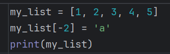

- append()

  语法：列表.append(元素)，将指定元素，追加到列表的尾部

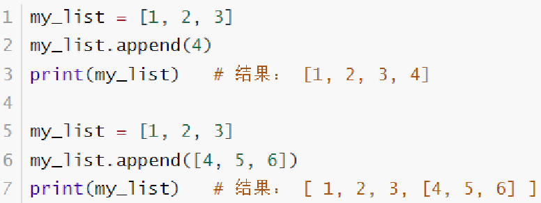

- extend()

  语法：列表.extend(其它数据容器)，将其它数据容器的内容取出，依次追加到列表尾部

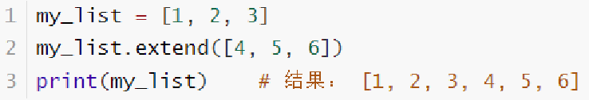

- del()

  语法1： del 列表[下标]

- pop()

  语法2：列表.pop(下标)

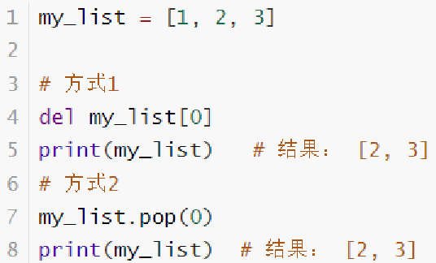

- remove()

  语法：列表.remove(元素),删除某元素在列表中的第一个匹配项

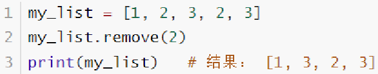

- clear()

  语法：列表.clear(),清空列表内容

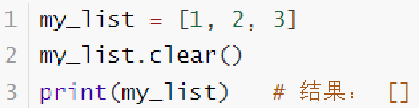

- count()

  语法：列表.count(元素),统计某元素在列表内的数量    

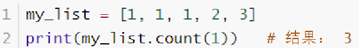

- len()

  语法：len(列表),统计列表内，有多少元素,可以得到一个int数字，表示列表内的元素数量

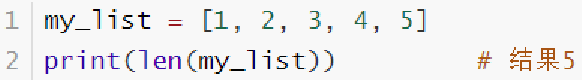

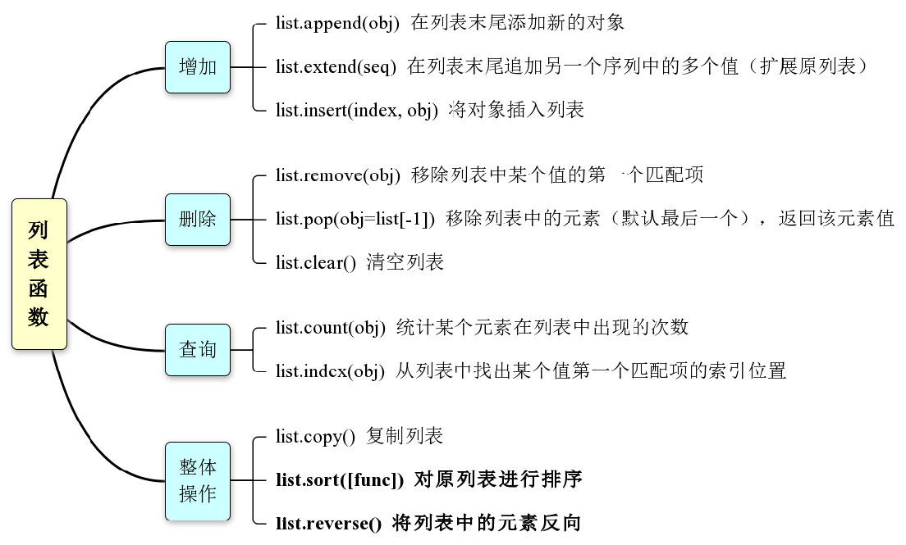

### 5.2 元组

元组同列表一样，都是可以封装多个、不同类型的元素在内。

但最大的不同点在于：元组一旦定义完成，就不可修改所以，当我们需要在程序内封装数据，又不希望封装的数据被篡改，那么元组就非常合适了

元组定义：定义元组使用小括号，且使用逗号隔开各个数据，数据可以是不同的数据类型。

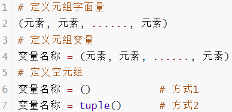

==**注意：元组只有一个数据，这个数据后面要添加逗号**==

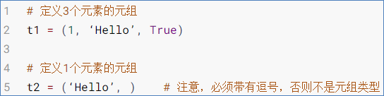

==**相关方法**==

| **编号** | **方法**  | **作用**                                           |
| -------- | --------- | -------------------------------------------------- |
| 1        | index()   | 查找某个数据，如果数据存在返回对应的下标，否则报错 |
| 2        | count()   | 统计某个数据在当前元组出现的次数                   |
| 3        | len(元组) | 统计元组内的元素个数                               |

==**注意：元组可以修改元组内的list的内容（修改元素、增加、删除、反转等）**==

### 5.3 字符串

在 Python中处理文本数据是使用str对象，称为字符串。字符串是由 Unicode 码位构成的不可变序列。字符串字面值有多种不同的写法：

- 单引号：'允许包含有 "双" 引号'
- 双引号："允许包含有 '单' 引号"
- 三重引号：'''三重单引号'''， """三重双引号"""

使用三重引号的字符串可以跨越多行 —— 其中所有的空白字符都将包含在该字符串字面值中。

在字符串中使用特殊字符时，python用反斜杠(\)转义字符引导特殊字符下表所示

| **转义字符**            | **描述**                             | **转义字符** | **描述**                             |
| ----------------------- | ------------------------------------ | ------------ | ------------------------------------ |
| **\(****在行尾时****)** | **续行符**                           | \e           | 转义                                 |
| **\\**                  | **反斜杠符号**                       | \000         | 空                                   |
| **\'**                  | **单引号**                           | **\n**       | **换行**                             |
| **\"**                  | **双引号**                           | \v           | 纵向制表符                           |
| \a                      | 响铃                                 | **\t**       | **横向制表符**                       |
| \b                      | 退格(Backspace)                      | \r           | 回车                                 |
| \f                      | 换页                                 | \other       | 其它的字符以普通格式输出             |
| \oyy                    | 八进制数yy代表的字符，如\o12代表换行 | \xyy         | 十进制数yy代表的字符，如\x0a代表换行 |

相关函数

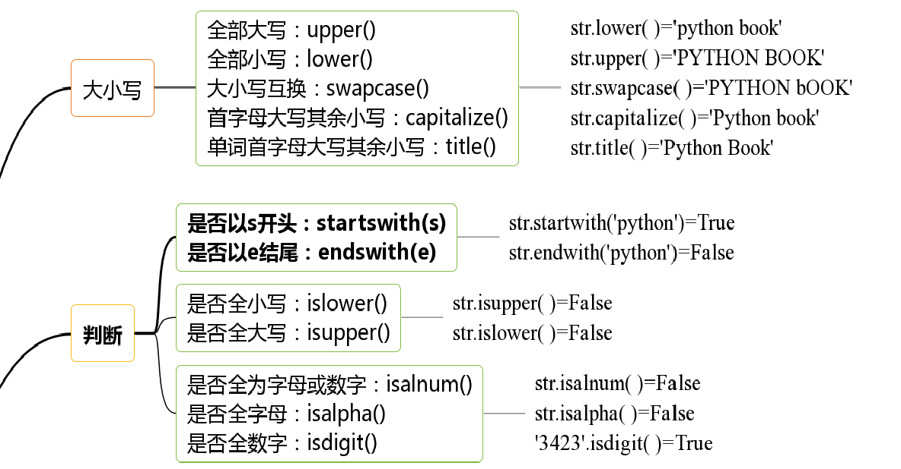

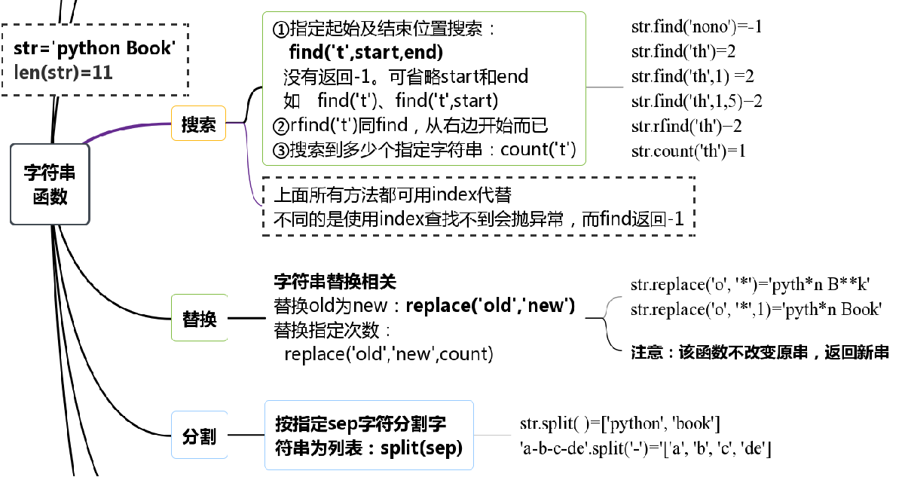

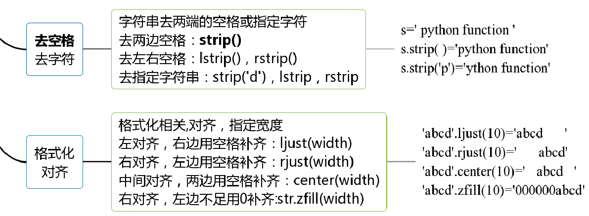

### 5.4 序列切片

序列支持切片，即：列表、元组、字符串，均支持进行切片操作

切片：从一个序列中，取出一个子序列

```py
#语法：序列[起始下标:结束下标:步长]
#表示从序列中，从指定位置开始，依次取出元素，到指定位置结束，得到一个新序列：
b = [1,2,5,9,6][1:4:1] # b=[2,5,9],最后一个取不到
```

- 起始下标表示从何处开始，可以留空，留空视作从头开始

- 结束下标（不含）表示何处结束，可以留空，留空视作截取到结尾

  步长表示，依次取元素的间隔

  步长1表示，一个个取元素

  步长2表示，每次跳过1个元素取

  步长N表示，每次跳过N-1个元素取

  步长为负数表示，反向取（注意，起始下标和结束下标也要反向标记）

==**注意:此操作不会影响序列本身，而是会得到一个新的序列（列表、元组、字符串）**==

序列的切片演示

```py
my_list = [1, 2, 3, 4, 5]
new_list = my_list[1:4]	# 下标1开始，下标4（不含）结束，步长1
print(new_list)		# 结果：[2, 3, 4]

my_tuple = (1, 2, 3, 4, 5)
new_tuple = my_tuple[:]	# 从头开始，到最后结束，步长1
print(new_tuple)		# 结果：(1, 2, 3, 4, 5)

my_list = [1, 2, 3, 4, 5]
new_list = my_list[::2]		# 从头开始，到最后结束，步长2
print(new_list)		# 结果：[1, 3, 5]

my_str = "12345"
new_str = my_str[:4:2]	# 从头开始，到下标4（不含）结束，步长2
print(new_str)		# 结果："13"
```

可以看到，这个操作对列表、元组、字符串是通用的同时非常灵活，根据需求，起始位置，结束位置，步长（正反序）都是可以自行控制的


### 5.5 集合

集合中的元素有三个特征：

1. 确定性（集合中的元素必须是确定的） 
2. 互异性（集合中的元素互不相同。例：集合A={1，a}，则a不能等于1） 
3. 无序性（集合中的元素没有先后之分），如集合{3,4,5}和{3,5,4}相同。

Python的集合类型是由不重复元素组成的无序的集。花括号或 set() 函数可以用来创建集合。

==**注意：要创建一个空集合你只能用set( )或者frozenset( ) 而不能用 {}，因为 {}是创建一个空字典**==。

语法

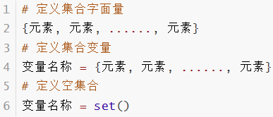

==**注意:因为集合是无序的，所以集合不支持：下标索引访问**==

相关方法

- 添加新元素     

  语法：集合.add(元素)。将指定元素，添加到集合内     

  结果：集合本身被修改，添加了新元素

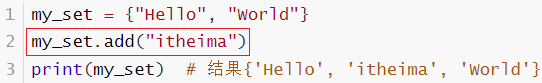

- 移除元素     

  语法：集合.remove(元素)，将指定元素，从集合内移除     

  结果：集合本身被修改，移除了元素

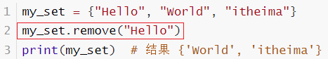

- 从集合中随机取出元素     

  语法：集合.pop()，功能，从集合中随机取出一个元素     

  结果：会得到一个元素的结果。同时集合本身被修改，元素被移除

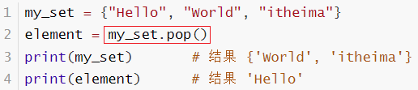

- 清空集合     

  语法：集合.clear()，功能，清空集合     

  结果：集合本身被清空

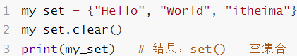

- 取出2个集合的差集     

  语法：集合1.difference(集合2)，

  功能：取出集合1和集合2的差集（集合1有而集合2没有的）     

  结果：得到一个新集合，集合1和集合2不变

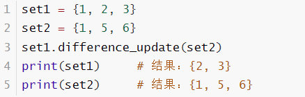

- 2个集合合并     

  语法：集合1.union(集合2)     

  功能：将集合1和集合2组合成新集合     

  结果：得到新集合，集合1和集合2不变

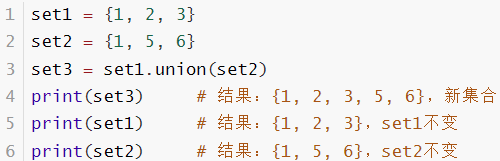

- 查看集合的元素数量     

  语法：len(集合)     

  功能：统计集合内有多少元素     

  结果：得到一个整数结果

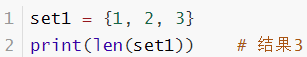

- 集合同样支持使用for循环遍历

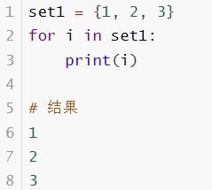

==**注意：集合不支持下标索引，所以也就不支持使用while循环。**==

| **编号** | **操作**                       | **说明**                                                  |
| -------- | ------------------------------ | --------------------------------------------------------- |
| 1        | 集合.add(元素)                 | 集合内添加一个元素                                        |
| 2        | 集合.remove(元素)              | 移除集合内指定的元素                                      |
| 3        | 集合.pop()                     | 从集合中随机取出一个元素                                  |
| 4        | 集合.clear()                   | 将集合清空                                                |
| 5        | 集合1.difference(集合2)        | 得到一个新集合，内含2个集合的差集原有的2个集合内容不变    |
| 6        | 集合1.difference_update(集合2) | 在集合1中，删除集合2中存在的元素集合1被修改，集合2不变    |
| 7        | 集合1.union(集合2)             | 得到1个新集合，内含2个集合的全部元素原有的2个集合内容不变 |
| 8        | len(集合)                      | 得到一个整数，记录了集合的元素数量                        |

### 5.6 字典

字典(dict, dictionary的简写)是python中唯一内建的映射类型，它把“键”(key)映射到“值” (value)，通过key可以快速找到value，它是一种键值对数据结构

字典的定义，同样使用{}，不过存储的元素是一个个的：键值对，如下语法：

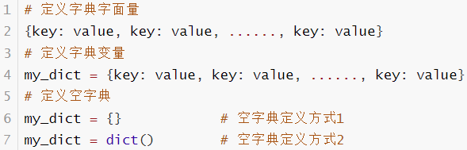

特点

- 使用{}存储原始，每一个元素是一个键值对
- 每一个键值对包含Key和Value（用冒号分隔）
- 键值对之间使用逗号分隔
- Key和Value可以是任意类型的数据（key不可为字典）
- Key不可重复，重复会对原有数据覆盖

==**注意:key不可变,不可重复**==

字典同集合一样，不可以使用下标索引但是字典可以通过Key值来取得对应的Value

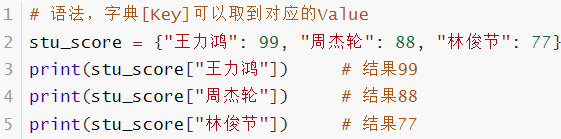

- 新增元素	

  语法：字典[Key] = Value，

  结果：字典被修改，新增了元素

  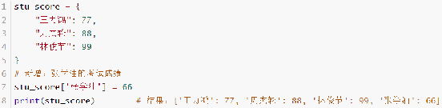

- 更新元素	

  语法：字典[Key] = Value，

  结果：字典被修改，元素被更新	

  注意：字典Key不可以重复，所以对已存在的Key执行上述操作，就是更新Value值

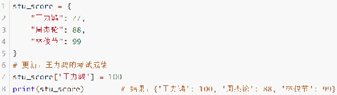

- 删除元素	

  语法：字典.pop(Key)，

  结果：获得指定Key的Value，同时字典被修改，指定Key的数据被删除

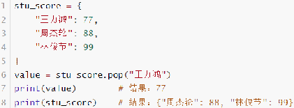


- 清空字典	

  语法：字典.clear()，

  结果：字典被修改，元素被清空

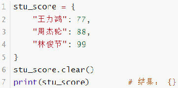

- 获取全部的key	

  语法：字典.keys()，

  结果：得到字典中的全部Key

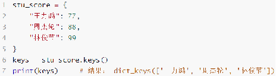

- 遍历字典	

  语法：for key in 字典.keys()

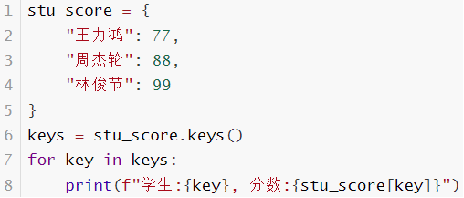

==**注意：字典不支持下标索引，所以同样不可以用while循环遍历**==

- 计算字典内的全部元素（键值对）数量	

  语法：len(字典)	

  结果：得到一个整数，表示字典内元素（键值对）的数量

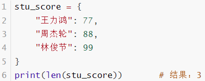

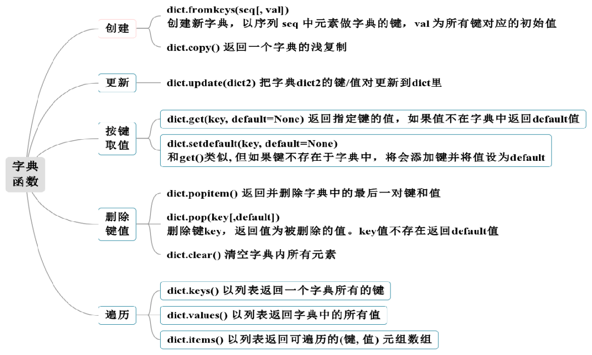

### 5.7 推导式

对于处理序列毫无疑问会选择用for循环。但在Python中还有一种更高效更简洁的处理序列方式——list comprehension ，有人把它翻译成“列表推导式”，也有人翻译成“列表解析式”。虽然名字叫做列表推导式，但是这个语法同样适用于元组、字典、集合等这一系列可迭代（iterable）数据结构。

推导式 comprehensions（又称解析式），是python的一种独有特性。==**推导式可以从一个数据序列构建另一个新的数据序列**==。（与java中的map相似）

==**列表推导式的语法格式**==：

[表达式 for 迭代变量 in 可迭代对象 [if 条件表达式]]

- 此格式中，[if 条件表达式] 不是必须的，可以省略。
- 外层的中括号代表的是列表的界定符号，if子句的中括号代表if子句是可选的，含义不同。
- 通过列表推导式的语法格式，明显会感觉到它和for循环存在某些关联。

```python
1  #快速创建一个包含1-10之间所有偶数的列表
2  list0 = [i for i in range(1, 11) if i % 2 == 0]
3  print(list0)#[2, 4, 6, 8, 10]

4  list1 = [2.3,3.4,4.5,5.6,6.7]
5  print ([int(x) for x in list1]) #割尾巴取整:[2, 3, 4, 5, 6]
6  print ([int(x)**2 for x in list1]) #平方:[4, 9, 16, 25, 36]
7  print ([int(x)**2 for x in list1 if int(x) % 2 == 0])  
#加了if条件限制，只打印偶数的平方:[4, 16, 36]

```

注意:推导式的效率比for循环遍历的快很多

==**元组推导式**==：

（表达式 for 迭代变量 in 可迭代对象 [if 条件表达式]）

对于元组、字典、集合等可迭代数据结构，同样具有相应的推导式。跟列表推导式的语法格式基本相同。

通过和列表推导式做对比，你会发现，除了**元组推导式是用 ( ) 圆括号将各部分括起来**，而列表推导式用的是 [ ]，其它完全相同。不仅如此，元组推导式和列表推导式的用法也完全相同。

```python
1  a = [x for x in range(1,10)]  #这是列表推导式
2  print(a)#[1, 2, 3, 4, 5, 6, 7, 8, 9]
3  b = (x for x in range(1,10))  #这是元组推导式
4  print(b)#<generator object <genexpr> at 0x000001C03C0160C0>

5  for i in b:  #第一次遍历
6      print(i**2,end=' ') # 1 4 9 16 25 36 49 64 81
7  for i in b:  #再次遍历，将输出空值
8      print(i**2,end=' ')  #输出为空
9  b = (x for x in range(1,10))
10  c=tuple(b)
#第一次“使用”，转换为元组对象
11  print(c)#(1, 2, 3, 4, 5, 6, 7, 8, 9)
12  print(tuple(b))#()
#再次“使用”，输出空值

```

按python的官方解释，使用小括号的推导式是生成器（后面介绍）的一种形式，叫做生成器表达式。注意：本质上没有元组推导式这种说法，这里为了保持一致，仍然使用了元组推导式这种说法。也就是说，列表推导式直接生成的是“真正的”列表，如a=[1, 2, 3, 4, 5, 6, 7, 8, 9]，而元组的推导式生成的是一个生成器对象，如b是generator object对象。可以将b转化为“真正的”元组，如c=tuple(b)得到(1, 2, 3, 4, 5, 6, 7, 8, 9)，也可以对b进行遍历。但是，对于生成器对象，只要遍历过，无论是使用 for 循环遍历，还是使用 __next__() 方法遍历，或者使用tuple转换遍历，再次遍历后原生成器对象将为空，这就是遍历后转换原生成器对象却得到空元组的原因

==**集合推导式**==：

{表达式 for 迭代变量 in 可迭代对象 [if 条件表达式]}

通过和列表推导式做对比，你会发现，除了集合推导式是用{}花括号将各部分括起来，而列表推导式用的是 [ ]，其它完全相同。

```python
1  a = [x**2 for x in range(-5,6)]#这是列表推导式
2  print(a)  #[25, 16, 9, 4, 1, 0, 1, 4, 9, 16, 25]
3  b = {x**2 for x in  range(-5,6)}#这是集合推导式
4  print(b)  #{0, 1, 4, 9, 16, 25}
5  for i in b:
6      print(i,end=' ') # 0, 1, 4, 9, 16, 25
7  print("\n遍历集合推导式结束！")
8  c=tuple(b)  #再次使用，不会变为空
9  print(c)#(0, 1, 4, 9, 16, 25)

```

和列表推导式直接生成的是“真正的”列表相似，集合推导式生成的是真正的集合，这一点和元组的推导式生成的是一个生成器对象不同。因此可以对集合进行多次遍历，该集合并不会变为“空”。

==**字典推导式**==：

{“键：值”表达式 for 迭代变量 in 可迭代对象 [if 条件表达式]}

和列表推导式做对比，你会发现，除了字典推导式是用 {}花括号将各部分括起来，并且表达式是字典形式以外，其它完全相同。同样，字典推导式生成的是真正的字典。

```python
1  # 使用字典推导式生成字典
2  cookies = "id=jy0ui55o-u6f6zd; name=tom; version=1"
3  cookies = {cookie.split("=")[0]:cookie.split("=")[1] for cookie in cookies.split("; ")}
4  print(cookies)#{'id': 'jy0ui55o-u6f6zd', 'name': 'tom', 'version': '1'}
5  # 使用字典推导式交换字典中键值对位置
6  changed = {value:key for key,value in cookies.items()}
7  print(changed)#{'jy0ui55o-u6f6zd': 'id', 'tom': 'name', '1': 'version'}

8  # 使用字典推导式获取字典中key值是小写字母的键值对
9  dict1 = {"a":10,"B":20,"C":True,"D":"hello world","e":"python教程"}
10  dict2 = {key:value for key,value in dict1.items() if key.islower()}
11  print(dict2)#{'a': 10, 'e': 'python教程'}

```

==**字典推导式 ：zip函数(常用)**==

```python
15  # 关于zip函数的使用
16  name = ["张三", "李四", "王五"]  
17  sign = ["处女座", "双鱼座", "狮子座"]  
18  dict4 = {i : j for i, j in zip(name, sign)} #字典推导式
19  print(dict4)#{'张三': '处女座', '李四': '双鱼座', '王五': '狮子座'}
x=zip(name, sign)
20  print(x)   #<zip object at 0x000001C04E1DA8C8>
21  print(*x)  #('张三', '处女座') ('李四', '双鱼座') ('王五', '狮子座')
22  print(list(x)) #空值，第二次使用

23  result=dict()
24  for i in range(len(name)):
25      result[name[i]]=sign[j]
26  print(result)#{'张三': '处女座', '李四': '双鱼座', '王五': '狮子座'}

```

zip() 函数用于将可迭代的对象作为参数，将对象中对应的元素一一对应打包成一个个元组，然后返回由这些元组组成的zip对象。可以对zip对象解包（21行），或者转换为list对象（22行）。但是同元组推导式一样，只能“用一次”。如果不使用zip函数，要生成这样一个字典，就要写出如23行到25行的代码，跟第18行代码比较一下看看

### 5.8 总结

数据容器可以从以下视角进行简单的分类：

- 是否支持下标索引

  支持：列表、元组、字符串 - 序列类型

  不支持：集合、字典 - 非序列类型

- 是否支持重复元素

  支持：列表、元组、字符串 - 序列类型

  不支持：集合、字典 - 非序列类型

- 是否可以修改

  支持：列表、集合、字典

  不支持：元组、字符串

==**对比**==

| ** **    | **列表**                         | **元组**                           | **字符串**         | **集合**               | **字典**                                       |
| -------- | -------------------------------- | ---------------------------------- | ------------------ | ---------------------- | ---------------------------------------------- |
| 元素数量 | 支持多个                         | 支持多个                           | 支持多个           | 支持多个               | 支持多个                                       |
| 元素类型 | 任意                             | 任意                               | 仅字符             | 任意                   | Key：ValueKey：除字典外任意类型Value：任意类型 |
| 下标索引 | 支持                             | 支持                               | 支持               | 不支持                 | 不支持                                         |
| 重复元素 | 支持                             | 支持                               | 支持               | 不支持                 | 不支持                                         |
| 可修改性 | 支持                             | 不支持                             | 不支持             | 支持                   | 支持                                           |
| 数据有序 | 是                               | 是                                 | 是                 | 否                     | 否                                             |
| 使用场景 | 可修改、可重复的一批数据记录场景 | 不可修改、可重复的一批数据记录场景 | 一串字符的记录场景 | 不可重复的数据记录场景 | 以Key检索Value的数据记录场景                   |

==**通用功能演示**==

| **功能**                     | **描述**                                       |
| ---------------------------- | ---------------------------------------------- |
| 通用for循环                  | 遍历容器（字典是遍历key）                      |
| max                          | 容器内最大元素                                 |
| min()                        | 容器内最小元素                                 |
| len()                        | 容器元素个数                                   |
| list()                       | 转换为列表                                     |
| tuple()                      | 转换为元组                                     |
| str()                        | 转换为字符串                                   |
| set()                        | 转换为集合                                     |
| sorted(序列, [reverse=True]) | 排序，reverse=True表示降序得到一个排好序的列表 |

## 6、函数进阶

### 6.1 函数参数

函数的参数从定义的角度看有3种类型：

- 位置参数（必需参数）
- 默认值参数
- 不定长数目参数

从定义结合==**调用**==的角度看有4种类型：

- 位置参数（必需参数）
- 关键字参数（必需参数）
- 默认值参数
- 不定长数目参数。

#### 6.1.1 位置参数

按照参数的位置依次把调用函数时的实参传递给形参，这是函数最常见的处理参数的方式。位置参数又叫必需参数，意味着调用函数的时候必需给定实参。

```python
def sum(x,y):
    return x+y
print(sum(5,8))
```

==**注意：传递的参数和定义的参数的顺序及个数必须一致**==

#### 6.1.2 关键字参数

调用函数时如果==**不想按顺序传递参数**==，也可以指定对应参数的名字，这就是按关键字传递

```python
def sub(x,y):    #<------从定义的角度看，和位置参数一样
    return x-y
print(sub(x=6,y=7))  #-1     <------从调用的角度看，调用的时候给出参数的名字
print(sub(y=2,x=5))  #3
```

- 一旦使用了关键字参数，后续的参数都应该是关键字参数的调用形式。
- 本质上而言，关键字参数仍然是位置参数。

#### 6.1.3 默认参数

函数==**定义时**==可以为某些参数设置默认值，这样这些参数传递时就是可选的，称为“默认值参数”。默认值参数只能放在位置参数后面。

```python
def sum1(x1,x2,x3=10):   
    return x1+x2+x3
print(sum1(3,4))   #16
print(sum1(3,4,9))   #17


def sum2(x1,x2=5,x3):     #报错
    return x1+x2+x3     
```

==**注意:如果在函数定义时，默认值参数放在了位置参数的前面，则程序会报错！**==

#### 6.1.4 不定长参数

函数的参数个数不确定，或者说要求函数的参数不限个数；只有在函数被调用的时候，才能确定参数的数量。

有两种不定长参数，第一种是* args，第二种是**kwargs，形式如下：

```python
def 函数名 ( [formal_args,]  *args,  **kwargs):
      函数体
     
```

- 加了星号 * 的参数会以元组(tuple)的形式导入，存放所有未命名的变量参数。
- 加了两个星号** 的参数会以字典的形式导入。
- 参数名字args和kwargs可以自己取。

```python
def sum(*x):
    result = 0  #定义一个变量用来保存结果
    for i in x :# 遍历元组，并将元组中的数进行累加
        result += i
    print(result)
sum(1,2,5,6) #调用函数  14
sum(1,2) #调用函数  3
sum( ) #调用函数  0
```

==***x，不定长参数**==：在传入额外的参数时不指明参数名，直接传入参数值即可（按照“最多”原则有多少接收多少）。

```python
def my_fun(a,b,*c,d,**e):
    print(f“a={a},b={b}”)
    print(“c=”,c)
    print(“d=”,d)
    print(“e=”,e)
    
    
my_fun(3,4,1,2,5,6,d=9,x1=1,x2=2,y1=3,y2=4) 

# 结果 a= 3, b= 4
#c= (1, 2, 5, 6)
#d= 9
#e= {‘x1’: 1, ‘x2’: 2, ‘y1’: 3, ‘y2’: 4}


```

- **e不定长参数，因为传入的是字典，所以传入时需要指定参数名；
- 它会将这些参数统一保存到名为kwargs的一个字典中
- 字典的key就是参数的名字，字典的value就是参数的值。

kwargs名字中的kw也就是单词KeyWords的两个字母，关键字之意。因此，从形式上看，d=9以及“x1=1,x2=2,y1=3,y2=4”都是“key=value”的形式，但是含义不一样。d=9是关键字参数的实参形式，而其他几个是可变的字典形式的实参参数。“x1=1,x2=2,y1=3,y2=4”还有另外一种使用形式：先定义一个字典，然后直接传递字典形式的实参给**kwargs参数。但是传递的时候需要在字典的变量前面加两个*进行解包操作。同理，对于*args，也可以用元组或列表的形式一起传递，只需调用的时候在元组的名字前面加*进行解包操作即可。如下

```python
def my_fun(a,b,*c,d,**e):
    print('a=',a);    print('b=',b)
    print('c=',c);    print('d=',d)
    print('e=',e)

    
kwargs={'x1':1, 'x2':2, 'y1':3, 'y2':4}
my_fun(3,4,1,2,5,6,d=9,**kwargs) 
# #程序输出：
#a= 3
#b= 4
#c= (1, 2, 5, 6)
#d= 9
#e= {‘x1’: 1, ‘x2’: 2, ‘y1’: 3, ‘y2’: 4}


s=(1,2,5,6)
kwargs={'x1':1, 'x2':2, 'y1':3, 'y2':4}
my_fun(3,4,*s,d=9,**kwargs) 


```

### 6.2 函数定义法则

#### 6.2.1 基本形式

函数参数的一般定义形式，表中的空白表示可以有也可以没有。

| **形式类别**                                         | def func()                                                   | **位置参数** | **默认值参数** | ***args** | ***\*kwargs)** |
| ---------------------------------------------------- | ------------------------------------------------------------ | ------------ | -------------- | --------- | -------------- |
| ①无参数                                              | def func()                                                   | ×            | ×              | ×         | ×              |
| ②有一个或多个位置参数                                | def func(a),def func(a,b)                                    | √            | ×              | ×         | ×              |
| ③有一个或多个默认值参数（默认值参数在后）            | def func(a=100),def func(a,b=100,c=200)】                    |              | √              | ×         | ×              |
| ④有*args无默认值参数（不定长参数一般在后）           | def func(\*args),<br />def func(a,\*args),<br />def func(a,b,\*args) |              | ×              | √         | ×              |
| ⑤有*args有默认值。主要的问题是这两种参数的先后问题。 | def unc(a,b,c=10,\*args),<br />def func(a,b,\*args,c=10)     |              | √              | √         | ×              |
| ⑥有**kwargs                                          | **kwargs放最后即可                                           |              |                |           | √              |

#### 6.2.2 规则

定义函数的时候，参数的使用基本规则

尤其注意几条基本规则： 

- 默认值参数只能在位置参数的后面。  
- 带星号 * 的形参只能有一个，可以在位置参数和默认值参数的前面或后面。但注意，带星号*的参数后的所有参数，必须以关键字参数的形式==**调用**==。  
- 带两个星号 **的形参只能有一个，并且必须写在所有参数的最后。

上面的几条规则不好记忆，实际上我们在使用的时候，一般按照“位置参数→默认值参数→任意值参数*args→任意值参数**kwargs”或者

“位置参数→任意值参数*args→默认值参数→任意值参数**kwargs”的形式使用。本书把它归结为三条约定：

1. 约定1：如果有位置参数，则放在开头。
2. 约定2：如果有“默认值参数或任意值参数*args”，则放中间。
3. 约定3：如果有**kwargs参数，则放在最后。

#### 6.2.3 对几条约定的讨论

- 根据这句话，大家可以回过头再看看上面例子，参数d放在c的后面是不合适的（虽然语法上正确），违背了约定1。改进版参见下例，位置参数d放在可变参数c的前面。

```python
def my_fun(a,b, d ,*c,**e):#参数d在*c的前面
    print(“a=”,a)
    print(“b=”,b)
    print(“c=”,c)
    print(“d=”,d)
    print(“e=”,e)
my_fun(3,4, 9, 1,2,5,6,x1=1,x2=2,y1=3,y2=4) 

#程序输出：
a= 3
b= 4
c= (1, 2, 5, 6)
d= 9
e= {‘x1’:1, ‘x2’: 2, ‘y1’: 3, ‘y2’: 4}

```

- 现在对上表中的两种：def func(a,b,c=10,*args)和def func(a,b,*args,c=10)做进一步说明。也就是对约定2进行讨论。注意两点区别：（

  1.在形式上，默认值参数是在前还是在后？

  2.在调用的时候，默认值参数是不是传递实参给它？

  默认值参数在*参数前面

```python
def print_student(id,sex='male',*score):
    print(f'学号={id},性别={sex}')
    if score:
        print(f'成绩={score}，平均分={sum(score)/len(score)}')
fenshu=[95,100,80,84]

#语法正确，参数传递错误，相当于把95按位置传递给sex参数
print_student('12103080121',95,100,80,84) 
print('---------------')

#下句语法正确，参数传递错误，*号相当于解包操作，跟上一句一样的效果。
print_student('12103080121',*fenshu) 
print('---------------')
print_student('12103080121','female',*fenshu) #★★★正确传递) 


#运行结果：
#学号=12103080121,性别=95
#成绩=(100, 80, 84)，平均分=88.0
#---------------
#学号=12103080121,性别=95
#成绩=(100, 80, 84)，平均分=88.0
#---------------
#学号=12103080121,性别=female
#成绩=(95, 100, 80, 84)，平均分=89.75

```

​	默认值参数在*参数后面面

```python
def print_student(id,*score,sex='male'):
    print(f'学号={id},性别={sex}')
    if score:
        print(f'成绩={score}，平均分={sum(score)/len(score)}')

fenshu=[95,100,80,84]
print_student('12103080121',*fenshu) #正确传递，sex参数使用默认值
print('---------------')
print_student('12103080121',95,100,80,84) #跟上一句效果一样
print('---------------')
# print_student('12103080121',*fenshu，'female') 
#上面这条print语句语法错误。*参数后的参数必须给定参数名称

#★★★下面这句正确，对sex参数按关健字参数方式给定值 
print_student('12103080121',*fenshu,sex='female')    
print('---------------')
print_student('12103080121')  #正确传递


# 运行结果：
# 学号=12103080121,性别=male
# 成绩=(95, 100, 80, 84)，平均分=89.75
# ---------------
# 学号=12103080121,性别=male
# 成绩=(95, 100, 80, 84)，平均分=89.75
# ---------------
# 学号=12103080121,性别=female
# 成绩=(95, 100, 80, 84)，平均分=89.75
# ---------------
# 学号=12103080121,性别=male

```

==**所以建议使用顺序为:"位置参数"->"*args"->"默认参数"->"**kwargs"**==

### 6.3 函数返回值

#### 6.3.1 无返回值

  如果函数没有return语句，那么函数的返回值就是None。下面实现九九乘法表的函数没有返回值。

```python
def multiplicationTable():
    for i in range(1,10):
        for j in range(1,i + 1):
            print(f"{i} * {j} = {i * j}", end="\t")
        print()
x=multiplicationTable()  
 #该函数返回None，可以打印试试看


#程序输出：
#1 * 1 = 1
#2 * 1 = 2   2 * 2 = 4
#3 * 1 = 3   3 * 2 = 6   3 * 3 = 9
#4 * 1 = 4   4 * 2 = 8   4 * 3 = 12  4 * 4 = 16
#....（省略）
```

#### 6.3.2 有return的函数

return语句会终止函数的执行，从函数中返回一个或多个值给调用者，return语句以后的代码不再执行。

定义一个函数，计算给定整数M和N区间内所有整数的积。

```python
def mul_fun(m,n):
    result=1
    for i in range(m,n+1):
        result=result*i
    return result
    print(“*******”)#该语句在return后面，执行不到
print(mul_fun(2,6))     #return语句返回1个值

#程序输出：
720
```


定义一个函数，计算给定整数M和N区间内所有整数的和、积。

```python
def sum_and_mul(n1,n2):
    s=0
    m=1
    for i in range(n1,n2+1):
        s+=i
        m*=i
    return s,m        #返回的是元组形式
a,b=sum_and_mul(5,7)  #对元组解包操作
c=sum_and_mul(5,7)
print(a,b)
print(c)


#程序输出：
#18 210
#(18, 210)

```

一球从100米高度自由落下，每次落地后反跳回原高度的一半再落下，求它在第n次落地时，共经过多少米？第n次反弹多高？

```python
def ball(height,n):
    i，s，f=1，height，height/2
    while i<n:
        s+=f*2
        f=f/2
        n-=1
    return s,f
height,n=100,3
d_n,h_n=ball(100,3)
print(f"初始高{height}米,第{n}次落地经过{d_n}米，第{n}次反弹高度为{h_n}米")


#程序输出：
#初始高100米,第3次落地经过250.0米，第3次反弹高度为12.5米

```

实现九九乘法表的函数，函数中不能输出打印。要求：   

（1）每行的所有乘法式子构成一个列表   

（2）所有行构成一个列表。   

（3）根据上述（1）（2）得到的嵌套列表作为函数结果返回   

（4）在主函数中调用函数，输出结果

```python
def multiplicationTableNew():
    table = [[f"{i + 1} * {j + 1} = {(i + 1) * (j + 1)}" 
                  for j in range(i + 1)] for i in range(9)]  #续行
    return table
table = multiplicationTableNew()
for i in table:#打印显示
    for j in i:
        print(j, end="\t")
    print()


#程序输出：
#1 * 1 = 1
#2 * 1 = 2    2 * 2 = 4


....（此处省略）
```

### 6.4 函数的递归

递归做为一种算法在程序设计语言中广泛应用。 一个过程或函数在其定义或说明中有直接或间接调用自身的一种方法，它通常把一个大型复杂的问题层层转化为一个与原问题相似的规模较小的问题来求解，递归策略只需少量的程序就可描述出解题过程所需要的多次重复计算，大大地减少了程序的代码量。

函数定义中调用自身称为函数的递归。递归是数学归纳法思维的编程体现。先看知乎上为解释递归所举的一个场景[例子](https://www.zhihu.com/question/20507130/answer/31826402)：假设你在一个电影院，你想知道自己坐在哪一排，但是前面人很多，你懒得去数了，于是你问前一排的人「你坐在哪一排？」，这样前面的人 (代号 A) 回答你以后，你就知道自己在哪一排了——只要把 A 的答案加一，就是自己所在的排了。不料 A 比你还懒，他也不想数，于是他也问他前面的人 B「你坐在哪一排？」，这样 A 可以用和你一模一样的步骤知道自己所在的排。然后 B 也如法炮制。直到他们这一串人问到了最前面的一排，第一排的人告诉问问题的人「我在第一排」。最后大家就都知道自己在哪一排了。

递归本身是一个函数，需要用函数定义方式描述。函数内部采用分支语句对初始条件和递归条件分别编写对应代码。特别注意，==**递归一定有初始条件，用来结束递归**==，就好似上述场景中的第一排那个人，他自己知道答案，就可以结束递归，一层层往回返回结果了。

#### 6.4.1 归并排序（MERGE-SORT）

归并排序是经典的递归算法。该算法采用分治（divide-and-conquer）策略，将问题分(divide)成一些小的问题然后递归求解，而治(conquer)的阶段则将分的阶段得到的各答案"合并"在一起。其算法的实现原理如下图

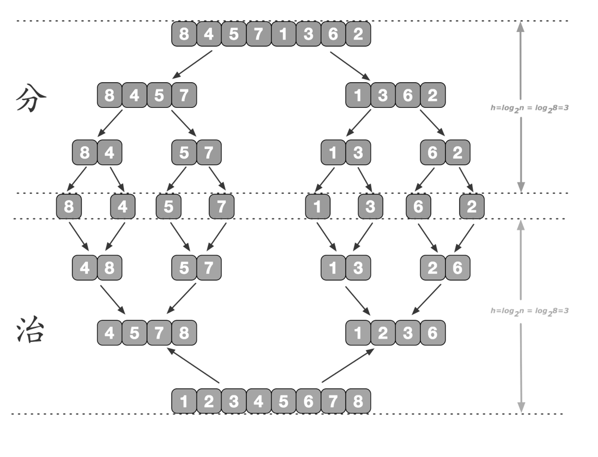

```python
# 归并排序
def mergeSort(list):
    if len(list) == 1:  # 返回单个
        return list
    mid = len(list) // 2  # 整除
    left_list = mergeSort(list[:mid])  # 左边
    right_list = mergeSort(list[mid:])  # 右边
    return merge(left_list, right_list)


# 合并左右两个子列表
def merge(left_list, right_list):
    t = []
    i = 0
    j = 0
    while i < len(left_list) and j < len(right_list):
        if left_list[i] < right_list[j]:
            t.append(left_list[i])
            i += 1
        else:
            t.append(right_list[j])
            j += 1

    t.extend([k for k in (right_list[j:] if i == len(left_list) else left_list[i:])])
    return t


print(mergeSort([5, 9, 23, 894, 4, 1, 65, 89, 35, 18, 55, 23, 10]))

#[1, 4, 5, 9, 10, 18, 23, 23, 35, 55, 65, 89, 894]
```

#### 6.4.2 快速排序

下面使用递归实现另一个常见的排序算法：快速排序。当需要排序的元素较多时，快速排序算法是一种有效算法。快速排序的时间复杂度为O(nlogn)，空间复杂度为O(n)。快速排序算法的核心是如何找到一个基准数据并使得小于此数的元素在左边，大于此数的元素在右边，亦即“分”的过程，有多种实现方法。下列使用的算法的可分为以下几步：

1. 在列表中选一个基准数（最后一个元素）；
2. 将列表中小于基准数的数据移到less列表，大于基准数的移到more列表；
3. 对于基准数左、右两边的列表less和more，递归进行排序；
4. 合并左右两个列表，中间加入基准元素。

```python
def quicksort(array):
    less = []
    more = []
    if len(array) <= 1:
        return array
    p = array.pop()
    for x in array:
        if x > p:
            more.append(x)
        else:
            less.append(x)
    return quicksort(less) + [p] + quicksort(more)


array1 = [21, 32, 42, 53, 34, 25, 57, 54, 78, 89]
print(quicksort(array1))


#程序输出：
#[21, 25, 32, 34, 42, 53, 54, 57, 78, 89]

```

## 7、函数的扩展应用

### 7.1 lambda函数

 Python 中定义函数有两种方法，一种是用常规方式def定义，函数要指定名字，第二种是用 lambda定义，不需要指定名字，称为Lambda 函数。又称匿名函数。

lambda 函数的语法格式如下：

```python
lambda arg1 ,arg2,.....argn : expression
```

特点

- lambda 是 Python 预留的关键字。
- [arg…] 是参数列表，它的结构与 Python 中函数的参数列表是一样的。
- expression 是一个参数表达式，表达式中出现的参数需要在[arg…]中有定义，并且表达式只能是单行的，只能有一个表达式。
- 表达式的结果就是该函数的返回值。
- 可以将lambda函数赋值给一个变量，通过这个变量间接调用该lambda函数。

```python
#设f(x)=x2+3 ,求f(5)的值。
         f=lambda x:x*x+3
         print(f(5))
  #       程序输出：28
#相当于定义了函数lambda x:x*x+3，并将其赋值给变量f，这样变量f就指向了具有x2+3功能的函数。这时我们如果执行f(5)，其输出结果就为 28。
```

```python
def sum_func(x,y):#直接定义为普通函数的形式
      return x+y
print(sum_func(4,6))  #10

p = lambda x,y:x+y #定义lambda函数，并把函数赋给变量p
print(p)   #结果为：<function <lambda> at 0x000001CFC44B41E0>
print(p(4,6))   #输出10

q = lambda x,y:sum_func(x,y)#在lambda函数体内调用其他函数
print(q(4,6))   #10
```

### 7.2 filter函数（了解）

 filter()函数主要用来筛选数据，过滤掉不符合条件的元素，并返回一个==**迭代器对象**==，如果要转换为列表list或者元祖tuple，可以使用内置函数list() 或tuple()来转换。

filter()函数的语法为：

```python
filter(function, iterable)
```

各参数的含义如下：       

- function：函数名；      
- iterable：序列或者可迭代对象；      
- 返回值：通过function过滤后，将满足条件（用function函数评判）的元素返回保存在迭代器对象中，最后返回这个迭代器对象。

```python
#用filter() 函数筛选出成绩90分及以上的列表中的学生
score=[(‘张莉’,78),(‘王明’,87),(‘刘超’,88),(‘王燕’,93),(‘刘海’,68),(‘邓超’,97)]
score_90=list( filter ( lambda element : element [1] >= 90 , score ) )
print(score)
```

### 7.3 enumerate函数

enumerate() 函数用于将一个可遍历的数据对象(如列表、元组或字符串)组合为一个索引序列，同时列出数据和数据下标，一般用在 for 循环当中。

语法：       

```python
enumerate(sequence, [start=0])
```

参数说明：

- sequence ：一个序列、迭代器或其他支持迭代对象；
- start ：索引的下标起始位置，注意不是序列的起始位置；
- 返回值：返回 enumerate(枚举) 生成器对象。

```python
#请看如下代码：
        seasons = ['Spring', 'Summer', 'Fall', 'Winter']
        print(list(enumerate(seasons)))
#[(0, 'Spring'), (1, 'Summer'), (2, 'Fall'), (3, 'Winter')]
        print(list(enumerate(seasons, start=1))) 
#[(1, 'Spring'), (2, 'Summer'), (3, 'Fall'), (4, 'Winter')]
       #在迭代序列的时候，如果我们需要处理序列的数据，也需要知道数据的索引值，可以有如下两种方式：
        for i in range(len(seasons)) :  #使用range函数控制索引
              print(i, seasons[i])
        for i, e in enumerate(seasons) :#使用enumerate生成器对象（常见）
              print(i, e)
```

==**建议使用enumerate生成器对象，它的效率更高！**==这是因为enumerate对象是惰性对象，它把迭代器包装成生成器，而生成器每次产生一对输出值（下标和元素值），并不是存储所有的输出值，并且enumerate对象只能使用一次，用过其“数值”就销毁了，成为一个空对象。因此，使用enumerate可以节约内存空间。结合下面的代码理解：

```python
a=range(5)
print("第1次输出range对象：",*a)
print("第2次输出range对象：",*a)
x=['zhan','wan','li']
b=enumerate(x)
print("第1次输出enumerate：",*b)
print("第2次输出enumerate：",*b)	
#输出结果为：
#第1次输出range对象：0 1 2 3 4 
#第2次输出range对象：0 1 2 3 4 
#第1次输出enumerate：(0, 'zhan') (1, 'wan') (2, 'li')
#第2次输出enumerate：
```

### 7.4 zip函数

  zip() 接受一系列可迭代的对象作为参数，将这些对象中按一一位置对应的元素打包成一个个 tuple，然后返回由这些 tuple 组成的 list。若传入参数的长度不等，则返回 list 的长度和参数中长度最短的对象相同。       

Python3.0开始，zip()函数已经不返回 list 了，而是返回 ==**iterable(可迭代对象)**==。这个可迭代对象需要特别注意==**，只能进行一次迭代遍历（使用），第二次遍历（使用）就空了**==。

```python
#zip()实际上是一个生成器对象，
#zip()之后的结果只能“使用一次”
#第二次再次使用list()时返回空
a = [1, 2, 3]
b = [4, 5, 6]
c = [7, 8, 9, 10, 11]
ab = zip(a, b)
print(ab)    #<zip object at 0x000001CFD74C8E08>
print(list(ab)) # 第一次使用zip对象ab，结果为：[(1, 4), (2, 5), (3, 6)]
print(list(ab)) # 再次使用ab，结果为空，[]
ac = zip(a, c)
print(list(ac))  # 结果为[(1, 7), (2, 8), (3, 9)]，以短的a为准对齐
 #下面是一种常见的使用形式：
name = ('jack', 'alex', 'sony', 'joey')
age = (25, 28, 21, 30)
for a, n in zip(name, age):#遍历
       print(a, n)

```

### 7.5 map函数（了解）

map是python内置函数，会根据提供的函数对指定的序列做映射。

```python
map()函数的格式是：map(function, iterable,...)
```

第一个参数接受一个函数名，后面的参数接受一个或多个可迭代的序列，

函数依次把n个迭代对象中的每一个元素，使用function函数进行处理，==**得到一个新的可迭代的map对象返回**==。注意，map函数不改变原可迭代对象。

```python
 def square(x) :  # 计算平方数
           return x ** 2
a=map(square, [1,2,3,4,5])  # 计算列表各个元素的平方

print(a)  
#<map object at ...>   # 返回可迭代的生成器对象
print(list(a))    
# 使用 list() 转换为列表，结果为[1, 4, 9, 16, 25]
print(list(a))    
# 结果为[]  #再次使用，返回空，这一点跟zip函数一样
 def mul(x,y) :   # 计算乘积
         return x * y
        b=map(mul,[1,2,3],[10,3,15])
    print(list(b))    #结果为：[10, 6, 45]
    c=map(lambda x,y: x*y,[1,2,3],[10,3,15])
       #使用lambda函数代替mul函数
    print(list(c) )    #结果为：[10, 6, 45]
```

利用map函数的特性，设计类似于向量或“矩阵”的对应元素的乘积计算。

```python
  def vect_mul(list1,list2):#向量对应元素相乘
        return list(map(lambda x,y: x*y,list1,list2))
    def matix_mul(list1,list2):#“矩阵”对应元素相乘
        return list(map(lambda x,y:
                        list(map(lambda i,j: i*j,x,y)),
                       list1,list2))
    t1=[1,2,3]
    t2=[11,22,33]
    print(vect_mul(t1,t2))         ##[11, 44, 99]
    t3=[[1,2,3],
      [4,5,6]]
    t4=[[11,22,33],
      [10,20,30]]
  print(time matix_mul(t3,t4))  ##[[11, 44, 99], [40, 100, 180]]

```

### 7.6 sorted函数

  列表是可变对象，有sort( )方法可以调用进行排序，直接改变原列表。并且排序后函数的返回值为None。如代码1。       

如果需要按从大到小排序，可以先排序再翻转列表，也可以在排序的时候直接给定reverse参数为True，如代码2。

```python
#代码1
list1=[5,10,9,8,20]
list1.sort()   # 改变了原列表的顺序
print(list1)   # 结果为：[5, 8, 9, 10, 20]
#代码2
list1=[5,10,9,8,20]
list1.sort(reverse=True)
print(list1)  # 结果为：[20, 10, 9, 8, 5]
```

 对于元组、字典和集合，没有sort方法，因此不能直接使用sort( )方法。那么，它们就不能排序了吗？显然，我们仍然有排序的需求。  

Python提供了一个sorted方法，可以对任意可比较的序列进行排序，该方法的原型为：

```python
sorted(iterable, /, *, key=None, reverse=False)
```

*原型中的/代表其前面的都是位置参数，命名关键字参数和位置参数之间使用独立的星号*分隔，星号*后面为命名关键字参数，星号本身不是参数。凡是命名关键字参数，在调用时必须带参数名字进行调用，否则会报错。因此，sorted函数调用的形式可以简化为：

```python
sorted ( iterable ,  key=None,  reverse = False )
```

其中iterable表示可以迭代的对象，例如可以是dict.items()、dict.keys()等，==**key是一个函数**==，用来选取参与比较的元素，reverse则是用来指定排序是倒序还是顺序，reverse=True则是倒序（从大到小），reverse=False则是顺序（从小到大），默认是reverse=False。内建函数 sorted 方法返回的是一个新 list，==**而非作用在原对象**==

```python
 ###对列表使用sorted函数
list1=[5,10,9,8,20]
list2=sorted(list1)
list3=sorted(list1, reverse=True)
print(list2,list3)  
# 结果为：[5, 8, 9, 10, 20]    [20, 10, 9, 8, 5]
###元组是不可变对象，
#对其排序只能调用内置函数sorted生成一个新的列表
t=(5, 10, 9, 8, 20)
t_new=sorted(t)
t_new_reverse=sorted(t, reverse=True)
print(t_new)            # [5, 8, 9, 10, 20]
print(t_new_reverse)     # [20, 10, 9, 8, 5]
 ###调用内置函数sorted对字典排序
d={'a':5,  'c':10,  'b':9,  'e':8,  'd':20}
d_new=sorted(d)    
 # 默认是对key进行排序，等价于d_key=sorted(d.keys())
print(d_new)       
#  结果是：['a', 'b', 'c', 'd', 'e']
# 也可以对字典的values进行排序，这跟对列表执行sorted排序没什么区别。
 d_value=sorted(d.values(), reverse=True)
print(d_value)      # 结果：[20, 10, 9, 8, 5]
###调用内置函数sorted对集合排序
a={2,3,-1,10,-20}
sorted(a)#[-20, -1, 2, 3, 10]
```

上述对字典的排序本质上是对key和value的各自排序。不是我们想要的整个键值对的排序。而我们更想要的是对字典“本身”的排序，排序后的键值对是同时“移动”变为有序的。

key参数是一个函数指针，指向一个函数，被指向的这个函数我们通常==**称为key函数**==。

- key函数可以使用lambda匿名函数或普通函数（我们自己定义的函数和系统函数都可以），
- key函数的参数有且只有一个，==**由sorted函数从可迭代对象iterable中取出每一个元素传递给它**==。

```python
 def cmp_by(x):
                return x%3
        a=[1,4,5,6,2,3,7,10,8,9]
        a_new=sorted(a, key=cmp_by)
        print(a_new)  #[6, 3, 9, 1, 4, 7, 10, 5, 2, 8]

```

理解：sorted函数要对a进行排序，就需要比较a的元素的大小，如果没有使用key参数，那就是直接对比，比如1和4直接比较大小。现在使用了key参数指定了一个函数cmp_by，那么，sorted函数在进行元素的大小比较的时候，==**是cmp_by(1)和cmp_by(4)进行比较**==，结果两者是相等的。因此，==**key参数实际上是改变了大小比较的规则（先对元素进行“形变”再进行比较）。**==

 为了更明确和深入的说明上述过程，我们一步一步来看sorted函数的实现原理。现在我们自己写一个函数sorted_new来模拟python内置函数sorted。    

 首先我们写一个最基本的排序代码，如下：

```python
def sorted_new_1(itr):  # itr形参代表一个可迭代对象
      temp=itr.copy()
      for i in range(len(temp)-1):
          for j in range(i,len(temp)):
                if temp[i]>temp[j]:  #注意这条语句，是比较大小
                     temp[i],temp[j]=temp[j],temp[i]  #交换
   return temp
a=[1,4,5,6,2,3,7]
b=sorted_new_1(a)
print(b)   # [1, 2, 3, 4, 5, 6, 7]

```

该排序函数，在其他语言中我们非常常见，只不过换成了python的语法而已。注意加黑的if语句，是比较大小的规则，本例中是可迭代对象temp的元素直接对比大小，元素没有任何“形变”。

现在，我们允许用户自定义比较大小的规则。考虑两点：第一，排序算法本身是稳定的，排序的过程或流程都是一样的，所以python把排序算法写好了（比如sorted函数）；第二，用户的比较规则是变化的，然而python框架的设计者，也就是编写sorted函数的人，并不知道用户的比较大小的规则是什么。因此，用户的比较规则不能在排序算法中直接写，只能给用户预留接口（比如sorted函数的key参数）。这就是以不变应万变，也是“分开变化和不变的部分”编程思想的体现。现在，为了让我们自己写的sorted_new_1函数也能够“以不变应万变”，给它加入一个参数key（留给用户的“接口”），用于确定用户的比较规则，代码如下：

```python
#自己写一个排序函数，加入预留给用户的比较规则
def sorted_new_2(itr, key):#这里加入一个参数key
    temp=itr.copy()
    for i in range(len(temp)-1):
        for j in range(i,len(temp)):
              if key(temp[i])>key((temp[j]):  
#这里变了，不再是直接比较
#而是对可迭代对象的元素先调用key函数进行“形变”再比较大小。
            temp[i],temp[j]=temp[j],temp[i]
      return temp
def func(e):#这是用户自己的函数，有且只有一个参数
      return e%3  #这里是“形变”规则，e“变为”e%3

a=[1,4,5,6,2,3,7,10,8,9]
b=sorted_new_2(a, func)  #实参func是传递给形参key
print(b)  # 结果为：[6, 3, 9, 4, 7, 10, 1, 5, 8, 2]
#模拟sorted函数：我们自己写的最终的sorted_new函数（不考虑reverse参数）
def sorted_new(itr,key=None):#这里加入一个参数key
temp=itr.copy()
 for i in range(len(temp)-1):
for j in range(i,len(temp)):
if key==None and temp[i]>temp[j]:
                        temp[i],temp[j]=temp[j],temp[i]
                         continue
                   if key and key(temp[i])>key(temp[j]):
                       temp[i],temp[j]=temp[j],temp[i]
      return temp

def func(e):     #用户自己的函数
        return e%3
a=[1,4,5,6,2,3,7,10,8,9]
b=sorted_new(a,func)
print(b)  #[6, 3, 9, 4, 7, 10, 1, 5, 8, 2]
```

经过前面的分析和探讨，我们明白了sorted函数的实现原理，特别是key参数的作用。我们看一个例子，进一步帮助理解sorted函数。给定a=['zhang', 'li', 'zang', 'wang', 'alexsanda']，现在要按字符串的长度从大到小排序，代码：a_new=sorted(a, key=lambda x:len(x), reverse=True)，也可以写为：a_new=sorted(a, key=len, reverse=True)。请仔细理解，特别是后一个，key直接指向的不是我们自己定义的函数，而是python的内置函数len（注意，len函数本身也是需要一个参数，和我们对key函数的要求一致）。

前面的分析和排序，进行排序的元素都是“单个”的数据，如果元素本身就是一个列表或者元组（即嵌套）会发生什么情况呢？例如，若a=[[20,1,3],[40,6,2]]，对a排序结果是什么？先看下例

```python
a=[[20,1,3], [40,6,2], [10,5,0]]
     a_new=sorted(a)
     print(a_new)
      #  结果：[[10, 5, 0], [20, 1, 3], [40, 6, 2]]。

```

对于嵌套对象的排序，sorted函数会比较该对象每个元素的首元素，如首元素相同，再比较第二个元素，以此类推。

我们也可以指定按照其他元素进行比较，只需要加入key参数，通过key参数改变比较规则即可。

```python
 a=((20,1,3),(40,6,2))
  a_new=sorted(a,key=lambda x:x[2])    #按第2个元素排序，即比较3和2确定大小
  print(a_new)  # [(40, 6, 2), (20, 1, 3)]
  a_new=sorted(a,key=lambda x:sum(x))  #按三个元素之和的大小排序
  print(a_new)  #[(20, 1, 3), (40, 6, 2)]
  a=((20,1,30),(40,6,25),(20,16,25),(40,16,25))
  a_new=sorted(a,key=lambda x:(x[0],x[2],x[1]))
  #按0,2,1的位置顺序，进行数据的比较排序。
  print(a_new)  #[(20, 16, 25), (20, 1, 30), (40, 6, 25), (40, 16, 25)]
```

 下面我们深入探讨一下字典的排序。前面说过，若给定字典

d={'a':5,'c':10,'b':9,'e':8,'d':20}，那么：

（1）sorted(d) 是对keys进行排序，等价于sorted(d.keys())，结果为 ['a', 'b', 'c', 'd', 'e']；

（2）sorted(d.values())是对values进行排序，结果为[20, 10, 9, 8, 5]。这两个的排序跟对一个普通的列表进行排序没什么区别。

（3）sorted(d.items())，因为d.items( )返回的[('a', 5), ('c', 10), ('b', 9), ('e', 8), ('f', 20)]是一个两层嵌套列表，根据对嵌套序列的排序规则，先比较每个嵌套对象的首元素大小，相同时再比较下一个元素。实质就是按a、c、b、e、f大小对元组排序。结果为：[('a', 5),  ('b', 9), ('c', 10),('e', 8), ('f', 20)]

那么如果先按值的大小排序再按键的大小排序呢？

```python
d={'a':5,'c':10,'b':10,'e':8,'f':20}

  #按照value的值进行排序，生成键值对构成的元组的列表
  d_sort_by_value=sorted(d.items(),key=lambda x:x[1])
  print(d_sort_by_value) 
  #结果为：[('a', 5), ('e', 8), ('b', 9), ('c', 10), ('f', 20)]

  #按照value的值进行比较，相同的话按key比较，生成键值对构成的元组的列表
  d_sort_by_value_key=sorted(d.items(),key=lambda x:(x[1],x[0]))
  print(d_sort_by_value_key) 
#结果为：[('a', 5), ('e', 8), ('b', 9), ('c', 10), ('f', 20)]

```

### 7.7 值获取器`operator.itemgetter`

先来看一段代码：     

```python
from operator import itemgetter
b=[0,10,20,30,40,50,60,70,80]
print(itemgetter(0,1,3,6)(b))  # (0, 10, 30, 60)
print([b[x] for x in range(len(b))  if x in [0,1,3,6]]) #[0, 10, 30, 60]
```

两条打印语句中的参数都是获取给定列表中的指定位置的元素，生成一个新序列。只不过一个是利用了itemgetter，另一个是我们自己构造的列表推导式。       	先不管itemgetter的具体用法，后面会详细模拟和说明该函数。itemgetter能干的事，推导式一定可以做到。但是，==**能用itemgetter的地方，就不用推导式，因为itemgetter的效率更高**==，如例7.12所示。

```python
from operator import itemgetter
def f1( ):
	for i in range(100000):
		itemgetter(0,1,3,6)(b) # (0, 10, 30, 60)
def f2( ):
	for i in range(100000):
		[b[x] for x in range(len(b))  if x in [0,1,3,6]]
b=[0,10,20,30,40,50,60,70,80]
%time f1()   ##Wall time: 30.9 ms
%time f2()   ##Wall time: 142 ms

```

​    但是，itemgetter的使用有点奇怪，itemgetter(0,1,3,6)(b)有连续两个小括号，接下来我们对它进行原理剖析。


**探究itemgetter**

itemgetter的使用形式是：itemgetter(0,1,3,6)(b)

第一个小括号是一个函数调用，

第二个小括号也是一个函数调用，

说明**第一个小括号调用**后返回的还是**一个函数**。

为了理解itemgetter，**我们自己实现这样一种结构**，也实现对序列的给定位置的元素的选取，如例7.13的代码所示。

```python
def elements(*items):  #模拟operator.itemgetter
    if len(items) == 1:
        item = items[0]
        def getitem(obj):  #定义一个内部函数getitem
            return obj[item]
    else:
        def getitem(obj):  #定义一个内部函数getitem
            return tuple(obj[n] for n in items)
    return getitem  #注意这里返回一个内部函数
a=[0,10,20,30,40,50,60,70,80]
s=elements(1,3,5)(a)
print(s)  #结果为：(10, 30, 50)
```

分析一下第11行的s=elements(1,3,5)(a)。该语句可以写成两行：      t=elements(1,3,5)，s=t(a)。调用过程:

- t=elements(1,3,5)传递给函数elements多个索引数值，由形参items接收打包为一个元组(1, 3, 5)；
- 因为(1, 3, 5)的长度大于1，所以执行else子句，返回一个内部函数getitem给t，t就成为一个指向内部函数的指针，可以当函数使用；
- 接着s=t(a)，又转到else后的内部函数处执行，实参a传递给形参obj，所以 tuple(obj[item] for item in items)返回一个元组，存储了a的指定位置的元素。

==**强调：使用itemgetter比使用lambda函数或自定义函数效率高**==

### 7.8 函数装饰器

在python中一切都是对象！

当我们进行a=10的时候，实际上在内存当中有一个地方存了值10，然后用a这个变量名存了10所在==**内存位置的引用**==，就好像c语言里的指针。同理，当我们在python中定义一个函数def demo()的时候，内存当中会开辟一些空间，存下这个函数的代码、内部的局部变量等等。这个demo只不过是一个变量名字，它里面存了这个函数所在位置的引用而已。看如下代码：

```python
def demo(name):
       print(f'你好，{name}!')
x=demo
y=demo
x("zhang")      #你好，zhang!
y("wang")       #你好，wang!
demo("li")       #你好，li!
print(type(x))  #<class 'function'>
```

以上代码中，进行

`x = demo`， 

`y = demo`， 

这样x和y都指向了demo函数所在的**引用**，在这之后我们可以用x() 或者 y()来调用我们自己创建的demo() ，调用的实际上根本就是同一个函数，x、y和demo三个变量名存了同一个函数的引用。x、y和demo都是“function”类对象！

==**闭包的概念**==

 在计算机科学中，**闭包（Closure）**，又称词法闭包或函数闭包（function closures），是引用了自由变量的函数。这个被引用的自由变量将和这个函数一同存在，即使已经离开了创造它的环境也不例外。有点抽象，先看例子：

```python
def test(name):#闭包函数的实例
    def test_in(score):
        print(f'name={name},score={score}')#内函数使用了外函数的变量name
    return test_in  #外函数直接返回内函数的“引用”
func = test('zhang') #执行test函数返回一个对内涵数的引用。
#虽然外函数结束了，但由于闭包，参数'zhang'，一直都在内存中。
func(90)  #执行内涵数,结果为：name=zhang,score=90
func(85)  #执行内涵数,结果为：name=zhang,score=85
```

闭包的概念基本上涉及到函数的**三个特征**：

1. 函数嵌套;
2. 内部函数使用外部函数的变量;
3. 外部函数的返回值为内部函数;

上例中，主程序通过func = test('zhang')返回一个对内部函数test_in的引用，外部函数test结束，但是因为func **保持了一个对内部函数的引用**，而**内部函数又使用了外部函数的局部变量name，所以外部函数的name不会消失，仍然在内存中**。总之一句话：==**只要内部函数的引用还在，外部函数的变量就在**==。


==**函数装饰的概念**==

为了弄明白函数装饰的概念，我们通过一个小的模拟项目，一步一步弄明白其原理。假设我们已经开发了一个项目，业务逻辑已经稳定。该项目有具体的业务逻辑，用函数dosomething等表示，代码如例7.14所示。

```python
def dosomething():#这是一个业务函数
    print('do something...')
    time.sleep(random.randint(1,5))
def dosomething_1():#这也是一个业务函数
    print('do something1...')
    time.sleep(random.randint(1,5))
def dosomething_2():#这还是一个业务函数
    print('do something2...')
    time.sleep(random.randint(1,5))
    
#这些函数模块可能分散在很多地方
#使用函数randint模拟一下业务执行的时间，随机1-5秒。
 
#这是调用业务函数的代码
dosomething()
dosomething_1()
dosomething_2()
   
```

但是！但是！现在这个项目的需求变了，我们想在函数执行的时候，在不影响原先业业务逻辑的情况下，**对dosomething函数加入函数执行时间的输出功能**。

我们可以扩展一个时间函数

```python
#代码段1
def dosomething():#这是一个业务函数
    print('do something...')
    time.sleep(random.randint(1,5))
def dosomething_1():#这也是一个业务函数
    print('do something1...')
    time.sleep(random.randint(1,5))
def dosomething_2():#这还是一个业务函数
    print('do something2...')
    time.sleep(random.randint(1,5))
    
#这是具有“时间功能”的包装函数
def wrapper(func):    
    start=time.time()
    func()
    end=time.time()
    print(end-start)
#这是调用业务函数的代码
wrapper(dosomething)
wrapper(dosomething_1)
wrapper(dosomething_2)
#执行dosomething()改为执行wrapper……
```


```python
#代码段2
def dosomething():#这是一个业务函数
    print('do something...')
    time.sleep(random.randint(1,5))
def dosomething_1():#这也是一个业务函数
    print('do something1...')
    time.sleep(random.randint(1,5))
def dosomething_2():#这还是一个业务函数
    print('do something2...')
    time.sleep(random.randint(1,5))
    
#这是具有“时间功能”的包装函数
def wrapper(func):
    def newFunc():
        start=time.time()
        func()
        end=time.time()
        print(end-start)
    return newFunc
dosomething=wrapper(dosomething)
dosomething1=wrapper(dosomething_1)
dosomething2=wrapper(dosomething_2)
#这是调用业务函数的代码
dosomething()
dosomething_1()
dosomething_2()

```

每一个业务函数经过wrapper函数的包装，具备了新的功能！

1. 第一段代码中，增加wrapper函数后，在每一个调用dosomething函数的地方，改为调用wrapper(dosomething)，依此类推。本质上这还是修改了原代码，修改了调用处的原代码，从调用dosomething等函数改为调用wrapper函数。
2. 第二段代码，仅仅增加了部分代码，原先的业务逻辑定义和调用都没有变！

第二段代码没有修改原代码，仅仅是“扩展”了一些代码出来，符合“==**开闭原则**==”。这种结构可以应对需求的变化，具有较好的结构。

==**本质上wrapper函数就是一个包装器、装饰器**==！

实际上，wrapper的功能就好似一个切面（一面墙、一扇门），所有经过它的函数都被它装饰了。这个概念其实也就是面向切面编程（AOP）。“计算函数执行时间”就是一个功能切面！

注意上述描述中出现了几个编程思想：应对变化、开闭原则、代码复用和面向切面编程！


 ==**函数装饰器**==

 Python3.0中提供了对上述第二段代码的语法支持，加入新特性Decorators，以@为标记修饰function和class。有点类似c++的宏和java的注解。在函数的定义前面加上@符号注解，就可以对一个函数进行装饰了。

```python
import time
import random
def warpper(func):
    def do():
        start=time.time()
        func()
        end=time.time()
        print(end-start)
    return do
#首先定义一个包装器，名字叫warpper（名字任意取）。这个包装器相当于新的业务逻辑。这个函数就是装饰器！
@warpper
def dosomething1():
    print('do something..1.')
    time.sleep(random.randint(1,3))
@warpper
def dosomething3():
    print('do something..2.')
    time.sleep(random.randint(1,3))

dosomething1()
dosomething2()   #此时调用dosomething1函数会把dosomething1传递给xx函数进行“装饰”


#@xx 后紧跟函数定义
#表示下面的函数用xx函数进行包装。相当于语句：dosomething1=xx(dosomething1)

```


==**函数装饰器的参数传递**==

 显然，装饰器函数是可以有参数的，被包装的函数也是有参数的，在这两个函数之间需要进行参数传递，把被包装的函数的参数传递给装饰器函数进行处理。

```python
#情形1：没有参数传递，装饰函数的内部函数和被装饰函数都无参数。
def wrapper(func):
    def do():
        print('这里也是一些装饰')
        func()
        print('这里也是一些装饰（over）')
    return do

@wrapper  
def dosomething():
    print('我是被装饰的函数执行的业务逻辑…')
    
dosomething()#调用函数，此时该函数首先被wrapper执行，装饰


#情形2：被装饰的something函数有参数,则在内部函数do中保持与something函数参数一致即可。
def wrapper(func):
    def do(a,b):
        print('这里也许是一些装饰')
        func(a,b)
        print('这里也许是一些装饰（over）')
    return do

@wrapper  
def dosomething(a,b):
    print(a+b)

dosomething(10,20)

#情形3：被装饰的多个函数，参数个数不一样，但是需要用同一个装饰器。
def wrapper(func):
    def do(a,b): #######这里只有两个参数#########
        print('这里是一些装饰')
        func(a,b) 
        print('这里也是一些装饰（over）')
    return do

@wrapper  
def dosomething1(a,b):
      print(a+b)
        
@wrapper  
def dosomething2(a,b,c):
      print(max(a,b,c)+min(a,b,c))
        
@wrapper  
def dosomething3(a,b,c,d):
      print(max(a,b)+min(d,c))
        
dosomething1(10,20)     #这里没问题
dosomething2(10,20,30)   #出错，因为内部函数 do(a,b)，只有两个参数。
dosomething3(10,20,30,40) #出错，因为内部函数 do(a,b)，只有两个参数。


```

可以看出情况3中，由于dosomething1、dosomething2、dosomething3三个函数的参数个数不一样，调用装饰函数的内部函数do的时候会导致异常发生。此时，只需要把装饰函数的内部函数的参数改为“*args,  **kwargs”的形式，并直接传递给形参func指向的被装饰函数即可

```python
def wrapper(func):
    def do(*args,**kwargs):#######修改这里成为这样#########
        print(f'这里是一些装饰{func.__name__}')
        func(*args,**kwargs) #######修改这里成为这样#########
        print('这里也是一些装饰（over）')
    return do

@wrapper  
def dosomething1(a,b):
      print(a+b)
        
@wrapper  
def dosomething2(a,b,c):
      print(max(a,b,c)+min(a,b,c))
        
@wrapper  
def dosomething3(a,b,c,d):
        print(max(a,b)+min(d,c))

dosomething1(10,20)
dosomething2(10,20,30)   
dosomething3(10,20,30,40)

```

## 8、文件与异常处理

注意:

1. 使用基本的文件读写来操作文件，不是python课程的重要关注点，在数据分析中实际操作文件可以使用专业的库，如pandas。因此，建议文件读写部分简单理解使用即可。
2. 异常处理结合文件操作讲解，能理解使用即可。

### 8.1 文件概念  

 为了长期保存数据以便重复使用、修改和共享，应该将数据以文件的形式存储到外部存储介质（如磁盘，U盘，光盘等）或云盘中。图像、音频、视频、可执行文件、数据库信息等都使用文件的形式来存储。因此，对文件的操作在各类应用软件的开发中均占有非常重要的作用。

#### 8.1.1 文本文件和二进制文件

按文件中数据的组织形式可以把文件分为文本文件和二进制文件两大类。

**文本文件**：存储常规字符串，由若干文本行组成，通常每行以换行符‘\n’结尾。常规字符串是指记事本或其它文本编辑器能正常显示、编辑并且人类能够直接阅读和理解的字符串。比如由英文字母、汉字、数字等字符构成的文件就是文本文件。

**二进制文件**：存储字节串(bytes)形式的对象内容，无法用记事本或其它普通文本处理软件直接进行编辑，通常也无法被人类直接阅读和理解，需要使用专门的软件进行解码后才能读取、显示、修改或执行，通常是在bin目录下的可执行文件。

#### 8.1.2 文本文件的编码

计算机只能处理数字，如果要处理文本，就必须先把文本转换为数字才能处理。最早的计算机在设计时**采用8个比特（bit）作为一个字节（byte）**，所以，一个字节能表示的最大的整数就是255（二进制11111111=十进制255），如果要表示更大的整数，就必须用更多的字节。比如两个字节可以表示的最大整数是65535，4个字节可以表示的最大整数是4294967295。文本文件存储的内容是基于字符编码的文件，常见的编码有ASCII编码，UNICODE编码，UTF-8编码等。python 2.x 默认使用ASCII编码格式。Python 3.x 默认使用UTF-8编码格式。

### 8.2 操作文件的方法

操作文件的基本步骤为：

1. 打开文件，并且返回文件的操作对象；
2. 通过返回文件对象，来对文件进行操作(读取，写入等操作)；
3. 关闭文件。

#### 8.2.1 文件的打开与关闭

open( )是打开文件的函数。open()函数是python的内置函数，返回一个file对象，定义如下：

```python
fileobj=open(file,mode=’r’,buffering=-1,encoding=None,errors=None,newline=None)

```

参数含义如下：

- file：文件的路径（绝对路径或者当前工作目录的相对路径）;
- mode：代表打开文件的模式;
- buffering：设置缓冲策略；buffering:0(False)表示无缓冲，1（True）表示使用内存代替硬盘,>1表示设置缓冲区的大小，-1表示使用系统默认缓冲区大小;
- encoding：用于解码或者编码文件的编码名称;
- errors：指定如何处理编码和解码错误;
- newline：控制通用换行模式如何生效（设置将什么操作符识别为换行符）;
- fileobj是open( )返回的文件对象;

**mode参数**是指明文件类型和操作的字符串。如下表所示。

| **值** |                          **描述**                           |
| :----: | :---------------------------------------------------------: |
|  ‘r’   | 只读模式，默认值，如果文件不存在，返回FileNotFoundError异常 |
|  ‘w’   |        覆盖写模式，文件不存在则创建，存在则完全覆盖         |
|  ‘a’   |   追加写模式，文件不存在则创建，存在则在文件最后追加内容    |
|  ‘+’   |       与r/w/a一同使用，在原功能基础上增加同时读写功能       |
|   t    |           文本模式（默认值，与其他模式结合使用）            |
|   b    |              二进制模式（与其他模式结合使用）               |

**mode参数传入方式**

1. 基本的三种：r、w、a，加上加号有：r+、w+、a+。这六种是默认的对文本文件的操作。
2. 这六种再加上b，则变为：br、bw、ba、br+、bw+、ba+，是对二进制文件操作。

注意:

- 只要读模式r存在，就必须要求文件存在，否则异常。比如w+和r+都是读写文件，但是前者文件不存在则创建，后者文件不存在则抛出异常。
- 对文件的读写操作完成后，需要用文件对象的close方法关闭文件。

```python
f1=open('e:/a.txt') #读模式 ,文件必须存在，否则异常 
#文件不存在异常FileNotFoundError
f1.close()

f2=open('e:/b.txt','r+') #读写模式 ,文件不存在则产生异常
f2.close()

f3=open('e:/a.txt','w') #写模式 ,文件不存在则创建文件
f3.close()

f4=open('e:/d.txt','w+') #读写模式 ,文件不存在则创建文件
f4.close()

f5=open('e:/e.txt','a') #追加模式 ,文件不存在则创建文件
f5.close()

f6=open('e:/f.txt','a+') #读写模式 ,文件不存在则创建文件
f6.close()

# f7=open('e:/g.txt','rb+') #二进制读写模式 ,文件不存在则报错FileNotFoundError
# f7.close()

#'rb+' 也可以写成‘br+’
f8=open('e:/h.txt','ab+') #二进制读写模式 ,文件不存在则创建
f8.close()
#'ba+' 也可以写成‘ab+’
```

#### 8.2.2 读写文件

==**从文件读入数据**==

打开文件后，就可以用返回的文件对象的read()方法一次读取全部内容到内存。也可以指明读取多少个字节(或字符)，这取决于打开文件的方式是文本文件（字符）还是二进制文件（字节）。比如read(6)的含义是从文件的当前指针位置读取文件对象的6个字节（或字符）。读取文件的函数：

f.read([buffer]):buffer是一个整数，读取指定的字节数。省略则读取全部。

f.readline([buffer]):buffer是一个整数，读取当前行的指定字节数。省略或超出行范围则读取当前行。

f.readlines([buffer]):buffer是一个整数，读取一直到指定的字节所在的行。省略则读取全部行。 返回列表。

**注意：以上读取方法从文件当前指针位置开始读！若文件路径为：“d:\\python\\hello.txt”，我们先用open()函数打开这个文件，再用文件对象的read()方法显示它的内容。**

```python
f=open("d:\\python\\hello.txt")
print(f.read())
f.close()
```

==**往文件写入数据**==

用文件对象的write方法可以向文件中写入数据。在操作某个文件时，每调用一次write方法，写入的数据就会追加到文件末尾。函数形式为：

f.write(str):写入字符串到文件，不会自动加入换行符

f.writelines([...]):写入列表中的每个元素组成的字符串到文件。列表中的元素必须为字符串

```python
f=open("d:\\python\\hello.txt",'a+')
f.write("人生苦短，我学python\n")
f.write("世界这么大，我想去看看\n")
f.close()
f=open("d:\\python\\hello.txt",'w')
f.write("python快速编程入门\n")
f.close()
```

> ==**注意:在读写或者写读模式下，要注意文件指针位置，当调用的write后需要调整指针才能读到文件内容**==

==**文件的定位读写**==

**tell()方法**

在读写文件的过程中，如果想知道文件指针的当前位置，可以使用tell()方法来获取。

**seek()方法**

上面介绍了文件的打开，关闭，追加，写入，读写等操作，但是还没有实现从指定的位置进行读取。比如打开一个文件后想要读取100行后面的内容，如何实现呢？这里就要用到文件的定位seek()方法，它的语法如下：seek(offset,from)。offset是偏移量，from是偏移方向（0:表示文件开头、1:表示当前位置、2:表示文件末尾）。        

==**注意：只有采用二进制模式打开的文件，才允许使用从文件末尾和文件当前位置进行偏移定位，非二进制的文本文件，不允许使用基于文件末尾和文件当前位置进行偏移定位。因此文本文件只能基于文件开始位置进行偏移定位。**==

### 8.3 Python异常处理

#### 8.3.1 异常简介

异常就是不正常，就是不按我们的设想去执行程序。它是因为程序出现了错误而在正常控制流以外采取的行为。Python出现异常，就是因为检查了一个错误时，Python解释器无法继续执行下去，这时候就抛出了异常。例如，若文件a.txt不存在，则运行open("a.txt")语句就会发生如下的错误信息：

```
FileNotFoundError                         Traceback (most recent call last)
<ipython-input-3-d85dbcb3c673> in <module>
----> 1 open("a.txt")
FileNotFoundError: [Errno 2] No such file or directory: 'a.txt'
```

由上述信息可知，程序产生了文件没有找到的错误。程序中如果没有对异常进行处理，程序就会终止运行。==**程序员在写代码的时候，必须要处理异常**==！

#### 8.3.2 Python中的异常

Python的异常处理能力是很强大的，它有很多内置异常，可向用户准确反馈出错信息。在Python中，异常也是对象，可对它进行操作。   

BaseException是所有内置异常的基类，但用户定义的类并不直接继承BaseException，**所有的异常类都是从Exception继承，且都在exceptions模块中定义**。

Python自动将所有异常名称放在内建命名空间中，所以程序不必导入exceptions模块即可使用异常。一旦引发而且没有捕捉异常，程序执行就会终止。

==**下面举例介绍几个常见的异常**==

>**NameError**
>
>尝试访问一个未声明的变量会引发NameError异常。任何可访问的变量必须在名称空间列出，访问变量需要由解释器进行搜索，如果请求的名字没有在任何名称空间里找到，那么将会生成一
>
>```python
>NameError                                 Traceback (most recent call last)
>< ipython-input-4-bca0e2660b9f > in < module >
>----> 1 print(a)
>NameError: name 'a' is not defined
>```
>
>上述异常产生的原因是符号’a’未定义。

>**ZeroDivisionError**
>
>任何数值被零除都会导致一个ZeroDivisionError的异常。例如：2/0，错误信息如下：
>
>```py
>ZeroDivisionError                         Traceback (most recent call last)
>< ipython-input-5-e8326a161779 > in < module >
>----> 1 2/0
>```
>
>ZeroDivisionError: division by zero

> **SyntaxError**
>
> Python解释器语法错误，SynaxError异常是**唯一不是在运行时候发生的异常**，它表示**Python代码中有不正确的结构**，因此无法正常执行。例如在使用for语句的时候，for语句最后没有写冒号，则会产生如下的错误信息：
>
> ```py
> File "< ipython-input-9-d0c012f780f3 >", line 3
>  for i in a
>                   ^
> ```
>
> SyntaxError: invalid syntax

> **IndexError**
>
> 请求的索引超出了序列范围会引发IndexError异常。例如list_test=[1,2,3,4]，如果使用了a=list_test[5]，会产生如下的错误信息：
>
> ```py
> IndexError                                Traceback (most recent call last)
> < ipython-input-1-565abc51432e > in < module >
>    1 list_test=[1,2,3,4]
> ----> 2 a=list_test[5]
> ```
>
> IndexError: list index out of range
>
> 上述信息表明，列表的索引值超出了范围。

> **KeyError**
>
> **请求一个不存在的字典关键字时会引发KeyError异常**。字典中用key访问value，如果使用不存在的key，就会抛出KeyError异常。例如aList ={'a':1,'b':2}，执行print(aList['c'])语句，会产生如下的错误信息：
>
> ```py
> KeyError                                  Traceback (most recent call last)
> < ipython-input-3-8c43aefe19a2 > in < module >
>    1 aList ={'a':1,'b':2}
> ----> 2 print(aList['c'])
> ```
>
> KeyError: 'c'
>
> 上述信息表明，字典引用了不存在的关键字’c’。

#### 8.3.3 捕捉异常

捕捉异常可以使用try/except语句。try/except语句用来检测try语句块中的错误，从而让except语句捕获异常信息并处理。如果不想在异常发生时终止程序，就需要在try语句块里捕获它。

```python
#处理单个异常
try:  
        #语句块
except 异常名:
        #异常处理 

#处理多个异常        
try:
           #语句块
except 异常名1：	
           #异常处理
except 异常名2：	
           #异常处理
except 异常名3：	
           #异常处理……
```


```python
#例1
x=10
y=0
try:
     x/y
except ZeroDivisionError :
     print('被零除错误')


        
#例2
x=10
y=0
try:
     x/z
except ZeroDivisionError :
     print('被零除错误')
except NameError:
     print('变量没有定义')
```

#### 8.3.4 else子句与finally子句

完整的异常处理是“try....except...else...finally”的语法结构，如下：

```python
try:
     #语句块
except 异常名1：
     #异常处理
except 异常名2：
     #异常处理
except 异常名3：
     #异常处理
……
else:
     #语句块 (如果没有异常发生)
finally:
     #语句块 (不管有没有异常发生，都会执行这里)

```

```python
#例1
a={'name':'zhang','score':90}
try:
     print(a['names'])
except KeyError:
     print('键没有定义')
else:
     print("没有异常，最后会执行这里")
finally:
     print("不管有没有异常，都要执行这里")
```

### 8.4 文件读写异常处理

#### 8.4.1 文件读写异常原因

使用文件时，一种常见的问题是找不到文件：你要查找的文件可能在其他地方、文件名可能不正确或者这个文件根本就不存在。对于所有这些情形，都可使用try-except代码块以直观的方式进行处理 。

#### 8.4.2 使用try处理文件读写异常

一般访问文件资源时我们会按这样的步骤进行处理：

1. f = open(文件名, 模式)		#打开文件
2. data = f.read()			#读取（或者写入）文件内容
3. f.close()				#关闭文件

在操作文件时可能会存在两个问题：在读写时出现异常而忘了异常处理、忘了关闭文件。**可以使用try-except代码块处理文件读写时出现的异常。**

```python
try:
    f=open('myfile.txt','w')
    while True:
        x=input('please input a number,enter Q or q for quit')
        if x.upper()=='Q':
            break
        y=100/int(x)
        f.write(str(y)+'\n')
except ZeroDivisionError:
     print('抛出被零除的异常')
except ValueError:#输入输出错误
     print('输入输出错误')
else:
     print("文件已经保存！")
finally:
     if f:#如果文件打开失败，f为null，f.close()就不会执行
        f.close()#如果没有if语句，则当f为null时，调用f.close()还会引发新的异常
```

#### 8.4.3 使用with处理文件读写异常

不是所有的对象都可以使用with语句，能够使用with语句的对象必须具有__enter__()和__exit__()这两个方法。而文件对象刚好是有这两个方法的。with语句的基本形式为：

```python
with context as var:
    with_suite
```

其中：

- with语句：可以代替try...except...finally语句，使代码更加简洁；
- context：通常是表达式，返回一个对象；
- var变量：用来保存context返回的对象，可以是单个值或元组；
- with_suite：使用变量var对context返回对象进行各种操作的代码段

```python
with open('myfile.txt','w') as f:
    while True:
        x=input('please input a number,enter Q or q for quit')
        if x.upper()=='Q':
            break
        try:
            y=100/int(x)
        except ZeroDivisionError:
            print('除数不能为零。请输入不等于0的数据。')
        f.write(str(y)+'\n')
```

从上例可以看出，对于文件读写操作的异常处理，使用with语句特别简洁。注意的是，在打开文件的with异常处理的操作代码段中，如果出现了其他的异常，我们还是需要捕获并处理。正如上例中try-except语句。

## 9、类和对象

### 9.1 类和对象的概念

### 9.2 创建类和实例（一）

#### 9.2.1 类的定义

#### 9.2.1 访问类的属性和方法

#### 9.2.3 访问实例的属性和方法

#### 9.2.4 讨论：属性是谁的？

#### 9.2.5 讨论：方法是谁的？

#### 9.2.6 创建公共服务类Math

### 9.3 创建类和实例（二）

#### 9.3.1 类的定义

#### 9.3.2 向方法传递实参

#### 9.3.3 类的构造方法

#### 9.3.4 属性的get和set方法

#### 9.3.5 属性和方法的可见性

#### 9.3.6 `__slot__`语句的作用

#### 9.3.7 @property 装饰器

### 9.4 类的专有属性和方法

#### 9.4.1 专有属性

#### 9.4.2 专有方法 

#### 9.4.3 运算符重载

### 9.5 类的继承

#### 9.5.1 继承的定义

#### 9.5.2 子类中重写父类的方法

#### 9.5.3 子类中调用父类的方法

#### 9.5.4 子类的构造方法

#### 9.5.5 类的应用实例

### 9.6 多级继承

### 9.7 多重继承

#### 9.7.1 专有属性

#### 9.7.2 方法调用顺序：直接使用父类名字

#### 9.7.3 方法调用顺序：直接使用super函数

#### 9.7.4 多重继承的构造方法调用（1）

#### 9.7.5 多重继承的构造方法调用（2）

### 9.8 类的继承

## 10、Numpy数组

> 前言
>
> NumPy是Python中科学计算的基础包，提供多维数组对象和各种派生对象、用于数组快速操作的各种API，包括数学、逻辑、形状操作、排序、选择、输入输出、离散傅立叶变换、基本线性代数、基本统计运算和随机模拟等。
>
> NumPy包的核心是 ndarray 对象。
>
> NumPy 数组在创建时具有固定的大小，与Python的原生数组对象（可以动态增长）不同。更改ndarray的大小将创建一个新数组并删除原来的数组。
>
> NumPy 数组中的元素都需要具有相同的数据类型。 
>
> NumPy 数组有助于对大量数据进行高级数学和其他类型的操作。通常，这些操作的执行效率更高，比使用Python原生数组的代码更少。

### 10.1 数组的创建和属性

#### 10.1.1 数组的概念 

 NumPy的主要对象是同构多维数组，所有类型都相同，由非负整数元组索引。在NumPy中，==**维度称为轴。**==

例如，3维空间中的点的坐标[1, 2, 1]具有一个轴。该轴有3个元素，它的长度为3。在[[ 1., 0., 0.], [ 0., 1., 2.]]例子中，数组有2个轴，长度为2。第一轴的长度为2，第二轴的长度为3。

==**NumPy的数组类被称为ndarray。**==

#### 10.1.2 数组的创建

有几种方法可以创建数组。

(1)使用np.array( )类型转换函数。可以把列表和元组等序列转换为ndarray。

```python
#第1种方法：使用列表和元组转换
import numpy as np
arr1=np.array([[1,2,3,4],[10,20,30,40]])
arr2=np.array([1,2,3,4])
arr3=np.array((5,6,7,8))
print(arr1)
print(arr2)
print(arr3)	
#输出结果：
#[[ 1  2   3   4]
#[10  20  30  40]]

#[1  2  3  4]

#[5  6  7  8]

```

(2)特殊数组创建   

NumPy提供了几个函数来创建具有初始占位符内容的数组。这就减少了数组增长的必要，因为数组增长的操作花费很大。

函数**zeros**创建一个由0组成的数组；

函数**ones**创建一个全为1的数组；

函数**empty**创建一个数组，其初始内容是随机的，取决于内存的状态；

函数**eye**用于创建单位方阵。

默认情况下，创建的数组的dtype是**float64**类型的。创建的时候也可以使用dtype参数指定数据的类型。

```python
#第2种方法：使用np的函数创建特殊数组
import numpy as np  
arr4=np.zeros(shape=(2,3),dtype=np.int16)
arr5=np.ones((2,5))
arr6=np.empty((3,3))
arr7=np.eye(3)
#输出结果：
#arr4=[[0 0 0]
#          [0 0 0]]
#arr5=[[1. 1. 1. 1. 1.]
#          [1. 1. 1. 1. 1.]]
#arr6=[[7.07502005e-321 1.05700345e-307]
#          [1.11261027e-306 1.37959129e-306]]
#arr7=[[1. 0. 0.]
#          [0. 1. 0.]
#          [0. 0. 1.]]

```

(3)使用np.full( )函数创建指定值数组

函数原型：numpy.full(shape, fill_value, dtype=None, order='C')

函数功能：返回给定形状和类型的新数组，并用fill_value填充。

参数说明：

- Shape，数组的形状 例如(2, 3)或者2。

- fill_value，填充值。

- dtype，data-type, 可选参数

```python
#第3种方法：使用full函数
import numpy as np  
arr8=np.full((2,6), 100, dtype=np.int32)
# arr8=np.full((2,6),100)
print(arr8)	
'''
输出结果：
[[100 100 100 100 100 100]
[100 100 100 100 100 100]]
'''

```

(4)使用np.arange( )函数创建一维数组

函数原型：arange([start,] stop[, step,], dtype=None)

函数功能：同内置方法range用法基本一样。创建一个序列。

```python
#第4种方法：使用np.arange( )函数
import numpy as np  
%time arr_1=np.arange(1,1000000)
%time arr_2=np.array(range(1,1000000))
%time arr_3=list(range(1,1000000))
arr_4=np.arange(1,10)
print(arr_4)
"""
输出结果：

Wall time: 3.27 ms
Wall time: 333 ms
Wall time: 53.6 ms
[1 2 3 4 5 6 7 8 9]

"""
```

(5)使用np.linspace函数创建指定间隔的数组

函数原型：numpy.linspace(start, stop, num=50, endpoint=True, retstep=False, dtype=None)[source]

函数功能：在[start, stop]内返回均匀间隔的数字序列组成的ndarray数组。

参数说明：

- start是采样的起始点；  
- stop是采样的终点；
- num是采样的点个数。也就是把[start, stop]均分成num-1份。

```python
#第5种方法：创建等间隔一维数组。
#最后一个参数是个数不是“步长”, 是个数。
import numpy as np 
arr10=np.linspace(0,5,6)
#把[0, 5]均分成5份。个数=份数+1
print(arr10)
arr11=np.linspace(0,np.pi*2,5)
#把[0, 2π]均分4份，也就是五个点，算两个端点print(arr11)

"""
输出结果：
[0. 1. 2. 3. 4. 5.]
[0. 1.57079633 3.14159265 4.71238898  6.28318531]
"""


```

(6)使用numpy随机数生成数组

关于numpy的随机数使用，后面10.2.3节介绍。下例中产生了一个3行5列的随机整数数组，整数范围为[10,50)。

```python
#第6种方法：随机数生产
import numpy as np  
rand=np.random.RandomState(30)
#30是seed，种子，可以不要，默认是None
arr12=rand.randint(10,50,size=(3,5))
print(arr12)
"""
输出结果：
[[47 47 22 33 12]
[27 13 17 11 45]
[28 28 48 22 26]]
 """
```

#### 10.1.3 数组属性

其重要的属性有：

:arrow_right: ndarray.ndim：数组的轴（维度）的个数。在Python世界中，维度的数量被称为rank。

:arrow_right: ndarray.shape：数组的维度。这是一个整数的元组，表示每个维度中数组的大小。对于有n行和m列的矩阵，shape将是(n,m)。因此，shape元组的长度就是rank或维度的个数 ndim。

:arrow_right: ndarray.size：数组元素的总数。这等于shape的元素的乘积。

:arrow_right: ndarray.dtype：一个描述数组中元素类型的对象。可以使用标准的Python类型创建或指定dtype。另外NumPy提供它自己的类型。例如numpy.int32、numpy.int16和numpy.float64。

:arrow_right: ndarray.itemsize：数组中每个元素的字节大小。例如，元素为 float64 类型的数组的 itemsize 为8（=64/8），而complex32类型的数组的itemsize 为4（=32/8）。它等于 ndarray.dtype.itemsize 。

```python
#例11.1   NumPy数组的属性访问
import numpy as np
a = np.array([[11, 12, 13, 14, 15],
           [16, 17, 18, 19, 20],
           [21, 22, 23, 24, 25],
           [26, 27, 28 ,29, 30],
           [31, 32, 33, 34, 35]])
print(a)
print(type(a))            #类型
print('a.dtype=',a.dtype)    #元素类型
print('a.size=',a.size)       #元素个数
print('a.shape=',a.shape)    #数组形状
print('a.itemsize=',a.itemsize) #数据字节数
print('a.ndim=',a.ndim)     #维度
print('a.nbytes=',a.nbytes)   #总字节数
'''
输出结果：
 [[11 12 13 14 15]
 [16 17 18 19 20]
 [21 22 23 24 25]
 [26 27 28 29 30]
 [31 32 33 34 35]]

<class 'numpy.ndarray'>
a.dtype= int32
a.size= 25
a.shape= (5, 5)
a.itemsize= 4
a.ndim= 2
a.nbytes= 100
'''
```

```python
#例11.2   NumPy数组的属性计算函数
import numpy as np
ar=np.array([[1,2,3,4,5],
          [6,7,8,9,10],
          [11,12,13,14,15]])
print(np.ndim(ar))###求秩运算####
print(ar.ndim) 
print(np.shape(ar))###数组的形状####
print(ar.shape) 
print(np.size(ar))###数组的元素个数####
print(ar.size) 
print(np.size(ar,axis=0)) #函数比属性可以更多参数变化
print(np.size(ar,axis=1))
"""
#输出结果：
2
2
(3, 5)
(3, 5)
15
15
3
5
"""
```

### 10.2 NumPy随机数

#### 10.2.1 NumPy随机数概念 

 在统计学的不同技术中需要使用随机数，它最重要的特性是：它所产生的后面的数与前面的数毫无关系。产生随机数的方法被称为随机数发生器。

统计学伪随机性指的是在给定的样本中，出现1的数量大致等于0的数量，同理，“10”“01”“00”“11”四者数量大致相等，这类数字在人类“一眼看上去”是随机的。        

满足统计学伪随机性的随机数称为==**伪随机数**==。在实际应用中往往使用伪随机数就足够了，它们具有类似于随机数的统计特征。产生这样的随机数的发生器叫做伪随机数发生器。

#### 10.2.2 random命名空间

NumPy获得随机数有两种方式：

- 结合BitGenerator生成伪随机数；
- 结合Generator从一些统计分布中采样生成伪随机数。

 从NumPy 1.17.0版本开始，传统的RandomState仍然可用，但仅限于单个BitGenerator。Generator使用PCG64提供的位，具有比RandomState中的传统mt19937随机数生成器更好的统计属性，它将从BitGenerator生成的随机数序列转换为遵从特定概率分布（均匀、正态或二项式等）的数字序列的对象。    

因此，==**从NumPy版本1.17.0开始，不建议使用RandomState。**==为了方便和向后兼容，单个RandomState实例的方法被导入到numpy.random命名空间。也就是说，==**使用numpy.random命名空间和使用np.random.RandomState( )对象是等效的。**==

例如在例11.3中左边的第3句是创建对象，第4句是使用命名空间，两者效果等价，可以替换，后面的方法调用不用改动即可使用。

建议使用Generator(PCG64)生成随机数。使用语句rand=np.random.default_rng( )可以返回一个Generator(PCG64)伪随机数发生器对象，以后使用rand对象的方法产生伪随机数。例11.3做了简单对比，给出使用上的差别。

```python
#例11.1   NumPy数组的属性访问
#不建议使用
import numpy as np  
rand=np.random.RandomState( )
#或者使用rand=np.random
arr_1=rand.randint(10,50,size=(3,5))
print(arr_1)

#建议使用
import numpy as np  
rand=np.random.default_rng( )
arr_2=rand.integers(10,50,size=(3,5))
print(arr_2)

```

#### 10.2.3 使用Generator生成随机数

综上，你会在Python的相关学习资料中看到三种基本的使用NumPy随机数的方式：

```python
import numpy as np   #导入包         
rand=np.random.RandomState( )   #使用对象。不建议使用，但常常会见到。
rand=np.random  #使用命名空间，等价于上一条语句。         
rand=np.random.default_rng( )  #使用Generator(PCG64)对象。建议使用。 
```

建议使用第(3)种：Generator(PCG64)生成随机数。使用语句rand=np.random.default_rng( )可以返回一个Generator(PCG64)伪随机数发生器对象，以后使用rand对象的方法产生伪随机数。下面对Generator(PCG64)对象的生成伪随机的常见方法进行介绍。

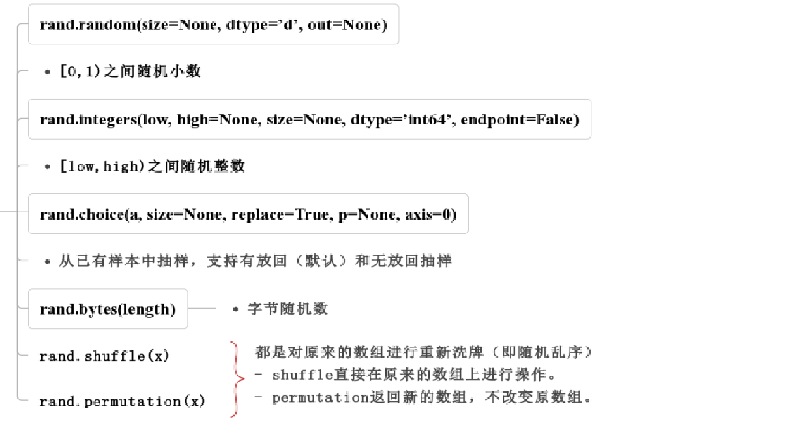

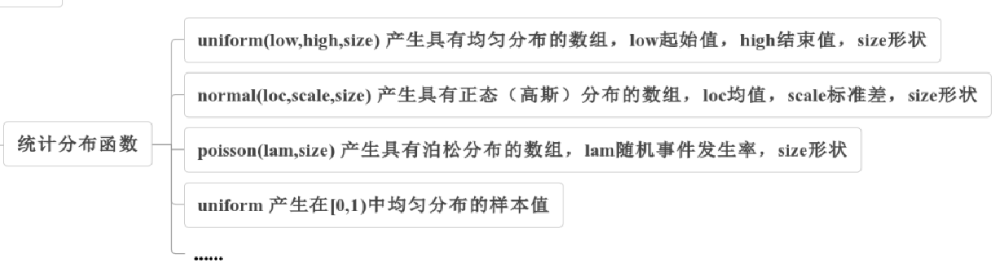

**==使用Generator生成随机数==**

(1) Generator.integers(low, high=None, size=None, dtype='int64', endpoint=False)。

返回[low,high)之间的随机整数，如果endpoint = True，返回[low,high]之间的随机整数。 

- low：整数或整数数组。  
- high：整数或整数数组。如果high为None(默认值)，则结果在[0，low)之间。  
- size：int或整型元组，输出的数组的形状。默认值为无，将返回单个值。 
- dtype：可选参数，默认值为“ np.int”。  
- endpoint：如果为true，则从[low，high]而不是默认值[low，high）采样默认为False  
- 返回值：int或整型的ndarray

```python
#例11.4(a)   随机数：整数
import numpy as np
rand=np.random.default_rng( )
print(rand)
rnd0=rand.integers(10)  #产生一个0≤rnd0＜10的整数
print(rnd0)
rnd1=rand.integers(10,15) #[10,15)
print(rnd1)
rnd2=rand.integers(10,15,size=(3,5))#包含10不包含15
print(rnd2)
rnd3=rand.integers(10,15,size=(3,5),endpoint=True) #包含15
print(rnd3)
"""
输出结果：
Generator(PCG64)
8
14
[[10 10 11 11 11]
 [12 11 12 13 13]
 [10 10 13 13 10]]
[[10 14 15 15 14]
 [10 13 15 12 13]
 [11 10 15 14 11]]
"""
```

- 广播（形状）
- 自动对齐（形状）

```python
#例11.4(b)   随机数：整数
rand.integers([2,3,5,6,7,9],25)
high=[10,20,30,40,50,60]
rnd1=rand.integers([2,3,5,6,7,9],high)
print(rnd1)
rand.integers([2,100,40],[[150],[250]])
rand.integers(([5],[15]),(20,30,40))
rand.integers(([5],[10]),15,size=(2,5))
"""
[11 11 6 18 17 12]

[ 3 15 15 19 10 41]

[[ 27 147 130]
 [ 50 235  61]]

[[ 9 24  8]
 [15 20 32]]
[[12  7 14  7 14]
 [10 12 14 11 10]]

"""
```

上面的例子注意几点：

①low和high可以是整数，也可以是“array-like”的形式，如列表（3处）、元组（4处）、甚至是NumPy的ndarray（如2处的high）。

②如果==**形状**==size参数没有给，会==**根据low和high自动推断**==。如4处，low是2行，high是3列，因此推断出的形状为（2,3）。

③如果形状确定（包括推断出的形状），==**low和high会自动广播。**==

面看看4处的广播过程：

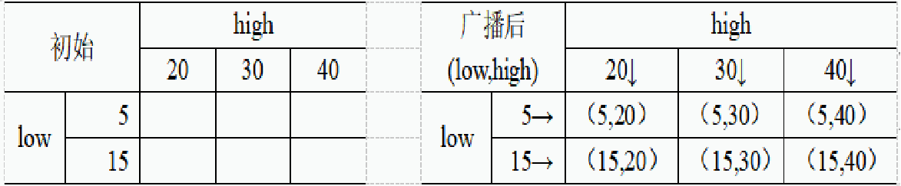

广播后的low=[[5,5,5],[15,15,15]]，high=[[20,30,40],[20,30,40]]。

(2)Generator.random(size=None, dtype=’d’, out=None)

函数功能：在半开区间[0.0，1.0）中返回随机浮点数。要对[a，b）进行采样（b＞a），只要将random的输出乘以（b-a）并加上a。

```python
#例11.4(c)    随机数：小数
import numpy as np
rand=np.random.default_rng( ) 
print('一个随机数：')
print(rand.random())

print('3行5列随机数：size=[3,5]')
print(rand.random(size=[3,5]))

print('生成10-30（包含10，不含30）之间的随机数：size=[2,3]')
r=10+20*rand.random(size=[2,3])
print(r)
"""
输出结果：
一个随机数：0.202506589469597
3行5列随机数：size=[3,5]
[[0.74833321 0.39839042 0.34595854 0.42566288 0.34681398]
 [0.97512234 0.3227462  0.16812514 0.60375289 0.45902757]
 [0.35653477 0.86965314 0.41272516 0.68919917 0.76453641]]
生成10-30（包含10，不含30）之间的随机数：size=[2,3]
[[23.73055693 16.54245328 28.76522542]
 [19.14670534 25.27473134 20.42870621]]
"""
```

（3）choice(a, size=None, replace=True, p=None, axis=0)

函数功能：参数意思是从a中以概率p随机选择size个。

参数说明：p没有指定的时候相当于是均匀分布，a为一维数组或int，如果是int，则生成随机样本，就好像a是np.arange(N)一样。replacement 代表的意思是抽样之后还放不放回去，如果是False的话，那么出来的三个数都不一样，如果是True的话， 有可能会出现重复的，因为前面的抽的放回去了。

```python
#例11.4(d)    随机数：抽样
import numpy as np
rand=np.random.default_rng( )
print(rand.choice(5)) #相当于从range(5)中随机选1个
print(rand.choice(10, 5)) #相当于从range(10)中随机选15个
print(rand.choice([10,15,20],5)) #从[10,15,20]中选15个数

a=[[10,15,20],
   [1,5,2],
   [3,6,9]]
print(rand.choice(a,5)) 
#从"二维"列表a中选5个“行”组成新二维列表
"""
输出结果为：
1
[9 8 0 3 7]
[20 15 10 10 15 ]


[[10 15 20]
 [ 3  6  9]
 [ 3  6  9]
 [ 3  6  9]
 [ 1  5  2]]
"""
```

（4）Generator.shuffle(x) 和Generator.permutation(x)

函数shuffle与permutation都是对原来的数组进行重新洗牌（即随机打乱原来的元素顺序），区别在于：

- huffle直接在原来的数组上进行操作，改变原来数组的顺序，无返回值；
- permutation返回一个新的打乱顺序的数组，并不改变原来的数组。

```python
#例11.4(e)    随机数：置乱序
import numpy as np
rand=np.random.default_rng( )
ar=np.arange(15)
print(ar)
rand.shuffle(ar)
print(ar)
a=[[0 ,1 ,2 , 3,  4],
  [ 5 ,6 , 7 , 8 , 9],
  [10 ,11 ,12 ,13,14]]
rand.shuffle(a)  #注意，仅对第1个维度置乱序。本例就是按行打乱。
print(a)
"""
输出结果：
[ 0  1  2  3  4  5  6  7  8  9  10  11  12  13  14]
[ 8  7  3  14  12  9  4  11  6  13  2  5  10  1  0]
[ [0, 1, 2, 3, 4],  [10, 11, 12, 13, 14],  [5, 6, 7, 8, 9] ]
"""
```

### 10.3 数组索引

#### 10.3.1  数组的单个元素索引

对于一维数组，索引其中一个元素格式：

==**a[index]**==

其中，index是整数值。例11.5(a)给出了一维数组的单个元素的索引示例。

```python
#例11.5(a)    一维数组的单个元素的索引
import numpy as np
ar=np.arange(15)
print('ar=',ar)
print('ar[5]=',ar[5])  #索引取值
ar[6]=60          #索引赋值
print('ar[6]=',ar[6])
print('ar=',ar)
"""
输出结果：
ar= [0 1 2 3 4 5 6 7 8 9 10 11 12 13 14]
ar[5]= 5
ar[6]= 60
ar= [0 1 2 3 4 5 60 7 8 9 10 11 12 13 14]
"""
```

对于一个N维数组，索引其中一个元素有两种格式： 

- a\[index0]\[index1][index2],....,[indexN-1] 
- a[index0, index1, index2, .... , indexN-1]==（建议）==  

其中，indexi(i∈[1,N-1])是整数值，i代表第i个维度。例11.5(b)给出了索引示例。

```python
#例11.5(b)   二维数组单个元素的索引
import numpy as np
a=np.asarray([[1, 2, 3], [4, 5, 6], [7, 8, 9]])
print('a=',a)
print('a[1][2]=',a[1][2] )#第1种写法
element=a[1,2]  #第2种写法（常用）
print('a[1,2]=',element)
a[1,2]=60       #第2种写法，赋值
print('a=',a)
"""
输出结果：
a= [[1 2 3]
     [4 5 6]
     [7 8 9]]
a[1][2]= 6
a[1,2]= 6
a= [[ 1  2  3]
      [ 4  5  60]
      [ 7  8  9]]
"""
```

#### 10.3.2 数组的多个元素索引

数组的多个元素索引指的是一次取得多个元素的视图，类似于字符串和列表的切片。区别在于数组切片是原始数组的视图，这就意味着，如果数组做任何修改，数组切片就会跟着更改。而列表切片是生成新的列表，==**切片后的列表不受原先列表的变化影响**==，反过来切片后的列表也不影响原列表。这也意味着，如果不想更改原始数组，我们需要进行显式的复制（.copy())，从而得到它的副本。

特别指出的是，正是由于数组切片是原始数组的视图，不是真正的“切”下来的副本，因此，在NumPy的数组中，有时候也不再把对数组的形如“array[-1:0:-2]”的操作的称为切片，而是统一称之为数组的索引。

NumPy比一般的Python序列提供更多的索引方式：

- 切片式索引；
- 花式索引（整数数组索引）；
- 布尔索引；

==**（1）切片式索引**==

对于N+1维数组，切片形式索引多个元素的格式如下：

a[slice0, slice1, slice2, .... , sliceN]

其中，slice是类似于字符串和列表的切片形式，即`start:end:step`的形式。如果所有的slice退化为一个整数值， 则也就是索引单个元素。

```python
#一维数组的切片式索引
import numpy as np
ar=np.arange(15)
print('ar=',ar)
ar= [ 0  1  2  3  4  5  6  7  8  9  10  11  12  13  14]
ar[5:]= [ 5  6  7  8  9  10  11  12  13  14]
ar[1:3]= [1 2]
ar[::-1]= [14  13  12  11  10  9  8  7  6  5  4  3  2  1  0]
ar[-1:0:-2]= [14  12  10  8  6  4  2]
ar[-2:0:-2]=-1 
#会把数字-1广播为和ar[-2:0:-2]大小一样的数组，然后对应元素赋值
print('ar=',ar)
"""
输出结果：
ar= [0 -1  2 -1  4 -1  6 -1  8 -1 10 -1 12 -1 14]
"""
```

==**（2）花式索引**==

花式索引（Fancy indexing）是指利用整数数组进行索引，这里的整数数组可以是Numpy数组也可以是Python中列表、元组等可迭代类型。也可以称为整数数组索引。

先看最简单的一维数组。假定ar=np.arange(10)，也就是ar= [ 10 11 12 13 14 15 16 17 18 19 ]。如果index=[2,5,9,2]，那么index是一个整数数组。此时，ar[index]=[ 12 15 19 12]，也就是使用一个整数数组index，根据它的值，在ar的2、5、10、2、0位置取得5个值，构成一个一维数组的视图，如下例所示：

```python
#例11.5(e)   二维数组单个元素的索引
arr=np.arange(15)
index=[2,5,10,2,0]
a=arr[index]
print(a)
print(np.shape(a))
"""
输出结果：
[ 2  5 10  2  0]
(5,)
"""
```

```python
#例11.5（f）  二维数组的花式索引(整数数组索引）
#一般形式
import numpy as np
a=[[ 0, 1,  2,  3,  4],
     [ 5,  6, 7,  8,  9],
     [10,11,12,13,14],
     [15,16,17,18,19],
     [20,21,22,23,24]]
a=np.array(a)
row_index=[[0,1,2],  #行索引
                   [0,1,2],
                   [0,1,2],
                   [0,1,2]]
col_index=[[1,2,3],  #列索引
                   [2,3,4],
                   [3,4,0],
                   [4,0,1]]
x=a[row_index,col_index] 
print('x=a[row_index,col_index]=\n',x)
print('x.shape:',np.shape(x))

```

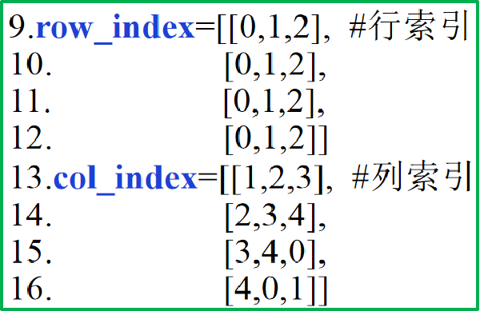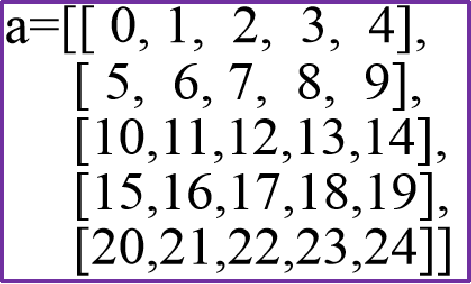

根据行索引row_index和列索引col_index的值，确定了元素的位置为（行索引和列索引一一对应)：

[[(0, 1), (1, 2), (2, 3)],

[(0, 2), (1, 3), (2, 4)],

[(0, 3), (1, 4), (2, 0)],

[(0, 4), (1, 0), (2, 1)]]

同时也==**确定了得到的数组的形状**==是（4,3）所以，最终得到的数组视图为：

[[1  7  13]

[ 2 8 14]

[ 3 9 10]

[ 4 5 11]]

==**如果row_index和col_index形状不一样，会根据广播原理进行广播。**==

```python
# 二维数组的整数数组索引的特殊形式和广播。
import numpy as np
a=np.array(a)

print('\n-------↓↓↓形状一致，直接一一对应---------')
a0_1=a[[0,4],[0,4]] #左上角和左下角元素
print('a0_1=a[[0,4],[0,4]]=\n',a0_1)
a0_2=a[[0,0,4,4],[0,4,0,4]] #四个角的元素
print('a0_2=a[[0,0,4,4],[0,4,0,4]] =\n',a0_2)
row_index=[0,3,4]
col_index=[1,3,2]
a1=a[row_index,col_index] #第(0,1)、(3,3)、(4,2)位置的元素构成一个一维数组
print('a1=a[[0,3,4],[1,3,2]]=\n',a1)
print('a1.shape:',np.shape(a1))

row_index=[[0,3,4]]
col_index=[[1,3,2]]
a2=a[row_index,col_index] #第(0,1)、(3,3)、(4,2)位置的元素，构成一个二维数组
print('\na2=a[[[0,3,4]],[[1,3,2]]]=\n',a2)
print('a2.shape:',np.shape(a2))
print('\n-------↓↓↓广播-----------------------------------------------------------')
row_index=[0,1,2] #广播为和col_index 形状一致
                #相当于[[0,1,2], [0,1,2], [0,1,2], [0,1,2]]。
col_index=[[1,2,3],
           [2,3,4],
           [3,4,0],
           [4,0,1]]
a3=a[row_index,col_index] 
print('a3=a[row_index,col_index]=\n',a3)#结果和例11.6（b）一样。
print('a3.shape:',np.shape(a3))

row_index=1 #广播为和col_index 形状一致
           #相当于[[1,1,1], [1,1,1], [1,1,1], [1,1,1]]。
col_index=[[1,2,3],
          [2,3,4],
          [3,4,0],
          [4,0,1]]
a4=a[row_index,col_index] 
print('\na4=a[row_index,col_index]=\n',a4)
print('a4.shape:',np.shape(a4))
row_index=[[0],[1],[2],[4]] #广播为和col_index 形状一致。相当于[[0,0,0], [1,1,1], [2,2,2], [4,4,4]]。
col_index=[[1,2,3],
         [2,3,4],
         [3,4,0],
         [4,0,1]]
a5=a[row_index,col_index] 
print('\na5=a[row_index,col_index]=\n',a5)
print('a5.shape:',np.shape(a5))

row_index=[[0],[1],[2],[4]] #广播为和col_index 形状一致。相当于[[0,0,0], [1,1,1], [2,2,2], [4,4,4]]。
col_index=[[1,2,3],
          [2,3,4],
          [3,4,0],
          [4,0,1]]
a6=a[row_index,col_index] 
print('\na6=a[row_index,col_index]=\n',a6)
print('a6.shape:',np.shape(a6))

print('\n-------↓↓↓特殊例子-----------------------------------------------------------')
a7=a[[0,3,4],...] #第0、3、4行
print('a7=a[[0,3,4],...]=\n',a7)

a8=a[...,[0,2,1]] #第0、2、1列
print('a8=a[...,[0,2,1]]=\n',a8)

print('\n-------↓↓↓注意这个还是广播，把整数-1广播为索引数组形状------')
a[[0,3,4],2:4]=-1
print(a)


```

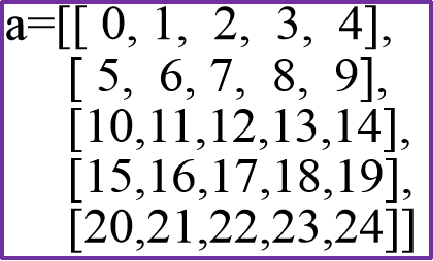

程序运行的空间使用情况

| **row_index**     | **col_index**                                                | **a[row_index,col_index]的结果**                     | **shape**         | **说明**                                                     |
| ----------------- | ------------------------------------------------------------ | ---------------------------------------------------- | ----------------- | ------------------------------------------------------------ |
| [0,4]             | [0,4]                                                        | [ 0 24]                                              | (2, )             | 左上角和左下角元素                                           |
| [0,0,4,4]         | [0,4,0,4]                                                    | [ 0 4 20 24]                                         | (4, )             |                                                              |
| [0,3,4]           | [1,3,2]                                                      | [ 1 18 22]                                           | (3, )             |                                                              |
| [[0,3,4]]         | [[1,3,2]]                                                    | [[ 1 18 22]]                                         | (1, 3)            |                                                              |
| [0,1,2]           | [[1,2,3],[2,3,4],[3,4,0],[4,0,1]]                            | [[ 1 7 13] [ 2 8 14] [ 3 9 10] [ 4 5 11]]            | (4, 3)            | 行广播                                                       |
| 1                 | [[1,2,3],[2,3,4],[3,4,0],[4,0,1]]                            | [[6 7 8] [7 8 9] [8 9 5] [9 5 6]]                    | (4, 3)            | 标量广播                                                     |
| [[0],,,[4]]       | [[1,2,3],[2,3,4],[3,4,0],[4,0,1]]                            | [[ 1 2 3] [ 7 8 9] [13 14 10] [24 20 21]]            | (4, 3)            | 列广播                                                       |
| ...               | [0,2,1]                                                      | [[ 0 2 1] [ 5 7 6] [10 12 11] [15 17 16] [20 22 21]] | (5, 3)            |                                                              |
| [0,3,4]           | ...                                                          | [[ 0 1 2 3 4] [15 16 17 18 19] [20 21 22 23 24]]     | (3, 5)            |                                                              |
| a[[0,3,4],2:4]=-1 | a=[[ 0 1 -1 -1 4] [ 5 6 7 8 9] [10 11 12 13 14] [15 16 -1 -1 19] [20 21 -1 -1 24]] | 索引赋值操作                                         | a[[0,3,4],2:4]=-1 | a=[[ 0 1 -1 -1 4] [ 5 6 7 8 9] [10 11 12 13 14] [15 16 -1 -1 19] [20 21 -1 -1 24]] |

==**（3）布尔索引**==

我们可以通过一个布尔数组来索引目标数组，以此找出与布尔数组中值为True的对应的目标数组中的数据。需要注意的是，布尔数组的长度必须与目标数组对应的轴的长度一致。

例11.5(h)给出了一维数组的布尔索引的实例。第3行变量b是一个与数组长度一样的布尔数组，通过x[b]获得了True值位置对应的x的位置的值[11 14]。第5行使用了条件语句“x % 3==1”，该条件本质上返回的也是一个与x数组长度一样的布尔数组，所以最后得到的是满足条件的元素[10 13]。

```python
#例11.5（h）  一维数组的布尔索引
import numpy as np 
x = np.array([10,  11,  12,  13,  14,  15]) 
b=np.array([False,True,False,False,True,False])
print(x[b])
print(x[x % 3==1])  
"""
输出结果：
[11 14]
[10 13]
"""
```

```python
#例11.5（i）  二维数组的布尔数组索引
import numpy as np 
x = np.array([[  0,  1,   2 ],
                      [  3,  4,   5 ],
                      [  6,  7,   8 ],
                      [  9,  10, 11]]) 
b=np.array( [[True, False,False],
           [False,True, False],
           [False,True ,False],
           [False,False,True]])
print ('x[b]结果为：',x[b])
....
##↓条件选择
c=x>5
print ('x>5的类型为：\n',type(c))
print ('x>5的结果为：\n',c)
print ('x[x>5]结果为：',x[c])
"""
x[b]结果为：[ 0 4 7 11]
x[[True,False,True,False]]= #选择0,3行
 [[0 1 2] [6 7 8]]
x[...,[True, True,False]]=  #选择0,1列
 [[ 0  1] [ 3  4] [ 6  7] [ 9 10]]
x>5的类型为：
 <class 'numpy.ndarray'>
x>5的结果为：
 [[False False False]
 [False False False]
 [ True  True  True]
 [ True  True  True]]
x[x>5]结果为：[ 6 7 8 9 10 11]
"""
```

### 10.4 形状和维度变化

#### 10.4.1 改变形状

可以通过reshape和resize函数改变数组形状。reshape函数返回一个ndarray，原先的ndarray形状不变。但是返回的ndarray和原先的ndarray指向同一个内存空间。resize函数改变形状，返回None。也就是直接改变原先的ndarray的形状。函数原型为：

- np.reshape(arr, newshape, order=‘C’)
- np.resize(a, newshape)

参数说明:

arr，要修改形状的数组；

newshape，整数或者整数数组，新的形状；

order，元素的顺序： ‘C’ – 按行，‘F’ – 按列，‘A’ – 原顺序，‘K’ – 元素在内存中的出现顺序。

```python
#例11.6（a）  数组形状的改变：reshape和resize
import numpy as np
ar=np.array([[1,2,3,4,5],
    [6,7,8,9,10],
    [11,12,13,14,15]])
print('=====初始ar=====\n',ar)

print('=======================')
ar1=ar.reshape((5,3))
print('ar1=ar.reshape((5,3))=\n',ar1)

print('ar形状并没有变化：\n',ar)
ar[1,2]=100

print('=====================')
ar2=ar.resize((5,3))#resize的返回值为None
print('ar2=ar.resize((5,3))=',ar2)

print('ar,受resize影响形状变了：')
print(ar.shape)
"""
输出结果：
=====初始ar=====
 [[ 1  2  3  4  5]
 [ 6  7  8  9 10]
 [11 12 13 14 15]]
=======================
ar1=ar.reshape((5,3))=
 [[ 1  2  3]
 [ 4  5  6]
 [ 7  8  9]
 [10 11 12]
 [13 14 15]]
ar形状并没有变化：
 [[ 1  2  3  4  5]
 [ 6  7  8  9 10]
 [11 12 13 14 15]]
======================
ar2=ar.resize((5,3))=None
ar,受resize影响形状变了：
(5, 3)
"""
```

==**(1)flat属性与flatten函数、ravel函数**==

**np.ndarray.flat** 是一个数组元素迭代器，对数组中每个元素都进行处理，可以使用flat属性进行迭代。如例11.6(b)第7行。      

**np.ndarray.flatten( )** 返回一份数组拷贝，该拷贝是一维数组形式，对拷贝所做的修改不会影响原始数组。

**np.ravel(a, order='C')**或者np.ndarray.ravel( ) 返回展平的数组元素，返回的是数组视图，修改会影响原始数组。该函数和flat的属性的区别是：

①ravel函数可以通过参数设置返回的形式，ravel函数的默认参数返回的数组对象和flat属性返回的对象，都是“扁平”的；

②ravel函数返回的视图可以反复使用，而flat属性返回的是可迭代对象，只能使用一次。因此，如果是仅仅遍历一次数组的所有对象，可以使用flat属性，如果需要多次使用或者需要通过“扁平”的数组修改原数组，使用ravel函数。

```python
#例11.6（b）  数组形状的改变：flat属性与flatten函数、ravel函数
import numpy as np
a=np.arange(15).reshape(3,5)
a1=a.flatten() #返回新数组，和原先的数组内存空间不同
print('a.flatten()=',a1)

a2=a.flat#flat返回偏平的‘一维’数组可迭代对象
print(a2)
for i in a2:  #遍历a2对象，只能使用一次a2
      print(i,end=' ')
print('\n第二次打印a2=',list(a2))  #结果为空
a1[2]=100  
print(a1)
print(a) #a不受a1变化的影响，因为a1和a不同内存
print('--------------')
a3=a.ravel( )
print('a.ravel( )=',a3)
a3[2]=100
a3[4]=200
print('a.ravel( )=',a3)
print('a=',a)#a受a3变化的影响，因为a3和a内存相同

"""
输出结果为：
a.flatten()= [ 0  1  2  3  4  5  6  7  8  9 10 11 12 13 14]

<numpy.flatiter object at 0x0000023049305670>

0 1 2 3 4 5 6 7 8 9 10 11 12 13 14 

第二次打印a2= [ ]

输出结果为：
[  0   1  100   3   4   5   6   7   8   9  10  11  12  13  14]
[[ 0  1  2  3  4]
 [ 5  6  7  8  9]
 [10 11 12 13 14]]
--------------
a.ravel( )= [ 0  1  2  3  4  5  6  7  8  9  10  11  12  13  14]
a.ravel( )= [ 0  1  100  3  200  5  6  7  8  9  10  11  12  13  14]
a= [[  0   1  100  3  200]
   [  5   6   7   8   9]
   [  10  11  12  13  14]]
"""
```

==**(2)数组的转置**==

np.transpose( )函数：对换数组的维度；

ndarray.T：和transpose( ) 相同。两者都是实现了对数组转置的一个视图。

```python
#例11.6（c）  数组形状的改变：转置
import numpy as np
a=np.arange(6).reshape(3,2)
print(a)
print(a.T)
# print(np.transpose(a))#作用和上句相同
# print(a.transpose())  #作用和上句相同

"""
输出结果：
[[0 1]
 [2 3]
 [4 5]]
[[0 2 4]
 [1 3 5]]
"""
```

==**(3)生成新的数组维度**==

数组维度的操作有很多函数实现。一般增加维度有3种方式：

- reshape( )方法：给一个维度设置为1完成升维。
- np.newaxis：关键字，使用索引的语法给数组添加维度（np.newaxis=None）；
- np.expand_dims(arr, axis)方法：和np.newaxis实现一样的功能，给arr在axis位置添加维度；

```python
#例11.5(d)   数组升维：reshape
#升维
import numpy as np
a=np.array([1,2,3,4,5,6])
c=a.reshape((6,1))#升维
print('a.reshape((6,1))
#c第0维度有6行，第1维度1列\n',c)
d1=a.reshape((1,6))#升维
print('a.reshape((1,6))
#d1第0维度有1行，第1维度6列\n',d1)
d2=a.reshape((1,-1))#升维
print('a.reshape((1,-1))
#d2第0维度有1行，第1维度6列\n',d2)
"""
输出结果：
a.reshape((6,1)):c第0维度有6行，第1维度1列
 [[1]
 [2]
 [3]
 [4]
 [5]
 [6]]
a.reshape((1,6)):d1第0维度有1行，第1维度6列
 [[1 2 3 4 5 6]]
a.reshape((1,-1)):d2第0维度有1行，第1维度6列
 [[1 2 3 4 5 6]]
"""
#例11.6(e)   数组升维：np.newaxis（=None）      
ar= [1 2 3 4 5]
ar[...,np.newaxis]=
 [[1]
 [2]
 [3]
 [4]
 [5]]
ar[np.newaxis,:]=
 [[1 2 3 4 5]]
```

#### 10.4.2 数组拼接与堆叠

数组的拼接与堆叠用于把多个数组连接成一个数组，主要涉及四个函数：

- concatenate，拼接数组 
- stack，沿着指定的轴加入一系列数组。 
- hstack，水平堆叠序列中的数组（列方向） 
- vstack，竖直堆叠序列中的数组（行方向）

stack沿着指定的轴加入一系列数组，这里不过多介绍。numpy.hstack函数是numpy.stack函数的变体，它通过水平堆叠来生成数组，numpy.vstack函数是numpy.stack函数的变体，它通过垂直堆叠来生成数组。

下面简单介绍一下concatenate和vstack、hstack三个函数。因为多数情况我们使用的二维的数组，因此，例子中仅以使用二维数组为例。

==**(1)numpy.concatenate((a1, a2, ...), axis)**==

这个函数中，a1、a2...是要连接的数组。axis是整数，指定要连接的轴是哪一个，axis=0指定沿着第0维度连接，axis=1指定沿着第1维度连接，以此类推。注意，NumPy中很多函数涉及到轴的概念。

```python
#例11.7(a)   数组拼接：np.concatenate
import numpy as np
a = np.array([[1,2],[3,4]])
print ('第一个数组：')
print (a)
b = np.array([[5,6],[7,8]])
print ('第二个数组：')
print (b)

# 两个数组在连接方向上维度相同
print ('沿轴 0 连接两个数组：')
print (np.concatenate((a,b))) #默认axis = 0
print ('沿轴 1 连接两个数组：')
print (np.concatenate((a,b),axis = 1))

"""
输出结果：
第一个数组：[[1 2]
                         [3 4]]
第二个数组：[[5 6]
                         [7 8]]
沿轴 0 连接两个数组：
[[1 2]
 [3 4]
 [5 6]
 [7 8]]
沿轴 1 连接两个数组：
[[1 2 5 6]
 [3 4 7 8]]
"""

```

==**(2)numpy.vstack和numpy.hstack(arrays)**==

np.vstack按垂直方向（行顺序）堆叠数组构成一个新的数组，np.hstack按水平方向（列顺序）堆叠数组构成一个新的数组。np.vstack(tup)、np.hstack(tup) ，参数tup可以是元组，列表，或者numpy数组，返回结果为numpy的数组

```python
#例11.7(b)   数组堆叠：np.vstack、np.hstack
#数组按不同方向堆叠
import numpy as np
a = np.array([[1,2],[3,4]])
b = np.array([[5,6],[7,8]])
print(a)
print(b)

c=np.vstack((a,b))#v：vertical 竖直
print(c)
d=np.hstack((a,b,a))#h：horizontal 水平
print(d)
"""
输出结果：
[[1 2]
 [3 4]]
[[5 6]
 [7 8]]

[[1 2]
 [3 4]
 [5 6]
 [7 8]]

[[1 2 5 6 1 2]
 [3 4 7 8 3 4]]
"""

```

#### 10.4.3 数组行或列的插入

NumPy提供了insert函数进行插入操作。函数原型为：

np.insert(arr, obj, values, axis=None) 

- arr：要操作数组；  
- obj：整数或者整数数组，用于标记插入位置，在obj之前插入；  
- values：插入的值，该值应该与插入的轴的数据形状一样；  
- axis：在哪个维度（轴）插入。默认为None。

```python
#例11.8(b)    数组增加行列：np.insert
import numpy as np
a = np.array(np.arange(15).reshape(3,5),dtype=np.float)
print('a=\n',a)

#●●●●●● axis=None，偏平数组●●●●●●
#如果没有给axis则使用默认值None,此时将数组“偏平化”为一维数组
#然后在指定的obj位置，插入values值
#此时，obj和values或者形状一样，或者其中一个是标量。三种情况：
b=np.insert(a,[1,4,8],[-1,-2,-3])#在1，4，8位置插入-1，-2，-3
print('b=np.insert(a,[1,4,8],[-1,-2,-3]):\n',b)

c=np.insert(a,[1,4,8],-1) #在1，4，8位置插入-1，-1，-1。标量值-1广播。
print('c=np.insert(a,[1,4,8],-1):\n',c)

d=np.insert(a,1,[-1,-2,-3])      #在1位置插入-1，-2，-3三个值
print('d=np.insert(a,1,[-1,-2,-3]):\n',d)

#●●●●●●● axis=0，插入行●●●●●●
#如果axis=0，则插入行（对二维数组）
#此时values或者跟0轴（0维度）的元素形状一样，或者是标量（会广播为一样）
f=np.insert(a,1,[-1,-2,-3,-4,-5],axis=0)#在0轴的1位置前插入一行
print('f=np.insert(a,1,[-1,-2,-3,-4,-5],axis=0) :\n',f)

g=np.insert(a,1,-1,axis=0)  #在0轴的1位置前插入一行（全部为-1）
print('g=np.insert(a,1,-1,axis=0):\n',g)

print('----------- 一次插入多行 ---------------')
insert_position=[1,2]    #插入位置。两个位置，需要两行
insert_value=[[-1,-2,-3,-4,-5],  [-5,-4,-3,-2,-1]]
#insert_value是插入值。两行。如果给一行会广播为两行；如果是标量也会广播为两行

print('insert_position:\n',insert_position)
print('insert_value:\n',insert_value)
h=np.insert(a,insert_position,insert_value,axis=0)  #在0轴的1,2位置前插入分别插入一行
print('h=np.insert(a,insert_position,value_insert,axis=0)  :\n',h)

#●●●●●●● axis=1，插入列●●●●●●
#如果axis=1，则插入列（对二维数组）
#此时values或者跟1轴（1维度）的元素形状一样，或者是标量（会广播为一样）
m=np.insert(a,1,-1,axis=1)#在1轴的1位置前插入一列，全部为-1
print('m=np.insert(a,1,-1,axis=1):\n',m)

n=np.insert(a,1,[[-1],[-2]],axis=1)     #在1轴的1位置前插入两列（全部为-1和-2）
print('n=np.insert(a,1,[[-1],[-2]],axis=1):\n',n)

n=np.insert(a,1,[[-1,-2,-3],[-3,-2,-1]],axis=1) #在1轴的1位置前插入两列
print('n=np.insert(a,1,[[-1,-2,-3],[-3,-2,-1]],axis=1) :\n',n)


"""
输出结果为：
a=
 [[ 0.  1.  2.  3.  4.]
 [ 5.  6.  7.  8.  9.]
 [10. 11. 12. 13. 14.]]
b=np.insert(a,[1,4,8],[-1,-2,-3]):
 [ 0. -1.  1.  2.  3. -2.  4.  5.  6.  7. -3.  8.  9. 10. 11. 12. 13. 14.]
c=np.insert(a,[1,4,8],-1):
 [ 0. -1.  1.  2.  3. -1.  4.  5.  6.  7. -1.  8.  9. 10. 11. 12. 13. 14.]
d=np.insert(a,1,[-1,-2,-3]):
 [ 0. -1. -2. -3.  1.  2.  3.  4.  5.  6.  7.  8.  9. 10. 11. 12. 13. 14.]
 
 
 输出结果为：
a=
 [[ 0.  1.  2.  3.  4.]
 [ 5.  6.  7.  8.  9.]
 [10. 11. 12. 13. 14.]]
f=np.insert(a,1,[-1,-2,-3,-4,-5],axis=0) :
 [[ 0.  1.  2.  3.  4.]
 [-1. -2. -3. -4. -5.]
 [ 5.  6.  7.  8.  9.]
 [10. 11. 12. 13. 14.]]
g=np.insert(a,1,-1,axis=0):
 [[ 0.  1.  2.  3.  4.]
 [-1. -1. -1. -1. -1.]
 [ 5.  6.  7.  8.  9.]
 [10. 11. 12. 13. 14.]]
----------- 一次插入多行 ---------------
insert_position:
 [1, 2]
insert_value:
 [[-1, -2, -3, -4, -5], [-5, -4, -3, -2, -1]]
 
 h=np.insert(a,insert_position,value_insert,axis=0)  :
 [[ 0.  1.  2.  3.  4.]
 [-1. -2. -3. -4. -5.]
 [ 5.  6.  7.  8.  9.]
 [-5. -4. -3. -2. -1.]
 [10. 11. 12. 13. 14.]]

输出结果为：
a=
 [[ 0.  1.  2.  3.  4.]
 [ 5.  6.  7.  8.  9.]
 [10. 11. 12. 13. 14.]]
m=np.insert(a,1,-1,axis=1):
 [[ 0. -1.  1.  2.  3.  4.]
 [ 5. -1.  6.  7.  8.  9.]
 [10. -1. 11. 12. 13. 14.]]
n=np.insert(a,1,[[-1],[-2]],axis=1):
 [[ 0. -1. -2.  1.  2.  3.  4.]
 [ 5. -1. -2.  6.  7.  8.  9.]
 [10. -1. -2. 11. 12. 13. 14.]]
n=np.insert(a,1,[[-1,-2,-3],[-3,-2,-1]],axis=1) :
 [[ 0. -1. -3.  1.  2.  3.  4.]
 [ 5. -2. -2.  6.  7.  8.  9.]
 [10. -3. -1. 11. 12. 13. 14.]]

"""

```

### 10.5 数组运算和数组函数

#### 10.5.1 数组运算

   在NumPy中，数组可以像“元素”一样进行表达式运算。比如两个数组相加，则是对应的元素相加。再如一个数组乘以一个数值，则是数组的每一个元素乘以这个数值。下面给出了一些数组运算的例子。

```python
#例11.9    数组的运算
import numpy as np
arr=np.array([[1,2,3,4,5],
    [6,7,8,9,10],
    [11,12,13,14,15]])
vec1=np.array([10,100,1000,10000,100000])
vec2=np.array([[10],[100],[1000]])   
print('arr=')
print(arr)
###数组的【乘法】####【除法，加法和减法类似，不赘述】####
print('arr*10=')
print(arr*10)  #乘以一个标量，所有元素都乘以标量值（标量值广播）
print('arr*np.array([10,100,1000,10000,100000])=')
print(arr*vec1) #乘以一个向量，所有元素都乘以向量值（行广播）
print('arr*np.array([[10],[100],[1000]])=')
print(arr*vec2) #乘以一个向量，所有元素都乘以向量值（列广播）
print('arr*arr=')
print(arr*arr) #乘以一个数组，所有元素都乘以对应元素

"""
输出结果：
arr=
[[ 1  2  3  4  5]
 [ 6  7  8  9 10]
 [11 12 13 14 15]]
arr*10=
[[ 10  20  30  40  50]
 [ 60  70  80  90 100]
 [110 120 130 140 150]]
arr*np.array([10,100,1000,10000,100000])=
[[     10     200    3000   40000  500000]
 [     60     700    8000   90000 1000000]
 [    110    1200   13000  140000 1500000]]
arr*np.array([[10],[100],[1000]])=
[[   10    20    30    40    50]
 [  600   700   800   900  1000]
 [11000 12000 13000 14000 15000]]
arr*arr=
[[  1   4   9  16  25]
 [ 36  49  64  81 100]
 [121 144 169 196 225]]

"""

```

#### 10.5.2 通用函数与math库

 NumPy 提供了两种基本的对象，即ndarray和ufunc对象。前面几节已经介绍了ndarray。ufunc是universal function的缩写，意思是“通用函数”，它是一种能对数组的每个元素进行操作的函数。许多ufunc函数都是在C语言级别实现的，因此它们的计算速度非常快。此外，ufunc 比math模块中的函数更灵活。math模块的输入一般是标量，但NumPy中ufunc函数的输入可以是标量或数组，而对数组的“整体计算”可以避免使用循环语句。

下面先给出一个例子：使用math库和使用NumPy库计算数组的正弦值，看看时间效率上的对比。第4-8行是使用math库构建for循环计算数组x的各个sin值，第9-13行是使用NumPy库函数计算。从结果可以看出来，==**数组的函数计算，比使用Python库函数要高效得多**==。这点在机器学习、深度学习中非常重要。

#### 11.5.3 常见通用函数

==**(1)常用数学运算函数**==

一元数组函数（函数一个数组参数）：	

- np.abs(a) 、np.fabs(a)：取各元素的绝对值。 	
- np.sqrt(a)：计算各元素的平方根。 	
- np.square(a)：计算各元素的平方。 	
- np.log(a) 、np.log10(a) 、np.log2(a)：计算各元素的自然对数、10、2为底的对数。 	
- np.ceil(a) 、np.floor(a)：各元素ceiling向上取整，floor向下取整。 	
- np.rint(a)：各元素四舍五入。	
- np.modf(a)：将数组各元素的小数和整数部分以两个独立数组形式返回。 	
- np.exp(a)：计算各元素的指数值。 	
- np.sign(a)：计算各元素的符号值 1（+），0，-1（-）。


二元数组函数（函数两个数组参数）：     

- add：将数组中对应的元素相加     
- subtract：从第一个数组中减去第二个数组中的元素     
- multiply：数组元素相乘     
- divide丶floor_divide：除法或向下圆整除法（丢弃余数）     
- power：对第一个数组中的元素A，根据第二个数组中的相应元素B，计算A^B     
- maximum丶fmax：元素级的最大值计算。fmax将忽略NAN     
- minimum丶fmin：元素级的最小值计算。fmax将忽略NAN     
- mod：元素级的求模计算（除法的余数）     
- copysign：将第二个数组中的值的符号复制给第一个数组中的值。     
- greater丶greater_equal丶less丶less_equal丶equal丶not_equal：执行元素级的比较运算，最终产生布尔型数组。相当于运算符>丶>=丶<丶<=丶==丶!=。     
- logical_and丶logical_or丶logical_xor：执行元素级的真值逻辑运算。相当于运算符&丶|丶^(与或异)。
- 三角函数sin、cos等。


常用数学运算函数举例

| 一元运算       | 结果值                        | 二元运算        | 结果值                                                       |
| -------------- | ----------------------------- | --------------- | ------------------------------------------------------------ |
| a=（赋值）     | [[1. 2.5 3. ][4. 5.4 6.6]]    | b=（赋值）      | [[ 7 5 4 11 0] [ 2 13 10 8 14] [ 3 6 9 12 1]]                |
| np.ceil(a))    | [[1. 3. 3.] [4. 6. 7.]]       | c=（赋值）      | [[ 6 0 9 11 10] [ 4 13 3 2 8] [ 1 14 5 7 12]]                |
| np.floor(a)    | [[1. 2. 3.] [4. 5. 6.]]       | np.fmax(b,c))   | [[ 7 5 9 11 10] [ 4 13 10 8 14] [ 3 14 9 12 12]]             |
| np.rint(a)     | [[1. 2. 3.] [4. 5. 7.]]       | np.mod(b,c)     | [[1 0 4 0 0] [2 0 1 0 6] [0 6 4 5 1]]                        |
| f,z=np.modf(a) | f=[[0. 0.5 0. ] [0. 0.4 0.6]] | np.greater(b,c) | [[ True True False False False] [False False True True True] [ True False True True False]] |
|                | z=[\[1. 2. 3.][4. 5. 6.]]     | np.add(b,c)     | [[13 5 13 22 10] [ 6 26 13 10 22] [ 4 20 14 19 13]]          |

==**(2)常用统计函数**==     

- sum(a, axis = None)：依给定轴axis计算数组a相关元素之和，axis为整数或者元组。      
- mean(a, axis = None)：同理，计算平均值。      
- average(a, axis =None, weights=None) ：依给定轴axis计算数组a相关元素的加权平均值。      
- std（a, axis = None）：同理，计算标准差。      
- var（a, axis = None）：计算方差。      
- min(a,axis=None)、 max(a,axis=None)：计算数组a的最小值和最大值 。     
- argmin(a) 、argmax(a)：计算数组a的最小、最大值的下标（注：是一维的下标）。       
- ptp(a)：计算数组a最大值和最小值的差。      
- median(a) ：计算数组a中元素的中位数（中值）。

```python
import numpy as np
a=np.array([[ 7 , 5 , 4 ,  11 , 0 ],
                    [ 2 ,13 ,10 , 8 ,14 ],
                    [ 3 ,  6 , 9 , 12 , 1 ]])
print(a)
print(a.max()) #整个数组的max
#类似的min，mean，sum，不再赘述
print(np.mean(a))#另外一种调用方法。
#多数数组上面的操作，都可以采用这两种方法

##下面指定轴参数，指定按“方向求和（平均，最大，最小）”
print(np.sum(a,axis=0))
print(np.sum(a,axis=1))
"""
输出结果：
[[ 7  5  4 11  0]
 [ 2 13 10  8 14]
 [ 3  6  9 12  1]]

14
7.0

[12 24 23 31 15]
[27 47 31]

"""

```

由上面的例子知道，通过不同的axis，numpy会沿着不同的方向进行操作：

- 如果不设置，那么对所有的元素操作（6行、8行）；
- 如果axis=0，np.sum(a,axis=0)=[12 24 23 31 15]；
- 如果axis=1，np.sum(a,axis=1)=[27 47 31]。

#### 10.5.4 axis参数：轴的理解

对二维数组，按照有些资料解释，axis=0就是按照行求和，那么我们一般理解按行求和的结果应该是[27 47 31]，而不是[12 24 23 31 15]。这是不对的。事实上，如果axis=0，则沿着0维度（0轴）进行操作，如果axis=1，则沿着1维度（1轴）方向进行操作。还是以例11.11为例：

- 沿着0维度（0轴）方向看，我们看到的是a[0]=[ 7  5  4  11  0]、a[1]=[ 2  13  10  8  14]、a[2]= [ 3  6  9  12  1]，所以求和就是sum(a[0],a[1],a[2])，也就是三个行对应元素求和，得到的是一个有五个元素的数组。相当于去掉a的最外层方括号后，参与运算的是三个数组。
- 沿着1维度（1轴）方向看，我们“进入到列”里面，看到的是“7  5  4  11   0”、“2  13  10  8  14”、“3  6  9  12  1”三块（列）数据，所以求和就是对每一块求和，也就是三个行各自元素求和，得到的是一个有三个元素的数组。相当于去掉a的两层方括号后，参与运算的是内部的数据“块”。

axis参数：轴的理解


如图11.3（a），np.max(a, axis=0)，沿着0轴进行比较。也就是100、11、21比较最大的是100，同理，2、12、22最大的是22，得到[100 22]。以此类推，最后得到的结果是[[100 22] [130 240] [25 26] 27 28] [29 30]]。

如图11.3（b），np.max(a, axis=1)，沿着1轴进行比较。对第一行，也就是 [100, 2]、[ 3 , 4]、[ 5 , 6]、[ 7 , 8]、[ 9 ,10]比较，结果就是圆圈中的100、3、5、7、9最大的是100，方框中的2、4、6、8、10最大的是10，得到[100,10]。以此类推，最后得到的结果是[[100 10] [130 20] [29 240]]。

如图11.3（c），np.max(a,axis=2)，沿着2轴进行比较。也就是100和2比较、 3和4比较、 5和6比较、……，结果就是图中圆圈中的数字，第一行得到[100 4 6 8 10]。以此类推，最后得到的结果是[[100 4 6 8 10]  [ 12 130 16 18 20]  [ 22 240 26 28 30]]。

axis参数--轴的理解：“脱衣服”理论——

1. axis=0就是去掉1层括号后的对象进行计算；
2. axis=1就是去掉2层括号后的对象进行计算；
3. axis=2就是去掉3层括号后的对象进行计算；


## 11、Matplotlib数据可视化


## 12、Pandas数据处理

### 12.1 认识pandas

#### 12.1.1 Pandas作用

Pandas 是基于NumPy 的一种工具，该工具是为了解决数据分析任务而创建的。前面第11章讲述了NumPy的基本使用，NumPy提供了基于数组的操作。在数据分析实践中，我们当然可以直接使用NumPy数组存储数据进行分析操作，但是很多操作需要程序员编写代码。因此，产生了许多基于NumPy的包，Pandas 就是其中一个。Pandas 纳入了大量库和一些标准的数据模型，提供了高效地操作大型数据集所需的工具。Pandas 提供了大量能使我们快速便捷地处理数据的函数和方法。你很快就会发现，它是使Python成为强大而高效的数据分析环境的重要因素之一。

1. Pandas 广泛应用在学术、金融、统计学等各个数据分析领域；
2. Pandas 可以从各种文件格式比如 CSV、JSON、SQL、Microsoft Excel 导入数据；
3. Pandas 可以对各种数据进行运算操作，比如归并、再成形、选择，还有数据清洗和数据加工特征。

#### 12.1.2 Python、Pandas和Numpy对比

进行数据处理，目前我们可以使用Python自带数据类型（列表和字典等），也可以使用NumPy的ndarray（数组），现在又增加了Pandas，那么三者是什么关系呢？下面给出三者数据结构上的简短的对比和使用说明。

Python

list：Python自带数据类型，主要用一维；

dict：Python自带数据类型，多维键值对。特点：功能简单，效率低。


Numpy

ndarray：Numpy基础数据类型，单一数据类型。特点：关注数据结构/运算/维度（数据间关系），提供基础的数据操作。


Pandas

Series：1维，类似带索引的1维ndarray；

DataFrame：2维，表格型数据类型，类似带行／列索引的2维ndarray。

特点：提供大量数据清洗和处理函数，关注数据与索引的关系，关注数据实际应用。从实用性、功能强弱和和可操作性比较：list < ndarray < Series/DataFrame。在实践中，对数据规整和分析工作，ndarray数组作为必要补充，大部分数据尽量使用Pandas进行处理，也就是使用Pandas的数据类型。

参考网站:

下面是Pandas的官网（英文）和中文参考网站，供参考：

Pandas官网：http://pandas.pydata.org/ 

pandas（英文）Pandas文档：http://pandas.pydata.org/pandas-docs/stable/（英文）

Pandas教程：https://www.runoob.com/pandas/pandas-tutorial.html

Pandas常用数据结构：https://www.cnblogs.com/zry-yt/p/11794941.html#_label0_1

Pandas数据结构简介：https://www.jianshu.com/p/56179c3119da

### 12.2 Pandas数据结构

Pandas主要处理以下三个数据结构：

 1.序列 (Series)

 2.数据帧 (DataFrame)

 3.面板 (Panel)

结构特点

| 数据结构 | 维数 | 描述                                |
| -------- | ---- | ----------------------------------- |
| 序列     | 1    | 1维结构，值可变，大小不变。         |
| 数据帧   | 2    | 2维结构，值可变，大小可变，表结构。 |
| 面板     | 3    | 3维标记，值可变，大小可变。         |

### 12.3 Series

 Series类似于一维数组的对象，是由一组数据values(各种NumPy数据类型)以及一组与之相关的索引index(即数据标签)组成。仅由一组数据也可产生简单的Series对象。Pandas Series可以简单对应于表格中的一个列（column）。

#### 12.3.1 创建Series对象

```py
pandas.Series( data, index, dtype, name, copy)
```

- data：一组数据(ndarray类型、list、dict  等类)或标量值。
- index：数据索引标签。如果不指定，默认为整数，从 0 开始。
- dtype：数据类型，默认会自己判断。
- name：设置名称。
- copy：拷贝数据，默认为 False。

==**注意：Series中的索引值是可以重复的。**==

创建pandas.Series对象创建（默认整数索引）

```py
import pandas as pd
import numpy as np
## Series：通过列表、元组、数组创建 
ds1=pd.Series([100,200,300,400]) # 从列表生成
ds2=pd.Series((100,200,300,400)) # 从元组生成
ds3=pd.Series(np.array((100,200,300,400)))# ds3从numpy的数组生成
print(ds3)
print(type(ds1))
```

创建pandas.Series对象（2）

```py
import pandas as pd
import numpy as np
value=["zhang","男",90,"软件工程"] 
print('------- ds1 --------')
ds1=pd.Series(value)
#ds1是默认索引(从0开始)
print(ds1) 
print('------ ds2 --------')
ds2=pd.Series(value,[10,20,30,40])
#ds2是显式整数索引，创建的时候直接给出索引
print(ds2) 
print('------ ds3 ------')
index=['name','sex','score','major']
ds3=pd.Series(value,index)
#ds3是显式命名索引，创建的时候直接给出索引
print(ds3) 
print('------ ds4 --------')
## 通过字典的方式创建，键就是索引的名字 
ds4=pd.Series({'a':10,'b':20,'c':30,'d':40})
print(ds4)
 print('------ ds5 --------')
## 通过标量创建，此时必须给出索引，通过索引确定大小 ##
ds5 = pd.Series(5, index=[0, 1, 2, 3])
print(ds5)
#ds5结果为
"""
0 5
1 5
2 5
3 5
"""
```

#### 12.3.2 Series的values和indexs属性

Series对象重要的两个属性是values和index。可以查看访问这两个对象，也可以对index对象重新赋值以重新建立索引，但是不能对values重新赋值。

Series的index和values对象

```py
import pandas as pd
import numpy as np
value=["zhang","男",90,"软件工程"]
index=['name','sex','score','major']
ds=pd.Series(value,index)
 print('------属性访问-------')
print('ds.values：',ds.values)
print('ds.index ：',ds.index)
print('---index属性可以重新赋值-----')
ds.index = ['姓名','性别','成绩','年龄']
print(ds) 
print('---values属性：不可以重新赋值-----')
# ds.values = ['zhang','男','山东','40']##error
```

Series是由一组数据values和索引index组成，通过index可以访问对象的value。Series非常像 ndarray，这也就意味着可以采用NumPy中的一维数组操作类似的索引操作：单值元素索引和切片。如果显式给出了索引名称，也可以像字典那样通过“键”来访问对应的值。

1. 默认索引：只能通过默认整数下标访问和切片（0、1、2……，不能是负值索引）
2. 显式名称索引：既可以通过默认整数下标访问和切片（0、1、2……，或者像列表那样使用负值索引），也可以通过“键”名称访问和切片。
3. 显式整数索引：只能通过指定整数下标访问元素，通过隐式整数索引（0、1、2……，不能是负值索引）进行切片。

Series的索引和切片

```py
import pandas as pd
import numpy as np
x=pd.Series([10,20,30,40]) #默认整数下标索引
y=pd.Series([10,20,30,40],index=['a','c','b','d'])
#y是显式命名下标索引
z=pd.Series([10,20,30,40],index=[100,200,300,400])
#z是显式整数下标索引 
print("----- x ：默认整数下标索引 ------")
print("x[1]=",x[1]) #通过下标值访问
print("x[0:2]=\n",x[0:2]) #切片操作，从0到1，不包含2 

print(r"----- y ：显式命名下标索引 ------")
print("y['b']=",y['b'])
print("y['a':'c']=\n",y['a':'c'])
print("y['-1']=",y[-1])
 
print(r"----- z ：显式整数下标索引 ------")
print("z[200]=",z[200]) #如果使用z[1]会报错
print("z[0:2]=\n",z[0:2]) #如果使用z[100:300]输出“空”
```

#### 12.3.3 Series的运算和操作

- NumPy中的数组运算，在Series中都保留了，均可以使用，并且Series进行数组运算的时候，索引与值之间的映射关系不会发生改变。
- 也就是说，在操作Series的时候，基本上可以把Series看成NumPy中的ndarray数组来进行操作。ndarray数组的绝大多数操作都可以应用到Series上。

Series的运算和操作

```py
import pandas as pd
import numpy as np 
x=pd.Series([10,20,5,13]) #默认整数下标索引 
m=x>20
n=x[x>10]
p=x*10
q=np.max(x) 
print("x>20:\n",m)
print("x[x>10]:\n",n)
print("x*10:\n",p)
print("np.max(x):\n",q)
```

进行数据分析时，像原始NumPy数组一样，一个值一个值地循环遍历序列通常不是必需的。       

Series也可以传递给大多数期望ndarray的NumPy方法，如上例中的第11行那样，把x传递给np的max函数，这一点非常重要，带来极大便利。       

Series和ndarray之间的主要区别是，Series上的操作会根据索引自动对齐数据。因此，我们可以关注编写代码进行计算，而不考虑所涉及的Series的数据对齐。下例给出了两个不同长度的Series相加的结果。注意，NaN是Pandas的“缺值”的表示，表示此处的值“缺失”。可以看到，y的长度会自动加长来和x对齐，以进行加法操作。

Series的加法操作：长度自动对齐

```py
## Series的加法操作：长度自动对齐
import pandas as pd
import numpy as np
x=pd.Series([10,20,30,40]) 
y=pd.Series([1,2])
 print(x+y)
```

Series的其他不同操作请参考ndarray的操作。

### 12.4 DataFrame

DataFrame数据帧被广泛使用，是最重要的数据结构之一。DataFrame是一个具有异构数据的二维数组，看起来像一张表：

| 姓名   | 年龄 | 性别 | 绩点 |
| ------ | ---- | ---- | ---- |
| 王华华 | 20   | 男   | 3.45 |
| 管芳芳 | 19   | 女   | 5.21 |
| 徐梅梅 | 21   | 女   | 4.50 |

上表数据以行和列表示。每列表示一个属性，每行代表一个人。可以看到，上述表中的数据是异构的。另外，表的大小（行、列）和表中的数据是可变的。DataFrame对象既有行索引，又有列索引： 

- index，行索引，每一行是一条记录；又叫横向索引，0轴，axis=0 
- columns，列索引，每一个列是一个Series；又叫纵向索引，1轴，axis=1

例如在上表中，index=[0,1,2]，columns=["姓名","年龄","性别","绩点"]。 

#### 12.4.1 DataFrame创建

数据帧是一个二维数据结构，类似于SQL中的表格。借助字典，数组，列表和序列等可以构造数据帧。DataFrame使用pd.DataFrame( )函数接受许多不同类型的输入来构造数据帧。函数原型：

```py
pd.DataFrame( data=None, index=None, columns=None, dtype=None, copy = None)
```

- data：ndarray、列表、字典、Series、另一个DataFrame等形式。其中，字典可以包含序列、数组、常量、或类似列表的对象。 
- index：索引或类似数组。如果没有列标签时，默认为索引范围（0，1，2，…，n）。 
- columns：索引或类似数组，用于生成数据帧的列标签。如果没有列标签时，默认为范围索引（0，1，2，…，n）。
- dtype:dtype，默认无。数据类型，给出该参数则只允许一种数据类型。如果没有，则推断。
- copy ：布尔值，是否生成拷贝。默认为无。对于dict数据，默认值None的行为类似于copy=True。用于数据帧，或2d ndarray输入，默认值None的行为类似于copy=False。

把上表中的数据放入一个复合列表中，使用DataFrame函数构建数据帧。数据帧构建完成后可以重新设置其index和columns。

```py
import pandas as pd
li=[
['王华华',20,'男','3.45'],
['管芳芳',19,'女','5.21'],
['徐梅梅',21,'女','4.50']
]
 print('------从列表创建DataFrame----')
df_list=pd.DataFrame(li)
print(df_list) 
print('------可以重新设置columns----')
df_list.columns=["姓名","年龄","性别","绩点"]
print(df_list) 
print('------可以重新设置index----')
df_list.index=["001","002","003"]
print(df_list)
```

把上表中的数据放入一个“字典+列表”中，利用字典的“键”作为列的名称，也可以创建DataFrame数据帧。数据帧构建完成后同样可以重新设置其index和columns。

==**特别注意：牢记字典的“键”作为列的名称这个核心点，就不会搞错。**==

```py
import pandas as pd
print('------从字典创建DataFrame：外层是字典----')
dic_1={ #外层是字典，键成为列的索引名称，每个键对应表的一列
'姓名':['王华华','管芳芳','徐梅梅'],#内层是列表
'年龄':[20,19,21],
'性别':['男','女','女'],
'绩点':[3.45,5.21,4.50]
}
#外层是字典形式 #内层是列表，是列的值。df1=pd.DataFrame(dic_1)
print(df1) 
print('------从字典创建DataFrame：内层是字典----')
dic_2=[ #外层是列表，每个列表项就是表的一行
{'姓名':'王华华', '年龄':20, '性别':'男', '绩点':3.45},#内层是字典
{'姓名':'管芳芳', '年龄':19, '性别':'女', '绩点':5.21},
{'姓名':'徐梅梅', '年龄':21, '性别':'女', '绩点':4.50}]
#外层是列表形式 #内层是字典
df2=pd.DataFrame(dic_2)
print(df2)
```

对于每个列（行），还可以通过标量、adarray、Series等创建。下面给出一个混合各种方式的创建DataFrame的实例。

```py
#外层是字典形式，键成为列的索引名称 
#内层是其他序列，是列的值。
import pandas as pd
import numpy as np 
riqi='20210101' #标量值，会广播
name=np.array(['王华华','管芳芳','徐梅梅','李嬷嬷','陈大大'])
 sex=pd.Series(['男','女','女','女','男'])
 memo=['☆','☆☆☆','☆☆','☆','☆☆'] #列表
score=np.random.default_rng().integers(80,100,size=(5,)) #ndarray，随机生成 
dic={ #外层是字典
'日期':riqi, 内层是#标量值广播
'姓名':name, 内层是ndarray
'成绩':score, 内层是ndarray
'性别':sex, 内层是Series
'备注':memo 内层是list}
df=pd.DataFrame(dic)
print(df)
```

#### 12.4.3 文件读写

我们可以通过读取文件构建DataFrame，也可以把数据分析的结果保存为文件。常用的文件格式有：txt、csv、excel、json等。       

读取不同类型的文件，使用不同的函数：

1. csv文件：pd.read_csv( )
2. txt文件：pd.read_csv( )
3. Excel文件：pd.read_excel( )
4. xml文件：pd.read_xml( )
5. json文件：pd.read_json( )

存储不同类型的文件，使用DataFrame的相应的to_csv( )、to_excel( )等函数。下面只介绍csv格式文件的读写。其他文件的读写请自行对比学习。

##### 12.4.3.1 读文件

我们数据分析的时候数据一般比较大，而csv文件是文本格式的数据，占用更少的存储，所以一般数据来源是csv文件，从csv文件中如何构建DataFrame呢？最常用的应该就是pd.read_csv( )函数了。函数原型：

```py
pd.read_csv(file, 
   sep=<no_default>, 
   delimiter=None, 
   header='infer', 
   names=<no_default>, 
   index_col=None,  
   encoding=None, ……)
```

1. file：可以是URL或本地文件。
2. sep：指定数据的分割方式，str类型，默认',' 使用逗号分隔。sep=’\s+’是使用空格（可连续多个）作为分隔符。
3. header：指定第几行作为列名。默认header=0，把第0行作为列的名称；如果指定了列名names，则应设置header=None。
4. names：指定列名，如果文件中不包含header的行，应该显性表示header=None
5. index_col：用指定列作为DataFrame的行索引。默认为None，第0列是数据，不是索引。如果第0列是行的索引，应设置index_col=0。
6. encoding：编码方式，指定字符集类型，通常指定为'utf-8'、'gbk'。

假设csv文件中数据如下

|       | **姓名**   | **年龄** | **性别** | **绩点** |
| ----- | ---------- | -------- | -------- | -------- |
| **1** | **王华华** | **20**   | **男**   | **3.45** |
| **2** | **管芳芳** | **19**   | **女**   | **5.21** |
| **3** | **徐梅梅** | **21**   | **女**   | **4.5**  |

```py
import numpy as np
import pandas as pd
f='E:/python/data/student.csv'
df1=pd.read_csv(f,encoding='gbk')#得到的是一个DataFrame
print(df1)
print('----------------')
#index_col=None 是默认值，表示没有列作为索引列
df2=pd.read_csv(f,encoding='gbk',index_col=0)#header默认值，=0
print(df2)
print('----------------')
df3=pd.read_csv(f,encoding='gbk',index_col=1)#得到的是一个DataFrame
print(df3)#header=0 是默认值，表示第0行作为列索引（名称）
print('----------------')
df4=pd.read_csv(f,encoding='gbk',index_col=0,header=1)#得到的是一个DataFrame
print(df4)
```

##### 12.4.3.2 写文件

使用Pandas中的to_csv( )函数将DataFrame的数据写入csv格式的文件。函数原型为：

```py
df.to_csv(path_or_buf= None,  sep= ',',  na_rep = '',  float_format=None，columns = None, header= True,    index= True,    mode: 'str' = 'w',    encoding= 'utf-8',……)
```

参数说明： 

- path_or_buf=None 字符串或文件目录，文件路径或对象，如果未提供，结果将作为字符串返回。如果传递了一个文件对象，返回None。 
- sep=’,’输出文件的字段分隔符,默认为逗号。 
- na_rep=’’,缺失数据填充。 
- float_format=None，小数点保留几位。 
- columns=None, 要写入的字段。 
- header=True，列名的别名。
- index=True,是否写入行名(索引)。index=None ：表示的是去除列索引。 
- index_label=None，索引列的列标签。 
- mode=‘w’ 写入模式，默认为w。w : 只能写, 可以不存在, 必会擦掉原有内容从头写。a : 只能写, 可以不存在, 只能在结尾追加写。另外还有r+、w+、a+，不介绍。 
- encoding=None , 表示输出文件中使用的编码的字符串，默认为“utf-8”。

向csv文件写入DataFrame的数据

```py
import pandas as pd
stu=[ #外层是列表
{'姓名':'王华华', '年龄':20, '性别':'男', '绩点':3.45},#内层是字典
{'姓名':'管芳芳', '年龄':19, '性别':'女', '绩点':5.21},
{'姓名':'徐梅梅', '年龄':21, '性别':'女', '绩点':4.50}]
df=pd.DataFrame(stu)
print(df)
f='E:/python/data/student2.csv'
# df.to_csv(f)
# df.to_csv(f,columns=['姓名','绩点'],index_label='序号')
df.to_csv(f,index=True,header=['name','score'],columns=['姓名','绩点'],index_label='序号')
```

#### 12.4.4 Index对象：index和columns

DataFrame的行和列都有自己的名称，即索引，行叫index，列叫columns，二者统一称为Index对象。

DataFrame的index和columns属性

```py
import pandas as pd
import numpy as np
df=pd.read_csv("E:/python/data/stu.csv",
index_col=0,header=0,encoding='gbk')
print(f'行索引df.index={df.index}')
print(f'行的个数df.index.size={df.index.size}')
print(f'列索引f.columns={df.columns}')
print(f'列的个数df.columns.size={df.columns.size}')
print(f'数据框的形状df.shape={df.shape}')
print(f'行数df.shape[0]={df.shape[0]}')#行数
print(f'列数df.shape[1]={df.shape[1]}')#列数
```

重置index和columns

```py
import pandas as pd
import numpy as np
df=pd.read_csv("E:/python/data/stu.csv",index_col=0,header=0,encoding='gbk')
print(df.head(2))
df.index=range(1,81) #重新建立索引
print(df.head(2))
df.columns=['姓名','性别','Java','C语言','Python'] #重新建立列的名字
df.index.name="序号"
print(df.head(2))
```

### 12.5 DataFrame的数据访问

前面讲过，Series非常像 ndarray，可以采用NumPy中的一维数组操作类似的索引操作：单值元素索引和切片。如果显式给出了索引名称，也可以像字典那样通过“键”来访问对应的值。

DataFrame的索引和切片与NumPy的二维数组有点不一样，需要特别注意。下面的例子将会列举DataFrame索引的常见错误。

```py
import numpy as np
import pandas as pd
df=pd.DataFrame(np.arange(1,16).reshape(3,5))
df.columns=['a','b','c','d','e']
print(df)
#DataFrame不能像java和c等语言访问数组那样访问
#print(df[1][2])  #  XX错的
#print(df[1,2])  #   XX错的
#print(df[1])    #  XX错的
# print(df[0,2]][["a","b"]])  #XX错的
```

==**注意:DataFrame不能像Java和C等语言访问数组那样访问ataFrame的元素（某一行或某个位置的元素）。这一点需要牢牢记住。**==

#### 12.5.1 访问某一列

访问一个DataFrame的某一列，只需根据列的名称（标签）按如下两种方式使用：

字典形式索引列：df["name"]、df['name']

属性形式索引列（列名称不是整数）：df.name

注意，上述两种方式返回的是一个**Series对象**。因此，**对返回的对象可以继续像Series那样进行索引和切片。**

#### 12.5.2 访问多列

访问一个DataFrame的多列，只需根据列的名称（标签）使用花式索引进行选择即可：

花式索引返回多列：df[list_of_strings]，如df[['name','java']]

上述返回的是df（DataFrame对象）的两列：name列和java列，返回的是一个DataFrame对象。因此，对返回的对象可以继续像DataFrame那样进行使用。

注意：df[['name']]返回的是DataFrame，只有一列的DataFrame注意和df['name']的区别。前者是花式索引。后者返回的是Series

#### 12.5.3 访问行

访问一个DataFrame的行，有如下几种方式：

切片形式：[start:stop:step]；

iloc属性：df.iloc[索引]，按行的位置进行索引；

loc属性：df.loc[索引]，按行的标签进行索引。

行切片进行多行选择，使用[start:stop:step]的切片形式。常用于划分数据集，比如把数据划分为两部分。返回的是一个原先DataFrame对象的一个映射。因此，对返回的对象的修改直接作用到原先对象，反之亦然。

DataFrame：行切片

```py
#使用[start:stop:step]的切片形式
#常用于划分数据集，比如把数据划分为三部分
import pandas as pd
import numpy as np
df=pd.read_csv("E:/python/data/stu.csv",
               index_col=0, header=0,
               encoding='gbk')
df.index.name=None 
print(df.head(5))
df_new=df[1:4:2]   #切片形式
# df_new=df[0:2]   #正确
# df_new=df[2:]    #正确
print(df_new)
```

pandas.iloc属性提供了基于整数的索引方式，跟 python自身的list 的索引方式是十分类似。

```py
import pandas as pd
import numpy as np
df=pd.read_csv("E:/python/data/stu.csv",
               index_col=0,
               header=0,
               encoding='gbk')
df.index.name=None 
print(df.head(5))
print('-----------------《1》-------------------')

#使用iloc取得一行，是一维的Series对象
line1=df.iloc[1]      #给定行号1
print(line1)
print(type(line1))
print('------------------《2》------------------')

#使用iloc取得多行，是二维的DataFrame对象
line123=df.iloc[1:4] #给定切片形式
print(line123)
print(type(line123))
print('-----------------《3》-------------------')

#使用iloc取得多行，是二维的DataFrame对象
line231=df.iloc[[2,3,1]]#给定花式索引形式
print(line231)
print(type(line231))
```

pandas.loc属性按行的标签进行索引，通过指定行索引中的具体值来取行。下面的例子从文件“E:/python/data/stu.csv”读入到数据帧中，然后把行的标签索引从默认的0-79变为“1001”-“1080”。读者可以尝试变为数字1001-1080试一下。

```py
import pandas as pd
import numpy as np
df=pd.read_csv("E:/python/data/stu.csv", index_col=0, header=0, encoding='gbk')
df.index.name=None 

#现在把行的标签变为从"1001"到"1080"的字符串
s=np.array(range(1001,df.index.size+1001)).astype(str)
df.index=s
print(df.head(5))#显示前五行的数据应“1002”行
print('---《0》使用iloc取得一行，是Series对象---')
line1=df.iloc[1] #行的位置1（从0开始）。对应“1002”行
print(line1)
print(type(line1))

print('---《1》使用loc取得一行，是Series对象---')
line1=df.loc["1002"] #标签“1002”，对应行的位置1（从0开始）
print(line1)
print(type(line1))

print('----《2》使用loc取得多行:切片---')
#使用loc取得多行，是二维的DataFrame对象
line1234=df.loc["1001":"1004"]#切片,注意标签切片要包含"1004"
print(line1234)
print(type(line1234))

print('---《3》使用loc取得多行:花式索引---')
#使用iloc取得多行，是二维的DataFrame对象
line231=df.loc[["1002","1003","1001"]]  #给定花式索引形式
print(line231)
print(type(line231)) 

```

需要注意的是，loc的使用范围要远高于iloc, loc也能够做到iloc的切片取数。iloc的好处是可以使用负值索引，比如：df.iloc[-1]，这样可以快速地取得从最后一行倒数的行。另外，loc可以按条件筛选需要的行。

#### 12.5.4 同时访问行和列

根据上面的知识点，现在需要从原先的DataFrame对象，取得某些行和某些列，就有两种基本方式：

方式1.先选择列，再用loc或iloc选择行`df[['name','gender']].loc[["1002","1001","1003"]]`。

方式2.或者先用loc或iloc选择行，再筛选列，

`df.loc[['1002','1001','1003']][['name','gender']]`上述语句的输出结果为：

到目前为止，我们已经学习了如何使用.loc[]和.iloc[]索引器按标签或位置选择数据帧中的行。但是，这两个索引器不仅能够选择行，还可以同时选择行和列。提供用逗号分隔的行和列标签/位置即可，如下所示（取得某些行和某些列的第三种方式）：

方式3：

`df.loc[row_labels, column_labels]`

`df.iloc[row_positions, column_positions]`

#### 12.5.5 访问单个元素

我们可以通过将两个用逗号分隔的字符串/整数传递给.loc[]和.iloc[]索引器来选择单个元素的值（标量）。下面几种形式是等效的，输出都是“石美菱”：

`df['name']['1002'] `：取得'name'列，返回Series，从返回的Series索引名称'1002'

`df['name'][1] `：取得'name'列，返回Series，从返回的Series索引位置1；

`df.loc['1002']['name'] `：取得'1002'行，返回Series，从返回的Series索引'name' ；

`df.iloc[1]['name'] `：取得1行，返回Series，从返回的Series索引'name' ；

`df.loc['1002','name']`：按名称索引'1002'行'name'列交叉的位置元素； 

`df.iloc[1,0]`：按位置索引1行0列交叉的位置元素。

`df.at['1002','name']`：按名称索引'1002'行'name'列交叉的位置元素； 

`df.iat[1,0]`：按位置索引1行0列交叉的位置元素。

### 12.6 DataFrame行列操作

#### 12.6.1 reindex函数

DataFrame.reindex( )是Pandas对象的一个非常非常重要的函数，其作用是按指定的索引创建一个新对象，函数返回重新索引后的新的DataFrame。创建的新对象可以对原对象进行简单==**筛选、调序、增列**==。

```py
df.reindex(labels=None,  index=None,  columns=None,  
    axis=None,  method=None, copy=True,  
    level=None,  fill_value=nan,  limit=None,  tolerance=None)
```

函数说明：

- labels:新标签/索引使“axis”指定的轴与之一致。
- index, columns:新行列的标签/索引。
- axis:轴到目标。可以是轴名称(“索引”，“列”)或数字(0、1)。
- method:{None，“ backfill” /“ bfill”，“ pad” /“ ffill”，“ nearest”}，可选。
- copy:=True表示返回一个新对象。默认值True。
- level:在一个级别上广播，在传递的MultiIndex级别上匹配索引值。
- fill_value:使用此值填充现有的缺失值(NaN)。
- limit:向前或向后填充的最大连续元素数。

DataFrame的reindex函数

```py
import pandas as pd
import numpy as np
df=pd.read_csv("E:/python/data/stu.csv",index_col=0,header=0,encoding='gbk')
df.index.name=None 
print(df.head(6))
df_new=df.reindex(index=[1,2,0,4],
columns=['name', 'gender', 'c', 'java', 'python','average'],
fill_value=0)
#调整行列顺序，同时起到筛选的作用。增加列。
print(df_new)
```

#### 12.6.2 筛选与过滤

数据过滤是最常见的数据操作操作之一。 它类似于SQL中的WHERE子句，或者在Excel中使用过滤器根据某些条件选择特定行。使用Pandas包进行数据的过滤选择是处理数据集的常见操作。过滤出的数据是原始数据的子集。比如，我们有一个数据集，我们“选择在2021年1月1日之后开立帐户的所有活跃客户”、“提取人均收入超过4000元的城市”、“不及格学生的信息和不及格的课程信息”等等，都是对数据的过滤和选择。

使用DataFrame对象选择过滤数据，最基本的操作形式是按条件过滤，如下：

df[condition]

返回的仍然是一个DataFrame对象，可以继续进行操作。所以，多个“与”的条件过滤，形式如下：

df[condition1] [condition2] [condition3]...

或者使用逻辑“与”运算符&：

df[(condition1) & (condition2) & (condition3)...]

当要使用逻辑“或”的时候，使用“|”符号：

df[(condition1)|(condition2)|(condition3)...]

==**注意：使用与、或符号&和|的时候，各个条件要用小括号括起来。**==

DataFrame的条件过滤

```py
import pandas as pd
import numpy as np
df=pd.read_csv("E:/python/data/stu.csv", index_col=0, header=0, encoding='gbk')
df.index.name=None 
#  全部成绩大于等于80的同学名单
#  '&'--逻辑与  '|'--逻辑或  
df_youliang=df[df['java']>=80][df['c']>=80][df['python']>=80]
print(df_youliang)
df_youliang=df[(df['java']>=80) & (df['c']>=80) & (df['python']>=80)]
```

以上使用DataFrame对象进行选择过滤语句，可以相应地换为**使用loc**，如下：

df.loc[condition]

返回的仍然是一个DataFrame对象，可以继续进行操作。所以,多个“与”的条件过滤，形式如下：

df.loc[condition1].loc[condition2].loc[condition3]...

或者使用逻辑“与”运算符&：

df.loc [(condition1) & (condition2) & (condition3)...]

当要使用逻辑“或”的时候，使用“|”符号：

df.loc [(condition1) | (condition2) | (condition3)...]

另外，如果涉及到字符串操作，常见的“某列中开头是某值”、“中间包含某值”的模式匹配法，也非常简单，形式如下：

开头包含某值的模式匹配：df['列名'].str.startswith('值')

中间包含某值的模式匹配：df['列名'].str.contains('值')

#### 12.6.3 行列的删除

删除表中的某一行或者某一列的方法是使用drop函数。函数原型：

```py
df.drop(labels=None, axis = 0, index=None, columns=None, inplace = False,……)
```

函数说明

- labels：标签，配合axis使用，代替index或者columns；

- axis：默认=0，指按index删除行；删除columns时要指定axis=1；

- index：指定删除的行的标签或位置，配合axis=0使用；

- columns：指定删除的列的标签，配合axis=1使用；

- inplace：默认=False，删除操作不改变原数据，而是返回一个删除后的新DataFrame；                            

  inplace=True，则会直接在原数据上进行删除操作，删除后就回不来了。

关于labels，配合axis使用时可以代替index或者columns的含义，参考下面两条语句，完全是等效的，都是删除B和C两列：

df.drop(['B', 'C'], axis=1)

==**df.drop(columns=['B', 'C'])，常用形式**==

```py
import pandas as pd
import numpy as np
df=pd.read_csv("E:/python/data/stu.csv",
   index_col=0,  header=0, encoding='gbk')
df.index.name=None 
df=df.head(5)  #原始5行数据
print(df)
df_drop=df.drop(index=[2,4])
#删除2,4行
print(df_drop)
c=df[df['java']>70]
df_drop=df.drop(c.index).head() 
#删除java成绩大于70分
print(df_drop)
# df_drop=df.drop(['gender'],axis=1) 
#删除性别列
df_drop=df.drop(columns=['gender'])
#等价上句
print(df_drop)
```

#### 12.6.4 行列的增加

给一个DataFrame增加行列的方式，常见易用的主要有以下几种：

- 给一个不存在列赋值，则增加一个列；
- 使用join函数连接两个DataFrame（也可以是Series）；
- 使用append增加行。

(1)给一个不存在列赋值，则增加一个列这是比较常见的一种方式。在数据分析中，经常会对某些列进行运算，将运算结果放入新的列中。增加的列的值可以是标量、列表、Series或者DataFrame等序列。

DataFrame增加列：给一个不存在列赋值

```py
import pandas as pd
df=pd.read_csv("E:/python/data/stu.csv", index_col=0,header=0, encoding='gbk')
df.index.name=None 
df=df.head(5)
print(df)
df['average']=0.  #标量广播
df['rank']=pd.Series([1,2,3,4,5])
df['province']=pd.DataFrame(['山东','重庆','广东','北京','贵州'])
df['area']=['青岛','渝北','深圳','昌平','遵义']
print(df)
```

使用join函数连接

函数原型：

```py
DataFrame.join(other, on=None, how='left', lsuffix='', rsuffix='', sort=False)
```

参数说明：

- other：要连接的另外一个对象，可以是DataFrame，或者带有名字的Series。
- on：连接的关联列名称，或者列名称的list/tuple，默认使用索引连接。
- how：连接的方式，{'left', 'right', 'outer', 'inner'}，默认为左连接'left'。
- lsuffix：字符串，左DataFrame中重复列的后缀。
- rsuffix：字符串，右DataFrame中重复列的后缀。
- sort：boolean，默认False。按照字典顺序对结果在连接键上排序。如果为False，连接键的顺序取决于连接类型（关键字）。

 DataFrame增加列：join函数

```py
import pandas as pd
a=pd.DataFrame(np.array([[0,1,2],[3,4,5]]))
a.index=['张三','李四']
a.columns=['一月','二月','三月']
b=pd.DataFrame(np.arange(15).reshape(3,5))
b.index=['张三','李四','王五']
b.columns=['四月','五月','六月','七月','八月']
...
print(a.join(b))  #左连接，a左b右，向a看齐
print(a.join(b,how='outer'))#左连接，a左b右，向b看齐
print(b.join(a))  #左连接，b左a右，向b看齐

```

使用append函数添加行

函数原型：

```py
DataFrame.append(*other*, *ignore_index=False*, *verify_integrity=False*, *sort=None*)
```

参数说明：

other: 是要添加的数据，append很不挑食，这个other可以是dataframe，dict，Seris，list等等。

ignore_index: 参数为True时将在数据合并后，按照0，1，2，3....的顺序重新设置索引，忽略了旧索引。

 DataFrame增加列：append函数

```py
import pandas as pd
a=pd.DataFrame(np.array([[0,1,2],[3,4,5]]))
a.index=['张三','李四']
a.columns=['一月','二月','三月']
print(a)
row_add=pd.DataFrame([{'一月':10,'二月':20,'三月':30}],index=['王五'])
b=a.append(row_add)
print(b)
```

### 12.7 DataFrame函数操作

#### 12.7.1 DataFrame基本属性和索引、迭代操作

构造器

DataFrame([data, index, columns, dtype, copy])  构造函数。

属性和基础数据

df.index	      DataFrame的索引(行标签)。

df.columns        DataFrame的列标签。

df.dtypes         返回 DataFrame中的数据类型。

df.values         返回 DataFrame的Numpy表示形式。

df.axes	       返回表示DataFrame轴的列表。

df.ndim	       返回一个表示轴/数组维数的int。

df.size	       返回一个int，表示此对象中的元素数。

df.shape          返回表示DataFrame 维度的元组。

df.empty          指示DataFrame是否为空。

DataFrame基本属性和索引、迭代操作

索引、迭代

df.get_dtype_counts()                  返回此对象中 dtypes 的计数。

df.select_dtypes([include,exclude])	 根据列dtypes返回DataFrame 列的子集。

df.head([n])	                       返回前n行。

df.at	                             访问行 / 列标签对的单个值。

df.iat	                            按整数位置访问行 / 列对的单个值。

df.loc	                            通过标签或布尔数组访问一组行和列。

df.iloc	                           用于按位置选择的纯整数位置索引。

df.insert(loc, column, value[, …])	  在指定位置将列插入 DataFrame。

df.iter()	                         迭代信息轴。

df.items()	                        迭代器 (列名，Series) 对。

df.keys()	                         获取 “信息轴”(有关详细信息，请参阅索引)。

df.iteritems()	                    迭代器 (列名，Series) 对。

df.iterrows()	                     以 (索引、Series) 对形式迭代 DataFrame 行。

df.lookup(row_labels, col_labels)	   基于标签的 DataFrame “花式索引” 功能。

df.pop(item)	                      返回项目并从框架中删除。

df.tail([n])	                      返回最后 n 行。

df.get(key[, default])	            从给定键 (DataFrame 列、Panel 切片等) 的对象中获取项目。

#### 12.7.2 算术运算和算术运算函数

数据帧之间的数据运算操作，计算的依据不是位置索引而是显式的名称索引。数据帧大小不一样，先补齐行列（对齐），新增值为NaN，同构后进行对应元素的计算。所有有NaN参与的运算的结果都是NaN。两个DataFrame可以进行“+”、“-”、“*”、“/”等运算符操作。下面以“+”举例。注意，被0除得到NaN。

```py
from pandas import Series,DataFrame  
import pandas as pd
import numpy as np
a=pd.DataFrame(np.array([[0,1,2],[3,4,5]]))
a.index=['张三','李四']
a.columns=['一月','二月','三月']
b=pd.DataFrame(np.arange(15).reshape(3,5))
b.index=['张三','李四','王五']
b.columns=['一月','二月','三月','四月','五月']
print(a)
print('------------------------------')
print(b)
print(a+b)
#直接使用运算符，新增元素是NaN
#所有有NaN运算的结果都是NaN
#列的顺序不一定是原先的顺序
c=(a+b).reindex(columns=b.columns）
#可以使用reindex重新组织顺序
print(c)

```

- 参与运算的两个数据结构，其索引顺序可能不一致，而且有的索引项可能只存在一个数据结构中。Pandas能将两个数据结构的索引对齐，这可能是与Pandas数据结构索引有关的最强大的功能。
- 算术运算符操作，一般Pandas都提供了相应的函数操作，函数操作比运算符操作功能更丰富（通过提供更多的参数设置）。比如`+`、 `-`、 `*`、 `/`、 `//`、 `%`、 `**`运算，对应的函数`add`、 `sub`、 `mul`、 `div`、 `mod`、 `pow`。另外，比较大小，也提供了相应的函数操作。


df.add(other[, axis, level, fill_value])	DataFrame 和其他元素相加。

df.sub(other[, axis, level, fill_value])	DataFrame 和其他元素相减。

df.mul(other[, axis, level, fill_value])	DataFrame 和其他元素的乘法。

df.div(other[, axis, level, fill_value])	DataFrame 和其他元素的浮点数除法。

df.truediv(other[, axis, level, …])	    DataFrame 和其他元素的浮点数除法。

df.floordiv(other[, axis, level, …])	    DataFrame 和其他元素的整数除法。

df.mod(other[, axis, level, fill_value])	DataFrame 其他元素的模，求余。

df.pow(other[, axis, level, fill_value])	DataFrame 和其他元素幂。 

df.dot(other)	                    与 DataFrame 或 Series 对象的矩阵乘法。

DataFrame的算术运算：sub函数用于减去一行或者减去一列

```py
import pandas as pd
b=pd.DataFrame([[3,2,1],  [1,2,3], [5,4,3]])
b.columns=['x','y','z']
b.index=['001','002','003']
print(b)
print('---所有行减去002行---')
r=b.loc['002']
print(b.sub(r))
#默认axis=1,所有行减去r
print('---所有列减去z列---')
c=b['z']
print(b.sub(c,axis=1))
# axis=0,="index"，所有列减去c

```

#### 12.7.3 比较、判断、缺失值处理

算术比较函数	

df.lt(other[, axis, level])	小于＜，比较大小的方法包装。

df.gt(other[, axis, level])	大于＞，比较大小的方法包装。

df.le(other[, axis, level])	小于等于≤，比较大小的方法包装。

df.ge(other[, axis, level])	大于等于≥，比较大小的方法包装。

df.ne(other[, axis, level])	不等于!=，比较大小的方法包装。

df.eq(other[, axis, level])	等于=，比较大小的方法包装。

数据判断函数	

df.isna( )	     检测缺失值。

df.notna( )	    检测现有 (未丢失) 值。

df.isin(values)	返回布尔 DataFrame，DataFrame 中的每个元素是否包含在值中。

缺失数据处理	

`df.dropna([axis, how, thresh, …])`	         删除缺少的值。

df.fillna([value, method, axis, …])	   使用指定的方法填写NA / NaN值。

df.replace([to_replace, value, …])	    将to _ replace中给定的值替换为值。

df.interpolate([method, axis, limit, …])  根据不同的方法插值。

DataFrame的缺失值处理

```py
import pandas as pd
import numpy as np
a=pd.DataFrame(np.array([[0,1,2],
                     [3,4,5]]))
a.index=['张三','李四']
a.columns=['一月','二月','三月']
print('----a------------')
print(a)
b=pd.DataFrame([[0,1,2,3],
              [3,4,5,6],
              [6,7,8,9]])
b.index=['张三','李四','王五']
b.columns=['一月','二月','三月','四月']
print('----b------------')
print(b)
print('----c=a.add(b)---')
c=a.add(b)
print(c)
print('----c.isna()------')
print(c.isna())
print('----c.fillna(0)---')
print(c.fillna(0))
print('----c.replace(np.NaN,-1)---')
print(c.replace(np.NaN,-1))
```

#### 12.7.4 数据统计常见函数 

df.describe()：查看数据值列的汇总统计。

df.count()：返回每一列中的非空值的个数。

df.sum() ：计算数据总和，按0轴计算。

df.mean().median()：计算算术平均值、算术中位数。axis=0是默认值，沿着0轴（按列）

df.max()、df.min()：返回每一列的最大值

df.var()：计算方差。

df.std()：返回每一列的标准差。

df.corr()：返回列与列之间的相关系数。

DataFrame数据统计常见函数示例

```py
import pandas as pd
import numpy as np

df=pd.read_csv("E:/python/data/stu.csv",
index_col=0,
header=0,
encoding='gbk')
df.index.name=None 

df=df.head(5)
print(df)
#描述信息
print(df.describe())#查看列的汇总统计
print('---纵向每列求均值：每门课平均---')
course_mean=df.mean(numeric_only=True)
#axis=0是默认按列求值
#numeric_only=None 是默认
#会触发一个“未来版本会报错的”提醒
#所以建议加上numeric_only=True，
#只对数字型的数据进行均值求值
print(course_mean)
print('---横向三门课平均,生成新列---')
stu_mean=df.mean(numeric_only=True,axis=1)
print(stu_mean)
df['mean']=stu_mean.round(2) 
#生成新的列，保留两位小数
print(df)

```

#### 12.7.5 过滤、排序

过滤

df[df[col] > 0.5]：选择col列的值大于0.5的行。参见12.6.2节。

排序    

df.sort_values(col1)：按照列col1排序数据，默认升序排列。    

df.sort_values(col2, ascending=False)：按照列col1降序排列数据。    

df.sort_values([col1,col2], ascending=[True,False])：先按列col1升序排列，后按col2降序排列数据。

```py
df.sort_values(
by,
axis=0,
ascending=True,
inplace=False,
kind='quicksort',
na_position='last',
ignore_index=False )
```

#### 12.7.6 分类汇总

先分类    

df.groupby(col)：返回一个按列col进行分组的DataFrameGroupBy对象。    

df.groupby([col1,col2])：返回一个按多列进行分组的DataFrameGroupBy对象。    

df.groupby(col1)[col2]：返回按列col1进行分组后，列col2的均值。

后汇总（聚合）    

df.groupby(col1).agg(np.mean)：返回按列col1分组的所有列的均值。

- 分类汇总是数据分析中经常用到的一个函数，函数原型这里不列出，仅仅列出其常见的使用形式。
- 需要注意的是groupby函数参数是分组依据的列的名称，返回的是一个DataFrameGroupBy可迭代对象，包含了所有的列，按分组组织。
- 如果需要继续对分组后的列进行求平均等函数操作，需要对DataFrameGroupBy对象使用聚合函数agg( ufunc)进行汇总。ufunc是一个函数名字，表示对分组对象的指定列进行ufunc函数操作。

下面的例子说明了分组和聚合的使用过程。

```py
import pandas as pd
import numpy as np
df=pd.DataFrame([['2021-08-01','王晓凡','女',2,30],
['2021-08-01','石美菱','女', 5,40],
['2021-08-02','吴尔槐', '男',1,30],
['2021-08-02','石美菱', '女', 5,50],
['2021-08-02','赵昆纶','男', 4,90],
['2021-08-02','王晓凡','女', 8,70],
['2021-08-03','吴尔槐', '男', 1,10],
['2021-08-03','王晓凡','女',2,30],
['2021-08-03','赵昆纶', '男', 6,70]])
df.columns=['日期','姓名','性别','分钟','个数']
print(df)
print('-----------------------------------')
g1=df.groupby('日期')#返回分组对象，迭代器。
print(g1)   #DataFrameGroupBy对象，包括所有的列。
print('----------------------------------')
print(*g1)  #显示迭代器内容。解包操作。
print('*********************')
g2=df.groupby('日期')['分钟']#返回分组对象的一列，SeriesGroupBy类型。
#也可以写为：[['分钟']]，返回DataFrameGroupBy类型。
print(g2.agg(np.sum))  #对分钟按分组求和。
print('*********************')
g3=df.groupby('日期')[['分钟','个数']]#返回分组对象，两列。
#建议是两个中括号。否则输出结果会出现将来不支持的提示。
print(g3.agg(np.sum))#对'分钟','个数'按分组分别求和
print('*********************')
g4=df.groupby('日期')[['分钟','个数']]#返回分组对象，迭代器。
print(g4.agg([np.sum,np.mean,np.median]))
#对'分钟','个数'按分组分别求和、求均值和求中值

```

#### 12.7.7 数据透视表（自学）

df.pivot_table(index=col1, values=[col2,col3], aggfunc=max)：创建数据透视表。

创建一个按列col1进行分组，并计算col2和col3的最大值的数据透视表。数据透视表本质上也是分类汇总。请看下例所创建的数据集透视表，和下例中的分类汇总的结果对比，可以看出，透视表以计算函数作为列的高层划分依据，而分类汇总的结果是以列的名称作为结果的列的高层划分依据，这句话比较晦涩，请对比两个结果看。

```py
tb=df.pivot_table(index=['日期'],   #按日期分类
values=['分钟','个数'], #汇总分钟和个数
aggfunc=[np.sum,np.mean,np.median])#计算函数
print(tb)#打印数据透视表
print('---------------')
print(tb['sum']["分钟"])#显示按分类求和的分钟数

```

#### 12.7.8 使用apply函数

**apply函数是Pandas里面所有函数中自由度最高的函数。**apply函数可以对DataFrame对象进行操作，既可以作用于一行或者一列的元素，也可以作用于单个元素。

函数原型：

```py
apply(func, axis=0, broadcast=False, raw=False, reduce=None, args=(), **kwds)
```

参数说明：

func：这个参数是函数名字。这个函数可以自己实现，也可以使用现成的函数。

axis:传入func函数的参数根据axis来定，比如axis = 1，就会把一行数据作为Series的数据结构传入。如果是Series调用apply，axis没必要设置。

apply函数最方便的地方是，其func参数可以是自定义函数。下面提供了一些调用形式：

df.apply(np.mean)：对DataFrame中的每一列应用函数np.mean

df.apply(np.max,axis=1)：对DataFrame中的每一行应用函数np.max

df['成绩'].apply(自定义的函数名字)：对成绩进行自定义函数计算。

apply函数使用

```py
import pandas as pd
import numpy as np
df=pd.DataFrame([['2021-08-01','王晓凡','女',2,30],
['2021-08-01','石美菱','女', 5,40],
['2021-08-02','吴尔槐', '男',1,30],
['2021-08-02','石美菱', '女', 5,50],
['2021-08-03','王晓凡','女',2,30],
['2021-08-03','赵昆纶', '男', 6,70]])
df.columns=['日期','姓名','性别','分钟','个数']
print(df)
def tran(x):#自定义函数
    if x>=80:
         return '优秀'
    if x>=50:
        return '一般'
    else:
         return '较差'
ap=df['个数'].apply(tran)
print(ap)
df['等级']=ap #增加一列
print(df)

```

